```mermaid
erDiagram

    CAMPUSES {
        BIGINT campus_id PK
        VARCHAR campus_name
        BOOLEAN is_active
    }

    DEPARTMENTS {
        BIGINT department_id PK
        VARCHAR department_name
        BOOLEAN is_active
    }

    PROGRAMS {
        BIGINT program_id PK
        BIGINT department_id FK
        VARCHAR program_code
        VARCHAR program_name
        BOOLEAN is_active
    }

    USERS {
        BIGINT user_id PK
        VARCHAR email
        VARCHAR password_hash
        VARCHAR role_code
        VARCHAR account_status
        VARCHAR first_name
        VARCHAR middle_name
        VARCHAR last_name
        DATETIME created_at
        DATETIME updated_at
    }

    STUDENT_PROFILES {
        BIGINT user_id PK, FK
        VARCHAR student_number
        BIGINT campus_id FK
        BIGINT program_id FK
        TINYINT year_level
        VARCHAR section
    }

    ENROLLMENT_VERIFICATIONS {
        BIGINT verification_id PK
        BIGINT student_user_id FK
        VARCHAR status
        DATETIME submitted_at
        BIGINT assigned_guidance_staff_user_id FK
        DATETIME decision_at
        BIGINT reviewed_by_user_id FK
        VARCHAR reason_code
        VARCHAR reviewer_note
        DATE valid_until
    }

    ENROLLMENT_VERIFICATION_FILES {
        BIGINT file_id PK
        BIGINT verification_id FK
        VARCHAR storage_key
        VARCHAR mime_type
        BIGINT size_bytes
        DATETIME expires_at
        VARCHAR cleanup_state
    }

    AVAILABILITY_SLOTS {
        BIGINT slot_id PK
        BIGINT counselor_user_id FK
        BIGINT campus_id FK
        DATETIME starts_at
        DATETIME ends_at
        VARCHAR status
        DATETIME created_at
    }

    APPOINTMENTS {
        BIGINT appointment_id PK
        BIGINT student_user_id FK
        BIGINT counselor_user_id FK
        BIGINT availability_slot_id FK
        VARCHAR status
        BIGINT active_reservation_slot_id
        VARCHAR rejection_note
        DATETIME created_at
        DATETIME updated_at
    }

    CONVERSATIONS {
        BIGINT conversation_id PK
        BIGINT student_user_id FK
        BIGINT counselor_user_id FK
        VARCHAR status
        DATETIME started_at
        DATETIME closed_at
        DATETIME messages_purged_at
    }

    MESSAGES {
        BIGINT message_id PK
        BIGINT conversation_id FK
        BIGINT sender_user_id FK
        VARCHAR client_message_id
        TEXT body
        DATETIME sent_at
    }

    SOS_CASES {
        BIGINT sos_case_id PK
        BIGINT student_user_id FK
        BIGINT assigned_counselor_user_id FK
        BIGINT conversation_id FK
        VARCHAR instrument_version
        VARCHAR urgency_result_code
        VARCHAR status
        DATETIME submitted_at
        DATETIME responded_at
        DATETIME closed_at
    }

    SOS_RESPONSES {
        BIGINT sos_case_id PK, FK
        VARCHAR question_key PK
        VARCHAR answer_value
    }

    RESOURCE_SOURCES {
        BIGINT source_id PK
        VARCHAR source_name
        VARCHAR canonical_domain
        VARCHAR feed_url
        VARCHAR acquisition_mode
        BOOLEAN is_active
        DATETIME created_at
        DATETIME updated_at
    }

    RESOURCE_CATEGORIES {
        BIGINT category_id PK
        VARCHAR category_name
        VARCHAR slug
        BOOLEAN is_active
    }

    WELLNESS_RESOURCES {
        BIGINT resource_id PK
        VARCHAR resource_type
        BIGINT source_id FK
        BIGINT created_by_user_id FK
        VARCHAR title
        TEXT summary
        VARCHAR external_url
        LONGTEXT content_body
        VARCHAR status
        DATETIME discovered_at
        BIGINT reviewed_by_user_id FK
        DATETIME reviewed_at
        DATETIME published_at
        DATETIME created_at
        DATETIME updated_at
    }

    RESOURCE_FILES {
        BIGINT resource_file_id PK
        BIGINT resource_id FK
        VARCHAR storage_key
        VARCHAR original_filename
        VARCHAR mime_type
        BIGINT size_bytes
        INT display_order
        DATETIME uploaded_at
    }

    WELLNESS_RESOURCE_CATEGORIES {
        BIGINT resource_id PK, FK
        BIGINT category_id PK, FK
    }

    CONTENT_ITEMS {
        BIGINT content_id PK
        VARCHAR content_type
        VARCHAR content_key
        VARCHAR title
        LONGTEXT body
        BOOLEAN is_published
        BIGINT created_by_user_id FK
        BIGINT updated_by_user_id FK
        DATETIME created_at
        DATETIME updated_at
    }

    EMERGENCY_CONTACTS {
        BIGINT contact_id PK
        VARCHAR name
        VARCHAR contact_number
        VARCHAR description
        BOOLEAN is_active
        INT display_order
    }

    AUDIT_EVENTS {
        BIGINT audit_event_id PK
        BIGINT actor_user_id FK
        VARCHAR event_type
        VARCHAR target_type
        BIGINT target_id
        VARCHAR outcome
        JSON metadata_json
        DATETIME occurred_at
    }

    DEPARTMENTS ||--o{ PROGRAMS : "PROGRAMS.department_id FK to DEPARTMENTS.department_id PK"
    USERS ||--o| STUDENT_PROFILES : "STUDENT_PROFILES.user_id FK to USERS.user_id PK"
    CAMPUSES ||--o{ STUDENT_PROFILES : "STUDENT_PROFILES.campus_id FK to CAMPUSES.campus_id PK"
    PROGRAMS ||--o{ STUDENT_PROFILES : "STUDENT_PROFILES.program_id FK to PROGRAMS.program_id PK"
    USERS ||--o{ ENROLLMENT_VERIFICATIONS : "student_user_id FK to user_id PK"
    USERS o|--o{ ENROLLMENT_VERIFICATIONS : "assigned_guidance_staff_user_id FK to user_id PK"
    USERS o|--o{ ENROLLMENT_VERIFICATIONS : "reviewed_by_user_id FK to user_id PK"
    ENROLLMENT_VERIFICATIONS ||--o{ ENROLLMENT_VERIFICATION_FILES : "verification_id FK to verification_id PK"
    USERS ||--o{ AVAILABILITY_SLOTS : "counselor_user_id FK to user_id PK"
    CAMPUSES ||--o{ AVAILABILITY_SLOTS : "campus_id FK to campus_id PK"
    USERS ||--o{ APPOINTMENTS : "student_user_id FK to user_id PK"
    USERS ||--o{ APPOINTMENTS : "counselor_user_id FK to user_id PK"
    AVAILABILITY_SLOTS ||--o{ APPOINTMENTS : "availability_slot_id FK to slot_id PK"
    USERS ||--o{ CONVERSATIONS : "student_user_id FK to user_id PK"
    USERS o|--o{ CONVERSATIONS : "counselor_user_id FK to user_id PK"
    CONVERSATIONS ||--o{ MESSAGES : "conversation_id FK to conversation_id PK"
    USERS ||--o{ MESSAGES : "sender_user_id FK to user_id PK"
    USERS ||--o{ SOS_CASES : "student_user_id FK to user_id PK"
    USERS o|--o{ SOS_CASES : "assigned_counselor_user_id FK to user_id PK"
    CONVERSATIONS o|--o| SOS_CASES : "SOS_CASES.conversation_id FK to CONVERSATIONS.conversation_id PK"
    SOS_CASES ||--o{ SOS_RESPONSES : "sos_case_id FK to sos_case_id PK"
    RESOURCE_SOURCES o|--o{ WELLNESS_RESOURCES : "source_id FK to source_id PK"
    USERS o|--o{ WELLNESS_RESOURCES : "created_by_user_id FK to user_id PK"
    USERS o|--o{ WELLNESS_RESOURCES : "reviewed_by_user_id FK to user_id PK"
    WELLNESS_RESOURCES ||--o{ RESOURCE_FILES : "resource_id FK to resource_id PK"
    WELLNESS_RESOURCES ||--o{ WELLNESS_RESOURCE_CATEGORIES : "resource_id FK to resource_id PK"
    RESOURCE_CATEGORIES ||--o{ WELLNESS_RESOURCE_CATEGORIES : "category_id FK to category_id PK"
    USERS o|--o{ CONTENT_ITEMS : "created_by_user_id FK to user_id PK"
    USERS o|--o{ CONTENT_ITEMS : "updated_by_user_id FK to user_id PK"
    USERS o|--o{ AUDIT_EVENTS : "actor_user_id FK to user_id PK"

```

```mermaid
%%{init: {"er": {"layoutDirection": "TB"}, "flowchart": {"curve": "stepAfter"}, "routing": {"curve": "step"}}}%%
erDiagram

    USERS {
        BIGINT user_id PK
        VARCHAR email UK
        VARCHAR password_hash
        VARCHAR role_code
        VARCHAR account_status
        VARCHAR first_name
        VARCHAR middle_name
        VARCHAR last_name
        DATETIME created_at
        DATETIME updated_at
    }

    STUDENT_PROFILES {
        BIGINT user_id PK, FK
        VARCHAR student_number UK
        BIGINT campus_id FK
        BIGINT program_id FK
        TINYINT year_level
        VARCHAR section
    }

    CAMPUSES {
        BIGINT campus_id PK
        VARCHAR campus_name
        BOOLEAN is_active
    }

    DEPARTMENTS {
        BIGINT department_id PK
        VARCHAR department_name
        BOOLEAN is_active
    }

    PROGRAMS {
        BIGINT program_id PK
        BIGINT department_id FK
        VARCHAR program_code UK
        VARCHAR program_name
        BOOLEAN is_active
    }

    ENROLLMENT_VERIFICATIONS {
        BIGINT verification_id PK
        BIGINT student_user_id FK
        VARCHAR status
        DATETIME submitted_at
        DATETIME decision_at
        BIGINT reviewed_by_user_id FK
        VARCHAR reason_code
        VARCHAR reviewer_note
        DATE valid_until
    }

    ENROLLMENT_VERIFICATION_FILES {
        BIGINT file_id PK
        BIGINT verification_id FK
        VARCHAR storage_key
        VARCHAR mime_type
        BIGINT size_bytes
        DATETIME expires_at
        VARCHAR cleanup_state
    }

    AVAILABILITY_SLOTS {
        BIGINT slot_id PK
        BIGINT counselor_user_id FK
        BIGINT campus_id FK
        DATETIME starts_at
        DATETIME ends_at
        VARCHAR status
        DATETIME created_at
    }

    APPOINTMENTS {
        BIGINT appointment_id PK
        BIGINT student_user_id FK
        BIGINT counselor_user_id FK
        BIGINT availability_slot_id FK
        VARCHAR status
        VARCHAR rejection_note
        DATETIME created_at
        DATETIME updated_at
    }

    CONVERSATIONS {
        BIGINT conversation_id PK
        BIGINT student_user_id FK
        BIGINT counselor_user_id FK
        VARCHAR status
        DATETIME started_at
        DATETIME closed_at
        DATETIME messages_purged_at
    }

    MESSAGES {
        BIGINT message_id PK
        BIGINT conversation_id FK
        BIGINT sender_user_id FK
        VARCHAR client_message_id
        TEXT body
        DATETIME sent_at
    }

    SOS_CASES {
        BIGINT sos_case_id PK
        BIGINT student_user_id FK
        BIGINT assigned_counselor_user_id FK
        BIGINT conversation_id FK
        VARCHAR instrument_version
        VARCHAR urgency_result_code
        VARCHAR status
        DATETIME submitted_at
        DATETIME responded_at
        DATETIME closed_at
    }

    SOS_RESPONSES {
        BIGINT sos_case_id PK, FK
        VARCHAR question_key PK
        VARCHAR answer_value
    }

    RESOURCE_SOURCES {
        BIGINT source_id PK
        VARCHAR source_name
        VARCHAR canonical_domain UK
        VARCHAR feed_url
        VARCHAR acquisition_mode
        BOOLEAN is_active
        DATETIME created_at
        DATETIME updated_at
    }

    WELLNESS_RESOURCES {
        BIGINT resource_id PK
        VARCHAR resource_type
        BIGINT source_id FK
        BIGINT created_by_user_id FK
        VARCHAR title
        TEXT summary
        VARCHAR external_url
        LONGTEXT content_body
        VARCHAR status
        DATETIME discovered_at
        BIGINT reviewed_by_user_id FK
        DATETIME reviewed_at
        DATETIME published_at
        DATETIME created_at
        DATETIME updated_at
    }

    RESOURCE_FILES {
        BIGINT resource_file_id PK
        BIGINT resource_id FK
        VARCHAR storage_key
        VARCHAR original_filename
        VARCHAR mime_type
        BIGINT size_bytes
        INT display_order
        DATETIME uploaded_at
    }

    RESOURCE_CATEGORIES {
        BIGINT category_id PK
        VARCHAR category_name
        VARCHAR slug UK
        BOOLEAN is_active
    }

    WELLNESS_RESOURCE_CATEGORIES {
        BIGINT resource_id PK, FK
        BIGINT category_id PK, FK
    }

    CONTENT_ITEMS {
        BIGINT content_id PK
        VARCHAR content_type
        VARCHAR content_key UK
        VARCHAR title
        LONGTEXT body
        BOOLEAN is_published
        BIGINT created_by_user_id FK
        BIGINT updated_by_user_id FK
        DATETIME created_at
        DATETIME updated_at
    }

    EMERGENCY_CONTACTS {
        BIGINT contact_id PK
        VARCHAR name
        VARCHAR contact_number
        VARCHAR description
        BOOLEAN is_active
        INT display_order
    }

    AUDIT_EVENTS {
        BIGINT audit_event_id PK
        BIGINT actor_user_id FK
        VARCHAR event_type
        VARCHAR target_type
        BIGINT target_id
        VARCHAR outcome
        JSON metadata_json
        DATETIME occurred_at
    }

    USERS ||--o| STUDENT_PROFILES : "has profile"
    CAMPUSES ||--o{ STUDENT_PROFILES : "assigned campus"
    DEPARTMENTS ||--o{ PROGRAMS : "contains"
    PROGRAMS ||--o{ STUDENT_PROFILES : "enrolled program"
    USERS ||--o{ ENROLLMENT_VERIFICATIONS : "student submits"
    USERS o|--o{ ENROLLMENT_VERIFICATIONS : "counselor reviews"
    ENROLLMENT_VERIFICATIONS ||--o{ ENROLLMENT_VERIFICATION_FILES : "temporary COR files"
    USERS ||--o{ AVAILABILITY_SLOTS : "counselor creates"
    CAMPUSES ||--o{ AVAILABILITY_SLOTS : "available at"
    AVAILABILITY_SLOTS ||--o{ APPOINTMENTS : "requested slot"
    USERS ||--o{ APPOINTMENTS : "student books"
    USERS ||--o{ APPOINTMENTS : "counselor handles"
    USERS ||--o{ CONVERSATIONS : "student participates"
    USERS ||--o{ CONVERSATIONS : "counselor participates"
    CONVERSATIONS ||--o{ MESSAGES : "contains"
    USERS ||--o{ MESSAGES : "sends"
    USERS ||--o{ SOS_CASES : "student initiates"
    USERS o|--o{ SOS_CASES : "counselor handles"
    CONVERSATIONS o|--o| SOS_CASES : "optional SOS chat"
    SOS_CASES ||--o{ SOS_RESPONSES : "contains answers"
    RESOURCE_SOURCES o|--o{ WELLNESS_RESOURCES : "external source"
    USERS o|--o{ WELLNESS_RESOURCES : "creates"
    USERS o|--o{ WELLNESS_RESOURCES : "reviews"
    WELLNESS_RESOURCES ||--o{ RESOURCE_FILES : "has files"
    WELLNESS_RESOURCES ||--o{ WELLNESS_RESOURCE_CATEGORIES : "classified as"
    RESOURCE_CATEGORIES ||--o{ WELLNESS_RESOURCE_CATEGORIES : "categorizes"
    USERS o|--o{ CONTENT_ITEMS : "creates"
    USERS o|--o{ CONTENT_ITEMS : "updates"
    USERS o|--o{ AUDIT_EVENTS : "actor"
```

# CounselConnect ERD — FULL AI-Readable Preservation Export

> This file is designed for VS Code AI / Kilo Code / Copilot-style agents. It provides readable diagram structure while also preserving the literal Draw.io source.

## Preservation guarantees

- Every Draw.io page is included.
- Every embedded Mermaid definition is included exactly as stored.
- All `UserObject` attributes are preserved.
- All `mxCell` objects, source/target references, parents, styles, geometry, and routing data are preserved.
- The exhaustive page XML structure is represented as JSON for AI inspection.
- The complete original `.drawio` XML is appended verbatim.
- The original Draw.io file itself is not modified.

## Source metadata

- Original file: `CounselConnect ERD.drawio`
- Original size: `776115` bytes
- Draw.io host: `app.diagrams.net`
- Declared page count: `2`
- Parsed page count: **2**
- Total `UserObject` records: **103**
- Total `mxCell` records: **1283**
- Embedded Mermaid containers: **2**
- Mermaid node objects: **42**
- Mermaid edge objects: **59**

## Page index

| # | Page name | Page ID | UserObjects | Mermaid nodes | Mermaid edges | Mermaid source | mxCells |
|---:|---|---|---:|---:|---:|---:|---:|
| 1 | ERD v2 | `Um3pthbY4YRMKlo5xd5B` | 52 | 21 | 30 | 1 | 650 |
| 2 | ERD v1 | `Q8VbMhIjtoRBjIQ8S5Ad` | 51 | 21 | 29 | 1 | 633 |

---

# Page 1: ERD v2

- Page ID: `Um3pthbY4YRMKlo5xd5B`

## Page / canvas attributes

```json
{
  "grid": "0",
  "page": "0",
  "gridSize": "10",
  "guides": "1",
  "tooltips": "1",
  "connect": "1",
  "arrows": "1",
  "fold": "1",
  "pageScale": "1",
  "pageWidth": "850",
  "pageHeight": "1100",
  "math": "0",
  "shadow": "0"
}
```

## Embedded Mermaid source

### Mermaid source 1

- Draw.io object ID: `lSdY9uviKKWc1k5uBdm1-1`

Exact stored `mermaidData`:

```json
{
  "data": "erDiagram\n\n    CAMPUSES {\n        BIGINT campus_id PK\n        VARCHAR campus_name\n        BOOLEAN is_active\n    }\n\n    DEPARTMENTS {\n        BIGINT department_id PK\n        VARCHAR department_name\n        BOOLEAN is_active\n    }\n\n    PROGRAMS {\n        BIGINT program_id PK\n        BIGINT department_id FK\n        VARCHAR program_code\n        VARCHAR program_name\n        BOOLEAN is_active\n    }\n\n    USERS {\n        BIGINT user_id PK\n        VARCHAR email\n        VARCHAR password_hash\n        VARCHAR role_code\n        VARCHAR account_status\n        VARCHAR first_name\n        VARCHAR middle_name\n        VARCHAR last_name\n        DATETIME created_at\n        DATETIME updated_at\n    }\n\n    STUDENT_PROFILES {\n        BIGINT user_id PK, FK\n        VARCHAR student_number\n        BIGINT campus_id FK\n        BIGINT program_id FK\n        TINYINT year_level\n        VARCHAR section\n    }\n\n    ENROLLMENT_VERIFICATIONS {\n        BIGINT verification_id PK\n        BIGINT student_user_id FK\n        VARCHAR status\n        DATETIME submitted_at\n        BIGINT assigned_guidance_staff_user_id FK\n        DATETIME decision_at\n        BIGINT reviewed_by_user_id FK\n        VARCHAR reason_code\n        VARCHAR reviewer_note\n        DATE valid_until\n    }\n\n    ENROLLMENT_VERIFICATION_FILES {\n        BIGINT file_id PK\n        BIGINT verification_id FK\n        VARCHAR storage_key\n        VARCHAR mime_type\n        BIGINT size_bytes\n        DATETIME expires_at\n        VARCHAR cleanup_state\n    }\n\n    AVAILABILITY_SLOTS {\n        BIGINT slot_id PK\n        BIGINT counselor_user_id FK\n        BIGINT campus_id FK\n        DATETIME starts_at\n        DATETIME ends_at\n        VARCHAR status\n        DATETIME created_at\n    }\n\n    APPOINTMENTS {\n        BIGINT appointment_id PK\n        BIGINT student_user_id FK\n        BIGINT counselor_user_id FK\n        BIGINT availability_slot_id FK\n        VARCHAR status\n        BIGINT active_reservation_slot_id\n        VARCHAR rejection_note\n        DATETIME created_at\n        DATETIME updated_at\n    }\n\n    CONVERSATIONS {\n        BIGINT conversation_id PK\n        BIGINT student_user_id FK\n        BIGINT counselor_user_id FK\n        VARCHAR status\n        DATETIME started_at\n        DATETIME closed_at\n        DATETIME messages_purged_at\n    }\n\n    MESSAGES {\n        BIGINT message_id PK\n        BIGINT conversation_id FK\n        BIGINT sender_user_id FK\n        VARCHAR client_message_id\n        TEXT body\n        DATETIME sent_at\n    }\n\n    SOS_CASES {\n        BIGINT sos_case_id PK\n        BIGINT student_user_id FK\n        BIGINT assigned_counselor_user_id FK\n        BIGINT conversation_id FK\n        VARCHAR instrument_version\n        VARCHAR urgency_result_code\n        VARCHAR status\n        DATETIME submitted_at\n        DATETIME responded_at\n        DATETIME closed_at\n    }\n\n    SOS_RESPONSES {\n        BIGINT sos_case_id PK, FK\n        VARCHAR question_key PK\n        VARCHAR answer_value\n    }\n\n    RESOURCE_SOURCES {\n        BIGINT source_id PK\n        VARCHAR source_name\n        VARCHAR canonical_domain\n        VARCHAR feed_url\n        VARCHAR acquisition_mode\n        BOOLEAN is_active\n        DATETIME created_at\n        DATETIME updated_at\n    }\n\n    RESOURCE_CATEGORIES {\n        BIGINT category_id PK\n        VARCHAR category_name\n        VARCHAR slug\n        BOOLEAN is_active\n    }\n\n    WELLNESS_RESOURCES {\n        BIGINT resource_id PK\n        VARCHAR resource_type\n        BIGINT source_id FK\n        BIGINT created_by_user_id FK\n        VARCHAR title\n        TEXT summary\n        VARCHAR external_url\n        LONGTEXT content_body\n        VARCHAR status\n        DATETIME discovered_at\n        BIGINT reviewed_by_user_id FK\n        DATETIME reviewed_at\n        DATETIME published_at\n        DATETIME created_at\n        DATETIME updated_at\n    }\n\n    RESOURCE_FILES {\n        BIGINT resource_file_id PK\n        BIGINT resource_id FK\n        VARCHAR storage_key\n        VARCHAR original_filename\n        VARCHAR mime_type\n        BIGINT size_bytes\n        INT display_order\n        DATETIME uploaded_at\n    }\n\n    WELLNESS_RESOURCE_CATEGORIES {\n        BIGINT resource_id PK, FK\n        BIGINT category_id PK, FK\n    }\n\n    CONTENT_ITEMS {\n        BIGINT content_id PK\n        VARCHAR content_type\n        VARCHAR content_key\n        VARCHAR title\n        LONGTEXT body\n        BOOLEAN is_published\n        BIGINT created_by_user_id FK\n        BIGINT updated_by_user_id FK\n        DATETIME created_at\n        DATETIME updated_at\n    }\n\n    EMERGENCY_CONTACTS {\n        BIGINT contact_id PK\n        VARCHAR name\n        VARCHAR contact_number\n        VARCHAR description\n        BOOLEAN is_active\n        INT display_order\n    }\n\n    AUDIT_EVENTS {\n        BIGINT audit_event_id PK\n        BIGINT actor_user_id FK\n        VARCHAR event_type\n        VARCHAR target_type\n        BIGINT target_id\n        VARCHAR outcome\n        JSON metadata_json\n        DATETIME occurred_at\n    }\n\n    DEPARTMENTS ||--o{ PROGRAMS : \"PROGRAMS.department_id FK to DEPARTMENTS.department_id PK\"\n    USERS ||--o| STUDENT_PROFILES : \"STUDENT_PROFILES.user_id FK to USERS.user_id PK\"\n    CAMPUSES ||--o{ STUDENT_PROFILES : \"STUDENT_PROFILES.campus_id FK to CAMPUSES.campus_id PK\"\n    PROGRAMS ||--o{ STUDENT_PROFILES : \"STUDENT_PROFILES.program_id FK to PROGRAMS.program_id PK\"\n    USERS ||--o{ ENROLLMENT_VERIFICATIONS : \"student_user_id FK to user_id PK\"\n    USERS o|--o{ ENROLLMENT_VERIFICATIONS : \"assigned_guidance_staff_user_id FK to user_id PK\"\n    USERS o|--o{ ENROLLMENT_VERIFICATIONS : \"reviewed_by_user_id FK to user_id PK\"\n    ENROLLMENT_VERIFICATIONS ||--o{ ENROLLMENT_VERIFICATION_FILES : \"verification_id FK to verification_id PK\"\n    USERS ||--o{ AVAILABILITY_SLOTS : \"counselor_user_id FK to user_id PK\"\n    CAMPUSES ||--o{ AVAILABILITY_SLOTS : \"campus_id FK to campus_id PK\"\n    USERS ||--o{ APPOINTMENTS : \"student_user_id FK to user_id PK\"\n    USERS ||--o{ APPOINTMENTS : \"counselor_user_id FK to user_id PK\"\n    AVAILABILITY_SLOTS ||--o{ APPOINTMENTS : \"availability_slot_id FK to slot_id PK\"\n    USERS ||--o{ CONVERSATIONS : \"student_user_id FK to user_id PK\"\n    USERS o|--o{ CONVERSATIONS : \"counselor_user_id FK to user_id PK\"\n    CONVERSATIONS ||--o{ MESSAGES : \"conversation_id FK to conversation_id PK\"\n    USERS ||--o{ MESSAGES : \"sender_user_id FK to user_id PK\"\n    USERS ||--o{ SOS_CASES : \"student_user_id FK to user_id PK\"\n    USERS o|--o{ SOS_CASES : \"assigned_counselor_user_id FK to user_id PK\"\n    CONVERSATIONS o|--o| SOS_CASES : \"SOS_CASES.conversation_id FK to CONVERSATIONS.conversation_id PK\"\n    SOS_CASES ||--o{ SOS_RESPONSES : \"sos_case_id FK to sos_case_id PK\"\n    RESOURCE_SOURCES o|--o{ WELLNESS_RESOURCES : \"source_id FK to source_id PK\"\n    USERS o|--o{ WELLNESS_RESOURCES : \"created_by_user_id FK to user_id PK\"\n    USERS o|--o{ WELLNESS_RESOURCES : \"reviewed_by_user_id FK to user_id PK\"\n    WELLNESS_RESOURCES ||--o{ RESOURCE_FILES : \"resource_id FK to resource_id PK\"\n    WELLNESS_RESOURCES ||--o{ WELLNESS_RESOURCE_CATEGORIES : \"resource_id FK to resource_id PK\"\n    RESOURCE_CATEGORIES ||--o{ WELLNESS_RESOURCE_CATEGORIES : \"category_id FK to category_id PK\"\n    USERS o|--o{ CONTENT_ITEMS : \"created_by_user_id FK to user_id PK\"\n    USERS o|--o{ CONTENT_ITEMS : \"updated_by_user_id FK to user_id PK\"\n    USERS o|--o{ AUDIT_EVENTS : \"actor_user_id FK to user_id PK\"\n",
  "config": null
}
```

Exact Mermaid diagram:



## Mermaid nodes / entities / processes

| # | Draw.io ID | Mermaid ID | Exact label | Geometry |
|---:|---|---|---|---|
| 1 | `lSdY9uviKKWc1k5uBdm1-2` | `n:CAMPUSES` | CAMPUSES | height=215, width=331.6694030761721, x=1215, y=993, as=geometry |
| 2 | `lSdY9uviKKWc1k5uBdm1-15` | `n:DEPARTMENTS` | DEPARTMENTS | height=172, width=292, x=1774.5, y=993, as=geometry |
| 3 | `lSdY9uviKKWc1k5uBdm1-28` | `n:PROGRAMS` | PROGRAMS | height=258, width=267, x=1774.5, y=1464.67, as=geometry |
| 4 | `lSdY9uviKKWc1k5uBdm1-49` | `n:USERS` | USERS | height=473, width=270, x=3182, y=335, as=geometry |
| 5 | `lSdY9uviKKWc1k5uBdm1-90` | `n:STUDENT_PROFILES` | STUDENT_PROFILES | height=301, width=299, x=1774.5, y=2070.67, as=geometry |
| 6 | `lSdY9uviKKWc1k5uBdm1-115` | `n:ENROLLMENT_VERIFICATIONS` | ENROLLMENT_VERIFICATIONS | height=473, width=397, x=3495, y=993, as=geometry |
| 7 | `lSdY9uviKKWc1k5uBdm1-156` | `n:ENROLLMENT_VERIFICATION_FILES` | ENROLLMENT_VERIFICATION_FILES | height=344, width=295, x=3495, y=1599, as=geometry |
| 8 | `lSdY9uviKKWc1k5uBdm1-185` | `n:AVAILABILITY_SLOTS` | AVAILABILITY_SLOTS | height=387, width=291, x=1215, y=1464.67, as=geometry |
| 9 | `lSdY9uviKKWc1k5uBdm1-214` | `n:APPOINTMENTS` | APPOINTMENTS | height=430, width=351, x=1225, y=2123, as=geometry |
| 10 | `lSdY9uviKKWc1k5uBdm1-251` | `n:CONVERSATIONS` | CONVERSATIONS | height=344, width=310, x=2935, y=993, as=geometry |
| 11 | `lSdY9uviKKWc1k5uBdm1-280` | `n:MESSAGES` | MESSAGES | height=301, width=293, x=2935, y=1464.67, as=geometry |
| 12 | `lSdY9uviKKWc1k5uBdm1-305` | `n:SOS_CASES` | SOS_CASES | height=473, width=360, x=4056, y=993, as=geometry |
| 13 | `lSdY9uviKKWc1k5uBdm1-346` | `n:SOS_RESPONSES` | SOS_RESPONSES | height=172, width=279, x=4096.5, y=1599, as=geometry |
| 14 | `lSdY9uviKKWc1k5uBdm1-359` | `n:RESOURCE_SOURCES` | RESOURCE_SOURCES | height=387, width=291, x=5170, y=993, as=geometry |
| 15 | `lSdY9uviKKWc1k5uBdm1-392` | `n:RESOURCE_CATEGORIES` | RESOURCE_CATEGORIES | height=215, width=270, x=5170, y=1599, as=geometry |
| 16 | `lSdY9uviKKWc1k5uBdm1-409` | `n:WELLNESS_RESOURCES` | WELLNESS_RESOURCES | height=688, width=320, x=4569.83, y=993, as=geometry |
| 17 | `lSdY9uviKKWc1k5uBdm1-470` | `n:RESOURCE_FILES` | RESOURCE_FILES | height=387, width=287, x=4569.83, y=1814, as=geometry |
| 18 | `lSdY9uviKKWc1k5uBdm1-503` | `n:WELLNESS_RESOURCE_CATEGORIES` | WELLNESS_RESOURCE_CATEGORIES | height=129, width=300, x=5170, y=1947, as=geometry |
| 19 | `lSdY9uviKKWc1k5uBdm1-512` | `n:CONTENT_ITEMS` | CONTENT_ITEMS | height=473, width=314, x=2434, y=993, as=geometry |
| 20 | `lSdY9uviKKWc1k5uBdm1-553` | `n:EMERGENCY_CONTACTS` | EMERGENCY_CONTACTS | height=301, width=277, x=5741, y=1599, as=geometry |
| 21 | `lSdY9uviKKWc1k5uBdm1-578` | `n:AUDIT_EVENTS` | AUDIT_EVENTS | height=387, width=270, x=5741, y=993, as=geometry |

## Mermaid edges / relationships / flows

| # | Draw.io ID | Mermaid edge ID | Exact label | Source object | Target object |
|---:|---|---|---|---|---|
| 1 | `lSdY9uviKKWc1k5uBdm1-611` | `e:DEPARTMENTS->PROGRAMS#0` |  | `lSdY9uviKKWc1k5uBdm1-16` | `lSdY9uviKKWc1k5uBdm1-33` |
| 2 | `lSdY9uviKKWc1k5uBdm1-612` | `e:USERS->STUDENT_PROFILES#0` |  | `lSdY9uviKKWc1k5uBdm1-50` | `lSdY9uviKKWc1k5uBdm1-91` |
| 3 | `lSdY9uviKKWc1k5uBdm1-613` | `e:CAMPUSES->STUDENT_PROFILES#0` |  | `lSdY9uviKKWc1k5uBdm1-3` | `lSdY9uviKKWc1k5uBdm1-99` |
| 4 | `lSdY9uviKKWc1k5uBdm1-614` | `e:PROGRAMS->STUDENT_PROFILES#0` |  | `lSdY9uviKKWc1k5uBdm1-29` | `lSdY9uviKKWc1k5uBdm1-103` |
| 5 | `lSdY9uviKKWc1k5uBdm1-615` | `e:USERS->ENROLLMENT_VERIFICATIONS#0` |  | `lSdY9uviKKWc1k5uBdm1-50` | `lSdY9uviKKWc1k5uBdm1-120` |
| 6 | `lSdY9uviKKWc1k5uBdm1-616` | `e:USERS->ENROLLMENT_VERIFICATIONS#1` |  | `lSdY9uviKKWc1k5uBdm1-50` | `lSdY9uviKKWc1k5uBdm1-132` |
| 7 | `lSdY9uviKKWc1k5uBdm1-617` | `e:USERS->ENROLLMENT_VERIFICATIONS#2` |  | `lSdY9uviKKWc1k5uBdm1-50` | `lSdY9uviKKWc1k5uBdm1-140` |
| 8 | `lSdY9uviKKWc1k5uBdm1-618` | `e:ENROLLMENT_VERIFICATIONS->ENROLLMENT_VERIFICATION_FILES#0` |  | `lSdY9uviKKWc1k5uBdm1-116` | `lSdY9uviKKWc1k5uBdm1-161` |
| 9 | `lSdY9uviKKWc1k5uBdm1-619` | `e:USERS->AVAILABILITY_SLOTS#0` |  | `lSdY9uviKKWc1k5uBdm1-50` | `lSdY9uviKKWc1k5uBdm1-190` |
| 10 | `lSdY9uviKKWc1k5uBdm1-620` | `e:CAMPUSES->AVAILABILITY_SLOTS#0` |  | `lSdY9uviKKWc1k5uBdm1-3` | `lSdY9uviKKWc1k5uBdm1-194` |
| 11 | `lSdY9uviKKWc1k5uBdm1-621` | `e:USERS->APPOINTMENTS#0` |  | `lSdY9uviKKWc1k5uBdm1-50` | `lSdY9uviKKWc1k5uBdm1-219` |
| 12 | `lSdY9uviKKWc1k5uBdm1-622` | `e:USERS->APPOINTMENTS#1` |  | `lSdY9uviKKWc1k5uBdm1-50` | `lSdY9uviKKWc1k5uBdm1-223` |
| 13 | `lSdY9uviKKWc1k5uBdm1-623` | `e:AVAILABILITY_SLOTS->APPOINTMENTS#0` |  | `lSdY9uviKKWc1k5uBdm1-186` | `lSdY9uviKKWc1k5uBdm1-227` |
| 14 | `lSdY9uviKKWc1k5uBdm1-624` | `e:USERS->CONVERSATIONS#0` |  | `lSdY9uviKKWc1k5uBdm1-50` | `lSdY9uviKKWc1k5uBdm1-256` |
| 15 | `lSdY9uviKKWc1k5uBdm1-625` | `e:USERS->CONVERSATIONS#1` |  | `lSdY9uviKKWc1k5uBdm1-50` | `lSdY9uviKKWc1k5uBdm1-260` |
| 16 | `lSdY9uviKKWc1k5uBdm1-626` | `e:CONVERSATIONS->MESSAGES#0` |  | `lSdY9uviKKWc1k5uBdm1-252` | `lSdY9uviKKWc1k5uBdm1-285` |
| 17 | `lSdY9uviKKWc1k5uBdm1-627` | `e:USERS->MESSAGES#0` |  | `lSdY9uviKKWc1k5uBdm1-50` | `lSdY9uviKKWc1k5uBdm1-289` |
| 18 | `lSdY9uviKKWc1k5uBdm1-628` | `e:USERS->SOS_CASES#0` |  | `lSdY9uviKKWc1k5uBdm1-50` | `lSdY9uviKKWc1k5uBdm1-310` |
| 19 | `lSdY9uviKKWc1k5uBdm1-629` | `e:USERS->SOS_CASES#1` |  | `lSdY9uviKKWc1k5uBdm1-50` | `lSdY9uviKKWc1k5uBdm1-314` |
| 20 | `lSdY9uviKKWc1k5uBdm1-630` | `e:CONVERSATIONS->SOS_CASES#0` |  | `lSdY9uviKKWc1k5uBdm1-252` | `lSdY9uviKKWc1k5uBdm1-318` |
| 21 | `lSdY9uviKKWc1k5uBdm1-631` | `e:SOS_CASES->SOS_RESPONSES#0` |   | `lSdY9uviKKWc1k5uBdm1-306` | `lSdY9uviKKWc1k5uBdm1-347` |
| 22 | `lSdY9uviKKWc1k5uBdm1-632` | `e:RESOURCE_SOURCES->WELLNESS_RESOURCES#0` |  | `lSdY9uviKKWc1k5uBdm1-360` | `lSdY9uviKKWc1k5uBdm1-418` |
| 23 | `lSdY9uviKKWc1k5uBdm1-633` | `e:USERS->WELLNESS_RESOURCES#0` |  | `lSdY9uviKKWc1k5uBdm1-50` | `lSdY9uviKKWc1k5uBdm1-422` |
| 24 | `lSdY9uviKKWc1k5uBdm1-634` | `e:USERS->WELLNESS_RESOURCES#1` |  | `lSdY9uviKKWc1k5uBdm1-50` | `lSdY9uviKKWc1k5uBdm1-450` |
| 25 | `lSdY9uviKKWc1k5uBdm1-635` | `e:WELLNESS_RESOURCES->RESOURCE_FILES#0` |  | `lSdY9uviKKWc1k5uBdm1-410` | `lSdY9uviKKWc1k5uBdm1-475` |
| 26 | `lSdY9uviKKWc1k5uBdm1-636` | `e:WELLNESS_RESOURCES->WELLNESS_RESOURCE_CATEGORIES#0` |  | `lSdY9uviKKWc1k5uBdm1-410` | `lSdY9uviKKWc1k5uBdm1-504` |
| 27 | `lSdY9uviKKWc1k5uBdm1-637` | `e:RESOURCE_CATEGORIES->WELLNESS_RESOURCE_CATEGORIES#0` |  | `lSdY9uviKKWc1k5uBdm1-393` | `lSdY9uviKKWc1k5uBdm1-508` |
| 28 | `lSdY9uviKKWc1k5uBdm1-638` | `e:USERS->CONTENT_ITEMS#0` |  | `lSdY9uviKKWc1k5uBdm1-50` | `lSdY9uviKKWc1k5uBdm1-537` |
| 29 | `lSdY9uviKKWc1k5uBdm1-639` | `e:USERS->CONTENT_ITEMS#1` |  | `lSdY9uviKKWc1k5uBdm1-50` | `lSdY9uviKKWc1k5uBdm1-541` |
| 30 | `lSdY9uviKKWc1k5uBdm1-640` | `e:USERS->AUDIT_EVENTS#0` |  | `lSdY9uviKKWc1k5uBdm1-50` | `lSdY9uviKKWc1k5uBdm1-583` |

## All UserObjects on this page

> This preserves every object-level attribute, including labels, Mermaid metadata, styles, and IDs.

```json
[
  {
    "attributes": {
      "label": "",
      "mermaidData": "{\n  \"data\": \"erDiagram\\n\\n    CAMPUSES {\\n        BIGINT campus_id PK\\n        VARCHAR campus_name\\n        BOOLEAN is_active\\n    }\\n\\n    DEPARTMENTS {\\n        BIGINT department_id PK\\n        VARCHAR department_name\\n        BOOLEAN is_active\\n    }\\n\\n    PROGRAMS {\\n        BIGINT program_id PK\\n        BIGINT department_id FK\\n        VARCHAR program_code\\n        VARCHAR program_name\\n        BOOLEAN is_active\\n    }\\n\\n    USERS {\\n        BIGINT user_id PK\\n        VARCHAR email\\n        VARCHAR password_hash\\n        VARCHAR role_code\\n        VARCHAR account_status\\n        VARCHAR first_name\\n        VARCHAR middle_name\\n        VARCHAR last_name\\n        DATETIME created_at\\n        DATETIME updated_at\\n    }\\n\\n    STUDENT_PROFILES {\\n        BIGINT user_id PK, FK\\n        VARCHAR student_number\\n        BIGINT campus_id FK\\n        BIGINT program_id FK\\n        TINYINT year_level\\n        VARCHAR section\\n    }\\n\\n    ENROLLMENT_VERIFICATIONS {\\n        BIGINT verification_id PK\\n        BIGINT student_user_id FK\\n        VARCHAR status\\n        DATETIME submitted_at\\n        BIGINT assigned_guidance_staff_user_id FK\\n        DATETIME decision_at\\n        BIGINT reviewed_by_user_id FK\\n        VARCHAR reason_code\\n        VARCHAR reviewer_note\\n        DATE valid_until\\n    }\\n\\n    ENROLLMENT_VERIFICATION_FILES {\\n        BIGINT file_id PK\\n        BIGINT verification_id FK\\n        VARCHAR storage_key\\n        VARCHAR mime_type\\n        BIGINT size_bytes\\n        DATETIME expires_at\\n        VARCHAR cleanup_state\\n    }\\n\\n    AVAILABILITY_SLOTS {\\n        BIGINT slot_id PK\\n        BIGINT counselor_user_id FK\\n        BIGINT campus_id FK\\n        DATETIME starts_at\\n        DATETIME ends_at\\n        VARCHAR status\\n        DATETIME created_at\\n    }\\n\\n    APPOINTMENTS {\\n        BIGINT appointment_id PK\\n        BIGINT student_user_id FK\\n        BIGINT counselor_user_id FK\\n        BIGINT availability_slot_id FK\\n        VARCHAR status\\n        BIGINT active_reservation_slot_id\\n        VARCHAR rejection_note\\n        DATETIME created_at\\n        DATETIME updated_at\\n    }\\n\\n    CONVERSATIONS {\\n        BIGINT conversation_id PK\\n        BIGINT student_user_id FK\\n        BIGINT counselor_user_id FK\\n        VARCHAR status\\n        DATETIME started_at\\n        DATETIME closed_at\\n        DATETIME messages_purged_at\\n    }\\n\\n    MESSAGES {\\n        BIGINT message_id PK\\n        BIGINT conversation_id FK\\n        BIGINT sender_user_id FK\\n        VARCHAR client_message_id\\n        TEXT body\\n        DATETIME sent_at\\n    }\\n\\n    SOS_CASES {\\n        BIGINT sos_case_id PK\\n        BIGINT student_user_id FK\\n        BIGINT assigned_counselor_user_id FK\\n        BIGINT conversation_id FK\\n        VARCHAR instrument_version\\n        VARCHAR urgency_result_code\\n        VARCHAR status\\n        DATETIME submitted_at\\n        DATETIME responded_at\\n        DATETIME closed_at\\n    }\\n\\n    SOS_RESPONSES {\\n        BIGINT sos_case_id PK, FK\\n        VARCHAR question_key PK\\n        VARCHAR answer_value\\n    }\\n\\n    RESOURCE_SOURCES {\\n        BIGINT source_id PK\\n        VARCHAR source_name\\n        VARCHAR canonical_domain\\n        VARCHAR feed_url\\n        VARCHAR acquisition_mode\\n        BOOLEAN is_active\\n        DATETIME created_at\\n        DATETIME updated_at\\n    }\\n\\n    RESOURCE_CATEGORIES {\\n        BIGINT category_id PK\\n        VARCHAR category_name\\n        VARCHAR slug\\n        BOOLEAN is_active\\n    }\\n\\n    WELLNESS_RESOURCES {\\n        BIGINT resource_id PK\\n        VARCHAR resource_type\\n        BIGINT source_id FK\\n        BIGINT created_by_user_id FK\\n        VARCHAR title\\n        TEXT summary\\n        VARCHAR external_url\\n        LONGTEXT content_body\\n        VARCHAR status\\n        DATETIME discovered_at\\n        BIGINT reviewed_by_user_id FK\\n        DATETIME reviewed_at\\n        DATETIME published_at\\n        DATETIME created_at\\n        DATETIME updated_at\\n    }\\n\\n    RESOURCE_FILES {\\n        BIGINT resource_file_id PK\\n        BIGINT resource_id FK\\n        VARCHAR storage_key\\n        VARCHAR original_filename\\n        VARCHAR mime_type\\n        BIGINT size_bytes\\n        INT display_order\\n        DATETIME uploaded_at\\n    }\\n\\n    WELLNESS_RESOURCE_CATEGORIES {\\n        BIGINT resource_id PK, FK\\n        BIGINT category_id PK, FK\\n    }\\n\\n    CONTENT_ITEMS {\\n        BIGINT content_id PK\\n        VARCHAR content_type\\n        VARCHAR content_key\\n        VARCHAR title\\n        LONGTEXT body\\n        BOOLEAN is_published\\n        BIGINT created_by_user_id FK\\n        BIGINT updated_by_user_id FK\\n        DATETIME created_at\\n        DATETIME updated_at\\n    }\\n\\n    EMERGENCY_CONTACTS {\\n        BIGINT contact_id PK\\n        VARCHAR name\\n        VARCHAR contact_number\\n        VARCHAR description\\n        BOOLEAN is_active\\n        INT display_order\\n    }\\n\\n    AUDIT_EVENTS {\\n        BIGINT audit_event_id PK\\n        BIGINT actor_user_id FK\\n        VARCHAR event_type\\n        VARCHAR target_type\\n        BIGINT target_id\\n        VARCHAR outcome\\n        JSON metadata_json\\n        DATETIME occurred_at\\n    }\\n\\n    DEPARTMENTS ||--o{ PROGRAMS : \\\"PROGRAMS.department_id FK to DEPARTMENTS.department_id PK\\\"\\n    USERS ||--o| STUDENT_PROFILES : \\\"STUDENT_PROFILES.user_id FK to USERS.user_id PK\\\"\\n    CAMPUSES ||--o{ STUDENT_PROFILES : \\\"STUDENT_PROFILES.campus_id FK to CAMPUSES.campus_id PK\\\"\\n    PROGRAMS ||--o{ STUDENT_PROFILES : \\\"STUDENT_PROFILES.program_id FK to PROGRAMS.program_id PK\\\"\\n    USERS ||--o{ ENROLLMENT_VERIFICATIONS : \\\"student_user_id FK to user_id PK\\\"\\n    USERS o|--o{ ENROLLMENT_VERIFICATIONS : \\\"assigned_guidance_staff_user_id FK to user_id PK\\\"\\n    USERS o|--o{ ENROLLMENT_VERIFICATIONS : \\\"reviewed_by_user_id FK to user_id PK\\\"\\n    ENROLLMENT_VERIFICATIONS ||--o{ ENROLLMENT_VERIFICATION_FILES : \\\"verification_id FK to verification_id PK\\\"\\n    USERS ||--o{ AVAILABILITY_SLOTS : \\\"counselor_user_id FK to user_id PK\\\"\\n    CAMPUSES ||--o{ AVAILABILITY_SLOTS : \\\"campus_id FK to campus_id PK\\\"\\n    USERS ||--o{ APPOINTMENTS : \\\"student_user_id FK to user_id PK\\\"\\n    USERS ||--o{ APPOINTMENTS : \\\"counselor_user_id FK to user_id PK\\\"\\n    AVAILABILITY_SLOTS ||--o{ APPOINTMENTS : \\\"availability_slot_id FK to slot_id PK\\\"\\n    USERS ||--o{ CONVERSATIONS : \\\"student_user_id FK to user_id PK\\\"\\n    USERS o|--o{ CONVERSATIONS : \\\"counselor_user_id FK to user_id PK\\\"\\n    CONVERSATIONS ||--o{ MESSAGES : \\\"conversation_id FK to conversation_id PK\\\"\\n    USERS ||--o{ MESSAGES : \\\"sender_user_id FK to user_id PK\\\"\\n    USERS ||--o{ SOS_CASES : \\\"student_user_id FK to user_id PK\\\"\\n    USERS o|--o{ SOS_CASES : \\\"assigned_counselor_user_id FK to user_id PK\\\"\\n    CONVERSATIONS o|--o| SOS_CASES : \\\"SOS_CASES.conversation_id FK to CONVERSATIONS.conversation_id PK\\\"\\n    SOS_CASES ||--o{ SOS_RESPONSES : \\\"sos_case_id FK to sos_case_id PK\\\"\\n    RESOURCE_SOURCES o|--o{ WELLNESS_RESOURCES : \\\"source_id FK to source_id PK\\\"\\n    USERS o|--o{ WELLNESS_RESOURCES : \\\"created_by_user_id FK to user_id PK\\\"\\n    USERS o|--o{ WELLNESS_RESOURCES : \\\"reviewed_by_user_id FK to user_id PK\\\"\\n    WELLNESS_RESOURCES ||--o{ RESOURCE_FILES : \\\"resource_id FK to resource_id PK\\\"\\n    WELLNESS_RESOURCES ||--o{ WELLNESS_RESOURCE_CATEGORIES : \\\"resource_id FK to resource_id PK\\\"\\n    RESOURCE_CATEGORIES ||--o{ WELLNESS_RESOURCE_CATEGORIES : \\\"category_id FK to category_id PK\\\"\\n    USERS o|--o{ CONTENT_ITEMS : \\\"created_by_user_id FK to user_id PK\\\"\\n    USERS o|--o{ CONTENT_ITEMS : \\\"updated_by_user_id FK to user_id PK\\\"\\n    USERS o|--o{ AUDIT_EVENTS : \\\"actor_user_id FK to user_id PK\\\"\\n\",\n  \"config\": null\n}",
      "id": "lSdY9uviKKWc1k5uBdm1-1"
    },
    "xml_structure": {
      "tag": "UserObject",
      "attributes": {
        "label": "",
        "mermaidData": "{\n  \"data\": \"erDiagram\\n\\n    CAMPUSES {\\n        BIGINT campus_id PK\\n        VARCHAR campus_name\\n        BOOLEAN is_active\\n    }\\n\\n    DEPARTMENTS {\\n        BIGINT department_id PK\\n        VARCHAR department_name\\n        BOOLEAN is_active\\n    }\\n\\n    PROGRAMS {\\n        BIGINT program_id PK\\n        BIGINT department_id FK\\n        VARCHAR program_code\\n        VARCHAR program_name\\n        BOOLEAN is_active\\n    }\\n\\n    USERS {\\n        BIGINT user_id PK\\n        VARCHAR email\\n        VARCHAR password_hash\\n        VARCHAR role_code\\n        VARCHAR account_status\\n        VARCHAR first_name\\n        VARCHAR middle_name\\n        VARCHAR last_name\\n        DATETIME created_at\\n        DATETIME updated_at\\n    }\\n\\n    STUDENT_PROFILES {\\n        BIGINT user_id PK, FK\\n        VARCHAR student_number\\n        BIGINT campus_id FK\\n        BIGINT program_id FK\\n        TINYINT year_level\\n        VARCHAR section\\n    }\\n\\n    ENROLLMENT_VERIFICATIONS {\\n        BIGINT verification_id PK\\n        BIGINT student_user_id FK\\n        VARCHAR status\\n        DATETIME submitted_at\\n        BIGINT assigned_guidance_staff_user_id FK\\n        DATETIME decision_at\\n        BIGINT reviewed_by_user_id FK\\n        VARCHAR reason_code\\n        VARCHAR reviewer_note\\n        DATE valid_until\\n    }\\n\\n    ENROLLMENT_VERIFICATION_FILES {\\n        BIGINT file_id PK\\n        BIGINT verification_id FK\\n        VARCHAR storage_key\\n        VARCHAR mime_type\\n        BIGINT size_bytes\\n        DATETIME expires_at\\n        VARCHAR cleanup_state\\n    }\\n\\n    AVAILABILITY_SLOTS {\\n        BIGINT slot_id PK\\n        BIGINT counselor_user_id FK\\n        BIGINT campus_id FK\\n        DATETIME starts_at\\n        DATETIME ends_at\\n        VARCHAR status\\n        DATETIME created_at\\n    }\\n\\n    APPOINTMENTS {\\n        BIGINT appointment_id PK\\n        BIGINT student_user_id FK\\n        BIGINT counselor_user_id FK\\n        BIGINT availability_slot_id FK\\n        VARCHAR status\\n        BIGINT active_reservation_slot_id\\n        VARCHAR rejection_note\\n        DATETIME created_at\\n        DATETIME updated_at\\n    }\\n\\n    CONVERSATIONS {\\n        BIGINT conversation_id PK\\n        BIGINT student_user_id FK\\n        BIGINT counselor_user_id FK\\n        VARCHAR status\\n        DATETIME started_at\\n        DATETIME closed_at\\n        DATETIME messages_purged_at\\n    }\\n\\n    MESSAGES {\\n        BIGINT message_id PK\\n        BIGINT conversation_id FK\\n        BIGINT sender_user_id FK\\n        VARCHAR client_message_id\\n        TEXT body\\n        DATETIME sent_at\\n    }\\n\\n    SOS_CASES {\\n        BIGINT sos_case_id PK\\n        BIGINT student_user_id FK\\n        BIGINT assigned_counselor_user_id FK\\n        BIGINT conversation_id FK\\n        VARCHAR instrument_version\\n        VARCHAR urgency_result_code\\n        VARCHAR status\\n        DATETIME submitted_at\\n        DATETIME responded_at\\n        DATETIME closed_at\\n    }\\n\\n    SOS_RESPONSES {\\n        BIGINT sos_case_id PK, FK\\n        VARCHAR question_key PK\\n        VARCHAR answer_value\\n    }\\n\\n    RESOURCE_SOURCES {\\n        BIGINT source_id PK\\n        VARCHAR source_name\\n        VARCHAR canonical_domain\\n        VARCHAR feed_url\\n        VARCHAR acquisition_mode\\n        BOOLEAN is_active\\n        DATETIME created_at\\n        DATETIME updated_at\\n    }\\n\\n    RESOURCE_CATEGORIES {\\n        BIGINT category_id PK\\n        VARCHAR category_name\\n        VARCHAR slug\\n        BOOLEAN is_active\\n    }\\n\\n    WELLNESS_RESOURCES {\\n        BIGINT resource_id PK\\n        VARCHAR resource_type\\n        BIGINT source_id FK\\n        BIGINT created_by_user_id FK\\n        VARCHAR title\\n        TEXT summary\\n        VARCHAR external_url\\n        LONGTEXT content_body\\n        VARCHAR status\\n        DATETIME discovered_at\\n        BIGINT reviewed_by_user_id FK\\n        DATETIME reviewed_at\\n        DATETIME published_at\\n        DATETIME created_at\\n        DATETIME updated_at\\n    }\\n\\n    RESOURCE_FILES {\\n        BIGINT resource_file_id PK\\n        BIGINT resource_id FK\\n        VARCHAR storage_key\\n        VARCHAR original_filename\\n        VARCHAR mime_type\\n        BIGINT size_bytes\\n        INT display_order\\n        DATETIME uploaded_at\\n    }\\n\\n    WELLNESS_RESOURCE_CATEGORIES {\\n        BIGINT resource_id PK, FK\\n        BIGINT category_id PK, FK\\n    }\\n\\n    CONTENT_ITEMS {\\n        BIGINT content_id PK\\n        VARCHAR content_type\\n        VARCHAR content_key\\n        VARCHAR title\\n        LONGTEXT body\\n        BOOLEAN is_published\\n        BIGINT created_by_user_id FK\\n        BIGINT updated_by_user_id FK\\n        DATETIME created_at\\n        DATETIME updated_at\\n    }\\n\\n    EMERGENCY_CONTACTS {\\n        BIGINT contact_id PK\\n        VARCHAR name\\n        VARCHAR contact_number\\n        VARCHAR description\\n        BOOLEAN is_active\\n        INT display_order\\n    }\\n\\n    AUDIT_EVENTS {\\n        BIGINT audit_event_id PK\\n        BIGINT actor_user_id FK\\n        VARCHAR event_type\\n        VARCHAR target_type\\n        BIGINT target_id\\n        VARCHAR outcome\\n        JSON metadata_json\\n        DATETIME occurred_at\\n    }\\n\\n    DEPARTMENTS ||--o{ PROGRAMS : \\\"PROGRAMS.department_id FK to DEPARTMENTS.department_id PK\\\"\\n    USERS ||--o| STUDENT_PROFILES : \\\"STUDENT_PROFILES.user_id FK to USERS.user_id PK\\\"\\n    CAMPUSES ||--o{ STUDENT_PROFILES : \\\"STUDENT_PROFILES.campus_id FK to CAMPUSES.campus_id PK\\\"\\n    PROGRAMS ||--o{ STUDENT_PROFILES : \\\"STUDENT_PROFILES.program_id FK to PROGRAMS.program_id PK\\\"\\n    USERS ||--o{ ENROLLMENT_VERIFICATIONS : \\\"student_user_id FK to user_id PK\\\"\\n    USERS o|--o{ ENROLLMENT_VERIFICATIONS : \\\"assigned_guidance_staff_user_id FK to user_id PK\\\"\\n    USERS o|--o{ ENROLLMENT_VERIFICATIONS : \\\"reviewed_by_user_id FK to user_id PK\\\"\\n    ENROLLMENT_VERIFICATIONS ||--o{ ENROLLMENT_VERIFICATION_FILES : \\\"verification_id FK to verification_id PK\\\"\\n    USERS ||--o{ AVAILABILITY_SLOTS : \\\"counselor_user_id FK to user_id PK\\\"\\n    CAMPUSES ||--o{ AVAILABILITY_SLOTS : \\\"campus_id FK to campus_id PK\\\"\\n    USERS ||--o{ APPOINTMENTS : \\\"student_user_id FK to user_id PK\\\"\\n    USERS ||--o{ APPOINTMENTS : \\\"counselor_user_id FK to user_id PK\\\"\\n    AVAILABILITY_SLOTS ||--o{ APPOINTMENTS : \\\"availability_slot_id FK to slot_id PK\\\"\\n    USERS ||--o{ CONVERSATIONS : \\\"student_user_id FK to user_id PK\\\"\\n    USERS o|--o{ CONVERSATIONS : \\\"counselor_user_id FK to user_id PK\\\"\\n    CONVERSATIONS ||--o{ MESSAGES : \\\"conversation_id FK to conversation_id PK\\\"\\n    USERS ||--o{ MESSAGES : \\\"sender_user_id FK to user_id PK\\\"\\n    USERS ||--o{ SOS_CASES : \\\"student_user_id FK to user_id PK\\\"\\n    USERS o|--o{ SOS_CASES : \\\"assigned_counselor_user_id FK to user_id PK\\\"\\n    CONVERSATIONS o|--o| SOS_CASES : \\\"SOS_CASES.conversation_id FK to CONVERSATIONS.conversation_id PK\\\"\\n    SOS_CASES ||--o{ SOS_RESPONSES : \\\"sos_case_id FK to sos_case_id PK\\\"\\n    RESOURCE_SOURCES o|--o{ WELLNESS_RESOURCES : \\\"source_id FK to source_id PK\\\"\\n    USERS o|--o{ WELLNESS_RESOURCES : \\\"created_by_user_id FK to user_id PK\\\"\\n    USERS o|--o{ WELLNESS_RESOURCES : \\\"reviewed_by_user_id FK to user_id PK\\\"\\n    WELLNESS_RESOURCES ||--o{ RESOURCE_FILES : \\\"resource_id FK to resource_id PK\\\"\\n    WELLNESS_RESOURCES ||--o{ WELLNESS_RESOURCE_CATEGORIES : \\\"resource_id FK to resource_id PK\\\"\\n    RESOURCE_CATEGORIES ||--o{ WELLNESS_RESOURCE_CATEGORIES : \\\"category_id FK to category_id PK\\\"\\n    USERS o|--o{ CONTENT_ITEMS : \\\"created_by_user_id FK to user_id PK\\\"\\n    USERS o|--o{ CONTENT_ITEMS : \\\"updated_by_user_id FK to user_id PK\\\"\\n    USERS o|--o{ AUDIT_EVENTS : \\\"actor_user_id FK to user_id PK\\\"\\n\",\n  \"config\": null\n}",
        "id": "lSdY9uviKKWc1k5uBdm1-1"
      },
      "children": [
        {
          "tag": "mxCell",
          "attributes": {
            "connectable": "0",
            "parent": "1",
            "style": "group;transparentBounds=1;editIcon=1;lockedGroup=0;groupPadding=10;movable=1;resizable=1;rotatable=1;deletable=1;editable=1;locked=0;connectable=1;",
            "vertex": "1"
          },
          "children": [
            {
              "tag": "mxGeometry",
              "attributes": {
                "as": "geometry"
              }
            }
          ]
        }
      ]
    }
  },
  {
    "attributes": {
      "label": "CAMPUSES",
      "mermaidId": "n:CAMPUSES",
      "mermaidBaseStyle": "shape=table;startSize=43;container=1;collapsible=0;childLayout=tableLayout;fixedRows=1;rowLines=1;fontSize=16;fontFamily=Trebuchet MS,Verdana,Arial,sans-serif;strokeWidth=1;align=center;resizeLast=1;html=1;fillColor=light-dark(#ECECFF,#1f2020);strokeColor=light-dark(#9370DB,#cccccc);fontColor=light-dark(#333333,#cccccc);",
      "mermaidBaseValue": "CAMPUSES",
      "id": "lSdY9uviKKWc1k5uBdm1-2"
    },
    "xml_structure": {
      "tag": "UserObject",
      "attributes": {
        "label": "CAMPUSES",
        "mermaidId": "n:CAMPUSES",
        "mermaidBaseStyle": "shape=table;startSize=43;container=1;collapsible=0;childLayout=tableLayout;fixedRows=1;rowLines=1;fontSize=16;fontFamily=Trebuchet MS,Verdana,Arial,sans-serif;strokeWidth=1;align=center;resizeLast=1;html=1;fillColor=light-dark(#ECECFF,#1f2020);strokeColor=light-dark(#9370DB,#cccccc);fontColor=light-dark(#333333,#cccccc);",
        "mermaidBaseValue": "CAMPUSES",
        "id": "lSdY9uviKKWc1k5uBdm1-2"
      },
      "children": [
        {
          "tag": "mxCell",
          "attributes": {
            "parent": "lSdY9uviKKWc1k5uBdm1-1",
            "style": "shape=table;startSize=43;container=1;collapsible=0;childLayout=tableLayout;fixedRows=1;rowLines=1;fontSize=16;fontFamily=Trebuchet MS,Verdana,Arial,sans-serif;strokeWidth=1;align=center;resizeLast=1;html=1;fillColor=light-dark(#ECECFF,#1f2020);strokeColor=light-dark(#9370DB,#cccccc);fontColor=light-dark(#333333,#cccccc);movable=1;resizable=1;rotatable=1;deletable=1;editable=1;locked=0;connectable=1;",
            "vertex": "1"
          },
          "children": [
            {
              "tag": "mxGeometry",
              "attributes": {
                "height": "215",
                "width": "331.6694030761721",
                "x": "1215",
                "y": "993",
                "as": "geometry"
              }
            }
          ]
        }
      ]
    }
  },
  {
    "attributes": {
      "label": "DEPARTMENTS",
      "mermaidId": "n:DEPARTMENTS",
      "mermaidBaseStyle": "shape=table;startSize=43;container=1;collapsible=0;childLayout=tableLayout;fixedRows=1;rowLines=1;fontSize=16;fontFamily=Trebuchet MS,Verdana,Arial,sans-serif;strokeWidth=1;align=center;resizeLast=1;html=1;fillColor=light-dark(#ECECFF,#1f2020);strokeColor=light-dark(#9370DB,#cccccc);fontColor=light-dark(#333333,#cccccc);",
      "mermaidBaseValue": "DEPARTMENTS",
      "id": "lSdY9uviKKWc1k5uBdm1-15"
    },
    "xml_structure": {
      "tag": "UserObject",
      "attributes": {
        "label": "DEPARTMENTS",
        "mermaidId": "n:DEPARTMENTS",
        "mermaidBaseStyle": "shape=table;startSize=43;container=1;collapsible=0;childLayout=tableLayout;fixedRows=1;rowLines=1;fontSize=16;fontFamily=Trebuchet MS,Verdana,Arial,sans-serif;strokeWidth=1;align=center;resizeLast=1;html=1;fillColor=light-dark(#ECECFF,#1f2020);strokeColor=light-dark(#9370DB,#cccccc);fontColor=light-dark(#333333,#cccccc);",
        "mermaidBaseValue": "DEPARTMENTS",
        "id": "lSdY9uviKKWc1k5uBdm1-15"
      },
      "children": [
        {
          "tag": "mxCell",
          "attributes": {
            "parent": "lSdY9uviKKWc1k5uBdm1-1",
            "style": "shape=table;startSize=43;container=1;collapsible=0;childLayout=tableLayout;fixedRows=1;rowLines=1;fontSize=16;fontFamily=Trebuchet MS,Verdana,Arial,sans-serif;strokeWidth=1;align=center;resizeLast=1;html=1;fillColor=light-dark(#ECECFF,#1f2020);strokeColor=light-dark(#9370DB,#cccccc);fontColor=light-dark(#333333,#cccccc);",
            "vertex": "1"
          },
          "children": [
            {
              "tag": "mxGeometry",
              "attributes": {
                "height": "172",
                "width": "292",
                "x": "1774.5",
                "y": "993",
                "as": "geometry"
              }
            }
          ]
        }
      ]
    }
  },
  {
    "attributes": {
      "label": "PROGRAMS",
      "mermaidId": "n:PROGRAMS",
      "mermaidBaseStyle": "shape=table;startSize=43;container=1;collapsible=0;childLayout=tableLayout;fixedRows=1;rowLines=1;fontSize=16;fontFamily=Trebuchet MS,Verdana,Arial,sans-serif;strokeWidth=1;align=center;resizeLast=1;html=1;fillColor=light-dark(#ECECFF,#1f2020);strokeColor=light-dark(#9370DB,#cccccc);fontColor=light-dark(#333333,#cccccc);",
      "mermaidBaseValue": "PROGRAMS",
      "id": "lSdY9uviKKWc1k5uBdm1-28"
    },
    "xml_structure": {
      "tag": "UserObject",
      "attributes": {
        "label": "PROGRAMS",
        "mermaidId": "n:PROGRAMS",
        "mermaidBaseStyle": "shape=table;startSize=43;container=1;collapsible=0;childLayout=tableLayout;fixedRows=1;rowLines=1;fontSize=16;fontFamily=Trebuchet MS,Verdana,Arial,sans-serif;strokeWidth=1;align=center;resizeLast=1;html=1;fillColor=light-dark(#ECECFF,#1f2020);strokeColor=light-dark(#9370DB,#cccccc);fontColor=light-dark(#333333,#cccccc);",
        "mermaidBaseValue": "PROGRAMS",
        "id": "lSdY9uviKKWc1k5uBdm1-28"
      },
      "children": [
        {
          "tag": "mxCell",
          "attributes": {
            "parent": "lSdY9uviKKWc1k5uBdm1-1",
            "style": "shape=table;startSize=43;container=1;collapsible=0;childLayout=tableLayout;fixedRows=1;rowLines=1;fontSize=16;fontFamily=Trebuchet MS,Verdana,Arial,sans-serif;strokeWidth=1;align=center;resizeLast=1;html=1;fillColor=light-dark(#ECECFF,#1f2020);strokeColor=light-dark(#9370DB,#cccccc);fontColor=light-dark(#333333,#cccccc);",
            "vertex": "1"
          },
          "children": [
            {
              "tag": "mxGeometry",
              "attributes": {
                "height": "258",
                "width": "267",
                "x": "1774.5",
                "y": "1464.67",
                "as": "geometry"
              }
            }
          ]
        }
      ]
    }
  },
  {
    "attributes": {
      "label": "USERS",
      "mermaidId": "n:USERS",
      "mermaidBaseStyle": "shape=table;startSize=43;container=1;collapsible=0;childLayout=tableLayout;fixedRows=1;rowLines=1;fontSize=16;fontFamily=Trebuchet MS,Verdana,Arial,sans-serif;strokeWidth=1;align=center;resizeLast=1;html=1;fillColor=light-dark(#ECECFF,#1f2020);strokeColor=light-dark(#9370DB,#cccccc);fontColor=light-dark(#333333,#cccccc);",
      "mermaidBaseValue": "USERS",
      "id": "lSdY9uviKKWc1k5uBdm1-49"
    },
    "xml_structure": {
      "tag": "UserObject",
      "attributes": {
        "label": "USERS",
        "mermaidId": "n:USERS",
        "mermaidBaseStyle": "shape=table;startSize=43;container=1;collapsible=0;childLayout=tableLayout;fixedRows=1;rowLines=1;fontSize=16;fontFamily=Trebuchet MS,Verdana,Arial,sans-serif;strokeWidth=1;align=center;resizeLast=1;html=1;fillColor=light-dark(#ECECFF,#1f2020);strokeColor=light-dark(#9370DB,#cccccc);fontColor=light-dark(#333333,#cccccc);",
        "mermaidBaseValue": "USERS",
        "id": "lSdY9uviKKWc1k5uBdm1-49"
      },
      "children": [
        {
          "tag": "mxCell",
          "attributes": {
            "parent": "lSdY9uviKKWc1k5uBdm1-1",
            "style": "shape=table;startSize=43;container=1;collapsible=0;childLayout=tableLayout;fixedRows=1;rowLines=1;fontSize=16;fontFamily=Trebuchet MS,Verdana,Arial,sans-serif;strokeWidth=1;align=center;resizeLast=1;html=1;fillColor=light-dark(#ECECFF,#1f2020);strokeColor=light-dark(#9370DB,#cccccc);fontColor=light-dark(#333333,#cccccc);",
            "vertex": "1"
          },
          "children": [
            {
              "tag": "mxGeometry",
              "attributes": {
                "height": "473",
                "width": "270",
                "x": "3182",
                "y": "335",
                "as": "geometry"
              }
            }
          ]
        }
      ]
    }
  },
  {
    "attributes": {
      "label": "STUDENT_PROFILES",
      "mermaidId": "n:STUDENT_PROFILES",
      "mermaidBaseStyle": "shape=table;startSize=43;container=1;collapsible=0;childLayout=tableLayout;fixedRows=1;rowLines=1;fontSize=16;fontFamily=Trebuchet MS,Verdana,Arial,sans-serif;strokeWidth=1;align=center;resizeLast=1;html=1;fillColor=light-dark(#ECECFF,#1f2020);strokeColor=light-dark(#9370DB,#cccccc);fontColor=light-dark(#333333,#cccccc);",
      "mermaidBaseValue": "STUDENT_PROFILES",
      "id": "lSdY9uviKKWc1k5uBdm1-90"
    },
    "xml_structure": {
      "tag": "UserObject",
      "attributes": {
        "label": "STUDENT_PROFILES",
        "mermaidId": "n:STUDENT_PROFILES",
        "mermaidBaseStyle": "shape=table;startSize=43;container=1;collapsible=0;childLayout=tableLayout;fixedRows=1;rowLines=1;fontSize=16;fontFamily=Trebuchet MS,Verdana,Arial,sans-serif;strokeWidth=1;align=center;resizeLast=1;html=1;fillColor=light-dark(#ECECFF,#1f2020);strokeColor=light-dark(#9370DB,#cccccc);fontColor=light-dark(#333333,#cccccc);",
        "mermaidBaseValue": "STUDENT_PROFILES",
        "id": "lSdY9uviKKWc1k5uBdm1-90"
      },
      "children": [
        {
          "tag": "mxCell",
          "attributes": {
            "parent": "lSdY9uviKKWc1k5uBdm1-1",
            "style": "shape=table;startSize=43;container=1;collapsible=0;childLayout=tableLayout;fixedRows=1;rowLines=1;fontSize=16;fontFamily=Trebuchet MS,Verdana,Arial,sans-serif;strokeWidth=1;align=center;resizeLast=1;html=1;fillColor=light-dark(#ECECFF,#1f2020);strokeColor=light-dark(#9370DB,#cccccc);fontColor=light-dark(#333333,#cccccc);",
            "vertex": "1"
          },
          "children": [
            {
              "tag": "mxGeometry",
              "attributes": {
                "height": "301",
                "width": "299",
                "x": "1774.5",
                "y": "2070.67",
                "as": "geometry"
              }
            }
          ]
        }
      ]
    }
  },
  {
    "attributes": {
      "label": "ENROLLMENT_VERIFICATIONS",
      "mermaidId": "n:ENROLLMENT_VERIFICATIONS",
      "mermaidBaseStyle": "shape=table;startSize=43;container=1;collapsible=0;childLayout=tableLayout;fixedRows=1;rowLines=1;fontSize=16;fontFamily=Trebuchet MS,Verdana,Arial,sans-serif;strokeWidth=1;align=center;resizeLast=1;html=1;fillColor=light-dark(#ECECFF,#1f2020);strokeColor=light-dark(#9370DB,#cccccc);fontColor=light-dark(#333333,#cccccc);",
      "mermaidBaseValue": "ENROLLMENT_VERIFICATIONS",
      "id": "lSdY9uviKKWc1k5uBdm1-115"
    },
    "xml_structure": {
      "tag": "UserObject",
      "attributes": {
        "label": "ENROLLMENT_VERIFICATIONS",
        "mermaidId": "n:ENROLLMENT_VERIFICATIONS",
        "mermaidBaseStyle": "shape=table;startSize=43;container=1;collapsible=0;childLayout=tableLayout;fixedRows=1;rowLines=1;fontSize=16;fontFamily=Trebuchet MS,Verdana,Arial,sans-serif;strokeWidth=1;align=center;resizeLast=1;html=1;fillColor=light-dark(#ECECFF,#1f2020);strokeColor=light-dark(#9370DB,#cccccc);fontColor=light-dark(#333333,#cccccc);",
        "mermaidBaseValue": "ENROLLMENT_VERIFICATIONS",
        "id": "lSdY9uviKKWc1k5uBdm1-115"
      },
      "children": [
        {
          "tag": "mxCell",
          "attributes": {
            "parent": "lSdY9uviKKWc1k5uBdm1-1",
            "style": "shape=table;startSize=43;container=1;collapsible=0;childLayout=tableLayout;fixedRows=1;rowLines=1;fontSize=16;fontFamily=Trebuchet MS,Verdana,Arial,sans-serif;strokeWidth=1;align=center;resizeLast=1;html=1;fillColor=light-dark(#ECECFF,#1f2020);strokeColor=light-dark(#9370DB,#cccccc);fontColor=light-dark(#333333,#cccccc);",
            "vertex": "1"
          },
          "children": [
            {
              "tag": "mxGeometry",
              "attributes": {
                "height": "473",
                "width": "397",
                "x": "3495",
                "y": "993",
                "as": "geometry"
              }
            }
          ]
        }
      ]
    }
  },
  {
    "attributes": {
      "label": "ENROLLMENT_VERIFICATION_FILES",
      "mermaidId": "n:ENROLLMENT_VERIFICATION_FILES",
      "mermaidBaseStyle": "shape=table;startSize=43;container=1;collapsible=0;childLayout=tableLayout;fixedRows=1;rowLines=1;fontSize=16;fontFamily=Trebuchet MS,Verdana,Arial,sans-serif;strokeWidth=1;align=center;resizeLast=1;html=1;fillColor=light-dark(#ECECFF,#1f2020);strokeColor=light-dark(#9370DB,#cccccc);fontColor=light-dark(#333333,#cccccc);",
      "mermaidBaseValue": "ENROLLMENT_VERIFICATION_FILES",
      "id": "lSdY9uviKKWc1k5uBdm1-156"
    },
    "xml_structure": {
      "tag": "UserObject",
      "attributes": {
        "label": "ENROLLMENT_VERIFICATION_FILES",
        "mermaidId": "n:ENROLLMENT_VERIFICATION_FILES",
        "mermaidBaseStyle": "shape=table;startSize=43;container=1;collapsible=0;childLayout=tableLayout;fixedRows=1;rowLines=1;fontSize=16;fontFamily=Trebuchet MS,Verdana,Arial,sans-serif;strokeWidth=1;align=center;resizeLast=1;html=1;fillColor=light-dark(#ECECFF,#1f2020);strokeColor=light-dark(#9370DB,#cccccc);fontColor=light-dark(#333333,#cccccc);",
        "mermaidBaseValue": "ENROLLMENT_VERIFICATION_FILES",
        "id": "lSdY9uviKKWc1k5uBdm1-156"
      },
      "children": [
        {
          "tag": "mxCell",
          "attributes": {
            "parent": "lSdY9uviKKWc1k5uBdm1-1",
            "style": "shape=table;startSize=43;container=1;collapsible=0;childLayout=tableLayout;fixedRows=1;rowLines=1;fontSize=16;fontFamily=Trebuchet MS,Verdana,Arial,sans-serif;strokeWidth=1;align=center;resizeLast=1;html=1;fillColor=light-dark(#ECECFF,#1f2020);strokeColor=light-dark(#9370DB,#cccccc);fontColor=light-dark(#333333,#cccccc);",
            "vertex": "1"
          },
          "children": [
            {
              "tag": "mxGeometry",
              "attributes": {
                "height": "344",
                "width": "295",
                "x": "3495",
                "y": "1599",
                "as": "geometry"
              }
            }
          ]
        }
      ]
    }
  },
  {
    "attributes": {
      "label": "AVAILABILITY_SLOTS",
      "mermaidId": "n:AVAILABILITY_SLOTS",
      "mermaidBaseStyle": "shape=table;startSize=43;container=1;collapsible=0;childLayout=tableLayout;fixedRows=1;rowLines=1;fontSize=16;fontFamily=Trebuchet MS,Verdana,Arial,sans-serif;strokeWidth=1;align=center;resizeLast=1;html=1;fillColor=light-dark(#ECECFF,#1f2020);strokeColor=light-dark(#9370DB,#cccccc);fontColor=light-dark(#333333,#cccccc);",
      "mermaidBaseValue": "AVAILABILITY_SLOTS",
      "id": "lSdY9uviKKWc1k5uBdm1-185"
    },
    "xml_structure": {
      "tag": "UserObject",
      "attributes": {
        "label": "AVAILABILITY_SLOTS",
        "mermaidId": "n:AVAILABILITY_SLOTS",
        "mermaidBaseStyle": "shape=table;startSize=43;container=1;collapsible=0;childLayout=tableLayout;fixedRows=1;rowLines=1;fontSize=16;fontFamily=Trebuchet MS,Verdana,Arial,sans-serif;strokeWidth=1;align=center;resizeLast=1;html=1;fillColor=light-dark(#ECECFF,#1f2020);strokeColor=light-dark(#9370DB,#cccccc);fontColor=light-dark(#333333,#cccccc);",
        "mermaidBaseValue": "AVAILABILITY_SLOTS",
        "id": "lSdY9uviKKWc1k5uBdm1-185"
      },
      "children": [
        {
          "tag": "mxCell",
          "attributes": {
            "parent": "lSdY9uviKKWc1k5uBdm1-1",
            "style": "shape=table;startSize=43;container=1;collapsible=0;childLayout=tableLayout;fixedRows=1;rowLines=1;fontSize=16;fontFamily=Trebuchet MS,Verdana,Arial,sans-serif;strokeWidth=1;align=center;resizeLast=1;html=1;fillColor=light-dark(#ECECFF,#1f2020);strokeColor=light-dark(#9370DB,#cccccc);fontColor=light-dark(#333333,#cccccc);",
            "vertex": "1"
          },
          "children": [
            {
              "tag": "mxGeometry",
              "attributes": {
                "height": "387",
                "width": "291",
                "x": "1215",
                "y": "1464.67",
                "as": "geometry"
              }
            }
          ]
        }
      ]
    }
  },
  {
    "attributes": {
      "label": "APPOINTMENTS",
      "mermaidId": "n:APPOINTMENTS",
      "mermaidBaseStyle": "shape=table;startSize=43;container=1;collapsible=0;childLayout=tableLayout;fixedRows=1;rowLines=1;fontSize=16;fontFamily=Trebuchet MS,Verdana,Arial,sans-serif;strokeWidth=1;align=center;resizeLast=1;html=1;fillColor=light-dark(#ECECFF,#1f2020);strokeColor=light-dark(#9370DB,#cccccc);fontColor=light-dark(#333333,#cccccc);",
      "mermaidBaseValue": "APPOINTMENTS",
      "id": "lSdY9uviKKWc1k5uBdm1-214"
    },
    "xml_structure": {
      "tag": "UserObject",
      "attributes": {
        "label": "APPOINTMENTS",
        "mermaidId": "n:APPOINTMENTS",
        "mermaidBaseStyle": "shape=table;startSize=43;container=1;collapsible=0;childLayout=tableLayout;fixedRows=1;rowLines=1;fontSize=16;fontFamily=Trebuchet MS,Verdana,Arial,sans-serif;strokeWidth=1;align=center;resizeLast=1;html=1;fillColor=light-dark(#ECECFF,#1f2020);strokeColor=light-dark(#9370DB,#cccccc);fontColor=light-dark(#333333,#cccccc);",
        "mermaidBaseValue": "APPOINTMENTS",
        "id": "lSdY9uviKKWc1k5uBdm1-214"
      },
      "children": [
        {
          "tag": "mxCell",
          "attributes": {
            "parent": "lSdY9uviKKWc1k5uBdm1-1",
            "style": "shape=table;startSize=43;container=1;collapsible=0;childLayout=tableLayout;fixedRows=1;rowLines=1;fontSize=16;fontFamily=Trebuchet MS,Verdana,Arial,sans-serif;strokeWidth=1;align=center;resizeLast=1;html=1;fillColor=light-dark(#ECECFF,#1f2020);strokeColor=light-dark(#9370DB,#cccccc);fontColor=light-dark(#333333,#cccccc);",
            "vertex": "1"
          },
          "children": [
            {
              "tag": "mxGeometry",
              "attributes": {
                "height": "430",
                "width": "351",
                "x": "1225",
                "y": "2123",
                "as": "geometry"
              }
            }
          ]
        }
      ]
    }
  },
  {
    "attributes": {
      "label": "CONVERSATIONS",
      "mermaidId": "n:CONVERSATIONS",
      "mermaidBaseStyle": "shape=table;startSize=43;container=1;collapsible=0;childLayout=tableLayout;fixedRows=1;rowLines=1;fontSize=16;fontFamily=Trebuchet MS,Verdana,Arial,sans-serif;strokeWidth=1;align=center;resizeLast=1;html=1;fillColor=light-dark(#ECECFF,#1f2020);strokeColor=light-dark(#9370DB,#cccccc);fontColor=light-dark(#333333,#cccccc);",
      "mermaidBaseValue": "CONVERSATIONS",
      "id": "lSdY9uviKKWc1k5uBdm1-251"
    },
    "xml_structure": {
      "tag": "UserObject",
      "attributes": {
        "label": "CONVERSATIONS",
        "mermaidId": "n:CONVERSATIONS",
        "mermaidBaseStyle": "shape=table;startSize=43;container=1;collapsible=0;childLayout=tableLayout;fixedRows=1;rowLines=1;fontSize=16;fontFamily=Trebuchet MS,Verdana,Arial,sans-serif;strokeWidth=1;align=center;resizeLast=1;html=1;fillColor=light-dark(#ECECFF,#1f2020);strokeColor=light-dark(#9370DB,#cccccc);fontColor=light-dark(#333333,#cccccc);",
        "mermaidBaseValue": "CONVERSATIONS",
        "id": "lSdY9uviKKWc1k5uBdm1-251"
      },
      "children": [
        {
          "tag": "mxCell",
          "attributes": {
            "parent": "lSdY9uviKKWc1k5uBdm1-1",
            "style": "shape=table;startSize=43;container=1;collapsible=0;childLayout=tableLayout;fixedRows=1;rowLines=1;fontSize=16;fontFamily=Trebuchet MS,Verdana,Arial,sans-serif;strokeWidth=1;align=center;resizeLast=1;html=1;fillColor=light-dark(#ECECFF,#1f2020);strokeColor=light-dark(#9370DB,#cccccc);fontColor=light-dark(#333333,#cccccc);",
            "vertex": "1"
          },
          "children": [
            {
              "tag": "mxGeometry",
              "attributes": {
                "height": "344",
                "width": "310",
                "x": "2935",
                "y": "993",
                "as": "geometry"
              }
            }
          ]
        }
      ]
    }
  },
  {
    "attributes": {
      "label": "MESSAGES",
      "mermaidId": "n:MESSAGES",
      "mermaidBaseStyle": "shape=table;startSize=43;container=1;collapsible=0;childLayout=tableLayout;fixedRows=1;rowLines=1;fontSize=16;fontFamily=Trebuchet MS,Verdana,Arial,sans-serif;strokeWidth=1;align=center;resizeLast=1;html=1;fillColor=light-dark(#ECECFF,#1f2020);strokeColor=light-dark(#9370DB,#cccccc);fontColor=light-dark(#333333,#cccccc);",
      "mermaidBaseValue": "MESSAGES",
      "id": "lSdY9uviKKWc1k5uBdm1-280"
    },
    "xml_structure": {
      "tag": "UserObject",
      "attributes": {
        "label": "MESSAGES",
        "mermaidId": "n:MESSAGES",
        "mermaidBaseStyle": "shape=table;startSize=43;container=1;collapsible=0;childLayout=tableLayout;fixedRows=1;rowLines=1;fontSize=16;fontFamily=Trebuchet MS,Verdana,Arial,sans-serif;strokeWidth=1;align=center;resizeLast=1;html=1;fillColor=light-dark(#ECECFF,#1f2020);strokeColor=light-dark(#9370DB,#cccccc);fontColor=light-dark(#333333,#cccccc);",
        "mermaidBaseValue": "MESSAGES",
        "id": "lSdY9uviKKWc1k5uBdm1-280"
      },
      "children": [
        {
          "tag": "mxCell",
          "attributes": {
            "parent": "lSdY9uviKKWc1k5uBdm1-1",
            "style": "shape=table;startSize=43;container=1;collapsible=0;childLayout=tableLayout;fixedRows=1;rowLines=1;fontSize=16;fontFamily=Trebuchet MS,Verdana,Arial,sans-serif;strokeWidth=1;align=center;resizeLast=1;html=1;fillColor=light-dark(#ECECFF,#1f2020);strokeColor=light-dark(#9370DB,#cccccc);fontColor=light-dark(#333333,#cccccc);",
            "vertex": "1"
          },
          "children": [
            {
              "tag": "mxGeometry",
              "attributes": {
                "height": "301",
                "width": "293",
                "x": "2935",
                "y": "1464.67",
                "as": "geometry"
              }
            }
          ]
        }
      ]
    }
  },
  {
    "attributes": {
      "label": "SOS_CASES",
      "mermaidId": "n:SOS_CASES",
      "mermaidBaseStyle": "shape=table;startSize=43;container=1;collapsible=0;childLayout=tableLayout;fixedRows=1;rowLines=1;fontSize=16;fontFamily=Trebuchet MS,Verdana,Arial,sans-serif;strokeWidth=1;align=center;resizeLast=1;html=1;fillColor=light-dark(#ECECFF,#1f2020);strokeColor=light-dark(#9370DB,#cccccc);fontColor=light-dark(#333333,#cccccc);",
      "mermaidBaseValue": "SOS_CASES",
      "id": "lSdY9uviKKWc1k5uBdm1-305"
    },
    "xml_structure": {
      "tag": "UserObject",
      "attributes": {
        "label": "SOS_CASES",
        "mermaidId": "n:SOS_CASES",
        "mermaidBaseStyle": "shape=table;startSize=43;container=1;collapsible=0;childLayout=tableLayout;fixedRows=1;rowLines=1;fontSize=16;fontFamily=Trebuchet MS,Verdana,Arial,sans-serif;strokeWidth=1;align=center;resizeLast=1;html=1;fillColor=light-dark(#ECECFF,#1f2020);strokeColor=light-dark(#9370DB,#cccccc);fontColor=light-dark(#333333,#cccccc);",
        "mermaidBaseValue": "SOS_CASES",
        "id": "lSdY9uviKKWc1k5uBdm1-305"
      },
      "children": [
        {
          "tag": "mxCell",
          "attributes": {
            "parent": "lSdY9uviKKWc1k5uBdm1-1",
            "style": "shape=table;startSize=43;container=1;collapsible=0;childLayout=tableLayout;fixedRows=1;rowLines=1;fontSize=16;fontFamily=Trebuchet MS,Verdana,Arial,sans-serif;strokeWidth=1;align=center;resizeLast=1;html=1;fillColor=light-dark(#ECECFF,#1f2020);strokeColor=light-dark(#9370DB,#cccccc);fontColor=light-dark(#333333,#cccccc);",
            "vertex": "1"
          },
          "children": [
            {
              "tag": "mxGeometry",
              "attributes": {
                "height": "473",
                "width": "360",
                "x": "4056",
                "y": "993",
                "as": "geometry"
              }
            }
          ]
        }
      ]
    }
  },
  {
    "attributes": {
      "label": "SOS_RESPONSES",
      "mermaidId": "n:SOS_RESPONSES",
      "mermaidBaseStyle": "shape=table;startSize=43;container=1;collapsible=0;childLayout=tableLayout;fixedRows=1;rowLines=1;fontSize=16;fontFamily=Trebuchet MS,Verdana,Arial,sans-serif;strokeWidth=1;align=center;resizeLast=1;html=1;fillColor=light-dark(#ECECFF,#1f2020);strokeColor=light-dark(#9370DB,#cccccc);fontColor=light-dark(#333333,#cccccc);",
      "mermaidBaseValue": "SOS_RESPONSES",
      "id": "lSdY9uviKKWc1k5uBdm1-346"
    },
    "xml_structure": {
      "tag": "UserObject",
      "attributes": {
        "label": "SOS_RESPONSES",
        "mermaidId": "n:SOS_RESPONSES",
        "mermaidBaseStyle": "shape=table;startSize=43;container=1;collapsible=0;childLayout=tableLayout;fixedRows=1;rowLines=1;fontSize=16;fontFamily=Trebuchet MS,Verdana,Arial,sans-serif;strokeWidth=1;align=center;resizeLast=1;html=1;fillColor=light-dark(#ECECFF,#1f2020);strokeColor=light-dark(#9370DB,#cccccc);fontColor=light-dark(#333333,#cccccc);",
        "mermaidBaseValue": "SOS_RESPONSES",
        "id": "lSdY9uviKKWc1k5uBdm1-346"
      },
      "children": [
        {
          "tag": "mxCell",
          "attributes": {
            "parent": "lSdY9uviKKWc1k5uBdm1-1",
            "style": "shape=table;startSize=43;container=1;collapsible=0;childLayout=tableLayout;fixedRows=1;rowLines=1;fontSize=16;fontFamily=Trebuchet MS,Verdana,Arial,sans-serif;strokeWidth=1;align=center;resizeLast=1;html=1;fillColor=light-dark(#ECECFF,#1f2020);strokeColor=light-dark(#9370DB,#cccccc);fontColor=light-dark(#333333,#cccccc);",
            "vertex": "1"
          },
          "children": [
            {
              "tag": "mxGeometry",
              "attributes": {
                "height": "172",
                "width": "279",
                "x": "4096.5",
                "y": "1599",
                "as": "geometry"
              }
            }
          ]
        }
      ]
    }
  },
  {
    "attributes": {
      "label": "RESOURCE_SOURCES",
      "mermaidId": "n:RESOURCE_SOURCES",
      "mermaidBaseStyle": "shape=table;startSize=43;container=1;collapsible=0;childLayout=tableLayout;fixedRows=1;rowLines=1;fontSize=16;fontFamily=Trebuchet MS,Verdana,Arial,sans-serif;strokeWidth=1;align=center;resizeLast=1;html=1;fillColor=light-dark(#ECECFF,#1f2020);strokeColor=light-dark(#9370DB,#cccccc);fontColor=light-dark(#333333,#cccccc);",
      "mermaidBaseValue": "RESOURCE_SOURCES",
      "id": "lSdY9uviKKWc1k5uBdm1-359"
    },
    "xml_structure": {
      "tag": "UserObject",
      "attributes": {
        "label": "RESOURCE_SOURCES",
        "mermaidId": "n:RESOURCE_SOURCES",
        "mermaidBaseStyle": "shape=table;startSize=43;container=1;collapsible=0;childLayout=tableLayout;fixedRows=1;rowLines=1;fontSize=16;fontFamily=Trebuchet MS,Verdana,Arial,sans-serif;strokeWidth=1;align=center;resizeLast=1;html=1;fillColor=light-dark(#ECECFF,#1f2020);strokeColor=light-dark(#9370DB,#cccccc);fontColor=light-dark(#333333,#cccccc);",
        "mermaidBaseValue": "RESOURCE_SOURCES",
        "id": "lSdY9uviKKWc1k5uBdm1-359"
      },
      "children": [
        {
          "tag": "mxCell",
          "attributes": {
            "parent": "lSdY9uviKKWc1k5uBdm1-1",
            "style": "shape=table;startSize=43;container=1;collapsible=0;childLayout=tableLayout;fixedRows=1;rowLines=1;fontSize=16;fontFamily=Trebuchet MS,Verdana,Arial,sans-serif;strokeWidth=1;align=center;resizeLast=1;html=1;fillColor=light-dark(#ECECFF,#1f2020);strokeColor=light-dark(#9370DB,#cccccc);fontColor=light-dark(#333333,#cccccc);",
            "vertex": "1"
          },
          "children": [
            {
              "tag": "mxGeometry",
              "attributes": {
                "height": "387",
                "width": "291",
                "x": "5170",
                "y": "993",
                "as": "geometry"
              }
            }
          ]
        }
      ]
    }
  },
  {
    "attributes": {
      "label": "RESOURCE_CATEGORIES",
      "mermaidId": "n:RESOURCE_CATEGORIES",
      "mermaidBaseStyle": "shape=table;startSize=43;container=1;collapsible=0;childLayout=tableLayout;fixedRows=1;rowLines=1;fontSize=16;fontFamily=Trebuchet MS,Verdana,Arial,sans-serif;strokeWidth=1;align=center;resizeLast=1;html=1;fillColor=light-dark(#ECECFF,#1f2020);strokeColor=light-dark(#9370DB,#cccccc);fontColor=light-dark(#333333,#cccccc);",
      "mermaidBaseValue": "RESOURCE_CATEGORIES",
      "id": "lSdY9uviKKWc1k5uBdm1-392"
    },
    "xml_structure": {
      "tag": "UserObject",
      "attributes": {
        "label": "RESOURCE_CATEGORIES",
        "mermaidId": "n:RESOURCE_CATEGORIES",
        "mermaidBaseStyle": "shape=table;startSize=43;container=1;collapsible=0;childLayout=tableLayout;fixedRows=1;rowLines=1;fontSize=16;fontFamily=Trebuchet MS,Verdana,Arial,sans-serif;strokeWidth=1;align=center;resizeLast=1;html=1;fillColor=light-dark(#ECECFF,#1f2020);strokeColor=light-dark(#9370DB,#cccccc);fontColor=light-dark(#333333,#cccccc);",
        "mermaidBaseValue": "RESOURCE_CATEGORIES",
        "id": "lSdY9uviKKWc1k5uBdm1-392"
      },
      "children": [
        {
          "tag": "mxCell",
          "attributes": {
            "parent": "lSdY9uviKKWc1k5uBdm1-1",
            "style": "shape=table;startSize=43;container=1;collapsible=0;childLayout=tableLayout;fixedRows=1;rowLines=1;fontSize=16;fontFamily=Trebuchet MS,Verdana,Arial,sans-serif;strokeWidth=1;align=center;resizeLast=1;html=1;fillColor=light-dark(#ECECFF,#1f2020);strokeColor=light-dark(#9370DB,#cccccc);fontColor=light-dark(#333333,#cccccc);",
            "vertex": "1"
          },
          "children": [
            {
              "tag": "mxGeometry",
              "attributes": {
                "height": "215",
                "width": "270",
                "x": "5170",
                "y": "1599",
                "as": "geometry"
              }
            }
          ]
        }
      ]
    }
  },
  {
    "attributes": {
      "label": "WELLNESS_RESOURCES",
      "mermaidId": "n:WELLNESS_RESOURCES",
      "mermaidBaseStyle": "shape=table;startSize=43;container=1;collapsible=0;childLayout=tableLayout;fixedRows=1;rowLines=1;fontSize=16;fontFamily=Trebuchet MS,Verdana,Arial,sans-serif;strokeWidth=1;align=center;resizeLast=1;html=1;fillColor=light-dark(#ECECFF,#1f2020);strokeColor=light-dark(#9370DB,#cccccc);fontColor=light-dark(#333333,#cccccc);",
      "mermaidBaseValue": "WELLNESS_RESOURCES",
      "id": "lSdY9uviKKWc1k5uBdm1-409"
    },
    "xml_structure": {
      "tag": "UserObject",
      "attributes": {
        "label": "WELLNESS_RESOURCES",
        "mermaidId": "n:WELLNESS_RESOURCES",
        "mermaidBaseStyle": "shape=table;startSize=43;container=1;collapsible=0;childLayout=tableLayout;fixedRows=1;rowLines=1;fontSize=16;fontFamily=Trebuchet MS,Verdana,Arial,sans-serif;strokeWidth=1;align=center;resizeLast=1;html=1;fillColor=light-dark(#ECECFF,#1f2020);strokeColor=light-dark(#9370DB,#cccccc);fontColor=light-dark(#333333,#cccccc);",
        "mermaidBaseValue": "WELLNESS_RESOURCES",
        "id": "lSdY9uviKKWc1k5uBdm1-409"
      },
      "children": [
        {
          "tag": "mxCell",
          "attributes": {
            "parent": "lSdY9uviKKWc1k5uBdm1-1",
            "style": "shape=table;startSize=43;container=1;collapsible=0;childLayout=tableLayout;fixedRows=1;rowLines=1;fontSize=16;fontFamily=Trebuchet MS,Verdana,Arial,sans-serif;strokeWidth=1;align=center;resizeLast=1;html=1;fillColor=light-dark(#ECECFF,#1f2020);strokeColor=light-dark(#9370DB,#cccccc);fontColor=light-dark(#333333,#cccccc);",
            "vertex": "1"
          },
          "children": [
            {
              "tag": "mxGeometry",
              "attributes": {
                "height": "688",
                "width": "320",
                "x": "4569.83",
                "y": "993",
                "as": "geometry"
              }
            }
          ]
        }
      ]
    }
  },
  {
    "attributes": {
      "label": "RESOURCE_FILES",
      "mermaidId": "n:RESOURCE_FILES",
      "mermaidBaseStyle": "shape=table;startSize=43;container=1;collapsible=0;childLayout=tableLayout;fixedRows=1;rowLines=1;fontSize=16;fontFamily=Trebuchet MS,Verdana,Arial,sans-serif;strokeWidth=1;align=center;resizeLast=1;html=1;fillColor=light-dark(#ECECFF,#1f2020);strokeColor=light-dark(#9370DB,#cccccc);fontColor=light-dark(#333333,#cccccc);",
      "mermaidBaseValue": "RESOURCE_FILES",
      "id": "lSdY9uviKKWc1k5uBdm1-470"
    },
    "xml_structure": {
      "tag": "UserObject",
      "attributes": {
        "label": "RESOURCE_FILES",
        "mermaidId": "n:RESOURCE_FILES",
        "mermaidBaseStyle": "shape=table;startSize=43;container=1;collapsible=0;childLayout=tableLayout;fixedRows=1;rowLines=1;fontSize=16;fontFamily=Trebuchet MS,Verdana,Arial,sans-serif;strokeWidth=1;align=center;resizeLast=1;html=1;fillColor=light-dark(#ECECFF,#1f2020);strokeColor=light-dark(#9370DB,#cccccc);fontColor=light-dark(#333333,#cccccc);",
        "mermaidBaseValue": "RESOURCE_FILES",
        "id": "lSdY9uviKKWc1k5uBdm1-470"
      },
      "children": [
        {
          "tag": "mxCell",
          "attributes": {
            "parent": "lSdY9uviKKWc1k5uBdm1-1",
            "style": "shape=table;startSize=43;container=1;collapsible=0;childLayout=tableLayout;fixedRows=1;rowLines=1;fontSize=16;fontFamily=Trebuchet MS,Verdana,Arial,sans-serif;strokeWidth=1;align=center;resizeLast=1;html=1;fillColor=light-dark(#ECECFF,#1f2020);strokeColor=light-dark(#9370DB,#cccccc);fontColor=light-dark(#333333,#cccccc);",
            "vertex": "1"
          },
          "children": [
            {
              "tag": "mxGeometry",
              "attributes": {
                "height": "387",
                "width": "287",
                "x": "4569.83",
                "y": "1814",
                "as": "geometry"
              }
            }
          ]
        }
      ]
    }
  },
  {
    "attributes": {
      "label": "WELLNESS_RESOURCE_CATEGORIES",
      "mermaidId": "n:WELLNESS_RESOURCE_CATEGORIES",
      "mermaidBaseStyle": "shape=table;startSize=43;container=1;collapsible=0;childLayout=tableLayout;fixedRows=1;rowLines=1;fontSize=16;fontFamily=Trebuchet MS,Verdana,Arial,sans-serif;strokeWidth=1;align=center;resizeLast=1;html=1;fillColor=light-dark(#ECECFF,#1f2020);strokeColor=light-dark(#9370DB,#cccccc);fontColor=light-dark(#333333,#cccccc);",
      "mermaidBaseValue": "WELLNESS_RESOURCE_CATEGORIES",
      "id": "lSdY9uviKKWc1k5uBdm1-503"
    },
    "xml_structure": {
      "tag": "UserObject",
      "attributes": {
        "label": "WELLNESS_RESOURCE_CATEGORIES",
        "mermaidId": "n:WELLNESS_RESOURCE_CATEGORIES",
        "mermaidBaseStyle": "shape=table;startSize=43;container=1;collapsible=0;childLayout=tableLayout;fixedRows=1;rowLines=1;fontSize=16;fontFamily=Trebuchet MS,Verdana,Arial,sans-serif;strokeWidth=1;align=center;resizeLast=1;html=1;fillColor=light-dark(#ECECFF,#1f2020);strokeColor=light-dark(#9370DB,#cccccc);fontColor=light-dark(#333333,#cccccc);",
        "mermaidBaseValue": "WELLNESS_RESOURCE_CATEGORIES",
        "id": "lSdY9uviKKWc1k5uBdm1-503"
      },
      "children": [
        {
          "tag": "mxCell",
          "attributes": {
            "parent": "lSdY9uviKKWc1k5uBdm1-1",
            "style": "shape=table;startSize=43;container=1;collapsible=0;childLayout=tableLayout;fixedRows=1;rowLines=1;fontSize=16;fontFamily=Trebuchet MS,Verdana,Arial,sans-serif;strokeWidth=1;align=center;resizeLast=1;html=1;fillColor=light-dark(#ECECFF,#1f2020);strokeColor=light-dark(#9370DB,#cccccc);fontColor=light-dark(#333333,#cccccc);",
            "vertex": "1"
          },
          "children": [
            {
              "tag": "mxGeometry",
              "attributes": {
                "height": "129",
                "width": "300",
                "x": "5170",
                "y": "1947",
                "as": "geometry"
              }
            }
          ]
        }
      ]
    }
  },
  {
    "attributes": {
      "label": "CONTENT_ITEMS",
      "mermaidId": "n:CONTENT_ITEMS",
      "mermaidBaseStyle": "shape=table;startSize=43;container=1;collapsible=0;childLayout=tableLayout;fixedRows=1;rowLines=1;fontSize=16;fontFamily=Trebuchet MS,Verdana,Arial,sans-serif;strokeWidth=1;align=center;resizeLast=1;html=1;fillColor=light-dark(#ECECFF,#1f2020);strokeColor=light-dark(#9370DB,#cccccc);fontColor=light-dark(#333333,#cccccc);",
      "mermaidBaseValue": "CONTENT_ITEMS",
      "id": "lSdY9uviKKWc1k5uBdm1-512"
    },
    "xml_structure": {
      "tag": "UserObject",
      "attributes": {
        "label": "CONTENT_ITEMS",
        "mermaidId": "n:CONTENT_ITEMS",
        "mermaidBaseStyle": "shape=table;startSize=43;container=1;collapsible=0;childLayout=tableLayout;fixedRows=1;rowLines=1;fontSize=16;fontFamily=Trebuchet MS,Verdana,Arial,sans-serif;strokeWidth=1;align=center;resizeLast=1;html=1;fillColor=light-dark(#ECECFF,#1f2020);strokeColor=light-dark(#9370DB,#cccccc);fontColor=light-dark(#333333,#cccccc);",
        "mermaidBaseValue": "CONTENT_ITEMS",
        "id": "lSdY9uviKKWc1k5uBdm1-512"
      },
      "children": [
        {
          "tag": "mxCell",
          "attributes": {
            "parent": "lSdY9uviKKWc1k5uBdm1-1",
            "style": "shape=table;startSize=43;container=1;collapsible=0;childLayout=tableLayout;fixedRows=1;rowLines=1;fontSize=16;fontFamily=Trebuchet MS,Verdana,Arial,sans-serif;strokeWidth=1;align=center;resizeLast=1;html=1;fillColor=light-dark(#ECECFF,#1f2020);strokeColor=light-dark(#9370DB,#cccccc);fontColor=light-dark(#333333,#cccccc);",
            "vertex": "1"
          },
          "children": [
            {
              "tag": "mxGeometry",
              "attributes": {
                "height": "473",
                "width": "314",
                "x": "2434",
                "y": "993",
                "as": "geometry"
              }
            }
          ]
        }
      ]
    }
  },
  {
    "attributes": {
      "label": "EMERGENCY_CONTACTS",
      "mermaidId": "n:EMERGENCY_CONTACTS",
      "mermaidBaseStyle": "shape=table;startSize=43;container=1;collapsible=0;childLayout=tableLayout;fixedRows=1;rowLines=1;fontSize=16;fontFamily=Trebuchet MS,Verdana,Arial,sans-serif;strokeWidth=1;align=center;resizeLast=1;html=1;fillColor=light-dark(#ECECFF,#1f2020);strokeColor=light-dark(#9370DB,#cccccc);fontColor=light-dark(#333333,#cccccc);",
      "mermaidBaseValue": "EMERGENCY_CONTACTS",
      "id": "lSdY9uviKKWc1k5uBdm1-553"
    },
    "xml_structure": {
      "tag": "UserObject",
      "attributes": {
        "label": "EMERGENCY_CONTACTS",
        "mermaidId": "n:EMERGENCY_CONTACTS",
        "mermaidBaseStyle": "shape=table;startSize=43;container=1;collapsible=0;childLayout=tableLayout;fixedRows=1;rowLines=1;fontSize=16;fontFamily=Trebuchet MS,Verdana,Arial,sans-serif;strokeWidth=1;align=center;resizeLast=1;html=1;fillColor=light-dark(#ECECFF,#1f2020);strokeColor=light-dark(#9370DB,#cccccc);fontColor=light-dark(#333333,#cccccc);",
        "mermaidBaseValue": "EMERGENCY_CONTACTS",
        "id": "lSdY9uviKKWc1k5uBdm1-553"
      },
      "children": [
        {
          "tag": "mxCell",
          "attributes": {
            "parent": "lSdY9uviKKWc1k5uBdm1-1",
            "style": "shape=table;startSize=43;container=1;collapsible=0;childLayout=tableLayout;fixedRows=1;rowLines=1;fontSize=16;fontFamily=Trebuchet MS,Verdana,Arial,sans-serif;strokeWidth=1;align=center;resizeLast=1;html=1;fillColor=light-dark(#ECECFF,#1f2020);strokeColor=light-dark(#9370DB,#cccccc);fontColor=light-dark(#333333,#cccccc);",
            "vertex": "1"
          },
          "children": [
            {
              "tag": "mxGeometry",
              "attributes": {
                "height": "301",
                "width": "277",
                "x": "5741",
                "y": "1599",
                "as": "geometry"
              }
            }
          ]
        }
      ]
    }
  },
  {
    "attributes": {
      "label": "AUDIT_EVENTS",
      "mermaidId": "n:AUDIT_EVENTS",
      "mermaidBaseStyle": "shape=table;startSize=43;container=1;collapsible=0;childLayout=tableLayout;fixedRows=1;rowLines=1;fontSize=16;fontFamily=Trebuchet MS,Verdana,Arial,sans-serif;strokeWidth=1;align=center;resizeLast=1;html=1;fillColor=light-dark(#ECECFF,#1f2020);strokeColor=light-dark(#9370DB,#cccccc);fontColor=light-dark(#333333,#cccccc);",
      "mermaidBaseValue": "AUDIT_EVENTS",
      "id": "lSdY9uviKKWc1k5uBdm1-578"
    },
    "xml_structure": {
      "tag": "UserObject",
      "attributes": {
        "label": "AUDIT_EVENTS",
        "mermaidId": "n:AUDIT_EVENTS",
        "mermaidBaseStyle": "shape=table;startSize=43;container=1;collapsible=0;childLayout=tableLayout;fixedRows=1;rowLines=1;fontSize=16;fontFamily=Trebuchet MS,Verdana,Arial,sans-serif;strokeWidth=1;align=center;resizeLast=1;html=1;fillColor=light-dark(#ECECFF,#1f2020);strokeColor=light-dark(#9370DB,#cccccc);fontColor=light-dark(#333333,#cccccc);",
        "mermaidBaseValue": "AUDIT_EVENTS",
        "id": "lSdY9uviKKWc1k5uBdm1-578"
      },
      "children": [
        {
          "tag": "mxCell",
          "attributes": {
            "parent": "lSdY9uviKKWc1k5uBdm1-1",
            "style": "shape=table;startSize=43;container=1;collapsible=0;childLayout=tableLayout;fixedRows=1;rowLines=1;fontSize=16;fontFamily=Trebuchet MS,Verdana,Arial,sans-serif;strokeWidth=1;align=center;resizeLast=1;html=1;fillColor=light-dark(#ECECFF,#1f2020);strokeColor=light-dark(#9370DB,#cccccc);fontColor=light-dark(#333333,#cccccc);",
            "vertex": "1"
          },
          "children": [
            {
              "tag": "mxGeometry",
              "attributes": {
                "height": "387",
                "width": "270",
                "x": "5741",
                "y": "993",
                "as": "geometry"
              }
            }
          ]
        }
      ]
    }
  },
  {
    "attributes": {
      "label": "",
      "mermaidId": "e:DEPARTMENTS->PROGRAMS#0",
      "mermaidBaseStyle": "curved=1;startArrow=ERmandOne;startSize=14;endArrow=ERzeroToMany;endSize=14;strokeColor=light-dark(#333333,#cccccc);strokeWidth=1;html=1;fontSize=14;labelBackgroundColor=light-dark(#F8FFEC4D,#2a2a2a4D);fontFamily=Trebuchet MS,Verdana,Arial,sans-serif;fontColor=light-dark(#333333,#cccccc);exitX=0.5;exitY=1;entryX=0.5;entryY=0;",
      "mermaidBaseValue": "\"PROGRAMS.department_id FK to DEPARTMENTS.department_id PK\"",
      "id": "lSdY9uviKKWc1k5uBdm1-611"
    },
    "xml_structure": {
      "tag": "UserObject",
      "attributes": {
        "label": "",
        "mermaidId": "e:DEPARTMENTS->PROGRAMS#0",
        "mermaidBaseStyle": "curved=1;startArrow=ERmandOne;startSize=14;endArrow=ERzeroToMany;endSize=14;strokeColor=light-dark(#333333,#cccccc);strokeWidth=1;html=1;fontSize=14;labelBackgroundColor=light-dark(#F8FFEC4D,#2a2a2a4D);fontFamily=Trebuchet MS,Verdana,Arial,sans-serif;fontColor=light-dark(#333333,#cccccc);exitX=0.5;exitY=1;entryX=0.5;entryY=0;",
        "mermaidBaseValue": "\"PROGRAMS.department_id FK to DEPARTMENTS.department_id PK\"",
        "id": "lSdY9uviKKWc1k5uBdm1-611"
      },
      "children": [
        {
          "tag": "mxCell",
          "attributes": {
            "edge": "1",
            "parent": "lSdY9uviKKWc1k5uBdm1-1",
            "source": "lSdY9uviKKWc1k5uBdm1-16",
            "style": "curved=0;startArrow=ERmandOne;startSize=14;endArrow=ERzeroToMany;endSize=14;strokeColor=light-dark(#333333,#cccccc);strokeWidth=1;html=1;fontSize=14;labelBackgroundColor=light-dark(#F8FFEC4D,#2a2a2a4D);fontFamily=Trebuchet MS,Verdana,Arial,sans-serif;fontColor=light-dark(#333333,#cccccc);rounded=1;edgeStyle=orthogonalEdgeStyle;exitX=1;exitY=0.5;entryX=1;entryY=0.5;exitDx=0;exitDy=0;entryDx=0;entryDy=0;",
            "target": "lSdY9uviKKWc1k5uBdm1-33"
          },
          "children": [
            {
              "tag": "mxGeometry",
              "attributes": {
                "relative": "1",
                "as": "geometry"
              },
              "children": [
                {
                  "tag": "Array",
                  "attributes": {
                    "as": "points"
                  },
                  "children": [
                    {
                      "tag": "mxPoint",
                      "attributes": {
                        "x": "2099.75",
                        "y": "1057.5"
                      }
                    },
                    {
                      "tag": "mxPoint",
                      "attributes": {
                        "x": "2099.75",
                        "y": "1572.25"
                      }
                    }
                  ]
                }
              ]
            }
          ]
        }
      ]
    }
  },
  {
    "attributes": {
      "label": "",
      "mermaidId": "e:USERS->STUDENT_PROFILES#0",
      "mermaidBaseStyle": "curved=1;startArrow=ERmandOne;startSize=14;endArrow=ERzeroToOne;endSize=14;strokeColor=light-dark(#333333,#cccccc);strokeWidth=1;html=1;fontSize=14;labelBackgroundColor=light-dark(#F8FFEC4D,#2a2a2a4D);fontFamily=Trebuchet MS,Verdana,Arial,sans-serif;fontColor=light-dark(#333333,#cccccc);exitX=0;exitY=0.84;entryX=1;entryY=0.16;",
      "mermaidBaseValue": "\"STUDENT_PROFILES.user_id FK to USERS.user_id PK\"",
      "id": "lSdY9uviKKWc1k5uBdm1-612"
    },
    "xml_structure": {
      "tag": "UserObject",
      "attributes": {
        "label": "",
        "mermaidId": "e:USERS->STUDENT_PROFILES#0",
        "mermaidBaseStyle": "curved=1;startArrow=ERmandOne;startSize=14;endArrow=ERzeroToOne;endSize=14;strokeColor=light-dark(#333333,#cccccc);strokeWidth=1;html=1;fontSize=14;labelBackgroundColor=light-dark(#F8FFEC4D,#2a2a2a4D);fontFamily=Trebuchet MS,Verdana,Arial,sans-serif;fontColor=light-dark(#333333,#cccccc);exitX=0;exitY=0.84;entryX=1;entryY=0.16;",
        "mermaidBaseValue": "\"STUDENT_PROFILES.user_id FK to USERS.user_id PK\"",
        "id": "lSdY9uviKKWc1k5uBdm1-612"
      },
      "children": [
        {
          "tag": "mxCell",
          "attributes": {
            "edge": "1",
            "parent": "lSdY9uviKKWc1k5uBdm1-1",
            "source": "lSdY9uviKKWc1k5uBdm1-50",
            "style": "curved=0;startArrow=ERmandOne;startSize=14;endArrow=ERzeroToOne;endSize=14;strokeColor=light-dark(#333333,#cccccc);strokeWidth=1;html=1;fontSize=14;labelBackgroundColor=light-dark(#F8FFEC4D,#2a2a2a4D);fontFamily=Trebuchet MS,Verdana,Arial,sans-serif;fontColor=light-dark(#333333,#cccccc);rounded=1;edgeStyle=orthogonalEdgeStyle;exitX=1;exitY=0.5;entryX=1;entryY=0.5;entryDx=0;entryDy=0;exitDx=0;exitDy=0;",
            "target": "lSdY9uviKKWc1k5uBdm1-91"
          },
          "children": [
            {
              "tag": "mxGeometry",
              "attributes": {
                "relative": "1",
                "as": "geometry"
              },
              "children": [
                {
                  "tag": "mxPoint",
                  "attributes": {
                    "x": "-306.25",
                    "y": "92.5",
                    "as": "offset"
                  }
                },
                {
                  "tag": "Array",
                  "attributes": {
                    "as": "points"
                  },
                  "children": [
                    {
                      "tag": "mxPoint",
                      "attributes": {
                        "x": "3488.44",
                        "y": "399.56"
                      }
                    },
                    {
                      "tag": "mxPoint",
                      "attributes": {
                        "x": "3488.44",
                        "y": "834"
                      }
                    },
                    {
                      "tag": "mxPoint",
                      "attributes": {
                        "x": "2305",
                        "y": "834"
                      }
                    },
                    {
                      "tag": "mxPoint",
                      "attributes": {
                        "x": "2305",
                        "y": "2135.22"
                      }
                    }
                  ]
                }
              ]
            }
          ]
        }
      ]
    }
  },
  {
    "attributes": {
      "label": "",
      "mermaidId": "e:CAMPUSES->STUDENT_PROFILES#0",
      "mermaidBaseStyle": "curved=1;startArrow=ERmandOne;startSize=14;endArrow=ERzeroToMany;endSize=14;strokeColor=light-dark(#333333,#cccccc);strokeWidth=1;html=1;fontSize=14;labelBackgroundColor=light-dark(#F8FFEC4D,#2a2a2a4D);fontFamily=Trebuchet MS,Verdana,Arial,sans-serif;fontColor=light-dark(#333333,#cccccc);exitX=0;exitY=0.84;entryX=1;entryY=0.16;",
      "mermaidBaseValue": "\"STUDENT_PROFILES.campus_id FK to CAMPUSES.campus_id PK\"",
      "id": "lSdY9uviKKWc1k5uBdm1-613"
    },
    "xml_structure": {
      "tag": "UserObject",
      "attributes": {
        "label": "",
        "mermaidId": "e:CAMPUSES->STUDENT_PROFILES#0",
        "mermaidBaseStyle": "curved=1;startArrow=ERmandOne;startSize=14;endArrow=ERzeroToMany;endSize=14;strokeColor=light-dark(#333333,#cccccc);strokeWidth=1;html=1;fontSize=14;labelBackgroundColor=light-dark(#F8FFEC4D,#2a2a2a4D);fontFamily=Trebuchet MS,Verdana,Arial,sans-serif;fontColor=light-dark(#333333,#cccccc);exitX=0;exitY=0.84;entryX=1;entryY=0.16;",
        "mermaidBaseValue": "\"STUDENT_PROFILES.campus_id FK to CAMPUSES.campus_id PK\"",
        "id": "lSdY9uviKKWc1k5uBdm1-613"
      },
      "children": [
        {
          "tag": "mxCell",
          "attributes": {
            "edge": "1",
            "parent": "lSdY9uviKKWc1k5uBdm1-1",
            "source": "lSdY9uviKKWc1k5uBdm1-3",
            "style": "curved=0;startArrow=ERmandOne;startSize=14;endArrow=ERzeroToMany;endSize=14;strokeColor=light-dark(#333333,#cccccc);strokeWidth=1;html=1;fontSize=14;labelBackgroundColor=light-dark(#F8FFEC4D,#2a2a2a4D);fontFamily=Trebuchet MS,Verdana,Arial,sans-serif;fontColor=light-dark(#333333,#cccccc);rounded=1;edgeStyle=orthogonalEdgeStyle;exitX=1;exitY=0.5;entryX=1;entryY=0.5;exitDx=0;exitDy=0;entryDx=0;entryDy=0;",
            "target": "lSdY9uviKKWc1k5uBdm1-99"
          },
          "children": [
            {
              "tag": "mxGeometry",
              "attributes": {
                "relative": "1",
                "as": "geometry"
              },
              "children": [
                {
                  "tag": "Array",
                  "attributes": {
                    "as": "points"
                  },
                  "children": [
                    {
                      "tag": "mxPoint",
                      "attributes": {
                        "x": "1699.4",
                        "y": "1057.6"
                      }
                    },
                    {
                      "tag": "mxPoint",
                      "attributes": {
                        "x": "1699.4",
                        "y": "1788.6"
                      }
                    },
                    {
                      "tag": "mxPoint",
                      "attributes": {
                        "x": "2190.6",
                        "y": "1788.6"
                      }
                    },
                    {
                      "tag": "mxPoint",
                      "attributes": {
                        "x": "2190.6",
                        "y": "2221.2"
                      }
                    }
                  ]
                }
              ]
            }
          ]
        }
      ]
    }
  },
  {
    "attributes": {
      "label": "",
      "mermaidId": "e:PROGRAMS->STUDENT_PROFILES#0",
      "mermaidBaseStyle": "curved=1;startArrow=ERmandOne;startSize=14;endArrow=ERzeroToMany;endSize=14;strokeColor=light-dark(#333333,#cccccc);strokeWidth=1;html=1;fontSize=14;labelBackgroundColor=light-dark(#F8FFEC4D,#2a2a2a4D);fontFamily=Trebuchet MS,Verdana,Arial,sans-serif;fontColor=light-dark(#333333,#cccccc);exitX=0.5;exitY=1;entryX=0.16;entryY=0;",
      "mermaidBaseValue": "\"STUDENT_PROFILES.program_id FK to PROGRAMS.program_id PK\"",
      "id": "lSdY9uviKKWc1k5uBdm1-614"
    },
    "xml_structure": {
      "tag": "UserObject",
      "attributes": {
        "label": "",
        "mermaidId": "e:PROGRAMS->STUDENT_PROFILES#0",
        "mermaidBaseStyle": "curved=1;startArrow=ERmandOne;startSize=14;endArrow=ERzeroToMany;endSize=14;strokeColor=light-dark(#333333,#cccccc);strokeWidth=1;html=1;fontSize=14;labelBackgroundColor=light-dark(#F8FFEC4D,#2a2a2a4D);fontFamily=Trebuchet MS,Verdana,Arial,sans-serif;fontColor=light-dark(#333333,#cccccc);exitX=0.5;exitY=1;entryX=0.16;entryY=0;",
        "mermaidBaseValue": "\"STUDENT_PROFILES.program_id FK to PROGRAMS.program_id PK\"",
        "id": "lSdY9uviKKWc1k5uBdm1-614"
      },
      "children": [
        {
          "tag": "mxCell",
          "attributes": {
            "edge": "1",
            "parent": "lSdY9uviKKWc1k5uBdm1-1",
            "source": "lSdY9uviKKWc1k5uBdm1-29",
            "style": "curved=0;startArrow=ERmandOne;startSize=14;endArrow=ERzeroToMany;endSize=14;strokeColor=light-dark(#333333,#cccccc);strokeWidth=1;html=1;fontSize=14;labelBackgroundColor=light-dark(#F8FFEC4D,#2a2a2a4D);fontFamily=Trebuchet MS,Verdana,Arial,sans-serif;fontColor=light-dark(#333333,#cccccc);rounded=1;edgeStyle=orthogonalEdgeStyle;exitX=1;exitY=0.5;entryX=1;entryY=0.5;exitDx=0;exitDy=0;entryDx=0;entryDy=0;",
            "target": "lSdY9uviKKWc1k5uBdm1-103"
          },
          "children": [
            {
              "tag": "mxGeometry",
              "attributes": {
                "relative": "1",
                "as": "geometry"
              },
              "children": [
                {
                  "tag": "Array",
                  "attributes": {
                    "as": "points"
                  },
                  "children": [
                    {
                      "tag": "mxPoint",
                      "attributes": {
                        "x": "2237.5",
                        "y": "1529.25"
                      }
                    },
                    {
                      "tag": "mxPoint",
                      "attributes": {
                        "x": "2237.5",
                        "y": "2264.25"
                      }
                    }
                  ]
                }
              ]
            }
          ]
        }
      ]
    }
  },
  {
    "attributes": {
      "label": "",
      "mermaidId": "e:USERS->ENROLLMENT_VERIFICATIONS#0",
      "mermaidBaseStyle": "curved=1;startArrow=ERmandOne;startSize=14;endArrow=ERzeroToMany;endSize=14;strokeColor=light-dark(#333333,#cccccc);strokeWidth=1;html=1;fontSize=14;labelBackgroundColor=light-dark(#F8FFEC4D,#2a2a2a4D);fontFamily=Trebuchet MS,Verdana,Arial,sans-serif;fontColor=light-dark(#333333,#cccccc);exitX=0;exitY=0.84;entryX=1;entryY=0.16;",
      "mermaidBaseValue": "\"student_user_id FK to user_id PK\"",
      "id": "lSdY9uviKKWc1k5uBdm1-615"
    },
    "xml_structure": {
      "tag": "UserObject",
      "attributes": {
        "label": "",
        "mermaidId": "e:USERS->ENROLLMENT_VERIFICATIONS#0",
        "mermaidBaseStyle": "curved=1;startArrow=ERmandOne;startSize=14;endArrow=ERzeroToMany;endSize=14;strokeColor=light-dark(#333333,#cccccc);strokeWidth=1;html=1;fontSize=14;labelBackgroundColor=light-dark(#F8FFEC4D,#2a2a2a4D);fontFamily=Trebuchet MS,Verdana,Arial,sans-serif;fontColor=light-dark(#333333,#cccccc);exitX=0;exitY=0.84;entryX=1;entryY=0.16;",
        "mermaidBaseValue": "\"student_user_id FK to user_id PK\"",
        "id": "lSdY9uviKKWc1k5uBdm1-615"
      },
      "children": [
        {
          "tag": "mxCell",
          "attributes": {
            "edge": "1",
            "parent": "lSdY9uviKKWc1k5uBdm1-1",
            "source": "lSdY9uviKKWc1k5uBdm1-50",
            "style": "curved=0;startArrow=ERmandOne;startSize=14;endArrow=ERzeroToMany;endSize=14;strokeColor=light-dark(#333333,#cccccc);strokeWidth=1;html=1;fontSize=14;labelBackgroundColor=light-dark(#F8FFEC4D,#2a2a2a4D);fontFamily=Trebuchet MS,Verdana,Arial,sans-serif;fontColor=light-dark(#333333,#cccccc);rounded=1;edgeStyle=orthogonalEdgeStyle;exitX=1;exitY=0.5;entryX=1;entryY=0.5;entryDx=0;entryDy=0;exitDx=0;exitDy=0;",
            "target": "lSdY9uviKKWc1k5uBdm1-120"
          },
          "children": [
            {
              "tag": "mxGeometry",
              "attributes": {
                "relative": "1",
                "as": "geometry"
              },
              "children": [
                {
                  "tag": "mxPoint",
                  "attributes": {
                    "x": "147.38",
                    "y": "52.5",
                    "as": "offset"
                  }
                },
                {
                  "tag": "Array",
                  "attributes": {
                    "as": "points"
                  },
                  "children": [
                    {
                      "tag": "mxPoint",
                      "attributes": {
                        "x": "3653.43",
                        "y": "399.43"
                      }
                    },
                    {
                      "tag": "mxPoint",
                      "attributes": {
                        "x": "3653.43",
                        "y": "874"
                      }
                    },
                    {
                      "tag": "mxPoint",
                      "attributes": {
                        "x": "3939.29",
                        "y": "874"
                      }
                    },
                    {
                      "tag": "mxPoint",
                      "attributes": {
                        "x": "3939.29",
                        "y": "1100.43"
                      }
                    }
                  ]
                }
              ]
            }
          ]
        }
      ]
    }
  },
  {
    "attributes": {
      "label": "",
      "mermaidId": "e:USERS->ENROLLMENT_VERIFICATIONS#1",
      "mermaidBaseStyle": "curved=1;startArrow=ERzeroToOne;startSize=14;endArrow=ERzeroToMany;endSize=14;strokeColor=light-dark(#333333,#cccccc);strokeWidth=1;html=1;fontSize=14;labelBackgroundColor=light-dark(#F8FFEC4D,#2a2a2a4D);fontFamily=Trebuchet MS,Verdana,Arial,sans-serif;fontColor=light-dark(#333333,#cccccc);exitX=0;exitY=0.84;entryX=1;entryY=0.16;",
      "mermaidBaseValue": "\"assigned_guidance_staff_user_id FK to user_id PK\"",
      "id": "lSdY9uviKKWc1k5uBdm1-616"
    },
    "xml_structure": {
      "tag": "UserObject",
      "attributes": {
        "label": "",
        "mermaidId": "e:USERS->ENROLLMENT_VERIFICATIONS#1",
        "mermaidBaseStyle": "curved=1;startArrow=ERzeroToOne;startSize=14;endArrow=ERzeroToMany;endSize=14;strokeColor=light-dark(#333333,#cccccc);strokeWidth=1;html=1;fontSize=14;labelBackgroundColor=light-dark(#F8FFEC4D,#2a2a2a4D);fontFamily=Trebuchet MS,Verdana,Arial,sans-serif;fontColor=light-dark(#333333,#cccccc);exitX=0;exitY=0.84;entryX=1;entryY=0.16;",
        "mermaidBaseValue": "\"assigned_guidance_staff_user_id FK to user_id PK\"",
        "id": "lSdY9uviKKWc1k5uBdm1-616"
      },
      "children": [
        {
          "tag": "mxCell",
          "attributes": {
            "edge": "1",
            "parent": "lSdY9uviKKWc1k5uBdm1-1",
            "source": "lSdY9uviKKWc1k5uBdm1-50",
            "style": "curved=0;startArrow=ERzeroToOne;startSize=14;endArrow=ERzeroToMany;endSize=14;strokeColor=light-dark(#333333,#cccccc);strokeWidth=1;html=1;fontSize=14;labelBackgroundColor=light-dark(#F8FFEC4D,#2a2a2a4D);fontFamily=Trebuchet MS,Verdana,Arial,sans-serif;fontColor=light-dark(#333333,#cccccc);rounded=1;edgeStyle=orthogonalEdgeStyle;exitX=1;exitY=0.5;entryX=1;entryY=0.5;entryDx=0;entryDy=0;exitDx=0;exitDy=0;",
            "target": "lSdY9uviKKWc1k5uBdm1-132"
          },
          "children": [
            {
              "tag": "mxGeometry",
              "attributes": {
                "relative": "1",
                "as": "geometry"
              },
              "children": [
                {
                  "tag": "mxPoint",
                  "attributes": {
                    "x": "115.25",
                    "y": "42.5",
                    "as": "offset"
                  }
                },
                {
                  "tag": "Array",
                  "attributes": {
                    "as": "points"
                  },
                  "children": [
                    {
                      "tag": "mxPoint",
                      "attributes": {
                        "x": "3671.86",
                        "y": "399.43"
                      }
                    },
                    {
                      "tag": "mxPoint",
                      "attributes": {
                        "x": "3671.86",
                        "y": "884"
                      }
                    },
                    {
                      "tag": "mxPoint",
                      "attributes": {
                        "x": "3964.71",
                        "y": "884"
                      }
                    },
                    {
                      "tag": "mxPoint",
                      "attributes": {
                        "x": "3964.71",
                        "y": "1229.57"
                      }
                    }
                  ]
                }
              ]
            }
          ]
        }
      ]
    }
  },
  {
    "attributes": {
      "label": "",
      "mermaidId": "e:USERS->ENROLLMENT_VERIFICATIONS#2",
      "mermaidBaseStyle": "curved=1;startArrow=ERzeroToOne;startSize=14;endArrow=ERzeroToMany;endSize=14;strokeColor=light-dark(#333333,#cccccc);strokeWidth=1;html=1;fontSize=14;labelBackgroundColor=light-dark(#F8FFEC4D,#2a2a2a4D);fontFamily=Trebuchet MS,Verdana,Arial,sans-serif;fontColor=light-dark(#333333,#cccccc);exitX=0;exitY=0.84;entryX=1;entryY=0.16;",
      "mermaidBaseValue": "\"reviewed_by_user_id FK to user_id PK\"",
      "id": "lSdY9uviKKWc1k5uBdm1-617"
    },
    "xml_structure": {
      "tag": "UserObject",
      "attributes": {
        "label": "",
        "mermaidId": "e:USERS->ENROLLMENT_VERIFICATIONS#2",
        "mermaidBaseStyle": "curved=1;startArrow=ERzeroToOne;startSize=14;endArrow=ERzeroToMany;endSize=14;strokeColor=light-dark(#333333,#cccccc);strokeWidth=1;html=1;fontSize=14;labelBackgroundColor=light-dark(#F8FFEC4D,#2a2a2a4D);fontFamily=Trebuchet MS,Verdana,Arial,sans-serif;fontColor=light-dark(#333333,#cccccc);exitX=0;exitY=0.84;entryX=1;entryY=0.16;",
        "mermaidBaseValue": "\"reviewed_by_user_id FK to user_id PK\"",
        "id": "lSdY9uviKKWc1k5uBdm1-617"
      },
      "children": [
        {
          "tag": "mxCell",
          "attributes": {
            "edge": "1",
            "parent": "lSdY9uviKKWc1k5uBdm1-1",
            "source": "lSdY9uviKKWc1k5uBdm1-50",
            "style": "curved=0;startArrow=ERzeroToOne;startSize=14;endArrow=ERzeroToMany;endSize=14;strokeColor=light-dark(#333333,#cccccc);strokeWidth=1;html=1;fontSize=14;labelBackgroundColor=light-dark(#F8FFEC4D,#2a2a2a4D);fontFamily=Trebuchet MS,Verdana,Arial,sans-serif;fontColor=light-dark(#333333,#cccccc);rounded=1;edgeStyle=orthogonalEdgeStyle;exitX=1;exitY=0.5;entryX=1;entryY=0.5;entryDx=0;entryDy=0;exitDx=0;exitDy=0;",
            "target": "lSdY9uviKKWc1k5uBdm1-140"
          },
          "children": [
            {
              "tag": "mxGeometry",
              "attributes": {
                "relative": "1",
                "x": "0.4564",
                "y": "-28",
                "as": "geometry"
              },
              "children": [
                {
                  "tag": "mxPoint",
                  "attributes": {
                    "as": "offset"
                  }
                },
                {
                  "tag": "Array",
                  "attributes": {
                    "as": "points"
                  },
                  "children": [
                    {
                      "tag": "mxPoint",
                      "attributes": {
                        "x": "3693",
                        "y": "399.43"
                      }
                    },
                    {
                      "tag": "mxPoint",
                      "attributes": {
                        "x": "3693",
                        "y": "894"
                      }
                    },
                    {
                      "tag": "mxPoint",
                      "attributes": {
                        "x": "3993.57",
                        "y": "894"
                      }
                    },
                    {
                      "tag": "mxPoint",
                      "attributes": {
                        "x": "3993.57",
                        "y": "1315.43"
                      }
                    }
                  ]
                }
              ]
            }
          ]
        }
      ]
    }
  },
  {
    "attributes": {
      "label": "",
      "mermaidId": "e:ENROLLMENT_VERIFICATIONS->ENROLLMENT_VERIFICATION_FILES#0",
      "mermaidBaseStyle": "curved=1;startArrow=ERmandOne;startSize=14;endArrow=ERzeroToMany;endSize=14;strokeColor=light-dark(#333333,#cccccc);strokeWidth=1;html=1;fontSize=14;labelBackgroundColor=light-dark(#F8FFEC4D,#2a2a2a4D);fontFamily=Trebuchet MS,Verdana,Arial,sans-serif;fontColor=light-dark(#333333,#cccccc);exitX=0.5;exitY=1;entryX=0.5;entryY=0;",
      "mermaidBaseValue": "\"verification_id FK to verification_id PK\"",
      "id": "lSdY9uviKKWc1k5uBdm1-618"
    },
    "xml_structure": {
      "tag": "UserObject",
      "attributes": {
        "label": "",
        "mermaidId": "e:ENROLLMENT_VERIFICATIONS->ENROLLMENT_VERIFICATION_FILES#0",
        "mermaidBaseStyle": "curved=1;startArrow=ERmandOne;startSize=14;endArrow=ERzeroToMany;endSize=14;strokeColor=light-dark(#333333,#cccccc);strokeWidth=1;html=1;fontSize=14;labelBackgroundColor=light-dark(#F8FFEC4D,#2a2a2a4D);fontFamily=Trebuchet MS,Verdana,Arial,sans-serif;fontColor=light-dark(#333333,#cccccc);exitX=0.5;exitY=1;entryX=0.5;entryY=0;",
        "mermaidBaseValue": "\"verification_id FK to verification_id PK\"",
        "id": "lSdY9uviKKWc1k5uBdm1-618"
      },
      "children": [
        {
          "tag": "mxCell",
          "attributes": {
            "edge": "1",
            "parent": "lSdY9uviKKWc1k5uBdm1-1",
            "source": "lSdY9uviKKWc1k5uBdm1-116",
            "style": "curved=0;startArrow=ERmandOne;startSize=14;endArrow=ERzeroToMany;endSize=14;strokeColor=light-dark(#333333,#cccccc);strokeWidth=1;html=1;fontSize=14;labelBackgroundColor=light-dark(#F8FFEC4D,#2a2a2a4D);fontFamily=Trebuchet MS,Verdana,Arial,sans-serif;fontColor=light-dark(#333333,#cccccc);rounded=1;edgeStyle=orthogonalEdgeStyle;exitX=1;exitY=0.5;entryX=1;entryY=0.5;exitDx=0;exitDy=0;entryDx=0;entryDy=0;",
            "target": "lSdY9uviKKWc1k5uBdm1-161"
          },
          "children": [
            {
              "tag": "mxGeometry",
              "attributes": {
                "relative": "1",
                "as": "geometry"
              },
              "children": [
                {
                  "tag": "mxPoint",
                  "attributes": {
                    "y": "80.63",
                    "as": "offset"
                  }
                },
                {
                  "tag": "Array",
                  "attributes": {
                    "as": "points"
                  },
                  "children": [
                    {
                      "tag": "mxPoint",
                      "attributes": {
                        "x": "3914.14",
                        "y": "1057.43"
                      }
                    },
                    {
                      "tag": "mxPoint",
                      "attributes": {
                        "x": "3914.14",
                        "y": "1706.57"
                      }
                    }
                  ]
                }
              ]
            }
          ]
        }
      ]
    }
  },
  {
    "attributes": {
      "label": "",
      "mermaidId": "e:USERS->AVAILABILITY_SLOTS#0",
      "mermaidBaseStyle": "curved=1;startArrow=ERmandOne;startSize=14;endArrow=ERzeroToMany;endSize=14;strokeColor=light-dark(#333333,#cccccc);strokeWidth=1;html=1;fontSize=14;labelBackgroundColor=light-dark(#F8FFEC4D,#2a2a2a4D);fontFamily=Trebuchet MS,Verdana,Arial,sans-serif;fontColor=light-dark(#333333,#cccccc);exitX=0;exitY=0.84;entryX=1;entryY=0.16;",
      "mermaidBaseValue": "\"counselor_user_id FK to user_id PK\"",
      "id": "lSdY9uviKKWc1k5uBdm1-619"
    },
    "xml_structure": {
      "tag": "UserObject",
      "attributes": {
        "label": "",
        "mermaidId": "e:USERS->AVAILABILITY_SLOTS#0",
        "mermaidBaseStyle": "curved=1;startArrow=ERmandOne;startSize=14;endArrow=ERzeroToMany;endSize=14;strokeColor=light-dark(#333333,#cccccc);strokeWidth=1;html=1;fontSize=14;labelBackgroundColor=light-dark(#F8FFEC4D,#2a2a2a4D);fontFamily=Trebuchet MS,Verdana,Arial,sans-serif;fontColor=light-dark(#333333,#cccccc);exitX=0;exitY=0.84;entryX=1;entryY=0.16;",
        "mermaidBaseValue": "\"counselor_user_id FK to user_id PK\"",
        "id": "lSdY9uviKKWc1k5uBdm1-619"
      },
      "children": [
        {
          "tag": "mxCell",
          "attributes": {
            "edge": "1",
            "parent": "lSdY9uviKKWc1k5uBdm1-1",
            "source": "lSdY9uviKKWc1k5uBdm1-50",
            "style": "curved=0;startArrow=ERmandOne;startSize=14;endArrow=ERzeroToMany;endSize=14;strokeColor=light-dark(#333333,#cccccc);strokeWidth=1;html=1;fontSize=14;labelBackgroundColor=light-dark(#F8FFEC4D,#2a2a2a4D);fontFamily=Trebuchet MS,Verdana,Arial,sans-serif;fontColor=light-dark(#333333,#cccccc);rounded=1;edgeStyle=orthogonalEdgeStyle;exitX=1;exitY=0.5;entryX=1;entryY=0.5;entryDx=0;entryDy=0;exitDx=0;exitDy=0;",
            "target": "lSdY9uviKKWc1k5uBdm1-190"
          },
          "children": [
            {
              "tag": "mxGeometry",
              "attributes": {
                "relative": "1",
                "as": "geometry"
              },
              "children": [
                {
                  "tag": "mxPoint",
                  "attributes": {
                    "x": "-1065.41",
                    "y": "102.5",
                    "as": "offset"
                  }
                },
                {
                  "tag": "Array",
                  "attributes": {
                    "as": "points"
                  },
                  "children": [
                    {
                      "tag": "mxPoint",
                      "attributes": {
                        "x": "3475.89",
                        "y": "399.56"
                      }
                    },
                    {
                      "tag": "mxPoint",
                      "attributes": {
                        "x": "3475.89",
                        "y": "824"
                      }
                    },
                    {
                      "tag": "mxPoint",
                      "attributes": {
                        "x": "1586.22",
                        "y": "824"
                      }
                    },
                    {
                      "tag": "mxPoint",
                      "attributes": {
                        "x": "1586.22",
                        "y": "1572.22"
                      }
                    }
                  ]
                }
              ]
            }
          ]
        }
      ]
    }
  },
  {
    "attributes": {
      "label": "",
      "mermaidId": "e:CAMPUSES->AVAILABILITY_SLOTS#0",
      "mermaidBaseStyle": "curved=1;startArrow=ERmandOne;startSize=14;endArrow=ERzeroToMany;endSize=14;strokeColor=light-dark(#333333,#cccccc);strokeWidth=1;html=1;fontSize=14;labelBackgroundColor=light-dark(#F8FFEC4D,#2a2a2a4D);fontFamily=Trebuchet MS,Verdana,Arial,sans-serif;fontColor=light-dark(#333333,#cccccc);exitX=1;exitY=0.84;entryX=0;entryY=0.16;",
      "mermaidBaseValue": "\"campus_id FK to campus_id PK\"",
      "id": "lSdY9uviKKWc1k5uBdm1-620"
    },
    "xml_structure": {
      "tag": "UserObject",
      "attributes": {
        "label": "",
        "mermaidId": "e:CAMPUSES->AVAILABILITY_SLOTS#0",
        "mermaidBaseStyle": "curved=1;startArrow=ERmandOne;startSize=14;endArrow=ERzeroToMany;endSize=14;strokeColor=light-dark(#333333,#cccccc);strokeWidth=1;html=1;fontSize=14;labelBackgroundColor=light-dark(#F8FFEC4D,#2a2a2a4D);fontFamily=Trebuchet MS,Verdana,Arial,sans-serif;fontColor=light-dark(#333333,#cccccc);exitX=1;exitY=0.84;entryX=0;entryY=0.16;",
        "mermaidBaseValue": "\"campus_id FK to campus_id PK\"",
        "id": "lSdY9uviKKWc1k5uBdm1-620"
      },
      "children": [
        {
          "tag": "mxCell",
          "attributes": {
            "edge": "1",
            "parent": "lSdY9uviKKWc1k5uBdm1-1",
            "source": "lSdY9uviKKWc1k5uBdm1-3",
            "style": "curved=0;startArrow=ERmandOne;startSize=14;endArrow=ERzeroToMany;endSize=14;strokeColor=light-dark(#333333,#cccccc);strokeWidth=1;html=1;fontSize=14;labelBackgroundColor=light-dark(#F8FFEC4D,#2a2a2a4D);fontFamily=Trebuchet MS,Verdana,Arial,sans-serif;fontColor=light-dark(#333333,#cccccc);rounded=1;edgeStyle=orthogonalEdgeStyle;exitX=1;exitY=0.5;entryX=1;entryY=0.5;entryDx=0;entryDy=0;exitDx=0;exitDy=0;",
            "target": "lSdY9uviKKWc1k5uBdm1-194"
          },
          "children": [
            {
              "tag": "mxGeometry",
              "attributes": {
                "relative": "1",
                "as": "geometry"
              },
              "children": [
                {
                  "tag": "mxPoint",
                  "attributes": {
                    "y": "-31.34",
                    "as": "offset"
                  }
                },
                {
                  "tag": "Array",
                  "attributes": {
                    "as": "points"
                  },
                  "children": [
                    {
                      "tag": "mxPoint",
                      "attributes": {
                        "x": "1629.33",
                        "y": "1057.5"
                      }
                    },
                    {
                      "tag": "mxPoint",
                      "attributes": {
                        "x": "1629.33",
                        "y": "1615.17"
                      }
                    }
                  ]
                }
              ]
            }
          ]
        }
      ]
    }
  },
  {
    "attributes": {
      "label": "",
      "mermaidId": "e:USERS->APPOINTMENTS#0",
      "mermaidBaseStyle": "curved=1;startArrow=ERmandOne;startSize=14;endArrow=ERzeroToMany;endSize=14;strokeColor=light-dark(#333333,#cccccc);strokeWidth=1;html=1;fontSize=14;labelBackgroundColor=light-dark(#F8FFEC4D,#2a2a2a4D);fontFamily=Trebuchet MS,Verdana,Arial,sans-serif;fontColor=light-dark(#333333,#cccccc);exitX=0.16;exitY=1;entryX=0.84;entryY=0;",
      "mermaidBaseValue": "\"student_user_id FK to user_id PK\"",
      "id": "lSdY9uviKKWc1k5uBdm1-621"
    },
    "xml_structure": {
      "tag": "UserObject",
      "attributes": {
        "label": "",
        "mermaidId": "e:USERS->APPOINTMENTS#0",
        "mermaidBaseStyle": "curved=1;startArrow=ERmandOne;startSize=14;endArrow=ERzeroToMany;endSize=14;strokeColor=light-dark(#333333,#cccccc);strokeWidth=1;html=1;fontSize=14;labelBackgroundColor=light-dark(#F8FFEC4D,#2a2a2a4D);fontFamily=Trebuchet MS,Verdana,Arial,sans-serif;fontColor=light-dark(#333333,#cccccc);exitX=0.16;exitY=1;entryX=0.84;entryY=0;",
        "mermaidBaseValue": "\"student_user_id FK to user_id PK\"",
        "id": "lSdY9uviKKWc1k5uBdm1-621"
      },
      "children": [
        {
          "tag": "mxCell",
          "attributes": {
            "edge": "1",
            "parent": "lSdY9uviKKWc1k5uBdm1-1",
            "source": "lSdY9uviKKWc1k5uBdm1-50",
            "style": "curved=0;startArrow=ERmandOne;startSize=14;endArrow=ERzeroToMany;endSize=14;strokeColor=light-dark(#333333,#cccccc);strokeWidth=1;html=1;fontSize=14;labelBackgroundColor=light-dark(#F8FFEC4D,#2a2a2a4D);fontFamily=Trebuchet MS,Verdana,Arial,sans-serif;fontColor=light-dark(#333333,#cccccc);rounded=1;edgeStyle=orthogonalEdgeStyle;exitX=1;exitY=0.5;entryX=1;entryY=0.5;entryDx=0;entryDy=0;exitDx=0;exitDy=0;",
            "target": "lSdY9uviKKWc1k5uBdm1-219"
          },
          "children": [
            {
              "tag": "mxGeometry",
              "attributes": {
                "relative": "1",
                "as": "geometry"
              },
              "children": [
                {
                  "tag": "mxPoint",
                  "attributes": {
                    "y": "-247.75",
                    "as": "offset"
                  }
                },
                {
                  "tag": "Array",
                  "attributes": {
                    "as": "points"
                  },
                  "children": [
                    {
                      "tag": "mxPoint",
                      "attributes": {
                        "x": "3504.75",
                        "y": "399.5"
                      }
                    },
                    {
                      "tag": "mxPoint",
                      "attributes": {
                        "x": "3504.75",
                        "y": "854"
                      }
                    },
                    {
                      "tag": "mxPoint",
                      "attributes": {
                        "x": "2375.75",
                        "y": "854"
                      }
                    },
                    {
                      "tag": "mxPoint",
                      "attributes": {
                        "x": "2375.75",
                        "y": "2401.5"
                      }
                    },
                    {
                      "tag": "mxPoint",
                      "attributes": {
                        "x": "1699",
                        "y": "2401.5"
                      }
                    },
                    {
                      "tag": "mxPoint",
                      "attributes": {
                        "x": "1699",
                        "y": "2230.5"
                      }
                    }
                  ]
                }
              ]
            }
          ]
        }
      ]
    }
  },
  {
    "attributes": {
      "label": "",
      "mermaidId": "e:USERS->APPOINTMENTS#1",
      "mermaidBaseStyle": "curved=1;startArrow=ERmandOne;startSize=14;endArrow=ERzeroToMany;endSize=14;strokeColor=light-dark(#333333,#cccccc);strokeWidth=1;html=1;fontSize=14;labelBackgroundColor=light-dark(#F8FFEC4D,#2a2a2a4D);fontFamily=Trebuchet MS,Verdana,Arial,sans-serif;fontColor=light-dark(#333333,#cccccc);exitX=0.16;exitY=1;entryX=0.84;entryY=0;",
      "mermaidBaseValue": "\"counselor_user_id FK to user_id PK\"",
      "id": "lSdY9uviKKWc1k5uBdm1-622"
    },
    "xml_structure": {
      "tag": "UserObject",
      "attributes": {
        "label": "",
        "mermaidId": "e:USERS->APPOINTMENTS#1",
        "mermaidBaseStyle": "curved=1;startArrow=ERmandOne;startSize=14;endArrow=ERzeroToMany;endSize=14;strokeColor=light-dark(#333333,#cccccc);strokeWidth=1;html=1;fontSize=14;labelBackgroundColor=light-dark(#F8FFEC4D,#2a2a2a4D);fontFamily=Trebuchet MS,Verdana,Arial,sans-serif;fontColor=light-dark(#333333,#cccccc);exitX=0.16;exitY=1;entryX=0.84;entryY=0;",
        "mermaidBaseValue": "\"counselor_user_id FK to user_id PK\"",
        "id": "lSdY9uviKKWc1k5uBdm1-622"
      },
      "children": [
        {
          "tag": "mxCell",
          "attributes": {
            "edge": "1",
            "parent": "lSdY9uviKKWc1k5uBdm1-1",
            "source": "lSdY9uviKKWc1k5uBdm1-50",
            "style": "curved=0;startArrow=ERmandOne;startSize=14;endArrow=ERzeroToMany;endSize=14;strokeColor=light-dark(#333333,#cccccc);strokeWidth=1;html=1;fontSize=14;labelBackgroundColor=light-dark(#F8FFEC4D,#2a2a2a4D);fontFamily=Trebuchet MS,Verdana,Arial,sans-serif;fontColor=light-dark(#333333,#cccccc);rounded=1;edgeStyle=orthogonalEdgeStyle;exitX=1;exitY=0.5;entryX=1;entryY=0.5;entryDx=0;entryDy=0;exitDx=0;exitDy=0;",
            "target": "lSdY9uviKKWc1k5uBdm1-223"
          },
          "children": [
            {
              "tag": "mxGeometry",
              "attributes": {
                "relative": "1",
                "as": "geometry"
              },
              "children": [
                {
                  "tag": "Array",
                  "attributes": {
                    "as": "points"
                  },
                  "children": [
                    {
                      "tag": "mxPoint",
                      "attributes": {
                        "x": "3462",
                        "y": "399.5"
                      }
                    },
                    {
                      "tag": "mxPoint",
                      "attributes": {
                        "x": "3462",
                        "y": "2454"
                      }
                    },
                    {
                      "tag": "mxPoint",
                      "attributes": {
                        "x": "1675.17",
                        "y": "2454"
                      }
                    },
                    {
                      "tag": "mxPoint",
                      "attributes": {
                        "x": "1675.17",
                        "y": "2273.5"
                      }
                    }
                  ]
                }
              ]
            }
          ]
        }
      ]
    }
  },
  {
    "attributes": {
      "label": "",
      "mermaidId": "e:AVAILABILITY_SLOTS->APPOINTMENTS#0",
      "mermaidBaseStyle": "curved=1;startArrow=ERmandOne;startSize=14;endArrow=ERzeroToMany;endSize=14;strokeColor=light-dark(#333333,#cccccc);strokeWidth=1;html=1;fontSize=14;labelBackgroundColor=light-dark(#F8FFEC4D,#2a2a2a4D);fontFamily=Trebuchet MS,Verdana,Arial,sans-serif;fontColor=light-dark(#333333,#cccccc);exitX=0.5;exitY=1;entryX=0.16;entryY=0;",
      "mermaidBaseValue": "\"availability_slot_id FK to slot_id PK\"",
      "id": "lSdY9uviKKWc1k5uBdm1-623"
    },
    "xml_structure": {
      "tag": "UserObject",
      "attributes": {
        "label": "",
        "mermaidId": "e:AVAILABILITY_SLOTS->APPOINTMENTS#0",
        "mermaidBaseStyle": "curved=1;startArrow=ERmandOne;startSize=14;endArrow=ERzeroToMany;endSize=14;strokeColor=light-dark(#333333,#cccccc);strokeWidth=1;html=1;fontSize=14;labelBackgroundColor=light-dark(#F8FFEC4D,#2a2a2a4D);fontFamily=Trebuchet MS,Verdana,Arial,sans-serif;fontColor=light-dark(#333333,#cccccc);exitX=0.5;exitY=1;entryX=0.16;entryY=0;",
        "mermaidBaseValue": "\"availability_slot_id FK to slot_id PK\"",
        "id": "lSdY9uviKKWc1k5uBdm1-623"
      },
      "children": [
        {
          "tag": "mxCell",
          "attributes": {
            "edge": "1",
            "parent": "lSdY9uviKKWc1k5uBdm1-1",
            "source": "lSdY9uviKKWc1k5uBdm1-186",
            "style": "curved=0;startArrow=ERmandOne;startSize=14;endArrow=ERzeroToMany;endSize=14;strokeColor=light-dark(#333333,#cccccc);strokeWidth=1;html=1;fontSize=14;labelBackgroundColor=light-dark(#F8FFEC4D,#2a2a2a4D);fontFamily=Trebuchet MS,Verdana,Arial,sans-serif;fontColor=light-dark(#333333,#cccccc);rounded=1;edgeStyle=orthogonalEdgeStyle;exitX=1;exitY=0.5;exitDx=0;exitDy=0;entryX=1;entryY=0.5;entryDx=0;entryDy=0;",
            "target": "lSdY9uviKKWc1k5uBdm1-227"
          },
          "children": [
            {
              "tag": "mxGeometry",
              "attributes": {
                "relative": "1",
                "as": "geometry"
              },
              "children": [
                {
                  "tag": "mxPoint",
                  "attributes": {
                    "y": "114.66",
                    "as": "offset"
                  }
                },
                {
                  "tag": "Array",
                  "attributes": {
                    "as": "points"
                  },
                  "children": [
                    {
                      "tag": "mxPoint",
                      "attributes": {
                        "x": "1660.33",
                        "y": "1529.17"
                      }
                    },
                    {
                      "tag": "mxPoint",
                      "attributes": {
                        "x": "1660.33",
                        "y": "2316.5"
                      }
                    }
                  ]
                },
                {
                  "tag": "mxPoint",
                  "attributes": {
                    "x": "1602.46",
                    "y": "2383.59",
                    "as": "targetPoint"
                  }
                }
              ]
            }
          ]
        }
      ]
    }
  },
  {
    "attributes": {
      "label": "",
      "mermaidId": "e:USERS->CONVERSATIONS#0",
      "mermaidBaseStyle": "curved=1;startArrow=ERmandOne;startSize=14;endArrow=ERzeroToMany;endSize=14;strokeColor=light-dark(#333333,#cccccc);strokeWidth=1;html=1;fontSize=14;labelBackgroundColor=light-dark(#F8FFEC4D,#2a2a2a4D);fontFamily=Trebuchet MS,Verdana,Arial,sans-serif;fontColor=light-dark(#333333,#cccccc);exitX=1;exitY=0.84;entryX=0;entryY=0.16;",
      "mermaidBaseValue": "\"student_user_id FK to user_id PK\"",
      "id": "lSdY9uviKKWc1k5uBdm1-624"
    },
    "xml_structure": {
      "tag": "UserObject",
      "attributes": {
        "label": "",
        "mermaidId": "e:USERS->CONVERSATIONS#0",
        "mermaidBaseStyle": "curved=1;startArrow=ERmandOne;startSize=14;endArrow=ERzeroToMany;endSize=14;strokeColor=light-dark(#333333,#cccccc);strokeWidth=1;html=1;fontSize=14;labelBackgroundColor=light-dark(#F8FFEC4D,#2a2a2a4D);fontFamily=Trebuchet MS,Verdana,Arial,sans-serif;fontColor=light-dark(#333333,#cccccc);exitX=1;exitY=0.84;entryX=0;entryY=0.16;",
        "mermaidBaseValue": "\"student_user_id FK to user_id PK\"",
        "id": "lSdY9uviKKWc1k5uBdm1-624"
      },
      "children": [
        {
          "tag": "mxCell",
          "attributes": {
            "edge": "1",
            "parent": "lSdY9uviKKWc1k5uBdm1-1",
            "source": "lSdY9uviKKWc1k5uBdm1-50",
            "style": "curved=0;startArrow=ERmandOne;startSize=14;endArrow=ERzeroToMany;endSize=14;strokeColor=light-dark(#333333,#cccccc);strokeWidth=1;html=1;fontSize=14;labelBackgroundColor=light-dark(#F8FFEC4D,#2a2a2a4D);fontFamily=Trebuchet MS,Verdana,Arial,sans-serif;fontColor=light-dark(#333333,#cccccc);rounded=1;edgeStyle=orthogonalEdgeStyle;exitX=1;exitY=0.5;entryX=1;entryY=0.5;entryDx=0;entryDy=0;exitDx=0;exitDy=0;",
            "target": "lSdY9uviKKWc1k5uBdm1-256"
          },
          "children": [
            {
              "tag": "mxGeometry",
              "attributes": {
                "relative": "1",
                "as": "geometry"
              },
              "children": [
                {
                  "tag": "mxPoint",
                  "attributes": {
                    "x": "95.09",
                    "y": "-32.5",
                    "as": "offset"
                  }
                },
                {
                  "tag": "Array",
                  "attributes": {
                    "as": "points"
                  },
                  "children": [
                    {
                      "tag": "mxPoint",
                      "attributes": {
                        "x": "3714.06",
                        "y": "399.53"
                      }
                    },
                    {
                      "tag": "mxPoint",
                      "attributes": {
                        "x": "3714.06",
                        "y": "959.06"
                      }
                    },
                    {
                      "tag": "mxPoint",
                      "attributes": {
                        "x": "3319.59",
                        "y": "959.06"
                      }
                    },
                    {
                      "tag": "mxPoint",
                      "attributes": {
                        "x": "3319.59",
                        "y": "1100.47"
                      }
                    }
                  ]
                }
              ]
            }
          ]
        }
      ]
    }
  },
  {
    "attributes": {
      "label": "",
      "mermaidId": "e:USERS->CONVERSATIONS#1",
      "mermaidBaseStyle": "curved=1;startArrow=ERzeroToOne;startSize=14;endArrow=ERzeroToMany;endSize=14;strokeColor=light-dark(#333333,#cccccc);strokeWidth=1;html=1;fontSize=14;labelBackgroundColor=light-dark(#F8FFEC4D,#2a2a2a4D);fontFamily=Trebuchet MS,Verdana,Arial,sans-serif;fontColor=light-dark(#333333,#cccccc);exitX=1;exitY=0.84;entryX=0;entryY=0.16;",
      "mermaidBaseValue": "\"counselor_user_id FK to user_id PK\"",
      "id": "lSdY9uviKKWc1k5uBdm1-625"
    },
    "xml_structure": {
      "tag": "UserObject",
      "attributes": {
        "label": "",
        "mermaidId": "e:USERS->CONVERSATIONS#1",
        "mermaidBaseStyle": "curved=1;startArrow=ERzeroToOne;startSize=14;endArrow=ERzeroToMany;endSize=14;strokeColor=light-dark(#333333,#cccccc);strokeWidth=1;html=1;fontSize=14;labelBackgroundColor=light-dark(#F8FFEC4D,#2a2a2a4D);fontFamily=Trebuchet MS,Verdana,Arial,sans-serif;fontColor=light-dark(#333333,#cccccc);exitX=1;exitY=0.84;entryX=0;entryY=0.16;",
        "mermaidBaseValue": "\"counselor_user_id FK to user_id PK\"",
        "id": "lSdY9uviKKWc1k5uBdm1-625"
      },
      "children": [
        {
          "tag": "mxCell",
          "attributes": {
            "edge": "1",
            "parent": "lSdY9uviKKWc1k5uBdm1-1",
            "source": "lSdY9uviKKWc1k5uBdm1-50",
            "style": "curved=0;startArrow=ERzeroToOne;startSize=14;endArrow=ERzeroToMany;endSize=14;strokeColor=light-dark(#333333,#cccccc);strokeWidth=1;html=1;fontSize=14;labelBackgroundColor=light-dark(#F8FFEC4D,#2a2a2a4D);fontFamily=Trebuchet MS,Verdana,Arial,sans-serif;fontColor=light-dark(#333333,#cccccc);rounded=1;edgeStyle=orthogonalEdgeStyle;exitX=1;exitY=0.5;entryX=1;entryY=0.5;entryDx=0;entryDy=0;exitDx=0;exitDy=0;",
            "target": "lSdY9uviKKWc1k5uBdm1-260"
          },
          "children": [
            {
              "tag": "mxGeometry",
              "attributes": {
                "relative": "1",
                "as": "geometry"
              },
              "children": [
                {
                  "tag": "mxPoint",
                  "attributes": {
                    "x": "-19.25",
                    "y": "32.5",
                    "as": "offset"
                  }
                },
                {
                  "tag": "Array",
                  "attributes": {
                    "as": "points"
                  },
                  "children": [
                    {
                      "tag": "mxPoint",
                      "attributes": {
                        "x": "3563",
                        "y": "399.56"
                      }
                    },
                    {
                      "tag": "mxPoint",
                      "attributes": {
                        "x": "3563",
                        "y": "894"
                      }
                    },
                    {
                      "tag": "mxPoint",
                      "attributes": {
                        "x": "3335.78",
                        "y": "894"
                      }
                    },
                    {
                      "tag": "mxPoint",
                      "attributes": {
                        "x": "3335.78",
                        "y": "1143.56"
                      }
                    }
                  ]
                }
              ]
            }
          ]
        }
      ]
    }
  },
  {
    "attributes": {
      "label": "",
      "mermaidId": "e:CONVERSATIONS->MESSAGES#0",
      "mermaidBaseStyle": "curved=1;startArrow=ERmandOne;startSize=14;endArrow=ERzeroToMany;endSize=14;strokeColor=light-dark(#333333,#cccccc);strokeWidth=1;html=1;fontSize=14;labelBackgroundColor=light-dark(#F8FFEC4D,#2a2a2a4D);fontFamily=Trebuchet MS,Verdana,Arial,sans-serif;fontColor=light-dark(#333333,#cccccc);exitX=0;exitY=0.84;entryX=1;entryY=0.16;",
      "mermaidBaseValue": "\"conversation_id FK to conversation_id PK\"",
      "id": "lSdY9uviKKWc1k5uBdm1-626"
    },
    "xml_structure": {
      "tag": "UserObject",
      "attributes": {
        "label": "",
        "mermaidId": "e:CONVERSATIONS->MESSAGES#0",
        "mermaidBaseStyle": "curved=1;startArrow=ERmandOne;startSize=14;endArrow=ERzeroToMany;endSize=14;strokeColor=light-dark(#333333,#cccccc);strokeWidth=1;html=1;fontSize=14;labelBackgroundColor=light-dark(#F8FFEC4D,#2a2a2a4D);fontFamily=Trebuchet MS,Verdana,Arial,sans-serif;fontColor=light-dark(#333333,#cccccc);exitX=0;exitY=0.84;entryX=1;entryY=0.16;",
        "mermaidBaseValue": "\"conversation_id FK to conversation_id PK\"",
        "id": "lSdY9uviKKWc1k5uBdm1-626"
      },
      "children": [
        {
          "tag": "mxCell",
          "attributes": {
            "edge": "1",
            "parent": "lSdY9uviKKWc1k5uBdm1-1",
            "source": "lSdY9uviKKWc1k5uBdm1-252",
            "style": "curved=0;startArrow=ERmandOne;startSize=14;endArrow=ERzeroToMany;endSize=14;strokeColor=light-dark(#333333,#cccccc);strokeWidth=1;html=1;fontSize=14;labelBackgroundColor=light-dark(#F8FFEC4D,#2a2a2a4D);fontFamily=Trebuchet MS,Verdana,Arial,sans-serif;fontColor=light-dark(#333333,#cccccc);rounded=1;edgeStyle=orthogonalEdgeStyle;exitX=1;exitY=0.5;entryX=1;entryY=0.5;entryDx=0;entryDy=0;exitDx=0;exitDy=0;",
            "target": "lSdY9uviKKWc1k5uBdm1-285"
          },
          "children": [
            {
              "tag": "mxGeometry",
              "attributes": {
                "relative": "1",
                "as": "geometry"
              },
              "children": [
                {
                  "tag": "mxPoint",
                  "attributes": {
                    "y": "19.16",
                    "as": "offset"
                  }
                },
                {
                  "tag": "Array",
                  "attributes": {
                    "as": "points"
                  },
                  "children": [
                    {
                      "tag": "mxPoint",
                      "attributes": {
                        "x": "3353.67",
                        "y": "1057.5"
                      }
                    },
                    {
                      "tag": "mxPoint",
                      "attributes": {
                        "x": "3353.67",
                        "y": "1572.17"
                      }
                    }
                  ]
                }
              ]
            }
          ]
        }
      ]
    }
  },
  {
    "attributes": {
      "label": "",
      "mermaidId": "e:USERS->MESSAGES#0",
      "mermaidBaseStyle": "curved=1;startArrow=ERmandOne;startSize=14;endArrow=ERzeroToMany;endSize=14;strokeColor=light-dark(#333333,#cccccc);strokeWidth=1;html=1;fontSize=14;labelBackgroundColor=light-dark(#F8FFEC4D,#2a2a2a4D);fontFamily=Trebuchet MS,Verdana,Arial,sans-serif;fontColor=light-dark(#333333,#cccccc);exitX=0.16;exitY=1;entryX=0.84;entryY=0;",
      "mermaidBaseValue": "\"sender_user_id FK to user_id PK\"",
      "id": "lSdY9uviKKWc1k5uBdm1-627"
    },
    "xml_structure": {
      "tag": "UserObject",
      "attributes": {
        "label": "",
        "mermaidId": "e:USERS->MESSAGES#0",
        "mermaidBaseStyle": "curved=1;startArrow=ERmandOne;startSize=14;endArrow=ERzeroToMany;endSize=14;strokeColor=light-dark(#333333,#cccccc);strokeWidth=1;html=1;fontSize=14;labelBackgroundColor=light-dark(#F8FFEC4D,#2a2a2a4D);fontFamily=Trebuchet MS,Verdana,Arial,sans-serif;fontColor=light-dark(#333333,#cccccc);exitX=0.16;exitY=1;entryX=0.84;entryY=0;",
        "mermaidBaseValue": "\"sender_user_id FK to user_id PK\"",
        "id": "lSdY9uviKKWc1k5uBdm1-627"
      },
      "children": [
        {
          "tag": "mxCell",
          "attributes": {
            "edge": "1",
            "parent": "lSdY9uviKKWc1k5uBdm1-1",
            "source": "lSdY9uviKKWc1k5uBdm1-50",
            "style": "curved=0;startArrow=ERmandOne;startSize=14;endArrow=ERzeroToMany;endSize=14;strokeColor=light-dark(#333333,#cccccc);strokeWidth=1;html=1;fontSize=14;labelBackgroundColor=light-dark(#F8FFEC4D,#2a2a2a4D);fontFamily=Trebuchet MS,Verdana,Arial,sans-serif;fontColor=light-dark(#333333,#cccccc);rounded=1;edgeStyle=orthogonalEdgeStyle;exitX=1;exitY=0.5;entryX=1;entryY=0.5;entryDx=0;entryDy=0;exitDx=0;exitDy=0;",
            "target": "lSdY9uviKKWc1k5uBdm1-289"
          },
          "children": [
            {
              "tag": "mxGeometry",
              "attributes": {
                "relative": "1",
                "as": "geometry"
              },
              "children": [
                {
                  "tag": "mxPoint",
                  "attributes": {
                    "y": "245.91",
                    "as": "offset"
                  }
                },
                {
                  "tag": "Array",
                  "attributes": {
                    "as": "points"
                  },
                  "children": [
                    {
                      "tag": "mxPoint",
                      "attributes": {
                        "x": "3549.83",
                        "y": "399.5"
                      }
                    },
                    {
                      "tag": "mxPoint",
                      "attributes": {
                        "x": "3549.83",
                        "y": "884"
                      }
                    },
                    {
                      "tag": "mxPoint",
                      "attributes": {
                        "x": "3389.67",
                        "y": "884"
                      }
                    },
                    {
                      "tag": "mxPoint",
                      "attributes": {
                        "x": "3389.67",
                        "y": "1615.17"
                      }
                    }
                  ]
                }
              ]
            }
          ]
        }
      ]
    }
  },
  {
    "attributes": {
      "label": "",
      "mermaidId": "e:USERS->SOS_CASES#0",
      "mermaidBaseStyle": "curved=1;startArrow=ERmandOne;startSize=14;endArrow=ERzeroToMany;endSize=14;strokeColor=light-dark(#333333,#cccccc);strokeWidth=1;html=1;fontSize=14;labelBackgroundColor=light-dark(#F8FFEC4D,#2a2a2a4D);fontFamily=Trebuchet MS,Verdana,Arial,sans-serif;fontColor=light-dark(#333333,#cccccc);exitX=1;exitY=0.84;entryX=0;entryY=0.16;",
      "mermaidBaseValue": "\"student_user_id FK to user_id PK\"",
      "id": "lSdY9uviKKWc1k5uBdm1-628"
    },
    "xml_structure": {
      "tag": "UserObject",
      "attributes": {
        "label": "",
        "mermaidId": "e:USERS->SOS_CASES#0",
        "mermaidBaseStyle": "curved=1;startArrow=ERmandOne;startSize=14;endArrow=ERzeroToMany;endSize=14;strokeColor=light-dark(#333333,#cccccc);strokeWidth=1;html=1;fontSize=14;labelBackgroundColor=light-dark(#F8FFEC4D,#2a2a2a4D);fontFamily=Trebuchet MS,Verdana,Arial,sans-serif;fontColor=light-dark(#333333,#cccccc);exitX=1;exitY=0.84;entryX=0;entryY=0.16;",
        "mermaidBaseValue": "\"student_user_id FK to user_id PK\"",
        "id": "lSdY9uviKKWc1k5uBdm1-628"
      },
      "children": [
        {
          "tag": "mxCell",
          "attributes": {
            "edge": "1",
            "parent": "lSdY9uviKKWc1k5uBdm1-1",
            "source": "lSdY9uviKKWc1k5uBdm1-50",
            "style": "curved=0;startArrow=ERmandOne;startSize=14;endArrow=ERzeroToMany;endSize=14;strokeColor=light-dark(#333333,#cccccc);strokeWidth=1;html=1;fontSize=14;labelBackgroundColor=light-dark(#F8FFEC4D,#2a2a2a4D);fontFamily=Trebuchet MS,Verdana,Arial,sans-serif;fontColor=light-dark(#333333,#cccccc);rounded=1;edgeStyle=orthogonalEdgeStyle;exitX=1;exitY=0.5;entryX=1;entryY=0.5;entryDx=0;entryDy=0;exitDx=0;exitDy=0;",
            "target": "lSdY9uviKKWc1k5uBdm1-310"
          },
          "children": [
            {
              "tag": "mxGeometry",
              "attributes": {
                "relative": "1",
                "as": "geometry"
              },
              "children": [
                {
                  "tag": "mxPoint",
                  "attributes": {
                    "y": "435.13",
                    "as": "offset"
                  }
                },
                {
                  "tag": "Array",
                  "attributes": {
                    "as": "points"
                  },
                  "children": [
                    {
                      "tag": "mxPoint",
                      "attributes": {
                        "x": "3616.17",
                        "y": "399.5"
                      }
                    },
                    {
                      "tag": "mxPoint",
                      "attributes": {
                        "x": "3616.17",
                        "y": "854"
                      }
                    },
                    {
                      "tag": "mxPoint",
                      "attributes": {
                        "x": "4464.33",
                        "y": "854"
                      }
                    },
                    {
                      "tag": "mxPoint",
                      "attributes": {
                        "x": "4464.33",
                        "y": "1100.5"
                      }
                    }
                  ]
                }
              ]
            }
          ]
        }
      ]
    }
  },
  {
    "attributes": {
      "label": "",
      "mermaidId": "e:USERS->SOS_CASES#1",
      "mermaidBaseStyle": "curved=1;startArrow=ERzeroToOne;startSize=14;endArrow=ERzeroToMany;endSize=14;strokeColor=light-dark(#333333,#cccccc);strokeWidth=1;html=1;fontSize=14;labelBackgroundColor=light-dark(#F8FFEC4D,#2a2a2a4D);fontFamily=Trebuchet MS,Verdana,Arial,sans-serif;fontColor=light-dark(#333333,#cccccc);exitX=1;exitY=0.84;entryX=0;entryY=0.16;",
      "mermaidBaseValue": "\"assigned_counselor_user_id FK to user_id PK\"",
      "id": "lSdY9uviKKWc1k5uBdm1-629"
    },
    "xml_structure": {
      "tag": "UserObject",
      "attributes": {
        "label": "",
        "mermaidId": "e:USERS->SOS_CASES#1",
        "mermaidBaseStyle": "curved=1;startArrow=ERzeroToOne;startSize=14;endArrow=ERzeroToMany;endSize=14;strokeColor=light-dark(#333333,#cccccc);strokeWidth=1;html=1;fontSize=14;labelBackgroundColor=light-dark(#F8FFEC4D,#2a2a2a4D);fontFamily=Trebuchet MS,Verdana,Arial,sans-serif;fontColor=light-dark(#333333,#cccccc);exitX=1;exitY=0.84;entryX=0;entryY=0.16;",
        "mermaidBaseValue": "\"assigned_counselor_user_id FK to user_id PK\"",
        "id": "lSdY9uviKKWc1k5uBdm1-629"
      },
      "children": [
        {
          "tag": "mxCell",
          "attributes": {
            "edge": "1",
            "parent": "lSdY9uviKKWc1k5uBdm1-1",
            "source": "lSdY9uviKKWc1k5uBdm1-50",
            "style": "curved=0;startArrow=ERzeroToOne;startSize=14;endArrow=ERzeroToMany;endSize=14;strokeColor=light-dark(#333333,#cccccc);strokeWidth=1;html=1;fontSize=14;labelBackgroundColor=light-dark(#F8FFEC4D,#2a2a2a4D);fontFamily=Trebuchet MS,Verdana,Arial,sans-serif;fontColor=light-dark(#333333,#cccccc);rounded=1;edgeStyle=orthogonalEdgeStyle;exitX=1;exitY=0.5;entryX=1;entryY=0.5;entryDx=0;entryDy=0;exitDx=0;exitDy=0;",
            "target": "lSdY9uviKKWc1k5uBdm1-314"
          },
          "children": [
            {
              "tag": "mxGeometry",
              "attributes": {
                "relative": "1",
                "as": "geometry"
              },
              "children": [
                {
                  "tag": "mxPoint",
                  "attributes": {
                    "y": "397.63",
                    "as": "offset"
                  }
                },
                {
                  "tag": "Array",
                  "attributes": {
                    "as": "points"
                  },
                  "children": [
                    {
                      "tag": "mxPoint",
                      "attributes": {
                        "x": "3634",
                        "y": "399.5"
                      }
                    },
                    {
                      "tag": "mxPoint",
                      "attributes": {
                        "x": "3634",
                        "y": "864"
                      }
                    },
                    {
                      "tag": "mxPoint",
                      "attributes": {
                        "x": "4489.25",
                        "y": "864"
                      }
                    },
                    {
                      "tag": "mxPoint",
                      "attributes": {
                        "x": "4489.25",
                        "y": "1143.5"
                      }
                    }
                  ]
                }
              ]
            }
          ]
        }
      ]
    }
  },
  {
    "attributes": {
      "label": "",
      "mermaidId": "e:CONVERSATIONS->SOS_CASES#0",
      "mermaidBaseStyle": "curved=1;startArrow=ERzeroToOne;startSize=14;endArrow=ERzeroToOne;endSize=14;strokeColor=light-dark(#333333,#cccccc);strokeWidth=1;html=1;fontSize=14;labelBackgroundColor=light-dark(#F8FFEC4D,#2a2a2a4D);fontFamily=Trebuchet MS,Verdana,Arial,sans-serif;fontColor=light-dark(#333333,#cccccc);exitX=0.84;exitY=1;entryX=0.16;entryY=0;",
      "mermaidBaseValue": "\"SOS_CASES.conversation_id FK to CONVERSATIONS.conversation_id PK\"",
      "id": "lSdY9uviKKWc1k5uBdm1-630"
    },
    "xml_structure": {
      "tag": "UserObject",
      "attributes": {
        "label": "",
        "mermaidId": "e:CONVERSATIONS->SOS_CASES#0",
        "mermaidBaseStyle": "curved=1;startArrow=ERzeroToOne;startSize=14;endArrow=ERzeroToOne;endSize=14;strokeColor=light-dark(#333333,#cccccc);strokeWidth=1;html=1;fontSize=14;labelBackgroundColor=light-dark(#F8FFEC4D,#2a2a2a4D);fontFamily=Trebuchet MS,Verdana,Arial,sans-serif;fontColor=light-dark(#333333,#cccccc);exitX=0.84;exitY=1;entryX=0.16;entryY=0;",
        "mermaidBaseValue": "\"SOS_CASES.conversation_id FK to CONVERSATIONS.conversation_id PK\"",
        "id": "lSdY9uviKKWc1k5uBdm1-630"
      },
      "children": [
        {
          "tag": "mxCell",
          "attributes": {
            "edge": "1",
            "parent": "lSdY9uviKKWc1k5uBdm1-1",
            "source": "lSdY9uviKKWc1k5uBdm1-252",
            "style": "curved=0;startArrow=ERzeroToOne;startSize=14;endArrow=ERzeroToOne;endSize=14;strokeColor=light-dark(#333333,#cccccc);strokeWidth=1;html=1;fontSize=14;labelBackgroundColor=light-dark(#F8FFEC4D,#2a2a2a4D);fontFamily=Trebuchet MS,Verdana,Arial,sans-serif;fontColor=light-dark(#333333,#cccccc);rounded=1;edgeStyle=orthogonalEdgeStyle;exitX=1;exitY=0.5;exitDx=0;exitDy=0;entryX=1;entryY=0.5;entryDx=0;entryDy=0;",
            "target": "lSdY9uviKKWc1k5uBdm1-318"
          },
          "children": [
            {
              "tag": "mxGeometry",
              "attributes": {
                "relative": "1",
                "as": "geometry"
              },
              "children": [
                {
                  "tag": "Array",
                  "attributes": {
                    "as": "points"
                  },
                  "children": [
                    {
                      "tag": "mxPoint",
                      "attributes": {
                        "x": "3429.6",
                        "y": "1057.6"
                      }
                    },
                    {
                      "tag": "mxPoint",
                      "attributes": {
                        "x": "3429.6",
                        "y": "1530"
                      }
                    },
                    {
                      "tag": "mxPoint",
                      "attributes": {
                        "x": "4491.4",
                        "y": "1530"
                      }
                    },
                    {
                      "tag": "mxPoint",
                      "attributes": {
                        "x": "4491.4",
                        "y": "1186.6"
                      }
                    }
                  ]
                },
                {
                  "tag": "mxPoint",
                  "attributes": {
                    "x": "4346.69",
                    "y": "2022.38",
                    "as": "targetPoint"
                  }
                }
              ]
            }
          ]
        }
      ]
    }
  },
  {
    "attributes": {
      "label": " ",
      "mermaidId": "e:SOS_CASES->SOS_RESPONSES#0",
      "mermaidBaseStyle": "curved=1;startArrow=ERmandOne;startSize=14;endArrow=ERzeroToMany;endSize=14;strokeColor=light-dark(#333333,#cccccc);strokeWidth=1;html=1;fontSize=14;labelBackgroundColor=light-dark(#F8FFEC4D,#2a2a2a4D);fontFamily=Trebuchet MS,Verdana,Arial,sans-serif;fontColor=light-dark(#333333,#cccccc);exitX=0.5;exitY=1;entryX=0.5;entryY=0;",
      "mermaidBaseValue": "\"sos_case_id FK to sos_case_id PK\"",
      "id": "lSdY9uviKKWc1k5uBdm1-631"
    },
    "xml_structure": {
      "tag": "UserObject",
      "attributes": {
        "label": " ",
        "mermaidId": "e:SOS_CASES->SOS_RESPONSES#0",
        "mermaidBaseStyle": "curved=1;startArrow=ERmandOne;startSize=14;endArrow=ERzeroToMany;endSize=14;strokeColor=light-dark(#333333,#cccccc);strokeWidth=1;html=1;fontSize=14;labelBackgroundColor=light-dark(#F8FFEC4D,#2a2a2a4D);fontFamily=Trebuchet MS,Verdana,Arial,sans-serif;fontColor=light-dark(#333333,#cccccc);exitX=0.5;exitY=1;entryX=0.5;entryY=0;",
        "mermaidBaseValue": "\"sos_case_id FK to sos_case_id PK\"",
        "id": "lSdY9uviKKWc1k5uBdm1-631"
      },
      "children": [
        {
          "tag": "mxCell",
          "attributes": {
            "edge": "1",
            "parent": "lSdY9uviKKWc1k5uBdm1-1",
            "source": "lSdY9uviKKWc1k5uBdm1-306",
            "style": "curved=0;startArrow=ERmandOne;startSize=14;endArrow=ERzeroToMany;endSize=14;strokeColor=light-dark(#333333,#cccccc);strokeWidth=1;html=1;fontSize=14;labelBackgroundColor=light-dark(#F8FFEC4D,#2a2a2a4D);fontFamily=Trebuchet MS,Verdana,Arial,sans-serif;fontColor=light-dark(#333333,#cccccc);rounded=1;edgeStyle=orthogonalEdgeStyle;exitX=1;exitY=0.5;entryX=1;entryY=0.5;exitDx=0;exitDy=0;entryDx=0;entryDy=0;",
            "target": "lSdY9uviKKWc1k5uBdm1-347"
          },
          "children": [
            {
              "tag": "mxGeometry",
              "attributes": {
                "relative": "1",
                "as": "geometry"
              },
              "children": [
                {
                  "tag": "Array",
                  "attributes": {
                    "as": "points"
                  },
                  "children": [
                    {
                      "tag": "mxPoint",
                      "attributes": {
                        "x": "4442.8",
                        "y": "1057.6"
                      }
                    },
                    {
                      "tag": "mxPoint",
                      "attributes": {
                        "x": "4442.8",
                        "y": "1663.6"
                      }
                    }
                  ]
                }
              ]
            }
          ]
        }
      ]
    }
  },
  {
    "attributes": {
      "label": "",
      "mermaidId": "e:RESOURCE_SOURCES->WELLNESS_RESOURCES#0",
      "mermaidBaseStyle": "curved=1;startArrow=ERzeroToOne;startSize=14;endArrow=ERzeroToMany;endSize=14;strokeColor=light-dark(#333333,#cccccc);strokeWidth=1;html=1;fontSize=14;labelBackgroundColor=light-dark(#F8FFEC4D,#2a2a2a4D);fontFamily=Trebuchet MS,Verdana,Arial,sans-serif;fontColor=light-dark(#333333,#cccccc);exitX=0.5;exitY=1;entryX=0.84;entryY=0;",
      "mermaidBaseValue": "\"source_id FK to source_id PK\"",
      "id": "lSdY9uviKKWc1k5uBdm1-632"
    },
    "xml_structure": {
      "tag": "UserObject",
      "attributes": {
        "label": "",
        "mermaidId": "e:RESOURCE_SOURCES->WELLNESS_RESOURCES#0",
        "mermaidBaseStyle": "curved=1;startArrow=ERzeroToOne;startSize=14;endArrow=ERzeroToMany;endSize=14;strokeColor=light-dark(#333333,#cccccc);strokeWidth=1;html=1;fontSize=14;labelBackgroundColor=light-dark(#F8FFEC4D,#2a2a2a4D);fontFamily=Trebuchet MS,Verdana,Arial,sans-serif;fontColor=light-dark(#333333,#cccccc);exitX=0.5;exitY=1;entryX=0.84;entryY=0;",
        "mermaidBaseValue": "\"source_id FK to source_id PK\"",
        "id": "lSdY9uviKKWc1k5uBdm1-632"
      },
      "children": [
        {
          "tag": "mxCell",
          "attributes": {
            "edge": "1",
            "parent": "lSdY9uviKKWc1k5uBdm1-1",
            "source": "lSdY9uviKKWc1k5uBdm1-360",
            "style": "curved=0;startArrow=ERzeroToOne;startSize=14;endArrow=ERzeroToMany;endSize=14;strokeColor=light-dark(#333333,#cccccc);strokeWidth=1;html=1;fontSize=14;labelBackgroundColor=light-dark(#F8FFEC4D,#2a2a2a4D);fontFamily=Trebuchet MS,Verdana,Arial,sans-serif;fontColor=light-dark(#333333,#cccccc);rounded=1;edgeStyle=orthogonalEdgeStyle;exitX=1;exitY=0.5;entryX=1;entryY=0.5;entryDx=0;entryDy=0;exitDx=0;exitDy=0;",
            "target": "lSdY9uviKKWc1k5uBdm1-418"
          },
          "children": [
            {
              "tag": "mxGeometry",
              "attributes": {
                "relative": "1",
                "as": "geometry"
              },
              "children": [
                {
                  "tag": "Array",
                  "attributes": {
                    "as": "points"
                  },
                  "children": [
                    {
                      "tag": "mxPoint",
                      "attributes": {
                        "x": "5517.25",
                        "y": "1057.5"
                      }
                    },
                    {
                      "tag": "mxPoint",
                      "attributes": {
                        "x": "5517.25",
                        "y": "933.75"
                      }
                    },
                    {
                      "tag": "mxPoint",
                      "attributes": {
                        "x": "5131.75",
                        "y": "933.75"
                      }
                    },
                    {
                      "tag": "mxPoint",
                      "attributes": {
                        "x": "5131.75",
                        "y": "1143.5"
                      }
                    }
                  ]
                }
              ]
            }
          ]
        }
      ]
    }
  },
  {
    "attributes": {
      "label": "",
      "mermaidId": "e:USERS->WELLNESS_RESOURCES#0",
      "mermaidBaseStyle": "curved=1;startArrow=ERzeroToOne;startSize=14;endArrow=ERzeroToMany;endSize=14;strokeColor=light-dark(#333333,#cccccc);strokeWidth=1;html=1;fontSize=14;labelBackgroundColor=light-dark(#F8FFEC4D,#2a2a2a4D);fontFamily=Trebuchet MS,Verdana,Arial,sans-serif;fontColor=light-dark(#333333,#cccccc);exitX=1;exitY=0.84;entryX=0;entryY=0.16;",
      "mermaidBaseValue": "\"created_by_user_id FK to user_id PK\"",
      "id": "lSdY9uviKKWc1k5uBdm1-633"
    },
    "xml_structure": {
      "tag": "UserObject",
      "attributes": {
        "label": "",
        "mermaidId": "e:USERS->WELLNESS_RESOURCES#0",
        "mermaidBaseStyle": "curved=1;startArrow=ERzeroToOne;startSize=14;endArrow=ERzeroToMany;endSize=14;strokeColor=light-dark(#333333,#cccccc);strokeWidth=1;html=1;fontSize=14;labelBackgroundColor=light-dark(#F8FFEC4D,#2a2a2a4D);fontFamily=Trebuchet MS,Verdana,Arial,sans-serif;fontColor=light-dark(#333333,#cccccc);exitX=1;exitY=0.84;entryX=0;entryY=0.16;",
        "mermaidBaseValue": "\"created_by_user_id FK to user_id PK\"",
        "id": "lSdY9uviKKWc1k5uBdm1-633"
      },
      "children": [
        {
          "tag": "mxCell",
          "attributes": {
            "edge": "1",
            "parent": "lSdY9uviKKWc1k5uBdm1-1",
            "source": "lSdY9uviKKWc1k5uBdm1-50",
            "style": "curved=0;startArrow=ERzeroToOne;startSize=14;endArrow=ERzeroToMany;endSize=14;strokeColor=light-dark(#333333,#cccccc);strokeWidth=1;html=1;fontSize=14;labelBackgroundColor=light-dark(#F8FFEC4D,#2a2a2a4D);fontFamily=Trebuchet MS,Verdana,Arial,sans-serif;fontColor=light-dark(#333333,#cccccc);rounded=1;edgeStyle=orthogonalEdgeStyle;exitX=1;exitY=0.5;entryX=1;entryY=0.5;entryDx=0;entryDy=0;exitDx=0;exitDy=0;",
            "target": "lSdY9uviKKWc1k5uBdm1-422"
          },
          "children": [
            {
              "tag": "mxGeometry",
              "attributes": {
                "relative": "1",
                "as": "geometry"
              },
              "children": [
                {
                  "tag": "mxPoint",
                  "attributes": {
                    "x": "768",
                    "y": "102.5",
                    "as": "offset"
                  }
                },
                {
                  "tag": "Array",
                  "attributes": {
                    "as": "points"
                  },
                  "children": [
                    {
                      "tag": "mxPoint",
                      "attributes": {
                        "x": "3579.25",
                        "y": "399.5"
                      }
                    },
                    {
                      "tag": "mxPoint",
                      "attributes": {
                        "x": "3579.25",
                        "y": "824"
                      }
                    },
                    {
                      "tag": "mxPoint",
                      "attributes": {
                        "x": "5048.5",
                        "y": "824"
                      }
                    },
                    {
                      "tag": "mxPoint",
                      "attributes": {
                        "x": "5048.5",
                        "y": "1186.5"
                      }
                    }
                  ]
                }
              ]
            }
          ]
        }
      ]
    }
  },
  {
    "attributes": {
      "label": "",
      "mermaidId": "e:USERS->WELLNESS_RESOURCES#1",
      "mermaidBaseStyle": "curved=1;startArrow=ERzeroToOne;startSize=14;endArrow=ERzeroToMany;endSize=14;strokeColor=light-dark(#333333,#cccccc);strokeWidth=1;html=1;fontSize=14;labelBackgroundColor=light-dark(#F8FFEC4D,#2a2a2a4D);fontFamily=Trebuchet MS,Verdana,Arial,sans-serif;fontColor=light-dark(#333333,#cccccc);exitX=1;exitY=0.84;entryX=0;entryY=0.16;",
      "mermaidBaseValue": "\"reviewed_by_user_id FK to user_id PK\"",
      "id": "lSdY9uviKKWc1k5uBdm1-634"
    },
    "xml_structure": {
      "tag": "UserObject",
      "attributes": {
        "label": "",
        "mermaidId": "e:USERS->WELLNESS_RESOURCES#1",
        "mermaidBaseStyle": "curved=1;startArrow=ERzeroToOne;startSize=14;endArrow=ERzeroToMany;endSize=14;strokeColor=light-dark(#333333,#cccccc);strokeWidth=1;html=1;fontSize=14;labelBackgroundColor=light-dark(#F8FFEC4D,#2a2a2a4D);fontFamily=Trebuchet MS,Verdana,Arial,sans-serif;fontColor=light-dark(#333333,#cccccc);exitX=1;exitY=0.84;entryX=0;entryY=0.16;",
        "mermaidBaseValue": "\"reviewed_by_user_id FK to user_id PK\"",
        "id": "lSdY9uviKKWc1k5uBdm1-634"
      },
      "children": [
        {
          "tag": "mxCell",
          "attributes": {
            "edge": "1",
            "parent": "lSdY9uviKKWc1k5uBdm1-1",
            "source": "lSdY9uviKKWc1k5uBdm1-50",
            "style": "curved=0;startArrow=ERzeroToOne;startSize=14;endArrow=ERzeroToMany;endSize=14;strokeColor=light-dark(#333333,#cccccc);strokeWidth=1;html=1;fontSize=14;labelBackgroundColor=light-dark(#F8FFEC4D,#2a2a2a4D);fontFamily=Trebuchet MS,Verdana,Arial,sans-serif;fontColor=light-dark(#333333,#cccccc);rounded=1;edgeStyle=orthogonalEdgeStyle;exitX=1;exitY=0.5;entryX=1;entryY=0.5;exitDx=0;exitDy=0;entryDx=0;entryDy=0;",
            "target": "lSdY9uviKKWc1k5uBdm1-450"
          },
          "children": [
            {
              "tag": "mxGeometry",
              "attributes": {
                "relative": "1",
                "as": "geometry"
              },
              "children": [
                {
                  "tag": "mxPoint",
                  "attributes": {
                    "x": "745.5",
                    "y": "92.5",
                    "as": "offset"
                  }
                },
                {
                  "tag": "Array",
                  "attributes": {
                    "as": "points"
                  },
                  "children": [
                    {
                      "tag": "mxPoint",
                      "attributes": {
                        "x": "3592",
                        "y": "399.5"
                      }
                    },
                    {
                      "tag": "mxPoint",
                      "attributes": {
                        "x": "3592",
                        "y": "834"
                      }
                    },
                    {
                      "tag": "mxPoint",
                      "attributes": {
                        "x": "5089",
                        "y": "834"
                      }
                    },
                    {
                      "tag": "mxPoint",
                      "attributes": {
                        "x": "5089",
                        "y": "1487.5"
                      }
                    }
                  ]
                }
              ]
            }
          ]
        }
      ]
    }
  },
  {
    "attributes": {
      "label": "",
      "mermaidId": "e:WELLNESS_RESOURCES->RESOURCE_FILES#0",
      "mermaidBaseStyle": "curved=1;startArrow=ERmandOne;startSize=14;endArrow=ERzeroToMany;endSize=14;strokeColor=light-dark(#333333,#cccccc);strokeWidth=1;html=1;fontSize=14;labelBackgroundColor=light-dark(#F8FFEC4D,#2a2a2a4D);fontFamily=Trebuchet MS,Verdana,Arial,sans-serif;fontColor=light-dark(#333333,#cccccc);exitX=0.16;exitY=1;entryX=0.5;entryY=0;",
      "mermaidBaseValue": "\"resource_id FK to resource_id PK\"",
      "id": "lSdY9uviKKWc1k5uBdm1-635"
    },
    "xml_structure": {
      "tag": "UserObject",
      "attributes": {
        "label": "",
        "mermaidId": "e:WELLNESS_RESOURCES->RESOURCE_FILES#0",
        "mermaidBaseStyle": "curved=1;startArrow=ERmandOne;startSize=14;endArrow=ERzeroToMany;endSize=14;strokeColor=light-dark(#333333,#cccccc);strokeWidth=1;html=1;fontSize=14;labelBackgroundColor=light-dark(#F8FFEC4D,#2a2a2a4D);fontFamily=Trebuchet MS,Verdana,Arial,sans-serif;fontColor=light-dark(#333333,#cccccc);exitX=0.16;exitY=1;entryX=0.5;entryY=0;",
        "mermaidBaseValue": "\"resource_id FK to resource_id PK\"",
        "id": "lSdY9uviKKWc1k5uBdm1-635"
      },
      "children": [
        {
          "tag": "mxCell",
          "attributes": {
            "edge": "1",
            "parent": "lSdY9uviKKWc1k5uBdm1-1",
            "source": "lSdY9uviKKWc1k5uBdm1-410",
            "style": "curved=0;startArrow=ERmandOne;startSize=14;endArrow=ERzeroToMany;endSize=14;strokeColor=light-dark(#333333,#cccccc);strokeWidth=1;html=1;fontSize=14;labelBackgroundColor=light-dark(#F8FFEC4D,#2a2a2a4D);fontFamily=Trebuchet MS,Verdana,Arial,sans-serif;fontColor=light-dark(#333333,#cccccc);rounded=1;edgeStyle=orthogonalEdgeStyle;exitX=1;exitY=0.5;entryX=1;entryY=0.5;exitDx=0;exitDy=0;entryDx=0;entryDy=0;",
            "target": "lSdY9uviKKWc1k5uBdm1-475"
          },
          "children": [
            {
              "tag": "mxGeometry",
              "attributes": {
                "relative": "1",
                "as": "geometry"
              },
              "children": [
                {
                  "tag": "mxPoint",
                  "attributes": {
                    "as": "offset"
                  }
                },
                {
                  "tag": "Array",
                  "attributes": {
                    "as": "points"
                  },
                  "children": [
                    {
                      "tag": "mxPoint",
                      "attributes": {
                        "x": "4965.75",
                        "y": "1057.5"
                      }
                    },
                    {
                      "tag": "mxPoint",
                      "attributes": {
                        "x": "4965.75",
                        "y": "1921.5"
                      }
                    }
                  ]
                }
              ]
            }
          ]
        }
      ]
    }
  },
  {
    "attributes": {
      "label": "",
      "mermaidId": "e:WELLNESS_RESOURCES->WELLNESS_RESOURCE_CATEGORIES#0",
      "mermaidBaseStyle": "curved=1;startArrow=ERmandOne;startSize=14;endArrow=ERzeroToMany;endSize=14;strokeColor=light-dark(#333333,#cccccc);strokeWidth=1;html=1;fontSize=14;labelBackgroundColor=light-dark(#F8FFEC4D,#2a2a2a4D);fontFamily=Trebuchet MS,Verdana,Arial,sans-serif;fontColor=light-dark(#333333,#cccccc);exitX=0.84;exitY=1;entryX=0.16;entryY=0;",
      "mermaidBaseValue": "\"resource_id FK to resource_id PK\"",
      "id": "lSdY9uviKKWc1k5uBdm1-636"
    },
    "xml_structure": {
      "tag": "UserObject",
      "attributes": {
        "label": "",
        "mermaidId": "e:WELLNESS_RESOURCES->WELLNESS_RESOURCE_CATEGORIES#0",
        "mermaidBaseStyle": "curved=1;startArrow=ERmandOne;startSize=14;endArrow=ERzeroToMany;endSize=14;strokeColor=light-dark(#333333,#cccccc);strokeWidth=1;html=1;fontSize=14;labelBackgroundColor=light-dark(#F8FFEC4D,#2a2a2a4D);fontFamily=Trebuchet MS,Verdana,Arial,sans-serif;fontColor=light-dark(#333333,#cccccc);exitX=0.84;exitY=1;entryX=0.16;entryY=0;",
        "mermaidBaseValue": "\"resource_id FK to resource_id PK\"",
        "id": "lSdY9uviKKWc1k5uBdm1-636"
      },
      "children": [
        {
          "tag": "mxCell",
          "attributes": {
            "edge": "1",
            "parent": "lSdY9uviKKWc1k5uBdm1-1",
            "source": "lSdY9uviKKWc1k5uBdm1-410",
            "style": "curved=0;startArrow=ERmandOne;startSize=14;endArrow=ERzeroToMany;endSize=14;strokeColor=light-dark(#333333,#cccccc);strokeWidth=1;html=1;fontSize=14;labelBackgroundColor=light-dark(#F8FFEC4D,#2a2a2a4D);fontFamily=Trebuchet MS,Verdana,Arial,sans-serif;fontColor=light-dark(#333333,#cccccc);rounded=1;edgeStyle=orthogonalEdgeStyle;exitX=1;exitY=0.5;entryX=1;entryY=0.5;exitDx=0;exitDy=0;entryDx=0;entryDy=0;",
            "target": "lSdY9uviKKWc1k5uBdm1-504"
          },
          "children": [
            {
              "tag": "mxGeometry",
              "attributes": {
                "relative": "1",
                "as": "geometry"
              },
              "children": [
                {
                  "tag": "Array",
                  "attributes": {
                    "as": "points"
                  },
                  "children": [
                    {
                      "tag": "mxPoint",
                      "attributes": {
                        "x": "5010.2",
                        "y": "1057.6"
                      }
                    },
                    {
                      "tag": "mxPoint",
                      "attributes": {
                        "x": "5010.2",
                        "y": "1218.2"
                      }
                    },
                    {
                      "tag": "mxPoint",
                      "attributes": {
                        "x": "5129.8",
                        "y": "1218.2"
                      }
                    },
                    {
                      "tag": "mxPoint",
                      "attributes": {
                        "x": "5129.8",
                        "y": "1892"
                      }
                    },
                    {
                      "tag": "mxPoint",
                      "attributes": {
                        "x": "5511.2",
                        "y": "1892"
                      }
                    },
                    {
                      "tag": "mxPoint",
                      "attributes": {
                        "x": "5511.2",
                        "y": "2011.6"
                      }
                    }
                  ]
                }
              ]
            }
          ]
        }
      ]
    }
  },
  {
    "attributes": {
      "label": "",
      "mermaidId": "e:RESOURCE_CATEGORIES->WELLNESS_RESOURCE_CATEGORIES#0",
      "mermaidBaseStyle": "curved=1;startArrow=ERmandOne;startSize=14;endArrow=ERzeroToMany;endSize=14;strokeColor=light-dark(#333333,#cccccc);strokeWidth=1;html=1;fontSize=14;labelBackgroundColor=light-dark(#F8FFEC4D,#2a2a2a4D);fontFamily=Trebuchet MS,Verdana,Arial,sans-serif;fontColor=light-dark(#333333,#cccccc);exitX=0.5;exitY=1;entryX=0.5;entryY=0;",
      "mermaidBaseValue": "\"category_id FK to category_id PK\"",
      "id": "lSdY9uviKKWc1k5uBdm1-637"
    },
    "xml_structure": {
      "tag": "UserObject",
      "attributes": {
        "label": "",
        "mermaidId": "e:RESOURCE_CATEGORIES->WELLNESS_RESOURCE_CATEGORIES#0",
        "mermaidBaseStyle": "curved=1;startArrow=ERmandOne;startSize=14;endArrow=ERzeroToMany;endSize=14;strokeColor=light-dark(#333333,#cccccc);strokeWidth=1;html=1;fontSize=14;labelBackgroundColor=light-dark(#F8FFEC4D,#2a2a2a4D);fontFamily=Trebuchet MS,Verdana,Arial,sans-serif;fontColor=light-dark(#333333,#cccccc);exitX=0.5;exitY=1;entryX=0.5;entryY=0;",
        "mermaidBaseValue": "\"category_id FK to category_id PK\"",
        "id": "lSdY9uviKKWc1k5uBdm1-637"
      },
      "children": [
        {
          "tag": "mxCell",
          "attributes": {
            "edge": "1",
            "parent": "lSdY9uviKKWc1k5uBdm1-1",
            "source": "lSdY9uviKKWc1k5uBdm1-393",
            "style": "curved=0;startArrow=ERmandOne;startSize=14;endArrow=ERzeroToMany;endSize=14;strokeColor=light-dark(#333333,#cccccc);strokeWidth=1;html=1;fontSize=14;labelBackgroundColor=light-dark(#F8FFEC4D,#2a2a2a4D);fontFamily=Trebuchet MS,Verdana,Arial,sans-serif;fontColor=light-dark(#333333,#cccccc);rounded=1;edgeStyle=orthogonalEdgeStyle;exitX=1;exitY=0.5;entryX=1;entryY=0.5;exitDx=0;exitDy=0;entryDx=0;entryDy=0;",
            "target": "lSdY9uviKKWc1k5uBdm1-508"
          },
          "children": [
            {
              "tag": "mxGeometry",
              "attributes": {
                "relative": "1",
                "x": "-0.112",
                "y": "34",
                "as": "geometry"
              },
              "children": [
                {
                  "tag": "mxPoint",
                  "attributes": {
                    "as": "offset"
                  }
                },
                {
                  "tag": "Array",
                  "attributes": {
                    "as": "points"
                  },
                  "children": [
                    {
                      "tag": "mxPoint",
                      "attributes": {
                        "x": "5545.2",
                        "y": "1663.6"
                      }
                    },
                    {
                      "tag": "mxPoint",
                      "attributes": {
                        "x": "5545.2",
                        "y": "2054.6"
                      }
                    }
                  ]
                }
              ]
            }
          ]
        }
      ]
    }
  },
  {
    "attributes": {
      "label": "",
      "mermaidId": "e:USERS->CONTENT_ITEMS#0",
      "mermaidBaseStyle": "curved=1;startArrow=ERzeroToOne;startSize=14;endArrow=ERzeroToMany;endSize=14;strokeColor=light-dark(#333333,#cccccc);strokeWidth=1;html=1;fontSize=14;labelBackgroundColor=light-dark(#F8FFEC4D,#2a2a2a4D);fontFamily=Trebuchet MS,Verdana,Arial,sans-serif;fontColor=light-dark(#333333,#cccccc);exitX=0.84;exitY=1;entryX=0.16;entryY=0;",
      "mermaidBaseValue": "\"created_by_user_id FK to user_id PK\"",
      "id": "lSdY9uviKKWc1k5uBdm1-638"
    },
    "xml_structure": {
      "tag": "UserObject",
      "attributes": {
        "label": "",
        "mermaidId": "e:USERS->CONTENT_ITEMS#0",
        "mermaidBaseStyle": "curved=1;startArrow=ERzeroToOne;startSize=14;endArrow=ERzeroToMany;endSize=14;strokeColor=light-dark(#333333,#cccccc);strokeWidth=1;html=1;fontSize=14;labelBackgroundColor=light-dark(#F8FFEC4D,#2a2a2a4D);fontFamily=Trebuchet MS,Verdana,Arial,sans-serif;fontColor=light-dark(#333333,#cccccc);exitX=0.84;exitY=1;entryX=0.16;entryY=0;",
        "mermaidBaseValue": "\"created_by_user_id FK to user_id PK\"",
        "id": "lSdY9uviKKWc1k5uBdm1-638"
      },
      "children": [
        {
          "tag": "mxCell",
          "attributes": {
            "edge": "1",
            "parent": "lSdY9uviKKWc1k5uBdm1-1",
            "source": "lSdY9uviKKWc1k5uBdm1-50",
            "style": "curved=0;startArrow=ERzeroToOne;startSize=14;endArrow=ERzeroToMany;endSize=14;strokeColor=light-dark(#333333,#cccccc);strokeWidth=1;html=1;fontSize=14;labelBackgroundColor=light-dark(#F8FFEC4D,#2a2a2a4D);fontFamily=Trebuchet MS,Verdana,Arial,sans-serif;fontColor=light-dark(#333333,#cccccc);rounded=1;edgeStyle=orthogonalEdgeStyle;exitX=1;exitY=0.5;entryX=1;entryY=0.5;entryDx=0;entryDy=0;exitDx=0;exitDy=0;",
            "target": "lSdY9uviKKWc1k5uBdm1-537"
          },
          "children": [
            {
              "tag": "mxGeometry",
              "attributes": {
                "relative": "1",
                "as": "geometry"
              },
              "children": [
                {
                  "tag": "mxPoint",
                  "attributes": {
                    "x": "-176.24",
                    "y": "52.5",
                    "as": "offset"
                  }
                },
                {
                  "tag": "Array",
                  "attributes": {
                    "as": "points"
                  },
                  "children": [
                    {
                      "tag": "mxPoint",
                      "attributes": {
                        "x": "3534.29",
                        "y": "399.53"
                      }
                    },
                    {
                      "tag": "mxPoint",
                      "attributes": {
                        "x": "3534.29",
                        "y": "874"
                      }
                    },
                    {
                      "tag": "mxPoint",
                      "attributes": {
                        "x": "2802.88",
                        "y": "874"
                      }
                    },
                    {
                      "tag": "mxPoint",
                      "attributes": {
                        "x": "2802.88",
                        "y": "1315.53"
                      }
                    }
                  ]
                }
              ]
            }
          ]
        }
      ]
    }
  },
  {
    "attributes": {
      "label": "",
      "mermaidId": "e:USERS->CONTENT_ITEMS#1",
      "mermaidBaseStyle": "curved=1;startArrow=ERzeroToOne;startSize=14;endArrow=ERzeroToMany;endSize=14;strokeColor=light-dark(#333333,#cccccc);strokeWidth=1;html=1;fontSize=14;labelBackgroundColor=light-dark(#F8FFEC4D,#2a2a2a4D);fontFamily=Trebuchet MS,Verdana,Arial,sans-serif;fontColor=light-dark(#333333,#cccccc);exitX=0.84;exitY=1;entryX=0.16;entryY=0;",
      "mermaidBaseValue": "\"updated_by_user_id FK to user_id PK\"",
      "id": "lSdY9uviKKWc1k5uBdm1-639"
    },
    "xml_structure": {
      "tag": "UserObject",
      "attributes": {
        "label": "",
        "mermaidId": "e:USERS->CONTENT_ITEMS#1",
        "mermaidBaseStyle": "curved=1;startArrow=ERzeroToOne;startSize=14;endArrow=ERzeroToMany;endSize=14;strokeColor=light-dark(#333333,#cccccc);strokeWidth=1;html=1;fontSize=14;labelBackgroundColor=light-dark(#F8FFEC4D,#2a2a2a4D);fontFamily=Trebuchet MS,Verdana,Arial,sans-serif;fontColor=light-dark(#333333,#cccccc);exitX=0.84;exitY=1;entryX=0.16;entryY=0;",
        "mermaidBaseValue": "\"updated_by_user_id FK to user_id PK\"",
        "id": "lSdY9uviKKWc1k5uBdm1-639"
      },
      "children": [
        {
          "tag": "mxCell",
          "attributes": {
            "edge": "1",
            "parent": "lSdY9uviKKWc1k5uBdm1-1",
            "source": "lSdY9uviKKWc1k5uBdm1-50",
            "style": "curved=0;startArrow=ERzeroToOne;startSize=14;endArrow=ERzeroToMany;endSize=14;strokeColor=light-dark(#333333,#cccccc);strokeWidth=1;html=1;fontSize=14;labelBackgroundColor=light-dark(#F8FFEC4D,#2a2a2a4D);fontFamily=Trebuchet MS,Verdana,Arial,sans-serif;fontColor=light-dark(#333333,#cccccc);rounded=1;edgeStyle=orthogonalEdgeStyle;entryX=1;entryY=0.5;entryDx=0;entryDy=0;exitX=1;exitY=0.5;exitDx=0;exitDy=0;",
            "target": "lSdY9uviKKWc1k5uBdm1-541"
          },
          "children": [
            {
              "tag": "mxGeometry",
              "attributes": {
                "relative": "1",
                "as": "geometry"
              },
              "children": [
                {
                  "tag": "mxPoint",
                  "attributes": {
                    "x": "-362.91",
                    "y": "62.5",
                    "as": "offset"
                  }
                },
                {
                  "tag": "Array",
                  "attributes": {
                    "as": "points"
                  },
                  "children": [
                    {
                      "tag": "mxPoint",
                      "attributes": {
                        "x": "3518.88",
                        "y": "399.53"
                      }
                    },
                    {
                      "tag": "mxPoint",
                      "attributes": {
                        "x": "3518.88",
                        "y": "864"
                      }
                    },
                    {
                      "tag": "mxPoint",
                      "attributes": {
                        "x": "2860.88",
                        "y": "864"
                      }
                    },
                    {
                      "tag": "mxPoint",
                      "attributes": {
                        "x": "2860.88",
                        "y": "1358.47"
                      }
                    }
                  ]
                },
                {
                  "tag": "mxPoint",
                  "attributes": {
                    "x": "3567.36",
                    "y": "413.60839925130205",
                    "as": "sourcePoint"
                  }
                }
              ]
            }
          ]
        }
      ]
    }
  },
  {
    "attributes": {
      "label": "",
      "mermaidId": "e:USERS->AUDIT_EVENTS#0",
      "mermaidBaseStyle": "curved=1;startArrow=ERzeroToOne;startSize=14;endArrow=ERzeroToMany;endSize=14;strokeColor=light-dark(#333333,#cccccc);strokeWidth=1;html=1;fontSize=14;labelBackgroundColor=light-dark(#F8FFEC4D,#2a2a2a4D);fontFamily=Trebuchet MS,Verdana,Arial,sans-serif;fontColor=light-dark(#333333,#cccccc);exitX=1;exitY=0.84;entryX=0;entryY=0.5;",
      "mermaidBaseValue": "\"actor_user_id FK to user_id PK\"",
      "id": "lSdY9uviKKWc1k5uBdm1-640"
    },
    "xml_structure": {
      "tag": "UserObject",
      "attributes": {
        "label": "",
        "mermaidId": "e:USERS->AUDIT_EVENTS#0",
        "mermaidBaseStyle": "curved=1;startArrow=ERzeroToOne;startSize=14;endArrow=ERzeroToMany;endSize=14;strokeColor=light-dark(#333333,#cccccc);strokeWidth=1;html=1;fontSize=14;labelBackgroundColor=light-dark(#F8FFEC4D,#2a2a2a4D);fontFamily=Trebuchet MS,Verdana,Arial,sans-serif;fontColor=light-dark(#333333,#cccccc);exitX=1;exitY=0.84;entryX=0;entryY=0.5;",
        "mermaidBaseValue": "\"actor_user_id FK to user_id PK\"",
        "id": "lSdY9uviKKWc1k5uBdm1-640"
      },
      "children": [
        {
          "tag": "mxCell",
          "attributes": {
            "edge": "1",
            "parent": "lSdY9uviKKWc1k5uBdm1-1",
            "source": "lSdY9uviKKWc1k5uBdm1-50",
            "style": "curved=0;startArrow=ERzeroToOne;startSize=14;endArrow=ERzeroToMany;endSize=14;strokeColor=light-dark(#333333,#cccccc);strokeWidth=1;html=1;fontSize=14;labelBackgroundColor=light-dark(#F8FFEC4D,#2a2a2a4D);fontFamily=Trebuchet MS,Verdana,Arial,sans-serif;fontColor=light-dark(#333333,#cccccc);rounded=1;edgeStyle=orthogonalEdgeStyle;exitX=1;exitY=0.5;entryX=1;entryY=0.5;entryDx=0;entryDy=0;exitDx=0;exitDy=0;",
            "target": "lSdY9uviKKWc1k5uBdm1-583"
          },
          "children": [
            {
              "tag": "mxGeometry",
              "attributes": {
                "relative": "1",
                "as": "geometry"
              },
              "children": [
                {
                  "tag": "mxPoint",
                  "attributes": {
                    "x": "642.75",
                    "y": "82.5",
                    "as": "offset"
                  }
                },
                {
                  "tag": "Array",
                  "attributes": {
                    "as": "points"
                  },
                  "children": [
                    {
                      "tag": "mxPoint",
                      "attributes": {
                        "x": "3602.4",
                        "y": "399.6"
                      }
                    },
                    {
                      "tag": "mxPoint",
                      "attributes": {
                        "x": "3602.4",
                        "y": "844"
                      }
                    },
                    {
                      "tag": "mxPoint",
                      "attributes": {
                        "x": "6070.4",
                        "y": "844"
                      }
                    },
                    {
                      "tag": "mxPoint",
                      "attributes": {
                        "x": "6070.4",
                        "y": "1100.6"
                      }
                    }
                  ]
                }
              ]
            }
          ]
        }
      ]
    }
  }
]
```

## Exhaustive page XML structure

> This recursive representation preserves every XML element, every attribute, and every non-whitespace text value from this page. The raw XML appendix remains the literal source of truth.

```json
{
  "tag": "diagram",
  "attributes": {
    "id": "Um3pthbY4YRMKlo5xd5B",
    "name": "ERD v2"
  },
  "children": [
    {
      "tag": "mxGraphModel",
      "attributes": {
        "grid": "0",
        "page": "0",
        "gridSize": "10",
        "guides": "1",
        "tooltips": "1",
        "connect": "1",
        "arrows": "1",
        "fold": "1",
        "pageScale": "1",
        "pageWidth": "850",
        "pageHeight": "1100",
        "math": "0",
        "shadow": "0"
      },
      "children": [
        {
          "tag": "root",
          "attributes": {},
          "children": [
            {
              "tag": "mxCell",
              "attributes": {
                "id": "0"
              }
            },
            {
              "tag": "mxCell",
              "attributes": {
                "id": "1",
                "parent": "0"
              }
            },
            {
              "tag": "UserObject",
              "attributes": {
                "label": "",
                "mermaidData": "{\n  \"data\": \"erDiagram\\n\\n    CAMPUSES {\\n        BIGINT campus_id PK\\n        VARCHAR campus_name\\n        BOOLEAN is_active\\n    }\\n\\n    DEPARTMENTS {\\n        BIGINT department_id PK\\n        VARCHAR department_name\\n        BOOLEAN is_active\\n    }\\n\\n    PROGRAMS {\\n        BIGINT program_id PK\\n        BIGINT department_id FK\\n        VARCHAR program_code\\n        VARCHAR program_name\\n        BOOLEAN is_active\\n    }\\n\\n    USERS {\\n        BIGINT user_id PK\\n        VARCHAR email\\n        VARCHAR password_hash\\n        VARCHAR role_code\\n        VARCHAR account_status\\n        VARCHAR first_name\\n        VARCHAR middle_name\\n        VARCHAR last_name\\n        DATETIME created_at\\n        DATETIME updated_at\\n    }\\n\\n    STUDENT_PROFILES {\\n        BIGINT user_id PK, FK\\n        VARCHAR student_number\\n        BIGINT campus_id FK\\n        BIGINT program_id FK\\n        TINYINT year_level\\n        VARCHAR section\\n    }\\n\\n    ENROLLMENT_VERIFICATIONS {\\n        BIGINT verification_id PK\\n        BIGINT student_user_id FK\\n        VARCHAR status\\n        DATETIME submitted_at\\n        BIGINT assigned_guidance_staff_user_id FK\\n        DATETIME decision_at\\n        BIGINT reviewed_by_user_id FK\\n        VARCHAR reason_code\\n        VARCHAR reviewer_note\\n        DATE valid_until\\n    }\\n\\n    ENROLLMENT_VERIFICATION_FILES {\\n        BIGINT file_id PK\\n        BIGINT verification_id FK\\n        VARCHAR storage_key\\n        VARCHAR mime_type\\n        BIGINT size_bytes\\n        DATETIME expires_at\\n        VARCHAR cleanup_state\\n    }\\n\\n    AVAILABILITY_SLOTS {\\n        BIGINT slot_id PK\\n        BIGINT counselor_user_id FK\\n        BIGINT campus_id FK\\n        DATETIME starts_at\\n        DATETIME ends_at\\n        VARCHAR status\\n        DATETIME created_at\\n    }\\n\\n    APPOINTMENTS {\\n        BIGINT appointment_id PK\\n        BIGINT student_user_id FK\\n        BIGINT counselor_user_id FK\\n        BIGINT availability_slot_id FK\\n        VARCHAR status\\n        BIGINT active_reservation_slot_id\\n        VARCHAR rejection_note\\n        DATETIME created_at\\n        DATETIME updated_at\\n    }\\n\\n    CONVERSATIONS {\\n        BIGINT conversation_id PK\\n        BIGINT student_user_id FK\\n        BIGINT counselor_user_id FK\\n        VARCHAR status\\n        DATETIME started_at\\n        DATETIME closed_at\\n        DATETIME messages_purged_at\\n    }\\n\\n    MESSAGES {\\n        BIGINT message_id PK\\n        BIGINT conversation_id FK\\n        BIGINT sender_user_id FK\\n        VARCHAR client_message_id\\n        TEXT body\\n        DATETIME sent_at\\n    }\\n\\n    SOS_CASES {\\n        BIGINT sos_case_id PK\\n        BIGINT student_user_id FK\\n        BIGINT assigned_counselor_user_id FK\\n        BIGINT conversation_id FK\\n        VARCHAR instrument_version\\n        VARCHAR urgency_result_code\\n        VARCHAR status\\n        DATETIME submitted_at\\n        DATETIME responded_at\\n        DATETIME closed_at\\n    }\\n\\n    SOS_RESPONSES {\\n        BIGINT sos_case_id PK, FK\\n        VARCHAR question_key PK\\n        VARCHAR answer_value\\n    }\\n\\n    RESOURCE_SOURCES {\\n        BIGINT source_id PK\\n        VARCHAR source_name\\n        VARCHAR canonical_domain\\n        VARCHAR feed_url\\n        VARCHAR acquisition_mode\\n        BOOLEAN is_active\\n        DATETIME created_at\\n        DATETIME updated_at\\n    }\\n\\n    RESOURCE_CATEGORIES {\\n        BIGINT category_id PK\\n        VARCHAR category_name\\n        VARCHAR slug\\n        BOOLEAN is_active\\n    }\\n\\n    WELLNESS_RESOURCES {\\n        BIGINT resource_id PK\\n        VARCHAR resource_type\\n        BIGINT source_id FK\\n        BIGINT created_by_user_id FK\\n        VARCHAR title\\n        TEXT summary\\n        VARCHAR external_url\\n        LONGTEXT content_body\\n        VARCHAR status\\n        DATETIME discovered_at\\n        BIGINT reviewed_by_user_id FK\\n        DATETIME reviewed_at\\n        DATETIME published_at\\n        DATETIME created_at\\n        DATETIME updated_at\\n    }\\n\\n    RESOURCE_FILES {\\n        BIGINT resource_file_id PK\\n        BIGINT resource_id FK\\n        VARCHAR storage_key\\n        VARCHAR original_filename\\n        VARCHAR mime_type\\n        BIGINT size_bytes\\n        INT display_order\\n        DATETIME uploaded_at\\n    }\\n\\n    WELLNESS_RESOURCE_CATEGORIES {\\n        BIGINT resource_id PK, FK\\n        BIGINT category_id PK, FK\\n    }\\n\\n    CONTENT_ITEMS {\\n        BIGINT content_id PK\\n        VARCHAR content_type\\n        VARCHAR content_key\\n        VARCHAR title\\n        LONGTEXT body\\n        BOOLEAN is_published\\n        BIGINT created_by_user_id FK\\n        BIGINT updated_by_user_id FK\\n        DATETIME created_at\\n        DATETIME updated_at\\n    }\\n\\n    EMERGENCY_CONTACTS {\\n        BIGINT contact_id PK\\n        VARCHAR name\\n        VARCHAR contact_number\\n        VARCHAR description\\n        BOOLEAN is_active\\n        INT display_order\\n    }\\n\\n    AUDIT_EVENTS {\\n        BIGINT audit_event_id PK\\n        BIGINT actor_user_id FK\\n        VARCHAR event_type\\n        VARCHAR target_type\\n        BIGINT target_id\\n        VARCHAR outcome\\n        JSON metadata_json\\n        DATETIME occurred_at\\n    }\\n\\n    DEPARTMENTS ||--o{ PROGRAMS : \\\"PROGRAMS.department_id FK to DEPARTMENTS.department_id PK\\\"\\n    USERS ||--o| STUDENT_PROFILES : \\\"STUDENT_PROFILES.user_id FK to USERS.user_id PK\\\"\\n    CAMPUSES ||--o{ STUDENT_PROFILES : \\\"STUDENT_PROFILES.campus_id FK to CAMPUSES.campus_id PK\\\"\\n    PROGRAMS ||--o{ STUDENT_PROFILES : \\\"STUDENT_PROFILES.program_id FK to PROGRAMS.program_id PK\\\"\\n    USERS ||--o{ ENROLLMENT_VERIFICATIONS : \\\"student_user_id FK to user_id PK\\\"\\n    USERS o|--o{ ENROLLMENT_VERIFICATIONS : \\\"assigned_guidance_staff_user_id FK to user_id PK\\\"\\n    USERS o|--o{ ENROLLMENT_VERIFICATIONS : \\\"reviewed_by_user_id FK to user_id PK\\\"\\n    ENROLLMENT_VERIFICATIONS ||--o{ ENROLLMENT_VERIFICATION_FILES : \\\"verification_id FK to verification_id PK\\\"\\n    USERS ||--o{ AVAILABILITY_SLOTS : \\\"counselor_user_id FK to user_id PK\\\"\\n    CAMPUSES ||--o{ AVAILABILITY_SLOTS : \\\"campus_id FK to campus_id PK\\\"\\n    USERS ||--o{ APPOINTMENTS : \\\"student_user_id FK to user_id PK\\\"\\n    USERS ||--o{ APPOINTMENTS : \\\"counselor_user_id FK to user_id PK\\\"\\n    AVAILABILITY_SLOTS ||--o{ APPOINTMENTS : \\\"availability_slot_id FK to slot_id PK\\\"\\n    USERS ||--o{ CONVERSATIONS : \\\"student_user_id FK to user_id PK\\\"\\n    USERS o|--o{ CONVERSATIONS : \\\"counselor_user_id FK to user_id PK\\\"\\n    CONVERSATIONS ||--o{ MESSAGES : \\\"conversation_id FK to conversation_id PK\\\"\\n    USERS ||--o{ MESSAGES : \\\"sender_user_id FK to user_id PK\\\"\\n    USERS ||--o{ SOS_CASES : \\\"student_user_id FK to user_id PK\\\"\\n    USERS o|--o{ SOS_CASES : \\\"assigned_counselor_user_id FK to user_id PK\\\"\\n    CONVERSATIONS o|--o| SOS_CASES : \\\"SOS_CASES.conversation_id FK to CONVERSATIONS.conversation_id PK\\\"\\n    SOS_CASES ||--o{ SOS_RESPONSES : \\\"sos_case_id FK to sos_case_id PK\\\"\\n    RESOURCE_SOURCES o|--o{ WELLNESS_RESOURCES : \\\"source_id FK to source_id PK\\\"\\n    USERS o|--o{ WELLNESS_RESOURCES : \\\"created_by_user_id FK to user_id PK\\\"\\n    USERS o|--o{ WELLNESS_RESOURCES : \\\"reviewed_by_user_id FK to user_id PK\\\"\\n    WELLNESS_RESOURCES ||--o{ RESOURCE_FILES : \\\"resource_id FK to resource_id PK\\\"\\n    WELLNESS_RESOURCES ||--o{ WELLNESS_RESOURCE_CATEGORIES : \\\"resource_id FK to resource_id PK\\\"\\n    RESOURCE_CATEGORIES ||--o{ WELLNESS_RESOURCE_CATEGORIES : \\\"category_id FK to category_id PK\\\"\\n    USERS o|--o{ CONTENT_ITEMS : \\\"created_by_user_id FK to user_id PK\\\"\\n    USERS o|--o{ CONTENT_ITEMS : \\\"updated_by_user_id FK to user_id PK\\\"\\n    USERS o|--o{ AUDIT_EVENTS : \\\"actor_user_id FK to user_id PK\\\"\\n\",\n  \"config\": null\n}",
                "id": "lSdY9uviKKWc1k5uBdm1-1"
              },
              "children": [
                {
                  "tag": "mxCell",
                  "attributes": {
                    "connectable": "0",
                    "parent": "1",
                    "style": "group;transparentBounds=1;editIcon=1;lockedGroup=0;groupPadding=10;movable=1;resizable=1;rotatable=1;deletable=1;editable=1;locked=0;connectable=1;",
                    "vertex": "1"
                  },
                  "children": [
                    {
                      "tag": "mxGeometry",
                      "attributes": {
                        "as": "geometry"
                      }
                    }
                  ]
                }
              ]
            },
            {
              "tag": "UserObject",
              "attributes": {
                "label": "CAMPUSES",
                "mermaidId": "n:CAMPUSES",
                "mermaidBaseStyle": "shape=table;startSize=43;container=1;collapsible=0;childLayout=tableLayout;fixedRows=1;rowLines=1;fontSize=16;fontFamily=Trebuchet MS,Verdana,Arial,sans-serif;strokeWidth=1;align=center;resizeLast=1;html=1;fillColor=light-dark(#ECECFF,#1f2020);strokeColor=light-dark(#9370DB,#cccccc);fontColor=light-dark(#333333,#cccccc);",
                "mermaidBaseValue": "CAMPUSES",
                "id": "lSdY9uviKKWc1k5uBdm1-2"
              },
              "children": [
                {
                  "tag": "mxCell",
                  "attributes": {
                    "parent": "lSdY9uviKKWc1k5uBdm1-1",
                    "style": "shape=table;startSize=43;container=1;collapsible=0;childLayout=tableLayout;fixedRows=1;rowLines=1;fontSize=16;fontFamily=Trebuchet MS,Verdana,Arial,sans-serif;strokeWidth=1;align=center;resizeLast=1;html=1;fillColor=light-dark(#ECECFF,#1f2020);strokeColor=light-dark(#9370DB,#cccccc);fontColor=light-dark(#333333,#cccccc);movable=1;resizable=1;rotatable=1;deletable=1;editable=1;locked=0;connectable=1;",
                    "vertex": "1"
                  },
                  "children": [
                    {
                      "tag": "mxGeometry",
                      "attributes": {
                        "height": "215",
                        "width": "331.6694030761721",
                        "x": "1215",
                        "y": "993",
                        "as": "geometry"
                      }
                    }
                  ]
                }
              ]
            },
            {
              "tag": "mxCell",
              "attributes": {
                "id": "lSdY9uviKKWc1k5uBdm1-3",
                "parent": "lSdY9uviKKWc1k5uBdm1-2",
                "style": "shape=tableRow;horizontal=0;startSize=0;swimlaneHead=0;swimlaneBody=1;fillColor=light-dark(#ffffff,#1f2020);strokeColor=inherit;strokeWidth=1;collapsible=0;dropTarget=0;points=[[0,0.5],[1,0.5]];portConstraint=eastwest;top=0;left=0;right=0;bottom=0;",
                "vertex": "1"
              },
              "children": [
                {
                  "tag": "mxGeometry",
                  "attributes": {
                    "height": "43",
                    "width": "331.6694030761721",
                    "y": "43",
                    "as": "geometry"
                  }
                }
              ]
            },
            {
              "tag": "mxCell",
              "attributes": {
                "id": "lSdY9uviKKWc1k5uBdm1-4",
                "parent": "lSdY9uviKKWc1k5uBdm1-3",
                "style": "shape=partialRectangle;connectable=0;fillColor=none;strokeColor=light-dark(#9370DB,#cccccc);strokeWidth=1;fontColor=light-dark(#333333,#cccccc);fontFamily=Trebuchet MS,Verdana,Arial,sans-serif;top=1;left=1;bottom=1;right=1;align=left;spacingLeft=8;overflow=hidden;fontSize=16;",
                "value": "BIGINT",
                "vertex": "1"
              },
              "children": [
                {
                  "tag": "mxGeometry",
                  "attributes": {
                    "height": "43",
                    "width": "92",
                    "as": "geometry"
                  },
                  "children": [
                    {
                      "tag": "mxRectangle",
                      "attributes": {
                        "height": "43",
                        "width": "92",
                        "as": "alternateBounds"
                      }
                    }
                  ]
                }
              ]
            },
            {
              "tag": "mxCell",
              "attributes": {
                "id": "lSdY9uviKKWc1k5uBdm1-5",
                "parent": "lSdY9uviKKWc1k5uBdm1-3",
                "style": "shape=partialRectangle;connectable=0;fillColor=none;strokeColor=light-dark(#9370DB,#cccccc);strokeWidth=1;fontColor=light-dark(#333333,#cccccc);fontFamily=Trebuchet MS,Verdana,Arial,sans-serif;top=1;left=1;bottom=1;right=1;align=left;spacingLeft=8;overflow=hidden;fontSize=16;",
                "value": "campus_id",
                "vertex": "1"
              },
              "children": [
                {
                  "tag": "mxGeometry",
                  "attributes": {
                    "height": "43",
                    "width": "196.6694030761721",
                    "x": "92",
                    "as": "geometry"
                  },
                  "children": [
                    {
                      "tag": "mxRectangle",
                      "attributes": {
                        "height": "43",
                        "width": "196.6694030761721",
                        "as": "alternateBounds"
                      }
                    }
                  ]
                }
              ]
            },
            {
              "tag": "mxCell",
              "attributes": {
                "id": "lSdY9uviKKWc1k5uBdm1-6",
                "parent": "lSdY9uviKKWc1k5uBdm1-3",
                "style": "shape=partialRectangle;connectable=0;fillColor=none;strokeColor=light-dark(#9370DB,#cccccc);strokeWidth=1;fontColor=light-dark(#333333,#cccccc);fontFamily=Trebuchet MS,Verdana,Arial,sans-serif;top=1;left=1;bottom=1;right=1;align=left;spacingLeft=8;overflow=hidden;fontSize=16;",
                "value": "PK",
                "vertex": "1"
              },
              "children": [
                {
                  "tag": "mxGeometry",
                  "attributes": {
                    "height": "43",
                    "width": "43",
                    "x": "288.6694030761721",
                    "as": "geometry"
                  },
                  "children": [
                    {
                      "tag": "mxRectangle",
                      "attributes": {
                        "height": "43",
                        "width": "43",
                        "as": "alternateBounds"
                      }
                    }
                  ]
                }
              ]
            },
            {
              "tag": "mxCell",
              "attributes": {
                "id": "lSdY9uviKKWc1k5uBdm1-7",
                "parent": "lSdY9uviKKWc1k5uBdm1-2",
                "style": "shape=tableRow;horizontal=0;startSize=0;swimlaneHead=0;swimlaneBody=1;fillColor=light-dark(#F1F1FF,#1f2020);strokeColor=inherit;strokeWidth=1;collapsible=0;dropTarget=0;points=[[0,0.5],[1,0.5]];portConstraint=eastwest;top=0;left=0;right=0;bottom=0;",
                "vertex": "1"
              },
              "children": [
                {
                  "tag": "mxGeometry",
                  "attributes": {
                    "height": "43",
                    "width": "331.6694030761721",
                    "y": "86",
                    "as": "geometry"
                  }
                }
              ]
            },
            {
              "tag": "mxCell",
              "attributes": {
                "id": "lSdY9uviKKWc1k5uBdm1-8",
                "parent": "lSdY9uviKKWc1k5uBdm1-7",
                "style": "shape=partialRectangle;connectable=0;fillColor=none;strokeColor=light-dark(#9370DB,#cccccc);strokeWidth=1;fontColor=light-dark(#333333,#cccccc);fontFamily=Trebuchet MS,Verdana,Arial,sans-serif;top=1;left=1;bottom=1;right=1;align=left;spacingLeft=8;overflow=hidden;fontSize=16;",
                "value": "VARCHAR",
                "vertex": "1"
              },
              "children": [
                {
                  "tag": "mxGeometry",
                  "attributes": {
                    "height": "43",
                    "width": "92",
                    "as": "geometry"
                  },
                  "children": [
                    {
                      "tag": "mxRectangle",
                      "attributes": {
                        "height": "43",
                        "width": "92",
                        "as": "alternateBounds"
                      }
                    }
                  ]
                }
              ]
            },
            {
              "tag": "mxCell",
              "attributes": {
                "id": "lSdY9uviKKWc1k5uBdm1-9",
                "parent": "lSdY9uviKKWc1k5uBdm1-7",
                "style": "shape=partialRectangle;connectable=0;fillColor=none;strokeColor=light-dark(#9370DB,#cccccc);strokeWidth=1;fontColor=light-dark(#333333,#cccccc);fontFamily=Trebuchet MS,Verdana,Arial,sans-serif;top=1;left=1;bottom=1;right=1;align=left;spacingLeft=8;overflow=hidden;fontSize=16;",
                "value": "campus_name",
                "vertex": "1"
              },
              "children": [
                {
                  "tag": "mxGeometry",
                  "attributes": {
                    "height": "43",
                    "width": "196.6694030761721",
                    "x": "92",
                    "as": "geometry"
                  },
                  "children": [
                    {
                      "tag": "mxRectangle",
                      "attributes": {
                        "height": "43",
                        "width": "196.6694030761721",
                        "as": "alternateBounds"
                      }
                    }
                  ]
                }
              ]
            },
            {
              "tag": "mxCell",
              "attributes": {
                "id": "lSdY9uviKKWc1k5uBdm1-10",
                "parent": "lSdY9uviKKWc1k5uBdm1-7",
                "style": "shape=partialRectangle;connectable=0;fillColor=none;strokeColor=light-dark(#9370DB,#cccccc);strokeWidth=1;fontColor=light-dark(#333333,#cccccc);fontFamily=Trebuchet MS,Verdana,Arial,sans-serif;top=1;left=1;bottom=1;right=1;align=left;spacingLeft=8;overflow=hidden;fontSize=16;",
                "value": "",
                "vertex": "1"
              },
              "children": [
                {
                  "tag": "mxGeometry",
                  "attributes": {
                    "height": "43",
                    "width": "43",
                    "x": "288.6694030761721",
                    "as": "geometry"
                  },
                  "children": [
                    {
                      "tag": "mxRectangle",
                      "attributes": {
                        "height": "43",
                        "width": "43",
                        "as": "alternateBounds"
                      }
                    }
                  ]
                }
              ]
            },
            {
              "tag": "mxCell",
              "attributes": {
                "id": "NHeArPpiaIuzm6uSrmS7-10",
                "parent": "lSdY9uviKKWc1k5uBdm1-2",
                "style": "shape=tableRow;horizontal=0;startSize=0;swimlaneHead=0;swimlaneBody=1;fillColor=#FFFFFF;strokeColor=inherit;strokeWidth=1;collapsible=0;dropTarget=0;points=[[0,0.5],[1,0.5]];portConstraint=eastwest;top=0;left=0;right=0;bottom=0;",
                "vertex": "1"
              },
              "children": [
                {
                  "tag": "mxGeometry",
                  "attributes": {
                    "height": "43",
                    "width": "331.6694030761721",
                    "y": "129",
                    "as": "geometry"
                  }
                }
              ]
            },
            {
              "tag": "mxCell",
              "attributes": {
                "id": "NHeArPpiaIuzm6uSrmS7-11",
                "parent": "NHeArPpiaIuzm6uSrmS7-10",
                "style": "shape=partialRectangle;connectable=0;fillColor=#FFFFFF;strokeColor=light-dark(#9370DB,#cccccc);strokeWidth=1;fontColor=light-dark(#333333,#cccccc);fontFamily=Trebuchet MS,Verdana,Arial,sans-serif;top=1;left=1;bottom=1;right=1;align=left;spacingLeft=8;overflow=hidden;fontSize=16;",
                "value": "VARCHAR ",
                "vertex": "1"
              },
              "children": [
                {
                  "tag": "mxGeometry",
                  "attributes": {
                    "height": "43",
                    "width": "92",
                    "as": "geometry"
                  },
                  "children": [
                    {
                      "tag": "mxRectangle",
                      "attributes": {
                        "height": "43",
                        "width": "92",
                        "as": "alternateBounds"
                      }
                    }
                  ]
                }
              ]
            },
            {
              "tag": "mxCell",
              "attributes": {
                "id": "NHeArPpiaIuzm6uSrmS7-12",
                "parent": "NHeArPpiaIuzm6uSrmS7-10",
                "style": "shape=partialRectangle;connectable=0;fillColor=#FFFFFF;strokeColor=light-dark(#9370DB,#cccccc);strokeWidth=1;fontColor=light-dark(#333333,#cccccc);fontFamily=Trebuchet MS,Verdana,Arial,sans-serif;top=1;left=1;bottom=1;right=1;align=left;spacingLeft=8;overflow=hidden;fontSize=16;",
                "value": "guidance_office_location",
                "vertex": "1"
              },
              "children": [
                {
                  "tag": "mxGeometry",
                  "attributes": {
                    "height": "43",
                    "width": "196.6694030761721",
                    "x": "92",
                    "as": "geometry"
                  },
                  "children": [
                    {
                      "tag": "mxRectangle",
                      "attributes": {
                        "height": "43",
                        "width": "196.6694030761721",
                        "as": "alternateBounds"
                      }
                    }
                  ]
                }
              ]
            },
            {
              "tag": "mxCell",
              "attributes": {
                "id": "NHeArPpiaIuzm6uSrmS7-13",
                "parent": "NHeArPpiaIuzm6uSrmS7-10",
                "style": "shape=partialRectangle;connectable=0;fillColor=none;strokeColor=light-dark(#9370DB,#cccccc);strokeWidth=1;fontColor=light-dark(#333333,#cccccc);fontFamily=Trebuchet MS,Verdana,Arial,sans-serif;top=1;left=1;bottom=1;right=1;align=left;spacingLeft=8;overflow=hidden;fontSize=16;",
                "vertex": "1"
              },
              "children": [
                {
                  "tag": "mxGeometry",
                  "attributes": {
                    "height": "43",
                    "width": "43",
                    "x": "288.6694030761721",
                    "as": "geometry"
                  },
                  "children": [
                    {
                      "tag": "mxRectangle",
                      "attributes": {
                        "height": "43",
                        "width": "43",
                        "as": "alternateBounds"
                      }
                    }
                  ]
                }
              ]
            },
            {
              "tag": "mxCell",
              "attributes": {
                "id": "lSdY9uviKKWc1k5uBdm1-11",
                "parent": "lSdY9uviKKWc1k5uBdm1-2",
                "style": "shape=tableRow;horizontal=0;startSize=0;swimlaneHead=0;swimlaneBody=1;fillColor=light-dark(#ffffff,#1f2020);strokeColor=inherit;strokeWidth=1;collapsible=0;dropTarget=0;points=[[0,0.5],[1,0.5]];portConstraint=eastwest;top=0;left=0;right=0;bottom=0;",
                "vertex": "1"
              },
              "children": [
                {
                  "tag": "mxGeometry",
                  "attributes": {
                    "height": "43",
                    "width": "331.6694030761721",
                    "y": "172",
                    "as": "geometry"
                  }
                }
              ]
            },
            {
              "tag": "mxCell",
              "attributes": {
                "id": "lSdY9uviKKWc1k5uBdm1-12",
                "parent": "lSdY9uviKKWc1k5uBdm1-11",
                "style": "shape=partialRectangle;connectable=0;fillColor=#F1F1FF;strokeColor=light-dark(#9370DB,#cccccc);strokeWidth=1;fontColor=light-dark(#333333,#cccccc);fontFamily=Trebuchet MS,Verdana,Arial,sans-serif;top=1;left=1;bottom=1;right=1;align=left;spacingLeft=8;overflow=hidden;fontSize=16;",
                "value": "BOOLEAN",
                "vertex": "1"
              },
              "children": [
                {
                  "tag": "mxGeometry",
                  "attributes": {
                    "height": "43",
                    "width": "92",
                    "as": "geometry"
                  },
                  "children": [
                    {
                      "tag": "mxRectangle",
                      "attributes": {
                        "height": "43",
                        "width": "92",
                        "as": "alternateBounds"
                      }
                    }
                  ]
                }
              ]
            },
            {
              "tag": "mxCell",
              "attributes": {
                "id": "lSdY9uviKKWc1k5uBdm1-13",
                "parent": "lSdY9uviKKWc1k5uBdm1-11",
                "style": "shape=partialRectangle;connectable=0;fillColor=#F1F1FF;strokeColor=light-dark(#9370DB,#cccccc);strokeWidth=1;fontColor=light-dark(#333333,#cccccc);fontFamily=Trebuchet MS,Verdana,Arial,sans-serif;top=1;left=1;bottom=1;right=1;align=left;spacingLeft=8;overflow=hidden;fontSize=16;",
                "value": "is_active",
                "vertex": "1"
              },
              "children": [
                {
                  "tag": "mxGeometry",
                  "attributes": {
                    "height": "43",
                    "width": "196.6694030761721",
                    "x": "92",
                    "as": "geometry"
                  },
                  "children": [
                    {
                      "tag": "mxRectangle",
                      "attributes": {
                        "height": "43",
                        "width": "196.6694030761721",
                        "as": "alternateBounds"
                      }
                    }
                  ]
                }
              ]
            },
            {
              "tag": "mxCell",
              "attributes": {
                "id": "lSdY9uviKKWc1k5uBdm1-14",
                "parent": "lSdY9uviKKWc1k5uBdm1-11",
                "style": "shape=partialRectangle;connectable=0;fillColor=#F1F1FF;strokeColor=light-dark(#9370DB,#cccccc);strokeWidth=1;fontColor=light-dark(#333333,#cccccc);fontFamily=Trebuchet MS,Verdana,Arial,sans-serif;top=1;left=1;bottom=1;right=1;align=left;spacingLeft=8;overflow=hidden;fontSize=16;",
                "value": "",
                "vertex": "1"
              },
              "children": [
                {
                  "tag": "mxGeometry",
                  "attributes": {
                    "height": "43",
                    "width": "43",
                    "x": "288.6694030761721",
                    "as": "geometry"
                  },
                  "children": [
                    {
                      "tag": "mxRectangle",
                      "attributes": {
                        "height": "43",
                        "width": "43",
                        "as": "alternateBounds"
                      }
                    }
                  ]
                }
              ]
            },
            {
              "tag": "UserObject",
              "attributes": {
                "label": "DEPARTMENTS",
                "mermaidId": "n:DEPARTMENTS",
                "mermaidBaseStyle": "shape=table;startSize=43;container=1;collapsible=0;childLayout=tableLayout;fixedRows=1;rowLines=1;fontSize=16;fontFamily=Trebuchet MS,Verdana,Arial,sans-serif;strokeWidth=1;align=center;resizeLast=1;html=1;fillColor=light-dark(#ECECFF,#1f2020);strokeColor=light-dark(#9370DB,#cccccc);fontColor=light-dark(#333333,#cccccc);",
                "mermaidBaseValue": "DEPARTMENTS",
                "id": "lSdY9uviKKWc1k5uBdm1-15"
              },
              "children": [
                {
                  "tag": "mxCell",
                  "attributes": {
                    "parent": "lSdY9uviKKWc1k5uBdm1-1",
                    "style": "shape=table;startSize=43;container=1;collapsible=0;childLayout=tableLayout;fixedRows=1;rowLines=1;fontSize=16;fontFamily=Trebuchet MS,Verdana,Arial,sans-serif;strokeWidth=1;align=center;resizeLast=1;html=1;fillColor=light-dark(#ECECFF,#1f2020);strokeColor=light-dark(#9370DB,#cccccc);fontColor=light-dark(#333333,#cccccc);",
                    "vertex": "1"
                  },
                  "children": [
                    {
                      "tag": "mxGeometry",
                      "attributes": {
                        "height": "172",
                        "width": "292",
                        "x": "1774.5",
                        "y": "993",
                        "as": "geometry"
                      }
                    }
                  ]
                }
              ]
            },
            {
              "tag": "mxCell",
              "attributes": {
                "id": "lSdY9uviKKWc1k5uBdm1-16",
                "parent": "lSdY9uviKKWc1k5uBdm1-15",
                "style": "shape=tableRow;horizontal=0;startSize=0;swimlaneHead=0;swimlaneBody=1;fillColor=light-dark(#ffffff,#1f2020);strokeColor=inherit;strokeWidth=1;collapsible=0;dropTarget=0;points=[[0,0.5],[1,0.5]];portConstraint=eastwest;top=0;left=0;right=0;bottom=0;",
                "vertex": "1"
              },
              "children": [
                {
                  "tag": "mxGeometry",
                  "attributes": {
                    "height": "43",
                    "width": "292",
                    "y": "43",
                    "as": "geometry"
                  }
                }
              ]
            },
            {
              "tag": "mxCell",
              "attributes": {
                "id": "lSdY9uviKKWc1k5uBdm1-17",
                "parent": "lSdY9uviKKWc1k5uBdm1-16",
                "style": "shape=partialRectangle;connectable=0;fillColor=none;strokeColor=light-dark(#9370DB,#cccccc);strokeWidth=1;fontColor=light-dark(#333333,#cccccc);fontFamily=Trebuchet MS,Verdana,Arial,sans-serif;top=1;left=1;bottom=1;right=1;align=left;spacingLeft=8;overflow=hidden;fontSize=16;",
                "value": "BIGINT",
                "vertex": "1"
              },
              "children": [
                {
                  "tag": "mxGeometry",
                  "attributes": {
                    "height": "43",
                    "width": "92",
                    "as": "geometry"
                  },
                  "children": [
                    {
                      "tag": "mxRectangle",
                      "attributes": {
                        "height": "43",
                        "width": "92",
                        "as": "alternateBounds"
                      }
                    }
                  ]
                }
              ]
            },
            {
              "tag": "mxCell",
              "attributes": {
                "id": "lSdY9uviKKWc1k5uBdm1-18",
                "parent": "lSdY9uviKKWc1k5uBdm1-16",
                "style": "shape=partialRectangle;connectable=0;fillColor=none;strokeColor=light-dark(#9370DB,#cccccc);strokeWidth=1;fontColor=light-dark(#333333,#cccccc);fontFamily=Trebuchet MS,Verdana,Arial,sans-serif;top=1;left=1;bottom=1;right=1;align=left;spacingLeft=8;overflow=hidden;fontSize=16;",
                "value": "department_id",
                "vertex": "1"
              },
              "children": [
                {
                  "tag": "mxGeometry",
                  "attributes": {
                    "height": "43",
                    "width": "157",
                    "x": "92",
                    "as": "geometry"
                  },
                  "children": [
                    {
                      "tag": "mxRectangle",
                      "attributes": {
                        "height": "43",
                        "width": "157",
                        "as": "alternateBounds"
                      }
                    }
                  ]
                }
              ]
            },
            {
              "tag": "mxCell",
              "attributes": {
                "id": "lSdY9uviKKWc1k5uBdm1-19",
                "parent": "lSdY9uviKKWc1k5uBdm1-16",
                "style": "shape=partialRectangle;connectable=0;fillColor=none;strokeColor=light-dark(#9370DB,#cccccc);strokeWidth=1;fontColor=light-dark(#333333,#cccccc);fontFamily=Trebuchet MS,Verdana,Arial,sans-serif;top=1;left=1;bottom=1;right=1;align=left;spacingLeft=8;overflow=hidden;fontSize=16;",
                "value": "PK",
                "vertex": "1"
              },
              "children": [
                {
                  "tag": "mxGeometry",
                  "attributes": {
                    "height": "43",
                    "width": "43",
                    "x": "249",
                    "as": "geometry"
                  },
                  "children": [
                    {
                      "tag": "mxRectangle",
                      "attributes": {
                        "height": "43",
                        "width": "43",
                        "as": "alternateBounds"
                      }
                    }
                  ]
                }
              ]
            },
            {
              "tag": "mxCell",
              "attributes": {
                "id": "lSdY9uviKKWc1k5uBdm1-20",
                "parent": "lSdY9uviKKWc1k5uBdm1-15",
                "style": "shape=tableRow;horizontal=0;startSize=0;swimlaneHead=0;swimlaneBody=1;fillColor=light-dark(#F1F1FF,#1f2020);strokeColor=inherit;strokeWidth=1;collapsible=0;dropTarget=0;points=[[0,0.5],[1,0.5]];portConstraint=eastwest;top=0;left=0;right=0;bottom=0;",
                "vertex": "1"
              },
              "children": [
                {
                  "tag": "mxGeometry",
                  "attributes": {
                    "height": "43",
                    "width": "292",
                    "y": "86",
                    "as": "geometry"
                  }
                }
              ]
            },
            {
              "tag": "mxCell",
              "attributes": {
                "id": "lSdY9uviKKWc1k5uBdm1-21",
                "parent": "lSdY9uviKKWc1k5uBdm1-20",
                "style": "shape=partialRectangle;connectable=0;fillColor=none;strokeColor=light-dark(#9370DB,#cccccc);strokeWidth=1;fontColor=light-dark(#333333,#cccccc);fontFamily=Trebuchet MS,Verdana,Arial,sans-serif;top=1;left=1;bottom=1;right=1;align=left;spacingLeft=8;overflow=hidden;fontSize=16;",
                "value": "VARCHAR",
                "vertex": "1"
              },
              "children": [
                {
                  "tag": "mxGeometry",
                  "attributes": {
                    "height": "43",
                    "width": "92",
                    "as": "geometry"
                  },
                  "children": [
                    {
                      "tag": "mxRectangle",
                      "attributes": {
                        "height": "43",
                        "width": "92",
                        "as": "alternateBounds"
                      }
                    }
                  ]
                }
              ]
            },
            {
              "tag": "mxCell",
              "attributes": {
                "id": "lSdY9uviKKWc1k5uBdm1-22",
                "parent": "lSdY9uviKKWc1k5uBdm1-20",
                "style": "shape=partialRectangle;connectable=0;fillColor=none;strokeColor=light-dark(#9370DB,#cccccc);strokeWidth=1;fontColor=light-dark(#333333,#cccccc);fontFamily=Trebuchet MS,Verdana,Arial,sans-serif;top=1;left=1;bottom=1;right=1;align=left;spacingLeft=8;overflow=hidden;fontSize=16;",
                "value": "department_name",
                "vertex": "1"
              },
              "children": [
                {
                  "tag": "mxGeometry",
                  "attributes": {
                    "height": "43",
                    "width": "157",
                    "x": "92",
                    "as": "geometry"
                  },
                  "children": [
                    {
                      "tag": "mxRectangle",
                      "attributes": {
                        "height": "43",
                        "width": "157",
                        "as": "alternateBounds"
                      }
                    }
                  ]
                }
              ]
            },
            {
              "tag": "mxCell",
              "attributes": {
                "id": "lSdY9uviKKWc1k5uBdm1-23",
                "parent": "lSdY9uviKKWc1k5uBdm1-20",
                "style": "shape=partialRectangle;connectable=0;fillColor=none;strokeColor=light-dark(#9370DB,#cccccc);strokeWidth=1;fontColor=light-dark(#333333,#cccccc);fontFamily=Trebuchet MS,Verdana,Arial,sans-serif;top=1;left=1;bottom=1;right=1;align=left;spacingLeft=8;overflow=hidden;fontSize=16;",
                "value": "",
                "vertex": "1"
              },
              "children": [
                {
                  "tag": "mxGeometry",
                  "attributes": {
                    "height": "43",
                    "width": "43",
                    "x": "249",
                    "as": "geometry"
                  },
                  "children": [
                    {
                      "tag": "mxRectangle",
                      "attributes": {
                        "height": "43",
                        "width": "43",
                        "as": "alternateBounds"
                      }
                    }
                  ]
                }
              ]
            },
            {
              "tag": "mxCell",
              "attributes": {
                "id": "lSdY9uviKKWc1k5uBdm1-24",
                "parent": "lSdY9uviKKWc1k5uBdm1-15",
                "style": "shape=tableRow;horizontal=0;startSize=0;swimlaneHead=0;swimlaneBody=1;fillColor=light-dark(#ffffff,#1f2020);strokeColor=inherit;strokeWidth=1;collapsible=0;dropTarget=0;points=[[0,0.5],[1,0.5]];portConstraint=eastwest;top=0;left=0;right=0;bottom=0;",
                "vertex": "1"
              },
              "children": [
                {
                  "tag": "mxGeometry",
                  "attributes": {
                    "height": "43",
                    "width": "292",
                    "y": "129",
                    "as": "geometry"
                  }
                }
              ]
            },
            {
              "tag": "mxCell",
              "attributes": {
                "id": "lSdY9uviKKWc1k5uBdm1-25",
                "parent": "lSdY9uviKKWc1k5uBdm1-24",
                "style": "shape=partialRectangle;connectable=0;fillColor=none;strokeColor=light-dark(#9370DB,#cccccc);strokeWidth=1;fontColor=light-dark(#333333,#cccccc);fontFamily=Trebuchet MS,Verdana,Arial,sans-serif;top=1;left=1;bottom=1;right=1;align=left;spacingLeft=8;overflow=hidden;fontSize=16;",
                "value": "BOOLEAN",
                "vertex": "1"
              },
              "children": [
                {
                  "tag": "mxGeometry",
                  "attributes": {
                    "height": "43",
                    "width": "92",
                    "as": "geometry"
                  },
                  "children": [
                    {
                      "tag": "mxRectangle",
                      "attributes": {
                        "height": "43",
                        "width": "92",
                        "as": "alternateBounds"
                      }
                    }
                  ]
                }
              ]
            },
            {
              "tag": "mxCell",
              "attributes": {
                "id": "lSdY9uviKKWc1k5uBdm1-26",
                "parent": "lSdY9uviKKWc1k5uBdm1-24",
                "style": "shape=partialRectangle;connectable=0;fillColor=none;strokeColor=light-dark(#9370DB,#cccccc);strokeWidth=1;fontColor=light-dark(#333333,#cccccc);fontFamily=Trebuchet MS,Verdana,Arial,sans-serif;top=1;left=1;bottom=1;right=1;align=left;spacingLeft=8;overflow=hidden;fontSize=16;",
                "value": "is_active",
                "vertex": "1"
              },
              "children": [
                {
                  "tag": "mxGeometry",
                  "attributes": {
                    "height": "43",
                    "width": "157",
                    "x": "92",
                    "as": "geometry"
                  },
                  "children": [
                    {
                      "tag": "mxRectangle",
                      "attributes": {
                        "height": "43",
                        "width": "157",
                        "as": "alternateBounds"
                      }
                    }
                  ]
                }
              ]
            },
            {
              "tag": "mxCell",
              "attributes": {
                "id": "lSdY9uviKKWc1k5uBdm1-27",
                "parent": "lSdY9uviKKWc1k5uBdm1-24",
                "style": "shape=partialRectangle;connectable=0;fillColor=none;strokeColor=light-dark(#9370DB,#cccccc);strokeWidth=1;fontColor=light-dark(#333333,#cccccc);fontFamily=Trebuchet MS,Verdana,Arial,sans-serif;top=1;left=1;bottom=1;right=1;align=left;spacingLeft=8;overflow=hidden;fontSize=16;",
                "value": "",
                "vertex": "1"
              },
              "children": [
                {
                  "tag": "mxGeometry",
                  "attributes": {
                    "height": "43",
                    "width": "43",
                    "x": "249",
                    "as": "geometry"
                  },
                  "children": [
                    {
                      "tag": "mxRectangle",
                      "attributes": {
                        "height": "43",
                        "width": "43",
                        "as": "alternateBounds"
                      }
                    }
                  ]
                }
              ]
            },
            {
              "tag": "UserObject",
              "attributes": {
                "label": "PROGRAMS",
                "mermaidId": "n:PROGRAMS",
                "mermaidBaseStyle": "shape=table;startSize=43;container=1;collapsible=0;childLayout=tableLayout;fixedRows=1;rowLines=1;fontSize=16;fontFamily=Trebuchet MS,Verdana,Arial,sans-serif;strokeWidth=1;align=center;resizeLast=1;html=1;fillColor=light-dark(#ECECFF,#1f2020);strokeColor=light-dark(#9370DB,#cccccc);fontColor=light-dark(#333333,#cccccc);",
                "mermaidBaseValue": "PROGRAMS",
                "id": "lSdY9uviKKWc1k5uBdm1-28"
              },
              "children": [
                {
                  "tag": "mxCell",
                  "attributes": {
                    "parent": "lSdY9uviKKWc1k5uBdm1-1",
                    "style": "shape=table;startSize=43;container=1;collapsible=0;childLayout=tableLayout;fixedRows=1;rowLines=1;fontSize=16;fontFamily=Trebuchet MS,Verdana,Arial,sans-serif;strokeWidth=1;align=center;resizeLast=1;html=1;fillColor=light-dark(#ECECFF,#1f2020);strokeColor=light-dark(#9370DB,#cccccc);fontColor=light-dark(#333333,#cccccc);",
                    "vertex": "1"
                  },
                  "children": [
                    {
                      "tag": "mxGeometry",
                      "attributes": {
                        "height": "258",
                        "width": "267",
                        "x": "1774.5",
                        "y": "1464.67",
                        "as": "geometry"
                      }
                    }
                  ]
                }
              ]
            },
            {
              "tag": "mxCell",
              "attributes": {
                "id": "lSdY9uviKKWc1k5uBdm1-29",
                "parent": "lSdY9uviKKWc1k5uBdm1-28",
                "style": "shape=tableRow;horizontal=0;startSize=0;swimlaneHead=0;swimlaneBody=1;fillColor=light-dark(#ffffff,#1f2020);strokeColor=inherit;strokeWidth=1;collapsible=0;dropTarget=0;points=[[0,0.5],[1,0.5]];portConstraint=eastwest;top=0;left=0;right=0;bottom=0;",
                "vertex": "1"
              },
              "children": [
                {
                  "tag": "mxGeometry",
                  "attributes": {
                    "height": "43",
                    "width": "267",
                    "y": "43",
                    "as": "geometry"
                  }
                }
              ]
            },
            {
              "tag": "mxCell",
              "attributes": {
                "id": "lSdY9uviKKWc1k5uBdm1-30",
                "parent": "lSdY9uviKKWc1k5uBdm1-29",
                "style": "shape=partialRectangle;connectable=0;fillColor=none;strokeColor=light-dark(#9370DB,#cccccc);strokeWidth=1;fontColor=light-dark(#333333,#cccccc);fontFamily=Trebuchet MS,Verdana,Arial,sans-serif;top=1;left=1;bottom=1;right=1;align=left;spacingLeft=8;overflow=hidden;fontSize=16;",
                "value": "BIGINT",
                "vertex": "1"
              },
              "children": [
                {
                  "tag": "mxGeometry",
                  "attributes": {
                    "height": "43",
                    "width": "92",
                    "as": "geometry"
                  },
                  "children": [
                    {
                      "tag": "mxRectangle",
                      "attributes": {
                        "height": "43",
                        "width": "92",
                        "as": "alternateBounds"
                      }
                    }
                  ]
                }
              ]
            },
            {
              "tag": "mxCell",
              "attributes": {
                "id": "lSdY9uviKKWc1k5uBdm1-31",
                "parent": "lSdY9uviKKWc1k5uBdm1-29",
                "style": "shape=partialRectangle;connectable=0;fillColor=none;strokeColor=light-dark(#9370DB,#cccccc);strokeWidth=1;fontColor=light-dark(#333333,#cccccc);fontFamily=Trebuchet MS,Verdana,Arial,sans-serif;top=1;left=1;bottom=1;right=1;align=left;spacingLeft=8;overflow=hidden;fontSize=16;",
                "value": "program_id",
                "vertex": "1"
              },
              "children": [
                {
                  "tag": "mxGeometry",
                  "attributes": {
                    "height": "43",
                    "width": "132",
                    "x": "92",
                    "as": "geometry"
                  },
                  "children": [
                    {
                      "tag": "mxRectangle",
                      "attributes": {
                        "height": "43",
                        "width": "132",
                        "as": "alternateBounds"
                      }
                    }
                  ]
                }
              ]
            },
            {
              "tag": "mxCell",
              "attributes": {
                "id": "lSdY9uviKKWc1k5uBdm1-32",
                "parent": "lSdY9uviKKWc1k5uBdm1-29",
                "style": "shape=partialRectangle;connectable=0;fillColor=none;strokeColor=light-dark(#9370DB,#cccccc);strokeWidth=1;fontColor=light-dark(#333333,#cccccc);fontFamily=Trebuchet MS,Verdana,Arial,sans-serif;top=1;left=1;bottom=1;right=1;align=left;spacingLeft=8;overflow=hidden;fontSize=16;",
                "value": "PK",
                "vertex": "1"
              },
              "children": [
                {
                  "tag": "mxGeometry",
                  "attributes": {
                    "height": "43",
                    "width": "43",
                    "x": "224",
                    "as": "geometry"
                  },
                  "children": [
                    {
                      "tag": "mxRectangle",
                      "attributes": {
                        "height": "43",
                        "width": "43",
                        "as": "alternateBounds"
                      }
                    }
                  ]
                }
              ]
            },
            {
              "tag": "mxCell",
              "attributes": {
                "id": "lSdY9uviKKWc1k5uBdm1-33",
                "parent": "lSdY9uviKKWc1k5uBdm1-28",
                "style": "shape=tableRow;horizontal=0;startSize=0;swimlaneHead=0;swimlaneBody=1;fillColor=light-dark(#F1F1FF,#1f2020);strokeColor=inherit;strokeWidth=1;collapsible=0;dropTarget=0;points=[[0,0.5],[1,0.5]];portConstraint=eastwest;top=0;left=0;right=0;bottom=0;",
                "vertex": "1"
              },
              "children": [
                {
                  "tag": "mxGeometry",
                  "attributes": {
                    "height": "43",
                    "width": "267",
                    "y": "86",
                    "as": "geometry"
                  }
                }
              ]
            },
            {
              "tag": "mxCell",
              "attributes": {
                "id": "lSdY9uviKKWc1k5uBdm1-34",
                "parent": "lSdY9uviKKWc1k5uBdm1-33",
                "style": "shape=partialRectangle;connectable=0;fillColor=none;strokeColor=light-dark(#9370DB,#cccccc);strokeWidth=1;fontColor=light-dark(#333333,#cccccc);fontFamily=Trebuchet MS,Verdana,Arial,sans-serif;top=1;left=1;bottom=1;right=1;align=left;spacingLeft=8;overflow=hidden;fontSize=16;",
                "value": "BIGINT",
                "vertex": "1"
              },
              "children": [
                {
                  "tag": "mxGeometry",
                  "attributes": {
                    "height": "43",
                    "width": "92",
                    "as": "geometry"
                  },
                  "children": [
                    {
                      "tag": "mxRectangle",
                      "attributes": {
                        "height": "43",
                        "width": "92",
                        "as": "alternateBounds"
                      }
                    }
                  ]
                }
              ]
            },
            {
              "tag": "mxCell",
              "attributes": {
                "id": "lSdY9uviKKWc1k5uBdm1-35",
                "parent": "lSdY9uviKKWc1k5uBdm1-33",
                "style": "shape=partialRectangle;connectable=0;fillColor=none;strokeColor=light-dark(#9370DB,#cccccc);strokeWidth=1;fontColor=light-dark(#333333,#cccccc);fontFamily=Trebuchet MS,Verdana,Arial,sans-serif;top=1;left=1;bottom=1;right=1;align=left;spacingLeft=8;overflow=hidden;fontSize=16;",
                "value": "department_id",
                "vertex": "1"
              },
              "children": [
                {
                  "tag": "mxGeometry",
                  "attributes": {
                    "height": "43",
                    "width": "132",
                    "x": "92",
                    "as": "geometry"
                  },
                  "children": [
                    {
                      "tag": "mxRectangle",
                      "attributes": {
                        "height": "43",
                        "width": "132",
                        "as": "alternateBounds"
                      }
                    }
                  ]
                }
              ]
            },
            {
              "tag": "mxCell",
              "attributes": {
                "id": "lSdY9uviKKWc1k5uBdm1-36",
                "parent": "lSdY9uviKKWc1k5uBdm1-33",
                "style": "shape=partialRectangle;connectable=0;fillColor=none;strokeColor=light-dark(#9370DB,#cccccc);strokeWidth=1;fontColor=light-dark(#333333,#cccccc);fontFamily=Trebuchet MS,Verdana,Arial,sans-serif;top=1;left=1;bottom=1;right=1;align=left;spacingLeft=8;overflow=hidden;fontSize=16;",
                "value": "FK",
                "vertex": "1"
              },
              "children": [
                {
                  "tag": "mxGeometry",
                  "attributes": {
                    "height": "43",
                    "width": "43",
                    "x": "224",
                    "as": "geometry"
                  },
                  "children": [
                    {
                      "tag": "mxRectangle",
                      "attributes": {
                        "height": "43",
                        "width": "43",
                        "as": "alternateBounds"
                      }
                    }
                  ]
                }
              ]
            },
            {
              "tag": "mxCell",
              "attributes": {
                "id": "lSdY9uviKKWc1k5uBdm1-37",
                "parent": "lSdY9uviKKWc1k5uBdm1-28",
                "style": "shape=tableRow;horizontal=0;startSize=0;swimlaneHead=0;swimlaneBody=1;fillColor=light-dark(#ffffff,#1f2020);strokeColor=inherit;strokeWidth=1;collapsible=0;dropTarget=0;points=[[0,0.5],[1,0.5]];portConstraint=eastwest;top=0;left=0;right=0;bottom=0;",
                "vertex": "1"
              },
              "children": [
                {
                  "tag": "mxGeometry",
                  "attributes": {
                    "height": "43",
                    "width": "267",
                    "y": "129",
                    "as": "geometry"
                  }
                }
              ]
            },
            {
              "tag": "mxCell",
              "attributes": {
                "id": "lSdY9uviKKWc1k5uBdm1-38",
                "parent": "lSdY9uviKKWc1k5uBdm1-37",
                "style": "shape=partialRectangle;connectable=0;fillColor=none;strokeColor=light-dark(#9370DB,#cccccc);strokeWidth=1;fontColor=light-dark(#333333,#cccccc);fontFamily=Trebuchet MS,Verdana,Arial,sans-serif;top=1;left=1;bottom=1;right=1;align=left;spacingLeft=8;overflow=hidden;fontSize=16;",
                "value": "VARCHAR",
                "vertex": "1"
              },
              "children": [
                {
                  "tag": "mxGeometry",
                  "attributes": {
                    "height": "43",
                    "width": "92",
                    "as": "geometry"
                  },
                  "children": [
                    {
                      "tag": "mxRectangle",
                      "attributes": {
                        "height": "43",
                        "width": "92",
                        "as": "alternateBounds"
                      }
                    }
                  ]
                }
              ]
            },
            {
              "tag": "mxCell",
              "attributes": {
                "id": "lSdY9uviKKWc1k5uBdm1-39",
                "parent": "lSdY9uviKKWc1k5uBdm1-37",
                "style": "shape=partialRectangle;connectable=0;fillColor=none;strokeColor=light-dark(#9370DB,#cccccc);strokeWidth=1;fontColor=light-dark(#333333,#cccccc);fontFamily=Trebuchet MS,Verdana,Arial,sans-serif;top=1;left=1;bottom=1;right=1;align=left;spacingLeft=8;overflow=hidden;fontSize=16;",
                "value": "program_code",
                "vertex": "1"
              },
              "children": [
                {
                  "tag": "mxGeometry",
                  "attributes": {
                    "height": "43",
                    "width": "132",
                    "x": "92",
                    "as": "geometry"
                  },
                  "children": [
                    {
                      "tag": "mxRectangle",
                      "attributes": {
                        "height": "43",
                        "width": "132",
                        "as": "alternateBounds"
                      }
                    }
                  ]
                }
              ]
            },
            {
              "tag": "mxCell",
              "attributes": {
                "id": "lSdY9uviKKWc1k5uBdm1-40",
                "parent": "lSdY9uviKKWc1k5uBdm1-37",
                "style": "shape=partialRectangle;connectable=0;fillColor=none;strokeColor=light-dark(#9370DB,#cccccc);strokeWidth=1;fontColor=light-dark(#333333,#cccccc);fontFamily=Trebuchet MS,Verdana,Arial,sans-serif;top=1;left=1;bottom=1;right=1;align=left;spacingLeft=8;overflow=hidden;fontSize=16;",
                "value": "",
                "vertex": "1"
              },
              "children": [
                {
                  "tag": "mxGeometry",
                  "attributes": {
                    "height": "43",
                    "width": "43",
                    "x": "224",
                    "as": "geometry"
                  },
                  "children": [
                    {
                      "tag": "mxRectangle",
                      "attributes": {
                        "height": "43",
                        "width": "43",
                        "as": "alternateBounds"
                      }
                    }
                  ]
                }
              ]
            },
            {
              "tag": "mxCell",
              "attributes": {
                "id": "lSdY9uviKKWc1k5uBdm1-41",
                "parent": "lSdY9uviKKWc1k5uBdm1-28",
                "style": "shape=tableRow;horizontal=0;startSize=0;swimlaneHead=0;swimlaneBody=1;fillColor=light-dark(#F1F1FF,#1f2020);strokeColor=inherit;strokeWidth=1;collapsible=0;dropTarget=0;points=[[0,0.5],[1,0.5]];portConstraint=eastwest;top=0;left=0;right=0;bottom=0;",
                "vertex": "1"
              },
              "children": [
                {
                  "tag": "mxGeometry",
                  "attributes": {
                    "height": "43",
                    "width": "267",
                    "y": "172",
                    "as": "geometry"
                  }
                }
              ]
            },
            {
              "tag": "mxCell",
              "attributes": {
                "id": "lSdY9uviKKWc1k5uBdm1-42",
                "parent": "lSdY9uviKKWc1k5uBdm1-41",
                "style": "shape=partialRectangle;connectable=0;fillColor=none;strokeColor=light-dark(#9370DB,#cccccc);strokeWidth=1;fontColor=light-dark(#333333,#cccccc);fontFamily=Trebuchet MS,Verdana,Arial,sans-serif;top=1;left=1;bottom=1;right=1;align=left;spacingLeft=8;overflow=hidden;fontSize=16;",
                "value": "VARCHAR",
                "vertex": "1"
              },
              "children": [
                {
                  "tag": "mxGeometry",
                  "attributes": {
                    "height": "43",
                    "width": "92",
                    "as": "geometry"
                  },
                  "children": [
                    {
                      "tag": "mxRectangle",
                      "attributes": {
                        "height": "43",
                        "width": "92",
                        "as": "alternateBounds"
                      }
                    }
                  ]
                }
              ]
            },
            {
              "tag": "mxCell",
              "attributes": {
                "id": "lSdY9uviKKWc1k5uBdm1-43",
                "parent": "lSdY9uviKKWc1k5uBdm1-41",
                "style": "shape=partialRectangle;connectable=0;fillColor=none;strokeColor=light-dark(#9370DB,#cccccc);strokeWidth=1;fontColor=light-dark(#333333,#cccccc);fontFamily=Trebuchet MS,Verdana,Arial,sans-serif;top=1;left=1;bottom=1;right=1;align=left;spacingLeft=8;overflow=hidden;fontSize=16;",
                "value": "program_name",
                "vertex": "1"
              },
              "children": [
                {
                  "tag": "mxGeometry",
                  "attributes": {
                    "height": "43",
                    "width": "132",
                    "x": "92",
                    "as": "geometry"
                  },
                  "children": [
                    {
                      "tag": "mxRectangle",
                      "attributes": {
                        "height": "43",
                        "width": "132",
                        "as": "alternateBounds"
                      }
                    }
                  ]
                }
              ]
            },
            {
              "tag": "mxCell",
              "attributes": {
                "id": "lSdY9uviKKWc1k5uBdm1-44",
                "parent": "lSdY9uviKKWc1k5uBdm1-41",
                "style": "shape=partialRectangle;connectable=0;fillColor=none;strokeColor=light-dark(#9370DB,#cccccc);strokeWidth=1;fontColor=light-dark(#333333,#cccccc);fontFamily=Trebuchet MS,Verdana,Arial,sans-serif;top=1;left=1;bottom=1;right=1;align=left;spacingLeft=8;overflow=hidden;fontSize=16;",
                "value": "",
                "vertex": "1"
              },
              "children": [
                {
                  "tag": "mxGeometry",
                  "attributes": {
                    "height": "43",
                    "width": "43",
                    "x": "224",
                    "as": "geometry"
                  },
                  "children": [
                    {
                      "tag": "mxRectangle",
                      "attributes": {
                        "height": "43",
                        "width": "43",
                        "as": "alternateBounds"
                      }
                    }
                  ]
                }
              ]
            },
            {
              "tag": "mxCell",
              "attributes": {
                "id": "lSdY9uviKKWc1k5uBdm1-45",
                "parent": "lSdY9uviKKWc1k5uBdm1-28",
                "style": "shape=tableRow;horizontal=0;startSize=0;swimlaneHead=0;swimlaneBody=1;fillColor=light-dark(#ffffff,#1f2020);strokeColor=inherit;strokeWidth=1;collapsible=0;dropTarget=0;points=[[0,0.5],[1,0.5]];portConstraint=eastwest;top=0;left=0;right=0;bottom=0;",
                "vertex": "1"
              },
              "children": [
                {
                  "tag": "mxGeometry",
                  "attributes": {
                    "height": "43",
                    "width": "267",
                    "y": "215",
                    "as": "geometry"
                  }
                }
              ]
            },
            {
              "tag": "mxCell",
              "attributes": {
                "id": "lSdY9uviKKWc1k5uBdm1-46",
                "parent": "lSdY9uviKKWc1k5uBdm1-45",
                "style": "shape=partialRectangle;connectable=0;fillColor=none;strokeColor=light-dark(#9370DB,#cccccc);strokeWidth=1;fontColor=light-dark(#333333,#cccccc);fontFamily=Trebuchet MS,Verdana,Arial,sans-serif;top=1;left=1;bottom=1;right=1;align=left;spacingLeft=8;overflow=hidden;fontSize=16;",
                "value": "BOOLEAN",
                "vertex": "1"
              },
              "children": [
                {
                  "tag": "mxGeometry",
                  "attributes": {
                    "height": "43",
                    "width": "92",
                    "as": "geometry"
                  },
                  "children": [
                    {
                      "tag": "mxRectangle",
                      "attributes": {
                        "height": "43",
                        "width": "92",
                        "as": "alternateBounds"
                      }
                    }
                  ]
                }
              ]
            },
            {
              "tag": "mxCell",
              "attributes": {
                "id": "lSdY9uviKKWc1k5uBdm1-47",
                "parent": "lSdY9uviKKWc1k5uBdm1-45",
                "style": "shape=partialRectangle;connectable=0;fillColor=none;strokeColor=light-dark(#9370DB,#cccccc);strokeWidth=1;fontColor=light-dark(#333333,#cccccc);fontFamily=Trebuchet MS,Verdana,Arial,sans-serif;top=1;left=1;bottom=1;right=1;align=left;spacingLeft=8;overflow=hidden;fontSize=16;",
                "value": "is_active",
                "vertex": "1"
              },
              "children": [
                {
                  "tag": "mxGeometry",
                  "attributes": {
                    "height": "43",
                    "width": "132",
                    "x": "92",
                    "as": "geometry"
                  },
                  "children": [
                    {
                      "tag": "mxRectangle",
                      "attributes": {
                        "height": "43",
                        "width": "132",
                        "as": "alternateBounds"
                      }
                    }
                  ]
                }
              ]
            },
            {
              "tag": "mxCell",
              "attributes": {
                "id": "lSdY9uviKKWc1k5uBdm1-48",
                "parent": "lSdY9uviKKWc1k5uBdm1-45",
                "style": "shape=partialRectangle;connectable=0;fillColor=none;strokeColor=light-dark(#9370DB,#cccccc);strokeWidth=1;fontColor=light-dark(#333333,#cccccc);fontFamily=Trebuchet MS,Verdana,Arial,sans-serif;top=1;left=1;bottom=1;right=1;align=left;spacingLeft=8;overflow=hidden;fontSize=16;",
                "value": "",
                "vertex": "1"
              },
              "children": [
                {
                  "tag": "mxGeometry",
                  "attributes": {
                    "height": "43",
                    "width": "43",
                    "x": "224",
                    "as": "geometry"
                  },
                  "children": [
                    {
                      "tag": "mxRectangle",
                      "attributes": {
                        "height": "43",
                        "width": "43",
                        "as": "alternateBounds"
                      }
                    }
                  ]
                }
              ]
            },
            {
              "tag": "UserObject",
              "attributes": {
                "label": "USERS",
                "mermaidId": "n:USERS",
                "mermaidBaseStyle": "shape=table;startSize=43;container=1;collapsible=0;childLayout=tableLayout;fixedRows=1;rowLines=1;fontSize=16;fontFamily=Trebuchet MS,Verdana,Arial,sans-serif;strokeWidth=1;align=center;resizeLast=1;html=1;fillColor=light-dark(#ECECFF,#1f2020);strokeColor=light-dark(#9370DB,#cccccc);fontColor=light-dark(#333333,#cccccc);",
                "mermaidBaseValue": "USERS",
                "id": "lSdY9uviKKWc1k5uBdm1-49"
              },
              "children": [
                {
                  "tag": "mxCell",
                  "attributes": {
                    "parent": "lSdY9uviKKWc1k5uBdm1-1",
                    "style": "shape=table;startSize=43;container=1;collapsible=0;childLayout=tableLayout;fixedRows=1;rowLines=1;fontSize=16;fontFamily=Trebuchet MS,Verdana,Arial,sans-serif;strokeWidth=1;align=center;resizeLast=1;html=1;fillColor=light-dark(#ECECFF,#1f2020);strokeColor=light-dark(#9370DB,#cccccc);fontColor=light-dark(#333333,#cccccc);",
                    "vertex": "1"
                  },
                  "children": [
                    {
                      "tag": "mxGeometry",
                      "attributes": {
                        "height": "473",
                        "width": "270",
                        "x": "3182",
                        "y": "335",
                        "as": "geometry"
                      }
                    }
                  ]
                }
              ]
            },
            {
              "tag": "mxCell",
              "attributes": {
                "id": "lSdY9uviKKWc1k5uBdm1-50",
                "parent": "lSdY9uviKKWc1k5uBdm1-49",
                "style": "shape=tableRow;horizontal=0;startSize=0;swimlaneHead=0;swimlaneBody=1;fillColor=light-dark(#ffffff,#1f2020);strokeColor=inherit;strokeWidth=1;collapsible=0;dropTarget=0;points=[[0,0.5],[1,0.5]];portConstraint=eastwest;top=0;left=0;right=0;bottom=0;",
                "vertex": "1"
              },
              "children": [
                {
                  "tag": "mxGeometry",
                  "attributes": {
                    "height": "43",
                    "width": "270",
                    "y": "43",
                    "as": "geometry"
                  }
                }
              ]
            },
            {
              "tag": "mxCell",
              "attributes": {
                "id": "lSdY9uviKKWc1k5uBdm1-51",
                "parent": "lSdY9uviKKWc1k5uBdm1-50",
                "style": "shape=partialRectangle;connectable=0;fillColor=none;strokeColor=light-dark(#9370DB,#cccccc);strokeWidth=1;fontColor=light-dark(#333333,#cccccc);fontFamily=Trebuchet MS,Verdana,Arial,sans-serif;top=1;left=1;bottom=1;right=1;align=left;spacingLeft=8;overflow=hidden;fontSize=16;",
                "value": "BIGINT",
                "vertex": "1"
              },
              "children": [
                {
                  "tag": "mxGeometry",
                  "attributes": {
                    "height": "43",
                    "width": "94",
                    "as": "geometry"
                  },
                  "children": [
                    {
                      "tag": "mxRectangle",
                      "attributes": {
                        "height": "43",
                        "width": "94",
                        "as": "alternateBounds"
                      }
                    }
                  ]
                }
              ]
            },
            {
              "tag": "mxCell",
              "attributes": {
                "id": "lSdY9uviKKWc1k5uBdm1-52",
                "parent": "lSdY9uviKKWc1k5uBdm1-50",
                "style": "shape=partialRectangle;connectable=0;fillColor=none;strokeColor=light-dark(#9370DB,#cccccc);strokeWidth=1;fontColor=light-dark(#333333,#cccccc);fontFamily=Trebuchet MS,Verdana,Arial,sans-serif;top=1;left=1;bottom=1;right=1;align=left;spacingLeft=8;overflow=hidden;fontSize=16;",
                "value": "user_id",
                "vertex": "1"
              },
              "children": [
                {
                  "tag": "mxGeometry",
                  "attributes": {
                    "height": "43",
                    "width": "133",
                    "x": "94",
                    "as": "geometry"
                  },
                  "children": [
                    {
                      "tag": "mxRectangle",
                      "attributes": {
                        "height": "43",
                        "width": "133",
                        "as": "alternateBounds"
                      }
                    }
                  ]
                }
              ]
            },
            {
              "tag": "mxCell",
              "attributes": {
                "id": "lSdY9uviKKWc1k5uBdm1-53",
                "parent": "lSdY9uviKKWc1k5uBdm1-50",
                "style": "shape=partialRectangle;connectable=0;fillColor=none;strokeColor=light-dark(#9370DB,#cccccc);strokeWidth=1;fontColor=light-dark(#333333,#cccccc);fontFamily=Trebuchet MS,Verdana,Arial,sans-serif;top=1;left=1;bottom=1;right=1;align=left;spacingLeft=8;overflow=hidden;fontSize=16;",
                "value": "PK",
                "vertex": "1"
              },
              "children": [
                {
                  "tag": "mxGeometry",
                  "attributes": {
                    "height": "43",
                    "width": "43",
                    "x": "227",
                    "as": "geometry"
                  },
                  "children": [
                    {
                      "tag": "mxRectangle",
                      "attributes": {
                        "height": "43",
                        "width": "43",
                        "as": "alternateBounds"
                      }
                    }
                  ]
                }
              ]
            },
            {
              "tag": "mxCell",
              "attributes": {
                "id": "lSdY9uviKKWc1k5uBdm1-54",
                "parent": "lSdY9uviKKWc1k5uBdm1-49",
                "style": "shape=tableRow;horizontal=0;startSize=0;swimlaneHead=0;swimlaneBody=1;fillColor=light-dark(#F1F1FF,#1f2020);strokeColor=inherit;strokeWidth=1;collapsible=0;dropTarget=0;points=[[0,0.5],[1,0.5]];portConstraint=eastwest;top=0;left=0;right=0;bottom=0;",
                "vertex": "1"
              },
              "children": [
                {
                  "tag": "mxGeometry",
                  "attributes": {
                    "height": "43",
                    "width": "270",
                    "y": "86",
                    "as": "geometry"
                  }
                }
              ]
            },
            {
              "tag": "mxCell",
              "attributes": {
                "id": "lSdY9uviKKWc1k5uBdm1-55",
                "parent": "lSdY9uviKKWc1k5uBdm1-54",
                "style": "shape=partialRectangle;connectable=0;fillColor=none;strokeColor=light-dark(#9370DB,#cccccc);strokeWidth=1;fontColor=light-dark(#333333,#cccccc);fontFamily=Trebuchet MS,Verdana,Arial,sans-serif;top=1;left=1;bottom=1;right=1;align=left;spacingLeft=8;overflow=hidden;fontSize=16;",
                "value": "VARCHAR",
                "vertex": "1"
              },
              "children": [
                {
                  "tag": "mxGeometry",
                  "attributes": {
                    "height": "43",
                    "width": "94",
                    "as": "geometry"
                  },
                  "children": [
                    {
                      "tag": "mxRectangle",
                      "attributes": {
                        "height": "43",
                        "width": "94",
                        "as": "alternateBounds"
                      }
                    }
                  ]
                }
              ]
            },
            {
              "tag": "mxCell",
              "attributes": {
                "id": "lSdY9uviKKWc1k5uBdm1-56",
                "parent": "lSdY9uviKKWc1k5uBdm1-54",
                "style": "shape=partialRectangle;connectable=0;fillColor=none;strokeColor=light-dark(#9370DB,#cccccc);strokeWidth=1;fontColor=light-dark(#333333,#cccccc);fontFamily=Trebuchet MS,Verdana,Arial,sans-serif;top=1;left=1;bottom=1;right=1;align=left;spacingLeft=8;overflow=hidden;fontSize=16;",
                "value": "email",
                "vertex": "1"
              },
              "children": [
                {
                  "tag": "mxGeometry",
                  "attributes": {
                    "height": "43",
                    "width": "133",
                    "x": "94",
                    "as": "geometry"
                  },
                  "children": [
                    {
                      "tag": "mxRectangle",
                      "attributes": {
                        "height": "43",
                        "width": "133",
                        "as": "alternateBounds"
                      }
                    }
                  ]
                }
              ]
            },
            {
              "tag": "mxCell",
              "attributes": {
                "id": "lSdY9uviKKWc1k5uBdm1-57",
                "parent": "lSdY9uviKKWc1k5uBdm1-54",
                "style": "shape=partialRectangle;connectable=0;fillColor=none;strokeColor=light-dark(#9370DB,#cccccc);strokeWidth=1;fontColor=light-dark(#333333,#cccccc);fontFamily=Trebuchet MS,Verdana,Arial,sans-serif;top=1;left=1;bottom=1;right=1;align=left;spacingLeft=8;overflow=hidden;fontSize=16;",
                "value": "",
                "vertex": "1"
              },
              "children": [
                {
                  "tag": "mxGeometry",
                  "attributes": {
                    "height": "43",
                    "width": "43",
                    "x": "227",
                    "as": "geometry"
                  },
                  "children": [
                    {
                      "tag": "mxRectangle",
                      "attributes": {
                        "height": "43",
                        "width": "43",
                        "as": "alternateBounds"
                      }
                    }
                  ]
                }
              ]
            },
            {
              "tag": "mxCell",
              "attributes": {
                "id": "lSdY9uviKKWc1k5uBdm1-58",
                "parent": "lSdY9uviKKWc1k5uBdm1-49",
                "style": "shape=tableRow;horizontal=0;startSize=0;swimlaneHead=0;swimlaneBody=1;fillColor=light-dark(#ffffff,#1f2020);strokeColor=inherit;strokeWidth=1;collapsible=0;dropTarget=0;points=[[0,0.5],[1,0.5]];portConstraint=eastwest;top=0;left=0;right=0;bottom=0;",
                "vertex": "1"
              },
              "children": [
                {
                  "tag": "mxGeometry",
                  "attributes": {
                    "height": "43",
                    "width": "270",
                    "y": "129",
                    "as": "geometry"
                  }
                }
              ]
            },
            {
              "tag": "mxCell",
              "attributes": {
                "id": "lSdY9uviKKWc1k5uBdm1-59",
                "parent": "lSdY9uviKKWc1k5uBdm1-58",
                "style": "shape=partialRectangle;connectable=0;fillColor=none;strokeColor=light-dark(#9370DB,#cccccc);strokeWidth=1;fontColor=light-dark(#333333,#cccccc);fontFamily=Trebuchet MS,Verdana,Arial,sans-serif;top=1;left=1;bottom=1;right=1;align=left;spacingLeft=8;overflow=hidden;fontSize=16;",
                "value": "VARCHAR",
                "vertex": "1"
              },
              "children": [
                {
                  "tag": "mxGeometry",
                  "attributes": {
                    "height": "43",
                    "width": "94",
                    "as": "geometry"
                  },
                  "children": [
                    {
                      "tag": "mxRectangle",
                      "attributes": {
                        "height": "43",
                        "width": "94",
                        "as": "alternateBounds"
                      }
                    }
                  ]
                }
              ]
            },
            {
              "tag": "mxCell",
              "attributes": {
                "id": "lSdY9uviKKWc1k5uBdm1-60",
                "parent": "lSdY9uviKKWc1k5uBdm1-58",
                "style": "shape=partialRectangle;connectable=0;fillColor=none;strokeColor=light-dark(#9370DB,#cccccc);strokeWidth=1;fontColor=light-dark(#333333,#cccccc);fontFamily=Trebuchet MS,Verdana,Arial,sans-serif;top=1;left=1;bottom=1;right=1;align=left;spacingLeft=8;overflow=hidden;fontSize=16;",
                "value": "password_hash",
                "vertex": "1"
              },
              "children": [
                {
                  "tag": "mxGeometry",
                  "attributes": {
                    "height": "43",
                    "width": "133",
                    "x": "94",
                    "as": "geometry"
                  },
                  "children": [
                    {
                      "tag": "mxRectangle",
                      "attributes": {
                        "height": "43",
                        "width": "133",
                        "as": "alternateBounds"
                      }
                    }
                  ]
                }
              ]
            },
            {
              "tag": "mxCell",
              "attributes": {
                "id": "lSdY9uviKKWc1k5uBdm1-61",
                "parent": "lSdY9uviKKWc1k5uBdm1-58",
                "style": "shape=partialRectangle;connectable=0;fillColor=none;strokeColor=light-dark(#9370DB,#cccccc);strokeWidth=1;fontColor=light-dark(#333333,#cccccc);fontFamily=Trebuchet MS,Verdana,Arial,sans-serif;top=1;left=1;bottom=1;right=1;align=left;spacingLeft=8;overflow=hidden;fontSize=16;",
                "value": "",
                "vertex": "1"
              },
              "children": [
                {
                  "tag": "mxGeometry",
                  "attributes": {
                    "height": "43",
                    "width": "43",
                    "x": "227",
                    "as": "geometry"
                  },
                  "children": [
                    {
                      "tag": "mxRectangle",
                      "attributes": {
                        "height": "43",
                        "width": "43",
                        "as": "alternateBounds"
                      }
                    }
                  ]
                }
              ]
            },
            {
              "tag": "mxCell",
              "attributes": {
                "id": "lSdY9uviKKWc1k5uBdm1-62",
                "parent": "lSdY9uviKKWc1k5uBdm1-49",
                "style": "shape=tableRow;horizontal=0;startSize=0;swimlaneHead=0;swimlaneBody=1;fillColor=light-dark(#F1F1FF,#1f2020);strokeColor=inherit;strokeWidth=1;collapsible=0;dropTarget=0;points=[[0,0.5],[1,0.5]];portConstraint=eastwest;top=0;left=0;right=0;bottom=0;",
                "vertex": "1"
              },
              "children": [
                {
                  "tag": "mxGeometry",
                  "attributes": {
                    "height": "43",
                    "width": "270",
                    "y": "172",
                    "as": "geometry"
                  }
                }
              ]
            },
            {
              "tag": "mxCell",
              "attributes": {
                "id": "lSdY9uviKKWc1k5uBdm1-63",
                "parent": "lSdY9uviKKWc1k5uBdm1-62",
                "style": "shape=partialRectangle;connectable=0;fillColor=none;strokeColor=light-dark(#9370DB,#cccccc);strokeWidth=1;fontColor=light-dark(#333333,#cccccc);fontFamily=Trebuchet MS,Verdana,Arial,sans-serif;top=1;left=1;bottom=1;right=1;align=left;spacingLeft=8;overflow=hidden;fontSize=16;",
                "value": "VARCHAR",
                "vertex": "1"
              },
              "children": [
                {
                  "tag": "mxGeometry",
                  "attributes": {
                    "height": "43",
                    "width": "94",
                    "as": "geometry"
                  },
                  "children": [
                    {
                      "tag": "mxRectangle",
                      "attributes": {
                        "height": "43",
                        "width": "94",
                        "as": "alternateBounds"
                      }
                    }
                  ]
                }
              ]
            },
            {
              "tag": "mxCell",
              "attributes": {
                "id": "lSdY9uviKKWc1k5uBdm1-64",
                "parent": "lSdY9uviKKWc1k5uBdm1-62",
                "style": "shape=partialRectangle;connectable=0;fillColor=none;strokeColor=light-dark(#9370DB,#cccccc);strokeWidth=1;fontColor=light-dark(#333333,#cccccc);fontFamily=Trebuchet MS,Verdana,Arial,sans-serif;top=1;left=1;bottom=1;right=1;align=left;spacingLeft=8;overflow=hidden;fontSize=16;",
                "value": "role_code",
                "vertex": "1"
              },
              "children": [
                {
                  "tag": "mxGeometry",
                  "attributes": {
                    "height": "43",
                    "width": "133",
                    "x": "94",
                    "as": "geometry"
                  },
                  "children": [
                    {
                      "tag": "mxRectangle",
                      "attributes": {
                        "height": "43",
                        "width": "133",
                        "as": "alternateBounds"
                      }
                    }
                  ]
                }
              ]
            },
            {
              "tag": "mxCell",
              "attributes": {
                "id": "lSdY9uviKKWc1k5uBdm1-65",
                "parent": "lSdY9uviKKWc1k5uBdm1-62",
                "style": "shape=partialRectangle;connectable=0;fillColor=none;strokeColor=light-dark(#9370DB,#cccccc);strokeWidth=1;fontColor=light-dark(#333333,#cccccc);fontFamily=Trebuchet MS,Verdana,Arial,sans-serif;top=1;left=1;bottom=1;right=1;align=left;spacingLeft=8;overflow=hidden;fontSize=16;",
                "value": "",
                "vertex": "1"
              },
              "children": [
                {
                  "tag": "mxGeometry",
                  "attributes": {
                    "height": "43",
                    "width": "43",
                    "x": "227",
                    "as": "geometry"
                  },
                  "children": [
                    {
                      "tag": "mxRectangle",
                      "attributes": {
                        "height": "43",
                        "width": "43",
                        "as": "alternateBounds"
                      }
                    }
                  ]
                }
              ]
            },
            {
              "tag": "mxCell",
              "attributes": {
                "id": "lSdY9uviKKWc1k5uBdm1-66",
                "parent": "lSdY9uviKKWc1k5uBdm1-49",
                "style": "shape=tableRow;horizontal=0;startSize=0;swimlaneHead=0;swimlaneBody=1;fillColor=light-dark(#ffffff,#1f2020);strokeColor=inherit;strokeWidth=1;collapsible=0;dropTarget=0;points=[[0,0.5],[1,0.5]];portConstraint=eastwest;top=0;left=0;right=0;bottom=0;",
                "vertex": "1"
              },
              "children": [
                {
                  "tag": "mxGeometry",
                  "attributes": {
                    "height": "43",
                    "width": "270",
                    "y": "215",
                    "as": "geometry"
                  }
                }
              ]
            },
            {
              "tag": "mxCell",
              "attributes": {
                "id": "lSdY9uviKKWc1k5uBdm1-67",
                "parent": "lSdY9uviKKWc1k5uBdm1-66",
                "style": "shape=partialRectangle;connectable=0;fillColor=none;strokeColor=light-dark(#9370DB,#cccccc);strokeWidth=1;fontColor=light-dark(#333333,#cccccc);fontFamily=Trebuchet MS,Verdana,Arial,sans-serif;top=1;left=1;bottom=1;right=1;align=left;spacingLeft=8;overflow=hidden;fontSize=16;",
                "value": "VARCHAR",
                "vertex": "1"
              },
              "children": [
                {
                  "tag": "mxGeometry",
                  "attributes": {
                    "height": "43",
                    "width": "94",
                    "as": "geometry"
                  },
                  "children": [
                    {
                      "tag": "mxRectangle",
                      "attributes": {
                        "height": "43",
                        "width": "94",
                        "as": "alternateBounds"
                      }
                    }
                  ]
                }
              ]
            },
            {
              "tag": "mxCell",
              "attributes": {
                "id": "lSdY9uviKKWc1k5uBdm1-68",
                "parent": "lSdY9uviKKWc1k5uBdm1-66",
                "style": "shape=partialRectangle;connectable=0;fillColor=none;strokeColor=light-dark(#9370DB,#cccccc);strokeWidth=1;fontColor=light-dark(#333333,#cccccc);fontFamily=Trebuchet MS,Verdana,Arial,sans-serif;top=1;left=1;bottom=1;right=1;align=left;spacingLeft=8;overflow=hidden;fontSize=16;",
                "value": "account_status",
                "vertex": "1"
              },
              "children": [
                {
                  "tag": "mxGeometry",
                  "attributes": {
                    "height": "43",
                    "width": "133",
                    "x": "94",
                    "as": "geometry"
                  },
                  "children": [
                    {
                      "tag": "mxRectangle",
                      "attributes": {
                        "height": "43",
                        "width": "133",
                        "as": "alternateBounds"
                      }
                    }
                  ]
                }
              ]
            },
            {
              "tag": "mxCell",
              "attributes": {
                "id": "lSdY9uviKKWc1k5uBdm1-69",
                "parent": "lSdY9uviKKWc1k5uBdm1-66",
                "style": "shape=partialRectangle;connectable=0;fillColor=none;strokeColor=light-dark(#9370DB,#cccccc);strokeWidth=1;fontColor=light-dark(#333333,#cccccc);fontFamily=Trebuchet MS,Verdana,Arial,sans-serif;top=1;left=1;bottom=1;right=1;align=left;spacingLeft=8;overflow=hidden;fontSize=16;",
                "value": "",
                "vertex": "1"
              },
              "children": [
                {
                  "tag": "mxGeometry",
                  "attributes": {
                    "height": "43",
                    "width": "43",
                    "x": "227",
                    "as": "geometry"
                  },
                  "children": [
                    {
                      "tag": "mxRectangle",
                      "attributes": {
                        "height": "43",
                        "width": "43",
                        "as": "alternateBounds"
                      }
                    }
                  ]
                }
              ]
            },
            {
              "tag": "mxCell",
              "attributes": {
                "id": "lSdY9uviKKWc1k5uBdm1-70",
                "parent": "lSdY9uviKKWc1k5uBdm1-49",
                "style": "shape=tableRow;horizontal=0;startSize=0;swimlaneHead=0;swimlaneBody=1;fillColor=light-dark(#F1F1FF,#1f2020);strokeColor=inherit;strokeWidth=1;collapsible=0;dropTarget=0;points=[[0,0.5],[1,0.5]];portConstraint=eastwest;top=0;left=0;right=0;bottom=0;",
                "vertex": "1"
              },
              "children": [
                {
                  "tag": "mxGeometry",
                  "attributes": {
                    "height": "43",
                    "width": "270",
                    "y": "258",
                    "as": "geometry"
                  }
                }
              ]
            },
            {
              "tag": "mxCell",
              "attributes": {
                "id": "lSdY9uviKKWc1k5uBdm1-71",
                "parent": "lSdY9uviKKWc1k5uBdm1-70",
                "style": "shape=partialRectangle;connectable=0;fillColor=none;strokeColor=light-dark(#9370DB,#cccccc);strokeWidth=1;fontColor=light-dark(#333333,#cccccc);fontFamily=Trebuchet MS,Verdana,Arial,sans-serif;top=1;left=1;bottom=1;right=1;align=left;spacingLeft=8;overflow=hidden;fontSize=16;",
                "value": "VARCHAR",
                "vertex": "1"
              },
              "children": [
                {
                  "tag": "mxGeometry",
                  "attributes": {
                    "height": "43",
                    "width": "94",
                    "as": "geometry"
                  },
                  "children": [
                    {
                      "tag": "mxRectangle",
                      "attributes": {
                        "height": "43",
                        "width": "94",
                        "as": "alternateBounds"
                      }
                    }
                  ]
                }
              ]
            },
            {
              "tag": "mxCell",
              "attributes": {
                "id": "lSdY9uviKKWc1k5uBdm1-72",
                "parent": "lSdY9uviKKWc1k5uBdm1-70",
                "style": "shape=partialRectangle;connectable=0;fillColor=none;strokeColor=light-dark(#9370DB,#cccccc);strokeWidth=1;fontColor=light-dark(#333333,#cccccc);fontFamily=Trebuchet MS,Verdana,Arial,sans-serif;top=1;left=1;bottom=1;right=1;align=left;spacingLeft=8;overflow=hidden;fontSize=16;",
                "value": "first_name",
                "vertex": "1"
              },
              "children": [
                {
                  "tag": "mxGeometry",
                  "attributes": {
                    "height": "43",
                    "width": "133",
                    "x": "94",
                    "as": "geometry"
                  },
                  "children": [
                    {
                      "tag": "mxRectangle",
                      "attributes": {
                        "height": "43",
                        "width": "133",
                        "as": "alternateBounds"
                      }
                    }
                  ]
                }
              ]
            },
            {
              "tag": "mxCell",
              "attributes": {
                "id": "lSdY9uviKKWc1k5uBdm1-73",
                "parent": "lSdY9uviKKWc1k5uBdm1-70",
                "style": "shape=partialRectangle;connectable=0;fillColor=none;strokeColor=light-dark(#9370DB,#cccccc);strokeWidth=1;fontColor=light-dark(#333333,#cccccc);fontFamily=Trebuchet MS,Verdana,Arial,sans-serif;top=1;left=1;bottom=1;right=1;align=left;spacingLeft=8;overflow=hidden;fontSize=16;",
                "value": "",
                "vertex": "1"
              },
              "children": [
                {
                  "tag": "mxGeometry",
                  "attributes": {
                    "height": "43",
                    "width": "43",
                    "x": "227",
                    "as": "geometry"
                  },
                  "children": [
                    {
                      "tag": "mxRectangle",
                      "attributes": {
                        "height": "43",
                        "width": "43",
                        "as": "alternateBounds"
                      }
                    }
                  ]
                }
              ]
            },
            {
              "tag": "mxCell",
              "attributes": {
                "id": "lSdY9uviKKWc1k5uBdm1-74",
                "parent": "lSdY9uviKKWc1k5uBdm1-49",
                "style": "shape=tableRow;horizontal=0;startSize=0;swimlaneHead=0;swimlaneBody=1;fillColor=light-dark(#ffffff,#1f2020);strokeColor=inherit;strokeWidth=1;collapsible=0;dropTarget=0;points=[[0,0.5],[1,0.5]];portConstraint=eastwest;top=0;left=0;right=0;bottom=0;",
                "vertex": "1"
              },
              "children": [
                {
                  "tag": "mxGeometry",
                  "attributes": {
                    "height": "43",
                    "width": "270",
                    "y": "301",
                    "as": "geometry"
                  }
                }
              ]
            },
            {
              "tag": "mxCell",
              "attributes": {
                "id": "lSdY9uviKKWc1k5uBdm1-75",
                "parent": "lSdY9uviKKWc1k5uBdm1-74",
                "style": "shape=partialRectangle;connectable=0;fillColor=none;strokeColor=light-dark(#9370DB,#cccccc);strokeWidth=1;fontColor=light-dark(#333333,#cccccc);fontFamily=Trebuchet MS,Verdana,Arial,sans-serif;top=1;left=1;bottom=1;right=1;align=left;spacingLeft=8;overflow=hidden;fontSize=16;",
                "value": "VARCHAR",
                "vertex": "1"
              },
              "children": [
                {
                  "tag": "mxGeometry",
                  "attributes": {
                    "height": "43",
                    "width": "94",
                    "as": "geometry"
                  },
                  "children": [
                    {
                      "tag": "mxRectangle",
                      "attributes": {
                        "height": "43",
                        "width": "94",
                        "as": "alternateBounds"
                      }
                    }
                  ]
                }
              ]
            },
            {
              "tag": "mxCell",
              "attributes": {
                "id": "lSdY9uviKKWc1k5uBdm1-76",
                "parent": "lSdY9uviKKWc1k5uBdm1-74",
                "style": "shape=partialRectangle;connectable=0;fillColor=none;strokeColor=light-dark(#9370DB,#cccccc);strokeWidth=1;fontColor=light-dark(#333333,#cccccc);fontFamily=Trebuchet MS,Verdana,Arial,sans-serif;top=1;left=1;bottom=1;right=1;align=left;spacingLeft=8;overflow=hidden;fontSize=16;",
                "value": "middle_name",
                "vertex": "1"
              },
              "children": [
                {
                  "tag": "mxGeometry",
                  "attributes": {
                    "height": "43",
                    "width": "133",
                    "x": "94",
                    "as": "geometry"
                  },
                  "children": [
                    {
                      "tag": "mxRectangle",
                      "attributes": {
                        "height": "43",
                        "width": "133",
                        "as": "alternateBounds"
                      }
                    }
                  ]
                }
              ]
            },
            {
              "tag": "mxCell",
              "attributes": {
                "id": "lSdY9uviKKWc1k5uBdm1-77",
                "parent": "lSdY9uviKKWc1k5uBdm1-74",
                "style": "shape=partialRectangle;connectable=0;fillColor=none;strokeColor=light-dark(#9370DB,#cccccc);strokeWidth=1;fontColor=light-dark(#333333,#cccccc);fontFamily=Trebuchet MS,Verdana,Arial,sans-serif;top=1;left=1;bottom=1;right=1;align=left;spacingLeft=8;overflow=hidden;fontSize=16;",
                "value": "",
                "vertex": "1"
              },
              "children": [
                {
                  "tag": "mxGeometry",
                  "attributes": {
                    "height": "43",
                    "width": "43",
                    "x": "227",
                    "as": "geometry"
                  },
                  "children": [
                    {
                      "tag": "mxRectangle",
                      "attributes": {
                        "height": "43",
                        "width": "43",
                        "as": "alternateBounds"
                      }
                    }
                  ]
                }
              ]
            },
            {
              "tag": "mxCell",
              "attributes": {
                "id": "lSdY9uviKKWc1k5uBdm1-78",
                "parent": "lSdY9uviKKWc1k5uBdm1-49",
                "style": "shape=tableRow;horizontal=0;startSize=0;swimlaneHead=0;swimlaneBody=1;fillColor=light-dark(#F1F1FF,#1f2020);strokeColor=inherit;strokeWidth=1;collapsible=0;dropTarget=0;points=[[0,0.5],[1,0.5]];portConstraint=eastwest;top=0;left=0;right=0;bottom=0;",
                "vertex": "1"
              },
              "children": [
                {
                  "tag": "mxGeometry",
                  "attributes": {
                    "height": "43",
                    "width": "270",
                    "y": "344",
                    "as": "geometry"
                  }
                }
              ]
            },
            {
              "tag": "mxCell",
              "attributes": {
                "id": "lSdY9uviKKWc1k5uBdm1-79",
                "parent": "lSdY9uviKKWc1k5uBdm1-78",
                "style": "shape=partialRectangle;connectable=0;fillColor=none;strokeColor=light-dark(#9370DB,#cccccc);strokeWidth=1;fontColor=light-dark(#333333,#cccccc);fontFamily=Trebuchet MS,Verdana,Arial,sans-serif;top=1;left=1;bottom=1;right=1;align=left;spacingLeft=8;overflow=hidden;fontSize=16;",
                "value": "VARCHAR",
                "vertex": "1"
              },
              "children": [
                {
                  "tag": "mxGeometry",
                  "attributes": {
                    "height": "43",
                    "width": "94",
                    "as": "geometry"
                  },
                  "children": [
                    {
                      "tag": "mxRectangle",
                      "attributes": {
                        "height": "43",
                        "width": "94",
                        "as": "alternateBounds"
                      }
                    }
                  ]
                }
              ]
            },
            {
              "tag": "mxCell",
              "attributes": {
                "id": "lSdY9uviKKWc1k5uBdm1-80",
                "parent": "lSdY9uviKKWc1k5uBdm1-78",
                "style": "shape=partialRectangle;connectable=0;fillColor=none;strokeColor=light-dark(#9370DB,#cccccc);strokeWidth=1;fontColor=light-dark(#333333,#cccccc);fontFamily=Trebuchet MS,Verdana,Arial,sans-serif;top=1;left=1;bottom=1;right=1;align=left;spacingLeft=8;overflow=hidden;fontSize=16;",
                "value": "last_name",
                "vertex": "1"
              },
              "children": [
                {
                  "tag": "mxGeometry",
                  "attributes": {
                    "height": "43",
                    "width": "133",
                    "x": "94",
                    "as": "geometry"
                  },
                  "children": [
                    {
                      "tag": "mxRectangle",
                      "attributes": {
                        "height": "43",
                        "width": "133",
                        "as": "alternateBounds"
                      }
                    }
                  ]
                }
              ]
            },
            {
              "tag": "mxCell",
              "attributes": {
                "id": "lSdY9uviKKWc1k5uBdm1-81",
                "parent": "lSdY9uviKKWc1k5uBdm1-78",
                "style": "shape=partialRectangle;connectable=0;fillColor=none;strokeColor=light-dark(#9370DB,#cccccc);strokeWidth=1;fontColor=light-dark(#333333,#cccccc);fontFamily=Trebuchet MS,Verdana,Arial,sans-serif;top=1;left=1;bottom=1;right=1;align=left;spacingLeft=8;overflow=hidden;fontSize=16;",
                "value": "",
                "vertex": "1"
              },
              "children": [
                {
                  "tag": "mxGeometry",
                  "attributes": {
                    "height": "43",
                    "width": "43",
                    "x": "227",
                    "as": "geometry"
                  },
                  "children": [
                    {
                      "tag": "mxRectangle",
                      "attributes": {
                        "height": "43",
                        "width": "43",
                        "as": "alternateBounds"
                      }
                    }
                  ]
                }
              ]
            },
            {
              "tag": "mxCell",
              "attributes": {
                "id": "lSdY9uviKKWc1k5uBdm1-82",
                "parent": "lSdY9uviKKWc1k5uBdm1-49",
                "style": "shape=tableRow;horizontal=0;startSize=0;swimlaneHead=0;swimlaneBody=1;fillColor=light-dark(#ffffff,#1f2020);strokeColor=inherit;strokeWidth=1;collapsible=0;dropTarget=0;points=[[0,0.5],[1,0.5]];portConstraint=eastwest;top=0;left=0;right=0;bottom=0;",
                "vertex": "1"
              },
              "children": [
                {
                  "tag": "mxGeometry",
                  "attributes": {
                    "height": "43",
                    "width": "270",
                    "y": "387",
                    "as": "geometry"
                  }
                }
              ]
            },
            {
              "tag": "mxCell",
              "attributes": {
                "id": "lSdY9uviKKWc1k5uBdm1-83",
                "parent": "lSdY9uviKKWc1k5uBdm1-82",
                "style": "shape=partialRectangle;connectable=0;fillColor=none;strokeColor=light-dark(#9370DB,#cccccc);strokeWidth=1;fontColor=light-dark(#333333,#cccccc);fontFamily=Trebuchet MS,Verdana,Arial,sans-serif;top=1;left=1;bottom=1;right=1;align=left;spacingLeft=8;overflow=hidden;fontSize=16;",
                "value": "DATETIME",
                "vertex": "1"
              },
              "children": [
                {
                  "tag": "mxGeometry",
                  "attributes": {
                    "height": "43",
                    "width": "94",
                    "as": "geometry"
                  },
                  "children": [
                    {
                      "tag": "mxRectangle",
                      "attributes": {
                        "height": "43",
                        "width": "94",
                        "as": "alternateBounds"
                      }
                    }
                  ]
                }
              ]
            },
            {
              "tag": "mxCell",
              "attributes": {
                "id": "lSdY9uviKKWc1k5uBdm1-84",
                "parent": "lSdY9uviKKWc1k5uBdm1-82",
                "style": "shape=partialRectangle;connectable=0;fillColor=none;strokeColor=light-dark(#9370DB,#cccccc);strokeWidth=1;fontColor=light-dark(#333333,#cccccc);fontFamily=Trebuchet MS,Verdana,Arial,sans-serif;top=1;left=1;bottom=1;right=1;align=left;spacingLeft=8;overflow=hidden;fontSize=16;",
                "value": "created_at",
                "vertex": "1"
              },
              "children": [
                {
                  "tag": "mxGeometry",
                  "attributes": {
                    "height": "43",
                    "width": "133",
                    "x": "94",
                    "as": "geometry"
                  },
                  "children": [
                    {
                      "tag": "mxRectangle",
                      "attributes": {
                        "height": "43",
                        "width": "133",
                        "as": "alternateBounds"
                      }
                    }
                  ]
                }
              ]
            },
            {
              "tag": "mxCell",
              "attributes": {
                "id": "lSdY9uviKKWc1k5uBdm1-85",
                "parent": "lSdY9uviKKWc1k5uBdm1-82",
                "style": "shape=partialRectangle;connectable=0;fillColor=none;strokeColor=light-dark(#9370DB,#cccccc);strokeWidth=1;fontColor=light-dark(#333333,#cccccc);fontFamily=Trebuchet MS,Verdana,Arial,sans-serif;top=1;left=1;bottom=1;right=1;align=left;spacingLeft=8;overflow=hidden;fontSize=16;",
                "value": "",
                "vertex": "1"
              },
              "children": [
                {
                  "tag": "mxGeometry",
                  "attributes": {
                    "height": "43",
                    "width": "43",
                    "x": "227",
                    "as": "geometry"
                  },
                  "children": [
                    {
                      "tag": "mxRectangle",
                      "attributes": {
                        "height": "43",
                        "width": "43",
                        "as": "alternateBounds"
                      }
                    }
                  ]
                }
              ]
            },
            {
              "tag": "mxCell",
              "attributes": {
                "id": "lSdY9uviKKWc1k5uBdm1-86",
                "parent": "lSdY9uviKKWc1k5uBdm1-49",
                "style": "shape=tableRow;horizontal=0;startSize=0;swimlaneHead=0;swimlaneBody=1;fillColor=light-dark(#F1F1FF,#1f2020);strokeColor=inherit;strokeWidth=1;collapsible=0;dropTarget=0;points=[[0,0.5],[1,0.5]];portConstraint=eastwest;top=0;left=0;right=0;bottom=0;",
                "vertex": "1"
              },
              "children": [
                {
                  "tag": "mxGeometry",
                  "attributes": {
                    "height": "43",
                    "width": "270",
                    "y": "430",
                    "as": "geometry"
                  }
                }
              ]
            },
            {
              "tag": "mxCell",
              "attributes": {
                "id": "lSdY9uviKKWc1k5uBdm1-87",
                "parent": "lSdY9uviKKWc1k5uBdm1-86",
                "style": "shape=partialRectangle;connectable=0;fillColor=none;strokeColor=light-dark(#9370DB,#cccccc);strokeWidth=1;fontColor=light-dark(#333333,#cccccc);fontFamily=Trebuchet MS,Verdana,Arial,sans-serif;top=1;left=1;bottom=1;right=1;align=left;spacingLeft=8;overflow=hidden;fontSize=16;",
                "value": "DATETIME",
                "vertex": "1"
              },
              "children": [
                {
                  "tag": "mxGeometry",
                  "attributes": {
                    "height": "43",
                    "width": "94",
                    "as": "geometry"
                  },
                  "children": [
                    {
                      "tag": "mxRectangle",
                      "attributes": {
                        "height": "43",
                        "width": "94",
                        "as": "alternateBounds"
                      }
                    }
                  ]
                }
              ]
            },
            {
              "tag": "mxCell",
              "attributes": {
                "id": "lSdY9uviKKWc1k5uBdm1-88",
                "parent": "lSdY9uviKKWc1k5uBdm1-86",
                "style": "shape=partialRectangle;connectable=0;fillColor=none;strokeColor=light-dark(#9370DB,#cccccc);strokeWidth=1;fontColor=light-dark(#333333,#cccccc);fontFamily=Trebuchet MS,Verdana,Arial,sans-serif;top=1;left=1;bottom=1;right=1;align=left;spacingLeft=8;overflow=hidden;fontSize=16;",
                "value": "updated_at",
                "vertex": "1"
              },
              "children": [
                {
                  "tag": "mxGeometry",
                  "attributes": {
                    "height": "43",
                    "width": "133",
                    "x": "94",
                    "as": "geometry"
                  },
                  "children": [
                    {
                      "tag": "mxRectangle",
                      "attributes": {
                        "height": "43",
                        "width": "133",
                        "as": "alternateBounds"
                      }
                    }
                  ]
                }
              ]
            },
            {
              "tag": "mxCell",
              "attributes": {
                "id": "lSdY9uviKKWc1k5uBdm1-89",
                "parent": "lSdY9uviKKWc1k5uBdm1-86",
                "style": "shape=partialRectangle;connectable=0;fillColor=none;strokeColor=light-dark(#9370DB,#cccccc);strokeWidth=1;fontColor=light-dark(#333333,#cccccc);fontFamily=Trebuchet MS,Verdana,Arial,sans-serif;top=1;left=1;bottom=1;right=1;align=left;spacingLeft=8;overflow=hidden;fontSize=16;",
                "value": "",
                "vertex": "1"
              },
              "children": [
                {
                  "tag": "mxGeometry",
                  "attributes": {
                    "height": "43",
                    "width": "43",
                    "x": "227",
                    "as": "geometry"
                  },
                  "children": [
                    {
                      "tag": "mxRectangle",
                      "attributes": {
                        "height": "43",
                        "width": "43",
                        "as": "alternateBounds"
                      }
                    }
                  ]
                }
              ]
            },
            {
              "tag": "UserObject",
              "attributes": {
                "label": "STUDENT_PROFILES",
                "mermaidId": "n:STUDENT_PROFILES",
                "mermaidBaseStyle": "shape=table;startSize=43;container=1;collapsible=0;childLayout=tableLayout;fixedRows=1;rowLines=1;fontSize=16;fontFamily=Trebuchet MS,Verdana,Arial,sans-serif;strokeWidth=1;align=center;resizeLast=1;html=1;fillColor=light-dark(#ECECFF,#1f2020);strokeColor=light-dark(#9370DB,#cccccc);fontColor=light-dark(#333333,#cccccc);",
                "mermaidBaseValue": "STUDENT_PROFILES",
                "id": "lSdY9uviKKWc1k5uBdm1-90"
              },
              "children": [
                {
                  "tag": "mxCell",
                  "attributes": {
                    "parent": "lSdY9uviKKWc1k5uBdm1-1",
                    "style": "shape=table;startSize=43;container=1;collapsible=0;childLayout=tableLayout;fixedRows=1;rowLines=1;fontSize=16;fontFamily=Trebuchet MS,Verdana,Arial,sans-serif;strokeWidth=1;align=center;resizeLast=1;html=1;fillColor=light-dark(#ECECFF,#1f2020);strokeColor=light-dark(#9370DB,#cccccc);fontColor=light-dark(#333333,#cccccc);",
                    "vertex": "1"
                  },
                  "children": [
                    {
                      "tag": "mxGeometry",
                      "attributes": {
                        "height": "301",
                        "width": "299",
                        "x": "1774.5",
                        "y": "2070.67",
                        "as": "geometry"
                      }
                    }
                  ]
                }
              ]
            },
            {
              "tag": "mxCell",
              "attributes": {
                "id": "lSdY9uviKKWc1k5uBdm1-91",
                "parent": "lSdY9uviKKWc1k5uBdm1-90",
                "style": "shape=tableRow;horizontal=0;startSize=0;swimlaneHead=0;swimlaneBody=1;fillColor=light-dark(#ffffff,#1f2020);strokeColor=inherit;strokeWidth=1;collapsible=0;dropTarget=0;points=[[0,0.5],[1,0.5]];portConstraint=eastwest;top=0;left=0;right=0;bottom=0;",
                "vertex": "1"
              },
              "children": [
                {
                  "tag": "mxGeometry",
                  "attributes": {
                    "height": "43",
                    "width": "299",
                    "y": "43",
                    "as": "geometry"
                  }
                }
              ]
            },
            {
              "tag": "mxCell",
              "attributes": {
                "id": "lSdY9uviKKWc1k5uBdm1-92",
                "parent": "lSdY9uviKKWc1k5uBdm1-91",
                "style": "shape=partialRectangle;connectable=0;fillColor=none;strokeColor=light-dark(#9370DB,#cccccc);strokeWidth=1;fontColor=light-dark(#333333,#cccccc);fontFamily=Trebuchet MS,Verdana,Arial,sans-serif;top=1;left=1;bottom=1;right=1;align=left;spacingLeft=8;overflow=hidden;fontSize=16;",
                "value": "BIGINT",
                "vertex": "1"
              },
              "children": [
                {
                  "tag": "mxGeometry",
                  "attributes": {
                    "height": "43",
                    "width": "90",
                    "as": "geometry"
                  },
                  "children": [
                    {
                      "tag": "mxRectangle",
                      "attributes": {
                        "height": "43",
                        "width": "90",
                        "as": "alternateBounds"
                      }
                    }
                  ]
                }
              ]
            },
            {
              "tag": "mxCell",
              "attributes": {
                "id": "lSdY9uviKKWc1k5uBdm1-93",
                "parent": "lSdY9uviKKWc1k5uBdm1-91",
                "style": "shape=partialRectangle;connectable=0;fillColor=none;strokeColor=light-dark(#9370DB,#cccccc);strokeWidth=1;fontColor=light-dark(#333333,#cccccc);fontFamily=Trebuchet MS,Verdana,Arial,sans-serif;top=1;left=1;bottom=1;right=1;align=left;spacingLeft=8;overflow=hidden;fontSize=16;",
                "value": "user_id",
                "vertex": "1"
              },
              "children": [
                {
                  "tag": "mxGeometry",
                  "attributes": {
                    "height": "43",
                    "width": "142",
                    "x": "90",
                    "as": "geometry"
                  },
                  "children": [
                    {
                      "tag": "mxRectangle",
                      "attributes": {
                        "height": "43",
                        "width": "142",
                        "as": "alternateBounds"
                      }
                    }
                  ]
                }
              ]
            },
            {
              "tag": "mxCell",
              "attributes": {
                "id": "lSdY9uviKKWc1k5uBdm1-94",
                "parent": "lSdY9uviKKWc1k5uBdm1-91",
                "style": "shape=partialRectangle;connectable=0;fillColor=none;strokeColor=light-dark(#9370DB,#cccccc);strokeWidth=1;fontColor=light-dark(#333333,#cccccc);fontFamily=Trebuchet MS,Verdana,Arial,sans-serif;top=1;left=1;bottom=1;right=1;align=left;spacingLeft=8;overflow=hidden;fontSize=16;",
                "value": "PK,FK",
                "vertex": "1"
              },
              "children": [
                {
                  "tag": "mxGeometry",
                  "attributes": {
                    "height": "43",
                    "width": "67",
                    "x": "232",
                    "as": "geometry"
                  },
                  "children": [
                    {
                      "tag": "mxRectangle",
                      "attributes": {
                        "height": "43",
                        "width": "67",
                        "as": "alternateBounds"
                      }
                    }
                  ]
                }
              ]
            },
            {
              "tag": "mxCell",
              "attributes": {
                "id": "lSdY9uviKKWc1k5uBdm1-95",
                "parent": "lSdY9uviKKWc1k5uBdm1-90",
                "style": "shape=tableRow;horizontal=0;startSize=0;swimlaneHead=0;swimlaneBody=1;fillColor=light-dark(#F1F1FF,#1f2020);strokeColor=inherit;strokeWidth=1;collapsible=0;dropTarget=0;points=[[0,0.5],[1,0.5]];portConstraint=eastwest;top=0;left=0;right=0;bottom=0;",
                "vertex": "1"
              },
              "children": [
                {
                  "tag": "mxGeometry",
                  "attributes": {
                    "height": "43",
                    "width": "299",
                    "y": "86",
                    "as": "geometry"
                  }
                }
              ]
            },
            {
              "tag": "mxCell",
              "attributes": {
                "id": "lSdY9uviKKWc1k5uBdm1-96",
                "parent": "lSdY9uviKKWc1k5uBdm1-95",
                "style": "shape=partialRectangle;connectable=0;fillColor=none;strokeColor=light-dark(#9370DB,#cccccc);strokeWidth=1;fontColor=light-dark(#333333,#cccccc);fontFamily=Trebuchet MS,Verdana,Arial,sans-serif;top=1;left=1;bottom=1;right=1;align=left;spacingLeft=8;overflow=hidden;fontSize=16;",
                "value": "VARCHAR",
                "vertex": "1"
              },
              "children": [
                {
                  "tag": "mxGeometry",
                  "attributes": {
                    "height": "43",
                    "width": "90",
                    "as": "geometry"
                  },
                  "children": [
                    {
                      "tag": "mxRectangle",
                      "attributes": {
                        "height": "43",
                        "width": "90",
                        "as": "alternateBounds"
                      }
                    }
                  ]
                }
              ]
            },
            {
              "tag": "mxCell",
              "attributes": {
                "id": "lSdY9uviKKWc1k5uBdm1-97",
                "parent": "lSdY9uviKKWc1k5uBdm1-95",
                "style": "shape=partialRectangle;connectable=0;fillColor=none;strokeColor=light-dark(#9370DB,#cccccc);strokeWidth=1;fontColor=light-dark(#333333,#cccccc);fontFamily=Trebuchet MS,Verdana,Arial,sans-serif;top=1;left=1;bottom=1;right=1;align=left;spacingLeft=8;overflow=hidden;fontSize=16;",
                "value": "student_number",
                "vertex": "1"
              },
              "children": [
                {
                  "tag": "mxGeometry",
                  "attributes": {
                    "height": "43",
                    "width": "142",
                    "x": "90",
                    "as": "geometry"
                  },
                  "children": [
                    {
                      "tag": "mxRectangle",
                      "attributes": {
                        "height": "43",
                        "width": "142",
                        "as": "alternateBounds"
                      }
                    }
                  ]
                }
              ]
            },
            {
              "tag": "mxCell",
              "attributes": {
                "id": "lSdY9uviKKWc1k5uBdm1-98",
                "parent": "lSdY9uviKKWc1k5uBdm1-95",
                "style": "shape=partialRectangle;connectable=0;fillColor=none;strokeColor=light-dark(#9370DB,#cccccc);strokeWidth=1;fontColor=light-dark(#333333,#cccccc);fontFamily=Trebuchet MS,Verdana,Arial,sans-serif;top=1;left=1;bottom=1;right=1;align=left;spacingLeft=8;overflow=hidden;fontSize=16;",
                "value": "",
                "vertex": "1"
              },
              "children": [
                {
                  "tag": "mxGeometry",
                  "attributes": {
                    "height": "43",
                    "width": "67",
                    "x": "232",
                    "as": "geometry"
                  },
                  "children": [
                    {
                      "tag": "mxRectangle",
                      "attributes": {
                        "height": "43",
                        "width": "67",
                        "as": "alternateBounds"
                      }
                    }
                  ]
                }
              ]
            },
            {
              "tag": "mxCell",
              "attributes": {
                "id": "lSdY9uviKKWc1k5uBdm1-99",
                "parent": "lSdY9uviKKWc1k5uBdm1-90",
                "style": "shape=tableRow;horizontal=0;startSize=0;swimlaneHead=0;swimlaneBody=1;fillColor=light-dark(#ffffff,#1f2020);strokeColor=inherit;strokeWidth=1;collapsible=0;dropTarget=0;points=[[0,0.5],[1,0.5]];portConstraint=eastwest;top=0;left=0;right=0;bottom=0;",
                "vertex": "1"
              },
              "children": [
                {
                  "tag": "mxGeometry",
                  "attributes": {
                    "height": "43",
                    "width": "299",
                    "y": "129",
                    "as": "geometry"
                  }
                }
              ]
            },
            {
              "tag": "mxCell",
              "attributes": {
                "id": "lSdY9uviKKWc1k5uBdm1-100",
                "parent": "lSdY9uviKKWc1k5uBdm1-99",
                "style": "shape=partialRectangle;connectable=0;fillColor=none;strokeColor=light-dark(#9370DB,#cccccc);strokeWidth=1;fontColor=light-dark(#333333,#cccccc);fontFamily=Trebuchet MS,Verdana,Arial,sans-serif;top=1;left=1;bottom=1;right=1;align=left;spacingLeft=8;overflow=hidden;fontSize=16;",
                "value": "BIGINT",
                "vertex": "1"
              },
              "children": [
                {
                  "tag": "mxGeometry",
                  "attributes": {
                    "height": "43",
                    "width": "90",
                    "as": "geometry"
                  },
                  "children": [
                    {
                      "tag": "mxRectangle",
                      "attributes": {
                        "height": "43",
                        "width": "90",
                        "as": "alternateBounds"
                      }
                    }
                  ]
                }
              ]
            },
            {
              "tag": "mxCell",
              "attributes": {
                "id": "lSdY9uviKKWc1k5uBdm1-101",
                "parent": "lSdY9uviKKWc1k5uBdm1-99",
                "style": "shape=partialRectangle;connectable=0;fillColor=none;strokeColor=light-dark(#9370DB,#cccccc);strokeWidth=1;fontColor=light-dark(#333333,#cccccc);fontFamily=Trebuchet MS,Verdana,Arial,sans-serif;top=1;left=1;bottom=1;right=1;align=left;spacingLeft=8;overflow=hidden;fontSize=16;",
                "value": "campus_id",
                "vertex": "1"
              },
              "children": [
                {
                  "tag": "mxGeometry",
                  "attributes": {
                    "height": "43",
                    "width": "142",
                    "x": "90",
                    "as": "geometry"
                  },
                  "children": [
                    {
                      "tag": "mxRectangle",
                      "attributes": {
                        "height": "43",
                        "width": "142",
                        "as": "alternateBounds"
                      }
                    }
                  ]
                }
              ]
            },
            {
              "tag": "mxCell",
              "attributes": {
                "id": "lSdY9uviKKWc1k5uBdm1-102",
                "parent": "lSdY9uviKKWc1k5uBdm1-99",
                "style": "shape=partialRectangle;connectable=0;fillColor=none;strokeColor=light-dark(#9370DB,#cccccc);strokeWidth=1;fontColor=light-dark(#333333,#cccccc);fontFamily=Trebuchet MS,Verdana,Arial,sans-serif;top=1;left=1;bottom=1;right=1;align=left;spacingLeft=8;overflow=hidden;fontSize=16;",
                "value": "FK",
                "vertex": "1"
              },
              "children": [
                {
                  "tag": "mxGeometry",
                  "attributes": {
                    "height": "43",
                    "width": "67",
                    "x": "232",
                    "as": "geometry"
                  },
                  "children": [
                    {
                      "tag": "mxRectangle",
                      "attributes": {
                        "height": "43",
                        "width": "67",
                        "as": "alternateBounds"
                      }
                    }
                  ]
                }
              ]
            },
            {
              "tag": "mxCell",
              "attributes": {
                "id": "lSdY9uviKKWc1k5uBdm1-103",
                "parent": "lSdY9uviKKWc1k5uBdm1-90",
                "style": "shape=tableRow;horizontal=0;startSize=0;swimlaneHead=0;swimlaneBody=1;fillColor=light-dark(#F1F1FF,#1f2020);strokeColor=inherit;strokeWidth=1;collapsible=0;dropTarget=0;points=[[0,0.5],[1,0.5]];portConstraint=eastwest;top=0;left=0;right=0;bottom=0;",
                "vertex": "1"
              },
              "children": [
                {
                  "tag": "mxGeometry",
                  "attributes": {
                    "height": "43",
                    "width": "299",
                    "y": "172",
                    "as": "geometry"
                  }
                }
              ]
            },
            {
              "tag": "mxCell",
              "attributes": {
                "id": "lSdY9uviKKWc1k5uBdm1-104",
                "parent": "lSdY9uviKKWc1k5uBdm1-103",
                "style": "shape=partialRectangle;connectable=0;fillColor=none;strokeColor=light-dark(#9370DB,#cccccc);strokeWidth=1;fontColor=light-dark(#333333,#cccccc);fontFamily=Trebuchet MS,Verdana,Arial,sans-serif;top=1;left=1;bottom=1;right=1;align=left;spacingLeft=8;overflow=hidden;fontSize=16;",
                "value": "BIGINT",
                "vertex": "1"
              },
              "children": [
                {
                  "tag": "mxGeometry",
                  "attributes": {
                    "height": "43",
                    "width": "90",
                    "as": "geometry"
                  },
                  "children": [
                    {
                      "tag": "mxRectangle",
                      "attributes": {
                        "height": "43",
                        "width": "90",
                        "as": "alternateBounds"
                      }
                    }
                  ]
                }
              ]
            },
            {
              "tag": "mxCell",
              "attributes": {
                "id": "lSdY9uviKKWc1k5uBdm1-105",
                "parent": "lSdY9uviKKWc1k5uBdm1-103",
                "style": "shape=partialRectangle;connectable=0;fillColor=none;strokeColor=light-dark(#9370DB,#cccccc);strokeWidth=1;fontColor=light-dark(#333333,#cccccc);fontFamily=Trebuchet MS,Verdana,Arial,sans-serif;top=1;left=1;bottom=1;right=1;align=left;spacingLeft=8;overflow=hidden;fontSize=16;",
                "value": "program_id",
                "vertex": "1"
              },
              "children": [
                {
                  "tag": "mxGeometry",
                  "attributes": {
                    "height": "43",
                    "width": "142",
                    "x": "90",
                    "as": "geometry"
                  },
                  "children": [
                    {
                      "tag": "mxRectangle",
                      "attributes": {
                        "height": "43",
                        "width": "142",
                        "as": "alternateBounds"
                      }
                    }
                  ]
                }
              ]
            },
            {
              "tag": "mxCell",
              "attributes": {
                "id": "lSdY9uviKKWc1k5uBdm1-106",
                "parent": "lSdY9uviKKWc1k5uBdm1-103",
                "style": "shape=partialRectangle;connectable=0;fillColor=none;strokeColor=light-dark(#9370DB,#cccccc);strokeWidth=1;fontColor=light-dark(#333333,#cccccc);fontFamily=Trebuchet MS,Verdana,Arial,sans-serif;top=1;left=1;bottom=1;right=1;align=left;spacingLeft=8;overflow=hidden;fontSize=16;",
                "value": "FK",
                "vertex": "1"
              },
              "children": [
                {
                  "tag": "mxGeometry",
                  "attributes": {
                    "height": "43",
                    "width": "67",
                    "x": "232",
                    "as": "geometry"
                  },
                  "children": [
                    {
                      "tag": "mxRectangle",
                      "attributes": {
                        "height": "43",
                        "width": "67",
                        "as": "alternateBounds"
                      }
                    }
                  ]
                }
              ]
            },
            {
              "tag": "mxCell",
              "attributes": {
                "id": "lSdY9uviKKWc1k5uBdm1-107",
                "parent": "lSdY9uviKKWc1k5uBdm1-90",
                "style": "shape=tableRow;horizontal=0;startSize=0;swimlaneHead=0;swimlaneBody=1;fillColor=light-dark(#ffffff,#1f2020);strokeColor=inherit;strokeWidth=1;collapsible=0;dropTarget=0;points=[[0,0.5],[1,0.5]];portConstraint=eastwest;top=0;left=0;right=0;bottom=0;",
                "vertex": "1"
              },
              "children": [
                {
                  "tag": "mxGeometry",
                  "attributes": {
                    "height": "43",
                    "width": "299",
                    "y": "215",
                    "as": "geometry"
                  }
                }
              ]
            },
            {
              "tag": "mxCell",
              "attributes": {
                "id": "lSdY9uviKKWc1k5uBdm1-108",
                "parent": "lSdY9uviKKWc1k5uBdm1-107",
                "style": "shape=partialRectangle;connectable=0;fillColor=none;strokeColor=light-dark(#9370DB,#cccccc);strokeWidth=1;fontColor=light-dark(#333333,#cccccc);fontFamily=Trebuchet MS,Verdana,Arial,sans-serif;top=1;left=1;bottom=1;right=1;align=left;spacingLeft=8;overflow=hidden;fontSize=16;",
                "value": "TINYINT",
                "vertex": "1"
              },
              "children": [
                {
                  "tag": "mxGeometry",
                  "attributes": {
                    "height": "43",
                    "width": "90",
                    "as": "geometry"
                  },
                  "children": [
                    {
                      "tag": "mxRectangle",
                      "attributes": {
                        "height": "43",
                        "width": "90",
                        "as": "alternateBounds"
                      }
                    }
                  ]
                }
              ]
            },
            {
              "tag": "mxCell",
              "attributes": {
                "id": "lSdY9uviKKWc1k5uBdm1-109",
                "parent": "lSdY9uviKKWc1k5uBdm1-107",
                "style": "shape=partialRectangle;connectable=0;fillColor=none;strokeColor=light-dark(#9370DB,#cccccc);strokeWidth=1;fontColor=light-dark(#333333,#cccccc);fontFamily=Trebuchet MS,Verdana,Arial,sans-serif;top=1;left=1;bottom=1;right=1;align=left;spacingLeft=8;overflow=hidden;fontSize=16;",
                "value": "year_level",
                "vertex": "1"
              },
              "children": [
                {
                  "tag": "mxGeometry",
                  "attributes": {
                    "height": "43",
                    "width": "142",
                    "x": "90",
                    "as": "geometry"
                  },
                  "children": [
                    {
                      "tag": "mxRectangle",
                      "attributes": {
                        "height": "43",
                        "width": "142",
                        "as": "alternateBounds"
                      }
                    }
                  ]
                }
              ]
            },
            {
              "tag": "mxCell",
              "attributes": {
                "id": "lSdY9uviKKWc1k5uBdm1-110",
                "parent": "lSdY9uviKKWc1k5uBdm1-107",
                "style": "shape=partialRectangle;connectable=0;fillColor=none;strokeColor=light-dark(#9370DB,#cccccc);strokeWidth=1;fontColor=light-dark(#333333,#cccccc);fontFamily=Trebuchet MS,Verdana,Arial,sans-serif;top=1;left=1;bottom=1;right=1;align=left;spacingLeft=8;overflow=hidden;fontSize=16;",
                "value": "",
                "vertex": "1"
              },
              "children": [
                {
                  "tag": "mxGeometry",
                  "attributes": {
                    "height": "43",
                    "width": "67",
                    "x": "232",
                    "as": "geometry"
                  },
                  "children": [
                    {
                      "tag": "mxRectangle",
                      "attributes": {
                        "height": "43",
                        "width": "67",
                        "as": "alternateBounds"
                      }
                    }
                  ]
                }
              ]
            },
            {
              "tag": "mxCell",
              "attributes": {
                "id": "lSdY9uviKKWc1k5uBdm1-111",
                "parent": "lSdY9uviKKWc1k5uBdm1-90",
                "style": "shape=tableRow;horizontal=0;startSize=0;swimlaneHead=0;swimlaneBody=1;fillColor=light-dark(#F1F1FF,#1f2020);strokeColor=inherit;strokeWidth=1;collapsible=0;dropTarget=0;points=[[0,0.5],[1,0.5]];portConstraint=eastwest;top=0;left=0;right=0;bottom=0;",
                "vertex": "1"
              },
              "children": [
                {
                  "tag": "mxGeometry",
                  "attributes": {
                    "height": "43",
                    "width": "299",
                    "y": "258",
                    "as": "geometry"
                  }
                }
              ]
            },
            {
              "tag": "mxCell",
              "attributes": {
                "id": "lSdY9uviKKWc1k5uBdm1-112",
                "parent": "lSdY9uviKKWc1k5uBdm1-111",
                "style": "shape=partialRectangle;connectable=0;fillColor=none;strokeColor=light-dark(#9370DB,#cccccc);strokeWidth=1;fontColor=light-dark(#333333,#cccccc);fontFamily=Trebuchet MS,Verdana,Arial,sans-serif;top=1;left=1;bottom=1;right=1;align=left;spacingLeft=8;overflow=hidden;fontSize=16;",
                "value": "VARCHAR",
                "vertex": "1"
              },
              "children": [
                {
                  "tag": "mxGeometry",
                  "attributes": {
                    "height": "43",
                    "width": "90",
                    "as": "geometry"
                  },
                  "children": [
                    {
                      "tag": "mxRectangle",
                      "attributes": {
                        "height": "43",
                        "width": "90",
                        "as": "alternateBounds"
                      }
                    }
                  ]
                }
              ]
            },
            {
              "tag": "mxCell",
              "attributes": {
                "id": "lSdY9uviKKWc1k5uBdm1-113",
                "parent": "lSdY9uviKKWc1k5uBdm1-111",
                "style": "shape=partialRectangle;connectable=0;fillColor=none;strokeColor=light-dark(#9370DB,#cccccc);strokeWidth=1;fontColor=light-dark(#333333,#cccccc);fontFamily=Trebuchet MS,Verdana,Arial,sans-serif;top=1;left=1;bottom=1;right=1;align=left;spacingLeft=8;overflow=hidden;fontSize=16;",
                "value": "section",
                "vertex": "1"
              },
              "children": [
                {
                  "tag": "mxGeometry",
                  "attributes": {
                    "height": "43",
                    "width": "142",
                    "x": "90",
                    "as": "geometry"
                  },
                  "children": [
                    {
                      "tag": "mxRectangle",
                      "attributes": {
                        "height": "43",
                        "width": "142",
                        "as": "alternateBounds"
                      }
                    }
                  ]
                }
              ]
            },
            {
              "tag": "mxCell",
              "attributes": {
                "id": "lSdY9uviKKWc1k5uBdm1-114",
                "parent": "lSdY9uviKKWc1k5uBdm1-111",
                "style": "shape=partialRectangle;connectable=0;fillColor=none;strokeColor=light-dark(#9370DB,#cccccc);strokeWidth=1;fontColor=light-dark(#333333,#cccccc);fontFamily=Trebuchet MS,Verdana,Arial,sans-serif;top=1;left=1;bottom=1;right=1;align=left;spacingLeft=8;overflow=hidden;fontSize=16;",
                "value": "",
                "vertex": "1"
              },
              "children": [
                {
                  "tag": "mxGeometry",
                  "attributes": {
                    "height": "43",
                    "width": "67",
                    "x": "232",
                    "as": "geometry"
                  },
                  "children": [
                    {
                      "tag": "mxRectangle",
                      "attributes": {
                        "height": "43",
                        "width": "67",
                        "as": "alternateBounds"
                      }
                    }
                  ]
                }
              ]
            },
            {
              "tag": "UserObject",
              "attributes": {
                "label": "ENROLLMENT_VERIFICATIONS",
                "mermaidId": "n:ENROLLMENT_VERIFICATIONS",
                "mermaidBaseStyle": "shape=table;startSize=43;container=1;collapsible=0;childLayout=tableLayout;fixedRows=1;rowLines=1;fontSize=16;fontFamily=Trebuchet MS,Verdana,Arial,sans-serif;strokeWidth=1;align=center;resizeLast=1;html=1;fillColor=light-dark(#ECECFF,#1f2020);strokeColor=light-dark(#9370DB,#cccccc);fontColor=light-dark(#333333,#cccccc);",
                "mermaidBaseValue": "ENROLLMENT_VERIFICATIONS",
                "id": "lSdY9uviKKWc1k5uBdm1-115"
              },
              "children": [
                {
                  "tag": "mxCell",
                  "attributes": {
                    "parent": "lSdY9uviKKWc1k5uBdm1-1",
                    "style": "shape=table;startSize=43;container=1;collapsible=0;childLayout=tableLayout;fixedRows=1;rowLines=1;fontSize=16;fontFamily=Trebuchet MS,Verdana,Arial,sans-serif;strokeWidth=1;align=center;resizeLast=1;html=1;fillColor=light-dark(#ECECFF,#1f2020);strokeColor=light-dark(#9370DB,#cccccc);fontColor=light-dark(#333333,#cccccc);",
                    "vertex": "1"
                  },
                  "children": [
                    {
                      "tag": "mxGeometry",
                      "attributes": {
                        "height": "473",
                        "width": "397",
                        "x": "3495",
                        "y": "993",
                        "as": "geometry"
                      }
                    }
                  ]
                }
              ]
            },
            {
              "tag": "mxCell",
              "attributes": {
                "id": "lSdY9uviKKWc1k5uBdm1-116",
                "parent": "lSdY9uviKKWc1k5uBdm1-115",
                "style": "shape=tableRow;horizontal=0;startSize=0;swimlaneHead=0;swimlaneBody=1;fillColor=light-dark(#ffffff,#1f2020);strokeColor=inherit;strokeWidth=1;collapsible=0;dropTarget=0;points=[[0,0.5],[1,0.5]];portConstraint=eastwest;top=0;left=0;right=0;bottom=0;",
                "vertex": "1"
              },
              "children": [
                {
                  "tag": "mxGeometry",
                  "attributes": {
                    "height": "43",
                    "width": "397",
                    "y": "43",
                    "as": "geometry"
                  }
                }
              ]
            },
            {
              "tag": "mxCell",
              "attributes": {
                "id": "lSdY9uviKKWc1k5uBdm1-117",
                "parent": "lSdY9uviKKWc1k5uBdm1-116",
                "style": "shape=partialRectangle;connectable=0;fillColor=none;strokeColor=light-dark(#9370DB,#cccccc);strokeWidth=1;fontColor=light-dark(#333333,#cccccc);fontFamily=Trebuchet MS,Verdana,Arial,sans-serif;top=1;left=1;bottom=1;right=1;align=left;spacingLeft=8;overflow=hidden;fontSize=16;",
                "value": "BIGINT",
                "vertex": "1"
              },
              "children": [
                {
                  "tag": "mxGeometry",
                  "attributes": {
                    "height": "43",
                    "width": "94",
                    "as": "geometry"
                  },
                  "children": [
                    {
                      "tag": "mxRectangle",
                      "attributes": {
                        "height": "43",
                        "width": "94",
                        "as": "alternateBounds"
                      }
                    }
                  ]
                }
              ]
            },
            {
              "tag": "mxCell",
              "attributes": {
                "id": "lSdY9uviKKWc1k5uBdm1-118",
                "parent": "lSdY9uviKKWc1k5uBdm1-116",
                "style": "shape=partialRectangle;connectable=0;fillColor=none;strokeColor=light-dark(#9370DB,#cccccc);strokeWidth=1;fontColor=light-dark(#333333,#cccccc);fontFamily=Trebuchet MS,Verdana,Arial,sans-serif;top=1;left=1;bottom=1;right=1;align=left;spacingLeft=8;overflow=hidden;fontSize=16;",
                "value": "verification_id",
                "vertex": "1"
              },
              "children": [
                {
                  "tag": "mxGeometry",
                  "attributes": {
                    "height": "43",
                    "width": "260",
                    "x": "94",
                    "as": "geometry"
                  },
                  "children": [
                    {
                      "tag": "mxRectangle",
                      "attributes": {
                        "height": "43",
                        "width": "260",
                        "as": "alternateBounds"
                      }
                    }
                  ]
                }
              ]
            },
            {
              "tag": "mxCell",
              "attributes": {
                "id": "lSdY9uviKKWc1k5uBdm1-119",
                "parent": "lSdY9uviKKWc1k5uBdm1-116",
                "style": "shape=partialRectangle;connectable=0;fillColor=none;strokeColor=light-dark(#9370DB,#cccccc);strokeWidth=1;fontColor=light-dark(#333333,#cccccc);fontFamily=Trebuchet MS,Verdana,Arial,sans-serif;top=1;left=1;bottom=1;right=1;align=left;spacingLeft=8;overflow=hidden;fontSize=16;",
                "value": "PK",
                "vertex": "1"
              },
              "children": [
                {
                  "tag": "mxGeometry",
                  "attributes": {
                    "height": "43",
                    "width": "43",
                    "x": "354",
                    "as": "geometry"
                  },
                  "children": [
                    {
                      "tag": "mxRectangle",
                      "attributes": {
                        "height": "43",
                        "width": "43",
                        "as": "alternateBounds"
                      }
                    }
                  ]
                }
              ]
            },
            {
              "tag": "mxCell",
              "attributes": {
                "id": "lSdY9uviKKWc1k5uBdm1-120",
                "parent": "lSdY9uviKKWc1k5uBdm1-115",
                "style": "shape=tableRow;horizontal=0;startSize=0;swimlaneHead=0;swimlaneBody=1;fillColor=light-dark(#F1F1FF,#1f2020);strokeColor=inherit;strokeWidth=1;collapsible=0;dropTarget=0;points=[[0,0.5],[1,0.5]];portConstraint=eastwest;top=0;left=0;right=0;bottom=0;",
                "vertex": "1"
              },
              "children": [
                {
                  "tag": "mxGeometry",
                  "attributes": {
                    "height": "43",
                    "width": "397",
                    "y": "86",
                    "as": "geometry"
                  }
                }
              ]
            },
            {
              "tag": "mxCell",
              "attributes": {
                "id": "lSdY9uviKKWc1k5uBdm1-121",
                "parent": "lSdY9uviKKWc1k5uBdm1-120",
                "style": "shape=partialRectangle;connectable=0;fillColor=none;strokeColor=light-dark(#9370DB,#cccccc);strokeWidth=1;fontColor=light-dark(#333333,#cccccc);fontFamily=Trebuchet MS,Verdana,Arial,sans-serif;top=1;left=1;bottom=1;right=1;align=left;spacingLeft=8;overflow=hidden;fontSize=16;",
                "value": "BIGINT",
                "vertex": "1"
              },
              "children": [
                {
                  "tag": "mxGeometry",
                  "attributes": {
                    "height": "43",
                    "width": "94",
                    "as": "geometry"
                  },
                  "children": [
                    {
                      "tag": "mxRectangle",
                      "attributes": {
                        "height": "43",
                        "width": "94",
                        "as": "alternateBounds"
                      }
                    }
                  ]
                }
              ]
            },
            {
              "tag": "mxCell",
              "attributes": {
                "id": "lSdY9uviKKWc1k5uBdm1-122",
                "parent": "lSdY9uviKKWc1k5uBdm1-120",
                "style": "shape=partialRectangle;connectable=0;fillColor=none;strokeColor=light-dark(#9370DB,#cccccc);strokeWidth=1;fontColor=light-dark(#333333,#cccccc);fontFamily=Trebuchet MS,Verdana,Arial,sans-serif;top=1;left=1;bottom=1;right=1;align=left;spacingLeft=8;overflow=hidden;fontSize=16;",
                "value": "student_user_id",
                "vertex": "1"
              },
              "children": [
                {
                  "tag": "mxGeometry",
                  "attributes": {
                    "height": "43",
                    "width": "260",
                    "x": "94",
                    "as": "geometry"
                  },
                  "children": [
                    {
                      "tag": "mxRectangle",
                      "attributes": {
                        "height": "43",
                        "width": "260",
                        "as": "alternateBounds"
                      }
                    }
                  ]
                }
              ]
            },
            {
              "tag": "mxCell",
              "attributes": {
                "id": "lSdY9uviKKWc1k5uBdm1-123",
                "parent": "lSdY9uviKKWc1k5uBdm1-120",
                "style": "shape=partialRectangle;connectable=0;fillColor=none;strokeColor=light-dark(#9370DB,#cccccc);strokeWidth=1;fontColor=light-dark(#333333,#cccccc);fontFamily=Trebuchet MS,Verdana,Arial,sans-serif;top=1;left=1;bottom=1;right=1;align=left;spacingLeft=8;overflow=hidden;fontSize=16;",
                "value": "FK",
                "vertex": "1"
              },
              "children": [
                {
                  "tag": "mxGeometry",
                  "attributes": {
                    "height": "43",
                    "width": "43",
                    "x": "354",
                    "as": "geometry"
                  },
                  "children": [
                    {
                      "tag": "mxRectangle",
                      "attributes": {
                        "height": "43",
                        "width": "43",
                        "as": "alternateBounds"
                      }
                    }
                  ]
                }
              ]
            },
            {
              "tag": "mxCell",
              "attributes": {
                "id": "lSdY9uviKKWc1k5uBdm1-124",
                "parent": "lSdY9uviKKWc1k5uBdm1-115",
                "style": "shape=tableRow;horizontal=0;startSize=0;swimlaneHead=0;swimlaneBody=1;fillColor=light-dark(#ffffff,#1f2020);strokeColor=inherit;strokeWidth=1;collapsible=0;dropTarget=0;points=[[0,0.5],[1,0.5]];portConstraint=eastwest;top=0;left=0;right=0;bottom=0;",
                "vertex": "1"
              },
              "children": [
                {
                  "tag": "mxGeometry",
                  "attributes": {
                    "height": "43",
                    "width": "397",
                    "y": "129",
                    "as": "geometry"
                  }
                }
              ]
            },
            {
              "tag": "mxCell",
              "attributes": {
                "id": "lSdY9uviKKWc1k5uBdm1-125",
                "parent": "lSdY9uviKKWc1k5uBdm1-124",
                "style": "shape=partialRectangle;connectable=0;fillColor=none;strokeColor=light-dark(#9370DB,#cccccc);strokeWidth=1;fontColor=light-dark(#333333,#cccccc);fontFamily=Trebuchet MS,Verdana,Arial,sans-serif;top=1;left=1;bottom=1;right=1;align=left;spacingLeft=8;overflow=hidden;fontSize=16;",
                "value": "VARCHAR",
                "vertex": "1"
              },
              "children": [
                {
                  "tag": "mxGeometry",
                  "attributes": {
                    "height": "43",
                    "width": "94",
                    "as": "geometry"
                  },
                  "children": [
                    {
                      "tag": "mxRectangle",
                      "attributes": {
                        "height": "43",
                        "width": "94",
                        "as": "alternateBounds"
                      }
                    }
                  ]
                }
              ]
            },
            {
              "tag": "mxCell",
              "attributes": {
                "id": "lSdY9uviKKWc1k5uBdm1-126",
                "parent": "lSdY9uviKKWc1k5uBdm1-124",
                "style": "shape=partialRectangle;connectable=0;fillColor=none;strokeColor=light-dark(#9370DB,#cccccc);strokeWidth=1;fontColor=light-dark(#333333,#cccccc);fontFamily=Trebuchet MS,Verdana,Arial,sans-serif;top=1;left=1;bottom=1;right=1;align=left;spacingLeft=8;overflow=hidden;fontSize=16;",
                "value": "status",
                "vertex": "1"
              },
              "children": [
                {
                  "tag": "mxGeometry",
                  "attributes": {
                    "height": "43",
                    "width": "260",
                    "x": "94",
                    "as": "geometry"
                  },
                  "children": [
                    {
                      "tag": "mxRectangle",
                      "attributes": {
                        "height": "43",
                        "width": "260",
                        "as": "alternateBounds"
                      }
                    }
                  ]
                }
              ]
            },
            {
              "tag": "mxCell",
              "attributes": {
                "id": "lSdY9uviKKWc1k5uBdm1-127",
                "parent": "lSdY9uviKKWc1k5uBdm1-124",
                "style": "shape=partialRectangle;connectable=0;fillColor=none;strokeColor=light-dark(#9370DB,#cccccc);strokeWidth=1;fontColor=light-dark(#333333,#cccccc);fontFamily=Trebuchet MS,Verdana,Arial,sans-serif;top=1;left=1;bottom=1;right=1;align=left;spacingLeft=8;overflow=hidden;fontSize=16;",
                "value": "",
                "vertex": "1"
              },
              "children": [
                {
                  "tag": "mxGeometry",
                  "attributes": {
                    "height": "43",
                    "width": "43",
                    "x": "354",
                    "as": "geometry"
                  },
                  "children": [
                    {
                      "tag": "mxRectangle",
                      "attributes": {
                        "height": "43",
                        "width": "43",
                        "as": "alternateBounds"
                      }
                    }
                  ]
                }
              ]
            },
            {
              "tag": "mxCell",
              "attributes": {
                "id": "lSdY9uviKKWc1k5uBdm1-128",
                "parent": "lSdY9uviKKWc1k5uBdm1-115",
                "style": "shape=tableRow;horizontal=0;startSize=0;swimlaneHead=0;swimlaneBody=1;fillColor=light-dark(#F1F1FF,#1f2020);strokeColor=inherit;strokeWidth=1;collapsible=0;dropTarget=0;points=[[0,0.5],[1,0.5]];portConstraint=eastwest;top=0;left=0;right=0;bottom=0;",
                "vertex": "1"
              },
              "children": [
                {
                  "tag": "mxGeometry",
                  "attributes": {
                    "height": "43",
                    "width": "397",
                    "y": "172",
                    "as": "geometry"
                  }
                }
              ]
            },
            {
              "tag": "mxCell",
              "attributes": {
                "id": "lSdY9uviKKWc1k5uBdm1-129",
                "parent": "lSdY9uviKKWc1k5uBdm1-128",
                "style": "shape=partialRectangle;connectable=0;fillColor=none;strokeColor=light-dark(#9370DB,#cccccc);strokeWidth=1;fontColor=light-dark(#333333,#cccccc);fontFamily=Trebuchet MS,Verdana,Arial,sans-serif;top=1;left=1;bottom=1;right=1;align=left;spacingLeft=8;overflow=hidden;fontSize=16;",
                "value": "DATETIME",
                "vertex": "1"
              },
              "children": [
                {
                  "tag": "mxGeometry",
                  "attributes": {
                    "height": "43",
                    "width": "94",
                    "as": "geometry"
                  },
                  "children": [
                    {
                      "tag": "mxRectangle",
                      "attributes": {
                        "height": "43",
                        "width": "94",
                        "as": "alternateBounds"
                      }
                    }
                  ]
                }
              ]
            },
            {
              "tag": "mxCell",
              "attributes": {
                "id": "lSdY9uviKKWc1k5uBdm1-130",
                "parent": "lSdY9uviKKWc1k5uBdm1-128",
                "style": "shape=partialRectangle;connectable=0;fillColor=none;strokeColor=light-dark(#9370DB,#cccccc);strokeWidth=1;fontColor=light-dark(#333333,#cccccc);fontFamily=Trebuchet MS,Verdana,Arial,sans-serif;top=1;left=1;bottom=1;right=1;align=left;spacingLeft=8;overflow=hidden;fontSize=16;",
                "value": "submitted_at",
                "vertex": "1"
              },
              "children": [
                {
                  "tag": "mxGeometry",
                  "attributes": {
                    "height": "43",
                    "width": "260",
                    "x": "94",
                    "as": "geometry"
                  },
                  "children": [
                    {
                      "tag": "mxRectangle",
                      "attributes": {
                        "height": "43",
                        "width": "260",
                        "as": "alternateBounds"
                      }
                    }
                  ]
                }
              ]
            },
            {
              "tag": "mxCell",
              "attributes": {
                "id": "lSdY9uviKKWc1k5uBdm1-131",
                "parent": "lSdY9uviKKWc1k5uBdm1-128",
                "style": "shape=partialRectangle;connectable=0;fillColor=none;strokeColor=light-dark(#9370DB,#cccccc);strokeWidth=1;fontColor=light-dark(#333333,#cccccc);fontFamily=Trebuchet MS,Verdana,Arial,sans-serif;top=1;left=1;bottom=1;right=1;align=left;spacingLeft=8;overflow=hidden;fontSize=16;",
                "value": "",
                "vertex": "1"
              },
              "children": [
                {
                  "tag": "mxGeometry",
                  "attributes": {
                    "height": "43",
                    "width": "43",
                    "x": "354",
                    "as": "geometry"
                  },
                  "children": [
                    {
                      "tag": "mxRectangle",
                      "attributes": {
                        "height": "43",
                        "width": "43",
                        "as": "alternateBounds"
                      }
                    }
                  ]
                }
              ]
            },
            {
              "tag": "mxCell",
              "attributes": {
                "id": "lSdY9uviKKWc1k5uBdm1-132",
                "parent": "lSdY9uviKKWc1k5uBdm1-115",
                "style": "shape=tableRow;horizontal=0;startSize=0;swimlaneHead=0;swimlaneBody=1;fillColor=light-dark(#ffffff,#1f2020);strokeColor=inherit;strokeWidth=1;collapsible=0;dropTarget=0;points=[[0,0.5],[1,0.5]];portConstraint=eastwest;top=0;left=0;right=0;bottom=0;",
                "vertex": "1"
              },
              "children": [
                {
                  "tag": "mxGeometry",
                  "attributes": {
                    "height": "43",
                    "width": "397",
                    "y": "215",
                    "as": "geometry"
                  }
                }
              ]
            },
            {
              "tag": "mxCell",
              "attributes": {
                "id": "lSdY9uviKKWc1k5uBdm1-133",
                "parent": "lSdY9uviKKWc1k5uBdm1-132",
                "style": "shape=partialRectangle;connectable=0;fillColor=none;strokeColor=light-dark(#9370DB,#cccccc);strokeWidth=1;fontColor=light-dark(#333333,#cccccc);fontFamily=Trebuchet MS,Verdana,Arial,sans-serif;top=1;left=1;bottom=1;right=1;align=left;spacingLeft=8;overflow=hidden;fontSize=16;",
                "value": "BIGINT",
                "vertex": "1"
              },
              "children": [
                {
                  "tag": "mxGeometry",
                  "attributes": {
                    "height": "43",
                    "width": "94",
                    "as": "geometry"
                  },
                  "children": [
                    {
                      "tag": "mxRectangle",
                      "attributes": {
                        "height": "43",
                        "width": "94",
                        "as": "alternateBounds"
                      }
                    }
                  ]
                }
              ]
            },
            {
              "tag": "mxCell",
              "attributes": {
                "id": "lSdY9uviKKWc1k5uBdm1-134",
                "parent": "lSdY9uviKKWc1k5uBdm1-132",
                "style": "shape=partialRectangle;connectable=0;fillColor=none;strokeColor=light-dark(#9370DB,#cccccc);strokeWidth=1;fontColor=light-dark(#333333,#cccccc);fontFamily=Trebuchet MS,Verdana,Arial,sans-serif;top=1;left=1;bottom=1;right=1;align=left;spacingLeft=8;overflow=hidden;fontSize=16;",
                "value": "assigned_guidance_staff_user_id",
                "vertex": "1"
              },
              "children": [
                {
                  "tag": "mxGeometry",
                  "attributes": {
                    "height": "43",
                    "width": "260",
                    "x": "94",
                    "as": "geometry"
                  },
                  "children": [
                    {
                      "tag": "mxRectangle",
                      "attributes": {
                        "height": "43",
                        "width": "260",
                        "as": "alternateBounds"
                      }
                    }
                  ]
                }
              ]
            },
            {
              "tag": "mxCell",
              "attributes": {
                "id": "lSdY9uviKKWc1k5uBdm1-135",
                "parent": "lSdY9uviKKWc1k5uBdm1-132",
                "style": "shape=partialRectangle;connectable=0;fillColor=none;strokeColor=light-dark(#9370DB,#cccccc);strokeWidth=1;fontColor=light-dark(#333333,#cccccc);fontFamily=Trebuchet MS,Verdana,Arial,sans-serif;top=1;left=1;bottom=1;right=1;align=left;spacingLeft=8;overflow=hidden;fontSize=16;",
                "value": "FK",
                "vertex": "1"
              },
              "children": [
                {
                  "tag": "mxGeometry",
                  "attributes": {
                    "height": "43",
                    "width": "43",
                    "x": "354",
                    "as": "geometry"
                  },
                  "children": [
                    {
                      "tag": "mxRectangle",
                      "attributes": {
                        "height": "43",
                        "width": "43",
                        "as": "alternateBounds"
                      }
                    }
                  ]
                }
              ]
            },
            {
              "tag": "mxCell",
              "attributes": {
                "id": "lSdY9uviKKWc1k5uBdm1-136",
                "parent": "lSdY9uviKKWc1k5uBdm1-115",
                "style": "shape=tableRow;horizontal=0;startSize=0;swimlaneHead=0;swimlaneBody=1;fillColor=light-dark(#F1F1FF,#1f2020);strokeColor=inherit;strokeWidth=1;collapsible=0;dropTarget=0;points=[[0,0.5],[1,0.5]];portConstraint=eastwest;top=0;left=0;right=0;bottom=0;",
                "vertex": "1"
              },
              "children": [
                {
                  "tag": "mxGeometry",
                  "attributes": {
                    "height": "43",
                    "width": "397",
                    "y": "258",
                    "as": "geometry"
                  }
                }
              ]
            },
            {
              "tag": "mxCell",
              "attributes": {
                "id": "lSdY9uviKKWc1k5uBdm1-137",
                "parent": "lSdY9uviKKWc1k5uBdm1-136",
                "style": "shape=partialRectangle;connectable=0;fillColor=none;strokeColor=light-dark(#9370DB,#cccccc);strokeWidth=1;fontColor=light-dark(#333333,#cccccc);fontFamily=Trebuchet MS,Verdana,Arial,sans-serif;top=1;left=1;bottom=1;right=1;align=left;spacingLeft=8;overflow=hidden;fontSize=16;",
                "value": "DATETIME",
                "vertex": "1"
              },
              "children": [
                {
                  "tag": "mxGeometry",
                  "attributes": {
                    "height": "43",
                    "width": "94",
                    "as": "geometry"
                  },
                  "children": [
                    {
                      "tag": "mxRectangle",
                      "attributes": {
                        "height": "43",
                        "width": "94",
                        "as": "alternateBounds"
                      }
                    }
                  ]
                }
              ]
            },
            {
              "tag": "mxCell",
              "attributes": {
                "id": "lSdY9uviKKWc1k5uBdm1-138",
                "parent": "lSdY9uviKKWc1k5uBdm1-136",
                "style": "shape=partialRectangle;connectable=0;fillColor=none;strokeColor=light-dark(#9370DB,#cccccc);strokeWidth=1;fontColor=light-dark(#333333,#cccccc);fontFamily=Trebuchet MS,Verdana,Arial,sans-serif;top=1;left=1;bottom=1;right=1;align=left;spacingLeft=8;overflow=hidden;fontSize=16;",
                "value": "decision_at",
                "vertex": "1"
              },
              "children": [
                {
                  "tag": "mxGeometry",
                  "attributes": {
                    "height": "43",
                    "width": "260",
                    "x": "94",
                    "as": "geometry"
                  },
                  "children": [
                    {
                      "tag": "mxRectangle",
                      "attributes": {
                        "height": "43",
                        "width": "260",
                        "as": "alternateBounds"
                      }
                    }
                  ]
                }
              ]
            },
            {
              "tag": "mxCell",
              "attributes": {
                "id": "lSdY9uviKKWc1k5uBdm1-139",
                "parent": "lSdY9uviKKWc1k5uBdm1-136",
                "style": "shape=partialRectangle;connectable=0;fillColor=none;strokeColor=light-dark(#9370DB,#cccccc);strokeWidth=1;fontColor=light-dark(#333333,#cccccc);fontFamily=Trebuchet MS,Verdana,Arial,sans-serif;top=1;left=1;bottom=1;right=1;align=left;spacingLeft=8;overflow=hidden;fontSize=16;",
                "value": "",
                "vertex": "1"
              },
              "children": [
                {
                  "tag": "mxGeometry",
                  "attributes": {
                    "height": "43",
                    "width": "43",
                    "x": "354",
                    "as": "geometry"
                  },
                  "children": [
                    {
                      "tag": "mxRectangle",
                      "attributes": {
                        "height": "43",
                        "width": "43",
                        "as": "alternateBounds"
                      }
                    }
                  ]
                }
              ]
            },
            {
              "tag": "mxCell",
              "attributes": {
                "id": "lSdY9uviKKWc1k5uBdm1-140",
                "parent": "lSdY9uviKKWc1k5uBdm1-115",
                "style": "shape=tableRow;horizontal=0;startSize=0;swimlaneHead=0;swimlaneBody=1;fillColor=light-dark(#ffffff,#1f2020);strokeColor=inherit;strokeWidth=1;collapsible=0;dropTarget=0;points=[[0,0.5],[1,0.5]];portConstraint=eastwest;top=0;left=0;right=0;bottom=0;",
                "vertex": "1"
              },
              "children": [
                {
                  "tag": "mxGeometry",
                  "attributes": {
                    "height": "43",
                    "width": "397",
                    "y": "301",
                    "as": "geometry"
                  }
                }
              ]
            },
            {
              "tag": "mxCell",
              "attributes": {
                "id": "lSdY9uviKKWc1k5uBdm1-141",
                "parent": "lSdY9uviKKWc1k5uBdm1-140",
                "style": "shape=partialRectangle;connectable=0;fillColor=none;strokeColor=light-dark(#9370DB,#cccccc);strokeWidth=1;fontColor=light-dark(#333333,#cccccc);fontFamily=Trebuchet MS,Verdana,Arial,sans-serif;top=1;left=1;bottom=1;right=1;align=left;spacingLeft=8;overflow=hidden;fontSize=16;",
                "value": "BIGINT",
                "vertex": "1"
              },
              "children": [
                {
                  "tag": "mxGeometry",
                  "attributes": {
                    "height": "43",
                    "width": "94",
                    "as": "geometry"
                  },
                  "children": [
                    {
                      "tag": "mxRectangle",
                      "attributes": {
                        "height": "43",
                        "width": "94",
                        "as": "alternateBounds"
                      }
                    }
                  ]
                }
              ]
            },
            {
              "tag": "mxCell",
              "attributes": {
                "id": "lSdY9uviKKWc1k5uBdm1-142",
                "parent": "lSdY9uviKKWc1k5uBdm1-140",
                "style": "shape=partialRectangle;connectable=0;fillColor=none;strokeColor=light-dark(#9370DB,#cccccc);strokeWidth=1;fontColor=light-dark(#333333,#cccccc);fontFamily=Trebuchet MS,Verdana,Arial,sans-serif;top=1;left=1;bottom=1;right=1;align=left;spacingLeft=8;overflow=hidden;fontSize=16;",
                "value": "reviewed_by_user_id",
                "vertex": "1"
              },
              "children": [
                {
                  "tag": "mxGeometry",
                  "attributes": {
                    "height": "43",
                    "width": "260",
                    "x": "94",
                    "as": "geometry"
                  },
                  "children": [
                    {
                      "tag": "mxRectangle",
                      "attributes": {
                        "height": "43",
                        "width": "260",
                        "as": "alternateBounds"
                      }
                    }
                  ]
                }
              ]
            },
            {
              "tag": "mxCell",
              "attributes": {
                "id": "lSdY9uviKKWc1k5uBdm1-143",
                "parent": "lSdY9uviKKWc1k5uBdm1-140",
                "style": "shape=partialRectangle;connectable=0;fillColor=none;strokeColor=light-dark(#9370DB,#cccccc);strokeWidth=1;fontColor=light-dark(#333333,#cccccc);fontFamily=Trebuchet MS,Verdana,Arial,sans-serif;top=1;left=1;bottom=1;right=1;align=left;spacingLeft=8;overflow=hidden;fontSize=16;",
                "value": "FK",
                "vertex": "1"
              },
              "children": [
                {
                  "tag": "mxGeometry",
                  "attributes": {
                    "height": "43",
                    "width": "43",
                    "x": "354",
                    "as": "geometry"
                  },
                  "children": [
                    {
                      "tag": "mxRectangle",
                      "attributes": {
                        "height": "43",
                        "width": "43",
                        "as": "alternateBounds"
                      }
                    }
                  ]
                }
              ]
            },
            {
              "tag": "mxCell",
              "attributes": {
                "id": "lSdY9uviKKWc1k5uBdm1-144",
                "parent": "lSdY9uviKKWc1k5uBdm1-115",
                "style": "shape=tableRow;horizontal=0;startSize=0;swimlaneHead=0;swimlaneBody=1;fillColor=light-dark(#F1F1FF,#1f2020);strokeColor=inherit;strokeWidth=1;collapsible=0;dropTarget=0;points=[[0,0.5],[1,0.5]];portConstraint=eastwest;top=0;left=0;right=0;bottom=0;",
                "vertex": "1"
              },
              "children": [
                {
                  "tag": "mxGeometry",
                  "attributes": {
                    "height": "43",
                    "width": "397",
                    "y": "344",
                    "as": "geometry"
                  }
                }
              ]
            },
            {
              "tag": "mxCell",
              "attributes": {
                "id": "lSdY9uviKKWc1k5uBdm1-145",
                "parent": "lSdY9uviKKWc1k5uBdm1-144",
                "style": "shape=partialRectangle;connectable=0;fillColor=none;strokeColor=light-dark(#9370DB,#cccccc);strokeWidth=1;fontColor=light-dark(#333333,#cccccc);fontFamily=Trebuchet MS,Verdana,Arial,sans-serif;top=1;left=1;bottom=1;right=1;align=left;spacingLeft=8;overflow=hidden;fontSize=16;",
                "value": "VARCHAR",
                "vertex": "1"
              },
              "children": [
                {
                  "tag": "mxGeometry",
                  "attributes": {
                    "height": "43",
                    "width": "94",
                    "as": "geometry"
                  },
                  "children": [
                    {
                      "tag": "mxRectangle",
                      "attributes": {
                        "height": "43",
                        "width": "94",
                        "as": "alternateBounds"
                      }
                    }
                  ]
                }
              ]
            },
            {
              "tag": "mxCell",
              "attributes": {
                "id": "lSdY9uviKKWc1k5uBdm1-146",
                "parent": "lSdY9uviKKWc1k5uBdm1-144",
                "style": "shape=partialRectangle;connectable=0;fillColor=none;strokeColor=light-dark(#9370DB,#cccccc);strokeWidth=1;fontColor=light-dark(#333333,#cccccc);fontFamily=Trebuchet MS,Verdana,Arial,sans-serif;top=1;left=1;bottom=1;right=1;align=left;spacingLeft=8;overflow=hidden;fontSize=16;",
                "value": "reason_code",
                "vertex": "1"
              },
              "children": [
                {
                  "tag": "mxGeometry",
                  "attributes": {
                    "height": "43",
                    "width": "260",
                    "x": "94",
                    "as": "geometry"
                  },
                  "children": [
                    {
                      "tag": "mxRectangle",
                      "attributes": {
                        "height": "43",
                        "width": "260",
                        "as": "alternateBounds"
                      }
                    }
                  ]
                }
              ]
            },
            {
              "tag": "mxCell",
              "attributes": {
                "id": "lSdY9uviKKWc1k5uBdm1-147",
                "parent": "lSdY9uviKKWc1k5uBdm1-144",
                "style": "shape=partialRectangle;connectable=0;fillColor=none;strokeColor=light-dark(#9370DB,#cccccc);strokeWidth=1;fontColor=light-dark(#333333,#cccccc);fontFamily=Trebuchet MS,Verdana,Arial,sans-serif;top=1;left=1;bottom=1;right=1;align=left;spacingLeft=8;overflow=hidden;fontSize=16;",
                "value": "",
                "vertex": "1"
              },
              "children": [
                {
                  "tag": "mxGeometry",
                  "attributes": {
                    "height": "43",
                    "width": "43",
                    "x": "354",
                    "as": "geometry"
                  },
                  "children": [
                    {
                      "tag": "mxRectangle",
                      "attributes": {
                        "height": "43",
                        "width": "43",
                        "as": "alternateBounds"
                      }
                    }
                  ]
                }
              ]
            },
            {
              "tag": "mxCell",
              "attributes": {
                "id": "lSdY9uviKKWc1k5uBdm1-148",
                "parent": "lSdY9uviKKWc1k5uBdm1-115",
                "style": "shape=tableRow;horizontal=0;startSize=0;swimlaneHead=0;swimlaneBody=1;fillColor=light-dark(#ffffff,#1f2020);strokeColor=inherit;strokeWidth=1;collapsible=0;dropTarget=0;points=[[0,0.5],[1,0.5]];portConstraint=eastwest;top=0;left=0;right=0;bottom=0;",
                "vertex": "1"
              },
              "children": [
                {
                  "tag": "mxGeometry",
                  "attributes": {
                    "height": "43",
                    "width": "397",
                    "y": "387",
                    "as": "geometry"
                  }
                }
              ]
            },
            {
              "tag": "mxCell",
              "attributes": {
                "id": "lSdY9uviKKWc1k5uBdm1-149",
                "parent": "lSdY9uviKKWc1k5uBdm1-148",
                "style": "shape=partialRectangle;connectable=0;fillColor=none;strokeColor=light-dark(#9370DB,#cccccc);strokeWidth=1;fontColor=light-dark(#333333,#cccccc);fontFamily=Trebuchet MS,Verdana,Arial,sans-serif;top=1;left=1;bottom=1;right=1;align=left;spacingLeft=8;overflow=hidden;fontSize=16;",
                "value": "VARCHAR",
                "vertex": "1"
              },
              "children": [
                {
                  "tag": "mxGeometry",
                  "attributes": {
                    "height": "43",
                    "width": "94",
                    "as": "geometry"
                  },
                  "children": [
                    {
                      "tag": "mxRectangle",
                      "attributes": {
                        "height": "43",
                        "width": "94",
                        "as": "alternateBounds"
                      }
                    }
                  ]
                }
              ]
            },
            {
              "tag": "mxCell",
              "attributes": {
                "id": "lSdY9uviKKWc1k5uBdm1-150",
                "parent": "lSdY9uviKKWc1k5uBdm1-148",
                "style": "shape=partialRectangle;connectable=0;fillColor=none;strokeColor=light-dark(#9370DB,#cccccc);strokeWidth=1;fontColor=light-dark(#333333,#cccccc);fontFamily=Trebuchet MS,Verdana,Arial,sans-serif;top=1;left=1;bottom=1;right=1;align=left;spacingLeft=8;overflow=hidden;fontSize=16;",
                "value": "reviewer_note",
                "vertex": "1"
              },
              "children": [
                {
                  "tag": "mxGeometry",
                  "attributes": {
                    "height": "43",
                    "width": "260",
                    "x": "94",
                    "as": "geometry"
                  },
                  "children": [
                    {
                      "tag": "mxRectangle",
                      "attributes": {
                        "height": "43",
                        "width": "260",
                        "as": "alternateBounds"
                      }
                    }
                  ]
                }
              ]
            },
            {
              "tag": "mxCell",
              "attributes": {
                "id": "lSdY9uviKKWc1k5uBdm1-151",
                "parent": "lSdY9uviKKWc1k5uBdm1-148",
                "style": "shape=partialRectangle;connectable=0;fillColor=none;strokeColor=light-dark(#9370DB,#cccccc);strokeWidth=1;fontColor=light-dark(#333333,#cccccc);fontFamily=Trebuchet MS,Verdana,Arial,sans-serif;top=1;left=1;bottom=1;right=1;align=left;spacingLeft=8;overflow=hidden;fontSize=16;",
                "value": "",
                "vertex": "1"
              },
              "children": [
                {
                  "tag": "mxGeometry",
                  "attributes": {
                    "height": "43",
                    "width": "43",
                    "x": "354",
                    "as": "geometry"
                  },
                  "children": [
                    {
                      "tag": "mxRectangle",
                      "attributes": {
                        "height": "43",
                        "width": "43",
                        "as": "alternateBounds"
                      }
                    }
                  ]
                }
              ]
            },
            {
              "tag": "mxCell",
              "attributes": {
                "id": "lSdY9uviKKWc1k5uBdm1-152",
                "parent": "lSdY9uviKKWc1k5uBdm1-115",
                "style": "shape=tableRow;horizontal=0;startSize=0;swimlaneHead=0;swimlaneBody=1;fillColor=light-dark(#F1F1FF,#1f2020);strokeColor=inherit;strokeWidth=1;collapsible=0;dropTarget=0;points=[[0,0.5],[1,0.5]];portConstraint=eastwest;top=0;left=0;right=0;bottom=0;",
                "vertex": "1"
              },
              "children": [
                {
                  "tag": "mxGeometry",
                  "attributes": {
                    "height": "43",
                    "width": "397",
                    "y": "430",
                    "as": "geometry"
                  }
                }
              ]
            },
            {
              "tag": "mxCell",
              "attributes": {
                "id": "lSdY9uviKKWc1k5uBdm1-153",
                "parent": "lSdY9uviKKWc1k5uBdm1-152",
                "style": "shape=partialRectangle;connectable=0;fillColor=none;strokeColor=light-dark(#9370DB,#cccccc);strokeWidth=1;fontColor=light-dark(#333333,#cccccc);fontFamily=Trebuchet MS,Verdana,Arial,sans-serif;top=1;left=1;bottom=1;right=1;align=left;spacingLeft=8;overflow=hidden;fontSize=16;",
                "value": "DATE",
                "vertex": "1"
              },
              "children": [
                {
                  "tag": "mxGeometry",
                  "attributes": {
                    "height": "43",
                    "width": "94",
                    "as": "geometry"
                  },
                  "children": [
                    {
                      "tag": "mxRectangle",
                      "attributes": {
                        "height": "43",
                        "width": "94",
                        "as": "alternateBounds"
                      }
                    }
                  ]
                }
              ]
            },
            {
              "tag": "mxCell",
              "attributes": {
                "id": "lSdY9uviKKWc1k5uBdm1-154",
                "parent": "lSdY9uviKKWc1k5uBdm1-152",
                "style": "shape=partialRectangle;connectable=0;fillColor=none;strokeColor=light-dark(#9370DB,#cccccc);strokeWidth=1;fontColor=light-dark(#333333,#cccccc);fontFamily=Trebuchet MS,Verdana,Arial,sans-serif;top=1;left=1;bottom=1;right=1;align=left;spacingLeft=8;overflow=hidden;fontSize=16;",
                "value": "valid_until",
                "vertex": "1"
              },
              "children": [
                {
                  "tag": "mxGeometry",
                  "attributes": {
                    "height": "43",
                    "width": "260",
                    "x": "94",
                    "as": "geometry"
                  },
                  "children": [
                    {
                      "tag": "mxRectangle",
                      "attributes": {
                        "height": "43",
                        "width": "260",
                        "as": "alternateBounds"
                      }
                    }
                  ]
                }
              ]
            },
            {
              "tag": "mxCell",
              "attributes": {
                "id": "lSdY9uviKKWc1k5uBdm1-155",
                "parent": "lSdY9uviKKWc1k5uBdm1-152",
                "style": "shape=partialRectangle;connectable=0;fillColor=none;strokeColor=light-dark(#9370DB,#cccccc);strokeWidth=1;fontColor=light-dark(#333333,#cccccc);fontFamily=Trebuchet MS,Verdana,Arial,sans-serif;top=1;left=1;bottom=1;right=1;align=left;spacingLeft=8;overflow=hidden;fontSize=16;",
                "value": "",
                "vertex": "1"
              },
              "children": [
                {
                  "tag": "mxGeometry",
                  "attributes": {
                    "height": "43",
                    "width": "43",
                    "x": "354",
                    "as": "geometry"
                  },
                  "children": [
                    {
                      "tag": "mxRectangle",
                      "attributes": {
                        "height": "43",
                        "width": "43",
                        "as": "alternateBounds"
                      }
                    }
                  ]
                }
              ]
            },
            {
              "tag": "UserObject",
              "attributes": {
                "label": "ENROLLMENT_VERIFICATION_FILES",
                "mermaidId": "n:ENROLLMENT_VERIFICATION_FILES",
                "mermaidBaseStyle": "shape=table;startSize=43;container=1;collapsible=0;childLayout=tableLayout;fixedRows=1;rowLines=1;fontSize=16;fontFamily=Trebuchet MS,Verdana,Arial,sans-serif;strokeWidth=1;align=center;resizeLast=1;html=1;fillColor=light-dark(#ECECFF,#1f2020);strokeColor=light-dark(#9370DB,#cccccc);fontColor=light-dark(#333333,#cccccc);",
                "mermaidBaseValue": "ENROLLMENT_VERIFICATION_FILES",
                "id": "lSdY9uviKKWc1k5uBdm1-156"
              },
              "children": [
                {
                  "tag": "mxCell",
                  "attributes": {
                    "parent": "lSdY9uviKKWc1k5uBdm1-1",
                    "style": "shape=table;startSize=43;container=1;collapsible=0;childLayout=tableLayout;fixedRows=1;rowLines=1;fontSize=16;fontFamily=Trebuchet MS,Verdana,Arial,sans-serif;strokeWidth=1;align=center;resizeLast=1;html=1;fillColor=light-dark(#ECECFF,#1f2020);strokeColor=light-dark(#9370DB,#cccccc);fontColor=light-dark(#333333,#cccccc);",
                    "vertex": "1"
                  },
                  "children": [
                    {
                      "tag": "mxGeometry",
                      "attributes": {
                        "height": "344",
                        "width": "295",
                        "x": "3495",
                        "y": "1599",
                        "as": "geometry"
                      }
                    }
                  ]
                }
              ]
            },
            {
              "tag": "mxCell",
              "attributes": {
                "id": "lSdY9uviKKWc1k5uBdm1-157",
                "parent": "lSdY9uviKKWc1k5uBdm1-156",
                "style": "shape=tableRow;horizontal=0;startSize=0;swimlaneHead=0;swimlaneBody=1;fillColor=light-dark(#ffffff,#1f2020);strokeColor=inherit;strokeWidth=1;collapsible=0;dropTarget=0;points=[[0,0.5],[1,0.5]];portConstraint=eastwest;top=0;left=0;right=0;bottom=0;",
                "vertex": "1"
              },
              "children": [
                {
                  "tag": "mxGeometry",
                  "attributes": {
                    "height": "43",
                    "width": "295",
                    "y": "43",
                    "as": "geometry"
                  }
                }
              ]
            },
            {
              "tag": "mxCell",
              "attributes": {
                "id": "lSdY9uviKKWc1k5uBdm1-158",
                "parent": "lSdY9uviKKWc1k5uBdm1-157",
                "style": "shape=partialRectangle;connectable=0;fillColor=none;strokeColor=light-dark(#9370DB,#cccccc);strokeWidth=1;fontColor=light-dark(#333333,#cccccc);fontFamily=Trebuchet MS,Verdana,Arial,sans-serif;top=1;left=1;bottom=1;right=1;align=left;spacingLeft=8;overflow=hidden;fontSize=16;",
                "value": "BIGINT",
                "vertex": "1"
              },
              "children": [
                {
                  "tag": "mxGeometry",
                  "attributes": {
                    "height": "43",
                    "width": "94",
                    "as": "geometry"
                  },
                  "children": [
                    {
                      "tag": "mxRectangle",
                      "attributes": {
                        "height": "43",
                        "width": "94",
                        "as": "alternateBounds"
                      }
                    }
                  ]
                }
              ]
            },
            {
              "tag": "mxCell",
              "attributes": {
                "id": "lSdY9uviKKWc1k5uBdm1-159",
                "parent": "lSdY9uviKKWc1k5uBdm1-157",
                "style": "shape=partialRectangle;connectable=0;fillColor=none;strokeColor=light-dark(#9370DB,#cccccc);strokeWidth=1;fontColor=light-dark(#333333,#cccccc);fontFamily=Trebuchet MS,Verdana,Arial,sans-serif;top=1;left=1;bottom=1;right=1;align=left;spacingLeft=8;overflow=hidden;fontSize=16;",
                "value": "file_id",
                "vertex": "1"
              },
              "children": [
                {
                  "tag": "mxGeometry",
                  "attributes": {
                    "height": "43",
                    "width": "158",
                    "x": "94",
                    "as": "geometry"
                  },
                  "children": [
                    {
                      "tag": "mxRectangle",
                      "attributes": {
                        "height": "43",
                        "width": "158",
                        "as": "alternateBounds"
                      }
                    }
                  ]
                }
              ]
            },
            {
              "tag": "mxCell",
              "attributes": {
                "id": "lSdY9uviKKWc1k5uBdm1-160",
                "parent": "lSdY9uviKKWc1k5uBdm1-157",
                "style": "shape=partialRectangle;connectable=0;fillColor=none;strokeColor=light-dark(#9370DB,#cccccc);strokeWidth=1;fontColor=light-dark(#333333,#cccccc);fontFamily=Trebuchet MS,Verdana,Arial,sans-serif;top=1;left=1;bottom=1;right=1;align=left;spacingLeft=8;overflow=hidden;fontSize=16;",
                "value": "PK",
                "vertex": "1"
              },
              "children": [
                {
                  "tag": "mxGeometry",
                  "attributes": {
                    "height": "43",
                    "width": "43",
                    "x": "252",
                    "as": "geometry"
                  },
                  "children": [
                    {
                      "tag": "mxRectangle",
                      "attributes": {
                        "height": "43",
                        "width": "43",
                        "as": "alternateBounds"
                      }
                    }
                  ]
                }
              ]
            },
            {
              "tag": "mxCell",
              "attributes": {
                "id": "lSdY9uviKKWc1k5uBdm1-161",
                "parent": "lSdY9uviKKWc1k5uBdm1-156",
                "style": "shape=tableRow;horizontal=0;startSize=0;swimlaneHead=0;swimlaneBody=1;fillColor=light-dark(#F1F1FF,#1f2020);strokeColor=inherit;strokeWidth=1;collapsible=0;dropTarget=0;points=[[0,0.5],[1,0.5]];portConstraint=eastwest;top=0;left=0;right=0;bottom=0;",
                "vertex": "1"
              },
              "children": [
                {
                  "tag": "mxGeometry",
                  "attributes": {
                    "height": "43",
                    "width": "295",
                    "y": "86",
                    "as": "geometry"
                  }
                }
              ]
            },
            {
              "tag": "mxCell",
              "attributes": {
                "id": "lSdY9uviKKWc1k5uBdm1-162",
                "parent": "lSdY9uviKKWc1k5uBdm1-161",
                "style": "shape=partialRectangle;connectable=0;fillColor=none;strokeColor=light-dark(#9370DB,#cccccc);strokeWidth=1;fontColor=light-dark(#333333,#cccccc);fontFamily=Trebuchet MS,Verdana,Arial,sans-serif;top=1;left=1;bottom=1;right=1;align=left;spacingLeft=8;overflow=hidden;fontSize=16;",
                "value": "BIGINT",
                "vertex": "1"
              },
              "children": [
                {
                  "tag": "mxGeometry",
                  "attributes": {
                    "height": "43",
                    "width": "94",
                    "as": "geometry"
                  },
                  "children": [
                    {
                      "tag": "mxRectangle",
                      "attributes": {
                        "height": "43",
                        "width": "94",
                        "as": "alternateBounds"
                      }
                    }
                  ]
                }
              ]
            },
            {
              "tag": "mxCell",
              "attributes": {
                "id": "lSdY9uviKKWc1k5uBdm1-163",
                "parent": "lSdY9uviKKWc1k5uBdm1-161",
                "style": "shape=partialRectangle;connectable=0;fillColor=none;strokeColor=light-dark(#9370DB,#cccccc);strokeWidth=1;fontColor=light-dark(#333333,#cccccc);fontFamily=Trebuchet MS,Verdana,Arial,sans-serif;top=1;left=1;bottom=1;right=1;align=left;spacingLeft=8;overflow=hidden;fontSize=16;",
                "value": "verification_id",
                "vertex": "1"
              },
              "children": [
                {
                  "tag": "mxGeometry",
                  "attributes": {
                    "height": "43",
                    "width": "158",
                    "x": "94",
                    "as": "geometry"
                  },
                  "children": [
                    {
                      "tag": "mxRectangle",
                      "attributes": {
                        "height": "43",
                        "width": "158",
                        "as": "alternateBounds"
                      }
                    }
                  ]
                }
              ]
            },
            {
              "tag": "mxCell",
              "attributes": {
                "id": "lSdY9uviKKWc1k5uBdm1-164",
                "parent": "lSdY9uviKKWc1k5uBdm1-161",
                "style": "shape=partialRectangle;connectable=0;fillColor=none;strokeColor=light-dark(#9370DB,#cccccc);strokeWidth=1;fontColor=light-dark(#333333,#cccccc);fontFamily=Trebuchet MS,Verdana,Arial,sans-serif;top=1;left=1;bottom=1;right=1;align=left;spacingLeft=8;overflow=hidden;fontSize=16;",
                "value": "FK",
                "vertex": "1"
              },
              "children": [
                {
                  "tag": "mxGeometry",
                  "attributes": {
                    "height": "43",
                    "width": "43",
                    "x": "252",
                    "as": "geometry"
                  },
                  "children": [
                    {
                      "tag": "mxRectangle",
                      "attributes": {
                        "height": "43",
                        "width": "43",
                        "as": "alternateBounds"
                      }
                    }
                  ]
                }
              ]
            },
            {
              "tag": "mxCell",
              "attributes": {
                "id": "lSdY9uviKKWc1k5uBdm1-165",
                "parent": "lSdY9uviKKWc1k5uBdm1-156",
                "style": "shape=tableRow;horizontal=0;startSize=0;swimlaneHead=0;swimlaneBody=1;fillColor=light-dark(#ffffff,#1f2020);strokeColor=inherit;strokeWidth=1;collapsible=0;dropTarget=0;points=[[0,0.5],[1,0.5]];portConstraint=eastwest;top=0;left=0;right=0;bottom=0;",
                "vertex": "1"
              },
              "children": [
                {
                  "tag": "mxGeometry",
                  "attributes": {
                    "height": "43",
                    "width": "295",
                    "y": "129",
                    "as": "geometry"
                  }
                }
              ]
            },
            {
              "tag": "mxCell",
              "attributes": {
                "id": "lSdY9uviKKWc1k5uBdm1-166",
                "parent": "lSdY9uviKKWc1k5uBdm1-165",
                "style": "shape=partialRectangle;connectable=0;fillColor=none;strokeColor=light-dark(#9370DB,#cccccc);strokeWidth=1;fontColor=light-dark(#333333,#cccccc);fontFamily=Trebuchet MS,Verdana,Arial,sans-serif;top=1;left=1;bottom=1;right=1;align=left;spacingLeft=8;overflow=hidden;fontSize=16;",
                "value": "VARCHAR",
                "vertex": "1"
              },
              "children": [
                {
                  "tag": "mxGeometry",
                  "attributes": {
                    "height": "43",
                    "width": "94",
                    "as": "geometry"
                  },
                  "children": [
                    {
                      "tag": "mxRectangle",
                      "attributes": {
                        "height": "43",
                        "width": "94",
                        "as": "alternateBounds"
                      }
                    }
                  ]
                }
              ]
            },
            {
              "tag": "mxCell",
              "attributes": {
                "id": "lSdY9uviKKWc1k5uBdm1-167",
                "parent": "lSdY9uviKKWc1k5uBdm1-165",
                "style": "shape=partialRectangle;connectable=0;fillColor=none;strokeColor=light-dark(#9370DB,#cccccc);strokeWidth=1;fontColor=light-dark(#333333,#cccccc);fontFamily=Trebuchet MS,Verdana,Arial,sans-serif;top=1;left=1;bottom=1;right=1;align=left;spacingLeft=8;overflow=hidden;fontSize=16;",
                "value": "storage_key",
                "vertex": "1"
              },
              "children": [
                {
                  "tag": "mxGeometry",
                  "attributes": {
                    "height": "43",
                    "width": "158",
                    "x": "94",
                    "as": "geometry"
                  },
                  "children": [
                    {
                      "tag": "mxRectangle",
                      "attributes": {
                        "height": "43",
                        "width": "158",
                        "as": "alternateBounds"
                      }
                    }
                  ]
                }
              ]
            },
            {
              "tag": "mxCell",
              "attributes": {
                "id": "lSdY9uviKKWc1k5uBdm1-168",
                "parent": "lSdY9uviKKWc1k5uBdm1-165",
                "style": "shape=partialRectangle;connectable=0;fillColor=none;strokeColor=light-dark(#9370DB,#cccccc);strokeWidth=1;fontColor=light-dark(#333333,#cccccc);fontFamily=Trebuchet MS,Verdana,Arial,sans-serif;top=1;left=1;bottom=1;right=1;align=left;spacingLeft=8;overflow=hidden;fontSize=16;",
                "value": "",
                "vertex": "1"
              },
              "children": [
                {
                  "tag": "mxGeometry",
                  "attributes": {
                    "height": "43",
                    "width": "43",
                    "x": "252",
                    "as": "geometry"
                  },
                  "children": [
                    {
                      "tag": "mxRectangle",
                      "attributes": {
                        "height": "43",
                        "width": "43",
                        "as": "alternateBounds"
                      }
                    }
                  ]
                }
              ]
            },
            {
              "tag": "mxCell",
              "attributes": {
                "id": "lSdY9uviKKWc1k5uBdm1-169",
                "parent": "lSdY9uviKKWc1k5uBdm1-156",
                "style": "shape=tableRow;horizontal=0;startSize=0;swimlaneHead=0;swimlaneBody=1;fillColor=light-dark(#F1F1FF,#1f2020);strokeColor=inherit;strokeWidth=1;collapsible=0;dropTarget=0;points=[[0,0.5],[1,0.5]];portConstraint=eastwest;top=0;left=0;right=0;bottom=0;",
                "vertex": "1"
              },
              "children": [
                {
                  "tag": "mxGeometry",
                  "attributes": {
                    "height": "43",
                    "width": "295",
                    "y": "172",
                    "as": "geometry"
                  }
                }
              ]
            },
            {
              "tag": "mxCell",
              "attributes": {
                "id": "lSdY9uviKKWc1k5uBdm1-170",
                "parent": "lSdY9uviKKWc1k5uBdm1-169",
                "style": "shape=partialRectangle;connectable=0;fillColor=none;strokeColor=light-dark(#9370DB,#cccccc);strokeWidth=1;fontColor=light-dark(#333333,#cccccc);fontFamily=Trebuchet MS,Verdana,Arial,sans-serif;top=1;left=1;bottom=1;right=1;align=left;spacingLeft=8;overflow=hidden;fontSize=16;",
                "value": "VARCHAR",
                "vertex": "1"
              },
              "children": [
                {
                  "tag": "mxGeometry",
                  "attributes": {
                    "height": "43",
                    "width": "94",
                    "as": "geometry"
                  },
                  "children": [
                    {
                      "tag": "mxRectangle",
                      "attributes": {
                        "height": "43",
                        "width": "94",
                        "as": "alternateBounds"
                      }
                    }
                  ]
                }
              ]
            },
            {
              "tag": "mxCell",
              "attributes": {
                "id": "lSdY9uviKKWc1k5uBdm1-171",
                "parent": "lSdY9uviKKWc1k5uBdm1-169",
                "style": "shape=partialRectangle;connectable=0;fillColor=none;strokeColor=light-dark(#9370DB,#cccccc);strokeWidth=1;fontColor=light-dark(#333333,#cccccc);fontFamily=Trebuchet MS,Verdana,Arial,sans-serif;top=1;left=1;bottom=1;right=1;align=left;spacingLeft=8;overflow=hidden;fontSize=16;",
                "value": "mime_type",
                "vertex": "1"
              },
              "children": [
                {
                  "tag": "mxGeometry",
                  "attributes": {
                    "height": "43",
                    "width": "158",
                    "x": "94",
                    "as": "geometry"
                  },
                  "children": [
                    {
                      "tag": "mxRectangle",
                      "attributes": {
                        "height": "43",
                        "width": "158",
                        "as": "alternateBounds"
                      }
                    }
                  ]
                }
              ]
            },
            {
              "tag": "mxCell",
              "attributes": {
                "id": "lSdY9uviKKWc1k5uBdm1-172",
                "parent": "lSdY9uviKKWc1k5uBdm1-169",
                "style": "shape=partialRectangle;connectable=0;fillColor=none;strokeColor=light-dark(#9370DB,#cccccc);strokeWidth=1;fontColor=light-dark(#333333,#cccccc);fontFamily=Trebuchet MS,Verdana,Arial,sans-serif;top=1;left=1;bottom=1;right=1;align=left;spacingLeft=8;overflow=hidden;fontSize=16;",
                "value": "",
                "vertex": "1"
              },
              "children": [
                {
                  "tag": "mxGeometry",
                  "attributes": {
                    "height": "43",
                    "width": "43",
                    "x": "252",
                    "as": "geometry"
                  },
                  "children": [
                    {
                      "tag": "mxRectangle",
                      "attributes": {
                        "height": "43",
                        "width": "43",
                        "as": "alternateBounds"
                      }
                    }
                  ]
                }
              ]
            },
            {
              "tag": "mxCell",
              "attributes": {
                "id": "lSdY9uviKKWc1k5uBdm1-173",
                "parent": "lSdY9uviKKWc1k5uBdm1-156",
                "style": "shape=tableRow;horizontal=0;startSize=0;swimlaneHead=0;swimlaneBody=1;fillColor=light-dark(#ffffff,#1f2020);strokeColor=inherit;strokeWidth=1;collapsible=0;dropTarget=0;points=[[0,0.5],[1,0.5]];portConstraint=eastwest;top=0;left=0;right=0;bottom=0;",
                "vertex": "1"
              },
              "children": [
                {
                  "tag": "mxGeometry",
                  "attributes": {
                    "height": "43",
                    "width": "295",
                    "y": "215",
                    "as": "geometry"
                  }
                }
              ]
            },
            {
              "tag": "mxCell",
              "attributes": {
                "id": "lSdY9uviKKWc1k5uBdm1-174",
                "parent": "lSdY9uviKKWc1k5uBdm1-173",
                "style": "shape=partialRectangle;connectable=0;fillColor=none;strokeColor=light-dark(#9370DB,#cccccc);strokeWidth=1;fontColor=light-dark(#333333,#cccccc);fontFamily=Trebuchet MS,Verdana,Arial,sans-serif;top=1;left=1;bottom=1;right=1;align=left;spacingLeft=8;overflow=hidden;fontSize=16;",
                "value": "BIGINT",
                "vertex": "1"
              },
              "children": [
                {
                  "tag": "mxGeometry",
                  "attributes": {
                    "height": "43",
                    "width": "94",
                    "as": "geometry"
                  },
                  "children": [
                    {
                      "tag": "mxRectangle",
                      "attributes": {
                        "height": "43",
                        "width": "94",
                        "as": "alternateBounds"
                      }
                    }
                  ]
                }
              ]
            },
            {
              "tag": "mxCell",
              "attributes": {
                "id": "lSdY9uviKKWc1k5uBdm1-175",
                "parent": "lSdY9uviKKWc1k5uBdm1-173",
                "style": "shape=partialRectangle;connectable=0;fillColor=none;strokeColor=light-dark(#9370DB,#cccccc);strokeWidth=1;fontColor=light-dark(#333333,#cccccc);fontFamily=Trebuchet MS,Verdana,Arial,sans-serif;top=1;left=1;bottom=1;right=1;align=left;spacingLeft=8;overflow=hidden;fontSize=16;",
                "value": "size_bytes",
                "vertex": "1"
              },
              "children": [
                {
                  "tag": "mxGeometry",
                  "attributes": {
                    "height": "43",
                    "width": "158",
                    "x": "94",
                    "as": "geometry"
                  },
                  "children": [
                    {
                      "tag": "mxRectangle",
                      "attributes": {
                        "height": "43",
                        "width": "158",
                        "as": "alternateBounds"
                      }
                    }
                  ]
                }
              ]
            },
            {
              "tag": "mxCell",
              "attributes": {
                "id": "lSdY9uviKKWc1k5uBdm1-176",
                "parent": "lSdY9uviKKWc1k5uBdm1-173",
                "style": "shape=partialRectangle;connectable=0;fillColor=none;strokeColor=light-dark(#9370DB,#cccccc);strokeWidth=1;fontColor=light-dark(#333333,#cccccc);fontFamily=Trebuchet MS,Verdana,Arial,sans-serif;top=1;left=1;bottom=1;right=1;align=left;spacingLeft=8;overflow=hidden;fontSize=16;",
                "value": "",
                "vertex": "1"
              },
              "children": [
                {
                  "tag": "mxGeometry",
                  "attributes": {
                    "height": "43",
                    "width": "43",
                    "x": "252",
                    "as": "geometry"
                  },
                  "children": [
                    {
                      "tag": "mxRectangle",
                      "attributes": {
                        "height": "43",
                        "width": "43",
                        "as": "alternateBounds"
                      }
                    }
                  ]
                }
              ]
            },
            {
              "tag": "mxCell",
              "attributes": {
                "id": "lSdY9uviKKWc1k5uBdm1-177",
                "parent": "lSdY9uviKKWc1k5uBdm1-156",
                "style": "shape=tableRow;horizontal=0;startSize=0;swimlaneHead=0;swimlaneBody=1;fillColor=light-dark(#F1F1FF,#1f2020);strokeColor=inherit;strokeWidth=1;collapsible=0;dropTarget=0;points=[[0,0.5],[1,0.5]];portConstraint=eastwest;top=0;left=0;right=0;bottom=0;",
                "vertex": "1"
              },
              "children": [
                {
                  "tag": "mxGeometry",
                  "attributes": {
                    "height": "43",
                    "width": "295",
                    "y": "258",
                    "as": "geometry"
                  }
                }
              ]
            },
            {
              "tag": "mxCell",
              "attributes": {
                "id": "lSdY9uviKKWc1k5uBdm1-178",
                "parent": "lSdY9uviKKWc1k5uBdm1-177",
                "style": "shape=partialRectangle;connectable=0;fillColor=none;strokeColor=light-dark(#9370DB,#cccccc);strokeWidth=1;fontColor=light-dark(#333333,#cccccc);fontFamily=Trebuchet MS,Verdana,Arial,sans-serif;top=1;left=1;bottom=1;right=1;align=left;spacingLeft=8;overflow=hidden;fontSize=16;",
                "value": "DATETIME",
                "vertex": "1"
              },
              "children": [
                {
                  "tag": "mxGeometry",
                  "attributes": {
                    "height": "43",
                    "width": "94",
                    "as": "geometry"
                  },
                  "children": [
                    {
                      "tag": "mxRectangle",
                      "attributes": {
                        "height": "43",
                        "width": "94",
                        "as": "alternateBounds"
                      }
                    }
                  ]
                }
              ]
            },
            {
              "tag": "mxCell",
              "attributes": {
                "id": "lSdY9uviKKWc1k5uBdm1-179",
                "parent": "lSdY9uviKKWc1k5uBdm1-177",
                "style": "shape=partialRectangle;connectable=0;fillColor=none;strokeColor=light-dark(#9370DB,#cccccc);strokeWidth=1;fontColor=light-dark(#333333,#cccccc);fontFamily=Trebuchet MS,Verdana,Arial,sans-serif;top=1;left=1;bottom=1;right=1;align=left;spacingLeft=8;overflow=hidden;fontSize=16;",
                "value": "expires_at",
                "vertex": "1"
              },
              "children": [
                {
                  "tag": "mxGeometry",
                  "attributes": {
                    "height": "43",
                    "width": "158",
                    "x": "94",
                    "as": "geometry"
                  },
                  "children": [
                    {
                      "tag": "mxRectangle",
                      "attributes": {
                        "height": "43",
                        "width": "158",
                        "as": "alternateBounds"
                      }
                    }
                  ]
                }
              ]
            },
            {
              "tag": "mxCell",
              "attributes": {
                "id": "lSdY9uviKKWc1k5uBdm1-180",
                "parent": "lSdY9uviKKWc1k5uBdm1-177",
                "style": "shape=partialRectangle;connectable=0;fillColor=none;strokeColor=light-dark(#9370DB,#cccccc);strokeWidth=1;fontColor=light-dark(#333333,#cccccc);fontFamily=Trebuchet MS,Verdana,Arial,sans-serif;top=1;left=1;bottom=1;right=1;align=left;spacingLeft=8;overflow=hidden;fontSize=16;",
                "value": "",
                "vertex": "1"
              },
              "children": [
                {
                  "tag": "mxGeometry",
                  "attributes": {
                    "height": "43",
                    "width": "43",
                    "x": "252",
                    "as": "geometry"
                  },
                  "children": [
                    {
                      "tag": "mxRectangle",
                      "attributes": {
                        "height": "43",
                        "width": "43",
                        "as": "alternateBounds"
                      }
                    }
                  ]
                }
              ]
            },
            {
              "tag": "mxCell",
              "attributes": {
                "id": "lSdY9uviKKWc1k5uBdm1-181",
                "parent": "lSdY9uviKKWc1k5uBdm1-156",
                "style": "shape=tableRow;horizontal=0;startSize=0;swimlaneHead=0;swimlaneBody=1;fillColor=light-dark(#ffffff,#1f2020);strokeColor=inherit;strokeWidth=1;collapsible=0;dropTarget=0;points=[[0,0.5],[1,0.5]];portConstraint=eastwest;top=0;left=0;right=0;bottom=0;",
                "vertex": "1"
              },
              "children": [
                {
                  "tag": "mxGeometry",
                  "attributes": {
                    "height": "43",
                    "width": "295",
                    "y": "301",
                    "as": "geometry"
                  }
                }
              ]
            },
            {
              "tag": "mxCell",
              "attributes": {
                "id": "lSdY9uviKKWc1k5uBdm1-182",
                "parent": "lSdY9uviKKWc1k5uBdm1-181",
                "style": "shape=partialRectangle;connectable=0;fillColor=none;strokeColor=light-dark(#9370DB,#cccccc);strokeWidth=1;fontColor=light-dark(#333333,#cccccc);fontFamily=Trebuchet MS,Verdana,Arial,sans-serif;top=1;left=1;bottom=1;right=1;align=left;spacingLeft=8;overflow=hidden;fontSize=16;",
                "value": "VARCHAR",
                "vertex": "1"
              },
              "children": [
                {
                  "tag": "mxGeometry",
                  "attributes": {
                    "height": "43",
                    "width": "94",
                    "as": "geometry"
                  },
                  "children": [
                    {
                      "tag": "mxRectangle",
                      "attributes": {
                        "height": "43",
                        "width": "94",
                        "as": "alternateBounds"
                      }
                    }
                  ]
                }
              ]
            },
            {
              "tag": "mxCell",
              "attributes": {
                "id": "lSdY9uviKKWc1k5uBdm1-183",
                "parent": "lSdY9uviKKWc1k5uBdm1-181",
                "style": "shape=partialRectangle;connectable=0;fillColor=none;strokeColor=light-dark(#9370DB,#cccccc);strokeWidth=1;fontColor=light-dark(#333333,#cccccc);fontFamily=Trebuchet MS,Verdana,Arial,sans-serif;top=1;left=1;bottom=1;right=1;align=left;spacingLeft=8;overflow=hidden;fontSize=16;",
                "value": "cleanup_state",
                "vertex": "1"
              },
              "children": [
                {
                  "tag": "mxGeometry",
                  "attributes": {
                    "height": "43",
                    "width": "158",
                    "x": "94",
                    "as": "geometry"
                  },
                  "children": [
                    {
                      "tag": "mxRectangle",
                      "attributes": {
                        "height": "43",
                        "width": "158",
                        "as": "alternateBounds"
                      }
                    }
                  ]
                }
              ]
            },
            {
              "tag": "mxCell",
              "attributes": {
                "id": "lSdY9uviKKWc1k5uBdm1-184",
                "parent": "lSdY9uviKKWc1k5uBdm1-181",
                "style": "shape=partialRectangle;connectable=0;fillColor=none;strokeColor=light-dark(#9370DB,#cccccc);strokeWidth=1;fontColor=light-dark(#333333,#cccccc);fontFamily=Trebuchet MS,Verdana,Arial,sans-serif;top=1;left=1;bottom=1;right=1;align=left;spacingLeft=8;overflow=hidden;fontSize=16;",
                "value": "",
                "vertex": "1"
              },
              "children": [
                {
                  "tag": "mxGeometry",
                  "attributes": {
                    "height": "43",
                    "width": "43",
                    "x": "252",
                    "as": "geometry"
                  },
                  "children": [
                    {
                      "tag": "mxRectangle",
                      "attributes": {
                        "height": "43",
                        "width": "43",
                        "as": "alternateBounds"
                      }
                    }
                  ]
                }
              ]
            },
            {
              "tag": "UserObject",
              "attributes": {
                "label": "AVAILABILITY_SLOTS",
                "mermaidId": "n:AVAILABILITY_SLOTS",
                "mermaidBaseStyle": "shape=table;startSize=43;container=1;collapsible=0;childLayout=tableLayout;fixedRows=1;rowLines=1;fontSize=16;fontFamily=Trebuchet MS,Verdana,Arial,sans-serif;strokeWidth=1;align=center;resizeLast=1;html=1;fillColor=light-dark(#ECECFF,#1f2020);strokeColor=light-dark(#9370DB,#cccccc);fontColor=light-dark(#333333,#cccccc);",
                "mermaidBaseValue": "AVAILABILITY_SLOTS",
                "id": "lSdY9uviKKWc1k5uBdm1-185"
              },
              "children": [
                {
                  "tag": "mxCell",
                  "attributes": {
                    "parent": "lSdY9uviKKWc1k5uBdm1-1",
                    "style": "shape=table;startSize=43;container=1;collapsible=0;childLayout=tableLayout;fixedRows=1;rowLines=1;fontSize=16;fontFamily=Trebuchet MS,Verdana,Arial,sans-serif;strokeWidth=1;align=center;resizeLast=1;html=1;fillColor=light-dark(#ECECFF,#1f2020);strokeColor=light-dark(#9370DB,#cccccc);fontColor=light-dark(#333333,#cccccc);",
                    "vertex": "1"
                  },
                  "children": [
                    {
                      "tag": "mxGeometry",
                      "attributes": {
                        "height": "387",
                        "width": "291",
                        "x": "1215",
                        "y": "1464.67",
                        "as": "geometry"
                      }
                    }
                  ]
                }
              ]
            },
            {
              "tag": "mxCell",
              "attributes": {
                "id": "lSdY9uviKKWc1k5uBdm1-186",
                "parent": "lSdY9uviKKWc1k5uBdm1-185",
                "style": "shape=tableRow;horizontal=0;startSize=0;swimlaneHead=0;swimlaneBody=1;fillColor=light-dark(#ffffff,#1f2020);strokeColor=inherit;strokeWidth=1;collapsible=0;dropTarget=0;points=[[0,0.5],[1,0.5]];portConstraint=eastwest;top=0;left=0;right=0;bottom=0;",
                "vertex": "1"
              },
              "children": [
                {
                  "tag": "mxGeometry",
                  "attributes": {
                    "height": "43",
                    "width": "291",
                    "y": "43",
                    "as": "geometry"
                  }
                }
              ]
            },
            {
              "tag": "mxCell",
              "attributes": {
                "id": "lSdY9uviKKWc1k5uBdm1-187",
                "parent": "lSdY9uviKKWc1k5uBdm1-186",
                "style": "shape=partialRectangle;connectable=0;fillColor=none;strokeColor=light-dark(#9370DB,#cccccc);strokeWidth=1;fontColor=light-dark(#333333,#cccccc);fontFamily=Trebuchet MS,Verdana,Arial,sans-serif;top=1;left=1;bottom=1;right=1;align=left;spacingLeft=8;overflow=hidden;fontSize=16;",
                "value": "BIGINT",
                "vertex": "1"
              },
              "children": [
                {
                  "tag": "mxGeometry",
                  "attributes": {
                    "height": "43",
                    "width": "94",
                    "as": "geometry"
                  },
                  "children": [
                    {
                      "tag": "mxRectangle",
                      "attributes": {
                        "height": "43",
                        "width": "94",
                        "as": "alternateBounds"
                      }
                    }
                  ]
                }
              ]
            },
            {
              "tag": "mxCell",
              "attributes": {
                "id": "lSdY9uviKKWc1k5uBdm1-188",
                "parent": "lSdY9uviKKWc1k5uBdm1-186",
                "style": "shape=partialRectangle;connectable=0;fillColor=none;strokeColor=light-dark(#9370DB,#cccccc);strokeWidth=1;fontColor=light-dark(#333333,#cccccc);fontFamily=Trebuchet MS,Verdana,Arial,sans-serif;top=1;left=1;bottom=1;right=1;align=left;spacingLeft=8;overflow=hidden;fontSize=16;",
                "value": "slot_id",
                "vertex": "1"
              },
              "children": [
                {
                  "tag": "mxGeometry",
                  "attributes": {
                    "height": "43",
                    "width": "154",
                    "x": "94",
                    "as": "geometry"
                  },
                  "children": [
                    {
                      "tag": "mxRectangle",
                      "attributes": {
                        "height": "43",
                        "width": "154",
                        "as": "alternateBounds"
                      }
                    }
                  ]
                }
              ]
            },
            {
              "tag": "mxCell",
              "attributes": {
                "id": "lSdY9uviKKWc1k5uBdm1-189",
                "parent": "lSdY9uviKKWc1k5uBdm1-186",
                "style": "shape=partialRectangle;connectable=0;fillColor=none;strokeColor=light-dark(#9370DB,#cccccc);strokeWidth=1;fontColor=light-dark(#333333,#cccccc);fontFamily=Trebuchet MS,Verdana,Arial,sans-serif;top=1;left=1;bottom=1;right=1;align=left;spacingLeft=8;overflow=hidden;fontSize=16;",
                "value": "PK",
                "vertex": "1"
              },
              "children": [
                {
                  "tag": "mxGeometry",
                  "attributes": {
                    "height": "43",
                    "width": "43",
                    "x": "248",
                    "as": "geometry"
                  },
                  "children": [
                    {
                      "tag": "mxRectangle",
                      "attributes": {
                        "height": "43",
                        "width": "43",
                        "as": "alternateBounds"
                      }
                    }
                  ]
                }
              ]
            },
            {
              "tag": "mxCell",
              "attributes": {
                "id": "lSdY9uviKKWc1k5uBdm1-190",
                "parent": "lSdY9uviKKWc1k5uBdm1-185",
                "style": "shape=tableRow;horizontal=0;startSize=0;swimlaneHead=0;swimlaneBody=1;fillColor=light-dark(#F1F1FF,#1f2020);strokeColor=inherit;strokeWidth=1;collapsible=0;dropTarget=0;points=[[0,0.5],[1,0.5]];portConstraint=eastwest;top=0;left=0;right=0;bottom=0;",
                "vertex": "1"
              },
              "children": [
                {
                  "tag": "mxGeometry",
                  "attributes": {
                    "height": "43",
                    "width": "291",
                    "y": "86",
                    "as": "geometry"
                  }
                }
              ]
            },
            {
              "tag": "mxCell",
              "attributes": {
                "id": "lSdY9uviKKWc1k5uBdm1-191",
                "parent": "lSdY9uviKKWc1k5uBdm1-190",
                "style": "shape=partialRectangle;connectable=0;fillColor=none;strokeColor=light-dark(#9370DB,#cccccc);strokeWidth=1;fontColor=light-dark(#333333,#cccccc);fontFamily=Trebuchet MS,Verdana,Arial,sans-serif;top=1;left=1;bottom=1;right=1;align=left;spacingLeft=8;overflow=hidden;fontSize=16;",
                "value": "BIGINT",
                "vertex": "1"
              },
              "children": [
                {
                  "tag": "mxGeometry",
                  "attributes": {
                    "height": "43",
                    "width": "94",
                    "as": "geometry"
                  },
                  "children": [
                    {
                      "tag": "mxRectangle",
                      "attributes": {
                        "height": "43",
                        "width": "94",
                        "as": "alternateBounds"
                      }
                    }
                  ]
                }
              ]
            },
            {
              "tag": "mxCell",
              "attributes": {
                "id": "lSdY9uviKKWc1k5uBdm1-192",
                "parent": "lSdY9uviKKWc1k5uBdm1-190",
                "style": "shape=partialRectangle;connectable=0;fillColor=none;strokeColor=light-dark(#9370DB,#cccccc);strokeWidth=1;fontColor=light-dark(#333333,#cccccc);fontFamily=Trebuchet MS,Verdana,Arial,sans-serif;top=1;left=1;bottom=1;right=1;align=left;spacingLeft=8;overflow=hidden;fontSize=16;",
                "value": "counselor_user_id",
                "vertex": "1"
              },
              "children": [
                {
                  "tag": "mxGeometry",
                  "attributes": {
                    "height": "43",
                    "width": "154",
                    "x": "94",
                    "as": "geometry"
                  },
                  "children": [
                    {
                      "tag": "mxRectangle",
                      "attributes": {
                        "height": "43",
                        "width": "154",
                        "as": "alternateBounds"
                      }
                    }
                  ]
                }
              ]
            },
            {
              "tag": "mxCell",
              "attributes": {
                "id": "lSdY9uviKKWc1k5uBdm1-193",
                "parent": "lSdY9uviKKWc1k5uBdm1-190",
                "style": "shape=partialRectangle;connectable=0;fillColor=none;strokeColor=light-dark(#9370DB,#cccccc);strokeWidth=1;fontColor=light-dark(#333333,#cccccc);fontFamily=Trebuchet MS,Verdana,Arial,sans-serif;top=1;left=1;bottom=1;right=1;align=left;spacingLeft=8;overflow=hidden;fontSize=16;",
                "value": "FK",
                "vertex": "1"
              },
              "children": [
                {
                  "tag": "mxGeometry",
                  "attributes": {
                    "height": "43",
                    "width": "43",
                    "x": "248",
                    "as": "geometry"
                  },
                  "children": [
                    {
                      "tag": "mxRectangle",
                      "attributes": {
                        "height": "43",
                        "width": "43",
                        "as": "alternateBounds"
                      }
                    }
                  ]
                }
              ]
            },
            {
              "tag": "mxCell",
              "attributes": {
                "id": "lSdY9uviKKWc1k5uBdm1-194",
                "parent": "lSdY9uviKKWc1k5uBdm1-185",
                "style": "shape=tableRow;horizontal=0;startSize=0;swimlaneHead=0;swimlaneBody=1;fillColor=light-dark(#ffffff,#1f2020);strokeColor=inherit;strokeWidth=1;collapsible=0;dropTarget=0;points=[[0,0.5],[1,0.5]];portConstraint=eastwest;top=0;left=0;right=0;bottom=0;",
                "vertex": "1"
              },
              "children": [
                {
                  "tag": "mxGeometry",
                  "attributes": {
                    "height": "43",
                    "width": "291",
                    "y": "129",
                    "as": "geometry"
                  }
                }
              ]
            },
            {
              "tag": "mxCell",
              "attributes": {
                "id": "lSdY9uviKKWc1k5uBdm1-195",
                "parent": "lSdY9uviKKWc1k5uBdm1-194",
                "style": "shape=partialRectangle;connectable=0;fillColor=none;strokeColor=light-dark(#9370DB,#cccccc);strokeWidth=1;fontColor=light-dark(#333333,#cccccc);fontFamily=Trebuchet MS,Verdana,Arial,sans-serif;top=1;left=1;bottom=1;right=1;align=left;spacingLeft=8;overflow=hidden;fontSize=16;",
                "value": "BIGINT",
                "vertex": "1"
              },
              "children": [
                {
                  "tag": "mxGeometry",
                  "attributes": {
                    "height": "43",
                    "width": "94",
                    "as": "geometry"
                  },
                  "children": [
                    {
                      "tag": "mxRectangle",
                      "attributes": {
                        "height": "43",
                        "width": "94",
                        "as": "alternateBounds"
                      }
                    }
                  ]
                }
              ]
            },
            {
              "tag": "mxCell",
              "attributes": {
                "id": "lSdY9uviKKWc1k5uBdm1-196",
                "parent": "lSdY9uviKKWc1k5uBdm1-194",
                "style": "shape=partialRectangle;connectable=0;fillColor=none;strokeColor=light-dark(#9370DB,#cccccc);strokeWidth=1;fontColor=light-dark(#333333,#cccccc);fontFamily=Trebuchet MS,Verdana,Arial,sans-serif;top=1;left=1;bottom=1;right=1;align=left;spacingLeft=8;overflow=hidden;fontSize=16;",
                "value": "campus_id",
                "vertex": "1"
              },
              "children": [
                {
                  "tag": "mxGeometry",
                  "attributes": {
                    "height": "43",
                    "width": "154",
                    "x": "94",
                    "as": "geometry"
                  },
                  "children": [
                    {
                      "tag": "mxRectangle",
                      "attributes": {
                        "height": "43",
                        "width": "154",
                        "as": "alternateBounds"
                      }
                    }
                  ]
                }
              ]
            },
            {
              "tag": "mxCell",
              "attributes": {
                "id": "lSdY9uviKKWc1k5uBdm1-197",
                "parent": "lSdY9uviKKWc1k5uBdm1-194",
                "style": "shape=partialRectangle;connectable=0;fillColor=none;strokeColor=light-dark(#9370DB,#cccccc);strokeWidth=1;fontColor=light-dark(#333333,#cccccc);fontFamily=Trebuchet MS,Verdana,Arial,sans-serif;top=1;left=1;bottom=1;right=1;align=left;spacingLeft=8;overflow=hidden;fontSize=16;",
                "value": "FK",
                "vertex": "1"
              },
              "children": [
                {
                  "tag": "mxGeometry",
                  "attributes": {
                    "height": "43",
                    "width": "43",
                    "x": "248",
                    "as": "geometry"
                  },
                  "children": [
                    {
                      "tag": "mxRectangle",
                      "attributes": {
                        "height": "43",
                        "width": "43",
                        "as": "alternateBounds"
                      }
                    }
                  ]
                }
              ]
            },
            {
              "tag": "mxCell",
              "attributes": {
                "id": "NHeArPpiaIuzm6uSrmS7-14",
                "parent": "lSdY9uviKKWc1k5uBdm1-185",
                "style": "shape=tableRow;horizontal=0;startSize=0;swimlaneHead=0;swimlaneBody=1;fillColor=light-dark(#F1F1FF,#1F2020);strokeColor=inherit;strokeWidth=1;collapsible=0;dropTarget=0;points=[[0,0.5],[1,0.5]];portConstraint=eastwest;top=0;left=0;right=0;bottom=0;",
                "vertex": "1"
              },
              "children": [
                {
                  "tag": "mxGeometry",
                  "attributes": {
                    "height": "43",
                    "width": "291",
                    "y": "172",
                    "as": "geometry"
                  }
                }
              ]
            },
            {
              "tag": "mxCell",
              "attributes": {
                "id": "NHeArPpiaIuzm6uSrmS7-15",
                "parent": "NHeArPpiaIuzm6uSrmS7-14",
                "style": "shape=partialRectangle;connectable=0;fillColor=none;strokeColor=light-dark(#9370DB,#cccccc);strokeWidth=1;fontColor=light-dark(#333333,#cccccc);fontFamily=Trebuchet MS,Verdana,Arial,sans-serif;top=1;left=1;bottom=1;right=1;align=left;spacingLeft=8;overflow=hidden;fontSize=16;",
                "value": "VARCHAR ",
                "vertex": "1"
              },
              "children": [
                {
                  "tag": "mxGeometry",
                  "attributes": {
                    "height": "43",
                    "width": "94",
                    "as": "geometry"
                  },
                  "children": [
                    {
                      "tag": "mxRectangle",
                      "attributes": {
                        "height": "43",
                        "width": "94",
                        "as": "alternateBounds"
                      }
                    }
                  ]
                }
              ]
            },
            {
              "tag": "mxCell",
              "attributes": {
                "id": "NHeArPpiaIuzm6uSrmS7-16",
                "parent": "NHeArPpiaIuzm6uSrmS7-14",
                "style": "shape=partialRectangle;connectable=0;fillColor=none;strokeColor=light-dark(#9370DB,#cccccc);strokeWidth=1;fontColor=light-dark(#333333,#cccccc);fontFamily=Trebuchet MS,Verdana,Arial,sans-serif;top=1;left=1;bottom=1;right=1;align=left;spacingLeft=8;overflow=hidden;fontSize=16;",
                "value": "delivery_mode",
                "vertex": "1"
              },
              "children": [
                {
                  "tag": "mxGeometry",
                  "attributes": {
                    "height": "43",
                    "width": "154",
                    "x": "94",
                    "as": "geometry"
                  },
                  "children": [
                    {
                      "tag": "mxRectangle",
                      "attributes": {
                        "height": "43",
                        "width": "154",
                        "as": "alternateBounds"
                      }
                    }
                  ]
                }
              ]
            },
            {
              "tag": "mxCell",
              "attributes": {
                "id": "NHeArPpiaIuzm6uSrmS7-17",
                "parent": "NHeArPpiaIuzm6uSrmS7-14",
                "style": "shape=partialRectangle;connectable=0;fillColor=none;strokeColor=light-dark(#9370DB,#cccccc);strokeWidth=1;fontColor=light-dark(#333333,#cccccc);fontFamily=Trebuchet MS,Verdana,Arial,sans-serif;top=1;left=1;bottom=1;right=1;align=left;spacingLeft=8;overflow=hidden;fontSize=16;",
                "vertex": "1"
              },
              "children": [
                {
                  "tag": "mxGeometry",
                  "attributes": {
                    "height": "43",
                    "width": "43",
                    "x": "248",
                    "as": "geometry"
                  },
                  "children": [
                    {
                      "tag": "mxRectangle",
                      "attributes": {
                        "height": "43",
                        "width": "43",
                        "as": "alternateBounds"
                      }
                    }
                  ]
                }
              ]
            },
            {
              "tag": "mxCell",
              "attributes": {
                "id": "lSdY9uviKKWc1k5uBdm1-198",
                "parent": "lSdY9uviKKWc1k5uBdm1-185",
                "style": "shape=tableRow;horizontal=0;startSize=0;swimlaneHead=0;swimlaneBody=1;fillColor=light-dark(#F1F1FF,#1f2020);strokeColor=inherit;strokeWidth=1;collapsible=0;dropTarget=0;points=[[0,0.5],[1,0.5]];portConstraint=eastwest;top=0;left=0;right=0;bottom=0;",
                "vertex": "1"
              },
              "children": [
                {
                  "tag": "mxGeometry",
                  "attributes": {
                    "height": "43",
                    "width": "291",
                    "y": "215",
                    "as": "geometry"
                  }
                }
              ]
            },
            {
              "tag": "mxCell",
              "attributes": {
                "id": "lSdY9uviKKWc1k5uBdm1-199",
                "parent": "lSdY9uviKKWc1k5uBdm1-198",
                "style": "shape=partialRectangle;connectable=0;fillColor=#FFFFFF;strokeColor=light-dark(#9370DB,#cccccc);strokeWidth=1;fontColor=light-dark(#333333,#cccccc);fontFamily=Trebuchet MS,Verdana,Arial,sans-serif;top=1;left=1;bottom=1;right=1;align=left;spacingLeft=8;overflow=hidden;fontSize=16;",
                "value": "DATETIME",
                "vertex": "1"
              },
              "children": [
                {
                  "tag": "mxGeometry",
                  "attributes": {
                    "height": "43",
                    "width": "94",
                    "as": "geometry"
                  },
                  "children": [
                    {
                      "tag": "mxRectangle",
                      "attributes": {
                        "height": "43",
                        "width": "94",
                        "as": "alternateBounds"
                      }
                    }
                  ]
                }
              ]
            },
            {
              "tag": "mxCell",
              "attributes": {
                "id": "lSdY9uviKKWc1k5uBdm1-200",
                "parent": "lSdY9uviKKWc1k5uBdm1-198",
                "style": "shape=partialRectangle;connectable=0;fillColor=#FFFFFF;strokeColor=light-dark(#9370DB,#cccccc);strokeWidth=1;fontColor=light-dark(#333333,#cccccc);fontFamily=Trebuchet MS,Verdana,Arial,sans-serif;top=1;left=1;bottom=1;right=1;align=left;spacingLeft=8;overflow=hidden;fontSize=16;",
                "value": "starts_at",
                "vertex": "1"
              },
              "children": [
                {
                  "tag": "mxGeometry",
                  "attributes": {
                    "height": "43",
                    "width": "154",
                    "x": "94",
                    "as": "geometry"
                  },
                  "children": [
                    {
                      "tag": "mxRectangle",
                      "attributes": {
                        "height": "43",
                        "width": "154",
                        "as": "alternateBounds"
                      }
                    }
                  ]
                }
              ]
            },
            {
              "tag": "mxCell",
              "attributes": {
                "id": "lSdY9uviKKWc1k5uBdm1-201",
                "parent": "lSdY9uviKKWc1k5uBdm1-198",
                "style": "shape=partialRectangle;connectable=0;fillColor=#FFFFFF;strokeColor=light-dark(#9370DB,#cccccc);strokeWidth=1;fontColor=light-dark(#333333,#cccccc);fontFamily=Trebuchet MS,Verdana,Arial,sans-serif;top=1;left=1;bottom=1;right=1;align=left;spacingLeft=8;overflow=hidden;fontSize=16;",
                "value": "",
                "vertex": "1"
              },
              "children": [
                {
                  "tag": "mxGeometry",
                  "attributes": {
                    "height": "43",
                    "width": "43",
                    "x": "248",
                    "as": "geometry"
                  },
                  "children": [
                    {
                      "tag": "mxRectangle",
                      "attributes": {
                        "height": "43",
                        "width": "43",
                        "as": "alternateBounds"
                      }
                    }
                  ]
                }
              ]
            },
            {
              "tag": "mxCell",
              "attributes": {
                "id": "lSdY9uviKKWc1k5uBdm1-202",
                "parent": "lSdY9uviKKWc1k5uBdm1-185",
                "style": "shape=tableRow;horizontal=0;startSize=0;swimlaneHead=0;swimlaneBody=1;fillColor=light-dark(#ffffff,#1f2020);strokeColor=inherit;strokeWidth=1;collapsible=0;dropTarget=0;points=[[0,0.5],[1,0.5]];portConstraint=eastwest;top=0;left=0;right=0;bottom=0;",
                "vertex": "1"
              },
              "children": [
                {
                  "tag": "mxGeometry",
                  "attributes": {
                    "height": "43",
                    "width": "291",
                    "y": "258",
                    "as": "geometry"
                  }
                }
              ]
            },
            {
              "tag": "mxCell",
              "attributes": {
                "id": "lSdY9uviKKWc1k5uBdm1-203",
                "parent": "lSdY9uviKKWc1k5uBdm1-202",
                "style": "shape=partialRectangle;connectable=0;fillColor=light-dark(#F1F1FF,#1F2020);strokeColor=light-dark(#9370DB,#cccccc);strokeWidth=1;fontColor=light-dark(#333333,#cccccc);fontFamily=Trebuchet MS,Verdana,Arial,sans-serif;top=1;left=1;bottom=1;right=1;align=left;spacingLeft=8;overflow=hidden;fontSize=16;",
                "value": "DATETIME",
                "vertex": "1"
              },
              "children": [
                {
                  "tag": "mxGeometry",
                  "attributes": {
                    "height": "43",
                    "width": "94",
                    "as": "geometry"
                  },
                  "children": [
                    {
                      "tag": "mxRectangle",
                      "attributes": {
                        "height": "43",
                        "width": "94",
                        "as": "alternateBounds"
                      }
                    }
                  ]
                }
              ]
            },
            {
              "tag": "mxCell",
              "attributes": {
                "id": "lSdY9uviKKWc1k5uBdm1-204",
                "parent": "lSdY9uviKKWc1k5uBdm1-202",
                "style": "shape=partialRectangle;connectable=0;fillColor=light-dark(#F1F1FF,#1F2020);strokeColor=light-dark(#9370DB,#cccccc);strokeWidth=1;fontColor=light-dark(#333333,#cccccc);fontFamily=Trebuchet MS,Verdana,Arial,sans-serif;top=1;left=1;bottom=1;right=1;align=left;spacingLeft=8;overflow=hidden;fontSize=16;",
                "value": "ends_at",
                "vertex": "1"
              },
              "children": [
                {
                  "tag": "mxGeometry",
                  "attributes": {
                    "height": "43",
                    "width": "154",
                    "x": "94",
                    "as": "geometry"
                  },
                  "children": [
                    {
                      "tag": "mxRectangle",
                      "attributes": {
                        "height": "43",
                        "width": "154",
                        "as": "alternateBounds"
                      }
                    }
                  ]
                }
              ]
            },
            {
              "tag": "mxCell",
              "attributes": {
                "id": "lSdY9uviKKWc1k5uBdm1-205",
                "parent": "lSdY9uviKKWc1k5uBdm1-202",
                "style": "shape=partialRectangle;connectable=0;fillColor=light-dark(#F1F1FF,#1F2020);strokeColor=light-dark(#9370DB,#cccccc);strokeWidth=1;fontColor=light-dark(#333333,#cccccc);fontFamily=Trebuchet MS,Verdana,Arial,sans-serif;top=1;left=1;bottom=1;right=1;align=left;spacingLeft=8;overflow=hidden;fontSize=16;",
                "value": "",
                "vertex": "1"
              },
              "children": [
                {
                  "tag": "mxGeometry",
                  "attributes": {
                    "height": "43",
                    "width": "43",
                    "x": "248",
                    "as": "geometry"
                  },
                  "children": [
                    {
                      "tag": "mxRectangle",
                      "attributes": {
                        "height": "43",
                        "width": "43",
                        "as": "alternateBounds"
                      }
                    }
                  ]
                }
              ]
            },
            {
              "tag": "mxCell",
              "attributes": {
                "id": "lSdY9uviKKWc1k5uBdm1-206",
                "parent": "lSdY9uviKKWc1k5uBdm1-185",
                "style": "shape=tableRow;horizontal=0;startSize=0;swimlaneHead=0;swimlaneBody=1;fillColor=light-dark(#F1F1FF,#1f2020);strokeColor=inherit;strokeWidth=1;collapsible=0;dropTarget=0;points=[[0,0.5],[1,0.5]];portConstraint=eastwest;top=0;left=0;right=0;bottom=0;",
                "vertex": "1"
              },
              "children": [
                {
                  "tag": "mxGeometry",
                  "attributes": {
                    "height": "43",
                    "width": "291",
                    "y": "301",
                    "as": "geometry"
                  }
                }
              ]
            },
            {
              "tag": "mxCell",
              "attributes": {
                "id": "lSdY9uviKKWc1k5uBdm1-207",
                "parent": "lSdY9uviKKWc1k5uBdm1-206",
                "style": "shape=partialRectangle;connectable=0;fillColor=#FFFFFF;strokeColor=light-dark(#9370DB,#cccccc);strokeWidth=1;fontColor=light-dark(#333333,#cccccc);fontFamily=Trebuchet MS,Verdana,Arial,sans-serif;top=1;left=1;bottom=1;right=1;align=left;spacingLeft=8;overflow=hidden;fontSize=16;",
                "value": "VARCHAR",
                "vertex": "1"
              },
              "children": [
                {
                  "tag": "mxGeometry",
                  "attributes": {
                    "height": "43",
                    "width": "94",
                    "as": "geometry"
                  },
                  "children": [
                    {
                      "tag": "mxRectangle",
                      "attributes": {
                        "height": "43",
                        "width": "94",
                        "as": "alternateBounds"
                      }
                    }
                  ]
                }
              ]
            },
            {
              "tag": "mxCell",
              "attributes": {
                "id": "lSdY9uviKKWc1k5uBdm1-208",
                "parent": "lSdY9uviKKWc1k5uBdm1-206",
                "style": "shape=partialRectangle;connectable=0;fillColor=#FFFFFF;strokeColor=light-dark(#9370DB,#cccccc);strokeWidth=1;fontColor=light-dark(#333333,#cccccc);fontFamily=Trebuchet MS,Verdana,Arial,sans-serif;top=1;left=1;bottom=1;right=1;align=left;spacingLeft=8;overflow=hidden;fontSize=16;",
                "value": "status",
                "vertex": "1"
              },
              "children": [
                {
                  "tag": "mxGeometry",
                  "attributes": {
                    "height": "43",
                    "width": "154",
                    "x": "94",
                    "as": "geometry"
                  },
                  "children": [
                    {
                      "tag": "mxRectangle",
                      "attributes": {
                        "height": "43",
                        "width": "154",
                        "as": "alternateBounds"
                      }
                    }
                  ]
                }
              ]
            },
            {
              "tag": "mxCell",
              "attributes": {
                "id": "lSdY9uviKKWc1k5uBdm1-209",
                "parent": "lSdY9uviKKWc1k5uBdm1-206",
                "style": "shape=partialRectangle;connectable=0;fillColor=#FFFFFF;strokeColor=light-dark(#9370DB,#cccccc);strokeWidth=1;fontColor=light-dark(#333333,#cccccc);fontFamily=Trebuchet MS,Verdana,Arial,sans-serif;top=1;left=1;bottom=1;right=1;align=left;spacingLeft=8;overflow=hidden;fontSize=16;",
                "value": "",
                "vertex": "1"
              },
              "children": [
                {
                  "tag": "mxGeometry",
                  "attributes": {
                    "height": "43",
                    "width": "43",
                    "x": "248",
                    "as": "geometry"
                  },
                  "children": [
                    {
                      "tag": "mxRectangle",
                      "attributes": {
                        "height": "43",
                        "width": "43",
                        "as": "alternateBounds"
                      }
                    }
                  ]
                }
              ]
            },
            {
              "tag": "mxCell",
              "attributes": {
                "id": "lSdY9uviKKWc1k5uBdm1-210",
                "parent": "lSdY9uviKKWc1k5uBdm1-185",
                "style": "shape=tableRow;horizontal=0;startSize=0;swimlaneHead=0;swimlaneBody=1;fillColor=light-dark(#ffffff,#1f2020);strokeColor=inherit;strokeWidth=1;collapsible=0;dropTarget=0;points=[[0,0.5],[1,0.5]];portConstraint=eastwest;top=0;left=0;right=0;bottom=0;",
                "vertex": "1"
              },
              "children": [
                {
                  "tag": "mxGeometry",
                  "attributes": {
                    "height": "43",
                    "width": "291",
                    "y": "344",
                    "as": "geometry"
                  }
                }
              ]
            },
            {
              "tag": "mxCell",
              "attributes": {
                "id": "lSdY9uviKKWc1k5uBdm1-211",
                "parent": "lSdY9uviKKWc1k5uBdm1-210",
                "style": "shape=partialRectangle;connectable=0;fillColor=light-dark(#F1F1FF,#1F2020);strokeColor=light-dark(#9370DB,#cccccc);strokeWidth=1;fontColor=light-dark(#333333,#cccccc);fontFamily=Trebuchet MS,Verdana,Arial,sans-serif;top=1;left=1;bottom=1;right=1;align=left;spacingLeft=8;overflow=hidden;fontSize=16;",
                "value": "DATETIME",
                "vertex": "1"
              },
              "children": [
                {
                  "tag": "mxGeometry",
                  "attributes": {
                    "height": "43",
                    "width": "94",
                    "as": "geometry"
                  },
                  "children": [
                    {
                      "tag": "mxRectangle",
                      "attributes": {
                        "height": "43",
                        "width": "94",
                        "as": "alternateBounds"
                      }
                    }
                  ]
                }
              ]
            },
            {
              "tag": "mxCell",
              "attributes": {
                "id": "lSdY9uviKKWc1k5uBdm1-212",
                "parent": "lSdY9uviKKWc1k5uBdm1-210",
                "style": "shape=partialRectangle;connectable=0;fillColor=light-dark(#F1F1FF,#1F2020);strokeColor=light-dark(#9370DB,#cccccc);strokeWidth=1;fontColor=light-dark(#333333,#cccccc);fontFamily=Trebuchet MS,Verdana,Arial,sans-serif;top=1;left=1;bottom=1;right=1;align=left;spacingLeft=8;overflow=hidden;fontSize=16;",
                "value": "created_at",
                "vertex": "1"
              },
              "children": [
                {
                  "tag": "mxGeometry",
                  "attributes": {
                    "height": "43",
                    "width": "154",
                    "x": "94",
                    "as": "geometry"
                  },
                  "children": [
                    {
                      "tag": "mxRectangle",
                      "attributes": {
                        "height": "43",
                        "width": "154",
                        "as": "alternateBounds"
                      }
                    }
                  ]
                }
              ]
            },
            {
              "tag": "mxCell",
              "attributes": {
                "id": "lSdY9uviKKWc1k5uBdm1-213",
                "parent": "lSdY9uviKKWc1k5uBdm1-210",
                "style": "shape=partialRectangle;connectable=0;fillColor=light-dark(#F1F1FF,#1F2020);strokeColor=light-dark(#9370DB,#cccccc);strokeWidth=1;fontColor=light-dark(#333333,#cccccc);fontFamily=Trebuchet MS,Verdana,Arial,sans-serif;top=1;left=1;bottom=1;right=1;align=left;spacingLeft=8;overflow=hidden;fontSize=16;",
                "value": "",
                "vertex": "1"
              },
              "children": [
                {
                  "tag": "mxGeometry",
                  "attributes": {
                    "height": "43",
                    "width": "43",
                    "x": "248",
                    "as": "geometry"
                  },
                  "children": [
                    {
                      "tag": "mxRectangle",
                      "attributes": {
                        "height": "43",
                        "width": "43",
                        "as": "alternateBounds"
                      }
                    }
                  ]
                }
              ]
            },
            {
              "tag": "UserObject",
              "attributes": {
                "label": "APPOINTMENTS",
                "mermaidId": "n:APPOINTMENTS",
                "mermaidBaseStyle": "shape=table;startSize=43;container=1;collapsible=0;childLayout=tableLayout;fixedRows=1;rowLines=1;fontSize=16;fontFamily=Trebuchet MS,Verdana,Arial,sans-serif;strokeWidth=1;align=center;resizeLast=1;html=1;fillColor=light-dark(#ECECFF,#1f2020);strokeColor=light-dark(#9370DB,#cccccc);fontColor=light-dark(#333333,#cccccc);",
                "mermaidBaseValue": "APPOINTMENTS",
                "id": "lSdY9uviKKWc1k5uBdm1-214"
              },
              "children": [
                {
                  "tag": "mxCell",
                  "attributes": {
                    "parent": "lSdY9uviKKWc1k5uBdm1-1",
                    "style": "shape=table;startSize=43;container=1;collapsible=0;childLayout=tableLayout;fixedRows=1;rowLines=1;fontSize=16;fontFamily=Trebuchet MS,Verdana,Arial,sans-serif;strokeWidth=1;align=center;resizeLast=1;html=1;fillColor=light-dark(#ECECFF,#1f2020);strokeColor=light-dark(#9370DB,#cccccc);fontColor=light-dark(#333333,#cccccc);",
                    "vertex": "1"
                  },
                  "children": [
                    {
                      "tag": "mxGeometry",
                      "attributes": {
                        "height": "430",
                        "width": "351",
                        "x": "1225",
                        "y": "2123",
                        "as": "geometry"
                      }
                    }
                  ]
                }
              ]
            },
            {
              "tag": "mxCell",
              "attributes": {
                "id": "lSdY9uviKKWc1k5uBdm1-215",
                "parent": "lSdY9uviKKWc1k5uBdm1-214",
                "style": "shape=tableRow;horizontal=0;startSize=0;swimlaneHead=0;swimlaneBody=1;fillColor=light-dark(#ffffff,#1f2020);strokeColor=inherit;strokeWidth=1;collapsible=0;dropTarget=0;points=[[0,0.5],[1,0.5]];portConstraint=eastwest;top=0;left=0;right=0;bottom=0;",
                "vertex": "1"
              },
              "children": [
                {
                  "tag": "mxGeometry",
                  "attributes": {
                    "height": "43",
                    "width": "351",
                    "y": "43",
                    "as": "geometry"
                  }
                }
              ]
            },
            {
              "tag": "mxCell",
              "attributes": {
                "id": "lSdY9uviKKWc1k5uBdm1-216",
                "parent": "lSdY9uviKKWc1k5uBdm1-215",
                "style": "shape=partialRectangle;connectable=0;fillColor=none;strokeColor=light-dark(#9370DB,#cccccc);strokeWidth=1;fontColor=light-dark(#333333,#cccccc);fontFamily=Trebuchet MS,Verdana,Arial,sans-serif;top=1;left=1;bottom=1;right=1;align=left;spacingLeft=8;overflow=hidden;fontSize=16;",
                "value": "BIGINT",
                "vertex": "1"
              },
              "children": [
                {
                  "tag": "mxGeometry",
                  "attributes": {
                    "height": "43",
                    "width": "94",
                    "as": "geometry"
                  },
                  "children": [
                    {
                      "tag": "mxRectangle",
                      "attributes": {
                        "height": "43",
                        "width": "94",
                        "as": "alternateBounds"
                      }
                    }
                  ]
                }
              ]
            },
            {
              "tag": "mxCell",
              "attributes": {
                "id": "lSdY9uviKKWc1k5uBdm1-217",
                "parent": "lSdY9uviKKWc1k5uBdm1-215",
                "style": "shape=partialRectangle;connectable=0;fillColor=none;strokeColor=light-dark(#9370DB,#cccccc);strokeWidth=1;fontColor=light-dark(#333333,#cccccc);fontFamily=Trebuchet MS,Verdana,Arial,sans-serif;top=1;left=1;bottom=1;right=1;align=left;spacingLeft=8;overflow=hidden;fontSize=16;",
                "value": "appointment_id",
                "vertex": "1"
              },
              "children": [
                {
                  "tag": "mxGeometry",
                  "attributes": {
                    "height": "43",
                    "width": "214",
                    "x": "94",
                    "as": "geometry"
                  },
                  "children": [
                    {
                      "tag": "mxRectangle",
                      "attributes": {
                        "height": "43",
                        "width": "214",
                        "as": "alternateBounds"
                      }
                    }
                  ]
                }
              ]
            },
            {
              "tag": "mxCell",
              "attributes": {
                "id": "lSdY9uviKKWc1k5uBdm1-218",
                "parent": "lSdY9uviKKWc1k5uBdm1-215",
                "style": "shape=partialRectangle;connectable=0;fillColor=none;strokeColor=light-dark(#9370DB,#cccccc);strokeWidth=1;fontColor=light-dark(#333333,#cccccc);fontFamily=Trebuchet MS,Verdana,Arial,sans-serif;top=1;left=1;bottom=1;right=1;align=left;spacingLeft=8;overflow=hidden;fontSize=16;",
                "value": "PK",
                "vertex": "1"
              },
              "children": [
                {
                  "tag": "mxGeometry",
                  "attributes": {
                    "height": "43",
                    "width": "43",
                    "x": "308",
                    "as": "geometry"
                  },
                  "children": [
                    {
                      "tag": "mxRectangle",
                      "attributes": {
                        "height": "43",
                        "width": "43",
                        "as": "alternateBounds"
                      }
                    }
                  ]
                }
              ]
            },
            {
              "tag": "mxCell",
              "attributes": {
                "id": "lSdY9uviKKWc1k5uBdm1-219",
                "parent": "lSdY9uviKKWc1k5uBdm1-214",
                "style": "shape=tableRow;horizontal=0;startSize=0;swimlaneHead=0;swimlaneBody=1;fillColor=light-dark(#F1F1FF,#1f2020);strokeColor=inherit;strokeWidth=1;collapsible=0;dropTarget=0;points=[[0,0.5],[1,0.5]];portConstraint=eastwest;top=0;left=0;right=0;bottom=0;",
                "vertex": "1"
              },
              "children": [
                {
                  "tag": "mxGeometry",
                  "attributes": {
                    "height": "43",
                    "width": "351",
                    "y": "86",
                    "as": "geometry"
                  }
                }
              ]
            },
            {
              "tag": "mxCell",
              "attributes": {
                "id": "lSdY9uviKKWc1k5uBdm1-220",
                "parent": "lSdY9uviKKWc1k5uBdm1-219",
                "style": "shape=partialRectangle;connectable=0;fillColor=none;strokeColor=light-dark(#9370DB,#cccccc);strokeWidth=1;fontColor=light-dark(#333333,#cccccc);fontFamily=Trebuchet MS,Verdana,Arial,sans-serif;top=1;left=1;bottom=1;right=1;align=left;spacingLeft=8;overflow=hidden;fontSize=16;",
                "value": "BIGINT",
                "vertex": "1"
              },
              "children": [
                {
                  "tag": "mxGeometry",
                  "attributes": {
                    "height": "43",
                    "width": "94",
                    "as": "geometry"
                  },
                  "children": [
                    {
                      "tag": "mxRectangle",
                      "attributes": {
                        "height": "43",
                        "width": "94",
                        "as": "alternateBounds"
                      }
                    }
                  ]
                }
              ]
            },
            {
              "tag": "mxCell",
              "attributes": {
                "id": "lSdY9uviKKWc1k5uBdm1-221",
                "parent": "lSdY9uviKKWc1k5uBdm1-219",
                "style": "shape=partialRectangle;connectable=0;fillColor=none;strokeColor=light-dark(#9370DB,#cccccc);strokeWidth=1;fontColor=light-dark(#333333,#cccccc);fontFamily=Trebuchet MS,Verdana,Arial,sans-serif;top=1;left=1;bottom=1;right=1;align=left;spacingLeft=8;overflow=hidden;fontSize=16;",
                "value": "student_user_id",
                "vertex": "1"
              },
              "children": [
                {
                  "tag": "mxGeometry",
                  "attributes": {
                    "height": "43",
                    "width": "214",
                    "x": "94",
                    "as": "geometry"
                  },
                  "children": [
                    {
                      "tag": "mxRectangle",
                      "attributes": {
                        "height": "43",
                        "width": "214",
                        "as": "alternateBounds"
                      }
                    }
                  ]
                }
              ]
            },
            {
              "tag": "mxCell",
              "attributes": {
                "id": "lSdY9uviKKWc1k5uBdm1-222",
                "parent": "lSdY9uviKKWc1k5uBdm1-219",
                "style": "shape=partialRectangle;connectable=0;fillColor=none;strokeColor=light-dark(#9370DB,#cccccc);strokeWidth=1;fontColor=light-dark(#333333,#cccccc);fontFamily=Trebuchet MS,Verdana,Arial,sans-serif;top=1;left=1;bottom=1;right=1;align=left;spacingLeft=8;overflow=hidden;fontSize=16;",
                "value": "FK",
                "vertex": "1"
              },
              "children": [
                {
                  "tag": "mxGeometry",
                  "attributes": {
                    "height": "43",
                    "width": "43",
                    "x": "308",
                    "as": "geometry"
                  },
                  "children": [
                    {
                      "tag": "mxRectangle",
                      "attributes": {
                        "height": "43",
                        "width": "43",
                        "as": "alternateBounds"
                      }
                    }
                  ]
                }
              ]
            },
            {
              "tag": "mxCell",
              "attributes": {
                "id": "lSdY9uviKKWc1k5uBdm1-223",
                "parent": "lSdY9uviKKWc1k5uBdm1-214",
                "style": "shape=tableRow;horizontal=0;startSize=0;swimlaneHead=0;swimlaneBody=1;fillColor=light-dark(#ffffff,#1f2020);strokeColor=inherit;strokeWidth=1;collapsible=0;dropTarget=0;points=[[0,0.5],[1,0.5]];portConstraint=eastwest;top=0;left=0;right=0;bottom=0;",
                "vertex": "1"
              },
              "children": [
                {
                  "tag": "mxGeometry",
                  "attributes": {
                    "height": "43",
                    "width": "351",
                    "y": "129",
                    "as": "geometry"
                  }
                }
              ]
            },
            {
              "tag": "mxCell",
              "attributes": {
                "id": "lSdY9uviKKWc1k5uBdm1-224",
                "parent": "lSdY9uviKKWc1k5uBdm1-223",
                "style": "shape=partialRectangle;connectable=0;fillColor=none;strokeColor=light-dark(#9370DB,#cccccc);strokeWidth=1;fontColor=light-dark(#333333,#cccccc);fontFamily=Trebuchet MS,Verdana,Arial,sans-serif;top=1;left=1;bottom=1;right=1;align=left;spacingLeft=8;overflow=hidden;fontSize=16;",
                "value": "BIGINT",
                "vertex": "1"
              },
              "children": [
                {
                  "tag": "mxGeometry",
                  "attributes": {
                    "height": "43",
                    "width": "94",
                    "as": "geometry"
                  },
                  "children": [
                    {
                      "tag": "mxRectangle",
                      "attributes": {
                        "height": "43",
                        "width": "94",
                        "as": "alternateBounds"
                      }
                    }
                  ]
                }
              ]
            },
            {
              "tag": "mxCell",
              "attributes": {
                "id": "lSdY9uviKKWc1k5uBdm1-225",
                "parent": "lSdY9uviKKWc1k5uBdm1-223",
                "style": "shape=partialRectangle;connectable=0;fillColor=none;strokeColor=light-dark(#9370DB,#cccccc);strokeWidth=1;fontColor=light-dark(#333333,#cccccc);fontFamily=Trebuchet MS,Verdana,Arial,sans-serif;top=1;left=1;bottom=1;right=1;align=left;spacingLeft=8;overflow=hidden;fontSize=16;",
                "value": "counselor_user_id",
                "vertex": "1"
              },
              "children": [
                {
                  "tag": "mxGeometry",
                  "attributes": {
                    "height": "43",
                    "width": "214",
                    "x": "94",
                    "as": "geometry"
                  },
                  "children": [
                    {
                      "tag": "mxRectangle",
                      "attributes": {
                        "height": "43",
                        "width": "214",
                        "as": "alternateBounds"
                      }
                    }
                  ]
                }
              ]
            },
            {
              "tag": "mxCell",
              "attributes": {
                "id": "lSdY9uviKKWc1k5uBdm1-226",
                "parent": "lSdY9uviKKWc1k5uBdm1-223",
                "style": "shape=partialRectangle;connectable=0;fillColor=none;strokeColor=light-dark(#9370DB,#cccccc);strokeWidth=1;fontColor=light-dark(#333333,#cccccc);fontFamily=Trebuchet MS,Verdana,Arial,sans-serif;top=1;left=1;bottom=1;right=1;align=left;spacingLeft=8;overflow=hidden;fontSize=16;",
                "value": "FK",
                "vertex": "1"
              },
              "children": [
                {
                  "tag": "mxGeometry",
                  "attributes": {
                    "height": "43",
                    "width": "43",
                    "x": "308",
                    "as": "geometry"
                  },
                  "children": [
                    {
                      "tag": "mxRectangle",
                      "attributes": {
                        "height": "43",
                        "width": "43",
                        "as": "alternateBounds"
                      }
                    }
                  ]
                }
              ]
            },
            {
              "tag": "mxCell",
              "attributes": {
                "id": "lSdY9uviKKWc1k5uBdm1-227",
                "parent": "lSdY9uviKKWc1k5uBdm1-214",
                "style": "shape=tableRow;horizontal=0;startSize=0;swimlaneHead=0;swimlaneBody=1;fillColor=light-dark(#F1F1FF,#1f2020);strokeColor=inherit;strokeWidth=1;collapsible=0;dropTarget=0;points=[[0,0.5],[1,0.5]];portConstraint=eastwest;top=0;left=0;right=0;bottom=0;",
                "vertex": "1"
              },
              "children": [
                {
                  "tag": "mxGeometry",
                  "attributes": {
                    "height": "43",
                    "width": "351",
                    "y": "172",
                    "as": "geometry"
                  }
                }
              ]
            },
            {
              "tag": "mxCell",
              "attributes": {
                "id": "lSdY9uviKKWc1k5uBdm1-228",
                "parent": "lSdY9uviKKWc1k5uBdm1-227",
                "style": "shape=partialRectangle;connectable=0;fillColor=none;strokeColor=light-dark(#9370DB,#cccccc);strokeWidth=1;fontColor=light-dark(#333333,#cccccc);fontFamily=Trebuchet MS,Verdana,Arial,sans-serif;top=1;left=1;bottom=1;right=1;align=left;spacingLeft=8;overflow=hidden;fontSize=16;",
                "value": "BIGINT",
                "vertex": "1"
              },
              "children": [
                {
                  "tag": "mxGeometry",
                  "attributes": {
                    "height": "43",
                    "width": "94",
                    "as": "geometry"
                  },
                  "children": [
                    {
                      "tag": "mxRectangle",
                      "attributes": {
                        "height": "43",
                        "width": "94",
                        "as": "alternateBounds"
                      }
                    }
                  ]
                }
              ]
            },
            {
              "tag": "mxCell",
              "attributes": {
                "id": "lSdY9uviKKWc1k5uBdm1-229",
                "parent": "lSdY9uviKKWc1k5uBdm1-227",
                "style": "shape=partialRectangle;connectable=0;fillColor=none;strokeColor=light-dark(#9370DB,#cccccc);strokeWidth=1;fontColor=light-dark(#333333,#cccccc);fontFamily=Trebuchet MS,Verdana,Arial,sans-serif;top=1;left=1;bottom=1;right=1;align=left;spacingLeft=8;overflow=hidden;fontSize=16;",
                "value": "availability_slot_id",
                "vertex": "1"
              },
              "children": [
                {
                  "tag": "mxGeometry",
                  "attributes": {
                    "height": "43",
                    "width": "214",
                    "x": "94",
                    "as": "geometry"
                  },
                  "children": [
                    {
                      "tag": "mxRectangle",
                      "attributes": {
                        "height": "43",
                        "width": "214",
                        "as": "alternateBounds"
                      }
                    }
                  ]
                }
              ]
            },
            {
              "tag": "mxCell",
              "attributes": {
                "id": "lSdY9uviKKWc1k5uBdm1-230",
                "parent": "lSdY9uviKKWc1k5uBdm1-227",
                "style": "shape=partialRectangle;connectable=0;fillColor=none;strokeColor=light-dark(#9370DB,#cccccc);strokeWidth=1;fontColor=light-dark(#333333,#cccccc);fontFamily=Trebuchet MS,Verdana,Arial,sans-serif;top=1;left=1;bottom=1;right=1;align=left;spacingLeft=8;overflow=hidden;fontSize=16;",
                "value": "FK",
                "vertex": "1"
              },
              "children": [
                {
                  "tag": "mxGeometry",
                  "attributes": {
                    "height": "43",
                    "width": "43",
                    "x": "308",
                    "as": "geometry"
                  },
                  "children": [
                    {
                      "tag": "mxRectangle",
                      "attributes": {
                        "height": "43",
                        "width": "43",
                        "as": "alternateBounds"
                      }
                    }
                  ]
                }
              ]
            },
            {
              "tag": "mxCell",
              "attributes": {
                "id": "lSdY9uviKKWc1k5uBdm1-231",
                "parent": "lSdY9uviKKWc1k5uBdm1-214",
                "style": "shape=tableRow;horizontal=0;startSize=0;swimlaneHead=0;swimlaneBody=1;fillColor=light-dark(#ffffff,#1f2020);strokeColor=inherit;strokeWidth=1;collapsible=0;dropTarget=0;points=[[0,0.5],[1,0.5]];portConstraint=eastwest;top=0;left=0;right=0;bottom=0;",
                "vertex": "1"
              },
              "children": [
                {
                  "tag": "mxGeometry",
                  "attributes": {
                    "height": "43",
                    "width": "351",
                    "y": "215",
                    "as": "geometry"
                  }
                }
              ]
            },
            {
              "tag": "mxCell",
              "attributes": {
                "id": "lSdY9uviKKWc1k5uBdm1-232",
                "parent": "lSdY9uviKKWc1k5uBdm1-231",
                "style": "shape=partialRectangle;connectable=0;fillColor=none;strokeColor=light-dark(#9370DB,#cccccc);strokeWidth=1;fontColor=light-dark(#333333,#cccccc);fontFamily=Trebuchet MS,Verdana,Arial,sans-serif;top=1;left=1;bottom=1;right=1;align=left;spacingLeft=8;overflow=hidden;fontSize=16;",
                "value": "VARCHAR",
                "vertex": "1"
              },
              "children": [
                {
                  "tag": "mxGeometry",
                  "attributes": {
                    "height": "43",
                    "width": "94",
                    "as": "geometry"
                  },
                  "children": [
                    {
                      "tag": "mxRectangle",
                      "attributes": {
                        "height": "43",
                        "width": "94",
                        "as": "alternateBounds"
                      }
                    }
                  ]
                }
              ]
            },
            {
              "tag": "mxCell",
              "attributes": {
                "id": "lSdY9uviKKWc1k5uBdm1-233",
                "parent": "lSdY9uviKKWc1k5uBdm1-231",
                "style": "shape=partialRectangle;connectable=0;fillColor=none;strokeColor=light-dark(#9370DB,#cccccc);strokeWidth=1;fontColor=light-dark(#333333,#cccccc);fontFamily=Trebuchet MS,Verdana,Arial,sans-serif;top=1;left=1;bottom=1;right=1;align=left;spacingLeft=8;overflow=hidden;fontSize=16;",
                "value": "status",
                "vertex": "1"
              },
              "children": [
                {
                  "tag": "mxGeometry",
                  "attributes": {
                    "height": "43",
                    "width": "214",
                    "x": "94",
                    "as": "geometry"
                  },
                  "children": [
                    {
                      "tag": "mxRectangle",
                      "attributes": {
                        "height": "43",
                        "width": "214",
                        "as": "alternateBounds"
                      }
                    }
                  ]
                }
              ]
            },
            {
              "tag": "mxCell",
              "attributes": {
                "id": "lSdY9uviKKWc1k5uBdm1-234",
                "parent": "lSdY9uviKKWc1k5uBdm1-231",
                "style": "shape=partialRectangle;connectable=0;fillColor=none;strokeColor=light-dark(#9370DB,#cccccc);strokeWidth=1;fontColor=light-dark(#333333,#cccccc);fontFamily=Trebuchet MS,Verdana,Arial,sans-serif;top=1;left=1;bottom=1;right=1;align=left;spacingLeft=8;overflow=hidden;fontSize=16;",
                "value": "",
                "vertex": "1"
              },
              "children": [
                {
                  "tag": "mxGeometry",
                  "attributes": {
                    "height": "43",
                    "width": "43",
                    "x": "308",
                    "as": "geometry"
                  },
                  "children": [
                    {
                      "tag": "mxRectangle",
                      "attributes": {
                        "height": "43",
                        "width": "43",
                        "as": "alternateBounds"
                      }
                    }
                  ]
                }
              ]
            },
            {
              "tag": "mxCell",
              "attributes": {
                "id": "lSdY9uviKKWc1k5uBdm1-235",
                "parent": "lSdY9uviKKWc1k5uBdm1-214",
                "style": "shape=tableRow;horizontal=0;startSize=0;swimlaneHead=0;swimlaneBody=1;fillColor=light-dark(#F1F1FF,#1f2020);strokeColor=inherit;strokeWidth=1;collapsible=0;dropTarget=0;points=[[0,0.5],[1,0.5]];portConstraint=eastwest;top=0;left=0;right=0;bottom=0;",
                "vertex": "1"
              },
              "children": [
                {
                  "tag": "mxGeometry",
                  "attributes": {
                    "height": "43",
                    "width": "351",
                    "y": "258",
                    "as": "geometry"
                  }
                }
              ]
            },
            {
              "tag": "mxCell",
              "attributes": {
                "id": "lSdY9uviKKWc1k5uBdm1-236",
                "parent": "lSdY9uviKKWc1k5uBdm1-235",
                "style": "shape=partialRectangle;connectable=0;fillColor=none;strokeColor=light-dark(#9370DB,#cccccc);strokeWidth=1;fontColor=light-dark(#333333,#cccccc);fontFamily=Trebuchet MS,Verdana,Arial,sans-serif;top=1;left=1;bottom=1;right=1;align=left;spacingLeft=8;overflow=hidden;fontSize=16;",
                "value": "BIGINT",
                "vertex": "1"
              },
              "children": [
                {
                  "tag": "mxGeometry",
                  "attributes": {
                    "height": "43",
                    "width": "94",
                    "as": "geometry"
                  },
                  "children": [
                    {
                      "tag": "mxRectangle",
                      "attributes": {
                        "height": "43",
                        "width": "94",
                        "as": "alternateBounds"
                      }
                    }
                  ]
                }
              ]
            },
            {
              "tag": "mxCell",
              "attributes": {
                "id": "lSdY9uviKKWc1k5uBdm1-237",
                "parent": "lSdY9uviKKWc1k5uBdm1-235",
                "style": "shape=partialRectangle;connectable=0;fillColor=none;strokeColor=light-dark(#9370DB,#cccccc);strokeWidth=1;fontColor=light-dark(#333333,#cccccc);fontFamily=Trebuchet MS,Verdana,Arial,sans-serif;top=1;left=1;bottom=1;right=1;align=left;spacingLeft=8;overflow=hidden;fontSize=16;",
                "value": "active_reservation_slot_id",
                "vertex": "1"
              },
              "children": [
                {
                  "tag": "mxGeometry",
                  "attributes": {
                    "height": "43",
                    "width": "214",
                    "x": "94",
                    "as": "geometry"
                  },
                  "children": [
                    {
                      "tag": "mxRectangle",
                      "attributes": {
                        "height": "43",
                        "width": "214",
                        "as": "alternateBounds"
                      }
                    }
                  ]
                }
              ]
            },
            {
              "tag": "mxCell",
              "attributes": {
                "id": "lSdY9uviKKWc1k5uBdm1-238",
                "parent": "lSdY9uviKKWc1k5uBdm1-235",
                "style": "shape=partialRectangle;connectable=0;fillColor=none;strokeColor=light-dark(#9370DB,#cccccc);strokeWidth=1;fontColor=light-dark(#333333,#cccccc);fontFamily=Trebuchet MS,Verdana,Arial,sans-serif;top=1;left=1;bottom=1;right=1;align=left;spacingLeft=8;overflow=hidden;fontSize=16;",
                "value": "",
                "vertex": "1"
              },
              "children": [
                {
                  "tag": "mxGeometry",
                  "attributes": {
                    "height": "43",
                    "width": "43",
                    "x": "308",
                    "as": "geometry"
                  },
                  "children": [
                    {
                      "tag": "mxRectangle",
                      "attributes": {
                        "height": "43",
                        "width": "43",
                        "as": "alternateBounds"
                      }
                    }
                  ]
                }
              ]
            },
            {
              "tag": "mxCell",
              "attributes": {
                "id": "lSdY9uviKKWc1k5uBdm1-239",
                "parent": "lSdY9uviKKWc1k5uBdm1-214",
                "style": "shape=tableRow;horizontal=0;startSize=0;swimlaneHead=0;swimlaneBody=1;fillColor=light-dark(#ffffff,#1f2020);strokeColor=inherit;strokeWidth=1;collapsible=0;dropTarget=0;points=[[0,0.5],[1,0.5]];portConstraint=eastwest;top=0;left=0;right=0;bottom=0;",
                "vertex": "1"
              },
              "children": [
                {
                  "tag": "mxGeometry",
                  "attributes": {
                    "height": "43",
                    "width": "351",
                    "y": "301",
                    "as": "geometry"
                  }
                }
              ]
            },
            {
              "tag": "mxCell",
              "attributes": {
                "id": "lSdY9uviKKWc1k5uBdm1-240",
                "parent": "lSdY9uviKKWc1k5uBdm1-239",
                "style": "shape=partialRectangle;connectable=0;fillColor=none;strokeColor=light-dark(#9370DB,#cccccc);strokeWidth=1;fontColor=light-dark(#333333,#cccccc);fontFamily=Trebuchet MS,Verdana,Arial,sans-serif;top=1;left=1;bottom=1;right=1;align=left;spacingLeft=8;overflow=hidden;fontSize=16;",
                "value": "VARCHAR",
                "vertex": "1"
              },
              "children": [
                {
                  "tag": "mxGeometry",
                  "attributes": {
                    "height": "43",
                    "width": "94",
                    "as": "geometry"
                  },
                  "children": [
                    {
                      "tag": "mxRectangle",
                      "attributes": {
                        "height": "43",
                        "width": "94",
                        "as": "alternateBounds"
                      }
                    }
                  ]
                }
              ]
            },
            {
              "tag": "mxCell",
              "attributes": {
                "id": "lSdY9uviKKWc1k5uBdm1-241",
                "parent": "lSdY9uviKKWc1k5uBdm1-239",
                "style": "shape=partialRectangle;connectable=0;fillColor=none;strokeColor=light-dark(#9370DB,#cccccc);strokeWidth=1;fontColor=light-dark(#333333,#cccccc);fontFamily=Trebuchet MS,Verdana,Arial,sans-serif;top=1;left=1;bottom=1;right=1;align=left;spacingLeft=8;overflow=hidden;fontSize=16;",
                "value": "rejection_note",
                "vertex": "1"
              },
              "children": [
                {
                  "tag": "mxGeometry",
                  "attributes": {
                    "height": "43",
                    "width": "214",
                    "x": "94",
                    "as": "geometry"
                  },
                  "children": [
                    {
                      "tag": "mxRectangle",
                      "attributes": {
                        "height": "43",
                        "width": "214",
                        "as": "alternateBounds"
                      }
                    }
                  ]
                }
              ]
            },
            {
              "tag": "mxCell",
              "attributes": {
                "id": "lSdY9uviKKWc1k5uBdm1-242",
                "parent": "lSdY9uviKKWc1k5uBdm1-239",
                "style": "shape=partialRectangle;connectable=0;fillColor=none;strokeColor=light-dark(#9370DB,#cccccc);strokeWidth=1;fontColor=light-dark(#333333,#cccccc);fontFamily=Trebuchet MS,Verdana,Arial,sans-serif;top=1;left=1;bottom=1;right=1;align=left;spacingLeft=8;overflow=hidden;fontSize=16;",
                "value": "",
                "vertex": "1"
              },
              "children": [
                {
                  "tag": "mxGeometry",
                  "attributes": {
                    "height": "43",
                    "width": "43",
                    "x": "308",
                    "as": "geometry"
                  },
                  "children": [
                    {
                      "tag": "mxRectangle",
                      "attributes": {
                        "height": "43",
                        "width": "43",
                        "as": "alternateBounds"
                      }
                    }
                  ]
                }
              ]
            },
            {
              "tag": "mxCell",
              "attributes": {
                "id": "lSdY9uviKKWc1k5uBdm1-243",
                "parent": "lSdY9uviKKWc1k5uBdm1-214",
                "style": "shape=tableRow;horizontal=0;startSize=0;swimlaneHead=0;swimlaneBody=1;fillColor=light-dark(#F1F1FF,#1f2020);strokeColor=inherit;strokeWidth=1;collapsible=0;dropTarget=0;points=[[0,0.5],[1,0.5]];portConstraint=eastwest;top=0;left=0;right=0;bottom=0;",
                "vertex": "1"
              },
              "children": [
                {
                  "tag": "mxGeometry",
                  "attributes": {
                    "height": "43",
                    "width": "351",
                    "y": "344",
                    "as": "geometry"
                  }
                }
              ]
            },
            {
              "tag": "mxCell",
              "attributes": {
                "id": "lSdY9uviKKWc1k5uBdm1-244",
                "parent": "lSdY9uviKKWc1k5uBdm1-243",
                "style": "shape=partialRectangle;connectable=0;fillColor=none;strokeColor=light-dark(#9370DB,#cccccc);strokeWidth=1;fontColor=light-dark(#333333,#cccccc);fontFamily=Trebuchet MS,Verdana,Arial,sans-serif;top=1;left=1;bottom=1;right=1;align=left;spacingLeft=8;overflow=hidden;fontSize=16;",
                "value": "DATETIME",
                "vertex": "1"
              },
              "children": [
                {
                  "tag": "mxGeometry",
                  "attributes": {
                    "height": "43",
                    "width": "94",
                    "as": "geometry"
                  },
                  "children": [
                    {
                      "tag": "mxRectangle",
                      "attributes": {
                        "height": "43",
                        "width": "94",
                        "as": "alternateBounds"
                      }
                    }
                  ]
                }
              ]
            },
            {
              "tag": "mxCell",
              "attributes": {
                "id": "lSdY9uviKKWc1k5uBdm1-245",
                "parent": "lSdY9uviKKWc1k5uBdm1-243",
                "style": "shape=partialRectangle;connectable=0;fillColor=none;strokeColor=light-dark(#9370DB,#cccccc);strokeWidth=1;fontColor=light-dark(#333333,#cccccc);fontFamily=Trebuchet MS,Verdana,Arial,sans-serif;top=1;left=1;bottom=1;right=1;align=left;spacingLeft=8;overflow=hidden;fontSize=16;",
                "value": "created_at",
                "vertex": "1"
              },
              "children": [
                {
                  "tag": "mxGeometry",
                  "attributes": {
                    "height": "43",
                    "width": "214",
                    "x": "94",
                    "as": "geometry"
                  },
                  "children": [
                    {
                      "tag": "mxRectangle",
                      "attributes": {
                        "height": "43",
                        "width": "214",
                        "as": "alternateBounds"
                      }
                    }
                  ]
                }
              ]
            },
            {
              "tag": "mxCell",
              "attributes": {
                "id": "lSdY9uviKKWc1k5uBdm1-246",
                "parent": "lSdY9uviKKWc1k5uBdm1-243",
                "style": "shape=partialRectangle;connectable=0;fillColor=none;strokeColor=light-dark(#9370DB,#cccccc);strokeWidth=1;fontColor=light-dark(#333333,#cccccc);fontFamily=Trebuchet MS,Verdana,Arial,sans-serif;top=1;left=1;bottom=1;right=1;align=left;spacingLeft=8;overflow=hidden;fontSize=16;",
                "value": "",
                "vertex": "1"
              },
              "children": [
                {
                  "tag": "mxGeometry",
                  "attributes": {
                    "height": "43",
                    "width": "43",
                    "x": "308",
                    "as": "geometry"
                  },
                  "children": [
                    {
                      "tag": "mxRectangle",
                      "attributes": {
                        "height": "43",
                        "width": "43",
                        "as": "alternateBounds"
                      }
                    }
                  ]
                }
              ]
            },
            {
              "tag": "mxCell",
              "attributes": {
                "id": "lSdY9uviKKWc1k5uBdm1-247",
                "parent": "lSdY9uviKKWc1k5uBdm1-214",
                "style": "shape=tableRow;horizontal=0;startSize=0;swimlaneHead=0;swimlaneBody=1;fillColor=light-dark(#ffffff,#1f2020);strokeColor=inherit;strokeWidth=1;collapsible=0;dropTarget=0;points=[[0,0.5],[1,0.5]];portConstraint=eastwest;top=0;left=0;right=0;bottom=0;",
                "vertex": "1"
              },
              "children": [
                {
                  "tag": "mxGeometry",
                  "attributes": {
                    "height": "43",
                    "width": "351",
                    "y": "387",
                    "as": "geometry"
                  }
                }
              ]
            },
            {
              "tag": "mxCell",
              "attributes": {
                "id": "lSdY9uviKKWc1k5uBdm1-248",
                "parent": "lSdY9uviKKWc1k5uBdm1-247",
                "style": "shape=partialRectangle;connectable=0;fillColor=none;strokeColor=light-dark(#9370DB,#cccccc);strokeWidth=1;fontColor=light-dark(#333333,#cccccc);fontFamily=Trebuchet MS,Verdana,Arial,sans-serif;top=1;left=1;bottom=1;right=1;align=left;spacingLeft=8;overflow=hidden;fontSize=16;",
                "value": "DATETIME",
                "vertex": "1"
              },
              "children": [
                {
                  "tag": "mxGeometry",
                  "attributes": {
                    "height": "43",
                    "width": "94",
                    "as": "geometry"
                  },
                  "children": [
                    {
                      "tag": "mxRectangle",
                      "attributes": {
                        "height": "43",
                        "width": "94",
                        "as": "alternateBounds"
                      }
                    }
                  ]
                }
              ]
            },
            {
              "tag": "mxCell",
              "attributes": {
                "id": "lSdY9uviKKWc1k5uBdm1-249",
                "parent": "lSdY9uviKKWc1k5uBdm1-247",
                "style": "shape=partialRectangle;connectable=0;fillColor=none;strokeColor=light-dark(#9370DB,#cccccc);strokeWidth=1;fontColor=light-dark(#333333,#cccccc);fontFamily=Trebuchet MS,Verdana,Arial,sans-serif;top=1;left=1;bottom=1;right=1;align=left;spacingLeft=8;overflow=hidden;fontSize=16;",
                "value": "updated_at",
                "vertex": "1"
              },
              "children": [
                {
                  "tag": "mxGeometry",
                  "attributes": {
                    "height": "43",
                    "width": "214",
                    "x": "94",
                    "as": "geometry"
                  },
                  "children": [
                    {
                      "tag": "mxRectangle",
                      "attributes": {
                        "height": "43",
                        "width": "214",
                        "as": "alternateBounds"
                      }
                    }
                  ]
                }
              ]
            },
            {
              "tag": "mxCell",
              "attributes": {
                "id": "lSdY9uviKKWc1k5uBdm1-250",
                "parent": "lSdY9uviKKWc1k5uBdm1-247",
                "style": "shape=partialRectangle;connectable=0;fillColor=none;strokeColor=light-dark(#9370DB,#cccccc);strokeWidth=1;fontColor=light-dark(#333333,#cccccc);fontFamily=Trebuchet MS,Verdana,Arial,sans-serif;top=1;left=1;bottom=1;right=1;align=left;spacingLeft=8;overflow=hidden;fontSize=16;",
                "value": "",
                "vertex": "1"
              },
              "children": [
                {
                  "tag": "mxGeometry",
                  "attributes": {
                    "height": "43",
                    "width": "43",
                    "x": "308",
                    "as": "geometry"
                  },
                  "children": [
                    {
                      "tag": "mxRectangle",
                      "attributes": {
                        "height": "43",
                        "width": "43",
                        "as": "alternateBounds"
                      }
                    }
                  ]
                }
              ]
            },
            {
              "tag": "UserObject",
              "attributes": {
                "label": "CONVERSATIONS",
                "mermaidId": "n:CONVERSATIONS",
                "mermaidBaseStyle": "shape=table;startSize=43;container=1;collapsible=0;childLayout=tableLayout;fixedRows=1;rowLines=1;fontSize=16;fontFamily=Trebuchet MS,Verdana,Arial,sans-serif;strokeWidth=1;align=center;resizeLast=1;html=1;fillColor=light-dark(#ECECFF,#1f2020);strokeColor=light-dark(#9370DB,#cccccc);fontColor=light-dark(#333333,#cccccc);",
                "mermaidBaseValue": "CONVERSATIONS",
                "id": "lSdY9uviKKWc1k5uBdm1-251"
              },
              "children": [
                {
                  "tag": "mxCell",
                  "attributes": {
                    "parent": "lSdY9uviKKWc1k5uBdm1-1",
                    "style": "shape=table;startSize=43;container=1;collapsible=0;childLayout=tableLayout;fixedRows=1;rowLines=1;fontSize=16;fontFamily=Trebuchet MS,Verdana,Arial,sans-serif;strokeWidth=1;align=center;resizeLast=1;html=1;fillColor=light-dark(#ECECFF,#1f2020);strokeColor=light-dark(#9370DB,#cccccc);fontColor=light-dark(#333333,#cccccc);",
                    "vertex": "1"
                  },
                  "children": [
                    {
                      "tag": "mxGeometry",
                      "attributes": {
                        "height": "344",
                        "width": "310",
                        "x": "2935",
                        "y": "993",
                        "as": "geometry"
                      }
                    }
                  ]
                }
              ]
            },
            {
              "tag": "mxCell",
              "attributes": {
                "id": "lSdY9uviKKWc1k5uBdm1-252",
                "parent": "lSdY9uviKKWc1k5uBdm1-251",
                "style": "shape=tableRow;horizontal=0;startSize=0;swimlaneHead=0;swimlaneBody=1;fillColor=light-dark(#ffffff,#1f2020);strokeColor=inherit;strokeWidth=1;collapsible=0;dropTarget=0;points=[[0,0.5],[1,0.5]];portConstraint=eastwest;top=0;left=0;right=0;bottom=0;",
                "vertex": "1"
              },
              "children": [
                {
                  "tag": "mxGeometry",
                  "attributes": {
                    "height": "43",
                    "width": "310",
                    "y": "43",
                    "as": "geometry"
                  }
                }
              ]
            },
            {
              "tag": "mxCell",
              "attributes": {
                "id": "lSdY9uviKKWc1k5uBdm1-253",
                "parent": "lSdY9uviKKWc1k5uBdm1-252",
                "style": "shape=partialRectangle;connectable=0;fillColor=none;strokeColor=light-dark(#9370DB,#cccccc);strokeWidth=1;fontColor=light-dark(#333333,#cccccc);fontFamily=Trebuchet MS,Verdana,Arial,sans-serif;top=1;left=1;bottom=1;right=1;align=left;spacingLeft=8;overflow=hidden;fontSize=16;",
                "value": "BIGINT",
                "vertex": "1"
              },
              "children": [
                {
                  "tag": "mxGeometry",
                  "attributes": {
                    "height": "43",
                    "width": "94",
                    "as": "geometry"
                  },
                  "children": [
                    {
                      "tag": "mxRectangle",
                      "attributes": {
                        "height": "43",
                        "width": "94",
                        "as": "alternateBounds"
                      }
                    }
                  ]
                }
              ]
            },
            {
              "tag": "mxCell",
              "attributes": {
                "id": "lSdY9uviKKWc1k5uBdm1-254",
                "parent": "lSdY9uviKKWc1k5uBdm1-252",
                "style": "shape=partialRectangle;connectable=0;fillColor=none;strokeColor=light-dark(#9370DB,#cccccc);strokeWidth=1;fontColor=light-dark(#333333,#cccccc);fontFamily=Trebuchet MS,Verdana,Arial,sans-serif;top=1;left=1;bottom=1;right=1;align=left;spacingLeft=8;overflow=hidden;fontSize=16;",
                "value": "conversation_id",
                "vertex": "1"
              },
              "children": [
                {
                  "tag": "mxGeometry",
                  "attributes": {
                    "height": "43",
                    "width": "173",
                    "x": "94",
                    "as": "geometry"
                  },
                  "children": [
                    {
                      "tag": "mxRectangle",
                      "attributes": {
                        "height": "43",
                        "width": "173",
                        "as": "alternateBounds"
                      }
                    }
                  ]
                }
              ]
            },
            {
              "tag": "mxCell",
              "attributes": {
                "id": "lSdY9uviKKWc1k5uBdm1-255",
                "parent": "lSdY9uviKKWc1k5uBdm1-252",
                "style": "shape=partialRectangle;connectable=0;fillColor=none;strokeColor=light-dark(#9370DB,#cccccc);strokeWidth=1;fontColor=light-dark(#333333,#cccccc);fontFamily=Trebuchet MS,Verdana,Arial,sans-serif;top=1;left=1;bottom=1;right=1;align=left;spacingLeft=8;overflow=hidden;fontSize=16;",
                "value": "PK",
                "vertex": "1"
              },
              "children": [
                {
                  "tag": "mxGeometry",
                  "attributes": {
                    "height": "43",
                    "width": "43",
                    "x": "267",
                    "as": "geometry"
                  },
                  "children": [
                    {
                      "tag": "mxRectangle",
                      "attributes": {
                        "height": "43",
                        "width": "43",
                        "as": "alternateBounds"
                      }
                    }
                  ]
                }
              ]
            },
            {
              "tag": "mxCell",
              "attributes": {
                "id": "lSdY9uviKKWc1k5uBdm1-256",
                "parent": "lSdY9uviKKWc1k5uBdm1-251",
                "style": "shape=tableRow;horizontal=0;startSize=0;swimlaneHead=0;swimlaneBody=1;fillColor=light-dark(#F1F1FF,#1f2020);strokeColor=inherit;strokeWidth=1;collapsible=0;dropTarget=0;points=[[0,0.5],[1,0.5]];portConstraint=eastwest;top=0;left=0;right=0;bottom=0;",
                "vertex": "1"
              },
              "children": [
                {
                  "tag": "mxGeometry",
                  "attributes": {
                    "height": "43",
                    "width": "310",
                    "y": "86",
                    "as": "geometry"
                  }
                }
              ]
            },
            {
              "tag": "mxCell",
              "attributes": {
                "id": "lSdY9uviKKWc1k5uBdm1-257",
                "parent": "lSdY9uviKKWc1k5uBdm1-256",
                "style": "shape=partialRectangle;connectable=0;fillColor=none;strokeColor=light-dark(#9370DB,#cccccc);strokeWidth=1;fontColor=light-dark(#333333,#cccccc);fontFamily=Trebuchet MS,Verdana,Arial,sans-serif;top=1;left=1;bottom=1;right=1;align=left;spacingLeft=8;overflow=hidden;fontSize=16;",
                "value": "BIGINT",
                "vertex": "1"
              },
              "children": [
                {
                  "tag": "mxGeometry",
                  "attributes": {
                    "height": "43",
                    "width": "94",
                    "as": "geometry"
                  },
                  "children": [
                    {
                      "tag": "mxRectangle",
                      "attributes": {
                        "height": "43",
                        "width": "94",
                        "as": "alternateBounds"
                      }
                    }
                  ]
                }
              ]
            },
            {
              "tag": "mxCell",
              "attributes": {
                "id": "lSdY9uviKKWc1k5uBdm1-258",
                "parent": "lSdY9uviKKWc1k5uBdm1-256",
                "style": "shape=partialRectangle;connectable=0;fillColor=none;strokeColor=light-dark(#9370DB,#cccccc);strokeWidth=1;fontColor=light-dark(#333333,#cccccc);fontFamily=Trebuchet MS,Verdana,Arial,sans-serif;top=1;left=1;bottom=1;right=1;align=left;spacingLeft=8;overflow=hidden;fontSize=16;",
                "value": "student_user_id",
                "vertex": "1"
              },
              "children": [
                {
                  "tag": "mxGeometry",
                  "attributes": {
                    "height": "43",
                    "width": "173",
                    "x": "94",
                    "as": "geometry"
                  },
                  "children": [
                    {
                      "tag": "mxRectangle",
                      "attributes": {
                        "height": "43",
                        "width": "173",
                        "as": "alternateBounds"
                      }
                    }
                  ]
                }
              ]
            },
            {
              "tag": "mxCell",
              "attributes": {
                "id": "lSdY9uviKKWc1k5uBdm1-259",
                "parent": "lSdY9uviKKWc1k5uBdm1-256",
                "style": "shape=partialRectangle;connectable=0;fillColor=none;strokeColor=light-dark(#9370DB,#cccccc);strokeWidth=1;fontColor=light-dark(#333333,#cccccc);fontFamily=Trebuchet MS,Verdana,Arial,sans-serif;top=1;left=1;bottom=1;right=1;align=left;spacingLeft=8;overflow=hidden;fontSize=16;",
                "value": "FK",
                "vertex": "1"
              },
              "children": [
                {
                  "tag": "mxGeometry",
                  "attributes": {
                    "height": "43",
                    "width": "43",
                    "x": "267",
                    "as": "geometry"
                  },
                  "children": [
                    {
                      "tag": "mxRectangle",
                      "attributes": {
                        "height": "43",
                        "width": "43",
                        "as": "alternateBounds"
                      }
                    }
                  ]
                }
              ]
            },
            {
              "tag": "mxCell",
              "attributes": {
                "id": "lSdY9uviKKWc1k5uBdm1-260",
                "parent": "lSdY9uviKKWc1k5uBdm1-251",
                "style": "shape=tableRow;horizontal=0;startSize=0;swimlaneHead=0;swimlaneBody=1;fillColor=light-dark(#ffffff,#1f2020);strokeColor=inherit;strokeWidth=1;collapsible=0;dropTarget=0;points=[[0,0.5],[1,0.5]];portConstraint=eastwest;top=0;left=0;right=0;bottom=0;",
                "vertex": "1"
              },
              "children": [
                {
                  "tag": "mxGeometry",
                  "attributes": {
                    "height": "43",
                    "width": "310",
                    "y": "129",
                    "as": "geometry"
                  }
                }
              ]
            },
            {
              "tag": "mxCell",
              "attributes": {
                "id": "lSdY9uviKKWc1k5uBdm1-261",
                "parent": "lSdY9uviKKWc1k5uBdm1-260",
                "style": "shape=partialRectangle;connectable=0;fillColor=none;strokeColor=light-dark(#9370DB,#cccccc);strokeWidth=1;fontColor=light-dark(#333333,#cccccc);fontFamily=Trebuchet MS,Verdana,Arial,sans-serif;top=1;left=1;bottom=1;right=1;align=left;spacingLeft=8;overflow=hidden;fontSize=16;",
                "value": "BIGINT",
                "vertex": "1"
              },
              "children": [
                {
                  "tag": "mxGeometry",
                  "attributes": {
                    "height": "43",
                    "width": "94",
                    "as": "geometry"
                  },
                  "children": [
                    {
                      "tag": "mxRectangle",
                      "attributes": {
                        "height": "43",
                        "width": "94",
                        "as": "alternateBounds"
                      }
                    }
                  ]
                }
              ]
            },
            {
              "tag": "mxCell",
              "attributes": {
                "id": "lSdY9uviKKWc1k5uBdm1-262",
                "parent": "lSdY9uviKKWc1k5uBdm1-260",
                "style": "shape=partialRectangle;connectable=0;fillColor=none;strokeColor=light-dark(#9370DB,#cccccc);strokeWidth=1;fontColor=light-dark(#333333,#cccccc);fontFamily=Trebuchet MS,Verdana,Arial,sans-serif;top=1;left=1;bottom=1;right=1;align=left;spacingLeft=8;overflow=hidden;fontSize=16;",
                "value": "counselor_user_id",
                "vertex": "1"
              },
              "children": [
                {
                  "tag": "mxGeometry",
                  "attributes": {
                    "height": "43",
                    "width": "173",
                    "x": "94",
                    "as": "geometry"
                  },
                  "children": [
                    {
                      "tag": "mxRectangle",
                      "attributes": {
                        "height": "43",
                        "width": "173",
                        "as": "alternateBounds"
                      }
                    }
                  ]
                }
              ]
            },
            {
              "tag": "mxCell",
              "attributes": {
                "id": "lSdY9uviKKWc1k5uBdm1-263",
                "parent": "lSdY9uviKKWc1k5uBdm1-260",
                "style": "shape=partialRectangle;connectable=0;fillColor=none;strokeColor=light-dark(#9370DB,#cccccc);strokeWidth=1;fontColor=light-dark(#333333,#cccccc);fontFamily=Trebuchet MS,Verdana,Arial,sans-serif;top=1;left=1;bottom=1;right=1;align=left;spacingLeft=8;overflow=hidden;fontSize=16;",
                "value": "FK",
                "vertex": "1"
              },
              "children": [
                {
                  "tag": "mxGeometry",
                  "attributes": {
                    "height": "43",
                    "width": "43",
                    "x": "267",
                    "as": "geometry"
                  },
                  "children": [
                    {
                      "tag": "mxRectangle",
                      "attributes": {
                        "height": "43",
                        "width": "43",
                        "as": "alternateBounds"
                      }
                    }
                  ]
                }
              ]
            },
            {
              "tag": "mxCell",
              "attributes": {
                "id": "lSdY9uviKKWc1k5uBdm1-264",
                "parent": "lSdY9uviKKWc1k5uBdm1-251",
                "style": "shape=tableRow;horizontal=0;startSize=0;swimlaneHead=0;swimlaneBody=1;fillColor=light-dark(#F1F1FF,#1f2020);strokeColor=inherit;strokeWidth=1;collapsible=0;dropTarget=0;points=[[0,0.5],[1,0.5]];portConstraint=eastwest;top=0;left=0;right=0;bottom=0;",
                "vertex": "1"
              },
              "children": [
                {
                  "tag": "mxGeometry",
                  "attributes": {
                    "height": "43",
                    "width": "310",
                    "y": "172",
                    "as": "geometry"
                  }
                }
              ]
            },
            {
              "tag": "mxCell",
              "attributes": {
                "id": "lSdY9uviKKWc1k5uBdm1-265",
                "parent": "lSdY9uviKKWc1k5uBdm1-264",
                "style": "shape=partialRectangle;connectable=0;fillColor=none;strokeColor=light-dark(#9370DB,#cccccc);strokeWidth=1;fontColor=light-dark(#333333,#cccccc);fontFamily=Trebuchet MS,Verdana,Arial,sans-serif;top=1;left=1;bottom=1;right=1;align=left;spacingLeft=8;overflow=hidden;fontSize=16;",
                "value": "VARCHAR",
                "vertex": "1"
              },
              "children": [
                {
                  "tag": "mxGeometry",
                  "attributes": {
                    "height": "43",
                    "width": "94",
                    "as": "geometry"
                  },
                  "children": [
                    {
                      "tag": "mxRectangle",
                      "attributes": {
                        "height": "43",
                        "width": "94",
                        "as": "alternateBounds"
                      }
                    }
                  ]
                }
              ]
            },
            {
              "tag": "mxCell",
              "attributes": {
                "id": "lSdY9uviKKWc1k5uBdm1-266",
                "parent": "lSdY9uviKKWc1k5uBdm1-264",
                "style": "shape=partialRectangle;connectable=0;fillColor=none;strokeColor=light-dark(#9370DB,#cccccc);strokeWidth=1;fontColor=light-dark(#333333,#cccccc);fontFamily=Trebuchet MS,Verdana,Arial,sans-serif;top=1;left=1;bottom=1;right=1;align=left;spacingLeft=8;overflow=hidden;fontSize=16;",
                "value": "status",
                "vertex": "1"
              },
              "children": [
                {
                  "tag": "mxGeometry",
                  "attributes": {
                    "height": "43",
                    "width": "173",
                    "x": "94",
                    "as": "geometry"
                  },
                  "children": [
                    {
                      "tag": "mxRectangle",
                      "attributes": {
                        "height": "43",
                        "width": "173",
                        "as": "alternateBounds"
                      }
                    }
                  ]
                }
              ]
            },
            {
              "tag": "mxCell",
              "attributes": {
                "id": "lSdY9uviKKWc1k5uBdm1-267",
                "parent": "lSdY9uviKKWc1k5uBdm1-264",
                "style": "shape=partialRectangle;connectable=0;fillColor=none;strokeColor=light-dark(#9370DB,#cccccc);strokeWidth=1;fontColor=light-dark(#333333,#cccccc);fontFamily=Trebuchet MS,Verdana,Arial,sans-serif;top=1;left=1;bottom=1;right=1;align=left;spacingLeft=8;overflow=hidden;fontSize=16;",
                "value": "",
                "vertex": "1"
              },
              "children": [
                {
                  "tag": "mxGeometry",
                  "attributes": {
                    "height": "43",
                    "width": "43",
                    "x": "267",
                    "as": "geometry"
                  },
                  "children": [
                    {
                      "tag": "mxRectangle",
                      "attributes": {
                        "height": "43",
                        "width": "43",
                        "as": "alternateBounds"
                      }
                    }
                  ]
                }
              ]
            },
            {
              "tag": "mxCell",
              "attributes": {
                "id": "lSdY9uviKKWc1k5uBdm1-268",
                "parent": "lSdY9uviKKWc1k5uBdm1-251",
                "style": "shape=tableRow;horizontal=0;startSize=0;swimlaneHead=0;swimlaneBody=1;fillColor=light-dark(#ffffff,#1f2020);strokeColor=inherit;strokeWidth=1;collapsible=0;dropTarget=0;points=[[0,0.5],[1,0.5]];portConstraint=eastwest;top=0;left=0;right=0;bottom=0;",
                "vertex": "1"
              },
              "children": [
                {
                  "tag": "mxGeometry",
                  "attributes": {
                    "height": "43",
                    "width": "310",
                    "y": "215",
                    "as": "geometry"
                  }
                }
              ]
            },
            {
              "tag": "mxCell",
              "attributes": {
                "id": "lSdY9uviKKWc1k5uBdm1-269",
                "parent": "lSdY9uviKKWc1k5uBdm1-268",
                "style": "shape=partialRectangle;connectable=0;fillColor=none;strokeColor=light-dark(#9370DB,#cccccc);strokeWidth=1;fontColor=light-dark(#333333,#cccccc);fontFamily=Trebuchet MS,Verdana,Arial,sans-serif;top=1;left=1;bottom=1;right=1;align=left;spacingLeft=8;overflow=hidden;fontSize=16;",
                "value": "DATETIME",
                "vertex": "1"
              },
              "children": [
                {
                  "tag": "mxGeometry",
                  "attributes": {
                    "height": "43",
                    "width": "94",
                    "as": "geometry"
                  },
                  "children": [
                    {
                      "tag": "mxRectangle",
                      "attributes": {
                        "height": "43",
                        "width": "94",
                        "as": "alternateBounds"
                      }
                    }
                  ]
                }
              ]
            },
            {
              "tag": "mxCell",
              "attributes": {
                "id": "lSdY9uviKKWc1k5uBdm1-270",
                "parent": "lSdY9uviKKWc1k5uBdm1-268",
                "style": "shape=partialRectangle;connectable=0;fillColor=none;strokeColor=light-dark(#9370DB,#cccccc);strokeWidth=1;fontColor=light-dark(#333333,#cccccc);fontFamily=Trebuchet MS,Verdana,Arial,sans-serif;top=1;left=1;bottom=1;right=1;align=left;spacingLeft=8;overflow=hidden;fontSize=16;",
                "value": "started_at",
                "vertex": "1"
              },
              "children": [
                {
                  "tag": "mxGeometry",
                  "attributes": {
                    "height": "43",
                    "width": "173",
                    "x": "94",
                    "as": "geometry"
                  },
                  "children": [
                    {
                      "tag": "mxRectangle",
                      "attributes": {
                        "height": "43",
                        "width": "173",
                        "as": "alternateBounds"
                      }
                    }
                  ]
                }
              ]
            },
            {
              "tag": "mxCell",
              "attributes": {
                "id": "lSdY9uviKKWc1k5uBdm1-271",
                "parent": "lSdY9uviKKWc1k5uBdm1-268",
                "style": "shape=partialRectangle;connectable=0;fillColor=none;strokeColor=light-dark(#9370DB,#cccccc);strokeWidth=1;fontColor=light-dark(#333333,#cccccc);fontFamily=Trebuchet MS,Verdana,Arial,sans-serif;top=1;left=1;bottom=1;right=1;align=left;spacingLeft=8;overflow=hidden;fontSize=16;",
                "value": "",
                "vertex": "1"
              },
              "children": [
                {
                  "tag": "mxGeometry",
                  "attributes": {
                    "height": "43",
                    "width": "43",
                    "x": "267",
                    "as": "geometry"
                  },
                  "children": [
                    {
                      "tag": "mxRectangle",
                      "attributes": {
                        "height": "43",
                        "width": "43",
                        "as": "alternateBounds"
                      }
                    }
                  ]
                }
              ]
            },
            {
              "tag": "mxCell",
              "attributes": {
                "id": "lSdY9uviKKWc1k5uBdm1-272",
                "parent": "lSdY9uviKKWc1k5uBdm1-251",
                "style": "shape=tableRow;horizontal=0;startSize=0;swimlaneHead=0;swimlaneBody=1;fillColor=light-dark(#F1F1FF,#1f2020);strokeColor=inherit;strokeWidth=1;collapsible=0;dropTarget=0;points=[[0,0.5],[1,0.5]];portConstraint=eastwest;top=0;left=0;right=0;bottom=0;",
                "vertex": "1"
              },
              "children": [
                {
                  "tag": "mxGeometry",
                  "attributes": {
                    "height": "43",
                    "width": "310",
                    "y": "258",
                    "as": "geometry"
                  }
                }
              ]
            },
            {
              "tag": "mxCell",
              "attributes": {
                "id": "lSdY9uviKKWc1k5uBdm1-273",
                "parent": "lSdY9uviKKWc1k5uBdm1-272",
                "style": "shape=partialRectangle;connectable=0;fillColor=none;strokeColor=light-dark(#9370DB,#cccccc);strokeWidth=1;fontColor=light-dark(#333333,#cccccc);fontFamily=Trebuchet MS,Verdana,Arial,sans-serif;top=1;left=1;bottom=1;right=1;align=left;spacingLeft=8;overflow=hidden;fontSize=16;",
                "value": "DATETIME",
                "vertex": "1"
              },
              "children": [
                {
                  "tag": "mxGeometry",
                  "attributes": {
                    "height": "43",
                    "width": "94",
                    "as": "geometry"
                  },
                  "children": [
                    {
                      "tag": "mxRectangle",
                      "attributes": {
                        "height": "43",
                        "width": "94",
                        "as": "alternateBounds"
                      }
                    }
                  ]
                }
              ]
            },
            {
              "tag": "mxCell",
              "attributes": {
                "id": "lSdY9uviKKWc1k5uBdm1-274",
                "parent": "lSdY9uviKKWc1k5uBdm1-272",
                "style": "shape=partialRectangle;connectable=0;fillColor=none;strokeColor=light-dark(#9370DB,#cccccc);strokeWidth=1;fontColor=light-dark(#333333,#cccccc);fontFamily=Trebuchet MS,Verdana,Arial,sans-serif;top=1;left=1;bottom=1;right=1;align=left;spacingLeft=8;overflow=hidden;fontSize=16;",
                "value": "closed_at",
                "vertex": "1"
              },
              "children": [
                {
                  "tag": "mxGeometry",
                  "attributes": {
                    "height": "43",
                    "width": "173",
                    "x": "94",
                    "as": "geometry"
                  },
                  "children": [
                    {
                      "tag": "mxRectangle",
                      "attributes": {
                        "height": "43",
                        "width": "173",
                        "as": "alternateBounds"
                      }
                    }
                  ]
                }
              ]
            },
            {
              "tag": "mxCell",
              "attributes": {
                "id": "lSdY9uviKKWc1k5uBdm1-275",
                "parent": "lSdY9uviKKWc1k5uBdm1-272",
                "style": "shape=partialRectangle;connectable=0;fillColor=none;strokeColor=light-dark(#9370DB,#cccccc);strokeWidth=1;fontColor=light-dark(#333333,#cccccc);fontFamily=Trebuchet MS,Verdana,Arial,sans-serif;top=1;left=1;bottom=1;right=1;align=left;spacingLeft=8;overflow=hidden;fontSize=16;",
                "value": "",
                "vertex": "1"
              },
              "children": [
                {
                  "tag": "mxGeometry",
                  "attributes": {
                    "height": "43",
                    "width": "43",
                    "x": "267",
                    "as": "geometry"
                  },
                  "children": [
                    {
                      "tag": "mxRectangle",
                      "attributes": {
                        "height": "43",
                        "width": "43",
                        "as": "alternateBounds"
                      }
                    }
                  ]
                }
              ]
            },
            {
              "tag": "mxCell",
              "attributes": {
                "id": "lSdY9uviKKWc1k5uBdm1-276",
                "parent": "lSdY9uviKKWc1k5uBdm1-251",
                "style": "shape=tableRow;horizontal=0;startSize=0;swimlaneHead=0;swimlaneBody=1;fillColor=light-dark(#ffffff,#1f2020);strokeColor=inherit;strokeWidth=1;collapsible=0;dropTarget=0;points=[[0,0.5],[1,0.5]];portConstraint=eastwest;top=0;left=0;right=0;bottom=0;",
                "vertex": "1"
              },
              "children": [
                {
                  "tag": "mxGeometry",
                  "attributes": {
                    "height": "43",
                    "width": "310",
                    "y": "301",
                    "as": "geometry"
                  }
                }
              ]
            },
            {
              "tag": "mxCell",
              "attributes": {
                "id": "lSdY9uviKKWc1k5uBdm1-277",
                "parent": "lSdY9uviKKWc1k5uBdm1-276",
                "style": "shape=partialRectangle;connectable=0;fillColor=none;strokeColor=light-dark(#9370DB,#cccccc);strokeWidth=1;fontColor=light-dark(#333333,#cccccc);fontFamily=Trebuchet MS,Verdana,Arial,sans-serif;top=1;left=1;bottom=1;right=1;align=left;spacingLeft=8;overflow=hidden;fontSize=16;",
                "value": "DATETIME",
                "vertex": "1"
              },
              "children": [
                {
                  "tag": "mxGeometry",
                  "attributes": {
                    "height": "43",
                    "width": "94",
                    "as": "geometry"
                  },
                  "children": [
                    {
                      "tag": "mxRectangle",
                      "attributes": {
                        "height": "43",
                        "width": "94",
                        "as": "alternateBounds"
                      }
                    }
                  ]
                }
              ]
            },
            {
              "tag": "mxCell",
              "attributes": {
                "id": "lSdY9uviKKWc1k5uBdm1-278",
                "parent": "lSdY9uviKKWc1k5uBdm1-276",
                "style": "shape=partialRectangle;connectable=0;fillColor=none;strokeColor=light-dark(#9370DB,#cccccc);strokeWidth=1;fontColor=light-dark(#333333,#cccccc);fontFamily=Trebuchet MS,Verdana,Arial,sans-serif;top=1;left=1;bottom=1;right=1;align=left;spacingLeft=8;overflow=hidden;fontSize=16;",
                "value": "messages_purged_at",
                "vertex": "1"
              },
              "children": [
                {
                  "tag": "mxGeometry",
                  "attributes": {
                    "height": "43",
                    "width": "173",
                    "x": "94",
                    "as": "geometry"
                  },
                  "children": [
                    {
                      "tag": "mxRectangle",
                      "attributes": {
                        "height": "43",
                        "width": "173",
                        "as": "alternateBounds"
                      }
                    }
                  ]
                }
              ]
            },
            {
              "tag": "mxCell",
              "attributes": {
                "id": "lSdY9uviKKWc1k5uBdm1-279",
                "parent": "lSdY9uviKKWc1k5uBdm1-276",
                "style": "shape=partialRectangle;connectable=0;fillColor=none;strokeColor=light-dark(#9370DB,#cccccc);strokeWidth=1;fontColor=light-dark(#333333,#cccccc);fontFamily=Trebuchet MS,Verdana,Arial,sans-serif;top=1;left=1;bottom=1;right=1;align=left;spacingLeft=8;overflow=hidden;fontSize=16;",
                "value": "",
                "vertex": "1"
              },
              "children": [
                {
                  "tag": "mxGeometry",
                  "attributes": {
                    "height": "43",
                    "width": "43",
                    "x": "267",
                    "as": "geometry"
                  },
                  "children": [
                    {
                      "tag": "mxRectangle",
                      "attributes": {
                        "height": "43",
                        "width": "43",
                        "as": "alternateBounds"
                      }
                    }
                  ]
                }
              ]
            },
            {
              "tag": "UserObject",
              "attributes": {
                "label": "MESSAGES",
                "mermaidId": "n:MESSAGES",
                "mermaidBaseStyle": "shape=table;startSize=43;container=1;collapsible=0;childLayout=tableLayout;fixedRows=1;rowLines=1;fontSize=16;fontFamily=Trebuchet MS,Verdana,Arial,sans-serif;strokeWidth=1;align=center;resizeLast=1;html=1;fillColor=light-dark(#ECECFF,#1f2020);strokeColor=light-dark(#9370DB,#cccccc);fontColor=light-dark(#333333,#cccccc);",
                "mermaidBaseValue": "MESSAGES",
                "id": "lSdY9uviKKWc1k5uBdm1-280"
              },
              "children": [
                {
                  "tag": "mxCell",
                  "attributes": {
                    "parent": "lSdY9uviKKWc1k5uBdm1-1",
                    "style": "shape=table;startSize=43;container=1;collapsible=0;childLayout=tableLayout;fixedRows=1;rowLines=1;fontSize=16;fontFamily=Trebuchet MS,Verdana,Arial,sans-serif;strokeWidth=1;align=center;resizeLast=1;html=1;fillColor=light-dark(#ECECFF,#1f2020);strokeColor=light-dark(#9370DB,#cccccc);fontColor=light-dark(#333333,#cccccc);",
                    "vertex": "1"
                  },
                  "children": [
                    {
                      "tag": "mxGeometry",
                      "attributes": {
                        "height": "301",
                        "width": "293",
                        "x": "2935",
                        "y": "1464.67",
                        "as": "geometry"
                      }
                    }
                  ]
                }
              ]
            },
            {
              "tag": "mxCell",
              "attributes": {
                "id": "lSdY9uviKKWc1k5uBdm1-281",
                "parent": "lSdY9uviKKWc1k5uBdm1-280",
                "style": "shape=tableRow;horizontal=0;startSize=0;swimlaneHead=0;swimlaneBody=1;fillColor=light-dark(#ffffff,#1f2020);strokeColor=inherit;strokeWidth=1;collapsible=0;dropTarget=0;points=[[0,0.5],[1,0.5]];portConstraint=eastwest;top=0;left=0;right=0;bottom=0;",
                "vertex": "1"
              },
              "children": [
                {
                  "tag": "mxGeometry",
                  "attributes": {
                    "height": "43",
                    "width": "293",
                    "y": "43",
                    "as": "geometry"
                  }
                }
              ]
            },
            {
              "tag": "mxCell",
              "attributes": {
                "id": "lSdY9uviKKWc1k5uBdm1-282",
                "parent": "lSdY9uviKKWc1k5uBdm1-281",
                "style": "shape=partialRectangle;connectable=0;fillColor=none;strokeColor=light-dark(#9370DB,#cccccc);strokeWidth=1;fontColor=light-dark(#333333,#cccccc);fontFamily=Trebuchet MS,Verdana,Arial,sans-serif;top=1;left=1;bottom=1;right=1;align=left;spacingLeft=8;overflow=hidden;fontSize=16;",
                "value": "BIGINT",
                "vertex": "1"
              },
              "children": [
                {
                  "tag": "mxGeometry",
                  "attributes": {
                    "height": "43",
                    "width": "94",
                    "as": "geometry"
                  },
                  "children": [
                    {
                      "tag": "mxRectangle",
                      "attributes": {
                        "height": "43",
                        "width": "94",
                        "as": "alternateBounds"
                      }
                    }
                  ]
                }
              ]
            },
            {
              "tag": "mxCell",
              "attributes": {
                "id": "lSdY9uviKKWc1k5uBdm1-283",
                "parent": "lSdY9uviKKWc1k5uBdm1-281",
                "style": "shape=partialRectangle;connectable=0;fillColor=none;strokeColor=light-dark(#9370DB,#cccccc);strokeWidth=1;fontColor=light-dark(#333333,#cccccc);fontFamily=Trebuchet MS,Verdana,Arial,sans-serif;top=1;left=1;bottom=1;right=1;align=left;spacingLeft=8;overflow=hidden;fontSize=16;",
                "value": "message_id",
                "vertex": "1"
              },
              "children": [
                {
                  "tag": "mxGeometry",
                  "attributes": {
                    "height": "43",
                    "width": "156",
                    "x": "94",
                    "as": "geometry"
                  },
                  "children": [
                    {
                      "tag": "mxRectangle",
                      "attributes": {
                        "height": "43",
                        "width": "156",
                        "as": "alternateBounds"
                      }
                    }
                  ]
                }
              ]
            },
            {
              "tag": "mxCell",
              "attributes": {
                "id": "lSdY9uviKKWc1k5uBdm1-284",
                "parent": "lSdY9uviKKWc1k5uBdm1-281",
                "style": "shape=partialRectangle;connectable=0;fillColor=none;strokeColor=light-dark(#9370DB,#cccccc);strokeWidth=1;fontColor=light-dark(#333333,#cccccc);fontFamily=Trebuchet MS,Verdana,Arial,sans-serif;top=1;left=1;bottom=1;right=1;align=left;spacingLeft=8;overflow=hidden;fontSize=16;",
                "value": "PK",
                "vertex": "1"
              },
              "children": [
                {
                  "tag": "mxGeometry",
                  "attributes": {
                    "height": "43",
                    "width": "43",
                    "x": "250",
                    "as": "geometry"
                  },
                  "children": [
                    {
                      "tag": "mxRectangle",
                      "attributes": {
                        "height": "43",
                        "width": "43",
                        "as": "alternateBounds"
                      }
                    }
                  ]
                }
              ]
            },
            {
              "tag": "mxCell",
              "attributes": {
                "id": "lSdY9uviKKWc1k5uBdm1-285",
                "parent": "lSdY9uviKKWc1k5uBdm1-280",
                "style": "shape=tableRow;horizontal=0;startSize=0;swimlaneHead=0;swimlaneBody=1;fillColor=light-dark(#F1F1FF,#1f2020);strokeColor=inherit;strokeWidth=1;collapsible=0;dropTarget=0;points=[[0,0.5],[1,0.5]];portConstraint=eastwest;top=0;left=0;right=0;bottom=0;",
                "vertex": "1"
              },
              "children": [
                {
                  "tag": "mxGeometry",
                  "attributes": {
                    "height": "43",
                    "width": "293",
                    "y": "86",
                    "as": "geometry"
                  }
                }
              ]
            },
            {
              "tag": "mxCell",
              "attributes": {
                "id": "lSdY9uviKKWc1k5uBdm1-286",
                "parent": "lSdY9uviKKWc1k5uBdm1-285",
                "style": "shape=partialRectangle;connectable=0;fillColor=none;strokeColor=light-dark(#9370DB,#cccccc);strokeWidth=1;fontColor=light-dark(#333333,#cccccc);fontFamily=Trebuchet MS,Verdana,Arial,sans-serif;top=1;left=1;bottom=1;right=1;align=left;spacingLeft=8;overflow=hidden;fontSize=16;",
                "value": "BIGINT",
                "vertex": "1"
              },
              "children": [
                {
                  "tag": "mxGeometry",
                  "attributes": {
                    "height": "43",
                    "width": "94",
                    "as": "geometry"
                  },
                  "children": [
                    {
                      "tag": "mxRectangle",
                      "attributes": {
                        "height": "43",
                        "width": "94",
                        "as": "alternateBounds"
                      }
                    }
                  ]
                }
              ]
            },
            {
              "tag": "mxCell",
              "attributes": {
                "id": "lSdY9uviKKWc1k5uBdm1-287",
                "parent": "lSdY9uviKKWc1k5uBdm1-285",
                "style": "shape=partialRectangle;connectable=0;fillColor=none;strokeColor=light-dark(#9370DB,#cccccc);strokeWidth=1;fontColor=light-dark(#333333,#cccccc);fontFamily=Trebuchet MS,Verdana,Arial,sans-serif;top=1;left=1;bottom=1;right=1;align=left;spacingLeft=8;overflow=hidden;fontSize=16;",
                "value": "conversation_id",
                "vertex": "1"
              },
              "children": [
                {
                  "tag": "mxGeometry",
                  "attributes": {
                    "height": "43",
                    "width": "156",
                    "x": "94",
                    "as": "geometry"
                  },
                  "children": [
                    {
                      "tag": "mxRectangle",
                      "attributes": {
                        "height": "43",
                        "width": "156",
                        "as": "alternateBounds"
                      }
                    }
                  ]
                }
              ]
            },
            {
              "tag": "mxCell",
              "attributes": {
                "id": "lSdY9uviKKWc1k5uBdm1-288",
                "parent": "lSdY9uviKKWc1k5uBdm1-285",
                "style": "shape=partialRectangle;connectable=0;fillColor=none;strokeColor=light-dark(#9370DB,#cccccc);strokeWidth=1;fontColor=light-dark(#333333,#cccccc);fontFamily=Trebuchet MS,Verdana,Arial,sans-serif;top=1;left=1;bottom=1;right=1;align=left;spacingLeft=8;overflow=hidden;fontSize=16;",
                "value": "FK",
                "vertex": "1"
              },
              "children": [
                {
                  "tag": "mxGeometry",
                  "attributes": {
                    "height": "43",
                    "width": "43",
                    "x": "250",
                    "as": "geometry"
                  },
                  "children": [
                    {
                      "tag": "mxRectangle",
                      "attributes": {
                        "height": "43",
                        "width": "43",
                        "as": "alternateBounds"
                      }
                    }
                  ]
                }
              ]
            },
            {
              "tag": "mxCell",
              "attributes": {
                "id": "lSdY9uviKKWc1k5uBdm1-289",
                "parent": "lSdY9uviKKWc1k5uBdm1-280",
                "style": "shape=tableRow;horizontal=0;startSize=0;swimlaneHead=0;swimlaneBody=1;fillColor=light-dark(#ffffff,#1f2020);strokeColor=inherit;strokeWidth=1;collapsible=0;dropTarget=0;points=[[0,0.5],[1,0.5]];portConstraint=eastwest;top=0;left=0;right=0;bottom=0;",
                "vertex": "1"
              },
              "children": [
                {
                  "tag": "mxGeometry",
                  "attributes": {
                    "height": "43",
                    "width": "293",
                    "y": "129",
                    "as": "geometry"
                  }
                }
              ]
            },
            {
              "tag": "mxCell",
              "attributes": {
                "id": "lSdY9uviKKWc1k5uBdm1-290",
                "parent": "lSdY9uviKKWc1k5uBdm1-289",
                "style": "shape=partialRectangle;connectable=0;fillColor=none;strokeColor=light-dark(#9370DB,#cccccc);strokeWidth=1;fontColor=light-dark(#333333,#cccccc);fontFamily=Trebuchet MS,Verdana,Arial,sans-serif;top=1;left=1;bottom=1;right=1;align=left;spacingLeft=8;overflow=hidden;fontSize=16;",
                "value": "BIGINT",
                "vertex": "1"
              },
              "children": [
                {
                  "tag": "mxGeometry",
                  "attributes": {
                    "height": "43",
                    "width": "94",
                    "as": "geometry"
                  },
                  "children": [
                    {
                      "tag": "mxRectangle",
                      "attributes": {
                        "height": "43",
                        "width": "94",
                        "as": "alternateBounds"
                      }
                    }
                  ]
                }
              ]
            },
            {
              "tag": "mxCell",
              "attributes": {
                "id": "lSdY9uviKKWc1k5uBdm1-291",
                "parent": "lSdY9uviKKWc1k5uBdm1-289",
                "style": "shape=partialRectangle;connectable=0;fillColor=none;strokeColor=light-dark(#9370DB,#cccccc);strokeWidth=1;fontColor=light-dark(#333333,#cccccc);fontFamily=Trebuchet MS,Verdana,Arial,sans-serif;top=1;left=1;bottom=1;right=1;align=left;spacingLeft=8;overflow=hidden;fontSize=16;",
                "value": "sender_user_id",
                "vertex": "1"
              },
              "children": [
                {
                  "tag": "mxGeometry",
                  "attributes": {
                    "height": "43",
                    "width": "156",
                    "x": "94",
                    "as": "geometry"
                  },
                  "children": [
                    {
                      "tag": "mxRectangle",
                      "attributes": {
                        "height": "43",
                        "width": "156",
                        "as": "alternateBounds"
                      }
                    }
                  ]
                }
              ]
            },
            {
              "tag": "mxCell",
              "attributes": {
                "id": "lSdY9uviKKWc1k5uBdm1-292",
                "parent": "lSdY9uviKKWc1k5uBdm1-289",
                "style": "shape=partialRectangle;connectable=0;fillColor=none;strokeColor=light-dark(#9370DB,#cccccc);strokeWidth=1;fontColor=light-dark(#333333,#cccccc);fontFamily=Trebuchet MS,Verdana,Arial,sans-serif;top=1;left=1;bottom=1;right=1;align=left;spacingLeft=8;overflow=hidden;fontSize=16;",
                "value": "FK",
                "vertex": "1"
              },
              "children": [
                {
                  "tag": "mxGeometry",
                  "attributes": {
                    "height": "43",
                    "width": "43",
                    "x": "250",
                    "as": "geometry"
                  },
                  "children": [
                    {
                      "tag": "mxRectangle",
                      "attributes": {
                        "height": "43",
                        "width": "43",
                        "as": "alternateBounds"
                      }
                    }
                  ]
                }
              ]
            },
            {
              "tag": "mxCell",
              "attributes": {
                "id": "lSdY9uviKKWc1k5uBdm1-293",
                "parent": "lSdY9uviKKWc1k5uBdm1-280",
                "style": "shape=tableRow;horizontal=0;startSize=0;swimlaneHead=0;swimlaneBody=1;fillColor=light-dark(#F1F1FF,#1f2020);strokeColor=inherit;strokeWidth=1;collapsible=0;dropTarget=0;points=[[0,0.5],[1,0.5]];portConstraint=eastwest;top=0;left=0;right=0;bottom=0;",
                "vertex": "1"
              },
              "children": [
                {
                  "tag": "mxGeometry",
                  "attributes": {
                    "height": "43",
                    "width": "293",
                    "y": "172",
                    "as": "geometry"
                  }
                }
              ]
            },
            {
              "tag": "mxCell",
              "attributes": {
                "id": "lSdY9uviKKWc1k5uBdm1-294",
                "parent": "lSdY9uviKKWc1k5uBdm1-293",
                "style": "shape=partialRectangle;connectable=0;fillColor=none;strokeColor=light-dark(#9370DB,#cccccc);strokeWidth=1;fontColor=light-dark(#333333,#cccccc);fontFamily=Trebuchet MS,Verdana,Arial,sans-serif;top=1;left=1;bottom=1;right=1;align=left;spacingLeft=8;overflow=hidden;fontSize=16;",
                "value": "VARCHAR",
                "vertex": "1"
              },
              "children": [
                {
                  "tag": "mxGeometry",
                  "attributes": {
                    "height": "43",
                    "width": "94",
                    "as": "geometry"
                  },
                  "children": [
                    {
                      "tag": "mxRectangle",
                      "attributes": {
                        "height": "43",
                        "width": "94",
                        "as": "alternateBounds"
                      }
                    }
                  ]
                }
              ]
            },
            {
              "tag": "mxCell",
              "attributes": {
                "id": "lSdY9uviKKWc1k5uBdm1-295",
                "parent": "lSdY9uviKKWc1k5uBdm1-293",
                "style": "shape=partialRectangle;connectable=0;fillColor=none;strokeColor=light-dark(#9370DB,#cccccc);strokeWidth=1;fontColor=light-dark(#333333,#cccccc);fontFamily=Trebuchet MS,Verdana,Arial,sans-serif;top=1;left=1;bottom=1;right=1;align=left;spacingLeft=8;overflow=hidden;fontSize=16;",
                "value": "client_message_id",
                "vertex": "1"
              },
              "children": [
                {
                  "tag": "mxGeometry",
                  "attributes": {
                    "height": "43",
                    "width": "156",
                    "x": "94",
                    "as": "geometry"
                  },
                  "children": [
                    {
                      "tag": "mxRectangle",
                      "attributes": {
                        "height": "43",
                        "width": "156",
                        "as": "alternateBounds"
                      }
                    }
                  ]
                }
              ]
            },
            {
              "tag": "mxCell",
              "attributes": {
                "id": "lSdY9uviKKWc1k5uBdm1-296",
                "parent": "lSdY9uviKKWc1k5uBdm1-293",
                "style": "shape=partialRectangle;connectable=0;fillColor=none;strokeColor=light-dark(#9370DB,#cccccc);strokeWidth=1;fontColor=light-dark(#333333,#cccccc);fontFamily=Trebuchet MS,Verdana,Arial,sans-serif;top=1;left=1;bottom=1;right=1;align=left;spacingLeft=8;overflow=hidden;fontSize=16;",
                "value": "",
                "vertex": "1"
              },
              "children": [
                {
                  "tag": "mxGeometry",
                  "attributes": {
                    "height": "43",
                    "width": "43",
                    "x": "250",
                    "as": "geometry"
                  },
                  "children": [
                    {
                      "tag": "mxRectangle",
                      "attributes": {
                        "height": "43",
                        "width": "43",
                        "as": "alternateBounds"
                      }
                    }
                  ]
                }
              ]
            },
            {
              "tag": "mxCell",
              "attributes": {
                "id": "lSdY9uviKKWc1k5uBdm1-297",
                "parent": "lSdY9uviKKWc1k5uBdm1-280",
                "style": "shape=tableRow;horizontal=0;startSize=0;swimlaneHead=0;swimlaneBody=1;fillColor=light-dark(#ffffff,#1f2020);strokeColor=inherit;strokeWidth=1;collapsible=0;dropTarget=0;points=[[0,0.5],[1,0.5]];portConstraint=eastwest;top=0;left=0;right=0;bottom=0;",
                "vertex": "1"
              },
              "children": [
                {
                  "tag": "mxGeometry",
                  "attributes": {
                    "height": "43",
                    "width": "293",
                    "y": "215",
                    "as": "geometry"
                  }
                }
              ]
            },
            {
              "tag": "mxCell",
              "attributes": {
                "id": "lSdY9uviKKWc1k5uBdm1-298",
                "parent": "lSdY9uviKKWc1k5uBdm1-297",
                "style": "shape=partialRectangle;connectable=0;fillColor=none;strokeColor=light-dark(#9370DB,#cccccc);strokeWidth=1;fontColor=light-dark(#333333,#cccccc);fontFamily=Trebuchet MS,Verdana,Arial,sans-serif;top=1;left=1;bottom=1;right=1;align=left;spacingLeft=8;overflow=hidden;fontSize=16;",
                "value": "TEXT",
                "vertex": "1"
              },
              "children": [
                {
                  "tag": "mxGeometry",
                  "attributes": {
                    "height": "43",
                    "width": "94",
                    "as": "geometry"
                  },
                  "children": [
                    {
                      "tag": "mxRectangle",
                      "attributes": {
                        "height": "43",
                        "width": "94",
                        "as": "alternateBounds"
                      }
                    }
                  ]
                }
              ]
            },
            {
              "tag": "mxCell",
              "attributes": {
                "id": "lSdY9uviKKWc1k5uBdm1-299",
                "parent": "lSdY9uviKKWc1k5uBdm1-297",
                "style": "shape=partialRectangle;connectable=0;fillColor=none;strokeColor=light-dark(#9370DB,#cccccc);strokeWidth=1;fontColor=light-dark(#333333,#cccccc);fontFamily=Trebuchet MS,Verdana,Arial,sans-serif;top=1;left=1;bottom=1;right=1;align=left;spacingLeft=8;overflow=hidden;fontSize=16;",
                "value": "body",
                "vertex": "1"
              },
              "children": [
                {
                  "tag": "mxGeometry",
                  "attributes": {
                    "height": "43",
                    "width": "156",
                    "x": "94",
                    "as": "geometry"
                  },
                  "children": [
                    {
                      "tag": "mxRectangle",
                      "attributes": {
                        "height": "43",
                        "width": "156",
                        "as": "alternateBounds"
                      }
                    }
                  ]
                }
              ]
            },
            {
              "tag": "mxCell",
              "attributes": {
                "id": "lSdY9uviKKWc1k5uBdm1-300",
                "parent": "lSdY9uviKKWc1k5uBdm1-297",
                "style": "shape=partialRectangle;connectable=0;fillColor=none;strokeColor=light-dark(#9370DB,#cccccc);strokeWidth=1;fontColor=light-dark(#333333,#cccccc);fontFamily=Trebuchet MS,Verdana,Arial,sans-serif;top=1;left=1;bottom=1;right=1;align=left;spacingLeft=8;overflow=hidden;fontSize=16;",
                "value": "",
                "vertex": "1"
              },
              "children": [
                {
                  "tag": "mxGeometry",
                  "attributes": {
                    "height": "43",
                    "width": "43",
                    "x": "250",
                    "as": "geometry"
                  },
                  "children": [
                    {
                      "tag": "mxRectangle",
                      "attributes": {
                        "height": "43",
                        "width": "43",
                        "as": "alternateBounds"
                      }
                    }
                  ]
                }
              ]
            },
            {
              "tag": "mxCell",
              "attributes": {
                "id": "lSdY9uviKKWc1k5uBdm1-301",
                "parent": "lSdY9uviKKWc1k5uBdm1-280",
                "style": "shape=tableRow;horizontal=0;startSize=0;swimlaneHead=0;swimlaneBody=1;fillColor=light-dark(#F1F1FF,#1f2020);strokeColor=inherit;strokeWidth=1;collapsible=0;dropTarget=0;points=[[0,0.5],[1,0.5]];portConstraint=eastwest;top=0;left=0;right=0;bottom=0;",
                "vertex": "1"
              },
              "children": [
                {
                  "tag": "mxGeometry",
                  "attributes": {
                    "height": "43",
                    "width": "293",
                    "y": "258",
                    "as": "geometry"
                  }
                }
              ]
            },
            {
              "tag": "mxCell",
              "attributes": {
                "id": "lSdY9uviKKWc1k5uBdm1-302",
                "parent": "lSdY9uviKKWc1k5uBdm1-301",
                "style": "shape=partialRectangle;connectable=0;fillColor=none;strokeColor=light-dark(#9370DB,#cccccc);strokeWidth=1;fontColor=light-dark(#333333,#cccccc);fontFamily=Trebuchet MS,Verdana,Arial,sans-serif;top=1;left=1;bottom=1;right=1;align=left;spacingLeft=8;overflow=hidden;fontSize=16;",
                "value": "DATETIME",
                "vertex": "1"
              },
              "children": [
                {
                  "tag": "mxGeometry",
                  "attributes": {
                    "height": "43",
                    "width": "94",
                    "as": "geometry"
                  },
                  "children": [
                    {
                      "tag": "mxRectangle",
                      "attributes": {
                        "height": "43",
                        "width": "94",
                        "as": "alternateBounds"
                      }
                    }
                  ]
                }
              ]
            },
            {
              "tag": "mxCell",
              "attributes": {
                "id": "lSdY9uviKKWc1k5uBdm1-303",
                "parent": "lSdY9uviKKWc1k5uBdm1-301",
                "style": "shape=partialRectangle;connectable=0;fillColor=none;strokeColor=light-dark(#9370DB,#cccccc);strokeWidth=1;fontColor=light-dark(#333333,#cccccc);fontFamily=Trebuchet MS,Verdana,Arial,sans-serif;top=1;left=1;bottom=1;right=1;align=left;spacingLeft=8;overflow=hidden;fontSize=16;",
                "value": "sent_at",
                "vertex": "1"
              },
              "children": [
                {
                  "tag": "mxGeometry",
                  "attributes": {
                    "height": "43",
                    "width": "156",
                    "x": "94",
                    "as": "geometry"
                  },
                  "children": [
                    {
                      "tag": "mxRectangle",
                      "attributes": {
                        "height": "43",
                        "width": "156",
                        "as": "alternateBounds"
                      }
                    }
                  ]
                }
              ]
            },
            {
              "tag": "mxCell",
              "attributes": {
                "id": "lSdY9uviKKWc1k5uBdm1-304",
                "parent": "lSdY9uviKKWc1k5uBdm1-301",
                "style": "shape=partialRectangle;connectable=0;fillColor=none;strokeColor=light-dark(#9370DB,#cccccc);strokeWidth=1;fontColor=light-dark(#333333,#cccccc);fontFamily=Trebuchet MS,Verdana,Arial,sans-serif;top=1;left=1;bottom=1;right=1;align=left;spacingLeft=8;overflow=hidden;fontSize=16;",
                "value": "",
                "vertex": "1"
              },
              "children": [
                {
                  "tag": "mxGeometry",
                  "attributes": {
                    "height": "43",
                    "width": "43",
                    "x": "250",
                    "as": "geometry"
                  },
                  "children": [
                    {
                      "tag": "mxRectangle",
                      "attributes": {
                        "height": "43",
                        "width": "43",
                        "as": "alternateBounds"
                      }
                    }
                  ]
                }
              ]
            },
            {
              "tag": "UserObject",
              "attributes": {
                "label": "SOS_CASES",
                "mermaidId": "n:SOS_CASES",
                "mermaidBaseStyle": "shape=table;startSize=43;container=1;collapsible=0;childLayout=tableLayout;fixedRows=1;rowLines=1;fontSize=16;fontFamily=Trebuchet MS,Verdana,Arial,sans-serif;strokeWidth=1;align=center;resizeLast=1;html=1;fillColor=light-dark(#ECECFF,#1f2020);strokeColor=light-dark(#9370DB,#cccccc);fontColor=light-dark(#333333,#cccccc);",
                "mermaidBaseValue": "SOS_CASES",
                "id": "lSdY9uviKKWc1k5uBdm1-305"
              },
              "children": [
                {
                  "tag": "mxCell",
                  "attributes": {
                    "parent": "lSdY9uviKKWc1k5uBdm1-1",
                    "style": "shape=table;startSize=43;container=1;collapsible=0;childLayout=tableLayout;fixedRows=1;rowLines=1;fontSize=16;fontFamily=Trebuchet MS,Verdana,Arial,sans-serif;strokeWidth=1;align=center;resizeLast=1;html=1;fillColor=light-dark(#ECECFF,#1f2020);strokeColor=light-dark(#9370DB,#cccccc);fontColor=light-dark(#333333,#cccccc);",
                    "vertex": "1"
                  },
                  "children": [
                    {
                      "tag": "mxGeometry",
                      "attributes": {
                        "height": "473",
                        "width": "360",
                        "x": "4056",
                        "y": "993",
                        "as": "geometry"
                      }
                    }
                  ]
                }
              ]
            },
            {
              "tag": "mxCell",
              "attributes": {
                "id": "lSdY9uviKKWc1k5uBdm1-306",
                "parent": "lSdY9uviKKWc1k5uBdm1-305",
                "style": "shape=tableRow;horizontal=0;startSize=0;swimlaneHead=0;swimlaneBody=1;fillColor=light-dark(#ffffff,#1f2020);strokeColor=inherit;strokeWidth=1;collapsible=0;dropTarget=0;points=[[0,0.5],[1,0.5]];portConstraint=eastwest;top=0;left=0;right=0;bottom=0;",
                "vertex": "1"
              },
              "children": [
                {
                  "tag": "mxGeometry",
                  "attributes": {
                    "height": "43",
                    "width": "360",
                    "y": "43",
                    "as": "geometry"
                  }
                }
              ]
            },
            {
              "tag": "mxCell",
              "attributes": {
                "id": "lSdY9uviKKWc1k5uBdm1-307",
                "parent": "lSdY9uviKKWc1k5uBdm1-306",
                "style": "shape=partialRectangle;connectable=0;fillColor=none;strokeColor=light-dark(#9370DB,#cccccc);strokeWidth=1;fontColor=light-dark(#333333,#cccccc);fontFamily=Trebuchet MS,Verdana,Arial,sans-serif;top=1;left=1;bottom=1;right=1;align=left;spacingLeft=8;overflow=hidden;fontSize=16;",
                "value": "BIGINT",
                "vertex": "1"
              },
              "children": [
                {
                  "tag": "mxGeometry",
                  "attributes": {
                    "height": "43",
                    "width": "94",
                    "as": "geometry"
                  },
                  "children": [
                    {
                      "tag": "mxRectangle",
                      "attributes": {
                        "height": "43",
                        "width": "94",
                        "as": "alternateBounds"
                      }
                    }
                  ]
                }
              ]
            },
            {
              "tag": "mxCell",
              "attributes": {
                "id": "lSdY9uviKKWc1k5uBdm1-308",
                "parent": "lSdY9uviKKWc1k5uBdm1-306",
                "style": "shape=partialRectangle;connectable=0;fillColor=none;strokeColor=light-dark(#9370DB,#cccccc);strokeWidth=1;fontColor=light-dark(#333333,#cccccc);fontFamily=Trebuchet MS,Verdana,Arial,sans-serif;top=1;left=1;bottom=1;right=1;align=left;spacingLeft=8;overflow=hidden;fontSize=16;",
                "value": "sos_case_id",
                "vertex": "1"
              },
              "children": [
                {
                  "tag": "mxGeometry",
                  "attributes": {
                    "height": "43",
                    "width": "223",
                    "x": "94",
                    "as": "geometry"
                  },
                  "children": [
                    {
                      "tag": "mxRectangle",
                      "attributes": {
                        "height": "43",
                        "width": "223",
                        "as": "alternateBounds"
                      }
                    }
                  ]
                }
              ]
            },
            {
              "tag": "mxCell",
              "attributes": {
                "id": "lSdY9uviKKWc1k5uBdm1-309",
                "parent": "lSdY9uviKKWc1k5uBdm1-306",
                "style": "shape=partialRectangle;connectable=0;fillColor=none;strokeColor=light-dark(#9370DB,#cccccc);strokeWidth=1;fontColor=light-dark(#333333,#cccccc);fontFamily=Trebuchet MS,Verdana,Arial,sans-serif;top=1;left=1;bottom=1;right=1;align=left;spacingLeft=8;overflow=hidden;fontSize=16;",
                "value": "PK",
                "vertex": "1"
              },
              "children": [
                {
                  "tag": "mxGeometry",
                  "attributes": {
                    "height": "43",
                    "width": "43",
                    "x": "317",
                    "as": "geometry"
                  },
                  "children": [
                    {
                      "tag": "mxRectangle",
                      "attributes": {
                        "height": "43",
                        "width": "43",
                        "as": "alternateBounds"
                      }
                    }
                  ]
                }
              ]
            },
            {
              "tag": "mxCell",
              "attributes": {
                "id": "lSdY9uviKKWc1k5uBdm1-310",
                "parent": "lSdY9uviKKWc1k5uBdm1-305",
                "style": "shape=tableRow;horizontal=0;startSize=0;swimlaneHead=0;swimlaneBody=1;fillColor=light-dark(#F1F1FF,#1f2020);strokeColor=inherit;strokeWidth=1;collapsible=0;dropTarget=0;points=[[0,0.5],[1,0.5]];portConstraint=eastwest;top=0;left=0;right=0;bottom=0;",
                "vertex": "1"
              },
              "children": [
                {
                  "tag": "mxGeometry",
                  "attributes": {
                    "height": "43",
                    "width": "360",
                    "y": "86",
                    "as": "geometry"
                  }
                }
              ]
            },
            {
              "tag": "mxCell",
              "attributes": {
                "id": "lSdY9uviKKWc1k5uBdm1-311",
                "parent": "lSdY9uviKKWc1k5uBdm1-310",
                "style": "shape=partialRectangle;connectable=0;fillColor=none;strokeColor=light-dark(#9370DB,#cccccc);strokeWidth=1;fontColor=light-dark(#333333,#cccccc);fontFamily=Trebuchet MS,Verdana,Arial,sans-serif;top=1;left=1;bottom=1;right=1;align=left;spacingLeft=8;overflow=hidden;fontSize=16;",
                "value": "BIGINT",
                "vertex": "1"
              },
              "children": [
                {
                  "tag": "mxGeometry",
                  "attributes": {
                    "height": "43",
                    "width": "94",
                    "as": "geometry"
                  },
                  "children": [
                    {
                      "tag": "mxRectangle",
                      "attributes": {
                        "height": "43",
                        "width": "94",
                        "as": "alternateBounds"
                      }
                    }
                  ]
                }
              ]
            },
            {
              "tag": "mxCell",
              "attributes": {
                "id": "lSdY9uviKKWc1k5uBdm1-312",
                "parent": "lSdY9uviKKWc1k5uBdm1-310",
                "style": "shape=partialRectangle;connectable=0;fillColor=none;strokeColor=light-dark(#9370DB,#cccccc);strokeWidth=1;fontColor=light-dark(#333333,#cccccc);fontFamily=Trebuchet MS,Verdana,Arial,sans-serif;top=1;left=1;bottom=1;right=1;align=left;spacingLeft=8;overflow=hidden;fontSize=16;",
                "value": "student_user_id",
                "vertex": "1"
              },
              "children": [
                {
                  "tag": "mxGeometry",
                  "attributes": {
                    "height": "43",
                    "width": "223",
                    "x": "94",
                    "as": "geometry"
                  },
                  "children": [
                    {
                      "tag": "mxRectangle",
                      "attributes": {
                        "height": "43",
                        "width": "223",
                        "as": "alternateBounds"
                      }
                    }
                  ]
                }
              ]
            },
            {
              "tag": "mxCell",
              "attributes": {
                "id": "lSdY9uviKKWc1k5uBdm1-313",
                "parent": "lSdY9uviKKWc1k5uBdm1-310",
                "style": "shape=partialRectangle;connectable=0;fillColor=none;strokeColor=light-dark(#9370DB,#cccccc);strokeWidth=1;fontColor=light-dark(#333333,#cccccc);fontFamily=Trebuchet MS,Verdana,Arial,sans-serif;top=1;left=1;bottom=1;right=1;align=left;spacingLeft=8;overflow=hidden;fontSize=16;",
                "value": "FK",
                "vertex": "1"
              },
              "children": [
                {
                  "tag": "mxGeometry",
                  "attributes": {
                    "height": "43",
                    "width": "43",
                    "x": "317",
                    "as": "geometry"
                  },
                  "children": [
                    {
                      "tag": "mxRectangle",
                      "attributes": {
                        "height": "43",
                        "width": "43",
                        "as": "alternateBounds"
                      }
                    }
                  ]
                }
              ]
            },
            {
              "tag": "mxCell",
              "attributes": {
                "id": "lSdY9uviKKWc1k5uBdm1-314",
                "parent": "lSdY9uviKKWc1k5uBdm1-305",
                "style": "shape=tableRow;horizontal=0;startSize=0;swimlaneHead=0;swimlaneBody=1;fillColor=light-dark(#ffffff,#1f2020);strokeColor=inherit;strokeWidth=1;collapsible=0;dropTarget=0;points=[[0,0.5],[1,0.5]];portConstraint=eastwest;top=0;left=0;right=0;bottom=0;",
                "vertex": "1"
              },
              "children": [
                {
                  "tag": "mxGeometry",
                  "attributes": {
                    "height": "43",
                    "width": "360",
                    "y": "129",
                    "as": "geometry"
                  }
                }
              ]
            },
            {
              "tag": "mxCell",
              "attributes": {
                "id": "lSdY9uviKKWc1k5uBdm1-315",
                "parent": "lSdY9uviKKWc1k5uBdm1-314",
                "style": "shape=partialRectangle;connectable=0;fillColor=none;strokeColor=light-dark(#9370DB,#cccccc);strokeWidth=1;fontColor=light-dark(#333333,#cccccc);fontFamily=Trebuchet MS,Verdana,Arial,sans-serif;top=1;left=1;bottom=1;right=1;align=left;spacingLeft=8;overflow=hidden;fontSize=16;",
                "value": "BIGINT",
                "vertex": "1"
              },
              "children": [
                {
                  "tag": "mxGeometry",
                  "attributes": {
                    "height": "43",
                    "width": "94",
                    "as": "geometry"
                  },
                  "children": [
                    {
                      "tag": "mxRectangle",
                      "attributes": {
                        "height": "43",
                        "width": "94",
                        "as": "alternateBounds"
                      }
                    }
                  ]
                }
              ]
            },
            {
              "tag": "mxCell",
              "attributes": {
                "id": "lSdY9uviKKWc1k5uBdm1-316",
                "parent": "lSdY9uviKKWc1k5uBdm1-314",
                "style": "shape=partialRectangle;connectable=0;fillColor=none;strokeColor=light-dark(#9370DB,#cccccc);strokeWidth=1;fontColor=light-dark(#333333,#cccccc);fontFamily=Trebuchet MS,Verdana,Arial,sans-serif;top=1;left=1;bottom=1;right=1;align=left;spacingLeft=8;overflow=hidden;fontSize=16;",
                "value": "assigned_counselor_user_id",
                "vertex": "1"
              },
              "children": [
                {
                  "tag": "mxGeometry",
                  "attributes": {
                    "height": "43",
                    "width": "223",
                    "x": "94",
                    "as": "geometry"
                  },
                  "children": [
                    {
                      "tag": "mxRectangle",
                      "attributes": {
                        "height": "43",
                        "width": "223",
                        "as": "alternateBounds"
                      }
                    }
                  ]
                }
              ]
            },
            {
              "tag": "mxCell",
              "attributes": {
                "id": "lSdY9uviKKWc1k5uBdm1-317",
                "parent": "lSdY9uviKKWc1k5uBdm1-314",
                "style": "shape=partialRectangle;connectable=0;fillColor=none;strokeColor=light-dark(#9370DB,#cccccc);strokeWidth=1;fontColor=light-dark(#333333,#cccccc);fontFamily=Trebuchet MS,Verdana,Arial,sans-serif;top=1;left=1;bottom=1;right=1;align=left;spacingLeft=8;overflow=hidden;fontSize=16;",
                "value": "FK",
                "vertex": "1"
              },
              "children": [
                {
                  "tag": "mxGeometry",
                  "attributes": {
                    "height": "43",
                    "width": "43",
                    "x": "317",
                    "as": "geometry"
                  },
                  "children": [
                    {
                      "tag": "mxRectangle",
                      "attributes": {
                        "height": "43",
                        "width": "43",
                        "as": "alternateBounds"
                      }
                    }
                  ]
                }
              ]
            },
            {
              "tag": "mxCell",
              "attributes": {
                "id": "lSdY9uviKKWc1k5uBdm1-318",
                "parent": "lSdY9uviKKWc1k5uBdm1-305",
                "style": "shape=tableRow;horizontal=0;startSize=0;swimlaneHead=0;swimlaneBody=1;fillColor=light-dark(#F1F1FF,#1f2020);strokeColor=inherit;strokeWidth=1;collapsible=0;dropTarget=0;points=[[0,0.5],[1,0.5]];portConstraint=eastwest;top=0;left=0;right=0;bottom=0;",
                "vertex": "1"
              },
              "children": [
                {
                  "tag": "mxGeometry",
                  "attributes": {
                    "height": "43",
                    "width": "360",
                    "y": "172",
                    "as": "geometry"
                  }
                }
              ]
            },
            {
              "tag": "mxCell",
              "attributes": {
                "id": "lSdY9uviKKWc1k5uBdm1-319",
                "parent": "lSdY9uviKKWc1k5uBdm1-318",
                "style": "shape=partialRectangle;connectable=0;fillColor=none;strokeColor=light-dark(#9370DB,#cccccc);strokeWidth=1;fontColor=light-dark(#333333,#cccccc);fontFamily=Trebuchet MS,Verdana,Arial,sans-serif;top=1;left=1;bottom=1;right=1;align=left;spacingLeft=8;overflow=hidden;fontSize=16;",
                "value": "BIGINT",
                "vertex": "1"
              },
              "children": [
                {
                  "tag": "mxGeometry",
                  "attributes": {
                    "height": "43",
                    "width": "94",
                    "as": "geometry"
                  },
                  "children": [
                    {
                      "tag": "mxRectangle",
                      "attributes": {
                        "height": "43",
                        "width": "94",
                        "as": "alternateBounds"
                      }
                    }
                  ]
                }
              ]
            },
            {
              "tag": "mxCell",
              "attributes": {
                "id": "lSdY9uviKKWc1k5uBdm1-320",
                "parent": "lSdY9uviKKWc1k5uBdm1-318",
                "style": "shape=partialRectangle;connectable=0;fillColor=none;strokeColor=light-dark(#9370DB,#cccccc);strokeWidth=1;fontColor=light-dark(#333333,#cccccc);fontFamily=Trebuchet MS,Verdana,Arial,sans-serif;top=1;left=1;bottom=1;right=1;align=left;spacingLeft=8;overflow=hidden;fontSize=16;",
                "value": "conversation_id",
                "vertex": "1"
              },
              "children": [
                {
                  "tag": "mxGeometry",
                  "attributes": {
                    "height": "43",
                    "width": "223",
                    "x": "94",
                    "as": "geometry"
                  },
                  "children": [
                    {
                      "tag": "mxRectangle",
                      "attributes": {
                        "height": "43",
                        "width": "223",
                        "as": "alternateBounds"
                      }
                    }
                  ]
                }
              ]
            },
            {
              "tag": "mxCell",
              "attributes": {
                "id": "lSdY9uviKKWc1k5uBdm1-321",
                "parent": "lSdY9uviKKWc1k5uBdm1-318",
                "style": "shape=partialRectangle;connectable=0;fillColor=none;strokeColor=light-dark(#9370DB,#cccccc);strokeWidth=1;fontColor=light-dark(#333333,#cccccc);fontFamily=Trebuchet MS,Verdana,Arial,sans-serif;top=1;left=1;bottom=1;right=1;align=left;spacingLeft=8;overflow=hidden;fontSize=16;",
                "value": "FK",
                "vertex": "1"
              },
              "children": [
                {
                  "tag": "mxGeometry",
                  "attributes": {
                    "height": "43",
                    "width": "43",
                    "x": "317",
                    "as": "geometry"
                  },
                  "children": [
                    {
                      "tag": "mxRectangle",
                      "attributes": {
                        "height": "43",
                        "width": "43",
                        "as": "alternateBounds"
                      }
                    }
                  ]
                }
              ]
            },
            {
              "tag": "mxCell",
              "attributes": {
                "id": "lSdY9uviKKWc1k5uBdm1-322",
                "parent": "lSdY9uviKKWc1k5uBdm1-305",
                "style": "shape=tableRow;horizontal=0;startSize=0;swimlaneHead=0;swimlaneBody=1;fillColor=light-dark(#ffffff,#1f2020);strokeColor=inherit;strokeWidth=1;collapsible=0;dropTarget=0;points=[[0,0.5],[1,0.5]];portConstraint=eastwest;top=0;left=0;right=0;bottom=0;",
                "vertex": "1"
              },
              "children": [
                {
                  "tag": "mxGeometry",
                  "attributes": {
                    "height": "43",
                    "width": "360",
                    "y": "215",
                    "as": "geometry"
                  }
                }
              ]
            },
            {
              "tag": "mxCell",
              "attributes": {
                "id": "lSdY9uviKKWc1k5uBdm1-323",
                "parent": "lSdY9uviKKWc1k5uBdm1-322",
                "style": "shape=partialRectangle;connectable=0;fillColor=none;strokeColor=light-dark(#9370DB,#cccccc);strokeWidth=1;fontColor=light-dark(#333333,#cccccc);fontFamily=Trebuchet MS,Verdana,Arial,sans-serif;top=1;left=1;bottom=1;right=1;align=left;spacingLeft=8;overflow=hidden;fontSize=16;",
                "value": "VARCHAR",
                "vertex": "1"
              },
              "children": [
                {
                  "tag": "mxGeometry",
                  "attributes": {
                    "height": "43",
                    "width": "94",
                    "as": "geometry"
                  },
                  "children": [
                    {
                      "tag": "mxRectangle",
                      "attributes": {
                        "height": "43",
                        "width": "94",
                        "as": "alternateBounds"
                      }
                    }
                  ]
                }
              ]
            },
            {
              "tag": "mxCell",
              "attributes": {
                "id": "lSdY9uviKKWc1k5uBdm1-324",
                "parent": "lSdY9uviKKWc1k5uBdm1-322",
                "style": "shape=partialRectangle;connectable=0;fillColor=none;strokeColor=light-dark(#9370DB,#cccccc);strokeWidth=1;fontColor=light-dark(#333333,#cccccc);fontFamily=Trebuchet MS,Verdana,Arial,sans-serif;top=1;left=1;bottom=1;right=1;align=left;spacingLeft=8;overflow=hidden;fontSize=16;",
                "value": "instrument_version",
                "vertex": "1"
              },
              "children": [
                {
                  "tag": "mxGeometry",
                  "attributes": {
                    "height": "43",
                    "width": "223",
                    "x": "94",
                    "as": "geometry"
                  },
                  "children": [
                    {
                      "tag": "mxRectangle",
                      "attributes": {
                        "height": "43",
                        "width": "223",
                        "as": "alternateBounds"
                      }
                    }
                  ]
                }
              ]
            },
            {
              "tag": "mxCell",
              "attributes": {
                "id": "lSdY9uviKKWc1k5uBdm1-325",
                "parent": "lSdY9uviKKWc1k5uBdm1-322",
                "style": "shape=partialRectangle;connectable=0;fillColor=none;strokeColor=light-dark(#9370DB,#cccccc);strokeWidth=1;fontColor=light-dark(#333333,#cccccc);fontFamily=Trebuchet MS,Verdana,Arial,sans-serif;top=1;left=1;bottom=1;right=1;align=left;spacingLeft=8;overflow=hidden;fontSize=16;",
                "value": "",
                "vertex": "1"
              },
              "children": [
                {
                  "tag": "mxGeometry",
                  "attributes": {
                    "height": "43",
                    "width": "43",
                    "x": "317",
                    "as": "geometry"
                  },
                  "children": [
                    {
                      "tag": "mxRectangle",
                      "attributes": {
                        "height": "43",
                        "width": "43",
                        "as": "alternateBounds"
                      }
                    }
                  ]
                }
              ]
            },
            {
              "tag": "mxCell",
              "attributes": {
                "id": "lSdY9uviKKWc1k5uBdm1-326",
                "parent": "lSdY9uviKKWc1k5uBdm1-305",
                "style": "shape=tableRow;horizontal=0;startSize=0;swimlaneHead=0;swimlaneBody=1;fillColor=light-dark(#F1F1FF,#1f2020);strokeColor=inherit;strokeWidth=1;collapsible=0;dropTarget=0;points=[[0,0.5],[1,0.5]];portConstraint=eastwest;top=0;left=0;right=0;bottom=0;",
                "vertex": "1"
              },
              "children": [
                {
                  "tag": "mxGeometry",
                  "attributes": {
                    "height": "43",
                    "width": "360",
                    "y": "258",
                    "as": "geometry"
                  }
                }
              ]
            },
            {
              "tag": "mxCell",
              "attributes": {
                "id": "lSdY9uviKKWc1k5uBdm1-327",
                "parent": "lSdY9uviKKWc1k5uBdm1-326",
                "style": "shape=partialRectangle;connectable=0;fillColor=none;strokeColor=light-dark(#9370DB,#cccccc);strokeWidth=1;fontColor=light-dark(#333333,#cccccc);fontFamily=Trebuchet MS,Verdana,Arial,sans-serif;top=1;left=1;bottom=1;right=1;align=left;spacingLeft=8;overflow=hidden;fontSize=16;",
                "value": "VARCHAR",
                "vertex": "1"
              },
              "children": [
                {
                  "tag": "mxGeometry",
                  "attributes": {
                    "height": "43",
                    "width": "94",
                    "as": "geometry"
                  },
                  "children": [
                    {
                      "tag": "mxRectangle",
                      "attributes": {
                        "height": "43",
                        "width": "94",
                        "as": "alternateBounds"
                      }
                    }
                  ]
                }
              ]
            },
            {
              "tag": "mxCell",
              "attributes": {
                "id": "lSdY9uviKKWc1k5uBdm1-328",
                "parent": "lSdY9uviKKWc1k5uBdm1-326",
                "style": "shape=partialRectangle;connectable=0;fillColor=none;strokeColor=light-dark(#9370DB,#cccccc);strokeWidth=1;fontColor=light-dark(#333333,#cccccc);fontFamily=Trebuchet MS,Verdana,Arial,sans-serif;top=1;left=1;bottom=1;right=1;align=left;spacingLeft=8;overflow=hidden;fontSize=16;",
                "value": "urgency_result_code",
                "vertex": "1"
              },
              "children": [
                {
                  "tag": "mxGeometry",
                  "attributes": {
                    "height": "43",
                    "width": "223",
                    "x": "94",
                    "as": "geometry"
                  },
                  "children": [
                    {
                      "tag": "mxRectangle",
                      "attributes": {
                        "height": "43",
                        "width": "223",
                        "as": "alternateBounds"
                      }
                    }
                  ]
                }
              ]
            },
            {
              "tag": "mxCell",
              "attributes": {
                "id": "lSdY9uviKKWc1k5uBdm1-329",
                "parent": "lSdY9uviKKWc1k5uBdm1-326",
                "style": "shape=partialRectangle;connectable=0;fillColor=none;strokeColor=light-dark(#9370DB,#cccccc);strokeWidth=1;fontColor=light-dark(#333333,#cccccc);fontFamily=Trebuchet MS,Verdana,Arial,sans-serif;top=1;left=1;bottom=1;right=1;align=left;spacingLeft=8;overflow=hidden;fontSize=16;",
                "value": "",
                "vertex": "1"
              },
              "children": [
                {
                  "tag": "mxGeometry",
                  "attributes": {
                    "height": "43",
                    "width": "43",
                    "x": "317",
                    "as": "geometry"
                  },
                  "children": [
                    {
                      "tag": "mxRectangle",
                      "attributes": {
                        "height": "43",
                        "width": "43",
                        "as": "alternateBounds"
                      }
                    }
                  ]
                }
              ]
            },
            {
              "tag": "mxCell",
              "attributes": {
                "id": "lSdY9uviKKWc1k5uBdm1-330",
                "parent": "lSdY9uviKKWc1k5uBdm1-305",
                "style": "shape=tableRow;horizontal=0;startSize=0;swimlaneHead=0;swimlaneBody=1;fillColor=light-dark(#ffffff,#1f2020);strokeColor=inherit;strokeWidth=1;collapsible=0;dropTarget=0;points=[[0,0.5],[1,0.5]];portConstraint=eastwest;top=0;left=0;right=0;bottom=0;",
                "vertex": "1"
              },
              "children": [
                {
                  "tag": "mxGeometry",
                  "attributes": {
                    "height": "43",
                    "width": "360",
                    "y": "301",
                    "as": "geometry"
                  }
                }
              ]
            },
            {
              "tag": "mxCell",
              "attributes": {
                "id": "lSdY9uviKKWc1k5uBdm1-331",
                "parent": "lSdY9uviKKWc1k5uBdm1-330",
                "style": "shape=partialRectangle;connectable=0;fillColor=none;strokeColor=light-dark(#9370DB,#cccccc);strokeWidth=1;fontColor=light-dark(#333333,#cccccc);fontFamily=Trebuchet MS,Verdana,Arial,sans-serif;top=1;left=1;bottom=1;right=1;align=left;spacingLeft=8;overflow=hidden;fontSize=16;",
                "value": "VARCHAR",
                "vertex": "1"
              },
              "children": [
                {
                  "tag": "mxGeometry",
                  "attributes": {
                    "height": "43",
                    "width": "94",
                    "as": "geometry"
                  },
                  "children": [
                    {
                      "tag": "mxRectangle",
                      "attributes": {
                        "height": "43",
                        "width": "94",
                        "as": "alternateBounds"
                      }
                    }
                  ]
                }
              ]
            },
            {
              "tag": "mxCell",
              "attributes": {
                "id": "lSdY9uviKKWc1k5uBdm1-332",
                "parent": "lSdY9uviKKWc1k5uBdm1-330",
                "style": "shape=partialRectangle;connectable=0;fillColor=none;strokeColor=light-dark(#9370DB,#cccccc);strokeWidth=1;fontColor=light-dark(#333333,#cccccc);fontFamily=Trebuchet MS,Verdana,Arial,sans-serif;top=1;left=1;bottom=1;right=1;align=left;spacingLeft=8;overflow=hidden;fontSize=16;",
                "value": "status",
                "vertex": "1"
              },
              "children": [
                {
                  "tag": "mxGeometry",
                  "attributes": {
                    "height": "43",
                    "width": "223",
                    "x": "94",
                    "as": "geometry"
                  },
                  "children": [
                    {
                      "tag": "mxRectangle",
                      "attributes": {
                        "height": "43",
                        "width": "223",
                        "as": "alternateBounds"
                      }
                    }
                  ]
                }
              ]
            },
            {
              "tag": "mxCell",
              "attributes": {
                "id": "lSdY9uviKKWc1k5uBdm1-333",
                "parent": "lSdY9uviKKWc1k5uBdm1-330",
                "style": "shape=partialRectangle;connectable=0;fillColor=none;strokeColor=light-dark(#9370DB,#cccccc);strokeWidth=1;fontColor=light-dark(#333333,#cccccc);fontFamily=Trebuchet MS,Verdana,Arial,sans-serif;top=1;left=1;bottom=1;right=1;align=left;spacingLeft=8;overflow=hidden;fontSize=16;",
                "value": "",
                "vertex": "1"
              },
              "children": [
                {
                  "tag": "mxGeometry",
                  "attributes": {
                    "height": "43",
                    "width": "43",
                    "x": "317",
                    "as": "geometry"
                  },
                  "children": [
                    {
                      "tag": "mxRectangle",
                      "attributes": {
                        "height": "43",
                        "width": "43",
                        "as": "alternateBounds"
                      }
                    }
                  ]
                }
              ]
            },
            {
              "tag": "mxCell",
              "attributes": {
                "id": "lSdY9uviKKWc1k5uBdm1-334",
                "parent": "lSdY9uviKKWc1k5uBdm1-305",
                "style": "shape=tableRow;horizontal=0;startSize=0;swimlaneHead=0;swimlaneBody=1;fillColor=light-dark(#F1F1FF,#1f2020);strokeColor=inherit;strokeWidth=1;collapsible=0;dropTarget=0;points=[[0,0.5],[1,0.5]];portConstraint=eastwest;top=0;left=0;right=0;bottom=0;",
                "vertex": "1"
              },
              "children": [
                {
                  "tag": "mxGeometry",
                  "attributes": {
                    "height": "43",
                    "width": "360",
                    "y": "344",
                    "as": "geometry"
                  }
                }
              ]
            },
            {
              "tag": "mxCell",
              "attributes": {
                "id": "lSdY9uviKKWc1k5uBdm1-335",
                "parent": "lSdY9uviKKWc1k5uBdm1-334",
                "style": "shape=partialRectangle;connectable=0;fillColor=none;strokeColor=light-dark(#9370DB,#cccccc);strokeWidth=1;fontColor=light-dark(#333333,#cccccc);fontFamily=Trebuchet MS,Verdana,Arial,sans-serif;top=1;left=1;bottom=1;right=1;align=left;spacingLeft=8;overflow=hidden;fontSize=16;",
                "value": "DATETIME",
                "vertex": "1"
              },
              "children": [
                {
                  "tag": "mxGeometry",
                  "attributes": {
                    "height": "43",
                    "width": "94",
                    "as": "geometry"
                  },
                  "children": [
                    {
                      "tag": "mxRectangle",
                      "attributes": {
                        "height": "43",
                        "width": "94",
                        "as": "alternateBounds"
                      }
                    }
                  ]
                }
              ]
            },
            {
              "tag": "mxCell",
              "attributes": {
                "id": "lSdY9uviKKWc1k5uBdm1-336",
                "parent": "lSdY9uviKKWc1k5uBdm1-334",
                "style": "shape=partialRectangle;connectable=0;fillColor=none;strokeColor=light-dark(#9370DB,#cccccc);strokeWidth=1;fontColor=light-dark(#333333,#cccccc);fontFamily=Trebuchet MS,Verdana,Arial,sans-serif;top=1;left=1;bottom=1;right=1;align=left;spacingLeft=8;overflow=hidden;fontSize=16;",
                "value": "submitted_at",
                "vertex": "1"
              },
              "children": [
                {
                  "tag": "mxGeometry",
                  "attributes": {
                    "height": "43",
                    "width": "223",
                    "x": "94",
                    "as": "geometry"
                  },
                  "children": [
                    {
                      "tag": "mxRectangle",
                      "attributes": {
                        "height": "43",
                        "width": "223",
                        "as": "alternateBounds"
                      }
                    }
                  ]
                }
              ]
            },
            {
              "tag": "mxCell",
              "attributes": {
                "id": "lSdY9uviKKWc1k5uBdm1-337",
                "parent": "lSdY9uviKKWc1k5uBdm1-334",
                "style": "shape=partialRectangle;connectable=0;fillColor=none;strokeColor=light-dark(#9370DB,#cccccc);strokeWidth=1;fontColor=light-dark(#333333,#cccccc);fontFamily=Trebuchet MS,Verdana,Arial,sans-serif;top=1;left=1;bottom=1;right=1;align=left;spacingLeft=8;overflow=hidden;fontSize=16;",
                "value": "",
                "vertex": "1"
              },
              "children": [
                {
                  "tag": "mxGeometry",
                  "attributes": {
                    "height": "43",
                    "width": "43",
                    "x": "317",
                    "as": "geometry"
                  },
                  "children": [
                    {
                      "tag": "mxRectangle",
                      "attributes": {
                        "height": "43",
                        "width": "43",
                        "as": "alternateBounds"
                      }
                    }
                  ]
                }
              ]
            },
            {
              "tag": "mxCell",
              "attributes": {
                "id": "lSdY9uviKKWc1k5uBdm1-338",
                "parent": "lSdY9uviKKWc1k5uBdm1-305",
                "style": "shape=tableRow;horizontal=0;startSize=0;swimlaneHead=0;swimlaneBody=1;fillColor=light-dark(#ffffff,#1f2020);strokeColor=inherit;strokeWidth=1;collapsible=0;dropTarget=0;points=[[0,0.5],[1,0.5]];portConstraint=eastwest;top=0;left=0;right=0;bottom=0;",
                "vertex": "1"
              },
              "children": [
                {
                  "tag": "mxGeometry",
                  "attributes": {
                    "height": "43",
                    "width": "360",
                    "y": "387",
                    "as": "geometry"
                  }
                }
              ]
            },
            {
              "tag": "mxCell",
              "attributes": {
                "id": "lSdY9uviKKWc1k5uBdm1-339",
                "parent": "lSdY9uviKKWc1k5uBdm1-338",
                "style": "shape=partialRectangle;connectable=0;fillColor=none;strokeColor=light-dark(#9370DB,#cccccc);strokeWidth=1;fontColor=light-dark(#333333,#cccccc);fontFamily=Trebuchet MS,Verdana,Arial,sans-serif;top=1;left=1;bottom=1;right=1;align=left;spacingLeft=8;overflow=hidden;fontSize=16;",
                "value": "DATETIME",
                "vertex": "1"
              },
              "children": [
                {
                  "tag": "mxGeometry",
                  "attributes": {
                    "height": "43",
                    "width": "94",
                    "as": "geometry"
                  },
                  "children": [
                    {
                      "tag": "mxRectangle",
                      "attributes": {
                        "height": "43",
                        "width": "94",
                        "as": "alternateBounds"
                      }
                    }
                  ]
                }
              ]
            },
            {
              "tag": "mxCell",
              "attributes": {
                "id": "lSdY9uviKKWc1k5uBdm1-340",
                "parent": "lSdY9uviKKWc1k5uBdm1-338",
                "style": "shape=partialRectangle;connectable=0;fillColor=none;strokeColor=light-dark(#9370DB,#cccccc);strokeWidth=1;fontColor=light-dark(#333333,#cccccc);fontFamily=Trebuchet MS,Verdana,Arial,sans-serif;top=1;left=1;bottom=1;right=1;align=left;spacingLeft=8;overflow=hidden;fontSize=16;",
                "value": "responded_at",
                "vertex": "1"
              },
              "children": [
                {
                  "tag": "mxGeometry",
                  "attributes": {
                    "height": "43",
                    "width": "223",
                    "x": "94",
                    "as": "geometry"
                  },
                  "children": [
                    {
                      "tag": "mxRectangle",
                      "attributes": {
                        "height": "43",
                        "width": "223",
                        "as": "alternateBounds"
                      }
                    }
                  ]
                }
              ]
            },
            {
              "tag": "mxCell",
              "attributes": {
                "id": "lSdY9uviKKWc1k5uBdm1-341",
                "parent": "lSdY9uviKKWc1k5uBdm1-338",
                "style": "shape=partialRectangle;connectable=0;fillColor=none;strokeColor=light-dark(#9370DB,#cccccc);strokeWidth=1;fontColor=light-dark(#333333,#cccccc);fontFamily=Trebuchet MS,Verdana,Arial,sans-serif;top=1;left=1;bottom=1;right=1;align=left;spacingLeft=8;overflow=hidden;fontSize=16;",
                "value": "",
                "vertex": "1"
              },
              "children": [
                {
                  "tag": "mxGeometry",
                  "attributes": {
                    "height": "43",
                    "width": "43",
                    "x": "317",
                    "as": "geometry"
                  },
                  "children": [
                    {
                      "tag": "mxRectangle",
                      "attributes": {
                        "height": "43",
                        "width": "43",
                        "as": "alternateBounds"
                      }
                    }
                  ]
                }
              ]
            },
            {
              "tag": "mxCell",
              "attributes": {
                "id": "lSdY9uviKKWc1k5uBdm1-342",
                "parent": "lSdY9uviKKWc1k5uBdm1-305",
                "style": "shape=tableRow;horizontal=0;startSize=0;swimlaneHead=0;swimlaneBody=1;fillColor=light-dark(#F1F1FF,#1f2020);strokeColor=inherit;strokeWidth=1;collapsible=0;dropTarget=0;points=[[0,0.5],[1,0.5]];portConstraint=eastwest;top=0;left=0;right=0;bottom=0;",
                "vertex": "1"
              },
              "children": [
                {
                  "tag": "mxGeometry",
                  "attributes": {
                    "height": "43",
                    "width": "360",
                    "y": "430",
                    "as": "geometry"
                  }
                }
              ]
            },
            {
              "tag": "mxCell",
              "attributes": {
                "id": "lSdY9uviKKWc1k5uBdm1-343",
                "parent": "lSdY9uviKKWc1k5uBdm1-342",
                "style": "shape=partialRectangle;connectable=0;fillColor=none;strokeColor=light-dark(#9370DB,#cccccc);strokeWidth=1;fontColor=light-dark(#333333,#cccccc);fontFamily=Trebuchet MS,Verdana,Arial,sans-serif;top=1;left=1;bottom=1;right=1;align=left;spacingLeft=8;overflow=hidden;fontSize=16;",
                "value": "DATETIME",
                "vertex": "1"
              },
              "children": [
                {
                  "tag": "mxGeometry",
                  "attributes": {
                    "height": "43",
                    "width": "94",
                    "as": "geometry"
                  },
                  "children": [
                    {
                      "tag": "mxRectangle",
                      "attributes": {
                        "height": "43",
                        "width": "94",
                        "as": "alternateBounds"
                      }
                    }
                  ]
                }
              ]
            },
            {
              "tag": "mxCell",
              "attributes": {
                "id": "lSdY9uviKKWc1k5uBdm1-344",
                "parent": "lSdY9uviKKWc1k5uBdm1-342",
                "style": "shape=partialRectangle;connectable=0;fillColor=none;strokeColor=light-dark(#9370DB,#cccccc);strokeWidth=1;fontColor=light-dark(#333333,#cccccc);fontFamily=Trebuchet MS,Verdana,Arial,sans-serif;top=1;left=1;bottom=1;right=1;align=left;spacingLeft=8;overflow=hidden;fontSize=16;",
                "value": "closed_at",
                "vertex": "1"
              },
              "children": [
                {
                  "tag": "mxGeometry",
                  "attributes": {
                    "height": "43",
                    "width": "223",
                    "x": "94",
                    "as": "geometry"
                  },
                  "children": [
                    {
                      "tag": "mxRectangle",
                      "attributes": {
                        "height": "43",
                        "width": "223",
                        "as": "alternateBounds"
                      }
                    }
                  ]
                }
              ]
            },
            {
              "tag": "mxCell",
              "attributes": {
                "id": "lSdY9uviKKWc1k5uBdm1-345",
                "parent": "lSdY9uviKKWc1k5uBdm1-342",
                "style": "shape=partialRectangle;connectable=0;fillColor=none;strokeColor=light-dark(#9370DB,#cccccc);strokeWidth=1;fontColor=light-dark(#333333,#cccccc);fontFamily=Trebuchet MS,Verdana,Arial,sans-serif;top=1;left=1;bottom=1;right=1;align=left;spacingLeft=8;overflow=hidden;fontSize=16;",
                "value": "",
                "vertex": "1"
              },
              "children": [
                {
                  "tag": "mxGeometry",
                  "attributes": {
                    "height": "43",
                    "width": "43",
                    "x": "317",
                    "as": "geometry"
                  },
                  "children": [
                    {
                      "tag": "mxRectangle",
                      "attributes": {
                        "height": "43",
                        "width": "43",
                        "as": "alternateBounds"
                      }
                    }
                  ]
                }
              ]
            },
            {
              "tag": "UserObject",
              "attributes": {
                "label": "SOS_RESPONSES",
                "mermaidId": "n:SOS_RESPONSES",
                "mermaidBaseStyle": "shape=table;startSize=43;container=1;collapsible=0;childLayout=tableLayout;fixedRows=1;rowLines=1;fontSize=16;fontFamily=Trebuchet MS,Verdana,Arial,sans-serif;strokeWidth=1;align=center;resizeLast=1;html=1;fillColor=light-dark(#ECECFF,#1f2020);strokeColor=light-dark(#9370DB,#cccccc);fontColor=light-dark(#333333,#cccccc);",
                "mermaidBaseValue": "SOS_RESPONSES",
                "id": "lSdY9uviKKWc1k5uBdm1-346"
              },
              "children": [
                {
                  "tag": "mxCell",
                  "attributes": {
                    "parent": "lSdY9uviKKWc1k5uBdm1-1",
                    "style": "shape=table;startSize=43;container=1;collapsible=0;childLayout=tableLayout;fixedRows=1;rowLines=1;fontSize=16;fontFamily=Trebuchet MS,Verdana,Arial,sans-serif;strokeWidth=1;align=center;resizeLast=1;html=1;fillColor=light-dark(#ECECFF,#1f2020);strokeColor=light-dark(#9370DB,#cccccc);fontColor=light-dark(#333333,#cccccc);",
                    "vertex": "1"
                  },
                  "children": [
                    {
                      "tag": "mxGeometry",
                      "attributes": {
                        "height": "172",
                        "width": "279",
                        "x": "4096.5",
                        "y": "1599",
                        "as": "geometry"
                      }
                    }
                  ]
                }
              ]
            },
            {
              "tag": "mxCell",
              "attributes": {
                "id": "lSdY9uviKKWc1k5uBdm1-347",
                "parent": "lSdY9uviKKWc1k5uBdm1-346",
                "style": "shape=tableRow;horizontal=0;startSize=0;swimlaneHead=0;swimlaneBody=1;fillColor=light-dark(#ffffff,#1f2020);strokeColor=inherit;strokeWidth=1;collapsible=0;dropTarget=0;points=[[0,0.5],[1,0.5]];portConstraint=eastwest;top=0;left=0;right=0;bottom=0;",
                "vertex": "1"
              },
              "children": [
                {
                  "tag": "mxGeometry",
                  "attributes": {
                    "height": "43",
                    "width": "279",
                    "y": "43",
                    "as": "geometry"
                  }
                }
              ]
            },
            {
              "tag": "mxCell",
              "attributes": {
                "id": "lSdY9uviKKWc1k5uBdm1-348",
                "parent": "lSdY9uviKKWc1k5uBdm1-347",
                "style": "shape=partialRectangle;connectable=0;fillColor=none;strokeColor=light-dark(#9370DB,#cccccc);strokeWidth=1;fontColor=light-dark(#333333,#cccccc);fontFamily=Trebuchet MS,Verdana,Arial,sans-serif;top=1;left=1;bottom=1;right=1;align=left;spacingLeft=8;overflow=hidden;fontSize=16;",
                "value": "BIGINT",
                "vertex": "1"
              },
              "children": [
                {
                  "tag": "mxGeometry",
                  "attributes": {
                    "height": "43",
                    "width": "90",
                    "as": "geometry"
                  },
                  "children": [
                    {
                      "tag": "mxRectangle",
                      "attributes": {
                        "height": "43",
                        "width": "90",
                        "as": "alternateBounds"
                      }
                    }
                  ]
                }
              ]
            },
            {
              "tag": "mxCell",
              "attributes": {
                "id": "lSdY9uviKKWc1k5uBdm1-349",
                "parent": "lSdY9uviKKWc1k5uBdm1-347",
                "style": "shape=partialRectangle;connectable=0;fillColor=none;strokeColor=light-dark(#9370DB,#cccccc);strokeWidth=1;fontColor=light-dark(#333333,#cccccc);fontFamily=Trebuchet MS,Verdana,Arial,sans-serif;top=1;left=1;bottom=1;right=1;align=left;spacingLeft=8;overflow=hidden;fontSize=16;",
                "value": "sos_case_id",
                "vertex": "1"
              },
              "children": [
                {
                  "tag": "mxGeometry",
                  "attributes": {
                    "height": "43",
                    "width": "122",
                    "x": "90",
                    "as": "geometry"
                  },
                  "children": [
                    {
                      "tag": "mxRectangle",
                      "attributes": {
                        "height": "43",
                        "width": "122",
                        "as": "alternateBounds"
                      }
                    }
                  ]
                }
              ]
            },
            {
              "tag": "mxCell",
              "attributes": {
                "id": "lSdY9uviKKWc1k5uBdm1-350",
                "parent": "lSdY9uviKKWc1k5uBdm1-347",
                "style": "shape=partialRectangle;connectable=0;fillColor=none;strokeColor=light-dark(#9370DB,#cccccc);strokeWidth=1;fontColor=light-dark(#333333,#cccccc);fontFamily=Trebuchet MS,Verdana,Arial,sans-serif;top=1;left=1;bottom=1;right=1;align=left;spacingLeft=8;overflow=hidden;fontSize=16;",
                "value": "PK,FK",
                "vertex": "1"
              },
              "children": [
                {
                  "tag": "mxGeometry",
                  "attributes": {
                    "height": "43",
                    "width": "67",
                    "x": "212",
                    "as": "geometry"
                  },
                  "children": [
                    {
                      "tag": "mxRectangle",
                      "attributes": {
                        "height": "43",
                        "width": "67",
                        "as": "alternateBounds"
                      }
                    }
                  ]
                }
              ]
            },
            {
              "tag": "mxCell",
              "attributes": {
                "id": "lSdY9uviKKWc1k5uBdm1-351",
                "parent": "lSdY9uviKKWc1k5uBdm1-346",
                "style": "shape=tableRow;horizontal=0;startSize=0;swimlaneHead=0;swimlaneBody=1;fillColor=light-dark(#F1F1FF,#1f2020);strokeColor=inherit;strokeWidth=1;collapsible=0;dropTarget=0;points=[[0,0.5],[1,0.5]];portConstraint=eastwest;top=0;left=0;right=0;bottom=0;",
                "vertex": "1"
              },
              "children": [
                {
                  "tag": "mxGeometry",
                  "attributes": {
                    "height": "43",
                    "width": "279",
                    "y": "86",
                    "as": "geometry"
                  }
                }
              ]
            },
            {
              "tag": "mxCell",
              "attributes": {
                "id": "lSdY9uviKKWc1k5uBdm1-352",
                "parent": "lSdY9uviKKWc1k5uBdm1-351",
                "style": "shape=partialRectangle;connectable=0;fillColor=none;strokeColor=light-dark(#9370DB,#cccccc);strokeWidth=1;fontColor=light-dark(#333333,#cccccc);fontFamily=Trebuchet MS,Verdana,Arial,sans-serif;top=1;left=1;bottom=1;right=1;align=left;spacingLeft=8;overflow=hidden;fontSize=16;",
                "value": "VARCHAR",
                "vertex": "1"
              },
              "children": [
                {
                  "tag": "mxGeometry",
                  "attributes": {
                    "height": "43",
                    "width": "90",
                    "as": "geometry"
                  },
                  "children": [
                    {
                      "tag": "mxRectangle",
                      "attributes": {
                        "height": "43",
                        "width": "90",
                        "as": "alternateBounds"
                      }
                    }
                  ]
                }
              ]
            },
            {
              "tag": "mxCell",
              "attributes": {
                "id": "lSdY9uviKKWc1k5uBdm1-353",
                "parent": "lSdY9uviKKWc1k5uBdm1-351",
                "style": "shape=partialRectangle;connectable=0;fillColor=none;strokeColor=light-dark(#9370DB,#cccccc);strokeWidth=1;fontColor=light-dark(#333333,#cccccc);fontFamily=Trebuchet MS,Verdana,Arial,sans-serif;top=1;left=1;bottom=1;right=1;align=left;spacingLeft=8;overflow=hidden;fontSize=16;",
                "value": "question_key",
                "vertex": "1"
              },
              "children": [
                {
                  "tag": "mxGeometry",
                  "attributes": {
                    "height": "43",
                    "width": "122",
                    "x": "90",
                    "as": "geometry"
                  },
                  "children": [
                    {
                      "tag": "mxRectangle",
                      "attributes": {
                        "height": "43",
                        "width": "122",
                        "as": "alternateBounds"
                      }
                    }
                  ]
                }
              ]
            },
            {
              "tag": "mxCell",
              "attributes": {
                "id": "lSdY9uviKKWc1k5uBdm1-354",
                "parent": "lSdY9uviKKWc1k5uBdm1-351",
                "style": "shape=partialRectangle;connectable=0;fillColor=none;strokeColor=light-dark(#9370DB,#cccccc);strokeWidth=1;fontColor=light-dark(#333333,#cccccc);fontFamily=Trebuchet MS,Verdana,Arial,sans-serif;top=1;left=1;bottom=1;right=1;align=left;spacingLeft=8;overflow=hidden;fontSize=16;",
                "value": "PK",
                "vertex": "1"
              },
              "children": [
                {
                  "tag": "mxGeometry",
                  "attributes": {
                    "height": "43",
                    "width": "67",
                    "x": "212",
                    "as": "geometry"
                  },
                  "children": [
                    {
                      "tag": "mxRectangle",
                      "attributes": {
                        "height": "43",
                        "width": "67",
                        "as": "alternateBounds"
                      }
                    }
                  ]
                }
              ]
            },
            {
              "tag": "mxCell",
              "attributes": {
                "id": "lSdY9uviKKWc1k5uBdm1-355",
                "parent": "lSdY9uviKKWc1k5uBdm1-346",
                "style": "shape=tableRow;horizontal=0;startSize=0;swimlaneHead=0;swimlaneBody=1;fillColor=light-dark(#ffffff,#1f2020);strokeColor=inherit;strokeWidth=1;collapsible=0;dropTarget=0;points=[[0,0.5],[1,0.5]];portConstraint=eastwest;top=0;left=0;right=0;bottom=0;",
                "vertex": "1"
              },
              "children": [
                {
                  "tag": "mxGeometry",
                  "attributes": {
                    "height": "43",
                    "width": "279",
                    "y": "129",
                    "as": "geometry"
                  }
                }
              ]
            },
            {
              "tag": "mxCell",
              "attributes": {
                "id": "lSdY9uviKKWc1k5uBdm1-356",
                "parent": "lSdY9uviKKWc1k5uBdm1-355",
                "style": "shape=partialRectangle;connectable=0;fillColor=none;strokeColor=light-dark(#9370DB,#cccccc);strokeWidth=1;fontColor=light-dark(#333333,#cccccc);fontFamily=Trebuchet MS,Verdana,Arial,sans-serif;top=1;left=1;bottom=1;right=1;align=left;spacingLeft=8;overflow=hidden;fontSize=16;",
                "value": "VARCHAR",
                "vertex": "1"
              },
              "children": [
                {
                  "tag": "mxGeometry",
                  "attributes": {
                    "height": "43",
                    "width": "90",
                    "as": "geometry"
                  },
                  "children": [
                    {
                      "tag": "mxRectangle",
                      "attributes": {
                        "height": "43",
                        "width": "90",
                        "as": "alternateBounds"
                      }
                    }
                  ]
                }
              ]
            },
            {
              "tag": "mxCell",
              "attributes": {
                "id": "lSdY9uviKKWc1k5uBdm1-357",
                "parent": "lSdY9uviKKWc1k5uBdm1-355",
                "style": "shape=partialRectangle;connectable=0;fillColor=none;strokeColor=light-dark(#9370DB,#cccccc);strokeWidth=1;fontColor=light-dark(#333333,#cccccc);fontFamily=Trebuchet MS,Verdana,Arial,sans-serif;top=1;left=1;bottom=1;right=1;align=left;spacingLeft=8;overflow=hidden;fontSize=16;",
                "value": "answer_value",
                "vertex": "1"
              },
              "children": [
                {
                  "tag": "mxGeometry",
                  "attributes": {
                    "height": "43",
                    "width": "122",
                    "x": "90",
                    "as": "geometry"
                  },
                  "children": [
                    {
                      "tag": "mxRectangle",
                      "attributes": {
                        "height": "43",
                        "width": "122",
                        "as": "alternateBounds"
                      }
                    }
                  ]
                }
              ]
            },
            {
              "tag": "mxCell",
              "attributes": {
                "id": "lSdY9uviKKWc1k5uBdm1-358",
                "parent": "lSdY9uviKKWc1k5uBdm1-355",
                "style": "shape=partialRectangle;connectable=0;fillColor=none;strokeColor=light-dark(#9370DB,#cccccc);strokeWidth=1;fontColor=light-dark(#333333,#cccccc);fontFamily=Trebuchet MS,Verdana,Arial,sans-serif;top=1;left=1;bottom=1;right=1;align=left;spacingLeft=8;overflow=hidden;fontSize=16;",
                "value": "",
                "vertex": "1"
              },
              "children": [
                {
                  "tag": "mxGeometry",
                  "attributes": {
                    "height": "43",
                    "width": "67",
                    "x": "212",
                    "as": "geometry"
                  },
                  "children": [
                    {
                      "tag": "mxRectangle",
                      "attributes": {
                        "height": "43",
                        "width": "67",
                        "as": "alternateBounds"
                      }
                    }
                  ]
                }
              ]
            },
            {
              "tag": "UserObject",
              "attributes": {
                "label": "RESOURCE_SOURCES",
                "mermaidId": "n:RESOURCE_SOURCES",
                "mermaidBaseStyle": "shape=table;startSize=43;container=1;collapsible=0;childLayout=tableLayout;fixedRows=1;rowLines=1;fontSize=16;fontFamily=Trebuchet MS,Verdana,Arial,sans-serif;strokeWidth=1;align=center;resizeLast=1;html=1;fillColor=light-dark(#ECECFF,#1f2020);strokeColor=light-dark(#9370DB,#cccccc);fontColor=light-dark(#333333,#cccccc);",
                "mermaidBaseValue": "RESOURCE_SOURCES",
                "id": "lSdY9uviKKWc1k5uBdm1-359"
              },
              "children": [
                {
                  "tag": "mxCell",
                  "attributes": {
                    "parent": "lSdY9uviKKWc1k5uBdm1-1",
                    "style": "shape=table;startSize=43;container=1;collapsible=0;childLayout=tableLayout;fixedRows=1;rowLines=1;fontSize=16;fontFamily=Trebuchet MS,Verdana,Arial,sans-serif;strokeWidth=1;align=center;resizeLast=1;html=1;fillColor=light-dark(#ECECFF,#1f2020);strokeColor=light-dark(#9370DB,#cccccc);fontColor=light-dark(#333333,#cccccc);",
                    "vertex": "1"
                  },
                  "children": [
                    {
                      "tag": "mxGeometry",
                      "attributes": {
                        "height": "387",
                        "width": "291",
                        "x": "5170",
                        "y": "993",
                        "as": "geometry"
                      }
                    }
                  ]
                }
              ]
            },
            {
              "tag": "mxCell",
              "attributes": {
                "id": "lSdY9uviKKWc1k5uBdm1-360",
                "parent": "lSdY9uviKKWc1k5uBdm1-359",
                "style": "shape=tableRow;horizontal=0;startSize=0;swimlaneHead=0;swimlaneBody=1;fillColor=light-dark(#ffffff,#1f2020);strokeColor=inherit;strokeWidth=1;collapsible=0;dropTarget=0;points=[[0,0.5],[1,0.5]];portConstraint=eastwest;top=0;left=0;right=0;bottom=0;",
                "vertex": "1"
              },
              "children": [
                {
                  "tag": "mxGeometry",
                  "attributes": {
                    "height": "43",
                    "width": "291",
                    "y": "43",
                    "as": "geometry"
                  }
                }
              ]
            },
            {
              "tag": "mxCell",
              "attributes": {
                "id": "lSdY9uviKKWc1k5uBdm1-361",
                "parent": "lSdY9uviKKWc1k5uBdm1-360",
                "style": "shape=partialRectangle;connectable=0;fillColor=none;strokeColor=light-dark(#9370DB,#cccccc);strokeWidth=1;fontColor=light-dark(#333333,#cccccc);fontFamily=Trebuchet MS,Verdana,Arial,sans-serif;top=1;left=1;bottom=1;right=1;align=left;spacingLeft=8;overflow=hidden;fontSize=16;",
                "value": "BIGINT",
                "vertex": "1"
              },
              "children": [
                {
                  "tag": "mxGeometry",
                  "attributes": {
                    "height": "43",
                    "width": "94",
                    "as": "geometry"
                  },
                  "children": [
                    {
                      "tag": "mxRectangle",
                      "attributes": {
                        "height": "43",
                        "width": "94",
                        "as": "alternateBounds"
                      }
                    }
                  ]
                }
              ]
            },
            {
              "tag": "mxCell",
              "attributes": {
                "id": "lSdY9uviKKWc1k5uBdm1-362",
                "parent": "lSdY9uviKKWc1k5uBdm1-360",
                "style": "shape=partialRectangle;connectable=0;fillColor=none;strokeColor=light-dark(#9370DB,#cccccc);strokeWidth=1;fontColor=light-dark(#333333,#cccccc);fontFamily=Trebuchet MS,Verdana,Arial,sans-serif;top=1;left=1;bottom=1;right=1;align=left;spacingLeft=8;overflow=hidden;fontSize=16;",
                "value": "source_id",
                "vertex": "1"
              },
              "children": [
                {
                  "tag": "mxGeometry",
                  "attributes": {
                    "height": "43",
                    "width": "154",
                    "x": "94",
                    "as": "geometry"
                  },
                  "children": [
                    {
                      "tag": "mxRectangle",
                      "attributes": {
                        "height": "43",
                        "width": "154",
                        "as": "alternateBounds"
                      }
                    }
                  ]
                }
              ]
            },
            {
              "tag": "mxCell",
              "attributes": {
                "id": "lSdY9uviKKWc1k5uBdm1-363",
                "parent": "lSdY9uviKKWc1k5uBdm1-360",
                "style": "shape=partialRectangle;connectable=0;fillColor=none;strokeColor=light-dark(#9370DB,#cccccc);strokeWidth=1;fontColor=light-dark(#333333,#cccccc);fontFamily=Trebuchet MS,Verdana,Arial,sans-serif;top=1;left=1;bottom=1;right=1;align=left;spacingLeft=8;overflow=hidden;fontSize=16;",
                "value": "PK",
                "vertex": "1"
              },
              "children": [
                {
                  "tag": "mxGeometry",
                  "attributes": {
                    "height": "43",
                    "width": "43",
                    "x": "248",
                    "as": "geometry"
                  },
                  "children": [
                    {
                      "tag": "mxRectangle",
                      "attributes": {
                        "height": "43",
                        "width": "43",
                        "as": "alternateBounds"
                      }
                    }
                  ]
                }
              ]
            },
            {
              "tag": "mxCell",
              "attributes": {
                "id": "lSdY9uviKKWc1k5uBdm1-364",
                "parent": "lSdY9uviKKWc1k5uBdm1-359",
                "style": "shape=tableRow;horizontal=0;startSize=0;swimlaneHead=0;swimlaneBody=1;fillColor=light-dark(#F1F1FF,#1f2020);strokeColor=inherit;strokeWidth=1;collapsible=0;dropTarget=0;points=[[0,0.5],[1,0.5]];portConstraint=eastwest;top=0;left=0;right=0;bottom=0;",
                "vertex": "1"
              },
              "children": [
                {
                  "tag": "mxGeometry",
                  "attributes": {
                    "height": "43",
                    "width": "291",
                    "y": "86",
                    "as": "geometry"
                  }
                }
              ]
            },
            {
              "tag": "mxCell",
              "attributes": {
                "id": "lSdY9uviKKWc1k5uBdm1-365",
                "parent": "lSdY9uviKKWc1k5uBdm1-364",
                "style": "shape=partialRectangle;connectable=0;fillColor=none;strokeColor=light-dark(#9370DB,#cccccc);strokeWidth=1;fontColor=light-dark(#333333,#cccccc);fontFamily=Trebuchet MS,Verdana,Arial,sans-serif;top=1;left=1;bottom=1;right=1;align=left;spacingLeft=8;overflow=hidden;fontSize=16;",
                "value": "VARCHAR",
                "vertex": "1"
              },
              "children": [
                {
                  "tag": "mxGeometry",
                  "attributes": {
                    "height": "43",
                    "width": "94",
                    "as": "geometry"
                  },
                  "children": [
                    {
                      "tag": "mxRectangle",
                      "attributes": {
                        "height": "43",
                        "width": "94",
                        "as": "alternateBounds"
                      }
                    }
                  ]
                }
              ]
            },
            {
              "tag": "mxCell",
              "attributes": {
                "id": "lSdY9uviKKWc1k5uBdm1-366",
                "parent": "lSdY9uviKKWc1k5uBdm1-364",
                "style": "shape=partialRectangle;connectable=0;fillColor=none;strokeColor=light-dark(#9370DB,#cccccc);strokeWidth=1;fontColor=light-dark(#333333,#cccccc);fontFamily=Trebuchet MS,Verdana,Arial,sans-serif;top=1;left=1;bottom=1;right=1;align=left;spacingLeft=8;overflow=hidden;fontSize=16;",
                "value": "source_name",
                "vertex": "1"
              },
              "children": [
                {
                  "tag": "mxGeometry",
                  "attributes": {
                    "height": "43",
                    "width": "154",
                    "x": "94",
                    "as": "geometry"
                  },
                  "children": [
                    {
                      "tag": "mxRectangle",
                      "attributes": {
                        "height": "43",
                        "width": "154",
                        "as": "alternateBounds"
                      }
                    }
                  ]
                }
              ]
            },
            {
              "tag": "mxCell",
              "attributes": {
                "id": "lSdY9uviKKWc1k5uBdm1-367",
                "parent": "lSdY9uviKKWc1k5uBdm1-364",
                "style": "shape=partialRectangle;connectable=0;fillColor=none;strokeColor=light-dark(#9370DB,#cccccc);strokeWidth=1;fontColor=light-dark(#333333,#cccccc);fontFamily=Trebuchet MS,Verdana,Arial,sans-serif;top=1;left=1;bottom=1;right=1;align=left;spacingLeft=8;overflow=hidden;fontSize=16;",
                "value": "",
                "vertex": "1"
              },
              "children": [
                {
                  "tag": "mxGeometry",
                  "attributes": {
                    "height": "43",
                    "width": "43",
                    "x": "248",
                    "as": "geometry"
                  },
                  "children": [
                    {
                      "tag": "mxRectangle",
                      "attributes": {
                        "height": "43",
                        "width": "43",
                        "as": "alternateBounds"
                      }
                    }
                  ]
                }
              ]
            },
            {
              "tag": "mxCell",
              "attributes": {
                "id": "lSdY9uviKKWc1k5uBdm1-368",
                "parent": "lSdY9uviKKWc1k5uBdm1-359",
                "style": "shape=tableRow;horizontal=0;startSize=0;swimlaneHead=0;swimlaneBody=1;fillColor=light-dark(#ffffff,#1f2020);strokeColor=inherit;strokeWidth=1;collapsible=0;dropTarget=0;points=[[0,0.5],[1,0.5]];portConstraint=eastwest;top=0;left=0;right=0;bottom=0;",
                "vertex": "1"
              },
              "children": [
                {
                  "tag": "mxGeometry",
                  "attributes": {
                    "height": "43",
                    "width": "291",
                    "y": "129",
                    "as": "geometry"
                  }
                }
              ]
            },
            {
              "tag": "mxCell",
              "attributes": {
                "id": "lSdY9uviKKWc1k5uBdm1-369",
                "parent": "lSdY9uviKKWc1k5uBdm1-368",
                "style": "shape=partialRectangle;connectable=0;fillColor=none;strokeColor=light-dark(#9370DB,#cccccc);strokeWidth=1;fontColor=light-dark(#333333,#cccccc);fontFamily=Trebuchet MS,Verdana,Arial,sans-serif;top=1;left=1;bottom=1;right=1;align=left;spacingLeft=8;overflow=hidden;fontSize=16;",
                "value": "VARCHAR",
                "vertex": "1"
              },
              "children": [
                {
                  "tag": "mxGeometry",
                  "attributes": {
                    "height": "43",
                    "width": "94",
                    "as": "geometry"
                  },
                  "children": [
                    {
                      "tag": "mxRectangle",
                      "attributes": {
                        "height": "43",
                        "width": "94",
                        "as": "alternateBounds"
                      }
                    }
                  ]
                }
              ]
            },
            {
              "tag": "mxCell",
              "attributes": {
                "id": "lSdY9uviKKWc1k5uBdm1-370",
                "parent": "lSdY9uviKKWc1k5uBdm1-368",
                "style": "shape=partialRectangle;connectable=0;fillColor=none;strokeColor=light-dark(#9370DB,#cccccc);strokeWidth=1;fontColor=light-dark(#333333,#cccccc);fontFamily=Trebuchet MS,Verdana,Arial,sans-serif;top=1;left=1;bottom=1;right=1;align=left;spacingLeft=8;overflow=hidden;fontSize=16;",
                "value": "canonical_domain",
                "vertex": "1"
              },
              "children": [
                {
                  "tag": "mxGeometry",
                  "attributes": {
                    "height": "43",
                    "width": "154",
                    "x": "94",
                    "as": "geometry"
                  },
                  "children": [
                    {
                      "tag": "mxRectangle",
                      "attributes": {
                        "height": "43",
                        "width": "154",
                        "as": "alternateBounds"
                      }
                    }
                  ]
                }
              ]
            },
            {
              "tag": "mxCell",
              "attributes": {
                "id": "lSdY9uviKKWc1k5uBdm1-371",
                "parent": "lSdY9uviKKWc1k5uBdm1-368",
                "style": "shape=partialRectangle;connectable=0;fillColor=none;strokeColor=light-dark(#9370DB,#cccccc);strokeWidth=1;fontColor=light-dark(#333333,#cccccc);fontFamily=Trebuchet MS,Verdana,Arial,sans-serif;top=1;left=1;bottom=1;right=1;align=left;spacingLeft=8;overflow=hidden;fontSize=16;",
                "value": "",
                "vertex": "1"
              },
              "children": [
                {
                  "tag": "mxGeometry",
                  "attributes": {
                    "height": "43",
                    "width": "43",
                    "x": "248",
                    "as": "geometry"
                  },
                  "children": [
                    {
                      "tag": "mxRectangle",
                      "attributes": {
                        "height": "43",
                        "width": "43",
                        "as": "alternateBounds"
                      }
                    }
                  ]
                }
              ]
            },
            {
              "tag": "mxCell",
              "attributes": {
                "id": "lSdY9uviKKWc1k5uBdm1-372",
                "parent": "lSdY9uviKKWc1k5uBdm1-359",
                "style": "shape=tableRow;horizontal=0;startSize=0;swimlaneHead=0;swimlaneBody=1;fillColor=light-dark(#F1F1FF,#1f2020);strokeColor=inherit;strokeWidth=1;collapsible=0;dropTarget=0;points=[[0,0.5],[1,0.5]];portConstraint=eastwest;top=0;left=0;right=0;bottom=0;",
                "vertex": "1"
              },
              "children": [
                {
                  "tag": "mxGeometry",
                  "attributes": {
                    "height": "43",
                    "width": "291",
                    "y": "172",
                    "as": "geometry"
                  }
                }
              ]
            },
            {
              "tag": "mxCell",
              "attributes": {
                "id": "lSdY9uviKKWc1k5uBdm1-373",
                "parent": "lSdY9uviKKWc1k5uBdm1-372",
                "style": "shape=partialRectangle;connectable=0;fillColor=none;strokeColor=light-dark(#9370DB,#cccccc);strokeWidth=1;fontColor=light-dark(#333333,#cccccc);fontFamily=Trebuchet MS,Verdana,Arial,sans-serif;top=1;left=1;bottom=1;right=1;align=left;spacingLeft=8;overflow=hidden;fontSize=16;",
                "value": "VARCHAR",
                "vertex": "1"
              },
              "children": [
                {
                  "tag": "mxGeometry",
                  "attributes": {
                    "height": "43",
                    "width": "94",
                    "as": "geometry"
                  },
                  "children": [
                    {
                      "tag": "mxRectangle",
                      "attributes": {
                        "height": "43",
                        "width": "94",
                        "as": "alternateBounds"
                      }
                    }
                  ]
                }
              ]
            },
            {
              "tag": "mxCell",
              "attributes": {
                "id": "lSdY9uviKKWc1k5uBdm1-374",
                "parent": "lSdY9uviKKWc1k5uBdm1-372",
                "style": "shape=partialRectangle;connectable=0;fillColor=none;strokeColor=light-dark(#9370DB,#cccccc);strokeWidth=1;fontColor=light-dark(#333333,#cccccc);fontFamily=Trebuchet MS,Verdana,Arial,sans-serif;top=1;left=1;bottom=1;right=1;align=left;spacingLeft=8;overflow=hidden;fontSize=16;",
                "value": "feed_url",
                "vertex": "1"
              },
              "children": [
                {
                  "tag": "mxGeometry",
                  "attributes": {
                    "height": "43",
                    "width": "154",
                    "x": "94",
                    "as": "geometry"
                  },
                  "children": [
                    {
                      "tag": "mxRectangle",
                      "attributes": {
                        "height": "43",
                        "width": "154",
                        "as": "alternateBounds"
                      }
                    }
                  ]
                }
              ]
            },
            {
              "tag": "mxCell",
              "attributes": {
                "id": "lSdY9uviKKWc1k5uBdm1-375",
                "parent": "lSdY9uviKKWc1k5uBdm1-372",
                "style": "shape=partialRectangle;connectable=0;fillColor=none;strokeColor=light-dark(#9370DB,#cccccc);strokeWidth=1;fontColor=light-dark(#333333,#cccccc);fontFamily=Trebuchet MS,Verdana,Arial,sans-serif;top=1;left=1;bottom=1;right=1;align=left;spacingLeft=8;overflow=hidden;fontSize=16;",
                "value": "",
                "vertex": "1"
              },
              "children": [
                {
                  "tag": "mxGeometry",
                  "attributes": {
                    "height": "43",
                    "width": "43",
                    "x": "248",
                    "as": "geometry"
                  },
                  "children": [
                    {
                      "tag": "mxRectangle",
                      "attributes": {
                        "height": "43",
                        "width": "43",
                        "as": "alternateBounds"
                      }
                    }
                  ]
                }
              ]
            },
            {
              "tag": "mxCell",
              "attributes": {
                "id": "lSdY9uviKKWc1k5uBdm1-376",
                "parent": "lSdY9uviKKWc1k5uBdm1-359",
                "style": "shape=tableRow;horizontal=0;startSize=0;swimlaneHead=0;swimlaneBody=1;fillColor=light-dark(#ffffff,#1f2020);strokeColor=inherit;strokeWidth=1;collapsible=0;dropTarget=0;points=[[0,0.5],[1,0.5]];portConstraint=eastwest;top=0;left=0;right=0;bottom=0;",
                "vertex": "1"
              },
              "children": [
                {
                  "tag": "mxGeometry",
                  "attributes": {
                    "height": "43",
                    "width": "291",
                    "y": "215",
                    "as": "geometry"
                  }
                }
              ]
            },
            {
              "tag": "mxCell",
              "attributes": {
                "id": "lSdY9uviKKWc1k5uBdm1-377",
                "parent": "lSdY9uviKKWc1k5uBdm1-376",
                "style": "shape=partialRectangle;connectable=0;fillColor=none;strokeColor=light-dark(#9370DB,#cccccc);strokeWidth=1;fontColor=light-dark(#333333,#cccccc);fontFamily=Trebuchet MS,Verdana,Arial,sans-serif;top=1;left=1;bottom=1;right=1;align=left;spacingLeft=8;overflow=hidden;fontSize=16;",
                "value": "VARCHAR",
                "vertex": "1"
              },
              "children": [
                {
                  "tag": "mxGeometry",
                  "attributes": {
                    "height": "43",
                    "width": "94",
                    "as": "geometry"
                  },
                  "children": [
                    {
                      "tag": "mxRectangle",
                      "attributes": {
                        "height": "43",
                        "width": "94",
                        "as": "alternateBounds"
                      }
                    }
                  ]
                }
              ]
            },
            {
              "tag": "mxCell",
              "attributes": {
                "id": "lSdY9uviKKWc1k5uBdm1-378",
                "parent": "lSdY9uviKKWc1k5uBdm1-376",
                "style": "shape=partialRectangle;connectable=0;fillColor=none;strokeColor=light-dark(#9370DB,#cccccc);strokeWidth=1;fontColor=light-dark(#333333,#cccccc);fontFamily=Trebuchet MS,Verdana,Arial,sans-serif;top=1;left=1;bottom=1;right=1;align=left;spacingLeft=8;overflow=hidden;fontSize=16;",
                "value": "acquisition_mode",
                "vertex": "1"
              },
              "children": [
                {
                  "tag": "mxGeometry",
                  "attributes": {
                    "height": "43",
                    "width": "154",
                    "x": "94",
                    "as": "geometry"
                  },
                  "children": [
                    {
                      "tag": "mxRectangle",
                      "attributes": {
                        "height": "43",
                        "width": "154",
                        "as": "alternateBounds"
                      }
                    }
                  ]
                }
              ]
            },
            {
              "tag": "mxCell",
              "attributes": {
                "id": "lSdY9uviKKWc1k5uBdm1-379",
                "parent": "lSdY9uviKKWc1k5uBdm1-376",
                "style": "shape=partialRectangle;connectable=0;fillColor=none;strokeColor=light-dark(#9370DB,#cccccc);strokeWidth=1;fontColor=light-dark(#333333,#cccccc);fontFamily=Trebuchet MS,Verdana,Arial,sans-serif;top=1;left=1;bottom=1;right=1;align=left;spacingLeft=8;overflow=hidden;fontSize=16;",
                "value": "",
                "vertex": "1"
              },
              "children": [
                {
                  "tag": "mxGeometry",
                  "attributes": {
                    "height": "43",
                    "width": "43",
                    "x": "248",
                    "as": "geometry"
                  },
                  "children": [
                    {
                      "tag": "mxRectangle",
                      "attributes": {
                        "height": "43",
                        "width": "43",
                        "as": "alternateBounds"
                      }
                    }
                  ]
                }
              ]
            },
            {
              "tag": "mxCell",
              "attributes": {
                "id": "lSdY9uviKKWc1k5uBdm1-380",
                "parent": "lSdY9uviKKWc1k5uBdm1-359",
                "style": "shape=tableRow;horizontal=0;startSize=0;swimlaneHead=0;swimlaneBody=1;fillColor=light-dark(#F1F1FF,#1f2020);strokeColor=inherit;strokeWidth=1;collapsible=0;dropTarget=0;points=[[0,0.5],[1,0.5]];portConstraint=eastwest;top=0;left=0;right=0;bottom=0;",
                "vertex": "1"
              },
              "children": [
                {
                  "tag": "mxGeometry",
                  "attributes": {
                    "height": "43",
                    "width": "291",
                    "y": "258",
                    "as": "geometry"
                  }
                }
              ]
            },
            {
              "tag": "mxCell",
              "attributes": {
                "id": "lSdY9uviKKWc1k5uBdm1-381",
                "parent": "lSdY9uviKKWc1k5uBdm1-380",
                "style": "shape=partialRectangle;connectable=0;fillColor=none;strokeColor=light-dark(#9370DB,#cccccc);strokeWidth=1;fontColor=light-dark(#333333,#cccccc);fontFamily=Trebuchet MS,Verdana,Arial,sans-serif;top=1;left=1;bottom=1;right=1;align=left;spacingLeft=8;overflow=hidden;fontSize=16;",
                "value": "BOOLEAN",
                "vertex": "1"
              },
              "children": [
                {
                  "tag": "mxGeometry",
                  "attributes": {
                    "height": "43",
                    "width": "94",
                    "as": "geometry"
                  },
                  "children": [
                    {
                      "tag": "mxRectangle",
                      "attributes": {
                        "height": "43",
                        "width": "94",
                        "as": "alternateBounds"
                      }
                    }
                  ]
                }
              ]
            },
            {
              "tag": "mxCell",
              "attributes": {
                "id": "lSdY9uviKKWc1k5uBdm1-382",
                "parent": "lSdY9uviKKWc1k5uBdm1-380",
                "style": "shape=partialRectangle;connectable=0;fillColor=none;strokeColor=light-dark(#9370DB,#cccccc);strokeWidth=1;fontColor=light-dark(#333333,#cccccc);fontFamily=Trebuchet MS,Verdana,Arial,sans-serif;top=1;left=1;bottom=1;right=1;align=left;spacingLeft=8;overflow=hidden;fontSize=16;",
                "value": "is_active",
                "vertex": "1"
              },
              "children": [
                {
                  "tag": "mxGeometry",
                  "attributes": {
                    "height": "43",
                    "width": "154",
                    "x": "94",
                    "as": "geometry"
                  },
                  "children": [
                    {
                      "tag": "mxRectangle",
                      "attributes": {
                        "height": "43",
                        "width": "154",
                        "as": "alternateBounds"
                      }
                    }
                  ]
                }
              ]
            },
            {
              "tag": "mxCell",
              "attributes": {
                "id": "lSdY9uviKKWc1k5uBdm1-383",
                "parent": "lSdY9uviKKWc1k5uBdm1-380",
                "style": "shape=partialRectangle;connectable=0;fillColor=none;strokeColor=light-dark(#9370DB,#cccccc);strokeWidth=1;fontColor=light-dark(#333333,#cccccc);fontFamily=Trebuchet MS,Verdana,Arial,sans-serif;top=1;left=1;bottom=1;right=1;align=left;spacingLeft=8;overflow=hidden;fontSize=16;",
                "value": "",
                "vertex": "1"
              },
              "children": [
                {
                  "tag": "mxGeometry",
                  "attributes": {
                    "height": "43",
                    "width": "43",
                    "x": "248",
                    "as": "geometry"
                  },
                  "children": [
                    {
                      "tag": "mxRectangle",
                      "attributes": {
                        "height": "43",
                        "width": "43",
                        "as": "alternateBounds"
                      }
                    }
                  ]
                }
              ]
            },
            {
              "tag": "mxCell",
              "attributes": {
                "id": "lSdY9uviKKWc1k5uBdm1-384",
                "parent": "lSdY9uviKKWc1k5uBdm1-359",
                "style": "shape=tableRow;horizontal=0;startSize=0;swimlaneHead=0;swimlaneBody=1;fillColor=light-dark(#ffffff,#1f2020);strokeColor=inherit;strokeWidth=1;collapsible=0;dropTarget=0;points=[[0,0.5],[1,0.5]];portConstraint=eastwest;top=0;left=0;right=0;bottom=0;",
                "vertex": "1"
              },
              "children": [
                {
                  "tag": "mxGeometry",
                  "attributes": {
                    "height": "43",
                    "width": "291",
                    "y": "301",
                    "as": "geometry"
                  }
                }
              ]
            },
            {
              "tag": "mxCell",
              "attributes": {
                "id": "lSdY9uviKKWc1k5uBdm1-385",
                "parent": "lSdY9uviKKWc1k5uBdm1-384",
                "style": "shape=partialRectangle;connectable=0;fillColor=none;strokeColor=light-dark(#9370DB,#cccccc);strokeWidth=1;fontColor=light-dark(#333333,#cccccc);fontFamily=Trebuchet MS,Verdana,Arial,sans-serif;top=1;left=1;bottom=1;right=1;align=left;spacingLeft=8;overflow=hidden;fontSize=16;",
                "value": "DATETIME",
                "vertex": "1"
              },
              "children": [
                {
                  "tag": "mxGeometry",
                  "attributes": {
                    "height": "43",
                    "width": "94",
                    "as": "geometry"
                  },
                  "children": [
                    {
                      "tag": "mxRectangle",
                      "attributes": {
                        "height": "43",
                        "width": "94",
                        "as": "alternateBounds"
                      }
                    }
                  ]
                }
              ]
            },
            {
              "tag": "mxCell",
              "attributes": {
                "id": "lSdY9uviKKWc1k5uBdm1-386",
                "parent": "lSdY9uviKKWc1k5uBdm1-384",
                "style": "shape=partialRectangle;connectable=0;fillColor=none;strokeColor=light-dark(#9370DB,#cccccc);strokeWidth=1;fontColor=light-dark(#333333,#cccccc);fontFamily=Trebuchet MS,Verdana,Arial,sans-serif;top=1;left=1;bottom=1;right=1;align=left;spacingLeft=8;overflow=hidden;fontSize=16;",
                "value": "created_at",
                "vertex": "1"
              },
              "children": [
                {
                  "tag": "mxGeometry",
                  "attributes": {
                    "height": "43",
                    "width": "154",
                    "x": "94",
                    "as": "geometry"
                  },
                  "children": [
                    {
                      "tag": "mxRectangle",
                      "attributes": {
                        "height": "43",
                        "width": "154",
                        "as": "alternateBounds"
                      }
                    }
                  ]
                }
              ]
            },
            {
              "tag": "mxCell",
              "attributes": {
                "id": "lSdY9uviKKWc1k5uBdm1-387",
                "parent": "lSdY9uviKKWc1k5uBdm1-384",
                "style": "shape=partialRectangle;connectable=0;fillColor=none;strokeColor=light-dark(#9370DB,#cccccc);strokeWidth=1;fontColor=light-dark(#333333,#cccccc);fontFamily=Trebuchet MS,Verdana,Arial,sans-serif;top=1;left=1;bottom=1;right=1;align=left;spacingLeft=8;overflow=hidden;fontSize=16;",
                "value": "",
                "vertex": "1"
              },
              "children": [
                {
                  "tag": "mxGeometry",
                  "attributes": {
                    "height": "43",
                    "width": "43",
                    "x": "248",
                    "as": "geometry"
                  },
                  "children": [
                    {
                      "tag": "mxRectangle",
                      "attributes": {
                        "height": "43",
                        "width": "43",
                        "as": "alternateBounds"
                      }
                    }
                  ]
                }
              ]
            },
            {
              "tag": "mxCell",
              "attributes": {
                "id": "lSdY9uviKKWc1k5uBdm1-388",
                "parent": "lSdY9uviKKWc1k5uBdm1-359",
                "style": "shape=tableRow;horizontal=0;startSize=0;swimlaneHead=0;swimlaneBody=1;fillColor=light-dark(#F1F1FF,#1f2020);strokeColor=inherit;strokeWidth=1;collapsible=0;dropTarget=0;points=[[0,0.5],[1,0.5]];portConstraint=eastwest;top=0;left=0;right=0;bottom=0;",
                "vertex": "1"
              },
              "children": [
                {
                  "tag": "mxGeometry",
                  "attributes": {
                    "height": "43",
                    "width": "291",
                    "y": "344",
                    "as": "geometry"
                  }
                }
              ]
            },
            {
              "tag": "mxCell",
              "attributes": {
                "id": "lSdY9uviKKWc1k5uBdm1-389",
                "parent": "lSdY9uviKKWc1k5uBdm1-388",
                "style": "shape=partialRectangle;connectable=0;fillColor=none;strokeColor=light-dark(#9370DB,#cccccc);strokeWidth=1;fontColor=light-dark(#333333,#cccccc);fontFamily=Trebuchet MS,Verdana,Arial,sans-serif;top=1;left=1;bottom=1;right=1;align=left;spacingLeft=8;overflow=hidden;fontSize=16;",
                "value": "DATETIME",
                "vertex": "1"
              },
              "children": [
                {
                  "tag": "mxGeometry",
                  "attributes": {
                    "height": "43",
                    "width": "94",
                    "as": "geometry"
                  },
                  "children": [
                    {
                      "tag": "mxRectangle",
                      "attributes": {
                        "height": "43",
                        "width": "94",
                        "as": "alternateBounds"
                      }
                    }
                  ]
                }
              ]
            },
            {
              "tag": "mxCell",
              "attributes": {
                "id": "lSdY9uviKKWc1k5uBdm1-390",
                "parent": "lSdY9uviKKWc1k5uBdm1-388",
                "style": "shape=partialRectangle;connectable=0;fillColor=none;strokeColor=light-dark(#9370DB,#cccccc);strokeWidth=1;fontColor=light-dark(#333333,#cccccc);fontFamily=Trebuchet MS,Verdana,Arial,sans-serif;top=1;left=1;bottom=1;right=1;align=left;spacingLeft=8;overflow=hidden;fontSize=16;",
                "value": "updated_at",
                "vertex": "1"
              },
              "children": [
                {
                  "tag": "mxGeometry",
                  "attributes": {
                    "height": "43",
                    "width": "154",
                    "x": "94",
                    "as": "geometry"
                  },
                  "children": [
                    {
                      "tag": "mxRectangle",
                      "attributes": {
                        "height": "43",
                        "width": "154",
                        "as": "alternateBounds"
                      }
                    }
                  ]
                }
              ]
            },
            {
              "tag": "mxCell",
              "attributes": {
                "id": "lSdY9uviKKWc1k5uBdm1-391",
                "parent": "lSdY9uviKKWc1k5uBdm1-388",
                "style": "shape=partialRectangle;connectable=0;fillColor=none;strokeColor=light-dark(#9370DB,#cccccc);strokeWidth=1;fontColor=light-dark(#333333,#cccccc);fontFamily=Trebuchet MS,Verdana,Arial,sans-serif;top=1;left=1;bottom=1;right=1;align=left;spacingLeft=8;overflow=hidden;fontSize=16;",
                "value": "",
                "vertex": "1"
              },
              "children": [
                {
                  "tag": "mxGeometry",
                  "attributes": {
                    "height": "43",
                    "width": "43",
                    "x": "248",
                    "as": "geometry"
                  },
                  "children": [
                    {
                      "tag": "mxRectangle",
                      "attributes": {
                        "height": "43",
                        "width": "43",
                        "as": "alternateBounds"
                      }
                    }
                  ]
                }
              ]
            },
            {
              "tag": "UserObject",
              "attributes": {
                "label": "RESOURCE_CATEGORIES",
                "mermaidId": "n:RESOURCE_CATEGORIES",
                "mermaidBaseStyle": "shape=table;startSize=43;container=1;collapsible=0;childLayout=tableLayout;fixedRows=1;rowLines=1;fontSize=16;fontFamily=Trebuchet MS,Verdana,Arial,sans-serif;strokeWidth=1;align=center;resizeLast=1;html=1;fillColor=light-dark(#ECECFF,#1f2020);strokeColor=light-dark(#9370DB,#cccccc);fontColor=light-dark(#333333,#cccccc);",
                "mermaidBaseValue": "RESOURCE_CATEGORIES",
                "id": "lSdY9uviKKWc1k5uBdm1-392"
              },
              "children": [
                {
                  "tag": "mxCell",
                  "attributes": {
                    "parent": "lSdY9uviKKWc1k5uBdm1-1",
                    "style": "shape=table;startSize=43;container=1;collapsible=0;childLayout=tableLayout;fixedRows=1;rowLines=1;fontSize=16;fontFamily=Trebuchet MS,Verdana,Arial,sans-serif;strokeWidth=1;align=center;resizeLast=1;html=1;fillColor=light-dark(#ECECFF,#1f2020);strokeColor=light-dark(#9370DB,#cccccc);fontColor=light-dark(#333333,#cccccc);",
                    "vertex": "1"
                  },
                  "children": [
                    {
                      "tag": "mxGeometry",
                      "attributes": {
                        "height": "215",
                        "width": "270",
                        "x": "5170",
                        "y": "1599",
                        "as": "geometry"
                      }
                    }
                  ]
                }
              ]
            },
            {
              "tag": "mxCell",
              "attributes": {
                "id": "lSdY9uviKKWc1k5uBdm1-393",
                "parent": "lSdY9uviKKWc1k5uBdm1-392",
                "style": "shape=tableRow;horizontal=0;startSize=0;swimlaneHead=0;swimlaneBody=1;fillColor=light-dark(#ffffff,#1f2020);strokeColor=inherit;strokeWidth=1;collapsible=0;dropTarget=0;points=[[0,0.5],[1,0.5]];portConstraint=eastwest;top=0;left=0;right=0;bottom=0;",
                "vertex": "1"
              },
              "children": [
                {
                  "tag": "mxGeometry",
                  "attributes": {
                    "height": "43",
                    "width": "270",
                    "y": "43",
                    "as": "geometry"
                  }
                }
              ]
            },
            {
              "tag": "mxCell",
              "attributes": {
                "id": "lSdY9uviKKWc1k5uBdm1-394",
                "parent": "lSdY9uviKKWc1k5uBdm1-393",
                "style": "shape=partialRectangle;connectable=0;fillColor=none;strokeColor=light-dark(#9370DB,#cccccc);strokeWidth=1;fontColor=light-dark(#333333,#cccccc);fontFamily=Trebuchet MS,Verdana,Arial,sans-serif;top=1;left=1;bottom=1;right=1;align=left;spacingLeft=8;overflow=hidden;fontSize=16;",
                "value": "BIGINT",
                "vertex": "1"
              },
              "children": [
                {
                  "tag": "mxGeometry",
                  "attributes": {
                    "height": "43",
                    "width": "92",
                    "as": "geometry"
                  },
                  "children": [
                    {
                      "tag": "mxRectangle",
                      "attributes": {
                        "height": "43",
                        "width": "92",
                        "as": "alternateBounds"
                      }
                    }
                  ]
                }
              ]
            },
            {
              "tag": "mxCell",
              "attributes": {
                "id": "lSdY9uviKKWc1k5uBdm1-395",
                "parent": "lSdY9uviKKWc1k5uBdm1-393",
                "style": "shape=partialRectangle;connectable=0;fillColor=none;strokeColor=light-dark(#9370DB,#cccccc);strokeWidth=1;fontColor=light-dark(#333333,#cccccc);fontFamily=Trebuchet MS,Verdana,Arial,sans-serif;top=1;left=1;bottom=1;right=1;align=left;spacingLeft=8;overflow=hidden;fontSize=16;",
                "value": "category_id",
                "vertex": "1"
              },
              "children": [
                {
                  "tag": "mxGeometry",
                  "attributes": {
                    "height": "43",
                    "width": "135",
                    "x": "92",
                    "as": "geometry"
                  },
                  "children": [
                    {
                      "tag": "mxRectangle",
                      "attributes": {
                        "height": "43",
                        "width": "135",
                        "as": "alternateBounds"
                      }
                    }
                  ]
                }
              ]
            },
            {
              "tag": "mxCell",
              "attributes": {
                "id": "lSdY9uviKKWc1k5uBdm1-396",
                "parent": "lSdY9uviKKWc1k5uBdm1-393",
                "style": "shape=partialRectangle;connectable=0;fillColor=none;strokeColor=light-dark(#9370DB,#cccccc);strokeWidth=1;fontColor=light-dark(#333333,#cccccc);fontFamily=Trebuchet MS,Verdana,Arial,sans-serif;top=1;left=1;bottom=1;right=1;align=left;spacingLeft=8;overflow=hidden;fontSize=16;",
                "value": "PK",
                "vertex": "1"
              },
              "children": [
                {
                  "tag": "mxGeometry",
                  "attributes": {
                    "height": "43",
                    "width": "43",
                    "x": "227",
                    "as": "geometry"
                  },
                  "children": [
                    {
                      "tag": "mxRectangle",
                      "attributes": {
                        "height": "43",
                        "width": "43",
                        "as": "alternateBounds"
                      }
                    }
                  ]
                }
              ]
            },
            {
              "tag": "mxCell",
              "attributes": {
                "id": "lSdY9uviKKWc1k5uBdm1-397",
                "parent": "lSdY9uviKKWc1k5uBdm1-392",
                "style": "shape=tableRow;horizontal=0;startSize=0;swimlaneHead=0;swimlaneBody=1;fillColor=light-dark(#F1F1FF,#1f2020);strokeColor=inherit;strokeWidth=1;collapsible=0;dropTarget=0;points=[[0,0.5],[1,0.5]];portConstraint=eastwest;top=0;left=0;right=0;bottom=0;",
                "vertex": "1"
              },
              "children": [
                {
                  "tag": "mxGeometry",
                  "attributes": {
                    "height": "43",
                    "width": "270",
                    "y": "86",
                    "as": "geometry"
                  }
                }
              ]
            },
            {
              "tag": "mxCell",
              "attributes": {
                "id": "lSdY9uviKKWc1k5uBdm1-398",
                "parent": "lSdY9uviKKWc1k5uBdm1-397",
                "style": "shape=partialRectangle;connectable=0;fillColor=none;strokeColor=light-dark(#9370DB,#cccccc);strokeWidth=1;fontColor=light-dark(#333333,#cccccc);fontFamily=Trebuchet MS,Verdana,Arial,sans-serif;top=1;left=1;bottom=1;right=1;align=left;spacingLeft=8;overflow=hidden;fontSize=16;",
                "value": "VARCHAR",
                "vertex": "1"
              },
              "children": [
                {
                  "tag": "mxGeometry",
                  "attributes": {
                    "height": "43",
                    "width": "92",
                    "as": "geometry"
                  },
                  "children": [
                    {
                      "tag": "mxRectangle",
                      "attributes": {
                        "height": "43",
                        "width": "92",
                        "as": "alternateBounds"
                      }
                    }
                  ]
                }
              ]
            },
            {
              "tag": "mxCell",
              "attributes": {
                "id": "lSdY9uviKKWc1k5uBdm1-399",
                "parent": "lSdY9uviKKWc1k5uBdm1-397",
                "style": "shape=partialRectangle;connectable=0;fillColor=none;strokeColor=light-dark(#9370DB,#cccccc);strokeWidth=1;fontColor=light-dark(#333333,#cccccc);fontFamily=Trebuchet MS,Verdana,Arial,sans-serif;top=1;left=1;bottom=1;right=1;align=left;spacingLeft=8;overflow=hidden;fontSize=16;",
                "value": "category_name",
                "vertex": "1"
              },
              "children": [
                {
                  "tag": "mxGeometry",
                  "attributes": {
                    "height": "43",
                    "width": "135",
                    "x": "92",
                    "as": "geometry"
                  },
                  "children": [
                    {
                      "tag": "mxRectangle",
                      "attributes": {
                        "height": "43",
                        "width": "135",
                        "as": "alternateBounds"
                      }
                    }
                  ]
                }
              ]
            },
            {
              "tag": "mxCell",
              "attributes": {
                "id": "lSdY9uviKKWc1k5uBdm1-400",
                "parent": "lSdY9uviKKWc1k5uBdm1-397",
                "style": "shape=partialRectangle;connectable=0;fillColor=none;strokeColor=light-dark(#9370DB,#cccccc);strokeWidth=1;fontColor=light-dark(#333333,#cccccc);fontFamily=Trebuchet MS,Verdana,Arial,sans-serif;top=1;left=1;bottom=1;right=1;align=left;spacingLeft=8;overflow=hidden;fontSize=16;",
                "value": "",
                "vertex": "1"
              },
              "children": [
                {
                  "tag": "mxGeometry",
                  "attributes": {
                    "height": "43",
                    "width": "43",
                    "x": "227",
                    "as": "geometry"
                  },
                  "children": [
                    {
                      "tag": "mxRectangle",
                      "attributes": {
                        "height": "43",
                        "width": "43",
                        "as": "alternateBounds"
                      }
                    }
                  ]
                }
              ]
            },
            {
              "tag": "mxCell",
              "attributes": {
                "id": "lSdY9uviKKWc1k5uBdm1-401",
                "parent": "lSdY9uviKKWc1k5uBdm1-392",
                "style": "shape=tableRow;horizontal=0;startSize=0;swimlaneHead=0;swimlaneBody=1;fillColor=light-dark(#ffffff,#1f2020);strokeColor=inherit;strokeWidth=1;collapsible=0;dropTarget=0;points=[[0,0.5],[1,0.5]];portConstraint=eastwest;top=0;left=0;right=0;bottom=0;",
                "vertex": "1"
              },
              "children": [
                {
                  "tag": "mxGeometry",
                  "attributes": {
                    "height": "43",
                    "width": "270",
                    "y": "129",
                    "as": "geometry"
                  }
                }
              ]
            },
            {
              "tag": "mxCell",
              "attributes": {
                "id": "lSdY9uviKKWc1k5uBdm1-402",
                "parent": "lSdY9uviKKWc1k5uBdm1-401",
                "style": "shape=partialRectangle;connectable=0;fillColor=none;strokeColor=light-dark(#9370DB,#cccccc);strokeWidth=1;fontColor=light-dark(#333333,#cccccc);fontFamily=Trebuchet MS,Verdana,Arial,sans-serif;top=1;left=1;bottom=1;right=1;align=left;spacingLeft=8;overflow=hidden;fontSize=16;",
                "value": "VARCHAR",
                "vertex": "1"
              },
              "children": [
                {
                  "tag": "mxGeometry",
                  "attributes": {
                    "height": "43",
                    "width": "92",
                    "as": "geometry"
                  },
                  "children": [
                    {
                      "tag": "mxRectangle",
                      "attributes": {
                        "height": "43",
                        "width": "92",
                        "as": "alternateBounds"
                      }
                    }
                  ]
                }
              ]
            },
            {
              "tag": "mxCell",
              "attributes": {
                "id": "lSdY9uviKKWc1k5uBdm1-403",
                "parent": "lSdY9uviKKWc1k5uBdm1-401",
                "style": "shape=partialRectangle;connectable=0;fillColor=none;strokeColor=light-dark(#9370DB,#cccccc);strokeWidth=1;fontColor=light-dark(#333333,#cccccc);fontFamily=Trebuchet MS,Verdana,Arial,sans-serif;top=1;left=1;bottom=1;right=1;align=left;spacingLeft=8;overflow=hidden;fontSize=16;",
                "value": "slug",
                "vertex": "1"
              },
              "children": [
                {
                  "tag": "mxGeometry",
                  "attributes": {
                    "height": "43",
                    "width": "135",
                    "x": "92",
                    "as": "geometry"
                  },
                  "children": [
                    {
                      "tag": "mxRectangle",
                      "attributes": {
                        "height": "43",
                        "width": "135",
                        "as": "alternateBounds"
                      }
                    }
                  ]
                }
              ]
            },
            {
              "tag": "mxCell",
              "attributes": {
                "id": "lSdY9uviKKWc1k5uBdm1-404",
                "parent": "lSdY9uviKKWc1k5uBdm1-401",
                "style": "shape=partialRectangle;connectable=0;fillColor=none;strokeColor=light-dark(#9370DB,#cccccc);strokeWidth=1;fontColor=light-dark(#333333,#cccccc);fontFamily=Trebuchet MS,Verdana,Arial,sans-serif;top=1;left=1;bottom=1;right=1;align=left;spacingLeft=8;overflow=hidden;fontSize=16;",
                "value": "",
                "vertex": "1"
              },
              "children": [
                {
                  "tag": "mxGeometry",
                  "attributes": {
                    "height": "43",
                    "width": "43",
                    "x": "227",
                    "as": "geometry"
                  },
                  "children": [
                    {
                      "tag": "mxRectangle",
                      "attributes": {
                        "height": "43",
                        "width": "43",
                        "as": "alternateBounds"
                      }
                    }
                  ]
                }
              ]
            },
            {
              "tag": "mxCell",
              "attributes": {
                "id": "lSdY9uviKKWc1k5uBdm1-405",
                "parent": "lSdY9uviKKWc1k5uBdm1-392",
                "style": "shape=tableRow;horizontal=0;startSize=0;swimlaneHead=0;swimlaneBody=1;fillColor=light-dark(#F1F1FF,#1f2020);strokeColor=inherit;strokeWidth=1;collapsible=0;dropTarget=0;points=[[0,0.5],[1,0.5]];portConstraint=eastwest;top=0;left=0;right=0;bottom=0;",
                "vertex": "1"
              },
              "children": [
                {
                  "tag": "mxGeometry",
                  "attributes": {
                    "height": "43",
                    "width": "270",
                    "y": "172",
                    "as": "geometry"
                  }
                }
              ]
            },
            {
              "tag": "mxCell",
              "attributes": {
                "id": "lSdY9uviKKWc1k5uBdm1-406",
                "parent": "lSdY9uviKKWc1k5uBdm1-405",
                "style": "shape=partialRectangle;connectable=0;fillColor=none;strokeColor=light-dark(#9370DB,#cccccc);strokeWidth=1;fontColor=light-dark(#333333,#cccccc);fontFamily=Trebuchet MS,Verdana,Arial,sans-serif;top=1;left=1;bottom=1;right=1;align=left;spacingLeft=8;overflow=hidden;fontSize=16;",
                "value": "BOOLEAN",
                "vertex": "1"
              },
              "children": [
                {
                  "tag": "mxGeometry",
                  "attributes": {
                    "height": "43",
                    "width": "92",
                    "as": "geometry"
                  },
                  "children": [
                    {
                      "tag": "mxRectangle",
                      "attributes": {
                        "height": "43",
                        "width": "92",
                        "as": "alternateBounds"
                      }
                    }
                  ]
                }
              ]
            },
            {
              "tag": "mxCell",
              "attributes": {
                "id": "lSdY9uviKKWc1k5uBdm1-407",
                "parent": "lSdY9uviKKWc1k5uBdm1-405",
                "style": "shape=partialRectangle;connectable=0;fillColor=none;strokeColor=light-dark(#9370DB,#cccccc);strokeWidth=1;fontColor=light-dark(#333333,#cccccc);fontFamily=Trebuchet MS,Verdana,Arial,sans-serif;top=1;left=1;bottom=1;right=1;align=left;spacingLeft=8;overflow=hidden;fontSize=16;",
                "value": "is_active",
                "vertex": "1"
              },
              "children": [
                {
                  "tag": "mxGeometry",
                  "attributes": {
                    "height": "43",
                    "width": "135",
                    "x": "92",
                    "as": "geometry"
                  },
                  "children": [
                    {
                      "tag": "mxRectangle",
                      "attributes": {
                        "height": "43",
                        "width": "135",
                        "as": "alternateBounds"
                      }
                    }
                  ]
                }
              ]
            },
            {
              "tag": "mxCell",
              "attributes": {
                "id": "lSdY9uviKKWc1k5uBdm1-408",
                "parent": "lSdY9uviKKWc1k5uBdm1-405",
                "style": "shape=partialRectangle;connectable=0;fillColor=none;strokeColor=light-dark(#9370DB,#cccccc);strokeWidth=1;fontColor=light-dark(#333333,#cccccc);fontFamily=Trebuchet MS,Verdana,Arial,sans-serif;top=1;left=1;bottom=1;right=1;align=left;spacingLeft=8;overflow=hidden;fontSize=16;",
                "value": "",
                "vertex": "1"
              },
              "children": [
                {
                  "tag": "mxGeometry",
                  "attributes": {
                    "height": "43",
                    "width": "43",
                    "x": "227",
                    "as": "geometry"
                  },
                  "children": [
                    {
                      "tag": "mxRectangle",
                      "attributes": {
                        "height": "43",
                        "width": "43",
                        "as": "alternateBounds"
                      }
                    }
                  ]
                }
              ]
            },
            {
              "tag": "UserObject",
              "attributes": {
                "label": "WELLNESS_RESOURCES",
                "mermaidId": "n:WELLNESS_RESOURCES",
                "mermaidBaseStyle": "shape=table;startSize=43;container=1;collapsible=0;childLayout=tableLayout;fixedRows=1;rowLines=1;fontSize=16;fontFamily=Trebuchet MS,Verdana,Arial,sans-serif;strokeWidth=1;align=center;resizeLast=1;html=1;fillColor=light-dark(#ECECFF,#1f2020);strokeColor=light-dark(#9370DB,#cccccc);fontColor=light-dark(#333333,#cccccc);",
                "mermaidBaseValue": "WELLNESS_RESOURCES",
                "id": "lSdY9uviKKWc1k5uBdm1-409"
              },
              "children": [
                {
                  "tag": "mxCell",
                  "attributes": {
                    "parent": "lSdY9uviKKWc1k5uBdm1-1",
                    "style": "shape=table;startSize=43;container=1;collapsible=0;childLayout=tableLayout;fixedRows=1;rowLines=1;fontSize=16;fontFamily=Trebuchet MS,Verdana,Arial,sans-serif;strokeWidth=1;align=center;resizeLast=1;html=1;fillColor=light-dark(#ECECFF,#1f2020);strokeColor=light-dark(#9370DB,#cccccc);fontColor=light-dark(#333333,#cccccc);",
                    "vertex": "1"
                  },
                  "children": [
                    {
                      "tag": "mxGeometry",
                      "attributes": {
                        "height": "688",
                        "width": "320",
                        "x": "4569.83",
                        "y": "993",
                        "as": "geometry"
                      }
                    }
                  ]
                }
              ]
            },
            {
              "tag": "mxCell",
              "attributes": {
                "id": "lSdY9uviKKWc1k5uBdm1-410",
                "parent": "lSdY9uviKKWc1k5uBdm1-409",
                "style": "shape=tableRow;horizontal=0;startSize=0;swimlaneHead=0;swimlaneBody=1;fillColor=light-dark(#ffffff,#1f2020);strokeColor=inherit;strokeWidth=1;collapsible=0;dropTarget=0;points=[[0,0.5],[1,0.5]];portConstraint=eastwest;top=0;left=0;right=0;bottom=0;",
                "vertex": "1"
              },
              "children": [
                {
                  "tag": "mxGeometry",
                  "attributes": {
                    "height": "43",
                    "width": "320",
                    "y": "43",
                    "as": "geometry"
                  }
                }
              ]
            },
            {
              "tag": "mxCell",
              "attributes": {
                "id": "lSdY9uviKKWc1k5uBdm1-411",
                "parent": "lSdY9uviKKWc1k5uBdm1-410",
                "style": "shape=partialRectangle;connectable=0;fillColor=none;strokeColor=light-dark(#9370DB,#cccccc);strokeWidth=1;fontColor=light-dark(#333333,#cccccc);fontFamily=Trebuchet MS,Verdana,Arial,sans-serif;top=1;left=1;bottom=1;right=1;align=left;spacingLeft=8;overflow=hidden;fontSize=16;",
                "value": "BIGINT",
                "vertex": "1"
              },
              "children": [
                {
                  "tag": "mxGeometry",
                  "attributes": {
                    "height": "43",
                    "width": "101",
                    "as": "geometry"
                  },
                  "children": [
                    {
                      "tag": "mxRectangle",
                      "attributes": {
                        "height": "43",
                        "width": "101",
                        "as": "alternateBounds"
                      }
                    }
                  ]
                }
              ]
            },
            {
              "tag": "mxCell",
              "attributes": {
                "id": "lSdY9uviKKWc1k5uBdm1-412",
                "parent": "lSdY9uviKKWc1k5uBdm1-410",
                "style": "shape=partialRectangle;connectable=0;fillColor=none;strokeColor=light-dark(#9370DB,#cccccc);strokeWidth=1;fontColor=light-dark(#333333,#cccccc);fontFamily=Trebuchet MS,Verdana,Arial,sans-serif;top=1;left=1;bottom=1;right=1;align=left;spacingLeft=8;overflow=hidden;fontSize=16;",
                "value": "resource_id",
                "vertex": "1"
              },
              "children": [
                {
                  "tag": "mxGeometry",
                  "attributes": {
                    "height": "43",
                    "width": "176",
                    "x": "101",
                    "as": "geometry"
                  },
                  "children": [
                    {
                      "tag": "mxRectangle",
                      "attributes": {
                        "height": "43",
                        "width": "176",
                        "as": "alternateBounds"
                      }
                    }
                  ]
                }
              ]
            },
            {
              "tag": "mxCell",
              "attributes": {
                "id": "lSdY9uviKKWc1k5uBdm1-413",
                "parent": "lSdY9uviKKWc1k5uBdm1-410",
                "style": "shape=partialRectangle;connectable=0;fillColor=none;strokeColor=light-dark(#9370DB,#cccccc);strokeWidth=1;fontColor=light-dark(#333333,#cccccc);fontFamily=Trebuchet MS,Verdana,Arial,sans-serif;top=1;left=1;bottom=1;right=1;align=left;spacingLeft=8;overflow=hidden;fontSize=16;",
                "value": "PK",
                "vertex": "1"
              },
              "children": [
                {
                  "tag": "mxGeometry",
                  "attributes": {
                    "height": "43",
                    "width": "43",
                    "x": "277",
                    "as": "geometry"
                  },
                  "children": [
                    {
                      "tag": "mxRectangle",
                      "attributes": {
                        "height": "43",
                        "width": "43",
                        "as": "alternateBounds"
                      }
                    }
                  ]
                }
              ]
            },
            {
              "tag": "mxCell",
              "attributes": {
                "id": "lSdY9uviKKWc1k5uBdm1-414",
                "parent": "lSdY9uviKKWc1k5uBdm1-409",
                "style": "shape=tableRow;horizontal=0;startSize=0;swimlaneHead=0;swimlaneBody=1;fillColor=light-dark(#F1F1FF,#1f2020);strokeColor=inherit;strokeWidth=1;collapsible=0;dropTarget=0;points=[[0,0.5],[1,0.5]];portConstraint=eastwest;top=0;left=0;right=0;bottom=0;",
                "vertex": "1"
              },
              "children": [
                {
                  "tag": "mxGeometry",
                  "attributes": {
                    "height": "43",
                    "width": "320",
                    "y": "86",
                    "as": "geometry"
                  }
                }
              ]
            },
            {
              "tag": "mxCell",
              "attributes": {
                "id": "lSdY9uviKKWc1k5uBdm1-415",
                "parent": "lSdY9uviKKWc1k5uBdm1-414",
                "style": "shape=partialRectangle;connectable=0;fillColor=none;strokeColor=light-dark(#9370DB,#cccccc);strokeWidth=1;fontColor=light-dark(#333333,#cccccc);fontFamily=Trebuchet MS,Verdana,Arial,sans-serif;top=1;left=1;bottom=1;right=1;align=left;spacingLeft=8;overflow=hidden;fontSize=16;",
                "value": "VARCHAR",
                "vertex": "1"
              },
              "children": [
                {
                  "tag": "mxGeometry",
                  "attributes": {
                    "height": "43",
                    "width": "101",
                    "as": "geometry"
                  },
                  "children": [
                    {
                      "tag": "mxRectangle",
                      "attributes": {
                        "height": "43",
                        "width": "101",
                        "as": "alternateBounds"
                      }
                    }
                  ]
                }
              ]
            },
            {
              "tag": "mxCell",
              "attributes": {
                "id": "lSdY9uviKKWc1k5uBdm1-416",
                "parent": "lSdY9uviKKWc1k5uBdm1-414",
                "style": "shape=partialRectangle;connectable=0;fillColor=none;strokeColor=light-dark(#9370DB,#cccccc);strokeWidth=1;fontColor=light-dark(#333333,#cccccc);fontFamily=Trebuchet MS,Verdana,Arial,sans-serif;top=1;left=1;bottom=1;right=1;align=left;spacingLeft=8;overflow=hidden;fontSize=16;",
                "value": "resource_type",
                "vertex": "1"
              },
              "children": [
                {
                  "tag": "mxGeometry",
                  "attributes": {
                    "height": "43",
                    "width": "176",
                    "x": "101",
                    "as": "geometry"
                  },
                  "children": [
                    {
                      "tag": "mxRectangle",
                      "attributes": {
                        "height": "43",
                        "width": "176",
                        "as": "alternateBounds"
                      }
                    }
                  ]
                }
              ]
            },
            {
              "tag": "mxCell",
              "attributes": {
                "id": "lSdY9uviKKWc1k5uBdm1-417",
                "parent": "lSdY9uviKKWc1k5uBdm1-414",
                "style": "shape=partialRectangle;connectable=0;fillColor=none;strokeColor=light-dark(#9370DB,#cccccc);strokeWidth=1;fontColor=light-dark(#333333,#cccccc);fontFamily=Trebuchet MS,Verdana,Arial,sans-serif;top=1;left=1;bottom=1;right=1;align=left;spacingLeft=8;overflow=hidden;fontSize=16;",
                "value": "",
                "vertex": "1"
              },
              "children": [
                {
                  "tag": "mxGeometry",
                  "attributes": {
                    "height": "43",
                    "width": "43",
                    "x": "277",
                    "as": "geometry"
                  },
                  "children": [
                    {
                      "tag": "mxRectangle",
                      "attributes": {
                        "height": "43",
                        "width": "43",
                        "as": "alternateBounds"
                      }
                    }
                  ]
                }
              ]
            },
            {
              "tag": "mxCell",
              "attributes": {
                "id": "lSdY9uviKKWc1k5uBdm1-418",
                "parent": "lSdY9uviKKWc1k5uBdm1-409",
                "style": "shape=tableRow;horizontal=0;startSize=0;swimlaneHead=0;swimlaneBody=1;fillColor=light-dark(#ffffff,#1f2020);strokeColor=inherit;strokeWidth=1;collapsible=0;dropTarget=0;points=[[0,0.5],[1,0.5]];portConstraint=eastwest;top=0;left=0;right=0;bottom=0;",
                "vertex": "1"
              },
              "children": [
                {
                  "tag": "mxGeometry",
                  "attributes": {
                    "height": "43",
                    "width": "320",
                    "y": "129",
                    "as": "geometry"
                  }
                }
              ]
            },
            {
              "tag": "mxCell",
              "attributes": {
                "id": "lSdY9uviKKWc1k5uBdm1-419",
                "parent": "lSdY9uviKKWc1k5uBdm1-418",
                "style": "shape=partialRectangle;connectable=0;fillColor=none;strokeColor=light-dark(#9370DB,#cccccc);strokeWidth=1;fontColor=light-dark(#333333,#cccccc);fontFamily=Trebuchet MS,Verdana,Arial,sans-serif;top=1;left=1;bottom=1;right=1;align=left;spacingLeft=8;overflow=hidden;fontSize=16;",
                "value": "BIGINT",
                "vertex": "1"
              },
              "children": [
                {
                  "tag": "mxGeometry",
                  "attributes": {
                    "height": "43",
                    "width": "101",
                    "as": "geometry"
                  },
                  "children": [
                    {
                      "tag": "mxRectangle",
                      "attributes": {
                        "height": "43",
                        "width": "101",
                        "as": "alternateBounds"
                      }
                    }
                  ]
                }
              ]
            },
            {
              "tag": "mxCell",
              "attributes": {
                "id": "lSdY9uviKKWc1k5uBdm1-420",
                "parent": "lSdY9uviKKWc1k5uBdm1-418",
                "style": "shape=partialRectangle;connectable=0;fillColor=none;strokeColor=light-dark(#9370DB,#cccccc);strokeWidth=1;fontColor=light-dark(#333333,#cccccc);fontFamily=Trebuchet MS,Verdana,Arial,sans-serif;top=1;left=1;bottom=1;right=1;align=left;spacingLeft=8;overflow=hidden;fontSize=16;",
                "value": "source_id",
                "vertex": "1"
              },
              "children": [
                {
                  "tag": "mxGeometry",
                  "attributes": {
                    "height": "43",
                    "width": "176",
                    "x": "101",
                    "as": "geometry"
                  },
                  "children": [
                    {
                      "tag": "mxRectangle",
                      "attributes": {
                        "height": "43",
                        "width": "176",
                        "as": "alternateBounds"
                      }
                    }
                  ]
                }
              ]
            },
            {
              "tag": "mxCell",
              "attributes": {
                "id": "lSdY9uviKKWc1k5uBdm1-421",
                "parent": "lSdY9uviKKWc1k5uBdm1-418",
                "style": "shape=partialRectangle;connectable=0;fillColor=none;strokeColor=light-dark(#9370DB,#cccccc);strokeWidth=1;fontColor=light-dark(#333333,#cccccc);fontFamily=Trebuchet MS,Verdana,Arial,sans-serif;top=1;left=1;bottom=1;right=1;align=left;spacingLeft=8;overflow=hidden;fontSize=16;",
                "value": "FK",
                "vertex": "1"
              },
              "children": [
                {
                  "tag": "mxGeometry",
                  "attributes": {
                    "height": "43",
                    "width": "43",
                    "x": "277",
                    "as": "geometry"
                  },
                  "children": [
                    {
                      "tag": "mxRectangle",
                      "attributes": {
                        "height": "43",
                        "width": "43",
                        "as": "alternateBounds"
                      }
                    }
                  ]
                }
              ]
            },
            {
              "tag": "mxCell",
              "attributes": {
                "id": "lSdY9uviKKWc1k5uBdm1-422",
                "parent": "lSdY9uviKKWc1k5uBdm1-409",
                "style": "shape=tableRow;horizontal=0;startSize=0;swimlaneHead=0;swimlaneBody=1;fillColor=light-dark(#F1F1FF,#1f2020);strokeColor=inherit;strokeWidth=1;collapsible=0;dropTarget=0;points=[[0,0.5],[1,0.5]];portConstraint=eastwest;top=0;left=0;right=0;bottom=0;",
                "vertex": "1"
              },
              "children": [
                {
                  "tag": "mxGeometry",
                  "attributes": {
                    "height": "43",
                    "width": "320",
                    "y": "172",
                    "as": "geometry"
                  }
                }
              ]
            },
            {
              "tag": "mxCell",
              "attributes": {
                "id": "lSdY9uviKKWc1k5uBdm1-423",
                "parent": "lSdY9uviKKWc1k5uBdm1-422",
                "style": "shape=partialRectangle;connectable=0;fillColor=none;strokeColor=light-dark(#9370DB,#cccccc);strokeWidth=1;fontColor=light-dark(#333333,#cccccc);fontFamily=Trebuchet MS,Verdana,Arial,sans-serif;top=1;left=1;bottom=1;right=1;align=left;spacingLeft=8;overflow=hidden;fontSize=16;",
                "value": "BIGINT",
                "vertex": "1"
              },
              "children": [
                {
                  "tag": "mxGeometry",
                  "attributes": {
                    "height": "43",
                    "width": "101",
                    "as": "geometry"
                  },
                  "children": [
                    {
                      "tag": "mxRectangle",
                      "attributes": {
                        "height": "43",
                        "width": "101",
                        "as": "alternateBounds"
                      }
                    }
                  ]
                }
              ]
            },
            {
              "tag": "mxCell",
              "attributes": {
                "id": "lSdY9uviKKWc1k5uBdm1-424",
                "parent": "lSdY9uviKKWc1k5uBdm1-422",
                "style": "shape=partialRectangle;connectable=0;fillColor=none;strokeColor=light-dark(#9370DB,#cccccc);strokeWidth=1;fontColor=light-dark(#333333,#cccccc);fontFamily=Trebuchet MS,Verdana,Arial,sans-serif;top=1;left=1;bottom=1;right=1;align=left;spacingLeft=8;overflow=hidden;fontSize=16;",
                "value": "created_by_user_id",
                "vertex": "1"
              },
              "children": [
                {
                  "tag": "mxGeometry",
                  "attributes": {
                    "height": "43",
                    "width": "176",
                    "x": "101",
                    "as": "geometry"
                  },
                  "children": [
                    {
                      "tag": "mxRectangle",
                      "attributes": {
                        "height": "43",
                        "width": "176",
                        "as": "alternateBounds"
                      }
                    }
                  ]
                }
              ]
            },
            {
              "tag": "mxCell",
              "attributes": {
                "id": "lSdY9uviKKWc1k5uBdm1-425",
                "parent": "lSdY9uviKKWc1k5uBdm1-422",
                "style": "shape=partialRectangle;connectable=0;fillColor=none;strokeColor=light-dark(#9370DB,#cccccc);strokeWidth=1;fontColor=light-dark(#333333,#cccccc);fontFamily=Trebuchet MS,Verdana,Arial,sans-serif;top=1;left=1;bottom=1;right=1;align=left;spacingLeft=8;overflow=hidden;fontSize=16;",
                "value": "FK",
                "vertex": "1"
              },
              "children": [
                {
                  "tag": "mxGeometry",
                  "attributes": {
                    "height": "43",
                    "width": "43",
                    "x": "277",
                    "as": "geometry"
                  },
                  "children": [
                    {
                      "tag": "mxRectangle",
                      "attributes": {
                        "height": "43",
                        "width": "43",
                        "as": "alternateBounds"
                      }
                    }
                  ]
                }
              ]
            },
            {
              "tag": "mxCell",
              "attributes": {
                "id": "lSdY9uviKKWc1k5uBdm1-426",
                "parent": "lSdY9uviKKWc1k5uBdm1-409",
                "style": "shape=tableRow;horizontal=0;startSize=0;swimlaneHead=0;swimlaneBody=1;fillColor=light-dark(#ffffff,#1f2020);strokeColor=inherit;strokeWidth=1;collapsible=0;dropTarget=0;points=[[0,0.5],[1,0.5]];portConstraint=eastwest;top=0;left=0;right=0;bottom=0;",
                "vertex": "1"
              },
              "children": [
                {
                  "tag": "mxGeometry",
                  "attributes": {
                    "height": "43",
                    "width": "320",
                    "y": "215",
                    "as": "geometry"
                  }
                }
              ]
            },
            {
              "tag": "mxCell",
              "attributes": {
                "id": "lSdY9uviKKWc1k5uBdm1-427",
                "parent": "lSdY9uviKKWc1k5uBdm1-426",
                "style": "shape=partialRectangle;connectable=0;fillColor=none;strokeColor=light-dark(#9370DB,#cccccc);strokeWidth=1;fontColor=light-dark(#333333,#cccccc);fontFamily=Trebuchet MS,Verdana,Arial,sans-serif;top=1;left=1;bottom=1;right=1;align=left;spacingLeft=8;overflow=hidden;fontSize=16;",
                "value": "VARCHAR",
                "vertex": "1"
              },
              "children": [
                {
                  "tag": "mxGeometry",
                  "attributes": {
                    "height": "43",
                    "width": "101",
                    "as": "geometry"
                  },
                  "children": [
                    {
                      "tag": "mxRectangle",
                      "attributes": {
                        "height": "43",
                        "width": "101",
                        "as": "alternateBounds"
                      }
                    }
                  ]
                }
              ]
            },
            {
              "tag": "mxCell",
              "attributes": {
                "id": "lSdY9uviKKWc1k5uBdm1-428",
                "parent": "lSdY9uviKKWc1k5uBdm1-426",
                "style": "shape=partialRectangle;connectable=0;fillColor=none;strokeColor=light-dark(#9370DB,#cccccc);strokeWidth=1;fontColor=light-dark(#333333,#cccccc);fontFamily=Trebuchet MS,Verdana,Arial,sans-serif;top=1;left=1;bottom=1;right=1;align=left;spacingLeft=8;overflow=hidden;fontSize=16;",
                "value": "title",
                "vertex": "1"
              },
              "children": [
                {
                  "tag": "mxGeometry",
                  "attributes": {
                    "height": "43",
                    "width": "176",
                    "x": "101",
                    "as": "geometry"
                  },
                  "children": [
                    {
                      "tag": "mxRectangle",
                      "attributes": {
                        "height": "43",
                        "width": "176",
                        "as": "alternateBounds"
                      }
                    }
                  ]
                }
              ]
            },
            {
              "tag": "mxCell",
              "attributes": {
                "id": "lSdY9uviKKWc1k5uBdm1-429",
                "parent": "lSdY9uviKKWc1k5uBdm1-426",
                "style": "shape=partialRectangle;connectable=0;fillColor=none;strokeColor=light-dark(#9370DB,#cccccc);strokeWidth=1;fontColor=light-dark(#333333,#cccccc);fontFamily=Trebuchet MS,Verdana,Arial,sans-serif;top=1;left=1;bottom=1;right=1;align=left;spacingLeft=8;overflow=hidden;fontSize=16;",
                "value": "",
                "vertex": "1"
              },
              "children": [
                {
                  "tag": "mxGeometry",
                  "attributes": {
                    "height": "43",
                    "width": "43",
                    "x": "277",
                    "as": "geometry"
                  },
                  "children": [
                    {
                      "tag": "mxRectangle",
                      "attributes": {
                        "height": "43",
                        "width": "43",
                        "as": "alternateBounds"
                      }
                    }
                  ]
                }
              ]
            },
            {
              "tag": "mxCell",
              "attributes": {
                "id": "lSdY9uviKKWc1k5uBdm1-430",
                "parent": "lSdY9uviKKWc1k5uBdm1-409",
                "style": "shape=tableRow;horizontal=0;startSize=0;swimlaneHead=0;swimlaneBody=1;fillColor=light-dark(#F1F1FF,#1f2020);strokeColor=inherit;strokeWidth=1;collapsible=0;dropTarget=0;points=[[0,0.5],[1,0.5]];portConstraint=eastwest;top=0;left=0;right=0;bottom=0;",
                "vertex": "1"
              },
              "children": [
                {
                  "tag": "mxGeometry",
                  "attributes": {
                    "height": "43",
                    "width": "320",
                    "y": "258",
                    "as": "geometry"
                  }
                }
              ]
            },
            {
              "tag": "mxCell",
              "attributes": {
                "id": "lSdY9uviKKWc1k5uBdm1-431",
                "parent": "lSdY9uviKKWc1k5uBdm1-430",
                "style": "shape=partialRectangle;connectable=0;fillColor=none;strokeColor=light-dark(#9370DB,#cccccc);strokeWidth=1;fontColor=light-dark(#333333,#cccccc);fontFamily=Trebuchet MS,Verdana,Arial,sans-serif;top=1;left=1;bottom=1;right=1;align=left;spacingLeft=8;overflow=hidden;fontSize=16;",
                "value": "TEXT",
                "vertex": "1"
              },
              "children": [
                {
                  "tag": "mxGeometry",
                  "attributes": {
                    "height": "43",
                    "width": "101",
                    "as": "geometry"
                  },
                  "children": [
                    {
                      "tag": "mxRectangle",
                      "attributes": {
                        "height": "43",
                        "width": "101",
                        "as": "alternateBounds"
                      }
                    }
                  ]
                }
              ]
            },
            {
              "tag": "mxCell",
              "attributes": {
                "id": "lSdY9uviKKWc1k5uBdm1-432",
                "parent": "lSdY9uviKKWc1k5uBdm1-430",
                "style": "shape=partialRectangle;connectable=0;fillColor=none;strokeColor=light-dark(#9370DB,#cccccc);strokeWidth=1;fontColor=light-dark(#333333,#cccccc);fontFamily=Trebuchet MS,Verdana,Arial,sans-serif;top=1;left=1;bottom=1;right=1;align=left;spacingLeft=8;overflow=hidden;fontSize=16;",
                "value": "summary",
                "vertex": "1"
              },
              "children": [
                {
                  "tag": "mxGeometry",
                  "attributes": {
                    "height": "43",
                    "width": "176",
                    "x": "101",
                    "as": "geometry"
                  },
                  "children": [
                    {
                      "tag": "mxRectangle",
                      "attributes": {
                        "height": "43",
                        "width": "176",
                        "as": "alternateBounds"
                      }
                    }
                  ]
                }
              ]
            },
            {
              "tag": "mxCell",
              "attributes": {
                "id": "lSdY9uviKKWc1k5uBdm1-433",
                "parent": "lSdY9uviKKWc1k5uBdm1-430",
                "style": "shape=partialRectangle;connectable=0;fillColor=none;strokeColor=light-dark(#9370DB,#cccccc);strokeWidth=1;fontColor=light-dark(#333333,#cccccc);fontFamily=Trebuchet MS,Verdana,Arial,sans-serif;top=1;left=1;bottom=1;right=1;align=left;spacingLeft=8;overflow=hidden;fontSize=16;",
                "value": "",
                "vertex": "1"
              },
              "children": [
                {
                  "tag": "mxGeometry",
                  "attributes": {
                    "height": "43",
                    "width": "43",
                    "x": "277",
                    "as": "geometry"
                  },
                  "children": [
                    {
                      "tag": "mxRectangle",
                      "attributes": {
                        "height": "43",
                        "width": "43",
                        "as": "alternateBounds"
                      }
                    }
                  ]
                }
              ]
            },
            {
              "tag": "mxCell",
              "attributes": {
                "id": "lSdY9uviKKWc1k5uBdm1-434",
                "parent": "lSdY9uviKKWc1k5uBdm1-409",
                "style": "shape=tableRow;horizontal=0;startSize=0;swimlaneHead=0;swimlaneBody=1;fillColor=light-dark(#ffffff,#1f2020);strokeColor=inherit;strokeWidth=1;collapsible=0;dropTarget=0;points=[[0,0.5],[1,0.5]];portConstraint=eastwest;top=0;left=0;right=0;bottom=0;",
                "vertex": "1"
              },
              "children": [
                {
                  "tag": "mxGeometry",
                  "attributes": {
                    "height": "43",
                    "width": "320",
                    "y": "301",
                    "as": "geometry"
                  }
                }
              ]
            },
            {
              "tag": "mxCell",
              "attributes": {
                "id": "lSdY9uviKKWc1k5uBdm1-435",
                "parent": "lSdY9uviKKWc1k5uBdm1-434",
                "style": "shape=partialRectangle;connectable=0;fillColor=none;strokeColor=light-dark(#9370DB,#cccccc);strokeWidth=1;fontColor=light-dark(#333333,#cccccc);fontFamily=Trebuchet MS,Verdana,Arial,sans-serif;top=1;left=1;bottom=1;right=1;align=left;spacingLeft=8;overflow=hidden;fontSize=16;",
                "value": "VARCHAR",
                "vertex": "1"
              },
              "children": [
                {
                  "tag": "mxGeometry",
                  "attributes": {
                    "height": "43",
                    "width": "101",
                    "as": "geometry"
                  },
                  "children": [
                    {
                      "tag": "mxRectangle",
                      "attributes": {
                        "height": "43",
                        "width": "101",
                        "as": "alternateBounds"
                      }
                    }
                  ]
                }
              ]
            },
            {
              "tag": "mxCell",
              "attributes": {
                "id": "lSdY9uviKKWc1k5uBdm1-436",
                "parent": "lSdY9uviKKWc1k5uBdm1-434",
                "style": "shape=partialRectangle;connectable=0;fillColor=none;strokeColor=light-dark(#9370DB,#cccccc);strokeWidth=1;fontColor=light-dark(#333333,#cccccc);fontFamily=Trebuchet MS,Verdana,Arial,sans-serif;top=1;left=1;bottom=1;right=1;align=left;spacingLeft=8;overflow=hidden;fontSize=16;",
                "value": "external_url",
                "vertex": "1"
              },
              "children": [
                {
                  "tag": "mxGeometry",
                  "attributes": {
                    "height": "43",
                    "width": "176",
                    "x": "101",
                    "as": "geometry"
                  },
                  "children": [
                    {
                      "tag": "mxRectangle",
                      "attributes": {
                        "height": "43",
                        "width": "176",
                        "as": "alternateBounds"
                      }
                    }
                  ]
                }
              ]
            },
            {
              "tag": "mxCell",
              "attributes": {
                "id": "lSdY9uviKKWc1k5uBdm1-437",
                "parent": "lSdY9uviKKWc1k5uBdm1-434",
                "style": "shape=partialRectangle;connectable=0;fillColor=none;strokeColor=light-dark(#9370DB,#cccccc);strokeWidth=1;fontColor=light-dark(#333333,#cccccc);fontFamily=Trebuchet MS,Verdana,Arial,sans-serif;top=1;left=1;bottom=1;right=1;align=left;spacingLeft=8;overflow=hidden;fontSize=16;",
                "value": "",
                "vertex": "1"
              },
              "children": [
                {
                  "tag": "mxGeometry",
                  "attributes": {
                    "height": "43",
                    "width": "43",
                    "x": "277",
                    "as": "geometry"
                  },
                  "children": [
                    {
                      "tag": "mxRectangle",
                      "attributes": {
                        "height": "43",
                        "width": "43",
                        "as": "alternateBounds"
                      }
                    }
                  ]
                }
              ]
            },
            {
              "tag": "mxCell",
              "attributes": {
                "id": "lSdY9uviKKWc1k5uBdm1-438",
                "parent": "lSdY9uviKKWc1k5uBdm1-409",
                "style": "shape=tableRow;horizontal=0;startSize=0;swimlaneHead=0;swimlaneBody=1;fillColor=light-dark(#F1F1FF,#1f2020);strokeColor=inherit;strokeWidth=1;collapsible=0;dropTarget=0;points=[[0,0.5],[1,0.5]];portConstraint=eastwest;top=0;left=0;right=0;bottom=0;",
                "vertex": "1"
              },
              "children": [
                {
                  "tag": "mxGeometry",
                  "attributes": {
                    "height": "43",
                    "width": "320",
                    "y": "344",
                    "as": "geometry"
                  }
                }
              ]
            },
            {
              "tag": "mxCell",
              "attributes": {
                "id": "lSdY9uviKKWc1k5uBdm1-439",
                "parent": "lSdY9uviKKWc1k5uBdm1-438",
                "style": "shape=partialRectangle;connectable=0;fillColor=none;strokeColor=light-dark(#9370DB,#cccccc);strokeWidth=1;fontColor=light-dark(#333333,#cccccc);fontFamily=Trebuchet MS,Verdana,Arial,sans-serif;top=1;left=1;bottom=1;right=1;align=left;spacingLeft=8;overflow=hidden;fontSize=16;",
                "value": "LONGTEXT",
                "vertex": "1"
              },
              "children": [
                {
                  "tag": "mxGeometry",
                  "attributes": {
                    "height": "43",
                    "width": "101",
                    "as": "geometry"
                  },
                  "children": [
                    {
                      "tag": "mxRectangle",
                      "attributes": {
                        "height": "43",
                        "width": "101",
                        "as": "alternateBounds"
                      }
                    }
                  ]
                }
              ]
            },
            {
              "tag": "mxCell",
              "attributes": {
                "id": "lSdY9uviKKWc1k5uBdm1-440",
                "parent": "lSdY9uviKKWc1k5uBdm1-438",
                "style": "shape=partialRectangle;connectable=0;fillColor=none;strokeColor=light-dark(#9370DB,#cccccc);strokeWidth=1;fontColor=light-dark(#333333,#cccccc);fontFamily=Trebuchet MS,Verdana,Arial,sans-serif;top=1;left=1;bottom=1;right=1;align=left;spacingLeft=8;overflow=hidden;fontSize=16;",
                "value": "content_body",
                "vertex": "1"
              },
              "children": [
                {
                  "tag": "mxGeometry",
                  "attributes": {
                    "height": "43",
                    "width": "176",
                    "x": "101",
                    "as": "geometry"
                  },
                  "children": [
                    {
                      "tag": "mxRectangle",
                      "attributes": {
                        "height": "43",
                        "width": "176",
                        "as": "alternateBounds"
                      }
                    }
                  ]
                }
              ]
            },
            {
              "tag": "mxCell",
              "attributes": {
                "id": "lSdY9uviKKWc1k5uBdm1-441",
                "parent": "lSdY9uviKKWc1k5uBdm1-438",
                "style": "shape=partialRectangle;connectable=0;fillColor=none;strokeColor=light-dark(#9370DB,#cccccc);strokeWidth=1;fontColor=light-dark(#333333,#cccccc);fontFamily=Trebuchet MS,Verdana,Arial,sans-serif;top=1;left=1;bottom=1;right=1;align=left;spacingLeft=8;overflow=hidden;fontSize=16;",
                "value": "",
                "vertex": "1"
              },
              "children": [
                {
                  "tag": "mxGeometry",
                  "attributes": {
                    "height": "43",
                    "width": "43",
                    "x": "277",
                    "as": "geometry"
                  },
                  "children": [
                    {
                      "tag": "mxRectangle",
                      "attributes": {
                        "height": "43",
                        "width": "43",
                        "as": "alternateBounds"
                      }
                    }
                  ]
                }
              ]
            },
            {
              "tag": "mxCell",
              "attributes": {
                "id": "lSdY9uviKKWc1k5uBdm1-442",
                "parent": "lSdY9uviKKWc1k5uBdm1-409",
                "style": "shape=tableRow;horizontal=0;startSize=0;swimlaneHead=0;swimlaneBody=1;fillColor=light-dark(#ffffff,#1f2020);strokeColor=inherit;strokeWidth=1;collapsible=0;dropTarget=0;points=[[0,0.5],[1,0.5]];portConstraint=eastwest;top=0;left=0;right=0;bottom=0;",
                "vertex": "1"
              },
              "children": [
                {
                  "tag": "mxGeometry",
                  "attributes": {
                    "height": "43",
                    "width": "320",
                    "y": "387",
                    "as": "geometry"
                  }
                }
              ]
            },
            {
              "tag": "mxCell",
              "attributes": {
                "id": "lSdY9uviKKWc1k5uBdm1-443",
                "parent": "lSdY9uviKKWc1k5uBdm1-442",
                "style": "shape=partialRectangle;connectable=0;fillColor=none;strokeColor=light-dark(#9370DB,#cccccc);strokeWidth=1;fontColor=light-dark(#333333,#cccccc);fontFamily=Trebuchet MS,Verdana,Arial,sans-serif;top=1;left=1;bottom=1;right=1;align=left;spacingLeft=8;overflow=hidden;fontSize=16;",
                "value": "VARCHAR",
                "vertex": "1"
              },
              "children": [
                {
                  "tag": "mxGeometry",
                  "attributes": {
                    "height": "43",
                    "width": "101",
                    "as": "geometry"
                  },
                  "children": [
                    {
                      "tag": "mxRectangle",
                      "attributes": {
                        "height": "43",
                        "width": "101",
                        "as": "alternateBounds"
                      }
                    }
                  ]
                }
              ]
            },
            {
              "tag": "mxCell",
              "attributes": {
                "id": "lSdY9uviKKWc1k5uBdm1-444",
                "parent": "lSdY9uviKKWc1k5uBdm1-442",
                "style": "shape=partialRectangle;connectable=0;fillColor=none;strokeColor=light-dark(#9370DB,#cccccc);strokeWidth=1;fontColor=light-dark(#333333,#cccccc);fontFamily=Trebuchet MS,Verdana,Arial,sans-serif;top=1;left=1;bottom=1;right=1;align=left;spacingLeft=8;overflow=hidden;fontSize=16;",
                "value": "status",
                "vertex": "1"
              },
              "children": [
                {
                  "tag": "mxGeometry",
                  "attributes": {
                    "height": "43",
                    "width": "176",
                    "x": "101",
                    "as": "geometry"
                  },
                  "children": [
                    {
                      "tag": "mxRectangle",
                      "attributes": {
                        "height": "43",
                        "width": "176",
                        "as": "alternateBounds"
                      }
                    }
                  ]
                }
              ]
            },
            {
              "tag": "mxCell",
              "attributes": {
                "id": "lSdY9uviKKWc1k5uBdm1-445",
                "parent": "lSdY9uviKKWc1k5uBdm1-442",
                "style": "shape=partialRectangle;connectable=0;fillColor=none;strokeColor=light-dark(#9370DB,#cccccc);strokeWidth=1;fontColor=light-dark(#333333,#cccccc);fontFamily=Trebuchet MS,Verdana,Arial,sans-serif;top=1;left=1;bottom=1;right=1;align=left;spacingLeft=8;overflow=hidden;fontSize=16;",
                "value": "",
                "vertex": "1"
              },
              "children": [
                {
                  "tag": "mxGeometry",
                  "attributes": {
                    "height": "43",
                    "width": "43",
                    "x": "277",
                    "as": "geometry"
                  },
                  "children": [
                    {
                      "tag": "mxRectangle",
                      "attributes": {
                        "height": "43",
                        "width": "43",
                        "as": "alternateBounds"
                      }
                    }
                  ]
                }
              ]
            },
            {
              "tag": "mxCell",
              "attributes": {
                "id": "lSdY9uviKKWc1k5uBdm1-446",
                "parent": "lSdY9uviKKWc1k5uBdm1-409",
                "style": "shape=tableRow;horizontal=0;startSize=0;swimlaneHead=0;swimlaneBody=1;fillColor=light-dark(#F1F1FF,#1f2020);strokeColor=inherit;strokeWidth=1;collapsible=0;dropTarget=0;points=[[0,0.5],[1,0.5]];portConstraint=eastwest;top=0;left=0;right=0;bottom=0;",
                "vertex": "1"
              },
              "children": [
                {
                  "tag": "mxGeometry",
                  "attributes": {
                    "height": "43",
                    "width": "320",
                    "y": "430",
                    "as": "geometry"
                  }
                }
              ]
            },
            {
              "tag": "mxCell",
              "attributes": {
                "id": "lSdY9uviKKWc1k5uBdm1-447",
                "parent": "lSdY9uviKKWc1k5uBdm1-446",
                "style": "shape=partialRectangle;connectable=0;fillColor=none;strokeColor=light-dark(#9370DB,#cccccc);strokeWidth=1;fontColor=light-dark(#333333,#cccccc);fontFamily=Trebuchet MS,Verdana,Arial,sans-serif;top=1;left=1;bottom=1;right=1;align=left;spacingLeft=8;overflow=hidden;fontSize=16;",
                "value": "DATETIME",
                "vertex": "1"
              },
              "children": [
                {
                  "tag": "mxGeometry",
                  "attributes": {
                    "height": "43",
                    "width": "101",
                    "as": "geometry"
                  },
                  "children": [
                    {
                      "tag": "mxRectangle",
                      "attributes": {
                        "height": "43",
                        "width": "101",
                        "as": "alternateBounds"
                      }
                    }
                  ]
                }
              ]
            },
            {
              "tag": "mxCell",
              "attributes": {
                "id": "lSdY9uviKKWc1k5uBdm1-448",
                "parent": "lSdY9uviKKWc1k5uBdm1-446",
                "style": "shape=partialRectangle;connectable=0;fillColor=none;strokeColor=light-dark(#9370DB,#cccccc);strokeWidth=1;fontColor=light-dark(#333333,#cccccc);fontFamily=Trebuchet MS,Verdana,Arial,sans-serif;top=1;left=1;bottom=1;right=1;align=left;spacingLeft=8;overflow=hidden;fontSize=16;",
                "value": "discovered_at",
                "vertex": "1"
              },
              "children": [
                {
                  "tag": "mxGeometry",
                  "attributes": {
                    "height": "43",
                    "width": "176",
                    "x": "101",
                    "as": "geometry"
                  },
                  "children": [
                    {
                      "tag": "mxRectangle",
                      "attributes": {
                        "height": "43",
                        "width": "176",
                        "as": "alternateBounds"
                      }
                    }
                  ]
                }
              ]
            },
            {
              "tag": "mxCell",
              "attributes": {
                "id": "lSdY9uviKKWc1k5uBdm1-449",
                "parent": "lSdY9uviKKWc1k5uBdm1-446",
                "style": "shape=partialRectangle;connectable=0;fillColor=none;strokeColor=light-dark(#9370DB,#cccccc);strokeWidth=1;fontColor=light-dark(#333333,#cccccc);fontFamily=Trebuchet MS,Verdana,Arial,sans-serif;top=1;left=1;bottom=1;right=1;align=left;spacingLeft=8;overflow=hidden;fontSize=16;",
                "value": "",
                "vertex": "1"
              },
              "children": [
                {
                  "tag": "mxGeometry",
                  "attributes": {
                    "height": "43",
                    "width": "43",
                    "x": "277",
                    "as": "geometry"
                  },
                  "children": [
                    {
                      "tag": "mxRectangle",
                      "attributes": {
                        "height": "43",
                        "width": "43",
                        "as": "alternateBounds"
                      }
                    }
                  ]
                }
              ]
            },
            {
              "tag": "mxCell",
              "attributes": {
                "id": "lSdY9uviKKWc1k5uBdm1-450",
                "parent": "lSdY9uviKKWc1k5uBdm1-409",
                "style": "shape=tableRow;horizontal=0;startSize=0;swimlaneHead=0;swimlaneBody=1;fillColor=light-dark(#ffffff,#1f2020);strokeColor=inherit;strokeWidth=1;collapsible=0;dropTarget=0;points=[[0,0.5],[1,0.5]];portConstraint=eastwest;top=0;left=0;right=0;bottom=0;",
                "vertex": "1"
              },
              "children": [
                {
                  "tag": "mxGeometry",
                  "attributes": {
                    "height": "43",
                    "width": "320",
                    "y": "473",
                    "as": "geometry"
                  }
                }
              ]
            },
            {
              "tag": "mxCell",
              "attributes": {
                "id": "lSdY9uviKKWc1k5uBdm1-451",
                "parent": "lSdY9uviKKWc1k5uBdm1-450",
                "style": "shape=partialRectangle;connectable=0;fillColor=none;strokeColor=light-dark(#9370DB,#cccccc);strokeWidth=1;fontColor=light-dark(#333333,#cccccc);fontFamily=Trebuchet MS,Verdana,Arial,sans-serif;top=1;left=1;bottom=1;right=1;align=left;spacingLeft=8;overflow=hidden;fontSize=16;",
                "value": "BIGINT",
                "vertex": "1"
              },
              "children": [
                {
                  "tag": "mxGeometry",
                  "attributes": {
                    "height": "43",
                    "width": "101",
                    "as": "geometry"
                  },
                  "children": [
                    {
                      "tag": "mxRectangle",
                      "attributes": {
                        "height": "43",
                        "width": "101",
                        "as": "alternateBounds"
                      }
                    }
                  ]
                }
              ]
            },
            {
              "tag": "mxCell",
              "attributes": {
                "id": "lSdY9uviKKWc1k5uBdm1-452",
                "parent": "lSdY9uviKKWc1k5uBdm1-450",
                "style": "shape=partialRectangle;connectable=0;fillColor=none;strokeColor=light-dark(#9370DB,#cccccc);strokeWidth=1;fontColor=light-dark(#333333,#cccccc);fontFamily=Trebuchet MS,Verdana,Arial,sans-serif;top=1;left=1;bottom=1;right=1;align=left;spacingLeft=8;overflow=hidden;fontSize=16;",
                "value": "reviewed_by_user_id",
                "vertex": "1"
              },
              "children": [
                {
                  "tag": "mxGeometry",
                  "attributes": {
                    "height": "43",
                    "width": "176",
                    "x": "101",
                    "as": "geometry"
                  },
                  "children": [
                    {
                      "tag": "mxRectangle",
                      "attributes": {
                        "height": "43",
                        "width": "176",
                        "as": "alternateBounds"
                      }
                    }
                  ]
                }
              ]
            },
            {
              "tag": "mxCell",
              "attributes": {
                "id": "lSdY9uviKKWc1k5uBdm1-453",
                "parent": "lSdY9uviKKWc1k5uBdm1-450",
                "style": "shape=partialRectangle;connectable=0;fillColor=none;strokeColor=light-dark(#9370DB,#cccccc);strokeWidth=1;fontColor=light-dark(#333333,#cccccc);fontFamily=Trebuchet MS,Verdana,Arial,sans-serif;top=1;left=1;bottom=1;right=1;align=left;spacingLeft=8;overflow=hidden;fontSize=16;",
                "value": "FK",
                "vertex": "1"
              },
              "children": [
                {
                  "tag": "mxGeometry",
                  "attributes": {
                    "height": "43",
                    "width": "43",
                    "x": "277",
                    "as": "geometry"
                  },
                  "children": [
                    {
                      "tag": "mxRectangle",
                      "attributes": {
                        "height": "43",
                        "width": "43",
                        "as": "alternateBounds"
                      }
                    }
                  ]
                }
              ]
            },
            {
              "tag": "mxCell",
              "attributes": {
                "id": "lSdY9uviKKWc1k5uBdm1-454",
                "parent": "lSdY9uviKKWc1k5uBdm1-409",
                "style": "shape=tableRow;horizontal=0;startSize=0;swimlaneHead=0;swimlaneBody=1;fillColor=light-dark(#F1F1FF,#1f2020);strokeColor=inherit;strokeWidth=1;collapsible=0;dropTarget=0;points=[[0,0.5],[1,0.5]];portConstraint=eastwest;top=0;left=0;right=0;bottom=0;",
                "vertex": "1"
              },
              "children": [
                {
                  "tag": "mxGeometry",
                  "attributes": {
                    "height": "43",
                    "width": "320",
                    "y": "516",
                    "as": "geometry"
                  }
                }
              ]
            },
            {
              "tag": "mxCell",
              "attributes": {
                "id": "lSdY9uviKKWc1k5uBdm1-455",
                "parent": "lSdY9uviKKWc1k5uBdm1-454",
                "style": "shape=partialRectangle;connectable=0;fillColor=none;strokeColor=light-dark(#9370DB,#cccccc);strokeWidth=1;fontColor=light-dark(#333333,#cccccc);fontFamily=Trebuchet MS,Verdana,Arial,sans-serif;top=1;left=1;bottom=1;right=1;align=left;spacingLeft=8;overflow=hidden;fontSize=16;",
                "value": "DATETIME",
                "vertex": "1"
              },
              "children": [
                {
                  "tag": "mxGeometry",
                  "attributes": {
                    "height": "43",
                    "width": "101",
                    "as": "geometry"
                  },
                  "children": [
                    {
                      "tag": "mxRectangle",
                      "attributes": {
                        "height": "43",
                        "width": "101",
                        "as": "alternateBounds"
                      }
                    }
                  ]
                }
              ]
            },
            {
              "tag": "mxCell",
              "attributes": {
                "id": "lSdY9uviKKWc1k5uBdm1-456",
                "parent": "lSdY9uviKKWc1k5uBdm1-454",
                "style": "shape=partialRectangle;connectable=0;fillColor=none;strokeColor=light-dark(#9370DB,#cccccc);strokeWidth=1;fontColor=light-dark(#333333,#cccccc);fontFamily=Trebuchet MS,Verdana,Arial,sans-serif;top=1;left=1;bottom=1;right=1;align=left;spacingLeft=8;overflow=hidden;fontSize=16;",
                "value": "reviewed_at",
                "vertex": "1"
              },
              "children": [
                {
                  "tag": "mxGeometry",
                  "attributes": {
                    "height": "43",
                    "width": "176",
                    "x": "101",
                    "as": "geometry"
                  },
                  "children": [
                    {
                      "tag": "mxRectangle",
                      "attributes": {
                        "height": "43",
                        "width": "176",
                        "as": "alternateBounds"
                      }
                    }
                  ]
                }
              ]
            },
            {
              "tag": "mxCell",
              "attributes": {
                "id": "lSdY9uviKKWc1k5uBdm1-457",
                "parent": "lSdY9uviKKWc1k5uBdm1-454",
                "style": "shape=partialRectangle;connectable=0;fillColor=none;strokeColor=light-dark(#9370DB,#cccccc);strokeWidth=1;fontColor=light-dark(#333333,#cccccc);fontFamily=Trebuchet MS,Verdana,Arial,sans-serif;top=1;left=1;bottom=1;right=1;align=left;spacingLeft=8;overflow=hidden;fontSize=16;",
                "value": "",
                "vertex": "1"
              },
              "children": [
                {
                  "tag": "mxGeometry",
                  "attributes": {
                    "height": "43",
                    "width": "43",
                    "x": "277",
                    "as": "geometry"
                  },
                  "children": [
                    {
                      "tag": "mxRectangle",
                      "attributes": {
                        "height": "43",
                        "width": "43",
                        "as": "alternateBounds"
                      }
                    }
                  ]
                }
              ]
            },
            {
              "tag": "mxCell",
              "attributes": {
                "id": "lSdY9uviKKWc1k5uBdm1-458",
                "parent": "lSdY9uviKKWc1k5uBdm1-409",
                "style": "shape=tableRow;horizontal=0;startSize=0;swimlaneHead=0;swimlaneBody=1;fillColor=light-dark(#ffffff,#1f2020);strokeColor=inherit;strokeWidth=1;collapsible=0;dropTarget=0;points=[[0,0.5],[1,0.5]];portConstraint=eastwest;top=0;left=0;right=0;bottom=0;",
                "vertex": "1"
              },
              "children": [
                {
                  "tag": "mxGeometry",
                  "attributes": {
                    "height": "43",
                    "width": "320",
                    "y": "559",
                    "as": "geometry"
                  }
                }
              ]
            },
            {
              "tag": "mxCell",
              "attributes": {
                "id": "lSdY9uviKKWc1k5uBdm1-459",
                "parent": "lSdY9uviKKWc1k5uBdm1-458",
                "style": "shape=partialRectangle;connectable=0;fillColor=none;strokeColor=light-dark(#9370DB,#cccccc);strokeWidth=1;fontColor=light-dark(#333333,#cccccc);fontFamily=Trebuchet MS,Verdana,Arial,sans-serif;top=1;left=1;bottom=1;right=1;align=left;spacingLeft=8;overflow=hidden;fontSize=16;",
                "value": "DATETIME",
                "vertex": "1"
              },
              "children": [
                {
                  "tag": "mxGeometry",
                  "attributes": {
                    "height": "43",
                    "width": "101",
                    "as": "geometry"
                  },
                  "children": [
                    {
                      "tag": "mxRectangle",
                      "attributes": {
                        "height": "43",
                        "width": "101",
                        "as": "alternateBounds"
                      }
                    }
                  ]
                }
              ]
            },
            {
              "tag": "mxCell",
              "attributes": {
                "id": "lSdY9uviKKWc1k5uBdm1-460",
                "parent": "lSdY9uviKKWc1k5uBdm1-458",
                "style": "shape=partialRectangle;connectable=0;fillColor=none;strokeColor=light-dark(#9370DB,#cccccc);strokeWidth=1;fontColor=light-dark(#333333,#cccccc);fontFamily=Trebuchet MS,Verdana,Arial,sans-serif;top=1;left=1;bottom=1;right=1;align=left;spacingLeft=8;overflow=hidden;fontSize=16;",
                "value": "published_at",
                "vertex": "1"
              },
              "children": [
                {
                  "tag": "mxGeometry",
                  "attributes": {
                    "height": "43",
                    "width": "176",
                    "x": "101",
                    "as": "geometry"
                  },
                  "children": [
                    {
                      "tag": "mxRectangle",
                      "attributes": {
                        "height": "43",
                        "width": "176",
                        "as": "alternateBounds"
                      }
                    }
                  ]
                }
              ]
            },
            {
              "tag": "mxCell",
              "attributes": {
                "id": "lSdY9uviKKWc1k5uBdm1-461",
                "parent": "lSdY9uviKKWc1k5uBdm1-458",
                "style": "shape=partialRectangle;connectable=0;fillColor=none;strokeColor=light-dark(#9370DB,#cccccc);strokeWidth=1;fontColor=light-dark(#333333,#cccccc);fontFamily=Trebuchet MS,Verdana,Arial,sans-serif;top=1;left=1;bottom=1;right=1;align=left;spacingLeft=8;overflow=hidden;fontSize=16;",
                "value": "",
                "vertex": "1"
              },
              "children": [
                {
                  "tag": "mxGeometry",
                  "attributes": {
                    "height": "43",
                    "width": "43",
                    "x": "277",
                    "as": "geometry"
                  },
                  "children": [
                    {
                      "tag": "mxRectangle",
                      "attributes": {
                        "height": "43",
                        "width": "43",
                        "as": "alternateBounds"
                      }
                    }
                  ]
                }
              ]
            },
            {
              "tag": "mxCell",
              "attributes": {
                "id": "lSdY9uviKKWc1k5uBdm1-462",
                "parent": "lSdY9uviKKWc1k5uBdm1-409",
                "style": "shape=tableRow;horizontal=0;startSize=0;swimlaneHead=0;swimlaneBody=1;fillColor=light-dark(#F1F1FF,#1f2020);strokeColor=inherit;strokeWidth=1;collapsible=0;dropTarget=0;points=[[0,0.5],[1,0.5]];portConstraint=eastwest;top=0;left=0;right=0;bottom=0;",
                "vertex": "1"
              },
              "children": [
                {
                  "tag": "mxGeometry",
                  "attributes": {
                    "height": "43",
                    "width": "320",
                    "y": "602",
                    "as": "geometry"
                  }
                }
              ]
            },
            {
              "tag": "mxCell",
              "attributes": {
                "id": "lSdY9uviKKWc1k5uBdm1-463",
                "parent": "lSdY9uviKKWc1k5uBdm1-462",
                "style": "shape=partialRectangle;connectable=0;fillColor=none;strokeColor=light-dark(#9370DB,#cccccc);strokeWidth=1;fontColor=light-dark(#333333,#cccccc);fontFamily=Trebuchet MS,Verdana,Arial,sans-serif;top=1;left=1;bottom=1;right=1;align=left;spacingLeft=8;overflow=hidden;fontSize=16;",
                "value": "DATETIME",
                "vertex": "1"
              },
              "children": [
                {
                  "tag": "mxGeometry",
                  "attributes": {
                    "height": "43",
                    "width": "101",
                    "as": "geometry"
                  },
                  "children": [
                    {
                      "tag": "mxRectangle",
                      "attributes": {
                        "height": "43",
                        "width": "101",
                        "as": "alternateBounds"
                      }
                    }
                  ]
                }
              ]
            },
            {
              "tag": "mxCell",
              "attributes": {
                "id": "lSdY9uviKKWc1k5uBdm1-464",
                "parent": "lSdY9uviKKWc1k5uBdm1-462",
                "style": "shape=partialRectangle;connectable=0;fillColor=none;strokeColor=light-dark(#9370DB,#cccccc);strokeWidth=1;fontColor=light-dark(#333333,#cccccc);fontFamily=Trebuchet MS,Verdana,Arial,sans-serif;top=1;left=1;bottom=1;right=1;align=left;spacingLeft=8;overflow=hidden;fontSize=16;",
                "value": "created_at",
                "vertex": "1"
              },
              "children": [
                {
                  "tag": "mxGeometry",
                  "attributes": {
                    "height": "43",
                    "width": "176",
                    "x": "101",
                    "as": "geometry"
                  },
                  "children": [
                    {
                      "tag": "mxRectangle",
                      "attributes": {
                        "height": "43",
                        "width": "176",
                        "as": "alternateBounds"
                      }
                    }
                  ]
                }
              ]
            },
            {
              "tag": "mxCell",
              "attributes": {
                "id": "lSdY9uviKKWc1k5uBdm1-465",
                "parent": "lSdY9uviKKWc1k5uBdm1-462",
                "style": "shape=partialRectangle;connectable=0;fillColor=none;strokeColor=light-dark(#9370DB,#cccccc);strokeWidth=1;fontColor=light-dark(#333333,#cccccc);fontFamily=Trebuchet MS,Verdana,Arial,sans-serif;top=1;left=1;bottom=1;right=1;align=left;spacingLeft=8;overflow=hidden;fontSize=16;",
                "value": "",
                "vertex": "1"
              },
              "children": [
                {
                  "tag": "mxGeometry",
                  "attributes": {
                    "height": "43",
                    "width": "43",
                    "x": "277",
                    "as": "geometry"
                  },
                  "children": [
                    {
                      "tag": "mxRectangle",
                      "attributes": {
                        "height": "43",
                        "width": "43",
                        "as": "alternateBounds"
                      }
                    }
                  ]
                }
              ]
            },
            {
              "tag": "mxCell",
              "attributes": {
                "id": "lSdY9uviKKWc1k5uBdm1-466",
                "parent": "lSdY9uviKKWc1k5uBdm1-409",
                "style": "shape=tableRow;horizontal=0;startSize=0;swimlaneHead=0;swimlaneBody=1;fillColor=light-dark(#ffffff,#1f2020);strokeColor=inherit;strokeWidth=1;collapsible=0;dropTarget=0;points=[[0,0.5],[1,0.5]];portConstraint=eastwest;top=0;left=0;right=0;bottom=0;",
                "vertex": "1"
              },
              "children": [
                {
                  "tag": "mxGeometry",
                  "attributes": {
                    "height": "43",
                    "width": "320",
                    "y": "645",
                    "as": "geometry"
                  }
                }
              ]
            },
            {
              "tag": "mxCell",
              "attributes": {
                "id": "lSdY9uviKKWc1k5uBdm1-467",
                "parent": "lSdY9uviKKWc1k5uBdm1-466",
                "style": "shape=partialRectangle;connectable=0;fillColor=none;strokeColor=light-dark(#9370DB,#cccccc);strokeWidth=1;fontColor=light-dark(#333333,#cccccc);fontFamily=Trebuchet MS,Verdana,Arial,sans-serif;top=1;left=1;bottom=1;right=1;align=left;spacingLeft=8;overflow=hidden;fontSize=16;",
                "value": "DATETIME",
                "vertex": "1"
              },
              "children": [
                {
                  "tag": "mxGeometry",
                  "attributes": {
                    "height": "43",
                    "width": "101",
                    "as": "geometry"
                  },
                  "children": [
                    {
                      "tag": "mxRectangle",
                      "attributes": {
                        "height": "43",
                        "width": "101",
                        "as": "alternateBounds"
                      }
                    }
                  ]
                }
              ]
            },
            {
              "tag": "mxCell",
              "attributes": {
                "id": "lSdY9uviKKWc1k5uBdm1-468",
                "parent": "lSdY9uviKKWc1k5uBdm1-466",
                "style": "shape=partialRectangle;connectable=0;fillColor=none;strokeColor=light-dark(#9370DB,#cccccc);strokeWidth=1;fontColor=light-dark(#333333,#cccccc);fontFamily=Trebuchet MS,Verdana,Arial,sans-serif;top=1;left=1;bottom=1;right=1;align=left;spacingLeft=8;overflow=hidden;fontSize=16;",
                "value": "updated_at",
                "vertex": "1"
              },
              "children": [
                {
                  "tag": "mxGeometry",
                  "attributes": {
                    "height": "43",
                    "width": "176",
                    "x": "101",
                    "as": "geometry"
                  },
                  "children": [
                    {
                      "tag": "mxRectangle",
                      "attributes": {
                        "height": "43",
                        "width": "176",
                        "as": "alternateBounds"
                      }
                    }
                  ]
                }
              ]
            },
            {
              "tag": "mxCell",
              "attributes": {
                "id": "lSdY9uviKKWc1k5uBdm1-469",
                "parent": "lSdY9uviKKWc1k5uBdm1-466",
                "style": "shape=partialRectangle;connectable=0;fillColor=none;strokeColor=light-dark(#9370DB,#cccccc);strokeWidth=1;fontColor=light-dark(#333333,#cccccc);fontFamily=Trebuchet MS,Verdana,Arial,sans-serif;top=1;left=1;bottom=1;right=1;align=left;spacingLeft=8;overflow=hidden;fontSize=16;",
                "value": "",
                "vertex": "1"
              },
              "children": [
                {
                  "tag": "mxGeometry",
                  "attributes": {
                    "height": "43",
                    "width": "43",
                    "x": "277",
                    "as": "geometry"
                  },
                  "children": [
                    {
                      "tag": "mxRectangle",
                      "attributes": {
                        "height": "43",
                        "width": "43",
                        "as": "alternateBounds"
                      }
                    }
                  ]
                }
              ]
            },
            {
              "tag": "UserObject",
              "attributes": {
                "label": "RESOURCE_FILES",
                "mermaidId": "n:RESOURCE_FILES",
                "mermaidBaseStyle": "shape=table;startSize=43;container=1;collapsible=0;childLayout=tableLayout;fixedRows=1;rowLines=1;fontSize=16;fontFamily=Trebuchet MS,Verdana,Arial,sans-serif;strokeWidth=1;align=center;resizeLast=1;html=1;fillColor=light-dark(#ECECFF,#1f2020);strokeColor=light-dark(#9370DB,#cccccc);fontColor=light-dark(#333333,#cccccc);",
                "mermaidBaseValue": "RESOURCE_FILES",
                "id": "lSdY9uviKKWc1k5uBdm1-470"
              },
              "children": [
                {
                  "tag": "mxCell",
                  "attributes": {
                    "parent": "lSdY9uviKKWc1k5uBdm1-1",
                    "style": "shape=table;startSize=43;container=1;collapsible=0;childLayout=tableLayout;fixedRows=1;rowLines=1;fontSize=16;fontFamily=Trebuchet MS,Verdana,Arial,sans-serif;strokeWidth=1;align=center;resizeLast=1;html=1;fillColor=light-dark(#ECECFF,#1f2020);strokeColor=light-dark(#9370DB,#cccccc);fontColor=light-dark(#333333,#cccccc);",
                    "vertex": "1"
                  },
                  "children": [
                    {
                      "tag": "mxGeometry",
                      "attributes": {
                        "height": "387",
                        "width": "287",
                        "x": "4569.83",
                        "y": "1814",
                        "as": "geometry"
                      }
                    }
                  ]
                }
              ]
            },
            {
              "tag": "mxCell",
              "attributes": {
                "id": "lSdY9uviKKWc1k5uBdm1-471",
                "parent": "lSdY9uviKKWc1k5uBdm1-470",
                "style": "shape=tableRow;horizontal=0;startSize=0;swimlaneHead=0;swimlaneBody=1;fillColor=light-dark(#ffffff,#1f2020);strokeColor=inherit;strokeWidth=1;collapsible=0;dropTarget=0;points=[[0,0.5],[1,0.5]];portConstraint=eastwest;top=0;left=0;right=0;bottom=0;",
                "vertex": "1"
              },
              "children": [
                {
                  "tag": "mxGeometry",
                  "attributes": {
                    "height": "43",
                    "width": "287",
                    "y": "43",
                    "as": "geometry"
                  }
                }
              ]
            },
            {
              "tag": "mxCell",
              "attributes": {
                "id": "lSdY9uviKKWc1k5uBdm1-472",
                "parent": "lSdY9uviKKWc1k5uBdm1-471",
                "style": "shape=partialRectangle;connectable=0;fillColor=none;strokeColor=light-dark(#9370DB,#cccccc);strokeWidth=1;fontColor=light-dark(#333333,#cccccc);fontFamily=Trebuchet MS,Verdana,Arial,sans-serif;top=1;left=1;bottom=1;right=1;align=left;spacingLeft=8;overflow=hidden;fontSize=16;",
                "value": "BIGINT",
                "vertex": "1"
              },
              "children": [
                {
                  "tag": "mxGeometry",
                  "attributes": {
                    "height": "43",
                    "width": "94",
                    "as": "geometry"
                  },
                  "children": [
                    {
                      "tag": "mxRectangle",
                      "attributes": {
                        "height": "43",
                        "width": "94",
                        "as": "alternateBounds"
                      }
                    }
                  ]
                }
              ]
            },
            {
              "tag": "mxCell",
              "attributes": {
                "id": "lSdY9uviKKWc1k5uBdm1-473",
                "parent": "lSdY9uviKKWc1k5uBdm1-471",
                "style": "shape=partialRectangle;connectable=0;fillColor=none;strokeColor=light-dark(#9370DB,#cccccc);strokeWidth=1;fontColor=light-dark(#333333,#cccccc);fontFamily=Trebuchet MS,Verdana,Arial,sans-serif;top=1;left=1;bottom=1;right=1;align=left;spacingLeft=8;overflow=hidden;fontSize=16;",
                "value": "resource_file_id",
                "vertex": "1"
              },
              "children": [
                {
                  "tag": "mxGeometry",
                  "attributes": {
                    "height": "43",
                    "width": "150",
                    "x": "94",
                    "as": "geometry"
                  },
                  "children": [
                    {
                      "tag": "mxRectangle",
                      "attributes": {
                        "height": "43",
                        "width": "150",
                        "as": "alternateBounds"
                      }
                    }
                  ]
                }
              ]
            },
            {
              "tag": "mxCell",
              "attributes": {
                "id": "lSdY9uviKKWc1k5uBdm1-474",
                "parent": "lSdY9uviKKWc1k5uBdm1-471",
                "style": "shape=partialRectangle;connectable=0;fillColor=none;strokeColor=light-dark(#9370DB,#cccccc);strokeWidth=1;fontColor=light-dark(#333333,#cccccc);fontFamily=Trebuchet MS,Verdana,Arial,sans-serif;top=1;left=1;bottom=1;right=1;align=left;spacingLeft=8;overflow=hidden;fontSize=16;",
                "value": "PK",
                "vertex": "1"
              },
              "children": [
                {
                  "tag": "mxGeometry",
                  "attributes": {
                    "height": "43",
                    "width": "43",
                    "x": "244",
                    "as": "geometry"
                  },
                  "children": [
                    {
                      "tag": "mxRectangle",
                      "attributes": {
                        "height": "43",
                        "width": "43",
                        "as": "alternateBounds"
                      }
                    }
                  ]
                }
              ]
            },
            {
              "tag": "mxCell",
              "attributes": {
                "id": "lSdY9uviKKWc1k5uBdm1-475",
                "parent": "lSdY9uviKKWc1k5uBdm1-470",
                "style": "shape=tableRow;horizontal=0;startSize=0;swimlaneHead=0;swimlaneBody=1;fillColor=light-dark(#F1F1FF,#1f2020);strokeColor=inherit;strokeWidth=1;collapsible=0;dropTarget=0;points=[[0,0.5],[1,0.5]];portConstraint=eastwest;top=0;left=0;right=0;bottom=0;",
                "vertex": "1"
              },
              "children": [
                {
                  "tag": "mxGeometry",
                  "attributes": {
                    "height": "43",
                    "width": "287",
                    "y": "86",
                    "as": "geometry"
                  }
                }
              ]
            },
            {
              "tag": "mxCell",
              "attributes": {
                "id": "lSdY9uviKKWc1k5uBdm1-476",
                "parent": "lSdY9uviKKWc1k5uBdm1-475",
                "style": "shape=partialRectangle;connectable=0;fillColor=none;strokeColor=light-dark(#9370DB,#cccccc);strokeWidth=1;fontColor=light-dark(#333333,#cccccc);fontFamily=Trebuchet MS,Verdana,Arial,sans-serif;top=1;left=1;bottom=1;right=1;align=left;spacingLeft=8;overflow=hidden;fontSize=16;",
                "value": "BIGINT",
                "vertex": "1"
              },
              "children": [
                {
                  "tag": "mxGeometry",
                  "attributes": {
                    "height": "43",
                    "width": "94",
                    "as": "geometry"
                  },
                  "children": [
                    {
                      "tag": "mxRectangle",
                      "attributes": {
                        "height": "43",
                        "width": "94",
                        "as": "alternateBounds"
                      }
                    }
                  ]
                }
              ]
            },
            {
              "tag": "mxCell",
              "attributes": {
                "id": "lSdY9uviKKWc1k5uBdm1-477",
                "parent": "lSdY9uviKKWc1k5uBdm1-475",
                "style": "shape=partialRectangle;connectable=0;fillColor=none;strokeColor=light-dark(#9370DB,#cccccc);strokeWidth=1;fontColor=light-dark(#333333,#cccccc);fontFamily=Trebuchet MS,Verdana,Arial,sans-serif;top=1;left=1;bottom=1;right=1;align=left;spacingLeft=8;overflow=hidden;fontSize=16;",
                "value": "resource_id",
                "vertex": "1"
              },
              "children": [
                {
                  "tag": "mxGeometry",
                  "attributes": {
                    "height": "43",
                    "width": "150",
                    "x": "94",
                    "as": "geometry"
                  },
                  "children": [
                    {
                      "tag": "mxRectangle",
                      "attributes": {
                        "height": "43",
                        "width": "150",
                        "as": "alternateBounds"
                      }
                    }
                  ]
                }
              ]
            },
            {
              "tag": "mxCell",
              "attributes": {
                "id": "lSdY9uviKKWc1k5uBdm1-478",
                "parent": "lSdY9uviKKWc1k5uBdm1-475",
                "style": "shape=partialRectangle;connectable=0;fillColor=none;strokeColor=light-dark(#9370DB,#cccccc);strokeWidth=1;fontColor=light-dark(#333333,#cccccc);fontFamily=Trebuchet MS,Verdana,Arial,sans-serif;top=1;left=1;bottom=1;right=1;align=left;spacingLeft=8;overflow=hidden;fontSize=16;",
                "value": "FK",
                "vertex": "1"
              },
              "children": [
                {
                  "tag": "mxGeometry",
                  "attributes": {
                    "height": "43",
                    "width": "43",
                    "x": "244",
                    "as": "geometry"
                  },
                  "children": [
                    {
                      "tag": "mxRectangle",
                      "attributes": {
                        "height": "43",
                        "width": "43",
                        "as": "alternateBounds"
                      }
                    }
                  ]
                }
              ]
            },
            {
              "tag": "mxCell",
              "attributes": {
                "id": "lSdY9uviKKWc1k5uBdm1-479",
                "parent": "lSdY9uviKKWc1k5uBdm1-470",
                "style": "shape=tableRow;horizontal=0;startSize=0;swimlaneHead=0;swimlaneBody=1;fillColor=light-dark(#ffffff,#1f2020);strokeColor=inherit;strokeWidth=1;collapsible=0;dropTarget=0;points=[[0,0.5],[1,0.5]];portConstraint=eastwest;top=0;left=0;right=0;bottom=0;",
                "vertex": "1"
              },
              "children": [
                {
                  "tag": "mxGeometry",
                  "attributes": {
                    "height": "43",
                    "width": "287",
                    "y": "129",
                    "as": "geometry"
                  }
                }
              ]
            },
            {
              "tag": "mxCell",
              "attributes": {
                "id": "lSdY9uviKKWc1k5uBdm1-480",
                "parent": "lSdY9uviKKWc1k5uBdm1-479",
                "style": "shape=partialRectangle;connectable=0;fillColor=none;strokeColor=light-dark(#9370DB,#cccccc);strokeWidth=1;fontColor=light-dark(#333333,#cccccc);fontFamily=Trebuchet MS,Verdana,Arial,sans-serif;top=1;left=1;bottom=1;right=1;align=left;spacingLeft=8;overflow=hidden;fontSize=16;",
                "value": "VARCHAR",
                "vertex": "1"
              },
              "children": [
                {
                  "tag": "mxGeometry",
                  "attributes": {
                    "height": "43",
                    "width": "94",
                    "as": "geometry"
                  },
                  "children": [
                    {
                      "tag": "mxRectangle",
                      "attributes": {
                        "height": "43",
                        "width": "94",
                        "as": "alternateBounds"
                      }
                    }
                  ]
                }
              ]
            },
            {
              "tag": "mxCell",
              "attributes": {
                "id": "lSdY9uviKKWc1k5uBdm1-481",
                "parent": "lSdY9uviKKWc1k5uBdm1-479",
                "style": "shape=partialRectangle;connectable=0;fillColor=none;strokeColor=light-dark(#9370DB,#cccccc);strokeWidth=1;fontColor=light-dark(#333333,#cccccc);fontFamily=Trebuchet MS,Verdana,Arial,sans-serif;top=1;left=1;bottom=1;right=1;align=left;spacingLeft=8;overflow=hidden;fontSize=16;",
                "value": "storage_key",
                "vertex": "1"
              },
              "children": [
                {
                  "tag": "mxGeometry",
                  "attributes": {
                    "height": "43",
                    "width": "150",
                    "x": "94",
                    "as": "geometry"
                  },
                  "children": [
                    {
                      "tag": "mxRectangle",
                      "attributes": {
                        "height": "43",
                        "width": "150",
                        "as": "alternateBounds"
                      }
                    }
                  ]
                }
              ]
            },
            {
              "tag": "mxCell",
              "attributes": {
                "id": "lSdY9uviKKWc1k5uBdm1-482",
                "parent": "lSdY9uviKKWc1k5uBdm1-479",
                "style": "shape=partialRectangle;connectable=0;fillColor=none;strokeColor=light-dark(#9370DB,#cccccc);strokeWidth=1;fontColor=light-dark(#333333,#cccccc);fontFamily=Trebuchet MS,Verdana,Arial,sans-serif;top=1;left=1;bottom=1;right=1;align=left;spacingLeft=8;overflow=hidden;fontSize=16;",
                "value": "",
                "vertex": "1"
              },
              "children": [
                {
                  "tag": "mxGeometry",
                  "attributes": {
                    "height": "43",
                    "width": "43",
                    "x": "244",
                    "as": "geometry"
                  },
                  "children": [
                    {
                      "tag": "mxRectangle",
                      "attributes": {
                        "height": "43",
                        "width": "43",
                        "as": "alternateBounds"
                      }
                    }
                  ]
                }
              ]
            },
            {
              "tag": "mxCell",
              "attributes": {
                "id": "lSdY9uviKKWc1k5uBdm1-483",
                "parent": "lSdY9uviKKWc1k5uBdm1-470",
                "style": "shape=tableRow;horizontal=0;startSize=0;swimlaneHead=0;swimlaneBody=1;fillColor=light-dark(#F1F1FF,#1f2020);strokeColor=inherit;strokeWidth=1;collapsible=0;dropTarget=0;points=[[0,0.5],[1,0.5]];portConstraint=eastwest;top=0;left=0;right=0;bottom=0;",
                "vertex": "1"
              },
              "children": [
                {
                  "tag": "mxGeometry",
                  "attributes": {
                    "height": "43",
                    "width": "287",
                    "y": "172",
                    "as": "geometry"
                  }
                }
              ]
            },
            {
              "tag": "mxCell",
              "attributes": {
                "id": "lSdY9uviKKWc1k5uBdm1-484",
                "parent": "lSdY9uviKKWc1k5uBdm1-483",
                "style": "shape=partialRectangle;connectable=0;fillColor=none;strokeColor=light-dark(#9370DB,#cccccc);strokeWidth=1;fontColor=light-dark(#333333,#cccccc);fontFamily=Trebuchet MS,Verdana,Arial,sans-serif;top=1;left=1;bottom=1;right=1;align=left;spacingLeft=8;overflow=hidden;fontSize=16;",
                "value": "VARCHAR",
                "vertex": "1"
              },
              "children": [
                {
                  "tag": "mxGeometry",
                  "attributes": {
                    "height": "43",
                    "width": "94",
                    "as": "geometry"
                  },
                  "children": [
                    {
                      "tag": "mxRectangle",
                      "attributes": {
                        "height": "43",
                        "width": "94",
                        "as": "alternateBounds"
                      }
                    }
                  ]
                }
              ]
            },
            {
              "tag": "mxCell",
              "attributes": {
                "id": "lSdY9uviKKWc1k5uBdm1-485",
                "parent": "lSdY9uviKKWc1k5uBdm1-483",
                "style": "shape=partialRectangle;connectable=0;fillColor=none;strokeColor=light-dark(#9370DB,#cccccc);strokeWidth=1;fontColor=light-dark(#333333,#cccccc);fontFamily=Trebuchet MS,Verdana,Arial,sans-serif;top=1;left=1;bottom=1;right=1;align=left;spacingLeft=8;overflow=hidden;fontSize=16;",
                "value": "original_filename",
                "vertex": "1"
              },
              "children": [
                {
                  "tag": "mxGeometry",
                  "attributes": {
                    "height": "43",
                    "width": "150",
                    "x": "94",
                    "as": "geometry"
                  },
                  "children": [
                    {
                      "tag": "mxRectangle",
                      "attributes": {
                        "height": "43",
                        "width": "150",
                        "as": "alternateBounds"
                      }
                    }
                  ]
                }
              ]
            },
            {
              "tag": "mxCell",
              "attributes": {
                "id": "lSdY9uviKKWc1k5uBdm1-486",
                "parent": "lSdY9uviKKWc1k5uBdm1-483",
                "style": "shape=partialRectangle;connectable=0;fillColor=none;strokeColor=light-dark(#9370DB,#cccccc);strokeWidth=1;fontColor=light-dark(#333333,#cccccc);fontFamily=Trebuchet MS,Verdana,Arial,sans-serif;top=1;left=1;bottom=1;right=1;align=left;spacingLeft=8;overflow=hidden;fontSize=16;",
                "value": "",
                "vertex": "1"
              },
              "children": [
                {
                  "tag": "mxGeometry",
                  "attributes": {
                    "height": "43",
                    "width": "43",
                    "x": "244",
                    "as": "geometry"
                  },
                  "children": [
                    {
                      "tag": "mxRectangle",
                      "attributes": {
                        "height": "43",
                        "width": "43",
                        "as": "alternateBounds"
                      }
                    }
                  ]
                }
              ]
            },
            {
              "tag": "mxCell",
              "attributes": {
                "id": "lSdY9uviKKWc1k5uBdm1-487",
                "parent": "lSdY9uviKKWc1k5uBdm1-470",
                "style": "shape=tableRow;horizontal=0;startSize=0;swimlaneHead=0;swimlaneBody=1;fillColor=light-dark(#ffffff,#1f2020);strokeColor=inherit;strokeWidth=1;collapsible=0;dropTarget=0;points=[[0,0.5],[1,0.5]];portConstraint=eastwest;top=0;left=0;right=0;bottom=0;",
                "vertex": "1"
              },
              "children": [
                {
                  "tag": "mxGeometry",
                  "attributes": {
                    "height": "43",
                    "width": "287",
                    "y": "215",
                    "as": "geometry"
                  }
                }
              ]
            },
            {
              "tag": "mxCell",
              "attributes": {
                "id": "lSdY9uviKKWc1k5uBdm1-488",
                "parent": "lSdY9uviKKWc1k5uBdm1-487",
                "style": "shape=partialRectangle;connectable=0;fillColor=none;strokeColor=light-dark(#9370DB,#cccccc);strokeWidth=1;fontColor=light-dark(#333333,#cccccc);fontFamily=Trebuchet MS,Verdana,Arial,sans-serif;top=1;left=1;bottom=1;right=1;align=left;spacingLeft=8;overflow=hidden;fontSize=16;",
                "value": "VARCHAR",
                "vertex": "1"
              },
              "children": [
                {
                  "tag": "mxGeometry",
                  "attributes": {
                    "height": "43",
                    "width": "94",
                    "as": "geometry"
                  },
                  "children": [
                    {
                      "tag": "mxRectangle",
                      "attributes": {
                        "height": "43",
                        "width": "94",
                        "as": "alternateBounds"
                      }
                    }
                  ]
                }
              ]
            },
            {
              "tag": "mxCell",
              "attributes": {
                "id": "lSdY9uviKKWc1k5uBdm1-489",
                "parent": "lSdY9uviKKWc1k5uBdm1-487",
                "style": "shape=partialRectangle;connectable=0;fillColor=none;strokeColor=light-dark(#9370DB,#cccccc);strokeWidth=1;fontColor=light-dark(#333333,#cccccc);fontFamily=Trebuchet MS,Verdana,Arial,sans-serif;top=1;left=1;bottom=1;right=1;align=left;spacingLeft=8;overflow=hidden;fontSize=16;",
                "value": "mime_type",
                "vertex": "1"
              },
              "children": [
                {
                  "tag": "mxGeometry",
                  "attributes": {
                    "height": "43",
                    "width": "150",
                    "x": "94",
                    "as": "geometry"
                  },
                  "children": [
                    {
                      "tag": "mxRectangle",
                      "attributes": {
                        "height": "43",
                        "width": "150",
                        "as": "alternateBounds"
                      }
                    }
                  ]
                }
              ]
            },
            {
              "tag": "mxCell",
              "attributes": {
                "id": "lSdY9uviKKWc1k5uBdm1-490",
                "parent": "lSdY9uviKKWc1k5uBdm1-487",
                "style": "shape=partialRectangle;connectable=0;fillColor=none;strokeColor=light-dark(#9370DB,#cccccc);strokeWidth=1;fontColor=light-dark(#333333,#cccccc);fontFamily=Trebuchet MS,Verdana,Arial,sans-serif;top=1;left=1;bottom=1;right=1;align=left;spacingLeft=8;overflow=hidden;fontSize=16;",
                "value": "",
                "vertex": "1"
              },
              "children": [
                {
                  "tag": "mxGeometry",
                  "attributes": {
                    "height": "43",
                    "width": "43",
                    "x": "244",
                    "as": "geometry"
                  },
                  "children": [
                    {
                      "tag": "mxRectangle",
                      "attributes": {
                        "height": "43",
                        "width": "43",
                        "as": "alternateBounds"
                      }
                    }
                  ]
                }
              ]
            },
            {
              "tag": "mxCell",
              "attributes": {
                "id": "lSdY9uviKKWc1k5uBdm1-491",
                "parent": "lSdY9uviKKWc1k5uBdm1-470",
                "style": "shape=tableRow;horizontal=0;startSize=0;swimlaneHead=0;swimlaneBody=1;fillColor=light-dark(#F1F1FF,#1f2020);strokeColor=inherit;strokeWidth=1;collapsible=0;dropTarget=0;points=[[0,0.5],[1,0.5]];portConstraint=eastwest;top=0;left=0;right=0;bottom=0;",
                "vertex": "1"
              },
              "children": [
                {
                  "tag": "mxGeometry",
                  "attributes": {
                    "height": "43",
                    "width": "287",
                    "y": "258",
                    "as": "geometry"
                  }
                }
              ]
            },
            {
              "tag": "mxCell",
              "attributes": {
                "id": "lSdY9uviKKWc1k5uBdm1-492",
                "parent": "lSdY9uviKKWc1k5uBdm1-491",
                "style": "shape=partialRectangle;connectable=0;fillColor=none;strokeColor=light-dark(#9370DB,#cccccc);strokeWidth=1;fontColor=light-dark(#333333,#cccccc);fontFamily=Trebuchet MS,Verdana,Arial,sans-serif;top=1;left=1;bottom=1;right=1;align=left;spacingLeft=8;overflow=hidden;fontSize=16;",
                "value": "BIGINT",
                "vertex": "1"
              },
              "children": [
                {
                  "tag": "mxGeometry",
                  "attributes": {
                    "height": "43",
                    "width": "94",
                    "as": "geometry"
                  },
                  "children": [
                    {
                      "tag": "mxRectangle",
                      "attributes": {
                        "height": "43",
                        "width": "94",
                        "as": "alternateBounds"
                      }
                    }
                  ]
                }
              ]
            },
            {
              "tag": "mxCell",
              "attributes": {
                "id": "lSdY9uviKKWc1k5uBdm1-493",
                "parent": "lSdY9uviKKWc1k5uBdm1-491",
                "style": "shape=partialRectangle;connectable=0;fillColor=none;strokeColor=light-dark(#9370DB,#cccccc);strokeWidth=1;fontColor=light-dark(#333333,#cccccc);fontFamily=Trebuchet MS,Verdana,Arial,sans-serif;top=1;left=1;bottom=1;right=1;align=left;spacingLeft=8;overflow=hidden;fontSize=16;",
                "value": "size_bytes",
                "vertex": "1"
              },
              "children": [
                {
                  "tag": "mxGeometry",
                  "attributes": {
                    "height": "43",
                    "width": "150",
                    "x": "94",
                    "as": "geometry"
                  },
                  "children": [
                    {
                      "tag": "mxRectangle",
                      "attributes": {
                        "height": "43",
                        "width": "150",
                        "as": "alternateBounds"
                      }
                    }
                  ]
                }
              ]
            },
            {
              "tag": "mxCell",
              "attributes": {
                "id": "lSdY9uviKKWc1k5uBdm1-494",
                "parent": "lSdY9uviKKWc1k5uBdm1-491",
                "style": "shape=partialRectangle;connectable=0;fillColor=none;strokeColor=light-dark(#9370DB,#cccccc);strokeWidth=1;fontColor=light-dark(#333333,#cccccc);fontFamily=Trebuchet MS,Verdana,Arial,sans-serif;top=1;left=1;bottom=1;right=1;align=left;spacingLeft=8;overflow=hidden;fontSize=16;",
                "value": "",
                "vertex": "1"
              },
              "children": [
                {
                  "tag": "mxGeometry",
                  "attributes": {
                    "height": "43",
                    "width": "43",
                    "x": "244",
                    "as": "geometry"
                  },
                  "children": [
                    {
                      "tag": "mxRectangle",
                      "attributes": {
                        "height": "43",
                        "width": "43",
                        "as": "alternateBounds"
                      }
                    }
                  ]
                }
              ]
            },
            {
              "tag": "mxCell",
              "attributes": {
                "id": "lSdY9uviKKWc1k5uBdm1-495",
                "parent": "lSdY9uviKKWc1k5uBdm1-470",
                "style": "shape=tableRow;horizontal=0;startSize=0;swimlaneHead=0;swimlaneBody=1;fillColor=light-dark(#ffffff,#1f2020);strokeColor=inherit;strokeWidth=1;collapsible=0;dropTarget=0;points=[[0,0.5],[1,0.5]];portConstraint=eastwest;top=0;left=0;right=0;bottom=0;",
                "vertex": "1"
              },
              "children": [
                {
                  "tag": "mxGeometry",
                  "attributes": {
                    "height": "43",
                    "width": "287",
                    "y": "301",
                    "as": "geometry"
                  }
                }
              ]
            },
            {
              "tag": "mxCell",
              "attributes": {
                "id": "lSdY9uviKKWc1k5uBdm1-496",
                "parent": "lSdY9uviKKWc1k5uBdm1-495",
                "style": "shape=partialRectangle;connectable=0;fillColor=none;strokeColor=light-dark(#9370DB,#cccccc);strokeWidth=1;fontColor=light-dark(#333333,#cccccc);fontFamily=Trebuchet MS,Verdana,Arial,sans-serif;top=1;left=1;bottom=1;right=1;align=left;spacingLeft=8;overflow=hidden;fontSize=16;",
                "value": "INT",
                "vertex": "1"
              },
              "children": [
                {
                  "tag": "mxGeometry",
                  "attributes": {
                    "height": "43",
                    "width": "94",
                    "as": "geometry"
                  },
                  "children": [
                    {
                      "tag": "mxRectangle",
                      "attributes": {
                        "height": "43",
                        "width": "94",
                        "as": "alternateBounds"
                      }
                    }
                  ]
                }
              ]
            },
            {
              "tag": "mxCell",
              "attributes": {
                "id": "lSdY9uviKKWc1k5uBdm1-497",
                "parent": "lSdY9uviKKWc1k5uBdm1-495",
                "style": "shape=partialRectangle;connectable=0;fillColor=none;strokeColor=light-dark(#9370DB,#cccccc);strokeWidth=1;fontColor=light-dark(#333333,#cccccc);fontFamily=Trebuchet MS,Verdana,Arial,sans-serif;top=1;left=1;bottom=1;right=1;align=left;spacingLeft=8;overflow=hidden;fontSize=16;",
                "value": "display_order",
                "vertex": "1"
              },
              "children": [
                {
                  "tag": "mxGeometry",
                  "attributes": {
                    "height": "43",
                    "width": "150",
                    "x": "94",
                    "as": "geometry"
                  },
                  "children": [
                    {
                      "tag": "mxRectangle",
                      "attributes": {
                        "height": "43",
                        "width": "150",
                        "as": "alternateBounds"
                      }
                    }
                  ]
                }
              ]
            },
            {
              "tag": "mxCell",
              "attributes": {
                "id": "lSdY9uviKKWc1k5uBdm1-498",
                "parent": "lSdY9uviKKWc1k5uBdm1-495",
                "style": "shape=partialRectangle;connectable=0;fillColor=none;strokeColor=light-dark(#9370DB,#cccccc);strokeWidth=1;fontColor=light-dark(#333333,#cccccc);fontFamily=Trebuchet MS,Verdana,Arial,sans-serif;top=1;left=1;bottom=1;right=1;align=left;spacingLeft=8;overflow=hidden;fontSize=16;",
                "value": "",
                "vertex": "1"
              },
              "children": [
                {
                  "tag": "mxGeometry",
                  "attributes": {
                    "height": "43",
                    "width": "43",
                    "x": "244",
                    "as": "geometry"
                  },
                  "children": [
                    {
                      "tag": "mxRectangle",
                      "attributes": {
                        "height": "43",
                        "width": "43",
                        "as": "alternateBounds"
                      }
                    }
                  ]
                }
              ]
            },
            {
              "tag": "mxCell",
              "attributes": {
                "id": "lSdY9uviKKWc1k5uBdm1-499",
                "parent": "lSdY9uviKKWc1k5uBdm1-470",
                "style": "shape=tableRow;horizontal=0;startSize=0;swimlaneHead=0;swimlaneBody=1;fillColor=light-dark(#F1F1FF,#1f2020);strokeColor=inherit;strokeWidth=1;collapsible=0;dropTarget=0;points=[[0,0.5],[1,0.5]];portConstraint=eastwest;top=0;left=0;right=0;bottom=0;",
                "vertex": "1"
              },
              "children": [
                {
                  "tag": "mxGeometry",
                  "attributes": {
                    "height": "43",
                    "width": "287",
                    "y": "344",
                    "as": "geometry"
                  }
                }
              ]
            },
            {
              "tag": "mxCell",
              "attributes": {
                "id": "lSdY9uviKKWc1k5uBdm1-500",
                "parent": "lSdY9uviKKWc1k5uBdm1-499",
                "style": "shape=partialRectangle;connectable=0;fillColor=none;strokeColor=light-dark(#9370DB,#cccccc);strokeWidth=1;fontColor=light-dark(#333333,#cccccc);fontFamily=Trebuchet MS,Verdana,Arial,sans-serif;top=1;left=1;bottom=1;right=1;align=left;spacingLeft=8;overflow=hidden;fontSize=16;",
                "value": "DATETIME",
                "vertex": "1"
              },
              "children": [
                {
                  "tag": "mxGeometry",
                  "attributes": {
                    "height": "43",
                    "width": "94",
                    "as": "geometry"
                  },
                  "children": [
                    {
                      "tag": "mxRectangle",
                      "attributes": {
                        "height": "43",
                        "width": "94",
                        "as": "alternateBounds"
                      }
                    }
                  ]
                }
              ]
            },
            {
              "tag": "mxCell",
              "attributes": {
                "id": "lSdY9uviKKWc1k5uBdm1-501",
                "parent": "lSdY9uviKKWc1k5uBdm1-499",
                "style": "shape=partialRectangle;connectable=0;fillColor=none;strokeColor=light-dark(#9370DB,#cccccc);strokeWidth=1;fontColor=light-dark(#333333,#cccccc);fontFamily=Trebuchet MS,Verdana,Arial,sans-serif;top=1;left=1;bottom=1;right=1;align=left;spacingLeft=8;overflow=hidden;fontSize=16;",
                "value": "uploaded_at",
                "vertex": "1"
              },
              "children": [
                {
                  "tag": "mxGeometry",
                  "attributes": {
                    "height": "43",
                    "width": "150",
                    "x": "94",
                    "as": "geometry"
                  },
                  "children": [
                    {
                      "tag": "mxRectangle",
                      "attributes": {
                        "height": "43",
                        "width": "150",
                        "as": "alternateBounds"
                      }
                    }
                  ]
                }
              ]
            },
            {
              "tag": "mxCell",
              "attributes": {
                "id": "lSdY9uviKKWc1k5uBdm1-502",
                "parent": "lSdY9uviKKWc1k5uBdm1-499",
                "style": "shape=partialRectangle;connectable=0;fillColor=none;strokeColor=light-dark(#9370DB,#cccccc);strokeWidth=1;fontColor=light-dark(#333333,#cccccc);fontFamily=Trebuchet MS,Verdana,Arial,sans-serif;top=1;left=1;bottom=1;right=1;align=left;spacingLeft=8;overflow=hidden;fontSize=16;",
                "value": "",
                "vertex": "1"
              },
              "children": [
                {
                  "tag": "mxGeometry",
                  "attributes": {
                    "height": "43",
                    "width": "43",
                    "x": "244",
                    "as": "geometry"
                  },
                  "children": [
                    {
                      "tag": "mxRectangle",
                      "attributes": {
                        "height": "43",
                        "width": "43",
                        "as": "alternateBounds"
                      }
                    }
                  ]
                }
              ]
            },
            {
              "tag": "UserObject",
              "attributes": {
                "label": "WELLNESS_RESOURCE_CATEGORIES",
                "mermaidId": "n:WELLNESS_RESOURCE_CATEGORIES",
                "mermaidBaseStyle": "shape=table;startSize=43;container=1;collapsible=0;childLayout=tableLayout;fixedRows=1;rowLines=1;fontSize=16;fontFamily=Trebuchet MS,Verdana,Arial,sans-serif;strokeWidth=1;align=center;resizeLast=1;html=1;fillColor=light-dark(#ECECFF,#1f2020);strokeColor=light-dark(#9370DB,#cccccc);fontColor=light-dark(#333333,#cccccc);",
                "mermaidBaseValue": "WELLNESS_RESOURCE_CATEGORIES",
                "id": "lSdY9uviKKWc1k5uBdm1-503"
              },
              "children": [
                {
                  "tag": "mxCell",
                  "attributes": {
                    "parent": "lSdY9uviKKWc1k5uBdm1-1",
                    "style": "shape=table;startSize=43;container=1;collapsible=0;childLayout=tableLayout;fixedRows=1;rowLines=1;fontSize=16;fontFamily=Trebuchet MS,Verdana,Arial,sans-serif;strokeWidth=1;align=center;resizeLast=1;html=1;fillColor=light-dark(#ECECFF,#1f2020);strokeColor=light-dark(#9370DB,#cccccc);fontColor=light-dark(#333333,#cccccc);",
                    "vertex": "1"
                  },
                  "children": [
                    {
                      "tag": "mxGeometry",
                      "attributes": {
                        "height": "129",
                        "width": "300",
                        "x": "5170",
                        "y": "1947",
                        "as": "geometry"
                      }
                    }
                  ]
                }
              ]
            },
            {
              "tag": "mxCell",
              "attributes": {
                "id": "lSdY9uviKKWc1k5uBdm1-504",
                "parent": "lSdY9uviKKWc1k5uBdm1-503",
                "style": "shape=tableRow;horizontal=0;startSize=0;swimlaneHead=0;swimlaneBody=1;fillColor=light-dark(#ffffff,#1f2020);strokeColor=inherit;strokeWidth=1;collapsible=0;dropTarget=0;points=[[0,0.5],[1,0.5]];portConstraint=eastwest;top=0;left=0;right=0;bottom=0;",
                "vertex": "1"
              },
              "children": [
                {
                  "tag": "mxGeometry",
                  "attributes": {
                    "height": "43",
                    "width": "300",
                    "y": "43",
                    "as": "geometry"
                  }
                }
              ]
            },
            {
              "tag": "mxCell",
              "attributes": {
                "id": "lSdY9uviKKWc1k5uBdm1-505",
                "parent": "lSdY9uviKKWc1k5uBdm1-504",
                "style": "shape=partialRectangle;connectable=0;fillColor=none;strokeColor=light-dark(#9370DB,#cccccc);strokeWidth=1;fontColor=light-dark(#333333,#cccccc);fontFamily=Trebuchet MS,Verdana,Arial,sans-serif;top=1;left=1;bottom=1;right=1;align=left;spacingLeft=8;overflow=hidden;fontSize=16;",
                "value": "BIGINT",
                "vertex": "1"
              },
              "children": [
                {
                  "tag": "mxGeometry",
                  "attributes": {
                    "height": "43",
                    "width": "73",
                    "as": "geometry"
                  },
                  "children": [
                    {
                      "tag": "mxRectangle",
                      "attributes": {
                        "height": "43",
                        "width": "73",
                        "as": "alternateBounds"
                      }
                    }
                  ]
                }
              ]
            },
            {
              "tag": "mxCell",
              "attributes": {
                "id": "lSdY9uviKKWc1k5uBdm1-506",
                "parent": "lSdY9uviKKWc1k5uBdm1-504",
                "style": "shape=partialRectangle;connectable=0;fillColor=none;strokeColor=light-dark(#9370DB,#cccccc);strokeWidth=1;fontColor=light-dark(#333333,#cccccc);fontFamily=Trebuchet MS,Verdana,Arial,sans-serif;top=1;left=1;bottom=1;right=1;align=left;spacingLeft=8;overflow=hidden;fontSize=16;",
                "value": "resource_id",
                "vertex": "1"
              },
              "children": [
                {
                  "tag": "mxGeometry",
                  "attributes": {
                    "height": "43",
                    "width": "160",
                    "x": "73",
                    "as": "geometry"
                  },
                  "children": [
                    {
                      "tag": "mxRectangle",
                      "attributes": {
                        "height": "43",
                        "width": "160",
                        "as": "alternateBounds"
                      }
                    }
                  ]
                }
              ]
            },
            {
              "tag": "mxCell",
              "attributes": {
                "id": "lSdY9uviKKWc1k5uBdm1-507",
                "parent": "lSdY9uviKKWc1k5uBdm1-504",
                "style": "shape=partialRectangle;connectable=0;fillColor=none;strokeColor=light-dark(#9370DB,#cccccc);strokeWidth=1;fontColor=light-dark(#333333,#cccccc);fontFamily=Trebuchet MS,Verdana,Arial,sans-serif;top=1;left=1;bottom=1;right=1;align=left;spacingLeft=8;overflow=hidden;fontSize=16;",
                "value": "PK,FK",
                "vertex": "1"
              },
              "children": [
                {
                  "tag": "mxGeometry",
                  "attributes": {
                    "height": "43",
                    "width": "67",
                    "x": "233",
                    "as": "geometry"
                  },
                  "children": [
                    {
                      "tag": "mxRectangle",
                      "attributes": {
                        "height": "43",
                        "width": "67",
                        "as": "alternateBounds"
                      }
                    }
                  ]
                }
              ]
            },
            {
              "tag": "mxCell",
              "attributes": {
                "id": "lSdY9uviKKWc1k5uBdm1-508",
                "parent": "lSdY9uviKKWc1k5uBdm1-503",
                "style": "shape=tableRow;horizontal=0;startSize=0;swimlaneHead=0;swimlaneBody=1;fillColor=light-dark(#F1F1FF,#1f2020);strokeColor=inherit;strokeWidth=1;collapsible=0;dropTarget=0;points=[[0,0.5],[1,0.5]];portConstraint=eastwest;top=0;left=0;right=0;bottom=0;",
                "vertex": "1"
              },
              "children": [
                {
                  "tag": "mxGeometry",
                  "attributes": {
                    "height": "43",
                    "width": "300",
                    "y": "86",
                    "as": "geometry"
                  }
                }
              ]
            },
            {
              "tag": "mxCell",
              "attributes": {
                "id": "lSdY9uviKKWc1k5uBdm1-509",
                "parent": "lSdY9uviKKWc1k5uBdm1-508",
                "style": "shape=partialRectangle;connectable=0;fillColor=none;strokeColor=light-dark(#9370DB,#cccccc);strokeWidth=1;fontColor=light-dark(#333333,#cccccc);fontFamily=Trebuchet MS,Verdana,Arial,sans-serif;top=1;left=1;bottom=1;right=1;align=left;spacingLeft=8;overflow=hidden;fontSize=16;",
                "value": "BIGINT",
                "vertex": "1"
              },
              "children": [
                {
                  "tag": "mxGeometry",
                  "attributes": {
                    "height": "43",
                    "width": "73",
                    "as": "geometry"
                  },
                  "children": [
                    {
                      "tag": "mxRectangle",
                      "attributes": {
                        "height": "43",
                        "width": "73",
                        "as": "alternateBounds"
                      }
                    }
                  ]
                }
              ]
            },
            {
              "tag": "mxCell",
              "attributes": {
                "id": "lSdY9uviKKWc1k5uBdm1-510",
                "parent": "lSdY9uviKKWc1k5uBdm1-508",
                "style": "shape=partialRectangle;connectable=0;fillColor=none;strokeColor=light-dark(#9370DB,#cccccc);strokeWidth=1;fontColor=light-dark(#333333,#cccccc);fontFamily=Trebuchet MS,Verdana,Arial,sans-serif;top=1;left=1;bottom=1;right=1;align=left;spacingLeft=8;overflow=hidden;fontSize=16;",
                "value": "category_id",
                "vertex": "1"
              },
              "children": [
                {
                  "tag": "mxGeometry",
                  "attributes": {
                    "height": "43",
                    "width": "160",
                    "x": "73",
                    "as": "geometry"
                  },
                  "children": [
                    {
                      "tag": "mxRectangle",
                      "attributes": {
                        "height": "43",
                        "width": "160",
                        "as": "alternateBounds"
                      }
                    }
                  ]
                }
              ]
            },
            {
              "tag": "mxCell",
              "attributes": {
                "id": "lSdY9uviKKWc1k5uBdm1-511",
                "parent": "lSdY9uviKKWc1k5uBdm1-508",
                "style": "shape=partialRectangle;connectable=0;fillColor=none;strokeColor=light-dark(#9370DB,#cccccc);strokeWidth=1;fontColor=light-dark(#333333,#cccccc);fontFamily=Trebuchet MS,Verdana,Arial,sans-serif;top=1;left=1;bottom=1;right=1;align=left;spacingLeft=8;overflow=hidden;fontSize=16;",
                "value": "PK,FK",
                "vertex": "1"
              },
              "children": [
                {
                  "tag": "mxGeometry",
                  "attributes": {
                    "height": "43",
                    "width": "67",
                    "x": "233",
                    "as": "geometry"
                  },
                  "children": [
                    {
                      "tag": "mxRectangle",
                      "attributes": {
                        "height": "43",
                        "width": "67",
                        "as": "alternateBounds"
                      }
                    }
                  ]
                }
              ]
            },
            {
              "tag": "UserObject",
              "attributes": {
                "label": "CONTENT_ITEMS",
                "mermaidId": "n:CONTENT_ITEMS",
                "mermaidBaseStyle": "shape=table;startSize=43;container=1;collapsible=0;childLayout=tableLayout;fixedRows=1;rowLines=1;fontSize=16;fontFamily=Trebuchet MS,Verdana,Arial,sans-serif;strokeWidth=1;align=center;resizeLast=1;html=1;fillColor=light-dark(#ECECFF,#1f2020);strokeColor=light-dark(#9370DB,#cccccc);fontColor=light-dark(#333333,#cccccc);",
                "mermaidBaseValue": "CONTENT_ITEMS",
                "id": "lSdY9uviKKWc1k5uBdm1-512"
              },
              "children": [
                {
                  "tag": "mxCell",
                  "attributes": {
                    "parent": "lSdY9uviKKWc1k5uBdm1-1",
                    "style": "shape=table;startSize=43;container=1;collapsible=0;childLayout=tableLayout;fixedRows=1;rowLines=1;fontSize=16;fontFamily=Trebuchet MS,Verdana,Arial,sans-serif;strokeWidth=1;align=center;resizeLast=1;html=1;fillColor=light-dark(#ECECFF,#1f2020);strokeColor=light-dark(#9370DB,#cccccc);fontColor=light-dark(#333333,#cccccc);",
                    "vertex": "1"
                  },
                  "children": [
                    {
                      "tag": "mxGeometry",
                      "attributes": {
                        "height": "473",
                        "width": "314",
                        "x": "2434",
                        "y": "993",
                        "as": "geometry"
                      }
                    }
                  ]
                }
              ]
            },
            {
              "tag": "mxCell",
              "attributes": {
                "id": "lSdY9uviKKWc1k5uBdm1-513",
                "parent": "lSdY9uviKKWc1k5uBdm1-512",
                "style": "shape=tableRow;horizontal=0;startSize=0;swimlaneHead=0;swimlaneBody=1;fillColor=light-dark(#ffffff,#1f2020);strokeColor=inherit;strokeWidth=1;collapsible=0;dropTarget=0;points=[[0,0.5],[1,0.5]];portConstraint=eastwest;top=0;left=0;right=0;bottom=0;",
                "vertex": "1"
              },
              "children": [
                {
                  "tag": "mxGeometry",
                  "attributes": {
                    "height": "43",
                    "width": "314",
                    "y": "43",
                    "as": "geometry"
                  }
                }
              ]
            },
            {
              "tag": "mxCell",
              "attributes": {
                "id": "lSdY9uviKKWc1k5uBdm1-514",
                "parent": "lSdY9uviKKWc1k5uBdm1-513",
                "style": "shape=partialRectangle;connectable=0;fillColor=none;strokeColor=light-dark(#9370DB,#cccccc);strokeWidth=1;fontColor=light-dark(#333333,#cccccc);fontFamily=Trebuchet MS,Verdana,Arial,sans-serif;top=1;left=1;bottom=1;right=1;align=left;spacingLeft=8;overflow=hidden;fontSize=16;",
                "value": "BIGINT",
                "vertex": "1"
              },
              "children": [
                {
                  "tag": "mxGeometry",
                  "attributes": {
                    "height": "43",
                    "width": "101",
                    "as": "geometry"
                  },
                  "children": [
                    {
                      "tag": "mxRectangle",
                      "attributes": {
                        "height": "43",
                        "width": "101",
                        "as": "alternateBounds"
                      }
                    }
                  ]
                }
              ]
            },
            {
              "tag": "mxCell",
              "attributes": {
                "id": "lSdY9uviKKWc1k5uBdm1-515",
                "parent": "lSdY9uviKKWc1k5uBdm1-513",
                "style": "shape=partialRectangle;connectable=0;fillColor=none;strokeColor=light-dark(#9370DB,#cccccc);strokeWidth=1;fontColor=light-dark(#333333,#cccccc);fontFamily=Trebuchet MS,Verdana,Arial,sans-serif;top=1;left=1;bottom=1;right=1;align=left;spacingLeft=8;overflow=hidden;fontSize=16;",
                "value": "content_id",
                "vertex": "1"
              },
              "children": [
                {
                  "tag": "mxGeometry",
                  "attributes": {
                    "height": "43",
                    "width": "170",
                    "x": "101",
                    "as": "geometry"
                  },
                  "children": [
                    {
                      "tag": "mxRectangle",
                      "attributes": {
                        "height": "43",
                        "width": "170",
                        "as": "alternateBounds"
                      }
                    }
                  ]
                }
              ]
            },
            {
              "tag": "mxCell",
              "attributes": {
                "id": "lSdY9uviKKWc1k5uBdm1-516",
                "parent": "lSdY9uviKKWc1k5uBdm1-513",
                "style": "shape=partialRectangle;connectable=0;fillColor=none;strokeColor=light-dark(#9370DB,#cccccc);strokeWidth=1;fontColor=light-dark(#333333,#cccccc);fontFamily=Trebuchet MS,Verdana,Arial,sans-serif;top=1;left=1;bottom=1;right=1;align=left;spacingLeft=8;overflow=hidden;fontSize=16;",
                "value": "PK",
                "vertex": "1"
              },
              "children": [
                {
                  "tag": "mxGeometry",
                  "attributes": {
                    "height": "43",
                    "width": "43",
                    "x": "271",
                    "as": "geometry"
                  },
                  "children": [
                    {
                      "tag": "mxRectangle",
                      "attributes": {
                        "height": "43",
                        "width": "43",
                        "as": "alternateBounds"
                      }
                    }
                  ]
                }
              ]
            },
            {
              "tag": "mxCell",
              "attributes": {
                "id": "lSdY9uviKKWc1k5uBdm1-517",
                "parent": "lSdY9uviKKWc1k5uBdm1-512",
                "style": "shape=tableRow;horizontal=0;startSize=0;swimlaneHead=0;swimlaneBody=1;fillColor=light-dark(#F1F1FF,#1f2020);strokeColor=inherit;strokeWidth=1;collapsible=0;dropTarget=0;points=[[0,0.5],[1,0.5]];portConstraint=eastwest;top=0;left=0;right=0;bottom=0;",
                "vertex": "1"
              },
              "children": [
                {
                  "tag": "mxGeometry",
                  "attributes": {
                    "height": "43",
                    "width": "314",
                    "y": "86",
                    "as": "geometry"
                  }
                }
              ]
            },
            {
              "tag": "mxCell",
              "attributes": {
                "id": "lSdY9uviKKWc1k5uBdm1-518",
                "parent": "lSdY9uviKKWc1k5uBdm1-517",
                "style": "shape=partialRectangle;connectable=0;fillColor=none;strokeColor=light-dark(#9370DB,#cccccc);strokeWidth=1;fontColor=light-dark(#333333,#cccccc);fontFamily=Trebuchet MS,Verdana,Arial,sans-serif;top=1;left=1;bottom=1;right=1;align=left;spacingLeft=8;overflow=hidden;fontSize=16;",
                "value": "VARCHAR",
                "vertex": "1"
              },
              "children": [
                {
                  "tag": "mxGeometry",
                  "attributes": {
                    "height": "43",
                    "width": "101",
                    "as": "geometry"
                  },
                  "children": [
                    {
                      "tag": "mxRectangle",
                      "attributes": {
                        "height": "43",
                        "width": "101",
                        "as": "alternateBounds"
                      }
                    }
                  ]
                }
              ]
            },
            {
              "tag": "mxCell",
              "attributes": {
                "id": "lSdY9uviKKWc1k5uBdm1-519",
                "parent": "lSdY9uviKKWc1k5uBdm1-517",
                "style": "shape=partialRectangle;connectable=0;fillColor=none;strokeColor=light-dark(#9370DB,#cccccc);strokeWidth=1;fontColor=light-dark(#333333,#cccccc);fontFamily=Trebuchet MS,Verdana,Arial,sans-serif;top=1;left=1;bottom=1;right=1;align=left;spacingLeft=8;overflow=hidden;fontSize=16;",
                "value": "content_type",
                "vertex": "1"
              },
              "children": [
                {
                  "tag": "mxGeometry",
                  "attributes": {
                    "height": "43",
                    "width": "170",
                    "x": "101",
                    "as": "geometry"
                  },
                  "children": [
                    {
                      "tag": "mxRectangle",
                      "attributes": {
                        "height": "43",
                        "width": "170",
                        "as": "alternateBounds"
                      }
                    }
                  ]
                }
              ]
            },
            {
              "tag": "mxCell",
              "attributes": {
                "id": "lSdY9uviKKWc1k5uBdm1-520",
                "parent": "lSdY9uviKKWc1k5uBdm1-517",
                "style": "shape=partialRectangle;connectable=0;fillColor=none;strokeColor=light-dark(#9370DB,#cccccc);strokeWidth=1;fontColor=light-dark(#333333,#cccccc);fontFamily=Trebuchet MS,Verdana,Arial,sans-serif;top=1;left=1;bottom=1;right=1;align=left;spacingLeft=8;overflow=hidden;fontSize=16;",
                "value": "",
                "vertex": "1"
              },
              "children": [
                {
                  "tag": "mxGeometry",
                  "attributes": {
                    "height": "43",
                    "width": "43",
                    "x": "271",
                    "as": "geometry"
                  },
                  "children": [
                    {
                      "tag": "mxRectangle",
                      "attributes": {
                        "height": "43",
                        "width": "43",
                        "as": "alternateBounds"
                      }
                    }
                  ]
                }
              ]
            },
            {
              "tag": "mxCell",
              "attributes": {
                "id": "lSdY9uviKKWc1k5uBdm1-521",
                "parent": "lSdY9uviKKWc1k5uBdm1-512",
                "style": "shape=tableRow;horizontal=0;startSize=0;swimlaneHead=0;swimlaneBody=1;fillColor=light-dark(#ffffff,#1f2020);strokeColor=inherit;strokeWidth=1;collapsible=0;dropTarget=0;points=[[0,0.5],[1,0.5]];portConstraint=eastwest;top=0;left=0;right=0;bottom=0;",
                "vertex": "1"
              },
              "children": [
                {
                  "tag": "mxGeometry",
                  "attributes": {
                    "height": "43",
                    "width": "314",
                    "y": "129",
                    "as": "geometry"
                  }
                }
              ]
            },
            {
              "tag": "mxCell",
              "attributes": {
                "id": "lSdY9uviKKWc1k5uBdm1-522",
                "parent": "lSdY9uviKKWc1k5uBdm1-521",
                "style": "shape=partialRectangle;connectable=0;fillColor=none;strokeColor=light-dark(#9370DB,#cccccc);strokeWidth=1;fontColor=light-dark(#333333,#cccccc);fontFamily=Trebuchet MS,Verdana,Arial,sans-serif;top=1;left=1;bottom=1;right=1;align=left;spacingLeft=8;overflow=hidden;fontSize=16;",
                "value": "VARCHAR",
                "vertex": "1"
              },
              "children": [
                {
                  "tag": "mxGeometry",
                  "attributes": {
                    "height": "43",
                    "width": "101",
                    "as": "geometry"
                  },
                  "children": [
                    {
                      "tag": "mxRectangle",
                      "attributes": {
                        "height": "43",
                        "width": "101",
                        "as": "alternateBounds"
                      }
                    }
                  ]
                }
              ]
            },
            {
              "tag": "mxCell",
              "attributes": {
                "id": "lSdY9uviKKWc1k5uBdm1-523",
                "parent": "lSdY9uviKKWc1k5uBdm1-521",
                "style": "shape=partialRectangle;connectable=0;fillColor=none;strokeColor=light-dark(#9370DB,#cccccc);strokeWidth=1;fontColor=light-dark(#333333,#cccccc);fontFamily=Trebuchet MS,Verdana,Arial,sans-serif;top=1;left=1;bottom=1;right=1;align=left;spacingLeft=8;overflow=hidden;fontSize=16;",
                "value": "content_key",
                "vertex": "1"
              },
              "children": [
                {
                  "tag": "mxGeometry",
                  "attributes": {
                    "height": "43",
                    "width": "170",
                    "x": "101",
                    "as": "geometry"
                  },
                  "children": [
                    {
                      "tag": "mxRectangle",
                      "attributes": {
                        "height": "43",
                        "width": "170",
                        "as": "alternateBounds"
                      }
                    }
                  ]
                }
              ]
            },
            {
              "tag": "mxCell",
              "attributes": {
                "id": "lSdY9uviKKWc1k5uBdm1-524",
                "parent": "lSdY9uviKKWc1k5uBdm1-521",
                "style": "shape=partialRectangle;connectable=0;fillColor=none;strokeColor=light-dark(#9370DB,#cccccc);strokeWidth=1;fontColor=light-dark(#333333,#cccccc);fontFamily=Trebuchet MS,Verdana,Arial,sans-serif;top=1;left=1;bottom=1;right=1;align=left;spacingLeft=8;overflow=hidden;fontSize=16;",
                "value": "",
                "vertex": "1"
              },
              "children": [
                {
                  "tag": "mxGeometry",
                  "attributes": {
                    "height": "43",
                    "width": "43",
                    "x": "271",
                    "as": "geometry"
                  },
                  "children": [
                    {
                      "tag": "mxRectangle",
                      "attributes": {
                        "height": "43",
                        "width": "43",
                        "as": "alternateBounds"
                      }
                    }
                  ]
                }
              ]
            },
            {
              "tag": "mxCell",
              "attributes": {
                "id": "lSdY9uviKKWc1k5uBdm1-525",
                "parent": "lSdY9uviKKWc1k5uBdm1-512",
                "style": "shape=tableRow;horizontal=0;startSize=0;swimlaneHead=0;swimlaneBody=1;fillColor=light-dark(#F1F1FF,#1f2020);strokeColor=inherit;strokeWidth=1;collapsible=0;dropTarget=0;points=[[0,0.5],[1,0.5]];portConstraint=eastwest;top=0;left=0;right=0;bottom=0;",
                "vertex": "1"
              },
              "children": [
                {
                  "tag": "mxGeometry",
                  "attributes": {
                    "height": "43",
                    "width": "314",
                    "y": "172",
                    "as": "geometry"
                  }
                }
              ]
            },
            {
              "tag": "mxCell",
              "attributes": {
                "id": "lSdY9uviKKWc1k5uBdm1-526",
                "parent": "lSdY9uviKKWc1k5uBdm1-525",
                "style": "shape=partialRectangle;connectable=0;fillColor=none;strokeColor=light-dark(#9370DB,#cccccc);strokeWidth=1;fontColor=light-dark(#333333,#cccccc);fontFamily=Trebuchet MS,Verdana,Arial,sans-serif;top=1;left=1;bottom=1;right=1;align=left;spacingLeft=8;overflow=hidden;fontSize=16;",
                "value": "VARCHAR",
                "vertex": "1"
              },
              "children": [
                {
                  "tag": "mxGeometry",
                  "attributes": {
                    "height": "43",
                    "width": "101",
                    "as": "geometry"
                  },
                  "children": [
                    {
                      "tag": "mxRectangle",
                      "attributes": {
                        "height": "43",
                        "width": "101",
                        "as": "alternateBounds"
                      }
                    }
                  ]
                }
              ]
            },
            {
              "tag": "mxCell",
              "attributes": {
                "id": "lSdY9uviKKWc1k5uBdm1-527",
                "parent": "lSdY9uviKKWc1k5uBdm1-525",
                "style": "shape=partialRectangle;connectable=0;fillColor=none;strokeColor=light-dark(#9370DB,#cccccc);strokeWidth=1;fontColor=light-dark(#333333,#cccccc);fontFamily=Trebuchet MS,Verdana,Arial,sans-serif;top=1;left=1;bottom=1;right=1;align=left;spacingLeft=8;overflow=hidden;fontSize=16;",
                "value": "title",
                "vertex": "1"
              },
              "children": [
                {
                  "tag": "mxGeometry",
                  "attributes": {
                    "height": "43",
                    "width": "170",
                    "x": "101",
                    "as": "geometry"
                  },
                  "children": [
                    {
                      "tag": "mxRectangle",
                      "attributes": {
                        "height": "43",
                        "width": "170",
                        "as": "alternateBounds"
                      }
                    }
                  ]
                }
              ]
            },
            {
              "tag": "mxCell",
              "attributes": {
                "id": "lSdY9uviKKWc1k5uBdm1-528",
                "parent": "lSdY9uviKKWc1k5uBdm1-525",
                "style": "shape=partialRectangle;connectable=0;fillColor=none;strokeColor=light-dark(#9370DB,#cccccc);strokeWidth=1;fontColor=light-dark(#333333,#cccccc);fontFamily=Trebuchet MS,Verdana,Arial,sans-serif;top=1;left=1;bottom=1;right=1;align=left;spacingLeft=8;overflow=hidden;fontSize=16;",
                "value": "",
                "vertex": "1"
              },
              "children": [
                {
                  "tag": "mxGeometry",
                  "attributes": {
                    "height": "43",
                    "width": "43",
                    "x": "271",
                    "as": "geometry"
                  },
                  "children": [
                    {
                      "tag": "mxRectangle",
                      "attributes": {
                        "height": "43",
                        "width": "43",
                        "as": "alternateBounds"
                      }
                    }
                  ]
                }
              ]
            },
            {
              "tag": "mxCell",
              "attributes": {
                "id": "lSdY9uviKKWc1k5uBdm1-529",
                "parent": "lSdY9uviKKWc1k5uBdm1-512",
                "style": "shape=tableRow;horizontal=0;startSize=0;swimlaneHead=0;swimlaneBody=1;fillColor=light-dark(#ffffff,#1f2020);strokeColor=inherit;strokeWidth=1;collapsible=0;dropTarget=0;points=[[0,0.5],[1,0.5]];portConstraint=eastwest;top=0;left=0;right=0;bottom=0;",
                "vertex": "1"
              },
              "children": [
                {
                  "tag": "mxGeometry",
                  "attributes": {
                    "height": "43",
                    "width": "314",
                    "y": "215",
                    "as": "geometry"
                  }
                }
              ]
            },
            {
              "tag": "mxCell",
              "attributes": {
                "id": "lSdY9uviKKWc1k5uBdm1-530",
                "parent": "lSdY9uviKKWc1k5uBdm1-529",
                "style": "shape=partialRectangle;connectable=0;fillColor=none;strokeColor=light-dark(#9370DB,#cccccc);strokeWidth=1;fontColor=light-dark(#333333,#cccccc);fontFamily=Trebuchet MS,Verdana,Arial,sans-serif;top=1;left=1;bottom=1;right=1;align=left;spacingLeft=8;overflow=hidden;fontSize=16;",
                "value": "LONGTEXT",
                "vertex": "1"
              },
              "children": [
                {
                  "tag": "mxGeometry",
                  "attributes": {
                    "height": "43",
                    "width": "101",
                    "as": "geometry"
                  },
                  "children": [
                    {
                      "tag": "mxRectangle",
                      "attributes": {
                        "height": "43",
                        "width": "101",
                        "as": "alternateBounds"
                      }
                    }
                  ]
                }
              ]
            },
            {
              "tag": "mxCell",
              "attributes": {
                "id": "lSdY9uviKKWc1k5uBdm1-531",
                "parent": "lSdY9uviKKWc1k5uBdm1-529",
                "style": "shape=partialRectangle;connectable=0;fillColor=none;strokeColor=light-dark(#9370DB,#cccccc);strokeWidth=1;fontColor=light-dark(#333333,#cccccc);fontFamily=Trebuchet MS,Verdana,Arial,sans-serif;top=1;left=1;bottom=1;right=1;align=left;spacingLeft=8;overflow=hidden;fontSize=16;",
                "value": "body",
                "vertex": "1"
              },
              "children": [
                {
                  "tag": "mxGeometry",
                  "attributes": {
                    "height": "43",
                    "width": "170",
                    "x": "101",
                    "as": "geometry"
                  },
                  "children": [
                    {
                      "tag": "mxRectangle",
                      "attributes": {
                        "height": "43",
                        "width": "170",
                        "as": "alternateBounds"
                      }
                    }
                  ]
                }
              ]
            },
            {
              "tag": "mxCell",
              "attributes": {
                "id": "lSdY9uviKKWc1k5uBdm1-532",
                "parent": "lSdY9uviKKWc1k5uBdm1-529",
                "style": "shape=partialRectangle;connectable=0;fillColor=none;strokeColor=light-dark(#9370DB,#cccccc);strokeWidth=1;fontColor=light-dark(#333333,#cccccc);fontFamily=Trebuchet MS,Verdana,Arial,sans-serif;top=1;left=1;bottom=1;right=1;align=left;spacingLeft=8;overflow=hidden;fontSize=16;",
                "value": "",
                "vertex": "1"
              },
              "children": [
                {
                  "tag": "mxGeometry",
                  "attributes": {
                    "height": "43",
                    "width": "43",
                    "x": "271",
                    "as": "geometry"
                  },
                  "children": [
                    {
                      "tag": "mxRectangle",
                      "attributes": {
                        "height": "43",
                        "width": "43",
                        "as": "alternateBounds"
                      }
                    }
                  ]
                }
              ]
            },
            {
              "tag": "mxCell",
              "attributes": {
                "id": "lSdY9uviKKWc1k5uBdm1-533",
                "parent": "lSdY9uviKKWc1k5uBdm1-512",
                "style": "shape=tableRow;horizontal=0;startSize=0;swimlaneHead=0;swimlaneBody=1;fillColor=light-dark(#F1F1FF,#1f2020);strokeColor=inherit;strokeWidth=1;collapsible=0;dropTarget=0;points=[[0,0.5],[1,0.5]];portConstraint=eastwest;top=0;left=0;right=0;bottom=0;",
                "vertex": "1"
              },
              "children": [
                {
                  "tag": "mxGeometry",
                  "attributes": {
                    "height": "43",
                    "width": "314",
                    "y": "258",
                    "as": "geometry"
                  }
                }
              ]
            },
            {
              "tag": "mxCell",
              "attributes": {
                "id": "lSdY9uviKKWc1k5uBdm1-534",
                "parent": "lSdY9uviKKWc1k5uBdm1-533",
                "style": "shape=partialRectangle;connectable=0;fillColor=none;strokeColor=light-dark(#9370DB,#cccccc);strokeWidth=1;fontColor=light-dark(#333333,#cccccc);fontFamily=Trebuchet MS,Verdana,Arial,sans-serif;top=1;left=1;bottom=1;right=1;align=left;spacingLeft=8;overflow=hidden;fontSize=16;",
                "value": "BOOLEAN",
                "vertex": "1"
              },
              "children": [
                {
                  "tag": "mxGeometry",
                  "attributes": {
                    "height": "43",
                    "width": "101",
                    "as": "geometry"
                  },
                  "children": [
                    {
                      "tag": "mxRectangle",
                      "attributes": {
                        "height": "43",
                        "width": "101",
                        "as": "alternateBounds"
                      }
                    }
                  ]
                }
              ]
            },
            {
              "tag": "mxCell",
              "attributes": {
                "id": "lSdY9uviKKWc1k5uBdm1-535",
                "parent": "lSdY9uviKKWc1k5uBdm1-533",
                "style": "shape=partialRectangle;connectable=0;fillColor=none;strokeColor=light-dark(#9370DB,#cccccc);strokeWidth=1;fontColor=light-dark(#333333,#cccccc);fontFamily=Trebuchet MS,Verdana,Arial,sans-serif;top=1;left=1;bottom=1;right=1;align=left;spacingLeft=8;overflow=hidden;fontSize=16;",
                "value": "is_published",
                "vertex": "1"
              },
              "children": [
                {
                  "tag": "mxGeometry",
                  "attributes": {
                    "height": "43",
                    "width": "170",
                    "x": "101",
                    "as": "geometry"
                  },
                  "children": [
                    {
                      "tag": "mxRectangle",
                      "attributes": {
                        "height": "43",
                        "width": "170",
                        "as": "alternateBounds"
                      }
                    }
                  ]
                }
              ]
            },
            {
              "tag": "mxCell",
              "attributes": {
                "id": "lSdY9uviKKWc1k5uBdm1-536",
                "parent": "lSdY9uviKKWc1k5uBdm1-533",
                "style": "shape=partialRectangle;connectable=0;fillColor=none;strokeColor=light-dark(#9370DB,#cccccc);strokeWidth=1;fontColor=light-dark(#333333,#cccccc);fontFamily=Trebuchet MS,Verdana,Arial,sans-serif;top=1;left=1;bottom=1;right=1;align=left;spacingLeft=8;overflow=hidden;fontSize=16;",
                "value": "",
                "vertex": "1"
              },
              "children": [
                {
                  "tag": "mxGeometry",
                  "attributes": {
                    "height": "43",
                    "width": "43",
                    "x": "271",
                    "as": "geometry"
                  },
                  "children": [
                    {
                      "tag": "mxRectangle",
                      "attributes": {
                        "height": "43",
                        "width": "43",
                        "as": "alternateBounds"
                      }
                    }
                  ]
                }
              ]
            },
            {
              "tag": "mxCell",
              "attributes": {
                "id": "lSdY9uviKKWc1k5uBdm1-537",
                "parent": "lSdY9uviKKWc1k5uBdm1-512",
                "style": "shape=tableRow;horizontal=0;startSize=0;swimlaneHead=0;swimlaneBody=1;fillColor=light-dark(#ffffff,#1f2020);strokeColor=inherit;strokeWidth=1;collapsible=0;dropTarget=0;points=[[0,0.5],[1,0.5]];portConstraint=eastwest;top=0;left=0;right=0;bottom=0;",
                "vertex": "1"
              },
              "children": [
                {
                  "tag": "mxGeometry",
                  "attributes": {
                    "height": "43",
                    "width": "314",
                    "y": "301",
                    "as": "geometry"
                  }
                }
              ]
            },
            {
              "tag": "mxCell",
              "attributes": {
                "id": "lSdY9uviKKWc1k5uBdm1-538",
                "parent": "lSdY9uviKKWc1k5uBdm1-537",
                "style": "shape=partialRectangle;connectable=0;fillColor=none;strokeColor=light-dark(#9370DB,#cccccc);strokeWidth=1;fontColor=light-dark(#333333,#cccccc);fontFamily=Trebuchet MS,Verdana,Arial,sans-serif;top=1;left=1;bottom=1;right=1;align=left;spacingLeft=8;overflow=hidden;fontSize=16;",
                "value": "BIGINT",
                "vertex": "1"
              },
              "children": [
                {
                  "tag": "mxGeometry",
                  "attributes": {
                    "height": "43",
                    "width": "101",
                    "as": "geometry"
                  },
                  "children": [
                    {
                      "tag": "mxRectangle",
                      "attributes": {
                        "height": "43",
                        "width": "101",
                        "as": "alternateBounds"
                      }
                    }
                  ]
                }
              ]
            },
            {
              "tag": "mxCell",
              "attributes": {
                "id": "lSdY9uviKKWc1k5uBdm1-539",
                "parent": "lSdY9uviKKWc1k5uBdm1-537",
                "style": "shape=partialRectangle;connectable=0;fillColor=none;strokeColor=light-dark(#9370DB,#cccccc);strokeWidth=1;fontColor=light-dark(#333333,#cccccc);fontFamily=Trebuchet MS,Verdana,Arial,sans-serif;top=1;left=1;bottom=1;right=1;align=left;spacingLeft=8;overflow=hidden;fontSize=16;",
                "value": "created_by_user_id",
                "vertex": "1"
              },
              "children": [
                {
                  "tag": "mxGeometry",
                  "attributes": {
                    "height": "43",
                    "width": "170",
                    "x": "101",
                    "as": "geometry"
                  },
                  "children": [
                    {
                      "tag": "mxRectangle",
                      "attributes": {
                        "height": "43",
                        "width": "170",
                        "as": "alternateBounds"
                      }
                    }
                  ]
                }
              ]
            },
            {
              "tag": "mxCell",
              "attributes": {
                "id": "lSdY9uviKKWc1k5uBdm1-540",
                "parent": "lSdY9uviKKWc1k5uBdm1-537",
                "style": "shape=partialRectangle;connectable=0;fillColor=none;strokeColor=light-dark(#9370DB,#cccccc);strokeWidth=1;fontColor=light-dark(#333333,#cccccc);fontFamily=Trebuchet MS,Verdana,Arial,sans-serif;top=1;left=1;bottom=1;right=1;align=left;spacingLeft=8;overflow=hidden;fontSize=16;",
                "value": "FK",
                "vertex": "1"
              },
              "children": [
                {
                  "tag": "mxGeometry",
                  "attributes": {
                    "height": "43",
                    "width": "43",
                    "x": "271",
                    "as": "geometry"
                  },
                  "children": [
                    {
                      "tag": "mxRectangle",
                      "attributes": {
                        "height": "43",
                        "width": "43",
                        "as": "alternateBounds"
                      }
                    }
                  ]
                }
              ]
            },
            {
              "tag": "mxCell",
              "attributes": {
                "id": "lSdY9uviKKWc1k5uBdm1-541",
                "parent": "lSdY9uviKKWc1k5uBdm1-512",
                "style": "shape=tableRow;horizontal=0;startSize=0;swimlaneHead=0;swimlaneBody=1;fillColor=light-dark(#F1F1FF,#1f2020);strokeColor=inherit;strokeWidth=1;collapsible=0;dropTarget=0;points=[[0,0.5],[1,0.5]];portConstraint=eastwest;top=0;left=0;right=0;bottom=0;",
                "vertex": "1"
              },
              "children": [
                {
                  "tag": "mxGeometry",
                  "attributes": {
                    "height": "43",
                    "width": "314",
                    "y": "344",
                    "as": "geometry"
                  }
                }
              ]
            },
            {
              "tag": "mxCell",
              "attributes": {
                "id": "lSdY9uviKKWc1k5uBdm1-542",
                "parent": "lSdY9uviKKWc1k5uBdm1-541",
                "style": "shape=partialRectangle;connectable=0;fillColor=none;strokeColor=light-dark(#9370DB,#cccccc);strokeWidth=1;fontColor=light-dark(#333333,#cccccc);fontFamily=Trebuchet MS,Verdana,Arial,sans-serif;top=1;left=1;bottom=1;right=1;align=left;spacingLeft=8;overflow=hidden;fontSize=16;",
                "value": "BIGINT",
                "vertex": "1"
              },
              "children": [
                {
                  "tag": "mxGeometry",
                  "attributes": {
                    "height": "43",
                    "width": "101",
                    "as": "geometry"
                  },
                  "children": [
                    {
                      "tag": "mxRectangle",
                      "attributes": {
                        "height": "43",
                        "width": "101",
                        "as": "alternateBounds"
                      }
                    }
                  ]
                }
              ]
            },
            {
              "tag": "mxCell",
              "attributes": {
                "id": "lSdY9uviKKWc1k5uBdm1-543",
                "parent": "lSdY9uviKKWc1k5uBdm1-541",
                "style": "shape=partialRectangle;connectable=0;fillColor=none;strokeColor=light-dark(#9370DB,#cccccc);strokeWidth=1;fontColor=light-dark(#333333,#cccccc);fontFamily=Trebuchet MS,Verdana,Arial,sans-serif;top=1;left=1;bottom=1;right=1;align=left;spacingLeft=8;overflow=hidden;fontSize=16;",
                "value": "updated_by_user_id",
                "vertex": "1"
              },
              "children": [
                {
                  "tag": "mxGeometry",
                  "attributes": {
                    "height": "43",
                    "width": "170",
                    "x": "101",
                    "as": "geometry"
                  },
                  "children": [
                    {
                      "tag": "mxRectangle",
                      "attributes": {
                        "height": "43",
                        "width": "170",
                        "as": "alternateBounds"
                      }
                    }
                  ]
                }
              ]
            },
            {
              "tag": "mxCell",
              "attributes": {
                "id": "lSdY9uviKKWc1k5uBdm1-544",
                "parent": "lSdY9uviKKWc1k5uBdm1-541",
                "style": "shape=partialRectangle;connectable=0;fillColor=none;strokeColor=light-dark(#9370DB,#cccccc);strokeWidth=1;fontColor=light-dark(#333333,#cccccc);fontFamily=Trebuchet MS,Verdana,Arial,sans-serif;top=1;left=1;bottom=1;right=1;align=left;spacingLeft=8;overflow=hidden;fontSize=16;",
                "value": "FK",
                "vertex": "1"
              },
              "children": [
                {
                  "tag": "mxGeometry",
                  "attributes": {
                    "height": "43",
                    "width": "43",
                    "x": "271",
                    "as": "geometry"
                  },
                  "children": [
                    {
                      "tag": "mxRectangle",
                      "attributes": {
                        "height": "43",
                        "width": "43",
                        "as": "alternateBounds"
                      }
                    }
                  ]
                }
              ]
            },
            {
              "tag": "mxCell",
              "attributes": {
                "id": "lSdY9uviKKWc1k5uBdm1-545",
                "parent": "lSdY9uviKKWc1k5uBdm1-512",
                "style": "shape=tableRow;horizontal=0;startSize=0;swimlaneHead=0;swimlaneBody=1;fillColor=light-dark(#ffffff,#1f2020);strokeColor=inherit;strokeWidth=1;collapsible=0;dropTarget=0;points=[[0,0.5],[1,0.5]];portConstraint=eastwest;top=0;left=0;right=0;bottom=0;",
                "vertex": "1"
              },
              "children": [
                {
                  "tag": "mxGeometry",
                  "attributes": {
                    "height": "43",
                    "width": "314",
                    "y": "387",
                    "as": "geometry"
                  }
                }
              ]
            },
            {
              "tag": "mxCell",
              "attributes": {
                "id": "lSdY9uviKKWc1k5uBdm1-546",
                "parent": "lSdY9uviKKWc1k5uBdm1-545",
                "style": "shape=partialRectangle;connectable=0;fillColor=none;strokeColor=light-dark(#9370DB,#cccccc);strokeWidth=1;fontColor=light-dark(#333333,#cccccc);fontFamily=Trebuchet MS,Verdana,Arial,sans-serif;top=1;left=1;bottom=1;right=1;align=left;spacingLeft=8;overflow=hidden;fontSize=16;",
                "value": "DATETIME",
                "vertex": "1"
              },
              "children": [
                {
                  "tag": "mxGeometry",
                  "attributes": {
                    "height": "43",
                    "width": "101",
                    "as": "geometry"
                  },
                  "children": [
                    {
                      "tag": "mxRectangle",
                      "attributes": {
                        "height": "43",
                        "width": "101",
                        "as": "alternateBounds"
                      }
                    }
                  ]
                }
              ]
            },
            {
              "tag": "mxCell",
              "attributes": {
                "id": "lSdY9uviKKWc1k5uBdm1-547",
                "parent": "lSdY9uviKKWc1k5uBdm1-545",
                "style": "shape=partialRectangle;connectable=0;fillColor=none;strokeColor=light-dark(#9370DB,#cccccc);strokeWidth=1;fontColor=light-dark(#333333,#cccccc);fontFamily=Trebuchet MS,Verdana,Arial,sans-serif;top=1;left=1;bottom=1;right=1;align=left;spacingLeft=8;overflow=hidden;fontSize=16;",
                "value": "created_at",
                "vertex": "1"
              },
              "children": [
                {
                  "tag": "mxGeometry",
                  "attributes": {
                    "height": "43",
                    "width": "170",
                    "x": "101",
                    "as": "geometry"
                  },
                  "children": [
                    {
                      "tag": "mxRectangle",
                      "attributes": {
                        "height": "43",
                        "width": "170",
                        "as": "alternateBounds"
                      }
                    }
                  ]
                }
              ]
            },
            {
              "tag": "mxCell",
              "attributes": {
                "id": "lSdY9uviKKWc1k5uBdm1-548",
                "parent": "lSdY9uviKKWc1k5uBdm1-545",
                "style": "shape=partialRectangle;connectable=0;fillColor=none;strokeColor=light-dark(#9370DB,#cccccc);strokeWidth=1;fontColor=light-dark(#333333,#cccccc);fontFamily=Trebuchet MS,Verdana,Arial,sans-serif;top=1;left=1;bottom=1;right=1;align=left;spacingLeft=8;overflow=hidden;fontSize=16;",
                "value": "",
                "vertex": "1"
              },
              "children": [
                {
                  "tag": "mxGeometry",
                  "attributes": {
                    "height": "43",
                    "width": "43",
                    "x": "271",
                    "as": "geometry"
                  },
                  "children": [
                    {
                      "tag": "mxRectangle",
                      "attributes": {
                        "height": "43",
                        "width": "43",
                        "as": "alternateBounds"
                      }
                    }
                  ]
                }
              ]
            },
            {
              "tag": "mxCell",
              "attributes": {
                "id": "lSdY9uviKKWc1k5uBdm1-549",
                "parent": "lSdY9uviKKWc1k5uBdm1-512",
                "style": "shape=tableRow;horizontal=0;startSize=0;swimlaneHead=0;swimlaneBody=1;fillColor=light-dark(#F1F1FF,#1f2020);strokeColor=inherit;strokeWidth=1;collapsible=0;dropTarget=0;points=[[0,0.5],[1,0.5]];portConstraint=eastwest;top=0;left=0;right=0;bottom=0;",
                "vertex": "1"
              },
              "children": [
                {
                  "tag": "mxGeometry",
                  "attributes": {
                    "height": "43",
                    "width": "314",
                    "y": "430",
                    "as": "geometry"
                  }
                }
              ]
            },
            {
              "tag": "mxCell",
              "attributes": {
                "id": "lSdY9uviKKWc1k5uBdm1-550",
                "parent": "lSdY9uviKKWc1k5uBdm1-549",
                "style": "shape=partialRectangle;connectable=0;fillColor=none;strokeColor=light-dark(#9370DB,#cccccc);strokeWidth=1;fontColor=light-dark(#333333,#cccccc);fontFamily=Trebuchet MS,Verdana,Arial,sans-serif;top=1;left=1;bottom=1;right=1;align=left;spacingLeft=8;overflow=hidden;fontSize=16;",
                "value": "DATETIME",
                "vertex": "1"
              },
              "children": [
                {
                  "tag": "mxGeometry",
                  "attributes": {
                    "height": "43",
                    "width": "101",
                    "as": "geometry"
                  },
                  "children": [
                    {
                      "tag": "mxRectangle",
                      "attributes": {
                        "height": "43",
                        "width": "101",
                        "as": "alternateBounds"
                      }
                    }
                  ]
                }
              ]
            },
            {
              "tag": "mxCell",
              "attributes": {
                "id": "lSdY9uviKKWc1k5uBdm1-551",
                "parent": "lSdY9uviKKWc1k5uBdm1-549",
                "style": "shape=partialRectangle;connectable=0;fillColor=none;strokeColor=light-dark(#9370DB,#cccccc);strokeWidth=1;fontColor=light-dark(#333333,#cccccc);fontFamily=Trebuchet MS,Verdana,Arial,sans-serif;top=1;left=1;bottom=1;right=1;align=left;spacingLeft=8;overflow=hidden;fontSize=16;",
                "value": "updated_at",
                "vertex": "1"
              },
              "children": [
                {
                  "tag": "mxGeometry",
                  "attributes": {
                    "height": "43",
                    "width": "170",
                    "x": "101",
                    "as": "geometry"
                  },
                  "children": [
                    {
                      "tag": "mxRectangle",
                      "attributes": {
                        "height": "43",
                        "width": "170",
                        "as": "alternateBounds"
                      }
                    }
                  ]
                }
              ]
            },
            {
              "tag": "mxCell",
              "attributes": {
                "id": "lSdY9uviKKWc1k5uBdm1-552",
                "parent": "lSdY9uviKKWc1k5uBdm1-549",
                "style": "shape=partialRectangle;connectable=0;fillColor=none;strokeColor=light-dark(#9370DB,#cccccc);strokeWidth=1;fontColor=light-dark(#333333,#cccccc);fontFamily=Trebuchet MS,Verdana,Arial,sans-serif;top=1;left=1;bottom=1;right=1;align=left;spacingLeft=8;overflow=hidden;fontSize=16;",
                "value": "",
                "vertex": "1"
              },
              "children": [
                {
                  "tag": "mxGeometry",
                  "attributes": {
                    "height": "43",
                    "width": "43",
                    "x": "271",
                    "as": "geometry"
                  },
                  "children": [
                    {
                      "tag": "mxRectangle",
                      "attributes": {
                        "height": "43",
                        "width": "43",
                        "as": "alternateBounds"
                      }
                    }
                  ]
                }
              ]
            },
            {
              "tag": "UserObject",
              "attributes": {
                "label": "EMERGENCY_CONTACTS",
                "mermaidId": "n:EMERGENCY_CONTACTS",
                "mermaidBaseStyle": "shape=table;startSize=43;container=1;collapsible=0;childLayout=tableLayout;fixedRows=1;rowLines=1;fontSize=16;fontFamily=Trebuchet MS,Verdana,Arial,sans-serif;strokeWidth=1;align=center;resizeLast=1;html=1;fillColor=light-dark(#ECECFF,#1f2020);strokeColor=light-dark(#9370DB,#cccccc);fontColor=light-dark(#333333,#cccccc);",
                "mermaidBaseValue": "EMERGENCY_CONTACTS",
                "id": "lSdY9uviKKWc1k5uBdm1-553"
              },
              "children": [
                {
                  "tag": "mxCell",
                  "attributes": {
                    "parent": "lSdY9uviKKWc1k5uBdm1-1",
                    "style": "shape=table;startSize=43;container=1;collapsible=0;childLayout=tableLayout;fixedRows=1;rowLines=1;fontSize=16;fontFamily=Trebuchet MS,Verdana,Arial,sans-serif;strokeWidth=1;align=center;resizeLast=1;html=1;fillColor=light-dark(#ECECFF,#1f2020);strokeColor=light-dark(#9370DB,#cccccc);fontColor=light-dark(#333333,#cccccc);",
                    "vertex": "1"
                  },
                  "children": [
                    {
                      "tag": "mxGeometry",
                      "attributes": {
                        "height": "301",
                        "width": "277",
                        "x": "5741",
                        "y": "1599",
                        "as": "geometry"
                      }
                    }
                  ]
                }
              ]
            },
            {
              "tag": "mxCell",
              "attributes": {
                "id": "lSdY9uviKKWc1k5uBdm1-554",
                "parent": "lSdY9uviKKWc1k5uBdm1-553",
                "style": "shape=tableRow;horizontal=0;startSize=0;swimlaneHead=0;swimlaneBody=1;fillColor=light-dark(#ffffff,#1f2020);strokeColor=inherit;strokeWidth=1;collapsible=0;dropTarget=0;points=[[0,0.5],[1,0.5]];portConstraint=eastwest;top=0;left=0;right=0;bottom=0;",
                "vertex": "1"
              },
              "children": [
                {
                  "tag": "mxGeometry",
                  "attributes": {
                    "height": "43",
                    "width": "277",
                    "y": "43",
                    "as": "geometry"
                  }
                }
              ]
            },
            {
              "tag": "mxCell",
              "attributes": {
                "id": "lSdY9uviKKWc1k5uBdm1-555",
                "parent": "lSdY9uviKKWc1k5uBdm1-554",
                "style": "shape=partialRectangle;connectable=0;fillColor=none;strokeColor=light-dark(#9370DB,#cccccc);strokeWidth=1;fontColor=light-dark(#333333,#cccccc);fontFamily=Trebuchet MS,Verdana,Arial,sans-serif;top=1;left=1;bottom=1;right=1;align=left;spacingLeft=8;overflow=hidden;fontSize=16;",
                "value": "BIGINT",
                "vertex": "1"
              },
              "children": [
                {
                  "tag": "mxGeometry",
                  "attributes": {
                    "height": "43",
                    "width": "92",
                    "as": "geometry"
                  },
                  "children": [
                    {
                      "tag": "mxRectangle",
                      "attributes": {
                        "height": "43",
                        "width": "92",
                        "as": "alternateBounds"
                      }
                    }
                  ]
                }
              ]
            },
            {
              "tag": "mxCell",
              "attributes": {
                "id": "lSdY9uviKKWc1k5uBdm1-556",
                "parent": "lSdY9uviKKWc1k5uBdm1-554",
                "style": "shape=partialRectangle;connectable=0;fillColor=none;strokeColor=light-dark(#9370DB,#cccccc);strokeWidth=1;fontColor=light-dark(#333333,#cccccc);fontFamily=Trebuchet MS,Verdana,Arial,sans-serif;top=1;left=1;bottom=1;right=1;align=left;spacingLeft=8;overflow=hidden;fontSize=16;",
                "value": "contact_id",
                "vertex": "1"
              },
              "children": [
                {
                  "tag": "mxGeometry",
                  "attributes": {
                    "height": "43",
                    "width": "142",
                    "x": "92",
                    "as": "geometry"
                  },
                  "children": [
                    {
                      "tag": "mxRectangle",
                      "attributes": {
                        "height": "43",
                        "width": "142",
                        "as": "alternateBounds"
                      }
                    }
                  ]
                }
              ]
            },
            {
              "tag": "mxCell",
              "attributes": {
                "id": "lSdY9uviKKWc1k5uBdm1-557",
                "parent": "lSdY9uviKKWc1k5uBdm1-554",
                "style": "shape=partialRectangle;connectable=0;fillColor=none;strokeColor=light-dark(#9370DB,#cccccc);strokeWidth=1;fontColor=light-dark(#333333,#cccccc);fontFamily=Trebuchet MS,Verdana,Arial,sans-serif;top=1;left=1;bottom=1;right=1;align=left;spacingLeft=8;overflow=hidden;fontSize=16;",
                "value": "PK",
                "vertex": "1"
              },
              "children": [
                {
                  "tag": "mxGeometry",
                  "attributes": {
                    "height": "43",
                    "width": "43",
                    "x": "234",
                    "as": "geometry"
                  },
                  "children": [
                    {
                      "tag": "mxRectangle",
                      "attributes": {
                        "height": "43",
                        "width": "43",
                        "as": "alternateBounds"
                      }
                    }
                  ]
                }
              ]
            },
            {
              "tag": "mxCell",
              "attributes": {
                "id": "lSdY9uviKKWc1k5uBdm1-558",
                "parent": "lSdY9uviKKWc1k5uBdm1-553",
                "style": "shape=tableRow;horizontal=0;startSize=0;swimlaneHead=0;swimlaneBody=1;fillColor=light-dark(#F1F1FF,#1f2020);strokeColor=inherit;strokeWidth=1;collapsible=0;dropTarget=0;points=[[0,0.5],[1,0.5]];portConstraint=eastwest;top=0;left=0;right=0;bottom=0;",
                "vertex": "1"
              },
              "children": [
                {
                  "tag": "mxGeometry",
                  "attributes": {
                    "height": "43",
                    "width": "277",
                    "y": "86",
                    "as": "geometry"
                  }
                }
              ]
            },
            {
              "tag": "mxCell",
              "attributes": {
                "id": "lSdY9uviKKWc1k5uBdm1-559",
                "parent": "lSdY9uviKKWc1k5uBdm1-558",
                "style": "shape=partialRectangle;connectable=0;fillColor=none;strokeColor=light-dark(#9370DB,#cccccc);strokeWidth=1;fontColor=light-dark(#333333,#cccccc);fontFamily=Trebuchet MS,Verdana,Arial,sans-serif;top=1;left=1;bottom=1;right=1;align=left;spacingLeft=8;overflow=hidden;fontSize=16;",
                "value": "VARCHAR",
                "vertex": "1"
              },
              "children": [
                {
                  "tag": "mxGeometry",
                  "attributes": {
                    "height": "43",
                    "width": "92",
                    "as": "geometry"
                  },
                  "children": [
                    {
                      "tag": "mxRectangle",
                      "attributes": {
                        "height": "43",
                        "width": "92",
                        "as": "alternateBounds"
                      }
                    }
                  ]
                }
              ]
            },
            {
              "tag": "mxCell",
              "attributes": {
                "id": "lSdY9uviKKWc1k5uBdm1-560",
                "parent": "lSdY9uviKKWc1k5uBdm1-558",
                "style": "shape=partialRectangle;connectable=0;fillColor=none;strokeColor=light-dark(#9370DB,#cccccc);strokeWidth=1;fontColor=light-dark(#333333,#cccccc);fontFamily=Trebuchet MS,Verdana,Arial,sans-serif;top=1;left=1;bottom=1;right=1;align=left;spacingLeft=8;overflow=hidden;fontSize=16;",
                "value": "name",
                "vertex": "1"
              },
              "children": [
                {
                  "tag": "mxGeometry",
                  "attributes": {
                    "height": "43",
                    "width": "142",
                    "x": "92",
                    "as": "geometry"
                  },
                  "children": [
                    {
                      "tag": "mxRectangle",
                      "attributes": {
                        "height": "43",
                        "width": "142",
                        "as": "alternateBounds"
                      }
                    }
                  ]
                }
              ]
            },
            {
              "tag": "mxCell",
              "attributes": {
                "id": "lSdY9uviKKWc1k5uBdm1-561",
                "parent": "lSdY9uviKKWc1k5uBdm1-558",
                "style": "shape=partialRectangle;connectable=0;fillColor=none;strokeColor=light-dark(#9370DB,#cccccc);strokeWidth=1;fontColor=light-dark(#333333,#cccccc);fontFamily=Trebuchet MS,Verdana,Arial,sans-serif;top=1;left=1;bottom=1;right=1;align=left;spacingLeft=8;overflow=hidden;fontSize=16;",
                "value": "",
                "vertex": "1"
              },
              "children": [
                {
                  "tag": "mxGeometry",
                  "attributes": {
                    "height": "43",
                    "width": "43",
                    "x": "234",
                    "as": "geometry"
                  },
                  "children": [
                    {
                      "tag": "mxRectangle",
                      "attributes": {
                        "height": "43",
                        "width": "43",
                        "as": "alternateBounds"
                      }
                    }
                  ]
                }
              ]
            },
            {
              "tag": "mxCell",
              "attributes": {
                "id": "lSdY9uviKKWc1k5uBdm1-562",
                "parent": "lSdY9uviKKWc1k5uBdm1-553",
                "style": "shape=tableRow;horizontal=0;startSize=0;swimlaneHead=0;swimlaneBody=1;fillColor=light-dark(#ffffff,#1f2020);strokeColor=inherit;strokeWidth=1;collapsible=0;dropTarget=0;points=[[0,0.5],[1,0.5]];portConstraint=eastwest;top=0;left=0;right=0;bottom=0;",
                "vertex": "1"
              },
              "children": [
                {
                  "tag": "mxGeometry",
                  "attributes": {
                    "height": "43",
                    "width": "277",
                    "y": "129",
                    "as": "geometry"
                  }
                }
              ]
            },
            {
              "tag": "mxCell",
              "attributes": {
                "id": "lSdY9uviKKWc1k5uBdm1-563",
                "parent": "lSdY9uviKKWc1k5uBdm1-562",
                "style": "shape=partialRectangle;connectable=0;fillColor=none;strokeColor=light-dark(#9370DB,#cccccc);strokeWidth=1;fontColor=light-dark(#333333,#cccccc);fontFamily=Trebuchet MS,Verdana,Arial,sans-serif;top=1;left=1;bottom=1;right=1;align=left;spacingLeft=8;overflow=hidden;fontSize=16;",
                "value": "VARCHAR",
                "vertex": "1"
              },
              "children": [
                {
                  "tag": "mxGeometry",
                  "attributes": {
                    "height": "43",
                    "width": "92",
                    "as": "geometry"
                  },
                  "children": [
                    {
                      "tag": "mxRectangle",
                      "attributes": {
                        "height": "43",
                        "width": "92",
                        "as": "alternateBounds"
                      }
                    }
                  ]
                }
              ]
            },
            {
              "tag": "mxCell",
              "attributes": {
                "id": "lSdY9uviKKWc1k5uBdm1-564",
                "parent": "lSdY9uviKKWc1k5uBdm1-562",
                "style": "shape=partialRectangle;connectable=0;fillColor=none;strokeColor=light-dark(#9370DB,#cccccc);strokeWidth=1;fontColor=light-dark(#333333,#cccccc);fontFamily=Trebuchet MS,Verdana,Arial,sans-serif;top=1;left=1;bottom=1;right=1;align=left;spacingLeft=8;overflow=hidden;fontSize=16;",
                "value": "contact_number",
                "vertex": "1"
              },
              "children": [
                {
                  "tag": "mxGeometry",
                  "attributes": {
                    "height": "43",
                    "width": "142",
                    "x": "92",
                    "as": "geometry"
                  },
                  "children": [
                    {
                      "tag": "mxRectangle",
                      "attributes": {
                        "height": "43",
                        "width": "142",
                        "as": "alternateBounds"
                      }
                    }
                  ]
                }
              ]
            },
            {
              "tag": "mxCell",
              "attributes": {
                "id": "lSdY9uviKKWc1k5uBdm1-565",
                "parent": "lSdY9uviKKWc1k5uBdm1-562",
                "style": "shape=partialRectangle;connectable=0;fillColor=none;strokeColor=light-dark(#9370DB,#cccccc);strokeWidth=1;fontColor=light-dark(#333333,#cccccc);fontFamily=Trebuchet MS,Verdana,Arial,sans-serif;top=1;left=1;bottom=1;right=1;align=left;spacingLeft=8;overflow=hidden;fontSize=16;",
                "value": "",
                "vertex": "1"
              },
              "children": [
                {
                  "tag": "mxGeometry",
                  "attributes": {
                    "height": "43",
                    "width": "43",
                    "x": "234",
                    "as": "geometry"
                  },
                  "children": [
                    {
                      "tag": "mxRectangle",
                      "attributes": {
                        "height": "43",
                        "width": "43",
                        "as": "alternateBounds"
                      }
                    }
                  ]
                }
              ]
            },
            {
              "tag": "mxCell",
              "attributes": {
                "id": "lSdY9uviKKWc1k5uBdm1-566",
                "parent": "lSdY9uviKKWc1k5uBdm1-553",
                "style": "shape=tableRow;horizontal=0;startSize=0;swimlaneHead=0;swimlaneBody=1;fillColor=light-dark(#F1F1FF,#1f2020);strokeColor=inherit;strokeWidth=1;collapsible=0;dropTarget=0;points=[[0,0.5],[1,0.5]];portConstraint=eastwest;top=0;left=0;right=0;bottom=0;",
                "vertex": "1"
              },
              "children": [
                {
                  "tag": "mxGeometry",
                  "attributes": {
                    "height": "43",
                    "width": "277",
                    "y": "172",
                    "as": "geometry"
                  }
                }
              ]
            },
            {
              "tag": "mxCell",
              "attributes": {
                "id": "lSdY9uviKKWc1k5uBdm1-567",
                "parent": "lSdY9uviKKWc1k5uBdm1-566",
                "style": "shape=partialRectangle;connectable=0;fillColor=none;strokeColor=light-dark(#9370DB,#cccccc);strokeWidth=1;fontColor=light-dark(#333333,#cccccc);fontFamily=Trebuchet MS,Verdana,Arial,sans-serif;top=1;left=1;bottom=1;right=1;align=left;spacingLeft=8;overflow=hidden;fontSize=16;",
                "value": "VARCHAR",
                "vertex": "1"
              },
              "children": [
                {
                  "tag": "mxGeometry",
                  "attributes": {
                    "height": "43",
                    "width": "92",
                    "as": "geometry"
                  },
                  "children": [
                    {
                      "tag": "mxRectangle",
                      "attributes": {
                        "height": "43",
                        "width": "92",
                        "as": "alternateBounds"
                      }
                    }
                  ]
                }
              ]
            },
            {
              "tag": "mxCell",
              "attributes": {
                "id": "lSdY9uviKKWc1k5uBdm1-568",
                "parent": "lSdY9uviKKWc1k5uBdm1-566",
                "style": "shape=partialRectangle;connectable=0;fillColor=none;strokeColor=light-dark(#9370DB,#cccccc);strokeWidth=1;fontColor=light-dark(#333333,#cccccc);fontFamily=Trebuchet MS,Verdana,Arial,sans-serif;top=1;left=1;bottom=1;right=1;align=left;spacingLeft=8;overflow=hidden;fontSize=16;",
                "value": "description",
                "vertex": "1"
              },
              "children": [
                {
                  "tag": "mxGeometry",
                  "attributes": {
                    "height": "43",
                    "width": "142",
                    "x": "92",
                    "as": "geometry"
                  },
                  "children": [
                    {
                      "tag": "mxRectangle",
                      "attributes": {
                        "height": "43",
                        "width": "142",
                        "as": "alternateBounds"
                      }
                    }
                  ]
                }
              ]
            },
            {
              "tag": "mxCell",
              "attributes": {
                "id": "lSdY9uviKKWc1k5uBdm1-569",
                "parent": "lSdY9uviKKWc1k5uBdm1-566",
                "style": "shape=partialRectangle;connectable=0;fillColor=none;strokeColor=light-dark(#9370DB,#cccccc);strokeWidth=1;fontColor=light-dark(#333333,#cccccc);fontFamily=Trebuchet MS,Verdana,Arial,sans-serif;top=1;left=1;bottom=1;right=1;align=left;spacingLeft=8;overflow=hidden;fontSize=16;",
                "value": "",
                "vertex": "1"
              },
              "children": [
                {
                  "tag": "mxGeometry",
                  "attributes": {
                    "height": "43",
                    "width": "43",
                    "x": "234",
                    "as": "geometry"
                  },
                  "children": [
                    {
                      "tag": "mxRectangle",
                      "attributes": {
                        "height": "43",
                        "width": "43",
                        "as": "alternateBounds"
                      }
                    }
                  ]
                }
              ]
            },
            {
              "tag": "mxCell",
              "attributes": {
                "id": "lSdY9uviKKWc1k5uBdm1-570",
                "parent": "lSdY9uviKKWc1k5uBdm1-553",
                "style": "shape=tableRow;horizontal=0;startSize=0;swimlaneHead=0;swimlaneBody=1;fillColor=light-dark(#ffffff,#1f2020);strokeColor=inherit;strokeWidth=1;collapsible=0;dropTarget=0;points=[[0,0.5],[1,0.5]];portConstraint=eastwest;top=0;left=0;right=0;bottom=0;",
                "vertex": "1"
              },
              "children": [
                {
                  "tag": "mxGeometry",
                  "attributes": {
                    "height": "43",
                    "width": "277",
                    "y": "215",
                    "as": "geometry"
                  }
                }
              ]
            },
            {
              "tag": "mxCell",
              "attributes": {
                "id": "lSdY9uviKKWc1k5uBdm1-571",
                "parent": "lSdY9uviKKWc1k5uBdm1-570",
                "style": "shape=partialRectangle;connectable=0;fillColor=none;strokeColor=light-dark(#9370DB,#cccccc);strokeWidth=1;fontColor=light-dark(#333333,#cccccc);fontFamily=Trebuchet MS,Verdana,Arial,sans-serif;top=1;left=1;bottom=1;right=1;align=left;spacingLeft=8;overflow=hidden;fontSize=16;",
                "value": "BOOLEAN",
                "vertex": "1"
              },
              "children": [
                {
                  "tag": "mxGeometry",
                  "attributes": {
                    "height": "43",
                    "width": "92",
                    "as": "geometry"
                  },
                  "children": [
                    {
                      "tag": "mxRectangle",
                      "attributes": {
                        "height": "43",
                        "width": "92",
                        "as": "alternateBounds"
                      }
                    }
                  ]
                }
              ]
            },
            {
              "tag": "mxCell",
              "attributes": {
                "id": "lSdY9uviKKWc1k5uBdm1-572",
                "parent": "lSdY9uviKKWc1k5uBdm1-570",
                "style": "shape=partialRectangle;connectable=0;fillColor=none;strokeColor=light-dark(#9370DB,#cccccc);strokeWidth=1;fontColor=light-dark(#333333,#cccccc);fontFamily=Trebuchet MS,Verdana,Arial,sans-serif;top=1;left=1;bottom=1;right=1;align=left;spacingLeft=8;overflow=hidden;fontSize=16;",
                "value": "is_active",
                "vertex": "1"
              },
              "children": [
                {
                  "tag": "mxGeometry",
                  "attributes": {
                    "height": "43",
                    "width": "142",
                    "x": "92",
                    "as": "geometry"
                  },
                  "children": [
                    {
                      "tag": "mxRectangle",
                      "attributes": {
                        "height": "43",
                        "width": "142",
                        "as": "alternateBounds"
                      }
                    }
                  ]
                }
              ]
            },
            {
              "tag": "mxCell",
              "attributes": {
                "id": "lSdY9uviKKWc1k5uBdm1-573",
                "parent": "lSdY9uviKKWc1k5uBdm1-570",
                "style": "shape=partialRectangle;connectable=0;fillColor=none;strokeColor=light-dark(#9370DB,#cccccc);strokeWidth=1;fontColor=light-dark(#333333,#cccccc);fontFamily=Trebuchet MS,Verdana,Arial,sans-serif;top=1;left=1;bottom=1;right=1;align=left;spacingLeft=8;overflow=hidden;fontSize=16;",
                "value": "",
                "vertex": "1"
              },
              "children": [
                {
                  "tag": "mxGeometry",
                  "attributes": {
                    "height": "43",
                    "width": "43",
                    "x": "234",
                    "as": "geometry"
                  },
                  "children": [
                    {
                      "tag": "mxRectangle",
                      "attributes": {
                        "height": "43",
                        "width": "43",
                        "as": "alternateBounds"
                      }
                    }
                  ]
                }
              ]
            },
            {
              "tag": "mxCell",
              "attributes": {
                "id": "lSdY9uviKKWc1k5uBdm1-574",
                "parent": "lSdY9uviKKWc1k5uBdm1-553",
                "style": "shape=tableRow;horizontal=0;startSize=0;swimlaneHead=0;swimlaneBody=1;fillColor=light-dark(#F1F1FF,#1f2020);strokeColor=inherit;strokeWidth=1;collapsible=0;dropTarget=0;points=[[0,0.5],[1,0.5]];portConstraint=eastwest;top=0;left=0;right=0;bottom=0;",
                "vertex": "1"
              },
              "children": [
                {
                  "tag": "mxGeometry",
                  "attributes": {
                    "height": "43",
                    "width": "277",
                    "y": "258",
                    "as": "geometry"
                  }
                }
              ]
            },
            {
              "tag": "mxCell",
              "attributes": {
                "id": "lSdY9uviKKWc1k5uBdm1-575",
                "parent": "lSdY9uviKKWc1k5uBdm1-574",
                "style": "shape=partialRectangle;connectable=0;fillColor=none;strokeColor=light-dark(#9370DB,#cccccc);strokeWidth=1;fontColor=light-dark(#333333,#cccccc);fontFamily=Trebuchet MS,Verdana,Arial,sans-serif;top=1;left=1;bottom=1;right=1;align=left;spacingLeft=8;overflow=hidden;fontSize=16;",
                "value": "INT",
                "vertex": "1"
              },
              "children": [
                {
                  "tag": "mxGeometry",
                  "attributes": {
                    "height": "43",
                    "width": "92",
                    "as": "geometry"
                  },
                  "children": [
                    {
                      "tag": "mxRectangle",
                      "attributes": {
                        "height": "43",
                        "width": "92",
                        "as": "alternateBounds"
                      }
                    }
                  ]
                }
              ]
            },
            {
              "tag": "mxCell",
              "attributes": {
                "id": "lSdY9uviKKWc1k5uBdm1-576",
                "parent": "lSdY9uviKKWc1k5uBdm1-574",
                "style": "shape=partialRectangle;connectable=0;fillColor=none;strokeColor=light-dark(#9370DB,#cccccc);strokeWidth=1;fontColor=light-dark(#333333,#cccccc);fontFamily=Trebuchet MS,Verdana,Arial,sans-serif;top=1;left=1;bottom=1;right=1;align=left;spacingLeft=8;overflow=hidden;fontSize=16;",
                "value": "display_order",
                "vertex": "1"
              },
              "children": [
                {
                  "tag": "mxGeometry",
                  "attributes": {
                    "height": "43",
                    "width": "142",
                    "x": "92",
                    "as": "geometry"
                  },
                  "children": [
                    {
                      "tag": "mxRectangle",
                      "attributes": {
                        "height": "43",
                        "width": "142",
                        "as": "alternateBounds"
                      }
                    }
                  ]
                }
              ]
            },
            {
              "tag": "mxCell",
              "attributes": {
                "id": "lSdY9uviKKWc1k5uBdm1-577",
                "parent": "lSdY9uviKKWc1k5uBdm1-574",
                "style": "shape=partialRectangle;connectable=0;fillColor=none;strokeColor=light-dark(#9370DB,#cccccc);strokeWidth=1;fontColor=light-dark(#333333,#cccccc);fontFamily=Trebuchet MS,Verdana,Arial,sans-serif;top=1;left=1;bottom=1;right=1;align=left;spacingLeft=8;overflow=hidden;fontSize=16;",
                "value": "",
                "vertex": "1"
              },
              "children": [
                {
                  "tag": "mxGeometry",
                  "attributes": {
                    "height": "43",
                    "width": "43",
                    "x": "234",
                    "as": "geometry"
                  },
                  "children": [
                    {
                      "tag": "mxRectangle",
                      "attributes": {
                        "height": "43",
                        "width": "43",
                        "as": "alternateBounds"
                      }
                    }
                  ]
                }
              ]
            },
            {
              "tag": "UserObject",
              "attributes": {
                "label": "AUDIT_EVENTS",
                "mermaidId": "n:AUDIT_EVENTS",
                "mermaidBaseStyle": "shape=table;startSize=43;container=1;collapsible=0;childLayout=tableLayout;fixedRows=1;rowLines=1;fontSize=16;fontFamily=Trebuchet MS,Verdana,Arial,sans-serif;strokeWidth=1;align=center;resizeLast=1;html=1;fillColor=light-dark(#ECECFF,#1f2020);strokeColor=light-dark(#9370DB,#cccccc);fontColor=light-dark(#333333,#cccccc);",
                "mermaidBaseValue": "AUDIT_EVENTS",
                "id": "lSdY9uviKKWc1k5uBdm1-578"
              },
              "children": [
                {
                  "tag": "mxCell",
                  "attributes": {
                    "parent": "lSdY9uviKKWc1k5uBdm1-1",
                    "style": "shape=table;startSize=43;container=1;collapsible=0;childLayout=tableLayout;fixedRows=1;rowLines=1;fontSize=16;fontFamily=Trebuchet MS,Verdana,Arial,sans-serif;strokeWidth=1;align=center;resizeLast=1;html=1;fillColor=light-dark(#ECECFF,#1f2020);strokeColor=light-dark(#9370DB,#cccccc);fontColor=light-dark(#333333,#cccccc);",
                    "vertex": "1"
                  },
                  "children": [
                    {
                      "tag": "mxGeometry",
                      "attributes": {
                        "height": "387",
                        "width": "270",
                        "x": "5741",
                        "y": "993",
                        "as": "geometry"
                      }
                    }
                  ]
                }
              ]
            },
            {
              "tag": "mxCell",
              "attributes": {
                "id": "lSdY9uviKKWc1k5uBdm1-579",
                "parent": "lSdY9uviKKWc1k5uBdm1-578",
                "style": "shape=tableRow;horizontal=0;startSize=0;swimlaneHead=0;swimlaneBody=1;fillColor=light-dark(#ffffff,#1f2020);strokeColor=inherit;strokeWidth=1;collapsible=0;dropTarget=0;points=[[0,0.5],[1,0.5]];portConstraint=eastwest;top=0;left=0;right=0;bottom=0;",
                "vertex": "1"
              },
              "children": [
                {
                  "tag": "mxGeometry",
                  "attributes": {
                    "height": "43",
                    "width": "270",
                    "y": "43",
                    "as": "geometry"
                  }
                }
              ]
            },
            {
              "tag": "mxCell",
              "attributes": {
                "id": "lSdY9uviKKWc1k5uBdm1-580",
                "parent": "lSdY9uviKKWc1k5uBdm1-579",
                "style": "shape=partialRectangle;connectable=0;fillColor=none;strokeColor=light-dark(#9370DB,#cccccc);strokeWidth=1;fontColor=light-dark(#333333,#cccccc);fontFamily=Trebuchet MS,Verdana,Arial,sans-serif;top=1;left=1;bottom=1;right=1;align=left;spacingLeft=8;overflow=hidden;fontSize=16;",
                "value": "BIGINT",
                "vertex": "1"
              },
              "children": [
                {
                  "tag": "mxGeometry",
                  "attributes": {
                    "height": "43",
                    "width": "94",
                    "as": "geometry"
                  },
                  "children": [
                    {
                      "tag": "mxRectangle",
                      "attributes": {
                        "height": "43",
                        "width": "94",
                        "as": "alternateBounds"
                      }
                    }
                  ]
                }
              ]
            },
            {
              "tag": "mxCell",
              "attributes": {
                "id": "lSdY9uviKKWc1k5uBdm1-581",
                "parent": "lSdY9uviKKWc1k5uBdm1-579",
                "style": "shape=partialRectangle;connectable=0;fillColor=none;strokeColor=light-dark(#9370DB,#cccccc);strokeWidth=1;fontColor=light-dark(#333333,#cccccc);fontFamily=Trebuchet MS,Verdana,Arial,sans-serif;top=1;left=1;bottom=1;right=1;align=left;spacingLeft=8;overflow=hidden;fontSize=16;",
                "value": "audit_event_id",
                "vertex": "1"
              },
              "children": [
                {
                  "tag": "mxGeometry",
                  "attributes": {
                    "height": "43",
                    "width": "133",
                    "x": "94",
                    "as": "geometry"
                  },
                  "children": [
                    {
                      "tag": "mxRectangle",
                      "attributes": {
                        "height": "43",
                        "width": "133",
                        "as": "alternateBounds"
                      }
                    }
                  ]
                }
              ]
            },
            {
              "tag": "mxCell",
              "attributes": {
                "id": "lSdY9uviKKWc1k5uBdm1-582",
                "parent": "lSdY9uviKKWc1k5uBdm1-579",
                "style": "shape=partialRectangle;connectable=0;fillColor=none;strokeColor=light-dark(#9370DB,#cccccc);strokeWidth=1;fontColor=light-dark(#333333,#cccccc);fontFamily=Trebuchet MS,Verdana,Arial,sans-serif;top=1;left=1;bottom=1;right=1;align=left;spacingLeft=8;overflow=hidden;fontSize=16;",
                "value": "PK",
                "vertex": "1"
              },
              "children": [
                {
                  "tag": "mxGeometry",
                  "attributes": {
                    "height": "43",
                    "width": "43",
                    "x": "227",
                    "as": "geometry"
                  },
                  "children": [
                    {
                      "tag": "mxRectangle",
                      "attributes": {
                        "height": "43",
                        "width": "43",
                        "as": "alternateBounds"
                      }
                    }
                  ]
                }
              ]
            },
            {
              "tag": "mxCell",
              "attributes": {
                "id": "lSdY9uviKKWc1k5uBdm1-583",
                "parent": "lSdY9uviKKWc1k5uBdm1-578",
                "style": "shape=tableRow;horizontal=0;startSize=0;swimlaneHead=0;swimlaneBody=1;fillColor=light-dark(#F1F1FF,#1f2020);strokeColor=inherit;strokeWidth=1;collapsible=0;dropTarget=0;points=[[0,0.5],[1,0.5]];portConstraint=eastwest;top=0;left=0;right=0;bottom=0;",
                "vertex": "1"
              },
              "children": [
                {
                  "tag": "mxGeometry",
                  "attributes": {
                    "height": "43",
                    "width": "270",
                    "y": "86",
                    "as": "geometry"
                  }
                }
              ]
            },
            {
              "tag": "mxCell",
              "attributes": {
                "id": "lSdY9uviKKWc1k5uBdm1-584",
                "parent": "lSdY9uviKKWc1k5uBdm1-583",
                "style": "shape=partialRectangle;connectable=0;fillColor=none;strokeColor=light-dark(#9370DB,#cccccc);strokeWidth=1;fontColor=light-dark(#333333,#cccccc);fontFamily=Trebuchet MS,Verdana,Arial,sans-serif;top=1;left=1;bottom=1;right=1;align=left;spacingLeft=8;overflow=hidden;fontSize=16;",
                "value": "BIGINT",
                "vertex": "1"
              },
              "children": [
                {
                  "tag": "mxGeometry",
                  "attributes": {
                    "height": "43",
                    "width": "94",
                    "as": "geometry"
                  },
                  "children": [
                    {
                      "tag": "mxRectangle",
                      "attributes": {
                        "height": "43",
                        "width": "94",
                        "as": "alternateBounds"
                      }
                    }
                  ]
                }
              ]
            },
            {
              "tag": "mxCell",
              "attributes": {
                "id": "lSdY9uviKKWc1k5uBdm1-585",
                "parent": "lSdY9uviKKWc1k5uBdm1-583",
                "style": "shape=partialRectangle;connectable=0;fillColor=none;strokeColor=light-dark(#9370DB,#cccccc);strokeWidth=1;fontColor=light-dark(#333333,#cccccc);fontFamily=Trebuchet MS,Verdana,Arial,sans-serif;top=1;left=1;bottom=1;right=1;align=left;spacingLeft=8;overflow=hidden;fontSize=16;",
                "value": "actor_user_id",
                "vertex": "1"
              },
              "children": [
                {
                  "tag": "mxGeometry",
                  "attributes": {
                    "height": "43",
                    "width": "133",
                    "x": "94",
                    "as": "geometry"
                  },
                  "children": [
                    {
                      "tag": "mxRectangle",
                      "attributes": {
                        "height": "43",
                        "width": "133",
                        "as": "alternateBounds"
                      }
                    }
                  ]
                }
              ]
            },
            {
              "tag": "mxCell",
              "attributes": {
                "id": "lSdY9uviKKWc1k5uBdm1-586",
                "parent": "lSdY9uviKKWc1k5uBdm1-583",
                "style": "shape=partialRectangle;connectable=0;fillColor=none;strokeColor=light-dark(#9370DB,#cccccc);strokeWidth=1;fontColor=light-dark(#333333,#cccccc);fontFamily=Trebuchet MS,Verdana,Arial,sans-serif;top=1;left=1;bottom=1;right=1;align=left;spacingLeft=8;overflow=hidden;fontSize=16;",
                "value": "FK",
                "vertex": "1"
              },
              "children": [
                {
                  "tag": "mxGeometry",
                  "attributes": {
                    "height": "43",
                    "width": "43",
                    "x": "227",
                    "as": "geometry"
                  },
                  "children": [
                    {
                      "tag": "mxRectangle",
                      "attributes": {
                        "height": "43",
                        "width": "43",
                        "as": "alternateBounds"
                      }
                    }
                  ]
                }
              ]
            },
            {
              "tag": "mxCell",
              "attributes": {
                "id": "lSdY9uviKKWc1k5uBdm1-587",
                "parent": "lSdY9uviKKWc1k5uBdm1-578",
                "style": "shape=tableRow;horizontal=0;startSize=0;swimlaneHead=0;swimlaneBody=1;fillColor=light-dark(#ffffff,#1f2020);strokeColor=inherit;strokeWidth=1;collapsible=0;dropTarget=0;points=[[0,0.5],[1,0.5]];portConstraint=eastwest;top=0;left=0;right=0;bottom=0;",
                "vertex": "1"
              },
              "children": [
                {
                  "tag": "mxGeometry",
                  "attributes": {
                    "height": "43",
                    "width": "270",
                    "y": "129",
                    "as": "geometry"
                  }
                }
              ]
            },
            {
              "tag": "mxCell",
              "attributes": {
                "id": "lSdY9uviKKWc1k5uBdm1-588",
                "parent": "lSdY9uviKKWc1k5uBdm1-587",
                "style": "shape=partialRectangle;connectable=0;fillColor=none;strokeColor=light-dark(#9370DB,#cccccc);strokeWidth=1;fontColor=light-dark(#333333,#cccccc);fontFamily=Trebuchet MS,Verdana,Arial,sans-serif;top=1;left=1;bottom=1;right=1;align=left;spacingLeft=8;overflow=hidden;fontSize=16;",
                "value": "VARCHAR",
                "vertex": "1"
              },
              "children": [
                {
                  "tag": "mxGeometry",
                  "attributes": {
                    "height": "43",
                    "width": "94",
                    "as": "geometry"
                  },
                  "children": [
                    {
                      "tag": "mxRectangle",
                      "attributes": {
                        "height": "43",
                        "width": "94",
                        "as": "alternateBounds"
                      }
                    }
                  ]
                }
              ]
            },
            {
              "tag": "mxCell",
              "attributes": {
                "id": "lSdY9uviKKWc1k5uBdm1-589",
                "parent": "lSdY9uviKKWc1k5uBdm1-587",
                "style": "shape=partialRectangle;connectable=0;fillColor=none;strokeColor=light-dark(#9370DB,#cccccc);strokeWidth=1;fontColor=light-dark(#333333,#cccccc);fontFamily=Trebuchet MS,Verdana,Arial,sans-serif;top=1;left=1;bottom=1;right=1;align=left;spacingLeft=8;overflow=hidden;fontSize=16;",
                "value": "event_type",
                "vertex": "1"
              },
              "children": [
                {
                  "tag": "mxGeometry",
                  "attributes": {
                    "height": "43",
                    "width": "133",
                    "x": "94",
                    "as": "geometry"
                  },
                  "children": [
                    {
                      "tag": "mxRectangle",
                      "attributes": {
                        "height": "43",
                        "width": "133",
                        "as": "alternateBounds"
                      }
                    }
                  ]
                }
              ]
            },
            {
              "tag": "mxCell",
              "attributes": {
                "id": "lSdY9uviKKWc1k5uBdm1-590",
                "parent": "lSdY9uviKKWc1k5uBdm1-587",
                "style": "shape=partialRectangle;connectable=0;fillColor=none;strokeColor=light-dark(#9370DB,#cccccc);strokeWidth=1;fontColor=light-dark(#333333,#cccccc);fontFamily=Trebuchet MS,Verdana,Arial,sans-serif;top=1;left=1;bottom=1;right=1;align=left;spacingLeft=8;overflow=hidden;fontSize=16;",
                "value": "",
                "vertex": "1"
              },
              "children": [
                {
                  "tag": "mxGeometry",
                  "attributes": {
                    "height": "43",
                    "width": "43",
                    "x": "227",
                    "as": "geometry"
                  },
                  "children": [
                    {
                      "tag": "mxRectangle",
                      "attributes": {
                        "height": "43",
                        "width": "43",
                        "as": "alternateBounds"
                      }
                    }
                  ]
                }
              ]
            },
            {
              "tag": "mxCell",
              "attributes": {
                "id": "lSdY9uviKKWc1k5uBdm1-591",
                "parent": "lSdY9uviKKWc1k5uBdm1-578",
                "style": "shape=tableRow;horizontal=0;startSize=0;swimlaneHead=0;swimlaneBody=1;fillColor=light-dark(#F1F1FF,#1f2020);strokeColor=inherit;strokeWidth=1;collapsible=0;dropTarget=0;points=[[0,0.5],[1,0.5]];portConstraint=eastwest;top=0;left=0;right=0;bottom=0;",
                "vertex": "1"
              },
              "children": [
                {
                  "tag": "mxGeometry",
                  "attributes": {
                    "height": "43",
                    "width": "270",
                    "y": "172",
                    "as": "geometry"
                  }
                }
              ]
            },
            {
              "tag": "mxCell",
              "attributes": {
                "id": "lSdY9uviKKWc1k5uBdm1-592",
                "parent": "lSdY9uviKKWc1k5uBdm1-591",
                "style": "shape=partialRectangle;connectable=0;fillColor=none;strokeColor=light-dark(#9370DB,#cccccc);strokeWidth=1;fontColor=light-dark(#333333,#cccccc);fontFamily=Trebuchet MS,Verdana,Arial,sans-serif;top=1;left=1;bottom=1;right=1;align=left;spacingLeft=8;overflow=hidden;fontSize=16;",
                "value": "VARCHAR",
                "vertex": "1"
              },
              "children": [
                {
                  "tag": "mxGeometry",
                  "attributes": {
                    "height": "43",
                    "width": "94",
                    "as": "geometry"
                  },
                  "children": [
                    {
                      "tag": "mxRectangle",
                      "attributes": {
                        "height": "43",
                        "width": "94",
                        "as": "alternateBounds"
                      }
                    }
                  ]
                }
              ]
            },
            {
              "tag": "mxCell",
              "attributes": {
                "id": "lSdY9uviKKWc1k5uBdm1-593",
                "parent": "lSdY9uviKKWc1k5uBdm1-591",
                "style": "shape=partialRectangle;connectable=0;fillColor=none;strokeColor=light-dark(#9370DB,#cccccc);strokeWidth=1;fontColor=light-dark(#333333,#cccccc);fontFamily=Trebuchet MS,Verdana,Arial,sans-serif;top=1;left=1;bottom=1;right=1;align=left;spacingLeft=8;overflow=hidden;fontSize=16;",
                "value": "target_type",
                "vertex": "1"
              },
              "children": [
                {
                  "tag": "mxGeometry",
                  "attributes": {
                    "height": "43",
                    "width": "133",
                    "x": "94",
                    "as": "geometry"
                  },
                  "children": [
                    {
                      "tag": "mxRectangle",
                      "attributes": {
                        "height": "43",
                        "width": "133",
                        "as": "alternateBounds"
                      }
                    }
                  ]
                }
              ]
            },
            {
              "tag": "mxCell",
              "attributes": {
                "id": "lSdY9uviKKWc1k5uBdm1-594",
                "parent": "lSdY9uviKKWc1k5uBdm1-591",
                "style": "shape=partialRectangle;connectable=0;fillColor=none;strokeColor=light-dark(#9370DB,#cccccc);strokeWidth=1;fontColor=light-dark(#333333,#cccccc);fontFamily=Trebuchet MS,Verdana,Arial,sans-serif;top=1;left=1;bottom=1;right=1;align=left;spacingLeft=8;overflow=hidden;fontSize=16;",
                "value": "",
                "vertex": "1"
              },
              "children": [
                {
                  "tag": "mxGeometry",
                  "attributes": {
                    "height": "43",
                    "width": "43",
                    "x": "227",
                    "as": "geometry"
                  },
                  "children": [
                    {
                      "tag": "mxRectangle",
                      "attributes": {
                        "height": "43",
                        "width": "43",
                        "as": "alternateBounds"
                      }
                    }
                  ]
                }
              ]
            },
            {
              "tag": "mxCell",
              "attributes": {
                "id": "lSdY9uviKKWc1k5uBdm1-595",
                "parent": "lSdY9uviKKWc1k5uBdm1-578",
                "style": "shape=tableRow;horizontal=0;startSize=0;swimlaneHead=0;swimlaneBody=1;fillColor=light-dark(#ffffff,#1f2020);strokeColor=inherit;strokeWidth=1;collapsible=0;dropTarget=0;points=[[0,0.5],[1,0.5]];portConstraint=eastwest;top=0;left=0;right=0;bottom=0;",
                "vertex": "1"
              },
              "children": [
                {
                  "tag": "mxGeometry",
                  "attributes": {
                    "height": "43",
                    "width": "270",
                    "y": "215",
                    "as": "geometry"
                  }
                }
              ]
            },
            {
              "tag": "mxCell",
              "attributes": {
                "id": "lSdY9uviKKWc1k5uBdm1-596",
                "parent": "lSdY9uviKKWc1k5uBdm1-595",
                "style": "shape=partialRectangle;connectable=0;fillColor=none;strokeColor=light-dark(#9370DB,#cccccc);strokeWidth=1;fontColor=light-dark(#333333,#cccccc);fontFamily=Trebuchet MS,Verdana,Arial,sans-serif;top=1;left=1;bottom=1;right=1;align=left;spacingLeft=8;overflow=hidden;fontSize=16;",
                "value": "BIGINT",
                "vertex": "1"
              },
              "children": [
                {
                  "tag": "mxGeometry",
                  "attributes": {
                    "height": "43",
                    "width": "94",
                    "as": "geometry"
                  },
                  "children": [
                    {
                      "tag": "mxRectangle",
                      "attributes": {
                        "height": "43",
                        "width": "94",
                        "as": "alternateBounds"
                      }
                    }
                  ]
                }
              ]
            },
            {
              "tag": "mxCell",
              "attributes": {
                "id": "lSdY9uviKKWc1k5uBdm1-597",
                "parent": "lSdY9uviKKWc1k5uBdm1-595",
                "style": "shape=partialRectangle;connectable=0;fillColor=none;strokeColor=light-dark(#9370DB,#cccccc);strokeWidth=1;fontColor=light-dark(#333333,#cccccc);fontFamily=Trebuchet MS,Verdana,Arial,sans-serif;top=1;left=1;bottom=1;right=1;align=left;spacingLeft=8;overflow=hidden;fontSize=16;",
                "value": "target_id",
                "vertex": "1"
              },
              "children": [
                {
                  "tag": "mxGeometry",
                  "attributes": {
                    "height": "43",
                    "width": "133",
                    "x": "94",
                    "as": "geometry"
                  },
                  "children": [
                    {
                      "tag": "mxRectangle",
                      "attributes": {
                        "height": "43",
                        "width": "133",
                        "as": "alternateBounds"
                      }
                    }
                  ]
                }
              ]
            },
            {
              "tag": "mxCell",
              "attributes": {
                "id": "lSdY9uviKKWc1k5uBdm1-598",
                "parent": "lSdY9uviKKWc1k5uBdm1-595",
                "style": "shape=partialRectangle;connectable=0;fillColor=none;strokeColor=light-dark(#9370DB,#cccccc);strokeWidth=1;fontColor=light-dark(#333333,#cccccc);fontFamily=Trebuchet MS,Verdana,Arial,sans-serif;top=1;left=1;bottom=1;right=1;align=left;spacingLeft=8;overflow=hidden;fontSize=16;",
                "value": "",
                "vertex": "1"
              },
              "children": [
                {
                  "tag": "mxGeometry",
                  "attributes": {
                    "height": "43",
                    "width": "43",
                    "x": "227",
                    "as": "geometry"
                  },
                  "children": [
                    {
                      "tag": "mxRectangle",
                      "attributes": {
                        "height": "43",
                        "width": "43",
                        "as": "alternateBounds"
                      }
                    }
                  ]
                }
              ]
            },
            {
              "tag": "mxCell",
              "attributes": {
                "id": "lSdY9uviKKWc1k5uBdm1-599",
                "parent": "lSdY9uviKKWc1k5uBdm1-578",
                "style": "shape=tableRow;horizontal=0;startSize=0;swimlaneHead=0;swimlaneBody=1;fillColor=light-dark(#F1F1FF,#1f2020);strokeColor=inherit;strokeWidth=1;collapsible=0;dropTarget=0;points=[[0,0.5],[1,0.5]];portConstraint=eastwest;top=0;left=0;right=0;bottom=0;",
                "vertex": "1"
              },
              "children": [
                {
                  "tag": "mxGeometry",
                  "attributes": {
                    "height": "43",
                    "width": "270",
                    "y": "258",
                    "as": "geometry"
                  }
                }
              ]
            },
            {
              "tag": "mxCell",
              "attributes": {
                "id": "lSdY9uviKKWc1k5uBdm1-600",
                "parent": "lSdY9uviKKWc1k5uBdm1-599",
                "style": "shape=partialRectangle;connectable=0;fillColor=none;strokeColor=light-dark(#9370DB,#cccccc);strokeWidth=1;fontColor=light-dark(#333333,#cccccc);fontFamily=Trebuchet MS,Verdana,Arial,sans-serif;top=1;left=1;bottom=1;right=1;align=left;spacingLeft=8;overflow=hidden;fontSize=16;",
                "value": "VARCHAR",
                "vertex": "1"
              },
              "children": [
                {
                  "tag": "mxGeometry",
                  "attributes": {
                    "height": "43",
                    "width": "94",
                    "as": "geometry"
                  },
                  "children": [
                    {
                      "tag": "mxRectangle",
                      "attributes": {
                        "height": "43",
                        "width": "94",
                        "as": "alternateBounds"
                      }
                    }
                  ]
                }
              ]
            },
            {
              "tag": "mxCell",
              "attributes": {
                "id": "lSdY9uviKKWc1k5uBdm1-601",
                "parent": "lSdY9uviKKWc1k5uBdm1-599",
                "style": "shape=partialRectangle;connectable=0;fillColor=none;strokeColor=light-dark(#9370DB,#cccccc);strokeWidth=1;fontColor=light-dark(#333333,#cccccc);fontFamily=Trebuchet MS,Verdana,Arial,sans-serif;top=1;left=1;bottom=1;right=1;align=left;spacingLeft=8;overflow=hidden;fontSize=16;",
                "value": "outcome",
                "vertex": "1"
              },
              "children": [
                {
                  "tag": "mxGeometry",
                  "attributes": {
                    "height": "43",
                    "width": "133",
                    "x": "94",
                    "as": "geometry"
                  },
                  "children": [
                    {
                      "tag": "mxRectangle",
                      "attributes": {
                        "height": "43",
                        "width": "133",
                        "as": "alternateBounds"
                      }
                    }
                  ]
                }
              ]
            },
            {
              "tag": "mxCell",
              "attributes": {
                "id": "lSdY9uviKKWc1k5uBdm1-602",
                "parent": "lSdY9uviKKWc1k5uBdm1-599",
                "style": "shape=partialRectangle;connectable=0;fillColor=none;strokeColor=light-dark(#9370DB,#cccccc);strokeWidth=1;fontColor=light-dark(#333333,#cccccc);fontFamily=Trebuchet MS,Verdana,Arial,sans-serif;top=1;left=1;bottom=1;right=1;align=left;spacingLeft=8;overflow=hidden;fontSize=16;",
                "value": "",
                "vertex": "1"
              },
              "children": [
                {
                  "tag": "mxGeometry",
                  "attributes": {
                    "height": "43",
                    "width": "43",
                    "x": "227",
                    "as": "geometry"
                  },
                  "children": [
                    {
                      "tag": "mxRectangle",
                      "attributes": {
                        "height": "43",
                        "width": "43",
                        "as": "alternateBounds"
                      }
                    }
                  ]
                }
              ]
            },
            {
              "tag": "mxCell",
              "attributes": {
                "id": "lSdY9uviKKWc1k5uBdm1-603",
                "parent": "lSdY9uviKKWc1k5uBdm1-578",
                "style": "shape=tableRow;horizontal=0;startSize=0;swimlaneHead=0;swimlaneBody=1;fillColor=light-dark(#ffffff,#1f2020);strokeColor=inherit;strokeWidth=1;collapsible=0;dropTarget=0;points=[[0,0.5],[1,0.5]];portConstraint=eastwest;top=0;left=0;right=0;bottom=0;",
                "vertex": "1"
              },
              "children": [
                {
                  "tag": "mxGeometry",
                  "attributes": {
                    "height": "43",
                    "width": "270",
                    "y": "301",
                    "as": "geometry"
                  }
                }
              ]
            },
            {
              "tag": "mxCell",
              "attributes": {
                "id": "lSdY9uviKKWc1k5uBdm1-604",
                "parent": "lSdY9uviKKWc1k5uBdm1-603",
                "style": "shape=partialRectangle;connectable=0;fillColor=none;strokeColor=light-dark(#9370DB,#cccccc);strokeWidth=1;fontColor=light-dark(#333333,#cccccc);fontFamily=Trebuchet MS,Verdana,Arial,sans-serif;top=1;left=1;bottom=1;right=1;align=left;spacingLeft=8;overflow=hidden;fontSize=16;",
                "value": "JSON",
                "vertex": "1"
              },
              "children": [
                {
                  "tag": "mxGeometry",
                  "attributes": {
                    "height": "43",
                    "width": "94",
                    "as": "geometry"
                  },
                  "children": [
                    {
                      "tag": "mxRectangle",
                      "attributes": {
                        "height": "43",
                        "width": "94",
                        "as": "alternateBounds"
                      }
                    }
                  ]
                }
              ]
            },
            {
              "tag": "mxCell",
              "attributes": {
                "id": "lSdY9uviKKWc1k5uBdm1-605",
                "parent": "lSdY9uviKKWc1k5uBdm1-603",
                "style": "shape=partialRectangle;connectable=0;fillColor=none;strokeColor=light-dark(#9370DB,#cccccc);strokeWidth=1;fontColor=light-dark(#333333,#cccccc);fontFamily=Trebuchet MS,Verdana,Arial,sans-serif;top=1;left=1;bottom=1;right=1;align=left;spacingLeft=8;overflow=hidden;fontSize=16;",
                "value": "metadata_json",
                "vertex": "1"
              },
              "children": [
                {
                  "tag": "mxGeometry",
                  "attributes": {
                    "height": "43",
                    "width": "133",
                    "x": "94",
                    "as": "geometry"
                  },
                  "children": [
                    {
                      "tag": "mxRectangle",
                      "attributes": {
                        "height": "43",
                        "width": "133",
                        "as": "alternateBounds"
                      }
                    }
                  ]
                }
              ]
            },
            {
              "tag": "mxCell",
              "attributes": {
                "id": "lSdY9uviKKWc1k5uBdm1-606",
                "parent": "lSdY9uviKKWc1k5uBdm1-603",
                "style": "shape=partialRectangle;connectable=0;fillColor=none;strokeColor=light-dark(#9370DB,#cccccc);strokeWidth=1;fontColor=light-dark(#333333,#cccccc);fontFamily=Trebuchet MS,Verdana,Arial,sans-serif;top=1;left=1;bottom=1;right=1;align=left;spacingLeft=8;overflow=hidden;fontSize=16;",
                "value": "",
                "vertex": "1"
              },
              "children": [
                {
                  "tag": "mxGeometry",
                  "attributes": {
                    "height": "43",
                    "width": "43",
                    "x": "227",
                    "as": "geometry"
                  },
                  "children": [
                    {
                      "tag": "mxRectangle",
                      "attributes": {
                        "height": "43",
                        "width": "43",
                        "as": "alternateBounds"
                      }
                    }
                  ]
                }
              ]
            },
            {
              "tag": "mxCell",
              "attributes": {
                "id": "lSdY9uviKKWc1k5uBdm1-607",
                "parent": "lSdY9uviKKWc1k5uBdm1-578",
                "style": "shape=tableRow;horizontal=0;startSize=0;swimlaneHead=0;swimlaneBody=1;fillColor=light-dark(#F1F1FF,#1f2020);strokeColor=inherit;strokeWidth=1;collapsible=0;dropTarget=0;points=[[0,0.5],[1,0.5]];portConstraint=eastwest;top=0;left=0;right=0;bottom=0;",
                "vertex": "1"
              },
              "children": [
                {
                  "tag": "mxGeometry",
                  "attributes": {
                    "height": "43",
                    "width": "270",
                    "y": "344",
                    "as": "geometry"
                  }
                }
              ]
            },
            {
              "tag": "mxCell",
              "attributes": {
                "id": "lSdY9uviKKWc1k5uBdm1-608",
                "parent": "lSdY9uviKKWc1k5uBdm1-607",
                "style": "shape=partialRectangle;connectable=0;fillColor=none;strokeColor=light-dark(#9370DB,#cccccc);strokeWidth=1;fontColor=light-dark(#333333,#cccccc);fontFamily=Trebuchet MS,Verdana,Arial,sans-serif;top=1;left=1;bottom=1;right=1;align=left;spacingLeft=8;overflow=hidden;fontSize=16;",
                "value": "DATETIME",
                "vertex": "1"
              },
              "children": [
                {
                  "tag": "mxGeometry",
                  "attributes": {
                    "height": "43",
                    "width": "94",
                    "as": "geometry"
                  },
                  "children": [
                    {
                      "tag": "mxRectangle",
                      "attributes": {
                        "height": "43",
                        "width": "94",
                        "as": "alternateBounds"
                      }
                    }
                  ]
                }
              ]
            },
            {
              "tag": "mxCell",
              "attributes": {
                "id": "lSdY9uviKKWc1k5uBdm1-609",
                "parent": "lSdY9uviKKWc1k5uBdm1-607",
                "style": "shape=partialRectangle;connectable=0;fillColor=none;strokeColor=light-dark(#9370DB,#cccccc);strokeWidth=1;fontColor=light-dark(#333333,#cccccc);fontFamily=Trebuchet MS,Verdana,Arial,sans-serif;top=1;left=1;bottom=1;right=1;align=left;spacingLeft=8;overflow=hidden;fontSize=16;",
                "value": "occurred_at",
                "vertex": "1"
              },
              "children": [
                {
                  "tag": "mxGeometry",
                  "attributes": {
                    "height": "43",
                    "width": "133",
                    "x": "94",
                    "as": "geometry"
                  },
                  "children": [
                    {
                      "tag": "mxRectangle",
                      "attributes": {
                        "height": "43",
                        "width": "133",
                        "as": "alternateBounds"
                      }
                    }
                  ]
                }
              ]
            },
            {
              "tag": "mxCell",
              "attributes": {
                "id": "lSdY9uviKKWc1k5uBdm1-610",
                "parent": "lSdY9uviKKWc1k5uBdm1-607",
                "style": "shape=partialRectangle;connectable=0;fillColor=none;strokeColor=light-dark(#9370DB,#cccccc);strokeWidth=1;fontColor=light-dark(#333333,#cccccc);fontFamily=Trebuchet MS,Verdana,Arial,sans-serif;top=1;left=1;bottom=1;right=1;align=left;spacingLeft=8;overflow=hidden;fontSize=16;",
                "value": "",
                "vertex": "1"
              },
              "children": [
                {
                  "tag": "mxGeometry",
                  "attributes": {
                    "height": "43",
                    "width": "43",
                    "x": "227",
                    "as": "geometry"
                  },
                  "children": [
                    {
                      "tag": "mxRectangle",
                      "attributes": {
                        "height": "43",
                        "width": "43",
                        "as": "alternateBounds"
                      }
                    }
                  ]
                }
              ]
            },
            {
              "tag": "UserObject",
              "attributes": {
                "label": "",
                "mermaidId": "e:DEPARTMENTS->PROGRAMS#0",
                "mermaidBaseStyle": "curved=1;startArrow=ERmandOne;startSize=14;endArrow=ERzeroToMany;endSize=14;strokeColor=light-dark(#333333,#cccccc);strokeWidth=1;html=1;fontSize=14;labelBackgroundColor=light-dark(#F8FFEC4D,#2a2a2a4D);fontFamily=Trebuchet MS,Verdana,Arial,sans-serif;fontColor=light-dark(#333333,#cccccc);exitX=0.5;exitY=1;entryX=0.5;entryY=0;",
                "mermaidBaseValue": "\"PROGRAMS.department_id FK to DEPARTMENTS.department_id PK\"",
                "id": "lSdY9uviKKWc1k5uBdm1-611"
              },
              "children": [
                {
                  "tag": "mxCell",
                  "attributes": {
                    "edge": "1",
                    "parent": "lSdY9uviKKWc1k5uBdm1-1",
                    "source": "lSdY9uviKKWc1k5uBdm1-16",
                    "style": "curved=0;startArrow=ERmandOne;startSize=14;endArrow=ERzeroToMany;endSize=14;strokeColor=light-dark(#333333,#cccccc);strokeWidth=1;html=1;fontSize=14;labelBackgroundColor=light-dark(#F8FFEC4D,#2a2a2a4D);fontFamily=Trebuchet MS,Verdana,Arial,sans-serif;fontColor=light-dark(#333333,#cccccc);rounded=1;edgeStyle=orthogonalEdgeStyle;exitX=1;exitY=0.5;entryX=1;entryY=0.5;exitDx=0;exitDy=0;entryDx=0;entryDy=0;",
                    "target": "lSdY9uviKKWc1k5uBdm1-33"
                  },
                  "children": [
                    {
                      "tag": "mxGeometry",
                      "attributes": {
                        "relative": "1",
                        "as": "geometry"
                      },
                      "children": [
                        {
                          "tag": "Array",
                          "attributes": {
                            "as": "points"
                          },
                          "children": [
                            {
                              "tag": "mxPoint",
                              "attributes": {
                                "x": "2099.75",
                                "y": "1057.5"
                              }
                            },
                            {
                              "tag": "mxPoint",
                              "attributes": {
                                "x": "2099.75",
                                "y": "1572.25"
                              }
                            }
                          ]
                        }
                      ]
                    }
                  ]
                }
              ]
            },
            {
              "tag": "UserObject",
              "attributes": {
                "label": "",
                "mermaidId": "e:USERS->STUDENT_PROFILES#0",
                "mermaidBaseStyle": "curved=1;startArrow=ERmandOne;startSize=14;endArrow=ERzeroToOne;endSize=14;strokeColor=light-dark(#333333,#cccccc);strokeWidth=1;html=1;fontSize=14;labelBackgroundColor=light-dark(#F8FFEC4D,#2a2a2a4D);fontFamily=Trebuchet MS,Verdana,Arial,sans-serif;fontColor=light-dark(#333333,#cccccc);exitX=0;exitY=0.84;entryX=1;entryY=0.16;",
                "mermaidBaseValue": "\"STUDENT_PROFILES.user_id FK to USERS.user_id PK\"",
                "id": "lSdY9uviKKWc1k5uBdm1-612"
              },
              "children": [
                {
                  "tag": "mxCell",
                  "attributes": {
                    "edge": "1",
                    "parent": "lSdY9uviKKWc1k5uBdm1-1",
                    "source": "lSdY9uviKKWc1k5uBdm1-50",
                    "style": "curved=0;startArrow=ERmandOne;startSize=14;endArrow=ERzeroToOne;endSize=14;strokeColor=light-dark(#333333,#cccccc);strokeWidth=1;html=1;fontSize=14;labelBackgroundColor=light-dark(#F8FFEC4D,#2a2a2a4D);fontFamily=Trebuchet MS,Verdana,Arial,sans-serif;fontColor=light-dark(#333333,#cccccc);rounded=1;edgeStyle=orthogonalEdgeStyle;exitX=1;exitY=0.5;entryX=1;entryY=0.5;entryDx=0;entryDy=0;exitDx=0;exitDy=0;",
                    "target": "lSdY9uviKKWc1k5uBdm1-91"
                  },
                  "children": [
                    {
                      "tag": "mxGeometry",
                      "attributes": {
                        "relative": "1",
                        "as": "geometry"
                      },
                      "children": [
                        {
                          "tag": "mxPoint",
                          "attributes": {
                            "x": "-306.25",
                            "y": "92.5",
                            "as": "offset"
                          }
                        },
                        {
                          "tag": "Array",
                          "attributes": {
                            "as": "points"
                          },
                          "children": [
                            {
                              "tag": "mxPoint",
                              "attributes": {
                                "x": "3488.44",
                                "y": "399.56"
                              }
                            },
                            {
                              "tag": "mxPoint",
                              "attributes": {
                                "x": "3488.44",
                                "y": "834"
                              }
                            },
                            {
                              "tag": "mxPoint",
                              "attributes": {
                                "x": "2305",
                                "y": "834"
                              }
                            },
                            {
                              "tag": "mxPoint",
                              "attributes": {
                                "x": "2305",
                                "y": "2135.22"
                              }
                            }
                          ]
                        }
                      ]
                    }
                  ]
                }
              ]
            },
            {
              "tag": "UserObject",
              "attributes": {
                "label": "",
                "mermaidId": "e:CAMPUSES->STUDENT_PROFILES#0",
                "mermaidBaseStyle": "curved=1;startArrow=ERmandOne;startSize=14;endArrow=ERzeroToMany;endSize=14;strokeColor=light-dark(#333333,#cccccc);strokeWidth=1;html=1;fontSize=14;labelBackgroundColor=light-dark(#F8FFEC4D,#2a2a2a4D);fontFamily=Trebuchet MS,Verdana,Arial,sans-serif;fontColor=light-dark(#333333,#cccccc);exitX=0;exitY=0.84;entryX=1;entryY=0.16;",
                "mermaidBaseValue": "\"STUDENT_PROFILES.campus_id FK to CAMPUSES.campus_id PK\"",
                "id": "lSdY9uviKKWc1k5uBdm1-613"
              },
              "children": [
                {
                  "tag": "mxCell",
                  "attributes": {
                    "edge": "1",
                    "parent": "lSdY9uviKKWc1k5uBdm1-1",
                    "source": "lSdY9uviKKWc1k5uBdm1-3",
                    "style": "curved=0;startArrow=ERmandOne;startSize=14;endArrow=ERzeroToMany;endSize=14;strokeColor=light-dark(#333333,#cccccc);strokeWidth=1;html=1;fontSize=14;labelBackgroundColor=light-dark(#F8FFEC4D,#2a2a2a4D);fontFamily=Trebuchet MS,Verdana,Arial,sans-serif;fontColor=light-dark(#333333,#cccccc);rounded=1;edgeStyle=orthogonalEdgeStyle;exitX=1;exitY=0.5;entryX=1;entryY=0.5;exitDx=0;exitDy=0;entryDx=0;entryDy=0;",
                    "target": "lSdY9uviKKWc1k5uBdm1-99"
                  },
                  "children": [
                    {
                      "tag": "mxGeometry",
                      "attributes": {
                        "relative": "1",
                        "as": "geometry"
                      },
                      "children": [
                        {
                          "tag": "Array",
                          "attributes": {
                            "as": "points"
                          },
                          "children": [
                            {
                              "tag": "mxPoint",
                              "attributes": {
                                "x": "1699.4",
                                "y": "1057.6"
                              }
                            },
                            {
                              "tag": "mxPoint",
                              "attributes": {
                                "x": "1699.4",
                                "y": "1788.6"
                              }
                            },
                            {
                              "tag": "mxPoint",
                              "attributes": {
                                "x": "2190.6",
                                "y": "1788.6"
                              }
                            },
                            {
                              "tag": "mxPoint",
                              "attributes": {
                                "x": "2190.6",
                                "y": "2221.2"
                              }
                            }
                          ]
                        }
                      ]
                    }
                  ]
                }
              ]
            },
            {
              "tag": "UserObject",
              "attributes": {
                "label": "",
                "mermaidId": "e:PROGRAMS->STUDENT_PROFILES#0",
                "mermaidBaseStyle": "curved=1;startArrow=ERmandOne;startSize=14;endArrow=ERzeroToMany;endSize=14;strokeColor=light-dark(#333333,#cccccc);strokeWidth=1;html=1;fontSize=14;labelBackgroundColor=light-dark(#F8FFEC4D,#2a2a2a4D);fontFamily=Trebuchet MS,Verdana,Arial,sans-serif;fontColor=light-dark(#333333,#cccccc);exitX=0.5;exitY=1;entryX=0.16;entryY=0;",
                "mermaidBaseValue": "\"STUDENT_PROFILES.program_id FK to PROGRAMS.program_id PK\"",
                "id": "lSdY9uviKKWc1k5uBdm1-614"
              },
              "children": [
                {
                  "tag": "mxCell",
                  "attributes": {
                    "edge": "1",
                    "parent": "lSdY9uviKKWc1k5uBdm1-1",
                    "source": "lSdY9uviKKWc1k5uBdm1-29",
                    "style": "curved=0;startArrow=ERmandOne;startSize=14;endArrow=ERzeroToMany;endSize=14;strokeColor=light-dark(#333333,#cccccc);strokeWidth=1;html=1;fontSize=14;labelBackgroundColor=light-dark(#F8FFEC4D,#2a2a2a4D);fontFamily=Trebuchet MS,Verdana,Arial,sans-serif;fontColor=light-dark(#333333,#cccccc);rounded=1;edgeStyle=orthogonalEdgeStyle;exitX=1;exitY=0.5;entryX=1;entryY=0.5;exitDx=0;exitDy=0;entryDx=0;entryDy=0;",
                    "target": "lSdY9uviKKWc1k5uBdm1-103"
                  },
                  "children": [
                    {
                      "tag": "mxGeometry",
                      "attributes": {
                        "relative": "1",
                        "as": "geometry"
                      },
                      "children": [
                        {
                          "tag": "Array",
                          "attributes": {
                            "as": "points"
                          },
                          "children": [
                            {
                              "tag": "mxPoint",
                              "attributes": {
                                "x": "2237.5",
                                "y": "1529.25"
                              }
                            },
                            {
                              "tag": "mxPoint",
                              "attributes": {
                                "x": "2237.5",
                                "y": "2264.25"
                              }
                            }
                          ]
                        }
                      ]
                    }
                  ]
                }
              ]
            },
            {
              "tag": "UserObject",
              "attributes": {
                "label": "",
                "mermaidId": "e:USERS->ENROLLMENT_VERIFICATIONS#0",
                "mermaidBaseStyle": "curved=1;startArrow=ERmandOne;startSize=14;endArrow=ERzeroToMany;endSize=14;strokeColor=light-dark(#333333,#cccccc);strokeWidth=1;html=1;fontSize=14;labelBackgroundColor=light-dark(#F8FFEC4D,#2a2a2a4D);fontFamily=Trebuchet MS,Verdana,Arial,sans-serif;fontColor=light-dark(#333333,#cccccc);exitX=0;exitY=0.84;entryX=1;entryY=0.16;",
                "mermaidBaseValue": "\"student_user_id FK to user_id PK\"",
                "id": "lSdY9uviKKWc1k5uBdm1-615"
              },
              "children": [
                {
                  "tag": "mxCell",
                  "attributes": {
                    "edge": "1",
                    "parent": "lSdY9uviKKWc1k5uBdm1-1",
                    "source": "lSdY9uviKKWc1k5uBdm1-50",
                    "style": "curved=0;startArrow=ERmandOne;startSize=14;endArrow=ERzeroToMany;endSize=14;strokeColor=light-dark(#333333,#cccccc);strokeWidth=1;html=1;fontSize=14;labelBackgroundColor=light-dark(#F8FFEC4D,#2a2a2a4D);fontFamily=Trebuchet MS,Verdana,Arial,sans-serif;fontColor=light-dark(#333333,#cccccc);rounded=1;edgeStyle=orthogonalEdgeStyle;exitX=1;exitY=0.5;entryX=1;entryY=0.5;entryDx=0;entryDy=0;exitDx=0;exitDy=0;",
                    "target": "lSdY9uviKKWc1k5uBdm1-120"
                  },
                  "children": [
                    {
                      "tag": "mxGeometry",
                      "attributes": {
                        "relative": "1",
                        "as": "geometry"
                      },
                      "children": [
                        {
                          "tag": "mxPoint",
                          "attributes": {
                            "x": "147.38",
                            "y": "52.5",
                            "as": "offset"
                          }
                        },
                        {
                          "tag": "Array",
                          "attributes": {
                            "as": "points"
                          },
                          "children": [
                            {
                              "tag": "mxPoint",
                              "attributes": {
                                "x": "3653.43",
                                "y": "399.43"
                              }
                            },
                            {
                              "tag": "mxPoint",
                              "attributes": {
                                "x": "3653.43",
                                "y": "874"
                              }
                            },
                            {
                              "tag": "mxPoint",
                              "attributes": {
                                "x": "3939.29",
                                "y": "874"
                              }
                            },
                            {
                              "tag": "mxPoint",
                              "attributes": {
                                "x": "3939.29",
                                "y": "1100.43"
                              }
                            }
                          ]
                        }
                      ]
                    }
                  ]
                }
              ]
            },
            {
              "tag": "UserObject",
              "attributes": {
                "label": "",
                "mermaidId": "e:USERS->ENROLLMENT_VERIFICATIONS#1",
                "mermaidBaseStyle": "curved=1;startArrow=ERzeroToOne;startSize=14;endArrow=ERzeroToMany;endSize=14;strokeColor=light-dark(#333333,#cccccc);strokeWidth=1;html=1;fontSize=14;labelBackgroundColor=light-dark(#F8FFEC4D,#2a2a2a4D);fontFamily=Trebuchet MS,Verdana,Arial,sans-serif;fontColor=light-dark(#333333,#cccccc);exitX=0;exitY=0.84;entryX=1;entryY=0.16;",
                "mermaidBaseValue": "\"assigned_guidance_staff_user_id FK to user_id PK\"",
                "id": "lSdY9uviKKWc1k5uBdm1-616"
              },
              "children": [
                {
                  "tag": "mxCell",
                  "attributes": {
                    "edge": "1",
                    "parent": "lSdY9uviKKWc1k5uBdm1-1",
                    "source": "lSdY9uviKKWc1k5uBdm1-50",
                    "style": "curved=0;startArrow=ERzeroToOne;startSize=14;endArrow=ERzeroToMany;endSize=14;strokeColor=light-dark(#333333,#cccccc);strokeWidth=1;html=1;fontSize=14;labelBackgroundColor=light-dark(#F8FFEC4D,#2a2a2a4D);fontFamily=Trebuchet MS,Verdana,Arial,sans-serif;fontColor=light-dark(#333333,#cccccc);rounded=1;edgeStyle=orthogonalEdgeStyle;exitX=1;exitY=0.5;entryX=1;entryY=0.5;entryDx=0;entryDy=0;exitDx=0;exitDy=0;",
                    "target": "lSdY9uviKKWc1k5uBdm1-132"
                  },
                  "children": [
                    {
                      "tag": "mxGeometry",
                      "attributes": {
                        "relative": "1",
                        "as": "geometry"
                      },
                      "children": [
                        {
                          "tag": "mxPoint",
                          "attributes": {
                            "x": "115.25",
                            "y": "42.5",
                            "as": "offset"
                          }
                        },
                        {
                          "tag": "Array",
                          "attributes": {
                            "as": "points"
                          },
                          "children": [
                            {
                              "tag": "mxPoint",
                              "attributes": {
                                "x": "3671.86",
                                "y": "399.43"
                              }
                            },
                            {
                              "tag": "mxPoint",
                              "attributes": {
                                "x": "3671.86",
                                "y": "884"
                              }
                            },
                            {
                              "tag": "mxPoint",
                              "attributes": {
                                "x": "3964.71",
                                "y": "884"
                              }
                            },
                            {
                              "tag": "mxPoint",
                              "attributes": {
                                "x": "3964.71",
                                "y": "1229.57"
                              }
                            }
                          ]
                        }
                      ]
                    }
                  ]
                }
              ]
            },
            {
              "tag": "UserObject",
              "attributes": {
                "label": "",
                "mermaidId": "e:USERS->ENROLLMENT_VERIFICATIONS#2",
                "mermaidBaseStyle": "curved=1;startArrow=ERzeroToOne;startSize=14;endArrow=ERzeroToMany;endSize=14;strokeColor=light-dark(#333333,#cccccc);strokeWidth=1;html=1;fontSize=14;labelBackgroundColor=light-dark(#F8FFEC4D,#2a2a2a4D);fontFamily=Trebuchet MS,Verdana,Arial,sans-serif;fontColor=light-dark(#333333,#cccccc);exitX=0;exitY=0.84;entryX=1;entryY=0.16;",
                "mermaidBaseValue": "\"reviewed_by_user_id FK to user_id PK\"",
                "id": "lSdY9uviKKWc1k5uBdm1-617"
              },
              "children": [
                {
                  "tag": "mxCell",
                  "attributes": {
                    "edge": "1",
                    "parent": "lSdY9uviKKWc1k5uBdm1-1",
                    "source": "lSdY9uviKKWc1k5uBdm1-50",
                    "style": "curved=0;startArrow=ERzeroToOne;startSize=14;endArrow=ERzeroToMany;endSize=14;strokeColor=light-dark(#333333,#cccccc);strokeWidth=1;html=1;fontSize=14;labelBackgroundColor=light-dark(#F8FFEC4D,#2a2a2a4D);fontFamily=Trebuchet MS,Verdana,Arial,sans-serif;fontColor=light-dark(#333333,#cccccc);rounded=1;edgeStyle=orthogonalEdgeStyle;exitX=1;exitY=0.5;entryX=1;entryY=0.5;entryDx=0;entryDy=0;exitDx=0;exitDy=0;",
                    "target": "lSdY9uviKKWc1k5uBdm1-140"
                  },
                  "children": [
                    {
                      "tag": "mxGeometry",
                      "attributes": {
                        "relative": "1",
                        "x": "0.4564",
                        "y": "-28",
                        "as": "geometry"
                      },
                      "children": [
                        {
                          "tag": "mxPoint",
                          "attributes": {
                            "as": "offset"
                          }
                        },
                        {
                          "tag": "Array",
                          "attributes": {
                            "as": "points"
                          },
                          "children": [
                            {
                              "tag": "mxPoint",
                              "attributes": {
                                "x": "3693",
                                "y": "399.43"
                              }
                            },
                            {
                              "tag": "mxPoint",
                              "attributes": {
                                "x": "3693",
                                "y": "894"
                              }
                            },
                            {
                              "tag": "mxPoint",
                              "attributes": {
                                "x": "3993.57",
                                "y": "894"
                              }
                            },
                            {
                              "tag": "mxPoint",
                              "attributes": {
                                "x": "3993.57",
                                "y": "1315.43"
                              }
                            }
                          ]
                        }
                      ]
                    }
                  ]
                }
              ]
            },
            {
              "tag": "UserObject",
              "attributes": {
                "label": "",
                "mermaidId": "e:ENROLLMENT_VERIFICATIONS->ENROLLMENT_VERIFICATION_FILES#0",
                "mermaidBaseStyle": "curved=1;startArrow=ERmandOne;startSize=14;endArrow=ERzeroToMany;endSize=14;strokeColor=light-dark(#333333,#cccccc);strokeWidth=1;html=1;fontSize=14;labelBackgroundColor=light-dark(#F8FFEC4D,#2a2a2a4D);fontFamily=Trebuchet MS,Verdana,Arial,sans-serif;fontColor=light-dark(#333333,#cccccc);exitX=0.5;exitY=1;entryX=0.5;entryY=0;",
                "mermaidBaseValue": "\"verification_id FK to verification_id PK\"",
                "id": "lSdY9uviKKWc1k5uBdm1-618"
              },
              "children": [
                {
                  "tag": "mxCell",
                  "attributes": {
                    "edge": "1",
                    "parent": "lSdY9uviKKWc1k5uBdm1-1",
                    "source": "lSdY9uviKKWc1k5uBdm1-116",
                    "style": "curved=0;startArrow=ERmandOne;startSize=14;endArrow=ERzeroToMany;endSize=14;strokeColor=light-dark(#333333,#cccccc);strokeWidth=1;html=1;fontSize=14;labelBackgroundColor=light-dark(#F8FFEC4D,#2a2a2a4D);fontFamily=Trebuchet MS,Verdana,Arial,sans-serif;fontColor=light-dark(#333333,#cccccc);rounded=1;edgeStyle=orthogonalEdgeStyle;exitX=1;exitY=0.5;entryX=1;entryY=0.5;exitDx=0;exitDy=0;entryDx=0;entryDy=0;",
                    "target": "lSdY9uviKKWc1k5uBdm1-161"
                  },
                  "children": [
                    {
                      "tag": "mxGeometry",
                      "attributes": {
                        "relative": "1",
                        "as": "geometry"
                      },
                      "children": [
                        {
                          "tag": "mxPoint",
                          "attributes": {
                            "y": "80.63",
                            "as": "offset"
                          }
                        },
                        {
                          "tag": "Array",
                          "attributes": {
                            "as": "points"
                          },
                          "children": [
                            {
                              "tag": "mxPoint",
                              "attributes": {
                                "x": "3914.14",
                                "y": "1057.43"
                              }
                            },
                            {
                              "tag": "mxPoint",
                              "attributes": {
                                "x": "3914.14",
                                "y": "1706.57"
                              }
                            }
                          ]
                        }
                      ]
                    }
                  ]
                }
              ]
            },
            {
              "tag": "UserObject",
              "attributes": {
                "label": "",
                "mermaidId": "e:USERS->AVAILABILITY_SLOTS#0",
                "mermaidBaseStyle": "curved=1;startArrow=ERmandOne;startSize=14;endArrow=ERzeroToMany;endSize=14;strokeColor=light-dark(#333333,#cccccc);strokeWidth=1;html=1;fontSize=14;labelBackgroundColor=light-dark(#F8FFEC4D,#2a2a2a4D);fontFamily=Trebuchet MS,Verdana,Arial,sans-serif;fontColor=light-dark(#333333,#cccccc);exitX=0;exitY=0.84;entryX=1;entryY=0.16;",
                "mermaidBaseValue": "\"counselor_user_id FK to user_id PK\"",
                "id": "lSdY9uviKKWc1k5uBdm1-619"
              },
              "children": [
                {
                  "tag": "mxCell",
                  "attributes": {
                    "edge": "1",
                    "parent": "lSdY9uviKKWc1k5uBdm1-1",
                    "source": "lSdY9uviKKWc1k5uBdm1-50",
                    "style": "curved=0;startArrow=ERmandOne;startSize=14;endArrow=ERzeroToMany;endSize=14;strokeColor=light-dark(#333333,#cccccc);strokeWidth=1;html=1;fontSize=14;labelBackgroundColor=light-dark(#F8FFEC4D,#2a2a2a4D);fontFamily=Trebuchet MS,Verdana,Arial,sans-serif;fontColor=light-dark(#333333,#cccccc);rounded=1;edgeStyle=orthogonalEdgeStyle;exitX=1;exitY=0.5;entryX=1;entryY=0.5;entryDx=0;entryDy=0;exitDx=0;exitDy=0;",
                    "target": "lSdY9uviKKWc1k5uBdm1-190"
                  },
                  "children": [
                    {
                      "tag": "mxGeometry",
                      "attributes": {
                        "relative": "1",
                        "as": "geometry"
                      },
                      "children": [
                        {
                          "tag": "mxPoint",
                          "attributes": {
                            "x": "-1065.41",
                            "y": "102.5",
                            "as": "offset"
                          }
                        },
                        {
                          "tag": "Array",
                          "attributes": {
                            "as": "points"
                          },
                          "children": [
                            {
                              "tag": "mxPoint",
                              "attributes": {
                                "x": "3475.89",
                                "y": "399.56"
                              }
                            },
                            {
                              "tag": "mxPoint",
                              "attributes": {
                                "x": "3475.89",
                                "y": "824"
                              }
                            },
                            {
                              "tag": "mxPoint",
                              "attributes": {
                                "x": "1586.22",
                                "y": "824"
                              }
                            },
                            {
                              "tag": "mxPoint",
                              "attributes": {
                                "x": "1586.22",
                                "y": "1572.22"
                              }
                            }
                          ]
                        }
                      ]
                    }
                  ]
                }
              ]
            },
            {
              "tag": "UserObject",
              "attributes": {
                "label": "",
                "mermaidId": "e:CAMPUSES->AVAILABILITY_SLOTS#0",
                "mermaidBaseStyle": "curved=1;startArrow=ERmandOne;startSize=14;endArrow=ERzeroToMany;endSize=14;strokeColor=light-dark(#333333,#cccccc);strokeWidth=1;html=1;fontSize=14;labelBackgroundColor=light-dark(#F8FFEC4D,#2a2a2a4D);fontFamily=Trebuchet MS,Verdana,Arial,sans-serif;fontColor=light-dark(#333333,#cccccc);exitX=1;exitY=0.84;entryX=0;entryY=0.16;",
                "mermaidBaseValue": "\"campus_id FK to campus_id PK\"",
                "id": "lSdY9uviKKWc1k5uBdm1-620"
              },
              "children": [
                {
                  "tag": "mxCell",
                  "attributes": {
                    "edge": "1",
                    "parent": "lSdY9uviKKWc1k5uBdm1-1",
                    "source": "lSdY9uviKKWc1k5uBdm1-3",
                    "style": "curved=0;startArrow=ERmandOne;startSize=14;endArrow=ERzeroToMany;endSize=14;strokeColor=light-dark(#333333,#cccccc);strokeWidth=1;html=1;fontSize=14;labelBackgroundColor=light-dark(#F8FFEC4D,#2a2a2a4D);fontFamily=Trebuchet MS,Verdana,Arial,sans-serif;fontColor=light-dark(#333333,#cccccc);rounded=1;edgeStyle=orthogonalEdgeStyle;exitX=1;exitY=0.5;entryX=1;entryY=0.5;entryDx=0;entryDy=0;exitDx=0;exitDy=0;",
                    "target": "lSdY9uviKKWc1k5uBdm1-194"
                  },
                  "children": [
                    {
                      "tag": "mxGeometry",
                      "attributes": {
                        "relative": "1",
                        "as": "geometry"
                      },
                      "children": [
                        {
                          "tag": "mxPoint",
                          "attributes": {
                            "y": "-31.34",
                            "as": "offset"
                          }
                        },
                        {
                          "tag": "Array",
                          "attributes": {
                            "as": "points"
                          },
                          "children": [
                            {
                              "tag": "mxPoint",
                              "attributes": {
                                "x": "1629.33",
                                "y": "1057.5"
                              }
                            },
                            {
                              "tag": "mxPoint",
                              "attributes": {
                                "x": "1629.33",
                                "y": "1615.17"
                              }
                            }
                          ]
                        }
                      ]
                    }
                  ]
                }
              ]
            },
            {
              "tag": "UserObject",
              "attributes": {
                "label": "",
                "mermaidId": "e:USERS->APPOINTMENTS#0",
                "mermaidBaseStyle": "curved=1;startArrow=ERmandOne;startSize=14;endArrow=ERzeroToMany;endSize=14;strokeColor=light-dark(#333333,#cccccc);strokeWidth=1;html=1;fontSize=14;labelBackgroundColor=light-dark(#F8FFEC4D,#2a2a2a4D);fontFamily=Trebuchet MS,Verdana,Arial,sans-serif;fontColor=light-dark(#333333,#cccccc);exitX=0.16;exitY=1;entryX=0.84;entryY=0;",
                "mermaidBaseValue": "\"student_user_id FK to user_id PK\"",
                "id": "lSdY9uviKKWc1k5uBdm1-621"
              },
              "children": [
                {
                  "tag": "mxCell",
                  "attributes": {
                    "edge": "1",
                    "parent": "lSdY9uviKKWc1k5uBdm1-1",
                    "source": "lSdY9uviKKWc1k5uBdm1-50",
                    "style": "curved=0;startArrow=ERmandOne;startSize=14;endArrow=ERzeroToMany;endSize=14;strokeColor=light-dark(#333333,#cccccc);strokeWidth=1;html=1;fontSize=14;labelBackgroundColor=light-dark(#F8FFEC4D,#2a2a2a4D);fontFamily=Trebuchet MS,Verdana,Arial,sans-serif;fontColor=light-dark(#333333,#cccccc);rounded=1;edgeStyle=orthogonalEdgeStyle;exitX=1;exitY=0.5;entryX=1;entryY=0.5;entryDx=0;entryDy=0;exitDx=0;exitDy=0;",
                    "target": "lSdY9uviKKWc1k5uBdm1-219"
                  },
                  "children": [
                    {
                      "tag": "mxGeometry",
                      "attributes": {
                        "relative": "1",
                        "as": "geometry"
                      },
                      "children": [
                        {
                          "tag": "mxPoint",
                          "attributes": {
                            "y": "-247.75",
                            "as": "offset"
                          }
                        },
                        {
                          "tag": "Array",
                          "attributes": {
                            "as": "points"
                          },
                          "children": [
                            {
                              "tag": "mxPoint",
                              "attributes": {
                                "x": "3504.75",
                                "y": "399.5"
                              }
                            },
                            {
                              "tag": "mxPoint",
                              "attributes": {
                                "x": "3504.75",
                                "y": "854"
                              }
                            },
                            {
                              "tag": "mxPoint",
                              "attributes": {
                                "x": "2375.75",
                                "y": "854"
                              }
                            },
                            {
                              "tag": "mxPoint",
                              "attributes": {
                                "x": "2375.75",
                                "y": "2401.5"
                              }
                            },
                            {
                              "tag": "mxPoint",
                              "attributes": {
                                "x": "1699",
                                "y": "2401.5"
                              }
                            },
                            {
                              "tag": "mxPoint",
                              "attributes": {
                                "x": "1699",
                                "y": "2230.5"
                              }
                            }
                          ]
                        }
                      ]
                    }
                  ]
                }
              ]
            },
            {
              "tag": "UserObject",
              "attributes": {
                "label": "",
                "mermaidId": "e:USERS->APPOINTMENTS#1",
                "mermaidBaseStyle": "curved=1;startArrow=ERmandOne;startSize=14;endArrow=ERzeroToMany;endSize=14;strokeColor=light-dark(#333333,#cccccc);strokeWidth=1;html=1;fontSize=14;labelBackgroundColor=light-dark(#F8FFEC4D,#2a2a2a4D);fontFamily=Trebuchet MS,Verdana,Arial,sans-serif;fontColor=light-dark(#333333,#cccccc);exitX=0.16;exitY=1;entryX=0.84;entryY=0;",
                "mermaidBaseValue": "\"counselor_user_id FK to user_id PK\"",
                "id": "lSdY9uviKKWc1k5uBdm1-622"
              },
              "children": [
                {
                  "tag": "mxCell",
                  "attributes": {
                    "edge": "1",
                    "parent": "lSdY9uviKKWc1k5uBdm1-1",
                    "source": "lSdY9uviKKWc1k5uBdm1-50",
                    "style": "curved=0;startArrow=ERmandOne;startSize=14;endArrow=ERzeroToMany;endSize=14;strokeColor=light-dark(#333333,#cccccc);strokeWidth=1;html=1;fontSize=14;labelBackgroundColor=light-dark(#F8FFEC4D,#2a2a2a4D);fontFamily=Trebuchet MS,Verdana,Arial,sans-serif;fontColor=light-dark(#333333,#cccccc);rounded=1;edgeStyle=orthogonalEdgeStyle;exitX=1;exitY=0.5;entryX=1;entryY=0.5;entryDx=0;entryDy=0;exitDx=0;exitDy=0;",
                    "target": "lSdY9uviKKWc1k5uBdm1-223"
                  },
                  "children": [
                    {
                      "tag": "mxGeometry",
                      "attributes": {
                        "relative": "1",
                        "as": "geometry"
                      },
                      "children": [
                        {
                          "tag": "Array",
                          "attributes": {
                            "as": "points"
                          },
                          "children": [
                            {
                              "tag": "mxPoint",
                              "attributes": {
                                "x": "3462",
                                "y": "399.5"
                              }
                            },
                            {
                              "tag": "mxPoint",
                              "attributes": {
                                "x": "3462",
                                "y": "2454"
                              }
                            },
                            {
                              "tag": "mxPoint",
                              "attributes": {
                                "x": "1675.17",
                                "y": "2454"
                              }
                            },
                            {
                              "tag": "mxPoint",
                              "attributes": {
                                "x": "1675.17",
                                "y": "2273.5"
                              }
                            }
                          ]
                        }
                      ]
                    }
                  ]
                }
              ]
            },
            {
              "tag": "UserObject",
              "attributes": {
                "label": "",
                "mermaidId": "e:AVAILABILITY_SLOTS->APPOINTMENTS#0",
                "mermaidBaseStyle": "curved=1;startArrow=ERmandOne;startSize=14;endArrow=ERzeroToMany;endSize=14;strokeColor=light-dark(#333333,#cccccc);strokeWidth=1;html=1;fontSize=14;labelBackgroundColor=light-dark(#F8FFEC4D,#2a2a2a4D);fontFamily=Trebuchet MS,Verdana,Arial,sans-serif;fontColor=light-dark(#333333,#cccccc);exitX=0.5;exitY=1;entryX=0.16;entryY=0;",
                "mermaidBaseValue": "\"availability_slot_id FK to slot_id PK\"",
                "id": "lSdY9uviKKWc1k5uBdm1-623"
              },
              "children": [
                {
                  "tag": "mxCell",
                  "attributes": {
                    "edge": "1",
                    "parent": "lSdY9uviKKWc1k5uBdm1-1",
                    "source": "lSdY9uviKKWc1k5uBdm1-186",
                    "style": "curved=0;startArrow=ERmandOne;startSize=14;endArrow=ERzeroToMany;endSize=14;strokeColor=light-dark(#333333,#cccccc);strokeWidth=1;html=1;fontSize=14;labelBackgroundColor=light-dark(#F8FFEC4D,#2a2a2a4D);fontFamily=Trebuchet MS,Verdana,Arial,sans-serif;fontColor=light-dark(#333333,#cccccc);rounded=1;edgeStyle=orthogonalEdgeStyle;exitX=1;exitY=0.5;exitDx=0;exitDy=0;entryX=1;entryY=0.5;entryDx=0;entryDy=0;",
                    "target": "lSdY9uviKKWc1k5uBdm1-227"
                  },
                  "children": [
                    {
                      "tag": "mxGeometry",
                      "attributes": {
                        "relative": "1",
                        "as": "geometry"
                      },
                      "children": [
                        {
                          "tag": "mxPoint",
                          "attributes": {
                            "y": "114.66",
                            "as": "offset"
                          }
                        },
                        {
                          "tag": "Array",
                          "attributes": {
                            "as": "points"
                          },
                          "children": [
                            {
                              "tag": "mxPoint",
                              "attributes": {
                                "x": "1660.33",
                                "y": "1529.17"
                              }
                            },
                            {
                              "tag": "mxPoint",
                              "attributes": {
                                "x": "1660.33",
                                "y": "2316.5"
                              }
                            }
                          ]
                        },
                        {
                          "tag": "mxPoint",
                          "attributes": {
                            "x": "1602.46",
                            "y": "2383.59",
                            "as": "targetPoint"
                          }
                        }
                      ]
                    }
                  ]
                }
              ]
            },
            {
              "tag": "UserObject",
              "attributes": {
                "label": "",
                "mermaidId": "e:USERS->CONVERSATIONS#0",
                "mermaidBaseStyle": "curved=1;startArrow=ERmandOne;startSize=14;endArrow=ERzeroToMany;endSize=14;strokeColor=light-dark(#333333,#cccccc);strokeWidth=1;html=1;fontSize=14;labelBackgroundColor=light-dark(#F8FFEC4D,#2a2a2a4D);fontFamily=Trebuchet MS,Verdana,Arial,sans-serif;fontColor=light-dark(#333333,#cccccc);exitX=1;exitY=0.84;entryX=0;entryY=0.16;",
                "mermaidBaseValue": "\"student_user_id FK to user_id PK\"",
                "id": "lSdY9uviKKWc1k5uBdm1-624"
              },
              "children": [
                {
                  "tag": "mxCell",
                  "attributes": {
                    "edge": "1",
                    "parent": "lSdY9uviKKWc1k5uBdm1-1",
                    "source": "lSdY9uviKKWc1k5uBdm1-50",
                    "style": "curved=0;startArrow=ERmandOne;startSize=14;endArrow=ERzeroToMany;endSize=14;strokeColor=light-dark(#333333,#cccccc);strokeWidth=1;html=1;fontSize=14;labelBackgroundColor=light-dark(#F8FFEC4D,#2a2a2a4D);fontFamily=Trebuchet MS,Verdana,Arial,sans-serif;fontColor=light-dark(#333333,#cccccc);rounded=1;edgeStyle=orthogonalEdgeStyle;exitX=1;exitY=0.5;entryX=1;entryY=0.5;entryDx=0;entryDy=0;exitDx=0;exitDy=0;",
                    "target": "lSdY9uviKKWc1k5uBdm1-256"
                  },
                  "children": [
                    {
                      "tag": "mxGeometry",
                      "attributes": {
                        "relative": "1",
                        "as": "geometry"
                      },
                      "children": [
                        {
                          "tag": "mxPoint",
                          "attributes": {
                            "x": "95.09",
                            "y": "-32.5",
                            "as": "offset"
                          }
                        },
                        {
                          "tag": "Array",
                          "attributes": {
                            "as": "points"
                          },
                          "children": [
                            {
                              "tag": "mxPoint",
                              "attributes": {
                                "x": "3714.06",
                                "y": "399.53"
                              }
                            },
                            {
                              "tag": "mxPoint",
                              "attributes": {
                                "x": "3714.06",
                                "y": "959.06"
                              }
                            },
                            {
                              "tag": "mxPoint",
                              "attributes": {
                                "x": "3319.59",
                                "y": "959.06"
                              }
                            },
                            {
                              "tag": "mxPoint",
                              "attributes": {
                                "x": "3319.59",
                                "y": "1100.47"
                              }
                            }
                          ]
                        }
                      ]
                    }
                  ]
                }
              ]
            },
            {
              "tag": "UserObject",
              "attributes": {
                "label": "",
                "mermaidId": "e:USERS->CONVERSATIONS#1",
                "mermaidBaseStyle": "curved=1;startArrow=ERzeroToOne;startSize=14;endArrow=ERzeroToMany;endSize=14;strokeColor=light-dark(#333333,#cccccc);strokeWidth=1;html=1;fontSize=14;labelBackgroundColor=light-dark(#F8FFEC4D,#2a2a2a4D);fontFamily=Trebuchet MS,Verdana,Arial,sans-serif;fontColor=light-dark(#333333,#cccccc);exitX=1;exitY=0.84;entryX=0;entryY=0.16;",
                "mermaidBaseValue": "\"counselor_user_id FK to user_id PK\"",
                "id": "lSdY9uviKKWc1k5uBdm1-625"
              },
              "children": [
                {
                  "tag": "mxCell",
                  "attributes": {
                    "edge": "1",
                    "parent": "lSdY9uviKKWc1k5uBdm1-1",
                    "source": "lSdY9uviKKWc1k5uBdm1-50",
                    "style": "curved=0;startArrow=ERzeroToOne;startSize=14;endArrow=ERzeroToMany;endSize=14;strokeColor=light-dark(#333333,#cccccc);strokeWidth=1;html=1;fontSize=14;labelBackgroundColor=light-dark(#F8FFEC4D,#2a2a2a4D);fontFamily=Trebuchet MS,Verdana,Arial,sans-serif;fontColor=light-dark(#333333,#cccccc);rounded=1;edgeStyle=orthogonalEdgeStyle;exitX=1;exitY=0.5;entryX=1;entryY=0.5;entryDx=0;entryDy=0;exitDx=0;exitDy=0;",
                    "target": "lSdY9uviKKWc1k5uBdm1-260"
                  },
                  "children": [
                    {
                      "tag": "mxGeometry",
                      "attributes": {
                        "relative": "1",
                        "as": "geometry"
                      },
                      "children": [
                        {
                          "tag": "mxPoint",
                          "attributes": {
                            "x": "-19.25",
                            "y": "32.5",
                            "as": "offset"
                          }
                        },
                        {
                          "tag": "Array",
                          "attributes": {
                            "as": "points"
                          },
                          "children": [
                            {
                              "tag": "mxPoint",
                              "attributes": {
                                "x": "3563",
                                "y": "399.56"
                              }
                            },
                            {
                              "tag": "mxPoint",
                              "attributes": {
                                "x": "3563",
                                "y": "894"
                              }
                            },
                            {
                              "tag": "mxPoint",
                              "attributes": {
                                "x": "3335.78",
                                "y": "894"
                              }
                            },
                            {
                              "tag": "mxPoint",
                              "attributes": {
                                "x": "3335.78",
                                "y": "1143.56"
                              }
                            }
                          ]
                        }
                      ]
                    }
                  ]
                }
              ]
            },
            {
              "tag": "UserObject",
              "attributes": {
                "label": "",
                "mermaidId": "e:CONVERSATIONS->MESSAGES#0",
                "mermaidBaseStyle": "curved=1;startArrow=ERmandOne;startSize=14;endArrow=ERzeroToMany;endSize=14;strokeColor=light-dark(#333333,#cccccc);strokeWidth=1;html=1;fontSize=14;labelBackgroundColor=light-dark(#F8FFEC4D,#2a2a2a4D);fontFamily=Trebuchet MS,Verdana,Arial,sans-serif;fontColor=light-dark(#333333,#cccccc);exitX=0;exitY=0.84;entryX=1;entryY=0.16;",
                "mermaidBaseValue": "\"conversation_id FK to conversation_id PK\"",
                "id": "lSdY9uviKKWc1k5uBdm1-626"
              },
              "children": [
                {
                  "tag": "mxCell",
                  "attributes": {
                    "edge": "1",
                    "parent": "lSdY9uviKKWc1k5uBdm1-1",
                    "source": "lSdY9uviKKWc1k5uBdm1-252",
                    "style": "curved=0;startArrow=ERmandOne;startSize=14;endArrow=ERzeroToMany;endSize=14;strokeColor=light-dark(#333333,#cccccc);strokeWidth=1;html=1;fontSize=14;labelBackgroundColor=light-dark(#F8FFEC4D,#2a2a2a4D);fontFamily=Trebuchet MS,Verdana,Arial,sans-serif;fontColor=light-dark(#333333,#cccccc);rounded=1;edgeStyle=orthogonalEdgeStyle;exitX=1;exitY=0.5;entryX=1;entryY=0.5;entryDx=0;entryDy=0;exitDx=0;exitDy=0;",
                    "target": "lSdY9uviKKWc1k5uBdm1-285"
                  },
                  "children": [
                    {
                      "tag": "mxGeometry",
                      "attributes": {
                        "relative": "1",
                        "as": "geometry"
                      },
                      "children": [
                        {
                          "tag": "mxPoint",
                          "attributes": {
                            "y": "19.16",
                            "as": "offset"
                          }
                        },
                        {
                          "tag": "Array",
                          "attributes": {
                            "as": "points"
                          },
                          "children": [
                            {
                              "tag": "mxPoint",
                              "attributes": {
                                "x": "3353.67",
                                "y": "1057.5"
                              }
                            },
                            {
                              "tag": "mxPoint",
                              "attributes": {
                                "x": "3353.67",
                                "y": "1572.17"
                              }
                            }
                          ]
                        }
                      ]
                    }
                  ]
                }
              ]
            },
            {
              "tag": "UserObject",
              "attributes": {
                "label": "",
                "mermaidId": "e:USERS->MESSAGES#0",
                "mermaidBaseStyle": "curved=1;startArrow=ERmandOne;startSize=14;endArrow=ERzeroToMany;endSize=14;strokeColor=light-dark(#333333,#cccccc);strokeWidth=1;html=1;fontSize=14;labelBackgroundColor=light-dark(#F8FFEC4D,#2a2a2a4D);fontFamily=Trebuchet MS,Verdana,Arial,sans-serif;fontColor=light-dark(#333333,#cccccc);exitX=0.16;exitY=1;entryX=0.84;entryY=0;",
                "mermaidBaseValue": "\"sender_user_id FK to user_id PK\"",
                "id": "lSdY9uviKKWc1k5uBdm1-627"
              },
              "children": [
                {
                  "tag": "mxCell",
                  "attributes": {
                    "edge": "1",
                    "parent": "lSdY9uviKKWc1k5uBdm1-1",
                    "source": "lSdY9uviKKWc1k5uBdm1-50",
                    "style": "curved=0;startArrow=ERmandOne;startSize=14;endArrow=ERzeroToMany;endSize=14;strokeColor=light-dark(#333333,#cccccc);strokeWidth=1;html=1;fontSize=14;labelBackgroundColor=light-dark(#F8FFEC4D,#2a2a2a4D);fontFamily=Trebuchet MS,Verdana,Arial,sans-serif;fontColor=light-dark(#333333,#cccccc);rounded=1;edgeStyle=orthogonalEdgeStyle;exitX=1;exitY=0.5;entryX=1;entryY=0.5;entryDx=0;entryDy=0;exitDx=0;exitDy=0;",
                    "target": "lSdY9uviKKWc1k5uBdm1-289"
                  },
                  "children": [
                    {
                      "tag": "mxGeometry",
                      "attributes": {
                        "relative": "1",
                        "as": "geometry"
                      },
                      "children": [
                        {
                          "tag": "mxPoint",
                          "attributes": {
                            "y": "245.91",
                            "as": "offset"
                          }
                        },
                        {
                          "tag": "Array",
                          "attributes": {
                            "as": "points"
                          },
                          "children": [
                            {
                              "tag": "mxPoint",
                              "attributes": {
                                "x": "3549.83",
                                "y": "399.5"
                              }
                            },
                            {
                              "tag": "mxPoint",
                              "attributes": {
                                "x": "3549.83",
                                "y": "884"
                              }
                            },
                            {
                              "tag": "mxPoint",
                              "attributes": {
                                "x": "3389.67",
                                "y": "884"
                              }
                            },
                            {
                              "tag": "mxPoint",
                              "attributes": {
                                "x": "3389.67",
                                "y": "1615.17"
                              }
                            }
                          ]
                        }
                      ]
                    }
                  ]
                }
              ]
            },
            {
              "tag": "UserObject",
              "attributes": {
                "label": "",
                "mermaidId": "e:USERS->SOS_CASES#0",
                "mermaidBaseStyle": "curved=1;startArrow=ERmandOne;startSize=14;endArrow=ERzeroToMany;endSize=14;strokeColor=light-dark(#333333,#cccccc);strokeWidth=1;html=1;fontSize=14;labelBackgroundColor=light-dark(#F8FFEC4D,#2a2a2a4D);fontFamily=Trebuchet MS,Verdana,Arial,sans-serif;fontColor=light-dark(#333333,#cccccc);exitX=1;exitY=0.84;entryX=0;entryY=0.16;",
                "mermaidBaseValue": "\"student_user_id FK to user_id PK\"",
                "id": "lSdY9uviKKWc1k5uBdm1-628"
              },
              "children": [
                {
                  "tag": "mxCell",
                  "attributes": {
                    "edge": "1",
                    "parent": "lSdY9uviKKWc1k5uBdm1-1",
                    "source": "lSdY9uviKKWc1k5uBdm1-50",
                    "style": "curved=0;startArrow=ERmandOne;startSize=14;endArrow=ERzeroToMany;endSize=14;strokeColor=light-dark(#333333,#cccccc);strokeWidth=1;html=1;fontSize=14;labelBackgroundColor=light-dark(#F8FFEC4D,#2a2a2a4D);fontFamily=Trebuchet MS,Verdana,Arial,sans-serif;fontColor=light-dark(#333333,#cccccc);rounded=1;edgeStyle=orthogonalEdgeStyle;exitX=1;exitY=0.5;entryX=1;entryY=0.5;entryDx=0;entryDy=0;exitDx=0;exitDy=0;",
                    "target": "lSdY9uviKKWc1k5uBdm1-310"
                  },
                  "children": [
                    {
                      "tag": "mxGeometry",
                      "attributes": {
                        "relative": "1",
                        "as": "geometry"
                      },
                      "children": [
                        {
                          "tag": "mxPoint",
                          "attributes": {
                            "y": "435.13",
                            "as": "offset"
                          }
                        },
                        {
                          "tag": "Array",
                          "attributes": {
                            "as": "points"
                          },
                          "children": [
                            {
                              "tag": "mxPoint",
                              "attributes": {
                                "x": "3616.17",
                                "y": "399.5"
                              }
                            },
                            {
                              "tag": "mxPoint",
                              "attributes": {
                                "x": "3616.17",
                                "y": "854"
                              }
                            },
                            {
                              "tag": "mxPoint",
                              "attributes": {
                                "x": "4464.33",
                                "y": "854"
                              }
                            },
                            {
                              "tag": "mxPoint",
                              "attributes": {
                                "x": "4464.33",
                                "y": "1100.5"
                              }
                            }
                          ]
                        }
                      ]
                    }
                  ]
                }
              ]
            },
            {
              "tag": "UserObject",
              "attributes": {
                "label": "",
                "mermaidId": "e:USERS->SOS_CASES#1",
                "mermaidBaseStyle": "curved=1;startArrow=ERzeroToOne;startSize=14;endArrow=ERzeroToMany;endSize=14;strokeColor=light-dark(#333333,#cccccc);strokeWidth=1;html=1;fontSize=14;labelBackgroundColor=light-dark(#F8FFEC4D,#2a2a2a4D);fontFamily=Trebuchet MS,Verdana,Arial,sans-serif;fontColor=light-dark(#333333,#cccccc);exitX=1;exitY=0.84;entryX=0;entryY=0.16;",
                "mermaidBaseValue": "\"assigned_counselor_user_id FK to user_id PK\"",
                "id": "lSdY9uviKKWc1k5uBdm1-629"
              },
              "children": [
                {
                  "tag": "mxCell",
                  "attributes": {
                    "edge": "1",
                    "parent": "lSdY9uviKKWc1k5uBdm1-1",
                    "source": "lSdY9uviKKWc1k5uBdm1-50",
                    "style": "curved=0;startArrow=ERzeroToOne;startSize=14;endArrow=ERzeroToMany;endSize=14;strokeColor=light-dark(#333333,#cccccc);strokeWidth=1;html=1;fontSize=14;labelBackgroundColor=light-dark(#F8FFEC4D,#2a2a2a4D);fontFamily=Trebuchet MS,Verdana,Arial,sans-serif;fontColor=light-dark(#333333,#cccccc);rounded=1;edgeStyle=orthogonalEdgeStyle;exitX=1;exitY=0.5;entryX=1;entryY=0.5;entryDx=0;entryDy=0;exitDx=0;exitDy=0;",
                    "target": "lSdY9uviKKWc1k5uBdm1-314"
                  },
                  "children": [
                    {
                      "tag": "mxGeometry",
                      "attributes": {
                        "relative": "1",
                        "as": "geometry"
                      },
                      "children": [
                        {
                          "tag": "mxPoint",
                          "attributes": {
                            "y": "397.63",
                            "as": "offset"
                          }
                        },
                        {
                          "tag": "Array",
                          "attributes": {
                            "as": "points"
                          },
                          "children": [
                            {
                              "tag": "mxPoint",
                              "attributes": {
                                "x": "3634",
                                "y": "399.5"
                              }
                            },
                            {
                              "tag": "mxPoint",
                              "attributes": {
                                "x": "3634",
                                "y": "864"
                              }
                            },
                            {
                              "tag": "mxPoint",
                              "attributes": {
                                "x": "4489.25",
                                "y": "864"
                              }
                            },
                            {
                              "tag": "mxPoint",
                              "attributes": {
                                "x": "4489.25",
                                "y": "1143.5"
                              }
                            }
                          ]
                        }
                      ]
                    }
                  ]
                }
              ]
            },
            {
              "tag": "UserObject",
              "attributes": {
                "label": "",
                "mermaidId": "e:CONVERSATIONS->SOS_CASES#0",
                "mermaidBaseStyle": "curved=1;startArrow=ERzeroToOne;startSize=14;endArrow=ERzeroToOne;endSize=14;strokeColor=light-dark(#333333,#cccccc);strokeWidth=1;html=1;fontSize=14;labelBackgroundColor=light-dark(#F8FFEC4D,#2a2a2a4D);fontFamily=Trebuchet MS,Verdana,Arial,sans-serif;fontColor=light-dark(#333333,#cccccc);exitX=0.84;exitY=1;entryX=0.16;entryY=0;",
                "mermaidBaseValue": "\"SOS_CASES.conversation_id FK to CONVERSATIONS.conversation_id PK\"",
                "id": "lSdY9uviKKWc1k5uBdm1-630"
              },
              "children": [
                {
                  "tag": "mxCell",
                  "attributes": {
                    "edge": "1",
                    "parent": "lSdY9uviKKWc1k5uBdm1-1",
                    "source": "lSdY9uviKKWc1k5uBdm1-252",
                    "style": "curved=0;startArrow=ERzeroToOne;startSize=14;endArrow=ERzeroToOne;endSize=14;strokeColor=light-dark(#333333,#cccccc);strokeWidth=1;html=1;fontSize=14;labelBackgroundColor=light-dark(#F8FFEC4D,#2a2a2a4D);fontFamily=Trebuchet MS,Verdana,Arial,sans-serif;fontColor=light-dark(#333333,#cccccc);rounded=1;edgeStyle=orthogonalEdgeStyle;exitX=1;exitY=0.5;exitDx=0;exitDy=0;entryX=1;entryY=0.5;entryDx=0;entryDy=0;",
                    "target": "lSdY9uviKKWc1k5uBdm1-318"
                  },
                  "children": [
                    {
                      "tag": "mxGeometry",
                      "attributes": {
                        "relative": "1",
                        "as": "geometry"
                      },
                      "children": [
                        {
                          "tag": "Array",
                          "attributes": {
                            "as": "points"
                          },
                          "children": [
                            {
                              "tag": "mxPoint",
                              "attributes": {
                                "x": "3429.6",
                                "y": "1057.6"
                              }
                            },
                            {
                              "tag": "mxPoint",
                              "attributes": {
                                "x": "3429.6",
                                "y": "1530"
                              }
                            },
                            {
                              "tag": "mxPoint",
                              "attributes": {
                                "x": "4491.4",
                                "y": "1530"
                              }
                            },
                            {
                              "tag": "mxPoint",
                              "attributes": {
                                "x": "4491.4",
                                "y": "1186.6"
                              }
                            }
                          ]
                        },
                        {
                          "tag": "mxPoint",
                          "attributes": {
                            "x": "4346.69",
                            "y": "2022.38",
                            "as": "targetPoint"
                          }
                        }
                      ]
                    }
                  ]
                }
              ]
            },
            {
              "tag": "UserObject",
              "attributes": {
                "label": " ",
                "mermaidId": "e:SOS_CASES->SOS_RESPONSES#0",
                "mermaidBaseStyle": "curved=1;startArrow=ERmandOne;startSize=14;endArrow=ERzeroToMany;endSize=14;strokeColor=light-dark(#333333,#cccccc);strokeWidth=1;html=1;fontSize=14;labelBackgroundColor=light-dark(#F8FFEC4D,#2a2a2a4D);fontFamily=Trebuchet MS,Verdana,Arial,sans-serif;fontColor=light-dark(#333333,#cccccc);exitX=0.5;exitY=1;entryX=0.5;entryY=0;",
                "mermaidBaseValue": "\"sos_case_id FK to sos_case_id PK\"",
                "id": "lSdY9uviKKWc1k5uBdm1-631"
              },
              "children": [
                {
                  "tag": "mxCell",
                  "attributes": {
                    "edge": "1",
                    "parent": "lSdY9uviKKWc1k5uBdm1-1",
                    "source": "lSdY9uviKKWc1k5uBdm1-306",
                    "style": "curved=0;startArrow=ERmandOne;startSize=14;endArrow=ERzeroToMany;endSize=14;strokeColor=light-dark(#333333,#cccccc);strokeWidth=1;html=1;fontSize=14;labelBackgroundColor=light-dark(#F8FFEC4D,#2a2a2a4D);fontFamily=Trebuchet MS,Verdana,Arial,sans-serif;fontColor=light-dark(#333333,#cccccc);rounded=1;edgeStyle=orthogonalEdgeStyle;exitX=1;exitY=0.5;entryX=1;entryY=0.5;exitDx=0;exitDy=0;entryDx=0;entryDy=0;",
                    "target": "lSdY9uviKKWc1k5uBdm1-347"
                  },
                  "children": [
                    {
                      "tag": "mxGeometry",
                      "attributes": {
                        "relative": "1",
                        "as": "geometry"
                      },
                      "children": [
                        {
                          "tag": "Array",
                          "attributes": {
                            "as": "points"
                          },
                          "children": [
                            {
                              "tag": "mxPoint",
                              "attributes": {
                                "x": "4442.8",
                                "y": "1057.6"
                              }
                            },
                            {
                              "tag": "mxPoint",
                              "attributes": {
                                "x": "4442.8",
                                "y": "1663.6"
                              }
                            }
                          ]
                        }
                      ]
                    }
                  ]
                }
              ]
            },
            {
              "tag": "UserObject",
              "attributes": {
                "label": "",
                "mermaidId": "e:RESOURCE_SOURCES->WELLNESS_RESOURCES#0",
                "mermaidBaseStyle": "curved=1;startArrow=ERzeroToOne;startSize=14;endArrow=ERzeroToMany;endSize=14;strokeColor=light-dark(#333333,#cccccc);strokeWidth=1;html=1;fontSize=14;labelBackgroundColor=light-dark(#F8FFEC4D,#2a2a2a4D);fontFamily=Trebuchet MS,Verdana,Arial,sans-serif;fontColor=light-dark(#333333,#cccccc);exitX=0.5;exitY=1;entryX=0.84;entryY=0;",
                "mermaidBaseValue": "\"source_id FK to source_id PK\"",
                "id": "lSdY9uviKKWc1k5uBdm1-632"
              },
              "children": [
                {
                  "tag": "mxCell",
                  "attributes": {
                    "edge": "1",
                    "parent": "lSdY9uviKKWc1k5uBdm1-1",
                    "source": "lSdY9uviKKWc1k5uBdm1-360",
                    "style": "curved=0;startArrow=ERzeroToOne;startSize=14;endArrow=ERzeroToMany;endSize=14;strokeColor=light-dark(#333333,#cccccc);strokeWidth=1;html=1;fontSize=14;labelBackgroundColor=light-dark(#F8FFEC4D,#2a2a2a4D);fontFamily=Trebuchet MS,Verdana,Arial,sans-serif;fontColor=light-dark(#333333,#cccccc);rounded=1;edgeStyle=orthogonalEdgeStyle;exitX=1;exitY=0.5;entryX=1;entryY=0.5;entryDx=0;entryDy=0;exitDx=0;exitDy=0;",
                    "target": "lSdY9uviKKWc1k5uBdm1-418"
                  },
                  "children": [
                    {
                      "tag": "mxGeometry",
                      "attributes": {
                        "relative": "1",
                        "as": "geometry"
                      },
                      "children": [
                        {
                          "tag": "Array",
                          "attributes": {
                            "as": "points"
                          },
                          "children": [
                            {
                              "tag": "mxPoint",
                              "attributes": {
                                "x": "5517.25",
                                "y": "1057.5"
                              }
                            },
                            {
                              "tag": "mxPoint",
                              "attributes": {
                                "x": "5517.25",
                                "y": "933.75"
                              }
                            },
                            {
                              "tag": "mxPoint",
                              "attributes": {
                                "x": "5131.75",
                                "y": "933.75"
                              }
                            },
                            {
                              "tag": "mxPoint",
                              "attributes": {
                                "x": "5131.75",
                                "y": "1143.5"
                              }
                            }
                          ]
                        }
                      ]
                    }
                  ]
                }
              ]
            },
            {
              "tag": "UserObject",
              "attributes": {
                "label": "",
                "mermaidId": "e:USERS->WELLNESS_RESOURCES#0",
                "mermaidBaseStyle": "curved=1;startArrow=ERzeroToOne;startSize=14;endArrow=ERzeroToMany;endSize=14;strokeColor=light-dark(#333333,#cccccc);strokeWidth=1;html=1;fontSize=14;labelBackgroundColor=light-dark(#F8FFEC4D,#2a2a2a4D);fontFamily=Trebuchet MS,Verdana,Arial,sans-serif;fontColor=light-dark(#333333,#cccccc);exitX=1;exitY=0.84;entryX=0;entryY=0.16;",
                "mermaidBaseValue": "\"created_by_user_id FK to user_id PK\"",
                "id": "lSdY9uviKKWc1k5uBdm1-633"
              },
              "children": [
                {
                  "tag": "mxCell",
                  "attributes": {
                    "edge": "1",
                    "parent": "lSdY9uviKKWc1k5uBdm1-1",
                    "source": "lSdY9uviKKWc1k5uBdm1-50",
                    "style": "curved=0;startArrow=ERzeroToOne;startSize=14;endArrow=ERzeroToMany;endSize=14;strokeColor=light-dark(#333333,#cccccc);strokeWidth=1;html=1;fontSize=14;labelBackgroundColor=light-dark(#F8FFEC4D,#2a2a2a4D);fontFamily=Trebuchet MS,Verdana,Arial,sans-serif;fontColor=light-dark(#333333,#cccccc);rounded=1;edgeStyle=orthogonalEdgeStyle;exitX=1;exitY=0.5;entryX=1;entryY=0.5;entryDx=0;entryDy=0;exitDx=0;exitDy=0;",
                    "target": "lSdY9uviKKWc1k5uBdm1-422"
                  },
                  "children": [
                    {
                      "tag": "mxGeometry",
                      "attributes": {
                        "relative": "1",
                        "as": "geometry"
                      },
                      "children": [
                        {
                          "tag": "mxPoint",
                          "attributes": {
                            "x": "768",
                            "y": "102.5",
                            "as": "offset"
                          }
                        },
                        {
                          "tag": "Array",
                          "attributes": {
                            "as": "points"
                          },
                          "children": [
                            {
                              "tag": "mxPoint",
                              "attributes": {
                                "x": "3579.25",
                                "y": "399.5"
                              }
                            },
                            {
                              "tag": "mxPoint",
                              "attributes": {
                                "x": "3579.25",
                                "y": "824"
                              }
                            },
                            {
                              "tag": "mxPoint",
                              "attributes": {
                                "x": "5048.5",
                                "y": "824"
                              }
                            },
                            {
                              "tag": "mxPoint",
                              "attributes": {
                                "x": "5048.5",
                                "y": "1186.5"
                              }
                            }
                          ]
                        }
                      ]
                    }
                  ]
                }
              ]
            },
            {
              "tag": "UserObject",
              "attributes": {
                "label": "",
                "mermaidId": "e:USERS->WELLNESS_RESOURCES#1",
                "mermaidBaseStyle": "curved=1;startArrow=ERzeroToOne;startSize=14;endArrow=ERzeroToMany;endSize=14;strokeColor=light-dark(#333333,#cccccc);strokeWidth=1;html=1;fontSize=14;labelBackgroundColor=light-dark(#F8FFEC4D,#2a2a2a4D);fontFamily=Trebuchet MS,Verdana,Arial,sans-serif;fontColor=light-dark(#333333,#cccccc);exitX=1;exitY=0.84;entryX=0;entryY=0.16;",
                "mermaidBaseValue": "\"reviewed_by_user_id FK to user_id PK\"",
                "id": "lSdY9uviKKWc1k5uBdm1-634"
              },
              "children": [
                {
                  "tag": "mxCell",
                  "attributes": {
                    "edge": "1",
                    "parent": "lSdY9uviKKWc1k5uBdm1-1",
                    "source": "lSdY9uviKKWc1k5uBdm1-50",
                    "style": "curved=0;startArrow=ERzeroToOne;startSize=14;endArrow=ERzeroToMany;endSize=14;strokeColor=light-dark(#333333,#cccccc);strokeWidth=1;html=1;fontSize=14;labelBackgroundColor=light-dark(#F8FFEC4D,#2a2a2a4D);fontFamily=Trebuchet MS,Verdana,Arial,sans-serif;fontColor=light-dark(#333333,#cccccc);rounded=1;edgeStyle=orthogonalEdgeStyle;exitX=1;exitY=0.5;entryX=1;entryY=0.5;exitDx=0;exitDy=0;entryDx=0;entryDy=0;",
                    "target": "lSdY9uviKKWc1k5uBdm1-450"
                  },
                  "children": [
                    {
                      "tag": "mxGeometry",
                      "attributes": {
                        "relative": "1",
                        "as": "geometry"
                      },
                      "children": [
                        {
                          "tag": "mxPoint",
                          "attributes": {
                            "x": "745.5",
                            "y": "92.5",
                            "as": "offset"
                          }
                        },
                        {
                          "tag": "Array",
                          "attributes": {
                            "as": "points"
                          },
                          "children": [
                            {
                              "tag": "mxPoint",
                              "attributes": {
                                "x": "3592",
                                "y": "399.5"
                              }
                            },
                            {
                              "tag": "mxPoint",
                              "attributes": {
                                "x": "3592",
                                "y": "834"
                              }
                            },
                            {
                              "tag": "mxPoint",
                              "attributes": {
                                "x": "5089",
                                "y": "834"
                              }
                            },
                            {
                              "tag": "mxPoint",
                              "attributes": {
                                "x": "5089",
                                "y": "1487.5"
                              }
                            }
                          ]
                        }
                      ]
                    }
                  ]
                }
              ]
            },
            {
              "tag": "UserObject",
              "attributes": {
                "label": "",
                "mermaidId": "e:WELLNESS_RESOURCES->RESOURCE_FILES#0",
                "mermaidBaseStyle": "curved=1;startArrow=ERmandOne;startSize=14;endArrow=ERzeroToMany;endSize=14;strokeColor=light-dark(#333333,#cccccc);strokeWidth=1;html=1;fontSize=14;labelBackgroundColor=light-dark(#F8FFEC4D,#2a2a2a4D);fontFamily=Trebuchet MS,Verdana,Arial,sans-serif;fontColor=light-dark(#333333,#cccccc);exitX=0.16;exitY=1;entryX=0.5;entryY=0;",
                "mermaidBaseValue": "\"resource_id FK to resource_id PK\"",
                "id": "lSdY9uviKKWc1k5uBdm1-635"
              },
              "children": [
                {
                  "tag": "mxCell",
                  "attributes": {
                    "edge": "1",
                    "parent": "lSdY9uviKKWc1k5uBdm1-1",
                    "source": "lSdY9uviKKWc1k5uBdm1-410",
                    "style": "curved=0;startArrow=ERmandOne;startSize=14;endArrow=ERzeroToMany;endSize=14;strokeColor=light-dark(#333333,#cccccc);strokeWidth=1;html=1;fontSize=14;labelBackgroundColor=light-dark(#F8FFEC4D,#2a2a2a4D);fontFamily=Trebuchet MS,Verdana,Arial,sans-serif;fontColor=light-dark(#333333,#cccccc);rounded=1;edgeStyle=orthogonalEdgeStyle;exitX=1;exitY=0.5;entryX=1;entryY=0.5;exitDx=0;exitDy=0;entryDx=0;entryDy=0;",
                    "target": "lSdY9uviKKWc1k5uBdm1-475"
                  },
                  "children": [
                    {
                      "tag": "mxGeometry",
                      "attributes": {
                        "relative": "1",
                        "as": "geometry"
                      },
                      "children": [
                        {
                          "tag": "mxPoint",
                          "attributes": {
                            "as": "offset"
                          }
                        },
                        {
                          "tag": "Array",
                          "attributes": {
                            "as": "points"
                          },
                          "children": [
                            {
                              "tag": "mxPoint",
                              "attributes": {
                                "x": "4965.75",
                                "y": "1057.5"
                              }
                            },
                            {
                              "tag": "mxPoint",
                              "attributes": {
                                "x": "4965.75",
                                "y": "1921.5"
                              }
                            }
                          ]
                        }
                      ]
                    }
                  ]
                }
              ]
            },
            {
              "tag": "UserObject",
              "attributes": {
                "label": "",
                "mermaidId": "e:WELLNESS_RESOURCES->WELLNESS_RESOURCE_CATEGORIES#0",
                "mermaidBaseStyle": "curved=1;startArrow=ERmandOne;startSize=14;endArrow=ERzeroToMany;endSize=14;strokeColor=light-dark(#333333,#cccccc);strokeWidth=1;html=1;fontSize=14;labelBackgroundColor=light-dark(#F8FFEC4D,#2a2a2a4D);fontFamily=Trebuchet MS,Verdana,Arial,sans-serif;fontColor=light-dark(#333333,#cccccc);exitX=0.84;exitY=1;entryX=0.16;entryY=0;",
                "mermaidBaseValue": "\"resource_id FK to resource_id PK\"",
                "id": "lSdY9uviKKWc1k5uBdm1-636"
              },
              "children": [
                {
                  "tag": "mxCell",
                  "attributes": {
                    "edge": "1",
                    "parent": "lSdY9uviKKWc1k5uBdm1-1",
                    "source": "lSdY9uviKKWc1k5uBdm1-410",
                    "style": "curved=0;startArrow=ERmandOne;startSize=14;endArrow=ERzeroToMany;endSize=14;strokeColor=light-dark(#333333,#cccccc);strokeWidth=1;html=1;fontSize=14;labelBackgroundColor=light-dark(#F8FFEC4D,#2a2a2a4D);fontFamily=Trebuchet MS,Verdana,Arial,sans-serif;fontColor=light-dark(#333333,#cccccc);rounded=1;edgeStyle=orthogonalEdgeStyle;exitX=1;exitY=0.5;entryX=1;entryY=0.5;exitDx=0;exitDy=0;entryDx=0;entryDy=0;",
                    "target": "lSdY9uviKKWc1k5uBdm1-504"
                  },
                  "children": [
                    {
                      "tag": "mxGeometry",
                      "attributes": {
                        "relative": "1",
                        "as": "geometry"
                      },
                      "children": [
                        {
                          "tag": "Array",
                          "attributes": {
                            "as": "points"
                          },
                          "children": [
                            {
                              "tag": "mxPoint",
                              "attributes": {
                                "x": "5010.2",
                                "y": "1057.6"
                              }
                            },
                            {
                              "tag": "mxPoint",
                              "attributes": {
                                "x": "5010.2",
                                "y": "1218.2"
                              }
                            },
                            {
                              "tag": "mxPoint",
                              "attributes": {
                                "x": "5129.8",
                                "y": "1218.2"
                              }
                            },
                            {
                              "tag": "mxPoint",
                              "attributes": {
                                "x": "5129.8",
                                "y": "1892"
                              }
                            },
                            {
                              "tag": "mxPoint",
                              "attributes": {
                                "x": "5511.2",
                                "y": "1892"
                              }
                            },
                            {
                              "tag": "mxPoint",
                              "attributes": {
                                "x": "5511.2",
                                "y": "2011.6"
                              }
                            }
                          ]
                        }
                      ]
                    }
                  ]
                }
              ]
            },
            {
              "tag": "UserObject",
              "attributes": {
                "label": "",
                "mermaidId": "e:RESOURCE_CATEGORIES->WELLNESS_RESOURCE_CATEGORIES#0",
                "mermaidBaseStyle": "curved=1;startArrow=ERmandOne;startSize=14;endArrow=ERzeroToMany;endSize=14;strokeColor=light-dark(#333333,#cccccc);strokeWidth=1;html=1;fontSize=14;labelBackgroundColor=light-dark(#F8FFEC4D,#2a2a2a4D);fontFamily=Trebuchet MS,Verdana,Arial,sans-serif;fontColor=light-dark(#333333,#cccccc);exitX=0.5;exitY=1;entryX=0.5;entryY=0;",
                "mermaidBaseValue": "\"category_id FK to category_id PK\"",
                "id": "lSdY9uviKKWc1k5uBdm1-637"
              },
              "children": [
                {
                  "tag": "mxCell",
                  "attributes": {
                    "edge": "1",
                    "parent": "lSdY9uviKKWc1k5uBdm1-1",
                    "source": "lSdY9uviKKWc1k5uBdm1-393",
                    "style": "curved=0;startArrow=ERmandOne;startSize=14;endArrow=ERzeroToMany;endSize=14;strokeColor=light-dark(#333333,#cccccc);strokeWidth=1;html=1;fontSize=14;labelBackgroundColor=light-dark(#F8FFEC4D,#2a2a2a4D);fontFamily=Trebuchet MS,Verdana,Arial,sans-serif;fontColor=light-dark(#333333,#cccccc);rounded=1;edgeStyle=orthogonalEdgeStyle;exitX=1;exitY=0.5;entryX=1;entryY=0.5;exitDx=0;exitDy=0;entryDx=0;entryDy=0;",
                    "target": "lSdY9uviKKWc1k5uBdm1-508"
                  },
                  "children": [
                    {
                      "tag": "mxGeometry",
                      "attributes": {
                        "relative": "1",
                        "x": "-0.112",
                        "y": "34",
                        "as": "geometry"
                      },
                      "children": [
                        {
                          "tag": "mxPoint",
                          "attributes": {
                            "as": "offset"
                          }
                        },
                        {
                          "tag": "Array",
                          "attributes": {
                            "as": "points"
                          },
                          "children": [
                            {
                              "tag": "mxPoint",
                              "attributes": {
                                "x": "5545.2",
                                "y": "1663.6"
                              }
                            },
                            {
                              "tag": "mxPoint",
                              "attributes": {
                                "x": "5545.2",
                                "y": "2054.6"
                              }
                            }
                          ]
                        }
                      ]
                    }
                  ]
                }
              ]
            },
            {
              "tag": "UserObject",
              "attributes": {
                "label": "",
                "mermaidId": "e:USERS->CONTENT_ITEMS#0",
                "mermaidBaseStyle": "curved=1;startArrow=ERzeroToOne;startSize=14;endArrow=ERzeroToMany;endSize=14;strokeColor=light-dark(#333333,#cccccc);strokeWidth=1;html=1;fontSize=14;labelBackgroundColor=light-dark(#F8FFEC4D,#2a2a2a4D);fontFamily=Trebuchet MS,Verdana,Arial,sans-serif;fontColor=light-dark(#333333,#cccccc);exitX=0.84;exitY=1;entryX=0.16;entryY=0;",
                "mermaidBaseValue": "\"created_by_user_id FK to user_id PK\"",
                "id": "lSdY9uviKKWc1k5uBdm1-638"
              },
              "children": [
                {
                  "tag": "mxCell",
                  "attributes": {
                    "edge": "1",
                    "parent": "lSdY9uviKKWc1k5uBdm1-1",
                    "source": "lSdY9uviKKWc1k5uBdm1-50",
                    "style": "curved=0;startArrow=ERzeroToOne;startSize=14;endArrow=ERzeroToMany;endSize=14;strokeColor=light-dark(#333333,#cccccc);strokeWidth=1;html=1;fontSize=14;labelBackgroundColor=light-dark(#F8FFEC4D,#2a2a2a4D);fontFamily=Trebuchet MS,Verdana,Arial,sans-serif;fontColor=light-dark(#333333,#cccccc);rounded=1;edgeStyle=orthogonalEdgeStyle;exitX=1;exitY=0.5;entryX=1;entryY=0.5;entryDx=0;entryDy=0;exitDx=0;exitDy=0;",
                    "target": "lSdY9uviKKWc1k5uBdm1-537"
                  },
                  "children": [
                    {
                      "tag": "mxGeometry",
                      "attributes": {
                        "relative": "1",
                        "as": "geometry"
                      },
                      "children": [
                        {
                          "tag": "mxPoint",
                          "attributes": {
                            "x": "-176.24",
                            "y": "52.5",
                            "as": "offset"
                          }
                        },
                        {
                          "tag": "Array",
                          "attributes": {
                            "as": "points"
                          },
                          "children": [
                            {
                              "tag": "mxPoint",
                              "attributes": {
                                "x": "3534.29",
                                "y": "399.53"
                              }
                            },
                            {
                              "tag": "mxPoint",
                              "attributes": {
                                "x": "3534.29",
                                "y": "874"
                              }
                            },
                            {
                              "tag": "mxPoint",
                              "attributes": {
                                "x": "2802.88",
                                "y": "874"
                              }
                            },
                            {
                              "tag": "mxPoint",
                              "attributes": {
                                "x": "2802.88",
                                "y": "1315.53"
                              }
                            }
                          ]
                        }
                      ]
                    }
                  ]
                }
              ]
            },
            {
              "tag": "UserObject",
              "attributes": {
                "label": "",
                "mermaidId": "e:USERS->CONTENT_ITEMS#1",
                "mermaidBaseStyle": "curved=1;startArrow=ERzeroToOne;startSize=14;endArrow=ERzeroToMany;endSize=14;strokeColor=light-dark(#333333,#cccccc);strokeWidth=1;html=1;fontSize=14;labelBackgroundColor=light-dark(#F8FFEC4D,#2a2a2a4D);fontFamily=Trebuchet MS,Verdana,Arial,sans-serif;fontColor=light-dark(#333333,#cccccc);exitX=0.84;exitY=1;entryX=0.16;entryY=0;",
                "mermaidBaseValue": "\"updated_by_user_id FK to user_id PK\"",
                "id": "lSdY9uviKKWc1k5uBdm1-639"
              },
              "children": [
                {
                  "tag": "mxCell",
                  "attributes": {
                    "edge": "1",
                    "parent": "lSdY9uviKKWc1k5uBdm1-1",
                    "source": "lSdY9uviKKWc1k5uBdm1-50",
                    "style": "curved=0;startArrow=ERzeroToOne;startSize=14;endArrow=ERzeroToMany;endSize=14;strokeColor=light-dark(#333333,#cccccc);strokeWidth=1;html=1;fontSize=14;labelBackgroundColor=light-dark(#F8FFEC4D,#2a2a2a4D);fontFamily=Trebuchet MS,Verdana,Arial,sans-serif;fontColor=light-dark(#333333,#cccccc);rounded=1;edgeStyle=orthogonalEdgeStyle;entryX=1;entryY=0.5;entryDx=0;entryDy=0;exitX=1;exitY=0.5;exitDx=0;exitDy=0;",
                    "target": "lSdY9uviKKWc1k5uBdm1-541"
                  },
                  "children": [
                    {
                      "tag": "mxGeometry",
                      "attributes": {
                        "relative": "1",
                        "as": "geometry"
                      },
                      "children": [
                        {
                          "tag": "mxPoint",
                          "attributes": {
                            "x": "-362.91",
                            "y": "62.5",
                            "as": "offset"
                          }
                        },
                        {
                          "tag": "Array",
                          "attributes": {
                            "as": "points"
                          },
                          "children": [
                            {
                              "tag": "mxPoint",
                              "attributes": {
                                "x": "3518.88",
                                "y": "399.53"
                              }
                            },
                            {
                              "tag": "mxPoint",
                              "attributes": {
                                "x": "3518.88",
                                "y": "864"
                              }
                            },
                            {
                              "tag": "mxPoint",
                              "attributes": {
                                "x": "2860.88",
                                "y": "864"
                              }
                            },
                            {
                              "tag": "mxPoint",
                              "attributes": {
                                "x": "2860.88",
                                "y": "1358.47"
                              }
                            }
                          ]
                        },
                        {
                          "tag": "mxPoint",
                          "attributes": {
                            "x": "3567.36",
                            "y": "413.60839925130205",
                            "as": "sourcePoint"
                          }
                        }
                      ]
                    }
                  ]
                }
              ]
            },
            {
              "tag": "UserObject",
              "attributes": {
                "label": "",
                "mermaidId": "e:USERS->AUDIT_EVENTS#0",
                "mermaidBaseStyle": "curved=1;startArrow=ERzeroToOne;startSize=14;endArrow=ERzeroToMany;endSize=14;strokeColor=light-dark(#333333,#cccccc);strokeWidth=1;html=1;fontSize=14;labelBackgroundColor=light-dark(#F8FFEC4D,#2a2a2a4D);fontFamily=Trebuchet MS,Verdana,Arial,sans-serif;fontColor=light-dark(#333333,#cccccc);exitX=1;exitY=0.84;entryX=0;entryY=0.5;",
                "mermaidBaseValue": "\"actor_user_id FK to user_id PK\"",
                "id": "lSdY9uviKKWc1k5uBdm1-640"
              },
              "children": [
                {
                  "tag": "mxCell",
                  "attributes": {
                    "edge": "1",
                    "parent": "lSdY9uviKKWc1k5uBdm1-1",
                    "source": "lSdY9uviKKWc1k5uBdm1-50",
                    "style": "curved=0;startArrow=ERzeroToOne;startSize=14;endArrow=ERzeroToMany;endSize=14;strokeColor=light-dark(#333333,#cccccc);strokeWidth=1;html=1;fontSize=14;labelBackgroundColor=light-dark(#F8FFEC4D,#2a2a2a4D);fontFamily=Trebuchet MS,Verdana,Arial,sans-serif;fontColor=light-dark(#333333,#cccccc);rounded=1;edgeStyle=orthogonalEdgeStyle;exitX=1;exitY=0.5;entryX=1;entryY=0.5;entryDx=0;entryDy=0;exitDx=0;exitDy=0;",
                    "target": "lSdY9uviKKWc1k5uBdm1-583"
                  },
                  "children": [
                    {
                      "tag": "mxGeometry",
                      "attributes": {
                        "relative": "1",
                        "as": "geometry"
                      },
                      "children": [
                        {
                          "tag": "mxPoint",
                          "attributes": {
                            "x": "642.75",
                            "y": "82.5",
                            "as": "offset"
                          }
                        },
                        {
                          "tag": "Array",
                          "attributes": {
                            "as": "points"
                          },
                          "children": [
                            {
                              "tag": "mxPoint",
                              "attributes": {
                                "x": "3602.4",
                                "y": "399.6"
                              }
                            },
                            {
                              "tag": "mxPoint",
                              "attributes": {
                                "x": "3602.4",
                                "y": "844"
                              }
                            },
                            {
                              "tag": "mxPoint",
                              "attributes": {
                                "x": "6070.4",
                                "y": "844"
                              }
                            },
                            {
                              "tag": "mxPoint",
                              "attributes": {
                                "x": "6070.4",
                                "y": "1100.6"
                              }
                            }
                          ]
                        }
                      ]
                    }
                  ]
                }
              ]
            }
          ]
        }
      ]
    }
  ]
}
```

---

# Page 2: ERD v1

- Page ID: `Q8VbMhIjtoRBjIQ8S5Ad`

## Page / canvas attributes

```json
{
  "grid": "0",
  "page": "0",
  "gridSize": "10",
  "guides": "1",
  "tooltips": "1",
  "connect": "1",
  "arrows": "1",
  "fold": "1",
  "pageScale": "1",
  "pageWidth": "850",
  "pageHeight": "1100",
  "math": "0",
  "shadow": "0"
}
```

## Embedded Mermaid source

### Mermaid source 1

- Draw.io object ID: `8WDk2jOv7VurGLCVzu99-1`

Exact stored `mermaidData`:

```json
{
  "data": "%%{init: {\"er\": {\"layoutDirection\": \"TB\"}, \"flowchart\": {\"curve\": \"stepAfter\"}, \"routing\": {\"curve\": \"step\"}}}%%\nerDiagram\n\n    USERS {\n        BIGINT user_id PK\n        VARCHAR email UK\n        VARCHAR password_hash\n        VARCHAR role_code\n        VARCHAR account_status\n        VARCHAR first_name\n        VARCHAR middle_name\n        VARCHAR last_name\n        DATETIME created_at\n        DATETIME updated_at\n    }\n\n    STUDENT_PROFILES {\n        BIGINT user_id PK, FK\n        VARCHAR student_number UK\n        BIGINT campus_id FK\n        BIGINT program_id FK\n        TINYINT year_level\n        VARCHAR section\n    }\n\n    CAMPUSES {\n        BIGINT campus_id PK\n        VARCHAR campus_name\n        BOOLEAN is_active\n    }\n\n    DEPARTMENTS {\n        BIGINT department_id PK\n        VARCHAR department_name\n        BOOLEAN is_active\n    }\n\n    PROGRAMS {\n        BIGINT program_id PK\n        BIGINT department_id FK\n        VARCHAR program_code UK\n        VARCHAR program_name\n        BOOLEAN is_active\n    }\n\n    ENROLLMENT_VERIFICATIONS {\n        BIGINT verification_id PK\n        BIGINT student_user_id FK\n        VARCHAR status\n        DATETIME submitted_at\n        DATETIME decision_at\n        BIGINT reviewed_by_user_id FK\n        VARCHAR reason_code\n        VARCHAR reviewer_note\n        DATE valid_until\n    }\n\n    ENROLLMENT_VERIFICATION_FILES {\n        BIGINT file_id PK\n        BIGINT verification_id FK\n        VARCHAR storage_key\n        VARCHAR mime_type\n        BIGINT size_bytes\n        DATETIME expires_at\n        VARCHAR cleanup_state\n    }\n\n    AVAILABILITY_SLOTS {\n        BIGINT slot_id PK\n        BIGINT counselor_user_id FK\n        BIGINT campus_id FK\n        DATETIME starts_at\n        DATETIME ends_at\n        VARCHAR status\n        DATETIME created_at\n    }\n\n    APPOINTMENTS {\n        BIGINT appointment_id PK\n        BIGINT student_user_id FK\n        BIGINT counselor_user_id FK\n        BIGINT availability_slot_id FK\n        VARCHAR status\n        VARCHAR rejection_note\n        DATETIME created_at\n        DATETIME updated_at\n    }\n\n    CONVERSATIONS {\n        BIGINT conversation_id PK\n        BIGINT student_user_id FK\n        BIGINT counselor_user_id FK\n        VARCHAR status\n        DATETIME started_at\n        DATETIME closed_at\n        DATETIME messages_purged_at\n    }\n\n    MESSAGES {\n        BIGINT message_id PK\n        BIGINT conversation_id FK\n        BIGINT sender_user_id FK\n        VARCHAR client_message_id\n        TEXT body\n        DATETIME sent_at\n    }\n\n    SOS_CASES {\n        BIGINT sos_case_id PK\n        BIGINT student_user_id FK\n        BIGINT assigned_counselor_user_id FK\n        BIGINT conversation_id FK\n        VARCHAR instrument_version\n        VARCHAR urgency_result_code\n        VARCHAR status\n        DATETIME submitted_at\n        DATETIME responded_at\n        DATETIME closed_at\n    }\n\n    SOS_RESPONSES {\n        BIGINT sos_case_id PK, FK\n        VARCHAR question_key PK\n        VARCHAR answer_value\n    }\n\n    RESOURCE_SOURCES {\n        BIGINT source_id PK\n        VARCHAR source_name\n        VARCHAR canonical_domain UK\n        VARCHAR feed_url\n        VARCHAR acquisition_mode\n        BOOLEAN is_active\n        DATETIME created_at\n        DATETIME updated_at\n    }\n\n    WELLNESS_RESOURCES {\n        BIGINT resource_id PK\n        VARCHAR resource_type\n        BIGINT source_id FK\n        BIGINT created_by_user_id FK\n        VARCHAR title\n        TEXT summary\n        VARCHAR external_url\n        LONGTEXT content_body\n        VARCHAR status\n        DATETIME discovered_at\n        BIGINT reviewed_by_user_id FK\n        DATETIME reviewed_at\n        DATETIME published_at\n        DATETIME created_at\n        DATETIME updated_at\n    }\n\n    RESOURCE_FILES {\n        BIGINT resource_file_id PK\n        BIGINT resource_id FK\n        VARCHAR storage_key\n        VARCHAR original_filename\n        VARCHAR mime_type\n        BIGINT size_bytes\n        INT display_order\n        DATETIME uploaded_at\n    }\n\n    RESOURCE_CATEGORIES {\n        BIGINT category_id PK\n        VARCHAR category_name\n        VARCHAR slug UK\n        BOOLEAN is_active\n    }\n\n    WELLNESS_RESOURCE_CATEGORIES {\n        BIGINT resource_id PK, FK\n        BIGINT category_id PK, FK\n    }\n\n    CONTENT_ITEMS {\n        BIGINT content_id PK\n        VARCHAR content_type\n        VARCHAR content_key UK\n        VARCHAR title\n        LONGTEXT body\n        BOOLEAN is_published\n        BIGINT created_by_user_id FK\n        BIGINT updated_by_user_id FK\n        DATETIME created_at\n        DATETIME updated_at\n    }\n\n    EMERGENCY_CONTACTS {\n        BIGINT contact_id PK\n        VARCHAR name\n        VARCHAR contact_number\n        VARCHAR description\n        BOOLEAN is_active\n        INT display_order\n    }\n\n    AUDIT_EVENTS {\n        BIGINT audit_event_id PK\n        BIGINT actor_user_id FK\n        VARCHAR event_type\n        VARCHAR target_type\n        BIGINT target_id\n        VARCHAR outcome\n        JSON metadata_json\n        DATETIME occurred_at\n    }\n\n    USERS ||--o| STUDENT_PROFILES : \"has profile\"\n    CAMPUSES ||--o{ STUDENT_PROFILES : \"assigned campus\"\n    DEPARTMENTS ||--o{ PROGRAMS : \"contains\"\n    PROGRAMS ||--o{ STUDENT_PROFILES : \"enrolled program\"\n    USERS ||--o{ ENROLLMENT_VERIFICATIONS : \"student submits\"\n    USERS o|--o{ ENROLLMENT_VERIFICATIONS : \"counselor reviews\"\n    ENROLLMENT_VERIFICATIONS ||--o{ ENROLLMENT_VERIFICATION_FILES : \"temporary COR files\"\n    USERS ||--o{ AVAILABILITY_SLOTS : \"counselor creates\"\n    CAMPUSES ||--o{ AVAILABILITY_SLOTS : \"available at\"\n    AVAILABILITY_SLOTS ||--o{ APPOINTMENTS : \"requested slot\"\n    USERS ||--o{ APPOINTMENTS : \"student books\"\n    USERS ||--o{ APPOINTMENTS : \"counselor handles\"\n    USERS ||--o{ CONVERSATIONS : \"student participates\"\n    USERS ||--o{ CONVERSATIONS : \"counselor participates\"\n    CONVERSATIONS ||--o{ MESSAGES : \"contains\"\n    USERS ||--o{ MESSAGES : \"sends\"\n    USERS ||--o{ SOS_CASES : \"student initiates\"\n    USERS o|--o{ SOS_CASES : \"counselor handles\"\n    CONVERSATIONS o|--o| SOS_CASES : \"optional SOS chat\"\n    SOS_CASES ||--o{ SOS_RESPONSES : \"contains answers\"\n    RESOURCE_SOURCES o|--o{ WELLNESS_RESOURCES : \"external source\"\n    USERS o|--o{ WELLNESS_RESOURCES : \"creates\"\n    USERS o|--o{ WELLNESS_RESOURCES : \"reviews\"\n    WELLNESS_RESOURCES ||--o{ RESOURCE_FILES : \"has files\"\n    WELLNESS_RESOURCES ||--o{ WELLNESS_RESOURCE_CATEGORIES : \"classified as\"\n    RESOURCE_CATEGORIES ||--o{ WELLNESS_RESOURCE_CATEGORIES : \"categorizes\"\n    USERS o|--o{ CONTENT_ITEMS : \"creates\"\n    USERS o|--o{ CONTENT_ITEMS : \"updates\"\n    USERS o|--o{ AUDIT_EVENTS : \"actor\"",
  "config": null
}
```

Exact Mermaid diagram:



## Mermaid nodes / entities / processes

| # | Draw.io ID | Mermaid ID | Exact label | Geometry |
|---:|---|---|---|---|
| 1 | `8WDk2jOv7VurGLCVzu99-2` | `n:USERS` | USERS | height=473, width=272, x=2964.33, y=555, as=geometry |
| 2 | `8WDk2jOv7VurGLCVzu99-43` | `n:STUDENT_PROFILES` | STUDENT_PROFILES | height=301, width=299, x=988, y=1263, as=geometry |
| 3 | `8WDk2jOv7VurGLCVzu99-68` | `n:CAMPUSES` | CAMPUSES | height=172, width=261, x=587, y=856, as=geometry |
| 4 | `8WDk2jOv7VurGLCVzu99-81` | `n:DEPARTMENTS` | DEPARTMENTS | height=172, width=292, x=1047.75, y=150, as=geometry |
| 5 | `8WDk2jOv7VurGLCVzu99-94` | `n:PROGRAMS` | PROGRAMS | height=258, width=269, x=1059.25, y=662.5, as=geometry |
| 6 | `8WDk2jOv7VurGLCVzu99-115` | `n:ENROLLMENT_VERIFICATIONS` | ENROLLMENT_VERIFICATIONS | height=430, width=313, x=2988, y=1349, as=geometry |
| 7 | `8WDk2jOv7VurGLCVzu99-152` | `n:ENROLLMENT_VERIFICATION_FILES` | ENROLLMENT_VERIFICATION_FILES | height=344, width=295, x=2997, y=2184, as=geometry |
| 8 | `8WDk2jOv7VurGLCVzu99-181` | `n:AVAILABILITY_SLOTS` | AVAILABILITY_SLOTS | height=344, width=291, x=577, y=1377.67, as=geometry |
| 9 | `8WDk2jOv7VurGLCVzu99-210` | `n:APPOINTMENTS` | APPOINTMENTS | height=387, width=298, x=648, y=2184, as=geometry |
| 10 | `8WDk2jOv7VurGLCVzu99-243` | `n:CONVERSATIONS` | CONVERSATIONS | height=344, width=310, x=4232, y=1435, as=geometry |
| 11 | `8WDk2jOv7VurGLCVzu99-272` | `n:MESSAGES` | MESSAGES | height=301, width=293, x=4343.67, y=2184, as=geometry |
| 12 | `8WDk2jOv7VurGLCVzu99-297` | `n:SOS_CASES` | SOS_CASES | height=473, width=360, x=3830.5, y=2184, as=geometry |
| 13 | `8WDk2jOv7VurGLCVzu99-338` | `n:SOS_RESPONSES` | SOS_RESPONSES | height=172, width=279, x=3871, y=2890, as=geometry |
| 14 | `8WDk2jOv7VurGLCVzu99-351` | `n:RESOURCE_SOURCES` | RESOURCE_SOURCES | height=387, width=293, x=2089.5, y=641, as=geometry |
| 15 | `8WDk2jOv7VurGLCVzu99-384` | `n:WELLNESS_RESOURCES` | WELLNESS_RESOURCES | height=688, width=320, x=2156, y=1263, as=geometry |
| 16 | `8WDk2jOv7VurGLCVzu99-445` | `n:RESOURCE_FILES` | RESOURCE_FILES | height=387, width=287, x=2119.17, y=2184, as=geometry |
| 17 | `8WDk2jOv7VurGLCVzu99-478` | `n:RESOURCE_CATEGORIES` | RESOURCE_CATEGORIES | height=215, width=272, x=2596, y=1736, as=geometry |
| 18 | `8WDk2jOv7VurGLCVzu99-495` | `n:WELLNESS_RESOURCE_CATEGORIES` | WELLNESS_RESOURCE_CATEGORIES | height=129, width=301, x=2526.17, y=2184, as=geometry |
| 19 | `8WDk2jOv7VurGLCVzu99-504` | `n:CONTENT_ITEMS` | CONTENT_ITEMS | height=473, width=316, x=3421, y=1263, as=geometry |
| 20 | `8WDk2jOv7VurGLCVzu99-545` | `n:EMERGENCY_CONTACTS` | EMERGENCY_CONTACTS | height=301, width=277, x=280, y=150, as=geometry |
| 21 | `8WDk2jOv7VurGLCVzu99-570` | `n:AUDIT_EVENTS` | AUDIT_EVENTS | height=387, width=270, x=1407, y=1263, as=geometry |

## Mermaid edges / relationships / flows

| # | Draw.io ID | Mermaid edge ID | Exact label | Source object | Target object |
|---:|---|---|---|---|---|
| 1 | `8WDk2jOv7VurGLCVzu99-603` | `e:USERS->STUDENT_PROFILES#0` | "has profile" | `8WDk2jOv7VurGLCVzu99-2` | `8WDk2jOv7VurGLCVzu99-43` |
| 2 | `8WDk2jOv7VurGLCVzu99-604` | `e:CAMPUSES->STUDENT_PROFILES#0` | "assigned campus" | `8WDk2jOv7VurGLCVzu99-68` | `8WDk2jOv7VurGLCVzu99-43` |
| 3 | `8WDk2jOv7VurGLCVzu99-605` | `e:DEPARTMENTS->PROGRAMS#0` | "contains" | `8WDk2jOv7VurGLCVzu99-81` | `8WDk2jOv7VurGLCVzu99-94` |
| 4 | `8WDk2jOv7VurGLCVzu99-606` | `e:PROGRAMS->STUDENT_PROFILES#0` | "enrolled program" | `8WDk2jOv7VurGLCVzu99-94` | `8WDk2jOv7VurGLCVzu99-43` |
| 5 | `8WDk2jOv7VurGLCVzu99-607` | `e:USERS->ENROLLMENT_VERIFICATIONS#0` | "student submits" | `8WDk2jOv7VurGLCVzu99-2` | `8WDk2jOv7VurGLCVzu99-115` |
| 6 | `8WDk2jOv7VurGLCVzu99-608` | `e:USERS->ENROLLMENT_VERIFICATIONS#1` | "counselor reviews" | `8WDk2jOv7VurGLCVzu99-2` | `8WDk2jOv7VurGLCVzu99-115` |
| 7 | `8WDk2jOv7VurGLCVzu99-609` | `e:ENROLLMENT_VERIFICATIONS->ENROLLMENT_VERIFICATION_FILES#0` | "temporary COR files" | `8WDk2jOv7VurGLCVzu99-115` | `8WDk2jOv7VurGLCVzu99-152` |
| 8 | `8WDk2jOv7VurGLCVzu99-610` | `e:USERS->AVAILABILITY_SLOTS#0` | "counselor creates" | `8WDk2jOv7VurGLCVzu99-2` | `8WDk2jOv7VurGLCVzu99-181` |
| 9 | `8WDk2jOv7VurGLCVzu99-611` | `e:CAMPUSES->AVAILABILITY_SLOTS#0` | "available at" | `8WDk2jOv7VurGLCVzu99-68` | `8WDk2jOv7VurGLCVzu99-181` |
| 10 | `8WDk2jOv7VurGLCVzu99-612` | `e:AVAILABILITY_SLOTS->APPOINTMENTS#0` | "requested slot" | `8WDk2jOv7VurGLCVzu99-181` | `8WDk2jOv7VurGLCVzu99-210` |
| 11 | `8WDk2jOv7VurGLCVzu99-613` | `e:USERS->APPOINTMENTS#0` | "student books" | `8WDk2jOv7VurGLCVzu99-2` | `8WDk2jOv7VurGLCVzu99-210` |
| 12 | `8WDk2jOv7VurGLCVzu99-614` | `e:USERS->APPOINTMENTS#1` | "counselor handles" | `8WDk2jOv7VurGLCVzu99-2` | `8WDk2jOv7VurGLCVzu99-210` |
| 13 | `8WDk2jOv7VurGLCVzu99-615` | `e:USERS->CONVERSATIONS#0` | "student participates" | `8WDk2jOv7VurGLCVzu99-2` | `8WDk2jOv7VurGLCVzu99-243` |
| 14 | `8WDk2jOv7VurGLCVzu99-616` | `e:USERS->CONVERSATIONS#1` | "counselor participates" | `8WDk2jOv7VurGLCVzu99-2` | `8WDk2jOv7VurGLCVzu99-243` |
| 15 | `8WDk2jOv7VurGLCVzu99-617` | `e:CONVERSATIONS->MESSAGES#0` | "contains" | `8WDk2jOv7VurGLCVzu99-243` | `8WDk2jOv7VurGLCVzu99-272` |
| 16 | `8WDk2jOv7VurGLCVzu99-618` | `e:USERS->MESSAGES#0` | "sends" | `8WDk2jOv7VurGLCVzu99-2` | `8WDk2jOv7VurGLCVzu99-272` |
| 17 | `8WDk2jOv7VurGLCVzu99-619` | `e:USERS->SOS_CASES#0` | "student initiates" | `8WDk2jOv7VurGLCVzu99-2` | `8WDk2jOv7VurGLCVzu99-297` |
| 18 | `8WDk2jOv7VurGLCVzu99-620` | `e:USERS->SOS_CASES#1` | "counselor handles" | `8WDk2jOv7VurGLCVzu99-2` | `8WDk2jOv7VurGLCVzu99-297` |
| 19 | `8WDk2jOv7VurGLCVzu99-621` | `e:CONVERSATIONS->SOS_CASES#0` | "optional SOS chat" | `8WDk2jOv7VurGLCVzu99-243` | `8WDk2jOv7VurGLCVzu99-297` |
| 20 | `8WDk2jOv7VurGLCVzu99-622` | `e:SOS_CASES->SOS_RESPONSES#0` | "contains answers" | `8WDk2jOv7VurGLCVzu99-297` | `8WDk2jOv7VurGLCVzu99-338` |
| 21 | `8WDk2jOv7VurGLCVzu99-623` | `e:RESOURCE_SOURCES->WELLNESS_RESOURCES#0` | "external source" | `8WDk2jOv7VurGLCVzu99-351` | `8WDk2jOv7VurGLCVzu99-384` |
| 22 | `8WDk2jOv7VurGLCVzu99-624` | `e:USERS->WELLNESS_RESOURCES#0` | "creates" | `8WDk2jOv7VurGLCVzu99-2` | `8WDk2jOv7VurGLCVzu99-384` |
| 23 | `8WDk2jOv7VurGLCVzu99-625` | `e:USERS->WELLNESS_RESOURCES#1` | "reviews" | `8WDk2jOv7VurGLCVzu99-2` | `8WDk2jOv7VurGLCVzu99-384` |
| 24 | `8WDk2jOv7VurGLCVzu99-626` | `e:WELLNESS_RESOURCES->RESOURCE_FILES#0` | "has files" | `8WDk2jOv7VurGLCVzu99-384` | `8WDk2jOv7VurGLCVzu99-445` |
| 25 | `8WDk2jOv7VurGLCVzu99-627` | `e:WELLNESS_RESOURCES->WELLNESS_RESOURCE_CATEGORIES#0` | "classified as" | `8WDk2jOv7VurGLCVzu99-384` | `8WDk2jOv7VurGLCVzu99-495` |
| 26 | `8WDk2jOv7VurGLCVzu99-628` | `e:RESOURCE_CATEGORIES->WELLNESS_RESOURCE_CATEGORIES#0` | "categorizes" | `8WDk2jOv7VurGLCVzu99-478` | `8WDk2jOv7VurGLCVzu99-495` |
| 27 | `8WDk2jOv7VurGLCVzu99-629` | `e:USERS->CONTENT_ITEMS#0` | "creates" | `8WDk2jOv7VurGLCVzu99-2` | `8WDk2jOv7VurGLCVzu99-504` |
| 28 | `8WDk2jOv7VurGLCVzu99-630` | `e:USERS->CONTENT_ITEMS#1` | "updates" | `8WDk2jOv7VurGLCVzu99-2` | `8WDk2jOv7VurGLCVzu99-504` |
| 29 | `8WDk2jOv7VurGLCVzu99-631` | `e:USERS->AUDIT_EVENTS#0` | "actor" | `8WDk2jOv7VurGLCVzu99-2` | `8WDk2jOv7VurGLCVzu99-570` |

## All UserObjects on this page

> This preserves every object-level attribute, including labels, Mermaid metadata, styles, and IDs.

```json
[
  {
    "attributes": {
      "label": "",
      "mermaidData": "{\n  \"data\": \"%%{init: {\\\"er\\\": {\\\"layoutDirection\\\": \\\"TB\\\"}, \\\"flowchart\\\": {\\\"curve\\\": \\\"stepAfter\\\"}, \\\"routing\\\": {\\\"curve\\\": \\\"step\\\"}}}%%\\nerDiagram\\n\\n    USERS {\\n        BIGINT user_id PK\\n        VARCHAR email UK\\n        VARCHAR password_hash\\n        VARCHAR role_code\\n        VARCHAR account_status\\n        VARCHAR first_name\\n        VARCHAR middle_name\\n        VARCHAR last_name\\n        DATETIME created_at\\n        DATETIME updated_at\\n    }\\n\\n    STUDENT_PROFILES {\\n        BIGINT user_id PK, FK\\n        VARCHAR student_number UK\\n        BIGINT campus_id FK\\n        BIGINT program_id FK\\n        TINYINT year_level\\n        VARCHAR section\\n    }\\n\\n    CAMPUSES {\\n        BIGINT campus_id PK\\n        VARCHAR campus_name\\n        BOOLEAN is_active\\n    }\\n\\n    DEPARTMENTS {\\n        BIGINT department_id PK\\n        VARCHAR department_name\\n        BOOLEAN is_active\\n    }\\n\\n    PROGRAMS {\\n        BIGINT program_id PK\\n        BIGINT department_id FK\\n        VARCHAR program_code UK\\n        VARCHAR program_name\\n        BOOLEAN is_active\\n    }\\n\\n    ENROLLMENT_VERIFICATIONS {\\n        BIGINT verification_id PK\\n        BIGINT student_user_id FK\\n        VARCHAR status\\n        DATETIME submitted_at\\n        DATETIME decision_at\\n        BIGINT reviewed_by_user_id FK\\n        VARCHAR reason_code\\n        VARCHAR reviewer_note\\n        DATE valid_until\\n    }\\n\\n    ENROLLMENT_VERIFICATION_FILES {\\n        BIGINT file_id PK\\n        BIGINT verification_id FK\\n        VARCHAR storage_key\\n        VARCHAR mime_type\\n        BIGINT size_bytes\\n        DATETIME expires_at\\n        VARCHAR cleanup_state\\n    }\\n\\n    AVAILABILITY_SLOTS {\\n        BIGINT slot_id PK\\n        BIGINT counselor_user_id FK\\n        BIGINT campus_id FK\\n        DATETIME starts_at\\n        DATETIME ends_at\\n        VARCHAR status\\n        DATETIME created_at\\n    }\\n\\n    APPOINTMENTS {\\n        BIGINT appointment_id PK\\n        BIGINT student_user_id FK\\n        BIGINT counselor_user_id FK\\n        BIGINT availability_slot_id FK\\n        VARCHAR status\\n        VARCHAR rejection_note\\n        DATETIME created_at\\n        DATETIME updated_at\\n    }\\n\\n    CONVERSATIONS {\\n        BIGINT conversation_id PK\\n        BIGINT student_user_id FK\\n        BIGINT counselor_user_id FK\\n        VARCHAR status\\n        DATETIME started_at\\n        DATETIME closed_at\\n        DATETIME messages_purged_at\\n    }\\n\\n    MESSAGES {\\n        BIGINT message_id PK\\n        BIGINT conversation_id FK\\n        BIGINT sender_user_id FK\\n        VARCHAR client_message_id\\n        TEXT body\\n        DATETIME sent_at\\n    }\\n\\n    SOS_CASES {\\n        BIGINT sos_case_id PK\\n        BIGINT student_user_id FK\\n        BIGINT assigned_counselor_user_id FK\\n        BIGINT conversation_id FK\\n        VARCHAR instrument_version\\n        VARCHAR urgency_result_code\\n        VARCHAR status\\n        DATETIME submitted_at\\n        DATETIME responded_at\\n        DATETIME closed_at\\n    }\\n\\n    SOS_RESPONSES {\\n        BIGINT sos_case_id PK, FK\\n        VARCHAR question_key PK\\n        VARCHAR answer_value\\n    }\\n\\n    RESOURCE_SOURCES {\\n        BIGINT source_id PK\\n        VARCHAR source_name\\n        VARCHAR canonical_domain UK\\n        VARCHAR feed_url\\n        VARCHAR acquisition_mode\\n        BOOLEAN is_active\\n        DATETIME created_at\\n        DATETIME updated_at\\n    }\\n\\n    WELLNESS_RESOURCES {\\n        BIGINT resource_id PK\\n        VARCHAR resource_type\\n        BIGINT source_id FK\\n        BIGINT created_by_user_id FK\\n        VARCHAR title\\n        TEXT summary\\n        VARCHAR external_url\\n        LONGTEXT content_body\\n        VARCHAR status\\n        DATETIME discovered_at\\n        BIGINT reviewed_by_user_id FK\\n        DATETIME reviewed_at\\n        DATETIME published_at\\n        DATETIME created_at\\n        DATETIME updated_at\\n    }\\n\\n    RESOURCE_FILES {\\n        BIGINT resource_file_id PK\\n        BIGINT resource_id FK\\n        VARCHAR storage_key\\n        VARCHAR original_filename\\n        VARCHAR mime_type\\n        BIGINT size_bytes\\n        INT display_order\\n        DATETIME uploaded_at\\n    }\\n\\n    RESOURCE_CATEGORIES {\\n        BIGINT category_id PK\\n        VARCHAR category_name\\n        VARCHAR slug UK\\n        BOOLEAN is_active\\n    }\\n\\n    WELLNESS_RESOURCE_CATEGORIES {\\n        BIGINT resource_id PK, FK\\n        BIGINT category_id PK, FK\\n    }\\n\\n    CONTENT_ITEMS {\\n        BIGINT content_id PK\\n        VARCHAR content_type\\n        VARCHAR content_key UK\\n        VARCHAR title\\n        LONGTEXT body\\n        BOOLEAN is_published\\n        BIGINT created_by_user_id FK\\n        BIGINT updated_by_user_id FK\\n        DATETIME created_at\\n        DATETIME updated_at\\n    }\\n\\n    EMERGENCY_CONTACTS {\\n        BIGINT contact_id PK\\n        VARCHAR name\\n        VARCHAR contact_number\\n        VARCHAR description\\n        BOOLEAN is_active\\n        INT display_order\\n    }\\n\\n    AUDIT_EVENTS {\\n        BIGINT audit_event_id PK\\n        BIGINT actor_user_id FK\\n        VARCHAR event_type\\n        VARCHAR target_type\\n        BIGINT target_id\\n        VARCHAR outcome\\n        JSON metadata_json\\n        DATETIME occurred_at\\n    }\\n\\n    USERS ||--o| STUDENT_PROFILES : \\\"has profile\\\"\\n    CAMPUSES ||--o{ STUDENT_PROFILES : \\\"assigned campus\\\"\\n    DEPARTMENTS ||--o{ PROGRAMS : \\\"contains\\\"\\n    PROGRAMS ||--o{ STUDENT_PROFILES : \\\"enrolled program\\\"\\n    USERS ||--o{ ENROLLMENT_VERIFICATIONS : \\\"student submits\\\"\\n    USERS o|--o{ ENROLLMENT_VERIFICATIONS : \\\"counselor reviews\\\"\\n    ENROLLMENT_VERIFICATIONS ||--o{ ENROLLMENT_VERIFICATION_FILES : \\\"temporary COR files\\\"\\n    USERS ||--o{ AVAILABILITY_SLOTS : \\\"counselor creates\\\"\\n    CAMPUSES ||--o{ AVAILABILITY_SLOTS : \\\"available at\\\"\\n    AVAILABILITY_SLOTS ||--o{ APPOINTMENTS : \\\"requested slot\\\"\\n    USERS ||--o{ APPOINTMENTS : \\\"student books\\\"\\n    USERS ||--o{ APPOINTMENTS : \\\"counselor handles\\\"\\n    USERS ||--o{ CONVERSATIONS : \\\"student participates\\\"\\n    USERS ||--o{ CONVERSATIONS : \\\"counselor participates\\\"\\n    CONVERSATIONS ||--o{ MESSAGES : \\\"contains\\\"\\n    USERS ||--o{ MESSAGES : \\\"sends\\\"\\n    USERS ||--o{ SOS_CASES : \\\"student initiates\\\"\\n    USERS o|--o{ SOS_CASES : \\\"counselor handles\\\"\\n    CONVERSATIONS o|--o| SOS_CASES : \\\"optional SOS chat\\\"\\n    SOS_CASES ||--o{ SOS_RESPONSES : \\\"contains answers\\\"\\n    RESOURCE_SOURCES o|--o{ WELLNESS_RESOURCES : \\\"external source\\\"\\n    USERS o|--o{ WELLNESS_RESOURCES : \\\"creates\\\"\\n    USERS o|--o{ WELLNESS_RESOURCES : \\\"reviews\\\"\\n    WELLNESS_RESOURCES ||--o{ RESOURCE_FILES : \\\"has files\\\"\\n    WELLNESS_RESOURCES ||--o{ WELLNESS_RESOURCE_CATEGORIES : \\\"classified as\\\"\\n    RESOURCE_CATEGORIES ||--o{ WELLNESS_RESOURCE_CATEGORIES : \\\"categorizes\\\"\\n    USERS o|--o{ CONTENT_ITEMS : \\\"creates\\\"\\n    USERS o|--o{ CONTENT_ITEMS : \\\"updates\\\"\\n    USERS o|--o{ AUDIT_EVENTS : \\\"actor\\\"\",\n  \"config\": null\n}",
      "id": "8WDk2jOv7VurGLCVzu99-1"
    },
    "xml_structure": {
      "tag": "UserObject",
      "attributes": {
        "label": "",
        "mermaidData": "{\n  \"data\": \"%%{init: {\\\"er\\\": {\\\"layoutDirection\\\": \\\"TB\\\"}, \\\"flowchart\\\": {\\\"curve\\\": \\\"stepAfter\\\"}, \\\"routing\\\": {\\\"curve\\\": \\\"step\\\"}}}%%\\nerDiagram\\n\\n    USERS {\\n        BIGINT user_id PK\\n        VARCHAR email UK\\n        VARCHAR password_hash\\n        VARCHAR role_code\\n        VARCHAR account_status\\n        VARCHAR first_name\\n        VARCHAR middle_name\\n        VARCHAR last_name\\n        DATETIME created_at\\n        DATETIME updated_at\\n    }\\n\\n    STUDENT_PROFILES {\\n        BIGINT user_id PK, FK\\n        VARCHAR student_number UK\\n        BIGINT campus_id FK\\n        BIGINT program_id FK\\n        TINYINT year_level\\n        VARCHAR section\\n    }\\n\\n    CAMPUSES {\\n        BIGINT campus_id PK\\n        VARCHAR campus_name\\n        BOOLEAN is_active\\n    }\\n\\n    DEPARTMENTS {\\n        BIGINT department_id PK\\n        VARCHAR department_name\\n        BOOLEAN is_active\\n    }\\n\\n    PROGRAMS {\\n        BIGINT program_id PK\\n        BIGINT department_id FK\\n        VARCHAR program_code UK\\n        VARCHAR program_name\\n        BOOLEAN is_active\\n    }\\n\\n    ENROLLMENT_VERIFICATIONS {\\n        BIGINT verification_id PK\\n        BIGINT student_user_id FK\\n        VARCHAR status\\n        DATETIME submitted_at\\n        DATETIME decision_at\\n        BIGINT reviewed_by_user_id FK\\n        VARCHAR reason_code\\n        VARCHAR reviewer_note\\n        DATE valid_until\\n    }\\n\\n    ENROLLMENT_VERIFICATION_FILES {\\n        BIGINT file_id PK\\n        BIGINT verification_id FK\\n        VARCHAR storage_key\\n        VARCHAR mime_type\\n        BIGINT size_bytes\\n        DATETIME expires_at\\n        VARCHAR cleanup_state\\n    }\\n\\n    AVAILABILITY_SLOTS {\\n        BIGINT slot_id PK\\n        BIGINT counselor_user_id FK\\n        BIGINT campus_id FK\\n        DATETIME starts_at\\n        DATETIME ends_at\\n        VARCHAR status\\n        DATETIME created_at\\n    }\\n\\n    APPOINTMENTS {\\n        BIGINT appointment_id PK\\n        BIGINT student_user_id FK\\n        BIGINT counselor_user_id FK\\n        BIGINT availability_slot_id FK\\n        VARCHAR status\\n        VARCHAR rejection_note\\n        DATETIME created_at\\n        DATETIME updated_at\\n    }\\n\\n    CONVERSATIONS {\\n        BIGINT conversation_id PK\\n        BIGINT student_user_id FK\\n        BIGINT counselor_user_id FK\\n        VARCHAR status\\n        DATETIME started_at\\n        DATETIME closed_at\\n        DATETIME messages_purged_at\\n    }\\n\\n    MESSAGES {\\n        BIGINT message_id PK\\n        BIGINT conversation_id FK\\n        BIGINT sender_user_id FK\\n        VARCHAR client_message_id\\n        TEXT body\\n        DATETIME sent_at\\n    }\\n\\n    SOS_CASES {\\n        BIGINT sos_case_id PK\\n        BIGINT student_user_id FK\\n        BIGINT assigned_counselor_user_id FK\\n        BIGINT conversation_id FK\\n        VARCHAR instrument_version\\n        VARCHAR urgency_result_code\\n        VARCHAR status\\n        DATETIME submitted_at\\n        DATETIME responded_at\\n        DATETIME closed_at\\n    }\\n\\n    SOS_RESPONSES {\\n        BIGINT sos_case_id PK, FK\\n        VARCHAR question_key PK\\n        VARCHAR answer_value\\n    }\\n\\n    RESOURCE_SOURCES {\\n        BIGINT source_id PK\\n        VARCHAR source_name\\n        VARCHAR canonical_domain UK\\n        VARCHAR feed_url\\n        VARCHAR acquisition_mode\\n        BOOLEAN is_active\\n        DATETIME created_at\\n        DATETIME updated_at\\n    }\\n\\n    WELLNESS_RESOURCES {\\n        BIGINT resource_id PK\\n        VARCHAR resource_type\\n        BIGINT source_id FK\\n        BIGINT created_by_user_id FK\\n        VARCHAR title\\n        TEXT summary\\n        VARCHAR external_url\\n        LONGTEXT content_body\\n        VARCHAR status\\n        DATETIME discovered_at\\n        BIGINT reviewed_by_user_id FK\\n        DATETIME reviewed_at\\n        DATETIME published_at\\n        DATETIME created_at\\n        DATETIME updated_at\\n    }\\n\\n    RESOURCE_FILES {\\n        BIGINT resource_file_id PK\\n        BIGINT resource_id FK\\n        VARCHAR storage_key\\n        VARCHAR original_filename\\n        VARCHAR mime_type\\n        BIGINT size_bytes\\n        INT display_order\\n        DATETIME uploaded_at\\n    }\\n\\n    RESOURCE_CATEGORIES {\\n        BIGINT category_id PK\\n        VARCHAR category_name\\n        VARCHAR slug UK\\n        BOOLEAN is_active\\n    }\\n\\n    WELLNESS_RESOURCE_CATEGORIES {\\n        BIGINT resource_id PK, FK\\n        BIGINT category_id PK, FK\\n    }\\n\\n    CONTENT_ITEMS {\\n        BIGINT content_id PK\\n        VARCHAR content_type\\n        VARCHAR content_key UK\\n        VARCHAR title\\n        LONGTEXT body\\n        BOOLEAN is_published\\n        BIGINT created_by_user_id FK\\n        BIGINT updated_by_user_id FK\\n        DATETIME created_at\\n        DATETIME updated_at\\n    }\\n\\n    EMERGENCY_CONTACTS {\\n        BIGINT contact_id PK\\n        VARCHAR name\\n        VARCHAR contact_number\\n        VARCHAR description\\n        BOOLEAN is_active\\n        INT display_order\\n    }\\n\\n    AUDIT_EVENTS {\\n        BIGINT audit_event_id PK\\n        BIGINT actor_user_id FK\\n        VARCHAR event_type\\n        VARCHAR target_type\\n        BIGINT target_id\\n        VARCHAR outcome\\n        JSON metadata_json\\n        DATETIME occurred_at\\n    }\\n\\n    USERS ||--o| STUDENT_PROFILES : \\\"has profile\\\"\\n    CAMPUSES ||--o{ STUDENT_PROFILES : \\\"assigned campus\\\"\\n    DEPARTMENTS ||--o{ PROGRAMS : \\\"contains\\\"\\n    PROGRAMS ||--o{ STUDENT_PROFILES : \\\"enrolled program\\\"\\n    USERS ||--o{ ENROLLMENT_VERIFICATIONS : \\\"student submits\\\"\\n    USERS o|--o{ ENROLLMENT_VERIFICATIONS : \\\"counselor reviews\\\"\\n    ENROLLMENT_VERIFICATIONS ||--o{ ENROLLMENT_VERIFICATION_FILES : \\\"temporary COR files\\\"\\n    USERS ||--o{ AVAILABILITY_SLOTS : \\\"counselor creates\\\"\\n    CAMPUSES ||--o{ AVAILABILITY_SLOTS : \\\"available at\\\"\\n    AVAILABILITY_SLOTS ||--o{ APPOINTMENTS : \\\"requested slot\\\"\\n    USERS ||--o{ APPOINTMENTS : \\\"student books\\\"\\n    USERS ||--o{ APPOINTMENTS : \\\"counselor handles\\\"\\n    USERS ||--o{ CONVERSATIONS : \\\"student participates\\\"\\n    USERS ||--o{ CONVERSATIONS : \\\"counselor participates\\\"\\n    CONVERSATIONS ||--o{ MESSAGES : \\\"contains\\\"\\n    USERS ||--o{ MESSAGES : \\\"sends\\\"\\n    USERS ||--o{ SOS_CASES : \\\"student initiates\\\"\\n    USERS o|--o{ SOS_CASES : \\\"counselor handles\\\"\\n    CONVERSATIONS o|--o| SOS_CASES : \\\"optional SOS chat\\\"\\n    SOS_CASES ||--o{ SOS_RESPONSES : \\\"contains answers\\\"\\n    RESOURCE_SOURCES o|--o{ WELLNESS_RESOURCES : \\\"external source\\\"\\n    USERS o|--o{ WELLNESS_RESOURCES : \\\"creates\\\"\\n    USERS o|--o{ WELLNESS_RESOURCES : \\\"reviews\\\"\\n    WELLNESS_RESOURCES ||--o{ RESOURCE_FILES : \\\"has files\\\"\\n    WELLNESS_RESOURCES ||--o{ WELLNESS_RESOURCE_CATEGORIES : \\\"classified as\\\"\\n    RESOURCE_CATEGORIES ||--o{ WELLNESS_RESOURCE_CATEGORIES : \\\"categorizes\\\"\\n    USERS o|--o{ CONTENT_ITEMS : \\\"creates\\\"\\n    USERS o|--o{ CONTENT_ITEMS : \\\"updates\\\"\\n    USERS o|--o{ AUDIT_EVENTS : \\\"actor\\\"\",\n  \"config\": null\n}",
        "id": "8WDk2jOv7VurGLCVzu99-1"
      },
      "children": [
        {
          "tag": "mxCell",
          "attributes": {
            "connectable": "0",
            "parent": "1",
            "style": "group;transparentBounds=1;editIcon=1;lockedGroup=0;groupPadding=10;",
            "vertex": "1"
          },
          "children": [
            {
              "tag": "mxGeometry",
              "attributes": {
                "as": "geometry"
              }
            }
          ]
        }
      ]
    }
  },
  {
    "attributes": {
      "label": "USERS",
      "mermaidId": "n:USERS",
      "mermaidBaseStyle": "shape=table;startSize=43;container=1;collapsible=0;childLayout=tableLayout;fixedRows=1;rowLines=1;fontSize=16;fontFamily=Trebuchet MS,Verdana,Arial,sans-serif;strokeWidth=1;align=center;resizeLast=1;html=1;fillColor=light-dark(#ECECFF,#1f2020);strokeColor=light-dark(#9370DB,#cccccc);fontColor=light-dark(#333333,#cccccc);",
      "mermaidBaseValue": "USERS",
      "id": "8WDk2jOv7VurGLCVzu99-2"
    },
    "xml_structure": {
      "tag": "UserObject",
      "attributes": {
        "label": "USERS",
        "mermaidId": "n:USERS",
        "mermaidBaseStyle": "shape=table;startSize=43;container=1;collapsible=0;childLayout=tableLayout;fixedRows=1;rowLines=1;fontSize=16;fontFamily=Trebuchet MS,Verdana,Arial,sans-serif;strokeWidth=1;align=center;resizeLast=1;html=1;fillColor=light-dark(#ECECFF,#1f2020);strokeColor=light-dark(#9370DB,#cccccc);fontColor=light-dark(#333333,#cccccc);",
        "mermaidBaseValue": "USERS",
        "id": "8WDk2jOv7VurGLCVzu99-2"
      },
      "children": [
        {
          "tag": "mxCell",
          "attributes": {
            "parent": "8WDk2jOv7VurGLCVzu99-1",
            "style": "shape=table;startSize=43;container=1;collapsible=0;childLayout=tableLayout;fixedRows=1;rowLines=1;fontSize=16;fontFamily=Trebuchet MS,Verdana,Arial,sans-serif;strokeWidth=1;align=center;resizeLast=1;html=1;fillColor=light-dark(#ECECFF,#1f2020);strokeColor=light-dark(#9370DB,#cccccc);fontColor=light-dark(#333333,#cccccc);",
            "vertex": "1"
          },
          "children": [
            {
              "tag": "mxGeometry",
              "attributes": {
                "height": "473",
                "width": "272",
                "x": "2964.33",
                "y": "555",
                "as": "geometry"
              }
            }
          ]
        }
      ]
    }
  },
  {
    "attributes": {
      "label": "STUDENT_PROFILES",
      "mermaidId": "n:STUDENT_PROFILES",
      "mermaidBaseStyle": "shape=table;startSize=43;container=1;collapsible=0;childLayout=tableLayout;fixedRows=1;rowLines=1;fontSize=16;fontFamily=Trebuchet MS,Verdana,Arial,sans-serif;strokeWidth=1;align=center;resizeLast=1;html=1;fillColor=light-dark(#ECECFF,#1f2020);strokeColor=light-dark(#9370DB,#cccccc);fontColor=light-dark(#333333,#cccccc);",
      "mermaidBaseValue": "STUDENT_PROFILES",
      "id": "8WDk2jOv7VurGLCVzu99-43"
    },
    "xml_structure": {
      "tag": "UserObject",
      "attributes": {
        "label": "STUDENT_PROFILES",
        "mermaidId": "n:STUDENT_PROFILES",
        "mermaidBaseStyle": "shape=table;startSize=43;container=1;collapsible=0;childLayout=tableLayout;fixedRows=1;rowLines=1;fontSize=16;fontFamily=Trebuchet MS,Verdana,Arial,sans-serif;strokeWidth=1;align=center;resizeLast=1;html=1;fillColor=light-dark(#ECECFF,#1f2020);strokeColor=light-dark(#9370DB,#cccccc);fontColor=light-dark(#333333,#cccccc);",
        "mermaidBaseValue": "STUDENT_PROFILES",
        "id": "8WDk2jOv7VurGLCVzu99-43"
      },
      "children": [
        {
          "tag": "mxCell",
          "attributes": {
            "parent": "8WDk2jOv7VurGLCVzu99-1",
            "style": "shape=table;startSize=43;container=1;collapsible=0;childLayout=tableLayout;fixedRows=1;rowLines=1;fontSize=16;fontFamily=Trebuchet MS,Verdana,Arial,sans-serif;strokeWidth=1;align=center;resizeLast=1;html=1;fillColor=light-dark(#ECECFF,#1f2020);strokeColor=light-dark(#9370DB,#cccccc);fontColor=light-dark(#333333,#cccccc);",
            "vertex": "1"
          },
          "children": [
            {
              "tag": "mxGeometry",
              "attributes": {
                "height": "301",
                "width": "299",
                "x": "988",
                "y": "1263",
                "as": "geometry"
              }
            }
          ]
        }
      ]
    }
  },
  {
    "attributes": {
      "label": "CAMPUSES",
      "mermaidId": "n:CAMPUSES",
      "mermaidBaseStyle": "shape=table;startSize=43;container=1;collapsible=0;childLayout=tableLayout;fixedRows=1;rowLines=1;fontSize=16;fontFamily=Trebuchet MS,Verdana,Arial,sans-serif;strokeWidth=1;align=center;resizeLast=1;html=1;fillColor=light-dark(#ECECFF,#1f2020);strokeColor=light-dark(#9370DB,#cccccc);fontColor=light-dark(#333333,#cccccc);",
      "mermaidBaseValue": "CAMPUSES",
      "id": "8WDk2jOv7VurGLCVzu99-68"
    },
    "xml_structure": {
      "tag": "UserObject",
      "attributes": {
        "label": "CAMPUSES",
        "mermaidId": "n:CAMPUSES",
        "mermaidBaseStyle": "shape=table;startSize=43;container=1;collapsible=0;childLayout=tableLayout;fixedRows=1;rowLines=1;fontSize=16;fontFamily=Trebuchet MS,Verdana,Arial,sans-serif;strokeWidth=1;align=center;resizeLast=1;html=1;fillColor=light-dark(#ECECFF,#1f2020);strokeColor=light-dark(#9370DB,#cccccc);fontColor=light-dark(#333333,#cccccc);",
        "mermaidBaseValue": "CAMPUSES",
        "id": "8WDk2jOv7VurGLCVzu99-68"
      },
      "children": [
        {
          "tag": "mxCell",
          "attributes": {
            "parent": "8WDk2jOv7VurGLCVzu99-1",
            "style": "shape=table;startSize=43;container=1;collapsible=0;childLayout=tableLayout;fixedRows=1;rowLines=1;fontSize=16;fontFamily=Trebuchet MS,Verdana,Arial,sans-serif;strokeWidth=1;align=center;resizeLast=1;html=1;fillColor=light-dark(#ECECFF,#1f2020);strokeColor=light-dark(#9370DB,#cccccc);fontColor=light-dark(#333333,#cccccc);",
            "vertex": "1"
          },
          "children": [
            {
              "tag": "mxGeometry",
              "attributes": {
                "height": "172",
                "width": "261",
                "x": "587",
                "y": "856",
                "as": "geometry"
              }
            }
          ]
        }
      ]
    }
  },
  {
    "attributes": {
      "label": "DEPARTMENTS",
      "mermaidId": "n:DEPARTMENTS",
      "mermaidBaseStyle": "shape=table;startSize=43;container=1;collapsible=0;childLayout=tableLayout;fixedRows=1;rowLines=1;fontSize=16;fontFamily=Trebuchet MS,Verdana,Arial,sans-serif;strokeWidth=1;align=center;resizeLast=1;html=1;fillColor=light-dark(#ECECFF,#1f2020);strokeColor=light-dark(#9370DB,#cccccc);fontColor=light-dark(#333333,#cccccc);",
      "mermaidBaseValue": "DEPARTMENTS",
      "id": "8WDk2jOv7VurGLCVzu99-81"
    },
    "xml_structure": {
      "tag": "UserObject",
      "attributes": {
        "label": "DEPARTMENTS",
        "mermaidId": "n:DEPARTMENTS",
        "mermaidBaseStyle": "shape=table;startSize=43;container=1;collapsible=0;childLayout=tableLayout;fixedRows=1;rowLines=1;fontSize=16;fontFamily=Trebuchet MS,Verdana,Arial,sans-serif;strokeWidth=1;align=center;resizeLast=1;html=1;fillColor=light-dark(#ECECFF,#1f2020);strokeColor=light-dark(#9370DB,#cccccc);fontColor=light-dark(#333333,#cccccc);",
        "mermaidBaseValue": "DEPARTMENTS",
        "id": "8WDk2jOv7VurGLCVzu99-81"
      },
      "children": [
        {
          "tag": "mxCell",
          "attributes": {
            "parent": "8WDk2jOv7VurGLCVzu99-1",
            "style": "shape=table;startSize=43;container=1;collapsible=0;childLayout=tableLayout;fixedRows=1;rowLines=1;fontSize=16;fontFamily=Trebuchet MS,Verdana,Arial,sans-serif;strokeWidth=1;align=center;resizeLast=1;html=1;fillColor=light-dark(#ECECFF,#1f2020);strokeColor=light-dark(#9370DB,#cccccc);fontColor=light-dark(#333333,#cccccc);",
            "vertex": "1"
          },
          "children": [
            {
              "tag": "mxGeometry",
              "attributes": {
                "height": "172",
                "width": "292",
                "x": "1047.75",
                "y": "150",
                "as": "geometry"
              }
            }
          ]
        }
      ]
    }
  },
  {
    "attributes": {
      "label": "PROGRAMS",
      "mermaidId": "n:PROGRAMS",
      "mermaidBaseStyle": "shape=table;startSize=43;container=1;collapsible=0;childLayout=tableLayout;fixedRows=1;rowLines=1;fontSize=16;fontFamily=Trebuchet MS,Verdana,Arial,sans-serif;strokeWidth=1;align=center;resizeLast=1;html=1;fillColor=light-dark(#ECECFF,#1f2020);strokeColor=light-dark(#9370DB,#cccccc);fontColor=light-dark(#333333,#cccccc);",
      "mermaidBaseValue": "PROGRAMS",
      "id": "8WDk2jOv7VurGLCVzu99-94"
    },
    "xml_structure": {
      "tag": "UserObject",
      "attributes": {
        "label": "PROGRAMS",
        "mermaidId": "n:PROGRAMS",
        "mermaidBaseStyle": "shape=table;startSize=43;container=1;collapsible=0;childLayout=tableLayout;fixedRows=1;rowLines=1;fontSize=16;fontFamily=Trebuchet MS,Verdana,Arial,sans-serif;strokeWidth=1;align=center;resizeLast=1;html=1;fillColor=light-dark(#ECECFF,#1f2020);strokeColor=light-dark(#9370DB,#cccccc);fontColor=light-dark(#333333,#cccccc);",
        "mermaidBaseValue": "PROGRAMS",
        "id": "8WDk2jOv7VurGLCVzu99-94"
      },
      "children": [
        {
          "tag": "mxCell",
          "attributes": {
            "parent": "8WDk2jOv7VurGLCVzu99-1",
            "style": "shape=table;startSize=43;container=1;collapsible=0;childLayout=tableLayout;fixedRows=1;rowLines=1;fontSize=16;fontFamily=Trebuchet MS,Verdana,Arial,sans-serif;strokeWidth=1;align=center;resizeLast=1;html=1;fillColor=light-dark(#ECECFF,#1f2020);strokeColor=light-dark(#9370DB,#cccccc);fontColor=light-dark(#333333,#cccccc);",
            "vertex": "1"
          },
          "children": [
            {
              "tag": "mxGeometry",
              "attributes": {
                "height": "258",
                "width": "269",
                "x": "1059.25",
                "y": "662.5",
                "as": "geometry"
              }
            }
          ]
        }
      ]
    }
  },
  {
    "attributes": {
      "label": "ENROLLMENT_VERIFICATIONS",
      "mermaidId": "n:ENROLLMENT_VERIFICATIONS",
      "mermaidBaseStyle": "shape=table;startSize=43;container=1;collapsible=0;childLayout=tableLayout;fixedRows=1;rowLines=1;fontSize=16;fontFamily=Trebuchet MS,Verdana,Arial,sans-serif;strokeWidth=1;align=center;resizeLast=1;html=1;fillColor=light-dark(#ECECFF,#1f2020);strokeColor=light-dark(#9370DB,#cccccc);fontColor=light-dark(#333333,#cccccc);",
      "mermaidBaseValue": "ENROLLMENT_VERIFICATIONS",
      "id": "8WDk2jOv7VurGLCVzu99-115"
    },
    "xml_structure": {
      "tag": "UserObject",
      "attributes": {
        "label": "ENROLLMENT_VERIFICATIONS",
        "mermaidId": "n:ENROLLMENT_VERIFICATIONS",
        "mermaidBaseStyle": "shape=table;startSize=43;container=1;collapsible=0;childLayout=tableLayout;fixedRows=1;rowLines=1;fontSize=16;fontFamily=Trebuchet MS,Verdana,Arial,sans-serif;strokeWidth=1;align=center;resizeLast=1;html=1;fillColor=light-dark(#ECECFF,#1f2020);strokeColor=light-dark(#9370DB,#cccccc);fontColor=light-dark(#333333,#cccccc);",
        "mermaidBaseValue": "ENROLLMENT_VERIFICATIONS",
        "id": "8WDk2jOv7VurGLCVzu99-115"
      },
      "children": [
        {
          "tag": "mxCell",
          "attributes": {
            "parent": "8WDk2jOv7VurGLCVzu99-1",
            "style": "shape=table;startSize=43;container=1;collapsible=0;childLayout=tableLayout;fixedRows=1;rowLines=1;fontSize=16;fontFamily=Trebuchet MS,Verdana,Arial,sans-serif;strokeWidth=1;align=center;resizeLast=1;html=1;fillColor=light-dark(#ECECFF,#1f2020);strokeColor=light-dark(#9370DB,#cccccc);fontColor=light-dark(#333333,#cccccc);",
            "vertex": "1"
          },
          "children": [
            {
              "tag": "mxGeometry",
              "attributes": {
                "height": "430",
                "width": "313",
                "x": "2988",
                "y": "1349",
                "as": "geometry"
              }
            }
          ]
        }
      ]
    }
  },
  {
    "attributes": {
      "label": "ENROLLMENT_VERIFICATION_FILES",
      "mermaidId": "n:ENROLLMENT_VERIFICATION_FILES",
      "mermaidBaseStyle": "shape=table;startSize=43;container=1;collapsible=0;childLayout=tableLayout;fixedRows=1;rowLines=1;fontSize=16;fontFamily=Trebuchet MS,Verdana,Arial,sans-serif;strokeWidth=1;align=center;resizeLast=1;html=1;fillColor=light-dark(#ECECFF,#1f2020);strokeColor=light-dark(#9370DB,#cccccc);fontColor=light-dark(#333333,#cccccc);",
      "mermaidBaseValue": "ENROLLMENT_VERIFICATION_FILES",
      "id": "8WDk2jOv7VurGLCVzu99-152"
    },
    "xml_structure": {
      "tag": "UserObject",
      "attributes": {
        "label": "ENROLLMENT_VERIFICATION_FILES",
        "mermaidId": "n:ENROLLMENT_VERIFICATION_FILES",
        "mermaidBaseStyle": "shape=table;startSize=43;container=1;collapsible=0;childLayout=tableLayout;fixedRows=1;rowLines=1;fontSize=16;fontFamily=Trebuchet MS,Verdana,Arial,sans-serif;strokeWidth=1;align=center;resizeLast=1;html=1;fillColor=light-dark(#ECECFF,#1f2020);strokeColor=light-dark(#9370DB,#cccccc);fontColor=light-dark(#333333,#cccccc);",
        "mermaidBaseValue": "ENROLLMENT_VERIFICATION_FILES",
        "id": "8WDk2jOv7VurGLCVzu99-152"
      },
      "children": [
        {
          "tag": "mxCell",
          "attributes": {
            "parent": "8WDk2jOv7VurGLCVzu99-1",
            "style": "shape=table;startSize=43;container=1;collapsible=0;childLayout=tableLayout;fixedRows=1;rowLines=1;fontSize=16;fontFamily=Trebuchet MS,Verdana,Arial,sans-serif;strokeWidth=1;align=center;resizeLast=1;html=1;fillColor=light-dark(#ECECFF,#1f2020);strokeColor=light-dark(#9370DB,#cccccc);fontColor=light-dark(#333333,#cccccc);",
            "vertex": "1"
          },
          "children": [
            {
              "tag": "mxGeometry",
              "attributes": {
                "height": "344",
                "width": "295",
                "x": "2997",
                "y": "2184",
                "as": "geometry"
              }
            }
          ]
        }
      ]
    }
  },
  {
    "attributes": {
      "label": "AVAILABILITY_SLOTS",
      "mermaidId": "n:AVAILABILITY_SLOTS",
      "mermaidBaseStyle": "shape=table;startSize=43;container=1;collapsible=0;childLayout=tableLayout;fixedRows=1;rowLines=1;fontSize=16;fontFamily=Trebuchet MS,Verdana,Arial,sans-serif;strokeWidth=1;align=center;resizeLast=1;html=1;fillColor=light-dark(#ECECFF,#1f2020);strokeColor=light-dark(#9370DB,#cccccc);fontColor=light-dark(#333333,#cccccc);",
      "mermaidBaseValue": "AVAILABILITY_SLOTS",
      "id": "8WDk2jOv7VurGLCVzu99-181"
    },
    "xml_structure": {
      "tag": "UserObject",
      "attributes": {
        "label": "AVAILABILITY_SLOTS",
        "mermaidId": "n:AVAILABILITY_SLOTS",
        "mermaidBaseStyle": "shape=table;startSize=43;container=1;collapsible=0;childLayout=tableLayout;fixedRows=1;rowLines=1;fontSize=16;fontFamily=Trebuchet MS,Verdana,Arial,sans-serif;strokeWidth=1;align=center;resizeLast=1;html=1;fillColor=light-dark(#ECECFF,#1f2020);strokeColor=light-dark(#9370DB,#cccccc);fontColor=light-dark(#333333,#cccccc);",
        "mermaidBaseValue": "AVAILABILITY_SLOTS",
        "id": "8WDk2jOv7VurGLCVzu99-181"
      },
      "children": [
        {
          "tag": "mxCell",
          "attributes": {
            "parent": "8WDk2jOv7VurGLCVzu99-1",
            "style": "shape=table;startSize=43;container=1;collapsible=0;childLayout=tableLayout;fixedRows=1;rowLines=1;fontSize=16;fontFamily=Trebuchet MS,Verdana,Arial,sans-serif;strokeWidth=1;align=center;resizeLast=1;html=1;fillColor=light-dark(#ECECFF,#1f2020);strokeColor=light-dark(#9370DB,#cccccc);fontColor=light-dark(#333333,#cccccc);",
            "vertex": "1"
          },
          "children": [
            {
              "tag": "mxGeometry",
              "attributes": {
                "height": "344",
                "width": "291",
                "x": "577",
                "y": "1377.67",
                "as": "geometry"
              }
            }
          ]
        }
      ]
    }
  },
  {
    "attributes": {
      "label": "APPOINTMENTS",
      "mermaidId": "n:APPOINTMENTS",
      "mermaidBaseStyle": "shape=table;startSize=43;container=1;collapsible=0;childLayout=tableLayout;fixedRows=1;rowLines=1;fontSize=16;fontFamily=Trebuchet MS,Verdana,Arial,sans-serif;strokeWidth=1;align=center;resizeLast=1;html=1;fillColor=light-dark(#ECECFF,#1f2020);strokeColor=light-dark(#9370DB,#cccccc);fontColor=light-dark(#333333,#cccccc);",
      "mermaidBaseValue": "APPOINTMENTS",
      "id": "8WDk2jOv7VurGLCVzu99-210"
    },
    "xml_structure": {
      "tag": "UserObject",
      "attributes": {
        "label": "APPOINTMENTS",
        "mermaidId": "n:APPOINTMENTS",
        "mermaidBaseStyle": "shape=table;startSize=43;container=1;collapsible=0;childLayout=tableLayout;fixedRows=1;rowLines=1;fontSize=16;fontFamily=Trebuchet MS,Verdana,Arial,sans-serif;strokeWidth=1;align=center;resizeLast=1;html=1;fillColor=light-dark(#ECECFF,#1f2020);strokeColor=light-dark(#9370DB,#cccccc);fontColor=light-dark(#333333,#cccccc);",
        "mermaidBaseValue": "APPOINTMENTS",
        "id": "8WDk2jOv7VurGLCVzu99-210"
      },
      "children": [
        {
          "tag": "mxCell",
          "attributes": {
            "parent": "8WDk2jOv7VurGLCVzu99-1",
            "style": "shape=table;startSize=43;container=1;collapsible=0;childLayout=tableLayout;fixedRows=1;rowLines=1;fontSize=16;fontFamily=Trebuchet MS,Verdana,Arial,sans-serif;strokeWidth=1;align=center;resizeLast=1;html=1;fillColor=light-dark(#ECECFF,#1f2020);strokeColor=light-dark(#9370DB,#cccccc);fontColor=light-dark(#333333,#cccccc);",
            "vertex": "1"
          },
          "children": [
            {
              "tag": "mxGeometry",
              "attributes": {
                "height": "387",
                "width": "298",
                "x": "648",
                "y": "2184",
                "as": "geometry"
              }
            }
          ]
        }
      ]
    }
  },
  {
    "attributes": {
      "label": "CONVERSATIONS",
      "mermaidId": "n:CONVERSATIONS",
      "mermaidBaseStyle": "shape=table;startSize=43;container=1;collapsible=0;childLayout=tableLayout;fixedRows=1;rowLines=1;fontSize=16;fontFamily=Trebuchet MS,Verdana,Arial,sans-serif;strokeWidth=1;align=center;resizeLast=1;html=1;fillColor=light-dark(#ECECFF,#1f2020);strokeColor=light-dark(#9370DB,#cccccc);fontColor=light-dark(#333333,#cccccc);",
      "mermaidBaseValue": "CONVERSATIONS",
      "id": "8WDk2jOv7VurGLCVzu99-243"
    },
    "xml_structure": {
      "tag": "UserObject",
      "attributes": {
        "label": "CONVERSATIONS",
        "mermaidId": "n:CONVERSATIONS",
        "mermaidBaseStyle": "shape=table;startSize=43;container=1;collapsible=0;childLayout=tableLayout;fixedRows=1;rowLines=1;fontSize=16;fontFamily=Trebuchet MS,Verdana,Arial,sans-serif;strokeWidth=1;align=center;resizeLast=1;html=1;fillColor=light-dark(#ECECFF,#1f2020);strokeColor=light-dark(#9370DB,#cccccc);fontColor=light-dark(#333333,#cccccc);",
        "mermaidBaseValue": "CONVERSATIONS",
        "id": "8WDk2jOv7VurGLCVzu99-243"
      },
      "children": [
        {
          "tag": "mxCell",
          "attributes": {
            "parent": "8WDk2jOv7VurGLCVzu99-1",
            "style": "shape=table;startSize=43;container=1;collapsible=0;childLayout=tableLayout;fixedRows=1;rowLines=1;fontSize=16;fontFamily=Trebuchet MS,Verdana,Arial,sans-serif;strokeWidth=1;align=center;resizeLast=1;html=1;fillColor=light-dark(#ECECFF,#1f2020);strokeColor=light-dark(#9370DB,#cccccc);fontColor=light-dark(#333333,#cccccc);",
            "vertex": "1"
          },
          "children": [
            {
              "tag": "mxGeometry",
              "attributes": {
                "height": "344",
                "width": "310",
                "x": "4232",
                "y": "1435",
                "as": "geometry"
              }
            }
          ]
        }
      ]
    }
  },
  {
    "attributes": {
      "label": "MESSAGES",
      "mermaidId": "n:MESSAGES",
      "mermaidBaseStyle": "shape=table;startSize=43;container=1;collapsible=0;childLayout=tableLayout;fixedRows=1;rowLines=1;fontSize=16;fontFamily=Trebuchet MS,Verdana,Arial,sans-serif;strokeWidth=1;align=center;resizeLast=1;html=1;fillColor=light-dark(#ECECFF,#1f2020);strokeColor=light-dark(#9370DB,#cccccc);fontColor=light-dark(#333333,#cccccc);",
      "mermaidBaseValue": "MESSAGES",
      "id": "8WDk2jOv7VurGLCVzu99-272"
    },
    "xml_structure": {
      "tag": "UserObject",
      "attributes": {
        "label": "MESSAGES",
        "mermaidId": "n:MESSAGES",
        "mermaidBaseStyle": "shape=table;startSize=43;container=1;collapsible=0;childLayout=tableLayout;fixedRows=1;rowLines=1;fontSize=16;fontFamily=Trebuchet MS,Verdana,Arial,sans-serif;strokeWidth=1;align=center;resizeLast=1;html=1;fillColor=light-dark(#ECECFF,#1f2020);strokeColor=light-dark(#9370DB,#cccccc);fontColor=light-dark(#333333,#cccccc);",
        "mermaidBaseValue": "MESSAGES",
        "id": "8WDk2jOv7VurGLCVzu99-272"
      },
      "children": [
        {
          "tag": "mxCell",
          "attributes": {
            "parent": "8WDk2jOv7VurGLCVzu99-1",
            "style": "shape=table;startSize=43;container=1;collapsible=0;childLayout=tableLayout;fixedRows=1;rowLines=1;fontSize=16;fontFamily=Trebuchet MS,Verdana,Arial,sans-serif;strokeWidth=1;align=center;resizeLast=1;html=1;fillColor=light-dark(#ECECFF,#1f2020);strokeColor=light-dark(#9370DB,#cccccc);fontColor=light-dark(#333333,#cccccc);",
            "vertex": "1"
          },
          "children": [
            {
              "tag": "mxGeometry",
              "attributes": {
                "height": "301",
                "width": "293",
                "x": "4343.67",
                "y": "2184",
                "as": "geometry"
              }
            }
          ]
        }
      ]
    }
  },
  {
    "attributes": {
      "label": "SOS_CASES",
      "mermaidId": "n:SOS_CASES",
      "mermaidBaseStyle": "shape=table;startSize=43;container=1;collapsible=0;childLayout=tableLayout;fixedRows=1;rowLines=1;fontSize=16;fontFamily=Trebuchet MS,Verdana,Arial,sans-serif;strokeWidth=1;align=center;resizeLast=1;html=1;fillColor=light-dark(#ECECFF,#1f2020);strokeColor=light-dark(#9370DB,#cccccc);fontColor=light-dark(#333333,#cccccc);",
      "mermaidBaseValue": "SOS_CASES",
      "id": "8WDk2jOv7VurGLCVzu99-297"
    },
    "xml_structure": {
      "tag": "UserObject",
      "attributes": {
        "label": "SOS_CASES",
        "mermaidId": "n:SOS_CASES",
        "mermaidBaseStyle": "shape=table;startSize=43;container=1;collapsible=0;childLayout=tableLayout;fixedRows=1;rowLines=1;fontSize=16;fontFamily=Trebuchet MS,Verdana,Arial,sans-serif;strokeWidth=1;align=center;resizeLast=1;html=1;fillColor=light-dark(#ECECFF,#1f2020);strokeColor=light-dark(#9370DB,#cccccc);fontColor=light-dark(#333333,#cccccc);",
        "mermaidBaseValue": "SOS_CASES",
        "id": "8WDk2jOv7VurGLCVzu99-297"
      },
      "children": [
        {
          "tag": "mxCell",
          "attributes": {
            "parent": "8WDk2jOv7VurGLCVzu99-1",
            "style": "shape=table;startSize=43;container=1;collapsible=0;childLayout=tableLayout;fixedRows=1;rowLines=1;fontSize=16;fontFamily=Trebuchet MS,Verdana,Arial,sans-serif;strokeWidth=1;align=center;resizeLast=1;html=1;fillColor=light-dark(#ECECFF,#1f2020);strokeColor=light-dark(#9370DB,#cccccc);fontColor=light-dark(#333333,#cccccc);",
            "vertex": "1"
          },
          "children": [
            {
              "tag": "mxGeometry",
              "attributes": {
                "height": "473",
                "width": "360",
                "x": "3830.5",
                "y": "2184",
                "as": "geometry"
              }
            }
          ]
        }
      ]
    }
  },
  {
    "attributes": {
      "label": "SOS_RESPONSES",
      "mermaidId": "n:SOS_RESPONSES",
      "mermaidBaseStyle": "shape=table;startSize=43;container=1;collapsible=0;childLayout=tableLayout;fixedRows=1;rowLines=1;fontSize=16;fontFamily=Trebuchet MS,Verdana,Arial,sans-serif;strokeWidth=1;align=center;resizeLast=1;html=1;fillColor=light-dark(#ECECFF,#1f2020);strokeColor=light-dark(#9370DB,#cccccc);fontColor=light-dark(#333333,#cccccc);",
      "mermaidBaseValue": "SOS_RESPONSES",
      "id": "8WDk2jOv7VurGLCVzu99-338"
    },
    "xml_structure": {
      "tag": "UserObject",
      "attributes": {
        "label": "SOS_RESPONSES",
        "mermaidId": "n:SOS_RESPONSES",
        "mermaidBaseStyle": "shape=table;startSize=43;container=1;collapsible=0;childLayout=tableLayout;fixedRows=1;rowLines=1;fontSize=16;fontFamily=Trebuchet MS,Verdana,Arial,sans-serif;strokeWidth=1;align=center;resizeLast=1;html=1;fillColor=light-dark(#ECECFF,#1f2020);strokeColor=light-dark(#9370DB,#cccccc);fontColor=light-dark(#333333,#cccccc);",
        "mermaidBaseValue": "SOS_RESPONSES",
        "id": "8WDk2jOv7VurGLCVzu99-338"
      },
      "children": [
        {
          "tag": "mxCell",
          "attributes": {
            "parent": "8WDk2jOv7VurGLCVzu99-1",
            "style": "shape=table;startSize=43;container=1;collapsible=0;childLayout=tableLayout;fixedRows=1;rowLines=1;fontSize=16;fontFamily=Trebuchet MS,Verdana,Arial,sans-serif;strokeWidth=1;align=center;resizeLast=1;html=1;fillColor=light-dark(#ECECFF,#1f2020);strokeColor=light-dark(#9370DB,#cccccc);fontColor=light-dark(#333333,#cccccc);",
            "vertex": "1"
          },
          "children": [
            {
              "tag": "mxGeometry",
              "attributes": {
                "height": "172",
                "width": "279",
                "x": "3871",
                "y": "2890",
                "as": "geometry"
              }
            }
          ]
        }
      ]
    }
  },
  {
    "attributes": {
      "label": "RESOURCE_SOURCES",
      "mermaidId": "n:RESOURCE_SOURCES",
      "mermaidBaseStyle": "shape=table;startSize=43;container=1;collapsible=0;childLayout=tableLayout;fixedRows=1;rowLines=1;fontSize=16;fontFamily=Trebuchet MS,Verdana,Arial,sans-serif;strokeWidth=1;align=center;resizeLast=1;html=1;fillColor=light-dark(#ECECFF,#1f2020);strokeColor=light-dark(#9370DB,#cccccc);fontColor=light-dark(#333333,#cccccc);",
      "mermaidBaseValue": "RESOURCE_SOURCES",
      "id": "8WDk2jOv7VurGLCVzu99-351"
    },
    "xml_structure": {
      "tag": "UserObject",
      "attributes": {
        "label": "RESOURCE_SOURCES",
        "mermaidId": "n:RESOURCE_SOURCES",
        "mermaidBaseStyle": "shape=table;startSize=43;container=1;collapsible=0;childLayout=tableLayout;fixedRows=1;rowLines=1;fontSize=16;fontFamily=Trebuchet MS,Verdana,Arial,sans-serif;strokeWidth=1;align=center;resizeLast=1;html=1;fillColor=light-dark(#ECECFF,#1f2020);strokeColor=light-dark(#9370DB,#cccccc);fontColor=light-dark(#333333,#cccccc);",
        "mermaidBaseValue": "RESOURCE_SOURCES",
        "id": "8WDk2jOv7VurGLCVzu99-351"
      },
      "children": [
        {
          "tag": "mxCell",
          "attributes": {
            "parent": "8WDk2jOv7VurGLCVzu99-1",
            "style": "shape=table;startSize=43;container=1;collapsible=0;childLayout=tableLayout;fixedRows=1;rowLines=1;fontSize=16;fontFamily=Trebuchet MS,Verdana,Arial,sans-serif;strokeWidth=1;align=center;resizeLast=1;html=1;fillColor=light-dark(#ECECFF,#1f2020);strokeColor=light-dark(#9370DB,#cccccc);fontColor=light-dark(#333333,#cccccc);",
            "vertex": "1"
          },
          "children": [
            {
              "tag": "mxGeometry",
              "attributes": {
                "height": "387",
                "width": "293",
                "x": "2089.5",
                "y": "641",
                "as": "geometry"
              }
            }
          ]
        }
      ]
    }
  },
  {
    "attributes": {
      "label": "WELLNESS_RESOURCES",
      "mermaidId": "n:WELLNESS_RESOURCES",
      "mermaidBaseStyle": "shape=table;startSize=43;container=1;collapsible=0;childLayout=tableLayout;fixedRows=1;rowLines=1;fontSize=16;fontFamily=Trebuchet MS,Verdana,Arial,sans-serif;strokeWidth=1;align=center;resizeLast=1;html=1;fillColor=light-dark(#ECECFF,#1f2020);strokeColor=light-dark(#9370DB,#cccccc);fontColor=light-dark(#333333,#cccccc);",
      "mermaidBaseValue": "WELLNESS_RESOURCES",
      "id": "8WDk2jOv7VurGLCVzu99-384"
    },
    "xml_structure": {
      "tag": "UserObject",
      "attributes": {
        "label": "WELLNESS_RESOURCES",
        "mermaidId": "n:WELLNESS_RESOURCES",
        "mermaidBaseStyle": "shape=table;startSize=43;container=1;collapsible=0;childLayout=tableLayout;fixedRows=1;rowLines=1;fontSize=16;fontFamily=Trebuchet MS,Verdana,Arial,sans-serif;strokeWidth=1;align=center;resizeLast=1;html=1;fillColor=light-dark(#ECECFF,#1f2020);strokeColor=light-dark(#9370DB,#cccccc);fontColor=light-dark(#333333,#cccccc);",
        "mermaidBaseValue": "WELLNESS_RESOURCES",
        "id": "8WDk2jOv7VurGLCVzu99-384"
      },
      "children": [
        {
          "tag": "mxCell",
          "attributes": {
            "parent": "8WDk2jOv7VurGLCVzu99-1",
            "style": "shape=table;startSize=43;container=1;collapsible=0;childLayout=tableLayout;fixedRows=1;rowLines=1;fontSize=16;fontFamily=Trebuchet MS,Verdana,Arial,sans-serif;strokeWidth=1;align=center;resizeLast=1;html=1;fillColor=light-dark(#ECECFF,#1f2020);strokeColor=light-dark(#9370DB,#cccccc);fontColor=light-dark(#333333,#cccccc);",
            "vertex": "1"
          },
          "children": [
            {
              "tag": "mxGeometry",
              "attributes": {
                "height": "688",
                "width": "320",
                "x": "2156",
                "y": "1263",
                "as": "geometry"
              }
            }
          ]
        }
      ]
    }
  },
  {
    "attributes": {
      "label": "RESOURCE_FILES",
      "mermaidId": "n:RESOURCE_FILES",
      "mermaidBaseStyle": "shape=table;startSize=43;container=1;collapsible=0;childLayout=tableLayout;fixedRows=1;rowLines=1;fontSize=16;fontFamily=Trebuchet MS,Verdana,Arial,sans-serif;strokeWidth=1;align=center;resizeLast=1;html=1;fillColor=light-dark(#ECECFF,#1f2020);strokeColor=light-dark(#9370DB,#cccccc);fontColor=light-dark(#333333,#cccccc);",
      "mermaidBaseValue": "RESOURCE_FILES",
      "id": "8WDk2jOv7VurGLCVzu99-445"
    },
    "xml_structure": {
      "tag": "UserObject",
      "attributes": {
        "label": "RESOURCE_FILES",
        "mermaidId": "n:RESOURCE_FILES",
        "mermaidBaseStyle": "shape=table;startSize=43;container=1;collapsible=0;childLayout=tableLayout;fixedRows=1;rowLines=1;fontSize=16;fontFamily=Trebuchet MS,Verdana,Arial,sans-serif;strokeWidth=1;align=center;resizeLast=1;html=1;fillColor=light-dark(#ECECFF,#1f2020);strokeColor=light-dark(#9370DB,#cccccc);fontColor=light-dark(#333333,#cccccc);",
        "mermaidBaseValue": "RESOURCE_FILES",
        "id": "8WDk2jOv7VurGLCVzu99-445"
      },
      "children": [
        {
          "tag": "mxCell",
          "attributes": {
            "parent": "8WDk2jOv7VurGLCVzu99-1",
            "style": "shape=table;startSize=43;container=1;collapsible=0;childLayout=tableLayout;fixedRows=1;rowLines=1;fontSize=16;fontFamily=Trebuchet MS,Verdana,Arial,sans-serif;strokeWidth=1;align=center;resizeLast=1;html=1;fillColor=light-dark(#ECECFF,#1f2020);strokeColor=light-dark(#9370DB,#cccccc);fontColor=light-dark(#333333,#cccccc);",
            "vertex": "1"
          },
          "children": [
            {
              "tag": "mxGeometry",
              "attributes": {
                "height": "387",
                "width": "287",
                "x": "2119.17",
                "y": "2184",
                "as": "geometry"
              }
            }
          ]
        }
      ]
    }
  },
  {
    "attributes": {
      "label": "RESOURCE_CATEGORIES",
      "mermaidId": "n:RESOURCE_CATEGORIES",
      "mermaidBaseStyle": "shape=table;startSize=43;container=1;collapsible=0;childLayout=tableLayout;fixedRows=1;rowLines=1;fontSize=16;fontFamily=Trebuchet MS,Verdana,Arial,sans-serif;strokeWidth=1;align=center;resizeLast=1;html=1;fillColor=light-dark(#ECECFF,#1f2020);strokeColor=light-dark(#9370DB,#cccccc);fontColor=light-dark(#333333,#cccccc);",
      "mermaidBaseValue": "RESOURCE_CATEGORIES",
      "id": "8WDk2jOv7VurGLCVzu99-478"
    },
    "xml_structure": {
      "tag": "UserObject",
      "attributes": {
        "label": "RESOURCE_CATEGORIES",
        "mermaidId": "n:RESOURCE_CATEGORIES",
        "mermaidBaseStyle": "shape=table;startSize=43;container=1;collapsible=0;childLayout=tableLayout;fixedRows=1;rowLines=1;fontSize=16;fontFamily=Trebuchet MS,Verdana,Arial,sans-serif;strokeWidth=1;align=center;resizeLast=1;html=1;fillColor=light-dark(#ECECFF,#1f2020);strokeColor=light-dark(#9370DB,#cccccc);fontColor=light-dark(#333333,#cccccc);",
        "mermaidBaseValue": "RESOURCE_CATEGORIES",
        "id": "8WDk2jOv7VurGLCVzu99-478"
      },
      "children": [
        {
          "tag": "mxCell",
          "attributes": {
            "parent": "8WDk2jOv7VurGLCVzu99-1",
            "style": "shape=table;startSize=43;container=1;collapsible=0;childLayout=tableLayout;fixedRows=1;rowLines=1;fontSize=16;fontFamily=Trebuchet MS,Verdana,Arial,sans-serif;strokeWidth=1;align=center;resizeLast=1;html=1;fillColor=light-dark(#ECECFF,#1f2020);strokeColor=light-dark(#9370DB,#cccccc);fontColor=light-dark(#333333,#cccccc);",
            "vertex": "1"
          },
          "children": [
            {
              "tag": "mxGeometry",
              "attributes": {
                "height": "215",
                "width": "272",
                "x": "2596",
                "y": "1736",
                "as": "geometry"
              }
            }
          ]
        }
      ]
    }
  },
  {
    "attributes": {
      "label": "WELLNESS_RESOURCE_CATEGORIES",
      "mermaidId": "n:WELLNESS_RESOURCE_CATEGORIES",
      "mermaidBaseStyle": "shape=table;startSize=43;container=1;collapsible=0;childLayout=tableLayout;fixedRows=1;rowLines=1;fontSize=16;fontFamily=Trebuchet MS,Verdana,Arial,sans-serif;strokeWidth=1;align=center;resizeLast=1;html=1;fillColor=light-dark(#ECECFF,#1f2020);strokeColor=light-dark(#9370DB,#cccccc);fontColor=light-dark(#333333,#cccccc);",
      "mermaidBaseValue": "WELLNESS_RESOURCE_CATEGORIES",
      "id": "8WDk2jOv7VurGLCVzu99-495"
    },
    "xml_structure": {
      "tag": "UserObject",
      "attributes": {
        "label": "WELLNESS_RESOURCE_CATEGORIES",
        "mermaidId": "n:WELLNESS_RESOURCE_CATEGORIES",
        "mermaidBaseStyle": "shape=table;startSize=43;container=1;collapsible=0;childLayout=tableLayout;fixedRows=1;rowLines=1;fontSize=16;fontFamily=Trebuchet MS,Verdana,Arial,sans-serif;strokeWidth=1;align=center;resizeLast=1;html=1;fillColor=light-dark(#ECECFF,#1f2020);strokeColor=light-dark(#9370DB,#cccccc);fontColor=light-dark(#333333,#cccccc);",
        "mermaidBaseValue": "WELLNESS_RESOURCE_CATEGORIES",
        "id": "8WDk2jOv7VurGLCVzu99-495"
      },
      "children": [
        {
          "tag": "mxCell",
          "attributes": {
            "parent": "8WDk2jOv7VurGLCVzu99-1",
            "style": "shape=table;startSize=43;container=1;collapsible=0;childLayout=tableLayout;fixedRows=1;rowLines=1;fontSize=16;fontFamily=Trebuchet MS,Verdana,Arial,sans-serif;strokeWidth=1;align=center;resizeLast=1;html=1;fillColor=light-dark(#ECECFF,#1f2020);strokeColor=light-dark(#9370DB,#cccccc);fontColor=light-dark(#333333,#cccccc);",
            "vertex": "1"
          },
          "children": [
            {
              "tag": "mxGeometry",
              "attributes": {
                "height": "129",
                "width": "301",
                "x": "2526.17",
                "y": "2184",
                "as": "geometry"
              }
            }
          ]
        }
      ]
    }
  },
  {
    "attributes": {
      "label": "CONTENT_ITEMS",
      "mermaidId": "n:CONTENT_ITEMS",
      "mermaidBaseStyle": "shape=table;startSize=43;container=1;collapsible=0;childLayout=tableLayout;fixedRows=1;rowLines=1;fontSize=16;fontFamily=Trebuchet MS,Verdana,Arial,sans-serif;strokeWidth=1;align=center;resizeLast=1;html=1;fillColor=light-dark(#ECECFF,#1f2020);strokeColor=light-dark(#9370DB,#cccccc);fontColor=light-dark(#333333,#cccccc);",
      "mermaidBaseValue": "CONTENT_ITEMS",
      "id": "8WDk2jOv7VurGLCVzu99-504"
    },
    "xml_structure": {
      "tag": "UserObject",
      "attributes": {
        "label": "CONTENT_ITEMS",
        "mermaidId": "n:CONTENT_ITEMS",
        "mermaidBaseStyle": "shape=table;startSize=43;container=1;collapsible=0;childLayout=tableLayout;fixedRows=1;rowLines=1;fontSize=16;fontFamily=Trebuchet MS,Verdana,Arial,sans-serif;strokeWidth=1;align=center;resizeLast=1;html=1;fillColor=light-dark(#ECECFF,#1f2020);strokeColor=light-dark(#9370DB,#cccccc);fontColor=light-dark(#333333,#cccccc);",
        "mermaidBaseValue": "CONTENT_ITEMS",
        "id": "8WDk2jOv7VurGLCVzu99-504"
      },
      "children": [
        {
          "tag": "mxCell",
          "attributes": {
            "parent": "8WDk2jOv7VurGLCVzu99-1",
            "style": "shape=table;startSize=43;container=1;collapsible=0;childLayout=tableLayout;fixedRows=1;rowLines=1;fontSize=16;fontFamily=Trebuchet MS,Verdana,Arial,sans-serif;strokeWidth=1;align=center;resizeLast=1;html=1;fillColor=light-dark(#ECECFF,#1f2020);strokeColor=light-dark(#9370DB,#cccccc);fontColor=light-dark(#333333,#cccccc);",
            "vertex": "1"
          },
          "children": [
            {
              "tag": "mxGeometry",
              "attributes": {
                "height": "473",
                "width": "316",
                "x": "3421",
                "y": "1263",
                "as": "geometry"
              }
            }
          ]
        }
      ]
    }
  },
  {
    "attributes": {
      "label": "EMERGENCY_CONTACTS",
      "mermaidId": "n:EMERGENCY_CONTACTS",
      "mermaidBaseStyle": "shape=table;startSize=43;container=1;collapsible=0;childLayout=tableLayout;fixedRows=1;rowLines=1;fontSize=16;fontFamily=Trebuchet MS,Verdana,Arial,sans-serif;strokeWidth=1;align=center;resizeLast=1;html=1;fillColor=light-dark(#ECECFF,#1f2020);strokeColor=light-dark(#9370DB,#cccccc);fontColor=light-dark(#333333,#cccccc);",
      "mermaidBaseValue": "EMERGENCY_CONTACTS",
      "id": "8WDk2jOv7VurGLCVzu99-545"
    },
    "xml_structure": {
      "tag": "UserObject",
      "attributes": {
        "label": "EMERGENCY_CONTACTS",
        "mermaidId": "n:EMERGENCY_CONTACTS",
        "mermaidBaseStyle": "shape=table;startSize=43;container=1;collapsible=0;childLayout=tableLayout;fixedRows=1;rowLines=1;fontSize=16;fontFamily=Trebuchet MS,Verdana,Arial,sans-serif;strokeWidth=1;align=center;resizeLast=1;html=1;fillColor=light-dark(#ECECFF,#1f2020);strokeColor=light-dark(#9370DB,#cccccc);fontColor=light-dark(#333333,#cccccc);",
        "mermaidBaseValue": "EMERGENCY_CONTACTS",
        "id": "8WDk2jOv7VurGLCVzu99-545"
      },
      "children": [
        {
          "tag": "mxCell",
          "attributes": {
            "parent": "8WDk2jOv7VurGLCVzu99-1",
            "style": "shape=table;startSize=43;container=1;collapsible=0;childLayout=tableLayout;fixedRows=1;rowLines=1;fontSize=16;fontFamily=Trebuchet MS,Verdana,Arial,sans-serif;strokeWidth=1;align=center;resizeLast=1;html=1;fillColor=light-dark(#ECECFF,#1f2020);strokeColor=light-dark(#9370DB,#cccccc);fontColor=light-dark(#333333,#cccccc);",
            "vertex": "1"
          },
          "children": [
            {
              "tag": "mxGeometry",
              "attributes": {
                "height": "301",
                "width": "277",
                "x": "280",
                "y": "150",
                "as": "geometry"
              }
            }
          ]
        }
      ]
    }
  },
  {
    "attributes": {
      "label": "AUDIT_EVENTS",
      "mermaidId": "n:AUDIT_EVENTS",
      "mermaidBaseStyle": "shape=table;startSize=43;container=1;collapsible=0;childLayout=tableLayout;fixedRows=1;rowLines=1;fontSize=16;fontFamily=Trebuchet MS,Verdana,Arial,sans-serif;strokeWidth=1;align=center;resizeLast=1;html=1;fillColor=light-dark(#ECECFF,#1f2020);strokeColor=light-dark(#9370DB,#cccccc);fontColor=light-dark(#333333,#cccccc);",
      "mermaidBaseValue": "AUDIT_EVENTS",
      "id": "8WDk2jOv7VurGLCVzu99-570"
    },
    "xml_structure": {
      "tag": "UserObject",
      "attributes": {
        "label": "AUDIT_EVENTS",
        "mermaidId": "n:AUDIT_EVENTS",
        "mermaidBaseStyle": "shape=table;startSize=43;container=1;collapsible=0;childLayout=tableLayout;fixedRows=1;rowLines=1;fontSize=16;fontFamily=Trebuchet MS,Verdana,Arial,sans-serif;strokeWidth=1;align=center;resizeLast=1;html=1;fillColor=light-dark(#ECECFF,#1f2020);strokeColor=light-dark(#9370DB,#cccccc);fontColor=light-dark(#333333,#cccccc);",
        "mermaidBaseValue": "AUDIT_EVENTS",
        "id": "8WDk2jOv7VurGLCVzu99-570"
      },
      "children": [
        {
          "tag": "mxCell",
          "attributes": {
            "parent": "8WDk2jOv7VurGLCVzu99-1",
            "style": "shape=table;startSize=43;container=1;collapsible=0;childLayout=tableLayout;fixedRows=1;rowLines=1;fontSize=16;fontFamily=Trebuchet MS,Verdana,Arial,sans-serif;strokeWidth=1;align=center;resizeLast=1;html=1;fillColor=light-dark(#ECECFF,#1f2020);strokeColor=light-dark(#9370DB,#cccccc);fontColor=light-dark(#333333,#cccccc);",
            "vertex": "1"
          },
          "children": [
            {
              "tag": "mxGeometry",
              "attributes": {
                "height": "387",
                "width": "270",
                "x": "1407",
                "y": "1263",
                "as": "geometry"
              }
            }
          ]
        }
      ]
    }
  },
  {
    "attributes": {
      "label": "\"has profile\"",
      "mermaidId": "e:USERS->STUDENT_PROFILES#0",
      "mermaidBaseStyle": "curved=1;startArrow=ERmandOne;startSize=14;endArrow=ERzeroToOne;endSize=14;strokeColor=light-dark(#333333,#cccccc);strokeWidth=1;html=1;fontSize=14;labelBackgroundColor=light-dark(#F8FFEC4D,#2a2a2a4D);fontFamily=Trebuchet MS,Verdana,Arial,sans-serif;fontColor=light-dark(#333333,#cccccc);exitX=0;exitY=0.84;entryX=1;entryY=0.16;",
      "mermaidBaseValue": "\"has profile\"",
      "id": "8WDk2jOv7VurGLCVzu99-603"
    },
    "xml_structure": {
      "tag": "UserObject",
      "attributes": {
        "label": "\"has profile\"",
        "mermaidId": "e:USERS->STUDENT_PROFILES#0",
        "mermaidBaseStyle": "curved=1;startArrow=ERmandOne;startSize=14;endArrow=ERzeroToOne;endSize=14;strokeColor=light-dark(#333333,#cccccc);strokeWidth=1;html=1;fontSize=14;labelBackgroundColor=light-dark(#F8FFEC4D,#2a2a2a4D);fontFamily=Trebuchet MS,Verdana,Arial,sans-serif;fontColor=light-dark(#333333,#cccccc);exitX=0;exitY=0.84;entryX=1;entryY=0.16;",
        "mermaidBaseValue": "\"has profile\"",
        "id": "8WDk2jOv7VurGLCVzu99-603"
      },
      "children": [
        {
          "tag": "mxCell",
          "attributes": {
            "edge": "1",
            "parent": "8WDk2jOv7VurGLCVzu99-1",
            "source": "8WDk2jOv7VurGLCVzu99-2",
            "style": "startArrow=ERmandOne;startSize=14;endArrow=ERzeroToOne;endSize=14;strokeColor=light-dark(#333333,#cccccc);strokeWidth=1;html=1;fontSize=14;labelBackgroundColor=light-dark(#F8FFEC4D,#2a2a2a4D);fontFamily=Trebuchet MS,Verdana,Arial,sans-serif;fontColor=light-dark(#333333,#cccccc);rounded=1;edgeStyle=orthogonalEdgeStyle;curved=0;exitX=0.1176;exitY=1;entryX=0.75;entryY=0;",
            "target": "8WDk2jOv7VurGLCVzu99-43"
          },
          "children": [
            {
              "tag": "mxGeometry",
              "attributes": {
                "relative": "1",
                "as": "geometry"
              },
              "children": [
                {
                  "tag": "mxPoint",
                  "attributes": {
                    "x": "-706.54",
                    "y": "92.5",
                    "as": "offset"
                  }
                },
                {
                  "tag": "Array",
                  "attributes": {
                    "as": "points"
                  },
                  "children": [
                    {
                      "tag": "mxPoint",
                      "attributes": {
                        "x": "2996.33",
                        "y": "1054"
                      }
                    },
                    {
                      "tag": "mxPoint",
                      "attributes": {
                        "x": "1306.25",
                        "y": "1054"
                      }
                    },
                    {
                      "tag": "mxPoint",
                      "attributes": {
                        "x": "1306.25",
                        "y": "1179"
                      }
                    },
                    {
                      "tag": "mxPoint",
                      "attributes": {
                        "x": "1212.25",
                        "y": "1179"
                      }
                    }
                  ]
                }
              ]
            }
          ]
        }
      ]
    }
  },
  {
    "attributes": {
      "label": "\"assigned campus\"",
      "mermaidId": "e:CAMPUSES->STUDENT_PROFILES#0",
      "mermaidBaseStyle": "curved=1;startArrow=ERmandOne;startSize=14;endArrow=ERzeroToMany;endSize=14;strokeColor=light-dark(#333333,#cccccc);strokeWidth=1;html=1;fontSize=14;labelBackgroundColor=light-dark(#F8FFEC4D,#2a2a2a4D);fontFamily=Trebuchet MS,Verdana,Arial,sans-serif;fontColor=light-dark(#333333,#cccccc);exitX=0.16;exitY=1;entryX=0.84;entryY=0;",
      "mermaidBaseValue": "\"assigned campus\"",
      "id": "8WDk2jOv7VurGLCVzu99-604"
    },
    "xml_structure": {
      "tag": "UserObject",
      "attributes": {
        "label": "\"assigned campus\"",
        "mermaidId": "e:CAMPUSES->STUDENT_PROFILES#0",
        "mermaidBaseStyle": "curved=1;startArrow=ERmandOne;startSize=14;endArrow=ERzeroToMany;endSize=14;strokeColor=light-dark(#333333,#cccccc);strokeWidth=1;html=1;fontSize=14;labelBackgroundColor=light-dark(#F8FFEC4D,#2a2a2a4D);fontFamily=Trebuchet MS,Verdana,Arial,sans-serif;fontColor=light-dark(#333333,#cccccc);exitX=0.16;exitY=1;entryX=0.84;entryY=0;",
        "mermaidBaseValue": "\"assigned campus\"",
        "id": "8WDk2jOv7VurGLCVzu99-604"
      },
      "children": [
        {
          "tag": "mxCell",
          "attributes": {
            "edge": "1",
            "parent": "8WDk2jOv7VurGLCVzu99-1",
            "source": "8WDk2jOv7VurGLCVzu99-68",
            "style": "startArrow=ERmandOne;startSize=14;endArrow=ERzeroToMany;endSize=14;strokeColor=light-dark(#333333,#cccccc);strokeWidth=1;html=1;fontSize=14;labelBackgroundColor=light-dark(#F8FFEC4D,#2a2a2a4D);fontFamily=Trebuchet MS,Verdana,Arial,sans-serif;fontColor=light-dark(#333333,#cccccc);rounded=1;edgeStyle=orthogonalEdgeStyle;curved=0;exitX=0.6667;exitY=1;entryX=0.25;entryY=0;",
            "target": "8WDk2jOv7VurGLCVzu99-43"
          },
          "children": [
            {
              "tag": "mxGeometry",
              "attributes": {
                "relative": "1",
                "as": "geometry"
              },
              "children": [
                {
                  "tag": "mxPoint",
                  "attributes": {
                    "x": "59.38",
                    "y": "92.5",
                    "as": "offset"
                  }
                },
                {
                  "tag": "Array",
                  "attributes": {
                    "as": "points"
                  },
                  "children": [
                    {
                      "tag": "mxPoint",
                      "attributes": {
                        "x": "761",
                        "y": "1054"
                      }
                    },
                    {
                      "tag": "mxPoint",
                      "attributes": {
                        "x": "1062.75",
                        "y": "1054"
                      }
                    }
                  ]
                }
              ]
            }
          ]
        }
      ]
    }
  },
  {
    "attributes": {
      "label": "\"contains\"",
      "mermaidId": "e:DEPARTMENTS->PROGRAMS#0",
      "mermaidBaseStyle": "curved=1;startArrow=ERmandOne;startSize=14;endArrow=ERzeroToMany;endSize=14;strokeColor=light-dark(#333333,#cccccc);strokeWidth=1;html=1;fontSize=14;labelBackgroundColor=light-dark(#F8FFEC4D,#2a2a2a4D);fontFamily=Trebuchet MS,Verdana,Arial,sans-serif;fontColor=light-dark(#333333,#cccccc);exitX=0.5;exitY=1;entryX=0.5;entryY=0;",
      "mermaidBaseValue": "\"contains\"",
      "id": "8WDk2jOv7VurGLCVzu99-605"
    },
    "xml_structure": {
      "tag": "UserObject",
      "attributes": {
        "label": "\"contains\"",
        "mermaidId": "e:DEPARTMENTS->PROGRAMS#0",
        "mermaidBaseStyle": "curved=1;startArrow=ERmandOne;startSize=14;endArrow=ERzeroToMany;endSize=14;strokeColor=light-dark(#333333,#cccccc);strokeWidth=1;html=1;fontSize=14;labelBackgroundColor=light-dark(#F8FFEC4D,#2a2a2a4D);fontFamily=Trebuchet MS,Verdana,Arial,sans-serif;fontColor=light-dark(#333333,#cccccc);exitX=0.5;exitY=1;entryX=0.5;entryY=0;",
        "mermaidBaseValue": "\"contains\"",
        "id": "8WDk2jOv7VurGLCVzu99-605"
      },
      "children": [
        {
          "tag": "mxCell",
          "attributes": {
            "edge": "1",
            "parent": "8WDk2jOv7VurGLCVzu99-1",
            "source": "8WDk2jOv7VurGLCVzu99-81",
            "style": "startArrow=ERmandOne;startSize=14;endArrow=ERzeroToMany;endSize=14;strokeColor=light-dark(#333333,#cccccc);strokeWidth=1;html=1;fontSize=14;labelBackgroundColor=light-dark(#F8FFEC4D,#2a2a2a4D);fontFamily=Trebuchet MS,Verdana,Arial,sans-serif;fontColor=light-dark(#333333,#cccccc);rounded=1;edgeStyle=orthogonalEdgeStyle;curved=0;exitX=0.5;exitY=1;entryX=0.5;entryY=0;",
            "target": "8WDk2jOv7VurGLCVzu99-94"
          },
          "children": [
            {
              "tag": "mxGeometry",
              "attributes": {
                "relative": "1",
                "as": "geometry"
              },
              "children": [
                {
                  "tag": "mxPoint",
                  "attributes": {
                    "y": "-53.75",
                    "as": "offset"
                  }
                },
                {
                  "tag": "Array",
                  "attributes": {
                    "as": "points"
                  },
                  "children": [
                    {
                      "tag": "mxPoint",
                      "attributes": {
                        "x": "1193.75",
                        "y": "492.25"
                      }
                    }
                  ]
                }
              ]
            }
          ]
        }
      ]
    }
  },
  {
    "attributes": {
      "label": "\"enrolled program\"",
      "mermaidId": "e:PROGRAMS->STUDENT_PROFILES#0",
      "mermaidBaseStyle": "curved=1;startArrow=ERmandOne;startSize=14;endArrow=ERzeroToMany;endSize=14;strokeColor=light-dark(#333333,#cccccc);strokeWidth=1;html=1;fontSize=14;labelBackgroundColor=light-dark(#F8FFEC4D,#2a2a2a4D);fontFamily=Trebuchet MS,Verdana,Arial,sans-serif;fontColor=light-dark(#333333,#cccccc);exitX=0.5;exitY=1;entryX=0.16;entryY=0;",
      "mermaidBaseValue": "\"enrolled program\"",
      "id": "8WDk2jOv7VurGLCVzu99-606"
    },
    "xml_structure": {
      "tag": "UserObject",
      "attributes": {
        "label": "\"enrolled program\"",
        "mermaidId": "e:PROGRAMS->STUDENT_PROFILES#0",
        "mermaidBaseStyle": "curved=1;startArrow=ERmandOne;startSize=14;endArrow=ERzeroToMany;endSize=14;strokeColor=light-dark(#333333,#cccccc);strokeWidth=1;html=1;fontSize=14;labelBackgroundColor=light-dark(#F8FFEC4D,#2a2a2a4D);fontFamily=Trebuchet MS,Verdana,Arial,sans-serif;fontColor=light-dark(#333333,#cccccc);exitX=0.5;exitY=1;entryX=0.16;entryY=0;",
        "mermaidBaseValue": "\"enrolled program\"",
        "id": "8WDk2jOv7VurGLCVzu99-606"
      },
      "children": [
        {
          "tag": "mxCell",
          "attributes": {
            "edge": "1",
            "parent": "8WDk2jOv7VurGLCVzu99-1",
            "source": "8WDk2jOv7VurGLCVzu99-94",
            "style": "startArrow=ERmandOne;startSize=14;endArrow=ERzeroToMany;endSize=14;strokeColor=light-dark(#333333,#cccccc);strokeWidth=1;html=1;fontSize=14;labelBackgroundColor=light-dark(#F8FFEC4D,#2a2a2a4D);fontFamily=Trebuchet MS,Verdana,Arial,sans-serif;fontColor=light-dark(#333333,#cccccc);rounded=1;edgeStyle=orthogonalEdgeStyle;curved=0;exitX=0.5;exitY=1;entryX=0.5;entryY=0;",
            "target": "8WDk2jOv7VurGLCVzu99-43"
          },
          "children": [
            {
              "tag": "mxGeometry",
              "attributes": {
                "relative": "1",
                "as": "geometry"
              },
              "children": [
                {
                  "tag": "mxPoint",
                  "attributes": {
                    "y": "26.63",
                    "as": "offset"
                  }
                },
                {
                  "tag": "Array",
                  "attributes": {
                    "as": "points"
                  },
                  "children": [
                    {
                      "tag": "mxPoint",
                      "attributes": {
                        "x": "1193.75",
                        "y": "1179"
                      }
                    },
                    {
                      "tag": "mxPoint",
                      "attributes": {
                        "x": "1137.5",
                        "y": "1179"
                      }
                    }
                  ]
                }
              ]
            }
          ]
        }
      ]
    }
  },
  {
    "attributes": {
      "label": "\"student submits\"",
      "mermaidId": "e:USERS->ENROLLMENT_VERIFICATIONS#0",
      "mermaidBaseStyle": "curved=1;startArrow=ERmandOne;startSize=14;endArrow=ERzeroToMany;endSize=14;strokeColor=light-dark(#333333,#cccccc);strokeWidth=1;html=1;fontSize=14;labelBackgroundColor=light-dark(#F8FFEC4D,#2a2a2a4D);fontFamily=Trebuchet MS,Verdana,Arial,sans-serif;fontColor=light-dark(#333333,#cccccc);exitX=0;exitY=0.84;entryX=1;entryY=0.16;",
      "mermaidBaseValue": "\"student submits\"",
      "id": "8WDk2jOv7VurGLCVzu99-607"
    },
    "xml_structure": {
      "tag": "UserObject",
      "attributes": {
        "label": "\"student submits\"",
        "mermaidId": "e:USERS->ENROLLMENT_VERIFICATIONS#0",
        "mermaidBaseStyle": "curved=1;startArrow=ERmandOne;startSize=14;endArrow=ERzeroToMany;endSize=14;strokeColor=light-dark(#333333,#cccccc);strokeWidth=1;html=1;fontSize=14;labelBackgroundColor=light-dark(#F8FFEC4D,#2a2a2a4D);fontFamily=Trebuchet MS,Verdana,Arial,sans-serif;fontColor=light-dark(#333333,#cccccc);exitX=0;exitY=0.84;entryX=1;entryY=0.16;",
        "mermaidBaseValue": "\"student submits\"",
        "id": "8WDk2jOv7VurGLCVzu99-607"
      },
      "children": [
        {
          "tag": "mxCell",
          "attributes": {
            "edge": "1",
            "parent": "8WDk2jOv7VurGLCVzu99-1",
            "source": "8WDk2jOv7VurGLCVzu99-2",
            "style": "startArrow=ERmandOne;startSize=14;endArrow=ERzeroToMany;endSize=14;strokeColor=light-dark(#333333,#cccccc);strokeWidth=1;html=1;fontSize=14;labelBackgroundColor=light-dark(#F8FFEC4D,#2a2a2a4D);fontFamily=Trebuchet MS,Verdana,Arial,sans-serif;fontColor=light-dark(#333333,#cccccc);rounded=1;edgeStyle=orthogonalEdgeStyle;curved=0;exitX=0.5294;exitY=1;entryX=0.6667;entryY=0;",
            "target": "8WDk2jOv7VurGLCVzu99-115"
          },
          "children": [
            {
              "tag": "mxGeometry",
              "attributes": {
                "relative": "1",
                "as": "geometry"
              },
              "children": [
                {
                  "tag": "mxPoint",
                  "attributes": {
                    "y": "2.17",
                    "as": "offset"
                  }
                },
                {
                  "tag": "Array",
                  "attributes": {
                    "as": "points"
                  },
                  "children": [
                    {
                      "tag": "mxPoint",
                      "attributes": {
                        "x": "3108.33",
                        "y": "1114"
                      }
                    },
                    {
                      "tag": "mxPoint",
                      "attributes": {
                        "x": "3223.33",
                        "y": "1114"
                      }
                    },
                    {
                      "tag": "mxPoint",
                      "attributes": {
                        "x": "3223.33",
                        "y": "1179"
                      }
                    },
                    {
                      "tag": "mxPoint",
                      "attributes": {
                        "x": "3196.67",
                        "y": "1179"
                      }
                    }
                  ]
                }
              ]
            }
          ]
        }
      ]
    }
  },
  {
    "attributes": {
      "label": "\"counselor reviews\"",
      "mermaidId": "e:USERS->ENROLLMENT_VERIFICATIONS#1",
      "mermaidBaseStyle": "curved=1;startArrow=ERzeroToOne;startSize=14;endArrow=ERzeroToMany;endSize=14;strokeColor=light-dark(#333333,#cccccc);strokeWidth=1;html=1;fontSize=14;labelBackgroundColor=light-dark(#F8FFEC4D,#2a2a2a4D);fontFamily=Trebuchet MS,Verdana,Arial,sans-serif;fontColor=light-dark(#333333,#cccccc);exitX=0;exitY=0.84;entryX=1;entryY=0.16;",
      "mermaidBaseValue": "\"counselor reviews\"",
      "id": "8WDk2jOv7VurGLCVzu99-608"
    },
    "xml_structure": {
      "tag": "UserObject",
      "attributes": {
        "label": "\"counselor reviews\"",
        "mermaidId": "e:USERS->ENROLLMENT_VERIFICATIONS#1",
        "mermaidBaseStyle": "curved=1;startArrow=ERzeroToOne;startSize=14;endArrow=ERzeroToMany;endSize=14;strokeColor=light-dark(#333333,#cccccc);strokeWidth=1;html=1;fontSize=14;labelBackgroundColor=light-dark(#F8FFEC4D,#2a2a2a4D);fontFamily=Trebuchet MS,Verdana,Arial,sans-serif;fontColor=light-dark(#333333,#cccccc);exitX=0;exitY=0.84;entryX=1;entryY=0.16;",
        "mermaidBaseValue": "\"counselor reviews\"",
        "id": "8WDk2jOv7VurGLCVzu99-608"
      },
      "children": [
        {
          "tag": "mxCell",
          "attributes": {
            "edge": "1",
            "parent": "8WDk2jOv7VurGLCVzu99-1",
            "source": "8WDk2jOv7VurGLCVzu99-2",
            "style": "startArrow=ERzeroToOne;startSize=14;endArrow=ERzeroToMany;endSize=14;strokeColor=light-dark(#333333,#cccccc);strokeWidth=1;html=1;fontSize=14;labelBackgroundColor=light-dark(#F8FFEC4D,#2a2a2a4D);fontFamily=Trebuchet MS,Verdana,Arial,sans-serif;fontColor=light-dark(#333333,#cccccc);rounded=1;edgeStyle=orthogonalEdgeStyle;curved=0;exitX=0.4706;exitY=1;entryX=0.3333;entryY=0;",
            "target": "8WDk2jOv7VurGLCVzu99-115"
          },
          "children": [
            {
              "tag": "mxGeometry",
              "attributes": {
                "relative": "1",
                "as": "geometry"
              },
              "children": [
                {
                  "tag": "mxPoint",
                  "attributes": {
                    "y": "-42",
                    "as": "offset"
                  }
                },
                {
                  "tag": "Array",
                  "attributes": {
                    "as": "points"
                  },
                  "children": [
                    {
                      "tag": "mxPoint",
                      "attributes": {
                        "x": "3092.33",
                        "y": "1188.5"
                      }
                    }
                  ]
                }
              ]
            }
          ]
        }
      ]
    }
  },
  {
    "attributes": {
      "label": "\"temporary COR files\"",
      "mermaidId": "e:ENROLLMENT_VERIFICATIONS->ENROLLMENT_VERIFICATION_FILES#0",
      "mermaidBaseStyle": "curved=1;startArrow=ERmandOne;startSize=14;endArrow=ERzeroToMany;endSize=14;strokeColor=light-dark(#333333,#cccccc);strokeWidth=1;html=1;fontSize=14;labelBackgroundColor=light-dark(#F8FFEC4D,#2a2a2a4D);fontFamily=Trebuchet MS,Verdana,Arial,sans-serif;fontColor=light-dark(#333333,#cccccc);exitX=0.5;exitY=1;entryX=0.5;entryY=0;",
      "mermaidBaseValue": "\"temporary COR files\"",
      "id": "8WDk2jOv7VurGLCVzu99-609"
    },
    "xml_structure": {
      "tag": "UserObject",
      "attributes": {
        "label": "\"temporary COR files\"",
        "mermaidId": "e:ENROLLMENT_VERIFICATIONS->ENROLLMENT_VERIFICATION_FILES#0",
        "mermaidBaseStyle": "curved=1;startArrow=ERmandOne;startSize=14;endArrow=ERzeroToMany;endSize=14;strokeColor=light-dark(#333333,#cccccc);strokeWidth=1;html=1;fontSize=14;labelBackgroundColor=light-dark(#F8FFEC4D,#2a2a2a4D);fontFamily=Trebuchet MS,Verdana,Arial,sans-serif;fontColor=light-dark(#333333,#cccccc);exitX=0.5;exitY=1;entryX=0.5;entryY=0;",
        "mermaidBaseValue": "\"temporary COR files\"",
        "id": "8WDk2jOv7VurGLCVzu99-609"
      },
      "children": [
        {
          "tag": "mxCell",
          "attributes": {
            "edge": "1",
            "parent": "8WDk2jOv7VurGLCVzu99-1",
            "source": "8WDk2jOv7VurGLCVzu99-115",
            "style": "startArrow=ERmandOne;startSize=14;endArrow=ERzeroToMany;endSize=14;strokeColor=light-dark(#333333,#cccccc);strokeWidth=1;html=1;fontSize=14;labelBackgroundColor=light-dark(#F8FFEC4D,#2a2a2a4D);fontFamily=Trebuchet MS,Verdana,Arial,sans-serif;fontColor=light-dark(#333333,#cccccc);rounded=1;edgeStyle=orthogonalEdgeStyle;curved=0;exitX=0.5;exitY=1;entryX=0.5;entryY=0;",
            "target": "8WDk2jOv7VurGLCVzu99-152"
          },
          "children": [
            {
              "tag": "mxGeometry",
              "attributes": {
                "relative": "1",
                "as": "geometry"
              },
              "children": [
                {
                  "tag": "mxPoint",
                  "attributes": {
                    "y": "86",
                    "as": "offset"
                  }
                },
                {
                  "tag": "Array",
                  "attributes": {
                    "as": "points"
                  },
                  "children": [
                    {
                      "tag": "mxPoint",
                      "attributes": {
                        "x": "3144.5",
                        "y": "1981.5"
                      }
                    }
                  ]
                }
              ]
            }
          ]
        }
      ]
    }
  },
  {
    "attributes": {
      "label": "\"counselor creates\"",
      "mermaidId": "e:USERS->AVAILABILITY_SLOTS#0",
      "mermaidBaseStyle": "curved=1;startArrow=ERmandOne;startSize=14;endArrow=ERzeroToMany;endSize=14;strokeColor=light-dark(#333333,#cccccc);strokeWidth=1;html=1;fontSize=14;labelBackgroundColor=light-dark(#F8FFEC4D,#2a2a2a4D);fontFamily=Trebuchet MS,Verdana,Arial,sans-serif;fontColor=light-dark(#333333,#cccccc);exitX=0.16;exitY=1;entryX=0.84;entryY=0;",
      "mermaidBaseValue": "\"counselor creates\"",
      "id": "8WDk2jOv7VurGLCVzu99-610"
    },
    "xml_structure": {
      "tag": "UserObject",
      "attributes": {
        "label": "\"counselor creates\"",
        "mermaidId": "e:USERS->AVAILABILITY_SLOTS#0",
        "mermaidBaseStyle": "curved=1;startArrow=ERmandOne;startSize=14;endArrow=ERzeroToMany;endSize=14;strokeColor=light-dark(#333333,#cccccc);strokeWidth=1;html=1;fontSize=14;labelBackgroundColor=light-dark(#F8FFEC4D,#2a2a2a4D);fontFamily=Trebuchet MS,Verdana,Arial,sans-serif;fontColor=light-dark(#333333,#cccccc);exitX=0.16;exitY=1;entryX=0.84;entryY=0;",
        "mermaidBaseValue": "\"counselor creates\"",
        "id": "8WDk2jOv7VurGLCVzu99-610"
      },
      "children": [
        {
          "tag": "mxCell",
          "attributes": {
            "edge": "1",
            "parent": "8WDk2jOv7VurGLCVzu99-1",
            "source": "8WDk2jOv7VurGLCVzu99-2",
            "style": "startArrow=ERmandOne;startSize=14;endArrow=ERzeroToMany;endSize=14;strokeColor=light-dark(#333333,#cccccc);strokeWidth=1;html=1;fontSize=14;labelBackgroundColor=light-dark(#F8FFEC4D,#2a2a2a4D);fontFamily=Trebuchet MS,Verdana,Arial,sans-serif;fontColor=light-dark(#333333,#cccccc);rounded=1;edgeStyle=orthogonalEdgeStyle;curved=0;exitX=0.0588;exitY=1;entryX=0.6667;entryY=0;",
            "target": "8WDk2jOv7VurGLCVzu99-181"
          },
          "children": [
            {
              "tag": "mxGeometry",
              "attributes": {
                "relative": "1",
                "as": "geometry"
              },
              "children": [
                {
                  "tag": "mxPoint",
                  "attributes": {
                    "x": "-925.33",
                    "y": "102.5",
                    "as": "offset"
                  }
                },
                {
                  "tag": "Array",
                  "attributes": {
                    "as": "points"
                  },
                  "children": [
                    {
                      "tag": "mxPoint",
                      "attributes": {
                        "x": "2980.33",
                        "y": "1044"
                      }
                    },
                    {
                      "tag": "mxPoint",
                      "attributes": {
                        "x": "791.5",
                        "y": "1044"
                      }
                    },
                    {
                      "tag": "mxPoint",
                      "attributes": {
                        "x": "791.5",
                        "y": "1179"
                      }
                    },
                    {
                      "tag": "mxPoint",
                      "attributes": {
                        "x": "771",
                        "y": "1179"
                      }
                    }
                  ]
                }
              ]
            }
          ]
        }
      ]
    }
  },
  {
    "attributes": {
      "label": "\"available at\"",
      "mermaidId": "e:CAMPUSES->AVAILABILITY_SLOTS#0",
      "mermaidBaseStyle": "curved=1;startArrow=ERmandOne;startSize=14;endArrow=ERzeroToMany;endSize=14;strokeColor=light-dark(#333333,#cccccc);strokeWidth=1;html=1;fontSize=14;labelBackgroundColor=light-dark(#F8FFEC4D,#2a2a2a4D);fontFamily=Trebuchet MS,Verdana,Arial,sans-serif;fontColor=light-dark(#333333,#cccccc);exitX=1;exitY=0.84;entryX=0;entryY=0.16;",
      "mermaidBaseValue": "\"available at\"",
      "id": "8WDk2jOv7VurGLCVzu99-611"
    },
    "xml_structure": {
      "tag": "UserObject",
      "attributes": {
        "label": "\"available at\"",
        "mermaidId": "e:CAMPUSES->AVAILABILITY_SLOTS#0",
        "mermaidBaseStyle": "curved=1;startArrow=ERmandOne;startSize=14;endArrow=ERzeroToMany;endSize=14;strokeColor=light-dark(#333333,#cccccc);strokeWidth=1;html=1;fontSize=14;labelBackgroundColor=light-dark(#F8FFEC4D,#2a2a2a4D);fontFamily=Trebuchet MS,Verdana,Arial,sans-serif;fontColor=light-dark(#333333,#cccccc);exitX=1;exitY=0.84;entryX=0;entryY=0.16;",
        "mermaidBaseValue": "\"available at\"",
        "id": "8WDk2jOv7VurGLCVzu99-611"
      },
      "children": [
        {
          "tag": "mxCell",
          "attributes": {
            "edge": "1",
            "parent": "8WDk2jOv7VurGLCVzu99-1",
            "source": "8WDk2jOv7VurGLCVzu99-68",
            "style": "startArrow=ERmandOne;startSize=14;endArrow=ERzeroToMany;endSize=14;strokeColor=light-dark(#333333,#cccccc);strokeWidth=1;html=1;fontSize=14;labelBackgroundColor=light-dark(#F8FFEC4D,#2a2a2a4D);fontFamily=Trebuchet MS,Verdana,Arial,sans-serif;fontColor=light-dark(#333333,#cccccc);rounded=1;edgeStyle=orthogonalEdgeStyle;curved=0;exitX=0.3333;exitY=1;entryX=0.3333;entryY=0;",
            "target": "8WDk2jOv7VurGLCVzu99-181"
          },
          "children": [
            {
              "tag": "mxGeometry",
              "attributes": {
                "relative": "1",
                "as": "geometry"
              },
              "children": [
                {
                  "tag": "mxPoint",
                  "attributes": {
                    "y": "-56.34",
                    "as": "offset"
                  }
                },
                {
                  "tag": "Array",
                  "attributes": {
                    "as": "points"
                  },
                  "children": [
                    {
                      "tag": "mxPoint",
                      "attributes": {
                        "x": "674",
                        "y": "1202.84"
                      }
                    }
                  ]
                }
              ]
            }
          ]
        }
      ]
    }
  },
  {
    "attributes": {
      "label": "\"requested slot\"",
      "mermaidId": "e:AVAILABILITY_SLOTS->APPOINTMENTS#0",
      "mermaidBaseStyle": "curved=1;startArrow=ERmandOne;startSize=14;endArrow=ERzeroToMany;endSize=14;strokeColor=light-dark(#333333,#cccccc);strokeWidth=1;html=1;fontSize=14;labelBackgroundColor=light-dark(#F8FFEC4D,#2a2a2a4D);fontFamily=Trebuchet MS,Verdana,Arial,sans-serif;fontColor=light-dark(#333333,#cccccc);exitX=0.5;exitY=1;entryX=0.84;entryY=0;",
      "mermaidBaseValue": "\"requested slot\"",
      "id": "8WDk2jOv7VurGLCVzu99-612"
    },
    "xml_structure": {
      "tag": "UserObject",
      "attributes": {
        "label": "\"requested slot\"",
        "mermaidId": "e:AVAILABILITY_SLOTS->APPOINTMENTS#0",
        "mermaidBaseStyle": "curved=1;startArrow=ERmandOne;startSize=14;endArrow=ERzeroToMany;endSize=14;strokeColor=light-dark(#333333,#cccccc);strokeWidth=1;html=1;fontSize=14;labelBackgroundColor=light-dark(#F8FFEC4D,#2a2a2a4D);fontFamily=Trebuchet MS,Verdana,Arial,sans-serif;fontColor=light-dark(#333333,#cccccc);exitX=0.5;exitY=1;entryX=0.84;entryY=0;",
        "mermaidBaseValue": "\"requested slot\"",
        "id": "8WDk2jOv7VurGLCVzu99-612"
      },
      "children": [
        {
          "tag": "mxCell",
          "attributes": {
            "edge": "1",
            "parent": "8WDk2jOv7VurGLCVzu99-1",
            "source": "8WDk2jOv7VurGLCVzu99-181",
            "style": "startArrow=ERmandOne;startSize=14;endArrow=ERzeroToMany;endSize=14;strokeColor=light-dark(#333333,#cccccc);strokeWidth=1;html=1;fontSize=14;labelBackgroundColor=light-dark(#F8FFEC4D,#2a2a2a4D);fontFamily=Trebuchet MS,Verdana,Arial,sans-serif;fontColor=light-dark(#333333,#cccccc);rounded=1;edgeStyle=orthogonalEdgeStyle;curved=0;exitX=0.5;exitY=1;entryX=0.25;entryY=0;",
            "target": "8WDk2jOv7VurGLCVzu99-210"
          },
          "children": [
            {
              "tag": "mxGeometry",
              "attributes": {
                "relative": "1",
                "as": "geometry"
              },
              "children": [
                {
                  "tag": "mxPoint",
                  "attributes": {
                    "y": "114.66",
                    "as": "offset"
                  }
                },
                {
                  "tag": "Array",
                  "attributes": {
                    "as": "points"
                  },
                  "children": [
                    {
                      "tag": "mxPoint",
                      "attributes": {
                        "x": "722.5",
                        "y": "1952.84"
                      }
                    }
                  ]
                }
              ]
            }
          ]
        }
      ]
    }
  },
  {
    "attributes": {
      "label": "\"student books\"",
      "mermaidId": "e:USERS->APPOINTMENTS#0",
      "mermaidBaseStyle": "curved=1;startArrow=ERmandOne;startSize=14;endArrow=ERzeroToMany;endSize=14;strokeColor=light-dark(#333333,#cccccc);strokeWidth=1;html=1;fontSize=14;labelBackgroundColor=light-dark(#F8FFEC4D,#2a2a2a4D);fontFamily=Trebuchet MS,Verdana,Arial,sans-serif;fontColor=light-dark(#333333,#cccccc);exitX=0.16;exitY=1;entryX=0.84;entryY=0;",
      "mermaidBaseValue": "\"student books\"",
      "id": "8WDk2jOv7VurGLCVzu99-613"
    },
    "xml_structure": {
      "tag": "UserObject",
      "attributes": {
        "label": "\"student books\"",
        "mermaidId": "e:USERS->APPOINTMENTS#0",
        "mermaidBaseStyle": "curved=1;startArrow=ERmandOne;startSize=14;endArrow=ERzeroToMany;endSize=14;strokeColor=light-dark(#333333,#cccccc);strokeWidth=1;html=1;fontSize=14;labelBackgroundColor=light-dark(#F8FFEC4D,#2a2a2a4D);fontFamily=Trebuchet MS,Verdana,Arial,sans-serif;fontColor=light-dark(#333333,#cccccc);exitX=0.16;exitY=1;entryX=0.84;entryY=0;",
        "mermaidBaseValue": "\"student books\"",
        "id": "8WDk2jOv7VurGLCVzu99-613"
      },
      "children": [
        {
          "tag": "mxCell",
          "attributes": {
            "edge": "1",
            "parent": "8WDk2jOv7VurGLCVzu99-1",
            "source": "8WDk2jOv7VurGLCVzu99-2",
            "style": "startArrow=ERmandOne;startSize=14;endArrow=ERzeroToMany;endSize=14;strokeColor=light-dark(#333333,#cccccc);strokeWidth=1;html=1;fontSize=14;labelBackgroundColor=light-dark(#F8FFEC4D,#2a2a2a4D);fontFamily=Trebuchet MS,Verdana,Arial,sans-serif;fontColor=light-dark(#333333,#cccccc);rounded=1;edgeStyle=orthogonalEdgeStyle;curved=0;exitX=0.2941;exitY=1;entryX=0.75;entryY=0;",
            "target": "8WDk2jOv7VurGLCVzu99-210"
          },
          "children": [
            {
              "tag": "mxGeometry",
              "attributes": {
                "relative": "1",
                "as": "geometry"
              },
              "children": [
                {
                  "tag": "mxPoint",
                  "attributes": {
                    "y": "-26.09",
                    "as": "offset"
                  }
                },
                {
                  "tag": "Array",
                  "attributes": {
                    "as": "points"
                  },
                  "children": [
                    {
                      "tag": "mxPoint",
                      "attributes": {
                        "x": "3044.33",
                        "y": "1084"
                      }
                    },
                    {
                      "tag": "mxPoint",
                      "attributes": {
                        "x": "1985",
                        "y": "1084"
                      }
                    },
                    {
                      "tag": "mxPoint",
                      "attributes": {
                        "x": "1985",
                        "y": "2110"
                      }
                    },
                    {
                      "tag": "mxPoint",
                      "attributes": {
                        "x": "871.5",
                        "y": "2110"
                      }
                    }
                  ]
                }
              ]
            }
          ]
        }
      ]
    }
  },
  {
    "attributes": {
      "label": "\"counselor handles\"",
      "mermaidId": "e:USERS->APPOINTMENTS#1",
      "mermaidBaseStyle": "curved=1;startArrow=ERmandOne;startSize=14;endArrow=ERzeroToMany;endSize=14;strokeColor=light-dark(#333333,#cccccc);strokeWidth=1;html=1;fontSize=14;labelBackgroundColor=light-dark(#F8FFEC4D,#2a2a2a4D);fontFamily=Trebuchet MS,Verdana,Arial,sans-serif;fontColor=light-dark(#333333,#cccccc);exitX=0.16;exitY=1;entryX=0.84;entryY=0;",
      "mermaidBaseValue": "\"counselor handles\"",
      "id": "8WDk2jOv7VurGLCVzu99-614"
    },
    "xml_structure": {
      "tag": "UserObject",
      "attributes": {
        "label": "\"counselor handles\"",
        "mermaidId": "e:USERS->APPOINTMENTS#1",
        "mermaidBaseStyle": "curved=1;startArrow=ERmandOne;startSize=14;endArrow=ERzeroToMany;endSize=14;strokeColor=light-dark(#333333,#cccccc);strokeWidth=1;html=1;fontSize=14;labelBackgroundColor=light-dark(#F8FFEC4D,#2a2a2a4D);fontFamily=Trebuchet MS,Verdana,Arial,sans-serif;fontColor=light-dark(#333333,#cccccc);exitX=0.16;exitY=1;entryX=0.84;entryY=0;",
        "mermaidBaseValue": "\"counselor handles\"",
        "id": "8WDk2jOv7VurGLCVzu99-614"
      },
      "children": [
        {
          "tag": "mxCell",
          "attributes": {
            "edge": "1",
            "parent": "8WDk2jOv7VurGLCVzu99-1",
            "source": "8WDk2jOv7VurGLCVzu99-2",
            "style": "startArrow=ERmandOne;startSize=14;endArrow=ERzeroToMany;endSize=14;strokeColor=light-dark(#333333,#cccccc);strokeWidth=1;html=1;fontSize=14;labelBackgroundColor=light-dark(#F8FFEC4D,#2a2a2a4D);fontFamily=Trebuchet MS,Verdana,Arial,sans-serif;fontColor=light-dark(#333333,#cccccc);rounded=1;edgeStyle=orthogonalEdgeStyle;curved=0;exitX=0.2353;exitY=1;entryX=0.5;entryY=0;",
            "target": "8WDk2jOv7VurGLCVzu99-210"
          },
          "children": [
            {
              "tag": "mxGeometry",
              "attributes": {
                "relative": "1",
                "as": "geometry"
              },
              "children": [
                {
                  "tag": "mxPoint",
                  "attributes": {
                    "y": "53.16",
                    "as": "offset"
                  }
                },
                {
                  "tag": "Array",
                  "attributes": {
                    "as": "points"
                  },
                  "children": [
                    {
                      "tag": "mxPoint",
                      "attributes": {
                        "x": "3028.33",
                        "y": "1074"
                      }
                    },
                    {
                      "tag": "mxPoint",
                      "attributes": {
                        "x": "1860.5",
                        "y": "1074"
                      }
                    },
                    {
                      "tag": "mxPoint",
                      "attributes": {
                        "x": "1860.5",
                        "y": "2100"
                      }
                    },
                    {
                      "tag": "mxPoint",
                      "attributes": {
                        "x": "797",
                        "y": "2100"
                      }
                    }
                  ]
                }
              ]
            }
          ]
        }
      ]
    }
  },
  {
    "attributes": {
      "label": "\"student participates\"",
      "mermaidId": "e:USERS->CONVERSATIONS#0",
      "mermaidBaseStyle": "curved=1;startArrow=ERmandOne;startSize=14;endArrow=ERzeroToMany;endSize=14;strokeColor=light-dark(#333333,#cccccc);strokeWidth=1;html=1;fontSize=14;labelBackgroundColor=light-dark(#F8FFEC4D,#2a2a2a4D);fontFamily=Trebuchet MS,Verdana,Arial,sans-serif;fontColor=light-dark(#333333,#cccccc);exitX=1;exitY=0.84;entryX=0;entryY=0.16;",
      "mermaidBaseValue": "\"student participates\"",
      "id": "8WDk2jOv7VurGLCVzu99-615"
    },
    "xml_structure": {
      "tag": "UserObject",
      "attributes": {
        "label": "\"student participates\"",
        "mermaidId": "e:USERS->CONVERSATIONS#0",
        "mermaidBaseStyle": "curved=1;startArrow=ERmandOne;startSize=14;endArrow=ERzeroToMany;endSize=14;strokeColor=light-dark(#333333,#cccccc);strokeWidth=1;html=1;fontSize=14;labelBackgroundColor=light-dark(#F8FFEC4D,#2a2a2a4D);fontFamily=Trebuchet MS,Verdana,Arial,sans-serif;fontColor=light-dark(#333333,#cccccc);exitX=1;exitY=0.84;entryX=0;entryY=0.16;",
        "mermaidBaseValue": "\"student participates\"",
        "id": "8WDk2jOv7VurGLCVzu99-615"
      },
      "children": [
        {
          "tag": "mxCell",
          "attributes": {
            "edge": "1",
            "parent": "8WDk2jOv7VurGLCVzu99-1",
            "source": "8WDk2jOv7VurGLCVzu99-2",
            "style": "startArrow=ERmandOne;startSize=14;endArrow=ERzeroToMany;endSize=14;strokeColor=light-dark(#333333,#cccccc);strokeWidth=1;html=1;fontSize=14;labelBackgroundColor=light-dark(#F8FFEC4D,#2a2a2a4D);fontFamily=Trebuchet MS,Verdana,Arial,sans-serif;fontColor=light-dark(#333333,#cccccc);rounded=1;edgeStyle=orthogonalEdgeStyle;curved=0;exitX=0.8824;exitY=1;entryX=0.6667;entryY=0;",
            "target": "8WDk2jOv7VurGLCVzu99-243"
          },
          "children": [
            {
              "tag": "mxGeometry",
              "attributes": {
                "relative": "1",
                "as": "geometry"
              },
              "children": [
                {
                  "tag": "mxPoint",
                  "attributes": {
                    "x": "439.67",
                    "y": "92.5",
                    "as": "offset"
                  }
                },
                {
                  "tag": "Array",
                  "attributes": {
                    "as": "points"
                  },
                  "children": [
                    {
                      "tag": "mxPoint",
                      "attributes": {
                        "x": "3204.33",
                        "y": "1054"
                      }
                    },
                    {
                      "tag": "mxPoint",
                      "attributes": {
                        "x": "4493.33",
                        "y": "1054"
                      }
                    },
                    {
                      "tag": "mxPoint",
                      "attributes": {
                        "x": "4493.33",
                        "y": "1179"
                      }
                    },
                    {
                      "tag": "mxPoint",
                      "attributes": {
                        "x": "4438.67",
                        "y": "1179"
                      }
                    }
                  ]
                }
              ]
            }
          ]
        }
      ]
    }
  },
  {
    "attributes": {
      "label": "\"counselor participates\"",
      "mermaidId": "e:USERS->CONVERSATIONS#1",
      "mermaidBaseStyle": "curved=1;startArrow=ERmandOne;startSize=14;endArrow=ERzeroToMany;endSize=14;strokeColor=light-dark(#333333,#cccccc);strokeWidth=1;html=1;fontSize=14;labelBackgroundColor=light-dark(#F8FFEC4D,#2a2a2a4D);fontFamily=Trebuchet MS,Verdana,Arial,sans-serif;fontColor=light-dark(#333333,#cccccc);exitX=1;exitY=0.84;entryX=0;entryY=0.16;",
      "mermaidBaseValue": "\"counselor participates\"",
      "id": "8WDk2jOv7VurGLCVzu99-616"
    },
    "xml_structure": {
      "tag": "UserObject",
      "attributes": {
        "label": "\"counselor participates\"",
        "mermaidId": "e:USERS->CONVERSATIONS#1",
        "mermaidBaseStyle": "curved=1;startArrow=ERmandOne;startSize=14;endArrow=ERzeroToMany;endSize=14;strokeColor=light-dark(#333333,#cccccc);strokeWidth=1;html=1;fontSize=14;labelBackgroundColor=light-dark(#F8FFEC4D,#2a2a2a4D);fontFamily=Trebuchet MS,Verdana,Arial,sans-serif;fontColor=light-dark(#333333,#cccccc);exitX=1;exitY=0.84;entryX=0;entryY=0.16;",
        "mermaidBaseValue": "\"counselor participates\"",
        "id": "8WDk2jOv7VurGLCVzu99-616"
      },
      "children": [
        {
          "tag": "mxCell",
          "attributes": {
            "edge": "1",
            "parent": "8WDk2jOv7VurGLCVzu99-1",
            "source": "8WDk2jOv7VurGLCVzu99-2",
            "style": "startArrow=ERmandOne;startSize=14;endArrow=ERzeroToMany;endSize=14;strokeColor=light-dark(#333333,#cccccc);strokeWidth=1;html=1;fontSize=14;labelBackgroundColor=light-dark(#F8FFEC4D,#2a2a2a4D);fontFamily=Trebuchet MS,Verdana,Arial,sans-serif;fontColor=light-dark(#333333,#cccccc);rounded=1;edgeStyle=orthogonalEdgeStyle;curved=0;exitX=0.8235;exitY=1;entryX=0.3333;entryY=0;",
            "target": "8WDk2jOv7VurGLCVzu99-243"
          },
          "children": [
            {
              "tag": "mxGeometry",
              "attributes": {
                "relative": "1",
                "as": "geometry"
              },
              "children": [
                {
                  "tag": "mxPoint",
                  "attributes": {
                    "x": "406",
                    "y": "82.5",
                    "as": "offset"
                  }
                },
                {
                  "tag": "Array",
                  "attributes": {
                    "as": "points"
                  },
                  "children": [
                    {
                      "tag": "mxPoint",
                      "attributes": {
                        "x": "3188.33",
                        "y": "1064"
                      }
                    },
                    {
                      "tag": "mxPoint",
                      "attributes": {
                        "x": "4335.33",
                        "y": "1064"
                      }
                    }
                  ]
                }
              ]
            }
          ]
        }
      ]
    }
  },
  {
    "attributes": {
      "label": "\"contains\"",
      "mermaidId": "e:CONVERSATIONS->MESSAGES#0",
      "mermaidBaseStyle": "curved=1;startArrow=ERmandOne;startSize=14;endArrow=ERzeroToMany;endSize=14;strokeColor=light-dark(#333333,#cccccc);strokeWidth=1;html=1;fontSize=14;labelBackgroundColor=light-dark(#F8FFEC4D,#2a2a2a4D);fontFamily=Trebuchet MS,Verdana,Arial,sans-serif;fontColor=light-dark(#333333,#cccccc);exitX=0;exitY=0.84;entryX=1;entryY=0.16;",
      "mermaidBaseValue": "\"contains\"",
      "id": "8WDk2jOv7VurGLCVzu99-617"
    },
    "xml_structure": {
      "tag": "UserObject",
      "attributes": {
        "label": "\"contains\"",
        "mermaidId": "e:CONVERSATIONS->MESSAGES#0",
        "mermaidBaseStyle": "curved=1;startArrow=ERmandOne;startSize=14;endArrow=ERzeroToMany;endSize=14;strokeColor=light-dark(#333333,#cccccc);strokeWidth=1;html=1;fontSize=14;labelBackgroundColor=light-dark(#F8FFEC4D,#2a2a2a4D);fontFamily=Trebuchet MS,Verdana,Arial,sans-serif;fontColor=light-dark(#333333,#cccccc);exitX=0;exitY=0.84;entryX=1;entryY=0.16;",
        "mermaidBaseValue": "\"contains\"",
        "id": "8WDk2jOv7VurGLCVzu99-617"
      },
      "children": [
        {
          "tag": "mxCell",
          "attributes": {
            "edge": "1",
            "parent": "8WDk2jOv7VurGLCVzu99-1",
            "source": "8WDk2jOv7VurGLCVzu99-243",
            "style": "startArrow=ERmandOne;startSize=14;endArrow=ERzeroToMany;endSize=14;strokeColor=light-dark(#333333,#cccccc);strokeWidth=1;html=1;fontSize=14;labelBackgroundColor=light-dark(#F8FFEC4D,#2a2a2a4D);fontFamily=Trebuchet MS,Verdana,Arial,sans-serif;fontColor=light-dark(#333333,#cccccc);rounded=1;edgeStyle=orthogonalEdgeStyle;curved=0;exitX=0.6667;exitY=1;entryX=0.3333;entryY=0;",
            "target": "8WDk2jOv7VurGLCVzu99-272"
          },
          "children": [
            {
              "tag": "mxGeometry",
              "attributes": {
                "relative": "1",
                "as": "geometry"
              },
              "children": [
                {
                  "tag": "mxPoint",
                  "attributes": {
                    "y": "87.33",
                    "as": "offset"
                  }
                },
                {
                  "tag": "Array",
                  "attributes": {
                    "as": "points"
                  },
                  "children": [
                    {
                      "tag": "mxPoint",
                      "attributes": {
                        "x": "4438.67",
                        "y": "1967"
                      }
                    },
                    {
                      "tag": "mxPoint",
                      "attributes": {
                        "x": "4441.33",
                        "y": "1967"
                      }
                    }
                  ]
                }
              ]
            }
          ]
        }
      ]
    }
  },
  {
    "attributes": {
      "label": "\"sends\"",
      "mermaidId": "e:USERS->MESSAGES#0",
      "mermaidBaseStyle": "curved=1;startArrow=ERmandOne;startSize=14;endArrow=ERzeroToMany;endSize=14;strokeColor=light-dark(#333333,#cccccc);strokeWidth=1;html=1;fontSize=14;labelBackgroundColor=light-dark(#F8FFEC4D,#2a2a2a4D);fontFamily=Trebuchet MS,Verdana,Arial,sans-serif;fontColor=light-dark(#333333,#cccccc);exitX=0.16;exitY=1;entryX=0.84;entryY=0;",
      "mermaidBaseValue": "\"sends\"",
      "id": "8WDk2jOv7VurGLCVzu99-618"
    },
    "xml_structure": {
      "tag": "UserObject",
      "attributes": {
        "label": "\"sends\"",
        "mermaidId": "e:USERS->MESSAGES#0",
        "mermaidBaseStyle": "curved=1;startArrow=ERmandOne;startSize=14;endArrow=ERzeroToMany;endSize=14;strokeColor=light-dark(#333333,#cccccc);strokeWidth=1;html=1;fontSize=14;labelBackgroundColor=light-dark(#F8FFEC4D,#2a2a2a4D);fontFamily=Trebuchet MS,Verdana,Arial,sans-serif;fontColor=light-dark(#333333,#cccccc);exitX=0.16;exitY=1;entryX=0.84;entryY=0;",
        "mermaidBaseValue": "\"sends\"",
        "id": "8WDk2jOv7VurGLCVzu99-618"
      },
      "children": [
        {
          "tag": "mxCell",
          "attributes": {
            "edge": "1",
            "parent": "8WDk2jOv7VurGLCVzu99-1",
            "source": "8WDk2jOv7VurGLCVzu99-2",
            "style": "startArrow=ERmandOne;startSize=14;endArrow=ERzeroToMany;endSize=14;strokeColor=light-dark(#333333,#cccccc);strokeWidth=1;html=1;fontSize=14;labelBackgroundColor=light-dark(#F8FFEC4D,#2a2a2a4D);fontFamily=Trebuchet MS,Verdana,Arial,sans-serif;fontColor=light-dark(#333333,#cccccc);rounded=1;edgeStyle=orthogonalEdgeStyle;curved=0;exitX=0.9412;exitY=1;entryX=0.6667;entryY=0;",
            "target": "8WDk2jOv7VurGLCVzu99-272"
          },
          "children": [
            {
              "tag": "mxGeometry",
              "attributes": {
                "relative": "1",
                "as": "geometry"
              },
              "children": [
                {
                  "tag": "mxPoint",
                  "attributes": {
                    "x": "97.34",
                    "y": "563",
                    "as": "offset"
                  }
                },
                {
                  "tag": "Array",
                  "attributes": {
                    "as": "points"
                  },
                  "children": [
                    {
                      "tag": "mxPoint",
                      "attributes": {
                        "x": "3220.33",
                        "y": "1044"
                      }
                    },
                    {
                      "tag": "mxPoint",
                      "attributes": {
                        "x": "4687",
                        "y": "1044"
                      }
                    },
                    {
                      "tag": "mxPoint",
                      "attributes": {
                        "x": "4687",
                        "y": "2100"
                      }
                    },
                    {
                      "tag": "mxPoint",
                      "attributes": {
                        "x": "4539",
                        "y": "2100"
                      }
                    }
                  ]
                }
              ]
            }
          ]
        }
      ]
    }
  },
  {
    "attributes": {
      "label": "\"student initiates\"",
      "mermaidId": "e:USERS->SOS_CASES#0",
      "mermaidBaseStyle": "curved=1;startArrow=ERmandOne;startSize=14;endArrow=ERzeroToMany;endSize=14;strokeColor=light-dark(#333333,#cccccc);strokeWidth=1;html=1;fontSize=14;labelBackgroundColor=light-dark(#F8FFEC4D,#2a2a2a4D);fontFamily=Trebuchet MS,Verdana,Arial,sans-serif;fontColor=light-dark(#333333,#cccccc);exitX=0.84;exitY=1;entryX=0.16;entryY=0;",
      "mermaidBaseValue": "\"student initiates\"",
      "id": "8WDk2jOv7VurGLCVzu99-619"
    },
    "xml_structure": {
      "tag": "UserObject",
      "attributes": {
        "label": "\"student initiates\"",
        "mermaidId": "e:USERS->SOS_CASES#0",
        "mermaidBaseStyle": "curved=1;startArrow=ERmandOne;startSize=14;endArrow=ERzeroToMany;endSize=14;strokeColor=light-dark(#333333,#cccccc);strokeWidth=1;html=1;fontSize=14;labelBackgroundColor=light-dark(#F8FFEC4D,#2a2a2a4D);fontFamily=Trebuchet MS,Verdana,Arial,sans-serif;fontColor=light-dark(#333333,#cccccc);exitX=0.84;exitY=1;entryX=0.16;entryY=0;",
        "mermaidBaseValue": "\"student initiates\"",
        "id": "8WDk2jOv7VurGLCVzu99-619"
      },
      "children": [
        {
          "tag": "mxCell",
          "attributes": {
            "edge": "1",
            "parent": "8WDk2jOv7VurGLCVzu99-1",
            "source": "8WDk2jOv7VurGLCVzu99-2",
            "style": "startArrow=ERmandOne;startSize=14;endArrow=ERzeroToMany;endSize=14;strokeColor=light-dark(#333333,#cccccc);strokeWidth=1;html=1;fontSize=14;labelBackgroundColor=light-dark(#F8FFEC4D,#2a2a2a4D);fontFamily=Trebuchet MS,Verdana,Arial,sans-serif;fontColor=light-dark(#333333,#cccccc);rounded=1;edgeStyle=orthogonalEdgeStyle;curved=0;exitX=0.7647;exitY=1;entryX=0.5;entryY=0;",
            "target": "8WDk2jOv7VurGLCVzu99-297"
          },
          "children": [
            {
              "tag": "mxGeometry",
              "attributes": {
                "relative": "1",
                "as": "geometry"
              },
              "children": [
                {
                  "tag": "mxPoint",
                  "attributes": {
                    "y": "420.09",
                    "as": "offset"
                  }
                },
                {
                  "tag": "Array",
                  "attributes": {
                    "as": "points"
                  },
                  "children": [
                    {
                      "tag": "mxPoint",
                      "attributes": {
                        "x": "3172.33",
                        "y": "1074"
                      }
                    },
                    {
                      "tag": "mxPoint",
                      "attributes": {
                        "x": "4053",
                        "y": "1074"
                      }
                    },
                    {
                      "tag": "mxPoint",
                      "attributes": {
                        "x": "4053",
                        "y": "2100"
                      }
                    },
                    {
                      "tag": "mxPoint",
                      "attributes": {
                        "x": "4010.5",
                        "y": "2100"
                      }
                    }
                  ]
                }
              ]
            }
          ]
        }
      ]
    }
  },
  {
    "attributes": {
      "label": "\"counselor handles\"",
      "mermaidId": "e:USERS->SOS_CASES#1",
      "mermaidBaseStyle": "curved=1;startArrow=ERzeroToOne;startSize=14;endArrow=ERzeroToMany;endSize=14;strokeColor=light-dark(#333333,#cccccc);strokeWidth=1;html=1;fontSize=14;labelBackgroundColor=light-dark(#F8FFEC4D,#2a2a2a4D);fontFamily=Trebuchet MS,Verdana,Arial,sans-serif;fontColor=light-dark(#333333,#cccccc);exitX=0.84;exitY=1;entryX=0.16;entryY=0;",
      "mermaidBaseValue": "\"counselor handles\"",
      "id": "8WDk2jOv7VurGLCVzu99-620"
    },
    "xml_structure": {
      "tag": "UserObject",
      "attributes": {
        "label": "\"counselor handles\"",
        "mermaidId": "e:USERS->SOS_CASES#1",
        "mermaidBaseStyle": "curved=1;startArrow=ERzeroToOne;startSize=14;endArrow=ERzeroToMany;endSize=14;strokeColor=light-dark(#333333,#cccccc);strokeWidth=1;html=1;fontSize=14;labelBackgroundColor=light-dark(#F8FFEC4D,#2a2a2a4D);fontFamily=Trebuchet MS,Verdana,Arial,sans-serif;fontColor=light-dark(#333333,#cccccc);exitX=0.84;exitY=1;entryX=0.16;entryY=0;",
        "mermaidBaseValue": "\"counselor handles\"",
        "id": "8WDk2jOv7VurGLCVzu99-620"
      },
      "children": [
        {
          "tag": "mxCell",
          "attributes": {
            "edge": "1",
            "parent": "8WDk2jOv7VurGLCVzu99-1",
            "source": "8WDk2jOv7VurGLCVzu99-2",
            "style": "startArrow=ERzeroToOne;startSize=14;endArrow=ERzeroToMany;endSize=14;strokeColor=light-dark(#333333,#cccccc);strokeWidth=1;html=1;fontSize=14;labelBackgroundColor=light-dark(#F8FFEC4D,#2a2a2a4D);fontFamily=Trebuchet MS,Verdana,Arial,sans-serif;fontColor=light-dark(#333333,#cccccc);rounded=1;edgeStyle=orthogonalEdgeStyle;curved=0;exitX=0.7059;exitY=1;entryX=0.25;entryY=0;",
            "target": "8WDk2jOv7VurGLCVzu99-297"
          },
          "children": [
            {
              "tag": "mxGeometry",
              "attributes": {
                "relative": "1",
                "as": "geometry"
              },
              "children": [
                {
                  "tag": "mxPoint",
                  "attributes": {
                    "y": "383.09",
                    "as": "offset"
                  }
                },
                {
                  "tag": "Array",
                  "attributes": {
                    "as": "points"
                  },
                  "children": [
                    {
                      "tag": "mxPoint",
                      "attributes": {
                        "x": "3156.33",
                        "y": "1084"
                      }
                    },
                    {
                      "tag": "mxPoint",
                      "attributes": {
                        "x": "3920.5",
                        "y": "1084"
                      }
                    }
                  ]
                }
              ]
            }
          ]
        }
      ]
    }
  },
  {
    "attributes": {
      "label": "\"optional SOS chat\"",
      "mermaidId": "e:CONVERSATIONS->SOS_CASES#0",
      "mermaidBaseStyle": "curved=1;startArrow=ERzeroToOne;startSize=14;endArrow=ERzeroToOne;endSize=14;strokeColor=light-dark(#333333,#cccccc);strokeWidth=1;html=1;fontSize=14;labelBackgroundColor=light-dark(#F8FFEC4D,#2a2a2a4D);fontFamily=Trebuchet MS,Verdana,Arial,sans-serif;fontColor=light-dark(#333333,#cccccc);exitX=0.84;exitY=1;entryX=0.16;entryY=0;",
      "mermaidBaseValue": "\"optional SOS chat\"",
      "id": "8WDk2jOv7VurGLCVzu99-621"
    },
    "xml_structure": {
      "tag": "UserObject",
      "attributes": {
        "label": "\"optional SOS chat\"",
        "mermaidId": "e:CONVERSATIONS->SOS_CASES#0",
        "mermaidBaseStyle": "curved=1;startArrow=ERzeroToOne;startSize=14;endArrow=ERzeroToOne;endSize=14;strokeColor=light-dark(#333333,#cccccc);strokeWidth=1;html=1;fontSize=14;labelBackgroundColor=light-dark(#F8FFEC4D,#2a2a2a4D);fontFamily=Trebuchet MS,Verdana,Arial,sans-serif;fontColor=light-dark(#333333,#cccccc);exitX=0.84;exitY=1;entryX=0.16;entryY=0;",
        "mermaidBaseValue": "\"optional SOS chat\"",
        "id": "8WDk2jOv7VurGLCVzu99-621"
      },
      "children": [
        {
          "tag": "mxCell",
          "attributes": {
            "edge": "1",
            "parent": "8WDk2jOv7VurGLCVzu99-1",
            "source": "8WDk2jOv7VurGLCVzu99-243",
            "style": "startArrow=ERzeroToOne;startSize=14;endArrow=ERzeroToOne;endSize=14;strokeColor=light-dark(#333333,#cccccc);strokeWidth=1;html=1;fontSize=14;labelBackgroundColor=light-dark(#F8FFEC4D,#2a2a2a4D);fontFamily=Trebuchet MS,Verdana,Arial,sans-serif;fontColor=light-dark(#333333,#cccccc);rounded=1;edgeStyle=orthogonalEdgeStyle;curved=0;exitX=0.3333;exitY=1;entryX=0.75;entryY=0;",
            "target": "8WDk2jOv7VurGLCVzu99-297"
          },
          "children": [
            {
              "tag": "mxGeometry",
              "attributes": {
                "relative": "1",
                "as": "geometry"
              },
              "children": [
                {
                  "tag": "mxPoint",
                  "attributes": {
                    "y": "-31.41",
                    "as": "offset"
                  }
                },
                {
                  "tag": "Array",
                  "attributes": {
                    "as": "points"
                  },
                  "children": [
                    {
                      "tag": "mxPoint",
                      "attributes": {
                        "x": "4335.33",
                        "y": "2100"
                      }
                    },
                    {
                      "tag": "mxPoint",
                      "attributes": {
                        "x": "4100.5",
                        "y": "2100"
                      }
                    }
                  ]
                }
              ]
            }
          ]
        }
      ]
    }
  },
  {
    "attributes": {
      "label": "\"contains answers\"",
      "mermaidId": "e:SOS_CASES->SOS_RESPONSES#0",
      "mermaidBaseStyle": "curved=1;startArrow=ERmandOne;startSize=14;endArrow=ERzeroToMany;endSize=14;strokeColor=light-dark(#333333,#cccccc);strokeWidth=1;html=1;fontSize=14;labelBackgroundColor=light-dark(#F8FFEC4D,#2a2a2a4D);fontFamily=Trebuchet MS,Verdana,Arial,sans-serif;fontColor=light-dark(#333333,#cccccc);exitX=0.5;exitY=1;entryX=0.5;entryY=0;",
      "mermaidBaseValue": "\"contains answers\"",
      "id": "8WDk2jOv7VurGLCVzu99-622"
    },
    "xml_structure": {
      "tag": "UserObject",
      "attributes": {
        "label": "\"contains answers\"",
        "mermaidId": "e:SOS_CASES->SOS_RESPONSES#0",
        "mermaidBaseStyle": "curved=1;startArrow=ERmandOne;startSize=14;endArrow=ERzeroToMany;endSize=14;strokeColor=light-dark(#333333,#cccccc);strokeWidth=1;html=1;fontSize=14;labelBackgroundColor=light-dark(#F8FFEC4D,#2a2a2a4D);fontFamily=Trebuchet MS,Verdana,Arial,sans-serif;fontColor=light-dark(#333333,#cccccc);exitX=0.5;exitY=1;entryX=0.5;entryY=0;",
        "mermaidBaseValue": "\"contains answers\"",
        "id": "8WDk2jOv7VurGLCVzu99-622"
      },
      "children": [
        {
          "tag": "mxCell",
          "attributes": {
            "edge": "1",
            "parent": "8WDk2jOv7VurGLCVzu99-1",
            "source": "8WDk2jOv7VurGLCVzu99-297",
            "style": "startArrow=ERmandOne;startSize=14;endArrow=ERzeroToMany;endSize=14;strokeColor=light-dark(#333333,#cccccc);strokeWidth=1;html=1;fontSize=14;labelBackgroundColor=light-dark(#F8FFEC4D,#2a2a2a4D);fontFamily=Trebuchet MS,Verdana,Arial,sans-serif;fontColor=light-dark(#333333,#cccccc);rounded=1;edgeStyle=orthogonalEdgeStyle;curved=0;exitX=0.5;exitY=1;entryX=0.5;entryY=0;",
            "target": "8WDk2jOv7VurGLCVzu99-338"
          },
          "children": [
            {
              "tag": "mxGeometry",
              "attributes": {
                "relative": "1",
                "as": "geometry"
              },
              "children": [
                {
                  "tag": "mxPoint",
                  "attributes": {
                    "as": "offset"
                  }
                },
                {
                  "tag": "Array",
                  "attributes": {
                    "as": "points"
                  },
                  "children": [
                    {
                      "tag": "mxPoint",
                      "attributes": {
                        "x": "4010.5",
                        "y": "2773.5"
                      }
                    }
                  ]
                }
              ]
            }
          ]
        }
      ]
    }
  },
  {
    "attributes": {
      "label": "\"external source\"",
      "mermaidId": "e:RESOURCE_SOURCES->WELLNESS_RESOURCES#0",
      "mermaidBaseStyle": "curved=1;startArrow=ERzeroToOne;startSize=14;endArrow=ERzeroToMany;endSize=14;strokeColor=light-dark(#333333,#cccccc);strokeWidth=1;html=1;fontSize=14;labelBackgroundColor=light-dark(#F8FFEC4D,#2a2a2a4D);fontFamily=Trebuchet MS,Verdana,Arial,sans-serif;fontColor=light-dark(#333333,#cccccc);exitX=0.5;exitY=1;entryX=0.84;entryY=0;",
      "mermaidBaseValue": "\"external source\"",
      "id": "8WDk2jOv7VurGLCVzu99-623"
    },
    "xml_structure": {
      "tag": "UserObject",
      "attributes": {
        "label": "\"external source\"",
        "mermaidId": "e:RESOURCE_SOURCES->WELLNESS_RESOURCES#0",
        "mermaidBaseStyle": "curved=1;startArrow=ERzeroToOne;startSize=14;endArrow=ERzeroToMany;endSize=14;strokeColor=light-dark(#333333,#cccccc);strokeWidth=1;html=1;fontSize=14;labelBackgroundColor=light-dark(#F8FFEC4D,#2a2a2a4D);fontFamily=Trebuchet MS,Verdana,Arial,sans-serif;fontColor=light-dark(#333333,#cccccc);exitX=0.5;exitY=1;entryX=0.84;entryY=0;",
        "mermaidBaseValue": "\"external source\"",
        "id": "8WDk2jOv7VurGLCVzu99-623"
      },
      "children": [
        {
          "tag": "mxCell",
          "attributes": {
            "edge": "1",
            "parent": "8WDk2jOv7VurGLCVzu99-1",
            "source": "8WDk2jOv7VurGLCVzu99-351",
            "style": "startArrow=ERzeroToOne;startSize=14;endArrow=ERzeroToMany;endSize=14;strokeColor=light-dark(#333333,#cccccc);strokeWidth=1;html=1;fontSize=14;labelBackgroundColor=light-dark(#F8FFEC4D,#2a2a2a4D);fontFamily=Trebuchet MS,Verdana,Arial,sans-serif;fontColor=light-dark(#333333,#cccccc);rounded=1;edgeStyle=orthogonalEdgeStyle;curved=0;exitX=0.5;exitY=1;entryX=0.25;entryY=0;",
            "target": "8WDk2jOv7VurGLCVzu99-384"
          },
          "children": [
            {
              "tag": "mxGeometry",
              "attributes": {
                "relative": "1",
                "as": "geometry"
              },
              "children": [
                {
                  "tag": "mxPoint",
                  "attributes": {
                    "y": "1",
                    "as": "offset"
                  }
                },
                {
                  "tag": "Array",
                  "attributes": {
                    "as": "points"
                  },
                  "children": [
                    {
                      "tag": "mxPoint",
                      "attributes": {
                        "x": "2236",
                        "y": "1145.5"
                      }
                    }
                  ]
                }
              ]
            }
          ]
        }
      ]
    }
  },
  {
    "attributes": {
      "label": "\"creates\"",
      "mermaidId": "e:USERS->WELLNESS_RESOURCES#0",
      "mermaidBaseStyle": "curved=1;startArrow=ERzeroToOne;startSize=14;endArrow=ERzeroToMany;endSize=14;strokeColor=light-dark(#333333,#cccccc);strokeWidth=1;html=1;fontSize=14;labelBackgroundColor=light-dark(#F8FFEC4D,#2a2a2a4D);fontFamily=Trebuchet MS,Verdana,Arial,sans-serif;fontColor=light-dark(#333333,#cccccc);exitX=1;exitY=0.84;entryX=0;entryY=0.16;",
      "mermaidBaseValue": "\"creates\"",
      "id": "8WDk2jOv7VurGLCVzu99-624"
    },
    "xml_structure": {
      "tag": "UserObject",
      "attributes": {
        "label": "\"creates\"",
        "mermaidId": "e:USERS->WELLNESS_RESOURCES#0",
        "mermaidBaseStyle": "curved=1;startArrow=ERzeroToOne;startSize=14;endArrow=ERzeroToMany;endSize=14;strokeColor=light-dark(#333333,#cccccc);strokeWidth=1;html=1;fontSize=14;labelBackgroundColor=light-dark(#F8FFEC4D,#2a2a2a4D);fontFamily=Trebuchet MS,Verdana,Arial,sans-serif;fontColor=light-dark(#333333,#cccccc);exitX=1;exitY=0.84;entryX=0;entryY=0.16;",
        "mermaidBaseValue": "\"creates\"",
        "id": "8WDk2jOv7VurGLCVzu99-624"
      },
      "children": [
        {
          "tag": "mxCell",
          "attributes": {
            "edge": "1",
            "parent": "8WDk2jOv7VurGLCVzu99-1",
            "source": "8WDk2jOv7VurGLCVzu99-2",
            "style": "startArrow=ERzeroToOne;startSize=14;endArrow=ERzeroToMany;endSize=14;strokeColor=light-dark(#333333,#cccccc);strokeWidth=1;html=1;fontSize=14;labelBackgroundColor=light-dark(#F8FFEC4D,#2a2a2a4D);fontFamily=Trebuchet MS,Verdana,Arial,sans-serif;fontColor=light-dark(#333333,#cccccc);rounded=1;edgeStyle=orthogonalEdgeStyle;curved=0;exitX=0.4118;exitY=1;entryX=0.75;entryY=0;",
            "target": "8WDk2jOv7VurGLCVzu99-384"
          },
          "children": [
            {
              "tag": "mxGeometry",
              "attributes": {
                "relative": "1",
                "as": "geometry"
              },
              "children": [
                {
                  "tag": "mxPoint",
                  "attributes": {
                    "x": "-288.66",
                    "y": "42.5",
                    "as": "offset"
                  }
                },
                {
                  "tag": "Array",
                  "attributes": {
                    "as": "points"
                  },
                  "children": [
                    {
                      "tag": "mxPoint",
                      "attributes": {
                        "x": "3076.33",
                        "y": "1104"
                      }
                    },
                    {
                      "tag": "mxPoint",
                      "attributes": {
                        "x": "2406",
                        "y": "1104"
                      }
                    },
                    {
                      "tag": "mxPoint",
                      "attributes": {
                        "x": "2406",
                        "y": "1179"
                      }
                    },
                    {
                      "tag": "mxPoint",
                      "attributes": {
                        "x": "2396",
                        "y": "1179"
                      }
                    }
                  ]
                }
              ]
            }
          ]
        }
      ]
    }
  },
  {
    "attributes": {
      "label": "\"reviews\"",
      "mermaidId": "e:USERS->WELLNESS_RESOURCES#1",
      "mermaidBaseStyle": "curved=1;startArrow=ERzeroToOne;startSize=14;endArrow=ERzeroToMany;endSize=14;strokeColor=light-dark(#333333,#cccccc);strokeWidth=1;html=1;fontSize=14;labelBackgroundColor=light-dark(#F8FFEC4D,#2a2a2a4D);fontFamily=Trebuchet MS,Verdana,Arial,sans-serif;fontColor=light-dark(#333333,#cccccc);exitX=1;exitY=0.84;entryX=0;entryY=0.16;",
      "mermaidBaseValue": "\"reviews\"",
      "id": "8WDk2jOv7VurGLCVzu99-625"
    },
    "xml_structure": {
      "tag": "UserObject",
      "attributes": {
        "label": "\"reviews\"",
        "mermaidId": "e:USERS->WELLNESS_RESOURCES#1",
        "mermaidBaseStyle": "curved=1;startArrow=ERzeroToOne;startSize=14;endArrow=ERzeroToMany;endSize=14;strokeColor=light-dark(#333333,#cccccc);strokeWidth=1;html=1;fontSize=14;labelBackgroundColor=light-dark(#F8FFEC4D,#2a2a2a4D);fontFamily=Trebuchet MS,Verdana,Arial,sans-serif;fontColor=light-dark(#333333,#cccccc);exitX=1;exitY=0.84;entryX=0;entryY=0.16;",
        "mermaidBaseValue": "\"reviews\"",
        "id": "8WDk2jOv7VurGLCVzu99-625"
      },
      "children": [
        {
          "tag": "mxCell",
          "attributes": {
            "edge": "1",
            "parent": "8WDk2jOv7VurGLCVzu99-1",
            "source": "8WDk2jOv7VurGLCVzu99-2",
            "style": "startArrow=ERzeroToOne;startSize=14;endArrow=ERzeroToMany;endSize=14;strokeColor=light-dark(#333333,#cccccc);strokeWidth=1;html=1;fontSize=14;labelBackgroundColor=light-dark(#F8FFEC4D,#2a2a2a4D);fontFamily=Trebuchet MS,Verdana,Arial,sans-serif;fontColor=light-dark(#333333,#cccccc);rounded=1;edgeStyle=orthogonalEdgeStyle;curved=0;exitX=0.3529;exitY=1;entryX=0.5;entryY=0;",
            "target": "8WDk2jOv7VurGLCVzu99-384"
          },
          "children": [
            {
              "tag": "mxGeometry",
              "attributes": {
                "relative": "1",
                "as": "geometry"
              },
              "children": [
                {
                  "tag": "mxPoint",
                  "attributes": {
                    "x": "-302.66",
                    "y": "52.5",
                    "as": "offset"
                  }
                },
                {
                  "tag": "Array",
                  "attributes": {
                    "as": "points"
                  },
                  "children": [
                    {
                      "tag": "mxPoint",
                      "attributes": {
                        "x": "3060.33",
                        "y": "1094"
                      }
                    },
                    {
                      "tag": "mxPoint",
                      "attributes": {
                        "x": "2334",
                        "y": "1094"
                      }
                    },
                    {
                      "tag": "mxPoint",
                      "attributes": {
                        "x": "2334",
                        "y": "1179"
                      }
                    },
                    {
                      "tag": "mxPoint",
                      "attributes": {
                        "x": "2316",
                        "y": "1179"
                      }
                    }
                  ]
                }
              ]
            }
          ]
        }
      ]
    }
  },
  {
    "attributes": {
      "label": "\"has files\"",
      "mermaidId": "e:WELLNESS_RESOURCES->RESOURCE_FILES#0",
      "mermaidBaseStyle": "curved=1;startArrow=ERmandOne;startSize=14;endArrow=ERzeroToMany;endSize=14;strokeColor=light-dark(#333333,#cccccc);strokeWidth=1;html=1;fontSize=14;labelBackgroundColor=light-dark(#F8FFEC4D,#2a2a2a4D);fontFamily=Trebuchet MS,Verdana,Arial,sans-serif;fontColor=light-dark(#333333,#cccccc);exitX=0.16;exitY=1;entryX=0.5;entryY=0;",
      "mermaidBaseValue": "\"has files\"",
      "id": "8WDk2jOv7VurGLCVzu99-626"
    },
    "xml_structure": {
      "tag": "UserObject",
      "attributes": {
        "label": "\"has files\"",
        "mermaidId": "e:WELLNESS_RESOURCES->RESOURCE_FILES#0",
        "mermaidBaseStyle": "curved=1;startArrow=ERmandOne;startSize=14;endArrow=ERzeroToMany;endSize=14;strokeColor=light-dark(#333333,#cccccc);strokeWidth=1;html=1;fontSize=14;labelBackgroundColor=light-dark(#F8FFEC4D,#2a2a2a4D);fontFamily=Trebuchet MS,Verdana,Arial,sans-serif;fontColor=light-dark(#333333,#cccccc);exitX=0.16;exitY=1;entryX=0.5;entryY=0;",
        "mermaidBaseValue": "\"has files\"",
        "id": "8WDk2jOv7VurGLCVzu99-626"
      },
      "children": [
        {
          "tag": "mxCell",
          "attributes": {
            "edge": "1",
            "parent": "8WDk2jOv7VurGLCVzu99-1",
            "source": "8WDk2jOv7VurGLCVzu99-384",
            "style": "startArrow=ERmandOne;startSize=14;endArrow=ERzeroToMany;endSize=14;strokeColor=light-dark(#333333,#cccccc);strokeWidth=1;html=1;fontSize=14;labelBackgroundColor=light-dark(#F8FFEC4D,#2a2a2a4D);fontFamily=Trebuchet MS,Verdana,Arial,sans-serif;fontColor=light-dark(#333333,#cccccc);rounded=1;edgeStyle=orthogonalEdgeStyle;curved=0;exitX=0.3333;exitY=1;entryX=0.5;entryY=0;",
            "target": "8WDk2jOv7VurGLCVzu99-445"
          },
          "children": [
            {
              "tag": "mxGeometry",
              "attributes": {
                "relative": "1",
                "as": "geometry"
              },
              "children": [
                {
                  "tag": "mxPoint",
                  "attributes": {
                    "as": "offset"
                  }
                },
                {
                  "tag": "Array",
                  "attributes": {
                    "as": "points"
                  },
                  "children": [
                    {
                      "tag": "mxPoint",
                      "attributes": {
                        "x": "2262.67",
                        "y": "2067.5"
                      }
                    }
                  ]
                }
              ]
            }
          ]
        }
      ]
    }
  },
  {
    "attributes": {
      "label": "\"classified as\"",
      "mermaidId": "e:WELLNESS_RESOURCES->WELLNESS_RESOURCE_CATEGORIES#0",
      "mermaidBaseStyle": "curved=1;startArrow=ERmandOne;startSize=14;endArrow=ERzeroToMany;endSize=14;strokeColor=light-dark(#333333,#cccccc);strokeWidth=1;html=1;fontSize=14;labelBackgroundColor=light-dark(#F8FFEC4D,#2a2a2a4D);fontFamily=Trebuchet MS,Verdana,Arial,sans-serif;fontColor=light-dark(#333333,#cccccc);exitX=0.16;exitY=1;entryX=0.84;entryY=0;",
      "mermaidBaseValue": "\"classified as\"",
      "id": "8WDk2jOv7VurGLCVzu99-627"
    },
    "xml_structure": {
      "tag": "UserObject",
      "attributes": {
        "label": "\"classified as\"",
        "mermaidId": "e:WELLNESS_RESOURCES->WELLNESS_RESOURCE_CATEGORIES#0",
        "mermaidBaseStyle": "curved=1;startArrow=ERmandOne;startSize=14;endArrow=ERzeroToMany;endSize=14;strokeColor=light-dark(#333333,#cccccc);strokeWidth=1;html=1;fontSize=14;labelBackgroundColor=light-dark(#F8FFEC4D,#2a2a2a4D);fontFamily=Trebuchet MS,Verdana,Arial,sans-serif;fontColor=light-dark(#333333,#cccccc);exitX=0.16;exitY=1;entryX=0.84;entryY=0;",
        "mermaidBaseValue": "\"classified as\"",
        "id": "8WDk2jOv7VurGLCVzu99-627"
      },
      "children": [
        {
          "tag": "mxCell",
          "attributes": {
            "edge": "1",
            "parent": "8WDk2jOv7VurGLCVzu99-1",
            "source": "8WDk2jOv7VurGLCVzu99-384",
            "style": "startArrow=ERmandOne;startSize=14;endArrow=ERzeroToMany;endSize=14;strokeColor=light-dark(#333333,#cccccc);strokeWidth=1;html=1;fontSize=14;labelBackgroundColor=light-dark(#F8FFEC4D,#2a2a2a4D);fontFamily=Trebuchet MS,Verdana,Arial,sans-serif;fontColor=light-dark(#333333,#cccccc);rounded=1;edgeStyle=orthogonalEdgeStyle;curved=0;exitX=0.6667;exitY=1;entryX=0.3333;entryY=0;",
            "target": "8WDk2jOv7VurGLCVzu99-495"
          },
          "children": [
            {
              "tag": "mxGeometry",
              "attributes": {
                "relative": "1",
                "as": "geometry"
              },
              "children": [
                {
                  "tag": "mxPoint",
                  "attributes": {
                    "x": "28.09",
                    "y": "100.5",
                    "as": "offset"
                  }
                },
                {
                  "tag": "Array",
                  "attributes": {
                    "as": "points"
                  },
                  "children": [
                    {
                      "tag": "mxPoint",
                      "attributes": {
                        "x": "2369.33",
                        "y": "1967"
                      }
                    },
                    {
                      "tag": "mxPoint",
                      "attributes": {
                        "x": "2626.5",
                        "y": "1967"
                      }
                    }
                  ]
                }
              ]
            }
          ]
        }
      ]
    }
  },
  {
    "attributes": {
      "label": "\"categorizes\"",
      "mermaidId": "e:RESOURCE_CATEGORIES->WELLNESS_RESOURCE_CATEGORIES#0",
      "mermaidBaseStyle": "curved=1;startArrow=ERmandOne;startSize=14;endArrow=ERzeroToMany;endSize=14;strokeColor=light-dark(#333333,#cccccc);strokeWidth=1;html=1;fontSize=14;labelBackgroundColor=light-dark(#F8FFEC4D,#2a2a2a4D);fontFamily=Trebuchet MS,Verdana,Arial,sans-serif;fontColor=light-dark(#333333,#cccccc);exitX=0.5;exitY=1;entryX=0.16;entryY=0;",
      "mermaidBaseValue": "\"categorizes\"",
      "id": "8WDk2jOv7VurGLCVzu99-628"
    },
    "xml_structure": {
      "tag": "UserObject",
      "attributes": {
        "label": "\"categorizes\"",
        "mermaidId": "e:RESOURCE_CATEGORIES->WELLNESS_RESOURCE_CATEGORIES#0",
        "mermaidBaseStyle": "curved=1;startArrow=ERmandOne;startSize=14;endArrow=ERzeroToMany;endSize=14;strokeColor=light-dark(#333333,#cccccc);strokeWidth=1;html=1;fontSize=14;labelBackgroundColor=light-dark(#F8FFEC4D,#2a2a2a4D);fontFamily=Trebuchet MS,Verdana,Arial,sans-serif;fontColor=light-dark(#333333,#cccccc);exitX=0.5;exitY=1;entryX=0.16;entryY=0;",
        "mermaidBaseValue": "\"categorizes\"",
        "id": "8WDk2jOv7VurGLCVzu99-628"
      },
      "children": [
        {
          "tag": "mxCell",
          "attributes": {
            "edge": "1",
            "parent": "8WDk2jOv7VurGLCVzu99-1",
            "source": "8WDk2jOv7VurGLCVzu99-478",
            "style": "startArrow=ERmandOne;startSize=14;endArrow=ERzeroToMany;endSize=14;strokeColor=light-dark(#333333,#cccccc);strokeWidth=1;html=1;fontSize=14;labelBackgroundColor=light-dark(#F8FFEC4D,#2a2a2a4D);fontFamily=Trebuchet MS,Verdana,Arial,sans-serif;fontColor=light-dark(#333333,#cccccc);rounded=1;edgeStyle=orthogonalEdgeStyle;curved=0;exitX=0.5;exitY=1;entryX=0.6666;entryY=0;",
            "target": "8WDk2jOv7VurGLCVzu99-495"
          },
          "children": [
            {
              "tag": "mxGeometry",
              "attributes": {
                "relative": "1",
                "as": "geometry"
              },
              "children": [
                {
                  "tag": "mxPoint",
                  "attributes": {
                    "y": "-2.59",
                    "as": "offset"
                  }
                },
                {
                  "tag": "Array",
                  "attributes": {
                    "as": "points"
                  },
                  "children": [
                    {
                      "tag": "mxPoint",
                      "attributes": {
                        "x": "2732",
                        "y": "2100"
                      }
                    },
                    {
                      "tag": "mxPoint",
                      "attributes": {
                        "x": "2726.83",
                        "y": "2100"
                      }
                    }
                  ]
                }
              ]
            }
          ]
        }
      ]
    }
  },
  {
    "attributes": {
      "label": "\"creates\"",
      "mermaidId": "e:USERS->CONTENT_ITEMS#0",
      "mermaidBaseStyle": "curved=1;startArrow=ERzeroToOne;startSize=14;endArrow=ERzeroToMany;endSize=14;strokeColor=light-dark(#333333,#cccccc);strokeWidth=1;html=1;fontSize=14;labelBackgroundColor=light-dark(#F8FFEC4D,#2a2a2a4D);fontFamily=Trebuchet MS,Verdana,Arial,sans-serif;fontColor=light-dark(#333333,#cccccc);exitX=0.5;exitY=1;entryX=0.5;entryY=0;",
      "mermaidBaseValue": "\"creates\"",
      "id": "8WDk2jOv7VurGLCVzu99-629"
    },
    "xml_structure": {
      "tag": "UserObject",
      "attributes": {
        "label": "\"creates\"",
        "mermaidId": "e:USERS->CONTENT_ITEMS#0",
        "mermaidBaseStyle": "curved=1;startArrow=ERzeroToOne;startSize=14;endArrow=ERzeroToMany;endSize=14;strokeColor=light-dark(#333333,#cccccc);strokeWidth=1;html=1;fontSize=14;labelBackgroundColor=light-dark(#F8FFEC4D,#2a2a2a4D);fontFamily=Trebuchet MS,Verdana,Arial,sans-serif;fontColor=light-dark(#333333,#cccccc);exitX=0.5;exitY=1;entryX=0.5;entryY=0;",
        "mermaidBaseValue": "\"creates\"",
        "id": "8WDk2jOv7VurGLCVzu99-629"
      },
      "children": [
        {
          "tag": "mxCell",
          "attributes": {
            "edge": "1",
            "parent": "8WDk2jOv7VurGLCVzu99-1",
            "source": "8WDk2jOv7VurGLCVzu99-2",
            "style": "curved=0;startArrow=ERzeroToOne;startSize=14;endArrow=ERzeroToMany;endSize=14;strokeColor=light-dark(#333333,#cccccc);strokeWidth=1;html=1;fontSize=14;labelBackgroundColor=light-dark(#F8FFEC4D,#2a2a2a4D);fontFamily=Trebuchet MS,Verdana,Arial,sans-serif;fontColor=light-dark(#333333,#cccccc);rounded=1;edgeStyle=orthogonalEdgeStyle;exitX=0.6471;exitY=1;entryX=0.6667;entryY=0;",
            "target": "8WDk2jOv7VurGLCVzu99-504"
          },
          "children": [
            {
              "tag": "mxGeometry",
              "attributes": {
                "relative": "1",
                "as": "geometry"
              },
              "children": [
                {
                  "tag": "mxPoint",
                  "attributes": {
                    "x": "194.17",
                    "y": "52.5",
                    "as": "offset"
                  }
                },
                {
                  "tag": "Array",
                  "attributes": {
                    "as": "points"
                  },
                  "children": [
                    {
                      "tag": "mxPoint",
                      "attributes": {
                        "x": "3140.33",
                        "y": "1094"
                      }
                    },
                    {
                      "tag": "mxPoint",
                      "attributes": {
                        "x": "3631.67",
                        "y": "1094"
                      }
                    }
                  ]
                }
              ]
            }
          ]
        }
      ]
    }
  },
  {
    "attributes": {
      "label": "\"updates\"",
      "mermaidId": "e:USERS->CONTENT_ITEMS#1",
      "mermaidBaseStyle": "curved=1;startArrow=ERzeroToOne;startSize=14;endArrow=ERzeroToMany;endSize=14;strokeColor=light-dark(#333333,#cccccc);strokeWidth=1;html=1;fontSize=14;labelBackgroundColor=light-dark(#F8FFEC4D,#2a2a2a4D);fontFamily=Trebuchet MS,Verdana,Arial,sans-serif;fontColor=light-dark(#333333,#cccccc);exitX=0.5;exitY=1;entryX=0.5;entryY=0;",
      "mermaidBaseValue": "\"updates\"",
      "id": "8WDk2jOv7VurGLCVzu99-630"
    },
    "xml_structure": {
      "tag": "UserObject",
      "attributes": {
        "label": "\"updates\"",
        "mermaidId": "e:USERS->CONTENT_ITEMS#1",
        "mermaidBaseStyle": "curved=1;startArrow=ERzeroToOne;startSize=14;endArrow=ERzeroToMany;endSize=14;strokeColor=light-dark(#333333,#cccccc);strokeWidth=1;html=1;fontSize=14;labelBackgroundColor=light-dark(#F8FFEC4D,#2a2a2a4D);fontFamily=Trebuchet MS,Verdana,Arial,sans-serif;fontColor=light-dark(#333333,#cccccc);exitX=0.5;exitY=1;entryX=0.5;entryY=0;",
        "mermaidBaseValue": "\"updates\"",
        "id": "8WDk2jOv7VurGLCVzu99-630"
      },
      "children": [
        {
          "tag": "mxCell",
          "attributes": {
            "edge": "1",
            "parent": "8WDk2jOv7VurGLCVzu99-1",
            "source": "8WDk2jOv7VurGLCVzu99-2",
            "style": "curved=0;startArrow=ERzeroToOne;startSize=14;endArrow=ERzeroToMany;endSize=14;strokeColor=light-dark(#333333,#cccccc);strokeWidth=1;html=1;fontSize=14;labelBackgroundColor=light-dark(#F8FFEC4D,#2a2a2a4D);fontFamily=Trebuchet MS,Verdana,Arial,sans-serif;fontColor=light-dark(#333333,#cccccc);rounded=1;edgeStyle=orthogonalEdgeStyle;exitX=0.5882;exitY=1;entryX=0.3333;entryY=0;",
            "target": "8WDk2jOv7VurGLCVzu99-504"
          },
          "children": [
            {
              "tag": "mxGeometry",
              "attributes": {
                "relative": "1",
                "as": "geometry"
              },
              "children": [
                {
                  "tag": "mxPoint",
                  "attributes": {
                    "x": "159.5",
                    "y": "42.5",
                    "as": "offset"
                  }
                },
                {
                  "tag": "Array",
                  "attributes": {
                    "as": "points"
                  },
                  "children": [
                    {
                      "tag": "mxPoint",
                      "attributes": {
                        "x": "3124.33",
                        "y": "1104"
                      }
                    },
                    {
                      "tag": "mxPoint",
                      "attributes": {
                        "x": "3526.33",
                        "y": "1104"
                      }
                    }
                  ]
                }
              ]
            }
          ]
        }
      ]
    }
  },
  {
    "attributes": {
      "label": "\"actor\"",
      "mermaidId": "e:USERS->AUDIT_EVENTS#0",
      "mermaidBaseStyle": "curved=1;startArrow=ERzeroToOne;startSize=14;endArrow=ERzeroToMany;endSize=14;strokeColor=light-dark(#333333,#cccccc);strokeWidth=1;html=1;fontSize=14;labelBackgroundColor=light-dark(#F8FFEC4D,#2a2a2a4D);fontFamily=Trebuchet MS,Verdana,Arial,sans-serif;fontColor=light-dark(#333333,#cccccc);exitX=0.84;exitY=1;entryX=0.5;entryY=0;",
      "mermaidBaseValue": "\"actor\"",
      "id": "8WDk2jOv7VurGLCVzu99-631"
    },
    "xml_structure": {
      "tag": "UserObject",
      "attributes": {
        "label": "\"actor\"",
        "mermaidId": "e:USERS->AUDIT_EVENTS#0",
        "mermaidBaseStyle": "curved=1;startArrow=ERzeroToOne;startSize=14;endArrow=ERzeroToMany;endSize=14;strokeColor=light-dark(#333333,#cccccc);strokeWidth=1;html=1;fontSize=14;labelBackgroundColor=light-dark(#F8FFEC4D,#2a2a2a4D);fontFamily=Trebuchet MS,Verdana,Arial,sans-serif;fontColor=light-dark(#333333,#cccccc);exitX=0.84;exitY=1;entryX=0.5;entryY=0;",
        "mermaidBaseValue": "\"actor\"",
        "id": "8WDk2jOv7VurGLCVzu99-631"
      },
      "children": [
        {
          "tag": "mxCell",
          "attributes": {
            "edge": "1",
            "parent": "8WDk2jOv7VurGLCVzu99-1",
            "source": "8WDk2jOv7VurGLCVzu99-2",
            "style": "startArrow=ERzeroToOne;startSize=14;endArrow=ERzeroToMany;endSize=14;strokeColor=light-dark(#333333,#cccccc);strokeWidth=1;html=1;fontSize=14;labelBackgroundColor=light-dark(#F8FFEC4D,#2a2a2a4D);fontFamily=Trebuchet MS,Verdana,Arial,sans-serif;fontColor=light-dark(#333333,#cccccc);rounded=1;edgeStyle=orthogonalEdgeStyle;curved=0;exitX=0.1765;exitY=1;entryX=0.5;entryY=0;",
            "target": "8WDk2jOv7VurGLCVzu99-570"
          },
          "children": [
            {
              "tag": "mxGeometry",
              "attributes": {
                "relative": "1",
                "as": "geometry"
              },
              "children": [
                {
                  "tag": "mxPoint",
                  "attributes": {
                    "x": "-653.66",
                    "y": "82.5",
                    "as": "offset"
                  }
                },
                {
                  "tag": "Array",
                  "attributes": {
                    "as": "points"
                  },
                  "children": [
                    {
                      "tag": "mxPoint",
                      "attributes": {
                        "x": "3012.33",
                        "y": "1064"
                      }
                    },
                    {
                      "tag": "mxPoint",
                      "attributes": {
                        "x": "1542",
                        "y": "1064"
                      }
                    }
                  ]
                }
              ]
            }
          ]
        }
      ]
    }
  }
]
```

## Exhaustive page XML structure

> This recursive representation preserves every XML element, every attribute, and every non-whitespace text value from this page. The raw XML appendix remains the literal source of truth.

```json
{
  "tag": "diagram",
  "attributes": {
    "name": "ERD v1",
    "id": "Q8VbMhIjtoRBjIQ8S5Ad"
  },
  "children": [
    {
      "tag": "mxGraphModel",
      "attributes": {
        "grid": "0",
        "page": "0",
        "gridSize": "10",
        "guides": "1",
        "tooltips": "1",
        "connect": "1",
        "arrows": "1",
        "fold": "1",
        "pageScale": "1",
        "pageWidth": "850",
        "pageHeight": "1100",
        "math": "0",
        "shadow": "0"
      },
      "children": [
        {
          "tag": "root",
          "attributes": {},
          "children": [
            {
              "tag": "mxCell",
              "attributes": {
                "id": "0"
              }
            },
            {
              "tag": "mxCell",
              "attributes": {
                "id": "1",
                "parent": "0"
              }
            },
            {
              "tag": "UserObject",
              "attributes": {
                "label": "",
                "mermaidData": "{\n  \"data\": \"%%{init: {\\\"er\\\": {\\\"layoutDirection\\\": \\\"TB\\\"}, \\\"flowchart\\\": {\\\"curve\\\": \\\"stepAfter\\\"}, \\\"routing\\\": {\\\"curve\\\": \\\"step\\\"}}}%%\\nerDiagram\\n\\n    USERS {\\n        BIGINT user_id PK\\n        VARCHAR email UK\\n        VARCHAR password_hash\\n        VARCHAR role_code\\n        VARCHAR account_status\\n        VARCHAR first_name\\n        VARCHAR middle_name\\n        VARCHAR last_name\\n        DATETIME created_at\\n        DATETIME updated_at\\n    }\\n\\n    STUDENT_PROFILES {\\n        BIGINT user_id PK, FK\\n        VARCHAR student_number UK\\n        BIGINT campus_id FK\\n        BIGINT program_id FK\\n        TINYINT year_level\\n        VARCHAR section\\n    }\\n\\n    CAMPUSES {\\n        BIGINT campus_id PK\\n        VARCHAR campus_name\\n        BOOLEAN is_active\\n    }\\n\\n    DEPARTMENTS {\\n        BIGINT department_id PK\\n        VARCHAR department_name\\n        BOOLEAN is_active\\n    }\\n\\n    PROGRAMS {\\n        BIGINT program_id PK\\n        BIGINT department_id FK\\n        VARCHAR program_code UK\\n        VARCHAR program_name\\n        BOOLEAN is_active\\n    }\\n\\n    ENROLLMENT_VERIFICATIONS {\\n        BIGINT verification_id PK\\n        BIGINT student_user_id FK\\n        VARCHAR status\\n        DATETIME submitted_at\\n        DATETIME decision_at\\n        BIGINT reviewed_by_user_id FK\\n        VARCHAR reason_code\\n        VARCHAR reviewer_note\\n        DATE valid_until\\n    }\\n\\n    ENROLLMENT_VERIFICATION_FILES {\\n        BIGINT file_id PK\\n        BIGINT verification_id FK\\n        VARCHAR storage_key\\n        VARCHAR mime_type\\n        BIGINT size_bytes\\n        DATETIME expires_at\\n        VARCHAR cleanup_state\\n    }\\n\\n    AVAILABILITY_SLOTS {\\n        BIGINT slot_id PK\\n        BIGINT counselor_user_id FK\\n        BIGINT campus_id FK\\n        DATETIME starts_at\\n        DATETIME ends_at\\n        VARCHAR status\\n        DATETIME created_at\\n    }\\n\\n    APPOINTMENTS {\\n        BIGINT appointment_id PK\\n        BIGINT student_user_id FK\\n        BIGINT counselor_user_id FK\\n        BIGINT availability_slot_id FK\\n        VARCHAR status\\n        VARCHAR rejection_note\\n        DATETIME created_at\\n        DATETIME updated_at\\n    }\\n\\n    CONVERSATIONS {\\n        BIGINT conversation_id PK\\n        BIGINT student_user_id FK\\n        BIGINT counselor_user_id FK\\n        VARCHAR status\\n        DATETIME started_at\\n        DATETIME closed_at\\n        DATETIME messages_purged_at\\n    }\\n\\n    MESSAGES {\\n        BIGINT message_id PK\\n        BIGINT conversation_id FK\\n        BIGINT sender_user_id FK\\n        VARCHAR client_message_id\\n        TEXT body\\n        DATETIME sent_at\\n    }\\n\\n    SOS_CASES {\\n        BIGINT sos_case_id PK\\n        BIGINT student_user_id FK\\n        BIGINT assigned_counselor_user_id FK\\n        BIGINT conversation_id FK\\n        VARCHAR instrument_version\\n        VARCHAR urgency_result_code\\n        VARCHAR status\\n        DATETIME submitted_at\\n        DATETIME responded_at\\n        DATETIME closed_at\\n    }\\n\\n    SOS_RESPONSES {\\n        BIGINT sos_case_id PK, FK\\n        VARCHAR question_key PK\\n        VARCHAR answer_value\\n    }\\n\\n    RESOURCE_SOURCES {\\n        BIGINT source_id PK\\n        VARCHAR source_name\\n        VARCHAR canonical_domain UK\\n        VARCHAR feed_url\\n        VARCHAR acquisition_mode\\n        BOOLEAN is_active\\n        DATETIME created_at\\n        DATETIME updated_at\\n    }\\n\\n    WELLNESS_RESOURCES {\\n        BIGINT resource_id PK\\n        VARCHAR resource_type\\n        BIGINT source_id FK\\n        BIGINT created_by_user_id FK\\n        VARCHAR title\\n        TEXT summary\\n        VARCHAR external_url\\n        LONGTEXT content_body\\n        VARCHAR status\\n        DATETIME discovered_at\\n        BIGINT reviewed_by_user_id FK\\n        DATETIME reviewed_at\\n        DATETIME published_at\\n        DATETIME created_at\\n        DATETIME updated_at\\n    }\\n\\n    RESOURCE_FILES {\\n        BIGINT resource_file_id PK\\n        BIGINT resource_id FK\\n        VARCHAR storage_key\\n        VARCHAR original_filename\\n        VARCHAR mime_type\\n        BIGINT size_bytes\\n        INT display_order\\n        DATETIME uploaded_at\\n    }\\n\\n    RESOURCE_CATEGORIES {\\n        BIGINT category_id PK\\n        VARCHAR category_name\\n        VARCHAR slug UK\\n        BOOLEAN is_active\\n    }\\n\\n    WELLNESS_RESOURCE_CATEGORIES {\\n        BIGINT resource_id PK, FK\\n        BIGINT category_id PK, FK\\n    }\\n\\n    CONTENT_ITEMS {\\n        BIGINT content_id PK\\n        VARCHAR content_type\\n        VARCHAR content_key UK\\n        VARCHAR title\\n        LONGTEXT body\\n        BOOLEAN is_published\\n        BIGINT created_by_user_id FK\\n        BIGINT updated_by_user_id FK\\n        DATETIME created_at\\n        DATETIME updated_at\\n    }\\n\\n    EMERGENCY_CONTACTS {\\n        BIGINT contact_id PK\\n        VARCHAR name\\n        VARCHAR contact_number\\n        VARCHAR description\\n        BOOLEAN is_active\\n        INT display_order\\n    }\\n\\n    AUDIT_EVENTS {\\n        BIGINT audit_event_id PK\\n        BIGINT actor_user_id FK\\n        VARCHAR event_type\\n        VARCHAR target_type\\n        BIGINT target_id\\n        VARCHAR outcome\\n        JSON metadata_json\\n        DATETIME occurred_at\\n    }\\n\\n    USERS ||--o| STUDENT_PROFILES : \\\"has profile\\\"\\n    CAMPUSES ||--o{ STUDENT_PROFILES : \\\"assigned campus\\\"\\n    DEPARTMENTS ||--o{ PROGRAMS : \\\"contains\\\"\\n    PROGRAMS ||--o{ STUDENT_PROFILES : \\\"enrolled program\\\"\\n    USERS ||--o{ ENROLLMENT_VERIFICATIONS : \\\"student submits\\\"\\n    USERS o|--o{ ENROLLMENT_VERIFICATIONS : \\\"counselor reviews\\\"\\n    ENROLLMENT_VERIFICATIONS ||--o{ ENROLLMENT_VERIFICATION_FILES : \\\"temporary COR files\\\"\\n    USERS ||--o{ AVAILABILITY_SLOTS : \\\"counselor creates\\\"\\n    CAMPUSES ||--o{ AVAILABILITY_SLOTS : \\\"available at\\\"\\n    AVAILABILITY_SLOTS ||--o{ APPOINTMENTS : \\\"requested slot\\\"\\n    USERS ||--o{ APPOINTMENTS : \\\"student books\\\"\\n    USERS ||--o{ APPOINTMENTS : \\\"counselor handles\\\"\\n    USERS ||--o{ CONVERSATIONS : \\\"student participates\\\"\\n    USERS ||--o{ CONVERSATIONS : \\\"counselor participates\\\"\\n    CONVERSATIONS ||--o{ MESSAGES : \\\"contains\\\"\\n    USERS ||--o{ MESSAGES : \\\"sends\\\"\\n    USERS ||--o{ SOS_CASES : \\\"student initiates\\\"\\n    USERS o|--o{ SOS_CASES : \\\"counselor handles\\\"\\n    CONVERSATIONS o|--o| SOS_CASES : \\\"optional SOS chat\\\"\\n    SOS_CASES ||--o{ SOS_RESPONSES : \\\"contains answers\\\"\\n    RESOURCE_SOURCES o|--o{ WELLNESS_RESOURCES : \\\"external source\\\"\\n    USERS o|--o{ WELLNESS_RESOURCES : \\\"creates\\\"\\n    USERS o|--o{ WELLNESS_RESOURCES : \\\"reviews\\\"\\n    WELLNESS_RESOURCES ||--o{ RESOURCE_FILES : \\\"has files\\\"\\n    WELLNESS_RESOURCES ||--o{ WELLNESS_RESOURCE_CATEGORIES : \\\"classified as\\\"\\n    RESOURCE_CATEGORIES ||--o{ WELLNESS_RESOURCE_CATEGORIES : \\\"categorizes\\\"\\n    USERS o|--o{ CONTENT_ITEMS : \\\"creates\\\"\\n    USERS o|--o{ CONTENT_ITEMS : \\\"updates\\\"\\n    USERS o|--o{ AUDIT_EVENTS : \\\"actor\\\"\",\n  \"config\": null\n}",
                "id": "8WDk2jOv7VurGLCVzu99-1"
              },
              "children": [
                {
                  "tag": "mxCell",
                  "attributes": {
                    "connectable": "0",
                    "parent": "1",
                    "style": "group;transparentBounds=1;editIcon=1;lockedGroup=0;groupPadding=10;",
                    "vertex": "1"
                  },
                  "children": [
                    {
                      "tag": "mxGeometry",
                      "attributes": {
                        "as": "geometry"
                      }
                    }
                  ]
                }
              ]
            },
            {
              "tag": "UserObject",
              "attributes": {
                "label": "USERS",
                "mermaidId": "n:USERS",
                "mermaidBaseStyle": "shape=table;startSize=43;container=1;collapsible=0;childLayout=tableLayout;fixedRows=1;rowLines=1;fontSize=16;fontFamily=Trebuchet MS,Verdana,Arial,sans-serif;strokeWidth=1;align=center;resizeLast=1;html=1;fillColor=light-dark(#ECECFF,#1f2020);strokeColor=light-dark(#9370DB,#cccccc);fontColor=light-dark(#333333,#cccccc);",
                "mermaidBaseValue": "USERS",
                "id": "8WDk2jOv7VurGLCVzu99-2"
              },
              "children": [
                {
                  "tag": "mxCell",
                  "attributes": {
                    "parent": "8WDk2jOv7VurGLCVzu99-1",
                    "style": "shape=table;startSize=43;container=1;collapsible=0;childLayout=tableLayout;fixedRows=1;rowLines=1;fontSize=16;fontFamily=Trebuchet MS,Verdana,Arial,sans-serif;strokeWidth=1;align=center;resizeLast=1;html=1;fillColor=light-dark(#ECECFF,#1f2020);strokeColor=light-dark(#9370DB,#cccccc);fontColor=light-dark(#333333,#cccccc);",
                    "vertex": "1"
                  },
                  "children": [
                    {
                      "tag": "mxGeometry",
                      "attributes": {
                        "height": "473",
                        "width": "272",
                        "x": "2964.33",
                        "y": "555",
                        "as": "geometry"
                      }
                    }
                  ]
                }
              ]
            },
            {
              "tag": "mxCell",
              "attributes": {
                "id": "8WDk2jOv7VurGLCVzu99-3",
                "parent": "8WDk2jOv7VurGLCVzu99-2",
                "style": "shape=tableRow;horizontal=0;startSize=0;swimlaneHead=0;swimlaneBody=1;fillColor=light-dark(#ffffff,#1f2020);strokeColor=inherit;strokeWidth=1;collapsible=0;dropTarget=0;points=[[0,0.5],[1,0.5]];portConstraint=eastwest;top=0;left=0;right=0;bottom=0;",
                "vertex": "1"
              },
              "children": [
                {
                  "tag": "mxGeometry",
                  "attributes": {
                    "height": "43",
                    "width": "272",
                    "y": "43",
                    "as": "geometry"
                  }
                }
              ]
            },
            {
              "tag": "mxCell",
              "attributes": {
                "id": "8WDk2jOv7VurGLCVzu99-4",
                "parent": "8WDk2jOv7VurGLCVzu99-3",
                "style": "shape=partialRectangle;connectable=0;fillColor=none;strokeColor=light-dark(#9370DB,#cccccc);strokeWidth=1;fontColor=light-dark(#333333,#cccccc);fontFamily=Trebuchet MS,Verdana,Arial,sans-serif;top=1;left=1;bottom=1;right=1;align=left;spacingLeft=8;overflow=hidden;fontSize=16;",
                "value": "BIGINT",
                "vertex": "1"
              },
              "children": [
                {
                  "tag": "mxGeometry",
                  "attributes": {
                    "height": "43",
                    "width": "94",
                    "as": "geometry"
                  },
                  "children": [
                    {
                      "tag": "mxRectangle",
                      "attributes": {
                        "height": "43",
                        "width": "94",
                        "as": "alternateBounds"
                      }
                    }
                  ]
                }
              ]
            },
            {
              "tag": "mxCell",
              "attributes": {
                "id": "8WDk2jOv7VurGLCVzu99-5",
                "parent": "8WDk2jOv7VurGLCVzu99-3",
                "style": "shape=partialRectangle;connectable=0;fillColor=none;strokeColor=light-dark(#9370DB,#cccccc);strokeWidth=1;fontColor=light-dark(#333333,#cccccc);fontFamily=Trebuchet MS,Verdana,Arial,sans-serif;top=1;left=1;bottom=1;right=1;align=left;spacingLeft=8;overflow=hidden;fontSize=16;",
                "value": "user_id",
                "vertex": "1"
              },
              "children": [
                {
                  "tag": "mxGeometry",
                  "attributes": {
                    "height": "43",
                    "width": "133",
                    "x": "94",
                    "as": "geometry"
                  },
                  "children": [
                    {
                      "tag": "mxRectangle",
                      "attributes": {
                        "height": "43",
                        "width": "133",
                        "as": "alternateBounds"
                      }
                    }
                  ]
                }
              ]
            },
            {
              "tag": "mxCell",
              "attributes": {
                "id": "8WDk2jOv7VurGLCVzu99-6",
                "parent": "8WDk2jOv7VurGLCVzu99-3",
                "style": "shape=partialRectangle;connectable=0;fillColor=none;strokeColor=light-dark(#9370DB,#cccccc);strokeWidth=1;fontColor=light-dark(#333333,#cccccc);fontFamily=Trebuchet MS,Verdana,Arial,sans-serif;top=1;left=1;bottom=1;right=1;align=left;spacingLeft=8;overflow=hidden;fontSize=16;",
                "value": "PK",
                "vertex": "1"
              },
              "children": [
                {
                  "tag": "mxGeometry",
                  "attributes": {
                    "height": "43",
                    "width": "45",
                    "x": "227",
                    "as": "geometry"
                  },
                  "children": [
                    {
                      "tag": "mxRectangle",
                      "attributes": {
                        "height": "43",
                        "width": "45",
                        "as": "alternateBounds"
                      }
                    }
                  ]
                }
              ]
            },
            {
              "tag": "mxCell",
              "attributes": {
                "id": "8WDk2jOv7VurGLCVzu99-7",
                "parent": "8WDk2jOv7VurGLCVzu99-2",
                "style": "shape=tableRow;horizontal=0;startSize=0;swimlaneHead=0;swimlaneBody=1;fillColor=light-dark(#F1F1FF,#1f2020);strokeColor=inherit;strokeWidth=1;collapsible=0;dropTarget=0;points=[[0,0.5],[1,0.5]];portConstraint=eastwest;top=0;left=0;right=0;bottom=0;",
                "vertex": "1"
              },
              "children": [
                {
                  "tag": "mxGeometry",
                  "attributes": {
                    "height": "43",
                    "width": "272",
                    "y": "86",
                    "as": "geometry"
                  }
                }
              ]
            },
            {
              "tag": "mxCell",
              "attributes": {
                "id": "8WDk2jOv7VurGLCVzu99-8",
                "parent": "8WDk2jOv7VurGLCVzu99-7",
                "style": "shape=partialRectangle;connectable=0;fillColor=none;strokeColor=light-dark(#9370DB,#cccccc);strokeWidth=1;fontColor=light-dark(#333333,#cccccc);fontFamily=Trebuchet MS,Verdana,Arial,sans-serif;top=1;left=1;bottom=1;right=1;align=left;spacingLeft=8;overflow=hidden;fontSize=16;",
                "value": "VARCHAR",
                "vertex": "1"
              },
              "children": [
                {
                  "tag": "mxGeometry",
                  "attributes": {
                    "height": "43",
                    "width": "94",
                    "as": "geometry"
                  },
                  "children": [
                    {
                      "tag": "mxRectangle",
                      "attributes": {
                        "height": "43",
                        "width": "94",
                        "as": "alternateBounds"
                      }
                    }
                  ]
                }
              ]
            },
            {
              "tag": "mxCell",
              "attributes": {
                "id": "8WDk2jOv7VurGLCVzu99-9",
                "parent": "8WDk2jOv7VurGLCVzu99-7",
                "style": "shape=partialRectangle;connectable=0;fillColor=none;strokeColor=light-dark(#9370DB,#cccccc);strokeWidth=1;fontColor=light-dark(#333333,#cccccc);fontFamily=Trebuchet MS,Verdana,Arial,sans-serif;top=1;left=1;bottom=1;right=1;align=left;spacingLeft=8;overflow=hidden;fontSize=16;",
                "value": "email",
                "vertex": "1"
              },
              "children": [
                {
                  "tag": "mxGeometry",
                  "attributes": {
                    "height": "43",
                    "width": "133",
                    "x": "94",
                    "as": "geometry"
                  },
                  "children": [
                    {
                      "tag": "mxRectangle",
                      "attributes": {
                        "height": "43",
                        "width": "133",
                        "as": "alternateBounds"
                      }
                    }
                  ]
                }
              ]
            },
            {
              "tag": "mxCell",
              "attributes": {
                "id": "8WDk2jOv7VurGLCVzu99-10",
                "parent": "8WDk2jOv7VurGLCVzu99-7",
                "style": "shape=partialRectangle;connectable=0;fillColor=none;strokeColor=light-dark(#9370DB,#cccccc);strokeWidth=1;fontColor=light-dark(#333333,#cccccc);fontFamily=Trebuchet MS,Verdana,Arial,sans-serif;top=1;left=1;bottom=1;right=1;align=left;spacingLeft=8;overflow=hidden;fontSize=16;",
                "value": "UK",
                "vertex": "1"
              },
              "children": [
                {
                  "tag": "mxGeometry",
                  "attributes": {
                    "height": "43",
                    "width": "45",
                    "x": "227",
                    "as": "geometry"
                  },
                  "children": [
                    {
                      "tag": "mxRectangle",
                      "attributes": {
                        "height": "43",
                        "width": "45",
                        "as": "alternateBounds"
                      }
                    }
                  ]
                }
              ]
            },
            {
              "tag": "mxCell",
              "attributes": {
                "id": "8WDk2jOv7VurGLCVzu99-11",
                "parent": "8WDk2jOv7VurGLCVzu99-2",
                "style": "shape=tableRow;horizontal=0;startSize=0;swimlaneHead=0;swimlaneBody=1;fillColor=light-dark(#ffffff,#1f2020);strokeColor=inherit;strokeWidth=1;collapsible=0;dropTarget=0;points=[[0,0.5],[1,0.5]];portConstraint=eastwest;top=0;left=0;right=0;bottom=0;",
                "vertex": "1"
              },
              "children": [
                {
                  "tag": "mxGeometry",
                  "attributes": {
                    "height": "43",
                    "width": "272",
                    "y": "129",
                    "as": "geometry"
                  }
                }
              ]
            },
            {
              "tag": "mxCell",
              "attributes": {
                "id": "8WDk2jOv7VurGLCVzu99-12",
                "parent": "8WDk2jOv7VurGLCVzu99-11",
                "style": "shape=partialRectangle;connectable=0;fillColor=none;strokeColor=light-dark(#9370DB,#cccccc);strokeWidth=1;fontColor=light-dark(#333333,#cccccc);fontFamily=Trebuchet MS,Verdana,Arial,sans-serif;top=1;left=1;bottom=1;right=1;align=left;spacingLeft=8;overflow=hidden;fontSize=16;",
                "value": "VARCHAR",
                "vertex": "1"
              },
              "children": [
                {
                  "tag": "mxGeometry",
                  "attributes": {
                    "height": "43",
                    "width": "94",
                    "as": "geometry"
                  },
                  "children": [
                    {
                      "tag": "mxRectangle",
                      "attributes": {
                        "height": "43",
                        "width": "94",
                        "as": "alternateBounds"
                      }
                    }
                  ]
                }
              ]
            },
            {
              "tag": "mxCell",
              "attributes": {
                "id": "8WDk2jOv7VurGLCVzu99-13",
                "parent": "8WDk2jOv7VurGLCVzu99-11",
                "style": "shape=partialRectangle;connectable=0;fillColor=none;strokeColor=light-dark(#9370DB,#cccccc);strokeWidth=1;fontColor=light-dark(#333333,#cccccc);fontFamily=Trebuchet MS,Verdana,Arial,sans-serif;top=1;left=1;bottom=1;right=1;align=left;spacingLeft=8;overflow=hidden;fontSize=16;",
                "value": "password_hash",
                "vertex": "1"
              },
              "children": [
                {
                  "tag": "mxGeometry",
                  "attributes": {
                    "height": "43",
                    "width": "133",
                    "x": "94",
                    "as": "geometry"
                  },
                  "children": [
                    {
                      "tag": "mxRectangle",
                      "attributes": {
                        "height": "43",
                        "width": "133",
                        "as": "alternateBounds"
                      }
                    }
                  ]
                }
              ]
            },
            {
              "tag": "mxCell",
              "attributes": {
                "id": "8WDk2jOv7VurGLCVzu99-14",
                "parent": "8WDk2jOv7VurGLCVzu99-11",
                "style": "shape=partialRectangle;connectable=0;fillColor=none;strokeColor=light-dark(#9370DB,#cccccc);strokeWidth=1;fontColor=light-dark(#333333,#cccccc);fontFamily=Trebuchet MS,Verdana,Arial,sans-serif;top=1;left=1;bottom=1;right=1;align=left;spacingLeft=8;overflow=hidden;fontSize=16;",
                "value": "",
                "vertex": "1"
              },
              "children": [
                {
                  "tag": "mxGeometry",
                  "attributes": {
                    "height": "43",
                    "width": "45",
                    "x": "227",
                    "as": "geometry"
                  },
                  "children": [
                    {
                      "tag": "mxRectangle",
                      "attributes": {
                        "height": "43",
                        "width": "45",
                        "as": "alternateBounds"
                      }
                    }
                  ]
                }
              ]
            },
            {
              "tag": "mxCell",
              "attributes": {
                "id": "8WDk2jOv7VurGLCVzu99-15",
                "parent": "8WDk2jOv7VurGLCVzu99-2",
                "style": "shape=tableRow;horizontal=0;startSize=0;swimlaneHead=0;swimlaneBody=1;fillColor=light-dark(#F1F1FF,#1f2020);strokeColor=inherit;strokeWidth=1;collapsible=0;dropTarget=0;points=[[0,0.5],[1,0.5]];portConstraint=eastwest;top=0;left=0;right=0;bottom=0;",
                "vertex": "1"
              },
              "children": [
                {
                  "tag": "mxGeometry",
                  "attributes": {
                    "height": "43",
                    "width": "272",
                    "y": "172",
                    "as": "geometry"
                  }
                }
              ]
            },
            {
              "tag": "mxCell",
              "attributes": {
                "id": "8WDk2jOv7VurGLCVzu99-16",
                "parent": "8WDk2jOv7VurGLCVzu99-15",
                "style": "shape=partialRectangle;connectable=0;fillColor=none;strokeColor=light-dark(#9370DB,#cccccc);strokeWidth=1;fontColor=light-dark(#333333,#cccccc);fontFamily=Trebuchet MS,Verdana,Arial,sans-serif;top=1;left=1;bottom=1;right=1;align=left;spacingLeft=8;overflow=hidden;fontSize=16;",
                "value": "VARCHAR",
                "vertex": "1"
              },
              "children": [
                {
                  "tag": "mxGeometry",
                  "attributes": {
                    "height": "43",
                    "width": "94",
                    "as": "geometry"
                  },
                  "children": [
                    {
                      "tag": "mxRectangle",
                      "attributes": {
                        "height": "43",
                        "width": "94",
                        "as": "alternateBounds"
                      }
                    }
                  ]
                }
              ]
            },
            {
              "tag": "mxCell",
              "attributes": {
                "id": "8WDk2jOv7VurGLCVzu99-17",
                "parent": "8WDk2jOv7VurGLCVzu99-15",
                "style": "shape=partialRectangle;connectable=0;fillColor=none;strokeColor=light-dark(#9370DB,#cccccc);strokeWidth=1;fontColor=light-dark(#333333,#cccccc);fontFamily=Trebuchet MS,Verdana,Arial,sans-serif;top=1;left=1;bottom=1;right=1;align=left;spacingLeft=8;overflow=hidden;fontSize=16;",
                "value": "role_code",
                "vertex": "1"
              },
              "children": [
                {
                  "tag": "mxGeometry",
                  "attributes": {
                    "height": "43",
                    "width": "133",
                    "x": "94",
                    "as": "geometry"
                  },
                  "children": [
                    {
                      "tag": "mxRectangle",
                      "attributes": {
                        "height": "43",
                        "width": "133",
                        "as": "alternateBounds"
                      }
                    }
                  ]
                }
              ]
            },
            {
              "tag": "mxCell",
              "attributes": {
                "id": "8WDk2jOv7VurGLCVzu99-18",
                "parent": "8WDk2jOv7VurGLCVzu99-15",
                "style": "shape=partialRectangle;connectable=0;fillColor=none;strokeColor=light-dark(#9370DB,#cccccc);strokeWidth=1;fontColor=light-dark(#333333,#cccccc);fontFamily=Trebuchet MS,Verdana,Arial,sans-serif;top=1;left=1;bottom=1;right=1;align=left;spacingLeft=8;overflow=hidden;fontSize=16;",
                "value": "",
                "vertex": "1"
              },
              "children": [
                {
                  "tag": "mxGeometry",
                  "attributes": {
                    "height": "43",
                    "width": "45",
                    "x": "227",
                    "as": "geometry"
                  },
                  "children": [
                    {
                      "tag": "mxRectangle",
                      "attributes": {
                        "height": "43",
                        "width": "45",
                        "as": "alternateBounds"
                      }
                    }
                  ]
                }
              ]
            },
            {
              "tag": "mxCell",
              "attributes": {
                "id": "8WDk2jOv7VurGLCVzu99-19",
                "parent": "8WDk2jOv7VurGLCVzu99-2",
                "style": "shape=tableRow;horizontal=0;startSize=0;swimlaneHead=0;swimlaneBody=1;fillColor=light-dark(#ffffff,#1f2020);strokeColor=inherit;strokeWidth=1;collapsible=0;dropTarget=0;points=[[0,0.5],[1,0.5]];portConstraint=eastwest;top=0;left=0;right=0;bottom=0;",
                "vertex": "1"
              },
              "children": [
                {
                  "tag": "mxGeometry",
                  "attributes": {
                    "height": "43",
                    "width": "272",
                    "y": "215",
                    "as": "geometry"
                  }
                }
              ]
            },
            {
              "tag": "mxCell",
              "attributes": {
                "id": "8WDk2jOv7VurGLCVzu99-20",
                "parent": "8WDk2jOv7VurGLCVzu99-19",
                "style": "shape=partialRectangle;connectable=0;fillColor=none;strokeColor=light-dark(#9370DB,#cccccc);strokeWidth=1;fontColor=light-dark(#333333,#cccccc);fontFamily=Trebuchet MS,Verdana,Arial,sans-serif;top=1;left=1;bottom=1;right=1;align=left;spacingLeft=8;overflow=hidden;fontSize=16;",
                "value": "VARCHAR",
                "vertex": "1"
              },
              "children": [
                {
                  "tag": "mxGeometry",
                  "attributes": {
                    "height": "43",
                    "width": "94",
                    "as": "geometry"
                  },
                  "children": [
                    {
                      "tag": "mxRectangle",
                      "attributes": {
                        "height": "43",
                        "width": "94",
                        "as": "alternateBounds"
                      }
                    }
                  ]
                }
              ]
            },
            {
              "tag": "mxCell",
              "attributes": {
                "id": "8WDk2jOv7VurGLCVzu99-21",
                "parent": "8WDk2jOv7VurGLCVzu99-19",
                "style": "shape=partialRectangle;connectable=0;fillColor=none;strokeColor=light-dark(#9370DB,#cccccc);strokeWidth=1;fontColor=light-dark(#333333,#cccccc);fontFamily=Trebuchet MS,Verdana,Arial,sans-serif;top=1;left=1;bottom=1;right=1;align=left;spacingLeft=8;overflow=hidden;fontSize=16;",
                "value": "account_status",
                "vertex": "1"
              },
              "children": [
                {
                  "tag": "mxGeometry",
                  "attributes": {
                    "height": "43",
                    "width": "133",
                    "x": "94",
                    "as": "geometry"
                  },
                  "children": [
                    {
                      "tag": "mxRectangle",
                      "attributes": {
                        "height": "43",
                        "width": "133",
                        "as": "alternateBounds"
                      }
                    }
                  ]
                }
              ]
            },
            {
              "tag": "mxCell",
              "attributes": {
                "id": "8WDk2jOv7VurGLCVzu99-22",
                "parent": "8WDk2jOv7VurGLCVzu99-19",
                "style": "shape=partialRectangle;connectable=0;fillColor=none;strokeColor=light-dark(#9370DB,#cccccc);strokeWidth=1;fontColor=light-dark(#333333,#cccccc);fontFamily=Trebuchet MS,Verdana,Arial,sans-serif;top=1;left=1;bottom=1;right=1;align=left;spacingLeft=8;overflow=hidden;fontSize=16;",
                "value": "",
                "vertex": "1"
              },
              "children": [
                {
                  "tag": "mxGeometry",
                  "attributes": {
                    "height": "43",
                    "width": "45",
                    "x": "227",
                    "as": "geometry"
                  },
                  "children": [
                    {
                      "tag": "mxRectangle",
                      "attributes": {
                        "height": "43",
                        "width": "45",
                        "as": "alternateBounds"
                      }
                    }
                  ]
                }
              ]
            },
            {
              "tag": "mxCell",
              "attributes": {
                "id": "8WDk2jOv7VurGLCVzu99-23",
                "parent": "8WDk2jOv7VurGLCVzu99-2",
                "style": "shape=tableRow;horizontal=0;startSize=0;swimlaneHead=0;swimlaneBody=1;fillColor=light-dark(#F1F1FF,#1f2020);strokeColor=inherit;strokeWidth=1;collapsible=0;dropTarget=0;points=[[0,0.5],[1,0.5]];portConstraint=eastwest;top=0;left=0;right=0;bottom=0;",
                "vertex": "1"
              },
              "children": [
                {
                  "tag": "mxGeometry",
                  "attributes": {
                    "height": "43",
                    "width": "272",
                    "y": "258",
                    "as": "geometry"
                  }
                }
              ]
            },
            {
              "tag": "mxCell",
              "attributes": {
                "id": "8WDk2jOv7VurGLCVzu99-24",
                "parent": "8WDk2jOv7VurGLCVzu99-23",
                "style": "shape=partialRectangle;connectable=0;fillColor=none;strokeColor=light-dark(#9370DB,#cccccc);strokeWidth=1;fontColor=light-dark(#333333,#cccccc);fontFamily=Trebuchet MS,Verdana,Arial,sans-serif;top=1;left=1;bottom=1;right=1;align=left;spacingLeft=8;overflow=hidden;fontSize=16;",
                "value": "VARCHAR",
                "vertex": "1"
              },
              "children": [
                {
                  "tag": "mxGeometry",
                  "attributes": {
                    "height": "43",
                    "width": "94",
                    "as": "geometry"
                  },
                  "children": [
                    {
                      "tag": "mxRectangle",
                      "attributes": {
                        "height": "43",
                        "width": "94",
                        "as": "alternateBounds"
                      }
                    }
                  ]
                }
              ]
            },
            {
              "tag": "mxCell",
              "attributes": {
                "id": "8WDk2jOv7VurGLCVzu99-25",
                "parent": "8WDk2jOv7VurGLCVzu99-23",
                "style": "shape=partialRectangle;connectable=0;fillColor=none;strokeColor=light-dark(#9370DB,#cccccc);strokeWidth=1;fontColor=light-dark(#333333,#cccccc);fontFamily=Trebuchet MS,Verdana,Arial,sans-serif;top=1;left=1;bottom=1;right=1;align=left;spacingLeft=8;overflow=hidden;fontSize=16;",
                "value": "first_name",
                "vertex": "1"
              },
              "children": [
                {
                  "tag": "mxGeometry",
                  "attributes": {
                    "height": "43",
                    "width": "133",
                    "x": "94",
                    "as": "geometry"
                  },
                  "children": [
                    {
                      "tag": "mxRectangle",
                      "attributes": {
                        "height": "43",
                        "width": "133",
                        "as": "alternateBounds"
                      }
                    }
                  ]
                }
              ]
            },
            {
              "tag": "mxCell",
              "attributes": {
                "id": "8WDk2jOv7VurGLCVzu99-26",
                "parent": "8WDk2jOv7VurGLCVzu99-23",
                "style": "shape=partialRectangle;connectable=0;fillColor=none;strokeColor=light-dark(#9370DB,#cccccc);strokeWidth=1;fontColor=light-dark(#333333,#cccccc);fontFamily=Trebuchet MS,Verdana,Arial,sans-serif;top=1;left=1;bottom=1;right=1;align=left;spacingLeft=8;overflow=hidden;fontSize=16;",
                "value": "",
                "vertex": "1"
              },
              "children": [
                {
                  "tag": "mxGeometry",
                  "attributes": {
                    "height": "43",
                    "width": "45",
                    "x": "227",
                    "as": "geometry"
                  },
                  "children": [
                    {
                      "tag": "mxRectangle",
                      "attributes": {
                        "height": "43",
                        "width": "45",
                        "as": "alternateBounds"
                      }
                    }
                  ]
                }
              ]
            },
            {
              "tag": "mxCell",
              "attributes": {
                "id": "8WDk2jOv7VurGLCVzu99-27",
                "parent": "8WDk2jOv7VurGLCVzu99-2",
                "style": "shape=tableRow;horizontal=0;startSize=0;swimlaneHead=0;swimlaneBody=1;fillColor=light-dark(#ffffff,#1f2020);strokeColor=inherit;strokeWidth=1;collapsible=0;dropTarget=0;points=[[0,0.5],[1,0.5]];portConstraint=eastwest;top=0;left=0;right=0;bottom=0;",
                "vertex": "1"
              },
              "children": [
                {
                  "tag": "mxGeometry",
                  "attributes": {
                    "height": "43",
                    "width": "272",
                    "y": "301",
                    "as": "geometry"
                  }
                }
              ]
            },
            {
              "tag": "mxCell",
              "attributes": {
                "id": "8WDk2jOv7VurGLCVzu99-28",
                "parent": "8WDk2jOv7VurGLCVzu99-27",
                "style": "shape=partialRectangle;connectable=0;fillColor=none;strokeColor=light-dark(#9370DB,#cccccc);strokeWidth=1;fontColor=light-dark(#333333,#cccccc);fontFamily=Trebuchet MS,Verdana,Arial,sans-serif;top=1;left=1;bottom=1;right=1;align=left;spacingLeft=8;overflow=hidden;fontSize=16;",
                "value": "VARCHAR",
                "vertex": "1"
              },
              "children": [
                {
                  "tag": "mxGeometry",
                  "attributes": {
                    "height": "43",
                    "width": "94",
                    "as": "geometry"
                  },
                  "children": [
                    {
                      "tag": "mxRectangle",
                      "attributes": {
                        "height": "43",
                        "width": "94",
                        "as": "alternateBounds"
                      }
                    }
                  ]
                }
              ]
            },
            {
              "tag": "mxCell",
              "attributes": {
                "id": "8WDk2jOv7VurGLCVzu99-29",
                "parent": "8WDk2jOv7VurGLCVzu99-27",
                "style": "shape=partialRectangle;connectable=0;fillColor=none;strokeColor=light-dark(#9370DB,#cccccc);strokeWidth=1;fontColor=light-dark(#333333,#cccccc);fontFamily=Trebuchet MS,Verdana,Arial,sans-serif;top=1;left=1;bottom=1;right=1;align=left;spacingLeft=8;overflow=hidden;fontSize=16;",
                "value": "middle_name",
                "vertex": "1"
              },
              "children": [
                {
                  "tag": "mxGeometry",
                  "attributes": {
                    "height": "43",
                    "width": "133",
                    "x": "94",
                    "as": "geometry"
                  },
                  "children": [
                    {
                      "tag": "mxRectangle",
                      "attributes": {
                        "height": "43",
                        "width": "133",
                        "as": "alternateBounds"
                      }
                    }
                  ]
                }
              ]
            },
            {
              "tag": "mxCell",
              "attributes": {
                "id": "8WDk2jOv7VurGLCVzu99-30",
                "parent": "8WDk2jOv7VurGLCVzu99-27",
                "style": "shape=partialRectangle;connectable=0;fillColor=none;strokeColor=light-dark(#9370DB,#cccccc);strokeWidth=1;fontColor=light-dark(#333333,#cccccc);fontFamily=Trebuchet MS,Verdana,Arial,sans-serif;top=1;left=1;bottom=1;right=1;align=left;spacingLeft=8;overflow=hidden;fontSize=16;",
                "value": "",
                "vertex": "1"
              },
              "children": [
                {
                  "tag": "mxGeometry",
                  "attributes": {
                    "height": "43",
                    "width": "45",
                    "x": "227",
                    "as": "geometry"
                  },
                  "children": [
                    {
                      "tag": "mxRectangle",
                      "attributes": {
                        "height": "43",
                        "width": "45",
                        "as": "alternateBounds"
                      }
                    }
                  ]
                }
              ]
            },
            {
              "tag": "mxCell",
              "attributes": {
                "id": "8WDk2jOv7VurGLCVzu99-31",
                "parent": "8WDk2jOv7VurGLCVzu99-2",
                "style": "shape=tableRow;horizontal=0;startSize=0;swimlaneHead=0;swimlaneBody=1;fillColor=light-dark(#F1F1FF,#1f2020);strokeColor=inherit;strokeWidth=1;collapsible=0;dropTarget=0;points=[[0,0.5],[1,0.5]];portConstraint=eastwest;top=0;left=0;right=0;bottom=0;",
                "vertex": "1"
              },
              "children": [
                {
                  "tag": "mxGeometry",
                  "attributes": {
                    "height": "43",
                    "width": "272",
                    "y": "344",
                    "as": "geometry"
                  }
                }
              ]
            },
            {
              "tag": "mxCell",
              "attributes": {
                "id": "8WDk2jOv7VurGLCVzu99-32",
                "parent": "8WDk2jOv7VurGLCVzu99-31",
                "style": "shape=partialRectangle;connectable=0;fillColor=none;strokeColor=light-dark(#9370DB,#cccccc);strokeWidth=1;fontColor=light-dark(#333333,#cccccc);fontFamily=Trebuchet MS,Verdana,Arial,sans-serif;top=1;left=1;bottom=1;right=1;align=left;spacingLeft=8;overflow=hidden;fontSize=16;",
                "value": "VARCHAR",
                "vertex": "1"
              },
              "children": [
                {
                  "tag": "mxGeometry",
                  "attributes": {
                    "height": "43",
                    "width": "94",
                    "as": "geometry"
                  },
                  "children": [
                    {
                      "tag": "mxRectangle",
                      "attributes": {
                        "height": "43",
                        "width": "94",
                        "as": "alternateBounds"
                      }
                    }
                  ]
                }
              ]
            },
            {
              "tag": "mxCell",
              "attributes": {
                "id": "8WDk2jOv7VurGLCVzu99-33",
                "parent": "8WDk2jOv7VurGLCVzu99-31",
                "style": "shape=partialRectangle;connectable=0;fillColor=none;strokeColor=light-dark(#9370DB,#cccccc);strokeWidth=1;fontColor=light-dark(#333333,#cccccc);fontFamily=Trebuchet MS,Verdana,Arial,sans-serif;top=1;left=1;bottom=1;right=1;align=left;spacingLeft=8;overflow=hidden;fontSize=16;",
                "value": "last_name",
                "vertex": "1"
              },
              "children": [
                {
                  "tag": "mxGeometry",
                  "attributes": {
                    "height": "43",
                    "width": "133",
                    "x": "94",
                    "as": "geometry"
                  },
                  "children": [
                    {
                      "tag": "mxRectangle",
                      "attributes": {
                        "height": "43",
                        "width": "133",
                        "as": "alternateBounds"
                      }
                    }
                  ]
                }
              ]
            },
            {
              "tag": "mxCell",
              "attributes": {
                "id": "8WDk2jOv7VurGLCVzu99-34",
                "parent": "8WDk2jOv7VurGLCVzu99-31",
                "style": "shape=partialRectangle;connectable=0;fillColor=none;strokeColor=light-dark(#9370DB,#cccccc);strokeWidth=1;fontColor=light-dark(#333333,#cccccc);fontFamily=Trebuchet MS,Verdana,Arial,sans-serif;top=1;left=1;bottom=1;right=1;align=left;spacingLeft=8;overflow=hidden;fontSize=16;",
                "value": "",
                "vertex": "1"
              },
              "children": [
                {
                  "tag": "mxGeometry",
                  "attributes": {
                    "height": "43",
                    "width": "45",
                    "x": "227",
                    "as": "geometry"
                  },
                  "children": [
                    {
                      "tag": "mxRectangle",
                      "attributes": {
                        "height": "43",
                        "width": "45",
                        "as": "alternateBounds"
                      }
                    }
                  ]
                }
              ]
            },
            {
              "tag": "mxCell",
              "attributes": {
                "id": "8WDk2jOv7VurGLCVzu99-35",
                "parent": "8WDk2jOv7VurGLCVzu99-2",
                "style": "shape=tableRow;horizontal=0;startSize=0;swimlaneHead=0;swimlaneBody=1;fillColor=light-dark(#ffffff,#1f2020);strokeColor=inherit;strokeWidth=1;collapsible=0;dropTarget=0;points=[[0,0.5],[1,0.5]];portConstraint=eastwest;top=0;left=0;right=0;bottom=0;",
                "vertex": "1"
              },
              "children": [
                {
                  "tag": "mxGeometry",
                  "attributes": {
                    "height": "43",
                    "width": "272",
                    "y": "387",
                    "as": "geometry"
                  }
                }
              ]
            },
            {
              "tag": "mxCell",
              "attributes": {
                "id": "8WDk2jOv7VurGLCVzu99-36",
                "parent": "8WDk2jOv7VurGLCVzu99-35",
                "style": "shape=partialRectangle;connectable=0;fillColor=none;strokeColor=light-dark(#9370DB,#cccccc);strokeWidth=1;fontColor=light-dark(#333333,#cccccc);fontFamily=Trebuchet MS,Verdana,Arial,sans-serif;top=1;left=1;bottom=1;right=1;align=left;spacingLeft=8;overflow=hidden;fontSize=16;",
                "value": "DATETIME",
                "vertex": "1"
              },
              "children": [
                {
                  "tag": "mxGeometry",
                  "attributes": {
                    "height": "43",
                    "width": "94",
                    "as": "geometry"
                  },
                  "children": [
                    {
                      "tag": "mxRectangle",
                      "attributes": {
                        "height": "43",
                        "width": "94",
                        "as": "alternateBounds"
                      }
                    }
                  ]
                }
              ]
            },
            {
              "tag": "mxCell",
              "attributes": {
                "id": "8WDk2jOv7VurGLCVzu99-37",
                "parent": "8WDk2jOv7VurGLCVzu99-35",
                "style": "shape=partialRectangle;connectable=0;fillColor=none;strokeColor=light-dark(#9370DB,#cccccc);strokeWidth=1;fontColor=light-dark(#333333,#cccccc);fontFamily=Trebuchet MS,Verdana,Arial,sans-serif;top=1;left=1;bottom=1;right=1;align=left;spacingLeft=8;overflow=hidden;fontSize=16;",
                "value": "created_at",
                "vertex": "1"
              },
              "children": [
                {
                  "tag": "mxGeometry",
                  "attributes": {
                    "height": "43",
                    "width": "133",
                    "x": "94",
                    "as": "geometry"
                  },
                  "children": [
                    {
                      "tag": "mxRectangle",
                      "attributes": {
                        "height": "43",
                        "width": "133",
                        "as": "alternateBounds"
                      }
                    }
                  ]
                }
              ]
            },
            {
              "tag": "mxCell",
              "attributes": {
                "id": "8WDk2jOv7VurGLCVzu99-38",
                "parent": "8WDk2jOv7VurGLCVzu99-35",
                "style": "shape=partialRectangle;connectable=0;fillColor=none;strokeColor=light-dark(#9370DB,#cccccc);strokeWidth=1;fontColor=light-dark(#333333,#cccccc);fontFamily=Trebuchet MS,Verdana,Arial,sans-serif;top=1;left=1;bottom=1;right=1;align=left;spacingLeft=8;overflow=hidden;fontSize=16;",
                "value": "",
                "vertex": "1"
              },
              "children": [
                {
                  "tag": "mxGeometry",
                  "attributes": {
                    "height": "43",
                    "width": "45",
                    "x": "227",
                    "as": "geometry"
                  },
                  "children": [
                    {
                      "tag": "mxRectangle",
                      "attributes": {
                        "height": "43",
                        "width": "45",
                        "as": "alternateBounds"
                      }
                    }
                  ]
                }
              ]
            },
            {
              "tag": "mxCell",
              "attributes": {
                "id": "8WDk2jOv7VurGLCVzu99-39",
                "parent": "8WDk2jOv7VurGLCVzu99-2",
                "style": "shape=tableRow;horizontal=0;startSize=0;swimlaneHead=0;swimlaneBody=1;fillColor=light-dark(#F1F1FF,#1f2020);strokeColor=inherit;strokeWidth=1;collapsible=0;dropTarget=0;points=[[0,0.5],[1,0.5]];portConstraint=eastwest;top=0;left=0;right=0;bottom=0;",
                "vertex": "1"
              },
              "children": [
                {
                  "tag": "mxGeometry",
                  "attributes": {
                    "height": "43",
                    "width": "272",
                    "y": "430",
                    "as": "geometry"
                  }
                }
              ]
            },
            {
              "tag": "mxCell",
              "attributes": {
                "id": "8WDk2jOv7VurGLCVzu99-40",
                "parent": "8WDk2jOv7VurGLCVzu99-39",
                "style": "shape=partialRectangle;connectable=0;fillColor=none;strokeColor=light-dark(#9370DB,#cccccc);strokeWidth=1;fontColor=light-dark(#333333,#cccccc);fontFamily=Trebuchet MS,Verdana,Arial,sans-serif;top=1;left=1;bottom=1;right=1;align=left;spacingLeft=8;overflow=hidden;fontSize=16;",
                "value": "DATETIME",
                "vertex": "1"
              },
              "children": [
                {
                  "tag": "mxGeometry",
                  "attributes": {
                    "height": "43",
                    "width": "94",
                    "as": "geometry"
                  },
                  "children": [
                    {
                      "tag": "mxRectangle",
                      "attributes": {
                        "height": "43",
                        "width": "94",
                        "as": "alternateBounds"
                      }
                    }
                  ]
                }
              ]
            },
            {
              "tag": "mxCell",
              "attributes": {
                "id": "8WDk2jOv7VurGLCVzu99-41",
                "parent": "8WDk2jOv7VurGLCVzu99-39",
                "style": "shape=partialRectangle;connectable=0;fillColor=none;strokeColor=light-dark(#9370DB,#cccccc);strokeWidth=1;fontColor=light-dark(#333333,#cccccc);fontFamily=Trebuchet MS,Verdana,Arial,sans-serif;top=1;left=1;bottom=1;right=1;align=left;spacingLeft=8;overflow=hidden;fontSize=16;",
                "value": "updated_at",
                "vertex": "1"
              },
              "children": [
                {
                  "tag": "mxGeometry",
                  "attributes": {
                    "height": "43",
                    "width": "133",
                    "x": "94",
                    "as": "geometry"
                  },
                  "children": [
                    {
                      "tag": "mxRectangle",
                      "attributes": {
                        "height": "43",
                        "width": "133",
                        "as": "alternateBounds"
                      }
                    }
                  ]
                }
              ]
            },
            {
              "tag": "mxCell",
              "attributes": {
                "id": "8WDk2jOv7VurGLCVzu99-42",
                "parent": "8WDk2jOv7VurGLCVzu99-39",
                "style": "shape=partialRectangle;connectable=0;fillColor=none;strokeColor=light-dark(#9370DB,#cccccc);strokeWidth=1;fontColor=light-dark(#333333,#cccccc);fontFamily=Trebuchet MS,Verdana,Arial,sans-serif;top=1;left=1;bottom=1;right=1;align=left;spacingLeft=8;overflow=hidden;fontSize=16;",
                "value": "",
                "vertex": "1"
              },
              "children": [
                {
                  "tag": "mxGeometry",
                  "attributes": {
                    "height": "43",
                    "width": "45",
                    "x": "227",
                    "as": "geometry"
                  },
                  "children": [
                    {
                      "tag": "mxRectangle",
                      "attributes": {
                        "height": "43",
                        "width": "45",
                        "as": "alternateBounds"
                      }
                    }
                  ]
                }
              ]
            },
            {
              "tag": "UserObject",
              "attributes": {
                "label": "STUDENT_PROFILES",
                "mermaidId": "n:STUDENT_PROFILES",
                "mermaidBaseStyle": "shape=table;startSize=43;container=1;collapsible=0;childLayout=tableLayout;fixedRows=1;rowLines=1;fontSize=16;fontFamily=Trebuchet MS,Verdana,Arial,sans-serif;strokeWidth=1;align=center;resizeLast=1;html=1;fillColor=light-dark(#ECECFF,#1f2020);strokeColor=light-dark(#9370DB,#cccccc);fontColor=light-dark(#333333,#cccccc);",
                "mermaidBaseValue": "STUDENT_PROFILES",
                "id": "8WDk2jOv7VurGLCVzu99-43"
              },
              "children": [
                {
                  "tag": "mxCell",
                  "attributes": {
                    "parent": "8WDk2jOv7VurGLCVzu99-1",
                    "style": "shape=table;startSize=43;container=1;collapsible=0;childLayout=tableLayout;fixedRows=1;rowLines=1;fontSize=16;fontFamily=Trebuchet MS,Verdana,Arial,sans-serif;strokeWidth=1;align=center;resizeLast=1;html=1;fillColor=light-dark(#ECECFF,#1f2020);strokeColor=light-dark(#9370DB,#cccccc);fontColor=light-dark(#333333,#cccccc);",
                    "vertex": "1"
                  },
                  "children": [
                    {
                      "tag": "mxGeometry",
                      "attributes": {
                        "height": "301",
                        "width": "299",
                        "x": "988",
                        "y": "1263",
                        "as": "geometry"
                      }
                    }
                  ]
                }
              ]
            },
            {
              "tag": "mxCell",
              "attributes": {
                "id": "8WDk2jOv7VurGLCVzu99-44",
                "parent": "8WDk2jOv7VurGLCVzu99-43",
                "style": "shape=tableRow;horizontal=0;startSize=0;swimlaneHead=0;swimlaneBody=1;fillColor=light-dark(#ffffff,#1f2020);strokeColor=inherit;strokeWidth=1;collapsible=0;dropTarget=0;points=[[0,0.5],[1,0.5]];portConstraint=eastwest;top=0;left=0;right=0;bottom=0;",
                "vertex": "1"
              },
              "children": [
                {
                  "tag": "mxGeometry",
                  "attributes": {
                    "height": "43",
                    "width": "299",
                    "y": "43",
                    "as": "geometry"
                  }
                }
              ]
            },
            {
              "tag": "mxCell",
              "attributes": {
                "id": "8WDk2jOv7VurGLCVzu99-45",
                "parent": "8WDk2jOv7VurGLCVzu99-44",
                "style": "shape=partialRectangle;connectable=0;fillColor=none;strokeColor=light-dark(#9370DB,#cccccc);strokeWidth=1;fontColor=light-dark(#333333,#cccccc);fontFamily=Trebuchet MS,Verdana,Arial,sans-serif;top=1;left=1;bottom=1;right=1;align=left;spacingLeft=8;overflow=hidden;fontSize=16;",
                "value": "BIGINT",
                "vertex": "1"
              },
              "children": [
                {
                  "tag": "mxGeometry",
                  "attributes": {
                    "height": "43",
                    "width": "90",
                    "as": "geometry"
                  },
                  "children": [
                    {
                      "tag": "mxRectangle",
                      "attributes": {
                        "height": "43",
                        "width": "90",
                        "as": "alternateBounds"
                      }
                    }
                  ]
                }
              ]
            },
            {
              "tag": "mxCell",
              "attributes": {
                "id": "8WDk2jOv7VurGLCVzu99-46",
                "parent": "8WDk2jOv7VurGLCVzu99-44",
                "style": "shape=partialRectangle;connectable=0;fillColor=none;strokeColor=light-dark(#9370DB,#cccccc);strokeWidth=1;fontColor=light-dark(#333333,#cccccc);fontFamily=Trebuchet MS,Verdana,Arial,sans-serif;top=1;left=1;bottom=1;right=1;align=left;spacingLeft=8;overflow=hidden;fontSize=16;",
                "value": "user_id",
                "vertex": "1"
              },
              "children": [
                {
                  "tag": "mxGeometry",
                  "attributes": {
                    "height": "43",
                    "width": "142",
                    "x": "90",
                    "as": "geometry"
                  },
                  "children": [
                    {
                      "tag": "mxRectangle",
                      "attributes": {
                        "height": "43",
                        "width": "142",
                        "as": "alternateBounds"
                      }
                    }
                  ]
                }
              ]
            },
            {
              "tag": "mxCell",
              "attributes": {
                "id": "8WDk2jOv7VurGLCVzu99-47",
                "parent": "8WDk2jOv7VurGLCVzu99-44",
                "style": "shape=partialRectangle;connectable=0;fillColor=none;strokeColor=light-dark(#9370DB,#cccccc);strokeWidth=1;fontColor=light-dark(#333333,#cccccc);fontFamily=Trebuchet MS,Verdana,Arial,sans-serif;top=1;left=1;bottom=1;right=1;align=left;spacingLeft=8;overflow=hidden;fontSize=16;",
                "value": "PK,FK",
                "vertex": "1"
              },
              "children": [
                {
                  "tag": "mxGeometry",
                  "attributes": {
                    "height": "43",
                    "width": "67",
                    "x": "232",
                    "as": "geometry"
                  },
                  "children": [
                    {
                      "tag": "mxRectangle",
                      "attributes": {
                        "height": "43",
                        "width": "67",
                        "as": "alternateBounds"
                      }
                    }
                  ]
                }
              ]
            },
            {
              "tag": "mxCell",
              "attributes": {
                "id": "8WDk2jOv7VurGLCVzu99-48",
                "parent": "8WDk2jOv7VurGLCVzu99-43",
                "style": "shape=tableRow;horizontal=0;startSize=0;swimlaneHead=0;swimlaneBody=1;fillColor=light-dark(#F1F1FF,#1f2020);strokeColor=inherit;strokeWidth=1;collapsible=0;dropTarget=0;points=[[0,0.5],[1,0.5]];portConstraint=eastwest;top=0;left=0;right=0;bottom=0;",
                "vertex": "1"
              },
              "children": [
                {
                  "tag": "mxGeometry",
                  "attributes": {
                    "height": "43",
                    "width": "299",
                    "y": "86",
                    "as": "geometry"
                  }
                }
              ]
            },
            {
              "tag": "mxCell",
              "attributes": {
                "id": "8WDk2jOv7VurGLCVzu99-49",
                "parent": "8WDk2jOv7VurGLCVzu99-48",
                "style": "shape=partialRectangle;connectable=0;fillColor=none;strokeColor=light-dark(#9370DB,#cccccc);strokeWidth=1;fontColor=light-dark(#333333,#cccccc);fontFamily=Trebuchet MS,Verdana,Arial,sans-serif;top=1;left=1;bottom=1;right=1;align=left;spacingLeft=8;overflow=hidden;fontSize=16;",
                "value": "VARCHAR",
                "vertex": "1"
              },
              "children": [
                {
                  "tag": "mxGeometry",
                  "attributes": {
                    "height": "43",
                    "width": "90",
                    "as": "geometry"
                  },
                  "children": [
                    {
                      "tag": "mxRectangle",
                      "attributes": {
                        "height": "43",
                        "width": "90",
                        "as": "alternateBounds"
                      }
                    }
                  ]
                }
              ]
            },
            {
              "tag": "mxCell",
              "attributes": {
                "id": "8WDk2jOv7VurGLCVzu99-50",
                "parent": "8WDk2jOv7VurGLCVzu99-48",
                "style": "shape=partialRectangle;connectable=0;fillColor=none;strokeColor=light-dark(#9370DB,#cccccc);strokeWidth=1;fontColor=light-dark(#333333,#cccccc);fontFamily=Trebuchet MS,Verdana,Arial,sans-serif;top=1;left=1;bottom=1;right=1;align=left;spacingLeft=8;overflow=hidden;fontSize=16;",
                "value": "student_number",
                "vertex": "1"
              },
              "children": [
                {
                  "tag": "mxGeometry",
                  "attributes": {
                    "height": "43",
                    "width": "142",
                    "x": "90",
                    "as": "geometry"
                  },
                  "children": [
                    {
                      "tag": "mxRectangle",
                      "attributes": {
                        "height": "43",
                        "width": "142",
                        "as": "alternateBounds"
                      }
                    }
                  ]
                }
              ]
            },
            {
              "tag": "mxCell",
              "attributes": {
                "id": "8WDk2jOv7VurGLCVzu99-51",
                "parent": "8WDk2jOv7VurGLCVzu99-48",
                "style": "shape=partialRectangle;connectable=0;fillColor=none;strokeColor=light-dark(#9370DB,#cccccc);strokeWidth=1;fontColor=light-dark(#333333,#cccccc);fontFamily=Trebuchet MS,Verdana,Arial,sans-serif;top=1;left=1;bottom=1;right=1;align=left;spacingLeft=8;overflow=hidden;fontSize=16;",
                "value": "UK",
                "vertex": "1"
              },
              "children": [
                {
                  "tag": "mxGeometry",
                  "attributes": {
                    "height": "43",
                    "width": "67",
                    "x": "232",
                    "as": "geometry"
                  },
                  "children": [
                    {
                      "tag": "mxRectangle",
                      "attributes": {
                        "height": "43",
                        "width": "67",
                        "as": "alternateBounds"
                      }
                    }
                  ]
                }
              ]
            },
            {
              "tag": "mxCell",
              "attributes": {
                "id": "8WDk2jOv7VurGLCVzu99-52",
                "parent": "8WDk2jOv7VurGLCVzu99-43",
                "style": "shape=tableRow;horizontal=0;startSize=0;swimlaneHead=0;swimlaneBody=1;fillColor=light-dark(#ffffff,#1f2020);strokeColor=inherit;strokeWidth=1;collapsible=0;dropTarget=0;points=[[0,0.5],[1,0.5]];portConstraint=eastwest;top=0;left=0;right=0;bottom=0;",
                "vertex": "1"
              },
              "children": [
                {
                  "tag": "mxGeometry",
                  "attributes": {
                    "height": "43",
                    "width": "299",
                    "y": "129",
                    "as": "geometry"
                  }
                }
              ]
            },
            {
              "tag": "mxCell",
              "attributes": {
                "id": "8WDk2jOv7VurGLCVzu99-53",
                "parent": "8WDk2jOv7VurGLCVzu99-52",
                "style": "shape=partialRectangle;connectable=0;fillColor=none;strokeColor=light-dark(#9370DB,#cccccc);strokeWidth=1;fontColor=light-dark(#333333,#cccccc);fontFamily=Trebuchet MS,Verdana,Arial,sans-serif;top=1;left=1;bottom=1;right=1;align=left;spacingLeft=8;overflow=hidden;fontSize=16;",
                "value": "BIGINT",
                "vertex": "1"
              },
              "children": [
                {
                  "tag": "mxGeometry",
                  "attributes": {
                    "height": "43",
                    "width": "90",
                    "as": "geometry"
                  },
                  "children": [
                    {
                      "tag": "mxRectangle",
                      "attributes": {
                        "height": "43",
                        "width": "90",
                        "as": "alternateBounds"
                      }
                    }
                  ]
                }
              ]
            },
            {
              "tag": "mxCell",
              "attributes": {
                "id": "8WDk2jOv7VurGLCVzu99-54",
                "parent": "8WDk2jOv7VurGLCVzu99-52",
                "style": "shape=partialRectangle;connectable=0;fillColor=none;strokeColor=light-dark(#9370DB,#cccccc);strokeWidth=1;fontColor=light-dark(#333333,#cccccc);fontFamily=Trebuchet MS,Verdana,Arial,sans-serif;top=1;left=1;bottom=1;right=1;align=left;spacingLeft=8;overflow=hidden;fontSize=16;",
                "value": "campus_id",
                "vertex": "1"
              },
              "children": [
                {
                  "tag": "mxGeometry",
                  "attributes": {
                    "height": "43",
                    "width": "142",
                    "x": "90",
                    "as": "geometry"
                  },
                  "children": [
                    {
                      "tag": "mxRectangle",
                      "attributes": {
                        "height": "43",
                        "width": "142",
                        "as": "alternateBounds"
                      }
                    }
                  ]
                }
              ]
            },
            {
              "tag": "mxCell",
              "attributes": {
                "id": "8WDk2jOv7VurGLCVzu99-55",
                "parent": "8WDk2jOv7VurGLCVzu99-52",
                "style": "shape=partialRectangle;connectable=0;fillColor=none;strokeColor=light-dark(#9370DB,#cccccc);strokeWidth=1;fontColor=light-dark(#333333,#cccccc);fontFamily=Trebuchet MS,Verdana,Arial,sans-serif;top=1;left=1;bottom=1;right=1;align=left;spacingLeft=8;overflow=hidden;fontSize=16;",
                "value": "FK",
                "vertex": "1"
              },
              "children": [
                {
                  "tag": "mxGeometry",
                  "attributes": {
                    "height": "43",
                    "width": "67",
                    "x": "232",
                    "as": "geometry"
                  },
                  "children": [
                    {
                      "tag": "mxRectangle",
                      "attributes": {
                        "height": "43",
                        "width": "67",
                        "as": "alternateBounds"
                      }
                    }
                  ]
                }
              ]
            },
            {
              "tag": "mxCell",
              "attributes": {
                "id": "8WDk2jOv7VurGLCVzu99-56",
                "parent": "8WDk2jOv7VurGLCVzu99-43",
                "style": "shape=tableRow;horizontal=0;startSize=0;swimlaneHead=0;swimlaneBody=1;fillColor=light-dark(#F1F1FF,#1f2020);strokeColor=inherit;strokeWidth=1;collapsible=0;dropTarget=0;points=[[0,0.5],[1,0.5]];portConstraint=eastwest;top=0;left=0;right=0;bottom=0;",
                "vertex": "1"
              },
              "children": [
                {
                  "tag": "mxGeometry",
                  "attributes": {
                    "height": "43",
                    "width": "299",
                    "y": "172",
                    "as": "geometry"
                  }
                }
              ]
            },
            {
              "tag": "mxCell",
              "attributes": {
                "id": "8WDk2jOv7VurGLCVzu99-57",
                "parent": "8WDk2jOv7VurGLCVzu99-56",
                "style": "shape=partialRectangle;connectable=0;fillColor=none;strokeColor=light-dark(#9370DB,#cccccc);strokeWidth=1;fontColor=light-dark(#333333,#cccccc);fontFamily=Trebuchet MS,Verdana,Arial,sans-serif;top=1;left=1;bottom=1;right=1;align=left;spacingLeft=8;overflow=hidden;fontSize=16;",
                "value": "BIGINT",
                "vertex": "1"
              },
              "children": [
                {
                  "tag": "mxGeometry",
                  "attributes": {
                    "height": "43",
                    "width": "90",
                    "as": "geometry"
                  },
                  "children": [
                    {
                      "tag": "mxRectangle",
                      "attributes": {
                        "height": "43",
                        "width": "90",
                        "as": "alternateBounds"
                      }
                    }
                  ]
                }
              ]
            },
            {
              "tag": "mxCell",
              "attributes": {
                "id": "8WDk2jOv7VurGLCVzu99-58",
                "parent": "8WDk2jOv7VurGLCVzu99-56",
                "style": "shape=partialRectangle;connectable=0;fillColor=none;strokeColor=light-dark(#9370DB,#cccccc);strokeWidth=1;fontColor=light-dark(#333333,#cccccc);fontFamily=Trebuchet MS,Verdana,Arial,sans-serif;top=1;left=1;bottom=1;right=1;align=left;spacingLeft=8;overflow=hidden;fontSize=16;",
                "value": "program_id",
                "vertex": "1"
              },
              "children": [
                {
                  "tag": "mxGeometry",
                  "attributes": {
                    "height": "43",
                    "width": "142",
                    "x": "90",
                    "as": "geometry"
                  },
                  "children": [
                    {
                      "tag": "mxRectangle",
                      "attributes": {
                        "height": "43",
                        "width": "142",
                        "as": "alternateBounds"
                      }
                    }
                  ]
                }
              ]
            },
            {
              "tag": "mxCell",
              "attributes": {
                "id": "8WDk2jOv7VurGLCVzu99-59",
                "parent": "8WDk2jOv7VurGLCVzu99-56",
                "style": "shape=partialRectangle;connectable=0;fillColor=none;strokeColor=light-dark(#9370DB,#cccccc);strokeWidth=1;fontColor=light-dark(#333333,#cccccc);fontFamily=Trebuchet MS,Verdana,Arial,sans-serif;top=1;left=1;bottom=1;right=1;align=left;spacingLeft=8;overflow=hidden;fontSize=16;",
                "value": "FK",
                "vertex": "1"
              },
              "children": [
                {
                  "tag": "mxGeometry",
                  "attributes": {
                    "height": "43",
                    "width": "67",
                    "x": "232",
                    "as": "geometry"
                  },
                  "children": [
                    {
                      "tag": "mxRectangle",
                      "attributes": {
                        "height": "43",
                        "width": "67",
                        "as": "alternateBounds"
                      }
                    }
                  ]
                }
              ]
            },
            {
              "tag": "mxCell",
              "attributes": {
                "id": "8WDk2jOv7VurGLCVzu99-60",
                "parent": "8WDk2jOv7VurGLCVzu99-43",
                "style": "shape=tableRow;horizontal=0;startSize=0;swimlaneHead=0;swimlaneBody=1;fillColor=light-dark(#ffffff,#1f2020);strokeColor=inherit;strokeWidth=1;collapsible=0;dropTarget=0;points=[[0,0.5],[1,0.5]];portConstraint=eastwest;top=0;left=0;right=0;bottom=0;",
                "vertex": "1"
              },
              "children": [
                {
                  "tag": "mxGeometry",
                  "attributes": {
                    "height": "43",
                    "width": "299",
                    "y": "215",
                    "as": "geometry"
                  }
                }
              ]
            },
            {
              "tag": "mxCell",
              "attributes": {
                "id": "8WDk2jOv7VurGLCVzu99-61",
                "parent": "8WDk2jOv7VurGLCVzu99-60",
                "style": "shape=partialRectangle;connectable=0;fillColor=none;strokeColor=light-dark(#9370DB,#cccccc);strokeWidth=1;fontColor=light-dark(#333333,#cccccc);fontFamily=Trebuchet MS,Verdana,Arial,sans-serif;top=1;left=1;bottom=1;right=1;align=left;spacingLeft=8;overflow=hidden;fontSize=16;",
                "value": "TINYINT",
                "vertex": "1"
              },
              "children": [
                {
                  "tag": "mxGeometry",
                  "attributes": {
                    "height": "43",
                    "width": "90",
                    "as": "geometry"
                  },
                  "children": [
                    {
                      "tag": "mxRectangle",
                      "attributes": {
                        "height": "43",
                        "width": "90",
                        "as": "alternateBounds"
                      }
                    }
                  ]
                }
              ]
            },
            {
              "tag": "mxCell",
              "attributes": {
                "id": "8WDk2jOv7VurGLCVzu99-62",
                "parent": "8WDk2jOv7VurGLCVzu99-60",
                "style": "shape=partialRectangle;connectable=0;fillColor=none;strokeColor=light-dark(#9370DB,#cccccc);strokeWidth=1;fontColor=light-dark(#333333,#cccccc);fontFamily=Trebuchet MS,Verdana,Arial,sans-serif;top=1;left=1;bottom=1;right=1;align=left;spacingLeft=8;overflow=hidden;fontSize=16;",
                "value": "year_level",
                "vertex": "1"
              },
              "children": [
                {
                  "tag": "mxGeometry",
                  "attributes": {
                    "height": "43",
                    "width": "142",
                    "x": "90",
                    "as": "geometry"
                  },
                  "children": [
                    {
                      "tag": "mxRectangle",
                      "attributes": {
                        "height": "43",
                        "width": "142",
                        "as": "alternateBounds"
                      }
                    }
                  ]
                }
              ]
            },
            {
              "tag": "mxCell",
              "attributes": {
                "id": "8WDk2jOv7VurGLCVzu99-63",
                "parent": "8WDk2jOv7VurGLCVzu99-60",
                "style": "shape=partialRectangle;connectable=0;fillColor=none;strokeColor=light-dark(#9370DB,#cccccc);strokeWidth=1;fontColor=light-dark(#333333,#cccccc);fontFamily=Trebuchet MS,Verdana,Arial,sans-serif;top=1;left=1;bottom=1;right=1;align=left;spacingLeft=8;overflow=hidden;fontSize=16;",
                "value": "",
                "vertex": "1"
              },
              "children": [
                {
                  "tag": "mxGeometry",
                  "attributes": {
                    "height": "43",
                    "width": "67",
                    "x": "232",
                    "as": "geometry"
                  },
                  "children": [
                    {
                      "tag": "mxRectangle",
                      "attributes": {
                        "height": "43",
                        "width": "67",
                        "as": "alternateBounds"
                      }
                    }
                  ]
                }
              ]
            },
            {
              "tag": "mxCell",
              "attributes": {
                "id": "8WDk2jOv7VurGLCVzu99-64",
                "parent": "8WDk2jOv7VurGLCVzu99-43",
                "style": "shape=tableRow;horizontal=0;startSize=0;swimlaneHead=0;swimlaneBody=1;fillColor=light-dark(#F1F1FF,#1f2020);strokeColor=inherit;strokeWidth=1;collapsible=0;dropTarget=0;points=[[0,0.5],[1,0.5]];portConstraint=eastwest;top=0;left=0;right=0;bottom=0;",
                "vertex": "1"
              },
              "children": [
                {
                  "tag": "mxGeometry",
                  "attributes": {
                    "height": "43",
                    "width": "299",
                    "y": "258",
                    "as": "geometry"
                  }
                }
              ]
            },
            {
              "tag": "mxCell",
              "attributes": {
                "id": "8WDk2jOv7VurGLCVzu99-65",
                "parent": "8WDk2jOv7VurGLCVzu99-64",
                "style": "shape=partialRectangle;connectable=0;fillColor=none;strokeColor=light-dark(#9370DB,#cccccc);strokeWidth=1;fontColor=light-dark(#333333,#cccccc);fontFamily=Trebuchet MS,Verdana,Arial,sans-serif;top=1;left=1;bottom=1;right=1;align=left;spacingLeft=8;overflow=hidden;fontSize=16;",
                "value": "VARCHAR",
                "vertex": "1"
              },
              "children": [
                {
                  "tag": "mxGeometry",
                  "attributes": {
                    "height": "43",
                    "width": "90",
                    "as": "geometry"
                  },
                  "children": [
                    {
                      "tag": "mxRectangle",
                      "attributes": {
                        "height": "43",
                        "width": "90",
                        "as": "alternateBounds"
                      }
                    }
                  ]
                }
              ]
            },
            {
              "tag": "mxCell",
              "attributes": {
                "id": "8WDk2jOv7VurGLCVzu99-66",
                "parent": "8WDk2jOv7VurGLCVzu99-64",
                "style": "shape=partialRectangle;connectable=0;fillColor=none;strokeColor=light-dark(#9370DB,#cccccc);strokeWidth=1;fontColor=light-dark(#333333,#cccccc);fontFamily=Trebuchet MS,Verdana,Arial,sans-serif;top=1;left=1;bottom=1;right=1;align=left;spacingLeft=8;overflow=hidden;fontSize=16;",
                "value": "section",
                "vertex": "1"
              },
              "children": [
                {
                  "tag": "mxGeometry",
                  "attributes": {
                    "height": "43",
                    "width": "142",
                    "x": "90",
                    "as": "geometry"
                  },
                  "children": [
                    {
                      "tag": "mxRectangle",
                      "attributes": {
                        "height": "43",
                        "width": "142",
                        "as": "alternateBounds"
                      }
                    }
                  ]
                }
              ]
            },
            {
              "tag": "mxCell",
              "attributes": {
                "id": "8WDk2jOv7VurGLCVzu99-67",
                "parent": "8WDk2jOv7VurGLCVzu99-64",
                "style": "shape=partialRectangle;connectable=0;fillColor=none;strokeColor=light-dark(#9370DB,#cccccc);strokeWidth=1;fontColor=light-dark(#333333,#cccccc);fontFamily=Trebuchet MS,Verdana,Arial,sans-serif;top=1;left=1;bottom=1;right=1;align=left;spacingLeft=8;overflow=hidden;fontSize=16;",
                "value": "",
                "vertex": "1"
              },
              "children": [
                {
                  "tag": "mxGeometry",
                  "attributes": {
                    "height": "43",
                    "width": "67",
                    "x": "232",
                    "as": "geometry"
                  },
                  "children": [
                    {
                      "tag": "mxRectangle",
                      "attributes": {
                        "height": "43",
                        "width": "67",
                        "as": "alternateBounds"
                      }
                    }
                  ]
                }
              ]
            },
            {
              "tag": "UserObject",
              "attributes": {
                "label": "CAMPUSES",
                "mermaidId": "n:CAMPUSES",
                "mermaidBaseStyle": "shape=table;startSize=43;container=1;collapsible=0;childLayout=tableLayout;fixedRows=1;rowLines=1;fontSize=16;fontFamily=Trebuchet MS,Verdana,Arial,sans-serif;strokeWidth=1;align=center;resizeLast=1;html=1;fillColor=light-dark(#ECECFF,#1f2020);strokeColor=light-dark(#9370DB,#cccccc);fontColor=light-dark(#333333,#cccccc);",
                "mermaidBaseValue": "CAMPUSES",
                "id": "8WDk2jOv7VurGLCVzu99-68"
              },
              "children": [
                {
                  "tag": "mxCell",
                  "attributes": {
                    "parent": "8WDk2jOv7VurGLCVzu99-1",
                    "style": "shape=table;startSize=43;container=1;collapsible=0;childLayout=tableLayout;fixedRows=1;rowLines=1;fontSize=16;fontFamily=Trebuchet MS,Verdana,Arial,sans-serif;strokeWidth=1;align=center;resizeLast=1;html=1;fillColor=light-dark(#ECECFF,#1f2020);strokeColor=light-dark(#9370DB,#cccccc);fontColor=light-dark(#333333,#cccccc);",
                    "vertex": "1"
                  },
                  "children": [
                    {
                      "tag": "mxGeometry",
                      "attributes": {
                        "height": "172",
                        "width": "261",
                        "x": "587",
                        "y": "856",
                        "as": "geometry"
                      }
                    }
                  ]
                }
              ]
            },
            {
              "tag": "mxCell",
              "attributes": {
                "id": "8WDk2jOv7VurGLCVzu99-69",
                "parent": "8WDk2jOv7VurGLCVzu99-68",
                "style": "shape=tableRow;horizontal=0;startSize=0;swimlaneHead=0;swimlaneBody=1;fillColor=light-dark(#ffffff,#1f2020);strokeColor=inherit;strokeWidth=1;collapsible=0;dropTarget=0;points=[[0,0.5],[1,0.5]];portConstraint=eastwest;top=0;left=0;right=0;bottom=0;",
                "vertex": "1"
              },
              "children": [
                {
                  "tag": "mxGeometry",
                  "attributes": {
                    "height": "43",
                    "width": "261",
                    "y": "43",
                    "as": "geometry"
                  }
                }
              ]
            },
            {
              "tag": "mxCell",
              "attributes": {
                "id": "8WDk2jOv7VurGLCVzu99-70",
                "parent": "8WDk2jOv7VurGLCVzu99-69",
                "style": "shape=partialRectangle;connectable=0;fillColor=none;strokeColor=light-dark(#9370DB,#cccccc);strokeWidth=1;fontColor=light-dark(#333333,#cccccc);fontFamily=Trebuchet MS,Verdana,Arial,sans-serif;top=1;left=1;bottom=1;right=1;align=left;spacingLeft=8;overflow=hidden;fontSize=16;",
                "value": "BIGINT",
                "vertex": "1"
              },
              "children": [
                {
                  "tag": "mxGeometry",
                  "attributes": {
                    "height": "43",
                    "width": "92",
                    "as": "geometry"
                  },
                  "children": [
                    {
                      "tag": "mxRectangle",
                      "attributes": {
                        "height": "43",
                        "width": "92",
                        "as": "alternateBounds"
                      }
                    }
                  ]
                }
              ]
            },
            {
              "tag": "mxCell",
              "attributes": {
                "id": "8WDk2jOv7VurGLCVzu99-71",
                "parent": "8WDk2jOv7VurGLCVzu99-69",
                "style": "shape=partialRectangle;connectable=0;fillColor=none;strokeColor=light-dark(#9370DB,#cccccc);strokeWidth=1;fontColor=light-dark(#333333,#cccccc);fontFamily=Trebuchet MS,Verdana,Arial,sans-serif;top=1;left=1;bottom=1;right=1;align=left;spacingLeft=8;overflow=hidden;fontSize=16;",
                "value": "campus_id",
                "vertex": "1"
              },
              "children": [
                {
                  "tag": "mxGeometry",
                  "attributes": {
                    "height": "43",
                    "width": "126",
                    "x": "92",
                    "as": "geometry"
                  },
                  "children": [
                    {
                      "tag": "mxRectangle",
                      "attributes": {
                        "height": "43",
                        "width": "126",
                        "as": "alternateBounds"
                      }
                    }
                  ]
                }
              ]
            },
            {
              "tag": "mxCell",
              "attributes": {
                "id": "8WDk2jOv7VurGLCVzu99-72",
                "parent": "8WDk2jOv7VurGLCVzu99-69",
                "style": "shape=partialRectangle;connectable=0;fillColor=none;strokeColor=light-dark(#9370DB,#cccccc);strokeWidth=1;fontColor=light-dark(#333333,#cccccc);fontFamily=Trebuchet MS,Verdana,Arial,sans-serif;top=1;left=1;bottom=1;right=1;align=left;spacingLeft=8;overflow=hidden;fontSize=16;",
                "value": "PK",
                "vertex": "1"
              },
              "children": [
                {
                  "tag": "mxGeometry",
                  "attributes": {
                    "height": "43",
                    "width": "43",
                    "x": "218",
                    "as": "geometry"
                  },
                  "children": [
                    {
                      "tag": "mxRectangle",
                      "attributes": {
                        "height": "43",
                        "width": "43",
                        "as": "alternateBounds"
                      }
                    }
                  ]
                }
              ]
            },
            {
              "tag": "mxCell",
              "attributes": {
                "id": "8WDk2jOv7VurGLCVzu99-73",
                "parent": "8WDk2jOv7VurGLCVzu99-68",
                "style": "shape=tableRow;horizontal=0;startSize=0;swimlaneHead=0;swimlaneBody=1;fillColor=light-dark(#F1F1FF,#1f2020);strokeColor=inherit;strokeWidth=1;collapsible=0;dropTarget=0;points=[[0,0.5],[1,0.5]];portConstraint=eastwest;top=0;left=0;right=0;bottom=0;",
                "vertex": "1"
              },
              "children": [
                {
                  "tag": "mxGeometry",
                  "attributes": {
                    "height": "43",
                    "width": "261",
                    "y": "86",
                    "as": "geometry"
                  }
                }
              ]
            },
            {
              "tag": "mxCell",
              "attributes": {
                "id": "8WDk2jOv7VurGLCVzu99-74",
                "parent": "8WDk2jOv7VurGLCVzu99-73",
                "style": "shape=partialRectangle;connectable=0;fillColor=none;strokeColor=light-dark(#9370DB,#cccccc);strokeWidth=1;fontColor=light-dark(#333333,#cccccc);fontFamily=Trebuchet MS,Verdana,Arial,sans-serif;top=1;left=1;bottom=1;right=1;align=left;spacingLeft=8;overflow=hidden;fontSize=16;",
                "value": "VARCHAR",
                "vertex": "1"
              },
              "children": [
                {
                  "tag": "mxGeometry",
                  "attributes": {
                    "height": "43",
                    "width": "92",
                    "as": "geometry"
                  },
                  "children": [
                    {
                      "tag": "mxRectangle",
                      "attributes": {
                        "height": "43",
                        "width": "92",
                        "as": "alternateBounds"
                      }
                    }
                  ]
                }
              ]
            },
            {
              "tag": "mxCell",
              "attributes": {
                "id": "8WDk2jOv7VurGLCVzu99-75",
                "parent": "8WDk2jOv7VurGLCVzu99-73",
                "style": "shape=partialRectangle;connectable=0;fillColor=none;strokeColor=light-dark(#9370DB,#cccccc);strokeWidth=1;fontColor=light-dark(#333333,#cccccc);fontFamily=Trebuchet MS,Verdana,Arial,sans-serif;top=1;left=1;bottom=1;right=1;align=left;spacingLeft=8;overflow=hidden;fontSize=16;",
                "value": "campus_name",
                "vertex": "1"
              },
              "children": [
                {
                  "tag": "mxGeometry",
                  "attributes": {
                    "height": "43",
                    "width": "126",
                    "x": "92",
                    "as": "geometry"
                  },
                  "children": [
                    {
                      "tag": "mxRectangle",
                      "attributes": {
                        "height": "43",
                        "width": "126",
                        "as": "alternateBounds"
                      }
                    }
                  ]
                }
              ]
            },
            {
              "tag": "mxCell",
              "attributes": {
                "id": "8WDk2jOv7VurGLCVzu99-76",
                "parent": "8WDk2jOv7VurGLCVzu99-73",
                "style": "shape=partialRectangle;connectable=0;fillColor=none;strokeColor=light-dark(#9370DB,#cccccc);strokeWidth=1;fontColor=light-dark(#333333,#cccccc);fontFamily=Trebuchet MS,Verdana,Arial,sans-serif;top=1;left=1;bottom=1;right=1;align=left;spacingLeft=8;overflow=hidden;fontSize=16;",
                "value": "",
                "vertex": "1"
              },
              "children": [
                {
                  "tag": "mxGeometry",
                  "attributes": {
                    "height": "43",
                    "width": "43",
                    "x": "218",
                    "as": "geometry"
                  },
                  "children": [
                    {
                      "tag": "mxRectangle",
                      "attributes": {
                        "height": "43",
                        "width": "43",
                        "as": "alternateBounds"
                      }
                    }
                  ]
                }
              ]
            },
            {
              "tag": "mxCell",
              "attributes": {
                "id": "8WDk2jOv7VurGLCVzu99-77",
                "parent": "8WDk2jOv7VurGLCVzu99-68",
                "style": "shape=tableRow;horizontal=0;startSize=0;swimlaneHead=0;swimlaneBody=1;fillColor=light-dark(#ffffff,#1f2020);strokeColor=inherit;strokeWidth=1;collapsible=0;dropTarget=0;points=[[0,0.5],[1,0.5]];portConstraint=eastwest;top=0;left=0;right=0;bottom=0;",
                "vertex": "1"
              },
              "children": [
                {
                  "tag": "mxGeometry",
                  "attributes": {
                    "height": "43",
                    "width": "261",
                    "y": "129",
                    "as": "geometry"
                  }
                }
              ]
            },
            {
              "tag": "mxCell",
              "attributes": {
                "id": "8WDk2jOv7VurGLCVzu99-78",
                "parent": "8WDk2jOv7VurGLCVzu99-77",
                "style": "shape=partialRectangle;connectable=0;fillColor=none;strokeColor=light-dark(#9370DB,#cccccc);strokeWidth=1;fontColor=light-dark(#333333,#cccccc);fontFamily=Trebuchet MS,Verdana,Arial,sans-serif;top=1;left=1;bottom=1;right=1;align=left;spacingLeft=8;overflow=hidden;fontSize=16;",
                "value": "BOOLEAN",
                "vertex": "1"
              },
              "children": [
                {
                  "tag": "mxGeometry",
                  "attributes": {
                    "height": "43",
                    "width": "92",
                    "as": "geometry"
                  },
                  "children": [
                    {
                      "tag": "mxRectangle",
                      "attributes": {
                        "height": "43",
                        "width": "92",
                        "as": "alternateBounds"
                      }
                    }
                  ]
                }
              ]
            },
            {
              "tag": "mxCell",
              "attributes": {
                "id": "8WDk2jOv7VurGLCVzu99-79",
                "parent": "8WDk2jOv7VurGLCVzu99-77",
                "style": "shape=partialRectangle;connectable=0;fillColor=none;strokeColor=light-dark(#9370DB,#cccccc);strokeWidth=1;fontColor=light-dark(#333333,#cccccc);fontFamily=Trebuchet MS,Verdana,Arial,sans-serif;top=1;left=1;bottom=1;right=1;align=left;spacingLeft=8;overflow=hidden;fontSize=16;",
                "value": "is_active",
                "vertex": "1"
              },
              "children": [
                {
                  "tag": "mxGeometry",
                  "attributes": {
                    "height": "43",
                    "width": "126",
                    "x": "92",
                    "as": "geometry"
                  },
                  "children": [
                    {
                      "tag": "mxRectangle",
                      "attributes": {
                        "height": "43",
                        "width": "126",
                        "as": "alternateBounds"
                      }
                    }
                  ]
                }
              ]
            },
            {
              "tag": "mxCell",
              "attributes": {
                "id": "8WDk2jOv7VurGLCVzu99-80",
                "parent": "8WDk2jOv7VurGLCVzu99-77",
                "style": "shape=partialRectangle;connectable=0;fillColor=none;strokeColor=light-dark(#9370DB,#cccccc);strokeWidth=1;fontColor=light-dark(#333333,#cccccc);fontFamily=Trebuchet MS,Verdana,Arial,sans-serif;top=1;left=1;bottom=1;right=1;align=left;spacingLeft=8;overflow=hidden;fontSize=16;",
                "value": "",
                "vertex": "1"
              },
              "children": [
                {
                  "tag": "mxGeometry",
                  "attributes": {
                    "height": "43",
                    "width": "43",
                    "x": "218",
                    "as": "geometry"
                  },
                  "children": [
                    {
                      "tag": "mxRectangle",
                      "attributes": {
                        "height": "43",
                        "width": "43",
                        "as": "alternateBounds"
                      }
                    }
                  ]
                }
              ]
            },
            {
              "tag": "UserObject",
              "attributes": {
                "label": "DEPARTMENTS",
                "mermaidId": "n:DEPARTMENTS",
                "mermaidBaseStyle": "shape=table;startSize=43;container=1;collapsible=0;childLayout=tableLayout;fixedRows=1;rowLines=1;fontSize=16;fontFamily=Trebuchet MS,Verdana,Arial,sans-serif;strokeWidth=1;align=center;resizeLast=1;html=1;fillColor=light-dark(#ECECFF,#1f2020);strokeColor=light-dark(#9370DB,#cccccc);fontColor=light-dark(#333333,#cccccc);",
                "mermaidBaseValue": "DEPARTMENTS",
                "id": "8WDk2jOv7VurGLCVzu99-81"
              },
              "children": [
                {
                  "tag": "mxCell",
                  "attributes": {
                    "parent": "8WDk2jOv7VurGLCVzu99-1",
                    "style": "shape=table;startSize=43;container=1;collapsible=0;childLayout=tableLayout;fixedRows=1;rowLines=1;fontSize=16;fontFamily=Trebuchet MS,Verdana,Arial,sans-serif;strokeWidth=1;align=center;resizeLast=1;html=1;fillColor=light-dark(#ECECFF,#1f2020);strokeColor=light-dark(#9370DB,#cccccc);fontColor=light-dark(#333333,#cccccc);",
                    "vertex": "1"
                  },
                  "children": [
                    {
                      "tag": "mxGeometry",
                      "attributes": {
                        "height": "172",
                        "width": "292",
                        "x": "1047.75",
                        "y": "150",
                        "as": "geometry"
                      }
                    }
                  ]
                }
              ]
            },
            {
              "tag": "mxCell",
              "attributes": {
                "id": "8WDk2jOv7VurGLCVzu99-82",
                "parent": "8WDk2jOv7VurGLCVzu99-81",
                "style": "shape=tableRow;horizontal=0;startSize=0;swimlaneHead=0;swimlaneBody=1;fillColor=light-dark(#ffffff,#1f2020);strokeColor=inherit;strokeWidth=1;collapsible=0;dropTarget=0;points=[[0,0.5],[1,0.5]];portConstraint=eastwest;top=0;left=0;right=0;bottom=0;",
                "vertex": "1"
              },
              "children": [
                {
                  "tag": "mxGeometry",
                  "attributes": {
                    "height": "43",
                    "width": "292",
                    "y": "43",
                    "as": "geometry"
                  }
                }
              ]
            },
            {
              "tag": "mxCell",
              "attributes": {
                "id": "8WDk2jOv7VurGLCVzu99-83",
                "parent": "8WDk2jOv7VurGLCVzu99-82",
                "style": "shape=partialRectangle;connectable=0;fillColor=none;strokeColor=light-dark(#9370DB,#cccccc);strokeWidth=1;fontColor=light-dark(#333333,#cccccc);fontFamily=Trebuchet MS,Verdana,Arial,sans-serif;top=1;left=1;bottom=1;right=1;align=left;spacingLeft=8;overflow=hidden;fontSize=16;",
                "value": "BIGINT",
                "vertex": "1"
              },
              "children": [
                {
                  "tag": "mxGeometry",
                  "attributes": {
                    "height": "43",
                    "width": "92",
                    "as": "geometry"
                  },
                  "children": [
                    {
                      "tag": "mxRectangle",
                      "attributes": {
                        "height": "43",
                        "width": "92",
                        "as": "alternateBounds"
                      }
                    }
                  ]
                }
              ]
            },
            {
              "tag": "mxCell",
              "attributes": {
                "id": "8WDk2jOv7VurGLCVzu99-84",
                "parent": "8WDk2jOv7VurGLCVzu99-82",
                "style": "shape=partialRectangle;connectable=0;fillColor=none;strokeColor=light-dark(#9370DB,#cccccc);strokeWidth=1;fontColor=light-dark(#333333,#cccccc);fontFamily=Trebuchet MS,Verdana,Arial,sans-serif;top=1;left=1;bottom=1;right=1;align=left;spacingLeft=8;overflow=hidden;fontSize=16;",
                "value": "department_id",
                "vertex": "1"
              },
              "children": [
                {
                  "tag": "mxGeometry",
                  "attributes": {
                    "height": "43",
                    "width": "157",
                    "x": "92",
                    "as": "geometry"
                  },
                  "children": [
                    {
                      "tag": "mxRectangle",
                      "attributes": {
                        "height": "43",
                        "width": "157",
                        "as": "alternateBounds"
                      }
                    }
                  ]
                }
              ]
            },
            {
              "tag": "mxCell",
              "attributes": {
                "id": "8WDk2jOv7VurGLCVzu99-85",
                "parent": "8WDk2jOv7VurGLCVzu99-82",
                "style": "shape=partialRectangle;connectable=0;fillColor=none;strokeColor=light-dark(#9370DB,#cccccc);strokeWidth=1;fontColor=light-dark(#333333,#cccccc);fontFamily=Trebuchet MS,Verdana,Arial,sans-serif;top=1;left=1;bottom=1;right=1;align=left;spacingLeft=8;overflow=hidden;fontSize=16;",
                "value": "PK",
                "vertex": "1"
              },
              "children": [
                {
                  "tag": "mxGeometry",
                  "attributes": {
                    "height": "43",
                    "width": "43",
                    "x": "249",
                    "as": "geometry"
                  },
                  "children": [
                    {
                      "tag": "mxRectangle",
                      "attributes": {
                        "height": "43",
                        "width": "43",
                        "as": "alternateBounds"
                      }
                    }
                  ]
                }
              ]
            },
            {
              "tag": "mxCell",
              "attributes": {
                "id": "8WDk2jOv7VurGLCVzu99-86",
                "parent": "8WDk2jOv7VurGLCVzu99-81",
                "style": "shape=tableRow;horizontal=0;startSize=0;swimlaneHead=0;swimlaneBody=1;fillColor=light-dark(#F1F1FF,#1f2020);strokeColor=inherit;strokeWidth=1;collapsible=0;dropTarget=0;points=[[0,0.5],[1,0.5]];portConstraint=eastwest;top=0;left=0;right=0;bottom=0;",
                "vertex": "1"
              },
              "children": [
                {
                  "tag": "mxGeometry",
                  "attributes": {
                    "height": "43",
                    "width": "292",
                    "y": "86",
                    "as": "geometry"
                  }
                }
              ]
            },
            {
              "tag": "mxCell",
              "attributes": {
                "id": "8WDk2jOv7VurGLCVzu99-87",
                "parent": "8WDk2jOv7VurGLCVzu99-86",
                "style": "shape=partialRectangle;connectable=0;fillColor=none;strokeColor=light-dark(#9370DB,#cccccc);strokeWidth=1;fontColor=light-dark(#333333,#cccccc);fontFamily=Trebuchet MS,Verdana,Arial,sans-serif;top=1;left=1;bottom=1;right=1;align=left;spacingLeft=8;overflow=hidden;fontSize=16;",
                "value": "VARCHAR",
                "vertex": "1"
              },
              "children": [
                {
                  "tag": "mxGeometry",
                  "attributes": {
                    "height": "43",
                    "width": "92",
                    "as": "geometry"
                  },
                  "children": [
                    {
                      "tag": "mxRectangle",
                      "attributes": {
                        "height": "43",
                        "width": "92",
                        "as": "alternateBounds"
                      }
                    }
                  ]
                }
              ]
            },
            {
              "tag": "mxCell",
              "attributes": {
                "id": "8WDk2jOv7VurGLCVzu99-88",
                "parent": "8WDk2jOv7VurGLCVzu99-86",
                "style": "shape=partialRectangle;connectable=0;fillColor=none;strokeColor=light-dark(#9370DB,#cccccc);strokeWidth=1;fontColor=light-dark(#333333,#cccccc);fontFamily=Trebuchet MS,Verdana,Arial,sans-serif;top=1;left=1;bottom=1;right=1;align=left;spacingLeft=8;overflow=hidden;fontSize=16;",
                "value": "department_name",
                "vertex": "1"
              },
              "children": [
                {
                  "tag": "mxGeometry",
                  "attributes": {
                    "height": "43",
                    "width": "157",
                    "x": "92",
                    "as": "geometry"
                  },
                  "children": [
                    {
                      "tag": "mxRectangle",
                      "attributes": {
                        "height": "43",
                        "width": "157",
                        "as": "alternateBounds"
                      }
                    }
                  ]
                }
              ]
            },
            {
              "tag": "mxCell",
              "attributes": {
                "id": "8WDk2jOv7VurGLCVzu99-89",
                "parent": "8WDk2jOv7VurGLCVzu99-86",
                "style": "shape=partialRectangle;connectable=0;fillColor=none;strokeColor=light-dark(#9370DB,#cccccc);strokeWidth=1;fontColor=light-dark(#333333,#cccccc);fontFamily=Trebuchet MS,Verdana,Arial,sans-serif;top=1;left=1;bottom=1;right=1;align=left;spacingLeft=8;overflow=hidden;fontSize=16;",
                "value": "",
                "vertex": "1"
              },
              "children": [
                {
                  "tag": "mxGeometry",
                  "attributes": {
                    "height": "43",
                    "width": "43",
                    "x": "249",
                    "as": "geometry"
                  },
                  "children": [
                    {
                      "tag": "mxRectangle",
                      "attributes": {
                        "height": "43",
                        "width": "43",
                        "as": "alternateBounds"
                      }
                    }
                  ]
                }
              ]
            },
            {
              "tag": "mxCell",
              "attributes": {
                "id": "8WDk2jOv7VurGLCVzu99-90",
                "parent": "8WDk2jOv7VurGLCVzu99-81",
                "style": "shape=tableRow;horizontal=0;startSize=0;swimlaneHead=0;swimlaneBody=1;fillColor=light-dark(#ffffff,#1f2020);strokeColor=inherit;strokeWidth=1;collapsible=0;dropTarget=0;points=[[0,0.5],[1,0.5]];portConstraint=eastwest;top=0;left=0;right=0;bottom=0;",
                "vertex": "1"
              },
              "children": [
                {
                  "tag": "mxGeometry",
                  "attributes": {
                    "height": "43",
                    "width": "292",
                    "y": "129",
                    "as": "geometry"
                  }
                }
              ]
            },
            {
              "tag": "mxCell",
              "attributes": {
                "id": "8WDk2jOv7VurGLCVzu99-91",
                "parent": "8WDk2jOv7VurGLCVzu99-90",
                "style": "shape=partialRectangle;connectable=0;fillColor=none;strokeColor=light-dark(#9370DB,#cccccc);strokeWidth=1;fontColor=light-dark(#333333,#cccccc);fontFamily=Trebuchet MS,Verdana,Arial,sans-serif;top=1;left=1;bottom=1;right=1;align=left;spacingLeft=8;overflow=hidden;fontSize=16;",
                "value": "BOOLEAN",
                "vertex": "1"
              },
              "children": [
                {
                  "tag": "mxGeometry",
                  "attributes": {
                    "height": "43",
                    "width": "92",
                    "as": "geometry"
                  },
                  "children": [
                    {
                      "tag": "mxRectangle",
                      "attributes": {
                        "height": "43",
                        "width": "92",
                        "as": "alternateBounds"
                      }
                    }
                  ]
                }
              ]
            },
            {
              "tag": "mxCell",
              "attributes": {
                "id": "8WDk2jOv7VurGLCVzu99-92",
                "parent": "8WDk2jOv7VurGLCVzu99-90",
                "style": "shape=partialRectangle;connectable=0;fillColor=none;strokeColor=light-dark(#9370DB,#cccccc);strokeWidth=1;fontColor=light-dark(#333333,#cccccc);fontFamily=Trebuchet MS,Verdana,Arial,sans-serif;top=1;left=1;bottom=1;right=1;align=left;spacingLeft=8;overflow=hidden;fontSize=16;",
                "value": "is_active",
                "vertex": "1"
              },
              "children": [
                {
                  "tag": "mxGeometry",
                  "attributes": {
                    "height": "43",
                    "width": "157",
                    "x": "92",
                    "as": "geometry"
                  },
                  "children": [
                    {
                      "tag": "mxRectangle",
                      "attributes": {
                        "height": "43",
                        "width": "157",
                        "as": "alternateBounds"
                      }
                    }
                  ]
                }
              ]
            },
            {
              "tag": "mxCell",
              "attributes": {
                "id": "8WDk2jOv7VurGLCVzu99-93",
                "parent": "8WDk2jOv7VurGLCVzu99-90",
                "style": "shape=partialRectangle;connectable=0;fillColor=none;strokeColor=light-dark(#9370DB,#cccccc);strokeWidth=1;fontColor=light-dark(#333333,#cccccc);fontFamily=Trebuchet MS,Verdana,Arial,sans-serif;top=1;left=1;bottom=1;right=1;align=left;spacingLeft=8;overflow=hidden;fontSize=16;",
                "value": "",
                "vertex": "1"
              },
              "children": [
                {
                  "tag": "mxGeometry",
                  "attributes": {
                    "height": "43",
                    "width": "43",
                    "x": "249",
                    "as": "geometry"
                  },
                  "children": [
                    {
                      "tag": "mxRectangle",
                      "attributes": {
                        "height": "43",
                        "width": "43",
                        "as": "alternateBounds"
                      }
                    }
                  ]
                }
              ]
            },
            {
              "tag": "UserObject",
              "attributes": {
                "label": "PROGRAMS",
                "mermaidId": "n:PROGRAMS",
                "mermaidBaseStyle": "shape=table;startSize=43;container=1;collapsible=0;childLayout=tableLayout;fixedRows=1;rowLines=1;fontSize=16;fontFamily=Trebuchet MS,Verdana,Arial,sans-serif;strokeWidth=1;align=center;resizeLast=1;html=1;fillColor=light-dark(#ECECFF,#1f2020);strokeColor=light-dark(#9370DB,#cccccc);fontColor=light-dark(#333333,#cccccc);",
                "mermaidBaseValue": "PROGRAMS",
                "id": "8WDk2jOv7VurGLCVzu99-94"
              },
              "children": [
                {
                  "tag": "mxCell",
                  "attributes": {
                    "parent": "8WDk2jOv7VurGLCVzu99-1",
                    "style": "shape=table;startSize=43;container=1;collapsible=0;childLayout=tableLayout;fixedRows=1;rowLines=1;fontSize=16;fontFamily=Trebuchet MS,Verdana,Arial,sans-serif;strokeWidth=1;align=center;resizeLast=1;html=1;fillColor=light-dark(#ECECFF,#1f2020);strokeColor=light-dark(#9370DB,#cccccc);fontColor=light-dark(#333333,#cccccc);",
                    "vertex": "1"
                  },
                  "children": [
                    {
                      "tag": "mxGeometry",
                      "attributes": {
                        "height": "258",
                        "width": "269",
                        "x": "1059.25",
                        "y": "662.5",
                        "as": "geometry"
                      }
                    }
                  ]
                }
              ]
            },
            {
              "tag": "mxCell",
              "attributes": {
                "id": "8WDk2jOv7VurGLCVzu99-95",
                "parent": "8WDk2jOv7VurGLCVzu99-94",
                "style": "shape=tableRow;horizontal=0;startSize=0;swimlaneHead=0;swimlaneBody=1;fillColor=light-dark(#ffffff,#1f2020);strokeColor=inherit;strokeWidth=1;collapsible=0;dropTarget=0;points=[[0,0.5],[1,0.5]];portConstraint=eastwest;top=0;left=0;right=0;bottom=0;",
                "vertex": "1"
              },
              "children": [
                {
                  "tag": "mxGeometry",
                  "attributes": {
                    "height": "43",
                    "width": "269",
                    "y": "43",
                    "as": "geometry"
                  }
                }
              ]
            },
            {
              "tag": "mxCell",
              "attributes": {
                "id": "8WDk2jOv7VurGLCVzu99-96",
                "parent": "8WDk2jOv7VurGLCVzu99-95",
                "style": "shape=partialRectangle;connectable=0;fillColor=none;strokeColor=light-dark(#9370DB,#cccccc);strokeWidth=1;fontColor=light-dark(#333333,#cccccc);fontFamily=Trebuchet MS,Verdana,Arial,sans-serif;top=1;left=1;bottom=1;right=1;align=left;spacingLeft=8;overflow=hidden;fontSize=16;",
                "value": "BIGINT",
                "vertex": "1"
              },
              "children": [
                {
                  "tag": "mxGeometry",
                  "attributes": {
                    "height": "43",
                    "width": "92",
                    "as": "geometry"
                  },
                  "children": [
                    {
                      "tag": "mxRectangle",
                      "attributes": {
                        "height": "43",
                        "width": "92",
                        "as": "alternateBounds"
                      }
                    }
                  ]
                }
              ]
            },
            {
              "tag": "mxCell",
              "attributes": {
                "id": "8WDk2jOv7VurGLCVzu99-97",
                "parent": "8WDk2jOv7VurGLCVzu99-95",
                "style": "shape=partialRectangle;connectable=0;fillColor=none;strokeColor=light-dark(#9370DB,#cccccc);strokeWidth=1;fontColor=light-dark(#333333,#cccccc);fontFamily=Trebuchet MS,Verdana,Arial,sans-serif;top=1;left=1;bottom=1;right=1;align=left;spacingLeft=8;overflow=hidden;fontSize=16;",
                "value": "program_id",
                "vertex": "1"
              },
              "children": [
                {
                  "tag": "mxGeometry",
                  "attributes": {
                    "height": "43",
                    "width": "132",
                    "x": "92",
                    "as": "geometry"
                  },
                  "children": [
                    {
                      "tag": "mxRectangle",
                      "attributes": {
                        "height": "43",
                        "width": "132",
                        "as": "alternateBounds"
                      }
                    }
                  ]
                }
              ]
            },
            {
              "tag": "mxCell",
              "attributes": {
                "id": "8WDk2jOv7VurGLCVzu99-98",
                "parent": "8WDk2jOv7VurGLCVzu99-95",
                "style": "shape=partialRectangle;connectable=0;fillColor=none;strokeColor=light-dark(#9370DB,#cccccc);strokeWidth=1;fontColor=light-dark(#333333,#cccccc);fontFamily=Trebuchet MS,Verdana,Arial,sans-serif;top=1;left=1;bottom=1;right=1;align=left;spacingLeft=8;overflow=hidden;fontSize=16;",
                "value": "PK",
                "vertex": "1"
              },
              "children": [
                {
                  "tag": "mxGeometry",
                  "attributes": {
                    "height": "43",
                    "width": "45",
                    "x": "224",
                    "as": "geometry"
                  },
                  "children": [
                    {
                      "tag": "mxRectangle",
                      "attributes": {
                        "height": "43",
                        "width": "45",
                        "as": "alternateBounds"
                      }
                    }
                  ]
                }
              ]
            },
            {
              "tag": "mxCell",
              "attributes": {
                "id": "8WDk2jOv7VurGLCVzu99-99",
                "parent": "8WDk2jOv7VurGLCVzu99-94",
                "style": "shape=tableRow;horizontal=0;startSize=0;swimlaneHead=0;swimlaneBody=1;fillColor=light-dark(#F1F1FF,#1f2020);strokeColor=inherit;strokeWidth=1;collapsible=0;dropTarget=0;points=[[0,0.5],[1,0.5]];portConstraint=eastwest;top=0;left=0;right=0;bottom=0;",
                "vertex": "1"
              },
              "children": [
                {
                  "tag": "mxGeometry",
                  "attributes": {
                    "height": "43",
                    "width": "269",
                    "y": "86",
                    "as": "geometry"
                  }
                }
              ]
            },
            {
              "tag": "mxCell",
              "attributes": {
                "id": "8WDk2jOv7VurGLCVzu99-100",
                "parent": "8WDk2jOv7VurGLCVzu99-99",
                "style": "shape=partialRectangle;connectable=0;fillColor=none;strokeColor=light-dark(#9370DB,#cccccc);strokeWidth=1;fontColor=light-dark(#333333,#cccccc);fontFamily=Trebuchet MS,Verdana,Arial,sans-serif;top=1;left=1;bottom=1;right=1;align=left;spacingLeft=8;overflow=hidden;fontSize=16;",
                "value": "BIGINT",
                "vertex": "1"
              },
              "children": [
                {
                  "tag": "mxGeometry",
                  "attributes": {
                    "height": "43",
                    "width": "92",
                    "as": "geometry"
                  },
                  "children": [
                    {
                      "tag": "mxRectangle",
                      "attributes": {
                        "height": "43",
                        "width": "92",
                        "as": "alternateBounds"
                      }
                    }
                  ]
                }
              ]
            },
            {
              "tag": "mxCell",
              "attributes": {
                "id": "8WDk2jOv7VurGLCVzu99-101",
                "parent": "8WDk2jOv7VurGLCVzu99-99",
                "style": "shape=partialRectangle;connectable=0;fillColor=none;strokeColor=light-dark(#9370DB,#cccccc);strokeWidth=1;fontColor=light-dark(#333333,#cccccc);fontFamily=Trebuchet MS,Verdana,Arial,sans-serif;top=1;left=1;bottom=1;right=1;align=left;spacingLeft=8;overflow=hidden;fontSize=16;",
                "value": "department_id",
                "vertex": "1"
              },
              "children": [
                {
                  "tag": "mxGeometry",
                  "attributes": {
                    "height": "43",
                    "width": "132",
                    "x": "92",
                    "as": "geometry"
                  },
                  "children": [
                    {
                      "tag": "mxRectangle",
                      "attributes": {
                        "height": "43",
                        "width": "132",
                        "as": "alternateBounds"
                      }
                    }
                  ]
                }
              ]
            },
            {
              "tag": "mxCell",
              "attributes": {
                "id": "8WDk2jOv7VurGLCVzu99-102",
                "parent": "8WDk2jOv7VurGLCVzu99-99",
                "style": "shape=partialRectangle;connectable=0;fillColor=none;strokeColor=light-dark(#9370DB,#cccccc);strokeWidth=1;fontColor=light-dark(#333333,#cccccc);fontFamily=Trebuchet MS,Verdana,Arial,sans-serif;top=1;left=1;bottom=1;right=1;align=left;spacingLeft=8;overflow=hidden;fontSize=16;",
                "value": "FK",
                "vertex": "1"
              },
              "children": [
                {
                  "tag": "mxGeometry",
                  "attributes": {
                    "height": "43",
                    "width": "45",
                    "x": "224",
                    "as": "geometry"
                  },
                  "children": [
                    {
                      "tag": "mxRectangle",
                      "attributes": {
                        "height": "43",
                        "width": "45",
                        "as": "alternateBounds"
                      }
                    }
                  ]
                }
              ]
            },
            {
              "tag": "mxCell",
              "attributes": {
                "id": "8WDk2jOv7VurGLCVzu99-103",
                "parent": "8WDk2jOv7VurGLCVzu99-94",
                "style": "shape=tableRow;horizontal=0;startSize=0;swimlaneHead=0;swimlaneBody=1;fillColor=light-dark(#ffffff,#1f2020);strokeColor=inherit;strokeWidth=1;collapsible=0;dropTarget=0;points=[[0,0.5],[1,0.5]];portConstraint=eastwest;top=0;left=0;right=0;bottom=0;",
                "vertex": "1"
              },
              "children": [
                {
                  "tag": "mxGeometry",
                  "attributes": {
                    "height": "43",
                    "width": "269",
                    "y": "129",
                    "as": "geometry"
                  }
                }
              ]
            },
            {
              "tag": "mxCell",
              "attributes": {
                "id": "8WDk2jOv7VurGLCVzu99-104",
                "parent": "8WDk2jOv7VurGLCVzu99-103",
                "style": "shape=partialRectangle;connectable=0;fillColor=none;strokeColor=light-dark(#9370DB,#cccccc);strokeWidth=1;fontColor=light-dark(#333333,#cccccc);fontFamily=Trebuchet MS,Verdana,Arial,sans-serif;top=1;left=1;bottom=1;right=1;align=left;spacingLeft=8;overflow=hidden;fontSize=16;",
                "value": "VARCHAR",
                "vertex": "1"
              },
              "children": [
                {
                  "tag": "mxGeometry",
                  "attributes": {
                    "height": "43",
                    "width": "92",
                    "as": "geometry"
                  },
                  "children": [
                    {
                      "tag": "mxRectangle",
                      "attributes": {
                        "height": "43",
                        "width": "92",
                        "as": "alternateBounds"
                      }
                    }
                  ]
                }
              ]
            },
            {
              "tag": "mxCell",
              "attributes": {
                "id": "8WDk2jOv7VurGLCVzu99-105",
                "parent": "8WDk2jOv7VurGLCVzu99-103",
                "style": "shape=partialRectangle;connectable=0;fillColor=none;strokeColor=light-dark(#9370DB,#cccccc);strokeWidth=1;fontColor=light-dark(#333333,#cccccc);fontFamily=Trebuchet MS,Verdana,Arial,sans-serif;top=1;left=1;bottom=1;right=1;align=left;spacingLeft=8;overflow=hidden;fontSize=16;",
                "value": "program_code",
                "vertex": "1"
              },
              "children": [
                {
                  "tag": "mxGeometry",
                  "attributes": {
                    "height": "43",
                    "width": "132",
                    "x": "92",
                    "as": "geometry"
                  },
                  "children": [
                    {
                      "tag": "mxRectangle",
                      "attributes": {
                        "height": "43",
                        "width": "132",
                        "as": "alternateBounds"
                      }
                    }
                  ]
                }
              ]
            },
            {
              "tag": "mxCell",
              "attributes": {
                "id": "8WDk2jOv7VurGLCVzu99-106",
                "parent": "8WDk2jOv7VurGLCVzu99-103",
                "style": "shape=partialRectangle;connectable=0;fillColor=none;strokeColor=light-dark(#9370DB,#cccccc);strokeWidth=1;fontColor=light-dark(#333333,#cccccc);fontFamily=Trebuchet MS,Verdana,Arial,sans-serif;top=1;left=1;bottom=1;right=1;align=left;spacingLeft=8;overflow=hidden;fontSize=16;",
                "value": "UK",
                "vertex": "1"
              },
              "children": [
                {
                  "tag": "mxGeometry",
                  "attributes": {
                    "height": "43",
                    "width": "45",
                    "x": "224",
                    "as": "geometry"
                  },
                  "children": [
                    {
                      "tag": "mxRectangle",
                      "attributes": {
                        "height": "43",
                        "width": "45",
                        "as": "alternateBounds"
                      }
                    }
                  ]
                }
              ]
            },
            {
              "tag": "mxCell",
              "attributes": {
                "id": "8WDk2jOv7VurGLCVzu99-107",
                "parent": "8WDk2jOv7VurGLCVzu99-94",
                "style": "shape=tableRow;horizontal=0;startSize=0;swimlaneHead=0;swimlaneBody=1;fillColor=light-dark(#F1F1FF,#1f2020);strokeColor=inherit;strokeWidth=1;collapsible=0;dropTarget=0;points=[[0,0.5],[1,0.5]];portConstraint=eastwest;top=0;left=0;right=0;bottom=0;",
                "vertex": "1"
              },
              "children": [
                {
                  "tag": "mxGeometry",
                  "attributes": {
                    "height": "43",
                    "width": "269",
                    "y": "172",
                    "as": "geometry"
                  }
                }
              ]
            },
            {
              "tag": "mxCell",
              "attributes": {
                "id": "8WDk2jOv7VurGLCVzu99-108",
                "parent": "8WDk2jOv7VurGLCVzu99-107",
                "style": "shape=partialRectangle;connectable=0;fillColor=none;strokeColor=light-dark(#9370DB,#cccccc);strokeWidth=1;fontColor=light-dark(#333333,#cccccc);fontFamily=Trebuchet MS,Verdana,Arial,sans-serif;top=1;left=1;bottom=1;right=1;align=left;spacingLeft=8;overflow=hidden;fontSize=16;",
                "value": "VARCHAR",
                "vertex": "1"
              },
              "children": [
                {
                  "tag": "mxGeometry",
                  "attributes": {
                    "height": "43",
                    "width": "92",
                    "as": "geometry"
                  },
                  "children": [
                    {
                      "tag": "mxRectangle",
                      "attributes": {
                        "height": "43",
                        "width": "92",
                        "as": "alternateBounds"
                      }
                    }
                  ]
                }
              ]
            },
            {
              "tag": "mxCell",
              "attributes": {
                "id": "8WDk2jOv7VurGLCVzu99-109",
                "parent": "8WDk2jOv7VurGLCVzu99-107",
                "style": "shape=partialRectangle;connectable=0;fillColor=none;strokeColor=light-dark(#9370DB,#cccccc);strokeWidth=1;fontColor=light-dark(#333333,#cccccc);fontFamily=Trebuchet MS,Verdana,Arial,sans-serif;top=1;left=1;bottom=1;right=1;align=left;spacingLeft=8;overflow=hidden;fontSize=16;",
                "value": "program_name",
                "vertex": "1"
              },
              "children": [
                {
                  "tag": "mxGeometry",
                  "attributes": {
                    "height": "43",
                    "width": "132",
                    "x": "92",
                    "as": "geometry"
                  },
                  "children": [
                    {
                      "tag": "mxRectangle",
                      "attributes": {
                        "height": "43",
                        "width": "132",
                        "as": "alternateBounds"
                      }
                    }
                  ]
                }
              ]
            },
            {
              "tag": "mxCell",
              "attributes": {
                "id": "8WDk2jOv7VurGLCVzu99-110",
                "parent": "8WDk2jOv7VurGLCVzu99-107",
                "style": "shape=partialRectangle;connectable=0;fillColor=none;strokeColor=light-dark(#9370DB,#cccccc);strokeWidth=1;fontColor=light-dark(#333333,#cccccc);fontFamily=Trebuchet MS,Verdana,Arial,sans-serif;top=1;left=1;bottom=1;right=1;align=left;spacingLeft=8;overflow=hidden;fontSize=16;",
                "value": "",
                "vertex": "1"
              },
              "children": [
                {
                  "tag": "mxGeometry",
                  "attributes": {
                    "height": "43",
                    "width": "45",
                    "x": "224",
                    "as": "geometry"
                  },
                  "children": [
                    {
                      "tag": "mxRectangle",
                      "attributes": {
                        "height": "43",
                        "width": "45",
                        "as": "alternateBounds"
                      }
                    }
                  ]
                }
              ]
            },
            {
              "tag": "mxCell",
              "attributes": {
                "id": "8WDk2jOv7VurGLCVzu99-111",
                "parent": "8WDk2jOv7VurGLCVzu99-94",
                "style": "shape=tableRow;horizontal=0;startSize=0;swimlaneHead=0;swimlaneBody=1;fillColor=light-dark(#ffffff,#1f2020);strokeColor=inherit;strokeWidth=1;collapsible=0;dropTarget=0;points=[[0,0.5],[1,0.5]];portConstraint=eastwest;top=0;left=0;right=0;bottom=0;",
                "vertex": "1"
              },
              "children": [
                {
                  "tag": "mxGeometry",
                  "attributes": {
                    "height": "43",
                    "width": "269",
                    "y": "215",
                    "as": "geometry"
                  }
                }
              ]
            },
            {
              "tag": "mxCell",
              "attributes": {
                "id": "8WDk2jOv7VurGLCVzu99-112",
                "parent": "8WDk2jOv7VurGLCVzu99-111",
                "style": "shape=partialRectangle;connectable=0;fillColor=none;strokeColor=light-dark(#9370DB,#cccccc);strokeWidth=1;fontColor=light-dark(#333333,#cccccc);fontFamily=Trebuchet MS,Verdana,Arial,sans-serif;top=1;left=1;bottom=1;right=1;align=left;spacingLeft=8;overflow=hidden;fontSize=16;",
                "value": "BOOLEAN",
                "vertex": "1"
              },
              "children": [
                {
                  "tag": "mxGeometry",
                  "attributes": {
                    "height": "43",
                    "width": "92",
                    "as": "geometry"
                  },
                  "children": [
                    {
                      "tag": "mxRectangle",
                      "attributes": {
                        "height": "43",
                        "width": "92",
                        "as": "alternateBounds"
                      }
                    }
                  ]
                }
              ]
            },
            {
              "tag": "mxCell",
              "attributes": {
                "id": "8WDk2jOv7VurGLCVzu99-113",
                "parent": "8WDk2jOv7VurGLCVzu99-111",
                "style": "shape=partialRectangle;connectable=0;fillColor=none;strokeColor=light-dark(#9370DB,#cccccc);strokeWidth=1;fontColor=light-dark(#333333,#cccccc);fontFamily=Trebuchet MS,Verdana,Arial,sans-serif;top=1;left=1;bottom=1;right=1;align=left;spacingLeft=8;overflow=hidden;fontSize=16;",
                "value": "is_active",
                "vertex": "1"
              },
              "children": [
                {
                  "tag": "mxGeometry",
                  "attributes": {
                    "height": "43",
                    "width": "132",
                    "x": "92",
                    "as": "geometry"
                  },
                  "children": [
                    {
                      "tag": "mxRectangle",
                      "attributes": {
                        "height": "43",
                        "width": "132",
                        "as": "alternateBounds"
                      }
                    }
                  ]
                }
              ]
            },
            {
              "tag": "mxCell",
              "attributes": {
                "id": "8WDk2jOv7VurGLCVzu99-114",
                "parent": "8WDk2jOv7VurGLCVzu99-111",
                "style": "shape=partialRectangle;connectable=0;fillColor=none;strokeColor=light-dark(#9370DB,#cccccc);strokeWidth=1;fontColor=light-dark(#333333,#cccccc);fontFamily=Trebuchet MS,Verdana,Arial,sans-serif;top=1;left=1;bottom=1;right=1;align=left;spacingLeft=8;overflow=hidden;fontSize=16;",
                "value": "",
                "vertex": "1"
              },
              "children": [
                {
                  "tag": "mxGeometry",
                  "attributes": {
                    "height": "43",
                    "width": "45",
                    "x": "224",
                    "as": "geometry"
                  },
                  "children": [
                    {
                      "tag": "mxRectangle",
                      "attributes": {
                        "height": "43",
                        "width": "45",
                        "as": "alternateBounds"
                      }
                    }
                  ]
                }
              ]
            },
            {
              "tag": "UserObject",
              "attributes": {
                "label": "ENROLLMENT_VERIFICATIONS",
                "mermaidId": "n:ENROLLMENT_VERIFICATIONS",
                "mermaidBaseStyle": "shape=table;startSize=43;container=1;collapsible=0;childLayout=tableLayout;fixedRows=1;rowLines=1;fontSize=16;fontFamily=Trebuchet MS,Verdana,Arial,sans-serif;strokeWidth=1;align=center;resizeLast=1;html=1;fillColor=light-dark(#ECECFF,#1f2020);strokeColor=light-dark(#9370DB,#cccccc);fontColor=light-dark(#333333,#cccccc);",
                "mermaidBaseValue": "ENROLLMENT_VERIFICATIONS",
                "id": "8WDk2jOv7VurGLCVzu99-115"
              },
              "children": [
                {
                  "tag": "mxCell",
                  "attributes": {
                    "parent": "8WDk2jOv7VurGLCVzu99-1",
                    "style": "shape=table;startSize=43;container=1;collapsible=0;childLayout=tableLayout;fixedRows=1;rowLines=1;fontSize=16;fontFamily=Trebuchet MS,Verdana,Arial,sans-serif;strokeWidth=1;align=center;resizeLast=1;html=1;fillColor=light-dark(#ECECFF,#1f2020);strokeColor=light-dark(#9370DB,#cccccc);fontColor=light-dark(#333333,#cccccc);",
                    "vertex": "1"
                  },
                  "children": [
                    {
                      "tag": "mxGeometry",
                      "attributes": {
                        "height": "430",
                        "width": "313",
                        "x": "2988",
                        "y": "1349",
                        "as": "geometry"
                      }
                    }
                  ]
                }
              ]
            },
            {
              "tag": "mxCell",
              "attributes": {
                "id": "8WDk2jOv7VurGLCVzu99-116",
                "parent": "8WDk2jOv7VurGLCVzu99-115",
                "style": "shape=tableRow;horizontal=0;startSize=0;swimlaneHead=0;swimlaneBody=1;fillColor=light-dark(#ffffff,#1f2020);strokeColor=inherit;strokeWidth=1;collapsible=0;dropTarget=0;points=[[0,0.5],[1,0.5]];portConstraint=eastwest;top=0;left=0;right=0;bottom=0;",
                "vertex": "1"
              },
              "children": [
                {
                  "tag": "mxGeometry",
                  "attributes": {
                    "height": "43",
                    "width": "313",
                    "y": "43",
                    "as": "geometry"
                  }
                }
              ]
            },
            {
              "tag": "mxCell",
              "attributes": {
                "id": "8WDk2jOv7VurGLCVzu99-117",
                "parent": "8WDk2jOv7VurGLCVzu99-116",
                "style": "shape=partialRectangle;connectable=0;fillColor=none;strokeColor=light-dark(#9370DB,#cccccc);strokeWidth=1;fontColor=light-dark(#333333,#cccccc);fontFamily=Trebuchet MS,Verdana,Arial,sans-serif;top=1;left=1;bottom=1;right=1;align=left;spacingLeft=8;overflow=hidden;fontSize=16;",
                "value": "BIGINT",
                "vertex": "1"
              },
              "children": [
                {
                  "tag": "mxGeometry",
                  "attributes": {
                    "height": "43",
                    "width": "94",
                    "as": "geometry"
                  },
                  "children": [
                    {
                      "tag": "mxRectangle",
                      "attributes": {
                        "height": "43",
                        "width": "94",
                        "as": "alternateBounds"
                      }
                    }
                  ]
                }
              ]
            },
            {
              "tag": "mxCell",
              "attributes": {
                "id": "8WDk2jOv7VurGLCVzu99-118",
                "parent": "8WDk2jOv7VurGLCVzu99-116",
                "style": "shape=partialRectangle;connectable=0;fillColor=none;strokeColor=light-dark(#9370DB,#cccccc);strokeWidth=1;fontColor=light-dark(#333333,#cccccc);fontFamily=Trebuchet MS,Verdana,Arial,sans-serif;top=1;left=1;bottom=1;right=1;align=left;spacingLeft=8;overflow=hidden;fontSize=16;",
                "value": "verification_id",
                "vertex": "1"
              },
              "children": [
                {
                  "tag": "mxGeometry",
                  "attributes": {
                    "height": "43",
                    "width": "176",
                    "x": "94",
                    "as": "geometry"
                  },
                  "children": [
                    {
                      "tag": "mxRectangle",
                      "attributes": {
                        "height": "43",
                        "width": "176",
                        "as": "alternateBounds"
                      }
                    }
                  ]
                }
              ]
            },
            {
              "tag": "mxCell",
              "attributes": {
                "id": "8WDk2jOv7VurGLCVzu99-119",
                "parent": "8WDk2jOv7VurGLCVzu99-116",
                "style": "shape=partialRectangle;connectable=0;fillColor=none;strokeColor=light-dark(#9370DB,#cccccc);strokeWidth=1;fontColor=light-dark(#333333,#cccccc);fontFamily=Trebuchet MS,Verdana,Arial,sans-serif;top=1;left=1;bottom=1;right=1;align=left;spacingLeft=8;overflow=hidden;fontSize=16;",
                "value": "PK",
                "vertex": "1"
              },
              "children": [
                {
                  "tag": "mxGeometry",
                  "attributes": {
                    "height": "43",
                    "width": "43",
                    "x": "270",
                    "as": "geometry"
                  },
                  "children": [
                    {
                      "tag": "mxRectangle",
                      "attributes": {
                        "height": "43",
                        "width": "43",
                        "as": "alternateBounds"
                      }
                    }
                  ]
                }
              ]
            },
            {
              "tag": "mxCell",
              "attributes": {
                "id": "8WDk2jOv7VurGLCVzu99-120",
                "parent": "8WDk2jOv7VurGLCVzu99-115",
                "style": "shape=tableRow;horizontal=0;startSize=0;swimlaneHead=0;swimlaneBody=1;fillColor=light-dark(#F1F1FF,#1f2020);strokeColor=inherit;strokeWidth=1;collapsible=0;dropTarget=0;points=[[0,0.5],[1,0.5]];portConstraint=eastwest;top=0;left=0;right=0;bottom=0;",
                "vertex": "1"
              },
              "children": [
                {
                  "tag": "mxGeometry",
                  "attributes": {
                    "height": "43",
                    "width": "313",
                    "y": "86",
                    "as": "geometry"
                  }
                }
              ]
            },
            {
              "tag": "mxCell",
              "attributes": {
                "id": "8WDk2jOv7VurGLCVzu99-121",
                "parent": "8WDk2jOv7VurGLCVzu99-120",
                "style": "shape=partialRectangle;connectable=0;fillColor=none;strokeColor=light-dark(#9370DB,#cccccc);strokeWidth=1;fontColor=light-dark(#333333,#cccccc);fontFamily=Trebuchet MS,Verdana,Arial,sans-serif;top=1;left=1;bottom=1;right=1;align=left;spacingLeft=8;overflow=hidden;fontSize=16;",
                "value": "BIGINT",
                "vertex": "1"
              },
              "children": [
                {
                  "tag": "mxGeometry",
                  "attributes": {
                    "height": "43",
                    "width": "94",
                    "as": "geometry"
                  },
                  "children": [
                    {
                      "tag": "mxRectangle",
                      "attributes": {
                        "height": "43",
                        "width": "94",
                        "as": "alternateBounds"
                      }
                    }
                  ]
                }
              ]
            },
            {
              "tag": "mxCell",
              "attributes": {
                "id": "8WDk2jOv7VurGLCVzu99-122",
                "parent": "8WDk2jOv7VurGLCVzu99-120",
                "style": "shape=partialRectangle;connectable=0;fillColor=none;strokeColor=light-dark(#9370DB,#cccccc);strokeWidth=1;fontColor=light-dark(#333333,#cccccc);fontFamily=Trebuchet MS,Verdana,Arial,sans-serif;top=1;left=1;bottom=1;right=1;align=left;spacingLeft=8;overflow=hidden;fontSize=16;",
                "value": "student_user_id",
                "vertex": "1"
              },
              "children": [
                {
                  "tag": "mxGeometry",
                  "attributes": {
                    "height": "43",
                    "width": "176",
                    "x": "94",
                    "as": "geometry"
                  },
                  "children": [
                    {
                      "tag": "mxRectangle",
                      "attributes": {
                        "height": "43",
                        "width": "176",
                        "as": "alternateBounds"
                      }
                    }
                  ]
                }
              ]
            },
            {
              "tag": "mxCell",
              "attributes": {
                "id": "8WDk2jOv7VurGLCVzu99-123",
                "parent": "8WDk2jOv7VurGLCVzu99-120",
                "style": "shape=partialRectangle;connectable=0;fillColor=none;strokeColor=light-dark(#9370DB,#cccccc);strokeWidth=1;fontColor=light-dark(#333333,#cccccc);fontFamily=Trebuchet MS,Verdana,Arial,sans-serif;top=1;left=1;bottom=1;right=1;align=left;spacingLeft=8;overflow=hidden;fontSize=16;",
                "value": "FK",
                "vertex": "1"
              },
              "children": [
                {
                  "tag": "mxGeometry",
                  "attributes": {
                    "height": "43",
                    "width": "43",
                    "x": "270",
                    "as": "geometry"
                  },
                  "children": [
                    {
                      "tag": "mxRectangle",
                      "attributes": {
                        "height": "43",
                        "width": "43",
                        "as": "alternateBounds"
                      }
                    }
                  ]
                }
              ]
            },
            {
              "tag": "mxCell",
              "attributes": {
                "id": "8WDk2jOv7VurGLCVzu99-124",
                "parent": "8WDk2jOv7VurGLCVzu99-115",
                "style": "shape=tableRow;horizontal=0;startSize=0;swimlaneHead=0;swimlaneBody=1;fillColor=light-dark(#ffffff,#1f2020);strokeColor=inherit;strokeWidth=1;collapsible=0;dropTarget=0;points=[[0,0.5],[1,0.5]];portConstraint=eastwest;top=0;left=0;right=0;bottom=0;",
                "vertex": "1"
              },
              "children": [
                {
                  "tag": "mxGeometry",
                  "attributes": {
                    "height": "43",
                    "width": "313",
                    "y": "129",
                    "as": "geometry"
                  }
                }
              ]
            },
            {
              "tag": "mxCell",
              "attributes": {
                "id": "8WDk2jOv7VurGLCVzu99-125",
                "parent": "8WDk2jOv7VurGLCVzu99-124",
                "style": "shape=partialRectangle;connectable=0;fillColor=none;strokeColor=light-dark(#9370DB,#cccccc);strokeWidth=1;fontColor=light-dark(#333333,#cccccc);fontFamily=Trebuchet MS,Verdana,Arial,sans-serif;top=1;left=1;bottom=1;right=1;align=left;spacingLeft=8;overflow=hidden;fontSize=16;",
                "value": "VARCHAR",
                "vertex": "1"
              },
              "children": [
                {
                  "tag": "mxGeometry",
                  "attributes": {
                    "height": "43",
                    "width": "94",
                    "as": "geometry"
                  },
                  "children": [
                    {
                      "tag": "mxRectangle",
                      "attributes": {
                        "height": "43",
                        "width": "94",
                        "as": "alternateBounds"
                      }
                    }
                  ]
                }
              ]
            },
            {
              "tag": "mxCell",
              "attributes": {
                "id": "8WDk2jOv7VurGLCVzu99-126",
                "parent": "8WDk2jOv7VurGLCVzu99-124",
                "style": "shape=partialRectangle;connectable=0;fillColor=none;strokeColor=light-dark(#9370DB,#cccccc);strokeWidth=1;fontColor=light-dark(#333333,#cccccc);fontFamily=Trebuchet MS,Verdana,Arial,sans-serif;top=1;left=1;bottom=1;right=1;align=left;spacingLeft=8;overflow=hidden;fontSize=16;",
                "value": "status",
                "vertex": "1"
              },
              "children": [
                {
                  "tag": "mxGeometry",
                  "attributes": {
                    "height": "43",
                    "width": "176",
                    "x": "94",
                    "as": "geometry"
                  },
                  "children": [
                    {
                      "tag": "mxRectangle",
                      "attributes": {
                        "height": "43",
                        "width": "176",
                        "as": "alternateBounds"
                      }
                    }
                  ]
                }
              ]
            },
            {
              "tag": "mxCell",
              "attributes": {
                "id": "8WDk2jOv7VurGLCVzu99-127",
                "parent": "8WDk2jOv7VurGLCVzu99-124",
                "style": "shape=partialRectangle;connectable=0;fillColor=none;strokeColor=light-dark(#9370DB,#cccccc);strokeWidth=1;fontColor=light-dark(#333333,#cccccc);fontFamily=Trebuchet MS,Verdana,Arial,sans-serif;top=1;left=1;bottom=1;right=1;align=left;spacingLeft=8;overflow=hidden;fontSize=16;",
                "value": "",
                "vertex": "1"
              },
              "children": [
                {
                  "tag": "mxGeometry",
                  "attributes": {
                    "height": "43",
                    "width": "43",
                    "x": "270",
                    "as": "geometry"
                  },
                  "children": [
                    {
                      "tag": "mxRectangle",
                      "attributes": {
                        "height": "43",
                        "width": "43",
                        "as": "alternateBounds"
                      }
                    }
                  ]
                }
              ]
            },
            {
              "tag": "mxCell",
              "attributes": {
                "id": "8WDk2jOv7VurGLCVzu99-128",
                "parent": "8WDk2jOv7VurGLCVzu99-115",
                "style": "shape=tableRow;horizontal=0;startSize=0;swimlaneHead=0;swimlaneBody=1;fillColor=light-dark(#F1F1FF,#1f2020);strokeColor=inherit;strokeWidth=1;collapsible=0;dropTarget=0;points=[[0,0.5],[1,0.5]];portConstraint=eastwest;top=0;left=0;right=0;bottom=0;",
                "vertex": "1"
              },
              "children": [
                {
                  "tag": "mxGeometry",
                  "attributes": {
                    "height": "43",
                    "width": "313",
                    "y": "172",
                    "as": "geometry"
                  }
                }
              ]
            },
            {
              "tag": "mxCell",
              "attributes": {
                "id": "8WDk2jOv7VurGLCVzu99-129",
                "parent": "8WDk2jOv7VurGLCVzu99-128",
                "style": "shape=partialRectangle;connectable=0;fillColor=none;strokeColor=light-dark(#9370DB,#cccccc);strokeWidth=1;fontColor=light-dark(#333333,#cccccc);fontFamily=Trebuchet MS,Verdana,Arial,sans-serif;top=1;left=1;bottom=1;right=1;align=left;spacingLeft=8;overflow=hidden;fontSize=16;",
                "value": "DATETIME",
                "vertex": "1"
              },
              "children": [
                {
                  "tag": "mxGeometry",
                  "attributes": {
                    "height": "43",
                    "width": "94",
                    "as": "geometry"
                  },
                  "children": [
                    {
                      "tag": "mxRectangle",
                      "attributes": {
                        "height": "43",
                        "width": "94",
                        "as": "alternateBounds"
                      }
                    }
                  ]
                }
              ]
            },
            {
              "tag": "mxCell",
              "attributes": {
                "id": "8WDk2jOv7VurGLCVzu99-130",
                "parent": "8WDk2jOv7VurGLCVzu99-128",
                "style": "shape=partialRectangle;connectable=0;fillColor=none;strokeColor=light-dark(#9370DB,#cccccc);strokeWidth=1;fontColor=light-dark(#333333,#cccccc);fontFamily=Trebuchet MS,Verdana,Arial,sans-serif;top=1;left=1;bottom=1;right=1;align=left;spacingLeft=8;overflow=hidden;fontSize=16;",
                "value": "submitted_at",
                "vertex": "1"
              },
              "children": [
                {
                  "tag": "mxGeometry",
                  "attributes": {
                    "height": "43",
                    "width": "176",
                    "x": "94",
                    "as": "geometry"
                  },
                  "children": [
                    {
                      "tag": "mxRectangle",
                      "attributes": {
                        "height": "43",
                        "width": "176",
                        "as": "alternateBounds"
                      }
                    }
                  ]
                }
              ]
            },
            {
              "tag": "mxCell",
              "attributes": {
                "id": "8WDk2jOv7VurGLCVzu99-131",
                "parent": "8WDk2jOv7VurGLCVzu99-128",
                "style": "shape=partialRectangle;connectable=0;fillColor=none;strokeColor=light-dark(#9370DB,#cccccc);strokeWidth=1;fontColor=light-dark(#333333,#cccccc);fontFamily=Trebuchet MS,Verdana,Arial,sans-serif;top=1;left=1;bottom=1;right=1;align=left;spacingLeft=8;overflow=hidden;fontSize=16;",
                "value": "",
                "vertex": "1"
              },
              "children": [
                {
                  "tag": "mxGeometry",
                  "attributes": {
                    "height": "43",
                    "width": "43",
                    "x": "270",
                    "as": "geometry"
                  },
                  "children": [
                    {
                      "tag": "mxRectangle",
                      "attributes": {
                        "height": "43",
                        "width": "43",
                        "as": "alternateBounds"
                      }
                    }
                  ]
                }
              ]
            },
            {
              "tag": "mxCell",
              "attributes": {
                "id": "8WDk2jOv7VurGLCVzu99-132",
                "parent": "8WDk2jOv7VurGLCVzu99-115",
                "style": "shape=tableRow;horizontal=0;startSize=0;swimlaneHead=0;swimlaneBody=1;fillColor=light-dark(#ffffff,#1f2020);strokeColor=inherit;strokeWidth=1;collapsible=0;dropTarget=0;points=[[0,0.5],[1,0.5]];portConstraint=eastwest;top=0;left=0;right=0;bottom=0;",
                "vertex": "1"
              },
              "children": [
                {
                  "tag": "mxGeometry",
                  "attributes": {
                    "height": "43",
                    "width": "313",
                    "y": "215",
                    "as": "geometry"
                  }
                }
              ]
            },
            {
              "tag": "mxCell",
              "attributes": {
                "id": "8WDk2jOv7VurGLCVzu99-133",
                "parent": "8WDk2jOv7VurGLCVzu99-132",
                "style": "shape=partialRectangle;connectable=0;fillColor=none;strokeColor=light-dark(#9370DB,#cccccc);strokeWidth=1;fontColor=light-dark(#333333,#cccccc);fontFamily=Trebuchet MS,Verdana,Arial,sans-serif;top=1;left=1;bottom=1;right=1;align=left;spacingLeft=8;overflow=hidden;fontSize=16;",
                "value": "DATETIME",
                "vertex": "1"
              },
              "children": [
                {
                  "tag": "mxGeometry",
                  "attributes": {
                    "height": "43",
                    "width": "94",
                    "as": "geometry"
                  },
                  "children": [
                    {
                      "tag": "mxRectangle",
                      "attributes": {
                        "height": "43",
                        "width": "94",
                        "as": "alternateBounds"
                      }
                    }
                  ]
                }
              ]
            },
            {
              "tag": "mxCell",
              "attributes": {
                "id": "8WDk2jOv7VurGLCVzu99-134",
                "parent": "8WDk2jOv7VurGLCVzu99-132",
                "style": "shape=partialRectangle;connectable=0;fillColor=none;strokeColor=light-dark(#9370DB,#cccccc);strokeWidth=1;fontColor=light-dark(#333333,#cccccc);fontFamily=Trebuchet MS,Verdana,Arial,sans-serif;top=1;left=1;bottom=1;right=1;align=left;spacingLeft=8;overflow=hidden;fontSize=16;",
                "value": "decision_at",
                "vertex": "1"
              },
              "children": [
                {
                  "tag": "mxGeometry",
                  "attributes": {
                    "height": "43",
                    "width": "176",
                    "x": "94",
                    "as": "geometry"
                  },
                  "children": [
                    {
                      "tag": "mxRectangle",
                      "attributes": {
                        "height": "43",
                        "width": "176",
                        "as": "alternateBounds"
                      }
                    }
                  ]
                }
              ]
            },
            {
              "tag": "mxCell",
              "attributes": {
                "id": "8WDk2jOv7VurGLCVzu99-135",
                "parent": "8WDk2jOv7VurGLCVzu99-132",
                "style": "shape=partialRectangle;connectable=0;fillColor=none;strokeColor=light-dark(#9370DB,#cccccc);strokeWidth=1;fontColor=light-dark(#333333,#cccccc);fontFamily=Trebuchet MS,Verdana,Arial,sans-serif;top=1;left=1;bottom=1;right=1;align=left;spacingLeft=8;overflow=hidden;fontSize=16;",
                "value": "",
                "vertex": "1"
              },
              "children": [
                {
                  "tag": "mxGeometry",
                  "attributes": {
                    "height": "43",
                    "width": "43",
                    "x": "270",
                    "as": "geometry"
                  },
                  "children": [
                    {
                      "tag": "mxRectangle",
                      "attributes": {
                        "height": "43",
                        "width": "43",
                        "as": "alternateBounds"
                      }
                    }
                  ]
                }
              ]
            },
            {
              "tag": "mxCell",
              "attributes": {
                "id": "8WDk2jOv7VurGLCVzu99-136",
                "parent": "8WDk2jOv7VurGLCVzu99-115",
                "style": "shape=tableRow;horizontal=0;startSize=0;swimlaneHead=0;swimlaneBody=1;fillColor=light-dark(#F1F1FF,#1f2020);strokeColor=inherit;strokeWidth=1;collapsible=0;dropTarget=0;points=[[0,0.5],[1,0.5]];portConstraint=eastwest;top=0;left=0;right=0;bottom=0;",
                "vertex": "1"
              },
              "children": [
                {
                  "tag": "mxGeometry",
                  "attributes": {
                    "height": "43",
                    "width": "313",
                    "y": "258",
                    "as": "geometry"
                  }
                }
              ]
            },
            {
              "tag": "mxCell",
              "attributes": {
                "id": "8WDk2jOv7VurGLCVzu99-137",
                "parent": "8WDk2jOv7VurGLCVzu99-136",
                "style": "shape=partialRectangle;connectable=0;fillColor=none;strokeColor=light-dark(#9370DB,#cccccc);strokeWidth=1;fontColor=light-dark(#333333,#cccccc);fontFamily=Trebuchet MS,Verdana,Arial,sans-serif;top=1;left=1;bottom=1;right=1;align=left;spacingLeft=8;overflow=hidden;fontSize=16;",
                "value": "BIGINT",
                "vertex": "1"
              },
              "children": [
                {
                  "tag": "mxGeometry",
                  "attributes": {
                    "height": "43",
                    "width": "94",
                    "as": "geometry"
                  },
                  "children": [
                    {
                      "tag": "mxRectangle",
                      "attributes": {
                        "height": "43",
                        "width": "94",
                        "as": "alternateBounds"
                      }
                    }
                  ]
                }
              ]
            },
            {
              "tag": "mxCell",
              "attributes": {
                "id": "8WDk2jOv7VurGLCVzu99-138",
                "parent": "8WDk2jOv7VurGLCVzu99-136",
                "style": "shape=partialRectangle;connectable=0;fillColor=none;strokeColor=light-dark(#9370DB,#cccccc);strokeWidth=1;fontColor=light-dark(#333333,#cccccc);fontFamily=Trebuchet MS,Verdana,Arial,sans-serif;top=1;left=1;bottom=1;right=1;align=left;spacingLeft=8;overflow=hidden;fontSize=16;",
                "value": "reviewed_by_user_id",
                "vertex": "1"
              },
              "children": [
                {
                  "tag": "mxGeometry",
                  "attributes": {
                    "height": "43",
                    "width": "176",
                    "x": "94",
                    "as": "geometry"
                  },
                  "children": [
                    {
                      "tag": "mxRectangle",
                      "attributes": {
                        "height": "43",
                        "width": "176",
                        "as": "alternateBounds"
                      }
                    }
                  ]
                }
              ]
            },
            {
              "tag": "mxCell",
              "attributes": {
                "id": "8WDk2jOv7VurGLCVzu99-139",
                "parent": "8WDk2jOv7VurGLCVzu99-136",
                "style": "shape=partialRectangle;connectable=0;fillColor=none;strokeColor=light-dark(#9370DB,#cccccc);strokeWidth=1;fontColor=light-dark(#333333,#cccccc);fontFamily=Trebuchet MS,Verdana,Arial,sans-serif;top=1;left=1;bottom=1;right=1;align=left;spacingLeft=8;overflow=hidden;fontSize=16;",
                "value": "FK",
                "vertex": "1"
              },
              "children": [
                {
                  "tag": "mxGeometry",
                  "attributes": {
                    "height": "43",
                    "width": "43",
                    "x": "270",
                    "as": "geometry"
                  },
                  "children": [
                    {
                      "tag": "mxRectangle",
                      "attributes": {
                        "height": "43",
                        "width": "43",
                        "as": "alternateBounds"
                      }
                    }
                  ]
                }
              ]
            },
            {
              "tag": "mxCell",
              "attributes": {
                "id": "8WDk2jOv7VurGLCVzu99-140",
                "parent": "8WDk2jOv7VurGLCVzu99-115",
                "style": "shape=tableRow;horizontal=0;startSize=0;swimlaneHead=0;swimlaneBody=1;fillColor=light-dark(#ffffff,#1f2020);strokeColor=inherit;strokeWidth=1;collapsible=0;dropTarget=0;points=[[0,0.5],[1,0.5]];portConstraint=eastwest;top=0;left=0;right=0;bottom=0;",
                "vertex": "1"
              },
              "children": [
                {
                  "tag": "mxGeometry",
                  "attributes": {
                    "height": "43",
                    "width": "313",
                    "y": "301",
                    "as": "geometry"
                  }
                }
              ]
            },
            {
              "tag": "mxCell",
              "attributes": {
                "id": "8WDk2jOv7VurGLCVzu99-141",
                "parent": "8WDk2jOv7VurGLCVzu99-140",
                "style": "shape=partialRectangle;connectable=0;fillColor=none;strokeColor=light-dark(#9370DB,#cccccc);strokeWidth=1;fontColor=light-dark(#333333,#cccccc);fontFamily=Trebuchet MS,Verdana,Arial,sans-serif;top=1;left=1;bottom=1;right=1;align=left;spacingLeft=8;overflow=hidden;fontSize=16;",
                "value": "VARCHAR",
                "vertex": "1"
              },
              "children": [
                {
                  "tag": "mxGeometry",
                  "attributes": {
                    "height": "43",
                    "width": "94",
                    "as": "geometry"
                  },
                  "children": [
                    {
                      "tag": "mxRectangle",
                      "attributes": {
                        "height": "43",
                        "width": "94",
                        "as": "alternateBounds"
                      }
                    }
                  ]
                }
              ]
            },
            {
              "tag": "mxCell",
              "attributes": {
                "id": "8WDk2jOv7VurGLCVzu99-142",
                "parent": "8WDk2jOv7VurGLCVzu99-140",
                "style": "shape=partialRectangle;connectable=0;fillColor=none;strokeColor=light-dark(#9370DB,#cccccc);strokeWidth=1;fontColor=light-dark(#333333,#cccccc);fontFamily=Trebuchet MS,Verdana,Arial,sans-serif;top=1;left=1;bottom=1;right=1;align=left;spacingLeft=8;overflow=hidden;fontSize=16;",
                "value": "reason_code",
                "vertex": "1"
              },
              "children": [
                {
                  "tag": "mxGeometry",
                  "attributes": {
                    "height": "43",
                    "width": "176",
                    "x": "94",
                    "as": "geometry"
                  },
                  "children": [
                    {
                      "tag": "mxRectangle",
                      "attributes": {
                        "height": "43",
                        "width": "176",
                        "as": "alternateBounds"
                      }
                    }
                  ]
                }
              ]
            },
            {
              "tag": "mxCell",
              "attributes": {
                "id": "8WDk2jOv7VurGLCVzu99-143",
                "parent": "8WDk2jOv7VurGLCVzu99-140",
                "style": "shape=partialRectangle;connectable=0;fillColor=none;strokeColor=light-dark(#9370DB,#cccccc);strokeWidth=1;fontColor=light-dark(#333333,#cccccc);fontFamily=Trebuchet MS,Verdana,Arial,sans-serif;top=1;left=1;bottom=1;right=1;align=left;spacingLeft=8;overflow=hidden;fontSize=16;",
                "value": "",
                "vertex": "1"
              },
              "children": [
                {
                  "tag": "mxGeometry",
                  "attributes": {
                    "height": "43",
                    "width": "43",
                    "x": "270",
                    "as": "geometry"
                  },
                  "children": [
                    {
                      "tag": "mxRectangle",
                      "attributes": {
                        "height": "43",
                        "width": "43",
                        "as": "alternateBounds"
                      }
                    }
                  ]
                }
              ]
            },
            {
              "tag": "mxCell",
              "attributes": {
                "id": "8WDk2jOv7VurGLCVzu99-144",
                "parent": "8WDk2jOv7VurGLCVzu99-115",
                "style": "shape=tableRow;horizontal=0;startSize=0;swimlaneHead=0;swimlaneBody=1;fillColor=light-dark(#F1F1FF,#1f2020);strokeColor=inherit;strokeWidth=1;collapsible=0;dropTarget=0;points=[[0,0.5],[1,0.5]];portConstraint=eastwest;top=0;left=0;right=0;bottom=0;",
                "vertex": "1"
              },
              "children": [
                {
                  "tag": "mxGeometry",
                  "attributes": {
                    "height": "43",
                    "width": "313",
                    "y": "344",
                    "as": "geometry"
                  }
                }
              ]
            },
            {
              "tag": "mxCell",
              "attributes": {
                "id": "8WDk2jOv7VurGLCVzu99-145",
                "parent": "8WDk2jOv7VurGLCVzu99-144",
                "style": "shape=partialRectangle;connectable=0;fillColor=none;strokeColor=light-dark(#9370DB,#cccccc);strokeWidth=1;fontColor=light-dark(#333333,#cccccc);fontFamily=Trebuchet MS,Verdana,Arial,sans-serif;top=1;left=1;bottom=1;right=1;align=left;spacingLeft=8;overflow=hidden;fontSize=16;",
                "value": "VARCHAR",
                "vertex": "1"
              },
              "children": [
                {
                  "tag": "mxGeometry",
                  "attributes": {
                    "height": "43",
                    "width": "94",
                    "as": "geometry"
                  },
                  "children": [
                    {
                      "tag": "mxRectangle",
                      "attributes": {
                        "height": "43",
                        "width": "94",
                        "as": "alternateBounds"
                      }
                    }
                  ]
                }
              ]
            },
            {
              "tag": "mxCell",
              "attributes": {
                "id": "8WDk2jOv7VurGLCVzu99-146",
                "parent": "8WDk2jOv7VurGLCVzu99-144",
                "style": "shape=partialRectangle;connectable=0;fillColor=none;strokeColor=light-dark(#9370DB,#cccccc);strokeWidth=1;fontColor=light-dark(#333333,#cccccc);fontFamily=Trebuchet MS,Verdana,Arial,sans-serif;top=1;left=1;bottom=1;right=1;align=left;spacingLeft=8;overflow=hidden;fontSize=16;",
                "value": "reviewer_note",
                "vertex": "1"
              },
              "children": [
                {
                  "tag": "mxGeometry",
                  "attributes": {
                    "height": "43",
                    "width": "176",
                    "x": "94",
                    "as": "geometry"
                  },
                  "children": [
                    {
                      "tag": "mxRectangle",
                      "attributes": {
                        "height": "43",
                        "width": "176",
                        "as": "alternateBounds"
                      }
                    }
                  ]
                }
              ]
            },
            {
              "tag": "mxCell",
              "attributes": {
                "id": "8WDk2jOv7VurGLCVzu99-147",
                "parent": "8WDk2jOv7VurGLCVzu99-144",
                "style": "shape=partialRectangle;connectable=0;fillColor=none;strokeColor=light-dark(#9370DB,#cccccc);strokeWidth=1;fontColor=light-dark(#333333,#cccccc);fontFamily=Trebuchet MS,Verdana,Arial,sans-serif;top=1;left=1;bottom=1;right=1;align=left;spacingLeft=8;overflow=hidden;fontSize=16;",
                "value": "",
                "vertex": "1"
              },
              "children": [
                {
                  "tag": "mxGeometry",
                  "attributes": {
                    "height": "43",
                    "width": "43",
                    "x": "270",
                    "as": "geometry"
                  },
                  "children": [
                    {
                      "tag": "mxRectangle",
                      "attributes": {
                        "height": "43",
                        "width": "43",
                        "as": "alternateBounds"
                      }
                    }
                  ]
                }
              ]
            },
            {
              "tag": "mxCell",
              "attributes": {
                "id": "8WDk2jOv7VurGLCVzu99-148",
                "parent": "8WDk2jOv7VurGLCVzu99-115",
                "style": "shape=tableRow;horizontal=0;startSize=0;swimlaneHead=0;swimlaneBody=1;fillColor=light-dark(#ffffff,#1f2020);strokeColor=inherit;strokeWidth=1;collapsible=0;dropTarget=0;points=[[0,0.5],[1,0.5]];portConstraint=eastwest;top=0;left=0;right=0;bottom=0;",
                "vertex": "1"
              },
              "children": [
                {
                  "tag": "mxGeometry",
                  "attributes": {
                    "height": "43",
                    "width": "313",
                    "y": "387",
                    "as": "geometry"
                  }
                }
              ]
            },
            {
              "tag": "mxCell",
              "attributes": {
                "id": "8WDk2jOv7VurGLCVzu99-149",
                "parent": "8WDk2jOv7VurGLCVzu99-148",
                "style": "shape=partialRectangle;connectable=0;fillColor=none;strokeColor=light-dark(#9370DB,#cccccc);strokeWidth=1;fontColor=light-dark(#333333,#cccccc);fontFamily=Trebuchet MS,Verdana,Arial,sans-serif;top=1;left=1;bottom=1;right=1;align=left;spacingLeft=8;overflow=hidden;fontSize=16;",
                "value": "DATE",
                "vertex": "1"
              },
              "children": [
                {
                  "tag": "mxGeometry",
                  "attributes": {
                    "height": "43",
                    "width": "94",
                    "as": "geometry"
                  },
                  "children": [
                    {
                      "tag": "mxRectangle",
                      "attributes": {
                        "height": "43",
                        "width": "94",
                        "as": "alternateBounds"
                      }
                    }
                  ]
                }
              ]
            },
            {
              "tag": "mxCell",
              "attributes": {
                "id": "8WDk2jOv7VurGLCVzu99-150",
                "parent": "8WDk2jOv7VurGLCVzu99-148",
                "style": "shape=partialRectangle;connectable=0;fillColor=none;strokeColor=light-dark(#9370DB,#cccccc);strokeWidth=1;fontColor=light-dark(#333333,#cccccc);fontFamily=Trebuchet MS,Verdana,Arial,sans-serif;top=1;left=1;bottom=1;right=1;align=left;spacingLeft=8;overflow=hidden;fontSize=16;",
                "value": "valid_until",
                "vertex": "1"
              },
              "children": [
                {
                  "tag": "mxGeometry",
                  "attributes": {
                    "height": "43",
                    "width": "176",
                    "x": "94",
                    "as": "geometry"
                  },
                  "children": [
                    {
                      "tag": "mxRectangle",
                      "attributes": {
                        "height": "43",
                        "width": "176",
                        "as": "alternateBounds"
                      }
                    }
                  ]
                }
              ]
            },
            {
              "tag": "mxCell",
              "attributes": {
                "id": "8WDk2jOv7VurGLCVzu99-151",
                "parent": "8WDk2jOv7VurGLCVzu99-148",
                "style": "shape=partialRectangle;connectable=0;fillColor=none;strokeColor=light-dark(#9370DB,#cccccc);strokeWidth=1;fontColor=light-dark(#333333,#cccccc);fontFamily=Trebuchet MS,Verdana,Arial,sans-serif;top=1;left=1;bottom=1;right=1;align=left;spacingLeft=8;overflow=hidden;fontSize=16;",
                "value": "",
                "vertex": "1"
              },
              "children": [
                {
                  "tag": "mxGeometry",
                  "attributes": {
                    "height": "43",
                    "width": "43",
                    "x": "270",
                    "as": "geometry"
                  },
                  "children": [
                    {
                      "tag": "mxRectangle",
                      "attributes": {
                        "height": "43",
                        "width": "43",
                        "as": "alternateBounds"
                      }
                    }
                  ]
                }
              ]
            },
            {
              "tag": "UserObject",
              "attributes": {
                "label": "ENROLLMENT_VERIFICATION_FILES",
                "mermaidId": "n:ENROLLMENT_VERIFICATION_FILES",
                "mermaidBaseStyle": "shape=table;startSize=43;container=1;collapsible=0;childLayout=tableLayout;fixedRows=1;rowLines=1;fontSize=16;fontFamily=Trebuchet MS,Verdana,Arial,sans-serif;strokeWidth=1;align=center;resizeLast=1;html=1;fillColor=light-dark(#ECECFF,#1f2020);strokeColor=light-dark(#9370DB,#cccccc);fontColor=light-dark(#333333,#cccccc);",
                "mermaidBaseValue": "ENROLLMENT_VERIFICATION_FILES",
                "id": "8WDk2jOv7VurGLCVzu99-152"
              },
              "children": [
                {
                  "tag": "mxCell",
                  "attributes": {
                    "parent": "8WDk2jOv7VurGLCVzu99-1",
                    "style": "shape=table;startSize=43;container=1;collapsible=0;childLayout=tableLayout;fixedRows=1;rowLines=1;fontSize=16;fontFamily=Trebuchet MS,Verdana,Arial,sans-serif;strokeWidth=1;align=center;resizeLast=1;html=1;fillColor=light-dark(#ECECFF,#1f2020);strokeColor=light-dark(#9370DB,#cccccc);fontColor=light-dark(#333333,#cccccc);",
                    "vertex": "1"
                  },
                  "children": [
                    {
                      "tag": "mxGeometry",
                      "attributes": {
                        "height": "344",
                        "width": "295",
                        "x": "2997",
                        "y": "2184",
                        "as": "geometry"
                      }
                    }
                  ]
                }
              ]
            },
            {
              "tag": "mxCell",
              "attributes": {
                "id": "8WDk2jOv7VurGLCVzu99-153",
                "parent": "8WDk2jOv7VurGLCVzu99-152",
                "style": "shape=tableRow;horizontal=0;startSize=0;swimlaneHead=0;swimlaneBody=1;fillColor=light-dark(#ffffff,#1f2020);strokeColor=inherit;strokeWidth=1;collapsible=0;dropTarget=0;points=[[0,0.5],[1,0.5]];portConstraint=eastwest;top=0;left=0;right=0;bottom=0;",
                "vertex": "1"
              },
              "children": [
                {
                  "tag": "mxGeometry",
                  "attributes": {
                    "height": "43",
                    "width": "295",
                    "y": "43",
                    "as": "geometry"
                  }
                }
              ]
            },
            {
              "tag": "mxCell",
              "attributes": {
                "id": "8WDk2jOv7VurGLCVzu99-154",
                "parent": "8WDk2jOv7VurGLCVzu99-153",
                "style": "shape=partialRectangle;connectable=0;fillColor=none;strokeColor=light-dark(#9370DB,#cccccc);strokeWidth=1;fontColor=light-dark(#333333,#cccccc);fontFamily=Trebuchet MS,Verdana,Arial,sans-serif;top=1;left=1;bottom=1;right=1;align=left;spacingLeft=8;overflow=hidden;fontSize=16;",
                "value": "BIGINT",
                "vertex": "1"
              },
              "children": [
                {
                  "tag": "mxGeometry",
                  "attributes": {
                    "height": "43",
                    "width": "94",
                    "as": "geometry"
                  },
                  "children": [
                    {
                      "tag": "mxRectangle",
                      "attributes": {
                        "height": "43",
                        "width": "94",
                        "as": "alternateBounds"
                      }
                    }
                  ]
                }
              ]
            },
            {
              "tag": "mxCell",
              "attributes": {
                "id": "8WDk2jOv7VurGLCVzu99-155",
                "parent": "8WDk2jOv7VurGLCVzu99-153",
                "style": "shape=partialRectangle;connectable=0;fillColor=none;strokeColor=light-dark(#9370DB,#cccccc);strokeWidth=1;fontColor=light-dark(#333333,#cccccc);fontFamily=Trebuchet MS,Verdana,Arial,sans-serif;top=1;left=1;bottom=1;right=1;align=left;spacingLeft=8;overflow=hidden;fontSize=16;",
                "value": "file_id",
                "vertex": "1"
              },
              "children": [
                {
                  "tag": "mxGeometry",
                  "attributes": {
                    "height": "43",
                    "width": "158",
                    "x": "94",
                    "as": "geometry"
                  },
                  "children": [
                    {
                      "tag": "mxRectangle",
                      "attributes": {
                        "height": "43",
                        "width": "158",
                        "as": "alternateBounds"
                      }
                    }
                  ]
                }
              ]
            },
            {
              "tag": "mxCell",
              "attributes": {
                "id": "8WDk2jOv7VurGLCVzu99-156",
                "parent": "8WDk2jOv7VurGLCVzu99-153",
                "style": "shape=partialRectangle;connectable=0;fillColor=none;strokeColor=light-dark(#9370DB,#cccccc);strokeWidth=1;fontColor=light-dark(#333333,#cccccc);fontFamily=Trebuchet MS,Verdana,Arial,sans-serif;top=1;left=1;bottom=1;right=1;align=left;spacingLeft=8;overflow=hidden;fontSize=16;",
                "value": "PK",
                "vertex": "1"
              },
              "children": [
                {
                  "tag": "mxGeometry",
                  "attributes": {
                    "height": "43",
                    "width": "43",
                    "x": "252",
                    "as": "geometry"
                  },
                  "children": [
                    {
                      "tag": "mxRectangle",
                      "attributes": {
                        "height": "43",
                        "width": "43",
                        "as": "alternateBounds"
                      }
                    }
                  ]
                }
              ]
            },
            {
              "tag": "mxCell",
              "attributes": {
                "id": "8WDk2jOv7VurGLCVzu99-157",
                "parent": "8WDk2jOv7VurGLCVzu99-152",
                "style": "shape=tableRow;horizontal=0;startSize=0;swimlaneHead=0;swimlaneBody=1;fillColor=light-dark(#F1F1FF,#1f2020);strokeColor=inherit;strokeWidth=1;collapsible=0;dropTarget=0;points=[[0,0.5],[1,0.5]];portConstraint=eastwest;top=0;left=0;right=0;bottom=0;",
                "vertex": "1"
              },
              "children": [
                {
                  "tag": "mxGeometry",
                  "attributes": {
                    "height": "43",
                    "width": "295",
                    "y": "86",
                    "as": "geometry"
                  }
                }
              ]
            },
            {
              "tag": "mxCell",
              "attributes": {
                "id": "8WDk2jOv7VurGLCVzu99-158",
                "parent": "8WDk2jOv7VurGLCVzu99-157",
                "style": "shape=partialRectangle;connectable=0;fillColor=none;strokeColor=light-dark(#9370DB,#cccccc);strokeWidth=1;fontColor=light-dark(#333333,#cccccc);fontFamily=Trebuchet MS,Verdana,Arial,sans-serif;top=1;left=1;bottom=1;right=1;align=left;spacingLeft=8;overflow=hidden;fontSize=16;",
                "value": "BIGINT",
                "vertex": "1"
              },
              "children": [
                {
                  "tag": "mxGeometry",
                  "attributes": {
                    "height": "43",
                    "width": "94",
                    "as": "geometry"
                  },
                  "children": [
                    {
                      "tag": "mxRectangle",
                      "attributes": {
                        "height": "43",
                        "width": "94",
                        "as": "alternateBounds"
                      }
                    }
                  ]
                }
              ]
            },
            {
              "tag": "mxCell",
              "attributes": {
                "id": "8WDk2jOv7VurGLCVzu99-159",
                "parent": "8WDk2jOv7VurGLCVzu99-157",
                "style": "shape=partialRectangle;connectable=0;fillColor=none;strokeColor=light-dark(#9370DB,#cccccc);strokeWidth=1;fontColor=light-dark(#333333,#cccccc);fontFamily=Trebuchet MS,Verdana,Arial,sans-serif;top=1;left=1;bottom=1;right=1;align=left;spacingLeft=8;overflow=hidden;fontSize=16;",
                "value": "verification_id",
                "vertex": "1"
              },
              "children": [
                {
                  "tag": "mxGeometry",
                  "attributes": {
                    "height": "43",
                    "width": "158",
                    "x": "94",
                    "as": "geometry"
                  },
                  "children": [
                    {
                      "tag": "mxRectangle",
                      "attributes": {
                        "height": "43",
                        "width": "158",
                        "as": "alternateBounds"
                      }
                    }
                  ]
                }
              ]
            },
            {
              "tag": "mxCell",
              "attributes": {
                "id": "8WDk2jOv7VurGLCVzu99-160",
                "parent": "8WDk2jOv7VurGLCVzu99-157",
                "style": "shape=partialRectangle;connectable=0;fillColor=none;strokeColor=light-dark(#9370DB,#cccccc);strokeWidth=1;fontColor=light-dark(#333333,#cccccc);fontFamily=Trebuchet MS,Verdana,Arial,sans-serif;top=1;left=1;bottom=1;right=1;align=left;spacingLeft=8;overflow=hidden;fontSize=16;",
                "value": "FK",
                "vertex": "1"
              },
              "children": [
                {
                  "tag": "mxGeometry",
                  "attributes": {
                    "height": "43",
                    "width": "43",
                    "x": "252",
                    "as": "geometry"
                  },
                  "children": [
                    {
                      "tag": "mxRectangle",
                      "attributes": {
                        "height": "43",
                        "width": "43",
                        "as": "alternateBounds"
                      }
                    }
                  ]
                }
              ]
            },
            {
              "tag": "mxCell",
              "attributes": {
                "id": "8WDk2jOv7VurGLCVzu99-161",
                "parent": "8WDk2jOv7VurGLCVzu99-152",
                "style": "shape=tableRow;horizontal=0;startSize=0;swimlaneHead=0;swimlaneBody=1;fillColor=light-dark(#ffffff,#1f2020);strokeColor=inherit;strokeWidth=1;collapsible=0;dropTarget=0;points=[[0,0.5],[1,0.5]];portConstraint=eastwest;top=0;left=0;right=0;bottom=0;",
                "vertex": "1"
              },
              "children": [
                {
                  "tag": "mxGeometry",
                  "attributes": {
                    "height": "43",
                    "width": "295",
                    "y": "129",
                    "as": "geometry"
                  }
                }
              ]
            },
            {
              "tag": "mxCell",
              "attributes": {
                "id": "8WDk2jOv7VurGLCVzu99-162",
                "parent": "8WDk2jOv7VurGLCVzu99-161",
                "style": "shape=partialRectangle;connectable=0;fillColor=none;strokeColor=light-dark(#9370DB,#cccccc);strokeWidth=1;fontColor=light-dark(#333333,#cccccc);fontFamily=Trebuchet MS,Verdana,Arial,sans-serif;top=1;left=1;bottom=1;right=1;align=left;spacingLeft=8;overflow=hidden;fontSize=16;",
                "value": "VARCHAR",
                "vertex": "1"
              },
              "children": [
                {
                  "tag": "mxGeometry",
                  "attributes": {
                    "height": "43",
                    "width": "94",
                    "as": "geometry"
                  },
                  "children": [
                    {
                      "tag": "mxRectangle",
                      "attributes": {
                        "height": "43",
                        "width": "94",
                        "as": "alternateBounds"
                      }
                    }
                  ]
                }
              ]
            },
            {
              "tag": "mxCell",
              "attributes": {
                "id": "8WDk2jOv7VurGLCVzu99-163",
                "parent": "8WDk2jOv7VurGLCVzu99-161",
                "style": "shape=partialRectangle;connectable=0;fillColor=none;strokeColor=light-dark(#9370DB,#cccccc);strokeWidth=1;fontColor=light-dark(#333333,#cccccc);fontFamily=Trebuchet MS,Verdana,Arial,sans-serif;top=1;left=1;bottom=1;right=1;align=left;spacingLeft=8;overflow=hidden;fontSize=16;",
                "value": "storage_key",
                "vertex": "1"
              },
              "children": [
                {
                  "tag": "mxGeometry",
                  "attributes": {
                    "height": "43",
                    "width": "158",
                    "x": "94",
                    "as": "geometry"
                  },
                  "children": [
                    {
                      "tag": "mxRectangle",
                      "attributes": {
                        "height": "43",
                        "width": "158",
                        "as": "alternateBounds"
                      }
                    }
                  ]
                }
              ]
            },
            {
              "tag": "mxCell",
              "attributes": {
                "id": "8WDk2jOv7VurGLCVzu99-164",
                "parent": "8WDk2jOv7VurGLCVzu99-161",
                "style": "shape=partialRectangle;connectable=0;fillColor=none;strokeColor=light-dark(#9370DB,#cccccc);strokeWidth=1;fontColor=light-dark(#333333,#cccccc);fontFamily=Trebuchet MS,Verdana,Arial,sans-serif;top=1;left=1;bottom=1;right=1;align=left;spacingLeft=8;overflow=hidden;fontSize=16;",
                "value": "",
                "vertex": "1"
              },
              "children": [
                {
                  "tag": "mxGeometry",
                  "attributes": {
                    "height": "43",
                    "width": "43",
                    "x": "252",
                    "as": "geometry"
                  },
                  "children": [
                    {
                      "tag": "mxRectangle",
                      "attributes": {
                        "height": "43",
                        "width": "43",
                        "as": "alternateBounds"
                      }
                    }
                  ]
                }
              ]
            },
            {
              "tag": "mxCell",
              "attributes": {
                "id": "8WDk2jOv7VurGLCVzu99-165",
                "parent": "8WDk2jOv7VurGLCVzu99-152",
                "style": "shape=tableRow;horizontal=0;startSize=0;swimlaneHead=0;swimlaneBody=1;fillColor=light-dark(#F1F1FF,#1f2020);strokeColor=inherit;strokeWidth=1;collapsible=0;dropTarget=0;points=[[0,0.5],[1,0.5]];portConstraint=eastwest;top=0;left=0;right=0;bottom=0;",
                "vertex": "1"
              },
              "children": [
                {
                  "tag": "mxGeometry",
                  "attributes": {
                    "height": "43",
                    "width": "295",
                    "y": "172",
                    "as": "geometry"
                  }
                }
              ]
            },
            {
              "tag": "mxCell",
              "attributes": {
                "id": "8WDk2jOv7VurGLCVzu99-166",
                "parent": "8WDk2jOv7VurGLCVzu99-165",
                "style": "shape=partialRectangle;connectable=0;fillColor=none;strokeColor=light-dark(#9370DB,#cccccc);strokeWidth=1;fontColor=light-dark(#333333,#cccccc);fontFamily=Trebuchet MS,Verdana,Arial,sans-serif;top=1;left=1;bottom=1;right=1;align=left;spacingLeft=8;overflow=hidden;fontSize=16;",
                "value": "VARCHAR",
                "vertex": "1"
              },
              "children": [
                {
                  "tag": "mxGeometry",
                  "attributes": {
                    "height": "43",
                    "width": "94",
                    "as": "geometry"
                  },
                  "children": [
                    {
                      "tag": "mxRectangle",
                      "attributes": {
                        "height": "43",
                        "width": "94",
                        "as": "alternateBounds"
                      }
                    }
                  ]
                }
              ]
            },
            {
              "tag": "mxCell",
              "attributes": {
                "id": "8WDk2jOv7VurGLCVzu99-167",
                "parent": "8WDk2jOv7VurGLCVzu99-165",
                "style": "shape=partialRectangle;connectable=0;fillColor=none;strokeColor=light-dark(#9370DB,#cccccc);strokeWidth=1;fontColor=light-dark(#333333,#cccccc);fontFamily=Trebuchet MS,Verdana,Arial,sans-serif;top=1;left=1;bottom=1;right=1;align=left;spacingLeft=8;overflow=hidden;fontSize=16;",
                "value": "mime_type",
                "vertex": "1"
              },
              "children": [
                {
                  "tag": "mxGeometry",
                  "attributes": {
                    "height": "43",
                    "width": "158",
                    "x": "94",
                    "as": "geometry"
                  },
                  "children": [
                    {
                      "tag": "mxRectangle",
                      "attributes": {
                        "height": "43",
                        "width": "158",
                        "as": "alternateBounds"
                      }
                    }
                  ]
                }
              ]
            },
            {
              "tag": "mxCell",
              "attributes": {
                "id": "8WDk2jOv7VurGLCVzu99-168",
                "parent": "8WDk2jOv7VurGLCVzu99-165",
                "style": "shape=partialRectangle;connectable=0;fillColor=none;strokeColor=light-dark(#9370DB,#cccccc);strokeWidth=1;fontColor=light-dark(#333333,#cccccc);fontFamily=Trebuchet MS,Verdana,Arial,sans-serif;top=1;left=1;bottom=1;right=1;align=left;spacingLeft=8;overflow=hidden;fontSize=16;",
                "value": "",
                "vertex": "1"
              },
              "children": [
                {
                  "tag": "mxGeometry",
                  "attributes": {
                    "height": "43",
                    "width": "43",
                    "x": "252",
                    "as": "geometry"
                  },
                  "children": [
                    {
                      "tag": "mxRectangle",
                      "attributes": {
                        "height": "43",
                        "width": "43",
                        "as": "alternateBounds"
                      }
                    }
                  ]
                }
              ]
            },
            {
              "tag": "mxCell",
              "attributes": {
                "id": "8WDk2jOv7VurGLCVzu99-169",
                "parent": "8WDk2jOv7VurGLCVzu99-152",
                "style": "shape=tableRow;horizontal=0;startSize=0;swimlaneHead=0;swimlaneBody=1;fillColor=light-dark(#ffffff,#1f2020);strokeColor=inherit;strokeWidth=1;collapsible=0;dropTarget=0;points=[[0,0.5],[1,0.5]];portConstraint=eastwest;top=0;left=0;right=0;bottom=0;",
                "vertex": "1"
              },
              "children": [
                {
                  "tag": "mxGeometry",
                  "attributes": {
                    "height": "43",
                    "width": "295",
                    "y": "215",
                    "as": "geometry"
                  }
                }
              ]
            },
            {
              "tag": "mxCell",
              "attributes": {
                "id": "8WDk2jOv7VurGLCVzu99-170",
                "parent": "8WDk2jOv7VurGLCVzu99-169",
                "style": "shape=partialRectangle;connectable=0;fillColor=none;strokeColor=light-dark(#9370DB,#cccccc);strokeWidth=1;fontColor=light-dark(#333333,#cccccc);fontFamily=Trebuchet MS,Verdana,Arial,sans-serif;top=1;left=1;bottom=1;right=1;align=left;spacingLeft=8;overflow=hidden;fontSize=16;",
                "value": "BIGINT",
                "vertex": "1"
              },
              "children": [
                {
                  "tag": "mxGeometry",
                  "attributes": {
                    "height": "43",
                    "width": "94",
                    "as": "geometry"
                  },
                  "children": [
                    {
                      "tag": "mxRectangle",
                      "attributes": {
                        "height": "43",
                        "width": "94",
                        "as": "alternateBounds"
                      }
                    }
                  ]
                }
              ]
            },
            {
              "tag": "mxCell",
              "attributes": {
                "id": "8WDk2jOv7VurGLCVzu99-171",
                "parent": "8WDk2jOv7VurGLCVzu99-169",
                "style": "shape=partialRectangle;connectable=0;fillColor=none;strokeColor=light-dark(#9370DB,#cccccc);strokeWidth=1;fontColor=light-dark(#333333,#cccccc);fontFamily=Trebuchet MS,Verdana,Arial,sans-serif;top=1;left=1;bottom=1;right=1;align=left;spacingLeft=8;overflow=hidden;fontSize=16;",
                "value": "size_bytes",
                "vertex": "1"
              },
              "children": [
                {
                  "tag": "mxGeometry",
                  "attributes": {
                    "height": "43",
                    "width": "158",
                    "x": "94",
                    "as": "geometry"
                  },
                  "children": [
                    {
                      "tag": "mxRectangle",
                      "attributes": {
                        "height": "43",
                        "width": "158",
                        "as": "alternateBounds"
                      }
                    }
                  ]
                }
              ]
            },
            {
              "tag": "mxCell",
              "attributes": {
                "id": "8WDk2jOv7VurGLCVzu99-172",
                "parent": "8WDk2jOv7VurGLCVzu99-169",
                "style": "shape=partialRectangle;connectable=0;fillColor=none;strokeColor=light-dark(#9370DB,#cccccc);strokeWidth=1;fontColor=light-dark(#333333,#cccccc);fontFamily=Trebuchet MS,Verdana,Arial,sans-serif;top=1;left=1;bottom=1;right=1;align=left;spacingLeft=8;overflow=hidden;fontSize=16;",
                "value": "",
                "vertex": "1"
              },
              "children": [
                {
                  "tag": "mxGeometry",
                  "attributes": {
                    "height": "43",
                    "width": "43",
                    "x": "252",
                    "as": "geometry"
                  },
                  "children": [
                    {
                      "tag": "mxRectangle",
                      "attributes": {
                        "height": "43",
                        "width": "43",
                        "as": "alternateBounds"
                      }
                    }
                  ]
                }
              ]
            },
            {
              "tag": "mxCell",
              "attributes": {
                "id": "8WDk2jOv7VurGLCVzu99-173",
                "parent": "8WDk2jOv7VurGLCVzu99-152",
                "style": "shape=tableRow;horizontal=0;startSize=0;swimlaneHead=0;swimlaneBody=1;fillColor=light-dark(#F1F1FF,#1f2020);strokeColor=inherit;strokeWidth=1;collapsible=0;dropTarget=0;points=[[0,0.5],[1,0.5]];portConstraint=eastwest;top=0;left=0;right=0;bottom=0;",
                "vertex": "1"
              },
              "children": [
                {
                  "tag": "mxGeometry",
                  "attributes": {
                    "height": "43",
                    "width": "295",
                    "y": "258",
                    "as": "geometry"
                  }
                }
              ]
            },
            {
              "tag": "mxCell",
              "attributes": {
                "id": "8WDk2jOv7VurGLCVzu99-174",
                "parent": "8WDk2jOv7VurGLCVzu99-173",
                "style": "shape=partialRectangle;connectable=0;fillColor=none;strokeColor=light-dark(#9370DB,#cccccc);strokeWidth=1;fontColor=light-dark(#333333,#cccccc);fontFamily=Trebuchet MS,Verdana,Arial,sans-serif;top=1;left=1;bottom=1;right=1;align=left;spacingLeft=8;overflow=hidden;fontSize=16;",
                "value": "DATETIME",
                "vertex": "1"
              },
              "children": [
                {
                  "tag": "mxGeometry",
                  "attributes": {
                    "height": "43",
                    "width": "94",
                    "as": "geometry"
                  },
                  "children": [
                    {
                      "tag": "mxRectangle",
                      "attributes": {
                        "height": "43",
                        "width": "94",
                        "as": "alternateBounds"
                      }
                    }
                  ]
                }
              ]
            },
            {
              "tag": "mxCell",
              "attributes": {
                "id": "8WDk2jOv7VurGLCVzu99-175",
                "parent": "8WDk2jOv7VurGLCVzu99-173",
                "style": "shape=partialRectangle;connectable=0;fillColor=none;strokeColor=light-dark(#9370DB,#cccccc);strokeWidth=1;fontColor=light-dark(#333333,#cccccc);fontFamily=Trebuchet MS,Verdana,Arial,sans-serif;top=1;left=1;bottom=1;right=1;align=left;spacingLeft=8;overflow=hidden;fontSize=16;",
                "value": "expires_at",
                "vertex": "1"
              },
              "children": [
                {
                  "tag": "mxGeometry",
                  "attributes": {
                    "height": "43",
                    "width": "158",
                    "x": "94",
                    "as": "geometry"
                  },
                  "children": [
                    {
                      "tag": "mxRectangle",
                      "attributes": {
                        "height": "43",
                        "width": "158",
                        "as": "alternateBounds"
                      }
                    }
                  ]
                }
              ]
            },
            {
              "tag": "mxCell",
              "attributes": {
                "id": "8WDk2jOv7VurGLCVzu99-176",
                "parent": "8WDk2jOv7VurGLCVzu99-173",
                "style": "shape=partialRectangle;connectable=0;fillColor=none;strokeColor=light-dark(#9370DB,#cccccc);strokeWidth=1;fontColor=light-dark(#333333,#cccccc);fontFamily=Trebuchet MS,Verdana,Arial,sans-serif;top=1;left=1;bottom=1;right=1;align=left;spacingLeft=8;overflow=hidden;fontSize=16;",
                "value": "",
                "vertex": "1"
              },
              "children": [
                {
                  "tag": "mxGeometry",
                  "attributes": {
                    "height": "43",
                    "width": "43",
                    "x": "252",
                    "as": "geometry"
                  },
                  "children": [
                    {
                      "tag": "mxRectangle",
                      "attributes": {
                        "height": "43",
                        "width": "43",
                        "as": "alternateBounds"
                      }
                    }
                  ]
                }
              ]
            },
            {
              "tag": "mxCell",
              "attributes": {
                "id": "8WDk2jOv7VurGLCVzu99-177",
                "parent": "8WDk2jOv7VurGLCVzu99-152",
                "style": "shape=tableRow;horizontal=0;startSize=0;swimlaneHead=0;swimlaneBody=1;fillColor=light-dark(#ffffff,#1f2020);strokeColor=inherit;strokeWidth=1;collapsible=0;dropTarget=0;points=[[0,0.5],[1,0.5]];portConstraint=eastwest;top=0;left=0;right=0;bottom=0;",
                "vertex": "1"
              },
              "children": [
                {
                  "tag": "mxGeometry",
                  "attributes": {
                    "height": "43",
                    "width": "295",
                    "y": "301",
                    "as": "geometry"
                  }
                }
              ]
            },
            {
              "tag": "mxCell",
              "attributes": {
                "id": "8WDk2jOv7VurGLCVzu99-178",
                "parent": "8WDk2jOv7VurGLCVzu99-177",
                "style": "shape=partialRectangle;connectable=0;fillColor=none;strokeColor=light-dark(#9370DB,#cccccc);strokeWidth=1;fontColor=light-dark(#333333,#cccccc);fontFamily=Trebuchet MS,Verdana,Arial,sans-serif;top=1;left=1;bottom=1;right=1;align=left;spacingLeft=8;overflow=hidden;fontSize=16;",
                "value": "VARCHAR",
                "vertex": "1"
              },
              "children": [
                {
                  "tag": "mxGeometry",
                  "attributes": {
                    "height": "43",
                    "width": "94",
                    "as": "geometry"
                  },
                  "children": [
                    {
                      "tag": "mxRectangle",
                      "attributes": {
                        "height": "43",
                        "width": "94",
                        "as": "alternateBounds"
                      }
                    }
                  ]
                }
              ]
            },
            {
              "tag": "mxCell",
              "attributes": {
                "id": "8WDk2jOv7VurGLCVzu99-179",
                "parent": "8WDk2jOv7VurGLCVzu99-177",
                "style": "shape=partialRectangle;connectable=0;fillColor=none;strokeColor=light-dark(#9370DB,#cccccc);strokeWidth=1;fontColor=light-dark(#333333,#cccccc);fontFamily=Trebuchet MS,Verdana,Arial,sans-serif;top=1;left=1;bottom=1;right=1;align=left;spacingLeft=8;overflow=hidden;fontSize=16;",
                "value": "cleanup_state",
                "vertex": "1"
              },
              "children": [
                {
                  "tag": "mxGeometry",
                  "attributes": {
                    "height": "43",
                    "width": "158",
                    "x": "94",
                    "as": "geometry"
                  },
                  "children": [
                    {
                      "tag": "mxRectangle",
                      "attributes": {
                        "height": "43",
                        "width": "158",
                        "as": "alternateBounds"
                      }
                    }
                  ]
                }
              ]
            },
            {
              "tag": "mxCell",
              "attributes": {
                "id": "8WDk2jOv7VurGLCVzu99-180",
                "parent": "8WDk2jOv7VurGLCVzu99-177",
                "style": "shape=partialRectangle;connectable=0;fillColor=none;strokeColor=light-dark(#9370DB,#cccccc);strokeWidth=1;fontColor=light-dark(#333333,#cccccc);fontFamily=Trebuchet MS,Verdana,Arial,sans-serif;top=1;left=1;bottom=1;right=1;align=left;spacingLeft=8;overflow=hidden;fontSize=16;",
                "value": "",
                "vertex": "1"
              },
              "children": [
                {
                  "tag": "mxGeometry",
                  "attributes": {
                    "height": "43",
                    "width": "43",
                    "x": "252",
                    "as": "geometry"
                  },
                  "children": [
                    {
                      "tag": "mxRectangle",
                      "attributes": {
                        "height": "43",
                        "width": "43",
                        "as": "alternateBounds"
                      }
                    }
                  ]
                }
              ]
            },
            {
              "tag": "UserObject",
              "attributes": {
                "label": "AVAILABILITY_SLOTS",
                "mermaidId": "n:AVAILABILITY_SLOTS",
                "mermaidBaseStyle": "shape=table;startSize=43;container=1;collapsible=0;childLayout=tableLayout;fixedRows=1;rowLines=1;fontSize=16;fontFamily=Trebuchet MS,Verdana,Arial,sans-serif;strokeWidth=1;align=center;resizeLast=1;html=1;fillColor=light-dark(#ECECFF,#1f2020);strokeColor=light-dark(#9370DB,#cccccc);fontColor=light-dark(#333333,#cccccc);",
                "mermaidBaseValue": "AVAILABILITY_SLOTS",
                "id": "8WDk2jOv7VurGLCVzu99-181"
              },
              "children": [
                {
                  "tag": "mxCell",
                  "attributes": {
                    "parent": "8WDk2jOv7VurGLCVzu99-1",
                    "style": "shape=table;startSize=43;container=1;collapsible=0;childLayout=tableLayout;fixedRows=1;rowLines=1;fontSize=16;fontFamily=Trebuchet MS,Verdana,Arial,sans-serif;strokeWidth=1;align=center;resizeLast=1;html=1;fillColor=light-dark(#ECECFF,#1f2020);strokeColor=light-dark(#9370DB,#cccccc);fontColor=light-dark(#333333,#cccccc);",
                    "vertex": "1"
                  },
                  "children": [
                    {
                      "tag": "mxGeometry",
                      "attributes": {
                        "height": "344",
                        "width": "291",
                        "x": "577",
                        "y": "1377.67",
                        "as": "geometry"
                      }
                    }
                  ]
                }
              ]
            },
            {
              "tag": "mxCell",
              "attributes": {
                "id": "8WDk2jOv7VurGLCVzu99-182",
                "parent": "8WDk2jOv7VurGLCVzu99-181",
                "style": "shape=tableRow;horizontal=0;startSize=0;swimlaneHead=0;swimlaneBody=1;fillColor=light-dark(#ffffff,#1f2020);strokeColor=inherit;strokeWidth=1;collapsible=0;dropTarget=0;points=[[0,0.5],[1,0.5]];portConstraint=eastwest;top=0;left=0;right=0;bottom=0;",
                "vertex": "1"
              },
              "children": [
                {
                  "tag": "mxGeometry",
                  "attributes": {
                    "height": "43",
                    "width": "291",
                    "y": "43",
                    "as": "geometry"
                  }
                }
              ]
            },
            {
              "tag": "mxCell",
              "attributes": {
                "id": "8WDk2jOv7VurGLCVzu99-183",
                "parent": "8WDk2jOv7VurGLCVzu99-182",
                "style": "shape=partialRectangle;connectable=0;fillColor=none;strokeColor=light-dark(#9370DB,#cccccc);strokeWidth=1;fontColor=light-dark(#333333,#cccccc);fontFamily=Trebuchet MS,Verdana,Arial,sans-serif;top=1;left=1;bottom=1;right=1;align=left;spacingLeft=8;overflow=hidden;fontSize=16;",
                "value": "BIGINT",
                "vertex": "1"
              },
              "children": [
                {
                  "tag": "mxGeometry",
                  "attributes": {
                    "height": "43",
                    "width": "94",
                    "as": "geometry"
                  },
                  "children": [
                    {
                      "tag": "mxRectangle",
                      "attributes": {
                        "height": "43",
                        "width": "94",
                        "as": "alternateBounds"
                      }
                    }
                  ]
                }
              ]
            },
            {
              "tag": "mxCell",
              "attributes": {
                "id": "8WDk2jOv7VurGLCVzu99-184",
                "parent": "8WDk2jOv7VurGLCVzu99-182",
                "style": "shape=partialRectangle;connectable=0;fillColor=none;strokeColor=light-dark(#9370DB,#cccccc);strokeWidth=1;fontColor=light-dark(#333333,#cccccc);fontFamily=Trebuchet MS,Verdana,Arial,sans-serif;top=1;left=1;bottom=1;right=1;align=left;spacingLeft=8;overflow=hidden;fontSize=16;",
                "value": "slot_id",
                "vertex": "1"
              },
              "children": [
                {
                  "tag": "mxGeometry",
                  "attributes": {
                    "height": "43",
                    "width": "154",
                    "x": "94",
                    "as": "geometry"
                  },
                  "children": [
                    {
                      "tag": "mxRectangle",
                      "attributes": {
                        "height": "43",
                        "width": "154",
                        "as": "alternateBounds"
                      }
                    }
                  ]
                }
              ]
            },
            {
              "tag": "mxCell",
              "attributes": {
                "id": "8WDk2jOv7VurGLCVzu99-185",
                "parent": "8WDk2jOv7VurGLCVzu99-182",
                "style": "shape=partialRectangle;connectable=0;fillColor=none;strokeColor=light-dark(#9370DB,#cccccc);strokeWidth=1;fontColor=light-dark(#333333,#cccccc);fontFamily=Trebuchet MS,Verdana,Arial,sans-serif;top=1;left=1;bottom=1;right=1;align=left;spacingLeft=8;overflow=hidden;fontSize=16;",
                "value": "PK",
                "vertex": "1"
              },
              "children": [
                {
                  "tag": "mxGeometry",
                  "attributes": {
                    "height": "43",
                    "width": "43",
                    "x": "248",
                    "as": "geometry"
                  },
                  "children": [
                    {
                      "tag": "mxRectangle",
                      "attributes": {
                        "height": "43",
                        "width": "43",
                        "as": "alternateBounds"
                      }
                    }
                  ]
                }
              ]
            },
            {
              "tag": "mxCell",
              "attributes": {
                "id": "8WDk2jOv7VurGLCVzu99-186",
                "parent": "8WDk2jOv7VurGLCVzu99-181",
                "style": "shape=tableRow;horizontal=0;startSize=0;swimlaneHead=0;swimlaneBody=1;fillColor=light-dark(#F1F1FF,#1f2020);strokeColor=inherit;strokeWidth=1;collapsible=0;dropTarget=0;points=[[0,0.5],[1,0.5]];portConstraint=eastwest;top=0;left=0;right=0;bottom=0;",
                "vertex": "1"
              },
              "children": [
                {
                  "tag": "mxGeometry",
                  "attributes": {
                    "height": "43",
                    "width": "291",
                    "y": "86",
                    "as": "geometry"
                  }
                }
              ]
            },
            {
              "tag": "mxCell",
              "attributes": {
                "id": "8WDk2jOv7VurGLCVzu99-187",
                "parent": "8WDk2jOv7VurGLCVzu99-186",
                "style": "shape=partialRectangle;connectable=0;fillColor=none;strokeColor=light-dark(#9370DB,#cccccc);strokeWidth=1;fontColor=light-dark(#333333,#cccccc);fontFamily=Trebuchet MS,Verdana,Arial,sans-serif;top=1;left=1;bottom=1;right=1;align=left;spacingLeft=8;overflow=hidden;fontSize=16;",
                "value": "BIGINT",
                "vertex": "1"
              },
              "children": [
                {
                  "tag": "mxGeometry",
                  "attributes": {
                    "height": "43",
                    "width": "94",
                    "as": "geometry"
                  },
                  "children": [
                    {
                      "tag": "mxRectangle",
                      "attributes": {
                        "height": "43",
                        "width": "94",
                        "as": "alternateBounds"
                      }
                    }
                  ]
                }
              ]
            },
            {
              "tag": "mxCell",
              "attributes": {
                "id": "8WDk2jOv7VurGLCVzu99-188",
                "parent": "8WDk2jOv7VurGLCVzu99-186",
                "style": "shape=partialRectangle;connectable=0;fillColor=none;strokeColor=light-dark(#9370DB,#cccccc);strokeWidth=1;fontColor=light-dark(#333333,#cccccc);fontFamily=Trebuchet MS,Verdana,Arial,sans-serif;top=1;left=1;bottom=1;right=1;align=left;spacingLeft=8;overflow=hidden;fontSize=16;",
                "value": "counselor_user_id",
                "vertex": "1"
              },
              "children": [
                {
                  "tag": "mxGeometry",
                  "attributes": {
                    "height": "43",
                    "width": "154",
                    "x": "94",
                    "as": "geometry"
                  },
                  "children": [
                    {
                      "tag": "mxRectangle",
                      "attributes": {
                        "height": "43",
                        "width": "154",
                        "as": "alternateBounds"
                      }
                    }
                  ]
                }
              ]
            },
            {
              "tag": "mxCell",
              "attributes": {
                "id": "8WDk2jOv7VurGLCVzu99-189",
                "parent": "8WDk2jOv7VurGLCVzu99-186",
                "style": "shape=partialRectangle;connectable=0;fillColor=none;strokeColor=light-dark(#9370DB,#cccccc);strokeWidth=1;fontColor=light-dark(#333333,#cccccc);fontFamily=Trebuchet MS,Verdana,Arial,sans-serif;top=1;left=1;bottom=1;right=1;align=left;spacingLeft=8;overflow=hidden;fontSize=16;",
                "value": "FK",
                "vertex": "1"
              },
              "children": [
                {
                  "tag": "mxGeometry",
                  "attributes": {
                    "height": "43",
                    "width": "43",
                    "x": "248",
                    "as": "geometry"
                  },
                  "children": [
                    {
                      "tag": "mxRectangle",
                      "attributes": {
                        "height": "43",
                        "width": "43",
                        "as": "alternateBounds"
                      }
                    }
                  ]
                }
              ]
            },
            {
              "tag": "mxCell",
              "attributes": {
                "id": "8WDk2jOv7VurGLCVzu99-190",
                "parent": "8WDk2jOv7VurGLCVzu99-181",
                "style": "shape=tableRow;horizontal=0;startSize=0;swimlaneHead=0;swimlaneBody=1;fillColor=light-dark(#ffffff,#1f2020);strokeColor=inherit;strokeWidth=1;collapsible=0;dropTarget=0;points=[[0,0.5],[1,0.5]];portConstraint=eastwest;top=0;left=0;right=0;bottom=0;",
                "vertex": "1"
              },
              "children": [
                {
                  "tag": "mxGeometry",
                  "attributes": {
                    "height": "43",
                    "width": "291",
                    "y": "129",
                    "as": "geometry"
                  }
                }
              ]
            },
            {
              "tag": "mxCell",
              "attributes": {
                "id": "8WDk2jOv7VurGLCVzu99-191",
                "parent": "8WDk2jOv7VurGLCVzu99-190",
                "style": "shape=partialRectangle;connectable=0;fillColor=none;strokeColor=light-dark(#9370DB,#cccccc);strokeWidth=1;fontColor=light-dark(#333333,#cccccc);fontFamily=Trebuchet MS,Verdana,Arial,sans-serif;top=1;left=1;bottom=1;right=1;align=left;spacingLeft=8;overflow=hidden;fontSize=16;",
                "value": "BIGINT",
                "vertex": "1"
              },
              "children": [
                {
                  "tag": "mxGeometry",
                  "attributes": {
                    "height": "43",
                    "width": "94",
                    "as": "geometry"
                  },
                  "children": [
                    {
                      "tag": "mxRectangle",
                      "attributes": {
                        "height": "43",
                        "width": "94",
                        "as": "alternateBounds"
                      }
                    }
                  ]
                }
              ]
            },
            {
              "tag": "mxCell",
              "attributes": {
                "id": "8WDk2jOv7VurGLCVzu99-192",
                "parent": "8WDk2jOv7VurGLCVzu99-190",
                "style": "shape=partialRectangle;connectable=0;fillColor=none;strokeColor=light-dark(#9370DB,#cccccc);strokeWidth=1;fontColor=light-dark(#333333,#cccccc);fontFamily=Trebuchet MS,Verdana,Arial,sans-serif;top=1;left=1;bottom=1;right=1;align=left;spacingLeft=8;overflow=hidden;fontSize=16;",
                "value": "campus_id",
                "vertex": "1"
              },
              "children": [
                {
                  "tag": "mxGeometry",
                  "attributes": {
                    "height": "43",
                    "width": "154",
                    "x": "94",
                    "as": "geometry"
                  },
                  "children": [
                    {
                      "tag": "mxRectangle",
                      "attributes": {
                        "height": "43",
                        "width": "154",
                        "as": "alternateBounds"
                      }
                    }
                  ]
                }
              ]
            },
            {
              "tag": "mxCell",
              "attributes": {
                "id": "8WDk2jOv7VurGLCVzu99-193",
                "parent": "8WDk2jOv7VurGLCVzu99-190",
                "style": "shape=partialRectangle;connectable=0;fillColor=none;strokeColor=light-dark(#9370DB,#cccccc);strokeWidth=1;fontColor=light-dark(#333333,#cccccc);fontFamily=Trebuchet MS,Verdana,Arial,sans-serif;top=1;left=1;bottom=1;right=1;align=left;spacingLeft=8;overflow=hidden;fontSize=16;",
                "value": "FK",
                "vertex": "1"
              },
              "children": [
                {
                  "tag": "mxGeometry",
                  "attributes": {
                    "height": "43",
                    "width": "43",
                    "x": "248",
                    "as": "geometry"
                  },
                  "children": [
                    {
                      "tag": "mxRectangle",
                      "attributes": {
                        "height": "43",
                        "width": "43",
                        "as": "alternateBounds"
                      }
                    }
                  ]
                }
              ]
            },
            {
              "tag": "mxCell",
              "attributes": {
                "id": "8WDk2jOv7VurGLCVzu99-194",
                "parent": "8WDk2jOv7VurGLCVzu99-181",
                "style": "shape=tableRow;horizontal=0;startSize=0;swimlaneHead=0;swimlaneBody=1;fillColor=light-dark(#F1F1FF,#1f2020);strokeColor=inherit;strokeWidth=1;collapsible=0;dropTarget=0;points=[[0,0.5],[1,0.5]];portConstraint=eastwest;top=0;left=0;right=0;bottom=0;",
                "vertex": "1"
              },
              "children": [
                {
                  "tag": "mxGeometry",
                  "attributes": {
                    "height": "43",
                    "width": "291",
                    "y": "172",
                    "as": "geometry"
                  }
                }
              ]
            },
            {
              "tag": "mxCell",
              "attributes": {
                "id": "8WDk2jOv7VurGLCVzu99-195",
                "parent": "8WDk2jOv7VurGLCVzu99-194",
                "style": "shape=partialRectangle;connectable=0;fillColor=none;strokeColor=light-dark(#9370DB,#cccccc);strokeWidth=1;fontColor=light-dark(#333333,#cccccc);fontFamily=Trebuchet MS,Verdana,Arial,sans-serif;top=1;left=1;bottom=1;right=1;align=left;spacingLeft=8;overflow=hidden;fontSize=16;",
                "value": "DATETIME",
                "vertex": "1"
              },
              "children": [
                {
                  "tag": "mxGeometry",
                  "attributes": {
                    "height": "43",
                    "width": "94",
                    "as": "geometry"
                  },
                  "children": [
                    {
                      "tag": "mxRectangle",
                      "attributes": {
                        "height": "43",
                        "width": "94",
                        "as": "alternateBounds"
                      }
                    }
                  ]
                }
              ]
            },
            {
              "tag": "mxCell",
              "attributes": {
                "id": "8WDk2jOv7VurGLCVzu99-196",
                "parent": "8WDk2jOv7VurGLCVzu99-194",
                "style": "shape=partialRectangle;connectable=0;fillColor=none;strokeColor=light-dark(#9370DB,#cccccc);strokeWidth=1;fontColor=light-dark(#333333,#cccccc);fontFamily=Trebuchet MS,Verdana,Arial,sans-serif;top=1;left=1;bottom=1;right=1;align=left;spacingLeft=8;overflow=hidden;fontSize=16;",
                "value": "starts_at",
                "vertex": "1"
              },
              "children": [
                {
                  "tag": "mxGeometry",
                  "attributes": {
                    "height": "43",
                    "width": "154",
                    "x": "94",
                    "as": "geometry"
                  },
                  "children": [
                    {
                      "tag": "mxRectangle",
                      "attributes": {
                        "height": "43",
                        "width": "154",
                        "as": "alternateBounds"
                      }
                    }
                  ]
                }
              ]
            },
            {
              "tag": "mxCell",
              "attributes": {
                "id": "8WDk2jOv7VurGLCVzu99-197",
                "parent": "8WDk2jOv7VurGLCVzu99-194",
                "style": "shape=partialRectangle;connectable=0;fillColor=none;strokeColor=light-dark(#9370DB,#cccccc);strokeWidth=1;fontColor=light-dark(#333333,#cccccc);fontFamily=Trebuchet MS,Verdana,Arial,sans-serif;top=1;left=1;bottom=1;right=1;align=left;spacingLeft=8;overflow=hidden;fontSize=16;",
                "value": "",
                "vertex": "1"
              },
              "children": [
                {
                  "tag": "mxGeometry",
                  "attributes": {
                    "height": "43",
                    "width": "43",
                    "x": "248",
                    "as": "geometry"
                  },
                  "children": [
                    {
                      "tag": "mxRectangle",
                      "attributes": {
                        "height": "43",
                        "width": "43",
                        "as": "alternateBounds"
                      }
                    }
                  ]
                }
              ]
            },
            {
              "tag": "mxCell",
              "attributes": {
                "id": "8WDk2jOv7VurGLCVzu99-198",
                "parent": "8WDk2jOv7VurGLCVzu99-181",
                "style": "shape=tableRow;horizontal=0;startSize=0;swimlaneHead=0;swimlaneBody=1;fillColor=light-dark(#ffffff,#1f2020);strokeColor=inherit;strokeWidth=1;collapsible=0;dropTarget=0;points=[[0,0.5],[1,0.5]];portConstraint=eastwest;top=0;left=0;right=0;bottom=0;",
                "vertex": "1"
              },
              "children": [
                {
                  "tag": "mxGeometry",
                  "attributes": {
                    "height": "43",
                    "width": "291",
                    "y": "215",
                    "as": "geometry"
                  }
                }
              ]
            },
            {
              "tag": "mxCell",
              "attributes": {
                "id": "8WDk2jOv7VurGLCVzu99-199",
                "parent": "8WDk2jOv7VurGLCVzu99-198",
                "style": "shape=partialRectangle;connectable=0;fillColor=none;strokeColor=light-dark(#9370DB,#cccccc);strokeWidth=1;fontColor=light-dark(#333333,#cccccc);fontFamily=Trebuchet MS,Verdana,Arial,sans-serif;top=1;left=1;bottom=1;right=1;align=left;spacingLeft=8;overflow=hidden;fontSize=16;",
                "value": "DATETIME",
                "vertex": "1"
              },
              "children": [
                {
                  "tag": "mxGeometry",
                  "attributes": {
                    "height": "43",
                    "width": "94",
                    "as": "geometry"
                  },
                  "children": [
                    {
                      "tag": "mxRectangle",
                      "attributes": {
                        "height": "43",
                        "width": "94",
                        "as": "alternateBounds"
                      }
                    }
                  ]
                }
              ]
            },
            {
              "tag": "mxCell",
              "attributes": {
                "id": "8WDk2jOv7VurGLCVzu99-200",
                "parent": "8WDk2jOv7VurGLCVzu99-198",
                "style": "shape=partialRectangle;connectable=0;fillColor=none;strokeColor=light-dark(#9370DB,#cccccc);strokeWidth=1;fontColor=light-dark(#333333,#cccccc);fontFamily=Trebuchet MS,Verdana,Arial,sans-serif;top=1;left=1;bottom=1;right=1;align=left;spacingLeft=8;overflow=hidden;fontSize=16;",
                "value": "ends_at",
                "vertex": "1"
              },
              "children": [
                {
                  "tag": "mxGeometry",
                  "attributes": {
                    "height": "43",
                    "width": "154",
                    "x": "94",
                    "as": "geometry"
                  },
                  "children": [
                    {
                      "tag": "mxRectangle",
                      "attributes": {
                        "height": "43",
                        "width": "154",
                        "as": "alternateBounds"
                      }
                    }
                  ]
                }
              ]
            },
            {
              "tag": "mxCell",
              "attributes": {
                "id": "8WDk2jOv7VurGLCVzu99-201",
                "parent": "8WDk2jOv7VurGLCVzu99-198",
                "style": "shape=partialRectangle;connectable=0;fillColor=none;strokeColor=light-dark(#9370DB,#cccccc);strokeWidth=1;fontColor=light-dark(#333333,#cccccc);fontFamily=Trebuchet MS,Verdana,Arial,sans-serif;top=1;left=1;bottom=1;right=1;align=left;spacingLeft=8;overflow=hidden;fontSize=16;",
                "value": "",
                "vertex": "1"
              },
              "children": [
                {
                  "tag": "mxGeometry",
                  "attributes": {
                    "height": "43",
                    "width": "43",
                    "x": "248",
                    "as": "geometry"
                  },
                  "children": [
                    {
                      "tag": "mxRectangle",
                      "attributes": {
                        "height": "43",
                        "width": "43",
                        "as": "alternateBounds"
                      }
                    }
                  ]
                }
              ]
            },
            {
              "tag": "mxCell",
              "attributes": {
                "id": "8WDk2jOv7VurGLCVzu99-202",
                "parent": "8WDk2jOv7VurGLCVzu99-181",
                "style": "shape=tableRow;horizontal=0;startSize=0;swimlaneHead=0;swimlaneBody=1;fillColor=light-dark(#F1F1FF,#1f2020);strokeColor=inherit;strokeWidth=1;collapsible=0;dropTarget=0;points=[[0,0.5],[1,0.5]];portConstraint=eastwest;top=0;left=0;right=0;bottom=0;",
                "vertex": "1"
              },
              "children": [
                {
                  "tag": "mxGeometry",
                  "attributes": {
                    "height": "43",
                    "width": "291",
                    "y": "258",
                    "as": "geometry"
                  }
                }
              ]
            },
            {
              "tag": "mxCell",
              "attributes": {
                "id": "8WDk2jOv7VurGLCVzu99-203",
                "parent": "8WDk2jOv7VurGLCVzu99-202",
                "style": "shape=partialRectangle;connectable=0;fillColor=none;strokeColor=light-dark(#9370DB,#cccccc);strokeWidth=1;fontColor=light-dark(#333333,#cccccc);fontFamily=Trebuchet MS,Verdana,Arial,sans-serif;top=1;left=1;bottom=1;right=1;align=left;spacingLeft=8;overflow=hidden;fontSize=16;",
                "value": "VARCHAR",
                "vertex": "1"
              },
              "children": [
                {
                  "tag": "mxGeometry",
                  "attributes": {
                    "height": "43",
                    "width": "94",
                    "as": "geometry"
                  },
                  "children": [
                    {
                      "tag": "mxRectangle",
                      "attributes": {
                        "height": "43",
                        "width": "94",
                        "as": "alternateBounds"
                      }
                    }
                  ]
                }
              ]
            },
            {
              "tag": "mxCell",
              "attributes": {
                "id": "8WDk2jOv7VurGLCVzu99-204",
                "parent": "8WDk2jOv7VurGLCVzu99-202",
                "style": "shape=partialRectangle;connectable=0;fillColor=none;strokeColor=light-dark(#9370DB,#cccccc);strokeWidth=1;fontColor=light-dark(#333333,#cccccc);fontFamily=Trebuchet MS,Verdana,Arial,sans-serif;top=1;left=1;bottom=1;right=1;align=left;spacingLeft=8;overflow=hidden;fontSize=16;",
                "value": "status",
                "vertex": "1"
              },
              "children": [
                {
                  "tag": "mxGeometry",
                  "attributes": {
                    "height": "43",
                    "width": "154",
                    "x": "94",
                    "as": "geometry"
                  },
                  "children": [
                    {
                      "tag": "mxRectangle",
                      "attributes": {
                        "height": "43",
                        "width": "154",
                        "as": "alternateBounds"
                      }
                    }
                  ]
                }
              ]
            },
            {
              "tag": "mxCell",
              "attributes": {
                "id": "8WDk2jOv7VurGLCVzu99-205",
                "parent": "8WDk2jOv7VurGLCVzu99-202",
                "style": "shape=partialRectangle;connectable=0;fillColor=none;strokeColor=light-dark(#9370DB,#cccccc);strokeWidth=1;fontColor=light-dark(#333333,#cccccc);fontFamily=Trebuchet MS,Verdana,Arial,sans-serif;top=1;left=1;bottom=1;right=1;align=left;spacingLeft=8;overflow=hidden;fontSize=16;",
                "value": "",
                "vertex": "1"
              },
              "children": [
                {
                  "tag": "mxGeometry",
                  "attributes": {
                    "height": "43",
                    "width": "43",
                    "x": "248",
                    "as": "geometry"
                  },
                  "children": [
                    {
                      "tag": "mxRectangle",
                      "attributes": {
                        "height": "43",
                        "width": "43",
                        "as": "alternateBounds"
                      }
                    }
                  ]
                }
              ]
            },
            {
              "tag": "mxCell",
              "attributes": {
                "id": "8WDk2jOv7VurGLCVzu99-206",
                "parent": "8WDk2jOv7VurGLCVzu99-181",
                "style": "shape=tableRow;horizontal=0;startSize=0;swimlaneHead=0;swimlaneBody=1;fillColor=light-dark(#ffffff,#1f2020);strokeColor=inherit;strokeWidth=1;collapsible=0;dropTarget=0;points=[[0,0.5],[1,0.5]];portConstraint=eastwest;top=0;left=0;right=0;bottom=0;",
                "vertex": "1"
              },
              "children": [
                {
                  "tag": "mxGeometry",
                  "attributes": {
                    "height": "43",
                    "width": "291",
                    "y": "301",
                    "as": "geometry"
                  }
                }
              ]
            },
            {
              "tag": "mxCell",
              "attributes": {
                "id": "8WDk2jOv7VurGLCVzu99-207",
                "parent": "8WDk2jOv7VurGLCVzu99-206",
                "style": "shape=partialRectangle;connectable=0;fillColor=none;strokeColor=light-dark(#9370DB,#cccccc);strokeWidth=1;fontColor=light-dark(#333333,#cccccc);fontFamily=Trebuchet MS,Verdana,Arial,sans-serif;top=1;left=1;bottom=1;right=1;align=left;spacingLeft=8;overflow=hidden;fontSize=16;",
                "value": "DATETIME",
                "vertex": "1"
              },
              "children": [
                {
                  "tag": "mxGeometry",
                  "attributes": {
                    "height": "43",
                    "width": "94",
                    "as": "geometry"
                  },
                  "children": [
                    {
                      "tag": "mxRectangle",
                      "attributes": {
                        "height": "43",
                        "width": "94",
                        "as": "alternateBounds"
                      }
                    }
                  ]
                }
              ]
            },
            {
              "tag": "mxCell",
              "attributes": {
                "id": "8WDk2jOv7VurGLCVzu99-208",
                "parent": "8WDk2jOv7VurGLCVzu99-206",
                "style": "shape=partialRectangle;connectable=0;fillColor=none;strokeColor=light-dark(#9370DB,#cccccc);strokeWidth=1;fontColor=light-dark(#333333,#cccccc);fontFamily=Trebuchet MS,Verdana,Arial,sans-serif;top=1;left=1;bottom=1;right=1;align=left;spacingLeft=8;overflow=hidden;fontSize=16;",
                "value": "created_at",
                "vertex": "1"
              },
              "children": [
                {
                  "tag": "mxGeometry",
                  "attributes": {
                    "height": "43",
                    "width": "154",
                    "x": "94",
                    "as": "geometry"
                  },
                  "children": [
                    {
                      "tag": "mxRectangle",
                      "attributes": {
                        "height": "43",
                        "width": "154",
                        "as": "alternateBounds"
                      }
                    }
                  ]
                }
              ]
            },
            {
              "tag": "mxCell",
              "attributes": {
                "id": "8WDk2jOv7VurGLCVzu99-209",
                "parent": "8WDk2jOv7VurGLCVzu99-206",
                "style": "shape=partialRectangle;connectable=0;fillColor=none;strokeColor=light-dark(#9370DB,#cccccc);strokeWidth=1;fontColor=light-dark(#333333,#cccccc);fontFamily=Trebuchet MS,Verdana,Arial,sans-serif;top=1;left=1;bottom=1;right=1;align=left;spacingLeft=8;overflow=hidden;fontSize=16;",
                "value": "",
                "vertex": "1"
              },
              "children": [
                {
                  "tag": "mxGeometry",
                  "attributes": {
                    "height": "43",
                    "width": "43",
                    "x": "248",
                    "as": "geometry"
                  },
                  "children": [
                    {
                      "tag": "mxRectangle",
                      "attributes": {
                        "height": "43",
                        "width": "43",
                        "as": "alternateBounds"
                      }
                    }
                  ]
                }
              ]
            },
            {
              "tag": "UserObject",
              "attributes": {
                "label": "APPOINTMENTS",
                "mermaidId": "n:APPOINTMENTS",
                "mermaidBaseStyle": "shape=table;startSize=43;container=1;collapsible=0;childLayout=tableLayout;fixedRows=1;rowLines=1;fontSize=16;fontFamily=Trebuchet MS,Verdana,Arial,sans-serif;strokeWidth=1;align=center;resizeLast=1;html=1;fillColor=light-dark(#ECECFF,#1f2020);strokeColor=light-dark(#9370DB,#cccccc);fontColor=light-dark(#333333,#cccccc);",
                "mermaidBaseValue": "APPOINTMENTS",
                "id": "8WDk2jOv7VurGLCVzu99-210"
              },
              "children": [
                {
                  "tag": "mxCell",
                  "attributes": {
                    "parent": "8WDk2jOv7VurGLCVzu99-1",
                    "style": "shape=table;startSize=43;container=1;collapsible=0;childLayout=tableLayout;fixedRows=1;rowLines=1;fontSize=16;fontFamily=Trebuchet MS,Verdana,Arial,sans-serif;strokeWidth=1;align=center;resizeLast=1;html=1;fillColor=light-dark(#ECECFF,#1f2020);strokeColor=light-dark(#9370DB,#cccccc);fontColor=light-dark(#333333,#cccccc);",
                    "vertex": "1"
                  },
                  "children": [
                    {
                      "tag": "mxGeometry",
                      "attributes": {
                        "height": "387",
                        "width": "298",
                        "x": "648",
                        "y": "2184",
                        "as": "geometry"
                      }
                    }
                  ]
                }
              ]
            },
            {
              "tag": "mxCell",
              "attributes": {
                "id": "8WDk2jOv7VurGLCVzu99-211",
                "parent": "8WDk2jOv7VurGLCVzu99-210",
                "style": "shape=tableRow;horizontal=0;startSize=0;swimlaneHead=0;swimlaneBody=1;fillColor=light-dark(#ffffff,#1f2020);strokeColor=inherit;strokeWidth=1;collapsible=0;dropTarget=0;points=[[0,0.5],[1,0.5]];portConstraint=eastwest;top=0;left=0;right=0;bottom=0;",
                "vertex": "1"
              },
              "children": [
                {
                  "tag": "mxGeometry",
                  "attributes": {
                    "height": "43",
                    "width": "298",
                    "y": "43",
                    "as": "geometry"
                  }
                }
              ]
            },
            {
              "tag": "mxCell",
              "attributes": {
                "id": "8WDk2jOv7VurGLCVzu99-212",
                "parent": "8WDk2jOv7VurGLCVzu99-211",
                "style": "shape=partialRectangle;connectable=0;fillColor=none;strokeColor=light-dark(#9370DB,#cccccc);strokeWidth=1;fontColor=light-dark(#333333,#cccccc);fontFamily=Trebuchet MS,Verdana,Arial,sans-serif;top=1;left=1;bottom=1;right=1;align=left;spacingLeft=8;overflow=hidden;fontSize=16;",
                "value": "BIGINT",
                "vertex": "1"
              },
              "children": [
                {
                  "tag": "mxGeometry",
                  "attributes": {
                    "height": "43",
                    "width": "94",
                    "as": "geometry"
                  },
                  "children": [
                    {
                      "tag": "mxRectangle",
                      "attributes": {
                        "height": "43",
                        "width": "94",
                        "as": "alternateBounds"
                      }
                    }
                  ]
                }
              ]
            },
            {
              "tag": "mxCell",
              "attributes": {
                "id": "8WDk2jOv7VurGLCVzu99-213",
                "parent": "8WDk2jOv7VurGLCVzu99-211",
                "style": "shape=partialRectangle;connectable=0;fillColor=none;strokeColor=light-dark(#9370DB,#cccccc);strokeWidth=1;fontColor=light-dark(#333333,#cccccc);fontFamily=Trebuchet MS,Verdana,Arial,sans-serif;top=1;left=1;bottom=1;right=1;align=left;spacingLeft=8;overflow=hidden;fontSize=16;",
                "value": "appointment_id",
                "vertex": "1"
              },
              "children": [
                {
                  "tag": "mxGeometry",
                  "attributes": {
                    "height": "43",
                    "width": "161",
                    "x": "94",
                    "as": "geometry"
                  },
                  "children": [
                    {
                      "tag": "mxRectangle",
                      "attributes": {
                        "height": "43",
                        "width": "161",
                        "as": "alternateBounds"
                      }
                    }
                  ]
                }
              ]
            },
            {
              "tag": "mxCell",
              "attributes": {
                "id": "8WDk2jOv7VurGLCVzu99-214",
                "parent": "8WDk2jOv7VurGLCVzu99-211",
                "style": "shape=partialRectangle;connectable=0;fillColor=none;strokeColor=light-dark(#9370DB,#cccccc);strokeWidth=1;fontColor=light-dark(#333333,#cccccc);fontFamily=Trebuchet MS,Verdana,Arial,sans-serif;top=1;left=1;bottom=1;right=1;align=left;spacingLeft=8;overflow=hidden;fontSize=16;",
                "value": "PK",
                "vertex": "1"
              },
              "children": [
                {
                  "tag": "mxGeometry",
                  "attributes": {
                    "height": "43",
                    "width": "43",
                    "x": "255",
                    "as": "geometry"
                  },
                  "children": [
                    {
                      "tag": "mxRectangle",
                      "attributes": {
                        "height": "43",
                        "width": "43",
                        "as": "alternateBounds"
                      }
                    }
                  ]
                }
              ]
            },
            {
              "tag": "mxCell",
              "attributes": {
                "id": "8WDk2jOv7VurGLCVzu99-215",
                "parent": "8WDk2jOv7VurGLCVzu99-210",
                "style": "shape=tableRow;horizontal=0;startSize=0;swimlaneHead=0;swimlaneBody=1;fillColor=light-dark(#F1F1FF,#1f2020);strokeColor=inherit;strokeWidth=1;collapsible=0;dropTarget=0;points=[[0,0.5],[1,0.5]];portConstraint=eastwest;top=0;left=0;right=0;bottom=0;",
                "vertex": "1"
              },
              "children": [
                {
                  "tag": "mxGeometry",
                  "attributes": {
                    "height": "43",
                    "width": "298",
                    "y": "86",
                    "as": "geometry"
                  }
                }
              ]
            },
            {
              "tag": "mxCell",
              "attributes": {
                "id": "8WDk2jOv7VurGLCVzu99-216",
                "parent": "8WDk2jOv7VurGLCVzu99-215",
                "style": "shape=partialRectangle;connectable=0;fillColor=none;strokeColor=light-dark(#9370DB,#cccccc);strokeWidth=1;fontColor=light-dark(#333333,#cccccc);fontFamily=Trebuchet MS,Verdana,Arial,sans-serif;top=1;left=1;bottom=1;right=1;align=left;spacingLeft=8;overflow=hidden;fontSize=16;",
                "value": "BIGINT",
                "vertex": "1"
              },
              "children": [
                {
                  "tag": "mxGeometry",
                  "attributes": {
                    "height": "43",
                    "width": "94",
                    "as": "geometry"
                  },
                  "children": [
                    {
                      "tag": "mxRectangle",
                      "attributes": {
                        "height": "43",
                        "width": "94",
                        "as": "alternateBounds"
                      }
                    }
                  ]
                }
              ]
            },
            {
              "tag": "mxCell",
              "attributes": {
                "id": "8WDk2jOv7VurGLCVzu99-217",
                "parent": "8WDk2jOv7VurGLCVzu99-215",
                "style": "shape=partialRectangle;connectable=0;fillColor=none;strokeColor=light-dark(#9370DB,#cccccc);strokeWidth=1;fontColor=light-dark(#333333,#cccccc);fontFamily=Trebuchet MS,Verdana,Arial,sans-serif;top=1;left=1;bottom=1;right=1;align=left;spacingLeft=8;overflow=hidden;fontSize=16;",
                "value": "student_user_id",
                "vertex": "1"
              },
              "children": [
                {
                  "tag": "mxGeometry",
                  "attributes": {
                    "height": "43",
                    "width": "161",
                    "x": "94",
                    "as": "geometry"
                  },
                  "children": [
                    {
                      "tag": "mxRectangle",
                      "attributes": {
                        "height": "43",
                        "width": "161",
                        "as": "alternateBounds"
                      }
                    }
                  ]
                }
              ]
            },
            {
              "tag": "mxCell",
              "attributes": {
                "id": "8WDk2jOv7VurGLCVzu99-218",
                "parent": "8WDk2jOv7VurGLCVzu99-215",
                "style": "shape=partialRectangle;connectable=0;fillColor=none;strokeColor=light-dark(#9370DB,#cccccc);strokeWidth=1;fontColor=light-dark(#333333,#cccccc);fontFamily=Trebuchet MS,Verdana,Arial,sans-serif;top=1;left=1;bottom=1;right=1;align=left;spacingLeft=8;overflow=hidden;fontSize=16;",
                "value": "FK",
                "vertex": "1"
              },
              "children": [
                {
                  "tag": "mxGeometry",
                  "attributes": {
                    "height": "43",
                    "width": "43",
                    "x": "255",
                    "as": "geometry"
                  },
                  "children": [
                    {
                      "tag": "mxRectangle",
                      "attributes": {
                        "height": "43",
                        "width": "43",
                        "as": "alternateBounds"
                      }
                    }
                  ]
                }
              ]
            },
            {
              "tag": "mxCell",
              "attributes": {
                "id": "8WDk2jOv7VurGLCVzu99-219",
                "parent": "8WDk2jOv7VurGLCVzu99-210",
                "style": "shape=tableRow;horizontal=0;startSize=0;swimlaneHead=0;swimlaneBody=1;fillColor=light-dark(#ffffff,#1f2020);strokeColor=inherit;strokeWidth=1;collapsible=0;dropTarget=0;points=[[0,0.5],[1,0.5]];portConstraint=eastwest;top=0;left=0;right=0;bottom=0;",
                "vertex": "1"
              },
              "children": [
                {
                  "tag": "mxGeometry",
                  "attributes": {
                    "height": "43",
                    "width": "298",
                    "y": "129",
                    "as": "geometry"
                  }
                }
              ]
            },
            {
              "tag": "mxCell",
              "attributes": {
                "id": "8WDk2jOv7VurGLCVzu99-220",
                "parent": "8WDk2jOv7VurGLCVzu99-219",
                "style": "shape=partialRectangle;connectable=0;fillColor=none;strokeColor=light-dark(#9370DB,#cccccc);strokeWidth=1;fontColor=light-dark(#333333,#cccccc);fontFamily=Trebuchet MS,Verdana,Arial,sans-serif;top=1;left=1;bottom=1;right=1;align=left;spacingLeft=8;overflow=hidden;fontSize=16;",
                "value": "BIGINT",
                "vertex": "1"
              },
              "children": [
                {
                  "tag": "mxGeometry",
                  "attributes": {
                    "height": "43",
                    "width": "94",
                    "as": "geometry"
                  },
                  "children": [
                    {
                      "tag": "mxRectangle",
                      "attributes": {
                        "height": "43",
                        "width": "94",
                        "as": "alternateBounds"
                      }
                    }
                  ]
                }
              ]
            },
            {
              "tag": "mxCell",
              "attributes": {
                "id": "8WDk2jOv7VurGLCVzu99-221",
                "parent": "8WDk2jOv7VurGLCVzu99-219",
                "style": "shape=partialRectangle;connectable=0;fillColor=none;strokeColor=light-dark(#9370DB,#cccccc);strokeWidth=1;fontColor=light-dark(#333333,#cccccc);fontFamily=Trebuchet MS,Verdana,Arial,sans-serif;top=1;left=1;bottom=1;right=1;align=left;spacingLeft=8;overflow=hidden;fontSize=16;",
                "value": "counselor_user_id",
                "vertex": "1"
              },
              "children": [
                {
                  "tag": "mxGeometry",
                  "attributes": {
                    "height": "43",
                    "width": "161",
                    "x": "94",
                    "as": "geometry"
                  },
                  "children": [
                    {
                      "tag": "mxRectangle",
                      "attributes": {
                        "height": "43",
                        "width": "161",
                        "as": "alternateBounds"
                      }
                    }
                  ]
                }
              ]
            },
            {
              "tag": "mxCell",
              "attributes": {
                "id": "8WDk2jOv7VurGLCVzu99-222",
                "parent": "8WDk2jOv7VurGLCVzu99-219",
                "style": "shape=partialRectangle;connectable=0;fillColor=none;strokeColor=light-dark(#9370DB,#cccccc);strokeWidth=1;fontColor=light-dark(#333333,#cccccc);fontFamily=Trebuchet MS,Verdana,Arial,sans-serif;top=1;left=1;bottom=1;right=1;align=left;spacingLeft=8;overflow=hidden;fontSize=16;",
                "value": "FK",
                "vertex": "1"
              },
              "children": [
                {
                  "tag": "mxGeometry",
                  "attributes": {
                    "height": "43",
                    "width": "43",
                    "x": "255",
                    "as": "geometry"
                  },
                  "children": [
                    {
                      "tag": "mxRectangle",
                      "attributes": {
                        "height": "43",
                        "width": "43",
                        "as": "alternateBounds"
                      }
                    }
                  ]
                }
              ]
            },
            {
              "tag": "mxCell",
              "attributes": {
                "id": "8WDk2jOv7VurGLCVzu99-223",
                "parent": "8WDk2jOv7VurGLCVzu99-210",
                "style": "shape=tableRow;horizontal=0;startSize=0;swimlaneHead=0;swimlaneBody=1;fillColor=light-dark(#F1F1FF,#1f2020);strokeColor=inherit;strokeWidth=1;collapsible=0;dropTarget=0;points=[[0,0.5],[1,0.5]];portConstraint=eastwest;top=0;left=0;right=0;bottom=0;",
                "vertex": "1"
              },
              "children": [
                {
                  "tag": "mxGeometry",
                  "attributes": {
                    "height": "43",
                    "width": "298",
                    "y": "172",
                    "as": "geometry"
                  }
                }
              ]
            },
            {
              "tag": "mxCell",
              "attributes": {
                "id": "8WDk2jOv7VurGLCVzu99-224",
                "parent": "8WDk2jOv7VurGLCVzu99-223",
                "style": "shape=partialRectangle;connectable=0;fillColor=none;strokeColor=light-dark(#9370DB,#cccccc);strokeWidth=1;fontColor=light-dark(#333333,#cccccc);fontFamily=Trebuchet MS,Verdana,Arial,sans-serif;top=1;left=1;bottom=1;right=1;align=left;spacingLeft=8;overflow=hidden;fontSize=16;",
                "value": "BIGINT",
                "vertex": "1"
              },
              "children": [
                {
                  "tag": "mxGeometry",
                  "attributes": {
                    "height": "43",
                    "width": "94",
                    "as": "geometry"
                  },
                  "children": [
                    {
                      "tag": "mxRectangle",
                      "attributes": {
                        "height": "43",
                        "width": "94",
                        "as": "alternateBounds"
                      }
                    }
                  ]
                }
              ]
            },
            {
              "tag": "mxCell",
              "attributes": {
                "id": "8WDk2jOv7VurGLCVzu99-225",
                "parent": "8WDk2jOv7VurGLCVzu99-223",
                "style": "shape=partialRectangle;connectable=0;fillColor=none;strokeColor=light-dark(#9370DB,#cccccc);strokeWidth=1;fontColor=light-dark(#333333,#cccccc);fontFamily=Trebuchet MS,Verdana,Arial,sans-serif;top=1;left=1;bottom=1;right=1;align=left;spacingLeft=8;overflow=hidden;fontSize=16;",
                "value": "availability_slot_id",
                "vertex": "1"
              },
              "children": [
                {
                  "tag": "mxGeometry",
                  "attributes": {
                    "height": "43",
                    "width": "161",
                    "x": "94",
                    "as": "geometry"
                  },
                  "children": [
                    {
                      "tag": "mxRectangle",
                      "attributes": {
                        "height": "43",
                        "width": "161",
                        "as": "alternateBounds"
                      }
                    }
                  ]
                }
              ]
            },
            {
              "tag": "mxCell",
              "attributes": {
                "id": "8WDk2jOv7VurGLCVzu99-226",
                "parent": "8WDk2jOv7VurGLCVzu99-223",
                "style": "shape=partialRectangle;connectable=0;fillColor=none;strokeColor=light-dark(#9370DB,#cccccc);strokeWidth=1;fontColor=light-dark(#333333,#cccccc);fontFamily=Trebuchet MS,Verdana,Arial,sans-serif;top=1;left=1;bottom=1;right=1;align=left;spacingLeft=8;overflow=hidden;fontSize=16;",
                "value": "FK",
                "vertex": "1"
              },
              "children": [
                {
                  "tag": "mxGeometry",
                  "attributes": {
                    "height": "43",
                    "width": "43",
                    "x": "255",
                    "as": "geometry"
                  },
                  "children": [
                    {
                      "tag": "mxRectangle",
                      "attributes": {
                        "height": "43",
                        "width": "43",
                        "as": "alternateBounds"
                      }
                    }
                  ]
                }
              ]
            },
            {
              "tag": "mxCell",
              "attributes": {
                "id": "8WDk2jOv7VurGLCVzu99-227",
                "parent": "8WDk2jOv7VurGLCVzu99-210",
                "style": "shape=tableRow;horizontal=0;startSize=0;swimlaneHead=0;swimlaneBody=1;fillColor=light-dark(#ffffff,#1f2020);strokeColor=inherit;strokeWidth=1;collapsible=0;dropTarget=0;points=[[0,0.5],[1,0.5]];portConstraint=eastwest;top=0;left=0;right=0;bottom=0;",
                "vertex": "1"
              },
              "children": [
                {
                  "tag": "mxGeometry",
                  "attributes": {
                    "height": "43",
                    "width": "298",
                    "y": "215",
                    "as": "geometry"
                  }
                }
              ]
            },
            {
              "tag": "mxCell",
              "attributes": {
                "id": "8WDk2jOv7VurGLCVzu99-228",
                "parent": "8WDk2jOv7VurGLCVzu99-227",
                "style": "shape=partialRectangle;connectable=0;fillColor=none;strokeColor=light-dark(#9370DB,#cccccc);strokeWidth=1;fontColor=light-dark(#333333,#cccccc);fontFamily=Trebuchet MS,Verdana,Arial,sans-serif;top=1;left=1;bottom=1;right=1;align=left;spacingLeft=8;overflow=hidden;fontSize=16;",
                "value": "VARCHAR",
                "vertex": "1"
              },
              "children": [
                {
                  "tag": "mxGeometry",
                  "attributes": {
                    "height": "43",
                    "width": "94",
                    "as": "geometry"
                  },
                  "children": [
                    {
                      "tag": "mxRectangle",
                      "attributes": {
                        "height": "43",
                        "width": "94",
                        "as": "alternateBounds"
                      }
                    }
                  ]
                }
              ]
            },
            {
              "tag": "mxCell",
              "attributes": {
                "id": "8WDk2jOv7VurGLCVzu99-229",
                "parent": "8WDk2jOv7VurGLCVzu99-227",
                "style": "shape=partialRectangle;connectable=0;fillColor=none;strokeColor=light-dark(#9370DB,#cccccc);strokeWidth=1;fontColor=light-dark(#333333,#cccccc);fontFamily=Trebuchet MS,Verdana,Arial,sans-serif;top=1;left=1;bottom=1;right=1;align=left;spacingLeft=8;overflow=hidden;fontSize=16;",
                "value": "status",
                "vertex": "1"
              },
              "children": [
                {
                  "tag": "mxGeometry",
                  "attributes": {
                    "height": "43",
                    "width": "161",
                    "x": "94",
                    "as": "geometry"
                  },
                  "children": [
                    {
                      "tag": "mxRectangle",
                      "attributes": {
                        "height": "43",
                        "width": "161",
                        "as": "alternateBounds"
                      }
                    }
                  ]
                }
              ]
            },
            {
              "tag": "mxCell",
              "attributes": {
                "id": "8WDk2jOv7VurGLCVzu99-230",
                "parent": "8WDk2jOv7VurGLCVzu99-227",
                "style": "shape=partialRectangle;connectable=0;fillColor=none;strokeColor=light-dark(#9370DB,#cccccc);strokeWidth=1;fontColor=light-dark(#333333,#cccccc);fontFamily=Trebuchet MS,Verdana,Arial,sans-serif;top=1;left=1;bottom=1;right=1;align=left;spacingLeft=8;overflow=hidden;fontSize=16;",
                "value": "",
                "vertex": "1"
              },
              "children": [
                {
                  "tag": "mxGeometry",
                  "attributes": {
                    "height": "43",
                    "width": "43",
                    "x": "255",
                    "as": "geometry"
                  },
                  "children": [
                    {
                      "tag": "mxRectangle",
                      "attributes": {
                        "height": "43",
                        "width": "43",
                        "as": "alternateBounds"
                      }
                    }
                  ]
                }
              ]
            },
            {
              "tag": "mxCell",
              "attributes": {
                "id": "8WDk2jOv7VurGLCVzu99-231",
                "parent": "8WDk2jOv7VurGLCVzu99-210",
                "style": "shape=tableRow;horizontal=0;startSize=0;swimlaneHead=0;swimlaneBody=1;fillColor=light-dark(#F1F1FF,#1f2020);strokeColor=inherit;strokeWidth=1;collapsible=0;dropTarget=0;points=[[0,0.5],[1,0.5]];portConstraint=eastwest;top=0;left=0;right=0;bottom=0;",
                "vertex": "1"
              },
              "children": [
                {
                  "tag": "mxGeometry",
                  "attributes": {
                    "height": "43",
                    "width": "298",
                    "y": "258",
                    "as": "geometry"
                  }
                }
              ]
            },
            {
              "tag": "mxCell",
              "attributes": {
                "id": "8WDk2jOv7VurGLCVzu99-232",
                "parent": "8WDk2jOv7VurGLCVzu99-231",
                "style": "shape=partialRectangle;connectable=0;fillColor=none;strokeColor=light-dark(#9370DB,#cccccc);strokeWidth=1;fontColor=light-dark(#333333,#cccccc);fontFamily=Trebuchet MS,Verdana,Arial,sans-serif;top=1;left=1;bottom=1;right=1;align=left;spacingLeft=8;overflow=hidden;fontSize=16;",
                "value": "VARCHAR",
                "vertex": "1"
              },
              "children": [
                {
                  "tag": "mxGeometry",
                  "attributes": {
                    "height": "43",
                    "width": "94",
                    "as": "geometry"
                  },
                  "children": [
                    {
                      "tag": "mxRectangle",
                      "attributes": {
                        "height": "43",
                        "width": "94",
                        "as": "alternateBounds"
                      }
                    }
                  ]
                }
              ]
            },
            {
              "tag": "mxCell",
              "attributes": {
                "id": "8WDk2jOv7VurGLCVzu99-233",
                "parent": "8WDk2jOv7VurGLCVzu99-231",
                "style": "shape=partialRectangle;connectable=0;fillColor=none;strokeColor=light-dark(#9370DB,#cccccc);strokeWidth=1;fontColor=light-dark(#333333,#cccccc);fontFamily=Trebuchet MS,Verdana,Arial,sans-serif;top=1;left=1;bottom=1;right=1;align=left;spacingLeft=8;overflow=hidden;fontSize=16;",
                "value": "rejection_note",
                "vertex": "1"
              },
              "children": [
                {
                  "tag": "mxGeometry",
                  "attributes": {
                    "height": "43",
                    "width": "161",
                    "x": "94",
                    "as": "geometry"
                  },
                  "children": [
                    {
                      "tag": "mxRectangle",
                      "attributes": {
                        "height": "43",
                        "width": "161",
                        "as": "alternateBounds"
                      }
                    }
                  ]
                }
              ]
            },
            {
              "tag": "mxCell",
              "attributes": {
                "id": "8WDk2jOv7VurGLCVzu99-234",
                "parent": "8WDk2jOv7VurGLCVzu99-231",
                "style": "shape=partialRectangle;connectable=0;fillColor=none;strokeColor=light-dark(#9370DB,#cccccc);strokeWidth=1;fontColor=light-dark(#333333,#cccccc);fontFamily=Trebuchet MS,Verdana,Arial,sans-serif;top=1;left=1;bottom=1;right=1;align=left;spacingLeft=8;overflow=hidden;fontSize=16;",
                "value": "",
                "vertex": "1"
              },
              "children": [
                {
                  "tag": "mxGeometry",
                  "attributes": {
                    "height": "43",
                    "width": "43",
                    "x": "255",
                    "as": "geometry"
                  },
                  "children": [
                    {
                      "tag": "mxRectangle",
                      "attributes": {
                        "height": "43",
                        "width": "43",
                        "as": "alternateBounds"
                      }
                    }
                  ]
                }
              ]
            },
            {
              "tag": "mxCell",
              "attributes": {
                "id": "8WDk2jOv7VurGLCVzu99-235",
                "parent": "8WDk2jOv7VurGLCVzu99-210",
                "style": "shape=tableRow;horizontal=0;startSize=0;swimlaneHead=0;swimlaneBody=1;fillColor=light-dark(#ffffff,#1f2020);strokeColor=inherit;strokeWidth=1;collapsible=0;dropTarget=0;points=[[0,0.5],[1,0.5]];portConstraint=eastwest;top=0;left=0;right=0;bottom=0;",
                "vertex": "1"
              },
              "children": [
                {
                  "tag": "mxGeometry",
                  "attributes": {
                    "height": "43",
                    "width": "298",
                    "y": "301",
                    "as": "geometry"
                  }
                }
              ]
            },
            {
              "tag": "mxCell",
              "attributes": {
                "id": "8WDk2jOv7VurGLCVzu99-236",
                "parent": "8WDk2jOv7VurGLCVzu99-235",
                "style": "shape=partialRectangle;connectable=0;fillColor=none;strokeColor=light-dark(#9370DB,#cccccc);strokeWidth=1;fontColor=light-dark(#333333,#cccccc);fontFamily=Trebuchet MS,Verdana,Arial,sans-serif;top=1;left=1;bottom=1;right=1;align=left;spacingLeft=8;overflow=hidden;fontSize=16;",
                "value": "DATETIME",
                "vertex": "1"
              },
              "children": [
                {
                  "tag": "mxGeometry",
                  "attributes": {
                    "height": "43",
                    "width": "94",
                    "as": "geometry"
                  },
                  "children": [
                    {
                      "tag": "mxRectangle",
                      "attributes": {
                        "height": "43",
                        "width": "94",
                        "as": "alternateBounds"
                      }
                    }
                  ]
                }
              ]
            },
            {
              "tag": "mxCell",
              "attributes": {
                "id": "8WDk2jOv7VurGLCVzu99-237",
                "parent": "8WDk2jOv7VurGLCVzu99-235",
                "style": "shape=partialRectangle;connectable=0;fillColor=none;strokeColor=light-dark(#9370DB,#cccccc);strokeWidth=1;fontColor=light-dark(#333333,#cccccc);fontFamily=Trebuchet MS,Verdana,Arial,sans-serif;top=1;left=1;bottom=1;right=1;align=left;spacingLeft=8;overflow=hidden;fontSize=16;",
                "value": "created_at",
                "vertex": "1"
              },
              "children": [
                {
                  "tag": "mxGeometry",
                  "attributes": {
                    "height": "43",
                    "width": "161",
                    "x": "94",
                    "as": "geometry"
                  },
                  "children": [
                    {
                      "tag": "mxRectangle",
                      "attributes": {
                        "height": "43",
                        "width": "161",
                        "as": "alternateBounds"
                      }
                    }
                  ]
                }
              ]
            },
            {
              "tag": "mxCell",
              "attributes": {
                "id": "8WDk2jOv7VurGLCVzu99-238",
                "parent": "8WDk2jOv7VurGLCVzu99-235",
                "style": "shape=partialRectangle;connectable=0;fillColor=none;strokeColor=light-dark(#9370DB,#cccccc);strokeWidth=1;fontColor=light-dark(#333333,#cccccc);fontFamily=Trebuchet MS,Verdana,Arial,sans-serif;top=1;left=1;bottom=1;right=1;align=left;spacingLeft=8;overflow=hidden;fontSize=16;",
                "value": "",
                "vertex": "1"
              },
              "children": [
                {
                  "tag": "mxGeometry",
                  "attributes": {
                    "height": "43",
                    "width": "43",
                    "x": "255",
                    "as": "geometry"
                  },
                  "children": [
                    {
                      "tag": "mxRectangle",
                      "attributes": {
                        "height": "43",
                        "width": "43",
                        "as": "alternateBounds"
                      }
                    }
                  ]
                }
              ]
            },
            {
              "tag": "mxCell",
              "attributes": {
                "id": "8WDk2jOv7VurGLCVzu99-239",
                "parent": "8WDk2jOv7VurGLCVzu99-210",
                "style": "shape=tableRow;horizontal=0;startSize=0;swimlaneHead=0;swimlaneBody=1;fillColor=light-dark(#F1F1FF,#1f2020);strokeColor=inherit;strokeWidth=1;collapsible=0;dropTarget=0;points=[[0,0.5],[1,0.5]];portConstraint=eastwest;top=0;left=0;right=0;bottom=0;",
                "vertex": "1"
              },
              "children": [
                {
                  "tag": "mxGeometry",
                  "attributes": {
                    "height": "43",
                    "width": "298",
                    "y": "344",
                    "as": "geometry"
                  }
                }
              ]
            },
            {
              "tag": "mxCell",
              "attributes": {
                "id": "8WDk2jOv7VurGLCVzu99-240",
                "parent": "8WDk2jOv7VurGLCVzu99-239",
                "style": "shape=partialRectangle;connectable=0;fillColor=none;strokeColor=light-dark(#9370DB,#cccccc);strokeWidth=1;fontColor=light-dark(#333333,#cccccc);fontFamily=Trebuchet MS,Verdana,Arial,sans-serif;top=1;left=1;bottom=1;right=1;align=left;spacingLeft=8;overflow=hidden;fontSize=16;",
                "value": "DATETIME",
                "vertex": "1"
              },
              "children": [
                {
                  "tag": "mxGeometry",
                  "attributes": {
                    "height": "43",
                    "width": "94",
                    "as": "geometry"
                  },
                  "children": [
                    {
                      "tag": "mxRectangle",
                      "attributes": {
                        "height": "43",
                        "width": "94",
                        "as": "alternateBounds"
                      }
                    }
                  ]
                }
              ]
            },
            {
              "tag": "mxCell",
              "attributes": {
                "id": "8WDk2jOv7VurGLCVzu99-241",
                "parent": "8WDk2jOv7VurGLCVzu99-239",
                "style": "shape=partialRectangle;connectable=0;fillColor=none;strokeColor=light-dark(#9370DB,#cccccc);strokeWidth=1;fontColor=light-dark(#333333,#cccccc);fontFamily=Trebuchet MS,Verdana,Arial,sans-serif;top=1;left=1;bottom=1;right=1;align=left;spacingLeft=8;overflow=hidden;fontSize=16;",
                "value": "updated_at",
                "vertex": "1"
              },
              "children": [
                {
                  "tag": "mxGeometry",
                  "attributes": {
                    "height": "43",
                    "width": "161",
                    "x": "94",
                    "as": "geometry"
                  },
                  "children": [
                    {
                      "tag": "mxRectangle",
                      "attributes": {
                        "height": "43",
                        "width": "161",
                        "as": "alternateBounds"
                      }
                    }
                  ]
                }
              ]
            },
            {
              "tag": "mxCell",
              "attributes": {
                "id": "8WDk2jOv7VurGLCVzu99-242",
                "parent": "8WDk2jOv7VurGLCVzu99-239",
                "style": "shape=partialRectangle;connectable=0;fillColor=none;strokeColor=light-dark(#9370DB,#cccccc);strokeWidth=1;fontColor=light-dark(#333333,#cccccc);fontFamily=Trebuchet MS,Verdana,Arial,sans-serif;top=1;left=1;bottom=1;right=1;align=left;spacingLeft=8;overflow=hidden;fontSize=16;",
                "value": "",
                "vertex": "1"
              },
              "children": [
                {
                  "tag": "mxGeometry",
                  "attributes": {
                    "height": "43",
                    "width": "43",
                    "x": "255",
                    "as": "geometry"
                  },
                  "children": [
                    {
                      "tag": "mxRectangle",
                      "attributes": {
                        "height": "43",
                        "width": "43",
                        "as": "alternateBounds"
                      }
                    }
                  ]
                }
              ]
            },
            {
              "tag": "UserObject",
              "attributes": {
                "label": "CONVERSATIONS",
                "mermaidId": "n:CONVERSATIONS",
                "mermaidBaseStyle": "shape=table;startSize=43;container=1;collapsible=0;childLayout=tableLayout;fixedRows=1;rowLines=1;fontSize=16;fontFamily=Trebuchet MS,Verdana,Arial,sans-serif;strokeWidth=1;align=center;resizeLast=1;html=1;fillColor=light-dark(#ECECFF,#1f2020);strokeColor=light-dark(#9370DB,#cccccc);fontColor=light-dark(#333333,#cccccc);",
                "mermaidBaseValue": "CONVERSATIONS",
                "id": "8WDk2jOv7VurGLCVzu99-243"
              },
              "children": [
                {
                  "tag": "mxCell",
                  "attributes": {
                    "parent": "8WDk2jOv7VurGLCVzu99-1",
                    "style": "shape=table;startSize=43;container=1;collapsible=0;childLayout=tableLayout;fixedRows=1;rowLines=1;fontSize=16;fontFamily=Trebuchet MS,Verdana,Arial,sans-serif;strokeWidth=1;align=center;resizeLast=1;html=1;fillColor=light-dark(#ECECFF,#1f2020);strokeColor=light-dark(#9370DB,#cccccc);fontColor=light-dark(#333333,#cccccc);",
                    "vertex": "1"
                  },
                  "children": [
                    {
                      "tag": "mxGeometry",
                      "attributes": {
                        "height": "344",
                        "width": "310",
                        "x": "4232",
                        "y": "1435",
                        "as": "geometry"
                      }
                    }
                  ]
                }
              ]
            },
            {
              "tag": "mxCell",
              "attributes": {
                "id": "8WDk2jOv7VurGLCVzu99-244",
                "parent": "8WDk2jOv7VurGLCVzu99-243",
                "style": "shape=tableRow;horizontal=0;startSize=0;swimlaneHead=0;swimlaneBody=1;fillColor=light-dark(#ffffff,#1f2020);strokeColor=inherit;strokeWidth=1;collapsible=0;dropTarget=0;points=[[0,0.5],[1,0.5]];portConstraint=eastwest;top=0;left=0;right=0;bottom=0;",
                "vertex": "1"
              },
              "children": [
                {
                  "tag": "mxGeometry",
                  "attributes": {
                    "height": "43",
                    "width": "310",
                    "y": "43",
                    "as": "geometry"
                  }
                }
              ]
            },
            {
              "tag": "mxCell",
              "attributes": {
                "id": "8WDk2jOv7VurGLCVzu99-245",
                "parent": "8WDk2jOv7VurGLCVzu99-244",
                "style": "shape=partialRectangle;connectable=0;fillColor=none;strokeColor=light-dark(#9370DB,#cccccc);strokeWidth=1;fontColor=light-dark(#333333,#cccccc);fontFamily=Trebuchet MS,Verdana,Arial,sans-serif;top=1;left=1;bottom=1;right=1;align=left;spacingLeft=8;overflow=hidden;fontSize=16;",
                "value": "BIGINT",
                "vertex": "1"
              },
              "children": [
                {
                  "tag": "mxGeometry",
                  "attributes": {
                    "height": "43",
                    "width": "94",
                    "as": "geometry"
                  },
                  "children": [
                    {
                      "tag": "mxRectangle",
                      "attributes": {
                        "height": "43",
                        "width": "94",
                        "as": "alternateBounds"
                      }
                    }
                  ]
                }
              ]
            },
            {
              "tag": "mxCell",
              "attributes": {
                "id": "8WDk2jOv7VurGLCVzu99-246",
                "parent": "8WDk2jOv7VurGLCVzu99-244",
                "style": "shape=partialRectangle;connectable=0;fillColor=none;strokeColor=light-dark(#9370DB,#cccccc);strokeWidth=1;fontColor=light-dark(#333333,#cccccc);fontFamily=Trebuchet MS,Verdana,Arial,sans-serif;top=1;left=1;bottom=1;right=1;align=left;spacingLeft=8;overflow=hidden;fontSize=16;",
                "value": "conversation_id",
                "vertex": "1"
              },
              "children": [
                {
                  "tag": "mxGeometry",
                  "attributes": {
                    "height": "43",
                    "width": "173",
                    "x": "94",
                    "as": "geometry"
                  },
                  "children": [
                    {
                      "tag": "mxRectangle",
                      "attributes": {
                        "height": "43",
                        "width": "173",
                        "as": "alternateBounds"
                      }
                    }
                  ]
                }
              ]
            },
            {
              "tag": "mxCell",
              "attributes": {
                "id": "8WDk2jOv7VurGLCVzu99-247",
                "parent": "8WDk2jOv7VurGLCVzu99-244",
                "style": "shape=partialRectangle;connectable=0;fillColor=none;strokeColor=light-dark(#9370DB,#cccccc);strokeWidth=1;fontColor=light-dark(#333333,#cccccc);fontFamily=Trebuchet MS,Verdana,Arial,sans-serif;top=1;left=1;bottom=1;right=1;align=left;spacingLeft=8;overflow=hidden;fontSize=16;",
                "value": "PK",
                "vertex": "1"
              },
              "children": [
                {
                  "tag": "mxGeometry",
                  "attributes": {
                    "height": "43",
                    "width": "43",
                    "x": "267",
                    "as": "geometry"
                  },
                  "children": [
                    {
                      "tag": "mxRectangle",
                      "attributes": {
                        "height": "43",
                        "width": "43",
                        "as": "alternateBounds"
                      }
                    }
                  ]
                }
              ]
            },
            {
              "tag": "mxCell",
              "attributes": {
                "id": "8WDk2jOv7VurGLCVzu99-248",
                "parent": "8WDk2jOv7VurGLCVzu99-243",
                "style": "shape=tableRow;horizontal=0;startSize=0;swimlaneHead=0;swimlaneBody=1;fillColor=light-dark(#F1F1FF,#1f2020);strokeColor=inherit;strokeWidth=1;collapsible=0;dropTarget=0;points=[[0,0.5],[1,0.5]];portConstraint=eastwest;top=0;left=0;right=0;bottom=0;",
                "vertex": "1"
              },
              "children": [
                {
                  "tag": "mxGeometry",
                  "attributes": {
                    "height": "43",
                    "width": "310",
                    "y": "86",
                    "as": "geometry"
                  }
                }
              ]
            },
            {
              "tag": "mxCell",
              "attributes": {
                "id": "8WDk2jOv7VurGLCVzu99-249",
                "parent": "8WDk2jOv7VurGLCVzu99-248",
                "style": "shape=partialRectangle;connectable=0;fillColor=none;strokeColor=light-dark(#9370DB,#cccccc);strokeWidth=1;fontColor=light-dark(#333333,#cccccc);fontFamily=Trebuchet MS,Verdana,Arial,sans-serif;top=1;left=1;bottom=1;right=1;align=left;spacingLeft=8;overflow=hidden;fontSize=16;",
                "value": "BIGINT",
                "vertex": "1"
              },
              "children": [
                {
                  "tag": "mxGeometry",
                  "attributes": {
                    "height": "43",
                    "width": "94",
                    "as": "geometry"
                  },
                  "children": [
                    {
                      "tag": "mxRectangle",
                      "attributes": {
                        "height": "43",
                        "width": "94",
                        "as": "alternateBounds"
                      }
                    }
                  ]
                }
              ]
            },
            {
              "tag": "mxCell",
              "attributes": {
                "id": "8WDk2jOv7VurGLCVzu99-250",
                "parent": "8WDk2jOv7VurGLCVzu99-248",
                "style": "shape=partialRectangle;connectable=0;fillColor=none;strokeColor=light-dark(#9370DB,#cccccc);strokeWidth=1;fontColor=light-dark(#333333,#cccccc);fontFamily=Trebuchet MS,Verdana,Arial,sans-serif;top=1;left=1;bottom=1;right=1;align=left;spacingLeft=8;overflow=hidden;fontSize=16;",
                "value": "student_user_id",
                "vertex": "1"
              },
              "children": [
                {
                  "tag": "mxGeometry",
                  "attributes": {
                    "height": "43",
                    "width": "173",
                    "x": "94",
                    "as": "geometry"
                  },
                  "children": [
                    {
                      "tag": "mxRectangle",
                      "attributes": {
                        "height": "43",
                        "width": "173",
                        "as": "alternateBounds"
                      }
                    }
                  ]
                }
              ]
            },
            {
              "tag": "mxCell",
              "attributes": {
                "id": "8WDk2jOv7VurGLCVzu99-251",
                "parent": "8WDk2jOv7VurGLCVzu99-248",
                "style": "shape=partialRectangle;connectable=0;fillColor=none;strokeColor=light-dark(#9370DB,#cccccc);strokeWidth=1;fontColor=light-dark(#333333,#cccccc);fontFamily=Trebuchet MS,Verdana,Arial,sans-serif;top=1;left=1;bottom=1;right=1;align=left;spacingLeft=8;overflow=hidden;fontSize=16;",
                "value": "FK",
                "vertex": "1"
              },
              "children": [
                {
                  "tag": "mxGeometry",
                  "attributes": {
                    "height": "43",
                    "width": "43",
                    "x": "267",
                    "as": "geometry"
                  },
                  "children": [
                    {
                      "tag": "mxRectangle",
                      "attributes": {
                        "height": "43",
                        "width": "43",
                        "as": "alternateBounds"
                      }
                    }
                  ]
                }
              ]
            },
            {
              "tag": "mxCell",
              "attributes": {
                "id": "8WDk2jOv7VurGLCVzu99-252",
                "parent": "8WDk2jOv7VurGLCVzu99-243",
                "style": "shape=tableRow;horizontal=0;startSize=0;swimlaneHead=0;swimlaneBody=1;fillColor=light-dark(#ffffff,#1f2020);strokeColor=inherit;strokeWidth=1;collapsible=0;dropTarget=0;points=[[0,0.5],[1,0.5]];portConstraint=eastwest;top=0;left=0;right=0;bottom=0;",
                "vertex": "1"
              },
              "children": [
                {
                  "tag": "mxGeometry",
                  "attributes": {
                    "height": "43",
                    "width": "310",
                    "y": "129",
                    "as": "geometry"
                  }
                }
              ]
            },
            {
              "tag": "mxCell",
              "attributes": {
                "id": "8WDk2jOv7VurGLCVzu99-253",
                "parent": "8WDk2jOv7VurGLCVzu99-252",
                "style": "shape=partialRectangle;connectable=0;fillColor=none;strokeColor=light-dark(#9370DB,#cccccc);strokeWidth=1;fontColor=light-dark(#333333,#cccccc);fontFamily=Trebuchet MS,Verdana,Arial,sans-serif;top=1;left=1;bottom=1;right=1;align=left;spacingLeft=8;overflow=hidden;fontSize=16;",
                "value": "BIGINT",
                "vertex": "1"
              },
              "children": [
                {
                  "tag": "mxGeometry",
                  "attributes": {
                    "height": "43",
                    "width": "94",
                    "as": "geometry"
                  },
                  "children": [
                    {
                      "tag": "mxRectangle",
                      "attributes": {
                        "height": "43",
                        "width": "94",
                        "as": "alternateBounds"
                      }
                    }
                  ]
                }
              ]
            },
            {
              "tag": "mxCell",
              "attributes": {
                "id": "8WDk2jOv7VurGLCVzu99-254",
                "parent": "8WDk2jOv7VurGLCVzu99-252",
                "style": "shape=partialRectangle;connectable=0;fillColor=none;strokeColor=light-dark(#9370DB,#cccccc);strokeWidth=1;fontColor=light-dark(#333333,#cccccc);fontFamily=Trebuchet MS,Verdana,Arial,sans-serif;top=1;left=1;bottom=1;right=1;align=left;spacingLeft=8;overflow=hidden;fontSize=16;",
                "value": "counselor_user_id",
                "vertex": "1"
              },
              "children": [
                {
                  "tag": "mxGeometry",
                  "attributes": {
                    "height": "43",
                    "width": "173",
                    "x": "94",
                    "as": "geometry"
                  },
                  "children": [
                    {
                      "tag": "mxRectangle",
                      "attributes": {
                        "height": "43",
                        "width": "173",
                        "as": "alternateBounds"
                      }
                    }
                  ]
                }
              ]
            },
            {
              "tag": "mxCell",
              "attributes": {
                "id": "8WDk2jOv7VurGLCVzu99-255",
                "parent": "8WDk2jOv7VurGLCVzu99-252",
                "style": "shape=partialRectangle;connectable=0;fillColor=none;strokeColor=light-dark(#9370DB,#cccccc);strokeWidth=1;fontColor=light-dark(#333333,#cccccc);fontFamily=Trebuchet MS,Verdana,Arial,sans-serif;top=1;left=1;bottom=1;right=1;align=left;spacingLeft=8;overflow=hidden;fontSize=16;",
                "value": "FK",
                "vertex": "1"
              },
              "children": [
                {
                  "tag": "mxGeometry",
                  "attributes": {
                    "height": "43",
                    "width": "43",
                    "x": "267",
                    "as": "geometry"
                  },
                  "children": [
                    {
                      "tag": "mxRectangle",
                      "attributes": {
                        "height": "43",
                        "width": "43",
                        "as": "alternateBounds"
                      }
                    }
                  ]
                }
              ]
            },
            {
              "tag": "mxCell",
              "attributes": {
                "id": "8WDk2jOv7VurGLCVzu99-256",
                "parent": "8WDk2jOv7VurGLCVzu99-243",
                "style": "shape=tableRow;horizontal=0;startSize=0;swimlaneHead=0;swimlaneBody=1;fillColor=light-dark(#F1F1FF,#1f2020);strokeColor=inherit;strokeWidth=1;collapsible=0;dropTarget=0;points=[[0,0.5],[1,0.5]];portConstraint=eastwest;top=0;left=0;right=0;bottom=0;",
                "vertex": "1"
              },
              "children": [
                {
                  "tag": "mxGeometry",
                  "attributes": {
                    "height": "43",
                    "width": "310",
                    "y": "172",
                    "as": "geometry"
                  }
                }
              ]
            },
            {
              "tag": "mxCell",
              "attributes": {
                "id": "8WDk2jOv7VurGLCVzu99-257",
                "parent": "8WDk2jOv7VurGLCVzu99-256",
                "style": "shape=partialRectangle;connectable=0;fillColor=none;strokeColor=light-dark(#9370DB,#cccccc);strokeWidth=1;fontColor=light-dark(#333333,#cccccc);fontFamily=Trebuchet MS,Verdana,Arial,sans-serif;top=1;left=1;bottom=1;right=1;align=left;spacingLeft=8;overflow=hidden;fontSize=16;",
                "value": "VARCHAR",
                "vertex": "1"
              },
              "children": [
                {
                  "tag": "mxGeometry",
                  "attributes": {
                    "height": "43",
                    "width": "94",
                    "as": "geometry"
                  },
                  "children": [
                    {
                      "tag": "mxRectangle",
                      "attributes": {
                        "height": "43",
                        "width": "94",
                        "as": "alternateBounds"
                      }
                    }
                  ]
                }
              ]
            },
            {
              "tag": "mxCell",
              "attributes": {
                "id": "8WDk2jOv7VurGLCVzu99-258",
                "parent": "8WDk2jOv7VurGLCVzu99-256",
                "style": "shape=partialRectangle;connectable=0;fillColor=none;strokeColor=light-dark(#9370DB,#cccccc);strokeWidth=1;fontColor=light-dark(#333333,#cccccc);fontFamily=Trebuchet MS,Verdana,Arial,sans-serif;top=1;left=1;bottom=1;right=1;align=left;spacingLeft=8;overflow=hidden;fontSize=16;",
                "value": "status",
                "vertex": "1"
              },
              "children": [
                {
                  "tag": "mxGeometry",
                  "attributes": {
                    "height": "43",
                    "width": "173",
                    "x": "94",
                    "as": "geometry"
                  },
                  "children": [
                    {
                      "tag": "mxRectangle",
                      "attributes": {
                        "height": "43",
                        "width": "173",
                        "as": "alternateBounds"
                      }
                    }
                  ]
                }
              ]
            },
            {
              "tag": "mxCell",
              "attributes": {
                "id": "8WDk2jOv7VurGLCVzu99-259",
                "parent": "8WDk2jOv7VurGLCVzu99-256",
                "style": "shape=partialRectangle;connectable=0;fillColor=none;strokeColor=light-dark(#9370DB,#cccccc);strokeWidth=1;fontColor=light-dark(#333333,#cccccc);fontFamily=Trebuchet MS,Verdana,Arial,sans-serif;top=1;left=1;bottom=1;right=1;align=left;spacingLeft=8;overflow=hidden;fontSize=16;",
                "value": "",
                "vertex": "1"
              },
              "children": [
                {
                  "tag": "mxGeometry",
                  "attributes": {
                    "height": "43",
                    "width": "43",
                    "x": "267",
                    "as": "geometry"
                  },
                  "children": [
                    {
                      "tag": "mxRectangle",
                      "attributes": {
                        "height": "43",
                        "width": "43",
                        "as": "alternateBounds"
                      }
                    }
                  ]
                }
              ]
            },
            {
              "tag": "mxCell",
              "attributes": {
                "id": "8WDk2jOv7VurGLCVzu99-260",
                "parent": "8WDk2jOv7VurGLCVzu99-243",
                "style": "shape=tableRow;horizontal=0;startSize=0;swimlaneHead=0;swimlaneBody=1;fillColor=light-dark(#ffffff,#1f2020);strokeColor=inherit;strokeWidth=1;collapsible=0;dropTarget=0;points=[[0,0.5],[1,0.5]];portConstraint=eastwest;top=0;left=0;right=0;bottom=0;",
                "vertex": "1"
              },
              "children": [
                {
                  "tag": "mxGeometry",
                  "attributes": {
                    "height": "43",
                    "width": "310",
                    "y": "215",
                    "as": "geometry"
                  }
                }
              ]
            },
            {
              "tag": "mxCell",
              "attributes": {
                "id": "8WDk2jOv7VurGLCVzu99-261",
                "parent": "8WDk2jOv7VurGLCVzu99-260",
                "style": "shape=partialRectangle;connectable=0;fillColor=none;strokeColor=light-dark(#9370DB,#cccccc);strokeWidth=1;fontColor=light-dark(#333333,#cccccc);fontFamily=Trebuchet MS,Verdana,Arial,sans-serif;top=1;left=1;bottom=1;right=1;align=left;spacingLeft=8;overflow=hidden;fontSize=16;",
                "value": "DATETIME",
                "vertex": "1"
              },
              "children": [
                {
                  "tag": "mxGeometry",
                  "attributes": {
                    "height": "43",
                    "width": "94",
                    "as": "geometry"
                  },
                  "children": [
                    {
                      "tag": "mxRectangle",
                      "attributes": {
                        "height": "43",
                        "width": "94",
                        "as": "alternateBounds"
                      }
                    }
                  ]
                }
              ]
            },
            {
              "tag": "mxCell",
              "attributes": {
                "id": "8WDk2jOv7VurGLCVzu99-262",
                "parent": "8WDk2jOv7VurGLCVzu99-260",
                "style": "shape=partialRectangle;connectable=0;fillColor=none;strokeColor=light-dark(#9370DB,#cccccc);strokeWidth=1;fontColor=light-dark(#333333,#cccccc);fontFamily=Trebuchet MS,Verdana,Arial,sans-serif;top=1;left=1;bottom=1;right=1;align=left;spacingLeft=8;overflow=hidden;fontSize=16;",
                "value": "started_at",
                "vertex": "1"
              },
              "children": [
                {
                  "tag": "mxGeometry",
                  "attributes": {
                    "height": "43",
                    "width": "173",
                    "x": "94",
                    "as": "geometry"
                  },
                  "children": [
                    {
                      "tag": "mxRectangle",
                      "attributes": {
                        "height": "43",
                        "width": "173",
                        "as": "alternateBounds"
                      }
                    }
                  ]
                }
              ]
            },
            {
              "tag": "mxCell",
              "attributes": {
                "id": "8WDk2jOv7VurGLCVzu99-263",
                "parent": "8WDk2jOv7VurGLCVzu99-260",
                "style": "shape=partialRectangle;connectable=0;fillColor=none;strokeColor=light-dark(#9370DB,#cccccc);strokeWidth=1;fontColor=light-dark(#333333,#cccccc);fontFamily=Trebuchet MS,Verdana,Arial,sans-serif;top=1;left=1;bottom=1;right=1;align=left;spacingLeft=8;overflow=hidden;fontSize=16;",
                "value": "",
                "vertex": "1"
              },
              "children": [
                {
                  "tag": "mxGeometry",
                  "attributes": {
                    "height": "43",
                    "width": "43",
                    "x": "267",
                    "as": "geometry"
                  },
                  "children": [
                    {
                      "tag": "mxRectangle",
                      "attributes": {
                        "height": "43",
                        "width": "43",
                        "as": "alternateBounds"
                      }
                    }
                  ]
                }
              ]
            },
            {
              "tag": "mxCell",
              "attributes": {
                "id": "8WDk2jOv7VurGLCVzu99-264",
                "parent": "8WDk2jOv7VurGLCVzu99-243",
                "style": "shape=tableRow;horizontal=0;startSize=0;swimlaneHead=0;swimlaneBody=1;fillColor=light-dark(#F1F1FF,#1f2020);strokeColor=inherit;strokeWidth=1;collapsible=0;dropTarget=0;points=[[0,0.5],[1,0.5]];portConstraint=eastwest;top=0;left=0;right=0;bottom=0;",
                "vertex": "1"
              },
              "children": [
                {
                  "tag": "mxGeometry",
                  "attributes": {
                    "height": "43",
                    "width": "310",
                    "y": "258",
                    "as": "geometry"
                  }
                }
              ]
            },
            {
              "tag": "mxCell",
              "attributes": {
                "id": "8WDk2jOv7VurGLCVzu99-265",
                "parent": "8WDk2jOv7VurGLCVzu99-264",
                "style": "shape=partialRectangle;connectable=0;fillColor=none;strokeColor=light-dark(#9370DB,#cccccc);strokeWidth=1;fontColor=light-dark(#333333,#cccccc);fontFamily=Trebuchet MS,Verdana,Arial,sans-serif;top=1;left=1;bottom=1;right=1;align=left;spacingLeft=8;overflow=hidden;fontSize=16;",
                "value": "DATETIME",
                "vertex": "1"
              },
              "children": [
                {
                  "tag": "mxGeometry",
                  "attributes": {
                    "height": "43",
                    "width": "94",
                    "as": "geometry"
                  },
                  "children": [
                    {
                      "tag": "mxRectangle",
                      "attributes": {
                        "height": "43",
                        "width": "94",
                        "as": "alternateBounds"
                      }
                    }
                  ]
                }
              ]
            },
            {
              "tag": "mxCell",
              "attributes": {
                "id": "8WDk2jOv7VurGLCVzu99-266",
                "parent": "8WDk2jOv7VurGLCVzu99-264",
                "style": "shape=partialRectangle;connectable=0;fillColor=none;strokeColor=light-dark(#9370DB,#cccccc);strokeWidth=1;fontColor=light-dark(#333333,#cccccc);fontFamily=Trebuchet MS,Verdana,Arial,sans-serif;top=1;left=1;bottom=1;right=1;align=left;spacingLeft=8;overflow=hidden;fontSize=16;",
                "value": "closed_at",
                "vertex": "1"
              },
              "children": [
                {
                  "tag": "mxGeometry",
                  "attributes": {
                    "height": "43",
                    "width": "173",
                    "x": "94",
                    "as": "geometry"
                  },
                  "children": [
                    {
                      "tag": "mxRectangle",
                      "attributes": {
                        "height": "43",
                        "width": "173",
                        "as": "alternateBounds"
                      }
                    }
                  ]
                }
              ]
            },
            {
              "tag": "mxCell",
              "attributes": {
                "id": "8WDk2jOv7VurGLCVzu99-267",
                "parent": "8WDk2jOv7VurGLCVzu99-264",
                "style": "shape=partialRectangle;connectable=0;fillColor=none;strokeColor=light-dark(#9370DB,#cccccc);strokeWidth=1;fontColor=light-dark(#333333,#cccccc);fontFamily=Trebuchet MS,Verdana,Arial,sans-serif;top=1;left=1;bottom=1;right=1;align=left;spacingLeft=8;overflow=hidden;fontSize=16;",
                "value": "",
                "vertex": "1"
              },
              "children": [
                {
                  "tag": "mxGeometry",
                  "attributes": {
                    "height": "43",
                    "width": "43",
                    "x": "267",
                    "as": "geometry"
                  },
                  "children": [
                    {
                      "tag": "mxRectangle",
                      "attributes": {
                        "height": "43",
                        "width": "43",
                        "as": "alternateBounds"
                      }
                    }
                  ]
                }
              ]
            },
            {
              "tag": "mxCell",
              "attributes": {
                "id": "8WDk2jOv7VurGLCVzu99-268",
                "parent": "8WDk2jOv7VurGLCVzu99-243",
                "style": "shape=tableRow;horizontal=0;startSize=0;swimlaneHead=0;swimlaneBody=1;fillColor=light-dark(#ffffff,#1f2020);strokeColor=inherit;strokeWidth=1;collapsible=0;dropTarget=0;points=[[0,0.5],[1,0.5]];portConstraint=eastwest;top=0;left=0;right=0;bottom=0;",
                "vertex": "1"
              },
              "children": [
                {
                  "tag": "mxGeometry",
                  "attributes": {
                    "height": "43",
                    "width": "310",
                    "y": "301",
                    "as": "geometry"
                  }
                }
              ]
            },
            {
              "tag": "mxCell",
              "attributes": {
                "id": "8WDk2jOv7VurGLCVzu99-269",
                "parent": "8WDk2jOv7VurGLCVzu99-268",
                "style": "shape=partialRectangle;connectable=0;fillColor=none;strokeColor=light-dark(#9370DB,#cccccc);strokeWidth=1;fontColor=light-dark(#333333,#cccccc);fontFamily=Trebuchet MS,Verdana,Arial,sans-serif;top=1;left=1;bottom=1;right=1;align=left;spacingLeft=8;overflow=hidden;fontSize=16;",
                "value": "DATETIME",
                "vertex": "1"
              },
              "children": [
                {
                  "tag": "mxGeometry",
                  "attributes": {
                    "height": "43",
                    "width": "94",
                    "as": "geometry"
                  },
                  "children": [
                    {
                      "tag": "mxRectangle",
                      "attributes": {
                        "height": "43",
                        "width": "94",
                        "as": "alternateBounds"
                      }
                    }
                  ]
                }
              ]
            },
            {
              "tag": "mxCell",
              "attributes": {
                "id": "8WDk2jOv7VurGLCVzu99-270",
                "parent": "8WDk2jOv7VurGLCVzu99-268",
                "style": "shape=partialRectangle;connectable=0;fillColor=none;strokeColor=light-dark(#9370DB,#cccccc);strokeWidth=1;fontColor=light-dark(#333333,#cccccc);fontFamily=Trebuchet MS,Verdana,Arial,sans-serif;top=1;left=1;bottom=1;right=1;align=left;spacingLeft=8;overflow=hidden;fontSize=16;",
                "value": "messages_purged_at",
                "vertex": "1"
              },
              "children": [
                {
                  "tag": "mxGeometry",
                  "attributes": {
                    "height": "43",
                    "width": "173",
                    "x": "94",
                    "as": "geometry"
                  },
                  "children": [
                    {
                      "tag": "mxRectangle",
                      "attributes": {
                        "height": "43",
                        "width": "173",
                        "as": "alternateBounds"
                      }
                    }
                  ]
                }
              ]
            },
            {
              "tag": "mxCell",
              "attributes": {
                "id": "8WDk2jOv7VurGLCVzu99-271",
                "parent": "8WDk2jOv7VurGLCVzu99-268",
                "style": "shape=partialRectangle;connectable=0;fillColor=none;strokeColor=light-dark(#9370DB,#cccccc);strokeWidth=1;fontColor=light-dark(#333333,#cccccc);fontFamily=Trebuchet MS,Verdana,Arial,sans-serif;top=1;left=1;bottom=1;right=1;align=left;spacingLeft=8;overflow=hidden;fontSize=16;",
                "value": "",
                "vertex": "1"
              },
              "children": [
                {
                  "tag": "mxGeometry",
                  "attributes": {
                    "height": "43",
                    "width": "43",
                    "x": "267",
                    "as": "geometry"
                  },
                  "children": [
                    {
                      "tag": "mxRectangle",
                      "attributes": {
                        "height": "43",
                        "width": "43",
                        "as": "alternateBounds"
                      }
                    }
                  ]
                }
              ]
            },
            {
              "tag": "UserObject",
              "attributes": {
                "label": "MESSAGES",
                "mermaidId": "n:MESSAGES",
                "mermaidBaseStyle": "shape=table;startSize=43;container=1;collapsible=0;childLayout=tableLayout;fixedRows=1;rowLines=1;fontSize=16;fontFamily=Trebuchet MS,Verdana,Arial,sans-serif;strokeWidth=1;align=center;resizeLast=1;html=1;fillColor=light-dark(#ECECFF,#1f2020);strokeColor=light-dark(#9370DB,#cccccc);fontColor=light-dark(#333333,#cccccc);",
                "mermaidBaseValue": "MESSAGES",
                "id": "8WDk2jOv7VurGLCVzu99-272"
              },
              "children": [
                {
                  "tag": "mxCell",
                  "attributes": {
                    "parent": "8WDk2jOv7VurGLCVzu99-1",
                    "style": "shape=table;startSize=43;container=1;collapsible=0;childLayout=tableLayout;fixedRows=1;rowLines=1;fontSize=16;fontFamily=Trebuchet MS,Verdana,Arial,sans-serif;strokeWidth=1;align=center;resizeLast=1;html=1;fillColor=light-dark(#ECECFF,#1f2020);strokeColor=light-dark(#9370DB,#cccccc);fontColor=light-dark(#333333,#cccccc);",
                    "vertex": "1"
                  },
                  "children": [
                    {
                      "tag": "mxGeometry",
                      "attributes": {
                        "height": "301",
                        "width": "293",
                        "x": "4343.67",
                        "y": "2184",
                        "as": "geometry"
                      }
                    }
                  ]
                }
              ]
            },
            {
              "tag": "mxCell",
              "attributes": {
                "id": "8WDk2jOv7VurGLCVzu99-273",
                "parent": "8WDk2jOv7VurGLCVzu99-272",
                "style": "shape=tableRow;horizontal=0;startSize=0;swimlaneHead=0;swimlaneBody=1;fillColor=light-dark(#ffffff,#1f2020);strokeColor=inherit;strokeWidth=1;collapsible=0;dropTarget=0;points=[[0,0.5],[1,0.5]];portConstraint=eastwest;top=0;left=0;right=0;bottom=0;",
                "vertex": "1"
              },
              "children": [
                {
                  "tag": "mxGeometry",
                  "attributes": {
                    "height": "43",
                    "width": "293",
                    "y": "43",
                    "as": "geometry"
                  }
                }
              ]
            },
            {
              "tag": "mxCell",
              "attributes": {
                "id": "8WDk2jOv7VurGLCVzu99-274",
                "parent": "8WDk2jOv7VurGLCVzu99-273",
                "style": "shape=partialRectangle;connectable=0;fillColor=none;strokeColor=light-dark(#9370DB,#cccccc);strokeWidth=1;fontColor=light-dark(#333333,#cccccc);fontFamily=Trebuchet MS,Verdana,Arial,sans-serif;top=1;left=1;bottom=1;right=1;align=left;spacingLeft=8;overflow=hidden;fontSize=16;",
                "value": "BIGINT",
                "vertex": "1"
              },
              "children": [
                {
                  "tag": "mxGeometry",
                  "attributes": {
                    "height": "43",
                    "width": "94",
                    "as": "geometry"
                  },
                  "children": [
                    {
                      "tag": "mxRectangle",
                      "attributes": {
                        "height": "43",
                        "width": "94",
                        "as": "alternateBounds"
                      }
                    }
                  ]
                }
              ]
            },
            {
              "tag": "mxCell",
              "attributes": {
                "id": "8WDk2jOv7VurGLCVzu99-275",
                "parent": "8WDk2jOv7VurGLCVzu99-273",
                "style": "shape=partialRectangle;connectable=0;fillColor=none;strokeColor=light-dark(#9370DB,#cccccc);strokeWidth=1;fontColor=light-dark(#333333,#cccccc);fontFamily=Trebuchet MS,Verdana,Arial,sans-serif;top=1;left=1;bottom=1;right=1;align=left;spacingLeft=8;overflow=hidden;fontSize=16;",
                "value": "message_id",
                "vertex": "1"
              },
              "children": [
                {
                  "tag": "mxGeometry",
                  "attributes": {
                    "height": "43",
                    "width": "156",
                    "x": "94",
                    "as": "geometry"
                  },
                  "children": [
                    {
                      "tag": "mxRectangle",
                      "attributes": {
                        "height": "43",
                        "width": "156",
                        "as": "alternateBounds"
                      }
                    }
                  ]
                }
              ]
            },
            {
              "tag": "mxCell",
              "attributes": {
                "id": "8WDk2jOv7VurGLCVzu99-276",
                "parent": "8WDk2jOv7VurGLCVzu99-273",
                "style": "shape=partialRectangle;connectable=0;fillColor=none;strokeColor=light-dark(#9370DB,#cccccc);strokeWidth=1;fontColor=light-dark(#333333,#cccccc);fontFamily=Trebuchet MS,Verdana,Arial,sans-serif;top=1;left=1;bottom=1;right=1;align=left;spacingLeft=8;overflow=hidden;fontSize=16;",
                "value": "PK",
                "vertex": "1"
              },
              "children": [
                {
                  "tag": "mxGeometry",
                  "attributes": {
                    "height": "43",
                    "width": "43",
                    "x": "250",
                    "as": "geometry"
                  },
                  "children": [
                    {
                      "tag": "mxRectangle",
                      "attributes": {
                        "height": "43",
                        "width": "43",
                        "as": "alternateBounds"
                      }
                    }
                  ]
                }
              ]
            },
            {
              "tag": "mxCell",
              "attributes": {
                "id": "8WDk2jOv7VurGLCVzu99-277",
                "parent": "8WDk2jOv7VurGLCVzu99-272",
                "style": "shape=tableRow;horizontal=0;startSize=0;swimlaneHead=0;swimlaneBody=1;fillColor=light-dark(#F1F1FF,#1f2020);strokeColor=inherit;strokeWidth=1;collapsible=0;dropTarget=0;points=[[0,0.5],[1,0.5]];portConstraint=eastwest;top=0;left=0;right=0;bottom=0;",
                "vertex": "1"
              },
              "children": [
                {
                  "tag": "mxGeometry",
                  "attributes": {
                    "height": "43",
                    "width": "293",
                    "y": "86",
                    "as": "geometry"
                  }
                }
              ]
            },
            {
              "tag": "mxCell",
              "attributes": {
                "id": "8WDk2jOv7VurGLCVzu99-278",
                "parent": "8WDk2jOv7VurGLCVzu99-277",
                "style": "shape=partialRectangle;connectable=0;fillColor=none;strokeColor=light-dark(#9370DB,#cccccc);strokeWidth=1;fontColor=light-dark(#333333,#cccccc);fontFamily=Trebuchet MS,Verdana,Arial,sans-serif;top=1;left=1;bottom=1;right=1;align=left;spacingLeft=8;overflow=hidden;fontSize=16;",
                "value": "BIGINT",
                "vertex": "1"
              },
              "children": [
                {
                  "tag": "mxGeometry",
                  "attributes": {
                    "height": "43",
                    "width": "94",
                    "as": "geometry"
                  },
                  "children": [
                    {
                      "tag": "mxRectangle",
                      "attributes": {
                        "height": "43",
                        "width": "94",
                        "as": "alternateBounds"
                      }
                    }
                  ]
                }
              ]
            },
            {
              "tag": "mxCell",
              "attributes": {
                "id": "8WDk2jOv7VurGLCVzu99-279",
                "parent": "8WDk2jOv7VurGLCVzu99-277",
                "style": "shape=partialRectangle;connectable=0;fillColor=none;strokeColor=light-dark(#9370DB,#cccccc);strokeWidth=1;fontColor=light-dark(#333333,#cccccc);fontFamily=Trebuchet MS,Verdana,Arial,sans-serif;top=1;left=1;bottom=1;right=1;align=left;spacingLeft=8;overflow=hidden;fontSize=16;",
                "value": "conversation_id",
                "vertex": "1"
              },
              "children": [
                {
                  "tag": "mxGeometry",
                  "attributes": {
                    "height": "43",
                    "width": "156",
                    "x": "94",
                    "as": "geometry"
                  },
                  "children": [
                    {
                      "tag": "mxRectangle",
                      "attributes": {
                        "height": "43",
                        "width": "156",
                        "as": "alternateBounds"
                      }
                    }
                  ]
                }
              ]
            },
            {
              "tag": "mxCell",
              "attributes": {
                "id": "8WDk2jOv7VurGLCVzu99-280",
                "parent": "8WDk2jOv7VurGLCVzu99-277",
                "style": "shape=partialRectangle;connectable=0;fillColor=none;strokeColor=light-dark(#9370DB,#cccccc);strokeWidth=1;fontColor=light-dark(#333333,#cccccc);fontFamily=Trebuchet MS,Verdana,Arial,sans-serif;top=1;left=1;bottom=1;right=1;align=left;spacingLeft=8;overflow=hidden;fontSize=16;",
                "value": "FK",
                "vertex": "1"
              },
              "children": [
                {
                  "tag": "mxGeometry",
                  "attributes": {
                    "height": "43",
                    "width": "43",
                    "x": "250",
                    "as": "geometry"
                  },
                  "children": [
                    {
                      "tag": "mxRectangle",
                      "attributes": {
                        "height": "43",
                        "width": "43",
                        "as": "alternateBounds"
                      }
                    }
                  ]
                }
              ]
            },
            {
              "tag": "mxCell",
              "attributes": {
                "id": "8WDk2jOv7VurGLCVzu99-281",
                "parent": "8WDk2jOv7VurGLCVzu99-272",
                "style": "shape=tableRow;horizontal=0;startSize=0;swimlaneHead=0;swimlaneBody=1;fillColor=light-dark(#ffffff,#1f2020);strokeColor=inherit;strokeWidth=1;collapsible=0;dropTarget=0;points=[[0,0.5],[1,0.5]];portConstraint=eastwest;top=0;left=0;right=0;bottom=0;",
                "vertex": "1"
              },
              "children": [
                {
                  "tag": "mxGeometry",
                  "attributes": {
                    "height": "43",
                    "width": "293",
                    "y": "129",
                    "as": "geometry"
                  }
                }
              ]
            },
            {
              "tag": "mxCell",
              "attributes": {
                "id": "8WDk2jOv7VurGLCVzu99-282",
                "parent": "8WDk2jOv7VurGLCVzu99-281",
                "style": "shape=partialRectangle;connectable=0;fillColor=none;strokeColor=light-dark(#9370DB,#cccccc);strokeWidth=1;fontColor=light-dark(#333333,#cccccc);fontFamily=Trebuchet MS,Verdana,Arial,sans-serif;top=1;left=1;bottom=1;right=1;align=left;spacingLeft=8;overflow=hidden;fontSize=16;",
                "value": "BIGINT",
                "vertex": "1"
              },
              "children": [
                {
                  "tag": "mxGeometry",
                  "attributes": {
                    "height": "43",
                    "width": "94",
                    "as": "geometry"
                  },
                  "children": [
                    {
                      "tag": "mxRectangle",
                      "attributes": {
                        "height": "43",
                        "width": "94",
                        "as": "alternateBounds"
                      }
                    }
                  ]
                }
              ]
            },
            {
              "tag": "mxCell",
              "attributes": {
                "id": "8WDk2jOv7VurGLCVzu99-283",
                "parent": "8WDk2jOv7VurGLCVzu99-281",
                "style": "shape=partialRectangle;connectable=0;fillColor=none;strokeColor=light-dark(#9370DB,#cccccc);strokeWidth=1;fontColor=light-dark(#333333,#cccccc);fontFamily=Trebuchet MS,Verdana,Arial,sans-serif;top=1;left=1;bottom=1;right=1;align=left;spacingLeft=8;overflow=hidden;fontSize=16;",
                "value": "sender_user_id",
                "vertex": "1"
              },
              "children": [
                {
                  "tag": "mxGeometry",
                  "attributes": {
                    "height": "43",
                    "width": "156",
                    "x": "94",
                    "as": "geometry"
                  },
                  "children": [
                    {
                      "tag": "mxRectangle",
                      "attributes": {
                        "height": "43",
                        "width": "156",
                        "as": "alternateBounds"
                      }
                    }
                  ]
                }
              ]
            },
            {
              "tag": "mxCell",
              "attributes": {
                "id": "8WDk2jOv7VurGLCVzu99-284",
                "parent": "8WDk2jOv7VurGLCVzu99-281",
                "style": "shape=partialRectangle;connectable=0;fillColor=none;strokeColor=light-dark(#9370DB,#cccccc);strokeWidth=1;fontColor=light-dark(#333333,#cccccc);fontFamily=Trebuchet MS,Verdana,Arial,sans-serif;top=1;left=1;bottom=1;right=1;align=left;spacingLeft=8;overflow=hidden;fontSize=16;",
                "value": "FK",
                "vertex": "1"
              },
              "children": [
                {
                  "tag": "mxGeometry",
                  "attributes": {
                    "height": "43",
                    "width": "43",
                    "x": "250",
                    "as": "geometry"
                  },
                  "children": [
                    {
                      "tag": "mxRectangle",
                      "attributes": {
                        "height": "43",
                        "width": "43",
                        "as": "alternateBounds"
                      }
                    }
                  ]
                }
              ]
            },
            {
              "tag": "mxCell",
              "attributes": {
                "id": "8WDk2jOv7VurGLCVzu99-285",
                "parent": "8WDk2jOv7VurGLCVzu99-272",
                "style": "shape=tableRow;horizontal=0;startSize=0;swimlaneHead=0;swimlaneBody=1;fillColor=light-dark(#F1F1FF,#1f2020);strokeColor=inherit;strokeWidth=1;collapsible=0;dropTarget=0;points=[[0,0.5],[1,0.5]];portConstraint=eastwest;top=0;left=0;right=0;bottom=0;",
                "vertex": "1"
              },
              "children": [
                {
                  "tag": "mxGeometry",
                  "attributes": {
                    "height": "43",
                    "width": "293",
                    "y": "172",
                    "as": "geometry"
                  }
                }
              ]
            },
            {
              "tag": "mxCell",
              "attributes": {
                "id": "8WDk2jOv7VurGLCVzu99-286",
                "parent": "8WDk2jOv7VurGLCVzu99-285",
                "style": "shape=partialRectangle;connectable=0;fillColor=none;strokeColor=light-dark(#9370DB,#cccccc);strokeWidth=1;fontColor=light-dark(#333333,#cccccc);fontFamily=Trebuchet MS,Verdana,Arial,sans-serif;top=1;left=1;bottom=1;right=1;align=left;spacingLeft=8;overflow=hidden;fontSize=16;",
                "value": "VARCHAR",
                "vertex": "1"
              },
              "children": [
                {
                  "tag": "mxGeometry",
                  "attributes": {
                    "height": "43",
                    "width": "94",
                    "as": "geometry"
                  },
                  "children": [
                    {
                      "tag": "mxRectangle",
                      "attributes": {
                        "height": "43",
                        "width": "94",
                        "as": "alternateBounds"
                      }
                    }
                  ]
                }
              ]
            },
            {
              "tag": "mxCell",
              "attributes": {
                "id": "8WDk2jOv7VurGLCVzu99-287",
                "parent": "8WDk2jOv7VurGLCVzu99-285",
                "style": "shape=partialRectangle;connectable=0;fillColor=none;strokeColor=light-dark(#9370DB,#cccccc);strokeWidth=1;fontColor=light-dark(#333333,#cccccc);fontFamily=Trebuchet MS,Verdana,Arial,sans-serif;top=1;left=1;bottom=1;right=1;align=left;spacingLeft=8;overflow=hidden;fontSize=16;",
                "value": "client_message_id",
                "vertex": "1"
              },
              "children": [
                {
                  "tag": "mxGeometry",
                  "attributes": {
                    "height": "43",
                    "width": "156",
                    "x": "94",
                    "as": "geometry"
                  },
                  "children": [
                    {
                      "tag": "mxRectangle",
                      "attributes": {
                        "height": "43",
                        "width": "156",
                        "as": "alternateBounds"
                      }
                    }
                  ]
                }
              ]
            },
            {
              "tag": "mxCell",
              "attributes": {
                "id": "8WDk2jOv7VurGLCVzu99-288",
                "parent": "8WDk2jOv7VurGLCVzu99-285",
                "style": "shape=partialRectangle;connectable=0;fillColor=none;strokeColor=light-dark(#9370DB,#cccccc);strokeWidth=1;fontColor=light-dark(#333333,#cccccc);fontFamily=Trebuchet MS,Verdana,Arial,sans-serif;top=1;left=1;bottom=1;right=1;align=left;spacingLeft=8;overflow=hidden;fontSize=16;",
                "value": "",
                "vertex": "1"
              },
              "children": [
                {
                  "tag": "mxGeometry",
                  "attributes": {
                    "height": "43",
                    "width": "43",
                    "x": "250",
                    "as": "geometry"
                  },
                  "children": [
                    {
                      "tag": "mxRectangle",
                      "attributes": {
                        "height": "43",
                        "width": "43",
                        "as": "alternateBounds"
                      }
                    }
                  ]
                }
              ]
            },
            {
              "tag": "mxCell",
              "attributes": {
                "id": "8WDk2jOv7VurGLCVzu99-289",
                "parent": "8WDk2jOv7VurGLCVzu99-272",
                "style": "shape=tableRow;horizontal=0;startSize=0;swimlaneHead=0;swimlaneBody=1;fillColor=light-dark(#ffffff,#1f2020);strokeColor=inherit;strokeWidth=1;collapsible=0;dropTarget=0;points=[[0,0.5],[1,0.5]];portConstraint=eastwest;top=0;left=0;right=0;bottom=0;",
                "vertex": "1"
              },
              "children": [
                {
                  "tag": "mxGeometry",
                  "attributes": {
                    "height": "43",
                    "width": "293",
                    "y": "215",
                    "as": "geometry"
                  }
                }
              ]
            },
            {
              "tag": "mxCell",
              "attributes": {
                "id": "8WDk2jOv7VurGLCVzu99-290",
                "parent": "8WDk2jOv7VurGLCVzu99-289",
                "style": "shape=partialRectangle;connectable=0;fillColor=none;strokeColor=light-dark(#9370DB,#cccccc);strokeWidth=1;fontColor=light-dark(#333333,#cccccc);fontFamily=Trebuchet MS,Verdana,Arial,sans-serif;top=1;left=1;bottom=1;right=1;align=left;spacingLeft=8;overflow=hidden;fontSize=16;",
                "value": "TEXT",
                "vertex": "1"
              },
              "children": [
                {
                  "tag": "mxGeometry",
                  "attributes": {
                    "height": "43",
                    "width": "94",
                    "as": "geometry"
                  },
                  "children": [
                    {
                      "tag": "mxRectangle",
                      "attributes": {
                        "height": "43",
                        "width": "94",
                        "as": "alternateBounds"
                      }
                    }
                  ]
                }
              ]
            },
            {
              "tag": "mxCell",
              "attributes": {
                "id": "8WDk2jOv7VurGLCVzu99-291",
                "parent": "8WDk2jOv7VurGLCVzu99-289",
                "style": "shape=partialRectangle;connectable=0;fillColor=none;strokeColor=light-dark(#9370DB,#cccccc);strokeWidth=1;fontColor=light-dark(#333333,#cccccc);fontFamily=Trebuchet MS,Verdana,Arial,sans-serif;top=1;left=1;bottom=1;right=1;align=left;spacingLeft=8;overflow=hidden;fontSize=16;",
                "value": "body",
                "vertex": "1"
              },
              "children": [
                {
                  "tag": "mxGeometry",
                  "attributes": {
                    "height": "43",
                    "width": "156",
                    "x": "94",
                    "as": "geometry"
                  },
                  "children": [
                    {
                      "tag": "mxRectangle",
                      "attributes": {
                        "height": "43",
                        "width": "156",
                        "as": "alternateBounds"
                      }
                    }
                  ]
                }
              ]
            },
            {
              "tag": "mxCell",
              "attributes": {
                "id": "8WDk2jOv7VurGLCVzu99-292",
                "parent": "8WDk2jOv7VurGLCVzu99-289",
                "style": "shape=partialRectangle;connectable=0;fillColor=none;strokeColor=light-dark(#9370DB,#cccccc);strokeWidth=1;fontColor=light-dark(#333333,#cccccc);fontFamily=Trebuchet MS,Verdana,Arial,sans-serif;top=1;left=1;bottom=1;right=1;align=left;spacingLeft=8;overflow=hidden;fontSize=16;",
                "value": "",
                "vertex": "1"
              },
              "children": [
                {
                  "tag": "mxGeometry",
                  "attributes": {
                    "height": "43",
                    "width": "43",
                    "x": "250",
                    "as": "geometry"
                  },
                  "children": [
                    {
                      "tag": "mxRectangle",
                      "attributes": {
                        "height": "43",
                        "width": "43",
                        "as": "alternateBounds"
                      }
                    }
                  ]
                }
              ]
            },
            {
              "tag": "mxCell",
              "attributes": {
                "id": "8WDk2jOv7VurGLCVzu99-293",
                "parent": "8WDk2jOv7VurGLCVzu99-272",
                "style": "shape=tableRow;horizontal=0;startSize=0;swimlaneHead=0;swimlaneBody=1;fillColor=light-dark(#F1F1FF,#1f2020);strokeColor=inherit;strokeWidth=1;collapsible=0;dropTarget=0;points=[[0,0.5],[1,0.5]];portConstraint=eastwest;top=0;left=0;right=0;bottom=0;",
                "vertex": "1"
              },
              "children": [
                {
                  "tag": "mxGeometry",
                  "attributes": {
                    "height": "43",
                    "width": "293",
                    "y": "258",
                    "as": "geometry"
                  }
                }
              ]
            },
            {
              "tag": "mxCell",
              "attributes": {
                "id": "8WDk2jOv7VurGLCVzu99-294",
                "parent": "8WDk2jOv7VurGLCVzu99-293",
                "style": "shape=partialRectangle;connectable=0;fillColor=none;strokeColor=light-dark(#9370DB,#cccccc);strokeWidth=1;fontColor=light-dark(#333333,#cccccc);fontFamily=Trebuchet MS,Verdana,Arial,sans-serif;top=1;left=1;bottom=1;right=1;align=left;spacingLeft=8;overflow=hidden;fontSize=16;",
                "value": "DATETIME",
                "vertex": "1"
              },
              "children": [
                {
                  "tag": "mxGeometry",
                  "attributes": {
                    "height": "43",
                    "width": "94",
                    "as": "geometry"
                  },
                  "children": [
                    {
                      "tag": "mxRectangle",
                      "attributes": {
                        "height": "43",
                        "width": "94",
                        "as": "alternateBounds"
                      }
                    }
                  ]
                }
              ]
            },
            {
              "tag": "mxCell",
              "attributes": {
                "id": "8WDk2jOv7VurGLCVzu99-295",
                "parent": "8WDk2jOv7VurGLCVzu99-293",
                "style": "shape=partialRectangle;connectable=0;fillColor=none;strokeColor=light-dark(#9370DB,#cccccc);strokeWidth=1;fontColor=light-dark(#333333,#cccccc);fontFamily=Trebuchet MS,Verdana,Arial,sans-serif;top=1;left=1;bottom=1;right=1;align=left;spacingLeft=8;overflow=hidden;fontSize=16;",
                "value": "sent_at",
                "vertex": "1"
              },
              "children": [
                {
                  "tag": "mxGeometry",
                  "attributes": {
                    "height": "43",
                    "width": "156",
                    "x": "94",
                    "as": "geometry"
                  },
                  "children": [
                    {
                      "tag": "mxRectangle",
                      "attributes": {
                        "height": "43",
                        "width": "156",
                        "as": "alternateBounds"
                      }
                    }
                  ]
                }
              ]
            },
            {
              "tag": "mxCell",
              "attributes": {
                "id": "8WDk2jOv7VurGLCVzu99-296",
                "parent": "8WDk2jOv7VurGLCVzu99-293",
                "style": "shape=partialRectangle;connectable=0;fillColor=none;strokeColor=light-dark(#9370DB,#cccccc);strokeWidth=1;fontColor=light-dark(#333333,#cccccc);fontFamily=Trebuchet MS,Verdana,Arial,sans-serif;top=1;left=1;bottom=1;right=1;align=left;spacingLeft=8;overflow=hidden;fontSize=16;",
                "value": "",
                "vertex": "1"
              },
              "children": [
                {
                  "tag": "mxGeometry",
                  "attributes": {
                    "height": "43",
                    "width": "43",
                    "x": "250",
                    "as": "geometry"
                  },
                  "children": [
                    {
                      "tag": "mxRectangle",
                      "attributes": {
                        "height": "43",
                        "width": "43",
                        "as": "alternateBounds"
                      }
                    }
                  ]
                }
              ]
            },
            {
              "tag": "UserObject",
              "attributes": {
                "label": "SOS_CASES",
                "mermaidId": "n:SOS_CASES",
                "mermaidBaseStyle": "shape=table;startSize=43;container=1;collapsible=0;childLayout=tableLayout;fixedRows=1;rowLines=1;fontSize=16;fontFamily=Trebuchet MS,Verdana,Arial,sans-serif;strokeWidth=1;align=center;resizeLast=1;html=1;fillColor=light-dark(#ECECFF,#1f2020);strokeColor=light-dark(#9370DB,#cccccc);fontColor=light-dark(#333333,#cccccc);",
                "mermaidBaseValue": "SOS_CASES",
                "id": "8WDk2jOv7VurGLCVzu99-297"
              },
              "children": [
                {
                  "tag": "mxCell",
                  "attributes": {
                    "parent": "8WDk2jOv7VurGLCVzu99-1",
                    "style": "shape=table;startSize=43;container=1;collapsible=0;childLayout=tableLayout;fixedRows=1;rowLines=1;fontSize=16;fontFamily=Trebuchet MS,Verdana,Arial,sans-serif;strokeWidth=1;align=center;resizeLast=1;html=1;fillColor=light-dark(#ECECFF,#1f2020);strokeColor=light-dark(#9370DB,#cccccc);fontColor=light-dark(#333333,#cccccc);",
                    "vertex": "1"
                  },
                  "children": [
                    {
                      "tag": "mxGeometry",
                      "attributes": {
                        "height": "473",
                        "width": "360",
                        "x": "3830.5",
                        "y": "2184",
                        "as": "geometry"
                      }
                    }
                  ]
                }
              ]
            },
            {
              "tag": "mxCell",
              "attributes": {
                "id": "8WDk2jOv7VurGLCVzu99-298",
                "parent": "8WDk2jOv7VurGLCVzu99-297",
                "style": "shape=tableRow;horizontal=0;startSize=0;swimlaneHead=0;swimlaneBody=1;fillColor=light-dark(#ffffff,#1f2020);strokeColor=inherit;strokeWidth=1;collapsible=0;dropTarget=0;points=[[0,0.5],[1,0.5]];portConstraint=eastwest;top=0;left=0;right=0;bottom=0;",
                "vertex": "1"
              },
              "children": [
                {
                  "tag": "mxGeometry",
                  "attributes": {
                    "height": "43",
                    "width": "360",
                    "y": "43",
                    "as": "geometry"
                  }
                }
              ]
            },
            {
              "tag": "mxCell",
              "attributes": {
                "id": "8WDk2jOv7VurGLCVzu99-299",
                "parent": "8WDk2jOv7VurGLCVzu99-298",
                "style": "shape=partialRectangle;connectable=0;fillColor=none;strokeColor=light-dark(#9370DB,#cccccc);strokeWidth=1;fontColor=light-dark(#333333,#cccccc);fontFamily=Trebuchet MS,Verdana,Arial,sans-serif;top=1;left=1;bottom=1;right=1;align=left;spacingLeft=8;overflow=hidden;fontSize=16;",
                "value": "BIGINT",
                "vertex": "1"
              },
              "children": [
                {
                  "tag": "mxGeometry",
                  "attributes": {
                    "height": "43",
                    "width": "94",
                    "as": "geometry"
                  },
                  "children": [
                    {
                      "tag": "mxRectangle",
                      "attributes": {
                        "height": "43",
                        "width": "94",
                        "as": "alternateBounds"
                      }
                    }
                  ]
                }
              ]
            },
            {
              "tag": "mxCell",
              "attributes": {
                "id": "8WDk2jOv7VurGLCVzu99-300",
                "parent": "8WDk2jOv7VurGLCVzu99-298",
                "style": "shape=partialRectangle;connectable=0;fillColor=none;strokeColor=light-dark(#9370DB,#cccccc);strokeWidth=1;fontColor=light-dark(#333333,#cccccc);fontFamily=Trebuchet MS,Verdana,Arial,sans-serif;top=1;left=1;bottom=1;right=1;align=left;spacingLeft=8;overflow=hidden;fontSize=16;",
                "value": "sos_case_id",
                "vertex": "1"
              },
              "children": [
                {
                  "tag": "mxGeometry",
                  "attributes": {
                    "height": "43",
                    "width": "223",
                    "x": "94",
                    "as": "geometry"
                  },
                  "children": [
                    {
                      "tag": "mxRectangle",
                      "attributes": {
                        "height": "43",
                        "width": "223",
                        "as": "alternateBounds"
                      }
                    }
                  ]
                }
              ]
            },
            {
              "tag": "mxCell",
              "attributes": {
                "id": "8WDk2jOv7VurGLCVzu99-301",
                "parent": "8WDk2jOv7VurGLCVzu99-298",
                "style": "shape=partialRectangle;connectable=0;fillColor=none;strokeColor=light-dark(#9370DB,#cccccc);strokeWidth=1;fontColor=light-dark(#333333,#cccccc);fontFamily=Trebuchet MS,Verdana,Arial,sans-serif;top=1;left=1;bottom=1;right=1;align=left;spacingLeft=8;overflow=hidden;fontSize=16;",
                "value": "PK",
                "vertex": "1"
              },
              "children": [
                {
                  "tag": "mxGeometry",
                  "attributes": {
                    "height": "43",
                    "width": "43",
                    "x": "317",
                    "as": "geometry"
                  },
                  "children": [
                    {
                      "tag": "mxRectangle",
                      "attributes": {
                        "height": "43",
                        "width": "43",
                        "as": "alternateBounds"
                      }
                    }
                  ]
                }
              ]
            },
            {
              "tag": "mxCell",
              "attributes": {
                "id": "8WDk2jOv7VurGLCVzu99-302",
                "parent": "8WDk2jOv7VurGLCVzu99-297",
                "style": "shape=tableRow;horizontal=0;startSize=0;swimlaneHead=0;swimlaneBody=1;fillColor=light-dark(#F1F1FF,#1f2020);strokeColor=inherit;strokeWidth=1;collapsible=0;dropTarget=0;points=[[0,0.5],[1,0.5]];portConstraint=eastwest;top=0;left=0;right=0;bottom=0;",
                "vertex": "1"
              },
              "children": [
                {
                  "tag": "mxGeometry",
                  "attributes": {
                    "height": "43",
                    "width": "360",
                    "y": "86",
                    "as": "geometry"
                  }
                }
              ]
            },
            {
              "tag": "mxCell",
              "attributes": {
                "id": "8WDk2jOv7VurGLCVzu99-303",
                "parent": "8WDk2jOv7VurGLCVzu99-302",
                "style": "shape=partialRectangle;connectable=0;fillColor=none;strokeColor=light-dark(#9370DB,#cccccc);strokeWidth=1;fontColor=light-dark(#333333,#cccccc);fontFamily=Trebuchet MS,Verdana,Arial,sans-serif;top=1;left=1;bottom=1;right=1;align=left;spacingLeft=8;overflow=hidden;fontSize=16;",
                "value": "BIGINT",
                "vertex": "1"
              },
              "children": [
                {
                  "tag": "mxGeometry",
                  "attributes": {
                    "height": "43",
                    "width": "94",
                    "as": "geometry"
                  },
                  "children": [
                    {
                      "tag": "mxRectangle",
                      "attributes": {
                        "height": "43",
                        "width": "94",
                        "as": "alternateBounds"
                      }
                    }
                  ]
                }
              ]
            },
            {
              "tag": "mxCell",
              "attributes": {
                "id": "8WDk2jOv7VurGLCVzu99-304",
                "parent": "8WDk2jOv7VurGLCVzu99-302",
                "style": "shape=partialRectangle;connectable=0;fillColor=none;strokeColor=light-dark(#9370DB,#cccccc);strokeWidth=1;fontColor=light-dark(#333333,#cccccc);fontFamily=Trebuchet MS,Verdana,Arial,sans-serif;top=1;left=1;bottom=1;right=1;align=left;spacingLeft=8;overflow=hidden;fontSize=16;",
                "value": "student_user_id",
                "vertex": "1"
              },
              "children": [
                {
                  "tag": "mxGeometry",
                  "attributes": {
                    "height": "43",
                    "width": "223",
                    "x": "94",
                    "as": "geometry"
                  },
                  "children": [
                    {
                      "tag": "mxRectangle",
                      "attributes": {
                        "height": "43",
                        "width": "223",
                        "as": "alternateBounds"
                      }
                    }
                  ]
                }
              ]
            },
            {
              "tag": "mxCell",
              "attributes": {
                "id": "8WDk2jOv7VurGLCVzu99-305",
                "parent": "8WDk2jOv7VurGLCVzu99-302",
                "style": "shape=partialRectangle;connectable=0;fillColor=none;strokeColor=light-dark(#9370DB,#cccccc);strokeWidth=1;fontColor=light-dark(#333333,#cccccc);fontFamily=Trebuchet MS,Verdana,Arial,sans-serif;top=1;left=1;bottom=1;right=1;align=left;spacingLeft=8;overflow=hidden;fontSize=16;",
                "value": "FK",
                "vertex": "1"
              },
              "children": [
                {
                  "tag": "mxGeometry",
                  "attributes": {
                    "height": "43",
                    "width": "43",
                    "x": "317",
                    "as": "geometry"
                  },
                  "children": [
                    {
                      "tag": "mxRectangle",
                      "attributes": {
                        "height": "43",
                        "width": "43",
                        "as": "alternateBounds"
                      }
                    }
                  ]
                }
              ]
            },
            {
              "tag": "mxCell",
              "attributes": {
                "id": "8WDk2jOv7VurGLCVzu99-306",
                "parent": "8WDk2jOv7VurGLCVzu99-297",
                "style": "shape=tableRow;horizontal=0;startSize=0;swimlaneHead=0;swimlaneBody=1;fillColor=light-dark(#ffffff,#1f2020);strokeColor=inherit;strokeWidth=1;collapsible=0;dropTarget=0;points=[[0,0.5],[1,0.5]];portConstraint=eastwest;top=0;left=0;right=0;bottom=0;",
                "vertex": "1"
              },
              "children": [
                {
                  "tag": "mxGeometry",
                  "attributes": {
                    "height": "43",
                    "width": "360",
                    "y": "129",
                    "as": "geometry"
                  }
                }
              ]
            },
            {
              "tag": "mxCell",
              "attributes": {
                "id": "8WDk2jOv7VurGLCVzu99-307",
                "parent": "8WDk2jOv7VurGLCVzu99-306",
                "style": "shape=partialRectangle;connectable=0;fillColor=none;strokeColor=light-dark(#9370DB,#cccccc);strokeWidth=1;fontColor=light-dark(#333333,#cccccc);fontFamily=Trebuchet MS,Verdana,Arial,sans-serif;top=1;left=1;bottom=1;right=1;align=left;spacingLeft=8;overflow=hidden;fontSize=16;",
                "value": "BIGINT",
                "vertex": "1"
              },
              "children": [
                {
                  "tag": "mxGeometry",
                  "attributes": {
                    "height": "43",
                    "width": "94",
                    "as": "geometry"
                  },
                  "children": [
                    {
                      "tag": "mxRectangle",
                      "attributes": {
                        "height": "43",
                        "width": "94",
                        "as": "alternateBounds"
                      }
                    }
                  ]
                }
              ]
            },
            {
              "tag": "mxCell",
              "attributes": {
                "id": "8WDk2jOv7VurGLCVzu99-308",
                "parent": "8WDk2jOv7VurGLCVzu99-306",
                "style": "shape=partialRectangle;connectable=0;fillColor=none;strokeColor=light-dark(#9370DB,#cccccc);strokeWidth=1;fontColor=light-dark(#333333,#cccccc);fontFamily=Trebuchet MS,Verdana,Arial,sans-serif;top=1;left=1;bottom=1;right=1;align=left;spacingLeft=8;overflow=hidden;fontSize=16;",
                "value": "assigned_counselor_user_id",
                "vertex": "1"
              },
              "children": [
                {
                  "tag": "mxGeometry",
                  "attributes": {
                    "height": "43",
                    "width": "223",
                    "x": "94",
                    "as": "geometry"
                  },
                  "children": [
                    {
                      "tag": "mxRectangle",
                      "attributes": {
                        "height": "43",
                        "width": "223",
                        "as": "alternateBounds"
                      }
                    }
                  ]
                }
              ]
            },
            {
              "tag": "mxCell",
              "attributes": {
                "id": "8WDk2jOv7VurGLCVzu99-309",
                "parent": "8WDk2jOv7VurGLCVzu99-306",
                "style": "shape=partialRectangle;connectable=0;fillColor=none;strokeColor=light-dark(#9370DB,#cccccc);strokeWidth=1;fontColor=light-dark(#333333,#cccccc);fontFamily=Trebuchet MS,Verdana,Arial,sans-serif;top=1;left=1;bottom=1;right=1;align=left;spacingLeft=8;overflow=hidden;fontSize=16;",
                "value": "FK",
                "vertex": "1"
              },
              "children": [
                {
                  "tag": "mxGeometry",
                  "attributes": {
                    "height": "43",
                    "width": "43",
                    "x": "317",
                    "as": "geometry"
                  },
                  "children": [
                    {
                      "tag": "mxRectangle",
                      "attributes": {
                        "height": "43",
                        "width": "43",
                        "as": "alternateBounds"
                      }
                    }
                  ]
                }
              ]
            },
            {
              "tag": "mxCell",
              "attributes": {
                "id": "8WDk2jOv7VurGLCVzu99-310",
                "parent": "8WDk2jOv7VurGLCVzu99-297",
                "style": "shape=tableRow;horizontal=0;startSize=0;swimlaneHead=0;swimlaneBody=1;fillColor=light-dark(#F1F1FF,#1f2020);strokeColor=inherit;strokeWidth=1;collapsible=0;dropTarget=0;points=[[0,0.5],[1,0.5]];portConstraint=eastwest;top=0;left=0;right=0;bottom=0;",
                "vertex": "1"
              },
              "children": [
                {
                  "tag": "mxGeometry",
                  "attributes": {
                    "height": "43",
                    "width": "360",
                    "y": "172",
                    "as": "geometry"
                  }
                }
              ]
            },
            {
              "tag": "mxCell",
              "attributes": {
                "id": "8WDk2jOv7VurGLCVzu99-311",
                "parent": "8WDk2jOv7VurGLCVzu99-310",
                "style": "shape=partialRectangle;connectable=0;fillColor=none;strokeColor=light-dark(#9370DB,#cccccc);strokeWidth=1;fontColor=light-dark(#333333,#cccccc);fontFamily=Trebuchet MS,Verdana,Arial,sans-serif;top=1;left=1;bottom=1;right=1;align=left;spacingLeft=8;overflow=hidden;fontSize=16;",
                "value": "BIGINT",
                "vertex": "1"
              },
              "children": [
                {
                  "tag": "mxGeometry",
                  "attributes": {
                    "height": "43",
                    "width": "94",
                    "as": "geometry"
                  },
                  "children": [
                    {
                      "tag": "mxRectangle",
                      "attributes": {
                        "height": "43",
                        "width": "94",
                        "as": "alternateBounds"
                      }
                    }
                  ]
                }
              ]
            },
            {
              "tag": "mxCell",
              "attributes": {
                "id": "8WDk2jOv7VurGLCVzu99-312",
                "parent": "8WDk2jOv7VurGLCVzu99-310",
                "style": "shape=partialRectangle;connectable=0;fillColor=none;strokeColor=light-dark(#9370DB,#cccccc);strokeWidth=1;fontColor=light-dark(#333333,#cccccc);fontFamily=Trebuchet MS,Verdana,Arial,sans-serif;top=1;left=1;bottom=1;right=1;align=left;spacingLeft=8;overflow=hidden;fontSize=16;",
                "value": "conversation_id",
                "vertex": "1"
              },
              "children": [
                {
                  "tag": "mxGeometry",
                  "attributes": {
                    "height": "43",
                    "width": "223",
                    "x": "94",
                    "as": "geometry"
                  },
                  "children": [
                    {
                      "tag": "mxRectangle",
                      "attributes": {
                        "height": "43",
                        "width": "223",
                        "as": "alternateBounds"
                      }
                    }
                  ]
                }
              ]
            },
            {
              "tag": "mxCell",
              "attributes": {
                "id": "8WDk2jOv7VurGLCVzu99-313",
                "parent": "8WDk2jOv7VurGLCVzu99-310",
                "style": "shape=partialRectangle;connectable=0;fillColor=none;strokeColor=light-dark(#9370DB,#cccccc);strokeWidth=1;fontColor=light-dark(#333333,#cccccc);fontFamily=Trebuchet MS,Verdana,Arial,sans-serif;top=1;left=1;bottom=1;right=1;align=left;spacingLeft=8;overflow=hidden;fontSize=16;",
                "value": "FK",
                "vertex": "1"
              },
              "children": [
                {
                  "tag": "mxGeometry",
                  "attributes": {
                    "height": "43",
                    "width": "43",
                    "x": "317",
                    "as": "geometry"
                  },
                  "children": [
                    {
                      "tag": "mxRectangle",
                      "attributes": {
                        "height": "43",
                        "width": "43",
                        "as": "alternateBounds"
                      }
                    }
                  ]
                }
              ]
            },
            {
              "tag": "mxCell",
              "attributes": {
                "id": "8WDk2jOv7VurGLCVzu99-314",
                "parent": "8WDk2jOv7VurGLCVzu99-297",
                "style": "shape=tableRow;horizontal=0;startSize=0;swimlaneHead=0;swimlaneBody=1;fillColor=light-dark(#ffffff,#1f2020);strokeColor=inherit;strokeWidth=1;collapsible=0;dropTarget=0;points=[[0,0.5],[1,0.5]];portConstraint=eastwest;top=0;left=0;right=0;bottom=0;",
                "vertex": "1"
              },
              "children": [
                {
                  "tag": "mxGeometry",
                  "attributes": {
                    "height": "43",
                    "width": "360",
                    "y": "215",
                    "as": "geometry"
                  }
                }
              ]
            },
            {
              "tag": "mxCell",
              "attributes": {
                "id": "8WDk2jOv7VurGLCVzu99-315",
                "parent": "8WDk2jOv7VurGLCVzu99-314",
                "style": "shape=partialRectangle;connectable=0;fillColor=none;strokeColor=light-dark(#9370DB,#cccccc);strokeWidth=1;fontColor=light-dark(#333333,#cccccc);fontFamily=Trebuchet MS,Verdana,Arial,sans-serif;top=1;left=1;bottom=1;right=1;align=left;spacingLeft=8;overflow=hidden;fontSize=16;",
                "value": "VARCHAR",
                "vertex": "1"
              },
              "children": [
                {
                  "tag": "mxGeometry",
                  "attributes": {
                    "height": "43",
                    "width": "94",
                    "as": "geometry"
                  },
                  "children": [
                    {
                      "tag": "mxRectangle",
                      "attributes": {
                        "height": "43",
                        "width": "94",
                        "as": "alternateBounds"
                      }
                    }
                  ]
                }
              ]
            },
            {
              "tag": "mxCell",
              "attributes": {
                "id": "8WDk2jOv7VurGLCVzu99-316",
                "parent": "8WDk2jOv7VurGLCVzu99-314",
                "style": "shape=partialRectangle;connectable=0;fillColor=none;strokeColor=light-dark(#9370DB,#cccccc);strokeWidth=1;fontColor=light-dark(#333333,#cccccc);fontFamily=Trebuchet MS,Verdana,Arial,sans-serif;top=1;left=1;bottom=1;right=1;align=left;spacingLeft=8;overflow=hidden;fontSize=16;",
                "value": "instrument_version",
                "vertex": "1"
              },
              "children": [
                {
                  "tag": "mxGeometry",
                  "attributes": {
                    "height": "43",
                    "width": "223",
                    "x": "94",
                    "as": "geometry"
                  },
                  "children": [
                    {
                      "tag": "mxRectangle",
                      "attributes": {
                        "height": "43",
                        "width": "223",
                        "as": "alternateBounds"
                      }
                    }
                  ]
                }
              ]
            },
            {
              "tag": "mxCell",
              "attributes": {
                "id": "8WDk2jOv7VurGLCVzu99-317",
                "parent": "8WDk2jOv7VurGLCVzu99-314",
                "style": "shape=partialRectangle;connectable=0;fillColor=none;strokeColor=light-dark(#9370DB,#cccccc);strokeWidth=1;fontColor=light-dark(#333333,#cccccc);fontFamily=Trebuchet MS,Verdana,Arial,sans-serif;top=1;left=1;bottom=1;right=1;align=left;spacingLeft=8;overflow=hidden;fontSize=16;",
                "value": "",
                "vertex": "1"
              },
              "children": [
                {
                  "tag": "mxGeometry",
                  "attributes": {
                    "height": "43",
                    "width": "43",
                    "x": "317",
                    "as": "geometry"
                  },
                  "children": [
                    {
                      "tag": "mxRectangle",
                      "attributes": {
                        "height": "43",
                        "width": "43",
                        "as": "alternateBounds"
                      }
                    }
                  ]
                }
              ]
            },
            {
              "tag": "mxCell",
              "attributes": {
                "id": "8WDk2jOv7VurGLCVzu99-318",
                "parent": "8WDk2jOv7VurGLCVzu99-297",
                "style": "shape=tableRow;horizontal=0;startSize=0;swimlaneHead=0;swimlaneBody=1;fillColor=light-dark(#F1F1FF,#1f2020);strokeColor=inherit;strokeWidth=1;collapsible=0;dropTarget=0;points=[[0,0.5],[1,0.5]];portConstraint=eastwest;top=0;left=0;right=0;bottom=0;",
                "vertex": "1"
              },
              "children": [
                {
                  "tag": "mxGeometry",
                  "attributes": {
                    "height": "43",
                    "width": "360",
                    "y": "258",
                    "as": "geometry"
                  }
                }
              ]
            },
            {
              "tag": "mxCell",
              "attributes": {
                "id": "8WDk2jOv7VurGLCVzu99-319",
                "parent": "8WDk2jOv7VurGLCVzu99-318",
                "style": "shape=partialRectangle;connectable=0;fillColor=none;strokeColor=light-dark(#9370DB,#cccccc);strokeWidth=1;fontColor=light-dark(#333333,#cccccc);fontFamily=Trebuchet MS,Verdana,Arial,sans-serif;top=1;left=1;bottom=1;right=1;align=left;spacingLeft=8;overflow=hidden;fontSize=16;",
                "value": "VARCHAR",
                "vertex": "1"
              },
              "children": [
                {
                  "tag": "mxGeometry",
                  "attributes": {
                    "height": "43",
                    "width": "94",
                    "as": "geometry"
                  },
                  "children": [
                    {
                      "tag": "mxRectangle",
                      "attributes": {
                        "height": "43",
                        "width": "94",
                        "as": "alternateBounds"
                      }
                    }
                  ]
                }
              ]
            },
            {
              "tag": "mxCell",
              "attributes": {
                "id": "8WDk2jOv7VurGLCVzu99-320",
                "parent": "8WDk2jOv7VurGLCVzu99-318",
                "style": "shape=partialRectangle;connectable=0;fillColor=none;strokeColor=light-dark(#9370DB,#cccccc);strokeWidth=1;fontColor=light-dark(#333333,#cccccc);fontFamily=Trebuchet MS,Verdana,Arial,sans-serif;top=1;left=1;bottom=1;right=1;align=left;spacingLeft=8;overflow=hidden;fontSize=16;",
                "value": "urgency_result_code",
                "vertex": "1"
              },
              "children": [
                {
                  "tag": "mxGeometry",
                  "attributes": {
                    "height": "43",
                    "width": "223",
                    "x": "94",
                    "as": "geometry"
                  },
                  "children": [
                    {
                      "tag": "mxRectangle",
                      "attributes": {
                        "height": "43",
                        "width": "223",
                        "as": "alternateBounds"
                      }
                    }
                  ]
                }
              ]
            },
            {
              "tag": "mxCell",
              "attributes": {
                "id": "8WDk2jOv7VurGLCVzu99-321",
                "parent": "8WDk2jOv7VurGLCVzu99-318",
                "style": "shape=partialRectangle;connectable=0;fillColor=none;strokeColor=light-dark(#9370DB,#cccccc);strokeWidth=1;fontColor=light-dark(#333333,#cccccc);fontFamily=Trebuchet MS,Verdana,Arial,sans-serif;top=1;left=1;bottom=1;right=1;align=left;spacingLeft=8;overflow=hidden;fontSize=16;",
                "value": "",
                "vertex": "1"
              },
              "children": [
                {
                  "tag": "mxGeometry",
                  "attributes": {
                    "height": "43",
                    "width": "43",
                    "x": "317",
                    "as": "geometry"
                  },
                  "children": [
                    {
                      "tag": "mxRectangle",
                      "attributes": {
                        "height": "43",
                        "width": "43",
                        "as": "alternateBounds"
                      }
                    }
                  ]
                }
              ]
            },
            {
              "tag": "mxCell",
              "attributes": {
                "id": "8WDk2jOv7VurGLCVzu99-322",
                "parent": "8WDk2jOv7VurGLCVzu99-297",
                "style": "shape=tableRow;horizontal=0;startSize=0;swimlaneHead=0;swimlaneBody=1;fillColor=light-dark(#ffffff,#1f2020);strokeColor=inherit;strokeWidth=1;collapsible=0;dropTarget=0;points=[[0,0.5],[1,0.5]];portConstraint=eastwest;top=0;left=0;right=0;bottom=0;",
                "vertex": "1"
              },
              "children": [
                {
                  "tag": "mxGeometry",
                  "attributes": {
                    "height": "43",
                    "width": "360",
                    "y": "301",
                    "as": "geometry"
                  }
                }
              ]
            },
            {
              "tag": "mxCell",
              "attributes": {
                "id": "8WDk2jOv7VurGLCVzu99-323",
                "parent": "8WDk2jOv7VurGLCVzu99-322",
                "style": "shape=partialRectangle;connectable=0;fillColor=none;strokeColor=light-dark(#9370DB,#cccccc);strokeWidth=1;fontColor=light-dark(#333333,#cccccc);fontFamily=Trebuchet MS,Verdana,Arial,sans-serif;top=1;left=1;bottom=1;right=1;align=left;spacingLeft=8;overflow=hidden;fontSize=16;",
                "value": "VARCHAR",
                "vertex": "1"
              },
              "children": [
                {
                  "tag": "mxGeometry",
                  "attributes": {
                    "height": "43",
                    "width": "94",
                    "as": "geometry"
                  },
                  "children": [
                    {
                      "tag": "mxRectangle",
                      "attributes": {
                        "height": "43",
                        "width": "94",
                        "as": "alternateBounds"
                      }
                    }
                  ]
                }
              ]
            },
            {
              "tag": "mxCell",
              "attributes": {
                "id": "8WDk2jOv7VurGLCVzu99-324",
                "parent": "8WDk2jOv7VurGLCVzu99-322",
                "style": "shape=partialRectangle;connectable=0;fillColor=none;strokeColor=light-dark(#9370DB,#cccccc);strokeWidth=1;fontColor=light-dark(#333333,#cccccc);fontFamily=Trebuchet MS,Verdana,Arial,sans-serif;top=1;left=1;bottom=1;right=1;align=left;spacingLeft=8;overflow=hidden;fontSize=16;",
                "value": "status",
                "vertex": "1"
              },
              "children": [
                {
                  "tag": "mxGeometry",
                  "attributes": {
                    "height": "43",
                    "width": "223",
                    "x": "94",
                    "as": "geometry"
                  },
                  "children": [
                    {
                      "tag": "mxRectangle",
                      "attributes": {
                        "height": "43",
                        "width": "223",
                        "as": "alternateBounds"
                      }
                    }
                  ]
                }
              ]
            },
            {
              "tag": "mxCell",
              "attributes": {
                "id": "8WDk2jOv7VurGLCVzu99-325",
                "parent": "8WDk2jOv7VurGLCVzu99-322",
                "style": "shape=partialRectangle;connectable=0;fillColor=none;strokeColor=light-dark(#9370DB,#cccccc);strokeWidth=1;fontColor=light-dark(#333333,#cccccc);fontFamily=Trebuchet MS,Verdana,Arial,sans-serif;top=1;left=1;bottom=1;right=1;align=left;spacingLeft=8;overflow=hidden;fontSize=16;",
                "value": "",
                "vertex": "1"
              },
              "children": [
                {
                  "tag": "mxGeometry",
                  "attributes": {
                    "height": "43",
                    "width": "43",
                    "x": "317",
                    "as": "geometry"
                  },
                  "children": [
                    {
                      "tag": "mxRectangle",
                      "attributes": {
                        "height": "43",
                        "width": "43",
                        "as": "alternateBounds"
                      }
                    }
                  ]
                }
              ]
            },
            {
              "tag": "mxCell",
              "attributes": {
                "id": "8WDk2jOv7VurGLCVzu99-326",
                "parent": "8WDk2jOv7VurGLCVzu99-297",
                "style": "shape=tableRow;horizontal=0;startSize=0;swimlaneHead=0;swimlaneBody=1;fillColor=light-dark(#F1F1FF,#1f2020);strokeColor=inherit;strokeWidth=1;collapsible=0;dropTarget=0;points=[[0,0.5],[1,0.5]];portConstraint=eastwest;top=0;left=0;right=0;bottom=0;",
                "vertex": "1"
              },
              "children": [
                {
                  "tag": "mxGeometry",
                  "attributes": {
                    "height": "43",
                    "width": "360",
                    "y": "344",
                    "as": "geometry"
                  }
                }
              ]
            },
            {
              "tag": "mxCell",
              "attributes": {
                "id": "8WDk2jOv7VurGLCVzu99-327",
                "parent": "8WDk2jOv7VurGLCVzu99-326",
                "style": "shape=partialRectangle;connectable=0;fillColor=none;strokeColor=light-dark(#9370DB,#cccccc);strokeWidth=1;fontColor=light-dark(#333333,#cccccc);fontFamily=Trebuchet MS,Verdana,Arial,sans-serif;top=1;left=1;bottom=1;right=1;align=left;spacingLeft=8;overflow=hidden;fontSize=16;",
                "value": "DATETIME",
                "vertex": "1"
              },
              "children": [
                {
                  "tag": "mxGeometry",
                  "attributes": {
                    "height": "43",
                    "width": "94",
                    "as": "geometry"
                  },
                  "children": [
                    {
                      "tag": "mxRectangle",
                      "attributes": {
                        "height": "43",
                        "width": "94",
                        "as": "alternateBounds"
                      }
                    }
                  ]
                }
              ]
            },
            {
              "tag": "mxCell",
              "attributes": {
                "id": "8WDk2jOv7VurGLCVzu99-328",
                "parent": "8WDk2jOv7VurGLCVzu99-326",
                "style": "shape=partialRectangle;connectable=0;fillColor=none;strokeColor=light-dark(#9370DB,#cccccc);strokeWidth=1;fontColor=light-dark(#333333,#cccccc);fontFamily=Trebuchet MS,Verdana,Arial,sans-serif;top=1;left=1;bottom=1;right=1;align=left;spacingLeft=8;overflow=hidden;fontSize=16;",
                "value": "submitted_at",
                "vertex": "1"
              },
              "children": [
                {
                  "tag": "mxGeometry",
                  "attributes": {
                    "height": "43",
                    "width": "223",
                    "x": "94",
                    "as": "geometry"
                  },
                  "children": [
                    {
                      "tag": "mxRectangle",
                      "attributes": {
                        "height": "43",
                        "width": "223",
                        "as": "alternateBounds"
                      }
                    }
                  ]
                }
              ]
            },
            {
              "tag": "mxCell",
              "attributes": {
                "id": "8WDk2jOv7VurGLCVzu99-329",
                "parent": "8WDk2jOv7VurGLCVzu99-326",
                "style": "shape=partialRectangle;connectable=0;fillColor=none;strokeColor=light-dark(#9370DB,#cccccc);strokeWidth=1;fontColor=light-dark(#333333,#cccccc);fontFamily=Trebuchet MS,Verdana,Arial,sans-serif;top=1;left=1;bottom=1;right=1;align=left;spacingLeft=8;overflow=hidden;fontSize=16;",
                "value": "",
                "vertex": "1"
              },
              "children": [
                {
                  "tag": "mxGeometry",
                  "attributes": {
                    "height": "43",
                    "width": "43",
                    "x": "317",
                    "as": "geometry"
                  },
                  "children": [
                    {
                      "tag": "mxRectangle",
                      "attributes": {
                        "height": "43",
                        "width": "43",
                        "as": "alternateBounds"
                      }
                    }
                  ]
                }
              ]
            },
            {
              "tag": "mxCell",
              "attributes": {
                "id": "8WDk2jOv7VurGLCVzu99-330",
                "parent": "8WDk2jOv7VurGLCVzu99-297",
                "style": "shape=tableRow;horizontal=0;startSize=0;swimlaneHead=0;swimlaneBody=1;fillColor=light-dark(#ffffff,#1f2020);strokeColor=inherit;strokeWidth=1;collapsible=0;dropTarget=0;points=[[0,0.5],[1,0.5]];portConstraint=eastwest;top=0;left=0;right=0;bottom=0;",
                "vertex": "1"
              },
              "children": [
                {
                  "tag": "mxGeometry",
                  "attributes": {
                    "height": "43",
                    "width": "360",
                    "y": "387",
                    "as": "geometry"
                  }
                }
              ]
            },
            {
              "tag": "mxCell",
              "attributes": {
                "id": "8WDk2jOv7VurGLCVzu99-331",
                "parent": "8WDk2jOv7VurGLCVzu99-330",
                "style": "shape=partialRectangle;connectable=0;fillColor=none;strokeColor=light-dark(#9370DB,#cccccc);strokeWidth=1;fontColor=light-dark(#333333,#cccccc);fontFamily=Trebuchet MS,Verdana,Arial,sans-serif;top=1;left=1;bottom=1;right=1;align=left;spacingLeft=8;overflow=hidden;fontSize=16;",
                "value": "DATETIME",
                "vertex": "1"
              },
              "children": [
                {
                  "tag": "mxGeometry",
                  "attributes": {
                    "height": "43",
                    "width": "94",
                    "as": "geometry"
                  },
                  "children": [
                    {
                      "tag": "mxRectangle",
                      "attributes": {
                        "height": "43",
                        "width": "94",
                        "as": "alternateBounds"
                      }
                    }
                  ]
                }
              ]
            },
            {
              "tag": "mxCell",
              "attributes": {
                "id": "8WDk2jOv7VurGLCVzu99-332",
                "parent": "8WDk2jOv7VurGLCVzu99-330",
                "style": "shape=partialRectangle;connectable=0;fillColor=none;strokeColor=light-dark(#9370DB,#cccccc);strokeWidth=1;fontColor=light-dark(#333333,#cccccc);fontFamily=Trebuchet MS,Verdana,Arial,sans-serif;top=1;left=1;bottom=1;right=1;align=left;spacingLeft=8;overflow=hidden;fontSize=16;",
                "value": "responded_at",
                "vertex": "1"
              },
              "children": [
                {
                  "tag": "mxGeometry",
                  "attributes": {
                    "height": "43",
                    "width": "223",
                    "x": "94",
                    "as": "geometry"
                  },
                  "children": [
                    {
                      "tag": "mxRectangle",
                      "attributes": {
                        "height": "43",
                        "width": "223",
                        "as": "alternateBounds"
                      }
                    }
                  ]
                }
              ]
            },
            {
              "tag": "mxCell",
              "attributes": {
                "id": "8WDk2jOv7VurGLCVzu99-333",
                "parent": "8WDk2jOv7VurGLCVzu99-330",
                "style": "shape=partialRectangle;connectable=0;fillColor=none;strokeColor=light-dark(#9370DB,#cccccc);strokeWidth=1;fontColor=light-dark(#333333,#cccccc);fontFamily=Trebuchet MS,Verdana,Arial,sans-serif;top=1;left=1;bottom=1;right=1;align=left;spacingLeft=8;overflow=hidden;fontSize=16;",
                "value": "",
                "vertex": "1"
              },
              "children": [
                {
                  "tag": "mxGeometry",
                  "attributes": {
                    "height": "43",
                    "width": "43",
                    "x": "317",
                    "as": "geometry"
                  },
                  "children": [
                    {
                      "tag": "mxRectangle",
                      "attributes": {
                        "height": "43",
                        "width": "43",
                        "as": "alternateBounds"
                      }
                    }
                  ]
                }
              ]
            },
            {
              "tag": "mxCell",
              "attributes": {
                "id": "8WDk2jOv7VurGLCVzu99-334",
                "parent": "8WDk2jOv7VurGLCVzu99-297",
                "style": "shape=tableRow;horizontal=0;startSize=0;swimlaneHead=0;swimlaneBody=1;fillColor=light-dark(#F1F1FF,#1f2020);strokeColor=inherit;strokeWidth=1;collapsible=0;dropTarget=0;points=[[0,0.5],[1,0.5]];portConstraint=eastwest;top=0;left=0;right=0;bottom=0;",
                "vertex": "1"
              },
              "children": [
                {
                  "tag": "mxGeometry",
                  "attributes": {
                    "height": "43",
                    "width": "360",
                    "y": "430",
                    "as": "geometry"
                  }
                }
              ]
            },
            {
              "tag": "mxCell",
              "attributes": {
                "id": "8WDk2jOv7VurGLCVzu99-335",
                "parent": "8WDk2jOv7VurGLCVzu99-334",
                "style": "shape=partialRectangle;connectable=0;fillColor=none;strokeColor=light-dark(#9370DB,#cccccc);strokeWidth=1;fontColor=light-dark(#333333,#cccccc);fontFamily=Trebuchet MS,Verdana,Arial,sans-serif;top=1;left=1;bottom=1;right=1;align=left;spacingLeft=8;overflow=hidden;fontSize=16;",
                "value": "DATETIME",
                "vertex": "1"
              },
              "children": [
                {
                  "tag": "mxGeometry",
                  "attributes": {
                    "height": "43",
                    "width": "94",
                    "as": "geometry"
                  },
                  "children": [
                    {
                      "tag": "mxRectangle",
                      "attributes": {
                        "height": "43",
                        "width": "94",
                        "as": "alternateBounds"
                      }
                    }
                  ]
                }
              ]
            },
            {
              "tag": "mxCell",
              "attributes": {
                "id": "8WDk2jOv7VurGLCVzu99-336",
                "parent": "8WDk2jOv7VurGLCVzu99-334",
                "style": "shape=partialRectangle;connectable=0;fillColor=none;strokeColor=light-dark(#9370DB,#cccccc);strokeWidth=1;fontColor=light-dark(#333333,#cccccc);fontFamily=Trebuchet MS,Verdana,Arial,sans-serif;top=1;left=1;bottom=1;right=1;align=left;spacingLeft=8;overflow=hidden;fontSize=16;",
                "value": "closed_at",
                "vertex": "1"
              },
              "children": [
                {
                  "tag": "mxGeometry",
                  "attributes": {
                    "height": "43",
                    "width": "223",
                    "x": "94",
                    "as": "geometry"
                  },
                  "children": [
                    {
                      "tag": "mxRectangle",
                      "attributes": {
                        "height": "43",
                        "width": "223",
                        "as": "alternateBounds"
                      }
                    }
                  ]
                }
              ]
            },
            {
              "tag": "mxCell",
              "attributes": {
                "id": "8WDk2jOv7VurGLCVzu99-337",
                "parent": "8WDk2jOv7VurGLCVzu99-334",
                "style": "shape=partialRectangle;connectable=0;fillColor=none;strokeColor=light-dark(#9370DB,#cccccc);strokeWidth=1;fontColor=light-dark(#333333,#cccccc);fontFamily=Trebuchet MS,Verdana,Arial,sans-serif;top=1;left=1;bottom=1;right=1;align=left;spacingLeft=8;overflow=hidden;fontSize=16;",
                "value": "",
                "vertex": "1"
              },
              "children": [
                {
                  "tag": "mxGeometry",
                  "attributes": {
                    "height": "43",
                    "width": "43",
                    "x": "317",
                    "as": "geometry"
                  },
                  "children": [
                    {
                      "tag": "mxRectangle",
                      "attributes": {
                        "height": "43",
                        "width": "43",
                        "as": "alternateBounds"
                      }
                    }
                  ]
                }
              ]
            },
            {
              "tag": "UserObject",
              "attributes": {
                "label": "SOS_RESPONSES",
                "mermaidId": "n:SOS_RESPONSES",
                "mermaidBaseStyle": "shape=table;startSize=43;container=1;collapsible=0;childLayout=tableLayout;fixedRows=1;rowLines=1;fontSize=16;fontFamily=Trebuchet MS,Verdana,Arial,sans-serif;strokeWidth=1;align=center;resizeLast=1;html=1;fillColor=light-dark(#ECECFF,#1f2020);strokeColor=light-dark(#9370DB,#cccccc);fontColor=light-dark(#333333,#cccccc);",
                "mermaidBaseValue": "SOS_RESPONSES",
                "id": "8WDk2jOv7VurGLCVzu99-338"
              },
              "children": [
                {
                  "tag": "mxCell",
                  "attributes": {
                    "parent": "8WDk2jOv7VurGLCVzu99-1",
                    "style": "shape=table;startSize=43;container=1;collapsible=0;childLayout=tableLayout;fixedRows=1;rowLines=1;fontSize=16;fontFamily=Trebuchet MS,Verdana,Arial,sans-serif;strokeWidth=1;align=center;resizeLast=1;html=1;fillColor=light-dark(#ECECFF,#1f2020);strokeColor=light-dark(#9370DB,#cccccc);fontColor=light-dark(#333333,#cccccc);",
                    "vertex": "1"
                  },
                  "children": [
                    {
                      "tag": "mxGeometry",
                      "attributes": {
                        "height": "172",
                        "width": "279",
                        "x": "3871",
                        "y": "2890",
                        "as": "geometry"
                      }
                    }
                  ]
                }
              ]
            },
            {
              "tag": "mxCell",
              "attributes": {
                "id": "8WDk2jOv7VurGLCVzu99-339",
                "parent": "8WDk2jOv7VurGLCVzu99-338",
                "style": "shape=tableRow;horizontal=0;startSize=0;swimlaneHead=0;swimlaneBody=1;fillColor=light-dark(#ffffff,#1f2020);strokeColor=inherit;strokeWidth=1;collapsible=0;dropTarget=0;points=[[0,0.5],[1,0.5]];portConstraint=eastwest;top=0;left=0;right=0;bottom=0;",
                "vertex": "1"
              },
              "children": [
                {
                  "tag": "mxGeometry",
                  "attributes": {
                    "height": "43",
                    "width": "279",
                    "y": "43",
                    "as": "geometry"
                  }
                }
              ]
            },
            {
              "tag": "mxCell",
              "attributes": {
                "id": "8WDk2jOv7VurGLCVzu99-340",
                "parent": "8WDk2jOv7VurGLCVzu99-339",
                "style": "shape=partialRectangle;connectable=0;fillColor=none;strokeColor=light-dark(#9370DB,#cccccc);strokeWidth=1;fontColor=light-dark(#333333,#cccccc);fontFamily=Trebuchet MS,Verdana,Arial,sans-serif;top=1;left=1;bottom=1;right=1;align=left;spacingLeft=8;overflow=hidden;fontSize=16;",
                "value": "BIGINT",
                "vertex": "1"
              },
              "children": [
                {
                  "tag": "mxGeometry",
                  "attributes": {
                    "height": "43",
                    "width": "90",
                    "as": "geometry"
                  },
                  "children": [
                    {
                      "tag": "mxRectangle",
                      "attributes": {
                        "height": "43",
                        "width": "90",
                        "as": "alternateBounds"
                      }
                    }
                  ]
                }
              ]
            },
            {
              "tag": "mxCell",
              "attributes": {
                "id": "8WDk2jOv7VurGLCVzu99-341",
                "parent": "8WDk2jOv7VurGLCVzu99-339",
                "style": "shape=partialRectangle;connectable=0;fillColor=none;strokeColor=light-dark(#9370DB,#cccccc);strokeWidth=1;fontColor=light-dark(#333333,#cccccc);fontFamily=Trebuchet MS,Verdana,Arial,sans-serif;top=1;left=1;bottom=1;right=1;align=left;spacingLeft=8;overflow=hidden;fontSize=16;",
                "value": "sos_case_id",
                "vertex": "1"
              },
              "children": [
                {
                  "tag": "mxGeometry",
                  "attributes": {
                    "height": "43",
                    "width": "122",
                    "x": "90",
                    "as": "geometry"
                  },
                  "children": [
                    {
                      "tag": "mxRectangle",
                      "attributes": {
                        "height": "43",
                        "width": "122",
                        "as": "alternateBounds"
                      }
                    }
                  ]
                }
              ]
            },
            {
              "tag": "mxCell",
              "attributes": {
                "id": "8WDk2jOv7VurGLCVzu99-342",
                "parent": "8WDk2jOv7VurGLCVzu99-339",
                "style": "shape=partialRectangle;connectable=0;fillColor=none;strokeColor=light-dark(#9370DB,#cccccc);strokeWidth=1;fontColor=light-dark(#333333,#cccccc);fontFamily=Trebuchet MS,Verdana,Arial,sans-serif;top=1;left=1;bottom=1;right=1;align=left;spacingLeft=8;overflow=hidden;fontSize=16;",
                "value": "PK,FK",
                "vertex": "1"
              },
              "children": [
                {
                  "tag": "mxGeometry",
                  "attributes": {
                    "height": "43",
                    "width": "67",
                    "x": "212",
                    "as": "geometry"
                  },
                  "children": [
                    {
                      "tag": "mxRectangle",
                      "attributes": {
                        "height": "43",
                        "width": "67",
                        "as": "alternateBounds"
                      }
                    }
                  ]
                }
              ]
            },
            {
              "tag": "mxCell",
              "attributes": {
                "id": "8WDk2jOv7VurGLCVzu99-343",
                "parent": "8WDk2jOv7VurGLCVzu99-338",
                "style": "shape=tableRow;horizontal=0;startSize=0;swimlaneHead=0;swimlaneBody=1;fillColor=light-dark(#F1F1FF,#1f2020);strokeColor=inherit;strokeWidth=1;collapsible=0;dropTarget=0;points=[[0,0.5],[1,0.5]];portConstraint=eastwest;top=0;left=0;right=0;bottom=0;",
                "vertex": "1"
              },
              "children": [
                {
                  "tag": "mxGeometry",
                  "attributes": {
                    "height": "43",
                    "width": "279",
                    "y": "86",
                    "as": "geometry"
                  }
                }
              ]
            },
            {
              "tag": "mxCell",
              "attributes": {
                "id": "8WDk2jOv7VurGLCVzu99-344",
                "parent": "8WDk2jOv7VurGLCVzu99-343",
                "style": "shape=partialRectangle;connectable=0;fillColor=none;strokeColor=light-dark(#9370DB,#cccccc);strokeWidth=1;fontColor=light-dark(#333333,#cccccc);fontFamily=Trebuchet MS,Verdana,Arial,sans-serif;top=1;left=1;bottom=1;right=1;align=left;spacingLeft=8;overflow=hidden;fontSize=16;",
                "value": "VARCHAR",
                "vertex": "1"
              },
              "children": [
                {
                  "tag": "mxGeometry",
                  "attributes": {
                    "height": "43",
                    "width": "90",
                    "as": "geometry"
                  },
                  "children": [
                    {
                      "tag": "mxRectangle",
                      "attributes": {
                        "height": "43",
                        "width": "90",
                        "as": "alternateBounds"
                      }
                    }
                  ]
                }
              ]
            },
            {
              "tag": "mxCell",
              "attributes": {
                "id": "8WDk2jOv7VurGLCVzu99-345",
                "parent": "8WDk2jOv7VurGLCVzu99-343",
                "style": "shape=partialRectangle;connectable=0;fillColor=none;strokeColor=light-dark(#9370DB,#cccccc);strokeWidth=1;fontColor=light-dark(#333333,#cccccc);fontFamily=Trebuchet MS,Verdana,Arial,sans-serif;top=1;left=1;bottom=1;right=1;align=left;spacingLeft=8;overflow=hidden;fontSize=16;",
                "value": "question_key",
                "vertex": "1"
              },
              "children": [
                {
                  "tag": "mxGeometry",
                  "attributes": {
                    "height": "43",
                    "width": "122",
                    "x": "90",
                    "as": "geometry"
                  },
                  "children": [
                    {
                      "tag": "mxRectangle",
                      "attributes": {
                        "height": "43",
                        "width": "122",
                        "as": "alternateBounds"
                      }
                    }
                  ]
                }
              ]
            },
            {
              "tag": "mxCell",
              "attributes": {
                "id": "8WDk2jOv7VurGLCVzu99-346",
                "parent": "8WDk2jOv7VurGLCVzu99-343",
                "style": "shape=partialRectangle;connectable=0;fillColor=none;strokeColor=light-dark(#9370DB,#cccccc);strokeWidth=1;fontColor=light-dark(#333333,#cccccc);fontFamily=Trebuchet MS,Verdana,Arial,sans-serif;top=1;left=1;bottom=1;right=1;align=left;spacingLeft=8;overflow=hidden;fontSize=16;",
                "value": "PK",
                "vertex": "1"
              },
              "children": [
                {
                  "tag": "mxGeometry",
                  "attributes": {
                    "height": "43",
                    "width": "67",
                    "x": "212",
                    "as": "geometry"
                  },
                  "children": [
                    {
                      "tag": "mxRectangle",
                      "attributes": {
                        "height": "43",
                        "width": "67",
                        "as": "alternateBounds"
                      }
                    }
                  ]
                }
              ]
            },
            {
              "tag": "mxCell",
              "attributes": {
                "id": "8WDk2jOv7VurGLCVzu99-347",
                "parent": "8WDk2jOv7VurGLCVzu99-338",
                "style": "shape=tableRow;horizontal=0;startSize=0;swimlaneHead=0;swimlaneBody=1;fillColor=light-dark(#ffffff,#1f2020);strokeColor=inherit;strokeWidth=1;collapsible=0;dropTarget=0;points=[[0,0.5],[1,0.5]];portConstraint=eastwest;top=0;left=0;right=0;bottom=0;",
                "vertex": "1"
              },
              "children": [
                {
                  "tag": "mxGeometry",
                  "attributes": {
                    "height": "43",
                    "width": "279",
                    "y": "129",
                    "as": "geometry"
                  }
                }
              ]
            },
            {
              "tag": "mxCell",
              "attributes": {
                "id": "8WDk2jOv7VurGLCVzu99-348",
                "parent": "8WDk2jOv7VurGLCVzu99-347",
                "style": "shape=partialRectangle;connectable=0;fillColor=none;strokeColor=light-dark(#9370DB,#cccccc);strokeWidth=1;fontColor=light-dark(#333333,#cccccc);fontFamily=Trebuchet MS,Verdana,Arial,sans-serif;top=1;left=1;bottom=1;right=1;align=left;spacingLeft=8;overflow=hidden;fontSize=16;",
                "value": "VARCHAR",
                "vertex": "1"
              },
              "children": [
                {
                  "tag": "mxGeometry",
                  "attributes": {
                    "height": "43",
                    "width": "90",
                    "as": "geometry"
                  },
                  "children": [
                    {
                      "tag": "mxRectangle",
                      "attributes": {
                        "height": "43",
                        "width": "90",
                        "as": "alternateBounds"
                      }
                    }
                  ]
                }
              ]
            },
            {
              "tag": "mxCell",
              "attributes": {
                "id": "8WDk2jOv7VurGLCVzu99-349",
                "parent": "8WDk2jOv7VurGLCVzu99-347",
                "style": "shape=partialRectangle;connectable=0;fillColor=none;strokeColor=light-dark(#9370DB,#cccccc);strokeWidth=1;fontColor=light-dark(#333333,#cccccc);fontFamily=Trebuchet MS,Verdana,Arial,sans-serif;top=1;left=1;bottom=1;right=1;align=left;spacingLeft=8;overflow=hidden;fontSize=16;",
                "value": "answer_value",
                "vertex": "1"
              },
              "children": [
                {
                  "tag": "mxGeometry",
                  "attributes": {
                    "height": "43",
                    "width": "122",
                    "x": "90",
                    "as": "geometry"
                  },
                  "children": [
                    {
                      "tag": "mxRectangle",
                      "attributes": {
                        "height": "43",
                        "width": "122",
                        "as": "alternateBounds"
                      }
                    }
                  ]
                }
              ]
            },
            {
              "tag": "mxCell",
              "attributes": {
                "id": "8WDk2jOv7VurGLCVzu99-350",
                "parent": "8WDk2jOv7VurGLCVzu99-347",
                "style": "shape=partialRectangle;connectable=0;fillColor=none;strokeColor=light-dark(#9370DB,#cccccc);strokeWidth=1;fontColor=light-dark(#333333,#cccccc);fontFamily=Trebuchet MS,Verdana,Arial,sans-serif;top=1;left=1;bottom=1;right=1;align=left;spacingLeft=8;overflow=hidden;fontSize=16;",
                "value": "",
                "vertex": "1"
              },
              "children": [
                {
                  "tag": "mxGeometry",
                  "attributes": {
                    "height": "43",
                    "width": "67",
                    "x": "212",
                    "as": "geometry"
                  },
                  "children": [
                    {
                      "tag": "mxRectangle",
                      "attributes": {
                        "height": "43",
                        "width": "67",
                        "as": "alternateBounds"
                      }
                    }
                  ]
                }
              ]
            },
            {
              "tag": "UserObject",
              "attributes": {
                "label": "RESOURCE_SOURCES",
                "mermaidId": "n:RESOURCE_SOURCES",
                "mermaidBaseStyle": "shape=table;startSize=43;container=1;collapsible=0;childLayout=tableLayout;fixedRows=1;rowLines=1;fontSize=16;fontFamily=Trebuchet MS,Verdana,Arial,sans-serif;strokeWidth=1;align=center;resizeLast=1;html=1;fillColor=light-dark(#ECECFF,#1f2020);strokeColor=light-dark(#9370DB,#cccccc);fontColor=light-dark(#333333,#cccccc);",
                "mermaidBaseValue": "RESOURCE_SOURCES",
                "id": "8WDk2jOv7VurGLCVzu99-351"
              },
              "children": [
                {
                  "tag": "mxCell",
                  "attributes": {
                    "parent": "8WDk2jOv7VurGLCVzu99-1",
                    "style": "shape=table;startSize=43;container=1;collapsible=0;childLayout=tableLayout;fixedRows=1;rowLines=1;fontSize=16;fontFamily=Trebuchet MS,Verdana,Arial,sans-serif;strokeWidth=1;align=center;resizeLast=1;html=1;fillColor=light-dark(#ECECFF,#1f2020);strokeColor=light-dark(#9370DB,#cccccc);fontColor=light-dark(#333333,#cccccc);",
                    "vertex": "1"
                  },
                  "children": [
                    {
                      "tag": "mxGeometry",
                      "attributes": {
                        "height": "387",
                        "width": "293",
                        "x": "2089.5",
                        "y": "641",
                        "as": "geometry"
                      }
                    }
                  ]
                }
              ]
            },
            {
              "tag": "mxCell",
              "attributes": {
                "id": "8WDk2jOv7VurGLCVzu99-352",
                "parent": "8WDk2jOv7VurGLCVzu99-351",
                "style": "shape=tableRow;horizontal=0;startSize=0;swimlaneHead=0;swimlaneBody=1;fillColor=light-dark(#ffffff,#1f2020);strokeColor=inherit;strokeWidth=1;collapsible=0;dropTarget=0;points=[[0,0.5],[1,0.5]];portConstraint=eastwest;top=0;left=0;right=0;bottom=0;",
                "vertex": "1"
              },
              "children": [
                {
                  "tag": "mxGeometry",
                  "attributes": {
                    "height": "43",
                    "width": "293",
                    "y": "43",
                    "as": "geometry"
                  }
                }
              ]
            },
            {
              "tag": "mxCell",
              "attributes": {
                "id": "8WDk2jOv7VurGLCVzu99-353",
                "parent": "8WDk2jOv7VurGLCVzu99-352",
                "style": "shape=partialRectangle;connectable=0;fillColor=none;strokeColor=light-dark(#9370DB,#cccccc);strokeWidth=1;fontColor=light-dark(#333333,#cccccc);fontFamily=Trebuchet MS,Verdana,Arial,sans-serif;top=1;left=1;bottom=1;right=1;align=left;spacingLeft=8;overflow=hidden;fontSize=16;",
                "value": "BIGINT",
                "vertex": "1"
              },
              "children": [
                {
                  "tag": "mxGeometry",
                  "attributes": {
                    "height": "43",
                    "width": "94",
                    "as": "geometry"
                  },
                  "children": [
                    {
                      "tag": "mxRectangle",
                      "attributes": {
                        "height": "43",
                        "width": "94",
                        "as": "alternateBounds"
                      }
                    }
                  ]
                }
              ]
            },
            {
              "tag": "mxCell",
              "attributes": {
                "id": "8WDk2jOv7VurGLCVzu99-354",
                "parent": "8WDk2jOv7VurGLCVzu99-352",
                "style": "shape=partialRectangle;connectable=0;fillColor=none;strokeColor=light-dark(#9370DB,#cccccc);strokeWidth=1;fontColor=light-dark(#333333,#cccccc);fontFamily=Trebuchet MS,Verdana,Arial,sans-serif;top=1;left=1;bottom=1;right=1;align=left;spacingLeft=8;overflow=hidden;fontSize=16;",
                "value": "source_id",
                "vertex": "1"
              },
              "children": [
                {
                  "tag": "mxGeometry",
                  "attributes": {
                    "height": "43",
                    "width": "154",
                    "x": "94",
                    "as": "geometry"
                  },
                  "children": [
                    {
                      "tag": "mxRectangle",
                      "attributes": {
                        "height": "43",
                        "width": "154",
                        "as": "alternateBounds"
                      }
                    }
                  ]
                }
              ]
            },
            {
              "tag": "mxCell",
              "attributes": {
                "id": "8WDk2jOv7VurGLCVzu99-355",
                "parent": "8WDk2jOv7VurGLCVzu99-352",
                "style": "shape=partialRectangle;connectable=0;fillColor=none;strokeColor=light-dark(#9370DB,#cccccc);strokeWidth=1;fontColor=light-dark(#333333,#cccccc);fontFamily=Trebuchet MS,Verdana,Arial,sans-serif;top=1;left=1;bottom=1;right=1;align=left;spacingLeft=8;overflow=hidden;fontSize=16;",
                "value": "PK",
                "vertex": "1"
              },
              "children": [
                {
                  "tag": "mxGeometry",
                  "attributes": {
                    "height": "43",
                    "width": "45",
                    "x": "248",
                    "as": "geometry"
                  },
                  "children": [
                    {
                      "tag": "mxRectangle",
                      "attributes": {
                        "height": "43",
                        "width": "45",
                        "as": "alternateBounds"
                      }
                    }
                  ]
                }
              ]
            },
            {
              "tag": "mxCell",
              "attributes": {
                "id": "8WDk2jOv7VurGLCVzu99-356",
                "parent": "8WDk2jOv7VurGLCVzu99-351",
                "style": "shape=tableRow;horizontal=0;startSize=0;swimlaneHead=0;swimlaneBody=1;fillColor=light-dark(#F1F1FF,#1f2020);strokeColor=inherit;strokeWidth=1;collapsible=0;dropTarget=0;points=[[0,0.5],[1,0.5]];portConstraint=eastwest;top=0;left=0;right=0;bottom=0;",
                "vertex": "1"
              },
              "children": [
                {
                  "tag": "mxGeometry",
                  "attributes": {
                    "height": "43",
                    "width": "293",
                    "y": "86",
                    "as": "geometry"
                  }
                }
              ]
            },
            {
              "tag": "mxCell",
              "attributes": {
                "id": "8WDk2jOv7VurGLCVzu99-357",
                "parent": "8WDk2jOv7VurGLCVzu99-356",
                "style": "shape=partialRectangle;connectable=0;fillColor=none;strokeColor=light-dark(#9370DB,#cccccc);strokeWidth=1;fontColor=light-dark(#333333,#cccccc);fontFamily=Trebuchet MS,Verdana,Arial,sans-serif;top=1;left=1;bottom=1;right=1;align=left;spacingLeft=8;overflow=hidden;fontSize=16;",
                "value": "VARCHAR",
                "vertex": "1"
              },
              "children": [
                {
                  "tag": "mxGeometry",
                  "attributes": {
                    "height": "43",
                    "width": "94",
                    "as": "geometry"
                  },
                  "children": [
                    {
                      "tag": "mxRectangle",
                      "attributes": {
                        "height": "43",
                        "width": "94",
                        "as": "alternateBounds"
                      }
                    }
                  ]
                }
              ]
            },
            {
              "tag": "mxCell",
              "attributes": {
                "id": "8WDk2jOv7VurGLCVzu99-358",
                "parent": "8WDk2jOv7VurGLCVzu99-356",
                "style": "shape=partialRectangle;connectable=0;fillColor=none;strokeColor=light-dark(#9370DB,#cccccc);strokeWidth=1;fontColor=light-dark(#333333,#cccccc);fontFamily=Trebuchet MS,Verdana,Arial,sans-serif;top=1;left=1;bottom=1;right=1;align=left;spacingLeft=8;overflow=hidden;fontSize=16;",
                "value": "source_name",
                "vertex": "1"
              },
              "children": [
                {
                  "tag": "mxGeometry",
                  "attributes": {
                    "height": "43",
                    "width": "154",
                    "x": "94",
                    "as": "geometry"
                  },
                  "children": [
                    {
                      "tag": "mxRectangle",
                      "attributes": {
                        "height": "43",
                        "width": "154",
                        "as": "alternateBounds"
                      }
                    }
                  ]
                }
              ]
            },
            {
              "tag": "mxCell",
              "attributes": {
                "id": "8WDk2jOv7VurGLCVzu99-359",
                "parent": "8WDk2jOv7VurGLCVzu99-356",
                "style": "shape=partialRectangle;connectable=0;fillColor=none;strokeColor=light-dark(#9370DB,#cccccc);strokeWidth=1;fontColor=light-dark(#333333,#cccccc);fontFamily=Trebuchet MS,Verdana,Arial,sans-serif;top=1;left=1;bottom=1;right=1;align=left;spacingLeft=8;overflow=hidden;fontSize=16;",
                "value": "",
                "vertex": "1"
              },
              "children": [
                {
                  "tag": "mxGeometry",
                  "attributes": {
                    "height": "43",
                    "width": "45",
                    "x": "248",
                    "as": "geometry"
                  },
                  "children": [
                    {
                      "tag": "mxRectangle",
                      "attributes": {
                        "height": "43",
                        "width": "45",
                        "as": "alternateBounds"
                      }
                    }
                  ]
                }
              ]
            },
            {
              "tag": "mxCell",
              "attributes": {
                "id": "8WDk2jOv7VurGLCVzu99-360",
                "parent": "8WDk2jOv7VurGLCVzu99-351",
                "style": "shape=tableRow;horizontal=0;startSize=0;swimlaneHead=0;swimlaneBody=1;fillColor=light-dark(#ffffff,#1f2020);strokeColor=inherit;strokeWidth=1;collapsible=0;dropTarget=0;points=[[0,0.5],[1,0.5]];portConstraint=eastwest;top=0;left=0;right=0;bottom=0;",
                "vertex": "1"
              },
              "children": [
                {
                  "tag": "mxGeometry",
                  "attributes": {
                    "height": "43",
                    "width": "293",
                    "y": "129",
                    "as": "geometry"
                  }
                }
              ]
            },
            {
              "tag": "mxCell",
              "attributes": {
                "id": "8WDk2jOv7VurGLCVzu99-361",
                "parent": "8WDk2jOv7VurGLCVzu99-360",
                "style": "shape=partialRectangle;connectable=0;fillColor=none;strokeColor=light-dark(#9370DB,#cccccc);strokeWidth=1;fontColor=light-dark(#333333,#cccccc);fontFamily=Trebuchet MS,Verdana,Arial,sans-serif;top=1;left=1;bottom=1;right=1;align=left;spacingLeft=8;overflow=hidden;fontSize=16;",
                "value": "VARCHAR",
                "vertex": "1"
              },
              "children": [
                {
                  "tag": "mxGeometry",
                  "attributes": {
                    "height": "43",
                    "width": "94",
                    "as": "geometry"
                  },
                  "children": [
                    {
                      "tag": "mxRectangle",
                      "attributes": {
                        "height": "43",
                        "width": "94",
                        "as": "alternateBounds"
                      }
                    }
                  ]
                }
              ]
            },
            {
              "tag": "mxCell",
              "attributes": {
                "id": "8WDk2jOv7VurGLCVzu99-362",
                "parent": "8WDk2jOv7VurGLCVzu99-360",
                "style": "shape=partialRectangle;connectable=0;fillColor=none;strokeColor=light-dark(#9370DB,#cccccc);strokeWidth=1;fontColor=light-dark(#333333,#cccccc);fontFamily=Trebuchet MS,Verdana,Arial,sans-serif;top=1;left=1;bottom=1;right=1;align=left;spacingLeft=8;overflow=hidden;fontSize=16;",
                "value": "canonical_domain",
                "vertex": "1"
              },
              "children": [
                {
                  "tag": "mxGeometry",
                  "attributes": {
                    "height": "43",
                    "width": "154",
                    "x": "94",
                    "as": "geometry"
                  },
                  "children": [
                    {
                      "tag": "mxRectangle",
                      "attributes": {
                        "height": "43",
                        "width": "154",
                        "as": "alternateBounds"
                      }
                    }
                  ]
                }
              ]
            },
            {
              "tag": "mxCell",
              "attributes": {
                "id": "8WDk2jOv7VurGLCVzu99-363",
                "parent": "8WDk2jOv7VurGLCVzu99-360",
                "style": "shape=partialRectangle;connectable=0;fillColor=none;strokeColor=light-dark(#9370DB,#cccccc);strokeWidth=1;fontColor=light-dark(#333333,#cccccc);fontFamily=Trebuchet MS,Verdana,Arial,sans-serif;top=1;left=1;bottom=1;right=1;align=left;spacingLeft=8;overflow=hidden;fontSize=16;",
                "value": "UK",
                "vertex": "1"
              },
              "children": [
                {
                  "tag": "mxGeometry",
                  "attributes": {
                    "height": "43",
                    "width": "45",
                    "x": "248",
                    "as": "geometry"
                  },
                  "children": [
                    {
                      "tag": "mxRectangle",
                      "attributes": {
                        "height": "43",
                        "width": "45",
                        "as": "alternateBounds"
                      }
                    }
                  ]
                }
              ]
            },
            {
              "tag": "mxCell",
              "attributes": {
                "id": "8WDk2jOv7VurGLCVzu99-364",
                "parent": "8WDk2jOv7VurGLCVzu99-351",
                "style": "shape=tableRow;horizontal=0;startSize=0;swimlaneHead=0;swimlaneBody=1;fillColor=light-dark(#F1F1FF,#1f2020);strokeColor=inherit;strokeWidth=1;collapsible=0;dropTarget=0;points=[[0,0.5],[1,0.5]];portConstraint=eastwest;top=0;left=0;right=0;bottom=0;",
                "vertex": "1"
              },
              "children": [
                {
                  "tag": "mxGeometry",
                  "attributes": {
                    "height": "43",
                    "width": "293",
                    "y": "172",
                    "as": "geometry"
                  }
                }
              ]
            },
            {
              "tag": "mxCell",
              "attributes": {
                "id": "8WDk2jOv7VurGLCVzu99-365",
                "parent": "8WDk2jOv7VurGLCVzu99-364",
                "style": "shape=partialRectangle;connectable=0;fillColor=none;strokeColor=light-dark(#9370DB,#cccccc);strokeWidth=1;fontColor=light-dark(#333333,#cccccc);fontFamily=Trebuchet MS,Verdana,Arial,sans-serif;top=1;left=1;bottom=1;right=1;align=left;spacingLeft=8;overflow=hidden;fontSize=16;",
                "value": "VARCHAR",
                "vertex": "1"
              },
              "children": [
                {
                  "tag": "mxGeometry",
                  "attributes": {
                    "height": "43",
                    "width": "94",
                    "as": "geometry"
                  },
                  "children": [
                    {
                      "tag": "mxRectangle",
                      "attributes": {
                        "height": "43",
                        "width": "94",
                        "as": "alternateBounds"
                      }
                    }
                  ]
                }
              ]
            },
            {
              "tag": "mxCell",
              "attributes": {
                "id": "8WDk2jOv7VurGLCVzu99-366",
                "parent": "8WDk2jOv7VurGLCVzu99-364",
                "style": "shape=partialRectangle;connectable=0;fillColor=none;strokeColor=light-dark(#9370DB,#cccccc);strokeWidth=1;fontColor=light-dark(#333333,#cccccc);fontFamily=Trebuchet MS,Verdana,Arial,sans-serif;top=1;left=1;bottom=1;right=1;align=left;spacingLeft=8;overflow=hidden;fontSize=16;",
                "value": "feed_url",
                "vertex": "1"
              },
              "children": [
                {
                  "tag": "mxGeometry",
                  "attributes": {
                    "height": "43",
                    "width": "154",
                    "x": "94",
                    "as": "geometry"
                  },
                  "children": [
                    {
                      "tag": "mxRectangle",
                      "attributes": {
                        "height": "43",
                        "width": "154",
                        "as": "alternateBounds"
                      }
                    }
                  ]
                }
              ]
            },
            {
              "tag": "mxCell",
              "attributes": {
                "id": "8WDk2jOv7VurGLCVzu99-367",
                "parent": "8WDk2jOv7VurGLCVzu99-364",
                "style": "shape=partialRectangle;connectable=0;fillColor=none;strokeColor=light-dark(#9370DB,#cccccc);strokeWidth=1;fontColor=light-dark(#333333,#cccccc);fontFamily=Trebuchet MS,Verdana,Arial,sans-serif;top=1;left=1;bottom=1;right=1;align=left;spacingLeft=8;overflow=hidden;fontSize=16;",
                "value": "",
                "vertex": "1"
              },
              "children": [
                {
                  "tag": "mxGeometry",
                  "attributes": {
                    "height": "43",
                    "width": "45",
                    "x": "248",
                    "as": "geometry"
                  },
                  "children": [
                    {
                      "tag": "mxRectangle",
                      "attributes": {
                        "height": "43",
                        "width": "45",
                        "as": "alternateBounds"
                      }
                    }
                  ]
                }
              ]
            },
            {
              "tag": "mxCell",
              "attributes": {
                "id": "8WDk2jOv7VurGLCVzu99-368",
                "parent": "8WDk2jOv7VurGLCVzu99-351",
                "style": "shape=tableRow;horizontal=0;startSize=0;swimlaneHead=0;swimlaneBody=1;fillColor=light-dark(#ffffff,#1f2020);strokeColor=inherit;strokeWidth=1;collapsible=0;dropTarget=0;points=[[0,0.5],[1,0.5]];portConstraint=eastwest;top=0;left=0;right=0;bottom=0;",
                "vertex": "1"
              },
              "children": [
                {
                  "tag": "mxGeometry",
                  "attributes": {
                    "height": "43",
                    "width": "293",
                    "y": "215",
                    "as": "geometry"
                  }
                }
              ]
            },
            {
              "tag": "mxCell",
              "attributes": {
                "id": "8WDk2jOv7VurGLCVzu99-369",
                "parent": "8WDk2jOv7VurGLCVzu99-368",
                "style": "shape=partialRectangle;connectable=0;fillColor=none;strokeColor=light-dark(#9370DB,#cccccc);strokeWidth=1;fontColor=light-dark(#333333,#cccccc);fontFamily=Trebuchet MS,Verdana,Arial,sans-serif;top=1;left=1;bottom=1;right=1;align=left;spacingLeft=8;overflow=hidden;fontSize=16;",
                "value": "VARCHAR",
                "vertex": "1"
              },
              "children": [
                {
                  "tag": "mxGeometry",
                  "attributes": {
                    "height": "43",
                    "width": "94",
                    "as": "geometry"
                  },
                  "children": [
                    {
                      "tag": "mxRectangle",
                      "attributes": {
                        "height": "43",
                        "width": "94",
                        "as": "alternateBounds"
                      }
                    }
                  ]
                }
              ]
            },
            {
              "tag": "mxCell",
              "attributes": {
                "id": "8WDk2jOv7VurGLCVzu99-370",
                "parent": "8WDk2jOv7VurGLCVzu99-368",
                "style": "shape=partialRectangle;connectable=0;fillColor=none;strokeColor=light-dark(#9370DB,#cccccc);strokeWidth=1;fontColor=light-dark(#333333,#cccccc);fontFamily=Trebuchet MS,Verdana,Arial,sans-serif;top=1;left=1;bottom=1;right=1;align=left;spacingLeft=8;overflow=hidden;fontSize=16;",
                "value": "acquisition_mode",
                "vertex": "1"
              },
              "children": [
                {
                  "tag": "mxGeometry",
                  "attributes": {
                    "height": "43",
                    "width": "154",
                    "x": "94",
                    "as": "geometry"
                  },
                  "children": [
                    {
                      "tag": "mxRectangle",
                      "attributes": {
                        "height": "43",
                        "width": "154",
                        "as": "alternateBounds"
                      }
                    }
                  ]
                }
              ]
            },
            {
              "tag": "mxCell",
              "attributes": {
                "id": "8WDk2jOv7VurGLCVzu99-371",
                "parent": "8WDk2jOv7VurGLCVzu99-368",
                "style": "shape=partialRectangle;connectable=0;fillColor=none;strokeColor=light-dark(#9370DB,#cccccc);strokeWidth=1;fontColor=light-dark(#333333,#cccccc);fontFamily=Trebuchet MS,Verdana,Arial,sans-serif;top=1;left=1;bottom=1;right=1;align=left;spacingLeft=8;overflow=hidden;fontSize=16;",
                "value": "",
                "vertex": "1"
              },
              "children": [
                {
                  "tag": "mxGeometry",
                  "attributes": {
                    "height": "43",
                    "width": "45",
                    "x": "248",
                    "as": "geometry"
                  },
                  "children": [
                    {
                      "tag": "mxRectangle",
                      "attributes": {
                        "height": "43",
                        "width": "45",
                        "as": "alternateBounds"
                      }
                    }
                  ]
                }
              ]
            },
            {
              "tag": "mxCell",
              "attributes": {
                "id": "8WDk2jOv7VurGLCVzu99-372",
                "parent": "8WDk2jOv7VurGLCVzu99-351",
                "style": "shape=tableRow;horizontal=0;startSize=0;swimlaneHead=0;swimlaneBody=1;fillColor=light-dark(#F1F1FF,#1f2020);strokeColor=inherit;strokeWidth=1;collapsible=0;dropTarget=0;points=[[0,0.5],[1,0.5]];portConstraint=eastwest;top=0;left=0;right=0;bottom=0;",
                "vertex": "1"
              },
              "children": [
                {
                  "tag": "mxGeometry",
                  "attributes": {
                    "height": "43",
                    "width": "293",
                    "y": "258",
                    "as": "geometry"
                  }
                }
              ]
            },
            {
              "tag": "mxCell",
              "attributes": {
                "id": "8WDk2jOv7VurGLCVzu99-373",
                "parent": "8WDk2jOv7VurGLCVzu99-372",
                "style": "shape=partialRectangle;connectable=0;fillColor=none;strokeColor=light-dark(#9370DB,#cccccc);strokeWidth=1;fontColor=light-dark(#333333,#cccccc);fontFamily=Trebuchet MS,Verdana,Arial,sans-serif;top=1;left=1;bottom=1;right=1;align=left;spacingLeft=8;overflow=hidden;fontSize=16;",
                "value": "BOOLEAN",
                "vertex": "1"
              },
              "children": [
                {
                  "tag": "mxGeometry",
                  "attributes": {
                    "height": "43",
                    "width": "94",
                    "as": "geometry"
                  },
                  "children": [
                    {
                      "tag": "mxRectangle",
                      "attributes": {
                        "height": "43",
                        "width": "94",
                        "as": "alternateBounds"
                      }
                    }
                  ]
                }
              ]
            },
            {
              "tag": "mxCell",
              "attributes": {
                "id": "8WDk2jOv7VurGLCVzu99-374",
                "parent": "8WDk2jOv7VurGLCVzu99-372",
                "style": "shape=partialRectangle;connectable=0;fillColor=none;strokeColor=light-dark(#9370DB,#cccccc);strokeWidth=1;fontColor=light-dark(#333333,#cccccc);fontFamily=Trebuchet MS,Verdana,Arial,sans-serif;top=1;left=1;bottom=1;right=1;align=left;spacingLeft=8;overflow=hidden;fontSize=16;",
                "value": "is_active",
                "vertex": "1"
              },
              "children": [
                {
                  "tag": "mxGeometry",
                  "attributes": {
                    "height": "43",
                    "width": "154",
                    "x": "94",
                    "as": "geometry"
                  },
                  "children": [
                    {
                      "tag": "mxRectangle",
                      "attributes": {
                        "height": "43",
                        "width": "154",
                        "as": "alternateBounds"
                      }
                    }
                  ]
                }
              ]
            },
            {
              "tag": "mxCell",
              "attributes": {
                "id": "8WDk2jOv7VurGLCVzu99-375",
                "parent": "8WDk2jOv7VurGLCVzu99-372",
                "style": "shape=partialRectangle;connectable=0;fillColor=none;strokeColor=light-dark(#9370DB,#cccccc);strokeWidth=1;fontColor=light-dark(#333333,#cccccc);fontFamily=Trebuchet MS,Verdana,Arial,sans-serif;top=1;left=1;bottom=1;right=1;align=left;spacingLeft=8;overflow=hidden;fontSize=16;",
                "value": "",
                "vertex": "1"
              },
              "children": [
                {
                  "tag": "mxGeometry",
                  "attributes": {
                    "height": "43",
                    "width": "45",
                    "x": "248",
                    "as": "geometry"
                  },
                  "children": [
                    {
                      "tag": "mxRectangle",
                      "attributes": {
                        "height": "43",
                        "width": "45",
                        "as": "alternateBounds"
                      }
                    }
                  ]
                }
              ]
            },
            {
              "tag": "mxCell",
              "attributes": {
                "id": "8WDk2jOv7VurGLCVzu99-376",
                "parent": "8WDk2jOv7VurGLCVzu99-351",
                "style": "shape=tableRow;horizontal=0;startSize=0;swimlaneHead=0;swimlaneBody=1;fillColor=light-dark(#ffffff,#1f2020);strokeColor=inherit;strokeWidth=1;collapsible=0;dropTarget=0;points=[[0,0.5],[1,0.5]];portConstraint=eastwest;top=0;left=0;right=0;bottom=0;",
                "vertex": "1"
              },
              "children": [
                {
                  "tag": "mxGeometry",
                  "attributes": {
                    "height": "43",
                    "width": "293",
                    "y": "301",
                    "as": "geometry"
                  }
                }
              ]
            },
            {
              "tag": "mxCell",
              "attributes": {
                "id": "8WDk2jOv7VurGLCVzu99-377",
                "parent": "8WDk2jOv7VurGLCVzu99-376",
                "style": "shape=partialRectangle;connectable=0;fillColor=none;strokeColor=light-dark(#9370DB,#cccccc);strokeWidth=1;fontColor=light-dark(#333333,#cccccc);fontFamily=Trebuchet MS,Verdana,Arial,sans-serif;top=1;left=1;bottom=1;right=1;align=left;spacingLeft=8;overflow=hidden;fontSize=16;",
                "value": "DATETIME",
                "vertex": "1"
              },
              "children": [
                {
                  "tag": "mxGeometry",
                  "attributes": {
                    "height": "43",
                    "width": "94",
                    "as": "geometry"
                  },
                  "children": [
                    {
                      "tag": "mxRectangle",
                      "attributes": {
                        "height": "43",
                        "width": "94",
                        "as": "alternateBounds"
                      }
                    }
                  ]
                }
              ]
            },
            {
              "tag": "mxCell",
              "attributes": {
                "id": "8WDk2jOv7VurGLCVzu99-378",
                "parent": "8WDk2jOv7VurGLCVzu99-376",
                "style": "shape=partialRectangle;connectable=0;fillColor=none;strokeColor=light-dark(#9370DB,#cccccc);strokeWidth=1;fontColor=light-dark(#333333,#cccccc);fontFamily=Trebuchet MS,Verdana,Arial,sans-serif;top=1;left=1;bottom=1;right=1;align=left;spacingLeft=8;overflow=hidden;fontSize=16;",
                "value": "created_at",
                "vertex": "1"
              },
              "children": [
                {
                  "tag": "mxGeometry",
                  "attributes": {
                    "height": "43",
                    "width": "154",
                    "x": "94",
                    "as": "geometry"
                  },
                  "children": [
                    {
                      "tag": "mxRectangle",
                      "attributes": {
                        "height": "43",
                        "width": "154",
                        "as": "alternateBounds"
                      }
                    }
                  ]
                }
              ]
            },
            {
              "tag": "mxCell",
              "attributes": {
                "id": "8WDk2jOv7VurGLCVzu99-379",
                "parent": "8WDk2jOv7VurGLCVzu99-376",
                "style": "shape=partialRectangle;connectable=0;fillColor=none;strokeColor=light-dark(#9370DB,#cccccc);strokeWidth=1;fontColor=light-dark(#333333,#cccccc);fontFamily=Trebuchet MS,Verdana,Arial,sans-serif;top=1;left=1;bottom=1;right=1;align=left;spacingLeft=8;overflow=hidden;fontSize=16;",
                "value": "",
                "vertex": "1"
              },
              "children": [
                {
                  "tag": "mxGeometry",
                  "attributes": {
                    "height": "43",
                    "width": "45",
                    "x": "248",
                    "as": "geometry"
                  },
                  "children": [
                    {
                      "tag": "mxRectangle",
                      "attributes": {
                        "height": "43",
                        "width": "45",
                        "as": "alternateBounds"
                      }
                    }
                  ]
                }
              ]
            },
            {
              "tag": "mxCell",
              "attributes": {
                "id": "8WDk2jOv7VurGLCVzu99-380",
                "parent": "8WDk2jOv7VurGLCVzu99-351",
                "style": "shape=tableRow;horizontal=0;startSize=0;swimlaneHead=0;swimlaneBody=1;fillColor=light-dark(#F1F1FF,#1f2020);strokeColor=inherit;strokeWidth=1;collapsible=0;dropTarget=0;points=[[0,0.5],[1,0.5]];portConstraint=eastwest;top=0;left=0;right=0;bottom=0;",
                "vertex": "1"
              },
              "children": [
                {
                  "tag": "mxGeometry",
                  "attributes": {
                    "height": "43",
                    "width": "293",
                    "y": "344",
                    "as": "geometry"
                  }
                }
              ]
            },
            {
              "tag": "mxCell",
              "attributes": {
                "id": "8WDk2jOv7VurGLCVzu99-381",
                "parent": "8WDk2jOv7VurGLCVzu99-380",
                "style": "shape=partialRectangle;connectable=0;fillColor=none;strokeColor=light-dark(#9370DB,#cccccc);strokeWidth=1;fontColor=light-dark(#333333,#cccccc);fontFamily=Trebuchet MS,Verdana,Arial,sans-serif;top=1;left=1;bottom=1;right=1;align=left;spacingLeft=8;overflow=hidden;fontSize=16;",
                "value": "DATETIME",
                "vertex": "1"
              },
              "children": [
                {
                  "tag": "mxGeometry",
                  "attributes": {
                    "height": "43",
                    "width": "94",
                    "as": "geometry"
                  },
                  "children": [
                    {
                      "tag": "mxRectangle",
                      "attributes": {
                        "height": "43",
                        "width": "94",
                        "as": "alternateBounds"
                      }
                    }
                  ]
                }
              ]
            },
            {
              "tag": "mxCell",
              "attributes": {
                "id": "8WDk2jOv7VurGLCVzu99-382",
                "parent": "8WDk2jOv7VurGLCVzu99-380",
                "style": "shape=partialRectangle;connectable=0;fillColor=none;strokeColor=light-dark(#9370DB,#cccccc);strokeWidth=1;fontColor=light-dark(#333333,#cccccc);fontFamily=Trebuchet MS,Verdana,Arial,sans-serif;top=1;left=1;bottom=1;right=1;align=left;spacingLeft=8;overflow=hidden;fontSize=16;",
                "value": "updated_at",
                "vertex": "1"
              },
              "children": [
                {
                  "tag": "mxGeometry",
                  "attributes": {
                    "height": "43",
                    "width": "154",
                    "x": "94",
                    "as": "geometry"
                  },
                  "children": [
                    {
                      "tag": "mxRectangle",
                      "attributes": {
                        "height": "43",
                        "width": "154",
                        "as": "alternateBounds"
                      }
                    }
                  ]
                }
              ]
            },
            {
              "tag": "mxCell",
              "attributes": {
                "id": "8WDk2jOv7VurGLCVzu99-383",
                "parent": "8WDk2jOv7VurGLCVzu99-380",
                "style": "shape=partialRectangle;connectable=0;fillColor=none;strokeColor=light-dark(#9370DB,#cccccc);strokeWidth=1;fontColor=light-dark(#333333,#cccccc);fontFamily=Trebuchet MS,Verdana,Arial,sans-serif;top=1;left=1;bottom=1;right=1;align=left;spacingLeft=8;overflow=hidden;fontSize=16;",
                "value": "",
                "vertex": "1"
              },
              "children": [
                {
                  "tag": "mxGeometry",
                  "attributes": {
                    "height": "43",
                    "width": "45",
                    "x": "248",
                    "as": "geometry"
                  },
                  "children": [
                    {
                      "tag": "mxRectangle",
                      "attributes": {
                        "height": "43",
                        "width": "45",
                        "as": "alternateBounds"
                      }
                    }
                  ]
                }
              ]
            },
            {
              "tag": "UserObject",
              "attributes": {
                "label": "WELLNESS_RESOURCES",
                "mermaidId": "n:WELLNESS_RESOURCES",
                "mermaidBaseStyle": "shape=table;startSize=43;container=1;collapsible=0;childLayout=tableLayout;fixedRows=1;rowLines=1;fontSize=16;fontFamily=Trebuchet MS,Verdana,Arial,sans-serif;strokeWidth=1;align=center;resizeLast=1;html=1;fillColor=light-dark(#ECECFF,#1f2020);strokeColor=light-dark(#9370DB,#cccccc);fontColor=light-dark(#333333,#cccccc);",
                "mermaidBaseValue": "WELLNESS_RESOURCES",
                "id": "8WDk2jOv7VurGLCVzu99-384"
              },
              "children": [
                {
                  "tag": "mxCell",
                  "attributes": {
                    "parent": "8WDk2jOv7VurGLCVzu99-1",
                    "style": "shape=table;startSize=43;container=1;collapsible=0;childLayout=tableLayout;fixedRows=1;rowLines=1;fontSize=16;fontFamily=Trebuchet MS,Verdana,Arial,sans-serif;strokeWidth=1;align=center;resizeLast=1;html=1;fillColor=light-dark(#ECECFF,#1f2020);strokeColor=light-dark(#9370DB,#cccccc);fontColor=light-dark(#333333,#cccccc);",
                    "vertex": "1"
                  },
                  "children": [
                    {
                      "tag": "mxGeometry",
                      "attributes": {
                        "height": "688",
                        "width": "320",
                        "x": "2156",
                        "y": "1263",
                        "as": "geometry"
                      }
                    }
                  ]
                }
              ]
            },
            {
              "tag": "mxCell",
              "attributes": {
                "id": "8WDk2jOv7VurGLCVzu99-385",
                "parent": "8WDk2jOv7VurGLCVzu99-384",
                "style": "shape=tableRow;horizontal=0;startSize=0;swimlaneHead=0;swimlaneBody=1;fillColor=light-dark(#ffffff,#1f2020);strokeColor=inherit;strokeWidth=1;collapsible=0;dropTarget=0;points=[[0,0.5],[1,0.5]];portConstraint=eastwest;top=0;left=0;right=0;bottom=0;",
                "vertex": "1"
              },
              "children": [
                {
                  "tag": "mxGeometry",
                  "attributes": {
                    "height": "43",
                    "width": "320",
                    "y": "43",
                    "as": "geometry"
                  }
                }
              ]
            },
            {
              "tag": "mxCell",
              "attributes": {
                "id": "8WDk2jOv7VurGLCVzu99-386",
                "parent": "8WDk2jOv7VurGLCVzu99-385",
                "style": "shape=partialRectangle;connectable=0;fillColor=none;strokeColor=light-dark(#9370DB,#cccccc);strokeWidth=1;fontColor=light-dark(#333333,#cccccc);fontFamily=Trebuchet MS,Verdana,Arial,sans-serif;top=1;left=1;bottom=1;right=1;align=left;spacingLeft=8;overflow=hidden;fontSize=16;",
                "value": "BIGINT",
                "vertex": "1"
              },
              "children": [
                {
                  "tag": "mxGeometry",
                  "attributes": {
                    "height": "43",
                    "width": "101",
                    "as": "geometry"
                  },
                  "children": [
                    {
                      "tag": "mxRectangle",
                      "attributes": {
                        "height": "43",
                        "width": "101",
                        "as": "alternateBounds"
                      }
                    }
                  ]
                }
              ]
            },
            {
              "tag": "mxCell",
              "attributes": {
                "id": "8WDk2jOv7VurGLCVzu99-387",
                "parent": "8WDk2jOv7VurGLCVzu99-385",
                "style": "shape=partialRectangle;connectable=0;fillColor=none;strokeColor=light-dark(#9370DB,#cccccc);strokeWidth=1;fontColor=light-dark(#333333,#cccccc);fontFamily=Trebuchet MS,Verdana,Arial,sans-serif;top=1;left=1;bottom=1;right=1;align=left;spacingLeft=8;overflow=hidden;fontSize=16;",
                "value": "resource_id",
                "vertex": "1"
              },
              "children": [
                {
                  "tag": "mxGeometry",
                  "attributes": {
                    "height": "43",
                    "width": "176",
                    "x": "101",
                    "as": "geometry"
                  },
                  "children": [
                    {
                      "tag": "mxRectangle",
                      "attributes": {
                        "height": "43",
                        "width": "176",
                        "as": "alternateBounds"
                      }
                    }
                  ]
                }
              ]
            },
            {
              "tag": "mxCell",
              "attributes": {
                "id": "8WDk2jOv7VurGLCVzu99-388",
                "parent": "8WDk2jOv7VurGLCVzu99-385",
                "style": "shape=partialRectangle;connectable=0;fillColor=none;strokeColor=light-dark(#9370DB,#cccccc);strokeWidth=1;fontColor=light-dark(#333333,#cccccc);fontFamily=Trebuchet MS,Verdana,Arial,sans-serif;top=1;left=1;bottom=1;right=1;align=left;spacingLeft=8;overflow=hidden;fontSize=16;",
                "value": "PK",
                "vertex": "1"
              },
              "children": [
                {
                  "tag": "mxGeometry",
                  "attributes": {
                    "height": "43",
                    "width": "43",
                    "x": "277",
                    "as": "geometry"
                  },
                  "children": [
                    {
                      "tag": "mxRectangle",
                      "attributes": {
                        "height": "43",
                        "width": "43",
                        "as": "alternateBounds"
                      }
                    }
                  ]
                }
              ]
            },
            {
              "tag": "mxCell",
              "attributes": {
                "id": "8WDk2jOv7VurGLCVzu99-389",
                "parent": "8WDk2jOv7VurGLCVzu99-384",
                "style": "shape=tableRow;horizontal=0;startSize=0;swimlaneHead=0;swimlaneBody=1;fillColor=light-dark(#F1F1FF,#1f2020);strokeColor=inherit;strokeWidth=1;collapsible=0;dropTarget=0;points=[[0,0.5],[1,0.5]];portConstraint=eastwest;top=0;left=0;right=0;bottom=0;",
                "vertex": "1"
              },
              "children": [
                {
                  "tag": "mxGeometry",
                  "attributes": {
                    "height": "43",
                    "width": "320",
                    "y": "86",
                    "as": "geometry"
                  }
                }
              ]
            },
            {
              "tag": "mxCell",
              "attributes": {
                "id": "8WDk2jOv7VurGLCVzu99-390",
                "parent": "8WDk2jOv7VurGLCVzu99-389",
                "style": "shape=partialRectangle;connectable=0;fillColor=none;strokeColor=light-dark(#9370DB,#cccccc);strokeWidth=1;fontColor=light-dark(#333333,#cccccc);fontFamily=Trebuchet MS,Verdana,Arial,sans-serif;top=1;left=1;bottom=1;right=1;align=left;spacingLeft=8;overflow=hidden;fontSize=16;",
                "value": "VARCHAR",
                "vertex": "1"
              },
              "children": [
                {
                  "tag": "mxGeometry",
                  "attributes": {
                    "height": "43",
                    "width": "101",
                    "as": "geometry"
                  },
                  "children": [
                    {
                      "tag": "mxRectangle",
                      "attributes": {
                        "height": "43",
                        "width": "101",
                        "as": "alternateBounds"
                      }
                    }
                  ]
                }
              ]
            },
            {
              "tag": "mxCell",
              "attributes": {
                "id": "8WDk2jOv7VurGLCVzu99-391",
                "parent": "8WDk2jOv7VurGLCVzu99-389",
                "style": "shape=partialRectangle;connectable=0;fillColor=none;strokeColor=light-dark(#9370DB,#cccccc);strokeWidth=1;fontColor=light-dark(#333333,#cccccc);fontFamily=Trebuchet MS,Verdana,Arial,sans-serif;top=1;left=1;bottom=1;right=1;align=left;spacingLeft=8;overflow=hidden;fontSize=16;",
                "value": "resource_type",
                "vertex": "1"
              },
              "children": [
                {
                  "tag": "mxGeometry",
                  "attributes": {
                    "height": "43",
                    "width": "176",
                    "x": "101",
                    "as": "geometry"
                  },
                  "children": [
                    {
                      "tag": "mxRectangle",
                      "attributes": {
                        "height": "43",
                        "width": "176",
                        "as": "alternateBounds"
                      }
                    }
                  ]
                }
              ]
            },
            {
              "tag": "mxCell",
              "attributes": {
                "id": "8WDk2jOv7VurGLCVzu99-392",
                "parent": "8WDk2jOv7VurGLCVzu99-389",
                "style": "shape=partialRectangle;connectable=0;fillColor=none;strokeColor=light-dark(#9370DB,#cccccc);strokeWidth=1;fontColor=light-dark(#333333,#cccccc);fontFamily=Trebuchet MS,Verdana,Arial,sans-serif;top=1;left=1;bottom=1;right=1;align=left;spacingLeft=8;overflow=hidden;fontSize=16;",
                "value": "",
                "vertex": "1"
              },
              "children": [
                {
                  "tag": "mxGeometry",
                  "attributes": {
                    "height": "43",
                    "width": "43",
                    "x": "277",
                    "as": "geometry"
                  },
                  "children": [
                    {
                      "tag": "mxRectangle",
                      "attributes": {
                        "height": "43",
                        "width": "43",
                        "as": "alternateBounds"
                      }
                    }
                  ]
                }
              ]
            },
            {
              "tag": "mxCell",
              "attributes": {
                "id": "8WDk2jOv7VurGLCVzu99-393",
                "parent": "8WDk2jOv7VurGLCVzu99-384",
                "style": "shape=tableRow;horizontal=0;startSize=0;swimlaneHead=0;swimlaneBody=1;fillColor=light-dark(#ffffff,#1f2020);strokeColor=inherit;strokeWidth=1;collapsible=0;dropTarget=0;points=[[0,0.5],[1,0.5]];portConstraint=eastwest;top=0;left=0;right=0;bottom=0;",
                "vertex": "1"
              },
              "children": [
                {
                  "tag": "mxGeometry",
                  "attributes": {
                    "height": "43",
                    "width": "320",
                    "y": "129",
                    "as": "geometry"
                  }
                }
              ]
            },
            {
              "tag": "mxCell",
              "attributes": {
                "id": "8WDk2jOv7VurGLCVzu99-394",
                "parent": "8WDk2jOv7VurGLCVzu99-393",
                "style": "shape=partialRectangle;connectable=0;fillColor=none;strokeColor=light-dark(#9370DB,#cccccc);strokeWidth=1;fontColor=light-dark(#333333,#cccccc);fontFamily=Trebuchet MS,Verdana,Arial,sans-serif;top=1;left=1;bottom=1;right=1;align=left;spacingLeft=8;overflow=hidden;fontSize=16;",
                "value": "BIGINT",
                "vertex": "1"
              },
              "children": [
                {
                  "tag": "mxGeometry",
                  "attributes": {
                    "height": "43",
                    "width": "101",
                    "as": "geometry"
                  },
                  "children": [
                    {
                      "tag": "mxRectangle",
                      "attributes": {
                        "height": "43",
                        "width": "101",
                        "as": "alternateBounds"
                      }
                    }
                  ]
                }
              ]
            },
            {
              "tag": "mxCell",
              "attributes": {
                "id": "8WDk2jOv7VurGLCVzu99-395",
                "parent": "8WDk2jOv7VurGLCVzu99-393",
                "style": "shape=partialRectangle;connectable=0;fillColor=none;strokeColor=light-dark(#9370DB,#cccccc);strokeWidth=1;fontColor=light-dark(#333333,#cccccc);fontFamily=Trebuchet MS,Verdana,Arial,sans-serif;top=1;left=1;bottom=1;right=1;align=left;spacingLeft=8;overflow=hidden;fontSize=16;",
                "value": "source_id",
                "vertex": "1"
              },
              "children": [
                {
                  "tag": "mxGeometry",
                  "attributes": {
                    "height": "43",
                    "width": "176",
                    "x": "101",
                    "as": "geometry"
                  },
                  "children": [
                    {
                      "tag": "mxRectangle",
                      "attributes": {
                        "height": "43",
                        "width": "176",
                        "as": "alternateBounds"
                      }
                    }
                  ]
                }
              ]
            },
            {
              "tag": "mxCell",
              "attributes": {
                "id": "8WDk2jOv7VurGLCVzu99-396",
                "parent": "8WDk2jOv7VurGLCVzu99-393",
                "style": "shape=partialRectangle;connectable=0;fillColor=none;strokeColor=light-dark(#9370DB,#cccccc);strokeWidth=1;fontColor=light-dark(#333333,#cccccc);fontFamily=Trebuchet MS,Verdana,Arial,sans-serif;top=1;left=1;bottom=1;right=1;align=left;spacingLeft=8;overflow=hidden;fontSize=16;",
                "value": "FK",
                "vertex": "1"
              },
              "children": [
                {
                  "tag": "mxGeometry",
                  "attributes": {
                    "height": "43",
                    "width": "43",
                    "x": "277",
                    "as": "geometry"
                  },
                  "children": [
                    {
                      "tag": "mxRectangle",
                      "attributes": {
                        "height": "43",
                        "width": "43",
                        "as": "alternateBounds"
                      }
                    }
                  ]
                }
              ]
            },
            {
              "tag": "mxCell",
              "attributes": {
                "id": "8WDk2jOv7VurGLCVzu99-397",
                "parent": "8WDk2jOv7VurGLCVzu99-384",
                "style": "shape=tableRow;horizontal=0;startSize=0;swimlaneHead=0;swimlaneBody=1;fillColor=light-dark(#F1F1FF,#1f2020);strokeColor=inherit;strokeWidth=1;collapsible=0;dropTarget=0;points=[[0,0.5],[1,0.5]];portConstraint=eastwest;top=0;left=0;right=0;bottom=0;",
                "vertex": "1"
              },
              "children": [
                {
                  "tag": "mxGeometry",
                  "attributes": {
                    "height": "43",
                    "width": "320",
                    "y": "172",
                    "as": "geometry"
                  }
                }
              ]
            },
            {
              "tag": "mxCell",
              "attributes": {
                "id": "8WDk2jOv7VurGLCVzu99-398",
                "parent": "8WDk2jOv7VurGLCVzu99-397",
                "style": "shape=partialRectangle;connectable=0;fillColor=none;strokeColor=light-dark(#9370DB,#cccccc);strokeWidth=1;fontColor=light-dark(#333333,#cccccc);fontFamily=Trebuchet MS,Verdana,Arial,sans-serif;top=1;left=1;bottom=1;right=1;align=left;spacingLeft=8;overflow=hidden;fontSize=16;",
                "value": "BIGINT",
                "vertex": "1"
              },
              "children": [
                {
                  "tag": "mxGeometry",
                  "attributes": {
                    "height": "43",
                    "width": "101",
                    "as": "geometry"
                  },
                  "children": [
                    {
                      "tag": "mxRectangle",
                      "attributes": {
                        "height": "43",
                        "width": "101",
                        "as": "alternateBounds"
                      }
                    }
                  ]
                }
              ]
            },
            {
              "tag": "mxCell",
              "attributes": {
                "id": "8WDk2jOv7VurGLCVzu99-399",
                "parent": "8WDk2jOv7VurGLCVzu99-397",
                "style": "shape=partialRectangle;connectable=0;fillColor=none;strokeColor=light-dark(#9370DB,#cccccc);strokeWidth=1;fontColor=light-dark(#333333,#cccccc);fontFamily=Trebuchet MS,Verdana,Arial,sans-serif;top=1;left=1;bottom=1;right=1;align=left;spacingLeft=8;overflow=hidden;fontSize=16;",
                "value": "created_by_user_id",
                "vertex": "1"
              },
              "children": [
                {
                  "tag": "mxGeometry",
                  "attributes": {
                    "height": "43",
                    "width": "176",
                    "x": "101",
                    "as": "geometry"
                  },
                  "children": [
                    {
                      "tag": "mxRectangle",
                      "attributes": {
                        "height": "43",
                        "width": "176",
                        "as": "alternateBounds"
                      }
                    }
                  ]
                }
              ]
            },
            {
              "tag": "mxCell",
              "attributes": {
                "id": "8WDk2jOv7VurGLCVzu99-400",
                "parent": "8WDk2jOv7VurGLCVzu99-397",
                "style": "shape=partialRectangle;connectable=0;fillColor=none;strokeColor=light-dark(#9370DB,#cccccc);strokeWidth=1;fontColor=light-dark(#333333,#cccccc);fontFamily=Trebuchet MS,Verdana,Arial,sans-serif;top=1;left=1;bottom=1;right=1;align=left;spacingLeft=8;overflow=hidden;fontSize=16;",
                "value": "FK",
                "vertex": "1"
              },
              "children": [
                {
                  "tag": "mxGeometry",
                  "attributes": {
                    "height": "43",
                    "width": "43",
                    "x": "277",
                    "as": "geometry"
                  },
                  "children": [
                    {
                      "tag": "mxRectangle",
                      "attributes": {
                        "height": "43",
                        "width": "43",
                        "as": "alternateBounds"
                      }
                    }
                  ]
                }
              ]
            },
            {
              "tag": "mxCell",
              "attributes": {
                "id": "8WDk2jOv7VurGLCVzu99-401",
                "parent": "8WDk2jOv7VurGLCVzu99-384",
                "style": "shape=tableRow;horizontal=0;startSize=0;swimlaneHead=0;swimlaneBody=1;fillColor=light-dark(#ffffff,#1f2020);strokeColor=inherit;strokeWidth=1;collapsible=0;dropTarget=0;points=[[0,0.5],[1,0.5]];portConstraint=eastwest;top=0;left=0;right=0;bottom=0;",
                "vertex": "1"
              },
              "children": [
                {
                  "tag": "mxGeometry",
                  "attributes": {
                    "height": "43",
                    "width": "320",
                    "y": "215",
                    "as": "geometry"
                  }
                }
              ]
            },
            {
              "tag": "mxCell",
              "attributes": {
                "id": "8WDk2jOv7VurGLCVzu99-402",
                "parent": "8WDk2jOv7VurGLCVzu99-401",
                "style": "shape=partialRectangle;connectable=0;fillColor=none;strokeColor=light-dark(#9370DB,#cccccc);strokeWidth=1;fontColor=light-dark(#333333,#cccccc);fontFamily=Trebuchet MS,Verdana,Arial,sans-serif;top=1;left=1;bottom=1;right=1;align=left;spacingLeft=8;overflow=hidden;fontSize=16;",
                "value": "VARCHAR",
                "vertex": "1"
              },
              "children": [
                {
                  "tag": "mxGeometry",
                  "attributes": {
                    "height": "43",
                    "width": "101",
                    "as": "geometry"
                  },
                  "children": [
                    {
                      "tag": "mxRectangle",
                      "attributes": {
                        "height": "43",
                        "width": "101",
                        "as": "alternateBounds"
                      }
                    }
                  ]
                }
              ]
            },
            {
              "tag": "mxCell",
              "attributes": {
                "id": "8WDk2jOv7VurGLCVzu99-403",
                "parent": "8WDk2jOv7VurGLCVzu99-401",
                "style": "shape=partialRectangle;connectable=0;fillColor=none;strokeColor=light-dark(#9370DB,#cccccc);strokeWidth=1;fontColor=light-dark(#333333,#cccccc);fontFamily=Trebuchet MS,Verdana,Arial,sans-serif;top=1;left=1;bottom=1;right=1;align=left;spacingLeft=8;overflow=hidden;fontSize=16;",
                "value": "title",
                "vertex": "1"
              },
              "children": [
                {
                  "tag": "mxGeometry",
                  "attributes": {
                    "height": "43",
                    "width": "176",
                    "x": "101",
                    "as": "geometry"
                  },
                  "children": [
                    {
                      "tag": "mxRectangle",
                      "attributes": {
                        "height": "43",
                        "width": "176",
                        "as": "alternateBounds"
                      }
                    }
                  ]
                }
              ]
            },
            {
              "tag": "mxCell",
              "attributes": {
                "id": "8WDk2jOv7VurGLCVzu99-404",
                "parent": "8WDk2jOv7VurGLCVzu99-401",
                "style": "shape=partialRectangle;connectable=0;fillColor=none;strokeColor=light-dark(#9370DB,#cccccc);strokeWidth=1;fontColor=light-dark(#333333,#cccccc);fontFamily=Trebuchet MS,Verdana,Arial,sans-serif;top=1;left=1;bottom=1;right=1;align=left;spacingLeft=8;overflow=hidden;fontSize=16;",
                "value": "",
                "vertex": "1"
              },
              "children": [
                {
                  "tag": "mxGeometry",
                  "attributes": {
                    "height": "43",
                    "width": "43",
                    "x": "277",
                    "as": "geometry"
                  },
                  "children": [
                    {
                      "tag": "mxRectangle",
                      "attributes": {
                        "height": "43",
                        "width": "43",
                        "as": "alternateBounds"
                      }
                    }
                  ]
                }
              ]
            },
            {
              "tag": "mxCell",
              "attributes": {
                "id": "8WDk2jOv7VurGLCVzu99-405",
                "parent": "8WDk2jOv7VurGLCVzu99-384",
                "style": "shape=tableRow;horizontal=0;startSize=0;swimlaneHead=0;swimlaneBody=1;fillColor=light-dark(#F1F1FF,#1f2020);strokeColor=inherit;strokeWidth=1;collapsible=0;dropTarget=0;points=[[0,0.5],[1,0.5]];portConstraint=eastwest;top=0;left=0;right=0;bottom=0;",
                "vertex": "1"
              },
              "children": [
                {
                  "tag": "mxGeometry",
                  "attributes": {
                    "height": "43",
                    "width": "320",
                    "y": "258",
                    "as": "geometry"
                  }
                }
              ]
            },
            {
              "tag": "mxCell",
              "attributes": {
                "id": "8WDk2jOv7VurGLCVzu99-406",
                "parent": "8WDk2jOv7VurGLCVzu99-405",
                "style": "shape=partialRectangle;connectable=0;fillColor=none;strokeColor=light-dark(#9370DB,#cccccc);strokeWidth=1;fontColor=light-dark(#333333,#cccccc);fontFamily=Trebuchet MS,Verdana,Arial,sans-serif;top=1;left=1;bottom=1;right=1;align=left;spacingLeft=8;overflow=hidden;fontSize=16;",
                "value": "TEXT",
                "vertex": "1"
              },
              "children": [
                {
                  "tag": "mxGeometry",
                  "attributes": {
                    "height": "43",
                    "width": "101",
                    "as": "geometry"
                  },
                  "children": [
                    {
                      "tag": "mxRectangle",
                      "attributes": {
                        "height": "43",
                        "width": "101",
                        "as": "alternateBounds"
                      }
                    }
                  ]
                }
              ]
            },
            {
              "tag": "mxCell",
              "attributes": {
                "id": "8WDk2jOv7VurGLCVzu99-407",
                "parent": "8WDk2jOv7VurGLCVzu99-405",
                "style": "shape=partialRectangle;connectable=0;fillColor=none;strokeColor=light-dark(#9370DB,#cccccc);strokeWidth=1;fontColor=light-dark(#333333,#cccccc);fontFamily=Trebuchet MS,Verdana,Arial,sans-serif;top=1;left=1;bottom=1;right=1;align=left;spacingLeft=8;overflow=hidden;fontSize=16;",
                "value": "summary",
                "vertex": "1"
              },
              "children": [
                {
                  "tag": "mxGeometry",
                  "attributes": {
                    "height": "43",
                    "width": "176",
                    "x": "101",
                    "as": "geometry"
                  },
                  "children": [
                    {
                      "tag": "mxRectangle",
                      "attributes": {
                        "height": "43",
                        "width": "176",
                        "as": "alternateBounds"
                      }
                    }
                  ]
                }
              ]
            },
            {
              "tag": "mxCell",
              "attributes": {
                "id": "8WDk2jOv7VurGLCVzu99-408",
                "parent": "8WDk2jOv7VurGLCVzu99-405",
                "style": "shape=partialRectangle;connectable=0;fillColor=none;strokeColor=light-dark(#9370DB,#cccccc);strokeWidth=1;fontColor=light-dark(#333333,#cccccc);fontFamily=Trebuchet MS,Verdana,Arial,sans-serif;top=1;left=1;bottom=1;right=1;align=left;spacingLeft=8;overflow=hidden;fontSize=16;",
                "value": "",
                "vertex": "1"
              },
              "children": [
                {
                  "tag": "mxGeometry",
                  "attributes": {
                    "height": "43",
                    "width": "43",
                    "x": "277",
                    "as": "geometry"
                  },
                  "children": [
                    {
                      "tag": "mxRectangle",
                      "attributes": {
                        "height": "43",
                        "width": "43",
                        "as": "alternateBounds"
                      }
                    }
                  ]
                }
              ]
            },
            {
              "tag": "mxCell",
              "attributes": {
                "id": "8WDk2jOv7VurGLCVzu99-409",
                "parent": "8WDk2jOv7VurGLCVzu99-384",
                "style": "shape=tableRow;horizontal=0;startSize=0;swimlaneHead=0;swimlaneBody=1;fillColor=light-dark(#ffffff,#1f2020);strokeColor=inherit;strokeWidth=1;collapsible=0;dropTarget=0;points=[[0,0.5],[1,0.5]];portConstraint=eastwest;top=0;left=0;right=0;bottom=0;",
                "vertex": "1"
              },
              "children": [
                {
                  "tag": "mxGeometry",
                  "attributes": {
                    "height": "43",
                    "width": "320",
                    "y": "301",
                    "as": "geometry"
                  }
                }
              ]
            },
            {
              "tag": "mxCell",
              "attributes": {
                "id": "8WDk2jOv7VurGLCVzu99-410",
                "parent": "8WDk2jOv7VurGLCVzu99-409",
                "style": "shape=partialRectangle;connectable=0;fillColor=none;strokeColor=light-dark(#9370DB,#cccccc);strokeWidth=1;fontColor=light-dark(#333333,#cccccc);fontFamily=Trebuchet MS,Verdana,Arial,sans-serif;top=1;left=1;bottom=1;right=1;align=left;spacingLeft=8;overflow=hidden;fontSize=16;",
                "value": "VARCHAR",
                "vertex": "1"
              },
              "children": [
                {
                  "tag": "mxGeometry",
                  "attributes": {
                    "height": "43",
                    "width": "101",
                    "as": "geometry"
                  },
                  "children": [
                    {
                      "tag": "mxRectangle",
                      "attributes": {
                        "height": "43",
                        "width": "101",
                        "as": "alternateBounds"
                      }
                    }
                  ]
                }
              ]
            },
            {
              "tag": "mxCell",
              "attributes": {
                "id": "8WDk2jOv7VurGLCVzu99-411",
                "parent": "8WDk2jOv7VurGLCVzu99-409",
                "style": "shape=partialRectangle;connectable=0;fillColor=none;strokeColor=light-dark(#9370DB,#cccccc);strokeWidth=1;fontColor=light-dark(#333333,#cccccc);fontFamily=Trebuchet MS,Verdana,Arial,sans-serif;top=1;left=1;bottom=1;right=1;align=left;spacingLeft=8;overflow=hidden;fontSize=16;",
                "value": "external_url",
                "vertex": "1"
              },
              "children": [
                {
                  "tag": "mxGeometry",
                  "attributes": {
                    "height": "43",
                    "width": "176",
                    "x": "101",
                    "as": "geometry"
                  },
                  "children": [
                    {
                      "tag": "mxRectangle",
                      "attributes": {
                        "height": "43",
                        "width": "176",
                        "as": "alternateBounds"
                      }
                    }
                  ]
                }
              ]
            },
            {
              "tag": "mxCell",
              "attributes": {
                "id": "8WDk2jOv7VurGLCVzu99-412",
                "parent": "8WDk2jOv7VurGLCVzu99-409",
                "style": "shape=partialRectangle;connectable=0;fillColor=none;strokeColor=light-dark(#9370DB,#cccccc);strokeWidth=1;fontColor=light-dark(#333333,#cccccc);fontFamily=Trebuchet MS,Verdana,Arial,sans-serif;top=1;left=1;bottom=1;right=1;align=left;spacingLeft=8;overflow=hidden;fontSize=16;",
                "value": "",
                "vertex": "1"
              },
              "children": [
                {
                  "tag": "mxGeometry",
                  "attributes": {
                    "height": "43",
                    "width": "43",
                    "x": "277",
                    "as": "geometry"
                  },
                  "children": [
                    {
                      "tag": "mxRectangle",
                      "attributes": {
                        "height": "43",
                        "width": "43",
                        "as": "alternateBounds"
                      }
                    }
                  ]
                }
              ]
            },
            {
              "tag": "mxCell",
              "attributes": {
                "id": "8WDk2jOv7VurGLCVzu99-413",
                "parent": "8WDk2jOv7VurGLCVzu99-384",
                "style": "shape=tableRow;horizontal=0;startSize=0;swimlaneHead=0;swimlaneBody=1;fillColor=light-dark(#F1F1FF,#1f2020);strokeColor=inherit;strokeWidth=1;collapsible=0;dropTarget=0;points=[[0,0.5],[1,0.5]];portConstraint=eastwest;top=0;left=0;right=0;bottom=0;",
                "vertex": "1"
              },
              "children": [
                {
                  "tag": "mxGeometry",
                  "attributes": {
                    "height": "43",
                    "width": "320",
                    "y": "344",
                    "as": "geometry"
                  }
                }
              ]
            },
            {
              "tag": "mxCell",
              "attributes": {
                "id": "8WDk2jOv7VurGLCVzu99-414",
                "parent": "8WDk2jOv7VurGLCVzu99-413",
                "style": "shape=partialRectangle;connectable=0;fillColor=none;strokeColor=light-dark(#9370DB,#cccccc);strokeWidth=1;fontColor=light-dark(#333333,#cccccc);fontFamily=Trebuchet MS,Verdana,Arial,sans-serif;top=1;left=1;bottom=1;right=1;align=left;spacingLeft=8;overflow=hidden;fontSize=16;",
                "value": "LONGTEXT",
                "vertex": "1"
              },
              "children": [
                {
                  "tag": "mxGeometry",
                  "attributes": {
                    "height": "43",
                    "width": "101",
                    "as": "geometry"
                  },
                  "children": [
                    {
                      "tag": "mxRectangle",
                      "attributes": {
                        "height": "43",
                        "width": "101",
                        "as": "alternateBounds"
                      }
                    }
                  ]
                }
              ]
            },
            {
              "tag": "mxCell",
              "attributes": {
                "id": "8WDk2jOv7VurGLCVzu99-415",
                "parent": "8WDk2jOv7VurGLCVzu99-413",
                "style": "shape=partialRectangle;connectable=0;fillColor=none;strokeColor=light-dark(#9370DB,#cccccc);strokeWidth=1;fontColor=light-dark(#333333,#cccccc);fontFamily=Trebuchet MS,Verdana,Arial,sans-serif;top=1;left=1;bottom=1;right=1;align=left;spacingLeft=8;overflow=hidden;fontSize=16;",
                "value": "content_body",
                "vertex": "1"
              },
              "children": [
                {
                  "tag": "mxGeometry",
                  "attributes": {
                    "height": "43",
                    "width": "176",
                    "x": "101",
                    "as": "geometry"
                  },
                  "children": [
                    {
                      "tag": "mxRectangle",
                      "attributes": {
                        "height": "43",
                        "width": "176",
                        "as": "alternateBounds"
                      }
                    }
                  ]
                }
              ]
            },
            {
              "tag": "mxCell",
              "attributes": {
                "id": "8WDk2jOv7VurGLCVzu99-416",
                "parent": "8WDk2jOv7VurGLCVzu99-413",
                "style": "shape=partialRectangle;connectable=0;fillColor=none;strokeColor=light-dark(#9370DB,#cccccc);strokeWidth=1;fontColor=light-dark(#333333,#cccccc);fontFamily=Trebuchet MS,Verdana,Arial,sans-serif;top=1;left=1;bottom=1;right=1;align=left;spacingLeft=8;overflow=hidden;fontSize=16;",
                "value": "",
                "vertex": "1"
              },
              "children": [
                {
                  "tag": "mxGeometry",
                  "attributes": {
                    "height": "43",
                    "width": "43",
                    "x": "277",
                    "as": "geometry"
                  },
                  "children": [
                    {
                      "tag": "mxRectangle",
                      "attributes": {
                        "height": "43",
                        "width": "43",
                        "as": "alternateBounds"
                      }
                    }
                  ]
                }
              ]
            },
            {
              "tag": "mxCell",
              "attributes": {
                "id": "8WDk2jOv7VurGLCVzu99-417",
                "parent": "8WDk2jOv7VurGLCVzu99-384",
                "style": "shape=tableRow;horizontal=0;startSize=0;swimlaneHead=0;swimlaneBody=1;fillColor=light-dark(#ffffff,#1f2020);strokeColor=inherit;strokeWidth=1;collapsible=0;dropTarget=0;points=[[0,0.5],[1,0.5]];portConstraint=eastwest;top=0;left=0;right=0;bottom=0;",
                "vertex": "1"
              },
              "children": [
                {
                  "tag": "mxGeometry",
                  "attributes": {
                    "height": "43",
                    "width": "320",
                    "y": "387",
                    "as": "geometry"
                  }
                }
              ]
            },
            {
              "tag": "mxCell",
              "attributes": {
                "id": "8WDk2jOv7VurGLCVzu99-418",
                "parent": "8WDk2jOv7VurGLCVzu99-417",
                "style": "shape=partialRectangle;connectable=0;fillColor=none;strokeColor=light-dark(#9370DB,#cccccc);strokeWidth=1;fontColor=light-dark(#333333,#cccccc);fontFamily=Trebuchet MS,Verdana,Arial,sans-serif;top=1;left=1;bottom=1;right=1;align=left;spacingLeft=8;overflow=hidden;fontSize=16;",
                "value": "VARCHAR",
                "vertex": "1"
              },
              "children": [
                {
                  "tag": "mxGeometry",
                  "attributes": {
                    "height": "43",
                    "width": "101",
                    "as": "geometry"
                  },
                  "children": [
                    {
                      "tag": "mxRectangle",
                      "attributes": {
                        "height": "43",
                        "width": "101",
                        "as": "alternateBounds"
                      }
                    }
                  ]
                }
              ]
            },
            {
              "tag": "mxCell",
              "attributes": {
                "id": "8WDk2jOv7VurGLCVzu99-419",
                "parent": "8WDk2jOv7VurGLCVzu99-417",
                "style": "shape=partialRectangle;connectable=0;fillColor=none;strokeColor=light-dark(#9370DB,#cccccc);strokeWidth=1;fontColor=light-dark(#333333,#cccccc);fontFamily=Trebuchet MS,Verdana,Arial,sans-serif;top=1;left=1;bottom=1;right=1;align=left;spacingLeft=8;overflow=hidden;fontSize=16;",
                "value": "status",
                "vertex": "1"
              },
              "children": [
                {
                  "tag": "mxGeometry",
                  "attributes": {
                    "height": "43",
                    "width": "176",
                    "x": "101",
                    "as": "geometry"
                  },
                  "children": [
                    {
                      "tag": "mxRectangle",
                      "attributes": {
                        "height": "43",
                        "width": "176",
                        "as": "alternateBounds"
                      }
                    }
                  ]
                }
              ]
            },
            {
              "tag": "mxCell",
              "attributes": {
                "id": "8WDk2jOv7VurGLCVzu99-420",
                "parent": "8WDk2jOv7VurGLCVzu99-417",
                "style": "shape=partialRectangle;connectable=0;fillColor=none;strokeColor=light-dark(#9370DB,#cccccc);strokeWidth=1;fontColor=light-dark(#333333,#cccccc);fontFamily=Trebuchet MS,Verdana,Arial,sans-serif;top=1;left=1;bottom=1;right=1;align=left;spacingLeft=8;overflow=hidden;fontSize=16;",
                "value": "",
                "vertex": "1"
              },
              "children": [
                {
                  "tag": "mxGeometry",
                  "attributes": {
                    "height": "43",
                    "width": "43",
                    "x": "277",
                    "as": "geometry"
                  },
                  "children": [
                    {
                      "tag": "mxRectangle",
                      "attributes": {
                        "height": "43",
                        "width": "43",
                        "as": "alternateBounds"
                      }
                    }
                  ]
                }
              ]
            },
            {
              "tag": "mxCell",
              "attributes": {
                "id": "8WDk2jOv7VurGLCVzu99-421",
                "parent": "8WDk2jOv7VurGLCVzu99-384",
                "style": "shape=tableRow;horizontal=0;startSize=0;swimlaneHead=0;swimlaneBody=1;fillColor=light-dark(#F1F1FF,#1f2020);strokeColor=inherit;strokeWidth=1;collapsible=0;dropTarget=0;points=[[0,0.5],[1,0.5]];portConstraint=eastwest;top=0;left=0;right=0;bottom=0;",
                "vertex": "1"
              },
              "children": [
                {
                  "tag": "mxGeometry",
                  "attributes": {
                    "height": "43",
                    "width": "320",
                    "y": "430",
                    "as": "geometry"
                  }
                }
              ]
            },
            {
              "tag": "mxCell",
              "attributes": {
                "id": "8WDk2jOv7VurGLCVzu99-422",
                "parent": "8WDk2jOv7VurGLCVzu99-421",
                "style": "shape=partialRectangle;connectable=0;fillColor=none;strokeColor=light-dark(#9370DB,#cccccc);strokeWidth=1;fontColor=light-dark(#333333,#cccccc);fontFamily=Trebuchet MS,Verdana,Arial,sans-serif;top=1;left=1;bottom=1;right=1;align=left;spacingLeft=8;overflow=hidden;fontSize=16;",
                "value": "DATETIME",
                "vertex": "1"
              },
              "children": [
                {
                  "tag": "mxGeometry",
                  "attributes": {
                    "height": "43",
                    "width": "101",
                    "as": "geometry"
                  },
                  "children": [
                    {
                      "tag": "mxRectangle",
                      "attributes": {
                        "height": "43",
                        "width": "101",
                        "as": "alternateBounds"
                      }
                    }
                  ]
                }
              ]
            },
            {
              "tag": "mxCell",
              "attributes": {
                "id": "8WDk2jOv7VurGLCVzu99-423",
                "parent": "8WDk2jOv7VurGLCVzu99-421",
                "style": "shape=partialRectangle;connectable=0;fillColor=none;strokeColor=light-dark(#9370DB,#cccccc);strokeWidth=1;fontColor=light-dark(#333333,#cccccc);fontFamily=Trebuchet MS,Verdana,Arial,sans-serif;top=1;left=1;bottom=1;right=1;align=left;spacingLeft=8;overflow=hidden;fontSize=16;",
                "value": "discovered_at",
                "vertex": "1"
              },
              "children": [
                {
                  "tag": "mxGeometry",
                  "attributes": {
                    "height": "43",
                    "width": "176",
                    "x": "101",
                    "as": "geometry"
                  },
                  "children": [
                    {
                      "tag": "mxRectangle",
                      "attributes": {
                        "height": "43",
                        "width": "176",
                        "as": "alternateBounds"
                      }
                    }
                  ]
                }
              ]
            },
            {
              "tag": "mxCell",
              "attributes": {
                "id": "8WDk2jOv7VurGLCVzu99-424",
                "parent": "8WDk2jOv7VurGLCVzu99-421",
                "style": "shape=partialRectangle;connectable=0;fillColor=none;strokeColor=light-dark(#9370DB,#cccccc);strokeWidth=1;fontColor=light-dark(#333333,#cccccc);fontFamily=Trebuchet MS,Verdana,Arial,sans-serif;top=1;left=1;bottom=1;right=1;align=left;spacingLeft=8;overflow=hidden;fontSize=16;",
                "value": "",
                "vertex": "1"
              },
              "children": [
                {
                  "tag": "mxGeometry",
                  "attributes": {
                    "height": "43",
                    "width": "43",
                    "x": "277",
                    "as": "geometry"
                  },
                  "children": [
                    {
                      "tag": "mxRectangle",
                      "attributes": {
                        "height": "43",
                        "width": "43",
                        "as": "alternateBounds"
                      }
                    }
                  ]
                }
              ]
            },
            {
              "tag": "mxCell",
              "attributes": {
                "id": "8WDk2jOv7VurGLCVzu99-425",
                "parent": "8WDk2jOv7VurGLCVzu99-384",
                "style": "shape=tableRow;horizontal=0;startSize=0;swimlaneHead=0;swimlaneBody=1;fillColor=light-dark(#ffffff,#1f2020);strokeColor=inherit;strokeWidth=1;collapsible=0;dropTarget=0;points=[[0,0.5],[1,0.5]];portConstraint=eastwest;top=0;left=0;right=0;bottom=0;",
                "vertex": "1"
              },
              "children": [
                {
                  "tag": "mxGeometry",
                  "attributes": {
                    "height": "43",
                    "width": "320",
                    "y": "473",
                    "as": "geometry"
                  }
                }
              ]
            },
            {
              "tag": "mxCell",
              "attributes": {
                "id": "8WDk2jOv7VurGLCVzu99-426",
                "parent": "8WDk2jOv7VurGLCVzu99-425",
                "style": "shape=partialRectangle;connectable=0;fillColor=none;strokeColor=light-dark(#9370DB,#cccccc);strokeWidth=1;fontColor=light-dark(#333333,#cccccc);fontFamily=Trebuchet MS,Verdana,Arial,sans-serif;top=1;left=1;bottom=1;right=1;align=left;spacingLeft=8;overflow=hidden;fontSize=16;",
                "value": "BIGINT",
                "vertex": "1"
              },
              "children": [
                {
                  "tag": "mxGeometry",
                  "attributes": {
                    "height": "43",
                    "width": "101",
                    "as": "geometry"
                  },
                  "children": [
                    {
                      "tag": "mxRectangle",
                      "attributes": {
                        "height": "43",
                        "width": "101",
                        "as": "alternateBounds"
                      }
                    }
                  ]
                }
              ]
            },
            {
              "tag": "mxCell",
              "attributes": {
                "id": "8WDk2jOv7VurGLCVzu99-427",
                "parent": "8WDk2jOv7VurGLCVzu99-425",
                "style": "shape=partialRectangle;connectable=0;fillColor=none;strokeColor=light-dark(#9370DB,#cccccc);strokeWidth=1;fontColor=light-dark(#333333,#cccccc);fontFamily=Trebuchet MS,Verdana,Arial,sans-serif;top=1;left=1;bottom=1;right=1;align=left;spacingLeft=8;overflow=hidden;fontSize=16;",
                "value": "reviewed_by_user_id",
                "vertex": "1"
              },
              "children": [
                {
                  "tag": "mxGeometry",
                  "attributes": {
                    "height": "43",
                    "width": "176",
                    "x": "101",
                    "as": "geometry"
                  },
                  "children": [
                    {
                      "tag": "mxRectangle",
                      "attributes": {
                        "height": "43",
                        "width": "176",
                        "as": "alternateBounds"
                      }
                    }
                  ]
                }
              ]
            },
            {
              "tag": "mxCell",
              "attributes": {
                "id": "8WDk2jOv7VurGLCVzu99-428",
                "parent": "8WDk2jOv7VurGLCVzu99-425",
                "style": "shape=partialRectangle;connectable=0;fillColor=none;strokeColor=light-dark(#9370DB,#cccccc);strokeWidth=1;fontColor=light-dark(#333333,#cccccc);fontFamily=Trebuchet MS,Verdana,Arial,sans-serif;top=1;left=1;bottom=1;right=1;align=left;spacingLeft=8;overflow=hidden;fontSize=16;",
                "value": "FK",
                "vertex": "1"
              },
              "children": [
                {
                  "tag": "mxGeometry",
                  "attributes": {
                    "height": "43",
                    "width": "43",
                    "x": "277",
                    "as": "geometry"
                  },
                  "children": [
                    {
                      "tag": "mxRectangle",
                      "attributes": {
                        "height": "43",
                        "width": "43",
                        "as": "alternateBounds"
                      }
                    }
                  ]
                }
              ]
            },
            {
              "tag": "mxCell",
              "attributes": {
                "id": "8WDk2jOv7VurGLCVzu99-429",
                "parent": "8WDk2jOv7VurGLCVzu99-384",
                "style": "shape=tableRow;horizontal=0;startSize=0;swimlaneHead=0;swimlaneBody=1;fillColor=light-dark(#F1F1FF,#1f2020);strokeColor=inherit;strokeWidth=1;collapsible=0;dropTarget=0;points=[[0,0.5],[1,0.5]];portConstraint=eastwest;top=0;left=0;right=0;bottom=0;",
                "vertex": "1"
              },
              "children": [
                {
                  "tag": "mxGeometry",
                  "attributes": {
                    "height": "43",
                    "width": "320",
                    "y": "516",
                    "as": "geometry"
                  }
                }
              ]
            },
            {
              "tag": "mxCell",
              "attributes": {
                "id": "8WDk2jOv7VurGLCVzu99-430",
                "parent": "8WDk2jOv7VurGLCVzu99-429",
                "style": "shape=partialRectangle;connectable=0;fillColor=none;strokeColor=light-dark(#9370DB,#cccccc);strokeWidth=1;fontColor=light-dark(#333333,#cccccc);fontFamily=Trebuchet MS,Verdana,Arial,sans-serif;top=1;left=1;bottom=1;right=1;align=left;spacingLeft=8;overflow=hidden;fontSize=16;",
                "value": "DATETIME",
                "vertex": "1"
              },
              "children": [
                {
                  "tag": "mxGeometry",
                  "attributes": {
                    "height": "43",
                    "width": "101",
                    "as": "geometry"
                  },
                  "children": [
                    {
                      "tag": "mxRectangle",
                      "attributes": {
                        "height": "43",
                        "width": "101",
                        "as": "alternateBounds"
                      }
                    }
                  ]
                }
              ]
            },
            {
              "tag": "mxCell",
              "attributes": {
                "id": "8WDk2jOv7VurGLCVzu99-431",
                "parent": "8WDk2jOv7VurGLCVzu99-429",
                "style": "shape=partialRectangle;connectable=0;fillColor=none;strokeColor=light-dark(#9370DB,#cccccc);strokeWidth=1;fontColor=light-dark(#333333,#cccccc);fontFamily=Trebuchet MS,Verdana,Arial,sans-serif;top=1;left=1;bottom=1;right=1;align=left;spacingLeft=8;overflow=hidden;fontSize=16;",
                "value": "reviewed_at",
                "vertex": "1"
              },
              "children": [
                {
                  "tag": "mxGeometry",
                  "attributes": {
                    "height": "43",
                    "width": "176",
                    "x": "101",
                    "as": "geometry"
                  },
                  "children": [
                    {
                      "tag": "mxRectangle",
                      "attributes": {
                        "height": "43",
                        "width": "176",
                        "as": "alternateBounds"
                      }
                    }
                  ]
                }
              ]
            },
            {
              "tag": "mxCell",
              "attributes": {
                "id": "8WDk2jOv7VurGLCVzu99-432",
                "parent": "8WDk2jOv7VurGLCVzu99-429",
                "style": "shape=partialRectangle;connectable=0;fillColor=none;strokeColor=light-dark(#9370DB,#cccccc);strokeWidth=1;fontColor=light-dark(#333333,#cccccc);fontFamily=Trebuchet MS,Verdana,Arial,sans-serif;top=1;left=1;bottom=1;right=1;align=left;spacingLeft=8;overflow=hidden;fontSize=16;",
                "value": "",
                "vertex": "1"
              },
              "children": [
                {
                  "tag": "mxGeometry",
                  "attributes": {
                    "height": "43",
                    "width": "43",
                    "x": "277",
                    "as": "geometry"
                  },
                  "children": [
                    {
                      "tag": "mxRectangle",
                      "attributes": {
                        "height": "43",
                        "width": "43",
                        "as": "alternateBounds"
                      }
                    }
                  ]
                }
              ]
            },
            {
              "tag": "mxCell",
              "attributes": {
                "id": "8WDk2jOv7VurGLCVzu99-433",
                "parent": "8WDk2jOv7VurGLCVzu99-384",
                "style": "shape=tableRow;horizontal=0;startSize=0;swimlaneHead=0;swimlaneBody=1;fillColor=light-dark(#ffffff,#1f2020);strokeColor=inherit;strokeWidth=1;collapsible=0;dropTarget=0;points=[[0,0.5],[1,0.5]];portConstraint=eastwest;top=0;left=0;right=0;bottom=0;",
                "vertex": "1"
              },
              "children": [
                {
                  "tag": "mxGeometry",
                  "attributes": {
                    "height": "43",
                    "width": "320",
                    "y": "559",
                    "as": "geometry"
                  }
                }
              ]
            },
            {
              "tag": "mxCell",
              "attributes": {
                "id": "8WDk2jOv7VurGLCVzu99-434",
                "parent": "8WDk2jOv7VurGLCVzu99-433",
                "style": "shape=partialRectangle;connectable=0;fillColor=none;strokeColor=light-dark(#9370DB,#cccccc);strokeWidth=1;fontColor=light-dark(#333333,#cccccc);fontFamily=Trebuchet MS,Verdana,Arial,sans-serif;top=1;left=1;bottom=1;right=1;align=left;spacingLeft=8;overflow=hidden;fontSize=16;",
                "value": "DATETIME",
                "vertex": "1"
              },
              "children": [
                {
                  "tag": "mxGeometry",
                  "attributes": {
                    "height": "43",
                    "width": "101",
                    "as": "geometry"
                  },
                  "children": [
                    {
                      "tag": "mxRectangle",
                      "attributes": {
                        "height": "43",
                        "width": "101",
                        "as": "alternateBounds"
                      }
                    }
                  ]
                }
              ]
            },
            {
              "tag": "mxCell",
              "attributes": {
                "id": "8WDk2jOv7VurGLCVzu99-435",
                "parent": "8WDk2jOv7VurGLCVzu99-433",
                "style": "shape=partialRectangle;connectable=0;fillColor=none;strokeColor=light-dark(#9370DB,#cccccc);strokeWidth=1;fontColor=light-dark(#333333,#cccccc);fontFamily=Trebuchet MS,Verdana,Arial,sans-serif;top=1;left=1;bottom=1;right=1;align=left;spacingLeft=8;overflow=hidden;fontSize=16;",
                "value": "published_at",
                "vertex": "1"
              },
              "children": [
                {
                  "tag": "mxGeometry",
                  "attributes": {
                    "height": "43",
                    "width": "176",
                    "x": "101",
                    "as": "geometry"
                  },
                  "children": [
                    {
                      "tag": "mxRectangle",
                      "attributes": {
                        "height": "43",
                        "width": "176",
                        "as": "alternateBounds"
                      }
                    }
                  ]
                }
              ]
            },
            {
              "tag": "mxCell",
              "attributes": {
                "id": "8WDk2jOv7VurGLCVzu99-436",
                "parent": "8WDk2jOv7VurGLCVzu99-433",
                "style": "shape=partialRectangle;connectable=0;fillColor=none;strokeColor=light-dark(#9370DB,#cccccc);strokeWidth=1;fontColor=light-dark(#333333,#cccccc);fontFamily=Trebuchet MS,Verdana,Arial,sans-serif;top=1;left=1;bottom=1;right=1;align=left;spacingLeft=8;overflow=hidden;fontSize=16;",
                "value": "",
                "vertex": "1"
              },
              "children": [
                {
                  "tag": "mxGeometry",
                  "attributes": {
                    "height": "43",
                    "width": "43",
                    "x": "277",
                    "as": "geometry"
                  },
                  "children": [
                    {
                      "tag": "mxRectangle",
                      "attributes": {
                        "height": "43",
                        "width": "43",
                        "as": "alternateBounds"
                      }
                    }
                  ]
                }
              ]
            },
            {
              "tag": "mxCell",
              "attributes": {
                "id": "8WDk2jOv7VurGLCVzu99-437",
                "parent": "8WDk2jOv7VurGLCVzu99-384",
                "style": "shape=tableRow;horizontal=0;startSize=0;swimlaneHead=0;swimlaneBody=1;fillColor=light-dark(#F1F1FF,#1f2020);strokeColor=inherit;strokeWidth=1;collapsible=0;dropTarget=0;points=[[0,0.5],[1,0.5]];portConstraint=eastwest;top=0;left=0;right=0;bottom=0;",
                "vertex": "1"
              },
              "children": [
                {
                  "tag": "mxGeometry",
                  "attributes": {
                    "height": "43",
                    "width": "320",
                    "y": "602",
                    "as": "geometry"
                  }
                }
              ]
            },
            {
              "tag": "mxCell",
              "attributes": {
                "id": "8WDk2jOv7VurGLCVzu99-438",
                "parent": "8WDk2jOv7VurGLCVzu99-437",
                "style": "shape=partialRectangle;connectable=0;fillColor=none;strokeColor=light-dark(#9370DB,#cccccc);strokeWidth=1;fontColor=light-dark(#333333,#cccccc);fontFamily=Trebuchet MS,Verdana,Arial,sans-serif;top=1;left=1;bottom=1;right=1;align=left;spacingLeft=8;overflow=hidden;fontSize=16;",
                "value": "DATETIME",
                "vertex": "1"
              },
              "children": [
                {
                  "tag": "mxGeometry",
                  "attributes": {
                    "height": "43",
                    "width": "101",
                    "as": "geometry"
                  },
                  "children": [
                    {
                      "tag": "mxRectangle",
                      "attributes": {
                        "height": "43",
                        "width": "101",
                        "as": "alternateBounds"
                      }
                    }
                  ]
                }
              ]
            },
            {
              "tag": "mxCell",
              "attributes": {
                "id": "8WDk2jOv7VurGLCVzu99-439",
                "parent": "8WDk2jOv7VurGLCVzu99-437",
                "style": "shape=partialRectangle;connectable=0;fillColor=none;strokeColor=light-dark(#9370DB,#cccccc);strokeWidth=1;fontColor=light-dark(#333333,#cccccc);fontFamily=Trebuchet MS,Verdana,Arial,sans-serif;top=1;left=1;bottom=1;right=1;align=left;spacingLeft=8;overflow=hidden;fontSize=16;",
                "value": "created_at",
                "vertex": "1"
              },
              "children": [
                {
                  "tag": "mxGeometry",
                  "attributes": {
                    "height": "43",
                    "width": "176",
                    "x": "101",
                    "as": "geometry"
                  },
                  "children": [
                    {
                      "tag": "mxRectangle",
                      "attributes": {
                        "height": "43",
                        "width": "176",
                        "as": "alternateBounds"
                      }
                    }
                  ]
                }
              ]
            },
            {
              "tag": "mxCell",
              "attributes": {
                "id": "8WDk2jOv7VurGLCVzu99-440",
                "parent": "8WDk2jOv7VurGLCVzu99-437",
                "style": "shape=partialRectangle;connectable=0;fillColor=none;strokeColor=light-dark(#9370DB,#cccccc);strokeWidth=1;fontColor=light-dark(#333333,#cccccc);fontFamily=Trebuchet MS,Verdana,Arial,sans-serif;top=1;left=1;bottom=1;right=1;align=left;spacingLeft=8;overflow=hidden;fontSize=16;",
                "value": "",
                "vertex": "1"
              },
              "children": [
                {
                  "tag": "mxGeometry",
                  "attributes": {
                    "height": "43",
                    "width": "43",
                    "x": "277",
                    "as": "geometry"
                  },
                  "children": [
                    {
                      "tag": "mxRectangle",
                      "attributes": {
                        "height": "43",
                        "width": "43",
                        "as": "alternateBounds"
                      }
                    }
                  ]
                }
              ]
            },
            {
              "tag": "mxCell",
              "attributes": {
                "id": "8WDk2jOv7VurGLCVzu99-441",
                "parent": "8WDk2jOv7VurGLCVzu99-384",
                "style": "shape=tableRow;horizontal=0;startSize=0;swimlaneHead=0;swimlaneBody=1;fillColor=light-dark(#ffffff,#1f2020);strokeColor=inherit;strokeWidth=1;collapsible=0;dropTarget=0;points=[[0,0.5],[1,0.5]];portConstraint=eastwest;top=0;left=0;right=0;bottom=0;",
                "vertex": "1"
              },
              "children": [
                {
                  "tag": "mxGeometry",
                  "attributes": {
                    "height": "43",
                    "width": "320",
                    "y": "645",
                    "as": "geometry"
                  }
                }
              ]
            },
            {
              "tag": "mxCell",
              "attributes": {
                "id": "8WDk2jOv7VurGLCVzu99-442",
                "parent": "8WDk2jOv7VurGLCVzu99-441",
                "style": "shape=partialRectangle;connectable=0;fillColor=none;strokeColor=light-dark(#9370DB,#cccccc);strokeWidth=1;fontColor=light-dark(#333333,#cccccc);fontFamily=Trebuchet MS,Verdana,Arial,sans-serif;top=1;left=1;bottom=1;right=1;align=left;spacingLeft=8;overflow=hidden;fontSize=16;",
                "value": "DATETIME",
                "vertex": "1"
              },
              "children": [
                {
                  "tag": "mxGeometry",
                  "attributes": {
                    "height": "43",
                    "width": "101",
                    "as": "geometry"
                  },
                  "children": [
                    {
                      "tag": "mxRectangle",
                      "attributes": {
                        "height": "43",
                        "width": "101",
                        "as": "alternateBounds"
                      }
                    }
                  ]
                }
              ]
            },
            {
              "tag": "mxCell",
              "attributes": {
                "id": "8WDk2jOv7VurGLCVzu99-443",
                "parent": "8WDk2jOv7VurGLCVzu99-441",
                "style": "shape=partialRectangle;connectable=0;fillColor=none;strokeColor=light-dark(#9370DB,#cccccc);strokeWidth=1;fontColor=light-dark(#333333,#cccccc);fontFamily=Trebuchet MS,Verdana,Arial,sans-serif;top=1;left=1;bottom=1;right=1;align=left;spacingLeft=8;overflow=hidden;fontSize=16;",
                "value": "updated_at",
                "vertex": "1"
              },
              "children": [
                {
                  "tag": "mxGeometry",
                  "attributes": {
                    "height": "43",
                    "width": "176",
                    "x": "101",
                    "as": "geometry"
                  },
                  "children": [
                    {
                      "tag": "mxRectangle",
                      "attributes": {
                        "height": "43",
                        "width": "176",
                        "as": "alternateBounds"
                      }
                    }
                  ]
                }
              ]
            },
            {
              "tag": "mxCell",
              "attributes": {
                "id": "8WDk2jOv7VurGLCVzu99-444",
                "parent": "8WDk2jOv7VurGLCVzu99-441",
                "style": "shape=partialRectangle;connectable=0;fillColor=none;strokeColor=light-dark(#9370DB,#cccccc);strokeWidth=1;fontColor=light-dark(#333333,#cccccc);fontFamily=Trebuchet MS,Verdana,Arial,sans-serif;top=1;left=1;bottom=1;right=1;align=left;spacingLeft=8;overflow=hidden;fontSize=16;",
                "value": "",
                "vertex": "1"
              },
              "children": [
                {
                  "tag": "mxGeometry",
                  "attributes": {
                    "height": "43",
                    "width": "43",
                    "x": "277",
                    "as": "geometry"
                  },
                  "children": [
                    {
                      "tag": "mxRectangle",
                      "attributes": {
                        "height": "43",
                        "width": "43",
                        "as": "alternateBounds"
                      }
                    }
                  ]
                }
              ]
            },
            {
              "tag": "UserObject",
              "attributes": {
                "label": "RESOURCE_FILES",
                "mermaidId": "n:RESOURCE_FILES",
                "mermaidBaseStyle": "shape=table;startSize=43;container=1;collapsible=0;childLayout=tableLayout;fixedRows=1;rowLines=1;fontSize=16;fontFamily=Trebuchet MS,Verdana,Arial,sans-serif;strokeWidth=1;align=center;resizeLast=1;html=1;fillColor=light-dark(#ECECFF,#1f2020);strokeColor=light-dark(#9370DB,#cccccc);fontColor=light-dark(#333333,#cccccc);",
                "mermaidBaseValue": "RESOURCE_FILES",
                "id": "8WDk2jOv7VurGLCVzu99-445"
              },
              "children": [
                {
                  "tag": "mxCell",
                  "attributes": {
                    "parent": "8WDk2jOv7VurGLCVzu99-1",
                    "style": "shape=table;startSize=43;container=1;collapsible=0;childLayout=tableLayout;fixedRows=1;rowLines=1;fontSize=16;fontFamily=Trebuchet MS,Verdana,Arial,sans-serif;strokeWidth=1;align=center;resizeLast=1;html=1;fillColor=light-dark(#ECECFF,#1f2020);strokeColor=light-dark(#9370DB,#cccccc);fontColor=light-dark(#333333,#cccccc);",
                    "vertex": "1"
                  },
                  "children": [
                    {
                      "tag": "mxGeometry",
                      "attributes": {
                        "height": "387",
                        "width": "287",
                        "x": "2119.17",
                        "y": "2184",
                        "as": "geometry"
                      }
                    }
                  ]
                }
              ]
            },
            {
              "tag": "mxCell",
              "attributes": {
                "id": "8WDk2jOv7VurGLCVzu99-446",
                "parent": "8WDk2jOv7VurGLCVzu99-445",
                "style": "shape=tableRow;horizontal=0;startSize=0;swimlaneHead=0;swimlaneBody=1;fillColor=light-dark(#ffffff,#1f2020);strokeColor=inherit;strokeWidth=1;collapsible=0;dropTarget=0;points=[[0,0.5],[1,0.5]];portConstraint=eastwest;top=0;left=0;right=0;bottom=0;",
                "vertex": "1"
              },
              "children": [
                {
                  "tag": "mxGeometry",
                  "attributes": {
                    "height": "43",
                    "width": "287",
                    "y": "43",
                    "as": "geometry"
                  }
                }
              ]
            },
            {
              "tag": "mxCell",
              "attributes": {
                "id": "8WDk2jOv7VurGLCVzu99-447",
                "parent": "8WDk2jOv7VurGLCVzu99-446",
                "style": "shape=partialRectangle;connectable=0;fillColor=none;strokeColor=light-dark(#9370DB,#cccccc);strokeWidth=1;fontColor=light-dark(#333333,#cccccc);fontFamily=Trebuchet MS,Verdana,Arial,sans-serif;top=1;left=1;bottom=1;right=1;align=left;spacingLeft=8;overflow=hidden;fontSize=16;",
                "value": "BIGINT",
                "vertex": "1"
              },
              "children": [
                {
                  "tag": "mxGeometry",
                  "attributes": {
                    "height": "43",
                    "width": "94",
                    "as": "geometry"
                  },
                  "children": [
                    {
                      "tag": "mxRectangle",
                      "attributes": {
                        "height": "43",
                        "width": "94",
                        "as": "alternateBounds"
                      }
                    }
                  ]
                }
              ]
            },
            {
              "tag": "mxCell",
              "attributes": {
                "id": "8WDk2jOv7VurGLCVzu99-448",
                "parent": "8WDk2jOv7VurGLCVzu99-446",
                "style": "shape=partialRectangle;connectable=0;fillColor=none;strokeColor=light-dark(#9370DB,#cccccc);strokeWidth=1;fontColor=light-dark(#333333,#cccccc);fontFamily=Trebuchet MS,Verdana,Arial,sans-serif;top=1;left=1;bottom=1;right=1;align=left;spacingLeft=8;overflow=hidden;fontSize=16;",
                "value": "resource_file_id",
                "vertex": "1"
              },
              "children": [
                {
                  "tag": "mxGeometry",
                  "attributes": {
                    "height": "43",
                    "width": "150",
                    "x": "94",
                    "as": "geometry"
                  },
                  "children": [
                    {
                      "tag": "mxRectangle",
                      "attributes": {
                        "height": "43",
                        "width": "150",
                        "as": "alternateBounds"
                      }
                    }
                  ]
                }
              ]
            },
            {
              "tag": "mxCell",
              "attributes": {
                "id": "8WDk2jOv7VurGLCVzu99-449",
                "parent": "8WDk2jOv7VurGLCVzu99-446",
                "style": "shape=partialRectangle;connectable=0;fillColor=none;strokeColor=light-dark(#9370DB,#cccccc);strokeWidth=1;fontColor=light-dark(#333333,#cccccc);fontFamily=Trebuchet MS,Verdana,Arial,sans-serif;top=1;left=1;bottom=1;right=1;align=left;spacingLeft=8;overflow=hidden;fontSize=16;",
                "value": "PK",
                "vertex": "1"
              },
              "children": [
                {
                  "tag": "mxGeometry",
                  "attributes": {
                    "height": "43",
                    "width": "43",
                    "x": "244",
                    "as": "geometry"
                  },
                  "children": [
                    {
                      "tag": "mxRectangle",
                      "attributes": {
                        "height": "43",
                        "width": "43",
                        "as": "alternateBounds"
                      }
                    }
                  ]
                }
              ]
            },
            {
              "tag": "mxCell",
              "attributes": {
                "id": "8WDk2jOv7VurGLCVzu99-450",
                "parent": "8WDk2jOv7VurGLCVzu99-445",
                "style": "shape=tableRow;horizontal=0;startSize=0;swimlaneHead=0;swimlaneBody=1;fillColor=light-dark(#F1F1FF,#1f2020);strokeColor=inherit;strokeWidth=1;collapsible=0;dropTarget=0;points=[[0,0.5],[1,0.5]];portConstraint=eastwest;top=0;left=0;right=0;bottom=0;",
                "vertex": "1"
              },
              "children": [
                {
                  "tag": "mxGeometry",
                  "attributes": {
                    "height": "43",
                    "width": "287",
                    "y": "86",
                    "as": "geometry"
                  }
                }
              ]
            },
            {
              "tag": "mxCell",
              "attributes": {
                "id": "8WDk2jOv7VurGLCVzu99-451",
                "parent": "8WDk2jOv7VurGLCVzu99-450",
                "style": "shape=partialRectangle;connectable=0;fillColor=none;strokeColor=light-dark(#9370DB,#cccccc);strokeWidth=1;fontColor=light-dark(#333333,#cccccc);fontFamily=Trebuchet MS,Verdana,Arial,sans-serif;top=1;left=1;bottom=1;right=1;align=left;spacingLeft=8;overflow=hidden;fontSize=16;",
                "value": "BIGINT",
                "vertex": "1"
              },
              "children": [
                {
                  "tag": "mxGeometry",
                  "attributes": {
                    "height": "43",
                    "width": "94",
                    "as": "geometry"
                  },
                  "children": [
                    {
                      "tag": "mxRectangle",
                      "attributes": {
                        "height": "43",
                        "width": "94",
                        "as": "alternateBounds"
                      }
                    }
                  ]
                }
              ]
            },
            {
              "tag": "mxCell",
              "attributes": {
                "id": "8WDk2jOv7VurGLCVzu99-452",
                "parent": "8WDk2jOv7VurGLCVzu99-450",
                "style": "shape=partialRectangle;connectable=0;fillColor=none;strokeColor=light-dark(#9370DB,#cccccc);strokeWidth=1;fontColor=light-dark(#333333,#cccccc);fontFamily=Trebuchet MS,Verdana,Arial,sans-serif;top=1;left=1;bottom=1;right=1;align=left;spacingLeft=8;overflow=hidden;fontSize=16;",
                "value": "resource_id",
                "vertex": "1"
              },
              "children": [
                {
                  "tag": "mxGeometry",
                  "attributes": {
                    "height": "43",
                    "width": "150",
                    "x": "94",
                    "as": "geometry"
                  },
                  "children": [
                    {
                      "tag": "mxRectangle",
                      "attributes": {
                        "height": "43",
                        "width": "150",
                        "as": "alternateBounds"
                      }
                    }
                  ]
                }
              ]
            },
            {
              "tag": "mxCell",
              "attributes": {
                "id": "8WDk2jOv7VurGLCVzu99-453",
                "parent": "8WDk2jOv7VurGLCVzu99-450",
                "style": "shape=partialRectangle;connectable=0;fillColor=none;strokeColor=light-dark(#9370DB,#cccccc);strokeWidth=1;fontColor=light-dark(#333333,#cccccc);fontFamily=Trebuchet MS,Verdana,Arial,sans-serif;top=1;left=1;bottom=1;right=1;align=left;spacingLeft=8;overflow=hidden;fontSize=16;",
                "value": "FK",
                "vertex": "1"
              },
              "children": [
                {
                  "tag": "mxGeometry",
                  "attributes": {
                    "height": "43",
                    "width": "43",
                    "x": "244",
                    "as": "geometry"
                  },
                  "children": [
                    {
                      "tag": "mxRectangle",
                      "attributes": {
                        "height": "43",
                        "width": "43",
                        "as": "alternateBounds"
                      }
                    }
                  ]
                }
              ]
            },
            {
              "tag": "mxCell",
              "attributes": {
                "id": "8WDk2jOv7VurGLCVzu99-454",
                "parent": "8WDk2jOv7VurGLCVzu99-445",
                "style": "shape=tableRow;horizontal=0;startSize=0;swimlaneHead=0;swimlaneBody=1;fillColor=light-dark(#ffffff,#1f2020);strokeColor=inherit;strokeWidth=1;collapsible=0;dropTarget=0;points=[[0,0.5],[1,0.5]];portConstraint=eastwest;top=0;left=0;right=0;bottom=0;",
                "vertex": "1"
              },
              "children": [
                {
                  "tag": "mxGeometry",
                  "attributes": {
                    "height": "43",
                    "width": "287",
                    "y": "129",
                    "as": "geometry"
                  }
                }
              ]
            },
            {
              "tag": "mxCell",
              "attributes": {
                "id": "8WDk2jOv7VurGLCVzu99-455",
                "parent": "8WDk2jOv7VurGLCVzu99-454",
                "style": "shape=partialRectangle;connectable=0;fillColor=none;strokeColor=light-dark(#9370DB,#cccccc);strokeWidth=1;fontColor=light-dark(#333333,#cccccc);fontFamily=Trebuchet MS,Verdana,Arial,sans-serif;top=1;left=1;bottom=1;right=1;align=left;spacingLeft=8;overflow=hidden;fontSize=16;",
                "value": "VARCHAR",
                "vertex": "1"
              },
              "children": [
                {
                  "tag": "mxGeometry",
                  "attributes": {
                    "height": "43",
                    "width": "94",
                    "as": "geometry"
                  },
                  "children": [
                    {
                      "tag": "mxRectangle",
                      "attributes": {
                        "height": "43",
                        "width": "94",
                        "as": "alternateBounds"
                      }
                    }
                  ]
                }
              ]
            },
            {
              "tag": "mxCell",
              "attributes": {
                "id": "8WDk2jOv7VurGLCVzu99-456",
                "parent": "8WDk2jOv7VurGLCVzu99-454",
                "style": "shape=partialRectangle;connectable=0;fillColor=none;strokeColor=light-dark(#9370DB,#cccccc);strokeWidth=1;fontColor=light-dark(#333333,#cccccc);fontFamily=Trebuchet MS,Verdana,Arial,sans-serif;top=1;left=1;bottom=1;right=1;align=left;spacingLeft=8;overflow=hidden;fontSize=16;",
                "value": "storage_key",
                "vertex": "1"
              },
              "children": [
                {
                  "tag": "mxGeometry",
                  "attributes": {
                    "height": "43",
                    "width": "150",
                    "x": "94",
                    "as": "geometry"
                  },
                  "children": [
                    {
                      "tag": "mxRectangle",
                      "attributes": {
                        "height": "43",
                        "width": "150",
                        "as": "alternateBounds"
                      }
                    }
                  ]
                }
              ]
            },
            {
              "tag": "mxCell",
              "attributes": {
                "id": "8WDk2jOv7VurGLCVzu99-457",
                "parent": "8WDk2jOv7VurGLCVzu99-454",
                "style": "shape=partialRectangle;connectable=0;fillColor=none;strokeColor=light-dark(#9370DB,#cccccc);strokeWidth=1;fontColor=light-dark(#333333,#cccccc);fontFamily=Trebuchet MS,Verdana,Arial,sans-serif;top=1;left=1;bottom=1;right=1;align=left;spacingLeft=8;overflow=hidden;fontSize=16;",
                "value": "",
                "vertex": "1"
              },
              "children": [
                {
                  "tag": "mxGeometry",
                  "attributes": {
                    "height": "43",
                    "width": "43",
                    "x": "244",
                    "as": "geometry"
                  },
                  "children": [
                    {
                      "tag": "mxRectangle",
                      "attributes": {
                        "height": "43",
                        "width": "43",
                        "as": "alternateBounds"
                      }
                    }
                  ]
                }
              ]
            },
            {
              "tag": "mxCell",
              "attributes": {
                "id": "8WDk2jOv7VurGLCVzu99-458",
                "parent": "8WDk2jOv7VurGLCVzu99-445",
                "style": "shape=tableRow;horizontal=0;startSize=0;swimlaneHead=0;swimlaneBody=1;fillColor=light-dark(#F1F1FF,#1f2020);strokeColor=inherit;strokeWidth=1;collapsible=0;dropTarget=0;points=[[0,0.5],[1,0.5]];portConstraint=eastwest;top=0;left=0;right=0;bottom=0;",
                "vertex": "1"
              },
              "children": [
                {
                  "tag": "mxGeometry",
                  "attributes": {
                    "height": "43",
                    "width": "287",
                    "y": "172",
                    "as": "geometry"
                  }
                }
              ]
            },
            {
              "tag": "mxCell",
              "attributes": {
                "id": "8WDk2jOv7VurGLCVzu99-459",
                "parent": "8WDk2jOv7VurGLCVzu99-458",
                "style": "shape=partialRectangle;connectable=0;fillColor=none;strokeColor=light-dark(#9370DB,#cccccc);strokeWidth=1;fontColor=light-dark(#333333,#cccccc);fontFamily=Trebuchet MS,Verdana,Arial,sans-serif;top=1;left=1;bottom=1;right=1;align=left;spacingLeft=8;overflow=hidden;fontSize=16;",
                "value": "VARCHAR",
                "vertex": "1"
              },
              "children": [
                {
                  "tag": "mxGeometry",
                  "attributes": {
                    "height": "43",
                    "width": "94",
                    "as": "geometry"
                  },
                  "children": [
                    {
                      "tag": "mxRectangle",
                      "attributes": {
                        "height": "43",
                        "width": "94",
                        "as": "alternateBounds"
                      }
                    }
                  ]
                }
              ]
            },
            {
              "tag": "mxCell",
              "attributes": {
                "id": "8WDk2jOv7VurGLCVzu99-460",
                "parent": "8WDk2jOv7VurGLCVzu99-458",
                "style": "shape=partialRectangle;connectable=0;fillColor=none;strokeColor=light-dark(#9370DB,#cccccc);strokeWidth=1;fontColor=light-dark(#333333,#cccccc);fontFamily=Trebuchet MS,Verdana,Arial,sans-serif;top=1;left=1;bottom=1;right=1;align=left;spacingLeft=8;overflow=hidden;fontSize=16;",
                "value": "original_filename",
                "vertex": "1"
              },
              "children": [
                {
                  "tag": "mxGeometry",
                  "attributes": {
                    "height": "43",
                    "width": "150",
                    "x": "94",
                    "as": "geometry"
                  },
                  "children": [
                    {
                      "tag": "mxRectangle",
                      "attributes": {
                        "height": "43",
                        "width": "150",
                        "as": "alternateBounds"
                      }
                    }
                  ]
                }
              ]
            },
            {
              "tag": "mxCell",
              "attributes": {
                "id": "8WDk2jOv7VurGLCVzu99-461",
                "parent": "8WDk2jOv7VurGLCVzu99-458",
                "style": "shape=partialRectangle;connectable=0;fillColor=none;strokeColor=light-dark(#9370DB,#cccccc);strokeWidth=1;fontColor=light-dark(#333333,#cccccc);fontFamily=Trebuchet MS,Verdana,Arial,sans-serif;top=1;left=1;bottom=1;right=1;align=left;spacingLeft=8;overflow=hidden;fontSize=16;",
                "value": "",
                "vertex": "1"
              },
              "children": [
                {
                  "tag": "mxGeometry",
                  "attributes": {
                    "height": "43",
                    "width": "43",
                    "x": "244",
                    "as": "geometry"
                  },
                  "children": [
                    {
                      "tag": "mxRectangle",
                      "attributes": {
                        "height": "43",
                        "width": "43",
                        "as": "alternateBounds"
                      }
                    }
                  ]
                }
              ]
            },
            {
              "tag": "mxCell",
              "attributes": {
                "id": "8WDk2jOv7VurGLCVzu99-462",
                "parent": "8WDk2jOv7VurGLCVzu99-445",
                "style": "shape=tableRow;horizontal=0;startSize=0;swimlaneHead=0;swimlaneBody=1;fillColor=light-dark(#ffffff,#1f2020);strokeColor=inherit;strokeWidth=1;collapsible=0;dropTarget=0;points=[[0,0.5],[1,0.5]];portConstraint=eastwest;top=0;left=0;right=0;bottom=0;",
                "vertex": "1"
              },
              "children": [
                {
                  "tag": "mxGeometry",
                  "attributes": {
                    "height": "43",
                    "width": "287",
                    "y": "215",
                    "as": "geometry"
                  }
                }
              ]
            },
            {
              "tag": "mxCell",
              "attributes": {
                "id": "8WDk2jOv7VurGLCVzu99-463",
                "parent": "8WDk2jOv7VurGLCVzu99-462",
                "style": "shape=partialRectangle;connectable=0;fillColor=none;strokeColor=light-dark(#9370DB,#cccccc);strokeWidth=1;fontColor=light-dark(#333333,#cccccc);fontFamily=Trebuchet MS,Verdana,Arial,sans-serif;top=1;left=1;bottom=1;right=1;align=left;spacingLeft=8;overflow=hidden;fontSize=16;",
                "value": "VARCHAR",
                "vertex": "1"
              },
              "children": [
                {
                  "tag": "mxGeometry",
                  "attributes": {
                    "height": "43",
                    "width": "94",
                    "as": "geometry"
                  },
                  "children": [
                    {
                      "tag": "mxRectangle",
                      "attributes": {
                        "height": "43",
                        "width": "94",
                        "as": "alternateBounds"
                      }
                    }
                  ]
                }
              ]
            },
            {
              "tag": "mxCell",
              "attributes": {
                "id": "8WDk2jOv7VurGLCVzu99-464",
                "parent": "8WDk2jOv7VurGLCVzu99-462",
                "style": "shape=partialRectangle;connectable=0;fillColor=none;strokeColor=light-dark(#9370DB,#cccccc);strokeWidth=1;fontColor=light-dark(#333333,#cccccc);fontFamily=Trebuchet MS,Verdana,Arial,sans-serif;top=1;left=1;bottom=1;right=1;align=left;spacingLeft=8;overflow=hidden;fontSize=16;",
                "value": "mime_type",
                "vertex": "1"
              },
              "children": [
                {
                  "tag": "mxGeometry",
                  "attributes": {
                    "height": "43",
                    "width": "150",
                    "x": "94",
                    "as": "geometry"
                  },
                  "children": [
                    {
                      "tag": "mxRectangle",
                      "attributes": {
                        "height": "43",
                        "width": "150",
                        "as": "alternateBounds"
                      }
                    }
                  ]
                }
              ]
            },
            {
              "tag": "mxCell",
              "attributes": {
                "id": "8WDk2jOv7VurGLCVzu99-465",
                "parent": "8WDk2jOv7VurGLCVzu99-462",
                "style": "shape=partialRectangle;connectable=0;fillColor=none;strokeColor=light-dark(#9370DB,#cccccc);strokeWidth=1;fontColor=light-dark(#333333,#cccccc);fontFamily=Trebuchet MS,Verdana,Arial,sans-serif;top=1;left=1;bottom=1;right=1;align=left;spacingLeft=8;overflow=hidden;fontSize=16;",
                "value": "",
                "vertex": "1"
              },
              "children": [
                {
                  "tag": "mxGeometry",
                  "attributes": {
                    "height": "43",
                    "width": "43",
                    "x": "244",
                    "as": "geometry"
                  },
                  "children": [
                    {
                      "tag": "mxRectangle",
                      "attributes": {
                        "height": "43",
                        "width": "43",
                        "as": "alternateBounds"
                      }
                    }
                  ]
                }
              ]
            },
            {
              "tag": "mxCell",
              "attributes": {
                "id": "8WDk2jOv7VurGLCVzu99-466",
                "parent": "8WDk2jOv7VurGLCVzu99-445",
                "style": "shape=tableRow;horizontal=0;startSize=0;swimlaneHead=0;swimlaneBody=1;fillColor=light-dark(#F1F1FF,#1f2020);strokeColor=inherit;strokeWidth=1;collapsible=0;dropTarget=0;points=[[0,0.5],[1,0.5]];portConstraint=eastwest;top=0;left=0;right=0;bottom=0;",
                "vertex": "1"
              },
              "children": [
                {
                  "tag": "mxGeometry",
                  "attributes": {
                    "height": "43",
                    "width": "287",
                    "y": "258",
                    "as": "geometry"
                  }
                }
              ]
            },
            {
              "tag": "mxCell",
              "attributes": {
                "id": "8WDk2jOv7VurGLCVzu99-467",
                "parent": "8WDk2jOv7VurGLCVzu99-466",
                "style": "shape=partialRectangle;connectable=0;fillColor=none;strokeColor=light-dark(#9370DB,#cccccc);strokeWidth=1;fontColor=light-dark(#333333,#cccccc);fontFamily=Trebuchet MS,Verdana,Arial,sans-serif;top=1;left=1;bottom=1;right=1;align=left;spacingLeft=8;overflow=hidden;fontSize=16;",
                "value": "BIGINT",
                "vertex": "1"
              },
              "children": [
                {
                  "tag": "mxGeometry",
                  "attributes": {
                    "height": "43",
                    "width": "94",
                    "as": "geometry"
                  },
                  "children": [
                    {
                      "tag": "mxRectangle",
                      "attributes": {
                        "height": "43",
                        "width": "94",
                        "as": "alternateBounds"
                      }
                    }
                  ]
                }
              ]
            },
            {
              "tag": "mxCell",
              "attributes": {
                "id": "8WDk2jOv7VurGLCVzu99-468",
                "parent": "8WDk2jOv7VurGLCVzu99-466",
                "style": "shape=partialRectangle;connectable=0;fillColor=none;strokeColor=light-dark(#9370DB,#cccccc);strokeWidth=1;fontColor=light-dark(#333333,#cccccc);fontFamily=Trebuchet MS,Verdana,Arial,sans-serif;top=1;left=1;bottom=1;right=1;align=left;spacingLeft=8;overflow=hidden;fontSize=16;",
                "value": "size_bytes",
                "vertex": "1"
              },
              "children": [
                {
                  "tag": "mxGeometry",
                  "attributes": {
                    "height": "43",
                    "width": "150",
                    "x": "94",
                    "as": "geometry"
                  },
                  "children": [
                    {
                      "tag": "mxRectangle",
                      "attributes": {
                        "height": "43",
                        "width": "150",
                        "as": "alternateBounds"
                      }
                    }
                  ]
                }
              ]
            },
            {
              "tag": "mxCell",
              "attributes": {
                "id": "8WDk2jOv7VurGLCVzu99-469",
                "parent": "8WDk2jOv7VurGLCVzu99-466",
                "style": "shape=partialRectangle;connectable=0;fillColor=none;strokeColor=light-dark(#9370DB,#cccccc);strokeWidth=1;fontColor=light-dark(#333333,#cccccc);fontFamily=Trebuchet MS,Verdana,Arial,sans-serif;top=1;left=1;bottom=1;right=1;align=left;spacingLeft=8;overflow=hidden;fontSize=16;",
                "value": "",
                "vertex": "1"
              },
              "children": [
                {
                  "tag": "mxGeometry",
                  "attributes": {
                    "height": "43",
                    "width": "43",
                    "x": "244",
                    "as": "geometry"
                  },
                  "children": [
                    {
                      "tag": "mxRectangle",
                      "attributes": {
                        "height": "43",
                        "width": "43",
                        "as": "alternateBounds"
                      }
                    }
                  ]
                }
              ]
            },
            {
              "tag": "mxCell",
              "attributes": {
                "id": "8WDk2jOv7VurGLCVzu99-470",
                "parent": "8WDk2jOv7VurGLCVzu99-445",
                "style": "shape=tableRow;horizontal=0;startSize=0;swimlaneHead=0;swimlaneBody=1;fillColor=light-dark(#ffffff,#1f2020);strokeColor=inherit;strokeWidth=1;collapsible=0;dropTarget=0;points=[[0,0.5],[1,0.5]];portConstraint=eastwest;top=0;left=0;right=0;bottom=0;",
                "vertex": "1"
              },
              "children": [
                {
                  "tag": "mxGeometry",
                  "attributes": {
                    "height": "43",
                    "width": "287",
                    "y": "301",
                    "as": "geometry"
                  }
                }
              ]
            },
            {
              "tag": "mxCell",
              "attributes": {
                "id": "8WDk2jOv7VurGLCVzu99-471",
                "parent": "8WDk2jOv7VurGLCVzu99-470",
                "style": "shape=partialRectangle;connectable=0;fillColor=none;strokeColor=light-dark(#9370DB,#cccccc);strokeWidth=1;fontColor=light-dark(#333333,#cccccc);fontFamily=Trebuchet MS,Verdana,Arial,sans-serif;top=1;left=1;bottom=1;right=1;align=left;spacingLeft=8;overflow=hidden;fontSize=16;",
                "value": "INT",
                "vertex": "1"
              },
              "children": [
                {
                  "tag": "mxGeometry",
                  "attributes": {
                    "height": "43",
                    "width": "94",
                    "as": "geometry"
                  },
                  "children": [
                    {
                      "tag": "mxRectangle",
                      "attributes": {
                        "height": "43",
                        "width": "94",
                        "as": "alternateBounds"
                      }
                    }
                  ]
                }
              ]
            },
            {
              "tag": "mxCell",
              "attributes": {
                "id": "8WDk2jOv7VurGLCVzu99-472",
                "parent": "8WDk2jOv7VurGLCVzu99-470",
                "style": "shape=partialRectangle;connectable=0;fillColor=none;strokeColor=light-dark(#9370DB,#cccccc);strokeWidth=1;fontColor=light-dark(#333333,#cccccc);fontFamily=Trebuchet MS,Verdana,Arial,sans-serif;top=1;left=1;bottom=1;right=1;align=left;spacingLeft=8;overflow=hidden;fontSize=16;",
                "value": "display_order",
                "vertex": "1"
              },
              "children": [
                {
                  "tag": "mxGeometry",
                  "attributes": {
                    "height": "43",
                    "width": "150",
                    "x": "94",
                    "as": "geometry"
                  },
                  "children": [
                    {
                      "tag": "mxRectangle",
                      "attributes": {
                        "height": "43",
                        "width": "150",
                        "as": "alternateBounds"
                      }
                    }
                  ]
                }
              ]
            },
            {
              "tag": "mxCell",
              "attributes": {
                "id": "8WDk2jOv7VurGLCVzu99-473",
                "parent": "8WDk2jOv7VurGLCVzu99-470",
                "style": "shape=partialRectangle;connectable=0;fillColor=none;strokeColor=light-dark(#9370DB,#cccccc);strokeWidth=1;fontColor=light-dark(#333333,#cccccc);fontFamily=Trebuchet MS,Verdana,Arial,sans-serif;top=1;left=1;bottom=1;right=1;align=left;spacingLeft=8;overflow=hidden;fontSize=16;",
                "value": "",
                "vertex": "1"
              },
              "children": [
                {
                  "tag": "mxGeometry",
                  "attributes": {
                    "height": "43",
                    "width": "43",
                    "x": "244",
                    "as": "geometry"
                  },
                  "children": [
                    {
                      "tag": "mxRectangle",
                      "attributes": {
                        "height": "43",
                        "width": "43",
                        "as": "alternateBounds"
                      }
                    }
                  ]
                }
              ]
            },
            {
              "tag": "mxCell",
              "attributes": {
                "id": "8WDk2jOv7VurGLCVzu99-474",
                "parent": "8WDk2jOv7VurGLCVzu99-445",
                "style": "shape=tableRow;horizontal=0;startSize=0;swimlaneHead=0;swimlaneBody=1;fillColor=light-dark(#F1F1FF,#1f2020);strokeColor=inherit;strokeWidth=1;collapsible=0;dropTarget=0;points=[[0,0.5],[1,0.5]];portConstraint=eastwest;top=0;left=0;right=0;bottom=0;",
                "vertex": "1"
              },
              "children": [
                {
                  "tag": "mxGeometry",
                  "attributes": {
                    "height": "43",
                    "width": "287",
                    "y": "344",
                    "as": "geometry"
                  }
                }
              ]
            },
            {
              "tag": "mxCell",
              "attributes": {
                "id": "8WDk2jOv7VurGLCVzu99-475",
                "parent": "8WDk2jOv7VurGLCVzu99-474",
                "style": "shape=partialRectangle;connectable=0;fillColor=none;strokeColor=light-dark(#9370DB,#cccccc);strokeWidth=1;fontColor=light-dark(#333333,#cccccc);fontFamily=Trebuchet MS,Verdana,Arial,sans-serif;top=1;left=1;bottom=1;right=1;align=left;spacingLeft=8;overflow=hidden;fontSize=16;",
                "value": "DATETIME",
                "vertex": "1"
              },
              "children": [
                {
                  "tag": "mxGeometry",
                  "attributes": {
                    "height": "43",
                    "width": "94",
                    "as": "geometry"
                  },
                  "children": [
                    {
                      "tag": "mxRectangle",
                      "attributes": {
                        "height": "43",
                        "width": "94",
                        "as": "alternateBounds"
                      }
                    }
                  ]
                }
              ]
            },
            {
              "tag": "mxCell",
              "attributes": {
                "id": "8WDk2jOv7VurGLCVzu99-476",
                "parent": "8WDk2jOv7VurGLCVzu99-474",
                "style": "shape=partialRectangle;connectable=0;fillColor=none;strokeColor=light-dark(#9370DB,#cccccc);strokeWidth=1;fontColor=light-dark(#333333,#cccccc);fontFamily=Trebuchet MS,Verdana,Arial,sans-serif;top=1;left=1;bottom=1;right=1;align=left;spacingLeft=8;overflow=hidden;fontSize=16;",
                "value": "uploaded_at",
                "vertex": "1"
              },
              "children": [
                {
                  "tag": "mxGeometry",
                  "attributes": {
                    "height": "43",
                    "width": "150",
                    "x": "94",
                    "as": "geometry"
                  },
                  "children": [
                    {
                      "tag": "mxRectangle",
                      "attributes": {
                        "height": "43",
                        "width": "150",
                        "as": "alternateBounds"
                      }
                    }
                  ]
                }
              ]
            },
            {
              "tag": "mxCell",
              "attributes": {
                "id": "8WDk2jOv7VurGLCVzu99-477",
                "parent": "8WDk2jOv7VurGLCVzu99-474",
                "style": "shape=partialRectangle;connectable=0;fillColor=none;strokeColor=light-dark(#9370DB,#cccccc);strokeWidth=1;fontColor=light-dark(#333333,#cccccc);fontFamily=Trebuchet MS,Verdana,Arial,sans-serif;top=1;left=1;bottom=1;right=1;align=left;spacingLeft=8;overflow=hidden;fontSize=16;",
                "value": "",
                "vertex": "1"
              },
              "children": [
                {
                  "tag": "mxGeometry",
                  "attributes": {
                    "height": "43",
                    "width": "43",
                    "x": "244",
                    "as": "geometry"
                  },
                  "children": [
                    {
                      "tag": "mxRectangle",
                      "attributes": {
                        "height": "43",
                        "width": "43",
                        "as": "alternateBounds"
                      }
                    }
                  ]
                }
              ]
            },
            {
              "tag": "UserObject",
              "attributes": {
                "label": "RESOURCE_CATEGORIES",
                "mermaidId": "n:RESOURCE_CATEGORIES",
                "mermaidBaseStyle": "shape=table;startSize=43;container=1;collapsible=0;childLayout=tableLayout;fixedRows=1;rowLines=1;fontSize=16;fontFamily=Trebuchet MS,Verdana,Arial,sans-serif;strokeWidth=1;align=center;resizeLast=1;html=1;fillColor=light-dark(#ECECFF,#1f2020);strokeColor=light-dark(#9370DB,#cccccc);fontColor=light-dark(#333333,#cccccc);",
                "mermaidBaseValue": "RESOURCE_CATEGORIES",
                "id": "8WDk2jOv7VurGLCVzu99-478"
              },
              "children": [
                {
                  "tag": "mxCell",
                  "attributes": {
                    "parent": "8WDk2jOv7VurGLCVzu99-1",
                    "style": "shape=table;startSize=43;container=1;collapsible=0;childLayout=tableLayout;fixedRows=1;rowLines=1;fontSize=16;fontFamily=Trebuchet MS,Verdana,Arial,sans-serif;strokeWidth=1;align=center;resizeLast=1;html=1;fillColor=light-dark(#ECECFF,#1f2020);strokeColor=light-dark(#9370DB,#cccccc);fontColor=light-dark(#333333,#cccccc);",
                    "vertex": "1"
                  },
                  "children": [
                    {
                      "tag": "mxGeometry",
                      "attributes": {
                        "height": "215",
                        "width": "272",
                        "x": "2596",
                        "y": "1736",
                        "as": "geometry"
                      }
                    }
                  ]
                }
              ]
            },
            {
              "tag": "mxCell",
              "attributes": {
                "id": "8WDk2jOv7VurGLCVzu99-479",
                "parent": "8WDk2jOv7VurGLCVzu99-478",
                "style": "shape=tableRow;horizontal=0;startSize=0;swimlaneHead=0;swimlaneBody=1;fillColor=light-dark(#ffffff,#1f2020);strokeColor=inherit;strokeWidth=1;collapsible=0;dropTarget=0;points=[[0,0.5],[1,0.5]];portConstraint=eastwest;top=0;left=0;right=0;bottom=0;",
                "vertex": "1"
              },
              "children": [
                {
                  "tag": "mxGeometry",
                  "attributes": {
                    "height": "43",
                    "width": "272",
                    "y": "43",
                    "as": "geometry"
                  }
                }
              ]
            },
            {
              "tag": "mxCell",
              "attributes": {
                "id": "8WDk2jOv7VurGLCVzu99-480",
                "parent": "8WDk2jOv7VurGLCVzu99-479",
                "style": "shape=partialRectangle;connectable=0;fillColor=none;strokeColor=light-dark(#9370DB,#cccccc);strokeWidth=1;fontColor=light-dark(#333333,#cccccc);fontFamily=Trebuchet MS,Verdana,Arial,sans-serif;top=1;left=1;bottom=1;right=1;align=left;spacingLeft=8;overflow=hidden;fontSize=16;",
                "value": "BIGINT",
                "vertex": "1"
              },
              "children": [
                {
                  "tag": "mxGeometry",
                  "attributes": {
                    "height": "43",
                    "width": "92",
                    "as": "geometry"
                  },
                  "children": [
                    {
                      "tag": "mxRectangle",
                      "attributes": {
                        "height": "43",
                        "width": "92",
                        "as": "alternateBounds"
                      }
                    }
                  ]
                }
              ]
            },
            {
              "tag": "mxCell",
              "attributes": {
                "id": "8WDk2jOv7VurGLCVzu99-481",
                "parent": "8WDk2jOv7VurGLCVzu99-479",
                "style": "shape=partialRectangle;connectable=0;fillColor=none;strokeColor=light-dark(#9370DB,#cccccc);strokeWidth=1;fontColor=light-dark(#333333,#cccccc);fontFamily=Trebuchet MS,Verdana,Arial,sans-serif;top=1;left=1;bottom=1;right=1;align=left;spacingLeft=8;overflow=hidden;fontSize=16;",
                "value": "category_id",
                "vertex": "1"
              },
              "children": [
                {
                  "tag": "mxGeometry",
                  "attributes": {
                    "height": "43",
                    "width": "135",
                    "x": "92",
                    "as": "geometry"
                  },
                  "children": [
                    {
                      "tag": "mxRectangle",
                      "attributes": {
                        "height": "43",
                        "width": "135",
                        "as": "alternateBounds"
                      }
                    }
                  ]
                }
              ]
            },
            {
              "tag": "mxCell",
              "attributes": {
                "id": "8WDk2jOv7VurGLCVzu99-482",
                "parent": "8WDk2jOv7VurGLCVzu99-479",
                "style": "shape=partialRectangle;connectable=0;fillColor=none;strokeColor=light-dark(#9370DB,#cccccc);strokeWidth=1;fontColor=light-dark(#333333,#cccccc);fontFamily=Trebuchet MS,Verdana,Arial,sans-serif;top=1;left=1;bottom=1;right=1;align=left;spacingLeft=8;overflow=hidden;fontSize=16;",
                "value": "PK",
                "vertex": "1"
              },
              "children": [
                {
                  "tag": "mxGeometry",
                  "attributes": {
                    "height": "43",
                    "width": "45",
                    "x": "227",
                    "as": "geometry"
                  },
                  "children": [
                    {
                      "tag": "mxRectangle",
                      "attributes": {
                        "height": "43",
                        "width": "45",
                        "as": "alternateBounds"
                      }
                    }
                  ]
                }
              ]
            },
            {
              "tag": "mxCell",
              "attributes": {
                "id": "8WDk2jOv7VurGLCVzu99-483",
                "parent": "8WDk2jOv7VurGLCVzu99-478",
                "style": "shape=tableRow;horizontal=0;startSize=0;swimlaneHead=0;swimlaneBody=1;fillColor=light-dark(#F1F1FF,#1f2020);strokeColor=inherit;strokeWidth=1;collapsible=0;dropTarget=0;points=[[0,0.5],[1,0.5]];portConstraint=eastwest;top=0;left=0;right=0;bottom=0;",
                "vertex": "1"
              },
              "children": [
                {
                  "tag": "mxGeometry",
                  "attributes": {
                    "height": "43",
                    "width": "272",
                    "y": "86",
                    "as": "geometry"
                  }
                }
              ]
            },
            {
              "tag": "mxCell",
              "attributes": {
                "id": "8WDk2jOv7VurGLCVzu99-484",
                "parent": "8WDk2jOv7VurGLCVzu99-483",
                "style": "shape=partialRectangle;connectable=0;fillColor=none;strokeColor=light-dark(#9370DB,#cccccc);strokeWidth=1;fontColor=light-dark(#333333,#cccccc);fontFamily=Trebuchet MS,Verdana,Arial,sans-serif;top=1;left=1;bottom=1;right=1;align=left;spacingLeft=8;overflow=hidden;fontSize=16;",
                "value": "VARCHAR",
                "vertex": "1"
              },
              "children": [
                {
                  "tag": "mxGeometry",
                  "attributes": {
                    "height": "43",
                    "width": "92",
                    "as": "geometry"
                  },
                  "children": [
                    {
                      "tag": "mxRectangle",
                      "attributes": {
                        "height": "43",
                        "width": "92",
                        "as": "alternateBounds"
                      }
                    }
                  ]
                }
              ]
            },
            {
              "tag": "mxCell",
              "attributes": {
                "id": "8WDk2jOv7VurGLCVzu99-485",
                "parent": "8WDk2jOv7VurGLCVzu99-483",
                "style": "shape=partialRectangle;connectable=0;fillColor=none;strokeColor=light-dark(#9370DB,#cccccc);strokeWidth=1;fontColor=light-dark(#333333,#cccccc);fontFamily=Trebuchet MS,Verdana,Arial,sans-serif;top=1;left=1;bottom=1;right=1;align=left;spacingLeft=8;overflow=hidden;fontSize=16;",
                "value": "category_name",
                "vertex": "1"
              },
              "children": [
                {
                  "tag": "mxGeometry",
                  "attributes": {
                    "height": "43",
                    "width": "135",
                    "x": "92",
                    "as": "geometry"
                  },
                  "children": [
                    {
                      "tag": "mxRectangle",
                      "attributes": {
                        "height": "43",
                        "width": "135",
                        "as": "alternateBounds"
                      }
                    }
                  ]
                }
              ]
            },
            {
              "tag": "mxCell",
              "attributes": {
                "id": "8WDk2jOv7VurGLCVzu99-486",
                "parent": "8WDk2jOv7VurGLCVzu99-483",
                "style": "shape=partialRectangle;connectable=0;fillColor=none;strokeColor=light-dark(#9370DB,#cccccc);strokeWidth=1;fontColor=light-dark(#333333,#cccccc);fontFamily=Trebuchet MS,Verdana,Arial,sans-serif;top=1;left=1;bottom=1;right=1;align=left;spacingLeft=8;overflow=hidden;fontSize=16;",
                "value": "",
                "vertex": "1"
              },
              "children": [
                {
                  "tag": "mxGeometry",
                  "attributes": {
                    "height": "43",
                    "width": "45",
                    "x": "227",
                    "as": "geometry"
                  },
                  "children": [
                    {
                      "tag": "mxRectangle",
                      "attributes": {
                        "height": "43",
                        "width": "45",
                        "as": "alternateBounds"
                      }
                    }
                  ]
                }
              ]
            },
            {
              "tag": "mxCell",
              "attributes": {
                "id": "8WDk2jOv7VurGLCVzu99-487",
                "parent": "8WDk2jOv7VurGLCVzu99-478",
                "style": "shape=tableRow;horizontal=0;startSize=0;swimlaneHead=0;swimlaneBody=1;fillColor=light-dark(#ffffff,#1f2020);strokeColor=inherit;strokeWidth=1;collapsible=0;dropTarget=0;points=[[0,0.5],[1,0.5]];portConstraint=eastwest;top=0;left=0;right=0;bottom=0;",
                "vertex": "1"
              },
              "children": [
                {
                  "tag": "mxGeometry",
                  "attributes": {
                    "height": "43",
                    "width": "272",
                    "y": "129",
                    "as": "geometry"
                  }
                }
              ]
            },
            {
              "tag": "mxCell",
              "attributes": {
                "id": "8WDk2jOv7VurGLCVzu99-488",
                "parent": "8WDk2jOv7VurGLCVzu99-487",
                "style": "shape=partialRectangle;connectable=0;fillColor=none;strokeColor=light-dark(#9370DB,#cccccc);strokeWidth=1;fontColor=light-dark(#333333,#cccccc);fontFamily=Trebuchet MS,Verdana,Arial,sans-serif;top=1;left=1;bottom=1;right=1;align=left;spacingLeft=8;overflow=hidden;fontSize=16;",
                "value": "VARCHAR",
                "vertex": "1"
              },
              "children": [
                {
                  "tag": "mxGeometry",
                  "attributes": {
                    "height": "43",
                    "width": "92",
                    "as": "geometry"
                  },
                  "children": [
                    {
                      "tag": "mxRectangle",
                      "attributes": {
                        "height": "43",
                        "width": "92",
                        "as": "alternateBounds"
                      }
                    }
                  ]
                }
              ]
            },
            {
              "tag": "mxCell",
              "attributes": {
                "id": "8WDk2jOv7VurGLCVzu99-489",
                "parent": "8WDk2jOv7VurGLCVzu99-487",
                "style": "shape=partialRectangle;connectable=0;fillColor=none;strokeColor=light-dark(#9370DB,#cccccc);strokeWidth=1;fontColor=light-dark(#333333,#cccccc);fontFamily=Trebuchet MS,Verdana,Arial,sans-serif;top=1;left=1;bottom=1;right=1;align=left;spacingLeft=8;overflow=hidden;fontSize=16;",
                "value": "slug",
                "vertex": "1"
              },
              "children": [
                {
                  "tag": "mxGeometry",
                  "attributes": {
                    "height": "43",
                    "width": "135",
                    "x": "92",
                    "as": "geometry"
                  },
                  "children": [
                    {
                      "tag": "mxRectangle",
                      "attributes": {
                        "height": "43",
                        "width": "135",
                        "as": "alternateBounds"
                      }
                    }
                  ]
                }
              ]
            },
            {
              "tag": "mxCell",
              "attributes": {
                "id": "8WDk2jOv7VurGLCVzu99-490",
                "parent": "8WDk2jOv7VurGLCVzu99-487",
                "style": "shape=partialRectangle;connectable=0;fillColor=none;strokeColor=light-dark(#9370DB,#cccccc);strokeWidth=1;fontColor=light-dark(#333333,#cccccc);fontFamily=Trebuchet MS,Verdana,Arial,sans-serif;top=1;left=1;bottom=1;right=1;align=left;spacingLeft=8;overflow=hidden;fontSize=16;",
                "value": "UK",
                "vertex": "1"
              },
              "children": [
                {
                  "tag": "mxGeometry",
                  "attributes": {
                    "height": "43",
                    "width": "45",
                    "x": "227",
                    "as": "geometry"
                  },
                  "children": [
                    {
                      "tag": "mxRectangle",
                      "attributes": {
                        "height": "43",
                        "width": "45",
                        "as": "alternateBounds"
                      }
                    }
                  ]
                }
              ]
            },
            {
              "tag": "mxCell",
              "attributes": {
                "id": "8WDk2jOv7VurGLCVzu99-491",
                "parent": "8WDk2jOv7VurGLCVzu99-478",
                "style": "shape=tableRow;horizontal=0;startSize=0;swimlaneHead=0;swimlaneBody=1;fillColor=light-dark(#F1F1FF,#1f2020);strokeColor=inherit;strokeWidth=1;collapsible=0;dropTarget=0;points=[[0,0.5],[1,0.5]];portConstraint=eastwest;top=0;left=0;right=0;bottom=0;",
                "vertex": "1"
              },
              "children": [
                {
                  "tag": "mxGeometry",
                  "attributes": {
                    "height": "43",
                    "width": "272",
                    "y": "172",
                    "as": "geometry"
                  }
                }
              ]
            },
            {
              "tag": "mxCell",
              "attributes": {
                "id": "8WDk2jOv7VurGLCVzu99-492",
                "parent": "8WDk2jOv7VurGLCVzu99-491",
                "style": "shape=partialRectangle;connectable=0;fillColor=none;strokeColor=light-dark(#9370DB,#cccccc);strokeWidth=1;fontColor=light-dark(#333333,#cccccc);fontFamily=Trebuchet MS,Verdana,Arial,sans-serif;top=1;left=1;bottom=1;right=1;align=left;spacingLeft=8;overflow=hidden;fontSize=16;",
                "value": "BOOLEAN",
                "vertex": "1"
              },
              "children": [
                {
                  "tag": "mxGeometry",
                  "attributes": {
                    "height": "43",
                    "width": "92",
                    "as": "geometry"
                  },
                  "children": [
                    {
                      "tag": "mxRectangle",
                      "attributes": {
                        "height": "43",
                        "width": "92",
                        "as": "alternateBounds"
                      }
                    }
                  ]
                }
              ]
            },
            {
              "tag": "mxCell",
              "attributes": {
                "id": "8WDk2jOv7VurGLCVzu99-493",
                "parent": "8WDk2jOv7VurGLCVzu99-491",
                "style": "shape=partialRectangle;connectable=0;fillColor=none;strokeColor=light-dark(#9370DB,#cccccc);strokeWidth=1;fontColor=light-dark(#333333,#cccccc);fontFamily=Trebuchet MS,Verdana,Arial,sans-serif;top=1;left=1;bottom=1;right=1;align=left;spacingLeft=8;overflow=hidden;fontSize=16;",
                "value": "is_active",
                "vertex": "1"
              },
              "children": [
                {
                  "tag": "mxGeometry",
                  "attributes": {
                    "height": "43",
                    "width": "135",
                    "x": "92",
                    "as": "geometry"
                  },
                  "children": [
                    {
                      "tag": "mxRectangle",
                      "attributes": {
                        "height": "43",
                        "width": "135",
                        "as": "alternateBounds"
                      }
                    }
                  ]
                }
              ]
            },
            {
              "tag": "mxCell",
              "attributes": {
                "id": "8WDk2jOv7VurGLCVzu99-494",
                "parent": "8WDk2jOv7VurGLCVzu99-491",
                "style": "shape=partialRectangle;connectable=0;fillColor=none;strokeColor=light-dark(#9370DB,#cccccc);strokeWidth=1;fontColor=light-dark(#333333,#cccccc);fontFamily=Trebuchet MS,Verdana,Arial,sans-serif;top=1;left=1;bottom=1;right=1;align=left;spacingLeft=8;overflow=hidden;fontSize=16;",
                "value": "",
                "vertex": "1"
              },
              "children": [
                {
                  "tag": "mxGeometry",
                  "attributes": {
                    "height": "43",
                    "width": "45",
                    "x": "227",
                    "as": "geometry"
                  },
                  "children": [
                    {
                      "tag": "mxRectangle",
                      "attributes": {
                        "height": "43",
                        "width": "45",
                        "as": "alternateBounds"
                      }
                    }
                  ]
                }
              ]
            },
            {
              "tag": "UserObject",
              "attributes": {
                "label": "WELLNESS_RESOURCE_CATEGORIES",
                "mermaidId": "n:WELLNESS_RESOURCE_CATEGORIES",
                "mermaidBaseStyle": "shape=table;startSize=43;container=1;collapsible=0;childLayout=tableLayout;fixedRows=1;rowLines=1;fontSize=16;fontFamily=Trebuchet MS,Verdana,Arial,sans-serif;strokeWidth=1;align=center;resizeLast=1;html=1;fillColor=light-dark(#ECECFF,#1f2020);strokeColor=light-dark(#9370DB,#cccccc);fontColor=light-dark(#333333,#cccccc);",
                "mermaidBaseValue": "WELLNESS_RESOURCE_CATEGORIES",
                "id": "8WDk2jOv7VurGLCVzu99-495"
              },
              "children": [
                {
                  "tag": "mxCell",
                  "attributes": {
                    "parent": "8WDk2jOv7VurGLCVzu99-1",
                    "style": "shape=table;startSize=43;container=1;collapsible=0;childLayout=tableLayout;fixedRows=1;rowLines=1;fontSize=16;fontFamily=Trebuchet MS,Verdana,Arial,sans-serif;strokeWidth=1;align=center;resizeLast=1;html=1;fillColor=light-dark(#ECECFF,#1f2020);strokeColor=light-dark(#9370DB,#cccccc);fontColor=light-dark(#333333,#cccccc);",
                    "vertex": "1"
                  },
                  "children": [
                    {
                      "tag": "mxGeometry",
                      "attributes": {
                        "height": "129",
                        "width": "301",
                        "x": "2526.17",
                        "y": "2184",
                        "as": "geometry"
                      }
                    }
                  ]
                }
              ]
            },
            {
              "tag": "mxCell",
              "attributes": {
                "id": "8WDk2jOv7VurGLCVzu99-496",
                "parent": "8WDk2jOv7VurGLCVzu99-495",
                "style": "shape=tableRow;horizontal=0;startSize=0;swimlaneHead=0;swimlaneBody=1;fillColor=light-dark(#ffffff,#1f2020);strokeColor=inherit;strokeWidth=1;collapsible=0;dropTarget=0;points=[[0,0.5],[1,0.5]];portConstraint=eastwest;top=0;left=0;right=0;bottom=0;",
                "vertex": "1"
              },
              "children": [
                {
                  "tag": "mxGeometry",
                  "attributes": {
                    "height": "43",
                    "width": "301",
                    "y": "43",
                    "as": "geometry"
                  }
                }
              ]
            },
            {
              "tag": "mxCell",
              "attributes": {
                "id": "8WDk2jOv7VurGLCVzu99-497",
                "parent": "8WDk2jOv7VurGLCVzu99-496",
                "style": "shape=partialRectangle;connectable=0;fillColor=none;strokeColor=light-dark(#9370DB,#cccccc);strokeWidth=1;fontColor=light-dark(#333333,#cccccc);fontFamily=Trebuchet MS,Verdana,Arial,sans-serif;top=1;left=1;bottom=1;right=1;align=left;spacingLeft=8;overflow=hidden;fontSize=16;",
                "value": "BIGINT",
                "vertex": "1"
              },
              "children": [
                {
                  "tag": "mxGeometry",
                  "attributes": {
                    "height": "43",
                    "width": "73",
                    "as": "geometry"
                  },
                  "children": [
                    {
                      "tag": "mxRectangle",
                      "attributes": {
                        "height": "43",
                        "width": "73",
                        "as": "alternateBounds"
                      }
                    }
                  ]
                }
              ]
            },
            {
              "tag": "mxCell",
              "attributes": {
                "id": "8WDk2jOv7VurGLCVzu99-498",
                "parent": "8WDk2jOv7VurGLCVzu99-496",
                "style": "shape=partialRectangle;connectable=0;fillColor=none;strokeColor=light-dark(#9370DB,#cccccc);strokeWidth=1;fontColor=light-dark(#333333,#cccccc);fontFamily=Trebuchet MS,Verdana,Arial,sans-serif;top=1;left=1;bottom=1;right=1;align=left;spacingLeft=8;overflow=hidden;fontSize=16;",
                "value": "resource_id",
                "vertex": "1"
              },
              "children": [
                {
                  "tag": "mxGeometry",
                  "attributes": {
                    "height": "43",
                    "width": "161",
                    "x": "73",
                    "as": "geometry"
                  },
                  "children": [
                    {
                      "tag": "mxRectangle",
                      "attributes": {
                        "height": "43",
                        "width": "161",
                        "as": "alternateBounds"
                      }
                    }
                  ]
                }
              ]
            },
            {
              "tag": "mxCell",
              "attributes": {
                "id": "8WDk2jOv7VurGLCVzu99-499",
                "parent": "8WDk2jOv7VurGLCVzu99-496",
                "style": "shape=partialRectangle;connectable=0;fillColor=none;strokeColor=light-dark(#9370DB,#cccccc);strokeWidth=1;fontColor=light-dark(#333333,#cccccc);fontFamily=Trebuchet MS,Verdana,Arial,sans-serif;top=1;left=1;bottom=1;right=1;align=left;spacingLeft=8;overflow=hidden;fontSize=16;",
                "value": "PK,FK",
                "vertex": "1"
              },
              "children": [
                {
                  "tag": "mxGeometry",
                  "attributes": {
                    "height": "43",
                    "width": "67",
                    "x": "234",
                    "as": "geometry"
                  },
                  "children": [
                    {
                      "tag": "mxRectangle",
                      "attributes": {
                        "height": "43",
                        "width": "67",
                        "as": "alternateBounds"
                      }
                    }
                  ]
                }
              ]
            },
            {
              "tag": "mxCell",
              "attributes": {
                "id": "8WDk2jOv7VurGLCVzu99-500",
                "parent": "8WDk2jOv7VurGLCVzu99-495",
                "style": "shape=tableRow;horizontal=0;startSize=0;swimlaneHead=0;swimlaneBody=1;fillColor=light-dark(#F1F1FF,#1f2020);strokeColor=inherit;strokeWidth=1;collapsible=0;dropTarget=0;points=[[0,0.5],[1,0.5]];portConstraint=eastwest;top=0;left=0;right=0;bottom=0;",
                "vertex": "1"
              },
              "children": [
                {
                  "tag": "mxGeometry",
                  "attributes": {
                    "height": "43",
                    "width": "301",
                    "y": "86",
                    "as": "geometry"
                  }
                }
              ]
            },
            {
              "tag": "mxCell",
              "attributes": {
                "id": "8WDk2jOv7VurGLCVzu99-501",
                "parent": "8WDk2jOv7VurGLCVzu99-500",
                "style": "shape=partialRectangle;connectable=0;fillColor=none;strokeColor=light-dark(#9370DB,#cccccc);strokeWidth=1;fontColor=light-dark(#333333,#cccccc);fontFamily=Trebuchet MS,Verdana,Arial,sans-serif;top=1;left=1;bottom=1;right=1;align=left;spacingLeft=8;overflow=hidden;fontSize=16;",
                "value": "BIGINT",
                "vertex": "1"
              },
              "children": [
                {
                  "tag": "mxGeometry",
                  "attributes": {
                    "height": "43",
                    "width": "73",
                    "as": "geometry"
                  },
                  "children": [
                    {
                      "tag": "mxRectangle",
                      "attributes": {
                        "height": "43",
                        "width": "73",
                        "as": "alternateBounds"
                      }
                    }
                  ]
                }
              ]
            },
            {
              "tag": "mxCell",
              "attributes": {
                "id": "8WDk2jOv7VurGLCVzu99-502",
                "parent": "8WDk2jOv7VurGLCVzu99-500",
                "style": "shape=partialRectangle;connectable=0;fillColor=none;strokeColor=light-dark(#9370DB,#cccccc);strokeWidth=1;fontColor=light-dark(#333333,#cccccc);fontFamily=Trebuchet MS,Verdana,Arial,sans-serif;top=1;left=1;bottom=1;right=1;align=left;spacingLeft=8;overflow=hidden;fontSize=16;",
                "value": "category_id",
                "vertex": "1"
              },
              "children": [
                {
                  "tag": "mxGeometry",
                  "attributes": {
                    "height": "43",
                    "width": "161",
                    "x": "73",
                    "as": "geometry"
                  },
                  "children": [
                    {
                      "tag": "mxRectangle",
                      "attributes": {
                        "height": "43",
                        "width": "161",
                        "as": "alternateBounds"
                      }
                    }
                  ]
                }
              ]
            },
            {
              "tag": "mxCell",
              "attributes": {
                "id": "8WDk2jOv7VurGLCVzu99-503",
                "parent": "8WDk2jOv7VurGLCVzu99-500",
                "style": "shape=partialRectangle;connectable=0;fillColor=none;strokeColor=light-dark(#9370DB,#cccccc);strokeWidth=1;fontColor=light-dark(#333333,#cccccc);fontFamily=Trebuchet MS,Verdana,Arial,sans-serif;top=1;left=1;bottom=1;right=1;align=left;spacingLeft=8;overflow=hidden;fontSize=16;",
                "value": "PK,FK",
                "vertex": "1"
              },
              "children": [
                {
                  "tag": "mxGeometry",
                  "attributes": {
                    "height": "43",
                    "width": "67",
                    "x": "234",
                    "as": "geometry"
                  },
                  "children": [
                    {
                      "tag": "mxRectangle",
                      "attributes": {
                        "height": "43",
                        "width": "67",
                        "as": "alternateBounds"
                      }
                    }
                  ]
                }
              ]
            },
            {
              "tag": "UserObject",
              "attributes": {
                "label": "CONTENT_ITEMS",
                "mermaidId": "n:CONTENT_ITEMS",
                "mermaidBaseStyle": "shape=table;startSize=43;container=1;collapsible=0;childLayout=tableLayout;fixedRows=1;rowLines=1;fontSize=16;fontFamily=Trebuchet MS,Verdana,Arial,sans-serif;strokeWidth=1;align=center;resizeLast=1;html=1;fillColor=light-dark(#ECECFF,#1f2020);strokeColor=light-dark(#9370DB,#cccccc);fontColor=light-dark(#333333,#cccccc);",
                "mermaidBaseValue": "CONTENT_ITEMS",
                "id": "8WDk2jOv7VurGLCVzu99-504"
              },
              "children": [
                {
                  "tag": "mxCell",
                  "attributes": {
                    "parent": "8WDk2jOv7VurGLCVzu99-1",
                    "style": "shape=table;startSize=43;container=1;collapsible=0;childLayout=tableLayout;fixedRows=1;rowLines=1;fontSize=16;fontFamily=Trebuchet MS,Verdana,Arial,sans-serif;strokeWidth=1;align=center;resizeLast=1;html=1;fillColor=light-dark(#ECECFF,#1f2020);strokeColor=light-dark(#9370DB,#cccccc);fontColor=light-dark(#333333,#cccccc);",
                    "vertex": "1"
                  },
                  "children": [
                    {
                      "tag": "mxGeometry",
                      "attributes": {
                        "height": "473",
                        "width": "316",
                        "x": "3421",
                        "y": "1263",
                        "as": "geometry"
                      }
                    }
                  ]
                }
              ]
            },
            {
              "tag": "mxCell",
              "attributes": {
                "id": "8WDk2jOv7VurGLCVzu99-505",
                "parent": "8WDk2jOv7VurGLCVzu99-504",
                "style": "shape=tableRow;horizontal=0;startSize=0;swimlaneHead=0;swimlaneBody=1;fillColor=light-dark(#ffffff,#1f2020);strokeColor=inherit;strokeWidth=1;collapsible=0;dropTarget=0;points=[[0,0.5],[1,0.5]];portConstraint=eastwest;top=0;left=0;right=0;bottom=0;",
                "vertex": "1"
              },
              "children": [
                {
                  "tag": "mxGeometry",
                  "attributes": {
                    "height": "43",
                    "width": "316",
                    "y": "43",
                    "as": "geometry"
                  }
                }
              ]
            },
            {
              "tag": "mxCell",
              "attributes": {
                "id": "8WDk2jOv7VurGLCVzu99-506",
                "parent": "8WDk2jOv7VurGLCVzu99-505",
                "style": "shape=partialRectangle;connectable=0;fillColor=none;strokeColor=light-dark(#9370DB,#cccccc);strokeWidth=1;fontColor=light-dark(#333333,#cccccc);fontFamily=Trebuchet MS,Verdana,Arial,sans-serif;top=1;left=1;bottom=1;right=1;align=left;spacingLeft=8;overflow=hidden;fontSize=16;",
                "value": "BIGINT",
                "vertex": "1"
              },
              "children": [
                {
                  "tag": "mxGeometry",
                  "attributes": {
                    "height": "43",
                    "width": "101",
                    "as": "geometry"
                  },
                  "children": [
                    {
                      "tag": "mxRectangle",
                      "attributes": {
                        "height": "43",
                        "width": "101",
                        "as": "alternateBounds"
                      }
                    }
                  ]
                }
              ]
            },
            {
              "tag": "mxCell",
              "attributes": {
                "id": "8WDk2jOv7VurGLCVzu99-507",
                "parent": "8WDk2jOv7VurGLCVzu99-505",
                "style": "shape=partialRectangle;connectable=0;fillColor=none;strokeColor=light-dark(#9370DB,#cccccc);strokeWidth=1;fontColor=light-dark(#333333,#cccccc);fontFamily=Trebuchet MS,Verdana,Arial,sans-serif;top=1;left=1;bottom=1;right=1;align=left;spacingLeft=8;overflow=hidden;fontSize=16;",
                "value": "content_id",
                "vertex": "1"
              },
              "children": [
                {
                  "tag": "mxGeometry",
                  "attributes": {
                    "height": "43",
                    "width": "170",
                    "x": "101",
                    "as": "geometry"
                  },
                  "children": [
                    {
                      "tag": "mxRectangle",
                      "attributes": {
                        "height": "43",
                        "width": "170",
                        "as": "alternateBounds"
                      }
                    }
                  ]
                }
              ]
            },
            {
              "tag": "mxCell",
              "attributes": {
                "id": "8WDk2jOv7VurGLCVzu99-508",
                "parent": "8WDk2jOv7VurGLCVzu99-505",
                "style": "shape=partialRectangle;connectable=0;fillColor=none;strokeColor=light-dark(#9370DB,#cccccc);strokeWidth=1;fontColor=light-dark(#333333,#cccccc);fontFamily=Trebuchet MS,Verdana,Arial,sans-serif;top=1;left=1;bottom=1;right=1;align=left;spacingLeft=8;overflow=hidden;fontSize=16;",
                "value": "PK",
                "vertex": "1"
              },
              "children": [
                {
                  "tag": "mxGeometry",
                  "attributes": {
                    "height": "43",
                    "width": "45",
                    "x": "271",
                    "as": "geometry"
                  },
                  "children": [
                    {
                      "tag": "mxRectangle",
                      "attributes": {
                        "height": "43",
                        "width": "45",
                        "as": "alternateBounds"
                      }
                    }
                  ]
                }
              ]
            },
            {
              "tag": "mxCell",
              "attributes": {
                "id": "8WDk2jOv7VurGLCVzu99-509",
                "parent": "8WDk2jOv7VurGLCVzu99-504",
                "style": "shape=tableRow;horizontal=0;startSize=0;swimlaneHead=0;swimlaneBody=1;fillColor=light-dark(#F1F1FF,#1f2020);strokeColor=inherit;strokeWidth=1;collapsible=0;dropTarget=0;points=[[0,0.5],[1,0.5]];portConstraint=eastwest;top=0;left=0;right=0;bottom=0;",
                "vertex": "1"
              },
              "children": [
                {
                  "tag": "mxGeometry",
                  "attributes": {
                    "height": "43",
                    "width": "316",
                    "y": "86",
                    "as": "geometry"
                  }
                }
              ]
            },
            {
              "tag": "mxCell",
              "attributes": {
                "id": "8WDk2jOv7VurGLCVzu99-510",
                "parent": "8WDk2jOv7VurGLCVzu99-509",
                "style": "shape=partialRectangle;connectable=0;fillColor=none;strokeColor=light-dark(#9370DB,#cccccc);strokeWidth=1;fontColor=light-dark(#333333,#cccccc);fontFamily=Trebuchet MS,Verdana,Arial,sans-serif;top=1;left=1;bottom=1;right=1;align=left;spacingLeft=8;overflow=hidden;fontSize=16;",
                "value": "VARCHAR",
                "vertex": "1"
              },
              "children": [
                {
                  "tag": "mxGeometry",
                  "attributes": {
                    "height": "43",
                    "width": "101",
                    "as": "geometry"
                  },
                  "children": [
                    {
                      "tag": "mxRectangle",
                      "attributes": {
                        "height": "43",
                        "width": "101",
                        "as": "alternateBounds"
                      }
                    }
                  ]
                }
              ]
            },
            {
              "tag": "mxCell",
              "attributes": {
                "id": "8WDk2jOv7VurGLCVzu99-511",
                "parent": "8WDk2jOv7VurGLCVzu99-509",
                "style": "shape=partialRectangle;connectable=0;fillColor=none;strokeColor=light-dark(#9370DB,#cccccc);strokeWidth=1;fontColor=light-dark(#333333,#cccccc);fontFamily=Trebuchet MS,Verdana,Arial,sans-serif;top=1;left=1;bottom=1;right=1;align=left;spacingLeft=8;overflow=hidden;fontSize=16;",
                "value": "content_type",
                "vertex": "1"
              },
              "children": [
                {
                  "tag": "mxGeometry",
                  "attributes": {
                    "height": "43",
                    "width": "170",
                    "x": "101",
                    "as": "geometry"
                  },
                  "children": [
                    {
                      "tag": "mxRectangle",
                      "attributes": {
                        "height": "43",
                        "width": "170",
                        "as": "alternateBounds"
                      }
                    }
                  ]
                }
              ]
            },
            {
              "tag": "mxCell",
              "attributes": {
                "id": "8WDk2jOv7VurGLCVzu99-512",
                "parent": "8WDk2jOv7VurGLCVzu99-509",
                "style": "shape=partialRectangle;connectable=0;fillColor=none;strokeColor=light-dark(#9370DB,#cccccc);strokeWidth=1;fontColor=light-dark(#333333,#cccccc);fontFamily=Trebuchet MS,Verdana,Arial,sans-serif;top=1;left=1;bottom=1;right=1;align=left;spacingLeft=8;overflow=hidden;fontSize=16;",
                "value": "",
                "vertex": "1"
              },
              "children": [
                {
                  "tag": "mxGeometry",
                  "attributes": {
                    "height": "43",
                    "width": "45",
                    "x": "271",
                    "as": "geometry"
                  },
                  "children": [
                    {
                      "tag": "mxRectangle",
                      "attributes": {
                        "height": "43",
                        "width": "45",
                        "as": "alternateBounds"
                      }
                    }
                  ]
                }
              ]
            },
            {
              "tag": "mxCell",
              "attributes": {
                "id": "8WDk2jOv7VurGLCVzu99-513",
                "parent": "8WDk2jOv7VurGLCVzu99-504",
                "style": "shape=tableRow;horizontal=0;startSize=0;swimlaneHead=0;swimlaneBody=1;fillColor=light-dark(#ffffff,#1f2020);strokeColor=inherit;strokeWidth=1;collapsible=0;dropTarget=0;points=[[0,0.5],[1,0.5]];portConstraint=eastwest;top=0;left=0;right=0;bottom=0;",
                "vertex": "1"
              },
              "children": [
                {
                  "tag": "mxGeometry",
                  "attributes": {
                    "height": "43",
                    "width": "316",
                    "y": "129",
                    "as": "geometry"
                  }
                }
              ]
            },
            {
              "tag": "mxCell",
              "attributes": {
                "id": "8WDk2jOv7VurGLCVzu99-514",
                "parent": "8WDk2jOv7VurGLCVzu99-513",
                "style": "shape=partialRectangle;connectable=0;fillColor=none;strokeColor=light-dark(#9370DB,#cccccc);strokeWidth=1;fontColor=light-dark(#333333,#cccccc);fontFamily=Trebuchet MS,Verdana,Arial,sans-serif;top=1;left=1;bottom=1;right=1;align=left;spacingLeft=8;overflow=hidden;fontSize=16;",
                "value": "VARCHAR",
                "vertex": "1"
              },
              "children": [
                {
                  "tag": "mxGeometry",
                  "attributes": {
                    "height": "43",
                    "width": "101",
                    "as": "geometry"
                  },
                  "children": [
                    {
                      "tag": "mxRectangle",
                      "attributes": {
                        "height": "43",
                        "width": "101",
                        "as": "alternateBounds"
                      }
                    }
                  ]
                }
              ]
            },
            {
              "tag": "mxCell",
              "attributes": {
                "id": "8WDk2jOv7VurGLCVzu99-515",
                "parent": "8WDk2jOv7VurGLCVzu99-513",
                "style": "shape=partialRectangle;connectable=0;fillColor=none;strokeColor=light-dark(#9370DB,#cccccc);strokeWidth=1;fontColor=light-dark(#333333,#cccccc);fontFamily=Trebuchet MS,Verdana,Arial,sans-serif;top=1;left=1;bottom=1;right=1;align=left;spacingLeft=8;overflow=hidden;fontSize=16;",
                "value": "content_key",
                "vertex": "1"
              },
              "children": [
                {
                  "tag": "mxGeometry",
                  "attributes": {
                    "height": "43",
                    "width": "170",
                    "x": "101",
                    "as": "geometry"
                  },
                  "children": [
                    {
                      "tag": "mxRectangle",
                      "attributes": {
                        "height": "43",
                        "width": "170",
                        "as": "alternateBounds"
                      }
                    }
                  ]
                }
              ]
            },
            {
              "tag": "mxCell",
              "attributes": {
                "id": "8WDk2jOv7VurGLCVzu99-516",
                "parent": "8WDk2jOv7VurGLCVzu99-513",
                "style": "shape=partialRectangle;connectable=0;fillColor=none;strokeColor=light-dark(#9370DB,#cccccc);strokeWidth=1;fontColor=light-dark(#333333,#cccccc);fontFamily=Trebuchet MS,Verdana,Arial,sans-serif;top=1;left=1;bottom=1;right=1;align=left;spacingLeft=8;overflow=hidden;fontSize=16;",
                "value": "UK",
                "vertex": "1"
              },
              "children": [
                {
                  "tag": "mxGeometry",
                  "attributes": {
                    "height": "43",
                    "width": "45",
                    "x": "271",
                    "as": "geometry"
                  },
                  "children": [
                    {
                      "tag": "mxRectangle",
                      "attributes": {
                        "height": "43",
                        "width": "45",
                        "as": "alternateBounds"
                      }
                    }
                  ]
                }
              ]
            },
            {
              "tag": "mxCell",
              "attributes": {
                "id": "8WDk2jOv7VurGLCVzu99-517",
                "parent": "8WDk2jOv7VurGLCVzu99-504",
                "style": "shape=tableRow;horizontal=0;startSize=0;swimlaneHead=0;swimlaneBody=1;fillColor=light-dark(#F1F1FF,#1f2020);strokeColor=inherit;strokeWidth=1;collapsible=0;dropTarget=0;points=[[0,0.5],[1,0.5]];portConstraint=eastwest;top=0;left=0;right=0;bottom=0;",
                "vertex": "1"
              },
              "children": [
                {
                  "tag": "mxGeometry",
                  "attributes": {
                    "height": "43",
                    "width": "316",
                    "y": "172",
                    "as": "geometry"
                  }
                }
              ]
            },
            {
              "tag": "mxCell",
              "attributes": {
                "id": "8WDk2jOv7VurGLCVzu99-518",
                "parent": "8WDk2jOv7VurGLCVzu99-517",
                "style": "shape=partialRectangle;connectable=0;fillColor=none;strokeColor=light-dark(#9370DB,#cccccc);strokeWidth=1;fontColor=light-dark(#333333,#cccccc);fontFamily=Trebuchet MS,Verdana,Arial,sans-serif;top=1;left=1;bottom=1;right=1;align=left;spacingLeft=8;overflow=hidden;fontSize=16;",
                "value": "VARCHAR",
                "vertex": "1"
              },
              "children": [
                {
                  "tag": "mxGeometry",
                  "attributes": {
                    "height": "43",
                    "width": "101",
                    "as": "geometry"
                  },
                  "children": [
                    {
                      "tag": "mxRectangle",
                      "attributes": {
                        "height": "43",
                        "width": "101",
                        "as": "alternateBounds"
                      }
                    }
                  ]
                }
              ]
            },
            {
              "tag": "mxCell",
              "attributes": {
                "id": "8WDk2jOv7VurGLCVzu99-519",
                "parent": "8WDk2jOv7VurGLCVzu99-517",
                "style": "shape=partialRectangle;connectable=0;fillColor=none;strokeColor=light-dark(#9370DB,#cccccc);strokeWidth=1;fontColor=light-dark(#333333,#cccccc);fontFamily=Trebuchet MS,Verdana,Arial,sans-serif;top=1;left=1;bottom=1;right=1;align=left;spacingLeft=8;overflow=hidden;fontSize=16;",
                "value": "title",
                "vertex": "1"
              },
              "children": [
                {
                  "tag": "mxGeometry",
                  "attributes": {
                    "height": "43",
                    "width": "170",
                    "x": "101",
                    "as": "geometry"
                  },
                  "children": [
                    {
                      "tag": "mxRectangle",
                      "attributes": {
                        "height": "43",
                        "width": "170",
                        "as": "alternateBounds"
                      }
                    }
                  ]
                }
              ]
            },
            {
              "tag": "mxCell",
              "attributes": {
                "id": "8WDk2jOv7VurGLCVzu99-520",
                "parent": "8WDk2jOv7VurGLCVzu99-517",
                "style": "shape=partialRectangle;connectable=0;fillColor=none;strokeColor=light-dark(#9370DB,#cccccc);strokeWidth=1;fontColor=light-dark(#333333,#cccccc);fontFamily=Trebuchet MS,Verdana,Arial,sans-serif;top=1;left=1;bottom=1;right=1;align=left;spacingLeft=8;overflow=hidden;fontSize=16;",
                "value": "",
                "vertex": "1"
              },
              "children": [
                {
                  "tag": "mxGeometry",
                  "attributes": {
                    "height": "43",
                    "width": "45",
                    "x": "271",
                    "as": "geometry"
                  },
                  "children": [
                    {
                      "tag": "mxRectangle",
                      "attributes": {
                        "height": "43",
                        "width": "45",
                        "as": "alternateBounds"
                      }
                    }
                  ]
                }
              ]
            },
            {
              "tag": "mxCell",
              "attributes": {
                "id": "8WDk2jOv7VurGLCVzu99-521",
                "parent": "8WDk2jOv7VurGLCVzu99-504",
                "style": "shape=tableRow;horizontal=0;startSize=0;swimlaneHead=0;swimlaneBody=1;fillColor=light-dark(#ffffff,#1f2020);strokeColor=inherit;strokeWidth=1;collapsible=0;dropTarget=0;points=[[0,0.5],[1,0.5]];portConstraint=eastwest;top=0;left=0;right=0;bottom=0;",
                "vertex": "1"
              },
              "children": [
                {
                  "tag": "mxGeometry",
                  "attributes": {
                    "height": "43",
                    "width": "316",
                    "y": "215",
                    "as": "geometry"
                  }
                }
              ]
            },
            {
              "tag": "mxCell",
              "attributes": {
                "id": "8WDk2jOv7VurGLCVzu99-522",
                "parent": "8WDk2jOv7VurGLCVzu99-521",
                "style": "shape=partialRectangle;connectable=0;fillColor=none;strokeColor=light-dark(#9370DB,#cccccc);strokeWidth=1;fontColor=light-dark(#333333,#cccccc);fontFamily=Trebuchet MS,Verdana,Arial,sans-serif;top=1;left=1;bottom=1;right=1;align=left;spacingLeft=8;overflow=hidden;fontSize=16;",
                "value": "LONGTEXT",
                "vertex": "1"
              },
              "children": [
                {
                  "tag": "mxGeometry",
                  "attributes": {
                    "height": "43",
                    "width": "101",
                    "as": "geometry"
                  },
                  "children": [
                    {
                      "tag": "mxRectangle",
                      "attributes": {
                        "height": "43",
                        "width": "101",
                        "as": "alternateBounds"
                      }
                    }
                  ]
                }
              ]
            },
            {
              "tag": "mxCell",
              "attributes": {
                "id": "8WDk2jOv7VurGLCVzu99-523",
                "parent": "8WDk2jOv7VurGLCVzu99-521",
                "style": "shape=partialRectangle;connectable=0;fillColor=none;strokeColor=light-dark(#9370DB,#cccccc);strokeWidth=1;fontColor=light-dark(#333333,#cccccc);fontFamily=Trebuchet MS,Verdana,Arial,sans-serif;top=1;left=1;bottom=1;right=1;align=left;spacingLeft=8;overflow=hidden;fontSize=16;",
                "value": "body",
                "vertex": "1"
              },
              "children": [
                {
                  "tag": "mxGeometry",
                  "attributes": {
                    "height": "43",
                    "width": "170",
                    "x": "101",
                    "as": "geometry"
                  },
                  "children": [
                    {
                      "tag": "mxRectangle",
                      "attributes": {
                        "height": "43",
                        "width": "170",
                        "as": "alternateBounds"
                      }
                    }
                  ]
                }
              ]
            },
            {
              "tag": "mxCell",
              "attributes": {
                "id": "8WDk2jOv7VurGLCVzu99-524",
                "parent": "8WDk2jOv7VurGLCVzu99-521",
                "style": "shape=partialRectangle;connectable=0;fillColor=none;strokeColor=light-dark(#9370DB,#cccccc);strokeWidth=1;fontColor=light-dark(#333333,#cccccc);fontFamily=Trebuchet MS,Verdana,Arial,sans-serif;top=1;left=1;bottom=1;right=1;align=left;spacingLeft=8;overflow=hidden;fontSize=16;",
                "value": "",
                "vertex": "1"
              },
              "children": [
                {
                  "tag": "mxGeometry",
                  "attributes": {
                    "height": "43",
                    "width": "45",
                    "x": "271",
                    "as": "geometry"
                  },
                  "children": [
                    {
                      "tag": "mxRectangle",
                      "attributes": {
                        "height": "43",
                        "width": "45",
                        "as": "alternateBounds"
                      }
                    }
                  ]
                }
              ]
            },
            {
              "tag": "mxCell",
              "attributes": {
                "id": "8WDk2jOv7VurGLCVzu99-525",
                "parent": "8WDk2jOv7VurGLCVzu99-504",
                "style": "shape=tableRow;horizontal=0;startSize=0;swimlaneHead=0;swimlaneBody=1;fillColor=light-dark(#F1F1FF,#1f2020);strokeColor=inherit;strokeWidth=1;collapsible=0;dropTarget=0;points=[[0,0.5],[1,0.5]];portConstraint=eastwest;top=0;left=0;right=0;bottom=0;",
                "vertex": "1"
              },
              "children": [
                {
                  "tag": "mxGeometry",
                  "attributes": {
                    "height": "43",
                    "width": "316",
                    "y": "258",
                    "as": "geometry"
                  }
                }
              ]
            },
            {
              "tag": "mxCell",
              "attributes": {
                "id": "8WDk2jOv7VurGLCVzu99-526",
                "parent": "8WDk2jOv7VurGLCVzu99-525",
                "style": "shape=partialRectangle;connectable=0;fillColor=none;strokeColor=light-dark(#9370DB,#cccccc);strokeWidth=1;fontColor=light-dark(#333333,#cccccc);fontFamily=Trebuchet MS,Verdana,Arial,sans-serif;top=1;left=1;bottom=1;right=1;align=left;spacingLeft=8;overflow=hidden;fontSize=16;",
                "value": "BOOLEAN",
                "vertex": "1"
              },
              "children": [
                {
                  "tag": "mxGeometry",
                  "attributes": {
                    "height": "43",
                    "width": "101",
                    "as": "geometry"
                  },
                  "children": [
                    {
                      "tag": "mxRectangle",
                      "attributes": {
                        "height": "43",
                        "width": "101",
                        "as": "alternateBounds"
                      }
                    }
                  ]
                }
              ]
            },
            {
              "tag": "mxCell",
              "attributes": {
                "id": "8WDk2jOv7VurGLCVzu99-527",
                "parent": "8WDk2jOv7VurGLCVzu99-525",
                "style": "shape=partialRectangle;connectable=0;fillColor=none;strokeColor=light-dark(#9370DB,#cccccc);strokeWidth=1;fontColor=light-dark(#333333,#cccccc);fontFamily=Trebuchet MS,Verdana,Arial,sans-serif;top=1;left=1;bottom=1;right=1;align=left;spacingLeft=8;overflow=hidden;fontSize=16;",
                "value": "is_published",
                "vertex": "1"
              },
              "children": [
                {
                  "tag": "mxGeometry",
                  "attributes": {
                    "height": "43",
                    "width": "170",
                    "x": "101",
                    "as": "geometry"
                  },
                  "children": [
                    {
                      "tag": "mxRectangle",
                      "attributes": {
                        "height": "43",
                        "width": "170",
                        "as": "alternateBounds"
                      }
                    }
                  ]
                }
              ]
            },
            {
              "tag": "mxCell",
              "attributes": {
                "id": "8WDk2jOv7VurGLCVzu99-528",
                "parent": "8WDk2jOv7VurGLCVzu99-525",
                "style": "shape=partialRectangle;connectable=0;fillColor=none;strokeColor=light-dark(#9370DB,#cccccc);strokeWidth=1;fontColor=light-dark(#333333,#cccccc);fontFamily=Trebuchet MS,Verdana,Arial,sans-serif;top=1;left=1;bottom=1;right=1;align=left;spacingLeft=8;overflow=hidden;fontSize=16;",
                "value": "",
                "vertex": "1"
              },
              "children": [
                {
                  "tag": "mxGeometry",
                  "attributes": {
                    "height": "43",
                    "width": "45",
                    "x": "271",
                    "as": "geometry"
                  },
                  "children": [
                    {
                      "tag": "mxRectangle",
                      "attributes": {
                        "height": "43",
                        "width": "45",
                        "as": "alternateBounds"
                      }
                    }
                  ]
                }
              ]
            },
            {
              "tag": "mxCell",
              "attributes": {
                "id": "8WDk2jOv7VurGLCVzu99-529",
                "parent": "8WDk2jOv7VurGLCVzu99-504",
                "style": "shape=tableRow;horizontal=0;startSize=0;swimlaneHead=0;swimlaneBody=1;fillColor=light-dark(#ffffff,#1f2020);strokeColor=inherit;strokeWidth=1;collapsible=0;dropTarget=0;points=[[0,0.5],[1,0.5]];portConstraint=eastwest;top=0;left=0;right=0;bottom=0;",
                "vertex": "1"
              },
              "children": [
                {
                  "tag": "mxGeometry",
                  "attributes": {
                    "height": "43",
                    "width": "316",
                    "y": "301",
                    "as": "geometry"
                  }
                }
              ]
            },
            {
              "tag": "mxCell",
              "attributes": {
                "id": "8WDk2jOv7VurGLCVzu99-530",
                "parent": "8WDk2jOv7VurGLCVzu99-529",
                "style": "shape=partialRectangle;connectable=0;fillColor=none;strokeColor=light-dark(#9370DB,#cccccc);strokeWidth=1;fontColor=light-dark(#333333,#cccccc);fontFamily=Trebuchet MS,Verdana,Arial,sans-serif;top=1;left=1;bottom=1;right=1;align=left;spacingLeft=8;overflow=hidden;fontSize=16;",
                "value": "BIGINT",
                "vertex": "1"
              },
              "children": [
                {
                  "tag": "mxGeometry",
                  "attributes": {
                    "height": "43",
                    "width": "101",
                    "as": "geometry"
                  },
                  "children": [
                    {
                      "tag": "mxRectangle",
                      "attributes": {
                        "height": "43",
                        "width": "101",
                        "as": "alternateBounds"
                      }
                    }
                  ]
                }
              ]
            },
            {
              "tag": "mxCell",
              "attributes": {
                "id": "8WDk2jOv7VurGLCVzu99-531",
                "parent": "8WDk2jOv7VurGLCVzu99-529",
                "style": "shape=partialRectangle;connectable=0;fillColor=none;strokeColor=light-dark(#9370DB,#cccccc);strokeWidth=1;fontColor=light-dark(#333333,#cccccc);fontFamily=Trebuchet MS,Verdana,Arial,sans-serif;top=1;left=1;bottom=1;right=1;align=left;spacingLeft=8;overflow=hidden;fontSize=16;",
                "value": "created_by_user_id",
                "vertex": "1"
              },
              "children": [
                {
                  "tag": "mxGeometry",
                  "attributes": {
                    "height": "43",
                    "width": "170",
                    "x": "101",
                    "as": "geometry"
                  },
                  "children": [
                    {
                      "tag": "mxRectangle",
                      "attributes": {
                        "height": "43",
                        "width": "170",
                        "as": "alternateBounds"
                      }
                    }
                  ]
                }
              ]
            },
            {
              "tag": "mxCell",
              "attributes": {
                "id": "8WDk2jOv7VurGLCVzu99-532",
                "parent": "8WDk2jOv7VurGLCVzu99-529",
                "style": "shape=partialRectangle;connectable=0;fillColor=none;strokeColor=light-dark(#9370DB,#cccccc);strokeWidth=1;fontColor=light-dark(#333333,#cccccc);fontFamily=Trebuchet MS,Verdana,Arial,sans-serif;top=1;left=1;bottom=1;right=1;align=left;spacingLeft=8;overflow=hidden;fontSize=16;",
                "value": "FK",
                "vertex": "1"
              },
              "children": [
                {
                  "tag": "mxGeometry",
                  "attributes": {
                    "height": "43",
                    "width": "45",
                    "x": "271",
                    "as": "geometry"
                  },
                  "children": [
                    {
                      "tag": "mxRectangle",
                      "attributes": {
                        "height": "43",
                        "width": "45",
                        "as": "alternateBounds"
                      }
                    }
                  ]
                }
              ]
            },
            {
              "tag": "mxCell",
              "attributes": {
                "id": "8WDk2jOv7VurGLCVzu99-533",
                "parent": "8WDk2jOv7VurGLCVzu99-504",
                "style": "shape=tableRow;horizontal=0;startSize=0;swimlaneHead=0;swimlaneBody=1;fillColor=light-dark(#F1F1FF,#1f2020);strokeColor=inherit;strokeWidth=1;collapsible=0;dropTarget=0;points=[[0,0.5],[1,0.5]];portConstraint=eastwest;top=0;left=0;right=0;bottom=0;",
                "vertex": "1"
              },
              "children": [
                {
                  "tag": "mxGeometry",
                  "attributes": {
                    "height": "43",
                    "width": "316",
                    "y": "344",
                    "as": "geometry"
                  }
                }
              ]
            },
            {
              "tag": "mxCell",
              "attributes": {
                "id": "8WDk2jOv7VurGLCVzu99-534",
                "parent": "8WDk2jOv7VurGLCVzu99-533",
                "style": "shape=partialRectangle;connectable=0;fillColor=none;strokeColor=light-dark(#9370DB,#cccccc);strokeWidth=1;fontColor=light-dark(#333333,#cccccc);fontFamily=Trebuchet MS,Verdana,Arial,sans-serif;top=1;left=1;bottom=1;right=1;align=left;spacingLeft=8;overflow=hidden;fontSize=16;",
                "value": "BIGINT",
                "vertex": "1"
              },
              "children": [
                {
                  "tag": "mxGeometry",
                  "attributes": {
                    "height": "43",
                    "width": "101",
                    "as": "geometry"
                  },
                  "children": [
                    {
                      "tag": "mxRectangle",
                      "attributes": {
                        "height": "43",
                        "width": "101",
                        "as": "alternateBounds"
                      }
                    }
                  ]
                }
              ]
            },
            {
              "tag": "mxCell",
              "attributes": {
                "id": "8WDk2jOv7VurGLCVzu99-535",
                "parent": "8WDk2jOv7VurGLCVzu99-533",
                "style": "shape=partialRectangle;connectable=0;fillColor=none;strokeColor=light-dark(#9370DB,#cccccc);strokeWidth=1;fontColor=light-dark(#333333,#cccccc);fontFamily=Trebuchet MS,Verdana,Arial,sans-serif;top=1;left=1;bottom=1;right=1;align=left;spacingLeft=8;overflow=hidden;fontSize=16;",
                "value": "updated_by_user_id",
                "vertex": "1"
              },
              "children": [
                {
                  "tag": "mxGeometry",
                  "attributes": {
                    "height": "43",
                    "width": "170",
                    "x": "101",
                    "as": "geometry"
                  },
                  "children": [
                    {
                      "tag": "mxRectangle",
                      "attributes": {
                        "height": "43",
                        "width": "170",
                        "as": "alternateBounds"
                      }
                    }
                  ]
                }
              ]
            },
            {
              "tag": "mxCell",
              "attributes": {
                "id": "8WDk2jOv7VurGLCVzu99-536",
                "parent": "8WDk2jOv7VurGLCVzu99-533",
                "style": "shape=partialRectangle;connectable=0;fillColor=none;strokeColor=light-dark(#9370DB,#cccccc);strokeWidth=1;fontColor=light-dark(#333333,#cccccc);fontFamily=Trebuchet MS,Verdana,Arial,sans-serif;top=1;left=1;bottom=1;right=1;align=left;spacingLeft=8;overflow=hidden;fontSize=16;",
                "value": "FK",
                "vertex": "1"
              },
              "children": [
                {
                  "tag": "mxGeometry",
                  "attributes": {
                    "height": "43",
                    "width": "45",
                    "x": "271",
                    "as": "geometry"
                  },
                  "children": [
                    {
                      "tag": "mxRectangle",
                      "attributes": {
                        "height": "43",
                        "width": "45",
                        "as": "alternateBounds"
                      }
                    }
                  ]
                }
              ]
            },
            {
              "tag": "mxCell",
              "attributes": {
                "id": "8WDk2jOv7VurGLCVzu99-537",
                "parent": "8WDk2jOv7VurGLCVzu99-504",
                "style": "shape=tableRow;horizontal=0;startSize=0;swimlaneHead=0;swimlaneBody=1;fillColor=light-dark(#ffffff,#1f2020);strokeColor=inherit;strokeWidth=1;collapsible=0;dropTarget=0;points=[[0,0.5],[1,0.5]];portConstraint=eastwest;top=0;left=0;right=0;bottom=0;",
                "vertex": "1"
              },
              "children": [
                {
                  "tag": "mxGeometry",
                  "attributes": {
                    "height": "43",
                    "width": "316",
                    "y": "387",
                    "as": "geometry"
                  }
                }
              ]
            },
            {
              "tag": "mxCell",
              "attributes": {
                "id": "8WDk2jOv7VurGLCVzu99-538",
                "parent": "8WDk2jOv7VurGLCVzu99-537",
                "style": "shape=partialRectangle;connectable=0;fillColor=none;strokeColor=light-dark(#9370DB,#cccccc);strokeWidth=1;fontColor=light-dark(#333333,#cccccc);fontFamily=Trebuchet MS,Verdana,Arial,sans-serif;top=1;left=1;bottom=1;right=1;align=left;spacingLeft=8;overflow=hidden;fontSize=16;",
                "value": "DATETIME",
                "vertex": "1"
              },
              "children": [
                {
                  "tag": "mxGeometry",
                  "attributes": {
                    "height": "43",
                    "width": "101",
                    "as": "geometry"
                  },
                  "children": [
                    {
                      "tag": "mxRectangle",
                      "attributes": {
                        "height": "43",
                        "width": "101",
                        "as": "alternateBounds"
                      }
                    }
                  ]
                }
              ]
            },
            {
              "tag": "mxCell",
              "attributes": {
                "id": "8WDk2jOv7VurGLCVzu99-539",
                "parent": "8WDk2jOv7VurGLCVzu99-537",
                "style": "shape=partialRectangle;connectable=0;fillColor=none;strokeColor=light-dark(#9370DB,#cccccc);strokeWidth=1;fontColor=light-dark(#333333,#cccccc);fontFamily=Trebuchet MS,Verdana,Arial,sans-serif;top=1;left=1;bottom=1;right=1;align=left;spacingLeft=8;overflow=hidden;fontSize=16;",
                "value": "created_at",
                "vertex": "1"
              },
              "children": [
                {
                  "tag": "mxGeometry",
                  "attributes": {
                    "height": "43",
                    "width": "170",
                    "x": "101",
                    "as": "geometry"
                  },
                  "children": [
                    {
                      "tag": "mxRectangle",
                      "attributes": {
                        "height": "43",
                        "width": "170",
                        "as": "alternateBounds"
                      }
                    }
                  ]
                }
              ]
            },
            {
              "tag": "mxCell",
              "attributes": {
                "id": "8WDk2jOv7VurGLCVzu99-540",
                "parent": "8WDk2jOv7VurGLCVzu99-537",
                "style": "shape=partialRectangle;connectable=0;fillColor=none;strokeColor=light-dark(#9370DB,#cccccc);strokeWidth=1;fontColor=light-dark(#333333,#cccccc);fontFamily=Trebuchet MS,Verdana,Arial,sans-serif;top=1;left=1;bottom=1;right=1;align=left;spacingLeft=8;overflow=hidden;fontSize=16;",
                "value": "",
                "vertex": "1"
              },
              "children": [
                {
                  "tag": "mxGeometry",
                  "attributes": {
                    "height": "43",
                    "width": "45",
                    "x": "271",
                    "as": "geometry"
                  },
                  "children": [
                    {
                      "tag": "mxRectangle",
                      "attributes": {
                        "height": "43",
                        "width": "45",
                        "as": "alternateBounds"
                      }
                    }
                  ]
                }
              ]
            },
            {
              "tag": "mxCell",
              "attributes": {
                "id": "8WDk2jOv7VurGLCVzu99-541",
                "parent": "8WDk2jOv7VurGLCVzu99-504",
                "style": "shape=tableRow;horizontal=0;startSize=0;swimlaneHead=0;swimlaneBody=1;fillColor=light-dark(#F1F1FF,#1f2020);strokeColor=inherit;strokeWidth=1;collapsible=0;dropTarget=0;points=[[0,0.5],[1,0.5]];portConstraint=eastwest;top=0;left=0;right=0;bottom=0;",
                "vertex": "1"
              },
              "children": [
                {
                  "tag": "mxGeometry",
                  "attributes": {
                    "height": "43",
                    "width": "316",
                    "y": "430",
                    "as": "geometry"
                  }
                }
              ]
            },
            {
              "tag": "mxCell",
              "attributes": {
                "id": "8WDk2jOv7VurGLCVzu99-542",
                "parent": "8WDk2jOv7VurGLCVzu99-541",
                "style": "shape=partialRectangle;connectable=0;fillColor=none;strokeColor=light-dark(#9370DB,#cccccc);strokeWidth=1;fontColor=light-dark(#333333,#cccccc);fontFamily=Trebuchet MS,Verdana,Arial,sans-serif;top=1;left=1;bottom=1;right=1;align=left;spacingLeft=8;overflow=hidden;fontSize=16;",
                "value": "DATETIME",
                "vertex": "1"
              },
              "children": [
                {
                  "tag": "mxGeometry",
                  "attributes": {
                    "height": "43",
                    "width": "101",
                    "as": "geometry"
                  },
                  "children": [
                    {
                      "tag": "mxRectangle",
                      "attributes": {
                        "height": "43",
                        "width": "101",
                        "as": "alternateBounds"
                      }
                    }
                  ]
                }
              ]
            },
            {
              "tag": "mxCell",
              "attributes": {
                "id": "8WDk2jOv7VurGLCVzu99-543",
                "parent": "8WDk2jOv7VurGLCVzu99-541",
                "style": "shape=partialRectangle;connectable=0;fillColor=none;strokeColor=light-dark(#9370DB,#cccccc);strokeWidth=1;fontColor=light-dark(#333333,#cccccc);fontFamily=Trebuchet MS,Verdana,Arial,sans-serif;top=1;left=1;bottom=1;right=1;align=left;spacingLeft=8;overflow=hidden;fontSize=16;",
                "value": "updated_at",
                "vertex": "1"
              },
              "children": [
                {
                  "tag": "mxGeometry",
                  "attributes": {
                    "height": "43",
                    "width": "170",
                    "x": "101",
                    "as": "geometry"
                  },
                  "children": [
                    {
                      "tag": "mxRectangle",
                      "attributes": {
                        "height": "43",
                        "width": "170",
                        "as": "alternateBounds"
                      }
                    }
                  ]
                }
              ]
            },
            {
              "tag": "mxCell",
              "attributes": {
                "id": "8WDk2jOv7VurGLCVzu99-544",
                "parent": "8WDk2jOv7VurGLCVzu99-541",
                "style": "shape=partialRectangle;connectable=0;fillColor=none;strokeColor=light-dark(#9370DB,#cccccc);strokeWidth=1;fontColor=light-dark(#333333,#cccccc);fontFamily=Trebuchet MS,Verdana,Arial,sans-serif;top=1;left=1;bottom=1;right=1;align=left;spacingLeft=8;overflow=hidden;fontSize=16;",
                "value": "",
                "vertex": "1"
              },
              "children": [
                {
                  "tag": "mxGeometry",
                  "attributes": {
                    "height": "43",
                    "width": "45",
                    "x": "271",
                    "as": "geometry"
                  },
                  "children": [
                    {
                      "tag": "mxRectangle",
                      "attributes": {
                        "height": "43",
                        "width": "45",
                        "as": "alternateBounds"
                      }
                    }
                  ]
                }
              ]
            },
            {
              "tag": "UserObject",
              "attributes": {
                "label": "EMERGENCY_CONTACTS",
                "mermaidId": "n:EMERGENCY_CONTACTS",
                "mermaidBaseStyle": "shape=table;startSize=43;container=1;collapsible=0;childLayout=tableLayout;fixedRows=1;rowLines=1;fontSize=16;fontFamily=Trebuchet MS,Verdana,Arial,sans-serif;strokeWidth=1;align=center;resizeLast=1;html=1;fillColor=light-dark(#ECECFF,#1f2020);strokeColor=light-dark(#9370DB,#cccccc);fontColor=light-dark(#333333,#cccccc);",
                "mermaidBaseValue": "EMERGENCY_CONTACTS",
                "id": "8WDk2jOv7VurGLCVzu99-545"
              },
              "children": [
                {
                  "tag": "mxCell",
                  "attributes": {
                    "parent": "8WDk2jOv7VurGLCVzu99-1",
                    "style": "shape=table;startSize=43;container=1;collapsible=0;childLayout=tableLayout;fixedRows=1;rowLines=1;fontSize=16;fontFamily=Trebuchet MS,Verdana,Arial,sans-serif;strokeWidth=1;align=center;resizeLast=1;html=1;fillColor=light-dark(#ECECFF,#1f2020);strokeColor=light-dark(#9370DB,#cccccc);fontColor=light-dark(#333333,#cccccc);",
                    "vertex": "1"
                  },
                  "children": [
                    {
                      "tag": "mxGeometry",
                      "attributes": {
                        "height": "301",
                        "width": "277",
                        "x": "280",
                        "y": "150",
                        "as": "geometry"
                      }
                    }
                  ]
                }
              ]
            },
            {
              "tag": "mxCell",
              "attributes": {
                "id": "8WDk2jOv7VurGLCVzu99-546",
                "parent": "8WDk2jOv7VurGLCVzu99-545",
                "style": "shape=tableRow;horizontal=0;startSize=0;swimlaneHead=0;swimlaneBody=1;fillColor=light-dark(#ffffff,#1f2020);strokeColor=inherit;strokeWidth=1;collapsible=0;dropTarget=0;points=[[0,0.5],[1,0.5]];portConstraint=eastwest;top=0;left=0;right=0;bottom=0;",
                "vertex": "1"
              },
              "children": [
                {
                  "tag": "mxGeometry",
                  "attributes": {
                    "height": "43",
                    "width": "277",
                    "y": "43",
                    "as": "geometry"
                  }
                }
              ]
            },
            {
              "tag": "mxCell",
              "attributes": {
                "id": "8WDk2jOv7VurGLCVzu99-547",
                "parent": "8WDk2jOv7VurGLCVzu99-546",
                "style": "shape=partialRectangle;connectable=0;fillColor=none;strokeColor=light-dark(#9370DB,#cccccc);strokeWidth=1;fontColor=light-dark(#333333,#cccccc);fontFamily=Trebuchet MS,Verdana,Arial,sans-serif;top=1;left=1;bottom=1;right=1;align=left;spacingLeft=8;overflow=hidden;fontSize=16;",
                "value": "BIGINT",
                "vertex": "1"
              },
              "children": [
                {
                  "tag": "mxGeometry",
                  "attributes": {
                    "height": "43",
                    "width": "92",
                    "as": "geometry"
                  },
                  "children": [
                    {
                      "tag": "mxRectangle",
                      "attributes": {
                        "height": "43",
                        "width": "92",
                        "as": "alternateBounds"
                      }
                    }
                  ]
                }
              ]
            },
            {
              "tag": "mxCell",
              "attributes": {
                "id": "8WDk2jOv7VurGLCVzu99-548",
                "parent": "8WDk2jOv7VurGLCVzu99-546",
                "style": "shape=partialRectangle;connectable=0;fillColor=none;strokeColor=light-dark(#9370DB,#cccccc);strokeWidth=1;fontColor=light-dark(#333333,#cccccc);fontFamily=Trebuchet MS,Verdana,Arial,sans-serif;top=1;left=1;bottom=1;right=1;align=left;spacingLeft=8;overflow=hidden;fontSize=16;",
                "value": "contact_id",
                "vertex": "1"
              },
              "children": [
                {
                  "tag": "mxGeometry",
                  "attributes": {
                    "height": "43",
                    "width": "142",
                    "x": "92",
                    "as": "geometry"
                  },
                  "children": [
                    {
                      "tag": "mxRectangle",
                      "attributes": {
                        "height": "43",
                        "width": "142",
                        "as": "alternateBounds"
                      }
                    }
                  ]
                }
              ]
            },
            {
              "tag": "mxCell",
              "attributes": {
                "id": "8WDk2jOv7VurGLCVzu99-549",
                "parent": "8WDk2jOv7VurGLCVzu99-546",
                "style": "shape=partialRectangle;connectable=0;fillColor=none;strokeColor=light-dark(#9370DB,#cccccc);strokeWidth=1;fontColor=light-dark(#333333,#cccccc);fontFamily=Trebuchet MS,Verdana,Arial,sans-serif;top=1;left=1;bottom=1;right=1;align=left;spacingLeft=8;overflow=hidden;fontSize=16;",
                "value": "PK",
                "vertex": "1"
              },
              "children": [
                {
                  "tag": "mxGeometry",
                  "attributes": {
                    "height": "43",
                    "width": "43",
                    "x": "234",
                    "as": "geometry"
                  },
                  "children": [
                    {
                      "tag": "mxRectangle",
                      "attributes": {
                        "height": "43",
                        "width": "43",
                        "as": "alternateBounds"
                      }
                    }
                  ]
                }
              ]
            },
            {
              "tag": "mxCell",
              "attributes": {
                "id": "8WDk2jOv7VurGLCVzu99-550",
                "parent": "8WDk2jOv7VurGLCVzu99-545",
                "style": "shape=tableRow;horizontal=0;startSize=0;swimlaneHead=0;swimlaneBody=1;fillColor=light-dark(#F1F1FF,#1f2020);strokeColor=inherit;strokeWidth=1;collapsible=0;dropTarget=0;points=[[0,0.5],[1,0.5]];portConstraint=eastwest;top=0;left=0;right=0;bottom=0;",
                "vertex": "1"
              },
              "children": [
                {
                  "tag": "mxGeometry",
                  "attributes": {
                    "height": "43",
                    "width": "277",
                    "y": "86",
                    "as": "geometry"
                  }
                }
              ]
            },
            {
              "tag": "mxCell",
              "attributes": {
                "id": "8WDk2jOv7VurGLCVzu99-551",
                "parent": "8WDk2jOv7VurGLCVzu99-550",
                "style": "shape=partialRectangle;connectable=0;fillColor=none;strokeColor=light-dark(#9370DB,#cccccc);strokeWidth=1;fontColor=light-dark(#333333,#cccccc);fontFamily=Trebuchet MS,Verdana,Arial,sans-serif;top=1;left=1;bottom=1;right=1;align=left;spacingLeft=8;overflow=hidden;fontSize=16;",
                "value": "VARCHAR",
                "vertex": "1"
              },
              "children": [
                {
                  "tag": "mxGeometry",
                  "attributes": {
                    "height": "43",
                    "width": "92",
                    "as": "geometry"
                  },
                  "children": [
                    {
                      "tag": "mxRectangle",
                      "attributes": {
                        "height": "43",
                        "width": "92",
                        "as": "alternateBounds"
                      }
                    }
                  ]
                }
              ]
            },
            {
              "tag": "mxCell",
              "attributes": {
                "id": "8WDk2jOv7VurGLCVzu99-552",
                "parent": "8WDk2jOv7VurGLCVzu99-550",
                "style": "shape=partialRectangle;connectable=0;fillColor=none;strokeColor=light-dark(#9370DB,#cccccc);strokeWidth=1;fontColor=light-dark(#333333,#cccccc);fontFamily=Trebuchet MS,Verdana,Arial,sans-serif;top=1;left=1;bottom=1;right=1;align=left;spacingLeft=8;overflow=hidden;fontSize=16;",
                "value": "name",
                "vertex": "1"
              },
              "children": [
                {
                  "tag": "mxGeometry",
                  "attributes": {
                    "height": "43",
                    "width": "142",
                    "x": "92",
                    "as": "geometry"
                  },
                  "children": [
                    {
                      "tag": "mxRectangle",
                      "attributes": {
                        "height": "43",
                        "width": "142",
                        "as": "alternateBounds"
                      }
                    }
                  ]
                }
              ]
            },
            {
              "tag": "mxCell",
              "attributes": {
                "id": "8WDk2jOv7VurGLCVzu99-553",
                "parent": "8WDk2jOv7VurGLCVzu99-550",
                "style": "shape=partialRectangle;connectable=0;fillColor=none;strokeColor=light-dark(#9370DB,#cccccc);strokeWidth=1;fontColor=light-dark(#333333,#cccccc);fontFamily=Trebuchet MS,Verdana,Arial,sans-serif;top=1;left=1;bottom=1;right=1;align=left;spacingLeft=8;overflow=hidden;fontSize=16;",
                "value": "",
                "vertex": "1"
              },
              "children": [
                {
                  "tag": "mxGeometry",
                  "attributes": {
                    "height": "43",
                    "width": "43",
                    "x": "234",
                    "as": "geometry"
                  },
                  "children": [
                    {
                      "tag": "mxRectangle",
                      "attributes": {
                        "height": "43",
                        "width": "43",
                        "as": "alternateBounds"
                      }
                    }
                  ]
                }
              ]
            },
            {
              "tag": "mxCell",
              "attributes": {
                "id": "8WDk2jOv7VurGLCVzu99-554",
                "parent": "8WDk2jOv7VurGLCVzu99-545",
                "style": "shape=tableRow;horizontal=0;startSize=0;swimlaneHead=0;swimlaneBody=1;fillColor=light-dark(#ffffff,#1f2020);strokeColor=inherit;strokeWidth=1;collapsible=0;dropTarget=0;points=[[0,0.5],[1,0.5]];portConstraint=eastwest;top=0;left=0;right=0;bottom=0;",
                "vertex": "1"
              },
              "children": [
                {
                  "tag": "mxGeometry",
                  "attributes": {
                    "height": "43",
                    "width": "277",
                    "y": "129",
                    "as": "geometry"
                  }
                }
              ]
            },
            {
              "tag": "mxCell",
              "attributes": {
                "id": "8WDk2jOv7VurGLCVzu99-555",
                "parent": "8WDk2jOv7VurGLCVzu99-554",
                "style": "shape=partialRectangle;connectable=0;fillColor=none;strokeColor=light-dark(#9370DB,#cccccc);strokeWidth=1;fontColor=light-dark(#333333,#cccccc);fontFamily=Trebuchet MS,Verdana,Arial,sans-serif;top=1;left=1;bottom=1;right=1;align=left;spacingLeft=8;overflow=hidden;fontSize=16;",
                "value": "VARCHAR",
                "vertex": "1"
              },
              "children": [
                {
                  "tag": "mxGeometry",
                  "attributes": {
                    "height": "43",
                    "width": "92",
                    "as": "geometry"
                  },
                  "children": [
                    {
                      "tag": "mxRectangle",
                      "attributes": {
                        "height": "43",
                        "width": "92",
                        "as": "alternateBounds"
                      }
                    }
                  ]
                }
              ]
            },
            {
              "tag": "mxCell",
              "attributes": {
                "id": "8WDk2jOv7VurGLCVzu99-556",
                "parent": "8WDk2jOv7VurGLCVzu99-554",
                "style": "shape=partialRectangle;connectable=0;fillColor=none;strokeColor=light-dark(#9370DB,#cccccc);strokeWidth=1;fontColor=light-dark(#333333,#cccccc);fontFamily=Trebuchet MS,Verdana,Arial,sans-serif;top=1;left=1;bottom=1;right=1;align=left;spacingLeft=8;overflow=hidden;fontSize=16;",
                "value": "contact_number",
                "vertex": "1"
              },
              "children": [
                {
                  "tag": "mxGeometry",
                  "attributes": {
                    "height": "43",
                    "width": "142",
                    "x": "92",
                    "as": "geometry"
                  },
                  "children": [
                    {
                      "tag": "mxRectangle",
                      "attributes": {
                        "height": "43",
                        "width": "142",
                        "as": "alternateBounds"
                      }
                    }
                  ]
                }
              ]
            },
            {
              "tag": "mxCell",
              "attributes": {
                "id": "8WDk2jOv7VurGLCVzu99-557",
                "parent": "8WDk2jOv7VurGLCVzu99-554",
                "style": "shape=partialRectangle;connectable=0;fillColor=none;strokeColor=light-dark(#9370DB,#cccccc);strokeWidth=1;fontColor=light-dark(#333333,#cccccc);fontFamily=Trebuchet MS,Verdana,Arial,sans-serif;top=1;left=1;bottom=1;right=1;align=left;spacingLeft=8;overflow=hidden;fontSize=16;",
                "value": "",
                "vertex": "1"
              },
              "children": [
                {
                  "tag": "mxGeometry",
                  "attributes": {
                    "height": "43",
                    "width": "43",
                    "x": "234",
                    "as": "geometry"
                  },
                  "children": [
                    {
                      "tag": "mxRectangle",
                      "attributes": {
                        "height": "43",
                        "width": "43",
                        "as": "alternateBounds"
                      }
                    }
                  ]
                }
              ]
            },
            {
              "tag": "mxCell",
              "attributes": {
                "id": "8WDk2jOv7VurGLCVzu99-558",
                "parent": "8WDk2jOv7VurGLCVzu99-545",
                "style": "shape=tableRow;horizontal=0;startSize=0;swimlaneHead=0;swimlaneBody=1;fillColor=light-dark(#F1F1FF,#1f2020);strokeColor=inherit;strokeWidth=1;collapsible=0;dropTarget=0;points=[[0,0.5],[1,0.5]];portConstraint=eastwest;top=0;left=0;right=0;bottom=0;",
                "vertex": "1"
              },
              "children": [
                {
                  "tag": "mxGeometry",
                  "attributes": {
                    "height": "43",
                    "width": "277",
                    "y": "172",
                    "as": "geometry"
                  }
                }
              ]
            },
            {
              "tag": "mxCell",
              "attributes": {
                "id": "8WDk2jOv7VurGLCVzu99-559",
                "parent": "8WDk2jOv7VurGLCVzu99-558",
                "style": "shape=partialRectangle;connectable=0;fillColor=none;strokeColor=light-dark(#9370DB,#cccccc);strokeWidth=1;fontColor=light-dark(#333333,#cccccc);fontFamily=Trebuchet MS,Verdana,Arial,sans-serif;top=1;left=1;bottom=1;right=1;align=left;spacingLeft=8;overflow=hidden;fontSize=16;",
                "value": "VARCHAR",
                "vertex": "1"
              },
              "children": [
                {
                  "tag": "mxGeometry",
                  "attributes": {
                    "height": "43",
                    "width": "92",
                    "as": "geometry"
                  },
                  "children": [
                    {
                      "tag": "mxRectangle",
                      "attributes": {
                        "height": "43",
                        "width": "92",
                        "as": "alternateBounds"
                      }
                    }
                  ]
                }
              ]
            },
            {
              "tag": "mxCell",
              "attributes": {
                "id": "8WDk2jOv7VurGLCVzu99-560",
                "parent": "8WDk2jOv7VurGLCVzu99-558",
                "style": "shape=partialRectangle;connectable=0;fillColor=none;strokeColor=light-dark(#9370DB,#cccccc);strokeWidth=1;fontColor=light-dark(#333333,#cccccc);fontFamily=Trebuchet MS,Verdana,Arial,sans-serif;top=1;left=1;bottom=1;right=1;align=left;spacingLeft=8;overflow=hidden;fontSize=16;",
                "value": "description",
                "vertex": "1"
              },
              "children": [
                {
                  "tag": "mxGeometry",
                  "attributes": {
                    "height": "43",
                    "width": "142",
                    "x": "92",
                    "as": "geometry"
                  },
                  "children": [
                    {
                      "tag": "mxRectangle",
                      "attributes": {
                        "height": "43",
                        "width": "142",
                        "as": "alternateBounds"
                      }
                    }
                  ]
                }
              ]
            },
            {
              "tag": "mxCell",
              "attributes": {
                "id": "8WDk2jOv7VurGLCVzu99-561",
                "parent": "8WDk2jOv7VurGLCVzu99-558",
                "style": "shape=partialRectangle;connectable=0;fillColor=none;strokeColor=light-dark(#9370DB,#cccccc);strokeWidth=1;fontColor=light-dark(#333333,#cccccc);fontFamily=Trebuchet MS,Verdana,Arial,sans-serif;top=1;left=1;bottom=1;right=1;align=left;spacingLeft=8;overflow=hidden;fontSize=16;",
                "value": "",
                "vertex": "1"
              },
              "children": [
                {
                  "tag": "mxGeometry",
                  "attributes": {
                    "height": "43",
                    "width": "43",
                    "x": "234",
                    "as": "geometry"
                  },
                  "children": [
                    {
                      "tag": "mxRectangle",
                      "attributes": {
                        "height": "43",
                        "width": "43",
                        "as": "alternateBounds"
                      }
                    }
                  ]
                }
              ]
            },
            {
              "tag": "mxCell",
              "attributes": {
                "id": "8WDk2jOv7VurGLCVzu99-562",
                "parent": "8WDk2jOv7VurGLCVzu99-545",
                "style": "shape=tableRow;horizontal=0;startSize=0;swimlaneHead=0;swimlaneBody=1;fillColor=light-dark(#ffffff,#1f2020);strokeColor=inherit;strokeWidth=1;collapsible=0;dropTarget=0;points=[[0,0.5],[1,0.5]];portConstraint=eastwest;top=0;left=0;right=0;bottom=0;",
                "vertex": "1"
              },
              "children": [
                {
                  "tag": "mxGeometry",
                  "attributes": {
                    "height": "43",
                    "width": "277",
                    "y": "215",
                    "as": "geometry"
                  }
                }
              ]
            },
            {
              "tag": "mxCell",
              "attributes": {
                "id": "8WDk2jOv7VurGLCVzu99-563",
                "parent": "8WDk2jOv7VurGLCVzu99-562",
                "style": "shape=partialRectangle;connectable=0;fillColor=none;strokeColor=light-dark(#9370DB,#cccccc);strokeWidth=1;fontColor=light-dark(#333333,#cccccc);fontFamily=Trebuchet MS,Verdana,Arial,sans-serif;top=1;left=1;bottom=1;right=1;align=left;spacingLeft=8;overflow=hidden;fontSize=16;",
                "value": "BOOLEAN",
                "vertex": "1"
              },
              "children": [
                {
                  "tag": "mxGeometry",
                  "attributes": {
                    "height": "43",
                    "width": "92",
                    "as": "geometry"
                  },
                  "children": [
                    {
                      "tag": "mxRectangle",
                      "attributes": {
                        "height": "43",
                        "width": "92",
                        "as": "alternateBounds"
                      }
                    }
                  ]
                }
              ]
            },
            {
              "tag": "mxCell",
              "attributes": {
                "id": "8WDk2jOv7VurGLCVzu99-564",
                "parent": "8WDk2jOv7VurGLCVzu99-562",
                "style": "shape=partialRectangle;connectable=0;fillColor=none;strokeColor=light-dark(#9370DB,#cccccc);strokeWidth=1;fontColor=light-dark(#333333,#cccccc);fontFamily=Trebuchet MS,Verdana,Arial,sans-serif;top=1;left=1;bottom=1;right=1;align=left;spacingLeft=8;overflow=hidden;fontSize=16;",
                "value": "is_active",
                "vertex": "1"
              },
              "children": [
                {
                  "tag": "mxGeometry",
                  "attributes": {
                    "height": "43",
                    "width": "142",
                    "x": "92",
                    "as": "geometry"
                  },
                  "children": [
                    {
                      "tag": "mxRectangle",
                      "attributes": {
                        "height": "43",
                        "width": "142",
                        "as": "alternateBounds"
                      }
                    }
                  ]
                }
              ]
            },
            {
              "tag": "mxCell",
              "attributes": {
                "id": "8WDk2jOv7VurGLCVzu99-565",
                "parent": "8WDk2jOv7VurGLCVzu99-562",
                "style": "shape=partialRectangle;connectable=0;fillColor=none;strokeColor=light-dark(#9370DB,#cccccc);strokeWidth=1;fontColor=light-dark(#333333,#cccccc);fontFamily=Trebuchet MS,Verdana,Arial,sans-serif;top=1;left=1;bottom=1;right=1;align=left;spacingLeft=8;overflow=hidden;fontSize=16;",
                "value": "",
                "vertex": "1"
              },
              "children": [
                {
                  "tag": "mxGeometry",
                  "attributes": {
                    "height": "43",
                    "width": "43",
                    "x": "234",
                    "as": "geometry"
                  },
                  "children": [
                    {
                      "tag": "mxRectangle",
                      "attributes": {
                        "height": "43",
                        "width": "43",
                        "as": "alternateBounds"
                      }
                    }
                  ]
                }
              ]
            },
            {
              "tag": "mxCell",
              "attributes": {
                "id": "8WDk2jOv7VurGLCVzu99-566",
                "parent": "8WDk2jOv7VurGLCVzu99-545",
                "style": "shape=tableRow;horizontal=0;startSize=0;swimlaneHead=0;swimlaneBody=1;fillColor=light-dark(#F1F1FF,#1f2020);strokeColor=inherit;strokeWidth=1;collapsible=0;dropTarget=0;points=[[0,0.5],[1,0.5]];portConstraint=eastwest;top=0;left=0;right=0;bottom=0;",
                "vertex": "1"
              },
              "children": [
                {
                  "tag": "mxGeometry",
                  "attributes": {
                    "height": "43",
                    "width": "277",
                    "y": "258",
                    "as": "geometry"
                  }
                }
              ]
            },
            {
              "tag": "mxCell",
              "attributes": {
                "id": "8WDk2jOv7VurGLCVzu99-567",
                "parent": "8WDk2jOv7VurGLCVzu99-566",
                "style": "shape=partialRectangle;connectable=0;fillColor=none;strokeColor=light-dark(#9370DB,#cccccc);strokeWidth=1;fontColor=light-dark(#333333,#cccccc);fontFamily=Trebuchet MS,Verdana,Arial,sans-serif;top=1;left=1;bottom=1;right=1;align=left;spacingLeft=8;overflow=hidden;fontSize=16;",
                "value": "INT",
                "vertex": "1"
              },
              "children": [
                {
                  "tag": "mxGeometry",
                  "attributes": {
                    "height": "43",
                    "width": "92",
                    "as": "geometry"
                  },
                  "children": [
                    {
                      "tag": "mxRectangle",
                      "attributes": {
                        "height": "43",
                        "width": "92",
                        "as": "alternateBounds"
                      }
                    }
                  ]
                }
              ]
            },
            {
              "tag": "mxCell",
              "attributes": {
                "id": "8WDk2jOv7VurGLCVzu99-568",
                "parent": "8WDk2jOv7VurGLCVzu99-566",
                "style": "shape=partialRectangle;connectable=0;fillColor=none;strokeColor=light-dark(#9370DB,#cccccc);strokeWidth=1;fontColor=light-dark(#333333,#cccccc);fontFamily=Trebuchet MS,Verdana,Arial,sans-serif;top=1;left=1;bottom=1;right=1;align=left;spacingLeft=8;overflow=hidden;fontSize=16;",
                "value": "display_order",
                "vertex": "1"
              },
              "children": [
                {
                  "tag": "mxGeometry",
                  "attributes": {
                    "height": "43",
                    "width": "142",
                    "x": "92",
                    "as": "geometry"
                  },
                  "children": [
                    {
                      "tag": "mxRectangle",
                      "attributes": {
                        "height": "43",
                        "width": "142",
                        "as": "alternateBounds"
                      }
                    }
                  ]
                }
              ]
            },
            {
              "tag": "mxCell",
              "attributes": {
                "id": "8WDk2jOv7VurGLCVzu99-569",
                "parent": "8WDk2jOv7VurGLCVzu99-566",
                "style": "shape=partialRectangle;connectable=0;fillColor=none;strokeColor=light-dark(#9370DB,#cccccc);strokeWidth=1;fontColor=light-dark(#333333,#cccccc);fontFamily=Trebuchet MS,Verdana,Arial,sans-serif;top=1;left=1;bottom=1;right=1;align=left;spacingLeft=8;overflow=hidden;fontSize=16;",
                "value": "",
                "vertex": "1"
              },
              "children": [
                {
                  "tag": "mxGeometry",
                  "attributes": {
                    "height": "43",
                    "width": "43",
                    "x": "234",
                    "as": "geometry"
                  },
                  "children": [
                    {
                      "tag": "mxRectangle",
                      "attributes": {
                        "height": "43",
                        "width": "43",
                        "as": "alternateBounds"
                      }
                    }
                  ]
                }
              ]
            },
            {
              "tag": "UserObject",
              "attributes": {
                "label": "AUDIT_EVENTS",
                "mermaidId": "n:AUDIT_EVENTS",
                "mermaidBaseStyle": "shape=table;startSize=43;container=1;collapsible=0;childLayout=tableLayout;fixedRows=1;rowLines=1;fontSize=16;fontFamily=Trebuchet MS,Verdana,Arial,sans-serif;strokeWidth=1;align=center;resizeLast=1;html=1;fillColor=light-dark(#ECECFF,#1f2020);strokeColor=light-dark(#9370DB,#cccccc);fontColor=light-dark(#333333,#cccccc);",
                "mermaidBaseValue": "AUDIT_EVENTS",
                "id": "8WDk2jOv7VurGLCVzu99-570"
              },
              "children": [
                {
                  "tag": "mxCell",
                  "attributes": {
                    "parent": "8WDk2jOv7VurGLCVzu99-1",
                    "style": "shape=table;startSize=43;container=1;collapsible=0;childLayout=tableLayout;fixedRows=1;rowLines=1;fontSize=16;fontFamily=Trebuchet MS,Verdana,Arial,sans-serif;strokeWidth=1;align=center;resizeLast=1;html=1;fillColor=light-dark(#ECECFF,#1f2020);strokeColor=light-dark(#9370DB,#cccccc);fontColor=light-dark(#333333,#cccccc);",
                    "vertex": "1"
                  },
                  "children": [
                    {
                      "tag": "mxGeometry",
                      "attributes": {
                        "height": "387",
                        "width": "270",
                        "x": "1407",
                        "y": "1263",
                        "as": "geometry"
                      }
                    }
                  ]
                }
              ]
            },
            {
              "tag": "mxCell",
              "attributes": {
                "id": "8WDk2jOv7VurGLCVzu99-571",
                "parent": "8WDk2jOv7VurGLCVzu99-570",
                "style": "shape=tableRow;horizontal=0;startSize=0;swimlaneHead=0;swimlaneBody=1;fillColor=light-dark(#ffffff,#1f2020);strokeColor=inherit;strokeWidth=1;collapsible=0;dropTarget=0;points=[[0,0.5],[1,0.5]];portConstraint=eastwest;top=0;left=0;right=0;bottom=0;",
                "vertex": "1"
              },
              "children": [
                {
                  "tag": "mxGeometry",
                  "attributes": {
                    "height": "43",
                    "width": "270",
                    "y": "43",
                    "as": "geometry"
                  }
                }
              ]
            },
            {
              "tag": "mxCell",
              "attributes": {
                "id": "8WDk2jOv7VurGLCVzu99-572",
                "parent": "8WDk2jOv7VurGLCVzu99-571",
                "style": "shape=partialRectangle;connectable=0;fillColor=none;strokeColor=light-dark(#9370DB,#cccccc);strokeWidth=1;fontColor=light-dark(#333333,#cccccc);fontFamily=Trebuchet MS,Verdana,Arial,sans-serif;top=1;left=1;bottom=1;right=1;align=left;spacingLeft=8;overflow=hidden;fontSize=16;",
                "value": "BIGINT",
                "vertex": "1"
              },
              "children": [
                {
                  "tag": "mxGeometry",
                  "attributes": {
                    "height": "43",
                    "width": "94",
                    "as": "geometry"
                  },
                  "children": [
                    {
                      "tag": "mxRectangle",
                      "attributes": {
                        "height": "43",
                        "width": "94",
                        "as": "alternateBounds"
                      }
                    }
                  ]
                }
              ]
            },
            {
              "tag": "mxCell",
              "attributes": {
                "id": "8WDk2jOv7VurGLCVzu99-573",
                "parent": "8WDk2jOv7VurGLCVzu99-571",
                "style": "shape=partialRectangle;connectable=0;fillColor=none;strokeColor=light-dark(#9370DB,#cccccc);strokeWidth=1;fontColor=light-dark(#333333,#cccccc);fontFamily=Trebuchet MS,Verdana,Arial,sans-serif;top=1;left=1;bottom=1;right=1;align=left;spacingLeft=8;overflow=hidden;fontSize=16;",
                "value": "audit_event_id",
                "vertex": "1"
              },
              "children": [
                {
                  "tag": "mxGeometry",
                  "attributes": {
                    "height": "43",
                    "width": "133",
                    "x": "94",
                    "as": "geometry"
                  },
                  "children": [
                    {
                      "tag": "mxRectangle",
                      "attributes": {
                        "height": "43",
                        "width": "133",
                        "as": "alternateBounds"
                      }
                    }
                  ]
                }
              ]
            },
            {
              "tag": "mxCell",
              "attributes": {
                "id": "8WDk2jOv7VurGLCVzu99-574",
                "parent": "8WDk2jOv7VurGLCVzu99-571",
                "style": "shape=partialRectangle;connectable=0;fillColor=none;strokeColor=light-dark(#9370DB,#cccccc);strokeWidth=1;fontColor=light-dark(#333333,#cccccc);fontFamily=Trebuchet MS,Verdana,Arial,sans-serif;top=1;left=1;bottom=1;right=1;align=left;spacingLeft=8;overflow=hidden;fontSize=16;",
                "value": "PK",
                "vertex": "1"
              },
              "children": [
                {
                  "tag": "mxGeometry",
                  "attributes": {
                    "height": "43",
                    "width": "43",
                    "x": "227",
                    "as": "geometry"
                  },
                  "children": [
                    {
                      "tag": "mxRectangle",
                      "attributes": {
                        "height": "43",
                        "width": "43",
                        "as": "alternateBounds"
                      }
                    }
                  ]
                }
              ]
            },
            {
              "tag": "mxCell",
              "attributes": {
                "id": "8WDk2jOv7VurGLCVzu99-575",
                "parent": "8WDk2jOv7VurGLCVzu99-570",
                "style": "shape=tableRow;horizontal=0;startSize=0;swimlaneHead=0;swimlaneBody=1;fillColor=light-dark(#F1F1FF,#1f2020);strokeColor=inherit;strokeWidth=1;collapsible=0;dropTarget=0;points=[[0,0.5],[1,0.5]];portConstraint=eastwest;top=0;left=0;right=0;bottom=0;",
                "vertex": "1"
              },
              "children": [
                {
                  "tag": "mxGeometry",
                  "attributes": {
                    "height": "43",
                    "width": "270",
                    "y": "86",
                    "as": "geometry"
                  }
                }
              ]
            },
            {
              "tag": "mxCell",
              "attributes": {
                "id": "8WDk2jOv7VurGLCVzu99-576",
                "parent": "8WDk2jOv7VurGLCVzu99-575",
                "style": "shape=partialRectangle;connectable=0;fillColor=none;strokeColor=light-dark(#9370DB,#cccccc);strokeWidth=1;fontColor=light-dark(#333333,#cccccc);fontFamily=Trebuchet MS,Verdana,Arial,sans-serif;top=1;left=1;bottom=1;right=1;align=left;spacingLeft=8;overflow=hidden;fontSize=16;",
                "value": "BIGINT",
                "vertex": "1"
              },
              "children": [
                {
                  "tag": "mxGeometry",
                  "attributes": {
                    "height": "43",
                    "width": "94",
                    "as": "geometry"
                  },
                  "children": [
                    {
                      "tag": "mxRectangle",
                      "attributes": {
                        "height": "43",
                        "width": "94",
                        "as": "alternateBounds"
                      }
                    }
                  ]
                }
              ]
            },
            {
              "tag": "mxCell",
              "attributes": {
                "id": "8WDk2jOv7VurGLCVzu99-577",
                "parent": "8WDk2jOv7VurGLCVzu99-575",
                "style": "shape=partialRectangle;connectable=0;fillColor=none;strokeColor=light-dark(#9370DB,#cccccc);strokeWidth=1;fontColor=light-dark(#333333,#cccccc);fontFamily=Trebuchet MS,Verdana,Arial,sans-serif;top=1;left=1;bottom=1;right=1;align=left;spacingLeft=8;overflow=hidden;fontSize=16;",
                "value": "actor_user_id",
                "vertex": "1"
              },
              "children": [
                {
                  "tag": "mxGeometry",
                  "attributes": {
                    "height": "43",
                    "width": "133",
                    "x": "94",
                    "as": "geometry"
                  },
                  "children": [
                    {
                      "tag": "mxRectangle",
                      "attributes": {
                        "height": "43",
                        "width": "133",
                        "as": "alternateBounds"
                      }
                    }
                  ]
                }
              ]
            },
            {
              "tag": "mxCell",
              "attributes": {
                "id": "8WDk2jOv7VurGLCVzu99-578",
                "parent": "8WDk2jOv7VurGLCVzu99-575",
                "style": "shape=partialRectangle;connectable=0;fillColor=none;strokeColor=light-dark(#9370DB,#cccccc);strokeWidth=1;fontColor=light-dark(#333333,#cccccc);fontFamily=Trebuchet MS,Verdana,Arial,sans-serif;top=1;left=1;bottom=1;right=1;align=left;spacingLeft=8;overflow=hidden;fontSize=16;",
                "value": "FK",
                "vertex": "1"
              },
              "children": [
                {
                  "tag": "mxGeometry",
                  "attributes": {
                    "height": "43",
                    "width": "43",
                    "x": "227",
                    "as": "geometry"
                  },
                  "children": [
                    {
                      "tag": "mxRectangle",
                      "attributes": {
                        "height": "43",
                        "width": "43",
                        "as": "alternateBounds"
                      }
                    }
                  ]
                }
              ]
            },
            {
              "tag": "mxCell",
              "attributes": {
                "id": "8WDk2jOv7VurGLCVzu99-579",
                "parent": "8WDk2jOv7VurGLCVzu99-570",
                "style": "shape=tableRow;horizontal=0;startSize=0;swimlaneHead=0;swimlaneBody=1;fillColor=light-dark(#ffffff,#1f2020);strokeColor=inherit;strokeWidth=1;collapsible=0;dropTarget=0;points=[[0,0.5],[1,0.5]];portConstraint=eastwest;top=0;left=0;right=0;bottom=0;",
                "vertex": "1"
              },
              "children": [
                {
                  "tag": "mxGeometry",
                  "attributes": {
                    "height": "43",
                    "width": "270",
                    "y": "129",
                    "as": "geometry"
                  }
                }
              ]
            },
            {
              "tag": "mxCell",
              "attributes": {
                "id": "8WDk2jOv7VurGLCVzu99-580",
                "parent": "8WDk2jOv7VurGLCVzu99-579",
                "style": "shape=partialRectangle;connectable=0;fillColor=none;strokeColor=light-dark(#9370DB,#cccccc);strokeWidth=1;fontColor=light-dark(#333333,#cccccc);fontFamily=Trebuchet MS,Verdana,Arial,sans-serif;top=1;left=1;bottom=1;right=1;align=left;spacingLeft=8;overflow=hidden;fontSize=16;",
                "value": "VARCHAR",
                "vertex": "1"
              },
              "children": [
                {
                  "tag": "mxGeometry",
                  "attributes": {
                    "height": "43",
                    "width": "94",
                    "as": "geometry"
                  },
                  "children": [
                    {
                      "tag": "mxRectangle",
                      "attributes": {
                        "height": "43",
                        "width": "94",
                        "as": "alternateBounds"
                      }
                    }
                  ]
                }
              ]
            },
            {
              "tag": "mxCell",
              "attributes": {
                "id": "8WDk2jOv7VurGLCVzu99-581",
                "parent": "8WDk2jOv7VurGLCVzu99-579",
                "style": "shape=partialRectangle;connectable=0;fillColor=none;strokeColor=light-dark(#9370DB,#cccccc);strokeWidth=1;fontColor=light-dark(#333333,#cccccc);fontFamily=Trebuchet MS,Verdana,Arial,sans-serif;top=1;left=1;bottom=1;right=1;align=left;spacingLeft=8;overflow=hidden;fontSize=16;",
                "value": "event_type",
                "vertex": "1"
              },
              "children": [
                {
                  "tag": "mxGeometry",
                  "attributes": {
                    "height": "43",
                    "width": "133",
                    "x": "94",
                    "as": "geometry"
                  },
                  "children": [
                    {
                      "tag": "mxRectangle",
                      "attributes": {
                        "height": "43",
                        "width": "133",
                        "as": "alternateBounds"
                      }
                    }
                  ]
                }
              ]
            },
            {
              "tag": "mxCell",
              "attributes": {
                "id": "8WDk2jOv7VurGLCVzu99-582",
                "parent": "8WDk2jOv7VurGLCVzu99-579",
                "style": "shape=partialRectangle;connectable=0;fillColor=none;strokeColor=light-dark(#9370DB,#cccccc);strokeWidth=1;fontColor=light-dark(#333333,#cccccc);fontFamily=Trebuchet MS,Verdana,Arial,sans-serif;top=1;left=1;bottom=1;right=1;align=left;spacingLeft=8;overflow=hidden;fontSize=16;",
                "value": "",
                "vertex": "1"
              },
              "children": [
                {
                  "tag": "mxGeometry",
                  "attributes": {
                    "height": "43",
                    "width": "43",
                    "x": "227",
                    "as": "geometry"
                  },
                  "children": [
                    {
                      "tag": "mxRectangle",
                      "attributes": {
                        "height": "43",
                        "width": "43",
                        "as": "alternateBounds"
                      }
                    }
                  ]
                }
              ]
            },
            {
              "tag": "mxCell",
              "attributes": {
                "id": "8WDk2jOv7VurGLCVzu99-583",
                "parent": "8WDk2jOv7VurGLCVzu99-570",
                "style": "shape=tableRow;horizontal=0;startSize=0;swimlaneHead=0;swimlaneBody=1;fillColor=light-dark(#F1F1FF,#1f2020);strokeColor=inherit;strokeWidth=1;collapsible=0;dropTarget=0;points=[[0,0.5],[1,0.5]];portConstraint=eastwest;top=0;left=0;right=0;bottom=0;",
                "vertex": "1"
              },
              "children": [
                {
                  "tag": "mxGeometry",
                  "attributes": {
                    "height": "43",
                    "width": "270",
                    "y": "172",
                    "as": "geometry"
                  }
                }
              ]
            },
            {
              "tag": "mxCell",
              "attributes": {
                "id": "8WDk2jOv7VurGLCVzu99-584",
                "parent": "8WDk2jOv7VurGLCVzu99-583",
                "style": "shape=partialRectangle;connectable=0;fillColor=none;strokeColor=light-dark(#9370DB,#cccccc);strokeWidth=1;fontColor=light-dark(#333333,#cccccc);fontFamily=Trebuchet MS,Verdana,Arial,sans-serif;top=1;left=1;bottom=1;right=1;align=left;spacingLeft=8;overflow=hidden;fontSize=16;",
                "value": "VARCHAR",
                "vertex": "1"
              },
              "children": [
                {
                  "tag": "mxGeometry",
                  "attributes": {
                    "height": "43",
                    "width": "94",
                    "as": "geometry"
                  },
                  "children": [
                    {
                      "tag": "mxRectangle",
                      "attributes": {
                        "height": "43",
                        "width": "94",
                        "as": "alternateBounds"
                      }
                    }
                  ]
                }
              ]
            },
            {
              "tag": "mxCell",
              "attributes": {
                "id": "8WDk2jOv7VurGLCVzu99-585",
                "parent": "8WDk2jOv7VurGLCVzu99-583",
                "style": "shape=partialRectangle;connectable=0;fillColor=none;strokeColor=light-dark(#9370DB,#cccccc);strokeWidth=1;fontColor=light-dark(#333333,#cccccc);fontFamily=Trebuchet MS,Verdana,Arial,sans-serif;top=1;left=1;bottom=1;right=1;align=left;spacingLeft=8;overflow=hidden;fontSize=16;",
                "value": "target_type",
                "vertex": "1"
              },
              "children": [
                {
                  "tag": "mxGeometry",
                  "attributes": {
                    "height": "43",
                    "width": "133",
                    "x": "94",
                    "as": "geometry"
                  },
                  "children": [
                    {
                      "tag": "mxRectangle",
                      "attributes": {
                        "height": "43",
                        "width": "133",
                        "as": "alternateBounds"
                      }
                    }
                  ]
                }
              ]
            },
            {
              "tag": "mxCell",
              "attributes": {
                "id": "8WDk2jOv7VurGLCVzu99-586",
                "parent": "8WDk2jOv7VurGLCVzu99-583",
                "style": "shape=partialRectangle;connectable=0;fillColor=none;strokeColor=light-dark(#9370DB,#cccccc);strokeWidth=1;fontColor=light-dark(#333333,#cccccc);fontFamily=Trebuchet MS,Verdana,Arial,sans-serif;top=1;left=1;bottom=1;right=1;align=left;spacingLeft=8;overflow=hidden;fontSize=16;",
                "value": "",
                "vertex": "1"
              },
              "children": [
                {
                  "tag": "mxGeometry",
                  "attributes": {
                    "height": "43",
                    "width": "43",
                    "x": "227",
                    "as": "geometry"
                  },
                  "children": [
                    {
                      "tag": "mxRectangle",
                      "attributes": {
                        "height": "43",
                        "width": "43",
                        "as": "alternateBounds"
                      }
                    }
                  ]
                }
              ]
            },
            {
              "tag": "mxCell",
              "attributes": {
                "id": "8WDk2jOv7VurGLCVzu99-587",
                "parent": "8WDk2jOv7VurGLCVzu99-570",
                "style": "shape=tableRow;horizontal=0;startSize=0;swimlaneHead=0;swimlaneBody=1;fillColor=light-dark(#ffffff,#1f2020);strokeColor=inherit;strokeWidth=1;collapsible=0;dropTarget=0;points=[[0,0.5],[1,0.5]];portConstraint=eastwest;top=0;left=0;right=0;bottom=0;",
                "vertex": "1"
              },
              "children": [
                {
                  "tag": "mxGeometry",
                  "attributes": {
                    "height": "43",
                    "width": "270",
                    "y": "215",
                    "as": "geometry"
                  }
                }
              ]
            },
            {
              "tag": "mxCell",
              "attributes": {
                "id": "8WDk2jOv7VurGLCVzu99-588",
                "parent": "8WDk2jOv7VurGLCVzu99-587",
                "style": "shape=partialRectangle;connectable=0;fillColor=none;strokeColor=light-dark(#9370DB,#cccccc);strokeWidth=1;fontColor=light-dark(#333333,#cccccc);fontFamily=Trebuchet MS,Verdana,Arial,sans-serif;top=1;left=1;bottom=1;right=1;align=left;spacingLeft=8;overflow=hidden;fontSize=16;",
                "value": "BIGINT",
                "vertex": "1"
              },
              "children": [
                {
                  "tag": "mxGeometry",
                  "attributes": {
                    "height": "43",
                    "width": "94",
                    "as": "geometry"
                  },
                  "children": [
                    {
                      "tag": "mxRectangle",
                      "attributes": {
                        "height": "43",
                        "width": "94",
                        "as": "alternateBounds"
                      }
                    }
                  ]
                }
              ]
            },
            {
              "tag": "mxCell",
              "attributes": {
                "id": "8WDk2jOv7VurGLCVzu99-589",
                "parent": "8WDk2jOv7VurGLCVzu99-587",
                "style": "shape=partialRectangle;connectable=0;fillColor=none;strokeColor=light-dark(#9370DB,#cccccc);strokeWidth=1;fontColor=light-dark(#333333,#cccccc);fontFamily=Trebuchet MS,Verdana,Arial,sans-serif;top=1;left=1;bottom=1;right=1;align=left;spacingLeft=8;overflow=hidden;fontSize=16;",
                "value": "target_id",
                "vertex": "1"
              },
              "children": [
                {
                  "tag": "mxGeometry",
                  "attributes": {
                    "height": "43",
                    "width": "133",
                    "x": "94",
                    "as": "geometry"
                  },
                  "children": [
                    {
                      "tag": "mxRectangle",
                      "attributes": {
                        "height": "43",
                        "width": "133",
                        "as": "alternateBounds"
                      }
                    }
                  ]
                }
              ]
            },
            {
              "tag": "mxCell",
              "attributes": {
                "id": "8WDk2jOv7VurGLCVzu99-590",
                "parent": "8WDk2jOv7VurGLCVzu99-587",
                "style": "shape=partialRectangle;connectable=0;fillColor=none;strokeColor=light-dark(#9370DB,#cccccc);strokeWidth=1;fontColor=light-dark(#333333,#cccccc);fontFamily=Trebuchet MS,Verdana,Arial,sans-serif;top=1;left=1;bottom=1;right=1;align=left;spacingLeft=8;overflow=hidden;fontSize=16;",
                "value": "",
                "vertex": "1"
              },
              "children": [
                {
                  "tag": "mxGeometry",
                  "attributes": {
                    "height": "43",
                    "width": "43",
                    "x": "227",
                    "as": "geometry"
                  },
                  "children": [
                    {
                      "tag": "mxRectangle",
                      "attributes": {
                        "height": "43",
                        "width": "43",
                        "as": "alternateBounds"
                      }
                    }
                  ]
                }
              ]
            },
            {
              "tag": "mxCell",
              "attributes": {
                "id": "8WDk2jOv7VurGLCVzu99-591",
                "parent": "8WDk2jOv7VurGLCVzu99-570",
                "style": "shape=tableRow;horizontal=0;startSize=0;swimlaneHead=0;swimlaneBody=1;fillColor=light-dark(#F1F1FF,#1f2020);strokeColor=inherit;strokeWidth=1;collapsible=0;dropTarget=0;points=[[0,0.5],[1,0.5]];portConstraint=eastwest;top=0;left=0;right=0;bottom=0;",
                "vertex": "1"
              },
              "children": [
                {
                  "tag": "mxGeometry",
                  "attributes": {
                    "height": "43",
                    "width": "270",
                    "y": "258",
                    "as": "geometry"
                  }
                }
              ]
            },
            {
              "tag": "mxCell",
              "attributes": {
                "id": "8WDk2jOv7VurGLCVzu99-592",
                "parent": "8WDk2jOv7VurGLCVzu99-591",
                "style": "shape=partialRectangle;connectable=0;fillColor=none;strokeColor=light-dark(#9370DB,#cccccc);strokeWidth=1;fontColor=light-dark(#333333,#cccccc);fontFamily=Trebuchet MS,Verdana,Arial,sans-serif;top=1;left=1;bottom=1;right=1;align=left;spacingLeft=8;overflow=hidden;fontSize=16;",
                "value": "VARCHAR",
                "vertex": "1"
              },
              "children": [
                {
                  "tag": "mxGeometry",
                  "attributes": {
                    "height": "43",
                    "width": "94",
                    "as": "geometry"
                  },
                  "children": [
                    {
                      "tag": "mxRectangle",
                      "attributes": {
                        "height": "43",
                        "width": "94",
                        "as": "alternateBounds"
                      }
                    }
                  ]
                }
              ]
            },
            {
              "tag": "mxCell",
              "attributes": {
                "id": "8WDk2jOv7VurGLCVzu99-593",
                "parent": "8WDk2jOv7VurGLCVzu99-591",
                "style": "shape=partialRectangle;connectable=0;fillColor=none;strokeColor=light-dark(#9370DB,#cccccc);strokeWidth=1;fontColor=light-dark(#333333,#cccccc);fontFamily=Trebuchet MS,Verdana,Arial,sans-serif;top=1;left=1;bottom=1;right=1;align=left;spacingLeft=8;overflow=hidden;fontSize=16;",
                "value": "outcome",
                "vertex": "1"
              },
              "children": [
                {
                  "tag": "mxGeometry",
                  "attributes": {
                    "height": "43",
                    "width": "133",
                    "x": "94",
                    "as": "geometry"
                  },
                  "children": [
                    {
                      "tag": "mxRectangle",
                      "attributes": {
                        "height": "43",
                        "width": "133",
                        "as": "alternateBounds"
                      }
                    }
                  ]
                }
              ]
            },
            {
              "tag": "mxCell",
              "attributes": {
                "id": "8WDk2jOv7VurGLCVzu99-594",
                "parent": "8WDk2jOv7VurGLCVzu99-591",
                "style": "shape=partialRectangle;connectable=0;fillColor=none;strokeColor=light-dark(#9370DB,#cccccc);strokeWidth=1;fontColor=light-dark(#333333,#cccccc);fontFamily=Trebuchet MS,Verdana,Arial,sans-serif;top=1;left=1;bottom=1;right=1;align=left;spacingLeft=8;overflow=hidden;fontSize=16;",
                "value": "",
                "vertex": "1"
              },
              "children": [
                {
                  "tag": "mxGeometry",
                  "attributes": {
                    "height": "43",
                    "width": "43",
                    "x": "227",
                    "as": "geometry"
                  },
                  "children": [
                    {
                      "tag": "mxRectangle",
                      "attributes": {
                        "height": "43",
                        "width": "43",
                        "as": "alternateBounds"
                      }
                    }
                  ]
                }
              ]
            },
            {
              "tag": "mxCell",
              "attributes": {
                "id": "8WDk2jOv7VurGLCVzu99-595",
                "parent": "8WDk2jOv7VurGLCVzu99-570",
                "style": "shape=tableRow;horizontal=0;startSize=0;swimlaneHead=0;swimlaneBody=1;fillColor=light-dark(#ffffff,#1f2020);strokeColor=inherit;strokeWidth=1;collapsible=0;dropTarget=0;points=[[0,0.5],[1,0.5]];portConstraint=eastwest;top=0;left=0;right=0;bottom=0;",
                "vertex": "1"
              },
              "children": [
                {
                  "tag": "mxGeometry",
                  "attributes": {
                    "height": "43",
                    "width": "270",
                    "y": "301",
                    "as": "geometry"
                  }
                }
              ]
            },
            {
              "tag": "mxCell",
              "attributes": {
                "id": "8WDk2jOv7VurGLCVzu99-596",
                "parent": "8WDk2jOv7VurGLCVzu99-595",
                "style": "shape=partialRectangle;connectable=0;fillColor=none;strokeColor=light-dark(#9370DB,#cccccc);strokeWidth=1;fontColor=light-dark(#333333,#cccccc);fontFamily=Trebuchet MS,Verdana,Arial,sans-serif;top=1;left=1;bottom=1;right=1;align=left;spacingLeft=8;overflow=hidden;fontSize=16;",
                "value": "JSON",
                "vertex": "1"
              },
              "children": [
                {
                  "tag": "mxGeometry",
                  "attributes": {
                    "height": "43",
                    "width": "94",
                    "as": "geometry"
                  },
                  "children": [
                    {
                      "tag": "mxRectangle",
                      "attributes": {
                        "height": "43",
                        "width": "94",
                        "as": "alternateBounds"
                      }
                    }
                  ]
                }
              ]
            },
            {
              "tag": "mxCell",
              "attributes": {
                "id": "8WDk2jOv7VurGLCVzu99-597",
                "parent": "8WDk2jOv7VurGLCVzu99-595",
                "style": "shape=partialRectangle;connectable=0;fillColor=none;strokeColor=light-dark(#9370DB,#cccccc);strokeWidth=1;fontColor=light-dark(#333333,#cccccc);fontFamily=Trebuchet MS,Verdana,Arial,sans-serif;top=1;left=1;bottom=1;right=1;align=left;spacingLeft=8;overflow=hidden;fontSize=16;",
                "value": "metadata_json",
                "vertex": "1"
              },
              "children": [
                {
                  "tag": "mxGeometry",
                  "attributes": {
                    "height": "43",
                    "width": "133",
                    "x": "94",
                    "as": "geometry"
                  },
                  "children": [
                    {
                      "tag": "mxRectangle",
                      "attributes": {
                        "height": "43",
                        "width": "133",
                        "as": "alternateBounds"
                      }
                    }
                  ]
                }
              ]
            },
            {
              "tag": "mxCell",
              "attributes": {
                "id": "8WDk2jOv7VurGLCVzu99-598",
                "parent": "8WDk2jOv7VurGLCVzu99-595",
                "style": "shape=partialRectangle;connectable=0;fillColor=none;strokeColor=light-dark(#9370DB,#cccccc);strokeWidth=1;fontColor=light-dark(#333333,#cccccc);fontFamily=Trebuchet MS,Verdana,Arial,sans-serif;top=1;left=1;bottom=1;right=1;align=left;spacingLeft=8;overflow=hidden;fontSize=16;",
                "value": "",
                "vertex": "1"
              },
              "children": [
                {
                  "tag": "mxGeometry",
                  "attributes": {
                    "height": "43",
                    "width": "43",
                    "x": "227",
                    "as": "geometry"
                  },
                  "children": [
                    {
                      "tag": "mxRectangle",
                      "attributes": {
                        "height": "43",
                        "width": "43",
                        "as": "alternateBounds"
                      }
                    }
                  ]
                }
              ]
            },
            {
              "tag": "mxCell",
              "attributes": {
                "id": "8WDk2jOv7VurGLCVzu99-599",
                "parent": "8WDk2jOv7VurGLCVzu99-570",
                "style": "shape=tableRow;horizontal=0;startSize=0;swimlaneHead=0;swimlaneBody=1;fillColor=light-dark(#F1F1FF,#1f2020);strokeColor=inherit;strokeWidth=1;collapsible=0;dropTarget=0;points=[[0,0.5],[1,0.5]];portConstraint=eastwest;top=0;left=0;right=0;bottom=0;",
                "vertex": "1"
              },
              "children": [
                {
                  "tag": "mxGeometry",
                  "attributes": {
                    "height": "43",
                    "width": "270",
                    "y": "344",
                    "as": "geometry"
                  }
                }
              ]
            },
            {
              "tag": "mxCell",
              "attributes": {
                "id": "8WDk2jOv7VurGLCVzu99-600",
                "parent": "8WDk2jOv7VurGLCVzu99-599",
                "style": "shape=partialRectangle;connectable=0;fillColor=none;strokeColor=light-dark(#9370DB,#cccccc);strokeWidth=1;fontColor=light-dark(#333333,#cccccc);fontFamily=Trebuchet MS,Verdana,Arial,sans-serif;top=1;left=1;bottom=1;right=1;align=left;spacingLeft=8;overflow=hidden;fontSize=16;",
                "value": "DATETIME",
                "vertex": "1"
              },
              "children": [
                {
                  "tag": "mxGeometry",
                  "attributes": {
                    "height": "43",
                    "width": "94",
                    "as": "geometry"
                  },
                  "children": [
                    {
                      "tag": "mxRectangle",
                      "attributes": {
                        "height": "43",
                        "width": "94",
                        "as": "alternateBounds"
                      }
                    }
                  ]
                }
              ]
            },
            {
              "tag": "mxCell",
              "attributes": {
                "id": "8WDk2jOv7VurGLCVzu99-601",
                "parent": "8WDk2jOv7VurGLCVzu99-599",
                "style": "shape=partialRectangle;connectable=0;fillColor=none;strokeColor=light-dark(#9370DB,#cccccc);strokeWidth=1;fontColor=light-dark(#333333,#cccccc);fontFamily=Trebuchet MS,Verdana,Arial,sans-serif;top=1;left=1;bottom=1;right=1;align=left;spacingLeft=8;overflow=hidden;fontSize=16;",
                "value": "occurred_at",
                "vertex": "1"
              },
              "children": [
                {
                  "tag": "mxGeometry",
                  "attributes": {
                    "height": "43",
                    "width": "133",
                    "x": "94",
                    "as": "geometry"
                  },
                  "children": [
                    {
                      "tag": "mxRectangle",
                      "attributes": {
                        "height": "43",
                        "width": "133",
                        "as": "alternateBounds"
                      }
                    }
                  ]
                }
              ]
            },
            {
              "tag": "mxCell",
              "attributes": {
                "id": "8WDk2jOv7VurGLCVzu99-602",
                "parent": "8WDk2jOv7VurGLCVzu99-599",
                "style": "shape=partialRectangle;connectable=0;fillColor=none;strokeColor=light-dark(#9370DB,#cccccc);strokeWidth=1;fontColor=light-dark(#333333,#cccccc);fontFamily=Trebuchet MS,Verdana,Arial,sans-serif;top=1;left=1;bottom=1;right=1;align=left;spacingLeft=8;overflow=hidden;fontSize=16;",
                "value": "",
                "vertex": "1"
              },
              "children": [
                {
                  "tag": "mxGeometry",
                  "attributes": {
                    "height": "43",
                    "width": "43",
                    "x": "227",
                    "as": "geometry"
                  },
                  "children": [
                    {
                      "tag": "mxRectangle",
                      "attributes": {
                        "height": "43",
                        "width": "43",
                        "as": "alternateBounds"
                      }
                    }
                  ]
                }
              ]
            },
            {
              "tag": "UserObject",
              "attributes": {
                "label": "\"has profile\"",
                "mermaidId": "e:USERS->STUDENT_PROFILES#0",
                "mermaidBaseStyle": "curved=1;startArrow=ERmandOne;startSize=14;endArrow=ERzeroToOne;endSize=14;strokeColor=light-dark(#333333,#cccccc);strokeWidth=1;html=1;fontSize=14;labelBackgroundColor=light-dark(#F8FFEC4D,#2a2a2a4D);fontFamily=Trebuchet MS,Verdana,Arial,sans-serif;fontColor=light-dark(#333333,#cccccc);exitX=0;exitY=0.84;entryX=1;entryY=0.16;",
                "mermaidBaseValue": "\"has profile\"",
                "id": "8WDk2jOv7VurGLCVzu99-603"
              },
              "children": [
                {
                  "tag": "mxCell",
                  "attributes": {
                    "edge": "1",
                    "parent": "8WDk2jOv7VurGLCVzu99-1",
                    "source": "8WDk2jOv7VurGLCVzu99-2",
                    "style": "startArrow=ERmandOne;startSize=14;endArrow=ERzeroToOne;endSize=14;strokeColor=light-dark(#333333,#cccccc);strokeWidth=1;html=1;fontSize=14;labelBackgroundColor=light-dark(#F8FFEC4D,#2a2a2a4D);fontFamily=Trebuchet MS,Verdana,Arial,sans-serif;fontColor=light-dark(#333333,#cccccc);rounded=1;edgeStyle=orthogonalEdgeStyle;curved=0;exitX=0.1176;exitY=1;entryX=0.75;entryY=0;",
                    "target": "8WDk2jOv7VurGLCVzu99-43"
                  },
                  "children": [
                    {
                      "tag": "mxGeometry",
                      "attributes": {
                        "relative": "1",
                        "as": "geometry"
                      },
                      "children": [
                        {
                          "tag": "mxPoint",
                          "attributes": {
                            "x": "-706.54",
                            "y": "92.5",
                            "as": "offset"
                          }
                        },
                        {
                          "tag": "Array",
                          "attributes": {
                            "as": "points"
                          },
                          "children": [
                            {
                              "tag": "mxPoint",
                              "attributes": {
                                "x": "2996.33",
                                "y": "1054"
                              }
                            },
                            {
                              "tag": "mxPoint",
                              "attributes": {
                                "x": "1306.25",
                                "y": "1054"
                              }
                            },
                            {
                              "tag": "mxPoint",
                              "attributes": {
                                "x": "1306.25",
                                "y": "1179"
                              }
                            },
                            {
                              "tag": "mxPoint",
                              "attributes": {
                                "x": "1212.25",
                                "y": "1179"
                              }
                            }
                          ]
                        }
                      ]
                    }
                  ]
                }
              ]
            },
            {
              "tag": "UserObject",
              "attributes": {
                "label": "\"assigned campus\"",
                "mermaidId": "e:CAMPUSES->STUDENT_PROFILES#0",
                "mermaidBaseStyle": "curved=1;startArrow=ERmandOne;startSize=14;endArrow=ERzeroToMany;endSize=14;strokeColor=light-dark(#333333,#cccccc);strokeWidth=1;html=1;fontSize=14;labelBackgroundColor=light-dark(#F8FFEC4D,#2a2a2a4D);fontFamily=Trebuchet MS,Verdana,Arial,sans-serif;fontColor=light-dark(#333333,#cccccc);exitX=0.16;exitY=1;entryX=0.84;entryY=0;",
                "mermaidBaseValue": "\"assigned campus\"",
                "id": "8WDk2jOv7VurGLCVzu99-604"
              },
              "children": [
                {
                  "tag": "mxCell",
                  "attributes": {
                    "edge": "1",
                    "parent": "8WDk2jOv7VurGLCVzu99-1",
                    "source": "8WDk2jOv7VurGLCVzu99-68",
                    "style": "startArrow=ERmandOne;startSize=14;endArrow=ERzeroToMany;endSize=14;strokeColor=light-dark(#333333,#cccccc);strokeWidth=1;html=1;fontSize=14;labelBackgroundColor=light-dark(#F8FFEC4D,#2a2a2a4D);fontFamily=Trebuchet MS,Verdana,Arial,sans-serif;fontColor=light-dark(#333333,#cccccc);rounded=1;edgeStyle=orthogonalEdgeStyle;curved=0;exitX=0.6667;exitY=1;entryX=0.25;entryY=0;",
                    "target": "8WDk2jOv7VurGLCVzu99-43"
                  },
                  "children": [
                    {
                      "tag": "mxGeometry",
                      "attributes": {
                        "relative": "1",
                        "as": "geometry"
                      },
                      "children": [
                        {
                          "tag": "mxPoint",
                          "attributes": {
                            "x": "59.38",
                            "y": "92.5",
                            "as": "offset"
                          }
                        },
                        {
                          "tag": "Array",
                          "attributes": {
                            "as": "points"
                          },
                          "children": [
                            {
                              "tag": "mxPoint",
                              "attributes": {
                                "x": "761",
                                "y": "1054"
                              }
                            },
                            {
                              "tag": "mxPoint",
                              "attributes": {
                                "x": "1062.75",
                                "y": "1054"
                              }
                            }
                          ]
                        }
                      ]
                    }
                  ]
                }
              ]
            },
            {
              "tag": "UserObject",
              "attributes": {
                "label": "\"contains\"",
                "mermaidId": "e:DEPARTMENTS->PROGRAMS#0",
                "mermaidBaseStyle": "curved=1;startArrow=ERmandOne;startSize=14;endArrow=ERzeroToMany;endSize=14;strokeColor=light-dark(#333333,#cccccc);strokeWidth=1;html=1;fontSize=14;labelBackgroundColor=light-dark(#F8FFEC4D,#2a2a2a4D);fontFamily=Trebuchet MS,Verdana,Arial,sans-serif;fontColor=light-dark(#333333,#cccccc);exitX=0.5;exitY=1;entryX=0.5;entryY=0;",
                "mermaidBaseValue": "\"contains\"",
                "id": "8WDk2jOv7VurGLCVzu99-605"
              },
              "children": [
                {
                  "tag": "mxCell",
                  "attributes": {
                    "edge": "1",
                    "parent": "8WDk2jOv7VurGLCVzu99-1",
                    "source": "8WDk2jOv7VurGLCVzu99-81",
                    "style": "startArrow=ERmandOne;startSize=14;endArrow=ERzeroToMany;endSize=14;strokeColor=light-dark(#333333,#cccccc);strokeWidth=1;html=1;fontSize=14;labelBackgroundColor=light-dark(#F8FFEC4D,#2a2a2a4D);fontFamily=Trebuchet MS,Verdana,Arial,sans-serif;fontColor=light-dark(#333333,#cccccc);rounded=1;edgeStyle=orthogonalEdgeStyle;curved=0;exitX=0.5;exitY=1;entryX=0.5;entryY=0;",
                    "target": "8WDk2jOv7VurGLCVzu99-94"
                  },
                  "children": [
                    {
                      "tag": "mxGeometry",
                      "attributes": {
                        "relative": "1",
                        "as": "geometry"
                      },
                      "children": [
                        {
                          "tag": "mxPoint",
                          "attributes": {
                            "y": "-53.75",
                            "as": "offset"
                          }
                        },
                        {
                          "tag": "Array",
                          "attributes": {
                            "as": "points"
                          },
                          "children": [
                            {
                              "tag": "mxPoint",
                              "attributes": {
                                "x": "1193.75",
                                "y": "492.25"
                              }
                            }
                          ]
                        }
                      ]
                    }
                  ]
                }
              ]
            },
            {
              "tag": "UserObject",
              "attributes": {
                "label": "\"enrolled program\"",
                "mermaidId": "e:PROGRAMS->STUDENT_PROFILES#0",
                "mermaidBaseStyle": "curved=1;startArrow=ERmandOne;startSize=14;endArrow=ERzeroToMany;endSize=14;strokeColor=light-dark(#333333,#cccccc);strokeWidth=1;html=1;fontSize=14;labelBackgroundColor=light-dark(#F8FFEC4D,#2a2a2a4D);fontFamily=Trebuchet MS,Verdana,Arial,sans-serif;fontColor=light-dark(#333333,#cccccc);exitX=0.5;exitY=1;entryX=0.16;entryY=0;",
                "mermaidBaseValue": "\"enrolled program\"",
                "id": "8WDk2jOv7VurGLCVzu99-606"
              },
              "children": [
                {
                  "tag": "mxCell",
                  "attributes": {
                    "edge": "1",
                    "parent": "8WDk2jOv7VurGLCVzu99-1",
                    "source": "8WDk2jOv7VurGLCVzu99-94",
                    "style": "startArrow=ERmandOne;startSize=14;endArrow=ERzeroToMany;endSize=14;strokeColor=light-dark(#333333,#cccccc);strokeWidth=1;html=1;fontSize=14;labelBackgroundColor=light-dark(#F8FFEC4D,#2a2a2a4D);fontFamily=Trebuchet MS,Verdana,Arial,sans-serif;fontColor=light-dark(#333333,#cccccc);rounded=1;edgeStyle=orthogonalEdgeStyle;curved=0;exitX=0.5;exitY=1;entryX=0.5;entryY=0;",
                    "target": "8WDk2jOv7VurGLCVzu99-43"
                  },
                  "children": [
                    {
                      "tag": "mxGeometry",
                      "attributes": {
                        "relative": "1",
                        "as": "geometry"
                      },
                      "children": [
                        {
                          "tag": "mxPoint",
                          "attributes": {
                            "y": "26.63",
                            "as": "offset"
                          }
                        },
                        {
                          "tag": "Array",
                          "attributes": {
                            "as": "points"
                          },
                          "children": [
                            {
                              "tag": "mxPoint",
                              "attributes": {
                                "x": "1193.75",
                                "y": "1179"
                              }
                            },
                            {
                              "tag": "mxPoint",
                              "attributes": {
                                "x": "1137.5",
                                "y": "1179"
                              }
                            }
                          ]
                        }
                      ]
                    }
                  ]
                }
              ]
            },
            {
              "tag": "UserObject",
              "attributes": {
                "label": "\"student submits\"",
                "mermaidId": "e:USERS->ENROLLMENT_VERIFICATIONS#0",
                "mermaidBaseStyle": "curved=1;startArrow=ERmandOne;startSize=14;endArrow=ERzeroToMany;endSize=14;strokeColor=light-dark(#333333,#cccccc);strokeWidth=1;html=1;fontSize=14;labelBackgroundColor=light-dark(#F8FFEC4D,#2a2a2a4D);fontFamily=Trebuchet MS,Verdana,Arial,sans-serif;fontColor=light-dark(#333333,#cccccc);exitX=0;exitY=0.84;entryX=1;entryY=0.16;",
                "mermaidBaseValue": "\"student submits\"",
                "id": "8WDk2jOv7VurGLCVzu99-607"
              },
              "children": [
                {
                  "tag": "mxCell",
                  "attributes": {
                    "edge": "1",
                    "parent": "8WDk2jOv7VurGLCVzu99-1",
                    "source": "8WDk2jOv7VurGLCVzu99-2",
                    "style": "startArrow=ERmandOne;startSize=14;endArrow=ERzeroToMany;endSize=14;strokeColor=light-dark(#333333,#cccccc);strokeWidth=1;html=1;fontSize=14;labelBackgroundColor=light-dark(#F8FFEC4D,#2a2a2a4D);fontFamily=Trebuchet MS,Verdana,Arial,sans-serif;fontColor=light-dark(#333333,#cccccc);rounded=1;edgeStyle=orthogonalEdgeStyle;curved=0;exitX=0.5294;exitY=1;entryX=0.6667;entryY=0;",
                    "target": "8WDk2jOv7VurGLCVzu99-115"
                  },
                  "children": [
                    {
                      "tag": "mxGeometry",
                      "attributes": {
                        "relative": "1",
                        "as": "geometry"
                      },
                      "children": [
                        {
                          "tag": "mxPoint",
                          "attributes": {
                            "y": "2.17",
                            "as": "offset"
                          }
                        },
                        {
                          "tag": "Array",
                          "attributes": {
                            "as": "points"
                          },
                          "children": [
                            {
                              "tag": "mxPoint",
                              "attributes": {
                                "x": "3108.33",
                                "y": "1114"
                              }
                            },
                            {
                              "tag": "mxPoint",
                              "attributes": {
                                "x": "3223.33",
                                "y": "1114"
                              }
                            },
                            {
                              "tag": "mxPoint",
                              "attributes": {
                                "x": "3223.33",
                                "y": "1179"
                              }
                            },
                            {
                              "tag": "mxPoint",
                              "attributes": {
                                "x": "3196.67",
                                "y": "1179"
                              }
                            }
                          ]
                        }
                      ]
                    }
                  ]
                }
              ]
            },
            {
              "tag": "UserObject",
              "attributes": {
                "label": "\"counselor reviews\"",
                "mermaidId": "e:USERS->ENROLLMENT_VERIFICATIONS#1",
                "mermaidBaseStyle": "curved=1;startArrow=ERzeroToOne;startSize=14;endArrow=ERzeroToMany;endSize=14;strokeColor=light-dark(#333333,#cccccc);strokeWidth=1;html=1;fontSize=14;labelBackgroundColor=light-dark(#F8FFEC4D,#2a2a2a4D);fontFamily=Trebuchet MS,Verdana,Arial,sans-serif;fontColor=light-dark(#333333,#cccccc);exitX=0;exitY=0.84;entryX=1;entryY=0.16;",
                "mermaidBaseValue": "\"counselor reviews\"",
                "id": "8WDk2jOv7VurGLCVzu99-608"
              },
              "children": [
                {
                  "tag": "mxCell",
                  "attributes": {
                    "edge": "1",
                    "parent": "8WDk2jOv7VurGLCVzu99-1",
                    "source": "8WDk2jOv7VurGLCVzu99-2",
                    "style": "startArrow=ERzeroToOne;startSize=14;endArrow=ERzeroToMany;endSize=14;strokeColor=light-dark(#333333,#cccccc);strokeWidth=1;html=1;fontSize=14;labelBackgroundColor=light-dark(#F8FFEC4D,#2a2a2a4D);fontFamily=Trebuchet MS,Verdana,Arial,sans-serif;fontColor=light-dark(#333333,#cccccc);rounded=1;edgeStyle=orthogonalEdgeStyle;curved=0;exitX=0.4706;exitY=1;entryX=0.3333;entryY=0;",
                    "target": "8WDk2jOv7VurGLCVzu99-115"
                  },
                  "children": [
                    {
                      "tag": "mxGeometry",
                      "attributes": {
                        "relative": "1",
                        "as": "geometry"
                      },
                      "children": [
                        {
                          "tag": "mxPoint",
                          "attributes": {
                            "y": "-42",
                            "as": "offset"
                          }
                        },
                        {
                          "tag": "Array",
                          "attributes": {
                            "as": "points"
                          },
                          "children": [
                            {
                              "tag": "mxPoint",
                              "attributes": {
                                "x": "3092.33",
                                "y": "1188.5"
                              }
                            }
                          ]
                        }
                      ]
                    }
                  ]
                }
              ]
            },
            {
              "tag": "UserObject",
              "attributes": {
                "label": "\"temporary COR files\"",
                "mermaidId": "e:ENROLLMENT_VERIFICATIONS->ENROLLMENT_VERIFICATION_FILES#0",
                "mermaidBaseStyle": "curved=1;startArrow=ERmandOne;startSize=14;endArrow=ERzeroToMany;endSize=14;strokeColor=light-dark(#333333,#cccccc);strokeWidth=1;html=1;fontSize=14;labelBackgroundColor=light-dark(#F8FFEC4D,#2a2a2a4D);fontFamily=Trebuchet MS,Verdana,Arial,sans-serif;fontColor=light-dark(#333333,#cccccc);exitX=0.5;exitY=1;entryX=0.5;entryY=0;",
                "mermaidBaseValue": "\"temporary COR files\"",
                "id": "8WDk2jOv7VurGLCVzu99-609"
              },
              "children": [
                {
                  "tag": "mxCell",
                  "attributes": {
                    "edge": "1",
                    "parent": "8WDk2jOv7VurGLCVzu99-1",
                    "source": "8WDk2jOv7VurGLCVzu99-115",
                    "style": "startArrow=ERmandOne;startSize=14;endArrow=ERzeroToMany;endSize=14;strokeColor=light-dark(#333333,#cccccc);strokeWidth=1;html=1;fontSize=14;labelBackgroundColor=light-dark(#F8FFEC4D,#2a2a2a4D);fontFamily=Trebuchet MS,Verdana,Arial,sans-serif;fontColor=light-dark(#333333,#cccccc);rounded=1;edgeStyle=orthogonalEdgeStyle;curved=0;exitX=0.5;exitY=1;entryX=0.5;entryY=0;",
                    "target": "8WDk2jOv7VurGLCVzu99-152"
                  },
                  "children": [
                    {
                      "tag": "mxGeometry",
                      "attributes": {
                        "relative": "1",
                        "as": "geometry"
                      },
                      "children": [
                        {
                          "tag": "mxPoint",
                          "attributes": {
                            "y": "86",
                            "as": "offset"
                          }
                        },
                        {
                          "tag": "Array",
                          "attributes": {
                            "as": "points"
                          },
                          "children": [
                            {
                              "tag": "mxPoint",
                              "attributes": {
                                "x": "3144.5",
                                "y": "1981.5"
                              }
                            }
                          ]
                        }
                      ]
                    }
                  ]
                }
              ]
            },
            {
              "tag": "UserObject",
              "attributes": {
                "label": "\"counselor creates\"",
                "mermaidId": "e:USERS->AVAILABILITY_SLOTS#0",
                "mermaidBaseStyle": "curved=1;startArrow=ERmandOne;startSize=14;endArrow=ERzeroToMany;endSize=14;strokeColor=light-dark(#333333,#cccccc);strokeWidth=1;html=1;fontSize=14;labelBackgroundColor=light-dark(#F8FFEC4D,#2a2a2a4D);fontFamily=Trebuchet MS,Verdana,Arial,sans-serif;fontColor=light-dark(#333333,#cccccc);exitX=0.16;exitY=1;entryX=0.84;entryY=0;",
                "mermaidBaseValue": "\"counselor creates\"",
                "id": "8WDk2jOv7VurGLCVzu99-610"
              },
              "children": [
                {
                  "tag": "mxCell",
                  "attributes": {
                    "edge": "1",
                    "parent": "8WDk2jOv7VurGLCVzu99-1",
                    "source": "8WDk2jOv7VurGLCVzu99-2",
                    "style": "startArrow=ERmandOne;startSize=14;endArrow=ERzeroToMany;endSize=14;strokeColor=light-dark(#333333,#cccccc);strokeWidth=1;html=1;fontSize=14;labelBackgroundColor=light-dark(#F8FFEC4D,#2a2a2a4D);fontFamily=Trebuchet MS,Verdana,Arial,sans-serif;fontColor=light-dark(#333333,#cccccc);rounded=1;edgeStyle=orthogonalEdgeStyle;curved=0;exitX=0.0588;exitY=1;entryX=0.6667;entryY=0;",
                    "target": "8WDk2jOv7VurGLCVzu99-181"
                  },
                  "children": [
                    {
                      "tag": "mxGeometry",
                      "attributes": {
                        "relative": "1",
                        "as": "geometry"
                      },
                      "children": [
                        {
                          "tag": "mxPoint",
                          "attributes": {
                            "x": "-925.33",
                            "y": "102.5",
                            "as": "offset"
                          }
                        },
                        {
                          "tag": "Array",
                          "attributes": {
                            "as": "points"
                          },
                          "children": [
                            {
                              "tag": "mxPoint",
                              "attributes": {
                                "x": "2980.33",
                                "y": "1044"
                              }
                            },
                            {
                              "tag": "mxPoint",
                              "attributes": {
                                "x": "791.5",
                                "y": "1044"
                              }
                            },
                            {
                              "tag": "mxPoint",
                              "attributes": {
                                "x": "791.5",
                                "y": "1179"
                              }
                            },
                            {
                              "tag": "mxPoint",
                              "attributes": {
                                "x": "771",
                                "y": "1179"
                              }
                            }
                          ]
                        }
                      ]
                    }
                  ]
                }
              ]
            },
            {
              "tag": "UserObject",
              "attributes": {
                "label": "\"available at\"",
                "mermaidId": "e:CAMPUSES->AVAILABILITY_SLOTS#0",
                "mermaidBaseStyle": "curved=1;startArrow=ERmandOne;startSize=14;endArrow=ERzeroToMany;endSize=14;strokeColor=light-dark(#333333,#cccccc);strokeWidth=1;html=1;fontSize=14;labelBackgroundColor=light-dark(#F8FFEC4D,#2a2a2a4D);fontFamily=Trebuchet MS,Verdana,Arial,sans-serif;fontColor=light-dark(#333333,#cccccc);exitX=1;exitY=0.84;entryX=0;entryY=0.16;",
                "mermaidBaseValue": "\"available at\"",
                "id": "8WDk2jOv7VurGLCVzu99-611"
              },
              "children": [
                {
                  "tag": "mxCell",
                  "attributes": {
                    "edge": "1",
                    "parent": "8WDk2jOv7VurGLCVzu99-1",
                    "source": "8WDk2jOv7VurGLCVzu99-68",
                    "style": "startArrow=ERmandOne;startSize=14;endArrow=ERzeroToMany;endSize=14;strokeColor=light-dark(#333333,#cccccc);strokeWidth=1;html=1;fontSize=14;labelBackgroundColor=light-dark(#F8FFEC4D,#2a2a2a4D);fontFamily=Trebuchet MS,Verdana,Arial,sans-serif;fontColor=light-dark(#333333,#cccccc);rounded=1;edgeStyle=orthogonalEdgeStyle;curved=0;exitX=0.3333;exitY=1;entryX=0.3333;entryY=0;",
                    "target": "8WDk2jOv7VurGLCVzu99-181"
                  },
                  "children": [
                    {
                      "tag": "mxGeometry",
                      "attributes": {
                        "relative": "1",
                        "as": "geometry"
                      },
                      "children": [
                        {
                          "tag": "mxPoint",
                          "attributes": {
                            "y": "-56.34",
                            "as": "offset"
                          }
                        },
                        {
                          "tag": "Array",
                          "attributes": {
                            "as": "points"
                          },
                          "children": [
                            {
                              "tag": "mxPoint",
                              "attributes": {
                                "x": "674",
                                "y": "1202.84"
                              }
                            }
                          ]
                        }
                      ]
                    }
                  ]
                }
              ]
            },
            {
              "tag": "UserObject",
              "attributes": {
                "label": "\"requested slot\"",
                "mermaidId": "e:AVAILABILITY_SLOTS->APPOINTMENTS#0",
                "mermaidBaseStyle": "curved=1;startArrow=ERmandOne;startSize=14;endArrow=ERzeroToMany;endSize=14;strokeColor=light-dark(#333333,#cccccc);strokeWidth=1;html=1;fontSize=14;labelBackgroundColor=light-dark(#F8FFEC4D,#2a2a2a4D);fontFamily=Trebuchet MS,Verdana,Arial,sans-serif;fontColor=light-dark(#333333,#cccccc);exitX=0.5;exitY=1;entryX=0.84;entryY=0;",
                "mermaidBaseValue": "\"requested slot\"",
                "id": "8WDk2jOv7VurGLCVzu99-612"
              },
              "children": [
                {
                  "tag": "mxCell",
                  "attributes": {
                    "edge": "1",
                    "parent": "8WDk2jOv7VurGLCVzu99-1",
                    "source": "8WDk2jOv7VurGLCVzu99-181",
                    "style": "startArrow=ERmandOne;startSize=14;endArrow=ERzeroToMany;endSize=14;strokeColor=light-dark(#333333,#cccccc);strokeWidth=1;html=1;fontSize=14;labelBackgroundColor=light-dark(#F8FFEC4D,#2a2a2a4D);fontFamily=Trebuchet MS,Verdana,Arial,sans-serif;fontColor=light-dark(#333333,#cccccc);rounded=1;edgeStyle=orthogonalEdgeStyle;curved=0;exitX=0.5;exitY=1;entryX=0.25;entryY=0;",
                    "target": "8WDk2jOv7VurGLCVzu99-210"
                  },
                  "children": [
                    {
                      "tag": "mxGeometry",
                      "attributes": {
                        "relative": "1",
                        "as": "geometry"
                      },
                      "children": [
                        {
                          "tag": "mxPoint",
                          "attributes": {
                            "y": "114.66",
                            "as": "offset"
                          }
                        },
                        {
                          "tag": "Array",
                          "attributes": {
                            "as": "points"
                          },
                          "children": [
                            {
                              "tag": "mxPoint",
                              "attributes": {
                                "x": "722.5",
                                "y": "1952.84"
                              }
                            }
                          ]
                        }
                      ]
                    }
                  ]
                }
              ]
            },
            {
              "tag": "UserObject",
              "attributes": {
                "label": "\"student books\"",
                "mermaidId": "e:USERS->APPOINTMENTS#0",
                "mermaidBaseStyle": "curved=1;startArrow=ERmandOne;startSize=14;endArrow=ERzeroToMany;endSize=14;strokeColor=light-dark(#333333,#cccccc);strokeWidth=1;html=1;fontSize=14;labelBackgroundColor=light-dark(#F8FFEC4D,#2a2a2a4D);fontFamily=Trebuchet MS,Verdana,Arial,sans-serif;fontColor=light-dark(#333333,#cccccc);exitX=0.16;exitY=1;entryX=0.84;entryY=0;",
                "mermaidBaseValue": "\"student books\"",
                "id": "8WDk2jOv7VurGLCVzu99-613"
              },
              "children": [
                {
                  "tag": "mxCell",
                  "attributes": {
                    "edge": "1",
                    "parent": "8WDk2jOv7VurGLCVzu99-1",
                    "source": "8WDk2jOv7VurGLCVzu99-2",
                    "style": "startArrow=ERmandOne;startSize=14;endArrow=ERzeroToMany;endSize=14;strokeColor=light-dark(#333333,#cccccc);strokeWidth=1;html=1;fontSize=14;labelBackgroundColor=light-dark(#F8FFEC4D,#2a2a2a4D);fontFamily=Trebuchet MS,Verdana,Arial,sans-serif;fontColor=light-dark(#333333,#cccccc);rounded=1;edgeStyle=orthogonalEdgeStyle;curved=0;exitX=0.2941;exitY=1;entryX=0.75;entryY=0;",
                    "target": "8WDk2jOv7VurGLCVzu99-210"
                  },
                  "children": [
                    {
                      "tag": "mxGeometry",
                      "attributes": {
                        "relative": "1",
                        "as": "geometry"
                      },
                      "children": [
                        {
                          "tag": "mxPoint",
                          "attributes": {
                            "y": "-26.09",
                            "as": "offset"
                          }
                        },
                        {
                          "tag": "Array",
                          "attributes": {
                            "as": "points"
                          },
                          "children": [
                            {
                              "tag": "mxPoint",
                              "attributes": {
                                "x": "3044.33",
                                "y": "1084"
                              }
                            },
                            {
                              "tag": "mxPoint",
                              "attributes": {
                                "x": "1985",
                                "y": "1084"
                              }
                            },
                            {
                              "tag": "mxPoint",
                              "attributes": {
                                "x": "1985",
                                "y": "2110"
                              }
                            },
                            {
                              "tag": "mxPoint",
                              "attributes": {
                                "x": "871.5",
                                "y": "2110"
                              }
                            }
                          ]
                        }
                      ]
                    }
                  ]
                }
              ]
            },
            {
              "tag": "UserObject",
              "attributes": {
                "label": "\"counselor handles\"",
                "mermaidId": "e:USERS->APPOINTMENTS#1",
                "mermaidBaseStyle": "curved=1;startArrow=ERmandOne;startSize=14;endArrow=ERzeroToMany;endSize=14;strokeColor=light-dark(#333333,#cccccc);strokeWidth=1;html=1;fontSize=14;labelBackgroundColor=light-dark(#F8FFEC4D,#2a2a2a4D);fontFamily=Trebuchet MS,Verdana,Arial,sans-serif;fontColor=light-dark(#333333,#cccccc);exitX=0.16;exitY=1;entryX=0.84;entryY=0;",
                "mermaidBaseValue": "\"counselor handles\"",
                "id": "8WDk2jOv7VurGLCVzu99-614"
              },
              "children": [
                {
                  "tag": "mxCell",
                  "attributes": {
                    "edge": "1",
                    "parent": "8WDk2jOv7VurGLCVzu99-1",
                    "source": "8WDk2jOv7VurGLCVzu99-2",
                    "style": "startArrow=ERmandOne;startSize=14;endArrow=ERzeroToMany;endSize=14;strokeColor=light-dark(#333333,#cccccc);strokeWidth=1;html=1;fontSize=14;labelBackgroundColor=light-dark(#F8FFEC4D,#2a2a2a4D);fontFamily=Trebuchet MS,Verdana,Arial,sans-serif;fontColor=light-dark(#333333,#cccccc);rounded=1;edgeStyle=orthogonalEdgeStyle;curved=0;exitX=0.2353;exitY=1;entryX=0.5;entryY=0;",
                    "target": "8WDk2jOv7VurGLCVzu99-210"
                  },
                  "children": [
                    {
                      "tag": "mxGeometry",
                      "attributes": {
                        "relative": "1",
                        "as": "geometry"
                      },
                      "children": [
                        {
                          "tag": "mxPoint",
                          "attributes": {
                            "y": "53.16",
                            "as": "offset"
                          }
                        },
                        {
                          "tag": "Array",
                          "attributes": {
                            "as": "points"
                          },
                          "children": [
                            {
                              "tag": "mxPoint",
                              "attributes": {
                                "x": "3028.33",
                                "y": "1074"
                              }
                            },
                            {
                              "tag": "mxPoint",
                              "attributes": {
                                "x": "1860.5",
                                "y": "1074"
                              }
                            },
                            {
                              "tag": "mxPoint",
                              "attributes": {
                                "x": "1860.5",
                                "y": "2100"
                              }
                            },
                            {
                              "tag": "mxPoint",
                              "attributes": {
                                "x": "797",
                                "y": "2100"
                              }
                            }
                          ]
                        }
                      ]
                    }
                  ]
                }
              ]
            },
            {
              "tag": "UserObject",
              "attributes": {
                "label": "\"student participates\"",
                "mermaidId": "e:USERS->CONVERSATIONS#0",
                "mermaidBaseStyle": "curved=1;startArrow=ERmandOne;startSize=14;endArrow=ERzeroToMany;endSize=14;strokeColor=light-dark(#333333,#cccccc);strokeWidth=1;html=1;fontSize=14;labelBackgroundColor=light-dark(#F8FFEC4D,#2a2a2a4D);fontFamily=Trebuchet MS,Verdana,Arial,sans-serif;fontColor=light-dark(#333333,#cccccc);exitX=1;exitY=0.84;entryX=0;entryY=0.16;",
                "mermaidBaseValue": "\"student participates\"",
                "id": "8WDk2jOv7VurGLCVzu99-615"
              },
              "children": [
                {
                  "tag": "mxCell",
                  "attributes": {
                    "edge": "1",
                    "parent": "8WDk2jOv7VurGLCVzu99-1",
                    "source": "8WDk2jOv7VurGLCVzu99-2",
                    "style": "startArrow=ERmandOne;startSize=14;endArrow=ERzeroToMany;endSize=14;strokeColor=light-dark(#333333,#cccccc);strokeWidth=1;html=1;fontSize=14;labelBackgroundColor=light-dark(#F8FFEC4D,#2a2a2a4D);fontFamily=Trebuchet MS,Verdana,Arial,sans-serif;fontColor=light-dark(#333333,#cccccc);rounded=1;edgeStyle=orthogonalEdgeStyle;curved=0;exitX=0.8824;exitY=1;entryX=0.6667;entryY=0;",
                    "target": "8WDk2jOv7VurGLCVzu99-243"
                  },
                  "children": [
                    {
                      "tag": "mxGeometry",
                      "attributes": {
                        "relative": "1",
                        "as": "geometry"
                      },
                      "children": [
                        {
                          "tag": "mxPoint",
                          "attributes": {
                            "x": "439.67",
                            "y": "92.5",
                            "as": "offset"
                          }
                        },
                        {
                          "tag": "Array",
                          "attributes": {
                            "as": "points"
                          },
                          "children": [
                            {
                              "tag": "mxPoint",
                              "attributes": {
                                "x": "3204.33",
                                "y": "1054"
                              }
                            },
                            {
                              "tag": "mxPoint",
                              "attributes": {
                                "x": "4493.33",
                                "y": "1054"
                              }
                            },
                            {
                              "tag": "mxPoint",
                              "attributes": {
                                "x": "4493.33",
                                "y": "1179"
                              }
                            },
                            {
                              "tag": "mxPoint",
                              "attributes": {
                                "x": "4438.67",
                                "y": "1179"
                              }
                            }
                          ]
                        }
                      ]
                    }
                  ]
                }
              ]
            },
            {
              "tag": "UserObject",
              "attributes": {
                "label": "\"counselor participates\"",
                "mermaidId": "e:USERS->CONVERSATIONS#1",
                "mermaidBaseStyle": "curved=1;startArrow=ERmandOne;startSize=14;endArrow=ERzeroToMany;endSize=14;strokeColor=light-dark(#333333,#cccccc);strokeWidth=1;html=1;fontSize=14;labelBackgroundColor=light-dark(#F8FFEC4D,#2a2a2a4D);fontFamily=Trebuchet MS,Verdana,Arial,sans-serif;fontColor=light-dark(#333333,#cccccc);exitX=1;exitY=0.84;entryX=0;entryY=0.16;",
                "mermaidBaseValue": "\"counselor participates\"",
                "id": "8WDk2jOv7VurGLCVzu99-616"
              },
              "children": [
                {
                  "tag": "mxCell",
                  "attributes": {
                    "edge": "1",
                    "parent": "8WDk2jOv7VurGLCVzu99-1",
                    "source": "8WDk2jOv7VurGLCVzu99-2",
                    "style": "startArrow=ERmandOne;startSize=14;endArrow=ERzeroToMany;endSize=14;strokeColor=light-dark(#333333,#cccccc);strokeWidth=1;html=1;fontSize=14;labelBackgroundColor=light-dark(#F8FFEC4D,#2a2a2a4D);fontFamily=Trebuchet MS,Verdana,Arial,sans-serif;fontColor=light-dark(#333333,#cccccc);rounded=1;edgeStyle=orthogonalEdgeStyle;curved=0;exitX=0.8235;exitY=1;entryX=0.3333;entryY=0;",
                    "target": "8WDk2jOv7VurGLCVzu99-243"
                  },
                  "children": [
                    {
                      "tag": "mxGeometry",
                      "attributes": {
                        "relative": "1",
                        "as": "geometry"
                      },
                      "children": [
                        {
                          "tag": "mxPoint",
                          "attributes": {
                            "x": "406",
                            "y": "82.5",
                            "as": "offset"
                          }
                        },
                        {
                          "tag": "Array",
                          "attributes": {
                            "as": "points"
                          },
                          "children": [
                            {
                              "tag": "mxPoint",
                              "attributes": {
                                "x": "3188.33",
                                "y": "1064"
                              }
                            },
                            {
                              "tag": "mxPoint",
                              "attributes": {
                                "x": "4335.33",
                                "y": "1064"
                              }
                            }
                          ]
                        }
                      ]
                    }
                  ]
                }
              ]
            },
            {
              "tag": "UserObject",
              "attributes": {
                "label": "\"contains\"",
                "mermaidId": "e:CONVERSATIONS->MESSAGES#0",
                "mermaidBaseStyle": "curved=1;startArrow=ERmandOne;startSize=14;endArrow=ERzeroToMany;endSize=14;strokeColor=light-dark(#333333,#cccccc);strokeWidth=1;html=1;fontSize=14;labelBackgroundColor=light-dark(#F8FFEC4D,#2a2a2a4D);fontFamily=Trebuchet MS,Verdana,Arial,sans-serif;fontColor=light-dark(#333333,#cccccc);exitX=0;exitY=0.84;entryX=1;entryY=0.16;",
                "mermaidBaseValue": "\"contains\"",
                "id": "8WDk2jOv7VurGLCVzu99-617"
              },
              "children": [
                {
                  "tag": "mxCell",
                  "attributes": {
                    "edge": "1",
                    "parent": "8WDk2jOv7VurGLCVzu99-1",
                    "source": "8WDk2jOv7VurGLCVzu99-243",
                    "style": "startArrow=ERmandOne;startSize=14;endArrow=ERzeroToMany;endSize=14;strokeColor=light-dark(#333333,#cccccc);strokeWidth=1;html=1;fontSize=14;labelBackgroundColor=light-dark(#F8FFEC4D,#2a2a2a4D);fontFamily=Trebuchet MS,Verdana,Arial,sans-serif;fontColor=light-dark(#333333,#cccccc);rounded=1;edgeStyle=orthogonalEdgeStyle;curved=0;exitX=0.6667;exitY=1;entryX=0.3333;entryY=0;",
                    "target": "8WDk2jOv7VurGLCVzu99-272"
                  },
                  "children": [
                    {
                      "tag": "mxGeometry",
                      "attributes": {
                        "relative": "1",
                        "as": "geometry"
                      },
                      "children": [
                        {
                          "tag": "mxPoint",
                          "attributes": {
                            "y": "87.33",
                            "as": "offset"
                          }
                        },
                        {
                          "tag": "Array",
                          "attributes": {
                            "as": "points"
                          },
                          "children": [
                            {
                              "tag": "mxPoint",
                              "attributes": {
                                "x": "4438.67",
                                "y": "1967"
                              }
                            },
                            {
                              "tag": "mxPoint",
                              "attributes": {
                                "x": "4441.33",
                                "y": "1967"
                              }
                            }
                          ]
                        }
                      ]
                    }
                  ]
                }
              ]
            },
            {
              "tag": "UserObject",
              "attributes": {
                "label": "\"sends\"",
                "mermaidId": "e:USERS->MESSAGES#0",
                "mermaidBaseStyle": "curved=1;startArrow=ERmandOne;startSize=14;endArrow=ERzeroToMany;endSize=14;strokeColor=light-dark(#333333,#cccccc);strokeWidth=1;html=1;fontSize=14;labelBackgroundColor=light-dark(#F8FFEC4D,#2a2a2a4D);fontFamily=Trebuchet MS,Verdana,Arial,sans-serif;fontColor=light-dark(#333333,#cccccc);exitX=0.16;exitY=1;entryX=0.84;entryY=0;",
                "mermaidBaseValue": "\"sends\"",
                "id": "8WDk2jOv7VurGLCVzu99-618"
              },
              "children": [
                {
                  "tag": "mxCell",
                  "attributes": {
                    "edge": "1",
                    "parent": "8WDk2jOv7VurGLCVzu99-1",
                    "source": "8WDk2jOv7VurGLCVzu99-2",
                    "style": "startArrow=ERmandOne;startSize=14;endArrow=ERzeroToMany;endSize=14;strokeColor=light-dark(#333333,#cccccc);strokeWidth=1;html=1;fontSize=14;labelBackgroundColor=light-dark(#F8FFEC4D,#2a2a2a4D);fontFamily=Trebuchet MS,Verdana,Arial,sans-serif;fontColor=light-dark(#333333,#cccccc);rounded=1;edgeStyle=orthogonalEdgeStyle;curved=0;exitX=0.9412;exitY=1;entryX=0.6667;entryY=0;",
                    "target": "8WDk2jOv7VurGLCVzu99-272"
                  },
                  "children": [
                    {
                      "tag": "mxGeometry",
                      "attributes": {
                        "relative": "1",
                        "as": "geometry"
                      },
                      "children": [
                        {
                          "tag": "mxPoint",
                          "attributes": {
                            "x": "97.34",
                            "y": "563",
                            "as": "offset"
                          }
                        },
                        {
                          "tag": "Array",
                          "attributes": {
                            "as": "points"
                          },
                          "children": [
                            {
                              "tag": "mxPoint",
                              "attributes": {
                                "x": "3220.33",
                                "y": "1044"
                              }
                            },
                            {
                              "tag": "mxPoint",
                              "attributes": {
                                "x": "4687",
                                "y": "1044"
                              }
                            },
                            {
                              "tag": "mxPoint",
                              "attributes": {
                                "x": "4687",
                                "y": "2100"
                              }
                            },
                            {
                              "tag": "mxPoint",
                              "attributes": {
                                "x": "4539",
                                "y": "2100"
                              }
                            }
                          ]
                        }
                      ]
                    }
                  ]
                }
              ]
            },
            {
              "tag": "UserObject",
              "attributes": {
                "label": "\"student initiates\"",
                "mermaidId": "e:USERS->SOS_CASES#0",
                "mermaidBaseStyle": "curved=1;startArrow=ERmandOne;startSize=14;endArrow=ERzeroToMany;endSize=14;strokeColor=light-dark(#333333,#cccccc);strokeWidth=1;html=1;fontSize=14;labelBackgroundColor=light-dark(#F8FFEC4D,#2a2a2a4D);fontFamily=Trebuchet MS,Verdana,Arial,sans-serif;fontColor=light-dark(#333333,#cccccc);exitX=0.84;exitY=1;entryX=0.16;entryY=0;",
                "mermaidBaseValue": "\"student initiates\"",
                "id": "8WDk2jOv7VurGLCVzu99-619"
              },
              "children": [
                {
                  "tag": "mxCell",
                  "attributes": {
                    "edge": "1",
                    "parent": "8WDk2jOv7VurGLCVzu99-1",
                    "source": "8WDk2jOv7VurGLCVzu99-2",
                    "style": "startArrow=ERmandOne;startSize=14;endArrow=ERzeroToMany;endSize=14;strokeColor=light-dark(#333333,#cccccc);strokeWidth=1;html=1;fontSize=14;labelBackgroundColor=light-dark(#F8FFEC4D,#2a2a2a4D);fontFamily=Trebuchet MS,Verdana,Arial,sans-serif;fontColor=light-dark(#333333,#cccccc);rounded=1;edgeStyle=orthogonalEdgeStyle;curved=0;exitX=0.7647;exitY=1;entryX=0.5;entryY=0;",
                    "target": "8WDk2jOv7VurGLCVzu99-297"
                  },
                  "children": [
                    {
                      "tag": "mxGeometry",
                      "attributes": {
                        "relative": "1",
                        "as": "geometry"
                      },
                      "children": [
                        {
                          "tag": "mxPoint",
                          "attributes": {
                            "y": "420.09",
                            "as": "offset"
                          }
                        },
                        {
                          "tag": "Array",
                          "attributes": {
                            "as": "points"
                          },
                          "children": [
                            {
                              "tag": "mxPoint",
                              "attributes": {
                                "x": "3172.33",
                                "y": "1074"
                              }
                            },
                            {
                              "tag": "mxPoint",
                              "attributes": {
                                "x": "4053",
                                "y": "1074"
                              }
                            },
                            {
                              "tag": "mxPoint",
                              "attributes": {
                                "x": "4053",
                                "y": "2100"
                              }
                            },
                            {
                              "tag": "mxPoint",
                              "attributes": {
                                "x": "4010.5",
                                "y": "2100"
                              }
                            }
                          ]
                        }
                      ]
                    }
                  ]
                }
              ]
            },
            {
              "tag": "UserObject",
              "attributes": {
                "label": "\"counselor handles\"",
                "mermaidId": "e:USERS->SOS_CASES#1",
                "mermaidBaseStyle": "curved=1;startArrow=ERzeroToOne;startSize=14;endArrow=ERzeroToMany;endSize=14;strokeColor=light-dark(#333333,#cccccc);strokeWidth=1;html=1;fontSize=14;labelBackgroundColor=light-dark(#F8FFEC4D,#2a2a2a4D);fontFamily=Trebuchet MS,Verdana,Arial,sans-serif;fontColor=light-dark(#333333,#cccccc);exitX=0.84;exitY=1;entryX=0.16;entryY=0;",
                "mermaidBaseValue": "\"counselor handles\"",
                "id": "8WDk2jOv7VurGLCVzu99-620"
              },
              "children": [
                {
                  "tag": "mxCell",
                  "attributes": {
                    "edge": "1",
                    "parent": "8WDk2jOv7VurGLCVzu99-1",
                    "source": "8WDk2jOv7VurGLCVzu99-2",
                    "style": "startArrow=ERzeroToOne;startSize=14;endArrow=ERzeroToMany;endSize=14;strokeColor=light-dark(#333333,#cccccc);strokeWidth=1;html=1;fontSize=14;labelBackgroundColor=light-dark(#F8FFEC4D,#2a2a2a4D);fontFamily=Trebuchet MS,Verdana,Arial,sans-serif;fontColor=light-dark(#333333,#cccccc);rounded=1;edgeStyle=orthogonalEdgeStyle;curved=0;exitX=0.7059;exitY=1;entryX=0.25;entryY=0;",
                    "target": "8WDk2jOv7VurGLCVzu99-297"
                  },
                  "children": [
                    {
                      "tag": "mxGeometry",
                      "attributes": {
                        "relative": "1",
                        "as": "geometry"
                      },
                      "children": [
                        {
                          "tag": "mxPoint",
                          "attributes": {
                            "y": "383.09",
                            "as": "offset"
                          }
                        },
                        {
                          "tag": "Array",
                          "attributes": {
                            "as": "points"
                          },
                          "children": [
                            {
                              "tag": "mxPoint",
                              "attributes": {
                                "x": "3156.33",
                                "y": "1084"
                              }
                            },
                            {
                              "tag": "mxPoint",
                              "attributes": {
                                "x": "3920.5",
                                "y": "1084"
                              }
                            }
                          ]
                        }
                      ]
                    }
                  ]
                }
              ]
            },
            {
              "tag": "UserObject",
              "attributes": {
                "label": "\"optional SOS chat\"",
                "mermaidId": "e:CONVERSATIONS->SOS_CASES#0",
                "mermaidBaseStyle": "curved=1;startArrow=ERzeroToOne;startSize=14;endArrow=ERzeroToOne;endSize=14;strokeColor=light-dark(#333333,#cccccc);strokeWidth=1;html=1;fontSize=14;labelBackgroundColor=light-dark(#F8FFEC4D,#2a2a2a4D);fontFamily=Trebuchet MS,Verdana,Arial,sans-serif;fontColor=light-dark(#333333,#cccccc);exitX=0.84;exitY=1;entryX=0.16;entryY=0;",
                "mermaidBaseValue": "\"optional SOS chat\"",
                "id": "8WDk2jOv7VurGLCVzu99-621"
              },
              "children": [
                {
                  "tag": "mxCell",
                  "attributes": {
                    "edge": "1",
                    "parent": "8WDk2jOv7VurGLCVzu99-1",
                    "source": "8WDk2jOv7VurGLCVzu99-243",
                    "style": "startArrow=ERzeroToOne;startSize=14;endArrow=ERzeroToOne;endSize=14;strokeColor=light-dark(#333333,#cccccc);strokeWidth=1;html=1;fontSize=14;labelBackgroundColor=light-dark(#F8FFEC4D,#2a2a2a4D);fontFamily=Trebuchet MS,Verdana,Arial,sans-serif;fontColor=light-dark(#333333,#cccccc);rounded=1;edgeStyle=orthogonalEdgeStyle;curved=0;exitX=0.3333;exitY=1;entryX=0.75;entryY=0;",
                    "target": "8WDk2jOv7VurGLCVzu99-297"
                  },
                  "children": [
                    {
                      "tag": "mxGeometry",
                      "attributes": {
                        "relative": "1",
                        "as": "geometry"
                      },
                      "children": [
                        {
                          "tag": "mxPoint",
                          "attributes": {
                            "y": "-31.41",
                            "as": "offset"
                          }
                        },
                        {
                          "tag": "Array",
                          "attributes": {
                            "as": "points"
                          },
                          "children": [
                            {
                              "tag": "mxPoint",
                              "attributes": {
                                "x": "4335.33",
                                "y": "2100"
                              }
                            },
                            {
                              "tag": "mxPoint",
                              "attributes": {
                                "x": "4100.5",
                                "y": "2100"
                              }
                            }
                          ]
                        }
                      ]
                    }
                  ]
                }
              ]
            },
            {
              "tag": "UserObject",
              "attributes": {
                "label": "\"contains answers\"",
                "mermaidId": "e:SOS_CASES->SOS_RESPONSES#0",
                "mermaidBaseStyle": "curved=1;startArrow=ERmandOne;startSize=14;endArrow=ERzeroToMany;endSize=14;strokeColor=light-dark(#333333,#cccccc);strokeWidth=1;html=1;fontSize=14;labelBackgroundColor=light-dark(#F8FFEC4D,#2a2a2a4D);fontFamily=Trebuchet MS,Verdana,Arial,sans-serif;fontColor=light-dark(#333333,#cccccc);exitX=0.5;exitY=1;entryX=0.5;entryY=0;",
                "mermaidBaseValue": "\"contains answers\"",
                "id": "8WDk2jOv7VurGLCVzu99-622"
              },
              "children": [
                {
                  "tag": "mxCell",
                  "attributes": {
                    "edge": "1",
                    "parent": "8WDk2jOv7VurGLCVzu99-1",
                    "source": "8WDk2jOv7VurGLCVzu99-297",
                    "style": "startArrow=ERmandOne;startSize=14;endArrow=ERzeroToMany;endSize=14;strokeColor=light-dark(#333333,#cccccc);strokeWidth=1;html=1;fontSize=14;labelBackgroundColor=light-dark(#F8FFEC4D,#2a2a2a4D);fontFamily=Trebuchet MS,Verdana,Arial,sans-serif;fontColor=light-dark(#333333,#cccccc);rounded=1;edgeStyle=orthogonalEdgeStyle;curved=0;exitX=0.5;exitY=1;entryX=0.5;entryY=0;",
                    "target": "8WDk2jOv7VurGLCVzu99-338"
                  },
                  "children": [
                    {
                      "tag": "mxGeometry",
                      "attributes": {
                        "relative": "1",
                        "as": "geometry"
                      },
                      "children": [
                        {
                          "tag": "mxPoint",
                          "attributes": {
                            "as": "offset"
                          }
                        },
                        {
                          "tag": "Array",
                          "attributes": {
                            "as": "points"
                          },
                          "children": [
                            {
                              "tag": "mxPoint",
                              "attributes": {
                                "x": "4010.5",
                                "y": "2773.5"
                              }
                            }
                          ]
                        }
                      ]
                    }
                  ]
                }
              ]
            },
            {
              "tag": "UserObject",
              "attributes": {
                "label": "\"external source\"",
                "mermaidId": "e:RESOURCE_SOURCES->WELLNESS_RESOURCES#0",
                "mermaidBaseStyle": "curved=1;startArrow=ERzeroToOne;startSize=14;endArrow=ERzeroToMany;endSize=14;strokeColor=light-dark(#333333,#cccccc);strokeWidth=1;html=1;fontSize=14;labelBackgroundColor=light-dark(#F8FFEC4D,#2a2a2a4D);fontFamily=Trebuchet MS,Verdana,Arial,sans-serif;fontColor=light-dark(#333333,#cccccc);exitX=0.5;exitY=1;entryX=0.84;entryY=0;",
                "mermaidBaseValue": "\"external source\"",
                "id": "8WDk2jOv7VurGLCVzu99-623"
              },
              "children": [
                {
                  "tag": "mxCell",
                  "attributes": {
                    "edge": "1",
                    "parent": "8WDk2jOv7VurGLCVzu99-1",
                    "source": "8WDk2jOv7VurGLCVzu99-351",
                    "style": "startArrow=ERzeroToOne;startSize=14;endArrow=ERzeroToMany;endSize=14;strokeColor=light-dark(#333333,#cccccc);strokeWidth=1;html=1;fontSize=14;labelBackgroundColor=light-dark(#F8FFEC4D,#2a2a2a4D);fontFamily=Trebuchet MS,Verdana,Arial,sans-serif;fontColor=light-dark(#333333,#cccccc);rounded=1;edgeStyle=orthogonalEdgeStyle;curved=0;exitX=0.5;exitY=1;entryX=0.25;entryY=0;",
                    "target": "8WDk2jOv7VurGLCVzu99-384"
                  },
                  "children": [
                    {
                      "tag": "mxGeometry",
                      "attributes": {
                        "relative": "1",
                        "as": "geometry"
                      },
                      "children": [
                        {
                          "tag": "mxPoint",
                          "attributes": {
                            "y": "1",
                            "as": "offset"
                          }
                        },
                        {
                          "tag": "Array",
                          "attributes": {
                            "as": "points"
                          },
                          "children": [
                            {
                              "tag": "mxPoint",
                              "attributes": {
                                "x": "2236",
                                "y": "1145.5"
                              }
                            }
                          ]
                        }
                      ]
                    }
                  ]
                }
              ]
            },
            {
              "tag": "UserObject",
              "attributes": {
                "label": "\"creates\"",
                "mermaidId": "e:USERS->WELLNESS_RESOURCES#0",
                "mermaidBaseStyle": "curved=1;startArrow=ERzeroToOne;startSize=14;endArrow=ERzeroToMany;endSize=14;strokeColor=light-dark(#333333,#cccccc);strokeWidth=1;html=1;fontSize=14;labelBackgroundColor=light-dark(#F8FFEC4D,#2a2a2a4D);fontFamily=Trebuchet MS,Verdana,Arial,sans-serif;fontColor=light-dark(#333333,#cccccc);exitX=1;exitY=0.84;entryX=0;entryY=0.16;",
                "mermaidBaseValue": "\"creates\"",
                "id": "8WDk2jOv7VurGLCVzu99-624"
              },
              "children": [
                {
                  "tag": "mxCell",
                  "attributes": {
                    "edge": "1",
                    "parent": "8WDk2jOv7VurGLCVzu99-1",
                    "source": "8WDk2jOv7VurGLCVzu99-2",
                    "style": "startArrow=ERzeroToOne;startSize=14;endArrow=ERzeroToMany;endSize=14;strokeColor=light-dark(#333333,#cccccc);strokeWidth=1;html=1;fontSize=14;labelBackgroundColor=light-dark(#F8FFEC4D,#2a2a2a4D);fontFamily=Trebuchet MS,Verdana,Arial,sans-serif;fontColor=light-dark(#333333,#cccccc);rounded=1;edgeStyle=orthogonalEdgeStyle;curved=0;exitX=0.4118;exitY=1;entryX=0.75;entryY=0;",
                    "target": "8WDk2jOv7VurGLCVzu99-384"
                  },
                  "children": [
                    {
                      "tag": "mxGeometry",
                      "attributes": {
                        "relative": "1",
                        "as": "geometry"
                      },
                      "children": [
                        {
                          "tag": "mxPoint",
                          "attributes": {
                            "x": "-288.66",
                            "y": "42.5",
                            "as": "offset"
                          }
                        },
                        {
                          "tag": "Array",
                          "attributes": {
                            "as": "points"
                          },
                          "children": [
                            {
                              "tag": "mxPoint",
                              "attributes": {
                                "x": "3076.33",
                                "y": "1104"
                              }
                            },
                            {
                              "tag": "mxPoint",
                              "attributes": {
                                "x": "2406",
                                "y": "1104"
                              }
                            },
                            {
                              "tag": "mxPoint",
                              "attributes": {
                                "x": "2406",
                                "y": "1179"
                              }
                            },
                            {
                              "tag": "mxPoint",
                              "attributes": {
                                "x": "2396",
                                "y": "1179"
                              }
                            }
                          ]
                        }
                      ]
                    }
                  ]
                }
              ]
            },
            {
              "tag": "UserObject",
              "attributes": {
                "label": "\"reviews\"",
                "mermaidId": "e:USERS->WELLNESS_RESOURCES#1",
                "mermaidBaseStyle": "curved=1;startArrow=ERzeroToOne;startSize=14;endArrow=ERzeroToMany;endSize=14;strokeColor=light-dark(#333333,#cccccc);strokeWidth=1;html=1;fontSize=14;labelBackgroundColor=light-dark(#F8FFEC4D,#2a2a2a4D);fontFamily=Trebuchet MS,Verdana,Arial,sans-serif;fontColor=light-dark(#333333,#cccccc);exitX=1;exitY=0.84;entryX=0;entryY=0.16;",
                "mermaidBaseValue": "\"reviews\"",
                "id": "8WDk2jOv7VurGLCVzu99-625"
              },
              "children": [
                {
                  "tag": "mxCell",
                  "attributes": {
                    "edge": "1",
                    "parent": "8WDk2jOv7VurGLCVzu99-1",
                    "source": "8WDk2jOv7VurGLCVzu99-2",
                    "style": "startArrow=ERzeroToOne;startSize=14;endArrow=ERzeroToMany;endSize=14;strokeColor=light-dark(#333333,#cccccc);strokeWidth=1;html=1;fontSize=14;labelBackgroundColor=light-dark(#F8FFEC4D,#2a2a2a4D);fontFamily=Trebuchet MS,Verdana,Arial,sans-serif;fontColor=light-dark(#333333,#cccccc);rounded=1;edgeStyle=orthogonalEdgeStyle;curved=0;exitX=0.3529;exitY=1;entryX=0.5;entryY=0;",
                    "target": "8WDk2jOv7VurGLCVzu99-384"
                  },
                  "children": [
                    {
                      "tag": "mxGeometry",
                      "attributes": {
                        "relative": "1",
                        "as": "geometry"
                      },
                      "children": [
                        {
                          "tag": "mxPoint",
                          "attributes": {
                            "x": "-302.66",
                            "y": "52.5",
                            "as": "offset"
                          }
                        },
                        {
                          "tag": "Array",
                          "attributes": {
                            "as": "points"
                          },
                          "children": [
                            {
                              "tag": "mxPoint",
                              "attributes": {
                                "x": "3060.33",
                                "y": "1094"
                              }
                            },
                            {
                              "tag": "mxPoint",
                              "attributes": {
                                "x": "2334",
                                "y": "1094"
                              }
                            },
                            {
                              "tag": "mxPoint",
                              "attributes": {
                                "x": "2334",
                                "y": "1179"
                              }
                            },
                            {
                              "tag": "mxPoint",
                              "attributes": {
                                "x": "2316",
                                "y": "1179"
                              }
                            }
                          ]
                        }
                      ]
                    }
                  ]
                }
              ]
            },
            {
              "tag": "UserObject",
              "attributes": {
                "label": "\"has files\"",
                "mermaidId": "e:WELLNESS_RESOURCES->RESOURCE_FILES#0",
                "mermaidBaseStyle": "curved=1;startArrow=ERmandOne;startSize=14;endArrow=ERzeroToMany;endSize=14;strokeColor=light-dark(#333333,#cccccc);strokeWidth=1;html=1;fontSize=14;labelBackgroundColor=light-dark(#F8FFEC4D,#2a2a2a4D);fontFamily=Trebuchet MS,Verdana,Arial,sans-serif;fontColor=light-dark(#333333,#cccccc);exitX=0.16;exitY=1;entryX=0.5;entryY=0;",
                "mermaidBaseValue": "\"has files\"",
                "id": "8WDk2jOv7VurGLCVzu99-626"
              },
              "children": [
                {
                  "tag": "mxCell",
                  "attributes": {
                    "edge": "1",
                    "parent": "8WDk2jOv7VurGLCVzu99-1",
                    "source": "8WDk2jOv7VurGLCVzu99-384",
                    "style": "startArrow=ERmandOne;startSize=14;endArrow=ERzeroToMany;endSize=14;strokeColor=light-dark(#333333,#cccccc);strokeWidth=1;html=1;fontSize=14;labelBackgroundColor=light-dark(#F8FFEC4D,#2a2a2a4D);fontFamily=Trebuchet MS,Verdana,Arial,sans-serif;fontColor=light-dark(#333333,#cccccc);rounded=1;edgeStyle=orthogonalEdgeStyle;curved=0;exitX=0.3333;exitY=1;entryX=0.5;entryY=0;",
                    "target": "8WDk2jOv7VurGLCVzu99-445"
                  },
                  "children": [
                    {
                      "tag": "mxGeometry",
                      "attributes": {
                        "relative": "1",
                        "as": "geometry"
                      },
                      "children": [
                        {
                          "tag": "mxPoint",
                          "attributes": {
                            "as": "offset"
                          }
                        },
                        {
                          "tag": "Array",
                          "attributes": {
                            "as": "points"
                          },
                          "children": [
                            {
                              "tag": "mxPoint",
                              "attributes": {
                                "x": "2262.67",
                                "y": "2067.5"
                              }
                            }
                          ]
                        }
                      ]
                    }
                  ]
                }
              ]
            },
            {
              "tag": "UserObject",
              "attributes": {
                "label": "\"classified as\"",
                "mermaidId": "e:WELLNESS_RESOURCES->WELLNESS_RESOURCE_CATEGORIES#0",
                "mermaidBaseStyle": "curved=1;startArrow=ERmandOne;startSize=14;endArrow=ERzeroToMany;endSize=14;strokeColor=light-dark(#333333,#cccccc);strokeWidth=1;html=1;fontSize=14;labelBackgroundColor=light-dark(#F8FFEC4D,#2a2a2a4D);fontFamily=Trebuchet MS,Verdana,Arial,sans-serif;fontColor=light-dark(#333333,#cccccc);exitX=0.16;exitY=1;entryX=0.84;entryY=0;",
                "mermaidBaseValue": "\"classified as\"",
                "id": "8WDk2jOv7VurGLCVzu99-627"
              },
              "children": [
                {
                  "tag": "mxCell",
                  "attributes": {
                    "edge": "1",
                    "parent": "8WDk2jOv7VurGLCVzu99-1",
                    "source": "8WDk2jOv7VurGLCVzu99-384",
                    "style": "startArrow=ERmandOne;startSize=14;endArrow=ERzeroToMany;endSize=14;strokeColor=light-dark(#333333,#cccccc);strokeWidth=1;html=1;fontSize=14;labelBackgroundColor=light-dark(#F8FFEC4D,#2a2a2a4D);fontFamily=Trebuchet MS,Verdana,Arial,sans-serif;fontColor=light-dark(#333333,#cccccc);rounded=1;edgeStyle=orthogonalEdgeStyle;curved=0;exitX=0.6667;exitY=1;entryX=0.3333;entryY=0;",
                    "target": "8WDk2jOv7VurGLCVzu99-495"
                  },
                  "children": [
                    {
                      "tag": "mxGeometry",
                      "attributes": {
                        "relative": "1",
                        "as": "geometry"
                      },
                      "children": [
                        {
                          "tag": "mxPoint",
                          "attributes": {
                            "x": "28.09",
                            "y": "100.5",
                            "as": "offset"
                          }
                        },
                        {
                          "tag": "Array",
                          "attributes": {
                            "as": "points"
                          },
                          "children": [
                            {
                              "tag": "mxPoint",
                              "attributes": {
                                "x": "2369.33",
                                "y": "1967"
                              }
                            },
                            {
                              "tag": "mxPoint",
                              "attributes": {
                                "x": "2626.5",
                                "y": "1967"
                              }
                            }
                          ]
                        }
                      ]
                    }
                  ]
                }
              ]
            },
            {
              "tag": "UserObject",
              "attributes": {
                "label": "\"categorizes\"",
                "mermaidId": "e:RESOURCE_CATEGORIES->WELLNESS_RESOURCE_CATEGORIES#0",
                "mermaidBaseStyle": "curved=1;startArrow=ERmandOne;startSize=14;endArrow=ERzeroToMany;endSize=14;strokeColor=light-dark(#333333,#cccccc);strokeWidth=1;html=1;fontSize=14;labelBackgroundColor=light-dark(#F8FFEC4D,#2a2a2a4D);fontFamily=Trebuchet MS,Verdana,Arial,sans-serif;fontColor=light-dark(#333333,#cccccc);exitX=0.5;exitY=1;entryX=0.16;entryY=0;",
                "mermaidBaseValue": "\"categorizes\"",
                "id": "8WDk2jOv7VurGLCVzu99-628"
              },
              "children": [
                {
                  "tag": "mxCell",
                  "attributes": {
                    "edge": "1",
                    "parent": "8WDk2jOv7VurGLCVzu99-1",
                    "source": "8WDk2jOv7VurGLCVzu99-478",
                    "style": "startArrow=ERmandOne;startSize=14;endArrow=ERzeroToMany;endSize=14;strokeColor=light-dark(#333333,#cccccc);strokeWidth=1;html=1;fontSize=14;labelBackgroundColor=light-dark(#F8FFEC4D,#2a2a2a4D);fontFamily=Trebuchet MS,Verdana,Arial,sans-serif;fontColor=light-dark(#333333,#cccccc);rounded=1;edgeStyle=orthogonalEdgeStyle;curved=0;exitX=0.5;exitY=1;entryX=0.6666;entryY=0;",
                    "target": "8WDk2jOv7VurGLCVzu99-495"
                  },
                  "children": [
                    {
                      "tag": "mxGeometry",
                      "attributes": {
                        "relative": "1",
                        "as": "geometry"
                      },
                      "children": [
                        {
                          "tag": "mxPoint",
                          "attributes": {
                            "y": "-2.59",
                            "as": "offset"
                          }
                        },
                        {
                          "tag": "Array",
                          "attributes": {
                            "as": "points"
                          },
                          "children": [
                            {
                              "tag": "mxPoint",
                              "attributes": {
                                "x": "2732",
                                "y": "2100"
                              }
                            },
                            {
                              "tag": "mxPoint",
                              "attributes": {
                                "x": "2726.83",
                                "y": "2100"
                              }
                            }
                          ]
                        }
                      ]
                    }
                  ]
                }
              ]
            },
            {
              "tag": "UserObject",
              "attributes": {
                "label": "\"creates\"",
                "mermaidId": "e:USERS->CONTENT_ITEMS#0",
                "mermaidBaseStyle": "curved=1;startArrow=ERzeroToOne;startSize=14;endArrow=ERzeroToMany;endSize=14;strokeColor=light-dark(#333333,#cccccc);strokeWidth=1;html=1;fontSize=14;labelBackgroundColor=light-dark(#F8FFEC4D,#2a2a2a4D);fontFamily=Trebuchet MS,Verdana,Arial,sans-serif;fontColor=light-dark(#333333,#cccccc);exitX=0.5;exitY=1;entryX=0.5;entryY=0;",
                "mermaidBaseValue": "\"creates\"",
                "id": "8WDk2jOv7VurGLCVzu99-629"
              },
              "children": [
                {
                  "tag": "mxCell",
                  "attributes": {
                    "edge": "1",
                    "parent": "8WDk2jOv7VurGLCVzu99-1",
                    "source": "8WDk2jOv7VurGLCVzu99-2",
                    "style": "curved=0;startArrow=ERzeroToOne;startSize=14;endArrow=ERzeroToMany;endSize=14;strokeColor=light-dark(#333333,#cccccc);strokeWidth=1;html=1;fontSize=14;labelBackgroundColor=light-dark(#F8FFEC4D,#2a2a2a4D);fontFamily=Trebuchet MS,Verdana,Arial,sans-serif;fontColor=light-dark(#333333,#cccccc);rounded=1;edgeStyle=orthogonalEdgeStyle;exitX=0.6471;exitY=1;entryX=0.6667;entryY=0;",
                    "target": "8WDk2jOv7VurGLCVzu99-504"
                  },
                  "children": [
                    {
                      "tag": "mxGeometry",
                      "attributes": {
                        "relative": "1",
                        "as": "geometry"
                      },
                      "children": [
                        {
                          "tag": "mxPoint",
                          "attributes": {
                            "x": "194.17",
                            "y": "52.5",
                            "as": "offset"
                          }
                        },
                        {
                          "tag": "Array",
                          "attributes": {
                            "as": "points"
                          },
                          "children": [
                            {
                              "tag": "mxPoint",
                              "attributes": {
                                "x": "3140.33",
                                "y": "1094"
                              }
                            },
                            {
                              "tag": "mxPoint",
                              "attributes": {
                                "x": "3631.67",
                                "y": "1094"
                              }
                            }
                          ]
                        }
                      ]
                    }
                  ]
                }
              ]
            },
            {
              "tag": "UserObject",
              "attributes": {
                "label": "\"updates\"",
                "mermaidId": "e:USERS->CONTENT_ITEMS#1",
                "mermaidBaseStyle": "curved=1;startArrow=ERzeroToOne;startSize=14;endArrow=ERzeroToMany;endSize=14;strokeColor=light-dark(#333333,#cccccc);strokeWidth=1;html=1;fontSize=14;labelBackgroundColor=light-dark(#F8FFEC4D,#2a2a2a4D);fontFamily=Trebuchet MS,Verdana,Arial,sans-serif;fontColor=light-dark(#333333,#cccccc);exitX=0.5;exitY=1;entryX=0.5;entryY=0;",
                "mermaidBaseValue": "\"updates\"",
                "id": "8WDk2jOv7VurGLCVzu99-630"
              },
              "children": [
                {
                  "tag": "mxCell",
                  "attributes": {
                    "edge": "1",
                    "parent": "8WDk2jOv7VurGLCVzu99-1",
                    "source": "8WDk2jOv7VurGLCVzu99-2",
                    "style": "curved=0;startArrow=ERzeroToOne;startSize=14;endArrow=ERzeroToMany;endSize=14;strokeColor=light-dark(#333333,#cccccc);strokeWidth=1;html=1;fontSize=14;labelBackgroundColor=light-dark(#F8FFEC4D,#2a2a2a4D);fontFamily=Trebuchet MS,Verdana,Arial,sans-serif;fontColor=light-dark(#333333,#cccccc);rounded=1;edgeStyle=orthogonalEdgeStyle;exitX=0.5882;exitY=1;entryX=0.3333;entryY=0;",
                    "target": "8WDk2jOv7VurGLCVzu99-504"
                  },
                  "children": [
                    {
                      "tag": "mxGeometry",
                      "attributes": {
                        "relative": "1",
                        "as": "geometry"
                      },
                      "children": [
                        {
                          "tag": "mxPoint",
                          "attributes": {
                            "x": "159.5",
                            "y": "42.5",
                            "as": "offset"
                          }
                        },
                        {
                          "tag": "Array",
                          "attributes": {
                            "as": "points"
                          },
                          "children": [
                            {
                              "tag": "mxPoint",
                              "attributes": {
                                "x": "3124.33",
                                "y": "1104"
                              }
                            },
                            {
                              "tag": "mxPoint",
                              "attributes": {
                                "x": "3526.33",
                                "y": "1104"
                              }
                            }
                          ]
                        }
                      ]
                    }
                  ]
                }
              ]
            },
            {
              "tag": "UserObject",
              "attributes": {
                "label": "\"actor\"",
                "mermaidId": "e:USERS->AUDIT_EVENTS#0",
                "mermaidBaseStyle": "curved=1;startArrow=ERzeroToOne;startSize=14;endArrow=ERzeroToMany;endSize=14;strokeColor=light-dark(#333333,#cccccc);strokeWidth=1;html=1;fontSize=14;labelBackgroundColor=light-dark(#F8FFEC4D,#2a2a2a4D);fontFamily=Trebuchet MS,Verdana,Arial,sans-serif;fontColor=light-dark(#333333,#cccccc);exitX=0.84;exitY=1;entryX=0.5;entryY=0;",
                "mermaidBaseValue": "\"actor\"",
                "id": "8WDk2jOv7VurGLCVzu99-631"
              },
              "children": [
                {
                  "tag": "mxCell",
                  "attributes": {
                    "edge": "1",
                    "parent": "8WDk2jOv7VurGLCVzu99-1",
                    "source": "8WDk2jOv7VurGLCVzu99-2",
                    "style": "startArrow=ERzeroToOne;startSize=14;endArrow=ERzeroToMany;endSize=14;strokeColor=light-dark(#333333,#cccccc);strokeWidth=1;html=1;fontSize=14;labelBackgroundColor=light-dark(#F8FFEC4D,#2a2a2a4D);fontFamily=Trebuchet MS,Verdana,Arial,sans-serif;fontColor=light-dark(#333333,#cccccc);rounded=1;edgeStyle=orthogonalEdgeStyle;curved=0;exitX=0.1765;exitY=1;entryX=0.5;entryY=0;",
                    "target": "8WDk2jOv7VurGLCVzu99-570"
                  },
                  "children": [
                    {
                      "tag": "mxGeometry",
                      "attributes": {
                        "relative": "1",
                        "as": "geometry"
                      },
                      "children": [
                        {
                          "tag": "mxPoint",
                          "attributes": {
                            "x": "-653.66",
                            "y": "82.5",
                            "as": "offset"
                          }
                        },
                        {
                          "tag": "Array",
                          "attributes": {
                            "as": "points"
                          },
                          "children": [
                            {
                              "tag": "mxPoint",
                              "attributes": {
                                "x": "3012.33",
                                "y": "1064"
                              }
                            },
                            {
                              "tag": "mxPoint",
                              "attributes": {
                                "x": "1542",
                                "y": "1064"
                              }
                            }
                          ]
                        }
                      ]
                    }
                  ]
                }
              ]
            }
          ]
        }
      ]
    }
  ]
}
```

---

# Raw Original Draw.io XML — VERBATIM

> The content inside this block is copied directly from the original `.drawio` file without editing. This ensures no Draw.io-specific metadata is lost.

``````xml
<mxfile host="app.diagrams.net" pages="2">
  <diagram id="Um3pthbY4YRMKlo5xd5B" name="ERD v2">
    <mxGraphModel grid="0" page="0" gridSize="10" guides="1" tooltips="1" connect="1" arrows="1" fold="1" pageScale="1" pageWidth="850" pageHeight="1100" math="0" shadow="0">
      <root>
        <mxCell id="0" />
        <mxCell id="1" parent="0" />
        <UserObject label="" mermaidData="{&#xa;  &quot;data&quot;: &quot;erDiagram\n\n    CAMPUSES {\n        BIGINT campus_id PK\n        VARCHAR campus_name\n        BOOLEAN is_active\n    }\n\n    DEPARTMENTS {\n        BIGINT department_id PK\n        VARCHAR department_name\n        BOOLEAN is_active\n    }\n\n    PROGRAMS {\n        BIGINT program_id PK\n        BIGINT department_id FK\n        VARCHAR program_code\n        VARCHAR program_name\n        BOOLEAN is_active\n    }\n\n    USERS {\n        BIGINT user_id PK\n        VARCHAR email\n        VARCHAR password_hash\n        VARCHAR role_code\n        VARCHAR account_status\n        VARCHAR first_name\n        VARCHAR middle_name\n        VARCHAR last_name\n        DATETIME created_at\n        DATETIME updated_at\n    }\n\n    STUDENT_PROFILES {\n        BIGINT user_id PK, FK\n        VARCHAR student_number\n        BIGINT campus_id FK\n        BIGINT program_id FK\n        TINYINT year_level\n        VARCHAR section\n    }\n\n    ENROLLMENT_VERIFICATIONS {\n        BIGINT verification_id PK\n        BIGINT student_user_id FK\n        VARCHAR status\n        DATETIME submitted_at\n        BIGINT assigned_guidance_staff_user_id FK\n        DATETIME decision_at\n        BIGINT reviewed_by_user_id FK\n        VARCHAR reason_code\n        VARCHAR reviewer_note\n        DATE valid_until\n    }\n\n    ENROLLMENT_VERIFICATION_FILES {\n        BIGINT file_id PK\n        BIGINT verification_id FK\n        VARCHAR storage_key\n        VARCHAR mime_type\n        BIGINT size_bytes\n        DATETIME expires_at\n        VARCHAR cleanup_state\n    }\n\n    AVAILABILITY_SLOTS {\n        BIGINT slot_id PK\n        BIGINT counselor_user_id FK\n        BIGINT campus_id FK\n        DATETIME starts_at\n        DATETIME ends_at\n        VARCHAR status\n        DATETIME created_at\n    }\n\n    APPOINTMENTS {\n        BIGINT appointment_id PK\n        BIGINT student_user_id FK\n        BIGINT counselor_user_id FK\n        BIGINT availability_slot_id FK\n        VARCHAR status\n        BIGINT active_reservation_slot_id\n        VARCHAR rejection_note\n        DATETIME created_at\n        DATETIME updated_at\n    }\n\n    CONVERSATIONS {\n        BIGINT conversation_id PK\n        BIGINT student_user_id FK\n        BIGINT counselor_user_id FK\n        VARCHAR status\n        DATETIME started_at\n        DATETIME closed_at\n        DATETIME messages_purged_at\n    }\n\n    MESSAGES {\n        BIGINT message_id PK\n        BIGINT conversation_id FK\n        BIGINT sender_user_id FK\n        VARCHAR client_message_id\n        TEXT body\n        DATETIME sent_at\n    }\n\n    SOS_CASES {\n        BIGINT sos_case_id PK\n        BIGINT student_user_id FK\n        BIGINT assigned_counselor_user_id FK\n        BIGINT conversation_id FK\n        VARCHAR instrument_version\n        VARCHAR urgency_result_code\n        VARCHAR status\n        DATETIME submitted_at\n        DATETIME responded_at\n        DATETIME closed_at\n    }\n\n    SOS_RESPONSES {\n        BIGINT sos_case_id PK, FK\n        VARCHAR question_key PK\n        VARCHAR answer_value\n    }\n\n    RESOURCE_SOURCES {\n        BIGINT source_id PK\n        VARCHAR source_name\n        VARCHAR canonical_domain\n        VARCHAR feed_url\n        VARCHAR acquisition_mode\n        BOOLEAN is_active\n        DATETIME created_at\n        DATETIME updated_at\n    }\n\n    RESOURCE_CATEGORIES {\n        BIGINT category_id PK\n        VARCHAR category_name\n        VARCHAR slug\n        BOOLEAN is_active\n    }\n\n    WELLNESS_RESOURCES {\n        BIGINT resource_id PK\n        VARCHAR resource_type\n        BIGINT source_id FK\n        BIGINT created_by_user_id FK\n        VARCHAR title\n        TEXT summary\n        VARCHAR external_url\n        LONGTEXT content_body\n        VARCHAR status\n        DATETIME discovered_at\n        BIGINT reviewed_by_user_id FK\n        DATETIME reviewed_at\n        DATETIME published_at\n        DATETIME created_at\n        DATETIME updated_at\n    }\n\n    RESOURCE_FILES {\n        BIGINT resource_file_id PK\n        BIGINT resource_id FK\n        VARCHAR storage_key\n        VARCHAR original_filename\n        VARCHAR mime_type\n        BIGINT size_bytes\n        INT display_order\n        DATETIME uploaded_at\n    }\n\n    WELLNESS_RESOURCE_CATEGORIES {\n        BIGINT resource_id PK, FK\n        BIGINT category_id PK, FK\n    }\n\n    CONTENT_ITEMS {\n        BIGINT content_id PK\n        VARCHAR content_type\n        VARCHAR content_key\n        VARCHAR title\n        LONGTEXT body\n        BOOLEAN is_published\n        BIGINT created_by_user_id FK\n        BIGINT updated_by_user_id FK\n        DATETIME created_at\n        DATETIME updated_at\n    }\n\n    EMERGENCY_CONTACTS {\n        BIGINT contact_id PK\n        VARCHAR name\n        VARCHAR contact_number\n        VARCHAR description\n        BOOLEAN is_active\n        INT display_order\n    }\n\n    AUDIT_EVENTS {\n        BIGINT audit_event_id PK\n        BIGINT actor_user_id FK\n        VARCHAR event_type\n        VARCHAR target_type\n        BIGINT target_id\n        VARCHAR outcome\n        JSON metadata_json\n        DATETIME occurred_at\n    }\n\n    DEPARTMENTS ||--o{ PROGRAMS : \&quot;PROGRAMS.department_id FK to DEPARTMENTS.department_id PK\&quot;\n    USERS ||--o| STUDENT_PROFILES : \&quot;STUDENT_PROFILES.user_id FK to USERS.user_id PK\&quot;\n    CAMPUSES ||--o{ STUDENT_PROFILES : \&quot;STUDENT_PROFILES.campus_id FK to CAMPUSES.campus_id PK\&quot;\n    PROGRAMS ||--o{ STUDENT_PROFILES : \&quot;STUDENT_PROFILES.program_id FK to PROGRAMS.program_id PK\&quot;\n    USERS ||--o{ ENROLLMENT_VERIFICATIONS : \&quot;student_user_id FK to user_id PK\&quot;\n    USERS o|--o{ ENROLLMENT_VERIFICATIONS : \&quot;assigned_guidance_staff_user_id FK to user_id PK\&quot;\n    USERS o|--o{ ENROLLMENT_VERIFICATIONS : \&quot;reviewed_by_user_id FK to user_id PK\&quot;\n    ENROLLMENT_VERIFICATIONS ||--o{ ENROLLMENT_VERIFICATION_FILES : \&quot;verification_id FK to verification_id PK\&quot;\n    USERS ||--o{ AVAILABILITY_SLOTS : \&quot;counselor_user_id FK to user_id PK\&quot;\n    CAMPUSES ||--o{ AVAILABILITY_SLOTS : \&quot;campus_id FK to campus_id PK\&quot;\n    USERS ||--o{ APPOINTMENTS : \&quot;student_user_id FK to user_id PK\&quot;\n    USERS ||--o{ APPOINTMENTS : \&quot;counselor_user_id FK to user_id PK\&quot;\n    AVAILABILITY_SLOTS ||--o{ APPOINTMENTS : \&quot;availability_slot_id FK to slot_id PK\&quot;\n    USERS ||--o{ CONVERSATIONS : \&quot;student_user_id FK to user_id PK\&quot;\n    USERS o|--o{ CONVERSATIONS : \&quot;counselor_user_id FK to user_id PK\&quot;\n    CONVERSATIONS ||--o{ MESSAGES : \&quot;conversation_id FK to conversation_id PK\&quot;\n    USERS ||--o{ MESSAGES : \&quot;sender_user_id FK to user_id PK\&quot;\n    USERS ||--o{ SOS_CASES : \&quot;student_user_id FK to user_id PK\&quot;\n    USERS o|--o{ SOS_CASES : \&quot;assigned_counselor_user_id FK to user_id PK\&quot;\n    CONVERSATIONS o|--o| SOS_CASES : \&quot;SOS_CASES.conversation_id FK to CONVERSATIONS.conversation_id PK\&quot;\n    SOS_CASES ||--o{ SOS_RESPONSES : \&quot;sos_case_id FK to sos_case_id PK\&quot;\n    RESOURCE_SOURCES o|--o{ WELLNESS_RESOURCES : \&quot;source_id FK to source_id PK\&quot;\n    USERS o|--o{ WELLNESS_RESOURCES : \&quot;created_by_user_id FK to user_id PK\&quot;\n    USERS o|--o{ WELLNESS_RESOURCES : \&quot;reviewed_by_user_id FK to user_id PK\&quot;\n    WELLNESS_RESOURCES ||--o{ RESOURCE_FILES : \&quot;resource_id FK to resource_id PK\&quot;\n    WELLNESS_RESOURCES ||--o{ WELLNESS_RESOURCE_CATEGORIES : \&quot;resource_id FK to resource_id PK\&quot;\n    RESOURCE_CATEGORIES ||--o{ WELLNESS_RESOURCE_CATEGORIES : \&quot;category_id FK to category_id PK\&quot;\n    USERS o|--o{ CONTENT_ITEMS : \&quot;created_by_user_id FK to user_id PK\&quot;\n    USERS o|--o{ CONTENT_ITEMS : \&quot;updated_by_user_id FK to user_id PK\&quot;\n    USERS o|--o{ AUDIT_EVENTS : \&quot;actor_user_id FK to user_id PK\&quot;\n&quot;,&#xa;  &quot;config&quot;: null&#xa;}" id="lSdY9uviKKWc1k5uBdm1-1">
          <mxCell connectable="0" parent="1" style="group;transparentBounds=1;editIcon=1;lockedGroup=0;groupPadding=10;movable=1;resizable=1;rotatable=1;deletable=1;editable=1;locked=0;connectable=1;" vertex="1">
            <mxGeometry as="geometry" />
          </mxCell>
        </UserObject>
        <UserObject label="CAMPUSES" mermaidId="n:CAMPUSES" mermaidBaseStyle="shape=table;startSize=43;container=1;collapsible=0;childLayout=tableLayout;fixedRows=1;rowLines=1;fontSize=16;fontFamily=Trebuchet MS,Verdana,Arial,sans-serif;strokeWidth=1;align=center;resizeLast=1;html=1;fillColor=light-dark(#ECECFF,#1f2020);strokeColor=light-dark(#9370DB,#cccccc);fontColor=light-dark(#333333,#cccccc);" mermaidBaseValue="CAMPUSES" id="lSdY9uviKKWc1k5uBdm1-2">
          <mxCell parent="lSdY9uviKKWc1k5uBdm1-1" style="shape=table;startSize=43;container=1;collapsible=0;childLayout=tableLayout;fixedRows=1;rowLines=1;fontSize=16;fontFamily=Trebuchet MS,Verdana,Arial,sans-serif;strokeWidth=1;align=center;resizeLast=1;html=1;fillColor=light-dark(#ECECFF,#1f2020);strokeColor=light-dark(#9370DB,#cccccc);fontColor=light-dark(#333333,#cccccc);movable=1;resizable=1;rotatable=1;deletable=1;editable=1;locked=0;connectable=1;" vertex="1">
            <mxGeometry height="215" width="331.6694030761721" x="1215" y="993" as="geometry" />
          </mxCell>
        </UserObject>
        <mxCell id="lSdY9uviKKWc1k5uBdm1-3" parent="lSdY9uviKKWc1k5uBdm1-2" style="shape=tableRow;horizontal=0;startSize=0;swimlaneHead=0;swimlaneBody=1;fillColor=light-dark(#ffffff,#1f2020);strokeColor=inherit;strokeWidth=1;collapsible=0;dropTarget=0;points=[[0,0.5],[1,0.5]];portConstraint=eastwest;top=0;left=0;right=0;bottom=0;" vertex="1">
          <mxGeometry height="43" width="331.6694030761721" y="43" as="geometry" />
        </mxCell>
        <mxCell id="lSdY9uviKKWc1k5uBdm1-4" parent="lSdY9uviKKWc1k5uBdm1-3" style="shape=partialRectangle;connectable=0;fillColor=none;strokeColor=light-dark(#9370DB,#cccccc);strokeWidth=1;fontColor=light-dark(#333333,#cccccc);fontFamily=Trebuchet MS,Verdana,Arial,sans-serif;top=1;left=1;bottom=1;right=1;align=left;spacingLeft=8;overflow=hidden;fontSize=16;" value="BIGINT" vertex="1">
          <mxGeometry height="43" width="92" as="geometry">
            <mxRectangle height="43" width="92" as="alternateBounds" />
          </mxGeometry>
        </mxCell>
        <mxCell id="lSdY9uviKKWc1k5uBdm1-5" parent="lSdY9uviKKWc1k5uBdm1-3" style="shape=partialRectangle;connectable=0;fillColor=none;strokeColor=light-dark(#9370DB,#cccccc);strokeWidth=1;fontColor=light-dark(#333333,#cccccc);fontFamily=Trebuchet MS,Verdana,Arial,sans-serif;top=1;left=1;bottom=1;right=1;align=left;spacingLeft=8;overflow=hidden;fontSize=16;" value="campus_id" vertex="1">
          <mxGeometry height="43" width="196.6694030761721" x="92" as="geometry">
            <mxRectangle height="43" width="196.6694030761721" as="alternateBounds" />
          </mxGeometry>
        </mxCell>
        <mxCell id="lSdY9uviKKWc1k5uBdm1-6" parent="lSdY9uviKKWc1k5uBdm1-3" style="shape=partialRectangle;connectable=0;fillColor=none;strokeColor=light-dark(#9370DB,#cccccc);strokeWidth=1;fontColor=light-dark(#333333,#cccccc);fontFamily=Trebuchet MS,Verdana,Arial,sans-serif;top=1;left=1;bottom=1;right=1;align=left;spacingLeft=8;overflow=hidden;fontSize=16;" value="PK" vertex="1">
          <mxGeometry height="43" width="43" x="288.6694030761721" as="geometry">
            <mxRectangle height="43" width="43" as="alternateBounds" />
          </mxGeometry>
        </mxCell>
        <mxCell id="lSdY9uviKKWc1k5uBdm1-7" parent="lSdY9uviKKWc1k5uBdm1-2" style="shape=tableRow;horizontal=0;startSize=0;swimlaneHead=0;swimlaneBody=1;fillColor=light-dark(#F1F1FF,#1f2020);strokeColor=inherit;strokeWidth=1;collapsible=0;dropTarget=0;points=[[0,0.5],[1,0.5]];portConstraint=eastwest;top=0;left=0;right=0;bottom=0;" vertex="1">
          <mxGeometry height="43" width="331.6694030761721" y="86" as="geometry" />
        </mxCell>
        <mxCell id="lSdY9uviKKWc1k5uBdm1-8" parent="lSdY9uviKKWc1k5uBdm1-7" style="shape=partialRectangle;connectable=0;fillColor=none;strokeColor=light-dark(#9370DB,#cccccc);strokeWidth=1;fontColor=light-dark(#333333,#cccccc);fontFamily=Trebuchet MS,Verdana,Arial,sans-serif;top=1;left=1;bottom=1;right=1;align=left;spacingLeft=8;overflow=hidden;fontSize=16;" value="VARCHAR" vertex="1">
          <mxGeometry height="43" width="92" as="geometry">
            <mxRectangle height="43" width="92" as="alternateBounds" />
          </mxGeometry>
        </mxCell>
        <mxCell id="lSdY9uviKKWc1k5uBdm1-9" parent="lSdY9uviKKWc1k5uBdm1-7" style="shape=partialRectangle;connectable=0;fillColor=none;strokeColor=light-dark(#9370DB,#cccccc);strokeWidth=1;fontColor=light-dark(#333333,#cccccc);fontFamily=Trebuchet MS,Verdana,Arial,sans-serif;top=1;left=1;bottom=1;right=1;align=left;spacingLeft=8;overflow=hidden;fontSize=16;" value="campus_name" vertex="1">
          <mxGeometry height="43" width="196.6694030761721" x="92" as="geometry">
            <mxRectangle height="43" width="196.6694030761721" as="alternateBounds" />
          </mxGeometry>
        </mxCell>
        <mxCell id="lSdY9uviKKWc1k5uBdm1-10" parent="lSdY9uviKKWc1k5uBdm1-7" style="shape=partialRectangle;connectable=0;fillColor=none;strokeColor=light-dark(#9370DB,#cccccc);strokeWidth=1;fontColor=light-dark(#333333,#cccccc);fontFamily=Trebuchet MS,Verdana,Arial,sans-serif;top=1;left=1;bottom=1;right=1;align=left;spacingLeft=8;overflow=hidden;fontSize=16;" value="" vertex="1">
          <mxGeometry height="43" width="43" x="288.6694030761721" as="geometry">
            <mxRectangle height="43" width="43" as="alternateBounds" />
          </mxGeometry>
        </mxCell>
        <mxCell id="NHeArPpiaIuzm6uSrmS7-10" parent="lSdY9uviKKWc1k5uBdm1-2" style="shape=tableRow;horizontal=0;startSize=0;swimlaneHead=0;swimlaneBody=1;fillColor=#FFFFFF;strokeColor=inherit;strokeWidth=1;collapsible=0;dropTarget=0;points=[[0,0.5],[1,0.5]];portConstraint=eastwest;top=0;left=0;right=0;bottom=0;" vertex="1">
          <mxGeometry height="43" width="331.6694030761721" y="129" as="geometry" />
        </mxCell>
        <mxCell id="NHeArPpiaIuzm6uSrmS7-11" parent="NHeArPpiaIuzm6uSrmS7-10" style="shape=partialRectangle;connectable=0;fillColor=#FFFFFF;strokeColor=light-dark(#9370DB,#cccccc);strokeWidth=1;fontColor=light-dark(#333333,#cccccc);fontFamily=Trebuchet MS,Verdana,Arial,sans-serif;top=1;left=1;bottom=1;right=1;align=left;spacingLeft=8;overflow=hidden;fontSize=16;" value="VARCHAR " vertex="1">
          <mxGeometry height="43" width="92" as="geometry">
            <mxRectangle height="43" width="92" as="alternateBounds" />
          </mxGeometry>
        </mxCell>
        <mxCell id="NHeArPpiaIuzm6uSrmS7-12" parent="NHeArPpiaIuzm6uSrmS7-10" style="shape=partialRectangle;connectable=0;fillColor=#FFFFFF;strokeColor=light-dark(#9370DB,#cccccc);strokeWidth=1;fontColor=light-dark(#333333,#cccccc);fontFamily=Trebuchet MS,Verdana,Arial,sans-serif;top=1;left=1;bottom=1;right=1;align=left;spacingLeft=8;overflow=hidden;fontSize=16;" value="guidance_office_location" vertex="1">
          <mxGeometry height="43" width="196.6694030761721" x="92" as="geometry">
            <mxRectangle height="43" width="196.6694030761721" as="alternateBounds" />
          </mxGeometry>
        </mxCell>
        <mxCell id="NHeArPpiaIuzm6uSrmS7-13" parent="NHeArPpiaIuzm6uSrmS7-10" style="shape=partialRectangle;connectable=0;fillColor=none;strokeColor=light-dark(#9370DB,#cccccc);strokeWidth=1;fontColor=light-dark(#333333,#cccccc);fontFamily=Trebuchet MS,Verdana,Arial,sans-serif;top=1;left=1;bottom=1;right=1;align=left;spacingLeft=8;overflow=hidden;fontSize=16;" vertex="1">
          <mxGeometry height="43" width="43" x="288.6694030761721" as="geometry">
            <mxRectangle height="43" width="43" as="alternateBounds" />
          </mxGeometry>
        </mxCell>
        <mxCell id="lSdY9uviKKWc1k5uBdm1-11" parent="lSdY9uviKKWc1k5uBdm1-2" style="shape=tableRow;horizontal=0;startSize=0;swimlaneHead=0;swimlaneBody=1;fillColor=light-dark(#ffffff,#1f2020);strokeColor=inherit;strokeWidth=1;collapsible=0;dropTarget=0;points=[[0,0.5],[1,0.5]];portConstraint=eastwest;top=0;left=0;right=0;bottom=0;" vertex="1">
          <mxGeometry height="43" width="331.6694030761721" y="172" as="geometry" />
        </mxCell>
        <mxCell id="lSdY9uviKKWc1k5uBdm1-12" parent="lSdY9uviKKWc1k5uBdm1-11" style="shape=partialRectangle;connectable=0;fillColor=#F1F1FF;strokeColor=light-dark(#9370DB,#cccccc);strokeWidth=1;fontColor=light-dark(#333333,#cccccc);fontFamily=Trebuchet MS,Verdana,Arial,sans-serif;top=1;left=1;bottom=1;right=1;align=left;spacingLeft=8;overflow=hidden;fontSize=16;" value="BOOLEAN" vertex="1">
          <mxGeometry height="43" width="92" as="geometry">
            <mxRectangle height="43" width="92" as="alternateBounds" />
          </mxGeometry>
        </mxCell>
        <mxCell id="lSdY9uviKKWc1k5uBdm1-13" parent="lSdY9uviKKWc1k5uBdm1-11" style="shape=partialRectangle;connectable=0;fillColor=#F1F1FF;strokeColor=light-dark(#9370DB,#cccccc);strokeWidth=1;fontColor=light-dark(#333333,#cccccc);fontFamily=Trebuchet MS,Verdana,Arial,sans-serif;top=1;left=1;bottom=1;right=1;align=left;spacingLeft=8;overflow=hidden;fontSize=16;" value="is_active" vertex="1">
          <mxGeometry height="43" width="196.6694030761721" x="92" as="geometry">
            <mxRectangle height="43" width="196.6694030761721" as="alternateBounds" />
          </mxGeometry>
        </mxCell>
        <mxCell id="lSdY9uviKKWc1k5uBdm1-14" parent="lSdY9uviKKWc1k5uBdm1-11" style="shape=partialRectangle;connectable=0;fillColor=#F1F1FF;strokeColor=light-dark(#9370DB,#cccccc);strokeWidth=1;fontColor=light-dark(#333333,#cccccc);fontFamily=Trebuchet MS,Verdana,Arial,sans-serif;top=1;left=1;bottom=1;right=1;align=left;spacingLeft=8;overflow=hidden;fontSize=16;" value="" vertex="1">
          <mxGeometry height="43" width="43" x="288.6694030761721" as="geometry">
            <mxRectangle height="43" width="43" as="alternateBounds" />
          </mxGeometry>
        </mxCell>
        <UserObject label="DEPARTMENTS" mermaidId="n:DEPARTMENTS" mermaidBaseStyle="shape=table;startSize=43;container=1;collapsible=0;childLayout=tableLayout;fixedRows=1;rowLines=1;fontSize=16;fontFamily=Trebuchet MS,Verdana,Arial,sans-serif;strokeWidth=1;align=center;resizeLast=1;html=1;fillColor=light-dark(#ECECFF,#1f2020);strokeColor=light-dark(#9370DB,#cccccc);fontColor=light-dark(#333333,#cccccc);" mermaidBaseValue="DEPARTMENTS" id="lSdY9uviKKWc1k5uBdm1-15">
          <mxCell parent="lSdY9uviKKWc1k5uBdm1-1" style="shape=table;startSize=43;container=1;collapsible=0;childLayout=tableLayout;fixedRows=1;rowLines=1;fontSize=16;fontFamily=Trebuchet MS,Verdana,Arial,sans-serif;strokeWidth=1;align=center;resizeLast=1;html=1;fillColor=light-dark(#ECECFF,#1f2020);strokeColor=light-dark(#9370DB,#cccccc);fontColor=light-dark(#333333,#cccccc);" vertex="1">
            <mxGeometry height="172" width="292" x="1774.5" y="993" as="geometry" />
          </mxCell>
        </UserObject>
        <mxCell id="lSdY9uviKKWc1k5uBdm1-16" parent="lSdY9uviKKWc1k5uBdm1-15" style="shape=tableRow;horizontal=0;startSize=0;swimlaneHead=0;swimlaneBody=1;fillColor=light-dark(#ffffff,#1f2020);strokeColor=inherit;strokeWidth=1;collapsible=0;dropTarget=0;points=[[0,0.5],[1,0.5]];portConstraint=eastwest;top=0;left=0;right=0;bottom=0;" vertex="1">
          <mxGeometry height="43" width="292" y="43" as="geometry" />
        </mxCell>
        <mxCell id="lSdY9uviKKWc1k5uBdm1-17" parent="lSdY9uviKKWc1k5uBdm1-16" style="shape=partialRectangle;connectable=0;fillColor=none;strokeColor=light-dark(#9370DB,#cccccc);strokeWidth=1;fontColor=light-dark(#333333,#cccccc);fontFamily=Trebuchet MS,Verdana,Arial,sans-serif;top=1;left=1;bottom=1;right=1;align=left;spacingLeft=8;overflow=hidden;fontSize=16;" value="BIGINT" vertex="1">
          <mxGeometry height="43" width="92" as="geometry">
            <mxRectangle height="43" width="92" as="alternateBounds" />
          </mxGeometry>
        </mxCell>
        <mxCell id="lSdY9uviKKWc1k5uBdm1-18" parent="lSdY9uviKKWc1k5uBdm1-16" style="shape=partialRectangle;connectable=0;fillColor=none;strokeColor=light-dark(#9370DB,#cccccc);strokeWidth=1;fontColor=light-dark(#333333,#cccccc);fontFamily=Trebuchet MS,Verdana,Arial,sans-serif;top=1;left=1;bottom=1;right=1;align=left;spacingLeft=8;overflow=hidden;fontSize=16;" value="department_id" vertex="1">
          <mxGeometry height="43" width="157" x="92" as="geometry">
            <mxRectangle height="43" width="157" as="alternateBounds" />
          </mxGeometry>
        </mxCell>
        <mxCell id="lSdY9uviKKWc1k5uBdm1-19" parent="lSdY9uviKKWc1k5uBdm1-16" style="shape=partialRectangle;connectable=0;fillColor=none;strokeColor=light-dark(#9370DB,#cccccc);strokeWidth=1;fontColor=light-dark(#333333,#cccccc);fontFamily=Trebuchet MS,Verdana,Arial,sans-serif;top=1;left=1;bottom=1;right=1;align=left;spacingLeft=8;overflow=hidden;fontSize=16;" value="PK" vertex="1">
          <mxGeometry height="43" width="43" x="249" as="geometry">
            <mxRectangle height="43" width="43" as="alternateBounds" />
          </mxGeometry>
        </mxCell>
        <mxCell id="lSdY9uviKKWc1k5uBdm1-20" parent="lSdY9uviKKWc1k5uBdm1-15" style="shape=tableRow;horizontal=0;startSize=0;swimlaneHead=0;swimlaneBody=1;fillColor=light-dark(#F1F1FF,#1f2020);strokeColor=inherit;strokeWidth=1;collapsible=0;dropTarget=0;points=[[0,0.5],[1,0.5]];portConstraint=eastwest;top=0;left=0;right=0;bottom=0;" vertex="1">
          <mxGeometry height="43" width="292" y="86" as="geometry" />
        </mxCell>
        <mxCell id="lSdY9uviKKWc1k5uBdm1-21" parent="lSdY9uviKKWc1k5uBdm1-20" style="shape=partialRectangle;connectable=0;fillColor=none;strokeColor=light-dark(#9370DB,#cccccc);strokeWidth=1;fontColor=light-dark(#333333,#cccccc);fontFamily=Trebuchet MS,Verdana,Arial,sans-serif;top=1;left=1;bottom=1;right=1;align=left;spacingLeft=8;overflow=hidden;fontSize=16;" value="VARCHAR" vertex="1">
          <mxGeometry height="43" width="92" as="geometry">
            <mxRectangle height="43" width="92" as="alternateBounds" />
          </mxGeometry>
        </mxCell>
        <mxCell id="lSdY9uviKKWc1k5uBdm1-22" parent="lSdY9uviKKWc1k5uBdm1-20" style="shape=partialRectangle;connectable=0;fillColor=none;strokeColor=light-dark(#9370DB,#cccccc);strokeWidth=1;fontColor=light-dark(#333333,#cccccc);fontFamily=Trebuchet MS,Verdana,Arial,sans-serif;top=1;left=1;bottom=1;right=1;align=left;spacingLeft=8;overflow=hidden;fontSize=16;" value="department_name" vertex="1">
          <mxGeometry height="43" width="157" x="92" as="geometry">
            <mxRectangle height="43" width="157" as="alternateBounds" />
          </mxGeometry>
        </mxCell>
        <mxCell id="lSdY9uviKKWc1k5uBdm1-23" parent="lSdY9uviKKWc1k5uBdm1-20" style="shape=partialRectangle;connectable=0;fillColor=none;strokeColor=light-dark(#9370DB,#cccccc);strokeWidth=1;fontColor=light-dark(#333333,#cccccc);fontFamily=Trebuchet MS,Verdana,Arial,sans-serif;top=1;left=1;bottom=1;right=1;align=left;spacingLeft=8;overflow=hidden;fontSize=16;" value="" vertex="1">
          <mxGeometry height="43" width="43" x="249" as="geometry">
            <mxRectangle height="43" width="43" as="alternateBounds" />
          </mxGeometry>
        </mxCell>
        <mxCell id="lSdY9uviKKWc1k5uBdm1-24" parent="lSdY9uviKKWc1k5uBdm1-15" style="shape=tableRow;horizontal=0;startSize=0;swimlaneHead=0;swimlaneBody=1;fillColor=light-dark(#ffffff,#1f2020);strokeColor=inherit;strokeWidth=1;collapsible=0;dropTarget=0;points=[[0,0.5],[1,0.5]];portConstraint=eastwest;top=0;left=0;right=0;bottom=0;" vertex="1">
          <mxGeometry height="43" width="292" y="129" as="geometry" />
        </mxCell>
        <mxCell id="lSdY9uviKKWc1k5uBdm1-25" parent="lSdY9uviKKWc1k5uBdm1-24" style="shape=partialRectangle;connectable=0;fillColor=none;strokeColor=light-dark(#9370DB,#cccccc);strokeWidth=1;fontColor=light-dark(#333333,#cccccc);fontFamily=Trebuchet MS,Verdana,Arial,sans-serif;top=1;left=1;bottom=1;right=1;align=left;spacingLeft=8;overflow=hidden;fontSize=16;" value="BOOLEAN" vertex="1">
          <mxGeometry height="43" width="92" as="geometry">
            <mxRectangle height="43" width="92" as="alternateBounds" />
          </mxGeometry>
        </mxCell>
        <mxCell id="lSdY9uviKKWc1k5uBdm1-26" parent="lSdY9uviKKWc1k5uBdm1-24" style="shape=partialRectangle;connectable=0;fillColor=none;strokeColor=light-dark(#9370DB,#cccccc);strokeWidth=1;fontColor=light-dark(#333333,#cccccc);fontFamily=Trebuchet MS,Verdana,Arial,sans-serif;top=1;left=1;bottom=1;right=1;align=left;spacingLeft=8;overflow=hidden;fontSize=16;" value="is_active" vertex="1">
          <mxGeometry height="43" width="157" x="92" as="geometry">
            <mxRectangle height="43" width="157" as="alternateBounds" />
          </mxGeometry>
        </mxCell>
        <mxCell id="lSdY9uviKKWc1k5uBdm1-27" parent="lSdY9uviKKWc1k5uBdm1-24" style="shape=partialRectangle;connectable=0;fillColor=none;strokeColor=light-dark(#9370DB,#cccccc);strokeWidth=1;fontColor=light-dark(#333333,#cccccc);fontFamily=Trebuchet MS,Verdana,Arial,sans-serif;top=1;left=1;bottom=1;right=1;align=left;spacingLeft=8;overflow=hidden;fontSize=16;" value="" vertex="1">
          <mxGeometry height="43" width="43" x="249" as="geometry">
            <mxRectangle height="43" width="43" as="alternateBounds" />
          </mxGeometry>
        </mxCell>
        <UserObject label="PROGRAMS" mermaidId="n:PROGRAMS" mermaidBaseStyle="shape=table;startSize=43;container=1;collapsible=0;childLayout=tableLayout;fixedRows=1;rowLines=1;fontSize=16;fontFamily=Trebuchet MS,Verdana,Arial,sans-serif;strokeWidth=1;align=center;resizeLast=1;html=1;fillColor=light-dark(#ECECFF,#1f2020);strokeColor=light-dark(#9370DB,#cccccc);fontColor=light-dark(#333333,#cccccc);" mermaidBaseValue="PROGRAMS" id="lSdY9uviKKWc1k5uBdm1-28">
          <mxCell parent="lSdY9uviKKWc1k5uBdm1-1" style="shape=table;startSize=43;container=1;collapsible=0;childLayout=tableLayout;fixedRows=1;rowLines=1;fontSize=16;fontFamily=Trebuchet MS,Verdana,Arial,sans-serif;strokeWidth=1;align=center;resizeLast=1;html=1;fillColor=light-dark(#ECECFF,#1f2020);strokeColor=light-dark(#9370DB,#cccccc);fontColor=light-dark(#333333,#cccccc);" vertex="1">
            <mxGeometry height="258" width="267" x="1774.5" y="1464.67" as="geometry" />
          </mxCell>
        </UserObject>
        <mxCell id="lSdY9uviKKWc1k5uBdm1-29" parent="lSdY9uviKKWc1k5uBdm1-28" style="shape=tableRow;horizontal=0;startSize=0;swimlaneHead=0;swimlaneBody=1;fillColor=light-dark(#ffffff,#1f2020);strokeColor=inherit;strokeWidth=1;collapsible=0;dropTarget=0;points=[[0,0.5],[1,0.5]];portConstraint=eastwest;top=0;left=0;right=0;bottom=0;" vertex="1">
          <mxGeometry height="43" width="267" y="43" as="geometry" />
        </mxCell>
        <mxCell id="lSdY9uviKKWc1k5uBdm1-30" parent="lSdY9uviKKWc1k5uBdm1-29" style="shape=partialRectangle;connectable=0;fillColor=none;strokeColor=light-dark(#9370DB,#cccccc);strokeWidth=1;fontColor=light-dark(#333333,#cccccc);fontFamily=Trebuchet MS,Verdana,Arial,sans-serif;top=1;left=1;bottom=1;right=1;align=left;spacingLeft=8;overflow=hidden;fontSize=16;" value="BIGINT" vertex="1">
          <mxGeometry height="43" width="92" as="geometry">
            <mxRectangle height="43" width="92" as="alternateBounds" />
          </mxGeometry>
        </mxCell>
        <mxCell id="lSdY9uviKKWc1k5uBdm1-31" parent="lSdY9uviKKWc1k5uBdm1-29" style="shape=partialRectangle;connectable=0;fillColor=none;strokeColor=light-dark(#9370DB,#cccccc);strokeWidth=1;fontColor=light-dark(#333333,#cccccc);fontFamily=Trebuchet MS,Verdana,Arial,sans-serif;top=1;left=1;bottom=1;right=1;align=left;spacingLeft=8;overflow=hidden;fontSize=16;" value="program_id" vertex="1">
          <mxGeometry height="43" width="132" x="92" as="geometry">
            <mxRectangle height="43" width="132" as="alternateBounds" />
          </mxGeometry>
        </mxCell>
        <mxCell id="lSdY9uviKKWc1k5uBdm1-32" parent="lSdY9uviKKWc1k5uBdm1-29" style="shape=partialRectangle;connectable=0;fillColor=none;strokeColor=light-dark(#9370DB,#cccccc);strokeWidth=1;fontColor=light-dark(#333333,#cccccc);fontFamily=Trebuchet MS,Verdana,Arial,sans-serif;top=1;left=1;bottom=1;right=1;align=left;spacingLeft=8;overflow=hidden;fontSize=16;" value="PK" vertex="1">
          <mxGeometry height="43" width="43" x="224" as="geometry">
            <mxRectangle height="43" width="43" as="alternateBounds" />
          </mxGeometry>
        </mxCell>
        <mxCell id="lSdY9uviKKWc1k5uBdm1-33" parent="lSdY9uviKKWc1k5uBdm1-28" style="shape=tableRow;horizontal=0;startSize=0;swimlaneHead=0;swimlaneBody=1;fillColor=light-dark(#F1F1FF,#1f2020);strokeColor=inherit;strokeWidth=1;collapsible=0;dropTarget=0;points=[[0,0.5],[1,0.5]];portConstraint=eastwest;top=0;left=0;right=0;bottom=0;" vertex="1">
          <mxGeometry height="43" width="267" y="86" as="geometry" />
        </mxCell>
        <mxCell id="lSdY9uviKKWc1k5uBdm1-34" parent="lSdY9uviKKWc1k5uBdm1-33" style="shape=partialRectangle;connectable=0;fillColor=none;strokeColor=light-dark(#9370DB,#cccccc);strokeWidth=1;fontColor=light-dark(#333333,#cccccc);fontFamily=Trebuchet MS,Verdana,Arial,sans-serif;top=1;left=1;bottom=1;right=1;align=left;spacingLeft=8;overflow=hidden;fontSize=16;" value="BIGINT" vertex="1">
          <mxGeometry height="43" width="92" as="geometry">
            <mxRectangle height="43" width="92" as="alternateBounds" />
          </mxGeometry>
        </mxCell>
        <mxCell id="lSdY9uviKKWc1k5uBdm1-35" parent="lSdY9uviKKWc1k5uBdm1-33" style="shape=partialRectangle;connectable=0;fillColor=none;strokeColor=light-dark(#9370DB,#cccccc);strokeWidth=1;fontColor=light-dark(#333333,#cccccc);fontFamily=Trebuchet MS,Verdana,Arial,sans-serif;top=1;left=1;bottom=1;right=1;align=left;spacingLeft=8;overflow=hidden;fontSize=16;" value="department_id" vertex="1">
          <mxGeometry height="43" width="132" x="92" as="geometry">
            <mxRectangle height="43" width="132" as="alternateBounds" />
          </mxGeometry>
        </mxCell>
        <mxCell id="lSdY9uviKKWc1k5uBdm1-36" parent="lSdY9uviKKWc1k5uBdm1-33" style="shape=partialRectangle;connectable=0;fillColor=none;strokeColor=light-dark(#9370DB,#cccccc);strokeWidth=1;fontColor=light-dark(#333333,#cccccc);fontFamily=Trebuchet MS,Verdana,Arial,sans-serif;top=1;left=1;bottom=1;right=1;align=left;spacingLeft=8;overflow=hidden;fontSize=16;" value="FK" vertex="1">
          <mxGeometry height="43" width="43" x="224" as="geometry">
            <mxRectangle height="43" width="43" as="alternateBounds" />
          </mxGeometry>
        </mxCell>
        <mxCell id="lSdY9uviKKWc1k5uBdm1-37" parent="lSdY9uviKKWc1k5uBdm1-28" style="shape=tableRow;horizontal=0;startSize=0;swimlaneHead=0;swimlaneBody=1;fillColor=light-dark(#ffffff,#1f2020);strokeColor=inherit;strokeWidth=1;collapsible=0;dropTarget=0;points=[[0,0.5],[1,0.5]];portConstraint=eastwest;top=0;left=0;right=0;bottom=0;" vertex="1">
          <mxGeometry height="43" width="267" y="129" as="geometry" />
        </mxCell>
        <mxCell id="lSdY9uviKKWc1k5uBdm1-38" parent="lSdY9uviKKWc1k5uBdm1-37" style="shape=partialRectangle;connectable=0;fillColor=none;strokeColor=light-dark(#9370DB,#cccccc);strokeWidth=1;fontColor=light-dark(#333333,#cccccc);fontFamily=Trebuchet MS,Verdana,Arial,sans-serif;top=1;left=1;bottom=1;right=1;align=left;spacingLeft=8;overflow=hidden;fontSize=16;" value="VARCHAR" vertex="1">
          <mxGeometry height="43" width="92" as="geometry">
            <mxRectangle height="43" width="92" as="alternateBounds" />
          </mxGeometry>
        </mxCell>
        <mxCell id="lSdY9uviKKWc1k5uBdm1-39" parent="lSdY9uviKKWc1k5uBdm1-37" style="shape=partialRectangle;connectable=0;fillColor=none;strokeColor=light-dark(#9370DB,#cccccc);strokeWidth=1;fontColor=light-dark(#333333,#cccccc);fontFamily=Trebuchet MS,Verdana,Arial,sans-serif;top=1;left=1;bottom=1;right=1;align=left;spacingLeft=8;overflow=hidden;fontSize=16;" value="program_code" vertex="1">
          <mxGeometry height="43" width="132" x="92" as="geometry">
            <mxRectangle height="43" width="132" as="alternateBounds" />
          </mxGeometry>
        </mxCell>
        <mxCell id="lSdY9uviKKWc1k5uBdm1-40" parent="lSdY9uviKKWc1k5uBdm1-37" style="shape=partialRectangle;connectable=0;fillColor=none;strokeColor=light-dark(#9370DB,#cccccc);strokeWidth=1;fontColor=light-dark(#333333,#cccccc);fontFamily=Trebuchet MS,Verdana,Arial,sans-serif;top=1;left=1;bottom=1;right=1;align=left;spacingLeft=8;overflow=hidden;fontSize=16;" value="" vertex="1">
          <mxGeometry height="43" width="43" x="224" as="geometry">
            <mxRectangle height="43" width="43" as="alternateBounds" />
          </mxGeometry>
        </mxCell>
        <mxCell id="lSdY9uviKKWc1k5uBdm1-41" parent="lSdY9uviKKWc1k5uBdm1-28" style="shape=tableRow;horizontal=0;startSize=0;swimlaneHead=0;swimlaneBody=1;fillColor=light-dark(#F1F1FF,#1f2020);strokeColor=inherit;strokeWidth=1;collapsible=0;dropTarget=0;points=[[0,0.5],[1,0.5]];portConstraint=eastwest;top=0;left=0;right=0;bottom=0;" vertex="1">
          <mxGeometry height="43" width="267" y="172" as="geometry" />
        </mxCell>
        <mxCell id="lSdY9uviKKWc1k5uBdm1-42" parent="lSdY9uviKKWc1k5uBdm1-41" style="shape=partialRectangle;connectable=0;fillColor=none;strokeColor=light-dark(#9370DB,#cccccc);strokeWidth=1;fontColor=light-dark(#333333,#cccccc);fontFamily=Trebuchet MS,Verdana,Arial,sans-serif;top=1;left=1;bottom=1;right=1;align=left;spacingLeft=8;overflow=hidden;fontSize=16;" value="VARCHAR" vertex="1">
          <mxGeometry height="43" width="92" as="geometry">
            <mxRectangle height="43" width="92" as="alternateBounds" />
          </mxGeometry>
        </mxCell>
        <mxCell id="lSdY9uviKKWc1k5uBdm1-43" parent="lSdY9uviKKWc1k5uBdm1-41" style="shape=partialRectangle;connectable=0;fillColor=none;strokeColor=light-dark(#9370DB,#cccccc);strokeWidth=1;fontColor=light-dark(#333333,#cccccc);fontFamily=Trebuchet MS,Verdana,Arial,sans-serif;top=1;left=1;bottom=1;right=1;align=left;spacingLeft=8;overflow=hidden;fontSize=16;" value="program_name" vertex="1">
          <mxGeometry height="43" width="132" x="92" as="geometry">
            <mxRectangle height="43" width="132" as="alternateBounds" />
          </mxGeometry>
        </mxCell>
        <mxCell id="lSdY9uviKKWc1k5uBdm1-44" parent="lSdY9uviKKWc1k5uBdm1-41" style="shape=partialRectangle;connectable=0;fillColor=none;strokeColor=light-dark(#9370DB,#cccccc);strokeWidth=1;fontColor=light-dark(#333333,#cccccc);fontFamily=Trebuchet MS,Verdana,Arial,sans-serif;top=1;left=1;bottom=1;right=1;align=left;spacingLeft=8;overflow=hidden;fontSize=16;" value="" vertex="1">
          <mxGeometry height="43" width="43" x="224" as="geometry">
            <mxRectangle height="43" width="43" as="alternateBounds" />
          </mxGeometry>
        </mxCell>
        <mxCell id="lSdY9uviKKWc1k5uBdm1-45" parent="lSdY9uviKKWc1k5uBdm1-28" style="shape=tableRow;horizontal=0;startSize=0;swimlaneHead=0;swimlaneBody=1;fillColor=light-dark(#ffffff,#1f2020);strokeColor=inherit;strokeWidth=1;collapsible=0;dropTarget=0;points=[[0,0.5],[1,0.5]];portConstraint=eastwest;top=0;left=0;right=0;bottom=0;" vertex="1">
          <mxGeometry height="43" width="267" y="215" as="geometry" />
        </mxCell>
        <mxCell id="lSdY9uviKKWc1k5uBdm1-46" parent="lSdY9uviKKWc1k5uBdm1-45" style="shape=partialRectangle;connectable=0;fillColor=none;strokeColor=light-dark(#9370DB,#cccccc);strokeWidth=1;fontColor=light-dark(#333333,#cccccc);fontFamily=Trebuchet MS,Verdana,Arial,sans-serif;top=1;left=1;bottom=1;right=1;align=left;spacingLeft=8;overflow=hidden;fontSize=16;" value="BOOLEAN" vertex="1">
          <mxGeometry height="43" width="92" as="geometry">
            <mxRectangle height="43" width="92" as="alternateBounds" />
          </mxGeometry>
        </mxCell>
        <mxCell id="lSdY9uviKKWc1k5uBdm1-47" parent="lSdY9uviKKWc1k5uBdm1-45" style="shape=partialRectangle;connectable=0;fillColor=none;strokeColor=light-dark(#9370DB,#cccccc);strokeWidth=1;fontColor=light-dark(#333333,#cccccc);fontFamily=Trebuchet MS,Verdana,Arial,sans-serif;top=1;left=1;bottom=1;right=1;align=left;spacingLeft=8;overflow=hidden;fontSize=16;" value="is_active" vertex="1">
          <mxGeometry height="43" width="132" x="92" as="geometry">
            <mxRectangle height="43" width="132" as="alternateBounds" />
          </mxGeometry>
        </mxCell>
        <mxCell id="lSdY9uviKKWc1k5uBdm1-48" parent="lSdY9uviKKWc1k5uBdm1-45" style="shape=partialRectangle;connectable=0;fillColor=none;strokeColor=light-dark(#9370DB,#cccccc);strokeWidth=1;fontColor=light-dark(#333333,#cccccc);fontFamily=Trebuchet MS,Verdana,Arial,sans-serif;top=1;left=1;bottom=1;right=1;align=left;spacingLeft=8;overflow=hidden;fontSize=16;" value="" vertex="1">
          <mxGeometry height="43" width="43" x="224" as="geometry">
            <mxRectangle height="43" width="43" as="alternateBounds" />
          </mxGeometry>
        </mxCell>
        <UserObject label="USERS" mermaidId="n:USERS" mermaidBaseStyle="shape=table;startSize=43;container=1;collapsible=0;childLayout=tableLayout;fixedRows=1;rowLines=1;fontSize=16;fontFamily=Trebuchet MS,Verdana,Arial,sans-serif;strokeWidth=1;align=center;resizeLast=1;html=1;fillColor=light-dark(#ECECFF,#1f2020);strokeColor=light-dark(#9370DB,#cccccc);fontColor=light-dark(#333333,#cccccc);" mermaidBaseValue="USERS" id="lSdY9uviKKWc1k5uBdm1-49">
          <mxCell parent="lSdY9uviKKWc1k5uBdm1-1" style="shape=table;startSize=43;container=1;collapsible=0;childLayout=tableLayout;fixedRows=1;rowLines=1;fontSize=16;fontFamily=Trebuchet MS,Verdana,Arial,sans-serif;strokeWidth=1;align=center;resizeLast=1;html=1;fillColor=light-dark(#ECECFF,#1f2020);strokeColor=light-dark(#9370DB,#cccccc);fontColor=light-dark(#333333,#cccccc);" vertex="1">
            <mxGeometry height="473" width="270" x="3182" y="335" as="geometry" />
          </mxCell>
        </UserObject>
        <mxCell id="lSdY9uviKKWc1k5uBdm1-50" parent="lSdY9uviKKWc1k5uBdm1-49" style="shape=tableRow;horizontal=0;startSize=0;swimlaneHead=0;swimlaneBody=1;fillColor=light-dark(#ffffff,#1f2020);strokeColor=inherit;strokeWidth=1;collapsible=0;dropTarget=0;points=[[0,0.5],[1,0.5]];portConstraint=eastwest;top=0;left=0;right=0;bottom=0;" vertex="1">
          <mxGeometry height="43" width="270" y="43" as="geometry" />
        </mxCell>
        <mxCell id="lSdY9uviKKWc1k5uBdm1-51" parent="lSdY9uviKKWc1k5uBdm1-50" style="shape=partialRectangle;connectable=0;fillColor=none;strokeColor=light-dark(#9370DB,#cccccc);strokeWidth=1;fontColor=light-dark(#333333,#cccccc);fontFamily=Trebuchet MS,Verdana,Arial,sans-serif;top=1;left=1;bottom=1;right=1;align=left;spacingLeft=8;overflow=hidden;fontSize=16;" value="BIGINT" vertex="1">
          <mxGeometry height="43" width="94" as="geometry">
            <mxRectangle height="43" width="94" as="alternateBounds" />
          </mxGeometry>
        </mxCell>
        <mxCell id="lSdY9uviKKWc1k5uBdm1-52" parent="lSdY9uviKKWc1k5uBdm1-50" style="shape=partialRectangle;connectable=0;fillColor=none;strokeColor=light-dark(#9370DB,#cccccc);strokeWidth=1;fontColor=light-dark(#333333,#cccccc);fontFamily=Trebuchet MS,Verdana,Arial,sans-serif;top=1;left=1;bottom=1;right=1;align=left;spacingLeft=8;overflow=hidden;fontSize=16;" value="user_id" vertex="1">
          <mxGeometry height="43" width="133" x="94" as="geometry">
            <mxRectangle height="43" width="133" as="alternateBounds" />
          </mxGeometry>
        </mxCell>
        <mxCell id="lSdY9uviKKWc1k5uBdm1-53" parent="lSdY9uviKKWc1k5uBdm1-50" style="shape=partialRectangle;connectable=0;fillColor=none;strokeColor=light-dark(#9370DB,#cccccc);strokeWidth=1;fontColor=light-dark(#333333,#cccccc);fontFamily=Trebuchet MS,Verdana,Arial,sans-serif;top=1;left=1;bottom=1;right=1;align=left;spacingLeft=8;overflow=hidden;fontSize=16;" value="PK" vertex="1">
          <mxGeometry height="43" width="43" x="227" as="geometry">
            <mxRectangle height="43" width="43" as="alternateBounds" />
          </mxGeometry>
        </mxCell>
        <mxCell id="lSdY9uviKKWc1k5uBdm1-54" parent="lSdY9uviKKWc1k5uBdm1-49" style="shape=tableRow;horizontal=0;startSize=0;swimlaneHead=0;swimlaneBody=1;fillColor=light-dark(#F1F1FF,#1f2020);strokeColor=inherit;strokeWidth=1;collapsible=0;dropTarget=0;points=[[0,0.5],[1,0.5]];portConstraint=eastwest;top=0;left=0;right=0;bottom=0;" vertex="1">
          <mxGeometry height="43" width="270" y="86" as="geometry" />
        </mxCell>
        <mxCell id="lSdY9uviKKWc1k5uBdm1-55" parent="lSdY9uviKKWc1k5uBdm1-54" style="shape=partialRectangle;connectable=0;fillColor=none;strokeColor=light-dark(#9370DB,#cccccc);strokeWidth=1;fontColor=light-dark(#333333,#cccccc);fontFamily=Trebuchet MS,Verdana,Arial,sans-serif;top=1;left=1;bottom=1;right=1;align=left;spacingLeft=8;overflow=hidden;fontSize=16;" value="VARCHAR" vertex="1">
          <mxGeometry height="43" width="94" as="geometry">
            <mxRectangle height="43" width="94" as="alternateBounds" />
          </mxGeometry>
        </mxCell>
        <mxCell id="lSdY9uviKKWc1k5uBdm1-56" parent="lSdY9uviKKWc1k5uBdm1-54" style="shape=partialRectangle;connectable=0;fillColor=none;strokeColor=light-dark(#9370DB,#cccccc);strokeWidth=1;fontColor=light-dark(#333333,#cccccc);fontFamily=Trebuchet MS,Verdana,Arial,sans-serif;top=1;left=1;bottom=1;right=1;align=left;spacingLeft=8;overflow=hidden;fontSize=16;" value="email" vertex="1">
          <mxGeometry height="43" width="133" x="94" as="geometry">
            <mxRectangle height="43" width="133" as="alternateBounds" />
          </mxGeometry>
        </mxCell>
        <mxCell id="lSdY9uviKKWc1k5uBdm1-57" parent="lSdY9uviKKWc1k5uBdm1-54" style="shape=partialRectangle;connectable=0;fillColor=none;strokeColor=light-dark(#9370DB,#cccccc);strokeWidth=1;fontColor=light-dark(#333333,#cccccc);fontFamily=Trebuchet MS,Verdana,Arial,sans-serif;top=1;left=1;bottom=1;right=1;align=left;spacingLeft=8;overflow=hidden;fontSize=16;" value="" vertex="1">
          <mxGeometry height="43" width="43" x="227" as="geometry">
            <mxRectangle height="43" width="43" as="alternateBounds" />
          </mxGeometry>
        </mxCell>
        <mxCell id="lSdY9uviKKWc1k5uBdm1-58" parent="lSdY9uviKKWc1k5uBdm1-49" style="shape=tableRow;horizontal=0;startSize=0;swimlaneHead=0;swimlaneBody=1;fillColor=light-dark(#ffffff,#1f2020);strokeColor=inherit;strokeWidth=1;collapsible=0;dropTarget=0;points=[[0,0.5],[1,0.5]];portConstraint=eastwest;top=0;left=0;right=0;bottom=0;" vertex="1">
          <mxGeometry height="43" width="270" y="129" as="geometry" />
        </mxCell>
        <mxCell id="lSdY9uviKKWc1k5uBdm1-59" parent="lSdY9uviKKWc1k5uBdm1-58" style="shape=partialRectangle;connectable=0;fillColor=none;strokeColor=light-dark(#9370DB,#cccccc);strokeWidth=1;fontColor=light-dark(#333333,#cccccc);fontFamily=Trebuchet MS,Verdana,Arial,sans-serif;top=1;left=1;bottom=1;right=1;align=left;spacingLeft=8;overflow=hidden;fontSize=16;" value="VARCHAR" vertex="1">
          <mxGeometry height="43" width="94" as="geometry">
            <mxRectangle height="43" width="94" as="alternateBounds" />
          </mxGeometry>
        </mxCell>
        <mxCell id="lSdY9uviKKWc1k5uBdm1-60" parent="lSdY9uviKKWc1k5uBdm1-58" style="shape=partialRectangle;connectable=0;fillColor=none;strokeColor=light-dark(#9370DB,#cccccc);strokeWidth=1;fontColor=light-dark(#333333,#cccccc);fontFamily=Trebuchet MS,Verdana,Arial,sans-serif;top=1;left=1;bottom=1;right=1;align=left;spacingLeft=8;overflow=hidden;fontSize=16;" value="password_hash" vertex="1">
          <mxGeometry height="43" width="133" x="94" as="geometry">
            <mxRectangle height="43" width="133" as="alternateBounds" />
          </mxGeometry>
        </mxCell>
        <mxCell id="lSdY9uviKKWc1k5uBdm1-61" parent="lSdY9uviKKWc1k5uBdm1-58" style="shape=partialRectangle;connectable=0;fillColor=none;strokeColor=light-dark(#9370DB,#cccccc);strokeWidth=1;fontColor=light-dark(#333333,#cccccc);fontFamily=Trebuchet MS,Verdana,Arial,sans-serif;top=1;left=1;bottom=1;right=1;align=left;spacingLeft=8;overflow=hidden;fontSize=16;" value="" vertex="1">
          <mxGeometry height="43" width="43" x="227" as="geometry">
            <mxRectangle height="43" width="43" as="alternateBounds" />
          </mxGeometry>
        </mxCell>
        <mxCell id="lSdY9uviKKWc1k5uBdm1-62" parent="lSdY9uviKKWc1k5uBdm1-49" style="shape=tableRow;horizontal=0;startSize=0;swimlaneHead=0;swimlaneBody=1;fillColor=light-dark(#F1F1FF,#1f2020);strokeColor=inherit;strokeWidth=1;collapsible=0;dropTarget=0;points=[[0,0.5],[1,0.5]];portConstraint=eastwest;top=0;left=0;right=0;bottom=0;" vertex="1">
          <mxGeometry height="43" width="270" y="172" as="geometry" />
        </mxCell>
        <mxCell id="lSdY9uviKKWc1k5uBdm1-63" parent="lSdY9uviKKWc1k5uBdm1-62" style="shape=partialRectangle;connectable=0;fillColor=none;strokeColor=light-dark(#9370DB,#cccccc);strokeWidth=1;fontColor=light-dark(#333333,#cccccc);fontFamily=Trebuchet MS,Verdana,Arial,sans-serif;top=1;left=1;bottom=1;right=1;align=left;spacingLeft=8;overflow=hidden;fontSize=16;" value="VARCHAR" vertex="1">
          <mxGeometry height="43" width="94" as="geometry">
            <mxRectangle height="43" width="94" as="alternateBounds" />
          </mxGeometry>
        </mxCell>
        <mxCell id="lSdY9uviKKWc1k5uBdm1-64" parent="lSdY9uviKKWc1k5uBdm1-62" style="shape=partialRectangle;connectable=0;fillColor=none;strokeColor=light-dark(#9370DB,#cccccc);strokeWidth=1;fontColor=light-dark(#333333,#cccccc);fontFamily=Trebuchet MS,Verdana,Arial,sans-serif;top=1;left=1;bottom=1;right=1;align=left;spacingLeft=8;overflow=hidden;fontSize=16;" value="role_code" vertex="1">
          <mxGeometry height="43" width="133" x="94" as="geometry">
            <mxRectangle height="43" width="133" as="alternateBounds" />
          </mxGeometry>
        </mxCell>
        <mxCell id="lSdY9uviKKWc1k5uBdm1-65" parent="lSdY9uviKKWc1k5uBdm1-62" style="shape=partialRectangle;connectable=0;fillColor=none;strokeColor=light-dark(#9370DB,#cccccc);strokeWidth=1;fontColor=light-dark(#333333,#cccccc);fontFamily=Trebuchet MS,Verdana,Arial,sans-serif;top=1;left=1;bottom=1;right=1;align=left;spacingLeft=8;overflow=hidden;fontSize=16;" value="" vertex="1">
          <mxGeometry height="43" width="43" x="227" as="geometry">
            <mxRectangle height="43" width="43" as="alternateBounds" />
          </mxGeometry>
        </mxCell>
        <mxCell id="lSdY9uviKKWc1k5uBdm1-66" parent="lSdY9uviKKWc1k5uBdm1-49" style="shape=tableRow;horizontal=0;startSize=0;swimlaneHead=0;swimlaneBody=1;fillColor=light-dark(#ffffff,#1f2020);strokeColor=inherit;strokeWidth=1;collapsible=0;dropTarget=0;points=[[0,0.5],[1,0.5]];portConstraint=eastwest;top=0;left=0;right=0;bottom=0;" vertex="1">
          <mxGeometry height="43" width="270" y="215" as="geometry" />
        </mxCell>
        <mxCell id="lSdY9uviKKWc1k5uBdm1-67" parent="lSdY9uviKKWc1k5uBdm1-66" style="shape=partialRectangle;connectable=0;fillColor=none;strokeColor=light-dark(#9370DB,#cccccc);strokeWidth=1;fontColor=light-dark(#333333,#cccccc);fontFamily=Trebuchet MS,Verdana,Arial,sans-serif;top=1;left=1;bottom=1;right=1;align=left;spacingLeft=8;overflow=hidden;fontSize=16;" value="VARCHAR" vertex="1">
          <mxGeometry height="43" width="94" as="geometry">
            <mxRectangle height="43" width="94" as="alternateBounds" />
          </mxGeometry>
        </mxCell>
        <mxCell id="lSdY9uviKKWc1k5uBdm1-68" parent="lSdY9uviKKWc1k5uBdm1-66" style="shape=partialRectangle;connectable=0;fillColor=none;strokeColor=light-dark(#9370DB,#cccccc);strokeWidth=1;fontColor=light-dark(#333333,#cccccc);fontFamily=Trebuchet MS,Verdana,Arial,sans-serif;top=1;left=1;bottom=1;right=1;align=left;spacingLeft=8;overflow=hidden;fontSize=16;" value="account_status" vertex="1">
          <mxGeometry height="43" width="133" x="94" as="geometry">
            <mxRectangle height="43" width="133" as="alternateBounds" />
          </mxGeometry>
        </mxCell>
        <mxCell id="lSdY9uviKKWc1k5uBdm1-69" parent="lSdY9uviKKWc1k5uBdm1-66" style="shape=partialRectangle;connectable=0;fillColor=none;strokeColor=light-dark(#9370DB,#cccccc);strokeWidth=1;fontColor=light-dark(#333333,#cccccc);fontFamily=Trebuchet MS,Verdana,Arial,sans-serif;top=1;left=1;bottom=1;right=1;align=left;spacingLeft=8;overflow=hidden;fontSize=16;" value="" vertex="1">
          <mxGeometry height="43" width="43" x="227" as="geometry">
            <mxRectangle height="43" width="43" as="alternateBounds" />
          </mxGeometry>
        </mxCell>
        <mxCell id="lSdY9uviKKWc1k5uBdm1-70" parent="lSdY9uviKKWc1k5uBdm1-49" style="shape=tableRow;horizontal=0;startSize=0;swimlaneHead=0;swimlaneBody=1;fillColor=light-dark(#F1F1FF,#1f2020);strokeColor=inherit;strokeWidth=1;collapsible=0;dropTarget=0;points=[[0,0.5],[1,0.5]];portConstraint=eastwest;top=0;left=0;right=0;bottom=0;" vertex="1">
          <mxGeometry height="43" width="270" y="258" as="geometry" />
        </mxCell>
        <mxCell id="lSdY9uviKKWc1k5uBdm1-71" parent="lSdY9uviKKWc1k5uBdm1-70" style="shape=partialRectangle;connectable=0;fillColor=none;strokeColor=light-dark(#9370DB,#cccccc);strokeWidth=1;fontColor=light-dark(#333333,#cccccc);fontFamily=Trebuchet MS,Verdana,Arial,sans-serif;top=1;left=1;bottom=1;right=1;align=left;spacingLeft=8;overflow=hidden;fontSize=16;" value="VARCHAR" vertex="1">
          <mxGeometry height="43" width="94" as="geometry">
            <mxRectangle height="43" width="94" as="alternateBounds" />
          </mxGeometry>
        </mxCell>
        <mxCell id="lSdY9uviKKWc1k5uBdm1-72" parent="lSdY9uviKKWc1k5uBdm1-70" style="shape=partialRectangle;connectable=0;fillColor=none;strokeColor=light-dark(#9370DB,#cccccc);strokeWidth=1;fontColor=light-dark(#333333,#cccccc);fontFamily=Trebuchet MS,Verdana,Arial,sans-serif;top=1;left=1;bottom=1;right=1;align=left;spacingLeft=8;overflow=hidden;fontSize=16;" value="first_name" vertex="1">
          <mxGeometry height="43" width="133" x="94" as="geometry">
            <mxRectangle height="43" width="133" as="alternateBounds" />
          </mxGeometry>
        </mxCell>
        <mxCell id="lSdY9uviKKWc1k5uBdm1-73" parent="lSdY9uviKKWc1k5uBdm1-70" style="shape=partialRectangle;connectable=0;fillColor=none;strokeColor=light-dark(#9370DB,#cccccc);strokeWidth=1;fontColor=light-dark(#333333,#cccccc);fontFamily=Trebuchet MS,Verdana,Arial,sans-serif;top=1;left=1;bottom=1;right=1;align=left;spacingLeft=8;overflow=hidden;fontSize=16;" value="" vertex="1">
          <mxGeometry height="43" width="43" x="227" as="geometry">
            <mxRectangle height="43" width="43" as="alternateBounds" />
          </mxGeometry>
        </mxCell>
        <mxCell id="lSdY9uviKKWc1k5uBdm1-74" parent="lSdY9uviKKWc1k5uBdm1-49" style="shape=tableRow;horizontal=0;startSize=0;swimlaneHead=0;swimlaneBody=1;fillColor=light-dark(#ffffff,#1f2020);strokeColor=inherit;strokeWidth=1;collapsible=0;dropTarget=0;points=[[0,0.5],[1,0.5]];portConstraint=eastwest;top=0;left=0;right=0;bottom=0;" vertex="1">
          <mxGeometry height="43" width="270" y="301" as="geometry" />
        </mxCell>
        <mxCell id="lSdY9uviKKWc1k5uBdm1-75" parent="lSdY9uviKKWc1k5uBdm1-74" style="shape=partialRectangle;connectable=0;fillColor=none;strokeColor=light-dark(#9370DB,#cccccc);strokeWidth=1;fontColor=light-dark(#333333,#cccccc);fontFamily=Trebuchet MS,Verdana,Arial,sans-serif;top=1;left=1;bottom=1;right=1;align=left;spacingLeft=8;overflow=hidden;fontSize=16;" value="VARCHAR" vertex="1">
          <mxGeometry height="43" width="94" as="geometry">
            <mxRectangle height="43" width="94" as="alternateBounds" />
          </mxGeometry>
        </mxCell>
        <mxCell id="lSdY9uviKKWc1k5uBdm1-76" parent="lSdY9uviKKWc1k5uBdm1-74" style="shape=partialRectangle;connectable=0;fillColor=none;strokeColor=light-dark(#9370DB,#cccccc);strokeWidth=1;fontColor=light-dark(#333333,#cccccc);fontFamily=Trebuchet MS,Verdana,Arial,sans-serif;top=1;left=1;bottom=1;right=1;align=left;spacingLeft=8;overflow=hidden;fontSize=16;" value="middle_name" vertex="1">
          <mxGeometry height="43" width="133" x="94" as="geometry">
            <mxRectangle height="43" width="133" as="alternateBounds" />
          </mxGeometry>
        </mxCell>
        <mxCell id="lSdY9uviKKWc1k5uBdm1-77" parent="lSdY9uviKKWc1k5uBdm1-74" style="shape=partialRectangle;connectable=0;fillColor=none;strokeColor=light-dark(#9370DB,#cccccc);strokeWidth=1;fontColor=light-dark(#333333,#cccccc);fontFamily=Trebuchet MS,Verdana,Arial,sans-serif;top=1;left=1;bottom=1;right=1;align=left;spacingLeft=8;overflow=hidden;fontSize=16;" value="" vertex="1">
          <mxGeometry height="43" width="43" x="227" as="geometry">
            <mxRectangle height="43" width="43" as="alternateBounds" />
          </mxGeometry>
        </mxCell>
        <mxCell id="lSdY9uviKKWc1k5uBdm1-78" parent="lSdY9uviKKWc1k5uBdm1-49" style="shape=tableRow;horizontal=0;startSize=0;swimlaneHead=0;swimlaneBody=1;fillColor=light-dark(#F1F1FF,#1f2020);strokeColor=inherit;strokeWidth=1;collapsible=0;dropTarget=0;points=[[0,0.5],[1,0.5]];portConstraint=eastwest;top=0;left=0;right=0;bottom=0;" vertex="1">
          <mxGeometry height="43" width="270" y="344" as="geometry" />
        </mxCell>
        <mxCell id="lSdY9uviKKWc1k5uBdm1-79" parent="lSdY9uviKKWc1k5uBdm1-78" style="shape=partialRectangle;connectable=0;fillColor=none;strokeColor=light-dark(#9370DB,#cccccc);strokeWidth=1;fontColor=light-dark(#333333,#cccccc);fontFamily=Trebuchet MS,Verdana,Arial,sans-serif;top=1;left=1;bottom=1;right=1;align=left;spacingLeft=8;overflow=hidden;fontSize=16;" value="VARCHAR" vertex="1">
          <mxGeometry height="43" width="94" as="geometry">
            <mxRectangle height="43" width="94" as="alternateBounds" />
          </mxGeometry>
        </mxCell>
        <mxCell id="lSdY9uviKKWc1k5uBdm1-80" parent="lSdY9uviKKWc1k5uBdm1-78" style="shape=partialRectangle;connectable=0;fillColor=none;strokeColor=light-dark(#9370DB,#cccccc);strokeWidth=1;fontColor=light-dark(#333333,#cccccc);fontFamily=Trebuchet MS,Verdana,Arial,sans-serif;top=1;left=1;bottom=1;right=1;align=left;spacingLeft=8;overflow=hidden;fontSize=16;" value="last_name" vertex="1">
          <mxGeometry height="43" width="133" x="94" as="geometry">
            <mxRectangle height="43" width="133" as="alternateBounds" />
          </mxGeometry>
        </mxCell>
        <mxCell id="lSdY9uviKKWc1k5uBdm1-81" parent="lSdY9uviKKWc1k5uBdm1-78" style="shape=partialRectangle;connectable=0;fillColor=none;strokeColor=light-dark(#9370DB,#cccccc);strokeWidth=1;fontColor=light-dark(#333333,#cccccc);fontFamily=Trebuchet MS,Verdana,Arial,sans-serif;top=1;left=1;bottom=1;right=1;align=left;spacingLeft=8;overflow=hidden;fontSize=16;" value="" vertex="1">
          <mxGeometry height="43" width="43" x="227" as="geometry">
            <mxRectangle height="43" width="43" as="alternateBounds" />
          </mxGeometry>
        </mxCell>
        <mxCell id="lSdY9uviKKWc1k5uBdm1-82" parent="lSdY9uviKKWc1k5uBdm1-49" style="shape=tableRow;horizontal=0;startSize=0;swimlaneHead=0;swimlaneBody=1;fillColor=light-dark(#ffffff,#1f2020);strokeColor=inherit;strokeWidth=1;collapsible=0;dropTarget=0;points=[[0,0.5],[1,0.5]];portConstraint=eastwest;top=0;left=0;right=0;bottom=0;" vertex="1">
          <mxGeometry height="43" width="270" y="387" as="geometry" />
        </mxCell>
        <mxCell id="lSdY9uviKKWc1k5uBdm1-83" parent="lSdY9uviKKWc1k5uBdm1-82" style="shape=partialRectangle;connectable=0;fillColor=none;strokeColor=light-dark(#9370DB,#cccccc);strokeWidth=1;fontColor=light-dark(#333333,#cccccc);fontFamily=Trebuchet MS,Verdana,Arial,sans-serif;top=1;left=1;bottom=1;right=1;align=left;spacingLeft=8;overflow=hidden;fontSize=16;" value="DATETIME" vertex="1">
          <mxGeometry height="43" width="94" as="geometry">
            <mxRectangle height="43" width="94" as="alternateBounds" />
          </mxGeometry>
        </mxCell>
        <mxCell id="lSdY9uviKKWc1k5uBdm1-84" parent="lSdY9uviKKWc1k5uBdm1-82" style="shape=partialRectangle;connectable=0;fillColor=none;strokeColor=light-dark(#9370DB,#cccccc);strokeWidth=1;fontColor=light-dark(#333333,#cccccc);fontFamily=Trebuchet MS,Verdana,Arial,sans-serif;top=1;left=1;bottom=1;right=1;align=left;spacingLeft=8;overflow=hidden;fontSize=16;" value="created_at" vertex="1">
          <mxGeometry height="43" width="133" x="94" as="geometry">
            <mxRectangle height="43" width="133" as="alternateBounds" />
          </mxGeometry>
        </mxCell>
        <mxCell id="lSdY9uviKKWc1k5uBdm1-85" parent="lSdY9uviKKWc1k5uBdm1-82" style="shape=partialRectangle;connectable=0;fillColor=none;strokeColor=light-dark(#9370DB,#cccccc);strokeWidth=1;fontColor=light-dark(#333333,#cccccc);fontFamily=Trebuchet MS,Verdana,Arial,sans-serif;top=1;left=1;bottom=1;right=1;align=left;spacingLeft=8;overflow=hidden;fontSize=16;" value="" vertex="1">
          <mxGeometry height="43" width="43" x="227" as="geometry">
            <mxRectangle height="43" width="43" as="alternateBounds" />
          </mxGeometry>
        </mxCell>
        <mxCell id="lSdY9uviKKWc1k5uBdm1-86" parent="lSdY9uviKKWc1k5uBdm1-49" style="shape=tableRow;horizontal=0;startSize=0;swimlaneHead=0;swimlaneBody=1;fillColor=light-dark(#F1F1FF,#1f2020);strokeColor=inherit;strokeWidth=1;collapsible=0;dropTarget=0;points=[[0,0.5],[1,0.5]];portConstraint=eastwest;top=0;left=0;right=0;bottom=0;" vertex="1">
          <mxGeometry height="43" width="270" y="430" as="geometry" />
        </mxCell>
        <mxCell id="lSdY9uviKKWc1k5uBdm1-87" parent="lSdY9uviKKWc1k5uBdm1-86" style="shape=partialRectangle;connectable=0;fillColor=none;strokeColor=light-dark(#9370DB,#cccccc);strokeWidth=1;fontColor=light-dark(#333333,#cccccc);fontFamily=Trebuchet MS,Verdana,Arial,sans-serif;top=1;left=1;bottom=1;right=1;align=left;spacingLeft=8;overflow=hidden;fontSize=16;" value="DATETIME" vertex="1">
          <mxGeometry height="43" width="94" as="geometry">
            <mxRectangle height="43" width="94" as="alternateBounds" />
          </mxGeometry>
        </mxCell>
        <mxCell id="lSdY9uviKKWc1k5uBdm1-88" parent="lSdY9uviKKWc1k5uBdm1-86" style="shape=partialRectangle;connectable=0;fillColor=none;strokeColor=light-dark(#9370DB,#cccccc);strokeWidth=1;fontColor=light-dark(#333333,#cccccc);fontFamily=Trebuchet MS,Verdana,Arial,sans-serif;top=1;left=1;bottom=1;right=1;align=left;spacingLeft=8;overflow=hidden;fontSize=16;" value="updated_at" vertex="1">
          <mxGeometry height="43" width="133" x="94" as="geometry">
            <mxRectangle height="43" width="133" as="alternateBounds" />
          </mxGeometry>
        </mxCell>
        <mxCell id="lSdY9uviKKWc1k5uBdm1-89" parent="lSdY9uviKKWc1k5uBdm1-86" style="shape=partialRectangle;connectable=0;fillColor=none;strokeColor=light-dark(#9370DB,#cccccc);strokeWidth=1;fontColor=light-dark(#333333,#cccccc);fontFamily=Trebuchet MS,Verdana,Arial,sans-serif;top=1;left=1;bottom=1;right=1;align=left;spacingLeft=8;overflow=hidden;fontSize=16;" value="" vertex="1">
          <mxGeometry height="43" width="43" x="227" as="geometry">
            <mxRectangle height="43" width="43" as="alternateBounds" />
          </mxGeometry>
        </mxCell>
        <UserObject label="STUDENT_PROFILES" mermaidId="n:STUDENT_PROFILES" mermaidBaseStyle="shape=table;startSize=43;container=1;collapsible=0;childLayout=tableLayout;fixedRows=1;rowLines=1;fontSize=16;fontFamily=Trebuchet MS,Verdana,Arial,sans-serif;strokeWidth=1;align=center;resizeLast=1;html=1;fillColor=light-dark(#ECECFF,#1f2020);strokeColor=light-dark(#9370DB,#cccccc);fontColor=light-dark(#333333,#cccccc);" mermaidBaseValue="STUDENT_PROFILES" id="lSdY9uviKKWc1k5uBdm1-90">
          <mxCell parent="lSdY9uviKKWc1k5uBdm1-1" style="shape=table;startSize=43;container=1;collapsible=0;childLayout=tableLayout;fixedRows=1;rowLines=1;fontSize=16;fontFamily=Trebuchet MS,Verdana,Arial,sans-serif;strokeWidth=1;align=center;resizeLast=1;html=1;fillColor=light-dark(#ECECFF,#1f2020);strokeColor=light-dark(#9370DB,#cccccc);fontColor=light-dark(#333333,#cccccc);" vertex="1">
            <mxGeometry height="301" width="299" x="1774.5" y="2070.67" as="geometry" />
          </mxCell>
        </UserObject>
        <mxCell id="lSdY9uviKKWc1k5uBdm1-91" parent="lSdY9uviKKWc1k5uBdm1-90" style="shape=tableRow;horizontal=0;startSize=0;swimlaneHead=0;swimlaneBody=1;fillColor=light-dark(#ffffff,#1f2020);strokeColor=inherit;strokeWidth=1;collapsible=0;dropTarget=0;points=[[0,0.5],[1,0.5]];portConstraint=eastwest;top=0;left=0;right=0;bottom=0;" vertex="1">
          <mxGeometry height="43" width="299" y="43" as="geometry" />
        </mxCell>
        <mxCell id="lSdY9uviKKWc1k5uBdm1-92" parent="lSdY9uviKKWc1k5uBdm1-91" style="shape=partialRectangle;connectable=0;fillColor=none;strokeColor=light-dark(#9370DB,#cccccc);strokeWidth=1;fontColor=light-dark(#333333,#cccccc);fontFamily=Trebuchet MS,Verdana,Arial,sans-serif;top=1;left=1;bottom=1;right=1;align=left;spacingLeft=8;overflow=hidden;fontSize=16;" value="BIGINT" vertex="1">
          <mxGeometry height="43" width="90" as="geometry">
            <mxRectangle height="43" width="90" as="alternateBounds" />
          </mxGeometry>
        </mxCell>
        <mxCell id="lSdY9uviKKWc1k5uBdm1-93" parent="lSdY9uviKKWc1k5uBdm1-91" style="shape=partialRectangle;connectable=0;fillColor=none;strokeColor=light-dark(#9370DB,#cccccc);strokeWidth=1;fontColor=light-dark(#333333,#cccccc);fontFamily=Trebuchet MS,Verdana,Arial,sans-serif;top=1;left=1;bottom=1;right=1;align=left;spacingLeft=8;overflow=hidden;fontSize=16;" value="user_id" vertex="1">
          <mxGeometry height="43" width="142" x="90" as="geometry">
            <mxRectangle height="43" width="142" as="alternateBounds" />
          </mxGeometry>
        </mxCell>
        <mxCell id="lSdY9uviKKWc1k5uBdm1-94" parent="lSdY9uviKKWc1k5uBdm1-91" style="shape=partialRectangle;connectable=0;fillColor=none;strokeColor=light-dark(#9370DB,#cccccc);strokeWidth=1;fontColor=light-dark(#333333,#cccccc);fontFamily=Trebuchet MS,Verdana,Arial,sans-serif;top=1;left=1;bottom=1;right=1;align=left;spacingLeft=8;overflow=hidden;fontSize=16;" value="PK,FK" vertex="1">
          <mxGeometry height="43" width="67" x="232" as="geometry">
            <mxRectangle height="43" width="67" as="alternateBounds" />
          </mxGeometry>
        </mxCell>
        <mxCell id="lSdY9uviKKWc1k5uBdm1-95" parent="lSdY9uviKKWc1k5uBdm1-90" style="shape=tableRow;horizontal=0;startSize=0;swimlaneHead=0;swimlaneBody=1;fillColor=light-dark(#F1F1FF,#1f2020);strokeColor=inherit;strokeWidth=1;collapsible=0;dropTarget=0;points=[[0,0.5],[1,0.5]];portConstraint=eastwest;top=0;left=0;right=0;bottom=0;" vertex="1">
          <mxGeometry height="43" width="299" y="86" as="geometry" />
        </mxCell>
        <mxCell id="lSdY9uviKKWc1k5uBdm1-96" parent="lSdY9uviKKWc1k5uBdm1-95" style="shape=partialRectangle;connectable=0;fillColor=none;strokeColor=light-dark(#9370DB,#cccccc);strokeWidth=1;fontColor=light-dark(#333333,#cccccc);fontFamily=Trebuchet MS,Verdana,Arial,sans-serif;top=1;left=1;bottom=1;right=1;align=left;spacingLeft=8;overflow=hidden;fontSize=16;" value="VARCHAR" vertex="1">
          <mxGeometry height="43" width="90" as="geometry">
            <mxRectangle height="43" width="90" as="alternateBounds" />
          </mxGeometry>
        </mxCell>
        <mxCell id="lSdY9uviKKWc1k5uBdm1-97" parent="lSdY9uviKKWc1k5uBdm1-95" style="shape=partialRectangle;connectable=0;fillColor=none;strokeColor=light-dark(#9370DB,#cccccc);strokeWidth=1;fontColor=light-dark(#333333,#cccccc);fontFamily=Trebuchet MS,Verdana,Arial,sans-serif;top=1;left=1;bottom=1;right=1;align=left;spacingLeft=8;overflow=hidden;fontSize=16;" value="student_number" vertex="1">
          <mxGeometry height="43" width="142" x="90" as="geometry">
            <mxRectangle height="43" width="142" as="alternateBounds" />
          </mxGeometry>
        </mxCell>
        <mxCell id="lSdY9uviKKWc1k5uBdm1-98" parent="lSdY9uviKKWc1k5uBdm1-95" style="shape=partialRectangle;connectable=0;fillColor=none;strokeColor=light-dark(#9370DB,#cccccc);strokeWidth=1;fontColor=light-dark(#333333,#cccccc);fontFamily=Trebuchet MS,Verdana,Arial,sans-serif;top=1;left=1;bottom=1;right=1;align=left;spacingLeft=8;overflow=hidden;fontSize=16;" value="" vertex="1">
          <mxGeometry height="43" width="67" x="232" as="geometry">
            <mxRectangle height="43" width="67" as="alternateBounds" />
          </mxGeometry>
        </mxCell>
        <mxCell id="lSdY9uviKKWc1k5uBdm1-99" parent="lSdY9uviKKWc1k5uBdm1-90" style="shape=tableRow;horizontal=0;startSize=0;swimlaneHead=0;swimlaneBody=1;fillColor=light-dark(#ffffff,#1f2020);strokeColor=inherit;strokeWidth=1;collapsible=0;dropTarget=0;points=[[0,0.5],[1,0.5]];portConstraint=eastwest;top=0;left=0;right=0;bottom=0;" vertex="1">
          <mxGeometry height="43" width="299" y="129" as="geometry" />
        </mxCell>
        <mxCell id="lSdY9uviKKWc1k5uBdm1-100" parent="lSdY9uviKKWc1k5uBdm1-99" style="shape=partialRectangle;connectable=0;fillColor=none;strokeColor=light-dark(#9370DB,#cccccc);strokeWidth=1;fontColor=light-dark(#333333,#cccccc);fontFamily=Trebuchet MS,Verdana,Arial,sans-serif;top=1;left=1;bottom=1;right=1;align=left;spacingLeft=8;overflow=hidden;fontSize=16;" value="BIGINT" vertex="1">
          <mxGeometry height="43" width="90" as="geometry">
            <mxRectangle height="43" width="90" as="alternateBounds" />
          </mxGeometry>
        </mxCell>
        <mxCell id="lSdY9uviKKWc1k5uBdm1-101" parent="lSdY9uviKKWc1k5uBdm1-99" style="shape=partialRectangle;connectable=0;fillColor=none;strokeColor=light-dark(#9370DB,#cccccc);strokeWidth=1;fontColor=light-dark(#333333,#cccccc);fontFamily=Trebuchet MS,Verdana,Arial,sans-serif;top=1;left=1;bottom=1;right=1;align=left;spacingLeft=8;overflow=hidden;fontSize=16;" value="campus_id" vertex="1">
          <mxGeometry height="43" width="142" x="90" as="geometry">
            <mxRectangle height="43" width="142" as="alternateBounds" />
          </mxGeometry>
        </mxCell>
        <mxCell id="lSdY9uviKKWc1k5uBdm1-102" parent="lSdY9uviKKWc1k5uBdm1-99" style="shape=partialRectangle;connectable=0;fillColor=none;strokeColor=light-dark(#9370DB,#cccccc);strokeWidth=1;fontColor=light-dark(#333333,#cccccc);fontFamily=Trebuchet MS,Verdana,Arial,sans-serif;top=1;left=1;bottom=1;right=1;align=left;spacingLeft=8;overflow=hidden;fontSize=16;" value="FK" vertex="1">
          <mxGeometry height="43" width="67" x="232" as="geometry">
            <mxRectangle height="43" width="67" as="alternateBounds" />
          </mxGeometry>
        </mxCell>
        <mxCell id="lSdY9uviKKWc1k5uBdm1-103" parent="lSdY9uviKKWc1k5uBdm1-90" style="shape=tableRow;horizontal=0;startSize=0;swimlaneHead=0;swimlaneBody=1;fillColor=light-dark(#F1F1FF,#1f2020);strokeColor=inherit;strokeWidth=1;collapsible=0;dropTarget=0;points=[[0,0.5],[1,0.5]];portConstraint=eastwest;top=0;left=0;right=0;bottom=0;" vertex="1">
          <mxGeometry height="43" width="299" y="172" as="geometry" />
        </mxCell>
        <mxCell id="lSdY9uviKKWc1k5uBdm1-104" parent="lSdY9uviKKWc1k5uBdm1-103" style="shape=partialRectangle;connectable=0;fillColor=none;strokeColor=light-dark(#9370DB,#cccccc);strokeWidth=1;fontColor=light-dark(#333333,#cccccc);fontFamily=Trebuchet MS,Verdana,Arial,sans-serif;top=1;left=1;bottom=1;right=1;align=left;spacingLeft=8;overflow=hidden;fontSize=16;" value="BIGINT" vertex="1">
          <mxGeometry height="43" width="90" as="geometry">
            <mxRectangle height="43" width="90" as="alternateBounds" />
          </mxGeometry>
        </mxCell>
        <mxCell id="lSdY9uviKKWc1k5uBdm1-105" parent="lSdY9uviKKWc1k5uBdm1-103" style="shape=partialRectangle;connectable=0;fillColor=none;strokeColor=light-dark(#9370DB,#cccccc);strokeWidth=1;fontColor=light-dark(#333333,#cccccc);fontFamily=Trebuchet MS,Verdana,Arial,sans-serif;top=1;left=1;bottom=1;right=1;align=left;spacingLeft=8;overflow=hidden;fontSize=16;" value="program_id" vertex="1">
          <mxGeometry height="43" width="142" x="90" as="geometry">
            <mxRectangle height="43" width="142" as="alternateBounds" />
          </mxGeometry>
        </mxCell>
        <mxCell id="lSdY9uviKKWc1k5uBdm1-106" parent="lSdY9uviKKWc1k5uBdm1-103" style="shape=partialRectangle;connectable=0;fillColor=none;strokeColor=light-dark(#9370DB,#cccccc);strokeWidth=1;fontColor=light-dark(#333333,#cccccc);fontFamily=Trebuchet MS,Verdana,Arial,sans-serif;top=1;left=1;bottom=1;right=1;align=left;spacingLeft=8;overflow=hidden;fontSize=16;" value="FK" vertex="1">
          <mxGeometry height="43" width="67" x="232" as="geometry">
            <mxRectangle height="43" width="67" as="alternateBounds" />
          </mxGeometry>
        </mxCell>
        <mxCell id="lSdY9uviKKWc1k5uBdm1-107" parent="lSdY9uviKKWc1k5uBdm1-90" style="shape=tableRow;horizontal=0;startSize=0;swimlaneHead=0;swimlaneBody=1;fillColor=light-dark(#ffffff,#1f2020);strokeColor=inherit;strokeWidth=1;collapsible=0;dropTarget=0;points=[[0,0.5],[1,0.5]];portConstraint=eastwest;top=0;left=0;right=0;bottom=0;" vertex="1">
          <mxGeometry height="43" width="299" y="215" as="geometry" />
        </mxCell>
        <mxCell id="lSdY9uviKKWc1k5uBdm1-108" parent="lSdY9uviKKWc1k5uBdm1-107" style="shape=partialRectangle;connectable=0;fillColor=none;strokeColor=light-dark(#9370DB,#cccccc);strokeWidth=1;fontColor=light-dark(#333333,#cccccc);fontFamily=Trebuchet MS,Verdana,Arial,sans-serif;top=1;left=1;bottom=1;right=1;align=left;spacingLeft=8;overflow=hidden;fontSize=16;" value="TINYINT" vertex="1">
          <mxGeometry height="43" width="90" as="geometry">
            <mxRectangle height="43" width="90" as="alternateBounds" />
          </mxGeometry>
        </mxCell>
        <mxCell id="lSdY9uviKKWc1k5uBdm1-109" parent="lSdY9uviKKWc1k5uBdm1-107" style="shape=partialRectangle;connectable=0;fillColor=none;strokeColor=light-dark(#9370DB,#cccccc);strokeWidth=1;fontColor=light-dark(#333333,#cccccc);fontFamily=Trebuchet MS,Verdana,Arial,sans-serif;top=1;left=1;bottom=1;right=1;align=left;spacingLeft=8;overflow=hidden;fontSize=16;" value="year_level" vertex="1">
          <mxGeometry height="43" width="142" x="90" as="geometry">
            <mxRectangle height="43" width="142" as="alternateBounds" />
          </mxGeometry>
        </mxCell>
        <mxCell id="lSdY9uviKKWc1k5uBdm1-110" parent="lSdY9uviKKWc1k5uBdm1-107" style="shape=partialRectangle;connectable=0;fillColor=none;strokeColor=light-dark(#9370DB,#cccccc);strokeWidth=1;fontColor=light-dark(#333333,#cccccc);fontFamily=Trebuchet MS,Verdana,Arial,sans-serif;top=1;left=1;bottom=1;right=1;align=left;spacingLeft=8;overflow=hidden;fontSize=16;" value="" vertex="1">
          <mxGeometry height="43" width="67" x="232" as="geometry">
            <mxRectangle height="43" width="67" as="alternateBounds" />
          </mxGeometry>
        </mxCell>
        <mxCell id="lSdY9uviKKWc1k5uBdm1-111" parent="lSdY9uviKKWc1k5uBdm1-90" style="shape=tableRow;horizontal=0;startSize=0;swimlaneHead=0;swimlaneBody=1;fillColor=light-dark(#F1F1FF,#1f2020);strokeColor=inherit;strokeWidth=1;collapsible=0;dropTarget=0;points=[[0,0.5],[1,0.5]];portConstraint=eastwest;top=0;left=0;right=0;bottom=0;" vertex="1">
          <mxGeometry height="43" width="299" y="258" as="geometry" />
        </mxCell>
        <mxCell id="lSdY9uviKKWc1k5uBdm1-112" parent="lSdY9uviKKWc1k5uBdm1-111" style="shape=partialRectangle;connectable=0;fillColor=none;strokeColor=light-dark(#9370DB,#cccccc);strokeWidth=1;fontColor=light-dark(#333333,#cccccc);fontFamily=Trebuchet MS,Verdana,Arial,sans-serif;top=1;left=1;bottom=1;right=1;align=left;spacingLeft=8;overflow=hidden;fontSize=16;" value="VARCHAR" vertex="1">
          <mxGeometry height="43" width="90" as="geometry">
            <mxRectangle height="43" width="90" as="alternateBounds" />
          </mxGeometry>
        </mxCell>
        <mxCell id="lSdY9uviKKWc1k5uBdm1-113" parent="lSdY9uviKKWc1k5uBdm1-111" style="shape=partialRectangle;connectable=0;fillColor=none;strokeColor=light-dark(#9370DB,#cccccc);strokeWidth=1;fontColor=light-dark(#333333,#cccccc);fontFamily=Trebuchet MS,Verdana,Arial,sans-serif;top=1;left=1;bottom=1;right=1;align=left;spacingLeft=8;overflow=hidden;fontSize=16;" value="section" vertex="1">
          <mxGeometry height="43" width="142" x="90" as="geometry">
            <mxRectangle height="43" width="142" as="alternateBounds" />
          </mxGeometry>
        </mxCell>
        <mxCell id="lSdY9uviKKWc1k5uBdm1-114" parent="lSdY9uviKKWc1k5uBdm1-111" style="shape=partialRectangle;connectable=0;fillColor=none;strokeColor=light-dark(#9370DB,#cccccc);strokeWidth=1;fontColor=light-dark(#333333,#cccccc);fontFamily=Trebuchet MS,Verdana,Arial,sans-serif;top=1;left=1;bottom=1;right=1;align=left;spacingLeft=8;overflow=hidden;fontSize=16;" value="" vertex="1">
          <mxGeometry height="43" width="67" x="232" as="geometry">
            <mxRectangle height="43" width="67" as="alternateBounds" />
          </mxGeometry>
        </mxCell>
        <UserObject label="ENROLLMENT_VERIFICATIONS" mermaidId="n:ENROLLMENT_VERIFICATIONS" mermaidBaseStyle="shape=table;startSize=43;container=1;collapsible=0;childLayout=tableLayout;fixedRows=1;rowLines=1;fontSize=16;fontFamily=Trebuchet MS,Verdana,Arial,sans-serif;strokeWidth=1;align=center;resizeLast=1;html=1;fillColor=light-dark(#ECECFF,#1f2020);strokeColor=light-dark(#9370DB,#cccccc);fontColor=light-dark(#333333,#cccccc);" mermaidBaseValue="ENROLLMENT_VERIFICATIONS" id="lSdY9uviKKWc1k5uBdm1-115">
          <mxCell parent="lSdY9uviKKWc1k5uBdm1-1" style="shape=table;startSize=43;container=1;collapsible=0;childLayout=tableLayout;fixedRows=1;rowLines=1;fontSize=16;fontFamily=Trebuchet MS,Verdana,Arial,sans-serif;strokeWidth=1;align=center;resizeLast=1;html=1;fillColor=light-dark(#ECECFF,#1f2020);strokeColor=light-dark(#9370DB,#cccccc);fontColor=light-dark(#333333,#cccccc);" vertex="1">
            <mxGeometry height="473" width="397" x="3495" y="993" as="geometry" />
          </mxCell>
        </UserObject>
        <mxCell id="lSdY9uviKKWc1k5uBdm1-116" parent="lSdY9uviKKWc1k5uBdm1-115" style="shape=tableRow;horizontal=0;startSize=0;swimlaneHead=0;swimlaneBody=1;fillColor=light-dark(#ffffff,#1f2020);strokeColor=inherit;strokeWidth=1;collapsible=0;dropTarget=0;points=[[0,0.5],[1,0.5]];portConstraint=eastwest;top=0;left=0;right=0;bottom=0;" vertex="1">
          <mxGeometry height="43" width="397" y="43" as="geometry" />
        </mxCell>
        <mxCell id="lSdY9uviKKWc1k5uBdm1-117" parent="lSdY9uviKKWc1k5uBdm1-116" style="shape=partialRectangle;connectable=0;fillColor=none;strokeColor=light-dark(#9370DB,#cccccc);strokeWidth=1;fontColor=light-dark(#333333,#cccccc);fontFamily=Trebuchet MS,Verdana,Arial,sans-serif;top=1;left=1;bottom=1;right=1;align=left;spacingLeft=8;overflow=hidden;fontSize=16;" value="BIGINT" vertex="1">
          <mxGeometry height="43" width="94" as="geometry">
            <mxRectangle height="43" width="94" as="alternateBounds" />
          </mxGeometry>
        </mxCell>
        <mxCell id="lSdY9uviKKWc1k5uBdm1-118" parent="lSdY9uviKKWc1k5uBdm1-116" style="shape=partialRectangle;connectable=0;fillColor=none;strokeColor=light-dark(#9370DB,#cccccc);strokeWidth=1;fontColor=light-dark(#333333,#cccccc);fontFamily=Trebuchet MS,Verdana,Arial,sans-serif;top=1;left=1;bottom=1;right=1;align=left;spacingLeft=8;overflow=hidden;fontSize=16;" value="verification_id" vertex="1">
          <mxGeometry height="43" width="260" x="94" as="geometry">
            <mxRectangle height="43" width="260" as="alternateBounds" />
          </mxGeometry>
        </mxCell>
        <mxCell id="lSdY9uviKKWc1k5uBdm1-119" parent="lSdY9uviKKWc1k5uBdm1-116" style="shape=partialRectangle;connectable=0;fillColor=none;strokeColor=light-dark(#9370DB,#cccccc);strokeWidth=1;fontColor=light-dark(#333333,#cccccc);fontFamily=Trebuchet MS,Verdana,Arial,sans-serif;top=1;left=1;bottom=1;right=1;align=left;spacingLeft=8;overflow=hidden;fontSize=16;" value="PK" vertex="1">
          <mxGeometry height="43" width="43" x="354" as="geometry">
            <mxRectangle height="43" width="43" as="alternateBounds" />
          </mxGeometry>
        </mxCell>
        <mxCell id="lSdY9uviKKWc1k5uBdm1-120" parent="lSdY9uviKKWc1k5uBdm1-115" style="shape=tableRow;horizontal=0;startSize=0;swimlaneHead=0;swimlaneBody=1;fillColor=light-dark(#F1F1FF,#1f2020);strokeColor=inherit;strokeWidth=1;collapsible=0;dropTarget=0;points=[[0,0.5],[1,0.5]];portConstraint=eastwest;top=0;left=0;right=0;bottom=0;" vertex="1">
          <mxGeometry height="43" width="397" y="86" as="geometry" />
        </mxCell>
        <mxCell id="lSdY9uviKKWc1k5uBdm1-121" parent="lSdY9uviKKWc1k5uBdm1-120" style="shape=partialRectangle;connectable=0;fillColor=none;strokeColor=light-dark(#9370DB,#cccccc);strokeWidth=1;fontColor=light-dark(#333333,#cccccc);fontFamily=Trebuchet MS,Verdana,Arial,sans-serif;top=1;left=1;bottom=1;right=1;align=left;spacingLeft=8;overflow=hidden;fontSize=16;" value="BIGINT" vertex="1">
          <mxGeometry height="43" width="94" as="geometry">
            <mxRectangle height="43" width="94" as="alternateBounds" />
          </mxGeometry>
        </mxCell>
        <mxCell id="lSdY9uviKKWc1k5uBdm1-122" parent="lSdY9uviKKWc1k5uBdm1-120" style="shape=partialRectangle;connectable=0;fillColor=none;strokeColor=light-dark(#9370DB,#cccccc);strokeWidth=1;fontColor=light-dark(#333333,#cccccc);fontFamily=Trebuchet MS,Verdana,Arial,sans-serif;top=1;left=1;bottom=1;right=1;align=left;spacingLeft=8;overflow=hidden;fontSize=16;" value="student_user_id" vertex="1">
          <mxGeometry height="43" width="260" x="94" as="geometry">
            <mxRectangle height="43" width="260" as="alternateBounds" />
          </mxGeometry>
        </mxCell>
        <mxCell id="lSdY9uviKKWc1k5uBdm1-123" parent="lSdY9uviKKWc1k5uBdm1-120" style="shape=partialRectangle;connectable=0;fillColor=none;strokeColor=light-dark(#9370DB,#cccccc);strokeWidth=1;fontColor=light-dark(#333333,#cccccc);fontFamily=Trebuchet MS,Verdana,Arial,sans-serif;top=1;left=1;bottom=1;right=1;align=left;spacingLeft=8;overflow=hidden;fontSize=16;" value="FK" vertex="1">
          <mxGeometry height="43" width="43" x="354" as="geometry">
            <mxRectangle height="43" width="43" as="alternateBounds" />
          </mxGeometry>
        </mxCell>
        <mxCell id="lSdY9uviKKWc1k5uBdm1-124" parent="lSdY9uviKKWc1k5uBdm1-115" style="shape=tableRow;horizontal=0;startSize=0;swimlaneHead=0;swimlaneBody=1;fillColor=light-dark(#ffffff,#1f2020);strokeColor=inherit;strokeWidth=1;collapsible=0;dropTarget=0;points=[[0,0.5],[1,0.5]];portConstraint=eastwest;top=0;left=0;right=0;bottom=0;" vertex="1">
          <mxGeometry height="43" width="397" y="129" as="geometry" />
        </mxCell>
        <mxCell id="lSdY9uviKKWc1k5uBdm1-125" parent="lSdY9uviKKWc1k5uBdm1-124" style="shape=partialRectangle;connectable=0;fillColor=none;strokeColor=light-dark(#9370DB,#cccccc);strokeWidth=1;fontColor=light-dark(#333333,#cccccc);fontFamily=Trebuchet MS,Verdana,Arial,sans-serif;top=1;left=1;bottom=1;right=1;align=left;spacingLeft=8;overflow=hidden;fontSize=16;" value="VARCHAR" vertex="1">
          <mxGeometry height="43" width="94" as="geometry">
            <mxRectangle height="43" width="94" as="alternateBounds" />
          </mxGeometry>
        </mxCell>
        <mxCell id="lSdY9uviKKWc1k5uBdm1-126" parent="lSdY9uviKKWc1k5uBdm1-124" style="shape=partialRectangle;connectable=0;fillColor=none;strokeColor=light-dark(#9370DB,#cccccc);strokeWidth=1;fontColor=light-dark(#333333,#cccccc);fontFamily=Trebuchet MS,Verdana,Arial,sans-serif;top=1;left=1;bottom=1;right=1;align=left;spacingLeft=8;overflow=hidden;fontSize=16;" value="status" vertex="1">
          <mxGeometry height="43" width="260" x="94" as="geometry">
            <mxRectangle height="43" width="260" as="alternateBounds" />
          </mxGeometry>
        </mxCell>
        <mxCell id="lSdY9uviKKWc1k5uBdm1-127" parent="lSdY9uviKKWc1k5uBdm1-124" style="shape=partialRectangle;connectable=0;fillColor=none;strokeColor=light-dark(#9370DB,#cccccc);strokeWidth=1;fontColor=light-dark(#333333,#cccccc);fontFamily=Trebuchet MS,Verdana,Arial,sans-serif;top=1;left=1;bottom=1;right=1;align=left;spacingLeft=8;overflow=hidden;fontSize=16;" value="" vertex="1">
          <mxGeometry height="43" width="43" x="354" as="geometry">
            <mxRectangle height="43" width="43" as="alternateBounds" />
          </mxGeometry>
        </mxCell>
        <mxCell id="lSdY9uviKKWc1k5uBdm1-128" parent="lSdY9uviKKWc1k5uBdm1-115" style="shape=tableRow;horizontal=0;startSize=0;swimlaneHead=0;swimlaneBody=1;fillColor=light-dark(#F1F1FF,#1f2020);strokeColor=inherit;strokeWidth=1;collapsible=0;dropTarget=0;points=[[0,0.5],[1,0.5]];portConstraint=eastwest;top=0;left=0;right=0;bottom=0;" vertex="1">
          <mxGeometry height="43" width="397" y="172" as="geometry" />
        </mxCell>
        <mxCell id="lSdY9uviKKWc1k5uBdm1-129" parent="lSdY9uviKKWc1k5uBdm1-128" style="shape=partialRectangle;connectable=0;fillColor=none;strokeColor=light-dark(#9370DB,#cccccc);strokeWidth=1;fontColor=light-dark(#333333,#cccccc);fontFamily=Trebuchet MS,Verdana,Arial,sans-serif;top=1;left=1;bottom=1;right=1;align=left;spacingLeft=8;overflow=hidden;fontSize=16;" value="DATETIME" vertex="1">
          <mxGeometry height="43" width="94" as="geometry">
            <mxRectangle height="43" width="94" as="alternateBounds" />
          </mxGeometry>
        </mxCell>
        <mxCell id="lSdY9uviKKWc1k5uBdm1-130" parent="lSdY9uviKKWc1k5uBdm1-128" style="shape=partialRectangle;connectable=0;fillColor=none;strokeColor=light-dark(#9370DB,#cccccc);strokeWidth=1;fontColor=light-dark(#333333,#cccccc);fontFamily=Trebuchet MS,Verdana,Arial,sans-serif;top=1;left=1;bottom=1;right=1;align=left;spacingLeft=8;overflow=hidden;fontSize=16;" value="submitted_at" vertex="1">
          <mxGeometry height="43" width="260" x="94" as="geometry">
            <mxRectangle height="43" width="260" as="alternateBounds" />
          </mxGeometry>
        </mxCell>
        <mxCell id="lSdY9uviKKWc1k5uBdm1-131" parent="lSdY9uviKKWc1k5uBdm1-128" style="shape=partialRectangle;connectable=0;fillColor=none;strokeColor=light-dark(#9370DB,#cccccc);strokeWidth=1;fontColor=light-dark(#333333,#cccccc);fontFamily=Trebuchet MS,Verdana,Arial,sans-serif;top=1;left=1;bottom=1;right=1;align=left;spacingLeft=8;overflow=hidden;fontSize=16;" value="" vertex="1">
          <mxGeometry height="43" width="43" x="354" as="geometry">
            <mxRectangle height="43" width="43" as="alternateBounds" />
          </mxGeometry>
        </mxCell>
        <mxCell id="lSdY9uviKKWc1k5uBdm1-132" parent="lSdY9uviKKWc1k5uBdm1-115" style="shape=tableRow;horizontal=0;startSize=0;swimlaneHead=0;swimlaneBody=1;fillColor=light-dark(#ffffff,#1f2020);strokeColor=inherit;strokeWidth=1;collapsible=0;dropTarget=0;points=[[0,0.5],[1,0.5]];portConstraint=eastwest;top=0;left=0;right=0;bottom=0;" vertex="1">
          <mxGeometry height="43" width="397" y="215" as="geometry" />
        </mxCell>
        <mxCell id="lSdY9uviKKWc1k5uBdm1-133" parent="lSdY9uviKKWc1k5uBdm1-132" style="shape=partialRectangle;connectable=0;fillColor=none;strokeColor=light-dark(#9370DB,#cccccc);strokeWidth=1;fontColor=light-dark(#333333,#cccccc);fontFamily=Trebuchet MS,Verdana,Arial,sans-serif;top=1;left=1;bottom=1;right=1;align=left;spacingLeft=8;overflow=hidden;fontSize=16;" value="BIGINT" vertex="1">
          <mxGeometry height="43" width="94" as="geometry">
            <mxRectangle height="43" width="94" as="alternateBounds" />
          </mxGeometry>
        </mxCell>
        <mxCell id="lSdY9uviKKWc1k5uBdm1-134" parent="lSdY9uviKKWc1k5uBdm1-132" style="shape=partialRectangle;connectable=0;fillColor=none;strokeColor=light-dark(#9370DB,#cccccc);strokeWidth=1;fontColor=light-dark(#333333,#cccccc);fontFamily=Trebuchet MS,Verdana,Arial,sans-serif;top=1;left=1;bottom=1;right=1;align=left;spacingLeft=8;overflow=hidden;fontSize=16;" value="assigned_guidance_staff_user_id" vertex="1">
          <mxGeometry height="43" width="260" x="94" as="geometry">
            <mxRectangle height="43" width="260" as="alternateBounds" />
          </mxGeometry>
        </mxCell>
        <mxCell id="lSdY9uviKKWc1k5uBdm1-135" parent="lSdY9uviKKWc1k5uBdm1-132" style="shape=partialRectangle;connectable=0;fillColor=none;strokeColor=light-dark(#9370DB,#cccccc);strokeWidth=1;fontColor=light-dark(#333333,#cccccc);fontFamily=Trebuchet MS,Verdana,Arial,sans-serif;top=1;left=1;bottom=1;right=1;align=left;spacingLeft=8;overflow=hidden;fontSize=16;" value="FK" vertex="1">
          <mxGeometry height="43" width="43" x="354" as="geometry">
            <mxRectangle height="43" width="43" as="alternateBounds" />
          </mxGeometry>
        </mxCell>
        <mxCell id="lSdY9uviKKWc1k5uBdm1-136" parent="lSdY9uviKKWc1k5uBdm1-115" style="shape=tableRow;horizontal=0;startSize=0;swimlaneHead=0;swimlaneBody=1;fillColor=light-dark(#F1F1FF,#1f2020);strokeColor=inherit;strokeWidth=1;collapsible=0;dropTarget=0;points=[[0,0.5],[1,0.5]];portConstraint=eastwest;top=0;left=0;right=0;bottom=0;" vertex="1">
          <mxGeometry height="43" width="397" y="258" as="geometry" />
        </mxCell>
        <mxCell id="lSdY9uviKKWc1k5uBdm1-137" parent="lSdY9uviKKWc1k5uBdm1-136" style="shape=partialRectangle;connectable=0;fillColor=none;strokeColor=light-dark(#9370DB,#cccccc);strokeWidth=1;fontColor=light-dark(#333333,#cccccc);fontFamily=Trebuchet MS,Verdana,Arial,sans-serif;top=1;left=1;bottom=1;right=1;align=left;spacingLeft=8;overflow=hidden;fontSize=16;" value="DATETIME" vertex="1">
          <mxGeometry height="43" width="94" as="geometry">
            <mxRectangle height="43" width="94" as="alternateBounds" />
          </mxGeometry>
        </mxCell>
        <mxCell id="lSdY9uviKKWc1k5uBdm1-138" parent="lSdY9uviKKWc1k5uBdm1-136" style="shape=partialRectangle;connectable=0;fillColor=none;strokeColor=light-dark(#9370DB,#cccccc);strokeWidth=1;fontColor=light-dark(#333333,#cccccc);fontFamily=Trebuchet MS,Verdana,Arial,sans-serif;top=1;left=1;bottom=1;right=1;align=left;spacingLeft=8;overflow=hidden;fontSize=16;" value="decision_at" vertex="1">
          <mxGeometry height="43" width="260" x="94" as="geometry">
            <mxRectangle height="43" width="260" as="alternateBounds" />
          </mxGeometry>
        </mxCell>
        <mxCell id="lSdY9uviKKWc1k5uBdm1-139" parent="lSdY9uviKKWc1k5uBdm1-136" style="shape=partialRectangle;connectable=0;fillColor=none;strokeColor=light-dark(#9370DB,#cccccc);strokeWidth=1;fontColor=light-dark(#333333,#cccccc);fontFamily=Trebuchet MS,Verdana,Arial,sans-serif;top=1;left=1;bottom=1;right=1;align=left;spacingLeft=8;overflow=hidden;fontSize=16;" value="" vertex="1">
          <mxGeometry height="43" width="43" x="354" as="geometry">
            <mxRectangle height="43" width="43" as="alternateBounds" />
          </mxGeometry>
        </mxCell>
        <mxCell id="lSdY9uviKKWc1k5uBdm1-140" parent="lSdY9uviKKWc1k5uBdm1-115" style="shape=tableRow;horizontal=0;startSize=0;swimlaneHead=0;swimlaneBody=1;fillColor=light-dark(#ffffff,#1f2020);strokeColor=inherit;strokeWidth=1;collapsible=0;dropTarget=0;points=[[0,0.5],[1,0.5]];portConstraint=eastwest;top=0;left=0;right=0;bottom=0;" vertex="1">
          <mxGeometry height="43" width="397" y="301" as="geometry" />
        </mxCell>
        <mxCell id="lSdY9uviKKWc1k5uBdm1-141" parent="lSdY9uviKKWc1k5uBdm1-140" style="shape=partialRectangle;connectable=0;fillColor=none;strokeColor=light-dark(#9370DB,#cccccc);strokeWidth=1;fontColor=light-dark(#333333,#cccccc);fontFamily=Trebuchet MS,Verdana,Arial,sans-serif;top=1;left=1;bottom=1;right=1;align=left;spacingLeft=8;overflow=hidden;fontSize=16;" value="BIGINT" vertex="1">
          <mxGeometry height="43" width="94" as="geometry">
            <mxRectangle height="43" width="94" as="alternateBounds" />
          </mxGeometry>
        </mxCell>
        <mxCell id="lSdY9uviKKWc1k5uBdm1-142" parent="lSdY9uviKKWc1k5uBdm1-140" style="shape=partialRectangle;connectable=0;fillColor=none;strokeColor=light-dark(#9370DB,#cccccc);strokeWidth=1;fontColor=light-dark(#333333,#cccccc);fontFamily=Trebuchet MS,Verdana,Arial,sans-serif;top=1;left=1;bottom=1;right=1;align=left;spacingLeft=8;overflow=hidden;fontSize=16;" value="reviewed_by_user_id" vertex="1">
          <mxGeometry height="43" width="260" x="94" as="geometry">
            <mxRectangle height="43" width="260" as="alternateBounds" />
          </mxGeometry>
        </mxCell>
        <mxCell id="lSdY9uviKKWc1k5uBdm1-143" parent="lSdY9uviKKWc1k5uBdm1-140" style="shape=partialRectangle;connectable=0;fillColor=none;strokeColor=light-dark(#9370DB,#cccccc);strokeWidth=1;fontColor=light-dark(#333333,#cccccc);fontFamily=Trebuchet MS,Verdana,Arial,sans-serif;top=1;left=1;bottom=1;right=1;align=left;spacingLeft=8;overflow=hidden;fontSize=16;" value="FK" vertex="1">
          <mxGeometry height="43" width="43" x="354" as="geometry">
            <mxRectangle height="43" width="43" as="alternateBounds" />
          </mxGeometry>
        </mxCell>
        <mxCell id="lSdY9uviKKWc1k5uBdm1-144" parent="lSdY9uviKKWc1k5uBdm1-115" style="shape=tableRow;horizontal=0;startSize=0;swimlaneHead=0;swimlaneBody=1;fillColor=light-dark(#F1F1FF,#1f2020);strokeColor=inherit;strokeWidth=1;collapsible=0;dropTarget=0;points=[[0,0.5],[1,0.5]];portConstraint=eastwest;top=0;left=0;right=0;bottom=0;" vertex="1">
          <mxGeometry height="43" width="397" y="344" as="geometry" />
        </mxCell>
        <mxCell id="lSdY9uviKKWc1k5uBdm1-145" parent="lSdY9uviKKWc1k5uBdm1-144" style="shape=partialRectangle;connectable=0;fillColor=none;strokeColor=light-dark(#9370DB,#cccccc);strokeWidth=1;fontColor=light-dark(#333333,#cccccc);fontFamily=Trebuchet MS,Verdana,Arial,sans-serif;top=1;left=1;bottom=1;right=1;align=left;spacingLeft=8;overflow=hidden;fontSize=16;" value="VARCHAR" vertex="1">
          <mxGeometry height="43" width="94" as="geometry">
            <mxRectangle height="43" width="94" as="alternateBounds" />
          </mxGeometry>
        </mxCell>
        <mxCell id="lSdY9uviKKWc1k5uBdm1-146" parent="lSdY9uviKKWc1k5uBdm1-144" style="shape=partialRectangle;connectable=0;fillColor=none;strokeColor=light-dark(#9370DB,#cccccc);strokeWidth=1;fontColor=light-dark(#333333,#cccccc);fontFamily=Trebuchet MS,Verdana,Arial,sans-serif;top=1;left=1;bottom=1;right=1;align=left;spacingLeft=8;overflow=hidden;fontSize=16;" value="reason_code" vertex="1">
          <mxGeometry height="43" width="260" x="94" as="geometry">
            <mxRectangle height="43" width="260" as="alternateBounds" />
          </mxGeometry>
        </mxCell>
        <mxCell id="lSdY9uviKKWc1k5uBdm1-147" parent="lSdY9uviKKWc1k5uBdm1-144" style="shape=partialRectangle;connectable=0;fillColor=none;strokeColor=light-dark(#9370DB,#cccccc);strokeWidth=1;fontColor=light-dark(#333333,#cccccc);fontFamily=Trebuchet MS,Verdana,Arial,sans-serif;top=1;left=1;bottom=1;right=1;align=left;spacingLeft=8;overflow=hidden;fontSize=16;" value="" vertex="1">
          <mxGeometry height="43" width="43" x="354" as="geometry">
            <mxRectangle height="43" width="43" as="alternateBounds" />
          </mxGeometry>
        </mxCell>
        <mxCell id="lSdY9uviKKWc1k5uBdm1-148" parent="lSdY9uviKKWc1k5uBdm1-115" style="shape=tableRow;horizontal=0;startSize=0;swimlaneHead=0;swimlaneBody=1;fillColor=light-dark(#ffffff,#1f2020);strokeColor=inherit;strokeWidth=1;collapsible=0;dropTarget=0;points=[[0,0.5],[1,0.5]];portConstraint=eastwest;top=0;left=0;right=0;bottom=0;" vertex="1">
          <mxGeometry height="43" width="397" y="387" as="geometry" />
        </mxCell>
        <mxCell id="lSdY9uviKKWc1k5uBdm1-149" parent="lSdY9uviKKWc1k5uBdm1-148" style="shape=partialRectangle;connectable=0;fillColor=none;strokeColor=light-dark(#9370DB,#cccccc);strokeWidth=1;fontColor=light-dark(#333333,#cccccc);fontFamily=Trebuchet MS,Verdana,Arial,sans-serif;top=1;left=1;bottom=1;right=1;align=left;spacingLeft=8;overflow=hidden;fontSize=16;" value="VARCHAR" vertex="1">
          <mxGeometry height="43" width="94" as="geometry">
            <mxRectangle height="43" width="94" as="alternateBounds" />
          </mxGeometry>
        </mxCell>
        <mxCell id="lSdY9uviKKWc1k5uBdm1-150" parent="lSdY9uviKKWc1k5uBdm1-148" style="shape=partialRectangle;connectable=0;fillColor=none;strokeColor=light-dark(#9370DB,#cccccc);strokeWidth=1;fontColor=light-dark(#333333,#cccccc);fontFamily=Trebuchet MS,Verdana,Arial,sans-serif;top=1;left=1;bottom=1;right=1;align=left;spacingLeft=8;overflow=hidden;fontSize=16;" value="reviewer_note" vertex="1">
          <mxGeometry height="43" width="260" x="94" as="geometry">
            <mxRectangle height="43" width="260" as="alternateBounds" />
          </mxGeometry>
        </mxCell>
        <mxCell id="lSdY9uviKKWc1k5uBdm1-151" parent="lSdY9uviKKWc1k5uBdm1-148" style="shape=partialRectangle;connectable=0;fillColor=none;strokeColor=light-dark(#9370DB,#cccccc);strokeWidth=1;fontColor=light-dark(#333333,#cccccc);fontFamily=Trebuchet MS,Verdana,Arial,sans-serif;top=1;left=1;bottom=1;right=1;align=left;spacingLeft=8;overflow=hidden;fontSize=16;" value="" vertex="1">
          <mxGeometry height="43" width="43" x="354" as="geometry">
            <mxRectangle height="43" width="43" as="alternateBounds" />
          </mxGeometry>
        </mxCell>
        <mxCell id="lSdY9uviKKWc1k5uBdm1-152" parent="lSdY9uviKKWc1k5uBdm1-115" style="shape=tableRow;horizontal=0;startSize=0;swimlaneHead=0;swimlaneBody=1;fillColor=light-dark(#F1F1FF,#1f2020);strokeColor=inherit;strokeWidth=1;collapsible=0;dropTarget=0;points=[[0,0.5],[1,0.5]];portConstraint=eastwest;top=0;left=0;right=0;bottom=0;" vertex="1">
          <mxGeometry height="43" width="397" y="430" as="geometry" />
        </mxCell>
        <mxCell id="lSdY9uviKKWc1k5uBdm1-153" parent="lSdY9uviKKWc1k5uBdm1-152" style="shape=partialRectangle;connectable=0;fillColor=none;strokeColor=light-dark(#9370DB,#cccccc);strokeWidth=1;fontColor=light-dark(#333333,#cccccc);fontFamily=Trebuchet MS,Verdana,Arial,sans-serif;top=1;left=1;bottom=1;right=1;align=left;spacingLeft=8;overflow=hidden;fontSize=16;" value="DATE" vertex="1">
          <mxGeometry height="43" width="94" as="geometry">
            <mxRectangle height="43" width="94" as="alternateBounds" />
          </mxGeometry>
        </mxCell>
        <mxCell id="lSdY9uviKKWc1k5uBdm1-154" parent="lSdY9uviKKWc1k5uBdm1-152" style="shape=partialRectangle;connectable=0;fillColor=none;strokeColor=light-dark(#9370DB,#cccccc);strokeWidth=1;fontColor=light-dark(#333333,#cccccc);fontFamily=Trebuchet MS,Verdana,Arial,sans-serif;top=1;left=1;bottom=1;right=1;align=left;spacingLeft=8;overflow=hidden;fontSize=16;" value="valid_until" vertex="1">
          <mxGeometry height="43" width="260" x="94" as="geometry">
            <mxRectangle height="43" width="260" as="alternateBounds" />
          </mxGeometry>
        </mxCell>
        <mxCell id="lSdY9uviKKWc1k5uBdm1-155" parent="lSdY9uviKKWc1k5uBdm1-152" style="shape=partialRectangle;connectable=0;fillColor=none;strokeColor=light-dark(#9370DB,#cccccc);strokeWidth=1;fontColor=light-dark(#333333,#cccccc);fontFamily=Trebuchet MS,Verdana,Arial,sans-serif;top=1;left=1;bottom=1;right=1;align=left;spacingLeft=8;overflow=hidden;fontSize=16;" value="" vertex="1">
          <mxGeometry height="43" width="43" x="354" as="geometry">
            <mxRectangle height="43" width="43" as="alternateBounds" />
          </mxGeometry>
        </mxCell>
        <UserObject label="ENROLLMENT_VERIFICATION_FILES" mermaidId="n:ENROLLMENT_VERIFICATION_FILES" mermaidBaseStyle="shape=table;startSize=43;container=1;collapsible=0;childLayout=tableLayout;fixedRows=1;rowLines=1;fontSize=16;fontFamily=Trebuchet MS,Verdana,Arial,sans-serif;strokeWidth=1;align=center;resizeLast=1;html=1;fillColor=light-dark(#ECECFF,#1f2020);strokeColor=light-dark(#9370DB,#cccccc);fontColor=light-dark(#333333,#cccccc);" mermaidBaseValue="ENROLLMENT_VERIFICATION_FILES" id="lSdY9uviKKWc1k5uBdm1-156">
          <mxCell parent="lSdY9uviKKWc1k5uBdm1-1" style="shape=table;startSize=43;container=1;collapsible=0;childLayout=tableLayout;fixedRows=1;rowLines=1;fontSize=16;fontFamily=Trebuchet MS,Verdana,Arial,sans-serif;strokeWidth=1;align=center;resizeLast=1;html=1;fillColor=light-dark(#ECECFF,#1f2020);strokeColor=light-dark(#9370DB,#cccccc);fontColor=light-dark(#333333,#cccccc);" vertex="1">
            <mxGeometry height="344" width="295" x="3495" y="1599" as="geometry" />
          </mxCell>
        </UserObject>
        <mxCell id="lSdY9uviKKWc1k5uBdm1-157" parent="lSdY9uviKKWc1k5uBdm1-156" style="shape=tableRow;horizontal=0;startSize=0;swimlaneHead=0;swimlaneBody=1;fillColor=light-dark(#ffffff,#1f2020);strokeColor=inherit;strokeWidth=1;collapsible=0;dropTarget=0;points=[[0,0.5],[1,0.5]];portConstraint=eastwest;top=0;left=0;right=0;bottom=0;" vertex="1">
          <mxGeometry height="43" width="295" y="43" as="geometry" />
        </mxCell>
        <mxCell id="lSdY9uviKKWc1k5uBdm1-158" parent="lSdY9uviKKWc1k5uBdm1-157" style="shape=partialRectangle;connectable=0;fillColor=none;strokeColor=light-dark(#9370DB,#cccccc);strokeWidth=1;fontColor=light-dark(#333333,#cccccc);fontFamily=Trebuchet MS,Verdana,Arial,sans-serif;top=1;left=1;bottom=1;right=1;align=left;spacingLeft=8;overflow=hidden;fontSize=16;" value="BIGINT" vertex="1">
          <mxGeometry height="43" width="94" as="geometry">
            <mxRectangle height="43" width="94" as="alternateBounds" />
          </mxGeometry>
        </mxCell>
        <mxCell id="lSdY9uviKKWc1k5uBdm1-159" parent="lSdY9uviKKWc1k5uBdm1-157" style="shape=partialRectangle;connectable=0;fillColor=none;strokeColor=light-dark(#9370DB,#cccccc);strokeWidth=1;fontColor=light-dark(#333333,#cccccc);fontFamily=Trebuchet MS,Verdana,Arial,sans-serif;top=1;left=1;bottom=1;right=1;align=left;spacingLeft=8;overflow=hidden;fontSize=16;" value="file_id" vertex="1">
          <mxGeometry height="43" width="158" x="94" as="geometry">
            <mxRectangle height="43" width="158" as="alternateBounds" />
          </mxGeometry>
        </mxCell>
        <mxCell id="lSdY9uviKKWc1k5uBdm1-160" parent="lSdY9uviKKWc1k5uBdm1-157" style="shape=partialRectangle;connectable=0;fillColor=none;strokeColor=light-dark(#9370DB,#cccccc);strokeWidth=1;fontColor=light-dark(#333333,#cccccc);fontFamily=Trebuchet MS,Verdana,Arial,sans-serif;top=1;left=1;bottom=1;right=1;align=left;spacingLeft=8;overflow=hidden;fontSize=16;" value="PK" vertex="1">
          <mxGeometry height="43" width="43" x="252" as="geometry">
            <mxRectangle height="43" width="43" as="alternateBounds" />
          </mxGeometry>
        </mxCell>
        <mxCell id="lSdY9uviKKWc1k5uBdm1-161" parent="lSdY9uviKKWc1k5uBdm1-156" style="shape=tableRow;horizontal=0;startSize=0;swimlaneHead=0;swimlaneBody=1;fillColor=light-dark(#F1F1FF,#1f2020);strokeColor=inherit;strokeWidth=1;collapsible=0;dropTarget=0;points=[[0,0.5],[1,0.5]];portConstraint=eastwest;top=0;left=0;right=0;bottom=0;" vertex="1">
          <mxGeometry height="43" width="295" y="86" as="geometry" />
        </mxCell>
        <mxCell id="lSdY9uviKKWc1k5uBdm1-162" parent="lSdY9uviKKWc1k5uBdm1-161" style="shape=partialRectangle;connectable=0;fillColor=none;strokeColor=light-dark(#9370DB,#cccccc);strokeWidth=1;fontColor=light-dark(#333333,#cccccc);fontFamily=Trebuchet MS,Verdana,Arial,sans-serif;top=1;left=1;bottom=1;right=1;align=left;spacingLeft=8;overflow=hidden;fontSize=16;" value="BIGINT" vertex="1">
          <mxGeometry height="43" width="94" as="geometry">
            <mxRectangle height="43" width="94" as="alternateBounds" />
          </mxGeometry>
        </mxCell>
        <mxCell id="lSdY9uviKKWc1k5uBdm1-163" parent="lSdY9uviKKWc1k5uBdm1-161" style="shape=partialRectangle;connectable=0;fillColor=none;strokeColor=light-dark(#9370DB,#cccccc);strokeWidth=1;fontColor=light-dark(#333333,#cccccc);fontFamily=Trebuchet MS,Verdana,Arial,sans-serif;top=1;left=1;bottom=1;right=1;align=left;spacingLeft=8;overflow=hidden;fontSize=16;" value="verification_id" vertex="1">
          <mxGeometry height="43" width="158" x="94" as="geometry">
            <mxRectangle height="43" width="158" as="alternateBounds" />
          </mxGeometry>
        </mxCell>
        <mxCell id="lSdY9uviKKWc1k5uBdm1-164" parent="lSdY9uviKKWc1k5uBdm1-161" style="shape=partialRectangle;connectable=0;fillColor=none;strokeColor=light-dark(#9370DB,#cccccc);strokeWidth=1;fontColor=light-dark(#333333,#cccccc);fontFamily=Trebuchet MS,Verdana,Arial,sans-serif;top=1;left=1;bottom=1;right=1;align=left;spacingLeft=8;overflow=hidden;fontSize=16;" value="FK" vertex="1">
          <mxGeometry height="43" width="43" x="252" as="geometry">
            <mxRectangle height="43" width="43" as="alternateBounds" />
          </mxGeometry>
        </mxCell>
        <mxCell id="lSdY9uviKKWc1k5uBdm1-165" parent="lSdY9uviKKWc1k5uBdm1-156" style="shape=tableRow;horizontal=0;startSize=0;swimlaneHead=0;swimlaneBody=1;fillColor=light-dark(#ffffff,#1f2020);strokeColor=inherit;strokeWidth=1;collapsible=0;dropTarget=0;points=[[0,0.5],[1,0.5]];portConstraint=eastwest;top=0;left=0;right=0;bottom=0;" vertex="1">
          <mxGeometry height="43" width="295" y="129" as="geometry" />
        </mxCell>
        <mxCell id="lSdY9uviKKWc1k5uBdm1-166" parent="lSdY9uviKKWc1k5uBdm1-165" style="shape=partialRectangle;connectable=0;fillColor=none;strokeColor=light-dark(#9370DB,#cccccc);strokeWidth=1;fontColor=light-dark(#333333,#cccccc);fontFamily=Trebuchet MS,Verdana,Arial,sans-serif;top=1;left=1;bottom=1;right=1;align=left;spacingLeft=8;overflow=hidden;fontSize=16;" value="VARCHAR" vertex="1">
          <mxGeometry height="43" width="94" as="geometry">
            <mxRectangle height="43" width="94" as="alternateBounds" />
          </mxGeometry>
        </mxCell>
        <mxCell id="lSdY9uviKKWc1k5uBdm1-167" parent="lSdY9uviKKWc1k5uBdm1-165" style="shape=partialRectangle;connectable=0;fillColor=none;strokeColor=light-dark(#9370DB,#cccccc);strokeWidth=1;fontColor=light-dark(#333333,#cccccc);fontFamily=Trebuchet MS,Verdana,Arial,sans-serif;top=1;left=1;bottom=1;right=1;align=left;spacingLeft=8;overflow=hidden;fontSize=16;" value="storage_key" vertex="1">
          <mxGeometry height="43" width="158" x="94" as="geometry">
            <mxRectangle height="43" width="158" as="alternateBounds" />
          </mxGeometry>
        </mxCell>
        <mxCell id="lSdY9uviKKWc1k5uBdm1-168" parent="lSdY9uviKKWc1k5uBdm1-165" style="shape=partialRectangle;connectable=0;fillColor=none;strokeColor=light-dark(#9370DB,#cccccc);strokeWidth=1;fontColor=light-dark(#333333,#cccccc);fontFamily=Trebuchet MS,Verdana,Arial,sans-serif;top=1;left=1;bottom=1;right=1;align=left;spacingLeft=8;overflow=hidden;fontSize=16;" value="" vertex="1">
          <mxGeometry height="43" width="43" x="252" as="geometry">
            <mxRectangle height="43" width="43" as="alternateBounds" />
          </mxGeometry>
        </mxCell>
        <mxCell id="lSdY9uviKKWc1k5uBdm1-169" parent="lSdY9uviKKWc1k5uBdm1-156" style="shape=tableRow;horizontal=0;startSize=0;swimlaneHead=0;swimlaneBody=1;fillColor=light-dark(#F1F1FF,#1f2020);strokeColor=inherit;strokeWidth=1;collapsible=0;dropTarget=0;points=[[0,0.5],[1,0.5]];portConstraint=eastwest;top=0;left=0;right=0;bottom=0;" vertex="1">
          <mxGeometry height="43" width="295" y="172" as="geometry" />
        </mxCell>
        <mxCell id="lSdY9uviKKWc1k5uBdm1-170" parent="lSdY9uviKKWc1k5uBdm1-169" style="shape=partialRectangle;connectable=0;fillColor=none;strokeColor=light-dark(#9370DB,#cccccc);strokeWidth=1;fontColor=light-dark(#333333,#cccccc);fontFamily=Trebuchet MS,Verdana,Arial,sans-serif;top=1;left=1;bottom=1;right=1;align=left;spacingLeft=8;overflow=hidden;fontSize=16;" value="VARCHAR" vertex="1">
          <mxGeometry height="43" width="94" as="geometry">
            <mxRectangle height="43" width="94" as="alternateBounds" />
          </mxGeometry>
        </mxCell>
        <mxCell id="lSdY9uviKKWc1k5uBdm1-171" parent="lSdY9uviKKWc1k5uBdm1-169" style="shape=partialRectangle;connectable=0;fillColor=none;strokeColor=light-dark(#9370DB,#cccccc);strokeWidth=1;fontColor=light-dark(#333333,#cccccc);fontFamily=Trebuchet MS,Verdana,Arial,sans-serif;top=1;left=1;bottom=1;right=1;align=left;spacingLeft=8;overflow=hidden;fontSize=16;" value="mime_type" vertex="1">
          <mxGeometry height="43" width="158" x="94" as="geometry">
            <mxRectangle height="43" width="158" as="alternateBounds" />
          </mxGeometry>
        </mxCell>
        <mxCell id="lSdY9uviKKWc1k5uBdm1-172" parent="lSdY9uviKKWc1k5uBdm1-169" style="shape=partialRectangle;connectable=0;fillColor=none;strokeColor=light-dark(#9370DB,#cccccc);strokeWidth=1;fontColor=light-dark(#333333,#cccccc);fontFamily=Trebuchet MS,Verdana,Arial,sans-serif;top=1;left=1;bottom=1;right=1;align=left;spacingLeft=8;overflow=hidden;fontSize=16;" value="" vertex="1">
          <mxGeometry height="43" width="43" x="252" as="geometry">
            <mxRectangle height="43" width="43" as="alternateBounds" />
          </mxGeometry>
        </mxCell>
        <mxCell id="lSdY9uviKKWc1k5uBdm1-173" parent="lSdY9uviKKWc1k5uBdm1-156" style="shape=tableRow;horizontal=0;startSize=0;swimlaneHead=0;swimlaneBody=1;fillColor=light-dark(#ffffff,#1f2020);strokeColor=inherit;strokeWidth=1;collapsible=0;dropTarget=0;points=[[0,0.5],[1,0.5]];portConstraint=eastwest;top=0;left=0;right=0;bottom=0;" vertex="1">
          <mxGeometry height="43" width="295" y="215" as="geometry" />
        </mxCell>
        <mxCell id="lSdY9uviKKWc1k5uBdm1-174" parent="lSdY9uviKKWc1k5uBdm1-173" style="shape=partialRectangle;connectable=0;fillColor=none;strokeColor=light-dark(#9370DB,#cccccc);strokeWidth=1;fontColor=light-dark(#333333,#cccccc);fontFamily=Trebuchet MS,Verdana,Arial,sans-serif;top=1;left=1;bottom=1;right=1;align=left;spacingLeft=8;overflow=hidden;fontSize=16;" value="BIGINT" vertex="1">
          <mxGeometry height="43" width="94" as="geometry">
            <mxRectangle height="43" width="94" as="alternateBounds" />
          </mxGeometry>
        </mxCell>
        <mxCell id="lSdY9uviKKWc1k5uBdm1-175" parent="lSdY9uviKKWc1k5uBdm1-173" style="shape=partialRectangle;connectable=0;fillColor=none;strokeColor=light-dark(#9370DB,#cccccc);strokeWidth=1;fontColor=light-dark(#333333,#cccccc);fontFamily=Trebuchet MS,Verdana,Arial,sans-serif;top=1;left=1;bottom=1;right=1;align=left;spacingLeft=8;overflow=hidden;fontSize=16;" value="size_bytes" vertex="1">
          <mxGeometry height="43" width="158" x="94" as="geometry">
            <mxRectangle height="43" width="158" as="alternateBounds" />
          </mxGeometry>
        </mxCell>
        <mxCell id="lSdY9uviKKWc1k5uBdm1-176" parent="lSdY9uviKKWc1k5uBdm1-173" style="shape=partialRectangle;connectable=0;fillColor=none;strokeColor=light-dark(#9370DB,#cccccc);strokeWidth=1;fontColor=light-dark(#333333,#cccccc);fontFamily=Trebuchet MS,Verdana,Arial,sans-serif;top=1;left=1;bottom=1;right=1;align=left;spacingLeft=8;overflow=hidden;fontSize=16;" value="" vertex="1">
          <mxGeometry height="43" width="43" x="252" as="geometry">
            <mxRectangle height="43" width="43" as="alternateBounds" />
          </mxGeometry>
        </mxCell>
        <mxCell id="lSdY9uviKKWc1k5uBdm1-177" parent="lSdY9uviKKWc1k5uBdm1-156" style="shape=tableRow;horizontal=0;startSize=0;swimlaneHead=0;swimlaneBody=1;fillColor=light-dark(#F1F1FF,#1f2020);strokeColor=inherit;strokeWidth=1;collapsible=0;dropTarget=0;points=[[0,0.5],[1,0.5]];portConstraint=eastwest;top=0;left=0;right=0;bottom=0;" vertex="1">
          <mxGeometry height="43" width="295" y="258" as="geometry" />
        </mxCell>
        <mxCell id="lSdY9uviKKWc1k5uBdm1-178" parent="lSdY9uviKKWc1k5uBdm1-177" style="shape=partialRectangle;connectable=0;fillColor=none;strokeColor=light-dark(#9370DB,#cccccc);strokeWidth=1;fontColor=light-dark(#333333,#cccccc);fontFamily=Trebuchet MS,Verdana,Arial,sans-serif;top=1;left=1;bottom=1;right=1;align=left;spacingLeft=8;overflow=hidden;fontSize=16;" value="DATETIME" vertex="1">
          <mxGeometry height="43" width="94" as="geometry">
            <mxRectangle height="43" width="94" as="alternateBounds" />
          </mxGeometry>
        </mxCell>
        <mxCell id="lSdY9uviKKWc1k5uBdm1-179" parent="lSdY9uviKKWc1k5uBdm1-177" style="shape=partialRectangle;connectable=0;fillColor=none;strokeColor=light-dark(#9370DB,#cccccc);strokeWidth=1;fontColor=light-dark(#333333,#cccccc);fontFamily=Trebuchet MS,Verdana,Arial,sans-serif;top=1;left=1;bottom=1;right=1;align=left;spacingLeft=8;overflow=hidden;fontSize=16;" value="expires_at" vertex="1">
          <mxGeometry height="43" width="158" x="94" as="geometry">
            <mxRectangle height="43" width="158" as="alternateBounds" />
          </mxGeometry>
        </mxCell>
        <mxCell id="lSdY9uviKKWc1k5uBdm1-180" parent="lSdY9uviKKWc1k5uBdm1-177" style="shape=partialRectangle;connectable=0;fillColor=none;strokeColor=light-dark(#9370DB,#cccccc);strokeWidth=1;fontColor=light-dark(#333333,#cccccc);fontFamily=Trebuchet MS,Verdana,Arial,sans-serif;top=1;left=1;bottom=1;right=1;align=left;spacingLeft=8;overflow=hidden;fontSize=16;" value="" vertex="1">
          <mxGeometry height="43" width="43" x="252" as="geometry">
            <mxRectangle height="43" width="43" as="alternateBounds" />
          </mxGeometry>
        </mxCell>
        <mxCell id="lSdY9uviKKWc1k5uBdm1-181" parent="lSdY9uviKKWc1k5uBdm1-156" style="shape=tableRow;horizontal=0;startSize=0;swimlaneHead=0;swimlaneBody=1;fillColor=light-dark(#ffffff,#1f2020);strokeColor=inherit;strokeWidth=1;collapsible=0;dropTarget=0;points=[[0,0.5],[1,0.5]];portConstraint=eastwest;top=0;left=0;right=0;bottom=0;" vertex="1">
          <mxGeometry height="43" width="295" y="301" as="geometry" />
        </mxCell>
        <mxCell id="lSdY9uviKKWc1k5uBdm1-182" parent="lSdY9uviKKWc1k5uBdm1-181" style="shape=partialRectangle;connectable=0;fillColor=none;strokeColor=light-dark(#9370DB,#cccccc);strokeWidth=1;fontColor=light-dark(#333333,#cccccc);fontFamily=Trebuchet MS,Verdana,Arial,sans-serif;top=1;left=1;bottom=1;right=1;align=left;spacingLeft=8;overflow=hidden;fontSize=16;" value="VARCHAR" vertex="1">
          <mxGeometry height="43" width="94" as="geometry">
            <mxRectangle height="43" width="94" as="alternateBounds" />
          </mxGeometry>
        </mxCell>
        <mxCell id="lSdY9uviKKWc1k5uBdm1-183" parent="lSdY9uviKKWc1k5uBdm1-181" style="shape=partialRectangle;connectable=0;fillColor=none;strokeColor=light-dark(#9370DB,#cccccc);strokeWidth=1;fontColor=light-dark(#333333,#cccccc);fontFamily=Trebuchet MS,Verdana,Arial,sans-serif;top=1;left=1;bottom=1;right=1;align=left;spacingLeft=8;overflow=hidden;fontSize=16;" value="cleanup_state" vertex="1">
          <mxGeometry height="43" width="158" x="94" as="geometry">
            <mxRectangle height="43" width="158" as="alternateBounds" />
          </mxGeometry>
        </mxCell>
        <mxCell id="lSdY9uviKKWc1k5uBdm1-184" parent="lSdY9uviKKWc1k5uBdm1-181" style="shape=partialRectangle;connectable=0;fillColor=none;strokeColor=light-dark(#9370DB,#cccccc);strokeWidth=1;fontColor=light-dark(#333333,#cccccc);fontFamily=Trebuchet MS,Verdana,Arial,sans-serif;top=1;left=1;bottom=1;right=1;align=left;spacingLeft=8;overflow=hidden;fontSize=16;" value="" vertex="1">
          <mxGeometry height="43" width="43" x="252" as="geometry">
            <mxRectangle height="43" width="43" as="alternateBounds" />
          </mxGeometry>
        </mxCell>
        <UserObject label="AVAILABILITY_SLOTS" mermaidId="n:AVAILABILITY_SLOTS" mermaidBaseStyle="shape=table;startSize=43;container=1;collapsible=0;childLayout=tableLayout;fixedRows=1;rowLines=1;fontSize=16;fontFamily=Trebuchet MS,Verdana,Arial,sans-serif;strokeWidth=1;align=center;resizeLast=1;html=1;fillColor=light-dark(#ECECFF,#1f2020);strokeColor=light-dark(#9370DB,#cccccc);fontColor=light-dark(#333333,#cccccc);" mermaidBaseValue="AVAILABILITY_SLOTS" id="lSdY9uviKKWc1k5uBdm1-185">
          <mxCell parent="lSdY9uviKKWc1k5uBdm1-1" style="shape=table;startSize=43;container=1;collapsible=0;childLayout=tableLayout;fixedRows=1;rowLines=1;fontSize=16;fontFamily=Trebuchet MS,Verdana,Arial,sans-serif;strokeWidth=1;align=center;resizeLast=1;html=1;fillColor=light-dark(#ECECFF,#1f2020);strokeColor=light-dark(#9370DB,#cccccc);fontColor=light-dark(#333333,#cccccc);" vertex="1">
            <mxGeometry height="387" width="291" x="1215" y="1464.67" as="geometry" />
          </mxCell>
        </UserObject>
        <mxCell id="lSdY9uviKKWc1k5uBdm1-186" parent="lSdY9uviKKWc1k5uBdm1-185" style="shape=tableRow;horizontal=0;startSize=0;swimlaneHead=0;swimlaneBody=1;fillColor=light-dark(#ffffff,#1f2020);strokeColor=inherit;strokeWidth=1;collapsible=0;dropTarget=0;points=[[0,0.5],[1,0.5]];portConstraint=eastwest;top=0;left=0;right=0;bottom=0;" vertex="1">
          <mxGeometry height="43" width="291" y="43" as="geometry" />
        </mxCell>
        <mxCell id="lSdY9uviKKWc1k5uBdm1-187" parent="lSdY9uviKKWc1k5uBdm1-186" style="shape=partialRectangle;connectable=0;fillColor=none;strokeColor=light-dark(#9370DB,#cccccc);strokeWidth=1;fontColor=light-dark(#333333,#cccccc);fontFamily=Trebuchet MS,Verdana,Arial,sans-serif;top=1;left=1;bottom=1;right=1;align=left;spacingLeft=8;overflow=hidden;fontSize=16;" value="BIGINT" vertex="1">
          <mxGeometry height="43" width="94" as="geometry">
            <mxRectangle height="43" width="94" as="alternateBounds" />
          </mxGeometry>
        </mxCell>
        <mxCell id="lSdY9uviKKWc1k5uBdm1-188" parent="lSdY9uviKKWc1k5uBdm1-186" style="shape=partialRectangle;connectable=0;fillColor=none;strokeColor=light-dark(#9370DB,#cccccc);strokeWidth=1;fontColor=light-dark(#333333,#cccccc);fontFamily=Trebuchet MS,Verdana,Arial,sans-serif;top=1;left=1;bottom=1;right=1;align=left;spacingLeft=8;overflow=hidden;fontSize=16;" value="slot_id" vertex="1">
          <mxGeometry height="43" width="154" x="94" as="geometry">
            <mxRectangle height="43" width="154" as="alternateBounds" />
          </mxGeometry>
        </mxCell>
        <mxCell id="lSdY9uviKKWc1k5uBdm1-189" parent="lSdY9uviKKWc1k5uBdm1-186" style="shape=partialRectangle;connectable=0;fillColor=none;strokeColor=light-dark(#9370DB,#cccccc);strokeWidth=1;fontColor=light-dark(#333333,#cccccc);fontFamily=Trebuchet MS,Verdana,Arial,sans-serif;top=1;left=1;bottom=1;right=1;align=left;spacingLeft=8;overflow=hidden;fontSize=16;" value="PK" vertex="1">
          <mxGeometry height="43" width="43" x="248" as="geometry">
            <mxRectangle height="43" width="43" as="alternateBounds" />
          </mxGeometry>
        </mxCell>
        <mxCell id="lSdY9uviKKWc1k5uBdm1-190" parent="lSdY9uviKKWc1k5uBdm1-185" style="shape=tableRow;horizontal=0;startSize=0;swimlaneHead=0;swimlaneBody=1;fillColor=light-dark(#F1F1FF,#1f2020);strokeColor=inherit;strokeWidth=1;collapsible=0;dropTarget=0;points=[[0,0.5],[1,0.5]];portConstraint=eastwest;top=0;left=0;right=0;bottom=0;" vertex="1">
          <mxGeometry height="43" width="291" y="86" as="geometry" />
        </mxCell>
        <mxCell id="lSdY9uviKKWc1k5uBdm1-191" parent="lSdY9uviKKWc1k5uBdm1-190" style="shape=partialRectangle;connectable=0;fillColor=none;strokeColor=light-dark(#9370DB,#cccccc);strokeWidth=1;fontColor=light-dark(#333333,#cccccc);fontFamily=Trebuchet MS,Verdana,Arial,sans-serif;top=1;left=1;bottom=1;right=1;align=left;spacingLeft=8;overflow=hidden;fontSize=16;" value="BIGINT" vertex="1">
          <mxGeometry height="43" width="94" as="geometry">
            <mxRectangle height="43" width="94" as="alternateBounds" />
          </mxGeometry>
        </mxCell>
        <mxCell id="lSdY9uviKKWc1k5uBdm1-192" parent="lSdY9uviKKWc1k5uBdm1-190" style="shape=partialRectangle;connectable=0;fillColor=none;strokeColor=light-dark(#9370DB,#cccccc);strokeWidth=1;fontColor=light-dark(#333333,#cccccc);fontFamily=Trebuchet MS,Verdana,Arial,sans-serif;top=1;left=1;bottom=1;right=1;align=left;spacingLeft=8;overflow=hidden;fontSize=16;" value="counselor_user_id" vertex="1">
          <mxGeometry height="43" width="154" x="94" as="geometry">
            <mxRectangle height="43" width="154" as="alternateBounds" />
          </mxGeometry>
        </mxCell>
        <mxCell id="lSdY9uviKKWc1k5uBdm1-193" parent="lSdY9uviKKWc1k5uBdm1-190" style="shape=partialRectangle;connectable=0;fillColor=none;strokeColor=light-dark(#9370DB,#cccccc);strokeWidth=1;fontColor=light-dark(#333333,#cccccc);fontFamily=Trebuchet MS,Verdana,Arial,sans-serif;top=1;left=1;bottom=1;right=1;align=left;spacingLeft=8;overflow=hidden;fontSize=16;" value="FK" vertex="1">
          <mxGeometry height="43" width="43" x="248" as="geometry">
            <mxRectangle height="43" width="43" as="alternateBounds" />
          </mxGeometry>
        </mxCell>
        <mxCell id="lSdY9uviKKWc1k5uBdm1-194" parent="lSdY9uviKKWc1k5uBdm1-185" style="shape=tableRow;horizontal=0;startSize=0;swimlaneHead=0;swimlaneBody=1;fillColor=light-dark(#ffffff,#1f2020);strokeColor=inherit;strokeWidth=1;collapsible=0;dropTarget=0;points=[[0,0.5],[1,0.5]];portConstraint=eastwest;top=0;left=0;right=0;bottom=0;" vertex="1">
          <mxGeometry height="43" width="291" y="129" as="geometry" />
        </mxCell>
        <mxCell id="lSdY9uviKKWc1k5uBdm1-195" parent="lSdY9uviKKWc1k5uBdm1-194" style="shape=partialRectangle;connectable=0;fillColor=none;strokeColor=light-dark(#9370DB,#cccccc);strokeWidth=1;fontColor=light-dark(#333333,#cccccc);fontFamily=Trebuchet MS,Verdana,Arial,sans-serif;top=1;left=1;bottom=1;right=1;align=left;spacingLeft=8;overflow=hidden;fontSize=16;" value="BIGINT" vertex="1">
          <mxGeometry height="43" width="94" as="geometry">
            <mxRectangle height="43" width="94" as="alternateBounds" />
          </mxGeometry>
        </mxCell>
        <mxCell id="lSdY9uviKKWc1k5uBdm1-196" parent="lSdY9uviKKWc1k5uBdm1-194" style="shape=partialRectangle;connectable=0;fillColor=none;strokeColor=light-dark(#9370DB,#cccccc);strokeWidth=1;fontColor=light-dark(#333333,#cccccc);fontFamily=Trebuchet MS,Verdana,Arial,sans-serif;top=1;left=1;bottom=1;right=1;align=left;spacingLeft=8;overflow=hidden;fontSize=16;" value="campus_id" vertex="1">
          <mxGeometry height="43" width="154" x="94" as="geometry">
            <mxRectangle height="43" width="154" as="alternateBounds" />
          </mxGeometry>
        </mxCell>
        <mxCell id="lSdY9uviKKWc1k5uBdm1-197" parent="lSdY9uviKKWc1k5uBdm1-194" style="shape=partialRectangle;connectable=0;fillColor=none;strokeColor=light-dark(#9370DB,#cccccc);strokeWidth=1;fontColor=light-dark(#333333,#cccccc);fontFamily=Trebuchet MS,Verdana,Arial,sans-serif;top=1;left=1;bottom=1;right=1;align=left;spacingLeft=8;overflow=hidden;fontSize=16;" value="FK" vertex="1">
          <mxGeometry height="43" width="43" x="248" as="geometry">
            <mxRectangle height="43" width="43" as="alternateBounds" />
          </mxGeometry>
        </mxCell>
        <mxCell id="NHeArPpiaIuzm6uSrmS7-14" parent="lSdY9uviKKWc1k5uBdm1-185" style="shape=tableRow;horizontal=0;startSize=0;swimlaneHead=0;swimlaneBody=1;fillColor=light-dark(#F1F1FF,#1F2020);strokeColor=inherit;strokeWidth=1;collapsible=0;dropTarget=0;points=[[0,0.5],[1,0.5]];portConstraint=eastwest;top=0;left=0;right=0;bottom=0;" vertex="1">
          <mxGeometry height="43" width="291" y="172" as="geometry" />
        </mxCell>
        <mxCell id="NHeArPpiaIuzm6uSrmS7-15" parent="NHeArPpiaIuzm6uSrmS7-14" style="shape=partialRectangle;connectable=0;fillColor=none;strokeColor=light-dark(#9370DB,#cccccc);strokeWidth=1;fontColor=light-dark(#333333,#cccccc);fontFamily=Trebuchet MS,Verdana,Arial,sans-serif;top=1;left=1;bottom=1;right=1;align=left;spacingLeft=8;overflow=hidden;fontSize=16;" value="VARCHAR " vertex="1">
          <mxGeometry height="43" width="94" as="geometry">
            <mxRectangle height="43" width="94" as="alternateBounds" />
          </mxGeometry>
        </mxCell>
        <mxCell id="NHeArPpiaIuzm6uSrmS7-16" parent="NHeArPpiaIuzm6uSrmS7-14" style="shape=partialRectangle;connectable=0;fillColor=none;strokeColor=light-dark(#9370DB,#cccccc);strokeWidth=1;fontColor=light-dark(#333333,#cccccc);fontFamily=Trebuchet MS,Verdana,Arial,sans-serif;top=1;left=1;bottom=1;right=1;align=left;spacingLeft=8;overflow=hidden;fontSize=16;" value="delivery_mode" vertex="1">
          <mxGeometry height="43" width="154" x="94" as="geometry">
            <mxRectangle height="43" width="154" as="alternateBounds" />
          </mxGeometry>
        </mxCell>
        <mxCell id="NHeArPpiaIuzm6uSrmS7-17" parent="NHeArPpiaIuzm6uSrmS7-14" style="shape=partialRectangle;connectable=0;fillColor=none;strokeColor=light-dark(#9370DB,#cccccc);strokeWidth=1;fontColor=light-dark(#333333,#cccccc);fontFamily=Trebuchet MS,Verdana,Arial,sans-serif;top=1;left=1;bottom=1;right=1;align=left;spacingLeft=8;overflow=hidden;fontSize=16;" vertex="1">
          <mxGeometry height="43" width="43" x="248" as="geometry">
            <mxRectangle height="43" width="43" as="alternateBounds" />
          </mxGeometry>
        </mxCell>
        <mxCell id="lSdY9uviKKWc1k5uBdm1-198" parent="lSdY9uviKKWc1k5uBdm1-185" style="shape=tableRow;horizontal=0;startSize=0;swimlaneHead=0;swimlaneBody=1;fillColor=light-dark(#F1F1FF,#1f2020);strokeColor=inherit;strokeWidth=1;collapsible=0;dropTarget=0;points=[[0,0.5],[1,0.5]];portConstraint=eastwest;top=0;left=0;right=0;bottom=0;" vertex="1">
          <mxGeometry height="43" width="291" y="215" as="geometry" />
        </mxCell>
        <mxCell id="lSdY9uviKKWc1k5uBdm1-199" parent="lSdY9uviKKWc1k5uBdm1-198" style="shape=partialRectangle;connectable=0;fillColor=#FFFFFF;strokeColor=light-dark(#9370DB,#cccccc);strokeWidth=1;fontColor=light-dark(#333333,#cccccc);fontFamily=Trebuchet MS,Verdana,Arial,sans-serif;top=1;left=1;bottom=1;right=1;align=left;spacingLeft=8;overflow=hidden;fontSize=16;" value="DATETIME" vertex="1">
          <mxGeometry height="43" width="94" as="geometry">
            <mxRectangle height="43" width="94" as="alternateBounds" />
          </mxGeometry>
        </mxCell>
        <mxCell id="lSdY9uviKKWc1k5uBdm1-200" parent="lSdY9uviKKWc1k5uBdm1-198" style="shape=partialRectangle;connectable=0;fillColor=#FFFFFF;strokeColor=light-dark(#9370DB,#cccccc);strokeWidth=1;fontColor=light-dark(#333333,#cccccc);fontFamily=Trebuchet MS,Verdana,Arial,sans-serif;top=1;left=1;bottom=1;right=1;align=left;spacingLeft=8;overflow=hidden;fontSize=16;" value="starts_at" vertex="1">
          <mxGeometry height="43" width="154" x="94" as="geometry">
            <mxRectangle height="43" width="154" as="alternateBounds" />
          </mxGeometry>
        </mxCell>
        <mxCell id="lSdY9uviKKWc1k5uBdm1-201" parent="lSdY9uviKKWc1k5uBdm1-198" style="shape=partialRectangle;connectable=0;fillColor=#FFFFFF;strokeColor=light-dark(#9370DB,#cccccc);strokeWidth=1;fontColor=light-dark(#333333,#cccccc);fontFamily=Trebuchet MS,Verdana,Arial,sans-serif;top=1;left=1;bottom=1;right=1;align=left;spacingLeft=8;overflow=hidden;fontSize=16;" value="" vertex="1">
          <mxGeometry height="43" width="43" x="248" as="geometry">
            <mxRectangle height="43" width="43" as="alternateBounds" />
          </mxGeometry>
        </mxCell>
        <mxCell id="lSdY9uviKKWc1k5uBdm1-202" parent="lSdY9uviKKWc1k5uBdm1-185" style="shape=tableRow;horizontal=0;startSize=0;swimlaneHead=0;swimlaneBody=1;fillColor=light-dark(#ffffff,#1f2020);strokeColor=inherit;strokeWidth=1;collapsible=0;dropTarget=0;points=[[0,0.5],[1,0.5]];portConstraint=eastwest;top=0;left=0;right=0;bottom=0;" vertex="1">
          <mxGeometry height="43" width="291" y="258" as="geometry" />
        </mxCell>
        <mxCell id="lSdY9uviKKWc1k5uBdm1-203" parent="lSdY9uviKKWc1k5uBdm1-202" style="shape=partialRectangle;connectable=0;fillColor=light-dark(#F1F1FF,#1F2020);strokeColor=light-dark(#9370DB,#cccccc);strokeWidth=1;fontColor=light-dark(#333333,#cccccc);fontFamily=Trebuchet MS,Verdana,Arial,sans-serif;top=1;left=1;bottom=1;right=1;align=left;spacingLeft=8;overflow=hidden;fontSize=16;" value="DATETIME" vertex="1">
          <mxGeometry height="43" width="94" as="geometry">
            <mxRectangle height="43" width="94" as="alternateBounds" />
          </mxGeometry>
        </mxCell>
        <mxCell id="lSdY9uviKKWc1k5uBdm1-204" parent="lSdY9uviKKWc1k5uBdm1-202" style="shape=partialRectangle;connectable=0;fillColor=light-dark(#F1F1FF,#1F2020);strokeColor=light-dark(#9370DB,#cccccc);strokeWidth=1;fontColor=light-dark(#333333,#cccccc);fontFamily=Trebuchet MS,Verdana,Arial,sans-serif;top=1;left=1;bottom=1;right=1;align=left;spacingLeft=8;overflow=hidden;fontSize=16;" value="ends_at" vertex="1">
          <mxGeometry height="43" width="154" x="94" as="geometry">
            <mxRectangle height="43" width="154" as="alternateBounds" />
          </mxGeometry>
        </mxCell>
        <mxCell id="lSdY9uviKKWc1k5uBdm1-205" parent="lSdY9uviKKWc1k5uBdm1-202" style="shape=partialRectangle;connectable=0;fillColor=light-dark(#F1F1FF,#1F2020);strokeColor=light-dark(#9370DB,#cccccc);strokeWidth=1;fontColor=light-dark(#333333,#cccccc);fontFamily=Trebuchet MS,Verdana,Arial,sans-serif;top=1;left=1;bottom=1;right=1;align=left;spacingLeft=8;overflow=hidden;fontSize=16;" value="" vertex="1">
          <mxGeometry height="43" width="43" x="248" as="geometry">
            <mxRectangle height="43" width="43" as="alternateBounds" />
          </mxGeometry>
        </mxCell>
        <mxCell id="lSdY9uviKKWc1k5uBdm1-206" parent="lSdY9uviKKWc1k5uBdm1-185" style="shape=tableRow;horizontal=0;startSize=0;swimlaneHead=0;swimlaneBody=1;fillColor=light-dark(#F1F1FF,#1f2020);strokeColor=inherit;strokeWidth=1;collapsible=0;dropTarget=0;points=[[0,0.5],[1,0.5]];portConstraint=eastwest;top=0;left=0;right=0;bottom=0;" vertex="1">
          <mxGeometry height="43" width="291" y="301" as="geometry" />
        </mxCell>
        <mxCell id="lSdY9uviKKWc1k5uBdm1-207" parent="lSdY9uviKKWc1k5uBdm1-206" style="shape=partialRectangle;connectable=0;fillColor=#FFFFFF;strokeColor=light-dark(#9370DB,#cccccc);strokeWidth=1;fontColor=light-dark(#333333,#cccccc);fontFamily=Trebuchet MS,Verdana,Arial,sans-serif;top=1;left=1;bottom=1;right=1;align=left;spacingLeft=8;overflow=hidden;fontSize=16;" value="VARCHAR" vertex="1">
          <mxGeometry height="43" width="94" as="geometry">
            <mxRectangle height="43" width="94" as="alternateBounds" />
          </mxGeometry>
        </mxCell>
        <mxCell id="lSdY9uviKKWc1k5uBdm1-208" parent="lSdY9uviKKWc1k5uBdm1-206" style="shape=partialRectangle;connectable=0;fillColor=#FFFFFF;strokeColor=light-dark(#9370DB,#cccccc);strokeWidth=1;fontColor=light-dark(#333333,#cccccc);fontFamily=Trebuchet MS,Verdana,Arial,sans-serif;top=1;left=1;bottom=1;right=1;align=left;spacingLeft=8;overflow=hidden;fontSize=16;" value="status" vertex="1">
          <mxGeometry height="43" width="154" x="94" as="geometry">
            <mxRectangle height="43" width="154" as="alternateBounds" />
          </mxGeometry>
        </mxCell>
        <mxCell id="lSdY9uviKKWc1k5uBdm1-209" parent="lSdY9uviKKWc1k5uBdm1-206" style="shape=partialRectangle;connectable=0;fillColor=#FFFFFF;strokeColor=light-dark(#9370DB,#cccccc);strokeWidth=1;fontColor=light-dark(#333333,#cccccc);fontFamily=Trebuchet MS,Verdana,Arial,sans-serif;top=1;left=1;bottom=1;right=1;align=left;spacingLeft=8;overflow=hidden;fontSize=16;" value="" vertex="1">
          <mxGeometry height="43" width="43" x="248" as="geometry">
            <mxRectangle height="43" width="43" as="alternateBounds" />
          </mxGeometry>
        </mxCell>
        <mxCell id="lSdY9uviKKWc1k5uBdm1-210" parent="lSdY9uviKKWc1k5uBdm1-185" style="shape=tableRow;horizontal=0;startSize=0;swimlaneHead=0;swimlaneBody=1;fillColor=light-dark(#ffffff,#1f2020);strokeColor=inherit;strokeWidth=1;collapsible=0;dropTarget=0;points=[[0,0.5],[1,0.5]];portConstraint=eastwest;top=0;left=0;right=0;bottom=0;" vertex="1">
          <mxGeometry height="43" width="291" y="344" as="geometry" />
        </mxCell>
        <mxCell id="lSdY9uviKKWc1k5uBdm1-211" parent="lSdY9uviKKWc1k5uBdm1-210" style="shape=partialRectangle;connectable=0;fillColor=light-dark(#F1F1FF,#1F2020);strokeColor=light-dark(#9370DB,#cccccc);strokeWidth=1;fontColor=light-dark(#333333,#cccccc);fontFamily=Trebuchet MS,Verdana,Arial,sans-serif;top=1;left=1;bottom=1;right=1;align=left;spacingLeft=8;overflow=hidden;fontSize=16;" value="DATETIME" vertex="1">
          <mxGeometry height="43" width="94" as="geometry">
            <mxRectangle height="43" width="94" as="alternateBounds" />
          </mxGeometry>
        </mxCell>
        <mxCell id="lSdY9uviKKWc1k5uBdm1-212" parent="lSdY9uviKKWc1k5uBdm1-210" style="shape=partialRectangle;connectable=0;fillColor=light-dark(#F1F1FF,#1F2020);strokeColor=light-dark(#9370DB,#cccccc);strokeWidth=1;fontColor=light-dark(#333333,#cccccc);fontFamily=Trebuchet MS,Verdana,Arial,sans-serif;top=1;left=1;bottom=1;right=1;align=left;spacingLeft=8;overflow=hidden;fontSize=16;" value="created_at" vertex="1">
          <mxGeometry height="43" width="154" x="94" as="geometry">
            <mxRectangle height="43" width="154" as="alternateBounds" />
          </mxGeometry>
        </mxCell>
        <mxCell id="lSdY9uviKKWc1k5uBdm1-213" parent="lSdY9uviKKWc1k5uBdm1-210" style="shape=partialRectangle;connectable=0;fillColor=light-dark(#F1F1FF,#1F2020);strokeColor=light-dark(#9370DB,#cccccc);strokeWidth=1;fontColor=light-dark(#333333,#cccccc);fontFamily=Trebuchet MS,Verdana,Arial,sans-serif;top=1;left=1;bottom=1;right=1;align=left;spacingLeft=8;overflow=hidden;fontSize=16;" value="" vertex="1">
          <mxGeometry height="43" width="43" x="248" as="geometry">
            <mxRectangle height="43" width="43" as="alternateBounds" />
          </mxGeometry>
        </mxCell>
        <UserObject label="APPOINTMENTS" mermaidId="n:APPOINTMENTS" mermaidBaseStyle="shape=table;startSize=43;container=1;collapsible=0;childLayout=tableLayout;fixedRows=1;rowLines=1;fontSize=16;fontFamily=Trebuchet MS,Verdana,Arial,sans-serif;strokeWidth=1;align=center;resizeLast=1;html=1;fillColor=light-dark(#ECECFF,#1f2020);strokeColor=light-dark(#9370DB,#cccccc);fontColor=light-dark(#333333,#cccccc);" mermaidBaseValue="APPOINTMENTS" id="lSdY9uviKKWc1k5uBdm1-214">
          <mxCell parent="lSdY9uviKKWc1k5uBdm1-1" style="shape=table;startSize=43;container=1;collapsible=0;childLayout=tableLayout;fixedRows=1;rowLines=1;fontSize=16;fontFamily=Trebuchet MS,Verdana,Arial,sans-serif;strokeWidth=1;align=center;resizeLast=1;html=1;fillColor=light-dark(#ECECFF,#1f2020);strokeColor=light-dark(#9370DB,#cccccc);fontColor=light-dark(#333333,#cccccc);" vertex="1">
            <mxGeometry height="430" width="351" x="1225" y="2123" as="geometry" />
          </mxCell>
        </UserObject>
        <mxCell id="lSdY9uviKKWc1k5uBdm1-215" parent="lSdY9uviKKWc1k5uBdm1-214" style="shape=tableRow;horizontal=0;startSize=0;swimlaneHead=0;swimlaneBody=1;fillColor=light-dark(#ffffff,#1f2020);strokeColor=inherit;strokeWidth=1;collapsible=0;dropTarget=0;points=[[0,0.5],[1,0.5]];portConstraint=eastwest;top=0;left=0;right=0;bottom=0;" vertex="1">
          <mxGeometry height="43" width="351" y="43" as="geometry" />
        </mxCell>
        <mxCell id="lSdY9uviKKWc1k5uBdm1-216" parent="lSdY9uviKKWc1k5uBdm1-215" style="shape=partialRectangle;connectable=0;fillColor=none;strokeColor=light-dark(#9370DB,#cccccc);strokeWidth=1;fontColor=light-dark(#333333,#cccccc);fontFamily=Trebuchet MS,Verdana,Arial,sans-serif;top=1;left=1;bottom=1;right=1;align=left;spacingLeft=8;overflow=hidden;fontSize=16;" value="BIGINT" vertex="1">
          <mxGeometry height="43" width="94" as="geometry">
            <mxRectangle height="43" width="94" as="alternateBounds" />
          </mxGeometry>
        </mxCell>
        <mxCell id="lSdY9uviKKWc1k5uBdm1-217" parent="lSdY9uviKKWc1k5uBdm1-215" style="shape=partialRectangle;connectable=0;fillColor=none;strokeColor=light-dark(#9370DB,#cccccc);strokeWidth=1;fontColor=light-dark(#333333,#cccccc);fontFamily=Trebuchet MS,Verdana,Arial,sans-serif;top=1;left=1;bottom=1;right=1;align=left;spacingLeft=8;overflow=hidden;fontSize=16;" value="appointment_id" vertex="1">
          <mxGeometry height="43" width="214" x="94" as="geometry">
            <mxRectangle height="43" width="214" as="alternateBounds" />
          </mxGeometry>
        </mxCell>
        <mxCell id="lSdY9uviKKWc1k5uBdm1-218" parent="lSdY9uviKKWc1k5uBdm1-215" style="shape=partialRectangle;connectable=0;fillColor=none;strokeColor=light-dark(#9370DB,#cccccc);strokeWidth=1;fontColor=light-dark(#333333,#cccccc);fontFamily=Trebuchet MS,Verdana,Arial,sans-serif;top=1;left=1;bottom=1;right=1;align=left;spacingLeft=8;overflow=hidden;fontSize=16;" value="PK" vertex="1">
          <mxGeometry height="43" width="43" x="308" as="geometry">
            <mxRectangle height="43" width="43" as="alternateBounds" />
          </mxGeometry>
        </mxCell>
        <mxCell id="lSdY9uviKKWc1k5uBdm1-219" parent="lSdY9uviKKWc1k5uBdm1-214" style="shape=tableRow;horizontal=0;startSize=0;swimlaneHead=0;swimlaneBody=1;fillColor=light-dark(#F1F1FF,#1f2020);strokeColor=inherit;strokeWidth=1;collapsible=0;dropTarget=0;points=[[0,0.5],[1,0.5]];portConstraint=eastwest;top=0;left=0;right=0;bottom=0;" vertex="1">
          <mxGeometry height="43" width="351" y="86" as="geometry" />
        </mxCell>
        <mxCell id="lSdY9uviKKWc1k5uBdm1-220" parent="lSdY9uviKKWc1k5uBdm1-219" style="shape=partialRectangle;connectable=0;fillColor=none;strokeColor=light-dark(#9370DB,#cccccc);strokeWidth=1;fontColor=light-dark(#333333,#cccccc);fontFamily=Trebuchet MS,Verdana,Arial,sans-serif;top=1;left=1;bottom=1;right=1;align=left;spacingLeft=8;overflow=hidden;fontSize=16;" value="BIGINT" vertex="1">
          <mxGeometry height="43" width="94" as="geometry">
            <mxRectangle height="43" width="94" as="alternateBounds" />
          </mxGeometry>
        </mxCell>
        <mxCell id="lSdY9uviKKWc1k5uBdm1-221" parent="lSdY9uviKKWc1k5uBdm1-219" style="shape=partialRectangle;connectable=0;fillColor=none;strokeColor=light-dark(#9370DB,#cccccc);strokeWidth=1;fontColor=light-dark(#333333,#cccccc);fontFamily=Trebuchet MS,Verdana,Arial,sans-serif;top=1;left=1;bottom=1;right=1;align=left;spacingLeft=8;overflow=hidden;fontSize=16;" value="student_user_id" vertex="1">
          <mxGeometry height="43" width="214" x="94" as="geometry">
            <mxRectangle height="43" width="214" as="alternateBounds" />
          </mxGeometry>
        </mxCell>
        <mxCell id="lSdY9uviKKWc1k5uBdm1-222" parent="lSdY9uviKKWc1k5uBdm1-219" style="shape=partialRectangle;connectable=0;fillColor=none;strokeColor=light-dark(#9370DB,#cccccc);strokeWidth=1;fontColor=light-dark(#333333,#cccccc);fontFamily=Trebuchet MS,Verdana,Arial,sans-serif;top=1;left=1;bottom=1;right=1;align=left;spacingLeft=8;overflow=hidden;fontSize=16;" value="FK" vertex="1">
          <mxGeometry height="43" width="43" x="308" as="geometry">
            <mxRectangle height="43" width="43" as="alternateBounds" />
          </mxGeometry>
        </mxCell>
        <mxCell id="lSdY9uviKKWc1k5uBdm1-223" parent="lSdY9uviKKWc1k5uBdm1-214" style="shape=tableRow;horizontal=0;startSize=0;swimlaneHead=0;swimlaneBody=1;fillColor=light-dark(#ffffff,#1f2020);strokeColor=inherit;strokeWidth=1;collapsible=0;dropTarget=0;points=[[0,0.5],[1,0.5]];portConstraint=eastwest;top=0;left=0;right=0;bottom=0;" vertex="1">
          <mxGeometry height="43" width="351" y="129" as="geometry" />
        </mxCell>
        <mxCell id="lSdY9uviKKWc1k5uBdm1-224" parent="lSdY9uviKKWc1k5uBdm1-223" style="shape=partialRectangle;connectable=0;fillColor=none;strokeColor=light-dark(#9370DB,#cccccc);strokeWidth=1;fontColor=light-dark(#333333,#cccccc);fontFamily=Trebuchet MS,Verdana,Arial,sans-serif;top=1;left=1;bottom=1;right=1;align=left;spacingLeft=8;overflow=hidden;fontSize=16;" value="BIGINT" vertex="1">
          <mxGeometry height="43" width="94" as="geometry">
            <mxRectangle height="43" width="94" as="alternateBounds" />
          </mxGeometry>
        </mxCell>
        <mxCell id="lSdY9uviKKWc1k5uBdm1-225" parent="lSdY9uviKKWc1k5uBdm1-223" style="shape=partialRectangle;connectable=0;fillColor=none;strokeColor=light-dark(#9370DB,#cccccc);strokeWidth=1;fontColor=light-dark(#333333,#cccccc);fontFamily=Trebuchet MS,Verdana,Arial,sans-serif;top=1;left=1;bottom=1;right=1;align=left;spacingLeft=8;overflow=hidden;fontSize=16;" value="counselor_user_id" vertex="1">
          <mxGeometry height="43" width="214" x="94" as="geometry">
            <mxRectangle height="43" width="214" as="alternateBounds" />
          </mxGeometry>
        </mxCell>
        <mxCell id="lSdY9uviKKWc1k5uBdm1-226" parent="lSdY9uviKKWc1k5uBdm1-223" style="shape=partialRectangle;connectable=0;fillColor=none;strokeColor=light-dark(#9370DB,#cccccc);strokeWidth=1;fontColor=light-dark(#333333,#cccccc);fontFamily=Trebuchet MS,Verdana,Arial,sans-serif;top=1;left=1;bottom=1;right=1;align=left;spacingLeft=8;overflow=hidden;fontSize=16;" value="FK" vertex="1">
          <mxGeometry height="43" width="43" x="308" as="geometry">
            <mxRectangle height="43" width="43" as="alternateBounds" />
          </mxGeometry>
        </mxCell>
        <mxCell id="lSdY9uviKKWc1k5uBdm1-227" parent="lSdY9uviKKWc1k5uBdm1-214" style="shape=tableRow;horizontal=0;startSize=0;swimlaneHead=0;swimlaneBody=1;fillColor=light-dark(#F1F1FF,#1f2020);strokeColor=inherit;strokeWidth=1;collapsible=0;dropTarget=0;points=[[0,0.5],[1,0.5]];portConstraint=eastwest;top=0;left=0;right=0;bottom=0;" vertex="1">
          <mxGeometry height="43" width="351" y="172" as="geometry" />
        </mxCell>
        <mxCell id="lSdY9uviKKWc1k5uBdm1-228" parent="lSdY9uviKKWc1k5uBdm1-227" style="shape=partialRectangle;connectable=0;fillColor=none;strokeColor=light-dark(#9370DB,#cccccc);strokeWidth=1;fontColor=light-dark(#333333,#cccccc);fontFamily=Trebuchet MS,Verdana,Arial,sans-serif;top=1;left=1;bottom=1;right=1;align=left;spacingLeft=8;overflow=hidden;fontSize=16;" value="BIGINT" vertex="1">
          <mxGeometry height="43" width="94" as="geometry">
            <mxRectangle height="43" width="94" as="alternateBounds" />
          </mxGeometry>
        </mxCell>
        <mxCell id="lSdY9uviKKWc1k5uBdm1-229" parent="lSdY9uviKKWc1k5uBdm1-227" style="shape=partialRectangle;connectable=0;fillColor=none;strokeColor=light-dark(#9370DB,#cccccc);strokeWidth=1;fontColor=light-dark(#333333,#cccccc);fontFamily=Trebuchet MS,Verdana,Arial,sans-serif;top=1;left=1;bottom=1;right=1;align=left;spacingLeft=8;overflow=hidden;fontSize=16;" value="availability_slot_id" vertex="1">
          <mxGeometry height="43" width="214" x="94" as="geometry">
            <mxRectangle height="43" width="214" as="alternateBounds" />
          </mxGeometry>
        </mxCell>
        <mxCell id="lSdY9uviKKWc1k5uBdm1-230" parent="lSdY9uviKKWc1k5uBdm1-227" style="shape=partialRectangle;connectable=0;fillColor=none;strokeColor=light-dark(#9370DB,#cccccc);strokeWidth=1;fontColor=light-dark(#333333,#cccccc);fontFamily=Trebuchet MS,Verdana,Arial,sans-serif;top=1;left=1;bottom=1;right=1;align=left;spacingLeft=8;overflow=hidden;fontSize=16;" value="FK" vertex="1">
          <mxGeometry height="43" width="43" x="308" as="geometry">
            <mxRectangle height="43" width="43" as="alternateBounds" />
          </mxGeometry>
        </mxCell>
        <mxCell id="lSdY9uviKKWc1k5uBdm1-231" parent="lSdY9uviKKWc1k5uBdm1-214" style="shape=tableRow;horizontal=0;startSize=0;swimlaneHead=0;swimlaneBody=1;fillColor=light-dark(#ffffff,#1f2020);strokeColor=inherit;strokeWidth=1;collapsible=0;dropTarget=0;points=[[0,0.5],[1,0.5]];portConstraint=eastwest;top=0;left=0;right=0;bottom=0;" vertex="1">
          <mxGeometry height="43" width="351" y="215" as="geometry" />
        </mxCell>
        <mxCell id="lSdY9uviKKWc1k5uBdm1-232" parent="lSdY9uviKKWc1k5uBdm1-231" style="shape=partialRectangle;connectable=0;fillColor=none;strokeColor=light-dark(#9370DB,#cccccc);strokeWidth=1;fontColor=light-dark(#333333,#cccccc);fontFamily=Trebuchet MS,Verdana,Arial,sans-serif;top=1;left=1;bottom=1;right=1;align=left;spacingLeft=8;overflow=hidden;fontSize=16;" value="VARCHAR" vertex="1">
          <mxGeometry height="43" width="94" as="geometry">
            <mxRectangle height="43" width="94" as="alternateBounds" />
          </mxGeometry>
        </mxCell>
        <mxCell id="lSdY9uviKKWc1k5uBdm1-233" parent="lSdY9uviKKWc1k5uBdm1-231" style="shape=partialRectangle;connectable=0;fillColor=none;strokeColor=light-dark(#9370DB,#cccccc);strokeWidth=1;fontColor=light-dark(#333333,#cccccc);fontFamily=Trebuchet MS,Verdana,Arial,sans-serif;top=1;left=1;bottom=1;right=1;align=left;spacingLeft=8;overflow=hidden;fontSize=16;" value="status" vertex="1">
          <mxGeometry height="43" width="214" x="94" as="geometry">
            <mxRectangle height="43" width="214" as="alternateBounds" />
          </mxGeometry>
        </mxCell>
        <mxCell id="lSdY9uviKKWc1k5uBdm1-234" parent="lSdY9uviKKWc1k5uBdm1-231" style="shape=partialRectangle;connectable=0;fillColor=none;strokeColor=light-dark(#9370DB,#cccccc);strokeWidth=1;fontColor=light-dark(#333333,#cccccc);fontFamily=Trebuchet MS,Verdana,Arial,sans-serif;top=1;left=1;bottom=1;right=1;align=left;spacingLeft=8;overflow=hidden;fontSize=16;" value="" vertex="1">
          <mxGeometry height="43" width="43" x="308" as="geometry">
            <mxRectangle height="43" width="43" as="alternateBounds" />
          </mxGeometry>
        </mxCell>
        <mxCell id="lSdY9uviKKWc1k5uBdm1-235" parent="lSdY9uviKKWc1k5uBdm1-214" style="shape=tableRow;horizontal=0;startSize=0;swimlaneHead=0;swimlaneBody=1;fillColor=light-dark(#F1F1FF,#1f2020);strokeColor=inherit;strokeWidth=1;collapsible=0;dropTarget=0;points=[[0,0.5],[1,0.5]];portConstraint=eastwest;top=0;left=0;right=0;bottom=0;" vertex="1">
          <mxGeometry height="43" width="351" y="258" as="geometry" />
        </mxCell>
        <mxCell id="lSdY9uviKKWc1k5uBdm1-236" parent="lSdY9uviKKWc1k5uBdm1-235" style="shape=partialRectangle;connectable=0;fillColor=none;strokeColor=light-dark(#9370DB,#cccccc);strokeWidth=1;fontColor=light-dark(#333333,#cccccc);fontFamily=Trebuchet MS,Verdana,Arial,sans-serif;top=1;left=1;bottom=1;right=1;align=left;spacingLeft=8;overflow=hidden;fontSize=16;" value="BIGINT" vertex="1">
          <mxGeometry height="43" width="94" as="geometry">
            <mxRectangle height="43" width="94" as="alternateBounds" />
          </mxGeometry>
        </mxCell>
        <mxCell id="lSdY9uviKKWc1k5uBdm1-237" parent="lSdY9uviKKWc1k5uBdm1-235" style="shape=partialRectangle;connectable=0;fillColor=none;strokeColor=light-dark(#9370DB,#cccccc);strokeWidth=1;fontColor=light-dark(#333333,#cccccc);fontFamily=Trebuchet MS,Verdana,Arial,sans-serif;top=1;left=1;bottom=1;right=1;align=left;spacingLeft=8;overflow=hidden;fontSize=16;" value="active_reservation_slot_id" vertex="1">
          <mxGeometry height="43" width="214" x="94" as="geometry">
            <mxRectangle height="43" width="214" as="alternateBounds" />
          </mxGeometry>
        </mxCell>
        <mxCell id="lSdY9uviKKWc1k5uBdm1-238" parent="lSdY9uviKKWc1k5uBdm1-235" style="shape=partialRectangle;connectable=0;fillColor=none;strokeColor=light-dark(#9370DB,#cccccc);strokeWidth=1;fontColor=light-dark(#333333,#cccccc);fontFamily=Trebuchet MS,Verdana,Arial,sans-serif;top=1;left=1;bottom=1;right=1;align=left;spacingLeft=8;overflow=hidden;fontSize=16;" value="" vertex="1">
          <mxGeometry height="43" width="43" x="308" as="geometry">
            <mxRectangle height="43" width="43" as="alternateBounds" />
          </mxGeometry>
        </mxCell>
        <mxCell id="lSdY9uviKKWc1k5uBdm1-239" parent="lSdY9uviKKWc1k5uBdm1-214" style="shape=tableRow;horizontal=0;startSize=0;swimlaneHead=0;swimlaneBody=1;fillColor=light-dark(#ffffff,#1f2020);strokeColor=inherit;strokeWidth=1;collapsible=0;dropTarget=0;points=[[0,0.5],[1,0.5]];portConstraint=eastwest;top=0;left=0;right=0;bottom=0;" vertex="1">
          <mxGeometry height="43" width="351" y="301" as="geometry" />
        </mxCell>
        <mxCell id="lSdY9uviKKWc1k5uBdm1-240" parent="lSdY9uviKKWc1k5uBdm1-239" style="shape=partialRectangle;connectable=0;fillColor=none;strokeColor=light-dark(#9370DB,#cccccc);strokeWidth=1;fontColor=light-dark(#333333,#cccccc);fontFamily=Trebuchet MS,Verdana,Arial,sans-serif;top=1;left=1;bottom=1;right=1;align=left;spacingLeft=8;overflow=hidden;fontSize=16;" value="VARCHAR" vertex="1">
          <mxGeometry height="43" width="94" as="geometry">
            <mxRectangle height="43" width="94" as="alternateBounds" />
          </mxGeometry>
        </mxCell>
        <mxCell id="lSdY9uviKKWc1k5uBdm1-241" parent="lSdY9uviKKWc1k5uBdm1-239" style="shape=partialRectangle;connectable=0;fillColor=none;strokeColor=light-dark(#9370DB,#cccccc);strokeWidth=1;fontColor=light-dark(#333333,#cccccc);fontFamily=Trebuchet MS,Verdana,Arial,sans-serif;top=1;left=1;bottom=1;right=1;align=left;spacingLeft=8;overflow=hidden;fontSize=16;" value="rejection_note" vertex="1">
          <mxGeometry height="43" width="214" x="94" as="geometry">
            <mxRectangle height="43" width="214" as="alternateBounds" />
          </mxGeometry>
        </mxCell>
        <mxCell id="lSdY9uviKKWc1k5uBdm1-242" parent="lSdY9uviKKWc1k5uBdm1-239" style="shape=partialRectangle;connectable=0;fillColor=none;strokeColor=light-dark(#9370DB,#cccccc);strokeWidth=1;fontColor=light-dark(#333333,#cccccc);fontFamily=Trebuchet MS,Verdana,Arial,sans-serif;top=1;left=1;bottom=1;right=1;align=left;spacingLeft=8;overflow=hidden;fontSize=16;" value="" vertex="1">
          <mxGeometry height="43" width="43" x="308" as="geometry">
            <mxRectangle height="43" width="43" as="alternateBounds" />
          </mxGeometry>
        </mxCell>
        <mxCell id="lSdY9uviKKWc1k5uBdm1-243" parent="lSdY9uviKKWc1k5uBdm1-214" style="shape=tableRow;horizontal=0;startSize=0;swimlaneHead=0;swimlaneBody=1;fillColor=light-dark(#F1F1FF,#1f2020);strokeColor=inherit;strokeWidth=1;collapsible=0;dropTarget=0;points=[[0,0.5],[1,0.5]];portConstraint=eastwest;top=0;left=0;right=0;bottom=0;" vertex="1">
          <mxGeometry height="43" width="351" y="344" as="geometry" />
        </mxCell>
        <mxCell id="lSdY9uviKKWc1k5uBdm1-244" parent="lSdY9uviKKWc1k5uBdm1-243" style="shape=partialRectangle;connectable=0;fillColor=none;strokeColor=light-dark(#9370DB,#cccccc);strokeWidth=1;fontColor=light-dark(#333333,#cccccc);fontFamily=Trebuchet MS,Verdana,Arial,sans-serif;top=1;left=1;bottom=1;right=1;align=left;spacingLeft=8;overflow=hidden;fontSize=16;" value="DATETIME" vertex="1">
          <mxGeometry height="43" width="94" as="geometry">
            <mxRectangle height="43" width="94" as="alternateBounds" />
          </mxGeometry>
        </mxCell>
        <mxCell id="lSdY9uviKKWc1k5uBdm1-245" parent="lSdY9uviKKWc1k5uBdm1-243" style="shape=partialRectangle;connectable=0;fillColor=none;strokeColor=light-dark(#9370DB,#cccccc);strokeWidth=1;fontColor=light-dark(#333333,#cccccc);fontFamily=Trebuchet MS,Verdana,Arial,sans-serif;top=1;left=1;bottom=1;right=1;align=left;spacingLeft=8;overflow=hidden;fontSize=16;" value="created_at" vertex="1">
          <mxGeometry height="43" width="214" x="94" as="geometry">
            <mxRectangle height="43" width="214" as="alternateBounds" />
          </mxGeometry>
        </mxCell>
        <mxCell id="lSdY9uviKKWc1k5uBdm1-246" parent="lSdY9uviKKWc1k5uBdm1-243" style="shape=partialRectangle;connectable=0;fillColor=none;strokeColor=light-dark(#9370DB,#cccccc);strokeWidth=1;fontColor=light-dark(#333333,#cccccc);fontFamily=Trebuchet MS,Verdana,Arial,sans-serif;top=1;left=1;bottom=1;right=1;align=left;spacingLeft=8;overflow=hidden;fontSize=16;" value="" vertex="1">
          <mxGeometry height="43" width="43" x="308" as="geometry">
            <mxRectangle height="43" width="43" as="alternateBounds" />
          </mxGeometry>
        </mxCell>
        <mxCell id="lSdY9uviKKWc1k5uBdm1-247" parent="lSdY9uviKKWc1k5uBdm1-214" style="shape=tableRow;horizontal=0;startSize=0;swimlaneHead=0;swimlaneBody=1;fillColor=light-dark(#ffffff,#1f2020);strokeColor=inherit;strokeWidth=1;collapsible=0;dropTarget=0;points=[[0,0.5],[1,0.5]];portConstraint=eastwest;top=0;left=0;right=0;bottom=0;" vertex="1">
          <mxGeometry height="43" width="351" y="387" as="geometry" />
        </mxCell>
        <mxCell id="lSdY9uviKKWc1k5uBdm1-248" parent="lSdY9uviKKWc1k5uBdm1-247" style="shape=partialRectangle;connectable=0;fillColor=none;strokeColor=light-dark(#9370DB,#cccccc);strokeWidth=1;fontColor=light-dark(#333333,#cccccc);fontFamily=Trebuchet MS,Verdana,Arial,sans-serif;top=1;left=1;bottom=1;right=1;align=left;spacingLeft=8;overflow=hidden;fontSize=16;" value="DATETIME" vertex="1">
          <mxGeometry height="43" width="94" as="geometry">
            <mxRectangle height="43" width="94" as="alternateBounds" />
          </mxGeometry>
        </mxCell>
        <mxCell id="lSdY9uviKKWc1k5uBdm1-249" parent="lSdY9uviKKWc1k5uBdm1-247" style="shape=partialRectangle;connectable=0;fillColor=none;strokeColor=light-dark(#9370DB,#cccccc);strokeWidth=1;fontColor=light-dark(#333333,#cccccc);fontFamily=Trebuchet MS,Verdana,Arial,sans-serif;top=1;left=1;bottom=1;right=1;align=left;spacingLeft=8;overflow=hidden;fontSize=16;" value="updated_at" vertex="1">
          <mxGeometry height="43" width="214" x="94" as="geometry">
            <mxRectangle height="43" width="214" as="alternateBounds" />
          </mxGeometry>
        </mxCell>
        <mxCell id="lSdY9uviKKWc1k5uBdm1-250" parent="lSdY9uviKKWc1k5uBdm1-247" style="shape=partialRectangle;connectable=0;fillColor=none;strokeColor=light-dark(#9370DB,#cccccc);strokeWidth=1;fontColor=light-dark(#333333,#cccccc);fontFamily=Trebuchet MS,Verdana,Arial,sans-serif;top=1;left=1;bottom=1;right=1;align=left;spacingLeft=8;overflow=hidden;fontSize=16;" value="" vertex="1">
          <mxGeometry height="43" width="43" x="308" as="geometry">
            <mxRectangle height="43" width="43" as="alternateBounds" />
          </mxGeometry>
        </mxCell>
        <UserObject label="CONVERSATIONS" mermaidId="n:CONVERSATIONS" mermaidBaseStyle="shape=table;startSize=43;container=1;collapsible=0;childLayout=tableLayout;fixedRows=1;rowLines=1;fontSize=16;fontFamily=Trebuchet MS,Verdana,Arial,sans-serif;strokeWidth=1;align=center;resizeLast=1;html=1;fillColor=light-dark(#ECECFF,#1f2020);strokeColor=light-dark(#9370DB,#cccccc);fontColor=light-dark(#333333,#cccccc);" mermaidBaseValue="CONVERSATIONS" id="lSdY9uviKKWc1k5uBdm1-251">
          <mxCell parent="lSdY9uviKKWc1k5uBdm1-1" style="shape=table;startSize=43;container=1;collapsible=0;childLayout=tableLayout;fixedRows=1;rowLines=1;fontSize=16;fontFamily=Trebuchet MS,Verdana,Arial,sans-serif;strokeWidth=1;align=center;resizeLast=1;html=1;fillColor=light-dark(#ECECFF,#1f2020);strokeColor=light-dark(#9370DB,#cccccc);fontColor=light-dark(#333333,#cccccc);" vertex="1">
            <mxGeometry height="344" width="310" x="2935" y="993" as="geometry" />
          </mxCell>
        </UserObject>
        <mxCell id="lSdY9uviKKWc1k5uBdm1-252" parent="lSdY9uviKKWc1k5uBdm1-251" style="shape=tableRow;horizontal=0;startSize=0;swimlaneHead=0;swimlaneBody=1;fillColor=light-dark(#ffffff,#1f2020);strokeColor=inherit;strokeWidth=1;collapsible=0;dropTarget=0;points=[[0,0.5],[1,0.5]];portConstraint=eastwest;top=0;left=0;right=0;bottom=0;" vertex="1">
          <mxGeometry height="43" width="310" y="43" as="geometry" />
        </mxCell>
        <mxCell id="lSdY9uviKKWc1k5uBdm1-253" parent="lSdY9uviKKWc1k5uBdm1-252" style="shape=partialRectangle;connectable=0;fillColor=none;strokeColor=light-dark(#9370DB,#cccccc);strokeWidth=1;fontColor=light-dark(#333333,#cccccc);fontFamily=Trebuchet MS,Verdana,Arial,sans-serif;top=1;left=1;bottom=1;right=1;align=left;spacingLeft=8;overflow=hidden;fontSize=16;" value="BIGINT" vertex="1">
          <mxGeometry height="43" width="94" as="geometry">
            <mxRectangle height="43" width="94" as="alternateBounds" />
          </mxGeometry>
        </mxCell>
        <mxCell id="lSdY9uviKKWc1k5uBdm1-254" parent="lSdY9uviKKWc1k5uBdm1-252" style="shape=partialRectangle;connectable=0;fillColor=none;strokeColor=light-dark(#9370DB,#cccccc);strokeWidth=1;fontColor=light-dark(#333333,#cccccc);fontFamily=Trebuchet MS,Verdana,Arial,sans-serif;top=1;left=1;bottom=1;right=1;align=left;spacingLeft=8;overflow=hidden;fontSize=16;" value="conversation_id" vertex="1">
          <mxGeometry height="43" width="173" x="94" as="geometry">
            <mxRectangle height="43" width="173" as="alternateBounds" />
          </mxGeometry>
        </mxCell>
        <mxCell id="lSdY9uviKKWc1k5uBdm1-255" parent="lSdY9uviKKWc1k5uBdm1-252" style="shape=partialRectangle;connectable=0;fillColor=none;strokeColor=light-dark(#9370DB,#cccccc);strokeWidth=1;fontColor=light-dark(#333333,#cccccc);fontFamily=Trebuchet MS,Verdana,Arial,sans-serif;top=1;left=1;bottom=1;right=1;align=left;spacingLeft=8;overflow=hidden;fontSize=16;" value="PK" vertex="1">
          <mxGeometry height="43" width="43" x="267" as="geometry">
            <mxRectangle height="43" width="43" as="alternateBounds" />
          </mxGeometry>
        </mxCell>
        <mxCell id="lSdY9uviKKWc1k5uBdm1-256" parent="lSdY9uviKKWc1k5uBdm1-251" style="shape=tableRow;horizontal=0;startSize=0;swimlaneHead=0;swimlaneBody=1;fillColor=light-dark(#F1F1FF,#1f2020);strokeColor=inherit;strokeWidth=1;collapsible=0;dropTarget=0;points=[[0,0.5],[1,0.5]];portConstraint=eastwest;top=0;left=0;right=0;bottom=0;" vertex="1">
          <mxGeometry height="43" width="310" y="86" as="geometry" />
        </mxCell>
        <mxCell id="lSdY9uviKKWc1k5uBdm1-257" parent="lSdY9uviKKWc1k5uBdm1-256" style="shape=partialRectangle;connectable=0;fillColor=none;strokeColor=light-dark(#9370DB,#cccccc);strokeWidth=1;fontColor=light-dark(#333333,#cccccc);fontFamily=Trebuchet MS,Verdana,Arial,sans-serif;top=1;left=1;bottom=1;right=1;align=left;spacingLeft=8;overflow=hidden;fontSize=16;" value="BIGINT" vertex="1">
          <mxGeometry height="43" width="94" as="geometry">
            <mxRectangle height="43" width="94" as="alternateBounds" />
          </mxGeometry>
        </mxCell>
        <mxCell id="lSdY9uviKKWc1k5uBdm1-258" parent="lSdY9uviKKWc1k5uBdm1-256" style="shape=partialRectangle;connectable=0;fillColor=none;strokeColor=light-dark(#9370DB,#cccccc);strokeWidth=1;fontColor=light-dark(#333333,#cccccc);fontFamily=Trebuchet MS,Verdana,Arial,sans-serif;top=1;left=1;bottom=1;right=1;align=left;spacingLeft=8;overflow=hidden;fontSize=16;" value="student_user_id" vertex="1">
          <mxGeometry height="43" width="173" x="94" as="geometry">
            <mxRectangle height="43" width="173" as="alternateBounds" />
          </mxGeometry>
        </mxCell>
        <mxCell id="lSdY9uviKKWc1k5uBdm1-259" parent="lSdY9uviKKWc1k5uBdm1-256" style="shape=partialRectangle;connectable=0;fillColor=none;strokeColor=light-dark(#9370DB,#cccccc);strokeWidth=1;fontColor=light-dark(#333333,#cccccc);fontFamily=Trebuchet MS,Verdana,Arial,sans-serif;top=1;left=1;bottom=1;right=1;align=left;spacingLeft=8;overflow=hidden;fontSize=16;" value="FK" vertex="1">
          <mxGeometry height="43" width="43" x="267" as="geometry">
            <mxRectangle height="43" width="43" as="alternateBounds" />
          </mxGeometry>
        </mxCell>
        <mxCell id="lSdY9uviKKWc1k5uBdm1-260" parent="lSdY9uviKKWc1k5uBdm1-251" style="shape=tableRow;horizontal=0;startSize=0;swimlaneHead=0;swimlaneBody=1;fillColor=light-dark(#ffffff,#1f2020);strokeColor=inherit;strokeWidth=1;collapsible=0;dropTarget=0;points=[[0,0.5],[1,0.5]];portConstraint=eastwest;top=0;left=0;right=0;bottom=0;" vertex="1">
          <mxGeometry height="43" width="310" y="129" as="geometry" />
        </mxCell>
        <mxCell id="lSdY9uviKKWc1k5uBdm1-261" parent="lSdY9uviKKWc1k5uBdm1-260" style="shape=partialRectangle;connectable=0;fillColor=none;strokeColor=light-dark(#9370DB,#cccccc);strokeWidth=1;fontColor=light-dark(#333333,#cccccc);fontFamily=Trebuchet MS,Verdana,Arial,sans-serif;top=1;left=1;bottom=1;right=1;align=left;spacingLeft=8;overflow=hidden;fontSize=16;" value="BIGINT" vertex="1">
          <mxGeometry height="43" width="94" as="geometry">
            <mxRectangle height="43" width="94" as="alternateBounds" />
          </mxGeometry>
        </mxCell>
        <mxCell id="lSdY9uviKKWc1k5uBdm1-262" parent="lSdY9uviKKWc1k5uBdm1-260" style="shape=partialRectangle;connectable=0;fillColor=none;strokeColor=light-dark(#9370DB,#cccccc);strokeWidth=1;fontColor=light-dark(#333333,#cccccc);fontFamily=Trebuchet MS,Verdana,Arial,sans-serif;top=1;left=1;bottom=1;right=1;align=left;spacingLeft=8;overflow=hidden;fontSize=16;" value="counselor_user_id" vertex="1">
          <mxGeometry height="43" width="173" x="94" as="geometry">
            <mxRectangle height="43" width="173" as="alternateBounds" />
          </mxGeometry>
        </mxCell>
        <mxCell id="lSdY9uviKKWc1k5uBdm1-263" parent="lSdY9uviKKWc1k5uBdm1-260" style="shape=partialRectangle;connectable=0;fillColor=none;strokeColor=light-dark(#9370DB,#cccccc);strokeWidth=1;fontColor=light-dark(#333333,#cccccc);fontFamily=Trebuchet MS,Verdana,Arial,sans-serif;top=1;left=1;bottom=1;right=1;align=left;spacingLeft=8;overflow=hidden;fontSize=16;" value="FK" vertex="1">
          <mxGeometry height="43" width="43" x="267" as="geometry">
            <mxRectangle height="43" width="43" as="alternateBounds" />
          </mxGeometry>
        </mxCell>
        <mxCell id="lSdY9uviKKWc1k5uBdm1-264" parent="lSdY9uviKKWc1k5uBdm1-251" style="shape=tableRow;horizontal=0;startSize=0;swimlaneHead=0;swimlaneBody=1;fillColor=light-dark(#F1F1FF,#1f2020);strokeColor=inherit;strokeWidth=1;collapsible=0;dropTarget=0;points=[[0,0.5],[1,0.5]];portConstraint=eastwest;top=0;left=0;right=0;bottom=0;" vertex="1">
          <mxGeometry height="43" width="310" y="172" as="geometry" />
        </mxCell>
        <mxCell id="lSdY9uviKKWc1k5uBdm1-265" parent="lSdY9uviKKWc1k5uBdm1-264" style="shape=partialRectangle;connectable=0;fillColor=none;strokeColor=light-dark(#9370DB,#cccccc);strokeWidth=1;fontColor=light-dark(#333333,#cccccc);fontFamily=Trebuchet MS,Verdana,Arial,sans-serif;top=1;left=1;bottom=1;right=1;align=left;spacingLeft=8;overflow=hidden;fontSize=16;" value="VARCHAR" vertex="1">
          <mxGeometry height="43" width="94" as="geometry">
            <mxRectangle height="43" width="94" as="alternateBounds" />
          </mxGeometry>
        </mxCell>
        <mxCell id="lSdY9uviKKWc1k5uBdm1-266" parent="lSdY9uviKKWc1k5uBdm1-264" style="shape=partialRectangle;connectable=0;fillColor=none;strokeColor=light-dark(#9370DB,#cccccc);strokeWidth=1;fontColor=light-dark(#333333,#cccccc);fontFamily=Trebuchet MS,Verdana,Arial,sans-serif;top=1;left=1;bottom=1;right=1;align=left;spacingLeft=8;overflow=hidden;fontSize=16;" value="status" vertex="1">
          <mxGeometry height="43" width="173" x="94" as="geometry">
            <mxRectangle height="43" width="173" as="alternateBounds" />
          </mxGeometry>
        </mxCell>
        <mxCell id="lSdY9uviKKWc1k5uBdm1-267" parent="lSdY9uviKKWc1k5uBdm1-264" style="shape=partialRectangle;connectable=0;fillColor=none;strokeColor=light-dark(#9370DB,#cccccc);strokeWidth=1;fontColor=light-dark(#333333,#cccccc);fontFamily=Trebuchet MS,Verdana,Arial,sans-serif;top=1;left=1;bottom=1;right=1;align=left;spacingLeft=8;overflow=hidden;fontSize=16;" value="" vertex="1">
          <mxGeometry height="43" width="43" x="267" as="geometry">
            <mxRectangle height="43" width="43" as="alternateBounds" />
          </mxGeometry>
        </mxCell>
        <mxCell id="lSdY9uviKKWc1k5uBdm1-268" parent="lSdY9uviKKWc1k5uBdm1-251" style="shape=tableRow;horizontal=0;startSize=0;swimlaneHead=0;swimlaneBody=1;fillColor=light-dark(#ffffff,#1f2020);strokeColor=inherit;strokeWidth=1;collapsible=0;dropTarget=0;points=[[0,0.5],[1,0.5]];portConstraint=eastwest;top=0;left=0;right=0;bottom=0;" vertex="1">
          <mxGeometry height="43" width="310" y="215" as="geometry" />
        </mxCell>
        <mxCell id="lSdY9uviKKWc1k5uBdm1-269" parent="lSdY9uviKKWc1k5uBdm1-268" style="shape=partialRectangle;connectable=0;fillColor=none;strokeColor=light-dark(#9370DB,#cccccc);strokeWidth=1;fontColor=light-dark(#333333,#cccccc);fontFamily=Trebuchet MS,Verdana,Arial,sans-serif;top=1;left=1;bottom=1;right=1;align=left;spacingLeft=8;overflow=hidden;fontSize=16;" value="DATETIME" vertex="1">
          <mxGeometry height="43" width="94" as="geometry">
            <mxRectangle height="43" width="94" as="alternateBounds" />
          </mxGeometry>
        </mxCell>
        <mxCell id="lSdY9uviKKWc1k5uBdm1-270" parent="lSdY9uviKKWc1k5uBdm1-268" style="shape=partialRectangle;connectable=0;fillColor=none;strokeColor=light-dark(#9370DB,#cccccc);strokeWidth=1;fontColor=light-dark(#333333,#cccccc);fontFamily=Trebuchet MS,Verdana,Arial,sans-serif;top=1;left=1;bottom=1;right=1;align=left;spacingLeft=8;overflow=hidden;fontSize=16;" value="started_at" vertex="1">
          <mxGeometry height="43" width="173" x="94" as="geometry">
            <mxRectangle height="43" width="173" as="alternateBounds" />
          </mxGeometry>
        </mxCell>
        <mxCell id="lSdY9uviKKWc1k5uBdm1-271" parent="lSdY9uviKKWc1k5uBdm1-268" style="shape=partialRectangle;connectable=0;fillColor=none;strokeColor=light-dark(#9370DB,#cccccc);strokeWidth=1;fontColor=light-dark(#333333,#cccccc);fontFamily=Trebuchet MS,Verdana,Arial,sans-serif;top=1;left=1;bottom=1;right=1;align=left;spacingLeft=8;overflow=hidden;fontSize=16;" value="" vertex="1">
          <mxGeometry height="43" width="43" x="267" as="geometry">
            <mxRectangle height="43" width="43" as="alternateBounds" />
          </mxGeometry>
        </mxCell>
        <mxCell id="lSdY9uviKKWc1k5uBdm1-272" parent="lSdY9uviKKWc1k5uBdm1-251" style="shape=tableRow;horizontal=0;startSize=0;swimlaneHead=0;swimlaneBody=1;fillColor=light-dark(#F1F1FF,#1f2020);strokeColor=inherit;strokeWidth=1;collapsible=0;dropTarget=0;points=[[0,0.5],[1,0.5]];portConstraint=eastwest;top=0;left=0;right=0;bottom=0;" vertex="1">
          <mxGeometry height="43" width="310" y="258" as="geometry" />
        </mxCell>
        <mxCell id="lSdY9uviKKWc1k5uBdm1-273" parent="lSdY9uviKKWc1k5uBdm1-272" style="shape=partialRectangle;connectable=0;fillColor=none;strokeColor=light-dark(#9370DB,#cccccc);strokeWidth=1;fontColor=light-dark(#333333,#cccccc);fontFamily=Trebuchet MS,Verdana,Arial,sans-serif;top=1;left=1;bottom=1;right=1;align=left;spacingLeft=8;overflow=hidden;fontSize=16;" value="DATETIME" vertex="1">
          <mxGeometry height="43" width="94" as="geometry">
            <mxRectangle height="43" width="94" as="alternateBounds" />
          </mxGeometry>
        </mxCell>
        <mxCell id="lSdY9uviKKWc1k5uBdm1-274" parent="lSdY9uviKKWc1k5uBdm1-272" style="shape=partialRectangle;connectable=0;fillColor=none;strokeColor=light-dark(#9370DB,#cccccc);strokeWidth=1;fontColor=light-dark(#333333,#cccccc);fontFamily=Trebuchet MS,Verdana,Arial,sans-serif;top=1;left=1;bottom=1;right=1;align=left;spacingLeft=8;overflow=hidden;fontSize=16;" value="closed_at" vertex="1">
          <mxGeometry height="43" width="173" x="94" as="geometry">
            <mxRectangle height="43" width="173" as="alternateBounds" />
          </mxGeometry>
        </mxCell>
        <mxCell id="lSdY9uviKKWc1k5uBdm1-275" parent="lSdY9uviKKWc1k5uBdm1-272" style="shape=partialRectangle;connectable=0;fillColor=none;strokeColor=light-dark(#9370DB,#cccccc);strokeWidth=1;fontColor=light-dark(#333333,#cccccc);fontFamily=Trebuchet MS,Verdana,Arial,sans-serif;top=1;left=1;bottom=1;right=1;align=left;spacingLeft=8;overflow=hidden;fontSize=16;" value="" vertex="1">
          <mxGeometry height="43" width="43" x="267" as="geometry">
            <mxRectangle height="43" width="43" as="alternateBounds" />
          </mxGeometry>
        </mxCell>
        <mxCell id="lSdY9uviKKWc1k5uBdm1-276" parent="lSdY9uviKKWc1k5uBdm1-251" style="shape=tableRow;horizontal=0;startSize=0;swimlaneHead=0;swimlaneBody=1;fillColor=light-dark(#ffffff,#1f2020);strokeColor=inherit;strokeWidth=1;collapsible=0;dropTarget=0;points=[[0,0.5],[1,0.5]];portConstraint=eastwest;top=0;left=0;right=0;bottom=0;" vertex="1">
          <mxGeometry height="43" width="310" y="301" as="geometry" />
        </mxCell>
        <mxCell id="lSdY9uviKKWc1k5uBdm1-277" parent="lSdY9uviKKWc1k5uBdm1-276" style="shape=partialRectangle;connectable=0;fillColor=none;strokeColor=light-dark(#9370DB,#cccccc);strokeWidth=1;fontColor=light-dark(#333333,#cccccc);fontFamily=Trebuchet MS,Verdana,Arial,sans-serif;top=1;left=1;bottom=1;right=1;align=left;spacingLeft=8;overflow=hidden;fontSize=16;" value="DATETIME" vertex="1">
          <mxGeometry height="43" width="94" as="geometry">
            <mxRectangle height="43" width="94" as="alternateBounds" />
          </mxGeometry>
        </mxCell>
        <mxCell id="lSdY9uviKKWc1k5uBdm1-278" parent="lSdY9uviKKWc1k5uBdm1-276" style="shape=partialRectangle;connectable=0;fillColor=none;strokeColor=light-dark(#9370DB,#cccccc);strokeWidth=1;fontColor=light-dark(#333333,#cccccc);fontFamily=Trebuchet MS,Verdana,Arial,sans-serif;top=1;left=1;bottom=1;right=1;align=left;spacingLeft=8;overflow=hidden;fontSize=16;" value="messages_purged_at" vertex="1">
          <mxGeometry height="43" width="173" x="94" as="geometry">
            <mxRectangle height="43" width="173" as="alternateBounds" />
          </mxGeometry>
        </mxCell>
        <mxCell id="lSdY9uviKKWc1k5uBdm1-279" parent="lSdY9uviKKWc1k5uBdm1-276" style="shape=partialRectangle;connectable=0;fillColor=none;strokeColor=light-dark(#9370DB,#cccccc);strokeWidth=1;fontColor=light-dark(#333333,#cccccc);fontFamily=Trebuchet MS,Verdana,Arial,sans-serif;top=1;left=1;bottom=1;right=1;align=left;spacingLeft=8;overflow=hidden;fontSize=16;" value="" vertex="1">
          <mxGeometry height="43" width="43" x="267" as="geometry">
            <mxRectangle height="43" width="43" as="alternateBounds" />
          </mxGeometry>
        </mxCell>
        <UserObject label="MESSAGES" mermaidId="n:MESSAGES" mermaidBaseStyle="shape=table;startSize=43;container=1;collapsible=0;childLayout=tableLayout;fixedRows=1;rowLines=1;fontSize=16;fontFamily=Trebuchet MS,Verdana,Arial,sans-serif;strokeWidth=1;align=center;resizeLast=1;html=1;fillColor=light-dark(#ECECFF,#1f2020);strokeColor=light-dark(#9370DB,#cccccc);fontColor=light-dark(#333333,#cccccc);" mermaidBaseValue="MESSAGES" id="lSdY9uviKKWc1k5uBdm1-280">
          <mxCell parent="lSdY9uviKKWc1k5uBdm1-1" style="shape=table;startSize=43;container=1;collapsible=0;childLayout=tableLayout;fixedRows=1;rowLines=1;fontSize=16;fontFamily=Trebuchet MS,Verdana,Arial,sans-serif;strokeWidth=1;align=center;resizeLast=1;html=1;fillColor=light-dark(#ECECFF,#1f2020);strokeColor=light-dark(#9370DB,#cccccc);fontColor=light-dark(#333333,#cccccc);" vertex="1">
            <mxGeometry height="301" width="293" x="2935" y="1464.67" as="geometry" />
          </mxCell>
        </UserObject>
        <mxCell id="lSdY9uviKKWc1k5uBdm1-281" parent="lSdY9uviKKWc1k5uBdm1-280" style="shape=tableRow;horizontal=0;startSize=0;swimlaneHead=0;swimlaneBody=1;fillColor=light-dark(#ffffff,#1f2020);strokeColor=inherit;strokeWidth=1;collapsible=0;dropTarget=0;points=[[0,0.5],[1,0.5]];portConstraint=eastwest;top=0;left=0;right=0;bottom=0;" vertex="1">
          <mxGeometry height="43" width="293" y="43" as="geometry" />
        </mxCell>
        <mxCell id="lSdY9uviKKWc1k5uBdm1-282" parent="lSdY9uviKKWc1k5uBdm1-281" style="shape=partialRectangle;connectable=0;fillColor=none;strokeColor=light-dark(#9370DB,#cccccc);strokeWidth=1;fontColor=light-dark(#333333,#cccccc);fontFamily=Trebuchet MS,Verdana,Arial,sans-serif;top=1;left=1;bottom=1;right=1;align=left;spacingLeft=8;overflow=hidden;fontSize=16;" value="BIGINT" vertex="1">
          <mxGeometry height="43" width="94" as="geometry">
            <mxRectangle height="43" width="94" as="alternateBounds" />
          </mxGeometry>
        </mxCell>
        <mxCell id="lSdY9uviKKWc1k5uBdm1-283" parent="lSdY9uviKKWc1k5uBdm1-281" style="shape=partialRectangle;connectable=0;fillColor=none;strokeColor=light-dark(#9370DB,#cccccc);strokeWidth=1;fontColor=light-dark(#333333,#cccccc);fontFamily=Trebuchet MS,Verdana,Arial,sans-serif;top=1;left=1;bottom=1;right=1;align=left;spacingLeft=8;overflow=hidden;fontSize=16;" value="message_id" vertex="1">
          <mxGeometry height="43" width="156" x="94" as="geometry">
            <mxRectangle height="43" width="156" as="alternateBounds" />
          </mxGeometry>
        </mxCell>
        <mxCell id="lSdY9uviKKWc1k5uBdm1-284" parent="lSdY9uviKKWc1k5uBdm1-281" style="shape=partialRectangle;connectable=0;fillColor=none;strokeColor=light-dark(#9370DB,#cccccc);strokeWidth=1;fontColor=light-dark(#333333,#cccccc);fontFamily=Trebuchet MS,Verdana,Arial,sans-serif;top=1;left=1;bottom=1;right=1;align=left;spacingLeft=8;overflow=hidden;fontSize=16;" value="PK" vertex="1">
          <mxGeometry height="43" width="43" x="250" as="geometry">
            <mxRectangle height="43" width="43" as="alternateBounds" />
          </mxGeometry>
        </mxCell>
        <mxCell id="lSdY9uviKKWc1k5uBdm1-285" parent="lSdY9uviKKWc1k5uBdm1-280" style="shape=tableRow;horizontal=0;startSize=0;swimlaneHead=0;swimlaneBody=1;fillColor=light-dark(#F1F1FF,#1f2020);strokeColor=inherit;strokeWidth=1;collapsible=0;dropTarget=0;points=[[0,0.5],[1,0.5]];portConstraint=eastwest;top=0;left=0;right=0;bottom=0;" vertex="1">
          <mxGeometry height="43" width="293" y="86" as="geometry" />
        </mxCell>
        <mxCell id="lSdY9uviKKWc1k5uBdm1-286" parent="lSdY9uviKKWc1k5uBdm1-285" style="shape=partialRectangle;connectable=0;fillColor=none;strokeColor=light-dark(#9370DB,#cccccc);strokeWidth=1;fontColor=light-dark(#333333,#cccccc);fontFamily=Trebuchet MS,Verdana,Arial,sans-serif;top=1;left=1;bottom=1;right=1;align=left;spacingLeft=8;overflow=hidden;fontSize=16;" value="BIGINT" vertex="1">
          <mxGeometry height="43" width="94" as="geometry">
            <mxRectangle height="43" width="94" as="alternateBounds" />
          </mxGeometry>
        </mxCell>
        <mxCell id="lSdY9uviKKWc1k5uBdm1-287" parent="lSdY9uviKKWc1k5uBdm1-285" style="shape=partialRectangle;connectable=0;fillColor=none;strokeColor=light-dark(#9370DB,#cccccc);strokeWidth=1;fontColor=light-dark(#333333,#cccccc);fontFamily=Trebuchet MS,Verdana,Arial,sans-serif;top=1;left=1;bottom=1;right=1;align=left;spacingLeft=8;overflow=hidden;fontSize=16;" value="conversation_id" vertex="1">
          <mxGeometry height="43" width="156" x="94" as="geometry">
            <mxRectangle height="43" width="156" as="alternateBounds" />
          </mxGeometry>
        </mxCell>
        <mxCell id="lSdY9uviKKWc1k5uBdm1-288" parent="lSdY9uviKKWc1k5uBdm1-285" style="shape=partialRectangle;connectable=0;fillColor=none;strokeColor=light-dark(#9370DB,#cccccc);strokeWidth=1;fontColor=light-dark(#333333,#cccccc);fontFamily=Trebuchet MS,Verdana,Arial,sans-serif;top=1;left=1;bottom=1;right=1;align=left;spacingLeft=8;overflow=hidden;fontSize=16;" value="FK" vertex="1">
          <mxGeometry height="43" width="43" x="250" as="geometry">
            <mxRectangle height="43" width="43" as="alternateBounds" />
          </mxGeometry>
        </mxCell>
        <mxCell id="lSdY9uviKKWc1k5uBdm1-289" parent="lSdY9uviKKWc1k5uBdm1-280" style="shape=tableRow;horizontal=0;startSize=0;swimlaneHead=0;swimlaneBody=1;fillColor=light-dark(#ffffff,#1f2020);strokeColor=inherit;strokeWidth=1;collapsible=0;dropTarget=0;points=[[0,0.5],[1,0.5]];portConstraint=eastwest;top=0;left=0;right=0;bottom=0;" vertex="1">
          <mxGeometry height="43" width="293" y="129" as="geometry" />
        </mxCell>
        <mxCell id="lSdY9uviKKWc1k5uBdm1-290" parent="lSdY9uviKKWc1k5uBdm1-289" style="shape=partialRectangle;connectable=0;fillColor=none;strokeColor=light-dark(#9370DB,#cccccc);strokeWidth=1;fontColor=light-dark(#333333,#cccccc);fontFamily=Trebuchet MS,Verdana,Arial,sans-serif;top=1;left=1;bottom=1;right=1;align=left;spacingLeft=8;overflow=hidden;fontSize=16;" value="BIGINT" vertex="1">
          <mxGeometry height="43" width="94" as="geometry">
            <mxRectangle height="43" width="94" as="alternateBounds" />
          </mxGeometry>
        </mxCell>
        <mxCell id="lSdY9uviKKWc1k5uBdm1-291" parent="lSdY9uviKKWc1k5uBdm1-289" style="shape=partialRectangle;connectable=0;fillColor=none;strokeColor=light-dark(#9370DB,#cccccc);strokeWidth=1;fontColor=light-dark(#333333,#cccccc);fontFamily=Trebuchet MS,Verdana,Arial,sans-serif;top=1;left=1;bottom=1;right=1;align=left;spacingLeft=8;overflow=hidden;fontSize=16;" value="sender_user_id" vertex="1">
          <mxGeometry height="43" width="156" x="94" as="geometry">
            <mxRectangle height="43" width="156" as="alternateBounds" />
          </mxGeometry>
        </mxCell>
        <mxCell id="lSdY9uviKKWc1k5uBdm1-292" parent="lSdY9uviKKWc1k5uBdm1-289" style="shape=partialRectangle;connectable=0;fillColor=none;strokeColor=light-dark(#9370DB,#cccccc);strokeWidth=1;fontColor=light-dark(#333333,#cccccc);fontFamily=Trebuchet MS,Verdana,Arial,sans-serif;top=1;left=1;bottom=1;right=1;align=left;spacingLeft=8;overflow=hidden;fontSize=16;" value="FK" vertex="1">
          <mxGeometry height="43" width="43" x="250" as="geometry">
            <mxRectangle height="43" width="43" as="alternateBounds" />
          </mxGeometry>
        </mxCell>
        <mxCell id="lSdY9uviKKWc1k5uBdm1-293" parent="lSdY9uviKKWc1k5uBdm1-280" style="shape=tableRow;horizontal=0;startSize=0;swimlaneHead=0;swimlaneBody=1;fillColor=light-dark(#F1F1FF,#1f2020);strokeColor=inherit;strokeWidth=1;collapsible=0;dropTarget=0;points=[[0,0.5],[1,0.5]];portConstraint=eastwest;top=0;left=0;right=0;bottom=0;" vertex="1">
          <mxGeometry height="43" width="293" y="172" as="geometry" />
        </mxCell>
        <mxCell id="lSdY9uviKKWc1k5uBdm1-294" parent="lSdY9uviKKWc1k5uBdm1-293" style="shape=partialRectangle;connectable=0;fillColor=none;strokeColor=light-dark(#9370DB,#cccccc);strokeWidth=1;fontColor=light-dark(#333333,#cccccc);fontFamily=Trebuchet MS,Verdana,Arial,sans-serif;top=1;left=1;bottom=1;right=1;align=left;spacingLeft=8;overflow=hidden;fontSize=16;" value="VARCHAR" vertex="1">
          <mxGeometry height="43" width="94" as="geometry">
            <mxRectangle height="43" width="94" as="alternateBounds" />
          </mxGeometry>
        </mxCell>
        <mxCell id="lSdY9uviKKWc1k5uBdm1-295" parent="lSdY9uviKKWc1k5uBdm1-293" style="shape=partialRectangle;connectable=0;fillColor=none;strokeColor=light-dark(#9370DB,#cccccc);strokeWidth=1;fontColor=light-dark(#333333,#cccccc);fontFamily=Trebuchet MS,Verdana,Arial,sans-serif;top=1;left=1;bottom=1;right=1;align=left;spacingLeft=8;overflow=hidden;fontSize=16;" value="client_message_id" vertex="1">
          <mxGeometry height="43" width="156" x="94" as="geometry">
            <mxRectangle height="43" width="156" as="alternateBounds" />
          </mxGeometry>
        </mxCell>
        <mxCell id="lSdY9uviKKWc1k5uBdm1-296" parent="lSdY9uviKKWc1k5uBdm1-293" style="shape=partialRectangle;connectable=0;fillColor=none;strokeColor=light-dark(#9370DB,#cccccc);strokeWidth=1;fontColor=light-dark(#333333,#cccccc);fontFamily=Trebuchet MS,Verdana,Arial,sans-serif;top=1;left=1;bottom=1;right=1;align=left;spacingLeft=8;overflow=hidden;fontSize=16;" value="" vertex="1">
          <mxGeometry height="43" width="43" x="250" as="geometry">
            <mxRectangle height="43" width="43" as="alternateBounds" />
          </mxGeometry>
        </mxCell>
        <mxCell id="lSdY9uviKKWc1k5uBdm1-297" parent="lSdY9uviKKWc1k5uBdm1-280" style="shape=tableRow;horizontal=0;startSize=0;swimlaneHead=0;swimlaneBody=1;fillColor=light-dark(#ffffff,#1f2020);strokeColor=inherit;strokeWidth=1;collapsible=0;dropTarget=0;points=[[0,0.5],[1,0.5]];portConstraint=eastwest;top=0;left=0;right=0;bottom=0;" vertex="1">
          <mxGeometry height="43" width="293" y="215" as="geometry" />
        </mxCell>
        <mxCell id="lSdY9uviKKWc1k5uBdm1-298" parent="lSdY9uviKKWc1k5uBdm1-297" style="shape=partialRectangle;connectable=0;fillColor=none;strokeColor=light-dark(#9370DB,#cccccc);strokeWidth=1;fontColor=light-dark(#333333,#cccccc);fontFamily=Trebuchet MS,Verdana,Arial,sans-serif;top=1;left=1;bottom=1;right=1;align=left;spacingLeft=8;overflow=hidden;fontSize=16;" value="TEXT" vertex="1">
          <mxGeometry height="43" width="94" as="geometry">
            <mxRectangle height="43" width="94" as="alternateBounds" />
          </mxGeometry>
        </mxCell>
        <mxCell id="lSdY9uviKKWc1k5uBdm1-299" parent="lSdY9uviKKWc1k5uBdm1-297" style="shape=partialRectangle;connectable=0;fillColor=none;strokeColor=light-dark(#9370DB,#cccccc);strokeWidth=1;fontColor=light-dark(#333333,#cccccc);fontFamily=Trebuchet MS,Verdana,Arial,sans-serif;top=1;left=1;bottom=1;right=1;align=left;spacingLeft=8;overflow=hidden;fontSize=16;" value="body" vertex="1">
          <mxGeometry height="43" width="156" x="94" as="geometry">
            <mxRectangle height="43" width="156" as="alternateBounds" />
          </mxGeometry>
        </mxCell>
        <mxCell id="lSdY9uviKKWc1k5uBdm1-300" parent="lSdY9uviKKWc1k5uBdm1-297" style="shape=partialRectangle;connectable=0;fillColor=none;strokeColor=light-dark(#9370DB,#cccccc);strokeWidth=1;fontColor=light-dark(#333333,#cccccc);fontFamily=Trebuchet MS,Verdana,Arial,sans-serif;top=1;left=1;bottom=1;right=1;align=left;spacingLeft=8;overflow=hidden;fontSize=16;" value="" vertex="1">
          <mxGeometry height="43" width="43" x="250" as="geometry">
            <mxRectangle height="43" width="43" as="alternateBounds" />
          </mxGeometry>
        </mxCell>
        <mxCell id="lSdY9uviKKWc1k5uBdm1-301" parent="lSdY9uviKKWc1k5uBdm1-280" style="shape=tableRow;horizontal=0;startSize=0;swimlaneHead=0;swimlaneBody=1;fillColor=light-dark(#F1F1FF,#1f2020);strokeColor=inherit;strokeWidth=1;collapsible=0;dropTarget=0;points=[[0,0.5],[1,0.5]];portConstraint=eastwest;top=0;left=0;right=0;bottom=0;" vertex="1">
          <mxGeometry height="43" width="293" y="258" as="geometry" />
        </mxCell>
        <mxCell id="lSdY9uviKKWc1k5uBdm1-302" parent="lSdY9uviKKWc1k5uBdm1-301" style="shape=partialRectangle;connectable=0;fillColor=none;strokeColor=light-dark(#9370DB,#cccccc);strokeWidth=1;fontColor=light-dark(#333333,#cccccc);fontFamily=Trebuchet MS,Verdana,Arial,sans-serif;top=1;left=1;bottom=1;right=1;align=left;spacingLeft=8;overflow=hidden;fontSize=16;" value="DATETIME" vertex="1">
          <mxGeometry height="43" width="94" as="geometry">
            <mxRectangle height="43" width="94" as="alternateBounds" />
          </mxGeometry>
        </mxCell>
        <mxCell id="lSdY9uviKKWc1k5uBdm1-303" parent="lSdY9uviKKWc1k5uBdm1-301" style="shape=partialRectangle;connectable=0;fillColor=none;strokeColor=light-dark(#9370DB,#cccccc);strokeWidth=1;fontColor=light-dark(#333333,#cccccc);fontFamily=Trebuchet MS,Verdana,Arial,sans-serif;top=1;left=1;bottom=1;right=1;align=left;spacingLeft=8;overflow=hidden;fontSize=16;" value="sent_at" vertex="1">
          <mxGeometry height="43" width="156" x="94" as="geometry">
            <mxRectangle height="43" width="156" as="alternateBounds" />
          </mxGeometry>
        </mxCell>
        <mxCell id="lSdY9uviKKWc1k5uBdm1-304" parent="lSdY9uviKKWc1k5uBdm1-301" style="shape=partialRectangle;connectable=0;fillColor=none;strokeColor=light-dark(#9370DB,#cccccc);strokeWidth=1;fontColor=light-dark(#333333,#cccccc);fontFamily=Trebuchet MS,Verdana,Arial,sans-serif;top=1;left=1;bottom=1;right=1;align=left;spacingLeft=8;overflow=hidden;fontSize=16;" value="" vertex="1">
          <mxGeometry height="43" width="43" x="250" as="geometry">
            <mxRectangle height="43" width="43" as="alternateBounds" />
          </mxGeometry>
        </mxCell>
        <UserObject label="SOS_CASES" mermaidId="n:SOS_CASES" mermaidBaseStyle="shape=table;startSize=43;container=1;collapsible=0;childLayout=tableLayout;fixedRows=1;rowLines=1;fontSize=16;fontFamily=Trebuchet MS,Verdana,Arial,sans-serif;strokeWidth=1;align=center;resizeLast=1;html=1;fillColor=light-dark(#ECECFF,#1f2020);strokeColor=light-dark(#9370DB,#cccccc);fontColor=light-dark(#333333,#cccccc);" mermaidBaseValue="SOS_CASES" id="lSdY9uviKKWc1k5uBdm1-305">
          <mxCell parent="lSdY9uviKKWc1k5uBdm1-1" style="shape=table;startSize=43;container=1;collapsible=0;childLayout=tableLayout;fixedRows=1;rowLines=1;fontSize=16;fontFamily=Trebuchet MS,Verdana,Arial,sans-serif;strokeWidth=1;align=center;resizeLast=1;html=1;fillColor=light-dark(#ECECFF,#1f2020);strokeColor=light-dark(#9370DB,#cccccc);fontColor=light-dark(#333333,#cccccc);" vertex="1">
            <mxGeometry height="473" width="360" x="4056" y="993" as="geometry" />
          </mxCell>
        </UserObject>
        <mxCell id="lSdY9uviKKWc1k5uBdm1-306" parent="lSdY9uviKKWc1k5uBdm1-305" style="shape=tableRow;horizontal=0;startSize=0;swimlaneHead=0;swimlaneBody=1;fillColor=light-dark(#ffffff,#1f2020);strokeColor=inherit;strokeWidth=1;collapsible=0;dropTarget=0;points=[[0,0.5],[1,0.5]];portConstraint=eastwest;top=0;left=0;right=0;bottom=0;" vertex="1">
          <mxGeometry height="43" width="360" y="43" as="geometry" />
        </mxCell>
        <mxCell id="lSdY9uviKKWc1k5uBdm1-307" parent="lSdY9uviKKWc1k5uBdm1-306" style="shape=partialRectangle;connectable=0;fillColor=none;strokeColor=light-dark(#9370DB,#cccccc);strokeWidth=1;fontColor=light-dark(#333333,#cccccc);fontFamily=Trebuchet MS,Verdana,Arial,sans-serif;top=1;left=1;bottom=1;right=1;align=left;spacingLeft=8;overflow=hidden;fontSize=16;" value="BIGINT" vertex="1">
          <mxGeometry height="43" width="94" as="geometry">
            <mxRectangle height="43" width="94" as="alternateBounds" />
          </mxGeometry>
        </mxCell>
        <mxCell id="lSdY9uviKKWc1k5uBdm1-308" parent="lSdY9uviKKWc1k5uBdm1-306" style="shape=partialRectangle;connectable=0;fillColor=none;strokeColor=light-dark(#9370DB,#cccccc);strokeWidth=1;fontColor=light-dark(#333333,#cccccc);fontFamily=Trebuchet MS,Verdana,Arial,sans-serif;top=1;left=1;bottom=1;right=1;align=left;spacingLeft=8;overflow=hidden;fontSize=16;" value="sos_case_id" vertex="1">
          <mxGeometry height="43" width="223" x="94" as="geometry">
            <mxRectangle height="43" width="223" as="alternateBounds" />
          </mxGeometry>
        </mxCell>
        <mxCell id="lSdY9uviKKWc1k5uBdm1-309" parent="lSdY9uviKKWc1k5uBdm1-306" style="shape=partialRectangle;connectable=0;fillColor=none;strokeColor=light-dark(#9370DB,#cccccc);strokeWidth=1;fontColor=light-dark(#333333,#cccccc);fontFamily=Trebuchet MS,Verdana,Arial,sans-serif;top=1;left=1;bottom=1;right=1;align=left;spacingLeft=8;overflow=hidden;fontSize=16;" value="PK" vertex="1">
          <mxGeometry height="43" width="43" x="317" as="geometry">
            <mxRectangle height="43" width="43" as="alternateBounds" />
          </mxGeometry>
        </mxCell>
        <mxCell id="lSdY9uviKKWc1k5uBdm1-310" parent="lSdY9uviKKWc1k5uBdm1-305" style="shape=tableRow;horizontal=0;startSize=0;swimlaneHead=0;swimlaneBody=1;fillColor=light-dark(#F1F1FF,#1f2020);strokeColor=inherit;strokeWidth=1;collapsible=0;dropTarget=0;points=[[0,0.5],[1,0.5]];portConstraint=eastwest;top=0;left=0;right=0;bottom=0;" vertex="1">
          <mxGeometry height="43" width="360" y="86" as="geometry" />
        </mxCell>
        <mxCell id="lSdY9uviKKWc1k5uBdm1-311" parent="lSdY9uviKKWc1k5uBdm1-310" style="shape=partialRectangle;connectable=0;fillColor=none;strokeColor=light-dark(#9370DB,#cccccc);strokeWidth=1;fontColor=light-dark(#333333,#cccccc);fontFamily=Trebuchet MS,Verdana,Arial,sans-serif;top=1;left=1;bottom=1;right=1;align=left;spacingLeft=8;overflow=hidden;fontSize=16;" value="BIGINT" vertex="1">
          <mxGeometry height="43" width="94" as="geometry">
            <mxRectangle height="43" width="94" as="alternateBounds" />
          </mxGeometry>
        </mxCell>
        <mxCell id="lSdY9uviKKWc1k5uBdm1-312" parent="lSdY9uviKKWc1k5uBdm1-310" style="shape=partialRectangle;connectable=0;fillColor=none;strokeColor=light-dark(#9370DB,#cccccc);strokeWidth=1;fontColor=light-dark(#333333,#cccccc);fontFamily=Trebuchet MS,Verdana,Arial,sans-serif;top=1;left=1;bottom=1;right=1;align=left;spacingLeft=8;overflow=hidden;fontSize=16;" value="student_user_id" vertex="1">
          <mxGeometry height="43" width="223" x="94" as="geometry">
            <mxRectangle height="43" width="223" as="alternateBounds" />
          </mxGeometry>
        </mxCell>
        <mxCell id="lSdY9uviKKWc1k5uBdm1-313" parent="lSdY9uviKKWc1k5uBdm1-310" style="shape=partialRectangle;connectable=0;fillColor=none;strokeColor=light-dark(#9370DB,#cccccc);strokeWidth=1;fontColor=light-dark(#333333,#cccccc);fontFamily=Trebuchet MS,Verdana,Arial,sans-serif;top=1;left=1;bottom=1;right=1;align=left;spacingLeft=8;overflow=hidden;fontSize=16;" value="FK" vertex="1">
          <mxGeometry height="43" width="43" x="317" as="geometry">
            <mxRectangle height="43" width="43" as="alternateBounds" />
          </mxGeometry>
        </mxCell>
        <mxCell id="lSdY9uviKKWc1k5uBdm1-314" parent="lSdY9uviKKWc1k5uBdm1-305" style="shape=tableRow;horizontal=0;startSize=0;swimlaneHead=0;swimlaneBody=1;fillColor=light-dark(#ffffff,#1f2020);strokeColor=inherit;strokeWidth=1;collapsible=0;dropTarget=0;points=[[0,0.5],[1,0.5]];portConstraint=eastwest;top=0;left=0;right=0;bottom=0;" vertex="1">
          <mxGeometry height="43" width="360" y="129" as="geometry" />
        </mxCell>
        <mxCell id="lSdY9uviKKWc1k5uBdm1-315" parent="lSdY9uviKKWc1k5uBdm1-314" style="shape=partialRectangle;connectable=0;fillColor=none;strokeColor=light-dark(#9370DB,#cccccc);strokeWidth=1;fontColor=light-dark(#333333,#cccccc);fontFamily=Trebuchet MS,Verdana,Arial,sans-serif;top=1;left=1;bottom=1;right=1;align=left;spacingLeft=8;overflow=hidden;fontSize=16;" value="BIGINT" vertex="1">
          <mxGeometry height="43" width="94" as="geometry">
            <mxRectangle height="43" width="94" as="alternateBounds" />
          </mxGeometry>
        </mxCell>
        <mxCell id="lSdY9uviKKWc1k5uBdm1-316" parent="lSdY9uviKKWc1k5uBdm1-314" style="shape=partialRectangle;connectable=0;fillColor=none;strokeColor=light-dark(#9370DB,#cccccc);strokeWidth=1;fontColor=light-dark(#333333,#cccccc);fontFamily=Trebuchet MS,Verdana,Arial,sans-serif;top=1;left=1;bottom=1;right=1;align=left;spacingLeft=8;overflow=hidden;fontSize=16;" value="assigned_counselor_user_id" vertex="1">
          <mxGeometry height="43" width="223" x="94" as="geometry">
            <mxRectangle height="43" width="223" as="alternateBounds" />
          </mxGeometry>
        </mxCell>
        <mxCell id="lSdY9uviKKWc1k5uBdm1-317" parent="lSdY9uviKKWc1k5uBdm1-314" style="shape=partialRectangle;connectable=0;fillColor=none;strokeColor=light-dark(#9370DB,#cccccc);strokeWidth=1;fontColor=light-dark(#333333,#cccccc);fontFamily=Trebuchet MS,Verdana,Arial,sans-serif;top=1;left=1;bottom=1;right=1;align=left;spacingLeft=8;overflow=hidden;fontSize=16;" value="FK" vertex="1">
          <mxGeometry height="43" width="43" x="317" as="geometry">
            <mxRectangle height="43" width="43" as="alternateBounds" />
          </mxGeometry>
        </mxCell>
        <mxCell id="lSdY9uviKKWc1k5uBdm1-318" parent="lSdY9uviKKWc1k5uBdm1-305" style="shape=tableRow;horizontal=0;startSize=0;swimlaneHead=0;swimlaneBody=1;fillColor=light-dark(#F1F1FF,#1f2020);strokeColor=inherit;strokeWidth=1;collapsible=0;dropTarget=0;points=[[0,0.5],[1,0.5]];portConstraint=eastwest;top=0;left=0;right=0;bottom=0;" vertex="1">
          <mxGeometry height="43" width="360" y="172" as="geometry" />
        </mxCell>
        <mxCell id="lSdY9uviKKWc1k5uBdm1-319" parent="lSdY9uviKKWc1k5uBdm1-318" style="shape=partialRectangle;connectable=0;fillColor=none;strokeColor=light-dark(#9370DB,#cccccc);strokeWidth=1;fontColor=light-dark(#333333,#cccccc);fontFamily=Trebuchet MS,Verdana,Arial,sans-serif;top=1;left=1;bottom=1;right=1;align=left;spacingLeft=8;overflow=hidden;fontSize=16;" value="BIGINT" vertex="1">
          <mxGeometry height="43" width="94" as="geometry">
            <mxRectangle height="43" width="94" as="alternateBounds" />
          </mxGeometry>
        </mxCell>
        <mxCell id="lSdY9uviKKWc1k5uBdm1-320" parent="lSdY9uviKKWc1k5uBdm1-318" style="shape=partialRectangle;connectable=0;fillColor=none;strokeColor=light-dark(#9370DB,#cccccc);strokeWidth=1;fontColor=light-dark(#333333,#cccccc);fontFamily=Trebuchet MS,Verdana,Arial,sans-serif;top=1;left=1;bottom=1;right=1;align=left;spacingLeft=8;overflow=hidden;fontSize=16;" value="conversation_id" vertex="1">
          <mxGeometry height="43" width="223" x="94" as="geometry">
            <mxRectangle height="43" width="223" as="alternateBounds" />
          </mxGeometry>
        </mxCell>
        <mxCell id="lSdY9uviKKWc1k5uBdm1-321" parent="lSdY9uviKKWc1k5uBdm1-318" style="shape=partialRectangle;connectable=0;fillColor=none;strokeColor=light-dark(#9370DB,#cccccc);strokeWidth=1;fontColor=light-dark(#333333,#cccccc);fontFamily=Trebuchet MS,Verdana,Arial,sans-serif;top=1;left=1;bottom=1;right=1;align=left;spacingLeft=8;overflow=hidden;fontSize=16;" value="FK" vertex="1">
          <mxGeometry height="43" width="43" x="317" as="geometry">
            <mxRectangle height="43" width="43" as="alternateBounds" />
          </mxGeometry>
        </mxCell>
        <mxCell id="lSdY9uviKKWc1k5uBdm1-322" parent="lSdY9uviKKWc1k5uBdm1-305" style="shape=tableRow;horizontal=0;startSize=0;swimlaneHead=0;swimlaneBody=1;fillColor=light-dark(#ffffff,#1f2020);strokeColor=inherit;strokeWidth=1;collapsible=0;dropTarget=0;points=[[0,0.5],[1,0.5]];portConstraint=eastwest;top=0;left=0;right=0;bottom=0;" vertex="1">
          <mxGeometry height="43" width="360" y="215" as="geometry" />
        </mxCell>
        <mxCell id="lSdY9uviKKWc1k5uBdm1-323" parent="lSdY9uviKKWc1k5uBdm1-322" style="shape=partialRectangle;connectable=0;fillColor=none;strokeColor=light-dark(#9370DB,#cccccc);strokeWidth=1;fontColor=light-dark(#333333,#cccccc);fontFamily=Trebuchet MS,Verdana,Arial,sans-serif;top=1;left=1;bottom=1;right=1;align=left;spacingLeft=8;overflow=hidden;fontSize=16;" value="VARCHAR" vertex="1">
          <mxGeometry height="43" width="94" as="geometry">
            <mxRectangle height="43" width="94" as="alternateBounds" />
          </mxGeometry>
        </mxCell>
        <mxCell id="lSdY9uviKKWc1k5uBdm1-324" parent="lSdY9uviKKWc1k5uBdm1-322" style="shape=partialRectangle;connectable=0;fillColor=none;strokeColor=light-dark(#9370DB,#cccccc);strokeWidth=1;fontColor=light-dark(#333333,#cccccc);fontFamily=Trebuchet MS,Verdana,Arial,sans-serif;top=1;left=1;bottom=1;right=1;align=left;spacingLeft=8;overflow=hidden;fontSize=16;" value="instrument_version" vertex="1">
          <mxGeometry height="43" width="223" x="94" as="geometry">
            <mxRectangle height="43" width="223" as="alternateBounds" />
          </mxGeometry>
        </mxCell>
        <mxCell id="lSdY9uviKKWc1k5uBdm1-325" parent="lSdY9uviKKWc1k5uBdm1-322" style="shape=partialRectangle;connectable=0;fillColor=none;strokeColor=light-dark(#9370DB,#cccccc);strokeWidth=1;fontColor=light-dark(#333333,#cccccc);fontFamily=Trebuchet MS,Verdana,Arial,sans-serif;top=1;left=1;bottom=1;right=1;align=left;spacingLeft=8;overflow=hidden;fontSize=16;" value="" vertex="1">
          <mxGeometry height="43" width="43" x="317" as="geometry">
            <mxRectangle height="43" width="43" as="alternateBounds" />
          </mxGeometry>
        </mxCell>
        <mxCell id="lSdY9uviKKWc1k5uBdm1-326" parent="lSdY9uviKKWc1k5uBdm1-305" style="shape=tableRow;horizontal=0;startSize=0;swimlaneHead=0;swimlaneBody=1;fillColor=light-dark(#F1F1FF,#1f2020);strokeColor=inherit;strokeWidth=1;collapsible=0;dropTarget=0;points=[[0,0.5],[1,0.5]];portConstraint=eastwest;top=0;left=0;right=0;bottom=0;" vertex="1">
          <mxGeometry height="43" width="360" y="258" as="geometry" />
        </mxCell>
        <mxCell id="lSdY9uviKKWc1k5uBdm1-327" parent="lSdY9uviKKWc1k5uBdm1-326" style="shape=partialRectangle;connectable=0;fillColor=none;strokeColor=light-dark(#9370DB,#cccccc);strokeWidth=1;fontColor=light-dark(#333333,#cccccc);fontFamily=Trebuchet MS,Verdana,Arial,sans-serif;top=1;left=1;bottom=1;right=1;align=left;spacingLeft=8;overflow=hidden;fontSize=16;" value="VARCHAR" vertex="1">
          <mxGeometry height="43" width="94" as="geometry">
            <mxRectangle height="43" width="94" as="alternateBounds" />
          </mxGeometry>
        </mxCell>
        <mxCell id="lSdY9uviKKWc1k5uBdm1-328" parent="lSdY9uviKKWc1k5uBdm1-326" style="shape=partialRectangle;connectable=0;fillColor=none;strokeColor=light-dark(#9370DB,#cccccc);strokeWidth=1;fontColor=light-dark(#333333,#cccccc);fontFamily=Trebuchet MS,Verdana,Arial,sans-serif;top=1;left=1;bottom=1;right=1;align=left;spacingLeft=8;overflow=hidden;fontSize=16;" value="urgency_result_code" vertex="1">
          <mxGeometry height="43" width="223" x="94" as="geometry">
            <mxRectangle height="43" width="223" as="alternateBounds" />
          </mxGeometry>
        </mxCell>
        <mxCell id="lSdY9uviKKWc1k5uBdm1-329" parent="lSdY9uviKKWc1k5uBdm1-326" style="shape=partialRectangle;connectable=0;fillColor=none;strokeColor=light-dark(#9370DB,#cccccc);strokeWidth=1;fontColor=light-dark(#333333,#cccccc);fontFamily=Trebuchet MS,Verdana,Arial,sans-serif;top=1;left=1;bottom=1;right=1;align=left;spacingLeft=8;overflow=hidden;fontSize=16;" value="" vertex="1">
          <mxGeometry height="43" width="43" x="317" as="geometry">
            <mxRectangle height="43" width="43" as="alternateBounds" />
          </mxGeometry>
        </mxCell>
        <mxCell id="lSdY9uviKKWc1k5uBdm1-330" parent="lSdY9uviKKWc1k5uBdm1-305" style="shape=tableRow;horizontal=0;startSize=0;swimlaneHead=0;swimlaneBody=1;fillColor=light-dark(#ffffff,#1f2020);strokeColor=inherit;strokeWidth=1;collapsible=0;dropTarget=0;points=[[0,0.5],[1,0.5]];portConstraint=eastwest;top=0;left=0;right=0;bottom=0;" vertex="1">
          <mxGeometry height="43" width="360" y="301" as="geometry" />
        </mxCell>
        <mxCell id="lSdY9uviKKWc1k5uBdm1-331" parent="lSdY9uviKKWc1k5uBdm1-330" style="shape=partialRectangle;connectable=0;fillColor=none;strokeColor=light-dark(#9370DB,#cccccc);strokeWidth=1;fontColor=light-dark(#333333,#cccccc);fontFamily=Trebuchet MS,Verdana,Arial,sans-serif;top=1;left=1;bottom=1;right=1;align=left;spacingLeft=8;overflow=hidden;fontSize=16;" value="VARCHAR" vertex="1">
          <mxGeometry height="43" width="94" as="geometry">
            <mxRectangle height="43" width="94" as="alternateBounds" />
          </mxGeometry>
        </mxCell>
        <mxCell id="lSdY9uviKKWc1k5uBdm1-332" parent="lSdY9uviKKWc1k5uBdm1-330" style="shape=partialRectangle;connectable=0;fillColor=none;strokeColor=light-dark(#9370DB,#cccccc);strokeWidth=1;fontColor=light-dark(#333333,#cccccc);fontFamily=Trebuchet MS,Verdana,Arial,sans-serif;top=1;left=1;bottom=1;right=1;align=left;spacingLeft=8;overflow=hidden;fontSize=16;" value="status" vertex="1">
          <mxGeometry height="43" width="223" x="94" as="geometry">
            <mxRectangle height="43" width="223" as="alternateBounds" />
          </mxGeometry>
        </mxCell>
        <mxCell id="lSdY9uviKKWc1k5uBdm1-333" parent="lSdY9uviKKWc1k5uBdm1-330" style="shape=partialRectangle;connectable=0;fillColor=none;strokeColor=light-dark(#9370DB,#cccccc);strokeWidth=1;fontColor=light-dark(#333333,#cccccc);fontFamily=Trebuchet MS,Verdana,Arial,sans-serif;top=1;left=1;bottom=1;right=1;align=left;spacingLeft=8;overflow=hidden;fontSize=16;" value="" vertex="1">
          <mxGeometry height="43" width="43" x="317" as="geometry">
            <mxRectangle height="43" width="43" as="alternateBounds" />
          </mxGeometry>
        </mxCell>
        <mxCell id="lSdY9uviKKWc1k5uBdm1-334" parent="lSdY9uviKKWc1k5uBdm1-305" style="shape=tableRow;horizontal=0;startSize=0;swimlaneHead=0;swimlaneBody=1;fillColor=light-dark(#F1F1FF,#1f2020);strokeColor=inherit;strokeWidth=1;collapsible=0;dropTarget=0;points=[[0,0.5],[1,0.5]];portConstraint=eastwest;top=0;left=0;right=0;bottom=0;" vertex="1">
          <mxGeometry height="43" width="360" y="344" as="geometry" />
        </mxCell>
        <mxCell id="lSdY9uviKKWc1k5uBdm1-335" parent="lSdY9uviKKWc1k5uBdm1-334" style="shape=partialRectangle;connectable=0;fillColor=none;strokeColor=light-dark(#9370DB,#cccccc);strokeWidth=1;fontColor=light-dark(#333333,#cccccc);fontFamily=Trebuchet MS,Verdana,Arial,sans-serif;top=1;left=1;bottom=1;right=1;align=left;spacingLeft=8;overflow=hidden;fontSize=16;" value="DATETIME" vertex="1">
          <mxGeometry height="43" width="94" as="geometry">
            <mxRectangle height="43" width="94" as="alternateBounds" />
          </mxGeometry>
        </mxCell>
        <mxCell id="lSdY9uviKKWc1k5uBdm1-336" parent="lSdY9uviKKWc1k5uBdm1-334" style="shape=partialRectangle;connectable=0;fillColor=none;strokeColor=light-dark(#9370DB,#cccccc);strokeWidth=1;fontColor=light-dark(#333333,#cccccc);fontFamily=Trebuchet MS,Verdana,Arial,sans-serif;top=1;left=1;bottom=1;right=1;align=left;spacingLeft=8;overflow=hidden;fontSize=16;" value="submitted_at" vertex="1">
          <mxGeometry height="43" width="223" x="94" as="geometry">
            <mxRectangle height="43" width="223" as="alternateBounds" />
          </mxGeometry>
        </mxCell>
        <mxCell id="lSdY9uviKKWc1k5uBdm1-337" parent="lSdY9uviKKWc1k5uBdm1-334" style="shape=partialRectangle;connectable=0;fillColor=none;strokeColor=light-dark(#9370DB,#cccccc);strokeWidth=1;fontColor=light-dark(#333333,#cccccc);fontFamily=Trebuchet MS,Verdana,Arial,sans-serif;top=1;left=1;bottom=1;right=1;align=left;spacingLeft=8;overflow=hidden;fontSize=16;" value="" vertex="1">
          <mxGeometry height="43" width="43" x="317" as="geometry">
            <mxRectangle height="43" width="43" as="alternateBounds" />
          </mxGeometry>
        </mxCell>
        <mxCell id="lSdY9uviKKWc1k5uBdm1-338" parent="lSdY9uviKKWc1k5uBdm1-305" style="shape=tableRow;horizontal=0;startSize=0;swimlaneHead=0;swimlaneBody=1;fillColor=light-dark(#ffffff,#1f2020);strokeColor=inherit;strokeWidth=1;collapsible=0;dropTarget=0;points=[[0,0.5],[1,0.5]];portConstraint=eastwest;top=0;left=0;right=0;bottom=0;" vertex="1">
          <mxGeometry height="43" width="360" y="387" as="geometry" />
        </mxCell>
        <mxCell id="lSdY9uviKKWc1k5uBdm1-339" parent="lSdY9uviKKWc1k5uBdm1-338" style="shape=partialRectangle;connectable=0;fillColor=none;strokeColor=light-dark(#9370DB,#cccccc);strokeWidth=1;fontColor=light-dark(#333333,#cccccc);fontFamily=Trebuchet MS,Verdana,Arial,sans-serif;top=1;left=1;bottom=1;right=1;align=left;spacingLeft=8;overflow=hidden;fontSize=16;" value="DATETIME" vertex="1">
          <mxGeometry height="43" width="94" as="geometry">
            <mxRectangle height="43" width="94" as="alternateBounds" />
          </mxGeometry>
        </mxCell>
        <mxCell id="lSdY9uviKKWc1k5uBdm1-340" parent="lSdY9uviKKWc1k5uBdm1-338" style="shape=partialRectangle;connectable=0;fillColor=none;strokeColor=light-dark(#9370DB,#cccccc);strokeWidth=1;fontColor=light-dark(#333333,#cccccc);fontFamily=Trebuchet MS,Verdana,Arial,sans-serif;top=1;left=1;bottom=1;right=1;align=left;spacingLeft=8;overflow=hidden;fontSize=16;" value="responded_at" vertex="1">
          <mxGeometry height="43" width="223" x="94" as="geometry">
            <mxRectangle height="43" width="223" as="alternateBounds" />
          </mxGeometry>
        </mxCell>
        <mxCell id="lSdY9uviKKWc1k5uBdm1-341" parent="lSdY9uviKKWc1k5uBdm1-338" style="shape=partialRectangle;connectable=0;fillColor=none;strokeColor=light-dark(#9370DB,#cccccc);strokeWidth=1;fontColor=light-dark(#333333,#cccccc);fontFamily=Trebuchet MS,Verdana,Arial,sans-serif;top=1;left=1;bottom=1;right=1;align=left;spacingLeft=8;overflow=hidden;fontSize=16;" value="" vertex="1">
          <mxGeometry height="43" width="43" x="317" as="geometry">
            <mxRectangle height="43" width="43" as="alternateBounds" />
          </mxGeometry>
        </mxCell>
        <mxCell id="lSdY9uviKKWc1k5uBdm1-342" parent="lSdY9uviKKWc1k5uBdm1-305" style="shape=tableRow;horizontal=0;startSize=0;swimlaneHead=0;swimlaneBody=1;fillColor=light-dark(#F1F1FF,#1f2020);strokeColor=inherit;strokeWidth=1;collapsible=0;dropTarget=0;points=[[0,0.5],[1,0.5]];portConstraint=eastwest;top=0;left=0;right=0;bottom=0;" vertex="1">
          <mxGeometry height="43" width="360" y="430" as="geometry" />
        </mxCell>
        <mxCell id="lSdY9uviKKWc1k5uBdm1-343" parent="lSdY9uviKKWc1k5uBdm1-342" style="shape=partialRectangle;connectable=0;fillColor=none;strokeColor=light-dark(#9370DB,#cccccc);strokeWidth=1;fontColor=light-dark(#333333,#cccccc);fontFamily=Trebuchet MS,Verdana,Arial,sans-serif;top=1;left=1;bottom=1;right=1;align=left;spacingLeft=8;overflow=hidden;fontSize=16;" value="DATETIME" vertex="1">
          <mxGeometry height="43" width="94" as="geometry">
            <mxRectangle height="43" width="94" as="alternateBounds" />
          </mxGeometry>
        </mxCell>
        <mxCell id="lSdY9uviKKWc1k5uBdm1-344" parent="lSdY9uviKKWc1k5uBdm1-342" style="shape=partialRectangle;connectable=0;fillColor=none;strokeColor=light-dark(#9370DB,#cccccc);strokeWidth=1;fontColor=light-dark(#333333,#cccccc);fontFamily=Trebuchet MS,Verdana,Arial,sans-serif;top=1;left=1;bottom=1;right=1;align=left;spacingLeft=8;overflow=hidden;fontSize=16;" value="closed_at" vertex="1">
          <mxGeometry height="43" width="223" x="94" as="geometry">
            <mxRectangle height="43" width="223" as="alternateBounds" />
          </mxGeometry>
        </mxCell>
        <mxCell id="lSdY9uviKKWc1k5uBdm1-345" parent="lSdY9uviKKWc1k5uBdm1-342" style="shape=partialRectangle;connectable=0;fillColor=none;strokeColor=light-dark(#9370DB,#cccccc);strokeWidth=1;fontColor=light-dark(#333333,#cccccc);fontFamily=Trebuchet MS,Verdana,Arial,sans-serif;top=1;left=1;bottom=1;right=1;align=left;spacingLeft=8;overflow=hidden;fontSize=16;" value="" vertex="1">
          <mxGeometry height="43" width="43" x="317" as="geometry">
            <mxRectangle height="43" width="43" as="alternateBounds" />
          </mxGeometry>
        </mxCell>
        <UserObject label="SOS_RESPONSES" mermaidId="n:SOS_RESPONSES" mermaidBaseStyle="shape=table;startSize=43;container=1;collapsible=0;childLayout=tableLayout;fixedRows=1;rowLines=1;fontSize=16;fontFamily=Trebuchet MS,Verdana,Arial,sans-serif;strokeWidth=1;align=center;resizeLast=1;html=1;fillColor=light-dark(#ECECFF,#1f2020);strokeColor=light-dark(#9370DB,#cccccc);fontColor=light-dark(#333333,#cccccc);" mermaidBaseValue="SOS_RESPONSES" id="lSdY9uviKKWc1k5uBdm1-346">
          <mxCell parent="lSdY9uviKKWc1k5uBdm1-1" style="shape=table;startSize=43;container=1;collapsible=0;childLayout=tableLayout;fixedRows=1;rowLines=1;fontSize=16;fontFamily=Trebuchet MS,Verdana,Arial,sans-serif;strokeWidth=1;align=center;resizeLast=1;html=1;fillColor=light-dark(#ECECFF,#1f2020);strokeColor=light-dark(#9370DB,#cccccc);fontColor=light-dark(#333333,#cccccc);" vertex="1">
            <mxGeometry height="172" width="279" x="4096.5" y="1599" as="geometry" />
          </mxCell>
        </UserObject>
        <mxCell id="lSdY9uviKKWc1k5uBdm1-347" parent="lSdY9uviKKWc1k5uBdm1-346" style="shape=tableRow;horizontal=0;startSize=0;swimlaneHead=0;swimlaneBody=1;fillColor=light-dark(#ffffff,#1f2020);strokeColor=inherit;strokeWidth=1;collapsible=0;dropTarget=0;points=[[0,0.5],[1,0.5]];portConstraint=eastwest;top=0;left=0;right=0;bottom=0;" vertex="1">
          <mxGeometry height="43" width="279" y="43" as="geometry" />
        </mxCell>
        <mxCell id="lSdY9uviKKWc1k5uBdm1-348" parent="lSdY9uviKKWc1k5uBdm1-347" style="shape=partialRectangle;connectable=0;fillColor=none;strokeColor=light-dark(#9370DB,#cccccc);strokeWidth=1;fontColor=light-dark(#333333,#cccccc);fontFamily=Trebuchet MS,Verdana,Arial,sans-serif;top=1;left=1;bottom=1;right=1;align=left;spacingLeft=8;overflow=hidden;fontSize=16;" value="BIGINT" vertex="1">
          <mxGeometry height="43" width="90" as="geometry">
            <mxRectangle height="43" width="90" as="alternateBounds" />
          </mxGeometry>
        </mxCell>
        <mxCell id="lSdY9uviKKWc1k5uBdm1-349" parent="lSdY9uviKKWc1k5uBdm1-347" style="shape=partialRectangle;connectable=0;fillColor=none;strokeColor=light-dark(#9370DB,#cccccc);strokeWidth=1;fontColor=light-dark(#333333,#cccccc);fontFamily=Trebuchet MS,Verdana,Arial,sans-serif;top=1;left=1;bottom=1;right=1;align=left;spacingLeft=8;overflow=hidden;fontSize=16;" value="sos_case_id" vertex="1">
          <mxGeometry height="43" width="122" x="90" as="geometry">
            <mxRectangle height="43" width="122" as="alternateBounds" />
          </mxGeometry>
        </mxCell>
        <mxCell id="lSdY9uviKKWc1k5uBdm1-350" parent="lSdY9uviKKWc1k5uBdm1-347" style="shape=partialRectangle;connectable=0;fillColor=none;strokeColor=light-dark(#9370DB,#cccccc);strokeWidth=1;fontColor=light-dark(#333333,#cccccc);fontFamily=Trebuchet MS,Verdana,Arial,sans-serif;top=1;left=1;bottom=1;right=1;align=left;spacingLeft=8;overflow=hidden;fontSize=16;" value="PK,FK" vertex="1">
          <mxGeometry height="43" width="67" x="212" as="geometry">
            <mxRectangle height="43" width="67" as="alternateBounds" />
          </mxGeometry>
        </mxCell>
        <mxCell id="lSdY9uviKKWc1k5uBdm1-351" parent="lSdY9uviKKWc1k5uBdm1-346" style="shape=tableRow;horizontal=0;startSize=0;swimlaneHead=0;swimlaneBody=1;fillColor=light-dark(#F1F1FF,#1f2020);strokeColor=inherit;strokeWidth=1;collapsible=0;dropTarget=0;points=[[0,0.5],[1,0.5]];portConstraint=eastwest;top=0;left=0;right=0;bottom=0;" vertex="1">
          <mxGeometry height="43" width="279" y="86" as="geometry" />
        </mxCell>
        <mxCell id="lSdY9uviKKWc1k5uBdm1-352" parent="lSdY9uviKKWc1k5uBdm1-351" style="shape=partialRectangle;connectable=0;fillColor=none;strokeColor=light-dark(#9370DB,#cccccc);strokeWidth=1;fontColor=light-dark(#333333,#cccccc);fontFamily=Trebuchet MS,Verdana,Arial,sans-serif;top=1;left=1;bottom=1;right=1;align=left;spacingLeft=8;overflow=hidden;fontSize=16;" value="VARCHAR" vertex="1">
          <mxGeometry height="43" width="90" as="geometry">
            <mxRectangle height="43" width="90" as="alternateBounds" />
          </mxGeometry>
        </mxCell>
        <mxCell id="lSdY9uviKKWc1k5uBdm1-353" parent="lSdY9uviKKWc1k5uBdm1-351" style="shape=partialRectangle;connectable=0;fillColor=none;strokeColor=light-dark(#9370DB,#cccccc);strokeWidth=1;fontColor=light-dark(#333333,#cccccc);fontFamily=Trebuchet MS,Verdana,Arial,sans-serif;top=1;left=1;bottom=1;right=1;align=left;spacingLeft=8;overflow=hidden;fontSize=16;" value="question_key" vertex="1">
          <mxGeometry height="43" width="122" x="90" as="geometry">
            <mxRectangle height="43" width="122" as="alternateBounds" />
          </mxGeometry>
        </mxCell>
        <mxCell id="lSdY9uviKKWc1k5uBdm1-354" parent="lSdY9uviKKWc1k5uBdm1-351" style="shape=partialRectangle;connectable=0;fillColor=none;strokeColor=light-dark(#9370DB,#cccccc);strokeWidth=1;fontColor=light-dark(#333333,#cccccc);fontFamily=Trebuchet MS,Verdana,Arial,sans-serif;top=1;left=1;bottom=1;right=1;align=left;spacingLeft=8;overflow=hidden;fontSize=16;" value="PK" vertex="1">
          <mxGeometry height="43" width="67" x="212" as="geometry">
            <mxRectangle height="43" width="67" as="alternateBounds" />
          </mxGeometry>
        </mxCell>
        <mxCell id="lSdY9uviKKWc1k5uBdm1-355" parent="lSdY9uviKKWc1k5uBdm1-346" style="shape=tableRow;horizontal=0;startSize=0;swimlaneHead=0;swimlaneBody=1;fillColor=light-dark(#ffffff,#1f2020);strokeColor=inherit;strokeWidth=1;collapsible=0;dropTarget=0;points=[[0,0.5],[1,0.5]];portConstraint=eastwest;top=0;left=0;right=0;bottom=0;" vertex="1">
          <mxGeometry height="43" width="279" y="129" as="geometry" />
        </mxCell>
        <mxCell id="lSdY9uviKKWc1k5uBdm1-356" parent="lSdY9uviKKWc1k5uBdm1-355" style="shape=partialRectangle;connectable=0;fillColor=none;strokeColor=light-dark(#9370DB,#cccccc);strokeWidth=1;fontColor=light-dark(#333333,#cccccc);fontFamily=Trebuchet MS,Verdana,Arial,sans-serif;top=1;left=1;bottom=1;right=1;align=left;spacingLeft=8;overflow=hidden;fontSize=16;" value="VARCHAR" vertex="1">
          <mxGeometry height="43" width="90" as="geometry">
            <mxRectangle height="43" width="90" as="alternateBounds" />
          </mxGeometry>
        </mxCell>
        <mxCell id="lSdY9uviKKWc1k5uBdm1-357" parent="lSdY9uviKKWc1k5uBdm1-355" style="shape=partialRectangle;connectable=0;fillColor=none;strokeColor=light-dark(#9370DB,#cccccc);strokeWidth=1;fontColor=light-dark(#333333,#cccccc);fontFamily=Trebuchet MS,Verdana,Arial,sans-serif;top=1;left=1;bottom=1;right=1;align=left;spacingLeft=8;overflow=hidden;fontSize=16;" value="answer_value" vertex="1">
          <mxGeometry height="43" width="122" x="90" as="geometry">
            <mxRectangle height="43" width="122" as="alternateBounds" />
          </mxGeometry>
        </mxCell>
        <mxCell id="lSdY9uviKKWc1k5uBdm1-358" parent="lSdY9uviKKWc1k5uBdm1-355" style="shape=partialRectangle;connectable=0;fillColor=none;strokeColor=light-dark(#9370DB,#cccccc);strokeWidth=1;fontColor=light-dark(#333333,#cccccc);fontFamily=Trebuchet MS,Verdana,Arial,sans-serif;top=1;left=1;bottom=1;right=1;align=left;spacingLeft=8;overflow=hidden;fontSize=16;" value="" vertex="1">
          <mxGeometry height="43" width="67" x="212" as="geometry">
            <mxRectangle height="43" width="67" as="alternateBounds" />
          </mxGeometry>
        </mxCell>
        <UserObject label="RESOURCE_SOURCES" mermaidId="n:RESOURCE_SOURCES" mermaidBaseStyle="shape=table;startSize=43;container=1;collapsible=0;childLayout=tableLayout;fixedRows=1;rowLines=1;fontSize=16;fontFamily=Trebuchet MS,Verdana,Arial,sans-serif;strokeWidth=1;align=center;resizeLast=1;html=1;fillColor=light-dark(#ECECFF,#1f2020);strokeColor=light-dark(#9370DB,#cccccc);fontColor=light-dark(#333333,#cccccc);" mermaidBaseValue="RESOURCE_SOURCES" id="lSdY9uviKKWc1k5uBdm1-359">
          <mxCell parent="lSdY9uviKKWc1k5uBdm1-1" style="shape=table;startSize=43;container=1;collapsible=0;childLayout=tableLayout;fixedRows=1;rowLines=1;fontSize=16;fontFamily=Trebuchet MS,Verdana,Arial,sans-serif;strokeWidth=1;align=center;resizeLast=1;html=1;fillColor=light-dark(#ECECFF,#1f2020);strokeColor=light-dark(#9370DB,#cccccc);fontColor=light-dark(#333333,#cccccc);" vertex="1">
            <mxGeometry height="387" width="291" x="5170" y="993" as="geometry" />
          </mxCell>
        </UserObject>
        <mxCell id="lSdY9uviKKWc1k5uBdm1-360" parent="lSdY9uviKKWc1k5uBdm1-359" style="shape=tableRow;horizontal=0;startSize=0;swimlaneHead=0;swimlaneBody=1;fillColor=light-dark(#ffffff,#1f2020);strokeColor=inherit;strokeWidth=1;collapsible=0;dropTarget=0;points=[[0,0.5],[1,0.5]];portConstraint=eastwest;top=0;left=0;right=0;bottom=0;" vertex="1">
          <mxGeometry height="43" width="291" y="43" as="geometry" />
        </mxCell>
        <mxCell id="lSdY9uviKKWc1k5uBdm1-361" parent="lSdY9uviKKWc1k5uBdm1-360" style="shape=partialRectangle;connectable=0;fillColor=none;strokeColor=light-dark(#9370DB,#cccccc);strokeWidth=1;fontColor=light-dark(#333333,#cccccc);fontFamily=Trebuchet MS,Verdana,Arial,sans-serif;top=1;left=1;bottom=1;right=1;align=left;spacingLeft=8;overflow=hidden;fontSize=16;" value="BIGINT" vertex="1">
          <mxGeometry height="43" width="94" as="geometry">
            <mxRectangle height="43" width="94" as="alternateBounds" />
          </mxGeometry>
        </mxCell>
        <mxCell id="lSdY9uviKKWc1k5uBdm1-362" parent="lSdY9uviKKWc1k5uBdm1-360" style="shape=partialRectangle;connectable=0;fillColor=none;strokeColor=light-dark(#9370DB,#cccccc);strokeWidth=1;fontColor=light-dark(#333333,#cccccc);fontFamily=Trebuchet MS,Verdana,Arial,sans-serif;top=1;left=1;bottom=1;right=1;align=left;spacingLeft=8;overflow=hidden;fontSize=16;" value="source_id" vertex="1">
          <mxGeometry height="43" width="154" x="94" as="geometry">
            <mxRectangle height="43" width="154" as="alternateBounds" />
          </mxGeometry>
        </mxCell>
        <mxCell id="lSdY9uviKKWc1k5uBdm1-363" parent="lSdY9uviKKWc1k5uBdm1-360" style="shape=partialRectangle;connectable=0;fillColor=none;strokeColor=light-dark(#9370DB,#cccccc);strokeWidth=1;fontColor=light-dark(#333333,#cccccc);fontFamily=Trebuchet MS,Verdana,Arial,sans-serif;top=1;left=1;bottom=1;right=1;align=left;spacingLeft=8;overflow=hidden;fontSize=16;" value="PK" vertex="1">
          <mxGeometry height="43" width="43" x="248" as="geometry">
            <mxRectangle height="43" width="43" as="alternateBounds" />
          </mxGeometry>
        </mxCell>
        <mxCell id="lSdY9uviKKWc1k5uBdm1-364" parent="lSdY9uviKKWc1k5uBdm1-359" style="shape=tableRow;horizontal=0;startSize=0;swimlaneHead=0;swimlaneBody=1;fillColor=light-dark(#F1F1FF,#1f2020);strokeColor=inherit;strokeWidth=1;collapsible=0;dropTarget=0;points=[[0,0.5],[1,0.5]];portConstraint=eastwest;top=0;left=0;right=0;bottom=0;" vertex="1">
          <mxGeometry height="43" width="291" y="86" as="geometry" />
        </mxCell>
        <mxCell id="lSdY9uviKKWc1k5uBdm1-365" parent="lSdY9uviKKWc1k5uBdm1-364" style="shape=partialRectangle;connectable=0;fillColor=none;strokeColor=light-dark(#9370DB,#cccccc);strokeWidth=1;fontColor=light-dark(#333333,#cccccc);fontFamily=Trebuchet MS,Verdana,Arial,sans-serif;top=1;left=1;bottom=1;right=1;align=left;spacingLeft=8;overflow=hidden;fontSize=16;" value="VARCHAR" vertex="1">
          <mxGeometry height="43" width="94" as="geometry">
            <mxRectangle height="43" width="94" as="alternateBounds" />
          </mxGeometry>
        </mxCell>
        <mxCell id="lSdY9uviKKWc1k5uBdm1-366" parent="lSdY9uviKKWc1k5uBdm1-364" style="shape=partialRectangle;connectable=0;fillColor=none;strokeColor=light-dark(#9370DB,#cccccc);strokeWidth=1;fontColor=light-dark(#333333,#cccccc);fontFamily=Trebuchet MS,Verdana,Arial,sans-serif;top=1;left=1;bottom=1;right=1;align=left;spacingLeft=8;overflow=hidden;fontSize=16;" value="source_name" vertex="1">
          <mxGeometry height="43" width="154" x="94" as="geometry">
            <mxRectangle height="43" width="154" as="alternateBounds" />
          </mxGeometry>
        </mxCell>
        <mxCell id="lSdY9uviKKWc1k5uBdm1-367" parent="lSdY9uviKKWc1k5uBdm1-364" style="shape=partialRectangle;connectable=0;fillColor=none;strokeColor=light-dark(#9370DB,#cccccc);strokeWidth=1;fontColor=light-dark(#333333,#cccccc);fontFamily=Trebuchet MS,Verdana,Arial,sans-serif;top=1;left=1;bottom=1;right=1;align=left;spacingLeft=8;overflow=hidden;fontSize=16;" value="" vertex="1">
          <mxGeometry height="43" width="43" x="248" as="geometry">
            <mxRectangle height="43" width="43" as="alternateBounds" />
          </mxGeometry>
        </mxCell>
        <mxCell id="lSdY9uviKKWc1k5uBdm1-368" parent="lSdY9uviKKWc1k5uBdm1-359" style="shape=tableRow;horizontal=0;startSize=0;swimlaneHead=0;swimlaneBody=1;fillColor=light-dark(#ffffff,#1f2020);strokeColor=inherit;strokeWidth=1;collapsible=0;dropTarget=0;points=[[0,0.5],[1,0.5]];portConstraint=eastwest;top=0;left=0;right=0;bottom=0;" vertex="1">
          <mxGeometry height="43" width="291" y="129" as="geometry" />
        </mxCell>
        <mxCell id="lSdY9uviKKWc1k5uBdm1-369" parent="lSdY9uviKKWc1k5uBdm1-368" style="shape=partialRectangle;connectable=0;fillColor=none;strokeColor=light-dark(#9370DB,#cccccc);strokeWidth=1;fontColor=light-dark(#333333,#cccccc);fontFamily=Trebuchet MS,Verdana,Arial,sans-serif;top=1;left=1;bottom=1;right=1;align=left;spacingLeft=8;overflow=hidden;fontSize=16;" value="VARCHAR" vertex="1">
          <mxGeometry height="43" width="94" as="geometry">
            <mxRectangle height="43" width="94" as="alternateBounds" />
          </mxGeometry>
        </mxCell>
        <mxCell id="lSdY9uviKKWc1k5uBdm1-370" parent="lSdY9uviKKWc1k5uBdm1-368" style="shape=partialRectangle;connectable=0;fillColor=none;strokeColor=light-dark(#9370DB,#cccccc);strokeWidth=1;fontColor=light-dark(#333333,#cccccc);fontFamily=Trebuchet MS,Verdana,Arial,sans-serif;top=1;left=1;bottom=1;right=1;align=left;spacingLeft=8;overflow=hidden;fontSize=16;" value="canonical_domain" vertex="1">
          <mxGeometry height="43" width="154" x="94" as="geometry">
            <mxRectangle height="43" width="154" as="alternateBounds" />
          </mxGeometry>
        </mxCell>
        <mxCell id="lSdY9uviKKWc1k5uBdm1-371" parent="lSdY9uviKKWc1k5uBdm1-368" style="shape=partialRectangle;connectable=0;fillColor=none;strokeColor=light-dark(#9370DB,#cccccc);strokeWidth=1;fontColor=light-dark(#333333,#cccccc);fontFamily=Trebuchet MS,Verdana,Arial,sans-serif;top=1;left=1;bottom=1;right=1;align=left;spacingLeft=8;overflow=hidden;fontSize=16;" value="" vertex="1">
          <mxGeometry height="43" width="43" x="248" as="geometry">
            <mxRectangle height="43" width="43" as="alternateBounds" />
          </mxGeometry>
        </mxCell>
        <mxCell id="lSdY9uviKKWc1k5uBdm1-372" parent="lSdY9uviKKWc1k5uBdm1-359" style="shape=tableRow;horizontal=0;startSize=0;swimlaneHead=0;swimlaneBody=1;fillColor=light-dark(#F1F1FF,#1f2020);strokeColor=inherit;strokeWidth=1;collapsible=0;dropTarget=0;points=[[0,0.5],[1,0.5]];portConstraint=eastwest;top=0;left=0;right=0;bottom=0;" vertex="1">
          <mxGeometry height="43" width="291" y="172" as="geometry" />
        </mxCell>
        <mxCell id="lSdY9uviKKWc1k5uBdm1-373" parent="lSdY9uviKKWc1k5uBdm1-372" style="shape=partialRectangle;connectable=0;fillColor=none;strokeColor=light-dark(#9370DB,#cccccc);strokeWidth=1;fontColor=light-dark(#333333,#cccccc);fontFamily=Trebuchet MS,Verdana,Arial,sans-serif;top=1;left=1;bottom=1;right=1;align=left;spacingLeft=8;overflow=hidden;fontSize=16;" value="VARCHAR" vertex="1">
          <mxGeometry height="43" width="94" as="geometry">
            <mxRectangle height="43" width="94" as="alternateBounds" />
          </mxGeometry>
        </mxCell>
        <mxCell id="lSdY9uviKKWc1k5uBdm1-374" parent="lSdY9uviKKWc1k5uBdm1-372" style="shape=partialRectangle;connectable=0;fillColor=none;strokeColor=light-dark(#9370DB,#cccccc);strokeWidth=1;fontColor=light-dark(#333333,#cccccc);fontFamily=Trebuchet MS,Verdana,Arial,sans-serif;top=1;left=1;bottom=1;right=1;align=left;spacingLeft=8;overflow=hidden;fontSize=16;" value="feed_url" vertex="1">
          <mxGeometry height="43" width="154" x="94" as="geometry">
            <mxRectangle height="43" width="154" as="alternateBounds" />
          </mxGeometry>
        </mxCell>
        <mxCell id="lSdY9uviKKWc1k5uBdm1-375" parent="lSdY9uviKKWc1k5uBdm1-372" style="shape=partialRectangle;connectable=0;fillColor=none;strokeColor=light-dark(#9370DB,#cccccc);strokeWidth=1;fontColor=light-dark(#333333,#cccccc);fontFamily=Trebuchet MS,Verdana,Arial,sans-serif;top=1;left=1;bottom=1;right=1;align=left;spacingLeft=8;overflow=hidden;fontSize=16;" value="" vertex="1">
          <mxGeometry height="43" width="43" x="248" as="geometry">
            <mxRectangle height="43" width="43" as="alternateBounds" />
          </mxGeometry>
        </mxCell>
        <mxCell id="lSdY9uviKKWc1k5uBdm1-376" parent="lSdY9uviKKWc1k5uBdm1-359" style="shape=tableRow;horizontal=0;startSize=0;swimlaneHead=0;swimlaneBody=1;fillColor=light-dark(#ffffff,#1f2020);strokeColor=inherit;strokeWidth=1;collapsible=0;dropTarget=0;points=[[0,0.5],[1,0.5]];portConstraint=eastwest;top=0;left=0;right=0;bottom=0;" vertex="1">
          <mxGeometry height="43" width="291" y="215" as="geometry" />
        </mxCell>
        <mxCell id="lSdY9uviKKWc1k5uBdm1-377" parent="lSdY9uviKKWc1k5uBdm1-376" style="shape=partialRectangle;connectable=0;fillColor=none;strokeColor=light-dark(#9370DB,#cccccc);strokeWidth=1;fontColor=light-dark(#333333,#cccccc);fontFamily=Trebuchet MS,Verdana,Arial,sans-serif;top=1;left=1;bottom=1;right=1;align=left;spacingLeft=8;overflow=hidden;fontSize=16;" value="VARCHAR" vertex="1">
          <mxGeometry height="43" width="94" as="geometry">
            <mxRectangle height="43" width="94" as="alternateBounds" />
          </mxGeometry>
        </mxCell>
        <mxCell id="lSdY9uviKKWc1k5uBdm1-378" parent="lSdY9uviKKWc1k5uBdm1-376" style="shape=partialRectangle;connectable=0;fillColor=none;strokeColor=light-dark(#9370DB,#cccccc);strokeWidth=1;fontColor=light-dark(#333333,#cccccc);fontFamily=Trebuchet MS,Verdana,Arial,sans-serif;top=1;left=1;bottom=1;right=1;align=left;spacingLeft=8;overflow=hidden;fontSize=16;" value="acquisition_mode" vertex="1">
          <mxGeometry height="43" width="154" x="94" as="geometry">
            <mxRectangle height="43" width="154" as="alternateBounds" />
          </mxGeometry>
        </mxCell>
        <mxCell id="lSdY9uviKKWc1k5uBdm1-379" parent="lSdY9uviKKWc1k5uBdm1-376" style="shape=partialRectangle;connectable=0;fillColor=none;strokeColor=light-dark(#9370DB,#cccccc);strokeWidth=1;fontColor=light-dark(#333333,#cccccc);fontFamily=Trebuchet MS,Verdana,Arial,sans-serif;top=1;left=1;bottom=1;right=1;align=left;spacingLeft=8;overflow=hidden;fontSize=16;" value="" vertex="1">
          <mxGeometry height="43" width="43" x="248" as="geometry">
            <mxRectangle height="43" width="43" as="alternateBounds" />
          </mxGeometry>
        </mxCell>
        <mxCell id="lSdY9uviKKWc1k5uBdm1-380" parent="lSdY9uviKKWc1k5uBdm1-359" style="shape=tableRow;horizontal=0;startSize=0;swimlaneHead=0;swimlaneBody=1;fillColor=light-dark(#F1F1FF,#1f2020);strokeColor=inherit;strokeWidth=1;collapsible=0;dropTarget=0;points=[[0,0.5],[1,0.5]];portConstraint=eastwest;top=0;left=0;right=0;bottom=0;" vertex="1">
          <mxGeometry height="43" width="291" y="258" as="geometry" />
        </mxCell>
        <mxCell id="lSdY9uviKKWc1k5uBdm1-381" parent="lSdY9uviKKWc1k5uBdm1-380" style="shape=partialRectangle;connectable=0;fillColor=none;strokeColor=light-dark(#9370DB,#cccccc);strokeWidth=1;fontColor=light-dark(#333333,#cccccc);fontFamily=Trebuchet MS,Verdana,Arial,sans-serif;top=1;left=1;bottom=1;right=1;align=left;spacingLeft=8;overflow=hidden;fontSize=16;" value="BOOLEAN" vertex="1">
          <mxGeometry height="43" width="94" as="geometry">
            <mxRectangle height="43" width="94" as="alternateBounds" />
          </mxGeometry>
        </mxCell>
        <mxCell id="lSdY9uviKKWc1k5uBdm1-382" parent="lSdY9uviKKWc1k5uBdm1-380" style="shape=partialRectangle;connectable=0;fillColor=none;strokeColor=light-dark(#9370DB,#cccccc);strokeWidth=1;fontColor=light-dark(#333333,#cccccc);fontFamily=Trebuchet MS,Verdana,Arial,sans-serif;top=1;left=1;bottom=1;right=1;align=left;spacingLeft=8;overflow=hidden;fontSize=16;" value="is_active" vertex="1">
          <mxGeometry height="43" width="154" x="94" as="geometry">
            <mxRectangle height="43" width="154" as="alternateBounds" />
          </mxGeometry>
        </mxCell>
        <mxCell id="lSdY9uviKKWc1k5uBdm1-383" parent="lSdY9uviKKWc1k5uBdm1-380" style="shape=partialRectangle;connectable=0;fillColor=none;strokeColor=light-dark(#9370DB,#cccccc);strokeWidth=1;fontColor=light-dark(#333333,#cccccc);fontFamily=Trebuchet MS,Verdana,Arial,sans-serif;top=1;left=1;bottom=1;right=1;align=left;spacingLeft=8;overflow=hidden;fontSize=16;" value="" vertex="1">
          <mxGeometry height="43" width="43" x="248" as="geometry">
            <mxRectangle height="43" width="43" as="alternateBounds" />
          </mxGeometry>
        </mxCell>
        <mxCell id="lSdY9uviKKWc1k5uBdm1-384" parent="lSdY9uviKKWc1k5uBdm1-359" style="shape=tableRow;horizontal=0;startSize=0;swimlaneHead=0;swimlaneBody=1;fillColor=light-dark(#ffffff,#1f2020);strokeColor=inherit;strokeWidth=1;collapsible=0;dropTarget=0;points=[[0,0.5],[1,0.5]];portConstraint=eastwest;top=0;left=0;right=0;bottom=0;" vertex="1">
          <mxGeometry height="43" width="291" y="301" as="geometry" />
        </mxCell>
        <mxCell id="lSdY9uviKKWc1k5uBdm1-385" parent="lSdY9uviKKWc1k5uBdm1-384" style="shape=partialRectangle;connectable=0;fillColor=none;strokeColor=light-dark(#9370DB,#cccccc);strokeWidth=1;fontColor=light-dark(#333333,#cccccc);fontFamily=Trebuchet MS,Verdana,Arial,sans-serif;top=1;left=1;bottom=1;right=1;align=left;spacingLeft=8;overflow=hidden;fontSize=16;" value="DATETIME" vertex="1">
          <mxGeometry height="43" width="94" as="geometry">
            <mxRectangle height="43" width="94" as="alternateBounds" />
          </mxGeometry>
        </mxCell>
        <mxCell id="lSdY9uviKKWc1k5uBdm1-386" parent="lSdY9uviKKWc1k5uBdm1-384" style="shape=partialRectangle;connectable=0;fillColor=none;strokeColor=light-dark(#9370DB,#cccccc);strokeWidth=1;fontColor=light-dark(#333333,#cccccc);fontFamily=Trebuchet MS,Verdana,Arial,sans-serif;top=1;left=1;bottom=1;right=1;align=left;spacingLeft=8;overflow=hidden;fontSize=16;" value="created_at" vertex="1">
          <mxGeometry height="43" width="154" x="94" as="geometry">
            <mxRectangle height="43" width="154" as="alternateBounds" />
          </mxGeometry>
        </mxCell>
        <mxCell id="lSdY9uviKKWc1k5uBdm1-387" parent="lSdY9uviKKWc1k5uBdm1-384" style="shape=partialRectangle;connectable=0;fillColor=none;strokeColor=light-dark(#9370DB,#cccccc);strokeWidth=1;fontColor=light-dark(#333333,#cccccc);fontFamily=Trebuchet MS,Verdana,Arial,sans-serif;top=1;left=1;bottom=1;right=1;align=left;spacingLeft=8;overflow=hidden;fontSize=16;" value="" vertex="1">
          <mxGeometry height="43" width="43" x="248" as="geometry">
            <mxRectangle height="43" width="43" as="alternateBounds" />
          </mxGeometry>
        </mxCell>
        <mxCell id="lSdY9uviKKWc1k5uBdm1-388" parent="lSdY9uviKKWc1k5uBdm1-359" style="shape=tableRow;horizontal=0;startSize=0;swimlaneHead=0;swimlaneBody=1;fillColor=light-dark(#F1F1FF,#1f2020);strokeColor=inherit;strokeWidth=1;collapsible=0;dropTarget=0;points=[[0,0.5],[1,0.5]];portConstraint=eastwest;top=0;left=0;right=0;bottom=0;" vertex="1">
          <mxGeometry height="43" width="291" y="344" as="geometry" />
        </mxCell>
        <mxCell id="lSdY9uviKKWc1k5uBdm1-389" parent="lSdY9uviKKWc1k5uBdm1-388" style="shape=partialRectangle;connectable=0;fillColor=none;strokeColor=light-dark(#9370DB,#cccccc);strokeWidth=1;fontColor=light-dark(#333333,#cccccc);fontFamily=Trebuchet MS,Verdana,Arial,sans-serif;top=1;left=1;bottom=1;right=1;align=left;spacingLeft=8;overflow=hidden;fontSize=16;" value="DATETIME" vertex="1">
          <mxGeometry height="43" width="94" as="geometry">
            <mxRectangle height="43" width="94" as="alternateBounds" />
          </mxGeometry>
        </mxCell>
        <mxCell id="lSdY9uviKKWc1k5uBdm1-390" parent="lSdY9uviKKWc1k5uBdm1-388" style="shape=partialRectangle;connectable=0;fillColor=none;strokeColor=light-dark(#9370DB,#cccccc);strokeWidth=1;fontColor=light-dark(#333333,#cccccc);fontFamily=Trebuchet MS,Verdana,Arial,sans-serif;top=1;left=1;bottom=1;right=1;align=left;spacingLeft=8;overflow=hidden;fontSize=16;" value="updated_at" vertex="1">
          <mxGeometry height="43" width="154" x="94" as="geometry">
            <mxRectangle height="43" width="154" as="alternateBounds" />
          </mxGeometry>
        </mxCell>
        <mxCell id="lSdY9uviKKWc1k5uBdm1-391" parent="lSdY9uviKKWc1k5uBdm1-388" style="shape=partialRectangle;connectable=0;fillColor=none;strokeColor=light-dark(#9370DB,#cccccc);strokeWidth=1;fontColor=light-dark(#333333,#cccccc);fontFamily=Trebuchet MS,Verdana,Arial,sans-serif;top=1;left=1;bottom=1;right=1;align=left;spacingLeft=8;overflow=hidden;fontSize=16;" value="" vertex="1">
          <mxGeometry height="43" width="43" x="248" as="geometry">
            <mxRectangle height="43" width="43" as="alternateBounds" />
          </mxGeometry>
        </mxCell>
        <UserObject label="RESOURCE_CATEGORIES" mermaidId="n:RESOURCE_CATEGORIES" mermaidBaseStyle="shape=table;startSize=43;container=1;collapsible=0;childLayout=tableLayout;fixedRows=1;rowLines=1;fontSize=16;fontFamily=Trebuchet MS,Verdana,Arial,sans-serif;strokeWidth=1;align=center;resizeLast=1;html=1;fillColor=light-dark(#ECECFF,#1f2020);strokeColor=light-dark(#9370DB,#cccccc);fontColor=light-dark(#333333,#cccccc);" mermaidBaseValue="RESOURCE_CATEGORIES" id="lSdY9uviKKWc1k5uBdm1-392">
          <mxCell parent="lSdY9uviKKWc1k5uBdm1-1" style="shape=table;startSize=43;container=1;collapsible=0;childLayout=tableLayout;fixedRows=1;rowLines=1;fontSize=16;fontFamily=Trebuchet MS,Verdana,Arial,sans-serif;strokeWidth=1;align=center;resizeLast=1;html=1;fillColor=light-dark(#ECECFF,#1f2020);strokeColor=light-dark(#9370DB,#cccccc);fontColor=light-dark(#333333,#cccccc);" vertex="1">
            <mxGeometry height="215" width="270" x="5170" y="1599" as="geometry" />
          </mxCell>
        </UserObject>
        <mxCell id="lSdY9uviKKWc1k5uBdm1-393" parent="lSdY9uviKKWc1k5uBdm1-392" style="shape=tableRow;horizontal=0;startSize=0;swimlaneHead=0;swimlaneBody=1;fillColor=light-dark(#ffffff,#1f2020);strokeColor=inherit;strokeWidth=1;collapsible=0;dropTarget=0;points=[[0,0.5],[1,0.5]];portConstraint=eastwest;top=0;left=0;right=0;bottom=0;" vertex="1">
          <mxGeometry height="43" width="270" y="43" as="geometry" />
        </mxCell>
        <mxCell id="lSdY9uviKKWc1k5uBdm1-394" parent="lSdY9uviKKWc1k5uBdm1-393" style="shape=partialRectangle;connectable=0;fillColor=none;strokeColor=light-dark(#9370DB,#cccccc);strokeWidth=1;fontColor=light-dark(#333333,#cccccc);fontFamily=Trebuchet MS,Verdana,Arial,sans-serif;top=1;left=1;bottom=1;right=1;align=left;spacingLeft=8;overflow=hidden;fontSize=16;" value="BIGINT" vertex="1">
          <mxGeometry height="43" width="92" as="geometry">
            <mxRectangle height="43" width="92" as="alternateBounds" />
          </mxGeometry>
        </mxCell>
        <mxCell id="lSdY9uviKKWc1k5uBdm1-395" parent="lSdY9uviKKWc1k5uBdm1-393" style="shape=partialRectangle;connectable=0;fillColor=none;strokeColor=light-dark(#9370DB,#cccccc);strokeWidth=1;fontColor=light-dark(#333333,#cccccc);fontFamily=Trebuchet MS,Verdana,Arial,sans-serif;top=1;left=1;bottom=1;right=1;align=left;spacingLeft=8;overflow=hidden;fontSize=16;" value="category_id" vertex="1">
          <mxGeometry height="43" width="135" x="92" as="geometry">
            <mxRectangle height="43" width="135" as="alternateBounds" />
          </mxGeometry>
        </mxCell>
        <mxCell id="lSdY9uviKKWc1k5uBdm1-396" parent="lSdY9uviKKWc1k5uBdm1-393" style="shape=partialRectangle;connectable=0;fillColor=none;strokeColor=light-dark(#9370DB,#cccccc);strokeWidth=1;fontColor=light-dark(#333333,#cccccc);fontFamily=Trebuchet MS,Verdana,Arial,sans-serif;top=1;left=1;bottom=1;right=1;align=left;spacingLeft=8;overflow=hidden;fontSize=16;" value="PK" vertex="1">
          <mxGeometry height="43" width="43" x="227" as="geometry">
            <mxRectangle height="43" width="43" as="alternateBounds" />
          </mxGeometry>
        </mxCell>
        <mxCell id="lSdY9uviKKWc1k5uBdm1-397" parent="lSdY9uviKKWc1k5uBdm1-392" style="shape=tableRow;horizontal=0;startSize=0;swimlaneHead=0;swimlaneBody=1;fillColor=light-dark(#F1F1FF,#1f2020);strokeColor=inherit;strokeWidth=1;collapsible=0;dropTarget=0;points=[[0,0.5],[1,0.5]];portConstraint=eastwest;top=0;left=0;right=0;bottom=0;" vertex="1">
          <mxGeometry height="43" width="270" y="86" as="geometry" />
        </mxCell>
        <mxCell id="lSdY9uviKKWc1k5uBdm1-398" parent="lSdY9uviKKWc1k5uBdm1-397" style="shape=partialRectangle;connectable=0;fillColor=none;strokeColor=light-dark(#9370DB,#cccccc);strokeWidth=1;fontColor=light-dark(#333333,#cccccc);fontFamily=Trebuchet MS,Verdana,Arial,sans-serif;top=1;left=1;bottom=1;right=1;align=left;spacingLeft=8;overflow=hidden;fontSize=16;" value="VARCHAR" vertex="1">
          <mxGeometry height="43" width="92" as="geometry">
            <mxRectangle height="43" width="92" as="alternateBounds" />
          </mxGeometry>
        </mxCell>
        <mxCell id="lSdY9uviKKWc1k5uBdm1-399" parent="lSdY9uviKKWc1k5uBdm1-397" style="shape=partialRectangle;connectable=0;fillColor=none;strokeColor=light-dark(#9370DB,#cccccc);strokeWidth=1;fontColor=light-dark(#333333,#cccccc);fontFamily=Trebuchet MS,Verdana,Arial,sans-serif;top=1;left=1;bottom=1;right=1;align=left;spacingLeft=8;overflow=hidden;fontSize=16;" value="category_name" vertex="1">
          <mxGeometry height="43" width="135" x="92" as="geometry">
            <mxRectangle height="43" width="135" as="alternateBounds" />
          </mxGeometry>
        </mxCell>
        <mxCell id="lSdY9uviKKWc1k5uBdm1-400" parent="lSdY9uviKKWc1k5uBdm1-397" style="shape=partialRectangle;connectable=0;fillColor=none;strokeColor=light-dark(#9370DB,#cccccc);strokeWidth=1;fontColor=light-dark(#333333,#cccccc);fontFamily=Trebuchet MS,Verdana,Arial,sans-serif;top=1;left=1;bottom=1;right=1;align=left;spacingLeft=8;overflow=hidden;fontSize=16;" value="" vertex="1">
          <mxGeometry height="43" width="43" x="227" as="geometry">
            <mxRectangle height="43" width="43" as="alternateBounds" />
          </mxGeometry>
        </mxCell>
        <mxCell id="lSdY9uviKKWc1k5uBdm1-401" parent="lSdY9uviKKWc1k5uBdm1-392" style="shape=tableRow;horizontal=0;startSize=0;swimlaneHead=0;swimlaneBody=1;fillColor=light-dark(#ffffff,#1f2020);strokeColor=inherit;strokeWidth=1;collapsible=0;dropTarget=0;points=[[0,0.5],[1,0.5]];portConstraint=eastwest;top=0;left=0;right=0;bottom=0;" vertex="1">
          <mxGeometry height="43" width="270" y="129" as="geometry" />
        </mxCell>
        <mxCell id="lSdY9uviKKWc1k5uBdm1-402" parent="lSdY9uviKKWc1k5uBdm1-401" style="shape=partialRectangle;connectable=0;fillColor=none;strokeColor=light-dark(#9370DB,#cccccc);strokeWidth=1;fontColor=light-dark(#333333,#cccccc);fontFamily=Trebuchet MS,Verdana,Arial,sans-serif;top=1;left=1;bottom=1;right=1;align=left;spacingLeft=8;overflow=hidden;fontSize=16;" value="VARCHAR" vertex="1">
          <mxGeometry height="43" width="92" as="geometry">
            <mxRectangle height="43" width="92" as="alternateBounds" />
          </mxGeometry>
        </mxCell>
        <mxCell id="lSdY9uviKKWc1k5uBdm1-403" parent="lSdY9uviKKWc1k5uBdm1-401" style="shape=partialRectangle;connectable=0;fillColor=none;strokeColor=light-dark(#9370DB,#cccccc);strokeWidth=1;fontColor=light-dark(#333333,#cccccc);fontFamily=Trebuchet MS,Verdana,Arial,sans-serif;top=1;left=1;bottom=1;right=1;align=left;spacingLeft=8;overflow=hidden;fontSize=16;" value="slug" vertex="1">
          <mxGeometry height="43" width="135" x="92" as="geometry">
            <mxRectangle height="43" width="135" as="alternateBounds" />
          </mxGeometry>
        </mxCell>
        <mxCell id="lSdY9uviKKWc1k5uBdm1-404" parent="lSdY9uviKKWc1k5uBdm1-401" style="shape=partialRectangle;connectable=0;fillColor=none;strokeColor=light-dark(#9370DB,#cccccc);strokeWidth=1;fontColor=light-dark(#333333,#cccccc);fontFamily=Trebuchet MS,Verdana,Arial,sans-serif;top=1;left=1;bottom=1;right=1;align=left;spacingLeft=8;overflow=hidden;fontSize=16;" value="" vertex="1">
          <mxGeometry height="43" width="43" x="227" as="geometry">
            <mxRectangle height="43" width="43" as="alternateBounds" />
          </mxGeometry>
        </mxCell>
        <mxCell id="lSdY9uviKKWc1k5uBdm1-405" parent="lSdY9uviKKWc1k5uBdm1-392" style="shape=tableRow;horizontal=0;startSize=0;swimlaneHead=0;swimlaneBody=1;fillColor=light-dark(#F1F1FF,#1f2020);strokeColor=inherit;strokeWidth=1;collapsible=0;dropTarget=0;points=[[0,0.5],[1,0.5]];portConstraint=eastwest;top=0;left=0;right=0;bottom=0;" vertex="1">
          <mxGeometry height="43" width="270" y="172" as="geometry" />
        </mxCell>
        <mxCell id="lSdY9uviKKWc1k5uBdm1-406" parent="lSdY9uviKKWc1k5uBdm1-405" style="shape=partialRectangle;connectable=0;fillColor=none;strokeColor=light-dark(#9370DB,#cccccc);strokeWidth=1;fontColor=light-dark(#333333,#cccccc);fontFamily=Trebuchet MS,Verdana,Arial,sans-serif;top=1;left=1;bottom=1;right=1;align=left;spacingLeft=8;overflow=hidden;fontSize=16;" value="BOOLEAN" vertex="1">
          <mxGeometry height="43" width="92" as="geometry">
            <mxRectangle height="43" width="92" as="alternateBounds" />
          </mxGeometry>
        </mxCell>
        <mxCell id="lSdY9uviKKWc1k5uBdm1-407" parent="lSdY9uviKKWc1k5uBdm1-405" style="shape=partialRectangle;connectable=0;fillColor=none;strokeColor=light-dark(#9370DB,#cccccc);strokeWidth=1;fontColor=light-dark(#333333,#cccccc);fontFamily=Trebuchet MS,Verdana,Arial,sans-serif;top=1;left=1;bottom=1;right=1;align=left;spacingLeft=8;overflow=hidden;fontSize=16;" value="is_active" vertex="1">
          <mxGeometry height="43" width="135" x="92" as="geometry">
            <mxRectangle height="43" width="135" as="alternateBounds" />
          </mxGeometry>
        </mxCell>
        <mxCell id="lSdY9uviKKWc1k5uBdm1-408" parent="lSdY9uviKKWc1k5uBdm1-405" style="shape=partialRectangle;connectable=0;fillColor=none;strokeColor=light-dark(#9370DB,#cccccc);strokeWidth=1;fontColor=light-dark(#333333,#cccccc);fontFamily=Trebuchet MS,Verdana,Arial,sans-serif;top=1;left=1;bottom=1;right=1;align=left;spacingLeft=8;overflow=hidden;fontSize=16;" value="" vertex="1">
          <mxGeometry height="43" width="43" x="227" as="geometry">
            <mxRectangle height="43" width="43" as="alternateBounds" />
          </mxGeometry>
        </mxCell>
        <UserObject label="WELLNESS_RESOURCES" mermaidId="n:WELLNESS_RESOURCES" mermaidBaseStyle="shape=table;startSize=43;container=1;collapsible=0;childLayout=tableLayout;fixedRows=1;rowLines=1;fontSize=16;fontFamily=Trebuchet MS,Verdana,Arial,sans-serif;strokeWidth=1;align=center;resizeLast=1;html=1;fillColor=light-dark(#ECECFF,#1f2020);strokeColor=light-dark(#9370DB,#cccccc);fontColor=light-dark(#333333,#cccccc);" mermaidBaseValue="WELLNESS_RESOURCES" id="lSdY9uviKKWc1k5uBdm1-409">
          <mxCell parent="lSdY9uviKKWc1k5uBdm1-1" style="shape=table;startSize=43;container=1;collapsible=0;childLayout=tableLayout;fixedRows=1;rowLines=1;fontSize=16;fontFamily=Trebuchet MS,Verdana,Arial,sans-serif;strokeWidth=1;align=center;resizeLast=1;html=1;fillColor=light-dark(#ECECFF,#1f2020);strokeColor=light-dark(#9370DB,#cccccc);fontColor=light-dark(#333333,#cccccc);" vertex="1">
            <mxGeometry height="688" width="320" x="4569.83" y="993" as="geometry" />
          </mxCell>
        </UserObject>
        <mxCell id="lSdY9uviKKWc1k5uBdm1-410" parent="lSdY9uviKKWc1k5uBdm1-409" style="shape=tableRow;horizontal=0;startSize=0;swimlaneHead=0;swimlaneBody=1;fillColor=light-dark(#ffffff,#1f2020);strokeColor=inherit;strokeWidth=1;collapsible=0;dropTarget=0;points=[[0,0.5],[1,0.5]];portConstraint=eastwest;top=0;left=0;right=0;bottom=0;" vertex="1">
          <mxGeometry height="43" width="320" y="43" as="geometry" />
        </mxCell>
        <mxCell id="lSdY9uviKKWc1k5uBdm1-411" parent="lSdY9uviKKWc1k5uBdm1-410" style="shape=partialRectangle;connectable=0;fillColor=none;strokeColor=light-dark(#9370DB,#cccccc);strokeWidth=1;fontColor=light-dark(#333333,#cccccc);fontFamily=Trebuchet MS,Verdana,Arial,sans-serif;top=1;left=1;bottom=1;right=1;align=left;spacingLeft=8;overflow=hidden;fontSize=16;" value="BIGINT" vertex="1">
          <mxGeometry height="43" width="101" as="geometry">
            <mxRectangle height="43" width="101" as="alternateBounds" />
          </mxGeometry>
        </mxCell>
        <mxCell id="lSdY9uviKKWc1k5uBdm1-412" parent="lSdY9uviKKWc1k5uBdm1-410" style="shape=partialRectangle;connectable=0;fillColor=none;strokeColor=light-dark(#9370DB,#cccccc);strokeWidth=1;fontColor=light-dark(#333333,#cccccc);fontFamily=Trebuchet MS,Verdana,Arial,sans-serif;top=1;left=1;bottom=1;right=1;align=left;spacingLeft=8;overflow=hidden;fontSize=16;" value="resource_id" vertex="1">
          <mxGeometry height="43" width="176" x="101" as="geometry">
            <mxRectangle height="43" width="176" as="alternateBounds" />
          </mxGeometry>
        </mxCell>
        <mxCell id="lSdY9uviKKWc1k5uBdm1-413" parent="lSdY9uviKKWc1k5uBdm1-410" style="shape=partialRectangle;connectable=0;fillColor=none;strokeColor=light-dark(#9370DB,#cccccc);strokeWidth=1;fontColor=light-dark(#333333,#cccccc);fontFamily=Trebuchet MS,Verdana,Arial,sans-serif;top=1;left=1;bottom=1;right=1;align=left;spacingLeft=8;overflow=hidden;fontSize=16;" value="PK" vertex="1">
          <mxGeometry height="43" width="43" x="277" as="geometry">
            <mxRectangle height="43" width="43" as="alternateBounds" />
          </mxGeometry>
        </mxCell>
        <mxCell id="lSdY9uviKKWc1k5uBdm1-414" parent="lSdY9uviKKWc1k5uBdm1-409" style="shape=tableRow;horizontal=0;startSize=0;swimlaneHead=0;swimlaneBody=1;fillColor=light-dark(#F1F1FF,#1f2020);strokeColor=inherit;strokeWidth=1;collapsible=0;dropTarget=0;points=[[0,0.5],[1,0.5]];portConstraint=eastwest;top=0;left=0;right=0;bottom=0;" vertex="1">
          <mxGeometry height="43" width="320" y="86" as="geometry" />
        </mxCell>
        <mxCell id="lSdY9uviKKWc1k5uBdm1-415" parent="lSdY9uviKKWc1k5uBdm1-414" style="shape=partialRectangle;connectable=0;fillColor=none;strokeColor=light-dark(#9370DB,#cccccc);strokeWidth=1;fontColor=light-dark(#333333,#cccccc);fontFamily=Trebuchet MS,Verdana,Arial,sans-serif;top=1;left=1;bottom=1;right=1;align=left;spacingLeft=8;overflow=hidden;fontSize=16;" value="VARCHAR" vertex="1">
          <mxGeometry height="43" width="101" as="geometry">
            <mxRectangle height="43" width="101" as="alternateBounds" />
          </mxGeometry>
        </mxCell>
        <mxCell id="lSdY9uviKKWc1k5uBdm1-416" parent="lSdY9uviKKWc1k5uBdm1-414" style="shape=partialRectangle;connectable=0;fillColor=none;strokeColor=light-dark(#9370DB,#cccccc);strokeWidth=1;fontColor=light-dark(#333333,#cccccc);fontFamily=Trebuchet MS,Verdana,Arial,sans-serif;top=1;left=1;bottom=1;right=1;align=left;spacingLeft=8;overflow=hidden;fontSize=16;" value="resource_type" vertex="1">
          <mxGeometry height="43" width="176" x="101" as="geometry">
            <mxRectangle height="43" width="176" as="alternateBounds" />
          </mxGeometry>
        </mxCell>
        <mxCell id="lSdY9uviKKWc1k5uBdm1-417" parent="lSdY9uviKKWc1k5uBdm1-414" style="shape=partialRectangle;connectable=0;fillColor=none;strokeColor=light-dark(#9370DB,#cccccc);strokeWidth=1;fontColor=light-dark(#333333,#cccccc);fontFamily=Trebuchet MS,Verdana,Arial,sans-serif;top=1;left=1;bottom=1;right=1;align=left;spacingLeft=8;overflow=hidden;fontSize=16;" value="" vertex="1">
          <mxGeometry height="43" width="43" x="277" as="geometry">
            <mxRectangle height="43" width="43" as="alternateBounds" />
          </mxGeometry>
        </mxCell>
        <mxCell id="lSdY9uviKKWc1k5uBdm1-418" parent="lSdY9uviKKWc1k5uBdm1-409" style="shape=tableRow;horizontal=0;startSize=0;swimlaneHead=0;swimlaneBody=1;fillColor=light-dark(#ffffff,#1f2020);strokeColor=inherit;strokeWidth=1;collapsible=0;dropTarget=0;points=[[0,0.5],[1,0.5]];portConstraint=eastwest;top=0;left=0;right=0;bottom=0;" vertex="1">
          <mxGeometry height="43" width="320" y="129" as="geometry" />
        </mxCell>
        <mxCell id="lSdY9uviKKWc1k5uBdm1-419" parent="lSdY9uviKKWc1k5uBdm1-418" style="shape=partialRectangle;connectable=0;fillColor=none;strokeColor=light-dark(#9370DB,#cccccc);strokeWidth=1;fontColor=light-dark(#333333,#cccccc);fontFamily=Trebuchet MS,Verdana,Arial,sans-serif;top=1;left=1;bottom=1;right=1;align=left;spacingLeft=8;overflow=hidden;fontSize=16;" value="BIGINT" vertex="1">
          <mxGeometry height="43" width="101" as="geometry">
            <mxRectangle height="43" width="101" as="alternateBounds" />
          </mxGeometry>
        </mxCell>
        <mxCell id="lSdY9uviKKWc1k5uBdm1-420" parent="lSdY9uviKKWc1k5uBdm1-418" style="shape=partialRectangle;connectable=0;fillColor=none;strokeColor=light-dark(#9370DB,#cccccc);strokeWidth=1;fontColor=light-dark(#333333,#cccccc);fontFamily=Trebuchet MS,Verdana,Arial,sans-serif;top=1;left=1;bottom=1;right=1;align=left;spacingLeft=8;overflow=hidden;fontSize=16;" value="source_id" vertex="1">
          <mxGeometry height="43" width="176" x="101" as="geometry">
            <mxRectangle height="43" width="176" as="alternateBounds" />
          </mxGeometry>
        </mxCell>
        <mxCell id="lSdY9uviKKWc1k5uBdm1-421" parent="lSdY9uviKKWc1k5uBdm1-418" style="shape=partialRectangle;connectable=0;fillColor=none;strokeColor=light-dark(#9370DB,#cccccc);strokeWidth=1;fontColor=light-dark(#333333,#cccccc);fontFamily=Trebuchet MS,Verdana,Arial,sans-serif;top=1;left=1;bottom=1;right=1;align=left;spacingLeft=8;overflow=hidden;fontSize=16;" value="FK" vertex="1">
          <mxGeometry height="43" width="43" x="277" as="geometry">
            <mxRectangle height="43" width="43" as="alternateBounds" />
          </mxGeometry>
        </mxCell>
        <mxCell id="lSdY9uviKKWc1k5uBdm1-422" parent="lSdY9uviKKWc1k5uBdm1-409" style="shape=tableRow;horizontal=0;startSize=0;swimlaneHead=0;swimlaneBody=1;fillColor=light-dark(#F1F1FF,#1f2020);strokeColor=inherit;strokeWidth=1;collapsible=0;dropTarget=0;points=[[0,0.5],[1,0.5]];portConstraint=eastwest;top=0;left=0;right=0;bottom=0;" vertex="1">
          <mxGeometry height="43" width="320" y="172" as="geometry" />
        </mxCell>
        <mxCell id="lSdY9uviKKWc1k5uBdm1-423" parent="lSdY9uviKKWc1k5uBdm1-422" style="shape=partialRectangle;connectable=0;fillColor=none;strokeColor=light-dark(#9370DB,#cccccc);strokeWidth=1;fontColor=light-dark(#333333,#cccccc);fontFamily=Trebuchet MS,Verdana,Arial,sans-serif;top=1;left=1;bottom=1;right=1;align=left;spacingLeft=8;overflow=hidden;fontSize=16;" value="BIGINT" vertex="1">
          <mxGeometry height="43" width="101" as="geometry">
            <mxRectangle height="43" width="101" as="alternateBounds" />
          </mxGeometry>
        </mxCell>
        <mxCell id="lSdY9uviKKWc1k5uBdm1-424" parent="lSdY9uviKKWc1k5uBdm1-422" style="shape=partialRectangle;connectable=0;fillColor=none;strokeColor=light-dark(#9370DB,#cccccc);strokeWidth=1;fontColor=light-dark(#333333,#cccccc);fontFamily=Trebuchet MS,Verdana,Arial,sans-serif;top=1;left=1;bottom=1;right=1;align=left;spacingLeft=8;overflow=hidden;fontSize=16;" value="created_by_user_id" vertex="1">
          <mxGeometry height="43" width="176" x="101" as="geometry">
            <mxRectangle height="43" width="176" as="alternateBounds" />
          </mxGeometry>
        </mxCell>
        <mxCell id="lSdY9uviKKWc1k5uBdm1-425" parent="lSdY9uviKKWc1k5uBdm1-422" style="shape=partialRectangle;connectable=0;fillColor=none;strokeColor=light-dark(#9370DB,#cccccc);strokeWidth=1;fontColor=light-dark(#333333,#cccccc);fontFamily=Trebuchet MS,Verdana,Arial,sans-serif;top=1;left=1;bottom=1;right=1;align=left;spacingLeft=8;overflow=hidden;fontSize=16;" value="FK" vertex="1">
          <mxGeometry height="43" width="43" x="277" as="geometry">
            <mxRectangle height="43" width="43" as="alternateBounds" />
          </mxGeometry>
        </mxCell>
        <mxCell id="lSdY9uviKKWc1k5uBdm1-426" parent="lSdY9uviKKWc1k5uBdm1-409" style="shape=tableRow;horizontal=0;startSize=0;swimlaneHead=0;swimlaneBody=1;fillColor=light-dark(#ffffff,#1f2020);strokeColor=inherit;strokeWidth=1;collapsible=0;dropTarget=0;points=[[0,0.5],[1,0.5]];portConstraint=eastwest;top=0;left=0;right=0;bottom=0;" vertex="1">
          <mxGeometry height="43" width="320" y="215" as="geometry" />
        </mxCell>
        <mxCell id="lSdY9uviKKWc1k5uBdm1-427" parent="lSdY9uviKKWc1k5uBdm1-426" style="shape=partialRectangle;connectable=0;fillColor=none;strokeColor=light-dark(#9370DB,#cccccc);strokeWidth=1;fontColor=light-dark(#333333,#cccccc);fontFamily=Trebuchet MS,Verdana,Arial,sans-serif;top=1;left=1;bottom=1;right=1;align=left;spacingLeft=8;overflow=hidden;fontSize=16;" value="VARCHAR" vertex="1">
          <mxGeometry height="43" width="101" as="geometry">
            <mxRectangle height="43" width="101" as="alternateBounds" />
          </mxGeometry>
        </mxCell>
        <mxCell id="lSdY9uviKKWc1k5uBdm1-428" parent="lSdY9uviKKWc1k5uBdm1-426" style="shape=partialRectangle;connectable=0;fillColor=none;strokeColor=light-dark(#9370DB,#cccccc);strokeWidth=1;fontColor=light-dark(#333333,#cccccc);fontFamily=Trebuchet MS,Verdana,Arial,sans-serif;top=1;left=1;bottom=1;right=1;align=left;spacingLeft=8;overflow=hidden;fontSize=16;" value="title" vertex="1">
          <mxGeometry height="43" width="176" x="101" as="geometry">
            <mxRectangle height="43" width="176" as="alternateBounds" />
          </mxGeometry>
        </mxCell>
        <mxCell id="lSdY9uviKKWc1k5uBdm1-429" parent="lSdY9uviKKWc1k5uBdm1-426" style="shape=partialRectangle;connectable=0;fillColor=none;strokeColor=light-dark(#9370DB,#cccccc);strokeWidth=1;fontColor=light-dark(#333333,#cccccc);fontFamily=Trebuchet MS,Verdana,Arial,sans-serif;top=1;left=1;bottom=1;right=1;align=left;spacingLeft=8;overflow=hidden;fontSize=16;" value="" vertex="1">
          <mxGeometry height="43" width="43" x="277" as="geometry">
            <mxRectangle height="43" width="43" as="alternateBounds" />
          </mxGeometry>
        </mxCell>
        <mxCell id="lSdY9uviKKWc1k5uBdm1-430" parent="lSdY9uviKKWc1k5uBdm1-409" style="shape=tableRow;horizontal=0;startSize=0;swimlaneHead=0;swimlaneBody=1;fillColor=light-dark(#F1F1FF,#1f2020);strokeColor=inherit;strokeWidth=1;collapsible=0;dropTarget=0;points=[[0,0.5],[1,0.5]];portConstraint=eastwest;top=0;left=0;right=0;bottom=0;" vertex="1">
          <mxGeometry height="43" width="320" y="258" as="geometry" />
        </mxCell>
        <mxCell id="lSdY9uviKKWc1k5uBdm1-431" parent="lSdY9uviKKWc1k5uBdm1-430" style="shape=partialRectangle;connectable=0;fillColor=none;strokeColor=light-dark(#9370DB,#cccccc);strokeWidth=1;fontColor=light-dark(#333333,#cccccc);fontFamily=Trebuchet MS,Verdana,Arial,sans-serif;top=1;left=1;bottom=1;right=1;align=left;spacingLeft=8;overflow=hidden;fontSize=16;" value="TEXT" vertex="1">
          <mxGeometry height="43" width="101" as="geometry">
            <mxRectangle height="43" width="101" as="alternateBounds" />
          </mxGeometry>
        </mxCell>
        <mxCell id="lSdY9uviKKWc1k5uBdm1-432" parent="lSdY9uviKKWc1k5uBdm1-430" style="shape=partialRectangle;connectable=0;fillColor=none;strokeColor=light-dark(#9370DB,#cccccc);strokeWidth=1;fontColor=light-dark(#333333,#cccccc);fontFamily=Trebuchet MS,Verdana,Arial,sans-serif;top=1;left=1;bottom=1;right=1;align=left;spacingLeft=8;overflow=hidden;fontSize=16;" value="summary" vertex="1">
          <mxGeometry height="43" width="176" x="101" as="geometry">
            <mxRectangle height="43" width="176" as="alternateBounds" />
          </mxGeometry>
        </mxCell>
        <mxCell id="lSdY9uviKKWc1k5uBdm1-433" parent="lSdY9uviKKWc1k5uBdm1-430" style="shape=partialRectangle;connectable=0;fillColor=none;strokeColor=light-dark(#9370DB,#cccccc);strokeWidth=1;fontColor=light-dark(#333333,#cccccc);fontFamily=Trebuchet MS,Verdana,Arial,sans-serif;top=1;left=1;bottom=1;right=1;align=left;spacingLeft=8;overflow=hidden;fontSize=16;" value="" vertex="1">
          <mxGeometry height="43" width="43" x="277" as="geometry">
            <mxRectangle height="43" width="43" as="alternateBounds" />
          </mxGeometry>
        </mxCell>
        <mxCell id="lSdY9uviKKWc1k5uBdm1-434" parent="lSdY9uviKKWc1k5uBdm1-409" style="shape=tableRow;horizontal=0;startSize=0;swimlaneHead=0;swimlaneBody=1;fillColor=light-dark(#ffffff,#1f2020);strokeColor=inherit;strokeWidth=1;collapsible=0;dropTarget=0;points=[[0,0.5],[1,0.5]];portConstraint=eastwest;top=0;left=0;right=0;bottom=0;" vertex="1">
          <mxGeometry height="43" width="320" y="301" as="geometry" />
        </mxCell>
        <mxCell id="lSdY9uviKKWc1k5uBdm1-435" parent="lSdY9uviKKWc1k5uBdm1-434" style="shape=partialRectangle;connectable=0;fillColor=none;strokeColor=light-dark(#9370DB,#cccccc);strokeWidth=1;fontColor=light-dark(#333333,#cccccc);fontFamily=Trebuchet MS,Verdana,Arial,sans-serif;top=1;left=1;bottom=1;right=1;align=left;spacingLeft=8;overflow=hidden;fontSize=16;" value="VARCHAR" vertex="1">
          <mxGeometry height="43" width="101" as="geometry">
            <mxRectangle height="43" width="101" as="alternateBounds" />
          </mxGeometry>
        </mxCell>
        <mxCell id="lSdY9uviKKWc1k5uBdm1-436" parent="lSdY9uviKKWc1k5uBdm1-434" style="shape=partialRectangle;connectable=0;fillColor=none;strokeColor=light-dark(#9370DB,#cccccc);strokeWidth=1;fontColor=light-dark(#333333,#cccccc);fontFamily=Trebuchet MS,Verdana,Arial,sans-serif;top=1;left=1;bottom=1;right=1;align=left;spacingLeft=8;overflow=hidden;fontSize=16;" value="external_url" vertex="1">
          <mxGeometry height="43" width="176" x="101" as="geometry">
            <mxRectangle height="43" width="176" as="alternateBounds" />
          </mxGeometry>
        </mxCell>
        <mxCell id="lSdY9uviKKWc1k5uBdm1-437" parent="lSdY9uviKKWc1k5uBdm1-434" style="shape=partialRectangle;connectable=0;fillColor=none;strokeColor=light-dark(#9370DB,#cccccc);strokeWidth=1;fontColor=light-dark(#333333,#cccccc);fontFamily=Trebuchet MS,Verdana,Arial,sans-serif;top=1;left=1;bottom=1;right=1;align=left;spacingLeft=8;overflow=hidden;fontSize=16;" value="" vertex="1">
          <mxGeometry height="43" width="43" x="277" as="geometry">
            <mxRectangle height="43" width="43" as="alternateBounds" />
          </mxGeometry>
        </mxCell>
        <mxCell id="lSdY9uviKKWc1k5uBdm1-438" parent="lSdY9uviKKWc1k5uBdm1-409" style="shape=tableRow;horizontal=0;startSize=0;swimlaneHead=0;swimlaneBody=1;fillColor=light-dark(#F1F1FF,#1f2020);strokeColor=inherit;strokeWidth=1;collapsible=0;dropTarget=0;points=[[0,0.5],[1,0.5]];portConstraint=eastwest;top=0;left=0;right=0;bottom=0;" vertex="1">
          <mxGeometry height="43" width="320" y="344" as="geometry" />
        </mxCell>
        <mxCell id="lSdY9uviKKWc1k5uBdm1-439" parent="lSdY9uviKKWc1k5uBdm1-438" style="shape=partialRectangle;connectable=0;fillColor=none;strokeColor=light-dark(#9370DB,#cccccc);strokeWidth=1;fontColor=light-dark(#333333,#cccccc);fontFamily=Trebuchet MS,Verdana,Arial,sans-serif;top=1;left=1;bottom=1;right=1;align=left;spacingLeft=8;overflow=hidden;fontSize=16;" value="LONGTEXT" vertex="1">
          <mxGeometry height="43" width="101" as="geometry">
            <mxRectangle height="43" width="101" as="alternateBounds" />
          </mxGeometry>
        </mxCell>
        <mxCell id="lSdY9uviKKWc1k5uBdm1-440" parent="lSdY9uviKKWc1k5uBdm1-438" style="shape=partialRectangle;connectable=0;fillColor=none;strokeColor=light-dark(#9370DB,#cccccc);strokeWidth=1;fontColor=light-dark(#333333,#cccccc);fontFamily=Trebuchet MS,Verdana,Arial,sans-serif;top=1;left=1;bottom=1;right=1;align=left;spacingLeft=8;overflow=hidden;fontSize=16;" value="content_body" vertex="1">
          <mxGeometry height="43" width="176" x="101" as="geometry">
            <mxRectangle height="43" width="176" as="alternateBounds" />
          </mxGeometry>
        </mxCell>
        <mxCell id="lSdY9uviKKWc1k5uBdm1-441" parent="lSdY9uviKKWc1k5uBdm1-438" style="shape=partialRectangle;connectable=0;fillColor=none;strokeColor=light-dark(#9370DB,#cccccc);strokeWidth=1;fontColor=light-dark(#333333,#cccccc);fontFamily=Trebuchet MS,Verdana,Arial,sans-serif;top=1;left=1;bottom=1;right=1;align=left;spacingLeft=8;overflow=hidden;fontSize=16;" value="" vertex="1">
          <mxGeometry height="43" width="43" x="277" as="geometry">
            <mxRectangle height="43" width="43" as="alternateBounds" />
          </mxGeometry>
        </mxCell>
        <mxCell id="lSdY9uviKKWc1k5uBdm1-442" parent="lSdY9uviKKWc1k5uBdm1-409" style="shape=tableRow;horizontal=0;startSize=0;swimlaneHead=0;swimlaneBody=1;fillColor=light-dark(#ffffff,#1f2020);strokeColor=inherit;strokeWidth=1;collapsible=0;dropTarget=0;points=[[0,0.5],[1,0.5]];portConstraint=eastwest;top=0;left=0;right=0;bottom=0;" vertex="1">
          <mxGeometry height="43" width="320" y="387" as="geometry" />
        </mxCell>
        <mxCell id="lSdY9uviKKWc1k5uBdm1-443" parent="lSdY9uviKKWc1k5uBdm1-442" style="shape=partialRectangle;connectable=0;fillColor=none;strokeColor=light-dark(#9370DB,#cccccc);strokeWidth=1;fontColor=light-dark(#333333,#cccccc);fontFamily=Trebuchet MS,Verdana,Arial,sans-serif;top=1;left=1;bottom=1;right=1;align=left;spacingLeft=8;overflow=hidden;fontSize=16;" value="VARCHAR" vertex="1">
          <mxGeometry height="43" width="101" as="geometry">
            <mxRectangle height="43" width="101" as="alternateBounds" />
          </mxGeometry>
        </mxCell>
        <mxCell id="lSdY9uviKKWc1k5uBdm1-444" parent="lSdY9uviKKWc1k5uBdm1-442" style="shape=partialRectangle;connectable=0;fillColor=none;strokeColor=light-dark(#9370DB,#cccccc);strokeWidth=1;fontColor=light-dark(#333333,#cccccc);fontFamily=Trebuchet MS,Verdana,Arial,sans-serif;top=1;left=1;bottom=1;right=1;align=left;spacingLeft=8;overflow=hidden;fontSize=16;" value="status" vertex="1">
          <mxGeometry height="43" width="176" x="101" as="geometry">
            <mxRectangle height="43" width="176" as="alternateBounds" />
          </mxGeometry>
        </mxCell>
        <mxCell id="lSdY9uviKKWc1k5uBdm1-445" parent="lSdY9uviKKWc1k5uBdm1-442" style="shape=partialRectangle;connectable=0;fillColor=none;strokeColor=light-dark(#9370DB,#cccccc);strokeWidth=1;fontColor=light-dark(#333333,#cccccc);fontFamily=Trebuchet MS,Verdana,Arial,sans-serif;top=1;left=1;bottom=1;right=1;align=left;spacingLeft=8;overflow=hidden;fontSize=16;" value="" vertex="1">
          <mxGeometry height="43" width="43" x="277" as="geometry">
            <mxRectangle height="43" width="43" as="alternateBounds" />
          </mxGeometry>
        </mxCell>
        <mxCell id="lSdY9uviKKWc1k5uBdm1-446" parent="lSdY9uviKKWc1k5uBdm1-409" style="shape=tableRow;horizontal=0;startSize=0;swimlaneHead=0;swimlaneBody=1;fillColor=light-dark(#F1F1FF,#1f2020);strokeColor=inherit;strokeWidth=1;collapsible=0;dropTarget=0;points=[[0,0.5],[1,0.5]];portConstraint=eastwest;top=0;left=0;right=0;bottom=0;" vertex="1">
          <mxGeometry height="43" width="320" y="430" as="geometry" />
        </mxCell>
        <mxCell id="lSdY9uviKKWc1k5uBdm1-447" parent="lSdY9uviKKWc1k5uBdm1-446" style="shape=partialRectangle;connectable=0;fillColor=none;strokeColor=light-dark(#9370DB,#cccccc);strokeWidth=1;fontColor=light-dark(#333333,#cccccc);fontFamily=Trebuchet MS,Verdana,Arial,sans-serif;top=1;left=1;bottom=1;right=1;align=left;spacingLeft=8;overflow=hidden;fontSize=16;" value="DATETIME" vertex="1">
          <mxGeometry height="43" width="101" as="geometry">
            <mxRectangle height="43" width="101" as="alternateBounds" />
          </mxGeometry>
        </mxCell>
        <mxCell id="lSdY9uviKKWc1k5uBdm1-448" parent="lSdY9uviKKWc1k5uBdm1-446" style="shape=partialRectangle;connectable=0;fillColor=none;strokeColor=light-dark(#9370DB,#cccccc);strokeWidth=1;fontColor=light-dark(#333333,#cccccc);fontFamily=Trebuchet MS,Verdana,Arial,sans-serif;top=1;left=1;bottom=1;right=1;align=left;spacingLeft=8;overflow=hidden;fontSize=16;" value="discovered_at" vertex="1">
          <mxGeometry height="43" width="176" x="101" as="geometry">
            <mxRectangle height="43" width="176" as="alternateBounds" />
          </mxGeometry>
        </mxCell>
        <mxCell id="lSdY9uviKKWc1k5uBdm1-449" parent="lSdY9uviKKWc1k5uBdm1-446" style="shape=partialRectangle;connectable=0;fillColor=none;strokeColor=light-dark(#9370DB,#cccccc);strokeWidth=1;fontColor=light-dark(#333333,#cccccc);fontFamily=Trebuchet MS,Verdana,Arial,sans-serif;top=1;left=1;bottom=1;right=1;align=left;spacingLeft=8;overflow=hidden;fontSize=16;" value="" vertex="1">
          <mxGeometry height="43" width="43" x="277" as="geometry">
            <mxRectangle height="43" width="43" as="alternateBounds" />
          </mxGeometry>
        </mxCell>
        <mxCell id="lSdY9uviKKWc1k5uBdm1-450" parent="lSdY9uviKKWc1k5uBdm1-409" style="shape=tableRow;horizontal=0;startSize=0;swimlaneHead=0;swimlaneBody=1;fillColor=light-dark(#ffffff,#1f2020);strokeColor=inherit;strokeWidth=1;collapsible=0;dropTarget=0;points=[[0,0.5],[1,0.5]];portConstraint=eastwest;top=0;left=0;right=0;bottom=0;" vertex="1">
          <mxGeometry height="43" width="320" y="473" as="geometry" />
        </mxCell>
        <mxCell id="lSdY9uviKKWc1k5uBdm1-451" parent="lSdY9uviKKWc1k5uBdm1-450" style="shape=partialRectangle;connectable=0;fillColor=none;strokeColor=light-dark(#9370DB,#cccccc);strokeWidth=1;fontColor=light-dark(#333333,#cccccc);fontFamily=Trebuchet MS,Verdana,Arial,sans-serif;top=1;left=1;bottom=1;right=1;align=left;spacingLeft=8;overflow=hidden;fontSize=16;" value="BIGINT" vertex="1">
          <mxGeometry height="43" width="101" as="geometry">
            <mxRectangle height="43" width="101" as="alternateBounds" />
          </mxGeometry>
        </mxCell>
        <mxCell id="lSdY9uviKKWc1k5uBdm1-452" parent="lSdY9uviKKWc1k5uBdm1-450" style="shape=partialRectangle;connectable=0;fillColor=none;strokeColor=light-dark(#9370DB,#cccccc);strokeWidth=1;fontColor=light-dark(#333333,#cccccc);fontFamily=Trebuchet MS,Verdana,Arial,sans-serif;top=1;left=1;bottom=1;right=1;align=left;spacingLeft=8;overflow=hidden;fontSize=16;" value="reviewed_by_user_id" vertex="1">
          <mxGeometry height="43" width="176" x="101" as="geometry">
            <mxRectangle height="43" width="176" as="alternateBounds" />
          </mxGeometry>
        </mxCell>
        <mxCell id="lSdY9uviKKWc1k5uBdm1-453" parent="lSdY9uviKKWc1k5uBdm1-450" style="shape=partialRectangle;connectable=0;fillColor=none;strokeColor=light-dark(#9370DB,#cccccc);strokeWidth=1;fontColor=light-dark(#333333,#cccccc);fontFamily=Trebuchet MS,Verdana,Arial,sans-serif;top=1;left=1;bottom=1;right=1;align=left;spacingLeft=8;overflow=hidden;fontSize=16;" value="FK" vertex="1">
          <mxGeometry height="43" width="43" x="277" as="geometry">
            <mxRectangle height="43" width="43" as="alternateBounds" />
          </mxGeometry>
        </mxCell>
        <mxCell id="lSdY9uviKKWc1k5uBdm1-454" parent="lSdY9uviKKWc1k5uBdm1-409" style="shape=tableRow;horizontal=0;startSize=0;swimlaneHead=0;swimlaneBody=1;fillColor=light-dark(#F1F1FF,#1f2020);strokeColor=inherit;strokeWidth=1;collapsible=0;dropTarget=0;points=[[0,0.5],[1,0.5]];portConstraint=eastwest;top=0;left=0;right=0;bottom=0;" vertex="1">
          <mxGeometry height="43" width="320" y="516" as="geometry" />
        </mxCell>
        <mxCell id="lSdY9uviKKWc1k5uBdm1-455" parent="lSdY9uviKKWc1k5uBdm1-454" style="shape=partialRectangle;connectable=0;fillColor=none;strokeColor=light-dark(#9370DB,#cccccc);strokeWidth=1;fontColor=light-dark(#333333,#cccccc);fontFamily=Trebuchet MS,Verdana,Arial,sans-serif;top=1;left=1;bottom=1;right=1;align=left;spacingLeft=8;overflow=hidden;fontSize=16;" value="DATETIME" vertex="1">
          <mxGeometry height="43" width="101" as="geometry">
            <mxRectangle height="43" width="101" as="alternateBounds" />
          </mxGeometry>
        </mxCell>
        <mxCell id="lSdY9uviKKWc1k5uBdm1-456" parent="lSdY9uviKKWc1k5uBdm1-454" style="shape=partialRectangle;connectable=0;fillColor=none;strokeColor=light-dark(#9370DB,#cccccc);strokeWidth=1;fontColor=light-dark(#333333,#cccccc);fontFamily=Trebuchet MS,Verdana,Arial,sans-serif;top=1;left=1;bottom=1;right=1;align=left;spacingLeft=8;overflow=hidden;fontSize=16;" value="reviewed_at" vertex="1">
          <mxGeometry height="43" width="176" x="101" as="geometry">
            <mxRectangle height="43" width="176" as="alternateBounds" />
          </mxGeometry>
        </mxCell>
        <mxCell id="lSdY9uviKKWc1k5uBdm1-457" parent="lSdY9uviKKWc1k5uBdm1-454" style="shape=partialRectangle;connectable=0;fillColor=none;strokeColor=light-dark(#9370DB,#cccccc);strokeWidth=1;fontColor=light-dark(#333333,#cccccc);fontFamily=Trebuchet MS,Verdana,Arial,sans-serif;top=1;left=1;bottom=1;right=1;align=left;spacingLeft=8;overflow=hidden;fontSize=16;" value="" vertex="1">
          <mxGeometry height="43" width="43" x="277" as="geometry">
            <mxRectangle height="43" width="43" as="alternateBounds" />
          </mxGeometry>
        </mxCell>
        <mxCell id="lSdY9uviKKWc1k5uBdm1-458" parent="lSdY9uviKKWc1k5uBdm1-409" style="shape=tableRow;horizontal=0;startSize=0;swimlaneHead=0;swimlaneBody=1;fillColor=light-dark(#ffffff,#1f2020);strokeColor=inherit;strokeWidth=1;collapsible=0;dropTarget=0;points=[[0,0.5],[1,0.5]];portConstraint=eastwest;top=0;left=0;right=0;bottom=0;" vertex="1">
          <mxGeometry height="43" width="320" y="559" as="geometry" />
        </mxCell>
        <mxCell id="lSdY9uviKKWc1k5uBdm1-459" parent="lSdY9uviKKWc1k5uBdm1-458" style="shape=partialRectangle;connectable=0;fillColor=none;strokeColor=light-dark(#9370DB,#cccccc);strokeWidth=1;fontColor=light-dark(#333333,#cccccc);fontFamily=Trebuchet MS,Verdana,Arial,sans-serif;top=1;left=1;bottom=1;right=1;align=left;spacingLeft=8;overflow=hidden;fontSize=16;" value="DATETIME" vertex="1">
          <mxGeometry height="43" width="101" as="geometry">
            <mxRectangle height="43" width="101" as="alternateBounds" />
          </mxGeometry>
        </mxCell>
        <mxCell id="lSdY9uviKKWc1k5uBdm1-460" parent="lSdY9uviKKWc1k5uBdm1-458" style="shape=partialRectangle;connectable=0;fillColor=none;strokeColor=light-dark(#9370DB,#cccccc);strokeWidth=1;fontColor=light-dark(#333333,#cccccc);fontFamily=Trebuchet MS,Verdana,Arial,sans-serif;top=1;left=1;bottom=1;right=1;align=left;spacingLeft=8;overflow=hidden;fontSize=16;" value="published_at" vertex="1">
          <mxGeometry height="43" width="176" x="101" as="geometry">
            <mxRectangle height="43" width="176" as="alternateBounds" />
          </mxGeometry>
        </mxCell>
        <mxCell id="lSdY9uviKKWc1k5uBdm1-461" parent="lSdY9uviKKWc1k5uBdm1-458" style="shape=partialRectangle;connectable=0;fillColor=none;strokeColor=light-dark(#9370DB,#cccccc);strokeWidth=1;fontColor=light-dark(#333333,#cccccc);fontFamily=Trebuchet MS,Verdana,Arial,sans-serif;top=1;left=1;bottom=1;right=1;align=left;spacingLeft=8;overflow=hidden;fontSize=16;" value="" vertex="1">
          <mxGeometry height="43" width="43" x="277" as="geometry">
            <mxRectangle height="43" width="43" as="alternateBounds" />
          </mxGeometry>
        </mxCell>
        <mxCell id="lSdY9uviKKWc1k5uBdm1-462" parent="lSdY9uviKKWc1k5uBdm1-409" style="shape=tableRow;horizontal=0;startSize=0;swimlaneHead=0;swimlaneBody=1;fillColor=light-dark(#F1F1FF,#1f2020);strokeColor=inherit;strokeWidth=1;collapsible=0;dropTarget=0;points=[[0,0.5],[1,0.5]];portConstraint=eastwest;top=0;left=0;right=0;bottom=0;" vertex="1">
          <mxGeometry height="43" width="320" y="602" as="geometry" />
        </mxCell>
        <mxCell id="lSdY9uviKKWc1k5uBdm1-463" parent="lSdY9uviKKWc1k5uBdm1-462" style="shape=partialRectangle;connectable=0;fillColor=none;strokeColor=light-dark(#9370DB,#cccccc);strokeWidth=1;fontColor=light-dark(#333333,#cccccc);fontFamily=Trebuchet MS,Verdana,Arial,sans-serif;top=1;left=1;bottom=1;right=1;align=left;spacingLeft=8;overflow=hidden;fontSize=16;" value="DATETIME" vertex="1">
          <mxGeometry height="43" width="101" as="geometry">
            <mxRectangle height="43" width="101" as="alternateBounds" />
          </mxGeometry>
        </mxCell>
        <mxCell id="lSdY9uviKKWc1k5uBdm1-464" parent="lSdY9uviKKWc1k5uBdm1-462" style="shape=partialRectangle;connectable=0;fillColor=none;strokeColor=light-dark(#9370DB,#cccccc);strokeWidth=1;fontColor=light-dark(#333333,#cccccc);fontFamily=Trebuchet MS,Verdana,Arial,sans-serif;top=1;left=1;bottom=1;right=1;align=left;spacingLeft=8;overflow=hidden;fontSize=16;" value="created_at" vertex="1">
          <mxGeometry height="43" width="176" x="101" as="geometry">
            <mxRectangle height="43" width="176" as="alternateBounds" />
          </mxGeometry>
        </mxCell>
        <mxCell id="lSdY9uviKKWc1k5uBdm1-465" parent="lSdY9uviKKWc1k5uBdm1-462" style="shape=partialRectangle;connectable=0;fillColor=none;strokeColor=light-dark(#9370DB,#cccccc);strokeWidth=1;fontColor=light-dark(#333333,#cccccc);fontFamily=Trebuchet MS,Verdana,Arial,sans-serif;top=1;left=1;bottom=1;right=1;align=left;spacingLeft=8;overflow=hidden;fontSize=16;" value="" vertex="1">
          <mxGeometry height="43" width="43" x="277" as="geometry">
            <mxRectangle height="43" width="43" as="alternateBounds" />
          </mxGeometry>
        </mxCell>
        <mxCell id="lSdY9uviKKWc1k5uBdm1-466" parent="lSdY9uviKKWc1k5uBdm1-409" style="shape=tableRow;horizontal=0;startSize=0;swimlaneHead=0;swimlaneBody=1;fillColor=light-dark(#ffffff,#1f2020);strokeColor=inherit;strokeWidth=1;collapsible=0;dropTarget=0;points=[[0,0.5],[1,0.5]];portConstraint=eastwest;top=0;left=0;right=0;bottom=0;" vertex="1">
          <mxGeometry height="43" width="320" y="645" as="geometry" />
        </mxCell>
        <mxCell id="lSdY9uviKKWc1k5uBdm1-467" parent="lSdY9uviKKWc1k5uBdm1-466" style="shape=partialRectangle;connectable=0;fillColor=none;strokeColor=light-dark(#9370DB,#cccccc);strokeWidth=1;fontColor=light-dark(#333333,#cccccc);fontFamily=Trebuchet MS,Verdana,Arial,sans-serif;top=1;left=1;bottom=1;right=1;align=left;spacingLeft=8;overflow=hidden;fontSize=16;" value="DATETIME" vertex="1">
          <mxGeometry height="43" width="101" as="geometry">
            <mxRectangle height="43" width="101" as="alternateBounds" />
          </mxGeometry>
        </mxCell>
        <mxCell id="lSdY9uviKKWc1k5uBdm1-468" parent="lSdY9uviKKWc1k5uBdm1-466" style="shape=partialRectangle;connectable=0;fillColor=none;strokeColor=light-dark(#9370DB,#cccccc);strokeWidth=1;fontColor=light-dark(#333333,#cccccc);fontFamily=Trebuchet MS,Verdana,Arial,sans-serif;top=1;left=1;bottom=1;right=1;align=left;spacingLeft=8;overflow=hidden;fontSize=16;" value="updated_at" vertex="1">
          <mxGeometry height="43" width="176" x="101" as="geometry">
            <mxRectangle height="43" width="176" as="alternateBounds" />
          </mxGeometry>
        </mxCell>
        <mxCell id="lSdY9uviKKWc1k5uBdm1-469" parent="lSdY9uviKKWc1k5uBdm1-466" style="shape=partialRectangle;connectable=0;fillColor=none;strokeColor=light-dark(#9370DB,#cccccc);strokeWidth=1;fontColor=light-dark(#333333,#cccccc);fontFamily=Trebuchet MS,Verdana,Arial,sans-serif;top=1;left=1;bottom=1;right=1;align=left;spacingLeft=8;overflow=hidden;fontSize=16;" value="" vertex="1">
          <mxGeometry height="43" width="43" x="277" as="geometry">
            <mxRectangle height="43" width="43" as="alternateBounds" />
          </mxGeometry>
        </mxCell>
        <UserObject label="RESOURCE_FILES" mermaidId="n:RESOURCE_FILES" mermaidBaseStyle="shape=table;startSize=43;container=1;collapsible=0;childLayout=tableLayout;fixedRows=1;rowLines=1;fontSize=16;fontFamily=Trebuchet MS,Verdana,Arial,sans-serif;strokeWidth=1;align=center;resizeLast=1;html=1;fillColor=light-dark(#ECECFF,#1f2020);strokeColor=light-dark(#9370DB,#cccccc);fontColor=light-dark(#333333,#cccccc);" mermaidBaseValue="RESOURCE_FILES" id="lSdY9uviKKWc1k5uBdm1-470">
          <mxCell parent="lSdY9uviKKWc1k5uBdm1-1" style="shape=table;startSize=43;container=1;collapsible=0;childLayout=tableLayout;fixedRows=1;rowLines=1;fontSize=16;fontFamily=Trebuchet MS,Verdana,Arial,sans-serif;strokeWidth=1;align=center;resizeLast=1;html=1;fillColor=light-dark(#ECECFF,#1f2020);strokeColor=light-dark(#9370DB,#cccccc);fontColor=light-dark(#333333,#cccccc);" vertex="1">
            <mxGeometry height="387" width="287" x="4569.83" y="1814" as="geometry" />
          </mxCell>
        </UserObject>
        <mxCell id="lSdY9uviKKWc1k5uBdm1-471" parent="lSdY9uviKKWc1k5uBdm1-470" style="shape=tableRow;horizontal=0;startSize=0;swimlaneHead=0;swimlaneBody=1;fillColor=light-dark(#ffffff,#1f2020);strokeColor=inherit;strokeWidth=1;collapsible=0;dropTarget=0;points=[[0,0.5],[1,0.5]];portConstraint=eastwest;top=0;left=0;right=0;bottom=0;" vertex="1">
          <mxGeometry height="43" width="287" y="43" as="geometry" />
        </mxCell>
        <mxCell id="lSdY9uviKKWc1k5uBdm1-472" parent="lSdY9uviKKWc1k5uBdm1-471" style="shape=partialRectangle;connectable=0;fillColor=none;strokeColor=light-dark(#9370DB,#cccccc);strokeWidth=1;fontColor=light-dark(#333333,#cccccc);fontFamily=Trebuchet MS,Verdana,Arial,sans-serif;top=1;left=1;bottom=1;right=1;align=left;spacingLeft=8;overflow=hidden;fontSize=16;" value="BIGINT" vertex="1">
          <mxGeometry height="43" width="94" as="geometry">
            <mxRectangle height="43" width="94" as="alternateBounds" />
          </mxGeometry>
        </mxCell>
        <mxCell id="lSdY9uviKKWc1k5uBdm1-473" parent="lSdY9uviKKWc1k5uBdm1-471" style="shape=partialRectangle;connectable=0;fillColor=none;strokeColor=light-dark(#9370DB,#cccccc);strokeWidth=1;fontColor=light-dark(#333333,#cccccc);fontFamily=Trebuchet MS,Verdana,Arial,sans-serif;top=1;left=1;bottom=1;right=1;align=left;spacingLeft=8;overflow=hidden;fontSize=16;" value="resource_file_id" vertex="1">
          <mxGeometry height="43" width="150" x="94" as="geometry">
            <mxRectangle height="43" width="150" as="alternateBounds" />
          </mxGeometry>
        </mxCell>
        <mxCell id="lSdY9uviKKWc1k5uBdm1-474" parent="lSdY9uviKKWc1k5uBdm1-471" style="shape=partialRectangle;connectable=0;fillColor=none;strokeColor=light-dark(#9370DB,#cccccc);strokeWidth=1;fontColor=light-dark(#333333,#cccccc);fontFamily=Trebuchet MS,Verdana,Arial,sans-serif;top=1;left=1;bottom=1;right=1;align=left;spacingLeft=8;overflow=hidden;fontSize=16;" value="PK" vertex="1">
          <mxGeometry height="43" width="43" x="244" as="geometry">
            <mxRectangle height="43" width="43" as="alternateBounds" />
          </mxGeometry>
        </mxCell>
        <mxCell id="lSdY9uviKKWc1k5uBdm1-475" parent="lSdY9uviKKWc1k5uBdm1-470" style="shape=tableRow;horizontal=0;startSize=0;swimlaneHead=0;swimlaneBody=1;fillColor=light-dark(#F1F1FF,#1f2020);strokeColor=inherit;strokeWidth=1;collapsible=0;dropTarget=0;points=[[0,0.5],[1,0.5]];portConstraint=eastwest;top=0;left=0;right=0;bottom=0;" vertex="1">
          <mxGeometry height="43" width="287" y="86" as="geometry" />
        </mxCell>
        <mxCell id="lSdY9uviKKWc1k5uBdm1-476" parent="lSdY9uviKKWc1k5uBdm1-475" style="shape=partialRectangle;connectable=0;fillColor=none;strokeColor=light-dark(#9370DB,#cccccc);strokeWidth=1;fontColor=light-dark(#333333,#cccccc);fontFamily=Trebuchet MS,Verdana,Arial,sans-serif;top=1;left=1;bottom=1;right=1;align=left;spacingLeft=8;overflow=hidden;fontSize=16;" value="BIGINT" vertex="1">
          <mxGeometry height="43" width="94" as="geometry">
            <mxRectangle height="43" width="94" as="alternateBounds" />
          </mxGeometry>
        </mxCell>
        <mxCell id="lSdY9uviKKWc1k5uBdm1-477" parent="lSdY9uviKKWc1k5uBdm1-475" style="shape=partialRectangle;connectable=0;fillColor=none;strokeColor=light-dark(#9370DB,#cccccc);strokeWidth=1;fontColor=light-dark(#333333,#cccccc);fontFamily=Trebuchet MS,Verdana,Arial,sans-serif;top=1;left=1;bottom=1;right=1;align=left;spacingLeft=8;overflow=hidden;fontSize=16;" value="resource_id" vertex="1">
          <mxGeometry height="43" width="150" x="94" as="geometry">
            <mxRectangle height="43" width="150" as="alternateBounds" />
          </mxGeometry>
        </mxCell>
        <mxCell id="lSdY9uviKKWc1k5uBdm1-478" parent="lSdY9uviKKWc1k5uBdm1-475" style="shape=partialRectangle;connectable=0;fillColor=none;strokeColor=light-dark(#9370DB,#cccccc);strokeWidth=1;fontColor=light-dark(#333333,#cccccc);fontFamily=Trebuchet MS,Verdana,Arial,sans-serif;top=1;left=1;bottom=1;right=1;align=left;spacingLeft=8;overflow=hidden;fontSize=16;" value="FK" vertex="1">
          <mxGeometry height="43" width="43" x="244" as="geometry">
            <mxRectangle height="43" width="43" as="alternateBounds" />
          </mxGeometry>
        </mxCell>
        <mxCell id="lSdY9uviKKWc1k5uBdm1-479" parent="lSdY9uviKKWc1k5uBdm1-470" style="shape=tableRow;horizontal=0;startSize=0;swimlaneHead=0;swimlaneBody=1;fillColor=light-dark(#ffffff,#1f2020);strokeColor=inherit;strokeWidth=1;collapsible=0;dropTarget=0;points=[[0,0.5],[1,0.5]];portConstraint=eastwest;top=0;left=0;right=0;bottom=0;" vertex="1">
          <mxGeometry height="43" width="287" y="129" as="geometry" />
        </mxCell>
        <mxCell id="lSdY9uviKKWc1k5uBdm1-480" parent="lSdY9uviKKWc1k5uBdm1-479" style="shape=partialRectangle;connectable=0;fillColor=none;strokeColor=light-dark(#9370DB,#cccccc);strokeWidth=1;fontColor=light-dark(#333333,#cccccc);fontFamily=Trebuchet MS,Verdana,Arial,sans-serif;top=1;left=1;bottom=1;right=1;align=left;spacingLeft=8;overflow=hidden;fontSize=16;" value="VARCHAR" vertex="1">
          <mxGeometry height="43" width="94" as="geometry">
            <mxRectangle height="43" width="94" as="alternateBounds" />
          </mxGeometry>
        </mxCell>
        <mxCell id="lSdY9uviKKWc1k5uBdm1-481" parent="lSdY9uviKKWc1k5uBdm1-479" style="shape=partialRectangle;connectable=0;fillColor=none;strokeColor=light-dark(#9370DB,#cccccc);strokeWidth=1;fontColor=light-dark(#333333,#cccccc);fontFamily=Trebuchet MS,Verdana,Arial,sans-serif;top=1;left=1;bottom=1;right=1;align=left;spacingLeft=8;overflow=hidden;fontSize=16;" value="storage_key" vertex="1">
          <mxGeometry height="43" width="150" x="94" as="geometry">
            <mxRectangle height="43" width="150" as="alternateBounds" />
          </mxGeometry>
        </mxCell>
        <mxCell id="lSdY9uviKKWc1k5uBdm1-482" parent="lSdY9uviKKWc1k5uBdm1-479" style="shape=partialRectangle;connectable=0;fillColor=none;strokeColor=light-dark(#9370DB,#cccccc);strokeWidth=1;fontColor=light-dark(#333333,#cccccc);fontFamily=Trebuchet MS,Verdana,Arial,sans-serif;top=1;left=1;bottom=1;right=1;align=left;spacingLeft=8;overflow=hidden;fontSize=16;" value="" vertex="1">
          <mxGeometry height="43" width="43" x="244" as="geometry">
            <mxRectangle height="43" width="43" as="alternateBounds" />
          </mxGeometry>
        </mxCell>
        <mxCell id="lSdY9uviKKWc1k5uBdm1-483" parent="lSdY9uviKKWc1k5uBdm1-470" style="shape=tableRow;horizontal=0;startSize=0;swimlaneHead=0;swimlaneBody=1;fillColor=light-dark(#F1F1FF,#1f2020);strokeColor=inherit;strokeWidth=1;collapsible=0;dropTarget=0;points=[[0,0.5],[1,0.5]];portConstraint=eastwest;top=0;left=0;right=0;bottom=0;" vertex="1">
          <mxGeometry height="43" width="287" y="172" as="geometry" />
        </mxCell>
        <mxCell id="lSdY9uviKKWc1k5uBdm1-484" parent="lSdY9uviKKWc1k5uBdm1-483" style="shape=partialRectangle;connectable=0;fillColor=none;strokeColor=light-dark(#9370DB,#cccccc);strokeWidth=1;fontColor=light-dark(#333333,#cccccc);fontFamily=Trebuchet MS,Verdana,Arial,sans-serif;top=1;left=1;bottom=1;right=1;align=left;spacingLeft=8;overflow=hidden;fontSize=16;" value="VARCHAR" vertex="1">
          <mxGeometry height="43" width="94" as="geometry">
            <mxRectangle height="43" width="94" as="alternateBounds" />
          </mxGeometry>
        </mxCell>
        <mxCell id="lSdY9uviKKWc1k5uBdm1-485" parent="lSdY9uviKKWc1k5uBdm1-483" style="shape=partialRectangle;connectable=0;fillColor=none;strokeColor=light-dark(#9370DB,#cccccc);strokeWidth=1;fontColor=light-dark(#333333,#cccccc);fontFamily=Trebuchet MS,Verdana,Arial,sans-serif;top=1;left=1;bottom=1;right=1;align=left;spacingLeft=8;overflow=hidden;fontSize=16;" value="original_filename" vertex="1">
          <mxGeometry height="43" width="150" x="94" as="geometry">
            <mxRectangle height="43" width="150" as="alternateBounds" />
          </mxGeometry>
        </mxCell>
        <mxCell id="lSdY9uviKKWc1k5uBdm1-486" parent="lSdY9uviKKWc1k5uBdm1-483" style="shape=partialRectangle;connectable=0;fillColor=none;strokeColor=light-dark(#9370DB,#cccccc);strokeWidth=1;fontColor=light-dark(#333333,#cccccc);fontFamily=Trebuchet MS,Verdana,Arial,sans-serif;top=1;left=1;bottom=1;right=1;align=left;spacingLeft=8;overflow=hidden;fontSize=16;" value="" vertex="1">
          <mxGeometry height="43" width="43" x="244" as="geometry">
            <mxRectangle height="43" width="43" as="alternateBounds" />
          </mxGeometry>
        </mxCell>
        <mxCell id="lSdY9uviKKWc1k5uBdm1-487" parent="lSdY9uviKKWc1k5uBdm1-470" style="shape=tableRow;horizontal=0;startSize=0;swimlaneHead=0;swimlaneBody=1;fillColor=light-dark(#ffffff,#1f2020);strokeColor=inherit;strokeWidth=1;collapsible=0;dropTarget=0;points=[[0,0.5],[1,0.5]];portConstraint=eastwest;top=0;left=0;right=0;bottom=0;" vertex="1">
          <mxGeometry height="43" width="287" y="215" as="geometry" />
        </mxCell>
        <mxCell id="lSdY9uviKKWc1k5uBdm1-488" parent="lSdY9uviKKWc1k5uBdm1-487" style="shape=partialRectangle;connectable=0;fillColor=none;strokeColor=light-dark(#9370DB,#cccccc);strokeWidth=1;fontColor=light-dark(#333333,#cccccc);fontFamily=Trebuchet MS,Verdana,Arial,sans-serif;top=1;left=1;bottom=1;right=1;align=left;spacingLeft=8;overflow=hidden;fontSize=16;" value="VARCHAR" vertex="1">
          <mxGeometry height="43" width="94" as="geometry">
            <mxRectangle height="43" width="94" as="alternateBounds" />
          </mxGeometry>
        </mxCell>
        <mxCell id="lSdY9uviKKWc1k5uBdm1-489" parent="lSdY9uviKKWc1k5uBdm1-487" style="shape=partialRectangle;connectable=0;fillColor=none;strokeColor=light-dark(#9370DB,#cccccc);strokeWidth=1;fontColor=light-dark(#333333,#cccccc);fontFamily=Trebuchet MS,Verdana,Arial,sans-serif;top=1;left=1;bottom=1;right=1;align=left;spacingLeft=8;overflow=hidden;fontSize=16;" value="mime_type" vertex="1">
          <mxGeometry height="43" width="150" x="94" as="geometry">
            <mxRectangle height="43" width="150" as="alternateBounds" />
          </mxGeometry>
        </mxCell>
        <mxCell id="lSdY9uviKKWc1k5uBdm1-490" parent="lSdY9uviKKWc1k5uBdm1-487" style="shape=partialRectangle;connectable=0;fillColor=none;strokeColor=light-dark(#9370DB,#cccccc);strokeWidth=1;fontColor=light-dark(#333333,#cccccc);fontFamily=Trebuchet MS,Verdana,Arial,sans-serif;top=1;left=1;bottom=1;right=1;align=left;spacingLeft=8;overflow=hidden;fontSize=16;" value="" vertex="1">
          <mxGeometry height="43" width="43" x="244" as="geometry">
            <mxRectangle height="43" width="43" as="alternateBounds" />
          </mxGeometry>
        </mxCell>
        <mxCell id="lSdY9uviKKWc1k5uBdm1-491" parent="lSdY9uviKKWc1k5uBdm1-470" style="shape=tableRow;horizontal=0;startSize=0;swimlaneHead=0;swimlaneBody=1;fillColor=light-dark(#F1F1FF,#1f2020);strokeColor=inherit;strokeWidth=1;collapsible=0;dropTarget=0;points=[[0,0.5],[1,0.5]];portConstraint=eastwest;top=0;left=0;right=0;bottom=0;" vertex="1">
          <mxGeometry height="43" width="287" y="258" as="geometry" />
        </mxCell>
        <mxCell id="lSdY9uviKKWc1k5uBdm1-492" parent="lSdY9uviKKWc1k5uBdm1-491" style="shape=partialRectangle;connectable=0;fillColor=none;strokeColor=light-dark(#9370DB,#cccccc);strokeWidth=1;fontColor=light-dark(#333333,#cccccc);fontFamily=Trebuchet MS,Verdana,Arial,sans-serif;top=1;left=1;bottom=1;right=1;align=left;spacingLeft=8;overflow=hidden;fontSize=16;" value="BIGINT" vertex="1">
          <mxGeometry height="43" width="94" as="geometry">
            <mxRectangle height="43" width="94" as="alternateBounds" />
          </mxGeometry>
        </mxCell>
        <mxCell id="lSdY9uviKKWc1k5uBdm1-493" parent="lSdY9uviKKWc1k5uBdm1-491" style="shape=partialRectangle;connectable=0;fillColor=none;strokeColor=light-dark(#9370DB,#cccccc);strokeWidth=1;fontColor=light-dark(#333333,#cccccc);fontFamily=Trebuchet MS,Verdana,Arial,sans-serif;top=1;left=1;bottom=1;right=1;align=left;spacingLeft=8;overflow=hidden;fontSize=16;" value="size_bytes" vertex="1">
          <mxGeometry height="43" width="150" x="94" as="geometry">
            <mxRectangle height="43" width="150" as="alternateBounds" />
          </mxGeometry>
        </mxCell>
        <mxCell id="lSdY9uviKKWc1k5uBdm1-494" parent="lSdY9uviKKWc1k5uBdm1-491" style="shape=partialRectangle;connectable=0;fillColor=none;strokeColor=light-dark(#9370DB,#cccccc);strokeWidth=1;fontColor=light-dark(#333333,#cccccc);fontFamily=Trebuchet MS,Verdana,Arial,sans-serif;top=1;left=1;bottom=1;right=1;align=left;spacingLeft=8;overflow=hidden;fontSize=16;" value="" vertex="1">
          <mxGeometry height="43" width="43" x="244" as="geometry">
            <mxRectangle height="43" width="43" as="alternateBounds" />
          </mxGeometry>
        </mxCell>
        <mxCell id="lSdY9uviKKWc1k5uBdm1-495" parent="lSdY9uviKKWc1k5uBdm1-470" style="shape=tableRow;horizontal=0;startSize=0;swimlaneHead=0;swimlaneBody=1;fillColor=light-dark(#ffffff,#1f2020);strokeColor=inherit;strokeWidth=1;collapsible=0;dropTarget=0;points=[[0,0.5],[1,0.5]];portConstraint=eastwest;top=0;left=0;right=0;bottom=0;" vertex="1">
          <mxGeometry height="43" width="287" y="301" as="geometry" />
        </mxCell>
        <mxCell id="lSdY9uviKKWc1k5uBdm1-496" parent="lSdY9uviKKWc1k5uBdm1-495" style="shape=partialRectangle;connectable=0;fillColor=none;strokeColor=light-dark(#9370DB,#cccccc);strokeWidth=1;fontColor=light-dark(#333333,#cccccc);fontFamily=Trebuchet MS,Verdana,Arial,sans-serif;top=1;left=1;bottom=1;right=1;align=left;spacingLeft=8;overflow=hidden;fontSize=16;" value="INT" vertex="1">
          <mxGeometry height="43" width="94" as="geometry">
            <mxRectangle height="43" width="94" as="alternateBounds" />
          </mxGeometry>
        </mxCell>
        <mxCell id="lSdY9uviKKWc1k5uBdm1-497" parent="lSdY9uviKKWc1k5uBdm1-495" style="shape=partialRectangle;connectable=0;fillColor=none;strokeColor=light-dark(#9370DB,#cccccc);strokeWidth=1;fontColor=light-dark(#333333,#cccccc);fontFamily=Trebuchet MS,Verdana,Arial,sans-serif;top=1;left=1;bottom=1;right=1;align=left;spacingLeft=8;overflow=hidden;fontSize=16;" value="display_order" vertex="1">
          <mxGeometry height="43" width="150" x="94" as="geometry">
            <mxRectangle height="43" width="150" as="alternateBounds" />
          </mxGeometry>
        </mxCell>
        <mxCell id="lSdY9uviKKWc1k5uBdm1-498" parent="lSdY9uviKKWc1k5uBdm1-495" style="shape=partialRectangle;connectable=0;fillColor=none;strokeColor=light-dark(#9370DB,#cccccc);strokeWidth=1;fontColor=light-dark(#333333,#cccccc);fontFamily=Trebuchet MS,Verdana,Arial,sans-serif;top=1;left=1;bottom=1;right=1;align=left;spacingLeft=8;overflow=hidden;fontSize=16;" value="" vertex="1">
          <mxGeometry height="43" width="43" x="244" as="geometry">
            <mxRectangle height="43" width="43" as="alternateBounds" />
          </mxGeometry>
        </mxCell>
        <mxCell id="lSdY9uviKKWc1k5uBdm1-499" parent="lSdY9uviKKWc1k5uBdm1-470" style="shape=tableRow;horizontal=0;startSize=0;swimlaneHead=0;swimlaneBody=1;fillColor=light-dark(#F1F1FF,#1f2020);strokeColor=inherit;strokeWidth=1;collapsible=0;dropTarget=0;points=[[0,0.5],[1,0.5]];portConstraint=eastwest;top=0;left=0;right=0;bottom=0;" vertex="1">
          <mxGeometry height="43" width="287" y="344" as="geometry" />
        </mxCell>
        <mxCell id="lSdY9uviKKWc1k5uBdm1-500" parent="lSdY9uviKKWc1k5uBdm1-499" style="shape=partialRectangle;connectable=0;fillColor=none;strokeColor=light-dark(#9370DB,#cccccc);strokeWidth=1;fontColor=light-dark(#333333,#cccccc);fontFamily=Trebuchet MS,Verdana,Arial,sans-serif;top=1;left=1;bottom=1;right=1;align=left;spacingLeft=8;overflow=hidden;fontSize=16;" value="DATETIME" vertex="1">
          <mxGeometry height="43" width="94" as="geometry">
            <mxRectangle height="43" width="94" as="alternateBounds" />
          </mxGeometry>
        </mxCell>
        <mxCell id="lSdY9uviKKWc1k5uBdm1-501" parent="lSdY9uviKKWc1k5uBdm1-499" style="shape=partialRectangle;connectable=0;fillColor=none;strokeColor=light-dark(#9370DB,#cccccc);strokeWidth=1;fontColor=light-dark(#333333,#cccccc);fontFamily=Trebuchet MS,Verdana,Arial,sans-serif;top=1;left=1;bottom=1;right=1;align=left;spacingLeft=8;overflow=hidden;fontSize=16;" value="uploaded_at" vertex="1">
          <mxGeometry height="43" width="150" x="94" as="geometry">
            <mxRectangle height="43" width="150" as="alternateBounds" />
          </mxGeometry>
        </mxCell>
        <mxCell id="lSdY9uviKKWc1k5uBdm1-502" parent="lSdY9uviKKWc1k5uBdm1-499" style="shape=partialRectangle;connectable=0;fillColor=none;strokeColor=light-dark(#9370DB,#cccccc);strokeWidth=1;fontColor=light-dark(#333333,#cccccc);fontFamily=Trebuchet MS,Verdana,Arial,sans-serif;top=1;left=1;bottom=1;right=1;align=left;spacingLeft=8;overflow=hidden;fontSize=16;" value="" vertex="1">
          <mxGeometry height="43" width="43" x="244" as="geometry">
            <mxRectangle height="43" width="43" as="alternateBounds" />
          </mxGeometry>
        </mxCell>
        <UserObject label="WELLNESS_RESOURCE_CATEGORIES" mermaidId="n:WELLNESS_RESOURCE_CATEGORIES" mermaidBaseStyle="shape=table;startSize=43;container=1;collapsible=0;childLayout=tableLayout;fixedRows=1;rowLines=1;fontSize=16;fontFamily=Trebuchet MS,Verdana,Arial,sans-serif;strokeWidth=1;align=center;resizeLast=1;html=1;fillColor=light-dark(#ECECFF,#1f2020);strokeColor=light-dark(#9370DB,#cccccc);fontColor=light-dark(#333333,#cccccc);" mermaidBaseValue="WELLNESS_RESOURCE_CATEGORIES" id="lSdY9uviKKWc1k5uBdm1-503">
          <mxCell parent="lSdY9uviKKWc1k5uBdm1-1" style="shape=table;startSize=43;container=1;collapsible=0;childLayout=tableLayout;fixedRows=1;rowLines=1;fontSize=16;fontFamily=Trebuchet MS,Verdana,Arial,sans-serif;strokeWidth=1;align=center;resizeLast=1;html=1;fillColor=light-dark(#ECECFF,#1f2020);strokeColor=light-dark(#9370DB,#cccccc);fontColor=light-dark(#333333,#cccccc);" vertex="1">
            <mxGeometry height="129" width="300" x="5170" y="1947" as="geometry" />
          </mxCell>
        </UserObject>
        <mxCell id="lSdY9uviKKWc1k5uBdm1-504" parent="lSdY9uviKKWc1k5uBdm1-503" style="shape=tableRow;horizontal=0;startSize=0;swimlaneHead=0;swimlaneBody=1;fillColor=light-dark(#ffffff,#1f2020);strokeColor=inherit;strokeWidth=1;collapsible=0;dropTarget=0;points=[[0,0.5],[1,0.5]];portConstraint=eastwest;top=0;left=0;right=0;bottom=0;" vertex="1">
          <mxGeometry height="43" width="300" y="43" as="geometry" />
        </mxCell>
        <mxCell id="lSdY9uviKKWc1k5uBdm1-505" parent="lSdY9uviKKWc1k5uBdm1-504" style="shape=partialRectangle;connectable=0;fillColor=none;strokeColor=light-dark(#9370DB,#cccccc);strokeWidth=1;fontColor=light-dark(#333333,#cccccc);fontFamily=Trebuchet MS,Verdana,Arial,sans-serif;top=1;left=1;bottom=1;right=1;align=left;spacingLeft=8;overflow=hidden;fontSize=16;" value="BIGINT" vertex="1">
          <mxGeometry height="43" width="73" as="geometry">
            <mxRectangle height="43" width="73" as="alternateBounds" />
          </mxGeometry>
        </mxCell>
        <mxCell id="lSdY9uviKKWc1k5uBdm1-506" parent="lSdY9uviKKWc1k5uBdm1-504" style="shape=partialRectangle;connectable=0;fillColor=none;strokeColor=light-dark(#9370DB,#cccccc);strokeWidth=1;fontColor=light-dark(#333333,#cccccc);fontFamily=Trebuchet MS,Verdana,Arial,sans-serif;top=1;left=1;bottom=1;right=1;align=left;spacingLeft=8;overflow=hidden;fontSize=16;" value="resource_id" vertex="1">
          <mxGeometry height="43" width="160" x="73" as="geometry">
            <mxRectangle height="43" width="160" as="alternateBounds" />
          </mxGeometry>
        </mxCell>
        <mxCell id="lSdY9uviKKWc1k5uBdm1-507" parent="lSdY9uviKKWc1k5uBdm1-504" style="shape=partialRectangle;connectable=0;fillColor=none;strokeColor=light-dark(#9370DB,#cccccc);strokeWidth=1;fontColor=light-dark(#333333,#cccccc);fontFamily=Trebuchet MS,Verdana,Arial,sans-serif;top=1;left=1;bottom=1;right=1;align=left;spacingLeft=8;overflow=hidden;fontSize=16;" value="PK,FK" vertex="1">
          <mxGeometry height="43" width="67" x="233" as="geometry">
            <mxRectangle height="43" width="67" as="alternateBounds" />
          </mxGeometry>
        </mxCell>
        <mxCell id="lSdY9uviKKWc1k5uBdm1-508" parent="lSdY9uviKKWc1k5uBdm1-503" style="shape=tableRow;horizontal=0;startSize=0;swimlaneHead=0;swimlaneBody=1;fillColor=light-dark(#F1F1FF,#1f2020);strokeColor=inherit;strokeWidth=1;collapsible=0;dropTarget=0;points=[[0,0.5],[1,0.5]];portConstraint=eastwest;top=0;left=0;right=0;bottom=0;" vertex="1">
          <mxGeometry height="43" width="300" y="86" as="geometry" />
        </mxCell>
        <mxCell id="lSdY9uviKKWc1k5uBdm1-509" parent="lSdY9uviKKWc1k5uBdm1-508" style="shape=partialRectangle;connectable=0;fillColor=none;strokeColor=light-dark(#9370DB,#cccccc);strokeWidth=1;fontColor=light-dark(#333333,#cccccc);fontFamily=Trebuchet MS,Verdana,Arial,sans-serif;top=1;left=1;bottom=1;right=1;align=left;spacingLeft=8;overflow=hidden;fontSize=16;" value="BIGINT" vertex="1">
          <mxGeometry height="43" width="73" as="geometry">
            <mxRectangle height="43" width="73" as="alternateBounds" />
          </mxGeometry>
        </mxCell>
        <mxCell id="lSdY9uviKKWc1k5uBdm1-510" parent="lSdY9uviKKWc1k5uBdm1-508" style="shape=partialRectangle;connectable=0;fillColor=none;strokeColor=light-dark(#9370DB,#cccccc);strokeWidth=1;fontColor=light-dark(#333333,#cccccc);fontFamily=Trebuchet MS,Verdana,Arial,sans-serif;top=1;left=1;bottom=1;right=1;align=left;spacingLeft=8;overflow=hidden;fontSize=16;" value="category_id" vertex="1">
          <mxGeometry height="43" width="160" x="73" as="geometry">
            <mxRectangle height="43" width="160" as="alternateBounds" />
          </mxGeometry>
        </mxCell>
        <mxCell id="lSdY9uviKKWc1k5uBdm1-511" parent="lSdY9uviKKWc1k5uBdm1-508" style="shape=partialRectangle;connectable=0;fillColor=none;strokeColor=light-dark(#9370DB,#cccccc);strokeWidth=1;fontColor=light-dark(#333333,#cccccc);fontFamily=Trebuchet MS,Verdana,Arial,sans-serif;top=1;left=1;bottom=1;right=1;align=left;spacingLeft=8;overflow=hidden;fontSize=16;" value="PK,FK" vertex="1">
          <mxGeometry height="43" width="67" x="233" as="geometry">
            <mxRectangle height="43" width="67" as="alternateBounds" />
          </mxGeometry>
        </mxCell>
        <UserObject label="CONTENT_ITEMS" mermaidId="n:CONTENT_ITEMS" mermaidBaseStyle="shape=table;startSize=43;container=1;collapsible=0;childLayout=tableLayout;fixedRows=1;rowLines=1;fontSize=16;fontFamily=Trebuchet MS,Verdana,Arial,sans-serif;strokeWidth=1;align=center;resizeLast=1;html=1;fillColor=light-dark(#ECECFF,#1f2020);strokeColor=light-dark(#9370DB,#cccccc);fontColor=light-dark(#333333,#cccccc);" mermaidBaseValue="CONTENT_ITEMS" id="lSdY9uviKKWc1k5uBdm1-512">
          <mxCell parent="lSdY9uviKKWc1k5uBdm1-1" style="shape=table;startSize=43;container=1;collapsible=0;childLayout=tableLayout;fixedRows=1;rowLines=1;fontSize=16;fontFamily=Trebuchet MS,Verdana,Arial,sans-serif;strokeWidth=1;align=center;resizeLast=1;html=1;fillColor=light-dark(#ECECFF,#1f2020);strokeColor=light-dark(#9370DB,#cccccc);fontColor=light-dark(#333333,#cccccc);" vertex="1">
            <mxGeometry height="473" width="314" x="2434" y="993" as="geometry" />
          </mxCell>
        </UserObject>
        <mxCell id="lSdY9uviKKWc1k5uBdm1-513" parent="lSdY9uviKKWc1k5uBdm1-512" style="shape=tableRow;horizontal=0;startSize=0;swimlaneHead=0;swimlaneBody=1;fillColor=light-dark(#ffffff,#1f2020);strokeColor=inherit;strokeWidth=1;collapsible=0;dropTarget=0;points=[[0,0.5],[1,0.5]];portConstraint=eastwest;top=0;left=0;right=0;bottom=0;" vertex="1">
          <mxGeometry height="43" width="314" y="43" as="geometry" />
        </mxCell>
        <mxCell id="lSdY9uviKKWc1k5uBdm1-514" parent="lSdY9uviKKWc1k5uBdm1-513" style="shape=partialRectangle;connectable=0;fillColor=none;strokeColor=light-dark(#9370DB,#cccccc);strokeWidth=1;fontColor=light-dark(#333333,#cccccc);fontFamily=Trebuchet MS,Verdana,Arial,sans-serif;top=1;left=1;bottom=1;right=1;align=left;spacingLeft=8;overflow=hidden;fontSize=16;" value="BIGINT" vertex="1">
          <mxGeometry height="43" width="101" as="geometry">
            <mxRectangle height="43" width="101" as="alternateBounds" />
          </mxGeometry>
        </mxCell>
        <mxCell id="lSdY9uviKKWc1k5uBdm1-515" parent="lSdY9uviKKWc1k5uBdm1-513" style="shape=partialRectangle;connectable=0;fillColor=none;strokeColor=light-dark(#9370DB,#cccccc);strokeWidth=1;fontColor=light-dark(#333333,#cccccc);fontFamily=Trebuchet MS,Verdana,Arial,sans-serif;top=1;left=1;bottom=1;right=1;align=left;spacingLeft=8;overflow=hidden;fontSize=16;" value="content_id" vertex="1">
          <mxGeometry height="43" width="170" x="101" as="geometry">
            <mxRectangle height="43" width="170" as="alternateBounds" />
          </mxGeometry>
        </mxCell>
        <mxCell id="lSdY9uviKKWc1k5uBdm1-516" parent="lSdY9uviKKWc1k5uBdm1-513" style="shape=partialRectangle;connectable=0;fillColor=none;strokeColor=light-dark(#9370DB,#cccccc);strokeWidth=1;fontColor=light-dark(#333333,#cccccc);fontFamily=Trebuchet MS,Verdana,Arial,sans-serif;top=1;left=1;bottom=1;right=1;align=left;spacingLeft=8;overflow=hidden;fontSize=16;" value="PK" vertex="1">
          <mxGeometry height="43" width="43" x="271" as="geometry">
            <mxRectangle height="43" width="43" as="alternateBounds" />
          </mxGeometry>
        </mxCell>
        <mxCell id="lSdY9uviKKWc1k5uBdm1-517" parent="lSdY9uviKKWc1k5uBdm1-512" style="shape=tableRow;horizontal=0;startSize=0;swimlaneHead=0;swimlaneBody=1;fillColor=light-dark(#F1F1FF,#1f2020);strokeColor=inherit;strokeWidth=1;collapsible=0;dropTarget=0;points=[[0,0.5],[1,0.5]];portConstraint=eastwest;top=0;left=0;right=0;bottom=0;" vertex="1">
          <mxGeometry height="43" width="314" y="86" as="geometry" />
        </mxCell>
        <mxCell id="lSdY9uviKKWc1k5uBdm1-518" parent="lSdY9uviKKWc1k5uBdm1-517" style="shape=partialRectangle;connectable=0;fillColor=none;strokeColor=light-dark(#9370DB,#cccccc);strokeWidth=1;fontColor=light-dark(#333333,#cccccc);fontFamily=Trebuchet MS,Verdana,Arial,sans-serif;top=1;left=1;bottom=1;right=1;align=left;spacingLeft=8;overflow=hidden;fontSize=16;" value="VARCHAR" vertex="1">
          <mxGeometry height="43" width="101" as="geometry">
            <mxRectangle height="43" width="101" as="alternateBounds" />
          </mxGeometry>
        </mxCell>
        <mxCell id="lSdY9uviKKWc1k5uBdm1-519" parent="lSdY9uviKKWc1k5uBdm1-517" style="shape=partialRectangle;connectable=0;fillColor=none;strokeColor=light-dark(#9370DB,#cccccc);strokeWidth=1;fontColor=light-dark(#333333,#cccccc);fontFamily=Trebuchet MS,Verdana,Arial,sans-serif;top=1;left=1;bottom=1;right=1;align=left;spacingLeft=8;overflow=hidden;fontSize=16;" value="content_type" vertex="1">
          <mxGeometry height="43" width="170" x="101" as="geometry">
            <mxRectangle height="43" width="170" as="alternateBounds" />
          </mxGeometry>
        </mxCell>
        <mxCell id="lSdY9uviKKWc1k5uBdm1-520" parent="lSdY9uviKKWc1k5uBdm1-517" style="shape=partialRectangle;connectable=0;fillColor=none;strokeColor=light-dark(#9370DB,#cccccc);strokeWidth=1;fontColor=light-dark(#333333,#cccccc);fontFamily=Trebuchet MS,Verdana,Arial,sans-serif;top=1;left=1;bottom=1;right=1;align=left;spacingLeft=8;overflow=hidden;fontSize=16;" value="" vertex="1">
          <mxGeometry height="43" width="43" x="271" as="geometry">
            <mxRectangle height="43" width="43" as="alternateBounds" />
          </mxGeometry>
        </mxCell>
        <mxCell id="lSdY9uviKKWc1k5uBdm1-521" parent="lSdY9uviKKWc1k5uBdm1-512" style="shape=tableRow;horizontal=0;startSize=0;swimlaneHead=0;swimlaneBody=1;fillColor=light-dark(#ffffff,#1f2020);strokeColor=inherit;strokeWidth=1;collapsible=0;dropTarget=0;points=[[0,0.5],[1,0.5]];portConstraint=eastwest;top=0;left=0;right=0;bottom=0;" vertex="1">
          <mxGeometry height="43" width="314" y="129" as="geometry" />
        </mxCell>
        <mxCell id="lSdY9uviKKWc1k5uBdm1-522" parent="lSdY9uviKKWc1k5uBdm1-521" style="shape=partialRectangle;connectable=0;fillColor=none;strokeColor=light-dark(#9370DB,#cccccc);strokeWidth=1;fontColor=light-dark(#333333,#cccccc);fontFamily=Trebuchet MS,Verdana,Arial,sans-serif;top=1;left=1;bottom=1;right=1;align=left;spacingLeft=8;overflow=hidden;fontSize=16;" value="VARCHAR" vertex="1">
          <mxGeometry height="43" width="101" as="geometry">
            <mxRectangle height="43" width="101" as="alternateBounds" />
          </mxGeometry>
        </mxCell>
        <mxCell id="lSdY9uviKKWc1k5uBdm1-523" parent="lSdY9uviKKWc1k5uBdm1-521" style="shape=partialRectangle;connectable=0;fillColor=none;strokeColor=light-dark(#9370DB,#cccccc);strokeWidth=1;fontColor=light-dark(#333333,#cccccc);fontFamily=Trebuchet MS,Verdana,Arial,sans-serif;top=1;left=1;bottom=1;right=1;align=left;spacingLeft=8;overflow=hidden;fontSize=16;" value="content_key" vertex="1">
          <mxGeometry height="43" width="170" x="101" as="geometry">
            <mxRectangle height="43" width="170" as="alternateBounds" />
          </mxGeometry>
        </mxCell>
        <mxCell id="lSdY9uviKKWc1k5uBdm1-524" parent="lSdY9uviKKWc1k5uBdm1-521" style="shape=partialRectangle;connectable=0;fillColor=none;strokeColor=light-dark(#9370DB,#cccccc);strokeWidth=1;fontColor=light-dark(#333333,#cccccc);fontFamily=Trebuchet MS,Verdana,Arial,sans-serif;top=1;left=1;bottom=1;right=1;align=left;spacingLeft=8;overflow=hidden;fontSize=16;" value="" vertex="1">
          <mxGeometry height="43" width="43" x="271" as="geometry">
            <mxRectangle height="43" width="43" as="alternateBounds" />
          </mxGeometry>
        </mxCell>
        <mxCell id="lSdY9uviKKWc1k5uBdm1-525" parent="lSdY9uviKKWc1k5uBdm1-512" style="shape=tableRow;horizontal=0;startSize=0;swimlaneHead=0;swimlaneBody=1;fillColor=light-dark(#F1F1FF,#1f2020);strokeColor=inherit;strokeWidth=1;collapsible=0;dropTarget=0;points=[[0,0.5],[1,0.5]];portConstraint=eastwest;top=0;left=0;right=0;bottom=0;" vertex="1">
          <mxGeometry height="43" width="314" y="172" as="geometry" />
        </mxCell>
        <mxCell id="lSdY9uviKKWc1k5uBdm1-526" parent="lSdY9uviKKWc1k5uBdm1-525" style="shape=partialRectangle;connectable=0;fillColor=none;strokeColor=light-dark(#9370DB,#cccccc);strokeWidth=1;fontColor=light-dark(#333333,#cccccc);fontFamily=Trebuchet MS,Verdana,Arial,sans-serif;top=1;left=1;bottom=1;right=1;align=left;spacingLeft=8;overflow=hidden;fontSize=16;" value="VARCHAR" vertex="1">
          <mxGeometry height="43" width="101" as="geometry">
            <mxRectangle height="43" width="101" as="alternateBounds" />
          </mxGeometry>
        </mxCell>
        <mxCell id="lSdY9uviKKWc1k5uBdm1-527" parent="lSdY9uviKKWc1k5uBdm1-525" style="shape=partialRectangle;connectable=0;fillColor=none;strokeColor=light-dark(#9370DB,#cccccc);strokeWidth=1;fontColor=light-dark(#333333,#cccccc);fontFamily=Trebuchet MS,Verdana,Arial,sans-serif;top=1;left=1;bottom=1;right=1;align=left;spacingLeft=8;overflow=hidden;fontSize=16;" value="title" vertex="1">
          <mxGeometry height="43" width="170" x="101" as="geometry">
            <mxRectangle height="43" width="170" as="alternateBounds" />
          </mxGeometry>
        </mxCell>
        <mxCell id="lSdY9uviKKWc1k5uBdm1-528" parent="lSdY9uviKKWc1k5uBdm1-525" style="shape=partialRectangle;connectable=0;fillColor=none;strokeColor=light-dark(#9370DB,#cccccc);strokeWidth=1;fontColor=light-dark(#333333,#cccccc);fontFamily=Trebuchet MS,Verdana,Arial,sans-serif;top=1;left=1;bottom=1;right=1;align=left;spacingLeft=8;overflow=hidden;fontSize=16;" value="" vertex="1">
          <mxGeometry height="43" width="43" x="271" as="geometry">
            <mxRectangle height="43" width="43" as="alternateBounds" />
          </mxGeometry>
        </mxCell>
        <mxCell id="lSdY9uviKKWc1k5uBdm1-529" parent="lSdY9uviKKWc1k5uBdm1-512" style="shape=tableRow;horizontal=0;startSize=0;swimlaneHead=0;swimlaneBody=1;fillColor=light-dark(#ffffff,#1f2020);strokeColor=inherit;strokeWidth=1;collapsible=0;dropTarget=0;points=[[0,0.5],[1,0.5]];portConstraint=eastwest;top=0;left=0;right=0;bottom=0;" vertex="1">
          <mxGeometry height="43" width="314" y="215" as="geometry" />
        </mxCell>
        <mxCell id="lSdY9uviKKWc1k5uBdm1-530" parent="lSdY9uviKKWc1k5uBdm1-529" style="shape=partialRectangle;connectable=0;fillColor=none;strokeColor=light-dark(#9370DB,#cccccc);strokeWidth=1;fontColor=light-dark(#333333,#cccccc);fontFamily=Trebuchet MS,Verdana,Arial,sans-serif;top=1;left=1;bottom=1;right=1;align=left;spacingLeft=8;overflow=hidden;fontSize=16;" value="LONGTEXT" vertex="1">
          <mxGeometry height="43" width="101" as="geometry">
            <mxRectangle height="43" width="101" as="alternateBounds" />
          </mxGeometry>
        </mxCell>
        <mxCell id="lSdY9uviKKWc1k5uBdm1-531" parent="lSdY9uviKKWc1k5uBdm1-529" style="shape=partialRectangle;connectable=0;fillColor=none;strokeColor=light-dark(#9370DB,#cccccc);strokeWidth=1;fontColor=light-dark(#333333,#cccccc);fontFamily=Trebuchet MS,Verdana,Arial,sans-serif;top=1;left=1;bottom=1;right=1;align=left;spacingLeft=8;overflow=hidden;fontSize=16;" value="body" vertex="1">
          <mxGeometry height="43" width="170" x="101" as="geometry">
            <mxRectangle height="43" width="170" as="alternateBounds" />
          </mxGeometry>
        </mxCell>
        <mxCell id="lSdY9uviKKWc1k5uBdm1-532" parent="lSdY9uviKKWc1k5uBdm1-529" style="shape=partialRectangle;connectable=0;fillColor=none;strokeColor=light-dark(#9370DB,#cccccc);strokeWidth=1;fontColor=light-dark(#333333,#cccccc);fontFamily=Trebuchet MS,Verdana,Arial,sans-serif;top=1;left=1;bottom=1;right=1;align=left;spacingLeft=8;overflow=hidden;fontSize=16;" value="" vertex="1">
          <mxGeometry height="43" width="43" x="271" as="geometry">
            <mxRectangle height="43" width="43" as="alternateBounds" />
          </mxGeometry>
        </mxCell>
        <mxCell id="lSdY9uviKKWc1k5uBdm1-533" parent="lSdY9uviKKWc1k5uBdm1-512" style="shape=tableRow;horizontal=0;startSize=0;swimlaneHead=0;swimlaneBody=1;fillColor=light-dark(#F1F1FF,#1f2020);strokeColor=inherit;strokeWidth=1;collapsible=0;dropTarget=0;points=[[0,0.5],[1,0.5]];portConstraint=eastwest;top=0;left=0;right=0;bottom=0;" vertex="1">
          <mxGeometry height="43" width="314" y="258" as="geometry" />
        </mxCell>
        <mxCell id="lSdY9uviKKWc1k5uBdm1-534" parent="lSdY9uviKKWc1k5uBdm1-533" style="shape=partialRectangle;connectable=0;fillColor=none;strokeColor=light-dark(#9370DB,#cccccc);strokeWidth=1;fontColor=light-dark(#333333,#cccccc);fontFamily=Trebuchet MS,Verdana,Arial,sans-serif;top=1;left=1;bottom=1;right=1;align=left;spacingLeft=8;overflow=hidden;fontSize=16;" value="BOOLEAN" vertex="1">
          <mxGeometry height="43" width="101" as="geometry">
            <mxRectangle height="43" width="101" as="alternateBounds" />
          </mxGeometry>
        </mxCell>
        <mxCell id="lSdY9uviKKWc1k5uBdm1-535" parent="lSdY9uviKKWc1k5uBdm1-533" style="shape=partialRectangle;connectable=0;fillColor=none;strokeColor=light-dark(#9370DB,#cccccc);strokeWidth=1;fontColor=light-dark(#333333,#cccccc);fontFamily=Trebuchet MS,Verdana,Arial,sans-serif;top=1;left=1;bottom=1;right=1;align=left;spacingLeft=8;overflow=hidden;fontSize=16;" value="is_published" vertex="1">
          <mxGeometry height="43" width="170" x="101" as="geometry">
            <mxRectangle height="43" width="170" as="alternateBounds" />
          </mxGeometry>
        </mxCell>
        <mxCell id="lSdY9uviKKWc1k5uBdm1-536" parent="lSdY9uviKKWc1k5uBdm1-533" style="shape=partialRectangle;connectable=0;fillColor=none;strokeColor=light-dark(#9370DB,#cccccc);strokeWidth=1;fontColor=light-dark(#333333,#cccccc);fontFamily=Trebuchet MS,Verdana,Arial,sans-serif;top=1;left=1;bottom=1;right=1;align=left;spacingLeft=8;overflow=hidden;fontSize=16;" value="" vertex="1">
          <mxGeometry height="43" width="43" x="271" as="geometry">
            <mxRectangle height="43" width="43" as="alternateBounds" />
          </mxGeometry>
        </mxCell>
        <mxCell id="lSdY9uviKKWc1k5uBdm1-537" parent="lSdY9uviKKWc1k5uBdm1-512" style="shape=tableRow;horizontal=0;startSize=0;swimlaneHead=0;swimlaneBody=1;fillColor=light-dark(#ffffff,#1f2020);strokeColor=inherit;strokeWidth=1;collapsible=0;dropTarget=0;points=[[0,0.5],[1,0.5]];portConstraint=eastwest;top=0;left=0;right=0;bottom=0;" vertex="1">
          <mxGeometry height="43" width="314" y="301" as="geometry" />
        </mxCell>
        <mxCell id="lSdY9uviKKWc1k5uBdm1-538" parent="lSdY9uviKKWc1k5uBdm1-537" style="shape=partialRectangle;connectable=0;fillColor=none;strokeColor=light-dark(#9370DB,#cccccc);strokeWidth=1;fontColor=light-dark(#333333,#cccccc);fontFamily=Trebuchet MS,Verdana,Arial,sans-serif;top=1;left=1;bottom=1;right=1;align=left;spacingLeft=8;overflow=hidden;fontSize=16;" value="BIGINT" vertex="1">
          <mxGeometry height="43" width="101" as="geometry">
            <mxRectangle height="43" width="101" as="alternateBounds" />
          </mxGeometry>
        </mxCell>
        <mxCell id="lSdY9uviKKWc1k5uBdm1-539" parent="lSdY9uviKKWc1k5uBdm1-537" style="shape=partialRectangle;connectable=0;fillColor=none;strokeColor=light-dark(#9370DB,#cccccc);strokeWidth=1;fontColor=light-dark(#333333,#cccccc);fontFamily=Trebuchet MS,Verdana,Arial,sans-serif;top=1;left=1;bottom=1;right=1;align=left;spacingLeft=8;overflow=hidden;fontSize=16;" value="created_by_user_id" vertex="1">
          <mxGeometry height="43" width="170" x="101" as="geometry">
            <mxRectangle height="43" width="170" as="alternateBounds" />
          </mxGeometry>
        </mxCell>
        <mxCell id="lSdY9uviKKWc1k5uBdm1-540" parent="lSdY9uviKKWc1k5uBdm1-537" style="shape=partialRectangle;connectable=0;fillColor=none;strokeColor=light-dark(#9370DB,#cccccc);strokeWidth=1;fontColor=light-dark(#333333,#cccccc);fontFamily=Trebuchet MS,Verdana,Arial,sans-serif;top=1;left=1;bottom=1;right=1;align=left;spacingLeft=8;overflow=hidden;fontSize=16;" value="FK" vertex="1">
          <mxGeometry height="43" width="43" x="271" as="geometry">
            <mxRectangle height="43" width="43" as="alternateBounds" />
          </mxGeometry>
        </mxCell>
        <mxCell id="lSdY9uviKKWc1k5uBdm1-541" parent="lSdY9uviKKWc1k5uBdm1-512" style="shape=tableRow;horizontal=0;startSize=0;swimlaneHead=0;swimlaneBody=1;fillColor=light-dark(#F1F1FF,#1f2020);strokeColor=inherit;strokeWidth=1;collapsible=0;dropTarget=0;points=[[0,0.5],[1,0.5]];portConstraint=eastwest;top=0;left=0;right=0;bottom=0;" vertex="1">
          <mxGeometry height="43" width="314" y="344" as="geometry" />
        </mxCell>
        <mxCell id="lSdY9uviKKWc1k5uBdm1-542" parent="lSdY9uviKKWc1k5uBdm1-541" style="shape=partialRectangle;connectable=0;fillColor=none;strokeColor=light-dark(#9370DB,#cccccc);strokeWidth=1;fontColor=light-dark(#333333,#cccccc);fontFamily=Trebuchet MS,Verdana,Arial,sans-serif;top=1;left=1;bottom=1;right=1;align=left;spacingLeft=8;overflow=hidden;fontSize=16;" value="BIGINT" vertex="1">
          <mxGeometry height="43" width="101" as="geometry">
            <mxRectangle height="43" width="101" as="alternateBounds" />
          </mxGeometry>
        </mxCell>
        <mxCell id="lSdY9uviKKWc1k5uBdm1-543" parent="lSdY9uviKKWc1k5uBdm1-541" style="shape=partialRectangle;connectable=0;fillColor=none;strokeColor=light-dark(#9370DB,#cccccc);strokeWidth=1;fontColor=light-dark(#333333,#cccccc);fontFamily=Trebuchet MS,Verdana,Arial,sans-serif;top=1;left=1;bottom=1;right=1;align=left;spacingLeft=8;overflow=hidden;fontSize=16;" value="updated_by_user_id" vertex="1">
          <mxGeometry height="43" width="170" x="101" as="geometry">
            <mxRectangle height="43" width="170" as="alternateBounds" />
          </mxGeometry>
        </mxCell>
        <mxCell id="lSdY9uviKKWc1k5uBdm1-544" parent="lSdY9uviKKWc1k5uBdm1-541" style="shape=partialRectangle;connectable=0;fillColor=none;strokeColor=light-dark(#9370DB,#cccccc);strokeWidth=1;fontColor=light-dark(#333333,#cccccc);fontFamily=Trebuchet MS,Verdana,Arial,sans-serif;top=1;left=1;bottom=1;right=1;align=left;spacingLeft=8;overflow=hidden;fontSize=16;" value="FK" vertex="1">
          <mxGeometry height="43" width="43" x="271" as="geometry">
            <mxRectangle height="43" width="43" as="alternateBounds" />
          </mxGeometry>
        </mxCell>
        <mxCell id="lSdY9uviKKWc1k5uBdm1-545" parent="lSdY9uviKKWc1k5uBdm1-512" style="shape=tableRow;horizontal=0;startSize=0;swimlaneHead=0;swimlaneBody=1;fillColor=light-dark(#ffffff,#1f2020);strokeColor=inherit;strokeWidth=1;collapsible=0;dropTarget=0;points=[[0,0.5],[1,0.5]];portConstraint=eastwest;top=0;left=0;right=0;bottom=0;" vertex="1">
          <mxGeometry height="43" width="314" y="387" as="geometry" />
        </mxCell>
        <mxCell id="lSdY9uviKKWc1k5uBdm1-546" parent="lSdY9uviKKWc1k5uBdm1-545" style="shape=partialRectangle;connectable=0;fillColor=none;strokeColor=light-dark(#9370DB,#cccccc);strokeWidth=1;fontColor=light-dark(#333333,#cccccc);fontFamily=Trebuchet MS,Verdana,Arial,sans-serif;top=1;left=1;bottom=1;right=1;align=left;spacingLeft=8;overflow=hidden;fontSize=16;" value="DATETIME" vertex="1">
          <mxGeometry height="43" width="101" as="geometry">
            <mxRectangle height="43" width="101" as="alternateBounds" />
          </mxGeometry>
        </mxCell>
        <mxCell id="lSdY9uviKKWc1k5uBdm1-547" parent="lSdY9uviKKWc1k5uBdm1-545" style="shape=partialRectangle;connectable=0;fillColor=none;strokeColor=light-dark(#9370DB,#cccccc);strokeWidth=1;fontColor=light-dark(#333333,#cccccc);fontFamily=Trebuchet MS,Verdana,Arial,sans-serif;top=1;left=1;bottom=1;right=1;align=left;spacingLeft=8;overflow=hidden;fontSize=16;" value="created_at" vertex="1">
          <mxGeometry height="43" width="170" x="101" as="geometry">
            <mxRectangle height="43" width="170" as="alternateBounds" />
          </mxGeometry>
        </mxCell>
        <mxCell id="lSdY9uviKKWc1k5uBdm1-548" parent="lSdY9uviKKWc1k5uBdm1-545" style="shape=partialRectangle;connectable=0;fillColor=none;strokeColor=light-dark(#9370DB,#cccccc);strokeWidth=1;fontColor=light-dark(#333333,#cccccc);fontFamily=Trebuchet MS,Verdana,Arial,sans-serif;top=1;left=1;bottom=1;right=1;align=left;spacingLeft=8;overflow=hidden;fontSize=16;" value="" vertex="1">
          <mxGeometry height="43" width="43" x="271" as="geometry">
            <mxRectangle height="43" width="43" as="alternateBounds" />
          </mxGeometry>
        </mxCell>
        <mxCell id="lSdY9uviKKWc1k5uBdm1-549" parent="lSdY9uviKKWc1k5uBdm1-512" style="shape=tableRow;horizontal=0;startSize=0;swimlaneHead=0;swimlaneBody=1;fillColor=light-dark(#F1F1FF,#1f2020);strokeColor=inherit;strokeWidth=1;collapsible=0;dropTarget=0;points=[[0,0.5],[1,0.5]];portConstraint=eastwest;top=0;left=0;right=0;bottom=0;" vertex="1">
          <mxGeometry height="43" width="314" y="430" as="geometry" />
        </mxCell>
        <mxCell id="lSdY9uviKKWc1k5uBdm1-550" parent="lSdY9uviKKWc1k5uBdm1-549" style="shape=partialRectangle;connectable=0;fillColor=none;strokeColor=light-dark(#9370DB,#cccccc);strokeWidth=1;fontColor=light-dark(#333333,#cccccc);fontFamily=Trebuchet MS,Verdana,Arial,sans-serif;top=1;left=1;bottom=1;right=1;align=left;spacingLeft=8;overflow=hidden;fontSize=16;" value="DATETIME" vertex="1">
          <mxGeometry height="43" width="101" as="geometry">
            <mxRectangle height="43" width="101" as="alternateBounds" />
          </mxGeometry>
        </mxCell>
        <mxCell id="lSdY9uviKKWc1k5uBdm1-551" parent="lSdY9uviKKWc1k5uBdm1-549" style="shape=partialRectangle;connectable=0;fillColor=none;strokeColor=light-dark(#9370DB,#cccccc);strokeWidth=1;fontColor=light-dark(#333333,#cccccc);fontFamily=Trebuchet MS,Verdana,Arial,sans-serif;top=1;left=1;bottom=1;right=1;align=left;spacingLeft=8;overflow=hidden;fontSize=16;" value="updated_at" vertex="1">
          <mxGeometry height="43" width="170" x="101" as="geometry">
            <mxRectangle height="43" width="170" as="alternateBounds" />
          </mxGeometry>
        </mxCell>
        <mxCell id="lSdY9uviKKWc1k5uBdm1-552" parent="lSdY9uviKKWc1k5uBdm1-549" style="shape=partialRectangle;connectable=0;fillColor=none;strokeColor=light-dark(#9370DB,#cccccc);strokeWidth=1;fontColor=light-dark(#333333,#cccccc);fontFamily=Trebuchet MS,Verdana,Arial,sans-serif;top=1;left=1;bottom=1;right=1;align=left;spacingLeft=8;overflow=hidden;fontSize=16;" value="" vertex="1">
          <mxGeometry height="43" width="43" x="271" as="geometry">
            <mxRectangle height="43" width="43" as="alternateBounds" />
          </mxGeometry>
        </mxCell>
        <UserObject label="EMERGENCY_CONTACTS" mermaidId="n:EMERGENCY_CONTACTS" mermaidBaseStyle="shape=table;startSize=43;container=1;collapsible=0;childLayout=tableLayout;fixedRows=1;rowLines=1;fontSize=16;fontFamily=Trebuchet MS,Verdana,Arial,sans-serif;strokeWidth=1;align=center;resizeLast=1;html=1;fillColor=light-dark(#ECECFF,#1f2020);strokeColor=light-dark(#9370DB,#cccccc);fontColor=light-dark(#333333,#cccccc);" mermaidBaseValue="EMERGENCY_CONTACTS" id="lSdY9uviKKWc1k5uBdm1-553">
          <mxCell parent="lSdY9uviKKWc1k5uBdm1-1" style="shape=table;startSize=43;container=1;collapsible=0;childLayout=tableLayout;fixedRows=1;rowLines=1;fontSize=16;fontFamily=Trebuchet MS,Verdana,Arial,sans-serif;strokeWidth=1;align=center;resizeLast=1;html=1;fillColor=light-dark(#ECECFF,#1f2020);strokeColor=light-dark(#9370DB,#cccccc);fontColor=light-dark(#333333,#cccccc);" vertex="1">
            <mxGeometry height="301" width="277" x="5741" y="1599" as="geometry" />
          </mxCell>
        </UserObject>
        <mxCell id="lSdY9uviKKWc1k5uBdm1-554" parent="lSdY9uviKKWc1k5uBdm1-553" style="shape=tableRow;horizontal=0;startSize=0;swimlaneHead=0;swimlaneBody=1;fillColor=light-dark(#ffffff,#1f2020);strokeColor=inherit;strokeWidth=1;collapsible=0;dropTarget=0;points=[[0,0.5],[1,0.5]];portConstraint=eastwest;top=0;left=0;right=0;bottom=0;" vertex="1">
          <mxGeometry height="43" width="277" y="43" as="geometry" />
        </mxCell>
        <mxCell id="lSdY9uviKKWc1k5uBdm1-555" parent="lSdY9uviKKWc1k5uBdm1-554" style="shape=partialRectangle;connectable=0;fillColor=none;strokeColor=light-dark(#9370DB,#cccccc);strokeWidth=1;fontColor=light-dark(#333333,#cccccc);fontFamily=Trebuchet MS,Verdana,Arial,sans-serif;top=1;left=1;bottom=1;right=1;align=left;spacingLeft=8;overflow=hidden;fontSize=16;" value="BIGINT" vertex="1">
          <mxGeometry height="43" width="92" as="geometry">
            <mxRectangle height="43" width="92" as="alternateBounds" />
          </mxGeometry>
        </mxCell>
        <mxCell id="lSdY9uviKKWc1k5uBdm1-556" parent="lSdY9uviKKWc1k5uBdm1-554" style="shape=partialRectangle;connectable=0;fillColor=none;strokeColor=light-dark(#9370DB,#cccccc);strokeWidth=1;fontColor=light-dark(#333333,#cccccc);fontFamily=Trebuchet MS,Verdana,Arial,sans-serif;top=1;left=1;bottom=1;right=1;align=left;spacingLeft=8;overflow=hidden;fontSize=16;" value="contact_id" vertex="1">
          <mxGeometry height="43" width="142" x="92" as="geometry">
            <mxRectangle height="43" width="142" as="alternateBounds" />
          </mxGeometry>
        </mxCell>
        <mxCell id="lSdY9uviKKWc1k5uBdm1-557" parent="lSdY9uviKKWc1k5uBdm1-554" style="shape=partialRectangle;connectable=0;fillColor=none;strokeColor=light-dark(#9370DB,#cccccc);strokeWidth=1;fontColor=light-dark(#333333,#cccccc);fontFamily=Trebuchet MS,Verdana,Arial,sans-serif;top=1;left=1;bottom=1;right=1;align=left;spacingLeft=8;overflow=hidden;fontSize=16;" value="PK" vertex="1">
          <mxGeometry height="43" width="43" x="234" as="geometry">
            <mxRectangle height="43" width="43" as="alternateBounds" />
          </mxGeometry>
        </mxCell>
        <mxCell id="lSdY9uviKKWc1k5uBdm1-558" parent="lSdY9uviKKWc1k5uBdm1-553" style="shape=tableRow;horizontal=0;startSize=0;swimlaneHead=0;swimlaneBody=1;fillColor=light-dark(#F1F1FF,#1f2020);strokeColor=inherit;strokeWidth=1;collapsible=0;dropTarget=0;points=[[0,0.5],[1,0.5]];portConstraint=eastwest;top=0;left=0;right=0;bottom=0;" vertex="1">
          <mxGeometry height="43" width="277" y="86" as="geometry" />
        </mxCell>
        <mxCell id="lSdY9uviKKWc1k5uBdm1-559" parent="lSdY9uviKKWc1k5uBdm1-558" style="shape=partialRectangle;connectable=0;fillColor=none;strokeColor=light-dark(#9370DB,#cccccc);strokeWidth=1;fontColor=light-dark(#333333,#cccccc);fontFamily=Trebuchet MS,Verdana,Arial,sans-serif;top=1;left=1;bottom=1;right=1;align=left;spacingLeft=8;overflow=hidden;fontSize=16;" value="VARCHAR" vertex="1">
          <mxGeometry height="43" width="92" as="geometry">
            <mxRectangle height="43" width="92" as="alternateBounds" />
          </mxGeometry>
        </mxCell>
        <mxCell id="lSdY9uviKKWc1k5uBdm1-560" parent="lSdY9uviKKWc1k5uBdm1-558" style="shape=partialRectangle;connectable=0;fillColor=none;strokeColor=light-dark(#9370DB,#cccccc);strokeWidth=1;fontColor=light-dark(#333333,#cccccc);fontFamily=Trebuchet MS,Verdana,Arial,sans-serif;top=1;left=1;bottom=1;right=1;align=left;spacingLeft=8;overflow=hidden;fontSize=16;" value="name" vertex="1">
          <mxGeometry height="43" width="142" x="92" as="geometry">
            <mxRectangle height="43" width="142" as="alternateBounds" />
          </mxGeometry>
        </mxCell>
        <mxCell id="lSdY9uviKKWc1k5uBdm1-561" parent="lSdY9uviKKWc1k5uBdm1-558" style="shape=partialRectangle;connectable=0;fillColor=none;strokeColor=light-dark(#9370DB,#cccccc);strokeWidth=1;fontColor=light-dark(#333333,#cccccc);fontFamily=Trebuchet MS,Verdana,Arial,sans-serif;top=1;left=1;bottom=1;right=1;align=left;spacingLeft=8;overflow=hidden;fontSize=16;" value="" vertex="1">
          <mxGeometry height="43" width="43" x="234" as="geometry">
            <mxRectangle height="43" width="43" as="alternateBounds" />
          </mxGeometry>
        </mxCell>
        <mxCell id="lSdY9uviKKWc1k5uBdm1-562" parent="lSdY9uviKKWc1k5uBdm1-553" style="shape=tableRow;horizontal=0;startSize=0;swimlaneHead=0;swimlaneBody=1;fillColor=light-dark(#ffffff,#1f2020);strokeColor=inherit;strokeWidth=1;collapsible=0;dropTarget=0;points=[[0,0.5],[1,0.5]];portConstraint=eastwest;top=0;left=0;right=0;bottom=0;" vertex="1">
          <mxGeometry height="43" width="277" y="129" as="geometry" />
        </mxCell>
        <mxCell id="lSdY9uviKKWc1k5uBdm1-563" parent="lSdY9uviKKWc1k5uBdm1-562" style="shape=partialRectangle;connectable=0;fillColor=none;strokeColor=light-dark(#9370DB,#cccccc);strokeWidth=1;fontColor=light-dark(#333333,#cccccc);fontFamily=Trebuchet MS,Verdana,Arial,sans-serif;top=1;left=1;bottom=1;right=1;align=left;spacingLeft=8;overflow=hidden;fontSize=16;" value="VARCHAR" vertex="1">
          <mxGeometry height="43" width="92" as="geometry">
            <mxRectangle height="43" width="92" as="alternateBounds" />
          </mxGeometry>
        </mxCell>
        <mxCell id="lSdY9uviKKWc1k5uBdm1-564" parent="lSdY9uviKKWc1k5uBdm1-562" style="shape=partialRectangle;connectable=0;fillColor=none;strokeColor=light-dark(#9370DB,#cccccc);strokeWidth=1;fontColor=light-dark(#333333,#cccccc);fontFamily=Trebuchet MS,Verdana,Arial,sans-serif;top=1;left=1;bottom=1;right=1;align=left;spacingLeft=8;overflow=hidden;fontSize=16;" value="contact_number" vertex="1">
          <mxGeometry height="43" width="142" x="92" as="geometry">
            <mxRectangle height="43" width="142" as="alternateBounds" />
          </mxGeometry>
        </mxCell>
        <mxCell id="lSdY9uviKKWc1k5uBdm1-565" parent="lSdY9uviKKWc1k5uBdm1-562" style="shape=partialRectangle;connectable=0;fillColor=none;strokeColor=light-dark(#9370DB,#cccccc);strokeWidth=1;fontColor=light-dark(#333333,#cccccc);fontFamily=Trebuchet MS,Verdana,Arial,sans-serif;top=1;left=1;bottom=1;right=1;align=left;spacingLeft=8;overflow=hidden;fontSize=16;" value="" vertex="1">
          <mxGeometry height="43" width="43" x="234" as="geometry">
            <mxRectangle height="43" width="43" as="alternateBounds" />
          </mxGeometry>
        </mxCell>
        <mxCell id="lSdY9uviKKWc1k5uBdm1-566" parent="lSdY9uviKKWc1k5uBdm1-553" style="shape=tableRow;horizontal=0;startSize=0;swimlaneHead=0;swimlaneBody=1;fillColor=light-dark(#F1F1FF,#1f2020);strokeColor=inherit;strokeWidth=1;collapsible=0;dropTarget=0;points=[[0,0.5],[1,0.5]];portConstraint=eastwest;top=0;left=0;right=0;bottom=0;" vertex="1">
          <mxGeometry height="43" width="277" y="172" as="geometry" />
        </mxCell>
        <mxCell id="lSdY9uviKKWc1k5uBdm1-567" parent="lSdY9uviKKWc1k5uBdm1-566" style="shape=partialRectangle;connectable=0;fillColor=none;strokeColor=light-dark(#9370DB,#cccccc);strokeWidth=1;fontColor=light-dark(#333333,#cccccc);fontFamily=Trebuchet MS,Verdana,Arial,sans-serif;top=1;left=1;bottom=1;right=1;align=left;spacingLeft=8;overflow=hidden;fontSize=16;" value="VARCHAR" vertex="1">
          <mxGeometry height="43" width="92" as="geometry">
            <mxRectangle height="43" width="92" as="alternateBounds" />
          </mxGeometry>
        </mxCell>
        <mxCell id="lSdY9uviKKWc1k5uBdm1-568" parent="lSdY9uviKKWc1k5uBdm1-566" style="shape=partialRectangle;connectable=0;fillColor=none;strokeColor=light-dark(#9370DB,#cccccc);strokeWidth=1;fontColor=light-dark(#333333,#cccccc);fontFamily=Trebuchet MS,Verdana,Arial,sans-serif;top=1;left=1;bottom=1;right=1;align=left;spacingLeft=8;overflow=hidden;fontSize=16;" value="description" vertex="1">
          <mxGeometry height="43" width="142" x="92" as="geometry">
            <mxRectangle height="43" width="142" as="alternateBounds" />
          </mxGeometry>
        </mxCell>
        <mxCell id="lSdY9uviKKWc1k5uBdm1-569" parent="lSdY9uviKKWc1k5uBdm1-566" style="shape=partialRectangle;connectable=0;fillColor=none;strokeColor=light-dark(#9370DB,#cccccc);strokeWidth=1;fontColor=light-dark(#333333,#cccccc);fontFamily=Trebuchet MS,Verdana,Arial,sans-serif;top=1;left=1;bottom=1;right=1;align=left;spacingLeft=8;overflow=hidden;fontSize=16;" value="" vertex="1">
          <mxGeometry height="43" width="43" x="234" as="geometry">
            <mxRectangle height="43" width="43" as="alternateBounds" />
          </mxGeometry>
        </mxCell>
        <mxCell id="lSdY9uviKKWc1k5uBdm1-570" parent="lSdY9uviKKWc1k5uBdm1-553" style="shape=tableRow;horizontal=0;startSize=0;swimlaneHead=0;swimlaneBody=1;fillColor=light-dark(#ffffff,#1f2020);strokeColor=inherit;strokeWidth=1;collapsible=0;dropTarget=0;points=[[0,0.5],[1,0.5]];portConstraint=eastwest;top=0;left=0;right=0;bottom=0;" vertex="1">
          <mxGeometry height="43" width="277" y="215" as="geometry" />
        </mxCell>
        <mxCell id="lSdY9uviKKWc1k5uBdm1-571" parent="lSdY9uviKKWc1k5uBdm1-570" style="shape=partialRectangle;connectable=0;fillColor=none;strokeColor=light-dark(#9370DB,#cccccc);strokeWidth=1;fontColor=light-dark(#333333,#cccccc);fontFamily=Trebuchet MS,Verdana,Arial,sans-serif;top=1;left=1;bottom=1;right=1;align=left;spacingLeft=8;overflow=hidden;fontSize=16;" value="BOOLEAN" vertex="1">
          <mxGeometry height="43" width="92" as="geometry">
            <mxRectangle height="43" width="92" as="alternateBounds" />
          </mxGeometry>
        </mxCell>
        <mxCell id="lSdY9uviKKWc1k5uBdm1-572" parent="lSdY9uviKKWc1k5uBdm1-570" style="shape=partialRectangle;connectable=0;fillColor=none;strokeColor=light-dark(#9370DB,#cccccc);strokeWidth=1;fontColor=light-dark(#333333,#cccccc);fontFamily=Trebuchet MS,Verdana,Arial,sans-serif;top=1;left=1;bottom=1;right=1;align=left;spacingLeft=8;overflow=hidden;fontSize=16;" value="is_active" vertex="1">
          <mxGeometry height="43" width="142" x="92" as="geometry">
            <mxRectangle height="43" width="142" as="alternateBounds" />
          </mxGeometry>
        </mxCell>
        <mxCell id="lSdY9uviKKWc1k5uBdm1-573" parent="lSdY9uviKKWc1k5uBdm1-570" style="shape=partialRectangle;connectable=0;fillColor=none;strokeColor=light-dark(#9370DB,#cccccc);strokeWidth=1;fontColor=light-dark(#333333,#cccccc);fontFamily=Trebuchet MS,Verdana,Arial,sans-serif;top=1;left=1;bottom=1;right=1;align=left;spacingLeft=8;overflow=hidden;fontSize=16;" value="" vertex="1">
          <mxGeometry height="43" width="43" x="234" as="geometry">
            <mxRectangle height="43" width="43" as="alternateBounds" />
          </mxGeometry>
        </mxCell>
        <mxCell id="lSdY9uviKKWc1k5uBdm1-574" parent="lSdY9uviKKWc1k5uBdm1-553" style="shape=tableRow;horizontal=0;startSize=0;swimlaneHead=0;swimlaneBody=1;fillColor=light-dark(#F1F1FF,#1f2020);strokeColor=inherit;strokeWidth=1;collapsible=0;dropTarget=0;points=[[0,0.5],[1,0.5]];portConstraint=eastwest;top=0;left=0;right=0;bottom=0;" vertex="1">
          <mxGeometry height="43" width="277" y="258" as="geometry" />
        </mxCell>
        <mxCell id="lSdY9uviKKWc1k5uBdm1-575" parent="lSdY9uviKKWc1k5uBdm1-574" style="shape=partialRectangle;connectable=0;fillColor=none;strokeColor=light-dark(#9370DB,#cccccc);strokeWidth=1;fontColor=light-dark(#333333,#cccccc);fontFamily=Trebuchet MS,Verdana,Arial,sans-serif;top=1;left=1;bottom=1;right=1;align=left;spacingLeft=8;overflow=hidden;fontSize=16;" value="INT" vertex="1">
          <mxGeometry height="43" width="92" as="geometry">
            <mxRectangle height="43" width="92" as="alternateBounds" />
          </mxGeometry>
        </mxCell>
        <mxCell id="lSdY9uviKKWc1k5uBdm1-576" parent="lSdY9uviKKWc1k5uBdm1-574" style="shape=partialRectangle;connectable=0;fillColor=none;strokeColor=light-dark(#9370DB,#cccccc);strokeWidth=1;fontColor=light-dark(#333333,#cccccc);fontFamily=Trebuchet MS,Verdana,Arial,sans-serif;top=1;left=1;bottom=1;right=1;align=left;spacingLeft=8;overflow=hidden;fontSize=16;" value="display_order" vertex="1">
          <mxGeometry height="43" width="142" x="92" as="geometry">
            <mxRectangle height="43" width="142" as="alternateBounds" />
          </mxGeometry>
        </mxCell>
        <mxCell id="lSdY9uviKKWc1k5uBdm1-577" parent="lSdY9uviKKWc1k5uBdm1-574" style="shape=partialRectangle;connectable=0;fillColor=none;strokeColor=light-dark(#9370DB,#cccccc);strokeWidth=1;fontColor=light-dark(#333333,#cccccc);fontFamily=Trebuchet MS,Verdana,Arial,sans-serif;top=1;left=1;bottom=1;right=1;align=left;spacingLeft=8;overflow=hidden;fontSize=16;" value="" vertex="1">
          <mxGeometry height="43" width="43" x="234" as="geometry">
            <mxRectangle height="43" width="43" as="alternateBounds" />
          </mxGeometry>
        </mxCell>
        <UserObject label="AUDIT_EVENTS" mermaidId="n:AUDIT_EVENTS" mermaidBaseStyle="shape=table;startSize=43;container=1;collapsible=0;childLayout=tableLayout;fixedRows=1;rowLines=1;fontSize=16;fontFamily=Trebuchet MS,Verdana,Arial,sans-serif;strokeWidth=1;align=center;resizeLast=1;html=1;fillColor=light-dark(#ECECFF,#1f2020);strokeColor=light-dark(#9370DB,#cccccc);fontColor=light-dark(#333333,#cccccc);" mermaidBaseValue="AUDIT_EVENTS" id="lSdY9uviKKWc1k5uBdm1-578">
          <mxCell parent="lSdY9uviKKWc1k5uBdm1-1" style="shape=table;startSize=43;container=1;collapsible=0;childLayout=tableLayout;fixedRows=1;rowLines=1;fontSize=16;fontFamily=Trebuchet MS,Verdana,Arial,sans-serif;strokeWidth=1;align=center;resizeLast=1;html=1;fillColor=light-dark(#ECECFF,#1f2020);strokeColor=light-dark(#9370DB,#cccccc);fontColor=light-dark(#333333,#cccccc);" vertex="1">
            <mxGeometry height="387" width="270" x="5741" y="993" as="geometry" />
          </mxCell>
        </UserObject>
        <mxCell id="lSdY9uviKKWc1k5uBdm1-579" parent="lSdY9uviKKWc1k5uBdm1-578" style="shape=tableRow;horizontal=0;startSize=0;swimlaneHead=0;swimlaneBody=1;fillColor=light-dark(#ffffff,#1f2020);strokeColor=inherit;strokeWidth=1;collapsible=0;dropTarget=0;points=[[0,0.5],[1,0.5]];portConstraint=eastwest;top=0;left=0;right=0;bottom=0;" vertex="1">
          <mxGeometry height="43" width="270" y="43" as="geometry" />
        </mxCell>
        <mxCell id="lSdY9uviKKWc1k5uBdm1-580" parent="lSdY9uviKKWc1k5uBdm1-579" style="shape=partialRectangle;connectable=0;fillColor=none;strokeColor=light-dark(#9370DB,#cccccc);strokeWidth=1;fontColor=light-dark(#333333,#cccccc);fontFamily=Trebuchet MS,Verdana,Arial,sans-serif;top=1;left=1;bottom=1;right=1;align=left;spacingLeft=8;overflow=hidden;fontSize=16;" value="BIGINT" vertex="1">
          <mxGeometry height="43" width="94" as="geometry">
            <mxRectangle height="43" width="94" as="alternateBounds" />
          </mxGeometry>
        </mxCell>
        <mxCell id="lSdY9uviKKWc1k5uBdm1-581" parent="lSdY9uviKKWc1k5uBdm1-579" style="shape=partialRectangle;connectable=0;fillColor=none;strokeColor=light-dark(#9370DB,#cccccc);strokeWidth=1;fontColor=light-dark(#333333,#cccccc);fontFamily=Trebuchet MS,Verdana,Arial,sans-serif;top=1;left=1;bottom=1;right=1;align=left;spacingLeft=8;overflow=hidden;fontSize=16;" value="audit_event_id" vertex="1">
          <mxGeometry height="43" width="133" x="94" as="geometry">
            <mxRectangle height="43" width="133" as="alternateBounds" />
          </mxGeometry>
        </mxCell>
        <mxCell id="lSdY9uviKKWc1k5uBdm1-582" parent="lSdY9uviKKWc1k5uBdm1-579" style="shape=partialRectangle;connectable=0;fillColor=none;strokeColor=light-dark(#9370DB,#cccccc);strokeWidth=1;fontColor=light-dark(#333333,#cccccc);fontFamily=Trebuchet MS,Verdana,Arial,sans-serif;top=1;left=1;bottom=1;right=1;align=left;spacingLeft=8;overflow=hidden;fontSize=16;" value="PK" vertex="1">
          <mxGeometry height="43" width="43" x="227" as="geometry">
            <mxRectangle height="43" width="43" as="alternateBounds" />
          </mxGeometry>
        </mxCell>
        <mxCell id="lSdY9uviKKWc1k5uBdm1-583" parent="lSdY9uviKKWc1k5uBdm1-578" style="shape=tableRow;horizontal=0;startSize=0;swimlaneHead=0;swimlaneBody=1;fillColor=light-dark(#F1F1FF,#1f2020);strokeColor=inherit;strokeWidth=1;collapsible=0;dropTarget=0;points=[[0,0.5],[1,0.5]];portConstraint=eastwest;top=0;left=0;right=0;bottom=0;" vertex="1">
          <mxGeometry height="43" width="270" y="86" as="geometry" />
        </mxCell>
        <mxCell id="lSdY9uviKKWc1k5uBdm1-584" parent="lSdY9uviKKWc1k5uBdm1-583" style="shape=partialRectangle;connectable=0;fillColor=none;strokeColor=light-dark(#9370DB,#cccccc);strokeWidth=1;fontColor=light-dark(#333333,#cccccc);fontFamily=Trebuchet MS,Verdana,Arial,sans-serif;top=1;left=1;bottom=1;right=1;align=left;spacingLeft=8;overflow=hidden;fontSize=16;" value="BIGINT" vertex="1">
          <mxGeometry height="43" width="94" as="geometry">
            <mxRectangle height="43" width="94" as="alternateBounds" />
          </mxGeometry>
        </mxCell>
        <mxCell id="lSdY9uviKKWc1k5uBdm1-585" parent="lSdY9uviKKWc1k5uBdm1-583" style="shape=partialRectangle;connectable=0;fillColor=none;strokeColor=light-dark(#9370DB,#cccccc);strokeWidth=1;fontColor=light-dark(#333333,#cccccc);fontFamily=Trebuchet MS,Verdana,Arial,sans-serif;top=1;left=1;bottom=1;right=1;align=left;spacingLeft=8;overflow=hidden;fontSize=16;" value="actor_user_id" vertex="1">
          <mxGeometry height="43" width="133" x="94" as="geometry">
            <mxRectangle height="43" width="133" as="alternateBounds" />
          </mxGeometry>
        </mxCell>
        <mxCell id="lSdY9uviKKWc1k5uBdm1-586" parent="lSdY9uviKKWc1k5uBdm1-583" style="shape=partialRectangle;connectable=0;fillColor=none;strokeColor=light-dark(#9370DB,#cccccc);strokeWidth=1;fontColor=light-dark(#333333,#cccccc);fontFamily=Trebuchet MS,Verdana,Arial,sans-serif;top=1;left=1;bottom=1;right=1;align=left;spacingLeft=8;overflow=hidden;fontSize=16;" value="FK" vertex="1">
          <mxGeometry height="43" width="43" x="227" as="geometry">
            <mxRectangle height="43" width="43" as="alternateBounds" />
          </mxGeometry>
        </mxCell>
        <mxCell id="lSdY9uviKKWc1k5uBdm1-587" parent="lSdY9uviKKWc1k5uBdm1-578" style="shape=tableRow;horizontal=0;startSize=0;swimlaneHead=0;swimlaneBody=1;fillColor=light-dark(#ffffff,#1f2020);strokeColor=inherit;strokeWidth=1;collapsible=0;dropTarget=0;points=[[0,0.5],[1,0.5]];portConstraint=eastwest;top=0;left=0;right=0;bottom=0;" vertex="1">
          <mxGeometry height="43" width="270" y="129" as="geometry" />
        </mxCell>
        <mxCell id="lSdY9uviKKWc1k5uBdm1-588" parent="lSdY9uviKKWc1k5uBdm1-587" style="shape=partialRectangle;connectable=0;fillColor=none;strokeColor=light-dark(#9370DB,#cccccc);strokeWidth=1;fontColor=light-dark(#333333,#cccccc);fontFamily=Trebuchet MS,Verdana,Arial,sans-serif;top=1;left=1;bottom=1;right=1;align=left;spacingLeft=8;overflow=hidden;fontSize=16;" value="VARCHAR" vertex="1">
          <mxGeometry height="43" width="94" as="geometry">
            <mxRectangle height="43" width="94" as="alternateBounds" />
          </mxGeometry>
        </mxCell>
        <mxCell id="lSdY9uviKKWc1k5uBdm1-589" parent="lSdY9uviKKWc1k5uBdm1-587" style="shape=partialRectangle;connectable=0;fillColor=none;strokeColor=light-dark(#9370DB,#cccccc);strokeWidth=1;fontColor=light-dark(#333333,#cccccc);fontFamily=Trebuchet MS,Verdana,Arial,sans-serif;top=1;left=1;bottom=1;right=1;align=left;spacingLeft=8;overflow=hidden;fontSize=16;" value="event_type" vertex="1">
          <mxGeometry height="43" width="133" x="94" as="geometry">
            <mxRectangle height="43" width="133" as="alternateBounds" />
          </mxGeometry>
        </mxCell>
        <mxCell id="lSdY9uviKKWc1k5uBdm1-590" parent="lSdY9uviKKWc1k5uBdm1-587" style="shape=partialRectangle;connectable=0;fillColor=none;strokeColor=light-dark(#9370DB,#cccccc);strokeWidth=1;fontColor=light-dark(#333333,#cccccc);fontFamily=Trebuchet MS,Verdana,Arial,sans-serif;top=1;left=1;bottom=1;right=1;align=left;spacingLeft=8;overflow=hidden;fontSize=16;" value="" vertex="1">
          <mxGeometry height="43" width="43" x="227" as="geometry">
            <mxRectangle height="43" width="43" as="alternateBounds" />
          </mxGeometry>
        </mxCell>
        <mxCell id="lSdY9uviKKWc1k5uBdm1-591" parent="lSdY9uviKKWc1k5uBdm1-578" style="shape=tableRow;horizontal=0;startSize=0;swimlaneHead=0;swimlaneBody=1;fillColor=light-dark(#F1F1FF,#1f2020);strokeColor=inherit;strokeWidth=1;collapsible=0;dropTarget=0;points=[[0,0.5],[1,0.5]];portConstraint=eastwest;top=0;left=0;right=0;bottom=0;" vertex="1">
          <mxGeometry height="43" width="270" y="172" as="geometry" />
        </mxCell>
        <mxCell id="lSdY9uviKKWc1k5uBdm1-592" parent="lSdY9uviKKWc1k5uBdm1-591" style="shape=partialRectangle;connectable=0;fillColor=none;strokeColor=light-dark(#9370DB,#cccccc);strokeWidth=1;fontColor=light-dark(#333333,#cccccc);fontFamily=Trebuchet MS,Verdana,Arial,sans-serif;top=1;left=1;bottom=1;right=1;align=left;spacingLeft=8;overflow=hidden;fontSize=16;" value="VARCHAR" vertex="1">
          <mxGeometry height="43" width="94" as="geometry">
            <mxRectangle height="43" width="94" as="alternateBounds" />
          </mxGeometry>
        </mxCell>
        <mxCell id="lSdY9uviKKWc1k5uBdm1-593" parent="lSdY9uviKKWc1k5uBdm1-591" style="shape=partialRectangle;connectable=0;fillColor=none;strokeColor=light-dark(#9370DB,#cccccc);strokeWidth=1;fontColor=light-dark(#333333,#cccccc);fontFamily=Trebuchet MS,Verdana,Arial,sans-serif;top=1;left=1;bottom=1;right=1;align=left;spacingLeft=8;overflow=hidden;fontSize=16;" value="target_type" vertex="1">
          <mxGeometry height="43" width="133" x="94" as="geometry">
            <mxRectangle height="43" width="133" as="alternateBounds" />
          </mxGeometry>
        </mxCell>
        <mxCell id="lSdY9uviKKWc1k5uBdm1-594" parent="lSdY9uviKKWc1k5uBdm1-591" style="shape=partialRectangle;connectable=0;fillColor=none;strokeColor=light-dark(#9370DB,#cccccc);strokeWidth=1;fontColor=light-dark(#333333,#cccccc);fontFamily=Trebuchet MS,Verdana,Arial,sans-serif;top=1;left=1;bottom=1;right=1;align=left;spacingLeft=8;overflow=hidden;fontSize=16;" value="" vertex="1">
          <mxGeometry height="43" width="43" x="227" as="geometry">
            <mxRectangle height="43" width="43" as="alternateBounds" />
          </mxGeometry>
        </mxCell>
        <mxCell id="lSdY9uviKKWc1k5uBdm1-595" parent="lSdY9uviKKWc1k5uBdm1-578" style="shape=tableRow;horizontal=0;startSize=0;swimlaneHead=0;swimlaneBody=1;fillColor=light-dark(#ffffff,#1f2020);strokeColor=inherit;strokeWidth=1;collapsible=0;dropTarget=0;points=[[0,0.5],[1,0.5]];portConstraint=eastwest;top=0;left=0;right=0;bottom=0;" vertex="1">
          <mxGeometry height="43" width="270" y="215" as="geometry" />
        </mxCell>
        <mxCell id="lSdY9uviKKWc1k5uBdm1-596" parent="lSdY9uviKKWc1k5uBdm1-595" style="shape=partialRectangle;connectable=0;fillColor=none;strokeColor=light-dark(#9370DB,#cccccc);strokeWidth=1;fontColor=light-dark(#333333,#cccccc);fontFamily=Trebuchet MS,Verdana,Arial,sans-serif;top=1;left=1;bottom=1;right=1;align=left;spacingLeft=8;overflow=hidden;fontSize=16;" value="BIGINT" vertex="1">
          <mxGeometry height="43" width="94" as="geometry">
            <mxRectangle height="43" width="94" as="alternateBounds" />
          </mxGeometry>
        </mxCell>
        <mxCell id="lSdY9uviKKWc1k5uBdm1-597" parent="lSdY9uviKKWc1k5uBdm1-595" style="shape=partialRectangle;connectable=0;fillColor=none;strokeColor=light-dark(#9370DB,#cccccc);strokeWidth=1;fontColor=light-dark(#333333,#cccccc);fontFamily=Trebuchet MS,Verdana,Arial,sans-serif;top=1;left=1;bottom=1;right=1;align=left;spacingLeft=8;overflow=hidden;fontSize=16;" value="target_id" vertex="1">
          <mxGeometry height="43" width="133" x="94" as="geometry">
            <mxRectangle height="43" width="133" as="alternateBounds" />
          </mxGeometry>
        </mxCell>
        <mxCell id="lSdY9uviKKWc1k5uBdm1-598" parent="lSdY9uviKKWc1k5uBdm1-595" style="shape=partialRectangle;connectable=0;fillColor=none;strokeColor=light-dark(#9370DB,#cccccc);strokeWidth=1;fontColor=light-dark(#333333,#cccccc);fontFamily=Trebuchet MS,Verdana,Arial,sans-serif;top=1;left=1;bottom=1;right=1;align=left;spacingLeft=8;overflow=hidden;fontSize=16;" value="" vertex="1">
          <mxGeometry height="43" width="43" x="227" as="geometry">
            <mxRectangle height="43" width="43" as="alternateBounds" />
          </mxGeometry>
        </mxCell>
        <mxCell id="lSdY9uviKKWc1k5uBdm1-599" parent="lSdY9uviKKWc1k5uBdm1-578" style="shape=tableRow;horizontal=0;startSize=0;swimlaneHead=0;swimlaneBody=1;fillColor=light-dark(#F1F1FF,#1f2020);strokeColor=inherit;strokeWidth=1;collapsible=0;dropTarget=0;points=[[0,0.5],[1,0.5]];portConstraint=eastwest;top=0;left=0;right=0;bottom=0;" vertex="1">
          <mxGeometry height="43" width="270" y="258" as="geometry" />
        </mxCell>
        <mxCell id="lSdY9uviKKWc1k5uBdm1-600" parent="lSdY9uviKKWc1k5uBdm1-599" style="shape=partialRectangle;connectable=0;fillColor=none;strokeColor=light-dark(#9370DB,#cccccc);strokeWidth=1;fontColor=light-dark(#333333,#cccccc);fontFamily=Trebuchet MS,Verdana,Arial,sans-serif;top=1;left=1;bottom=1;right=1;align=left;spacingLeft=8;overflow=hidden;fontSize=16;" value="VARCHAR" vertex="1">
          <mxGeometry height="43" width="94" as="geometry">
            <mxRectangle height="43" width="94" as="alternateBounds" />
          </mxGeometry>
        </mxCell>
        <mxCell id="lSdY9uviKKWc1k5uBdm1-601" parent="lSdY9uviKKWc1k5uBdm1-599" style="shape=partialRectangle;connectable=0;fillColor=none;strokeColor=light-dark(#9370DB,#cccccc);strokeWidth=1;fontColor=light-dark(#333333,#cccccc);fontFamily=Trebuchet MS,Verdana,Arial,sans-serif;top=1;left=1;bottom=1;right=1;align=left;spacingLeft=8;overflow=hidden;fontSize=16;" value="outcome" vertex="1">
          <mxGeometry height="43" width="133" x="94" as="geometry">
            <mxRectangle height="43" width="133" as="alternateBounds" />
          </mxGeometry>
        </mxCell>
        <mxCell id="lSdY9uviKKWc1k5uBdm1-602" parent="lSdY9uviKKWc1k5uBdm1-599" style="shape=partialRectangle;connectable=0;fillColor=none;strokeColor=light-dark(#9370DB,#cccccc);strokeWidth=1;fontColor=light-dark(#333333,#cccccc);fontFamily=Trebuchet MS,Verdana,Arial,sans-serif;top=1;left=1;bottom=1;right=1;align=left;spacingLeft=8;overflow=hidden;fontSize=16;" value="" vertex="1">
          <mxGeometry height="43" width="43" x="227" as="geometry">
            <mxRectangle height="43" width="43" as="alternateBounds" />
          </mxGeometry>
        </mxCell>
        <mxCell id="lSdY9uviKKWc1k5uBdm1-603" parent="lSdY9uviKKWc1k5uBdm1-578" style="shape=tableRow;horizontal=0;startSize=0;swimlaneHead=0;swimlaneBody=1;fillColor=light-dark(#ffffff,#1f2020);strokeColor=inherit;strokeWidth=1;collapsible=0;dropTarget=0;points=[[0,0.5],[1,0.5]];portConstraint=eastwest;top=0;left=0;right=0;bottom=0;" vertex="1">
          <mxGeometry height="43" width="270" y="301" as="geometry" />
        </mxCell>
        <mxCell id="lSdY9uviKKWc1k5uBdm1-604" parent="lSdY9uviKKWc1k5uBdm1-603" style="shape=partialRectangle;connectable=0;fillColor=none;strokeColor=light-dark(#9370DB,#cccccc);strokeWidth=1;fontColor=light-dark(#333333,#cccccc);fontFamily=Trebuchet MS,Verdana,Arial,sans-serif;top=1;left=1;bottom=1;right=1;align=left;spacingLeft=8;overflow=hidden;fontSize=16;" value="JSON" vertex="1">
          <mxGeometry height="43" width="94" as="geometry">
            <mxRectangle height="43" width="94" as="alternateBounds" />
          </mxGeometry>
        </mxCell>
        <mxCell id="lSdY9uviKKWc1k5uBdm1-605" parent="lSdY9uviKKWc1k5uBdm1-603" style="shape=partialRectangle;connectable=0;fillColor=none;strokeColor=light-dark(#9370DB,#cccccc);strokeWidth=1;fontColor=light-dark(#333333,#cccccc);fontFamily=Trebuchet MS,Verdana,Arial,sans-serif;top=1;left=1;bottom=1;right=1;align=left;spacingLeft=8;overflow=hidden;fontSize=16;" value="metadata_json" vertex="1">
          <mxGeometry height="43" width="133" x="94" as="geometry">
            <mxRectangle height="43" width="133" as="alternateBounds" />
          </mxGeometry>
        </mxCell>
        <mxCell id="lSdY9uviKKWc1k5uBdm1-606" parent="lSdY9uviKKWc1k5uBdm1-603" style="shape=partialRectangle;connectable=0;fillColor=none;strokeColor=light-dark(#9370DB,#cccccc);strokeWidth=1;fontColor=light-dark(#333333,#cccccc);fontFamily=Trebuchet MS,Verdana,Arial,sans-serif;top=1;left=1;bottom=1;right=1;align=left;spacingLeft=8;overflow=hidden;fontSize=16;" value="" vertex="1">
          <mxGeometry height="43" width="43" x="227" as="geometry">
            <mxRectangle height="43" width="43" as="alternateBounds" />
          </mxGeometry>
        </mxCell>
        <mxCell id="lSdY9uviKKWc1k5uBdm1-607" parent="lSdY9uviKKWc1k5uBdm1-578" style="shape=tableRow;horizontal=0;startSize=0;swimlaneHead=0;swimlaneBody=1;fillColor=light-dark(#F1F1FF,#1f2020);strokeColor=inherit;strokeWidth=1;collapsible=0;dropTarget=0;points=[[0,0.5],[1,0.5]];portConstraint=eastwest;top=0;left=0;right=0;bottom=0;" vertex="1">
          <mxGeometry height="43" width="270" y="344" as="geometry" />
        </mxCell>
        <mxCell id="lSdY9uviKKWc1k5uBdm1-608" parent="lSdY9uviKKWc1k5uBdm1-607" style="shape=partialRectangle;connectable=0;fillColor=none;strokeColor=light-dark(#9370DB,#cccccc);strokeWidth=1;fontColor=light-dark(#333333,#cccccc);fontFamily=Trebuchet MS,Verdana,Arial,sans-serif;top=1;left=1;bottom=1;right=1;align=left;spacingLeft=8;overflow=hidden;fontSize=16;" value="DATETIME" vertex="1">
          <mxGeometry height="43" width="94" as="geometry">
            <mxRectangle height="43" width="94" as="alternateBounds" />
          </mxGeometry>
        </mxCell>
        <mxCell id="lSdY9uviKKWc1k5uBdm1-609" parent="lSdY9uviKKWc1k5uBdm1-607" style="shape=partialRectangle;connectable=0;fillColor=none;strokeColor=light-dark(#9370DB,#cccccc);strokeWidth=1;fontColor=light-dark(#333333,#cccccc);fontFamily=Trebuchet MS,Verdana,Arial,sans-serif;top=1;left=1;bottom=1;right=1;align=left;spacingLeft=8;overflow=hidden;fontSize=16;" value="occurred_at" vertex="1">
          <mxGeometry height="43" width="133" x="94" as="geometry">
            <mxRectangle height="43" width="133" as="alternateBounds" />
          </mxGeometry>
        </mxCell>
        <mxCell id="lSdY9uviKKWc1k5uBdm1-610" parent="lSdY9uviKKWc1k5uBdm1-607" style="shape=partialRectangle;connectable=0;fillColor=none;strokeColor=light-dark(#9370DB,#cccccc);strokeWidth=1;fontColor=light-dark(#333333,#cccccc);fontFamily=Trebuchet MS,Verdana,Arial,sans-serif;top=1;left=1;bottom=1;right=1;align=left;spacingLeft=8;overflow=hidden;fontSize=16;" value="" vertex="1">
          <mxGeometry height="43" width="43" x="227" as="geometry">
            <mxRectangle height="43" width="43" as="alternateBounds" />
          </mxGeometry>
        </mxCell>
        <UserObject label="" mermaidId="e:DEPARTMENTS-&gt;PROGRAMS#0" mermaidBaseStyle="curved=1;startArrow=ERmandOne;startSize=14;endArrow=ERzeroToMany;endSize=14;strokeColor=light-dark(#333333,#cccccc);strokeWidth=1;html=1;fontSize=14;labelBackgroundColor=light-dark(#F8FFEC4D,#2a2a2a4D);fontFamily=Trebuchet MS,Verdana,Arial,sans-serif;fontColor=light-dark(#333333,#cccccc);exitX=0.5;exitY=1;entryX=0.5;entryY=0;" mermaidBaseValue="&quot;PROGRAMS.department_id FK to DEPARTMENTS.department_id PK&quot;" id="lSdY9uviKKWc1k5uBdm1-611">
          <mxCell edge="1" parent="lSdY9uviKKWc1k5uBdm1-1" source="lSdY9uviKKWc1k5uBdm1-16" style="curved=0;startArrow=ERmandOne;startSize=14;endArrow=ERzeroToMany;endSize=14;strokeColor=light-dark(#333333,#cccccc);strokeWidth=1;html=1;fontSize=14;labelBackgroundColor=light-dark(#F8FFEC4D,#2a2a2a4D);fontFamily=Trebuchet MS,Verdana,Arial,sans-serif;fontColor=light-dark(#333333,#cccccc);rounded=1;edgeStyle=orthogonalEdgeStyle;exitX=1;exitY=0.5;entryX=1;entryY=0.5;exitDx=0;exitDy=0;entryDx=0;entryDy=0;" target="lSdY9uviKKWc1k5uBdm1-33">
            <mxGeometry relative="1" as="geometry">
              <Array as="points">
                <mxPoint x="2099.75" y="1057.5" />
                <mxPoint x="2099.75" y="1572.25" />
              </Array>
            </mxGeometry>
          </mxCell>
        </UserObject>
        <UserObject label="" mermaidId="e:USERS-&gt;STUDENT_PROFILES#0" mermaidBaseStyle="curved=1;startArrow=ERmandOne;startSize=14;endArrow=ERzeroToOne;endSize=14;strokeColor=light-dark(#333333,#cccccc);strokeWidth=1;html=1;fontSize=14;labelBackgroundColor=light-dark(#F8FFEC4D,#2a2a2a4D);fontFamily=Trebuchet MS,Verdana,Arial,sans-serif;fontColor=light-dark(#333333,#cccccc);exitX=0;exitY=0.84;entryX=1;entryY=0.16;" mermaidBaseValue="&quot;STUDENT_PROFILES.user_id FK to USERS.user_id PK&quot;" id="lSdY9uviKKWc1k5uBdm1-612">
          <mxCell edge="1" parent="lSdY9uviKKWc1k5uBdm1-1" source="lSdY9uviKKWc1k5uBdm1-50" style="curved=0;startArrow=ERmandOne;startSize=14;endArrow=ERzeroToOne;endSize=14;strokeColor=light-dark(#333333,#cccccc);strokeWidth=1;html=1;fontSize=14;labelBackgroundColor=light-dark(#F8FFEC4D,#2a2a2a4D);fontFamily=Trebuchet MS,Verdana,Arial,sans-serif;fontColor=light-dark(#333333,#cccccc);rounded=1;edgeStyle=orthogonalEdgeStyle;exitX=1;exitY=0.5;entryX=1;entryY=0.5;entryDx=0;entryDy=0;exitDx=0;exitDy=0;" target="lSdY9uviKKWc1k5uBdm1-91">
            <mxGeometry relative="1" as="geometry">
              <mxPoint x="-306.25" y="92.5" as="offset" />
              <Array as="points">
                <mxPoint x="3488.44" y="399.56" />
                <mxPoint x="3488.44" y="834" />
                <mxPoint x="2305" y="834" />
                <mxPoint x="2305" y="2135.22" />
              </Array>
            </mxGeometry>
          </mxCell>
        </UserObject>
        <UserObject label="" mermaidId="e:CAMPUSES-&gt;STUDENT_PROFILES#0" mermaidBaseStyle="curved=1;startArrow=ERmandOne;startSize=14;endArrow=ERzeroToMany;endSize=14;strokeColor=light-dark(#333333,#cccccc);strokeWidth=1;html=1;fontSize=14;labelBackgroundColor=light-dark(#F8FFEC4D,#2a2a2a4D);fontFamily=Trebuchet MS,Verdana,Arial,sans-serif;fontColor=light-dark(#333333,#cccccc);exitX=0;exitY=0.84;entryX=1;entryY=0.16;" mermaidBaseValue="&quot;STUDENT_PROFILES.campus_id FK to CAMPUSES.campus_id PK&quot;" id="lSdY9uviKKWc1k5uBdm1-613">
          <mxCell edge="1" parent="lSdY9uviKKWc1k5uBdm1-1" source="lSdY9uviKKWc1k5uBdm1-3" style="curved=0;startArrow=ERmandOne;startSize=14;endArrow=ERzeroToMany;endSize=14;strokeColor=light-dark(#333333,#cccccc);strokeWidth=1;html=1;fontSize=14;labelBackgroundColor=light-dark(#F8FFEC4D,#2a2a2a4D);fontFamily=Trebuchet MS,Verdana,Arial,sans-serif;fontColor=light-dark(#333333,#cccccc);rounded=1;edgeStyle=orthogonalEdgeStyle;exitX=1;exitY=0.5;entryX=1;entryY=0.5;exitDx=0;exitDy=0;entryDx=0;entryDy=0;" target="lSdY9uviKKWc1k5uBdm1-99">
            <mxGeometry relative="1" as="geometry">
              <Array as="points">
                <mxPoint x="1699.4" y="1057.6" />
                <mxPoint x="1699.4" y="1788.6" />
                <mxPoint x="2190.6" y="1788.6" />
                <mxPoint x="2190.6" y="2221.2" />
              </Array>
            </mxGeometry>
          </mxCell>
        </UserObject>
        <UserObject label="" mermaidId="e:PROGRAMS-&gt;STUDENT_PROFILES#0" mermaidBaseStyle="curved=1;startArrow=ERmandOne;startSize=14;endArrow=ERzeroToMany;endSize=14;strokeColor=light-dark(#333333,#cccccc);strokeWidth=1;html=1;fontSize=14;labelBackgroundColor=light-dark(#F8FFEC4D,#2a2a2a4D);fontFamily=Trebuchet MS,Verdana,Arial,sans-serif;fontColor=light-dark(#333333,#cccccc);exitX=0.5;exitY=1;entryX=0.16;entryY=0;" mermaidBaseValue="&quot;STUDENT_PROFILES.program_id FK to PROGRAMS.program_id PK&quot;" id="lSdY9uviKKWc1k5uBdm1-614">
          <mxCell edge="1" parent="lSdY9uviKKWc1k5uBdm1-1" source="lSdY9uviKKWc1k5uBdm1-29" style="curved=0;startArrow=ERmandOne;startSize=14;endArrow=ERzeroToMany;endSize=14;strokeColor=light-dark(#333333,#cccccc);strokeWidth=1;html=1;fontSize=14;labelBackgroundColor=light-dark(#F8FFEC4D,#2a2a2a4D);fontFamily=Trebuchet MS,Verdana,Arial,sans-serif;fontColor=light-dark(#333333,#cccccc);rounded=1;edgeStyle=orthogonalEdgeStyle;exitX=1;exitY=0.5;entryX=1;entryY=0.5;exitDx=0;exitDy=0;entryDx=0;entryDy=0;" target="lSdY9uviKKWc1k5uBdm1-103">
            <mxGeometry relative="1" as="geometry">
              <Array as="points">
                <mxPoint x="2237.5" y="1529.25" />
                <mxPoint x="2237.5" y="2264.25" />
              </Array>
            </mxGeometry>
          </mxCell>
        </UserObject>
        <UserObject label="" mermaidId="e:USERS-&gt;ENROLLMENT_VERIFICATIONS#0" mermaidBaseStyle="curved=1;startArrow=ERmandOne;startSize=14;endArrow=ERzeroToMany;endSize=14;strokeColor=light-dark(#333333,#cccccc);strokeWidth=1;html=1;fontSize=14;labelBackgroundColor=light-dark(#F8FFEC4D,#2a2a2a4D);fontFamily=Trebuchet MS,Verdana,Arial,sans-serif;fontColor=light-dark(#333333,#cccccc);exitX=0;exitY=0.84;entryX=1;entryY=0.16;" mermaidBaseValue="&quot;student_user_id FK to user_id PK&quot;" id="lSdY9uviKKWc1k5uBdm1-615">
          <mxCell edge="1" parent="lSdY9uviKKWc1k5uBdm1-1" source="lSdY9uviKKWc1k5uBdm1-50" style="curved=0;startArrow=ERmandOne;startSize=14;endArrow=ERzeroToMany;endSize=14;strokeColor=light-dark(#333333,#cccccc);strokeWidth=1;html=1;fontSize=14;labelBackgroundColor=light-dark(#F8FFEC4D,#2a2a2a4D);fontFamily=Trebuchet MS,Verdana,Arial,sans-serif;fontColor=light-dark(#333333,#cccccc);rounded=1;edgeStyle=orthogonalEdgeStyle;exitX=1;exitY=0.5;entryX=1;entryY=0.5;entryDx=0;entryDy=0;exitDx=0;exitDy=0;" target="lSdY9uviKKWc1k5uBdm1-120">
            <mxGeometry relative="1" as="geometry">
              <mxPoint x="147.38" y="52.5" as="offset" />
              <Array as="points">
                <mxPoint x="3653.43" y="399.43" />
                <mxPoint x="3653.43" y="874" />
                <mxPoint x="3939.29" y="874" />
                <mxPoint x="3939.29" y="1100.43" />
              </Array>
            </mxGeometry>
          </mxCell>
        </UserObject>
        <UserObject label="" mermaidId="e:USERS-&gt;ENROLLMENT_VERIFICATIONS#1" mermaidBaseStyle="curved=1;startArrow=ERzeroToOne;startSize=14;endArrow=ERzeroToMany;endSize=14;strokeColor=light-dark(#333333,#cccccc);strokeWidth=1;html=1;fontSize=14;labelBackgroundColor=light-dark(#F8FFEC4D,#2a2a2a4D);fontFamily=Trebuchet MS,Verdana,Arial,sans-serif;fontColor=light-dark(#333333,#cccccc);exitX=0;exitY=0.84;entryX=1;entryY=0.16;" mermaidBaseValue="&quot;assigned_guidance_staff_user_id FK to user_id PK&quot;" id="lSdY9uviKKWc1k5uBdm1-616">
          <mxCell edge="1" parent="lSdY9uviKKWc1k5uBdm1-1" source="lSdY9uviKKWc1k5uBdm1-50" style="curved=0;startArrow=ERzeroToOne;startSize=14;endArrow=ERzeroToMany;endSize=14;strokeColor=light-dark(#333333,#cccccc);strokeWidth=1;html=1;fontSize=14;labelBackgroundColor=light-dark(#F8FFEC4D,#2a2a2a4D);fontFamily=Trebuchet MS,Verdana,Arial,sans-serif;fontColor=light-dark(#333333,#cccccc);rounded=1;edgeStyle=orthogonalEdgeStyle;exitX=1;exitY=0.5;entryX=1;entryY=0.5;entryDx=0;entryDy=0;exitDx=0;exitDy=0;" target="lSdY9uviKKWc1k5uBdm1-132">
            <mxGeometry relative="1" as="geometry">
              <mxPoint x="115.25" y="42.5" as="offset" />
              <Array as="points">
                <mxPoint x="3671.86" y="399.43" />
                <mxPoint x="3671.86" y="884" />
                <mxPoint x="3964.71" y="884" />
                <mxPoint x="3964.71" y="1229.57" />
              </Array>
            </mxGeometry>
          </mxCell>
        </UserObject>
        <UserObject label="" mermaidId="e:USERS-&gt;ENROLLMENT_VERIFICATIONS#2" mermaidBaseStyle="curved=1;startArrow=ERzeroToOne;startSize=14;endArrow=ERzeroToMany;endSize=14;strokeColor=light-dark(#333333,#cccccc);strokeWidth=1;html=1;fontSize=14;labelBackgroundColor=light-dark(#F8FFEC4D,#2a2a2a4D);fontFamily=Trebuchet MS,Verdana,Arial,sans-serif;fontColor=light-dark(#333333,#cccccc);exitX=0;exitY=0.84;entryX=1;entryY=0.16;" mermaidBaseValue="&quot;reviewed_by_user_id FK to user_id PK&quot;" id="lSdY9uviKKWc1k5uBdm1-617">
          <mxCell edge="1" parent="lSdY9uviKKWc1k5uBdm1-1" source="lSdY9uviKKWc1k5uBdm1-50" style="curved=0;startArrow=ERzeroToOne;startSize=14;endArrow=ERzeroToMany;endSize=14;strokeColor=light-dark(#333333,#cccccc);strokeWidth=1;html=1;fontSize=14;labelBackgroundColor=light-dark(#F8FFEC4D,#2a2a2a4D);fontFamily=Trebuchet MS,Verdana,Arial,sans-serif;fontColor=light-dark(#333333,#cccccc);rounded=1;edgeStyle=orthogonalEdgeStyle;exitX=1;exitY=0.5;entryX=1;entryY=0.5;entryDx=0;entryDy=0;exitDx=0;exitDy=0;" target="lSdY9uviKKWc1k5uBdm1-140">
            <mxGeometry relative="1" x="0.4564" y="-28" as="geometry">
              <mxPoint as="offset" />
              <Array as="points">
                <mxPoint x="3693" y="399.43" />
                <mxPoint x="3693" y="894" />
                <mxPoint x="3993.57" y="894" />
                <mxPoint x="3993.57" y="1315.43" />
              </Array>
            </mxGeometry>
          </mxCell>
        </UserObject>
        <UserObject label="" mermaidId="e:ENROLLMENT_VERIFICATIONS-&gt;ENROLLMENT_VERIFICATION_FILES#0" mermaidBaseStyle="curved=1;startArrow=ERmandOne;startSize=14;endArrow=ERzeroToMany;endSize=14;strokeColor=light-dark(#333333,#cccccc);strokeWidth=1;html=1;fontSize=14;labelBackgroundColor=light-dark(#F8FFEC4D,#2a2a2a4D);fontFamily=Trebuchet MS,Verdana,Arial,sans-serif;fontColor=light-dark(#333333,#cccccc);exitX=0.5;exitY=1;entryX=0.5;entryY=0;" mermaidBaseValue="&quot;verification_id FK to verification_id PK&quot;" id="lSdY9uviKKWc1k5uBdm1-618">
          <mxCell edge="1" parent="lSdY9uviKKWc1k5uBdm1-1" source="lSdY9uviKKWc1k5uBdm1-116" style="curved=0;startArrow=ERmandOne;startSize=14;endArrow=ERzeroToMany;endSize=14;strokeColor=light-dark(#333333,#cccccc);strokeWidth=1;html=1;fontSize=14;labelBackgroundColor=light-dark(#F8FFEC4D,#2a2a2a4D);fontFamily=Trebuchet MS,Verdana,Arial,sans-serif;fontColor=light-dark(#333333,#cccccc);rounded=1;edgeStyle=orthogonalEdgeStyle;exitX=1;exitY=0.5;entryX=1;entryY=0.5;exitDx=0;exitDy=0;entryDx=0;entryDy=0;" target="lSdY9uviKKWc1k5uBdm1-161">
            <mxGeometry relative="1" as="geometry">
              <mxPoint y="80.63" as="offset" />
              <Array as="points">
                <mxPoint x="3914.14" y="1057.43" />
                <mxPoint x="3914.14" y="1706.57" />
              </Array>
            </mxGeometry>
          </mxCell>
        </UserObject>
        <UserObject label="" mermaidId="e:USERS-&gt;AVAILABILITY_SLOTS#0" mermaidBaseStyle="curved=1;startArrow=ERmandOne;startSize=14;endArrow=ERzeroToMany;endSize=14;strokeColor=light-dark(#333333,#cccccc);strokeWidth=1;html=1;fontSize=14;labelBackgroundColor=light-dark(#F8FFEC4D,#2a2a2a4D);fontFamily=Trebuchet MS,Verdana,Arial,sans-serif;fontColor=light-dark(#333333,#cccccc);exitX=0;exitY=0.84;entryX=1;entryY=0.16;" mermaidBaseValue="&quot;counselor_user_id FK to user_id PK&quot;" id="lSdY9uviKKWc1k5uBdm1-619">
          <mxCell edge="1" parent="lSdY9uviKKWc1k5uBdm1-1" source="lSdY9uviKKWc1k5uBdm1-50" style="curved=0;startArrow=ERmandOne;startSize=14;endArrow=ERzeroToMany;endSize=14;strokeColor=light-dark(#333333,#cccccc);strokeWidth=1;html=1;fontSize=14;labelBackgroundColor=light-dark(#F8FFEC4D,#2a2a2a4D);fontFamily=Trebuchet MS,Verdana,Arial,sans-serif;fontColor=light-dark(#333333,#cccccc);rounded=1;edgeStyle=orthogonalEdgeStyle;exitX=1;exitY=0.5;entryX=1;entryY=0.5;entryDx=0;entryDy=0;exitDx=0;exitDy=0;" target="lSdY9uviKKWc1k5uBdm1-190">
            <mxGeometry relative="1" as="geometry">
              <mxPoint x="-1065.41" y="102.5" as="offset" />
              <Array as="points">
                <mxPoint x="3475.89" y="399.56" />
                <mxPoint x="3475.89" y="824" />
                <mxPoint x="1586.22" y="824" />
                <mxPoint x="1586.22" y="1572.22" />
              </Array>
            </mxGeometry>
          </mxCell>
        </UserObject>
        <UserObject label="" mermaidId="e:CAMPUSES-&gt;AVAILABILITY_SLOTS#0" mermaidBaseStyle="curved=1;startArrow=ERmandOne;startSize=14;endArrow=ERzeroToMany;endSize=14;strokeColor=light-dark(#333333,#cccccc);strokeWidth=1;html=1;fontSize=14;labelBackgroundColor=light-dark(#F8FFEC4D,#2a2a2a4D);fontFamily=Trebuchet MS,Verdana,Arial,sans-serif;fontColor=light-dark(#333333,#cccccc);exitX=1;exitY=0.84;entryX=0;entryY=0.16;" mermaidBaseValue="&quot;campus_id FK to campus_id PK&quot;" id="lSdY9uviKKWc1k5uBdm1-620">
          <mxCell edge="1" parent="lSdY9uviKKWc1k5uBdm1-1" source="lSdY9uviKKWc1k5uBdm1-3" style="curved=0;startArrow=ERmandOne;startSize=14;endArrow=ERzeroToMany;endSize=14;strokeColor=light-dark(#333333,#cccccc);strokeWidth=1;html=1;fontSize=14;labelBackgroundColor=light-dark(#F8FFEC4D,#2a2a2a4D);fontFamily=Trebuchet MS,Verdana,Arial,sans-serif;fontColor=light-dark(#333333,#cccccc);rounded=1;edgeStyle=orthogonalEdgeStyle;exitX=1;exitY=0.5;entryX=1;entryY=0.5;entryDx=0;entryDy=0;exitDx=0;exitDy=0;" target="lSdY9uviKKWc1k5uBdm1-194">
            <mxGeometry relative="1" as="geometry">
              <mxPoint y="-31.34" as="offset" />
              <Array as="points">
                <mxPoint x="1629.33" y="1057.5" />
                <mxPoint x="1629.33" y="1615.17" />
              </Array>
            </mxGeometry>
          </mxCell>
        </UserObject>
        <UserObject label="" mermaidId="e:USERS-&gt;APPOINTMENTS#0" mermaidBaseStyle="curved=1;startArrow=ERmandOne;startSize=14;endArrow=ERzeroToMany;endSize=14;strokeColor=light-dark(#333333,#cccccc);strokeWidth=1;html=1;fontSize=14;labelBackgroundColor=light-dark(#F8FFEC4D,#2a2a2a4D);fontFamily=Trebuchet MS,Verdana,Arial,sans-serif;fontColor=light-dark(#333333,#cccccc);exitX=0.16;exitY=1;entryX=0.84;entryY=0;" mermaidBaseValue="&quot;student_user_id FK to user_id PK&quot;" id="lSdY9uviKKWc1k5uBdm1-621">
          <mxCell edge="1" parent="lSdY9uviKKWc1k5uBdm1-1" source="lSdY9uviKKWc1k5uBdm1-50" style="curved=0;startArrow=ERmandOne;startSize=14;endArrow=ERzeroToMany;endSize=14;strokeColor=light-dark(#333333,#cccccc);strokeWidth=1;html=1;fontSize=14;labelBackgroundColor=light-dark(#F8FFEC4D,#2a2a2a4D);fontFamily=Trebuchet MS,Verdana,Arial,sans-serif;fontColor=light-dark(#333333,#cccccc);rounded=1;edgeStyle=orthogonalEdgeStyle;exitX=1;exitY=0.5;entryX=1;entryY=0.5;entryDx=0;entryDy=0;exitDx=0;exitDy=0;" target="lSdY9uviKKWc1k5uBdm1-219">
            <mxGeometry relative="1" as="geometry">
              <mxPoint y="-247.75" as="offset" />
              <Array as="points">
                <mxPoint x="3504.75" y="399.5" />
                <mxPoint x="3504.75" y="854" />
                <mxPoint x="2375.75" y="854" />
                <mxPoint x="2375.75" y="2401.5" />
                <mxPoint x="1699" y="2401.5" />
                <mxPoint x="1699" y="2230.5" />
              </Array>
            </mxGeometry>
          </mxCell>
        </UserObject>
        <UserObject label="" mermaidId="e:USERS-&gt;APPOINTMENTS#1" mermaidBaseStyle="curved=1;startArrow=ERmandOne;startSize=14;endArrow=ERzeroToMany;endSize=14;strokeColor=light-dark(#333333,#cccccc);strokeWidth=1;html=1;fontSize=14;labelBackgroundColor=light-dark(#F8FFEC4D,#2a2a2a4D);fontFamily=Trebuchet MS,Verdana,Arial,sans-serif;fontColor=light-dark(#333333,#cccccc);exitX=0.16;exitY=1;entryX=0.84;entryY=0;" mermaidBaseValue="&quot;counselor_user_id FK to user_id PK&quot;" id="lSdY9uviKKWc1k5uBdm1-622">
          <mxCell edge="1" parent="lSdY9uviKKWc1k5uBdm1-1" source="lSdY9uviKKWc1k5uBdm1-50" style="curved=0;startArrow=ERmandOne;startSize=14;endArrow=ERzeroToMany;endSize=14;strokeColor=light-dark(#333333,#cccccc);strokeWidth=1;html=1;fontSize=14;labelBackgroundColor=light-dark(#F8FFEC4D,#2a2a2a4D);fontFamily=Trebuchet MS,Verdana,Arial,sans-serif;fontColor=light-dark(#333333,#cccccc);rounded=1;edgeStyle=orthogonalEdgeStyle;exitX=1;exitY=0.5;entryX=1;entryY=0.5;entryDx=0;entryDy=0;exitDx=0;exitDy=0;" target="lSdY9uviKKWc1k5uBdm1-223">
            <mxGeometry relative="1" as="geometry">
              <Array as="points">
                <mxPoint x="3462" y="399.5" />
                <mxPoint x="3462" y="2454" />
                <mxPoint x="1675.17" y="2454" />
                <mxPoint x="1675.17" y="2273.5" />
              </Array>
            </mxGeometry>
          </mxCell>
        </UserObject>
        <UserObject label="" mermaidId="e:AVAILABILITY_SLOTS-&gt;APPOINTMENTS#0" mermaidBaseStyle="curved=1;startArrow=ERmandOne;startSize=14;endArrow=ERzeroToMany;endSize=14;strokeColor=light-dark(#333333,#cccccc);strokeWidth=1;html=1;fontSize=14;labelBackgroundColor=light-dark(#F8FFEC4D,#2a2a2a4D);fontFamily=Trebuchet MS,Verdana,Arial,sans-serif;fontColor=light-dark(#333333,#cccccc);exitX=0.5;exitY=1;entryX=0.16;entryY=0;" mermaidBaseValue="&quot;availability_slot_id FK to slot_id PK&quot;" id="lSdY9uviKKWc1k5uBdm1-623">
          <mxCell edge="1" parent="lSdY9uviKKWc1k5uBdm1-1" source="lSdY9uviKKWc1k5uBdm1-186" style="curved=0;startArrow=ERmandOne;startSize=14;endArrow=ERzeroToMany;endSize=14;strokeColor=light-dark(#333333,#cccccc);strokeWidth=1;html=1;fontSize=14;labelBackgroundColor=light-dark(#F8FFEC4D,#2a2a2a4D);fontFamily=Trebuchet MS,Verdana,Arial,sans-serif;fontColor=light-dark(#333333,#cccccc);rounded=1;edgeStyle=orthogonalEdgeStyle;exitX=1;exitY=0.5;exitDx=0;exitDy=0;entryX=1;entryY=0.5;entryDx=0;entryDy=0;" target="lSdY9uviKKWc1k5uBdm1-227">
            <mxGeometry relative="1" as="geometry">
              <mxPoint y="114.66" as="offset" />
              <Array as="points">
                <mxPoint x="1660.33" y="1529.17" />
                <mxPoint x="1660.33" y="2316.5" />
              </Array>
              <mxPoint x="1602.46" y="2383.59" as="targetPoint" />
            </mxGeometry>
          </mxCell>
        </UserObject>
        <UserObject label="" mermaidId="e:USERS-&gt;CONVERSATIONS#0" mermaidBaseStyle="curved=1;startArrow=ERmandOne;startSize=14;endArrow=ERzeroToMany;endSize=14;strokeColor=light-dark(#333333,#cccccc);strokeWidth=1;html=1;fontSize=14;labelBackgroundColor=light-dark(#F8FFEC4D,#2a2a2a4D);fontFamily=Trebuchet MS,Verdana,Arial,sans-serif;fontColor=light-dark(#333333,#cccccc);exitX=1;exitY=0.84;entryX=0;entryY=0.16;" mermaidBaseValue="&quot;student_user_id FK to user_id PK&quot;" id="lSdY9uviKKWc1k5uBdm1-624">
          <mxCell edge="1" parent="lSdY9uviKKWc1k5uBdm1-1" source="lSdY9uviKKWc1k5uBdm1-50" style="curved=0;startArrow=ERmandOne;startSize=14;endArrow=ERzeroToMany;endSize=14;strokeColor=light-dark(#333333,#cccccc);strokeWidth=1;html=1;fontSize=14;labelBackgroundColor=light-dark(#F8FFEC4D,#2a2a2a4D);fontFamily=Trebuchet MS,Verdana,Arial,sans-serif;fontColor=light-dark(#333333,#cccccc);rounded=1;edgeStyle=orthogonalEdgeStyle;exitX=1;exitY=0.5;entryX=1;entryY=0.5;entryDx=0;entryDy=0;exitDx=0;exitDy=0;" target="lSdY9uviKKWc1k5uBdm1-256">
            <mxGeometry relative="1" as="geometry">
              <mxPoint x="95.09" y="-32.5" as="offset" />
              <Array as="points">
                <mxPoint x="3714.06" y="399.53" />
                <mxPoint x="3714.06" y="959.06" />
                <mxPoint x="3319.59" y="959.06" />
                <mxPoint x="3319.59" y="1100.47" />
              </Array>
            </mxGeometry>
          </mxCell>
        </UserObject>
        <UserObject label="" mermaidId="e:USERS-&gt;CONVERSATIONS#1" mermaidBaseStyle="curved=1;startArrow=ERzeroToOne;startSize=14;endArrow=ERzeroToMany;endSize=14;strokeColor=light-dark(#333333,#cccccc);strokeWidth=1;html=1;fontSize=14;labelBackgroundColor=light-dark(#F8FFEC4D,#2a2a2a4D);fontFamily=Trebuchet MS,Verdana,Arial,sans-serif;fontColor=light-dark(#333333,#cccccc);exitX=1;exitY=0.84;entryX=0;entryY=0.16;" mermaidBaseValue="&quot;counselor_user_id FK to user_id PK&quot;" id="lSdY9uviKKWc1k5uBdm1-625">
          <mxCell edge="1" parent="lSdY9uviKKWc1k5uBdm1-1" source="lSdY9uviKKWc1k5uBdm1-50" style="curved=0;startArrow=ERzeroToOne;startSize=14;endArrow=ERzeroToMany;endSize=14;strokeColor=light-dark(#333333,#cccccc);strokeWidth=1;html=1;fontSize=14;labelBackgroundColor=light-dark(#F8FFEC4D,#2a2a2a4D);fontFamily=Trebuchet MS,Verdana,Arial,sans-serif;fontColor=light-dark(#333333,#cccccc);rounded=1;edgeStyle=orthogonalEdgeStyle;exitX=1;exitY=0.5;entryX=1;entryY=0.5;entryDx=0;entryDy=0;exitDx=0;exitDy=0;" target="lSdY9uviKKWc1k5uBdm1-260">
            <mxGeometry relative="1" as="geometry">
              <mxPoint x="-19.25" y="32.5" as="offset" />
              <Array as="points">
                <mxPoint x="3563" y="399.56" />
                <mxPoint x="3563" y="894" />
                <mxPoint x="3335.78" y="894" />
                <mxPoint x="3335.78" y="1143.56" />
              </Array>
            </mxGeometry>
          </mxCell>
        </UserObject>
        <UserObject label="" mermaidId="e:CONVERSATIONS-&gt;MESSAGES#0" mermaidBaseStyle="curved=1;startArrow=ERmandOne;startSize=14;endArrow=ERzeroToMany;endSize=14;strokeColor=light-dark(#333333,#cccccc);strokeWidth=1;html=1;fontSize=14;labelBackgroundColor=light-dark(#F8FFEC4D,#2a2a2a4D);fontFamily=Trebuchet MS,Verdana,Arial,sans-serif;fontColor=light-dark(#333333,#cccccc);exitX=0;exitY=0.84;entryX=1;entryY=0.16;" mermaidBaseValue="&quot;conversation_id FK to conversation_id PK&quot;" id="lSdY9uviKKWc1k5uBdm1-626">
          <mxCell edge="1" parent="lSdY9uviKKWc1k5uBdm1-1" source="lSdY9uviKKWc1k5uBdm1-252" style="curved=0;startArrow=ERmandOne;startSize=14;endArrow=ERzeroToMany;endSize=14;strokeColor=light-dark(#333333,#cccccc);strokeWidth=1;html=1;fontSize=14;labelBackgroundColor=light-dark(#F8FFEC4D,#2a2a2a4D);fontFamily=Trebuchet MS,Verdana,Arial,sans-serif;fontColor=light-dark(#333333,#cccccc);rounded=1;edgeStyle=orthogonalEdgeStyle;exitX=1;exitY=0.5;entryX=1;entryY=0.5;entryDx=0;entryDy=0;exitDx=0;exitDy=0;" target="lSdY9uviKKWc1k5uBdm1-285">
            <mxGeometry relative="1" as="geometry">
              <mxPoint y="19.16" as="offset" />
              <Array as="points">
                <mxPoint x="3353.67" y="1057.5" />
                <mxPoint x="3353.67" y="1572.17" />
              </Array>
            </mxGeometry>
          </mxCell>
        </UserObject>
        <UserObject label="" mermaidId="e:USERS-&gt;MESSAGES#0" mermaidBaseStyle="curved=1;startArrow=ERmandOne;startSize=14;endArrow=ERzeroToMany;endSize=14;strokeColor=light-dark(#333333,#cccccc);strokeWidth=1;html=1;fontSize=14;labelBackgroundColor=light-dark(#F8FFEC4D,#2a2a2a4D);fontFamily=Trebuchet MS,Verdana,Arial,sans-serif;fontColor=light-dark(#333333,#cccccc);exitX=0.16;exitY=1;entryX=0.84;entryY=0;" mermaidBaseValue="&quot;sender_user_id FK to user_id PK&quot;" id="lSdY9uviKKWc1k5uBdm1-627">
          <mxCell edge="1" parent="lSdY9uviKKWc1k5uBdm1-1" source="lSdY9uviKKWc1k5uBdm1-50" style="curved=0;startArrow=ERmandOne;startSize=14;endArrow=ERzeroToMany;endSize=14;strokeColor=light-dark(#333333,#cccccc);strokeWidth=1;html=1;fontSize=14;labelBackgroundColor=light-dark(#F8FFEC4D,#2a2a2a4D);fontFamily=Trebuchet MS,Verdana,Arial,sans-serif;fontColor=light-dark(#333333,#cccccc);rounded=1;edgeStyle=orthogonalEdgeStyle;exitX=1;exitY=0.5;entryX=1;entryY=0.5;entryDx=0;entryDy=0;exitDx=0;exitDy=0;" target="lSdY9uviKKWc1k5uBdm1-289">
            <mxGeometry relative="1" as="geometry">
              <mxPoint y="245.91" as="offset" />
              <Array as="points">
                <mxPoint x="3549.83" y="399.5" />
                <mxPoint x="3549.83" y="884" />
                <mxPoint x="3389.67" y="884" />
                <mxPoint x="3389.67" y="1615.17" />
              </Array>
            </mxGeometry>
          </mxCell>
        </UserObject>
        <UserObject label="" mermaidId="e:USERS-&gt;SOS_CASES#0" mermaidBaseStyle="curved=1;startArrow=ERmandOne;startSize=14;endArrow=ERzeroToMany;endSize=14;strokeColor=light-dark(#333333,#cccccc);strokeWidth=1;html=1;fontSize=14;labelBackgroundColor=light-dark(#F8FFEC4D,#2a2a2a4D);fontFamily=Trebuchet MS,Verdana,Arial,sans-serif;fontColor=light-dark(#333333,#cccccc);exitX=1;exitY=0.84;entryX=0;entryY=0.16;" mermaidBaseValue="&quot;student_user_id FK to user_id PK&quot;" id="lSdY9uviKKWc1k5uBdm1-628">
          <mxCell edge="1" parent="lSdY9uviKKWc1k5uBdm1-1" source="lSdY9uviKKWc1k5uBdm1-50" style="curved=0;startArrow=ERmandOne;startSize=14;endArrow=ERzeroToMany;endSize=14;strokeColor=light-dark(#333333,#cccccc);strokeWidth=1;html=1;fontSize=14;labelBackgroundColor=light-dark(#F8FFEC4D,#2a2a2a4D);fontFamily=Trebuchet MS,Verdana,Arial,sans-serif;fontColor=light-dark(#333333,#cccccc);rounded=1;edgeStyle=orthogonalEdgeStyle;exitX=1;exitY=0.5;entryX=1;entryY=0.5;entryDx=0;entryDy=0;exitDx=0;exitDy=0;" target="lSdY9uviKKWc1k5uBdm1-310">
            <mxGeometry relative="1" as="geometry">
              <mxPoint y="435.13" as="offset" />
              <Array as="points">
                <mxPoint x="3616.17" y="399.5" />
                <mxPoint x="3616.17" y="854" />
                <mxPoint x="4464.33" y="854" />
                <mxPoint x="4464.33" y="1100.5" />
              </Array>
            </mxGeometry>
          </mxCell>
        </UserObject>
        <UserObject label="" mermaidId="e:USERS-&gt;SOS_CASES#1" mermaidBaseStyle="curved=1;startArrow=ERzeroToOne;startSize=14;endArrow=ERzeroToMany;endSize=14;strokeColor=light-dark(#333333,#cccccc);strokeWidth=1;html=1;fontSize=14;labelBackgroundColor=light-dark(#F8FFEC4D,#2a2a2a4D);fontFamily=Trebuchet MS,Verdana,Arial,sans-serif;fontColor=light-dark(#333333,#cccccc);exitX=1;exitY=0.84;entryX=0;entryY=0.16;" mermaidBaseValue="&quot;assigned_counselor_user_id FK to user_id PK&quot;" id="lSdY9uviKKWc1k5uBdm1-629">
          <mxCell edge="1" parent="lSdY9uviKKWc1k5uBdm1-1" source="lSdY9uviKKWc1k5uBdm1-50" style="curved=0;startArrow=ERzeroToOne;startSize=14;endArrow=ERzeroToMany;endSize=14;strokeColor=light-dark(#333333,#cccccc);strokeWidth=1;html=1;fontSize=14;labelBackgroundColor=light-dark(#F8FFEC4D,#2a2a2a4D);fontFamily=Trebuchet MS,Verdana,Arial,sans-serif;fontColor=light-dark(#333333,#cccccc);rounded=1;edgeStyle=orthogonalEdgeStyle;exitX=1;exitY=0.5;entryX=1;entryY=0.5;entryDx=0;entryDy=0;exitDx=0;exitDy=0;" target="lSdY9uviKKWc1k5uBdm1-314">
            <mxGeometry relative="1" as="geometry">
              <mxPoint y="397.63" as="offset" />
              <Array as="points">
                <mxPoint x="3634" y="399.5" />
                <mxPoint x="3634" y="864" />
                <mxPoint x="4489.25" y="864" />
                <mxPoint x="4489.25" y="1143.5" />
              </Array>
            </mxGeometry>
          </mxCell>
        </UserObject>
        <UserObject label="" mermaidId="e:CONVERSATIONS-&gt;SOS_CASES#0" mermaidBaseStyle="curved=1;startArrow=ERzeroToOne;startSize=14;endArrow=ERzeroToOne;endSize=14;strokeColor=light-dark(#333333,#cccccc);strokeWidth=1;html=1;fontSize=14;labelBackgroundColor=light-dark(#F8FFEC4D,#2a2a2a4D);fontFamily=Trebuchet MS,Verdana,Arial,sans-serif;fontColor=light-dark(#333333,#cccccc);exitX=0.84;exitY=1;entryX=0.16;entryY=0;" mermaidBaseValue="&quot;SOS_CASES.conversation_id FK to CONVERSATIONS.conversation_id PK&quot;" id="lSdY9uviKKWc1k5uBdm1-630">
          <mxCell edge="1" parent="lSdY9uviKKWc1k5uBdm1-1" source="lSdY9uviKKWc1k5uBdm1-252" style="curved=0;startArrow=ERzeroToOne;startSize=14;endArrow=ERzeroToOne;endSize=14;strokeColor=light-dark(#333333,#cccccc);strokeWidth=1;html=1;fontSize=14;labelBackgroundColor=light-dark(#F8FFEC4D,#2a2a2a4D);fontFamily=Trebuchet MS,Verdana,Arial,sans-serif;fontColor=light-dark(#333333,#cccccc);rounded=1;edgeStyle=orthogonalEdgeStyle;exitX=1;exitY=0.5;exitDx=0;exitDy=0;entryX=1;entryY=0.5;entryDx=0;entryDy=0;" target="lSdY9uviKKWc1k5uBdm1-318">
            <mxGeometry relative="1" as="geometry">
              <Array as="points">
                <mxPoint x="3429.6" y="1057.6" />
                <mxPoint x="3429.6" y="1530" />
                <mxPoint x="4491.4" y="1530" />
                <mxPoint x="4491.4" y="1186.6" />
              </Array>
              <mxPoint x="4346.69" y="2022.38" as="targetPoint" />
            </mxGeometry>
          </mxCell>
        </UserObject>
        <UserObject label=" " mermaidId="e:SOS_CASES-&gt;SOS_RESPONSES#0" mermaidBaseStyle="curved=1;startArrow=ERmandOne;startSize=14;endArrow=ERzeroToMany;endSize=14;strokeColor=light-dark(#333333,#cccccc);strokeWidth=1;html=1;fontSize=14;labelBackgroundColor=light-dark(#F8FFEC4D,#2a2a2a4D);fontFamily=Trebuchet MS,Verdana,Arial,sans-serif;fontColor=light-dark(#333333,#cccccc);exitX=0.5;exitY=1;entryX=0.5;entryY=0;" mermaidBaseValue="&quot;sos_case_id FK to sos_case_id PK&quot;" id="lSdY9uviKKWc1k5uBdm1-631">
          <mxCell edge="1" parent="lSdY9uviKKWc1k5uBdm1-1" source="lSdY9uviKKWc1k5uBdm1-306" style="curved=0;startArrow=ERmandOne;startSize=14;endArrow=ERzeroToMany;endSize=14;strokeColor=light-dark(#333333,#cccccc);strokeWidth=1;html=1;fontSize=14;labelBackgroundColor=light-dark(#F8FFEC4D,#2a2a2a4D);fontFamily=Trebuchet MS,Verdana,Arial,sans-serif;fontColor=light-dark(#333333,#cccccc);rounded=1;edgeStyle=orthogonalEdgeStyle;exitX=1;exitY=0.5;entryX=1;entryY=0.5;exitDx=0;exitDy=0;entryDx=0;entryDy=0;" target="lSdY9uviKKWc1k5uBdm1-347">
            <mxGeometry relative="1" as="geometry">
              <Array as="points">
                <mxPoint x="4442.8" y="1057.6" />
                <mxPoint x="4442.8" y="1663.6" />
              </Array>
            </mxGeometry>
          </mxCell>
        </UserObject>
        <UserObject label="" mermaidId="e:RESOURCE_SOURCES-&gt;WELLNESS_RESOURCES#0" mermaidBaseStyle="curved=1;startArrow=ERzeroToOne;startSize=14;endArrow=ERzeroToMany;endSize=14;strokeColor=light-dark(#333333,#cccccc);strokeWidth=1;html=1;fontSize=14;labelBackgroundColor=light-dark(#F8FFEC4D,#2a2a2a4D);fontFamily=Trebuchet MS,Verdana,Arial,sans-serif;fontColor=light-dark(#333333,#cccccc);exitX=0.5;exitY=1;entryX=0.84;entryY=0;" mermaidBaseValue="&quot;source_id FK to source_id PK&quot;" id="lSdY9uviKKWc1k5uBdm1-632">
          <mxCell edge="1" parent="lSdY9uviKKWc1k5uBdm1-1" source="lSdY9uviKKWc1k5uBdm1-360" style="curved=0;startArrow=ERzeroToOne;startSize=14;endArrow=ERzeroToMany;endSize=14;strokeColor=light-dark(#333333,#cccccc);strokeWidth=1;html=1;fontSize=14;labelBackgroundColor=light-dark(#F8FFEC4D,#2a2a2a4D);fontFamily=Trebuchet MS,Verdana,Arial,sans-serif;fontColor=light-dark(#333333,#cccccc);rounded=1;edgeStyle=orthogonalEdgeStyle;exitX=1;exitY=0.5;entryX=1;entryY=0.5;entryDx=0;entryDy=0;exitDx=0;exitDy=0;" target="lSdY9uviKKWc1k5uBdm1-418">
            <mxGeometry relative="1" as="geometry">
              <Array as="points">
                <mxPoint x="5517.25" y="1057.5" />
                <mxPoint x="5517.25" y="933.75" />
                <mxPoint x="5131.75" y="933.75" />
                <mxPoint x="5131.75" y="1143.5" />
              </Array>
            </mxGeometry>
          </mxCell>
        </UserObject>
        <UserObject label="" mermaidId="e:USERS-&gt;WELLNESS_RESOURCES#0" mermaidBaseStyle="curved=1;startArrow=ERzeroToOne;startSize=14;endArrow=ERzeroToMany;endSize=14;strokeColor=light-dark(#333333,#cccccc);strokeWidth=1;html=1;fontSize=14;labelBackgroundColor=light-dark(#F8FFEC4D,#2a2a2a4D);fontFamily=Trebuchet MS,Verdana,Arial,sans-serif;fontColor=light-dark(#333333,#cccccc);exitX=1;exitY=0.84;entryX=0;entryY=0.16;" mermaidBaseValue="&quot;created_by_user_id FK to user_id PK&quot;" id="lSdY9uviKKWc1k5uBdm1-633">
          <mxCell edge="1" parent="lSdY9uviKKWc1k5uBdm1-1" source="lSdY9uviKKWc1k5uBdm1-50" style="curved=0;startArrow=ERzeroToOne;startSize=14;endArrow=ERzeroToMany;endSize=14;strokeColor=light-dark(#333333,#cccccc);strokeWidth=1;html=1;fontSize=14;labelBackgroundColor=light-dark(#F8FFEC4D,#2a2a2a4D);fontFamily=Trebuchet MS,Verdana,Arial,sans-serif;fontColor=light-dark(#333333,#cccccc);rounded=1;edgeStyle=orthogonalEdgeStyle;exitX=1;exitY=0.5;entryX=1;entryY=0.5;entryDx=0;entryDy=0;exitDx=0;exitDy=0;" target="lSdY9uviKKWc1k5uBdm1-422">
            <mxGeometry relative="1" as="geometry">
              <mxPoint x="768" y="102.5" as="offset" />
              <Array as="points">
                <mxPoint x="3579.25" y="399.5" />
                <mxPoint x="3579.25" y="824" />
                <mxPoint x="5048.5" y="824" />
                <mxPoint x="5048.5" y="1186.5" />
              </Array>
            </mxGeometry>
          </mxCell>
        </UserObject>
        <UserObject label="" mermaidId="e:USERS-&gt;WELLNESS_RESOURCES#1" mermaidBaseStyle="curved=1;startArrow=ERzeroToOne;startSize=14;endArrow=ERzeroToMany;endSize=14;strokeColor=light-dark(#333333,#cccccc);strokeWidth=1;html=1;fontSize=14;labelBackgroundColor=light-dark(#F8FFEC4D,#2a2a2a4D);fontFamily=Trebuchet MS,Verdana,Arial,sans-serif;fontColor=light-dark(#333333,#cccccc);exitX=1;exitY=0.84;entryX=0;entryY=0.16;" mermaidBaseValue="&quot;reviewed_by_user_id FK to user_id PK&quot;" id="lSdY9uviKKWc1k5uBdm1-634">
          <mxCell edge="1" parent="lSdY9uviKKWc1k5uBdm1-1" source="lSdY9uviKKWc1k5uBdm1-50" style="curved=0;startArrow=ERzeroToOne;startSize=14;endArrow=ERzeroToMany;endSize=14;strokeColor=light-dark(#333333,#cccccc);strokeWidth=1;html=1;fontSize=14;labelBackgroundColor=light-dark(#F8FFEC4D,#2a2a2a4D);fontFamily=Trebuchet MS,Verdana,Arial,sans-serif;fontColor=light-dark(#333333,#cccccc);rounded=1;edgeStyle=orthogonalEdgeStyle;exitX=1;exitY=0.5;entryX=1;entryY=0.5;exitDx=0;exitDy=0;entryDx=0;entryDy=0;" target="lSdY9uviKKWc1k5uBdm1-450">
            <mxGeometry relative="1" as="geometry">
              <mxPoint x="745.5" y="92.5" as="offset" />
              <Array as="points">
                <mxPoint x="3592" y="399.5" />
                <mxPoint x="3592" y="834" />
                <mxPoint x="5089" y="834" />
                <mxPoint x="5089" y="1487.5" />
              </Array>
            </mxGeometry>
          </mxCell>
        </UserObject>
        <UserObject label="" mermaidId="e:WELLNESS_RESOURCES-&gt;RESOURCE_FILES#0" mermaidBaseStyle="curved=1;startArrow=ERmandOne;startSize=14;endArrow=ERzeroToMany;endSize=14;strokeColor=light-dark(#333333,#cccccc);strokeWidth=1;html=1;fontSize=14;labelBackgroundColor=light-dark(#F8FFEC4D,#2a2a2a4D);fontFamily=Trebuchet MS,Verdana,Arial,sans-serif;fontColor=light-dark(#333333,#cccccc);exitX=0.16;exitY=1;entryX=0.5;entryY=0;" mermaidBaseValue="&quot;resource_id FK to resource_id PK&quot;" id="lSdY9uviKKWc1k5uBdm1-635">
          <mxCell edge="1" parent="lSdY9uviKKWc1k5uBdm1-1" source="lSdY9uviKKWc1k5uBdm1-410" style="curved=0;startArrow=ERmandOne;startSize=14;endArrow=ERzeroToMany;endSize=14;strokeColor=light-dark(#333333,#cccccc);strokeWidth=1;html=1;fontSize=14;labelBackgroundColor=light-dark(#F8FFEC4D,#2a2a2a4D);fontFamily=Trebuchet MS,Verdana,Arial,sans-serif;fontColor=light-dark(#333333,#cccccc);rounded=1;edgeStyle=orthogonalEdgeStyle;exitX=1;exitY=0.5;entryX=1;entryY=0.5;exitDx=0;exitDy=0;entryDx=0;entryDy=0;" target="lSdY9uviKKWc1k5uBdm1-475">
            <mxGeometry relative="1" as="geometry">
              <mxPoint as="offset" />
              <Array as="points">
                <mxPoint x="4965.75" y="1057.5" />
                <mxPoint x="4965.75" y="1921.5" />
              </Array>
            </mxGeometry>
          </mxCell>
        </UserObject>
        <UserObject label="" mermaidId="e:WELLNESS_RESOURCES-&gt;WELLNESS_RESOURCE_CATEGORIES#0" mermaidBaseStyle="curved=1;startArrow=ERmandOne;startSize=14;endArrow=ERzeroToMany;endSize=14;strokeColor=light-dark(#333333,#cccccc);strokeWidth=1;html=1;fontSize=14;labelBackgroundColor=light-dark(#F8FFEC4D,#2a2a2a4D);fontFamily=Trebuchet MS,Verdana,Arial,sans-serif;fontColor=light-dark(#333333,#cccccc);exitX=0.84;exitY=1;entryX=0.16;entryY=0;" mermaidBaseValue="&quot;resource_id FK to resource_id PK&quot;" id="lSdY9uviKKWc1k5uBdm1-636">
          <mxCell edge="1" parent="lSdY9uviKKWc1k5uBdm1-1" source="lSdY9uviKKWc1k5uBdm1-410" style="curved=0;startArrow=ERmandOne;startSize=14;endArrow=ERzeroToMany;endSize=14;strokeColor=light-dark(#333333,#cccccc);strokeWidth=1;html=1;fontSize=14;labelBackgroundColor=light-dark(#F8FFEC4D,#2a2a2a4D);fontFamily=Trebuchet MS,Verdana,Arial,sans-serif;fontColor=light-dark(#333333,#cccccc);rounded=1;edgeStyle=orthogonalEdgeStyle;exitX=1;exitY=0.5;entryX=1;entryY=0.5;exitDx=0;exitDy=0;entryDx=0;entryDy=0;" target="lSdY9uviKKWc1k5uBdm1-504">
            <mxGeometry relative="1" as="geometry">
              <Array as="points">
                <mxPoint x="5010.2" y="1057.6" />
                <mxPoint x="5010.2" y="1218.2" />
                <mxPoint x="5129.8" y="1218.2" />
                <mxPoint x="5129.8" y="1892" />
                <mxPoint x="5511.2" y="1892" />
                <mxPoint x="5511.2" y="2011.6" />
              </Array>
            </mxGeometry>
          </mxCell>
        </UserObject>
        <UserObject label="" mermaidId="e:RESOURCE_CATEGORIES-&gt;WELLNESS_RESOURCE_CATEGORIES#0" mermaidBaseStyle="curved=1;startArrow=ERmandOne;startSize=14;endArrow=ERzeroToMany;endSize=14;strokeColor=light-dark(#333333,#cccccc);strokeWidth=1;html=1;fontSize=14;labelBackgroundColor=light-dark(#F8FFEC4D,#2a2a2a4D);fontFamily=Trebuchet MS,Verdana,Arial,sans-serif;fontColor=light-dark(#333333,#cccccc);exitX=0.5;exitY=1;entryX=0.5;entryY=0;" mermaidBaseValue="&quot;category_id FK to category_id PK&quot;" id="lSdY9uviKKWc1k5uBdm1-637">
          <mxCell edge="1" parent="lSdY9uviKKWc1k5uBdm1-1" source="lSdY9uviKKWc1k5uBdm1-393" style="curved=0;startArrow=ERmandOne;startSize=14;endArrow=ERzeroToMany;endSize=14;strokeColor=light-dark(#333333,#cccccc);strokeWidth=1;html=1;fontSize=14;labelBackgroundColor=light-dark(#F8FFEC4D,#2a2a2a4D);fontFamily=Trebuchet MS,Verdana,Arial,sans-serif;fontColor=light-dark(#333333,#cccccc);rounded=1;edgeStyle=orthogonalEdgeStyle;exitX=1;exitY=0.5;entryX=1;entryY=0.5;exitDx=0;exitDy=0;entryDx=0;entryDy=0;" target="lSdY9uviKKWc1k5uBdm1-508">
            <mxGeometry relative="1" x="-0.112" y="34" as="geometry">
              <mxPoint as="offset" />
              <Array as="points">
                <mxPoint x="5545.2" y="1663.6" />
                <mxPoint x="5545.2" y="2054.6" />
              </Array>
            </mxGeometry>
          </mxCell>
        </UserObject>
        <UserObject label="" mermaidId="e:USERS-&gt;CONTENT_ITEMS#0" mermaidBaseStyle="curved=1;startArrow=ERzeroToOne;startSize=14;endArrow=ERzeroToMany;endSize=14;strokeColor=light-dark(#333333,#cccccc);strokeWidth=1;html=1;fontSize=14;labelBackgroundColor=light-dark(#F8FFEC4D,#2a2a2a4D);fontFamily=Trebuchet MS,Verdana,Arial,sans-serif;fontColor=light-dark(#333333,#cccccc);exitX=0.84;exitY=1;entryX=0.16;entryY=0;" mermaidBaseValue="&quot;created_by_user_id FK to user_id PK&quot;" id="lSdY9uviKKWc1k5uBdm1-638">
          <mxCell edge="1" parent="lSdY9uviKKWc1k5uBdm1-1" source="lSdY9uviKKWc1k5uBdm1-50" style="curved=0;startArrow=ERzeroToOne;startSize=14;endArrow=ERzeroToMany;endSize=14;strokeColor=light-dark(#333333,#cccccc);strokeWidth=1;html=1;fontSize=14;labelBackgroundColor=light-dark(#F8FFEC4D,#2a2a2a4D);fontFamily=Trebuchet MS,Verdana,Arial,sans-serif;fontColor=light-dark(#333333,#cccccc);rounded=1;edgeStyle=orthogonalEdgeStyle;exitX=1;exitY=0.5;entryX=1;entryY=0.5;entryDx=0;entryDy=0;exitDx=0;exitDy=0;" target="lSdY9uviKKWc1k5uBdm1-537">
            <mxGeometry relative="1" as="geometry">
              <mxPoint x="-176.24" y="52.5" as="offset" />
              <Array as="points">
                <mxPoint x="3534.29" y="399.53" />
                <mxPoint x="3534.29" y="874" />
                <mxPoint x="2802.88" y="874" />
                <mxPoint x="2802.88" y="1315.53" />
              </Array>
            </mxGeometry>
          </mxCell>
        </UserObject>
        <UserObject label="" mermaidId="e:USERS-&gt;CONTENT_ITEMS#1" mermaidBaseStyle="curved=1;startArrow=ERzeroToOne;startSize=14;endArrow=ERzeroToMany;endSize=14;strokeColor=light-dark(#333333,#cccccc);strokeWidth=1;html=1;fontSize=14;labelBackgroundColor=light-dark(#F8FFEC4D,#2a2a2a4D);fontFamily=Trebuchet MS,Verdana,Arial,sans-serif;fontColor=light-dark(#333333,#cccccc);exitX=0.84;exitY=1;entryX=0.16;entryY=0;" mermaidBaseValue="&quot;updated_by_user_id FK to user_id PK&quot;" id="lSdY9uviKKWc1k5uBdm1-639">
          <mxCell edge="1" parent="lSdY9uviKKWc1k5uBdm1-1" source="lSdY9uviKKWc1k5uBdm1-50" style="curved=0;startArrow=ERzeroToOne;startSize=14;endArrow=ERzeroToMany;endSize=14;strokeColor=light-dark(#333333,#cccccc);strokeWidth=1;html=1;fontSize=14;labelBackgroundColor=light-dark(#F8FFEC4D,#2a2a2a4D);fontFamily=Trebuchet MS,Verdana,Arial,sans-serif;fontColor=light-dark(#333333,#cccccc);rounded=1;edgeStyle=orthogonalEdgeStyle;entryX=1;entryY=0.5;entryDx=0;entryDy=0;exitX=1;exitY=0.5;exitDx=0;exitDy=0;" target="lSdY9uviKKWc1k5uBdm1-541">
            <mxGeometry relative="1" as="geometry">
              <mxPoint x="-362.91" y="62.5" as="offset" />
              <Array as="points">
                <mxPoint x="3518.88" y="399.53" />
                <mxPoint x="3518.88" y="864" />
                <mxPoint x="2860.88" y="864" />
                <mxPoint x="2860.88" y="1358.47" />
              </Array>
              <mxPoint x="3567.36" y="413.60839925130205" as="sourcePoint" />
            </mxGeometry>
          </mxCell>
        </UserObject>
        <UserObject label="" mermaidId="e:USERS-&gt;AUDIT_EVENTS#0" mermaidBaseStyle="curved=1;startArrow=ERzeroToOne;startSize=14;endArrow=ERzeroToMany;endSize=14;strokeColor=light-dark(#333333,#cccccc);strokeWidth=1;html=1;fontSize=14;labelBackgroundColor=light-dark(#F8FFEC4D,#2a2a2a4D);fontFamily=Trebuchet MS,Verdana,Arial,sans-serif;fontColor=light-dark(#333333,#cccccc);exitX=1;exitY=0.84;entryX=0;entryY=0.5;" mermaidBaseValue="&quot;actor_user_id FK to user_id PK&quot;" id="lSdY9uviKKWc1k5uBdm1-640">
          <mxCell edge="1" parent="lSdY9uviKKWc1k5uBdm1-1" source="lSdY9uviKKWc1k5uBdm1-50" style="curved=0;startArrow=ERzeroToOne;startSize=14;endArrow=ERzeroToMany;endSize=14;strokeColor=light-dark(#333333,#cccccc);strokeWidth=1;html=1;fontSize=14;labelBackgroundColor=light-dark(#F8FFEC4D,#2a2a2a4D);fontFamily=Trebuchet MS,Verdana,Arial,sans-serif;fontColor=light-dark(#333333,#cccccc);rounded=1;edgeStyle=orthogonalEdgeStyle;exitX=1;exitY=0.5;entryX=1;entryY=0.5;entryDx=0;entryDy=0;exitDx=0;exitDy=0;" target="lSdY9uviKKWc1k5uBdm1-583">
            <mxGeometry relative="1" as="geometry">
              <mxPoint x="642.75" y="82.5" as="offset" />
              <Array as="points">
                <mxPoint x="3602.4" y="399.6" />
                <mxPoint x="3602.4" y="844" />
                <mxPoint x="6070.4" y="844" />
                <mxPoint x="6070.4" y="1100.6" />
              </Array>
            </mxGeometry>
          </mxCell>
        </UserObject>
      </root>
    </mxGraphModel>
  </diagram>
  <diagram name="ERD v1" id="Q8VbMhIjtoRBjIQ8S5Ad">
    <mxGraphModel grid="0" page="0" gridSize="10" guides="1" tooltips="1" connect="1" arrows="1" fold="1" pageScale="1" pageWidth="850" pageHeight="1100" math="0" shadow="0">
      <root>
        <mxCell id="0" />
        <mxCell id="1" parent="0" />
        <UserObject label="" mermaidData="{&#xa;  &quot;data&quot;: &quot;%%{init: {\&quot;er\&quot;: {\&quot;layoutDirection\&quot;: \&quot;TB\&quot;}, \&quot;flowchart\&quot;: {\&quot;curve\&quot;: \&quot;stepAfter\&quot;}, \&quot;routing\&quot;: {\&quot;curve\&quot;: \&quot;step\&quot;}}}%%\nerDiagram\n\n    USERS {\n        BIGINT user_id PK\n        VARCHAR email UK\n        VARCHAR password_hash\n        VARCHAR role_code\n        VARCHAR account_status\n        VARCHAR first_name\n        VARCHAR middle_name\n        VARCHAR last_name\n        DATETIME created_at\n        DATETIME updated_at\n    }\n\n    STUDENT_PROFILES {\n        BIGINT user_id PK, FK\n        VARCHAR student_number UK\n        BIGINT campus_id FK\n        BIGINT program_id FK\n        TINYINT year_level\n        VARCHAR section\n    }\n\n    CAMPUSES {\n        BIGINT campus_id PK\n        VARCHAR campus_name\n        BOOLEAN is_active\n    }\n\n    DEPARTMENTS {\n        BIGINT department_id PK\n        VARCHAR department_name\n        BOOLEAN is_active\n    }\n\n    PROGRAMS {\n        BIGINT program_id PK\n        BIGINT department_id FK\n        VARCHAR program_code UK\n        VARCHAR program_name\n        BOOLEAN is_active\n    }\n\n    ENROLLMENT_VERIFICATIONS {\n        BIGINT verification_id PK\n        BIGINT student_user_id FK\n        VARCHAR status\n        DATETIME submitted_at\n        DATETIME decision_at\n        BIGINT reviewed_by_user_id FK\n        VARCHAR reason_code\n        VARCHAR reviewer_note\n        DATE valid_until\n    }\n\n    ENROLLMENT_VERIFICATION_FILES {\n        BIGINT file_id PK\n        BIGINT verification_id FK\n        VARCHAR storage_key\n        VARCHAR mime_type\n        BIGINT size_bytes\n        DATETIME expires_at\n        VARCHAR cleanup_state\n    }\n\n    AVAILABILITY_SLOTS {\n        BIGINT slot_id PK\n        BIGINT counselor_user_id FK\n        BIGINT campus_id FK\n        DATETIME starts_at\n        DATETIME ends_at\n        VARCHAR status\n        DATETIME created_at\n    }\n\n    APPOINTMENTS {\n        BIGINT appointment_id PK\n        BIGINT student_user_id FK\n        BIGINT counselor_user_id FK\n        BIGINT availability_slot_id FK\n        VARCHAR status\n        VARCHAR rejection_note\n        DATETIME created_at\n        DATETIME updated_at\n    }\n\n    CONVERSATIONS {\n        BIGINT conversation_id PK\n        BIGINT student_user_id FK\n        BIGINT counselor_user_id FK\n        VARCHAR status\n        DATETIME started_at\n        DATETIME closed_at\n        DATETIME messages_purged_at\n    }\n\n    MESSAGES {\n        BIGINT message_id PK\n        BIGINT conversation_id FK\n        BIGINT sender_user_id FK\n        VARCHAR client_message_id\n        TEXT body\n        DATETIME sent_at\n    }\n\n    SOS_CASES {\n        BIGINT sos_case_id PK\n        BIGINT student_user_id FK\n        BIGINT assigned_counselor_user_id FK\n        BIGINT conversation_id FK\n        VARCHAR instrument_version\n        VARCHAR urgency_result_code\n        VARCHAR status\n        DATETIME submitted_at\n        DATETIME responded_at\n        DATETIME closed_at\n    }\n\n    SOS_RESPONSES {\n        BIGINT sos_case_id PK, FK\n        VARCHAR question_key PK\n        VARCHAR answer_value\n    }\n\n    RESOURCE_SOURCES {\n        BIGINT source_id PK\n        VARCHAR source_name\n        VARCHAR canonical_domain UK\n        VARCHAR feed_url\n        VARCHAR acquisition_mode\n        BOOLEAN is_active\n        DATETIME created_at\n        DATETIME updated_at\n    }\n\n    WELLNESS_RESOURCES {\n        BIGINT resource_id PK\n        VARCHAR resource_type\n        BIGINT source_id FK\n        BIGINT created_by_user_id FK\n        VARCHAR title\n        TEXT summary\n        VARCHAR external_url\n        LONGTEXT content_body\n        VARCHAR status\n        DATETIME discovered_at\n        BIGINT reviewed_by_user_id FK\n        DATETIME reviewed_at\n        DATETIME published_at\n        DATETIME created_at\n        DATETIME updated_at\n    }\n\n    RESOURCE_FILES {\n        BIGINT resource_file_id PK\n        BIGINT resource_id FK\n        VARCHAR storage_key\n        VARCHAR original_filename\n        VARCHAR mime_type\n        BIGINT size_bytes\n        INT display_order\n        DATETIME uploaded_at\n    }\n\n    RESOURCE_CATEGORIES {\n        BIGINT category_id PK\n        VARCHAR category_name\n        VARCHAR slug UK\n        BOOLEAN is_active\n    }\n\n    WELLNESS_RESOURCE_CATEGORIES {\n        BIGINT resource_id PK, FK\n        BIGINT category_id PK, FK\n    }\n\n    CONTENT_ITEMS {\n        BIGINT content_id PK\n        VARCHAR content_type\n        VARCHAR content_key UK\n        VARCHAR title\n        LONGTEXT body\n        BOOLEAN is_published\n        BIGINT created_by_user_id FK\n        BIGINT updated_by_user_id FK\n        DATETIME created_at\n        DATETIME updated_at\n    }\n\n    EMERGENCY_CONTACTS {\n        BIGINT contact_id PK\n        VARCHAR name\n        VARCHAR contact_number\n        VARCHAR description\n        BOOLEAN is_active\n        INT display_order\n    }\n\n    AUDIT_EVENTS {\n        BIGINT audit_event_id PK\n        BIGINT actor_user_id FK\n        VARCHAR event_type\n        VARCHAR target_type\n        BIGINT target_id\n        VARCHAR outcome\n        JSON metadata_json\n        DATETIME occurred_at\n    }\n\n    USERS ||--o| STUDENT_PROFILES : \&quot;has profile\&quot;\n    CAMPUSES ||--o{ STUDENT_PROFILES : \&quot;assigned campus\&quot;\n    DEPARTMENTS ||--o{ PROGRAMS : \&quot;contains\&quot;\n    PROGRAMS ||--o{ STUDENT_PROFILES : \&quot;enrolled program\&quot;\n    USERS ||--o{ ENROLLMENT_VERIFICATIONS : \&quot;student submits\&quot;\n    USERS o|--o{ ENROLLMENT_VERIFICATIONS : \&quot;counselor reviews\&quot;\n    ENROLLMENT_VERIFICATIONS ||--o{ ENROLLMENT_VERIFICATION_FILES : \&quot;temporary COR files\&quot;\n    USERS ||--o{ AVAILABILITY_SLOTS : \&quot;counselor creates\&quot;\n    CAMPUSES ||--o{ AVAILABILITY_SLOTS : \&quot;available at\&quot;\n    AVAILABILITY_SLOTS ||--o{ APPOINTMENTS : \&quot;requested slot\&quot;\n    USERS ||--o{ APPOINTMENTS : \&quot;student books\&quot;\n    USERS ||--o{ APPOINTMENTS : \&quot;counselor handles\&quot;\n    USERS ||--o{ CONVERSATIONS : \&quot;student participates\&quot;\n    USERS ||--o{ CONVERSATIONS : \&quot;counselor participates\&quot;\n    CONVERSATIONS ||--o{ MESSAGES : \&quot;contains\&quot;\n    USERS ||--o{ MESSAGES : \&quot;sends\&quot;\n    USERS ||--o{ SOS_CASES : \&quot;student initiates\&quot;\n    USERS o|--o{ SOS_CASES : \&quot;counselor handles\&quot;\n    CONVERSATIONS o|--o| SOS_CASES : \&quot;optional SOS chat\&quot;\n    SOS_CASES ||--o{ SOS_RESPONSES : \&quot;contains answers\&quot;\n    RESOURCE_SOURCES o|--o{ WELLNESS_RESOURCES : \&quot;external source\&quot;\n    USERS o|--o{ WELLNESS_RESOURCES : \&quot;creates\&quot;\n    USERS o|--o{ WELLNESS_RESOURCES : \&quot;reviews\&quot;\n    WELLNESS_RESOURCES ||--o{ RESOURCE_FILES : \&quot;has files\&quot;\n    WELLNESS_RESOURCES ||--o{ WELLNESS_RESOURCE_CATEGORIES : \&quot;classified as\&quot;\n    RESOURCE_CATEGORIES ||--o{ WELLNESS_RESOURCE_CATEGORIES : \&quot;categorizes\&quot;\n    USERS o|--o{ CONTENT_ITEMS : \&quot;creates\&quot;\n    USERS o|--o{ CONTENT_ITEMS : \&quot;updates\&quot;\n    USERS o|--o{ AUDIT_EVENTS : \&quot;actor\&quot;&quot;,&#xa;  &quot;config&quot;: null&#xa;}" id="8WDk2jOv7VurGLCVzu99-1">
          <mxCell connectable="0" parent="1" style="group;transparentBounds=1;editIcon=1;lockedGroup=0;groupPadding=10;" vertex="1">
            <mxGeometry as="geometry" />
          </mxCell>
        </UserObject>
        <UserObject label="USERS" mermaidId="n:USERS" mermaidBaseStyle="shape=table;startSize=43;container=1;collapsible=0;childLayout=tableLayout;fixedRows=1;rowLines=1;fontSize=16;fontFamily=Trebuchet MS,Verdana,Arial,sans-serif;strokeWidth=1;align=center;resizeLast=1;html=1;fillColor=light-dark(#ECECFF,#1f2020);strokeColor=light-dark(#9370DB,#cccccc);fontColor=light-dark(#333333,#cccccc);" mermaidBaseValue="USERS" id="8WDk2jOv7VurGLCVzu99-2">
          <mxCell parent="8WDk2jOv7VurGLCVzu99-1" style="shape=table;startSize=43;container=1;collapsible=0;childLayout=tableLayout;fixedRows=1;rowLines=1;fontSize=16;fontFamily=Trebuchet MS,Verdana,Arial,sans-serif;strokeWidth=1;align=center;resizeLast=1;html=1;fillColor=light-dark(#ECECFF,#1f2020);strokeColor=light-dark(#9370DB,#cccccc);fontColor=light-dark(#333333,#cccccc);" vertex="1">
            <mxGeometry height="473" width="272" x="2964.33" y="555" as="geometry" />
          </mxCell>
        </UserObject>
        <mxCell id="8WDk2jOv7VurGLCVzu99-3" parent="8WDk2jOv7VurGLCVzu99-2" style="shape=tableRow;horizontal=0;startSize=0;swimlaneHead=0;swimlaneBody=1;fillColor=light-dark(#ffffff,#1f2020);strokeColor=inherit;strokeWidth=1;collapsible=0;dropTarget=0;points=[[0,0.5],[1,0.5]];portConstraint=eastwest;top=0;left=0;right=0;bottom=0;" vertex="1">
          <mxGeometry height="43" width="272" y="43" as="geometry" />
        </mxCell>
        <mxCell id="8WDk2jOv7VurGLCVzu99-4" parent="8WDk2jOv7VurGLCVzu99-3" style="shape=partialRectangle;connectable=0;fillColor=none;strokeColor=light-dark(#9370DB,#cccccc);strokeWidth=1;fontColor=light-dark(#333333,#cccccc);fontFamily=Trebuchet MS,Verdana,Arial,sans-serif;top=1;left=1;bottom=1;right=1;align=left;spacingLeft=8;overflow=hidden;fontSize=16;" value="BIGINT" vertex="1">
          <mxGeometry height="43" width="94" as="geometry">
            <mxRectangle height="43" width="94" as="alternateBounds" />
          </mxGeometry>
        </mxCell>
        <mxCell id="8WDk2jOv7VurGLCVzu99-5" parent="8WDk2jOv7VurGLCVzu99-3" style="shape=partialRectangle;connectable=0;fillColor=none;strokeColor=light-dark(#9370DB,#cccccc);strokeWidth=1;fontColor=light-dark(#333333,#cccccc);fontFamily=Trebuchet MS,Verdana,Arial,sans-serif;top=1;left=1;bottom=1;right=1;align=left;spacingLeft=8;overflow=hidden;fontSize=16;" value="user_id" vertex="1">
          <mxGeometry height="43" width="133" x="94" as="geometry">
            <mxRectangle height="43" width="133" as="alternateBounds" />
          </mxGeometry>
        </mxCell>
        <mxCell id="8WDk2jOv7VurGLCVzu99-6" parent="8WDk2jOv7VurGLCVzu99-3" style="shape=partialRectangle;connectable=0;fillColor=none;strokeColor=light-dark(#9370DB,#cccccc);strokeWidth=1;fontColor=light-dark(#333333,#cccccc);fontFamily=Trebuchet MS,Verdana,Arial,sans-serif;top=1;left=1;bottom=1;right=1;align=left;spacingLeft=8;overflow=hidden;fontSize=16;" value="PK" vertex="1">
          <mxGeometry height="43" width="45" x="227" as="geometry">
            <mxRectangle height="43" width="45" as="alternateBounds" />
          </mxGeometry>
        </mxCell>
        <mxCell id="8WDk2jOv7VurGLCVzu99-7" parent="8WDk2jOv7VurGLCVzu99-2" style="shape=tableRow;horizontal=0;startSize=0;swimlaneHead=0;swimlaneBody=1;fillColor=light-dark(#F1F1FF,#1f2020);strokeColor=inherit;strokeWidth=1;collapsible=0;dropTarget=0;points=[[0,0.5],[1,0.5]];portConstraint=eastwest;top=0;left=0;right=0;bottom=0;" vertex="1">
          <mxGeometry height="43" width="272" y="86" as="geometry" />
        </mxCell>
        <mxCell id="8WDk2jOv7VurGLCVzu99-8" parent="8WDk2jOv7VurGLCVzu99-7" style="shape=partialRectangle;connectable=0;fillColor=none;strokeColor=light-dark(#9370DB,#cccccc);strokeWidth=1;fontColor=light-dark(#333333,#cccccc);fontFamily=Trebuchet MS,Verdana,Arial,sans-serif;top=1;left=1;bottom=1;right=1;align=left;spacingLeft=8;overflow=hidden;fontSize=16;" value="VARCHAR" vertex="1">
          <mxGeometry height="43" width="94" as="geometry">
            <mxRectangle height="43" width="94" as="alternateBounds" />
          </mxGeometry>
        </mxCell>
        <mxCell id="8WDk2jOv7VurGLCVzu99-9" parent="8WDk2jOv7VurGLCVzu99-7" style="shape=partialRectangle;connectable=0;fillColor=none;strokeColor=light-dark(#9370DB,#cccccc);strokeWidth=1;fontColor=light-dark(#333333,#cccccc);fontFamily=Trebuchet MS,Verdana,Arial,sans-serif;top=1;left=1;bottom=1;right=1;align=left;spacingLeft=8;overflow=hidden;fontSize=16;" value="email" vertex="1">
          <mxGeometry height="43" width="133" x="94" as="geometry">
            <mxRectangle height="43" width="133" as="alternateBounds" />
          </mxGeometry>
        </mxCell>
        <mxCell id="8WDk2jOv7VurGLCVzu99-10" parent="8WDk2jOv7VurGLCVzu99-7" style="shape=partialRectangle;connectable=0;fillColor=none;strokeColor=light-dark(#9370DB,#cccccc);strokeWidth=1;fontColor=light-dark(#333333,#cccccc);fontFamily=Trebuchet MS,Verdana,Arial,sans-serif;top=1;left=1;bottom=1;right=1;align=left;spacingLeft=8;overflow=hidden;fontSize=16;" value="UK" vertex="1">
          <mxGeometry height="43" width="45" x="227" as="geometry">
            <mxRectangle height="43" width="45" as="alternateBounds" />
          </mxGeometry>
        </mxCell>
        <mxCell id="8WDk2jOv7VurGLCVzu99-11" parent="8WDk2jOv7VurGLCVzu99-2" style="shape=tableRow;horizontal=0;startSize=0;swimlaneHead=0;swimlaneBody=1;fillColor=light-dark(#ffffff,#1f2020);strokeColor=inherit;strokeWidth=1;collapsible=0;dropTarget=0;points=[[0,0.5],[1,0.5]];portConstraint=eastwest;top=0;left=0;right=0;bottom=0;" vertex="1">
          <mxGeometry height="43" width="272" y="129" as="geometry" />
        </mxCell>
        <mxCell id="8WDk2jOv7VurGLCVzu99-12" parent="8WDk2jOv7VurGLCVzu99-11" style="shape=partialRectangle;connectable=0;fillColor=none;strokeColor=light-dark(#9370DB,#cccccc);strokeWidth=1;fontColor=light-dark(#333333,#cccccc);fontFamily=Trebuchet MS,Verdana,Arial,sans-serif;top=1;left=1;bottom=1;right=1;align=left;spacingLeft=8;overflow=hidden;fontSize=16;" value="VARCHAR" vertex="1">
          <mxGeometry height="43" width="94" as="geometry">
            <mxRectangle height="43" width="94" as="alternateBounds" />
          </mxGeometry>
        </mxCell>
        <mxCell id="8WDk2jOv7VurGLCVzu99-13" parent="8WDk2jOv7VurGLCVzu99-11" style="shape=partialRectangle;connectable=0;fillColor=none;strokeColor=light-dark(#9370DB,#cccccc);strokeWidth=1;fontColor=light-dark(#333333,#cccccc);fontFamily=Trebuchet MS,Verdana,Arial,sans-serif;top=1;left=1;bottom=1;right=1;align=left;spacingLeft=8;overflow=hidden;fontSize=16;" value="password_hash" vertex="1">
          <mxGeometry height="43" width="133" x="94" as="geometry">
            <mxRectangle height="43" width="133" as="alternateBounds" />
          </mxGeometry>
        </mxCell>
        <mxCell id="8WDk2jOv7VurGLCVzu99-14" parent="8WDk2jOv7VurGLCVzu99-11" style="shape=partialRectangle;connectable=0;fillColor=none;strokeColor=light-dark(#9370DB,#cccccc);strokeWidth=1;fontColor=light-dark(#333333,#cccccc);fontFamily=Trebuchet MS,Verdana,Arial,sans-serif;top=1;left=1;bottom=1;right=1;align=left;spacingLeft=8;overflow=hidden;fontSize=16;" value="" vertex="1">
          <mxGeometry height="43" width="45" x="227" as="geometry">
            <mxRectangle height="43" width="45" as="alternateBounds" />
          </mxGeometry>
        </mxCell>
        <mxCell id="8WDk2jOv7VurGLCVzu99-15" parent="8WDk2jOv7VurGLCVzu99-2" style="shape=tableRow;horizontal=0;startSize=0;swimlaneHead=0;swimlaneBody=1;fillColor=light-dark(#F1F1FF,#1f2020);strokeColor=inherit;strokeWidth=1;collapsible=0;dropTarget=0;points=[[0,0.5],[1,0.5]];portConstraint=eastwest;top=0;left=0;right=0;bottom=0;" vertex="1">
          <mxGeometry height="43" width="272" y="172" as="geometry" />
        </mxCell>
        <mxCell id="8WDk2jOv7VurGLCVzu99-16" parent="8WDk2jOv7VurGLCVzu99-15" style="shape=partialRectangle;connectable=0;fillColor=none;strokeColor=light-dark(#9370DB,#cccccc);strokeWidth=1;fontColor=light-dark(#333333,#cccccc);fontFamily=Trebuchet MS,Verdana,Arial,sans-serif;top=1;left=1;bottom=1;right=1;align=left;spacingLeft=8;overflow=hidden;fontSize=16;" value="VARCHAR" vertex="1">
          <mxGeometry height="43" width="94" as="geometry">
            <mxRectangle height="43" width="94" as="alternateBounds" />
          </mxGeometry>
        </mxCell>
        <mxCell id="8WDk2jOv7VurGLCVzu99-17" parent="8WDk2jOv7VurGLCVzu99-15" style="shape=partialRectangle;connectable=0;fillColor=none;strokeColor=light-dark(#9370DB,#cccccc);strokeWidth=1;fontColor=light-dark(#333333,#cccccc);fontFamily=Trebuchet MS,Verdana,Arial,sans-serif;top=1;left=1;bottom=1;right=1;align=left;spacingLeft=8;overflow=hidden;fontSize=16;" value="role_code" vertex="1">
          <mxGeometry height="43" width="133" x="94" as="geometry">
            <mxRectangle height="43" width="133" as="alternateBounds" />
          </mxGeometry>
        </mxCell>
        <mxCell id="8WDk2jOv7VurGLCVzu99-18" parent="8WDk2jOv7VurGLCVzu99-15" style="shape=partialRectangle;connectable=0;fillColor=none;strokeColor=light-dark(#9370DB,#cccccc);strokeWidth=1;fontColor=light-dark(#333333,#cccccc);fontFamily=Trebuchet MS,Verdana,Arial,sans-serif;top=1;left=1;bottom=1;right=1;align=left;spacingLeft=8;overflow=hidden;fontSize=16;" value="" vertex="1">
          <mxGeometry height="43" width="45" x="227" as="geometry">
            <mxRectangle height="43" width="45" as="alternateBounds" />
          </mxGeometry>
        </mxCell>
        <mxCell id="8WDk2jOv7VurGLCVzu99-19" parent="8WDk2jOv7VurGLCVzu99-2" style="shape=tableRow;horizontal=0;startSize=0;swimlaneHead=0;swimlaneBody=1;fillColor=light-dark(#ffffff,#1f2020);strokeColor=inherit;strokeWidth=1;collapsible=0;dropTarget=0;points=[[0,0.5],[1,0.5]];portConstraint=eastwest;top=0;left=0;right=0;bottom=0;" vertex="1">
          <mxGeometry height="43" width="272" y="215" as="geometry" />
        </mxCell>
        <mxCell id="8WDk2jOv7VurGLCVzu99-20" parent="8WDk2jOv7VurGLCVzu99-19" style="shape=partialRectangle;connectable=0;fillColor=none;strokeColor=light-dark(#9370DB,#cccccc);strokeWidth=1;fontColor=light-dark(#333333,#cccccc);fontFamily=Trebuchet MS,Verdana,Arial,sans-serif;top=1;left=1;bottom=1;right=1;align=left;spacingLeft=8;overflow=hidden;fontSize=16;" value="VARCHAR" vertex="1">
          <mxGeometry height="43" width="94" as="geometry">
            <mxRectangle height="43" width="94" as="alternateBounds" />
          </mxGeometry>
        </mxCell>
        <mxCell id="8WDk2jOv7VurGLCVzu99-21" parent="8WDk2jOv7VurGLCVzu99-19" style="shape=partialRectangle;connectable=0;fillColor=none;strokeColor=light-dark(#9370DB,#cccccc);strokeWidth=1;fontColor=light-dark(#333333,#cccccc);fontFamily=Trebuchet MS,Verdana,Arial,sans-serif;top=1;left=1;bottom=1;right=1;align=left;spacingLeft=8;overflow=hidden;fontSize=16;" value="account_status" vertex="1">
          <mxGeometry height="43" width="133" x="94" as="geometry">
            <mxRectangle height="43" width="133" as="alternateBounds" />
          </mxGeometry>
        </mxCell>
        <mxCell id="8WDk2jOv7VurGLCVzu99-22" parent="8WDk2jOv7VurGLCVzu99-19" style="shape=partialRectangle;connectable=0;fillColor=none;strokeColor=light-dark(#9370DB,#cccccc);strokeWidth=1;fontColor=light-dark(#333333,#cccccc);fontFamily=Trebuchet MS,Verdana,Arial,sans-serif;top=1;left=1;bottom=1;right=1;align=left;spacingLeft=8;overflow=hidden;fontSize=16;" value="" vertex="1">
          <mxGeometry height="43" width="45" x="227" as="geometry">
            <mxRectangle height="43" width="45" as="alternateBounds" />
          </mxGeometry>
        </mxCell>
        <mxCell id="8WDk2jOv7VurGLCVzu99-23" parent="8WDk2jOv7VurGLCVzu99-2" style="shape=tableRow;horizontal=0;startSize=0;swimlaneHead=0;swimlaneBody=1;fillColor=light-dark(#F1F1FF,#1f2020);strokeColor=inherit;strokeWidth=1;collapsible=0;dropTarget=0;points=[[0,0.5],[1,0.5]];portConstraint=eastwest;top=0;left=0;right=0;bottom=0;" vertex="1">
          <mxGeometry height="43" width="272" y="258" as="geometry" />
        </mxCell>
        <mxCell id="8WDk2jOv7VurGLCVzu99-24" parent="8WDk2jOv7VurGLCVzu99-23" style="shape=partialRectangle;connectable=0;fillColor=none;strokeColor=light-dark(#9370DB,#cccccc);strokeWidth=1;fontColor=light-dark(#333333,#cccccc);fontFamily=Trebuchet MS,Verdana,Arial,sans-serif;top=1;left=1;bottom=1;right=1;align=left;spacingLeft=8;overflow=hidden;fontSize=16;" value="VARCHAR" vertex="1">
          <mxGeometry height="43" width="94" as="geometry">
            <mxRectangle height="43" width="94" as="alternateBounds" />
          </mxGeometry>
        </mxCell>
        <mxCell id="8WDk2jOv7VurGLCVzu99-25" parent="8WDk2jOv7VurGLCVzu99-23" style="shape=partialRectangle;connectable=0;fillColor=none;strokeColor=light-dark(#9370DB,#cccccc);strokeWidth=1;fontColor=light-dark(#333333,#cccccc);fontFamily=Trebuchet MS,Verdana,Arial,sans-serif;top=1;left=1;bottom=1;right=1;align=left;spacingLeft=8;overflow=hidden;fontSize=16;" value="first_name" vertex="1">
          <mxGeometry height="43" width="133" x="94" as="geometry">
            <mxRectangle height="43" width="133" as="alternateBounds" />
          </mxGeometry>
        </mxCell>
        <mxCell id="8WDk2jOv7VurGLCVzu99-26" parent="8WDk2jOv7VurGLCVzu99-23" style="shape=partialRectangle;connectable=0;fillColor=none;strokeColor=light-dark(#9370DB,#cccccc);strokeWidth=1;fontColor=light-dark(#333333,#cccccc);fontFamily=Trebuchet MS,Verdana,Arial,sans-serif;top=1;left=1;bottom=1;right=1;align=left;spacingLeft=8;overflow=hidden;fontSize=16;" value="" vertex="1">
          <mxGeometry height="43" width="45" x="227" as="geometry">
            <mxRectangle height="43" width="45" as="alternateBounds" />
          </mxGeometry>
        </mxCell>
        <mxCell id="8WDk2jOv7VurGLCVzu99-27" parent="8WDk2jOv7VurGLCVzu99-2" style="shape=tableRow;horizontal=0;startSize=0;swimlaneHead=0;swimlaneBody=1;fillColor=light-dark(#ffffff,#1f2020);strokeColor=inherit;strokeWidth=1;collapsible=0;dropTarget=0;points=[[0,0.5],[1,0.5]];portConstraint=eastwest;top=0;left=0;right=0;bottom=0;" vertex="1">
          <mxGeometry height="43" width="272" y="301" as="geometry" />
        </mxCell>
        <mxCell id="8WDk2jOv7VurGLCVzu99-28" parent="8WDk2jOv7VurGLCVzu99-27" style="shape=partialRectangle;connectable=0;fillColor=none;strokeColor=light-dark(#9370DB,#cccccc);strokeWidth=1;fontColor=light-dark(#333333,#cccccc);fontFamily=Trebuchet MS,Verdana,Arial,sans-serif;top=1;left=1;bottom=1;right=1;align=left;spacingLeft=8;overflow=hidden;fontSize=16;" value="VARCHAR" vertex="1">
          <mxGeometry height="43" width="94" as="geometry">
            <mxRectangle height="43" width="94" as="alternateBounds" />
          </mxGeometry>
        </mxCell>
        <mxCell id="8WDk2jOv7VurGLCVzu99-29" parent="8WDk2jOv7VurGLCVzu99-27" style="shape=partialRectangle;connectable=0;fillColor=none;strokeColor=light-dark(#9370DB,#cccccc);strokeWidth=1;fontColor=light-dark(#333333,#cccccc);fontFamily=Trebuchet MS,Verdana,Arial,sans-serif;top=1;left=1;bottom=1;right=1;align=left;spacingLeft=8;overflow=hidden;fontSize=16;" value="middle_name" vertex="1">
          <mxGeometry height="43" width="133" x="94" as="geometry">
            <mxRectangle height="43" width="133" as="alternateBounds" />
          </mxGeometry>
        </mxCell>
        <mxCell id="8WDk2jOv7VurGLCVzu99-30" parent="8WDk2jOv7VurGLCVzu99-27" style="shape=partialRectangle;connectable=0;fillColor=none;strokeColor=light-dark(#9370DB,#cccccc);strokeWidth=1;fontColor=light-dark(#333333,#cccccc);fontFamily=Trebuchet MS,Verdana,Arial,sans-serif;top=1;left=1;bottom=1;right=1;align=left;spacingLeft=8;overflow=hidden;fontSize=16;" value="" vertex="1">
          <mxGeometry height="43" width="45" x="227" as="geometry">
            <mxRectangle height="43" width="45" as="alternateBounds" />
          </mxGeometry>
        </mxCell>
        <mxCell id="8WDk2jOv7VurGLCVzu99-31" parent="8WDk2jOv7VurGLCVzu99-2" style="shape=tableRow;horizontal=0;startSize=0;swimlaneHead=0;swimlaneBody=1;fillColor=light-dark(#F1F1FF,#1f2020);strokeColor=inherit;strokeWidth=1;collapsible=0;dropTarget=0;points=[[0,0.5],[1,0.5]];portConstraint=eastwest;top=0;left=0;right=0;bottom=0;" vertex="1">
          <mxGeometry height="43" width="272" y="344" as="geometry" />
        </mxCell>
        <mxCell id="8WDk2jOv7VurGLCVzu99-32" parent="8WDk2jOv7VurGLCVzu99-31" style="shape=partialRectangle;connectable=0;fillColor=none;strokeColor=light-dark(#9370DB,#cccccc);strokeWidth=1;fontColor=light-dark(#333333,#cccccc);fontFamily=Trebuchet MS,Verdana,Arial,sans-serif;top=1;left=1;bottom=1;right=1;align=left;spacingLeft=8;overflow=hidden;fontSize=16;" value="VARCHAR" vertex="1">
          <mxGeometry height="43" width="94" as="geometry">
            <mxRectangle height="43" width="94" as="alternateBounds" />
          </mxGeometry>
        </mxCell>
        <mxCell id="8WDk2jOv7VurGLCVzu99-33" parent="8WDk2jOv7VurGLCVzu99-31" style="shape=partialRectangle;connectable=0;fillColor=none;strokeColor=light-dark(#9370DB,#cccccc);strokeWidth=1;fontColor=light-dark(#333333,#cccccc);fontFamily=Trebuchet MS,Verdana,Arial,sans-serif;top=1;left=1;bottom=1;right=1;align=left;spacingLeft=8;overflow=hidden;fontSize=16;" value="last_name" vertex="1">
          <mxGeometry height="43" width="133" x="94" as="geometry">
            <mxRectangle height="43" width="133" as="alternateBounds" />
          </mxGeometry>
        </mxCell>
        <mxCell id="8WDk2jOv7VurGLCVzu99-34" parent="8WDk2jOv7VurGLCVzu99-31" style="shape=partialRectangle;connectable=0;fillColor=none;strokeColor=light-dark(#9370DB,#cccccc);strokeWidth=1;fontColor=light-dark(#333333,#cccccc);fontFamily=Trebuchet MS,Verdana,Arial,sans-serif;top=1;left=1;bottom=1;right=1;align=left;spacingLeft=8;overflow=hidden;fontSize=16;" value="" vertex="1">
          <mxGeometry height="43" width="45" x="227" as="geometry">
            <mxRectangle height="43" width="45" as="alternateBounds" />
          </mxGeometry>
        </mxCell>
        <mxCell id="8WDk2jOv7VurGLCVzu99-35" parent="8WDk2jOv7VurGLCVzu99-2" style="shape=tableRow;horizontal=0;startSize=0;swimlaneHead=0;swimlaneBody=1;fillColor=light-dark(#ffffff,#1f2020);strokeColor=inherit;strokeWidth=1;collapsible=0;dropTarget=0;points=[[0,0.5],[1,0.5]];portConstraint=eastwest;top=0;left=0;right=0;bottom=0;" vertex="1">
          <mxGeometry height="43" width="272" y="387" as="geometry" />
        </mxCell>
        <mxCell id="8WDk2jOv7VurGLCVzu99-36" parent="8WDk2jOv7VurGLCVzu99-35" style="shape=partialRectangle;connectable=0;fillColor=none;strokeColor=light-dark(#9370DB,#cccccc);strokeWidth=1;fontColor=light-dark(#333333,#cccccc);fontFamily=Trebuchet MS,Verdana,Arial,sans-serif;top=1;left=1;bottom=1;right=1;align=left;spacingLeft=8;overflow=hidden;fontSize=16;" value="DATETIME" vertex="1">
          <mxGeometry height="43" width="94" as="geometry">
            <mxRectangle height="43" width="94" as="alternateBounds" />
          </mxGeometry>
        </mxCell>
        <mxCell id="8WDk2jOv7VurGLCVzu99-37" parent="8WDk2jOv7VurGLCVzu99-35" style="shape=partialRectangle;connectable=0;fillColor=none;strokeColor=light-dark(#9370DB,#cccccc);strokeWidth=1;fontColor=light-dark(#333333,#cccccc);fontFamily=Trebuchet MS,Verdana,Arial,sans-serif;top=1;left=1;bottom=1;right=1;align=left;spacingLeft=8;overflow=hidden;fontSize=16;" value="created_at" vertex="1">
          <mxGeometry height="43" width="133" x="94" as="geometry">
            <mxRectangle height="43" width="133" as="alternateBounds" />
          </mxGeometry>
        </mxCell>
        <mxCell id="8WDk2jOv7VurGLCVzu99-38" parent="8WDk2jOv7VurGLCVzu99-35" style="shape=partialRectangle;connectable=0;fillColor=none;strokeColor=light-dark(#9370DB,#cccccc);strokeWidth=1;fontColor=light-dark(#333333,#cccccc);fontFamily=Trebuchet MS,Verdana,Arial,sans-serif;top=1;left=1;bottom=1;right=1;align=left;spacingLeft=8;overflow=hidden;fontSize=16;" value="" vertex="1">
          <mxGeometry height="43" width="45" x="227" as="geometry">
            <mxRectangle height="43" width="45" as="alternateBounds" />
          </mxGeometry>
        </mxCell>
        <mxCell id="8WDk2jOv7VurGLCVzu99-39" parent="8WDk2jOv7VurGLCVzu99-2" style="shape=tableRow;horizontal=0;startSize=0;swimlaneHead=0;swimlaneBody=1;fillColor=light-dark(#F1F1FF,#1f2020);strokeColor=inherit;strokeWidth=1;collapsible=0;dropTarget=0;points=[[0,0.5],[1,0.5]];portConstraint=eastwest;top=0;left=0;right=0;bottom=0;" vertex="1">
          <mxGeometry height="43" width="272" y="430" as="geometry" />
        </mxCell>
        <mxCell id="8WDk2jOv7VurGLCVzu99-40" parent="8WDk2jOv7VurGLCVzu99-39" style="shape=partialRectangle;connectable=0;fillColor=none;strokeColor=light-dark(#9370DB,#cccccc);strokeWidth=1;fontColor=light-dark(#333333,#cccccc);fontFamily=Trebuchet MS,Verdana,Arial,sans-serif;top=1;left=1;bottom=1;right=1;align=left;spacingLeft=8;overflow=hidden;fontSize=16;" value="DATETIME" vertex="1">
          <mxGeometry height="43" width="94" as="geometry">
            <mxRectangle height="43" width="94" as="alternateBounds" />
          </mxGeometry>
        </mxCell>
        <mxCell id="8WDk2jOv7VurGLCVzu99-41" parent="8WDk2jOv7VurGLCVzu99-39" style="shape=partialRectangle;connectable=0;fillColor=none;strokeColor=light-dark(#9370DB,#cccccc);strokeWidth=1;fontColor=light-dark(#333333,#cccccc);fontFamily=Trebuchet MS,Verdana,Arial,sans-serif;top=1;left=1;bottom=1;right=1;align=left;spacingLeft=8;overflow=hidden;fontSize=16;" value="updated_at" vertex="1">
          <mxGeometry height="43" width="133" x="94" as="geometry">
            <mxRectangle height="43" width="133" as="alternateBounds" />
          </mxGeometry>
        </mxCell>
        <mxCell id="8WDk2jOv7VurGLCVzu99-42" parent="8WDk2jOv7VurGLCVzu99-39" style="shape=partialRectangle;connectable=0;fillColor=none;strokeColor=light-dark(#9370DB,#cccccc);strokeWidth=1;fontColor=light-dark(#333333,#cccccc);fontFamily=Trebuchet MS,Verdana,Arial,sans-serif;top=1;left=1;bottom=1;right=1;align=left;spacingLeft=8;overflow=hidden;fontSize=16;" value="" vertex="1">
          <mxGeometry height="43" width="45" x="227" as="geometry">
            <mxRectangle height="43" width="45" as="alternateBounds" />
          </mxGeometry>
        </mxCell>
        <UserObject label="STUDENT_PROFILES" mermaidId="n:STUDENT_PROFILES" mermaidBaseStyle="shape=table;startSize=43;container=1;collapsible=0;childLayout=tableLayout;fixedRows=1;rowLines=1;fontSize=16;fontFamily=Trebuchet MS,Verdana,Arial,sans-serif;strokeWidth=1;align=center;resizeLast=1;html=1;fillColor=light-dark(#ECECFF,#1f2020);strokeColor=light-dark(#9370DB,#cccccc);fontColor=light-dark(#333333,#cccccc);" mermaidBaseValue="STUDENT_PROFILES" id="8WDk2jOv7VurGLCVzu99-43">
          <mxCell parent="8WDk2jOv7VurGLCVzu99-1" style="shape=table;startSize=43;container=1;collapsible=0;childLayout=tableLayout;fixedRows=1;rowLines=1;fontSize=16;fontFamily=Trebuchet MS,Verdana,Arial,sans-serif;strokeWidth=1;align=center;resizeLast=1;html=1;fillColor=light-dark(#ECECFF,#1f2020);strokeColor=light-dark(#9370DB,#cccccc);fontColor=light-dark(#333333,#cccccc);" vertex="1">
            <mxGeometry height="301" width="299" x="988" y="1263" as="geometry" />
          </mxCell>
        </UserObject>
        <mxCell id="8WDk2jOv7VurGLCVzu99-44" parent="8WDk2jOv7VurGLCVzu99-43" style="shape=tableRow;horizontal=0;startSize=0;swimlaneHead=0;swimlaneBody=1;fillColor=light-dark(#ffffff,#1f2020);strokeColor=inherit;strokeWidth=1;collapsible=0;dropTarget=0;points=[[0,0.5],[1,0.5]];portConstraint=eastwest;top=0;left=0;right=0;bottom=0;" vertex="1">
          <mxGeometry height="43" width="299" y="43" as="geometry" />
        </mxCell>
        <mxCell id="8WDk2jOv7VurGLCVzu99-45" parent="8WDk2jOv7VurGLCVzu99-44" style="shape=partialRectangle;connectable=0;fillColor=none;strokeColor=light-dark(#9370DB,#cccccc);strokeWidth=1;fontColor=light-dark(#333333,#cccccc);fontFamily=Trebuchet MS,Verdana,Arial,sans-serif;top=1;left=1;bottom=1;right=1;align=left;spacingLeft=8;overflow=hidden;fontSize=16;" value="BIGINT" vertex="1">
          <mxGeometry height="43" width="90" as="geometry">
            <mxRectangle height="43" width="90" as="alternateBounds" />
          </mxGeometry>
        </mxCell>
        <mxCell id="8WDk2jOv7VurGLCVzu99-46" parent="8WDk2jOv7VurGLCVzu99-44" style="shape=partialRectangle;connectable=0;fillColor=none;strokeColor=light-dark(#9370DB,#cccccc);strokeWidth=1;fontColor=light-dark(#333333,#cccccc);fontFamily=Trebuchet MS,Verdana,Arial,sans-serif;top=1;left=1;bottom=1;right=1;align=left;spacingLeft=8;overflow=hidden;fontSize=16;" value="user_id" vertex="1">
          <mxGeometry height="43" width="142" x="90" as="geometry">
            <mxRectangle height="43" width="142" as="alternateBounds" />
          </mxGeometry>
        </mxCell>
        <mxCell id="8WDk2jOv7VurGLCVzu99-47" parent="8WDk2jOv7VurGLCVzu99-44" style="shape=partialRectangle;connectable=0;fillColor=none;strokeColor=light-dark(#9370DB,#cccccc);strokeWidth=1;fontColor=light-dark(#333333,#cccccc);fontFamily=Trebuchet MS,Verdana,Arial,sans-serif;top=1;left=1;bottom=1;right=1;align=left;spacingLeft=8;overflow=hidden;fontSize=16;" value="PK,FK" vertex="1">
          <mxGeometry height="43" width="67" x="232" as="geometry">
            <mxRectangle height="43" width="67" as="alternateBounds" />
          </mxGeometry>
        </mxCell>
        <mxCell id="8WDk2jOv7VurGLCVzu99-48" parent="8WDk2jOv7VurGLCVzu99-43" style="shape=tableRow;horizontal=0;startSize=0;swimlaneHead=0;swimlaneBody=1;fillColor=light-dark(#F1F1FF,#1f2020);strokeColor=inherit;strokeWidth=1;collapsible=0;dropTarget=0;points=[[0,0.5],[1,0.5]];portConstraint=eastwest;top=0;left=0;right=0;bottom=0;" vertex="1">
          <mxGeometry height="43" width="299" y="86" as="geometry" />
        </mxCell>
        <mxCell id="8WDk2jOv7VurGLCVzu99-49" parent="8WDk2jOv7VurGLCVzu99-48" style="shape=partialRectangle;connectable=0;fillColor=none;strokeColor=light-dark(#9370DB,#cccccc);strokeWidth=1;fontColor=light-dark(#333333,#cccccc);fontFamily=Trebuchet MS,Verdana,Arial,sans-serif;top=1;left=1;bottom=1;right=1;align=left;spacingLeft=8;overflow=hidden;fontSize=16;" value="VARCHAR" vertex="1">
          <mxGeometry height="43" width="90" as="geometry">
            <mxRectangle height="43" width="90" as="alternateBounds" />
          </mxGeometry>
        </mxCell>
        <mxCell id="8WDk2jOv7VurGLCVzu99-50" parent="8WDk2jOv7VurGLCVzu99-48" style="shape=partialRectangle;connectable=0;fillColor=none;strokeColor=light-dark(#9370DB,#cccccc);strokeWidth=1;fontColor=light-dark(#333333,#cccccc);fontFamily=Trebuchet MS,Verdana,Arial,sans-serif;top=1;left=1;bottom=1;right=1;align=left;spacingLeft=8;overflow=hidden;fontSize=16;" value="student_number" vertex="1">
          <mxGeometry height="43" width="142" x="90" as="geometry">
            <mxRectangle height="43" width="142" as="alternateBounds" />
          </mxGeometry>
        </mxCell>
        <mxCell id="8WDk2jOv7VurGLCVzu99-51" parent="8WDk2jOv7VurGLCVzu99-48" style="shape=partialRectangle;connectable=0;fillColor=none;strokeColor=light-dark(#9370DB,#cccccc);strokeWidth=1;fontColor=light-dark(#333333,#cccccc);fontFamily=Trebuchet MS,Verdana,Arial,sans-serif;top=1;left=1;bottom=1;right=1;align=left;spacingLeft=8;overflow=hidden;fontSize=16;" value="UK" vertex="1">
          <mxGeometry height="43" width="67" x="232" as="geometry">
            <mxRectangle height="43" width="67" as="alternateBounds" />
          </mxGeometry>
        </mxCell>
        <mxCell id="8WDk2jOv7VurGLCVzu99-52" parent="8WDk2jOv7VurGLCVzu99-43" style="shape=tableRow;horizontal=0;startSize=0;swimlaneHead=0;swimlaneBody=1;fillColor=light-dark(#ffffff,#1f2020);strokeColor=inherit;strokeWidth=1;collapsible=0;dropTarget=0;points=[[0,0.5],[1,0.5]];portConstraint=eastwest;top=0;left=0;right=0;bottom=0;" vertex="1">
          <mxGeometry height="43" width="299" y="129" as="geometry" />
        </mxCell>
        <mxCell id="8WDk2jOv7VurGLCVzu99-53" parent="8WDk2jOv7VurGLCVzu99-52" style="shape=partialRectangle;connectable=0;fillColor=none;strokeColor=light-dark(#9370DB,#cccccc);strokeWidth=1;fontColor=light-dark(#333333,#cccccc);fontFamily=Trebuchet MS,Verdana,Arial,sans-serif;top=1;left=1;bottom=1;right=1;align=left;spacingLeft=8;overflow=hidden;fontSize=16;" value="BIGINT" vertex="1">
          <mxGeometry height="43" width="90" as="geometry">
            <mxRectangle height="43" width="90" as="alternateBounds" />
          </mxGeometry>
        </mxCell>
        <mxCell id="8WDk2jOv7VurGLCVzu99-54" parent="8WDk2jOv7VurGLCVzu99-52" style="shape=partialRectangle;connectable=0;fillColor=none;strokeColor=light-dark(#9370DB,#cccccc);strokeWidth=1;fontColor=light-dark(#333333,#cccccc);fontFamily=Trebuchet MS,Verdana,Arial,sans-serif;top=1;left=1;bottom=1;right=1;align=left;spacingLeft=8;overflow=hidden;fontSize=16;" value="campus_id" vertex="1">
          <mxGeometry height="43" width="142" x="90" as="geometry">
            <mxRectangle height="43" width="142" as="alternateBounds" />
          </mxGeometry>
        </mxCell>
        <mxCell id="8WDk2jOv7VurGLCVzu99-55" parent="8WDk2jOv7VurGLCVzu99-52" style="shape=partialRectangle;connectable=0;fillColor=none;strokeColor=light-dark(#9370DB,#cccccc);strokeWidth=1;fontColor=light-dark(#333333,#cccccc);fontFamily=Trebuchet MS,Verdana,Arial,sans-serif;top=1;left=1;bottom=1;right=1;align=left;spacingLeft=8;overflow=hidden;fontSize=16;" value="FK" vertex="1">
          <mxGeometry height="43" width="67" x="232" as="geometry">
            <mxRectangle height="43" width="67" as="alternateBounds" />
          </mxGeometry>
        </mxCell>
        <mxCell id="8WDk2jOv7VurGLCVzu99-56" parent="8WDk2jOv7VurGLCVzu99-43" style="shape=tableRow;horizontal=0;startSize=0;swimlaneHead=0;swimlaneBody=1;fillColor=light-dark(#F1F1FF,#1f2020);strokeColor=inherit;strokeWidth=1;collapsible=0;dropTarget=0;points=[[0,0.5],[1,0.5]];portConstraint=eastwest;top=0;left=0;right=0;bottom=0;" vertex="1">
          <mxGeometry height="43" width="299" y="172" as="geometry" />
        </mxCell>
        <mxCell id="8WDk2jOv7VurGLCVzu99-57" parent="8WDk2jOv7VurGLCVzu99-56" style="shape=partialRectangle;connectable=0;fillColor=none;strokeColor=light-dark(#9370DB,#cccccc);strokeWidth=1;fontColor=light-dark(#333333,#cccccc);fontFamily=Trebuchet MS,Verdana,Arial,sans-serif;top=1;left=1;bottom=1;right=1;align=left;spacingLeft=8;overflow=hidden;fontSize=16;" value="BIGINT" vertex="1">
          <mxGeometry height="43" width="90" as="geometry">
            <mxRectangle height="43" width="90" as="alternateBounds" />
          </mxGeometry>
        </mxCell>
        <mxCell id="8WDk2jOv7VurGLCVzu99-58" parent="8WDk2jOv7VurGLCVzu99-56" style="shape=partialRectangle;connectable=0;fillColor=none;strokeColor=light-dark(#9370DB,#cccccc);strokeWidth=1;fontColor=light-dark(#333333,#cccccc);fontFamily=Trebuchet MS,Verdana,Arial,sans-serif;top=1;left=1;bottom=1;right=1;align=left;spacingLeft=8;overflow=hidden;fontSize=16;" value="program_id" vertex="1">
          <mxGeometry height="43" width="142" x="90" as="geometry">
            <mxRectangle height="43" width="142" as="alternateBounds" />
          </mxGeometry>
        </mxCell>
        <mxCell id="8WDk2jOv7VurGLCVzu99-59" parent="8WDk2jOv7VurGLCVzu99-56" style="shape=partialRectangle;connectable=0;fillColor=none;strokeColor=light-dark(#9370DB,#cccccc);strokeWidth=1;fontColor=light-dark(#333333,#cccccc);fontFamily=Trebuchet MS,Verdana,Arial,sans-serif;top=1;left=1;bottom=1;right=1;align=left;spacingLeft=8;overflow=hidden;fontSize=16;" value="FK" vertex="1">
          <mxGeometry height="43" width="67" x="232" as="geometry">
            <mxRectangle height="43" width="67" as="alternateBounds" />
          </mxGeometry>
        </mxCell>
        <mxCell id="8WDk2jOv7VurGLCVzu99-60" parent="8WDk2jOv7VurGLCVzu99-43" style="shape=tableRow;horizontal=0;startSize=0;swimlaneHead=0;swimlaneBody=1;fillColor=light-dark(#ffffff,#1f2020);strokeColor=inherit;strokeWidth=1;collapsible=0;dropTarget=0;points=[[0,0.5],[1,0.5]];portConstraint=eastwest;top=0;left=0;right=0;bottom=0;" vertex="1">
          <mxGeometry height="43" width="299" y="215" as="geometry" />
        </mxCell>
        <mxCell id="8WDk2jOv7VurGLCVzu99-61" parent="8WDk2jOv7VurGLCVzu99-60" style="shape=partialRectangle;connectable=0;fillColor=none;strokeColor=light-dark(#9370DB,#cccccc);strokeWidth=1;fontColor=light-dark(#333333,#cccccc);fontFamily=Trebuchet MS,Verdana,Arial,sans-serif;top=1;left=1;bottom=1;right=1;align=left;spacingLeft=8;overflow=hidden;fontSize=16;" value="TINYINT" vertex="1">
          <mxGeometry height="43" width="90" as="geometry">
            <mxRectangle height="43" width="90" as="alternateBounds" />
          </mxGeometry>
        </mxCell>
        <mxCell id="8WDk2jOv7VurGLCVzu99-62" parent="8WDk2jOv7VurGLCVzu99-60" style="shape=partialRectangle;connectable=0;fillColor=none;strokeColor=light-dark(#9370DB,#cccccc);strokeWidth=1;fontColor=light-dark(#333333,#cccccc);fontFamily=Trebuchet MS,Verdana,Arial,sans-serif;top=1;left=1;bottom=1;right=1;align=left;spacingLeft=8;overflow=hidden;fontSize=16;" value="year_level" vertex="1">
          <mxGeometry height="43" width="142" x="90" as="geometry">
            <mxRectangle height="43" width="142" as="alternateBounds" />
          </mxGeometry>
        </mxCell>
        <mxCell id="8WDk2jOv7VurGLCVzu99-63" parent="8WDk2jOv7VurGLCVzu99-60" style="shape=partialRectangle;connectable=0;fillColor=none;strokeColor=light-dark(#9370DB,#cccccc);strokeWidth=1;fontColor=light-dark(#333333,#cccccc);fontFamily=Trebuchet MS,Verdana,Arial,sans-serif;top=1;left=1;bottom=1;right=1;align=left;spacingLeft=8;overflow=hidden;fontSize=16;" value="" vertex="1">
          <mxGeometry height="43" width="67" x="232" as="geometry">
            <mxRectangle height="43" width="67" as="alternateBounds" />
          </mxGeometry>
        </mxCell>
        <mxCell id="8WDk2jOv7VurGLCVzu99-64" parent="8WDk2jOv7VurGLCVzu99-43" style="shape=tableRow;horizontal=0;startSize=0;swimlaneHead=0;swimlaneBody=1;fillColor=light-dark(#F1F1FF,#1f2020);strokeColor=inherit;strokeWidth=1;collapsible=0;dropTarget=0;points=[[0,0.5],[1,0.5]];portConstraint=eastwest;top=0;left=0;right=0;bottom=0;" vertex="1">
          <mxGeometry height="43" width="299" y="258" as="geometry" />
        </mxCell>
        <mxCell id="8WDk2jOv7VurGLCVzu99-65" parent="8WDk2jOv7VurGLCVzu99-64" style="shape=partialRectangle;connectable=0;fillColor=none;strokeColor=light-dark(#9370DB,#cccccc);strokeWidth=1;fontColor=light-dark(#333333,#cccccc);fontFamily=Trebuchet MS,Verdana,Arial,sans-serif;top=1;left=1;bottom=1;right=1;align=left;spacingLeft=8;overflow=hidden;fontSize=16;" value="VARCHAR" vertex="1">
          <mxGeometry height="43" width="90" as="geometry">
            <mxRectangle height="43" width="90" as="alternateBounds" />
          </mxGeometry>
        </mxCell>
        <mxCell id="8WDk2jOv7VurGLCVzu99-66" parent="8WDk2jOv7VurGLCVzu99-64" style="shape=partialRectangle;connectable=0;fillColor=none;strokeColor=light-dark(#9370DB,#cccccc);strokeWidth=1;fontColor=light-dark(#333333,#cccccc);fontFamily=Trebuchet MS,Verdana,Arial,sans-serif;top=1;left=1;bottom=1;right=1;align=left;spacingLeft=8;overflow=hidden;fontSize=16;" value="section" vertex="1">
          <mxGeometry height="43" width="142" x="90" as="geometry">
            <mxRectangle height="43" width="142" as="alternateBounds" />
          </mxGeometry>
        </mxCell>
        <mxCell id="8WDk2jOv7VurGLCVzu99-67" parent="8WDk2jOv7VurGLCVzu99-64" style="shape=partialRectangle;connectable=0;fillColor=none;strokeColor=light-dark(#9370DB,#cccccc);strokeWidth=1;fontColor=light-dark(#333333,#cccccc);fontFamily=Trebuchet MS,Verdana,Arial,sans-serif;top=1;left=1;bottom=1;right=1;align=left;spacingLeft=8;overflow=hidden;fontSize=16;" value="" vertex="1">
          <mxGeometry height="43" width="67" x="232" as="geometry">
            <mxRectangle height="43" width="67" as="alternateBounds" />
          </mxGeometry>
        </mxCell>
        <UserObject label="CAMPUSES" mermaidId="n:CAMPUSES" mermaidBaseStyle="shape=table;startSize=43;container=1;collapsible=0;childLayout=tableLayout;fixedRows=1;rowLines=1;fontSize=16;fontFamily=Trebuchet MS,Verdana,Arial,sans-serif;strokeWidth=1;align=center;resizeLast=1;html=1;fillColor=light-dark(#ECECFF,#1f2020);strokeColor=light-dark(#9370DB,#cccccc);fontColor=light-dark(#333333,#cccccc);" mermaidBaseValue="CAMPUSES" id="8WDk2jOv7VurGLCVzu99-68">
          <mxCell parent="8WDk2jOv7VurGLCVzu99-1" style="shape=table;startSize=43;container=1;collapsible=0;childLayout=tableLayout;fixedRows=1;rowLines=1;fontSize=16;fontFamily=Trebuchet MS,Verdana,Arial,sans-serif;strokeWidth=1;align=center;resizeLast=1;html=1;fillColor=light-dark(#ECECFF,#1f2020);strokeColor=light-dark(#9370DB,#cccccc);fontColor=light-dark(#333333,#cccccc);" vertex="1">
            <mxGeometry height="172" width="261" x="587" y="856" as="geometry" />
          </mxCell>
        </UserObject>
        <mxCell id="8WDk2jOv7VurGLCVzu99-69" parent="8WDk2jOv7VurGLCVzu99-68" style="shape=tableRow;horizontal=0;startSize=0;swimlaneHead=0;swimlaneBody=1;fillColor=light-dark(#ffffff,#1f2020);strokeColor=inherit;strokeWidth=1;collapsible=0;dropTarget=0;points=[[0,0.5],[1,0.5]];portConstraint=eastwest;top=0;left=0;right=0;bottom=0;" vertex="1">
          <mxGeometry height="43" width="261" y="43" as="geometry" />
        </mxCell>
        <mxCell id="8WDk2jOv7VurGLCVzu99-70" parent="8WDk2jOv7VurGLCVzu99-69" style="shape=partialRectangle;connectable=0;fillColor=none;strokeColor=light-dark(#9370DB,#cccccc);strokeWidth=1;fontColor=light-dark(#333333,#cccccc);fontFamily=Trebuchet MS,Verdana,Arial,sans-serif;top=1;left=1;bottom=1;right=1;align=left;spacingLeft=8;overflow=hidden;fontSize=16;" value="BIGINT" vertex="1">
          <mxGeometry height="43" width="92" as="geometry">
            <mxRectangle height="43" width="92" as="alternateBounds" />
          </mxGeometry>
        </mxCell>
        <mxCell id="8WDk2jOv7VurGLCVzu99-71" parent="8WDk2jOv7VurGLCVzu99-69" style="shape=partialRectangle;connectable=0;fillColor=none;strokeColor=light-dark(#9370DB,#cccccc);strokeWidth=1;fontColor=light-dark(#333333,#cccccc);fontFamily=Trebuchet MS,Verdana,Arial,sans-serif;top=1;left=1;bottom=1;right=1;align=left;spacingLeft=8;overflow=hidden;fontSize=16;" value="campus_id" vertex="1">
          <mxGeometry height="43" width="126" x="92" as="geometry">
            <mxRectangle height="43" width="126" as="alternateBounds" />
          </mxGeometry>
        </mxCell>
        <mxCell id="8WDk2jOv7VurGLCVzu99-72" parent="8WDk2jOv7VurGLCVzu99-69" style="shape=partialRectangle;connectable=0;fillColor=none;strokeColor=light-dark(#9370DB,#cccccc);strokeWidth=1;fontColor=light-dark(#333333,#cccccc);fontFamily=Trebuchet MS,Verdana,Arial,sans-serif;top=1;left=1;bottom=1;right=1;align=left;spacingLeft=8;overflow=hidden;fontSize=16;" value="PK" vertex="1">
          <mxGeometry height="43" width="43" x="218" as="geometry">
            <mxRectangle height="43" width="43" as="alternateBounds" />
          </mxGeometry>
        </mxCell>
        <mxCell id="8WDk2jOv7VurGLCVzu99-73" parent="8WDk2jOv7VurGLCVzu99-68" style="shape=tableRow;horizontal=0;startSize=0;swimlaneHead=0;swimlaneBody=1;fillColor=light-dark(#F1F1FF,#1f2020);strokeColor=inherit;strokeWidth=1;collapsible=0;dropTarget=0;points=[[0,0.5],[1,0.5]];portConstraint=eastwest;top=0;left=0;right=0;bottom=0;" vertex="1">
          <mxGeometry height="43" width="261" y="86" as="geometry" />
        </mxCell>
        <mxCell id="8WDk2jOv7VurGLCVzu99-74" parent="8WDk2jOv7VurGLCVzu99-73" style="shape=partialRectangle;connectable=0;fillColor=none;strokeColor=light-dark(#9370DB,#cccccc);strokeWidth=1;fontColor=light-dark(#333333,#cccccc);fontFamily=Trebuchet MS,Verdana,Arial,sans-serif;top=1;left=1;bottom=1;right=1;align=left;spacingLeft=8;overflow=hidden;fontSize=16;" value="VARCHAR" vertex="1">
          <mxGeometry height="43" width="92" as="geometry">
            <mxRectangle height="43" width="92" as="alternateBounds" />
          </mxGeometry>
        </mxCell>
        <mxCell id="8WDk2jOv7VurGLCVzu99-75" parent="8WDk2jOv7VurGLCVzu99-73" style="shape=partialRectangle;connectable=0;fillColor=none;strokeColor=light-dark(#9370DB,#cccccc);strokeWidth=1;fontColor=light-dark(#333333,#cccccc);fontFamily=Trebuchet MS,Verdana,Arial,sans-serif;top=1;left=1;bottom=1;right=1;align=left;spacingLeft=8;overflow=hidden;fontSize=16;" value="campus_name" vertex="1">
          <mxGeometry height="43" width="126" x="92" as="geometry">
            <mxRectangle height="43" width="126" as="alternateBounds" />
          </mxGeometry>
        </mxCell>
        <mxCell id="8WDk2jOv7VurGLCVzu99-76" parent="8WDk2jOv7VurGLCVzu99-73" style="shape=partialRectangle;connectable=0;fillColor=none;strokeColor=light-dark(#9370DB,#cccccc);strokeWidth=1;fontColor=light-dark(#333333,#cccccc);fontFamily=Trebuchet MS,Verdana,Arial,sans-serif;top=1;left=1;bottom=1;right=1;align=left;spacingLeft=8;overflow=hidden;fontSize=16;" value="" vertex="1">
          <mxGeometry height="43" width="43" x="218" as="geometry">
            <mxRectangle height="43" width="43" as="alternateBounds" />
          </mxGeometry>
        </mxCell>
        <mxCell id="8WDk2jOv7VurGLCVzu99-77" parent="8WDk2jOv7VurGLCVzu99-68" style="shape=tableRow;horizontal=0;startSize=0;swimlaneHead=0;swimlaneBody=1;fillColor=light-dark(#ffffff,#1f2020);strokeColor=inherit;strokeWidth=1;collapsible=0;dropTarget=0;points=[[0,0.5],[1,0.5]];portConstraint=eastwest;top=0;left=0;right=0;bottom=0;" vertex="1">
          <mxGeometry height="43" width="261" y="129" as="geometry" />
        </mxCell>
        <mxCell id="8WDk2jOv7VurGLCVzu99-78" parent="8WDk2jOv7VurGLCVzu99-77" style="shape=partialRectangle;connectable=0;fillColor=none;strokeColor=light-dark(#9370DB,#cccccc);strokeWidth=1;fontColor=light-dark(#333333,#cccccc);fontFamily=Trebuchet MS,Verdana,Arial,sans-serif;top=1;left=1;bottom=1;right=1;align=left;spacingLeft=8;overflow=hidden;fontSize=16;" value="BOOLEAN" vertex="1">
          <mxGeometry height="43" width="92" as="geometry">
            <mxRectangle height="43" width="92" as="alternateBounds" />
          </mxGeometry>
        </mxCell>
        <mxCell id="8WDk2jOv7VurGLCVzu99-79" parent="8WDk2jOv7VurGLCVzu99-77" style="shape=partialRectangle;connectable=0;fillColor=none;strokeColor=light-dark(#9370DB,#cccccc);strokeWidth=1;fontColor=light-dark(#333333,#cccccc);fontFamily=Trebuchet MS,Verdana,Arial,sans-serif;top=1;left=1;bottom=1;right=1;align=left;spacingLeft=8;overflow=hidden;fontSize=16;" value="is_active" vertex="1">
          <mxGeometry height="43" width="126" x="92" as="geometry">
            <mxRectangle height="43" width="126" as="alternateBounds" />
          </mxGeometry>
        </mxCell>
        <mxCell id="8WDk2jOv7VurGLCVzu99-80" parent="8WDk2jOv7VurGLCVzu99-77" style="shape=partialRectangle;connectable=0;fillColor=none;strokeColor=light-dark(#9370DB,#cccccc);strokeWidth=1;fontColor=light-dark(#333333,#cccccc);fontFamily=Trebuchet MS,Verdana,Arial,sans-serif;top=1;left=1;bottom=1;right=1;align=left;spacingLeft=8;overflow=hidden;fontSize=16;" value="" vertex="1">
          <mxGeometry height="43" width="43" x="218" as="geometry">
            <mxRectangle height="43" width="43" as="alternateBounds" />
          </mxGeometry>
        </mxCell>
        <UserObject label="DEPARTMENTS" mermaidId="n:DEPARTMENTS" mermaidBaseStyle="shape=table;startSize=43;container=1;collapsible=0;childLayout=tableLayout;fixedRows=1;rowLines=1;fontSize=16;fontFamily=Trebuchet MS,Verdana,Arial,sans-serif;strokeWidth=1;align=center;resizeLast=1;html=1;fillColor=light-dark(#ECECFF,#1f2020);strokeColor=light-dark(#9370DB,#cccccc);fontColor=light-dark(#333333,#cccccc);" mermaidBaseValue="DEPARTMENTS" id="8WDk2jOv7VurGLCVzu99-81">
          <mxCell parent="8WDk2jOv7VurGLCVzu99-1" style="shape=table;startSize=43;container=1;collapsible=0;childLayout=tableLayout;fixedRows=1;rowLines=1;fontSize=16;fontFamily=Trebuchet MS,Verdana,Arial,sans-serif;strokeWidth=1;align=center;resizeLast=1;html=1;fillColor=light-dark(#ECECFF,#1f2020);strokeColor=light-dark(#9370DB,#cccccc);fontColor=light-dark(#333333,#cccccc);" vertex="1">
            <mxGeometry height="172" width="292" x="1047.75" y="150" as="geometry" />
          </mxCell>
        </UserObject>
        <mxCell id="8WDk2jOv7VurGLCVzu99-82" parent="8WDk2jOv7VurGLCVzu99-81" style="shape=tableRow;horizontal=0;startSize=0;swimlaneHead=0;swimlaneBody=1;fillColor=light-dark(#ffffff,#1f2020);strokeColor=inherit;strokeWidth=1;collapsible=0;dropTarget=0;points=[[0,0.5],[1,0.5]];portConstraint=eastwest;top=0;left=0;right=0;bottom=0;" vertex="1">
          <mxGeometry height="43" width="292" y="43" as="geometry" />
        </mxCell>
        <mxCell id="8WDk2jOv7VurGLCVzu99-83" parent="8WDk2jOv7VurGLCVzu99-82" style="shape=partialRectangle;connectable=0;fillColor=none;strokeColor=light-dark(#9370DB,#cccccc);strokeWidth=1;fontColor=light-dark(#333333,#cccccc);fontFamily=Trebuchet MS,Verdana,Arial,sans-serif;top=1;left=1;bottom=1;right=1;align=left;spacingLeft=8;overflow=hidden;fontSize=16;" value="BIGINT" vertex="1">
          <mxGeometry height="43" width="92" as="geometry">
            <mxRectangle height="43" width="92" as="alternateBounds" />
          </mxGeometry>
        </mxCell>
        <mxCell id="8WDk2jOv7VurGLCVzu99-84" parent="8WDk2jOv7VurGLCVzu99-82" style="shape=partialRectangle;connectable=0;fillColor=none;strokeColor=light-dark(#9370DB,#cccccc);strokeWidth=1;fontColor=light-dark(#333333,#cccccc);fontFamily=Trebuchet MS,Verdana,Arial,sans-serif;top=1;left=1;bottom=1;right=1;align=left;spacingLeft=8;overflow=hidden;fontSize=16;" value="department_id" vertex="1">
          <mxGeometry height="43" width="157" x="92" as="geometry">
            <mxRectangle height="43" width="157" as="alternateBounds" />
          </mxGeometry>
        </mxCell>
        <mxCell id="8WDk2jOv7VurGLCVzu99-85" parent="8WDk2jOv7VurGLCVzu99-82" style="shape=partialRectangle;connectable=0;fillColor=none;strokeColor=light-dark(#9370DB,#cccccc);strokeWidth=1;fontColor=light-dark(#333333,#cccccc);fontFamily=Trebuchet MS,Verdana,Arial,sans-serif;top=1;left=1;bottom=1;right=1;align=left;spacingLeft=8;overflow=hidden;fontSize=16;" value="PK" vertex="1">
          <mxGeometry height="43" width="43" x="249" as="geometry">
            <mxRectangle height="43" width="43" as="alternateBounds" />
          </mxGeometry>
        </mxCell>
        <mxCell id="8WDk2jOv7VurGLCVzu99-86" parent="8WDk2jOv7VurGLCVzu99-81" style="shape=tableRow;horizontal=0;startSize=0;swimlaneHead=0;swimlaneBody=1;fillColor=light-dark(#F1F1FF,#1f2020);strokeColor=inherit;strokeWidth=1;collapsible=0;dropTarget=0;points=[[0,0.5],[1,0.5]];portConstraint=eastwest;top=0;left=0;right=0;bottom=0;" vertex="1">
          <mxGeometry height="43" width="292" y="86" as="geometry" />
        </mxCell>
        <mxCell id="8WDk2jOv7VurGLCVzu99-87" parent="8WDk2jOv7VurGLCVzu99-86" style="shape=partialRectangle;connectable=0;fillColor=none;strokeColor=light-dark(#9370DB,#cccccc);strokeWidth=1;fontColor=light-dark(#333333,#cccccc);fontFamily=Trebuchet MS,Verdana,Arial,sans-serif;top=1;left=1;bottom=1;right=1;align=left;spacingLeft=8;overflow=hidden;fontSize=16;" value="VARCHAR" vertex="1">
          <mxGeometry height="43" width="92" as="geometry">
            <mxRectangle height="43" width="92" as="alternateBounds" />
          </mxGeometry>
        </mxCell>
        <mxCell id="8WDk2jOv7VurGLCVzu99-88" parent="8WDk2jOv7VurGLCVzu99-86" style="shape=partialRectangle;connectable=0;fillColor=none;strokeColor=light-dark(#9370DB,#cccccc);strokeWidth=1;fontColor=light-dark(#333333,#cccccc);fontFamily=Trebuchet MS,Verdana,Arial,sans-serif;top=1;left=1;bottom=1;right=1;align=left;spacingLeft=8;overflow=hidden;fontSize=16;" value="department_name" vertex="1">
          <mxGeometry height="43" width="157" x="92" as="geometry">
            <mxRectangle height="43" width="157" as="alternateBounds" />
          </mxGeometry>
        </mxCell>
        <mxCell id="8WDk2jOv7VurGLCVzu99-89" parent="8WDk2jOv7VurGLCVzu99-86" style="shape=partialRectangle;connectable=0;fillColor=none;strokeColor=light-dark(#9370DB,#cccccc);strokeWidth=1;fontColor=light-dark(#333333,#cccccc);fontFamily=Trebuchet MS,Verdana,Arial,sans-serif;top=1;left=1;bottom=1;right=1;align=left;spacingLeft=8;overflow=hidden;fontSize=16;" value="" vertex="1">
          <mxGeometry height="43" width="43" x="249" as="geometry">
            <mxRectangle height="43" width="43" as="alternateBounds" />
          </mxGeometry>
        </mxCell>
        <mxCell id="8WDk2jOv7VurGLCVzu99-90" parent="8WDk2jOv7VurGLCVzu99-81" style="shape=tableRow;horizontal=0;startSize=0;swimlaneHead=0;swimlaneBody=1;fillColor=light-dark(#ffffff,#1f2020);strokeColor=inherit;strokeWidth=1;collapsible=0;dropTarget=0;points=[[0,0.5],[1,0.5]];portConstraint=eastwest;top=0;left=0;right=0;bottom=0;" vertex="1">
          <mxGeometry height="43" width="292" y="129" as="geometry" />
        </mxCell>
        <mxCell id="8WDk2jOv7VurGLCVzu99-91" parent="8WDk2jOv7VurGLCVzu99-90" style="shape=partialRectangle;connectable=0;fillColor=none;strokeColor=light-dark(#9370DB,#cccccc);strokeWidth=1;fontColor=light-dark(#333333,#cccccc);fontFamily=Trebuchet MS,Verdana,Arial,sans-serif;top=1;left=1;bottom=1;right=1;align=left;spacingLeft=8;overflow=hidden;fontSize=16;" value="BOOLEAN" vertex="1">
          <mxGeometry height="43" width="92" as="geometry">
            <mxRectangle height="43" width="92" as="alternateBounds" />
          </mxGeometry>
        </mxCell>
        <mxCell id="8WDk2jOv7VurGLCVzu99-92" parent="8WDk2jOv7VurGLCVzu99-90" style="shape=partialRectangle;connectable=0;fillColor=none;strokeColor=light-dark(#9370DB,#cccccc);strokeWidth=1;fontColor=light-dark(#333333,#cccccc);fontFamily=Trebuchet MS,Verdana,Arial,sans-serif;top=1;left=1;bottom=1;right=1;align=left;spacingLeft=8;overflow=hidden;fontSize=16;" value="is_active" vertex="1">
          <mxGeometry height="43" width="157" x="92" as="geometry">
            <mxRectangle height="43" width="157" as="alternateBounds" />
          </mxGeometry>
        </mxCell>
        <mxCell id="8WDk2jOv7VurGLCVzu99-93" parent="8WDk2jOv7VurGLCVzu99-90" style="shape=partialRectangle;connectable=0;fillColor=none;strokeColor=light-dark(#9370DB,#cccccc);strokeWidth=1;fontColor=light-dark(#333333,#cccccc);fontFamily=Trebuchet MS,Verdana,Arial,sans-serif;top=1;left=1;bottom=1;right=1;align=left;spacingLeft=8;overflow=hidden;fontSize=16;" value="" vertex="1">
          <mxGeometry height="43" width="43" x="249" as="geometry">
            <mxRectangle height="43" width="43" as="alternateBounds" />
          </mxGeometry>
        </mxCell>
        <UserObject label="PROGRAMS" mermaidId="n:PROGRAMS" mermaidBaseStyle="shape=table;startSize=43;container=1;collapsible=0;childLayout=tableLayout;fixedRows=1;rowLines=1;fontSize=16;fontFamily=Trebuchet MS,Verdana,Arial,sans-serif;strokeWidth=1;align=center;resizeLast=1;html=1;fillColor=light-dark(#ECECFF,#1f2020);strokeColor=light-dark(#9370DB,#cccccc);fontColor=light-dark(#333333,#cccccc);" mermaidBaseValue="PROGRAMS" id="8WDk2jOv7VurGLCVzu99-94">
          <mxCell parent="8WDk2jOv7VurGLCVzu99-1" style="shape=table;startSize=43;container=1;collapsible=0;childLayout=tableLayout;fixedRows=1;rowLines=1;fontSize=16;fontFamily=Trebuchet MS,Verdana,Arial,sans-serif;strokeWidth=1;align=center;resizeLast=1;html=1;fillColor=light-dark(#ECECFF,#1f2020);strokeColor=light-dark(#9370DB,#cccccc);fontColor=light-dark(#333333,#cccccc);" vertex="1">
            <mxGeometry height="258" width="269" x="1059.25" y="662.5" as="geometry" />
          </mxCell>
        </UserObject>
        <mxCell id="8WDk2jOv7VurGLCVzu99-95" parent="8WDk2jOv7VurGLCVzu99-94" style="shape=tableRow;horizontal=0;startSize=0;swimlaneHead=0;swimlaneBody=1;fillColor=light-dark(#ffffff,#1f2020);strokeColor=inherit;strokeWidth=1;collapsible=0;dropTarget=0;points=[[0,0.5],[1,0.5]];portConstraint=eastwest;top=0;left=0;right=0;bottom=0;" vertex="1">
          <mxGeometry height="43" width="269" y="43" as="geometry" />
        </mxCell>
        <mxCell id="8WDk2jOv7VurGLCVzu99-96" parent="8WDk2jOv7VurGLCVzu99-95" style="shape=partialRectangle;connectable=0;fillColor=none;strokeColor=light-dark(#9370DB,#cccccc);strokeWidth=1;fontColor=light-dark(#333333,#cccccc);fontFamily=Trebuchet MS,Verdana,Arial,sans-serif;top=1;left=1;bottom=1;right=1;align=left;spacingLeft=8;overflow=hidden;fontSize=16;" value="BIGINT" vertex="1">
          <mxGeometry height="43" width="92" as="geometry">
            <mxRectangle height="43" width="92" as="alternateBounds" />
          </mxGeometry>
        </mxCell>
        <mxCell id="8WDk2jOv7VurGLCVzu99-97" parent="8WDk2jOv7VurGLCVzu99-95" style="shape=partialRectangle;connectable=0;fillColor=none;strokeColor=light-dark(#9370DB,#cccccc);strokeWidth=1;fontColor=light-dark(#333333,#cccccc);fontFamily=Trebuchet MS,Verdana,Arial,sans-serif;top=1;left=1;bottom=1;right=1;align=left;spacingLeft=8;overflow=hidden;fontSize=16;" value="program_id" vertex="1">
          <mxGeometry height="43" width="132" x="92" as="geometry">
            <mxRectangle height="43" width="132" as="alternateBounds" />
          </mxGeometry>
        </mxCell>
        <mxCell id="8WDk2jOv7VurGLCVzu99-98" parent="8WDk2jOv7VurGLCVzu99-95" style="shape=partialRectangle;connectable=0;fillColor=none;strokeColor=light-dark(#9370DB,#cccccc);strokeWidth=1;fontColor=light-dark(#333333,#cccccc);fontFamily=Trebuchet MS,Verdana,Arial,sans-serif;top=1;left=1;bottom=1;right=1;align=left;spacingLeft=8;overflow=hidden;fontSize=16;" value="PK" vertex="1">
          <mxGeometry height="43" width="45" x="224" as="geometry">
            <mxRectangle height="43" width="45" as="alternateBounds" />
          </mxGeometry>
        </mxCell>
        <mxCell id="8WDk2jOv7VurGLCVzu99-99" parent="8WDk2jOv7VurGLCVzu99-94" style="shape=tableRow;horizontal=0;startSize=0;swimlaneHead=0;swimlaneBody=1;fillColor=light-dark(#F1F1FF,#1f2020);strokeColor=inherit;strokeWidth=1;collapsible=0;dropTarget=0;points=[[0,0.5],[1,0.5]];portConstraint=eastwest;top=0;left=0;right=0;bottom=0;" vertex="1">
          <mxGeometry height="43" width="269" y="86" as="geometry" />
        </mxCell>
        <mxCell id="8WDk2jOv7VurGLCVzu99-100" parent="8WDk2jOv7VurGLCVzu99-99" style="shape=partialRectangle;connectable=0;fillColor=none;strokeColor=light-dark(#9370DB,#cccccc);strokeWidth=1;fontColor=light-dark(#333333,#cccccc);fontFamily=Trebuchet MS,Verdana,Arial,sans-serif;top=1;left=1;bottom=1;right=1;align=left;spacingLeft=8;overflow=hidden;fontSize=16;" value="BIGINT" vertex="1">
          <mxGeometry height="43" width="92" as="geometry">
            <mxRectangle height="43" width="92" as="alternateBounds" />
          </mxGeometry>
        </mxCell>
        <mxCell id="8WDk2jOv7VurGLCVzu99-101" parent="8WDk2jOv7VurGLCVzu99-99" style="shape=partialRectangle;connectable=0;fillColor=none;strokeColor=light-dark(#9370DB,#cccccc);strokeWidth=1;fontColor=light-dark(#333333,#cccccc);fontFamily=Trebuchet MS,Verdana,Arial,sans-serif;top=1;left=1;bottom=1;right=1;align=left;spacingLeft=8;overflow=hidden;fontSize=16;" value="department_id" vertex="1">
          <mxGeometry height="43" width="132" x="92" as="geometry">
            <mxRectangle height="43" width="132" as="alternateBounds" />
          </mxGeometry>
        </mxCell>
        <mxCell id="8WDk2jOv7VurGLCVzu99-102" parent="8WDk2jOv7VurGLCVzu99-99" style="shape=partialRectangle;connectable=0;fillColor=none;strokeColor=light-dark(#9370DB,#cccccc);strokeWidth=1;fontColor=light-dark(#333333,#cccccc);fontFamily=Trebuchet MS,Verdana,Arial,sans-serif;top=1;left=1;bottom=1;right=1;align=left;spacingLeft=8;overflow=hidden;fontSize=16;" value="FK" vertex="1">
          <mxGeometry height="43" width="45" x="224" as="geometry">
            <mxRectangle height="43" width="45" as="alternateBounds" />
          </mxGeometry>
        </mxCell>
        <mxCell id="8WDk2jOv7VurGLCVzu99-103" parent="8WDk2jOv7VurGLCVzu99-94" style="shape=tableRow;horizontal=0;startSize=0;swimlaneHead=0;swimlaneBody=1;fillColor=light-dark(#ffffff,#1f2020);strokeColor=inherit;strokeWidth=1;collapsible=0;dropTarget=0;points=[[0,0.5],[1,0.5]];portConstraint=eastwest;top=0;left=0;right=0;bottom=0;" vertex="1">
          <mxGeometry height="43" width="269" y="129" as="geometry" />
        </mxCell>
        <mxCell id="8WDk2jOv7VurGLCVzu99-104" parent="8WDk2jOv7VurGLCVzu99-103" style="shape=partialRectangle;connectable=0;fillColor=none;strokeColor=light-dark(#9370DB,#cccccc);strokeWidth=1;fontColor=light-dark(#333333,#cccccc);fontFamily=Trebuchet MS,Verdana,Arial,sans-serif;top=1;left=1;bottom=1;right=1;align=left;spacingLeft=8;overflow=hidden;fontSize=16;" value="VARCHAR" vertex="1">
          <mxGeometry height="43" width="92" as="geometry">
            <mxRectangle height="43" width="92" as="alternateBounds" />
          </mxGeometry>
        </mxCell>
        <mxCell id="8WDk2jOv7VurGLCVzu99-105" parent="8WDk2jOv7VurGLCVzu99-103" style="shape=partialRectangle;connectable=0;fillColor=none;strokeColor=light-dark(#9370DB,#cccccc);strokeWidth=1;fontColor=light-dark(#333333,#cccccc);fontFamily=Trebuchet MS,Verdana,Arial,sans-serif;top=1;left=1;bottom=1;right=1;align=left;spacingLeft=8;overflow=hidden;fontSize=16;" value="program_code" vertex="1">
          <mxGeometry height="43" width="132" x="92" as="geometry">
            <mxRectangle height="43" width="132" as="alternateBounds" />
          </mxGeometry>
        </mxCell>
        <mxCell id="8WDk2jOv7VurGLCVzu99-106" parent="8WDk2jOv7VurGLCVzu99-103" style="shape=partialRectangle;connectable=0;fillColor=none;strokeColor=light-dark(#9370DB,#cccccc);strokeWidth=1;fontColor=light-dark(#333333,#cccccc);fontFamily=Trebuchet MS,Verdana,Arial,sans-serif;top=1;left=1;bottom=1;right=1;align=left;spacingLeft=8;overflow=hidden;fontSize=16;" value="UK" vertex="1">
          <mxGeometry height="43" width="45" x="224" as="geometry">
            <mxRectangle height="43" width="45" as="alternateBounds" />
          </mxGeometry>
        </mxCell>
        <mxCell id="8WDk2jOv7VurGLCVzu99-107" parent="8WDk2jOv7VurGLCVzu99-94" style="shape=tableRow;horizontal=0;startSize=0;swimlaneHead=0;swimlaneBody=1;fillColor=light-dark(#F1F1FF,#1f2020);strokeColor=inherit;strokeWidth=1;collapsible=0;dropTarget=0;points=[[0,0.5],[1,0.5]];portConstraint=eastwest;top=0;left=0;right=0;bottom=0;" vertex="1">
          <mxGeometry height="43" width="269" y="172" as="geometry" />
        </mxCell>
        <mxCell id="8WDk2jOv7VurGLCVzu99-108" parent="8WDk2jOv7VurGLCVzu99-107" style="shape=partialRectangle;connectable=0;fillColor=none;strokeColor=light-dark(#9370DB,#cccccc);strokeWidth=1;fontColor=light-dark(#333333,#cccccc);fontFamily=Trebuchet MS,Verdana,Arial,sans-serif;top=1;left=1;bottom=1;right=1;align=left;spacingLeft=8;overflow=hidden;fontSize=16;" value="VARCHAR" vertex="1">
          <mxGeometry height="43" width="92" as="geometry">
            <mxRectangle height="43" width="92" as="alternateBounds" />
          </mxGeometry>
        </mxCell>
        <mxCell id="8WDk2jOv7VurGLCVzu99-109" parent="8WDk2jOv7VurGLCVzu99-107" style="shape=partialRectangle;connectable=0;fillColor=none;strokeColor=light-dark(#9370DB,#cccccc);strokeWidth=1;fontColor=light-dark(#333333,#cccccc);fontFamily=Trebuchet MS,Verdana,Arial,sans-serif;top=1;left=1;bottom=1;right=1;align=left;spacingLeft=8;overflow=hidden;fontSize=16;" value="program_name" vertex="1">
          <mxGeometry height="43" width="132" x="92" as="geometry">
            <mxRectangle height="43" width="132" as="alternateBounds" />
          </mxGeometry>
        </mxCell>
        <mxCell id="8WDk2jOv7VurGLCVzu99-110" parent="8WDk2jOv7VurGLCVzu99-107" style="shape=partialRectangle;connectable=0;fillColor=none;strokeColor=light-dark(#9370DB,#cccccc);strokeWidth=1;fontColor=light-dark(#333333,#cccccc);fontFamily=Trebuchet MS,Verdana,Arial,sans-serif;top=1;left=1;bottom=1;right=1;align=left;spacingLeft=8;overflow=hidden;fontSize=16;" value="" vertex="1">
          <mxGeometry height="43" width="45" x="224" as="geometry">
            <mxRectangle height="43" width="45" as="alternateBounds" />
          </mxGeometry>
        </mxCell>
        <mxCell id="8WDk2jOv7VurGLCVzu99-111" parent="8WDk2jOv7VurGLCVzu99-94" style="shape=tableRow;horizontal=0;startSize=0;swimlaneHead=0;swimlaneBody=1;fillColor=light-dark(#ffffff,#1f2020);strokeColor=inherit;strokeWidth=1;collapsible=0;dropTarget=0;points=[[0,0.5],[1,0.5]];portConstraint=eastwest;top=0;left=0;right=0;bottom=0;" vertex="1">
          <mxGeometry height="43" width="269" y="215" as="geometry" />
        </mxCell>
        <mxCell id="8WDk2jOv7VurGLCVzu99-112" parent="8WDk2jOv7VurGLCVzu99-111" style="shape=partialRectangle;connectable=0;fillColor=none;strokeColor=light-dark(#9370DB,#cccccc);strokeWidth=1;fontColor=light-dark(#333333,#cccccc);fontFamily=Trebuchet MS,Verdana,Arial,sans-serif;top=1;left=1;bottom=1;right=1;align=left;spacingLeft=8;overflow=hidden;fontSize=16;" value="BOOLEAN" vertex="1">
          <mxGeometry height="43" width="92" as="geometry">
            <mxRectangle height="43" width="92" as="alternateBounds" />
          </mxGeometry>
        </mxCell>
        <mxCell id="8WDk2jOv7VurGLCVzu99-113" parent="8WDk2jOv7VurGLCVzu99-111" style="shape=partialRectangle;connectable=0;fillColor=none;strokeColor=light-dark(#9370DB,#cccccc);strokeWidth=1;fontColor=light-dark(#333333,#cccccc);fontFamily=Trebuchet MS,Verdana,Arial,sans-serif;top=1;left=1;bottom=1;right=1;align=left;spacingLeft=8;overflow=hidden;fontSize=16;" value="is_active" vertex="1">
          <mxGeometry height="43" width="132" x="92" as="geometry">
            <mxRectangle height="43" width="132" as="alternateBounds" />
          </mxGeometry>
        </mxCell>
        <mxCell id="8WDk2jOv7VurGLCVzu99-114" parent="8WDk2jOv7VurGLCVzu99-111" style="shape=partialRectangle;connectable=0;fillColor=none;strokeColor=light-dark(#9370DB,#cccccc);strokeWidth=1;fontColor=light-dark(#333333,#cccccc);fontFamily=Trebuchet MS,Verdana,Arial,sans-serif;top=1;left=1;bottom=1;right=1;align=left;spacingLeft=8;overflow=hidden;fontSize=16;" value="" vertex="1">
          <mxGeometry height="43" width="45" x="224" as="geometry">
            <mxRectangle height="43" width="45" as="alternateBounds" />
          </mxGeometry>
        </mxCell>
        <UserObject label="ENROLLMENT_VERIFICATIONS" mermaidId="n:ENROLLMENT_VERIFICATIONS" mermaidBaseStyle="shape=table;startSize=43;container=1;collapsible=0;childLayout=tableLayout;fixedRows=1;rowLines=1;fontSize=16;fontFamily=Trebuchet MS,Verdana,Arial,sans-serif;strokeWidth=1;align=center;resizeLast=1;html=1;fillColor=light-dark(#ECECFF,#1f2020);strokeColor=light-dark(#9370DB,#cccccc);fontColor=light-dark(#333333,#cccccc);" mermaidBaseValue="ENROLLMENT_VERIFICATIONS" id="8WDk2jOv7VurGLCVzu99-115">
          <mxCell parent="8WDk2jOv7VurGLCVzu99-1" style="shape=table;startSize=43;container=1;collapsible=0;childLayout=tableLayout;fixedRows=1;rowLines=1;fontSize=16;fontFamily=Trebuchet MS,Verdana,Arial,sans-serif;strokeWidth=1;align=center;resizeLast=1;html=1;fillColor=light-dark(#ECECFF,#1f2020);strokeColor=light-dark(#9370DB,#cccccc);fontColor=light-dark(#333333,#cccccc);" vertex="1">
            <mxGeometry height="430" width="313" x="2988" y="1349" as="geometry" />
          </mxCell>
        </UserObject>
        <mxCell id="8WDk2jOv7VurGLCVzu99-116" parent="8WDk2jOv7VurGLCVzu99-115" style="shape=tableRow;horizontal=0;startSize=0;swimlaneHead=0;swimlaneBody=1;fillColor=light-dark(#ffffff,#1f2020);strokeColor=inherit;strokeWidth=1;collapsible=0;dropTarget=0;points=[[0,0.5],[1,0.5]];portConstraint=eastwest;top=0;left=0;right=0;bottom=0;" vertex="1">
          <mxGeometry height="43" width="313" y="43" as="geometry" />
        </mxCell>
        <mxCell id="8WDk2jOv7VurGLCVzu99-117" parent="8WDk2jOv7VurGLCVzu99-116" style="shape=partialRectangle;connectable=0;fillColor=none;strokeColor=light-dark(#9370DB,#cccccc);strokeWidth=1;fontColor=light-dark(#333333,#cccccc);fontFamily=Trebuchet MS,Verdana,Arial,sans-serif;top=1;left=1;bottom=1;right=1;align=left;spacingLeft=8;overflow=hidden;fontSize=16;" value="BIGINT" vertex="1">
          <mxGeometry height="43" width="94" as="geometry">
            <mxRectangle height="43" width="94" as="alternateBounds" />
          </mxGeometry>
        </mxCell>
        <mxCell id="8WDk2jOv7VurGLCVzu99-118" parent="8WDk2jOv7VurGLCVzu99-116" style="shape=partialRectangle;connectable=0;fillColor=none;strokeColor=light-dark(#9370DB,#cccccc);strokeWidth=1;fontColor=light-dark(#333333,#cccccc);fontFamily=Trebuchet MS,Verdana,Arial,sans-serif;top=1;left=1;bottom=1;right=1;align=left;spacingLeft=8;overflow=hidden;fontSize=16;" value="verification_id" vertex="1">
          <mxGeometry height="43" width="176" x="94" as="geometry">
            <mxRectangle height="43" width="176" as="alternateBounds" />
          </mxGeometry>
        </mxCell>
        <mxCell id="8WDk2jOv7VurGLCVzu99-119" parent="8WDk2jOv7VurGLCVzu99-116" style="shape=partialRectangle;connectable=0;fillColor=none;strokeColor=light-dark(#9370DB,#cccccc);strokeWidth=1;fontColor=light-dark(#333333,#cccccc);fontFamily=Trebuchet MS,Verdana,Arial,sans-serif;top=1;left=1;bottom=1;right=1;align=left;spacingLeft=8;overflow=hidden;fontSize=16;" value="PK" vertex="1">
          <mxGeometry height="43" width="43" x="270" as="geometry">
            <mxRectangle height="43" width="43" as="alternateBounds" />
          </mxGeometry>
        </mxCell>
        <mxCell id="8WDk2jOv7VurGLCVzu99-120" parent="8WDk2jOv7VurGLCVzu99-115" style="shape=tableRow;horizontal=0;startSize=0;swimlaneHead=0;swimlaneBody=1;fillColor=light-dark(#F1F1FF,#1f2020);strokeColor=inherit;strokeWidth=1;collapsible=0;dropTarget=0;points=[[0,0.5],[1,0.5]];portConstraint=eastwest;top=0;left=0;right=0;bottom=0;" vertex="1">
          <mxGeometry height="43" width="313" y="86" as="geometry" />
        </mxCell>
        <mxCell id="8WDk2jOv7VurGLCVzu99-121" parent="8WDk2jOv7VurGLCVzu99-120" style="shape=partialRectangle;connectable=0;fillColor=none;strokeColor=light-dark(#9370DB,#cccccc);strokeWidth=1;fontColor=light-dark(#333333,#cccccc);fontFamily=Trebuchet MS,Verdana,Arial,sans-serif;top=1;left=1;bottom=1;right=1;align=left;spacingLeft=8;overflow=hidden;fontSize=16;" value="BIGINT" vertex="1">
          <mxGeometry height="43" width="94" as="geometry">
            <mxRectangle height="43" width="94" as="alternateBounds" />
          </mxGeometry>
        </mxCell>
        <mxCell id="8WDk2jOv7VurGLCVzu99-122" parent="8WDk2jOv7VurGLCVzu99-120" style="shape=partialRectangle;connectable=0;fillColor=none;strokeColor=light-dark(#9370DB,#cccccc);strokeWidth=1;fontColor=light-dark(#333333,#cccccc);fontFamily=Trebuchet MS,Verdana,Arial,sans-serif;top=1;left=1;bottom=1;right=1;align=left;spacingLeft=8;overflow=hidden;fontSize=16;" value="student_user_id" vertex="1">
          <mxGeometry height="43" width="176" x="94" as="geometry">
            <mxRectangle height="43" width="176" as="alternateBounds" />
          </mxGeometry>
        </mxCell>
        <mxCell id="8WDk2jOv7VurGLCVzu99-123" parent="8WDk2jOv7VurGLCVzu99-120" style="shape=partialRectangle;connectable=0;fillColor=none;strokeColor=light-dark(#9370DB,#cccccc);strokeWidth=1;fontColor=light-dark(#333333,#cccccc);fontFamily=Trebuchet MS,Verdana,Arial,sans-serif;top=1;left=1;bottom=1;right=1;align=left;spacingLeft=8;overflow=hidden;fontSize=16;" value="FK" vertex="1">
          <mxGeometry height="43" width="43" x="270" as="geometry">
            <mxRectangle height="43" width="43" as="alternateBounds" />
          </mxGeometry>
        </mxCell>
        <mxCell id="8WDk2jOv7VurGLCVzu99-124" parent="8WDk2jOv7VurGLCVzu99-115" style="shape=tableRow;horizontal=0;startSize=0;swimlaneHead=0;swimlaneBody=1;fillColor=light-dark(#ffffff,#1f2020);strokeColor=inherit;strokeWidth=1;collapsible=0;dropTarget=0;points=[[0,0.5],[1,0.5]];portConstraint=eastwest;top=0;left=0;right=0;bottom=0;" vertex="1">
          <mxGeometry height="43" width="313" y="129" as="geometry" />
        </mxCell>
        <mxCell id="8WDk2jOv7VurGLCVzu99-125" parent="8WDk2jOv7VurGLCVzu99-124" style="shape=partialRectangle;connectable=0;fillColor=none;strokeColor=light-dark(#9370DB,#cccccc);strokeWidth=1;fontColor=light-dark(#333333,#cccccc);fontFamily=Trebuchet MS,Verdana,Arial,sans-serif;top=1;left=1;bottom=1;right=1;align=left;spacingLeft=8;overflow=hidden;fontSize=16;" value="VARCHAR" vertex="1">
          <mxGeometry height="43" width="94" as="geometry">
            <mxRectangle height="43" width="94" as="alternateBounds" />
          </mxGeometry>
        </mxCell>
        <mxCell id="8WDk2jOv7VurGLCVzu99-126" parent="8WDk2jOv7VurGLCVzu99-124" style="shape=partialRectangle;connectable=0;fillColor=none;strokeColor=light-dark(#9370DB,#cccccc);strokeWidth=1;fontColor=light-dark(#333333,#cccccc);fontFamily=Trebuchet MS,Verdana,Arial,sans-serif;top=1;left=1;bottom=1;right=1;align=left;spacingLeft=8;overflow=hidden;fontSize=16;" value="status" vertex="1">
          <mxGeometry height="43" width="176" x="94" as="geometry">
            <mxRectangle height="43" width="176" as="alternateBounds" />
          </mxGeometry>
        </mxCell>
        <mxCell id="8WDk2jOv7VurGLCVzu99-127" parent="8WDk2jOv7VurGLCVzu99-124" style="shape=partialRectangle;connectable=0;fillColor=none;strokeColor=light-dark(#9370DB,#cccccc);strokeWidth=1;fontColor=light-dark(#333333,#cccccc);fontFamily=Trebuchet MS,Verdana,Arial,sans-serif;top=1;left=1;bottom=1;right=1;align=left;spacingLeft=8;overflow=hidden;fontSize=16;" value="" vertex="1">
          <mxGeometry height="43" width="43" x="270" as="geometry">
            <mxRectangle height="43" width="43" as="alternateBounds" />
          </mxGeometry>
        </mxCell>
        <mxCell id="8WDk2jOv7VurGLCVzu99-128" parent="8WDk2jOv7VurGLCVzu99-115" style="shape=tableRow;horizontal=0;startSize=0;swimlaneHead=0;swimlaneBody=1;fillColor=light-dark(#F1F1FF,#1f2020);strokeColor=inherit;strokeWidth=1;collapsible=0;dropTarget=0;points=[[0,0.5],[1,0.5]];portConstraint=eastwest;top=0;left=0;right=0;bottom=0;" vertex="1">
          <mxGeometry height="43" width="313" y="172" as="geometry" />
        </mxCell>
        <mxCell id="8WDk2jOv7VurGLCVzu99-129" parent="8WDk2jOv7VurGLCVzu99-128" style="shape=partialRectangle;connectable=0;fillColor=none;strokeColor=light-dark(#9370DB,#cccccc);strokeWidth=1;fontColor=light-dark(#333333,#cccccc);fontFamily=Trebuchet MS,Verdana,Arial,sans-serif;top=1;left=1;bottom=1;right=1;align=left;spacingLeft=8;overflow=hidden;fontSize=16;" value="DATETIME" vertex="1">
          <mxGeometry height="43" width="94" as="geometry">
            <mxRectangle height="43" width="94" as="alternateBounds" />
          </mxGeometry>
        </mxCell>
        <mxCell id="8WDk2jOv7VurGLCVzu99-130" parent="8WDk2jOv7VurGLCVzu99-128" style="shape=partialRectangle;connectable=0;fillColor=none;strokeColor=light-dark(#9370DB,#cccccc);strokeWidth=1;fontColor=light-dark(#333333,#cccccc);fontFamily=Trebuchet MS,Verdana,Arial,sans-serif;top=1;left=1;bottom=1;right=1;align=left;spacingLeft=8;overflow=hidden;fontSize=16;" value="submitted_at" vertex="1">
          <mxGeometry height="43" width="176" x="94" as="geometry">
            <mxRectangle height="43" width="176" as="alternateBounds" />
          </mxGeometry>
        </mxCell>
        <mxCell id="8WDk2jOv7VurGLCVzu99-131" parent="8WDk2jOv7VurGLCVzu99-128" style="shape=partialRectangle;connectable=0;fillColor=none;strokeColor=light-dark(#9370DB,#cccccc);strokeWidth=1;fontColor=light-dark(#333333,#cccccc);fontFamily=Trebuchet MS,Verdana,Arial,sans-serif;top=1;left=1;bottom=1;right=1;align=left;spacingLeft=8;overflow=hidden;fontSize=16;" value="" vertex="1">
          <mxGeometry height="43" width="43" x="270" as="geometry">
            <mxRectangle height="43" width="43" as="alternateBounds" />
          </mxGeometry>
        </mxCell>
        <mxCell id="8WDk2jOv7VurGLCVzu99-132" parent="8WDk2jOv7VurGLCVzu99-115" style="shape=tableRow;horizontal=0;startSize=0;swimlaneHead=0;swimlaneBody=1;fillColor=light-dark(#ffffff,#1f2020);strokeColor=inherit;strokeWidth=1;collapsible=0;dropTarget=0;points=[[0,0.5],[1,0.5]];portConstraint=eastwest;top=0;left=0;right=0;bottom=0;" vertex="1">
          <mxGeometry height="43" width="313" y="215" as="geometry" />
        </mxCell>
        <mxCell id="8WDk2jOv7VurGLCVzu99-133" parent="8WDk2jOv7VurGLCVzu99-132" style="shape=partialRectangle;connectable=0;fillColor=none;strokeColor=light-dark(#9370DB,#cccccc);strokeWidth=1;fontColor=light-dark(#333333,#cccccc);fontFamily=Trebuchet MS,Verdana,Arial,sans-serif;top=1;left=1;bottom=1;right=1;align=left;spacingLeft=8;overflow=hidden;fontSize=16;" value="DATETIME" vertex="1">
          <mxGeometry height="43" width="94" as="geometry">
            <mxRectangle height="43" width="94" as="alternateBounds" />
          </mxGeometry>
        </mxCell>
        <mxCell id="8WDk2jOv7VurGLCVzu99-134" parent="8WDk2jOv7VurGLCVzu99-132" style="shape=partialRectangle;connectable=0;fillColor=none;strokeColor=light-dark(#9370DB,#cccccc);strokeWidth=1;fontColor=light-dark(#333333,#cccccc);fontFamily=Trebuchet MS,Verdana,Arial,sans-serif;top=1;left=1;bottom=1;right=1;align=left;spacingLeft=8;overflow=hidden;fontSize=16;" value="decision_at" vertex="1">
          <mxGeometry height="43" width="176" x="94" as="geometry">
            <mxRectangle height="43" width="176" as="alternateBounds" />
          </mxGeometry>
        </mxCell>
        <mxCell id="8WDk2jOv7VurGLCVzu99-135" parent="8WDk2jOv7VurGLCVzu99-132" style="shape=partialRectangle;connectable=0;fillColor=none;strokeColor=light-dark(#9370DB,#cccccc);strokeWidth=1;fontColor=light-dark(#333333,#cccccc);fontFamily=Trebuchet MS,Verdana,Arial,sans-serif;top=1;left=1;bottom=1;right=1;align=left;spacingLeft=8;overflow=hidden;fontSize=16;" value="" vertex="1">
          <mxGeometry height="43" width="43" x="270" as="geometry">
            <mxRectangle height="43" width="43" as="alternateBounds" />
          </mxGeometry>
        </mxCell>
        <mxCell id="8WDk2jOv7VurGLCVzu99-136" parent="8WDk2jOv7VurGLCVzu99-115" style="shape=tableRow;horizontal=0;startSize=0;swimlaneHead=0;swimlaneBody=1;fillColor=light-dark(#F1F1FF,#1f2020);strokeColor=inherit;strokeWidth=1;collapsible=0;dropTarget=0;points=[[0,0.5],[1,0.5]];portConstraint=eastwest;top=0;left=0;right=0;bottom=0;" vertex="1">
          <mxGeometry height="43" width="313" y="258" as="geometry" />
        </mxCell>
        <mxCell id="8WDk2jOv7VurGLCVzu99-137" parent="8WDk2jOv7VurGLCVzu99-136" style="shape=partialRectangle;connectable=0;fillColor=none;strokeColor=light-dark(#9370DB,#cccccc);strokeWidth=1;fontColor=light-dark(#333333,#cccccc);fontFamily=Trebuchet MS,Verdana,Arial,sans-serif;top=1;left=1;bottom=1;right=1;align=left;spacingLeft=8;overflow=hidden;fontSize=16;" value="BIGINT" vertex="1">
          <mxGeometry height="43" width="94" as="geometry">
            <mxRectangle height="43" width="94" as="alternateBounds" />
          </mxGeometry>
        </mxCell>
        <mxCell id="8WDk2jOv7VurGLCVzu99-138" parent="8WDk2jOv7VurGLCVzu99-136" style="shape=partialRectangle;connectable=0;fillColor=none;strokeColor=light-dark(#9370DB,#cccccc);strokeWidth=1;fontColor=light-dark(#333333,#cccccc);fontFamily=Trebuchet MS,Verdana,Arial,sans-serif;top=1;left=1;bottom=1;right=1;align=left;spacingLeft=8;overflow=hidden;fontSize=16;" value="reviewed_by_user_id" vertex="1">
          <mxGeometry height="43" width="176" x="94" as="geometry">
            <mxRectangle height="43" width="176" as="alternateBounds" />
          </mxGeometry>
        </mxCell>
        <mxCell id="8WDk2jOv7VurGLCVzu99-139" parent="8WDk2jOv7VurGLCVzu99-136" style="shape=partialRectangle;connectable=0;fillColor=none;strokeColor=light-dark(#9370DB,#cccccc);strokeWidth=1;fontColor=light-dark(#333333,#cccccc);fontFamily=Trebuchet MS,Verdana,Arial,sans-serif;top=1;left=1;bottom=1;right=1;align=left;spacingLeft=8;overflow=hidden;fontSize=16;" value="FK" vertex="1">
          <mxGeometry height="43" width="43" x="270" as="geometry">
            <mxRectangle height="43" width="43" as="alternateBounds" />
          </mxGeometry>
        </mxCell>
        <mxCell id="8WDk2jOv7VurGLCVzu99-140" parent="8WDk2jOv7VurGLCVzu99-115" style="shape=tableRow;horizontal=0;startSize=0;swimlaneHead=0;swimlaneBody=1;fillColor=light-dark(#ffffff,#1f2020);strokeColor=inherit;strokeWidth=1;collapsible=0;dropTarget=0;points=[[0,0.5],[1,0.5]];portConstraint=eastwest;top=0;left=0;right=0;bottom=0;" vertex="1">
          <mxGeometry height="43" width="313" y="301" as="geometry" />
        </mxCell>
        <mxCell id="8WDk2jOv7VurGLCVzu99-141" parent="8WDk2jOv7VurGLCVzu99-140" style="shape=partialRectangle;connectable=0;fillColor=none;strokeColor=light-dark(#9370DB,#cccccc);strokeWidth=1;fontColor=light-dark(#333333,#cccccc);fontFamily=Trebuchet MS,Verdana,Arial,sans-serif;top=1;left=1;bottom=1;right=1;align=left;spacingLeft=8;overflow=hidden;fontSize=16;" value="VARCHAR" vertex="1">
          <mxGeometry height="43" width="94" as="geometry">
            <mxRectangle height="43" width="94" as="alternateBounds" />
          </mxGeometry>
        </mxCell>
        <mxCell id="8WDk2jOv7VurGLCVzu99-142" parent="8WDk2jOv7VurGLCVzu99-140" style="shape=partialRectangle;connectable=0;fillColor=none;strokeColor=light-dark(#9370DB,#cccccc);strokeWidth=1;fontColor=light-dark(#333333,#cccccc);fontFamily=Trebuchet MS,Verdana,Arial,sans-serif;top=1;left=1;bottom=1;right=1;align=left;spacingLeft=8;overflow=hidden;fontSize=16;" value="reason_code" vertex="1">
          <mxGeometry height="43" width="176" x="94" as="geometry">
            <mxRectangle height="43" width="176" as="alternateBounds" />
          </mxGeometry>
        </mxCell>
        <mxCell id="8WDk2jOv7VurGLCVzu99-143" parent="8WDk2jOv7VurGLCVzu99-140" style="shape=partialRectangle;connectable=0;fillColor=none;strokeColor=light-dark(#9370DB,#cccccc);strokeWidth=1;fontColor=light-dark(#333333,#cccccc);fontFamily=Trebuchet MS,Verdana,Arial,sans-serif;top=1;left=1;bottom=1;right=1;align=left;spacingLeft=8;overflow=hidden;fontSize=16;" value="" vertex="1">
          <mxGeometry height="43" width="43" x="270" as="geometry">
            <mxRectangle height="43" width="43" as="alternateBounds" />
          </mxGeometry>
        </mxCell>
        <mxCell id="8WDk2jOv7VurGLCVzu99-144" parent="8WDk2jOv7VurGLCVzu99-115" style="shape=tableRow;horizontal=0;startSize=0;swimlaneHead=0;swimlaneBody=1;fillColor=light-dark(#F1F1FF,#1f2020);strokeColor=inherit;strokeWidth=1;collapsible=0;dropTarget=0;points=[[0,0.5],[1,0.5]];portConstraint=eastwest;top=0;left=0;right=0;bottom=0;" vertex="1">
          <mxGeometry height="43" width="313" y="344" as="geometry" />
        </mxCell>
        <mxCell id="8WDk2jOv7VurGLCVzu99-145" parent="8WDk2jOv7VurGLCVzu99-144" style="shape=partialRectangle;connectable=0;fillColor=none;strokeColor=light-dark(#9370DB,#cccccc);strokeWidth=1;fontColor=light-dark(#333333,#cccccc);fontFamily=Trebuchet MS,Verdana,Arial,sans-serif;top=1;left=1;bottom=1;right=1;align=left;spacingLeft=8;overflow=hidden;fontSize=16;" value="VARCHAR" vertex="1">
          <mxGeometry height="43" width="94" as="geometry">
            <mxRectangle height="43" width="94" as="alternateBounds" />
          </mxGeometry>
        </mxCell>
        <mxCell id="8WDk2jOv7VurGLCVzu99-146" parent="8WDk2jOv7VurGLCVzu99-144" style="shape=partialRectangle;connectable=0;fillColor=none;strokeColor=light-dark(#9370DB,#cccccc);strokeWidth=1;fontColor=light-dark(#333333,#cccccc);fontFamily=Trebuchet MS,Verdana,Arial,sans-serif;top=1;left=1;bottom=1;right=1;align=left;spacingLeft=8;overflow=hidden;fontSize=16;" value="reviewer_note" vertex="1">
          <mxGeometry height="43" width="176" x="94" as="geometry">
            <mxRectangle height="43" width="176" as="alternateBounds" />
          </mxGeometry>
        </mxCell>
        <mxCell id="8WDk2jOv7VurGLCVzu99-147" parent="8WDk2jOv7VurGLCVzu99-144" style="shape=partialRectangle;connectable=0;fillColor=none;strokeColor=light-dark(#9370DB,#cccccc);strokeWidth=1;fontColor=light-dark(#333333,#cccccc);fontFamily=Trebuchet MS,Verdana,Arial,sans-serif;top=1;left=1;bottom=1;right=1;align=left;spacingLeft=8;overflow=hidden;fontSize=16;" value="" vertex="1">
          <mxGeometry height="43" width="43" x="270" as="geometry">
            <mxRectangle height="43" width="43" as="alternateBounds" />
          </mxGeometry>
        </mxCell>
        <mxCell id="8WDk2jOv7VurGLCVzu99-148" parent="8WDk2jOv7VurGLCVzu99-115" style="shape=tableRow;horizontal=0;startSize=0;swimlaneHead=0;swimlaneBody=1;fillColor=light-dark(#ffffff,#1f2020);strokeColor=inherit;strokeWidth=1;collapsible=0;dropTarget=0;points=[[0,0.5],[1,0.5]];portConstraint=eastwest;top=0;left=0;right=0;bottom=0;" vertex="1">
          <mxGeometry height="43" width="313" y="387" as="geometry" />
        </mxCell>
        <mxCell id="8WDk2jOv7VurGLCVzu99-149" parent="8WDk2jOv7VurGLCVzu99-148" style="shape=partialRectangle;connectable=0;fillColor=none;strokeColor=light-dark(#9370DB,#cccccc);strokeWidth=1;fontColor=light-dark(#333333,#cccccc);fontFamily=Trebuchet MS,Verdana,Arial,sans-serif;top=1;left=1;bottom=1;right=1;align=left;spacingLeft=8;overflow=hidden;fontSize=16;" value="DATE" vertex="1">
          <mxGeometry height="43" width="94" as="geometry">
            <mxRectangle height="43" width="94" as="alternateBounds" />
          </mxGeometry>
        </mxCell>
        <mxCell id="8WDk2jOv7VurGLCVzu99-150" parent="8WDk2jOv7VurGLCVzu99-148" style="shape=partialRectangle;connectable=0;fillColor=none;strokeColor=light-dark(#9370DB,#cccccc);strokeWidth=1;fontColor=light-dark(#333333,#cccccc);fontFamily=Trebuchet MS,Verdana,Arial,sans-serif;top=1;left=1;bottom=1;right=1;align=left;spacingLeft=8;overflow=hidden;fontSize=16;" value="valid_until" vertex="1">
          <mxGeometry height="43" width="176" x="94" as="geometry">
            <mxRectangle height="43" width="176" as="alternateBounds" />
          </mxGeometry>
        </mxCell>
        <mxCell id="8WDk2jOv7VurGLCVzu99-151" parent="8WDk2jOv7VurGLCVzu99-148" style="shape=partialRectangle;connectable=0;fillColor=none;strokeColor=light-dark(#9370DB,#cccccc);strokeWidth=1;fontColor=light-dark(#333333,#cccccc);fontFamily=Trebuchet MS,Verdana,Arial,sans-serif;top=1;left=1;bottom=1;right=1;align=left;spacingLeft=8;overflow=hidden;fontSize=16;" value="" vertex="1">
          <mxGeometry height="43" width="43" x="270" as="geometry">
            <mxRectangle height="43" width="43" as="alternateBounds" />
          </mxGeometry>
        </mxCell>
        <UserObject label="ENROLLMENT_VERIFICATION_FILES" mermaidId="n:ENROLLMENT_VERIFICATION_FILES" mermaidBaseStyle="shape=table;startSize=43;container=1;collapsible=0;childLayout=tableLayout;fixedRows=1;rowLines=1;fontSize=16;fontFamily=Trebuchet MS,Verdana,Arial,sans-serif;strokeWidth=1;align=center;resizeLast=1;html=1;fillColor=light-dark(#ECECFF,#1f2020);strokeColor=light-dark(#9370DB,#cccccc);fontColor=light-dark(#333333,#cccccc);" mermaidBaseValue="ENROLLMENT_VERIFICATION_FILES" id="8WDk2jOv7VurGLCVzu99-152">
          <mxCell parent="8WDk2jOv7VurGLCVzu99-1" style="shape=table;startSize=43;container=1;collapsible=0;childLayout=tableLayout;fixedRows=1;rowLines=1;fontSize=16;fontFamily=Trebuchet MS,Verdana,Arial,sans-serif;strokeWidth=1;align=center;resizeLast=1;html=1;fillColor=light-dark(#ECECFF,#1f2020);strokeColor=light-dark(#9370DB,#cccccc);fontColor=light-dark(#333333,#cccccc);" vertex="1">
            <mxGeometry height="344" width="295" x="2997" y="2184" as="geometry" />
          </mxCell>
        </UserObject>
        <mxCell id="8WDk2jOv7VurGLCVzu99-153" parent="8WDk2jOv7VurGLCVzu99-152" style="shape=tableRow;horizontal=0;startSize=0;swimlaneHead=0;swimlaneBody=1;fillColor=light-dark(#ffffff,#1f2020);strokeColor=inherit;strokeWidth=1;collapsible=0;dropTarget=0;points=[[0,0.5],[1,0.5]];portConstraint=eastwest;top=0;left=0;right=0;bottom=0;" vertex="1">
          <mxGeometry height="43" width="295" y="43" as="geometry" />
        </mxCell>
        <mxCell id="8WDk2jOv7VurGLCVzu99-154" parent="8WDk2jOv7VurGLCVzu99-153" style="shape=partialRectangle;connectable=0;fillColor=none;strokeColor=light-dark(#9370DB,#cccccc);strokeWidth=1;fontColor=light-dark(#333333,#cccccc);fontFamily=Trebuchet MS,Verdana,Arial,sans-serif;top=1;left=1;bottom=1;right=1;align=left;spacingLeft=8;overflow=hidden;fontSize=16;" value="BIGINT" vertex="1">
          <mxGeometry height="43" width="94" as="geometry">
            <mxRectangle height="43" width="94" as="alternateBounds" />
          </mxGeometry>
        </mxCell>
        <mxCell id="8WDk2jOv7VurGLCVzu99-155" parent="8WDk2jOv7VurGLCVzu99-153" style="shape=partialRectangle;connectable=0;fillColor=none;strokeColor=light-dark(#9370DB,#cccccc);strokeWidth=1;fontColor=light-dark(#333333,#cccccc);fontFamily=Trebuchet MS,Verdana,Arial,sans-serif;top=1;left=1;bottom=1;right=1;align=left;spacingLeft=8;overflow=hidden;fontSize=16;" value="file_id" vertex="1">
          <mxGeometry height="43" width="158" x="94" as="geometry">
            <mxRectangle height="43" width="158" as="alternateBounds" />
          </mxGeometry>
        </mxCell>
        <mxCell id="8WDk2jOv7VurGLCVzu99-156" parent="8WDk2jOv7VurGLCVzu99-153" style="shape=partialRectangle;connectable=0;fillColor=none;strokeColor=light-dark(#9370DB,#cccccc);strokeWidth=1;fontColor=light-dark(#333333,#cccccc);fontFamily=Trebuchet MS,Verdana,Arial,sans-serif;top=1;left=1;bottom=1;right=1;align=left;spacingLeft=8;overflow=hidden;fontSize=16;" value="PK" vertex="1">
          <mxGeometry height="43" width="43" x="252" as="geometry">
            <mxRectangle height="43" width="43" as="alternateBounds" />
          </mxGeometry>
        </mxCell>
        <mxCell id="8WDk2jOv7VurGLCVzu99-157" parent="8WDk2jOv7VurGLCVzu99-152" style="shape=tableRow;horizontal=0;startSize=0;swimlaneHead=0;swimlaneBody=1;fillColor=light-dark(#F1F1FF,#1f2020);strokeColor=inherit;strokeWidth=1;collapsible=0;dropTarget=0;points=[[0,0.5],[1,0.5]];portConstraint=eastwest;top=0;left=0;right=0;bottom=0;" vertex="1">
          <mxGeometry height="43" width="295" y="86" as="geometry" />
        </mxCell>
        <mxCell id="8WDk2jOv7VurGLCVzu99-158" parent="8WDk2jOv7VurGLCVzu99-157" style="shape=partialRectangle;connectable=0;fillColor=none;strokeColor=light-dark(#9370DB,#cccccc);strokeWidth=1;fontColor=light-dark(#333333,#cccccc);fontFamily=Trebuchet MS,Verdana,Arial,sans-serif;top=1;left=1;bottom=1;right=1;align=left;spacingLeft=8;overflow=hidden;fontSize=16;" value="BIGINT" vertex="1">
          <mxGeometry height="43" width="94" as="geometry">
            <mxRectangle height="43" width="94" as="alternateBounds" />
          </mxGeometry>
        </mxCell>
        <mxCell id="8WDk2jOv7VurGLCVzu99-159" parent="8WDk2jOv7VurGLCVzu99-157" style="shape=partialRectangle;connectable=0;fillColor=none;strokeColor=light-dark(#9370DB,#cccccc);strokeWidth=1;fontColor=light-dark(#333333,#cccccc);fontFamily=Trebuchet MS,Verdana,Arial,sans-serif;top=1;left=1;bottom=1;right=1;align=left;spacingLeft=8;overflow=hidden;fontSize=16;" value="verification_id" vertex="1">
          <mxGeometry height="43" width="158" x="94" as="geometry">
            <mxRectangle height="43" width="158" as="alternateBounds" />
          </mxGeometry>
        </mxCell>
        <mxCell id="8WDk2jOv7VurGLCVzu99-160" parent="8WDk2jOv7VurGLCVzu99-157" style="shape=partialRectangle;connectable=0;fillColor=none;strokeColor=light-dark(#9370DB,#cccccc);strokeWidth=1;fontColor=light-dark(#333333,#cccccc);fontFamily=Trebuchet MS,Verdana,Arial,sans-serif;top=1;left=1;bottom=1;right=1;align=left;spacingLeft=8;overflow=hidden;fontSize=16;" value="FK" vertex="1">
          <mxGeometry height="43" width="43" x="252" as="geometry">
            <mxRectangle height="43" width="43" as="alternateBounds" />
          </mxGeometry>
        </mxCell>
        <mxCell id="8WDk2jOv7VurGLCVzu99-161" parent="8WDk2jOv7VurGLCVzu99-152" style="shape=tableRow;horizontal=0;startSize=0;swimlaneHead=0;swimlaneBody=1;fillColor=light-dark(#ffffff,#1f2020);strokeColor=inherit;strokeWidth=1;collapsible=0;dropTarget=0;points=[[0,0.5],[1,0.5]];portConstraint=eastwest;top=0;left=0;right=0;bottom=0;" vertex="1">
          <mxGeometry height="43" width="295" y="129" as="geometry" />
        </mxCell>
        <mxCell id="8WDk2jOv7VurGLCVzu99-162" parent="8WDk2jOv7VurGLCVzu99-161" style="shape=partialRectangle;connectable=0;fillColor=none;strokeColor=light-dark(#9370DB,#cccccc);strokeWidth=1;fontColor=light-dark(#333333,#cccccc);fontFamily=Trebuchet MS,Verdana,Arial,sans-serif;top=1;left=1;bottom=1;right=1;align=left;spacingLeft=8;overflow=hidden;fontSize=16;" value="VARCHAR" vertex="1">
          <mxGeometry height="43" width="94" as="geometry">
            <mxRectangle height="43" width="94" as="alternateBounds" />
          </mxGeometry>
        </mxCell>
        <mxCell id="8WDk2jOv7VurGLCVzu99-163" parent="8WDk2jOv7VurGLCVzu99-161" style="shape=partialRectangle;connectable=0;fillColor=none;strokeColor=light-dark(#9370DB,#cccccc);strokeWidth=1;fontColor=light-dark(#333333,#cccccc);fontFamily=Trebuchet MS,Verdana,Arial,sans-serif;top=1;left=1;bottom=1;right=1;align=left;spacingLeft=8;overflow=hidden;fontSize=16;" value="storage_key" vertex="1">
          <mxGeometry height="43" width="158" x="94" as="geometry">
            <mxRectangle height="43" width="158" as="alternateBounds" />
          </mxGeometry>
        </mxCell>
        <mxCell id="8WDk2jOv7VurGLCVzu99-164" parent="8WDk2jOv7VurGLCVzu99-161" style="shape=partialRectangle;connectable=0;fillColor=none;strokeColor=light-dark(#9370DB,#cccccc);strokeWidth=1;fontColor=light-dark(#333333,#cccccc);fontFamily=Trebuchet MS,Verdana,Arial,sans-serif;top=1;left=1;bottom=1;right=1;align=left;spacingLeft=8;overflow=hidden;fontSize=16;" value="" vertex="1">
          <mxGeometry height="43" width="43" x="252" as="geometry">
            <mxRectangle height="43" width="43" as="alternateBounds" />
          </mxGeometry>
        </mxCell>
        <mxCell id="8WDk2jOv7VurGLCVzu99-165" parent="8WDk2jOv7VurGLCVzu99-152" style="shape=tableRow;horizontal=0;startSize=0;swimlaneHead=0;swimlaneBody=1;fillColor=light-dark(#F1F1FF,#1f2020);strokeColor=inherit;strokeWidth=1;collapsible=0;dropTarget=0;points=[[0,0.5],[1,0.5]];portConstraint=eastwest;top=0;left=0;right=0;bottom=0;" vertex="1">
          <mxGeometry height="43" width="295" y="172" as="geometry" />
        </mxCell>
        <mxCell id="8WDk2jOv7VurGLCVzu99-166" parent="8WDk2jOv7VurGLCVzu99-165" style="shape=partialRectangle;connectable=0;fillColor=none;strokeColor=light-dark(#9370DB,#cccccc);strokeWidth=1;fontColor=light-dark(#333333,#cccccc);fontFamily=Trebuchet MS,Verdana,Arial,sans-serif;top=1;left=1;bottom=1;right=1;align=left;spacingLeft=8;overflow=hidden;fontSize=16;" value="VARCHAR" vertex="1">
          <mxGeometry height="43" width="94" as="geometry">
            <mxRectangle height="43" width="94" as="alternateBounds" />
          </mxGeometry>
        </mxCell>
        <mxCell id="8WDk2jOv7VurGLCVzu99-167" parent="8WDk2jOv7VurGLCVzu99-165" style="shape=partialRectangle;connectable=0;fillColor=none;strokeColor=light-dark(#9370DB,#cccccc);strokeWidth=1;fontColor=light-dark(#333333,#cccccc);fontFamily=Trebuchet MS,Verdana,Arial,sans-serif;top=1;left=1;bottom=1;right=1;align=left;spacingLeft=8;overflow=hidden;fontSize=16;" value="mime_type" vertex="1">
          <mxGeometry height="43" width="158" x="94" as="geometry">
            <mxRectangle height="43" width="158" as="alternateBounds" />
          </mxGeometry>
        </mxCell>
        <mxCell id="8WDk2jOv7VurGLCVzu99-168" parent="8WDk2jOv7VurGLCVzu99-165" style="shape=partialRectangle;connectable=0;fillColor=none;strokeColor=light-dark(#9370DB,#cccccc);strokeWidth=1;fontColor=light-dark(#333333,#cccccc);fontFamily=Trebuchet MS,Verdana,Arial,sans-serif;top=1;left=1;bottom=1;right=1;align=left;spacingLeft=8;overflow=hidden;fontSize=16;" value="" vertex="1">
          <mxGeometry height="43" width="43" x="252" as="geometry">
            <mxRectangle height="43" width="43" as="alternateBounds" />
          </mxGeometry>
        </mxCell>
        <mxCell id="8WDk2jOv7VurGLCVzu99-169" parent="8WDk2jOv7VurGLCVzu99-152" style="shape=tableRow;horizontal=0;startSize=0;swimlaneHead=0;swimlaneBody=1;fillColor=light-dark(#ffffff,#1f2020);strokeColor=inherit;strokeWidth=1;collapsible=0;dropTarget=0;points=[[0,0.5],[1,0.5]];portConstraint=eastwest;top=0;left=0;right=0;bottom=0;" vertex="1">
          <mxGeometry height="43" width="295" y="215" as="geometry" />
        </mxCell>
        <mxCell id="8WDk2jOv7VurGLCVzu99-170" parent="8WDk2jOv7VurGLCVzu99-169" style="shape=partialRectangle;connectable=0;fillColor=none;strokeColor=light-dark(#9370DB,#cccccc);strokeWidth=1;fontColor=light-dark(#333333,#cccccc);fontFamily=Trebuchet MS,Verdana,Arial,sans-serif;top=1;left=1;bottom=1;right=1;align=left;spacingLeft=8;overflow=hidden;fontSize=16;" value="BIGINT" vertex="1">
          <mxGeometry height="43" width="94" as="geometry">
            <mxRectangle height="43" width="94" as="alternateBounds" />
          </mxGeometry>
        </mxCell>
        <mxCell id="8WDk2jOv7VurGLCVzu99-171" parent="8WDk2jOv7VurGLCVzu99-169" style="shape=partialRectangle;connectable=0;fillColor=none;strokeColor=light-dark(#9370DB,#cccccc);strokeWidth=1;fontColor=light-dark(#333333,#cccccc);fontFamily=Trebuchet MS,Verdana,Arial,sans-serif;top=1;left=1;bottom=1;right=1;align=left;spacingLeft=8;overflow=hidden;fontSize=16;" value="size_bytes" vertex="1">
          <mxGeometry height="43" width="158" x="94" as="geometry">
            <mxRectangle height="43" width="158" as="alternateBounds" />
          </mxGeometry>
        </mxCell>
        <mxCell id="8WDk2jOv7VurGLCVzu99-172" parent="8WDk2jOv7VurGLCVzu99-169" style="shape=partialRectangle;connectable=0;fillColor=none;strokeColor=light-dark(#9370DB,#cccccc);strokeWidth=1;fontColor=light-dark(#333333,#cccccc);fontFamily=Trebuchet MS,Verdana,Arial,sans-serif;top=1;left=1;bottom=1;right=1;align=left;spacingLeft=8;overflow=hidden;fontSize=16;" value="" vertex="1">
          <mxGeometry height="43" width="43" x="252" as="geometry">
            <mxRectangle height="43" width="43" as="alternateBounds" />
          </mxGeometry>
        </mxCell>
        <mxCell id="8WDk2jOv7VurGLCVzu99-173" parent="8WDk2jOv7VurGLCVzu99-152" style="shape=tableRow;horizontal=0;startSize=0;swimlaneHead=0;swimlaneBody=1;fillColor=light-dark(#F1F1FF,#1f2020);strokeColor=inherit;strokeWidth=1;collapsible=0;dropTarget=0;points=[[0,0.5],[1,0.5]];portConstraint=eastwest;top=0;left=0;right=0;bottom=0;" vertex="1">
          <mxGeometry height="43" width="295" y="258" as="geometry" />
        </mxCell>
        <mxCell id="8WDk2jOv7VurGLCVzu99-174" parent="8WDk2jOv7VurGLCVzu99-173" style="shape=partialRectangle;connectable=0;fillColor=none;strokeColor=light-dark(#9370DB,#cccccc);strokeWidth=1;fontColor=light-dark(#333333,#cccccc);fontFamily=Trebuchet MS,Verdana,Arial,sans-serif;top=1;left=1;bottom=1;right=1;align=left;spacingLeft=8;overflow=hidden;fontSize=16;" value="DATETIME" vertex="1">
          <mxGeometry height="43" width="94" as="geometry">
            <mxRectangle height="43" width="94" as="alternateBounds" />
          </mxGeometry>
        </mxCell>
        <mxCell id="8WDk2jOv7VurGLCVzu99-175" parent="8WDk2jOv7VurGLCVzu99-173" style="shape=partialRectangle;connectable=0;fillColor=none;strokeColor=light-dark(#9370DB,#cccccc);strokeWidth=1;fontColor=light-dark(#333333,#cccccc);fontFamily=Trebuchet MS,Verdana,Arial,sans-serif;top=1;left=1;bottom=1;right=1;align=left;spacingLeft=8;overflow=hidden;fontSize=16;" value="expires_at" vertex="1">
          <mxGeometry height="43" width="158" x="94" as="geometry">
            <mxRectangle height="43" width="158" as="alternateBounds" />
          </mxGeometry>
        </mxCell>
        <mxCell id="8WDk2jOv7VurGLCVzu99-176" parent="8WDk2jOv7VurGLCVzu99-173" style="shape=partialRectangle;connectable=0;fillColor=none;strokeColor=light-dark(#9370DB,#cccccc);strokeWidth=1;fontColor=light-dark(#333333,#cccccc);fontFamily=Trebuchet MS,Verdana,Arial,sans-serif;top=1;left=1;bottom=1;right=1;align=left;spacingLeft=8;overflow=hidden;fontSize=16;" value="" vertex="1">
          <mxGeometry height="43" width="43" x="252" as="geometry">
            <mxRectangle height="43" width="43" as="alternateBounds" />
          </mxGeometry>
        </mxCell>
        <mxCell id="8WDk2jOv7VurGLCVzu99-177" parent="8WDk2jOv7VurGLCVzu99-152" style="shape=tableRow;horizontal=0;startSize=0;swimlaneHead=0;swimlaneBody=1;fillColor=light-dark(#ffffff,#1f2020);strokeColor=inherit;strokeWidth=1;collapsible=0;dropTarget=0;points=[[0,0.5],[1,0.5]];portConstraint=eastwest;top=0;left=0;right=0;bottom=0;" vertex="1">
          <mxGeometry height="43" width="295" y="301" as="geometry" />
        </mxCell>
        <mxCell id="8WDk2jOv7VurGLCVzu99-178" parent="8WDk2jOv7VurGLCVzu99-177" style="shape=partialRectangle;connectable=0;fillColor=none;strokeColor=light-dark(#9370DB,#cccccc);strokeWidth=1;fontColor=light-dark(#333333,#cccccc);fontFamily=Trebuchet MS,Verdana,Arial,sans-serif;top=1;left=1;bottom=1;right=1;align=left;spacingLeft=8;overflow=hidden;fontSize=16;" value="VARCHAR" vertex="1">
          <mxGeometry height="43" width="94" as="geometry">
            <mxRectangle height="43" width="94" as="alternateBounds" />
          </mxGeometry>
        </mxCell>
        <mxCell id="8WDk2jOv7VurGLCVzu99-179" parent="8WDk2jOv7VurGLCVzu99-177" style="shape=partialRectangle;connectable=0;fillColor=none;strokeColor=light-dark(#9370DB,#cccccc);strokeWidth=1;fontColor=light-dark(#333333,#cccccc);fontFamily=Trebuchet MS,Verdana,Arial,sans-serif;top=1;left=1;bottom=1;right=1;align=left;spacingLeft=8;overflow=hidden;fontSize=16;" value="cleanup_state" vertex="1">
          <mxGeometry height="43" width="158" x="94" as="geometry">
            <mxRectangle height="43" width="158" as="alternateBounds" />
          </mxGeometry>
        </mxCell>
        <mxCell id="8WDk2jOv7VurGLCVzu99-180" parent="8WDk2jOv7VurGLCVzu99-177" style="shape=partialRectangle;connectable=0;fillColor=none;strokeColor=light-dark(#9370DB,#cccccc);strokeWidth=1;fontColor=light-dark(#333333,#cccccc);fontFamily=Trebuchet MS,Verdana,Arial,sans-serif;top=1;left=1;bottom=1;right=1;align=left;spacingLeft=8;overflow=hidden;fontSize=16;" value="" vertex="1">
          <mxGeometry height="43" width="43" x="252" as="geometry">
            <mxRectangle height="43" width="43" as="alternateBounds" />
          </mxGeometry>
        </mxCell>
        <UserObject label="AVAILABILITY_SLOTS" mermaidId="n:AVAILABILITY_SLOTS" mermaidBaseStyle="shape=table;startSize=43;container=1;collapsible=0;childLayout=tableLayout;fixedRows=1;rowLines=1;fontSize=16;fontFamily=Trebuchet MS,Verdana,Arial,sans-serif;strokeWidth=1;align=center;resizeLast=1;html=1;fillColor=light-dark(#ECECFF,#1f2020);strokeColor=light-dark(#9370DB,#cccccc);fontColor=light-dark(#333333,#cccccc);" mermaidBaseValue="AVAILABILITY_SLOTS" id="8WDk2jOv7VurGLCVzu99-181">
          <mxCell parent="8WDk2jOv7VurGLCVzu99-1" style="shape=table;startSize=43;container=1;collapsible=0;childLayout=tableLayout;fixedRows=1;rowLines=1;fontSize=16;fontFamily=Trebuchet MS,Verdana,Arial,sans-serif;strokeWidth=1;align=center;resizeLast=1;html=1;fillColor=light-dark(#ECECFF,#1f2020);strokeColor=light-dark(#9370DB,#cccccc);fontColor=light-dark(#333333,#cccccc);" vertex="1">
            <mxGeometry height="344" width="291" x="577" y="1377.67" as="geometry" />
          </mxCell>
        </UserObject>
        <mxCell id="8WDk2jOv7VurGLCVzu99-182" parent="8WDk2jOv7VurGLCVzu99-181" style="shape=tableRow;horizontal=0;startSize=0;swimlaneHead=0;swimlaneBody=1;fillColor=light-dark(#ffffff,#1f2020);strokeColor=inherit;strokeWidth=1;collapsible=0;dropTarget=0;points=[[0,0.5],[1,0.5]];portConstraint=eastwest;top=0;left=0;right=0;bottom=0;" vertex="1">
          <mxGeometry height="43" width="291" y="43" as="geometry" />
        </mxCell>
        <mxCell id="8WDk2jOv7VurGLCVzu99-183" parent="8WDk2jOv7VurGLCVzu99-182" style="shape=partialRectangle;connectable=0;fillColor=none;strokeColor=light-dark(#9370DB,#cccccc);strokeWidth=1;fontColor=light-dark(#333333,#cccccc);fontFamily=Trebuchet MS,Verdana,Arial,sans-serif;top=1;left=1;bottom=1;right=1;align=left;spacingLeft=8;overflow=hidden;fontSize=16;" value="BIGINT" vertex="1">
          <mxGeometry height="43" width="94" as="geometry">
            <mxRectangle height="43" width="94" as="alternateBounds" />
          </mxGeometry>
        </mxCell>
        <mxCell id="8WDk2jOv7VurGLCVzu99-184" parent="8WDk2jOv7VurGLCVzu99-182" style="shape=partialRectangle;connectable=0;fillColor=none;strokeColor=light-dark(#9370DB,#cccccc);strokeWidth=1;fontColor=light-dark(#333333,#cccccc);fontFamily=Trebuchet MS,Verdana,Arial,sans-serif;top=1;left=1;bottom=1;right=1;align=left;spacingLeft=8;overflow=hidden;fontSize=16;" value="slot_id" vertex="1">
          <mxGeometry height="43" width="154" x="94" as="geometry">
            <mxRectangle height="43" width="154" as="alternateBounds" />
          </mxGeometry>
        </mxCell>
        <mxCell id="8WDk2jOv7VurGLCVzu99-185" parent="8WDk2jOv7VurGLCVzu99-182" style="shape=partialRectangle;connectable=0;fillColor=none;strokeColor=light-dark(#9370DB,#cccccc);strokeWidth=1;fontColor=light-dark(#333333,#cccccc);fontFamily=Trebuchet MS,Verdana,Arial,sans-serif;top=1;left=1;bottom=1;right=1;align=left;spacingLeft=8;overflow=hidden;fontSize=16;" value="PK" vertex="1">
          <mxGeometry height="43" width="43" x="248" as="geometry">
            <mxRectangle height="43" width="43" as="alternateBounds" />
          </mxGeometry>
        </mxCell>
        <mxCell id="8WDk2jOv7VurGLCVzu99-186" parent="8WDk2jOv7VurGLCVzu99-181" style="shape=tableRow;horizontal=0;startSize=0;swimlaneHead=0;swimlaneBody=1;fillColor=light-dark(#F1F1FF,#1f2020);strokeColor=inherit;strokeWidth=1;collapsible=0;dropTarget=0;points=[[0,0.5],[1,0.5]];portConstraint=eastwest;top=0;left=0;right=0;bottom=0;" vertex="1">
          <mxGeometry height="43" width="291" y="86" as="geometry" />
        </mxCell>
        <mxCell id="8WDk2jOv7VurGLCVzu99-187" parent="8WDk2jOv7VurGLCVzu99-186" style="shape=partialRectangle;connectable=0;fillColor=none;strokeColor=light-dark(#9370DB,#cccccc);strokeWidth=1;fontColor=light-dark(#333333,#cccccc);fontFamily=Trebuchet MS,Verdana,Arial,sans-serif;top=1;left=1;bottom=1;right=1;align=left;spacingLeft=8;overflow=hidden;fontSize=16;" value="BIGINT" vertex="1">
          <mxGeometry height="43" width="94" as="geometry">
            <mxRectangle height="43" width="94" as="alternateBounds" />
          </mxGeometry>
        </mxCell>
        <mxCell id="8WDk2jOv7VurGLCVzu99-188" parent="8WDk2jOv7VurGLCVzu99-186" style="shape=partialRectangle;connectable=0;fillColor=none;strokeColor=light-dark(#9370DB,#cccccc);strokeWidth=1;fontColor=light-dark(#333333,#cccccc);fontFamily=Trebuchet MS,Verdana,Arial,sans-serif;top=1;left=1;bottom=1;right=1;align=left;spacingLeft=8;overflow=hidden;fontSize=16;" value="counselor_user_id" vertex="1">
          <mxGeometry height="43" width="154" x="94" as="geometry">
            <mxRectangle height="43" width="154" as="alternateBounds" />
          </mxGeometry>
        </mxCell>
        <mxCell id="8WDk2jOv7VurGLCVzu99-189" parent="8WDk2jOv7VurGLCVzu99-186" style="shape=partialRectangle;connectable=0;fillColor=none;strokeColor=light-dark(#9370DB,#cccccc);strokeWidth=1;fontColor=light-dark(#333333,#cccccc);fontFamily=Trebuchet MS,Verdana,Arial,sans-serif;top=1;left=1;bottom=1;right=1;align=left;spacingLeft=8;overflow=hidden;fontSize=16;" value="FK" vertex="1">
          <mxGeometry height="43" width="43" x="248" as="geometry">
            <mxRectangle height="43" width="43" as="alternateBounds" />
          </mxGeometry>
        </mxCell>
        <mxCell id="8WDk2jOv7VurGLCVzu99-190" parent="8WDk2jOv7VurGLCVzu99-181" style="shape=tableRow;horizontal=0;startSize=0;swimlaneHead=0;swimlaneBody=1;fillColor=light-dark(#ffffff,#1f2020);strokeColor=inherit;strokeWidth=1;collapsible=0;dropTarget=0;points=[[0,0.5],[1,0.5]];portConstraint=eastwest;top=0;left=0;right=0;bottom=0;" vertex="1">
          <mxGeometry height="43" width="291" y="129" as="geometry" />
        </mxCell>
        <mxCell id="8WDk2jOv7VurGLCVzu99-191" parent="8WDk2jOv7VurGLCVzu99-190" style="shape=partialRectangle;connectable=0;fillColor=none;strokeColor=light-dark(#9370DB,#cccccc);strokeWidth=1;fontColor=light-dark(#333333,#cccccc);fontFamily=Trebuchet MS,Verdana,Arial,sans-serif;top=1;left=1;bottom=1;right=1;align=left;spacingLeft=8;overflow=hidden;fontSize=16;" value="BIGINT" vertex="1">
          <mxGeometry height="43" width="94" as="geometry">
            <mxRectangle height="43" width="94" as="alternateBounds" />
          </mxGeometry>
        </mxCell>
        <mxCell id="8WDk2jOv7VurGLCVzu99-192" parent="8WDk2jOv7VurGLCVzu99-190" style="shape=partialRectangle;connectable=0;fillColor=none;strokeColor=light-dark(#9370DB,#cccccc);strokeWidth=1;fontColor=light-dark(#333333,#cccccc);fontFamily=Trebuchet MS,Verdana,Arial,sans-serif;top=1;left=1;bottom=1;right=1;align=left;spacingLeft=8;overflow=hidden;fontSize=16;" value="campus_id" vertex="1">
          <mxGeometry height="43" width="154" x="94" as="geometry">
            <mxRectangle height="43" width="154" as="alternateBounds" />
          </mxGeometry>
        </mxCell>
        <mxCell id="8WDk2jOv7VurGLCVzu99-193" parent="8WDk2jOv7VurGLCVzu99-190" style="shape=partialRectangle;connectable=0;fillColor=none;strokeColor=light-dark(#9370DB,#cccccc);strokeWidth=1;fontColor=light-dark(#333333,#cccccc);fontFamily=Trebuchet MS,Verdana,Arial,sans-serif;top=1;left=1;bottom=1;right=1;align=left;spacingLeft=8;overflow=hidden;fontSize=16;" value="FK" vertex="1">
          <mxGeometry height="43" width="43" x="248" as="geometry">
            <mxRectangle height="43" width="43" as="alternateBounds" />
          </mxGeometry>
        </mxCell>
        <mxCell id="8WDk2jOv7VurGLCVzu99-194" parent="8WDk2jOv7VurGLCVzu99-181" style="shape=tableRow;horizontal=0;startSize=0;swimlaneHead=0;swimlaneBody=1;fillColor=light-dark(#F1F1FF,#1f2020);strokeColor=inherit;strokeWidth=1;collapsible=0;dropTarget=0;points=[[0,0.5],[1,0.5]];portConstraint=eastwest;top=0;left=0;right=0;bottom=0;" vertex="1">
          <mxGeometry height="43" width="291" y="172" as="geometry" />
        </mxCell>
        <mxCell id="8WDk2jOv7VurGLCVzu99-195" parent="8WDk2jOv7VurGLCVzu99-194" style="shape=partialRectangle;connectable=0;fillColor=none;strokeColor=light-dark(#9370DB,#cccccc);strokeWidth=1;fontColor=light-dark(#333333,#cccccc);fontFamily=Trebuchet MS,Verdana,Arial,sans-serif;top=1;left=1;bottom=1;right=1;align=left;spacingLeft=8;overflow=hidden;fontSize=16;" value="DATETIME" vertex="1">
          <mxGeometry height="43" width="94" as="geometry">
            <mxRectangle height="43" width="94" as="alternateBounds" />
          </mxGeometry>
        </mxCell>
        <mxCell id="8WDk2jOv7VurGLCVzu99-196" parent="8WDk2jOv7VurGLCVzu99-194" style="shape=partialRectangle;connectable=0;fillColor=none;strokeColor=light-dark(#9370DB,#cccccc);strokeWidth=1;fontColor=light-dark(#333333,#cccccc);fontFamily=Trebuchet MS,Verdana,Arial,sans-serif;top=1;left=1;bottom=1;right=1;align=left;spacingLeft=8;overflow=hidden;fontSize=16;" value="starts_at" vertex="1">
          <mxGeometry height="43" width="154" x="94" as="geometry">
            <mxRectangle height="43" width="154" as="alternateBounds" />
          </mxGeometry>
        </mxCell>
        <mxCell id="8WDk2jOv7VurGLCVzu99-197" parent="8WDk2jOv7VurGLCVzu99-194" style="shape=partialRectangle;connectable=0;fillColor=none;strokeColor=light-dark(#9370DB,#cccccc);strokeWidth=1;fontColor=light-dark(#333333,#cccccc);fontFamily=Trebuchet MS,Verdana,Arial,sans-serif;top=1;left=1;bottom=1;right=1;align=left;spacingLeft=8;overflow=hidden;fontSize=16;" value="" vertex="1">
          <mxGeometry height="43" width="43" x="248" as="geometry">
            <mxRectangle height="43" width="43" as="alternateBounds" />
          </mxGeometry>
        </mxCell>
        <mxCell id="8WDk2jOv7VurGLCVzu99-198" parent="8WDk2jOv7VurGLCVzu99-181" style="shape=tableRow;horizontal=0;startSize=0;swimlaneHead=0;swimlaneBody=1;fillColor=light-dark(#ffffff,#1f2020);strokeColor=inherit;strokeWidth=1;collapsible=0;dropTarget=0;points=[[0,0.5],[1,0.5]];portConstraint=eastwest;top=0;left=0;right=0;bottom=0;" vertex="1">
          <mxGeometry height="43" width="291" y="215" as="geometry" />
        </mxCell>
        <mxCell id="8WDk2jOv7VurGLCVzu99-199" parent="8WDk2jOv7VurGLCVzu99-198" style="shape=partialRectangle;connectable=0;fillColor=none;strokeColor=light-dark(#9370DB,#cccccc);strokeWidth=1;fontColor=light-dark(#333333,#cccccc);fontFamily=Trebuchet MS,Verdana,Arial,sans-serif;top=1;left=1;bottom=1;right=1;align=left;spacingLeft=8;overflow=hidden;fontSize=16;" value="DATETIME" vertex="1">
          <mxGeometry height="43" width="94" as="geometry">
            <mxRectangle height="43" width="94" as="alternateBounds" />
          </mxGeometry>
        </mxCell>
        <mxCell id="8WDk2jOv7VurGLCVzu99-200" parent="8WDk2jOv7VurGLCVzu99-198" style="shape=partialRectangle;connectable=0;fillColor=none;strokeColor=light-dark(#9370DB,#cccccc);strokeWidth=1;fontColor=light-dark(#333333,#cccccc);fontFamily=Trebuchet MS,Verdana,Arial,sans-serif;top=1;left=1;bottom=1;right=1;align=left;spacingLeft=8;overflow=hidden;fontSize=16;" value="ends_at" vertex="1">
          <mxGeometry height="43" width="154" x="94" as="geometry">
            <mxRectangle height="43" width="154" as="alternateBounds" />
          </mxGeometry>
        </mxCell>
        <mxCell id="8WDk2jOv7VurGLCVzu99-201" parent="8WDk2jOv7VurGLCVzu99-198" style="shape=partialRectangle;connectable=0;fillColor=none;strokeColor=light-dark(#9370DB,#cccccc);strokeWidth=1;fontColor=light-dark(#333333,#cccccc);fontFamily=Trebuchet MS,Verdana,Arial,sans-serif;top=1;left=1;bottom=1;right=1;align=left;spacingLeft=8;overflow=hidden;fontSize=16;" value="" vertex="1">
          <mxGeometry height="43" width="43" x="248" as="geometry">
            <mxRectangle height="43" width="43" as="alternateBounds" />
          </mxGeometry>
        </mxCell>
        <mxCell id="8WDk2jOv7VurGLCVzu99-202" parent="8WDk2jOv7VurGLCVzu99-181" style="shape=tableRow;horizontal=0;startSize=0;swimlaneHead=0;swimlaneBody=1;fillColor=light-dark(#F1F1FF,#1f2020);strokeColor=inherit;strokeWidth=1;collapsible=0;dropTarget=0;points=[[0,0.5],[1,0.5]];portConstraint=eastwest;top=0;left=0;right=0;bottom=0;" vertex="1">
          <mxGeometry height="43" width="291" y="258" as="geometry" />
        </mxCell>
        <mxCell id="8WDk2jOv7VurGLCVzu99-203" parent="8WDk2jOv7VurGLCVzu99-202" style="shape=partialRectangle;connectable=0;fillColor=none;strokeColor=light-dark(#9370DB,#cccccc);strokeWidth=1;fontColor=light-dark(#333333,#cccccc);fontFamily=Trebuchet MS,Verdana,Arial,sans-serif;top=1;left=1;bottom=1;right=1;align=left;spacingLeft=8;overflow=hidden;fontSize=16;" value="VARCHAR" vertex="1">
          <mxGeometry height="43" width="94" as="geometry">
            <mxRectangle height="43" width="94" as="alternateBounds" />
          </mxGeometry>
        </mxCell>
        <mxCell id="8WDk2jOv7VurGLCVzu99-204" parent="8WDk2jOv7VurGLCVzu99-202" style="shape=partialRectangle;connectable=0;fillColor=none;strokeColor=light-dark(#9370DB,#cccccc);strokeWidth=1;fontColor=light-dark(#333333,#cccccc);fontFamily=Trebuchet MS,Verdana,Arial,sans-serif;top=1;left=1;bottom=1;right=1;align=left;spacingLeft=8;overflow=hidden;fontSize=16;" value="status" vertex="1">
          <mxGeometry height="43" width="154" x="94" as="geometry">
            <mxRectangle height="43" width="154" as="alternateBounds" />
          </mxGeometry>
        </mxCell>
        <mxCell id="8WDk2jOv7VurGLCVzu99-205" parent="8WDk2jOv7VurGLCVzu99-202" style="shape=partialRectangle;connectable=0;fillColor=none;strokeColor=light-dark(#9370DB,#cccccc);strokeWidth=1;fontColor=light-dark(#333333,#cccccc);fontFamily=Trebuchet MS,Verdana,Arial,sans-serif;top=1;left=1;bottom=1;right=1;align=left;spacingLeft=8;overflow=hidden;fontSize=16;" value="" vertex="1">
          <mxGeometry height="43" width="43" x="248" as="geometry">
            <mxRectangle height="43" width="43" as="alternateBounds" />
          </mxGeometry>
        </mxCell>
        <mxCell id="8WDk2jOv7VurGLCVzu99-206" parent="8WDk2jOv7VurGLCVzu99-181" style="shape=tableRow;horizontal=0;startSize=0;swimlaneHead=0;swimlaneBody=1;fillColor=light-dark(#ffffff,#1f2020);strokeColor=inherit;strokeWidth=1;collapsible=0;dropTarget=0;points=[[0,0.5],[1,0.5]];portConstraint=eastwest;top=0;left=0;right=0;bottom=0;" vertex="1">
          <mxGeometry height="43" width="291" y="301" as="geometry" />
        </mxCell>
        <mxCell id="8WDk2jOv7VurGLCVzu99-207" parent="8WDk2jOv7VurGLCVzu99-206" style="shape=partialRectangle;connectable=0;fillColor=none;strokeColor=light-dark(#9370DB,#cccccc);strokeWidth=1;fontColor=light-dark(#333333,#cccccc);fontFamily=Trebuchet MS,Verdana,Arial,sans-serif;top=1;left=1;bottom=1;right=1;align=left;spacingLeft=8;overflow=hidden;fontSize=16;" value="DATETIME" vertex="1">
          <mxGeometry height="43" width="94" as="geometry">
            <mxRectangle height="43" width="94" as="alternateBounds" />
          </mxGeometry>
        </mxCell>
        <mxCell id="8WDk2jOv7VurGLCVzu99-208" parent="8WDk2jOv7VurGLCVzu99-206" style="shape=partialRectangle;connectable=0;fillColor=none;strokeColor=light-dark(#9370DB,#cccccc);strokeWidth=1;fontColor=light-dark(#333333,#cccccc);fontFamily=Trebuchet MS,Verdana,Arial,sans-serif;top=1;left=1;bottom=1;right=1;align=left;spacingLeft=8;overflow=hidden;fontSize=16;" value="created_at" vertex="1">
          <mxGeometry height="43" width="154" x="94" as="geometry">
            <mxRectangle height="43" width="154" as="alternateBounds" />
          </mxGeometry>
        </mxCell>
        <mxCell id="8WDk2jOv7VurGLCVzu99-209" parent="8WDk2jOv7VurGLCVzu99-206" style="shape=partialRectangle;connectable=0;fillColor=none;strokeColor=light-dark(#9370DB,#cccccc);strokeWidth=1;fontColor=light-dark(#333333,#cccccc);fontFamily=Trebuchet MS,Verdana,Arial,sans-serif;top=1;left=1;bottom=1;right=1;align=left;spacingLeft=8;overflow=hidden;fontSize=16;" value="" vertex="1">
          <mxGeometry height="43" width="43" x="248" as="geometry">
            <mxRectangle height="43" width="43" as="alternateBounds" />
          </mxGeometry>
        </mxCell>
        <UserObject label="APPOINTMENTS" mermaidId="n:APPOINTMENTS" mermaidBaseStyle="shape=table;startSize=43;container=1;collapsible=0;childLayout=tableLayout;fixedRows=1;rowLines=1;fontSize=16;fontFamily=Trebuchet MS,Verdana,Arial,sans-serif;strokeWidth=1;align=center;resizeLast=1;html=1;fillColor=light-dark(#ECECFF,#1f2020);strokeColor=light-dark(#9370DB,#cccccc);fontColor=light-dark(#333333,#cccccc);" mermaidBaseValue="APPOINTMENTS" id="8WDk2jOv7VurGLCVzu99-210">
          <mxCell parent="8WDk2jOv7VurGLCVzu99-1" style="shape=table;startSize=43;container=1;collapsible=0;childLayout=tableLayout;fixedRows=1;rowLines=1;fontSize=16;fontFamily=Trebuchet MS,Verdana,Arial,sans-serif;strokeWidth=1;align=center;resizeLast=1;html=1;fillColor=light-dark(#ECECFF,#1f2020);strokeColor=light-dark(#9370DB,#cccccc);fontColor=light-dark(#333333,#cccccc);" vertex="1">
            <mxGeometry height="387" width="298" x="648" y="2184" as="geometry" />
          </mxCell>
        </UserObject>
        <mxCell id="8WDk2jOv7VurGLCVzu99-211" parent="8WDk2jOv7VurGLCVzu99-210" style="shape=tableRow;horizontal=0;startSize=0;swimlaneHead=0;swimlaneBody=1;fillColor=light-dark(#ffffff,#1f2020);strokeColor=inherit;strokeWidth=1;collapsible=0;dropTarget=0;points=[[0,0.5],[1,0.5]];portConstraint=eastwest;top=0;left=0;right=0;bottom=0;" vertex="1">
          <mxGeometry height="43" width="298" y="43" as="geometry" />
        </mxCell>
        <mxCell id="8WDk2jOv7VurGLCVzu99-212" parent="8WDk2jOv7VurGLCVzu99-211" style="shape=partialRectangle;connectable=0;fillColor=none;strokeColor=light-dark(#9370DB,#cccccc);strokeWidth=1;fontColor=light-dark(#333333,#cccccc);fontFamily=Trebuchet MS,Verdana,Arial,sans-serif;top=1;left=1;bottom=1;right=1;align=left;spacingLeft=8;overflow=hidden;fontSize=16;" value="BIGINT" vertex="1">
          <mxGeometry height="43" width="94" as="geometry">
            <mxRectangle height="43" width="94" as="alternateBounds" />
          </mxGeometry>
        </mxCell>
        <mxCell id="8WDk2jOv7VurGLCVzu99-213" parent="8WDk2jOv7VurGLCVzu99-211" style="shape=partialRectangle;connectable=0;fillColor=none;strokeColor=light-dark(#9370DB,#cccccc);strokeWidth=1;fontColor=light-dark(#333333,#cccccc);fontFamily=Trebuchet MS,Verdana,Arial,sans-serif;top=1;left=1;bottom=1;right=1;align=left;spacingLeft=8;overflow=hidden;fontSize=16;" value="appointment_id" vertex="1">
          <mxGeometry height="43" width="161" x="94" as="geometry">
            <mxRectangle height="43" width="161" as="alternateBounds" />
          </mxGeometry>
        </mxCell>
        <mxCell id="8WDk2jOv7VurGLCVzu99-214" parent="8WDk2jOv7VurGLCVzu99-211" style="shape=partialRectangle;connectable=0;fillColor=none;strokeColor=light-dark(#9370DB,#cccccc);strokeWidth=1;fontColor=light-dark(#333333,#cccccc);fontFamily=Trebuchet MS,Verdana,Arial,sans-serif;top=1;left=1;bottom=1;right=1;align=left;spacingLeft=8;overflow=hidden;fontSize=16;" value="PK" vertex="1">
          <mxGeometry height="43" width="43" x="255" as="geometry">
            <mxRectangle height="43" width="43" as="alternateBounds" />
          </mxGeometry>
        </mxCell>
        <mxCell id="8WDk2jOv7VurGLCVzu99-215" parent="8WDk2jOv7VurGLCVzu99-210" style="shape=tableRow;horizontal=0;startSize=0;swimlaneHead=0;swimlaneBody=1;fillColor=light-dark(#F1F1FF,#1f2020);strokeColor=inherit;strokeWidth=1;collapsible=0;dropTarget=0;points=[[0,0.5],[1,0.5]];portConstraint=eastwest;top=0;left=0;right=0;bottom=0;" vertex="1">
          <mxGeometry height="43" width="298" y="86" as="geometry" />
        </mxCell>
        <mxCell id="8WDk2jOv7VurGLCVzu99-216" parent="8WDk2jOv7VurGLCVzu99-215" style="shape=partialRectangle;connectable=0;fillColor=none;strokeColor=light-dark(#9370DB,#cccccc);strokeWidth=1;fontColor=light-dark(#333333,#cccccc);fontFamily=Trebuchet MS,Verdana,Arial,sans-serif;top=1;left=1;bottom=1;right=1;align=left;spacingLeft=8;overflow=hidden;fontSize=16;" value="BIGINT" vertex="1">
          <mxGeometry height="43" width="94" as="geometry">
            <mxRectangle height="43" width="94" as="alternateBounds" />
          </mxGeometry>
        </mxCell>
        <mxCell id="8WDk2jOv7VurGLCVzu99-217" parent="8WDk2jOv7VurGLCVzu99-215" style="shape=partialRectangle;connectable=0;fillColor=none;strokeColor=light-dark(#9370DB,#cccccc);strokeWidth=1;fontColor=light-dark(#333333,#cccccc);fontFamily=Trebuchet MS,Verdana,Arial,sans-serif;top=1;left=1;bottom=1;right=1;align=left;spacingLeft=8;overflow=hidden;fontSize=16;" value="student_user_id" vertex="1">
          <mxGeometry height="43" width="161" x="94" as="geometry">
            <mxRectangle height="43" width="161" as="alternateBounds" />
          </mxGeometry>
        </mxCell>
        <mxCell id="8WDk2jOv7VurGLCVzu99-218" parent="8WDk2jOv7VurGLCVzu99-215" style="shape=partialRectangle;connectable=0;fillColor=none;strokeColor=light-dark(#9370DB,#cccccc);strokeWidth=1;fontColor=light-dark(#333333,#cccccc);fontFamily=Trebuchet MS,Verdana,Arial,sans-serif;top=1;left=1;bottom=1;right=1;align=left;spacingLeft=8;overflow=hidden;fontSize=16;" value="FK" vertex="1">
          <mxGeometry height="43" width="43" x="255" as="geometry">
            <mxRectangle height="43" width="43" as="alternateBounds" />
          </mxGeometry>
        </mxCell>
        <mxCell id="8WDk2jOv7VurGLCVzu99-219" parent="8WDk2jOv7VurGLCVzu99-210" style="shape=tableRow;horizontal=0;startSize=0;swimlaneHead=0;swimlaneBody=1;fillColor=light-dark(#ffffff,#1f2020);strokeColor=inherit;strokeWidth=1;collapsible=0;dropTarget=0;points=[[0,0.5],[1,0.5]];portConstraint=eastwest;top=0;left=0;right=0;bottom=0;" vertex="1">
          <mxGeometry height="43" width="298" y="129" as="geometry" />
        </mxCell>
        <mxCell id="8WDk2jOv7VurGLCVzu99-220" parent="8WDk2jOv7VurGLCVzu99-219" style="shape=partialRectangle;connectable=0;fillColor=none;strokeColor=light-dark(#9370DB,#cccccc);strokeWidth=1;fontColor=light-dark(#333333,#cccccc);fontFamily=Trebuchet MS,Verdana,Arial,sans-serif;top=1;left=1;bottom=1;right=1;align=left;spacingLeft=8;overflow=hidden;fontSize=16;" value="BIGINT" vertex="1">
          <mxGeometry height="43" width="94" as="geometry">
            <mxRectangle height="43" width="94" as="alternateBounds" />
          </mxGeometry>
        </mxCell>
        <mxCell id="8WDk2jOv7VurGLCVzu99-221" parent="8WDk2jOv7VurGLCVzu99-219" style="shape=partialRectangle;connectable=0;fillColor=none;strokeColor=light-dark(#9370DB,#cccccc);strokeWidth=1;fontColor=light-dark(#333333,#cccccc);fontFamily=Trebuchet MS,Verdana,Arial,sans-serif;top=1;left=1;bottom=1;right=1;align=left;spacingLeft=8;overflow=hidden;fontSize=16;" value="counselor_user_id" vertex="1">
          <mxGeometry height="43" width="161" x="94" as="geometry">
            <mxRectangle height="43" width="161" as="alternateBounds" />
          </mxGeometry>
        </mxCell>
        <mxCell id="8WDk2jOv7VurGLCVzu99-222" parent="8WDk2jOv7VurGLCVzu99-219" style="shape=partialRectangle;connectable=0;fillColor=none;strokeColor=light-dark(#9370DB,#cccccc);strokeWidth=1;fontColor=light-dark(#333333,#cccccc);fontFamily=Trebuchet MS,Verdana,Arial,sans-serif;top=1;left=1;bottom=1;right=1;align=left;spacingLeft=8;overflow=hidden;fontSize=16;" value="FK" vertex="1">
          <mxGeometry height="43" width="43" x="255" as="geometry">
            <mxRectangle height="43" width="43" as="alternateBounds" />
          </mxGeometry>
        </mxCell>
        <mxCell id="8WDk2jOv7VurGLCVzu99-223" parent="8WDk2jOv7VurGLCVzu99-210" style="shape=tableRow;horizontal=0;startSize=0;swimlaneHead=0;swimlaneBody=1;fillColor=light-dark(#F1F1FF,#1f2020);strokeColor=inherit;strokeWidth=1;collapsible=0;dropTarget=0;points=[[0,0.5],[1,0.5]];portConstraint=eastwest;top=0;left=0;right=0;bottom=0;" vertex="1">
          <mxGeometry height="43" width="298" y="172" as="geometry" />
        </mxCell>
        <mxCell id="8WDk2jOv7VurGLCVzu99-224" parent="8WDk2jOv7VurGLCVzu99-223" style="shape=partialRectangle;connectable=0;fillColor=none;strokeColor=light-dark(#9370DB,#cccccc);strokeWidth=1;fontColor=light-dark(#333333,#cccccc);fontFamily=Trebuchet MS,Verdana,Arial,sans-serif;top=1;left=1;bottom=1;right=1;align=left;spacingLeft=8;overflow=hidden;fontSize=16;" value="BIGINT" vertex="1">
          <mxGeometry height="43" width="94" as="geometry">
            <mxRectangle height="43" width="94" as="alternateBounds" />
          </mxGeometry>
        </mxCell>
        <mxCell id="8WDk2jOv7VurGLCVzu99-225" parent="8WDk2jOv7VurGLCVzu99-223" style="shape=partialRectangle;connectable=0;fillColor=none;strokeColor=light-dark(#9370DB,#cccccc);strokeWidth=1;fontColor=light-dark(#333333,#cccccc);fontFamily=Trebuchet MS,Verdana,Arial,sans-serif;top=1;left=1;bottom=1;right=1;align=left;spacingLeft=8;overflow=hidden;fontSize=16;" value="availability_slot_id" vertex="1">
          <mxGeometry height="43" width="161" x="94" as="geometry">
            <mxRectangle height="43" width="161" as="alternateBounds" />
          </mxGeometry>
        </mxCell>
        <mxCell id="8WDk2jOv7VurGLCVzu99-226" parent="8WDk2jOv7VurGLCVzu99-223" style="shape=partialRectangle;connectable=0;fillColor=none;strokeColor=light-dark(#9370DB,#cccccc);strokeWidth=1;fontColor=light-dark(#333333,#cccccc);fontFamily=Trebuchet MS,Verdana,Arial,sans-serif;top=1;left=1;bottom=1;right=1;align=left;spacingLeft=8;overflow=hidden;fontSize=16;" value="FK" vertex="1">
          <mxGeometry height="43" width="43" x="255" as="geometry">
            <mxRectangle height="43" width="43" as="alternateBounds" />
          </mxGeometry>
        </mxCell>
        <mxCell id="8WDk2jOv7VurGLCVzu99-227" parent="8WDk2jOv7VurGLCVzu99-210" style="shape=tableRow;horizontal=0;startSize=0;swimlaneHead=0;swimlaneBody=1;fillColor=light-dark(#ffffff,#1f2020);strokeColor=inherit;strokeWidth=1;collapsible=0;dropTarget=0;points=[[0,0.5],[1,0.5]];portConstraint=eastwest;top=0;left=0;right=0;bottom=0;" vertex="1">
          <mxGeometry height="43" width="298" y="215" as="geometry" />
        </mxCell>
        <mxCell id="8WDk2jOv7VurGLCVzu99-228" parent="8WDk2jOv7VurGLCVzu99-227" style="shape=partialRectangle;connectable=0;fillColor=none;strokeColor=light-dark(#9370DB,#cccccc);strokeWidth=1;fontColor=light-dark(#333333,#cccccc);fontFamily=Trebuchet MS,Verdana,Arial,sans-serif;top=1;left=1;bottom=1;right=1;align=left;spacingLeft=8;overflow=hidden;fontSize=16;" value="VARCHAR" vertex="1">
          <mxGeometry height="43" width="94" as="geometry">
            <mxRectangle height="43" width="94" as="alternateBounds" />
          </mxGeometry>
        </mxCell>
        <mxCell id="8WDk2jOv7VurGLCVzu99-229" parent="8WDk2jOv7VurGLCVzu99-227" style="shape=partialRectangle;connectable=0;fillColor=none;strokeColor=light-dark(#9370DB,#cccccc);strokeWidth=1;fontColor=light-dark(#333333,#cccccc);fontFamily=Trebuchet MS,Verdana,Arial,sans-serif;top=1;left=1;bottom=1;right=1;align=left;spacingLeft=8;overflow=hidden;fontSize=16;" value="status" vertex="1">
          <mxGeometry height="43" width="161" x="94" as="geometry">
            <mxRectangle height="43" width="161" as="alternateBounds" />
          </mxGeometry>
        </mxCell>
        <mxCell id="8WDk2jOv7VurGLCVzu99-230" parent="8WDk2jOv7VurGLCVzu99-227" style="shape=partialRectangle;connectable=0;fillColor=none;strokeColor=light-dark(#9370DB,#cccccc);strokeWidth=1;fontColor=light-dark(#333333,#cccccc);fontFamily=Trebuchet MS,Verdana,Arial,sans-serif;top=1;left=1;bottom=1;right=1;align=left;spacingLeft=8;overflow=hidden;fontSize=16;" value="" vertex="1">
          <mxGeometry height="43" width="43" x="255" as="geometry">
            <mxRectangle height="43" width="43" as="alternateBounds" />
          </mxGeometry>
        </mxCell>
        <mxCell id="8WDk2jOv7VurGLCVzu99-231" parent="8WDk2jOv7VurGLCVzu99-210" style="shape=tableRow;horizontal=0;startSize=0;swimlaneHead=0;swimlaneBody=1;fillColor=light-dark(#F1F1FF,#1f2020);strokeColor=inherit;strokeWidth=1;collapsible=0;dropTarget=0;points=[[0,0.5],[1,0.5]];portConstraint=eastwest;top=0;left=0;right=0;bottom=0;" vertex="1">
          <mxGeometry height="43" width="298" y="258" as="geometry" />
        </mxCell>
        <mxCell id="8WDk2jOv7VurGLCVzu99-232" parent="8WDk2jOv7VurGLCVzu99-231" style="shape=partialRectangle;connectable=0;fillColor=none;strokeColor=light-dark(#9370DB,#cccccc);strokeWidth=1;fontColor=light-dark(#333333,#cccccc);fontFamily=Trebuchet MS,Verdana,Arial,sans-serif;top=1;left=1;bottom=1;right=1;align=left;spacingLeft=8;overflow=hidden;fontSize=16;" value="VARCHAR" vertex="1">
          <mxGeometry height="43" width="94" as="geometry">
            <mxRectangle height="43" width="94" as="alternateBounds" />
          </mxGeometry>
        </mxCell>
        <mxCell id="8WDk2jOv7VurGLCVzu99-233" parent="8WDk2jOv7VurGLCVzu99-231" style="shape=partialRectangle;connectable=0;fillColor=none;strokeColor=light-dark(#9370DB,#cccccc);strokeWidth=1;fontColor=light-dark(#333333,#cccccc);fontFamily=Trebuchet MS,Verdana,Arial,sans-serif;top=1;left=1;bottom=1;right=1;align=left;spacingLeft=8;overflow=hidden;fontSize=16;" value="rejection_note" vertex="1">
          <mxGeometry height="43" width="161" x="94" as="geometry">
            <mxRectangle height="43" width="161" as="alternateBounds" />
          </mxGeometry>
        </mxCell>
        <mxCell id="8WDk2jOv7VurGLCVzu99-234" parent="8WDk2jOv7VurGLCVzu99-231" style="shape=partialRectangle;connectable=0;fillColor=none;strokeColor=light-dark(#9370DB,#cccccc);strokeWidth=1;fontColor=light-dark(#333333,#cccccc);fontFamily=Trebuchet MS,Verdana,Arial,sans-serif;top=1;left=1;bottom=1;right=1;align=left;spacingLeft=8;overflow=hidden;fontSize=16;" value="" vertex="1">
          <mxGeometry height="43" width="43" x="255" as="geometry">
            <mxRectangle height="43" width="43" as="alternateBounds" />
          </mxGeometry>
        </mxCell>
        <mxCell id="8WDk2jOv7VurGLCVzu99-235" parent="8WDk2jOv7VurGLCVzu99-210" style="shape=tableRow;horizontal=0;startSize=0;swimlaneHead=0;swimlaneBody=1;fillColor=light-dark(#ffffff,#1f2020);strokeColor=inherit;strokeWidth=1;collapsible=0;dropTarget=0;points=[[0,0.5],[1,0.5]];portConstraint=eastwest;top=0;left=0;right=0;bottom=0;" vertex="1">
          <mxGeometry height="43" width="298" y="301" as="geometry" />
        </mxCell>
        <mxCell id="8WDk2jOv7VurGLCVzu99-236" parent="8WDk2jOv7VurGLCVzu99-235" style="shape=partialRectangle;connectable=0;fillColor=none;strokeColor=light-dark(#9370DB,#cccccc);strokeWidth=1;fontColor=light-dark(#333333,#cccccc);fontFamily=Trebuchet MS,Verdana,Arial,sans-serif;top=1;left=1;bottom=1;right=1;align=left;spacingLeft=8;overflow=hidden;fontSize=16;" value="DATETIME" vertex="1">
          <mxGeometry height="43" width="94" as="geometry">
            <mxRectangle height="43" width="94" as="alternateBounds" />
          </mxGeometry>
        </mxCell>
        <mxCell id="8WDk2jOv7VurGLCVzu99-237" parent="8WDk2jOv7VurGLCVzu99-235" style="shape=partialRectangle;connectable=0;fillColor=none;strokeColor=light-dark(#9370DB,#cccccc);strokeWidth=1;fontColor=light-dark(#333333,#cccccc);fontFamily=Trebuchet MS,Verdana,Arial,sans-serif;top=1;left=1;bottom=1;right=1;align=left;spacingLeft=8;overflow=hidden;fontSize=16;" value="created_at" vertex="1">
          <mxGeometry height="43" width="161" x="94" as="geometry">
            <mxRectangle height="43" width="161" as="alternateBounds" />
          </mxGeometry>
        </mxCell>
        <mxCell id="8WDk2jOv7VurGLCVzu99-238" parent="8WDk2jOv7VurGLCVzu99-235" style="shape=partialRectangle;connectable=0;fillColor=none;strokeColor=light-dark(#9370DB,#cccccc);strokeWidth=1;fontColor=light-dark(#333333,#cccccc);fontFamily=Trebuchet MS,Verdana,Arial,sans-serif;top=1;left=1;bottom=1;right=1;align=left;spacingLeft=8;overflow=hidden;fontSize=16;" value="" vertex="1">
          <mxGeometry height="43" width="43" x="255" as="geometry">
            <mxRectangle height="43" width="43" as="alternateBounds" />
          </mxGeometry>
        </mxCell>
        <mxCell id="8WDk2jOv7VurGLCVzu99-239" parent="8WDk2jOv7VurGLCVzu99-210" style="shape=tableRow;horizontal=0;startSize=0;swimlaneHead=0;swimlaneBody=1;fillColor=light-dark(#F1F1FF,#1f2020);strokeColor=inherit;strokeWidth=1;collapsible=0;dropTarget=0;points=[[0,0.5],[1,0.5]];portConstraint=eastwest;top=0;left=0;right=0;bottom=0;" vertex="1">
          <mxGeometry height="43" width="298" y="344" as="geometry" />
        </mxCell>
        <mxCell id="8WDk2jOv7VurGLCVzu99-240" parent="8WDk2jOv7VurGLCVzu99-239" style="shape=partialRectangle;connectable=0;fillColor=none;strokeColor=light-dark(#9370DB,#cccccc);strokeWidth=1;fontColor=light-dark(#333333,#cccccc);fontFamily=Trebuchet MS,Verdana,Arial,sans-serif;top=1;left=1;bottom=1;right=1;align=left;spacingLeft=8;overflow=hidden;fontSize=16;" value="DATETIME" vertex="1">
          <mxGeometry height="43" width="94" as="geometry">
            <mxRectangle height="43" width="94" as="alternateBounds" />
          </mxGeometry>
        </mxCell>
        <mxCell id="8WDk2jOv7VurGLCVzu99-241" parent="8WDk2jOv7VurGLCVzu99-239" style="shape=partialRectangle;connectable=0;fillColor=none;strokeColor=light-dark(#9370DB,#cccccc);strokeWidth=1;fontColor=light-dark(#333333,#cccccc);fontFamily=Trebuchet MS,Verdana,Arial,sans-serif;top=1;left=1;bottom=1;right=1;align=left;spacingLeft=8;overflow=hidden;fontSize=16;" value="updated_at" vertex="1">
          <mxGeometry height="43" width="161" x="94" as="geometry">
            <mxRectangle height="43" width="161" as="alternateBounds" />
          </mxGeometry>
        </mxCell>
        <mxCell id="8WDk2jOv7VurGLCVzu99-242" parent="8WDk2jOv7VurGLCVzu99-239" style="shape=partialRectangle;connectable=0;fillColor=none;strokeColor=light-dark(#9370DB,#cccccc);strokeWidth=1;fontColor=light-dark(#333333,#cccccc);fontFamily=Trebuchet MS,Verdana,Arial,sans-serif;top=1;left=1;bottom=1;right=1;align=left;spacingLeft=8;overflow=hidden;fontSize=16;" value="" vertex="1">
          <mxGeometry height="43" width="43" x="255" as="geometry">
            <mxRectangle height="43" width="43" as="alternateBounds" />
          </mxGeometry>
        </mxCell>
        <UserObject label="CONVERSATIONS" mermaidId="n:CONVERSATIONS" mermaidBaseStyle="shape=table;startSize=43;container=1;collapsible=0;childLayout=tableLayout;fixedRows=1;rowLines=1;fontSize=16;fontFamily=Trebuchet MS,Verdana,Arial,sans-serif;strokeWidth=1;align=center;resizeLast=1;html=1;fillColor=light-dark(#ECECFF,#1f2020);strokeColor=light-dark(#9370DB,#cccccc);fontColor=light-dark(#333333,#cccccc);" mermaidBaseValue="CONVERSATIONS" id="8WDk2jOv7VurGLCVzu99-243">
          <mxCell parent="8WDk2jOv7VurGLCVzu99-1" style="shape=table;startSize=43;container=1;collapsible=0;childLayout=tableLayout;fixedRows=1;rowLines=1;fontSize=16;fontFamily=Trebuchet MS,Verdana,Arial,sans-serif;strokeWidth=1;align=center;resizeLast=1;html=1;fillColor=light-dark(#ECECFF,#1f2020);strokeColor=light-dark(#9370DB,#cccccc);fontColor=light-dark(#333333,#cccccc);" vertex="1">
            <mxGeometry height="344" width="310" x="4232" y="1435" as="geometry" />
          </mxCell>
        </UserObject>
        <mxCell id="8WDk2jOv7VurGLCVzu99-244" parent="8WDk2jOv7VurGLCVzu99-243" style="shape=tableRow;horizontal=0;startSize=0;swimlaneHead=0;swimlaneBody=1;fillColor=light-dark(#ffffff,#1f2020);strokeColor=inherit;strokeWidth=1;collapsible=0;dropTarget=0;points=[[0,0.5],[1,0.5]];portConstraint=eastwest;top=0;left=0;right=0;bottom=0;" vertex="1">
          <mxGeometry height="43" width="310" y="43" as="geometry" />
        </mxCell>
        <mxCell id="8WDk2jOv7VurGLCVzu99-245" parent="8WDk2jOv7VurGLCVzu99-244" style="shape=partialRectangle;connectable=0;fillColor=none;strokeColor=light-dark(#9370DB,#cccccc);strokeWidth=1;fontColor=light-dark(#333333,#cccccc);fontFamily=Trebuchet MS,Verdana,Arial,sans-serif;top=1;left=1;bottom=1;right=1;align=left;spacingLeft=8;overflow=hidden;fontSize=16;" value="BIGINT" vertex="1">
          <mxGeometry height="43" width="94" as="geometry">
            <mxRectangle height="43" width="94" as="alternateBounds" />
          </mxGeometry>
        </mxCell>
        <mxCell id="8WDk2jOv7VurGLCVzu99-246" parent="8WDk2jOv7VurGLCVzu99-244" style="shape=partialRectangle;connectable=0;fillColor=none;strokeColor=light-dark(#9370DB,#cccccc);strokeWidth=1;fontColor=light-dark(#333333,#cccccc);fontFamily=Trebuchet MS,Verdana,Arial,sans-serif;top=1;left=1;bottom=1;right=1;align=left;spacingLeft=8;overflow=hidden;fontSize=16;" value="conversation_id" vertex="1">
          <mxGeometry height="43" width="173" x="94" as="geometry">
            <mxRectangle height="43" width="173" as="alternateBounds" />
          </mxGeometry>
        </mxCell>
        <mxCell id="8WDk2jOv7VurGLCVzu99-247" parent="8WDk2jOv7VurGLCVzu99-244" style="shape=partialRectangle;connectable=0;fillColor=none;strokeColor=light-dark(#9370DB,#cccccc);strokeWidth=1;fontColor=light-dark(#333333,#cccccc);fontFamily=Trebuchet MS,Verdana,Arial,sans-serif;top=1;left=1;bottom=1;right=1;align=left;spacingLeft=8;overflow=hidden;fontSize=16;" value="PK" vertex="1">
          <mxGeometry height="43" width="43" x="267" as="geometry">
            <mxRectangle height="43" width="43" as="alternateBounds" />
          </mxGeometry>
        </mxCell>
        <mxCell id="8WDk2jOv7VurGLCVzu99-248" parent="8WDk2jOv7VurGLCVzu99-243" style="shape=tableRow;horizontal=0;startSize=0;swimlaneHead=0;swimlaneBody=1;fillColor=light-dark(#F1F1FF,#1f2020);strokeColor=inherit;strokeWidth=1;collapsible=0;dropTarget=0;points=[[0,0.5],[1,0.5]];portConstraint=eastwest;top=0;left=0;right=0;bottom=0;" vertex="1">
          <mxGeometry height="43" width="310" y="86" as="geometry" />
        </mxCell>
        <mxCell id="8WDk2jOv7VurGLCVzu99-249" parent="8WDk2jOv7VurGLCVzu99-248" style="shape=partialRectangle;connectable=0;fillColor=none;strokeColor=light-dark(#9370DB,#cccccc);strokeWidth=1;fontColor=light-dark(#333333,#cccccc);fontFamily=Trebuchet MS,Verdana,Arial,sans-serif;top=1;left=1;bottom=1;right=1;align=left;spacingLeft=8;overflow=hidden;fontSize=16;" value="BIGINT" vertex="1">
          <mxGeometry height="43" width="94" as="geometry">
            <mxRectangle height="43" width="94" as="alternateBounds" />
          </mxGeometry>
        </mxCell>
        <mxCell id="8WDk2jOv7VurGLCVzu99-250" parent="8WDk2jOv7VurGLCVzu99-248" style="shape=partialRectangle;connectable=0;fillColor=none;strokeColor=light-dark(#9370DB,#cccccc);strokeWidth=1;fontColor=light-dark(#333333,#cccccc);fontFamily=Trebuchet MS,Verdana,Arial,sans-serif;top=1;left=1;bottom=1;right=1;align=left;spacingLeft=8;overflow=hidden;fontSize=16;" value="student_user_id" vertex="1">
          <mxGeometry height="43" width="173" x="94" as="geometry">
            <mxRectangle height="43" width="173" as="alternateBounds" />
          </mxGeometry>
        </mxCell>
        <mxCell id="8WDk2jOv7VurGLCVzu99-251" parent="8WDk2jOv7VurGLCVzu99-248" style="shape=partialRectangle;connectable=0;fillColor=none;strokeColor=light-dark(#9370DB,#cccccc);strokeWidth=1;fontColor=light-dark(#333333,#cccccc);fontFamily=Trebuchet MS,Verdana,Arial,sans-serif;top=1;left=1;bottom=1;right=1;align=left;spacingLeft=8;overflow=hidden;fontSize=16;" value="FK" vertex="1">
          <mxGeometry height="43" width="43" x="267" as="geometry">
            <mxRectangle height="43" width="43" as="alternateBounds" />
          </mxGeometry>
        </mxCell>
        <mxCell id="8WDk2jOv7VurGLCVzu99-252" parent="8WDk2jOv7VurGLCVzu99-243" style="shape=tableRow;horizontal=0;startSize=0;swimlaneHead=0;swimlaneBody=1;fillColor=light-dark(#ffffff,#1f2020);strokeColor=inherit;strokeWidth=1;collapsible=0;dropTarget=0;points=[[0,0.5],[1,0.5]];portConstraint=eastwest;top=0;left=0;right=0;bottom=0;" vertex="1">
          <mxGeometry height="43" width="310" y="129" as="geometry" />
        </mxCell>
        <mxCell id="8WDk2jOv7VurGLCVzu99-253" parent="8WDk2jOv7VurGLCVzu99-252" style="shape=partialRectangle;connectable=0;fillColor=none;strokeColor=light-dark(#9370DB,#cccccc);strokeWidth=1;fontColor=light-dark(#333333,#cccccc);fontFamily=Trebuchet MS,Verdana,Arial,sans-serif;top=1;left=1;bottom=1;right=1;align=left;spacingLeft=8;overflow=hidden;fontSize=16;" value="BIGINT" vertex="1">
          <mxGeometry height="43" width="94" as="geometry">
            <mxRectangle height="43" width="94" as="alternateBounds" />
          </mxGeometry>
        </mxCell>
        <mxCell id="8WDk2jOv7VurGLCVzu99-254" parent="8WDk2jOv7VurGLCVzu99-252" style="shape=partialRectangle;connectable=0;fillColor=none;strokeColor=light-dark(#9370DB,#cccccc);strokeWidth=1;fontColor=light-dark(#333333,#cccccc);fontFamily=Trebuchet MS,Verdana,Arial,sans-serif;top=1;left=1;bottom=1;right=1;align=left;spacingLeft=8;overflow=hidden;fontSize=16;" value="counselor_user_id" vertex="1">
          <mxGeometry height="43" width="173" x="94" as="geometry">
            <mxRectangle height="43" width="173" as="alternateBounds" />
          </mxGeometry>
        </mxCell>
        <mxCell id="8WDk2jOv7VurGLCVzu99-255" parent="8WDk2jOv7VurGLCVzu99-252" style="shape=partialRectangle;connectable=0;fillColor=none;strokeColor=light-dark(#9370DB,#cccccc);strokeWidth=1;fontColor=light-dark(#333333,#cccccc);fontFamily=Trebuchet MS,Verdana,Arial,sans-serif;top=1;left=1;bottom=1;right=1;align=left;spacingLeft=8;overflow=hidden;fontSize=16;" value="FK" vertex="1">
          <mxGeometry height="43" width="43" x="267" as="geometry">
            <mxRectangle height="43" width="43" as="alternateBounds" />
          </mxGeometry>
        </mxCell>
        <mxCell id="8WDk2jOv7VurGLCVzu99-256" parent="8WDk2jOv7VurGLCVzu99-243" style="shape=tableRow;horizontal=0;startSize=0;swimlaneHead=0;swimlaneBody=1;fillColor=light-dark(#F1F1FF,#1f2020);strokeColor=inherit;strokeWidth=1;collapsible=0;dropTarget=0;points=[[0,0.5],[1,0.5]];portConstraint=eastwest;top=0;left=0;right=0;bottom=0;" vertex="1">
          <mxGeometry height="43" width="310" y="172" as="geometry" />
        </mxCell>
        <mxCell id="8WDk2jOv7VurGLCVzu99-257" parent="8WDk2jOv7VurGLCVzu99-256" style="shape=partialRectangle;connectable=0;fillColor=none;strokeColor=light-dark(#9370DB,#cccccc);strokeWidth=1;fontColor=light-dark(#333333,#cccccc);fontFamily=Trebuchet MS,Verdana,Arial,sans-serif;top=1;left=1;bottom=1;right=1;align=left;spacingLeft=8;overflow=hidden;fontSize=16;" value="VARCHAR" vertex="1">
          <mxGeometry height="43" width="94" as="geometry">
            <mxRectangle height="43" width="94" as="alternateBounds" />
          </mxGeometry>
        </mxCell>
        <mxCell id="8WDk2jOv7VurGLCVzu99-258" parent="8WDk2jOv7VurGLCVzu99-256" style="shape=partialRectangle;connectable=0;fillColor=none;strokeColor=light-dark(#9370DB,#cccccc);strokeWidth=1;fontColor=light-dark(#333333,#cccccc);fontFamily=Trebuchet MS,Verdana,Arial,sans-serif;top=1;left=1;bottom=1;right=1;align=left;spacingLeft=8;overflow=hidden;fontSize=16;" value="status" vertex="1">
          <mxGeometry height="43" width="173" x="94" as="geometry">
            <mxRectangle height="43" width="173" as="alternateBounds" />
          </mxGeometry>
        </mxCell>
        <mxCell id="8WDk2jOv7VurGLCVzu99-259" parent="8WDk2jOv7VurGLCVzu99-256" style="shape=partialRectangle;connectable=0;fillColor=none;strokeColor=light-dark(#9370DB,#cccccc);strokeWidth=1;fontColor=light-dark(#333333,#cccccc);fontFamily=Trebuchet MS,Verdana,Arial,sans-serif;top=1;left=1;bottom=1;right=1;align=left;spacingLeft=8;overflow=hidden;fontSize=16;" value="" vertex="1">
          <mxGeometry height="43" width="43" x="267" as="geometry">
            <mxRectangle height="43" width="43" as="alternateBounds" />
          </mxGeometry>
        </mxCell>
        <mxCell id="8WDk2jOv7VurGLCVzu99-260" parent="8WDk2jOv7VurGLCVzu99-243" style="shape=tableRow;horizontal=0;startSize=0;swimlaneHead=0;swimlaneBody=1;fillColor=light-dark(#ffffff,#1f2020);strokeColor=inherit;strokeWidth=1;collapsible=0;dropTarget=0;points=[[0,0.5],[1,0.5]];portConstraint=eastwest;top=0;left=0;right=0;bottom=0;" vertex="1">
          <mxGeometry height="43" width="310" y="215" as="geometry" />
        </mxCell>
        <mxCell id="8WDk2jOv7VurGLCVzu99-261" parent="8WDk2jOv7VurGLCVzu99-260" style="shape=partialRectangle;connectable=0;fillColor=none;strokeColor=light-dark(#9370DB,#cccccc);strokeWidth=1;fontColor=light-dark(#333333,#cccccc);fontFamily=Trebuchet MS,Verdana,Arial,sans-serif;top=1;left=1;bottom=1;right=1;align=left;spacingLeft=8;overflow=hidden;fontSize=16;" value="DATETIME" vertex="1">
          <mxGeometry height="43" width="94" as="geometry">
            <mxRectangle height="43" width="94" as="alternateBounds" />
          </mxGeometry>
        </mxCell>
        <mxCell id="8WDk2jOv7VurGLCVzu99-262" parent="8WDk2jOv7VurGLCVzu99-260" style="shape=partialRectangle;connectable=0;fillColor=none;strokeColor=light-dark(#9370DB,#cccccc);strokeWidth=1;fontColor=light-dark(#333333,#cccccc);fontFamily=Trebuchet MS,Verdana,Arial,sans-serif;top=1;left=1;bottom=1;right=1;align=left;spacingLeft=8;overflow=hidden;fontSize=16;" value="started_at" vertex="1">
          <mxGeometry height="43" width="173" x="94" as="geometry">
            <mxRectangle height="43" width="173" as="alternateBounds" />
          </mxGeometry>
        </mxCell>
        <mxCell id="8WDk2jOv7VurGLCVzu99-263" parent="8WDk2jOv7VurGLCVzu99-260" style="shape=partialRectangle;connectable=0;fillColor=none;strokeColor=light-dark(#9370DB,#cccccc);strokeWidth=1;fontColor=light-dark(#333333,#cccccc);fontFamily=Trebuchet MS,Verdana,Arial,sans-serif;top=1;left=1;bottom=1;right=1;align=left;spacingLeft=8;overflow=hidden;fontSize=16;" value="" vertex="1">
          <mxGeometry height="43" width="43" x="267" as="geometry">
            <mxRectangle height="43" width="43" as="alternateBounds" />
          </mxGeometry>
        </mxCell>
        <mxCell id="8WDk2jOv7VurGLCVzu99-264" parent="8WDk2jOv7VurGLCVzu99-243" style="shape=tableRow;horizontal=0;startSize=0;swimlaneHead=0;swimlaneBody=1;fillColor=light-dark(#F1F1FF,#1f2020);strokeColor=inherit;strokeWidth=1;collapsible=0;dropTarget=0;points=[[0,0.5],[1,0.5]];portConstraint=eastwest;top=0;left=0;right=0;bottom=0;" vertex="1">
          <mxGeometry height="43" width="310" y="258" as="geometry" />
        </mxCell>
        <mxCell id="8WDk2jOv7VurGLCVzu99-265" parent="8WDk2jOv7VurGLCVzu99-264" style="shape=partialRectangle;connectable=0;fillColor=none;strokeColor=light-dark(#9370DB,#cccccc);strokeWidth=1;fontColor=light-dark(#333333,#cccccc);fontFamily=Trebuchet MS,Verdana,Arial,sans-serif;top=1;left=1;bottom=1;right=1;align=left;spacingLeft=8;overflow=hidden;fontSize=16;" value="DATETIME" vertex="1">
          <mxGeometry height="43" width="94" as="geometry">
            <mxRectangle height="43" width="94" as="alternateBounds" />
          </mxGeometry>
        </mxCell>
        <mxCell id="8WDk2jOv7VurGLCVzu99-266" parent="8WDk2jOv7VurGLCVzu99-264" style="shape=partialRectangle;connectable=0;fillColor=none;strokeColor=light-dark(#9370DB,#cccccc);strokeWidth=1;fontColor=light-dark(#333333,#cccccc);fontFamily=Trebuchet MS,Verdana,Arial,sans-serif;top=1;left=1;bottom=1;right=1;align=left;spacingLeft=8;overflow=hidden;fontSize=16;" value="closed_at" vertex="1">
          <mxGeometry height="43" width="173" x="94" as="geometry">
            <mxRectangle height="43" width="173" as="alternateBounds" />
          </mxGeometry>
        </mxCell>
        <mxCell id="8WDk2jOv7VurGLCVzu99-267" parent="8WDk2jOv7VurGLCVzu99-264" style="shape=partialRectangle;connectable=0;fillColor=none;strokeColor=light-dark(#9370DB,#cccccc);strokeWidth=1;fontColor=light-dark(#333333,#cccccc);fontFamily=Trebuchet MS,Verdana,Arial,sans-serif;top=1;left=1;bottom=1;right=1;align=left;spacingLeft=8;overflow=hidden;fontSize=16;" value="" vertex="1">
          <mxGeometry height="43" width="43" x="267" as="geometry">
            <mxRectangle height="43" width="43" as="alternateBounds" />
          </mxGeometry>
        </mxCell>
        <mxCell id="8WDk2jOv7VurGLCVzu99-268" parent="8WDk2jOv7VurGLCVzu99-243" style="shape=tableRow;horizontal=0;startSize=0;swimlaneHead=0;swimlaneBody=1;fillColor=light-dark(#ffffff,#1f2020);strokeColor=inherit;strokeWidth=1;collapsible=0;dropTarget=0;points=[[0,0.5],[1,0.5]];portConstraint=eastwest;top=0;left=0;right=0;bottom=0;" vertex="1">
          <mxGeometry height="43" width="310" y="301" as="geometry" />
        </mxCell>
        <mxCell id="8WDk2jOv7VurGLCVzu99-269" parent="8WDk2jOv7VurGLCVzu99-268" style="shape=partialRectangle;connectable=0;fillColor=none;strokeColor=light-dark(#9370DB,#cccccc);strokeWidth=1;fontColor=light-dark(#333333,#cccccc);fontFamily=Trebuchet MS,Verdana,Arial,sans-serif;top=1;left=1;bottom=1;right=1;align=left;spacingLeft=8;overflow=hidden;fontSize=16;" value="DATETIME" vertex="1">
          <mxGeometry height="43" width="94" as="geometry">
            <mxRectangle height="43" width="94" as="alternateBounds" />
          </mxGeometry>
        </mxCell>
        <mxCell id="8WDk2jOv7VurGLCVzu99-270" parent="8WDk2jOv7VurGLCVzu99-268" style="shape=partialRectangle;connectable=0;fillColor=none;strokeColor=light-dark(#9370DB,#cccccc);strokeWidth=1;fontColor=light-dark(#333333,#cccccc);fontFamily=Trebuchet MS,Verdana,Arial,sans-serif;top=1;left=1;bottom=1;right=1;align=left;spacingLeft=8;overflow=hidden;fontSize=16;" value="messages_purged_at" vertex="1">
          <mxGeometry height="43" width="173" x="94" as="geometry">
            <mxRectangle height="43" width="173" as="alternateBounds" />
          </mxGeometry>
        </mxCell>
        <mxCell id="8WDk2jOv7VurGLCVzu99-271" parent="8WDk2jOv7VurGLCVzu99-268" style="shape=partialRectangle;connectable=0;fillColor=none;strokeColor=light-dark(#9370DB,#cccccc);strokeWidth=1;fontColor=light-dark(#333333,#cccccc);fontFamily=Trebuchet MS,Verdana,Arial,sans-serif;top=1;left=1;bottom=1;right=1;align=left;spacingLeft=8;overflow=hidden;fontSize=16;" value="" vertex="1">
          <mxGeometry height="43" width="43" x="267" as="geometry">
            <mxRectangle height="43" width="43" as="alternateBounds" />
          </mxGeometry>
        </mxCell>
        <UserObject label="MESSAGES" mermaidId="n:MESSAGES" mermaidBaseStyle="shape=table;startSize=43;container=1;collapsible=0;childLayout=tableLayout;fixedRows=1;rowLines=1;fontSize=16;fontFamily=Trebuchet MS,Verdana,Arial,sans-serif;strokeWidth=1;align=center;resizeLast=1;html=1;fillColor=light-dark(#ECECFF,#1f2020);strokeColor=light-dark(#9370DB,#cccccc);fontColor=light-dark(#333333,#cccccc);" mermaidBaseValue="MESSAGES" id="8WDk2jOv7VurGLCVzu99-272">
          <mxCell parent="8WDk2jOv7VurGLCVzu99-1" style="shape=table;startSize=43;container=1;collapsible=0;childLayout=tableLayout;fixedRows=1;rowLines=1;fontSize=16;fontFamily=Trebuchet MS,Verdana,Arial,sans-serif;strokeWidth=1;align=center;resizeLast=1;html=1;fillColor=light-dark(#ECECFF,#1f2020);strokeColor=light-dark(#9370DB,#cccccc);fontColor=light-dark(#333333,#cccccc);" vertex="1">
            <mxGeometry height="301" width="293" x="4343.67" y="2184" as="geometry" />
          </mxCell>
        </UserObject>
        <mxCell id="8WDk2jOv7VurGLCVzu99-273" parent="8WDk2jOv7VurGLCVzu99-272" style="shape=tableRow;horizontal=0;startSize=0;swimlaneHead=0;swimlaneBody=1;fillColor=light-dark(#ffffff,#1f2020);strokeColor=inherit;strokeWidth=1;collapsible=0;dropTarget=0;points=[[0,0.5],[1,0.5]];portConstraint=eastwest;top=0;left=0;right=0;bottom=0;" vertex="1">
          <mxGeometry height="43" width="293" y="43" as="geometry" />
        </mxCell>
        <mxCell id="8WDk2jOv7VurGLCVzu99-274" parent="8WDk2jOv7VurGLCVzu99-273" style="shape=partialRectangle;connectable=0;fillColor=none;strokeColor=light-dark(#9370DB,#cccccc);strokeWidth=1;fontColor=light-dark(#333333,#cccccc);fontFamily=Trebuchet MS,Verdana,Arial,sans-serif;top=1;left=1;bottom=1;right=1;align=left;spacingLeft=8;overflow=hidden;fontSize=16;" value="BIGINT" vertex="1">
          <mxGeometry height="43" width="94" as="geometry">
            <mxRectangle height="43" width="94" as="alternateBounds" />
          </mxGeometry>
        </mxCell>
        <mxCell id="8WDk2jOv7VurGLCVzu99-275" parent="8WDk2jOv7VurGLCVzu99-273" style="shape=partialRectangle;connectable=0;fillColor=none;strokeColor=light-dark(#9370DB,#cccccc);strokeWidth=1;fontColor=light-dark(#333333,#cccccc);fontFamily=Trebuchet MS,Verdana,Arial,sans-serif;top=1;left=1;bottom=1;right=1;align=left;spacingLeft=8;overflow=hidden;fontSize=16;" value="message_id" vertex="1">
          <mxGeometry height="43" width="156" x="94" as="geometry">
            <mxRectangle height="43" width="156" as="alternateBounds" />
          </mxGeometry>
        </mxCell>
        <mxCell id="8WDk2jOv7VurGLCVzu99-276" parent="8WDk2jOv7VurGLCVzu99-273" style="shape=partialRectangle;connectable=0;fillColor=none;strokeColor=light-dark(#9370DB,#cccccc);strokeWidth=1;fontColor=light-dark(#333333,#cccccc);fontFamily=Trebuchet MS,Verdana,Arial,sans-serif;top=1;left=1;bottom=1;right=1;align=left;spacingLeft=8;overflow=hidden;fontSize=16;" value="PK" vertex="1">
          <mxGeometry height="43" width="43" x="250" as="geometry">
            <mxRectangle height="43" width="43" as="alternateBounds" />
          </mxGeometry>
        </mxCell>
        <mxCell id="8WDk2jOv7VurGLCVzu99-277" parent="8WDk2jOv7VurGLCVzu99-272" style="shape=tableRow;horizontal=0;startSize=0;swimlaneHead=0;swimlaneBody=1;fillColor=light-dark(#F1F1FF,#1f2020);strokeColor=inherit;strokeWidth=1;collapsible=0;dropTarget=0;points=[[0,0.5],[1,0.5]];portConstraint=eastwest;top=0;left=0;right=0;bottom=0;" vertex="1">
          <mxGeometry height="43" width="293" y="86" as="geometry" />
        </mxCell>
        <mxCell id="8WDk2jOv7VurGLCVzu99-278" parent="8WDk2jOv7VurGLCVzu99-277" style="shape=partialRectangle;connectable=0;fillColor=none;strokeColor=light-dark(#9370DB,#cccccc);strokeWidth=1;fontColor=light-dark(#333333,#cccccc);fontFamily=Trebuchet MS,Verdana,Arial,sans-serif;top=1;left=1;bottom=1;right=1;align=left;spacingLeft=8;overflow=hidden;fontSize=16;" value="BIGINT" vertex="1">
          <mxGeometry height="43" width="94" as="geometry">
            <mxRectangle height="43" width="94" as="alternateBounds" />
          </mxGeometry>
        </mxCell>
        <mxCell id="8WDk2jOv7VurGLCVzu99-279" parent="8WDk2jOv7VurGLCVzu99-277" style="shape=partialRectangle;connectable=0;fillColor=none;strokeColor=light-dark(#9370DB,#cccccc);strokeWidth=1;fontColor=light-dark(#333333,#cccccc);fontFamily=Trebuchet MS,Verdana,Arial,sans-serif;top=1;left=1;bottom=1;right=1;align=left;spacingLeft=8;overflow=hidden;fontSize=16;" value="conversation_id" vertex="1">
          <mxGeometry height="43" width="156" x="94" as="geometry">
            <mxRectangle height="43" width="156" as="alternateBounds" />
          </mxGeometry>
        </mxCell>
        <mxCell id="8WDk2jOv7VurGLCVzu99-280" parent="8WDk2jOv7VurGLCVzu99-277" style="shape=partialRectangle;connectable=0;fillColor=none;strokeColor=light-dark(#9370DB,#cccccc);strokeWidth=1;fontColor=light-dark(#333333,#cccccc);fontFamily=Trebuchet MS,Verdana,Arial,sans-serif;top=1;left=1;bottom=1;right=1;align=left;spacingLeft=8;overflow=hidden;fontSize=16;" value="FK" vertex="1">
          <mxGeometry height="43" width="43" x="250" as="geometry">
            <mxRectangle height="43" width="43" as="alternateBounds" />
          </mxGeometry>
        </mxCell>
        <mxCell id="8WDk2jOv7VurGLCVzu99-281" parent="8WDk2jOv7VurGLCVzu99-272" style="shape=tableRow;horizontal=0;startSize=0;swimlaneHead=0;swimlaneBody=1;fillColor=light-dark(#ffffff,#1f2020);strokeColor=inherit;strokeWidth=1;collapsible=0;dropTarget=0;points=[[0,0.5],[1,0.5]];portConstraint=eastwest;top=0;left=0;right=0;bottom=0;" vertex="1">
          <mxGeometry height="43" width="293" y="129" as="geometry" />
        </mxCell>
        <mxCell id="8WDk2jOv7VurGLCVzu99-282" parent="8WDk2jOv7VurGLCVzu99-281" style="shape=partialRectangle;connectable=0;fillColor=none;strokeColor=light-dark(#9370DB,#cccccc);strokeWidth=1;fontColor=light-dark(#333333,#cccccc);fontFamily=Trebuchet MS,Verdana,Arial,sans-serif;top=1;left=1;bottom=1;right=1;align=left;spacingLeft=8;overflow=hidden;fontSize=16;" value="BIGINT" vertex="1">
          <mxGeometry height="43" width="94" as="geometry">
            <mxRectangle height="43" width="94" as="alternateBounds" />
          </mxGeometry>
        </mxCell>
        <mxCell id="8WDk2jOv7VurGLCVzu99-283" parent="8WDk2jOv7VurGLCVzu99-281" style="shape=partialRectangle;connectable=0;fillColor=none;strokeColor=light-dark(#9370DB,#cccccc);strokeWidth=1;fontColor=light-dark(#333333,#cccccc);fontFamily=Trebuchet MS,Verdana,Arial,sans-serif;top=1;left=1;bottom=1;right=1;align=left;spacingLeft=8;overflow=hidden;fontSize=16;" value="sender_user_id" vertex="1">
          <mxGeometry height="43" width="156" x="94" as="geometry">
            <mxRectangle height="43" width="156" as="alternateBounds" />
          </mxGeometry>
        </mxCell>
        <mxCell id="8WDk2jOv7VurGLCVzu99-284" parent="8WDk2jOv7VurGLCVzu99-281" style="shape=partialRectangle;connectable=0;fillColor=none;strokeColor=light-dark(#9370DB,#cccccc);strokeWidth=1;fontColor=light-dark(#333333,#cccccc);fontFamily=Trebuchet MS,Verdana,Arial,sans-serif;top=1;left=1;bottom=1;right=1;align=left;spacingLeft=8;overflow=hidden;fontSize=16;" value="FK" vertex="1">
          <mxGeometry height="43" width="43" x="250" as="geometry">
            <mxRectangle height="43" width="43" as="alternateBounds" />
          </mxGeometry>
        </mxCell>
        <mxCell id="8WDk2jOv7VurGLCVzu99-285" parent="8WDk2jOv7VurGLCVzu99-272" style="shape=tableRow;horizontal=0;startSize=0;swimlaneHead=0;swimlaneBody=1;fillColor=light-dark(#F1F1FF,#1f2020);strokeColor=inherit;strokeWidth=1;collapsible=0;dropTarget=0;points=[[0,0.5],[1,0.5]];portConstraint=eastwest;top=0;left=0;right=0;bottom=0;" vertex="1">
          <mxGeometry height="43" width="293" y="172" as="geometry" />
        </mxCell>
        <mxCell id="8WDk2jOv7VurGLCVzu99-286" parent="8WDk2jOv7VurGLCVzu99-285" style="shape=partialRectangle;connectable=0;fillColor=none;strokeColor=light-dark(#9370DB,#cccccc);strokeWidth=1;fontColor=light-dark(#333333,#cccccc);fontFamily=Trebuchet MS,Verdana,Arial,sans-serif;top=1;left=1;bottom=1;right=1;align=left;spacingLeft=8;overflow=hidden;fontSize=16;" value="VARCHAR" vertex="1">
          <mxGeometry height="43" width="94" as="geometry">
            <mxRectangle height="43" width="94" as="alternateBounds" />
          </mxGeometry>
        </mxCell>
        <mxCell id="8WDk2jOv7VurGLCVzu99-287" parent="8WDk2jOv7VurGLCVzu99-285" style="shape=partialRectangle;connectable=0;fillColor=none;strokeColor=light-dark(#9370DB,#cccccc);strokeWidth=1;fontColor=light-dark(#333333,#cccccc);fontFamily=Trebuchet MS,Verdana,Arial,sans-serif;top=1;left=1;bottom=1;right=1;align=left;spacingLeft=8;overflow=hidden;fontSize=16;" value="client_message_id" vertex="1">
          <mxGeometry height="43" width="156" x="94" as="geometry">
            <mxRectangle height="43" width="156" as="alternateBounds" />
          </mxGeometry>
        </mxCell>
        <mxCell id="8WDk2jOv7VurGLCVzu99-288" parent="8WDk2jOv7VurGLCVzu99-285" style="shape=partialRectangle;connectable=0;fillColor=none;strokeColor=light-dark(#9370DB,#cccccc);strokeWidth=1;fontColor=light-dark(#333333,#cccccc);fontFamily=Trebuchet MS,Verdana,Arial,sans-serif;top=1;left=1;bottom=1;right=1;align=left;spacingLeft=8;overflow=hidden;fontSize=16;" value="" vertex="1">
          <mxGeometry height="43" width="43" x="250" as="geometry">
            <mxRectangle height="43" width="43" as="alternateBounds" />
          </mxGeometry>
        </mxCell>
        <mxCell id="8WDk2jOv7VurGLCVzu99-289" parent="8WDk2jOv7VurGLCVzu99-272" style="shape=tableRow;horizontal=0;startSize=0;swimlaneHead=0;swimlaneBody=1;fillColor=light-dark(#ffffff,#1f2020);strokeColor=inherit;strokeWidth=1;collapsible=0;dropTarget=0;points=[[0,0.5],[1,0.5]];portConstraint=eastwest;top=0;left=0;right=0;bottom=0;" vertex="1">
          <mxGeometry height="43" width="293" y="215" as="geometry" />
        </mxCell>
        <mxCell id="8WDk2jOv7VurGLCVzu99-290" parent="8WDk2jOv7VurGLCVzu99-289" style="shape=partialRectangle;connectable=0;fillColor=none;strokeColor=light-dark(#9370DB,#cccccc);strokeWidth=1;fontColor=light-dark(#333333,#cccccc);fontFamily=Trebuchet MS,Verdana,Arial,sans-serif;top=1;left=1;bottom=1;right=1;align=left;spacingLeft=8;overflow=hidden;fontSize=16;" value="TEXT" vertex="1">
          <mxGeometry height="43" width="94" as="geometry">
            <mxRectangle height="43" width="94" as="alternateBounds" />
          </mxGeometry>
        </mxCell>
        <mxCell id="8WDk2jOv7VurGLCVzu99-291" parent="8WDk2jOv7VurGLCVzu99-289" style="shape=partialRectangle;connectable=0;fillColor=none;strokeColor=light-dark(#9370DB,#cccccc);strokeWidth=1;fontColor=light-dark(#333333,#cccccc);fontFamily=Trebuchet MS,Verdana,Arial,sans-serif;top=1;left=1;bottom=1;right=1;align=left;spacingLeft=8;overflow=hidden;fontSize=16;" value="body" vertex="1">
          <mxGeometry height="43" width="156" x="94" as="geometry">
            <mxRectangle height="43" width="156" as="alternateBounds" />
          </mxGeometry>
        </mxCell>
        <mxCell id="8WDk2jOv7VurGLCVzu99-292" parent="8WDk2jOv7VurGLCVzu99-289" style="shape=partialRectangle;connectable=0;fillColor=none;strokeColor=light-dark(#9370DB,#cccccc);strokeWidth=1;fontColor=light-dark(#333333,#cccccc);fontFamily=Trebuchet MS,Verdana,Arial,sans-serif;top=1;left=1;bottom=1;right=1;align=left;spacingLeft=8;overflow=hidden;fontSize=16;" value="" vertex="1">
          <mxGeometry height="43" width="43" x="250" as="geometry">
            <mxRectangle height="43" width="43" as="alternateBounds" />
          </mxGeometry>
        </mxCell>
        <mxCell id="8WDk2jOv7VurGLCVzu99-293" parent="8WDk2jOv7VurGLCVzu99-272" style="shape=tableRow;horizontal=0;startSize=0;swimlaneHead=0;swimlaneBody=1;fillColor=light-dark(#F1F1FF,#1f2020);strokeColor=inherit;strokeWidth=1;collapsible=0;dropTarget=0;points=[[0,0.5],[1,0.5]];portConstraint=eastwest;top=0;left=0;right=0;bottom=0;" vertex="1">
          <mxGeometry height="43" width="293" y="258" as="geometry" />
        </mxCell>
        <mxCell id="8WDk2jOv7VurGLCVzu99-294" parent="8WDk2jOv7VurGLCVzu99-293" style="shape=partialRectangle;connectable=0;fillColor=none;strokeColor=light-dark(#9370DB,#cccccc);strokeWidth=1;fontColor=light-dark(#333333,#cccccc);fontFamily=Trebuchet MS,Verdana,Arial,sans-serif;top=1;left=1;bottom=1;right=1;align=left;spacingLeft=8;overflow=hidden;fontSize=16;" value="DATETIME" vertex="1">
          <mxGeometry height="43" width="94" as="geometry">
            <mxRectangle height="43" width="94" as="alternateBounds" />
          </mxGeometry>
        </mxCell>
        <mxCell id="8WDk2jOv7VurGLCVzu99-295" parent="8WDk2jOv7VurGLCVzu99-293" style="shape=partialRectangle;connectable=0;fillColor=none;strokeColor=light-dark(#9370DB,#cccccc);strokeWidth=1;fontColor=light-dark(#333333,#cccccc);fontFamily=Trebuchet MS,Verdana,Arial,sans-serif;top=1;left=1;bottom=1;right=1;align=left;spacingLeft=8;overflow=hidden;fontSize=16;" value="sent_at" vertex="1">
          <mxGeometry height="43" width="156" x="94" as="geometry">
            <mxRectangle height="43" width="156" as="alternateBounds" />
          </mxGeometry>
        </mxCell>
        <mxCell id="8WDk2jOv7VurGLCVzu99-296" parent="8WDk2jOv7VurGLCVzu99-293" style="shape=partialRectangle;connectable=0;fillColor=none;strokeColor=light-dark(#9370DB,#cccccc);strokeWidth=1;fontColor=light-dark(#333333,#cccccc);fontFamily=Trebuchet MS,Verdana,Arial,sans-serif;top=1;left=1;bottom=1;right=1;align=left;spacingLeft=8;overflow=hidden;fontSize=16;" value="" vertex="1">
          <mxGeometry height="43" width="43" x="250" as="geometry">
            <mxRectangle height="43" width="43" as="alternateBounds" />
          </mxGeometry>
        </mxCell>
        <UserObject label="SOS_CASES" mermaidId="n:SOS_CASES" mermaidBaseStyle="shape=table;startSize=43;container=1;collapsible=0;childLayout=tableLayout;fixedRows=1;rowLines=1;fontSize=16;fontFamily=Trebuchet MS,Verdana,Arial,sans-serif;strokeWidth=1;align=center;resizeLast=1;html=1;fillColor=light-dark(#ECECFF,#1f2020);strokeColor=light-dark(#9370DB,#cccccc);fontColor=light-dark(#333333,#cccccc);" mermaidBaseValue="SOS_CASES" id="8WDk2jOv7VurGLCVzu99-297">
          <mxCell parent="8WDk2jOv7VurGLCVzu99-1" style="shape=table;startSize=43;container=1;collapsible=0;childLayout=tableLayout;fixedRows=1;rowLines=1;fontSize=16;fontFamily=Trebuchet MS,Verdana,Arial,sans-serif;strokeWidth=1;align=center;resizeLast=1;html=1;fillColor=light-dark(#ECECFF,#1f2020);strokeColor=light-dark(#9370DB,#cccccc);fontColor=light-dark(#333333,#cccccc);" vertex="1">
            <mxGeometry height="473" width="360" x="3830.5" y="2184" as="geometry" />
          </mxCell>
        </UserObject>
        <mxCell id="8WDk2jOv7VurGLCVzu99-298" parent="8WDk2jOv7VurGLCVzu99-297" style="shape=tableRow;horizontal=0;startSize=0;swimlaneHead=0;swimlaneBody=1;fillColor=light-dark(#ffffff,#1f2020);strokeColor=inherit;strokeWidth=1;collapsible=0;dropTarget=0;points=[[0,0.5],[1,0.5]];portConstraint=eastwest;top=0;left=0;right=0;bottom=0;" vertex="1">
          <mxGeometry height="43" width="360" y="43" as="geometry" />
        </mxCell>
        <mxCell id="8WDk2jOv7VurGLCVzu99-299" parent="8WDk2jOv7VurGLCVzu99-298" style="shape=partialRectangle;connectable=0;fillColor=none;strokeColor=light-dark(#9370DB,#cccccc);strokeWidth=1;fontColor=light-dark(#333333,#cccccc);fontFamily=Trebuchet MS,Verdana,Arial,sans-serif;top=1;left=1;bottom=1;right=1;align=left;spacingLeft=8;overflow=hidden;fontSize=16;" value="BIGINT" vertex="1">
          <mxGeometry height="43" width="94" as="geometry">
            <mxRectangle height="43" width="94" as="alternateBounds" />
          </mxGeometry>
        </mxCell>
        <mxCell id="8WDk2jOv7VurGLCVzu99-300" parent="8WDk2jOv7VurGLCVzu99-298" style="shape=partialRectangle;connectable=0;fillColor=none;strokeColor=light-dark(#9370DB,#cccccc);strokeWidth=1;fontColor=light-dark(#333333,#cccccc);fontFamily=Trebuchet MS,Verdana,Arial,sans-serif;top=1;left=1;bottom=1;right=1;align=left;spacingLeft=8;overflow=hidden;fontSize=16;" value="sos_case_id" vertex="1">
          <mxGeometry height="43" width="223" x="94" as="geometry">
            <mxRectangle height="43" width="223" as="alternateBounds" />
          </mxGeometry>
        </mxCell>
        <mxCell id="8WDk2jOv7VurGLCVzu99-301" parent="8WDk2jOv7VurGLCVzu99-298" style="shape=partialRectangle;connectable=0;fillColor=none;strokeColor=light-dark(#9370DB,#cccccc);strokeWidth=1;fontColor=light-dark(#333333,#cccccc);fontFamily=Trebuchet MS,Verdana,Arial,sans-serif;top=1;left=1;bottom=1;right=1;align=left;spacingLeft=8;overflow=hidden;fontSize=16;" value="PK" vertex="1">
          <mxGeometry height="43" width="43" x="317" as="geometry">
            <mxRectangle height="43" width="43" as="alternateBounds" />
          </mxGeometry>
        </mxCell>
        <mxCell id="8WDk2jOv7VurGLCVzu99-302" parent="8WDk2jOv7VurGLCVzu99-297" style="shape=tableRow;horizontal=0;startSize=0;swimlaneHead=0;swimlaneBody=1;fillColor=light-dark(#F1F1FF,#1f2020);strokeColor=inherit;strokeWidth=1;collapsible=0;dropTarget=0;points=[[0,0.5],[1,0.5]];portConstraint=eastwest;top=0;left=0;right=0;bottom=0;" vertex="1">
          <mxGeometry height="43" width="360" y="86" as="geometry" />
        </mxCell>
        <mxCell id="8WDk2jOv7VurGLCVzu99-303" parent="8WDk2jOv7VurGLCVzu99-302" style="shape=partialRectangle;connectable=0;fillColor=none;strokeColor=light-dark(#9370DB,#cccccc);strokeWidth=1;fontColor=light-dark(#333333,#cccccc);fontFamily=Trebuchet MS,Verdana,Arial,sans-serif;top=1;left=1;bottom=1;right=1;align=left;spacingLeft=8;overflow=hidden;fontSize=16;" value="BIGINT" vertex="1">
          <mxGeometry height="43" width="94" as="geometry">
            <mxRectangle height="43" width="94" as="alternateBounds" />
          </mxGeometry>
        </mxCell>
        <mxCell id="8WDk2jOv7VurGLCVzu99-304" parent="8WDk2jOv7VurGLCVzu99-302" style="shape=partialRectangle;connectable=0;fillColor=none;strokeColor=light-dark(#9370DB,#cccccc);strokeWidth=1;fontColor=light-dark(#333333,#cccccc);fontFamily=Trebuchet MS,Verdana,Arial,sans-serif;top=1;left=1;bottom=1;right=1;align=left;spacingLeft=8;overflow=hidden;fontSize=16;" value="student_user_id" vertex="1">
          <mxGeometry height="43" width="223" x="94" as="geometry">
            <mxRectangle height="43" width="223" as="alternateBounds" />
          </mxGeometry>
        </mxCell>
        <mxCell id="8WDk2jOv7VurGLCVzu99-305" parent="8WDk2jOv7VurGLCVzu99-302" style="shape=partialRectangle;connectable=0;fillColor=none;strokeColor=light-dark(#9370DB,#cccccc);strokeWidth=1;fontColor=light-dark(#333333,#cccccc);fontFamily=Trebuchet MS,Verdana,Arial,sans-serif;top=1;left=1;bottom=1;right=1;align=left;spacingLeft=8;overflow=hidden;fontSize=16;" value="FK" vertex="1">
          <mxGeometry height="43" width="43" x="317" as="geometry">
            <mxRectangle height="43" width="43" as="alternateBounds" />
          </mxGeometry>
        </mxCell>
        <mxCell id="8WDk2jOv7VurGLCVzu99-306" parent="8WDk2jOv7VurGLCVzu99-297" style="shape=tableRow;horizontal=0;startSize=0;swimlaneHead=0;swimlaneBody=1;fillColor=light-dark(#ffffff,#1f2020);strokeColor=inherit;strokeWidth=1;collapsible=0;dropTarget=0;points=[[0,0.5],[1,0.5]];portConstraint=eastwest;top=0;left=0;right=0;bottom=0;" vertex="1">
          <mxGeometry height="43" width="360" y="129" as="geometry" />
        </mxCell>
        <mxCell id="8WDk2jOv7VurGLCVzu99-307" parent="8WDk2jOv7VurGLCVzu99-306" style="shape=partialRectangle;connectable=0;fillColor=none;strokeColor=light-dark(#9370DB,#cccccc);strokeWidth=1;fontColor=light-dark(#333333,#cccccc);fontFamily=Trebuchet MS,Verdana,Arial,sans-serif;top=1;left=1;bottom=1;right=1;align=left;spacingLeft=8;overflow=hidden;fontSize=16;" value="BIGINT" vertex="1">
          <mxGeometry height="43" width="94" as="geometry">
            <mxRectangle height="43" width="94" as="alternateBounds" />
          </mxGeometry>
        </mxCell>
        <mxCell id="8WDk2jOv7VurGLCVzu99-308" parent="8WDk2jOv7VurGLCVzu99-306" style="shape=partialRectangle;connectable=0;fillColor=none;strokeColor=light-dark(#9370DB,#cccccc);strokeWidth=1;fontColor=light-dark(#333333,#cccccc);fontFamily=Trebuchet MS,Verdana,Arial,sans-serif;top=1;left=1;bottom=1;right=1;align=left;spacingLeft=8;overflow=hidden;fontSize=16;" value="assigned_counselor_user_id" vertex="1">
          <mxGeometry height="43" width="223" x="94" as="geometry">
            <mxRectangle height="43" width="223" as="alternateBounds" />
          </mxGeometry>
        </mxCell>
        <mxCell id="8WDk2jOv7VurGLCVzu99-309" parent="8WDk2jOv7VurGLCVzu99-306" style="shape=partialRectangle;connectable=0;fillColor=none;strokeColor=light-dark(#9370DB,#cccccc);strokeWidth=1;fontColor=light-dark(#333333,#cccccc);fontFamily=Trebuchet MS,Verdana,Arial,sans-serif;top=1;left=1;bottom=1;right=1;align=left;spacingLeft=8;overflow=hidden;fontSize=16;" value="FK" vertex="1">
          <mxGeometry height="43" width="43" x="317" as="geometry">
            <mxRectangle height="43" width="43" as="alternateBounds" />
          </mxGeometry>
        </mxCell>
        <mxCell id="8WDk2jOv7VurGLCVzu99-310" parent="8WDk2jOv7VurGLCVzu99-297" style="shape=tableRow;horizontal=0;startSize=0;swimlaneHead=0;swimlaneBody=1;fillColor=light-dark(#F1F1FF,#1f2020);strokeColor=inherit;strokeWidth=1;collapsible=0;dropTarget=0;points=[[0,0.5],[1,0.5]];portConstraint=eastwest;top=0;left=0;right=0;bottom=0;" vertex="1">
          <mxGeometry height="43" width="360" y="172" as="geometry" />
        </mxCell>
        <mxCell id="8WDk2jOv7VurGLCVzu99-311" parent="8WDk2jOv7VurGLCVzu99-310" style="shape=partialRectangle;connectable=0;fillColor=none;strokeColor=light-dark(#9370DB,#cccccc);strokeWidth=1;fontColor=light-dark(#333333,#cccccc);fontFamily=Trebuchet MS,Verdana,Arial,sans-serif;top=1;left=1;bottom=1;right=1;align=left;spacingLeft=8;overflow=hidden;fontSize=16;" value="BIGINT" vertex="1">
          <mxGeometry height="43" width="94" as="geometry">
            <mxRectangle height="43" width="94" as="alternateBounds" />
          </mxGeometry>
        </mxCell>
        <mxCell id="8WDk2jOv7VurGLCVzu99-312" parent="8WDk2jOv7VurGLCVzu99-310" style="shape=partialRectangle;connectable=0;fillColor=none;strokeColor=light-dark(#9370DB,#cccccc);strokeWidth=1;fontColor=light-dark(#333333,#cccccc);fontFamily=Trebuchet MS,Verdana,Arial,sans-serif;top=1;left=1;bottom=1;right=1;align=left;spacingLeft=8;overflow=hidden;fontSize=16;" value="conversation_id" vertex="1">
          <mxGeometry height="43" width="223" x="94" as="geometry">
            <mxRectangle height="43" width="223" as="alternateBounds" />
          </mxGeometry>
        </mxCell>
        <mxCell id="8WDk2jOv7VurGLCVzu99-313" parent="8WDk2jOv7VurGLCVzu99-310" style="shape=partialRectangle;connectable=0;fillColor=none;strokeColor=light-dark(#9370DB,#cccccc);strokeWidth=1;fontColor=light-dark(#333333,#cccccc);fontFamily=Trebuchet MS,Verdana,Arial,sans-serif;top=1;left=1;bottom=1;right=1;align=left;spacingLeft=8;overflow=hidden;fontSize=16;" value="FK" vertex="1">
          <mxGeometry height="43" width="43" x="317" as="geometry">
            <mxRectangle height="43" width="43" as="alternateBounds" />
          </mxGeometry>
        </mxCell>
        <mxCell id="8WDk2jOv7VurGLCVzu99-314" parent="8WDk2jOv7VurGLCVzu99-297" style="shape=tableRow;horizontal=0;startSize=0;swimlaneHead=0;swimlaneBody=1;fillColor=light-dark(#ffffff,#1f2020);strokeColor=inherit;strokeWidth=1;collapsible=0;dropTarget=0;points=[[0,0.5],[1,0.5]];portConstraint=eastwest;top=0;left=0;right=0;bottom=0;" vertex="1">
          <mxGeometry height="43" width="360" y="215" as="geometry" />
        </mxCell>
        <mxCell id="8WDk2jOv7VurGLCVzu99-315" parent="8WDk2jOv7VurGLCVzu99-314" style="shape=partialRectangle;connectable=0;fillColor=none;strokeColor=light-dark(#9370DB,#cccccc);strokeWidth=1;fontColor=light-dark(#333333,#cccccc);fontFamily=Trebuchet MS,Verdana,Arial,sans-serif;top=1;left=1;bottom=1;right=1;align=left;spacingLeft=8;overflow=hidden;fontSize=16;" value="VARCHAR" vertex="1">
          <mxGeometry height="43" width="94" as="geometry">
            <mxRectangle height="43" width="94" as="alternateBounds" />
          </mxGeometry>
        </mxCell>
        <mxCell id="8WDk2jOv7VurGLCVzu99-316" parent="8WDk2jOv7VurGLCVzu99-314" style="shape=partialRectangle;connectable=0;fillColor=none;strokeColor=light-dark(#9370DB,#cccccc);strokeWidth=1;fontColor=light-dark(#333333,#cccccc);fontFamily=Trebuchet MS,Verdana,Arial,sans-serif;top=1;left=1;bottom=1;right=1;align=left;spacingLeft=8;overflow=hidden;fontSize=16;" value="instrument_version" vertex="1">
          <mxGeometry height="43" width="223" x="94" as="geometry">
            <mxRectangle height="43" width="223" as="alternateBounds" />
          </mxGeometry>
        </mxCell>
        <mxCell id="8WDk2jOv7VurGLCVzu99-317" parent="8WDk2jOv7VurGLCVzu99-314" style="shape=partialRectangle;connectable=0;fillColor=none;strokeColor=light-dark(#9370DB,#cccccc);strokeWidth=1;fontColor=light-dark(#333333,#cccccc);fontFamily=Trebuchet MS,Verdana,Arial,sans-serif;top=1;left=1;bottom=1;right=1;align=left;spacingLeft=8;overflow=hidden;fontSize=16;" value="" vertex="1">
          <mxGeometry height="43" width="43" x="317" as="geometry">
            <mxRectangle height="43" width="43" as="alternateBounds" />
          </mxGeometry>
        </mxCell>
        <mxCell id="8WDk2jOv7VurGLCVzu99-318" parent="8WDk2jOv7VurGLCVzu99-297" style="shape=tableRow;horizontal=0;startSize=0;swimlaneHead=0;swimlaneBody=1;fillColor=light-dark(#F1F1FF,#1f2020);strokeColor=inherit;strokeWidth=1;collapsible=0;dropTarget=0;points=[[0,0.5],[1,0.5]];portConstraint=eastwest;top=0;left=0;right=0;bottom=0;" vertex="1">
          <mxGeometry height="43" width="360" y="258" as="geometry" />
        </mxCell>
        <mxCell id="8WDk2jOv7VurGLCVzu99-319" parent="8WDk2jOv7VurGLCVzu99-318" style="shape=partialRectangle;connectable=0;fillColor=none;strokeColor=light-dark(#9370DB,#cccccc);strokeWidth=1;fontColor=light-dark(#333333,#cccccc);fontFamily=Trebuchet MS,Verdana,Arial,sans-serif;top=1;left=1;bottom=1;right=1;align=left;spacingLeft=8;overflow=hidden;fontSize=16;" value="VARCHAR" vertex="1">
          <mxGeometry height="43" width="94" as="geometry">
            <mxRectangle height="43" width="94" as="alternateBounds" />
          </mxGeometry>
        </mxCell>
        <mxCell id="8WDk2jOv7VurGLCVzu99-320" parent="8WDk2jOv7VurGLCVzu99-318" style="shape=partialRectangle;connectable=0;fillColor=none;strokeColor=light-dark(#9370DB,#cccccc);strokeWidth=1;fontColor=light-dark(#333333,#cccccc);fontFamily=Trebuchet MS,Verdana,Arial,sans-serif;top=1;left=1;bottom=1;right=1;align=left;spacingLeft=8;overflow=hidden;fontSize=16;" value="urgency_result_code" vertex="1">
          <mxGeometry height="43" width="223" x="94" as="geometry">
            <mxRectangle height="43" width="223" as="alternateBounds" />
          </mxGeometry>
        </mxCell>
        <mxCell id="8WDk2jOv7VurGLCVzu99-321" parent="8WDk2jOv7VurGLCVzu99-318" style="shape=partialRectangle;connectable=0;fillColor=none;strokeColor=light-dark(#9370DB,#cccccc);strokeWidth=1;fontColor=light-dark(#333333,#cccccc);fontFamily=Trebuchet MS,Verdana,Arial,sans-serif;top=1;left=1;bottom=1;right=1;align=left;spacingLeft=8;overflow=hidden;fontSize=16;" value="" vertex="1">
          <mxGeometry height="43" width="43" x="317" as="geometry">
            <mxRectangle height="43" width="43" as="alternateBounds" />
          </mxGeometry>
        </mxCell>
        <mxCell id="8WDk2jOv7VurGLCVzu99-322" parent="8WDk2jOv7VurGLCVzu99-297" style="shape=tableRow;horizontal=0;startSize=0;swimlaneHead=0;swimlaneBody=1;fillColor=light-dark(#ffffff,#1f2020);strokeColor=inherit;strokeWidth=1;collapsible=0;dropTarget=0;points=[[0,0.5],[1,0.5]];portConstraint=eastwest;top=0;left=0;right=0;bottom=0;" vertex="1">
          <mxGeometry height="43" width="360" y="301" as="geometry" />
        </mxCell>
        <mxCell id="8WDk2jOv7VurGLCVzu99-323" parent="8WDk2jOv7VurGLCVzu99-322" style="shape=partialRectangle;connectable=0;fillColor=none;strokeColor=light-dark(#9370DB,#cccccc);strokeWidth=1;fontColor=light-dark(#333333,#cccccc);fontFamily=Trebuchet MS,Verdana,Arial,sans-serif;top=1;left=1;bottom=1;right=1;align=left;spacingLeft=8;overflow=hidden;fontSize=16;" value="VARCHAR" vertex="1">
          <mxGeometry height="43" width="94" as="geometry">
            <mxRectangle height="43" width="94" as="alternateBounds" />
          </mxGeometry>
        </mxCell>
        <mxCell id="8WDk2jOv7VurGLCVzu99-324" parent="8WDk2jOv7VurGLCVzu99-322" style="shape=partialRectangle;connectable=0;fillColor=none;strokeColor=light-dark(#9370DB,#cccccc);strokeWidth=1;fontColor=light-dark(#333333,#cccccc);fontFamily=Trebuchet MS,Verdana,Arial,sans-serif;top=1;left=1;bottom=1;right=1;align=left;spacingLeft=8;overflow=hidden;fontSize=16;" value="status" vertex="1">
          <mxGeometry height="43" width="223" x="94" as="geometry">
            <mxRectangle height="43" width="223" as="alternateBounds" />
          </mxGeometry>
        </mxCell>
        <mxCell id="8WDk2jOv7VurGLCVzu99-325" parent="8WDk2jOv7VurGLCVzu99-322" style="shape=partialRectangle;connectable=0;fillColor=none;strokeColor=light-dark(#9370DB,#cccccc);strokeWidth=1;fontColor=light-dark(#333333,#cccccc);fontFamily=Trebuchet MS,Verdana,Arial,sans-serif;top=1;left=1;bottom=1;right=1;align=left;spacingLeft=8;overflow=hidden;fontSize=16;" value="" vertex="1">
          <mxGeometry height="43" width="43" x="317" as="geometry">
            <mxRectangle height="43" width="43" as="alternateBounds" />
          </mxGeometry>
        </mxCell>
        <mxCell id="8WDk2jOv7VurGLCVzu99-326" parent="8WDk2jOv7VurGLCVzu99-297" style="shape=tableRow;horizontal=0;startSize=0;swimlaneHead=0;swimlaneBody=1;fillColor=light-dark(#F1F1FF,#1f2020);strokeColor=inherit;strokeWidth=1;collapsible=0;dropTarget=0;points=[[0,0.5],[1,0.5]];portConstraint=eastwest;top=0;left=0;right=0;bottom=0;" vertex="1">
          <mxGeometry height="43" width="360" y="344" as="geometry" />
        </mxCell>
        <mxCell id="8WDk2jOv7VurGLCVzu99-327" parent="8WDk2jOv7VurGLCVzu99-326" style="shape=partialRectangle;connectable=0;fillColor=none;strokeColor=light-dark(#9370DB,#cccccc);strokeWidth=1;fontColor=light-dark(#333333,#cccccc);fontFamily=Trebuchet MS,Verdana,Arial,sans-serif;top=1;left=1;bottom=1;right=1;align=left;spacingLeft=8;overflow=hidden;fontSize=16;" value="DATETIME" vertex="1">
          <mxGeometry height="43" width="94" as="geometry">
            <mxRectangle height="43" width="94" as="alternateBounds" />
          </mxGeometry>
        </mxCell>
        <mxCell id="8WDk2jOv7VurGLCVzu99-328" parent="8WDk2jOv7VurGLCVzu99-326" style="shape=partialRectangle;connectable=0;fillColor=none;strokeColor=light-dark(#9370DB,#cccccc);strokeWidth=1;fontColor=light-dark(#333333,#cccccc);fontFamily=Trebuchet MS,Verdana,Arial,sans-serif;top=1;left=1;bottom=1;right=1;align=left;spacingLeft=8;overflow=hidden;fontSize=16;" value="submitted_at" vertex="1">
          <mxGeometry height="43" width="223" x="94" as="geometry">
            <mxRectangle height="43" width="223" as="alternateBounds" />
          </mxGeometry>
        </mxCell>
        <mxCell id="8WDk2jOv7VurGLCVzu99-329" parent="8WDk2jOv7VurGLCVzu99-326" style="shape=partialRectangle;connectable=0;fillColor=none;strokeColor=light-dark(#9370DB,#cccccc);strokeWidth=1;fontColor=light-dark(#333333,#cccccc);fontFamily=Trebuchet MS,Verdana,Arial,sans-serif;top=1;left=1;bottom=1;right=1;align=left;spacingLeft=8;overflow=hidden;fontSize=16;" value="" vertex="1">
          <mxGeometry height="43" width="43" x="317" as="geometry">
            <mxRectangle height="43" width="43" as="alternateBounds" />
          </mxGeometry>
        </mxCell>
        <mxCell id="8WDk2jOv7VurGLCVzu99-330" parent="8WDk2jOv7VurGLCVzu99-297" style="shape=tableRow;horizontal=0;startSize=0;swimlaneHead=0;swimlaneBody=1;fillColor=light-dark(#ffffff,#1f2020);strokeColor=inherit;strokeWidth=1;collapsible=0;dropTarget=0;points=[[0,0.5],[1,0.5]];portConstraint=eastwest;top=0;left=0;right=0;bottom=0;" vertex="1">
          <mxGeometry height="43" width="360" y="387" as="geometry" />
        </mxCell>
        <mxCell id="8WDk2jOv7VurGLCVzu99-331" parent="8WDk2jOv7VurGLCVzu99-330" style="shape=partialRectangle;connectable=0;fillColor=none;strokeColor=light-dark(#9370DB,#cccccc);strokeWidth=1;fontColor=light-dark(#333333,#cccccc);fontFamily=Trebuchet MS,Verdana,Arial,sans-serif;top=1;left=1;bottom=1;right=1;align=left;spacingLeft=8;overflow=hidden;fontSize=16;" value="DATETIME" vertex="1">
          <mxGeometry height="43" width="94" as="geometry">
            <mxRectangle height="43" width="94" as="alternateBounds" />
          </mxGeometry>
        </mxCell>
        <mxCell id="8WDk2jOv7VurGLCVzu99-332" parent="8WDk2jOv7VurGLCVzu99-330" style="shape=partialRectangle;connectable=0;fillColor=none;strokeColor=light-dark(#9370DB,#cccccc);strokeWidth=1;fontColor=light-dark(#333333,#cccccc);fontFamily=Trebuchet MS,Verdana,Arial,sans-serif;top=1;left=1;bottom=1;right=1;align=left;spacingLeft=8;overflow=hidden;fontSize=16;" value="responded_at" vertex="1">
          <mxGeometry height="43" width="223" x="94" as="geometry">
            <mxRectangle height="43" width="223" as="alternateBounds" />
          </mxGeometry>
        </mxCell>
        <mxCell id="8WDk2jOv7VurGLCVzu99-333" parent="8WDk2jOv7VurGLCVzu99-330" style="shape=partialRectangle;connectable=0;fillColor=none;strokeColor=light-dark(#9370DB,#cccccc);strokeWidth=1;fontColor=light-dark(#333333,#cccccc);fontFamily=Trebuchet MS,Verdana,Arial,sans-serif;top=1;left=1;bottom=1;right=1;align=left;spacingLeft=8;overflow=hidden;fontSize=16;" value="" vertex="1">
          <mxGeometry height="43" width="43" x="317" as="geometry">
            <mxRectangle height="43" width="43" as="alternateBounds" />
          </mxGeometry>
        </mxCell>
        <mxCell id="8WDk2jOv7VurGLCVzu99-334" parent="8WDk2jOv7VurGLCVzu99-297" style="shape=tableRow;horizontal=0;startSize=0;swimlaneHead=0;swimlaneBody=1;fillColor=light-dark(#F1F1FF,#1f2020);strokeColor=inherit;strokeWidth=1;collapsible=0;dropTarget=0;points=[[0,0.5],[1,0.5]];portConstraint=eastwest;top=0;left=0;right=0;bottom=0;" vertex="1">
          <mxGeometry height="43" width="360" y="430" as="geometry" />
        </mxCell>
        <mxCell id="8WDk2jOv7VurGLCVzu99-335" parent="8WDk2jOv7VurGLCVzu99-334" style="shape=partialRectangle;connectable=0;fillColor=none;strokeColor=light-dark(#9370DB,#cccccc);strokeWidth=1;fontColor=light-dark(#333333,#cccccc);fontFamily=Trebuchet MS,Verdana,Arial,sans-serif;top=1;left=1;bottom=1;right=1;align=left;spacingLeft=8;overflow=hidden;fontSize=16;" value="DATETIME" vertex="1">
          <mxGeometry height="43" width="94" as="geometry">
            <mxRectangle height="43" width="94" as="alternateBounds" />
          </mxGeometry>
        </mxCell>
        <mxCell id="8WDk2jOv7VurGLCVzu99-336" parent="8WDk2jOv7VurGLCVzu99-334" style="shape=partialRectangle;connectable=0;fillColor=none;strokeColor=light-dark(#9370DB,#cccccc);strokeWidth=1;fontColor=light-dark(#333333,#cccccc);fontFamily=Trebuchet MS,Verdana,Arial,sans-serif;top=1;left=1;bottom=1;right=1;align=left;spacingLeft=8;overflow=hidden;fontSize=16;" value="closed_at" vertex="1">
          <mxGeometry height="43" width="223" x="94" as="geometry">
            <mxRectangle height="43" width="223" as="alternateBounds" />
          </mxGeometry>
        </mxCell>
        <mxCell id="8WDk2jOv7VurGLCVzu99-337" parent="8WDk2jOv7VurGLCVzu99-334" style="shape=partialRectangle;connectable=0;fillColor=none;strokeColor=light-dark(#9370DB,#cccccc);strokeWidth=1;fontColor=light-dark(#333333,#cccccc);fontFamily=Trebuchet MS,Verdana,Arial,sans-serif;top=1;left=1;bottom=1;right=1;align=left;spacingLeft=8;overflow=hidden;fontSize=16;" value="" vertex="1">
          <mxGeometry height="43" width="43" x="317" as="geometry">
            <mxRectangle height="43" width="43" as="alternateBounds" />
          </mxGeometry>
        </mxCell>
        <UserObject label="SOS_RESPONSES" mermaidId="n:SOS_RESPONSES" mermaidBaseStyle="shape=table;startSize=43;container=1;collapsible=0;childLayout=tableLayout;fixedRows=1;rowLines=1;fontSize=16;fontFamily=Trebuchet MS,Verdana,Arial,sans-serif;strokeWidth=1;align=center;resizeLast=1;html=1;fillColor=light-dark(#ECECFF,#1f2020);strokeColor=light-dark(#9370DB,#cccccc);fontColor=light-dark(#333333,#cccccc);" mermaidBaseValue="SOS_RESPONSES" id="8WDk2jOv7VurGLCVzu99-338">
          <mxCell parent="8WDk2jOv7VurGLCVzu99-1" style="shape=table;startSize=43;container=1;collapsible=0;childLayout=tableLayout;fixedRows=1;rowLines=1;fontSize=16;fontFamily=Trebuchet MS,Verdana,Arial,sans-serif;strokeWidth=1;align=center;resizeLast=1;html=1;fillColor=light-dark(#ECECFF,#1f2020);strokeColor=light-dark(#9370DB,#cccccc);fontColor=light-dark(#333333,#cccccc);" vertex="1">
            <mxGeometry height="172" width="279" x="3871" y="2890" as="geometry" />
          </mxCell>
        </UserObject>
        <mxCell id="8WDk2jOv7VurGLCVzu99-339" parent="8WDk2jOv7VurGLCVzu99-338" style="shape=tableRow;horizontal=0;startSize=0;swimlaneHead=0;swimlaneBody=1;fillColor=light-dark(#ffffff,#1f2020);strokeColor=inherit;strokeWidth=1;collapsible=0;dropTarget=0;points=[[0,0.5],[1,0.5]];portConstraint=eastwest;top=0;left=0;right=0;bottom=0;" vertex="1">
          <mxGeometry height="43" width="279" y="43" as="geometry" />
        </mxCell>
        <mxCell id="8WDk2jOv7VurGLCVzu99-340" parent="8WDk2jOv7VurGLCVzu99-339" style="shape=partialRectangle;connectable=0;fillColor=none;strokeColor=light-dark(#9370DB,#cccccc);strokeWidth=1;fontColor=light-dark(#333333,#cccccc);fontFamily=Trebuchet MS,Verdana,Arial,sans-serif;top=1;left=1;bottom=1;right=1;align=left;spacingLeft=8;overflow=hidden;fontSize=16;" value="BIGINT" vertex="1">
          <mxGeometry height="43" width="90" as="geometry">
            <mxRectangle height="43" width="90" as="alternateBounds" />
          </mxGeometry>
        </mxCell>
        <mxCell id="8WDk2jOv7VurGLCVzu99-341" parent="8WDk2jOv7VurGLCVzu99-339" style="shape=partialRectangle;connectable=0;fillColor=none;strokeColor=light-dark(#9370DB,#cccccc);strokeWidth=1;fontColor=light-dark(#333333,#cccccc);fontFamily=Trebuchet MS,Verdana,Arial,sans-serif;top=1;left=1;bottom=1;right=1;align=left;spacingLeft=8;overflow=hidden;fontSize=16;" value="sos_case_id" vertex="1">
          <mxGeometry height="43" width="122" x="90" as="geometry">
            <mxRectangle height="43" width="122" as="alternateBounds" />
          </mxGeometry>
        </mxCell>
        <mxCell id="8WDk2jOv7VurGLCVzu99-342" parent="8WDk2jOv7VurGLCVzu99-339" style="shape=partialRectangle;connectable=0;fillColor=none;strokeColor=light-dark(#9370DB,#cccccc);strokeWidth=1;fontColor=light-dark(#333333,#cccccc);fontFamily=Trebuchet MS,Verdana,Arial,sans-serif;top=1;left=1;bottom=1;right=1;align=left;spacingLeft=8;overflow=hidden;fontSize=16;" value="PK,FK" vertex="1">
          <mxGeometry height="43" width="67" x="212" as="geometry">
            <mxRectangle height="43" width="67" as="alternateBounds" />
          </mxGeometry>
        </mxCell>
        <mxCell id="8WDk2jOv7VurGLCVzu99-343" parent="8WDk2jOv7VurGLCVzu99-338" style="shape=tableRow;horizontal=0;startSize=0;swimlaneHead=0;swimlaneBody=1;fillColor=light-dark(#F1F1FF,#1f2020);strokeColor=inherit;strokeWidth=1;collapsible=0;dropTarget=0;points=[[0,0.5],[1,0.5]];portConstraint=eastwest;top=0;left=0;right=0;bottom=0;" vertex="1">
          <mxGeometry height="43" width="279" y="86" as="geometry" />
        </mxCell>
        <mxCell id="8WDk2jOv7VurGLCVzu99-344" parent="8WDk2jOv7VurGLCVzu99-343" style="shape=partialRectangle;connectable=0;fillColor=none;strokeColor=light-dark(#9370DB,#cccccc);strokeWidth=1;fontColor=light-dark(#333333,#cccccc);fontFamily=Trebuchet MS,Verdana,Arial,sans-serif;top=1;left=1;bottom=1;right=1;align=left;spacingLeft=8;overflow=hidden;fontSize=16;" value="VARCHAR" vertex="1">
          <mxGeometry height="43" width="90" as="geometry">
            <mxRectangle height="43" width="90" as="alternateBounds" />
          </mxGeometry>
        </mxCell>
        <mxCell id="8WDk2jOv7VurGLCVzu99-345" parent="8WDk2jOv7VurGLCVzu99-343" style="shape=partialRectangle;connectable=0;fillColor=none;strokeColor=light-dark(#9370DB,#cccccc);strokeWidth=1;fontColor=light-dark(#333333,#cccccc);fontFamily=Trebuchet MS,Verdana,Arial,sans-serif;top=1;left=1;bottom=1;right=1;align=left;spacingLeft=8;overflow=hidden;fontSize=16;" value="question_key" vertex="1">
          <mxGeometry height="43" width="122" x="90" as="geometry">
            <mxRectangle height="43" width="122" as="alternateBounds" />
          </mxGeometry>
        </mxCell>
        <mxCell id="8WDk2jOv7VurGLCVzu99-346" parent="8WDk2jOv7VurGLCVzu99-343" style="shape=partialRectangle;connectable=0;fillColor=none;strokeColor=light-dark(#9370DB,#cccccc);strokeWidth=1;fontColor=light-dark(#333333,#cccccc);fontFamily=Trebuchet MS,Verdana,Arial,sans-serif;top=1;left=1;bottom=1;right=1;align=left;spacingLeft=8;overflow=hidden;fontSize=16;" value="PK" vertex="1">
          <mxGeometry height="43" width="67" x="212" as="geometry">
            <mxRectangle height="43" width="67" as="alternateBounds" />
          </mxGeometry>
        </mxCell>
        <mxCell id="8WDk2jOv7VurGLCVzu99-347" parent="8WDk2jOv7VurGLCVzu99-338" style="shape=tableRow;horizontal=0;startSize=0;swimlaneHead=0;swimlaneBody=1;fillColor=light-dark(#ffffff,#1f2020);strokeColor=inherit;strokeWidth=1;collapsible=0;dropTarget=0;points=[[0,0.5],[1,0.5]];portConstraint=eastwest;top=0;left=0;right=0;bottom=0;" vertex="1">
          <mxGeometry height="43" width="279" y="129" as="geometry" />
        </mxCell>
        <mxCell id="8WDk2jOv7VurGLCVzu99-348" parent="8WDk2jOv7VurGLCVzu99-347" style="shape=partialRectangle;connectable=0;fillColor=none;strokeColor=light-dark(#9370DB,#cccccc);strokeWidth=1;fontColor=light-dark(#333333,#cccccc);fontFamily=Trebuchet MS,Verdana,Arial,sans-serif;top=1;left=1;bottom=1;right=1;align=left;spacingLeft=8;overflow=hidden;fontSize=16;" value="VARCHAR" vertex="1">
          <mxGeometry height="43" width="90" as="geometry">
            <mxRectangle height="43" width="90" as="alternateBounds" />
          </mxGeometry>
        </mxCell>
        <mxCell id="8WDk2jOv7VurGLCVzu99-349" parent="8WDk2jOv7VurGLCVzu99-347" style="shape=partialRectangle;connectable=0;fillColor=none;strokeColor=light-dark(#9370DB,#cccccc);strokeWidth=1;fontColor=light-dark(#333333,#cccccc);fontFamily=Trebuchet MS,Verdana,Arial,sans-serif;top=1;left=1;bottom=1;right=1;align=left;spacingLeft=8;overflow=hidden;fontSize=16;" value="answer_value" vertex="1">
          <mxGeometry height="43" width="122" x="90" as="geometry">
            <mxRectangle height="43" width="122" as="alternateBounds" />
          </mxGeometry>
        </mxCell>
        <mxCell id="8WDk2jOv7VurGLCVzu99-350" parent="8WDk2jOv7VurGLCVzu99-347" style="shape=partialRectangle;connectable=0;fillColor=none;strokeColor=light-dark(#9370DB,#cccccc);strokeWidth=1;fontColor=light-dark(#333333,#cccccc);fontFamily=Trebuchet MS,Verdana,Arial,sans-serif;top=1;left=1;bottom=1;right=1;align=left;spacingLeft=8;overflow=hidden;fontSize=16;" value="" vertex="1">
          <mxGeometry height="43" width="67" x="212" as="geometry">
            <mxRectangle height="43" width="67" as="alternateBounds" />
          </mxGeometry>
        </mxCell>
        <UserObject label="RESOURCE_SOURCES" mermaidId="n:RESOURCE_SOURCES" mermaidBaseStyle="shape=table;startSize=43;container=1;collapsible=0;childLayout=tableLayout;fixedRows=1;rowLines=1;fontSize=16;fontFamily=Trebuchet MS,Verdana,Arial,sans-serif;strokeWidth=1;align=center;resizeLast=1;html=1;fillColor=light-dark(#ECECFF,#1f2020);strokeColor=light-dark(#9370DB,#cccccc);fontColor=light-dark(#333333,#cccccc);" mermaidBaseValue="RESOURCE_SOURCES" id="8WDk2jOv7VurGLCVzu99-351">
          <mxCell parent="8WDk2jOv7VurGLCVzu99-1" style="shape=table;startSize=43;container=1;collapsible=0;childLayout=tableLayout;fixedRows=1;rowLines=1;fontSize=16;fontFamily=Trebuchet MS,Verdana,Arial,sans-serif;strokeWidth=1;align=center;resizeLast=1;html=1;fillColor=light-dark(#ECECFF,#1f2020);strokeColor=light-dark(#9370DB,#cccccc);fontColor=light-dark(#333333,#cccccc);" vertex="1">
            <mxGeometry height="387" width="293" x="2089.5" y="641" as="geometry" />
          </mxCell>
        </UserObject>
        <mxCell id="8WDk2jOv7VurGLCVzu99-352" parent="8WDk2jOv7VurGLCVzu99-351" style="shape=tableRow;horizontal=0;startSize=0;swimlaneHead=0;swimlaneBody=1;fillColor=light-dark(#ffffff,#1f2020);strokeColor=inherit;strokeWidth=1;collapsible=0;dropTarget=0;points=[[0,0.5],[1,0.5]];portConstraint=eastwest;top=0;left=0;right=0;bottom=0;" vertex="1">
          <mxGeometry height="43" width="293" y="43" as="geometry" />
        </mxCell>
        <mxCell id="8WDk2jOv7VurGLCVzu99-353" parent="8WDk2jOv7VurGLCVzu99-352" style="shape=partialRectangle;connectable=0;fillColor=none;strokeColor=light-dark(#9370DB,#cccccc);strokeWidth=1;fontColor=light-dark(#333333,#cccccc);fontFamily=Trebuchet MS,Verdana,Arial,sans-serif;top=1;left=1;bottom=1;right=1;align=left;spacingLeft=8;overflow=hidden;fontSize=16;" value="BIGINT" vertex="1">
          <mxGeometry height="43" width="94" as="geometry">
            <mxRectangle height="43" width="94" as="alternateBounds" />
          </mxGeometry>
        </mxCell>
        <mxCell id="8WDk2jOv7VurGLCVzu99-354" parent="8WDk2jOv7VurGLCVzu99-352" style="shape=partialRectangle;connectable=0;fillColor=none;strokeColor=light-dark(#9370DB,#cccccc);strokeWidth=1;fontColor=light-dark(#333333,#cccccc);fontFamily=Trebuchet MS,Verdana,Arial,sans-serif;top=1;left=1;bottom=1;right=1;align=left;spacingLeft=8;overflow=hidden;fontSize=16;" value="source_id" vertex="1">
          <mxGeometry height="43" width="154" x="94" as="geometry">
            <mxRectangle height="43" width="154" as="alternateBounds" />
          </mxGeometry>
        </mxCell>
        <mxCell id="8WDk2jOv7VurGLCVzu99-355" parent="8WDk2jOv7VurGLCVzu99-352" style="shape=partialRectangle;connectable=0;fillColor=none;strokeColor=light-dark(#9370DB,#cccccc);strokeWidth=1;fontColor=light-dark(#333333,#cccccc);fontFamily=Trebuchet MS,Verdana,Arial,sans-serif;top=1;left=1;bottom=1;right=1;align=left;spacingLeft=8;overflow=hidden;fontSize=16;" value="PK" vertex="1">
          <mxGeometry height="43" width="45" x="248" as="geometry">
            <mxRectangle height="43" width="45" as="alternateBounds" />
          </mxGeometry>
        </mxCell>
        <mxCell id="8WDk2jOv7VurGLCVzu99-356" parent="8WDk2jOv7VurGLCVzu99-351" style="shape=tableRow;horizontal=0;startSize=0;swimlaneHead=0;swimlaneBody=1;fillColor=light-dark(#F1F1FF,#1f2020);strokeColor=inherit;strokeWidth=1;collapsible=0;dropTarget=0;points=[[0,0.5],[1,0.5]];portConstraint=eastwest;top=0;left=0;right=0;bottom=0;" vertex="1">
          <mxGeometry height="43" width="293" y="86" as="geometry" />
        </mxCell>
        <mxCell id="8WDk2jOv7VurGLCVzu99-357" parent="8WDk2jOv7VurGLCVzu99-356" style="shape=partialRectangle;connectable=0;fillColor=none;strokeColor=light-dark(#9370DB,#cccccc);strokeWidth=1;fontColor=light-dark(#333333,#cccccc);fontFamily=Trebuchet MS,Verdana,Arial,sans-serif;top=1;left=1;bottom=1;right=1;align=left;spacingLeft=8;overflow=hidden;fontSize=16;" value="VARCHAR" vertex="1">
          <mxGeometry height="43" width="94" as="geometry">
            <mxRectangle height="43" width="94" as="alternateBounds" />
          </mxGeometry>
        </mxCell>
        <mxCell id="8WDk2jOv7VurGLCVzu99-358" parent="8WDk2jOv7VurGLCVzu99-356" style="shape=partialRectangle;connectable=0;fillColor=none;strokeColor=light-dark(#9370DB,#cccccc);strokeWidth=1;fontColor=light-dark(#333333,#cccccc);fontFamily=Trebuchet MS,Verdana,Arial,sans-serif;top=1;left=1;bottom=1;right=1;align=left;spacingLeft=8;overflow=hidden;fontSize=16;" value="source_name" vertex="1">
          <mxGeometry height="43" width="154" x="94" as="geometry">
            <mxRectangle height="43" width="154" as="alternateBounds" />
          </mxGeometry>
        </mxCell>
        <mxCell id="8WDk2jOv7VurGLCVzu99-359" parent="8WDk2jOv7VurGLCVzu99-356" style="shape=partialRectangle;connectable=0;fillColor=none;strokeColor=light-dark(#9370DB,#cccccc);strokeWidth=1;fontColor=light-dark(#333333,#cccccc);fontFamily=Trebuchet MS,Verdana,Arial,sans-serif;top=1;left=1;bottom=1;right=1;align=left;spacingLeft=8;overflow=hidden;fontSize=16;" value="" vertex="1">
          <mxGeometry height="43" width="45" x="248" as="geometry">
            <mxRectangle height="43" width="45" as="alternateBounds" />
          </mxGeometry>
        </mxCell>
        <mxCell id="8WDk2jOv7VurGLCVzu99-360" parent="8WDk2jOv7VurGLCVzu99-351" style="shape=tableRow;horizontal=0;startSize=0;swimlaneHead=0;swimlaneBody=1;fillColor=light-dark(#ffffff,#1f2020);strokeColor=inherit;strokeWidth=1;collapsible=0;dropTarget=0;points=[[0,0.5],[1,0.5]];portConstraint=eastwest;top=0;left=0;right=0;bottom=0;" vertex="1">
          <mxGeometry height="43" width="293" y="129" as="geometry" />
        </mxCell>
        <mxCell id="8WDk2jOv7VurGLCVzu99-361" parent="8WDk2jOv7VurGLCVzu99-360" style="shape=partialRectangle;connectable=0;fillColor=none;strokeColor=light-dark(#9370DB,#cccccc);strokeWidth=1;fontColor=light-dark(#333333,#cccccc);fontFamily=Trebuchet MS,Verdana,Arial,sans-serif;top=1;left=1;bottom=1;right=1;align=left;spacingLeft=8;overflow=hidden;fontSize=16;" value="VARCHAR" vertex="1">
          <mxGeometry height="43" width="94" as="geometry">
            <mxRectangle height="43" width="94" as="alternateBounds" />
          </mxGeometry>
        </mxCell>
        <mxCell id="8WDk2jOv7VurGLCVzu99-362" parent="8WDk2jOv7VurGLCVzu99-360" style="shape=partialRectangle;connectable=0;fillColor=none;strokeColor=light-dark(#9370DB,#cccccc);strokeWidth=1;fontColor=light-dark(#333333,#cccccc);fontFamily=Trebuchet MS,Verdana,Arial,sans-serif;top=1;left=1;bottom=1;right=1;align=left;spacingLeft=8;overflow=hidden;fontSize=16;" value="canonical_domain" vertex="1">
          <mxGeometry height="43" width="154" x="94" as="geometry">
            <mxRectangle height="43" width="154" as="alternateBounds" />
          </mxGeometry>
        </mxCell>
        <mxCell id="8WDk2jOv7VurGLCVzu99-363" parent="8WDk2jOv7VurGLCVzu99-360" style="shape=partialRectangle;connectable=0;fillColor=none;strokeColor=light-dark(#9370DB,#cccccc);strokeWidth=1;fontColor=light-dark(#333333,#cccccc);fontFamily=Trebuchet MS,Verdana,Arial,sans-serif;top=1;left=1;bottom=1;right=1;align=left;spacingLeft=8;overflow=hidden;fontSize=16;" value="UK" vertex="1">
          <mxGeometry height="43" width="45" x="248" as="geometry">
            <mxRectangle height="43" width="45" as="alternateBounds" />
          </mxGeometry>
        </mxCell>
        <mxCell id="8WDk2jOv7VurGLCVzu99-364" parent="8WDk2jOv7VurGLCVzu99-351" style="shape=tableRow;horizontal=0;startSize=0;swimlaneHead=0;swimlaneBody=1;fillColor=light-dark(#F1F1FF,#1f2020);strokeColor=inherit;strokeWidth=1;collapsible=0;dropTarget=0;points=[[0,0.5],[1,0.5]];portConstraint=eastwest;top=0;left=0;right=0;bottom=0;" vertex="1">
          <mxGeometry height="43" width="293" y="172" as="geometry" />
        </mxCell>
        <mxCell id="8WDk2jOv7VurGLCVzu99-365" parent="8WDk2jOv7VurGLCVzu99-364" style="shape=partialRectangle;connectable=0;fillColor=none;strokeColor=light-dark(#9370DB,#cccccc);strokeWidth=1;fontColor=light-dark(#333333,#cccccc);fontFamily=Trebuchet MS,Verdana,Arial,sans-serif;top=1;left=1;bottom=1;right=1;align=left;spacingLeft=8;overflow=hidden;fontSize=16;" value="VARCHAR" vertex="1">
          <mxGeometry height="43" width="94" as="geometry">
            <mxRectangle height="43" width="94" as="alternateBounds" />
          </mxGeometry>
        </mxCell>
        <mxCell id="8WDk2jOv7VurGLCVzu99-366" parent="8WDk2jOv7VurGLCVzu99-364" style="shape=partialRectangle;connectable=0;fillColor=none;strokeColor=light-dark(#9370DB,#cccccc);strokeWidth=1;fontColor=light-dark(#333333,#cccccc);fontFamily=Trebuchet MS,Verdana,Arial,sans-serif;top=1;left=1;bottom=1;right=1;align=left;spacingLeft=8;overflow=hidden;fontSize=16;" value="feed_url" vertex="1">
          <mxGeometry height="43" width="154" x="94" as="geometry">
            <mxRectangle height="43" width="154" as="alternateBounds" />
          </mxGeometry>
        </mxCell>
        <mxCell id="8WDk2jOv7VurGLCVzu99-367" parent="8WDk2jOv7VurGLCVzu99-364" style="shape=partialRectangle;connectable=0;fillColor=none;strokeColor=light-dark(#9370DB,#cccccc);strokeWidth=1;fontColor=light-dark(#333333,#cccccc);fontFamily=Trebuchet MS,Verdana,Arial,sans-serif;top=1;left=1;bottom=1;right=1;align=left;spacingLeft=8;overflow=hidden;fontSize=16;" value="" vertex="1">
          <mxGeometry height="43" width="45" x="248" as="geometry">
            <mxRectangle height="43" width="45" as="alternateBounds" />
          </mxGeometry>
        </mxCell>
        <mxCell id="8WDk2jOv7VurGLCVzu99-368" parent="8WDk2jOv7VurGLCVzu99-351" style="shape=tableRow;horizontal=0;startSize=0;swimlaneHead=0;swimlaneBody=1;fillColor=light-dark(#ffffff,#1f2020);strokeColor=inherit;strokeWidth=1;collapsible=0;dropTarget=0;points=[[0,0.5],[1,0.5]];portConstraint=eastwest;top=0;left=0;right=0;bottom=0;" vertex="1">
          <mxGeometry height="43" width="293" y="215" as="geometry" />
        </mxCell>
        <mxCell id="8WDk2jOv7VurGLCVzu99-369" parent="8WDk2jOv7VurGLCVzu99-368" style="shape=partialRectangle;connectable=0;fillColor=none;strokeColor=light-dark(#9370DB,#cccccc);strokeWidth=1;fontColor=light-dark(#333333,#cccccc);fontFamily=Trebuchet MS,Verdana,Arial,sans-serif;top=1;left=1;bottom=1;right=1;align=left;spacingLeft=8;overflow=hidden;fontSize=16;" value="VARCHAR" vertex="1">
          <mxGeometry height="43" width="94" as="geometry">
            <mxRectangle height="43" width="94" as="alternateBounds" />
          </mxGeometry>
        </mxCell>
        <mxCell id="8WDk2jOv7VurGLCVzu99-370" parent="8WDk2jOv7VurGLCVzu99-368" style="shape=partialRectangle;connectable=0;fillColor=none;strokeColor=light-dark(#9370DB,#cccccc);strokeWidth=1;fontColor=light-dark(#333333,#cccccc);fontFamily=Trebuchet MS,Verdana,Arial,sans-serif;top=1;left=1;bottom=1;right=1;align=left;spacingLeft=8;overflow=hidden;fontSize=16;" value="acquisition_mode" vertex="1">
          <mxGeometry height="43" width="154" x="94" as="geometry">
            <mxRectangle height="43" width="154" as="alternateBounds" />
          </mxGeometry>
        </mxCell>
        <mxCell id="8WDk2jOv7VurGLCVzu99-371" parent="8WDk2jOv7VurGLCVzu99-368" style="shape=partialRectangle;connectable=0;fillColor=none;strokeColor=light-dark(#9370DB,#cccccc);strokeWidth=1;fontColor=light-dark(#333333,#cccccc);fontFamily=Trebuchet MS,Verdana,Arial,sans-serif;top=1;left=1;bottom=1;right=1;align=left;spacingLeft=8;overflow=hidden;fontSize=16;" value="" vertex="1">
          <mxGeometry height="43" width="45" x="248" as="geometry">
            <mxRectangle height="43" width="45" as="alternateBounds" />
          </mxGeometry>
        </mxCell>
        <mxCell id="8WDk2jOv7VurGLCVzu99-372" parent="8WDk2jOv7VurGLCVzu99-351" style="shape=tableRow;horizontal=0;startSize=0;swimlaneHead=0;swimlaneBody=1;fillColor=light-dark(#F1F1FF,#1f2020);strokeColor=inherit;strokeWidth=1;collapsible=0;dropTarget=0;points=[[0,0.5],[1,0.5]];portConstraint=eastwest;top=0;left=0;right=0;bottom=0;" vertex="1">
          <mxGeometry height="43" width="293" y="258" as="geometry" />
        </mxCell>
        <mxCell id="8WDk2jOv7VurGLCVzu99-373" parent="8WDk2jOv7VurGLCVzu99-372" style="shape=partialRectangle;connectable=0;fillColor=none;strokeColor=light-dark(#9370DB,#cccccc);strokeWidth=1;fontColor=light-dark(#333333,#cccccc);fontFamily=Trebuchet MS,Verdana,Arial,sans-serif;top=1;left=1;bottom=1;right=1;align=left;spacingLeft=8;overflow=hidden;fontSize=16;" value="BOOLEAN" vertex="1">
          <mxGeometry height="43" width="94" as="geometry">
            <mxRectangle height="43" width="94" as="alternateBounds" />
          </mxGeometry>
        </mxCell>
        <mxCell id="8WDk2jOv7VurGLCVzu99-374" parent="8WDk2jOv7VurGLCVzu99-372" style="shape=partialRectangle;connectable=0;fillColor=none;strokeColor=light-dark(#9370DB,#cccccc);strokeWidth=1;fontColor=light-dark(#333333,#cccccc);fontFamily=Trebuchet MS,Verdana,Arial,sans-serif;top=1;left=1;bottom=1;right=1;align=left;spacingLeft=8;overflow=hidden;fontSize=16;" value="is_active" vertex="1">
          <mxGeometry height="43" width="154" x="94" as="geometry">
            <mxRectangle height="43" width="154" as="alternateBounds" />
          </mxGeometry>
        </mxCell>
        <mxCell id="8WDk2jOv7VurGLCVzu99-375" parent="8WDk2jOv7VurGLCVzu99-372" style="shape=partialRectangle;connectable=0;fillColor=none;strokeColor=light-dark(#9370DB,#cccccc);strokeWidth=1;fontColor=light-dark(#333333,#cccccc);fontFamily=Trebuchet MS,Verdana,Arial,sans-serif;top=1;left=1;bottom=1;right=1;align=left;spacingLeft=8;overflow=hidden;fontSize=16;" value="" vertex="1">
          <mxGeometry height="43" width="45" x="248" as="geometry">
            <mxRectangle height="43" width="45" as="alternateBounds" />
          </mxGeometry>
        </mxCell>
        <mxCell id="8WDk2jOv7VurGLCVzu99-376" parent="8WDk2jOv7VurGLCVzu99-351" style="shape=tableRow;horizontal=0;startSize=0;swimlaneHead=0;swimlaneBody=1;fillColor=light-dark(#ffffff,#1f2020);strokeColor=inherit;strokeWidth=1;collapsible=0;dropTarget=0;points=[[0,0.5],[1,0.5]];portConstraint=eastwest;top=0;left=0;right=0;bottom=0;" vertex="1">
          <mxGeometry height="43" width="293" y="301" as="geometry" />
        </mxCell>
        <mxCell id="8WDk2jOv7VurGLCVzu99-377" parent="8WDk2jOv7VurGLCVzu99-376" style="shape=partialRectangle;connectable=0;fillColor=none;strokeColor=light-dark(#9370DB,#cccccc);strokeWidth=1;fontColor=light-dark(#333333,#cccccc);fontFamily=Trebuchet MS,Verdana,Arial,sans-serif;top=1;left=1;bottom=1;right=1;align=left;spacingLeft=8;overflow=hidden;fontSize=16;" value="DATETIME" vertex="1">
          <mxGeometry height="43" width="94" as="geometry">
            <mxRectangle height="43" width="94" as="alternateBounds" />
          </mxGeometry>
        </mxCell>
        <mxCell id="8WDk2jOv7VurGLCVzu99-378" parent="8WDk2jOv7VurGLCVzu99-376" style="shape=partialRectangle;connectable=0;fillColor=none;strokeColor=light-dark(#9370DB,#cccccc);strokeWidth=1;fontColor=light-dark(#333333,#cccccc);fontFamily=Trebuchet MS,Verdana,Arial,sans-serif;top=1;left=1;bottom=1;right=1;align=left;spacingLeft=8;overflow=hidden;fontSize=16;" value="created_at" vertex="1">
          <mxGeometry height="43" width="154" x="94" as="geometry">
            <mxRectangle height="43" width="154" as="alternateBounds" />
          </mxGeometry>
        </mxCell>
        <mxCell id="8WDk2jOv7VurGLCVzu99-379" parent="8WDk2jOv7VurGLCVzu99-376" style="shape=partialRectangle;connectable=0;fillColor=none;strokeColor=light-dark(#9370DB,#cccccc);strokeWidth=1;fontColor=light-dark(#333333,#cccccc);fontFamily=Trebuchet MS,Verdana,Arial,sans-serif;top=1;left=1;bottom=1;right=1;align=left;spacingLeft=8;overflow=hidden;fontSize=16;" value="" vertex="1">
          <mxGeometry height="43" width="45" x="248" as="geometry">
            <mxRectangle height="43" width="45" as="alternateBounds" />
          </mxGeometry>
        </mxCell>
        <mxCell id="8WDk2jOv7VurGLCVzu99-380" parent="8WDk2jOv7VurGLCVzu99-351" style="shape=tableRow;horizontal=0;startSize=0;swimlaneHead=0;swimlaneBody=1;fillColor=light-dark(#F1F1FF,#1f2020);strokeColor=inherit;strokeWidth=1;collapsible=0;dropTarget=0;points=[[0,0.5],[1,0.5]];portConstraint=eastwest;top=0;left=0;right=0;bottom=0;" vertex="1">
          <mxGeometry height="43" width="293" y="344" as="geometry" />
        </mxCell>
        <mxCell id="8WDk2jOv7VurGLCVzu99-381" parent="8WDk2jOv7VurGLCVzu99-380" style="shape=partialRectangle;connectable=0;fillColor=none;strokeColor=light-dark(#9370DB,#cccccc);strokeWidth=1;fontColor=light-dark(#333333,#cccccc);fontFamily=Trebuchet MS,Verdana,Arial,sans-serif;top=1;left=1;bottom=1;right=1;align=left;spacingLeft=8;overflow=hidden;fontSize=16;" value="DATETIME" vertex="1">
          <mxGeometry height="43" width="94" as="geometry">
            <mxRectangle height="43" width="94" as="alternateBounds" />
          </mxGeometry>
        </mxCell>
        <mxCell id="8WDk2jOv7VurGLCVzu99-382" parent="8WDk2jOv7VurGLCVzu99-380" style="shape=partialRectangle;connectable=0;fillColor=none;strokeColor=light-dark(#9370DB,#cccccc);strokeWidth=1;fontColor=light-dark(#333333,#cccccc);fontFamily=Trebuchet MS,Verdana,Arial,sans-serif;top=1;left=1;bottom=1;right=1;align=left;spacingLeft=8;overflow=hidden;fontSize=16;" value="updated_at" vertex="1">
          <mxGeometry height="43" width="154" x="94" as="geometry">
            <mxRectangle height="43" width="154" as="alternateBounds" />
          </mxGeometry>
        </mxCell>
        <mxCell id="8WDk2jOv7VurGLCVzu99-383" parent="8WDk2jOv7VurGLCVzu99-380" style="shape=partialRectangle;connectable=0;fillColor=none;strokeColor=light-dark(#9370DB,#cccccc);strokeWidth=1;fontColor=light-dark(#333333,#cccccc);fontFamily=Trebuchet MS,Verdana,Arial,sans-serif;top=1;left=1;bottom=1;right=1;align=left;spacingLeft=8;overflow=hidden;fontSize=16;" value="" vertex="1">
          <mxGeometry height="43" width="45" x="248" as="geometry">
            <mxRectangle height="43" width="45" as="alternateBounds" />
          </mxGeometry>
        </mxCell>
        <UserObject label="WELLNESS_RESOURCES" mermaidId="n:WELLNESS_RESOURCES" mermaidBaseStyle="shape=table;startSize=43;container=1;collapsible=0;childLayout=tableLayout;fixedRows=1;rowLines=1;fontSize=16;fontFamily=Trebuchet MS,Verdana,Arial,sans-serif;strokeWidth=1;align=center;resizeLast=1;html=1;fillColor=light-dark(#ECECFF,#1f2020);strokeColor=light-dark(#9370DB,#cccccc);fontColor=light-dark(#333333,#cccccc);" mermaidBaseValue="WELLNESS_RESOURCES" id="8WDk2jOv7VurGLCVzu99-384">
          <mxCell parent="8WDk2jOv7VurGLCVzu99-1" style="shape=table;startSize=43;container=1;collapsible=0;childLayout=tableLayout;fixedRows=1;rowLines=1;fontSize=16;fontFamily=Trebuchet MS,Verdana,Arial,sans-serif;strokeWidth=1;align=center;resizeLast=1;html=1;fillColor=light-dark(#ECECFF,#1f2020);strokeColor=light-dark(#9370DB,#cccccc);fontColor=light-dark(#333333,#cccccc);" vertex="1">
            <mxGeometry height="688" width="320" x="2156" y="1263" as="geometry" />
          </mxCell>
        </UserObject>
        <mxCell id="8WDk2jOv7VurGLCVzu99-385" parent="8WDk2jOv7VurGLCVzu99-384" style="shape=tableRow;horizontal=0;startSize=0;swimlaneHead=0;swimlaneBody=1;fillColor=light-dark(#ffffff,#1f2020);strokeColor=inherit;strokeWidth=1;collapsible=0;dropTarget=0;points=[[0,0.5],[1,0.5]];portConstraint=eastwest;top=0;left=0;right=0;bottom=0;" vertex="1">
          <mxGeometry height="43" width="320" y="43" as="geometry" />
        </mxCell>
        <mxCell id="8WDk2jOv7VurGLCVzu99-386" parent="8WDk2jOv7VurGLCVzu99-385" style="shape=partialRectangle;connectable=0;fillColor=none;strokeColor=light-dark(#9370DB,#cccccc);strokeWidth=1;fontColor=light-dark(#333333,#cccccc);fontFamily=Trebuchet MS,Verdana,Arial,sans-serif;top=1;left=1;bottom=1;right=1;align=left;spacingLeft=8;overflow=hidden;fontSize=16;" value="BIGINT" vertex="1">
          <mxGeometry height="43" width="101" as="geometry">
            <mxRectangle height="43" width="101" as="alternateBounds" />
          </mxGeometry>
        </mxCell>
        <mxCell id="8WDk2jOv7VurGLCVzu99-387" parent="8WDk2jOv7VurGLCVzu99-385" style="shape=partialRectangle;connectable=0;fillColor=none;strokeColor=light-dark(#9370DB,#cccccc);strokeWidth=1;fontColor=light-dark(#333333,#cccccc);fontFamily=Trebuchet MS,Verdana,Arial,sans-serif;top=1;left=1;bottom=1;right=1;align=left;spacingLeft=8;overflow=hidden;fontSize=16;" value="resource_id" vertex="1">
          <mxGeometry height="43" width="176" x="101" as="geometry">
            <mxRectangle height="43" width="176" as="alternateBounds" />
          </mxGeometry>
        </mxCell>
        <mxCell id="8WDk2jOv7VurGLCVzu99-388" parent="8WDk2jOv7VurGLCVzu99-385" style="shape=partialRectangle;connectable=0;fillColor=none;strokeColor=light-dark(#9370DB,#cccccc);strokeWidth=1;fontColor=light-dark(#333333,#cccccc);fontFamily=Trebuchet MS,Verdana,Arial,sans-serif;top=1;left=1;bottom=1;right=1;align=left;spacingLeft=8;overflow=hidden;fontSize=16;" value="PK" vertex="1">
          <mxGeometry height="43" width="43" x="277" as="geometry">
            <mxRectangle height="43" width="43" as="alternateBounds" />
          </mxGeometry>
        </mxCell>
        <mxCell id="8WDk2jOv7VurGLCVzu99-389" parent="8WDk2jOv7VurGLCVzu99-384" style="shape=tableRow;horizontal=0;startSize=0;swimlaneHead=0;swimlaneBody=1;fillColor=light-dark(#F1F1FF,#1f2020);strokeColor=inherit;strokeWidth=1;collapsible=0;dropTarget=0;points=[[0,0.5],[1,0.5]];portConstraint=eastwest;top=0;left=0;right=0;bottom=0;" vertex="1">
          <mxGeometry height="43" width="320" y="86" as="geometry" />
        </mxCell>
        <mxCell id="8WDk2jOv7VurGLCVzu99-390" parent="8WDk2jOv7VurGLCVzu99-389" style="shape=partialRectangle;connectable=0;fillColor=none;strokeColor=light-dark(#9370DB,#cccccc);strokeWidth=1;fontColor=light-dark(#333333,#cccccc);fontFamily=Trebuchet MS,Verdana,Arial,sans-serif;top=1;left=1;bottom=1;right=1;align=left;spacingLeft=8;overflow=hidden;fontSize=16;" value="VARCHAR" vertex="1">
          <mxGeometry height="43" width="101" as="geometry">
            <mxRectangle height="43" width="101" as="alternateBounds" />
          </mxGeometry>
        </mxCell>
        <mxCell id="8WDk2jOv7VurGLCVzu99-391" parent="8WDk2jOv7VurGLCVzu99-389" style="shape=partialRectangle;connectable=0;fillColor=none;strokeColor=light-dark(#9370DB,#cccccc);strokeWidth=1;fontColor=light-dark(#333333,#cccccc);fontFamily=Trebuchet MS,Verdana,Arial,sans-serif;top=1;left=1;bottom=1;right=1;align=left;spacingLeft=8;overflow=hidden;fontSize=16;" value="resource_type" vertex="1">
          <mxGeometry height="43" width="176" x="101" as="geometry">
            <mxRectangle height="43" width="176" as="alternateBounds" />
          </mxGeometry>
        </mxCell>
        <mxCell id="8WDk2jOv7VurGLCVzu99-392" parent="8WDk2jOv7VurGLCVzu99-389" style="shape=partialRectangle;connectable=0;fillColor=none;strokeColor=light-dark(#9370DB,#cccccc);strokeWidth=1;fontColor=light-dark(#333333,#cccccc);fontFamily=Trebuchet MS,Verdana,Arial,sans-serif;top=1;left=1;bottom=1;right=1;align=left;spacingLeft=8;overflow=hidden;fontSize=16;" value="" vertex="1">
          <mxGeometry height="43" width="43" x="277" as="geometry">
            <mxRectangle height="43" width="43" as="alternateBounds" />
          </mxGeometry>
        </mxCell>
        <mxCell id="8WDk2jOv7VurGLCVzu99-393" parent="8WDk2jOv7VurGLCVzu99-384" style="shape=tableRow;horizontal=0;startSize=0;swimlaneHead=0;swimlaneBody=1;fillColor=light-dark(#ffffff,#1f2020);strokeColor=inherit;strokeWidth=1;collapsible=0;dropTarget=0;points=[[0,0.5],[1,0.5]];portConstraint=eastwest;top=0;left=0;right=0;bottom=0;" vertex="1">
          <mxGeometry height="43" width="320" y="129" as="geometry" />
        </mxCell>
        <mxCell id="8WDk2jOv7VurGLCVzu99-394" parent="8WDk2jOv7VurGLCVzu99-393" style="shape=partialRectangle;connectable=0;fillColor=none;strokeColor=light-dark(#9370DB,#cccccc);strokeWidth=1;fontColor=light-dark(#333333,#cccccc);fontFamily=Trebuchet MS,Verdana,Arial,sans-serif;top=1;left=1;bottom=1;right=1;align=left;spacingLeft=8;overflow=hidden;fontSize=16;" value="BIGINT" vertex="1">
          <mxGeometry height="43" width="101" as="geometry">
            <mxRectangle height="43" width="101" as="alternateBounds" />
          </mxGeometry>
        </mxCell>
        <mxCell id="8WDk2jOv7VurGLCVzu99-395" parent="8WDk2jOv7VurGLCVzu99-393" style="shape=partialRectangle;connectable=0;fillColor=none;strokeColor=light-dark(#9370DB,#cccccc);strokeWidth=1;fontColor=light-dark(#333333,#cccccc);fontFamily=Trebuchet MS,Verdana,Arial,sans-serif;top=1;left=1;bottom=1;right=1;align=left;spacingLeft=8;overflow=hidden;fontSize=16;" value="source_id" vertex="1">
          <mxGeometry height="43" width="176" x="101" as="geometry">
            <mxRectangle height="43" width="176" as="alternateBounds" />
          </mxGeometry>
        </mxCell>
        <mxCell id="8WDk2jOv7VurGLCVzu99-396" parent="8WDk2jOv7VurGLCVzu99-393" style="shape=partialRectangle;connectable=0;fillColor=none;strokeColor=light-dark(#9370DB,#cccccc);strokeWidth=1;fontColor=light-dark(#333333,#cccccc);fontFamily=Trebuchet MS,Verdana,Arial,sans-serif;top=1;left=1;bottom=1;right=1;align=left;spacingLeft=8;overflow=hidden;fontSize=16;" value="FK" vertex="1">
          <mxGeometry height="43" width="43" x="277" as="geometry">
            <mxRectangle height="43" width="43" as="alternateBounds" />
          </mxGeometry>
        </mxCell>
        <mxCell id="8WDk2jOv7VurGLCVzu99-397" parent="8WDk2jOv7VurGLCVzu99-384" style="shape=tableRow;horizontal=0;startSize=0;swimlaneHead=0;swimlaneBody=1;fillColor=light-dark(#F1F1FF,#1f2020);strokeColor=inherit;strokeWidth=1;collapsible=0;dropTarget=0;points=[[0,0.5],[1,0.5]];portConstraint=eastwest;top=0;left=0;right=0;bottom=0;" vertex="1">
          <mxGeometry height="43" width="320" y="172" as="geometry" />
        </mxCell>
        <mxCell id="8WDk2jOv7VurGLCVzu99-398" parent="8WDk2jOv7VurGLCVzu99-397" style="shape=partialRectangle;connectable=0;fillColor=none;strokeColor=light-dark(#9370DB,#cccccc);strokeWidth=1;fontColor=light-dark(#333333,#cccccc);fontFamily=Trebuchet MS,Verdana,Arial,sans-serif;top=1;left=1;bottom=1;right=1;align=left;spacingLeft=8;overflow=hidden;fontSize=16;" value="BIGINT" vertex="1">
          <mxGeometry height="43" width="101" as="geometry">
            <mxRectangle height="43" width="101" as="alternateBounds" />
          </mxGeometry>
        </mxCell>
        <mxCell id="8WDk2jOv7VurGLCVzu99-399" parent="8WDk2jOv7VurGLCVzu99-397" style="shape=partialRectangle;connectable=0;fillColor=none;strokeColor=light-dark(#9370DB,#cccccc);strokeWidth=1;fontColor=light-dark(#333333,#cccccc);fontFamily=Trebuchet MS,Verdana,Arial,sans-serif;top=1;left=1;bottom=1;right=1;align=left;spacingLeft=8;overflow=hidden;fontSize=16;" value="created_by_user_id" vertex="1">
          <mxGeometry height="43" width="176" x="101" as="geometry">
            <mxRectangle height="43" width="176" as="alternateBounds" />
          </mxGeometry>
        </mxCell>
        <mxCell id="8WDk2jOv7VurGLCVzu99-400" parent="8WDk2jOv7VurGLCVzu99-397" style="shape=partialRectangle;connectable=0;fillColor=none;strokeColor=light-dark(#9370DB,#cccccc);strokeWidth=1;fontColor=light-dark(#333333,#cccccc);fontFamily=Trebuchet MS,Verdana,Arial,sans-serif;top=1;left=1;bottom=1;right=1;align=left;spacingLeft=8;overflow=hidden;fontSize=16;" value="FK" vertex="1">
          <mxGeometry height="43" width="43" x="277" as="geometry">
            <mxRectangle height="43" width="43" as="alternateBounds" />
          </mxGeometry>
        </mxCell>
        <mxCell id="8WDk2jOv7VurGLCVzu99-401" parent="8WDk2jOv7VurGLCVzu99-384" style="shape=tableRow;horizontal=0;startSize=0;swimlaneHead=0;swimlaneBody=1;fillColor=light-dark(#ffffff,#1f2020);strokeColor=inherit;strokeWidth=1;collapsible=0;dropTarget=0;points=[[0,0.5],[1,0.5]];portConstraint=eastwest;top=0;left=0;right=0;bottom=0;" vertex="1">
          <mxGeometry height="43" width="320" y="215" as="geometry" />
        </mxCell>
        <mxCell id="8WDk2jOv7VurGLCVzu99-402" parent="8WDk2jOv7VurGLCVzu99-401" style="shape=partialRectangle;connectable=0;fillColor=none;strokeColor=light-dark(#9370DB,#cccccc);strokeWidth=1;fontColor=light-dark(#333333,#cccccc);fontFamily=Trebuchet MS,Verdana,Arial,sans-serif;top=1;left=1;bottom=1;right=1;align=left;spacingLeft=8;overflow=hidden;fontSize=16;" value="VARCHAR" vertex="1">
          <mxGeometry height="43" width="101" as="geometry">
            <mxRectangle height="43" width="101" as="alternateBounds" />
          </mxGeometry>
        </mxCell>
        <mxCell id="8WDk2jOv7VurGLCVzu99-403" parent="8WDk2jOv7VurGLCVzu99-401" style="shape=partialRectangle;connectable=0;fillColor=none;strokeColor=light-dark(#9370DB,#cccccc);strokeWidth=1;fontColor=light-dark(#333333,#cccccc);fontFamily=Trebuchet MS,Verdana,Arial,sans-serif;top=1;left=1;bottom=1;right=1;align=left;spacingLeft=8;overflow=hidden;fontSize=16;" value="title" vertex="1">
          <mxGeometry height="43" width="176" x="101" as="geometry">
            <mxRectangle height="43" width="176" as="alternateBounds" />
          </mxGeometry>
        </mxCell>
        <mxCell id="8WDk2jOv7VurGLCVzu99-404" parent="8WDk2jOv7VurGLCVzu99-401" style="shape=partialRectangle;connectable=0;fillColor=none;strokeColor=light-dark(#9370DB,#cccccc);strokeWidth=1;fontColor=light-dark(#333333,#cccccc);fontFamily=Trebuchet MS,Verdana,Arial,sans-serif;top=1;left=1;bottom=1;right=1;align=left;spacingLeft=8;overflow=hidden;fontSize=16;" value="" vertex="1">
          <mxGeometry height="43" width="43" x="277" as="geometry">
            <mxRectangle height="43" width="43" as="alternateBounds" />
          </mxGeometry>
        </mxCell>
        <mxCell id="8WDk2jOv7VurGLCVzu99-405" parent="8WDk2jOv7VurGLCVzu99-384" style="shape=tableRow;horizontal=0;startSize=0;swimlaneHead=0;swimlaneBody=1;fillColor=light-dark(#F1F1FF,#1f2020);strokeColor=inherit;strokeWidth=1;collapsible=0;dropTarget=0;points=[[0,0.5],[1,0.5]];portConstraint=eastwest;top=0;left=0;right=0;bottom=0;" vertex="1">
          <mxGeometry height="43" width="320" y="258" as="geometry" />
        </mxCell>
        <mxCell id="8WDk2jOv7VurGLCVzu99-406" parent="8WDk2jOv7VurGLCVzu99-405" style="shape=partialRectangle;connectable=0;fillColor=none;strokeColor=light-dark(#9370DB,#cccccc);strokeWidth=1;fontColor=light-dark(#333333,#cccccc);fontFamily=Trebuchet MS,Verdana,Arial,sans-serif;top=1;left=1;bottom=1;right=1;align=left;spacingLeft=8;overflow=hidden;fontSize=16;" value="TEXT" vertex="1">
          <mxGeometry height="43" width="101" as="geometry">
            <mxRectangle height="43" width="101" as="alternateBounds" />
          </mxGeometry>
        </mxCell>
        <mxCell id="8WDk2jOv7VurGLCVzu99-407" parent="8WDk2jOv7VurGLCVzu99-405" style="shape=partialRectangle;connectable=0;fillColor=none;strokeColor=light-dark(#9370DB,#cccccc);strokeWidth=1;fontColor=light-dark(#333333,#cccccc);fontFamily=Trebuchet MS,Verdana,Arial,sans-serif;top=1;left=1;bottom=1;right=1;align=left;spacingLeft=8;overflow=hidden;fontSize=16;" value="summary" vertex="1">
          <mxGeometry height="43" width="176" x="101" as="geometry">
            <mxRectangle height="43" width="176" as="alternateBounds" />
          </mxGeometry>
        </mxCell>
        <mxCell id="8WDk2jOv7VurGLCVzu99-408" parent="8WDk2jOv7VurGLCVzu99-405" style="shape=partialRectangle;connectable=0;fillColor=none;strokeColor=light-dark(#9370DB,#cccccc);strokeWidth=1;fontColor=light-dark(#333333,#cccccc);fontFamily=Trebuchet MS,Verdana,Arial,sans-serif;top=1;left=1;bottom=1;right=1;align=left;spacingLeft=8;overflow=hidden;fontSize=16;" value="" vertex="1">
          <mxGeometry height="43" width="43" x="277" as="geometry">
            <mxRectangle height="43" width="43" as="alternateBounds" />
          </mxGeometry>
        </mxCell>
        <mxCell id="8WDk2jOv7VurGLCVzu99-409" parent="8WDk2jOv7VurGLCVzu99-384" style="shape=tableRow;horizontal=0;startSize=0;swimlaneHead=0;swimlaneBody=1;fillColor=light-dark(#ffffff,#1f2020);strokeColor=inherit;strokeWidth=1;collapsible=0;dropTarget=0;points=[[0,0.5],[1,0.5]];portConstraint=eastwest;top=0;left=0;right=0;bottom=0;" vertex="1">
          <mxGeometry height="43" width="320" y="301" as="geometry" />
        </mxCell>
        <mxCell id="8WDk2jOv7VurGLCVzu99-410" parent="8WDk2jOv7VurGLCVzu99-409" style="shape=partialRectangle;connectable=0;fillColor=none;strokeColor=light-dark(#9370DB,#cccccc);strokeWidth=1;fontColor=light-dark(#333333,#cccccc);fontFamily=Trebuchet MS,Verdana,Arial,sans-serif;top=1;left=1;bottom=1;right=1;align=left;spacingLeft=8;overflow=hidden;fontSize=16;" value="VARCHAR" vertex="1">
          <mxGeometry height="43" width="101" as="geometry">
            <mxRectangle height="43" width="101" as="alternateBounds" />
          </mxGeometry>
        </mxCell>
        <mxCell id="8WDk2jOv7VurGLCVzu99-411" parent="8WDk2jOv7VurGLCVzu99-409" style="shape=partialRectangle;connectable=0;fillColor=none;strokeColor=light-dark(#9370DB,#cccccc);strokeWidth=1;fontColor=light-dark(#333333,#cccccc);fontFamily=Trebuchet MS,Verdana,Arial,sans-serif;top=1;left=1;bottom=1;right=1;align=left;spacingLeft=8;overflow=hidden;fontSize=16;" value="external_url" vertex="1">
          <mxGeometry height="43" width="176" x="101" as="geometry">
            <mxRectangle height="43" width="176" as="alternateBounds" />
          </mxGeometry>
        </mxCell>
        <mxCell id="8WDk2jOv7VurGLCVzu99-412" parent="8WDk2jOv7VurGLCVzu99-409" style="shape=partialRectangle;connectable=0;fillColor=none;strokeColor=light-dark(#9370DB,#cccccc);strokeWidth=1;fontColor=light-dark(#333333,#cccccc);fontFamily=Trebuchet MS,Verdana,Arial,sans-serif;top=1;left=1;bottom=1;right=1;align=left;spacingLeft=8;overflow=hidden;fontSize=16;" value="" vertex="1">
          <mxGeometry height="43" width="43" x="277" as="geometry">
            <mxRectangle height="43" width="43" as="alternateBounds" />
          </mxGeometry>
        </mxCell>
        <mxCell id="8WDk2jOv7VurGLCVzu99-413" parent="8WDk2jOv7VurGLCVzu99-384" style="shape=tableRow;horizontal=0;startSize=0;swimlaneHead=0;swimlaneBody=1;fillColor=light-dark(#F1F1FF,#1f2020);strokeColor=inherit;strokeWidth=1;collapsible=0;dropTarget=0;points=[[0,0.5],[1,0.5]];portConstraint=eastwest;top=0;left=0;right=0;bottom=0;" vertex="1">
          <mxGeometry height="43" width="320" y="344" as="geometry" />
        </mxCell>
        <mxCell id="8WDk2jOv7VurGLCVzu99-414" parent="8WDk2jOv7VurGLCVzu99-413" style="shape=partialRectangle;connectable=0;fillColor=none;strokeColor=light-dark(#9370DB,#cccccc);strokeWidth=1;fontColor=light-dark(#333333,#cccccc);fontFamily=Trebuchet MS,Verdana,Arial,sans-serif;top=1;left=1;bottom=1;right=1;align=left;spacingLeft=8;overflow=hidden;fontSize=16;" value="LONGTEXT" vertex="1">
          <mxGeometry height="43" width="101" as="geometry">
            <mxRectangle height="43" width="101" as="alternateBounds" />
          </mxGeometry>
        </mxCell>
        <mxCell id="8WDk2jOv7VurGLCVzu99-415" parent="8WDk2jOv7VurGLCVzu99-413" style="shape=partialRectangle;connectable=0;fillColor=none;strokeColor=light-dark(#9370DB,#cccccc);strokeWidth=1;fontColor=light-dark(#333333,#cccccc);fontFamily=Trebuchet MS,Verdana,Arial,sans-serif;top=1;left=1;bottom=1;right=1;align=left;spacingLeft=8;overflow=hidden;fontSize=16;" value="content_body" vertex="1">
          <mxGeometry height="43" width="176" x="101" as="geometry">
            <mxRectangle height="43" width="176" as="alternateBounds" />
          </mxGeometry>
        </mxCell>
        <mxCell id="8WDk2jOv7VurGLCVzu99-416" parent="8WDk2jOv7VurGLCVzu99-413" style="shape=partialRectangle;connectable=0;fillColor=none;strokeColor=light-dark(#9370DB,#cccccc);strokeWidth=1;fontColor=light-dark(#333333,#cccccc);fontFamily=Trebuchet MS,Verdana,Arial,sans-serif;top=1;left=1;bottom=1;right=1;align=left;spacingLeft=8;overflow=hidden;fontSize=16;" value="" vertex="1">
          <mxGeometry height="43" width="43" x="277" as="geometry">
            <mxRectangle height="43" width="43" as="alternateBounds" />
          </mxGeometry>
        </mxCell>
        <mxCell id="8WDk2jOv7VurGLCVzu99-417" parent="8WDk2jOv7VurGLCVzu99-384" style="shape=tableRow;horizontal=0;startSize=0;swimlaneHead=0;swimlaneBody=1;fillColor=light-dark(#ffffff,#1f2020);strokeColor=inherit;strokeWidth=1;collapsible=0;dropTarget=0;points=[[0,0.5],[1,0.5]];portConstraint=eastwest;top=0;left=0;right=0;bottom=0;" vertex="1">
          <mxGeometry height="43" width="320" y="387" as="geometry" />
        </mxCell>
        <mxCell id="8WDk2jOv7VurGLCVzu99-418" parent="8WDk2jOv7VurGLCVzu99-417" style="shape=partialRectangle;connectable=0;fillColor=none;strokeColor=light-dark(#9370DB,#cccccc);strokeWidth=1;fontColor=light-dark(#333333,#cccccc);fontFamily=Trebuchet MS,Verdana,Arial,sans-serif;top=1;left=1;bottom=1;right=1;align=left;spacingLeft=8;overflow=hidden;fontSize=16;" value="VARCHAR" vertex="1">
          <mxGeometry height="43" width="101" as="geometry">
            <mxRectangle height="43" width="101" as="alternateBounds" />
          </mxGeometry>
        </mxCell>
        <mxCell id="8WDk2jOv7VurGLCVzu99-419" parent="8WDk2jOv7VurGLCVzu99-417" style="shape=partialRectangle;connectable=0;fillColor=none;strokeColor=light-dark(#9370DB,#cccccc);strokeWidth=1;fontColor=light-dark(#333333,#cccccc);fontFamily=Trebuchet MS,Verdana,Arial,sans-serif;top=1;left=1;bottom=1;right=1;align=left;spacingLeft=8;overflow=hidden;fontSize=16;" value="status" vertex="1">
          <mxGeometry height="43" width="176" x="101" as="geometry">
            <mxRectangle height="43" width="176" as="alternateBounds" />
          </mxGeometry>
        </mxCell>
        <mxCell id="8WDk2jOv7VurGLCVzu99-420" parent="8WDk2jOv7VurGLCVzu99-417" style="shape=partialRectangle;connectable=0;fillColor=none;strokeColor=light-dark(#9370DB,#cccccc);strokeWidth=1;fontColor=light-dark(#333333,#cccccc);fontFamily=Trebuchet MS,Verdana,Arial,sans-serif;top=1;left=1;bottom=1;right=1;align=left;spacingLeft=8;overflow=hidden;fontSize=16;" value="" vertex="1">
          <mxGeometry height="43" width="43" x="277" as="geometry">
            <mxRectangle height="43" width="43" as="alternateBounds" />
          </mxGeometry>
        </mxCell>
        <mxCell id="8WDk2jOv7VurGLCVzu99-421" parent="8WDk2jOv7VurGLCVzu99-384" style="shape=tableRow;horizontal=0;startSize=0;swimlaneHead=0;swimlaneBody=1;fillColor=light-dark(#F1F1FF,#1f2020);strokeColor=inherit;strokeWidth=1;collapsible=0;dropTarget=0;points=[[0,0.5],[1,0.5]];portConstraint=eastwest;top=0;left=0;right=0;bottom=0;" vertex="1">
          <mxGeometry height="43" width="320" y="430" as="geometry" />
        </mxCell>
        <mxCell id="8WDk2jOv7VurGLCVzu99-422" parent="8WDk2jOv7VurGLCVzu99-421" style="shape=partialRectangle;connectable=0;fillColor=none;strokeColor=light-dark(#9370DB,#cccccc);strokeWidth=1;fontColor=light-dark(#333333,#cccccc);fontFamily=Trebuchet MS,Verdana,Arial,sans-serif;top=1;left=1;bottom=1;right=1;align=left;spacingLeft=8;overflow=hidden;fontSize=16;" value="DATETIME" vertex="1">
          <mxGeometry height="43" width="101" as="geometry">
            <mxRectangle height="43" width="101" as="alternateBounds" />
          </mxGeometry>
        </mxCell>
        <mxCell id="8WDk2jOv7VurGLCVzu99-423" parent="8WDk2jOv7VurGLCVzu99-421" style="shape=partialRectangle;connectable=0;fillColor=none;strokeColor=light-dark(#9370DB,#cccccc);strokeWidth=1;fontColor=light-dark(#333333,#cccccc);fontFamily=Trebuchet MS,Verdana,Arial,sans-serif;top=1;left=1;bottom=1;right=1;align=left;spacingLeft=8;overflow=hidden;fontSize=16;" value="discovered_at" vertex="1">
          <mxGeometry height="43" width="176" x="101" as="geometry">
            <mxRectangle height="43" width="176" as="alternateBounds" />
          </mxGeometry>
        </mxCell>
        <mxCell id="8WDk2jOv7VurGLCVzu99-424" parent="8WDk2jOv7VurGLCVzu99-421" style="shape=partialRectangle;connectable=0;fillColor=none;strokeColor=light-dark(#9370DB,#cccccc);strokeWidth=1;fontColor=light-dark(#333333,#cccccc);fontFamily=Trebuchet MS,Verdana,Arial,sans-serif;top=1;left=1;bottom=1;right=1;align=left;spacingLeft=8;overflow=hidden;fontSize=16;" value="" vertex="1">
          <mxGeometry height="43" width="43" x="277" as="geometry">
            <mxRectangle height="43" width="43" as="alternateBounds" />
          </mxGeometry>
        </mxCell>
        <mxCell id="8WDk2jOv7VurGLCVzu99-425" parent="8WDk2jOv7VurGLCVzu99-384" style="shape=tableRow;horizontal=0;startSize=0;swimlaneHead=0;swimlaneBody=1;fillColor=light-dark(#ffffff,#1f2020);strokeColor=inherit;strokeWidth=1;collapsible=0;dropTarget=0;points=[[0,0.5],[1,0.5]];portConstraint=eastwest;top=0;left=0;right=0;bottom=0;" vertex="1">
          <mxGeometry height="43" width="320" y="473" as="geometry" />
        </mxCell>
        <mxCell id="8WDk2jOv7VurGLCVzu99-426" parent="8WDk2jOv7VurGLCVzu99-425" style="shape=partialRectangle;connectable=0;fillColor=none;strokeColor=light-dark(#9370DB,#cccccc);strokeWidth=1;fontColor=light-dark(#333333,#cccccc);fontFamily=Trebuchet MS,Verdana,Arial,sans-serif;top=1;left=1;bottom=1;right=1;align=left;spacingLeft=8;overflow=hidden;fontSize=16;" value="BIGINT" vertex="1">
          <mxGeometry height="43" width="101" as="geometry">
            <mxRectangle height="43" width="101" as="alternateBounds" />
          </mxGeometry>
        </mxCell>
        <mxCell id="8WDk2jOv7VurGLCVzu99-427" parent="8WDk2jOv7VurGLCVzu99-425" style="shape=partialRectangle;connectable=0;fillColor=none;strokeColor=light-dark(#9370DB,#cccccc);strokeWidth=1;fontColor=light-dark(#333333,#cccccc);fontFamily=Trebuchet MS,Verdana,Arial,sans-serif;top=1;left=1;bottom=1;right=1;align=left;spacingLeft=8;overflow=hidden;fontSize=16;" value="reviewed_by_user_id" vertex="1">
          <mxGeometry height="43" width="176" x="101" as="geometry">
            <mxRectangle height="43" width="176" as="alternateBounds" />
          </mxGeometry>
        </mxCell>
        <mxCell id="8WDk2jOv7VurGLCVzu99-428" parent="8WDk2jOv7VurGLCVzu99-425" style="shape=partialRectangle;connectable=0;fillColor=none;strokeColor=light-dark(#9370DB,#cccccc);strokeWidth=1;fontColor=light-dark(#333333,#cccccc);fontFamily=Trebuchet MS,Verdana,Arial,sans-serif;top=1;left=1;bottom=1;right=1;align=left;spacingLeft=8;overflow=hidden;fontSize=16;" value="FK" vertex="1">
          <mxGeometry height="43" width="43" x="277" as="geometry">
            <mxRectangle height="43" width="43" as="alternateBounds" />
          </mxGeometry>
        </mxCell>
        <mxCell id="8WDk2jOv7VurGLCVzu99-429" parent="8WDk2jOv7VurGLCVzu99-384" style="shape=tableRow;horizontal=0;startSize=0;swimlaneHead=0;swimlaneBody=1;fillColor=light-dark(#F1F1FF,#1f2020);strokeColor=inherit;strokeWidth=1;collapsible=0;dropTarget=0;points=[[0,0.5],[1,0.5]];portConstraint=eastwest;top=0;left=0;right=0;bottom=0;" vertex="1">
          <mxGeometry height="43" width="320" y="516" as="geometry" />
        </mxCell>
        <mxCell id="8WDk2jOv7VurGLCVzu99-430" parent="8WDk2jOv7VurGLCVzu99-429" style="shape=partialRectangle;connectable=0;fillColor=none;strokeColor=light-dark(#9370DB,#cccccc);strokeWidth=1;fontColor=light-dark(#333333,#cccccc);fontFamily=Trebuchet MS,Verdana,Arial,sans-serif;top=1;left=1;bottom=1;right=1;align=left;spacingLeft=8;overflow=hidden;fontSize=16;" value="DATETIME" vertex="1">
          <mxGeometry height="43" width="101" as="geometry">
            <mxRectangle height="43" width="101" as="alternateBounds" />
          </mxGeometry>
        </mxCell>
        <mxCell id="8WDk2jOv7VurGLCVzu99-431" parent="8WDk2jOv7VurGLCVzu99-429" style="shape=partialRectangle;connectable=0;fillColor=none;strokeColor=light-dark(#9370DB,#cccccc);strokeWidth=1;fontColor=light-dark(#333333,#cccccc);fontFamily=Trebuchet MS,Verdana,Arial,sans-serif;top=1;left=1;bottom=1;right=1;align=left;spacingLeft=8;overflow=hidden;fontSize=16;" value="reviewed_at" vertex="1">
          <mxGeometry height="43" width="176" x="101" as="geometry">
            <mxRectangle height="43" width="176" as="alternateBounds" />
          </mxGeometry>
        </mxCell>
        <mxCell id="8WDk2jOv7VurGLCVzu99-432" parent="8WDk2jOv7VurGLCVzu99-429" style="shape=partialRectangle;connectable=0;fillColor=none;strokeColor=light-dark(#9370DB,#cccccc);strokeWidth=1;fontColor=light-dark(#333333,#cccccc);fontFamily=Trebuchet MS,Verdana,Arial,sans-serif;top=1;left=1;bottom=1;right=1;align=left;spacingLeft=8;overflow=hidden;fontSize=16;" value="" vertex="1">
          <mxGeometry height="43" width="43" x="277" as="geometry">
            <mxRectangle height="43" width="43" as="alternateBounds" />
          </mxGeometry>
        </mxCell>
        <mxCell id="8WDk2jOv7VurGLCVzu99-433" parent="8WDk2jOv7VurGLCVzu99-384" style="shape=tableRow;horizontal=0;startSize=0;swimlaneHead=0;swimlaneBody=1;fillColor=light-dark(#ffffff,#1f2020);strokeColor=inherit;strokeWidth=1;collapsible=0;dropTarget=0;points=[[0,0.5],[1,0.5]];portConstraint=eastwest;top=0;left=0;right=0;bottom=0;" vertex="1">
          <mxGeometry height="43" width="320" y="559" as="geometry" />
        </mxCell>
        <mxCell id="8WDk2jOv7VurGLCVzu99-434" parent="8WDk2jOv7VurGLCVzu99-433" style="shape=partialRectangle;connectable=0;fillColor=none;strokeColor=light-dark(#9370DB,#cccccc);strokeWidth=1;fontColor=light-dark(#333333,#cccccc);fontFamily=Trebuchet MS,Verdana,Arial,sans-serif;top=1;left=1;bottom=1;right=1;align=left;spacingLeft=8;overflow=hidden;fontSize=16;" value="DATETIME" vertex="1">
          <mxGeometry height="43" width="101" as="geometry">
            <mxRectangle height="43" width="101" as="alternateBounds" />
          </mxGeometry>
        </mxCell>
        <mxCell id="8WDk2jOv7VurGLCVzu99-435" parent="8WDk2jOv7VurGLCVzu99-433" style="shape=partialRectangle;connectable=0;fillColor=none;strokeColor=light-dark(#9370DB,#cccccc);strokeWidth=1;fontColor=light-dark(#333333,#cccccc);fontFamily=Trebuchet MS,Verdana,Arial,sans-serif;top=1;left=1;bottom=1;right=1;align=left;spacingLeft=8;overflow=hidden;fontSize=16;" value="published_at" vertex="1">
          <mxGeometry height="43" width="176" x="101" as="geometry">
            <mxRectangle height="43" width="176" as="alternateBounds" />
          </mxGeometry>
        </mxCell>
        <mxCell id="8WDk2jOv7VurGLCVzu99-436" parent="8WDk2jOv7VurGLCVzu99-433" style="shape=partialRectangle;connectable=0;fillColor=none;strokeColor=light-dark(#9370DB,#cccccc);strokeWidth=1;fontColor=light-dark(#333333,#cccccc);fontFamily=Trebuchet MS,Verdana,Arial,sans-serif;top=1;left=1;bottom=1;right=1;align=left;spacingLeft=8;overflow=hidden;fontSize=16;" value="" vertex="1">
          <mxGeometry height="43" width="43" x="277" as="geometry">
            <mxRectangle height="43" width="43" as="alternateBounds" />
          </mxGeometry>
        </mxCell>
        <mxCell id="8WDk2jOv7VurGLCVzu99-437" parent="8WDk2jOv7VurGLCVzu99-384" style="shape=tableRow;horizontal=0;startSize=0;swimlaneHead=0;swimlaneBody=1;fillColor=light-dark(#F1F1FF,#1f2020);strokeColor=inherit;strokeWidth=1;collapsible=0;dropTarget=0;points=[[0,0.5],[1,0.5]];portConstraint=eastwest;top=0;left=0;right=0;bottom=0;" vertex="1">
          <mxGeometry height="43" width="320" y="602" as="geometry" />
        </mxCell>
        <mxCell id="8WDk2jOv7VurGLCVzu99-438" parent="8WDk2jOv7VurGLCVzu99-437" style="shape=partialRectangle;connectable=0;fillColor=none;strokeColor=light-dark(#9370DB,#cccccc);strokeWidth=1;fontColor=light-dark(#333333,#cccccc);fontFamily=Trebuchet MS,Verdana,Arial,sans-serif;top=1;left=1;bottom=1;right=1;align=left;spacingLeft=8;overflow=hidden;fontSize=16;" value="DATETIME" vertex="1">
          <mxGeometry height="43" width="101" as="geometry">
            <mxRectangle height="43" width="101" as="alternateBounds" />
          </mxGeometry>
        </mxCell>
        <mxCell id="8WDk2jOv7VurGLCVzu99-439" parent="8WDk2jOv7VurGLCVzu99-437" style="shape=partialRectangle;connectable=0;fillColor=none;strokeColor=light-dark(#9370DB,#cccccc);strokeWidth=1;fontColor=light-dark(#333333,#cccccc);fontFamily=Trebuchet MS,Verdana,Arial,sans-serif;top=1;left=1;bottom=1;right=1;align=left;spacingLeft=8;overflow=hidden;fontSize=16;" value="created_at" vertex="1">
          <mxGeometry height="43" width="176" x="101" as="geometry">
            <mxRectangle height="43" width="176" as="alternateBounds" />
          </mxGeometry>
        </mxCell>
        <mxCell id="8WDk2jOv7VurGLCVzu99-440" parent="8WDk2jOv7VurGLCVzu99-437" style="shape=partialRectangle;connectable=0;fillColor=none;strokeColor=light-dark(#9370DB,#cccccc);strokeWidth=1;fontColor=light-dark(#333333,#cccccc);fontFamily=Trebuchet MS,Verdana,Arial,sans-serif;top=1;left=1;bottom=1;right=1;align=left;spacingLeft=8;overflow=hidden;fontSize=16;" value="" vertex="1">
          <mxGeometry height="43" width="43" x="277" as="geometry">
            <mxRectangle height="43" width="43" as="alternateBounds" />
          </mxGeometry>
        </mxCell>
        <mxCell id="8WDk2jOv7VurGLCVzu99-441" parent="8WDk2jOv7VurGLCVzu99-384" style="shape=tableRow;horizontal=0;startSize=0;swimlaneHead=0;swimlaneBody=1;fillColor=light-dark(#ffffff,#1f2020);strokeColor=inherit;strokeWidth=1;collapsible=0;dropTarget=0;points=[[0,0.5],[1,0.5]];portConstraint=eastwest;top=0;left=0;right=0;bottom=0;" vertex="1">
          <mxGeometry height="43" width="320" y="645" as="geometry" />
        </mxCell>
        <mxCell id="8WDk2jOv7VurGLCVzu99-442" parent="8WDk2jOv7VurGLCVzu99-441" style="shape=partialRectangle;connectable=0;fillColor=none;strokeColor=light-dark(#9370DB,#cccccc);strokeWidth=1;fontColor=light-dark(#333333,#cccccc);fontFamily=Trebuchet MS,Verdana,Arial,sans-serif;top=1;left=1;bottom=1;right=1;align=left;spacingLeft=8;overflow=hidden;fontSize=16;" value="DATETIME" vertex="1">
          <mxGeometry height="43" width="101" as="geometry">
            <mxRectangle height="43" width="101" as="alternateBounds" />
          </mxGeometry>
        </mxCell>
        <mxCell id="8WDk2jOv7VurGLCVzu99-443" parent="8WDk2jOv7VurGLCVzu99-441" style="shape=partialRectangle;connectable=0;fillColor=none;strokeColor=light-dark(#9370DB,#cccccc);strokeWidth=1;fontColor=light-dark(#333333,#cccccc);fontFamily=Trebuchet MS,Verdana,Arial,sans-serif;top=1;left=1;bottom=1;right=1;align=left;spacingLeft=8;overflow=hidden;fontSize=16;" value="updated_at" vertex="1">
          <mxGeometry height="43" width="176" x="101" as="geometry">
            <mxRectangle height="43" width="176" as="alternateBounds" />
          </mxGeometry>
        </mxCell>
        <mxCell id="8WDk2jOv7VurGLCVzu99-444" parent="8WDk2jOv7VurGLCVzu99-441" style="shape=partialRectangle;connectable=0;fillColor=none;strokeColor=light-dark(#9370DB,#cccccc);strokeWidth=1;fontColor=light-dark(#333333,#cccccc);fontFamily=Trebuchet MS,Verdana,Arial,sans-serif;top=1;left=1;bottom=1;right=1;align=left;spacingLeft=8;overflow=hidden;fontSize=16;" value="" vertex="1">
          <mxGeometry height="43" width="43" x="277" as="geometry">
            <mxRectangle height="43" width="43" as="alternateBounds" />
          </mxGeometry>
        </mxCell>
        <UserObject label="RESOURCE_FILES" mermaidId="n:RESOURCE_FILES" mermaidBaseStyle="shape=table;startSize=43;container=1;collapsible=0;childLayout=tableLayout;fixedRows=1;rowLines=1;fontSize=16;fontFamily=Trebuchet MS,Verdana,Arial,sans-serif;strokeWidth=1;align=center;resizeLast=1;html=1;fillColor=light-dark(#ECECFF,#1f2020);strokeColor=light-dark(#9370DB,#cccccc);fontColor=light-dark(#333333,#cccccc);" mermaidBaseValue="RESOURCE_FILES" id="8WDk2jOv7VurGLCVzu99-445">
          <mxCell parent="8WDk2jOv7VurGLCVzu99-1" style="shape=table;startSize=43;container=1;collapsible=0;childLayout=tableLayout;fixedRows=1;rowLines=1;fontSize=16;fontFamily=Trebuchet MS,Verdana,Arial,sans-serif;strokeWidth=1;align=center;resizeLast=1;html=1;fillColor=light-dark(#ECECFF,#1f2020);strokeColor=light-dark(#9370DB,#cccccc);fontColor=light-dark(#333333,#cccccc);" vertex="1">
            <mxGeometry height="387" width="287" x="2119.17" y="2184" as="geometry" />
          </mxCell>
        </UserObject>
        <mxCell id="8WDk2jOv7VurGLCVzu99-446" parent="8WDk2jOv7VurGLCVzu99-445" style="shape=tableRow;horizontal=0;startSize=0;swimlaneHead=0;swimlaneBody=1;fillColor=light-dark(#ffffff,#1f2020);strokeColor=inherit;strokeWidth=1;collapsible=0;dropTarget=0;points=[[0,0.5],[1,0.5]];portConstraint=eastwest;top=0;left=0;right=0;bottom=0;" vertex="1">
          <mxGeometry height="43" width="287" y="43" as="geometry" />
        </mxCell>
        <mxCell id="8WDk2jOv7VurGLCVzu99-447" parent="8WDk2jOv7VurGLCVzu99-446" style="shape=partialRectangle;connectable=0;fillColor=none;strokeColor=light-dark(#9370DB,#cccccc);strokeWidth=1;fontColor=light-dark(#333333,#cccccc);fontFamily=Trebuchet MS,Verdana,Arial,sans-serif;top=1;left=1;bottom=1;right=1;align=left;spacingLeft=8;overflow=hidden;fontSize=16;" value="BIGINT" vertex="1">
          <mxGeometry height="43" width="94" as="geometry">
            <mxRectangle height="43" width="94" as="alternateBounds" />
          </mxGeometry>
        </mxCell>
        <mxCell id="8WDk2jOv7VurGLCVzu99-448" parent="8WDk2jOv7VurGLCVzu99-446" style="shape=partialRectangle;connectable=0;fillColor=none;strokeColor=light-dark(#9370DB,#cccccc);strokeWidth=1;fontColor=light-dark(#333333,#cccccc);fontFamily=Trebuchet MS,Verdana,Arial,sans-serif;top=1;left=1;bottom=1;right=1;align=left;spacingLeft=8;overflow=hidden;fontSize=16;" value="resource_file_id" vertex="1">
          <mxGeometry height="43" width="150" x="94" as="geometry">
            <mxRectangle height="43" width="150" as="alternateBounds" />
          </mxGeometry>
        </mxCell>
        <mxCell id="8WDk2jOv7VurGLCVzu99-449" parent="8WDk2jOv7VurGLCVzu99-446" style="shape=partialRectangle;connectable=0;fillColor=none;strokeColor=light-dark(#9370DB,#cccccc);strokeWidth=1;fontColor=light-dark(#333333,#cccccc);fontFamily=Trebuchet MS,Verdana,Arial,sans-serif;top=1;left=1;bottom=1;right=1;align=left;spacingLeft=8;overflow=hidden;fontSize=16;" value="PK" vertex="1">
          <mxGeometry height="43" width="43" x="244" as="geometry">
            <mxRectangle height="43" width="43" as="alternateBounds" />
          </mxGeometry>
        </mxCell>
        <mxCell id="8WDk2jOv7VurGLCVzu99-450" parent="8WDk2jOv7VurGLCVzu99-445" style="shape=tableRow;horizontal=0;startSize=0;swimlaneHead=0;swimlaneBody=1;fillColor=light-dark(#F1F1FF,#1f2020);strokeColor=inherit;strokeWidth=1;collapsible=0;dropTarget=0;points=[[0,0.5],[1,0.5]];portConstraint=eastwest;top=0;left=0;right=0;bottom=0;" vertex="1">
          <mxGeometry height="43" width="287" y="86" as="geometry" />
        </mxCell>
        <mxCell id="8WDk2jOv7VurGLCVzu99-451" parent="8WDk2jOv7VurGLCVzu99-450" style="shape=partialRectangle;connectable=0;fillColor=none;strokeColor=light-dark(#9370DB,#cccccc);strokeWidth=1;fontColor=light-dark(#333333,#cccccc);fontFamily=Trebuchet MS,Verdana,Arial,sans-serif;top=1;left=1;bottom=1;right=1;align=left;spacingLeft=8;overflow=hidden;fontSize=16;" value="BIGINT" vertex="1">
          <mxGeometry height="43" width="94" as="geometry">
            <mxRectangle height="43" width="94" as="alternateBounds" />
          </mxGeometry>
        </mxCell>
        <mxCell id="8WDk2jOv7VurGLCVzu99-452" parent="8WDk2jOv7VurGLCVzu99-450" style="shape=partialRectangle;connectable=0;fillColor=none;strokeColor=light-dark(#9370DB,#cccccc);strokeWidth=1;fontColor=light-dark(#333333,#cccccc);fontFamily=Trebuchet MS,Verdana,Arial,sans-serif;top=1;left=1;bottom=1;right=1;align=left;spacingLeft=8;overflow=hidden;fontSize=16;" value="resource_id" vertex="1">
          <mxGeometry height="43" width="150" x="94" as="geometry">
            <mxRectangle height="43" width="150" as="alternateBounds" />
          </mxGeometry>
        </mxCell>
        <mxCell id="8WDk2jOv7VurGLCVzu99-453" parent="8WDk2jOv7VurGLCVzu99-450" style="shape=partialRectangle;connectable=0;fillColor=none;strokeColor=light-dark(#9370DB,#cccccc);strokeWidth=1;fontColor=light-dark(#333333,#cccccc);fontFamily=Trebuchet MS,Verdana,Arial,sans-serif;top=1;left=1;bottom=1;right=1;align=left;spacingLeft=8;overflow=hidden;fontSize=16;" value="FK" vertex="1">
          <mxGeometry height="43" width="43" x="244" as="geometry">
            <mxRectangle height="43" width="43" as="alternateBounds" />
          </mxGeometry>
        </mxCell>
        <mxCell id="8WDk2jOv7VurGLCVzu99-454" parent="8WDk2jOv7VurGLCVzu99-445" style="shape=tableRow;horizontal=0;startSize=0;swimlaneHead=0;swimlaneBody=1;fillColor=light-dark(#ffffff,#1f2020);strokeColor=inherit;strokeWidth=1;collapsible=0;dropTarget=0;points=[[0,0.5],[1,0.5]];portConstraint=eastwest;top=0;left=0;right=0;bottom=0;" vertex="1">
          <mxGeometry height="43" width="287" y="129" as="geometry" />
        </mxCell>
        <mxCell id="8WDk2jOv7VurGLCVzu99-455" parent="8WDk2jOv7VurGLCVzu99-454" style="shape=partialRectangle;connectable=0;fillColor=none;strokeColor=light-dark(#9370DB,#cccccc);strokeWidth=1;fontColor=light-dark(#333333,#cccccc);fontFamily=Trebuchet MS,Verdana,Arial,sans-serif;top=1;left=1;bottom=1;right=1;align=left;spacingLeft=8;overflow=hidden;fontSize=16;" value="VARCHAR" vertex="1">
          <mxGeometry height="43" width="94" as="geometry">
            <mxRectangle height="43" width="94" as="alternateBounds" />
          </mxGeometry>
        </mxCell>
        <mxCell id="8WDk2jOv7VurGLCVzu99-456" parent="8WDk2jOv7VurGLCVzu99-454" style="shape=partialRectangle;connectable=0;fillColor=none;strokeColor=light-dark(#9370DB,#cccccc);strokeWidth=1;fontColor=light-dark(#333333,#cccccc);fontFamily=Trebuchet MS,Verdana,Arial,sans-serif;top=1;left=1;bottom=1;right=1;align=left;spacingLeft=8;overflow=hidden;fontSize=16;" value="storage_key" vertex="1">
          <mxGeometry height="43" width="150" x="94" as="geometry">
            <mxRectangle height="43" width="150" as="alternateBounds" />
          </mxGeometry>
        </mxCell>
        <mxCell id="8WDk2jOv7VurGLCVzu99-457" parent="8WDk2jOv7VurGLCVzu99-454" style="shape=partialRectangle;connectable=0;fillColor=none;strokeColor=light-dark(#9370DB,#cccccc);strokeWidth=1;fontColor=light-dark(#333333,#cccccc);fontFamily=Trebuchet MS,Verdana,Arial,sans-serif;top=1;left=1;bottom=1;right=1;align=left;spacingLeft=8;overflow=hidden;fontSize=16;" value="" vertex="1">
          <mxGeometry height="43" width="43" x="244" as="geometry">
            <mxRectangle height="43" width="43" as="alternateBounds" />
          </mxGeometry>
        </mxCell>
        <mxCell id="8WDk2jOv7VurGLCVzu99-458" parent="8WDk2jOv7VurGLCVzu99-445" style="shape=tableRow;horizontal=0;startSize=0;swimlaneHead=0;swimlaneBody=1;fillColor=light-dark(#F1F1FF,#1f2020);strokeColor=inherit;strokeWidth=1;collapsible=0;dropTarget=0;points=[[0,0.5],[1,0.5]];portConstraint=eastwest;top=0;left=0;right=0;bottom=0;" vertex="1">
          <mxGeometry height="43" width="287" y="172" as="geometry" />
        </mxCell>
        <mxCell id="8WDk2jOv7VurGLCVzu99-459" parent="8WDk2jOv7VurGLCVzu99-458" style="shape=partialRectangle;connectable=0;fillColor=none;strokeColor=light-dark(#9370DB,#cccccc);strokeWidth=1;fontColor=light-dark(#333333,#cccccc);fontFamily=Trebuchet MS,Verdana,Arial,sans-serif;top=1;left=1;bottom=1;right=1;align=left;spacingLeft=8;overflow=hidden;fontSize=16;" value="VARCHAR" vertex="1">
          <mxGeometry height="43" width="94" as="geometry">
            <mxRectangle height="43" width="94" as="alternateBounds" />
          </mxGeometry>
        </mxCell>
        <mxCell id="8WDk2jOv7VurGLCVzu99-460" parent="8WDk2jOv7VurGLCVzu99-458" style="shape=partialRectangle;connectable=0;fillColor=none;strokeColor=light-dark(#9370DB,#cccccc);strokeWidth=1;fontColor=light-dark(#333333,#cccccc);fontFamily=Trebuchet MS,Verdana,Arial,sans-serif;top=1;left=1;bottom=1;right=1;align=left;spacingLeft=8;overflow=hidden;fontSize=16;" value="original_filename" vertex="1">
          <mxGeometry height="43" width="150" x="94" as="geometry">
            <mxRectangle height="43" width="150" as="alternateBounds" />
          </mxGeometry>
        </mxCell>
        <mxCell id="8WDk2jOv7VurGLCVzu99-461" parent="8WDk2jOv7VurGLCVzu99-458" style="shape=partialRectangle;connectable=0;fillColor=none;strokeColor=light-dark(#9370DB,#cccccc);strokeWidth=1;fontColor=light-dark(#333333,#cccccc);fontFamily=Trebuchet MS,Verdana,Arial,sans-serif;top=1;left=1;bottom=1;right=1;align=left;spacingLeft=8;overflow=hidden;fontSize=16;" value="" vertex="1">
          <mxGeometry height="43" width="43" x="244" as="geometry">
            <mxRectangle height="43" width="43" as="alternateBounds" />
          </mxGeometry>
        </mxCell>
        <mxCell id="8WDk2jOv7VurGLCVzu99-462" parent="8WDk2jOv7VurGLCVzu99-445" style="shape=tableRow;horizontal=0;startSize=0;swimlaneHead=0;swimlaneBody=1;fillColor=light-dark(#ffffff,#1f2020);strokeColor=inherit;strokeWidth=1;collapsible=0;dropTarget=0;points=[[0,0.5],[1,0.5]];portConstraint=eastwest;top=0;left=0;right=0;bottom=0;" vertex="1">
          <mxGeometry height="43" width="287" y="215" as="geometry" />
        </mxCell>
        <mxCell id="8WDk2jOv7VurGLCVzu99-463" parent="8WDk2jOv7VurGLCVzu99-462" style="shape=partialRectangle;connectable=0;fillColor=none;strokeColor=light-dark(#9370DB,#cccccc);strokeWidth=1;fontColor=light-dark(#333333,#cccccc);fontFamily=Trebuchet MS,Verdana,Arial,sans-serif;top=1;left=1;bottom=1;right=1;align=left;spacingLeft=8;overflow=hidden;fontSize=16;" value="VARCHAR" vertex="1">
          <mxGeometry height="43" width="94" as="geometry">
            <mxRectangle height="43" width="94" as="alternateBounds" />
          </mxGeometry>
        </mxCell>
        <mxCell id="8WDk2jOv7VurGLCVzu99-464" parent="8WDk2jOv7VurGLCVzu99-462" style="shape=partialRectangle;connectable=0;fillColor=none;strokeColor=light-dark(#9370DB,#cccccc);strokeWidth=1;fontColor=light-dark(#333333,#cccccc);fontFamily=Trebuchet MS,Verdana,Arial,sans-serif;top=1;left=1;bottom=1;right=1;align=left;spacingLeft=8;overflow=hidden;fontSize=16;" value="mime_type" vertex="1">
          <mxGeometry height="43" width="150" x="94" as="geometry">
            <mxRectangle height="43" width="150" as="alternateBounds" />
          </mxGeometry>
        </mxCell>
        <mxCell id="8WDk2jOv7VurGLCVzu99-465" parent="8WDk2jOv7VurGLCVzu99-462" style="shape=partialRectangle;connectable=0;fillColor=none;strokeColor=light-dark(#9370DB,#cccccc);strokeWidth=1;fontColor=light-dark(#333333,#cccccc);fontFamily=Trebuchet MS,Verdana,Arial,sans-serif;top=1;left=1;bottom=1;right=1;align=left;spacingLeft=8;overflow=hidden;fontSize=16;" value="" vertex="1">
          <mxGeometry height="43" width="43" x="244" as="geometry">
            <mxRectangle height="43" width="43" as="alternateBounds" />
          </mxGeometry>
        </mxCell>
        <mxCell id="8WDk2jOv7VurGLCVzu99-466" parent="8WDk2jOv7VurGLCVzu99-445" style="shape=tableRow;horizontal=0;startSize=0;swimlaneHead=0;swimlaneBody=1;fillColor=light-dark(#F1F1FF,#1f2020);strokeColor=inherit;strokeWidth=1;collapsible=0;dropTarget=0;points=[[0,0.5],[1,0.5]];portConstraint=eastwest;top=0;left=0;right=0;bottom=0;" vertex="1">
          <mxGeometry height="43" width="287" y="258" as="geometry" />
        </mxCell>
        <mxCell id="8WDk2jOv7VurGLCVzu99-467" parent="8WDk2jOv7VurGLCVzu99-466" style="shape=partialRectangle;connectable=0;fillColor=none;strokeColor=light-dark(#9370DB,#cccccc);strokeWidth=1;fontColor=light-dark(#333333,#cccccc);fontFamily=Trebuchet MS,Verdana,Arial,sans-serif;top=1;left=1;bottom=1;right=1;align=left;spacingLeft=8;overflow=hidden;fontSize=16;" value="BIGINT" vertex="1">
          <mxGeometry height="43" width="94" as="geometry">
            <mxRectangle height="43" width="94" as="alternateBounds" />
          </mxGeometry>
        </mxCell>
        <mxCell id="8WDk2jOv7VurGLCVzu99-468" parent="8WDk2jOv7VurGLCVzu99-466" style="shape=partialRectangle;connectable=0;fillColor=none;strokeColor=light-dark(#9370DB,#cccccc);strokeWidth=1;fontColor=light-dark(#333333,#cccccc);fontFamily=Trebuchet MS,Verdana,Arial,sans-serif;top=1;left=1;bottom=1;right=1;align=left;spacingLeft=8;overflow=hidden;fontSize=16;" value="size_bytes" vertex="1">
          <mxGeometry height="43" width="150" x="94" as="geometry">
            <mxRectangle height="43" width="150" as="alternateBounds" />
          </mxGeometry>
        </mxCell>
        <mxCell id="8WDk2jOv7VurGLCVzu99-469" parent="8WDk2jOv7VurGLCVzu99-466" style="shape=partialRectangle;connectable=0;fillColor=none;strokeColor=light-dark(#9370DB,#cccccc);strokeWidth=1;fontColor=light-dark(#333333,#cccccc);fontFamily=Trebuchet MS,Verdana,Arial,sans-serif;top=1;left=1;bottom=1;right=1;align=left;spacingLeft=8;overflow=hidden;fontSize=16;" value="" vertex="1">
          <mxGeometry height="43" width="43" x="244" as="geometry">
            <mxRectangle height="43" width="43" as="alternateBounds" />
          </mxGeometry>
        </mxCell>
        <mxCell id="8WDk2jOv7VurGLCVzu99-470" parent="8WDk2jOv7VurGLCVzu99-445" style="shape=tableRow;horizontal=0;startSize=0;swimlaneHead=0;swimlaneBody=1;fillColor=light-dark(#ffffff,#1f2020);strokeColor=inherit;strokeWidth=1;collapsible=0;dropTarget=0;points=[[0,0.5],[1,0.5]];portConstraint=eastwest;top=0;left=0;right=0;bottom=0;" vertex="1">
          <mxGeometry height="43" width="287" y="301" as="geometry" />
        </mxCell>
        <mxCell id="8WDk2jOv7VurGLCVzu99-471" parent="8WDk2jOv7VurGLCVzu99-470" style="shape=partialRectangle;connectable=0;fillColor=none;strokeColor=light-dark(#9370DB,#cccccc);strokeWidth=1;fontColor=light-dark(#333333,#cccccc);fontFamily=Trebuchet MS,Verdana,Arial,sans-serif;top=1;left=1;bottom=1;right=1;align=left;spacingLeft=8;overflow=hidden;fontSize=16;" value="INT" vertex="1">
          <mxGeometry height="43" width="94" as="geometry">
            <mxRectangle height="43" width="94" as="alternateBounds" />
          </mxGeometry>
        </mxCell>
        <mxCell id="8WDk2jOv7VurGLCVzu99-472" parent="8WDk2jOv7VurGLCVzu99-470" style="shape=partialRectangle;connectable=0;fillColor=none;strokeColor=light-dark(#9370DB,#cccccc);strokeWidth=1;fontColor=light-dark(#333333,#cccccc);fontFamily=Trebuchet MS,Verdana,Arial,sans-serif;top=1;left=1;bottom=1;right=1;align=left;spacingLeft=8;overflow=hidden;fontSize=16;" value="display_order" vertex="1">
          <mxGeometry height="43" width="150" x="94" as="geometry">
            <mxRectangle height="43" width="150" as="alternateBounds" />
          </mxGeometry>
        </mxCell>
        <mxCell id="8WDk2jOv7VurGLCVzu99-473" parent="8WDk2jOv7VurGLCVzu99-470" style="shape=partialRectangle;connectable=0;fillColor=none;strokeColor=light-dark(#9370DB,#cccccc);strokeWidth=1;fontColor=light-dark(#333333,#cccccc);fontFamily=Trebuchet MS,Verdana,Arial,sans-serif;top=1;left=1;bottom=1;right=1;align=left;spacingLeft=8;overflow=hidden;fontSize=16;" value="" vertex="1">
          <mxGeometry height="43" width="43" x="244" as="geometry">
            <mxRectangle height="43" width="43" as="alternateBounds" />
          </mxGeometry>
        </mxCell>
        <mxCell id="8WDk2jOv7VurGLCVzu99-474" parent="8WDk2jOv7VurGLCVzu99-445" style="shape=tableRow;horizontal=0;startSize=0;swimlaneHead=0;swimlaneBody=1;fillColor=light-dark(#F1F1FF,#1f2020);strokeColor=inherit;strokeWidth=1;collapsible=0;dropTarget=0;points=[[0,0.5],[1,0.5]];portConstraint=eastwest;top=0;left=0;right=0;bottom=0;" vertex="1">
          <mxGeometry height="43" width="287" y="344" as="geometry" />
        </mxCell>
        <mxCell id="8WDk2jOv7VurGLCVzu99-475" parent="8WDk2jOv7VurGLCVzu99-474" style="shape=partialRectangle;connectable=0;fillColor=none;strokeColor=light-dark(#9370DB,#cccccc);strokeWidth=1;fontColor=light-dark(#333333,#cccccc);fontFamily=Trebuchet MS,Verdana,Arial,sans-serif;top=1;left=1;bottom=1;right=1;align=left;spacingLeft=8;overflow=hidden;fontSize=16;" value="DATETIME" vertex="1">
          <mxGeometry height="43" width="94" as="geometry">
            <mxRectangle height="43" width="94" as="alternateBounds" />
          </mxGeometry>
        </mxCell>
        <mxCell id="8WDk2jOv7VurGLCVzu99-476" parent="8WDk2jOv7VurGLCVzu99-474" style="shape=partialRectangle;connectable=0;fillColor=none;strokeColor=light-dark(#9370DB,#cccccc);strokeWidth=1;fontColor=light-dark(#333333,#cccccc);fontFamily=Trebuchet MS,Verdana,Arial,sans-serif;top=1;left=1;bottom=1;right=1;align=left;spacingLeft=8;overflow=hidden;fontSize=16;" value="uploaded_at" vertex="1">
          <mxGeometry height="43" width="150" x="94" as="geometry">
            <mxRectangle height="43" width="150" as="alternateBounds" />
          </mxGeometry>
        </mxCell>
        <mxCell id="8WDk2jOv7VurGLCVzu99-477" parent="8WDk2jOv7VurGLCVzu99-474" style="shape=partialRectangle;connectable=0;fillColor=none;strokeColor=light-dark(#9370DB,#cccccc);strokeWidth=1;fontColor=light-dark(#333333,#cccccc);fontFamily=Trebuchet MS,Verdana,Arial,sans-serif;top=1;left=1;bottom=1;right=1;align=left;spacingLeft=8;overflow=hidden;fontSize=16;" value="" vertex="1">
          <mxGeometry height="43" width="43" x="244" as="geometry">
            <mxRectangle height="43" width="43" as="alternateBounds" />
          </mxGeometry>
        </mxCell>
        <UserObject label="RESOURCE_CATEGORIES" mermaidId="n:RESOURCE_CATEGORIES" mermaidBaseStyle="shape=table;startSize=43;container=1;collapsible=0;childLayout=tableLayout;fixedRows=1;rowLines=1;fontSize=16;fontFamily=Trebuchet MS,Verdana,Arial,sans-serif;strokeWidth=1;align=center;resizeLast=1;html=1;fillColor=light-dark(#ECECFF,#1f2020);strokeColor=light-dark(#9370DB,#cccccc);fontColor=light-dark(#333333,#cccccc);" mermaidBaseValue="RESOURCE_CATEGORIES" id="8WDk2jOv7VurGLCVzu99-478">
          <mxCell parent="8WDk2jOv7VurGLCVzu99-1" style="shape=table;startSize=43;container=1;collapsible=0;childLayout=tableLayout;fixedRows=1;rowLines=1;fontSize=16;fontFamily=Trebuchet MS,Verdana,Arial,sans-serif;strokeWidth=1;align=center;resizeLast=1;html=1;fillColor=light-dark(#ECECFF,#1f2020);strokeColor=light-dark(#9370DB,#cccccc);fontColor=light-dark(#333333,#cccccc);" vertex="1">
            <mxGeometry height="215" width="272" x="2596" y="1736" as="geometry" />
          </mxCell>
        </UserObject>
        <mxCell id="8WDk2jOv7VurGLCVzu99-479" parent="8WDk2jOv7VurGLCVzu99-478" style="shape=tableRow;horizontal=0;startSize=0;swimlaneHead=0;swimlaneBody=1;fillColor=light-dark(#ffffff,#1f2020);strokeColor=inherit;strokeWidth=1;collapsible=0;dropTarget=0;points=[[0,0.5],[1,0.5]];portConstraint=eastwest;top=0;left=0;right=0;bottom=0;" vertex="1">
          <mxGeometry height="43" width="272" y="43" as="geometry" />
        </mxCell>
        <mxCell id="8WDk2jOv7VurGLCVzu99-480" parent="8WDk2jOv7VurGLCVzu99-479" style="shape=partialRectangle;connectable=0;fillColor=none;strokeColor=light-dark(#9370DB,#cccccc);strokeWidth=1;fontColor=light-dark(#333333,#cccccc);fontFamily=Trebuchet MS,Verdana,Arial,sans-serif;top=1;left=1;bottom=1;right=1;align=left;spacingLeft=8;overflow=hidden;fontSize=16;" value="BIGINT" vertex="1">
          <mxGeometry height="43" width="92" as="geometry">
            <mxRectangle height="43" width="92" as="alternateBounds" />
          </mxGeometry>
        </mxCell>
        <mxCell id="8WDk2jOv7VurGLCVzu99-481" parent="8WDk2jOv7VurGLCVzu99-479" style="shape=partialRectangle;connectable=0;fillColor=none;strokeColor=light-dark(#9370DB,#cccccc);strokeWidth=1;fontColor=light-dark(#333333,#cccccc);fontFamily=Trebuchet MS,Verdana,Arial,sans-serif;top=1;left=1;bottom=1;right=1;align=left;spacingLeft=8;overflow=hidden;fontSize=16;" value="category_id" vertex="1">
          <mxGeometry height="43" width="135" x="92" as="geometry">
            <mxRectangle height="43" width="135" as="alternateBounds" />
          </mxGeometry>
        </mxCell>
        <mxCell id="8WDk2jOv7VurGLCVzu99-482" parent="8WDk2jOv7VurGLCVzu99-479" style="shape=partialRectangle;connectable=0;fillColor=none;strokeColor=light-dark(#9370DB,#cccccc);strokeWidth=1;fontColor=light-dark(#333333,#cccccc);fontFamily=Trebuchet MS,Verdana,Arial,sans-serif;top=1;left=1;bottom=1;right=1;align=left;spacingLeft=8;overflow=hidden;fontSize=16;" value="PK" vertex="1">
          <mxGeometry height="43" width="45" x="227" as="geometry">
            <mxRectangle height="43" width="45" as="alternateBounds" />
          </mxGeometry>
        </mxCell>
        <mxCell id="8WDk2jOv7VurGLCVzu99-483" parent="8WDk2jOv7VurGLCVzu99-478" style="shape=tableRow;horizontal=0;startSize=0;swimlaneHead=0;swimlaneBody=1;fillColor=light-dark(#F1F1FF,#1f2020);strokeColor=inherit;strokeWidth=1;collapsible=0;dropTarget=0;points=[[0,0.5],[1,0.5]];portConstraint=eastwest;top=0;left=0;right=0;bottom=0;" vertex="1">
          <mxGeometry height="43" width="272" y="86" as="geometry" />
        </mxCell>
        <mxCell id="8WDk2jOv7VurGLCVzu99-484" parent="8WDk2jOv7VurGLCVzu99-483" style="shape=partialRectangle;connectable=0;fillColor=none;strokeColor=light-dark(#9370DB,#cccccc);strokeWidth=1;fontColor=light-dark(#333333,#cccccc);fontFamily=Trebuchet MS,Verdana,Arial,sans-serif;top=1;left=1;bottom=1;right=1;align=left;spacingLeft=8;overflow=hidden;fontSize=16;" value="VARCHAR" vertex="1">
          <mxGeometry height="43" width="92" as="geometry">
            <mxRectangle height="43" width="92" as="alternateBounds" />
          </mxGeometry>
        </mxCell>
        <mxCell id="8WDk2jOv7VurGLCVzu99-485" parent="8WDk2jOv7VurGLCVzu99-483" style="shape=partialRectangle;connectable=0;fillColor=none;strokeColor=light-dark(#9370DB,#cccccc);strokeWidth=1;fontColor=light-dark(#333333,#cccccc);fontFamily=Trebuchet MS,Verdana,Arial,sans-serif;top=1;left=1;bottom=1;right=1;align=left;spacingLeft=8;overflow=hidden;fontSize=16;" value="category_name" vertex="1">
          <mxGeometry height="43" width="135" x="92" as="geometry">
            <mxRectangle height="43" width="135" as="alternateBounds" />
          </mxGeometry>
        </mxCell>
        <mxCell id="8WDk2jOv7VurGLCVzu99-486" parent="8WDk2jOv7VurGLCVzu99-483" style="shape=partialRectangle;connectable=0;fillColor=none;strokeColor=light-dark(#9370DB,#cccccc);strokeWidth=1;fontColor=light-dark(#333333,#cccccc);fontFamily=Trebuchet MS,Verdana,Arial,sans-serif;top=1;left=1;bottom=1;right=1;align=left;spacingLeft=8;overflow=hidden;fontSize=16;" value="" vertex="1">
          <mxGeometry height="43" width="45" x="227" as="geometry">
            <mxRectangle height="43" width="45" as="alternateBounds" />
          </mxGeometry>
        </mxCell>
        <mxCell id="8WDk2jOv7VurGLCVzu99-487" parent="8WDk2jOv7VurGLCVzu99-478" style="shape=tableRow;horizontal=0;startSize=0;swimlaneHead=0;swimlaneBody=1;fillColor=light-dark(#ffffff,#1f2020);strokeColor=inherit;strokeWidth=1;collapsible=0;dropTarget=0;points=[[0,0.5],[1,0.5]];portConstraint=eastwest;top=0;left=0;right=0;bottom=0;" vertex="1">
          <mxGeometry height="43" width="272" y="129" as="geometry" />
        </mxCell>
        <mxCell id="8WDk2jOv7VurGLCVzu99-488" parent="8WDk2jOv7VurGLCVzu99-487" style="shape=partialRectangle;connectable=0;fillColor=none;strokeColor=light-dark(#9370DB,#cccccc);strokeWidth=1;fontColor=light-dark(#333333,#cccccc);fontFamily=Trebuchet MS,Verdana,Arial,sans-serif;top=1;left=1;bottom=1;right=1;align=left;spacingLeft=8;overflow=hidden;fontSize=16;" value="VARCHAR" vertex="1">
          <mxGeometry height="43" width="92" as="geometry">
            <mxRectangle height="43" width="92" as="alternateBounds" />
          </mxGeometry>
        </mxCell>
        <mxCell id="8WDk2jOv7VurGLCVzu99-489" parent="8WDk2jOv7VurGLCVzu99-487" style="shape=partialRectangle;connectable=0;fillColor=none;strokeColor=light-dark(#9370DB,#cccccc);strokeWidth=1;fontColor=light-dark(#333333,#cccccc);fontFamily=Trebuchet MS,Verdana,Arial,sans-serif;top=1;left=1;bottom=1;right=1;align=left;spacingLeft=8;overflow=hidden;fontSize=16;" value="slug" vertex="1">
          <mxGeometry height="43" width="135" x="92" as="geometry">
            <mxRectangle height="43" width="135" as="alternateBounds" />
          </mxGeometry>
        </mxCell>
        <mxCell id="8WDk2jOv7VurGLCVzu99-490" parent="8WDk2jOv7VurGLCVzu99-487" style="shape=partialRectangle;connectable=0;fillColor=none;strokeColor=light-dark(#9370DB,#cccccc);strokeWidth=1;fontColor=light-dark(#333333,#cccccc);fontFamily=Trebuchet MS,Verdana,Arial,sans-serif;top=1;left=1;bottom=1;right=1;align=left;spacingLeft=8;overflow=hidden;fontSize=16;" value="UK" vertex="1">
          <mxGeometry height="43" width="45" x="227" as="geometry">
            <mxRectangle height="43" width="45" as="alternateBounds" />
          </mxGeometry>
        </mxCell>
        <mxCell id="8WDk2jOv7VurGLCVzu99-491" parent="8WDk2jOv7VurGLCVzu99-478" style="shape=tableRow;horizontal=0;startSize=0;swimlaneHead=0;swimlaneBody=1;fillColor=light-dark(#F1F1FF,#1f2020);strokeColor=inherit;strokeWidth=1;collapsible=0;dropTarget=0;points=[[0,0.5],[1,0.5]];portConstraint=eastwest;top=0;left=0;right=0;bottom=0;" vertex="1">
          <mxGeometry height="43" width="272" y="172" as="geometry" />
        </mxCell>
        <mxCell id="8WDk2jOv7VurGLCVzu99-492" parent="8WDk2jOv7VurGLCVzu99-491" style="shape=partialRectangle;connectable=0;fillColor=none;strokeColor=light-dark(#9370DB,#cccccc);strokeWidth=1;fontColor=light-dark(#333333,#cccccc);fontFamily=Trebuchet MS,Verdana,Arial,sans-serif;top=1;left=1;bottom=1;right=1;align=left;spacingLeft=8;overflow=hidden;fontSize=16;" value="BOOLEAN" vertex="1">
          <mxGeometry height="43" width="92" as="geometry">
            <mxRectangle height="43" width="92" as="alternateBounds" />
          </mxGeometry>
        </mxCell>
        <mxCell id="8WDk2jOv7VurGLCVzu99-493" parent="8WDk2jOv7VurGLCVzu99-491" style="shape=partialRectangle;connectable=0;fillColor=none;strokeColor=light-dark(#9370DB,#cccccc);strokeWidth=1;fontColor=light-dark(#333333,#cccccc);fontFamily=Trebuchet MS,Verdana,Arial,sans-serif;top=1;left=1;bottom=1;right=1;align=left;spacingLeft=8;overflow=hidden;fontSize=16;" value="is_active" vertex="1">
          <mxGeometry height="43" width="135" x="92" as="geometry">
            <mxRectangle height="43" width="135" as="alternateBounds" />
          </mxGeometry>
        </mxCell>
        <mxCell id="8WDk2jOv7VurGLCVzu99-494" parent="8WDk2jOv7VurGLCVzu99-491" style="shape=partialRectangle;connectable=0;fillColor=none;strokeColor=light-dark(#9370DB,#cccccc);strokeWidth=1;fontColor=light-dark(#333333,#cccccc);fontFamily=Trebuchet MS,Verdana,Arial,sans-serif;top=1;left=1;bottom=1;right=1;align=left;spacingLeft=8;overflow=hidden;fontSize=16;" value="" vertex="1">
          <mxGeometry height="43" width="45" x="227" as="geometry">
            <mxRectangle height="43" width="45" as="alternateBounds" />
          </mxGeometry>
        </mxCell>
        <UserObject label="WELLNESS_RESOURCE_CATEGORIES" mermaidId="n:WELLNESS_RESOURCE_CATEGORIES" mermaidBaseStyle="shape=table;startSize=43;container=1;collapsible=0;childLayout=tableLayout;fixedRows=1;rowLines=1;fontSize=16;fontFamily=Trebuchet MS,Verdana,Arial,sans-serif;strokeWidth=1;align=center;resizeLast=1;html=1;fillColor=light-dark(#ECECFF,#1f2020);strokeColor=light-dark(#9370DB,#cccccc);fontColor=light-dark(#333333,#cccccc);" mermaidBaseValue="WELLNESS_RESOURCE_CATEGORIES" id="8WDk2jOv7VurGLCVzu99-495">
          <mxCell parent="8WDk2jOv7VurGLCVzu99-1" style="shape=table;startSize=43;container=1;collapsible=0;childLayout=tableLayout;fixedRows=1;rowLines=1;fontSize=16;fontFamily=Trebuchet MS,Verdana,Arial,sans-serif;strokeWidth=1;align=center;resizeLast=1;html=1;fillColor=light-dark(#ECECFF,#1f2020);strokeColor=light-dark(#9370DB,#cccccc);fontColor=light-dark(#333333,#cccccc);" vertex="1">
            <mxGeometry height="129" width="301" x="2526.17" y="2184" as="geometry" />
          </mxCell>
        </UserObject>
        <mxCell id="8WDk2jOv7VurGLCVzu99-496" parent="8WDk2jOv7VurGLCVzu99-495" style="shape=tableRow;horizontal=0;startSize=0;swimlaneHead=0;swimlaneBody=1;fillColor=light-dark(#ffffff,#1f2020);strokeColor=inherit;strokeWidth=1;collapsible=0;dropTarget=0;points=[[0,0.5],[1,0.5]];portConstraint=eastwest;top=0;left=0;right=0;bottom=0;" vertex="1">
          <mxGeometry height="43" width="301" y="43" as="geometry" />
        </mxCell>
        <mxCell id="8WDk2jOv7VurGLCVzu99-497" parent="8WDk2jOv7VurGLCVzu99-496" style="shape=partialRectangle;connectable=0;fillColor=none;strokeColor=light-dark(#9370DB,#cccccc);strokeWidth=1;fontColor=light-dark(#333333,#cccccc);fontFamily=Trebuchet MS,Verdana,Arial,sans-serif;top=1;left=1;bottom=1;right=1;align=left;spacingLeft=8;overflow=hidden;fontSize=16;" value="BIGINT" vertex="1">
          <mxGeometry height="43" width="73" as="geometry">
            <mxRectangle height="43" width="73" as="alternateBounds" />
          </mxGeometry>
        </mxCell>
        <mxCell id="8WDk2jOv7VurGLCVzu99-498" parent="8WDk2jOv7VurGLCVzu99-496" style="shape=partialRectangle;connectable=0;fillColor=none;strokeColor=light-dark(#9370DB,#cccccc);strokeWidth=1;fontColor=light-dark(#333333,#cccccc);fontFamily=Trebuchet MS,Verdana,Arial,sans-serif;top=1;left=1;bottom=1;right=1;align=left;spacingLeft=8;overflow=hidden;fontSize=16;" value="resource_id" vertex="1">
          <mxGeometry height="43" width="161" x="73" as="geometry">
            <mxRectangle height="43" width="161" as="alternateBounds" />
          </mxGeometry>
        </mxCell>
        <mxCell id="8WDk2jOv7VurGLCVzu99-499" parent="8WDk2jOv7VurGLCVzu99-496" style="shape=partialRectangle;connectable=0;fillColor=none;strokeColor=light-dark(#9370DB,#cccccc);strokeWidth=1;fontColor=light-dark(#333333,#cccccc);fontFamily=Trebuchet MS,Verdana,Arial,sans-serif;top=1;left=1;bottom=1;right=1;align=left;spacingLeft=8;overflow=hidden;fontSize=16;" value="PK,FK" vertex="1">
          <mxGeometry height="43" width="67" x="234" as="geometry">
            <mxRectangle height="43" width="67" as="alternateBounds" />
          </mxGeometry>
        </mxCell>
        <mxCell id="8WDk2jOv7VurGLCVzu99-500" parent="8WDk2jOv7VurGLCVzu99-495" style="shape=tableRow;horizontal=0;startSize=0;swimlaneHead=0;swimlaneBody=1;fillColor=light-dark(#F1F1FF,#1f2020);strokeColor=inherit;strokeWidth=1;collapsible=0;dropTarget=0;points=[[0,0.5],[1,0.5]];portConstraint=eastwest;top=0;left=0;right=0;bottom=0;" vertex="1">
          <mxGeometry height="43" width="301" y="86" as="geometry" />
        </mxCell>
        <mxCell id="8WDk2jOv7VurGLCVzu99-501" parent="8WDk2jOv7VurGLCVzu99-500" style="shape=partialRectangle;connectable=0;fillColor=none;strokeColor=light-dark(#9370DB,#cccccc);strokeWidth=1;fontColor=light-dark(#333333,#cccccc);fontFamily=Trebuchet MS,Verdana,Arial,sans-serif;top=1;left=1;bottom=1;right=1;align=left;spacingLeft=8;overflow=hidden;fontSize=16;" value="BIGINT" vertex="1">
          <mxGeometry height="43" width="73" as="geometry">
            <mxRectangle height="43" width="73" as="alternateBounds" />
          </mxGeometry>
        </mxCell>
        <mxCell id="8WDk2jOv7VurGLCVzu99-502" parent="8WDk2jOv7VurGLCVzu99-500" style="shape=partialRectangle;connectable=0;fillColor=none;strokeColor=light-dark(#9370DB,#cccccc);strokeWidth=1;fontColor=light-dark(#333333,#cccccc);fontFamily=Trebuchet MS,Verdana,Arial,sans-serif;top=1;left=1;bottom=1;right=1;align=left;spacingLeft=8;overflow=hidden;fontSize=16;" value="category_id" vertex="1">
          <mxGeometry height="43" width="161" x="73" as="geometry">
            <mxRectangle height="43" width="161" as="alternateBounds" />
          </mxGeometry>
        </mxCell>
        <mxCell id="8WDk2jOv7VurGLCVzu99-503" parent="8WDk2jOv7VurGLCVzu99-500" style="shape=partialRectangle;connectable=0;fillColor=none;strokeColor=light-dark(#9370DB,#cccccc);strokeWidth=1;fontColor=light-dark(#333333,#cccccc);fontFamily=Trebuchet MS,Verdana,Arial,sans-serif;top=1;left=1;bottom=1;right=1;align=left;spacingLeft=8;overflow=hidden;fontSize=16;" value="PK,FK" vertex="1">
          <mxGeometry height="43" width="67" x="234" as="geometry">
            <mxRectangle height="43" width="67" as="alternateBounds" />
          </mxGeometry>
        </mxCell>
        <UserObject label="CONTENT_ITEMS" mermaidId="n:CONTENT_ITEMS" mermaidBaseStyle="shape=table;startSize=43;container=1;collapsible=0;childLayout=tableLayout;fixedRows=1;rowLines=1;fontSize=16;fontFamily=Trebuchet MS,Verdana,Arial,sans-serif;strokeWidth=1;align=center;resizeLast=1;html=1;fillColor=light-dark(#ECECFF,#1f2020);strokeColor=light-dark(#9370DB,#cccccc);fontColor=light-dark(#333333,#cccccc);" mermaidBaseValue="CONTENT_ITEMS" id="8WDk2jOv7VurGLCVzu99-504">
          <mxCell parent="8WDk2jOv7VurGLCVzu99-1" style="shape=table;startSize=43;container=1;collapsible=0;childLayout=tableLayout;fixedRows=1;rowLines=1;fontSize=16;fontFamily=Trebuchet MS,Verdana,Arial,sans-serif;strokeWidth=1;align=center;resizeLast=1;html=1;fillColor=light-dark(#ECECFF,#1f2020);strokeColor=light-dark(#9370DB,#cccccc);fontColor=light-dark(#333333,#cccccc);" vertex="1">
            <mxGeometry height="473" width="316" x="3421" y="1263" as="geometry" />
          </mxCell>
        </UserObject>
        <mxCell id="8WDk2jOv7VurGLCVzu99-505" parent="8WDk2jOv7VurGLCVzu99-504" style="shape=tableRow;horizontal=0;startSize=0;swimlaneHead=0;swimlaneBody=1;fillColor=light-dark(#ffffff,#1f2020);strokeColor=inherit;strokeWidth=1;collapsible=0;dropTarget=0;points=[[0,0.5],[1,0.5]];portConstraint=eastwest;top=0;left=0;right=0;bottom=0;" vertex="1">
          <mxGeometry height="43" width="316" y="43" as="geometry" />
        </mxCell>
        <mxCell id="8WDk2jOv7VurGLCVzu99-506" parent="8WDk2jOv7VurGLCVzu99-505" style="shape=partialRectangle;connectable=0;fillColor=none;strokeColor=light-dark(#9370DB,#cccccc);strokeWidth=1;fontColor=light-dark(#333333,#cccccc);fontFamily=Trebuchet MS,Verdana,Arial,sans-serif;top=1;left=1;bottom=1;right=1;align=left;spacingLeft=8;overflow=hidden;fontSize=16;" value="BIGINT" vertex="1">
          <mxGeometry height="43" width="101" as="geometry">
            <mxRectangle height="43" width="101" as="alternateBounds" />
          </mxGeometry>
        </mxCell>
        <mxCell id="8WDk2jOv7VurGLCVzu99-507" parent="8WDk2jOv7VurGLCVzu99-505" style="shape=partialRectangle;connectable=0;fillColor=none;strokeColor=light-dark(#9370DB,#cccccc);strokeWidth=1;fontColor=light-dark(#333333,#cccccc);fontFamily=Trebuchet MS,Verdana,Arial,sans-serif;top=1;left=1;bottom=1;right=1;align=left;spacingLeft=8;overflow=hidden;fontSize=16;" value="content_id" vertex="1">
          <mxGeometry height="43" width="170" x="101" as="geometry">
            <mxRectangle height="43" width="170" as="alternateBounds" />
          </mxGeometry>
        </mxCell>
        <mxCell id="8WDk2jOv7VurGLCVzu99-508" parent="8WDk2jOv7VurGLCVzu99-505" style="shape=partialRectangle;connectable=0;fillColor=none;strokeColor=light-dark(#9370DB,#cccccc);strokeWidth=1;fontColor=light-dark(#333333,#cccccc);fontFamily=Trebuchet MS,Verdana,Arial,sans-serif;top=1;left=1;bottom=1;right=1;align=left;spacingLeft=8;overflow=hidden;fontSize=16;" value="PK" vertex="1">
          <mxGeometry height="43" width="45" x="271" as="geometry">
            <mxRectangle height="43" width="45" as="alternateBounds" />
          </mxGeometry>
        </mxCell>
        <mxCell id="8WDk2jOv7VurGLCVzu99-509" parent="8WDk2jOv7VurGLCVzu99-504" style="shape=tableRow;horizontal=0;startSize=0;swimlaneHead=0;swimlaneBody=1;fillColor=light-dark(#F1F1FF,#1f2020);strokeColor=inherit;strokeWidth=1;collapsible=0;dropTarget=0;points=[[0,0.5],[1,0.5]];portConstraint=eastwest;top=0;left=0;right=0;bottom=0;" vertex="1">
          <mxGeometry height="43" width="316" y="86" as="geometry" />
        </mxCell>
        <mxCell id="8WDk2jOv7VurGLCVzu99-510" parent="8WDk2jOv7VurGLCVzu99-509" style="shape=partialRectangle;connectable=0;fillColor=none;strokeColor=light-dark(#9370DB,#cccccc);strokeWidth=1;fontColor=light-dark(#333333,#cccccc);fontFamily=Trebuchet MS,Verdana,Arial,sans-serif;top=1;left=1;bottom=1;right=1;align=left;spacingLeft=8;overflow=hidden;fontSize=16;" value="VARCHAR" vertex="1">
          <mxGeometry height="43" width="101" as="geometry">
            <mxRectangle height="43" width="101" as="alternateBounds" />
          </mxGeometry>
        </mxCell>
        <mxCell id="8WDk2jOv7VurGLCVzu99-511" parent="8WDk2jOv7VurGLCVzu99-509" style="shape=partialRectangle;connectable=0;fillColor=none;strokeColor=light-dark(#9370DB,#cccccc);strokeWidth=1;fontColor=light-dark(#333333,#cccccc);fontFamily=Trebuchet MS,Verdana,Arial,sans-serif;top=1;left=1;bottom=1;right=1;align=left;spacingLeft=8;overflow=hidden;fontSize=16;" value="content_type" vertex="1">
          <mxGeometry height="43" width="170" x="101" as="geometry">
            <mxRectangle height="43" width="170" as="alternateBounds" />
          </mxGeometry>
        </mxCell>
        <mxCell id="8WDk2jOv7VurGLCVzu99-512" parent="8WDk2jOv7VurGLCVzu99-509" style="shape=partialRectangle;connectable=0;fillColor=none;strokeColor=light-dark(#9370DB,#cccccc);strokeWidth=1;fontColor=light-dark(#333333,#cccccc);fontFamily=Trebuchet MS,Verdana,Arial,sans-serif;top=1;left=1;bottom=1;right=1;align=left;spacingLeft=8;overflow=hidden;fontSize=16;" value="" vertex="1">
          <mxGeometry height="43" width="45" x="271" as="geometry">
            <mxRectangle height="43" width="45" as="alternateBounds" />
          </mxGeometry>
        </mxCell>
        <mxCell id="8WDk2jOv7VurGLCVzu99-513" parent="8WDk2jOv7VurGLCVzu99-504" style="shape=tableRow;horizontal=0;startSize=0;swimlaneHead=0;swimlaneBody=1;fillColor=light-dark(#ffffff,#1f2020);strokeColor=inherit;strokeWidth=1;collapsible=0;dropTarget=0;points=[[0,0.5],[1,0.5]];portConstraint=eastwest;top=0;left=0;right=0;bottom=0;" vertex="1">
          <mxGeometry height="43" width="316" y="129" as="geometry" />
        </mxCell>
        <mxCell id="8WDk2jOv7VurGLCVzu99-514" parent="8WDk2jOv7VurGLCVzu99-513" style="shape=partialRectangle;connectable=0;fillColor=none;strokeColor=light-dark(#9370DB,#cccccc);strokeWidth=1;fontColor=light-dark(#333333,#cccccc);fontFamily=Trebuchet MS,Verdana,Arial,sans-serif;top=1;left=1;bottom=1;right=1;align=left;spacingLeft=8;overflow=hidden;fontSize=16;" value="VARCHAR" vertex="1">
          <mxGeometry height="43" width="101" as="geometry">
            <mxRectangle height="43" width="101" as="alternateBounds" />
          </mxGeometry>
        </mxCell>
        <mxCell id="8WDk2jOv7VurGLCVzu99-515" parent="8WDk2jOv7VurGLCVzu99-513" style="shape=partialRectangle;connectable=0;fillColor=none;strokeColor=light-dark(#9370DB,#cccccc);strokeWidth=1;fontColor=light-dark(#333333,#cccccc);fontFamily=Trebuchet MS,Verdana,Arial,sans-serif;top=1;left=1;bottom=1;right=1;align=left;spacingLeft=8;overflow=hidden;fontSize=16;" value="content_key" vertex="1">
          <mxGeometry height="43" width="170" x="101" as="geometry">
            <mxRectangle height="43" width="170" as="alternateBounds" />
          </mxGeometry>
        </mxCell>
        <mxCell id="8WDk2jOv7VurGLCVzu99-516" parent="8WDk2jOv7VurGLCVzu99-513" style="shape=partialRectangle;connectable=0;fillColor=none;strokeColor=light-dark(#9370DB,#cccccc);strokeWidth=1;fontColor=light-dark(#333333,#cccccc);fontFamily=Trebuchet MS,Verdana,Arial,sans-serif;top=1;left=1;bottom=1;right=1;align=left;spacingLeft=8;overflow=hidden;fontSize=16;" value="UK" vertex="1">
          <mxGeometry height="43" width="45" x="271" as="geometry">
            <mxRectangle height="43" width="45" as="alternateBounds" />
          </mxGeometry>
        </mxCell>
        <mxCell id="8WDk2jOv7VurGLCVzu99-517" parent="8WDk2jOv7VurGLCVzu99-504" style="shape=tableRow;horizontal=0;startSize=0;swimlaneHead=0;swimlaneBody=1;fillColor=light-dark(#F1F1FF,#1f2020);strokeColor=inherit;strokeWidth=1;collapsible=0;dropTarget=0;points=[[0,0.5],[1,0.5]];portConstraint=eastwest;top=0;left=0;right=0;bottom=0;" vertex="1">
          <mxGeometry height="43" width="316" y="172" as="geometry" />
        </mxCell>
        <mxCell id="8WDk2jOv7VurGLCVzu99-518" parent="8WDk2jOv7VurGLCVzu99-517" style="shape=partialRectangle;connectable=0;fillColor=none;strokeColor=light-dark(#9370DB,#cccccc);strokeWidth=1;fontColor=light-dark(#333333,#cccccc);fontFamily=Trebuchet MS,Verdana,Arial,sans-serif;top=1;left=1;bottom=1;right=1;align=left;spacingLeft=8;overflow=hidden;fontSize=16;" value="VARCHAR" vertex="1">
          <mxGeometry height="43" width="101" as="geometry">
            <mxRectangle height="43" width="101" as="alternateBounds" />
          </mxGeometry>
        </mxCell>
        <mxCell id="8WDk2jOv7VurGLCVzu99-519" parent="8WDk2jOv7VurGLCVzu99-517" style="shape=partialRectangle;connectable=0;fillColor=none;strokeColor=light-dark(#9370DB,#cccccc);strokeWidth=1;fontColor=light-dark(#333333,#cccccc);fontFamily=Trebuchet MS,Verdana,Arial,sans-serif;top=1;left=1;bottom=1;right=1;align=left;spacingLeft=8;overflow=hidden;fontSize=16;" value="title" vertex="1">
          <mxGeometry height="43" width="170" x="101" as="geometry">
            <mxRectangle height="43" width="170" as="alternateBounds" />
          </mxGeometry>
        </mxCell>
        <mxCell id="8WDk2jOv7VurGLCVzu99-520" parent="8WDk2jOv7VurGLCVzu99-517" style="shape=partialRectangle;connectable=0;fillColor=none;strokeColor=light-dark(#9370DB,#cccccc);strokeWidth=1;fontColor=light-dark(#333333,#cccccc);fontFamily=Trebuchet MS,Verdana,Arial,sans-serif;top=1;left=1;bottom=1;right=1;align=left;spacingLeft=8;overflow=hidden;fontSize=16;" value="" vertex="1">
          <mxGeometry height="43" width="45" x="271" as="geometry">
            <mxRectangle height="43" width="45" as="alternateBounds" />
          </mxGeometry>
        </mxCell>
        <mxCell id="8WDk2jOv7VurGLCVzu99-521" parent="8WDk2jOv7VurGLCVzu99-504" style="shape=tableRow;horizontal=0;startSize=0;swimlaneHead=0;swimlaneBody=1;fillColor=light-dark(#ffffff,#1f2020);strokeColor=inherit;strokeWidth=1;collapsible=0;dropTarget=0;points=[[0,0.5],[1,0.5]];portConstraint=eastwest;top=0;left=0;right=0;bottom=0;" vertex="1">
          <mxGeometry height="43" width="316" y="215" as="geometry" />
        </mxCell>
        <mxCell id="8WDk2jOv7VurGLCVzu99-522" parent="8WDk2jOv7VurGLCVzu99-521" style="shape=partialRectangle;connectable=0;fillColor=none;strokeColor=light-dark(#9370DB,#cccccc);strokeWidth=1;fontColor=light-dark(#333333,#cccccc);fontFamily=Trebuchet MS,Verdana,Arial,sans-serif;top=1;left=1;bottom=1;right=1;align=left;spacingLeft=8;overflow=hidden;fontSize=16;" value="LONGTEXT" vertex="1">
          <mxGeometry height="43" width="101" as="geometry">
            <mxRectangle height="43" width="101" as="alternateBounds" />
          </mxGeometry>
        </mxCell>
        <mxCell id="8WDk2jOv7VurGLCVzu99-523" parent="8WDk2jOv7VurGLCVzu99-521" style="shape=partialRectangle;connectable=0;fillColor=none;strokeColor=light-dark(#9370DB,#cccccc);strokeWidth=1;fontColor=light-dark(#333333,#cccccc);fontFamily=Trebuchet MS,Verdana,Arial,sans-serif;top=1;left=1;bottom=1;right=1;align=left;spacingLeft=8;overflow=hidden;fontSize=16;" value="body" vertex="1">
          <mxGeometry height="43" width="170" x="101" as="geometry">
            <mxRectangle height="43" width="170" as="alternateBounds" />
          </mxGeometry>
        </mxCell>
        <mxCell id="8WDk2jOv7VurGLCVzu99-524" parent="8WDk2jOv7VurGLCVzu99-521" style="shape=partialRectangle;connectable=0;fillColor=none;strokeColor=light-dark(#9370DB,#cccccc);strokeWidth=1;fontColor=light-dark(#333333,#cccccc);fontFamily=Trebuchet MS,Verdana,Arial,sans-serif;top=1;left=1;bottom=1;right=1;align=left;spacingLeft=8;overflow=hidden;fontSize=16;" value="" vertex="1">
          <mxGeometry height="43" width="45" x="271" as="geometry">
            <mxRectangle height="43" width="45" as="alternateBounds" />
          </mxGeometry>
        </mxCell>
        <mxCell id="8WDk2jOv7VurGLCVzu99-525" parent="8WDk2jOv7VurGLCVzu99-504" style="shape=tableRow;horizontal=0;startSize=0;swimlaneHead=0;swimlaneBody=1;fillColor=light-dark(#F1F1FF,#1f2020);strokeColor=inherit;strokeWidth=1;collapsible=0;dropTarget=0;points=[[0,0.5],[1,0.5]];portConstraint=eastwest;top=0;left=0;right=0;bottom=0;" vertex="1">
          <mxGeometry height="43" width="316" y="258" as="geometry" />
        </mxCell>
        <mxCell id="8WDk2jOv7VurGLCVzu99-526" parent="8WDk2jOv7VurGLCVzu99-525" style="shape=partialRectangle;connectable=0;fillColor=none;strokeColor=light-dark(#9370DB,#cccccc);strokeWidth=1;fontColor=light-dark(#333333,#cccccc);fontFamily=Trebuchet MS,Verdana,Arial,sans-serif;top=1;left=1;bottom=1;right=1;align=left;spacingLeft=8;overflow=hidden;fontSize=16;" value="BOOLEAN" vertex="1">
          <mxGeometry height="43" width="101" as="geometry">
            <mxRectangle height="43" width="101" as="alternateBounds" />
          </mxGeometry>
        </mxCell>
        <mxCell id="8WDk2jOv7VurGLCVzu99-527" parent="8WDk2jOv7VurGLCVzu99-525" style="shape=partialRectangle;connectable=0;fillColor=none;strokeColor=light-dark(#9370DB,#cccccc);strokeWidth=1;fontColor=light-dark(#333333,#cccccc);fontFamily=Trebuchet MS,Verdana,Arial,sans-serif;top=1;left=1;bottom=1;right=1;align=left;spacingLeft=8;overflow=hidden;fontSize=16;" value="is_published" vertex="1">
          <mxGeometry height="43" width="170" x="101" as="geometry">
            <mxRectangle height="43" width="170" as="alternateBounds" />
          </mxGeometry>
        </mxCell>
        <mxCell id="8WDk2jOv7VurGLCVzu99-528" parent="8WDk2jOv7VurGLCVzu99-525" style="shape=partialRectangle;connectable=0;fillColor=none;strokeColor=light-dark(#9370DB,#cccccc);strokeWidth=1;fontColor=light-dark(#333333,#cccccc);fontFamily=Trebuchet MS,Verdana,Arial,sans-serif;top=1;left=1;bottom=1;right=1;align=left;spacingLeft=8;overflow=hidden;fontSize=16;" value="" vertex="1">
          <mxGeometry height="43" width="45" x="271" as="geometry">
            <mxRectangle height="43" width="45" as="alternateBounds" />
          </mxGeometry>
        </mxCell>
        <mxCell id="8WDk2jOv7VurGLCVzu99-529" parent="8WDk2jOv7VurGLCVzu99-504" style="shape=tableRow;horizontal=0;startSize=0;swimlaneHead=0;swimlaneBody=1;fillColor=light-dark(#ffffff,#1f2020);strokeColor=inherit;strokeWidth=1;collapsible=0;dropTarget=0;points=[[0,0.5],[1,0.5]];portConstraint=eastwest;top=0;left=0;right=0;bottom=0;" vertex="1">
          <mxGeometry height="43" width="316" y="301" as="geometry" />
        </mxCell>
        <mxCell id="8WDk2jOv7VurGLCVzu99-530" parent="8WDk2jOv7VurGLCVzu99-529" style="shape=partialRectangle;connectable=0;fillColor=none;strokeColor=light-dark(#9370DB,#cccccc);strokeWidth=1;fontColor=light-dark(#333333,#cccccc);fontFamily=Trebuchet MS,Verdana,Arial,sans-serif;top=1;left=1;bottom=1;right=1;align=left;spacingLeft=8;overflow=hidden;fontSize=16;" value="BIGINT" vertex="1">
          <mxGeometry height="43" width="101" as="geometry">
            <mxRectangle height="43" width="101" as="alternateBounds" />
          </mxGeometry>
        </mxCell>
        <mxCell id="8WDk2jOv7VurGLCVzu99-531" parent="8WDk2jOv7VurGLCVzu99-529" style="shape=partialRectangle;connectable=0;fillColor=none;strokeColor=light-dark(#9370DB,#cccccc);strokeWidth=1;fontColor=light-dark(#333333,#cccccc);fontFamily=Trebuchet MS,Verdana,Arial,sans-serif;top=1;left=1;bottom=1;right=1;align=left;spacingLeft=8;overflow=hidden;fontSize=16;" value="created_by_user_id" vertex="1">
          <mxGeometry height="43" width="170" x="101" as="geometry">
            <mxRectangle height="43" width="170" as="alternateBounds" />
          </mxGeometry>
        </mxCell>
        <mxCell id="8WDk2jOv7VurGLCVzu99-532" parent="8WDk2jOv7VurGLCVzu99-529" style="shape=partialRectangle;connectable=0;fillColor=none;strokeColor=light-dark(#9370DB,#cccccc);strokeWidth=1;fontColor=light-dark(#333333,#cccccc);fontFamily=Trebuchet MS,Verdana,Arial,sans-serif;top=1;left=1;bottom=1;right=1;align=left;spacingLeft=8;overflow=hidden;fontSize=16;" value="FK" vertex="1">
          <mxGeometry height="43" width="45" x="271" as="geometry">
            <mxRectangle height="43" width="45" as="alternateBounds" />
          </mxGeometry>
        </mxCell>
        <mxCell id="8WDk2jOv7VurGLCVzu99-533" parent="8WDk2jOv7VurGLCVzu99-504" style="shape=tableRow;horizontal=0;startSize=0;swimlaneHead=0;swimlaneBody=1;fillColor=light-dark(#F1F1FF,#1f2020);strokeColor=inherit;strokeWidth=1;collapsible=0;dropTarget=0;points=[[0,0.5],[1,0.5]];portConstraint=eastwest;top=0;left=0;right=0;bottom=0;" vertex="1">
          <mxGeometry height="43" width="316" y="344" as="geometry" />
        </mxCell>
        <mxCell id="8WDk2jOv7VurGLCVzu99-534" parent="8WDk2jOv7VurGLCVzu99-533" style="shape=partialRectangle;connectable=0;fillColor=none;strokeColor=light-dark(#9370DB,#cccccc);strokeWidth=1;fontColor=light-dark(#333333,#cccccc);fontFamily=Trebuchet MS,Verdana,Arial,sans-serif;top=1;left=1;bottom=1;right=1;align=left;spacingLeft=8;overflow=hidden;fontSize=16;" value="BIGINT" vertex="1">
          <mxGeometry height="43" width="101" as="geometry">
            <mxRectangle height="43" width="101" as="alternateBounds" />
          </mxGeometry>
        </mxCell>
        <mxCell id="8WDk2jOv7VurGLCVzu99-535" parent="8WDk2jOv7VurGLCVzu99-533" style="shape=partialRectangle;connectable=0;fillColor=none;strokeColor=light-dark(#9370DB,#cccccc);strokeWidth=1;fontColor=light-dark(#333333,#cccccc);fontFamily=Trebuchet MS,Verdana,Arial,sans-serif;top=1;left=1;bottom=1;right=1;align=left;spacingLeft=8;overflow=hidden;fontSize=16;" value="updated_by_user_id" vertex="1">
          <mxGeometry height="43" width="170" x="101" as="geometry">
            <mxRectangle height="43" width="170" as="alternateBounds" />
          </mxGeometry>
        </mxCell>
        <mxCell id="8WDk2jOv7VurGLCVzu99-536" parent="8WDk2jOv7VurGLCVzu99-533" style="shape=partialRectangle;connectable=0;fillColor=none;strokeColor=light-dark(#9370DB,#cccccc);strokeWidth=1;fontColor=light-dark(#333333,#cccccc);fontFamily=Trebuchet MS,Verdana,Arial,sans-serif;top=1;left=1;bottom=1;right=1;align=left;spacingLeft=8;overflow=hidden;fontSize=16;" value="FK" vertex="1">
          <mxGeometry height="43" width="45" x="271" as="geometry">
            <mxRectangle height="43" width="45" as="alternateBounds" />
          </mxGeometry>
        </mxCell>
        <mxCell id="8WDk2jOv7VurGLCVzu99-537" parent="8WDk2jOv7VurGLCVzu99-504" style="shape=tableRow;horizontal=0;startSize=0;swimlaneHead=0;swimlaneBody=1;fillColor=light-dark(#ffffff,#1f2020);strokeColor=inherit;strokeWidth=1;collapsible=0;dropTarget=0;points=[[0,0.5],[1,0.5]];portConstraint=eastwest;top=0;left=0;right=0;bottom=0;" vertex="1">
          <mxGeometry height="43" width="316" y="387" as="geometry" />
        </mxCell>
        <mxCell id="8WDk2jOv7VurGLCVzu99-538" parent="8WDk2jOv7VurGLCVzu99-537" style="shape=partialRectangle;connectable=0;fillColor=none;strokeColor=light-dark(#9370DB,#cccccc);strokeWidth=1;fontColor=light-dark(#333333,#cccccc);fontFamily=Trebuchet MS,Verdana,Arial,sans-serif;top=1;left=1;bottom=1;right=1;align=left;spacingLeft=8;overflow=hidden;fontSize=16;" value="DATETIME" vertex="1">
          <mxGeometry height="43" width="101" as="geometry">
            <mxRectangle height="43" width="101" as="alternateBounds" />
          </mxGeometry>
        </mxCell>
        <mxCell id="8WDk2jOv7VurGLCVzu99-539" parent="8WDk2jOv7VurGLCVzu99-537" style="shape=partialRectangle;connectable=0;fillColor=none;strokeColor=light-dark(#9370DB,#cccccc);strokeWidth=1;fontColor=light-dark(#333333,#cccccc);fontFamily=Trebuchet MS,Verdana,Arial,sans-serif;top=1;left=1;bottom=1;right=1;align=left;spacingLeft=8;overflow=hidden;fontSize=16;" value="created_at" vertex="1">
          <mxGeometry height="43" width="170" x="101" as="geometry">
            <mxRectangle height="43" width="170" as="alternateBounds" />
          </mxGeometry>
        </mxCell>
        <mxCell id="8WDk2jOv7VurGLCVzu99-540" parent="8WDk2jOv7VurGLCVzu99-537" style="shape=partialRectangle;connectable=0;fillColor=none;strokeColor=light-dark(#9370DB,#cccccc);strokeWidth=1;fontColor=light-dark(#333333,#cccccc);fontFamily=Trebuchet MS,Verdana,Arial,sans-serif;top=1;left=1;bottom=1;right=1;align=left;spacingLeft=8;overflow=hidden;fontSize=16;" value="" vertex="1">
          <mxGeometry height="43" width="45" x="271" as="geometry">
            <mxRectangle height="43" width="45" as="alternateBounds" />
          </mxGeometry>
        </mxCell>
        <mxCell id="8WDk2jOv7VurGLCVzu99-541" parent="8WDk2jOv7VurGLCVzu99-504" style="shape=tableRow;horizontal=0;startSize=0;swimlaneHead=0;swimlaneBody=1;fillColor=light-dark(#F1F1FF,#1f2020);strokeColor=inherit;strokeWidth=1;collapsible=0;dropTarget=0;points=[[0,0.5],[1,0.5]];portConstraint=eastwest;top=0;left=0;right=0;bottom=0;" vertex="1">
          <mxGeometry height="43" width="316" y="430" as="geometry" />
        </mxCell>
        <mxCell id="8WDk2jOv7VurGLCVzu99-542" parent="8WDk2jOv7VurGLCVzu99-541" style="shape=partialRectangle;connectable=0;fillColor=none;strokeColor=light-dark(#9370DB,#cccccc);strokeWidth=1;fontColor=light-dark(#333333,#cccccc);fontFamily=Trebuchet MS,Verdana,Arial,sans-serif;top=1;left=1;bottom=1;right=1;align=left;spacingLeft=8;overflow=hidden;fontSize=16;" value="DATETIME" vertex="1">
          <mxGeometry height="43" width="101" as="geometry">
            <mxRectangle height="43" width="101" as="alternateBounds" />
          </mxGeometry>
        </mxCell>
        <mxCell id="8WDk2jOv7VurGLCVzu99-543" parent="8WDk2jOv7VurGLCVzu99-541" style="shape=partialRectangle;connectable=0;fillColor=none;strokeColor=light-dark(#9370DB,#cccccc);strokeWidth=1;fontColor=light-dark(#333333,#cccccc);fontFamily=Trebuchet MS,Verdana,Arial,sans-serif;top=1;left=1;bottom=1;right=1;align=left;spacingLeft=8;overflow=hidden;fontSize=16;" value="updated_at" vertex="1">
          <mxGeometry height="43" width="170" x="101" as="geometry">
            <mxRectangle height="43" width="170" as="alternateBounds" />
          </mxGeometry>
        </mxCell>
        <mxCell id="8WDk2jOv7VurGLCVzu99-544" parent="8WDk2jOv7VurGLCVzu99-541" style="shape=partialRectangle;connectable=0;fillColor=none;strokeColor=light-dark(#9370DB,#cccccc);strokeWidth=1;fontColor=light-dark(#333333,#cccccc);fontFamily=Trebuchet MS,Verdana,Arial,sans-serif;top=1;left=1;bottom=1;right=1;align=left;spacingLeft=8;overflow=hidden;fontSize=16;" value="" vertex="1">
          <mxGeometry height="43" width="45" x="271" as="geometry">
            <mxRectangle height="43" width="45" as="alternateBounds" />
          </mxGeometry>
        </mxCell>
        <UserObject label="EMERGENCY_CONTACTS" mermaidId="n:EMERGENCY_CONTACTS" mermaidBaseStyle="shape=table;startSize=43;container=1;collapsible=0;childLayout=tableLayout;fixedRows=1;rowLines=1;fontSize=16;fontFamily=Trebuchet MS,Verdana,Arial,sans-serif;strokeWidth=1;align=center;resizeLast=1;html=1;fillColor=light-dark(#ECECFF,#1f2020);strokeColor=light-dark(#9370DB,#cccccc);fontColor=light-dark(#333333,#cccccc);" mermaidBaseValue="EMERGENCY_CONTACTS" id="8WDk2jOv7VurGLCVzu99-545">
          <mxCell parent="8WDk2jOv7VurGLCVzu99-1" style="shape=table;startSize=43;container=1;collapsible=0;childLayout=tableLayout;fixedRows=1;rowLines=1;fontSize=16;fontFamily=Trebuchet MS,Verdana,Arial,sans-serif;strokeWidth=1;align=center;resizeLast=1;html=1;fillColor=light-dark(#ECECFF,#1f2020);strokeColor=light-dark(#9370DB,#cccccc);fontColor=light-dark(#333333,#cccccc);" vertex="1">
            <mxGeometry height="301" width="277" x="280" y="150" as="geometry" />
          </mxCell>
        </UserObject>
        <mxCell id="8WDk2jOv7VurGLCVzu99-546" parent="8WDk2jOv7VurGLCVzu99-545" style="shape=tableRow;horizontal=0;startSize=0;swimlaneHead=0;swimlaneBody=1;fillColor=light-dark(#ffffff,#1f2020);strokeColor=inherit;strokeWidth=1;collapsible=0;dropTarget=0;points=[[0,0.5],[1,0.5]];portConstraint=eastwest;top=0;left=0;right=0;bottom=0;" vertex="1">
          <mxGeometry height="43" width="277" y="43" as="geometry" />
        </mxCell>
        <mxCell id="8WDk2jOv7VurGLCVzu99-547" parent="8WDk2jOv7VurGLCVzu99-546" style="shape=partialRectangle;connectable=0;fillColor=none;strokeColor=light-dark(#9370DB,#cccccc);strokeWidth=1;fontColor=light-dark(#333333,#cccccc);fontFamily=Trebuchet MS,Verdana,Arial,sans-serif;top=1;left=1;bottom=1;right=1;align=left;spacingLeft=8;overflow=hidden;fontSize=16;" value="BIGINT" vertex="1">
          <mxGeometry height="43" width="92" as="geometry">
            <mxRectangle height="43" width="92" as="alternateBounds" />
          </mxGeometry>
        </mxCell>
        <mxCell id="8WDk2jOv7VurGLCVzu99-548" parent="8WDk2jOv7VurGLCVzu99-546" style="shape=partialRectangle;connectable=0;fillColor=none;strokeColor=light-dark(#9370DB,#cccccc);strokeWidth=1;fontColor=light-dark(#333333,#cccccc);fontFamily=Trebuchet MS,Verdana,Arial,sans-serif;top=1;left=1;bottom=1;right=1;align=left;spacingLeft=8;overflow=hidden;fontSize=16;" value="contact_id" vertex="1">
          <mxGeometry height="43" width="142" x="92" as="geometry">
            <mxRectangle height="43" width="142" as="alternateBounds" />
          </mxGeometry>
        </mxCell>
        <mxCell id="8WDk2jOv7VurGLCVzu99-549" parent="8WDk2jOv7VurGLCVzu99-546" style="shape=partialRectangle;connectable=0;fillColor=none;strokeColor=light-dark(#9370DB,#cccccc);strokeWidth=1;fontColor=light-dark(#333333,#cccccc);fontFamily=Trebuchet MS,Verdana,Arial,sans-serif;top=1;left=1;bottom=1;right=1;align=left;spacingLeft=8;overflow=hidden;fontSize=16;" value="PK" vertex="1">
          <mxGeometry height="43" width="43" x="234" as="geometry">
            <mxRectangle height="43" width="43" as="alternateBounds" />
          </mxGeometry>
        </mxCell>
        <mxCell id="8WDk2jOv7VurGLCVzu99-550" parent="8WDk2jOv7VurGLCVzu99-545" style="shape=tableRow;horizontal=0;startSize=0;swimlaneHead=0;swimlaneBody=1;fillColor=light-dark(#F1F1FF,#1f2020);strokeColor=inherit;strokeWidth=1;collapsible=0;dropTarget=0;points=[[0,0.5],[1,0.5]];portConstraint=eastwest;top=0;left=0;right=0;bottom=0;" vertex="1">
          <mxGeometry height="43" width="277" y="86" as="geometry" />
        </mxCell>
        <mxCell id="8WDk2jOv7VurGLCVzu99-551" parent="8WDk2jOv7VurGLCVzu99-550" style="shape=partialRectangle;connectable=0;fillColor=none;strokeColor=light-dark(#9370DB,#cccccc);strokeWidth=1;fontColor=light-dark(#333333,#cccccc);fontFamily=Trebuchet MS,Verdana,Arial,sans-serif;top=1;left=1;bottom=1;right=1;align=left;spacingLeft=8;overflow=hidden;fontSize=16;" value="VARCHAR" vertex="1">
          <mxGeometry height="43" width="92" as="geometry">
            <mxRectangle height="43" width="92" as="alternateBounds" />
          </mxGeometry>
        </mxCell>
        <mxCell id="8WDk2jOv7VurGLCVzu99-552" parent="8WDk2jOv7VurGLCVzu99-550" style="shape=partialRectangle;connectable=0;fillColor=none;strokeColor=light-dark(#9370DB,#cccccc);strokeWidth=1;fontColor=light-dark(#333333,#cccccc);fontFamily=Trebuchet MS,Verdana,Arial,sans-serif;top=1;left=1;bottom=1;right=1;align=left;spacingLeft=8;overflow=hidden;fontSize=16;" value="name" vertex="1">
          <mxGeometry height="43" width="142" x="92" as="geometry">
            <mxRectangle height="43" width="142" as="alternateBounds" />
          </mxGeometry>
        </mxCell>
        <mxCell id="8WDk2jOv7VurGLCVzu99-553" parent="8WDk2jOv7VurGLCVzu99-550" style="shape=partialRectangle;connectable=0;fillColor=none;strokeColor=light-dark(#9370DB,#cccccc);strokeWidth=1;fontColor=light-dark(#333333,#cccccc);fontFamily=Trebuchet MS,Verdana,Arial,sans-serif;top=1;left=1;bottom=1;right=1;align=left;spacingLeft=8;overflow=hidden;fontSize=16;" value="" vertex="1">
          <mxGeometry height="43" width="43" x="234" as="geometry">
            <mxRectangle height="43" width="43" as="alternateBounds" />
          </mxGeometry>
        </mxCell>
        <mxCell id="8WDk2jOv7VurGLCVzu99-554" parent="8WDk2jOv7VurGLCVzu99-545" style="shape=tableRow;horizontal=0;startSize=0;swimlaneHead=0;swimlaneBody=1;fillColor=light-dark(#ffffff,#1f2020);strokeColor=inherit;strokeWidth=1;collapsible=0;dropTarget=0;points=[[0,0.5],[1,0.5]];portConstraint=eastwest;top=0;left=0;right=0;bottom=0;" vertex="1">
          <mxGeometry height="43" width="277" y="129" as="geometry" />
        </mxCell>
        <mxCell id="8WDk2jOv7VurGLCVzu99-555" parent="8WDk2jOv7VurGLCVzu99-554" style="shape=partialRectangle;connectable=0;fillColor=none;strokeColor=light-dark(#9370DB,#cccccc);strokeWidth=1;fontColor=light-dark(#333333,#cccccc);fontFamily=Trebuchet MS,Verdana,Arial,sans-serif;top=1;left=1;bottom=1;right=1;align=left;spacingLeft=8;overflow=hidden;fontSize=16;" value="VARCHAR" vertex="1">
          <mxGeometry height="43" width="92" as="geometry">
            <mxRectangle height="43" width="92" as="alternateBounds" />
          </mxGeometry>
        </mxCell>
        <mxCell id="8WDk2jOv7VurGLCVzu99-556" parent="8WDk2jOv7VurGLCVzu99-554" style="shape=partialRectangle;connectable=0;fillColor=none;strokeColor=light-dark(#9370DB,#cccccc);strokeWidth=1;fontColor=light-dark(#333333,#cccccc);fontFamily=Trebuchet MS,Verdana,Arial,sans-serif;top=1;left=1;bottom=1;right=1;align=left;spacingLeft=8;overflow=hidden;fontSize=16;" value="contact_number" vertex="1">
          <mxGeometry height="43" width="142" x="92" as="geometry">
            <mxRectangle height="43" width="142" as="alternateBounds" />
          </mxGeometry>
        </mxCell>
        <mxCell id="8WDk2jOv7VurGLCVzu99-557" parent="8WDk2jOv7VurGLCVzu99-554" style="shape=partialRectangle;connectable=0;fillColor=none;strokeColor=light-dark(#9370DB,#cccccc);strokeWidth=1;fontColor=light-dark(#333333,#cccccc);fontFamily=Trebuchet MS,Verdana,Arial,sans-serif;top=1;left=1;bottom=1;right=1;align=left;spacingLeft=8;overflow=hidden;fontSize=16;" value="" vertex="1">
          <mxGeometry height="43" width="43" x="234" as="geometry">
            <mxRectangle height="43" width="43" as="alternateBounds" />
          </mxGeometry>
        </mxCell>
        <mxCell id="8WDk2jOv7VurGLCVzu99-558" parent="8WDk2jOv7VurGLCVzu99-545" style="shape=tableRow;horizontal=0;startSize=0;swimlaneHead=0;swimlaneBody=1;fillColor=light-dark(#F1F1FF,#1f2020);strokeColor=inherit;strokeWidth=1;collapsible=0;dropTarget=0;points=[[0,0.5],[1,0.5]];portConstraint=eastwest;top=0;left=0;right=0;bottom=0;" vertex="1">
          <mxGeometry height="43" width="277" y="172" as="geometry" />
        </mxCell>
        <mxCell id="8WDk2jOv7VurGLCVzu99-559" parent="8WDk2jOv7VurGLCVzu99-558" style="shape=partialRectangle;connectable=0;fillColor=none;strokeColor=light-dark(#9370DB,#cccccc);strokeWidth=1;fontColor=light-dark(#333333,#cccccc);fontFamily=Trebuchet MS,Verdana,Arial,sans-serif;top=1;left=1;bottom=1;right=1;align=left;spacingLeft=8;overflow=hidden;fontSize=16;" value="VARCHAR" vertex="1">
          <mxGeometry height="43" width="92" as="geometry">
            <mxRectangle height="43" width="92" as="alternateBounds" />
          </mxGeometry>
        </mxCell>
        <mxCell id="8WDk2jOv7VurGLCVzu99-560" parent="8WDk2jOv7VurGLCVzu99-558" style="shape=partialRectangle;connectable=0;fillColor=none;strokeColor=light-dark(#9370DB,#cccccc);strokeWidth=1;fontColor=light-dark(#333333,#cccccc);fontFamily=Trebuchet MS,Verdana,Arial,sans-serif;top=1;left=1;bottom=1;right=1;align=left;spacingLeft=8;overflow=hidden;fontSize=16;" value="description" vertex="1">
          <mxGeometry height="43" width="142" x="92" as="geometry">
            <mxRectangle height="43" width="142" as="alternateBounds" />
          </mxGeometry>
        </mxCell>
        <mxCell id="8WDk2jOv7VurGLCVzu99-561" parent="8WDk2jOv7VurGLCVzu99-558" style="shape=partialRectangle;connectable=0;fillColor=none;strokeColor=light-dark(#9370DB,#cccccc);strokeWidth=1;fontColor=light-dark(#333333,#cccccc);fontFamily=Trebuchet MS,Verdana,Arial,sans-serif;top=1;left=1;bottom=1;right=1;align=left;spacingLeft=8;overflow=hidden;fontSize=16;" value="" vertex="1">
          <mxGeometry height="43" width="43" x="234" as="geometry">
            <mxRectangle height="43" width="43" as="alternateBounds" />
          </mxGeometry>
        </mxCell>
        <mxCell id="8WDk2jOv7VurGLCVzu99-562" parent="8WDk2jOv7VurGLCVzu99-545" style="shape=tableRow;horizontal=0;startSize=0;swimlaneHead=0;swimlaneBody=1;fillColor=light-dark(#ffffff,#1f2020);strokeColor=inherit;strokeWidth=1;collapsible=0;dropTarget=0;points=[[0,0.5],[1,0.5]];portConstraint=eastwest;top=0;left=0;right=0;bottom=0;" vertex="1">
          <mxGeometry height="43" width="277" y="215" as="geometry" />
        </mxCell>
        <mxCell id="8WDk2jOv7VurGLCVzu99-563" parent="8WDk2jOv7VurGLCVzu99-562" style="shape=partialRectangle;connectable=0;fillColor=none;strokeColor=light-dark(#9370DB,#cccccc);strokeWidth=1;fontColor=light-dark(#333333,#cccccc);fontFamily=Trebuchet MS,Verdana,Arial,sans-serif;top=1;left=1;bottom=1;right=1;align=left;spacingLeft=8;overflow=hidden;fontSize=16;" value="BOOLEAN" vertex="1">
          <mxGeometry height="43" width="92" as="geometry">
            <mxRectangle height="43" width="92" as="alternateBounds" />
          </mxGeometry>
        </mxCell>
        <mxCell id="8WDk2jOv7VurGLCVzu99-564" parent="8WDk2jOv7VurGLCVzu99-562" style="shape=partialRectangle;connectable=0;fillColor=none;strokeColor=light-dark(#9370DB,#cccccc);strokeWidth=1;fontColor=light-dark(#333333,#cccccc);fontFamily=Trebuchet MS,Verdana,Arial,sans-serif;top=1;left=1;bottom=1;right=1;align=left;spacingLeft=8;overflow=hidden;fontSize=16;" value="is_active" vertex="1">
          <mxGeometry height="43" width="142" x="92" as="geometry">
            <mxRectangle height="43" width="142" as="alternateBounds" />
          </mxGeometry>
        </mxCell>
        <mxCell id="8WDk2jOv7VurGLCVzu99-565" parent="8WDk2jOv7VurGLCVzu99-562" style="shape=partialRectangle;connectable=0;fillColor=none;strokeColor=light-dark(#9370DB,#cccccc);strokeWidth=1;fontColor=light-dark(#333333,#cccccc);fontFamily=Trebuchet MS,Verdana,Arial,sans-serif;top=1;left=1;bottom=1;right=1;align=left;spacingLeft=8;overflow=hidden;fontSize=16;" value="" vertex="1">
          <mxGeometry height="43" width="43" x="234" as="geometry">
            <mxRectangle height="43" width="43" as="alternateBounds" />
          </mxGeometry>
        </mxCell>
        <mxCell id="8WDk2jOv7VurGLCVzu99-566" parent="8WDk2jOv7VurGLCVzu99-545" style="shape=tableRow;horizontal=0;startSize=0;swimlaneHead=0;swimlaneBody=1;fillColor=light-dark(#F1F1FF,#1f2020);strokeColor=inherit;strokeWidth=1;collapsible=0;dropTarget=0;points=[[0,0.5],[1,0.5]];portConstraint=eastwest;top=0;left=0;right=0;bottom=0;" vertex="1">
          <mxGeometry height="43" width="277" y="258" as="geometry" />
        </mxCell>
        <mxCell id="8WDk2jOv7VurGLCVzu99-567" parent="8WDk2jOv7VurGLCVzu99-566" style="shape=partialRectangle;connectable=0;fillColor=none;strokeColor=light-dark(#9370DB,#cccccc);strokeWidth=1;fontColor=light-dark(#333333,#cccccc);fontFamily=Trebuchet MS,Verdana,Arial,sans-serif;top=1;left=1;bottom=1;right=1;align=left;spacingLeft=8;overflow=hidden;fontSize=16;" value="INT" vertex="1">
          <mxGeometry height="43" width="92" as="geometry">
            <mxRectangle height="43" width="92" as="alternateBounds" />
          </mxGeometry>
        </mxCell>
        <mxCell id="8WDk2jOv7VurGLCVzu99-568" parent="8WDk2jOv7VurGLCVzu99-566" style="shape=partialRectangle;connectable=0;fillColor=none;strokeColor=light-dark(#9370DB,#cccccc);strokeWidth=1;fontColor=light-dark(#333333,#cccccc);fontFamily=Trebuchet MS,Verdana,Arial,sans-serif;top=1;left=1;bottom=1;right=1;align=left;spacingLeft=8;overflow=hidden;fontSize=16;" value="display_order" vertex="1">
          <mxGeometry height="43" width="142" x="92" as="geometry">
            <mxRectangle height="43" width="142" as="alternateBounds" />
          </mxGeometry>
        </mxCell>
        <mxCell id="8WDk2jOv7VurGLCVzu99-569" parent="8WDk2jOv7VurGLCVzu99-566" style="shape=partialRectangle;connectable=0;fillColor=none;strokeColor=light-dark(#9370DB,#cccccc);strokeWidth=1;fontColor=light-dark(#333333,#cccccc);fontFamily=Trebuchet MS,Verdana,Arial,sans-serif;top=1;left=1;bottom=1;right=1;align=left;spacingLeft=8;overflow=hidden;fontSize=16;" value="" vertex="1">
          <mxGeometry height="43" width="43" x="234" as="geometry">
            <mxRectangle height="43" width="43" as="alternateBounds" />
          </mxGeometry>
        </mxCell>
        <UserObject label="AUDIT_EVENTS" mermaidId="n:AUDIT_EVENTS" mermaidBaseStyle="shape=table;startSize=43;container=1;collapsible=0;childLayout=tableLayout;fixedRows=1;rowLines=1;fontSize=16;fontFamily=Trebuchet MS,Verdana,Arial,sans-serif;strokeWidth=1;align=center;resizeLast=1;html=1;fillColor=light-dark(#ECECFF,#1f2020);strokeColor=light-dark(#9370DB,#cccccc);fontColor=light-dark(#333333,#cccccc);" mermaidBaseValue="AUDIT_EVENTS" id="8WDk2jOv7VurGLCVzu99-570">
          <mxCell parent="8WDk2jOv7VurGLCVzu99-1" style="shape=table;startSize=43;container=1;collapsible=0;childLayout=tableLayout;fixedRows=1;rowLines=1;fontSize=16;fontFamily=Trebuchet MS,Verdana,Arial,sans-serif;strokeWidth=1;align=center;resizeLast=1;html=1;fillColor=light-dark(#ECECFF,#1f2020);strokeColor=light-dark(#9370DB,#cccccc);fontColor=light-dark(#333333,#cccccc);" vertex="1">
            <mxGeometry height="387" width="270" x="1407" y="1263" as="geometry" />
          </mxCell>
        </UserObject>
        <mxCell id="8WDk2jOv7VurGLCVzu99-571" parent="8WDk2jOv7VurGLCVzu99-570" style="shape=tableRow;horizontal=0;startSize=0;swimlaneHead=0;swimlaneBody=1;fillColor=light-dark(#ffffff,#1f2020);strokeColor=inherit;strokeWidth=1;collapsible=0;dropTarget=0;points=[[0,0.5],[1,0.5]];portConstraint=eastwest;top=0;left=0;right=0;bottom=0;" vertex="1">
          <mxGeometry height="43" width="270" y="43" as="geometry" />
        </mxCell>
        <mxCell id="8WDk2jOv7VurGLCVzu99-572" parent="8WDk2jOv7VurGLCVzu99-571" style="shape=partialRectangle;connectable=0;fillColor=none;strokeColor=light-dark(#9370DB,#cccccc);strokeWidth=1;fontColor=light-dark(#333333,#cccccc);fontFamily=Trebuchet MS,Verdana,Arial,sans-serif;top=1;left=1;bottom=1;right=1;align=left;spacingLeft=8;overflow=hidden;fontSize=16;" value="BIGINT" vertex="1">
          <mxGeometry height="43" width="94" as="geometry">
            <mxRectangle height="43" width="94" as="alternateBounds" />
          </mxGeometry>
        </mxCell>
        <mxCell id="8WDk2jOv7VurGLCVzu99-573" parent="8WDk2jOv7VurGLCVzu99-571" style="shape=partialRectangle;connectable=0;fillColor=none;strokeColor=light-dark(#9370DB,#cccccc);strokeWidth=1;fontColor=light-dark(#333333,#cccccc);fontFamily=Trebuchet MS,Verdana,Arial,sans-serif;top=1;left=1;bottom=1;right=1;align=left;spacingLeft=8;overflow=hidden;fontSize=16;" value="audit_event_id" vertex="1">
          <mxGeometry height="43" width="133" x="94" as="geometry">
            <mxRectangle height="43" width="133" as="alternateBounds" />
          </mxGeometry>
        </mxCell>
        <mxCell id="8WDk2jOv7VurGLCVzu99-574" parent="8WDk2jOv7VurGLCVzu99-571" style="shape=partialRectangle;connectable=0;fillColor=none;strokeColor=light-dark(#9370DB,#cccccc);strokeWidth=1;fontColor=light-dark(#333333,#cccccc);fontFamily=Trebuchet MS,Verdana,Arial,sans-serif;top=1;left=1;bottom=1;right=1;align=left;spacingLeft=8;overflow=hidden;fontSize=16;" value="PK" vertex="1">
          <mxGeometry height="43" width="43" x="227" as="geometry">
            <mxRectangle height="43" width="43" as="alternateBounds" />
          </mxGeometry>
        </mxCell>
        <mxCell id="8WDk2jOv7VurGLCVzu99-575" parent="8WDk2jOv7VurGLCVzu99-570" style="shape=tableRow;horizontal=0;startSize=0;swimlaneHead=0;swimlaneBody=1;fillColor=light-dark(#F1F1FF,#1f2020);strokeColor=inherit;strokeWidth=1;collapsible=0;dropTarget=0;points=[[0,0.5],[1,0.5]];portConstraint=eastwest;top=0;left=0;right=0;bottom=0;" vertex="1">
          <mxGeometry height="43" width="270" y="86" as="geometry" />
        </mxCell>
        <mxCell id="8WDk2jOv7VurGLCVzu99-576" parent="8WDk2jOv7VurGLCVzu99-575" style="shape=partialRectangle;connectable=0;fillColor=none;strokeColor=light-dark(#9370DB,#cccccc);strokeWidth=1;fontColor=light-dark(#333333,#cccccc);fontFamily=Trebuchet MS,Verdana,Arial,sans-serif;top=1;left=1;bottom=1;right=1;align=left;spacingLeft=8;overflow=hidden;fontSize=16;" value="BIGINT" vertex="1">
          <mxGeometry height="43" width="94" as="geometry">
            <mxRectangle height="43" width="94" as="alternateBounds" />
          </mxGeometry>
        </mxCell>
        <mxCell id="8WDk2jOv7VurGLCVzu99-577" parent="8WDk2jOv7VurGLCVzu99-575" style="shape=partialRectangle;connectable=0;fillColor=none;strokeColor=light-dark(#9370DB,#cccccc);strokeWidth=1;fontColor=light-dark(#333333,#cccccc);fontFamily=Trebuchet MS,Verdana,Arial,sans-serif;top=1;left=1;bottom=1;right=1;align=left;spacingLeft=8;overflow=hidden;fontSize=16;" value="actor_user_id" vertex="1">
          <mxGeometry height="43" width="133" x="94" as="geometry">
            <mxRectangle height="43" width="133" as="alternateBounds" />
          </mxGeometry>
        </mxCell>
        <mxCell id="8WDk2jOv7VurGLCVzu99-578" parent="8WDk2jOv7VurGLCVzu99-575" style="shape=partialRectangle;connectable=0;fillColor=none;strokeColor=light-dark(#9370DB,#cccccc);strokeWidth=1;fontColor=light-dark(#333333,#cccccc);fontFamily=Trebuchet MS,Verdana,Arial,sans-serif;top=1;left=1;bottom=1;right=1;align=left;spacingLeft=8;overflow=hidden;fontSize=16;" value="FK" vertex="1">
          <mxGeometry height="43" width="43" x="227" as="geometry">
            <mxRectangle height="43" width="43" as="alternateBounds" />
          </mxGeometry>
        </mxCell>
        <mxCell id="8WDk2jOv7VurGLCVzu99-579" parent="8WDk2jOv7VurGLCVzu99-570" style="shape=tableRow;horizontal=0;startSize=0;swimlaneHead=0;swimlaneBody=1;fillColor=light-dark(#ffffff,#1f2020);strokeColor=inherit;strokeWidth=1;collapsible=0;dropTarget=0;points=[[0,0.5],[1,0.5]];portConstraint=eastwest;top=0;left=0;right=0;bottom=0;" vertex="1">
          <mxGeometry height="43" width="270" y="129" as="geometry" />
        </mxCell>
        <mxCell id="8WDk2jOv7VurGLCVzu99-580" parent="8WDk2jOv7VurGLCVzu99-579" style="shape=partialRectangle;connectable=0;fillColor=none;strokeColor=light-dark(#9370DB,#cccccc);strokeWidth=1;fontColor=light-dark(#333333,#cccccc);fontFamily=Trebuchet MS,Verdana,Arial,sans-serif;top=1;left=1;bottom=1;right=1;align=left;spacingLeft=8;overflow=hidden;fontSize=16;" value="VARCHAR" vertex="1">
          <mxGeometry height="43" width="94" as="geometry">
            <mxRectangle height="43" width="94" as="alternateBounds" />
          </mxGeometry>
        </mxCell>
        <mxCell id="8WDk2jOv7VurGLCVzu99-581" parent="8WDk2jOv7VurGLCVzu99-579" style="shape=partialRectangle;connectable=0;fillColor=none;strokeColor=light-dark(#9370DB,#cccccc);strokeWidth=1;fontColor=light-dark(#333333,#cccccc);fontFamily=Trebuchet MS,Verdana,Arial,sans-serif;top=1;left=1;bottom=1;right=1;align=left;spacingLeft=8;overflow=hidden;fontSize=16;" value="event_type" vertex="1">
          <mxGeometry height="43" width="133" x="94" as="geometry">
            <mxRectangle height="43" width="133" as="alternateBounds" />
          </mxGeometry>
        </mxCell>
        <mxCell id="8WDk2jOv7VurGLCVzu99-582" parent="8WDk2jOv7VurGLCVzu99-579" style="shape=partialRectangle;connectable=0;fillColor=none;strokeColor=light-dark(#9370DB,#cccccc);strokeWidth=1;fontColor=light-dark(#333333,#cccccc);fontFamily=Trebuchet MS,Verdana,Arial,sans-serif;top=1;left=1;bottom=1;right=1;align=left;spacingLeft=8;overflow=hidden;fontSize=16;" value="" vertex="1">
          <mxGeometry height="43" width="43" x="227" as="geometry">
            <mxRectangle height="43" width="43" as="alternateBounds" />
          </mxGeometry>
        </mxCell>
        <mxCell id="8WDk2jOv7VurGLCVzu99-583" parent="8WDk2jOv7VurGLCVzu99-570" style="shape=tableRow;horizontal=0;startSize=0;swimlaneHead=0;swimlaneBody=1;fillColor=light-dark(#F1F1FF,#1f2020);strokeColor=inherit;strokeWidth=1;collapsible=0;dropTarget=0;points=[[0,0.5],[1,0.5]];portConstraint=eastwest;top=0;left=0;right=0;bottom=0;" vertex="1">
          <mxGeometry height="43" width="270" y="172" as="geometry" />
        </mxCell>
        <mxCell id="8WDk2jOv7VurGLCVzu99-584" parent="8WDk2jOv7VurGLCVzu99-583" style="shape=partialRectangle;connectable=0;fillColor=none;strokeColor=light-dark(#9370DB,#cccccc);strokeWidth=1;fontColor=light-dark(#333333,#cccccc);fontFamily=Trebuchet MS,Verdana,Arial,sans-serif;top=1;left=1;bottom=1;right=1;align=left;spacingLeft=8;overflow=hidden;fontSize=16;" value="VARCHAR" vertex="1">
          <mxGeometry height="43" width="94" as="geometry">
            <mxRectangle height="43" width="94" as="alternateBounds" />
          </mxGeometry>
        </mxCell>
        <mxCell id="8WDk2jOv7VurGLCVzu99-585" parent="8WDk2jOv7VurGLCVzu99-583" style="shape=partialRectangle;connectable=0;fillColor=none;strokeColor=light-dark(#9370DB,#cccccc);strokeWidth=1;fontColor=light-dark(#333333,#cccccc);fontFamily=Trebuchet MS,Verdana,Arial,sans-serif;top=1;left=1;bottom=1;right=1;align=left;spacingLeft=8;overflow=hidden;fontSize=16;" value="target_type" vertex="1">
          <mxGeometry height="43" width="133" x="94" as="geometry">
            <mxRectangle height="43" width="133" as="alternateBounds" />
          </mxGeometry>
        </mxCell>
        <mxCell id="8WDk2jOv7VurGLCVzu99-586" parent="8WDk2jOv7VurGLCVzu99-583" style="shape=partialRectangle;connectable=0;fillColor=none;strokeColor=light-dark(#9370DB,#cccccc);strokeWidth=1;fontColor=light-dark(#333333,#cccccc);fontFamily=Trebuchet MS,Verdana,Arial,sans-serif;top=1;left=1;bottom=1;right=1;align=left;spacingLeft=8;overflow=hidden;fontSize=16;" value="" vertex="1">
          <mxGeometry height="43" width="43" x="227" as="geometry">
            <mxRectangle height="43" width="43" as="alternateBounds" />
          </mxGeometry>
        </mxCell>
        <mxCell id="8WDk2jOv7VurGLCVzu99-587" parent="8WDk2jOv7VurGLCVzu99-570" style="shape=tableRow;horizontal=0;startSize=0;swimlaneHead=0;swimlaneBody=1;fillColor=light-dark(#ffffff,#1f2020);strokeColor=inherit;strokeWidth=1;collapsible=0;dropTarget=0;points=[[0,0.5],[1,0.5]];portConstraint=eastwest;top=0;left=0;right=0;bottom=0;" vertex="1">
          <mxGeometry height="43" width="270" y="215" as="geometry" />
        </mxCell>
        <mxCell id="8WDk2jOv7VurGLCVzu99-588" parent="8WDk2jOv7VurGLCVzu99-587" style="shape=partialRectangle;connectable=0;fillColor=none;strokeColor=light-dark(#9370DB,#cccccc);strokeWidth=1;fontColor=light-dark(#333333,#cccccc);fontFamily=Trebuchet MS,Verdana,Arial,sans-serif;top=1;left=1;bottom=1;right=1;align=left;spacingLeft=8;overflow=hidden;fontSize=16;" value="BIGINT" vertex="1">
          <mxGeometry height="43" width="94" as="geometry">
            <mxRectangle height="43" width="94" as="alternateBounds" />
          </mxGeometry>
        </mxCell>
        <mxCell id="8WDk2jOv7VurGLCVzu99-589" parent="8WDk2jOv7VurGLCVzu99-587" style="shape=partialRectangle;connectable=0;fillColor=none;strokeColor=light-dark(#9370DB,#cccccc);strokeWidth=1;fontColor=light-dark(#333333,#cccccc);fontFamily=Trebuchet MS,Verdana,Arial,sans-serif;top=1;left=1;bottom=1;right=1;align=left;spacingLeft=8;overflow=hidden;fontSize=16;" value="target_id" vertex="1">
          <mxGeometry height="43" width="133" x="94" as="geometry">
            <mxRectangle height="43" width="133" as="alternateBounds" />
          </mxGeometry>
        </mxCell>
        <mxCell id="8WDk2jOv7VurGLCVzu99-590" parent="8WDk2jOv7VurGLCVzu99-587" style="shape=partialRectangle;connectable=0;fillColor=none;strokeColor=light-dark(#9370DB,#cccccc);strokeWidth=1;fontColor=light-dark(#333333,#cccccc);fontFamily=Trebuchet MS,Verdana,Arial,sans-serif;top=1;left=1;bottom=1;right=1;align=left;spacingLeft=8;overflow=hidden;fontSize=16;" value="" vertex="1">
          <mxGeometry height="43" width="43" x="227" as="geometry">
            <mxRectangle height="43" width="43" as="alternateBounds" />
          </mxGeometry>
        </mxCell>
        <mxCell id="8WDk2jOv7VurGLCVzu99-591" parent="8WDk2jOv7VurGLCVzu99-570" style="shape=tableRow;horizontal=0;startSize=0;swimlaneHead=0;swimlaneBody=1;fillColor=light-dark(#F1F1FF,#1f2020);strokeColor=inherit;strokeWidth=1;collapsible=0;dropTarget=0;points=[[0,0.5],[1,0.5]];portConstraint=eastwest;top=0;left=0;right=0;bottom=0;" vertex="1">
          <mxGeometry height="43" width="270" y="258" as="geometry" />
        </mxCell>
        <mxCell id="8WDk2jOv7VurGLCVzu99-592" parent="8WDk2jOv7VurGLCVzu99-591" style="shape=partialRectangle;connectable=0;fillColor=none;strokeColor=light-dark(#9370DB,#cccccc);strokeWidth=1;fontColor=light-dark(#333333,#cccccc);fontFamily=Trebuchet MS,Verdana,Arial,sans-serif;top=1;left=1;bottom=1;right=1;align=left;spacingLeft=8;overflow=hidden;fontSize=16;" value="VARCHAR" vertex="1">
          <mxGeometry height="43" width="94" as="geometry">
            <mxRectangle height="43" width="94" as="alternateBounds" />
          </mxGeometry>
        </mxCell>
        <mxCell id="8WDk2jOv7VurGLCVzu99-593" parent="8WDk2jOv7VurGLCVzu99-591" style="shape=partialRectangle;connectable=0;fillColor=none;strokeColor=light-dark(#9370DB,#cccccc);strokeWidth=1;fontColor=light-dark(#333333,#cccccc);fontFamily=Trebuchet MS,Verdana,Arial,sans-serif;top=1;left=1;bottom=1;right=1;align=left;spacingLeft=8;overflow=hidden;fontSize=16;" value="outcome" vertex="1">
          <mxGeometry height="43" width="133" x="94" as="geometry">
            <mxRectangle height="43" width="133" as="alternateBounds" />
          </mxGeometry>
        </mxCell>
        <mxCell id="8WDk2jOv7VurGLCVzu99-594" parent="8WDk2jOv7VurGLCVzu99-591" style="shape=partialRectangle;connectable=0;fillColor=none;strokeColor=light-dark(#9370DB,#cccccc);strokeWidth=1;fontColor=light-dark(#333333,#cccccc);fontFamily=Trebuchet MS,Verdana,Arial,sans-serif;top=1;left=1;bottom=1;right=1;align=left;spacingLeft=8;overflow=hidden;fontSize=16;" value="" vertex="1">
          <mxGeometry height="43" width="43" x="227" as="geometry">
            <mxRectangle height="43" width="43" as="alternateBounds" />
          </mxGeometry>
        </mxCell>
        <mxCell id="8WDk2jOv7VurGLCVzu99-595" parent="8WDk2jOv7VurGLCVzu99-570" style="shape=tableRow;horizontal=0;startSize=0;swimlaneHead=0;swimlaneBody=1;fillColor=light-dark(#ffffff,#1f2020);strokeColor=inherit;strokeWidth=1;collapsible=0;dropTarget=0;points=[[0,0.5],[1,0.5]];portConstraint=eastwest;top=0;left=0;right=0;bottom=0;" vertex="1">
          <mxGeometry height="43" width="270" y="301" as="geometry" />
        </mxCell>
        <mxCell id="8WDk2jOv7VurGLCVzu99-596" parent="8WDk2jOv7VurGLCVzu99-595" style="shape=partialRectangle;connectable=0;fillColor=none;strokeColor=light-dark(#9370DB,#cccccc);strokeWidth=1;fontColor=light-dark(#333333,#cccccc);fontFamily=Trebuchet MS,Verdana,Arial,sans-serif;top=1;left=1;bottom=1;right=1;align=left;spacingLeft=8;overflow=hidden;fontSize=16;" value="JSON" vertex="1">
          <mxGeometry height="43" width="94" as="geometry">
            <mxRectangle height="43" width="94" as="alternateBounds" />
          </mxGeometry>
        </mxCell>
        <mxCell id="8WDk2jOv7VurGLCVzu99-597" parent="8WDk2jOv7VurGLCVzu99-595" style="shape=partialRectangle;connectable=0;fillColor=none;strokeColor=light-dark(#9370DB,#cccccc);strokeWidth=1;fontColor=light-dark(#333333,#cccccc);fontFamily=Trebuchet MS,Verdana,Arial,sans-serif;top=1;left=1;bottom=1;right=1;align=left;spacingLeft=8;overflow=hidden;fontSize=16;" value="metadata_json" vertex="1">
          <mxGeometry height="43" width="133" x="94" as="geometry">
            <mxRectangle height="43" width="133" as="alternateBounds" />
          </mxGeometry>
        </mxCell>
        <mxCell id="8WDk2jOv7VurGLCVzu99-598" parent="8WDk2jOv7VurGLCVzu99-595" style="shape=partialRectangle;connectable=0;fillColor=none;strokeColor=light-dark(#9370DB,#cccccc);strokeWidth=1;fontColor=light-dark(#333333,#cccccc);fontFamily=Trebuchet MS,Verdana,Arial,sans-serif;top=1;left=1;bottom=1;right=1;align=left;spacingLeft=8;overflow=hidden;fontSize=16;" value="" vertex="1">
          <mxGeometry height="43" width="43" x="227" as="geometry">
            <mxRectangle height="43" width="43" as="alternateBounds" />
          </mxGeometry>
        </mxCell>
        <mxCell id="8WDk2jOv7VurGLCVzu99-599" parent="8WDk2jOv7VurGLCVzu99-570" style="shape=tableRow;horizontal=0;startSize=0;swimlaneHead=0;swimlaneBody=1;fillColor=light-dark(#F1F1FF,#1f2020);strokeColor=inherit;strokeWidth=1;collapsible=0;dropTarget=0;points=[[0,0.5],[1,0.5]];portConstraint=eastwest;top=0;left=0;right=0;bottom=0;" vertex="1">
          <mxGeometry height="43" width="270" y="344" as="geometry" />
        </mxCell>
        <mxCell id="8WDk2jOv7VurGLCVzu99-600" parent="8WDk2jOv7VurGLCVzu99-599" style="shape=partialRectangle;connectable=0;fillColor=none;strokeColor=light-dark(#9370DB,#cccccc);strokeWidth=1;fontColor=light-dark(#333333,#cccccc);fontFamily=Trebuchet MS,Verdana,Arial,sans-serif;top=1;left=1;bottom=1;right=1;align=left;spacingLeft=8;overflow=hidden;fontSize=16;" value="DATETIME" vertex="1">
          <mxGeometry height="43" width="94" as="geometry">
            <mxRectangle height="43" width="94" as="alternateBounds" />
          </mxGeometry>
        </mxCell>
        <mxCell id="8WDk2jOv7VurGLCVzu99-601" parent="8WDk2jOv7VurGLCVzu99-599" style="shape=partialRectangle;connectable=0;fillColor=none;strokeColor=light-dark(#9370DB,#cccccc);strokeWidth=1;fontColor=light-dark(#333333,#cccccc);fontFamily=Trebuchet MS,Verdana,Arial,sans-serif;top=1;left=1;bottom=1;right=1;align=left;spacingLeft=8;overflow=hidden;fontSize=16;" value="occurred_at" vertex="1">
          <mxGeometry height="43" width="133" x="94" as="geometry">
            <mxRectangle height="43" width="133" as="alternateBounds" />
          </mxGeometry>
        </mxCell>
        <mxCell id="8WDk2jOv7VurGLCVzu99-602" parent="8WDk2jOv7VurGLCVzu99-599" style="shape=partialRectangle;connectable=0;fillColor=none;strokeColor=light-dark(#9370DB,#cccccc);strokeWidth=1;fontColor=light-dark(#333333,#cccccc);fontFamily=Trebuchet MS,Verdana,Arial,sans-serif;top=1;left=1;bottom=1;right=1;align=left;spacingLeft=8;overflow=hidden;fontSize=16;" value="" vertex="1">
          <mxGeometry height="43" width="43" x="227" as="geometry">
            <mxRectangle height="43" width="43" as="alternateBounds" />
          </mxGeometry>
        </mxCell>
        <UserObject label="&quot;has profile&quot;" mermaidId="e:USERS-&gt;STUDENT_PROFILES#0" mermaidBaseStyle="curved=1;startArrow=ERmandOne;startSize=14;endArrow=ERzeroToOne;endSize=14;strokeColor=light-dark(#333333,#cccccc);strokeWidth=1;html=1;fontSize=14;labelBackgroundColor=light-dark(#F8FFEC4D,#2a2a2a4D);fontFamily=Trebuchet MS,Verdana,Arial,sans-serif;fontColor=light-dark(#333333,#cccccc);exitX=0;exitY=0.84;entryX=1;entryY=0.16;" mermaidBaseValue="&quot;has profile&quot;" id="8WDk2jOv7VurGLCVzu99-603">
          <mxCell edge="1" parent="8WDk2jOv7VurGLCVzu99-1" source="8WDk2jOv7VurGLCVzu99-2" style="startArrow=ERmandOne;startSize=14;endArrow=ERzeroToOne;endSize=14;strokeColor=light-dark(#333333,#cccccc);strokeWidth=1;html=1;fontSize=14;labelBackgroundColor=light-dark(#F8FFEC4D,#2a2a2a4D);fontFamily=Trebuchet MS,Verdana,Arial,sans-serif;fontColor=light-dark(#333333,#cccccc);rounded=1;edgeStyle=orthogonalEdgeStyle;curved=0;exitX=0.1176;exitY=1;entryX=0.75;entryY=0;" target="8WDk2jOv7VurGLCVzu99-43">
            <mxGeometry relative="1" as="geometry">
              <mxPoint x="-706.54" y="92.5" as="offset" />
              <Array as="points">
                <mxPoint x="2996.33" y="1054" />
                <mxPoint x="1306.25" y="1054" />
                <mxPoint x="1306.25" y="1179" />
                <mxPoint x="1212.25" y="1179" />
              </Array>
            </mxGeometry>
          </mxCell>
        </UserObject>
        <UserObject label="&quot;assigned campus&quot;" mermaidId="e:CAMPUSES-&gt;STUDENT_PROFILES#0" mermaidBaseStyle="curved=1;startArrow=ERmandOne;startSize=14;endArrow=ERzeroToMany;endSize=14;strokeColor=light-dark(#333333,#cccccc);strokeWidth=1;html=1;fontSize=14;labelBackgroundColor=light-dark(#F8FFEC4D,#2a2a2a4D);fontFamily=Trebuchet MS,Verdana,Arial,sans-serif;fontColor=light-dark(#333333,#cccccc);exitX=0.16;exitY=1;entryX=0.84;entryY=0;" mermaidBaseValue="&quot;assigned campus&quot;" id="8WDk2jOv7VurGLCVzu99-604">
          <mxCell edge="1" parent="8WDk2jOv7VurGLCVzu99-1" source="8WDk2jOv7VurGLCVzu99-68" style="startArrow=ERmandOne;startSize=14;endArrow=ERzeroToMany;endSize=14;strokeColor=light-dark(#333333,#cccccc);strokeWidth=1;html=1;fontSize=14;labelBackgroundColor=light-dark(#F8FFEC4D,#2a2a2a4D);fontFamily=Trebuchet MS,Verdana,Arial,sans-serif;fontColor=light-dark(#333333,#cccccc);rounded=1;edgeStyle=orthogonalEdgeStyle;curved=0;exitX=0.6667;exitY=1;entryX=0.25;entryY=0;" target="8WDk2jOv7VurGLCVzu99-43">
            <mxGeometry relative="1" as="geometry">
              <mxPoint x="59.38" y="92.5" as="offset" />
              <Array as="points">
                <mxPoint x="761" y="1054" />
                <mxPoint x="1062.75" y="1054" />
              </Array>
            </mxGeometry>
          </mxCell>
        </UserObject>
        <UserObject label="&quot;contains&quot;" mermaidId="e:DEPARTMENTS-&gt;PROGRAMS#0" mermaidBaseStyle="curved=1;startArrow=ERmandOne;startSize=14;endArrow=ERzeroToMany;endSize=14;strokeColor=light-dark(#333333,#cccccc);strokeWidth=1;html=1;fontSize=14;labelBackgroundColor=light-dark(#F8FFEC4D,#2a2a2a4D);fontFamily=Trebuchet MS,Verdana,Arial,sans-serif;fontColor=light-dark(#333333,#cccccc);exitX=0.5;exitY=1;entryX=0.5;entryY=0;" mermaidBaseValue="&quot;contains&quot;" id="8WDk2jOv7VurGLCVzu99-605">
          <mxCell edge="1" parent="8WDk2jOv7VurGLCVzu99-1" source="8WDk2jOv7VurGLCVzu99-81" style="startArrow=ERmandOne;startSize=14;endArrow=ERzeroToMany;endSize=14;strokeColor=light-dark(#333333,#cccccc);strokeWidth=1;html=1;fontSize=14;labelBackgroundColor=light-dark(#F8FFEC4D,#2a2a2a4D);fontFamily=Trebuchet MS,Verdana,Arial,sans-serif;fontColor=light-dark(#333333,#cccccc);rounded=1;edgeStyle=orthogonalEdgeStyle;curved=0;exitX=0.5;exitY=1;entryX=0.5;entryY=0;" target="8WDk2jOv7VurGLCVzu99-94">
            <mxGeometry relative="1" as="geometry">
              <mxPoint y="-53.75" as="offset" />
              <Array as="points">
                <mxPoint x="1193.75" y="492.25" />
              </Array>
            </mxGeometry>
          </mxCell>
        </UserObject>
        <UserObject label="&quot;enrolled program&quot;" mermaidId="e:PROGRAMS-&gt;STUDENT_PROFILES#0" mermaidBaseStyle="curved=1;startArrow=ERmandOne;startSize=14;endArrow=ERzeroToMany;endSize=14;strokeColor=light-dark(#333333,#cccccc);strokeWidth=1;html=1;fontSize=14;labelBackgroundColor=light-dark(#F8FFEC4D,#2a2a2a4D);fontFamily=Trebuchet MS,Verdana,Arial,sans-serif;fontColor=light-dark(#333333,#cccccc);exitX=0.5;exitY=1;entryX=0.16;entryY=0;" mermaidBaseValue="&quot;enrolled program&quot;" id="8WDk2jOv7VurGLCVzu99-606">
          <mxCell edge="1" parent="8WDk2jOv7VurGLCVzu99-1" source="8WDk2jOv7VurGLCVzu99-94" style="startArrow=ERmandOne;startSize=14;endArrow=ERzeroToMany;endSize=14;strokeColor=light-dark(#333333,#cccccc);strokeWidth=1;html=1;fontSize=14;labelBackgroundColor=light-dark(#F8FFEC4D,#2a2a2a4D);fontFamily=Trebuchet MS,Verdana,Arial,sans-serif;fontColor=light-dark(#333333,#cccccc);rounded=1;edgeStyle=orthogonalEdgeStyle;curved=0;exitX=0.5;exitY=1;entryX=0.5;entryY=0;" target="8WDk2jOv7VurGLCVzu99-43">
            <mxGeometry relative="1" as="geometry">
              <mxPoint y="26.63" as="offset" />
              <Array as="points">
                <mxPoint x="1193.75" y="1179" />
                <mxPoint x="1137.5" y="1179" />
              </Array>
            </mxGeometry>
          </mxCell>
        </UserObject>
        <UserObject label="&quot;student submits&quot;" mermaidId="e:USERS-&gt;ENROLLMENT_VERIFICATIONS#0" mermaidBaseStyle="curved=1;startArrow=ERmandOne;startSize=14;endArrow=ERzeroToMany;endSize=14;strokeColor=light-dark(#333333,#cccccc);strokeWidth=1;html=1;fontSize=14;labelBackgroundColor=light-dark(#F8FFEC4D,#2a2a2a4D);fontFamily=Trebuchet MS,Verdana,Arial,sans-serif;fontColor=light-dark(#333333,#cccccc);exitX=0;exitY=0.84;entryX=1;entryY=0.16;" mermaidBaseValue="&quot;student submits&quot;" id="8WDk2jOv7VurGLCVzu99-607">
          <mxCell edge="1" parent="8WDk2jOv7VurGLCVzu99-1" source="8WDk2jOv7VurGLCVzu99-2" style="startArrow=ERmandOne;startSize=14;endArrow=ERzeroToMany;endSize=14;strokeColor=light-dark(#333333,#cccccc);strokeWidth=1;html=1;fontSize=14;labelBackgroundColor=light-dark(#F8FFEC4D,#2a2a2a4D);fontFamily=Trebuchet MS,Verdana,Arial,sans-serif;fontColor=light-dark(#333333,#cccccc);rounded=1;edgeStyle=orthogonalEdgeStyle;curved=0;exitX=0.5294;exitY=1;entryX=0.6667;entryY=0;" target="8WDk2jOv7VurGLCVzu99-115">
            <mxGeometry relative="1" as="geometry">
              <mxPoint y="2.17" as="offset" />
              <Array as="points">
                <mxPoint x="3108.33" y="1114" />
                <mxPoint x="3223.33" y="1114" />
                <mxPoint x="3223.33" y="1179" />
                <mxPoint x="3196.67" y="1179" />
              </Array>
            </mxGeometry>
          </mxCell>
        </UserObject>
        <UserObject label="&quot;counselor reviews&quot;" mermaidId="e:USERS-&gt;ENROLLMENT_VERIFICATIONS#1" mermaidBaseStyle="curved=1;startArrow=ERzeroToOne;startSize=14;endArrow=ERzeroToMany;endSize=14;strokeColor=light-dark(#333333,#cccccc);strokeWidth=1;html=1;fontSize=14;labelBackgroundColor=light-dark(#F8FFEC4D,#2a2a2a4D);fontFamily=Trebuchet MS,Verdana,Arial,sans-serif;fontColor=light-dark(#333333,#cccccc);exitX=0;exitY=0.84;entryX=1;entryY=0.16;" mermaidBaseValue="&quot;counselor reviews&quot;" id="8WDk2jOv7VurGLCVzu99-608">
          <mxCell edge="1" parent="8WDk2jOv7VurGLCVzu99-1" source="8WDk2jOv7VurGLCVzu99-2" style="startArrow=ERzeroToOne;startSize=14;endArrow=ERzeroToMany;endSize=14;strokeColor=light-dark(#333333,#cccccc);strokeWidth=1;html=1;fontSize=14;labelBackgroundColor=light-dark(#F8FFEC4D,#2a2a2a4D);fontFamily=Trebuchet MS,Verdana,Arial,sans-serif;fontColor=light-dark(#333333,#cccccc);rounded=1;edgeStyle=orthogonalEdgeStyle;curved=0;exitX=0.4706;exitY=1;entryX=0.3333;entryY=0;" target="8WDk2jOv7VurGLCVzu99-115">
            <mxGeometry relative="1" as="geometry">
              <mxPoint y="-42" as="offset" />
              <Array as="points">
                <mxPoint x="3092.33" y="1188.5" />
              </Array>
            </mxGeometry>
          </mxCell>
        </UserObject>
        <UserObject label="&quot;temporary COR files&quot;" mermaidId="e:ENROLLMENT_VERIFICATIONS-&gt;ENROLLMENT_VERIFICATION_FILES#0" mermaidBaseStyle="curved=1;startArrow=ERmandOne;startSize=14;endArrow=ERzeroToMany;endSize=14;strokeColor=light-dark(#333333,#cccccc);strokeWidth=1;html=1;fontSize=14;labelBackgroundColor=light-dark(#F8FFEC4D,#2a2a2a4D);fontFamily=Trebuchet MS,Verdana,Arial,sans-serif;fontColor=light-dark(#333333,#cccccc);exitX=0.5;exitY=1;entryX=0.5;entryY=0;" mermaidBaseValue="&quot;temporary COR files&quot;" id="8WDk2jOv7VurGLCVzu99-609">
          <mxCell edge="1" parent="8WDk2jOv7VurGLCVzu99-1" source="8WDk2jOv7VurGLCVzu99-115" style="startArrow=ERmandOne;startSize=14;endArrow=ERzeroToMany;endSize=14;strokeColor=light-dark(#333333,#cccccc);strokeWidth=1;html=1;fontSize=14;labelBackgroundColor=light-dark(#F8FFEC4D,#2a2a2a4D);fontFamily=Trebuchet MS,Verdana,Arial,sans-serif;fontColor=light-dark(#333333,#cccccc);rounded=1;edgeStyle=orthogonalEdgeStyle;curved=0;exitX=0.5;exitY=1;entryX=0.5;entryY=0;" target="8WDk2jOv7VurGLCVzu99-152">
            <mxGeometry relative="1" as="geometry">
              <mxPoint y="86" as="offset" />
              <Array as="points">
                <mxPoint x="3144.5" y="1981.5" />
              </Array>
            </mxGeometry>
          </mxCell>
        </UserObject>
        <UserObject label="&quot;counselor creates&quot;" mermaidId="e:USERS-&gt;AVAILABILITY_SLOTS#0" mermaidBaseStyle="curved=1;startArrow=ERmandOne;startSize=14;endArrow=ERzeroToMany;endSize=14;strokeColor=light-dark(#333333,#cccccc);strokeWidth=1;html=1;fontSize=14;labelBackgroundColor=light-dark(#F8FFEC4D,#2a2a2a4D);fontFamily=Trebuchet MS,Verdana,Arial,sans-serif;fontColor=light-dark(#333333,#cccccc);exitX=0.16;exitY=1;entryX=0.84;entryY=0;" mermaidBaseValue="&quot;counselor creates&quot;" id="8WDk2jOv7VurGLCVzu99-610">
          <mxCell edge="1" parent="8WDk2jOv7VurGLCVzu99-1" source="8WDk2jOv7VurGLCVzu99-2" style="startArrow=ERmandOne;startSize=14;endArrow=ERzeroToMany;endSize=14;strokeColor=light-dark(#333333,#cccccc);strokeWidth=1;html=1;fontSize=14;labelBackgroundColor=light-dark(#F8FFEC4D,#2a2a2a4D);fontFamily=Trebuchet MS,Verdana,Arial,sans-serif;fontColor=light-dark(#333333,#cccccc);rounded=1;edgeStyle=orthogonalEdgeStyle;curved=0;exitX=0.0588;exitY=1;entryX=0.6667;entryY=0;" target="8WDk2jOv7VurGLCVzu99-181">
            <mxGeometry relative="1" as="geometry">
              <mxPoint x="-925.33" y="102.5" as="offset" />
              <Array as="points">
                <mxPoint x="2980.33" y="1044" />
                <mxPoint x="791.5" y="1044" />
                <mxPoint x="791.5" y="1179" />
                <mxPoint x="771" y="1179" />
              </Array>
            </mxGeometry>
          </mxCell>
        </UserObject>
        <UserObject label="&quot;available at&quot;" mermaidId="e:CAMPUSES-&gt;AVAILABILITY_SLOTS#0" mermaidBaseStyle="curved=1;startArrow=ERmandOne;startSize=14;endArrow=ERzeroToMany;endSize=14;strokeColor=light-dark(#333333,#cccccc);strokeWidth=1;html=1;fontSize=14;labelBackgroundColor=light-dark(#F8FFEC4D,#2a2a2a4D);fontFamily=Trebuchet MS,Verdana,Arial,sans-serif;fontColor=light-dark(#333333,#cccccc);exitX=1;exitY=0.84;entryX=0;entryY=0.16;" mermaidBaseValue="&quot;available at&quot;" id="8WDk2jOv7VurGLCVzu99-611">
          <mxCell edge="1" parent="8WDk2jOv7VurGLCVzu99-1" source="8WDk2jOv7VurGLCVzu99-68" style="startArrow=ERmandOne;startSize=14;endArrow=ERzeroToMany;endSize=14;strokeColor=light-dark(#333333,#cccccc);strokeWidth=1;html=1;fontSize=14;labelBackgroundColor=light-dark(#F8FFEC4D,#2a2a2a4D);fontFamily=Trebuchet MS,Verdana,Arial,sans-serif;fontColor=light-dark(#333333,#cccccc);rounded=1;edgeStyle=orthogonalEdgeStyle;curved=0;exitX=0.3333;exitY=1;entryX=0.3333;entryY=0;" target="8WDk2jOv7VurGLCVzu99-181">
            <mxGeometry relative="1" as="geometry">
              <mxPoint y="-56.34" as="offset" />
              <Array as="points">
                <mxPoint x="674" y="1202.84" />
              </Array>
            </mxGeometry>
          </mxCell>
        </UserObject>
        <UserObject label="&quot;requested slot&quot;" mermaidId="e:AVAILABILITY_SLOTS-&gt;APPOINTMENTS#0" mermaidBaseStyle="curved=1;startArrow=ERmandOne;startSize=14;endArrow=ERzeroToMany;endSize=14;strokeColor=light-dark(#333333,#cccccc);strokeWidth=1;html=1;fontSize=14;labelBackgroundColor=light-dark(#F8FFEC4D,#2a2a2a4D);fontFamily=Trebuchet MS,Verdana,Arial,sans-serif;fontColor=light-dark(#333333,#cccccc);exitX=0.5;exitY=1;entryX=0.84;entryY=0;" mermaidBaseValue="&quot;requested slot&quot;" id="8WDk2jOv7VurGLCVzu99-612">
          <mxCell edge="1" parent="8WDk2jOv7VurGLCVzu99-1" source="8WDk2jOv7VurGLCVzu99-181" style="startArrow=ERmandOne;startSize=14;endArrow=ERzeroToMany;endSize=14;strokeColor=light-dark(#333333,#cccccc);strokeWidth=1;html=1;fontSize=14;labelBackgroundColor=light-dark(#F8FFEC4D,#2a2a2a4D);fontFamily=Trebuchet MS,Verdana,Arial,sans-serif;fontColor=light-dark(#333333,#cccccc);rounded=1;edgeStyle=orthogonalEdgeStyle;curved=0;exitX=0.5;exitY=1;entryX=0.25;entryY=0;" target="8WDk2jOv7VurGLCVzu99-210">
            <mxGeometry relative="1" as="geometry">
              <mxPoint y="114.66" as="offset" />
              <Array as="points">
                <mxPoint x="722.5" y="1952.84" />
              </Array>
            </mxGeometry>
          </mxCell>
        </UserObject>
        <UserObject label="&quot;student books&quot;" mermaidId="e:USERS-&gt;APPOINTMENTS#0" mermaidBaseStyle="curved=1;startArrow=ERmandOne;startSize=14;endArrow=ERzeroToMany;endSize=14;strokeColor=light-dark(#333333,#cccccc);strokeWidth=1;html=1;fontSize=14;labelBackgroundColor=light-dark(#F8FFEC4D,#2a2a2a4D);fontFamily=Trebuchet MS,Verdana,Arial,sans-serif;fontColor=light-dark(#333333,#cccccc);exitX=0.16;exitY=1;entryX=0.84;entryY=0;" mermaidBaseValue="&quot;student books&quot;" id="8WDk2jOv7VurGLCVzu99-613">
          <mxCell edge="1" parent="8WDk2jOv7VurGLCVzu99-1" source="8WDk2jOv7VurGLCVzu99-2" style="startArrow=ERmandOne;startSize=14;endArrow=ERzeroToMany;endSize=14;strokeColor=light-dark(#333333,#cccccc);strokeWidth=1;html=1;fontSize=14;labelBackgroundColor=light-dark(#F8FFEC4D,#2a2a2a4D);fontFamily=Trebuchet MS,Verdana,Arial,sans-serif;fontColor=light-dark(#333333,#cccccc);rounded=1;edgeStyle=orthogonalEdgeStyle;curved=0;exitX=0.2941;exitY=1;entryX=0.75;entryY=0;" target="8WDk2jOv7VurGLCVzu99-210">
            <mxGeometry relative="1" as="geometry">
              <mxPoint y="-26.09" as="offset" />
              <Array as="points">
                <mxPoint x="3044.33" y="1084" />
                <mxPoint x="1985" y="1084" />
                <mxPoint x="1985" y="2110" />
                <mxPoint x="871.5" y="2110" />
              </Array>
            </mxGeometry>
          </mxCell>
        </UserObject>
        <UserObject label="&quot;counselor handles&quot;" mermaidId="e:USERS-&gt;APPOINTMENTS#1" mermaidBaseStyle="curved=1;startArrow=ERmandOne;startSize=14;endArrow=ERzeroToMany;endSize=14;strokeColor=light-dark(#333333,#cccccc);strokeWidth=1;html=1;fontSize=14;labelBackgroundColor=light-dark(#F8FFEC4D,#2a2a2a4D);fontFamily=Trebuchet MS,Verdana,Arial,sans-serif;fontColor=light-dark(#333333,#cccccc);exitX=0.16;exitY=1;entryX=0.84;entryY=0;" mermaidBaseValue="&quot;counselor handles&quot;" id="8WDk2jOv7VurGLCVzu99-614">
          <mxCell edge="1" parent="8WDk2jOv7VurGLCVzu99-1" source="8WDk2jOv7VurGLCVzu99-2" style="startArrow=ERmandOne;startSize=14;endArrow=ERzeroToMany;endSize=14;strokeColor=light-dark(#333333,#cccccc);strokeWidth=1;html=1;fontSize=14;labelBackgroundColor=light-dark(#F8FFEC4D,#2a2a2a4D);fontFamily=Trebuchet MS,Verdana,Arial,sans-serif;fontColor=light-dark(#333333,#cccccc);rounded=1;edgeStyle=orthogonalEdgeStyle;curved=0;exitX=0.2353;exitY=1;entryX=0.5;entryY=0;" target="8WDk2jOv7VurGLCVzu99-210">
            <mxGeometry relative="1" as="geometry">
              <mxPoint y="53.16" as="offset" />
              <Array as="points">
                <mxPoint x="3028.33" y="1074" />
                <mxPoint x="1860.5" y="1074" />
                <mxPoint x="1860.5" y="2100" />
                <mxPoint x="797" y="2100" />
              </Array>
            </mxGeometry>
          </mxCell>
        </UserObject>
        <UserObject label="&quot;student participates&quot;" mermaidId="e:USERS-&gt;CONVERSATIONS#0" mermaidBaseStyle="curved=1;startArrow=ERmandOne;startSize=14;endArrow=ERzeroToMany;endSize=14;strokeColor=light-dark(#333333,#cccccc);strokeWidth=1;html=1;fontSize=14;labelBackgroundColor=light-dark(#F8FFEC4D,#2a2a2a4D);fontFamily=Trebuchet MS,Verdana,Arial,sans-serif;fontColor=light-dark(#333333,#cccccc);exitX=1;exitY=0.84;entryX=0;entryY=0.16;" mermaidBaseValue="&quot;student participates&quot;" id="8WDk2jOv7VurGLCVzu99-615">
          <mxCell edge="1" parent="8WDk2jOv7VurGLCVzu99-1" source="8WDk2jOv7VurGLCVzu99-2" style="startArrow=ERmandOne;startSize=14;endArrow=ERzeroToMany;endSize=14;strokeColor=light-dark(#333333,#cccccc);strokeWidth=1;html=1;fontSize=14;labelBackgroundColor=light-dark(#F8FFEC4D,#2a2a2a4D);fontFamily=Trebuchet MS,Verdana,Arial,sans-serif;fontColor=light-dark(#333333,#cccccc);rounded=1;edgeStyle=orthogonalEdgeStyle;curved=0;exitX=0.8824;exitY=1;entryX=0.6667;entryY=0;" target="8WDk2jOv7VurGLCVzu99-243">
            <mxGeometry relative="1" as="geometry">
              <mxPoint x="439.67" y="92.5" as="offset" />
              <Array as="points">
                <mxPoint x="3204.33" y="1054" />
                <mxPoint x="4493.33" y="1054" />
                <mxPoint x="4493.33" y="1179" />
                <mxPoint x="4438.67" y="1179" />
              </Array>
            </mxGeometry>
          </mxCell>
        </UserObject>
        <UserObject label="&quot;counselor participates&quot;" mermaidId="e:USERS-&gt;CONVERSATIONS#1" mermaidBaseStyle="curved=1;startArrow=ERmandOne;startSize=14;endArrow=ERzeroToMany;endSize=14;strokeColor=light-dark(#333333,#cccccc);strokeWidth=1;html=1;fontSize=14;labelBackgroundColor=light-dark(#F8FFEC4D,#2a2a2a4D);fontFamily=Trebuchet MS,Verdana,Arial,sans-serif;fontColor=light-dark(#333333,#cccccc);exitX=1;exitY=0.84;entryX=0;entryY=0.16;" mermaidBaseValue="&quot;counselor participates&quot;" id="8WDk2jOv7VurGLCVzu99-616">
          <mxCell edge="1" parent="8WDk2jOv7VurGLCVzu99-1" source="8WDk2jOv7VurGLCVzu99-2" style="startArrow=ERmandOne;startSize=14;endArrow=ERzeroToMany;endSize=14;strokeColor=light-dark(#333333,#cccccc);strokeWidth=1;html=1;fontSize=14;labelBackgroundColor=light-dark(#F8FFEC4D,#2a2a2a4D);fontFamily=Trebuchet MS,Verdana,Arial,sans-serif;fontColor=light-dark(#333333,#cccccc);rounded=1;edgeStyle=orthogonalEdgeStyle;curved=0;exitX=0.8235;exitY=1;entryX=0.3333;entryY=0;" target="8WDk2jOv7VurGLCVzu99-243">
            <mxGeometry relative="1" as="geometry">
              <mxPoint x="406" y="82.5" as="offset" />
              <Array as="points">
                <mxPoint x="3188.33" y="1064" />
                <mxPoint x="4335.33" y="1064" />
              </Array>
            </mxGeometry>
          </mxCell>
        </UserObject>
        <UserObject label="&quot;contains&quot;" mermaidId="e:CONVERSATIONS-&gt;MESSAGES#0" mermaidBaseStyle="curved=1;startArrow=ERmandOne;startSize=14;endArrow=ERzeroToMany;endSize=14;strokeColor=light-dark(#333333,#cccccc);strokeWidth=1;html=1;fontSize=14;labelBackgroundColor=light-dark(#F8FFEC4D,#2a2a2a4D);fontFamily=Trebuchet MS,Verdana,Arial,sans-serif;fontColor=light-dark(#333333,#cccccc);exitX=0;exitY=0.84;entryX=1;entryY=0.16;" mermaidBaseValue="&quot;contains&quot;" id="8WDk2jOv7VurGLCVzu99-617">
          <mxCell edge="1" parent="8WDk2jOv7VurGLCVzu99-1" source="8WDk2jOv7VurGLCVzu99-243" style="startArrow=ERmandOne;startSize=14;endArrow=ERzeroToMany;endSize=14;strokeColor=light-dark(#333333,#cccccc);strokeWidth=1;html=1;fontSize=14;labelBackgroundColor=light-dark(#F8FFEC4D,#2a2a2a4D);fontFamily=Trebuchet MS,Verdana,Arial,sans-serif;fontColor=light-dark(#333333,#cccccc);rounded=1;edgeStyle=orthogonalEdgeStyle;curved=0;exitX=0.6667;exitY=1;entryX=0.3333;entryY=0;" target="8WDk2jOv7VurGLCVzu99-272">
            <mxGeometry relative="1" as="geometry">
              <mxPoint y="87.33" as="offset" />
              <Array as="points">
                <mxPoint x="4438.67" y="1967" />
                <mxPoint x="4441.33" y="1967" />
              </Array>
            </mxGeometry>
          </mxCell>
        </UserObject>
        <UserObject label="&quot;sends&quot;" mermaidId="e:USERS-&gt;MESSAGES#0" mermaidBaseStyle="curved=1;startArrow=ERmandOne;startSize=14;endArrow=ERzeroToMany;endSize=14;strokeColor=light-dark(#333333,#cccccc);strokeWidth=1;html=1;fontSize=14;labelBackgroundColor=light-dark(#F8FFEC4D,#2a2a2a4D);fontFamily=Trebuchet MS,Verdana,Arial,sans-serif;fontColor=light-dark(#333333,#cccccc);exitX=0.16;exitY=1;entryX=0.84;entryY=0;" mermaidBaseValue="&quot;sends&quot;" id="8WDk2jOv7VurGLCVzu99-618">
          <mxCell edge="1" parent="8WDk2jOv7VurGLCVzu99-1" source="8WDk2jOv7VurGLCVzu99-2" style="startArrow=ERmandOne;startSize=14;endArrow=ERzeroToMany;endSize=14;strokeColor=light-dark(#333333,#cccccc);strokeWidth=1;html=1;fontSize=14;labelBackgroundColor=light-dark(#F8FFEC4D,#2a2a2a4D);fontFamily=Trebuchet MS,Verdana,Arial,sans-serif;fontColor=light-dark(#333333,#cccccc);rounded=1;edgeStyle=orthogonalEdgeStyle;curved=0;exitX=0.9412;exitY=1;entryX=0.6667;entryY=0;" target="8WDk2jOv7VurGLCVzu99-272">
            <mxGeometry relative="1" as="geometry">
              <mxPoint x="97.34" y="563" as="offset" />
              <Array as="points">
                <mxPoint x="3220.33" y="1044" />
                <mxPoint x="4687" y="1044" />
                <mxPoint x="4687" y="2100" />
                <mxPoint x="4539" y="2100" />
              </Array>
            </mxGeometry>
          </mxCell>
        </UserObject>
        <UserObject label="&quot;student initiates&quot;" mermaidId="e:USERS-&gt;SOS_CASES#0" mermaidBaseStyle="curved=1;startArrow=ERmandOne;startSize=14;endArrow=ERzeroToMany;endSize=14;strokeColor=light-dark(#333333,#cccccc);strokeWidth=1;html=1;fontSize=14;labelBackgroundColor=light-dark(#F8FFEC4D,#2a2a2a4D);fontFamily=Trebuchet MS,Verdana,Arial,sans-serif;fontColor=light-dark(#333333,#cccccc);exitX=0.84;exitY=1;entryX=0.16;entryY=0;" mermaidBaseValue="&quot;student initiates&quot;" id="8WDk2jOv7VurGLCVzu99-619">
          <mxCell edge="1" parent="8WDk2jOv7VurGLCVzu99-1" source="8WDk2jOv7VurGLCVzu99-2" style="startArrow=ERmandOne;startSize=14;endArrow=ERzeroToMany;endSize=14;strokeColor=light-dark(#333333,#cccccc);strokeWidth=1;html=1;fontSize=14;labelBackgroundColor=light-dark(#F8FFEC4D,#2a2a2a4D);fontFamily=Trebuchet MS,Verdana,Arial,sans-serif;fontColor=light-dark(#333333,#cccccc);rounded=1;edgeStyle=orthogonalEdgeStyle;curved=0;exitX=0.7647;exitY=1;entryX=0.5;entryY=0;" target="8WDk2jOv7VurGLCVzu99-297">
            <mxGeometry relative="1" as="geometry">
              <mxPoint y="420.09" as="offset" />
              <Array as="points">
                <mxPoint x="3172.33" y="1074" />
                <mxPoint x="4053" y="1074" />
                <mxPoint x="4053" y="2100" />
                <mxPoint x="4010.5" y="2100" />
              </Array>
            </mxGeometry>
          </mxCell>
        </UserObject>
        <UserObject label="&quot;counselor handles&quot;" mermaidId="e:USERS-&gt;SOS_CASES#1" mermaidBaseStyle="curved=1;startArrow=ERzeroToOne;startSize=14;endArrow=ERzeroToMany;endSize=14;strokeColor=light-dark(#333333,#cccccc);strokeWidth=1;html=1;fontSize=14;labelBackgroundColor=light-dark(#F8FFEC4D,#2a2a2a4D);fontFamily=Trebuchet MS,Verdana,Arial,sans-serif;fontColor=light-dark(#333333,#cccccc);exitX=0.84;exitY=1;entryX=0.16;entryY=0;" mermaidBaseValue="&quot;counselor handles&quot;" id="8WDk2jOv7VurGLCVzu99-620">
          <mxCell edge="1" parent="8WDk2jOv7VurGLCVzu99-1" source="8WDk2jOv7VurGLCVzu99-2" style="startArrow=ERzeroToOne;startSize=14;endArrow=ERzeroToMany;endSize=14;strokeColor=light-dark(#333333,#cccccc);strokeWidth=1;html=1;fontSize=14;labelBackgroundColor=light-dark(#F8FFEC4D,#2a2a2a4D);fontFamily=Trebuchet MS,Verdana,Arial,sans-serif;fontColor=light-dark(#333333,#cccccc);rounded=1;edgeStyle=orthogonalEdgeStyle;curved=0;exitX=0.7059;exitY=1;entryX=0.25;entryY=0;" target="8WDk2jOv7VurGLCVzu99-297">
            <mxGeometry relative="1" as="geometry">
              <mxPoint y="383.09" as="offset" />
              <Array as="points">
                <mxPoint x="3156.33" y="1084" />
                <mxPoint x="3920.5" y="1084" />
              </Array>
            </mxGeometry>
          </mxCell>
        </UserObject>
        <UserObject label="&quot;optional SOS chat&quot;" mermaidId="e:CONVERSATIONS-&gt;SOS_CASES#0" mermaidBaseStyle="curved=1;startArrow=ERzeroToOne;startSize=14;endArrow=ERzeroToOne;endSize=14;strokeColor=light-dark(#333333,#cccccc);strokeWidth=1;html=1;fontSize=14;labelBackgroundColor=light-dark(#F8FFEC4D,#2a2a2a4D);fontFamily=Trebuchet MS,Verdana,Arial,sans-serif;fontColor=light-dark(#333333,#cccccc);exitX=0.84;exitY=1;entryX=0.16;entryY=0;" mermaidBaseValue="&quot;optional SOS chat&quot;" id="8WDk2jOv7VurGLCVzu99-621">
          <mxCell edge="1" parent="8WDk2jOv7VurGLCVzu99-1" source="8WDk2jOv7VurGLCVzu99-243" style="startArrow=ERzeroToOne;startSize=14;endArrow=ERzeroToOne;endSize=14;strokeColor=light-dark(#333333,#cccccc);strokeWidth=1;html=1;fontSize=14;labelBackgroundColor=light-dark(#F8FFEC4D,#2a2a2a4D);fontFamily=Trebuchet MS,Verdana,Arial,sans-serif;fontColor=light-dark(#333333,#cccccc);rounded=1;edgeStyle=orthogonalEdgeStyle;curved=0;exitX=0.3333;exitY=1;entryX=0.75;entryY=0;" target="8WDk2jOv7VurGLCVzu99-297">
            <mxGeometry relative="1" as="geometry">
              <mxPoint y="-31.41" as="offset" />
              <Array as="points">
                <mxPoint x="4335.33" y="2100" />
                <mxPoint x="4100.5" y="2100" />
              </Array>
            </mxGeometry>
          </mxCell>
        </UserObject>
        <UserObject label="&quot;contains answers&quot;" mermaidId="e:SOS_CASES-&gt;SOS_RESPONSES#0" mermaidBaseStyle="curved=1;startArrow=ERmandOne;startSize=14;endArrow=ERzeroToMany;endSize=14;strokeColor=light-dark(#333333,#cccccc);strokeWidth=1;html=1;fontSize=14;labelBackgroundColor=light-dark(#F8FFEC4D,#2a2a2a4D);fontFamily=Trebuchet MS,Verdana,Arial,sans-serif;fontColor=light-dark(#333333,#cccccc);exitX=0.5;exitY=1;entryX=0.5;entryY=0;" mermaidBaseValue="&quot;contains answers&quot;" id="8WDk2jOv7VurGLCVzu99-622">
          <mxCell edge="1" parent="8WDk2jOv7VurGLCVzu99-1" source="8WDk2jOv7VurGLCVzu99-297" style="startArrow=ERmandOne;startSize=14;endArrow=ERzeroToMany;endSize=14;strokeColor=light-dark(#333333,#cccccc);strokeWidth=1;html=1;fontSize=14;labelBackgroundColor=light-dark(#F8FFEC4D,#2a2a2a4D);fontFamily=Trebuchet MS,Verdana,Arial,sans-serif;fontColor=light-dark(#333333,#cccccc);rounded=1;edgeStyle=orthogonalEdgeStyle;curved=0;exitX=0.5;exitY=1;entryX=0.5;entryY=0;" target="8WDk2jOv7VurGLCVzu99-338">
            <mxGeometry relative="1" as="geometry">
              <mxPoint as="offset" />
              <Array as="points">
                <mxPoint x="4010.5" y="2773.5" />
              </Array>
            </mxGeometry>
          </mxCell>
        </UserObject>
        <UserObject label="&quot;external source&quot;" mermaidId="e:RESOURCE_SOURCES-&gt;WELLNESS_RESOURCES#0" mermaidBaseStyle="curved=1;startArrow=ERzeroToOne;startSize=14;endArrow=ERzeroToMany;endSize=14;strokeColor=light-dark(#333333,#cccccc);strokeWidth=1;html=1;fontSize=14;labelBackgroundColor=light-dark(#F8FFEC4D,#2a2a2a4D);fontFamily=Trebuchet MS,Verdana,Arial,sans-serif;fontColor=light-dark(#333333,#cccccc);exitX=0.5;exitY=1;entryX=0.84;entryY=0;" mermaidBaseValue="&quot;external source&quot;" id="8WDk2jOv7VurGLCVzu99-623">
          <mxCell edge="1" parent="8WDk2jOv7VurGLCVzu99-1" source="8WDk2jOv7VurGLCVzu99-351" style="startArrow=ERzeroToOne;startSize=14;endArrow=ERzeroToMany;endSize=14;strokeColor=light-dark(#333333,#cccccc);strokeWidth=1;html=1;fontSize=14;labelBackgroundColor=light-dark(#F8FFEC4D,#2a2a2a4D);fontFamily=Trebuchet MS,Verdana,Arial,sans-serif;fontColor=light-dark(#333333,#cccccc);rounded=1;edgeStyle=orthogonalEdgeStyle;curved=0;exitX=0.5;exitY=1;entryX=0.25;entryY=0;" target="8WDk2jOv7VurGLCVzu99-384">
            <mxGeometry relative="1" as="geometry">
              <mxPoint y="1" as="offset" />
              <Array as="points">
                <mxPoint x="2236" y="1145.5" />
              </Array>
            </mxGeometry>
          </mxCell>
        </UserObject>
        <UserObject label="&quot;creates&quot;" mermaidId="e:USERS-&gt;WELLNESS_RESOURCES#0" mermaidBaseStyle="curved=1;startArrow=ERzeroToOne;startSize=14;endArrow=ERzeroToMany;endSize=14;strokeColor=light-dark(#333333,#cccccc);strokeWidth=1;html=1;fontSize=14;labelBackgroundColor=light-dark(#F8FFEC4D,#2a2a2a4D);fontFamily=Trebuchet MS,Verdana,Arial,sans-serif;fontColor=light-dark(#333333,#cccccc);exitX=1;exitY=0.84;entryX=0;entryY=0.16;" mermaidBaseValue="&quot;creates&quot;" id="8WDk2jOv7VurGLCVzu99-624">
          <mxCell edge="1" parent="8WDk2jOv7VurGLCVzu99-1" source="8WDk2jOv7VurGLCVzu99-2" style="startArrow=ERzeroToOne;startSize=14;endArrow=ERzeroToMany;endSize=14;strokeColor=light-dark(#333333,#cccccc);strokeWidth=1;html=1;fontSize=14;labelBackgroundColor=light-dark(#F8FFEC4D,#2a2a2a4D);fontFamily=Trebuchet MS,Verdana,Arial,sans-serif;fontColor=light-dark(#333333,#cccccc);rounded=1;edgeStyle=orthogonalEdgeStyle;curved=0;exitX=0.4118;exitY=1;entryX=0.75;entryY=0;" target="8WDk2jOv7VurGLCVzu99-384">
            <mxGeometry relative="1" as="geometry">
              <mxPoint x="-288.66" y="42.5" as="offset" />
              <Array as="points">
                <mxPoint x="3076.33" y="1104" />
                <mxPoint x="2406" y="1104" />
                <mxPoint x="2406" y="1179" />
                <mxPoint x="2396" y="1179" />
              </Array>
            </mxGeometry>
          </mxCell>
        </UserObject>
        <UserObject label="&quot;reviews&quot;" mermaidId="e:USERS-&gt;WELLNESS_RESOURCES#1" mermaidBaseStyle="curved=1;startArrow=ERzeroToOne;startSize=14;endArrow=ERzeroToMany;endSize=14;strokeColor=light-dark(#333333,#cccccc);strokeWidth=1;html=1;fontSize=14;labelBackgroundColor=light-dark(#F8FFEC4D,#2a2a2a4D);fontFamily=Trebuchet MS,Verdana,Arial,sans-serif;fontColor=light-dark(#333333,#cccccc);exitX=1;exitY=0.84;entryX=0;entryY=0.16;" mermaidBaseValue="&quot;reviews&quot;" id="8WDk2jOv7VurGLCVzu99-625">
          <mxCell edge="1" parent="8WDk2jOv7VurGLCVzu99-1" source="8WDk2jOv7VurGLCVzu99-2" style="startArrow=ERzeroToOne;startSize=14;endArrow=ERzeroToMany;endSize=14;strokeColor=light-dark(#333333,#cccccc);strokeWidth=1;html=1;fontSize=14;labelBackgroundColor=light-dark(#F8FFEC4D,#2a2a2a4D);fontFamily=Trebuchet MS,Verdana,Arial,sans-serif;fontColor=light-dark(#333333,#cccccc);rounded=1;edgeStyle=orthogonalEdgeStyle;curved=0;exitX=0.3529;exitY=1;entryX=0.5;entryY=0;" target="8WDk2jOv7VurGLCVzu99-384">
            <mxGeometry relative="1" as="geometry">
              <mxPoint x="-302.66" y="52.5" as="offset" />
              <Array as="points">
                <mxPoint x="3060.33" y="1094" />
                <mxPoint x="2334" y="1094" />
                <mxPoint x="2334" y="1179" />
                <mxPoint x="2316" y="1179" />
              </Array>
            </mxGeometry>
          </mxCell>
        </UserObject>
        <UserObject label="&quot;has files&quot;" mermaidId="e:WELLNESS_RESOURCES-&gt;RESOURCE_FILES#0" mermaidBaseStyle="curved=1;startArrow=ERmandOne;startSize=14;endArrow=ERzeroToMany;endSize=14;strokeColor=light-dark(#333333,#cccccc);strokeWidth=1;html=1;fontSize=14;labelBackgroundColor=light-dark(#F8FFEC4D,#2a2a2a4D);fontFamily=Trebuchet MS,Verdana,Arial,sans-serif;fontColor=light-dark(#333333,#cccccc);exitX=0.16;exitY=1;entryX=0.5;entryY=0;" mermaidBaseValue="&quot;has files&quot;" id="8WDk2jOv7VurGLCVzu99-626">
          <mxCell edge="1" parent="8WDk2jOv7VurGLCVzu99-1" source="8WDk2jOv7VurGLCVzu99-384" style="startArrow=ERmandOne;startSize=14;endArrow=ERzeroToMany;endSize=14;strokeColor=light-dark(#333333,#cccccc);strokeWidth=1;html=1;fontSize=14;labelBackgroundColor=light-dark(#F8FFEC4D,#2a2a2a4D);fontFamily=Trebuchet MS,Verdana,Arial,sans-serif;fontColor=light-dark(#333333,#cccccc);rounded=1;edgeStyle=orthogonalEdgeStyle;curved=0;exitX=0.3333;exitY=1;entryX=0.5;entryY=0;" target="8WDk2jOv7VurGLCVzu99-445">
            <mxGeometry relative="1" as="geometry">
              <mxPoint as="offset" />
              <Array as="points">
                <mxPoint x="2262.67" y="2067.5" />
              </Array>
            </mxGeometry>
          </mxCell>
        </UserObject>
        <UserObject label="&quot;classified as&quot;" mermaidId="e:WELLNESS_RESOURCES-&gt;WELLNESS_RESOURCE_CATEGORIES#0" mermaidBaseStyle="curved=1;startArrow=ERmandOne;startSize=14;endArrow=ERzeroToMany;endSize=14;strokeColor=light-dark(#333333,#cccccc);strokeWidth=1;html=1;fontSize=14;labelBackgroundColor=light-dark(#F8FFEC4D,#2a2a2a4D);fontFamily=Trebuchet MS,Verdana,Arial,sans-serif;fontColor=light-dark(#333333,#cccccc);exitX=0.16;exitY=1;entryX=0.84;entryY=0;" mermaidBaseValue="&quot;classified as&quot;" id="8WDk2jOv7VurGLCVzu99-627">
          <mxCell edge="1" parent="8WDk2jOv7VurGLCVzu99-1" source="8WDk2jOv7VurGLCVzu99-384" style="startArrow=ERmandOne;startSize=14;endArrow=ERzeroToMany;endSize=14;strokeColor=light-dark(#333333,#cccccc);strokeWidth=1;html=1;fontSize=14;labelBackgroundColor=light-dark(#F8FFEC4D,#2a2a2a4D);fontFamily=Trebuchet MS,Verdana,Arial,sans-serif;fontColor=light-dark(#333333,#cccccc);rounded=1;edgeStyle=orthogonalEdgeStyle;curved=0;exitX=0.6667;exitY=1;entryX=0.3333;entryY=0;" target="8WDk2jOv7VurGLCVzu99-495">
            <mxGeometry relative="1" as="geometry">
              <mxPoint x="28.09" y="100.5" as="offset" />
              <Array as="points">
                <mxPoint x="2369.33" y="1967" />
                <mxPoint x="2626.5" y="1967" />
              </Array>
            </mxGeometry>
          </mxCell>
        </UserObject>
        <UserObject label="&quot;categorizes&quot;" mermaidId="e:RESOURCE_CATEGORIES-&gt;WELLNESS_RESOURCE_CATEGORIES#0" mermaidBaseStyle="curved=1;startArrow=ERmandOne;startSize=14;endArrow=ERzeroToMany;endSize=14;strokeColor=light-dark(#333333,#cccccc);strokeWidth=1;html=1;fontSize=14;labelBackgroundColor=light-dark(#F8FFEC4D,#2a2a2a4D);fontFamily=Trebuchet MS,Verdana,Arial,sans-serif;fontColor=light-dark(#333333,#cccccc);exitX=0.5;exitY=1;entryX=0.16;entryY=0;" mermaidBaseValue="&quot;categorizes&quot;" id="8WDk2jOv7VurGLCVzu99-628">
          <mxCell edge="1" parent="8WDk2jOv7VurGLCVzu99-1" source="8WDk2jOv7VurGLCVzu99-478" style="startArrow=ERmandOne;startSize=14;endArrow=ERzeroToMany;endSize=14;strokeColor=light-dark(#333333,#cccccc);strokeWidth=1;html=1;fontSize=14;labelBackgroundColor=light-dark(#F8FFEC4D,#2a2a2a4D);fontFamily=Trebuchet MS,Verdana,Arial,sans-serif;fontColor=light-dark(#333333,#cccccc);rounded=1;edgeStyle=orthogonalEdgeStyle;curved=0;exitX=0.5;exitY=1;entryX=0.6666;entryY=0;" target="8WDk2jOv7VurGLCVzu99-495">
            <mxGeometry relative="1" as="geometry">
              <mxPoint y="-2.59" as="offset" />
              <Array as="points">
                <mxPoint x="2732" y="2100" />
                <mxPoint x="2726.83" y="2100" />
              </Array>
            </mxGeometry>
          </mxCell>
        </UserObject>
        <UserObject label="&quot;creates&quot;" mermaidId="e:USERS-&gt;CONTENT_ITEMS#0" mermaidBaseStyle="curved=1;startArrow=ERzeroToOne;startSize=14;endArrow=ERzeroToMany;endSize=14;strokeColor=light-dark(#333333,#cccccc);strokeWidth=1;html=1;fontSize=14;labelBackgroundColor=light-dark(#F8FFEC4D,#2a2a2a4D);fontFamily=Trebuchet MS,Verdana,Arial,sans-serif;fontColor=light-dark(#333333,#cccccc);exitX=0.5;exitY=1;entryX=0.5;entryY=0;" mermaidBaseValue="&quot;creates&quot;" id="8WDk2jOv7VurGLCVzu99-629">
          <mxCell edge="1" parent="8WDk2jOv7VurGLCVzu99-1" source="8WDk2jOv7VurGLCVzu99-2" style="curved=0;startArrow=ERzeroToOne;startSize=14;endArrow=ERzeroToMany;endSize=14;strokeColor=light-dark(#333333,#cccccc);strokeWidth=1;html=1;fontSize=14;labelBackgroundColor=light-dark(#F8FFEC4D,#2a2a2a4D);fontFamily=Trebuchet MS,Verdana,Arial,sans-serif;fontColor=light-dark(#333333,#cccccc);rounded=1;edgeStyle=orthogonalEdgeStyle;exitX=0.6471;exitY=1;entryX=0.6667;entryY=0;" target="8WDk2jOv7VurGLCVzu99-504">
            <mxGeometry relative="1" as="geometry">
              <mxPoint x="194.17" y="52.5" as="offset" />
              <Array as="points">
                <mxPoint x="3140.33" y="1094" />
                <mxPoint x="3631.67" y="1094" />
              </Array>
            </mxGeometry>
          </mxCell>
        </UserObject>
        <UserObject label="&quot;updates&quot;" mermaidId="e:USERS-&gt;CONTENT_ITEMS#1" mermaidBaseStyle="curved=1;startArrow=ERzeroToOne;startSize=14;endArrow=ERzeroToMany;endSize=14;strokeColor=light-dark(#333333,#cccccc);strokeWidth=1;html=1;fontSize=14;labelBackgroundColor=light-dark(#F8FFEC4D,#2a2a2a4D);fontFamily=Trebuchet MS,Verdana,Arial,sans-serif;fontColor=light-dark(#333333,#cccccc);exitX=0.5;exitY=1;entryX=0.5;entryY=0;" mermaidBaseValue="&quot;updates&quot;" id="8WDk2jOv7VurGLCVzu99-630">
          <mxCell edge="1" parent="8WDk2jOv7VurGLCVzu99-1" source="8WDk2jOv7VurGLCVzu99-2" style="curved=0;startArrow=ERzeroToOne;startSize=14;endArrow=ERzeroToMany;endSize=14;strokeColor=light-dark(#333333,#cccccc);strokeWidth=1;html=1;fontSize=14;labelBackgroundColor=light-dark(#F8FFEC4D,#2a2a2a4D);fontFamily=Trebuchet MS,Verdana,Arial,sans-serif;fontColor=light-dark(#333333,#cccccc);rounded=1;edgeStyle=orthogonalEdgeStyle;exitX=0.5882;exitY=1;entryX=0.3333;entryY=0;" target="8WDk2jOv7VurGLCVzu99-504">
            <mxGeometry relative="1" as="geometry">
              <mxPoint x="159.5" y="42.5" as="offset" />
              <Array as="points">
                <mxPoint x="3124.33" y="1104" />
                <mxPoint x="3526.33" y="1104" />
              </Array>
            </mxGeometry>
          </mxCell>
        </UserObject>
        <UserObject label="&quot;actor&quot;" mermaidId="e:USERS-&gt;AUDIT_EVENTS#0" mermaidBaseStyle="curved=1;startArrow=ERzeroToOne;startSize=14;endArrow=ERzeroToMany;endSize=14;strokeColor=light-dark(#333333,#cccccc);strokeWidth=1;html=1;fontSize=14;labelBackgroundColor=light-dark(#F8FFEC4D,#2a2a2a4D);fontFamily=Trebuchet MS,Verdana,Arial,sans-serif;fontColor=light-dark(#333333,#cccccc);exitX=0.84;exitY=1;entryX=0.5;entryY=0;" mermaidBaseValue="&quot;actor&quot;" id="8WDk2jOv7VurGLCVzu99-631">
          <mxCell edge="1" parent="8WDk2jOv7VurGLCVzu99-1" source="8WDk2jOv7VurGLCVzu99-2" style="startArrow=ERzeroToOne;startSize=14;endArrow=ERzeroToMany;endSize=14;strokeColor=light-dark(#333333,#cccccc);strokeWidth=1;html=1;fontSize=14;labelBackgroundColor=light-dark(#F8FFEC4D,#2a2a2a4D);fontFamily=Trebuchet MS,Verdana,Arial,sans-serif;fontColor=light-dark(#333333,#cccccc);rounded=1;edgeStyle=orthogonalEdgeStyle;curved=0;exitX=0.1765;exitY=1;entryX=0.5;entryY=0;" target="8WDk2jOv7VurGLCVzu99-570">
            <mxGeometry relative="1" as="geometry">
              <mxPoint x="-653.66" y="82.5" as="offset" />
              <Array as="points">
                <mxPoint x="3012.33" y="1064" />
                <mxPoint x="1542" y="1064" />
              </Array>
            </mxGeometry>
          </mxCell>
        </UserObject>
      </root>
    </mxGraphModel>
  </diagram>
</mxfile>

``````
