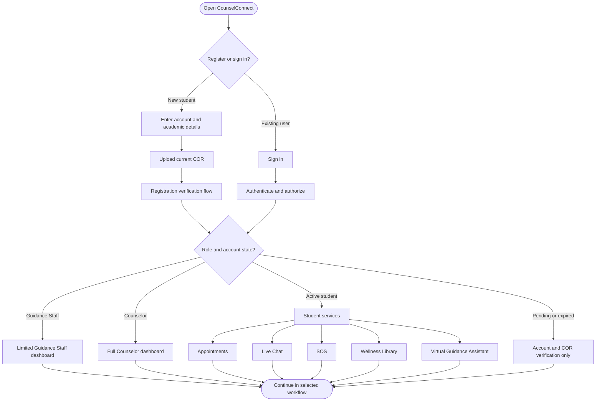
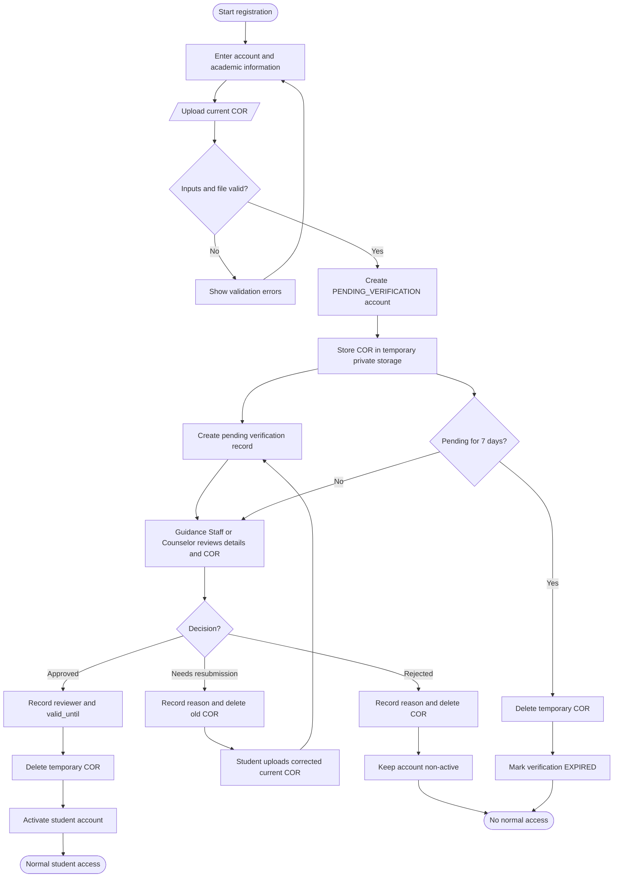
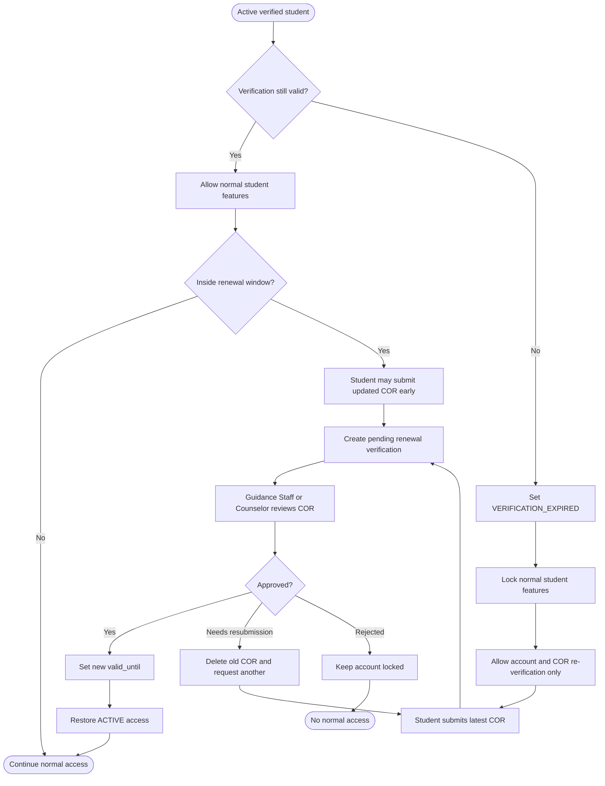
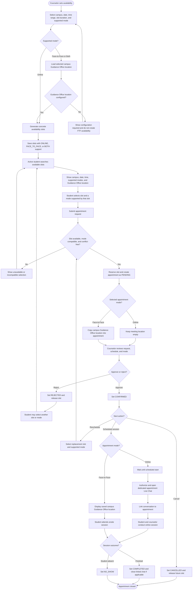
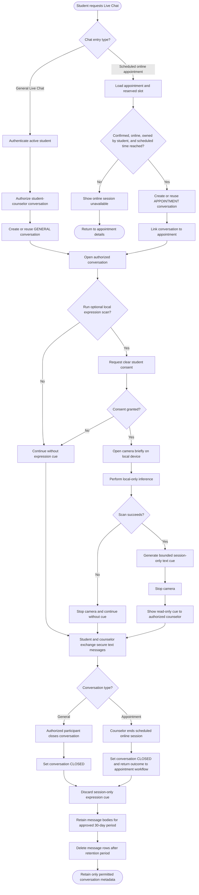
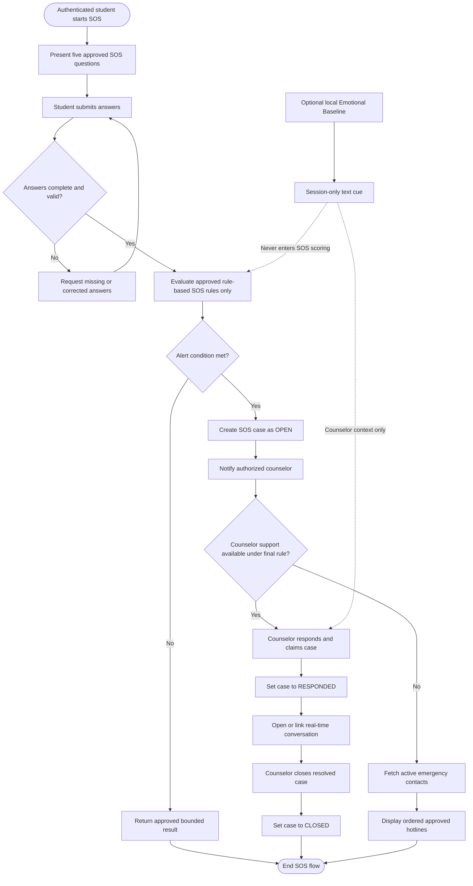
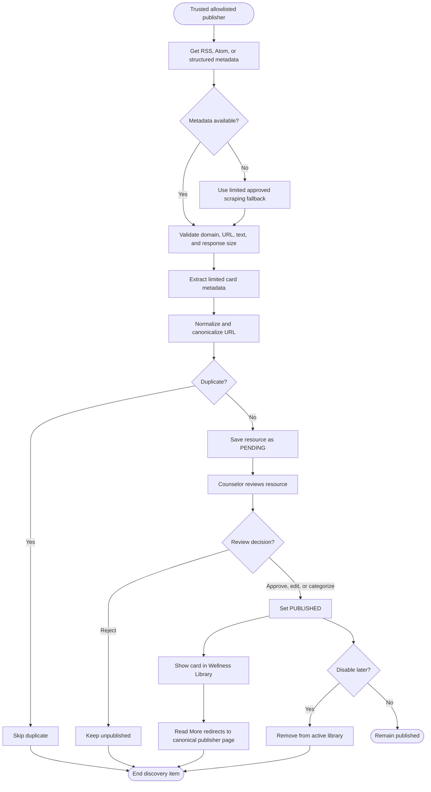
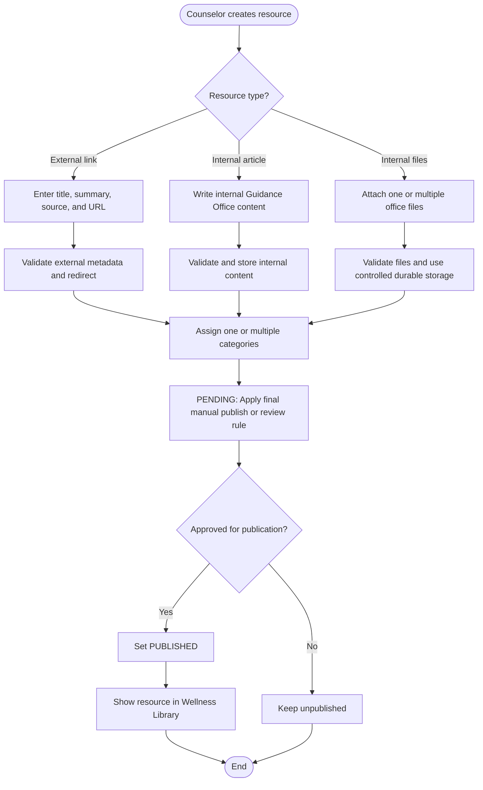
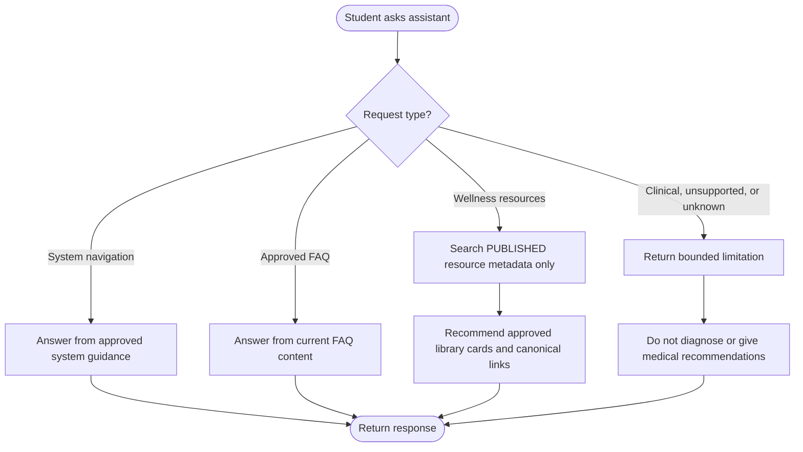
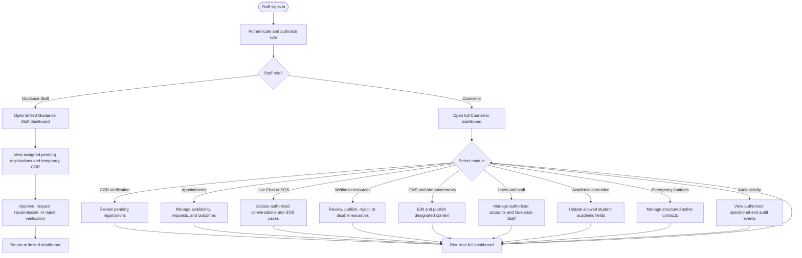

# CounselConnect Flowchart V1 — FULL AI-Readable Preservation Export

> This file is designed for VS Code AI / Kilo Code / Copilot-style agents. It provides readable diagram structure while also preserving the literal Draw.io source.

## Preservation guarantees

- Every Draw.io page is included.
- Every embedded Mermaid definition is included exactly as stored.
- All `UserObject` attributes are preserved.
- All `mxCell` objects, source/target references, parents, styles, geometry, and routing data are preserved.
- The exhaustive page XML structure is represented as JSON for AI inspection.
- The complete original `.drawio` XML is appended verbatim.
- The original Draw.io file itself is not modified.

## Source metadata

- Original file: `CounselConnect Flowchart V1.drawio`
- Original size: `428054` bytes
- Draw.io host: `app.diagrams.net`
- Declared page count: `10`
- Parsed page count: **10**
- Total `UserObject` records: **476**
- Total `mxCell` records: **496**
- Embedded Mermaid containers: **10**
- Mermaid node objects: **212**
- Mermaid edge objects: **254**

## Page index

| # | Page name | Page ID | UserObjects | Mermaid nodes | Mermaid edges | Mermaid source | mxCells |
|---:|---|---|---:|---:|---:|---:|---:|
| 1 | Master System Flow | `eT9cWP28PjOUgTmhcH3Y` | 44 | 18 | 25 | 1 | 46 |
| 2 | Student Registration and COR Verification | `lSBrYXzumKpSWZ6LMbIZ` | 48 | 22 | 25 | 1 | 50 |
| 3 | Enrollment Validity and Renewal | `C5D0YneEk0Imh447ua9a` | 39 | 18 | 20 | 1 | 41 |
| 4 | Appointment Scheduling | `zwy7MXBQvGtwb6eQwsGc` | 83 | 37 | 45 | 1 | 85 |
| 5 | Live Chat and Optional Emotional Baseline | `Qaw97HzR75SxeCTfkMgJ` | 71 | 33 | 37 | 1 | 73 |
| 6 | SOS Triage | `ArEWaXQjGoXOUnbECH4h` | 46 | 21 | 24 | 1 | 48 |
| 7 | Automated Wellness Resource Discovery | `GAtNnCY4EEv4_WOjYYPa` | 44 | 20 | 23 | 1 | 46 |
| 8 | Manual Wellness Resource Management | `gJh-9HZxbp0BCLBKkZvQ` | 33 | 15 | 17 | 1 | 35 |
| 9 | Virtual Guidance Assistant | `CWtFI51WuNO70qNI4d7-` | 21 | 9 | 11 | 1 | 23 |
| 10 | Counselor and Guidance Staff Dashboard | `O1OnZRdSuOunOPERhpom` | 47 | 19 | 27 | 1 | 49 |

---

# Page 1: Master System Flow

- Page ID: `eT9cWP28PjOUgTmhcH3Y`

## Page / canvas attributes

```json
{
  "grid": "0",
  "page": "0",
  "gridSize": "10",
  "guides": "1",
  "tooltips": "1",
  "connect": "1",
  "arrows": "1",
  "fold": "1",
  "pageScale": "1",
  "pageWidth": "850",
  "pageHeight": "1100",
  "math": "0",
  "shadow": "0"
}
```

## Embedded Mermaid source

### Mermaid source 1

- Draw.io object ID: `KGIAfd2HmE4Hfu9pG8Hs-1`

Exact stored `mermaidData`:

```json
{
  "data": "flowchart TD\n    A([Open CounselConnect]) --> B{Register or sign in?}\n    B -->|New student| C[Enter account and academic details]\n    C --> D[Upload current COR]\n    D --> E[Registration verification flow]\n    B -->|Existing user| F[Sign in]\n    F --> G[Authenticate and authorize]\n    E --> H{Role and account state?}\n    G --> H\n    H -->|Active student| I[Student services]\n    H -->|Pending or expired| J[Account and COR verification only]\n    H -->|Guidance Staff| K[Limited Guidance Staff dashboard]\n    H -->|Counselor| L[Full Counselor dashboard]\n    I --> M[Appointments]\n    I --> N[Live Chat]\n    I --> O[SOS]\n    I --> P[Wellness Library]\n    I --> Q[Virtual Guidance Assistant]\n    K --> R([Continue in selected workflow])\n    L --> R\n    M --> R\n    N --> R\n    O --> R\n    P --> R\n    Q --> R\n    J --> R",
  "config": null
}
```

Exact Mermaid diagram:



## Mermaid nodes / entities / processes

| # | Draw.io ID | Mermaid ID | Exact label | Geometry |
|---:|---|---|---|---|
| 1 | `KGIAfd2HmE4Hfu9pG8Hs-2` | `n:A` | Open CounselConnect | height=39, width=180, x=1696.77, y=366, as=geometry |
| 2 | `KGIAfd2HmE4Hfu9pG8Hs-3` | `n:B` | Register or sign in? | height=230, width=230, x=1671.77, y=505, as=geometry |
| 3 | `KGIAfd2HmE4Hfu9pG8Hs-4` | `n:C` | Enter account and academic details | height=54, width=317, x=1666.6, y=970, as=geometry |
| 4 | `KGIAfd2HmE4Hfu9pG8Hs-5` | `n:D` | Upload current COR | height=54, width=202, x=1724.1, y=1124, as=geometry |
| 5 | `KGIAfd2HmE4Hfu9pG8Hs-6` | `n:E` | Registration verification flow | height=54, width=269, x=1690.6, y=1278, as=geometry |
| 6 | `KGIAfd2HmE4Hfu9pG8Hs-7` | `n:F` | Sign in | height=54, width=107, x=1428.6, y=1124, as=geometry |
| 7 | `KGIAfd2HmE4Hfu9pG8Hs-8` | `n:G` | Authenticate and authorize | height=54, width=257, x=1353.6, y=1278, as=geometry |
| 8 | `KGIAfd2HmE4Hfu9pG8Hs-9` | `n:H` | Role and account state? | height=288, width=288, x=1633.1, y=1432, as=geometry |
| 9 | `KGIAfd2HmE4Hfu9pG8Hs-10` | `n:I` | Student services | height=54, width=177, x=1775, y=1955, as=geometry |
| 10 | `KGIAfd2HmE4Hfu9pG8Hs-11` | `n:J` | Account and COR verification only | height=54, width=305, x=30, y=1955, as=geometry |
| 11 | `KGIAfd2HmE4Hfu9pG8Hs-12` | `n:K` | Limited Guidance Staff dashboard | height=54, width=304, x=415, y=1955, as=geometry |
| 12 | `KGIAfd2HmE4Hfu9pG8Hs-13` | `n:L` | Full Counselor dashboard | height=54, width=240, x=799, y=1955, as=geometry |
| 13 | `KGIAfd2HmE4Hfu9pG8Hs-14` | `n:M` | Appointments | height=54, width=159, x=930, y=2109, as=geometry |
| 14 | `KGIAfd2HmE4Hfu9pG8Hs-15` | `n:N` | Live Chat | height=54, width=127, x=1169, y=2109, as=geometry |
| 15 | `KGIAfd2HmE4Hfu9pG8Hs-16` | `n:O` | SOS | height=54, width=86, x=1376, y=2109, as=geometry |
| 16 | `KGIAfd2HmE4Hfu9pG8Hs-17` | `n:P` | Wellness Library | height=54, width=177, x=1542, y=2109, as=geometry |
| 17 | `KGIAfd2HmE4Hfu9pG8Hs-18` | `n:Q` | Virtual Guidance Assistant | height=54, width=247, x=1799, y=2109, as=geometry |
| 18 | `KGIAfd2HmE4Hfu9pG8Hs-19` | `n:R` | Continue in selected workflow | height=39, width=242, x=1098.06, y=2263, as=geometry |

## Mermaid edges / relationships / flows

| # | Draw.io ID | Mermaid edge ID | Exact label | Source object | Target object |
|---:|---|---|---|---|---|
| 1 | `KGIAfd2HmE4Hfu9pG8Hs-20` | `e:A->B#0` |  | `KGIAfd2HmE4Hfu9pG8Hs-2` | `KGIAfd2HmE4Hfu9pG8Hs-3` |
| 2 | `KGIAfd2HmE4Hfu9pG8Hs-21` | `e:B->C#0` | New student | `KGIAfd2HmE4Hfu9pG8Hs-3` | `KGIAfd2HmE4Hfu9pG8Hs-4` |
| 3 | `KGIAfd2HmE4Hfu9pG8Hs-22` | `e:C->D#0` |  | `KGIAfd2HmE4Hfu9pG8Hs-4` | `KGIAfd2HmE4Hfu9pG8Hs-5` |
| 4 | `KGIAfd2HmE4Hfu9pG8Hs-23` | `e:D->E#0` |  | `KGIAfd2HmE4Hfu9pG8Hs-5` | `KGIAfd2HmE4Hfu9pG8Hs-6` |
| 5 | `KGIAfd2HmE4Hfu9pG8Hs-24` | `e:B->F#0` | Existing user | `KGIAfd2HmE4Hfu9pG8Hs-3` | `KGIAfd2HmE4Hfu9pG8Hs-7` |
| 6 | `KGIAfd2HmE4Hfu9pG8Hs-25` | `e:F->G#0` |  | `KGIAfd2HmE4Hfu9pG8Hs-7` | `KGIAfd2HmE4Hfu9pG8Hs-8` |
| 7 | `KGIAfd2HmE4Hfu9pG8Hs-26` | `e:E->H#0` |  | `KGIAfd2HmE4Hfu9pG8Hs-6` | `KGIAfd2HmE4Hfu9pG8Hs-9` |
| 8 | `KGIAfd2HmE4Hfu9pG8Hs-27` | `e:G->H#0` |  | `KGIAfd2HmE4Hfu9pG8Hs-8` | `KGIAfd2HmE4Hfu9pG8Hs-9` |
| 9 | `KGIAfd2HmE4Hfu9pG8Hs-28` | `e:H->I#0` | Active student | `KGIAfd2HmE4Hfu9pG8Hs-9` | `KGIAfd2HmE4Hfu9pG8Hs-10` |
| 10 | `KGIAfd2HmE4Hfu9pG8Hs-29` | `e:H->J#0` | Pending or expired | `KGIAfd2HmE4Hfu9pG8Hs-9` | `KGIAfd2HmE4Hfu9pG8Hs-11` |
| 11 | `KGIAfd2HmE4Hfu9pG8Hs-30` | `e:H->K#0` | Guidance Staff | `KGIAfd2HmE4Hfu9pG8Hs-9` | `KGIAfd2HmE4Hfu9pG8Hs-12` |
| 12 | `KGIAfd2HmE4Hfu9pG8Hs-31` | `e:H->L#0` | Counselor | `KGIAfd2HmE4Hfu9pG8Hs-9` | `KGIAfd2HmE4Hfu9pG8Hs-13` |
| 13 | `KGIAfd2HmE4Hfu9pG8Hs-32` | `e:I->M#0` |  | `KGIAfd2HmE4Hfu9pG8Hs-10` | `KGIAfd2HmE4Hfu9pG8Hs-14` |
| 14 | `KGIAfd2HmE4Hfu9pG8Hs-33` | `e:I->N#0` |  | `KGIAfd2HmE4Hfu9pG8Hs-10` | `KGIAfd2HmE4Hfu9pG8Hs-15` |
| 15 | `KGIAfd2HmE4Hfu9pG8Hs-34` | `e:I->O#0` |  | `KGIAfd2HmE4Hfu9pG8Hs-10` | `KGIAfd2HmE4Hfu9pG8Hs-16` |
| 16 | `KGIAfd2HmE4Hfu9pG8Hs-35` | `e:I->P#0` |  | `KGIAfd2HmE4Hfu9pG8Hs-10` | `KGIAfd2HmE4Hfu9pG8Hs-17` |
| 17 | `KGIAfd2HmE4Hfu9pG8Hs-36` | `e:I->Q#0` |  | `KGIAfd2HmE4Hfu9pG8Hs-10` | `KGIAfd2HmE4Hfu9pG8Hs-18` |
| 18 | `KGIAfd2HmE4Hfu9pG8Hs-37` | `e:K->R#0` |  | `KGIAfd2HmE4Hfu9pG8Hs-12` | `KGIAfd2HmE4Hfu9pG8Hs-19` |
| 19 | `KGIAfd2HmE4Hfu9pG8Hs-38` | `e:L->R#0` |  | `KGIAfd2HmE4Hfu9pG8Hs-13` | `KGIAfd2HmE4Hfu9pG8Hs-19` |
| 20 | `KGIAfd2HmE4Hfu9pG8Hs-39` | `e:M->R#0` |  | `KGIAfd2HmE4Hfu9pG8Hs-14` | `KGIAfd2HmE4Hfu9pG8Hs-19` |
| 21 | `KGIAfd2HmE4Hfu9pG8Hs-40` | `e:N->R#0` |  | `KGIAfd2HmE4Hfu9pG8Hs-15` | `KGIAfd2HmE4Hfu9pG8Hs-19` |
| 22 | `KGIAfd2HmE4Hfu9pG8Hs-41` | `e:O->R#0` |  | `KGIAfd2HmE4Hfu9pG8Hs-16` | `KGIAfd2HmE4Hfu9pG8Hs-19` |
| 23 | `KGIAfd2HmE4Hfu9pG8Hs-42` | `e:P->R#0` |  | `KGIAfd2HmE4Hfu9pG8Hs-17` | `KGIAfd2HmE4Hfu9pG8Hs-19` |
| 24 | `KGIAfd2HmE4Hfu9pG8Hs-43` | `e:Q->R#0` |  | `KGIAfd2HmE4Hfu9pG8Hs-18` | `KGIAfd2HmE4Hfu9pG8Hs-19` |
| 25 | `KGIAfd2HmE4Hfu9pG8Hs-44` | `e:J->R#0` |  | `KGIAfd2HmE4Hfu9pG8Hs-11` | `KGIAfd2HmE4Hfu9pG8Hs-19` |

## All UserObjects on this page

> This preserves every object-level attribute, including labels, Mermaid metadata, styles, and IDs.

```json
[
  {
    "attributes": {
      "label": "",
      "mermaidData": "{\n  \"data\": \"flowchart TD\\n    A([Open CounselConnect]) --> B{Register or sign in?}\\n    B -->|New student| C[Enter account and academic details]\\n    C --> D[Upload current COR]\\n    D --> E[Registration verification flow]\\n    B -->|Existing user| F[Sign in]\\n    F --> G[Authenticate and authorize]\\n    E --> H{Role and account state?}\\n    G --> H\\n    H -->|Active student| I[Student services]\\n    H -->|Pending or expired| J[Account and COR verification only]\\n    H -->|Guidance Staff| K[Limited Guidance Staff dashboard]\\n    H -->|Counselor| L[Full Counselor dashboard]\\n    I --> M[Appointments]\\n    I --> N[Live Chat]\\n    I --> O[SOS]\\n    I --> P[Wellness Library]\\n    I --> Q[Virtual Guidance Assistant]\\n    K --> R([Continue in selected workflow])\\n    L --> R\\n    M --> R\\n    N --> R\\n    O --> R\\n    P --> R\\n    Q --> R\\n    J --> R\",\n  \"config\": null\n}",
      "id": "KGIAfd2HmE4Hfu9pG8Hs-1"
    },
    "xml_structure": {
      "tag": "UserObject",
      "attributes": {
        "label": "",
        "mermaidData": "{\n  \"data\": \"flowchart TD\\n    A([Open CounselConnect]) --> B{Register or sign in?}\\n    B -->|New student| C[Enter account and academic details]\\n    C --> D[Upload current COR]\\n    D --> E[Registration verification flow]\\n    B -->|Existing user| F[Sign in]\\n    F --> G[Authenticate and authorize]\\n    E --> H{Role and account state?}\\n    G --> H\\n    H -->|Active student| I[Student services]\\n    H -->|Pending or expired| J[Account and COR verification only]\\n    H -->|Guidance Staff| K[Limited Guidance Staff dashboard]\\n    H -->|Counselor| L[Full Counselor dashboard]\\n    I --> M[Appointments]\\n    I --> N[Live Chat]\\n    I --> O[SOS]\\n    I --> P[Wellness Library]\\n    I --> Q[Virtual Guidance Assistant]\\n    K --> R([Continue in selected workflow])\\n    L --> R\\n    M --> R\\n    N --> R\\n    O --> R\\n    P --> R\\n    Q --> R\\n    J --> R\",\n  \"config\": null\n}",
        "id": "KGIAfd2HmE4Hfu9pG8Hs-1"
      },
      "children": [
        {
          "tag": "mxCell",
          "attributes": {
            "connectable": "0",
            "parent": "1",
            "style": "group;transparentBounds=1;editIcon=1;lockedGroup=0;groupPadding=10;",
            "vertex": "1"
          },
          "children": [
            {
              "tag": "mxGeometry",
              "attributes": {
                "as": "geometry"
              }
            }
          ]
        }
      ]
    }
  },
  {
    "attributes": {
      "label": "Open CounselConnect",
      "mermaidId": "n:A",
      "mermaidBaseStyle": "html=1;rounded=1;whiteSpace=wrap;arcSize=50;strokeWidth=1;fillColor=light-dark(#ECECFF,#1f2020);strokeColor=light-dark(#9370DB,#cccccc);fontColor=light-dark(#333333,#cccccc);fontFamily=Trebuchet MS,Verdana,Arial,sans-serif;fontSize=16;",
      "mermaidBaseValue": "Open CounselConnect",
      "id": "KGIAfd2HmE4Hfu9pG8Hs-2"
    },
    "xml_structure": {
      "tag": "UserObject",
      "attributes": {
        "label": "Open CounselConnect",
        "mermaidId": "n:A",
        "mermaidBaseStyle": "html=1;rounded=1;whiteSpace=wrap;arcSize=50;strokeWidth=1;fillColor=light-dark(#ECECFF,#1f2020);strokeColor=light-dark(#9370DB,#cccccc);fontColor=light-dark(#333333,#cccccc);fontFamily=Trebuchet MS,Verdana,Arial,sans-serif;fontSize=16;",
        "mermaidBaseValue": "Open CounselConnect",
        "id": "KGIAfd2HmE4Hfu9pG8Hs-2"
      },
      "children": [
        {
          "tag": "mxCell",
          "attributes": {
            "parent": "KGIAfd2HmE4Hfu9pG8Hs-1",
            "style": "html=1;rounded=1;whiteSpace=wrap;arcSize=50;strokeWidth=1;fillColor=light-dark(#ECECFF,#1f2020);strokeColor=light-dark(#9370DB,#cccccc);fontColor=light-dark(#333333,#cccccc);fontFamily=Trebuchet MS,Verdana,Arial,sans-serif;fontSize=16;",
            "vertex": "1"
          },
          "children": [
            {
              "tag": "mxGeometry",
              "attributes": {
                "height": "39",
                "width": "180",
                "x": "1696.77",
                "y": "366",
                "as": "geometry"
              }
            }
          ]
        }
      ]
    }
  },
  {
    "attributes": {
      "label": "Register or sign in?",
      "mermaidId": "n:B",
      "mermaidBaseStyle": "rhombus;html=1;strokeWidth=1;whiteSpace=wrap;fillColor=light-dark(#ECECFF,#1f2020);strokeColor=light-dark(#9370DB,#cccccc);fontColor=light-dark(#333333,#cccccc);fontFamily=Trebuchet MS,Verdana,Arial,sans-serif;fontSize=16;",
      "mermaidBaseValue": "Register or sign in?",
      "id": "KGIAfd2HmE4Hfu9pG8Hs-3"
    },
    "xml_structure": {
      "tag": "UserObject",
      "attributes": {
        "label": "Register or sign in?",
        "mermaidId": "n:B",
        "mermaidBaseStyle": "rhombus;html=1;strokeWidth=1;whiteSpace=wrap;fillColor=light-dark(#ECECFF,#1f2020);strokeColor=light-dark(#9370DB,#cccccc);fontColor=light-dark(#333333,#cccccc);fontFamily=Trebuchet MS,Verdana,Arial,sans-serif;fontSize=16;",
        "mermaidBaseValue": "Register or sign in?",
        "id": "KGIAfd2HmE4Hfu9pG8Hs-3"
      },
      "children": [
        {
          "tag": "mxCell",
          "attributes": {
            "parent": "KGIAfd2HmE4Hfu9pG8Hs-1",
            "style": "rhombus;html=1;strokeWidth=1;whiteSpace=wrap;fillColor=light-dark(#ECECFF,#1f2020);strokeColor=light-dark(#9370DB,#cccccc);fontColor=light-dark(#333333,#cccccc);fontFamily=Trebuchet MS,Verdana,Arial,sans-serif;fontSize=16;",
            "vertex": "1"
          },
          "children": [
            {
              "tag": "mxGeometry",
              "attributes": {
                "height": "230",
                "width": "230",
                "x": "1671.77",
                "y": "505",
                "as": "geometry"
              }
            }
          ]
        }
      ]
    }
  },
  {
    "attributes": {
      "label": "Enter account and academic details",
      "mermaidId": "n:C",
      "mermaidBaseStyle": "html=1;whiteSpace=wrap;strokeWidth=1;fillColor=light-dark(#ECECFF,#1f2020);strokeColor=light-dark(#9370DB,#cccccc);fontColor=light-dark(#333333,#cccccc);fontFamily=Trebuchet MS,Verdana,Arial,sans-serif;fontSize=16;",
      "mermaidBaseValue": "Enter account and academic details",
      "id": "KGIAfd2HmE4Hfu9pG8Hs-4"
    },
    "xml_structure": {
      "tag": "UserObject",
      "attributes": {
        "label": "Enter account and academic details",
        "mermaidId": "n:C",
        "mermaidBaseStyle": "html=1;whiteSpace=wrap;strokeWidth=1;fillColor=light-dark(#ECECFF,#1f2020);strokeColor=light-dark(#9370DB,#cccccc);fontColor=light-dark(#333333,#cccccc);fontFamily=Trebuchet MS,Verdana,Arial,sans-serif;fontSize=16;",
        "mermaidBaseValue": "Enter account and academic details",
        "id": "KGIAfd2HmE4Hfu9pG8Hs-4"
      },
      "children": [
        {
          "tag": "mxCell",
          "attributes": {
            "parent": "KGIAfd2HmE4Hfu9pG8Hs-1",
            "style": "html=1;whiteSpace=wrap;strokeWidth=1;fillColor=light-dark(#ECECFF,#1f2020);strokeColor=light-dark(#9370DB,#cccccc);fontColor=light-dark(#333333,#cccccc);fontFamily=Trebuchet MS,Verdana,Arial,sans-serif;fontSize=16;",
            "vertex": "1"
          },
          "children": [
            {
              "tag": "mxGeometry",
              "attributes": {
                "height": "54",
                "width": "317",
                "x": "1666.6",
                "y": "970",
                "as": "geometry"
              }
            }
          ]
        }
      ]
    }
  },
  {
    "attributes": {
      "label": "Upload current COR",
      "mermaidId": "n:D",
      "mermaidBaseStyle": "html=1;whiteSpace=wrap;strokeWidth=1;fillColor=light-dark(#ECECFF,#1f2020);strokeColor=light-dark(#9370DB,#cccccc);fontColor=light-dark(#333333,#cccccc);fontFamily=Trebuchet MS,Verdana,Arial,sans-serif;fontSize=16;",
      "mermaidBaseValue": "Upload current COR",
      "id": "KGIAfd2HmE4Hfu9pG8Hs-5"
    },
    "xml_structure": {
      "tag": "UserObject",
      "attributes": {
        "label": "Upload current COR",
        "mermaidId": "n:D",
        "mermaidBaseStyle": "html=1;whiteSpace=wrap;strokeWidth=1;fillColor=light-dark(#ECECFF,#1f2020);strokeColor=light-dark(#9370DB,#cccccc);fontColor=light-dark(#333333,#cccccc);fontFamily=Trebuchet MS,Verdana,Arial,sans-serif;fontSize=16;",
        "mermaidBaseValue": "Upload current COR",
        "id": "KGIAfd2HmE4Hfu9pG8Hs-5"
      },
      "children": [
        {
          "tag": "mxCell",
          "attributes": {
            "parent": "KGIAfd2HmE4Hfu9pG8Hs-1",
            "style": "html=1;whiteSpace=wrap;strokeWidth=1;fillColor=light-dark(#ECECFF,#1f2020);strokeColor=light-dark(#9370DB,#cccccc);fontColor=light-dark(#333333,#cccccc);fontFamily=Trebuchet MS,Verdana,Arial,sans-serif;fontSize=16;",
            "vertex": "1"
          },
          "children": [
            {
              "tag": "mxGeometry",
              "attributes": {
                "height": "54",
                "width": "202",
                "x": "1724.1",
                "y": "1124",
                "as": "geometry"
              }
            }
          ]
        }
      ]
    }
  },
  {
    "attributes": {
      "label": "Registration verification flow",
      "mermaidId": "n:E",
      "mermaidBaseStyle": "html=1;whiteSpace=wrap;strokeWidth=1;fillColor=light-dark(#ECECFF,#1f2020);strokeColor=light-dark(#9370DB,#cccccc);fontColor=light-dark(#333333,#cccccc);fontFamily=Trebuchet MS,Verdana,Arial,sans-serif;fontSize=16;",
      "mermaidBaseValue": "Registration verification flow",
      "id": "KGIAfd2HmE4Hfu9pG8Hs-6"
    },
    "xml_structure": {
      "tag": "UserObject",
      "attributes": {
        "label": "Registration verification flow",
        "mermaidId": "n:E",
        "mermaidBaseStyle": "html=1;whiteSpace=wrap;strokeWidth=1;fillColor=light-dark(#ECECFF,#1f2020);strokeColor=light-dark(#9370DB,#cccccc);fontColor=light-dark(#333333,#cccccc);fontFamily=Trebuchet MS,Verdana,Arial,sans-serif;fontSize=16;",
        "mermaidBaseValue": "Registration verification flow",
        "id": "KGIAfd2HmE4Hfu9pG8Hs-6"
      },
      "children": [
        {
          "tag": "mxCell",
          "attributes": {
            "parent": "KGIAfd2HmE4Hfu9pG8Hs-1",
            "style": "html=1;whiteSpace=wrap;strokeWidth=1;fillColor=light-dark(#ECECFF,#1f2020);strokeColor=light-dark(#9370DB,#cccccc);fontColor=light-dark(#333333,#cccccc);fontFamily=Trebuchet MS,Verdana,Arial,sans-serif;fontSize=16;",
            "vertex": "1"
          },
          "children": [
            {
              "tag": "mxGeometry",
              "attributes": {
                "height": "54",
                "width": "269",
                "x": "1690.6",
                "y": "1278",
                "as": "geometry"
              }
            }
          ]
        }
      ]
    }
  },
  {
    "attributes": {
      "label": "Sign in",
      "mermaidId": "n:F",
      "mermaidBaseStyle": "html=1;whiteSpace=wrap;strokeWidth=1;fillColor=light-dark(#ECECFF,#1f2020);strokeColor=light-dark(#9370DB,#cccccc);fontColor=light-dark(#333333,#cccccc);fontFamily=Trebuchet MS,Verdana,Arial,sans-serif;fontSize=16;",
      "mermaidBaseValue": "Sign in",
      "id": "KGIAfd2HmE4Hfu9pG8Hs-7"
    },
    "xml_structure": {
      "tag": "UserObject",
      "attributes": {
        "label": "Sign in",
        "mermaidId": "n:F",
        "mermaidBaseStyle": "html=1;whiteSpace=wrap;strokeWidth=1;fillColor=light-dark(#ECECFF,#1f2020);strokeColor=light-dark(#9370DB,#cccccc);fontColor=light-dark(#333333,#cccccc);fontFamily=Trebuchet MS,Verdana,Arial,sans-serif;fontSize=16;",
        "mermaidBaseValue": "Sign in",
        "id": "KGIAfd2HmE4Hfu9pG8Hs-7"
      },
      "children": [
        {
          "tag": "mxCell",
          "attributes": {
            "parent": "KGIAfd2HmE4Hfu9pG8Hs-1",
            "style": "html=1;whiteSpace=wrap;strokeWidth=1;fillColor=light-dark(#ECECFF,#1f2020);strokeColor=light-dark(#9370DB,#cccccc);fontColor=light-dark(#333333,#cccccc);fontFamily=Trebuchet MS,Verdana,Arial,sans-serif;fontSize=16;",
            "vertex": "1"
          },
          "children": [
            {
              "tag": "mxGeometry",
              "attributes": {
                "height": "54",
                "width": "107",
                "x": "1428.6",
                "y": "1124",
                "as": "geometry"
              }
            }
          ]
        }
      ]
    }
  },
  {
    "attributes": {
      "label": "Authenticate and authorize",
      "mermaidId": "n:G",
      "mermaidBaseStyle": "html=1;whiteSpace=wrap;strokeWidth=1;fillColor=light-dark(#ECECFF,#1f2020);strokeColor=light-dark(#9370DB,#cccccc);fontColor=light-dark(#333333,#cccccc);fontFamily=Trebuchet MS,Verdana,Arial,sans-serif;fontSize=16;",
      "mermaidBaseValue": "Authenticate and authorize",
      "id": "KGIAfd2HmE4Hfu9pG8Hs-8"
    },
    "xml_structure": {
      "tag": "UserObject",
      "attributes": {
        "label": "Authenticate and authorize",
        "mermaidId": "n:G",
        "mermaidBaseStyle": "html=1;whiteSpace=wrap;strokeWidth=1;fillColor=light-dark(#ECECFF,#1f2020);strokeColor=light-dark(#9370DB,#cccccc);fontColor=light-dark(#333333,#cccccc);fontFamily=Trebuchet MS,Verdana,Arial,sans-serif;fontSize=16;",
        "mermaidBaseValue": "Authenticate and authorize",
        "id": "KGIAfd2HmE4Hfu9pG8Hs-8"
      },
      "children": [
        {
          "tag": "mxCell",
          "attributes": {
            "parent": "KGIAfd2HmE4Hfu9pG8Hs-1",
            "style": "html=1;whiteSpace=wrap;strokeWidth=1;fillColor=light-dark(#ECECFF,#1f2020);strokeColor=light-dark(#9370DB,#cccccc);fontColor=light-dark(#333333,#cccccc);fontFamily=Trebuchet MS,Verdana,Arial,sans-serif;fontSize=16;",
            "vertex": "1"
          },
          "children": [
            {
              "tag": "mxGeometry",
              "attributes": {
                "height": "54",
                "width": "257",
                "x": "1353.6",
                "y": "1278",
                "as": "geometry"
              }
            }
          ]
        }
      ]
    }
  },
  {
    "attributes": {
      "label": "Role and account state?",
      "mermaidId": "n:H",
      "mermaidBaseStyle": "rhombus;html=1;strokeWidth=1;whiteSpace=wrap;fillColor=light-dark(#ECECFF,#1f2020);strokeColor=light-dark(#9370DB,#cccccc);fontColor=light-dark(#333333,#cccccc);fontFamily=Trebuchet MS,Verdana,Arial,sans-serif;fontSize=16;",
      "mermaidBaseValue": "Role and account state?",
      "id": "KGIAfd2HmE4Hfu9pG8Hs-9"
    },
    "xml_structure": {
      "tag": "UserObject",
      "attributes": {
        "label": "Role and account state?",
        "mermaidId": "n:H",
        "mermaidBaseStyle": "rhombus;html=1;strokeWidth=1;whiteSpace=wrap;fillColor=light-dark(#ECECFF,#1f2020);strokeColor=light-dark(#9370DB,#cccccc);fontColor=light-dark(#333333,#cccccc);fontFamily=Trebuchet MS,Verdana,Arial,sans-serif;fontSize=16;",
        "mermaidBaseValue": "Role and account state?",
        "id": "KGIAfd2HmE4Hfu9pG8Hs-9"
      },
      "children": [
        {
          "tag": "mxCell",
          "attributes": {
            "parent": "KGIAfd2HmE4Hfu9pG8Hs-1",
            "style": "rhombus;html=1;strokeWidth=1;whiteSpace=wrap;fillColor=light-dark(#ECECFF,#1f2020);strokeColor=light-dark(#9370DB,#cccccc);fontColor=light-dark(#333333,#cccccc);fontFamily=Trebuchet MS,Verdana,Arial,sans-serif;fontSize=16;",
            "vertex": "1"
          },
          "children": [
            {
              "tag": "mxGeometry",
              "attributes": {
                "height": "288",
                "width": "288",
                "x": "1633.1",
                "y": "1432",
                "as": "geometry"
              }
            }
          ]
        }
      ]
    }
  },
  {
    "attributes": {
      "label": "Student services",
      "mermaidId": "n:I",
      "mermaidBaseStyle": "html=1;whiteSpace=wrap;strokeWidth=1;fillColor=light-dark(#ECECFF,#1f2020);strokeColor=light-dark(#9370DB,#cccccc);fontColor=light-dark(#333333,#cccccc);fontFamily=Trebuchet MS,Verdana,Arial,sans-serif;fontSize=16;",
      "mermaidBaseValue": "Student services",
      "id": "KGIAfd2HmE4Hfu9pG8Hs-10"
    },
    "xml_structure": {
      "tag": "UserObject",
      "attributes": {
        "label": "Student services",
        "mermaidId": "n:I",
        "mermaidBaseStyle": "html=1;whiteSpace=wrap;strokeWidth=1;fillColor=light-dark(#ECECFF,#1f2020);strokeColor=light-dark(#9370DB,#cccccc);fontColor=light-dark(#333333,#cccccc);fontFamily=Trebuchet MS,Verdana,Arial,sans-serif;fontSize=16;",
        "mermaidBaseValue": "Student services",
        "id": "KGIAfd2HmE4Hfu9pG8Hs-10"
      },
      "children": [
        {
          "tag": "mxCell",
          "attributes": {
            "parent": "KGIAfd2HmE4Hfu9pG8Hs-1",
            "style": "html=1;whiteSpace=wrap;strokeWidth=1;fillColor=light-dark(#ECECFF,#1f2020);strokeColor=light-dark(#9370DB,#cccccc);fontColor=light-dark(#333333,#cccccc);fontFamily=Trebuchet MS,Verdana,Arial,sans-serif;fontSize=16;",
            "vertex": "1"
          },
          "children": [
            {
              "tag": "mxGeometry",
              "attributes": {
                "height": "54",
                "width": "177",
                "x": "1775",
                "y": "1955",
                "as": "geometry"
              }
            }
          ]
        }
      ]
    }
  },
  {
    "attributes": {
      "label": "Account and COR verification only",
      "mermaidId": "n:J",
      "mermaidBaseStyle": "html=1;whiteSpace=wrap;strokeWidth=1;fillColor=light-dark(#ECECFF,#1f2020);strokeColor=light-dark(#9370DB,#cccccc);fontColor=light-dark(#333333,#cccccc);fontFamily=Trebuchet MS,Verdana,Arial,sans-serif;fontSize=16;",
      "mermaidBaseValue": "Account and COR verification only",
      "id": "KGIAfd2HmE4Hfu9pG8Hs-11"
    },
    "xml_structure": {
      "tag": "UserObject",
      "attributes": {
        "label": "Account and COR verification only",
        "mermaidId": "n:J",
        "mermaidBaseStyle": "html=1;whiteSpace=wrap;strokeWidth=1;fillColor=light-dark(#ECECFF,#1f2020);strokeColor=light-dark(#9370DB,#cccccc);fontColor=light-dark(#333333,#cccccc);fontFamily=Trebuchet MS,Verdana,Arial,sans-serif;fontSize=16;",
        "mermaidBaseValue": "Account and COR verification only",
        "id": "KGIAfd2HmE4Hfu9pG8Hs-11"
      },
      "children": [
        {
          "tag": "mxCell",
          "attributes": {
            "parent": "KGIAfd2HmE4Hfu9pG8Hs-1",
            "style": "html=1;whiteSpace=wrap;strokeWidth=1;fillColor=light-dark(#ECECFF,#1f2020);strokeColor=light-dark(#9370DB,#cccccc);fontColor=light-dark(#333333,#cccccc);fontFamily=Trebuchet MS,Verdana,Arial,sans-serif;fontSize=16;",
            "vertex": "1"
          },
          "children": [
            {
              "tag": "mxGeometry",
              "attributes": {
                "height": "54",
                "width": "305",
                "x": "30",
                "y": "1955",
                "as": "geometry"
              }
            }
          ]
        }
      ]
    }
  },
  {
    "attributes": {
      "label": "Limited Guidance Staff dashboard",
      "mermaidId": "n:K",
      "mermaidBaseStyle": "html=1;whiteSpace=wrap;strokeWidth=1;fillColor=light-dark(#ECECFF,#1f2020);strokeColor=light-dark(#9370DB,#cccccc);fontColor=light-dark(#333333,#cccccc);fontFamily=Trebuchet MS,Verdana,Arial,sans-serif;fontSize=16;",
      "mermaidBaseValue": "Limited Guidance Staff dashboard",
      "id": "KGIAfd2HmE4Hfu9pG8Hs-12"
    },
    "xml_structure": {
      "tag": "UserObject",
      "attributes": {
        "label": "Limited Guidance Staff dashboard",
        "mermaidId": "n:K",
        "mermaidBaseStyle": "html=1;whiteSpace=wrap;strokeWidth=1;fillColor=light-dark(#ECECFF,#1f2020);strokeColor=light-dark(#9370DB,#cccccc);fontColor=light-dark(#333333,#cccccc);fontFamily=Trebuchet MS,Verdana,Arial,sans-serif;fontSize=16;",
        "mermaidBaseValue": "Limited Guidance Staff dashboard",
        "id": "KGIAfd2HmE4Hfu9pG8Hs-12"
      },
      "children": [
        {
          "tag": "mxCell",
          "attributes": {
            "parent": "KGIAfd2HmE4Hfu9pG8Hs-1",
            "style": "html=1;whiteSpace=wrap;strokeWidth=1;fillColor=light-dark(#ECECFF,#1f2020);strokeColor=light-dark(#9370DB,#cccccc);fontColor=light-dark(#333333,#cccccc);fontFamily=Trebuchet MS,Verdana,Arial,sans-serif;fontSize=16;",
            "vertex": "1"
          },
          "children": [
            {
              "tag": "mxGeometry",
              "attributes": {
                "height": "54",
                "width": "304",
                "x": "415",
                "y": "1955",
                "as": "geometry"
              }
            }
          ]
        }
      ]
    }
  },
  {
    "attributes": {
      "label": "Full Counselor dashboard",
      "mermaidId": "n:L",
      "mermaidBaseStyle": "html=1;whiteSpace=wrap;strokeWidth=1;fillColor=light-dark(#ECECFF,#1f2020);strokeColor=light-dark(#9370DB,#cccccc);fontColor=light-dark(#333333,#cccccc);fontFamily=Trebuchet MS,Verdana,Arial,sans-serif;fontSize=16;",
      "mermaidBaseValue": "Full Counselor dashboard",
      "id": "KGIAfd2HmE4Hfu9pG8Hs-13"
    },
    "xml_structure": {
      "tag": "UserObject",
      "attributes": {
        "label": "Full Counselor dashboard",
        "mermaidId": "n:L",
        "mermaidBaseStyle": "html=1;whiteSpace=wrap;strokeWidth=1;fillColor=light-dark(#ECECFF,#1f2020);strokeColor=light-dark(#9370DB,#cccccc);fontColor=light-dark(#333333,#cccccc);fontFamily=Trebuchet MS,Verdana,Arial,sans-serif;fontSize=16;",
        "mermaidBaseValue": "Full Counselor dashboard",
        "id": "KGIAfd2HmE4Hfu9pG8Hs-13"
      },
      "children": [
        {
          "tag": "mxCell",
          "attributes": {
            "parent": "KGIAfd2HmE4Hfu9pG8Hs-1",
            "style": "html=1;whiteSpace=wrap;strokeWidth=1;fillColor=light-dark(#ECECFF,#1f2020);strokeColor=light-dark(#9370DB,#cccccc);fontColor=light-dark(#333333,#cccccc);fontFamily=Trebuchet MS,Verdana,Arial,sans-serif;fontSize=16;",
            "vertex": "1"
          },
          "children": [
            {
              "tag": "mxGeometry",
              "attributes": {
                "height": "54",
                "width": "240",
                "x": "799",
                "y": "1955",
                "as": "geometry"
              }
            }
          ]
        }
      ]
    }
  },
  {
    "attributes": {
      "label": "Appointments",
      "mermaidId": "n:M",
      "mermaidBaseStyle": "html=1;whiteSpace=wrap;strokeWidth=1;fillColor=light-dark(#ECECFF,#1f2020);strokeColor=light-dark(#9370DB,#cccccc);fontColor=light-dark(#333333,#cccccc);fontFamily=Trebuchet MS,Verdana,Arial,sans-serif;fontSize=16;",
      "mermaidBaseValue": "Appointments",
      "id": "KGIAfd2HmE4Hfu9pG8Hs-14"
    },
    "xml_structure": {
      "tag": "UserObject",
      "attributes": {
        "label": "Appointments",
        "mermaidId": "n:M",
        "mermaidBaseStyle": "html=1;whiteSpace=wrap;strokeWidth=1;fillColor=light-dark(#ECECFF,#1f2020);strokeColor=light-dark(#9370DB,#cccccc);fontColor=light-dark(#333333,#cccccc);fontFamily=Trebuchet MS,Verdana,Arial,sans-serif;fontSize=16;",
        "mermaidBaseValue": "Appointments",
        "id": "KGIAfd2HmE4Hfu9pG8Hs-14"
      },
      "children": [
        {
          "tag": "mxCell",
          "attributes": {
            "parent": "KGIAfd2HmE4Hfu9pG8Hs-1",
            "style": "html=1;whiteSpace=wrap;strokeWidth=1;fillColor=light-dark(#ECECFF,#1f2020);strokeColor=light-dark(#9370DB,#cccccc);fontColor=light-dark(#333333,#cccccc);fontFamily=Trebuchet MS,Verdana,Arial,sans-serif;fontSize=16;",
            "vertex": "1"
          },
          "children": [
            {
              "tag": "mxGeometry",
              "attributes": {
                "height": "54",
                "width": "159",
                "x": "930",
                "y": "2109",
                "as": "geometry"
              }
            }
          ]
        }
      ]
    }
  },
  {
    "attributes": {
      "label": "Live Chat",
      "mermaidId": "n:N",
      "mermaidBaseStyle": "html=1;whiteSpace=wrap;strokeWidth=1;fillColor=light-dark(#ECECFF,#1f2020);strokeColor=light-dark(#9370DB,#cccccc);fontColor=light-dark(#333333,#cccccc);fontFamily=Trebuchet MS,Verdana,Arial,sans-serif;fontSize=16;",
      "mermaidBaseValue": "Live Chat",
      "id": "KGIAfd2HmE4Hfu9pG8Hs-15"
    },
    "xml_structure": {
      "tag": "UserObject",
      "attributes": {
        "label": "Live Chat",
        "mermaidId": "n:N",
        "mermaidBaseStyle": "html=1;whiteSpace=wrap;strokeWidth=1;fillColor=light-dark(#ECECFF,#1f2020);strokeColor=light-dark(#9370DB,#cccccc);fontColor=light-dark(#333333,#cccccc);fontFamily=Trebuchet MS,Verdana,Arial,sans-serif;fontSize=16;",
        "mermaidBaseValue": "Live Chat",
        "id": "KGIAfd2HmE4Hfu9pG8Hs-15"
      },
      "children": [
        {
          "tag": "mxCell",
          "attributes": {
            "parent": "KGIAfd2HmE4Hfu9pG8Hs-1",
            "style": "html=1;whiteSpace=wrap;strokeWidth=1;fillColor=light-dark(#ECECFF,#1f2020);strokeColor=light-dark(#9370DB,#cccccc);fontColor=light-dark(#333333,#cccccc);fontFamily=Trebuchet MS,Verdana,Arial,sans-serif;fontSize=16;",
            "vertex": "1"
          },
          "children": [
            {
              "tag": "mxGeometry",
              "attributes": {
                "height": "54",
                "width": "127",
                "x": "1169",
                "y": "2109",
                "as": "geometry"
              }
            }
          ]
        }
      ]
    }
  },
  {
    "attributes": {
      "label": "SOS",
      "mermaidId": "n:O",
      "mermaidBaseStyle": "html=1;whiteSpace=wrap;strokeWidth=1;fillColor=light-dark(#ECECFF,#1f2020);strokeColor=light-dark(#9370DB,#cccccc);fontColor=light-dark(#333333,#cccccc);fontFamily=Trebuchet MS,Verdana,Arial,sans-serif;fontSize=16;",
      "mermaidBaseValue": "SOS",
      "id": "KGIAfd2HmE4Hfu9pG8Hs-16"
    },
    "xml_structure": {
      "tag": "UserObject",
      "attributes": {
        "label": "SOS",
        "mermaidId": "n:O",
        "mermaidBaseStyle": "html=1;whiteSpace=wrap;strokeWidth=1;fillColor=light-dark(#ECECFF,#1f2020);strokeColor=light-dark(#9370DB,#cccccc);fontColor=light-dark(#333333,#cccccc);fontFamily=Trebuchet MS,Verdana,Arial,sans-serif;fontSize=16;",
        "mermaidBaseValue": "SOS",
        "id": "KGIAfd2HmE4Hfu9pG8Hs-16"
      },
      "children": [
        {
          "tag": "mxCell",
          "attributes": {
            "parent": "KGIAfd2HmE4Hfu9pG8Hs-1",
            "style": "html=1;whiteSpace=wrap;strokeWidth=1;fillColor=light-dark(#ECECFF,#1f2020);strokeColor=light-dark(#9370DB,#cccccc);fontColor=light-dark(#333333,#cccccc);fontFamily=Trebuchet MS,Verdana,Arial,sans-serif;fontSize=16;",
            "vertex": "1"
          },
          "children": [
            {
              "tag": "mxGeometry",
              "attributes": {
                "height": "54",
                "width": "86",
                "x": "1376",
                "y": "2109",
                "as": "geometry"
              }
            }
          ]
        }
      ]
    }
  },
  {
    "attributes": {
      "label": "Wellness Library",
      "mermaidId": "n:P",
      "mermaidBaseStyle": "html=1;whiteSpace=wrap;strokeWidth=1;fillColor=light-dark(#ECECFF,#1f2020);strokeColor=light-dark(#9370DB,#cccccc);fontColor=light-dark(#333333,#cccccc);fontFamily=Trebuchet MS,Verdana,Arial,sans-serif;fontSize=16;",
      "mermaidBaseValue": "Wellness Library",
      "id": "KGIAfd2HmE4Hfu9pG8Hs-17"
    },
    "xml_structure": {
      "tag": "UserObject",
      "attributes": {
        "label": "Wellness Library",
        "mermaidId": "n:P",
        "mermaidBaseStyle": "html=1;whiteSpace=wrap;strokeWidth=1;fillColor=light-dark(#ECECFF,#1f2020);strokeColor=light-dark(#9370DB,#cccccc);fontColor=light-dark(#333333,#cccccc);fontFamily=Trebuchet MS,Verdana,Arial,sans-serif;fontSize=16;",
        "mermaidBaseValue": "Wellness Library",
        "id": "KGIAfd2HmE4Hfu9pG8Hs-17"
      },
      "children": [
        {
          "tag": "mxCell",
          "attributes": {
            "parent": "KGIAfd2HmE4Hfu9pG8Hs-1",
            "style": "html=1;whiteSpace=wrap;strokeWidth=1;fillColor=light-dark(#ECECFF,#1f2020);strokeColor=light-dark(#9370DB,#cccccc);fontColor=light-dark(#333333,#cccccc);fontFamily=Trebuchet MS,Verdana,Arial,sans-serif;fontSize=16;",
            "vertex": "1"
          },
          "children": [
            {
              "tag": "mxGeometry",
              "attributes": {
                "height": "54",
                "width": "177",
                "x": "1542",
                "y": "2109",
                "as": "geometry"
              }
            }
          ]
        }
      ]
    }
  },
  {
    "attributes": {
      "label": "Virtual Guidance Assistant",
      "mermaidId": "n:Q",
      "mermaidBaseStyle": "html=1;whiteSpace=wrap;strokeWidth=1;fillColor=light-dark(#ECECFF,#1f2020);strokeColor=light-dark(#9370DB,#cccccc);fontColor=light-dark(#333333,#cccccc);fontFamily=Trebuchet MS,Verdana,Arial,sans-serif;fontSize=16;",
      "mermaidBaseValue": "Virtual Guidance Assistant",
      "id": "KGIAfd2HmE4Hfu9pG8Hs-18"
    },
    "xml_structure": {
      "tag": "UserObject",
      "attributes": {
        "label": "Virtual Guidance Assistant",
        "mermaidId": "n:Q",
        "mermaidBaseStyle": "html=1;whiteSpace=wrap;strokeWidth=1;fillColor=light-dark(#ECECFF,#1f2020);strokeColor=light-dark(#9370DB,#cccccc);fontColor=light-dark(#333333,#cccccc);fontFamily=Trebuchet MS,Verdana,Arial,sans-serif;fontSize=16;",
        "mermaidBaseValue": "Virtual Guidance Assistant",
        "id": "KGIAfd2HmE4Hfu9pG8Hs-18"
      },
      "children": [
        {
          "tag": "mxCell",
          "attributes": {
            "parent": "KGIAfd2HmE4Hfu9pG8Hs-1",
            "style": "html=1;whiteSpace=wrap;strokeWidth=1;fillColor=light-dark(#ECECFF,#1f2020);strokeColor=light-dark(#9370DB,#cccccc);fontColor=light-dark(#333333,#cccccc);fontFamily=Trebuchet MS,Verdana,Arial,sans-serif;fontSize=16;",
            "vertex": "1"
          },
          "children": [
            {
              "tag": "mxGeometry",
              "attributes": {
                "height": "54",
                "width": "247",
                "x": "1799",
                "y": "2109",
                "as": "geometry"
              }
            }
          ]
        }
      ]
    }
  },
  {
    "attributes": {
      "label": "Continue in selected workflow",
      "mermaidId": "n:R",
      "mermaidBaseStyle": "html=1;rounded=1;whiteSpace=wrap;arcSize=50;strokeWidth=1;fillColor=light-dark(#ECECFF,#1f2020);strokeColor=light-dark(#9370DB,#cccccc);fontColor=light-dark(#333333,#cccccc);fontFamily=Trebuchet MS,Verdana,Arial,sans-serif;fontSize=16;",
      "mermaidBaseValue": "Continue in selected workflow",
      "id": "KGIAfd2HmE4Hfu9pG8Hs-19"
    },
    "xml_structure": {
      "tag": "UserObject",
      "attributes": {
        "label": "Continue in selected workflow",
        "mermaidId": "n:R",
        "mermaidBaseStyle": "html=1;rounded=1;whiteSpace=wrap;arcSize=50;strokeWidth=1;fillColor=light-dark(#ECECFF,#1f2020);strokeColor=light-dark(#9370DB,#cccccc);fontColor=light-dark(#333333,#cccccc);fontFamily=Trebuchet MS,Verdana,Arial,sans-serif;fontSize=16;",
        "mermaidBaseValue": "Continue in selected workflow",
        "id": "KGIAfd2HmE4Hfu9pG8Hs-19"
      },
      "children": [
        {
          "tag": "mxCell",
          "attributes": {
            "parent": "KGIAfd2HmE4Hfu9pG8Hs-1",
            "style": "html=1;rounded=1;whiteSpace=wrap;arcSize=50;strokeWidth=1;fillColor=light-dark(#ECECFF,#1f2020);strokeColor=light-dark(#9370DB,#cccccc);fontColor=light-dark(#333333,#cccccc);fontFamily=Trebuchet MS,Verdana,Arial,sans-serif;fontSize=16;",
            "vertex": "1"
          },
          "children": [
            {
              "tag": "mxGeometry",
              "attributes": {
                "height": "39",
                "width": "242",
                "x": "1098.06",
                "y": "2263",
                "as": "geometry"
              }
            }
          ]
        }
      ]
    }
  },
  {
    "attributes": {
      "label": "",
      "mermaidId": "e:A->B#0",
      "mermaidBaseStyle": "curved=1;startArrow=none;endArrow=block;endSize=7;strokeColor=light-dark(#333333,#cccccc);exitX=0.5;exitY=1;entryX=0.5;entryY=0;",
      "mermaidBaseValue": "",
      "id": "KGIAfd2HmE4Hfu9pG8Hs-20"
    },
    "xml_structure": {
      "tag": "UserObject",
      "attributes": {
        "label": "",
        "mermaidId": "e:A->B#0",
        "mermaidBaseStyle": "curved=1;startArrow=none;endArrow=block;endSize=7;strokeColor=light-dark(#333333,#cccccc);exitX=0.5;exitY=1;entryX=0.5;entryY=0;",
        "mermaidBaseValue": "",
        "id": "KGIAfd2HmE4Hfu9pG8Hs-20"
      },
      "children": [
        {
          "tag": "mxCell",
          "attributes": {
            "edge": "1",
            "parent": "KGIAfd2HmE4Hfu9pG8Hs-1",
            "source": "KGIAfd2HmE4Hfu9pG8Hs-2",
            "style": "curved=0;startArrow=none;endArrow=block;endSize=7;strokeColor=light-dark(#333333,#cccccc);rounded=1;edgeStyle=orthogonalEdgeStyle;exitX=0.5;exitY=1;entryX=0.5;entryY=0;",
            "target": "KGIAfd2HmE4Hfu9pG8Hs-3"
          },
          "children": [
            {
              "tag": "mxGeometry",
              "attributes": {
                "relative": "1",
                "as": "geometry"
              },
              "children": [
                {
                  "tag": "Array",
                  "attributes": {
                    "as": "points"
                  },
                  "children": [
                    {
                      "tag": "mxPoint",
                      "attributes": {
                        "x": "1786.77",
                        "y": "455"
                      }
                    }
                  ]
                }
              ]
            }
          ]
        }
      ]
    }
  },
  {
    "attributes": {
      "label": "New student",
      "mermaidId": "e:B->C#0",
      "mermaidBaseStyle": "curved=1;startArrow=none;endArrow=block;endSize=7;strokeColor=light-dark(#333333,#cccccc);html=1;fontSize=16;labelBackgroundColor=light-dark(#E8E8E88D,#2a2a2a8D);fontFamily=Trebuchet MS,Verdana,Arial,sans-serif;fontColor=light-dark(#333333,#cccccc);exitX=0;exitY=0.98;entryX=0.5;entryY=0;",
      "mermaidBaseValue": "New student",
      "id": "KGIAfd2HmE4Hfu9pG8Hs-21"
    },
    "xml_structure": {
      "tag": "UserObject",
      "attributes": {
        "label": "New student",
        "mermaidId": "e:B->C#0",
        "mermaidBaseStyle": "curved=1;startArrow=none;endArrow=block;endSize=7;strokeColor=light-dark(#333333,#cccccc);html=1;fontSize=16;labelBackgroundColor=light-dark(#E8E8E88D,#2a2a2a8D);fontFamily=Trebuchet MS,Verdana,Arial,sans-serif;fontColor=light-dark(#333333,#cccccc);exitX=0;exitY=0.98;entryX=0.5;entryY=0;",
        "mermaidBaseValue": "New student",
        "id": "KGIAfd2HmE4Hfu9pG8Hs-21"
      },
      "children": [
        {
          "tag": "mxCell",
          "attributes": {
            "edge": "1",
            "parent": "KGIAfd2HmE4Hfu9pG8Hs-1",
            "source": "KGIAfd2HmE4Hfu9pG8Hs-3",
            "style": "curved=0;startArrow=none;endArrow=block;endSize=7;strokeColor=light-dark(#333333,#cccccc);html=1;fontSize=16;labelBackgroundColor=light-dark(#E8E8E88D,#2a2a2a8D);fontFamily=Trebuchet MS,Verdana,Arial,sans-serif;fontColor=light-dark(#333333,#cccccc);rounded=1;edgeStyle=orthogonalEdgeStyle;exitX=0.6667;exitY=0.8333;entryX=0.5;entryY=0;",
            "target": "KGIAfd2HmE4Hfu9pG8Hs-4"
          },
          "children": [
            {
              "tag": "mxGeometry",
              "attributes": {
                "relative": "1",
                "as": "geometry"
              },
              "children": [
                {
                  "tag": "mxPoint",
                  "attributes": {
                    "as": "offset"
                  }
                },
                {
                  "tag": "Array",
                  "attributes": {
                    "as": "points"
                  },
                  "children": [
                    {
                      "tag": "mxPoint",
                      "attributes": {
                        "x": "1825.1",
                        "y": "852.5"
                      }
                    }
                  ]
                }
              ]
            }
          ]
        }
      ]
    }
  },
  {
    "attributes": {
      "label": "",
      "mermaidId": "e:C->D#0",
      "mermaidBaseStyle": "curved=1;startArrow=none;endArrow=block;endSize=7;strokeColor=light-dark(#333333,#cccccc);exitX=0.5;exitY=1;entryX=0.5;entryY=0;",
      "mermaidBaseValue": "",
      "id": "KGIAfd2HmE4Hfu9pG8Hs-22"
    },
    "xml_structure": {
      "tag": "UserObject",
      "attributes": {
        "label": "",
        "mermaidId": "e:C->D#0",
        "mermaidBaseStyle": "curved=1;startArrow=none;endArrow=block;endSize=7;strokeColor=light-dark(#333333,#cccccc);exitX=0.5;exitY=1;entryX=0.5;entryY=0;",
        "mermaidBaseValue": "",
        "id": "KGIAfd2HmE4Hfu9pG8Hs-22"
      },
      "children": [
        {
          "tag": "mxCell",
          "attributes": {
            "edge": "1",
            "parent": "KGIAfd2HmE4Hfu9pG8Hs-1",
            "source": "KGIAfd2HmE4Hfu9pG8Hs-4",
            "style": "curved=0;startArrow=none;endArrow=block;endSize=7;strokeColor=light-dark(#333333,#cccccc);rounded=1;edgeStyle=orthogonalEdgeStyle;exitX=0.5;exitY=1;entryX=0.5;entryY=0;",
            "target": "KGIAfd2HmE4Hfu9pG8Hs-5"
          },
          "children": [
            {
              "tag": "mxGeometry",
              "attributes": {
                "relative": "1",
                "as": "geometry"
              },
              "children": [
                {
                  "tag": "Array",
                  "attributes": {
                    "as": "points"
                  },
                  "children": [
                    {
                      "tag": "mxPoint",
                      "attributes": {
                        "x": "1825.1",
                        "y": "1074"
                      }
                    }
                  ]
                }
              ]
            }
          ]
        }
      ]
    }
  },
  {
    "attributes": {
      "label": "",
      "mermaidId": "e:D->E#0",
      "mermaidBaseStyle": "curved=1;startArrow=none;endArrow=block;endSize=7;strokeColor=light-dark(#333333,#cccccc);exitX=0.5;exitY=1;entryX=0.5;entryY=0;",
      "mermaidBaseValue": "",
      "id": "KGIAfd2HmE4Hfu9pG8Hs-23"
    },
    "xml_structure": {
      "tag": "UserObject",
      "attributes": {
        "label": "",
        "mermaidId": "e:D->E#0",
        "mermaidBaseStyle": "curved=1;startArrow=none;endArrow=block;endSize=7;strokeColor=light-dark(#333333,#cccccc);exitX=0.5;exitY=1;entryX=0.5;entryY=0;",
        "mermaidBaseValue": "",
        "id": "KGIAfd2HmE4Hfu9pG8Hs-23"
      },
      "children": [
        {
          "tag": "mxCell",
          "attributes": {
            "edge": "1",
            "parent": "KGIAfd2HmE4Hfu9pG8Hs-1",
            "source": "KGIAfd2HmE4Hfu9pG8Hs-5",
            "style": "curved=0;startArrow=none;endArrow=block;endSize=7;strokeColor=light-dark(#333333,#cccccc);rounded=1;edgeStyle=orthogonalEdgeStyle;exitX=0.5;exitY=1;entryX=0.5;entryY=0;",
            "target": "KGIAfd2HmE4Hfu9pG8Hs-6"
          },
          "children": [
            {
              "tag": "mxGeometry",
              "attributes": {
                "relative": "1",
                "as": "geometry"
              },
              "children": [
                {
                  "tag": "Array",
                  "attributes": {
                    "as": "points"
                  },
                  "children": [
                    {
                      "tag": "mxPoint",
                      "attributes": {
                        "x": "1825.1",
                        "y": "1228"
                      }
                    }
                  ]
                }
              ]
            }
          ]
        }
      ]
    }
  },
  {
    "attributes": {
      "label": "Existing user",
      "mermaidId": "e:B->F#0",
      "mermaidBaseStyle": "curved=1;startArrow=none;endArrow=block;endSize=7;strokeColor=light-dark(#333333,#cccccc);html=1;fontSize=16;labelBackgroundColor=light-dark(#E8E8E88D,#2a2a2a8D);fontFamily=Trebuchet MS,Verdana,Arial,sans-serif;fontColor=light-dark(#333333,#cccccc);exitX=1;exitY=0.98;entryX=0.5;entryY=0;",
      "mermaidBaseValue": "Existing user",
      "id": "KGIAfd2HmE4Hfu9pG8Hs-24"
    },
    "xml_structure": {
      "tag": "UserObject",
      "attributes": {
        "label": "Existing user",
        "mermaidId": "e:B->F#0",
        "mermaidBaseStyle": "curved=1;startArrow=none;endArrow=block;endSize=7;strokeColor=light-dark(#333333,#cccccc);html=1;fontSize=16;labelBackgroundColor=light-dark(#E8E8E88D,#2a2a2a8D);fontFamily=Trebuchet MS,Verdana,Arial,sans-serif;fontColor=light-dark(#333333,#cccccc);exitX=1;exitY=0.98;entryX=0.5;entryY=0;",
        "mermaidBaseValue": "Existing user",
        "id": "KGIAfd2HmE4Hfu9pG8Hs-24"
      },
      "children": [
        {
          "tag": "mxCell",
          "attributes": {
            "edge": "1",
            "parent": "KGIAfd2HmE4Hfu9pG8Hs-1",
            "source": "KGIAfd2HmE4Hfu9pG8Hs-3",
            "style": "curved=0;startArrow=none;endArrow=block;endSize=7;strokeColor=light-dark(#333333,#cccccc);html=1;fontSize=16;labelBackgroundColor=light-dark(#E8E8E88D,#2a2a2a8D);fontFamily=Trebuchet MS,Verdana,Arial,sans-serif;fontColor=light-dark(#333333,#cccccc);rounded=1;edgeStyle=orthogonalEdgeStyle;exitX=0.3333;exitY=0.8333;entryX=0.5;entryY=0;",
            "target": "KGIAfd2HmE4Hfu9pG8Hs-7"
          },
          "children": [
            {
              "tag": "mxGeometry",
              "attributes": {
                "relative": "1",
                "as": "geometry"
              },
              "children": [
                {
                  "tag": "mxPoint",
                  "attributes": {
                    "y": "56.17",
                    "as": "offset"
                  }
                },
                {
                  "tag": "Array",
                  "attributes": {
                    "as": "points"
                  },
                  "children": [
                    {
                      "tag": "mxPoint",
                      "attributes": {
                        "x": "1748.43",
                        "y": "751"
                      }
                    },
                    {
                      "tag": "mxPoint",
                      "attributes": {
                        "x": "1482.1",
                        "y": "751"
                      }
                    }
                  ]
                }
              ]
            }
          ]
        }
      ]
    }
  },
  {
    "attributes": {
      "label": "",
      "mermaidId": "e:F->G#0",
      "mermaidBaseStyle": "curved=1;startArrow=none;endArrow=block;endSize=7;strokeColor=light-dark(#333333,#cccccc);exitX=0.5;exitY=1;entryX=0.5;entryY=0;",
      "mermaidBaseValue": "",
      "id": "KGIAfd2HmE4Hfu9pG8Hs-25"
    },
    "xml_structure": {
      "tag": "UserObject",
      "attributes": {
        "label": "",
        "mermaidId": "e:F->G#0",
        "mermaidBaseStyle": "curved=1;startArrow=none;endArrow=block;endSize=7;strokeColor=light-dark(#333333,#cccccc);exitX=0.5;exitY=1;entryX=0.5;entryY=0;",
        "mermaidBaseValue": "",
        "id": "KGIAfd2HmE4Hfu9pG8Hs-25"
      },
      "children": [
        {
          "tag": "mxCell",
          "attributes": {
            "edge": "1",
            "parent": "KGIAfd2HmE4Hfu9pG8Hs-1",
            "source": "KGIAfd2HmE4Hfu9pG8Hs-7",
            "style": "curved=0;startArrow=none;endArrow=block;endSize=7;strokeColor=light-dark(#333333,#cccccc);rounded=1;edgeStyle=orthogonalEdgeStyle;exitX=0.5;exitY=1;entryX=0.5;entryY=0;",
            "target": "KGIAfd2HmE4Hfu9pG8Hs-8"
          },
          "children": [
            {
              "tag": "mxGeometry",
              "attributes": {
                "relative": "1",
                "as": "geometry"
              },
              "children": [
                {
                  "tag": "Array",
                  "attributes": {
                    "as": "points"
                  },
                  "children": [
                    {
                      "tag": "mxPoint",
                      "attributes": {
                        "x": "1482.1",
                        "y": "1228"
                      }
                    }
                  ]
                }
              ]
            }
          ]
        }
      ]
    }
  },
  {
    "attributes": {
      "label": "",
      "mermaidId": "e:E->H#0",
      "mermaidBaseStyle": "curved=1;startArrow=none;endArrow=block;endSize=7;strokeColor=light-dark(#333333,#cccccc);exitX=0.5;exitY=1;entryX=0.03;entryY=0;",
      "mermaidBaseValue": "",
      "id": "KGIAfd2HmE4Hfu9pG8Hs-26"
    },
    "xml_structure": {
      "tag": "UserObject",
      "attributes": {
        "label": "",
        "mermaidId": "e:E->H#0",
        "mermaidBaseStyle": "curved=1;startArrow=none;endArrow=block;endSize=7;strokeColor=light-dark(#333333,#cccccc);exitX=0.5;exitY=1;entryX=0.03;entryY=0;",
        "mermaidBaseValue": "",
        "id": "KGIAfd2HmE4Hfu9pG8Hs-26"
      },
      "children": [
        {
          "tag": "mxCell",
          "attributes": {
            "edge": "1",
            "parent": "KGIAfd2HmE4Hfu9pG8Hs-1",
            "source": "KGIAfd2HmE4Hfu9pG8Hs-6",
            "style": "curved=0;startArrow=none;endArrow=block;endSize=7;strokeColor=light-dark(#333333,#cccccc);rounded=1;edgeStyle=orthogonalEdgeStyle;exitX=0.5;exitY=1;entryX=0.6667;entryY=0.1667;",
            "target": "KGIAfd2HmE4Hfu9pG8Hs-9"
          },
          "children": [
            {
              "tag": "mxGeometry",
              "attributes": {
                "relative": "1",
                "as": "geometry"
              },
              "children": [
                {
                  "tag": "Array",
                  "attributes": {
                    "as": "points"
                  },
                  "children": [
                    {
                      "tag": "mxPoint",
                      "attributes": {
                        "x": "1825.1",
                        "y": "1382"
                      }
                    }
                  ]
                }
              ]
            }
          ]
        }
      ]
    }
  },
  {
    "attributes": {
      "label": "",
      "mermaidId": "e:G->H#0",
      "mermaidBaseStyle": "curved=1;startArrow=none;endArrow=block;endSize=7;strokeColor=light-dark(#333333,#cccccc);exitX=0.5;exitY=1;entryX=0.96;entryY=0;",
      "mermaidBaseValue": "",
      "id": "KGIAfd2HmE4Hfu9pG8Hs-27"
    },
    "xml_structure": {
      "tag": "UserObject",
      "attributes": {
        "label": "",
        "mermaidId": "e:G->H#0",
        "mermaidBaseStyle": "curved=1;startArrow=none;endArrow=block;endSize=7;strokeColor=light-dark(#333333,#cccccc);exitX=0.5;exitY=1;entryX=0.96;entryY=0;",
        "mermaidBaseValue": "",
        "id": "KGIAfd2HmE4Hfu9pG8Hs-27"
      },
      "children": [
        {
          "tag": "mxCell",
          "attributes": {
            "edge": "1",
            "parent": "KGIAfd2HmE4Hfu9pG8Hs-1",
            "source": "KGIAfd2HmE4Hfu9pG8Hs-8",
            "style": "curved=0;startArrow=none;endArrow=block;endSize=7;strokeColor=light-dark(#333333,#cccccc);rounded=1;edgeStyle=orthogonalEdgeStyle;exitX=0.5;exitY=1;entryX=0.3333;entryY=0.1667;",
            "target": "KGIAfd2HmE4Hfu9pG8Hs-9"
          },
          "children": [
            {
              "tag": "mxGeometry",
              "attributes": {
                "relative": "1",
                "as": "geometry"
              },
              "children": [
                {
                  "tag": "Array",
                  "attributes": {
                    "as": "points"
                  },
                  "children": [
                    {
                      "tag": "mxPoint",
                      "attributes": {
                        "x": "1482.1",
                        "y": "1348"
                      }
                    },
                    {
                      "tag": "mxPoint",
                      "attributes": {
                        "x": "1729.1",
                        "y": "1348"
                      }
                    }
                  ]
                }
              ]
            }
          ]
        }
      ]
    }
  },
  {
    "attributes": {
      "label": "Active student",
      "mermaidId": "e:H->I#0",
      "mermaidBaseStyle": "curved=1;startArrow=none;endArrow=block;endSize=7;strokeColor=light-dark(#333333,#cccccc);html=1;fontSize=16;labelBackgroundColor=light-dark(#E8E8E88D,#2a2a2a8D);fontFamily=Trebuchet MS,Verdana,Arial,sans-serif;fontColor=light-dark(#333333,#cccccc);exitX=1;exitY=0.8;entryX=0.5;entryY=0;",
      "mermaidBaseValue": "Active student",
      "id": "KGIAfd2HmE4Hfu9pG8Hs-28"
    },
    "xml_structure": {
      "tag": "UserObject",
      "attributes": {
        "label": "Active student",
        "mermaidId": "e:H->I#0",
        "mermaidBaseStyle": "curved=1;startArrow=none;endArrow=block;endSize=7;strokeColor=light-dark(#333333,#cccccc);html=1;fontSize=16;labelBackgroundColor=light-dark(#E8E8E88D,#2a2a2a8D);fontFamily=Trebuchet MS,Verdana,Arial,sans-serif;fontColor=light-dark(#333333,#cccccc);exitX=1;exitY=0.8;entryX=0.5;entryY=0;",
        "mermaidBaseValue": "Active student",
        "id": "KGIAfd2HmE4Hfu9pG8Hs-28"
      },
      "children": [
        {
          "tag": "mxCell",
          "attributes": {
            "edge": "1",
            "parent": "KGIAfd2HmE4Hfu9pG8Hs-1",
            "source": "KGIAfd2HmE4Hfu9pG8Hs-9",
            "style": "curved=0;startArrow=none;endArrow=block;endSize=7;strokeColor=light-dark(#333333,#cccccc);html=1;fontSize=16;labelBackgroundColor=light-dark(#E8E8E88D,#2a2a2a8D);fontFamily=Trebuchet MS,Verdana,Arial,sans-serif;fontColor=light-dark(#333333,#cccccc);rounded=1;edgeStyle=orthogonalEdgeStyle;exitX=0.8;exitY=0.7;entryX=0.5;entryY=0;",
            "target": "KGIAfd2HmE4Hfu9pG8Hs-10"
          },
          "children": [
            {
              "tag": "mxGeometry",
              "attributes": {
                "relative": "1",
                "as": "geometry"
              },
              "children": [
                {
                  "tag": "mxPoint",
                  "attributes": {
                    "as": "offset"
                  }
                },
                {
                  "tag": "Array",
                  "attributes": {
                    "as": "points"
                  },
                  "children": [
                    {
                      "tag": "mxPoint",
                      "attributes": {
                        "x": "1863.5",
                        "y": "1837.5"
                      }
                    }
                  ]
                }
              ]
            }
          ]
        }
      ]
    }
  },
  {
    "attributes": {
      "label": "Pending or expired",
      "mermaidId": "e:H->J#0",
      "mermaidBaseStyle": "curved=1;startArrow=none;endArrow=block;endSize=7;strokeColor=light-dark(#333333,#cccccc);html=1;fontSize=16;labelBackgroundColor=light-dark(#E8E8E88D,#2a2a2a8D);fontFamily=Trebuchet MS,Verdana,Arial,sans-serif;fontColor=light-dark(#333333,#cccccc);exitX=1;exitY=0.58;entryX=0.5;entryY=0;",
      "mermaidBaseValue": "Pending or expired",
      "id": "KGIAfd2HmE4Hfu9pG8Hs-29"
    },
    "xml_structure": {
      "tag": "UserObject",
      "attributes": {
        "label": "Pending or expired",
        "mermaidId": "e:H->J#0",
        "mermaidBaseStyle": "curved=1;startArrow=none;endArrow=block;endSize=7;strokeColor=light-dark(#333333,#cccccc);html=1;fontSize=16;labelBackgroundColor=light-dark(#E8E8E88D,#2a2a2a8D);fontFamily=Trebuchet MS,Verdana,Arial,sans-serif;fontColor=light-dark(#333333,#cccccc);exitX=1;exitY=0.58;entryX=0.5;entryY=0;",
        "mermaidBaseValue": "Pending or expired",
        "id": "KGIAfd2HmE4Hfu9pG8Hs-29"
      },
      "children": [
        {
          "tag": "mxCell",
          "attributes": {
            "edge": "1",
            "parent": "KGIAfd2HmE4Hfu9pG8Hs-1",
            "source": "KGIAfd2HmE4Hfu9pG8Hs-9",
            "style": "curved=0;startArrow=none;endArrow=block;endSize=7;strokeColor=light-dark(#333333,#cccccc);html=1;fontSize=16;labelBackgroundColor=light-dark(#E8E8E88D,#2a2a2a8D);fontFamily=Trebuchet MS,Verdana,Arial,sans-serif;fontColor=light-dark(#333333,#cccccc);rounded=1;edgeStyle=orthogonalEdgeStyle;exitX=0.2;exitY=0.7;entryX=0.5;entryY=0;",
            "target": "KGIAfd2HmE4Hfu9pG8Hs-11"
          },
          "children": [
            {
              "tag": "mxGeometry",
              "attributes": {
                "relative": "1",
                "as": "geometry"
              },
              "children": [
                {
                  "tag": "mxPoint",
                  "attributes": {
                    "x": "-652.6",
                    "y": "101.5",
                    "as": "offset"
                  }
                },
                {
                  "tag": "Array",
                  "attributes": {
                    "as": "points"
                  },
                  "children": [
                    {
                      "tag": "mxPoint",
                      "attributes": {
                        "x": "1690.7",
                        "y": "1736"
                      }
                    },
                    {
                      "tag": "mxPoint",
                      "attributes": {
                        "x": "182.5",
                        "y": "1736"
                      }
                    }
                  ]
                }
              ]
            }
          ]
        }
      ]
    }
  },
  {
    "attributes": {
      "label": "Guidance Staff",
      "mermaidId": "e:H->K#0",
      "mermaidBaseStyle": "curved=1;startArrow=none;endArrow=block;endSize=7;strokeColor=light-dark(#333333,#cccccc);html=1;fontSize=16;labelBackgroundColor=light-dark(#E8E8E88D,#2a2a2a8D);fontFamily=Trebuchet MS,Verdana,Arial,sans-serif;fontColor=light-dark(#333333,#cccccc);exitX=0;exitY=0.65;entryX=0.5;entryY=0;",
      "mermaidBaseValue": "Guidance Staff",
      "id": "KGIAfd2HmE4Hfu9pG8Hs-30"
    },
    "xml_structure": {
      "tag": "UserObject",
      "attributes": {
        "label": "Guidance Staff",
        "mermaidId": "e:H->K#0",
        "mermaidBaseStyle": "curved=1;startArrow=none;endArrow=block;endSize=7;strokeColor=light-dark(#333333,#cccccc);html=1;fontSize=16;labelBackgroundColor=light-dark(#E8E8E88D,#2a2a2a8D);fontFamily=Trebuchet MS,Verdana,Arial,sans-serif;fontColor=light-dark(#333333,#cccccc);exitX=0;exitY=0.65;entryX=0.5;entryY=0;",
        "mermaidBaseValue": "Guidance Staff",
        "id": "KGIAfd2HmE4Hfu9pG8Hs-30"
      },
      "children": [
        {
          "tag": "mxCell",
          "attributes": {
            "edge": "1",
            "parent": "KGIAfd2HmE4Hfu9pG8Hs-1",
            "source": "KGIAfd2HmE4Hfu9pG8Hs-9",
            "style": "curved=0;startArrow=none;endArrow=block;endSize=7;strokeColor=light-dark(#333333,#cccccc);html=1;fontSize=16;labelBackgroundColor=light-dark(#E8E8E88D,#2a2a2a8D);fontFamily=Trebuchet MS,Verdana,Arial,sans-serif;fontColor=light-dark(#333333,#cccccc);rounded=1;edgeStyle=orthogonalEdgeStyle;exitX=0.4;exitY=0.9;entryX=0.5;entryY=0;",
            "target": "KGIAfd2HmE4Hfu9pG8Hs-12"
          },
          "children": [
            {
              "tag": "mxGeometry",
              "attributes": {
                "relative": "1",
                "as": "geometry"
              },
              "children": [
                {
                  "tag": "mxPoint",
                  "attributes": {
                    "x": "-499.15",
                    "y": "91.5",
                    "as": "offset"
                  }
                },
                {
                  "tag": "Array",
                  "attributes": {
                    "as": "points"
                  },
                  "children": [
                    {
                      "tag": "mxPoint",
                      "attributes": {
                        "x": "1748.3",
                        "y": "1746"
                      }
                    },
                    {
                      "tag": "mxPoint",
                      "attributes": {
                        "x": "567",
                        "y": "1746"
                      }
                    }
                  ]
                }
              ]
            }
          ]
        }
      ]
    }
  },
  {
    "attributes": {
      "label": "Counselor",
      "mermaidId": "e:H->L#0",
      "mermaidBaseStyle": "curved=1;startArrow=none;endArrow=block;endSize=7;strokeColor=light-dark(#333333,#cccccc);html=1;fontSize=16;labelBackgroundColor=light-dark(#E8E8E88D,#2a2a2a8D);fontFamily=Trebuchet MS,Verdana,Arial,sans-serif;fontColor=light-dark(#333333,#cccccc);exitX=0;exitY=0.8;entryX=0.5;entryY=0;",
      "mermaidBaseValue": "Counselor",
      "id": "KGIAfd2HmE4Hfu9pG8Hs-31"
    },
    "xml_structure": {
      "tag": "UserObject",
      "attributes": {
        "label": "Counselor",
        "mermaidId": "e:H->L#0",
        "mermaidBaseStyle": "curved=1;startArrow=none;endArrow=block;endSize=7;strokeColor=light-dark(#333333,#cccccc);html=1;fontSize=16;labelBackgroundColor=light-dark(#E8E8E88D,#2a2a2a8D);fontFamily=Trebuchet MS,Verdana,Arial,sans-serif;fontColor=light-dark(#333333,#cccccc);exitX=0;exitY=0.8;entryX=0.5;entryY=0;",
        "mermaidBaseValue": "Counselor",
        "id": "KGIAfd2HmE4Hfu9pG8Hs-31"
      },
      "children": [
        {
          "tag": "mxCell",
          "attributes": {
            "edge": "1",
            "parent": "KGIAfd2HmE4Hfu9pG8Hs-1",
            "source": "KGIAfd2HmE4Hfu9pG8Hs-9",
            "style": "curved=0;startArrow=none;endArrow=block;endSize=7;strokeColor=light-dark(#333333,#cccccc);html=1;fontSize=16;labelBackgroundColor=light-dark(#E8E8E88D,#2a2a2a8D);fontFamily=Trebuchet MS,Verdana,Arial,sans-serif;fontColor=light-dark(#333333,#cccccc);rounded=1;edgeStyle=orthogonalEdgeStyle;exitX=0.6;exitY=0.9;entryX=0.5;entryY=0;",
            "target": "KGIAfd2HmE4Hfu9pG8Hs-13"
          },
          "children": [
            {
              "tag": "mxGeometry",
              "attributes": {
                "relative": "1",
                "as": "geometry"
              },
              "children": [
                {
                  "tag": "mxPoint",
                  "attributes": {
                    "x": "-361.95",
                    "y": "81.5",
                    "as": "offset"
                  }
                },
                {
                  "tag": "Array",
                  "attributes": {
                    "as": "points"
                  },
                  "children": [
                    {
                      "tag": "mxPoint",
                      "attributes": {
                        "x": "1805.9",
                        "y": "1756"
                      }
                    },
                    {
                      "tag": "mxPoint",
                      "attributes": {
                        "x": "919",
                        "y": "1756"
                      }
                    }
                  ]
                }
              ]
            }
          ]
        }
      ]
    }
  },
  {
    "attributes": {
      "label": "",
      "mermaidId": "e:I->M#0",
      "mermaidBaseStyle": "curved=1;startArrow=none;endArrow=block;endSize=7;strokeColor=light-dark(#333333,#cccccc);exitX=0;exitY=0.76;entryX=0.5;entryY=0;",
      "mermaidBaseValue": "",
      "id": "KGIAfd2HmE4Hfu9pG8Hs-32"
    },
    "xml_structure": {
      "tag": "UserObject",
      "attributes": {
        "label": "",
        "mermaidId": "e:I->M#0",
        "mermaidBaseStyle": "curved=1;startArrow=none;endArrow=block;endSize=7;strokeColor=light-dark(#333333,#cccccc);exitX=0;exitY=0.76;entryX=0.5;entryY=0;",
        "mermaidBaseValue": "",
        "id": "KGIAfd2HmE4Hfu9pG8Hs-32"
      },
      "children": [
        {
          "tag": "mxCell",
          "attributes": {
            "edge": "1",
            "parent": "KGIAfd2HmE4Hfu9pG8Hs-1",
            "source": "KGIAfd2HmE4Hfu9pG8Hs-10",
            "style": "curved=0;startArrow=none;endArrow=block;endSize=7;strokeColor=light-dark(#333333,#cccccc);rounded=1;edgeStyle=orthogonalEdgeStyle;exitX=0.1667;exitY=1;entryX=0.5;entryY=0;",
            "target": "KGIAfd2HmE4Hfu9pG8Hs-14"
          },
          "children": [
            {
              "tag": "mxGeometry",
              "attributes": {
                "relative": "1",
                "as": "geometry"
              },
              "children": [
                {
                  "tag": "Array",
                  "attributes": {
                    "as": "points"
                  },
                  "children": [
                    {
                      "tag": "mxPoint",
                      "attributes": {
                        "x": "1804.5",
                        "y": "2025"
                      }
                    },
                    {
                      "tag": "mxPoint",
                      "attributes": {
                        "x": "1009.5",
                        "y": "2025"
                      }
                    }
                  ]
                }
              ]
            }
          ]
        }
      ]
    }
  },
  {
    "attributes": {
      "label": "",
      "mermaidId": "e:I->N#0",
      "mermaidBaseStyle": "curved=1;startArrow=none;endArrow=block;endSize=7;strokeColor=light-dark(#333333,#cccccc);exitX=0.04;exitY=1;entryX=0.5;entryY=0;",
      "mermaidBaseValue": "",
      "id": "KGIAfd2HmE4Hfu9pG8Hs-33"
    },
    "xml_structure": {
      "tag": "UserObject",
      "attributes": {
        "label": "",
        "mermaidId": "e:I->N#0",
        "mermaidBaseStyle": "curved=1;startArrow=none;endArrow=block;endSize=7;strokeColor=light-dark(#333333,#cccccc);exitX=0.04;exitY=1;entryX=0.5;entryY=0;",
        "mermaidBaseValue": "",
        "id": "KGIAfd2HmE4Hfu9pG8Hs-33"
      },
      "children": [
        {
          "tag": "mxCell",
          "attributes": {
            "edge": "1",
            "parent": "KGIAfd2HmE4Hfu9pG8Hs-1",
            "source": "KGIAfd2HmE4Hfu9pG8Hs-10",
            "style": "curved=0;startArrow=none;endArrow=block;endSize=7;strokeColor=light-dark(#333333,#cccccc);rounded=1;edgeStyle=orthogonalEdgeStyle;exitX=0.3333;exitY=1;entryX=0.5;entryY=0;",
            "target": "KGIAfd2HmE4Hfu9pG8Hs-15"
          },
          "children": [
            {
              "tag": "mxGeometry",
              "attributes": {
                "relative": "1",
                "as": "geometry"
              },
              "children": [
                {
                  "tag": "Array",
                  "attributes": {
                    "as": "points"
                  },
                  "children": [
                    {
                      "tag": "mxPoint",
                      "attributes": {
                        "x": "1834",
                        "y": "2035"
                      }
                    },
                    {
                      "tag": "mxPoint",
                      "attributes": {
                        "x": "1232.5",
                        "y": "2035"
                      }
                    }
                  ]
                }
              ]
            }
          ]
        }
      ]
    }
  },
  {
    "attributes": {
      "label": "",
      "mermaidId": "e:I->O#0",
      "mermaidBaseStyle": "curved=1;startArrow=none;endArrow=block;endSize=7;strokeColor=light-dark(#333333,#cccccc);exitX=0.5;exitY=1;entryX=0.5;entryY=0;",
      "mermaidBaseValue": "",
      "id": "KGIAfd2HmE4Hfu9pG8Hs-34"
    },
    "xml_structure": {
      "tag": "UserObject",
      "attributes": {
        "label": "",
        "mermaidId": "e:I->O#0",
        "mermaidBaseStyle": "curved=1;startArrow=none;endArrow=block;endSize=7;strokeColor=light-dark(#333333,#cccccc);exitX=0.5;exitY=1;entryX=0.5;entryY=0;",
        "mermaidBaseValue": "",
        "id": "KGIAfd2HmE4Hfu9pG8Hs-34"
      },
      "children": [
        {
          "tag": "mxCell",
          "attributes": {
            "edge": "1",
            "parent": "KGIAfd2HmE4Hfu9pG8Hs-1",
            "source": "KGIAfd2HmE4Hfu9pG8Hs-10",
            "style": "curved=0;startArrow=none;endArrow=block;endSize=7;strokeColor=light-dark(#333333,#cccccc);rounded=1;edgeStyle=orthogonalEdgeStyle;exitX=0.5;exitY=1;entryX=0.5;entryY=0;",
            "target": "KGIAfd2HmE4Hfu9pG8Hs-16"
          },
          "children": [
            {
              "tag": "mxGeometry",
              "attributes": {
                "relative": "1",
                "as": "geometry"
              },
              "children": [
                {
                  "tag": "Array",
                  "attributes": {
                    "as": "points"
                  },
                  "children": [
                    {
                      "tag": "mxPoint",
                      "attributes": {
                        "x": "1863.5",
                        "y": "2045"
                      }
                    },
                    {
                      "tag": "mxPoint",
                      "attributes": {
                        "x": "1419",
                        "y": "2045"
                      }
                    }
                  ]
                }
              ]
            }
          ]
        }
      ]
    }
  },
  {
    "attributes": {
      "label": "",
      "mermaidId": "e:I->P#0",
      "mermaidBaseStyle": "curved=1;startArrow=none;endArrow=block;endSize=7;strokeColor=light-dark(#333333,#cccccc);exitX=1;exitY=0.98;entryX=0.5;entryY=0;",
      "mermaidBaseValue": "",
      "id": "KGIAfd2HmE4Hfu9pG8Hs-35"
    },
    "xml_structure": {
      "tag": "UserObject",
      "attributes": {
        "label": "",
        "mermaidId": "e:I->P#0",
        "mermaidBaseStyle": "curved=1;startArrow=none;endArrow=block;endSize=7;strokeColor=light-dark(#333333,#cccccc);exitX=1;exitY=0.98;entryX=0.5;entryY=0;",
        "mermaidBaseValue": "",
        "id": "KGIAfd2HmE4Hfu9pG8Hs-35"
      },
      "children": [
        {
          "tag": "mxCell",
          "attributes": {
            "edge": "1",
            "parent": "KGIAfd2HmE4Hfu9pG8Hs-1",
            "source": "KGIAfd2HmE4Hfu9pG8Hs-10",
            "style": "curved=0;startArrow=none;endArrow=block;endSize=7;strokeColor=light-dark(#333333,#cccccc);rounded=1;edgeStyle=orthogonalEdgeStyle;exitX=0.6667;exitY=1;entryX=0.5;entryY=0;",
            "target": "KGIAfd2HmE4Hfu9pG8Hs-17"
          },
          "children": [
            {
              "tag": "mxGeometry",
              "attributes": {
                "relative": "1",
                "as": "geometry"
              },
              "children": [
                {
                  "tag": "Array",
                  "attributes": {
                    "as": "points"
                  },
                  "children": [
                    {
                      "tag": "mxPoint",
                      "attributes": {
                        "x": "1893",
                        "y": "2055"
                      }
                    },
                    {
                      "tag": "mxPoint",
                      "attributes": {
                        "x": "1630.5",
                        "y": "2055"
                      }
                    }
                  ]
                }
              ]
            }
          ]
        }
      ]
    }
  },
  {
    "attributes": {
      "label": "",
      "mermaidId": "e:I->Q#0",
      "mermaidBaseStyle": "curved=1;startArrow=none;endArrow=block;endSize=7;strokeColor=light-dark(#333333,#cccccc);exitX=1;exitY=0.7;entryX=0.5;entryY=0;",
      "mermaidBaseValue": "",
      "id": "KGIAfd2HmE4Hfu9pG8Hs-36"
    },
    "xml_structure": {
      "tag": "UserObject",
      "attributes": {
        "label": "",
        "mermaidId": "e:I->Q#0",
        "mermaidBaseStyle": "curved=1;startArrow=none;endArrow=block;endSize=7;strokeColor=light-dark(#333333,#cccccc);exitX=1;exitY=0.7;entryX=0.5;entryY=0;",
        "mermaidBaseValue": "",
        "id": "KGIAfd2HmE4Hfu9pG8Hs-36"
      },
      "children": [
        {
          "tag": "mxCell",
          "attributes": {
            "edge": "1",
            "parent": "KGIAfd2HmE4Hfu9pG8Hs-1",
            "source": "KGIAfd2HmE4Hfu9pG8Hs-10",
            "style": "curved=0;startArrow=none;endArrow=block;endSize=7;strokeColor=light-dark(#333333,#cccccc);rounded=1;edgeStyle=orthogonalEdgeStyle;exitX=0.8333;exitY=1;entryX=0.5;entryY=0;",
            "target": "KGIAfd2HmE4Hfu9pG8Hs-18"
          },
          "children": [
            {
              "tag": "mxGeometry",
              "attributes": {
                "relative": "1",
                "as": "geometry"
              },
              "children": [
                {
                  "tag": "Array",
                  "attributes": {
                    "as": "points"
                  },
                  "children": [
                    {
                      "tag": "mxPoint",
                      "attributes": {
                        "x": "1922.5",
                        "y": "2059"
                      }
                    }
                  ]
                }
              ]
            }
          ]
        }
      ]
    }
  },
  {
    "attributes": {
      "label": "",
      "mermaidId": "e:K->R#0",
      "mermaidBaseStyle": "curved=1;startArrow=none;endArrow=block;endSize=7;strokeColor=light-dark(#333333,#cccccc);exitX=0.5;exitY=1;entryX=0;entryY=0.36;",
      "mermaidBaseValue": "",
      "id": "KGIAfd2HmE4Hfu9pG8Hs-37"
    },
    "xml_structure": {
      "tag": "UserObject",
      "attributes": {
        "label": "",
        "mermaidId": "e:K->R#0",
        "mermaidBaseStyle": "curved=1;startArrow=none;endArrow=block;endSize=7;strokeColor=light-dark(#333333,#cccccc);exitX=0.5;exitY=1;entryX=0;entryY=0.36;",
        "mermaidBaseValue": "",
        "id": "KGIAfd2HmE4Hfu9pG8Hs-37"
      },
      "children": [
        {
          "tag": "mxCell",
          "attributes": {
            "edge": "1",
            "parent": "KGIAfd2HmE4Hfu9pG8Hs-1",
            "source": "KGIAfd2HmE4Hfu9pG8Hs-12",
            "style": "curved=0;startArrow=none;endArrow=block;endSize=7;strokeColor=light-dark(#333333,#cccccc);rounded=1;edgeStyle=orthogonalEdgeStyle;exitX=0.5;exitY=1;entryX=0.2222;entryY=0;",
            "target": "KGIAfd2HmE4Hfu9pG8Hs-19"
          },
          "children": [
            {
              "tag": "mxGeometry",
              "attributes": {
                "relative": "1",
                "as": "geometry"
              },
              "children": [
                {
                  "tag": "Array",
                  "attributes": {
                    "as": "points"
                  },
                  "children": [
                    {
                      "tag": "mxPoint",
                      "attributes": {
                        "x": "567",
                        "y": "2199"
                      }
                    },
                    {
                      "tag": "mxPoint",
                      "attributes": {
                        "x": "1151.83",
                        "y": "2199"
                      }
                    }
                  ]
                }
              ]
            }
          ]
        }
      ]
    }
  },
  {
    "attributes": {
      "label": "",
      "mermaidId": "e:L->R#0",
      "mermaidBaseStyle": "curved=1;startArrow=none;endArrow=block;endSize=7;strokeColor=light-dark(#333333,#cccccc);exitX=0.5;exitY=1;entryX=0;entryY=0.26;",
      "mermaidBaseValue": "",
      "id": "KGIAfd2HmE4Hfu9pG8Hs-38"
    },
    "xml_structure": {
      "tag": "UserObject",
      "attributes": {
        "label": "",
        "mermaidId": "e:L->R#0",
        "mermaidBaseStyle": "curved=1;startArrow=none;endArrow=block;endSize=7;strokeColor=light-dark(#333333,#cccccc);exitX=0.5;exitY=1;entryX=0;entryY=0.26;",
        "mermaidBaseValue": "",
        "id": "KGIAfd2HmE4Hfu9pG8Hs-38"
      },
      "children": [
        {
          "tag": "mxCell",
          "attributes": {
            "edge": "1",
            "parent": "KGIAfd2HmE4Hfu9pG8Hs-1",
            "source": "KGIAfd2HmE4Hfu9pG8Hs-13",
            "style": "curved=0;startArrow=none;endArrow=block;endSize=7;strokeColor=light-dark(#333333,#cccccc);rounded=1;edgeStyle=orthogonalEdgeStyle;exitX=0.5;exitY=1;entryX=0.3333;entryY=0;",
            "target": "KGIAfd2HmE4Hfu9pG8Hs-19"
          },
          "children": [
            {
              "tag": "mxGeometry",
              "attributes": {
                "relative": "1",
                "as": "geometry"
              },
              "children": [
                {
                  "tag": "Array",
                  "attributes": {
                    "as": "points"
                  },
                  "children": [
                    {
                      "tag": "mxPoint",
                      "attributes": {
                        "x": "919",
                        "y": "2189"
                      }
                    },
                    {
                      "tag": "mxPoint",
                      "attributes": {
                        "x": "1178.72",
                        "y": "2189"
                      }
                    }
                  ]
                }
              ]
            }
          ]
        }
      ]
    }
  },
  {
    "attributes": {
      "label": "",
      "mermaidId": "e:M->R#0",
      "mermaidBaseStyle": "curved=1;startArrow=none;endArrow=block;endSize=7;strokeColor=light-dark(#333333,#cccccc);exitX=0.5;exitY=1;entryX=0.01;entryY=0;",
      "mermaidBaseValue": "",
      "id": "KGIAfd2HmE4Hfu9pG8Hs-39"
    },
    "xml_structure": {
      "tag": "UserObject",
      "attributes": {
        "label": "",
        "mermaidId": "e:M->R#0",
        "mermaidBaseStyle": "curved=1;startArrow=none;endArrow=block;endSize=7;strokeColor=light-dark(#333333,#cccccc);exitX=0.5;exitY=1;entryX=0.01;entryY=0;",
        "mermaidBaseValue": "",
        "id": "KGIAfd2HmE4Hfu9pG8Hs-39"
      },
      "children": [
        {
          "tag": "mxCell",
          "attributes": {
            "edge": "1",
            "parent": "KGIAfd2HmE4Hfu9pG8Hs-1",
            "source": "KGIAfd2HmE4Hfu9pG8Hs-14",
            "style": "curved=0;startArrow=none;endArrow=block;endSize=7;strokeColor=light-dark(#333333,#cccccc);rounded=1;edgeStyle=orthogonalEdgeStyle;exitX=0.5;exitY=1;entryX=0.4444;entryY=0;",
            "target": "KGIAfd2HmE4Hfu9pG8Hs-19"
          },
          "children": [
            {
              "tag": "mxGeometry",
              "attributes": {
                "relative": "1",
                "as": "geometry"
              },
              "children": [
                {
                  "tag": "Array",
                  "attributes": {
                    "as": "points"
                  },
                  "children": [
                    {
                      "tag": "mxPoint",
                      "attributes": {
                        "x": "1009.5",
                        "y": "2179"
                      }
                    },
                    {
                      "tag": "mxPoint",
                      "attributes": {
                        "x": "1205.61",
                        "y": "2179"
                      }
                    }
                  ]
                }
              ]
            }
          ]
        }
      ]
    }
  },
  {
    "attributes": {
      "label": "",
      "mermaidId": "e:N->R#0",
      "mermaidBaseStyle": "curved=1;startArrow=none;endArrow=block;endSize=7;strokeColor=light-dark(#333333,#cccccc);exitX=0.5;exitY=1;entryX=0.36;entryY=0;",
      "mermaidBaseValue": "",
      "id": "KGIAfd2HmE4Hfu9pG8Hs-40"
    },
    "xml_structure": {
      "tag": "UserObject",
      "attributes": {
        "label": "",
        "mermaidId": "e:N->R#0",
        "mermaidBaseStyle": "curved=1;startArrow=none;endArrow=block;endSize=7;strokeColor=light-dark(#333333,#cccccc);exitX=0.5;exitY=1;entryX=0.36;entryY=0;",
        "mermaidBaseValue": "",
        "id": "KGIAfd2HmE4Hfu9pG8Hs-40"
      },
      "children": [
        {
          "tag": "mxCell",
          "attributes": {
            "edge": "1",
            "parent": "KGIAfd2HmE4Hfu9pG8Hs-1",
            "source": "KGIAfd2HmE4Hfu9pG8Hs-15",
            "style": "curved=0;startArrow=none;endArrow=block;endSize=7;strokeColor=light-dark(#333333,#cccccc);rounded=1;edgeStyle=orthogonalEdgeStyle;exitX=0.5;exitY=1;entryX=0.5555;entryY=0;",
            "target": "KGIAfd2HmE4Hfu9pG8Hs-19"
          },
          "children": [
            {
              "tag": "mxGeometry",
              "attributes": {
                "relative": "1",
                "as": "geometry"
              },
              "children": [
                {
                  "tag": "Array",
                  "attributes": {
                    "as": "points"
                  },
                  "children": [
                    {
                      "tag": "mxPoint",
                      "attributes": {
                        "x": "1232.5",
                        "y": "2213"
                      }
                    }
                  ]
                }
              ]
            }
          ]
        }
      ]
    }
  },
  {
    "attributes": {
      "label": "",
      "mermaidId": "e:O->R#0",
      "mermaidBaseStyle": "curved=1;startArrow=none;endArrow=block;endSize=7;strokeColor=light-dark(#333333,#cccccc);exitX=0.5;exitY=1;entryX=0.64;entryY=0;",
      "mermaidBaseValue": "",
      "id": "KGIAfd2HmE4Hfu9pG8Hs-41"
    },
    "xml_structure": {
      "tag": "UserObject",
      "attributes": {
        "label": "",
        "mermaidId": "e:O->R#0",
        "mermaidBaseStyle": "curved=1;startArrow=none;endArrow=block;endSize=7;strokeColor=light-dark(#333333,#cccccc);exitX=0.5;exitY=1;entryX=0.64;entryY=0;",
        "mermaidBaseValue": "",
        "id": "KGIAfd2HmE4Hfu9pG8Hs-41"
      },
      "children": [
        {
          "tag": "mxCell",
          "attributes": {
            "edge": "1",
            "parent": "KGIAfd2HmE4Hfu9pG8Hs-1",
            "source": "KGIAfd2HmE4Hfu9pG8Hs-16",
            "style": "curved=0;startArrow=none;endArrow=block;endSize=7;strokeColor=light-dark(#333333,#cccccc);rounded=1;edgeStyle=orthogonalEdgeStyle;exitX=0.5;exitY=1;entryX=0.6667;entryY=0;",
            "target": "KGIAfd2HmE4Hfu9pG8Hs-19"
          },
          "children": [
            {
              "tag": "mxGeometry",
              "attributes": {
                "relative": "1",
                "as": "geometry"
              },
              "children": [
                {
                  "tag": "Array",
                  "attributes": {
                    "as": "points"
                  },
                  "children": [
                    {
                      "tag": "mxPoint",
                      "attributes": {
                        "x": "1419",
                        "y": "2179"
                      }
                    },
                    {
                      "tag": "mxPoint",
                      "attributes": {
                        "x": "1259.39",
                        "y": "2179"
                      }
                    }
                  ]
                }
              ]
            }
          ]
        }
      ]
    }
  },
  {
    "attributes": {
      "label": "",
      "mermaidId": "e:P->R#0",
      "mermaidBaseStyle": "curved=1;startArrow=none;endArrow=block;endSize=7;strokeColor=light-dark(#333333,#cccccc);exitX=0.5;exitY=1;entryX=0.97;entryY=0;",
      "mermaidBaseValue": "",
      "id": "KGIAfd2HmE4Hfu9pG8Hs-42"
    },
    "xml_structure": {
      "tag": "UserObject",
      "attributes": {
        "label": "",
        "mermaidId": "e:P->R#0",
        "mermaidBaseStyle": "curved=1;startArrow=none;endArrow=block;endSize=7;strokeColor=light-dark(#333333,#cccccc);exitX=0.5;exitY=1;entryX=0.97;entryY=0;",
        "mermaidBaseValue": "",
        "id": "KGIAfd2HmE4Hfu9pG8Hs-42"
      },
      "children": [
        {
          "tag": "mxCell",
          "attributes": {
            "edge": "1",
            "parent": "KGIAfd2HmE4Hfu9pG8Hs-1",
            "source": "KGIAfd2HmE4Hfu9pG8Hs-17",
            "style": "curved=0;startArrow=none;endArrow=block;endSize=7;strokeColor=light-dark(#333333,#cccccc);rounded=1;edgeStyle=orthogonalEdgeStyle;exitX=0.5;exitY=1;entryX=0.7778;entryY=0;",
            "target": "KGIAfd2HmE4Hfu9pG8Hs-19"
          },
          "children": [
            {
              "tag": "mxGeometry",
              "attributes": {
                "relative": "1",
                "as": "geometry"
              },
              "children": [
                {
                  "tag": "Array",
                  "attributes": {
                    "as": "points"
                  },
                  "children": [
                    {
                      "tag": "mxPoint",
                      "attributes": {
                        "x": "1630.5",
                        "y": "2189"
                      }
                    },
                    {
                      "tag": "mxPoint",
                      "attributes": {
                        "x": "1286.28",
                        "y": "2189"
                      }
                    }
                  ]
                }
              ]
            }
          ]
        }
      ]
    }
  },
  {
    "attributes": {
      "label": "",
      "mermaidId": "e:Q->R#0",
      "mermaidBaseStyle": "curved=1;startArrow=none;endArrow=block;endSize=7;strokeColor=light-dark(#333333,#cccccc);exitX=0.5;exitY=1;entryX=1;entryY=0.26;",
      "mermaidBaseValue": "",
      "id": "KGIAfd2HmE4Hfu9pG8Hs-43"
    },
    "xml_structure": {
      "tag": "UserObject",
      "attributes": {
        "label": "",
        "mermaidId": "e:Q->R#0",
        "mermaidBaseStyle": "curved=1;startArrow=none;endArrow=block;endSize=7;strokeColor=light-dark(#333333,#cccccc);exitX=0.5;exitY=1;entryX=1;entryY=0.26;",
        "mermaidBaseValue": "",
        "id": "KGIAfd2HmE4Hfu9pG8Hs-43"
      },
      "children": [
        {
          "tag": "mxCell",
          "attributes": {
            "edge": "1",
            "parent": "KGIAfd2HmE4Hfu9pG8Hs-1",
            "source": "KGIAfd2HmE4Hfu9pG8Hs-18",
            "style": "curved=0;startArrow=none;endArrow=block;endSize=7;strokeColor=light-dark(#333333,#cccccc);rounded=1;edgeStyle=orthogonalEdgeStyle;exitX=0.5;exitY=1;entryX=0.8889;entryY=0;",
            "target": "KGIAfd2HmE4Hfu9pG8Hs-19"
          },
          "children": [
            {
              "tag": "mxGeometry",
              "attributes": {
                "relative": "1",
                "as": "geometry"
              },
              "children": [
                {
                  "tag": "Array",
                  "attributes": {
                    "as": "points"
                  },
                  "children": [
                    {
                      "tag": "mxPoint",
                      "attributes": {
                        "x": "1922.5",
                        "y": "2199"
                      }
                    },
                    {
                      "tag": "mxPoint",
                      "attributes": {
                        "x": "1313.17",
                        "y": "2199"
                      }
                    }
                  ]
                }
              ]
            }
          ]
        }
      ]
    }
  },
  {
    "attributes": {
      "label": "",
      "mermaidId": "e:J->R#0",
      "mermaidBaseStyle": "curved=1;startArrow=none;endArrow=block;endSize=7;strokeColor=light-dark(#333333,#cccccc);exitX=0.5;exitY=1;entryX=1;entryY=0.36;",
      "mermaidBaseValue": "",
      "id": "KGIAfd2HmE4Hfu9pG8Hs-44"
    },
    "xml_structure": {
      "tag": "UserObject",
      "attributes": {
        "label": "",
        "mermaidId": "e:J->R#0",
        "mermaidBaseStyle": "curved=1;startArrow=none;endArrow=block;endSize=7;strokeColor=light-dark(#333333,#cccccc);exitX=0.5;exitY=1;entryX=1;entryY=0.36;",
        "mermaidBaseValue": "",
        "id": "KGIAfd2HmE4Hfu9pG8Hs-44"
      },
      "children": [
        {
          "tag": "mxCell",
          "attributes": {
            "edge": "1",
            "parent": "KGIAfd2HmE4Hfu9pG8Hs-1",
            "source": "KGIAfd2HmE4Hfu9pG8Hs-11",
            "style": "curved=0;startArrow=none;endArrow=block;endSize=7;strokeColor=light-dark(#333333,#cccccc);rounded=1;edgeStyle=orthogonalEdgeStyle;exitX=0.5;exitY=1;entryX=0.1111;entryY=0;",
            "target": "KGIAfd2HmE4Hfu9pG8Hs-19"
          },
          "children": [
            {
              "tag": "mxGeometry",
              "attributes": {
                "relative": "1",
                "as": "geometry"
              },
              "children": [
                {
                  "tag": "Array",
                  "attributes": {
                    "as": "points"
                  },
                  "children": [
                    {
                      "tag": "mxPoint",
                      "attributes": {
                        "x": "182.5",
                        "y": "2209"
                      }
                    },
                    {
                      "tag": "mxPoint",
                      "attributes": {
                        "x": "1124.94",
                        "y": "2209"
                      }
                    }
                  ]
                }
              ]
            }
          ]
        }
      ]
    }
  }
]
```

## Exhaustive page XML structure

> This recursive representation preserves every XML element, every attribute, and every non-whitespace text value from this page. The raw XML appendix remains the literal source of truth.

```json
{
  "tag": "diagram",
  "attributes": {
    "id": "eT9cWP28PjOUgTmhcH3Y",
    "name": "Master System Flow"
  },
  "children": [
    {
      "tag": "mxGraphModel",
      "attributes": {
        "grid": "0",
        "page": "0",
        "gridSize": "10",
        "guides": "1",
        "tooltips": "1",
        "connect": "1",
        "arrows": "1",
        "fold": "1",
        "pageScale": "1",
        "pageWidth": "850",
        "pageHeight": "1100",
        "math": "0",
        "shadow": "0"
      },
      "children": [
        {
          "tag": "root",
          "attributes": {},
          "children": [
            {
              "tag": "mxCell",
              "attributes": {
                "id": "0"
              }
            },
            {
              "tag": "mxCell",
              "attributes": {
                "id": "1",
                "parent": "0"
              }
            },
            {
              "tag": "UserObject",
              "attributes": {
                "label": "",
                "mermaidData": "{\n  \"data\": \"flowchart TD\\n    A([Open CounselConnect]) --> B{Register or sign in?}\\n    B -->|New student| C[Enter account and academic details]\\n    C --> D[Upload current COR]\\n    D --> E[Registration verification flow]\\n    B -->|Existing user| F[Sign in]\\n    F --> G[Authenticate and authorize]\\n    E --> H{Role and account state?}\\n    G --> H\\n    H -->|Active student| I[Student services]\\n    H -->|Pending or expired| J[Account and COR verification only]\\n    H -->|Guidance Staff| K[Limited Guidance Staff dashboard]\\n    H -->|Counselor| L[Full Counselor dashboard]\\n    I --> M[Appointments]\\n    I --> N[Live Chat]\\n    I --> O[SOS]\\n    I --> P[Wellness Library]\\n    I --> Q[Virtual Guidance Assistant]\\n    K --> R([Continue in selected workflow])\\n    L --> R\\n    M --> R\\n    N --> R\\n    O --> R\\n    P --> R\\n    Q --> R\\n    J --> R\",\n  \"config\": null\n}",
                "id": "KGIAfd2HmE4Hfu9pG8Hs-1"
              },
              "children": [
                {
                  "tag": "mxCell",
                  "attributes": {
                    "connectable": "0",
                    "parent": "1",
                    "style": "group;transparentBounds=1;editIcon=1;lockedGroup=0;groupPadding=10;",
                    "vertex": "1"
                  },
                  "children": [
                    {
                      "tag": "mxGeometry",
                      "attributes": {
                        "as": "geometry"
                      }
                    }
                  ]
                }
              ]
            },
            {
              "tag": "UserObject",
              "attributes": {
                "label": "Open CounselConnect",
                "mermaidId": "n:A",
                "mermaidBaseStyle": "html=1;rounded=1;whiteSpace=wrap;arcSize=50;strokeWidth=1;fillColor=light-dark(#ECECFF,#1f2020);strokeColor=light-dark(#9370DB,#cccccc);fontColor=light-dark(#333333,#cccccc);fontFamily=Trebuchet MS,Verdana,Arial,sans-serif;fontSize=16;",
                "mermaidBaseValue": "Open CounselConnect",
                "id": "KGIAfd2HmE4Hfu9pG8Hs-2"
              },
              "children": [
                {
                  "tag": "mxCell",
                  "attributes": {
                    "parent": "KGIAfd2HmE4Hfu9pG8Hs-1",
                    "style": "html=1;rounded=1;whiteSpace=wrap;arcSize=50;strokeWidth=1;fillColor=light-dark(#ECECFF,#1f2020);strokeColor=light-dark(#9370DB,#cccccc);fontColor=light-dark(#333333,#cccccc);fontFamily=Trebuchet MS,Verdana,Arial,sans-serif;fontSize=16;",
                    "vertex": "1"
                  },
                  "children": [
                    {
                      "tag": "mxGeometry",
                      "attributes": {
                        "height": "39",
                        "width": "180",
                        "x": "1696.77",
                        "y": "366",
                        "as": "geometry"
                      }
                    }
                  ]
                }
              ]
            },
            {
              "tag": "UserObject",
              "attributes": {
                "label": "Register or sign in?",
                "mermaidId": "n:B",
                "mermaidBaseStyle": "rhombus;html=1;strokeWidth=1;whiteSpace=wrap;fillColor=light-dark(#ECECFF,#1f2020);strokeColor=light-dark(#9370DB,#cccccc);fontColor=light-dark(#333333,#cccccc);fontFamily=Trebuchet MS,Verdana,Arial,sans-serif;fontSize=16;",
                "mermaidBaseValue": "Register or sign in?",
                "id": "KGIAfd2HmE4Hfu9pG8Hs-3"
              },
              "children": [
                {
                  "tag": "mxCell",
                  "attributes": {
                    "parent": "KGIAfd2HmE4Hfu9pG8Hs-1",
                    "style": "rhombus;html=1;strokeWidth=1;whiteSpace=wrap;fillColor=light-dark(#ECECFF,#1f2020);strokeColor=light-dark(#9370DB,#cccccc);fontColor=light-dark(#333333,#cccccc);fontFamily=Trebuchet MS,Verdana,Arial,sans-serif;fontSize=16;",
                    "vertex": "1"
                  },
                  "children": [
                    {
                      "tag": "mxGeometry",
                      "attributes": {
                        "height": "230",
                        "width": "230",
                        "x": "1671.77",
                        "y": "505",
                        "as": "geometry"
                      }
                    }
                  ]
                }
              ]
            },
            {
              "tag": "UserObject",
              "attributes": {
                "label": "Enter account and academic details",
                "mermaidId": "n:C",
                "mermaidBaseStyle": "html=1;whiteSpace=wrap;strokeWidth=1;fillColor=light-dark(#ECECFF,#1f2020);strokeColor=light-dark(#9370DB,#cccccc);fontColor=light-dark(#333333,#cccccc);fontFamily=Trebuchet MS,Verdana,Arial,sans-serif;fontSize=16;",
                "mermaidBaseValue": "Enter account and academic details",
                "id": "KGIAfd2HmE4Hfu9pG8Hs-4"
              },
              "children": [
                {
                  "tag": "mxCell",
                  "attributes": {
                    "parent": "KGIAfd2HmE4Hfu9pG8Hs-1",
                    "style": "html=1;whiteSpace=wrap;strokeWidth=1;fillColor=light-dark(#ECECFF,#1f2020);strokeColor=light-dark(#9370DB,#cccccc);fontColor=light-dark(#333333,#cccccc);fontFamily=Trebuchet MS,Verdana,Arial,sans-serif;fontSize=16;",
                    "vertex": "1"
                  },
                  "children": [
                    {
                      "tag": "mxGeometry",
                      "attributes": {
                        "height": "54",
                        "width": "317",
                        "x": "1666.6",
                        "y": "970",
                        "as": "geometry"
                      }
                    }
                  ]
                }
              ]
            },
            {
              "tag": "UserObject",
              "attributes": {
                "label": "Upload current COR",
                "mermaidId": "n:D",
                "mermaidBaseStyle": "html=1;whiteSpace=wrap;strokeWidth=1;fillColor=light-dark(#ECECFF,#1f2020);strokeColor=light-dark(#9370DB,#cccccc);fontColor=light-dark(#333333,#cccccc);fontFamily=Trebuchet MS,Verdana,Arial,sans-serif;fontSize=16;",
                "mermaidBaseValue": "Upload current COR",
                "id": "KGIAfd2HmE4Hfu9pG8Hs-5"
              },
              "children": [
                {
                  "tag": "mxCell",
                  "attributes": {
                    "parent": "KGIAfd2HmE4Hfu9pG8Hs-1",
                    "style": "html=1;whiteSpace=wrap;strokeWidth=1;fillColor=light-dark(#ECECFF,#1f2020);strokeColor=light-dark(#9370DB,#cccccc);fontColor=light-dark(#333333,#cccccc);fontFamily=Trebuchet MS,Verdana,Arial,sans-serif;fontSize=16;",
                    "vertex": "1"
                  },
                  "children": [
                    {
                      "tag": "mxGeometry",
                      "attributes": {
                        "height": "54",
                        "width": "202",
                        "x": "1724.1",
                        "y": "1124",
                        "as": "geometry"
                      }
                    }
                  ]
                }
              ]
            },
            {
              "tag": "UserObject",
              "attributes": {
                "label": "Registration verification flow",
                "mermaidId": "n:E",
                "mermaidBaseStyle": "html=1;whiteSpace=wrap;strokeWidth=1;fillColor=light-dark(#ECECFF,#1f2020);strokeColor=light-dark(#9370DB,#cccccc);fontColor=light-dark(#333333,#cccccc);fontFamily=Trebuchet MS,Verdana,Arial,sans-serif;fontSize=16;",
                "mermaidBaseValue": "Registration verification flow",
                "id": "KGIAfd2HmE4Hfu9pG8Hs-6"
              },
              "children": [
                {
                  "tag": "mxCell",
                  "attributes": {
                    "parent": "KGIAfd2HmE4Hfu9pG8Hs-1",
                    "style": "html=1;whiteSpace=wrap;strokeWidth=1;fillColor=light-dark(#ECECFF,#1f2020);strokeColor=light-dark(#9370DB,#cccccc);fontColor=light-dark(#333333,#cccccc);fontFamily=Trebuchet MS,Verdana,Arial,sans-serif;fontSize=16;",
                    "vertex": "1"
                  },
                  "children": [
                    {
                      "tag": "mxGeometry",
                      "attributes": {
                        "height": "54",
                        "width": "269",
                        "x": "1690.6",
                        "y": "1278",
                        "as": "geometry"
                      }
                    }
                  ]
                }
              ]
            },
            {
              "tag": "UserObject",
              "attributes": {
                "label": "Sign in",
                "mermaidId": "n:F",
                "mermaidBaseStyle": "html=1;whiteSpace=wrap;strokeWidth=1;fillColor=light-dark(#ECECFF,#1f2020);strokeColor=light-dark(#9370DB,#cccccc);fontColor=light-dark(#333333,#cccccc);fontFamily=Trebuchet MS,Verdana,Arial,sans-serif;fontSize=16;",
                "mermaidBaseValue": "Sign in",
                "id": "KGIAfd2HmE4Hfu9pG8Hs-7"
              },
              "children": [
                {
                  "tag": "mxCell",
                  "attributes": {
                    "parent": "KGIAfd2HmE4Hfu9pG8Hs-1",
                    "style": "html=1;whiteSpace=wrap;strokeWidth=1;fillColor=light-dark(#ECECFF,#1f2020);strokeColor=light-dark(#9370DB,#cccccc);fontColor=light-dark(#333333,#cccccc);fontFamily=Trebuchet MS,Verdana,Arial,sans-serif;fontSize=16;",
                    "vertex": "1"
                  },
                  "children": [
                    {
                      "tag": "mxGeometry",
                      "attributes": {
                        "height": "54",
                        "width": "107",
                        "x": "1428.6",
                        "y": "1124",
                        "as": "geometry"
                      }
                    }
                  ]
                }
              ]
            },
            {
              "tag": "UserObject",
              "attributes": {
                "label": "Authenticate and authorize",
                "mermaidId": "n:G",
                "mermaidBaseStyle": "html=1;whiteSpace=wrap;strokeWidth=1;fillColor=light-dark(#ECECFF,#1f2020);strokeColor=light-dark(#9370DB,#cccccc);fontColor=light-dark(#333333,#cccccc);fontFamily=Trebuchet MS,Verdana,Arial,sans-serif;fontSize=16;",
                "mermaidBaseValue": "Authenticate and authorize",
                "id": "KGIAfd2HmE4Hfu9pG8Hs-8"
              },
              "children": [
                {
                  "tag": "mxCell",
                  "attributes": {
                    "parent": "KGIAfd2HmE4Hfu9pG8Hs-1",
                    "style": "html=1;whiteSpace=wrap;strokeWidth=1;fillColor=light-dark(#ECECFF,#1f2020);strokeColor=light-dark(#9370DB,#cccccc);fontColor=light-dark(#333333,#cccccc);fontFamily=Trebuchet MS,Verdana,Arial,sans-serif;fontSize=16;",
                    "vertex": "1"
                  },
                  "children": [
                    {
                      "tag": "mxGeometry",
                      "attributes": {
                        "height": "54",
                        "width": "257",
                        "x": "1353.6",
                        "y": "1278",
                        "as": "geometry"
                      }
                    }
                  ]
                }
              ]
            },
            {
              "tag": "UserObject",
              "attributes": {
                "label": "Role and account state?",
                "mermaidId": "n:H",
                "mermaidBaseStyle": "rhombus;html=1;strokeWidth=1;whiteSpace=wrap;fillColor=light-dark(#ECECFF,#1f2020);strokeColor=light-dark(#9370DB,#cccccc);fontColor=light-dark(#333333,#cccccc);fontFamily=Trebuchet MS,Verdana,Arial,sans-serif;fontSize=16;",
                "mermaidBaseValue": "Role and account state?",
                "id": "KGIAfd2HmE4Hfu9pG8Hs-9"
              },
              "children": [
                {
                  "tag": "mxCell",
                  "attributes": {
                    "parent": "KGIAfd2HmE4Hfu9pG8Hs-1",
                    "style": "rhombus;html=1;strokeWidth=1;whiteSpace=wrap;fillColor=light-dark(#ECECFF,#1f2020);strokeColor=light-dark(#9370DB,#cccccc);fontColor=light-dark(#333333,#cccccc);fontFamily=Trebuchet MS,Verdana,Arial,sans-serif;fontSize=16;",
                    "vertex": "1"
                  },
                  "children": [
                    {
                      "tag": "mxGeometry",
                      "attributes": {
                        "height": "288",
                        "width": "288",
                        "x": "1633.1",
                        "y": "1432",
                        "as": "geometry"
                      }
                    }
                  ]
                }
              ]
            },
            {
              "tag": "UserObject",
              "attributes": {
                "label": "Student services",
                "mermaidId": "n:I",
                "mermaidBaseStyle": "html=1;whiteSpace=wrap;strokeWidth=1;fillColor=light-dark(#ECECFF,#1f2020);strokeColor=light-dark(#9370DB,#cccccc);fontColor=light-dark(#333333,#cccccc);fontFamily=Trebuchet MS,Verdana,Arial,sans-serif;fontSize=16;",
                "mermaidBaseValue": "Student services",
                "id": "KGIAfd2HmE4Hfu9pG8Hs-10"
              },
              "children": [
                {
                  "tag": "mxCell",
                  "attributes": {
                    "parent": "KGIAfd2HmE4Hfu9pG8Hs-1",
                    "style": "html=1;whiteSpace=wrap;strokeWidth=1;fillColor=light-dark(#ECECFF,#1f2020);strokeColor=light-dark(#9370DB,#cccccc);fontColor=light-dark(#333333,#cccccc);fontFamily=Trebuchet MS,Verdana,Arial,sans-serif;fontSize=16;",
                    "vertex": "1"
                  },
                  "children": [
                    {
                      "tag": "mxGeometry",
                      "attributes": {
                        "height": "54",
                        "width": "177",
                        "x": "1775",
                        "y": "1955",
                        "as": "geometry"
                      }
                    }
                  ]
                }
              ]
            },
            {
              "tag": "UserObject",
              "attributes": {
                "label": "Account and COR verification only",
                "mermaidId": "n:J",
                "mermaidBaseStyle": "html=1;whiteSpace=wrap;strokeWidth=1;fillColor=light-dark(#ECECFF,#1f2020);strokeColor=light-dark(#9370DB,#cccccc);fontColor=light-dark(#333333,#cccccc);fontFamily=Trebuchet MS,Verdana,Arial,sans-serif;fontSize=16;",
                "mermaidBaseValue": "Account and COR verification only",
                "id": "KGIAfd2HmE4Hfu9pG8Hs-11"
              },
              "children": [
                {
                  "tag": "mxCell",
                  "attributes": {
                    "parent": "KGIAfd2HmE4Hfu9pG8Hs-1",
                    "style": "html=1;whiteSpace=wrap;strokeWidth=1;fillColor=light-dark(#ECECFF,#1f2020);strokeColor=light-dark(#9370DB,#cccccc);fontColor=light-dark(#333333,#cccccc);fontFamily=Trebuchet MS,Verdana,Arial,sans-serif;fontSize=16;",
                    "vertex": "1"
                  },
                  "children": [
                    {
                      "tag": "mxGeometry",
                      "attributes": {
                        "height": "54",
                        "width": "305",
                        "x": "30",
                        "y": "1955",
                        "as": "geometry"
                      }
                    }
                  ]
                }
              ]
            },
            {
              "tag": "UserObject",
              "attributes": {
                "label": "Limited Guidance Staff dashboard",
                "mermaidId": "n:K",
                "mermaidBaseStyle": "html=1;whiteSpace=wrap;strokeWidth=1;fillColor=light-dark(#ECECFF,#1f2020);strokeColor=light-dark(#9370DB,#cccccc);fontColor=light-dark(#333333,#cccccc);fontFamily=Trebuchet MS,Verdana,Arial,sans-serif;fontSize=16;",
                "mermaidBaseValue": "Limited Guidance Staff dashboard",
                "id": "KGIAfd2HmE4Hfu9pG8Hs-12"
              },
              "children": [
                {
                  "tag": "mxCell",
                  "attributes": {
                    "parent": "KGIAfd2HmE4Hfu9pG8Hs-1",
                    "style": "html=1;whiteSpace=wrap;strokeWidth=1;fillColor=light-dark(#ECECFF,#1f2020);strokeColor=light-dark(#9370DB,#cccccc);fontColor=light-dark(#333333,#cccccc);fontFamily=Trebuchet MS,Verdana,Arial,sans-serif;fontSize=16;",
                    "vertex": "1"
                  },
                  "children": [
                    {
                      "tag": "mxGeometry",
                      "attributes": {
                        "height": "54",
                        "width": "304",
                        "x": "415",
                        "y": "1955",
                        "as": "geometry"
                      }
                    }
                  ]
                }
              ]
            },
            {
              "tag": "UserObject",
              "attributes": {
                "label": "Full Counselor dashboard",
                "mermaidId": "n:L",
                "mermaidBaseStyle": "html=1;whiteSpace=wrap;strokeWidth=1;fillColor=light-dark(#ECECFF,#1f2020);strokeColor=light-dark(#9370DB,#cccccc);fontColor=light-dark(#333333,#cccccc);fontFamily=Trebuchet MS,Verdana,Arial,sans-serif;fontSize=16;",
                "mermaidBaseValue": "Full Counselor dashboard",
                "id": "KGIAfd2HmE4Hfu9pG8Hs-13"
              },
              "children": [
                {
                  "tag": "mxCell",
                  "attributes": {
                    "parent": "KGIAfd2HmE4Hfu9pG8Hs-1",
                    "style": "html=1;whiteSpace=wrap;strokeWidth=1;fillColor=light-dark(#ECECFF,#1f2020);strokeColor=light-dark(#9370DB,#cccccc);fontColor=light-dark(#333333,#cccccc);fontFamily=Trebuchet MS,Verdana,Arial,sans-serif;fontSize=16;",
                    "vertex": "1"
                  },
                  "children": [
                    {
                      "tag": "mxGeometry",
                      "attributes": {
                        "height": "54",
                        "width": "240",
                        "x": "799",
                        "y": "1955",
                        "as": "geometry"
                      }
                    }
                  ]
                }
              ]
            },
            {
              "tag": "UserObject",
              "attributes": {
                "label": "Appointments",
                "mermaidId": "n:M",
                "mermaidBaseStyle": "html=1;whiteSpace=wrap;strokeWidth=1;fillColor=light-dark(#ECECFF,#1f2020);strokeColor=light-dark(#9370DB,#cccccc);fontColor=light-dark(#333333,#cccccc);fontFamily=Trebuchet MS,Verdana,Arial,sans-serif;fontSize=16;",
                "mermaidBaseValue": "Appointments",
                "id": "KGIAfd2HmE4Hfu9pG8Hs-14"
              },
              "children": [
                {
                  "tag": "mxCell",
                  "attributes": {
                    "parent": "KGIAfd2HmE4Hfu9pG8Hs-1",
                    "style": "html=1;whiteSpace=wrap;strokeWidth=1;fillColor=light-dark(#ECECFF,#1f2020);strokeColor=light-dark(#9370DB,#cccccc);fontColor=light-dark(#333333,#cccccc);fontFamily=Trebuchet MS,Verdana,Arial,sans-serif;fontSize=16;",
                    "vertex": "1"
                  },
                  "children": [
                    {
                      "tag": "mxGeometry",
                      "attributes": {
                        "height": "54",
                        "width": "159",
                        "x": "930",
                        "y": "2109",
                        "as": "geometry"
                      }
                    }
                  ]
                }
              ]
            },
            {
              "tag": "UserObject",
              "attributes": {
                "label": "Live Chat",
                "mermaidId": "n:N",
                "mermaidBaseStyle": "html=1;whiteSpace=wrap;strokeWidth=1;fillColor=light-dark(#ECECFF,#1f2020);strokeColor=light-dark(#9370DB,#cccccc);fontColor=light-dark(#333333,#cccccc);fontFamily=Trebuchet MS,Verdana,Arial,sans-serif;fontSize=16;",
                "mermaidBaseValue": "Live Chat",
                "id": "KGIAfd2HmE4Hfu9pG8Hs-15"
              },
              "children": [
                {
                  "tag": "mxCell",
                  "attributes": {
                    "parent": "KGIAfd2HmE4Hfu9pG8Hs-1",
                    "style": "html=1;whiteSpace=wrap;strokeWidth=1;fillColor=light-dark(#ECECFF,#1f2020);strokeColor=light-dark(#9370DB,#cccccc);fontColor=light-dark(#333333,#cccccc);fontFamily=Trebuchet MS,Verdana,Arial,sans-serif;fontSize=16;",
                    "vertex": "1"
                  },
                  "children": [
                    {
                      "tag": "mxGeometry",
                      "attributes": {
                        "height": "54",
                        "width": "127",
                        "x": "1169",
                        "y": "2109",
                        "as": "geometry"
                      }
                    }
                  ]
                }
              ]
            },
            {
              "tag": "UserObject",
              "attributes": {
                "label": "SOS",
                "mermaidId": "n:O",
                "mermaidBaseStyle": "html=1;whiteSpace=wrap;strokeWidth=1;fillColor=light-dark(#ECECFF,#1f2020);strokeColor=light-dark(#9370DB,#cccccc);fontColor=light-dark(#333333,#cccccc);fontFamily=Trebuchet MS,Verdana,Arial,sans-serif;fontSize=16;",
                "mermaidBaseValue": "SOS",
                "id": "KGIAfd2HmE4Hfu9pG8Hs-16"
              },
              "children": [
                {
                  "tag": "mxCell",
                  "attributes": {
                    "parent": "KGIAfd2HmE4Hfu9pG8Hs-1",
                    "style": "html=1;whiteSpace=wrap;strokeWidth=1;fillColor=light-dark(#ECECFF,#1f2020);strokeColor=light-dark(#9370DB,#cccccc);fontColor=light-dark(#333333,#cccccc);fontFamily=Trebuchet MS,Verdana,Arial,sans-serif;fontSize=16;",
                    "vertex": "1"
                  },
                  "children": [
                    {
                      "tag": "mxGeometry",
                      "attributes": {
                        "height": "54",
                        "width": "86",
                        "x": "1376",
                        "y": "2109",
                        "as": "geometry"
                      }
                    }
                  ]
                }
              ]
            },
            {
              "tag": "UserObject",
              "attributes": {
                "label": "Wellness Library",
                "mermaidId": "n:P",
                "mermaidBaseStyle": "html=1;whiteSpace=wrap;strokeWidth=1;fillColor=light-dark(#ECECFF,#1f2020);strokeColor=light-dark(#9370DB,#cccccc);fontColor=light-dark(#333333,#cccccc);fontFamily=Trebuchet MS,Verdana,Arial,sans-serif;fontSize=16;",
                "mermaidBaseValue": "Wellness Library",
                "id": "KGIAfd2HmE4Hfu9pG8Hs-17"
              },
              "children": [
                {
                  "tag": "mxCell",
                  "attributes": {
                    "parent": "KGIAfd2HmE4Hfu9pG8Hs-1",
                    "style": "html=1;whiteSpace=wrap;strokeWidth=1;fillColor=light-dark(#ECECFF,#1f2020);strokeColor=light-dark(#9370DB,#cccccc);fontColor=light-dark(#333333,#cccccc);fontFamily=Trebuchet MS,Verdana,Arial,sans-serif;fontSize=16;",
                    "vertex": "1"
                  },
                  "children": [
                    {
                      "tag": "mxGeometry",
                      "attributes": {
                        "height": "54",
                        "width": "177",
                        "x": "1542",
                        "y": "2109",
                        "as": "geometry"
                      }
                    }
                  ]
                }
              ]
            },
            {
              "tag": "UserObject",
              "attributes": {
                "label": "Virtual Guidance Assistant",
                "mermaidId": "n:Q",
                "mermaidBaseStyle": "html=1;whiteSpace=wrap;strokeWidth=1;fillColor=light-dark(#ECECFF,#1f2020);strokeColor=light-dark(#9370DB,#cccccc);fontColor=light-dark(#333333,#cccccc);fontFamily=Trebuchet MS,Verdana,Arial,sans-serif;fontSize=16;",
                "mermaidBaseValue": "Virtual Guidance Assistant",
                "id": "KGIAfd2HmE4Hfu9pG8Hs-18"
              },
              "children": [
                {
                  "tag": "mxCell",
                  "attributes": {
                    "parent": "KGIAfd2HmE4Hfu9pG8Hs-1",
                    "style": "html=1;whiteSpace=wrap;strokeWidth=1;fillColor=light-dark(#ECECFF,#1f2020);strokeColor=light-dark(#9370DB,#cccccc);fontColor=light-dark(#333333,#cccccc);fontFamily=Trebuchet MS,Verdana,Arial,sans-serif;fontSize=16;",
                    "vertex": "1"
                  },
                  "children": [
                    {
                      "tag": "mxGeometry",
                      "attributes": {
                        "height": "54",
                        "width": "247",
                        "x": "1799",
                        "y": "2109",
                        "as": "geometry"
                      }
                    }
                  ]
                }
              ]
            },
            {
              "tag": "UserObject",
              "attributes": {
                "label": "Continue in selected workflow",
                "mermaidId": "n:R",
                "mermaidBaseStyle": "html=1;rounded=1;whiteSpace=wrap;arcSize=50;strokeWidth=1;fillColor=light-dark(#ECECFF,#1f2020);strokeColor=light-dark(#9370DB,#cccccc);fontColor=light-dark(#333333,#cccccc);fontFamily=Trebuchet MS,Verdana,Arial,sans-serif;fontSize=16;",
                "mermaidBaseValue": "Continue in selected workflow",
                "id": "KGIAfd2HmE4Hfu9pG8Hs-19"
              },
              "children": [
                {
                  "tag": "mxCell",
                  "attributes": {
                    "parent": "KGIAfd2HmE4Hfu9pG8Hs-1",
                    "style": "html=1;rounded=1;whiteSpace=wrap;arcSize=50;strokeWidth=1;fillColor=light-dark(#ECECFF,#1f2020);strokeColor=light-dark(#9370DB,#cccccc);fontColor=light-dark(#333333,#cccccc);fontFamily=Trebuchet MS,Verdana,Arial,sans-serif;fontSize=16;",
                    "vertex": "1"
                  },
                  "children": [
                    {
                      "tag": "mxGeometry",
                      "attributes": {
                        "height": "39",
                        "width": "242",
                        "x": "1098.06",
                        "y": "2263",
                        "as": "geometry"
                      }
                    }
                  ]
                }
              ]
            },
            {
              "tag": "UserObject",
              "attributes": {
                "label": "",
                "mermaidId": "e:A->B#0",
                "mermaidBaseStyle": "curved=1;startArrow=none;endArrow=block;endSize=7;strokeColor=light-dark(#333333,#cccccc);exitX=0.5;exitY=1;entryX=0.5;entryY=0;",
                "mermaidBaseValue": "",
                "id": "KGIAfd2HmE4Hfu9pG8Hs-20"
              },
              "children": [
                {
                  "tag": "mxCell",
                  "attributes": {
                    "edge": "1",
                    "parent": "KGIAfd2HmE4Hfu9pG8Hs-1",
                    "source": "KGIAfd2HmE4Hfu9pG8Hs-2",
                    "style": "curved=0;startArrow=none;endArrow=block;endSize=7;strokeColor=light-dark(#333333,#cccccc);rounded=1;edgeStyle=orthogonalEdgeStyle;exitX=0.5;exitY=1;entryX=0.5;entryY=0;",
                    "target": "KGIAfd2HmE4Hfu9pG8Hs-3"
                  },
                  "children": [
                    {
                      "tag": "mxGeometry",
                      "attributes": {
                        "relative": "1",
                        "as": "geometry"
                      },
                      "children": [
                        {
                          "tag": "Array",
                          "attributes": {
                            "as": "points"
                          },
                          "children": [
                            {
                              "tag": "mxPoint",
                              "attributes": {
                                "x": "1786.77",
                                "y": "455"
                              }
                            }
                          ]
                        }
                      ]
                    }
                  ]
                }
              ]
            },
            {
              "tag": "UserObject",
              "attributes": {
                "label": "New student",
                "mermaidId": "e:B->C#0",
                "mermaidBaseStyle": "curved=1;startArrow=none;endArrow=block;endSize=7;strokeColor=light-dark(#333333,#cccccc);html=1;fontSize=16;labelBackgroundColor=light-dark(#E8E8E88D,#2a2a2a8D);fontFamily=Trebuchet MS,Verdana,Arial,sans-serif;fontColor=light-dark(#333333,#cccccc);exitX=0;exitY=0.98;entryX=0.5;entryY=0;",
                "mermaidBaseValue": "New student",
                "id": "KGIAfd2HmE4Hfu9pG8Hs-21"
              },
              "children": [
                {
                  "tag": "mxCell",
                  "attributes": {
                    "edge": "1",
                    "parent": "KGIAfd2HmE4Hfu9pG8Hs-1",
                    "source": "KGIAfd2HmE4Hfu9pG8Hs-3",
                    "style": "curved=0;startArrow=none;endArrow=block;endSize=7;strokeColor=light-dark(#333333,#cccccc);html=1;fontSize=16;labelBackgroundColor=light-dark(#E8E8E88D,#2a2a2a8D);fontFamily=Trebuchet MS,Verdana,Arial,sans-serif;fontColor=light-dark(#333333,#cccccc);rounded=1;edgeStyle=orthogonalEdgeStyle;exitX=0.6667;exitY=0.8333;entryX=0.5;entryY=0;",
                    "target": "KGIAfd2HmE4Hfu9pG8Hs-4"
                  },
                  "children": [
                    {
                      "tag": "mxGeometry",
                      "attributes": {
                        "relative": "1",
                        "as": "geometry"
                      },
                      "children": [
                        {
                          "tag": "mxPoint",
                          "attributes": {
                            "as": "offset"
                          }
                        },
                        {
                          "tag": "Array",
                          "attributes": {
                            "as": "points"
                          },
                          "children": [
                            {
                              "tag": "mxPoint",
                              "attributes": {
                                "x": "1825.1",
                                "y": "852.5"
                              }
                            }
                          ]
                        }
                      ]
                    }
                  ]
                }
              ]
            },
            {
              "tag": "UserObject",
              "attributes": {
                "label": "",
                "mermaidId": "e:C->D#0",
                "mermaidBaseStyle": "curved=1;startArrow=none;endArrow=block;endSize=7;strokeColor=light-dark(#333333,#cccccc);exitX=0.5;exitY=1;entryX=0.5;entryY=0;",
                "mermaidBaseValue": "",
                "id": "KGIAfd2HmE4Hfu9pG8Hs-22"
              },
              "children": [
                {
                  "tag": "mxCell",
                  "attributes": {
                    "edge": "1",
                    "parent": "KGIAfd2HmE4Hfu9pG8Hs-1",
                    "source": "KGIAfd2HmE4Hfu9pG8Hs-4",
                    "style": "curved=0;startArrow=none;endArrow=block;endSize=7;strokeColor=light-dark(#333333,#cccccc);rounded=1;edgeStyle=orthogonalEdgeStyle;exitX=0.5;exitY=1;entryX=0.5;entryY=0;",
                    "target": "KGIAfd2HmE4Hfu9pG8Hs-5"
                  },
                  "children": [
                    {
                      "tag": "mxGeometry",
                      "attributes": {
                        "relative": "1",
                        "as": "geometry"
                      },
                      "children": [
                        {
                          "tag": "Array",
                          "attributes": {
                            "as": "points"
                          },
                          "children": [
                            {
                              "tag": "mxPoint",
                              "attributes": {
                                "x": "1825.1",
                                "y": "1074"
                              }
                            }
                          ]
                        }
                      ]
                    }
                  ]
                }
              ]
            },
            {
              "tag": "UserObject",
              "attributes": {
                "label": "",
                "mermaidId": "e:D->E#0",
                "mermaidBaseStyle": "curved=1;startArrow=none;endArrow=block;endSize=7;strokeColor=light-dark(#333333,#cccccc);exitX=0.5;exitY=1;entryX=0.5;entryY=0;",
                "mermaidBaseValue": "",
                "id": "KGIAfd2HmE4Hfu9pG8Hs-23"
              },
              "children": [
                {
                  "tag": "mxCell",
                  "attributes": {
                    "edge": "1",
                    "parent": "KGIAfd2HmE4Hfu9pG8Hs-1",
                    "source": "KGIAfd2HmE4Hfu9pG8Hs-5",
                    "style": "curved=0;startArrow=none;endArrow=block;endSize=7;strokeColor=light-dark(#333333,#cccccc);rounded=1;edgeStyle=orthogonalEdgeStyle;exitX=0.5;exitY=1;entryX=0.5;entryY=0;",
                    "target": "KGIAfd2HmE4Hfu9pG8Hs-6"
                  },
                  "children": [
                    {
                      "tag": "mxGeometry",
                      "attributes": {
                        "relative": "1",
                        "as": "geometry"
                      },
                      "children": [
                        {
                          "tag": "Array",
                          "attributes": {
                            "as": "points"
                          },
                          "children": [
                            {
                              "tag": "mxPoint",
                              "attributes": {
                                "x": "1825.1",
                                "y": "1228"
                              }
                            }
                          ]
                        }
                      ]
                    }
                  ]
                }
              ]
            },
            {
              "tag": "UserObject",
              "attributes": {
                "label": "Existing user",
                "mermaidId": "e:B->F#0",
                "mermaidBaseStyle": "curved=1;startArrow=none;endArrow=block;endSize=7;strokeColor=light-dark(#333333,#cccccc);html=1;fontSize=16;labelBackgroundColor=light-dark(#E8E8E88D,#2a2a2a8D);fontFamily=Trebuchet MS,Verdana,Arial,sans-serif;fontColor=light-dark(#333333,#cccccc);exitX=1;exitY=0.98;entryX=0.5;entryY=0;",
                "mermaidBaseValue": "Existing user",
                "id": "KGIAfd2HmE4Hfu9pG8Hs-24"
              },
              "children": [
                {
                  "tag": "mxCell",
                  "attributes": {
                    "edge": "1",
                    "parent": "KGIAfd2HmE4Hfu9pG8Hs-1",
                    "source": "KGIAfd2HmE4Hfu9pG8Hs-3",
                    "style": "curved=0;startArrow=none;endArrow=block;endSize=7;strokeColor=light-dark(#333333,#cccccc);html=1;fontSize=16;labelBackgroundColor=light-dark(#E8E8E88D,#2a2a2a8D);fontFamily=Trebuchet MS,Verdana,Arial,sans-serif;fontColor=light-dark(#333333,#cccccc);rounded=1;edgeStyle=orthogonalEdgeStyle;exitX=0.3333;exitY=0.8333;entryX=0.5;entryY=0;",
                    "target": "KGIAfd2HmE4Hfu9pG8Hs-7"
                  },
                  "children": [
                    {
                      "tag": "mxGeometry",
                      "attributes": {
                        "relative": "1",
                        "as": "geometry"
                      },
                      "children": [
                        {
                          "tag": "mxPoint",
                          "attributes": {
                            "y": "56.17",
                            "as": "offset"
                          }
                        },
                        {
                          "tag": "Array",
                          "attributes": {
                            "as": "points"
                          },
                          "children": [
                            {
                              "tag": "mxPoint",
                              "attributes": {
                                "x": "1748.43",
                                "y": "751"
                              }
                            },
                            {
                              "tag": "mxPoint",
                              "attributes": {
                                "x": "1482.1",
                                "y": "751"
                              }
                            }
                          ]
                        }
                      ]
                    }
                  ]
                }
              ]
            },
            {
              "tag": "UserObject",
              "attributes": {
                "label": "",
                "mermaidId": "e:F->G#0",
                "mermaidBaseStyle": "curved=1;startArrow=none;endArrow=block;endSize=7;strokeColor=light-dark(#333333,#cccccc);exitX=0.5;exitY=1;entryX=0.5;entryY=0;",
                "mermaidBaseValue": "",
                "id": "KGIAfd2HmE4Hfu9pG8Hs-25"
              },
              "children": [
                {
                  "tag": "mxCell",
                  "attributes": {
                    "edge": "1",
                    "parent": "KGIAfd2HmE4Hfu9pG8Hs-1",
                    "source": "KGIAfd2HmE4Hfu9pG8Hs-7",
                    "style": "curved=0;startArrow=none;endArrow=block;endSize=7;strokeColor=light-dark(#333333,#cccccc);rounded=1;edgeStyle=orthogonalEdgeStyle;exitX=0.5;exitY=1;entryX=0.5;entryY=0;",
                    "target": "KGIAfd2HmE4Hfu9pG8Hs-8"
                  },
                  "children": [
                    {
                      "tag": "mxGeometry",
                      "attributes": {
                        "relative": "1",
                        "as": "geometry"
                      },
                      "children": [
                        {
                          "tag": "Array",
                          "attributes": {
                            "as": "points"
                          },
                          "children": [
                            {
                              "tag": "mxPoint",
                              "attributes": {
                                "x": "1482.1",
                                "y": "1228"
                              }
                            }
                          ]
                        }
                      ]
                    }
                  ]
                }
              ]
            },
            {
              "tag": "UserObject",
              "attributes": {
                "label": "",
                "mermaidId": "e:E->H#0",
                "mermaidBaseStyle": "curved=1;startArrow=none;endArrow=block;endSize=7;strokeColor=light-dark(#333333,#cccccc);exitX=0.5;exitY=1;entryX=0.03;entryY=0;",
                "mermaidBaseValue": "",
                "id": "KGIAfd2HmE4Hfu9pG8Hs-26"
              },
              "children": [
                {
                  "tag": "mxCell",
                  "attributes": {
                    "edge": "1",
                    "parent": "KGIAfd2HmE4Hfu9pG8Hs-1",
                    "source": "KGIAfd2HmE4Hfu9pG8Hs-6",
                    "style": "curved=0;startArrow=none;endArrow=block;endSize=7;strokeColor=light-dark(#333333,#cccccc);rounded=1;edgeStyle=orthogonalEdgeStyle;exitX=0.5;exitY=1;entryX=0.6667;entryY=0.1667;",
                    "target": "KGIAfd2HmE4Hfu9pG8Hs-9"
                  },
                  "children": [
                    {
                      "tag": "mxGeometry",
                      "attributes": {
                        "relative": "1",
                        "as": "geometry"
                      },
                      "children": [
                        {
                          "tag": "Array",
                          "attributes": {
                            "as": "points"
                          },
                          "children": [
                            {
                              "tag": "mxPoint",
                              "attributes": {
                                "x": "1825.1",
                                "y": "1382"
                              }
                            }
                          ]
                        }
                      ]
                    }
                  ]
                }
              ]
            },
            {
              "tag": "UserObject",
              "attributes": {
                "label": "",
                "mermaidId": "e:G->H#0",
                "mermaidBaseStyle": "curved=1;startArrow=none;endArrow=block;endSize=7;strokeColor=light-dark(#333333,#cccccc);exitX=0.5;exitY=1;entryX=0.96;entryY=0;",
                "mermaidBaseValue": "",
                "id": "KGIAfd2HmE4Hfu9pG8Hs-27"
              },
              "children": [
                {
                  "tag": "mxCell",
                  "attributes": {
                    "edge": "1",
                    "parent": "KGIAfd2HmE4Hfu9pG8Hs-1",
                    "source": "KGIAfd2HmE4Hfu9pG8Hs-8",
                    "style": "curved=0;startArrow=none;endArrow=block;endSize=7;strokeColor=light-dark(#333333,#cccccc);rounded=1;edgeStyle=orthogonalEdgeStyle;exitX=0.5;exitY=1;entryX=0.3333;entryY=0.1667;",
                    "target": "KGIAfd2HmE4Hfu9pG8Hs-9"
                  },
                  "children": [
                    {
                      "tag": "mxGeometry",
                      "attributes": {
                        "relative": "1",
                        "as": "geometry"
                      },
                      "children": [
                        {
                          "tag": "Array",
                          "attributes": {
                            "as": "points"
                          },
                          "children": [
                            {
                              "tag": "mxPoint",
                              "attributes": {
                                "x": "1482.1",
                                "y": "1348"
                              }
                            },
                            {
                              "tag": "mxPoint",
                              "attributes": {
                                "x": "1729.1",
                                "y": "1348"
                              }
                            }
                          ]
                        }
                      ]
                    }
                  ]
                }
              ]
            },
            {
              "tag": "UserObject",
              "attributes": {
                "label": "Active student",
                "mermaidId": "e:H->I#0",
                "mermaidBaseStyle": "curved=1;startArrow=none;endArrow=block;endSize=7;strokeColor=light-dark(#333333,#cccccc);html=1;fontSize=16;labelBackgroundColor=light-dark(#E8E8E88D,#2a2a2a8D);fontFamily=Trebuchet MS,Verdana,Arial,sans-serif;fontColor=light-dark(#333333,#cccccc);exitX=1;exitY=0.8;entryX=0.5;entryY=0;",
                "mermaidBaseValue": "Active student",
                "id": "KGIAfd2HmE4Hfu9pG8Hs-28"
              },
              "children": [
                {
                  "tag": "mxCell",
                  "attributes": {
                    "edge": "1",
                    "parent": "KGIAfd2HmE4Hfu9pG8Hs-1",
                    "source": "KGIAfd2HmE4Hfu9pG8Hs-9",
                    "style": "curved=0;startArrow=none;endArrow=block;endSize=7;strokeColor=light-dark(#333333,#cccccc);html=1;fontSize=16;labelBackgroundColor=light-dark(#E8E8E88D,#2a2a2a8D);fontFamily=Trebuchet MS,Verdana,Arial,sans-serif;fontColor=light-dark(#333333,#cccccc);rounded=1;edgeStyle=orthogonalEdgeStyle;exitX=0.8;exitY=0.7;entryX=0.5;entryY=0;",
                    "target": "KGIAfd2HmE4Hfu9pG8Hs-10"
                  },
                  "children": [
                    {
                      "tag": "mxGeometry",
                      "attributes": {
                        "relative": "1",
                        "as": "geometry"
                      },
                      "children": [
                        {
                          "tag": "mxPoint",
                          "attributes": {
                            "as": "offset"
                          }
                        },
                        {
                          "tag": "Array",
                          "attributes": {
                            "as": "points"
                          },
                          "children": [
                            {
                              "tag": "mxPoint",
                              "attributes": {
                                "x": "1863.5",
                                "y": "1837.5"
                              }
                            }
                          ]
                        }
                      ]
                    }
                  ]
                }
              ]
            },
            {
              "tag": "UserObject",
              "attributes": {
                "label": "Pending or expired",
                "mermaidId": "e:H->J#0",
                "mermaidBaseStyle": "curved=1;startArrow=none;endArrow=block;endSize=7;strokeColor=light-dark(#333333,#cccccc);html=1;fontSize=16;labelBackgroundColor=light-dark(#E8E8E88D,#2a2a2a8D);fontFamily=Trebuchet MS,Verdana,Arial,sans-serif;fontColor=light-dark(#333333,#cccccc);exitX=1;exitY=0.58;entryX=0.5;entryY=0;",
                "mermaidBaseValue": "Pending or expired",
                "id": "KGIAfd2HmE4Hfu9pG8Hs-29"
              },
              "children": [
                {
                  "tag": "mxCell",
                  "attributes": {
                    "edge": "1",
                    "parent": "KGIAfd2HmE4Hfu9pG8Hs-1",
                    "source": "KGIAfd2HmE4Hfu9pG8Hs-9",
                    "style": "curved=0;startArrow=none;endArrow=block;endSize=7;strokeColor=light-dark(#333333,#cccccc);html=1;fontSize=16;labelBackgroundColor=light-dark(#E8E8E88D,#2a2a2a8D);fontFamily=Trebuchet MS,Verdana,Arial,sans-serif;fontColor=light-dark(#333333,#cccccc);rounded=1;edgeStyle=orthogonalEdgeStyle;exitX=0.2;exitY=0.7;entryX=0.5;entryY=0;",
                    "target": "KGIAfd2HmE4Hfu9pG8Hs-11"
                  },
                  "children": [
                    {
                      "tag": "mxGeometry",
                      "attributes": {
                        "relative": "1",
                        "as": "geometry"
                      },
                      "children": [
                        {
                          "tag": "mxPoint",
                          "attributes": {
                            "x": "-652.6",
                            "y": "101.5",
                            "as": "offset"
                          }
                        },
                        {
                          "tag": "Array",
                          "attributes": {
                            "as": "points"
                          },
                          "children": [
                            {
                              "tag": "mxPoint",
                              "attributes": {
                                "x": "1690.7",
                                "y": "1736"
                              }
                            },
                            {
                              "tag": "mxPoint",
                              "attributes": {
                                "x": "182.5",
                                "y": "1736"
                              }
                            }
                          ]
                        }
                      ]
                    }
                  ]
                }
              ]
            },
            {
              "tag": "UserObject",
              "attributes": {
                "label": "Guidance Staff",
                "mermaidId": "e:H->K#0",
                "mermaidBaseStyle": "curved=1;startArrow=none;endArrow=block;endSize=7;strokeColor=light-dark(#333333,#cccccc);html=1;fontSize=16;labelBackgroundColor=light-dark(#E8E8E88D,#2a2a2a8D);fontFamily=Trebuchet MS,Verdana,Arial,sans-serif;fontColor=light-dark(#333333,#cccccc);exitX=0;exitY=0.65;entryX=0.5;entryY=0;",
                "mermaidBaseValue": "Guidance Staff",
                "id": "KGIAfd2HmE4Hfu9pG8Hs-30"
              },
              "children": [
                {
                  "tag": "mxCell",
                  "attributes": {
                    "edge": "1",
                    "parent": "KGIAfd2HmE4Hfu9pG8Hs-1",
                    "source": "KGIAfd2HmE4Hfu9pG8Hs-9",
                    "style": "curved=0;startArrow=none;endArrow=block;endSize=7;strokeColor=light-dark(#333333,#cccccc);html=1;fontSize=16;labelBackgroundColor=light-dark(#E8E8E88D,#2a2a2a8D);fontFamily=Trebuchet MS,Verdana,Arial,sans-serif;fontColor=light-dark(#333333,#cccccc);rounded=1;edgeStyle=orthogonalEdgeStyle;exitX=0.4;exitY=0.9;entryX=0.5;entryY=0;",
                    "target": "KGIAfd2HmE4Hfu9pG8Hs-12"
                  },
                  "children": [
                    {
                      "tag": "mxGeometry",
                      "attributes": {
                        "relative": "1",
                        "as": "geometry"
                      },
                      "children": [
                        {
                          "tag": "mxPoint",
                          "attributes": {
                            "x": "-499.15",
                            "y": "91.5",
                            "as": "offset"
                          }
                        },
                        {
                          "tag": "Array",
                          "attributes": {
                            "as": "points"
                          },
                          "children": [
                            {
                              "tag": "mxPoint",
                              "attributes": {
                                "x": "1748.3",
                                "y": "1746"
                              }
                            },
                            {
                              "tag": "mxPoint",
                              "attributes": {
                                "x": "567",
                                "y": "1746"
                              }
                            }
                          ]
                        }
                      ]
                    }
                  ]
                }
              ]
            },
            {
              "tag": "UserObject",
              "attributes": {
                "label": "Counselor",
                "mermaidId": "e:H->L#0",
                "mermaidBaseStyle": "curved=1;startArrow=none;endArrow=block;endSize=7;strokeColor=light-dark(#333333,#cccccc);html=1;fontSize=16;labelBackgroundColor=light-dark(#E8E8E88D,#2a2a2a8D);fontFamily=Trebuchet MS,Verdana,Arial,sans-serif;fontColor=light-dark(#333333,#cccccc);exitX=0;exitY=0.8;entryX=0.5;entryY=0;",
                "mermaidBaseValue": "Counselor",
                "id": "KGIAfd2HmE4Hfu9pG8Hs-31"
              },
              "children": [
                {
                  "tag": "mxCell",
                  "attributes": {
                    "edge": "1",
                    "parent": "KGIAfd2HmE4Hfu9pG8Hs-1",
                    "source": "KGIAfd2HmE4Hfu9pG8Hs-9",
                    "style": "curved=0;startArrow=none;endArrow=block;endSize=7;strokeColor=light-dark(#333333,#cccccc);html=1;fontSize=16;labelBackgroundColor=light-dark(#E8E8E88D,#2a2a2a8D);fontFamily=Trebuchet MS,Verdana,Arial,sans-serif;fontColor=light-dark(#333333,#cccccc);rounded=1;edgeStyle=orthogonalEdgeStyle;exitX=0.6;exitY=0.9;entryX=0.5;entryY=0;",
                    "target": "KGIAfd2HmE4Hfu9pG8Hs-13"
                  },
                  "children": [
                    {
                      "tag": "mxGeometry",
                      "attributes": {
                        "relative": "1",
                        "as": "geometry"
                      },
                      "children": [
                        {
                          "tag": "mxPoint",
                          "attributes": {
                            "x": "-361.95",
                            "y": "81.5",
                            "as": "offset"
                          }
                        },
                        {
                          "tag": "Array",
                          "attributes": {
                            "as": "points"
                          },
                          "children": [
                            {
                              "tag": "mxPoint",
                              "attributes": {
                                "x": "1805.9",
                                "y": "1756"
                              }
                            },
                            {
                              "tag": "mxPoint",
                              "attributes": {
                                "x": "919",
                                "y": "1756"
                              }
                            }
                          ]
                        }
                      ]
                    }
                  ]
                }
              ]
            },
            {
              "tag": "UserObject",
              "attributes": {
                "label": "",
                "mermaidId": "e:I->M#0",
                "mermaidBaseStyle": "curved=1;startArrow=none;endArrow=block;endSize=7;strokeColor=light-dark(#333333,#cccccc);exitX=0;exitY=0.76;entryX=0.5;entryY=0;",
                "mermaidBaseValue": "",
                "id": "KGIAfd2HmE4Hfu9pG8Hs-32"
              },
              "children": [
                {
                  "tag": "mxCell",
                  "attributes": {
                    "edge": "1",
                    "parent": "KGIAfd2HmE4Hfu9pG8Hs-1",
                    "source": "KGIAfd2HmE4Hfu9pG8Hs-10",
                    "style": "curved=0;startArrow=none;endArrow=block;endSize=7;strokeColor=light-dark(#333333,#cccccc);rounded=1;edgeStyle=orthogonalEdgeStyle;exitX=0.1667;exitY=1;entryX=0.5;entryY=0;",
                    "target": "KGIAfd2HmE4Hfu9pG8Hs-14"
                  },
                  "children": [
                    {
                      "tag": "mxGeometry",
                      "attributes": {
                        "relative": "1",
                        "as": "geometry"
                      },
                      "children": [
                        {
                          "tag": "Array",
                          "attributes": {
                            "as": "points"
                          },
                          "children": [
                            {
                              "tag": "mxPoint",
                              "attributes": {
                                "x": "1804.5",
                                "y": "2025"
                              }
                            },
                            {
                              "tag": "mxPoint",
                              "attributes": {
                                "x": "1009.5",
                                "y": "2025"
                              }
                            }
                          ]
                        }
                      ]
                    }
                  ]
                }
              ]
            },
            {
              "tag": "UserObject",
              "attributes": {
                "label": "",
                "mermaidId": "e:I->N#0",
                "mermaidBaseStyle": "curved=1;startArrow=none;endArrow=block;endSize=7;strokeColor=light-dark(#333333,#cccccc);exitX=0.04;exitY=1;entryX=0.5;entryY=0;",
                "mermaidBaseValue": "",
                "id": "KGIAfd2HmE4Hfu9pG8Hs-33"
              },
              "children": [
                {
                  "tag": "mxCell",
                  "attributes": {
                    "edge": "1",
                    "parent": "KGIAfd2HmE4Hfu9pG8Hs-1",
                    "source": "KGIAfd2HmE4Hfu9pG8Hs-10",
                    "style": "curved=0;startArrow=none;endArrow=block;endSize=7;strokeColor=light-dark(#333333,#cccccc);rounded=1;edgeStyle=orthogonalEdgeStyle;exitX=0.3333;exitY=1;entryX=0.5;entryY=0;",
                    "target": "KGIAfd2HmE4Hfu9pG8Hs-15"
                  },
                  "children": [
                    {
                      "tag": "mxGeometry",
                      "attributes": {
                        "relative": "1",
                        "as": "geometry"
                      },
                      "children": [
                        {
                          "tag": "Array",
                          "attributes": {
                            "as": "points"
                          },
                          "children": [
                            {
                              "tag": "mxPoint",
                              "attributes": {
                                "x": "1834",
                                "y": "2035"
                              }
                            },
                            {
                              "tag": "mxPoint",
                              "attributes": {
                                "x": "1232.5",
                                "y": "2035"
                              }
                            }
                          ]
                        }
                      ]
                    }
                  ]
                }
              ]
            },
            {
              "tag": "UserObject",
              "attributes": {
                "label": "",
                "mermaidId": "e:I->O#0",
                "mermaidBaseStyle": "curved=1;startArrow=none;endArrow=block;endSize=7;strokeColor=light-dark(#333333,#cccccc);exitX=0.5;exitY=1;entryX=0.5;entryY=0;",
                "mermaidBaseValue": "",
                "id": "KGIAfd2HmE4Hfu9pG8Hs-34"
              },
              "children": [
                {
                  "tag": "mxCell",
                  "attributes": {
                    "edge": "1",
                    "parent": "KGIAfd2HmE4Hfu9pG8Hs-1",
                    "source": "KGIAfd2HmE4Hfu9pG8Hs-10",
                    "style": "curved=0;startArrow=none;endArrow=block;endSize=7;strokeColor=light-dark(#333333,#cccccc);rounded=1;edgeStyle=orthogonalEdgeStyle;exitX=0.5;exitY=1;entryX=0.5;entryY=0;",
                    "target": "KGIAfd2HmE4Hfu9pG8Hs-16"
                  },
                  "children": [
                    {
                      "tag": "mxGeometry",
                      "attributes": {
                        "relative": "1",
                        "as": "geometry"
                      },
                      "children": [
                        {
                          "tag": "Array",
                          "attributes": {
                            "as": "points"
                          },
                          "children": [
                            {
                              "tag": "mxPoint",
                              "attributes": {
                                "x": "1863.5",
                                "y": "2045"
                              }
                            },
                            {
                              "tag": "mxPoint",
                              "attributes": {
                                "x": "1419",
                                "y": "2045"
                              }
                            }
                          ]
                        }
                      ]
                    }
                  ]
                }
              ]
            },
            {
              "tag": "UserObject",
              "attributes": {
                "label": "",
                "mermaidId": "e:I->P#0",
                "mermaidBaseStyle": "curved=1;startArrow=none;endArrow=block;endSize=7;strokeColor=light-dark(#333333,#cccccc);exitX=1;exitY=0.98;entryX=0.5;entryY=0;",
                "mermaidBaseValue": "",
                "id": "KGIAfd2HmE4Hfu9pG8Hs-35"
              },
              "children": [
                {
                  "tag": "mxCell",
                  "attributes": {
                    "edge": "1",
                    "parent": "KGIAfd2HmE4Hfu9pG8Hs-1",
                    "source": "KGIAfd2HmE4Hfu9pG8Hs-10",
                    "style": "curved=0;startArrow=none;endArrow=block;endSize=7;strokeColor=light-dark(#333333,#cccccc);rounded=1;edgeStyle=orthogonalEdgeStyle;exitX=0.6667;exitY=1;entryX=0.5;entryY=0;",
                    "target": "KGIAfd2HmE4Hfu9pG8Hs-17"
                  },
                  "children": [
                    {
                      "tag": "mxGeometry",
                      "attributes": {
                        "relative": "1",
                        "as": "geometry"
                      },
                      "children": [
                        {
                          "tag": "Array",
                          "attributes": {
                            "as": "points"
                          },
                          "children": [
                            {
                              "tag": "mxPoint",
                              "attributes": {
                                "x": "1893",
                                "y": "2055"
                              }
                            },
                            {
                              "tag": "mxPoint",
                              "attributes": {
                                "x": "1630.5",
                                "y": "2055"
                              }
                            }
                          ]
                        }
                      ]
                    }
                  ]
                }
              ]
            },
            {
              "tag": "UserObject",
              "attributes": {
                "label": "",
                "mermaidId": "e:I->Q#0",
                "mermaidBaseStyle": "curved=1;startArrow=none;endArrow=block;endSize=7;strokeColor=light-dark(#333333,#cccccc);exitX=1;exitY=0.7;entryX=0.5;entryY=0;",
                "mermaidBaseValue": "",
                "id": "KGIAfd2HmE4Hfu9pG8Hs-36"
              },
              "children": [
                {
                  "tag": "mxCell",
                  "attributes": {
                    "edge": "1",
                    "parent": "KGIAfd2HmE4Hfu9pG8Hs-1",
                    "source": "KGIAfd2HmE4Hfu9pG8Hs-10",
                    "style": "curved=0;startArrow=none;endArrow=block;endSize=7;strokeColor=light-dark(#333333,#cccccc);rounded=1;edgeStyle=orthogonalEdgeStyle;exitX=0.8333;exitY=1;entryX=0.5;entryY=0;",
                    "target": "KGIAfd2HmE4Hfu9pG8Hs-18"
                  },
                  "children": [
                    {
                      "tag": "mxGeometry",
                      "attributes": {
                        "relative": "1",
                        "as": "geometry"
                      },
                      "children": [
                        {
                          "tag": "Array",
                          "attributes": {
                            "as": "points"
                          },
                          "children": [
                            {
                              "tag": "mxPoint",
                              "attributes": {
                                "x": "1922.5",
                                "y": "2059"
                              }
                            }
                          ]
                        }
                      ]
                    }
                  ]
                }
              ]
            },
            {
              "tag": "UserObject",
              "attributes": {
                "label": "",
                "mermaidId": "e:K->R#0",
                "mermaidBaseStyle": "curved=1;startArrow=none;endArrow=block;endSize=7;strokeColor=light-dark(#333333,#cccccc);exitX=0.5;exitY=1;entryX=0;entryY=0.36;",
                "mermaidBaseValue": "",
                "id": "KGIAfd2HmE4Hfu9pG8Hs-37"
              },
              "children": [
                {
                  "tag": "mxCell",
                  "attributes": {
                    "edge": "1",
                    "parent": "KGIAfd2HmE4Hfu9pG8Hs-1",
                    "source": "KGIAfd2HmE4Hfu9pG8Hs-12",
                    "style": "curved=0;startArrow=none;endArrow=block;endSize=7;strokeColor=light-dark(#333333,#cccccc);rounded=1;edgeStyle=orthogonalEdgeStyle;exitX=0.5;exitY=1;entryX=0.2222;entryY=0;",
                    "target": "KGIAfd2HmE4Hfu9pG8Hs-19"
                  },
                  "children": [
                    {
                      "tag": "mxGeometry",
                      "attributes": {
                        "relative": "1",
                        "as": "geometry"
                      },
                      "children": [
                        {
                          "tag": "Array",
                          "attributes": {
                            "as": "points"
                          },
                          "children": [
                            {
                              "tag": "mxPoint",
                              "attributes": {
                                "x": "567",
                                "y": "2199"
                              }
                            },
                            {
                              "tag": "mxPoint",
                              "attributes": {
                                "x": "1151.83",
                                "y": "2199"
                              }
                            }
                          ]
                        }
                      ]
                    }
                  ]
                }
              ]
            },
            {
              "tag": "UserObject",
              "attributes": {
                "label": "",
                "mermaidId": "e:L->R#0",
                "mermaidBaseStyle": "curved=1;startArrow=none;endArrow=block;endSize=7;strokeColor=light-dark(#333333,#cccccc);exitX=0.5;exitY=1;entryX=0;entryY=0.26;",
                "mermaidBaseValue": "",
                "id": "KGIAfd2HmE4Hfu9pG8Hs-38"
              },
              "children": [
                {
                  "tag": "mxCell",
                  "attributes": {
                    "edge": "1",
                    "parent": "KGIAfd2HmE4Hfu9pG8Hs-1",
                    "source": "KGIAfd2HmE4Hfu9pG8Hs-13",
                    "style": "curved=0;startArrow=none;endArrow=block;endSize=7;strokeColor=light-dark(#333333,#cccccc);rounded=1;edgeStyle=orthogonalEdgeStyle;exitX=0.5;exitY=1;entryX=0.3333;entryY=0;",
                    "target": "KGIAfd2HmE4Hfu9pG8Hs-19"
                  },
                  "children": [
                    {
                      "tag": "mxGeometry",
                      "attributes": {
                        "relative": "1",
                        "as": "geometry"
                      },
                      "children": [
                        {
                          "tag": "Array",
                          "attributes": {
                            "as": "points"
                          },
                          "children": [
                            {
                              "tag": "mxPoint",
                              "attributes": {
                                "x": "919",
                                "y": "2189"
                              }
                            },
                            {
                              "tag": "mxPoint",
                              "attributes": {
                                "x": "1178.72",
                                "y": "2189"
                              }
                            }
                          ]
                        }
                      ]
                    }
                  ]
                }
              ]
            },
            {
              "tag": "UserObject",
              "attributes": {
                "label": "",
                "mermaidId": "e:M->R#0",
                "mermaidBaseStyle": "curved=1;startArrow=none;endArrow=block;endSize=7;strokeColor=light-dark(#333333,#cccccc);exitX=0.5;exitY=1;entryX=0.01;entryY=0;",
                "mermaidBaseValue": "",
                "id": "KGIAfd2HmE4Hfu9pG8Hs-39"
              },
              "children": [
                {
                  "tag": "mxCell",
                  "attributes": {
                    "edge": "1",
                    "parent": "KGIAfd2HmE4Hfu9pG8Hs-1",
                    "source": "KGIAfd2HmE4Hfu9pG8Hs-14",
                    "style": "curved=0;startArrow=none;endArrow=block;endSize=7;strokeColor=light-dark(#333333,#cccccc);rounded=1;edgeStyle=orthogonalEdgeStyle;exitX=0.5;exitY=1;entryX=0.4444;entryY=0;",
                    "target": "KGIAfd2HmE4Hfu9pG8Hs-19"
                  },
                  "children": [
                    {
                      "tag": "mxGeometry",
                      "attributes": {
                        "relative": "1",
                        "as": "geometry"
                      },
                      "children": [
                        {
                          "tag": "Array",
                          "attributes": {
                            "as": "points"
                          },
                          "children": [
                            {
                              "tag": "mxPoint",
                              "attributes": {
                                "x": "1009.5",
                                "y": "2179"
                              }
                            },
                            {
                              "tag": "mxPoint",
                              "attributes": {
                                "x": "1205.61",
                                "y": "2179"
                              }
                            }
                          ]
                        }
                      ]
                    }
                  ]
                }
              ]
            },
            {
              "tag": "UserObject",
              "attributes": {
                "label": "",
                "mermaidId": "e:N->R#0",
                "mermaidBaseStyle": "curved=1;startArrow=none;endArrow=block;endSize=7;strokeColor=light-dark(#333333,#cccccc);exitX=0.5;exitY=1;entryX=0.36;entryY=0;",
                "mermaidBaseValue": "",
                "id": "KGIAfd2HmE4Hfu9pG8Hs-40"
              },
              "children": [
                {
                  "tag": "mxCell",
                  "attributes": {
                    "edge": "1",
                    "parent": "KGIAfd2HmE4Hfu9pG8Hs-1",
                    "source": "KGIAfd2HmE4Hfu9pG8Hs-15",
                    "style": "curved=0;startArrow=none;endArrow=block;endSize=7;strokeColor=light-dark(#333333,#cccccc);rounded=1;edgeStyle=orthogonalEdgeStyle;exitX=0.5;exitY=1;entryX=0.5555;entryY=0;",
                    "target": "KGIAfd2HmE4Hfu9pG8Hs-19"
                  },
                  "children": [
                    {
                      "tag": "mxGeometry",
                      "attributes": {
                        "relative": "1",
                        "as": "geometry"
                      },
                      "children": [
                        {
                          "tag": "Array",
                          "attributes": {
                            "as": "points"
                          },
                          "children": [
                            {
                              "tag": "mxPoint",
                              "attributes": {
                                "x": "1232.5",
                                "y": "2213"
                              }
                            }
                          ]
                        }
                      ]
                    }
                  ]
                }
              ]
            },
            {
              "tag": "UserObject",
              "attributes": {
                "label": "",
                "mermaidId": "e:O->R#0",
                "mermaidBaseStyle": "curved=1;startArrow=none;endArrow=block;endSize=7;strokeColor=light-dark(#333333,#cccccc);exitX=0.5;exitY=1;entryX=0.64;entryY=0;",
                "mermaidBaseValue": "",
                "id": "KGIAfd2HmE4Hfu9pG8Hs-41"
              },
              "children": [
                {
                  "tag": "mxCell",
                  "attributes": {
                    "edge": "1",
                    "parent": "KGIAfd2HmE4Hfu9pG8Hs-1",
                    "source": "KGIAfd2HmE4Hfu9pG8Hs-16",
                    "style": "curved=0;startArrow=none;endArrow=block;endSize=7;strokeColor=light-dark(#333333,#cccccc);rounded=1;edgeStyle=orthogonalEdgeStyle;exitX=0.5;exitY=1;entryX=0.6667;entryY=0;",
                    "target": "KGIAfd2HmE4Hfu9pG8Hs-19"
                  },
                  "children": [
                    {
                      "tag": "mxGeometry",
                      "attributes": {
                        "relative": "1",
                        "as": "geometry"
                      },
                      "children": [
                        {
                          "tag": "Array",
                          "attributes": {
                            "as": "points"
                          },
                          "children": [
                            {
                              "tag": "mxPoint",
                              "attributes": {
                                "x": "1419",
                                "y": "2179"
                              }
                            },
                            {
                              "tag": "mxPoint",
                              "attributes": {
                                "x": "1259.39",
                                "y": "2179"
                              }
                            }
                          ]
                        }
                      ]
                    }
                  ]
                }
              ]
            },
            {
              "tag": "UserObject",
              "attributes": {
                "label": "",
                "mermaidId": "e:P->R#0",
                "mermaidBaseStyle": "curved=1;startArrow=none;endArrow=block;endSize=7;strokeColor=light-dark(#333333,#cccccc);exitX=0.5;exitY=1;entryX=0.97;entryY=0;",
                "mermaidBaseValue": "",
                "id": "KGIAfd2HmE4Hfu9pG8Hs-42"
              },
              "children": [
                {
                  "tag": "mxCell",
                  "attributes": {
                    "edge": "1",
                    "parent": "KGIAfd2HmE4Hfu9pG8Hs-1",
                    "source": "KGIAfd2HmE4Hfu9pG8Hs-17",
                    "style": "curved=0;startArrow=none;endArrow=block;endSize=7;strokeColor=light-dark(#333333,#cccccc);rounded=1;edgeStyle=orthogonalEdgeStyle;exitX=0.5;exitY=1;entryX=0.7778;entryY=0;",
                    "target": "KGIAfd2HmE4Hfu9pG8Hs-19"
                  },
                  "children": [
                    {
                      "tag": "mxGeometry",
                      "attributes": {
                        "relative": "1",
                        "as": "geometry"
                      },
                      "children": [
                        {
                          "tag": "Array",
                          "attributes": {
                            "as": "points"
                          },
                          "children": [
                            {
                              "tag": "mxPoint",
                              "attributes": {
                                "x": "1630.5",
                                "y": "2189"
                              }
                            },
                            {
                              "tag": "mxPoint",
                              "attributes": {
                                "x": "1286.28",
                                "y": "2189"
                              }
                            }
                          ]
                        }
                      ]
                    }
                  ]
                }
              ]
            },
            {
              "tag": "UserObject",
              "attributes": {
                "label": "",
                "mermaidId": "e:Q->R#0",
                "mermaidBaseStyle": "curved=1;startArrow=none;endArrow=block;endSize=7;strokeColor=light-dark(#333333,#cccccc);exitX=0.5;exitY=1;entryX=1;entryY=0.26;",
                "mermaidBaseValue": "",
                "id": "KGIAfd2HmE4Hfu9pG8Hs-43"
              },
              "children": [
                {
                  "tag": "mxCell",
                  "attributes": {
                    "edge": "1",
                    "parent": "KGIAfd2HmE4Hfu9pG8Hs-1",
                    "source": "KGIAfd2HmE4Hfu9pG8Hs-18",
                    "style": "curved=0;startArrow=none;endArrow=block;endSize=7;strokeColor=light-dark(#333333,#cccccc);rounded=1;edgeStyle=orthogonalEdgeStyle;exitX=0.5;exitY=1;entryX=0.8889;entryY=0;",
                    "target": "KGIAfd2HmE4Hfu9pG8Hs-19"
                  },
                  "children": [
                    {
                      "tag": "mxGeometry",
                      "attributes": {
                        "relative": "1",
                        "as": "geometry"
                      },
                      "children": [
                        {
                          "tag": "Array",
                          "attributes": {
                            "as": "points"
                          },
                          "children": [
                            {
                              "tag": "mxPoint",
                              "attributes": {
                                "x": "1922.5",
                                "y": "2199"
                              }
                            },
                            {
                              "tag": "mxPoint",
                              "attributes": {
                                "x": "1313.17",
                                "y": "2199"
                              }
                            }
                          ]
                        }
                      ]
                    }
                  ]
                }
              ]
            },
            {
              "tag": "UserObject",
              "attributes": {
                "label": "",
                "mermaidId": "e:J->R#0",
                "mermaidBaseStyle": "curved=1;startArrow=none;endArrow=block;endSize=7;strokeColor=light-dark(#333333,#cccccc);exitX=0.5;exitY=1;entryX=1;entryY=0.36;",
                "mermaidBaseValue": "",
                "id": "KGIAfd2HmE4Hfu9pG8Hs-44"
              },
              "children": [
                {
                  "tag": "mxCell",
                  "attributes": {
                    "edge": "1",
                    "parent": "KGIAfd2HmE4Hfu9pG8Hs-1",
                    "source": "KGIAfd2HmE4Hfu9pG8Hs-11",
                    "style": "curved=0;startArrow=none;endArrow=block;endSize=7;strokeColor=light-dark(#333333,#cccccc);rounded=1;edgeStyle=orthogonalEdgeStyle;exitX=0.5;exitY=1;entryX=0.1111;entryY=0;",
                    "target": "KGIAfd2HmE4Hfu9pG8Hs-19"
                  },
                  "children": [
                    {
                      "tag": "mxGeometry",
                      "attributes": {
                        "relative": "1",
                        "as": "geometry"
                      },
                      "children": [
                        {
                          "tag": "Array",
                          "attributes": {
                            "as": "points"
                          },
                          "children": [
                            {
                              "tag": "mxPoint",
                              "attributes": {
                                "x": "182.5",
                                "y": "2209"
                              }
                            },
                            {
                              "tag": "mxPoint",
                              "attributes": {
                                "x": "1124.94",
                                "y": "2209"
                              }
                            }
                          ]
                        }
                      ]
                    }
                  ]
                }
              ]
            }
          ]
        }
      ]
    }
  ]
}
```

---

# Page 2: Student Registration and COR Verification

- Page ID: `lSBrYXzumKpSWZ6LMbIZ`

## Page / canvas attributes

```json
{
  "grid": "0",
  "page": "0",
  "gridSize": "10",
  "guides": "1",
  "tooltips": "1",
  "connect": "1",
  "arrows": "1",
  "fold": "1",
  "pageScale": "1",
  "pageWidth": "850",
  "pageHeight": "1100",
  "math": "0",
  "shadow": "0"
}
```

## Embedded Mermaid source

### Mermaid source 1

- Draw.io object ID: `nvgOyDj8JBt1WAONrpne-1`

Exact stored `mermaidData`:

```json
{
  "data": "flowchart TD\n    A([Start registration]) --> B[Enter account and academic information]\n    B --> C[/Upload current COR/]\n    C --> D{Inputs and file valid?}\n    D -->|No| E[Show validation errors]\n    E --> B\n    D -->|Yes| F[Create PENDING_VERIFICATION account]\n    F --> G[Store COR in temporary private storage]\n    G --> H[Create pending verification record]\n    H --> I[Guidance Staff or Counselor reviews details and COR]\n    I --> J{Decision?}\n    J -->|Approved| K[Record reviewer and valid_until]\n    K --> L[Delete temporary COR]\n    L --> M[Activate student account]\n    J -->|Needs resubmission| N[Record reason and delete old COR]\n    N --> O[Student uploads corrected current COR]\n    O --> H\n    J -->|Rejected| P[Record reason and delete COR]\n    P --> Q[Keep account non-active]\n    G --> R{Pending for 7 days?}\n    R -->|Yes| S[Delete temporary COR]\n    S --> T[Mark verification EXPIRED]\n    R -->|No| I\n    M --> U([Normal student access])\n    Q --> V([No normal access])\n    T --> V",
  "config": null
}
```

Exact Mermaid diagram:



## Mermaid nodes / entities / processes

| # | Draw.io ID | Mermaid ID | Exact label | Geometry |
|---:|---|---|---|---|
| 1 | `nvgOyDj8JBt1WAONrpne-2` | `n:A` | Start registration | height=39, width=147, x=280, y=273, as=geometry |
| 2 | `nvgOyDj8JBt1WAONrpne-3` | `n:B` | Enter account and academic information | height=54, width=353, x=177, y=412, as=geometry |
| 3 | `nvgOyDj8JBt1WAONrpne-4` | `n:C` | Upload current COR | height=39, width=196, x=196.67, y=566, as=geometry |
| 4 | `nvgOyDj8JBt1WAONrpne-5` | `n:D` | Inputs and file valid? | height=253, width=253, x=168.17, y=705, as=geometry |
| 5 | `nvgOyDj8JBt1WAONrpne-6` | `n:E` | Show validation errors | height=54, width=220, x=503.5, y=1193, as=geometry |
| 6 | `nvgOyDj8JBt1WAONrpne-7` | `n:F` | Create PENDING_VERIFICATION account | height=54, width=342, x=81.5, y=1193, as=geometry |
| 7 | `nvgOyDj8JBt1WAONrpne-8` | `n:G` | Store COR in temporary private storage | height=54, width=343, x=81, y=1347, as=geometry |
| 8 | `nvgOyDj8JBt1WAONrpne-9` | `n:H` | Create pending verification record | height=54, width=308, x=41.33, y=1836, as=geometry |
| 9 | `nvgOyDj8JBt1WAONrpne-10` | `n:I` | Guidance Staff or Counselor reviews details and COR | height=54, width=438, x=464, y=1990, as=geometry |
| 10 | `nvgOyDj8JBt1WAONrpne-11` | `n:J` | Decision? | height=120, width=120, x=623, y=2144, as=geometry |
| 11 | `nvgOyDj8JBt1WAONrpne-12` | `n:K` | Record reviewer and valid_until | height=54, width=288, x=539, y=2499, as=geometry |
| 12 | `nvgOyDj8JBt1WAONrpne-13` | `n:L` | Delete temporary COR | height=54, width=221, x=572.5, y=2653, as=geometry |
| 13 | `nvgOyDj8JBt1WAONrpne-14` | `n:M` | Activate student account | height=54, width=240, x=563, y=2807, as=geometry |
| 14 | `nvgOyDj8JBt1WAONrpne-15` | `n:N` | Record reason and delete old COR | height=54, width=304, x=155, y=2499, as=geometry |
| 15 | `nvgOyDj8JBt1WAONrpne-16` | `n:O` | Student uploads corrected current COR | height=54, width=342, x=30, y=2653, as=geometry |
| 16 | `nvgOyDj8JBt1WAONrpne-17` | `n:P` | Record reason and delete COR | height=54, width=277, x=907, y=2499, as=geometry |
| 17 | `nvgOyDj8JBt1WAONrpne-18` | `n:Q` | Keep account non-active | height=54, width=237, x=927, y=2653, as=geometry |
| 18 | `nvgOyDj8JBt1WAONrpne-19` | `n:R` | Pending for 7 days? | height=235, width=235, x=677.67, y=1501, as=geometry |
| 19 | `nvgOyDj8JBt1WAONrpne-20` | `n:S` | Delete temporary COR | height=54, width=221, x=1083.5, y=1990, as=geometry |
| 20 | `nvgOyDj8JBt1WAONrpne-21` | `n:T` | Mark verification EXPIRED | height=54, width=245, x=1071.5, y=2177, as=geometry |
| 21 | `nvgOyDj8JBt1WAONrpne-22` | `n:U` | Normal student access | height=39, width=185, x=590.5, y=2961, as=geometry |
| 22 | `nvgOyDj8JBt1WAONrpne-23` | `n:V` | No normal access | height=39, width=148, x=996.17, y=2807, as=geometry |

## Mermaid edges / relationships / flows

| # | Draw.io ID | Mermaid edge ID | Exact label | Source object | Target object |
|---:|---|---|---|---|---|
| 1 | `nvgOyDj8JBt1WAONrpne-24` | `e:A->B#0` |  | `nvgOyDj8JBt1WAONrpne-2` | `nvgOyDj8JBt1WAONrpne-3` |
| 2 | `nvgOyDj8JBt1WAONrpne-25` | `e:B->C#0` |  | `nvgOyDj8JBt1WAONrpne-3` | `nvgOyDj8JBt1WAONrpne-4` |
| 3 | `nvgOyDj8JBt1WAONrpne-26` | `e:C->D#0` |  | `nvgOyDj8JBt1WAONrpne-4` | `nvgOyDj8JBt1WAONrpne-5` |
| 4 | `nvgOyDj8JBt1WAONrpne-27` | `e:D->E#0` | No | `nvgOyDj8JBt1WAONrpne-5` | `nvgOyDj8JBt1WAONrpne-6` |
| 5 | `nvgOyDj8JBt1WAONrpne-28` | `e:E->B#0` |  | `nvgOyDj8JBt1WAONrpne-6` | `nvgOyDj8JBt1WAONrpne-3` |
| 6 | `nvgOyDj8JBt1WAONrpne-29` | `e:D->F#0` | Yes | `nvgOyDj8JBt1WAONrpne-5` | `nvgOyDj8JBt1WAONrpne-7` |
| 7 | `nvgOyDj8JBt1WAONrpne-30` | `e:F->G#0` |  | `nvgOyDj8JBt1WAONrpne-7` | `nvgOyDj8JBt1WAONrpne-8` |
| 8 | `nvgOyDj8JBt1WAONrpne-31` | `e:G->H#0` |  | `nvgOyDj8JBt1WAONrpne-8` | `nvgOyDj8JBt1WAONrpne-9` |
| 9 | `nvgOyDj8JBt1WAONrpne-32` | `e:H->I#0` |  | `nvgOyDj8JBt1WAONrpne-9` | `nvgOyDj8JBt1WAONrpne-10` |
| 10 | `nvgOyDj8JBt1WAONrpne-33` | `e:I->J#0` |  | `nvgOyDj8JBt1WAONrpne-10` | `nvgOyDj8JBt1WAONrpne-11` |
| 11 | `nvgOyDj8JBt1WAONrpne-34` | `e:J->K#0` | Approved | `nvgOyDj8JBt1WAONrpne-11` | `nvgOyDj8JBt1WAONrpne-12` |
| 12 | `nvgOyDj8JBt1WAONrpne-35` | `e:K->L#0` |  | `nvgOyDj8JBt1WAONrpne-12` | `nvgOyDj8JBt1WAONrpne-13` |
| 13 | `nvgOyDj8JBt1WAONrpne-36` | `e:L->M#0` |  | `nvgOyDj8JBt1WAONrpne-13` | `nvgOyDj8JBt1WAONrpne-14` |
| 14 | `nvgOyDj8JBt1WAONrpne-37` | `e:J->N#0` | Rejected/Needs resubmission | `nvgOyDj8JBt1WAONrpne-11` | `nvgOyDj8JBt1WAONrpne-15` |
| 15 | `nvgOyDj8JBt1WAONrpne-38` | `e:N->O#0` |  | `nvgOyDj8JBt1WAONrpne-15` | `nvgOyDj8JBt1WAONrpne-16` |
| 16 | `nvgOyDj8JBt1WAONrpne-39` | `e:O->H#0` |  | `nvgOyDj8JBt1WAONrpne-16` | `nvgOyDj8JBt1WAONrpne-9` |
| 17 | `nvgOyDj8JBt1WAONrpne-40` | `e:J->P#0` | <span style="background-color: light-dark(rgb(255, 0, 0), rgba(42, 42, 42, 0.553));">Rejected</span> | `nvgOyDj8JBt1WAONrpne-11` | `nvgOyDj8JBt1WAONrpne-17` |
| 18 | `nvgOyDj8JBt1WAONrpne-41` | `e:P->Q#0` |  | `nvgOyDj8JBt1WAONrpne-17` | `nvgOyDj8JBt1WAONrpne-18` |
| 19 | `nvgOyDj8JBt1WAONrpne-42` | `e:G->R#0` |  | `nvgOyDj8JBt1WAONrpne-8` | `nvgOyDj8JBt1WAONrpne-19` |
| 20 | `nvgOyDj8JBt1WAONrpne-43` | `e:R->S#0` | Yes | `nvgOyDj8JBt1WAONrpne-19` | `nvgOyDj8JBt1WAONrpne-20` |
| 21 | `nvgOyDj8JBt1WAONrpne-44` | `e:S->T#0` |  | `nvgOyDj8JBt1WAONrpne-20` | `nvgOyDj8JBt1WAONrpne-21` |
| 22 | `nvgOyDj8JBt1WAONrpne-45` | `e:R->I#0` | No | `nvgOyDj8JBt1WAONrpne-19` | `nvgOyDj8JBt1WAONrpne-10` |
| 23 | `nvgOyDj8JBt1WAONrpne-46` | `e:M->U#0` |  | `nvgOyDj8JBt1WAONrpne-14` | `nvgOyDj8JBt1WAONrpne-22` |
| 24 | `nvgOyDj8JBt1WAONrpne-47` | `e:Q->V#0` |  | `nvgOyDj8JBt1WAONrpne-18` | `nvgOyDj8JBt1WAONrpne-23` |
| 25 | `nvgOyDj8JBt1WAONrpne-48` | `e:T->V#0` |  | `nvgOyDj8JBt1WAONrpne-21` | `nvgOyDj8JBt1WAONrpne-23` |

## All UserObjects on this page

> This preserves every object-level attribute, including labels, Mermaid metadata, styles, and IDs.

```json
[
  {
    "attributes": {
      "label": "",
      "mermaidData": "{\n  \"data\": \"flowchart TD\\n    A([Start registration]) --> B[Enter account and academic information]\\n    B --> C[/Upload current COR/]\\n    C --> D{Inputs and file valid?}\\n    D -->|No| E[Show validation errors]\\n    E --> B\\n    D -->|Yes| F[Create PENDING_VERIFICATION account]\\n    F --> G[Store COR in temporary private storage]\\n    G --> H[Create pending verification record]\\n    H --> I[Guidance Staff or Counselor reviews details and COR]\\n    I --> J{Decision?}\\n    J -->|Approved| K[Record reviewer and valid_until]\\n    K --> L[Delete temporary COR]\\n    L --> M[Activate student account]\\n    J -->|Needs resubmission| N[Record reason and delete old COR]\\n    N --> O[Student uploads corrected current COR]\\n    O --> H\\n    J -->|Rejected| P[Record reason and delete COR]\\n    P --> Q[Keep account non-active]\\n    G --> R{Pending for 7 days?}\\n    R -->|Yes| S[Delete temporary COR]\\n    S --> T[Mark verification EXPIRED]\\n    R -->|No| I\\n    M --> U([Normal student access])\\n    Q --> V([No normal access])\\n    T --> V\",\n  \"config\": null\n}",
      "id": "nvgOyDj8JBt1WAONrpne-1"
    },
    "xml_structure": {
      "tag": "UserObject",
      "attributes": {
        "label": "",
        "mermaidData": "{\n  \"data\": \"flowchart TD\\n    A([Start registration]) --> B[Enter account and academic information]\\n    B --> C[/Upload current COR/]\\n    C --> D{Inputs and file valid?}\\n    D -->|No| E[Show validation errors]\\n    E --> B\\n    D -->|Yes| F[Create PENDING_VERIFICATION account]\\n    F --> G[Store COR in temporary private storage]\\n    G --> H[Create pending verification record]\\n    H --> I[Guidance Staff or Counselor reviews details and COR]\\n    I --> J{Decision?}\\n    J -->|Approved| K[Record reviewer and valid_until]\\n    K --> L[Delete temporary COR]\\n    L --> M[Activate student account]\\n    J -->|Needs resubmission| N[Record reason and delete old COR]\\n    N --> O[Student uploads corrected current COR]\\n    O --> H\\n    J -->|Rejected| P[Record reason and delete COR]\\n    P --> Q[Keep account non-active]\\n    G --> R{Pending for 7 days?}\\n    R -->|Yes| S[Delete temporary COR]\\n    S --> T[Mark verification EXPIRED]\\n    R -->|No| I\\n    M --> U([Normal student access])\\n    Q --> V([No normal access])\\n    T --> V\",\n  \"config\": null\n}",
        "id": "nvgOyDj8JBt1WAONrpne-1"
      },
      "children": [
        {
          "tag": "mxCell",
          "attributes": {
            "connectable": "0",
            "parent": "1",
            "style": "group;transparentBounds=1;editIcon=1;lockedGroup=0;groupPadding=10;",
            "vertex": "1"
          },
          "children": [
            {
              "tag": "mxGeometry",
              "attributes": {
                "as": "geometry"
              }
            }
          ]
        }
      ]
    }
  },
  {
    "attributes": {
      "label": "Start registration",
      "mermaidId": "n:A",
      "mermaidBaseStyle": "html=1;rounded=1;whiteSpace=wrap;arcSize=50;strokeWidth=1;fillColor=light-dark(#ECECFF,#1f2020);strokeColor=light-dark(#9370DB,#cccccc);fontColor=light-dark(#333333,#cccccc);fontFamily=Trebuchet MS,Verdana,Arial,sans-serif;fontSize=16;",
      "mermaidBaseValue": "Start registration",
      "id": "nvgOyDj8JBt1WAONrpne-2"
    },
    "xml_structure": {
      "tag": "UserObject",
      "attributes": {
        "label": "Start registration",
        "mermaidId": "n:A",
        "mermaidBaseStyle": "html=1;rounded=1;whiteSpace=wrap;arcSize=50;strokeWidth=1;fillColor=light-dark(#ECECFF,#1f2020);strokeColor=light-dark(#9370DB,#cccccc);fontColor=light-dark(#333333,#cccccc);fontFamily=Trebuchet MS,Verdana,Arial,sans-serif;fontSize=16;",
        "mermaidBaseValue": "Start registration",
        "id": "nvgOyDj8JBt1WAONrpne-2"
      },
      "children": [
        {
          "tag": "mxCell",
          "attributes": {
            "parent": "nvgOyDj8JBt1WAONrpne-1",
            "style": "html=1;rounded=1;whiteSpace=wrap;arcSize=50;strokeWidth=1;fillColor=light-dark(#ECECFF,#1f2020);strokeColor=light-dark(#9370DB,#cccccc);fontColor=light-dark(#333333,#cccccc);fontFamily=Trebuchet MS,Verdana,Arial,sans-serif;fontSize=16;",
            "vertex": "1"
          },
          "children": [
            {
              "tag": "mxGeometry",
              "attributes": {
                "height": "39",
                "width": "147",
                "x": "280",
                "y": "273",
                "as": "geometry"
              }
            }
          ]
        }
      ]
    }
  },
  {
    "attributes": {
      "label": "Enter account and academic information",
      "mermaidId": "n:B",
      "mermaidBaseStyle": "html=1;whiteSpace=wrap;strokeWidth=1;fillColor=light-dark(#ECECFF,#1f2020);strokeColor=light-dark(#9370DB,#cccccc);fontColor=light-dark(#333333,#cccccc);fontFamily=Trebuchet MS,Verdana,Arial,sans-serif;fontSize=16;",
      "mermaidBaseValue": "Enter account and academic information",
      "id": "nvgOyDj8JBt1WAONrpne-3"
    },
    "xml_structure": {
      "tag": "UserObject",
      "attributes": {
        "label": "Enter account and academic information",
        "mermaidId": "n:B",
        "mermaidBaseStyle": "html=1;whiteSpace=wrap;strokeWidth=1;fillColor=light-dark(#ECECFF,#1f2020);strokeColor=light-dark(#9370DB,#cccccc);fontColor=light-dark(#333333,#cccccc);fontFamily=Trebuchet MS,Verdana,Arial,sans-serif;fontSize=16;",
        "mermaidBaseValue": "Enter account and academic information",
        "id": "nvgOyDj8JBt1WAONrpne-3"
      },
      "children": [
        {
          "tag": "mxCell",
          "attributes": {
            "parent": "nvgOyDj8JBt1WAONrpne-1",
            "style": "html=1;whiteSpace=wrap;strokeWidth=1;fillColor=light-dark(#ECECFF,#1f2020);strokeColor=light-dark(#9370DB,#cccccc);fontColor=light-dark(#333333,#cccccc);fontFamily=Trebuchet MS,Verdana,Arial,sans-serif;fontSize=16;",
            "vertex": "1"
          },
          "children": [
            {
              "tag": "mxGeometry",
              "attributes": {
                "height": "54",
                "width": "353",
                "x": "177",
                "y": "412",
                "as": "geometry"
              }
            }
          ]
        }
      ]
    }
  },
  {
    "attributes": {
      "label": "Upload current COR",
      "mermaidId": "n:C",
      "mermaidBaseStyle": "html=1;shape=parallelogram;perimeter=parallelogramPerimeter;fixedSize=1;size=19.5;strokeWidth=1;whiteSpace=wrap;fillColor=light-dark(#ECECFF,#1f2020);strokeColor=light-dark(#9370DB,#cccccc);fontColor=light-dark(#333333,#cccccc);fontFamily=Trebuchet MS,Verdana,Arial,sans-serif;fontSize=16;",
      "mermaidBaseValue": "Upload current COR",
      "id": "nvgOyDj8JBt1WAONrpne-4"
    },
    "xml_structure": {
      "tag": "UserObject",
      "attributes": {
        "label": "Upload current COR",
        "mermaidId": "n:C",
        "mermaidBaseStyle": "html=1;shape=parallelogram;perimeter=parallelogramPerimeter;fixedSize=1;size=19.5;strokeWidth=1;whiteSpace=wrap;fillColor=light-dark(#ECECFF,#1f2020);strokeColor=light-dark(#9370DB,#cccccc);fontColor=light-dark(#333333,#cccccc);fontFamily=Trebuchet MS,Verdana,Arial,sans-serif;fontSize=16;",
        "mermaidBaseValue": "Upload current COR",
        "id": "nvgOyDj8JBt1WAONrpne-4"
      },
      "children": [
        {
          "tag": "mxCell",
          "attributes": {
            "parent": "nvgOyDj8JBt1WAONrpne-1",
            "style": "html=1;shape=parallelogram;perimeter=parallelogramPerimeter;fixedSize=1;size=19.5;strokeWidth=1;whiteSpace=wrap;fillColor=light-dark(#ECECFF,#1f2020);strokeColor=light-dark(#9370DB,#cccccc);fontColor=light-dark(#333333,#cccccc);fontFamily=Trebuchet MS,Verdana,Arial,sans-serif;fontSize=16;",
            "vertex": "1"
          },
          "children": [
            {
              "tag": "mxGeometry",
              "attributes": {
                "height": "39",
                "width": "196",
                "x": "196.67",
                "y": "566",
                "as": "geometry"
              }
            }
          ]
        }
      ]
    }
  },
  {
    "attributes": {
      "label": "Inputs and file valid?",
      "mermaidId": "n:D",
      "mermaidBaseStyle": "rhombus;html=1;strokeWidth=1;whiteSpace=wrap;fillColor=light-dark(#ECECFF,#1f2020);strokeColor=light-dark(#9370DB,#cccccc);fontColor=light-dark(#333333,#cccccc);fontFamily=Trebuchet MS,Verdana,Arial,sans-serif;fontSize=16;",
      "mermaidBaseValue": "Inputs and file valid?",
      "id": "nvgOyDj8JBt1WAONrpne-5"
    },
    "xml_structure": {
      "tag": "UserObject",
      "attributes": {
        "label": "Inputs and file valid?",
        "mermaidId": "n:D",
        "mermaidBaseStyle": "rhombus;html=1;strokeWidth=1;whiteSpace=wrap;fillColor=light-dark(#ECECFF,#1f2020);strokeColor=light-dark(#9370DB,#cccccc);fontColor=light-dark(#333333,#cccccc);fontFamily=Trebuchet MS,Verdana,Arial,sans-serif;fontSize=16;",
        "mermaidBaseValue": "Inputs and file valid?",
        "id": "nvgOyDj8JBt1WAONrpne-5"
      },
      "children": [
        {
          "tag": "mxCell",
          "attributes": {
            "parent": "nvgOyDj8JBt1WAONrpne-1",
            "style": "rhombus;html=1;strokeWidth=1;whiteSpace=wrap;fillColor=light-dark(#ECECFF,#1f2020);strokeColor=light-dark(#9370DB,#cccccc);fontColor=light-dark(#333333,#cccccc);fontFamily=Trebuchet MS,Verdana,Arial,sans-serif;fontSize=16;",
            "vertex": "1"
          },
          "children": [
            {
              "tag": "mxGeometry",
              "attributes": {
                "height": "253",
                "width": "253",
                "x": "168.17",
                "y": "705",
                "as": "geometry"
              }
            }
          ]
        }
      ]
    }
  },
  {
    "attributes": {
      "label": "Show validation errors",
      "mermaidId": "n:E",
      "mermaidBaseStyle": "html=1;whiteSpace=wrap;strokeWidth=1;fillColor=light-dark(#ECECFF,#1f2020);strokeColor=light-dark(#9370DB,#cccccc);fontColor=light-dark(#333333,#cccccc);fontFamily=Trebuchet MS,Verdana,Arial,sans-serif;fontSize=16;",
      "mermaidBaseValue": "Show validation errors",
      "id": "nvgOyDj8JBt1WAONrpne-6"
    },
    "xml_structure": {
      "tag": "UserObject",
      "attributes": {
        "label": "Show validation errors",
        "mermaidId": "n:E",
        "mermaidBaseStyle": "html=1;whiteSpace=wrap;strokeWidth=1;fillColor=light-dark(#ECECFF,#1f2020);strokeColor=light-dark(#9370DB,#cccccc);fontColor=light-dark(#333333,#cccccc);fontFamily=Trebuchet MS,Verdana,Arial,sans-serif;fontSize=16;",
        "mermaidBaseValue": "Show validation errors",
        "id": "nvgOyDj8JBt1WAONrpne-6"
      },
      "children": [
        {
          "tag": "mxCell",
          "attributes": {
            "parent": "nvgOyDj8JBt1WAONrpne-1",
            "style": "html=1;whiteSpace=wrap;strokeWidth=1;fillColor=light-dark(#ECECFF,#1f2020);strokeColor=light-dark(#9370DB,#cccccc);fontColor=light-dark(#333333,#cccccc);fontFamily=Trebuchet MS,Verdana,Arial,sans-serif;fontSize=16;",
            "vertex": "1"
          },
          "children": [
            {
              "tag": "mxGeometry",
              "attributes": {
                "height": "54",
                "width": "220",
                "x": "503.5",
                "y": "1193",
                "as": "geometry"
              }
            }
          ]
        }
      ]
    }
  },
  {
    "attributes": {
      "label": "Create PENDING_VERIFICATION account",
      "mermaidId": "n:F",
      "mermaidBaseStyle": "html=1;whiteSpace=wrap;strokeWidth=1;fillColor=light-dark(#ECECFF,#1f2020);strokeColor=light-dark(#9370DB,#cccccc);fontColor=light-dark(#333333,#cccccc);fontFamily=Trebuchet MS,Verdana,Arial,sans-serif;fontSize=16;",
      "mermaidBaseValue": "Create PENDING_VERIFICATION account",
      "id": "nvgOyDj8JBt1WAONrpne-7"
    },
    "xml_structure": {
      "tag": "UserObject",
      "attributes": {
        "label": "Create PENDING_VERIFICATION account",
        "mermaidId": "n:F",
        "mermaidBaseStyle": "html=1;whiteSpace=wrap;strokeWidth=1;fillColor=light-dark(#ECECFF,#1f2020);strokeColor=light-dark(#9370DB,#cccccc);fontColor=light-dark(#333333,#cccccc);fontFamily=Trebuchet MS,Verdana,Arial,sans-serif;fontSize=16;",
        "mermaidBaseValue": "Create PENDING_VERIFICATION account",
        "id": "nvgOyDj8JBt1WAONrpne-7"
      },
      "children": [
        {
          "tag": "mxCell",
          "attributes": {
            "parent": "nvgOyDj8JBt1WAONrpne-1",
            "style": "html=1;whiteSpace=wrap;strokeWidth=1;fillColor=light-dark(#ECECFF,#1f2020);strokeColor=light-dark(#9370DB,#cccccc);fontColor=light-dark(#333333,#cccccc);fontFamily=Trebuchet MS,Verdana,Arial,sans-serif;fontSize=16;",
            "vertex": "1"
          },
          "children": [
            {
              "tag": "mxGeometry",
              "attributes": {
                "height": "54",
                "width": "342",
                "x": "81.5",
                "y": "1193",
                "as": "geometry"
              }
            }
          ]
        }
      ]
    }
  },
  {
    "attributes": {
      "label": "Store COR in temporary private storage",
      "mermaidId": "n:G",
      "mermaidBaseStyle": "html=1;whiteSpace=wrap;strokeWidth=1;fillColor=light-dark(#ECECFF,#1f2020);strokeColor=light-dark(#9370DB,#cccccc);fontColor=light-dark(#333333,#cccccc);fontFamily=Trebuchet MS,Verdana,Arial,sans-serif;fontSize=16;",
      "mermaidBaseValue": "Store COR in temporary private storage",
      "id": "nvgOyDj8JBt1WAONrpne-8"
    },
    "xml_structure": {
      "tag": "UserObject",
      "attributes": {
        "label": "Store COR in temporary private storage",
        "mermaidId": "n:G",
        "mermaidBaseStyle": "html=1;whiteSpace=wrap;strokeWidth=1;fillColor=light-dark(#ECECFF,#1f2020);strokeColor=light-dark(#9370DB,#cccccc);fontColor=light-dark(#333333,#cccccc);fontFamily=Trebuchet MS,Verdana,Arial,sans-serif;fontSize=16;",
        "mermaidBaseValue": "Store COR in temporary private storage",
        "id": "nvgOyDj8JBt1WAONrpne-8"
      },
      "children": [
        {
          "tag": "mxCell",
          "attributes": {
            "parent": "nvgOyDj8JBt1WAONrpne-1",
            "style": "html=1;whiteSpace=wrap;strokeWidth=1;fillColor=light-dark(#ECECFF,#1f2020);strokeColor=light-dark(#9370DB,#cccccc);fontColor=light-dark(#333333,#cccccc);fontFamily=Trebuchet MS,Verdana,Arial,sans-serif;fontSize=16;",
            "vertex": "1"
          },
          "children": [
            {
              "tag": "mxGeometry",
              "attributes": {
                "height": "54",
                "width": "343",
                "x": "81",
                "y": "1347",
                "as": "geometry"
              }
            }
          ]
        }
      ]
    }
  },
  {
    "attributes": {
      "label": "Create pending verification record",
      "mermaidId": "n:H",
      "mermaidBaseStyle": "html=1;whiteSpace=wrap;strokeWidth=1;fillColor=light-dark(#ECECFF,#1f2020);strokeColor=light-dark(#9370DB,#cccccc);fontColor=light-dark(#333333,#cccccc);fontFamily=Trebuchet MS,Verdana,Arial,sans-serif;fontSize=16;",
      "mermaidBaseValue": "Create pending verification record",
      "id": "nvgOyDj8JBt1WAONrpne-9"
    },
    "xml_structure": {
      "tag": "UserObject",
      "attributes": {
        "label": "Create pending verification record",
        "mermaidId": "n:H",
        "mermaidBaseStyle": "html=1;whiteSpace=wrap;strokeWidth=1;fillColor=light-dark(#ECECFF,#1f2020);strokeColor=light-dark(#9370DB,#cccccc);fontColor=light-dark(#333333,#cccccc);fontFamily=Trebuchet MS,Verdana,Arial,sans-serif;fontSize=16;",
        "mermaidBaseValue": "Create pending verification record",
        "id": "nvgOyDj8JBt1WAONrpne-9"
      },
      "children": [
        {
          "tag": "mxCell",
          "attributes": {
            "parent": "nvgOyDj8JBt1WAONrpne-1",
            "style": "html=1;whiteSpace=wrap;strokeWidth=1;fillColor=light-dark(#ECECFF,#1f2020);strokeColor=light-dark(#9370DB,#cccccc);fontColor=light-dark(#333333,#cccccc);fontFamily=Trebuchet MS,Verdana,Arial,sans-serif;fontSize=16;",
            "vertex": "1"
          },
          "children": [
            {
              "tag": "mxGeometry",
              "attributes": {
                "height": "54",
                "width": "308",
                "x": "41.33",
                "y": "1836",
                "as": "geometry"
              }
            }
          ]
        }
      ]
    }
  },
  {
    "attributes": {
      "label": "Guidance Staff or Counselor reviews details and COR",
      "mermaidId": "n:I",
      "mermaidBaseStyle": "html=1;whiteSpace=wrap;strokeWidth=1;fillColor=light-dark(#ECECFF,#1f2020);strokeColor=light-dark(#9370DB,#cccccc);fontColor=light-dark(#333333,#cccccc);fontFamily=Trebuchet MS,Verdana,Arial,sans-serif;fontSize=16;",
      "mermaidBaseValue": "Guidance Staff or Counselor reviews details and COR",
      "id": "nvgOyDj8JBt1WAONrpne-10"
    },
    "xml_structure": {
      "tag": "UserObject",
      "attributes": {
        "label": "Guidance Staff or Counselor reviews details and COR",
        "mermaidId": "n:I",
        "mermaidBaseStyle": "html=1;whiteSpace=wrap;strokeWidth=1;fillColor=light-dark(#ECECFF,#1f2020);strokeColor=light-dark(#9370DB,#cccccc);fontColor=light-dark(#333333,#cccccc);fontFamily=Trebuchet MS,Verdana,Arial,sans-serif;fontSize=16;",
        "mermaidBaseValue": "Guidance Staff or Counselor reviews details and COR",
        "id": "nvgOyDj8JBt1WAONrpne-10"
      },
      "children": [
        {
          "tag": "mxCell",
          "attributes": {
            "parent": "nvgOyDj8JBt1WAONrpne-1",
            "style": "html=1;whiteSpace=wrap;strokeWidth=1;fillColor=light-dark(#ECECFF,#1f2020);strokeColor=light-dark(#9370DB,#cccccc);fontColor=light-dark(#333333,#cccccc);fontFamily=Trebuchet MS,Verdana,Arial,sans-serif;fontSize=16;",
            "vertex": "1"
          },
          "children": [
            {
              "tag": "mxGeometry",
              "attributes": {
                "height": "54",
                "width": "438",
                "x": "464",
                "y": "1990",
                "as": "geometry"
              }
            }
          ]
        }
      ]
    }
  },
  {
    "attributes": {
      "label": "Decision?",
      "mermaidId": "n:J",
      "mermaidBaseStyle": "rhombus;html=1;strokeWidth=1;whiteSpace=wrap;fillColor=light-dark(#ECECFF,#1f2020);strokeColor=light-dark(#9370DB,#cccccc);fontColor=light-dark(#333333,#cccccc);fontFamily=Trebuchet MS,Verdana,Arial,sans-serif;fontSize=16;",
      "mermaidBaseValue": "Decision?",
      "id": "nvgOyDj8JBt1WAONrpne-11"
    },
    "xml_structure": {
      "tag": "UserObject",
      "attributes": {
        "label": "Decision?",
        "mermaidId": "n:J",
        "mermaidBaseStyle": "rhombus;html=1;strokeWidth=1;whiteSpace=wrap;fillColor=light-dark(#ECECFF,#1f2020);strokeColor=light-dark(#9370DB,#cccccc);fontColor=light-dark(#333333,#cccccc);fontFamily=Trebuchet MS,Verdana,Arial,sans-serif;fontSize=16;",
        "mermaidBaseValue": "Decision?",
        "id": "nvgOyDj8JBt1WAONrpne-11"
      },
      "children": [
        {
          "tag": "mxCell",
          "attributes": {
            "parent": "nvgOyDj8JBt1WAONrpne-1",
            "style": "rhombus;html=1;strokeWidth=1;whiteSpace=wrap;fillColor=light-dark(#ECECFF,#1f2020);strokeColor=light-dark(#9370DB,#cccccc);fontColor=light-dark(#333333,#cccccc);fontFamily=Trebuchet MS,Verdana,Arial,sans-serif;fontSize=16;",
            "vertex": "1"
          },
          "children": [
            {
              "tag": "mxGeometry",
              "attributes": {
                "height": "120",
                "width": "120",
                "x": "623",
                "y": "2144",
                "as": "geometry"
              }
            }
          ]
        }
      ]
    }
  },
  {
    "attributes": {
      "label": "Record reviewer and valid_until",
      "mermaidId": "n:K",
      "mermaidBaseStyle": "html=1;whiteSpace=wrap;strokeWidth=1;fillColor=light-dark(#ECECFF,#1f2020);strokeColor=light-dark(#9370DB,#cccccc);fontColor=light-dark(#333333,#cccccc);fontFamily=Trebuchet MS,Verdana,Arial,sans-serif;fontSize=16;",
      "mermaidBaseValue": "Record reviewer and valid_until",
      "id": "nvgOyDj8JBt1WAONrpne-12"
    },
    "xml_structure": {
      "tag": "UserObject",
      "attributes": {
        "label": "Record reviewer and valid_until",
        "mermaidId": "n:K",
        "mermaidBaseStyle": "html=1;whiteSpace=wrap;strokeWidth=1;fillColor=light-dark(#ECECFF,#1f2020);strokeColor=light-dark(#9370DB,#cccccc);fontColor=light-dark(#333333,#cccccc);fontFamily=Trebuchet MS,Verdana,Arial,sans-serif;fontSize=16;",
        "mermaidBaseValue": "Record reviewer and valid_until",
        "id": "nvgOyDj8JBt1WAONrpne-12"
      },
      "children": [
        {
          "tag": "mxCell",
          "attributes": {
            "parent": "nvgOyDj8JBt1WAONrpne-1",
            "style": "html=1;whiteSpace=wrap;strokeWidth=1;fillColor=light-dark(#ECECFF,#1f2020);strokeColor=light-dark(#9370DB,#cccccc);fontColor=light-dark(#333333,#cccccc);fontFamily=Trebuchet MS,Verdana,Arial,sans-serif;fontSize=16;",
            "vertex": "1"
          },
          "children": [
            {
              "tag": "mxGeometry",
              "attributes": {
                "height": "54",
                "width": "288",
                "x": "539",
                "y": "2499",
                "as": "geometry"
              }
            }
          ]
        }
      ]
    }
  },
  {
    "attributes": {
      "label": "Delete temporary COR",
      "mermaidId": "n:L",
      "mermaidBaseStyle": "html=1;whiteSpace=wrap;strokeWidth=1;fillColor=light-dark(#ECECFF,#1f2020);strokeColor=light-dark(#9370DB,#cccccc);fontColor=light-dark(#333333,#cccccc);fontFamily=Trebuchet MS,Verdana,Arial,sans-serif;fontSize=16;",
      "mermaidBaseValue": "Delete temporary COR",
      "id": "nvgOyDj8JBt1WAONrpne-13"
    },
    "xml_structure": {
      "tag": "UserObject",
      "attributes": {
        "label": "Delete temporary COR",
        "mermaidId": "n:L",
        "mermaidBaseStyle": "html=1;whiteSpace=wrap;strokeWidth=1;fillColor=light-dark(#ECECFF,#1f2020);strokeColor=light-dark(#9370DB,#cccccc);fontColor=light-dark(#333333,#cccccc);fontFamily=Trebuchet MS,Verdana,Arial,sans-serif;fontSize=16;",
        "mermaidBaseValue": "Delete temporary COR",
        "id": "nvgOyDj8JBt1WAONrpne-13"
      },
      "children": [
        {
          "tag": "mxCell",
          "attributes": {
            "parent": "nvgOyDj8JBt1WAONrpne-1",
            "style": "html=1;whiteSpace=wrap;strokeWidth=1;fillColor=light-dark(#ECECFF,#1f2020);strokeColor=light-dark(#9370DB,#cccccc);fontColor=light-dark(#333333,#cccccc);fontFamily=Trebuchet MS,Verdana,Arial,sans-serif;fontSize=16;",
            "vertex": "1"
          },
          "children": [
            {
              "tag": "mxGeometry",
              "attributes": {
                "height": "54",
                "width": "221",
                "x": "572.5",
                "y": "2653",
                "as": "geometry"
              }
            }
          ]
        }
      ]
    }
  },
  {
    "attributes": {
      "label": "Activate student account",
      "mermaidId": "n:M",
      "mermaidBaseStyle": "html=1;whiteSpace=wrap;strokeWidth=1;fillColor=light-dark(#ECECFF,#1f2020);strokeColor=light-dark(#9370DB,#cccccc);fontColor=light-dark(#333333,#cccccc);fontFamily=Trebuchet MS,Verdana,Arial,sans-serif;fontSize=16;",
      "mermaidBaseValue": "Activate student account",
      "id": "nvgOyDj8JBt1WAONrpne-14"
    },
    "xml_structure": {
      "tag": "UserObject",
      "attributes": {
        "label": "Activate student account",
        "mermaidId": "n:M",
        "mermaidBaseStyle": "html=1;whiteSpace=wrap;strokeWidth=1;fillColor=light-dark(#ECECFF,#1f2020);strokeColor=light-dark(#9370DB,#cccccc);fontColor=light-dark(#333333,#cccccc);fontFamily=Trebuchet MS,Verdana,Arial,sans-serif;fontSize=16;",
        "mermaidBaseValue": "Activate student account",
        "id": "nvgOyDj8JBt1WAONrpne-14"
      },
      "children": [
        {
          "tag": "mxCell",
          "attributes": {
            "parent": "nvgOyDj8JBt1WAONrpne-1",
            "style": "html=1;whiteSpace=wrap;strokeWidth=1;fillColor=light-dark(#ECECFF,#1f2020);strokeColor=light-dark(#9370DB,#cccccc);fontColor=light-dark(#333333,#cccccc);fontFamily=Trebuchet MS,Verdana,Arial,sans-serif;fontSize=16;",
            "vertex": "1"
          },
          "children": [
            {
              "tag": "mxGeometry",
              "attributes": {
                "height": "54",
                "width": "240",
                "x": "563",
                "y": "2807",
                "as": "geometry"
              }
            }
          ]
        }
      ]
    }
  },
  {
    "attributes": {
      "label": "Record reason and delete old COR",
      "mermaidId": "n:N",
      "mermaidBaseStyle": "html=1;whiteSpace=wrap;strokeWidth=1;fillColor=light-dark(#ECECFF,#1f2020);strokeColor=light-dark(#9370DB,#cccccc);fontColor=light-dark(#333333,#cccccc);fontFamily=Trebuchet MS,Verdana,Arial,sans-serif;fontSize=16;",
      "mermaidBaseValue": "Record reason and delete old COR",
      "id": "nvgOyDj8JBt1WAONrpne-15"
    },
    "xml_structure": {
      "tag": "UserObject",
      "attributes": {
        "label": "Record reason and delete old COR",
        "mermaidId": "n:N",
        "mermaidBaseStyle": "html=1;whiteSpace=wrap;strokeWidth=1;fillColor=light-dark(#ECECFF,#1f2020);strokeColor=light-dark(#9370DB,#cccccc);fontColor=light-dark(#333333,#cccccc);fontFamily=Trebuchet MS,Verdana,Arial,sans-serif;fontSize=16;",
        "mermaidBaseValue": "Record reason and delete old COR",
        "id": "nvgOyDj8JBt1WAONrpne-15"
      },
      "children": [
        {
          "tag": "mxCell",
          "attributes": {
            "parent": "nvgOyDj8JBt1WAONrpne-1",
            "style": "html=1;whiteSpace=wrap;strokeWidth=1;fillColor=light-dark(#ECECFF,#1f2020);strokeColor=light-dark(#9370DB,#cccccc);fontColor=light-dark(#333333,#cccccc);fontFamily=Trebuchet MS,Verdana,Arial,sans-serif;fontSize=16;",
            "vertex": "1"
          },
          "children": [
            {
              "tag": "mxGeometry",
              "attributes": {
                "height": "54",
                "width": "304",
                "x": "155",
                "y": "2499",
                "as": "geometry"
              }
            }
          ]
        }
      ]
    }
  },
  {
    "attributes": {
      "label": "Student uploads corrected current COR",
      "mermaidId": "n:O",
      "mermaidBaseStyle": "html=1;whiteSpace=wrap;strokeWidth=1;fillColor=light-dark(#ECECFF,#1f2020);strokeColor=light-dark(#9370DB,#cccccc);fontColor=light-dark(#333333,#cccccc);fontFamily=Trebuchet MS,Verdana,Arial,sans-serif;fontSize=16;",
      "mermaidBaseValue": "Student uploads corrected current COR",
      "id": "nvgOyDj8JBt1WAONrpne-16"
    },
    "xml_structure": {
      "tag": "UserObject",
      "attributes": {
        "label": "Student uploads corrected current COR",
        "mermaidId": "n:O",
        "mermaidBaseStyle": "html=1;whiteSpace=wrap;strokeWidth=1;fillColor=light-dark(#ECECFF,#1f2020);strokeColor=light-dark(#9370DB,#cccccc);fontColor=light-dark(#333333,#cccccc);fontFamily=Trebuchet MS,Verdana,Arial,sans-serif;fontSize=16;",
        "mermaidBaseValue": "Student uploads corrected current COR",
        "id": "nvgOyDj8JBt1WAONrpne-16"
      },
      "children": [
        {
          "tag": "mxCell",
          "attributes": {
            "parent": "nvgOyDj8JBt1WAONrpne-1",
            "style": "html=1;whiteSpace=wrap;strokeWidth=1;fillColor=light-dark(#ECECFF,#1f2020);strokeColor=light-dark(#9370DB,#cccccc);fontColor=light-dark(#333333,#cccccc);fontFamily=Trebuchet MS,Verdana,Arial,sans-serif;fontSize=16;",
            "vertex": "1"
          },
          "children": [
            {
              "tag": "mxGeometry",
              "attributes": {
                "height": "54",
                "width": "342",
                "x": "30",
                "y": "2653",
                "as": "geometry"
              }
            }
          ]
        }
      ]
    }
  },
  {
    "attributes": {
      "label": "Record reason and delete COR",
      "mermaidId": "n:P",
      "mermaidBaseStyle": "html=1;whiteSpace=wrap;strokeWidth=1;fillColor=light-dark(#ECECFF,#1f2020);strokeColor=light-dark(#9370DB,#cccccc);fontColor=light-dark(#333333,#cccccc);fontFamily=Trebuchet MS,Verdana,Arial,sans-serif;fontSize=16;",
      "mermaidBaseValue": "Record reason and delete COR",
      "id": "nvgOyDj8JBt1WAONrpne-17"
    },
    "xml_structure": {
      "tag": "UserObject",
      "attributes": {
        "label": "Record reason and delete COR",
        "mermaidId": "n:P",
        "mermaidBaseStyle": "html=1;whiteSpace=wrap;strokeWidth=1;fillColor=light-dark(#ECECFF,#1f2020);strokeColor=light-dark(#9370DB,#cccccc);fontColor=light-dark(#333333,#cccccc);fontFamily=Trebuchet MS,Verdana,Arial,sans-serif;fontSize=16;",
        "mermaidBaseValue": "Record reason and delete COR",
        "id": "nvgOyDj8JBt1WAONrpne-17"
      },
      "children": [
        {
          "tag": "mxCell",
          "attributes": {
            "parent": "nvgOyDj8JBt1WAONrpne-1",
            "style": "html=1;whiteSpace=wrap;strokeWidth=1;fillColor=light-dark(#ECECFF,#1f2020);strokeColor=light-dark(#9370DB,#cccccc);fontColor=light-dark(#333333,#cccccc);fontFamily=Trebuchet MS,Verdana,Arial,sans-serif;fontSize=16;",
            "vertex": "1"
          },
          "children": [
            {
              "tag": "mxGeometry",
              "attributes": {
                "height": "54",
                "width": "277",
                "x": "907",
                "y": "2499",
                "as": "geometry"
              }
            }
          ]
        }
      ]
    }
  },
  {
    "attributes": {
      "label": "Keep account non-active",
      "mermaidId": "n:Q",
      "mermaidBaseStyle": "html=1;whiteSpace=wrap;strokeWidth=1;fillColor=light-dark(#ECECFF,#1f2020);strokeColor=light-dark(#9370DB,#cccccc);fontColor=light-dark(#333333,#cccccc);fontFamily=Trebuchet MS,Verdana,Arial,sans-serif;fontSize=16;",
      "mermaidBaseValue": "Keep account non-active",
      "id": "nvgOyDj8JBt1WAONrpne-18"
    },
    "xml_structure": {
      "tag": "UserObject",
      "attributes": {
        "label": "Keep account non-active",
        "mermaidId": "n:Q",
        "mermaidBaseStyle": "html=1;whiteSpace=wrap;strokeWidth=1;fillColor=light-dark(#ECECFF,#1f2020);strokeColor=light-dark(#9370DB,#cccccc);fontColor=light-dark(#333333,#cccccc);fontFamily=Trebuchet MS,Verdana,Arial,sans-serif;fontSize=16;",
        "mermaidBaseValue": "Keep account non-active",
        "id": "nvgOyDj8JBt1WAONrpne-18"
      },
      "children": [
        {
          "tag": "mxCell",
          "attributes": {
            "parent": "nvgOyDj8JBt1WAONrpne-1",
            "style": "html=1;whiteSpace=wrap;strokeWidth=1;fillColor=light-dark(#ECECFF,#1f2020);strokeColor=light-dark(#9370DB,#cccccc);fontColor=light-dark(#333333,#cccccc);fontFamily=Trebuchet MS,Verdana,Arial,sans-serif;fontSize=16;",
            "vertex": "1"
          },
          "children": [
            {
              "tag": "mxGeometry",
              "attributes": {
                "height": "54",
                "width": "237",
                "x": "927",
                "y": "2653",
                "as": "geometry"
              }
            }
          ]
        }
      ]
    }
  },
  {
    "attributes": {
      "label": "Pending for 7 days?",
      "mermaidId": "n:R",
      "mermaidBaseStyle": "rhombus;html=1;strokeWidth=1;whiteSpace=wrap;fillColor=light-dark(#ECECFF,#1f2020);strokeColor=light-dark(#9370DB,#cccccc);fontColor=light-dark(#333333,#cccccc);fontFamily=Trebuchet MS,Verdana,Arial,sans-serif;fontSize=16;",
      "mermaidBaseValue": "Pending for 7 days?",
      "id": "nvgOyDj8JBt1WAONrpne-19"
    },
    "xml_structure": {
      "tag": "UserObject",
      "attributes": {
        "label": "Pending for 7 days?",
        "mermaidId": "n:R",
        "mermaidBaseStyle": "rhombus;html=1;strokeWidth=1;whiteSpace=wrap;fillColor=light-dark(#ECECFF,#1f2020);strokeColor=light-dark(#9370DB,#cccccc);fontColor=light-dark(#333333,#cccccc);fontFamily=Trebuchet MS,Verdana,Arial,sans-serif;fontSize=16;",
        "mermaidBaseValue": "Pending for 7 days?",
        "id": "nvgOyDj8JBt1WAONrpne-19"
      },
      "children": [
        {
          "tag": "mxCell",
          "attributes": {
            "parent": "nvgOyDj8JBt1WAONrpne-1",
            "style": "rhombus;html=1;strokeWidth=1;whiteSpace=wrap;fillColor=light-dark(#ECECFF,#1f2020);strokeColor=light-dark(#9370DB,#cccccc);fontColor=light-dark(#333333,#cccccc);fontFamily=Trebuchet MS,Verdana,Arial,sans-serif;fontSize=16;",
            "vertex": "1"
          },
          "children": [
            {
              "tag": "mxGeometry",
              "attributes": {
                "height": "235",
                "width": "235",
                "x": "677.67",
                "y": "1501",
                "as": "geometry"
              }
            }
          ]
        }
      ]
    }
  },
  {
    "attributes": {
      "label": "Delete temporary COR",
      "mermaidId": "n:S",
      "mermaidBaseStyle": "html=1;whiteSpace=wrap;strokeWidth=1;fillColor=light-dark(#ECECFF,#1f2020);strokeColor=light-dark(#9370DB,#cccccc);fontColor=light-dark(#333333,#cccccc);fontFamily=Trebuchet MS,Verdana,Arial,sans-serif;fontSize=16;",
      "mermaidBaseValue": "Delete temporary COR",
      "id": "nvgOyDj8JBt1WAONrpne-20"
    },
    "xml_structure": {
      "tag": "UserObject",
      "attributes": {
        "label": "Delete temporary COR",
        "mermaidId": "n:S",
        "mermaidBaseStyle": "html=1;whiteSpace=wrap;strokeWidth=1;fillColor=light-dark(#ECECFF,#1f2020);strokeColor=light-dark(#9370DB,#cccccc);fontColor=light-dark(#333333,#cccccc);fontFamily=Trebuchet MS,Verdana,Arial,sans-serif;fontSize=16;",
        "mermaidBaseValue": "Delete temporary COR",
        "id": "nvgOyDj8JBt1WAONrpne-20"
      },
      "children": [
        {
          "tag": "mxCell",
          "attributes": {
            "parent": "nvgOyDj8JBt1WAONrpne-1",
            "style": "html=1;whiteSpace=wrap;strokeWidth=1;fillColor=light-dark(#ECECFF,#1f2020);strokeColor=light-dark(#9370DB,#cccccc);fontColor=light-dark(#333333,#cccccc);fontFamily=Trebuchet MS,Verdana,Arial,sans-serif;fontSize=16;",
            "vertex": "1"
          },
          "children": [
            {
              "tag": "mxGeometry",
              "attributes": {
                "height": "54",
                "width": "221",
                "x": "1083.5",
                "y": "1990",
                "as": "geometry"
              }
            }
          ]
        }
      ]
    }
  },
  {
    "attributes": {
      "label": "Mark verification EXPIRED",
      "mermaidId": "n:T",
      "mermaidBaseStyle": "html=1;whiteSpace=wrap;strokeWidth=1;fillColor=light-dark(#ECECFF,#1f2020);strokeColor=light-dark(#9370DB,#cccccc);fontColor=light-dark(#333333,#cccccc);fontFamily=Trebuchet MS,Verdana,Arial,sans-serif;fontSize=16;",
      "mermaidBaseValue": "Mark verification EXPIRED",
      "id": "nvgOyDj8JBt1WAONrpne-21"
    },
    "xml_structure": {
      "tag": "UserObject",
      "attributes": {
        "label": "Mark verification EXPIRED",
        "mermaidId": "n:T",
        "mermaidBaseStyle": "html=1;whiteSpace=wrap;strokeWidth=1;fillColor=light-dark(#ECECFF,#1f2020);strokeColor=light-dark(#9370DB,#cccccc);fontColor=light-dark(#333333,#cccccc);fontFamily=Trebuchet MS,Verdana,Arial,sans-serif;fontSize=16;",
        "mermaidBaseValue": "Mark verification EXPIRED",
        "id": "nvgOyDj8JBt1WAONrpne-21"
      },
      "children": [
        {
          "tag": "mxCell",
          "attributes": {
            "parent": "nvgOyDj8JBt1WAONrpne-1",
            "style": "html=1;whiteSpace=wrap;strokeWidth=1;fillColor=light-dark(#ECECFF,#1f2020);strokeColor=light-dark(#9370DB,#cccccc);fontColor=light-dark(#333333,#cccccc);fontFamily=Trebuchet MS,Verdana,Arial,sans-serif;fontSize=16;",
            "vertex": "1"
          },
          "children": [
            {
              "tag": "mxGeometry",
              "attributes": {
                "height": "54",
                "width": "245",
                "x": "1071.5",
                "y": "2177",
                "as": "geometry"
              }
            }
          ]
        }
      ]
    }
  },
  {
    "attributes": {
      "label": "Normal student access",
      "mermaidId": "n:U",
      "mermaidBaseStyle": "html=1;rounded=1;whiteSpace=wrap;arcSize=50;strokeWidth=1;fillColor=light-dark(#ECECFF,#1f2020);strokeColor=light-dark(#9370DB,#cccccc);fontColor=light-dark(#333333,#cccccc);fontFamily=Trebuchet MS,Verdana,Arial,sans-serif;fontSize=16;",
      "mermaidBaseValue": "Normal student access",
      "id": "nvgOyDj8JBt1WAONrpne-22"
    },
    "xml_structure": {
      "tag": "UserObject",
      "attributes": {
        "label": "Normal student access",
        "mermaidId": "n:U",
        "mermaidBaseStyle": "html=1;rounded=1;whiteSpace=wrap;arcSize=50;strokeWidth=1;fillColor=light-dark(#ECECFF,#1f2020);strokeColor=light-dark(#9370DB,#cccccc);fontColor=light-dark(#333333,#cccccc);fontFamily=Trebuchet MS,Verdana,Arial,sans-serif;fontSize=16;",
        "mermaidBaseValue": "Normal student access",
        "id": "nvgOyDj8JBt1WAONrpne-22"
      },
      "children": [
        {
          "tag": "mxCell",
          "attributes": {
            "parent": "nvgOyDj8JBt1WAONrpne-1",
            "style": "html=1;rounded=1;whiteSpace=wrap;arcSize=50;strokeWidth=1;fillColor=light-dark(#ECECFF,#1f2020);strokeColor=light-dark(#9370DB,#cccccc);fontColor=light-dark(#333333,#cccccc);fontFamily=Trebuchet MS,Verdana,Arial,sans-serif;fontSize=16;",
            "vertex": "1"
          },
          "children": [
            {
              "tag": "mxGeometry",
              "attributes": {
                "height": "39",
                "width": "185",
                "x": "590.5",
                "y": "2961",
                "as": "geometry"
              }
            }
          ]
        }
      ]
    }
  },
  {
    "attributes": {
      "label": "No normal access",
      "mermaidId": "n:V",
      "mermaidBaseStyle": "html=1;rounded=1;whiteSpace=wrap;arcSize=50;strokeWidth=1;fillColor=light-dark(#ECECFF,#1f2020);strokeColor=light-dark(#9370DB,#cccccc);fontColor=light-dark(#333333,#cccccc);fontFamily=Trebuchet MS,Verdana,Arial,sans-serif;fontSize=16;",
      "mermaidBaseValue": "No normal access",
      "id": "nvgOyDj8JBt1WAONrpne-23"
    },
    "xml_structure": {
      "tag": "UserObject",
      "attributes": {
        "label": "No normal access",
        "mermaidId": "n:V",
        "mermaidBaseStyle": "html=1;rounded=1;whiteSpace=wrap;arcSize=50;strokeWidth=1;fillColor=light-dark(#ECECFF,#1f2020);strokeColor=light-dark(#9370DB,#cccccc);fontColor=light-dark(#333333,#cccccc);fontFamily=Trebuchet MS,Verdana,Arial,sans-serif;fontSize=16;",
        "mermaidBaseValue": "No normal access",
        "id": "nvgOyDj8JBt1WAONrpne-23"
      },
      "children": [
        {
          "tag": "mxCell",
          "attributes": {
            "parent": "nvgOyDj8JBt1WAONrpne-1",
            "style": "html=1;rounded=1;whiteSpace=wrap;arcSize=50;strokeWidth=1;fillColor=light-dark(#ECECFF,#1f2020);strokeColor=light-dark(#9370DB,#cccccc);fontColor=light-dark(#333333,#cccccc);fontFamily=Trebuchet MS,Verdana,Arial,sans-serif;fontSize=16;",
            "vertex": "1"
          },
          "children": [
            {
              "tag": "mxGeometry",
              "attributes": {
                "height": "39",
                "width": "148",
                "x": "996.17",
                "y": "2807",
                "as": "geometry"
              }
            }
          ]
        }
      ]
    }
  },
  {
    "attributes": {
      "label": "",
      "mermaidId": "e:A->B#0",
      "mermaidBaseStyle": "curved=1;startArrow=none;endArrow=block;endSize=7;strokeColor=light-dark(#333333,#cccccc);exitX=0.5;exitY=1;entryX=0.5;entryY=0;",
      "mermaidBaseValue": "",
      "id": "nvgOyDj8JBt1WAONrpne-24"
    },
    "xml_structure": {
      "tag": "UserObject",
      "attributes": {
        "label": "",
        "mermaidId": "e:A->B#0",
        "mermaidBaseStyle": "curved=1;startArrow=none;endArrow=block;endSize=7;strokeColor=light-dark(#333333,#cccccc);exitX=0.5;exitY=1;entryX=0.5;entryY=0;",
        "mermaidBaseValue": "",
        "id": "nvgOyDj8JBt1WAONrpne-24"
      },
      "children": [
        {
          "tag": "mxCell",
          "attributes": {
            "edge": "1",
            "parent": "nvgOyDj8JBt1WAONrpne-1",
            "source": "nvgOyDj8JBt1WAONrpne-2",
            "style": "curved=0;startArrow=none;endArrow=block;endSize=7;strokeColor=light-dark(#333333,#cccccc);rounded=1;edgeStyle=orthogonalEdgeStyle;exitX=0.5;exitY=1;entryX=0.5;entryY=0;",
            "target": "nvgOyDj8JBt1WAONrpne-3"
          },
          "children": [
            {
              "tag": "mxGeometry",
              "attributes": {
                "relative": "1",
                "as": "geometry"
              },
              "children": [
                {
                  "tag": "Array",
                  "attributes": {
                    "as": "points"
                  },
                  "children": [
                    {
                      "tag": "mxPoint",
                      "attributes": {
                        "x": "353.5",
                        "y": "362"
                      }
                    }
                  ]
                }
              ]
            }
          ]
        }
      ]
    }
  },
  {
    "attributes": {
      "label": "",
      "mermaidId": "e:B->C#0",
      "mermaidBaseStyle": "curved=1;startArrow=none;endArrow=block;endSize=7;strokeColor=light-dark(#333333,#cccccc);exitX=0.38;exitY=1;entryX=0.5;entryY=0;",
      "mermaidBaseValue": "",
      "id": "nvgOyDj8JBt1WAONrpne-25"
    },
    "xml_structure": {
      "tag": "UserObject",
      "attributes": {
        "label": "",
        "mermaidId": "e:B->C#0",
        "mermaidBaseStyle": "curved=1;startArrow=none;endArrow=block;endSize=7;strokeColor=light-dark(#333333,#cccccc);exitX=0.38;exitY=1;entryX=0.5;entryY=0;",
        "mermaidBaseValue": "",
        "id": "nvgOyDj8JBt1WAONrpne-25"
      },
      "children": [
        {
          "tag": "mxCell",
          "attributes": {
            "edge": "1",
            "parent": "nvgOyDj8JBt1WAONrpne-1",
            "source": "nvgOyDj8JBt1WAONrpne-3",
            "style": "curved=0;startArrow=none;endArrow=block;endSize=7;strokeColor=light-dark(#333333,#cccccc);rounded=1;edgeStyle=orthogonalEdgeStyle;exitX=0.3333;exitY=1;entryX=0.5;entryY=0;",
            "target": "nvgOyDj8JBt1WAONrpne-4"
          },
          "children": [
            {
              "tag": "mxGeometry",
              "attributes": {
                "relative": "1",
                "as": "geometry"
              },
              "children": [
                {
                  "tag": "Array",
                  "attributes": {
                    "as": "points"
                  },
                  "children": [
                    {
                      "tag": "mxPoint",
                      "attributes": {
                        "x": "294.67",
                        "y": "516"
                      }
                    }
                  ]
                }
              ]
            }
          ]
        }
      ]
    }
  },
  {
    "attributes": {
      "label": "",
      "mermaidId": "e:C->D#0",
      "mermaidBaseStyle": "curved=1;startArrow=none;endArrow=block;endSize=7;strokeColor=light-dark(#333333,#cccccc);exitX=0.5;exitY=1;entryX=0.5;entryY=0;",
      "mermaidBaseValue": "",
      "id": "nvgOyDj8JBt1WAONrpne-26"
    },
    "xml_structure": {
      "tag": "UserObject",
      "attributes": {
        "label": "",
        "mermaidId": "e:C->D#0",
        "mermaidBaseStyle": "curved=1;startArrow=none;endArrow=block;endSize=7;strokeColor=light-dark(#333333,#cccccc);exitX=0.5;exitY=1;entryX=0.5;entryY=0;",
        "mermaidBaseValue": "",
        "id": "nvgOyDj8JBt1WAONrpne-26"
      },
      "children": [
        {
          "tag": "mxCell",
          "attributes": {
            "edge": "1",
            "parent": "nvgOyDj8JBt1WAONrpne-1",
            "source": "nvgOyDj8JBt1WAONrpne-4",
            "style": "curved=0;startArrow=none;endArrow=block;endSize=7;strokeColor=light-dark(#333333,#cccccc);rounded=1;edgeStyle=orthogonalEdgeStyle;exitX=0.5;exitY=1;entryX=0.5;entryY=0;",
            "target": "nvgOyDj8JBt1WAONrpne-5"
          },
          "children": [
            {
              "tag": "mxGeometry",
              "attributes": {
                "relative": "1",
                "as": "geometry"
              },
              "children": [
                {
                  "tag": "Array",
                  "attributes": {
                    "as": "points"
                  },
                  "children": [
                    {
                      "tag": "mxPoint",
                      "attributes": {
                        "x": "294.67",
                        "y": "655"
                      }
                    }
                  ]
                }
              ]
            }
          ]
        }
      ]
    }
  },
  {
    "attributes": {
      "label": "No",
      "mermaidId": "e:D->E#0",
      "mermaidBaseStyle": "curved=1;startArrow=none;endArrow=block;endSize=7;strokeColor=light-dark(#333333,#cccccc);html=1;fontSize=16;labelBackgroundColor=light-dark(#E8E8E88D,#2a2a2a8D);fontFamily=Trebuchet MS,Verdana,Arial,sans-serif;fontColor=light-dark(#333333,#cccccc);exitX=0.5;exitY=1;entryX=0.34;entryY=0;",
      "mermaidBaseValue": "No",
      "id": "nvgOyDj8JBt1WAONrpne-27"
    },
    "xml_structure": {
      "tag": "UserObject",
      "attributes": {
        "label": "No",
        "mermaidId": "e:D->E#0",
        "mermaidBaseStyle": "curved=1;startArrow=none;endArrow=block;endSize=7;strokeColor=light-dark(#333333,#cccccc);html=1;fontSize=16;labelBackgroundColor=light-dark(#E8E8E88D,#2a2a2a8D);fontFamily=Trebuchet MS,Verdana,Arial,sans-serif;fontColor=light-dark(#333333,#cccccc);exitX=0.5;exitY=1;entryX=0.34;entryY=0;",
        "mermaidBaseValue": "No",
        "id": "nvgOyDj8JBt1WAONrpne-27"
      },
      "children": [
        {
          "tag": "mxCell",
          "attributes": {
            "edge": "1",
            "parent": "nvgOyDj8JBt1WAONrpne-1",
            "source": "nvgOyDj8JBt1WAONrpne-5",
            "style": "curved=0;startArrow=none;endArrow=block;endSize=7;strokeColor=light-dark(#333333,#cccccc);html=1;fontSize=16;labelBackgroundColor=light-dark(#E8E8E88D,#2a2a2a8D);fontFamily=Trebuchet MS,Verdana,Arial,sans-serif;fontColor=light-dark(#333333,#cccccc);rounded=1;edgeStyle=orthogonalEdgeStyle;exitX=0.6666;exitY=0.8334;entryX=0.3333;entryY=0;",
            "target": "nvgOyDj8JBt1WAONrpne-6"
          },
          "children": [
            {
              "tag": "mxGeometry",
              "attributes": {
                "relative": "1",
                "x": "0.4261",
                "as": "geometry"
              },
              "children": [
                {
                  "tag": "mxPoint",
                  "attributes": {
                    "as": "offset"
                  }
                },
                {
                  "tag": "Array",
                  "attributes": {
                    "as": "points"
                  },
                  "children": [
                    {
                      "tag": "mxPoint",
                      "attributes": {
                        "x": "336.83",
                        "y": "974"
                      }
                    },
                    {
                      "tag": "mxPoint",
                      "attributes": {
                        "x": "576.83",
                        "y": "974"
                      }
                    }
                  ]
                }
              ]
            }
          ]
        }
      ]
    }
  },
  {
    "attributes": {
      "label": "",
      "mermaidId": "e:E->B#0",
      "mermaidBaseStyle": "curved=1;startArrow=none;endArrow=block;endSize=7;strokeColor=light-dark(#333333,#cccccc);exitX=0.8;exitY=0;entryX=0.72;entryY=1;",
      "mermaidBaseValue": "",
      "id": "nvgOyDj8JBt1WAONrpne-28"
    },
    "xml_structure": {
      "tag": "UserObject",
      "attributes": {
        "label": "",
        "mermaidId": "e:E->B#0",
        "mermaidBaseStyle": "curved=1;startArrow=none;endArrow=block;endSize=7;strokeColor=light-dark(#333333,#cccccc);exitX=0.8;exitY=0;entryX=0.72;entryY=1;",
        "mermaidBaseValue": "",
        "id": "nvgOyDj8JBt1WAONrpne-28"
      },
      "children": [
        {
          "tag": "mxCell",
          "attributes": {
            "edge": "1",
            "parent": "nvgOyDj8JBt1WAONrpne-1",
            "source": "nvgOyDj8JBt1WAONrpne-6",
            "style": "curved=0;startArrow=none;endArrow=block;endSize=7;strokeColor=light-dark(#333333,#cccccc);rounded=1;edgeStyle=orthogonalEdgeStyle;exitX=0.6667;exitY=0;entryX=0.6667;entryY=1;",
            "target": "nvgOyDj8JBt1WAONrpne-3"
          },
          "children": [
            {
              "tag": "mxGeometry",
              "attributes": {
                "relative": "1",
                "as": "geometry"
              },
              "children": [
                {
                  "tag": "Array",
                  "attributes": {
                    "as": "points"
                  },
                  "children": [
                    {
                      "tag": "mxPoint",
                      "attributes": {
                        "x": "650.17",
                        "y": "482"
                      }
                    },
                    {
                      "tag": "mxPoint",
                      "attributes": {
                        "x": "412.33",
                        "y": "482"
                      }
                    }
                  ]
                }
              ]
            }
          ]
        }
      ]
    }
  },
  {
    "attributes": {
      "label": "Yes",
      "mermaidId": "e:D->F#0",
      "mermaidBaseStyle": "curved=1;startArrow=none;endArrow=block;endSize=7;strokeColor=light-dark(#333333,#cccccc);html=1;fontSize=16;labelBackgroundColor=light-dark(#E8E8E88D,#2a2a2a8D);fontFamily=Trebuchet MS,Verdana,Arial,sans-serif;fontColor=light-dark(#333333,#cccccc);exitX=1;exitY=0.7;entryX=0.5;entryY=0;",
      "mermaidBaseValue": "Yes",
      "id": "nvgOyDj8JBt1WAONrpne-29"
    },
    "xml_structure": {
      "tag": "UserObject",
      "attributes": {
        "label": "Yes",
        "mermaidId": "e:D->F#0",
        "mermaidBaseStyle": "curved=1;startArrow=none;endArrow=block;endSize=7;strokeColor=light-dark(#333333,#cccccc);html=1;fontSize=16;labelBackgroundColor=light-dark(#E8E8E88D,#2a2a2a8D);fontFamily=Trebuchet MS,Verdana,Arial,sans-serif;fontColor=light-dark(#333333,#cccccc);exitX=1;exitY=0.7;entryX=0.5;entryY=0;",
        "mermaidBaseValue": "Yes",
        "id": "nvgOyDj8JBt1WAONrpne-29"
      },
      "children": [
        {
          "tag": "mxCell",
          "attributes": {
            "edge": "1",
            "parent": "nvgOyDj8JBt1WAONrpne-1",
            "source": "nvgOyDj8JBt1WAONrpne-5",
            "style": "curved=0;startArrow=none;endArrow=block;endSize=7;strokeColor=light-dark(#333333,#cccccc);html=1;fontSize=16;labelBackgroundColor=light-dark(#E8E8E88D,#2a2a2a8D);fontFamily=Trebuchet MS,Verdana,Arial,sans-serif;fontColor=light-dark(#333333,#cccccc);rounded=1;edgeStyle=orthogonalEdgeStyle;exitX=0.3333;exitY=0.8333;entryX=0.5;entryY=0;",
            "target": "nvgOyDj8JBt1WAONrpne-7"
          },
          "children": [
            {
              "tag": "mxGeometry",
              "attributes": {
                "relative": "1",
                "as": "geometry"
              },
              "children": [
                {
                  "tag": "mxPoint",
                  "attributes": {
                    "as": "offset"
                  }
                },
                {
                  "tag": "Array",
                  "attributes": {
                    "as": "points"
                  },
                  "children": [
                    {
                      "tag": "mxPoint",
                      "attributes": {
                        "x": "252.5",
                        "y": "1075.5"
                      }
                    }
                  ]
                }
              ]
            }
          ]
        }
      ]
    }
  },
  {
    "attributes": {
      "label": "",
      "mermaidId": "e:F->G#0",
      "mermaidBaseStyle": "curved=1;startArrow=none;endArrow=block;endSize=7;strokeColor=light-dark(#333333,#cccccc);exitX=0.5;exitY=1;entryX=0.5;entryY=0;",
      "mermaidBaseValue": "",
      "id": "nvgOyDj8JBt1WAONrpne-30"
    },
    "xml_structure": {
      "tag": "UserObject",
      "attributes": {
        "label": "",
        "mermaidId": "e:F->G#0",
        "mermaidBaseStyle": "curved=1;startArrow=none;endArrow=block;endSize=7;strokeColor=light-dark(#333333,#cccccc);exitX=0.5;exitY=1;entryX=0.5;entryY=0;",
        "mermaidBaseValue": "",
        "id": "nvgOyDj8JBt1WAONrpne-30"
      },
      "children": [
        {
          "tag": "mxCell",
          "attributes": {
            "edge": "1",
            "parent": "nvgOyDj8JBt1WAONrpne-1",
            "source": "nvgOyDj8JBt1WAONrpne-7",
            "style": "curved=0;startArrow=none;endArrow=block;endSize=7;strokeColor=light-dark(#333333,#cccccc);rounded=1;edgeStyle=orthogonalEdgeStyle;exitX=0.5;exitY=1;entryX=0.5;entryY=0;",
            "target": "nvgOyDj8JBt1WAONrpne-8"
          },
          "children": [
            {
              "tag": "mxGeometry",
              "attributes": {
                "relative": "1",
                "as": "geometry"
              },
              "children": [
                {
                  "tag": "Array",
                  "attributes": {
                    "as": "points"
                  },
                  "children": [
                    {
                      "tag": "mxPoint",
                      "attributes": {
                        "x": "252.5",
                        "y": "1297"
                      }
                    }
                  ]
                }
              ]
            }
          ]
        }
      ]
    }
  },
  {
    "attributes": {
      "label": "",
      "mermaidId": "e:G->H#0",
      "mermaidBaseStyle": "curved=1;startArrow=none;endArrow=block;endSize=7;strokeColor=light-dark(#333333,#cccccc);exitX=0.01;exitY=1;entryX=0.5;entryY=0;",
      "mermaidBaseValue": "",
      "id": "nvgOyDj8JBt1WAONrpne-31"
    },
    "xml_structure": {
      "tag": "UserObject",
      "attributes": {
        "label": "",
        "mermaidId": "e:G->H#0",
        "mermaidBaseStyle": "curved=1;startArrow=none;endArrow=block;endSize=7;strokeColor=light-dark(#333333,#cccccc);exitX=0.01;exitY=1;entryX=0.5;entryY=0;",
        "mermaidBaseValue": "",
        "id": "nvgOyDj8JBt1WAONrpne-31"
      },
      "children": [
        {
          "tag": "mxCell",
          "attributes": {
            "edge": "1",
            "parent": "nvgOyDj8JBt1WAONrpne-1",
            "source": "nvgOyDj8JBt1WAONrpne-8",
            "style": "curved=0;startArrow=none;endArrow=block;endSize=7;strokeColor=light-dark(#333333,#cccccc);rounded=1;edgeStyle=orthogonalEdgeStyle;exitX=0.3333;exitY=1;entryX=0.5;entryY=0;",
            "target": "nvgOyDj8JBt1WAONrpne-9"
          },
          "children": [
            {
              "tag": "mxGeometry",
              "attributes": {
                "relative": "1",
                "as": "geometry"
              },
              "children": [
                {
                  "tag": "Array",
                  "attributes": {
                    "as": "points"
                  },
                  "children": [
                    {
                      "tag": "mxPoint",
                      "attributes": {
                        "x": "195.33",
                        "y": "1618.5"
                      }
                    }
                  ]
                }
              ]
            }
          ]
        }
      ]
    }
  },
  {
    "attributes": {
      "label": "",
      "mermaidId": "e:H->I#0",
      "mermaidBaseStyle": "curved=1;startArrow=none;endArrow=block;endSize=7;strokeColor=light-dark(#333333,#cccccc);exitX=0.42;exitY=1;entryX=0.48;entryY=0;",
      "mermaidBaseValue": "",
      "id": "nvgOyDj8JBt1WAONrpne-32"
    },
    "xml_structure": {
      "tag": "UserObject",
      "attributes": {
        "label": "",
        "mermaidId": "e:H->I#0",
        "mermaidBaseStyle": "curved=1;startArrow=none;endArrow=block;endSize=7;strokeColor=light-dark(#333333,#cccccc);exitX=0.42;exitY=1;entryX=0.48;entryY=0;",
        "mermaidBaseValue": "",
        "id": "nvgOyDj8JBt1WAONrpne-32"
      },
      "children": [
        {
          "tag": "mxCell",
          "attributes": {
            "edge": "1",
            "parent": "nvgOyDj8JBt1WAONrpne-1",
            "source": "nvgOyDj8JBt1WAONrpne-9",
            "style": "curved=0;startArrow=none;endArrow=block;endSize=7;strokeColor=light-dark(#333333,#cccccc);rounded=1;edgeStyle=orthogonalEdgeStyle;exitX=0.6667;exitY=1;entryX=0.3333;entryY=0;",
            "target": "nvgOyDj8JBt1WAONrpne-10"
          },
          "children": [
            {
              "tag": "mxGeometry",
              "attributes": {
                "relative": "1",
                "as": "geometry"
              },
              "children": [
                {
                  "tag": "Array",
                  "attributes": {
                    "as": "points"
                  },
                  "children": [
                    {
                      "tag": "mxPoint",
                      "attributes": {
                        "x": "246.67",
                        "y": "1906"
                      }
                    },
                    {
                      "tag": "mxPoint",
                      "attributes": {
                        "x": "610",
                        "y": "1906"
                      }
                    }
                  ]
                }
              ]
            }
          ]
        }
      ]
    }
  },
  {
    "attributes": {
      "label": "",
      "mermaidId": "e:I->J#0",
      "mermaidBaseStyle": "curved=1;startArrow=none;endArrow=block;endSize=7;strokeColor=light-dark(#333333,#cccccc);exitX=0.5;exitY=1;entryX=0.5;entryY=0;",
      "mermaidBaseValue": "",
      "id": "nvgOyDj8JBt1WAONrpne-33"
    },
    "xml_structure": {
      "tag": "UserObject",
      "attributes": {
        "label": "",
        "mermaidId": "e:I->J#0",
        "mermaidBaseStyle": "curved=1;startArrow=none;endArrow=block;endSize=7;strokeColor=light-dark(#333333,#cccccc);exitX=0.5;exitY=1;entryX=0.5;entryY=0;",
        "mermaidBaseValue": "",
        "id": "nvgOyDj8JBt1WAONrpne-33"
      },
      "children": [
        {
          "tag": "mxCell",
          "attributes": {
            "edge": "1",
            "parent": "nvgOyDj8JBt1WAONrpne-1",
            "source": "nvgOyDj8JBt1WAONrpne-10",
            "style": "curved=0;startArrow=none;endArrow=block;endSize=7;strokeColor=light-dark(#333333,#cccccc);rounded=1;edgeStyle=orthogonalEdgeStyle;exitX=0.5;exitY=1;entryX=0.5;entryY=0;",
            "target": "nvgOyDj8JBt1WAONrpne-11"
          },
          "children": [
            {
              "tag": "mxGeometry",
              "attributes": {
                "relative": "1",
                "as": "geometry"
              },
              "children": [
                {
                  "tag": "Array",
                  "attributes": {
                    "as": "points"
                  },
                  "children": [
                    {
                      "tag": "mxPoint",
                      "attributes": {
                        "x": "683",
                        "y": "2094"
                      }
                    }
                  ]
                }
              ]
            }
          ]
        }
      ]
    }
  },
  {
    "attributes": {
      "label": "Approved",
      "mermaidId": "e:J->K#0",
      "mermaidBaseStyle": "curved=1;startArrow=none;endArrow=block;endSize=7;strokeColor=light-dark(#333333,#cccccc);html=1;fontSize=16;labelBackgroundColor=light-dark(#E8E8E88D,#2a2a2a8D);fontFamily=Trebuchet MS,Verdana,Arial,sans-serif;fontColor=light-dark(#333333,#cccccc);exitX=0;exitY=0.64;entryX=0.5;entryY=0;",
      "mermaidBaseValue": "Approved",
      "id": "nvgOyDj8JBt1WAONrpne-34"
    },
    "xml_structure": {
      "tag": "UserObject",
      "attributes": {
        "label": "Approved",
        "mermaidId": "e:J->K#0",
        "mermaidBaseStyle": "curved=1;startArrow=none;endArrow=block;endSize=7;strokeColor=light-dark(#333333,#cccccc);html=1;fontSize=16;labelBackgroundColor=light-dark(#E8E8E88D,#2a2a2a8D);fontFamily=Trebuchet MS,Verdana,Arial,sans-serif;fontColor=light-dark(#333333,#cccccc);exitX=0;exitY=0.64;entryX=0.5;entryY=0;",
        "mermaidBaseValue": "Approved",
        "id": "nvgOyDj8JBt1WAONrpne-34"
      },
      "children": [
        {
          "tag": "mxCell",
          "attributes": {
            "edge": "1",
            "parent": "nvgOyDj8JBt1WAONrpne-1",
            "source": "nvgOyDj8JBt1WAONrpne-11",
            "style": "curved=0;startArrow=none;endArrow=block;endSize=7;strokeColor=light-dark(#333333,#cccccc);html=1;fontSize=16;labelBackgroundColor=light-dark(#E8E8E88D,#2a2a2a8D);fontFamily=Trebuchet MS,Verdana,Arial,sans-serif;fontColor=light-dark(#333333,#cccccc);rounded=1;edgeStyle=orthogonalEdgeStyle;exitX=0.5;exitY=1;entryX=0.5;entryY=0;",
            "target": "nvgOyDj8JBt1WAONrpne-12"
          },
          "children": [
            {
              "tag": "mxGeometry",
              "attributes": {
                "relative": "1",
                "as": "geometry"
              },
              "children": [
                {
                  "tag": "mxPoint",
                  "attributes": {
                    "as": "offset"
                  }
                },
                {
                  "tag": "Array",
                  "attributes": {
                    "as": "points"
                  },
                  "children": [
                    {
                      "tag": "mxPoint",
                      "attributes": {
                        "x": "683",
                        "y": "2381.5"
                      }
                    }
                  ]
                }
              ]
            }
          ]
        }
      ]
    }
  },
  {
    "attributes": {
      "label": "",
      "mermaidId": "e:K->L#0",
      "mermaidBaseStyle": "curved=1;startArrow=none;endArrow=block;endSize=7;strokeColor=light-dark(#333333,#cccccc);exitX=0.5;exitY=1;entryX=0.5;entryY=0;",
      "mermaidBaseValue": "",
      "id": "nvgOyDj8JBt1WAONrpne-35"
    },
    "xml_structure": {
      "tag": "UserObject",
      "attributes": {
        "label": "",
        "mermaidId": "e:K->L#0",
        "mermaidBaseStyle": "curved=1;startArrow=none;endArrow=block;endSize=7;strokeColor=light-dark(#333333,#cccccc);exitX=0.5;exitY=1;entryX=0.5;entryY=0;",
        "mermaidBaseValue": "",
        "id": "nvgOyDj8JBt1WAONrpne-35"
      },
      "children": [
        {
          "tag": "mxCell",
          "attributes": {
            "edge": "1",
            "parent": "nvgOyDj8JBt1WAONrpne-1",
            "source": "nvgOyDj8JBt1WAONrpne-12",
            "style": "curved=0;startArrow=none;endArrow=block;endSize=7;strokeColor=light-dark(#333333,#cccccc);rounded=1;edgeStyle=orthogonalEdgeStyle;exitX=0.5;exitY=1;entryX=0.5;entryY=0;",
            "target": "nvgOyDj8JBt1WAONrpne-13"
          },
          "children": [
            {
              "tag": "mxGeometry",
              "attributes": {
                "relative": "1",
                "as": "geometry"
              },
              "children": [
                {
                  "tag": "Array",
                  "attributes": {
                    "as": "points"
                  },
                  "children": [
                    {
                      "tag": "mxPoint",
                      "attributes": {
                        "x": "683",
                        "y": "2603"
                      }
                    }
                  ]
                }
              ]
            }
          ]
        }
      ]
    }
  },
  {
    "attributes": {
      "label": "",
      "mermaidId": "e:L->M#0",
      "mermaidBaseStyle": "curved=1;startArrow=none;endArrow=block;endSize=7;strokeColor=light-dark(#333333,#cccccc);exitX=0.5;exitY=1;entryX=0.5;entryY=0;",
      "mermaidBaseValue": "",
      "id": "nvgOyDj8JBt1WAONrpne-36"
    },
    "xml_structure": {
      "tag": "UserObject",
      "attributes": {
        "label": "",
        "mermaidId": "e:L->M#0",
        "mermaidBaseStyle": "curved=1;startArrow=none;endArrow=block;endSize=7;strokeColor=light-dark(#333333,#cccccc);exitX=0.5;exitY=1;entryX=0.5;entryY=0;",
        "mermaidBaseValue": "",
        "id": "nvgOyDj8JBt1WAONrpne-36"
      },
      "children": [
        {
          "tag": "mxCell",
          "attributes": {
            "edge": "1",
            "parent": "nvgOyDj8JBt1WAONrpne-1",
            "source": "nvgOyDj8JBt1WAONrpne-13",
            "style": "curved=0;startArrow=none;endArrow=block;endSize=7;strokeColor=light-dark(#333333,#cccccc);rounded=1;edgeStyle=orthogonalEdgeStyle;exitX=0.5;exitY=1;entryX=0.5;entryY=0;",
            "target": "nvgOyDj8JBt1WAONrpne-14"
          },
          "children": [
            {
              "tag": "mxGeometry",
              "attributes": {
                "relative": "1",
                "as": "geometry"
              },
              "children": [
                {
                  "tag": "Array",
                  "attributes": {
                    "as": "points"
                  },
                  "children": [
                    {
                      "tag": "mxPoint",
                      "attributes": {
                        "x": "683",
                        "y": "2757"
                      }
                    }
                  ]
                }
              ]
            }
          ]
        }
      ]
    }
  },
  {
    "attributes": {
      "label": "Rejected/Needs resubmission",
      "mermaidId": "e:J->N#0",
      "mermaidBaseStyle": "curved=1;startArrow=none;endArrow=block;endSize=7;strokeColor=light-dark(#333333,#cccccc);html=1;fontSize=16;labelBackgroundColor=light-dark(#E8E8E88D,#2a2a2a8D);fontFamily=Trebuchet MS,Verdana,Arial,sans-serif;fontColor=light-dark(#333333,#cccccc);exitX=0.53;exitY=1;entryX=0.5;entryY=0;",
      "mermaidBaseValue": "Needs resubmission",
      "id": "nvgOyDj8JBt1WAONrpne-37"
    },
    "xml_structure": {
      "tag": "UserObject",
      "attributes": {
        "label": "Rejected/Needs resubmission",
        "mermaidId": "e:J->N#0",
        "mermaidBaseStyle": "curved=1;startArrow=none;endArrow=block;endSize=7;strokeColor=light-dark(#333333,#cccccc);html=1;fontSize=16;labelBackgroundColor=light-dark(#E8E8E88D,#2a2a2a8D);fontFamily=Trebuchet MS,Verdana,Arial,sans-serif;fontColor=light-dark(#333333,#cccccc);exitX=0.53;exitY=1;entryX=0.5;entryY=0;",
        "mermaidBaseValue": "Needs resubmission",
        "id": "nvgOyDj8JBt1WAONrpne-37"
      },
      "children": [
        {
          "tag": "mxCell",
          "attributes": {
            "edge": "1",
            "parent": "nvgOyDj8JBt1WAONrpne-1",
            "source": "nvgOyDj8JBt1WAONrpne-11",
            "style": "curved=0;startArrow=none;endArrow=block;endSize=7;strokeColor=light-dark(#333333,#cccccc);html=1;fontSize=16;labelBackgroundColor=light-dark(#E8E8E88D,#2a2a2a8D);fontFamily=Trebuchet MS,Verdana,Arial,sans-serif;fontColor=light-dark(#333333,#cccccc);rounded=1;edgeStyle=orthogonalEdgeStyle;exitX=0.25;exitY=0.75;entryX=0.5;entryY=0;",
            "target": "nvgOyDj8JBt1WAONrpne-15"
          },
          "children": [
            {
              "tag": "mxGeometry",
              "attributes": {
                "relative": "1",
                "as": "geometry"
              },
              "children": [
                {
                  "tag": "mxPoint",
                  "attributes": {
                    "x": "-71.5",
                    "y": "101.5",
                    "as": "offset"
                  }
                },
                {
                  "tag": "Array",
                  "attributes": {
                    "as": "points"
                  },
                  "children": [
                    {
                      "tag": "mxPoint",
                      "attributes": {
                        "x": "653",
                        "y": "2280"
                      }
                    },
                    {
                      "tag": "mxPoint",
                      "attributes": {
                        "x": "307",
                        "y": "2280"
                      }
                    }
                  ]
                }
              ]
            }
          ]
        }
      ]
    }
  },
  {
    "attributes": {
      "label": "",
      "mermaidId": "e:N->O#0",
      "mermaidBaseStyle": "curved=1;startArrow=none;endArrow=block;endSize=7;strokeColor=light-dark(#333333,#cccccc);exitX=0.5;exitY=1;entryX=0.17;entryY=0;",
      "mermaidBaseValue": "",
      "id": "nvgOyDj8JBt1WAONrpne-38"
    },
    "xml_structure": {
      "tag": "UserObject",
      "attributes": {
        "label": "",
        "mermaidId": "e:N->O#0",
        "mermaidBaseStyle": "curved=1;startArrow=none;endArrow=block;endSize=7;strokeColor=light-dark(#333333,#cccccc);exitX=0.5;exitY=1;entryX=0.17;entryY=0;",
        "mermaidBaseValue": "",
        "id": "nvgOyDj8JBt1WAONrpne-38"
      },
      "children": [
        {
          "tag": "mxCell",
          "attributes": {
            "edge": "1",
            "parent": "nvgOyDj8JBt1WAONrpne-1",
            "source": "nvgOyDj8JBt1WAONrpne-15",
            "style": "curved=0;startArrow=none;endArrow=block;endSize=7;strokeColor=light-dark(#333333,#cccccc);rounded=1;edgeStyle=orthogonalEdgeStyle;exitX=0.5;exitY=1;entryX=0.6667;entryY=0;",
            "target": "nvgOyDj8JBt1WAONrpne-16"
          },
          "children": [
            {
              "tag": "mxGeometry",
              "attributes": {
                "relative": "1",
                "as": "geometry"
              },
              "children": [
                {
                  "tag": "Array",
                  "attributes": {
                    "as": "points"
                  },
                  "children": [
                    {
                      "tag": "mxPoint",
                      "attributes": {
                        "x": "307",
                        "y": "2569"
                      }
                    },
                    {
                      "tag": "mxPoint",
                      "attributes": {
                        "x": "258",
                        "y": "2569"
                      }
                    }
                  ]
                }
              ]
            }
          ]
        }
      ]
    }
  },
  {
    "attributes": {
      "label": "",
      "mermaidId": "e:O->H#0",
      "mermaidBaseStyle": "curved=1;startArrow=none;endArrow=block;endSize=7;strokeColor=light-dark(#333333,#cccccc);exitX=0.63;exitY=0;entryX=0.6;entryY=1;",
      "mermaidBaseValue": "",
      "id": "nvgOyDj8JBt1WAONrpne-39"
    },
    "xml_structure": {
      "tag": "UserObject",
      "attributes": {
        "label": "",
        "mermaidId": "e:O->H#0",
        "mermaidBaseStyle": "curved=1;startArrow=none;endArrow=block;endSize=7;strokeColor=light-dark(#333333,#cccccc);exitX=0.63;exitY=0;entryX=0.6;entryY=1;",
        "mermaidBaseValue": "",
        "id": "nvgOyDj8JBt1WAONrpne-39"
      },
      "children": [
        {
          "tag": "mxCell",
          "attributes": {
            "edge": "1",
            "parent": "nvgOyDj8JBt1WAONrpne-1",
            "source": "nvgOyDj8JBt1WAONrpne-16",
            "style": "curved=0;startArrow=none;endArrow=block;endSize=7;strokeColor=light-dark(#333333,#cccccc);rounded=1;edgeStyle=orthogonalEdgeStyle;exitX=0.3333;exitY=0;entryX=0.3333;entryY=1;",
            "target": "nvgOyDj8JBt1WAONrpne-9"
          },
          "children": [
            {
              "tag": "mxGeometry",
              "attributes": {
                "relative": "1",
                "as": "geometry"
              },
              "children": [
                {
                  "tag": "Array",
                  "attributes": {
                    "as": "points"
                  },
                  "children": [
                    {
                      "tag": "mxPoint",
                      "attributes": {
                        "x": "144",
                        "y": "2271.5"
                      }
                    }
                  ]
                }
              ]
            }
          ]
        }
      ]
    }
  },
  {
    "attributes": {
      "label": "<span style=\"background-color: light-dark(rgb(255, 0, 0), rgba(42, 42, 42, 0.553));\">Rejected</span>",
      "mermaidId": "e:J->P#0",
      "mermaidBaseStyle": "curved=1;startArrow=none;endArrow=block;endSize=7;strokeColor=light-dark(#333333,#cccccc);html=1;fontSize=16;labelBackgroundColor=light-dark(#E8E8E88D,#2a2a2a8D);fontFamily=Trebuchet MS,Verdana,Arial,sans-serif;fontColor=light-dark(#333333,#cccccc);exitX=1;exitY=0.58;entryX=0.5;entryY=0;",
      "mermaidBaseValue": "Rejected",
      "id": "nvgOyDj8JBt1WAONrpne-40"
    },
    "xml_structure": {
      "tag": "UserObject",
      "attributes": {
        "label": "<span style=\"background-color: light-dark(rgb(255, 0, 0), rgba(42, 42, 42, 0.553));\">Rejected</span>",
        "mermaidId": "e:J->P#0",
        "mermaidBaseStyle": "curved=1;startArrow=none;endArrow=block;endSize=7;strokeColor=light-dark(#333333,#cccccc);html=1;fontSize=16;labelBackgroundColor=light-dark(#E8E8E88D,#2a2a2a8D);fontFamily=Trebuchet MS,Verdana,Arial,sans-serif;fontColor=light-dark(#333333,#cccccc);exitX=1;exitY=0.58;entryX=0.5;entryY=0;",
        "mermaidBaseValue": "Rejected",
        "id": "nvgOyDj8JBt1WAONrpne-40"
      },
      "children": [
        {
          "tag": "mxCell",
          "attributes": {
            "edge": "1",
            "parent": "nvgOyDj8JBt1WAONrpne-1",
            "source": "nvgOyDj8JBt1WAONrpne-11",
            "style": "curved=0;startArrow=none;endArrow=block;endSize=7;strokeColor=light-dark(#333333,#cccccc);html=1;fontSize=16;labelBackgroundColor=light-dark(#E8E8E88D,#2a2a2a8D);fontFamily=Trebuchet MS,Verdana,Arial,sans-serif;fontColor=light-dark(#333333,#cccccc);rounded=1;edgeStyle=orthogonalEdgeStyle;exitX=0.75;exitY=0.75;entryX=0.5;entryY=0;",
            "target": "nvgOyDj8JBt1WAONrpne-17"
          },
          "children": [
            {
              "tag": "mxGeometry",
              "attributes": {
                "relative": "1",
                "x": "0.5881",
                "y": "-3",
                "as": "geometry"
              },
              "children": [
                {
                  "tag": "mxPoint",
                  "attributes": {
                    "as": "offset"
                  }
                },
                {
                  "tag": "Array",
                  "attributes": {
                    "as": "points"
                  },
                  "children": [
                    {
                      "tag": "mxPoint",
                      "attributes": {
                        "x": "713",
                        "y": "2280"
                      }
                    },
                    {
                      "tag": "mxPoint",
                      "attributes": {
                        "x": "1045.5",
                        "y": "2280"
                      }
                    }
                  ]
                }
              ]
            }
          ]
        }
      ]
    }
  },
  {
    "attributes": {
      "label": "",
      "mermaidId": "e:P->Q#0",
      "mermaidBaseStyle": "curved=1;startArrow=none;endArrow=block;endSize=7;strokeColor=light-dark(#333333,#cccccc);exitX=0.5;exitY=1;entryX=0.5;entryY=0;",
      "mermaidBaseValue": "",
      "id": "nvgOyDj8JBt1WAONrpne-41"
    },
    "xml_structure": {
      "tag": "UserObject",
      "attributes": {
        "label": "",
        "mermaidId": "e:P->Q#0",
        "mermaidBaseStyle": "curved=1;startArrow=none;endArrow=block;endSize=7;strokeColor=light-dark(#333333,#cccccc);exitX=0.5;exitY=1;entryX=0.5;entryY=0;",
        "mermaidBaseValue": "",
        "id": "nvgOyDj8JBt1WAONrpne-41"
      },
      "children": [
        {
          "tag": "mxCell",
          "attributes": {
            "edge": "1",
            "parent": "nvgOyDj8JBt1WAONrpne-1",
            "source": "nvgOyDj8JBt1WAONrpne-17",
            "style": "curved=0;startArrow=none;endArrow=block;endSize=7;strokeColor=light-dark(#333333,#cccccc);rounded=1;edgeStyle=orthogonalEdgeStyle;exitX=0.5;exitY=1;entryX=0.5;entryY=0;",
            "target": "nvgOyDj8JBt1WAONrpne-18"
          },
          "children": [
            {
              "tag": "mxGeometry",
              "attributes": {
                "relative": "1",
                "as": "geometry"
              },
              "children": [
                {
                  "tag": "Array",
                  "attributes": {
                    "as": "points"
                  },
                  "children": [
                    {
                      "tag": "mxPoint",
                      "attributes": {
                        "x": "1045.5",
                        "y": "2603"
                      }
                    }
                  ]
                }
              ]
            }
          ]
        }
      ]
    }
  },
  {
    "attributes": {
      "label": "",
      "mermaidId": "e:G->R#0",
      "mermaidBaseStyle": "curved=1;startArrow=none;endArrow=block;endSize=7;strokeColor=light-dark(#333333,#cccccc);exitX=0.87;exitY=1;entryX=0.5;entryY=0;",
      "mermaidBaseValue": "",
      "id": "nvgOyDj8JBt1WAONrpne-42"
    },
    "xml_structure": {
      "tag": "UserObject",
      "attributes": {
        "label": "",
        "mermaidId": "e:G->R#0",
        "mermaidBaseStyle": "curved=1;startArrow=none;endArrow=block;endSize=7;strokeColor=light-dark(#333333,#cccccc);exitX=0.87;exitY=1;entryX=0.5;entryY=0;",
        "mermaidBaseValue": "",
        "id": "nvgOyDj8JBt1WAONrpne-42"
      },
      "children": [
        {
          "tag": "mxCell",
          "attributes": {
            "edge": "1",
            "parent": "nvgOyDj8JBt1WAONrpne-1",
            "source": "nvgOyDj8JBt1WAONrpne-8",
            "style": "curved=0;startArrow=none;endArrow=block;endSize=7;strokeColor=light-dark(#333333,#cccccc);rounded=1;edgeStyle=orthogonalEdgeStyle;exitX=0.6667;exitY=1;entryX=0.5;entryY=0;",
            "target": "nvgOyDj8JBt1WAONrpne-19"
          },
          "children": [
            {
              "tag": "mxGeometry",
              "attributes": {
                "relative": "1",
                "as": "geometry"
              },
              "children": [
                {
                  "tag": "Array",
                  "attributes": {
                    "as": "points"
                  },
                  "children": [
                    {
                      "tag": "mxPoint",
                      "attributes": {
                        "x": "309.67",
                        "y": "1417"
                      }
                    },
                    {
                      "tag": "mxPoint",
                      "attributes": {
                        "x": "795.17",
                        "y": "1417"
                      }
                    }
                  ]
                }
              ]
            }
          ]
        }
      ]
    }
  },
  {
    "attributes": {
      "label": "Yes",
      "mermaidId": "e:R->S#0",
      "mermaidBaseStyle": "curved=1;startArrow=none;endArrow=block;endSize=7;strokeColor=light-dark(#333333,#cccccc);html=1;fontSize=16;labelBackgroundColor=light-dark(#E8E8E88D,#2a2a2a8D);fontFamily=Trebuchet MS,Verdana,Arial,sans-serif;fontColor=light-dark(#333333,#cccccc);exitX=1;exitY=0.95;entryX=0.5;entryY=0;",
      "mermaidBaseValue": "Yes",
      "id": "nvgOyDj8JBt1WAONrpne-43"
    },
    "xml_structure": {
      "tag": "UserObject",
      "attributes": {
        "label": "Yes",
        "mermaidId": "e:R->S#0",
        "mermaidBaseStyle": "curved=1;startArrow=none;endArrow=block;endSize=7;strokeColor=light-dark(#333333,#cccccc);html=1;fontSize=16;labelBackgroundColor=light-dark(#E8E8E88D,#2a2a2a8D);fontFamily=Trebuchet MS,Verdana,Arial,sans-serif;fontColor=light-dark(#333333,#cccccc);exitX=1;exitY=0.95;entryX=0.5;entryY=0;",
        "mermaidBaseValue": "Yes",
        "id": "nvgOyDj8JBt1WAONrpne-43"
      },
      "children": [
        {
          "tag": "mxCell",
          "attributes": {
            "edge": "1",
            "parent": "nvgOyDj8JBt1WAONrpne-1",
            "source": "nvgOyDj8JBt1WAONrpne-19",
            "style": "curved=0;startArrow=none;endArrow=block;endSize=7;strokeColor=light-dark(#333333,#cccccc);html=1;fontSize=16;labelBackgroundColor=light-dark(#E8E8E88D,#2a2a2a8D);fontFamily=Trebuchet MS,Verdana,Arial,sans-serif;fontColor=light-dark(#333333,#cccccc);rounded=1;edgeStyle=orthogonalEdgeStyle;exitX=0.6666;exitY=0.8334;entryX=0.5;entryY=0;",
            "target": "nvgOyDj8JBt1WAONrpne-20"
          },
          "children": [
            {
              "tag": "mxGeometry",
              "attributes": {
                "relative": "1",
                "x": "0.5472",
                "as": "geometry"
              },
              "children": [
                {
                  "tag": "mxPoint",
                  "attributes": {
                    "as": "offset"
                  }
                },
                {
                  "tag": "Array",
                  "attributes": {
                    "as": "points"
                  },
                  "children": [
                    {
                      "tag": "mxPoint",
                      "attributes": {
                        "x": "834.33",
                        "y": "1752"
                      }
                    },
                    {
                      "tag": "mxPoint",
                      "attributes": {
                        "x": "1194",
                        "y": "1752"
                      }
                    }
                  ]
                }
              ]
            }
          ]
        }
      ]
    }
  },
  {
    "attributes": {
      "label": "",
      "mermaidId": "e:S->T#0",
      "mermaidBaseStyle": "curved=1;startArrow=none;endArrow=block;endSize=7;strokeColor=light-dark(#333333,#cccccc);exitX=0.5;exitY=1;entryX=0.5;entryY=0;",
      "mermaidBaseValue": "",
      "id": "nvgOyDj8JBt1WAONrpne-44"
    },
    "xml_structure": {
      "tag": "UserObject",
      "attributes": {
        "label": "",
        "mermaidId": "e:S->T#0",
        "mermaidBaseStyle": "curved=1;startArrow=none;endArrow=block;endSize=7;strokeColor=light-dark(#333333,#cccccc);exitX=0.5;exitY=1;entryX=0.5;entryY=0;",
        "mermaidBaseValue": "",
        "id": "nvgOyDj8JBt1WAONrpne-44"
      },
      "children": [
        {
          "tag": "mxCell",
          "attributes": {
            "edge": "1",
            "parent": "nvgOyDj8JBt1WAONrpne-1",
            "source": "nvgOyDj8JBt1WAONrpne-20",
            "style": "curved=0;startArrow=none;endArrow=block;endSize=7;strokeColor=light-dark(#333333,#cccccc);rounded=1;edgeStyle=orthogonalEdgeStyle;exitX=0.5;exitY=1;entryX=0.5;entryY=0;",
            "target": "nvgOyDj8JBt1WAONrpne-21"
          },
          "children": [
            {
              "tag": "mxGeometry",
              "attributes": {
                "relative": "1",
                "as": "geometry"
              },
              "children": [
                {
                  "tag": "Array",
                  "attributes": {
                    "as": "points"
                  },
                  "children": [
                    {
                      "tag": "mxPoint",
                      "attributes": {
                        "x": "1194",
                        "y": "2110.5"
                      }
                    }
                  ]
                }
              ]
            }
          ]
        }
      ]
    }
  },
  {
    "attributes": {
      "label": "No",
      "mermaidId": "e:R->I#0",
      "mermaidBaseStyle": "curved=1;startArrow=none;endArrow=block;endSize=7;strokeColor=light-dark(#333333,#cccccc);html=1;fontSize=16;labelBackgroundColor=light-dark(#E8E8E88D,#2a2a2a8D);fontFamily=Trebuchet MS,Verdana,Arial,sans-serif;fontColor=light-dark(#333333,#cccccc);exitX=0;exitY=0.64;entryX=0.67;entryY=0;",
      "mermaidBaseValue": "No",
      "id": "nvgOyDj8JBt1WAONrpne-45"
    },
    "xml_structure": {
      "tag": "UserObject",
      "attributes": {
        "label": "No",
        "mermaidId": "e:R->I#0",
        "mermaidBaseStyle": "curved=1;startArrow=none;endArrow=block;endSize=7;strokeColor=light-dark(#333333,#cccccc);html=1;fontSize=16;labelBackgroundColor=light-dark(#E8E8E88D,#2a2a2a8D);fontFamily=Trebuchet MS,Verdana,Arial,sans-serif;fontColor=light-dark(#333333,#cccccc);exitX=0;exitY=0.64;entryX=0.67;entryY=0;",
        "mermaidBaseValue": "No",
        "id": "nvgOyDj8JBt1WAONrpne-45"
      },
      "children": [
        {
          "tag": "mxCell",
          "attributes": {
            "edge": "1",
            "parent": "nvgOyDj8JBt1WAONrpne-1",
            "source": "nvgOyDj8JBt1WAONrpne-19",
            "style": "curved=0;startArrow=none;endArrow=block;endSize=7;strokeColor=light-dark(#333333,#cccccc);html=1;fontSize=16;labelBackgroundColor=light-dark(#E8E8E88D,#2a2a2a8D);fontFamily=Trebuchet MS,Verdana,Arial,sans-serif;fontColor=light-dark(#333333,#cccccc);rounded=1;edgeStyle=orthogonalEdgeStyle;exitX=0.3333;exitY=0.8333;entryX=0.6667;entryY=0;",
            "target": "nvgOyDj8JBt1WAONrpne-10"
          },
          "children": [
            {
              "tag": "mxGeometry",
              "attributes": {
                "relative": "1",
                "as": "geometry"
              },
              "children": [
                {
                  "tag": "mxPoint",
                  "attributes": {
                    "as": "offset"
                  }
                },
                {
                  "tag": "Array",
                  "attributes": {
                    "as": "points"
                  },
                  "children": [
                    {
                      "tag": "mxPoint",
                      "attributes": {
                        "x": "756",
                        "y": "1863"
                      }
                    }
                  ]
                }
              ]
            }
          ]
        }
      ]
    }
  },
  {
    "attributes": {
      "label": "",
      "mermaidId": "e:M->U#0",
      "mermaidBaseStyle": "curved=1;startArrow=none;endArrow=block;endSize=7;strokeColor=light-dark(#333333,#cccccc);exitX=0.5;exitY=1;entryX=0.5;entryY=0;",
      "mermaidBaseValue": "",
      "id": "nvgOyDj8JBt1WAONrpne-46"
    },
    "xml_structure": {
      "tag": "UserObject",
      "attributes": {
        "label": "",
        "mermaidId": "e:M->U#0",
        "mermaidBaseStyle": "curved=1;startArrow=none;endArrow=block;endSize=7;strokeColor=light-dark(#333333,#cccccc);exitX=0.5;exitY=1;entryX=0.5;entryY=0;",
        "mermaidBaseValue": "",
        "id": "nvgOyDj8JBt1WAONrpne-46"
      },
      "children": [
        {
          "tag": "mxCell",
          "attributes": {
            "edge": "1",
            "parent": "nvgOyDj8JBt1WAONrpne-1",
            "source": "nvgOyDj8JBt1WAONrpne-14",
            "style": "curved=0;startArrow=none;endArrow=block;endSize=7;strokeColor=light-dark(#333333,#cccccc);rounded=1;edgeStyle=orthogonalEdgeStyle;exitX=0.5;exitY=1;entryX=0.5;entryY=0;",
            "target": "nvgOyDj8JBt1WAONrpne-22"
          },
          "children": [
            {
              "tag": "mxGeometry",
              "attributes": {
                "relative": "1",
                "as": "geometry"
              },
              "children": [
                {
                  "tag": "Array",
                  "attributes": {
                    "as": "points"
                  },
                  "children": [
                    {
                      "tag": "mxPoint",
                      "attributes": {
                        "x": "683",
                        "y": "2911"
                      }
                    }
                  ]
                }
              ]
            }
          ]
        }
      ]
    }
  },
  {
    "attributes": {
      "label": "",
      "mermaidId": "e:Q->V#0",
      "mermaidBaseStyle": "curved=1;startArrow=none;endArrow=block;endSize=7;strokeColor=light-dark(#333333,#cccccc);exitX=0.5;exitY=1;entryX=0;entryY=0.05;",
      "mermaidBaseValue": "",
      "id": "nvgOyDj8JBt1WAONrpne-47"
    },
    "xml_structure": {
      "tag": "UserObject",
      "attributes": {
        "label": "",
        "mermaidId": "e:Q->V#0",
        "mermaidBaseStyle": "curved=1;startArrow=none;endArrow=block;endSize=7;strokeColor=light-dark(#333333,#cccccc);exitX=0.5;exitY=1;entryX=0;entryY=0.05;",
        "mermaidBaseValue": "",
        "id": "nvgOyDj8JBt1WAONrpne-47"
      },
      "children": [
        {
          "tag": "mxCell",
          "attributes": {
            "edge": "1",
            "parent": "nvgOyDj8JBt1WAONrpne-1",
            "source": "nvgOyDj8JBt1WAONrpne-18",
            "style": "curved=0;startArrow=none;endArrow=block;endSize=7;strokeColor=light-dark(#333333,#cccccc);rounded=1;edgeStyle=orthogonalEdgeStyle;exitX=0.5;exitY=1;entryX=0.3333;entryY=0;",
            "target": "nvgOyDj8JBt1WAONrpne-23"
          },
          "children": [
            {
              "tag": "mxGeometry",
              "attributes": {
                "relative": "1",
                "as": "geometry"
              },
              "children": [
                {
                  "tag": "Array",
                  "attributes": {
                    "as": "points"
                  },
                  "children": [
                    {
                      "tag": "mxPoint",
                      "attributes": {
                        "x": "1045.5",
                        "y": "2757"
                      }
                    }
                  ]
                }
              ]
            }
          ]
        }
      ]
    }
  },
  {
    "attributes": {
      "label": "",
      "mermaidId": "e:T->V#0",
      "mermaidBaseStyle": "curved=1;startArrow=none;endArrow=block;endSize=7;strokeColor=light-dark(#333333,#cccccc);exitX=0.5;exitY=1;entryX=0.67;entryY=0;",
      "mermaidBaseValue": "",
      "id": "nvgOyDj8JBt1WAONrpne-48"
    },
    "xml_structure": {
      "tag": "UserObject",
      "attributes": {
        "label": "",
        "mermaidId": "e:T->V#0",
        "mermaidBaseStyle": "curved=1;startArrow=none;endArrow=block;endSize=7;strokeColor=light-dark(#333333,#cccccc);exitX=0.5;exitY=1;entryX=0.67;entryY=0;",
        "mermaidBaseValue": "",
        "id": "nvgOyDj8JBt1WAONrpne-48"
      },
      "children": [
        {
          "tag": "mxCell",
          "attributes": {
            "edge": "1",
            "parent": "nvgOyDj8JBt1WAONrpne-1",
            "source": "nvgOyDj8JBt1WAONrpne-21",
            "style": "curved=0;startArrow=none;endArrow=block;endSize=7;strokeColor=light-dark(#333333,#cccccc);rounded=1;edgeStyle=orthogonalEdgeStyle;exitX=0.5;exitY=1;entryX=0.6666;entryY=0;",
            "target": "nvgOyDj8JBt1WAONrpne-23"
          },
          "children": [
            {
              "tag": "mxGeometry",
              "attributes": {
                "relative": "1",
                "as": "geometry"
              },
              "children": [
                {
                  "tag": "Array",
                  "attributes": {
                    "as": "points"
                  },
                  "children": [
                    {
                      "tag": "mxPoint",
                      "attributes": {
                        "x": "1194",
                        "y": "2742.43"
                      }
                    },
                    {
                      "tag": "mxPoint",
                      "attributes": {
                        "x": "1094.86",
                        "y": "2742.43"
                      }
                    }
                  ]
                }
              ]
            }
          ]
        }
      ]
    }
  }
]
```

## Exhaustive page XML structure

> This recursive representation preserves every XML element, every attribute, and every non-whitespace text value from this page. The raw XML appendix remains the literal source of truth.

```json
{
  "tag": "diagram",
  "attributes": {
    "id": "lSBrYXzumKpSWZ6LMbIZ",
    "name": "Student Registration and COR Verification"
  },
  "children": [
    {
      "tag": "mxGraphModel",
      "attributes": {
        "grid": "0",
        "page": "0",
        "gridSize": "10",
        "guides": "1",
        "tooltips": "1",
        "connect": "1",
        "arrows": "1",
        "fold": "1",
        "pageScale": "1",
        "pageWidth": "850",
        "pageHeight": "1100",
        "math": "0",
        "shadow": "0"
      },
      "children": [
        {
          "tag": "root",
          "attributes": {},
          "children": [
            {
              "tag": "mxCell",
              "attributes": {
                "id": "0"
              }
            },
            {
              "tag": "mxCell",
              "attributes": {
                "id": "1",
                "parent": "0"
              }
            },
            {
              "tag": "UserObject",
              "attributes": {
                "label": "",
                "mermaidData": "{\n  \"data\": \"flowchart TD\\n    A([Start registration]) --> B[Enter account and academic information]\\n    B --> C[/Upload current COR/]\\n    C --> D{Inputs and file valid?}\\n    D -->|No| E[Show validation errors]\\n    E --> B\\n    D -->|Yes| F[Create PENDING_VERIFICATION account]\\n    F --> G[Store COR in temporary private storage]\\n    G --> H[Create pending verification record]\\n    H --> I[Guidance Staff or Counselor reviews details and COR]\\n    I --> J{Decision?}\\n    J -->|Approved| K[Record reviewer and valid_until]\\n    K --> L[Delete temporary COR]\\n    L --> M[Activate student account]\\n    J -->|Needs resubmission| N[Record reason and delete old COR]\\n    N --> O[Student uploads corrected current COR]\\n    O --> H\\n    J -->|Rejected| P[Record reason and delete COR]\\n    P --> Q[Keep account non-active]\\n    G --> R{Pending for 7 days?}\\n    R -->|Yes| S[Delete temporary COR]\\n    S --> T[Mark verification EXPIRED]\\n    R -->|No| I\\n    M --> U([Normal student access])\\n    Q --> V([No normal access])\\n    T --> V\",\n  \"config\": null\n}",
                "id": "nvgOyDj8JBt1WAONrpne-1"
              },
              "children": [
                {
                  "tag": "mxCell",
                  "attributes": {
                    "connectable": "0",
                    "parent": "1",
                    "style": "group;transparentBounds=1;editIcon=1;lockedGroup=0;groupPadding=10;",
                    "vertex": "1"
                  },
                  "children": [
                    {
                      "tag": "mxGeometry",
                      "attributes": {
                        "as": "geometry"
                      }
                    }
                  ]
                }
              ]
            },
            {
              "tag": "UserObject",
              "attributes": {
                "label": "Start registration",
                "mermaidId": "n:A",
                "mermaidBaseStyle": "html=1;rounded=1;whiteSpace=wrap;arcSize=50;strokeWidth=1;fillColor=light-dark(#ECECFF,#1f2020);strokeColor=light-dark(#9370DB,#cccccc);fontColor=light-dark(#333333,#cccccc);fontFamily=Trebuchet MS,Verdana,Arial,sans-serif;fontSize=16;",
                "mermaidBaseValue": "Start registration",
                "id": "nvgOyDj8JBt1WAONrpne-2"
              },
              "children": [
                {
                  "tag": "mxCell",
                  "attributes": {
                    "parent": "nvgOyDj8JBt1WAONrpne-1",
                    "style": "html=1;rounded=1;whiteSpace=wrap;arcSize=50;strokeWidth=1;fillColor=light-dark(#ECECFF,#1f2020);strokeColor=light-dark(#9370DB,#cccccc);fontColor=light-dark(#333333,#cccccc);fontFamily=Trebuchet MS,Verdana,Arial,sans-serif;fontSize=16;",
                    "vertex": "1"
                  },
                  "children": [
                    {
                      "tag": "mxGeometry",
                      "attributes": {
                        "height": "39",
                        "width": "147",
                        "x": "280",
                        "y": "273",
                        "as": "geometry"
                      }
                    }
                  ]
                }
              ]
            },
            {
              "tag": "UserObject",
              "attributes": {
                "label": "Enter account and academic information",
                "mermaidId": "n:B",
                "mermaidBaseStyle": "html=1;whiteSpace=wrap;strokeWidth=1;fillColor=light-dark(#ECECFF,#1f2020);strokeColor=light-dark(#9370DB,#cccccc);fontColor=light-dark(#333333,#cccccc);fontFamily=Trebuchet MS,Verdana,Arial,sans-serif;fontSize=16;",
                "mermaidBaseValue": "Enter account and academic information",
                "id": "nvgOyDj8JBt1WAONrpne-3"
              },
              "children": [
                {
                  "tag": "mxCell",
                  "attributes": {
                    "parent": "nvgOyDj8JBt1WAONrpne-1",
                    "style": "html=1;whiteSpace=wrap;strokeWidth=1;fillColor=light-dark(#ECECFF,#1f2020);strokeColor=light-dark(#9370DB,#cccccc);fontColor=light-dark(#333333,#cccccc);fontFamily=Trebuchet MS,Verdana,Arial,sans-serif;fontSize=16;",
                    "vertex": "1"
                  },
                  "children": [
                    {
                      "tag": "mxGeometry",
                      "attributes": {
                        "height": "54",
                        "width": "353",
                        "x": "177",
                        "y": "412",
                        "as": "geometry"
                      }
                    }
                  ]
                }
              ]
            },
            {
              "tag": "UserObject",
              "attributes": {
                "label": "Upload current COR",
                "mermaidId": "n:C",
                "mermaidBaseStyle": "html=1;shape=parallelogram;perimeter=parallelogramPerimeter;fixedSize=1;size=19.5;strokeWidth=1;whiteSpace=wrap;fillColor=light-dark(#ECECFF,#1f2020);strokeColor=light-dark(#9370DB,#cccccc);fontColor=light-dark(#333333,#cccccc);fontFamily=Trebuchet MS,Verdana,Arial,sans-serif;fontSize=16;",
                "mermaidBaseValue": "Upload current COR",
                "id": "nvgOyDj8JBt1WAONrpne-4"
              },
              "children": [
                {
                  "tag": "mxCell",
                  "attributes": {
                    "parent": "nvgOyDj8JBt1WAONrpne-1",
                    "style": "html=1;shape=parallelogram;perimeter=parallelogramPerimeter;fixedSize=1;size=19.5;strokeWidth=1;whiteSpace=wrap;fillColor=light-dark(#ECECFF,#1f2020);strokeColor=light-dark(#9370DB,#cccccc);fontColor=light-dark(#333333,#cccccc);fontFamily=Trebuchet MS,Verdana,Arial,sans-serif;fontSize=16;",
                    "vertex": "1"
                  },
                  "children": [
                    {
                      "tag": "mxGeometry",
                      "attributes": {
                        "height": "39",
                        "width": "196",
                        "x": "196.67",
                        "y": "566",
                        "as": "geometry"
                      }
                    }
                  ]
                }
              ]
            },
            {
              "tag": "UserObject",
              "attributes": {
                "label": "Inputs and file valid?",
                "mermaidId": "n:D",
                "mermaidBaseStyle": "rhombus;html=1;strokeWidth=1;whiteSpace=wrap;fillColor=light-dark(#ECECFF,#1f2020);strokeColor=light-dark(#9370DB,#cccccc);fontColor=light-dark(#333333,#cccccc);fontFamily=Trebuchet MS,Verdana,Arial,sans-serif;fontSize=16;",
                "mermaidBaseValue": "Inputs and file valid?",
                "id": "nvgOyDj8JBt1WAONrpne-5"
              },
              "children": [
                {
                  "tag": "mxCell",
                  "attributes": {
                    "parent": "nvgOyDj8JBt1WAONrpne-1",
                    "style": "rhombus;html=1;strokeWidth=1;whiteSpace=wrap;fillColor=light-dark(#ECECFF,#1f2020);strokeColor=light-dark(#9370DB,#cccccc);fontColor=light-dark(#333333,#cccccc);fontFamily=Trebuchet MS,Verdana,Arial,sans-serif;fontSize=16;",
                    "vertex": "1"
                  },
                  "children": [
                    {
                      "tag": "mxGeometry",
                      "attributes": {
                        "height": "253",
                        "width": "253",
                        "x": "168.17",
                        "y": "705",
                        "as": "geometry"
                      }
                    }
                  ]
                }
              ]
            },
            {
              "tag": "UserObject",
              "attributes": {
                "label": "Show validation errors",
                "mermaidId": "n:E",
                "mermaidBaseStyle": "html=1;whiteSpace=wrap;strokeWidth=1;fillColor=light-dark(#ECECFF,#1f2020);strokeColor=light-dark(#9370DB,#cccccc);fontColor=light-dark(#333333,#cccccc);fontFamily=Trebuchet MS,Verdana,Arial,sans-serif;fontSize=16;",
                "mermaidBaseValue": "Show validation errors",
                "id": "nvgOyDj8JBt1WAONrpne-6"
              },
              "children": [
                {
                  "tag": "mxCell",
                  "attributes": {
                    "parent": "nvgOyDj8JBt1WAONrpne-1",
                    "style": "html=1;whiteSpace=wrap;strokeWidth=1;fillColor=light-dark(#ECECFF,#1f2020);strokeColor=light-dark(#9370DB,#cccccc);fontColor=light-dark(#333333,#cccccc);fontFamily=Trebuchet MS,Verdana,Arial,sans-serif;fontSize=16;",
                    "vertex": "1"
                  },
                  "children": [
                    {
                      "tag": "mxGeometry",
                      "attributes": {
                        "height": "54",
                        "width": "220",
                        "x": "503.5",
                        "y": "1193",
                        "as": "geometry"
                      }
                    }
                  ]
                }
              ]
            },
            {
              "tag": "UserObject",
              "attributes": {
                "label": "Create PENDING_VERIFICATION account",
                "mermaidId": "n:F",
                "mermaidBaseStyle": "html=1;whiteSpace=wrap;strokeWidth=1;fillColor=light-dark(#ECECFF,#1f2020);strokeColor=light-dark(#9370DB,#cccccc);fontColor=light-dark(#333333,#cccccc);fontFamily=Trebuchet MS,Verdana,Arial,sans-serif;fontSize=16;",
                "mermaidBaseValue": "Create PENDING_VERIFICATION account",
                "id": "nvgOyDj8JBt1WAONrpne-7"
              },
              "children": [
                {
                  "tag": "mxCell",
                  "attributes": {
                    "parent": "nvgOyDj8JBt1WAONrpne-1",
                    "style": "html=1;whiteSpace=wrap;strokeWidth=1;fillColor=light-dark(#ECECFF,#1f2020);strokeColor=light-dark(#9370DB,#cccccc);fontColor=light-dark(#333333,#cccccc);fontFamily=Trebuchet MS,Verdana,Arial,sans-serif;fontSize=16;",
                    "vertex": "1"
                  },
                  "children": [
                    {
                      "tag": "mxGeometry",
                      "attributes": {
                        "height": "54",
                        "width": "342",
                        "x": "81.5",
                        "y": "1193",
                        "as": "geometry"
                      }
                    }
                  ]
                }
              ]
            },
            {
              "tag": "UserObject",
              "attributes": {
                "label": "Store COR in temporary private storage",
                "mermaidId": "n:G",
                "mermaidBaseStyle": "html=1;whiteSpace=wrap;strokeWidth=1;fillColor=light-dark(#ECECFF,#1f2020);strokeColor=light-dark(#9370DB,#cccccc);fontColor=light-dark(#333333,#cccccc);fontFamily=Trebuchet MS,Verdana,Arial,sans-serif;fontSize=16;",
                "mermaidBaseValue": "Store COR in temporary private storage",
                "id": "nvgOyDj8JBt1WAONrpne-8"
              },
              "children": [
                {
                  "tag": "mxCell",
                  "attributes": {
                    "parent": "nvgOyDj8JBt1WAONrpne-1",
                    "style": "html=1;whiteSpace=wrap;strokeWidth=1;fillColor=light-dark(#ECECFF,#1f2020);strokeColor=light-dark(#9370DB,#cccccc);fontColor=light-dark(#333333,#cccccc);fontFamily=Trebuchet MS,Verdana,Arial,sans-serif;fontSize=16;",
                    "vertex": "1"
                  },
                  "children": [
                    {
                      "tag": "mxGeometry",
                      "attributes": {
                        "height": "54",
                        "width": "343",
                        "x": "81",
                        "y": "1347",
                        "as": "geometry"
                      }
                    }
                  ]
                }
              ]
            },
            {
              "tag": "UserObject",
              "attributes": {
                "label": "Create pending verification record",
                "mermaidId": "n:H",
                "mermaidBaseStyle": "html=1;whiteSpace=wrap;strokeWidth=1;fillColor=light-dark(#ECECFF,#1f2020);strokeColor=light-dark(#9370DB,#cccccc);fontColor=light-dark(#333333,#cccccc);fontFamily=Trebuchet MS,Verdana,Arial,sans-serif;fontSize=16;",
                "mermaidBaseValue": "Create pending verification record",
                "id": "nvgOyDj8JBt1WAONrpne-9"
              },
              "children": [
                {
                  "tag": "mxCell",
                  "attributes": {
                    "parent": "nvgOyDj8JBt1WAONrpne-1",
                    "style": "html=1;whiteSpace=wrap;strokeWidth=1;fillColor=light-dark(#ECECFF,#1f2020);strokeColor=light-dark(#9370DB,#cccccc);fontColor=light-dark(#333333,#cccccc);fontFamily=Trebuchet MS,Verdana,Arial,sans-serif;fontSize=16;",
                    "vertex": "1"
                  },
                  "children": [
                    {
                      "tag": "mxGeometry",
                      "attributes": {
                        "height": "54",
                        "width": "308",
                        "x": "41.33",
                        "y": "1836",
                        "as": "geometry"
                      }
                    }
                  ]
                }
              ]
            },
            {
              "tag": "UserObject",
              "attributes": {
                "label": "Guidance Staff or Counselor reviews details and COR",
                "mermaidId": "n:I",
                "mermaidBaseStyle": "html=1;whiteSpace=wrap;strokeWidth=1;fillColor=light-dark(#ECECFF,#1f2020);strokeColor=light-dark(#9370DB,#cccccc);fontColor=light-dark(#333333,#cccccc);fontFamily=Trebuchet MS,Verdana,Arial,sans-serif;fontSize=16;",
                "mermaidBaseValue": "Guidance Staff or Counselor reviews details and COR",
                "id": "nvgOyDj8JBt1WAONrpne-10"
              },
              "children": [
                {
                  "tag": "mxCell",
                  "attributes": {
                    "parent": "nvgOyDj8JBt1WAONrpne-1",
                    "style": "html=1;whiteSpace=wrap;strokeWidth=1;fillColor=light-dark(#ECECFF,#1f2020);strokeColor=light-dark(#9370DB,#cccccc);fontColor=light-dark(#333333,#cccccc);fontFamily=Trebuchet MS,Verdana,Arial,sans-serif;fontSize=16;",
                    "vertex": "1"
                  },
                  "children": [
                    {
                      "tag": "mxGeometry",
                      "attributes": {
                        "height": "54",
                        "width": "438",
                        "x": "464",
                        "y": "1990",
                        "as": "geometry"
                      }
                    }
                  ]
                }
              ]
            },
            {
              "tag": "UserObject",
              "attributes": {
                "label": "Decision?",
                "mermaidId": "n:J",
                "mermaidBaseStyle": "rhombus;html=1;strokeWidth=1;whiteSpace=wrap;fillColor=light-dark(#ECECFF,#1f2020);strokeColor=light-dark(#9370DB,#cccccc);fontColor=light-dark(#333333,#cccccc);fontFamily=Trebuchet MS,Verdana,Arial,sans-serif;fontSize=16;",
                "mermaidBaseValue": "Decision?",
                "id": "nvgOyDj8JBt1WAONrpne-11"
              },
              "children": [
                {
                  "tag": "mxCell",
                  "attributes": {
                    "parent": "nvgOyDj8JBt1WAONrpne-1",
                    "style": "rhombus;html=1;strokeWidth=1;whiteSpace=wrap;fillColor=light-dark(#ECECFF,#1f2020);strokeColor=light-dark(#9370DB,#cccccc);fontColor=light-dark(#333333,#cccccc);fontFamily=Trebuchet MS,Verdana,Arial,sans-serif;fontSize=16;",
                    "vertex": "1"
                  },
                  "children": [
                    {
                      "tag": "mxGeometry",
                      "attributes": {
                        "height": "120",
                        "width": "120",
                        "x": "623",
                        "y": "2144",
                        "as": "geometry"
                      }
                    }
                  ]
                }
              ]
            },
            {
              "tag": "UserObject",
              "attributes": {
                "label": "Record reviewer and valid_until",
                "mermaidId": "n:K",
                "mermaidBaseStyle": "html=1;whiteSpace=wrap;strokeWidth=1;fillColor=light-dark(#ECECFF,#1f2020);strokeColor=light-dark(#9370DB,#cccccc);fontColor=light-dark(#333333,#cccccc);fontFamily=Trebuchet MS,Verdana,Arial,sans-serif;fontSize=16;",
                "mermaidBaseValue": "Record reviewer and valid_until",
                "id": "nvgOyDj8JBt1WAONrpne-12"
              },
              "children": [
                {
                  "tag": "mxCell",
                  "attributes": {
                    "parent": "nvgOyDj8JBt1WAONrpne-1",
                    "style": "html=1;whiteSpace=wrap;strokeWidth=1;fillColor=light-dark(#ECECFF,#1f2020);strokeColor=light-dark(#9370DB,#cccccc);fontColor=light-dark(#333333,#cccccc);fontFamily=Trebuchet MS,Verdana,Arial,sans-serif;fontSize=16;",
                    "vertex": "1"
                  },
                  "children": [
                    {
                      "tag": "mxGeometry",
                      "attributes": {
                        "height": "54",
                        "width": "288",
                        "x": "539",
                        "y": "2499",
                        "as": "geometry"
                      }
                    }
                  ]
                }
              ]
            },
            {
              "tag": "UserObject",
              "attributes": {
                "label": "Delete temporary COR",
                "mermaidId": "n:L",
                "mermaidBaseStyle": "html=1;whiteSpace=wrap;strokeWidth=1;fillColor=light-dark(#ECECFF,#1f2020);strokeColor=light-dark(#9370DB,#cccccc);fontColor=light-dark(#333333,#cccccc);fontFamily=Trebuchet MS,Verdana,Arial,sans-serif;fontSize=16;",
                "mermaidBaseValue": "Delete temporary COR",
                "id": "nvgOyDj8JBt1WAONrpne-13"
              },
              "children": [
                {
                  "tag": "mxCell",
                  "attributes": {
                    "parent": "nvgOyDj8JBt1WAONrpne-1",
                    "style": "html=1;whiteSpace=wrap;strokeWidth=1;fillColor=light-dark(#ECECFF,#1f2020);strokeColor=light-dark(#9370DB,#cccccc);fontColor=light-dark(#333333,#cccccc);fontFamily=Trebuchet MS,Verdana,Arial,sans-serif;fontSize=16;",
                    "vertex": "1"
                  },
                  "children": [
                    {
                      "tag": "mxGeometry",
                      "attributes": {
                        "height": "54",
                        "width": "221",
                        "x": "572.5",
                        "y": "2653",
                        "as": "geometry"
                      }
                    }
                  ]
                }
              ]
            },
            {
              "tag": "UserObject",
              "attributes": {
                "label": "Activate student account",
                "mermaidId": "n:M",
                "mermaidBaseStyle": "html=1;whiteSpace=wrap;strokeWidth=1;fillColor=light-dark(#ECECFF,#1f2020);strokeColor=light-dark(#9370DB,#cccccc);fontColor=light-dark(#333333,#cccccc);fontFamily=Trebuchet MS,Verdana,Arial,sans-serif;fontSize=16;",
                "mermaidBaseValue": "Activate student account",
                "id": "nvgOyDj8JBt1WAONrpne-14"
              },
              "children": [
                {
                  "tag": "mxCell",
                  "attributes": {
                    "parent": "nvgOyDj8JBt1WAONrpne-1",
                    "style": "html=1;whiteSpace=wrap;strokeWidth=1;fillColor=light-dark(#ECECFF,#1f2020);strokeColor=light-dark(#9370DB,#cccccc);fontColor=light-dark(#333333,#cccccc);fontFamily=Trebuchet MS,Verdana,Arial,sans-serif;fontSize=16;",
                    "vertex": "1"
                  },
                  "children": [
                    {
                      "tag": "mxGeometry",
                      "attributes": {
                        "height": "54",
                        "width": "240",
                        "x": "563",
                        "y": "2807",
                        "as": "geometry"
                      }
                    }
                  ]
                }
              ]
            },
            {
              "tag": "UserObject",
              "attributes": {
                "label": "Record reason and delete old COR",
                "mermaidId": "n:N",
                "mermaidBaseStyle": "html=1;whiteSpace=wrap;strokeWidth=1;fillColor=light-dark(#ECECFF,#1f2020);strokeColor=light-dark(#9370DB,#cccccc);fontColor=light-dark(#333333,#cccccc);fontFamily=Trebuchet MS,Verdana,Arial,sans-serif;fontSize=16;",
                "mermaidBaseValue": "Record reason and delete old COR",
                "id": "nvgOyDj8JBt1WAONrpne-15"
              },
              "children": [
                {
                  "tag": "mxCell",
                  "attributes": {
                    "parent": "nvgOyDj8JBt1WAONrpne-1",
                    "style": "html=1;whiteSpace=wrap;strokeWidth=1;fillColor=light-dark(#ECECFF,#1f2020);strokeColor=light-dark(#9370DB,#cccccc);fontColor=light-dark(#333333,#cccccc);fontFamily=Trebuchet MS,Verdana,Arial,sans-serif;fontSize=16;",
                    "vertex": "1"
                  },
                  "children": [
                    {
                      "tag": "mxGeometry",
                      "attributes": {
                        "height": "54",
                        "width": "304",
                        "x": "155",
                        "y": "2499",
                        "as": "geometry"
                      }
                    }
                  ]
                }
              ]
            },
            {
              "tag": "UserObject",
              "attributes": {
                "label": "Student uploads corrected current COR",
                "mermaidId": "n:O",
                "mermaidBaseStyle": "html=1;whiteSpace=wrap;strokeWidth=1;fillColor=light-dark(#ECECFF,#1f2020);strokeColor=light-dark(#9370DB,#cccccc);fontColor=light-dark(#333333,#cccccc);fontFamily=Trebuchet MS,Verdana,Arial,sans-serif;fontSize=16;",
                "mermaidBaseValue": "Student uploads corrected current COR",
                "id": "nvgOyDj8JBt1WAONrpne-16"
              },
              "children": [
                {
                  "tag": "mxCell",
                  "attributes": {
                    "parent": "nvgOyDj8JBt1WAONrpne-1",
                    "style": "html=1;whiteSpace=wrap;strokeWidth=1;fillColor=light-dark(#ECECFF,#1f2020);strokeColor=light-dark(#9370DB,#cccccc);fontColor=light-dark(#333333,#cccccc);fontFamily=Trebuchet MS,Verdana,Arial,sans-serif;fontSize=16;",
                    "vertex": "1"
                  },
                  "children": [
                    {
                      "tag": "mxGeometry",
                      "attributes": {
                        "height": "54",
                        "width": "342",
                        "x": "30",
                        "y": "2653",
                        "as": "geometry"
                      }
                    }
                  ]
                }
              ]
            },
            {
              "tag": "UserObject",
              "attributes": {
                "label": "Record reason and delete COR",
                "mermaidId": "n:P",
                "mermaidBaseStyle": "html=1;whiteSpace=wrap;strokeWidth=1;fillColor=light-dark(#ECECFF,#1f2020);strokeColor=light-dark(#9370DB,#cccccc);fontColor=light-dark(#333333,#cccccc);fontFamily=Trebuchet MS,Verdana,Arial,sans-serif;fontSize=16;",
                "mermaidBaseValue": "Record reason and delete COR",
                "id": "nvgOyDj8JBt1WAONrpne-17"
              },
              "children": [
                {
                  "tag": "mxCell",
                  "attributes": {
                    "parent": "nvgOyDj8JBt1WAONrpne-1",
                    "style": "html=1;whiteSpace=wrap;strokeWidth=1;fillColor=light-dark(#ECECFF,#1f2020);strokeColor=light-dark(#9370DB,#cccccc);fontColor=light-dark(#333333,#cccccc);fontFamily=Trebuchet MS,Verdana,Arial,sans-serif;fontSize=16;",
                    "vertex": "1"
                  },
                  "children": [
                    {
                      "tag": "mxGeometry",
                      "attributes": {
                        "height": "54",
                        "width": "277",
                        "x": "907",
                        "y": "2499",
                        "as": "geometry"
                      }
                    }
                  ]
                }
              ]
            },
            {
              "tag": "UserObject",
              "attributes": {
                "label": "Keep account non-active",
                "mermaidId": "n:Q",
                "mermaidBaseStyle": "html=1;whiteSpace=wrap;strokeWidth=1;fillColor=light-dark(#ECECFF,#1f2020);strokeColor=light-dark(#9370DB,#cccccc);fontColor=light-dark(#333333,#cccccc);fontFamily=Trebuchet MS,Verdana,Arial,sans-serif;fontSize=16;",
                "mermaidBaseValue": "Keep account non-active",
                "id": "nvgOyDj8JBt1WAONrpne-18"
              },
              "children": [
                {
                  "tag": "mxCell",
                  "attributes": {
                    "parent": "nvgOyDj8JBt1WAONrpne-1",
                    "style": "html=1;whiteSpace=wrap;strokeWidth=1;fillColor=light-dark(#ECECFF,#1f2020);strokeColor=light-dark(#9370DB,#cccccc);fontColor=light-dark(#333333,#cccccc);fontFamily=Trebuchet MS,Verdana,Arial,sans-serif;fontSize=16;",
                    "vertex": "1"
                  },
                  "children": [
                    {
                      "tag": "mxGeometry",
                      "attributes": {
                        "height": "54",
                        "width": "237",
                        "x": "927",
                        "y": "2653",
                        "as": "geometry"
                      }
                    }
                  ]
                }
              ]
            },
            {
              "tag": "UserObject",
              "attributes": {
                "label": "Pending for 7 days?",
                "mermaidId": "n:R",
                "mermaidBaseStyle": "rhombus;html=1;strokeWidth=1;whiteSpace=wrap;fillColor=light-dark(#ECECFF,#1f2020);strokeColor=light-dark(#9370DB,#cccccc);fontColor=light-dark(#333333,#cccccc);fontFamily=Trebuchet MS,Verdana,Arial,sans-serif;fontSize=16;",
                "mermaidBaseValue": "Pending for 7 days?",
                "id": "nvgOyDj8JBt1WAONrpne-19"
              },
              "children": [
                {
                  "tag": "mxCell",
                  "attributes": {
                    "parent": "nvgOyDj8JBt1WAONrpne-1",
                    "style": "rhombus;html=1;strokeWidth=1;whiteSpace=wrap;fillColor=light-dark(#ECECFF,#1f2020);strokeColor=light-dark(#9370DB,#cccccc);fontColor=light-dark(#333333,#cccccc);fontFamily=Trebuchet MS,Verdana,Arial,sans-serif;fontSize=16;",
                    "vertex": "1"
                  },
                  "children": [
                    {
                      "tag": "mxGeometry",
                      "attributes": {
                        "height": "235",
                        "width": "235",
                        "x": "677.67",
                        "y": "1501",
                        "as": "geometry"
                      }
                    }
                  ]
                }
              ]
            },
            {
              "tag": "UserObject",
              "attributes": {
                "label": "Delete temporary COR",
                "mermaidId": "n:S",
                "mermaidBaseStyle": "html=1;whiteSpace=wrap;strokeWidth=1;fillColor=light-dark(#ECECFF,#1f2020);strokeColor=light-dark(#9370DB,#cccccc);fontColor=light-dark(#333333,#cccccc);fontFamily=Trebuchet MS,Verdana,Arial,sans-serif;fontSize=16;",
                "mermaidBaseValue": "Delete temporary COR",
                "id": "nvgOyDj8JBt1WAONrpne-20"
              },
              "children": [
                {
                  "tag": "mxCell",
                  "attributes": {
                    "parent": "nvgOyDj8JBt1WAONrpne-1",
                    "style": "html=1;whiteSpace=wrap;strokeWidth=1;fillColor=light-dark(#ECECFF,#1f2020);strokeColor=light-dark(#9370DB,#cccccc);fontColor=light-dark(#333333,#cccccc);fontFamily=Trebuchet MS,Verdana,Arial,sans-serif;fontSize=16;",
                    "vertex": "1"
                  },
                  "children": [
                    {
                      "tag": "mxGeometry",
                      "attributes": {
                        "height": "54",
                        "width": "221",
                        "x": "1083.5",
                        "y": "1990",
                        "as": "geometry"
                      }
                    }
                  ]
                }
              ]
            },
            {
              "tag": "UserObject",
              "attributes": {
                "label": "Mark verification EXPIRED",
                "mermaidId": "n:T",
                "mermaidBaseStyle": "html=1;whiteSpace=wrap;strokeWidth=1;fillColor=light-dark(#ECECFF,#1f2020);strokeColor=light-dark(#9370DB,#cccccc);fontColor=light-dark(#333333,#cccccc);fontFamily=Trebuchet MS,Verdana,Arial,sans-serif;fontSize=16;",
                "mermaidBaseValue": "Mark verification EXPIRED",
                "id": "nvgOyDj8JBt1WAONrpne-21"
              },
              "children": [
                {
                  "tag": "mxCell",
                  "attributes": {
                    "parent": "nvgOyDj8JBt1WAONrpne-1",
                    "style": "html=1;whiteSpace=wrap;strokeWidth=1;fillColor=light-dark(#ECECFF,#1f2020);strokeColor=light-dark(#9370DB,#cccccc);fontColor=light-dark(#333333,#cccccc);fontFamily=Trebuchet MS,Verdana,Arial,sans-serif;fontSize=16;",
                    "vertex": "1"
                  },
                  "children": [
                    {
                      "tag": "mxGeometry",
                      "attributes": {
                        "height": "54",
                        "width": "245",
                        "x": "1071.5",
                        "y": "2177",
                        "as": "geometry"
                      }
                    }
                  ]
                }
              ]
            },
            {
              "tag": "UserObject",
              "attributes": {
                "label": "Normal student access",
                "mermaidId": "n:U",
                "mermaidBaseStyle": "html=1;rounded=1;whiteSpace=wrap;arcSize=50;strokeWidth=1;fillColor=light-dark(#ECECFF,#1f2020);strokeColor=light-dark(#9370DB,#cccccc);fontColor=light-dark(#333333,#cccccc);fontFamily=Trebuchet MS,Verdana,Arial,sans-serif;fontSize=16;",
                "mermaidBaseValue": "Normal student access",
                "id": "nvgOyDj8JBt1WAONrpne-22"
              },
              "children": [
                {
                  "tag": "mxCell",
                  "attributes": {
                    "parent": "nvgOyDj8JBt1WAONrpne-1",
                    "style": "html=1;rounded=1;whiteSpace=wrap;arcSize=50;strokeWidth=1;fillColor=light-dark(#ECECFF,#1f2020);strokeColor=light-dark(#9370DB,#cccccc);fontColor=light-dark(#333333,#cccccc);fontFamily=Trebuchet MS,Verdana,Arial,sans-serif;fontSize=16;",
                    "vertex": "1"
                  },
                  "children": [
                    {
                      "tag": "mxGeometry",
                      "attributes": {
                        "height": "39",
                        "width": "185",
                        "x": "590.5",
                        "y": "2961",
                        "as": "geometry"
                      }
                    }
                  ]
                }
              ]
            },
            {
              "tag": "UserObject",
              "attributes": {
                "label": "No normal access",
                "mermaidId": "n:V",
                "mermaidBaseStyle": "html=1;rounded=1;whiteSpace=wrap;arcSize=50;strokeWidth=1;fillColor=light-dark(#ECECFF,#1f2020);strokeColor=light-dark(#9370DB,#cccccc);fontColor=light-dark(#333333,#cccccc);fontFamily=Trebuchet MS,Verdana,Arial,sans-serif;fontSize=16;",
                "mermaidBaseValue": "No normal access",
                "id": "nvgOyDj8JBt1WAONrpne-23"
              },
              "children": [
                {
                  "tag": "mxCell",
                  "attributes": {
                    "parent": "nvgOyDj8JBt1WAONrpne-1",
                    "style": "html=1;rounded=1;whiteSpace=wrap;arcSize=50;strokeWidth=1;fillColor=light-dark(#ECECFF,#1f2020);strokeColor=light-dark(#9370DB,#cccccc);fontColor=light-dark(#333333,#cccccc);fontFamily=Trebuchet MS,Verdana,Arial,sans-serif;fontSize=16;",
                    "vertex": "1"
                  },
                  "children": [
                    {
                      "tag": "mxGeometry",
                      "attributes": {
                        "height": "39",
                        "width": "148",
                        "x": "996.17",
                        "y": "2807",
                        "as": "geometry"
                      }
                    }
                  ]
                }
              ]
            },
            {
              "tag": "UserObject",
              "attributes": {
                "label": "",
                "mermaidId": "e:A->B#0",
                "mermaidBaseStyle": "curved=1;startArrow=none;endArrow=block;endSize=7;strokeColor=light-dark(#333333,#cccccc);exitX=0.5;exitY=1;entryX=0.5;entryY=0;",
                "mermaidBaseValue": "",
                "id": "nvgOyDj8JBt1WAONrpne-24"
              },
              "children": [
                {
                  "tag": "mxCell",
                  "attributes": {
                    "edge": "1",
                    "parent": "nvgOyDj8JBt1WAONrpne-1",
                    "source": "nvgOyDj8JBt1WAONrpne-2",
                    "style": "curved=0;startArrow=none;endArrow=block;endSize=7;strokeColor=light-dark(#333333,#cccccc);rounded=1;edgeStyle=orthogonalEdgeStyle;exitX=0.5;exitY=1;entryX=0.5;entryY=0;",
                    "target": "nvgOyDj8JBt1WAONrpne-3"
                  },
                  "children": [
                    {
                      "tag": "mxGeometry",
                      "attributes": {
                        "relative": "1",
                        "as": "geometry"
                      },
                      "children": [
                        {
                          "tag": "Array",
                          "attributes": {
                            "as": "points"
                          },
                          "children": [
                            {
                              "tag": "mxPoint",
                              "attributes": {
                                "x": "353.5",
                                "y": "362"
                              }
                            }
                          ]
                        }
                      ]
                    }
                  ]
                }
              ]
            },
            {
              "tag": "UserObject",
              "attributes": {
                "label": "",
                "mermaidId": "e:B->C#0",
                "mermaidBaseStyle": "curved=1;startArrow=none;endArrow=block;endSize=7;strokeColor=light-dark(#333333,#cccccc);exitX=0.38;exitY=1;entryX=0.5;entryY=0;",
                "mermaidBaseValue": "",
                "id": "nvgOyDj8JBt1WAONrpne-25"
              },
              "children": [
                {
                  "tag": "mxCell",
                  "attributes": {
                    "edge": "1",
                    "parent": "nvgOyDj8JBt1WAONrpne-1",
                    "source": "nvgOyDj8JBt1WAONrpne-3",
                    "style": "curved=0;startArrow=none;endArrow=block;endSize=7;strokeColor=light-dark(#333333,#cccccc);rounded=1;edgeStyle=orthogonalEdgeStyle;exitX=0.3333;exitY=1;entryX=0.5;entryY=0;",
                    "target": "nvgOyDj8JBt1WAONrpne-4"
                  },
                  "children": [
                    {
                      "tag": "mxGeometry",
                      "attributes": {
                        "relative": "1",
                        "as": "geometry"
                      },
                      "children": [
                        {
                          "tag": "Array",
                          "attributes": {
                            "as": "points"
                          },
                          "children": [
                            {
                              "tag": "mxPoint",
                              "attributes": {
                                "x": "294.67",
                                "y": "516"
                              }
                            }
                          ]
                        }
                      ]
                    }
                  ]
                }
              ]
            },
            {
              "tag": "UserObject",
              "attributes": {
                "label": "",
                "mermaidId": "e:C->D#0",
                "mermaidBaseStyle": "curved=1;startArrow=none;endArrow=block;endSize=7;strokeColor=light-dark(#333333,#cccccc);exitX=0.5;exitY=1;entryX=0.5;entryY=0;",
                "mermaidBaseValue": "",
                "id": "nvgOyDj8JBt1WAONrpne-26"
              },
              "children": [
                {
                  "tag": "mxCell",
                  "attributes": {
                    "edge": "1",
                    "parent": "nvgOyDj8JBt1WAONrpne-1",
                    "source": "nvgOyDj8JBt1WAONrpne-4",
                    "style": "curved=0;startArrow=none;endArrow=block;endSize=7;strokeColor=light-dark(#333333,#cccccc);rounded=1;edgeStyle=orthogonalEdgeStyle;exitX=0.5;exitY=1;entryX=0.5;entryY=0;",
                    "target": "nvgOyDj8JBt1WAONrpne-5"
                  },
                  "children": [
                    {
                      "tag": "mxGeometry",
                      "attributes": {
                        "relative": "1",
                        "as": "geometry"
                      },
                      "children": [
                        {
                          "tag": "Array",
                          "attributes": {
                            "as": "points"
                          },
                          "children": [
                            {
                              "tag": "mxPoint",
                              "attributes": {
                                "x": "294.67",
                                "y": "655"
                              }
                            }
                          ]
                        }
                      ]
                    }
                  ]
                }
              ]
            },
            {
              "tag": "UserObject",
              "attributes": {
                "label": "No",
                "mermaidId": "e:D->E#0",
                "mermaidBaseStyle": "curved=1;startArrow=none;endArrow=block;endSize=7;strokeColor=light-dark(#333333,#cccccc);html=1;fontSize=16;labelBackgroundColor=light-dark(#E8E8E88D,#2a2a2a8D);fontFamily=Trebuchet MS,Verdana,Arial,sans-serif;fontColor=light-dark(#333333,#cccccc);exitX=0.5;exitY=1;entryX=0.34;entryY=0;",
                "mermaidBaseValue": "No",
                "id": "nvgOyDj8JBt1WAONrpne-27"
              },
              "children": [
                {
                  "tag": "mxCell",
                  "attributes": {
                    "edge": "1",
                    "parent": "nvgOyDj8JBt1WAONrpne-1",
                    "source": "nvgOyDj8JBt1WAONrpne-5",
                    "style": "curved=0;startArrow=none;endArrow=block;endSize=7;strokeColor=light-dark(#333333,#cccccc);html=1;fontSize=16;labelBackgroundColor=light-dark(#E8E8E88D,#2a2a2a8D);fontFamily=Trebuchet MS,Verdana,Arial,sans-serif;fontColor=light-dark(#333333,#cccccc);rounded=1;edgeStyle=orthogonalEdgeStyle;exitX=0.6666;exitY=0.8334;entryX=0.3333;entryY=0;",
                    "target": "nvgOyDj8JBt1WAONrpne-6"
                  },
                  "children": [
                    {
                      "tag": "mxGeometry",
                      "attributes": {
                        "relative": "1",
                        "x": "0.4261",
                        "as": "geometry"
                      },
                      "children": [
                        {
                          "tag": "mxPoint",
                          "attributes": {
                            "as": "offset"
                          }
                        },
                        {
                          "tag": "Array",
                          "attributes": {
                            "as": "points"
                          },
                          "children": [
                            {
                              "tag": "mxPoint",
                              "attributes": {
                                "x": "336.83",
                                "y": "974"
                              }
                            },
                            {
                              "tag": "mxPoint",
                              "attributes": {
                                "x": "576.83",
                                "y": "974"
                              }
                            }
                          ]
                        }
                      ]
                    }
                  ]
                }
              ]
            },
            {
              "tag": "UserObject",
              "attributes": {
                "label": "",
                "mermaidId": "e:E->B#0",
                "mermaidBaseStyle": "curved=1;startArrow=none;endArrow=block;endSize=7;strokeColor=light-dark(#333333,#cccccc);exitX=0.8;exitY=0;entryX=0.72;entryY=1;",
                "mermaidBaseValue": "",
                "id": "nvgOyDj8JBt1WAONrpne-28"
              },
              "children": [
                {
                  "tag": "mxCell",
                  "attributes": {
                    "edge": "1",
                    "parent": "nvgOyDj8JBt1WAONrpne-1",
                    "source": "nvgOyDj8JBt1WAONrpne-6",
                    "style": "curved=0;startArrow=none;endArrow=block;endSize=7;strokeColor=light-dark(#333333,#cccccc);rounded=1;edgeStyle=orthogonalEdgeStyle;exitX=0.6667;exitY=0;entryX=0.6667;entryY=1;",
                    "target": "nvgOyDj8JBt1WAONrpne-3"
                  },
                  "children": [
                    {
                      "tag": "mxGeometry",
                      "attributes": {
                        "relative": "1",
                        "as": "geometry"
                      },
                      "children": [
                        {
                          "tag": "Array",
                          "attributes": {
                            "as": "points"
                          },
                          "children": [
                            {
                              "tag": "mxPoint",
                              "attributes": {
                                "x": "650.17",
                                "y": "482"
                              }
                            },
                            {
                              "tag": "mxPoint",
                              "attributes": {
                                "x": "412.33",
                                "y": "482"
                              }
                            }
                          ]
                        }
                      ]
                    }
                  ]
                }
              ]
            },
            {
              "tag": "UserObject",
              "attributes": {
                "label": "Yes",
                "mermaidId": "e:D->F#0",
                "mermaidBaseStyle": "curved=1;startArrow=none;endArrow=block;endSize=7;strokeColor=light-dark(#333333,#cccccc);html=1;fontSize=16;labelBackgroundColor=light-dark(#E8E8E88D,#2a2a2a8D);fontFamily=Trebuchet MS,Verdana,Arial,sans-serif;fontColor=light-dark(#333333,#cccccc);exitX=1;exitY=0.7;entryX=0.5;entryY=0;",
                "mermaidBaseValue": "Yes",
                "id": "nvgOyDj8JBt1WAONrpne-29"
              },
              "children": [
                {
                  "tag": "mxCell",
                  "attributes": {
                    "edge": "1",
                    "parent": "nvgOyDj8JBt1WAONrpne-1",
                    "source": "nvgOyDj8JBt1WAONrpne-5",
                    "style": "curved=0;startArrow=none;endArrow=block;endSize=7;strokeColor=light-dark(#333333,#cccccc);html=1;fontSize=16;labelBackgroundColor=light-dark(#E8E8E88D,#2a2a2a8D);fontFamily=Trebuchet MS,Verdana,Arial,sans-serif;fontColor=light-dark(#333333,#cccccc);rounded=1;edgeStyle=orthogonalEdgeStyle;exitX=0.3333;exitY=0.8333;entryX=0.5;entryY=0;",
                    "target": "nvgOyDj8JBt1WAONrpne-7"
                  },
                  "children": [
                    {
                      "tag": "mxGeometry",
                      "attributes": {
                        "relative": "1",
                        "as": "geometry"
                      },
                      "children": [
                        {
                          "tag": "mxPoint",
                          "attributes": {
                            "as": "offset"
                          }
                        },
                        {
                          "tag": "Array",
                          "attributes": {
                            "as": "points"
                          },
                          "children": [
                            {
                              "tag": "mxPoint",
                              "attributes": {
                                "x": "252.5",
                                "y": "1075.5"
                              }
                            }
                          ]
                        }
                      ]
                    }
                  ]
                }
              ]
            },
            {
              "tag": "UserObject",
              "attributes": {
                "label": "",
                "mermaidId": "e:F->G#0",
                "mermaidBaseStyle": "curved=1;startArrow=none;endArrow=block;endSize=7;strokeColor=light-dark(#333333,#cccccc);exitX=0.5;exitY=1;entryX=0.5;entryY=0;",
                "mermaidBaseValue": "",
                "id": "nvgOyDj8JBt1WAONrpne-30"
              },
              "children": [
                {
                  "tag": "mxCell",
                  "attributes": {
                    "edge": "1",
                    "parent": "nvgOyDj8JBt1WAONrpne-1",
                    "source": "nvgOyDj8JBt1WAONrpne-7",
                    "style": "curved=0;startArrow=none;endArrow=block;endSize=7;strokeColor=light-dark(#333333,#cccccc);rounded=1;edgeStyle=orthogonalEdgeStyle;exitX=0.5;exitY=1;entryX=0.5;entryY=0;",
                    "target": "nvgOyDj8JBt1WAONrpne-8"
                  },
                  "children": [
                    {
                      "tag": "mxGeometry",
                      "attributes": {
                        "relative": "1",
                        "as": "geometry"
                      },
                      "children": [
                        {
                          "tag": "Array",
                          "attributes": {
                            "as": "points"
                          },
                          "children": [
                            {
                              "tag": "mxPoint",
                              "attributes": {
                                "x": "252.5",
                                "y": "1297"
                              }
                            }
                          ]
                        }
                      ]
                    }
                  ]
                }
              ]
            },
            {
              "tag": "UserObject",
              "attributes": {
                "label": "",
                "mermaidId": "e:G->H#0",
                "mermaidBaseStyle": "curved=1;startArrow=none;endArrow=block;endSize=7;strokeColor=light-dark(#333333,#cccccc);exitX=0.01;exitY=1;entryX=0.5;entryY=0;",
                "mermaidBaseValue": "",
                "id": "nvgOyDj8JBt1WAONrpne-31"
              },
              "children": [
                {
                  "tag": "mxCell",
                  "attributes": {
                    "edge": "1",
                    "parent": "nvgOyDj8JBt1WAONrpne-1",
                    "source": "nvgOyDj8JBt1WAONrpne-8",
                    "style": "curved=0;startArrow=none;endArrow=block;endSize=7;strokeColor=light-dark(#333333,#cccccc);rounded=1;edgeStyle=orthogonalEdgeStyle;exitX=0.3333;exitY=1;entryX=0.5;entryY=0;",
                    "target": "nvgOyDj8JBt1WAONrpne-9"
                  },
                  "children": [
                    {
                      "tag": "mxGeometry",
                      "attributes": {
                        "relative": "1",
                        "as": "geometry"
                      },
                      "children": [
                        {
                          "tag": "Array",
                          "attributes": {
                            "as": "points"
                          },
                          "children": [
                            {
                              "tag": "mxPoint",
                              "attributes": {
                                "x": "195.33",
                                "y": "1618.5"
                              }
                            }
                          ]
                        }
                      ]
                    }
                  ]
                }
              ]
            },
            {
              "tag": "UserObject",
              "attributes": {
                "label": "",
                "mermaidId": "e:H->I#0",
                "mermaidBaseStyle": "curved=1;startArrow=none;endArrow=block;endSize=7;strokeColor=light-dark(#333333,#cccccc);exitX=0.42;exitY=1;entryX=0.48;entryY=0;",
                "mermaidBaseValue": "",
                "id": "nvgOyDj8JBt1WAONrpne-32"
              },
              "children": [
                {
                  "tag": "mxCell",
                  "attributes": {
                    "edge": "1",
                    "parent": "nvgOyDj8JBt1WAONrpne-1",
                    "source": "nvgOyDj8JBt1WAONrpne-9",
                    "style": "curved=0;startArrow=none;endArrow=block;endSize=7;strokeColor=light-dark(#333333,#cccccc);rounded=1;edgeStyle=orthogonalEdgeStyle;exitX=0.6667;exitY=1;entryX=0.3333;entryY=0;",
                    "target": "nvgOyDj8JBt1WAONrpne-10"
                  },
                  "children": [
                    {
                      "tag": "mxGeometry",
                      "attributes": {
                        "relative": "1",
                        "as": "geometry"
                      },
                      "children": [
                        {
                          "tag": "Array",
                          "attributes": {
                            "as": "points"
                          },
                          "children": [
                            {
                              "tag": "mxPoint",
                              "attributes": {
                                "x": "246.67",
                                "y": "1906"
                              }
                            },
                            {
                              "tag": "mxPoint",
                              "attributes": {
                                "x": "610",
                                "y": "1906"
                              }
                            }
                          ]
                        }
                      ]
                    }
                  ]
                }
              ]
            },
            {
              "tag": "UserObject",
              "attributes": {
                "label": "",
                "mermaidId": "e:I->J#0",
                "mermaidBaseStyle": "curved=1;startArrow=none;endArrow=block;endSize=7;strokeColor=light-dark(#333333,#cccccc);exitX=0.5;exitY=1;entryX=0.5;entryY=0;",
                "mermaidBaseValue": "",
                "id": "nvgOyDj8JBt1WAONrpne-33"
              },
              "children": [
                {
                  "tag": "mxCell",
                  "attributes": {
                    "edge": "1",
                    "parent": "nvgOyDj8JBt1WAONrpne-1",
                    "source": "nvgOyDj8JBt1WAONrpne-10",
                    "style": "curved=0;startArrow=none;endArrow=block;endSize=7;strokeColor=light-dark(#333333,#cccccc);rounded=1;edgeStyle=orthogonalEdgeStyle;exitX=0.5;exitY=1;entryX=0.5;entryY=0;",
                    "target": "nvgOyDj8JBt1WAONrpne-11"
                  },
                  "children": [
                    {
                      "tag": "mxGeometry",
                      "attributes": {
                        "relative": "1",
                        "as": "geometry"
                      },
                      "children": [
                        {
                          "tag": "Array",
                          "attributes": {
                            "as": "points"
                          },
                          "children": [
                            {
                              "tag": "mxPoint",
                              "attributes": {
                                "x": "683",
                                "y": "2094"
                              }
                            }
                          ]
                        }
                      ]
                    }
                  ]
                }
              ]
            },
            {
              "tag": "UserObject",
              "attributes": {
                "label": "Approved",
                "mermaidId": "e:J->K#0",
                "mermaidBaseStyle": "curved=1;startArrow=none;endArrow=block;endSize=7;strokeColor=light-dark(#333333,#cccccc);html=1;fontSize=16;labelBackgroundColor=light-dark(#E8E8E88D,#2a2a2a8D);fontFamily=Trebuchet MS,Verdana,Arial,sans-serif;fontColor=light-dark(#333333,#cccccc);exitX=0;exitY=0.64;entryX=0.5;entryY=0;",
                "mermaidBaseValue": "Approved",
                "id": "nvgOyDj8JBt1WAONrpne-34"
              },
              "children": [
                {
                  "tag": "mxCell",
                  "attributes": {
                    "edge": "1",
                    "parent": "nvgOyDj8JBt1WAONrpne-1",
                    "source": "nvgOyDj8JBt1WAONrpne-11",
                    "style": "curved=0;startArrow=none;endArrow=block;endSize=7;strokeColor=light-dark(#333333,#cccccc);html=1;fontSize=16;labelBackgroundColor=light-dark(#E8E8E88D,#2a2a2a8D);fontFamily=Trebuchet MS,Verdana,Arial,sans-serif;fontColor=light-dark(#333333,#cccccc);rounded=1;edgeStyle=orthogonalEdgeStyle;exitX=0.5;exitY=1;entryX=0.5;entryY=0;",
                    "target": "nvgOyDj8JBt1WAONrpne-12"
                  },
                  "children": [
                    {
                      "tag": "mxGeometry",
                      "attributes": {
                        "relative": "1",
                        "as": "geometry"
                      },
                      "children": [
                        {
                          "tag": "mxPoint",
                          "attributes": {
                            "as": "offset"
                          }
                        },
                        {
                          "tag": "Array",
                          "attributes": {
                            "as": "points"
                          },
                          "children": [
                            {
                              "tag": "mxPoint",
                              "attributes": {
                                "x": "683",
                                "y": "2381.5"
                              }
                            }
                          ]
                        }
                      ]
                    }
                  ]
                }
              ]
            },
            {
              "tag": "UserObject",
              "attributes": {
                "label": "",
                "mermaidId": "e:K->L#0",
                "mermaidBaseStyle": "curved=1;startArrow=none;endArrow=block;endSize=7;strokeColor=light-dark(#333333,#cccccc);exitX=0.5;exitY=1;entryX=0.5;entryY=0;",
                "mermaidBaseValue": "",
                "id": "nvgOyDj8JBt1WAONrpne-35"
              },
              "children": [
                {
                  "tag": "mxCell",
                  "attributes": {
                    "edge": "1",
                    "parent": "nvgOyDj8JBt1WAONrpne-1",
                    "source": "nvgOyDj8JBt1WAONrpne-12",
                    "style": "curved=0;startArrow=none;endArrow=block;endSize=7;strokeColor=light-dark(#333333,#cccccc);rounded=1;edgeStyle=orthogonalEdgeStyle;exitX=0.5;exitY=1;entryX=0.5;entryY=0;",
                    "target": "nvgOyDj8JBt1WAONrpne-13"
                  },
                  "children": [
                    {
                      "tag": "mxGeometry",
                      "attributes": {
                        "relative": "1",
                        "as": "geometry"
                      },
                      "children": [
                        {
                          "tag": "Array",
                          "attributes": {
                            "as": "points"
                          },
                          "children": [
                            {
                              "tag": "mxPoint",
                              "attributes": {
                                "x": "683",
                                "y": "2603"
                              }
                            }
                          ]
                        }
                      ]
                    }
                  ]
                }
              ]
            },
            {
              "tag": "UserObject",
              "attributes": {
                "label": "",
                "mermaidId": "e:L->M#0",
                "mermaidBaseStyle": "curved=1;startArrow=none;endArrow=block;endSize=7;strokeColor=light-dark(#333333,#cccccc);exitX=0.5;exitY=1;entryX=0.5;entryY=0;",
                "mermaidBaseValue": "",
                "id": "nvgOyDj8JBt1WAONrpne-36"
              },
              "children": [
                {
                  "tag": "mxCell",
                  "attributes": {
                    "edge": "1",
                    "parent": "nvgOyDj8JBt1WAONrpne-1",
                    "source": "nvgOyDj8JBt1WAONrpne-13",
                    "style": "curved=0;startArrow=none;endArrow=block;endSize=7;strokeColor=light-dark(#333333,#cccccc);rounded=1;edgeStyle=orthogonalEdgeStyle;exitX=0.5;exitY=1;entryX=0.5;entryY=0;",
                    "target": "nvgOyDj8JBt1WAONrpne-14"
                  },
                  "children": [
                    {
                      "tag": "mxGeometry",
                      "attributes": {
                        "relative": "1",
                        "as": "geometry"
                      },
                      "children": [
                        {
                          "tag": "Array",
                          "attributes": {
                            "as": "points"
                          },
                          "children": [
                            {
                              "tag": "mxPoint",
                              "attributes": {
                                "x": "683",
                                "y": "2757"
                              }
                            }
                          ]
                        }
                      ]
                    }
                  ]
                }
              ]
            },
            {
              "tag": "UserObject",
              "attributes": {
                "label": "Rejected/Needs resubmission",
                "mermaidId": "e:J->N#0",
                "mermaidBaseStyle": "curved=1;startArrow=none;endArrow=block;endSize=7;strokeColor=light-dark(#333333,#cccccc);html=1;fontSize=16;labelBackgroundColor=light-dark(#E8E8E88D,#2a2a2a8D);fontFamily=Trebuchet MS,Verdana,Arial,sans-serif;fontColor=light-dark(#333333,#cccccc);exitX=0.53;exitY=1;entryX=0.5;entryY=0;",
                "mermaidBaseValue": "Needs resubmission",
                "id": "nvgOyDj8JBt1WAONrpne-37"
              },
              "children": [
                {
                  "tag": "mxCell",
                  "attributes": {
                    "edge": "1",
                    "parent": "nvgOyDj8JBt1WAONrpne-1",
                    "source": "nvgOyDj8JBt1WAONrpne-11",
                    "style": "curved=0;startArrow=none;endArrow=block;endSize=7;strokeColor=light-dark(#333333,#cccccc);html=1;fontSize=16;labelBackgroundColor=light-dark(#E8E8E88D,#2a2a2a8D);fontFamily=Trebuchet MS,Verdana,Arial,sans-serif;fontColor=light-dark(#333333,#cccccc);rounded=1;edgeStyle=orthogonalEdgeStyle;exitX=0.25;exitY=0.75;entryX=0.5;entryY=0;",
                    "target": "nvgOyDj8JBt1WAONrpne-15"
                  },
                  "children": [
                    {
                      "tag": "mxGeometry",
                      "attributes": {
                        "relative": "1",
                        "as": "geometry"
                      },
                      "children": [
                        {
                          "tag": "mxPoint",
                          "attributes": {
                            "x": "-71.5",
                            "y": "101.5",
                            "as": "offset"
                          }
                        },
                        {
                          "tag": "Array",
                          "attributes": {
                            "as": "points"
                          },
                          "children": [
                            {
                              "tag": "mxPoint",
                              "attributes": {
                                "x": "653",
                                "y": "2280"
                              }
                            },
                            {
                              "tag": "mxPoint",
                              "attributes": {
                                "x": "307",
                                "y": "2280"
                              }
                            }
                          ]
                        }
                      ]
                    }
                  ]
                }
              ]
            },
            {
              "tag": "UserObject",
              "attributes": {
                "label": "",
                "mermaidId": "e:N->O#0",
                "mermaidBaseStyle": "curved=1;startArrow=none;endArrow=block;endSize=7;strokeColor=light-dark(#333333,#cccccc);exitX=0.5;exitY=1;entryX=0.17;entryY=0;",
                "mermaidBaseValue": "",
                "id": "nvgOyDj8JBt1WAONrpne-38"
              },
              "children": [
                {
                  "tag": "mxCell",
                  "attributes": {
                    "edge": "1",
                    "parent": "nvgOyDj8JBt1WAONrpne-1",
                    "source": "nvgOyDj8JBt1WAONrpne-15",
                    "style": "curved=0;startArrow=none;endArrow=block;endSize=7;strokeColor=light-dark(#333333,#cccccc);rounded=1;edgeStyle=orthogonalEdgeStyle;exitX=0.5;exitY=1;entryX=0.6667;entryY=0;",
                    "target": "nvgOyDj8JBt1WAONrpne-16"
                  },
                  "children": [
                    {
                      "tag": "mxGeometry",
                      "attributes": {
                        "relative": "1",
                        "as": "geometry"
                      },
                      "children": [
                        {
                          "tag": "Array",
                          "attributes": {
                            "as": "points"
                          },
                          "children": [
                            {
                              "tag": "mxPoint",
                              "attributes": {
                                "x": "307",
                                "y": "2569"
                              }
                            },
                            {
                              "tag": "mxPoint",
                              "attributes": {
                                "x": "258",
                                "y": "2569"
                              }
                            }
                          ]
                        }
                      ]
                    }
                  ]
                }
              ]
            },
            {
              "tag": "UserObject",
              "attributes": {
                "label": "",
                "mermaidId": "e:O->H#0",
                "mermaidBaseStyle": "curved=1;startArrow=none;endArrow=block;endSize=7;strokeColor=light-dark(#333333,#cccccc);exitX=0.63;exitY=0;entryX=0.6;entryY=1;",
                "mermaidBaseValue": "",
                "id": "nvgOyDj8JBt1WAONrpne-39"
              },
              "children": [
                {
                  "tag": "mxCell",
                  "attributes": {
                    "edge": "1",
                    "parent": "nvgOyDj8JBt1WAONrpne-1",
                    "source": "nvgOyDj8JBt1WAONrpne-16",
                    "style": "curved=0;startArrow=none;endArrow=block;endSize=7;strokeColor=light-dark(#333333,#cccccc);rounded=1;edgeStyle=orthogonalEdgeStyle;exitX=0.3333;exitY=0;entryX=0.3333;entryY=1;",
                    "target": "nvgOyDj8JBt1WAONrpne-9"
                  },
                  "children": [
                    {
                      "tag": "mxGeometry",
                      "attributes": {
                        "relative": "1",
                        "as": "geometry"
                      },
                      "children": [
                        {
                          "tag": "Array",
                          "attributes": {
                            "as": "points"
                          },
                          "children": [
                            {
                              "tag": "mxPoint",
                              "attributes": {
                                "x": "144",
                                "y": "2271.5"
                              }
                            }
                          ]
                        }
                      ]
                    }
                  ]
                }
              ]
            },
            {
              "tag": "UserObject",
              "attributes": {
                "label": "<span style=\"background-color: light-dark(rgb(255, 0, 0), rgba(42, 42, 42, 0.553));\">Rejected</span>",
                "mermaidId": "e:J->P#0",
                "mermaidBaseStyle": "curved=1;startArrow=none;endArrow=block;endSize=7;strokeColor=light-dark(#333333,#cccccc);html=1;fontSize=16;labelBackgroundColor=light-dark(#E8E8E88D,#2a2a2a8D);fontFamily=Trebuchet MS,Verdana,Arial,sans-serif;fontColor=light-dark(#333333,#cccccc);exitX=1;exitY=0.58;entryX=0.5;entryY=0;",
                "mermaidBaseValue": "Rejected",
                "id": "nvgOyDj8JBt1WAONrpne-40"
              },
              "children": [
                {
                  "tag": "mxCell",
                  "attributes": {
                    "edge": "1",
                    "parent": "nvgOyDj8JBt1WAONrpne-1",
                    "source": "nvgOyDj8JBt1WAONrpne-11",
                    "style": "curved=0;startArrow=none;endArrow=block;endSize=7;strokeColor=light-dark(#333333,#cccccc);html=1;fontSize=16;labelBackgroundColor=light-dark(#E8E8E88D,#2a2a2a8D);fontFamily=Trebuchet MS,Verdana,Arial,sans-serif;fontColor=light-dark(#333333,#cccccc);rounded=1;edgeStyle=orthogonalEdgeStyle;exitX=0.75;exitY=0.75;entryX=0.5;entryY=0;",
                    "target": "nvgOyDj8JBt1WAONrpne-17"
                  },
                  "children": [
                    {
                      "tag": "mxGeometry",
                      "attributes": {
                        "relative": "1",
                        "x": "0.5881",
                        "y": "-3",
                        "as": "geometry"
                      },
                      "children": [
                        {
                          "tag": "mxPoint",
                          "attributes": {
                            "as": "offset"
                          }
                        },
                        {
                          "tag": "Array",
                          "attributes": {
                            "as": "points"
                          },
                          "children": [
                            {
                              "tag": "mxPoint",
                              "attributes": {
                                "x": "713",
                                "y": "2280"
                              }
                            },
                            {
                              "tag": "mxPoint",
                              "attributes": {
                                "x": "1045.5",
                                "y": "2280"
                              }
                            }
                          ]
                        }
                      ]
                    }
                  ]
                }
              ]
            },
            {
              "tag": "UserObject",
              "attributes": {
                "label": "",
                "mermaidId": "e:P->Q#0",
                "mermaidBaseStyle": "curved=1;startArrow=none;endArrow=block;endSize=7;strokeColor=light-dark(#333333,#cccccc);exitX=0.5;exitY=1;entryX=0.5;entryY=0;",
                "mermaidBaseValue": "",
                "id": "nvgOyDj8JBt1WAONrpne-41"
              },
              "children": [
                {
                  "tag": "mxCell",
                  "attributes": {
                    "edge": "1",
                    "parent": "nvgOyDj8JBt1WAONrpne-1",
                    "source": "nvgOyDj8JBt1WAONrpne-17",
                    "style": "curved=0;startArrow=none;endArrow=block;endSize=7;strokeColor=light-dark(#333333,#cccccc);rounded=1;edgeStyle=orthogonalEdgeStyle;exitX=0.5;exitY=1;entryX=0.5;entryY=0;",
                    "target": "nvgOyDj8JBt1WAONrpne-18"
                  },
                  "children": [
                    {
                      "tag": "mxGeometry",
                      "attributes": {
                        "relative": "1",
                        "as": "geometry"
                      },
                      "children": [
                        {
                          "tag": "Array",
                          "attributes": {
                            "as": "points"
                          },
                          "children": [
                            {
                              "tag": "mxPoint",
                              "attributes": {
                                "x": "1045.5",
                                "y": "2603"
                              }
                            }
                          ]
                        }
                      ]
                    }
                  ]
                }
              ]
            },
            {
              "tag": "UserObject",
              "attributes": {
                "label": "",
                "mermaidId": "e:G->R#0",
                "mermaidBaseStyle": "curved=1;startArrow=none;endArrow=block;endSize=7;strokeColor=light-dark(#333333,#cccccc);exitX=0.87;exitY=1;entryX=0.5;entryY=0;",
                "mermaidBaseValue": "",
                "id": "nvgOyDj8JBt1WAONrpne-42"
              },
              "children": [
                {
                  "tag": "mxCell",
                  "attributes": {
                    "edge": "1",
                    "parent": "nvgOyDj8JBt1WAONrpne-1",
                    "source": "nvgOyDj8JBt1WAONrpne-8",
                    "style": "curved=0;startArrow=none;endArrow=block;endSize=7;strokeColor=light-dark(#333333,#cccccc);rounded=1;edgeStyle=orthogonalEdgeStyle;exitX=0.6667;exitY=1;entryX=0.5;entryY=0;",
                    "target": "nvgOyDj8JBt1WAONrpne-19"
                  },
                  "children": [
                    {
                      "tag": "mxGeometry",
                      "attributes": {
                        "relative": "1",
                        "as": "geometry"
                      },
                      "children": [
                        {
                          "tag": "Array",
                          "attributes": {
                            "as": "points"
                          },
                          "children": [
                            {
                              "tag": "mxPoint",
                              "attributes": {
                                "x": "309.67",
                                "y": "1417"
                              }
                            },
                            {
                              "tag": "mxPoint",
                              "attributes": {
                                "x": "795.17",
                                "y": "1417"
                              }
                            }
                          ]
                        }
                      ]
                    }
                  ]
                }
              ]
            },
            {
              "tag": "UserObject",
              "attributes": {
                "label": "Yes",
                "mermaidId": "e:R->S#0",
                "mermaidBaseStyle": "curved=1;startArrow=none;endArrow=block;endSize=7;strokeColor=light-dark(#333333,#cccccc);html=1;fontSize=16;labelBackgroundColor=light-dark(#E8E8E88D,#2a2a2a8D);fontFamily=Trebuchet MS,Verdana,Arial,sans-serif;fontColor=light-dark(#333333,#cccccc);exitX=1;exitY=0.95;entryX=0.5;entryY=0;",
                "mermaidBaseValue": "Yes",
                "id": "nvgOyDj8JBt1WAONrpne-43"
              },
              "children": [
                {
                  "tag": "mxCell",
                  "attributes": {
                    "edge": "1",
                    "parent": "nvgOyDj8JBt1WAONrpne-1",
                    "source": "nvgOyDj8JBt1WAONrpne-19",
                    "style": "curved=0;startArrow=none;endArrow=block;endSize=7;strokeColor=light-dark(#333333,#cccccc);html=1;fontSize=16;labelBackgroundColor=light-dark(#E8E8E88D,#2a2a2a8D);fontFamily=Trebuchet MS,Verdana,Arial,sans-serif;fontColor=light-dark(#333333,#cccccc);rounded=1;edgeStyle=orthogonalEdgeStyle;exitX=0.6666;exitY=0.8334;entryX=0.5;entryY=0;",
                    "target": "nvgOyDj8JBt1WAONrpne-20"
                  },
                  "children": [
                    {
                      "tag": "mxGeometry",
                      "attributes": {
                        "relative": "1",
                        "x": "0.5472",
                        "as": "geometry"
                      },
                      "children": [
                        {
                          "tag": "mxPoint",
                          "attributes": {
                            "as": "offset"
                          }
                        },
                        {
                          "tag": "Array",
                          "attributes": {
                            "as": "points"
                          },
                          "children": [
                            {
                              "tag": "mxPoint",
                              "attributes": {
                                "x": "834.33",
                                "y": "1752"
                              }
                            },
                            {
                              "tag": "mxPoint",
                              "attributes": {
                                "x": "1194",
                                "y": "1752"
                              }
                            }
                          ]
                        }
                      ]
                    }
                  ]
                }
              ]
            },
            {
              "tag": "UserObject",
              "attributes": {
                "label": "",
                "mermaidId": "e:S->T#0",
                "mermaidBaseStyle": "curved=1;startArrow=none;endArrow=block;endSize=7;strokeColor=light-dark(#333333,#cccccc);exitX=0.5;exitY=1;entryX=0.5;entryY=0;",
                "mermaidBaseValue": "",
                "id": "nvgOyDj8JBt1WAONrpne-44"
              },
              "children": [
                {
                  "tag": "mxCell",
                  "attributes": {
                    "edge": "1",
                    "parent": "nvgOyDj8JBt1WAONrpne-1",
                    "source": "nvgOyDj8JBt1WAONrpne-20",
                    "style": "curved=0;startArrow=none;endArrow=block;endSize=7;strokeColor=light-dark(#333333,#cccccc);rounded=1;edgeStyle=orthogonalEdgeStyle;exitX=0.5;exitY=1;entryX=0.5;entryY=0;",
                    "target": "nvgOyDj8JBt1WAONrpne-21"
                  },
                  "children": [
                    {
                      "tag": "mxGeometry",
                      "attributes": {
                        "relative": "1",
                        "as": "geometry"
                      },
                      "children": [
                        {
                          "tag": "Array",
                          "attributes": {
                            "as": "points"
                          },
                          "children": [
                            {
                              "tag": "mxPoint",
                              "attributes": {
                                "x": "1194",
                                "y": "2110.5"
                              }
                            }
                          ]
                        }
                      ]
                    }
                  ]
                }
              ]
            },
            {
              "tag": "UserObject",
              "attributes": {
                "label": "No",
                "mermaidId": "e:R->I#0",
                "mermaidBaseStyle": "curved=1;startArrow=none;endArrow=block;endSize=7;strokeColor=light-dark(#333333,#cccccc);html=1;fontSize=16;labelBackgroundColor=light-dark(#E8E8E88D,#2a2a2a8D);fontFamily=Trebuchet MS,Verdana,Arial,sans-serif;fontColor=light-dark(#333333,#cccccc);exitX=0;exitY=0.64;entryX=0.67;entryY=0;",
                "mermaidBaseValue": "No",
                "id": "nvgOyDj8JBt1WAONrpne-45"
              },
              "children": [
                {
                  "tag": "mxCell",
                  "attributes": {
                    "edge": "1",
                    "parent": "nvgOyDj8JBt1WAONrpne-1",
                    "source": "nvgOyDj8JBt1WAONrpne-19",
                    "style": "curved=0;startArrow=none;endArrow=block;endSize=7;strokeColor=light-dark(#333333,#cccccc);html=1;fontSize=16;labelBackgroundColor=light-dark(#E8E8E88D,#2a2a2a8D);fontFamily=Trebuchet MS,Verdana,Arial,sans-serif;fontColor=light-dark(#333333,#cccccc);rounded=1;edgeStyle=orthogonalEdgeStyle;exitX=0.3333;exitY=0.8333;entryX=0.6667;entryY=0;",
                    "target": "nvgOyDj8JBt1WAONrpne-10"
                  },
                  "children": [
                    {
                      "tag": "mxGeometry",
                      "attributes": {
                        "relative": "1",
                        "as": "geometry"
                      },
                      "children": [
                        {
                          "tag": "mxPoint",
                          "attributes": {
                            "as": "offset"
                          }
                        },
                        {
                          "tag": "Array",
                          "attributes": {
                            "as": "points"
                          },
                          "children": [
                            {
                              "tag": "mxPoint",
                              "attributes": {
                                "x": "756",
                                "y": "1863"
                              }
                            }
                          ]
                        }
                      ]
                    }
                  ]
                }
              ]
            },
            {
              "tag": "UserObject",
              "attributes": {
                "label": "",
                "mermaidId": "e:M->U#0",
                "mermaidBaseStyle": "curved=1;startArrow=none;endArrow=block;endSize=7;strokeColor=light-dark(#333333,#cccccc);exitX=0.5;exitY=1;entryX=0.5;entryY=0;",
                "mermaidBaseValue": "",
                "id": "nvgOyDj8JBt1WAONrpne-46"
              },
              "children": [
                {
                  "tag": "mxCell",
                  "attributes": {
                    "edge": "1",
                    "parent": "nvgOyDj8JBt1WAONrpne-1",
                    "source": "nvgOyDj8JBt1WAONrpne-14",
                    "style": "curved=0;startArrow=none;endArrow=block;endSize=7;strokeColor=light-dark(#333333,#cccccc);rounded=1;edgeStyle=orthogonalEdgeStyle;exitX=0.5;exitY=1;entryX=0.5;entryY=0;",
                    "target": "nvgOyDj8JBt1WAONrpne-22"
                  },
                  "children": [
                    {
                      "tag": "mxGeometry",
                      "attributes": {
                        "relative": "1",
                        "as": "geometry"
                      },
                      "children": [
                        {
                          "tag": "Array",
                          "attributes": {
                            "as": "points"
                          },
                          "children": [
                            {
                              "tag": "mxPoint",
                              "attributes": {
                                "x": "683",
                                "y": "2911"
                              }
                            }
                          ]
                        }
                      ]
                    }
                  ]
                }
              ]
            },
            {
              "tag": "UserObject",
              "attributes": {
                "label": "",
                "mermaidId": "e:Q->V#0",
                "mermaidBaseStyle": "curved=1;startArrow=none;endArrow=block;endSize=7;strokeColor=light-dark(#333333,#cccccc);exitX=0.5;exitY=1;entryX=0;entryY=0.05;",
                "mermaidBaseValue": "",
                "id": "nvgOyDj8JBt1WAONrpne-47"
              },
              "children": [
                {
                  "tag": "mxCell",
                  "attributes": {
                    "edge": "1",
                    "parent": "nvgOyDj8JBt1WAONrpne-1",
                    "source": "nvgOyDj8JBt1WAONrpne-18",
                    "style": "curved=0;startArrow=none;endArrow=block;endSize=7;strokeColor=light-dark(#333333,#cccccc);rounded=1;edgeStyle=orthogonalEdgeStyle;exitX=0.5;exitY=1;entryX=0.3333;entryY=0;",
                    "target": "nvgOyDj8JBt1WAONrpne-23"
                  },
                  "children": [
                    {
                      "tag": "mxGeometry",
                      "attributes": {
                        "relative": "1",
                        "as": "geometry"
                      },
                      "children": [
                        {
                          "tag": "Array",
                          "attributes": {
                            "as": "points"
                          },
                          "children": [
                            {
                              "tag": "mxPoint",
                              "attributes": {
                                "x": "1045.5",
                                "y": "2757"
                              }
                            }
                          ]
                        }
                      ]
                    }
                  ]
                }
              ]
            },
            {
              "tag": "UserObject",
              "attributes": {
                "label": "",
                "mermaidId": "e:T->V#0",
                "mermaidBaseStyle": "curved=1;startArrow=none;endArrow=block;endSize=7;strokeColor=light-dark(#333333,#cccccc);exitX=0.5;exitY=1;entryX=0.67;entryY=0;",
                "mermaidBaseValue": "",
                "id": "nvgOyDj8JBt1WAONrpne-48"
              },
              "children": [
                {
                  "tag": "mxCell",
                  "attributes": {
                    "edge": "1",
                    "parent": "nvgOyDj8JBt1WAONrpne-1",
                    "source": "nvgOyDj8JBt1WAONrpne-21",
                    "style": "curved=0;startArrow=none;endArrow=block;endSize=7;strokeColor=light-dark(#333333,#cccccc);rounded=1;edgeStyle=orthogonalEdgeStyle;exitX=0.5;exitY=1;entryX=0.6666;entryY=0;",
                    "target": "nvgOyDj8JBt1WAONrpne-23"
                  },
                  "children": [
                    {
                      "tag": "mxGeometry",
                      "attributes": {
                        "relative": "1",
                        "as": "geometry"
                      },
                      "children": [
                        {
                          "tag": "Array",
                          "attributes": {
                            "as": "points"
                          },
                          "children": [
                            {
                              "tag": "mxPoint",
                              "attributes": {
                                "x": "1194",
                                "y": "2742.43"
                              }
                            },
                            {
                              "tag": "mxPoint",
                              "attributes": {
                                "x": "1094.86",
                                "y": "2742.43"
                              }
                            }
                          ]
                        }
                      ]
                    }
                  ]
                }
              ]
            }
          ]
        }
      ]
    }
  ]
}
```

---

# Page 3: Enrollment Validity and Renewal

- Page ID: `C5D0YneEk0Imh447ua9a`

## Page / canvas attributes

```json
{
  "grid": "0",
  "page": "0",
  "gridSize": "10",
  "guides": "1",
  "tooltips": "1",
  "connect": "1",
  "arrows": "1",
  "fold": "1",
  "pageScale": "1",
  "pageWidth": "850",
  "pageHeight": "1100",
  "math": "0",
  "shadow": "0"
}
```

## Embedded Mermaid source

### Mermaid source 1

- Draw.io object ID: `aPNxo_Y4IDU2YAU-VZzs-1`

Exact stored `mermaidData`:

```json
{
  "data": "flowchart TD\n    A([Active verified student]) --> B{Verification still valid?}\n    B -->|Yes| C[Allow normal student features]\n    C --> D{Inside renewal window?}\n    D -->|No| E([Continue normal access])\n    D -->|Yes| F[Student may submit updated COR early]\n    F --> G[Create pending renewal verification]\n    B -->|No| H[Set VERIFICATION_EXPIRED]\n    H --> I[Lock normal student features]\n    I --> J[Allow account and COR re-verification only]\n    J --> K[Student submits latest COR]\n    K --> G\n    G --> L[Guidance Staff or Counselor reviews COR]\n    L --> M{Approved?}\n    M -->|Yes| N[Set new valid_until]\n    N --> O[Restore ACTIVE access]\n    M -->|Needs resubmission| P[Delete old COR and request another]\n    P --> K\n    M -->|Rejected| Q[Keep account locked]\n    O --> E\n    Q --> R([No normal access])",
  "config": null
}
```

Exact Mermaid diagram:



## Mermaid nodes / entities / processes

| # | Draw.io ID | Mermaid ID | Exact label | Geometry |
|---:|---|---|---|---|
| 1 | `aPNxo_Y4IDU2YAU-VZzs-2` | `n:A` | Active verified student | height=39, width=188, x=944.5, y=354, as=geometry |
| 2 | `aPNxo_Y4IDU2YAU-VZzs-3` | `n:B` | Verification still valid? | height=272, width=272, x=902.5, y=493, as=geometry |
| 3 | `aPNxo_Y4IDU2YAU-VZzs-4` | `n:C` | Allow normal student features | height=54, width=278, x=944.83, y=1000, as=geometry |
| 4 | `aPNxo_Y4IDU2YAU-VZzs-5` | `n:D` | Inside renewal window? | height=286, width=286, x=940.83, y=1154, as=geometry |
| 5 | `aPNxo_Y4IDU2YAU-VZzs-6` | `n:E` | Continue normal access | height=39, width=193, x=1002.83, y=2832, as=geometry |
| 6 | `aPNxo_Y4IDU2YAU-VZzs-7` | `n:F` | Student may submit updated COR early | height=54, width=342, x=510.33, y=1694, as=geometry |
| 7 | `aPNxo_Y4IDU2YAU-VZzs-8` | `n:G` | Create pending renewal verification | height=54, width=319, x=521.83, y=1848, as=geometry |
| 8 | `aPNxo_Y4IDU2YAU-VZzs-9` | `n:H` | Set VERIFICATION_EXPIRED | height=54, width=251, x=89, y=1270, as=geometry |
| 9 | `aPNxo_Y4IDU2YAU-VZzs-10` | `n:I` | Lock normal student features | height=54, width=271, x=79, y=1540, as=geometry |
| 10 | `aPNxo_Y4IDU2YAU-VZzs-11` | `n:J` | Allow account and COR re-verification only | height=54, width=369, x=30, y=1848, as=geometry |
| 11 | `aPNxo_Y4IDU2YAU-VZzs-12` | `n:K` | Student submits latest COR | height=54, width=255, x=204.75, y=2678, as=geometry |
| 12 | `aPNxo_Y4IDU2YAU-VZzs-13` | `n:L` | Guidance Staff or Counselor reviews COR | height=54, width=354, x=557.5, y=2002, as=geometry |
| 13 | `aPNxo_Y4IDU2YAU-VZzs-14` | `n:M` | Approved? | height=133, width=133, x=668, y=2156, as=geometry |
| 14 | `aPNxo_Y4IDU2YAU-VZzs-15` | `n:N` | Set new valid_until | height=54, width=198, x=635.5, y=2524, as=geometry |
| 15 | `aPNxo_Y4IDU2YAU-VZzs-16` | `n:O` | Restore ACTIVE access | height=54, width=219, x=625, y=2678, as=geometry |
| 16 | `aPNxo_Y4IDU2YAU-VZzs-17` | `n:P` | Delete old COR and request another | height=54, width=319, x=236.5, y=2524, as=geometry |
| 17 | `aPNxo_Y4IDU2YAU-VZzs-18` | `n:Q` | Keep account locked | height=54, width=208, x=913.5, y=2524, as=geometry |
| 18 | `aPNxo_Y4IDU2YAU-VZzs-19` | `n:R` | No normal access | height=39, width=148, x=943.5, y=2678, as=geometry |

## Mermaid edges / relationships / flows

| # | Draw.io ID | Mermaid edge ID | Exact label | Source object | Target object |
|---:|---|---|---|---|---|
| 1 | `aPNxo_Y4IDU2YAU-VZzs-20` | `e:A->B#0` |  | `aPNxo_Y4IDU2YAU-VZzs-2` | `aPNxo_Y4IDU2YAU-VZzs-3` |
| 2 | `aPNxo_Y4IDU2YAU-VZzs-21` | `e:B->C#0` | Yes | `aPNxo_Y4IDU2YAU-VZzs-3` | `aPNxo_Y4IDU2YAU-VZzs-4` |
| 3 | `aPNxo_Y4IDU2YAU-VZzs-22` | `e:C->D#0` |  | `aPNxo_Y4IDU2YAU-VZzs-4` | `aPNxo_Y4IDU2YAU-VZzs-5` |
| 4 | `aPNxo_Y4IDU2YAU-VZzs-23` | `e:D->E#0` | No | `aPNxo_Y4IDU2YAU-VZzs-5` | `aPNxo_Y4IDU2YAU-VZzs-6` |
| 5 | `aPNxo_Y4IDU2YAU-VZzs-24` | `e:D->F#0` | Yes | `aPNxo_Y4IDU2YAU-VZzs-5` | `aPNxo_Y4IDU2YAU-VZzs-7` |
| 6 | `aPNxo_Y4IDU2YAU-VZzs-25` | `e:F->G#0` |  | `aPNxo_Y4IDU2YAU-VZzs-7` | `aPNxo_Y4IDU2YAU-VZzs-8` |
| 7 | `aPNxo_Y4IDU2YAU-VZzs-26` | `e:B->H#0` | No | `aPNxo_Y4IDU2YAU-VZzs-3` | `aPNxo_Y4IDU2YAU-VZzs-9` |
| 8 | `aPNxo_Y4IDU2YAU-VZzs-27` | `e:H->I#0` |  | `aPNxo_Y4IDU2YAU-VZzs-9` | `aPNxo_Y4IDU2YAU-VZzs-10` |
| 9 | `aPNxo_Y4IDU2YAU-VZzs-28` | `e:I->J#0` |  | `aPNxo_Y4IDU2YAU-VZzs-10` | `aPNxo_Y4IDU2YAU-VZzs-11` |
| 10 | `aPNxo_Y4IDU2YAU-VZzs-29` | `e:J->K#0` |  | `aPNxo_Y4IDU2YAU-VZzs-11` | `aPNxo_Y4IDU2YAU-VZzs-12` |
| 11 | `aPNxo_Y4IDU2YAU-VZzs-30` | `e:K->G#0` |  | `aPNxo_Y4IDU2YAU-VZzs-12` | `aPNxo_Y4IDU2YAU-VZzs-8` |
| 12 | `aPNxo_Y4IDU2YAU-VZzs-31` | `e:G->L#0` |  | `aPNxo_Y4IDU2YAU-VZzs-8` | `aPNxo_Y4IDU2YAU-VZzs-13` |
| 13 | `aPNxo_Y4IDU2YAU-VZzs-32` | `e:L->M#0` |  | `aPNxo_Y4IDU2YAU-VZzs-13` | `aPNxo_Y4IDU2YAU-VZzs-14` |
| 14 | `aPNxo_Y4IDU2YAU-VZzs-33` | `e:M->N#0` | Yes | `aPNxo_Y4IDU2YAU-VZzs-14` | `aPNxo_Y4IDU2YAU-VZzs-15` |
| 15 | `aPNxo_Y4IDU2YAU-VZzs-34` | `e:N->O#0` |  | `aPNxo_Y4IDU2YAU-VZzs-15` | `aPNxo_Y4IDU2YAU-VZzs-16` |
| 16 | `aPNxo_Y4IDU2YAU-VZzs-35` | `e:M->P#0` | Needs resubmission | `aPNxo_Y4IDU2YAU-VZzs-14` | `aPNxo_Y4IDU2YAU-VZzs-17` |
| 17 | `aPNxo_Y4IDU2YAU-VZzs-36` | `e:P->K#0` |  | `aPNxo_Y4IDU2YAU-VZzs-17` | `aPNxo_Y4IDU2YAU-VZzs-12` |
| 18 | `aPNxo_Y4IDU2YAU-VZzs-37` | `e:M->Q#0` | Rejected | `aPNxo_Y4IDU2YAU-VZzs-14` | `aPNxo_Y4IDU2YAU-VZzs-18` |
| 19 | `aPNxo_Y4IDU2YAU-VZzs-38` | `e:O->E#0` |  | `aPNxo_Y4IDU2YAU-VZzs-16` | `aPNxo_Y4IDU2YAU-VZzs-6` |
| 20 | `aPNxo_Y4IDU2YAU-VZzs-39` | `e:Q->R#0` |  | `aPNxo_Y4IDU2YAU-VZzs-18` | `aPNxo_Y4IDU2YAU-VZzs-19` |

## All UserObjects on this page

> This preserves every object-level attribute, including labels, Mermaid metadata, styles, and IDs.

```json
[
  {
    "attributes": {
      "label": "",
      "mermaidData": "{\n  \"data\": \"flowchart TD\\n    A([Active verified student]) --> B{Verification still valid?}\\n    B -->|Yes| C[Allow normal student features]\\n    C --> D{Inside renewal window?}\\n    D -->|No| E([Continue normal access])\\n    D -->|Yes| F[Student may submit updated COR early]\\n    F --> G[Create pending renewal verification]\\n    B -->|No| H[Set VERIFICATION_EXPIRED]\\n    H --> I[Lock normal student features]\\n    I --> J[Allow account and COR re-verification only]\\n    J --> K[Student submits latest COR]\\n    K --> G\\n    G --> L[Guidance Staff or Counselor reviews COR]\\n    L --> M{Approved?}\\n    M -->|Yes| N[Set new valid_until]\\n    N --> O[Restore ACTIVE access]\\n    M -->|Needs resubmission| P[Delete old COR and request another]\\n    P --> K\\n    M -->|Rejected| Q[Keep account locked]\\n    O --> E\\n    Q --> R([No normal access])\",\n  \"config\": null\n}",
      "id": "aPNxo_Y4IDU2YAU-VZzs-1"
    },
    "xml_structure": {
      "tag": "UserObject",
      "attributes": {
        "label": "",
        "mermaidData": "{\n  \"data\": \"flowchart TD\\n    A([Active verified student]) --> B{Verification still valid?}\\n    B -->|Yes| C[Allow normal student features]\\n    C --> D{Inside renewal window?}\\n    D -->|No| E([Continue normal access])\\n    D -->|Yes| F[Student may submit updated COR early]\\n    F --> G[Create pending renewal verification]\\n    B -->|No| H[Set VERIFICATION_EXPIRED]\\n    H --> I[Lock normal student features]\\n    I --> J[Allow account and COR re-verification only]\\n    J --> K[Student submits latest COR]\\n    K --> G\\n    G --> L[Guidance Staff or Counselor reviews COR]\\n    L --> M{Approved?}\\n    M -->|Yes| N[Set new valid_until]\\n    N --> O[Restore ACTIVE access]\\n    M -->|Needs resubmission| P[Delete old COR and request another]\\n    P --> K\\n    M -->|Rejected| Q[Keep account locked]\\n    O --> E\\n    Q --> R([No normal access])\",\n  \"config\": null\n}",
        "id": "aPNxo_Y4IDU2YAU-VZzs-1"
      },
      "children": [
        {
          "tag": "mxCell",
          "attributes": {
            "connectable": "0",
            "parent": "1",
            "style": "group;transparentBounds=1;editIcon=1;lockedGroup=0;groupPadding=10;",
            "vertex": "1"
          },
          "children": [
            {
              "tag": "mxGeometry",
              "attributes": {
                "as": "geometry"
              }
            }
          ]
        }
      ]
    }
  },
  {
    "attributes": {
      "label": "Active verified student",
      "mermaidId": "n:A",
      "mermaidBaseStyle": "html=1;rounded=1;whiteSpace=wrap;arcSize=50;strokeWidth=1;fillColor=light-dark(#ECECFF,#1f2020);strokeColor=light-dark(#9370DB,#cccccc);fontColor=light-dark(#333333,#cccccc);fontFamily=Trebuchet MS,Verdana,Arial,sans-serif;fontSize=16;",
      "mermaidBaseValue": "Active verified student",
      "id": "aPNxo_Y4IDU2YAU-VZzs-2"
    },
    "xml_structure": {
      "tag": "UserObject",
      "attributes": {
        "label": "Active verified student",
        "mermaidId": "n:A",
        "mermaidBaseStyle": "html=1;rounded=1;whiteSpace=wrap;arcSize=50;strokeWidth=1;fillColor=light-dark(#ECECFF,#1f2020);strokeColor=light-dark(#9370DB,#cccccc);fontColor=light-dark(#333333,#cccccc);fontFamily=Trebuchet MS,Verdana,Arial,sans-serif;fontSize=16;",
        "mermaidBaseValue": "Active verified student",
        "id": "aPNxo_Y4IDU2YAU-VZzs-2"
      },
      "children": [
        {
          "tag": "mxCell",
          "attributes": {
            "parent": "aPNxo_Y4IDU2YAU-VZzs-1",
            "style": "html=1;rounded=1;whiteSpace=wrap;arcSize=50;strokeWidth=1;fillColor=light-dark(#ECECFF,#1f2020);strokeColor=light-dark(#9370DB,#cccccc);fontColor=light-dark(#333333,#cccccc);fontFamily=Trebuchet MS,Verdana,Arial,sans-serif;fontSize=16;",
            "vertex": "1"
          },
          "children": [
            {
              "tag": "mxGeometry",
              "attributes": {
                "height": "39",
                "width": "188",
                "x": "944.5",
                "y": "354",
                "as": "geometry"
              }
            }
          ]
        }
      ]
    }
  },
  {
    "attributes": {
      "label": "Verification still valid?",
      "mermaidId": "n:B",
      "mermaidBaseStyle": "rhombus;html=1;strokeWidth=1;whiteSpace=wrap;fillColor=light-dark(#ECECFF,#1f2020);strokeColor=light-dark(#9370DB,#cccccc);fontColor=light-dark(#333333,#cccccc);fontFamily=Trebuchet MS,Verdana,Arial,sans-serif;fontSize=16;",
      "mermaidBaseValue": "Verification still valid?",
      "id": "aPNxo_Y4IDU2YAU-VZzs-3"
    },
    "xml_structure": {
      "tag": "UserObject",
      "attributes": {
        "label": "Verification still valid?",
        "mermaidId": "n:B",
        "mermaidBaseStyle": "rhombus;html=1;strokeWidth=1;whiteSpace=wrap;fillColor=light-dark(#ECECFF,#1f2020);strokeColor=light-dark(#9370DB,#cccccc);fontColor=light-dark(#333333,#cccccc);fontFamily=Trebuchet MS,Verdana,Arial,sans-serif;fontSize=16;",
        "mermaidBaseValue": "Verification still valid?",
        "id": "aPNxo_Y4IDU2YAU-VZzs-3"
      },
      "children": [
        {
          "tag": "mxCell",
          "attributes": {
            "parent": "aPNxo_Y4IDU2YAU-VZzs-1",
            "style": "rhombus;html=1;strokeWidth=1;whiteSpace=wrap;fillColor=light-dark(#ECECFF,#1f2020);strokeColor=light-dark(#9370DB,#cccccc);fontColor=light-dark(#333333,#cccccc);fontFamily=Trebuchet MS,Verdana,Arial,sans-serif;fontSize=16;",
            "vertex": "1"
          },
          "children": [
            {
              "tag": "mxGeometry",
              "attributes": {
                "height": "272",
                "width": "272",
                "x": "902.5",
                "y": "493",
                "as": "geometry"
              }
            }
          ]
        }
      ]
    }
  },
  {
    "attributes": {
      "label": "Allow normal student features",
      "mermaidId": "n:C",
      "mermaidBaseStyle": "html=1;whiteSpace=wrap;strokeWidth=1;fillColor=light-dark(#ECECFF,#1f2020);strokeColor=light-dark(#9370DB,#cccccc);fontColor=light-dark(#333333,#cccccc);fontFamily=Trebuchet MS,Verdana,Arial,sans-serif;fontSize=16;",
      "mermaidBaseValue": "Allow normal student features",
      "id": "aPNxo_Y4IDU2YAU-VZzs-4"
    },
    "xml_structure": {
      "tag": "UserObject",
      "attributes": {
        "label": "Allow normal student features",
        "mermaidId": "n:C",
        "mermaidBaseStyle": "html=1;whiteSpace=wrap;strokeWidth=1;fillColor=light-dark(#ECECFF,#1f2020);strokeColor=light-dark(#9370DB,#cccccc);fontColor=light-dark(#333333,#cccccc);fontFamily=Trebuchet MS,Verdana,Arial,sans-serif;fontSize=16;",
        "mermaidBaseValue": "Allow normal student features",
        "id": "aPNxo_Y4IDU2YAU-VZzs-4"
      },
      "children": [
        {
          "tag": "mxCell",
          "attributes": {
            "parent": "aPNxo_Y4IDU2YAU-VZzs-1",
            "style": "html=1;whiteSpace=wrap;strokeWidth=1;fillColor=light-dark(#ECECFF,#1f2020);strokeColor=light-dark(#9370DB,#cccccc);fontColor=light-dark(#333333,#cccccc);fontFamily=Trebuchet MS,Verdana,Arial,sans-serif;fontSize=16;",
            "vertex": "1"
          },
          "children": [
            {
              "tag": "mxGeometry",
              "attributes": {
                "height": "54",
                "width": "278",
                "x": "944.83",
                "y": "1000",
                "as": "geometry"
              }
            }
          ]
        }
      ]
    }
  },
  {
    "attributes": {
      "label": "Inside renewal window?",
      "mermaidId": "n:D",
      "mermaidBaseStyle": "rhombus;html=1;strokeWidth=1;whiteSpace=wrap;fillColor=light-dark(#ECECFF,#1f2020);strokeColor=light-dark(#9370DB,#cccccc);fontColor=light-dark(#333333,#cccccc);fontFamily=Trebuchet MS,Verdana,Arial,sans-serif;fontSize=16;",
      "mermaidBaseValue": "Inside renewal window?",
      "id": "aPNxo_Y4IDU2YAU-VZzs-5"
    },
    "xml_structure": {
      "tag": "UserObject",
      "attributes": {
        "label": "Inside renewal window?",
        "mermaidId": "n:D",
        "mermaidBaseStyle": "rhombus;html=1;strokeWidth=1;whiteSpace=wrap;fillColor=light-dark(#ECECFF,#1f2020);strokeColor=light-dark(#9370DB,#cccccc);fontColor=light-dark(#333333,#cccccc);fontFamily=Trebuchet MS,Verdana,Arial,sans-serif;fontSize=16;",
        "mermaidBaseValue": "Inside renewal window?",
        "id": "aPNxo_Y4IDU2YAU-VZzs-5"
      },
      "children": [
        {
          "tag": "mxCell",
          "attributes": {
            "parent": "aPNxo_Y4IDU2YAU-VZzs-1",
            "style": "rhombus;html=1;strokeWidth=1;whiteSpace=wrap;fillColor=light-dark(#ECECFF,#1f2020);strokeColor=light-dark(#9370DB,#cccccc);fontColor=light-dark(#333333,#cccccc);fontFamily=Trebuchet MS,Verdana,Arial,sans-serif;fontSize=16;",
            "vertex": "1"
          },
          "children": [
            {
              "tag": "mxGeometry",
              "attributes": {
                "height": "286",
                "width": "286",
                "x": "940.83",
                "y": "1154",
                "as": "geometry"
              }
            }
          ]
        }
      ]
    }
  },
  {
    "attributes": {
      "label": "Continue normal access",
      "mermaidId": "n:E",
      "mermaidBaseStyle": "html=1;rounded=1;whiteSpace=wrap;arcSize=50;strokeWidth=1;fillColor=light-dark(#ECECFF,#1f2020);strokeColor=light-dark(#9370DB,#cccccc);fontColor=light-dark(#333333,#cccccc);fontFamily=Trebuchet MS,Verdana,Arial,sans-serif;fontSize=16;",
      "mermaidBaseValue": "Continue normal access",
      "id": "aPNxo_Y4IDU2YAU-VZzs-6"
    },
    "xml_structure": {
      "tag": "UserObject",
      "attributes": {
        "label": "Continue normal access",
        "mermaidId": "n:E",
        "mermaidBaseStyle": "html=1;rounded=1;whiteSpace=wrap;arcSize=50;strokeWidth=1;fillColor=light-dark(#ECECFF,#1f2020);strokeColor=light-dark(#9370DB,#cccccc);fontColor=light-dark(#333333,#cccccc);fontFamily=Trebuchet MS,Verdana,Arial,sans-serif;fontSize=16;",
        "mermaidBaseValue": "Continue normal access",
        "id": "aPNxo_Y4IDU2YAU-VZzs-6"
      },
      "children": [
        {
          "tag": "mxCell",
          "attributes": {
            "parent": "aPNxo_Y4IDU2YAU-VZzs-1",
            "style": "html=1;rounded=1;whiteSpace=wrap;arcSize=50;strokeWidth=1;fillColor=light-dark(#ECECFF,#1f2020);strokeColor=light-dark(#9370DB,#cccccc);fontColor=light-dark(#333333,#cccccc);fontFamily=Trebuchet MS,Verdana,Arial,sans-serif;fontSize=16;",
            "vertex": "1"
          },
          "children": [
            {
              "tag": "mxGeometry",
              "attributes": {
                "height": "39",
                "width": "193",
                "x": "1002.83",
                "y": "2832",
                "as": "geometry"
              }
            }
          ]
        }
      ]
    }
  },
  {
    "attributes": {
      "label": "Student may submit updated COR early",
      "mermaidId": "n:F",
      "mermaidBaseStyle": "html=1;whiteSpace=wrap;strokeWidth=1;fillColor=light-dark(#ECECFF,#1f2020);strokeColor=light-dark(#9370DB,#cccccc);fontColor=light-dark(#333333,#cccccc);fontFamily=Trebuchet MS,Verdana,Arial,sans-serif;fontSize=16;",
      "mermaidBaseValue": "Student may submit updated COR early",
      "id": "aPNxo_Y4IDU2YAU-VZzs-7"
    },
    "xml_structure": {
      "tag": "UserObject",
      "attributes": {
        "label": "Student may submit updated COR early",
        "mermaidId": "n:F",
        "mermaidBaseStyle": "html=1;whiteSpace=wrap;strokeWidth=1;fillColor=light-dark(#ECECFF,#1f2020);strokeColor=light-dark(#9370DB,#cccccc);fontColor=light-dark(#333333,#cccccc);fontFamily=Trebuchet MS,Verdana,Arial,sans-serif;fontSize=16;",
        "mermaidBaseValue": "Student may submit updated COR early",
        "id": "aPNxo_Y4IDU2YAU-VZzs-7"
      },
      "children": [
        {
          "tag": "mxCell",
          "attributes": {
            "parent": "aPNxo_Y4IDU2YAU-VZzs-1",
            "style": "html=1;whiteSpace=wrap;strokeWidth=1;fillColor=light-dark(#ECECFF,#1f2020);strokeColor=light-dark(#9370DB,#cccccc);fontColor=light-dark(#333333,#cccccc);fontFamily=Trebuchet MS,Verdana,Arial,sans-serif;fontSize=16;",
            "vertex": "1"
          },
          "children": [
            {
              "tag": "mxGeometry",
              "attributes": {
                "height": "54",
                "width": "342",
                "x": "510.33",
                "y": "1694",
                "as": "geometry"
              }
            }
          ]
        }
      ]
    }
  },
  {
    "attributes": {
      "label": "Create pending renewal verification",
      "mermaidId": "n:G",
      "mermaidBaseStyle": "html=1;whiteSpace=wrap;strokeWidth=1;fillColor=light-dark(#ECECFF,#1f2020);strokeColor=light-dark(#9370DB,#cccccc);fontColor=light-dark(#333333,#cccccc);fontFamily=Trebuchet MS,Verdana,Arial,sans-serif;fontSize=16;",
      "mermaidBaseValue": "Create pending renewal verification",
      "id": "aPNxo_Y4IDU2YAU-VZzs-8"
    },
    "xml_structure": {
      "tag": "UserObject",
      "attributes": {
        "label": "Create pending renewal verification",
        "mermaidId": "n:G",
        "mermaidBaseStyle": "html=1;whiteSpace=wrap;strokeWidth=1;fillColor=light-dark(#ECECFF,#1f2020);strokeColor=light-dark(#9370DB,#cccccc);fontColor=light-dark(#333333,#cccccc);fontFamily=Trebuchet MS,Verdana,Arial,sans-serif;fontSize=16;",
        "mermaidBaseValue": "Create pending renewal verification",
        "id": "aPNxo_Y4IDU2YAU-VZzs-8"
      },
      "children": [
        {
          "tag": "mxCell",
          "attributes": {
            "parent": "aPNxo_Y4IDU2YAU-VZzs-1",
            "style": "html=1;whiteSpace=wrap;strokeWidth=1;fillColor=light-dark(#ECECFF,#1f2020);strokeColor=light-dark(#9370DB,#cccccc);fontColor=light-dark(#333333,#cccccc);fontFamily=Trebuchet MS,Verdana,Arial,sans-serif;fontSize=16;",
            "vertex": "1"
          },
          "children": [
            {
              "tag": "mxGeometry",
              "attributes": {
                "height": "54",
                "width": "319",
                "x": "521.83",
                "y": "1848",
                "as": "geometry"
              }
            }
          ]
        }
      ]
    }
  },
  {
    "attributes": {
      "label": "Set VERIFICATION_EXPIRED",
      "mermaidId": "n:H",
      "mermaidBaseStyle": "html=1;whiteSpace=wrap;strokeWidth=1;fillColor=light-dark(#ECECFF,#1f2020);strokeColor=light-dark(#9370DB,#cccccc);fontColor=light-dark(#333333,#cccccc);fontFamily=Trebuchet MS,Verdana,Arial,sans-serif;fontSize=16;",
      "mermaidBaseValue": "Set VERIFICATION_EXPIRED",
      "id": "aPNxo_Y4IDU2YAU-VZzs-9"
    },
    "xml_structure": {
      "tag": "UserObject",
      "attributes": {
        "label": "Set VERIFICATION_EXPIRED",
        "mermaidId": "n:H",
        "mermaidBaseStyle": "html=1;whiteSpace=wrap;strokeWidth=1;fillColor=light-dark(#ECECFF,#1f2020);strokeColor=light-dark(#9370DB,#cccccc);fontColor=light-dark(#333333,#cccccc);fontFamily=Trebuchet MS,Verdana,Arial,sans-serif;fontSize=16;",
        "mermaidBaseValue": "Set VERIFICATION_EXPIRED",
        "id": "aPNxo_Y4IDU2YAU-VZzs-9"
      },
      "children": [
        {
          "tag": "mxCell",
          "attributes": {
            "parent": "aPNxo_Y4IDU2YAU-VZzs-1",
            "style": "html=1;whiteSpace=wrap;strokeWidth=1;fillColor=light-dark(#ECECFF,#1f2020);strokeColor=light-dark(#9370DB,#cccccc);fontColor=light-dark(#333333,#cccccc);fontFamily=Trebuchet MS,Verdana,Arial,sans-serif;fontSize=16;",
            "vertex": "1"
          },
          "children": [
            {
              "tag": "mxGeometry",
              "attributes": {
                "height": "54",
                "width": "251",
                "x": "89",
                "y": "1270",
                "as": "geometry"
              }
            }
          ]
        }
      ]
    }
  },
  {
    "attributes": {
      "label": "Lock normal student features",
      "mermaidId": "n:I",
      "mermaidBaseStyle": "html=1;whiteSpace=wrap;strokeWidth=1;fillColor=light-dark(#ECECFF,#1f2020);strokeColor=light-dark(#9370DB,#cccccc);fontColor=light-dark(#333333,#cccccc);fontFamily=Trebuchet MS,Verdana,Arial,sans-serif;fontSize=16;",
      "mermaidBaseValue": "Lock normal student features",
      "id": "aPNxo_Y4IDU2YAU-VZzs-10"
    },
    "xml_structure": {
      "tag": "UserObject",
      "attributes": {
        "label": "Lock normal student features",
        "mermaidId": "n:I",
        "mermaidBaseStyle": "html=1;whiteSpace=wrap;strokeWidth=1;fillColor=light-dark(#ECECFF,#1f2020);strokeColor=light-dark(#9370DB,#cccccc);fontColor=light-dark(#333333,#cccccc);fontFamily=Trebuchet MS,Verdana,Arial,sans-serif;fontSize=16;",
        "mermaidBaseValue": "Lock normal student features",
        "id": "aPNxo_Y4IDU2YAU-VZzs-10"
      },
      "children": [
        {
          "tag": "mxCell",
          "attributes": {
            "parent": "aPNxo_Y4IDU2YAU-VZzs-1",
            "style": "html=1;whiteSpace=wrap;strokeWidth=1;fillColor=light-dark(#ECECFF,#1f2020);strokeColor=light-dark(#9370DB,#cccccc);fontColor=light-dark(#333333,#cccccc);fontFamily=Trebuchet MS,Verdana,Arial,sans-serif;fontSize=16;",
            "vertex": "1"
          },
          "children": [
            {
              "tag": "mxGeometry",
              "attributes": {
                "height": "54",
                "width": "271",
                "x": "79",
                "y": "1540",
                "as": "geometry"
              }
            }
          ]
        }
      ]
    }
  },
  {
    "attributes": {
      "label": "Allow account and COR re-verification only",
      "mermaidId": "n:J",
      "mermaidBaseStyle": "html=1;whiteSpace=wrap;strokeWidth=1;fillColor=light-dark(#ECECFF,#1f2020);strokeColor=light-dark(#9370DB,#cccccc);fontColor=light-dark(#333333,#cccccc);fontFamily=Trebuchet MS,Verdana,Arial,sans-serif;fontSize=16;",
      "mermaidBaseValue": "Allow account and COR re-verification only",
      "id": "aPNxo_Y4IDU2YAU-VZzs-11"
    },
    "xml_structure": {
      "tag": "UserObject",
      "attributes": {
        "label": "Allow account and COR re-verification only",
        "mermaidId": "n:J",
        "mermaidBaseStyle": "html=1;whiteSpace=wrap;strokeWidth=1;fillColor=light-dark(#ECECFF,#1f2020);strokeColor=light-dark(#9370DB,#cccccc);fontColor=light-dark(#333333,#cccccc);fontFamily=Trebuchet MS,Verdana,Arial,sans-serif;fontSize=16;",
        "mermaidBaseValue": "Allow account and COR re-verification only",
        "id": "aPNxo_Y4IDU2YAU-VZzs-11"
      },
      "children": [
        {
          "tag": "mxCell",
          "attributes": {
            "parent": "aPNxo_Y4IDU2YAU-VZzs-1",
            "style": "html=1;whiteSpace=wrap;strokeWidth=1;fillColor=light-dark(#ECECFF,#1f2020);strokeColor=light-dark(#9370DB,#cccccc);fontColor=light-dark(#333333,#cccccc);fontFamily=Trebuchet MS,Verdana,Arial,sans-serif;fontSize=16;",
            "vertex": "1"
          },
          "children": [
            {
              "tag": "mxGeometry",
              "attributes": {
                "height": "54",
                "width": "369",
                "x": "30",
                "y": "1848",
                "as": "geometry"
              }
            }
          ]
        }
      ]
    }
  },
  {
    "attributes": {
      "label": "Student submits latest COR",
      "mermaidId": "n:K",
      "mermaidBaseStyle": "html=1;whiteSpace=wrap;strokeWidth=1;fillColor=light-dark(#ECECFF,#1f2020);strokeColor=light-dark(#9370DB,#cccccc);fontColor=light-dark(#333333,#cccccc);fontFamily=Trebuchet MS,Verdana,Arial,sans-serif;fontSize=16;",
      "mermaidBaseValue": "Student submits latest COR",
      "id": "aPNxo_Y4IDU2YAU-VZzs-12"
    },
    "xml_structure": {
      "tag": "UserObject",
      "attributes": {
        "label": "Student submits latest COR",
        "mermaidId": "n:K",
        "mermaidBaseStyle": "html=1;whiteSpace=wrap;strokeWidth=1;fillColor=light-dark(#ECECFF,#1f2020);strokeColor=light-dark(#9370DB,#cccccc);fontColor=light-dark(#333333,#cccccc);fontFamily=Trebuchet MS,Verdana,Arial,sans-serif;fontSize=16;",
        "mermaidBaseValue": "Student submits latest COR",
        "id": "aPNxo_Y4IDU2YAU-VZzs-12"
      },
      "children": [
        {
          "tag": "mxCell",
          "attributes": {
            "parent": "aPNxo_Y4IDU2YAU-VZzs-1",
            "style": "html=1;whiteSpace=wrap;strokeWidth=1;fillColor=light-dark(#ECECFF,#1f2020);strokeColor=light-dark(#9370DB,#cccccc);fontColor=light-dark(#333333,#cccccc);fontFamily=Trebuchet MS,Verdana,Arial,sans-serif;fontSize=16;",
            "vertex": "1"
          },
          "children": [
            {
              "tag": "mxGeometry",
              "attributes": {
                "height": "54",
                "width": "255",
                "x": "204.75",
                "y": "2678",
                "as": "geometry"
              }
            }
          ]
        }
      ]
    }
  },
  {
    "attributes": {
      "label": "Guidance Staff or Counselor reviews COR",
      "mermaidId": "n:L",
      "mermaidBaseStyle": "html=1;whiteSpace=wrap;strokeWidth=1;fillColor=light-dark(#ECECFF,#1f2020);strokeColor=light-dark(#9370DB,#cccccc);fontColor=light-dark(#333333,#cccccc);fontFamily=Trebuchet MS,Verdana,Arial,sans-serif;fontSize=16;",
      "mermaidBaseValue": "Guidance Staff or Counselor reviews COR",
      "id": "aPNxo_Y4IDU2YAU-VZzs-13"
    },
    "xml_structure": {
      "tag": "UserObject",
      "attributes": {
        "label": "Guidance Staff or Counselor reviews COR",
        "mermaidId": "n:L",
        "mermaidBaseStyle": "html=1;whiteSpace=wrap;strokeWidth=1;fillColor=light-dark(#ECECFF,#1f2020);strokeColor=light-dark(#9370DB,#cccccc);fontColor=light-dark(#333333,#cccccc);fontFamily=Trebuchet MS,Verdana,Arial,sans-serif;fontSize=16;",
        "mermaidBaseValue": "Guidance Staff or Counselor reviews COR",
        "id": "aPNxo_Y4IDU2YAU-VZzs-13"
      },
      "children": [
        {
          "tag": "mxCell",
          "attributes": {
            "parent": "aPNxo_Y4IDU2YAU-VZzs-1",
            "style": "html=1;whiteSpace=wrap;strokeWidth=1;fillColor=light-dark(#ECECFF,#1f2020);strokeColor=light-dark(#9370DB,#cccccc);fontColor=light-dark(#333333,#cccccc);fontFamily=Trebuchet MS,Verdana,Arial,sans-serif;fontSize=16;",
            "vertex": "1"
          },
          "children": [
            {
              "tag": "mxGeometry",
              "attributes": {
                "height": "54",
                "width": "354",
                "x": "557.5",
                "y": "2002",
                "as": "geometry"
              }
            }
          ]
        }
      ]
    }
  },
  {
    "attributes": {
      "label": "Approved?",
      "mermaidId": "n:M",
      "mermaidBaseStyle": "rhombus;html=1;strokeWidth=1;whiteSpace=wrap;fillColor=light-dark(#ECECFF,#1f2020);strokeColor=light-dark(#9370DB,#cccccc);fontColor=light-dark(#333333,#cccccc);fontFamily=Trebuchet MS,Verdana,Arial,sans-serif;fontSize=16;",
      "mermaidBaseValue": "Approved?",
      "id": "aPNxo_Y4IDU2YAU-VZzs-14"
    },
    "xml_structure": {
      "tag": "UserObject",
      "attributes": {
        "label": "Approved?",
        "mermaidId": "n:M",
        "mermaidBaseStyle": "rhombus;html=1;strokeWidth=1;whiteSpace=wrap;fillColor=light-dark(#ECECFF,#1f2020);strokeColor=light-dark(#9370DB,#cccccc);fontColor=light-dark(#333333,#cccccc);fontFamily=Trebuchet MS,Verdana,Arial,sans-serif;fontSize=16;",
        "mermaidBaseValue": "Approved?",
        "id": "aPNxo_Y4IDU2YAU-VZzs-14"
      },
      "children": [
        {
          "tag": "mxCell",
          "attributes": {
            "parent": "aPNxo_Y4IDU2YAU-VZzs-1",
            "style": "rhombus;html=1;strokeWidth=1;whiteSpace=wrap;fillColor=light-dark(#ECECFF,#1f2020);strokeColor=light-dark(#9370DB,#cccccc);fontColor=light-dark(#333333,#cccccc);fontFamily=Trebuchet MS,Verdana,Arial,sans-serif;fontSize=16;",
            "vertex": "1"
          },
          "children": [
            {
              "tag": "mxGeometry",
              "attributes": {
                "height": "133",
                "width": "133",
                "x": "668",
                "y": "2156",
                "as": "geometry"
              }
            }
          ]
        }
      ]
    }
  },
  {
    "attributes": {
      "label": "Set new valid_until",
      "mermaidId": "n:N",
      "mermaidBaseStyle": "html=1;whiteSpace=wrap;strokeWidth=1;fillColor=light-dark(#ECECFF,#1f2020);strokeColor=light-dark(#9370DB,#cccccc);fontColor=light-dark(#333333,#cccccc);fontFamily=Trebuchet MS,Verdana,Arial,sans-serif;fontSize=16;",
      "mermaidBaseValue": "Set new valid_until",
      "id": "aPNxo_Y4IDU2YAU-VZzs-15"
    },
    "xml_structure": {
      "tag": "UserObject",
      "attributes": {
        "label": "Set new valid_until",
        "mermaidId": "n:N",
        "mermaidBaseStyle": "html=1;whiteSpace=wrap;strokeWidth=1;fillColor=light-dark(#ECECFF,#1f2020);strokeColor=light-dark(#9370DB,#cccccc);fontColor=light-dark(#333333,#cccccc);fontFamily=Trebuchet MS,Verdana,Arial,sans-serif;fontSize=16;",
        "mermaidBaseValue": "Set new valid_until",
        "id": "aPNxo_Y4IDU2YAU-VZzs-15"
      },
      "children": [
        {
          "tag": "mxCell",
          "attributes": {
            "parent": "aPNxo_Y4IDU2YAU-VZzs-1",
            "style": "html=1;whiteSpace=wrap;strokeWidth=1;fillColor=light-dark(#ECECFF,#1f2020);strokeColor=light-dark(#9370DB,#cccccc);fontColor=light-dark(#333333,#cccccc);fontFamily=Trebuchet MS,Verdana,Arial,sans-serif;fontSize=16;",
            "vertex": "1"
          },
          "children": [
            {
              "tag": "mxGeometry",
              "attributes": {
                "height": "54",
                "width": "198",
                "x": "635.5",
                "y": "2524",
                "as": "geometry"
              }
            }
          ]
        }
      ]
    }
  },
  {
    "attributes": {
      "label": "Restore ACTIVE access",
      "mermaidId": "n:O",
      "mermaidBaseStyle": "html=1;whiteSpace=wrap;strokeWidth=1;fillColor=light-dark(#ECECFF,#1f2020);strokeColor=light-dark(#9370DB,#cccccc);fontColor=light-dark(#333333,#cccccc);fontFamily=Trebuchet MS,Verdana,Arial,sans-serif;fontSize=16;",
      "mermaidBaseValue": "Restore ACTIVE access",
      "id": "aPNxo_Y4IDU2YAU-VZzs-16"
    },
    "xml_structure": {
      "tag": "UserObject",
      "attributes": {
        "label": "Restore ACTIVE access",
        "mermaidId": "n:O",
        "mermaidBaseStyle": "html=1;whiteSpace=wrap;strokeWidth=1;fillColor=light-dark(#ECECFF,#1f2020);strokeColor=light-dark(#9370DB,#cccccc);fontColor=light-dark(#333333,#cccccc);fontFamily=Trebuchet MS,Verdana,Arial,sans-serif;fontSize=16;",
        "mermaidBaseValue": "Restore ACTIVE access",
        "id": "aPNxo_Y4IDU2YAU-VZzs-16"
      },
      "children": [
        {
          "tag": "mxCell",
          "attributes": {
            "parent": "aPNxo_Y4IDU2YAU-VZzs-1",
            "style": "html=1;whiteSpace=wrap;strokeWidth=1;fillColor=light-dark(#ECECFF,#1f2020);strokeColor=light-dark(#9370DB,#cccccc);fontColor=light-dark(#333333,#cccccc);fontFamily=Trebuchet MS,Verdana,Arial,sans-serif;fontSize=16;",
            "vertex": "1"
          },
          "children": [
            {
              "tag": "mxGeometry",
              "attributes": {
                "height": "54",
                "width": "219",
                "x": "625",
                "y": "2678",
                "as": "geometry"
              }
            }
          ]
        }
      ]
    }
  },
  {
    "attributes": {
      "label": "Delete old COR and request another",
      "mermaidId": "n:P",
      "mermaidBaseStyle": "html=1;whiteSpace=wrap;strokeWidth=1;fillColor=light-dark(#ECECFF,#1f2020);strokeColor=light-dark(#9370DB,#cccccc);fontColor=light-dark(#333333,#cccccc);fontFamily=Trebuchet MS,Verdana,Arial,sans-serif;fontSize=16;",
      "mermaidBaseValue": "Delete old COR and request another",
      "id": "aPNxo_Y4IDU2YAU-VZzs-17"
    },
    "xml_structure": {
      "tag": "UserObject",
      "attributes": {
        "label": "Delete old COR and request another",
        "mermaidId": "n:P",
        "mermaidBaseStyle": "html=1;whiteSpace=wrap;strokeWidth=1;fillColor=light-dark(#ECECFF,#1f2020);strokeColor=light-dark(#9370DB,#cccccc);fontColor=light-dark(#333333,#cccccc);fontFamily=Trebuchet MS,Verdana,Arial,sans-serif;fontSize=16;",
        "mermaidBaseValue": "Delete old COR and request another",
        "id": "aPNxo_Y4IDU2YAU-VZzs-17"
      },
      "children": [
        {
          "tag": "mxCell",
          "attributes": {
            "parent": "aPNxo_Y4IDU2YAU-VZzs-1",
            "style": "html=1;whiteSpace=wrap;strokeWidth=1;fillColor=light-dark(#ECECFF,#1f2020);strokeColor=light-dark(#9370DB,#cccccc);fontColor=light-dark(#333333,#cccccc);fontFamily=Trebuchet MS,Verdana,Arial,sans-serif;fontSize=16;",
            "vertex": "1"
          },
          "children": [
            {
              "tag": "mxGeometry",
              "attributes": {
                "height": "54",
                "width": "319",
                "x": "236.5",
                "y": "2524",
                "as": "geometry"
              }
            }
          ]
        }
      ]
    }
  },
  {
    "attributes": {
      "label": "Keep account locked",
      "mermaidId": "n:Q",
      "mermaidBaseStyle": "html=1;whiteSpace=wrap;strokeWidth=1;fillColor=light-dark(#ECECFF,#1f2020);strokeColor=light-dark(#9370DB,#cccccc);fontColor=light-dark(#333333,#cccccc);fontFamily=Trebuchet MS,Verdana,Arial,sans-serif;fontSize=16;",
      "mermaidBaseValue": "Keep account locked",
      "id": "aPNxo_Y4IDU2YAU-VZzs-18"
    },
    "xml_structure": {
      "tag": "UserObject",
      "attributes": {
        "label": "Keep account locked",
        "mermaidId": "n:Q",
        "mermaidBaseStyle": "html=1;whiteSpace=wrap;strokeWidth=1;fillColor=light-dark(#ECECFF,#1f2020);strokeColor=light-dark(#9370DB,#cccccc);fontColor=light-dark(#333333,#cccccc);fontFamily=Trebuchet MS,Verdana,Arial,sans-serif;fontSize=16;",
        "mermaidBaseValue": "Keep account locked",
        "id": "aPNxo_Y4IDU2YAU-VZzs-18"
      },
      "children": [
        {
          "tag": "mxCell",
          "attributes": {
            "parent": "aPNxo_Y4IDU2YAU-VZzs-1",
            "style": "html=1;whiteSpace=wrap;strokeWidth=1;fillColor=light-dark(#ECECFF,#1f2020);strokeColor=light-dark(#9370DB,#cccccc);fontColor=light-dark(#333333,#cccccc);fontFamily=Trebuchet MS,Verdana,Arial,sans-serif;fontSize=16;",
            "vertex": "1"
          },
          "children": [
            {
              "tag": "mxGeometry",
              "attributes": {
                "height": "54",
                "width": "208",
                "x": "913.5",
                "y": "2524",
                "as": "geometry"
              }
            }
          ]
        }
      ]
    }
  },
  {
    "attributes": {
      "label": "No normal access",
      "mermaidId": "n:R",
      "mermaidBaseStyle": "html=1;rounded=1;whiteSpace=wrap;arcSize=50;strokeWidth=1;fillColor=light-dark(#ECECFF,#1f2020);strokeColor=light-dark(#9370DB,#cccccc);fontColor=light-dark(#333333,#cccccc);fontFamily=Trebuchet MS,Verdana,Arial,sans-serif;fontSize=16;",
      "mermaidBaseValue": "No normal access",
      "id": "aPNxo_Y4IDU2YAU-VZzs-19"
    },
    "xml_structure": {
      "tag": "UserObject",
      "attributes": {
        "label": "No normal access",
        "mermaidId": "n:R",
        "mermaidBaseStyle": "html=1;rounded=1;whiteSpace=wrap;arcSize=50;strokeWidth=1;fillColor=light-dark(#ECECFF,#1f2020);strokeColor=light-dark(#9370DB,#cccccc);fontColor=light-dark(#333333,#cccccc);fontFamily=Trebuchet MS,Verdana,Arial,sans-serif;fontSize=16;",
        "mermaidBaseValue": "No normal access",
        "id": "aPNxo_Y4IDU2YAU-VZzs-19"
      },
      "children": [
        {
          "tag": "mxCell",
          "attributes": {
            "parent": "aPNxo_Y4IDU2YAU-VZzs-1",
            "style": "html=1;rounded=1;whiteSpace=wrap;arcSize=50;strokeWidth=1;fillColor=light-dark(#ECECFF,#1f2020);strokeColor=light-dark(#9370DB,#cccccc);fontColor=light-dark(#333333,#cccccc);fontFamily=Trebuchet MS,Verdana,Arial,sans-serif;fontSize=16;",
            "vertex": "1"
          },
          "children": [
            {
              "tag": "mxGeometry",
              "attributes": {
                "height": "39",
                "width": "148",
                "x": "943.5",
                "y": "2678",
                "as": "geometry"
              }
            }
          ]
        }
      ]
    }
  },
  {
    "attributes": {
      "label": "",
      "mermaidId": "e:A->B#0",
      "mermaidBaseStyle": "curved=1;startArrow=none;endArrow=block;endSize=7;strokeColor=light-dark(#333333,#cccccc);exitX=0.5;exitY=1;entryX=0.5;entryY=0;",
      "mermaidBaseValue": "",
      "id": "aPNxo_Y4IDU2YAU-VZzs-20"
    },
    "xml_structure": {
      "tag": "UserObject",
      "attributes": {
        "label": "",
        "mermaidId": "e:A->B#0",
        "mermaidBaseStyle": "curved=1;startArrow=none;endArrow=block;endSize=7;strokeColor=light-dark(#333333,#cccccc);exitX=0.5;exitY=1;entryX=0.5;entryY=0;",
        "mermaidBaseValue": "",
        "id": "aPNxo_Y4IDU2YAU-VZzs-20"
      },
      "children": [
        {
          "tag": "mxCell",
          "attributes": {
            "edge": "1",
            "parent": "aPNxo_Y4IDU2YAU-VZzs-1",
            "source": "aPNxo_Y4IDU2YAU-VZzs-2",
            "style": "curved=0;startArrow=none;endArrow=block;endSize=7;strokeColor=light-dark(#333333,#cccccc);rounded=1;edgeStyle=orthogonalEdgeStyle;exitX=0.5;exitY=1;entryX=0.5;entryY=0;",
            "target": "aPNxo_Y4IDU2YAU-VZzs-3"
          },
          "children": [
            {
              "tag": "mxGeometry",
              "attributes": {
                "relative": "1",
                "as": "geometry"
              },
              "children": [
                {
                  "tag": "Array",
                  "attributes": {
                    "as": "points"
                  },
                  "children": [
                    {
                      "tag": "mxPoint",
                      "attributes": {
                        "x": "1038.5",
                        "y": "443"
                      }
                    }
                  ]
                }
              ]
            }
          ]
        }
      ]
    }
  },
  {
    "attributes": {
      "label": "Yes",
      "mermaidId": "e:B->C#0",
      "mermaidBaseStyle": "curved=1;startArrow=none;endArrow=block;endSize=7;strokeColor=light-dark(#333333,#cccccc);html=1;fontSize=16;labelBackgroundColor=light-dark(#E8E8E88D,#2a2a2a8D);fontFamily=Trebuchet MS,Verdana,Arial,sans-serif;fontColor=light-dark(#333333,#cccccc);exitX=0.18;exitY=1;entryX=0.5;entryY=0;",
      "mermaidBaseValue": "Yes",
      "id": "aPNxo_Y4IDU2YAU-VZzs-21"
    },
    "xml_structure": {
      "tag": "UserObject",
      "attributes": {
        "label": "Yes",
        "mermaidId": "e:B->C#0",
        "mermaidBaseStyle": "curved=1;startArrow=none;endArrow=block;endSize=7;strokeColor=light-dark(#333333,#cccccc);html=1;fontSize=16;labelBackgroundColor=light-dark(#E8E8E88D,#2a2a2a8D);fontFamily=Trebuchet MS,Verdana,Arial,sans-serif;fontColor=light-dark(#333333,#cccccc);exitX=0.18;exitY=1;entryX=0.5;entryY=0;",
        "mermaidBaseValue": "Yes",
        "id": "aPNxo_Y4IDU2YAU-VZzs-21"
      },
      "children": [
        {
          "tag": "mxCell",
          "attributes": {
            "edge": "1",
            "parent": "aPNxo_Y4IDU2YAU-VZzs-1",
            "source": "aPNxo_Y4IDU2YAU-VZzs-3",
            "style": "curved=0;startArrow=none;endArrow=block;endSize=7;strokeColor=light-dark(#333333,#cccccc);html=1;fontSize=16;labelBackgroundColor=light-dark(#E8E8E88D,#2a2a2a8D);fontFamily=Trebuchet MS,Verdana,Arial,sans-serif;fontColor=light-dark(#333333,#cccccc);rounded=1;edgeStyle=orthogonalEdgeStyle;exitX=0.6667;exitY=0.8333;entryX=0.5;entryY=0;",
            "target": "aPNxo_Y4IDU2YAU-VZzs-4"
          },
          "children": [
            {
              "tag": "mxGeometry",
              "attributes": {
                "relative": "1",
                "as": "geometry"
              },
              "children": [
                {
                  "tag": "mxPoint",
                  "attributes": {
                    "as": "offset"
                  }
                },
                {
                  "tag": "Array",
                  "attributes": {
                    "as": "points"
                  },
                  "children": [
                    {
                      "tag": "mxPoint",
                      "attributes": {
                        "x": "1083.83",
                        "y": "882.5"
                      }
                    }
                  ]
                }
              ]
            }
          ]
        }
      ]
    }
  },
  {
    "attributes": {
      "label": "",
      "mermaidId": "e:C->D#0",
      "mermaidBaseStyle": "curved=1;startArrow=none;endArrow=block;endSize=7;strokeColor=light-dark(#333333,#cccccc);exitX=0.5;exitY=1;entryX=0.5;entryY=0;",
      "mermaidBaseValue": "",
      "id": "aPNxo_Y4IDU2YAU-VZzs-22"
    },
    "xml_structure": {
      "tag": "UserObject",
      "attributes": {
        "label": "",
        "mermaidId": "e:C->D#0",
        "mermaidBaseStyle": "curved=1;startArrow=none;endArrow=block;endSize=7;strokeColor=light-dark(#333333,#cccccc);exitX=0.5;exitY=1;entryX=0.5;entryY=0;",
        "mermaidBaseValue": "",
        "id": "aPNxo_Y4IDU2YAU-VZzs-22"
      },
      "children": [
        {
          "tag": "mxCell",
          "attributes": {
            "edge": "1",
            "parent": "aPNxo_Y4IDU2YAU-VZzs-1",
            "source": "aPNxo_Y4IDU2YAU-VZzs-4",
            "style": "curved=0;startArrow=none;endArrow=block;endSize=7;strokeColor=light-dark(#333333,#cccccc);rounded=1;edgeStyle=orthogonalEdgeStyle;exitX=0.5;exitY=1;entryX=0.5;entryY=0;",
            "target": "aPNxo_Y4IDU2YAU-VZzs-5"
          },
          "children": [
            {
              "tag": "mxGeometry",
              "attributes": {
                "relative": "1",
                "as": "geometry"
              },
              "children": [
                {
                  "tag": "Array",
                  "attributes": {
                    "as": "points"
                  },
                  "children": [
                    {
                      "tag": "mxPoint",
                      "attributes": {
                        "x": "1083.83",
                        "y": "1104"
                      }
                    }
                  ]
                }
              ]
            }
          ]
        }
      ]
    }
  },
  {
    "attributes": {
      "label": "No",
      "mermaidId": "e:D->E#0",
      "mermaidBaseStyle": "curved=1;startArrow=none;endArrow=block;endSize=7;strokeColor=light-dark(#333333,#cccccc);html=1;fontSize=16;labelBackgroundColor=light-dark(#E8E8E88D,#2a2a2a8D);fontFamily=Trebuchet MS,Verdana,Arial,sans-serif;fontColor=light-dark(#333333,#cccccc);exitX=0;exitY=0.7;entryX=0.46;entryY=0;",
      "mermaidBaseValue": "No",
      "id": "aPNxo_Y4IDU2YAU-VZzs-23"
    },
    "xml_structure": {
      "tag": "UserObject",
      "attributes": {
        "label": "No",
        "mermaidId": "e:D->E#0",
        "mermaidBaseStyle": "curved=1;startArrow=none;endArrow=block;endSize=7;strokeColor=light-dark(#333333,#cccccc);html=1;fontSize=16;labelBackgroundColor=light-dark(#E8E8E88D,#2a2a2a8D);fontFamily=Trebuchet MS,Verdana,Arial,sans-serif;fontColor=light-dark(#333333,#cccccc);exitX=0;exitY=0.7;entryX=0.46;entryY=0;",
        "mermaidBaseValue": "No",
        "id": "aPNxo_Y4IDU2YAU-VZzs-23"
      },
      "children": [
        {
          "tag": "mxCell",
          "attributes": {
            "edge": "1",
            "parent": "aPNxo_Y4IDU2YAU-VZzs-1",
            "source": "aPNxo_Y4IDU2YAU-VZzs-5",
            "style": "curved=0;startArrow=none;endArrow=block;endSize=7;strokeColor=light-dark(#333333,#cccccc);html=1;fontSize=16;labelBackgroundColor=light-dark(#E8E8E88D,#2a2a2a8D);fontFamily=Trebuchet MS,Verdana,Arial,sans-serif;fontColor=light-dark(#333333,#cccccc);rounded=1;edgeStyle=orthogonalEdgeStyle;exitX=0.6667;exitY=0.8333;entryX=0.6667;entryY=0;",
            "target": "aPNxo_Y4IDU2YAU-VZzs-6"
          },
          "children": [
            {
              "tag": "mxGeometry",
              "attributes": {
                "relative": "1",
                "as": "geometry"
              },
              "children": [
                {
                  "tag": "mxPoint",
                  "attributes": {
                    "y": "-107",
                    "as": "offset"
                  }
                },
                {
                  "tag": "Array",
                  "attributes": {
                    "as": "points"
                  },
                  "children": [
                    {
                      "tag": "mxPoint",
                      "attributes": {
                        "x": "1131.5",
                        "y": "2136"
                      }
                    }
                  ]
                }
              ]
            }
          ]
        }
      ]
    }
  },
  {
    "attributes": {
      "label": "Yes",
      "mermaidId": "e:D->F#0",
      "mermaidBaseStyle": "curved=1;startArrow=none;endArrow=block;endSize=7;strokeColor=light-dark(#333333,#cccccc);html=1;fontSize=16;labelBackgroundColor=light-dark(#E8E8E88D,#2a2a2a8D);fontFamily=Trebuchet MS,Verdana,Arial,sans-serif;fontColor=light-dark(#333333,#cccccc);exitX=1;exitY=0.78;entryX=0.5;entryY=0;",
      "mermaidBaseValue": "Yes",
      "id": "aPNxo_Y4IDU2YAU-VZzs-24"
    },
    "xml_structure": {
      "tag": "UserObject",
      "attributes": {
        "label": "Yes",
        "mermaidId": "e:D->F#0",
        "mermaidBaseStyle": "curved=1;startArrow=none;endArrow=block;endSize=7;strokeColor=light-dark(#333333,#cccccc);html=1;fontSize=16;labelBackgroundColor=light-dark(#E8E8E88D,#2a2a2a8D);fontFamily=Trebuchet MS,Verdana,Arial,sans-serif;fontColor=light-dark(#333333,#cccccc);exitX=1;exitY=0.78;entryX=0.5;entryY=0;",
        "mermaidBaseValue": "Yes",
        "id": "aPNxo_Y4IDU2YAU-VZzs-24"
      },
      "children": [
        {
          "tag": "mxCell",
          "attributes": {
            "edge": "1",
            "parent": "aPNxo_Y4IDU2YAU-VZzs-1",
            "source": "aPNxo_Y4IDU2YAU-VZzs-5",
            "style": "curved=0;startArrow=none;endArrow=block;endSize=7;strokeColor=light-dark(#333333,#cccccc);html=1;fontSize=16;labelBackgroundColor=light-dark(#E8E8E88D,#2a2a2a8D);fontFamily=Trebuchet MS,Verdana,Arial,sans-serif;fontColor=light-dark(#333333,#cccccc);rounded=1;edgeStyle=orthogonalEdgeStyle;exitX=0.3334;exitY=0.8334;entryX=0.5;entryY=0;",
            "target": "aPNxo_Y4IDU2YAU-VZzs-7"
          },
          "children": [
            {
              "tag": "mxGeometry",
              "attributes": {
                "relative": "1",
                "x": "0.5961",
                "as": "geometry"
              },
              "children": [
                {
                  "tag": "mxPoint",
                  "attributes": {
                    "as": "offset"
                  }
                },
                {
                  "tag": "Array",
                  "attributes": {
                    "as": "points"
                  },
                  "children": [
                    {
                      "tag": "mxPoint",
                      "attributes": {
                        "x": "1036.17",
                        "y": "1456"
                      }
                    },
                    {
                      "tag": "mxPoint",
                      "attributes": {
                        "x": "681.33",
                        "y": "1456"
                      }
                    }
                  ]
                }
              ]
            }
          ]
        }
      ]
    }
  },
  {
    "attributes": {
      "label": "",
      "mermaidId": "e:F->G#0",
      "mermaidBaseStyle": "curved=1;startArrow=none;endArrow=block;endSize=7;strokeColor=light-dark(#333333,#cccccc);exitX=0.5;exitY=1;entryX=0.5;entryY=0;",
      "mermaidBaseValue": "",
      "id": "aPNxo_Y4IDU2YAU-VZzs-25"
    },
    "xml_structure": {
      "tag": "UserObject",
      "attributes": {
        "label": "",
        "mermaidId": "e:F->G#0",
        "mermaidBaseStyle": "curved=1;startArrow=none;endArrow=block;endSize=7;strokeColor=light-dark(#333333,#cccccc);exitX=0.5;exitY=1;entryX=0.5;entryY=0;",
        "mermaidBaseValue": "",
        "id": "aPNxo_Y4IDU2YAU-VZzs-25"
      },
      "children": [
        {
          "tag": "mxCell",
          "attributes": {
            "edge": "1",
            "parent": "aPNxo_Y4IDU2YAU-VZzs-1",
            "source": "aPNxo_Y4IDU2YAU-VZzs-7",
            "style": "curved=0;startArrow=none;endArrow=block;endSize=7;strokeColor=light-dark(#333333,#cccccc);rounded=1;edgeStyle=orthogonalEdgeStyle;exitX=0.5;exitY=1;entryX=0.5;entryY=0;",
            "target": "aPNxo_Y4IDU2YAU-VZzs-8"
          },
          "children": [
            {
              "tag": "mxGeometry",
              "attributes": {
                "relative": "1",
                "as": "geometry"
              },
              "children": [
                {
                  "tag": "Array",
                  "attributes": {
                    "as": "points"
                  },
                  "children": [
                    {
                      "tag": "mxPoint",
                      "attributes": {
                        "x": "681.33",
                        "y": "1798"
                      }
                    }
                  ]
                }
              ]
            }
          ]
        }
      ]
    }
  },
  {
    "attributes": {
      "label": "No",
      "mermaidId": "e:B->H#0",
      "mermaidBaseStyle": "curved=1;startArrow=none;endArrow=block;endSize=7;strokeColor=light-dark(#333333,#cccccc);html=1;fontSize=16;labelBackgroundColor=light-dark(#E8E8E88D,#2a2a2a8D);fontFamily=Trebuchet MS,Verdana,Arial,sans-serif;fontColor=light-dark(#333333,#cccccc);exitX=1;exitY=0.63;entryX=0.5;entryY=0;",
      "mermaidBaseValue": "No",
      "id": "aPNxo_Y4IDU2YAU-VZzs-26"
    },
    "xml_structure": {
      "tag": "UserObject",
      "attributes": {
        "label": "No",
        "mermaidId": "e:B->H#0",
        "mermaidBaseStyle": "curved=1;startArrow=none;endArrow=block;endSize=7;strokeColor=light-dark(#333333,#cccccc);html=1;fontSize=16;labelBackgroundColor=light-dark(#E8E8E88D,#2a2a2a8D);fontFamily=Trebuchet MS,Verdana,Arial,sans-serif;fontColor=light-dark(#333333,#cccccc);exitX=1;exitY=0.63;entryX=0.5;entryY=0;",
        "mermaidBaseValue": "No",
        "id": "aPNxo_Y4IDU2YAU-VZzs-26"
      },
      "children": [
        {
          "tag": "mxCell",
          "attributes": {
            "edge": "1",
            "parent": "aPNxo_Y4IDU2YAU-VZzs-1",
            "source": "aPNxo_Y4IDU2YAU-VZzs-3",
            "style": "curved=0;startArrow=none;endArrow=block;endSize=7;strokeColor=light-dark(#333333,#cccccc);html=1;fontSize=16;labelBackgroundColor=light-dark(#E8E8E88D,#2a2a2a8D);fontFamily=Trebuchet MS,Verdana,Arial,sans-serif;fontColor=light-dark(#333333,#cccccc);rounded=1;edgeStyle=orthogonalEdgeStyle;exitX=0.3333;exitY=0.8333;entryX=0.5;entryY=0;",
            "target": "aPNxo_Y4IDU2YAU-VZzs-9"
          },
          "children": [
            {
              "tag": "mxGeometry",
              "attributes": {
                "relative": "1",
                "x": "0.4067",
                "as": "geometry"
              },
              "children": [
                {
                  "tag": "mxPoint",
                  "attributes": {
                    "as": "offset"
                  }
                },
                {
                  "tag": "Array",
                  "attributes": {
                    "as": "points"
                  },
                  "children": [
                    {
                      "tag": "mxPoint",
                      "attributes": {
                        "x": "993.17",
                        "y": "781"
                      }
                    },
                    {
                      "tag": "mxPoint",
                      "attributes": {
                        "x": "214.5",
                        "y": "781"
                      }
                    }
                  ]
                }
              ]
            }
          ]
        }
      ]
    }
  },
  {
    "attributes": {
      "label": "",
      "mermaidId": "e:H->I#0",
      "mermaidBaseStyle": "curved=1;startArrow=none;endArrow=block;endSize=7;strokeColor=light-dark(#333333,#cccccc);exitX=0.5;exitY=1;entryX=0.5;entryY=0;",
      "mermaidBaseValue": "",
      "id": "aPNxo_Y4IDU2YAU-VZzs-27"
    },
    "xml_structure": {
      "tag": "UserObject",
      "attributes": {
        "label": "",
        "mermaidId": "e:H->I#0",
        "mermaidBaseStyle": "curved=1;startArrow=none;endArrow=block;endSize=7;strokeColor=light-dark(#333333,#cccccc);exitX=0.5;exitY=1;entryX=0.5;entryY=0;",
        "mermaidBaseValue": "",
        "id": "aPNxo_Y4IDU2YAU-VZzs-27"
      },
      "children": [
        {
          "tag": "mxCell",
          "attributes": {
            "edge": "1",
            "parent": "aPNxo_Y4IDU2YAU-VZzs-1",
            "source": "aPNxo_Y4IDU2YAU-VZzs-9",
            "style": "curved=0;startArrow=none;endArrow=block;endSize=7;strokeColor=light-dark(#333333,#cccccc);rounded=1;edgeStyle=orthogonalEdgeStyle;exitX=0.5;exitY=1;entryX=0.5;entryY=0;",
            "target": "aPNxo_Y4IDU2YAU-VZzs-10"
          },
          "children": [
            {
              "tag": "mxGeometry",
              "attributes": {
                "relative": "1",
                "as": "geometry"
              },
              "children": [
                {
                  "tag": "Array",
                  "attributes": {
                    "as": "points"
                  },
                  "children": [
                    {
                      "tag": "mxPoint",
                      "attributes": {
                        "x": "214.5",
                        "y": "1432"
                      }
                    }
                  ]
                }
              ]
            }
          ]
        }
      ]
    }
  },
  {
    "attributes": {
      "label": "",
      "mermaidId": "e:I->J#0",
      "mermaidBaseStyle": "curved=1;startArrow=none;endArrow=block;endSize=7;strokeColor=light-dark(#333333,#cccccc);exitX=0.5;exitY=1;entryX=0.5;entryY=0;",
      "mermaidBaseValue": "",
      "id": "aPNxo_Y4IDU2YAU-VZzs-28"
    },
    "xml_structure": {
      "tag": "UserObject",
      "attributes": {
        "label": "",
        "mermaidId": "e:I->J#0",
        "mermaidBaseStyle": "curved=1;startArrow=none;endArrow=block;endSize=7;strokeColor=light-dark(#333333,#cccccc);exitX=0.5;exitY=1;entryX=0.5;entryY=0;",
        "mermaidBaseValue": "",
        "id": "aPNxo_Y4IDU2YAU-VZzs-28"
      },
      "children": [
        {
          "tag": "mxCell",
          "attributes": {
            "edge": "1",
            "parent": "aPNxo_Y4IDU2YAU-VZzs-1",
            "source": "aPNxo_Y4IDU2YAU-VZzs-10",
            "style": "curved=0;startArrow=none;endArrow=block;endSize=7;strokeColor=light-dark(#333333,#cccccc);rounded=1;edgeStyle=orthogonalEdgeStyle;exitX=0.5;exitY=1;entryX=0.5;entryY=0;",
            "target": "aPNxo_Y4IDU2YAU-VZzs-11"
          },
          "children": [
            {
              "tag": "mxGeometry",
              "attributes": {
                "relative": "1",
                "as": "geometry"
              },
              "children": [
                {
                  "tag": "Array",
                  "attributes": {
                    "as": "points"
                  },
                  "children": [
                    {
                      "tag": "mxPoint",
                      "attributes": {
                        "x": "214.5",
                        "y": "1721"
                      }
                    }
                  ]
                }
              ]
            }
          ]
        }
      ]
    }
  },
  {
    "attributes": {
      "label": "",
      "mermaidId": "e:J->K#0",
      "mermaidBaseStyle": "curved=1;startArrow=none;endArrow=block;endSize=7;strokeColor=light-dark(#333333,#cccccc);exitX=0.5;exitY=1;entryX=0.94;entryY=0;",
      "mermaidBaseValue": "",
      "id": "aPNxo_Y4IDU2YAU-VZzs-29"
    },
    "xml_structure": {
      "tag": "UserObject",
      "attributes": {
        "label": "",
        "mermaidId": "e:J->K#0",
        "mermaidBaseStyle": "curved=1;startArrow=none;endArrow=block;endSize=7;strokeColor=light-dark(#333333,#cccccc);exitX=0.5;exitY=1;entryX=0.94;entryY=0;",
        "mermaidBaseValue": "",
        "id": "aPNxo_Y4IDU2YAU-VZzs-29"
      },
      "children": [
        {
          "tag": "mxCell",
          "attributes": {
            "edge": "1",
            "parent": "aPNxo_Y4IDU2YAU-VZzs-1",
            "source": "aPNxo_Y4IDU2YAU-VZzs-11",
            "style": "curved=0;startArrow=none;endArrow=block;endSize=7;strokeColor=light-dark(#333333,#cccccc);rounded=1;edgeStyle=orthogonalEdgeStyle;exitX=0.5;exitY=1;entryX=0.25;entryY=0;",
            "target": "aPNxo_Y4IDU2YAU-VZzs-12"
          },
          "children": [
            {
              "tag": "mxGeometry",
              "attributes": {
                "relative": "1",
                "as": "geometry"
              },
              "children": [
                {
                  "tag": "Array",
                  "attributes": {
                    "as": "points"
                  },
                  "children": [
                    {
                      "tag": "mxPoint",
                      "attributes": {
                        "x": "214.5",
                        "y": "2604"
                      }
                    },
                    {
                      "tag": "mxPoint",
                      "attributes": {
                        "x": "268.5",
                        "y": "2604"
                      }
                    }
                  ]
                }
              ]
            }
          ]
        }
      ]
    }
  },
  {
    "attributes": {
      "label": "",
      "mermaidId": "e:K->G#0",
      "mermaidBaseStyle": "curved=1;startArrow=none;endArrow=block;endSize=7;strokeColor=light-dark(#333333,#cccccc);exitX=0.49;exitY=0;entryX=0.87;entryY=1;",
      "mermaidBaseValue": "",
      "id": "aPNxo_Y4IDU2YAU-VZzs-30"
    },
    "xml_structure": {
      "tag": "UserObject",
      "attributes": {
        "label": "",
        "mermaidId": "e:K->G#0",
        "mermaidBaseStyle": "curved=1;startArrow=none;endArrow=block;endSize=7;strokeColor=light-dark(#333333,#cccccc);exitX=0.49;exitY=0;entryX=0.87;entryY=1;",
        "mermaidBaseValue": "",
        "id": "aPNxo_Y4IDU2YAU-VZzs-30"
      },
      "children": [
        {
          "tag": "mxCell",
          "attributes": {
            "edge": "1",
            "parent": "aPNxo_Y4IDU2YAU-VZzs-1",
            "source": "aPNxo_Y4IDU2YAU-VZzs-12",
            "style": "curved=0;startArrow=none;endArrow=block;endSize=7;strokeColor=light-dark(#333333,#cccccc);rounded=1;edgeStyle=orthogonalEdgeStyle;exitX=0.5;exitY=0;entryX=0.3334;entryY=1;",
            "target": "aPNxo_Y4IDU2YAU-VZzs-8"
          },
          "children": [
            {
              "tag": "mxGeometry",
              "attributes": {
                "relative": "1",
                "as": "geometry"
              },
              "children": [
                {
                  "tag": "Array",
                  "attributes": {
                    "as": "points"
                  },
                  "children": [
                    {
                      "tag": "mxPoint",
                      "attributes": {
                        "x": "332.25",
                        "y": "2594"
                      }
                    },
                    {
                      "tag": "mxPoint",
                      "attributes": {
                        "x": "225.5",
                        "y": "2594"
                      }
                    },
                    {
                      "tag": "mxPoint",
                      "attributes": {
                        "x": "225.5",
                        "y": "1918"
                      }
                    },
                    {
                      "tag": "mxPoint",
                      "attributes": {
                        "x": "628.17",
                        "y": "1918"
                      }
                    }
                  ]
                }
              ]
            }
          ]
        }
      ]
    }
  },
  {
    "attributes": {
      "label": "",
      "mermaidId": "e:G->L#0",
      "mermaidBaseStyle": "curved=1;startArrow=none;endArrow=block;endSize=7;strokeColor=light-dark(#333333,#cccccc);exitX=0.13;exitY=1;entryX=0.5;entryY=0;",
      "mermaidBaseValue": "",
      "id": "aPNxo_Y4IDU2YAU-VZzs-31"
    },
    "xml_structure": {
      "tag": "UserObject",
      "attributes": {
        "label": "",
        "mermaidId": "e:G->L#0",
        "mermaidBaseStyle": "curved=1;startArrow=none;endArrow=block;endSize=7;strokeColor=light-dark(#333333,#cccccc);exitX=0.13;exitY=1;entryX=0.5;entryY=0;",
        "mermaidBaseValue": "",
        "id": "aPNxo_Y4IDU2YAU-VZzs-31"
      },
      "children": [
        {
          "tag": "mxCell",
          "attributes": {
            "edge": "1",
            "parent": "aPNxo_Y4IDU2YAU-VZzs-1",
            "source": "aPNxo_Y4IDU2YAU-VZzs-8",
            "style": "curved=0;startArrow=none;endArrow=block;endSize=7;strokeColor=light-dark(#333333,#cccccc);rounded=1;edgeStyle=orthogonalEdgeStyle;exitX=0.6667;exitY=1;entryX=0.5;entryY=0;",
            "target": "aPNxo_Y4IDU2YAU-VZzs-13"
          },
          "children": [
            {
              "tag": "mxGeometry",
              "attributes": {
                "relative": "1",
                "as": "geometry"
              },
              "children": [
                {
                  "tag": "Array",
                  "attributes": {
                    "as": "points"
                  },
                  "children": [
                    {
                      "tag": "mxPoint",
                      "attributes": {
                        "x": "734.5",
                        "y": "1952"
                      }
                    }
                  ]
                }
              ]
            }
          ]
        }
      ]
    }
  },
  {
    "attributes": {
      "label": "",
      "mermaidId": "e:L->M#0",
      "mermaidBaseStyle": "curved=1;startArrow=none;endArrow=block;endSize=7;strokeColor=light-dark(#333333,#cccccc);exitX=0.5;exitY=1;entryX=0.5;entryY=0;",
      "mermaidBaseValue": "",
      "id": "aPNxo_Y4IDU2YAU-VZzs-32"
    },
    "xml_structure": {
      "tag": "UserObject",
      "attributes": {
        "label": "",
        "mermaidId": "e:L->M#0",
        "mermaidBaseStyle": "curved=1;startArrow=none;endArrow=block;endSize=7;strokeColor=light-dark(#333333,#cccccc);exitX=0.5;exitY=1;entryX=0.5;entryY=0;",
        "mermaidBaseValue": "",
        "id": "aPNxo_Y4IDU2YAU-VZzs-32"
      },
      "children": [
        {
          "tag": "mxCell",
          "attributes": {
            "edge": "1",
            "parent": "aPNxo_Y4IDU2YAU-VZzs-1",
            "source": "aPNxo_Y4IDU2YAU-VZzs-13",
            "style": "curved=0;startArrow=none;endArrow=block;endSize=7;strokeColor=light-dark(#333333,#cccccc);rounded=1;edgeStyle=orthogonalEdgeStyle;exitX=0.5;exitY=1;entryX=0.5;entryY=0;",
            "target": "aPNxo_Y4IDU2YAU-VZzs-14"
          },
          "children": [
            {
              "tag": "mxGeometry",
              "attributes": {
                "relative": "1",
                "as": "geometry"
              },
              "children": [
                {
                  "tag": "Array",
                  "attributes": {
                    "as": "points"
                  },
                  "children": [
                    {
                      "tag": "mxPoint",
                      "attributes": {
                        "x": "734.5",
                        "y": "2106"
                      }
                    }
                  ]
                }
              ]
            }
          ]
        }
      ]
    }
  },
  {
    "attributes": {
      "label": "Yes",
      "mermaidId": "e:M->N#0",
      "mermaidBaseStyle": "curved=1;startArrow=none;endArrow=block;endSize=7;strokeColor=light-dark(#333333,#cccccc);html=1;fontSize=16;labelBackgroundColor=light-dark(#E8E8E88D,#2a2a2a8D);fontFamily=Trebuchet MS,Verdana,Arial,sans-serif;fontColor=light-dark(#333333,#cccccc);exitX=0;exitY=0.63;entryX=0.5;entryY=0;",
      "mermaidBaseValue": "Yes",
      "id": "aPNxo_Y4IDU2YAU-VZzs-33"
    },
    "xml_structure": {
      "tag": "UserObject",
      "attributes": {
        "label": "Yes",
        "mermaidId": "e:M->N#0",
        "mermaidBaseStyle": "curved=1;startArrow=none;endArrow=block;endSize=7;strokeColor=light-dark(#333333,#cccccc);html=1;fontSize=16;labelBackgroundColor=light-dark(#E8E8E88D,#2a2a2a8D);fontFamily=Trebuchet MS,Verdana,Arial,sans-serif;fontColor=light-dark(#333333,#cccccc);exitX=0;exitY=0.63;entryX=0.5;entryY=0;",
        "mermaidBaseValue": "Yes",
        "id": "aPNxo_Y4IDU2YAU-VZzs-33"
      },
      "children": [
        {
          "tag": "mxCell",
          "attributes": {
            "edge": "1",
            "parent": "aPNxo_Y4IDU2YAU-VZzs-1",
            "source": "aPNxo_Y4IDU2YAU-VZzs-14",
            "style": "curved=0;startArrow=none;endArrow=block;endSize=7;strokeColor=light-dark(#333333,#cccccc);html=1;fontSize=16;labelBackgroundColor=light-dark(#E8E8E88D,#2a2a2a8D);fontFamily=Trebuchet MS,Verdana,Arial,sans-serif;fontColor=light-dark(#333333,#cccccc);rounded=1;edgeStyle=orthogonalEdgeStyle;exitX=0.5;exitY=1;entryX=0.5;entryY=0;",
            "target": "aPNxo_Y4IDU2YAU-VZzs-15"
          },
          "children": [
            {
              "tag": "mxGeometry",
              "attributes": {
                "relative": "1",
                "as": "geometry"
              },
              "children": [
                {
                  "tag": "mxPoint",
                  "attributes": {
                    "as": "offset"
                  }
                },
                {
                  "tag": "Array",
                  "attributes": {
                    "as": "points"
                  },
                  "children": [
                    {
                      "tag": "mxPoint",
                      "attributes": {
                        "x": "734.5",
                        "y": "2406.5"
                      }
                    }
                  ]
                }
              ]
            }
          ]
        }
      ]
    }
  },
  {
    "attributes": {
      "label": "",
      "mermaidId": "e:N->O#0",
      "mermaidBaseStyle": "curved=1;startArrow=none;endArrow=block;endSize=7;strokeColor=light-dark(#333333,#cccccc);exitX=0.5;exitY=1;entryX=0.5;entryY=0;",
      "mermaidBaseValue": "",
      "id": "aPNxo_Y4IDU2YAU-VZzs-34"
    },
    "xml_structure": {
      "tag": "UserObject",
      "attributes": {
        "label": "",
        "mermaidId": "e:N->O#0",
        "mermaidBaseStyle": "curved=1;startArrow=none;endArrow=block;endSize=7;strokeColor=light-dark(#333333,#cccccc);exitX=0.5;exitY=1;entryX=0.5;entryY=0;",
        "mermaidBaseValue": "",
        "id": "aPNxo_Y4IDU2YAU-VZzs-34"
      },
      "children": [
        {
          "tag": "mxCell",
          "attributes": {
            "edge": "1",
            "parent": "aPNxo_Y4IDU2YAU-VZzs-1",
            "source": "aPNxo_Y4IDU2YAU-VZzs-15",
            "style": "curved=0;startArrow=none;endArrow=block;endSize=7;strokeColor=light-dark(#333333,#cccccc);rounded=1;edgeStyle=orthogonalEdgeStyle;exitX=0.5;exitY=1;entryX=0.5;entryY=0;",
            "target": "aPNxo_Y4IDU2YAU-VZzs-16"
          },
          "children": [
            {
              "tag": "mxGeometry",
              "attributes": {
                "relative": "1",
                "as": "geometry"
              },
              "children": [
                {
                  "tag": "Array",
                  "attributes": {
                    "as": "points"
                  },
                  "children": [
                    {
                      "tag": "mxPoint",
                      "attributes": {
                        "x": "734.5",
                        "y": "2628"
                      }
                    }
                  ]
                }
              ]
            }
          ]
        }
      ]
    }
  },
  {
    "attributes": {
      "label": "Needs resubmission",
      "mermaidId": "e:M->P#0",
      "mermaidBaseStyle": "curved=1;startArrow=none;endArrow=block;endSize=7;strokeColor=light-dark(#333333,#cccccc);html=1;fontSize=16;labelBackgroundColor=light-dark(#E8E8E88D,#2a2a2a8D);fontFamily=Trebuchet MS,Verdana,Arial,sans-serif;fontColor=light-dark(#333333,#cccccc);exitX=0.23;exitY=1;entryX=0.5;entryY=0;",
      "mermaidBaseValue": "Needs resubmission",
      "id": "aPNxo_Y4IDU2YAU-VZzs-35"
    },
    "xml_structure": {
      "tag": "UserObject",
      "attributes": {
        "label": "Needs resubmission",
        "mermaidId": "e:M->P#0",
        "mermaidBaseStyle": "curved=1;startArrow=none;endArrow=block;endSize=7;strokeColor=light-dark(#333333,#cccccc);html=1;fontSize=16;labelBackgroundColor=light-dark(#E8E8E88D,#2a2a2a8D);fontFamily=Trebuchet MS,Verdana,Arial,sans-serif;fontColor=light-dark(#333333,#cccccc);exitX=0.23;exitY=1;entryX=0.5;entryY=0;",
        "mermaidBaseValue": "Needs resubmission",
        "id": "aPNxo_Y4IDU2YAU-VZzs-35"
      },
      "children": [
        {
          "tag": "mxCell",
          "attributes": {
            "edge": "1",
            "parent": "aPNxo_Y4IDU2YAU-VZzs-1",
            "source": "aPNxo_Y4IDU2YAU-VZzs-14",
            "style": "curved=0;startArrow=none;endArrow=block;endSize=7;strokeColor=light-dark(#333333,#cccccc);html=1;fontSize=16;labelBackgroundColor=light-dark(#E8E8E88D,#2a2a2a8D);fontFamily=Trebuchet MS,Verdana,Arial,sans-serif;fontColor=light-dark(#333333,#cccccc);rounded=1;edgeStyle=orthogonalEdgeStyle;exitX=0.25;exitY=0.75;entryX=0.5;entryY=0;",
            "target": "aPNxo_Y4IDU2YAU-VZzs-17"
          },
          "children": [
            {
              "tag": "mxGeometry",
              "attributes": {
                "relative": "1",
                "as": "geometry"
              },
              "children": [
                {
                  "tag": "mxPoint",
                  "attributes": {
                    "x": "-51.12",
                    "y": "101.5",
                    "as": "offset"
                  }
                },
                {
                  "tag": "Array",
                  "attributes": {
                    "as": "points"
                  },
                  "children": [
                    {
                      "tag": "mxPoint",
                      "attributes": {
                        "x": "701.25",
                        "y": "2305"
                      }
                    },
                    {
                      "tag": "mxPoint",
                      "attributes": {
                        "x": "396",
                        "y": "2305"
                      }
                    }
                  ]
                }
              ]
            }
          ]
        }
      ]
    }
  },
  {
    "attributes": {
      "label": "",
      "mermaidId": "e:P->K#0",
      "mermaidBaseStyle": "curved=1;startArrow=none;endArrow=block;endSize=7;strokeColor=light-dark(#333333,#cccccc);exitX=0.5;exitY=1;entryX=0;entryY=0.26;",
      "mermaidBaseValue": "",
      "id": "aPNxo_Y4IDU2YAU-VZzs-36"
    },
    "xml_structure": {
      "tag": "UserObject",
      "attributes": {
        "label": "",
        "mermaidId": "e:P->K#0",
        "mermaidBaseStyle": "curved=1;startArrow=none;endArrow=block;endSize=7;strokeColor=light-dark(#333333,#cccccc);exitX=0.5;exitY=1;entryX=0;entryY=0.26;",
        "mermaidBaseValue": "",
        "id": "aPNxo_Y4IDU2YAU-VZzs-36"
      },
      "children": [
        {
          "tag": "mxCell",
          "attributes": {
            "edge": "1",
            "parent": "aPNxo_Y4IDU2YAU-VZzs-1",
            "source": "aPNxo_Y4IDU2YAU-VZzs-17",
            "style": "curved=0;startArrow=none;endArrow=block;endSize=7;strokeColor=light-dark(#333333,#cccccc);rounded=1;edgeStyle=orthogonalEdgeStyle;exitX=0.5;exitY=1;entryX=0.75;entryY=0;",
            "target": "aPNxo_Y4IDU2YAU-VZzs-12"
          },
          "children": [
            {
              "tag": "mxGeometry",
              "attributes": {
                "relative": "1",
                "as": "geometry"
              },
              "children": [
                {
                  "tag": "Array",
                  "attributes": {
                    "as": "points"
                  },
                  "children": [
                    {
                      "tag": "mxPoint",
                      "attributes": {
                        "x": "396",
                        "y": "2628"
                      }
                    }
                  ]
                }
              ]
            }
          ]
        }
      ]
    }
  },
  {
    "attributes": {
      "label": "Rejected",
      "mermaidId": "e:M->Q#0",
      "mermaidBaseStyle": "curved=1;startArrow=none;endArrow=block;endSize=7;strokeColor=light-dark(#333333,#cccccc);html=1;fontSize=16;labelBackgroundColor=light-dark(#E8E8E88D,#2a2a2a8D);fontFamily=Trebuchet MS,Verdana,Arial,sans-serif;fontColor=light-dark(#333333,#cccccc);exitX=1;exitY=0.7;entryX=0.5;entryY=0;",
      "mermaidBaseValue": "Rejected",
      "id": "aPNxo_Y4IDU2YAU-VZzs-37"
    },
    "xml_structure": {
      "tag": "UserObject",
      "attributes": {
        "label": "Rejected",
        "mermaidId": "e:M->Q#0",
        "mermaidBaseStyle": "curved=1;startArrow=none;endArrow=block;endSize=7;strokeColor=light-dark(#333333,#cccccc);html=1;fontSize=16;labelBackgroundColor=light-dark(#E8E8E88D,#2a2a2a8D);fontFamily=Trebuchet MS,Verdana,Arial,sans-serif;fontColor=light-dark(#333333,#cccccc);exitX=1;exitY=0.7;entryX=0.5;entryY=0;",
        "mermaidBaseValue": "Rejected",
        "id": "aPNxo_Y4IDU2YAU-VZzs-37"
      },
      "children": [
        {
          "tag": "mxCell",
          "attributes": {
            "edge": "1",
            "parent": "aPNxo_Y4IDU2YAU-VZzs-1",
            "source": "aPNxo_Y4IDU2YAU-VZzs-14",
            "style": "curved=0;startArrow=none;endArrow=block;endSize=7;strokeColor=light-dark(#333333,#cccccc);html=1;fontSize=16;labelBackgroundColor=light-dark(#E8E8E88D,#2a2a2a8D);fontFamily=Trebuchet MS,Verdana,Arial,sans-serif;fontColor=light-dark(#333333,#cccccc);rounded=1;edgeStyle=orthogonalEdgeStyle;exitX=0.75;exitY=0.75;entryX=0.5;entryY=0;",
            "target": "aPNxo_Y4IDU2YAU-VZzs-18"
          },
          "children": [
            {
              "tag": "mxGeometry",
              "attributes": {
                "relative": "1",
                "as": "geometry"
              },
              "children": [
                {
                  "tag": "mxPoint",
                  "attributes": {
                    "x": "23.38",
                    "y": "101.5",
                    "as": "offset"
                  }
                },
                {
                  "tag": "Array",
                  "attributes": {
                    "as": "points"
                  },
                  "children": [
                    {
                      "tag": "mxPoint",
                      "attributes": {
                        "x": "767.75",
                        "y": "2305"
                      }
                    },
                    {
                      "tag": "mxPoint",
                      "attributes": {
                        "x": "1017.5",
                        "y": "2305"
                      }
                    }
                  ]
                }
              ]
            }
          ]
        }
      ]
    }
  },
  {
    "attributes": {
      "label": "",
      "mermaidId": "e:O->E#0",
      "mermaidBaseStyle": "curved=1;startArrow=none;endArrow=block;endSize=7;strokeColor=light-dark(#333333,#cccccc);exitX=0.5;exitY=1;entryX=0.79;entryY=0;",
      "mermaidBaseValue": "",
      "id": "aPNxo_Y4IDU2YAU-VZzs-38"
    },
    "xml_structure": {
      "tag": "UserObject",
      "attributes": {
        "label": "",
        "mermaidId": "e:O->E#0",
        "mermaidBaseStyle": "curved=1;startArrow=none;endArrow=block;endSize=7;strokeColor=light-dark(#333333,#cccccc);exitX=0.5;exitY=1;entryX=0.79;entryY=0;",
        "mermaidBaseValue": "",
        "id": "aPNxo_Y4IDU2YAU-VZzs-38"
      },
      "children": [
        {
          "tag": "mxCell",
          "attributes": {
            "edge": "1",
            "parent": "aPNxo_Y4IDU2YAU-VZzs-1",
            "source": "aPNxo_Y4IDU2YAU-VZzs-16",
            "style": "curved=0;startArrow=none;endArrow=block;endSize=7;strokeColor=light-dark(#333333,#cccccc);rounded=1;edgeStyle=orthogonalEdgeStyle;exitX=0.5;exitY=1;entryX=0.3334;entryY=0;",
            "target": "aPNxo_Y4IDU2YAU-VZzs-6"
          },
          "children": [
            {
              "tag": "mxGeometry",
              "attributes": {
                "relative": "1",
                "as": "geometry"
              },
              "children": [
                {
                  "tag": "Array",
                  "attributes": {
                    "as": "points"
                  },
                  "children": [
                    {
                      "tag": "mxPoint",
                      "attributes": {
                        "x": "734.5",
                        "y": "2748"
                      }
                    },
                    {
                      "tag": "mxPoint",
                      "attributes": {
                        "x": "1067.17",
                        "y": "2748"
                      }
                    }
                  ]
                }
              ]
            }
          ]
        }
      ]
    }
  },
  {
    "attributes": {
      "label": "",
      "mermaidId": "e:Q->R#0",
      "mermaidBaseStyle": "curved=1;startArrow=none;endArrow=block;endSize=7;strokeColor=light-dark(#333333,#cccccc);exitX=0.5;exitY=1;entryX=0.73;entryY=0;",
      "mermaidBaseValue": "",
      "id": "aPNxo_Y4IDU2YAU-VZzs-39"
    },
    "xml_structure": {
      "tag": "UserObject",
      "attributes": {
        "label": "",
        "mermaidId": "e:Q->R#0",
        "mermaidBaseStyle": "curved=1;startArrow=none;endArrow=block;endSize=7;strokeColor=light-dark(#333333,#cccccc);exitX=0.5;exitY=1;entryX=0.73;entryY=0;",
        "mermaidBaseValue": "",
        "id": "aPNxo_Y4IDU2YAU-VZzs-39"
      },
      "children": [
        {
          "tag": "mxCell",
          "attributes": {
            "edge": "1",
            "parent": "aPNxo_Y4IDU2YAU-VZzs-1",
            "source": "aPNxo_Y4IDU2YAU-VZzs-18",
            "style": "curved=0;startArrow=none;endArrow=block;endSize=7;strokeColor=light-dark(#333333,#cccccc);rounded=1;edgeStyle=orthogonalEdgeStyle;exitX=0.5;exitY=1;entryX=0.5;entryY=0;",
            "target": "aPNxo_Y4IDU2YAU-VZzs-19"
          },
          "children": [
            {
              "tag": "mxGeometry",
              "attributes": {
                "relative": "1",
                "as": "geometry"
              },
              "children": [
                {
                  "tag": "Array",
                  "attributes": {
                    "as": "points"
                  },
                  "children": [
                    {
                      "tag": "mxPoint",
                      "attributes": {
                        "x": "1017.5",
                        "y": "2628"
                      }
                    }
                  ]
                }
              ]
            }
          ]
        }
      ]
    }
  }
]
```

## Exhaustive page XML structure

> This recursive representation preserves every XML element, every attribute, and every non-whitespace text value from this page. The raw XML appendix remains the literal source of truth.

```json
{
  "tag": "diagram",
  "attributes": {
    "id": "C5D0YneEk0Imh447ua9a",
    "name": "Enrollment Validity and Renewal"
  },
  "children": [
    {
      "tag": "mxGraphModel",
      "attributes": {
        "grid": "0",
        "page": "0",
        "gridSize": "10",
        "guides": "1",
        "tooltips": "1",
        "connect": "1",
        "arrows": "1",
        "fold": "1",
        "pageScale": "1",
        "pageWidth": "850",
        "pageHeight": "1100",
        "math": "0",
        "shadow": "0"
      },
      "children": [
        {
          "tag": "root",
          "attributes": {},
          "children": [
            {
              "tag": "mxCell",
              "attributes": {
                "id": "0"
              }
            },
            {
              "tag": "mxCell",
              "attributes": {
                "id": "1",
                "parent": "0"
              }
            },
            {
              "tag": "UserObject",
              "attributes": {
                "label": "",
                "mermaidData": "{\n  \"data\": \"flowchart TD\\n    A([Active verified student]) --> B{Verification still valid?}\\n    B -->|Yes| C[Allow normal student features]\\n    C --> D{Inside renewal window?}\\n    D -->|No| E([Continue normal access])\\n    D -->|Yes| F[Student may submit updated COR early]\\n    F --> G[Create pending renewal verification]\\n    B -->|No| H[Set VERIFICATION_EXPIRED]\\n    H --> I[Lock normal student features]\\n    I --> J[Allow account and COR re-verification only]\\n    J --> K[Student submits latest COR]\\n    K --> G\\n    G --> L[Guidance Staff or Counselor reviews COR]\\n    L --> M{Approved?}\\n    M -->|Yes| N[Set new valid_until]\\n    N --> O[Restore ACTIVE access]\\n    M -->|Needs resubmission| P[Delete old COR and request another]\\n    P --> K\\n    M -->|Rejected| Q[Keep account locked]\\n    O --> E\\n    Q --> R([No normal access])\",\n  \"config\": null\n}",
                "id": "aPNxo_Y4IDU2YAU-VZzs-1"
              },
              "children": [
                {
                  "tag": "mxCell",
                  "attributes": {
                    "connectable": "0",
                    "parent": "1",
                    "style": "group;transparentBounds=1;editIcon=1;lockedGroup=0;groupPadding=10;",
                    "vertex": "1"
                  },
                  "children": [
                    {
                      "tag": "mxGeometry",
                      "attributes": {
                        "as": "geometry"
                      }
                    }
                  ]
                }
              ]
            },
            {
              "tag": "UserObject",
              "attributes": {
                "label": "Active verified student",
                "mermaidId": "n:A",
                "mermaidBaseStyle": "html=1;rounded=1;whiteSpace=wrap;arcSize=50;strokeWidth=1;fillColor=light-dark(#ECECFF,#1f2020);strokeColor=light-dark(#9370DB,#cccccc);fontColor=light-dark(#333333,#cccccc);fontFamily=Trebuchet MS,Verdana,Arial,sans-serif;fontSize=16;",
                "mermaidBaseValue": "Active verified student",
                "id": "aPNxo_Y4IDU2YAU-VZzs-2"
              },
              "children": [
                {
                  "tag": "mxCell",
                  "attributes": {
                    "parent": "aPNxo_Y4IDU2YAU-VZzs-1",
                    "style": "html=1;rounded=1;whiteSpace=wrap;arcSize=50;strokeWidth=1;fillColor=light-dark(#ECECFF,#1f2020);strokeColor=light-dark(#9370DB,#cccccc);fontColor=light-dark(#333333,#cccccc);fontFamily=Trebuchet MS,Verdana,Arial,sans-serif;fontSize=16;",
                    "vertex": "1"
                  },
                  "children": [
                    {
                      "tag": "mxGeometry",
                      "attributes": {
                        "height": "39",
                        "width": "188",
                        "x": "944.5",
                        "y": "354",
                        "as": "geometry"
                      }
                    }
                  ]
                }
              ]
            },
            {
              "tag": "UserObject",
              "attributes": {
                "label": "Verification still valid?",
                "mermaidId": "n:B",
                "mermaidBaseStyle": "rhombus;html=1;strokeWidth=1;whiteSpace=wrap;fillColor=light-dark(#ECECFF,#1f2020);strokeColor=light-dark(#9370DB,#cccccc);fontColor=light-dark(#333333,#cccccc);fontFamily=Trebuchet MS,Verdana,Arial,sans-serif;fontSize=16;",
                "mermaidBaseValue": "Verification still valid?",
                "id": "aPNxo_Y4IDU2YAU-VZzs-3"
              },
              "children": [
                {
                  "tag": "mxCell",
                  "attributes": {
                    "parent": "aPNxo_Y4IDU2YAU-VZzs-1",
                    "style": "rhombus;html=1;strokeWidth=1;whiteSpace=wrap;fillColor=light-dark(#ECECFF,#1f2020);strokeColor=light-dark(#9370DB,#cccccc);fontColor=light-dark(#333333,#cccccc);fontFamily=Trebuchet MS,Verdana,Arial,sans-serif;fontSize=16;",
                    "vertex": "1"
                  },
                  "children": [
                    {
                      "tag": "mxGeometry",
                      "attributes": {
                        "height": "272",
                        "width": "272",
                        "x": "902.5",
                        "y": "493",
                        "as": "geometry"
                      }
                    }
                  ]
                }
              ]
            },
            {
              "tag": "UserObject",
              "attributes": {
                "label": "Allow normal student features",
                "mermaidId": "n:C",
                "mermaidBaseStyle": "html=1;whiteSpace=wrap;strokeWidth=1;fillColor=light-dark(#ECECFF,#1f2020);strokeColor=light-dark(#9370DB,#cccccc);fontColor=light-dark(#333333,#cccccc);fontFamily=Trebuchet MS,Verdana,Arial,sans-serif;fontSize=16;",
                "mermaidBaseValue": "Allow normal student features",
                "id": "aPNxo_Y4IDU2YAU-VZzs-4"
              },
              "children": [
                {
                  "tag": "mxCell",
                  "attributes": {
                    "parent": "aPNxo_Y4IDU2YAU-VZzs-1",
                    "style": "html=1;whiteSpace=wrap;strokeWidth=1;fillColor=light-dark(#ECECFF,#1f2020);strokeColor=light-dark(#9370DB,#cccccc);fontColor=light-dark(#333333,#cccccc);fontFamily=Trebuchet MS,Verdana,Arial,sans-serif;fontSize=16;",
                    "vertex": "1"
                  },
                  "children": [
                    {
                      "tag": "mxGeometry",
                      "attributes": {
                        "height": "54",
                        "width": "278",
                        "x": "944.83",
                        "y": "1000",
                        "as": "geometry"
                      }
                    }
                  ]
                }
              ]
            },
            {
              "tag": "UserObject",
              "attributes": {
                "label": "Inside renewal window?",
                "mermaidId": "n:D",
                "mermaidBaseStyle": "rhombus;html=1;strokeWidth=1;whiteSpace=wrap;fillColor=light-dark(#ECECFF,#1f2020);strokeColor=light-dark(#9370DB,#cccccc);fontColor=light-dark(#333333,#cccccc);fontFamily=Trebuchet MS,Verdana,Arial,sans-serif;fontSize=16;",
                "mermaidBaseValue": "Inside renewal window?",
                "id": "aPNxo_Y4IDU2YAU-VZzs-5"
              },
              "children": [
                {
                  "tag": "mxCell",
                  "attributes": {
                    "parent": "aPNxo_Y4IDU2YAU-VZzs-1",
                    "style": "rhombus;html=1;strokeWidth=1;whiteSpace=wrap;fillColor=light-dark(#ECECFF,#1f2020);strokeColor=light-dark(#9370DB,#cccccc);fontColor=light-dark(#333333,#cccccc);fontFamily=Trebuchet MS,Verdana,Arial,sans-serif;fontSize=16;",
                    "vertex": "1"
                  },
                  "children": [
                    {
                      "tag": "mxGeometry",
                      "attributes": {
                        "height": "286",
                        "width": "286",
                        "x": "940.83",
                        "y": "1154",
                        "as": "geometry"
                      }
                    }
                  ]
                }
              ]
            },
            {
              "tag": "UserObject",
              "attributes": {
                "label": "Continue normal access",
                "mermaidId": "n:E",
                "mermaidBaseStyle": "html=1;rounded=1;whiteSpace=wrap;arcSize=50;strokeWidth=1;fillColor=light-dark(#ECECFF,#1f2020);strokeColor=light-dark(#9370DB,#cccccc);fontColor=light-dark(#333333,#cccccc);fontFamily=Trebuchet MS,Verdana,Arial,sans-serif;fontSize=16;",
                "mermaidBaseValue": "Continue normal access",
                "id": "aPNxo_Y4IDU2YAU-VZzs-6"
              },
              "children": [
                {
                  "tag": "mxCell",
                  "attributes": {
                    "parent": "aPNxo_Y4IDU2YAU-VZzs-1",
                    "style": "html=1;rounded=1;whiteSpace=wrap;arcSize=50;strokeWidth=1;fillColor=light-dark(#ECECFF,#1f2020);strokeColor=light-dark(#9370DB,#cccccc);fontColor=light-dark(#333333,#cccccc);fontFamily=Trebuchet MS,Verdana,Arial,sans-serif;fontSize=16;",
                    "vertex": "1"
                  },
                  "children": [
                    {
                      "tag": "mxGeometry",
                      "attributes": {
                        "height": "39",
                        "width": "193",
                        "x": "1002.83",
                        "y": "2832",
                        "as": "geometry"
                      }
                    }
                  ]
                }
              ]
            },
            {
              "tag": "UserObject",
              "attributes": {
                "label": "Student may submit updated COR early",
                "mermaidId": "n:F",
                "mermaidBaseStyle": "html=1;whiteSpace=wrap;strokeWidth=1;fillColor=light-dark(#ECECFF,#1f2020);strokeColor=light-dark(#9370DB,#cccccc);fontColor=light-dark(#333333,#cccccc);fontFamily=Trebuchet MS,Verdana,Arial,sans-serif;fontSize=16;",
                "mermaidBaseValue": "Student may submit updated COR early",
                "id": "aPNxo_Y4IDU2YAU-VZzs-7"
              },
              "children": [
                {
                  "tag": "mxCell",
                  "attributes": {
                    "parent": "aPNxo_Y4IDU2YAU-VZzs-1",
                    "style": "html=1;whiteSpace=wrap;strokeWidth=1;fillColor=light-dark(#ECECFF,#1f2020);strokeColor=light-dark(#9370DB,#cccccc);fontColor=light-dark(#333333,#cccccc);fontFamily=Trebuchet MS,Verdana,Arial,sans-serif;fontSize=16;",
                    "vertex": "1"
                  },
                  "children": [
                    {
                      "tag": "mxGeometry",
                      "attributes": {
                        "height": "54",
                        "width": "342",
                        "x": "510.33",
                        "y": "1694",
                        "as": "geometry"
                      }
                    }
                  ]
                }
              ]
            },
            {
              "tag": "UserObject",
              "attributes": {
                "label": "Create pending renewal verification",
                "mermaidId": "n:G",
                "mermaidBaseStyle": "html=1;whiteSpace=wrap;strokeWidth=1;fillColor=light-dark(#ECECFF,#1f2020);strokeColor=light-dark(#9370DB,#cccccc);fontColor=light-dark(#333333,#cccccc);fontFamily=Trebuchet MS,Verdana,Arial,sans-serif;fontSize=16;",
                "mermaidBaseValue": "Create pending renewal verification",
                "id": "aPNxo_Y4IDU2YAU-VZzs-8"
              },
              "children": [
                {
                  "tag": "mxCell",
                  "attributes": {
                    "parent": "aPNxo_Y4IDU2YAU-VZzs-1",
                    "style": "html=1;whiteSpace=wrap;strokeWidth=1;fillColor=light-dark(#ECECFF,#1f2020);strokeColor=light-dark(#9370DB,#cccccc);fontColor=light-dark(#333333,#cccccc);fontFamily=Trebuchet MS,Verdana,Arial,sans-serif;fontSize=16;",
                    "vertex": "1"
                  },
                  "children": [
                    {
                      "tag": "mxGeometry",
                      "attributes": {
                        "height": "54",
                        "width": "319",
                        "x": "521.83",
                        "y": "1848",
                        "as": "geometry"
                      }
                    }
                  ]
                }
              ]
            },
            {
              "tag": "UserObject",
              "attributes": {
                "label": "Set VERIFICATION_EXPIRED",
                "mermaidId": "n:H",
                "mermaidBaseStyle": "html=1;whiteSpace=wrap;strokeWidth=1;fillColor=light-dark(#ECECFF,#1f2020);strokeColor=light-dark(#9370DB,#cccccc);fontColor=light-dark(#333333,#cccccc);fontFamily=Trebuchet MS,Verdana,Arial,sans-serif;fontSize=16;",
                "mermaidBaseValue": "Set VERIFICATION_EXPIRED",
                "id": "aPNxo_Y4IDU2YAU-VZzs-9"
              },
              "children": [
                {
                  "tag": "mxCell",
                  "attributes": {
                    "parent": "aPNxo_Y4IDU2YAU-VZzs-1",
                    "style": "html=1;whiteSpace=wrap;strokeWidth=1;fillColor=light-dark(#ECECFF,#1f2020);strokeColor=light-dark(#9370DB,#cccccc);fontColor=light-dark(#333333,#cccccc);fontFamily=Trebuchet MS,Verdana,Arial,sans-serif;fontSize=16;",
                    "vertex": "1"
                  },
                  "children": [
                    {
                      "tag": "mxGeometry",
                      "attributes": {
                        "height": "54",
                        "width": "251",
                        "x": "89",
                        "y": "1270",
                        "as": "geometry"
                      }
                    }
                  ]
                }
              ]
            },
            {
              "tag": "UserObject",
              "attributes": {
                "label": "Lock normal student features",
                "mermaidId": "n:I",
                "mermaidBaseStyle": "html=1;whiteSpace=wrap;strokeWidth=1;fillColor=light-dark(#ECECFF,#1f2020);strokeColor=light-dark(#9370DB,#cccccc);fontColor=light-dark(#333333,#cccccc);fontFamily=Trebuchet MS,Verdana,Arial,sans-serif;fontSize=16;",
                "mermaidBaseValue": "Lock normal student features",
                "id": "aPNxo_Y4IDU2YAU-VZzs-10"
              },
              "children": [
                {
                  "tag": "mxCell",
                  "attributes": {
                    "parent": "aPNxo_Y4IDU2YAU-VZzs-1",
                    "style": "html=1;whiteSpace=wrap;strokeWidth=1;fillColor=light-dark(#ECECFF,#1f2020);strokeColor=light-dark(#9370DB,#cccccc);fontColor=light-dark(#333333,#cccccc);fontFamily=Trebuchet MS,Verdana,Arial,sans-serif;fontSize=16;",
                    "vertex": "1"
                  },
                  "children": [
                    {
                      "tag": "mxGeometry",
                      "attributes": {
                        "height": "54",
                        "width": "271",
                        "x": "79",
                        "y": "1540",
                        "as": "geometry"
                      }
                    }
                  ]
                }
              ]
            },
            {
              "tag": "UserObject",
              "attributes": {
                "label": "Allow account and COR re-verification only",
                "mermaidId": "n:J",
                "mermaidBaseStyle": "html=1;whiteSpace=wrap;strokeWidth=1;fillColor=light-dark(#ECECFF,#1f2020);strokeColor=light-dark(#9370DB,#cccccc);fontColor=light-dark(#333333,#cccccc);fontFamily=Trebuchet MS,Verdana,Arial,sans-serif;fontSize=16;",
                "mermaidBaseValue": "Allow account and COR re-verification only",
                "id": "aPNxo_Y4IDU2YAU-VZzs-11"
              },
              "children": [
                {
                  "tag": "mxCell",
                  "attributes": {
                    "parent": "aPNxo_Y4IDU2YAU-VZzs-1",
                    "style": "html=1;whiteSpace=wrap;strokeWidth=1;fillColor=light-dark(#ECECFF,#1f2020);strokeColor=light-dark(#9370DB,#cccccc);fontColor=light-dark(#333333,#cccccc);fontFamily=Trebuchet MS,Verdana,Arial,sans-serif;fontSize=16;",
                    "vertex": "1"
                  },
                  "children": [
                    {
                      "tag": "mxGeometry",
                      "attributes": {
                        "height": "54",
                        "width": "369",
                        "x": "30",
                        "y": "1848",
                        "as": "geometry"
                      }
                    }
                  ]
                }
              ]
            },
            {
              "tag": "UserObject",
              "attributes": {
                "label": "Student submits latest COR",
                "mermaidId": "n:K",
                "mermaidBaseStyle": "html=1;whiteSpace=wrap;strokeWidth=1;fillColor=light-dark(#ECECFF,#1f2020);strokeColor=light-dark(#9370DB,#cccccc);fontColor=light-dark(#333333,#cccccc);fontFamily=Trebuchet MS,Verdana,Arial,sans-serif;fontSize=16;",
                "mermaidBaseValue": "Student submits latest COR",
                "id": "aPNxo_Y4IDU2YAU-VZzs-12"
              },
              "children": [
                {
                  "tag": "mxCell",
                  "attributes": {
                    "parent": "aPNxo_Y4IDU2YAU-VZzs-1",
                    "style": "html=1;whiteSpace=wrap;strokeWidth=1;fillColor=light-dark(#ECECFF,#1f2020);strokeColor=light-dark(#9370DB,#cccccc);fontColor=light-dark(#333333,#cccccc);fontFamily=Trebuchet MS,Verdana,Arial,sans-serif;fontSize=16;",
                    "vertex": "1"
                  },
                  "children": [
                    {
                      "tag": "mxGeometry",
                      "attributes": {
                        "height": "54",
                        "width": "255",
                        "x": "204.75",
                        "y": "2678",
                        "as": "geometry"
                      }
                    }
                  ]
                }
              ]
            },
            {
              "tag": "UserObject",
              "attributes": {
                "label": "Guidance Staff or Counselor reviews COR",
                "mermaidId": "n:L",
                "mermaidBaseStyle": "html=1;whiteSpace=wrap;strokeWidth=1;fillColor=light-dark(#ECECFF,#1f2020);strokeColor=light-dark(#9370DB,#cccccc);fontColor=light-dark(#333333,#cccccc);fontFamily=Trebuchet MS,Verdana,Arial,sans-serif;fontSize=16;",
                "mermaidBaseValue": "Guidance Staff or Counselor reviews COR",
                "id": "aPNxo_Y4IDU2YAU-VZzs-13"
              },
              "children": [
                {
                  "tag": "mxCell",
                  "attributes": {
                    "parent": "aPNxo_Y4IDU2YAU-VZzs-1",
                    "style": "html=1;whiteSpace=wrap;strokeWidth=1;fillColor=light-dark(#ECECFF,#1f2020);strokeColor=light-dark(#9370DB,#cccccc);fontColor=light-dark(#333333,#cccccc);fontFamily=Trebuchet MS,Verdana,Arial,sans-serif;fontSize=16;",
                    "vertex": "1"
                  },
                  "children": [
                    {
                      "tag": "mxGeometry",
                      "attributes": {
                        "height": "54",
                        "width": "354",
                        "x": "557.5",
                        "y": "2002",
                        "as": "geometry"
                      }
                    }
                  ]
                }
              ]
            },
            {
              "tag": "UserObject",
              "attributes": {
                "label": "Approved?",
                "mermaidId": "n:M",
                "mermaidBaseStyle": "rhombus;html=1;strokeWidth=1;whiteSpace=wrap;fillColor=light-dark(#ECECFF,#1f2020);strokeColor=light-dark(#9370DB,#cccccc);fontColor=light-dark(#333333,#cccccc);fontFamily=Trebuchet MS,Verdana,Arial,sans-serif;fontSize=16;",
                "mermaidBaseValue": "Approved?",
                "id": "aPNxo_Y4IDU2YAU-VZzs-14"
              },
              "children": [
                {
                  "tag": "mxCell",
                  "attributes": {
                    "parent": "aPNxo_Y4IDU2YAU-VZzs-1",
                    "style": "rhombus;html=1;strokeWidth=1;whiteSpace=wrap;fillColor=light-dark(#ECECFF,#1f2020);strokeColor=light-dark(#9370DB,#cccccc);fontColor=light-dark(#333333,#cccccc);fontFamily=Trebuchet MS,Verdana,Arial,sans-serif;fontSize=16;",
                    "vertex": "1"
                  },
                  "children": [
                    {
                      "tag": "mxGeometry",
                      "attributes": {
                        "height": "133",
                        "width": "133",
                        "x": "668",
                        "y": "2156",
                        "as": "geometry"
                      }
                    }
                  ]
                }
              ]
            },
            {
              "tag": "UserObject",
              "attributes": {
                "label": "Set new valid_until",
                "mermaidId": "n:N",
                "mermaidBaseStyle": "html=1;whiteSpace=wrap;strokeWidth=1;fillColor=light-dark(#ECECFF,#1f2020);strokeColor=light-dark(#9370DB,#cccccc);fontColor=light-dark(#333333,#cccccc);fontFamily=Trebuchet MS,Verdana,Arial,sans-serif;fontSize=16;",
                "mermaidBaseValue": "Set new valid_until",
                "id": "aPNxo_Y4IDU2YAU-VZzs-15"
              },
              "children": [
                {
                  "tag": "mxCell",
                  "attributes": {
                    "parent": "aPNxo_Y4IDU2YAU-VZzs-1",
                    "style": "html=1;whiteSpace=wrap;strokeWidth=1;fillColor=light-dark(#ECECFF,#1f2020);strokeColor=light-dark(#9370DB,#cccccc);fontColor=light-dark(#333333,#cccccc);fontFamily=Trebuchet MS,Verdana,Arial,sans-serif;fontSize=16;",
                    "vertex": "1"
                  },
                  "children": [
                    {
                      "tag": "mxGeometry",
                      "attributes": {
                        "height": "54",
                        "width": "198",
                        "x": "635.5",
                        "y": "2524",
                        "as": "geometry"
                      }
                    }
                  ]
                }
              ]
            },
            {
              "tag": "UserObject",
              "attributes": {
                "label": "Restore ACTIVE access",
                "mermaidId": "n:O",
                "mermaidBaseStyle": "html=1;whiteSpace=wrap;strokeWidth=1;fillColor=light-dark(#ECECFF,#1f2020);strokeColor=light-dark(#9370DB,#cccccc);fontColor=light-dark(#333333,#cccccc);fontFamily=Trebuchet MS,Verdana,Arial,sans-serif;fontSize=16;",
                "mermaidBaseValue": "Restore ACTIVE access",
                "id": "aPNxo_Y4IDU2YAU-VZzs-16"
              },
              "children": [
                {
                  "tag": "mxCell",
                  "attributes": {
                    "parent": "aPNxo_Y4IDU2YAU-VZzs-1",
                    "style": "html=1;whiteSpace=wrap;strokeWidth=1;fillColor=light-dark(#ECECFF,#1f2020);strokeColor=light-dark(#9370DB,#cccccc);fontColor=light-dark(#333333,#cccccc);fontFamily=Trebuchet MS,Verdana,Arial,sans-serif;fontSize=16;",
                    "vertex": "1"
                  },
                  "children": [
                    {
                      "tag": "mxGeometry",
                      "attributes": {
                        "height": "54",
                        "width": "219",
                        "x": "625",
                        "y": "2678",
                        "as": "geometry"
                      }
                    }
                  ]
                }
              ]
            },
            {
              "tag": "UserObject",
              "attributes": {
                "label": "Delete old COR and request another",
                "mermaidId": "n:P",
                "mermaidBaseStyle": "html=1;whiteSpace=wrap;strokeWidth=1;fillColor=light-dark(#ECECFF,#1f2020);strokeColor=light-dark(#9370DB,#cccccc);fontColor=light-dark(#333333,#cccccc);fontFamily=Trebuchet MS,Verdana,Arial,sans-serif;fontSize=16;",
                "mermaidBaseValue": "Delete old COR and request another",
                "id": "aPNxo_Y4IDU2YAU-VZzs-17"
              },
              "children": [
                {
                  "tag": "mxCell",
                  "attributes": {
                    "parent": "aPNxo_Y4IDU2YAU-VZzs-1",
                    "style": "html=1;whiteSpace=wrap;strokeWidth=1;fillColor=light-dark(#ECECFF,#1f2020);strokeColor=light-dark(#9370DB,#cccccc);fontColor=light-dark(#333333,#cccccc);fontFamily=Trebuchet MS,Verdana,Arial,sans-serif;fontSize=16;",
                    "vertex": "1"
                  },
                  "children": [
                    {
                      "tag": "mxGeometry",
                      "attributes": {
                        "height": "54",
                        "width": "319",
                        "x": "236.5",
                        "y": "2524",
                        "as": "geometry"
                      }
                    }
                  ]
                }
              ]
            },
            {
              "tag": "UserObject",
              "attributes": {
                "label": "Keep account locked",
                "mermaidId": "n:Q",
                "mermaidBaseStyle": "html=1;whiteSpace=wrap;strokeWidth=1;fillColor=light-dark(#ECECFF,#1f2020);strokeColor=light-dark(#9370DB,#cccccc);fontColor=light-dark(#333333,#cccccc);fontFamily=Trebuchet MS,Verdana,Arial,sans-serif;fontSize=16;",
                "mermaidBaseValue": "Keep account locked",
                "id": "aPNxo_Y4IDU2YAU-VZzs-18"
              },
              "children": [
                {
                  "tag": "mxCell",
                  "attributes": {
                    "parent": "aPNxo_Y4IDU2YAU-VZzs-1",
                    "style": "html=1;whiteSpace=wrap;strokeWidth=1;fillColor=light-dark(#ECECFF,#1f2020);strokeColor=light-dark(#9370DB,#cccccc);fontColor=light-dark(#333333,#cccccc);fontFamily=Trebuchet MS,Verdana,Arial,sans-serif;fontSize=16;",
                    "vertex": "1"
                  },
                  "children": [
                    {
                      "tag": "mxGeometry",
                      "attributes": {
                        "height": "54",
                        "width": "208",
                        "x": "913.5",
                        "y": "2524",
                        "as": "geometry"
                      }
                    }
                  ]
                }
              ]
            },
            {
              "tag": "UserObject",
              "attributes": {
                "label": "No normal access",
                "mermaidId": "n:R",
                "mermaidBaseStyle": "html=1;rounded=1;whiteSpace=wrap;arcSize=50;strokeWidth=1;fillColor=light-dark(#ECECFF,#1f2020);strokeColor=light-dark(#9370DB,#cccccc);fontColor=light-dark(#333333,#cccccc);fontFamily=Trebuchet MS,Verdana,Arial,sans-serif;fontSize=16;",
                "mermaidBaseValue": "No normal access",
                "id": "aPNxo_Y4IDU2YAU-VZzs-19"
              },
              "children": [
                {
                  "tag": "mxCell",
                  "attributes": {
                    "parent": "aPNxo_Y4IDU2YAU-VZzs-1",
                    "style": "html=1;rounded=1;whiteSpace=wrap;arcSize=50;strokeWidth=1;fillColor=light-dark(#ECECFF,#1f2020);strokeColor=light-dark(#9370DB,#cccccc);fontColor=light-dark(#333333,#cccccc);fontFamily=Trebuchet MS,Verdana,Arial,sans-serif;fontSize=16;",
                    "vertex": "1"
                  },
                  "children": [
                    {
                      "tag": "mxGeometry",
                      "attributes": {
                        "height": "39",
                        "width": "148",
                        "x": "943.5",
                        "y": "2678",
                        "as": "geometry"
                      }
                    }
                  ]
                }
              ]
            },
            {
              "tag": "UserObject",
              "attributes": {
                "label": "",
                "mermaidId": "e:A->B#0",
                "mermaidBaseStyle": "curved=1;startArrow=none;endArrow=block;endSize=7;strokeColor=light-dark(#333333,#cccccc);exitX=0.5;exitY=1;entryX=0.5;entryY=0;",
                "mermaidBaseValue": "",
                "id": "aPNxo_Y4IDU2YAU-VZzs-20"
              },
              "children": [
                {
                  "tag": "mxCell",
                  "attributes": {
                    "edge": "1",
                    "parent": "aPNxo_Y4IDU2YAU-VZzs-1",
                    "source": "aPNxo_Y4IDU2YAU-VZzs-2",
                    "style": "curved=0;startArrow=none;endArrow=block;endSize=7;strokeColor=light-dark(#333333,#cccccc);rounded=1;edgeStyle=orthogonalEdgeStyle;exitX=0.5;exitY=1;entryX=0.5;entryY=0;",
                    "target": "aPNxo_Y4IDU2YAU-VZzs-3"
                  },
                  "children": [
                    {
                      "tag": "mxGeometry",
                      "attributes": {
                        "relative": "1",
                        "as": "geometry"
                      },
                      "children": [
                        {
                          "tag": "Array",
                          "attributes": {
                            "as": "points"
                          },
                          "children": [
                            {
                              "tag": "mxPoint",
                              "attributes": {
                                "x": "1038.5",
                                "y": "443"
                              }
                            }
                          ]
                        }
                      ]
                    }
                  ]
                }
              ]
            },
            {
              "tag": "UserObject",
              "attributes": {
                "label": "Yes",
                "mermaidId": "e:B->C#0",
                "mermaidBaseStyle": "curved=1;startArrow=none;endArrow=block;endSize=7;strokeColor=light-dark(#333333,#cccccc);html=1;fontSize=16;labelBackgroundColor=light-dark(#E8E8E88D,#2a2a2a8D);fontFamily=Trebuchet MS,Verdana,Arial,sans-serif;fontColor=light-dark(#333333,#cccccc);exitX=0.18;exitY=1;entryX=0.5;entryY=0;",
                "mermaidBaseValue": "Yes",
                "id": "aPNxo_Y4IDU2YAU-VZzs-21"
              },
              "children": [
                {
                  "tag": "mxCell",
                  "attributes": {
                    "edge": "1",
                    "parent": "aPNxo_Y4IDU2YAU-VZzs-1",
                    "source": "aPNxo_Y4IDU2YAU-VZzs-3",
                    "style": "curved=0;startArrow=none;endArrow=block;endSize=7;strokeColor=light-dark(#333333,#cccccc);html=1;fontSize=16;labelBackgroundColor=light-dark(#E8E8E88D,#2a2a2a8D);fontFamily=Trebuchet MS,Verdana,Arial,sans-serif;fontColor=light-dark(#333333,#cccccc);rounded=1;edgeStyle=orthogonalEdgeStyle;exitX=0.6667;exitY=0.8333;entryX=0.5;entryY=0;",
                    "target": "aPNxo_Y4IDU2YAU-VZzs-4"
                  },
                  "children": [
                    {
                      "tag": "mxGeometry",
                      "attributes": {
                        "relative": "1",
                        "as": "geometry"
                      },
                      "children": [
                        {
                          "tag": "mxPoint",
                          "attributes": {
                            "as": "offset"
                          }
                        },
                        {
                          "tag": "Array",
                          "attributes": {
                            "as": "points"
                          },
                          "children": [
                            {
                              "tag": "mxPoint",
                              "attributes": {
                                "x": "1083.83",
                                "y": "882.5"
                              }
                            }
                          ]
                        }
                      ]
                    }
                  ]
                }
              ]
            },
            {
              "tag": "UserObject",
              "attributes": {
                "label": "",
                "mermaidId": "e:C->D#0",
                "mermaidBaseStyle": "curved=1;startArrow=none;endArrow=block;endSize=7;strokeColor=light-dark(#333333,#cccccc);exitX=0.5;exitY=1;entryX=0.5;entryY=0;",
                "mermaidBaseValue": "",
                "id": "aPNxo_Y4IDU2YAU-VZzs-22"
              },
              "children": [
                {
                  "tag": "mxCell",
                  "attributes": {
                    "edge": "1",
                    "parent": "aPNxo_Y4IDU2YAU-VZzs-1",
                    "source": "aPNxo_Y4IDU2YAU-VZzs-4",
                    "style": "curved=0;startArrow=none;endArrow=block;endSize=7;strokeColor=light-dark(#333333,#cccccc);rounded=1;edgeStyle=orthogonalEdgeStyle;exitX=0.5;exitY=1;entryX=0.5;entryY=0;",
                    "target": "aPNxo_Y4IDU2YAU-VZzs-5"
                  },
                  "children": [
                    {
                      "tag": "mxGeometry",
                      "attributes": {
                        "relative": "1",
                        "as": "geometry"
                      },
                      "children": [
                        {
                          "tag": "Array",
                          "attributes": {
                            "as": "points"
                          },
                          "children": [
                            {
                              "tag": "mxPoint",
                              "attributes": {
                                "x": "1083.83",
                                "y": "1104"
                              }
                            }
                          ]
                        }
                      ]
                    }
                  ]
                }
              ]
            },
            {
              "tag": "UserObject",
              "attributes": {
                "label": "No",
                "mermaidId": "e:D->E#0",
                "mermaidBaseStyle": "curved=1;startArrow=none;endArrow=block;endSize=7;strokeColor=light-dark(#333333,#cccccc);html=1;fontSize=16;labelBackgroundColor=light-dark(#E8E8E88D,#2a2a2a8D);fontFamily=Trebuchet MS,Verdana,Arial,sans-serif;fontColor=light-dark(#333333,#cccccc);exitX=0;exitY=0.7;entryX=0.46;entryY=0;",
                "mermaidBaseValue": "No",
                "id": "aPNxo_Y4IDU2YAU-VZzs-23"
              },
              "children": [
                {
                  "tag": "mxCell",
                  "attributes": {
                    "edge": "1",
                    "parent": "aPNxo_Y4IDU2YAU-VZzs-1",
                    "source": "aPNxo_Y4IDU2YAU-VZzs-5",
                    "style": "curved=0;startArrow=none;endArrow=block;endSize=7;strokeColor=light-dark(#333333,#cccccc);html=1;fontSize=16;labelBackgroundColor=light-dark(#E8E8E88D,#2a2a2a8D);fontFamily=Trebuchet MS,Verdana,Arial,sans-serif;fontColor=light-dark(#333333,#cccccc);rounded=1;edgeStyle=orthogonalEdgeStyle;exitX=0.6667;exitY=0.8333;entryX=0.6667;entryY=0;",
                    "target": "aPNxo_Y4IDU2YAU-VZzs-6"
                  },
                  "children": [
                    {
                      "tag": "mxGeometry",
                      "attributes": {
                        "relative": "1",
                        "as": "geometry"
                      },
                      "children": [
                        {
                          "tag": "mxPoint",
                          "attributes": {
                            "y": "-107",
                            "as": "offset"
                          }
                        },
                        {
                          "tag": "Array",
                          "attributes": {
                            "as": "points"
                          },
                          "children": [
                            {
                              "tag": "mxPoint",
                              "attributes": {
                                "x": "1131.5",
                                "y": "2136"
                              }
                            }
                          ]
                        }
                      ]
                    }
                  ]
                }
              ]
            },
            {
              "tag": "UserObject",
              "attributes": {
                "label": "Yes",
                "mermaidId": "e:D->F#0",
                "mermaidBaseStyle": "curved=1;startArrow=none;endArrow=block;endSize=7;strokeColor=light-dark(#333333,#cccccc);html=1;fontSize=16;labelBackgroundColor=light-dark(#E8E8E88D,#2a2a2a8D);fontFamily=Trebuchet MS,Verdana,Arial,sans-serif;fontColor=light-dark(#333333,#cccccc);exitX=1;exitY=0.78;entryX=0.5;entryY=0;",
                "mermaidBaseValue": "Yes",
                "id": "aPNxo_Y4IDU2YAU-VZzs-24"
              },
              "children": [
                {
                  "tag": "mxCell",
                  "attributes": {
                    "edge": "1",
                    "parent": "aPNxo_Y4IDU2YAU-VZzs-1",
                    "source": "aPNxo_Y4IDU2YAU-VZzs-5",
                    "style": "curved=0;startArrow=none;endArrow=block;endSize=7;strokeColor=light-dark(#333333,#cccccc);html=1;fontSize=16;labelBackgroundColor=light-dark(#E8E8E88D,#2a2a2a8D);fontFamily=Trebuchet MS,Verdana,Arial,sans-serif;fontColor=light-dark(#333333,#cccccc);rounded=1;edgeStyle=orthogonalEdgeStyle;exitX=0.3334;exitY=0.8334;entryX=0.5;entryY=0;",
                    "target": "aPNxo_Y4IDU2YAU-VZzs-7"
                  },
                  "children": [
                    {
                      "tag": "mxGeometry",
                      "attributes": {
                        "relative": "1",
                        "x": "0.5961",
                        "as": "geometry"
                      },
                      "children": [
                        {
                          "tag": "mxPoint",
                          "attributes": {
                            "as": "offset"
                          }
                        },
                        {
                          "tag": "Array",
                          "attributes": {
                            "as": "points"
                          },
                          "children": [
                            {
                              "tag": "mxPoint",
                              "attributes": {
                                "x": "1036.17",
                                "y": "1456"
                              }
                            },
                            {
                              "tag": "mxPoint",
                              "attributes": {
                                "x": "681.33",
                                "y": "1456"
                              }
                            }
                          ]
                        }
                      ]
                    }
                  ]
                }
              ]
            },
            {
              "tag": "UserObject",
              "attributes": {
                "label": "",
                "mermaidId": "e:F->G#0",
                "mermaidBaseStyle": "curved=1;startArrow=none;endArrow=block;endSize=7;strokeColor=light-dark(#333333,#cccccc);exitX=0.5;exitY=1;entryX=0.5;entryY=0;",
                "mermaidBaseValue": "",
                "id": "aPNxo_Y4IDU2YAU-VZzs-25"
              },
              "children": [
                {
                  "tag": "mxCell",
                  "attributes": {
                    "edge": "1",
                    "parent": "aPNxo_Y4IDU2YAU-VZzs-1",
                    "source": "aPNxo_Y4IDU2YAU-VZzs-7",
                    "style": "curved=0;startArrow=none;endArrow=block;endSize=7;strokeColor=light-dark(#333333,#cccccc);rounded=1;edgeStyle=orthogonalEdgeStyle;exitX=0.5;exitY=1;entryX=0.5;entryY=0;",
                    "target": "aPNxo_Y4IDU2YAU-VZzs-8"
                  },
                  "children": [
                    {
                      "tag": "mxGeometry",
                      "attributes": {
                        "relative": "1",
                        "as": "geometry"
                      },
                      "children": [
                        {
                          "tag": "Array",
                          "attributes": {
                            "as": "points"
                          },
                          "children": [
                            {
                              "tag": "mxPoint",
                              "attributes": {
                                "x": "681.33",
                                "y": "1798"
                              }
                            }
                          ]
                        }
                      ]
                    }
                  ]
                }
              ]
            },
            {
              "tag": "UserObject",
              "attributes": {
                "label": "No",
                "mermaidId": "e:B->H#0",
                "mermaidBaseStyle": "curved=1;startArrow=none;endArrow=block;endSize=7;strokeColor=light-dark(#333333,#cccccc);html=1;fontSize=16;labelBackgroundColor=light-dark(#E8E8E88D,#2a2a2a8D);fontFamily=Trebuchet MS,Verdana,Arial,sans-serif;fontColor=light-dark(#333333,#cccccc);exitX=1;exitY=0.63;entryX=0.5;entryY=0;",
                "mermaidBaseValue": "No",
                "id": "aPNxo_Y4IDU2YAU-VZzs-26"
              },
              "children": [
                {
                  "tag": "mxCell",
                  "attributes": {
                    "edge": "1",
                    "parent": "aPNxo_Y4IDU2YAU-VZzs-1",
                    "source": "aPNxo_Y4IDU2YAU-VZzs-3",
                    "style": "curved=0;startArrow=none;endArrow=block;endSize=7;strokeColor=light-dark(#333333,#cccccc);html=1;fontSize=16;labelBackgroundColor=light-dark(#E8E8E88D,#2a2a2a8D);fontFamily=Trebuchet MS,Verdana,Arial,sans-serif;fontColor=light-dark(#333333,#cccccc);rounded=1;edgeStyle=orthogonalEdgeStyle;exitX=0.3333;exitY=0.8333;entryX=0.5;entryY=0;",
                    "target": "aPNxo_Y4IDU2YAU-VZzs-9"
                  },
                  "children": [
                    {
                      "tag": "mxGeometry",
                      "attributes": {
                        "relative": "1",
                        "x": "0.4067",
                        "as": "geometry"
                      },
                      "children": [
                        {
                          "tag": "mxPoint",
                          "attributes": {
                            "as": "offset"
                          }
                        },
                        {
                          "tag": "Array",
                          "attributes": {
                            "as": "points"
                          },
                          "children": [
                            {
                              "tag": "mxPoint",
                              "attributes": {
                                "x": "993.17",
                                "y": "781"
                              }
                            },
                            {
                              "tag": "mxPoint",
                              "attributes": {
                                "x": "214.5",
                                "y": "781"
                              }
                            }
                          ]
                        }
                      ]
                    }
                  ]
                }
              ]
            },
            {
              "tag": "UserObject",
              "attributes": {
                "label": "",
                "mermaidId": "e:H->I#0",
                "mermaidBaseStyle": "curved=1;startArrow=none;endArrow=block;endSize=7;strokeColor=light-dark(#333333,#cccccc);exitX=0.5;exitY=1;entryX=0.5;entryY=0;",
                "mermaidBaseValue": "",
                "id": "aPNxo_Y4IDU2YAU-VZzs-27"
              },
              "children": [
                {
                  "tag": "mxCell",
                  "attributes": {
                    "edge": "1",
                    "parent": "aPNxo_Y4IDU2YAU-VZzs-1",
                    "source": "aPNxo_Y4IDU2YAU-VZzs-9",
                    "style": "curved=0;startArrow=none;endArrow=block;endSize=7;strokeColor=light-dark(#333333,#cccccc);rounded=1;edgeStyle=orthogonalEdgeStyle;exitX=0.5;exitY=1;entryX=0.5;entryY=0;",
                    "target": "aPNxo_Y4IDU2YAU-VZzs-10"
                  },
                  "children": [
                    {
                      "tag": "mxGeometry",
                      "attributes": {
                        "relative": "1",
                        "as": "geometry"
                      },
                      "children": [
                        {
                          "tag": "Array",
                          "attributes": {
                            "as": "points"
                          },
                          "children": [
                            {
                              "tag": "mxPoint",
                              "attributes": {
                                "x": "214.5",
                                "y": "1432"
                              }
                            }
                          ]
                        }
                      ]
                    }
                  ]
                }
              ]
            },
            {
              "tag": "UserObject",
              "attributes": {
                "label": "",
                "mermaidId": "e:I->J#0",
                "mermaidBaseStyle": "curved=1;startArrow=none;endArrow=block;endSize=7;strokeColor=light-dark(#333333,#cccccc);exitX=0.5;exitY=1;entryX=0.5;entryY=0;",
                "mermaidBaseValue": "",
                "id": "aPNxo_Y4IDU2YAU-VZzs-28"
              },
              "children": [
                {
                  "tag": "mxCell",
                  "attributes": {
                    "edge": "1",
                    "parent": "aPNxo_Y4IDU2YAU-VZzs-1",
                    "source": "aPNxo_Y4IDU2YAU-VZzs-10",
                    "style": "curved=0;startArrow=none;endArrow=block;endSize=7;strokeColor=light-dark(#333333,#cccccc);rounded=1;edgeStyle=orthogonalEdgeStyle;exitX=0.5;exitY=1;entryX=0.5;entryY=0;",
                    "target": "aPNxo_Y4IDU2YAU-VZzs-11"
                  },
                  "children": [
                    {
                      "tag": "mxGeometry",
                      "attributes": {
                        "relative": "1",
                        "as": "geometry"
                      },
                      "children": [
                        {
                          "tag": "Array",
                          "attributes": {
                            "as": "points"
                          },
                          "children": [
                            {
                              "tag": "mxPoint",
                              "attributes": {
                                "x": "214.5",
                                "y": "1721"
                              }
                            }
                          ]
                        }
                      ]
                    }
                  ]
                }
              ]
            },
            {
              "tag": "UserObject",
              "attributes": {
                "label": "",
                "mermaidId": "e:J->K#0",
                "mermaidBaseStyle": "curved=1;startArrow=none;endArrow=block;endSize=7;strokeColor=light-dark(#333333,#cccccc);exitX=0.5;exitY=1;entryX=0.94;entryY=0;",
                "mermaidBaseValue": "",
                "id": "aPNxo_Y4IDU2YAU-VZzs-29"
              },
              "children": [
                {
                  "tag": "mxCell",
                  "attributes": {
                    "edge": "1",
                    "parent": "aPNxo_Y4IDU2YAU-VZzs-1",
                    "source": "aPNxo_Y4IDU2YAU-VZzs-11",
                    "style": "curved=0;startArrow=none;endArrow=block;endSize=7;strokeColor=light-dark(#333333,#cccccc);rounded=1;edgeStyle=orthogonalEdgeStyle;exitX=0.5;exitY=1;entryX=0.25;entryY=0;",
                    "target": "aPNxo_Y4IDU2YAU-VZzs-12"
                  },
                  "children": [
                    {
                      "tag": "mxGeometry",
                      "attributes": {
                        "relative": "1",
                        "as": "geometry"
                      },
                      "children": [
                        {
                          "tag": "Array",
                          "attributes": {
                            "as": "points"
                          },
                          "children": [
                            {
                              "tag": "mxPoint",
                              "attributes": {
                                "x": "214.5",
                                "y": "2604"
                              }
                            },
                            {
                              "tag": "mxPoint",
                              "attributes": {
                                "x": "268.5",
                                "y": "2604"
                              }
                            }
                          ]
                        }
                      ]
                    }
                  ]
                }
              ]
            },
            {
              "tag": "UserObject",
              "attributes": {
                "label": "",
                "mermaidId": "e:K->G#0",
                "mermaidBaseStyle": "curved=1;startArrow=none;endArrow=block;endSize=7;strokeColor=light-dark(#333333,#cccccc);exitX=0.49;exitY=0;entryX=0.87;entryY=1;",
                "mermaidBaseValue": "",
                "id": "aPNxo_Y4IDU2YAU-VZzs-30"
              },
              "children": [
                {
                  "tag": "mxCell",
                  "attributes": {
                    "edge": "1",
                    "parent": "aPNxo_Y4IDU2YAU-VZzs-1",
                    "source": "aPNxo_Y4IDU2YAU-VZzs-12",
                    "style": "curved=0;startArrow=none;endArrow=block;endSize=7;strokeColor=light-dark(#333333,#cccccc);rounded=1;edgeStyle=orthogonalEdgeStyle;exitX=0.5;exitY=0;entryX=0.3334;entryY=1;",
                    "target": "aPNxo_Y4IDU2YAU-VZzs-8"
                  },
                  "children": [
                    {
                      "tag": "mxGeometry",
                      "attributes": {
                        "relative": "1",
                        "as": "geometry"
                      },
                      "children": [
                        {
                          "tag": "Array",
                          "attributes": {
                            "as": "points"
                          },
                          "children": [
                            {
                              "tag": "mxPoint",
                              "attributes": {
                                "x": "332.25",
                                "y": "2594"
                              }
                            },
                            {
                              "tag": "mxPoint",
                              "attributes": {
                                "x": "225.5",
                                "y": "2594"
                              }
                            },
                            {
                              "tag": "mxPoint",
                              "attributes": {
                                "x": "225.5",
                                "y": "1918"
                              }
                            },
                            {
                              "tag": "mxPoint",
                              "attributes": {
                                "x": "628.17",
                                "y": "1918"
                              }
                            }
                          ]
                        }
                      ]
                    }
                  ]
                }
              ]
            },
            {
              "tag": "UserObject",
              "attributes": {
                "label": "",
                "mermaidId": "e:G->L#0",
                "mermaidBaseStyle": "curved=1;startArrow=none;endArrow=block;endSize=7;strokeColor=light-dark(#333333,#cccccc);exitX=0.13;exitY=1;entryX=0.5;entryY=0;",
                "mermaidBaseValue": "",
                "id": "aPNxo_Y4IDU2YAU-VZzs-31"
              },
              "children": [
                {
                  "tag": "mxCell",
                  "attributes": {
                    "edge": "1",
                    "parent": "aPNxo_Y4IDU2YAU-VZzs-1",
                    "source": "aPNxo_Y4IDU2YAU-VZzs-8",
                    "style": "curved=0;startArrow=none;endArrow=block;endSize=7;strokeColor=light-dark(#333333,#cccccc);rounded=1;edgeStyle=orthogonalEdgeStyle;exitX=0.6667;exitY=1;entryX=0.5;entryY=0;",
                    "target": "aPNxo_Y4IDU2YAU-VZzs-13"
                  },
                  "children": [
                    {
                      "tag": "mxGeometry",
                      "attributes": {
                        "relative": "1",
                        "as": "geometry"
                      },
                      "children": [
                        {
                          "tag": "Array",
                          "attributes": {
                            "as": "points"
                          },
                          "children": [
                            {
                              "tag": "mxPoint",
                              "attributes": {
                                "x": "734.5",
                                "y": "1952"
                              }
                            }
                          ]
                        }
                      ]
                    }
                  ]
                }
              ]
            },
            {
              "tag": "UserObject",
              "attributes": {
                "label": "",
                "mermaidId": "e:L->M#0",
                "mermaidBaseStyle": "curved=1;startArrow=none;endArrow=block;endSize=7;strokeColor=light-dark(#333333,#cccccc);exitX=0.5;exitY=1;entryX=0.5;entryY=0;",
                "mermaidBaseValue": "",
                "id": "aPNxo_Y4IDU2YAU-VZzs-32"
              },
              "children": [
                {
                  "tag": "mxCell",
                  "attributes": {
                    "edge": "1",
                    "parent": "aPNxo_Y4IDU2YAU-VZzs-1",
                    "source": "aPNxo_Y4IDU2YAU-VZzs-13",
                    "style": "curved=0;startArrow=none;endArrow=block;endSize=7;strokeColor=light-dark(#333333,#cccccc);rounded=1;edgeStyle=orthogonalEdgeStyle;exitX=0.5;exitY=1;entryX=0.5;entryY=0;",
                    "target": "aPNxo_Y4IDU2YAU-VZzs-14"
                  },
                  "children": [
                    {
                      "tag": "mxGeometry",
                      "attributes": {
                        "relative": "1",
                        "as": "geometry"
                      },
                      "children": [
                        {
                          "tag": "Array",
                          "attributes": {
                            "as": "points"
                          },
                          "children": [
                            {
                              "tag": "mxPoint",
                              "attributes": {
                                "x": "734.5",
                                "y": "2106"
                              }
                            }
                          ]
                        }
                      ]
                    }
                  ]
                }
              ]
            },
            {
              "tag": "UserObject",
              "attributes": {
                "label": "Yes",
                "mermaidId": "e:M->N#0",
                "mermaidBaseStyle": "curved=1;startArrow=none;endArrow=block;endSize=7;strokeColor=light-dark(#333333,#cccccc);html=1;fontSize=16;labelBackgroundColor=light-dark(#E8E8E88D,#2a2a2a8D);fontFamily=Trebuchet MS,Verdana,Arial,sans-serif;fontColor=light-dark(#333333,#cccccc);exitX=0;exitY=0.63;entryX=0.5;entryY=0;",
                "mermaidBaseValue": "Yes",
                "id": "aPNxo_Y4IDU2YAU-VZzs-33"
              },
              "children": [
                {
                  "tag": "mxCell",
                  "attributes": {
                    "edge": "1",
                    "parent": "aPNxo_Y4IDU2YAU-VZzs-1",
                    "source": "aPNxo_Y4IDU2YAU-VZzs-14",
                    "style": "curved=0;startArrow=none;endArrow=block;endSize=7;strokeColor=light-dark(#333333,#cccccc);html=1;fontSize=16;labelBackgroundColor=light-dark(#E8E8E88D,#2a2a2a8D);fontFamily=Trebuchet MS,Verdana,Arial,sans-serif;fontColor=light-dark(#333333,#cccccc);rounded=1;edgeStyle=orthogonalEdgeStyle;exitX=0.5;exitY=1;entryX=0.5;entryY=0;",
                    "target": "aPNxo_Y4IDU2YAU-VZzs-15"
                  },
                  "children": [
                    {
                      "tag": "mxGeometry",
                      "attributes": {
                        "relative": "1",
                        "as": "geometry"
                      },
                      "children": [
                        {
                          "tag": "mxPoint",
                          "attributes": {
                            "as": "offset"
                          }
                        },
                        {
                          "tag": "Array",
                          "attributes": {
                            "as": "points"
                          },
                          "children": [
                            {
                              "tag": "mxPoint",
                              "attributes": {
                                "x": "734.5",
                                "y": "2406.5"
                              }
                            }
                          ]
                        }
                      ]
                    }
                  ]
                }
              ]
            },
            {
              "tag": "UserObject",
              "attributes": {
                "label": "",
                "mermaidId": "e:N->O#0",
                "mermaidBaseStyle": "curved=1;startArrow=none;endArrow=block;endSize=7;strokeColor=light-dark(#333333,#cccccc);exitX=0.5;exitY=1;entryX=0.5;entryY=0;",
                "mermaidBaseValue": "",
                "id": "aPNxo_Y4IDU2YAU-VZzs-34"
              },
              "children": [
                {
                  "tag": "mxCell",
                  "attributes": {
                    "edge": "1",
                    "parent": "aPNxo_Y4IDU2YAU-VZzs-1",
                    "source": "aPNxo_Y4IDU2YAU-VZzs-15",
                    "style": "curved=0;startArrow=none;endArrow=block;endSize=7;strokeColor=light-dark(#333333,#cccccc);rounded=1;edgeStyle=orthogonalEdgeStyle;exitX=0.5;exitY=1;entryX=0.5;entryY=0;",
                    "target": "aPNxo_Y4IDU2YAU-VZzs-16"
                  },
                  "children": [
                    {
                      "tag": "mxGeometry",
                      "attributes": {
                        "relative": "1",
                        "as": "geometry"
                      },
                      "children": [
                        {
                          "tag": "Array",
                          "attributes": {
                            "as": "points"
                          },
                          "children": [
                            {
                              "tag": "mxPoint",
                              "attributes": {
                                "x": "734.5",
                                "y": "2628"
                              }
                            }
                          ]
                        }
                      ]
                    }
                  ]
                }
              ]
            },
            {
              "tag": "UserObject",
              "attributes": {
                "label": "Needs resubmission",
                "mermaidId": "e:M->P#0",
                "mermaidBaseStyle": "curved=1;startArrow=none;endArrow=block;endSize=7;strokeColor=light-dark(#333333,#cccccc);html=1;fontSize=16;labelBackgroundColor=light-dark(#E8E8E88D,#2a2a2a8D);fontFamily=Trebuchet MS,Verdana,Arial,sans-serif;fontColor=light-dark(#333333,#cccccc);exitX=0.23;exitY=1;entryX=0.5;entryY=0;",
                "mermaidBaseValue": "Needs resubmission",
                "id": "aPNxo_Y4IDU2YAU-VZzs-35"
              },
              "children": [
                {
                  "tag": "mxCell",
                  "attributes": {
                    "edge": "1",
                    "parent": "aPNxo_Y4IDU2YAU-VZzs-1",
                    "source": "aPNxo_Y4IDU2YAU-VZzs-14",
                    "style": "curved=0;startArrow=none;endArrow=block;endSize=7;strokeColor=light-dark(#333333,#cccccc);html=1;fontSize=16;labelBackgroundColor=light-dark(#E8E8E88D,#2a2a2a8D);fontFamily=Trebuchet MS,Verdana,Arial,sans-serif;fontColor=light-dark(#333333,#cccccc);rounded=1;edgeStyle=orthogonalEdgeStyle;exitX=0.25;exitY=0.75;entryX=0.5;entryY=0;",
                    "target": "aPNxo_Y4IDU2YAU-VZzs-17"
                  },
                  "children": [
                    {
                      "tag": "mxGeometry",
                      "attributes": {
                        "relative": "1",
                        "as": "geometry"
                      },
                      "children": [
                        {
                          "tag": "mxPoint",
                          "attributes": {
                            "x": "-51.12",
                            "y": "101.5",
                            "as": "offset"
                          }
                        },
                        {
                          "tag": "Array",
                          "attributes": {
                            "as": "points"
                          },
                          "children": [
                            {
                              "tag": "mxPoint",
                              "attributes": {
                                "x": "701.25",
                                "y": "2305"
                              }
                            },
                            {
                              "tag": "mxPoint",
                              "attributes": {
                                "x": "396",
                                "y": "2305"
                              }
                            }
                          ]
                        }
                      ]
                    }
                  ]
                }
              ]
            },
            {
              "tag": "UserObject",
              "attributes": {
                "label": "",
                "mermaidId": "e:P->K#0",
                "mermaidBaseStyle": "curved=1;startArrow=none;endArrow=block;endSize=7;strokeColor=light-dark(#333333,#cccccc);exitX=0.5;exitY=1;entryX=0;entryY=0.26;",
                "mermaidBaseValue": "",
                "id": "aPNxo_Y4IDU2YAU-VZzs-36"
              },
              "children": [
                {
                  "tag": "mxCell",
                  "attributes": {
                    "edge": "1",
                    "parent": "aPNxo_Y4IDU2YAU-VZzs-1",
                    "source": "aPNxo_Y4IDU2YAU-VZzs-17",
                    "style": "curved=0;startArrow=none;endArrow=block;endSize=7;strokeColor=light-dark(#333333,#cccccc);rounded=1;edgeStyle=orthogonalEdgeStyle;exitX=0.5;exitY=1;entryX=0.75;entryY=0;",
                    "target": "aPNxo_Y4IDU2YAU-VZzs-12"
                  },
                  "children": [
                    {
                      "tag": "mxGeometry",
                      "attributes": {
                        "relative": "1",
                        "as": "geometry"
                      },
                      "children": [
                        {
                          "tag": "Array",
                          "attributes": {
                            "as": "points"
                          },
                          "children": [
                            {
                              "tag": "mxPoint",
                              "attributes": {
                                "x": "396",
                                "y": "2628"
                              }
                            }
                          ]
                        }
                      ]
                    }
                  ]
                }
              ]
            },
            {
              "tag": "UserObject",
              "attributes": {
                "label": "Rejected",
                "mermaidId": "e:M->Q#0",
                "mermaidBaseStyle": "curved=1;startArrow=none;endArrow=block;endSize=7;strokeColor=light-dark(#333333,#cccccc);html=1;fontSize=16;labelBackgroundColor=light-dark(#E8E8E88D,#2a2a2a8D);fontFamily=Trebuchet MS,Verdana,Arial,sans-serif;fontColor=light-dark(#333333,#cccccc);exitX=1;exitY=0.7;entryX=0.5;entryY=0;",
                "mermaidBaseValue": "Rejected",
                "id": "aPNxo_Y4IDU2YAU-VZzs-37"
              },
              "children": [
                {
                  "tag": "mxCell",
                  "attributes": {
                    "edge": "1",
                    "parent": "aPNxo_Y4IDU2YAU-VZzs-1",
                    "source": "aPNxo_Y4IDU2YAU-VZzs-14",
                    "style": "curved=0;startArrow=none;endArrow=block;endSize=7;strokeColor=light-dark(#333333,#cccccc);html=1;fontSize=16;labelBackgroundColor=light-dark(#E8E8E88D,#2a2a2a8D);fontFamily=Trebuchet MS,Verdana,Arial,sans-serif;fontColor=light-dark(#333333,#cccccc);rounded=1;edgeStyle=orthogonalEdgeStyle;exitX=0.75;exitY=0.75;entryX=0.5;entryY=0;",
                    "target": "aPNxo_Y4IDU2YAU-VZzs-18"
                  },
                  "children": [
                    {
                      "tag": "mxGeometry",
                      "attributes": {
                        "relative": "1",
                        "as": "geometry"
                      },
                      "children": [
                        {
                          "tag": "mxPoint",
                          "attributes": {
                            "x": "23.38",
                            "y": "101.5",
                            "as": "offset"
                          }
                        },
                        {
                          "tag": "Array",
                          "attributes": {
                            "as": "points"
                          },
                          "children": [
                            {
                              "tag": "mxPoint",
                              "attributes": {
                                "x": "767.75",
                                "y": "2305"
                              }
                            },
                            {
                              "tag": "mxPoint",
                              "attributes": {
                                "x": "1017.5",
                                "y": "2305"
                              }
                            }
                          ]
                        }
                      ]
                    }
                  ]
                }
              ]
            },
            {
              "tag": "UserObject",
              "attributes": {
                "label": "",
                "mermaidId": "e:O->E#0",
                "mermaidBaseStyle": "curved=1;startArrow=none;endArrow=block;endSize=7;strokeColor=light-dark(#333333,#cccccc);exitX=0.5;exitY=1;entryX=0.79;entryY=0;",
                "mermaidBaseValue": "",
                "id": "aPNxo_Y4IDU2YAU-VZzs-38"
              },
              "children": [
                {
                  "tag": "mxCell",
                  "attributes": {
                    "edge": "1",
                    "parent": "aPNxo_Y4IDU2YAU-VZzs-1",
                    "source": "aPNxo_Y4IDU2YAU-VZzs-16",
                    "style": "curved=0;startArrow=none;endArrow=block;endSize=7;strokeColor=light-dark(#333333,#cccccc);rounded=1;edgeStyle=orthogonalEdgeStyle;exitX=0.5;exitY=1;entryX=0.3334;entryY=0;",
                    "target": "aPNxo_Y4IDU2YAU-VZzs-6"
                  },
                  "children": [
                    {
                      "tag": "mxGeometry",
                      "attributes": {
                        "relative": "1",
                        "as": "geometry"
                      },
                      "children": [
                        {
                          "tag": "Array",
                          "attributes": {
                            "as": "points"
                          },
                          "children": [
                            {
                              "tag": "mxPoint",
                              "attributes": {
                                "x": "734.5",
                                "y": "2748"
                              }
                            },
                            {
                              "tag": "mxPoint",
                              "attributes": {
                                "x": "1067.17",
                                "y": "2748"
                              }
                            }
                          ]
                        }
                      ]
                    }
                  ]
                }
              ]
            },
            {
              "tag": "UserObject",
              "attributes": {
                "label": "",
                "mermaidId": "e:Q->R#0",
                "mermaidBaseStyle": "curved=1;startArrow=none;endArrow=block;endSize=7;strokeColor=light-dark(#333333,#cccccc);exitX=0.5;exitY=1;entryX=0.73;entryY=0;",
                "mermaidBaseValue": "",
                "id": "aPNxo_Y4IDU2YAU-VZzs-39"
              },
              "children": [
                {
                  "tag": "mxCell",
                  "attributes": {
                    "edge": "1",
                    "parent": "aPNxo_Y4IDU2YAU-VZzs-1",
                    "source": "aPNxo_Y4IDU2YAU-VZzs-18",
                    "style": "curved=0;startArrow=none;endArrow=block;endSize=7;strokeColor=light-dark(#333333,#cccccc);rounded=1;edgeStyle=orthogonalEdgeStyle;exitX=0.5;exitY=1;entryX=0.5;entryY=0;",
                    "target": "aPNxo_Y4IDU2YAU-VZzs-19"
                  },
                  "children": [
                    {
                      "tag": "mxGeometry",
                      "attributes": {
                        "relative": "1",
                        "as": "geometry"
                      },
                      "children": [
                        {
                          "tag": "Array",
                          "attributes": {
                            "as": "points"
                          },
                          "children": [
                            {
                              "tag": "mxPoint",
                              "attributes": {
                                "x": "1017.5",
                                "y": "2628"
                              }
                            }
                          ]
                        }
                      ]
                    }
                  ]
                }
              ]
            }
          ]
        }
      ]
    }
  ]
}
```

---

# Page 4: Appointment Scheduling

- Page ID: `zwy7MXBQvGtwb6eQwsGc`

## Page / canvas attributes

```json
{
  "grid": "0",
  "page": "0",
  "gridSize": "10",
  "guides": "1",
  "tooltips": "1",
  "connect": "1",
  "arrows": "1",
  "fold": "1",
  "pageScale": "1",
  "pageWidth": "850",
  "pageHeight": "1100",
  "math": "0",
  "shadow": "0"
}
```

## Embedded Mermaid source

### Mermaid source 1

- Draw.io object ID: `PMZu8v1aCnhdQtlHyUhr-80`

Exact stored `mermaidData`:

```json
{
  "data": "flowchart TD\n    A([Counselor sets availability])\n    A --> B[Select campus, date, time range, slot duration, and supported mode]\n    B --> C{Supported mode?}\n\n    C -->|Online| F[Generate concrete availability slots]\n    C -->|Face-to-Face or Both| D[Load selected campus Guidance Office location]\n    D --> E{Guidance Office location configured?}\n\n    E -->|No| G[Show configuration required and do not create FTF availability]\n    G --> B\n    E -->|Yes| F\n\n    F --> H[Save slots with ONLINE, FACE_TO_FACE, or BOTH support]\n    H --> I[Active student searches available slots]\n    I --> J[Show campus, date, time, supported modes, and Guidance Office location]\n    J --> K[Student selects slot and a mode supported by that slot]\n    K --> L[Submit appointment request]\n\n    L --> M{Slot available, mode compatible, and conflict-free?}\n    M -->|No| N[Show unavailable or incompatible selection]\n    N --> I\n\n    M -->|Yes| O[Reserve slot and create appointment as PENDING]\n    O --> P{Selected appointment mode?}\n\n    P -->|Online| Q[Keep meeting location empty]\n    P -->|Face-to-Face| R[Copy campus Guidance Office location into appointment]\n    Q --> S[Counselor reviews request, schedule, and mode]\n    R --> S\n\n    S --> T{Approve or reject?}\n\n    T -->|Reject| U[Set REJECTED and release slot]\n    U --> V[Student may select another slot or mode]\n    V --> I\n\n    T -->|Approve| W[Set CONFIRMED]\n    W --> X{Next action?}\n\n    X -->|Cancel| Y[Set CANCELLED and release future slot]\n    X -->|Reschedule| Z[Select replacement slot and supported mode]\n    Z --> M\n\n    X -->|Scheduled session| AA{Appointment mode?}\n\n    AA -->|Online| AB[Wait until scheduled start]\n    AB --> AC[Authorize and open dedicated appointment Live Chat]\n    AC --> AD[Link conversation to appointment]\n    AD --> AE[Student and counselor conduct online session]\n\n    AA -->|Face-to-Face| AF[Display saved campus Guidance Office location]\n    AF --> AG[Student attends onsite session]\n\n    AE --> AH{Session outcome?}\n    AG --> AH\n\n    AH -->|Finished| AI[Set COMPLETED and close linked chat if applicable]\n    AH -->|Student absent| AJ[Set NO_SHOW]\n\n    Y --> AK([Appointment closed])\n    AI --> AK\n    AJ --> AK",
  "config": null
}
```

Exact Mermaid diagram:



## Mermaid nodes / entities / processes

| # | Draw.io ID | Mermaid ID | Exact label | Geometry |
|---:|---|---|---|---|
| 1 | `PMZu8v1aCnhdQtlHyUhr-81` | `n:A` | Counselor sets availability | height=39, width=211, x=555.83, y=372, as=geometry |
| 2 | `PMZu8v1aCnhdQtlHyUhr-82` | `n:B` | Select campus, date, time range, slot duration, and supported mode | height=54, width=554, x=384.33, y=481, as=geometry |
| 3 | `PMZu8v1aCnhdQtlHyUhr-83` | `n:C` | Supported mode? | height=213, width=213, x=741.67, y=605, as=geometry |
| 4 | `PMZu8v1aCnhdQtlHyUhr-84` | `n:F` | Generate concrete availability slots | height=54, width=316, x=959.67, y=1732, as=geometry |
| 5 | `PMZu8v1aCnhdQtlHyUhr-85` | `n:D` | Load selected campus Guidance Office location | height=54, width=401, x=612.17, y=993, as=geometry |
| 6 | `PMZu8v1aCnhdQtlHyUhr-86` | `n:E` | Guidance Office location configured? | height=440, width=440, x=592.67, y=1117, as=geometry |
| 7 | `PMZu8v1aCnhdQtlHyUhr-87` | `n:G` | Show configuration required and do not create FTF availability | height=54, width=511, x=398.67, y=1732, as=geometry |
| 8 | `PMZu8v1aCnhdQtlHyUhr-88` | `n:H` | Save slots with ONLINE, FACE_TO_FACE, or BOTH support | height=54, width=468, x=883.67, y=1856, as=geometry |
| 9 | `PMZu8v1aCnhdQtlHyUhr-89` | `n:I` | Active student searches available slots | height=54, width=337, x=949.17, y=1980, as=geometry |
| 10 | `PMZu8v1aCnhdQtlHyUhr-90` | `n:J` | Show campus, date, time, supported modes, and Guidance Office location | height=54, width=595, x=316.17, y=2104, as=geometry |
| 11 | `PMZu8v1aCnhdQtlHyUhr-91` | `n:K` | Student selects slot and a mode supported by that slot | height=54, width=453, x=387.17, y=2228, as=geometry |
| 12 | `PMZu8v1aCnhdQtlHyUhr-92` | `n:L` | Submit appointment request | height=54, width=265, x=481.17, y=2352, as=geometry |
| 13 | `PMZu8v1aCnhdQtlHyUhr-93` | `n:M` | Slot available, mode compatible, and conflict-free? | height=608, width=608, x=309.67, y=2476, as=geometry |
| 14 | `PMZu8v1aCnhdQtlHyUhr-94` | `n:N` | Show unavailable or incompatible selection | height=54, width=372, x=869.67, y=3259, as=geometry |
| 15 | `PMZu8v1aCnhdQtlHyUhr-95` | `n:O` | Reserve slot and create appointment as PENDING | height=54, width=412, x=407.67, y=3259, as=geometry |
| 16 | `PMZu8v1aCnhdQtlHyUhr-96` | `n:P` | Selected appointment mode? | height=349, width=349, x=439.17, y=3383, as=geometry |
| 17 | `PMZu8v1aCnhdQtlHyUhr-97` | `n:Q` | Keep meeting location empty | height=54, width=271, x=838.5, y=3907, as=geometry |
| 18 | `PMZu8v1aCnhdQtlHyUhr-98` | `n:R` | Copy campus Guidance Office location into appointment | height=54, width=466, x=322.5, y=3907, as=geometry |
| 19 | `PMZu8v1aCnhdQtlHyUhr-99` | `n:S` | Counselor reviews request, schedule, and mode | height=54, width=403, x=421.17, y=4031, as=geometry |
| 20 | `PMZu8v1aCnhdQtlHyUhr-100` | `n:T` | Approve or reject? | height=229, width=229, x=508.17, y=4155, as=geometry |
| 21 | `PMZu8v1aCnhdQtlHyUhr-101` | `n:U` | Set REJECTED and release slot | height=54, width=277, x=719.5, y=4559, as=geometry |
| 22 | `PMZu8v1aCnhdQtlHyUhr-102` | `n:V` | Student may select another slot or mode | height=54, width=353, x=740.33, y=4683, as=geometry |
| 23 | `PMZu8v1aCnhdQtlHyUhr-103` | `n:W` | Set CONFIRMED | height=54, width=170, x=499.5, y=4559, as=geometry |
| 24 | `PMZu8v1aCnhdQtlHyUhr-104` | `n:X` | Next action? | height=158, width=158, x=505.5, y=4683, as=geometry |
| 25 | `PMZu8v1aCnhdQtlHyUhr-105` | `n:Y` | Set CANCELLED and release future slot | height=54, width=338, x=1125.67, y=5684, as=geometry |
| 26 | `PMZu8v1aCnhdQtlHyUhr-106` | `n:Z` | Select replacement slot and supported mode | height=54, width=382, x=30, y=5016, as=geometry |
| 27 | `PMZu8v1aCnhdQtlHyUhr-107` | `n:AA` | Appointment mode? | height=245, width=245, x=462, y=5016, as=geometry |
| 28 | `PMZu8v1aCnhdQtlHyUhr-108` | `n:AB` | Wait until scheduled start | height=54, width=245, x=802.67, y=5436, as=geometry |
| 29 | `PMZu8v1aCnhdQtlHyUhr-109` | `n:AC` | Authorize and open dedicated appointment Live Chat | height=54, width=444, x=703.17, y=5560, as=geometry |
| 30 | `PMZu8v1aCnhdQtlHyUhr-110` | `n:AD` | Link conversation to appointment | height=54, width=301, x=774.67, y=5684, as=geometry |
| 31 | `PMZu8v1aCnhdQtlHyUhr-111` | `n:AE` | Student and counselor conduct online session | height=54, width=386, x=732.17, y=5808, as=geometry |
| 32 | `PMZu8v1aCnhdQtlHyUhr-112` | `n:AF` | Display saved campus Guidance Office location | height=54, width=397, x=345.17, y=5436, as=geometry |
| 33 | `PMZu8v1aCnhdQtlHyUhr-113` | `n:AG` | Student attends onsite session | height=54, width=277, x=405.17, y=5808, as=geometry |
| 34 | `PMZu8v1aCnhdQtlHyUhr-114` | `n:AH` | Session outcome? | height=214, width=214, x=472.33, y=5932, as=geometry |
| 35 | `PMZu8v1aCnhdQtlHyUhr-115` | `n:AI` | Set COMPLETED and close linked chat if applicable | height=54, width=424, x=673.67, y=6321, as=geometry |
| 36 | `PMZu8v1aCnhdQtlHyUhr-116` | `n:AJ` | Set NO_SHOW | height=54, width=160, x=463.67, y=6321, as=geometry |
| 37 | `PMZu8v1aCnhdQtlHyUhr-117` | `n:AK` | Appointment closed | height=39, width=167, x=501.92, y=6445, as=geometry |

## Mermaid edges / relationships / flows

| # | Draw.io ID | Mermaid edge ID | Exact label | Source object | Target object |
|---:|---|---|---|---|---|
| 1 | `PMZu8v1aCnhdQtlHyUhr-118` | `e:A->B#0` |  | `PMZu8v1aCnhdQtlHyUhr-81` | `PMZu8v1aCnhdQtlHyUhr-82` |
| 2 | `PMZu8v1aCnhdQtlHyUhr-119` | `e:B->C#0` |  | `PMZu8v1aCnhdQtlHyUhr-82` | `PMZu8v1aCnhdQtlHyUhr-83` |
| 3 | `PMZu8v1aCnhdQtlHyUhr-120` | `e:C->F#0` | Online | `PMZu8v1aCnhdQtlHyUhr-83` | `PMZu8v1aCnhdQtlHyUhr-84` |
| 4 | `PMZu8v1aCnhdQtlHyUhr-121` | `e:C->D#0` | Face-to-Face or Both | `PMZu8v1aCnhdQtlHyUhr-83` | `PMZu8v1aCnhdQtlHyUhr-85` |
| 5 | `PMZu8v1aCnhdQtlHyUhr-122` | `e:D->E#0` |  | `PMZu8v1aCnhdQtlHyUhr-85` | `PMZu8v1aCnhdQtlHyUhr-86` |
| 6 | `PMZu8v1aCnhdQtlHyUhr-123` | `e:E->G#0` | No | `PMZu8v1aCnhdQtlHyUhr-86` | `PMZu8v1aCnhdQtlHyUhr-87` |
| 7 | `PMZu8v1aCnhdQtlHyUhr-124` | `e:G->B#0` |  | `PMZu8v1aCnhdQtlHyUhr-87` | `PMZu8v1aCnhdQtlHyUhr-82` |
| 8 | `PMZu8v1aCnhdQtlHyUhr-125` | `e:E->F#0` | Yes | `PMZu8v1aCnhdQtlHyUhr-86` | `PMZu8v1aCnhdQtlHyUhr-84` |
| 9 | `PMZu8v1aCnhdQtlHyUhr-126` | `e:F->H#0` |  | `PMZu8v1aCnhdQtlHyUhr-84` | `PMZu8v1aCnhdQtlHyUhr-88` |
| 10 | `PMZu8v1aCnhdQtlHyUhr-127` | `e:H->I#0` |  | `PMZu8v1aCnhdQtlHyUhr-88` | `PMZu8v1aCnhdQtlHyUhr-89` |
| 11 | `PMZu8v1aCnhdQtlHyUhr-128` | `e:I->J#0` |  | `PMZu8v1aCnhdQtlHyUhr-89` | `PMZu8v1aCnhdQtlHyUhr-90` |
| 12 | `PMZu8v1aCnhdQtlHyUhr-129` | `e:J->K#0` |  | `PMZu8v1aCnhdQtlHyUhr-90` | `PMZu8v1aCnhdQtlHyUhr-91` |
| 13 | `PMZu8v1aCnhdQtlHyUhr-130` | `e:K->L#0` |  | `PMZu8v1aCnhdQtlHyUhr-91` | `PMZu8v1aCnhdQtlHyUhr-92` |
| 14 | `PMZu8v1aCnhdQtlHyUhr-131` | `e:L->M#0` |  | `PMZu8v1aCnhdQtlHyUhr-92` | `PMZu8v1aCnhdQtlHyUhr-93` |
| 15 | `PMZu8v1aCnhdQtlHyUhr-132` | `e:M->N#0` | No | `PMZu8v1aCnhdQtlHyUhr-93` | `PMZu8v1aCnhdQtlHyUhr-94` |
| 16 | `PMZu8v1aCnhdQtlHyUhr-133` | `e:N->I#0` |  | `PMZu8v1aCnhdQtlHyUhr-94` | `PMZu8v1aCnhdQtlHyUhr-89` |
| 17 | `PMZu8v1aCnhdQtlHyUhr-134` | `e:M->O#0` | Yes | `PMZu8v1aCnhdQtlHyUhr-93` | `PMZu8v1aCnhdQtlHyUhr-95` |
| 18 | `PMZu8v1aCnhdQtlHyUhr-135` | `e:O->P#0` |  | `PMZu8v1aCnhdQtlHyUhr-95` | `PMZu8v1aCnhdQtlHyUhr-96` |
| 19 | `PMZu8v1aCnhdQtlHyUhr-136` | `e:P->Q#0` | Online | `PMZu8v1aCnhdQtlHyUhr-96` | `PMZu8v1aCnhdQtlHyUhr-97` |
| 20 | `PMZu8v1aCnhdQtlHyUhr-137` | `e:P->R#0` | Face-to-Face | `PMZu8v1aCnhdQtlHyUhr-96` | `PMZu8v1aCnhdQtlHyUhr-98` |
| 21 | `PMZu8v1aCnhdQtlHyUhr-138` | `e:Q->S#0` |  | `PMZu8v1aCnhdQtlHyUhr-97` | `PMZu8v1aCnhdQtlHyUhr-99` |
| 22 | `PMZu8v1aCnhdQtlHyUhr-139` | `e:R->S#0` |  | `PMZu8v1aCnhdQtlHyUhr-98` | `PMZu8v1aCnhdQtlHyUhr-99` |
| 23 | `PMZu8v1aCnhdQtlHyUhr-140` | `e:S->T#0` |  | `PMZu8v1aCnhdQtlHyUhr-99` | `PMZu8v1aCnhdQtlHyUhr-100` |
| 24 | `PMZu8v1aCnhdQtlHyUhr-141` | `e:T->U#0` | Reject | `PMZu8v1aCnhdQtlHyUhr-100` | `PMZu8v1aCnhdQtlHyUhr-101` |
| 25 | `PMZu8v1aCnhdQtlHyUhr-142` | `e:U->V#0` |  | `PMZu8v1aCnhdQtlHyUhr-101` | `PMZu8v1aCnhdQtlHyUhr-102` |
| 26 | `PMZu8v1aCnhdQtlHyUhr-143` | `e:V->I#0` |  | `PMZu8v1aCnhdQtlHyUhr-102` | `PMZu8v1aCnhdQtlHyUhr-89` |
| 27 | `PMZu8v1aCnhdQtlHyUhr-144` | `e:T->W#0` | Approve | `PMZu8v1aCnhdQtlHyUhr-100` | `PMZu8v1aCnhdQtlHyUhr-103` |
| 28 | `PMZu8v1aCnhdQtlHyUhr-145` | `e:W->X#0` |  | `PMZu8v1aCnhdQtlHyUhr-103` | `PMZu8v1aCnhdQtlHyUhr-104` |
| 29 | `PMZu8v1aCnhdQtlHyUhr-146` | `e:X->Y#0` | Cancel | `PMZu8v1aCnhdQtlHyUhr-104` | `PMZu8v1aCnhdQtlHyUhr-105` |
| 30 | `PMZu8v1aCnhdQtlHyUhr-147` | `e:X->Z#0` | Reschedule | `PMZu8v1aCnhdQtlHyUhr-104` | `PMZu8v1aCnhdQtlHyUhr-106` |
| 31 | `PMZu8v1aCnhdQtlHyUhr-148` | `e:Z->M#0` |  | `PMZu8v1aCnhdQtlHyUhr-106` | `PMZu8v1aCnhdQtlHyUhr-93` |
| 32 | `PMZu8v1aCnhdQtlHyUhr-149` | `e:X->AA#0` | Scheduled session | `PMZu8v1aCnhdQtlHyUhr-104` | `PMZu8v1aCnhdQtlHyUhr-107` |
| 33 | `PMZu8v1aCnhdQtlHyUhr-150` | `e:AA->AB#0` | Online | `PMZu8v1aCnhdQtlHyUhr-107` | `PMZu8v1aCnhdQtlHyUhr-108` |
| 34 | `PMZu8v1aCnhdQtlHyUhr-151` | `e:AB->AC#0` |  | `PMZu8v1aCnhdQtlHyUhr-108` | `PMZu8v1aCnhdQtlHyUhr-109` |
| 35 | `PMZu8v1aCnhdQtlHyUhr-152` | `e:AC->AD#0` |  | `PMZu8v1aCnhdQtlHyUhr-109` | `PMZu8v1aCnhdQtlHyUhr-110` |
| 36 | `PMZu8v1aCnhdQtlHyUhr-153` | `e:AD->AE#0` |  | `PMZu8v1aCnhdQtlHyUhr-110` | `PMZu8v1aCnhdQtlHyUhr-111` |
| 37 | `PMZu8v1aCnhdQtlHyUhr-154` | `e:AA->AF#0` | Face-to-Face | `PMZu8v1aCnhdQtlHyUhr-107` | `PMZu8v1aCnhdQtlHyUhr-112` |
| 38 | `PMZu8v1aCnhdQtlHyUhr-155` | `e:AF->AG#0` |  | `PMZu8v1aCnhdQtlHyUhr-112` | `PMZu8v1aCnhdQtlHyUhr-113` |
| 39 | `PMZu8v1aCnhdQtlHyUhr-156` | `e:AE->AH#0` |  | `PMZu8v1aCnhdQtlHyUhr-111` | `PMZu8v1aCnhdQtlHyUhr-114` |
| 40 | `PMZu8v1aCnhdQtlHyUhr-157` | `e:AG->AH#0` |  | `PMZu8v1aCnhdQtlHyUhr-113` | `PMZu8v1aCnhdQtlHyUhr-114` |
| 41 | `PMZu8v1aCnhdQtlHyUhr-158` | `e:AH->AI#0` | Finished | `PMZu8v1aCnhdQtlHyUhr-114` | `PMZu8v1aCnhdQtlHyUhr-115` |
| 42 | `PMZu8v1aCnhdQtlHyUhr-159` | `e:AH->AJ#0` | Student absent | `PMZu8v1aCnhdQtlHyUhr-114` | `PMZu8v1aCnhdQtlHyUhr-116` |
| 43 | `PMZu8v1aCnhdQtlHyUhr-160` | `e:Y->AK#0` |  | `PMZu8v1aCnhdQtlHyUhr-105` | `PMZu8v1aCnhdQtlHyUhr-117` |
| 44 | `PMZu8v1aCnhdQtlHyUhr-161` | `e:AI->AK#0` |  | `PMZu8v1aCnhdQtlHyUhr-115` | `PMZu8v1aCnhdQtlHyUhr-117` |
| 45 | `PMZu8v1aCnhdQtlHyUhr-162` | `e:AJ->AK#0` |  | `PMZu8v1aCnhdQtlHyUhr-116` | `PMZu8v1aCnhdQtlHyUhr-117` |

## All UserObjects on this page

> This preserves every object-level attribute, including labels, Mermaid metadata, styles, and IDs.

```json
[
  {
    "attributes": {
      "label": "",
      "mermaidData": "{\n  \"data\": \"flowchart TD\\n    A([Counselor sets availability])\\n    A --> B[Select campus, date, time range, slot duration, and supported mode]\\n    B --> C{Supported mode?}\\n\\n    C -->|Online| F[Generate concrete availability slots]\\n    C -->|Face-to-Face or Both| D[Load selected campus Guidance Office location]\\n    D --> E{Guidance Office location configured?}\\n\\n    E -->|No| G[Show configuration required and do not create FTF availability]\\n    G --> B\\n    E -->|Yes| F\\n\\n    F --> H[Save slots with ONLINE, FACE_TO_FACE, or BOTH support]\\n    H --> I[Active student searches available slots]\\n    I --> J[Show campus, date, time, supported modes, and Guidance Office location]\\n    J --> K[Student selects slot and a mode supported by that slot]\\n    K --> L[Submit appointment request]\\n\\n    L --> M{Slot available, mode compatible, and conflict-free?}\\n    M -->|No| N[Show unavailable or incompatible selection]\\n    N --> I\\n\\n    M -->|Yes| O[Reserve slot and create appointment as PENDING]\\n    O --> P{Selected appointment mode?}\\n\\n    P -->|Online| Q[Keep meeting location empty]\\n    P -->|Face-to-Face| R[Copy campus Guidance Office location into appointment]\\n    Q --> S[Counselor reviews request, schedule, and mode]\\n    R --> S\\n\\n    S --> T{Approve or reject?}\\n\\n    T -->|Reject| U[Set REJECTED and release slot]\\n    U --> V[Student may select another slot or mode]\\n    V --> I\\n\\n    T -->|Approve| W[Set CONFIRMED]\\n    W --> X{Next action?}\\n\\n    X -->|Cancel| Y[Set CANCELLED and release future slot]\\n    X -->|Reschedule| Z[Select replacement slot and supported mode]\\n    Z --> M\\n\\n    X -->|Scheduled session| AA{Appointment mode?}\\n\\n    AA -->|Online| AB[Wait until scheduled start]\\n    AB --> AC[Authorize and open dedicated appointment Live Chat]\\n    AC --> AD[Link conversation to appointment]\\n    AD --> AE[Student and counselor conduct online session]\\n\\n    AA -->|Face-to-Face| AF[Display saved campus Guidance Office location]\\n    AF --> AG[Student attends onsite session]\\n\\n    AE --> AH{Session outcome?}\\n    AG --> AH\\n\\n    AH -->|Finished| AI[Set COMPLETED and close linked chat if applicable]\\n    AH -->|Student absent| AJ[Set NO_SHOW]\\n\\n    Y --> AK([Appointment closed])\\n    AI --> AK\\n    AJ --> AK\",\n  \"config\": null\n}",
      "id": "PMZu8v1aCnhdQtlHyUhr-80"
    },
    "xml_structure": {
      "tag": "UserObject",
      "attributes": {
        "label": "",
        "mermaidData": "{\n  \"data\": \"flowchart TD\\n    A([Counselor sets availability])\\n    A --> B[Select campus, date, time range, slot duration, and supported mode]\\n    B --> C{Supported mode?}\\n\\n    C -->|Online| F[Generate concrete availability slots]\\n    C -->|Face-to-Face or Both| D[Load selected campus Guidance Office location]\\n    D --> E{Guidance Office location configured?}\\n\\n    E -->|No| G[Show configuration required and do not create FTF availability]\\n    G --> B\\n    E -->|Yes| F\\n\\n    F --> H[Save slots with ONLINE, FACE_TO_FACE, or BOTH support]\\n    H --> I[Active student searches available slots]\\n    I --> J[Show campus, date, time, supported modes, and Guidance Office location]\\n    J --> K[Student selects slot and a mode supported by that slot]\\n    K --> L[Submit appointment request]\\n\\n    L --> M{Slot available, mode compatible, and conflict-free?}\\n    M -->|No| N[Show unavailable or incompatible selection]\\n    N --> I\\n\\n    M -->|Yes| O[Reserve slot and create appointment as PENDING]\\n    O --> P{Selected appointment mode?}\\n\\n    P -->|Online| Q[Keep meeting location empty]\\n    P -->|Face-to-Face| R[Copy campus Guidance Office location into appointment]\\n    Q --> S[Counselor reviews request, schedule, and mode]\\n    R --> S\\n\\n    S --> T{Approve or reject?}\\n\\n    T -->|Reject| U[Set REJECTED and release slot]\\n    U --> V[Student may select another slot or mode]\\n    V --> I\\n\\n    T -->|Approve| W[Set CONFIRMED]\\n    W --> X{Next action?}\\n\\n    X -->|Cancel| Y[Set CANCELLED and release future slot]\\n    X -->|Reschedule| Z[Select replacement slot and supported mode]\\n    Z --> M\\n\\n    X -->|Scheduled session| AA{Appointment mode?}\\n\\n    AA -->|Online| AB[Wait until scheduled start]\\n    AB --> AC[Authorize and open dedicated appointment Live Chat]\\n    AC --> AD[Link conversation to appointment]\\n    AD --> AE[Student and counselor conduct online session]\\n\\n    AA -->|Face-to-Face| AF[Display saved campus Guidance Office location]\\n    AF --> AG[Student attends onsite session]\\n\\n    AE --> AH{Session outcome?}\\n    AG --> AH\\n\\n    AH -->|Finished| AI[Set COMPLETED and close linked chat if applicable]\\n    AH -->|Student absent| AJ[Set NO_SHOW]\\n\\n    Y --> AK([Appointment closed])\\n    AI --> AK\\n    AJ --> AK\",\n  \"config\": null\n}",
        "id": "PMZu8v1aCnhdQtlHyUhr-80"
      },
      "children": [
        {
          "tag": "mxCell",
          "attributes": {
            "connectable": "0",
            "parent": "1",
            "style": "group;transparentBounds=1;editIcon=1;lockedGroup=0;groupPadding=10;",
            "vertex": "1"
          },
          "children": [
            {
              "tag": "mxGeometry",
              "attributes": {
                "as": "geometry"
              }
            }
          ]
        }
      ]
    }
  },
  {
    "attributes": {
      "label": "Counselor sets availability",
      "mermaidId": "n:A",
      "mermaidBaseStyle": "html=1;rounded=1;whiteSpace=wrap;arcSize=50;strokeWidth=1;fillColor=light-dark(#ECECFF,#1f2020);strokeColor=light-dark(#9370DB,#cccccc);fontColor=light-dark(#333333,#cccccc);fontFamily=Trebuchet MS,Verdana,Arial,sans-serif;fontSize=16;",
      "mermaidBaseValue": "Counselor sets availability",
      "id": "PMZu8v1aCnhdQtlHyUhr-81"
    },
    "xml_structure": {
      "tag": "UserObject",
      "attributes": {
        "label": "Counselor sets availability",
        "mermaidId": "n:A",
        "mermaidBaseStyle": "html=1;rounded=1;whiteSpace=wrap;arcSize=50;strokeWidth=1;fillColor=light-dark(#ECECFF,#1f2020);strokeColor=light-dark(#9370DB,#cccccc);fontColor=light-dark(#333333,#cccccc);fontFamily=Trebuchet MS,Verdana,Arial,sans-serif;fontSize=16;",
        "mermaidBaseValue": "Counselor sets availability",
        "id": "PMZu8v1aCnhdQtlHyUhr-81"
      },
      "children": [
        {
          "tag": "mxCell",
          "attributes": {
            "parent": "PMZu8v1aCnhdQtlHyUhr-80",
            "style": "html=1;rounded=1;whiteSpace=wrap;arcSize=50;strokeWidth=1;fillColor=light-dark(#ECECFF,#1f2020);strokeColor=light-dark(#9370DB,#cccccc);fontColor=light-dark(#333333,#cccccc);fontFamily=Trebuchet MS,Verdana,Arial,sans-serif;fontSize=16;",
            "vertex": "1"
          },
          "children": [
            {
              "tag": "mxGeometry",
              "attributes": {
                "height": "39",
                "width": "211",
                "x": "555.83",
                "y": "372",
                "as": "geometry"
              }
            }
          ]
        }
      ]
    }
  },
  {
    "attributes": {
      "label": "Select campus, date, time range, slot duration, and supported mode",
      "mermaidId": "n:B",
      "mermaidBaseStyle": "html=1;whiteSpace=wrap;strokeWidth=1;fillColor=light-dark(#ECECFF,#1f2020);strokeColor=light-dark(#9370DB,#cccccc);fontColor=light-dark(#333333,#cccccc);fontFamily=Trebuchet MS,Verdana,Arial,sans-serif;fontSize=16;",
      "mermaidBaseValue": "Select campus, date, time range, slot duration, and supported mode",
      "id": "PMZu8v1aCnhdQtlHyUhr-82"
    },
    "xml_structure": {
      "tag": "UserObject",
      "attributes": {
        "label": "Select campus, date, time range, slot duration, and supported mode",
        "mermaidId": "n:B",
        "mermaidBaseStyle": "html=1;whiteSpace=wrap;strokeWidth=1;fillColor=light-dark(#ECECFF,#1f2020);strokeColor=light-dark(#9370DB,#cccccc);fontColor=light-dark(#333333,#cccccc);fontFamily=Trebuchet MS,Verdana,Arial,sans-serif;fontSize=16;",
        "mermaidBaseValue": "Select campus, date, time range, slot duration, and supported mode",
        "id": "PMZu8v1aCnhdQtlHyUhr-82"
      },
      "children": [
        {
          "tag": "mxCell",
          "attributes": {
            "parent": "PMZu8v1aCnhdQtlHyUhr-80",
            "style": "html=1;whiteSpace=wrap;strokeWidth=1;fillColor=light-dark(#ECECFF,#1f2020);strokeColor=light-dark(#9370DB,#cccccc);fontColor=light-dark(#333333,#cccccc);fontFamily=Trebuchet MS,Verdana,Arial,sans-serif;fontSize=16;",
            "vertex": "1"
          },
          "children": [
            {
              "tag": "mxGeometry",
              "attributes": {
                "height": "54",
                "width": "554",
                "x": "384.33",
                "y": "481",
                "as": "geometry"
              }
            }
          ]
        }
      ]
    }
  },
  {
    "attributes": {
      "label": "Supported mode?",
      "mermaidId": "n:C",
      "mermaidBaseStyle": "rhombus;html=1;strokeWidth=1;whiteSpace=wrap;fillColor=light-dark(#ECECFF,#1f2020);strokeColor=light-dark(#9370DB,#cccccc);fontColor=light-dark(#333333,#cccccc);fontFamily=Trebuchet MS,Verdana,Arial,sans-serif;fontSize=16;",
      "mermaidBaseValue": "Supported mode?",
      "id": "PMZu8v1aCnhdQtlHyUhr-83"
    },
    "xml_structure": {
      "tag": "UserObject",
      "attributes": {
        "label": "Supported mode?",
        "mermaidId": "n:C",
        "mermaidBaseStyle": "rhombus;html=1;strokeWidth=1;whiteSpace=wrap;fillColor=light-dark(#ECECFF,#1f2020);strokeColor=light-dark(#9370DB,#cccccc);fontColor=light-dark(#333333,#cccccc);fontFamily=Trebuchet MS,Verdana,Arial,sans-serif;fontSize=16;",
        "mermaidBaseValue": "Supported mode?",
        "id": "PMZu8v1aCnhdQtlHyUhr-83"
      },
      "children": [
        {
          "tag": "mxCell",
          "attributes": {
            "parent": "PMZu8v1aCnhdQtlHyUhr-80",
            "style": "rhombus;html=1;strokeWidth=1;whiteSpace=wrap;fillColor=light-dark(#ECECFF,#1f2020);strokeColor=light-dark(#9370DB,#cccccc);fontColor=light-dark(#333333,#cccccc);fontFamily=Trebuchet MS,Verdana,Arial,sans-serif;fontSize=16;",
            "vertex": "1"
          },
          "children": [
            {
              "tag": "mxGeometry",
              "attributes": {
                "height": "213",
                "width": "213",
                "x": "741.67",
                "y": "605",
                "as": "geometry"
              }
            }
          ]
        }
      ]
    }
  },
  {
    "attributes": {
      "label": "Generate concrete availability slots",
      "mermaidId": "n:F",
      "mermaidBaseStyle": "html=1;whiteSpace=wrap;strokeWidth=1;fillColor=light-dark(#ECECFF,#1f2020);strokeColor=light-dark(#9370DB,#cccccc);fontColor=light-dark(#333333,#cccccc);fontFamily=Trebuchet MS,Verdana,Arial,sans-serif;fontSize=16;",
      "mermaidBaseValue": "Generate concrete availability slots",
      "id": "PMZu8v1aCnhdQtlHyUhr-84"
    },
    "xml_structure": {
      "tag": "UserObject",
      "attributes": {
        "label": "Generate concrete availability slots",
        "mermaidId": "n:F",
        "mermaidBaseStyle": "html=1;whiteSpace=wrap;strokeWidth=1;fillColor=light-dark(#ECECFF,#1f2020);strokeColor=light-dark(#9370DB,#cccccc);fontColor=light-dark(#333333,#cccccc);fontFamily=Trebuchet MS,Verdana,Arial,sans-serif;fontSize=16;",
        "mermaidBaseValue": "Generate concrete availability slots",
        "id": "PMZu8v1aCnhdQtlHyUhr-84"
      },
      "children": [
        {
          "tag": "mxCell",
          "attributes": {
            "parent": "PMZu8v1aCnhdQtlHyUhr-80",
            "style": "html=1;whiteSpace=wrap;strokeWidth=1;fillColor=light-dark(#ECECFF,#1f2020);strokeColor=light-dark(#9370DB,#cccccc);fontColor=light-dark(#333333,#cccccc);fontFamily=Trebuchet MS,Verdana,Arial,sans-serif;fontSize=16;",
            "vertex": "1"
          },
          "children": [
            {
              "tag": "mxGeometry",
              "attributes": {
                "height": "54",
                "width": "316",
                "x": "959.67",
                "y": "1732",
                "as": "geometry"
              }
            }
          ]
        }
      ]
    }
  },
  {
    "attributes": {
      "label": "Load selected campus Guidance Office location",
      "mermaidId": "n:D",
      "mermaidBaseStyle": "html=1;whiteSpace=wrap;strokeWidth=1;fillColor=light-dark(#ECECFF,#1f2020);strokeColor=light-dark(#9370DB,#cccccc);fontColor=light-dark(#333333,#cccccc);fontFamily=Trebuchet MS,Verdana,Arial,sans-serif;fontSize=16;",
      "mermaidBaseValue": "Load selected campus Guidance Office location",
      "id": "PMZu8v1aCnhdQtlHyUhr-85"
    },
    "xml_structure": {
      "tag": "UserObject",
      "attributes": {
        "label": "Load selected campus Guidance Office location",
        "mermaidId": "n:D",
        "mermaidBaseStyle": "html=1;whiteSpace=wrap;strokeWidth=1;fillColor=light-dark(#ECECFF,#1f2020);strokeColor=light-dark(#9370DB,#cccccc);fontColor=light-dark(#333333,#cccccc);fontFamily=Trebuchet MS,Verdana,Arial,sans-serif;fontSize=16;",
        "mermaidBaseValue": "Load selected campus Guidance Office location",
        "id": "PMZu8v1aCnhdQtlHyUhr-85"
      },
      "children": [
        {
          "tag": "mxCell",
          "attributes": {
            "parent": "PMZu8v1aCnhdQtlHyUhr-80",
            "style": "html=1;whiteSpace=wrap;strokeWidth=1;fillColor=light-dark(#ECECFF,#1f2020);strokeColor=light-dark(#9370DB,#cccccc);fontColor=light-dark(#333333,#cccccc);fontFamily=Trebuchet MS,Verdana,Arial,sans-serif;fontSize=16;",
            "vertex": "1"
          },
          "children": [
            {
              "tag": "mxGeometry",
              "attributes": {
                "height": "54",
                "width": "401",
                "x": "612.17",
                "y": "993",
                "as": "geometry"
              }
            }
          ]
        }
      ]
    }
  },
  {
    "attributes": {
      "label": "Guidance Office location configured?",
      "mermaidId": "n:E",
      "mermaidBaseStyle": "rhombus;html=1;strokeWidth=1;whiteSpace=wrap;fillColor=light-dark(#ECECFF,#1f2020);strokeColor=light-dark(#9370DB,#cccccc);fontColor=light-dark(#333333,#cccccc);fontFamily=Trebuchet MS,Verdana,Arial,sans-serif;fontSize=16;",
      "mermaidBaseValue": "Guidance Office location configured?",
      "id": "PMZu8v1aCnhdQtlHyUhr-86"
    },
    "xml_structure": {
      "tag": "UserObject",
      "attributes": {
        "label": "Guidance Office location configured?",
        "mermaidId": "n:E",
        "mermaidBaseStyle": "rhombus;html=1;strokeWidth=1;whiteSpace=wrap;fillColor=light-dark(#ECECFF,#1f2020);strokeColor=light-dark(#9370DB,#cccccc);fontColor=light-dark(#333333,#cccccc);fontFamily=Trebuchet MS,Verdana,Arial,sans-serif;fontSize=16;",
        "mermaidBaseValue": "Guidance Office location configured?",
        "id": "PMZu8v1aCnhdQtlHyUhr-86"
      },
      "children": [
        {
          "tag": "mxCell",
          "attributes": {
            "parent": "PMZu8v1aCnhdQtlHyUhr-80",
            "style": "rhombus;html=1;strokeWidth=1;whiteSpace=wrap;fillColor=light-dark(#ECECFF,#1f2020);strokeColor=light-dark(#9370DB,#cccccc);fontColor=light-dark(#333333,#cccccc);fontFamily=Trebuchet MS,Verdana,Arial,sans-serif;fontSize=16;",
            "vertex": "1"
          },
          "children": [
            {
              "tag": "mxGeometry",
              "attributes": {
                "height": "440",
                "width": "440",
                "x": "592.67",
                "y": "1117",
                "as": "geometry"
              }
            }
          ]
        }
      ]
    }
  },
  {
    "attributes": {
      "label": "Show configuration required and do not create FTF availability",
      "mermaidId": "n:G",
      "mermaidBaseStyle": "html=1;whiteSpace=wrap;strokeWidth=1;fillColor=light-dark(#ECECFF,#1f2020);strokeColor=light-dark(#9370DB,#cccccc);fontColor=light-dark(#333333,#cccccc);fontFamily=Trebuchet MS,Verdana,Arial,sans-serif;fontSize=16;",
      "mermaidBaseValue": "Show configuration required and do not create FTF availability",
      "id": "PMZu8v1aCnhdQtlHyUhr-87"
    },
    "xml_structure": {
      "tag": "UserObject",
      "attributes": {
        "label": "Show configuration required and do not create FTF availability",
        "mermaidId": "n:G",
        "mermaidBaseStyle": "html=1;whiteSpace=wrap;strokeWidth=1;fillColor=light-dark(#ECECFF,#1f2020);strokeColor=light-dark(#9370DB,#cccccc);fontColor=light-dark(#333333,#cccccc);fontFamily=Trebuchet MS,Verdana,Arial,sans-serif;fontSize=16;",
        "mermaidBaseValue": "Show configuration required and do not create FTF availability",
        "id": "PMZu8v1aCnhdQtlHyUhr-87"
      },
      "children": [
        {
          "tag": "mxCell",
          "attributes": {
            "parent": "PMZu8v1aCnhdQtlHyUhr-80",
            "style": "html=1;whiteSpace=wrap;strokeWidth=1;fillColor=light-dark(#ECECFF,#1f2020);strokeColor=light-dark(#9370DB,#cccccc);fontColor=light-dark(#333333,#cccccc);fontFamily=Trebuchet MS,Verdana,Arial,sans-serif;fontSize=16;",
            "vertex": "1"
          },
          "children": [
            {
              "tag": "mxGeometry",
              "attributes": {
                "height": "54",
                "width": "511",
                "x": "398.67",
                "y": "1732",
                "as": "geometry"
              }
            }
          ]
        }
      ]
    }
  },
  {
    "attributes": {
      "label": "Save slots with ONLINE, FACE_TO_FACE, or BOTH support",
      "mermaidId": "n:H",
      "mermaidBaseStyle": "html=1;whiteSpace=wrap;strokeWidth=1;fillColor=light-dark(#ECECFF,#1f2020);strokeColor=light-dark(#9370DB,#cccccc);fontColor=light-dark(#333333,#cccccc);fontFamily=Trebuchet MS,Verdana,Arial,sans-serif;fontSize=16;",
      "mermaidBaseValue": "Save slots with ONLINE, FACE_TO_FACE, or BOTH support",
      "id": "PMZu8v1aCnhdQtlHyUhr-88"
    },
    "xml_structure": {
      "tag": "UserObject",
      "attributes": {
        "label": "Save slots with ONLINE, FACE_TO_FACE, or BOTH support",
        "mermaidId": "n:H",
        "mermaidBaseStyle": "html=1;whiteSpace=wrap;strokeWidth=1;fillColor=light-dark(#ECECFF,#1f2020);strokeColor=light-dark(#9370DB,#cccccc);fontColor=light-dark(#333333,#cccccc);fontFamily=Trebuchet MS,Verdana,Arial,sans-serif;fontSize=16;",
        "mermaidBaseValue": "Save slots with ONLINE, FACE_TO_FACE, or BOTH support",
        "id": "PMZu8v1aCnhdQtlHyUhr-88"
      },
      "children": [
        {
          "tag": "mxCell",
          "attributes": {
            "parent": "PMZu8v1aCnhdQtlHyUhr-80",
            "style": "html=1;whiteSpace=wrap;strokeWidth=1;fillColor=light-dark(#ECECFF,#1f2020);strokeColor=light-dark(#9370DB,#cccccc);fontColor=light-dark(#333333,#cccccc);fontFamily=Trebuchet MS,Verdana,Arial,sans-serif;fontSize=16;",
            "vertex": "1"
          },
          "children": [
            {
              "tag": "mxGeometry",
              "attributes": {
                "height": "54",
                "width": "468",
                "x": "883.67",
                "y": "1856",
                "as": "geometry"
              }
            }
          ]
        }
      ]
    }
  },
  {
    "attributes": {
      "label": "Active student searches available slots",
      "mermaidId": "n:I",
      "mermaidBaseStyle": "html=1;whiteSpace=wrap;strokeWidth=1;fillColor=light-dark(#ECECFF,#1f2020);strokeColor=light-dark(#9370DB,#cccccc);fontColor=light-dark(#333333,#cccccc);fontFamily=Trebuchet MS,Verdana,Arial,sans-serif;fontSize=16;",
      "mermaidBaseValue": "Active student searches available slots",
      "id": "PMZu8v1aCnhdQtlHyUhr-89"
    },
    "xml_structure": {
      "tag": "UserObject",
      "attributes": {
        "label": "Active student searches available slots",
        "mermaidId": "n:I",
        "mermaidBaseStyle": "html=1;whiteSpace=wrap;strokeWidth=1;fillColor=light-dark(#ECECFF,#1f2020);strokeColor=light-dark(#9370DB,#cccccc);fontColor=light-dark(#333333,#cccccc);fontFamily=Trebuchet MS,Verdana,Arial,sans-serif;fontSize=16;",
        "mermaidBaseValue": "Active student searches available slots",
        "id": "PMZu8v1aCnhdQtlHyUhr-89"
      },
      "children": [
        {
          "tag": "mxCell",
          "attributes": {
            "parent": "PMZu8v1aCnhdQtlHyUhr-80",
            "style": "html=1;whiteSpace=wrap;strokeWidth=1;fillColor=light-dark(#ECECFF,#1f2020);strokeColor=light-dark(#9370DB,#cccccc);fontColor=light-dark(#333333,#cccccc);fontFamily=Trebuchet MS,Verdana,Arial,sans-serif;fontSize=16;",
            "vertex": "1"
          },
          "children": [
            {
              "tag": "mxGeometry",
              "attributes": {
                "height": "54",
                "width": "337",
                "x": "949.17",
                "y": "1980",
                "as": "geometry"
              }
            }
          ]
        }
      ]
    }
  },
  {
    "attributes": {
      "label": "Show campus, date, time, supported modes, and Guidance Office location",
      "mermaidId": "n:J",
      "mermaidBaseStyle": "html=1;whiteSpace=wrap;strokeWidth=1;fillColor=light-dark(#ECECFF,#1f2020);strokeColor=light-dark(#9370DB,#cccccc);fontColor=light-dark(#333333,#cccccc);fontFamily=Trebuchet MS,Verdana,Arial,sans-serif;fontSize=16;",
      "mermaidBaseValue": "Show campus, date, time, supported modes, and Guidance Office location",
      "id": "PMZu8v1aCnhdQtlHyUhr-90"
    },
    "xml_structure": {
      "tag": "UserObject",
      "attributes": {
        "label": "Show campus, date, time, supported modes, and Guidance Office location",
        "mermaidId": "n:J",
        "mermaidBaseStyle": "html=1;whiteSpace=wrap;strokeWidth=1;fillColor=light-dark(#ECECFF,#1f2020);strokeColor=light-dark(#9370DB,#cccccc);fontColor=light-dark(#333333,#cccccc);fontFamily=Trebuchet MS,Verdana,Arial,sans-serif;fontSize=16;",
        "mermaidBaseValue": "Show campus, date, time, supported modes, and Guidance Office location",
        "id": "PMZu8v1aCnhdQtlHyUhr-90"
      },
      "children": [
        {
          "tag": "mxCell",
          "attributes": {
            "parent": "PMZu8v1aCnhdQtlHyUhr-80",
            "style": "html=1;whiteSpace=wrap;strokeWidth=1;fillColor=light-dark(#ECECFF,#1f2020);strokeColor=light-dark(#9370DB,#cccccc);fontColor=light-dark(#333333,#cccccc);fontFamily=Trebuchet MS,Verdana,Arial,sans-serif;fontSize=16;",
            "vertex": "1"
          },
          "children": [
            {
              "tag": "mxGeometry",
              "attributes": {
                "height": "54",
                "width": "595",
                "x": "316.17",
                "y": "2104",
                "as": "geometry"
              }
            }
          ]
        }
      ]
    }
  },
  {
    "attributes": {
      "label": "Student selects slot and a mode supported by that slot",
      "mermaidId": "n:K",
      "mermaidBaseStyle": "html=1;whiteSpace=wrap;strokeWidth=1;fillColor=light-dark(#ECECFF,#1f2020);strokeColor=light-dark(#9370DB,#cccccc);fontColor=light-dark(#333333,#cccccc);fontFamily=Trebuchet MS,Verdana,Arial,sans-serif;fontSize=16;",
      "mermaidBaseValue": "Student selects slot and a mode supported by that slot",
      "id": "PMZu8v1aCnhdQtlHyUhr-91"
    },
    "xml_structure": {
      "tag": "UserObject",
      "attributes": {
        "label": "Student selects slot and a mode supported by that slot",
        "mermaidId": "n:K",
        "mermaidBaseStyle": "html=1;whiteSpace=wrap;strokeWidth=1;fillColor=light-dark(#ECECFF,#1f2020);strokeColor=light-dark(#9370DB,#cccccc);fontColor=light-dark(#333333,#cccccc);fontFamily=Trebuchet MS,Verdana,Arial,sans-serif;fontSize=16;",
        "mermaidBaseValue": "Student selects slot and a mode supported by that slot",
        "id": "PMZu8v1aCnhdQtlHyUhr-91"
      },
      "children": [
        {
          "tag": "mxCell",
          "attributes": {
            "parent": "PMZu8v1aCnhdQtlHyUhr-80",
            "style": "html=1;whiteSpace=wrap;strokeWidth=1;fillColor=light-dark(#ECECFF,#1f2020);strokeColor=light-dark(#9370DB,#cccccc);fontColor=light-dark(#333333,#cccccc);fontFamily=Trebuchet MS,Verdana,Arial,sans-serif;fontSize=16;",
            "vertex": "1"
          },
          "children": [
            {
              "tag": "mxGeometry",
              "attributes": {
                "height": "54",
                "width": "453",
                "x": "387.17",
                "y": "2228",
                "as": "geometry"
              }
            }
          ]
        }
      ]
    }
  },
  {
    "attributes": {
      "label": "Submit appointment request",
      "mermaidId": "n:L",
      "mermaidBaseStyle": "html=1;whiteSpace=wrap;strokeWidth=1;fillColor=light-dark(#ECECFF,#1f2020);strokeColor=light-dark(#9370DB,#cccccc);fontColor=light-dark(#333333,#cccccc);fontFamily=Trebuchet MS,Verdana,Arial,sans-serif;fontSize=16;",
      "mermaidBaseValue": "Submit appointment request",
      "id": "PMZu8v1aCnhdQtlHyUhr-92"
    },
    "xml_structure": {
      "tag": "UserObject",
      "attributes": {
        "label": "Submit appointment request",
        "mermaidId": "n:L",
        "mermaidBaseStyle": "html=1;whiteSpace=wrap;strokeWidth=1;fillColor=light-dark(#ECECFF,#1f2020);strokeColor=light-dark(#9370DB,#cccccc);fontColor=light-dark(#333333,#cccccc);fontFamily=Trebuchet MS,Verdana,Arial,sans-serif;fontSize=16;",
        "mermaidBaseValue": "Submit appointment request",
        "id": "PMZu8v1aCnhdQtlHyUhr-92"
      },
      "children": [
        {
          "tag": "mxCell",
          "attributes": {
            "parent": "PMZu8v1aCnhdQtlHyUhr-80",
            "style": "html=1;whiteSpace=wrap;strokeWidth=1;fillColor=light-dark(#ECECFF,#1f2020);strokeColor=light-dark(#9370DB,#cccccc);fontColor=light-dark(#333333,#cccccc);fontFamily=Trebuchet MS,Verdana,Arial,sans-serif;fontSize=16;",
            "vertex": "1"
          },
          "children": [
            {
              "tag": "mxGeometry",
              "attributes": {
                "height": "54",
                "width": "265",
                "x": "481.17",
                "y": "2352",
                "as": "geometry"
              }
            }
          ]
        }
      ]
    }
  },
  {
    "attributes": {
      "label": "Slot available, mode compatible, and conflict-free?",
      "mermaidId": "n:M",
      "mermaidBaseStyle": "rhombus;html=1;strokeWidth=1;whiteSpace=wrap;fillColor=light-dark(#ECECFF,#1f2020);strokeColor=light-dark(#9370DB,#cccccc);fontColor=light-dark(#333333,#cccccc);fontFamily=Trebuchet MS,Verdana,Arial,sans-serif;fontSize=16;",
      "mermaidBaseValue": "Slot available, mode compatible, and conflict-free?",
      "id": "PMZu8v1aCnhdQtlHyUhr-93"
    },
    "xml_structure": {
      "tag": "UserObject",
      "attributes": {
        "label": "Slot available, mode compatible, and conflict-free?",
        "mermaidId": "n:M",
        "mermaidBaseStyle": "rhombus;html=1;strokeWidth=1;whiteSpace=wrap;fillColor=light-dark(#ECECFF,#1f2020);strokeColor=light-dark(#9370DB,#cccccc);fontColor=light-dark(#333333,#cccccc);fontFamily=Trebuchet MS,Verdana,Arial,sans-serif;fontSize=16;",
        "mermaidBaseValue": "Slot available, mode compatible, and conflict-free?",
        "id": "PMZu8v1aCnhdQtlHyUhr-93"
      },
      "children": [
        {
          "tag": "mxCell",
          "attributes": {
            "parent": "PMZu8v1aCnhdQtlHyUhr-80",
            "style": "rhombus;html=1;strokeWidth=1;whiteSpace=wrap;fillColor=light-dark(#ECECFF,#1f2020);strokeColor=light-dark(#9370DB,#cccccc);fontColor=light-dark(#333333,#cccccc);fontFamily=Trebuchet MS,Verdana,Arial,sans-serif;fontSize=16;",
            "vertex": "1"
          },
          "children": [
            {
              "tag": "mxGeometry",
              "attributes": {
                "height": "608",
                "width": "608",
                "x": "309.67",
                "y": "2476",
                "as": "geometry"
              }
            }
          ]
        }
      ]
    }
  },
  {
    "attributes": {
      "label": "Show unavailable or incompatible selection",
      "mermaidId": "n:N",
      "mermaidBaseStyle": "html=1;whiteSpace=wrap;strokeWidth=1;fillColor=light-dark(#ECECFF,#1f2020);strokeColor=light-dark(#9370DB,#cccccc);fontColor=light-dark(#333333,#cccccc);fontFamily=Trebuchet MS,Verdana,Arial,sans-serif;fontSize=16;",
      "mermaidBaseValue": "Show unavailable or incompatible selection",
      "id": "PMZu8v1aCnhdQtlHyUhr-94"
    },
    "xml_structure": {
      "tag": "UserObject",
      "attributes": {
        "label": "Show unavailable or incompatible selection",
        "mermaidId": "n:N",
        "mermaidBaseStyle": "html=1;whiteSpace=wrap;strokeWidth=1;fillColor=light-dark(#ECECFF,#1f2020);strokeColor=light-dark(#9370DB,#cccccc);fontColor=light-dark(#333333,#cccccc);fontFamily=Trebuchet MS,Verdana,Arial,sans-serif;fontSize=16;",
        "mermaidBaseValue": "Show unavailable or incompatible selection",
        "id": "PMZu8v1aCnhdQtlHyUhr-94"
      },
      "children": [
        {
          "tag": "mxCell",
          "attributes": {
            "parent": "PMZu8v1aCnhdQtlHyUhr-80",
            "style": "html=1;whiteSpace=wrap;strokeWidth=1;fillColor=light-dark(#ECECFF,#1f2020);strokeColor=light-dark(#9370DB,#cccccc);fontColor=light-dark(#333333,#cccccc);fontFamily=Trebuchet MS,Verdana,Arial,sans-serif;fontSize=16;",
            "vertex": "1"
          },
          "children": [
            {
              "tag": "mxGeometry",
              "attributes": {
                "height": "54",
                "width": "372",
                "x": "869.67",
                "y": "3259",
                "as": "geometry"
              }
            }
          ]
        }
      ]
    }
  },
  {
    "attributes": {
      "label": "Reserve slot and create appointment as PENDING",
      "mermaidId": "n:O",
      "mermaidBaseStyle": "html=1;whiteSpace=wrap;strokeWidth=1;fillColor=light-dark(#ECECFF,#1f2020);strokeColor=light-dark(#9370DB,#cccccc);fontColor=light-dark(#333333,#cccccc);fontFamily=Trebuchet MS,Verdana,Arial,sans-serif;fontSize=16;",
      "mermaidBaseValue": "Reserve slot and create appointment as PENDING",
      "id": "PMZu8v1aCnhdQtlHyUhr-95"
    },
    "xml_structure": {
      "tag": "UserObject",
      "attributes": {
        "label": "Reserve slot and create appointment as PENDING",
        "mermaidId": "n:O",
        "mermaidBaseStyle": "html=1;whiteSpace=wrap;strokeWidth=1;fillColor=light-dark(#ECECFF,#1f2020);strokeColor=light-dark(#9370DB,#cccccc);fontColor=light-dark(#333333,#cccccc);fontFamily=Trebuchet MS,Verdana,Arial,sans-serif;fontSize=16;",
        "mermaidBaseValue": "Reserve slot and create appointment as PENDING",
        "id": "PMZu8v1aCnhdQtlHyUhr-95"
      },
      "children": [
        {
          "tag": "mxCell",
          "attributes": {
            "parent": "PMZu8v1aCnhdQtlHyUhr-80",
            "style": "html=1;whiteSpace=wrap;strokeWidth=1;fillColor=light-dark(#ECECFF,#1f2020);strokeColor=light-dark(#9370DB,#cccccc);fontColor=light-dark(#333333,#cccccc);fontFamily=Trebuchet MS,Verdana,Arial,sans-serif;fontSize=16;",
            "vertex": "1"
          },
          "children": [
            {
              "tag": "mxGeometry",
              "attributes": {
                "height": "54",
                "width": "412",
                "x": "407.67",
                "y": "3259",
                "as": "geometry"
              }
            }
          ]
        }
      ]
    }
  },
  {
    "attributes": {
      "label": "Selected appointment mode?",
      "mermaidId": "n:P",
      "mermaidBaseStyle": "rhombus;html=1;strokeWidth=1;whiteSpace=wrap;fillColor=light-dark(#ECECFF,#1f2020);strokeColor=light-dark(#9370DB,#cccccc);fontColor=light-dark(#333333,#cccccc);fontFamily=Trebuchet MS,Verdana,Arial,sans-serif;fontSize=16;",
      "mermaidBaseValue": "Selected appointment mode?",
      "id": "PMZu8v1aCnhdQtlHyUhr-96"
    },
    "xml_structure": {
      "tag": "UserObject",
      "attributes": {
        "label": "Selected appointment mode?",
        "mermaidId": "n:P",
        "mermaidBaseStyle": "rhombus;html=1;strokeWidth=1;whiteSpace=wrap;fillColor=light-dark(#ECECFF,#1f2020);strokeColor=light-dark(#9370DB,#cccccc);fontColor=light-dark(#333333,#cccccc);fontFamily=Trebuchet MS,Verdana,Arial,sans-serif;fontSize=16;",
        "mermaidBaseValue": "Selected appointment mode?",
        "id": "PMZu8v1aCnhdQtlHyUhr-96"
      },
      "children": [
        {
          "tag": "mxCell",
          "attributes": {
            "parent": "PMZu8v1aCnhdQtlHyUhr-80",
            "style": "rhombus;html=1;strokeWidth=1;whiteSpace=wrap;fillColor=light-dark(#ECECFF,#1f2020);strokeColor=light-dark(#9370DB,#cccccc);fontColor=light-dark(#333333,#cccccc);fontFamily=Trebuchet MS,Verdana,Arial,sans-serif;fontSize=16;",
            "vertex": "1"
          },
          "children": [
            {
              "tag": "mxGeometry",
              "attributes": {
                "height": "349",
                "width": "349",
                "x": "439.17",
                "y": "3383",
                "as": "geometry"
              }
            }
          ]
        }
      ]
    }
  },
  {
    "attributes": {
      "label": "Keep meeting location empty",
      "mermaidId": "n:Q",
      "mermaidBaseStyle": "html=1;whiteSpace=wrap;strokeWidth=1;fillColor=light-dark(#ECECFF,#1f2020);strokeColor=light-dark(#9370DB,#cccccc);fontColor=light-dark(#333333,#cccccc);fontFamily=Trebuchet MS,Verdana,Arial,sans-serif;fontSize=16;",
      "mermaidBaseValue": "Keep meeting location empty",
      "id": "PMZu8v1aCnhdQtlHyUhr-97"
    },
    "xml_structure": {
      "tag": "UserObject",
      "attributes": {
        "label": "Keep meeting location empty",
        "mermaidId": "n:Q",
        "mermaidBaseStyle": "html=1;whiteSpace=wrap;strokeWidth=1;fillColor=light-dark(#ECECFF,#1f2020);strokeColor=light-dark(#9370DB,#cccccc);fontColor=light-dark(#333333,#cccccc);fontFamily=Trebuchet MS,Verdana,Arial,sans-serif;fontSize=16;",
        "mermaidBaseValue": "Keep meeting location empty",
        "id": "PMZu8v1aCnhdQtlHyUhr-97"
      },
      "children": [
        {
          "tag": "mxCell",
          "attributes": {
            "parent": "PMZu8v1aCnhdQtlHyUhr-80",
            "style": "html=1;whiteSpace=wrap;strokeWidth=1;fillColor=light-dark(#ECECFF,#1f2020);strokeColor=light-dark(#9370DB,#cccccc);fontColor=light-dark(#333333,#cccccc);fontFamily=Trebuchet MS,Verdana,Arial,sans-serif;fontSize=16;",
            "vertex": "1"
          },
          "children": [
            {
              "tag": "mxGeometry",
              "attributes": {
                "height": "54",
                "width": "271",
                "x": "838.5",
                "y": "3907",
                "as": "geometry"
              }
            }
          ]
        }
      ]
    }
  },
  {
    "attributes": {
      "label": "Copy campus Guidance Office location into appointment",
      "mermaidId": "n:R",
      "mermaidBaseStyle": "html=1;whiteSpace=wrap;strokeWidth=1;fillColor=light-dark(#ECECFF,#1f2020);strokeColor=light-dark(#9370DB,#cccccc);fontColor=light-dark(#333333,#cccccc);fontFamily=Trebuchet MS,Verdana,Arial,sans-serif;fontSize=16;",
      "mermaidBaseValue": "Copy campus Guidance Office location into appointment",
      "id": "PMZu8v1aCnhdQtlHyUhr-98"
    },
    "xml_structure": {
      "tag": "UserObject",
      "attributes": {
        "label": "Copy campus Guidance Office location into appointment",
        "mermaidId": "n:R",
        "mermaidBaseStyle": "html=1;whiteSpace=wrap;strokeWidth=1;fillColor=light-dark(#ECECFF,#1f2020);strokeColor=light-dark(#9370DB,#cccccc);fontColor=light-dark(#333333,#cccccc);fontFamily=Trebuchet MS,Verdana,Arial,sans-serif;fontSize=16;",
        "mermaidBaseValue": "Copy campus Guidance Office location into appointment",
        "id": "PMZu8v1aCnhdQtlHyUhr-98"
      },
      "children": [
        {
          "tag": "mxCell",
          "attributes": {
            "parent": "PMZu8v1aCnhdQtlHyUhr-80",
            "style": "html=1;whiteSpace=wrap;strokeWidth=1;fillColor=light-dark(#ECECFF,#1f2020);strokeColor=light-dark(#9370DB,#cccccc);fontColor=light-dark(#333333,#cccccc);fontFamily=Trebuchet MS,Verdana,Arial,sans-serif;fontSize=16;",
            "vertex": "1"
          },
          "children": [
            {
              "tag": "mxGeometry",
              "attributes": {
                "height": "54",
                "width": "466",
                "x": "322.5",
                "y": "3907",
                "as": "geometry"
              }
            }
          ]
        }
      ]
    }
  },
  {
    "attributes": {
      "label": "Counselor reviews request, schedule, and mode",
      "mermaidId": "n:S",
      "mermaidBaseStyle": "html=1;whiteSpace=wrap;strokeWidth=1;fillColor=light-dark(#ECECFF,#1f2020);strokeColor=light-dark(#9370DB,#cccccc);fontColor=light-dark(#333333,#cccccc);fontFamily=Trebuchet MS,Verdana,Arial,sans-serif;fontSize=16;",
      "mermaidBaseValue": "Counselor reviews request, schedule, and mode",
      "id": "PMZu8v1aCnhdQtlHyUhr-99"
    },
    "xml_structure": {
      "tag": "UserObject",
      "attributes": {
        "label": "Counselor reviews request, schedule, and mode",
        "mermaidId": "n:S",
        "mermaidBaseStyle": "html=1;whiteSpace=wrap;strokeWidth=1;fillColor=light-dark(#ECECFF,#1f2020);strokeColor=light-dark(#9370DB,#cccccc);fontColor=light-dark(#333333,#cccccc);fontFamily=Trebuchet MS,Verdana,Arial,sans-serif;fontSize=16;",
        "mermaidBaseValue": "Counselor reviews request, schedule, and mode",
        "id": "PMZu8v1aCnhdQtlHyUhr-99"
      },
      "children": [
        {
          "tag": "mxCell",
          "attributes": {
            "parent": "PMZu8v1aCnhdQtlHyUhr-80",
            "style": "html=1;whiteSpace=wrap;strokeWidth=1;fillColor=light-dark(#ECECFF,#1f2020);strokeColor=light-dark(#9370DB,#cccccc);fontColor=light-dark(#333333,#cccccc);fontFamily=Trebuchet MS,Verdana,Arial,sans-serif;fontSize=16;",
            "vertex": "1"
          },
          "children": [
            {
              "tag": "mxGeometry",
              "attributes": {
                "height": "54",
                "width": "403",
                "x": "421.17",
                "y": "4031",
                "as": "geometry"
              }
            }
          ]
        }
      ]
    }
  },
  {
    "attributes": {
      "label": "Approve or reject?",
      "mermaidId": "n:T",
      "mermaidBaseStyle": "rhombus;html=1;strokeWidth=1;whiteSpace=wrap;fillColor=light-dark(#ECECFF,#1f2020);strokeColor=light-dark(#9370DB,#cccccc);fontColor=light-dark(#333333,#cccccc);fontFamily=Trebuchet MS,Verdana,Arial,sans-serif;fontSize=16;",
      "mermaidBaseValue": "Approve or reject?",
      "id": "PMZu8v1aCnhdQtlHyUhr-100"
    },
    "xml_structure": {
      "tag": "UserObject",
      "attributes": {
        "label": "Approve or reject?",
        "mermaidId": "n:T",
        "mermaidBaseStyle": "rhombus;html=1;strokeWidth=1;whiteSpace=wrap;fillColor=light-dark(#ECECFF,#1f2020);strokeColor=light-dark(#9370DB,#cccccc);fontColor=light-dark(#333333,#cccccc);fontFamily=Trebuchet MS,Verdana,Arial,sans-serif;fontSize=16;",
        "mermaidBaseValue": "Approve or reject?",
        "id": "PMZu8v1aCnhdQtlHyUhr-100"
      },
      "children": [
        {
          "tag": "mxCell",
          "attributes": {
            "parent": "PMZu8v1aCnhdQtlHyUhr-80",
            "style": "rhombus;html=1;strokeWidth=1;whiteSpace=wrap;fillColor=light-dark(#ECECFF,#1f2020);strokeColor=light-dark(#9370DB,#cccccc);fontColor=light-dark(#333333,#cccccc);fontFamily=Trebuchet MS,Verdana,Arial,sans-serif;fontSize=16;",
            "vertex": "1"
          },
          "children": [
            {
              "tag": "mxGeometry",
              "attributes": {
                "height": "229",
                "width": "229",
                "x": "508.17",
                "y": "4155",
                "as": "geometry"
              }
            }
          ]
        }
      ]
    }
  },
  {
    "attributes": {
      "label": "Set REJECTED and release slot",
      "mermaidId": "n:U",
      "mermaidBaseStyle": "html=1;whiteSpace=wrap;strokeWidth=1;fillColor=light-dark(#ECECFF,#1f2020);strokeColor=light-dark(#9370DB,#cccccc);fontColor=light-dark(#333333,#cccccc);fontFamily=Trebuchet MS,Verdana,Arial,sans-serif;fontSize=16;",
      "mermaidBaseValue": "Set REJECTED and release slot",
      "id": "PMZu8v1aCnhdQtlHyUhr-101"
    },
    "xml_structure": {
      "tag": "UserObject",
      "attributes": {
        "label": "Set REJECTED and release slot",
        "mermaidId": "n:U",
        "mermaidBaseStyle": "html=1;whiteSpace=wrap;strokeWidth=1;fillColor=light-dark(#ECECFF,#1f2020);strokeColor=light-dark(#9370DB,#cccccc);fontColor=light-dark(#333333,#cccccc);fontFamily=Trebuchet MS,Verdana,Arial,sans-serif;fontSize=16;",
        "mermaidBaseValue": "Set REJECTED and release slot",
        "id": "PMZu8v1aCnhdQtlHyUhr-101"
      },
      "children": [
        {
          "tag": "mxCell",
          "attributes": {
            "parent": "PMZu8v1aCnhdQtlHyUhr-80",
            "style": "html=1;whiteSpace=wrap;strokeWidth=1;fillColor=light-dark(#ECECFF,#1f2020);strokeColor=light-dark(#9370DB,#cccccc);fontColor=light-dark(#333333,#cccccc);fontFamily=Trebuchet MS,Verdana,Arial,sans-serif;fontSize=16;",
            "vertex": "1"
          },
          "children": [
            {
              "tag": "mxGeometry",
              "attributes": {
                "height": "54",
                "width": "277",
                "x": "719.5",
                "y": "4559",
                "as": "geometry"
              }
            }
          ]
        }
      ]
    }
  },
  {
    "attributes": {
      "label": "Student may select another slot or mode",
      "mermaidId": "n:V",
      "mermaidBaseStyle": "html=1;whiteSpace=wrap;strokeWidth=1;fillColor=light-dark(#ECECFF,#1f2020);strokeColor=light-dark(#9370DB,#cccccc);fontColor=light-dark(#333333,#cccccc);fontFamily=Trebuchet MS,Verdana,Arial,sans-serif;fontSize=16;",
      "mermaidBaseValue": "Student may select another slot or mode",
      "id": "PMZu8v1aCnhdQtlHyUhr-102"
    },
    "xml_structure": {
      "tag": "UserObject",
      "attributes": {
        "label": "Student may select another slot or mode",
        "mermaidId": "n:V",
        "mermaidBaseStyle": "html=1;whiteSpace=wrap;strokeWidth=1;fillColor=light-dark(#ECECFF,#1f2020);strokeColor=light-dark(#9370DB,#cccccc);fontColor=light-dark(#333333,#cccccc);fontFamily=Trebuchet MS,Verdana,Arial,sans-serif;fontSize=16;",
        "mermaidBaseValue": "Student may select another slot or mode",
        "id": "PMZu8v1aCnhdQtlHyUhr-102"
      },
      "children": [
        {
          "tag": "mxCell",
          "attributes": {
            "parent": "PMZu8v1aCnhdQtlHyUhr-80",
            "style": "html=1;whiteSpace=wrap;strokeWidth=1;fillColor=light-dark(#ECECFF,#1f2020);strokeColor=light-dark(#9370DB,#cccccc);fontColor=light-dark(#333333,#cccccc);fontFamily=Trebuchet MS,Verdana,Arial,sans-serif;fontSize=16;",
            "vertex": "1"
          },
          "children": [
            {
              "tag": "mxGeometry",
              "attributes": {
                "height": "54",
                "width": "353",
                "x": "740.33",
                "y": "4683",
                "as": "geometry"
              }
            }
          ]
        }
      ]
    }
  },
  {
    "attributes": {
      "label": "Set CONFIRMED",
      "mermaidId": "n:W",
      "mermaidBaseStyle": "html=1;whiteSpace=wrap;strokeWidth=1;fillColor=light-dark(#ECECFF,#1f2020);strokeColor=light-dark(#9370DB,#cccccc);fontColor=light-dark(#333333,#cccccc);fontFamily=Trebuchet MS,Verdana,Arial,sans-serif;fontSize=16;",
      "mermaidBaseValue": "Set CONFIRMED",
      "id": "PMZu8v1aCnhdQtlHyUhr-103"
    },
    "xml_structure": {
      "tag": "UserObject",
      "attributes": {
        "label": "Set CONFIRMED",
        "mermaidId": "n:W",
        "mermaidBaseStyle": "html=1;whiteSpace=wrap;strokeWidth=1;fillColor=light-dark(#ECECFF,#1f2020);strokeColor=light-dark(#9370DB,#cccccc);fontColor=light-dark(#333333,#cccccc);fontFamily=Trebuchet MS,Verdana,Arial,sans-serif;fontSize=16;",
        "mermaidBaseValue": "Set CONFIRMED",
        "id": "PMZu8v1aCnhdQtlHyUhr-103"
      },
      "children": [
        {
          "tag": "mxCell",
          "attributes": {
            "parent": "PMZu8v1aCnhdQtlHyUhr-80",
            "style": "html=1;whiteSpace=wrap;strokeWidth=1;fillColor=light-dark(#ECECFF,#1f2020);strokeColor=light-dark(#9370DB,#cccccc);fontColor=light-dark(#333333,#cccccc);fontFamily=Trebuchet MS,Verdana,Arial,sans-serif;fontSize=16;",
            "vertex": "1"
          },
          "children": [
            {
              "tag": "mxGeometry",
              "attributes": {
                "height": "54",
                "width": "170",
                "x": "499.5",
                "y": "4559",
                "as": "geometry"
              }
            }
          ]
        }
      ]
    }
  },
  {
    "attributes": {
      "label": "Next action?",
      "mermaidId": "n:X",
      "mermaidBaseStyle": "rhombus;html=1;strokeWidth=1;whiteSpace=wrap;fillColor=light-dark(#ECECFF,#1f2020);strokeColor=light-dark(#9370DB,#cccccc);fontColor=light-dark(#333333,#cccccc);fontFamily=Trebuchet MS,Verdana,Arial,sans-serif;fontSize=16;",
      "mermaidBaseValue": "Next action?",
      "id": "PMZu8v1aCnhdQtlHyUhr-104"
    },
    "xml_structure": {
      "tag": "UserObject",
      "attributes": {
        "label": "Next action?",
        "mermaidId": "n:X",
        "mermaidBaseStyle": "rhombus;html=1;strokeWidth=1;whiteSpace=wrap;fillColor=light-dark(#ECECFF,#1f2020);strokeColor=light-dark(#9370DB,#cccccc);fontColor=light-dark(#333333,#cccccc);fontFamily=Trebuchet MS,Verdana,Arial,sans-serif;fontSize=16;",
        "mermaidBaseValue": "Next action?",
        "id": "PMZu8v1aCnhdQtlHyUhr-104"
      },
      "children": [
        {
          "tag": "mxCell",
          "attributes": {
            "parent": "PMZu8v1aCnhdQtlHyUhr-80",
            "style": "rhombus;html=1;strokeWidth=1;whiteSpace=wrap;fillColor=light-dark(#ECECFF,#1f2020);strokeColor=light-dark(#9370DB,#cccccc);fontColor=light-dark(#333333,#cccccc);fontFamily=Trebuchet MS,Verdana,Arial,sans-serif;fontSize=16;",
            "vertex": "1"
          },
          "children": [
            {
              "tag": "mxGeometry",
              "attributes": {
                "height": "158",
                "width": "158",
                "x": "505.5",
                "y": "4683",
                "as": "geometry"
              }
            }
          ]
        }
      ]
    }
  },
  {
    "attributes": {
      "label": "Set CANCELLED and release future slot",
      "mermaidId": "n:Y",
      "mermaidBaseStyle": "html=1;whiteSpace=wrap;strokeWidth=1;fillColor=light-dark(#ECECFF,#1f2020);strokeColor=light-dark(#9370DB,#cccccc);fontColor=light-dark(#333333,#cccccc);fontFamily=Trebuchet MS,Verdana,Arial,sans-serif;fontSize=16;",
      "mermaidBaseValue": "Set CANCELLED and release future slot",
      "id": "PMZu8v1aCnhdQtlHyUhr-105"
    },
    "xml_structure": {
      "tag": "UserObject",
      "attributes": {
        "label": "Set CANCELLED and release future slot",
        "mermaidId": "n:Y",
        "mermaidBaseStyle": "html=1;whiteSpace=wrap;strokeWidth=1;fillColor=light-dark(#ECECFF,#1f2020);strokeColor=light-dark(#9370DB,#cccccc);fontColor=light-dark(#333333,#cccccc);fontFamily=Trebuchet MS,Verdana,Arial,sans-serif;fontSize=16;",
        "mermaidBaseValue": "Set CANCELLED and release future slot",
        "id": "PMZu8v1aCnhdQtlHyUhr-105"
      },
      "children": [
        {
          "tag": "mxCell",
          "attributes": {
            "parent": "PMZu8v1aCnhdQtlHyUhr-80",
            "style": "html=1;whiteSpace=wrap;strokeWidth=1;fillColor=light-dark(#ECECFF,#1f2020);strokeColor=light-dark(#9370DB,#cccccc);fontColor=light-dark(#333333,#cccccc);fontFamily=Trebuchet MS,Verdana,Arial,sans-serif;fontSize=16;",
            "vertex": "1"
          },
          "children": [
            {
              "tag": "mxGeometry",
              "attributes": {
                "height": "54",
                "width": "338",
                "x": "1125.67",
                "y": "5684",
                "as": "geometry"
              }
            }
          ]
        }
      ]
    }
  },
  {
    "attributes": {
      "label": "Select replacement slot and supported mode",
      "mermaidId": "n:Z",
      "mermaidBaseStyle": "html=1;whiteSpace=wrap;strokeWidth=1;fillColor=light-dark(#ECECFF,#1f2020);strokeColor=light-dark(#9370DB,#cccccc);fontColor=light-dark(#333333,#cccccc);fontFamily=Trebuchet MS,Verdana,Arial,sans-serif;fontSize=16;",
      "mermaidBaseValue": "Select replacement slot and supported mode",
      "id": "PMZu8v1aCnhdQtlHyUhr-106"
    },
    "xml_structure": {
      "tag": "UserObject",
      "attributes": {
        "label": "Select replacement slot and supported mode",
        "mermaidId": "n:Z",
        "mermaidBaseStyle": "html=1;whiteSpace=wrap;strokeWidth=1;fillColor=light-dark(#ECECFF,#1f2020);strokeColor=light-dark(#9370DB,#cccccc);fontColor=light-dark(#333333,#cccccc);fontFamily=Trebuchet MS,Verdana,Arial,sans-serif;fontSize=16;",
        "mermaidBaseValue": "Select replacement slot and supported mode",
        "id": "PMZu8v1aCnhdQtlHyUhr-106"
      },
      "children": [
        {
          "tag": "mxCell",
          "attributes": {
            "parent": "PMZu8v1aCnhdQtlHyUhr-80",
            "style": "html=1;whiteSpace=wrap;strokeWidth=1;fillColor=light-dark(#ECECFF,#1f2020);strokeColor=light-dark(#9370DB,#cccccc);fontColor=light-dark(#333333,#cccccc);fontFamily=Trebuchet MS,Verdana,Arial,sans-serif;fontSize=16;",
            "vertex": "1"
          },
          "children": [
            {
              "tag": "mxGeometry",
              "attributes": {
                "height": "54",
                "width": "382",
                "x": "30",
                "y": "5016",
                "as": "geometry"
              }
            }
          ]
        }
      ]
    }
  },
  {
    "attributes": {
      "label": "Appointment mode?",
      "mermaidId": "n:AA",
      "mermaidBaseStyle": "rhombus;html=1;strokeWidth=1;whiteSpace=wrap;fillColor=light-dark(#ECECFF,#1f2020);strokeColor=light-dark(#9370DB,#cccccc);fontColor=light-dark(#333333,#cccccc);fontFamily=Trebuchet MS,Verdana,Arial,sans-serif;fontSize=16;",
      "mermaidBaseValue": "Appointment mode?",
      "id": "PMZu8v1aCnhdQtlHyUhr-107"
    },
    "xml_structure": {
      "tag": "UserObject",
      "attributes": {
        "label": "Appointment mode?",
        "mermaidId": "n:AA",
        "mermaidBaseStyle": "rhombus;html=1;strokeWidth=1;whiteSpace=wrap;fillColor=light-dark(#ECECFF,#1f2020);strokeColor=light-dark(#9370DB,#cccccc);fontColor=light-dark(#333333,#cccccc);fontFamily=Trebuchet MS,Verdana,Arial,sans-serif;fontSize=16;",
        "mermaidBaseValue": "Appointment mode?",
        "id": "PMZu8v1aCnhdQtlHyUhr-107"
      },
      "children": [
        {
          "tag": "mxCell",
          "attributes": {
            "parent": "PMZu8v1aCnhdQtlHyUhr-80",
            "style": "rhombus;html=1;strokeWidth=1;whiteSpace=wrap;fillColor=light-dark(#ECECFF,#1f2020);strokeColor=light-dark(#9370DB,#cccccc);fontColor=light-dark(#333333,#cccccc);fontFamily=Trebuchet MS,Verdana,Arial,sans-serif;fontSize=16;",
            "vertex": "1"
          },
          "children": [
            {
              "tag": "mxGeometry",
              "attributes": {
                "height": "245",
                "width": "245",
                "x": "462",
                "y": "5016",
                "as": "geometry"
              }
            }
          ]
        }
      ]
    }
  },
  {
    "attributes": {
      "label": "Wait until scheduled start",
      "mermaidId": "n:AB",
      "mermaidBaseStyle": "html=1;whiteSpace=wrap;strokeWidth=1;fillColor=light-dark(#ECECFF,#1f2020);strokeColor=light-dark(#9370DB,#cccccc);fontColor=light-dark(#333333,#cccccc);fontFamily=Trebuchet MS,Verdana,Arial,sans-serif;fontSize=16;",
      "mermaidBaseValue": "Wait until scheduled start",
      "id": "PMZu8v1aCnhdQtlHyUhr-108"
    },
    "xml_structure": {
      "tag": "UserObject",
      "attributes": {
        "label": "Wait until scheduled start",
        "mermaidId": "n:AB",
        "mermaidBaseStyle": "html=1;whiteSpace=wrap;strokeWidth=1;fillColor=light-dark(#ECECFF,#1f2020);strokeColor=light-dark(#9370DB,#cccccc);fontColor=light-dark(#333333,#cccccc);fontFamily=Trebuchet MS,Verdana,Arial,sans-serif;fontSize=16;",
        "mermaidBaseValue": "Wait until scheduled start",
        "id": "PMZu8v1aCnhdQtlHyUhr-108"
      },
      "children": [
        {
          "tag": "mxCell",
          "attributes": {
            "parent": "PMZu8v1aCnhdQtlHyUhr-80",
            "style": "html=1;whiteSpace=wrap;strokeWidth=1;fillColor=light-dark(#ECECFF,#1f2020);strokeColor=light-dark(#9370DB,#cccccc);fontColor=light-dark(#333333,#cccccc);fontFamily=Trebuchet MS,Verdana,Arial,sans-serif;fontSize=16;",
            "vertex": "1"
          },
          "children": [
            {
              "tag": "mxGeometry",
              "attributes": {
                "height": "54",
                "width": "245",
                "x": "802.67",
                "y": "5436",
                "as": "geometry"
              }
            }
          ]
        }
      ]
    }
  },
  {
    "attributes": {
      "label": "Authorize and open dedicated appointment Live Chat",
      "mermaidId": "n:AC",
      "mermaidBaseStyle": "html=1;whiteSpace=wrap;strokeWidth=1;fillColor=light-dark(#ECECFF,#1f2020);strokeColor=light-dark(#9370DB,#cccccc);fontColor=light-dark(#333333,#cccccc);fontFamily=Trebuchet MS,Verdana,Arial,sans-serif;fontSize=16;",
      "mermaidBaseValue": "Authorize and open dedicated appointment Live Chat",
      "id": "PMZu8v1aCnhdQtlHyUhr-109"
    },
    "xml_structure": {
      "tag": "UserObject",
      "attributes": {
        "label": "Authorize and open dedicated appointment Live Chat",
        "mermaidId": "n:AC",
        "mermaidBaseStyle": "html=1;whiteSpace=wrap;strokeWidth=1;fillColor=light-dark(#ECECFF,#1f2020);strokeColor=light-dark(#9370DB,#cccccc);fontColor=light-dark(#333333,#cccccc);fontFamily=Trebuchet MS,Verdana,Arial,sans-serif;fontSize=16;",
        "mermaidBaseValue": "Authorize and open dedicated appointment Live Chat",
        "id": "PMZu8v1aCnhdQtlHyUhr-109"
      },
      "children": [
        {
          "tag": "mxCell",
          "attributes": {
            "parent": "PMZu8v1aCnhdQtlHyUhr-80",
            "style": "html=1;whiteSpace=wrap;strokeWidth=1;fillColor=light-dark(#ECECFF,#1f2020);strokeColor=light-dark(#9370DB,#cccccc);fontColor=light-dark(#333333,#cccccc);fontFamily=Trebuchet MS,Verdana,Arial,sans-serif;fontSize=16;",
            "vertex": "1"
          },
          "children": [
            {
              "tag": "mxGeometry",
              "attributes": {
                "height": "54",
                "width": "444",
                "x": "703.17",
                "y": "5560",
                "as": "geometry"
              }
            }
          ]
        }
      ]
    }
  },
  {
    "attributes": {
      "label": "Link conversation to appointment",
      "mermaidId": "n:AD",
      "mermaidBaseStyle": "html=1;whiteSpace=wrap;strokeWidth=1;fillColor=light-dark(#ECECFF,#1f2020);strokeColor=light-dark(#9370DB,#cccccc);fontColor=light-dark(#333333,#cccccc);fontFamily=Trebuchet MS,Verdana,Arial,sans-serif;fontSize=16;",
      "mermaidBaseValue": "Link conversation to appointment",
      "id": "PMZu8v1aCnhdQtlHyUhr-110"
    },
    "xml_structure": {
      "tag": "UserObject",
      "attributes": {
        "label": "Link conversation to appointment",
        "mermaidId": "n:AD",
        "mermaidBaseStyle": "html=1;whiteSpace=wrap;strokeWidth=1;fillColor=light-dark(#ECECFF,#1f2020);strokeColor=light-dark(#9370DB,#cccccc);fontColor=light-dark(#333333,#cccccc);fontFamily=Trebuchet MS,Verdana,Arial,sans-serif;fontSize=16;",
        "mermaidBaseValue": "Link conversation to appointment",
        "id": "PMZu8v1aCnhdQtlHyUhr-110"
      },
      "children": [
        {
          "tag": "mxCell",
          "attributes": {
            "parent": "PMZu8v1aCnhdQtlHyUhr-80",
            "style": "html=1;whiteSpace=wrap;strokeWidth=1;fillColor=light-dark(#ECECFF,#1f2020);strokeColor=light-dark(#9370DB,#cccccc);fontColor=light-dark(#333333,#cccccc);fontFamily=Trebuchet MS,Verdana,Arial,sans-serif;fontSize=16;",
            "vertex": "1"
          },
          "children": [
            {
              "tag": "mxGeometry",
              "attributes": {
                "height": "54",
                "width": "301",
                "x": "774.67",
                "y": "5684",
                "as": "geometry"
              }
            }
          ]
        }
      ]
    }
  },
  {
    "attributes": {
      "label": "Student and counselor conduct online session",
      "mermaidId": "n:AE",
      "mermaidBaseStyle": "html=1;whiteSpace=wrap;strokeWidth=1;fillColor=light-dark(#ECECFF,#1f2020);strokeColor=light-dark(#9370DB,#cccccc);fontColor=light-dark(#333333,#cccccc);fontFamily=Trebuchet MS,Verdana,Arial,sans-serif;fontSize=16;",
      "mermaidBaseValue": "Student and counselor conduct online session",
      "id": "PMZu8v1aCnhdQtlHyUhr-111"
    },
    "xml_structure": {
      "tag": "UserObject",
      "attributes": {
        "label": "Student and counselor conduct online session",
        "mermaidId": "n:AE",
        "mermaidBaseStyle": "html=1;whiteSpace=wrap;strokeWidth=1;fillColor=light-dark(#ECECFF,#1f2020);strokeColor=light-dark(#9370DB,#cccccc);fontColor=light-dark(#333333,#cccccc);fontFamily=Trebuchet MS,Verdana,Arial,sans-serif;fontSize=16;",
        "mermaidBaseValue": "Student and counselor conduct online session",
        "id": "PMZu8v1aCnhdQtlHyUhr-111"
      },
      "children": [
        {
          "tag": "mxCell",
          "attributes": {
            "parent": "PMZu8v1aCnhdQtlHyUhr-80",
            "style": "html=1;whiteSpace=wrap;strokeWidth=1;fillColor=light-dark(#ECECFF,#1f2020);strokeColor=light-dark(#9370DB,#cccccc);fontColor=light-dark(#333333,#cccccc);fontFamily=Trebuchet MS,Verdana,Arial,sans-serif;fontSize=16;",
            "vertex": "1"
          },
          "children": [
            {
              "tag": "mxGeometry",
              "attributes": {
                "height": "54",
                "width": "386",
                "x": "732.17",
                "y": "5808",
                "as": "geometry"
              }
            }
          ]
        }
      ]
    }
  },
  {
    "attributes": {
      "label": "Display saved campus Guidance Office location",
      "mermaidId": "n:AF",
      "mermaidBaseStyle": "html=1;whiteSpace=wrap;strokeWidth=1;fillColor=light-dark(#ECECFF,#1f2020);strokeColor=light-dark(#9370DB,#cccccc);fontColor=light-dark(#333333,#cccccc);fontFamily=Trebuchet MS,Verdana,Arial,sans-serif;fontSize=16;",
      "mermaidBaseValue": "Display saved campus Guidance Office location",
      "id": "PMZu8v1aCnhdQtlHyUhr-112"
    },
    "xml_structure": {
      "tag": "UserObject",
      "attributes": {
        "label": "Display saved campus Guidance Office location",
        "mermaidId": "n:AF",
        "mermaidBaseStyle": "html=1;whiteSpace=wrap;strokeWidth=1;fillColor=light-dark(#ECECFF,#1f2020);strokeColor=light-dark(#9370DB,#cccccc);fontColor=light-dark(#333333,#cccccc);fontFamily=Trebuchet MS,Verdana,Arial,sans-serif;fontSize=16;",
        "mermaidBaseValue": "Display saved campus Guidance Office location",
        "id": "PMZu8v1aCnhdQtlHyUhr-112"
      },
      "children": [
        {
          "tag": "mxCell",
          "attributes": {
            "parent": "PMZu8v1aCnhdQtlHyUhr-80",
            "style": "html=1;whiteSpace=wrap;strokeWidth=1;fillColor=light-dark(#ECECFF,#1f2020);strokeColor=light-dark(#9370DB,#cccccc);fontColor=light-dark(#333333,#cccccc);fontFamily=Trebuchet MS,Verdana,Arial,sans-serif;fontSize=16;",
            "vertex": "1"
          },
          "children": [
            {
              "tag": "mxGeometry",
              "attributes": {
                "height": "54",
                "width": "397",
                "x": "345.17",
                "y": "5436",
                "as": "geometry"
              }
            }
          ]
        }
      ]
    }
  },
  {
    "attributes": {
      "label": "Student attends onsite session",
      "mermaidId": "n:AG",
      "mermaidBaseStyle": "html=1;whiteSpace=wrap;strokeWidth=1;fillColor=light-dark(#ECECFF,#1f2020);strokeColor=light-dark(#9370DB,#cccccc);fontColor=light-dark(#333333,#cccccc);fontFamily=Trebuchet MS,Verdana,Arial,sans-serif;fontSize=16;",
      "mermaidBaseValue": "Student attends onsite session",
      "id": "PMZu8v1aCnhdQtlHyUhr-113"
    },
    "xml_structure": {
      "tag": "UserObject",
      "attributes": {
        "label": "Student attends onsite session",
        "mermaidId": "n:AG",
        "mermaidBaseStyle": "html=1;whiteSpace=wrap;strokeWidth=1;fillColor=light-dark(#ECECFF,#1f2020);strokeColor=light-dark(#9370DB,#cccccc);fontColor=light-dark(#333333,#cccccc);fontFamily=Trebuchet MS,Verdana,Arial,sans-serif;fontSize=16;",
        "mermaidBaseValue": "Student attends onsite session",
        "id": "PMZu8v1aCnhdQtlHyUhr-113"
      },
      "children": [
        {
          "tag": "mxCell",
          "attributes": {
            "parent": "PMZu8v1aCnhdQtlHyUhr-80",
            "style": "html=1;whiteSpace=wrap;strokeWidth=1;fillColor=light-dark(#ECECFF,#1f2020);strokeColor=light-dark(#9370DB,#cccccc);fontColor=light-dark(#333333,#cccccc);fontFamily=Trebuchet MS,Verdana,Arial,sans-serif;fontSize=16;",
            "vertex": "1"
          },
          "children": [
            {
              "tag": "mxGeometry",
              "attributes": {
                "height": "54",
                "width": "277",
                "x": "405.17",
                "y": "5808",
                "as": "geometry"
              }
            }
          ]
        }
      ]
    }
  },
  {
    "attributes": {
      "label": "Session outcome?",
      "mermaidId": "n:AH",
      "mermaidBaseStyle": "rhombus;html=1;strokeWidth=1;whiteSpace=wrap;fillColor=light-dark(#ECECFF,#1f2020);strokeColor=light-dark(#9370DB,#cccccc);fontColor=light-dark(#333333,#cccccc);fontFamily=Trebuchet MS,Verdana,Arial,sans-serif;fontSize=16;",
      "mermaidBaseValue": "Session outcome?",
      "id": "PMZu8v1aCnhdQtlHyUhr-114"
    },
    "xml_structure": {
      "tag": "UserObject",
      "attributes": {
        "label": "Session outcome?",
        "mermaidId": "n:AH",
        "mermaidBaseStyle": "rhombus;html=1;strokeWidth=1;whiteSpace=wrap;fillColor=light-dark(#ECECFF,#1f2020);strokeColor=light-dark(#9370DB,#cccccc);fontColor=light-dark(#333333,#cccccc);fontFamily=Trebuchet MS,Verdana,Arial,sans-serif;fontSize=16;",
        "mermaidBaseValue": "Session outcome?",
        "id": "PMZu8v1aCnhdQtlHyUhr-114"
      },
      "children": [
        {
          "tag": "mxCell",
          "attributes": {
            "parent": "PMZu8v1aCnhdQtlHyUhr-80",
            "style": "rhombus;html=1;strokeWidth=1;whiteSpace=wrap;fillColor=light-dark(#ECECFF,#1f2020);strokeColor=light-dark(#9370DB,#cccccc);fontColor=light-dark(#333333,#cccccc);fontFamily=Trebuchet MS,Verdana,Arial,sans-serif;fontSize=16;",
            "vertex": "1"
          },
          "children": [
            {
              "tag": "mxGeometry",
              "attributes": {
                "height": "214",
                "width": "214",
                "x": "472.33",
                "y": "5932",
                "as": "geometry"
              }
            }
          ]
        }
      ]
    }
  },
  {
    "attributes": {
      "label": "Set COMPLETED and close linked chat if applicable",
      "mermaidId": "n:AI",
      "mermaidBaseStyle": "html=1;whiteSpace=wrap;strokeWidth=1;fillColor=light-dark(#ECECFF,#1f2020);strokeColor=light-dark(#9370DB,#cccccc);fontColor=light-dark(#333333,#cccccc);fontFamily=Trebuchet MS,Verdana,Arial,sans-serif;fontSize=16;",
      "mermaidBaseValue": "Set COMPLETED and close linked chat if applicable",
      "id": "PMZu8v1aCnhdQtlHyUhr-115"
    },
    "xml_structure": {
      "tag": "UserObject",
      "attributes": {
        "label": "Set COMPLETED and close linked chat if applicable",
        "mermaidId": "n:AI",
        "mermaidBaseStyle": "html=1;whiteSpace=wrap;strokeWidth=1;fillColor=light-dark(#ECECFF,#1f2020);strokeColor=light-dark(#9370DB,#cccccc);fontColor=light-dark(#333333,#cccccc);fontFamily=Trebuchet MS,Verdana,Arial,sans-serif;fontSize=16;",
        "mermaidBaseValue": "Set COMPLETED and close linked chat if applicable",
        "id": "PMZu8v1aCnhdQtlHyUhr-115"
      },
      "children": [
        {
          "tag": "mxCell",
          "attributes": {
            "parent": "PMZu8v1aCnhdQtlHyUhr-80",
            "style": "html=1;whiteSpace=wrap;strokeWidth=1;fillColor=light-dark(#ECECFF,#1f2020);strokeColor=light-dark(#9370DB,#cccccc);fontColor=light-dark(#333333,#cccccc);fontFamily=Trebuchet MS,Verdana,Arial,sans-serif;fontSize=16;",
            "vertex": "1"
          },
          "children": [
            {
              "tag": "mxGeometry",
              "attributes": {
                "height": "54",
                "width": "424",
                "x": "673.67",
                "y": "6321",
                "as": "geometry"
              }
            }
          ]
        }
      ]
    }
  },
  {
    "attributes": {
      "label": "Set NO_SHOW",
      "mermaidId": "n:AJ",
      "mermaidBaseStyle": "html=1;whiteSpace=wrap;strokeWidth=1;fillColor=light-dark(#ECECFF,#1f2020);strokeColor=light-dark(#9370DB,#cccccc);fontColor=light-dark(#333333,#cccccc);fontFamily=Trebuchet MS,Verdana,Arial,sans-serif;fontSize=16;",
      "mermaidBaseValue": "Set NO_SHOW",
      "id": "PMZu8v1aCnhdQtlHyUhr-116"
    },
    "xml_structure": {
      "tag": "UserObject",
      "attributes": {
        "label": "Set NO_SHOW",
        "mermaidId": "n:AJ",
        "mermaidBaseStyle": "html=1;whiteSpace=wrap;strokeWidth=1;fillColor=light-dark(#ECECFF,#1f2020);strokeColor=light-dark(#9370DB,#cccccc);fontColor=light-dark(#333333,#cccccc);fontFamily=Trebuchet MS,Verdana,Arial,sans-serif;fontSize=16;",
        "mermaidBaseValue": "Set NO_SHOW",
        "id": "PMZu8v1aCnhdQtlHyUhr-116"
      },
      "children": [
        {
          "tag": "mxCell",
          "attributes": {
            "parent": "PMZu8v1aCnhdQtlHyUhr-80",
            "style": "html=1;whiteSpace=wrap;strokeWidth=1;fillColor=light-dark(#ECECFF,#1f2020);strokeColor=light-dark(#9370DB,#cccccc);fontColor=light-dark(#333333,#cccccc);fontFamily=Trebuchet MS,Verdana,Arial,sans-serif;fontSize=16;",
            "vertex": "1"
          },
          "children": [
            {
              "tag": "mxGeometry",
              "attributes": {
                "height": "54",
                "width": "160",
                "x": "463.67",
                "y": "6321",
                "as": "geometry"
              }
            }
          ]
        }
      ]
    }
  },
  {
    "attributes": {
      "label": "Appointment closed",
      "mermaidId": "n:AK",
      "mermaidBaseStyle": "html=1;rounded=1;whiteSpace=wrap;arcSize=50;strokeWidth=1;fillColor=light-dark(#ECECFF,#1f2020);strokeColor=light-dark(#9370DB,#cccccc);fontColor=light-dark(#333333,#cccccc);fontFamily=Trebuchet MS,Verdana,Arial,sans-serif;fontSize=16;",
      "mermaidBaseValue": "Appointment closed",
      "id": "PMZu8v1aCnhdQtlHyUhr-117"
    },
    "xml_structure": {
      "tag": "UserObject",
      "attributes": {
        "label": "Appointment closed",
        "mermaidId": "n:AK",
        "mermaidBaseStyle": "html=1;rounded=1;whiteSpace=wrap;arcSize=50;strokeWidth=1;fillColor=light-dark(#ECECFF,#1f2020);strokeColor=light-dark(#9370DB,#cccccc);fontColor=light-dark(#333333,#cccccc);fontFamily=Trebuchet MS,Verdana,Arial,sans-serif;fontSize=16;",
        "mermaidBaseValue": "Appointment closed",
        "id": "PMZu8v1aCnhdQtlHyUhr-117"
      },
      "children": [
        {
          "tag": "mxCell",
          "attributes": {
            "parent": "PMZu8v1aCnhdQtlHyUhr-80",
            "style": "html=1;rounded=1;whiteSpace=wrap;arcSize=50;strokeWidth=1;fillColor=light-dark(#ECECFF,#1f2020);strokeColor=light-dark(#9370DB,#cccccc);fontColor=light-dark(#333333,#cccccc);fontFamily=Trebuchet MS,Verdana,Arial,sans-serif;fontSize=16;",
            "vertex": "1"
          },
          "children": [
            {
              "tag": "mxGeometry",
              "attributes": {
                "height": "39",
                "width": "167",
                "x": "501.92",
                "y": "6445",
                "as": "geometry"
              }
            }
          ]
        }
      ]
    }
  },
  {
    "attributes": {
      "label": "",
      "mermaidId": "e:A->B#0",
      "mermaidBaseStyle": "curved=1;startArrow=none;endArrow=block;endSize=7;strokeColor=light-dark(#333333,#cccccc);exitX=0.5;exitY=1;entryX=0.5;entryY=0;",
      "mermaidBaseValue": "",
      "id": "PMZu8v1aCnhdQtlHyUhr-118"
    },
    "xml_structure": {
      "tag": "UserObject",
      "attributes": {
        "label": "",
        "mermaidId": "e:A->B#0",
        "mermaidBaseStyle": "curved=1;startArrow=none;endArrow=block;endSize=7;strokeColor=light-dark(#333333,#cccccc);exitX=0.5;exitY=1;entryX=0.5;entryY=0;",
        "mermaidBaseValue": "",
        "id": "PMZu8v1aCnhdQtlHyUhr-118"
      },
      "children": [
        {
          "tag": "mxCell",
          "attributes": {
            "edge": "1",
            "parent": "PMZu8v1aCnhdQtlHyUhr-80",
            "source": "PMZu8v1aCnhdQtlHyUhr-81",
            "style": "curved=0;startArrow=none;endArrow=block;endSize=7;strokeColor=light-dark(#333333,#cccccc);rounded=1;edgeStyle=orthogonalEdgeStyle;exitX=0.5;exitY=1;entryX=0.5;entryY=0;",
            "target": "PMZu8v1aCnhdQtlHyUhr-82"
          },
          "children": [
            {
              "tag": "mxGeometry",
              "attributes": {
                "relative": "1",
                "as": "geometry"
              },
              "children": [
                {
                  "tag": "Array",
                  "attributes": {
                    "as": "points"
                  },
                  "children": [
                    {
                      "tag": "mxPoint",
                      "attributes": {
                        "x": "661.33",
                        "y": "446"
                      }
                    }
                  ]
                }
              ]
            }
          ]
        }
      ]
    }
  },
  {
    "attributes": {
      "label": "",
      "mermaidId": "e:B->C#0",
      "mermaidBaseStyle": "curved=1;startArrow=none;endArrow=block;endSize=7;strokeColor=light-dark(#333333,#cccccc);exitX=0.38;exitY=1;entryX=0.5;entryY=0;",
      "mermaidBaseValue": "",
      "id": "PMZu8v1aCnhdQtlHyUhr-119"
    },
    "xml_structure": {
      "tag": "UserObject",
      "attributes": {
        "label": "",
        "mermaidId": "e:B->C#0",
        "mermaidBaseStyle": "curved=1;startArrow=none;endArrow=block;endSize=7;strokeColor=light-dark(#333333,#cccccc);exitX=0.38;exitY=1;entryX=0.5;entryY=0;",
        "mermaidBaseValue": "",
        "id": "PMZu8v1aCnhdQtlHyUhr-119"
      },
      "children": [
        {
          "tag": "mxCell",
          "attributes": {
            "edge": "1",
            "parent": "PMZu8v1aCnhdQtlHyUhr-80",
            "source": "PMZu8v1aCnhdQtlHyUhr-82",
            "style": "curved=0;startArrow=none;endArrow=block;endSize=7;strokeColor=light-dark(#333333,#cccccc);rounded=1;edgeStyle=orthogonalEdgeStyle;exitX=0.6667;exitY=1;entryX=0.5;entryY=0;",
            "target": "PMZu8v1aCnhdQtlHyUhr-83"
          },
          "children": [
            {
              "tag": "mxGeometry",
              "attributes": {
                "relative": "1",
                "as": "geometry"
              },
              "children": [
                {
                  "tag": "Array",
                  "attributes": {
                    "as": "points"
                  },
                  "children": [
                    {
                      "tag": "mxPoint",
                      "attributes": {
                        "x": "753.67",
                        "y": "551"
                      }
                    },
                    {
                      "tag": "mxPoint",
                      "attributes": {
                        "x": "848.17",
                        "y": "551"
                      }
                    }
                  ]
                }
              ]
            }
          ]
        }
      ]
    }
  },
  {
    "attributes": {
      "label": "Online",
      "mermaidId": "e:C->F#0",
      "mermaidBaseStyle": "curved=1;startArrow=none;endArrow=block;endSize=7;strokeColor=light-dark(#333333,#cccccc);html=1;fontSize=16;labelBackgroundColor=light-dark(#E8E8E88D,#2a2a2a8D);fontFamily=Trebuchet MS,Verdana,Arial,sans-serif;fontColor=light-dark(#333333,#cccccc);exitX=0.05;exitY=1;entryX=0.52;entryY=0;",
      "mermaidBaseValue": "Online",
      "id": "PMZu8v1aCnhdQtlHyUhr-120"
    },
    "xml_structure": {
      "tag": "UserObject",
      "attributes": {
        "label": "Online",
        "mermaidId": "e:C->F#0",
        "mermaidBaseStyle": "curved=1;startArrow=none;endArrow=block;endSize=7;strokeColor=light-dark(#333333,#cccccc);html=1;fontSize=16;labelBackgroundColor=light-dark(#E8E8E88D,#2a2a2a8D);fontFamily=Trebuchet MS,Verdana,Arial,sans-serif;fontColor=light-dark(#333333,#cccccc);exitX=0.05;exitY=1;entryX=0.52;entryY=0;",
        "mermaidBaseValue": "Online",
        "id": "PMZu8v1aCnhdQtlHyUhr-120"
      },
      "children": [
        {
          "tag": "mxCell",
          "attributes": {
            "edge": "1",
            "parent": "PMZu8v1aCnhdQtlHyUhr-80",
            "source": "PMZu8v1aCnhdQtlHyUhr-83",
            "style": "curved=0;startArrow=none;endArrow=block;endSize=7;strokeColor=light-dark(#333333,#cccccc);html=1;fontSize=16;labelBackgroundColor=light-dark(#E8E8E88D,#2a2a2a8D);fontFamily=Trebuchet MS,Verdana,Arial,sans-serif;fontColor=light-dark(#333333,#cccccc);rounded=1;edgeStyle=orthogonalEdgeStyle;exitX=0.6667;exitY=0.8333;entryX=0.6666;entryY=0;",
            "target": "PMZu8v1aCnhdQtlHyUhr-84"
          },
          "children": [
            {
              "tag": "mxGeometry",
              "attributes": {
                "relative": "1",
                "as": "geometry"
              },
              "children": [
                {
                  "tag": "mxPoint",
                  "attributes": {
                    "y": "-111.67",
                    "as": "offset"
                  }
                },
                {
                  "tag": "Array",
                  "attributes": {
                    "as": "points"
                  },
                  "children": [
                    {
                      "tag": "mxPoint",
                      "attributes": {
                        "x": "883.67",
                        "y": "834"
                      }
                    },
                    {
                      "tag": "mxPoint",
                      "attributes": {
                        "x": "1170.33",
                        "y": "834"
                      }
                    }
                  ]
                }
              ]
            }
          ]
        }
      ]
    }
  },
  {
    "attributes": {
      "label": "Face-to-Face or Both",
      "mermaidId": "e:C->D#0",
      "mermaidBaseStyle": "curved=1;startArrow=none;endArrow=block;endSize=7;strokeColor=light-dark(#333333,#cccccc);html=1;fontSize=16;labelBackgroundColor=light-dark(#E8E8E88D,#2a2a2a8D);fontFamily=Trebuchet MS,Verdana,Arial,sans-serif;fontColor=light-dark(#333333,#cccccc);exitX=0.95;exitY=1;entryX=0.5;entryY=0;",
      "mermaidBaseValue": "Face-to-Face or Both",
      "id": "PMZu8v1aCnhdQtlHyUhr-121"
    },
    "xml_structure": {
      "tag": "UserObject",
      "attributes": {
        "label": "Face-to-Face or Both",
        "mermaidId": "e:C->D#0",
        "mermaidBaseStyle": "curved=1;startArrow=none;endArrow=block;endSize=7;strokeColor=light-dark(#333333,#cccccc);html=1;fontSize=16;labelBackgroundColor=light-dark(#E8E8E88D,#2a2a2a8D);fontFamily=Trebuchet MS,Verdana,Arial,sans-serif;fontColor=light-dark(#333333,#cccccc);exitX=0.95;exitY=1;entryX=0.5;entryY=0;",
        "mermaidBaseValue": "Face-to-Face or Both",
        "id": "PMZu8v1aCnhdQtlHyUhr-121"
      },
      "children": [
        {
          "tag": "mxCell",
          "attributes": {
            "edge": "1",
            "parent": "PMZu8v1aCnhdQtlHyUhr-80",
            "source": "PMZu8v1aCnhdQtlHyUhr-83",
            "style": "curved=0;startArrow=none;endArrow=block;endSize=7;strokeColor=light-dark(#333333,#cccccc);html=1;fontSize=16;labelBackgroundColor=light-dark(#E8E8E88D,#2a2a2a8D);fontFamily=Trebuchet MS,Verdana,Arial,sans-serif;fontColor=light-dark(#333333,#cccccc);rounded=1;edgeStyle=orthogonalEdgeStyle;exitX=0.3333;exitY=0.8333;entryX=0.5;entryY=0;",
            "target": "PMZu8v1aCnhdQtlHyUhr-85"
          },
          "children": [
            {
              "tag": "mxGeometry",
              "attributes": {
                "relative": "1",
                "as": "geometry"
              },
              "children": [
                {
                  "tag": "mxPoint",
                  "attributes": {
                    "as": "offset"
                  }
                },
                {
                  "tag": "Array",
                  "attributes": {
                    "as": "points"
                  },
                  "children": [
                    {
                      "tag": "mxPoint",
                      "attributes": {
                        "x": "812.67",
                        "y": "905.5"
                      }
                    }
                  ]
                }
              ]
            }
          ]
        }
      ]
    }
  },
  {
    "attributes": {
      "label": "",
      "mermaidId": "e:D->E#0",
      "mermaidBaseStyle": "curved=1;startArrow=none;endArrow=block;endSize=7;strokeColor=light-dark(#333333,#cccccc);exitX=0.5;exitY=1;entryX=0.5;entryY=0;",
      "mermaidBaseValue": "",
      "id": "PMZu8v1aCnhdQtlHyUhr-122"
    },
    "xml_structure": {
      "tag": "UserObject",
      "attributes": {
        "label": "",
        "mermaidId": "e:D->E#0",
        "mermaidBaseStyle": "curved=1;startArrow=none;endArrow=block;endSize=7;strokeColor=light-dark(#333333,#cccccc);exitX=0.5;exitY=1;entryX=0.5;entryY=0;",
        "mermaidBaseValue": "",
        "id": "PMZu8v1aCnhdQtlHyUhr-122"
      },
      "children": [
        {
          "tag": "mxCell",
          "attributes": {
            "edge": "1",
            "parent": "PMZu8v1aCnhdQtlHyUhr-80",
            "source": "PMZu8v1aCnhdQtlHyUhr-85",
            "style": "curved=0;startArrow=none;endArrow=block;endSize=7;strokeColor=light-dark(#333333,#cccccc);rounded=1;edgeStyle=orthogonalEdgeStyle;exitX=0.5;exitY=1;entryX=0.5;entryY=0;",
            "target": "PMZu8v1aCnhdQtlHyUhr-86"
          },
          "children": [
            {
              "tag": "mxGeometry",
              "attributes": {
                "relative": "1",
                "as": "geometry"
              },
              "children": [
                {
                  "tag": "Array",
                  "attributes": {
                    "as": "points"
                  },
                  "children": [
                    {
                      "tag": "mxPoint",
                      "attributes": {
                        "x": "812.67",
                        "y": "1082"
                      }
                    }
                  ]
                }
              ]
            }
          ]
        }
      ]
    }
  },
  {
    "attributes": {
      "label": "No",
      "mermaidId": "e:E->G#0",
      "mermaidBaseStyle": "curved=1;startArrow=none;endArrow=block;endSize=7;strokeColor=light-dark(#333333,#cccccc);html=1;fontSize=16;labelBackgroundColor=light-dark(#E8E8E88D,#2a2a2a8D);fontFamily=Trebuchet MS,Verdana,Arial,sans-serif;fontColor=light-dark(#333333,#cccccc);exitX=1;exitY=0.95;entryX=0.51;entryY=0;",
      "mermaidBaseValue": "No",
      "id": "PMZu8v1aCnhdQtlHyUhr-123"
    },
    "xml_structure": {
      "tag": "UserObject",
      "attributes": {
        "label": "No",
        "mermaidId": "e:E->G#0",
        "mermaidBaseStyle": "curved=1;startArrow=none;endArrow=block;endSize=7;strokeColor=light-dark(#333333,#cccccc);html=1;fontSize=16;labelBackgroundColor=light-dark(#E8E8E88D,#2a2a2a8D);fontFamily=Trebuchet MS,Verdana,Arial,sans-serif;fontColor=light-dark(#333333,#cccccc);exitX=1;exitY=0.95;entryX=0.51;entryY=0;",
        "mermaidBaseValue": "No",
        "id": "PMZu8v1aCnhdQtlHyUhr-123"
      },
      "children": [
        {
          "tag": "mxCell",
          "attributes": {
            "edge": "1",
            "parent": "PMZu8v1aCnhdQtlHyUhr-80",
            "source": "PMZu8v1aCnhdQtlHyUhr-86",
            "style": "curved=0;startArrow=none;endArrow=block;endSize=7;strokeColor=light-dark(#333333,#cccccc);html=1;fontSize=16;labelBackgroundColor=light-dark(#E8E8E88D,#2a2a2a8D);fontFamily=Trebuchet MS,Verdana,Arial,sans-serif;fontColor=light-dark(#333333,#cccccc);rounded=1;edgeStyle=orthogonalEdgeStyle;exitX=0.3333;exitY=0.8333;entryX=0.6667;entryY=0;",
            "target": "PMZu8v1aCnhdQtlHyUhr-87"
          },
          "children": [
            {
              "tag": "mxGeometry",
              "attributes": {
                "relative": "1",
                "as": "geometry"
              },
              "children": [
                {
                  "tag": "mxPoint",
                  "attributes": {
                    "as": "offset"
                  }
                },
                {
                  "tag": "Array",
                  "attributes": {
                    "as": "points"
                  },
                  "children": [
                    {
                      "tag": "mxPoint",
                      "attributes": {
                        "x": "739.33",
                        "y": "1644.5"
                      }
                    }
                  ]
                }
              ]
            }
          ]
        }
      ]
    }
  },
  {
    "attributes": {
      "label": "",
      "mermaidId": "e:G->B#0",
      "mermaidBaseStyle": "curved=1;startArrow=none;endArrow=block;endSize=7;strokeColor=light-dark(#333333,#cccccc);exitX=0.49;exitY=0;entryX=0.74;entryY=1;",
      "mermaidBaseValue": "",
      "id": "PMZu8v1aCnhdQtlHyUhr-124"
    },
    "xml_structure": {
      "tag": "UserObject",
      "attributes": {
        "label": "",
        "mermaidId": "e:G->B#0",
        "mermaidBaseStyle": "curved=1;startArrow=none;endArrow=block;endSize=7;strokeColor=light-dark(#333333,#cccccc);exitX=0.49;exitY=0;entryX=0.74;entryY=1;",
        "mermaidBaseValue": "",
        "id": "PMZu8v1aCnhdQtlHyUhr-124"
      },
      "children": [
        {
          "tag": "mxCell",
          "attributes": {
            "edge": "1",
            "parent": "PMZu8v1aCnhdQtlHyUhr-80",
            "source": "PMZu8v1aCnhdQtlHyUhr-87",
            "style": "curved=0;startArrow=none;endArrow=block;endSize=7;strokeColor=light-dark(#333333,#cccccc);rounded=1;edgeStyle=orthogonalEdgeStyle;exitX=0.3333;exitY=0;entryX=0.3333;entryY=1;",
            "target": "PMZu8v1aCnhdQtlHyUhr-82"
          },
          "children": [
            {
              "tag": "mxGeometry",
              "attributes": {
                "relative": "1",
                "as": "geometry"
              },
              "children": [
                {
                  "tag": "Array",
                  "attributes": {
                    "as": "points"
                  },
                  "children": [
                    {
                      "tag": "mxPoint",
                      "attributes": {
                        "x": "569",
                        "y": "1133.5"
                      }
                    }
                  ]
                }
              ]
            }
          ]
        }
      ]
    }
  },
  {
    "attributes": {
      "label": "Yes",
      "mermaidId": "e:E->F#0",
      "mermaidBaseStyle": "curved=1;startArrow=none;endArrow=block;endSize=7;strokeColor=light-dark(#333333,#cccccc);html=1;fontSize=16;labelBackgroundColor=light-dark(#E8E8E88D,#2a2a2a8D);fontFamily=Trebuchet MS,Verdana,Arial,sans-serif;fontColor=light-dark(#333333,#cccccc);exitX=0;exitY=0.94;entryX=0.48;entryY=0;",
      "mermaidBaseValue": "Yes",
      "id": "PMZu8v1aCnhdQtlHyUhr-125"
    },
    "xml_structure": {
      "tag": "UserObject",
      "attributes": {
        "label": "Yes",
        "mermaidId": "e:E->F#0",
        "mermaidBaseStyle": "curved=1;startArrow=none;endArrow=block;endSize=7;strokeColor=light-dark(#333333,#cccccc);html=1;fontSize=16;labelBackgroundColor=light-dark(#E8E8E88D,#2a2a2a8D);fontFamily=Trebuchet MS,Verdana,Arial,sans-serif;fontColor=light-dark(#333333,#cccccc);exitX=0;exitY=0.94;entryX=0.48;entryY=0;",
        "mermaidBaseValue": "Yes",
        "id": "PMZu8v1aCnhdQtlHyUhr-125"
      },
      "children": [
        {
          "tag": "mxCell",
          "attributes": {
            "edge": "1",
            "parent": "PMZu8v1aCnhdQtlHyUhr-80",
            "source": "PMZu8v1aCnhdQtlHyUhr-86",
            "style": "curved=0;startArrow=none;endArrow=block;endSize=7;strokeColor=light-dark(#333333,#cccccc);html=1;fontSize=16;labelBackgroundColor=light-dark(#E8E8E88D,#2a2a2a8D);fontFamily=Trebuchet MS,Verdana,Arial,sans-serif;fontColor=light-dark(#333333,#cccccc);rounded=1;edgeStyle=orthogonalEdgeStyle;exitX=0.6667;exitY=0.8333;entryX=0.3333;entryY=0;",
            "target": "PMZu8v1aCnhdQtlHyUhr-84"
          },
          "children": [
            {
              "tag": "mxGeometry",
              "attributes": {
                "relative": "1",
                "x": "0.4449",
                "as": "geometry"
              },
              "children": [
                {
                  "tag": "mxPoint",
                  "attributes": {
                    "as": "offset"
                  }
                },
                {
                  "tag": "Array",
                  "attributes": {
                    "as": "points"
                  },
                  "children": [
                    {
                      "tag": "mxPoint",
                      "attributes": {
                        "x": "886",
                        "y": "1573"
                      }
                    },
                    {
                      "tag": "mxPoint",
                      "attributes": {
                        "x": "1065",
                        "y": "1573"
                      }
                    }
                  ]
                }
              ]
            }
          ]
        }
      ]
    }
  },
  {
    "attributes": {
      "label": "",
      "mermaidId": "e:F->H#0",
      "mermaidBaseStyle": "curved=1;startArrow=none;endArrow=block;endSize=7;strokeColor=light-dark(#333333,#cccccc);exitX=0.5;exitY=1;entryX=0.5;entryY=0;",
      "mermaidBaseValue": "",
      "id": "PMZu8v1aCnhdQtlHyUhr-126"
    },
    "xml_structure": {
      "tag": "UserObject",
      "attributes": {
        "label": "",
        "mermaidId": "e:F->H#0",
        "mermaidBaseStyle": "curved=1;startArrow=none;endArrow=block;endSize=7;strokeColor=light-dark(#333333,#cccccc);exitX=0.5;exitY=1;entryX=0.5;entryY=0;",
        "mermaidBaseValue": "",
        "id": "PMZu8v1aCnhdQtlHyUhr-126"
      },
      "children": [
        {
          "tag": "mxCell",
          "attributes": {
            "edge": "1",
            "parent": "PMZu8v1aCnhdQtlHyUhr-80",
            "source": "PMZu8v1aCnhdQtlHyUhr-84",
            "style": "curved=0;startArrow=none;endArrow=block;endSize=7;strokeColor=light-dark(#333333,#cccccc);rounded=1;edgeStyle=orthogonalEdgeStyle;exitX=0.5;exitY=1;entryX=0.5;entryY=0;",
            "target": "PMZu8v1aCnhdQtlHyUhr-88"
          },
          "children": [
            {
              "tag": "mxGeometry",
              "attributes": {
                "relative": "1",
                "as": "geometry"
              },
              "children": [
                {
                  "tag": "Array",
                  "attributes": {
                    "as": "points"
                  },
                  "children": [
                    {
                      "tag": "mxPoint",
                      "attributes": {
                        "x": "1117.67",
                        "y": "1821"
                      }
                    }
                  ]
                }
              ]
            }
          ]
        }
      ]
    }
  },
  {
    "attributes": {
      "label": "",
      "mermaidId": "e:H->I#0",
      "mermaidBaseStyle": "curved=1;startArrow=none;endArrow=block;endSize=7;strokeColor=light-dark(#333333,#cccccc);exitX=0.5;exitY=1;entryX=0.5;entryY=0;",
      "mermaidBaseValue": "",
      "id": "PMZu8v1aCnhdQtlHyUhr-127"
    },
    "xml_structure": {
      "tag": "UserObject",
      "attributes": {
        "label": "",
        "mermaidId": "e:H->I#0",
        "mermaidBaseStyle": "curved=1;startArrow=none;endArrow=block;endSize=7;strokeColor=light-dark(#333333,#cccccc);exitX=0.5;exitY=1;entryX=0.5;entryY=0;",
        "mermaidBaseValue": "",
        "id": "PMZu8v1aCnhdQtlHyUhr-127"
      },
      "children": [
        {
          "tag": "mxCell",
          "attributes": {
            "edge": "1",
            "parent": "PMZu8v1aCnhdQtlHyUhr-80",
            "source": "PMZu8v1aCnhdQtlHyUhr-88",
            "style": "curved=0;startArrow=none;endArrow=block;endSize=7;strokeColor=light-dark(#333333,#cccccc);rounded=1;edgeStyle=orthogonalEdgeStyle;exitX=0.5;exitY=1;entryX=0.5;entryY=0;",
            "target": "PMZu8v1aCnhdQtlHyUhr-89"
          },
          "children": [
            {
              "tag": "mxGeometry",
              "attributes": {
                "relative": "1",
                "as": "geometry"
              },
              "children": [
                {
                  "tag": "Array",
                  "attributes": {
                    "as": "points"
                  },
                  "children": [
                    {
                      "tag": "mxPoint",
                      "attributes": {
                        "x": "1117.67",
                        "y": "1945"
                      }
                    }
                  ]
                }
              ]
            }
          ]
        }
      ]
    }
  },
  {
    "attributes": {
      "label": "",
      "mermaidId": "e:I->J#0",
      "mermaidBaseStyle": "curved=1;startArrow=none;endArrow=block;endSize=7;strokeColor=light-dark(#333333,#cccccc);exitX=1;exitY=0.94;entryX=0.5;entryY=0;",
      "mermaidBaseValue": "",
      "id": "PMZu8v1aCnhdQtlHyUhr-128"
    },
    "xml_structure": {
      "tag": "UserObject",
      "attributes": {
        "label": "",
        "mermaidId": "e:I->J#0",
        "mermaidBaseStyle": "curved=1;startArrow=none;endArrow=block;endSize=7;strokeColor=light-dark(#333333,#cccccc);exitX=1;exitY=0.94;entryX=0.5;entryY=0;",
        "mermaidBaseValue": "",
        "id": "PMZu8v1aCnhdQtlHyUhr-128"
      },
      "children": [
        {
          "tag": "mxCell",
          "attributes": {
            "edge": "1",
            "parent": "PMZu8v1aCnhdQtlHyUhr-80",
            "source": "PMZu8v1aCnhdQtlHyUhr-89",
            "style": "curved=0;startArrow=none;endArrow=block;endSize=7;strokeColor=light-dark(#333333,#cccccc);rounded=1;edgeStyle=orthogonalEdgeStyle;exitX=0.25;exitY=1;entryX=0.5;entryY=0;",
            "target": "PMZu8v1aCnhdQtlHyUhr-90"
          },
          "children": [
            {
              "tag": "mxGeometry",
              "attributes": {
                "relative": "1",
                "as": "geometry"
              },
              "children": [
                {
                  "tag": "Array",
                  "attributes": {
                    "as": "points"
                  },
                  "children": [
                    {
                      "tag": "mxPoint",
                      "attributes": {
                        "x": "1033.42",
                        "y": "2050"
                      }
                    },
                    {
                      "tag": "mxPoint",
                      "attributes": {
                        "x": "613.67",
                        "y": "2050"
                      }
                    }
                  ]
                }
              ]
            }
          ]
        }
      ]
    }
  },
  {
    "attributes": {
      "label": "",
      "mermaidId": "e:J->K#0",
      "mermaidBaseStyle": "curved=1;startArrow=none;endArrow=block;endSize=7;strokeColor=light-dark(#333333,#cccccc);exitX=0.5;exitY=1;entryX=0.5;entryY=0;",
      "mermaidBaseValue": "",
      "id": "PMZu8v1aCnhdQtlHyUhr-129"
    },
    "xml_structure": {
      "tag": "UserObject",
      "attributes": {
        "label": "",
        "mermaidId": "e:J->K#0",
        "mermaidBaseStyle": "curved=1;startArrow=none;endArrow=block;endSize=7;strokeColor=light-dark(#333333,#cccccc);exitX=0.5;exitY=1;entryX=0.5;entryY=0;",
        "mermaidBaseValue": "",
        "id": "PMZu8v1aCnhdQtlHyUhr-129"
      },
      "children": [
        {
          "tag": "mxCell",
          "attributes": {
            "edge": "1",
            "parent": "PMZu8v1aCnhdQtlHyUhr-80",
            "source": "PMZu8v1aCnhdQtlHyUhr-90",
            "style": "curved=0;startArrow=none;endArrow=block;endSize=7;strokeColor=light-dark(#333333,#cccccc);rounded=1;edgeStyle=orthogonalEdgeStyle;exitX=0.5;exitY=1;entryX=0.5;entryY=0;",
            "target": "PMZu8v1aCnhdQtlHyUhr-91"
          },
          "children": [
            {
              "tag": "mxGeometry",
              "attributes": {
                "relative": "1",
                "as": "geometry"
              },
              "children": [
                {
                  "tag": "Array",
                  "attributes": {
                    "as": "points"
                  },
                  "children": [
                    {
                      "tag": "mxPoint",
                      "attributes": {
                        "x": "613.67",
                        "y": "2193"
                      }
                    }
                  ]
                }
              ]
            }
          ]
        }
      ]
    }
  },
  {
    "attributes": {
      "label": "",
      "mermaidId": "e:K->L#0",
      "mermaidBaseStyle": "curved=1;startArrow=none;endArrow=block;endSize=7;strokeColor=light-dark(#333333,#cccccc);exitX=0.5;exitY=1;entryX=0.5;entryY=0;",
      "mermaidBaseValue": "",
      "id": "PMZu8v1aCnhdQtlHyUhr-130"
    },
    "xml_structure": {
      "tag": "UserObject",
      "attributes": {
        "label": "",
        "mermaidId": "e:K->L#0",
        "mermaidBaseStyle": "curved=1;startArrow=none;endArrow=block;endSize=7;strokeColor=light-dark(#333333,#cccccc);exitX=0.5;exitY=1;entryX=0.5;entryY=0;",
        "mermaidBaseValue": "",
        "id": "PMZu8v1aCnhdQtlHyUhr-130"
      },
      "children": [
        {
          "tag": "mxCell",
          "attributes": {
            "edge": "1",
            "parent": "PMZu8v1aCnhdQtlHyUhr-80",
            "source": "PMZu8v1aCnhdQtlHyUhr-91",
            "style": "curved=0;startArrow=none;endArrow=block;endSize=7;strokeColor=light-dark(#333333,#cccccc);rounded=1;edgeStyle=orthogonalEdgeStyle;exitX=0.5;exitY=1;entryX=0.5;entryY=0;",
            "target": "PMZu8v1aCnhdQtlHyUhr-92"
          },
          "children": [
            {
              "tag": "mxGeometry",
              "attributes": {
                "relative": "1",
                "as": "geometry"
              },
              "children": [
                {
                  "tag": "Array",
                  "attributes": {
                    "as": "points"
                  },
                  "children": [
                    {
                      "tag": "mxPoint",
                      "attributes": {
                        "x": "613.67",
                        "y": "2317"
                      }
                    }
                  ]
                }
              ]
            }
          ]
        }
      ]
    }
  },
  {
    "attributes": {
      "label": "",
      "mermaidId": "e:L->M#0",
      "mermaidBaseStyle": "curved=1;startArrow=none;endArrow=block;endSize=7;strokeColor=light-dark(#333333,#cccccc);exitX=0.5;exitY=1;entryX=0.5;entryY=0;",
      "mermaidBaseValue": "",
      "id": "PMZu8v1aCnhdQtlHyUhr-131"
    },
    "xml_structure": {
      "tag": "UserObject",
      "attributes": {
        "label": "",
        "mermaidId": "e:L->M#0",
        "mermaidBaseStyle": "curved=1;startArrow=none;endArrow=block;endSize=7;strokeColor=light-dark(#333333,#cccccc);exitX=0.5;exitY=1;entryX=0.5;entryY=0;",
        "mermaidBaseValue": "",
        "id": "PMZu8v1aCnhdQtlHyUhr-131"
      },
      "children": [
        {
          "tag": "mxCell",
          "attributes": {
            "edge": "1",
            "parent": "PMZu8v1aCnhdQtlHyUhr-80",
            "source": "PMZu8v1aCnhdQtlHyUhr-92",
            "style": "curved=0;startArrow=none;endArrow=block;endSize=7;strokeColor=light-dark(#333333,#cccccc);rounded=1;edgeStyle=orthogonalEdgeStyle;exitX=0.5;exitY=1;entryX=0.5;entryY=0;",
            "target": "PMZu8v1aCnhdQtlHyUhr-93"
          },
          "children": [
            {
              "tag": "mxGeometry",
              "attributes": {
                "relative": "1",
                "as": "geometry"
              },
              "children": [
                {
                  "tag": "Array",
                  "attributes": {
                    "as": "points"
                  },
                  "children": [
                    {
                      "tag": "mxPoint",
                      "attributes": {
                        "x": "613.67",
                        "y": "2441"
                      }
                    }
                  ]
                }
              ]
            }
          ]
        }
      ]
    }
  },
  {
    "attributes": {
      "label": "No",
      "mermaidId": "e:M->N#0",
      "mermaidBaseStyle": "curved=1;startArrow=none;endArrow=block;endSize=7;strokeColor=light-dark(#333333,#cccccc);html=1;fontSize=16;labelBackgroundColor=light-dark(#E8E8E88D,#2a2a2a8D);fontFamily=Trebuchet MS,Verdana,Arial,sans-serif;fontColor=light-dark(#333333,#cccccc);exitX=0;exitY=0.84;entryX=0.61;entryY=0;",
      "mermaidBaseValue": "No",
      "id": "PMZu8v1aCnhdQtlHyUhr-132"
    },
    "xml_structure": {
      "tag": "UserObject",
      "attributes": {
        "label": "No",
        "mermaidId": "e:M->N#0",
        "mermaidBaseStyle": "curved=1;startArrow=none;endArrow=block;endSize=7;strokeColor=light-dark(#333333,#cccccc);html=1;fontSize=16;labelBackgroundColor=light-dark(#E8E8E88D,#2a2a2a8D);fontFamily=Trebuchet MS,Verdana,Arial,sans-serif;fontColor=light-dark(#333333,#cccccc);exitX=0;exitY=0.84;entryX=0.61;entryY=0;",
        "mermaidBaseValue": "No",
        "id": "PMZu8v1aCnhdQtlHyUhr-132"
      },
      "children": [
        {
          "tag": "mxCell",
          "attributes": {
            "edge": "1",
            "parent": "PMZu8v1aCnhdQtlHyUhr-80",
            "source": "PMZu8v1aCnhdQtlHyUhr-93",
            "style": "curved=0;startArrow=none;endArrow=block;endSize=7;strokeColor=light-dark(#333333,#cccccc);html=1;fontSize=16;labelBackgroundColor=light-dark(#E8E8E88D,#2a2a2a8D);fontFamily=Trebuchet MS,Verdana,Arial,sans-serif;fontColor=light-dark(#333333,#cccccc);rounded=1;edgeStyle=orthogonalEdgeStyle;exitX=0.75;exitY=0.75;entryX=0.3333;entryY=0;",
            "target": "PMZu8v1aCnhdQtlHyUhr-94"
          },
          "children": [
            {
              "tag": "mxGeometry",
              "attributes": {
                "relative": "1",
                "x": "0.6684",
                "as": "geometry"
              },
              "children": [
                {
                  "tag": "mxPoint",
                  "attributes": {
                    "as": "offset"
                  }
                },
                {
                  "tag": "Array",
                  "attributes": {
                    "as": "points"
                  },
                  "children": [
                    {
                      "tag": "mxPoint",
                      "attributes": {
                        "x": "765.67",
                        "y": "3100"
                      }
                    },
                    {
                      "tag": "mxPoint",
                      "attributes": {
                        "x": "993.67",
                        "y": "3100"
                      }
                    }
                  ]
                }
              ]
            }
          ]
        }
      ]
    }
  },
  {
    "attributes": {
      "label": "",
      "mermaidId": "e:N->I#0",
      "mermaidBaseStyle": "curved=1;startArrow=none;endArrow=block;endSize=7;strokeColor=light-dark(#333333,#cccccc);exitX=0.48;exitY=0;entryX=0.14;entryY=1;",
      "mermaidBaseValue": "",
      "id": "PMZu8v1aCnhdQtlHyUhr-133"
    },
    "xml_structure": {
      "tag": "UserObject",
      "attributes": {
        "label": "",
        "mermaidId": "e:N->I#0",
        "mermaidBaseStyle": "curved=1;startArrow=none;endArrow=block;endSize=7;strokeColor=light-dark(#333333,#cccccc);exitX=0.48;exitY=0;entryX=0.14;entryY=1;",
        "mermaidBaseValue": "",
        "id": "PMZu8v1aCnhdQtlHyUhr-133"
      },
      "children": [
        {
          "tag": "mxCell",
          "attributes": {
            "edge": "1",
            "parent": "PMZu8v1aCnhdQtlHyUhr-80",
            "source": "PMZu8v1aCnhdQtlHyUhr-94",
            "style": "curved=0;startArrow=none;endArrow=block;endSize=7;strokeColor=light-dark(#333333,#cccccc);rounded=1;edgeStyle=orthogonalEdgeStyle;exitX=0.6667;exitY=0;entryX=0.5;entryY=1;",
            "target": "PMZu8v1aCnhdQtlHyUhr-89"
          },
          "children": [
            {
              "tag": "mxGeometry",
              "attributes": {
                "relative": "1",
                "as": "geometry"
              },
              "children": [
                {
                  "tag": "Array",
                  "attributes": {
                    "as": "points"
                  },
                  "children": [
                    {
                      "tag": "mxPoint",
                      "attributes": {
                        "x": "1117.67",
                        "y": "2646.5"
                      }
                    }
                  ]
                }
              ]
            }
          ]
        }
      ]
    }
  },
  {
    "attributes": {
      "label": "Yes",
      "mermaidId": "e:M->O#0",
      "mermaidBaseStyle": "curved=1;startArrow=none;endArrow=block;endSize=7;strokeColor=light-dark(#333333,#cccccc);html=1;fontSize=16;labelBackgroundColor=light-dark(#E8E8E88D,#2a2a2a8D);fontFamily=Trebuchet MS,Verdana,Arial,sans-serif;fontColor=light-dark(#333333,#cccccc);exitX=1;exitY=0.86;entryX=0.5;entryY=0;",
      "mermaidBaseValue": "Yes",
      "id": "PMZu8v1aCnhdQtlHyUhr-134"
    },
    "xml_structure": {
      "tag": "UserObject",
      "attributes": {
        "label": "Yes",
        "mermaidId": "e:M->O#0",
        "mermaidBaseStyle": "curved=1;startArrow=none;endArrow=block;endSize=7;strokeColor=light-dark(#333333,#cccccc);html=1;fontSize=16;labelBackgroundColor=light-dark(#E8E8E88D,#2a2a2a8D);fontFamily=Trebuchet MS,Verdana,Arial,sans-serif;fontColor=light-dark(#333333,#cccccc);exitX=1;exitY=0.86;entryX=0.5;entryY=0;",
        "mermaidBaseValue": "Yes",
        "id": "PMZu8v1aCnhdQtlHyUhr-134"
      },
      "children": [
        {
          "tag": "mxCell",
          "attributes": {
            "edge": "1",
            "parent": "PMZu8v1aCnhdQtlHyUhr-80",
            "source": "PMZu8v1aCnhdQtlHyUhr-93",
            "style": "curved=0;startArrow=none;endArrow=block;endSize=7;strokeColor=light-dark(#333333,#cccccc);html=1;fontSize=16;labelBackgroundColor=light-dark(#E8E8E88D,#2a2a2a8D);fontFamily=Trebuchet MS,Verdana,Arial,sans-serif;fontColor=light-dark(#333333,#cccccc);rounded=1;edgeStyle=orthogonalEdgeStyle;exitX=0.5;exitY=1;entryX=0.5;entryY=0;",
            "target": "PMZu8v1aCnhdQtlHyUhr-95"
          },
          "children": [
            {
              "tag": "mxGeometry",
              "attributes": {
                "relative": "1",
                "as": "geometry"
              },
              "children": [
                {
                  "tag": "mxPoint",
                  "attributes": {
                    "as": "offset"
                  }
                },
                {
                  "tag": "Array",
                  "attributes": {
                    "as": "points"
                  },
                  "children": [
                    {
                      "tag": "mxPoint",
                      "attributes": {
                        "x": "613.67",
                        "y": "3171.5"
                      }
                    }
                  ]
                }
              ]
            }
          ]
        }
      ]
    }
  },
  {
    "attributes": {
      "label": "",
      "mermaidId": "e:O->P#0",
      "mermaidBaseStyle": "curved=1;startArrow=none;endArrow=block;endSize=7;strokeColor=light-dark(#333333,#cccccc);exitX=0.5;exitY=1;entryX=0.5;entryY=0;",
      "mermaidBaseValue": "",
      "id": "PMZu8v1aCnhdQtlHyUhr-135"
    },
    "xml_structure": {
      "tag": "UserObject",
      "attributes": {
        "label": "",
        "mermaidId": "e:O->P#0",
        "mermaidBaseStyle": "curved=1;startArrow=none;endArrow=block;endSize=7;strokeColor=light-dark(#333333,#cccccc);exitX=0.5;exitY=1;entryX=0.5;entryY=0;",
        "mermaidBaseValue": "",
        "id": "PMZu8v1aCnhdQtlHyUhr-135"
      },
      "children": [
        {
          "tag": "mxCell",
          "attributes": {
            "edge": "1",
            "parent": "PMZu8v1aCnhdQtlHyUhr-80",
            "source": "PMZu8v1aCnhdQtlHyUhr-95",
            "style": "curved=0;startArrow=none;endArrow=block;endSize=7;strokeColor=light-dark(#333333,#cccccc);rounded=1;edgeStyle=orthogonalEdgeStyle;exitX=0.5;exitY=1;entryX=0.5;entryY=0;",
            "target": "PMZu8v1aCnhdQtlHyUhr-96"
          },
          "children": [
            {
              "tag": "mxGeometry",
              "attributes": {
                "relative": "1",
                "as": "geometry"
              },
              "children": [
                {
                  "tag": "Array",
                  "attributes": {
                    "as": "points"
                  },
                  "children": [
                    {
                      "tag": "mxPoint",
                      "attributes": {
                        "x": "613.67",
                        "y": "3348"
                      }
                    }
                  ]
                }
              ]
            }
          ]
        }
      ]
    }
  },
  {
    "attributes": {
      "label": "Online",
      "mermaidId": "e:P->Q#0",
      "mermaidBaseStyle": "curved=1;startArrow=none;endArrow=block;endSize=7;strokeColor=light-dark(#333333,#cccccc);html=1;fontSize=16;labelBackgroundColor=light-dark(#E8E8E88D,#2a2a2a8D);fontFamily=Trebuchet MS,Verdana,Arial,sans-serif;fontColor=light-dark(#333333,#cccccc);exitX=1;exitY=0.98;entryX=0.5;entryY=0;",
      "mermaidBaseValue": "Online",
      "id": "PMZu8v1aCnhdQtlHyUhr-136"
    },
    "xml_structure": {
      "tag": "UserObject",
      "attributes": {
        "label": "Online",
        "mermaidId": "e:P->Q#0",
        "mermaidBaseStyle": "curved=1;startArrow=none;endArrow=block;endSize=7;strokeColor=light-dark(#333333,#cccccc);html=1;fontSize=16;labelBackgroundColor=light-dark(#E8E8E88D,#2a2a2a8D);fontFamily=Trebuchet MS,Verdana,Arial,sans-serif;fontColor=light-dark(#333333,#cccccc);exitX=1;exitY=0.98;entryX=0.5;entryY=0;",
        "mermaidBaseValue": "Online",
        "id": "PMZu8v1aCnhdQtlHyUhr-136"
      },
      "children": [
        {
          "tag": "mxCell",
          "attributes": {
            "edge": "1",
            "parent": "PMZu8v1aCnhdQtlHyUhr-80",
            "source": "PMZu8v1aCnhdQtlHyUhr-96",
            "style": "curved=0;startArrow=none;endArrow=block;endSize=7;strokeColor=light-dark(#333333,#cccccc);html=1;fontSize=16;labelBackgroundColor=light-dark(#E8E8E88D,#2a2a2a8D);fontFamily=Trebuchet MS,Verdana,Arial,sans-serif;fontColor=light-dark(#333333,#cccccc);rounded=1;edgeStyle=orthogonalEdgeStyle;exitX=0.6666;exitY=0.8334;entryX=0.5;entryY=0;",
            "target": "PMZu8v1aCnhdQtlHyUhr-97"
          },
          "children": [
            {
              "tag": "mxGeometry",
              "attributes": {
                "relative": "1",
                "as": "geometry"
              },
              "children": [
                {
                  "tag": "mxPoint",
                  "attributes": {
                    "x": "79.59",
                    "y": "71.5",
                    "as": "offset"
                  }
                },
                {
                  "tag": "Array",
                  "attributes": {
                    "as": "points"
                  },
                  "children": [
                    {
                      "tag": "mxPoint",
                      "attributes": {
                        "x": "671.83",
                        "y": "3748"
                      }
                    },
                    {
                      "tag": "mxPoint",
                      "attributes": {
                        "x": "974",
                        "y": "3748"
                      }
                    }
                  ]
                }
              ]
            }
          ]
        }
      ]
    }
  },
  {
    "attributes": {
      "label": "Face-to-Face",
      "mermaidId": "e:P->R#0",
      "mermaidBaseStyle": "curved=1;startArrow=none;endArrow=block;endSize=7;strokeColor=light-dark(#333333,#cccccc);html=1;fontSize=16;labelBackgroundColor=light-dark(#E8E8E88D,#2a2a2a8D);fontFamily=Trebuchet MS,Verdana,Arial,sans-serif;fontColor=light-dark(#333333,#cccccc);exitX=0.01;exitY=1;entryX=0.5;entryY=0;",
      "mermaidBaseValue": "Face-to-Face",
      "id": "PMZu8v1aCnhdQtlHyUhr-137"
    },
    "xml_structure": {
      "tag": "UserObject",
      "attributes": {
        "label": "Face-to-Face",
        "mermaidId": "e:P->R#0",
        "mermaidBaseStyle": "curved=1;startArrow=none;endArrow=block;endSize=7;strokeColor=light-dark(#333333,#cccccc);html=1;fontSize=16;labelBackgroundColor=light-dark(#E8E8E88D,#2a2a2a8D);fontFamily=Trebuchet MS,Verdana,Arial,sans-serif;fontColor=light-dark(#333333,#cccccc);exitX=0.01;exitY=1;entryX=0.5;entryY=0;",
        "mermaidBaseValue": "Face-to-Face",
        "id": "PMZu8v1aCnhdQtlHyUhr-137"
      },
      "children": [
        {
          "tag": "mxCell",
          "attributes": {
            "edge": "1",
            "parent": "PMZu8v1aCnhdQtlHyUhr-80",
            "source": "PMZu8v1aCnhdQtlHyUhr-96",
            "style": "curved=0;startArrow=none;endArrow=block;endSize=7;strokeColor=light-dark(#333333,#cccccc);html=1;fontSize=16;labelBackgroundColor=light-dark(#E8E8E88D,#2a2a2a8D);fontFamily=Trebuchet MS,Verdana,Arial,sans-serif;fontColor=light-dark(#333333,#cccccc);rounded=1;edgeStyle=orthogonalEdgeStyle;exitX=0.3333;exitY=0.8333;entryX=0.5;entryY=0;",
            "target": "PMZu8v1aCnhdQtlHyUhr-98"
          },
          "children": [
            {
              "tag": "mxGeometry",
              "attributes": {
                "relative": "1",
                "as": "geometry"
              },
              "children": [
                {
                  "tag": "mxPoint",
                  "attributes": {
                    "as": "offset"
                  }
                },
                {
                  "tag": "Array",
                  "attributes": {
                    "as": "points"
                  },
                  "children": [
                    {
                      "tag": "mxPoint",
                      "attributes": {
                        "x": "555.5",
                        "y": "3819.5"
                      }
                    }
                  ]
                }
              ]
            }
          ]
        }
      ]
    }
  },
  {
    "attributes": {
      "label": "",
      "mermaidId": "e:Q->S#0",
      "mermaidBaseStyle": "curved=1;startArrow=none;endArrow=block;endSize=7;strokeColor=light-dark(#333333,#cccccc);exitX=0.5;exitY=1;entryX=0.78;entryY=0;",
      "mermaidBaseValue": "",
      "id": "PMZu8v1aCnhdQtlHyUhr-138"
    },
    "xml_structure": {
      "tag": "UserObject",
      "attributes": {
        "label": "",
        "mermaidId": "e:Q->S#0",
        "mermaidBaseStyle": "curved=1;startArrow=none;endArrow=block;endSize=7;strokeColor=light-dark(#333333,#cccccc);exitX=0.5;exitY=1;entryX=0.78;entryY=0;",
        "mermaidBaseValue": "",
        "id": "PMZu8v1aCnhdQtlHyUhr-138"
      },
      "children": [
        {
          "tag": "mxCell",
          "attributes": {
            "edge": "1",
            "parent": "PMZu8v1aCnhdQtlHyUhr-80",
            "source": "PMZu8v1aCnhdQtlHyUhr-97",
            "style": "curved=0;startArrow=none;endArrow=block;endSize=7;strokeColor=light-dark(#333333,#cccccc);rounded=1;edgeStyle=orthogonalEdgeStyle;exitX=0.5;exitY=1;entryX=0.6667;entryY=0;",
            "target": "PMZu8v1aCnhdQtlHyUhr-99"
          },
          "children": [
            {
              "tag": "mxGeometry",
              "attributes": {
                "relative": "1",
                "as": "geometry"
              },
              "children": [
                {
                  "tag": "Array",
                  "attributes": {
                    "as": "points"
                  },
                  "children": [
                    {
                      "tag": "mxPoint",
                      "attributes": {
                        "x": "974",
                        "y": "3977"
                      }
                    },
                    {
                      "tag": "mxPoint",
                      "attributes": {
                        "x": "689.83",
                        "y": "3977"
                      }
                    }
                  ]
                }
              ]
            }
          ]
        }
      ]
    }
  },
  {
    "attributes": {
      "label": "",
      "mermaidId": "e:R->S#0",
      "mermaidBaseStyle": "curved=1;startArrow=none;endArrow=block;endSize=7;strokeColor=light-dark(#333333,#cccccc);exitX=0.5;exitY=1;entryX=0.24;entryY=0;",
      "mermaidBaseValue": "",
      "id": "PMZu8v1aCnhdQtlHyUhr-139"
    },
    "xml_structure": {
      "tag": "UserObject",
      "attributes": {
        "label": "",
        "mermaidId": "e:R->S#0",
        "mermaidBaseStyle": "curved=1;startArrow=none;endArrow=block;endSize=7;strokeColor=light-dark(#333333,#cccccc);exitX=0.5;exitY=1;entryX=0.24;entryY=0;",
        "mermaidBaseValue": "",
        "id": "PMZu8v1aCnhdQtlHyUhr-139"
      },
      "children": [
        {
          "tag": "mxCell",
          "attributes": {
            "edge": "1",
            "parent": "PMZu8v1aCnhdQtlHyUhr-80",
            "source": "PMZu8v1aCnhdQtlHyUhr-98",
            "style": "curved=0;startArrow=none;endArrow=block;endSize=7;strokeColor=light-dark(#333333,#cccccc);rounded=1;edgeStyle=orthogonalEdgeStyle;exitX=0.5;exitY=1;entryX=0.3333;entryY=0;",
            "target": "PMZu8v1aCnhdQtlHyUhr-99"
          },
          "children": [
            {
              "tag": "mxGeometry",
              "attributes": {
                "relative": "1",
                "as": "geometry"
              },
              "children": [
                {
                  "tag": "Array",
                  "attributes": {
                    "as": "points"
                  },
                  "children": [
                    {
                      "tag": "mxPoint",
                      "attributes": {
                        "x": "555.5",
                        "y": "3996"
                      }
                    }
                  ]
                }
              ]
            }
          ]
        }
      ]
    }
  },
  {
    "attributes": {
      "label": "",
      "mermaidId": "e:S->T#0",
      "mermaidBaseStyle": "curved=1;startArrow=none;endArrow=block;endSize=7;strokeColor=light-dark(#333333,#cccccc);exitX=0.5;exitY=1;entryX=0.5;entryY=0;",
      "mermaidBaseValue": "",
      "id": "PMZu8v1aCnhdQtlHyUhr-140"
    },
    "xml_structure": {
      "tag": "UserObject",
      "attributes": {
        "label": "",
        "mermaidId": "e:S->T#0",
        "mermaidBaseStyle": "curved=1;startArrow=none;endArrow=block;endSize=7;strokeColor=light-dark(#333333,#cccccc);exitX=0.5;exitY=1;entryX=0.5;entryY=0;",
        "mermaidBaseValue": "",
        "id": "PMZu8v1aCnhdQtlHyUhr-140"
      },
      "children": [
        {
          "tag": "mxCell",
          "attributes": {
            "edge": "1",
            "parent": "PMZu8v1aCnhdQtlHyUhr-80",
            "source": "PMZu8v1aCnhdQtlHyUhr-99",
            "style": "curved=0;startArrow=none;endArrow=block;endSize=7;strokeColor=light-dark(#333333,#cccccc);rounded=1;edgeStyle=orthogonalEdgeStyle;exitX=0.5;exitY=1;entryX=0.5;entryY=0;",
            "target": "PMZu8v1aCnhdQtlHyUhr-100"
          },
          "children": [
            {
              "tag": "mxGeometry",
              "attributes": {
                "relative": "1",
                "as": "geometry"
              },
              "children": [
                {
                  "tag": "Array",
                  "attributes": {
                    "as": "points"
                  },
                  "children": [
                    {
                      "tag": "mxPoint",
                      "attributes": {
                        "x": "622.67",
                        "y": "4120"
                      }
                    }
                  ]
                }
              ]
            }
          ]
        }
      ]
    }
  },
  {
    "attributes": {
      "label": "Reject",
      "mermaidId": "e:T->U#0",
      "mermaidBaseStyle": "curved=1;startArrow=none;endArrow=block;endSize=7;strokeColor=light-dark(#333333,#cccccc);html=1;fontSize=16;labelBackgroundColor=light-dark(#E8E8E88D,#2a2a2a8D);fontFamily=Trebuchet MS,Verdana,Arial,sans-serif;fontColor=light-dark(#333333,#cccccc);exitX=0;exitY=0.61;entryX=0.5;entryY=0;",
      "mermaidBaseValue": "Reject",
      "id": "PMZu8v1aCnhdQtlHyUhr-141"
    },
    "xml_structure": {
      "tag": "UserObject",
      "attributes": {
        "label": "Reject",
        "mermaidId": "e:T->U#0",
        "mermaidBaseStyle": "curved=1;startArrow=none;endArrow=block;endSize=7;strokeColor=light-dark(#333333,#cccccc);html=1;fontSize=16;labelBackgroundColor=light-dark(#E8E8E88D,#2a2a2a8D);fontFamily=Trebuchet MS,Verdana,Arial,sans-serif;fontColor=light-dark(#333333,#cccccc);exitX=0;exitY=0.61;entryX=0.5;entryY=0;",
        "mermaidBaseValue": "Reject",
        "id": "PMZu8v1aCnhdQtlHyUhr-141"
      },
      "children": [
        {
          "tag": "mxCell",
          "attributes": {
            "edge": "1",
            "parent": "PMZu8v1aCnhdQtlHyUhr-80",
            "source": "PMZu8v1aCnhdQtlHyUhr-100",
            "style": "curved=0;startArrow=none;endArrow=block;endSize=7;strokeColor=light-dark(#333333,#cccccc);html=1;fontSize=16;labelBackgroundColor=light-dark(#E8E8E88D,#2a2a2a8D);fontFamily=Trebuchet MS,Verdana,Arial,sans-serif;fontColor=light-dark(#333333,#cccccc);rounded=1;edgeStyle=orthogonalEdgeStyle;exitX=0.6666;exitY=0.8334;entryX=0.5;entryY=0;",
            "target": "PMZu8v1aCnhdQtlHyUhr-101"
          },
          "children": [
            {
              "tag": "mxGeometry",
              "attributes": {
                "relative": "1",
                "as": "geometry"
              },
              "children": [
                {
                  "tag": "mxPoint",
                  "attributes": {
                    "x": "27.09",
                    "y": "71.5",
                    "as": "offset"
                  }
                },
                {
                  "tag": "Array",
                  "attributes": {
                    "as": "points"
                  },
                  "children": [
                    {
                      "tag": "mxPoint",
                      "attributes": {
                        "x": "660.83",
                        "y": "4400"
                      }
                    },
                    {
                      "tag": "mxPoint",
                      "attributes": {
                        "x": "858",
                        "y": "4400"
                      }
                    }
                  ]
                }
              ]
            }
          ]
        }
      ]
    }
  },
  {
    "attributes": {
      "label": "",
      "mermaidId": "e:U->V#0",
      "mermaidBaseStyle": "curved=1;startArrow=none;endArrow=block;endSize=7;strokeColor=light-dark(#333333,#cccccc);exitX=0.5;exitY=1;entryX=0.62;entryY=0;",
      "mermaidBaseValue": "",
      "id": "PMZu8v1aCnhdQtlHyUhr-142"
    },
    "xml_structure": {
      "tag": "UserObject",
      "attributes": {
        "label": "",
        "mermaidId": "e:U->V#0",
        "mermaidBaseStyle": "curved=1;startArrow=none;endArrow=block;endSize=7;strokeColor=light-dark(#333333,#cccccc);exitX=0.5;exitY=1;entryX=0.62;entryY=0;",
        "mermaidBaseValue": "",
        "id": "PMZu8v1aCnhdQtlHyUhr-142"
      },
      "children": [
        {
          "tag": "mxCell",
          "attributes": {
            "edge": "1",
            "parent": "PMZu8v1aCnhdQtlHyUhr-80",
            "source": "PMZu8v1aCnhdQtlHyUhr-101",
            "style": "curved=0;startArrow=none;endArrow=block;endSize=7;strokeColor=light-dark(#333333,#cccccc);rounded=1;edgeStyle=orthogonalEdgeStyle;exitX=0.5;exitY=1;entryX=0.3333;entryY=0;",
            "target": "PMZu8v1aCnhdQtlHyUhr-102"
          },
          "children": [
            {
              "tag": "mxGeometry",
              "attributes": {
                "relative": "1",
                "as": "geometry"
              },
              "children": [
                {
                  "tag": "Array",
                  "attributes": {
                    "as": "points"
                  },
                  "children": [
                    {
                      "tag": "mxPoint",
                      "attributes": {
                        "x": "858",
                        "y": "4648"
                      }
                    }
                  ]
                }
              ]
            }
          ]
        }
      ]
    }
  },
  {
    "attributes": {
      "label": "",
      "mermaidId": "e:V->I#0",
      "mermaidBaseStyle": "curved=1;startArrow=none;endArrow=block;endSize=7;strokeColor=light-dark(#333333,#cccccc);exitX=0.49;exitY=0;entryX=0.5;entryY=1;",
      "mermaidBaseValue": "",
      "id": "PMZu8v1aCnhdQtlHyUhr-143"
    },
    "xml_structure": {
      "tag": "UserObject",
      "attributes": {
        "label": "",
        "mermaidId": "e:V->I#0",
        "mermaidBaseStyle": "curved=1;startArrow=none;endArrow=block;endSize=7;strokeColor=light-dark(#333333,#cccccc);exitX=0.49;exitY=0;entryX=0.5;entryY=1;",
        "mermaidBaseValue": "",
        "id": "PMZu8v1aCnhdQtlHyUhr-143"
      },
      "children": [
        {
          "tag": "mxCell",
          "attributes": {
            "edge": "1",
            "parent": "PMZu8v1aCnhdQtlHyUhr-80",
            "source": "PMZu8v1aCnhdQtlHyUhr-102",
            "style": "curved=0;startArrow=none;endArrow=block;endSize=7;strokeColor=light-dark(#333333,#cccccc);rounded=1;edgeStyle=orthogonalEdgeStyle;exitX=0.6667;exitY=0;entryX=0.75;entryY=1;",
            "target": "PMZu8v1aCnhdQtlHyUhr-89"
          },
          "children": [
            {
              "tag": "mxGeometry",
              "attributes": {
                "relative": "1",
                "as": "geometry"
              },
              "children": [
                {
                  "tag": "Array",
                  "attributes": {
                    "as": "points"
                  },
                  "children": [
                    {
                      "tag": "mxPoint",
                      "attributes": {
                        "x": "975.67",
                        "y": "4629"
                      }
                    },
                    {
                      "tag": "mxPoint",
                      "attributes": {
                        "x": "1251.67",
                        "y": "4629"
                      }
                    },
                    {
                      "tag": "mxPoint",
                      "attributes": {
                        "x": "1251.67",
                        "y": "2050"
                      }
                    },
                    {
                      "tag": "mxPoint",
                      "attributes": {
                        "x": "1201.92",
                        "y": "2050"
                      }
                    }
                  ]
                }
              ]
            }
          ]
        }
      ]
    }
  },
  {
    "attributes": {
      "label": "Approve",
      "mermaidId": "e:T->W#0",
      "mermaidBaseStyle": "curved=1;startArrow=none;endArrow=block;endSize=7;strokeColor=light-dark(#333333,#cccccc);html=1;fontSize=16;labelBackgroundColor=light-dark(#E8E8E88D,#2a2a2a8D);fontFamily=Trebuchet MS,Verdana,Arial,sans-serif;fontColor=light-dark(#333333,#cccccc);exitX=0.5;exitY=1;entryX=0.5;entryY=0;",
      "mermaidBaseValue": "Approve",
      "id": "PMZu8v1aCnhdQtlHyUhr-144"
    },
    "xml_structure": {
      "tag": "UserObject",
      "attributes": {
        "label": "Approve",
        "mermaidId": "e:T->W#0",
        "mermaidBaseStyle": "curved=1;startArrow=none;endArrow=block;endSize=7;strokeColor=light-dark(#333333,#cccccc);html=1;fontSize=16;labelBackgroundColor=light-dark(#E8E8E88D,#2a2a2a8D);fontFamily=Trebuchet MS,Verdana,Arial,sans-serif;fontColor=light-dark(#333333,#cccccc);exitX=0.5;exitY=1;entryX=0.5;entryY=0;",
        "mermaidBaseValue": "Approve",
        "id": "PMZu8v1aCnhdQtlHyUhr-144"
      },
      "children": [
        {
          "tag": "mxCell",
          "attributes": {
            "edge": "1",
            "parent": "PMZu8v1aCnhdQtlHyUhr-80",
            "source": "PMZu8v1aCnhdQtlHyUhr-100",
            "style": "curved=0;startArrow=none;endArrow=block;endSize=7;strokeColor=light-dark(#333333,#cccccc);html=1;fontSize=16;labelBackgroundColor=light-dark(#E8E8E88D,#2a2a2a8D);fontFamily=Trebuchet MS,Verdana,Arial,sans-serif;fontColor=light-dark(#333333,#cccccc);rounded=1;edgeStyle=orthogonalEdgeStyle;exitX=0.3333;exitY=0.8333;entryX=0.5;entryY=0;",
            "target": "PMZu8v1aCnhdQtlHyUhr-103"
          },
          "children": [
            {
              "tag": "mxGeometry",
              "attributes": {
                "relative": "1",
                "as": "geometry"
              },
              "children": [
                {
                  "tag": "mxPoint",
                  "attributes": {
                    "as": "offset"
                  }
                },
                {
                  "tag": "Array",
                  "attributes": {
                    "as": "points"
                  },
                  "children": [
                    {
                      "tag": "mxPoint",
                      "attributes": {
                        "x": "584.5",
                        "y": "4471.5"
                      }
                    }
                  ]
                }
              ]
            }
          ]
        }
      ]
    }
  },
  {
    "attributes": {
      "label": "",
      "mermaidId": "e:W->X#0",
      "mermaidBaseStyle": "curved=1;startArrow=none;endArrow=block;endSize=7;strokeColor=light-dark(#333333,#cccccc);exitX=0.5;exitY=1;entryX=0.5;entryY=0;",
      "mermaidBaseValue": "",
      "id": "PMZu8v1aCnhdQtlHyUhr-145"
    },
    "xml_structure": {
      "tag": "UserObject",
      "attributes": {
        "label": "",
        "mermaidId": "e:W->X#0",
        "mermaidBaseStyle": "curved=1;startArrow=none;endArrow=block;endSize=7;strokeColor=light-dark(#333333,#cccccc);exitX=0.5;exitY=1;entryX=0.5;entryY=0;",
        "mermaidBaseValue": "",
        "id": "PMZu8v1aCnhdQtlHyUhr-145"
      },
      "children": [
        {
          "tag": "mxCell",
          "attributes": {
            "edge": "1",
            "parent": "PMZu8v1aCnhdQtlHyUhr-80",
            "source": "PMZu8v1aCnhdQtlHyUhr-103",
            "style": "curved=0;startArrow=none;endArrow=block;endSize=7;strokeColor=light-dark(#333333,#cccccc);rounded=1;edgeStyle=orthogonalEdgeStyle;exitX=0.5;exitY=1;entryX=0.5;entryY=0;",
            "target": "PMZu8v1aCnhdQtlHyUhr-104"
          },
          "children": [
            {
              "tag": "mxGeometry",
              "attributes": {
                "relative": "1",
                "as": "geometry"
              },
              "children": [
                {
                  "tag": "Array",
                  "attributes": {
                    "as": "points"
                  },
                  "children": [
                    {
                      "tag": "mxPoint",
                      "attributes": {
                        "x": "584.5",
                        "y": "4648"
                      }
                    }
                  ]
                }
              ]
            }
          ]
        }
      ]
    }
  },
  {
    "attributes": {
      "label": "Cancel",
      "mermaidId": "e:X->Y#0",
      "mermaidBaseStyle": "curved=1;startArrow=none;endArrow=block;endSize=7;strokeColor=light-dark(#333333,#cccccc);html=1;fontSize=16;labelBackgroundColor=light-dark(#E8E8E88D,#2a2a2a8D);fontFamily=Trebuchet MS,Verdana,Arial,sans-serif;fontColor=light-dark(#333333,#cccccc);exitX=1;exitY=0.59;entryX=0.5;entryY=0;",
      "mermaidBaseValue": "Cancel",
      "id": "PMZu8v1aCnhdQtlHyUhr-146"
    },
    "xml_structure": {
      "tag": "UserObject",
      "attributes": {
        "label": "Cancel",
        "mermaidId": "e:X->Y#0",
        "mermaidBaseStyle": "curved=1;startArrow=none;endArrow=block;endSize=7;strokeColor=light-dark(#333333,#cccccc);html=1;fontSize=16;labelBackgroundColor=light-dark(#E8E8E88D,#2a2a2a8D);fontFamily=Trebuchet MS,Verdana,Arial,sans-serif;fontColor=light-dark(#333333,#cccccc);exitX=1;exitY=0.59;entryX=0.5;entryY=0;",
        "mermaidBaseValue": "Cancel",
        "id": "PMZu8v1aCnhdQtlHyUhr-146"
      },
      "children": [
        {
          "tag": "mxCell",
          "attributes": {
            "edge": "1",
            "parent": "PMZu8v1aCnhdQtlHyUhr-80",
            "source": "PMZu8v1aCnhdQtlHyUhr-104",
            "style": "curved=0;startArrow=none;endArrow=block;endSize=7;strokeColor=light-dark(#333333,#cccccc);html=1;fontSize=16;labelBackgroundColor=light-dark(#E8E8E88D,#2a2a2a8D);fontFamily=Trebuchet MS,Verdana,Arial,sans-serif;fontColor=light-dark(#333333,#cccccc);rounded=1;edgeStyle=orthogonalEdgeStyle;exitX=0.75;exitY=0.75;entryX=0.5;entryY=0;",
            "target": "PMZu8v1aCnhdQtlHyUhr-105"
          },
          "children": [
            {
              "tag": "mxGeometry",
              "attributes": {
                "relative": "1",
                "as": "geometry"
              },
              "children": [
                {
                  "tag": "mxPoint",
                  "attributes": {
                    "y": "421.34",
                    "as": "offset"
                  }
                },
                {
                  "tag": "Array",
                  "attributes": {
                    "as": "points"
                  },
                  "children": [
                    {
                      "tag": "mxPoint",
                      "attributes": {
                        "x": "624",
                        "y": "4857"
                      }
                    },
                    {
                      "tag": "mxPoint",
                      "attributes": {
                        "x": "1294.67",
                        "y": "4857"
                      }
                    }
                  ]
                }
              ]
            }
          ]
        }
      ]
    }
  },
  {
    "attributes": {
      "label": "Reschedule",
      "mermaidId": "e:X->Z#0",
      "mermaidBaseStyle": "curved=1;startArrow=none;endArrow=block;endSize=7;strokeColor=light-dark(#333333,#cccccc);html=1;fontSize=16;labelBackgroundColor=light-dark(#E8E8E88D,#2a2a2a8D);fontFamily=Trebuchet MS,Verdana,Arial,sans-serif;fontColor=light-dark(#333333,#cccccc);exitX=0;exitY=0.68;entryX=0.57;entryY=0;",
      "mermaidBaseValue": "Reschedule",
      "id": "PMZu8v1aCnhdQtlHyUhr-147"
    },
    "xml_structure": {
      "tag": "UserObject",
      "attributes": {
        "label": "Reschedule",
        "mermaidId": "e:X->Z#0",
        "mermaidBaseStyle": "curved=1;startArrow=none;endArrow=block;endSize=7;strokeColor=light-dark(#333333,#cccccc);html=1;fontSize=16;labelBackgroundColor=light-dark(#E8E8E88D,#2a2a2a8D);fontFamily=Trebuchet MS,Verdana,Arial,sans-serif;fontColor=light-dark(#333333,#cccccc);exitX=0;exitY=0.68;entryX=0.57;entryY=0;",
        "mermaidBaseValue": "Reschedule",
        "id": "PMZu8v1aCnhdQtlHyUhr-147"
      },
      "children": [
        {
          "tag": "mxCell",
          "attributes": {
            "edge": "1",
            "parent": "PMZu8v1aCnhdQtlHyUhr-80",
            "source": "PMZu8v1aCnhdQtlHyUhr-104",
            "style": "curved=0;startArrow=none;endArrow=block;endSize=7;strokeColor=light-dark(#333333,#cccccc);html=1;fontSize=16;labelBackgroundColor=light-dark(#E8E8E88D,#2a2a2a8D);fontFamily=Trebuchet MS,Verdana,Arial,sans-serif;fontColor=light-dark(#333333,#cccccc);rounded=1;edgeStyle=orthogonalEdgeStyle;exitX=0.25;exitY=0.75;entryX=0.6667;entryY=0;",
            "target": "PMZu8v1aCnhdQtlHyUhr-106"
          },
          "children": [
            {
              "tag": "mxGeometry",
              "attributes": {
                "relative": "1",
                "as": "geometry"
              },
              "children": [
                {
                  "tag": "mxPoint",
                  "attributes": {
                    "x": "-58.67",
                    "y": "71.5",
                    "as": "offset"
                  }
                },
                {
                  "tag": "Array",
                  "attributes": {
                    "as": "points"
                  },
                  "children": [
                    {
                      "tag": "mxPoint",
                      "attributes": {
                        "x": "545",
                        "y": "4857"
                      }
                    },
                    {
                      "tag": "mxPoint",
                      "attributes": {
                        "x": "284.67",
                        "y": "4857"
                      }
                    }
                  ]
                }
              ]
            }
          ]
        }
      ]
    }
  },
  {
    "attributes": {
      "label": "",
      "mermaidId": "e:Z->M#0",
      "mermaidBaseStyle": "curved=1;startArrow=none;endArrow=block;endSize=7;strokeColor=light-dark(#333333,#cccccc);exitX=0.5;exitY=0;entryX=0.49;entryY=1;",
      "mermaidBaseValue": "",
      "id": "PMZu8v1aCnhdQtlHyUhr-148"
    },
    "xml_structure": {
      "tag": "UserObject",
      "attributes": {
        "label": "",
        "mermaidId": "e:Z->M#0",
        "mermaidBaseStyle": "curved=1;startArrow=none;endArrow=block;endSize=7;strokeColor=light-dark(#333333,#cccccc);exitX=0.5;exitY=0;entryX=0.49;entryY=1;",
        "mermaidBaseValue": "",
        "id": "PMZu8v1aCnhdQtlHyUhr-148"
      },
      "children": [
        {
          "tag": "mxCell",
          "attributes": {
            "edge": "1",
            "parent": "PMZu8v1aCnhdQtlHyUhr-80",
            "source": "PMZu8v1aCnhdQtlHyUhr-106",
            "style": "curved=0;startArrow=none;endArrow=block;endSize=7;strokeColor=light-dark(#333333,#cccccc);rounded=1;edgeStyle=orthogonalEdgeStyle;exitX=0.3333;exitY=0;entryX=0.25;entryY=0.75;",
            "target": "PMZu8v1aCnhdQtlHyUhr-93"
          },
          "children": [
            {
              "tag": "mxGeometry",
              "attributes": {
                "relative": "1",
                "as": "geometry"
              },
              "children": [
                {
                  "tag": "Array",
                  "attributes": {
                    "as": "points"
                  },
                  "children": [
                    {
                      "tag": "mxPoint",
                      "attributes": {
                        "x": "157.33",
                        "y": "3100"
                      }
                    },
                    {
                      "tag": "mxPoint",
                      "attributes": {
                        "x": "461.67",
                        "y": "3100"
                      }
                    }
                  ]
                }
              ]
            }
          ]
        }
      ]
    }
  },
  {
    "attributes": {
      "label": "Scheduled session",
      "mermaidId": "e:X->AA#0",
      "mermaidBaseStyle": "curved=1;startArrow=none;endArrow=block;endSize=7;strokeColor=light-dark(#333333,#cccccc);html=1;fontSize=16;labelBackgroundColor=light-dark(#E8E8E88D,#2a2a2a8D);fontFamily=Trebuchet MS,Verdana,Arial,sans-serif;fontColor=light-dark(#333333,#cccccc);exitX=0.04;exitY=1;entryX=0.5;entryY=0;",
      "mermaidBaseValue": "Scheduled session",
      "id": "PMZu8v1aCnhdQtlHyUhr-149"
    },
    "xml_structure": {
      "tag": "UserObject",
      "attributes": {
        "label": "Scheduled session",
        "mermaidId": "e:X->AA#0",
        "mermaidBaseStyle": "curved=1;startArrow=none;endArrow=block;endSize=7;strokeColor=light-dark(#333333,#cccccc);html=1;fontSize=16;labelBackgroundColor=light-dark(#E8E8E88D,#2a2a2a8D);fontFamily=Trebuchet MS,Verdana,Arial,sans-serif;fontColor=light-dark(#333333,#cccccc);exitX=0.04;exitY=1;entryX=0.5;entryY=0;",
        "mermaidBaseValue": "Scheduled session",
        "id": "PMZu8v1aCnhdQtlHyUhr-149"
      },
      "children": [
        {
          "tag": "mxCell",
          "attributes": {
            "edge": "1",
            "parent": "PMZu8v1aCnhdQtlHyUhr-80",
            "source": "PMZu8v1aCnhdQtlHyUhr-104",
            "style": "curved=0;startArrow=none;endArrow=block;endSize=7;strokeColor=light-dark(#333333,#cccccc);html=1;fontSize=16;labelBackgroundColor=light-dark(#E8E8E88D,#2a2a2a8D);fontFamily=Trebuchet MS,Verdana,Arial,sans-serif;fontColor=light-dark(#333333,#cccccc);rounded=1;edgeStyle=orthogonalEdgeStyle;exitX=0.5;exitY=1;entryX=0.5;entryY=0;",
            "target": "PMZu8v1aCnhdQtlHyUhr-107"
          },
          "children": [
            {
              "tag": "mxGeometry",
              "attributes": {
                "relative": "1",
                "as": "geometry"
              },
              "children": [
                {
                  "tag": "mxPoint",
                  "attributes": {
                    "as": "offset"
                  }
                },
                {
                  "tag": "Array",
                  "attributes": {
                    "as": "points"
                  },
                  "children": [
                    {
                      "tag": "mxPoint",
                      "attributes": {
                        "x": "584.5",
                        "y": "4928.5"
                      }
                    }
                  ]
                }
              ]
            }
          ]
        }
      ]
    }
  },
  {
    "attributes": {
      "label": "Online",
      "mermaidId": "e:AA->AB#0",
      "mermaidBaseStyle": "curved=1;startArrow=none;endArrow=block;endSize=7;strokeColor=light-dark(#333333,#cccccc);html=1;fontSize=16;labelBackgroundColor=light-dark(#E8E8E88D,#2a2a2a8D);fontFamily=Trebuchet MS,Verdana,Arial,sans-serif;fontColor=light-dark(#333333,#cccccc);exitX=1;exitY=0.69;entryX=0.5;entryY=0;",
      "mermaidBaseValue": "Online",
      "id": "PMZu8v1aCnhdQtlHyUhr-150"
    },
    "xml_structure": {
      "tag": "UserObject",
      "attributes": {
        "label": "Online",
        "mermaidId": "e:AA->AB#0",
        "mermaidBaseStyle": "curved=1;startArrow=none;endArrow=block;endSize=7;strokeColor=light-dark(#333333,#cccccc);html=1;fontSize=16;labelBackgroundColor=light-dark(#E8E8E88D,#2a2a2a8D);fontFamily=Trebuchet MS,Verdana,Arial,sans-serif;fontColor=light-dark(#333333,#cccccc);exitX=1;exitY=0.69;entryX=0.5;entryY=0;",
        "mermaidBaseValue": "Online",
        "id": "PMZu8v1aCnhdQtlHyUhr-150"
      },
      "children": [
        {
          "tag": "mxCell",
          "attributes": {
            "edge": "1",
            "parent": "PMZu8v1aCnhdQtlHyUhr-80",
            "source": "PMZu8v1aCnhdQtlHyUhr-107",
            "style": "curved=0;startArrow=none;endArrow=block;endSize=7;strokeColor=light-dark(#333333,#cccccc);html=1;fontSize=16;labelBackgroundColor=light-dark(#E8E8E88D,#2a2a2a8D);fontFamily=Trebuchet MS,Verdana,Arial,sans-serif;fontColor=light-dark(#333333,#cccccc);rounded=1;edgeStyle=orthogonalEdgeStyle;exitX=0.6667;exitY=0.8333;entryX=0.5;entryY=0;",
            "target": "PMZu8v1aCnhdQtlHyUhr-108"
          },
          "children": [
            {
              "tag": "mxGeometry",
              "attributes": {
                "relative": "1",
                "as": "geometry"
              },
              "children": [
                {
                  "tag": "mxPoint",
                  "attributes": {
                    "x": "78.42",
                    "y": "71.5",
                    "as": "offset"
                  }
                },
                {
                  "tag": "Array",
                  "attributes": {
                    "as": "points"
                  },
                  "children": [
                    {
                      "tag": "mxPoint",
                      "attributes": {
                        "x": "625.33",
                        "y": "5277"
                      }
                    },
                    {
                      "tag": "mxPoint",
                      "attributes": {
                        "x": "925.17",
                        "y": "5277"
                      }
                    }
                  ]
                }
              ]
            }
          ]
        }
      ]
    }
  },
  {
    "attributes": {
      "label": "",
      "mermaidId": "e:AB->AC#0",
      "mermaidBaseStyle": "curved=1;startArrow=none;endArrow=block;endSize=7;strokeColor=light-dark(#333333,#cccccc);exitX=0.5;exitY=1;entryX=0.5;entryY=0;",
      "mermaidBaseValue": "",
      "id": "PMZu8v1aCnhdQtlHyUhr-151"
    },
    "xml_structure": {
      "tag": "UserObject",
      "attributes": {
        "label": "",
        "mermaidId": "e:AB->AC#0",
        "mermaidBaseStyle": "curved=1;startArrow=none;endArrow=block;endSize=7;strokeColor=light-dark(#333333,#cccccc);exitX=0.5;exitY=1;entryX=0.5;entryY=0;",
        "mermaidBaseValue": "",
        "id": "PMZu8v1aCnhdQtlHyUhr-151"
      },
      "children": [
        {
          "tag": "mxCell",
          "attributes": {
            "edge": "1",
            "parent": "PMZu8v1aCnhdQtlHyUhr-80",
            "source": "PMZu8v1aCnhdQtlHyUhr-108",
            "style": "curved=0;startArrow=none;endArrow=block;endSize=7;strokeColor=light-dark(#333333,#cccccc);rounded=1;edgeStyle=orthogonalEdgeStyle;exitX=0.5;exitY=1;entryX=0.5;entryY=0;",
            "target": "PMZu8v1aCnhdQtlHyUhr-109"
          },
          "children": [
            {
              "tag": "mxGeometry",
              "attributes": {
                "relative": "1",
                "as": "geometry"
              },
              "children": [
                {
                  "tag": "Array",
                  "attributes": {
                    "as": "points"
                  },
                  "children": [
                    {
                      "tag": "mxPoint",
                      "attributes": {
                        "x": "925.17",
                        "y": "5525"
                      }
                    }
                  ]
                }
              ]
            }
          ]
        }
      ]
    }
  },
  {
    "attributes": {
      "label": "",
      "mermaidId": "e:AC->AD#0",
      "mermaidBaseStyle": "curved=1;startArrow=none;endArrow=block;endSize=7;strokeColor=light-dark(#333333,#cccccc);exitX=0.5;exitY=1;entryX=0.5;entryY=0;",
      "mermaidBaseValue": "",
      "id": "PMZu8v1aCnhdQtlHyUhr-152"
    },
    "xml_structure": {
      "tag": "UserObject",
      "attributes": {
        "label": "",
        "mermaidId": "e:AC->AD#0",
        "mermaidBaseStyle": "curved=1;startArrow=none;endArrow=block;endSize=7;strokeColor=light-dark(#333333,#cccccc);exitX=0.5;exitY=1;entryX=0.5;entryY=0;",
        "mermaidBaseValue": "",
        "id": "PMZu8v1aCnhdQtlHyUhr-152"
      },
      "children": [
        {
          "tag": "mxCell",
          "attributes": {
            "edge": "1",
            "parent": "PMZu8v1aCnhdQtlHyUhr-80",
            "source": "PMZu8v1aCnhdQtlHyUhr-109",
            "style": "curved=0;startArrow=none;endArrow=block;endSize=7;strokeColor=light-dark(#333333,#cccccc);rounded=1;edgeStyle=orthogonalEdgeStyle;exitX=0.5;exitY=1;entryX=0.5;entryY=0;",
            "target": "PMZu8v1aCnhdQtlHyUhr-110"
          },
          "children": [
            {
              "tag": "mxGeometry",
              "attributes": {
                "relative": "1",
                "as": "geometry"
              },
              "children": [
                {
                  "tag": "Array",
                  "attributes": {
                    "as": "points"
                  },
                  "children": [
                    {
                      "tag": "mxPoint",
                      "attributes": {
                        "x": "925.17",
                        "y": "5649"
                      }
                    }
                  ]
                }
              ]
            }
          ]
        }
      ]
    }
  },
  {
    "attributes": {
      "label": "",
      "mermaidId": "e:AD->AE#0",
      "mermaidBaseStyle": "curved=1;startArrow=none;endArrow=block;endSize=7;strokeColor=light-dark(#333333,#cccccc);exitX=0.5;exitY=1;entryX=0.5;entryY=0;",
      "mermaidBaseValue": "",
      "id": "PMZu8v1aCnhdQtlHyUhr-153"
    },
    "xml_structure": {
      "tag": "UserObject",
      "attributes": {
        "label": "",
        "mermaidId": "e:AD->AE#0",
        "mermaidBaseStyle": "curved=1;startArrow=none;endArrow=block;endSize=7;strokeColor=light-dark(#333333,#cccccc);exitX=0.5;exitY=1;entryX=0.5;entryY=0;",
        "mermaidBaseValue": "",
        "id": "PMZu8v1aCnhdQtlHyUhr-153"
      },
      "children": [
        {
          "tag": "mxCell",
          "attributes": {
            "edge": "1",
            "parent": "PMZu8v1aCnhdQtlHyUhr-80",
            "source": "PMZu8v1aCnhdQtlHyUhr-110",
            "style": "curved=0;startArrow=none;endArrow=block;endSize=7;strokeColor=light-dark(#333333,#cccccc);rounded=1;edgeStyle=orthogonalEdgeStyle;exitX=0.5;exitY=1;entryX=0.5;entryY=0;",
            "target": "PMZu8v1aCnhdQtlHyUhr-111"
          },
          "children": [
            {
              "tag": "mxGeometry",
              "attributes": {
                "relative": "1",
                "as": "geometry"
              },
              "children": [
                {
                  "tag": "Array",
                  "attributes": {
                    "as": "points"
                  },
                  "children": [
                    {
                      "tag": "mxPoint",
                      "attributes": {
                        "x": "925.17",
                        "y": "5773"
                      }
                    }
                  ]
                }
              ]
            }
          ]
        }
      ]
    }
  },
  {
    "attributes": {
      "label": "Face-to-Face",
      "mermaidId": "e:AA->AF#0",
      "mermaidBaseStyle": "curved=1;startArrow=none;endArrow=block;endSize=7;strokeColor=light-dark(#333333,#cccccc);html=1;fontSize=16;labelBackgroundColor=light-dark(#E8E8E88D,#2a2a2a8D);fontFamily=Trebuchet MS,Verdana,Arial,sans-serif;fontColor=light-dark(#333333,#cccccc);exitX=0.36;exitY=1;entryX=0.5;entryY=0;",
      "mermaidBaseValue": "Face-to-Face",
      "id": "PMZu8v1aCnhdQtlHyUhr-154"
    },
    "xml_structure": {
      "tag": "UserObject",
      "attributes": {
        "label": "Face-to-Face",
        "mermaidId": "e:AA->AF#0",
        "mermaidBaseStyle": "curved=1;startArrow=none;endArrow=block;endSize=7;strokeColor=light-dark(#333333,#cccccc);html=1;fontSize=16;labelBackgroundColor=light-dark(#E8E8E88D,#2a2a2a8D);fontFamily=Trebuchet MS,Verdana,Arial,sans-serif;fontColor=light-dark(#333333,#cccccc);exitX=0.36;exitY=1;entryX=0.5;entryY=0;",
        "mermaidBaseValue": "Face-to-Face",
        "id": "PMZu8v1aCnhdQtlHyUhr-154"
      },
      "children": [
        {
          "tag": "mxCell",
          "attributes": {
            "edge": "1",
            "parent": "PMZu8v1aCnhdQtlHyUhr-80",
            "source": "PMZu8v1aCnhdQtlHyUhr-107",
            "style": "curved=0;startArrow=none;endArrow=block;endSize=7;strokeColor=light-dark(#333333,#cccccc);html=1;fontSize=16;labelBackgroundColor=light-dark(#E8E8E88D,#2a2a2a8D);fontFamily=Trebuchet MS,Verdana,Arial,sans-serif;fontColor=light-dark(#333333,#cccccc);rounded=1;edgeStyle=orthogonalEdgeStyle;exitX=0.3333;exitY=0.8333;entryX=0.5;entryY=0;",
            "target": "PMZu8v1aCnhdQtlHyUhr-112"
          },
          "children": [
            {
              "tag": "mxGeometry",
              "attributes": {
                "relative": "1",
                "as": "geometry"
              },
              "children": [
                {
                  "tag": "mxPoint",
                  "attributes": {
                    "as": "offset"
                  }
                },
                {
                  "tag": "Array",
                  "attributes": {
                    "as": "points"
                  },
                  "children": [
                    {
                      "tag": "mxPoint",
                      "attributes": {
                        "x": "543.67",
                        "y": "5348.5"
                      }
                    }
                  ]
                }
              ]
            }
          ]
        }
      ]
    }
  },
  {
    "attributes": {
      "label": "",
      "mermaidId": "e:AF->AG#0",
      "mermaidBaseStyle": "curved=1;startArrow=none;endArrow=block;endSize=7;strokeColor=light-dark(#333333,#cccccc);exitX=0.5;exitY=1;entryX=0.5;entryY=0;",
      "mermaidBaseValue": "",
      "id": "PMZu8v1aCnhdQtlHyUhr-155"
    },
    "xml_structure": {
      "tag": "UserObject",
      "attributes": {
        "label": "",
        "mermaidId": "e:AF->AG#0",
        "mermaidBaseStyle": "curved=1;startArrow=none;endArrow=block;endSize=7;strokeColor=light-dark(#333333,#cccccc);exitX=0.5;exitY=1;entryX=0.5;entryY=0;",
        "mermaidBaseValue": "",
        "id": "PMZu8v1aCnhdQtlHyUhr-155"
      },
      "children": [
        {
          "tag": "mxCell",
          "attributes": {
            "edge": "1",
            "parent": "PMZu8v1aCnhdQtlHyUhr-80",
            "source": "PMZu8v1aCnhdQtlHyUhr-112",
            "style": "curved=0;startArrow=none;endArrow=block;endSize=7;strokeColor=light-dark(#333333,#cccccc);rounded=1;edgeStyle=orthogonalEdgeStyle;exitX=0.5;exitY=1;entryX=0.5;entryY=0;",
            "target": "PMZu8v1aCnhdQtlHyUhr-113"
          },
          "children": [
            {
              "tag": "mxGeometry",
              "attributes": {
                "relative": "1",
                "as": "geometry"
              },
              "children": [
                {
                  "tag": "Array",
                  "attributes": {
                    "as": "points"
                  },
                  "children": [
                    {
                      "tag": "mxPoint",
                      "attributes": {
                        "x": "543.67",
                        "y": "5649"
                      }
                    }
                  ]
                }
              ]
            }
          ]
        }
      ]
    }
  },
  {
    "attributes": {
      "label": "",
      "mermaidId": "e:AE->AH#0",
      "mermaidBaseStyle": "curved=1;startArrow=none;endArrow=block;endSize=7;strokeColor=light-dark(#333333,#cccccc);exitX=0.5;exitY=1;entryX=1;entryY=0.34;",
      "mermaidBaseValue": "",
      "id": "PMZu8v1aCnhdQtlHyUhr-156"
    },
    "xml_structure": {
      "tag": "UserObject",
      "attributes": {
        "label": "",
        "mermaidId": "e:AE->AH#0",
        "mermaidBaseStyle": "curved=1;startArrow=none;endArrow=block;endSize=7;strokeColor=light-dark(#333333,#cccccc);exitX=0.5;exitY=1;entryX=1;entryY=0.34;",
        "mermaidBaseValue": "",
        "id": "PMZu8v1aCnhdQtlHyUhr-156"
      },
      "children": [
        {
          "tag": "mxCell",
          "attributes": {
            "edge": "1",
            "parent": "PMZu8v1aCnhdQtlHyUhr-80",
            "source": "PMZu8v1aCnhdQtlHyUhr-111",
            "style": "curved=0;startArrow=none;endArrow=block;endSize=7;strokeColor=light-dark(#333333,#cccccc);rounded=1;edgeStyle=orthogonalEdgeStyle;exitX=0.5;exitY=1;entryX=0.6667;entryY=0.1667;",
            "target": "PMZu8v1aCnhdQtlHyUhr-114"
          },
          "children": [
            {
              "tag": "mxGeometry",
              "attributes": {
                "relative": "1",
                "as": "geometry"
              },
              "children": [
                {
                  "tag": "Array",
                  "attributes": {
                    "as": "points"
                  },
                  "children": [
                    {
                      "tag": "mxPoint",
                      "attributes": {
                        "x": "925.17",
                        "y": "5878"
                      }
                    },
                    {
                      "tag": "mxPoint",
                      "attributes": {
                        "x": "615",
                        "y": "5878"
                      }
                    }
                  ]
                }
              ]
            }
          ]
        }
      ]
    }
  },
  {
    "attributes": {
      "label": "",
      "mermaidId": "e:AG->AH#0",
      "mermaidBaseStyle": "curved=1;startArrow=none;endArrow=block;endSize=7;strokeColor=light-dark(#333333,#cccccc);exitX=0.5;exitY=1;entryX=0.34;entryY=0;",
      "mermaidBaseValue": "",
      "id": "PMZu8v1aCnhdQtlHyUhr-157"
    },
    "xml_structure": {
      "tag": "UserObject",
      "attributes": {
        "label": "",
        "mermaidId": "e:AG->AH#0",
        "mermaidBaseStyle": "curved=1;startArrow=none;endArrow=block;endSize=7;strokeColor=light-dark(#333333,#cccccc);exitX=0.5;exitY=1;entryX=0.34;entryY=0;",
        "mermaidBaseValue": "",
        "id": "PMZu8v1aCnhdQtlHyUhr-157"
      },
      "children": [
        {
          "tag": "mxCell",
          "attributes": {
            "edge": "1",
            "parent": "PMZu8v1aCnhdQtlHyUhr-80",
            "source": "PMZu8v1aCnhdQtlHyUhr-113",
            "style": "curved=0;startArrow=none;endArrow=block;endSize=7;strokeColor=light-dark(#333333,#cccccc);rounded=1;edgeStyle=orthogonalEdgeStyle;exitX=0.5;exitY=1;entryX=0.3334;entryY=0.1666;",
            "target": "PMZu8v1aCnhdQtlHyUhr-114"
          },
          "children": [
            {
              "tag": "mxGeometry",
              "attributes": {
                "relative": "1",
                "as": "geometry"
              },
              "children": [
                {
                  "tag": "Array",
                  "attributes": {
                    "as": "points"
                  },
                  "children": [
                    {
                      "tag": "mxPoint",
                      "attributes": {
                        "x": "543.67",
                        "y": "5897"
                      }
                    }
                  ]
                }
              ]
            }
          ]
        }
      ]
    }
  },
  {
    "attributes": {
      "label": "Finished",
      "mermaidId": "e:AH->AI#0",
      "mermaidBaseStyle": "curved=1;startArrow=none;endArrow=block;endSize=7;strokeColor=light-dark(#333333,#cccccc);html=1;fontSize=16;labelBackgroundColor=light-dark(#E8E8E88D,#2a2a2a8D);fontFamily=Trebuchet MS,Verdana,Arial,sans-serif;fontColor=light-dark(#333333,#cccccc);exitX=1;exitY=0.71;entryX=0.5;entryY=0;",
      "mermaidBaseValue": "Finished",
      "id": "PMZu8v1aCnhdQtlHyUhr-158"
    },
    "xml_structure": {
      "tag": "UserObject",
      "attributes": {
        "label": "Finished",
        "mermaidId": "e:AH->AI#0",
        "mermaidBaseStyle": "curved=1;startArrow=none;endArrow=block;endSize=7;strokeColor=light-dark(#333333,#cccccc);html=1;fontSize=16;labelBackgroundColor=light-dark(#E8E8E88D,#2a2a2a8D);fontFamily=Trebuchet MS,Verdana,Arial,sans-serif;fontColor=light-dark(#333333,#cccccc);exitX=1;exitY=0.71;entryX=0.5;entryY=0;",
        "mermaidBaseValue": "Finished",
        "id": "PMZu8v1aCnhdQtlHyUhr-158"
      },
      "children": [
        {
          "tag": "mxCell",
          "attributes": {
            "edge": "1",
            "parent": "PMZu8v1aCnhdQtlHyUhr-80",
            "source": "PMZu8v1aCnhdQtlHyUhr-114",
            "style": "curved=0;startArrow=none;endArrow=block;endSize=7;strokeColor=light-dark(#333333,#cccccc);html=1;fontSize=16;labelBackgroundColor=light-dark(#E8E8E88D,#2a2a2a8D);fontFamily=Trebuchet MS,Verdana,Arial,sans-serif;fontColor=light-dark(#333333,#cccccc);rounded=1;edgeStyle=orthogonalEdgeStyle;exitX=0.6667;exitY=0.8333;entryX=0.5;entryY=0;",
            "target": "PMZu8v1aCnhdQtlHyUhr-115"
          },
          "children": [
            {
              "tag": "mxGeometry",
              "attributes": {
                "relative": "1",
                "as": "geometry"
              },
              "children": [
                {
                  "tag": "mxPoint",
                  "attributes": {
                    "x": "63.83",
                    "y": "71.5",
                    "as": "offset"
                  }
                },
                {
                  "tag": "Array",
                  "attributes": {
                    "as": "points"
                  },
                  "children": [
                    {
                      "tag": "mxPoint",
                      "attributes": {
                        "x": "615",
                        "y": "6162"
                      }
                    },
                    {
                      "tag": "mxPoint",
                      "attributes": {
                        "x": "885.67",
                        "y": "6162"
                      }
                    }
                  ]
                }
              ]
            }
          ]
        }
      ]
    }
  },
  {
    "attributes": {
      "label": "Student absent",
      "mermaidId": "e:AH->AJ#0",
      "mermaidBaseStyle": "curved=1;startArrow=none;endArrow=block;endSize=7;strokeColor=light-dark(#333333,#cccccc);html=1;fontSize=16;labelBackgroundColor=light-dark(#E8E8E88D,#2a2a2a8D);fontFamily=Trebuchet MS,Verdana,Arial,sans-serif;fontColor=light-dark(#333333,#cccccc);exitX=0.45;exitY=1;entryX=0.5;entryY=0;",
      "mermaidBaseValue": "Student absent",
      "id": "PMZu8v1aCnhdQtlHyUhr-159"
    },
    "xml_structure": {
      "tag": "UserObject",
      "attributes": {
        "label": "Student absent",
        "mermaidId": "e:AH->AJ#0",
        "mermaidBaseStyle": "curved=1;startArrow=none;endArrow=block;endSize=7;strokeColor=light-dark(#333333,#cccccc);html=1;fontSize=16;labelBackgroundColor=light-dark(#E8E8E88D,#2a2a2a8D);fontFamily=Trebuchet MS,Verdana,Arial,sans-serif;fontColor=light-dark(#333333,#cccccc);exitX=0.45;exitY=1;entryX=0.5;entryY=0;",
        "mermaidBaseValue": "Student absent",
        "id": "PMZu8v1aCnhdQtlHyUhr-159"
      },
      "children": [
        {
          "tag": "mxCell",
          "attributes": {
            "edge": "1",
            "parent": "PMZu8v1aCnhdQtlHyUhr-80",
            "source": "PMZu8v1aCnhdQtlHyUhr-114",
            "style": "curved=0;startArrow=none;endArrow=block;endSize=7;strokeColor=light-dark(#333333,#cccccc);html=1;fontSize=16;labelBackgroundColor=light-dark(#E8E8E88D,#2a2a2a8D);fontFamily=Trebuchet MS,Verdana,Arial,sans-serif;fontColor=light-dark(#333333,#cccccc);rounded=1;edgeStyle=orthogonalEdgeStyle;exitX=0.3334;exitY=0.8334;entryX=0.5;entryY=0;",
            "target": "PMZu8v1aCnhdQtlHyUhr-116"
          },
          "children": [
            {
              "tag": "mxGeometry",
              "attributes": {
                "relative": "1",
                "as": "geometry"
              },
              "children": [
                {
                  "tag": "mxPoint",
                  "attributes": {
                    "as": "offset"
                  }
                },
                {
                  "tag": "Array",
                  "attributes": {
                    "as": "points"
                  },
                  "children": [
                    {
                      "tag": "mxPoint",
                      "attributes": {
                        "x": "543.67",
                        "y": "6233.5"
                      }
                    }
                  ]
                }
              ]
            }
          ]
        }
      ]
    }
  },
  {
    "attributes": {
      "label": "",
      "mermaidId": "e:Y->AK#0",
      "mermaidBaseStyle": "curved=1;startArrow=none;endArrow=block;endSize=7;strokeColor=light-dark(#333333,#cccccc);exitX=0.5;exitY=1;entryX=1;entryY=0.33;",
      "mermaidBaseValue": "",
      "id": "PMZu8v1aCnhdQtlHyUhr-160"
    },
    "xml_structure": {
      "tag": "UserObject",
      "attributes": {
        "label": "",
        "mermaidId": "e:Y->AK#0",
        "mermaidBaseStyle": "curved=1;startArrow=none;endArrow=block;endSize=7;strokeColor=light-dark(#333333,#cccccc);exitX=0.5;exitY=1;entryX=1;entryY=0.33;",
        "mermaidBaseValue": "",
        "id": "PMZu8v1aCnhdQtlHyUhr-160"
      },
      "children": [
        {
          "tag": "mxCell",
          "attributes": {
            "edge": "1",
            "parent": "PMZu8v1aCnhdQtlHyUhr-80",
            "source": "PMZu8v1aCnhdQtlHyUhr-105",
            "style": "curved=0;startArrow=none;endArrow=block;endSize=7;strokeColor=light-dark(#333333,#cccccc);rounded=1;edgeStyle=orthogonalEdgeStyle;exitX=0.5;exitY=1;entryX=0.75;entryY=0;",
            "target": "PMZu8v1aCnhdQtlHyUhr-117"
          },
          "children": [
            {
              "tag": "mxGeometry",
              "attributes": {
                "relative": "1",
                "as": "geometry"
              },
              "children": [
                {
                  "tag": "Array",
                  "attributes": {
                    "as": "points"
                  },
                  "children": [
                    {
                      "tag": "mxPoint",
                      "attributes": {
                        "x": "1294.67",
                        "y": "6401"
                      }
                    },
                    {
                      "tag": "mxPoint",
                      "attributes": {
                        "x": "627.17",
                        "y": "6401"
                      }
                    }
                  ]
                }
              ]
            }
          ]
        }
      ]
    }
  },
  {
    "attributes": {
      "label": "",
      "mermaidId": "e:AI->AK#0",
      "mermaidBaseStyle": "curved=1;startArrow=none;endArrow=block;endSize=7;strokeColor=light-dark(#333333,#cccccc);exitX=0.5;exitY=1;entryX=0.91;entryY=0;",
      "mermaidBaseValue": "",
      "id": "PMZu8v1aCnhdQtlHyUhr-161"
    },
    "xml_structure": {
      "tag": "UserObject",
      "attributes": {
        "label": "",
        "mermaidId": "e:AI->AK#0",
        "mermaidBaseStyle": "curved=1;startArrow=none;endArrow=block;endSize=7;strokeColor=light-dark(#333333,#cccccc);exitX=0.5;exitY=1;entryX=0.91;entryY=0;",
        "mermaidBaseValue": "",
        "id": "PMZu8v1aCnhdQtlHyUhr-161"
      },
      "children": [
        {
          "tag": "mxCell",
          "attributes": {
            "edge": "1",
            "parent": "PMZu8v1aCnhdQtlHyUhr-80",
            "source": "PMZu8v1aCnhdQtlHyUhr-115",
            "style": "curved=0;startArrow=none;endArrow=block;endSize=7;strokeColor=light-dark(#333333,#cccccc);rounded=1;edgeStyle=orthogonalEdgeStyle;exitX=0.5;exitY=1;entryX=0.5;entryY=0;",
            "target": "PMZu8v1aCnhdQtlHyUhr-117"
          },
          "children": [
            {
              "tag": "mxGeometry",
              "attributes": {
                "relative": "1",
                "as": "geometry"
              },
              "children": [
                {
                  "tag": "Array",
                  "attributes": {
                    "as": "points"
                  },
                  "children": [
                    {
                      "tag": "mxPoint",
                      "attributes": {
                        "x": "885.67",
                        "y": "6391"
                      }
                    },
                    {
                      "tag": "mxPoint",
                      "attributes": {
                        "x": "585.42",
                        "y": "6391"
                      }
                    }
                  ]
                }
              ]
            }
          ]
        }
      ]
    }
  },
  {
    "attributes": {
      "label": "",
      "mermaidId": "e:AJ->AK#0",
      "mermaidBaseStyle": "curved=1;startArrow=none;endArrow=block;endSize=7;strokeColor=light-dark(#333333,#cccccc);exitX=0.5;exitY=1;entryX=0.01;entryY=0;",
      "mermaidBaseValue": "",
      "id": "PMZu8v1aCnhdQtlHyUhr-162"
    },
    "xml_structure": {
      "tag": "UserObject",
      "attributes": {
        "label": "",
        "mermaidId": "e:AJ->AK#0",
        "mermaidBaseStyle": "curved=1;startArrow=none;endArrow=block;endSize=7;strokeColor=light-dark(#333333,#cccccc);exitX=0.5;exitY=1;entryX=0.01;entryY=0;",
        "mermaidBaseValue": "",
        "id": "PMZu8v1aCnhdQtlHyUhr-162"
      },
      "children": [
        {
          "tag": "mxCell",
          "attributes": {
            "edge": "1",
            "parent": "PMZu8v1aCnhdQtlHyUhr-80",
            "source": "PMZu8v1aCnhdQtlHyUhr-116",
            "style": "curved=0;startArrow=none;endArrow=block;endSize=7;strokeColor=light-dark(#333333,#cccccc);rounded=1;edgeStyle=orthogonalEdgeStyle;exitX=0.5;exitY=1;entryX=0.25;entryY=0;",
            "target": "PMZu8v1aCnhdQtlHyUhr-117"
          },
          "children": [
            {
              "tag": "mxGeometry",
              "attributes": {
                "relative": "1",
                "as": "geometry"
              },
              "children": [
                {
                  "tag": "Array",
                  "attributes": {
                    "as": "points"
                  },
                  "children": [
                    {
                      "tag": "mxPoint",
                      "attributes": {
                        "x": "543.67",
                        "y": "6410"
                      }
                    }
                  ]
                }
              ]
            }
          ]
        }
      ]
    }
  }
]
```

## Exhaustive page XML structure

> This recursive representation preserves every XML element, every attribute, and every non-whitespace text value from this page. The raw XML appendix remains the literal source of truth.

```json
{
  "tag": "diagram",
  "attributes": {
    "id": "zwy7MXBQvGtwb6eQwsGc",
    "name": "Appointment Scheduling"
  },
  "children": [
    {
      "tag": "mxGraphModel",
      "attributes": {
        "grid": "0",
        "page": "0",
        "gridSize": "10",
        "guides": "1",
        "tooltips": "1",
        "connect": "1",
        "arrows": "1",
        "fold": "1",
        "pageScale": "1",
        "pageWidth": "850",
        "pageHeight": "1100",
        "math": "0",
        "shadow": "0"
      },
      "children": [
        {
          "tag": "root",
          "attributes": {},
          "children": [
            {
              "tag": "mxCell",
              "attributes": {
                "id": "0"
              }
            },
            {
              "tag": "mxCell",
              "attributes": {
                "id": "1",
                "parent": "0"
              }
            },
            {
              "tag": "UserObject",
              "attributes": {
                "label": "",
                "mermaidData": "{\n  \"data\": \"flowchart TD\\n    A([Counselor sets availability])\\n    A --> B[Select campus, date, time range, slot duration, and supported mode]\\n    B --> C{Supported mode?}\\n\\n    C -->|Online| F[Generate concrete availability slots]\\n    C -->|Face-to-Face or Both| D[Load selected campus Guidance Office location]\\n    D --> E{Guidance Office location configured?}\\n\\n    E -->|No| G[Show configuration required and do not create FTF availability]\\n    G --> B\\n    E -->|Yes| F\\n\\n    F --> H[Save slots with ONLINE, FACE_TO_FACE, or BOTH support]\\n    H --> I[Active student searches available slots]\\n    I --> J[Show campus, date, time, supported modes, and Guidance Office location]\\n    J --> K[Student selects slot and a mode supported by that slot]\\n    K --> L[Submit appointment request]\\n\\n    L --> M{Slot available, mode compatible, and conflict-free?}\\n    M -->|No| N[Show unavailable or incompatible selection]\\n    N --> I\\n\\n    M -->|Yes| O[Reserve slot and create appointment as PENDING]\\n    O --> P{Selected appointment mode?}\\n\\n    P -->|Online| Q[Keep meeting location empty]\\n    P -->|Face-to-Face| R[Copy campus Guidance Office location into appointment]\\n    Q --> S[Counselor reviews request, schedule, and mode]\\n    R --> S\\n\\n    S --> T{Approve or reject?}\\n\\n    T -->|Reject| U[Set REJECTED and release slot]\\n    U --> V[Student may select another slot or mode]\\n    V --> I\\n\\n    T -->|Approve| W[Set CONFIRMED]\\n    W --> X{Next action?}\\n\\n    X -->|Cancel| Y[Set CANCELLED and release future slot]\\n    X -->|Reschedule| Z[Select replacement slot and supported mode]\\n    Z --> M\\n\\n    X -->|Scheduled session| AA{Appointment mode?}\\n\\n    AA -->|Online| AB[Wait until scheduled start]\\n    AB --> AC[Authorize and open dedicated appointment Live Chat]\\n    AC --> AD[Link conversation to appointment]\\n    AD --> AE[Student and counselor conduct online session]\\n\\n    AA -->|Face-to-Face| AF[Display saved campus Guidance Office location]\\n    AF --> AG[Student attends onsite session]\\n\\n    AE --> AH{Session outcome?}\\n    AG --> AH\\n\\n    AH -->|Finished| AI[Set COMPLETED and close linked chat if applicable]\\n    AH -->|Student absent| AJ[Set NO_SHOW]\\n\\n    Y --> AK([Appointment closed])\\n    AI --> AK\\n    AJ --> AK\",\n  \"config\": null\n}",
                "id": "PMZu8v1aCnhdQtlHyUhr-80"
              },
              "children": [
                {
                  "tag": "mxCell",
                  "attributes": {
                    "connectable": "0",
                    "parent": "1",
                    "style": "group;transparentBounds=1;editIcon=1;lockedGroup=0;groupPadding=10;",
                    "vertex": "1"
                  },
                  "children": [
                    {
                      "tag": "mxGeometry",
                      "attributes": {
                        "as": "geometry"
                      }
                    }
                  ]
                }
              ]
            },
            {
              "tag": "UserObject",
              "attributes": {
                "label": "Counselor sets availability",
                "mermaidId": "n:A",
                "mermaidBaseStyle": "html=1;rounded=1;whiteSpace=wrap;arcSize=50;strokeWidth=1;fillColor=light-dark(#ECECFF,#1f2020);strokeColor=light-dark(#9370DB,#cccccc);fontColor=light-dark(#333333,#cccccc);fontFamily=Trebuchet MS,Verdana,Arial,sans-serif;fontSize=16;",
                "mermaidBaseValue": "Counselor sets availability",
                "id": "PMZu8v1aCnhdQtlHyUhr-81"
              },
              "children": [
                {
                  "tag": "mxCell",
                  "attributes": {
                    "parent": "PMZu8v1aCnhdQtlHyUhr-80",
                    "style": "html=1;rounded=1;whiteSpace=wrap;arcSize=50;strokeWidth=1;fillColor=light-dark(#ECECFF,#1f2020);strokeColor=light-dark(#9370DB,#cccccc);fontColor=light-dark(#333333,#cccccc);fontFamily=Trebuchet MS,Verdana,Arial,sans-serif;fontSize=16;",
                    "vertex": "1"
                  },
                  "children": [
                    {
                      "tag": "mxGeometry",
                      "attributes": {
                        "height": "39",
                        "width": "211",
                        "x": "555.83",
                        "y": "372",
                        "as": "geometry"
                      }
                    }
                  ]
                }
              ]
            },
            {
              "tag": "UserObject",
              "attributes": {
                "label": "Select campus, date, time range, slot duration, and supported mode",
                "mermaidId": "n:B",
                "mermaidBaseStyle": "html=1;whiteSpace=wrap;strokeWidth=1;fillColor=light-dark(#ECECFF,#1f2020);strokeColor=light-dark(#9370DB,#cccccc);fontColor=light-dark(#333333,#cccccc);fontFamily=Trebuchet MS,Verdana,Arial,sans-serif;fontSize=16;",
                "mermaidBaseValue": "Select campus, date, time range, slot duration, and supported mode",
                "id": "PMZu8v1aCnhdQtlHyUhr-82"
              },
              "children": [
                {
                  "tag": "mxCell",
                  "attributes": {
                    "parent": "PMZu8v1aCnhdQtlHyUhr-80",
                    "style": "html=1;whiteSpace=wrap;strokeWidth=1;fillColor=light-dark(#ECECFF,#1f2020);strokeColor=light-dark(#9370DB,#cccccc);fontColor=light-dark(#333333,#cccccc);fontFamily=Trebuchet MS,Verdana,Arial,sans-serif;fontSize=16;",
                    "vertex": "1"
                  },
                  "children": [
                    {
                      "tag": "mxGeometry",
                      "attributes": {
                        "height": "54",
                        "width": "554",
                        "x": "384.33",
                        "y": "481",
                        "as": "geometry"
                      }
                    }
                  ]
                }
              ]
            },
            {
              "tag": "UserObject",
              "attributes": {
                "label": "Supported mode?",
                "mermaidId": "n:C",
                "mermaidBaseStyle": "rhombus;html=1;strokeWidth=1;whiteSpace=wrap;fillColor=light-dark(#ECECFF,#1f2020);strokeColor=light-dark(#9370DB,#cccccc);fontColor=light-dark(#333333,#cccccc);fontFamily=Trebuchet MS,Verdana,Arial,sans-serif;fontSize=16;",
                "mermaidBaseValue": "Supported mode?",
                "id": "PMZu8v1aCnhdQtlHyUhr-83"
              },
              "children": [
                {
                  "tag": "mxCell",
                  "attributes": {
                    "parent": "PMZu8v1aCnhdQtlHyUhr-80",
                    "style": "rhombus;html=1;strokeWidth=1;whiteSpace=wrap;fillColor=light-dark(#ECECFF,#1f2020);strokeColor=light-dark(#9370DB,#cccccc);fontColor=light-dark(#333333,#cccccc);fontFamily=Trebuchet MS,Verdana,Arial,sans-serif;fontSize=16;",
                    "vertex": "1"
                  },
                  "children": [
                    {
                      "tag": "mxGeometry",
                      "attributes": {
                        "height": "213",
                        "width": "213",
                        "x": "741.67",
                        "y": "605",
                        "as": "geometry"
                      }
                    }
                  ]
                }
              ]
            },
            {
              "tag": "UserObject",
              "attributes": {
                "label": "Generate concrete availability slots",
                "mermaidId": "n:F",
                "mermaidBaseStyle": "html=1;whiteSpace=wrap;strokeWidth=1;fillColor=light-dark(#ECECFF,#1f2020);strokeColor=light-dark(#9370DB,#cccccc);fontColor=light-dark(#333333,#cccccc);fontFamily=Trebuchet MS,Verdana,Arial,sans-serif;fontSize=16;",
                "mermaidBaseValue": "Generate concrete availability slots",
                "id": "PMZu8v1aCnhdQtlHyUhr-84"
              },
              "children": [
                {
                  "tag": "mxCell",
                  "attributes": {
                    "parent": "PMZu8v1aCnhdQtlHyUhr-80",
                    "style": "html=1;whiteSpace=wrap;strokeWidth=1;fillColor=light-dark(#ECECFF,#1f2020);strokeColor=light-dark(#9370DB,#cccccc);fontColor=light-dark(#333333,#cccccc);fontFamily=Trebuchet MS,Verdana,Arial,sans-serif;fontSize=16;",
                    "vertex": "1"
                  },
                  "children": [
                    {
                      "tag": "mxGeometry",
                      "attributes": {
                        "height": "54",
                        "width": "316",
                        "x": "959.67",
                        "y": "1732",
                        "as": "geometry"
                      }
                    }
                  ]
                }
              ]
            },
            {
              "tag": "UserObject",
              "attributes": {
                "label": "Load selected campus Guidance Office location",
                "mermaidId": "n:D",
                "mermaidBaseStyle": "html=1;whiteSpace=wrap;strokeWidth=1;fillColor=light-dark(#ECECFF,#1f2020);strokeColor=light-dark(#9370DB,#cccccc);fontColor=light-dark(#333333,#cccccc);fontFamily=Trebuchet MS,Verdana,Arial,sans-serif;fontSize=16;",
                "mermaidBaseValue": "Load selected campus Guidance Office location",
                "id": "PMZu8v1aCnhdQtlHyUhr-85"
              },
              "children": [
                {
                  "tag": "mxCell",
                  "attributes": {
                    "parent": "PMZu8v1aCnhdQtlHyUhr-80",
                    "style": "html=1;whiteSpace=wrap;strokeWidth=1;fillColor=light-dark(#ECECFF,#1f2020);strokeColor=light-dark(#9370DB,#cccccc);fontColor=light-dark(#333333,#cccccc);fontFamily=Trebuchet MS,Verdana,Arial,sans-serif;fontSize=16;",
                    "vertex": "1"
                  },
                  "children": [
                    {
                      "tag": "mxGeometry",
                      "attributes": {
                        "height": "54",
                        "width": "401",
                        "x": "612.17",
                        "y": "993",
                        "as": "geometry"
                      }
                    }
                  ]
                }
              ]
            },
            {
              "tag": "UserObject",
              "attributes": {
                "label": "Guidance Office location configured?",
                "mermaidId": "n:E",
                "mermaidBaseStyle": "rhombus;html=1;strokeWidth=1;whiteSpace=wrap;fillColor=light-dark(#ECECFF,#1f2020);strokeColor=light-dark(#9370DB,#cccccc);fontColor=light-dark(#333333,#cccccc);fontFamily=Trebuchet MS,Verdana,Arial,sans-serif;fontSize=16;",
                "mermaidBaseValue": "Guidance Office location configured?",
                "id": "PMZu8v1aCnhdQtlHyUhr-86"
              },
              "children": [
                {
                  "tag": "mxCell",
                  "attributes": {
                    "parent": "PMZu8v1aCnhdQtlHyUhr-80",
                    "style": "rhombus;html=1;strokeWidth=1;whiteSpace=wrap;fillColor=light-dark(#ECECFF,#1f2020);strokeColor=light-dark(#9370DB,#cccccc);fontColor=light-dark(#333333,#cccccc);fontFamily=Trebuchet MS,Verdana,Arial,sans-serif;fontSize=16;",
                    "vertex": "1"
                  },
                  "children": [
                    {
                      "tag": "mxGeometry",
                      "attributes": {
                        "height": "440",
                        "width": "440",
                        "x": "592.67",
                        "y": "1117",
                        "as": "geometry"
                      }
                    }
                  ]
                }
              ]
            },
            {
              "tag": "UserObject",
              "attributes": {
                "label": "Show configuration required and do not create FTF availability",
                "mermaidId": "n:G",
                "mermaidBaseStyle": "html=1;whiteSpace=wrap;strokeWidth=1;fillColor=light-dark(#ECECFF,#1f2020);strokeColor=light-dark(#9370DB,#cccccc);fontColor=light-dark(#333333,#cccccc);fontFamily=Trebuchet MS,Verdana,Arial,sans-serif;fontSize=16;",
                "mermaidBaseValue": "Show configuration required and do not create FTF availability",
                "id": "PMZu8v1aCnhdQtlHyUhr-87"
              },
              "children": [
                {
                  "tag": "mxCell",
                  "attributes": {
                    "parent": "PMZu8v1aCnhdQtlHyUhr-80",
                    "style": "html=1;whiteSpace=wrap;strokeWidth=1;fillColor=light-dark(#ECECFF,#1f2020);strokeColor=light-dark(#9370DB,#cccccc);fontColor=light-dark(#333333,#cccccc);fontFamily=Trebuchet MS,Verdana,Arial,sans-serif;fontSize=16;",
                    "vertex": "1"
                  },
                  "children": [
                    {
                      "tag": "mxGeometry",
                      "attributes": {
                        "height": "54",
                        "width": "511",
                        "x": "398.67",
                        "y": "1732",
                        "as": "geometry"
                      }
                    }
                  ]
                }
              ]
            },
            {
              "tag": "UserObject",
              "attributes": {
                "label": "Save slots with ONLINE, FACE_TO_FACE, or BOTH support",
                "mermaidId": "n:H",
                "mermaidBaseStyle": "html=1;whiteSpace=wrap;strokeWidth=1;fillColor=light-dark(#ECECFF,#1f2020);strokeColor=light-dark(#9370DB,#cccccc);fontColor=light-dark(#333333,#cccccc);fontFamily=Trebuchet MS,Verdana,Arial,sans-serif;fontSize=16;",
                "mermaidBaseValue": "Save slots with ONLINE, FACE_TO_FACE, or BOTH support",
                "id": "PMZu8v1aCnhdQtlHyUhr-88"
              },
              "children": [
                {
                  "tag": "mxCell",
                  "attributes": {
                    "parent": "PMZu8v1aCnhdQtlHyUhr-80",
                    "style": "html=1;whiteSpace=wrap;strokeWidth=1;fillColor=light-dark(#ECECFF,#1f2020);strokeColor=light-dark(#9370DB,#cccccc);fontColor=light-dark(#333333,#cccccc);fontFamily=Trebuchet MS,Verdana,Arial,sans-serif;fontSize=16;",
                    "vertex": "1"
                  },
                  "children": [
                    {
                      "tag": "mxGeometry",
                      "attributes": {
                        "height": "54",
                        "width": "468",
                        "x": "883.67",
                        "y": "1856",
                        "as": "geometry"
                      }
                    }
                  ]
                }
              ]
            },
            {
              "tag": "UserObject",
              "attributes": {
                "label": "Active student searches available slots",
                "mermaidId": "n:I",
                "mermaidBaseStyle": "html=1;whiteSpace=wrap;strokeWidth=1;fillColor=light-dark(#ECECFF,#1f2020);strokeColor=light-dark(#9370DB,#cccccc);fontColor=light-dark(#333333,#cccccc);fontFamily=Trebuchet MS,Verdana,Arial,sans-serif;fontSize=16;",
                "mermaidBaseValue": "Active student searches available slots",
                "id": "PMZu8v1aCnhdQtlHyUhr-89"
              },
              "children": [
                {
                  "tag": "mxCell",
                  "attributes": {
                    "parent": "PMZu8v1aCnhdQtlHyUhr-80",
                    "style": "html=1;whiteSpace=wrap;strokeWidth=1;fillColor=light-dark(#ECECFF,#1f2020);strokeColor=light-dark(#9370DB,#cccccc);fontColor=light-dark(#333333,#cccccc);fontFamily=Trebuchet MS,Verdana,Arial,sans-serif;fontSize=16;",
                    "vertex": "1"
                  },
                  "children": [
                    {
                      "tag": "mxGeometry",
                      "attributes": {
                        "height": "54",
                        "width": "337",
                        "x": "949.17",
                        "y": "1980",
                        "as": "geometry"
                      }
                    }
                  ]
                }
              ]
            },
            {
              "tag": "UserObject",
              "attributes": {
                "label": "Show campus, date, time, supported modes, and Guidance Office location",
                "mermaidId": "n:J",
                "mermaidBaseStyle": "html=1;whiteSpace=wrap;strokeWidth=1;fillColor=light-dark(#ECECFF,#1f2020);strokeColor=light-dark(#9370DB,#cccccc);fontColor=light-dark(#333333,#cccccc);fontFamily=Trebuchet MS,Verdana,Arial,sans-serif;fontSize=16;",
                "mermaidBaseValue": "Show campus, date, time, supported modes, and Guidance Office location",
                "id": "PMZu8v1aCnhdQtlHyUhr-90"
              },
              "children": [
                {
                  "tag": "mxCell",
                  "attributes": {
                    "parent": "PMZu8v1aCnhdQtlHyUhr-80",
                    "style": "html=1;whiteSpace=wrap;strokeWidth=1;fillColor=light-dark(#ECECFF,#1f2020);strokeColor=light-dark(#9370DB,#cccccc);fontColor=light-dark(#333333,#cccccc);fontFamily=Trebuchet MS,Verdana,Arial,sans-serif;fontSize=16;",
                    "vertex": "1"
                  },
                  "children": [
                    {
                      "tag": "mxGeometry",
                      "attributes": {
                        "height": "54",
                        "width": "595",
                        "x": "316.17",
                        "y": "2104",
                        "as": "geometry"
                      }
                    }
                  ]
                }
              ]
            },
            {
              "tag": "UserObject",
              "attributes": {
                "label": "Student selects slot and a mode supported by that slot",
                "mermaidId": "n:K",
                "mermaidBaseStyle": "html=1;whiteSpace=wrap;strokeWidth=1;fillColor=light-dark(#ECECFF,#1f2020);strokeColor=light-dark(#9370DB,#cccccc);fontColor=light-dark(#333333,#cccccc);fontFamily=Trebuchet MS,Verdana,Arial,sans-serif;fontSize=16;",
                "mermaidBaseValue": "Student selects slot and a mode supported by that slot",
                "id": "PMZu8v1aCnhdQtlHyUhr-91"
              },
              "children": [
                {
                  "tag": "mxCell",
                  "attributes": {
                    "parent": "PMZu8v1aCnhdQtlHyUhr-80",
                    "style": "html=1;whiteSpace=wrap;strokeWidth=1;fillColor=light-dark(#ECECFF,#1f2020);strokeColor=light-dark(#9370DB,#cccccc);fontColor=light-dark(#333333,#cccccc);fontFamily=Trebuchet MS,Verdana,Arial,sans-serif;fontSize=16;",
                    "vertex": "1"
                  },
                  "children": [
                    {
                      "tag": "mxGeometry",
                      "attributes": {
                        "height": "54",
                        "width": "453",
                        "x": "387.17",
                        "y": "2228",
                        "as": "geometry"
                      }
                    }
                  ]
                }
              ]
            },
            {
              "tag": "UserObject",
              "attributes": {
                "label": "Submit appointment request",
                "mermaidId": "n:L",
                "mermaidBaseStyle": "html=1;whiteSpace=wrap;strokeWidth=1;fillColor=light-dark(#ECECFF,#1f2020);strokeColor=light-dark(#9370DB,#cccccc);fontColor=light-dark(#333333,#cccccc);fontFamily=Trebuchet MS,Verdana,Arial,sans-serif;fontSize=16;",
                "mermaidBaseValue": "Submit appointment request",
                "id": "PMZu8v1aCnhdQtlHyUhr-92"
              },
              "children": [
                {
                  "tag": "mxCell",
                  "attributes": {
                    "parent": "PMZu8v1aCnhdQtlHyUhr-80",
                    "style": "html=1;whiteSpace=wrap;strokeWidth=1;fillColor=light-dark(#ECECFF,#1f2020);strokeColor=light-dark(#9370DB,#cccccc);fontColor=light-dark(#333333,#cccccc);fontFamily=Trebuchet MS,Verdana,Arial,sans-serif;fontSize=16;",
                    "vertex": "1"
                  },
                  "children": [
                    {
                      "tag": "mxGeometry",
                      "attributes": {
                        "height": "54",
                        "width": "265",
                        "x": "481.17",
                        "y": "2352",
                        "as": "geometry"
                      }
                    }
                  ]
                }
              ]
            },
            {
              "tag": "UserObject",
              "attributes": {
                "label": "Slot available, mode compatible, and conflict-free?",
                "mermaidId": "n:M",
                "mermaidBaseStyle": "rhombus;html=1;strokeWidth=1;whiteSpace=wrap;fillColor=light-dark(#ECECFF,#1f2020);strokeColor=light-dark(#9370DB,#cccccc);fontColor=light-dark(#333333,#cccccc);fontFamily=Trebuchet MS,Verdana,Arial,sans-serif;fontSize=16;",
                "mermaidBaseValue": "Slot available, mode compatible, and conflict-free?",
                "id": "PMZu8v1aCnhdQtlHyUhr-93"
              },
              "children": [
                {
                  "tag": "mxCell",
                  "attributes": {
                    "parent": "PMZu8v1aCnhdQtlHyUhr-80",
                    "style": "rhombus;html=1;strokeWidth=1;whiteSpace=wrap;fillColor=light-dark(#ECECFF,#1f2020);strokeColor=light-dark(#9370DB,#cccccc);fontColor=light-dark(#333333,#cccccc);fontFamily=Trebuchet MS,Verdana,Arial,sans-serif;fontSize=16;",
                    "vertex": "1"
                  },
                  "children": [
                    {
                      "tag": "mxGeometry",
                      "attributes": {
                        "height": "608",
                        "width": "608",
                        "x": "309.67",
                        "y": "2476",
                        "as": "geometry"
                      }
                    }
                  ]
                }
              ]
            },
            {
              "tag": "UserObject",
              "attributes": {
                "label": "Show unavailable or incompatible selection",
                "mermaidId": "n:N",
                "mermaidBaseStyle": "html=1;whiteSpace=wrap;strokeWidth=1;fillColor=light-dark(#ECECFF,#1f2020);strokeColor=light-dark(#9370DB,#cccccc);fontColor=light-dark(#333333,#cccccc);fontFamily=Trebuchet MS,Verdana,Arial,sans-serif;fontSize=16;",
                "mermaidBaseValue": "Show unavailable or incompatible selection",
                "id": "PMZu8v1aCnhdQtlHyUhr-94"
              },
              "children": [
                {
                  "tag": "mxCell",
                  "attributes": {
                    "parent": "PMZu8v1aCnhdQtlHyUhr-80",
                    "style": "html=1;whiteSpace=wrap;strokeWidth=1;fillColor=light-dark(#ECECFF,#1f2020);strokeColor=light-dark(#9370DB,#cccccc);fontColor=light-dark(#333333,#cccccc);fontFamily=Trebuchet MS,Verdana,Arial,sans-serif;fontSize=16;",
                    "vertex": "1"
                  },
                  "children": [
                    {
                      "tag": "mxGeometry",
                      "attributes": {
                        "height": "54",
                        "width": "372",
                        "x": "869.67",
                        "y": "3259",
                        "as": "geometry"
                      }
                    }
                  ]
                }
              ]
            },
            {
              "tag": "UserObject",
              "attributes": {
                "label": "Reserve slot and create appointment as PENDING",
                "mermaidId": "n:O",
                "mermaidBaseStyle": "html=1;whiteSpace=wrap;strokeWidth=1;fillColor=light-dark(#ECECFF,#1f2020);strokeColor=light-dark(#9370DB,#cccccc);fontColor=light-dark(#333333,#cccccc);fontFamily=Trebuchet MS,Verdana,Arial,sans-serif;fontSize=16;",
                "mermaidBaseValue": "Reserve slot and create appointment as PENDING",
                "id": "PMZu8v1aCnhdQtlHyUhr-95"
              },
              "children": [
                {
                  "tag": "mxCell",
                  "attributes": {
                    "parent": "PMZu8v1aCnhdQtlHyUhr-80",
                    "style": "html=1;whiteSpace=wrap;strokeWidth=1;fillColor=light-dark(#ECECFF,#1f2020);strokeColor=light-dark(#9370DB,#cccccc);fontColor=light-dark(#333333,#cccccc);fontFamily=Trebuchet MS,Verdana,Arial,sans-serif;fontSize=16;",
                    "vertex": "1"
                  },
                  "children": [
                    {
                      "tag": "mxGeometry",
                      "attributes": {
                        "height": "54",
                        "width": "412",
                        "x": "407.67",
                        "y": "3259",
                        "as": "geometry"
                      }
                    }
                  ]
                }
              ]
            },
            {
              "tag": "UserObject",
              "attributes": {
                "label": "Selected appointment mode?",
                "mermaidId": "n:P",
                "mermaidBaseStyle": "rhombus;html=1;strokeWidth=1;whiteSpace=wrap;fillColor=light-dark(#ECECFF,#1f2020);strokeColor=light-dark(#9370DB,#cccccc);fontColor=light-dark(#333333,#cccccc);fontFamily=Trebuchet MS,Verdana,Arial,sans-serif;fontSize=16;",
                "mermaidBaseValue": "Selected appointment mode?",
                "id": "PMZu8v1aCnhdQtlHyUhr-96"
              },
              "children": [
                {
                  "tag": "mxCell",
                  "attributes": {
                    "parent": "PMZu8v1aCnhdQtlHyUhr-80",
                    "style": "rhombus;html=1;strokeWidth=1;whiteSpace=wrap;fillColor=light-dark(#ECECFF,#1f2020);strokeColor=light-dark(#9370DB,#cccccc);fontColor=light-dark(#333333,#cccccc);fontFamily=Trebuchet MS,Verdana,Arial,sans-serif;fontSize=16;",
                    "vertex": "1"
                  },
                  "children": [
                    {
                      "tag": "mxGeometry",
                      "attributes": {
                        "height": "349",
                        "width": "349",
                        "x": "439.17",
                        "y": "3383",
                        "as": "geometry"
                      }
                    }
                  ]
                }
              ]
            },
            {
              "tag": "UserObject",
              "attributes": {
                "label": "Keep meeting location empty",
                "mermaidId": "n:Q",
                "mermaidBaseStyle": "html=1;whiteSpace=wrap;strokeWidth=1;fillColor=light-dark(#ECECFF,#1f2020);strokeColor=light-dark(#9370DB,#cccccc);fontColor=light-dark(#333333,#cccccc);fontFamily=Trebuchet MS,Verdana,Arial,sans-serif;fontSize=16;",
                "mermaidBaseValue": "Keep meeting location empty",
                "id": "PMZu8v1aCnhdQtlHyUhr-97"
              },
              "children": [
                {
                  "tag": "mxCell",
                  "attributes": {
                    "parent": "PMZu8v1aCnhdQtlHyUhr-80",
                    "style": "html=1;whiteSpace=wrap;strokeWidth=1;fillColor=light-dark(#ECECFF,#1f2020);strokeColor=light-dark(#9370DB,#cccccc);fontColor=light-dark(#333333,#cccccc);fontFamily=Trebuchet MS,Verdana,Arial,sans-serif;fontSize=16;",
                    "vertex": "1"
                  },
                  "children": [
                    {
                      "tag": "mxGeometry",
                      "attributes": {
                        "height": "54",
                        "width": "271",
                        "x": "838.5",
                        "y": "3907",
                        "as": "geometry"
                      }
                    }
                  ]
                }
              ]
            },
            {
              "tag": "UserObject",
              "attributes": {
                "label": "Copy campus Guidance Office location into appointment",
                "mermaidId": "n:R",
                "mermaidBaseStyle": "html=1;whiteSpace=wrap;strokeWidth=1;fillColor=light-dark(#ECECFF,#1f2020);strokeColor=light-dark(#9370DB,#cccccc);fontColor=light-dark(#333333,#cccccc);fontFamily=Trebuchet MS,Verdana,Arial,sans-serif;fontSize=16;",
                "mermaidBaseValue": "Copy campus Guidance Office location into appointment",
                "id": "PMZu8v1aCnhdQtlHyUhr-98"
              },
              "children": [
                {
                  "tag": "mxCell",
                  "attributes": {
                    "parent": "PMZu8v1aCnhdQtlHyUhr-80",
                    "style": "html=1;whiteSpace=wrap;strokeWidth=1;fillColor=light-dark(#ECECFF,#1f2020);strokeColor=light-dark(#9370DB,#cccccc);fontColor=light-dark(#333333,#cccccc);fontFamily=Trebuchet MS,Verdana,Arial,sans-serif;fontSize=16;",
                    "vertex": "1"
                  },
                  "children": [
                    {
                      "tag": "mxGeometry",
                      "attributes": {
                        "height": "54",
                        "width": "466",
                        "x": "322.5",
                        "y": "3907",
                        "as": "geometry"
                      }
                    }
                  ]
                }
              ]
            },
            {
              "tag": "UserObject",
              "attributes": {
                "label": "Counselor reviews request, schedule, and mode",
                "mermaidId": "n:S",
                "mermaidBaseStyle": "html=1;whiteSpace=wrap;strokeWidth=1;fillColor=light-dark(#ECECFF,#1f2020);strokeColor=light-dark(#9370DB,#cccccc);fontColor=light-dark(#333333,#cccccc);fontFamily=Trebuchet MS,Verdana,Arial,sans-serif;fontSize=16;",
                "mermaidBaseValue": "Counselor reviews request, schedule, and mode",
                "id": "PMZu8v1aCnhdQtlHyUhr-99"
              },
              "children": [
                {
                  "tag": "mxCell",
                  "attributes": {
                    "parent": "PMZu8v1aCnhdQtlHyUhr-80",
                    "style": "html=1;whiteSpace=wrap;strokeWidth=1;fillColor=light-dark(#ECECFF,#1f2020);strokeColor=light-dark(#9370DB,#cccccc);fontColor=light-dark(#333333,#cccccc);fontFamily=Trebuchet MS,Verdana,Arial,sans-serif;fontSize=16;",
                    "vertex": "1"
                  },
                  "children": [
                    {
                      "tag": "mxGeometry",
                      "attributes": {
                        "height": "54",
                        "width": "403",
                        "x": "421.17",
                        "y": "4031",
                        "as": "geometry"
                      }
                    }
                  ]
                }
              ]
            },
            {
              "tag": "UserObject",
              "attributes": {
                "label": "Approve or reject?",
                "mermaidId": "n:T",
                "mermaidBaseStyle": "rhombus;html=1;strokeWidth=1;whiteSpace=wrap;fillColor=light-dark(#ECECFF,#1f2020);strokeColor=light-dark(#9370DB,#cccccc);fontColor=light-dark(#333333,#cccccc);fontFamily=Trebuchet MS,Verdana,Arial,sans-serif;fontSize=16;",
                "mermaidBaseValue": "Approve or reject?",
                "id": "PMZu8v1aCnhdQtlHyUhr-100"
              },
              "children": [
                {
                  "tag": "mxCell",
                  "attributes": {
                    "parent": "PMZu8v1aCnhdQtlHyUhr-80",
                    "style": "rhombus;html=1;strokeWidth=1;whiteSpace=wrap;fillColor=light-dark(#ECECFF,#1f2020);strokeColor=light-dark(#9370DB,#cccccc);fontColor=light-dark(#333333,#cccccc);fontFamily=Trebuchet MS,Verdana,Arial,sans-serif;fontSize=16;",
                    "vertex": "1"
                  },
                  "children": [
                    {
                      "tag": "mxGeometry",
                      "attributes": {
                        "height": "229",
                        "width": "229",
                        "x": "508.17",
                        "y": "4155",
                        "as": "geometry"
                      }
                    }
                  ]
                }
              ]
            },
            {
              "tag": "UserObject",
              "attributes": {
                "label": "Set REJECTED and release slot",
                "mermaidId": "n:U",
                "mermaidBaseStyle": "html=1;whiteSpace=wrap;strokeWidth=1;fillColor=light-dark(#ECECFF,#1f2020);strokeColor=light-dark(#9370DB,#cccccc);fontColor=light-dark(#333333,#cccccc);fontFamily=Trebuchet MS,Verdana,Arial,sans-serif;fontSize=16;",
                "mermaidBaseValue": "Set REJECTED and release slot",
                "id": "PMZu8v1aCnhdQtlHyUhr-101"
              },
              "children": [
                {
                  "tag": "mxCell",
                  "attributes": {
                    "parent": "PMZu8v1aCnhdQtlHyUhr-80",
                    "style": "html=1;whiteSpace=wrap;strokeWidth=1;fillColor=light-dark(#ECECFF,#1f2020);strokeColor=light-dark(#9370DB,#cccccc);fontColor=light-dark(#333333,#cccccc);fontFamily=Trebuchet MS,Verdana,Arial,sans-serif;fontSize=16;",
                    "vertex": "1"
                  },
                  "children": [
                    {
                      "tag": "mxGeometry",
                      "attributes": {
                        "height": "54",
                        "width": "277",
                        "x": "719.5",
                        "y": "4559",
                        "as": "geometry"
                      }
                    }
                  ]
                }
              ]
            },
            {
              "tag": "UserObject",
              "attributes": {
                "label": "Student may select another slot or mode",
                "mermaidId": "n:V",
                "mermaidBaseStyle": "html=1;whiteSpace=wrap;strokeWidth=1;fillColor=light-dark(#ECECFF,#1f2020);strokeColor=light-dark(#9370DB,#cccccc);fontColor=light-dark(#333333,#cccccc);fontFamily=Trebuchet MS,Verdana,Arial,sans-serif;fontSize=16;",
                "mermaidBaseValue": "Student may select another slot or mode",
                "id": "PMZu8v1aCnhdQtlHyUhr-102"
              },
              "children": [
                {
                  "tag": "mxCell",
                  "attributes": {
                    "parent": "PMZu8v1aCnhdQtlHyUhr-80",
                    "style": "html=1;whiteSpace=wrap;strokeWidth=1;fillColor=light-dark(#ECECFF,#1f2020);strokeColor=light-dark(#9370DB,#cccccc);fontColor=light-dark(#333333,#cccccc);fontFamily=Trebuchet MS,Verdana,Arial,sans-serif;fontSize=16;",
                    "vertex": "1"
                  },
                  "children": [
                    {
                      "tag": "mxGeometry",
                      "attributes": {
                        "height": "54",
                        "width": "353",
                        "x": "740.33",
                        "y": "4683",
                        "as": "geometry"
                      }
                    }
                  ]
                }
              ]
            },
            {
              "tag": "UserObject",
              "attributes": {
                "label": "Set CONFIRMED",
                "mermaidId": "n:W",
                "mermaidBaseStyle": "html=1;whiteSpace=wrap;strokeWidth=1;fillColor=light-dark(#ECECFF,#1f2020);strokeColor=light-dark(#9370DB,#cccccc);fontColor=light-dark(#333333,#cccccc);fontFamily=Trebuchet MS,Verdana,Arial,sans-serif;fontSize=16;",
                "mermaidBaseValue": "Set CONFIRMED",
                "id": "PMZu8v1aCnhdQtlHyUhr-103"
              },
              "children": [
                {
                  "tag": "mxCell",
                  "attributes": {
                    "parent": "PMZu8v1aCnhdQtlHyUhr-80",
                    "style": "html=1;whiteSpace=wrap;strokeWidth=1;fillColor=light-dark(#ECECFF,#1f2020);strokeColor=light-dark(#9370DB,#cccccc);fontColor=light-dark(#333333,#cccccc);fontFamily=Trebuchet MS,Verdana,Arial,sans-serif;fontSize=16;",
                    "vertex": "1"
                  },
                  "children": [
                    {
                      "tag": "mxGeometry",
                      "attributes": {
                        "height": "54",
                        "width": "170",
                        "x": "499.5",
                        "y": "4559",
                        "as": "geometry"
                      }
                    }
                  ]
                }
              ]
            },
            {
              "tag": "UserObject",
              "attributes": {
                "label": "Next action?",
                "mermaidId": "n:X",
                "mermaidBaseStyle": "rhombus;html=1;strokeWidth=1;whiteSpace=wrap;fillColor=light-dark(#ECECFF,#1f2020);strokeColor=light-dark(#9370DB,#cccccc);fontColor=light-dark(#333333,#cccccc);fontFamily=Trebuchet MS,Verdana,Arial,sans-serif;fontSize=16;",
                "mermaidBaseValue": "Next action?",
                "id": "PMZu8v1aCnhdQtlHyUhr-104"
              },
              "children": [
                {
                  "tag": "mxCell",
                  "attributes": {
                    "parent": "PMZu8v1aCnhdQtlHyUhr-80",
                    "style": "rhombus;html=1;strokeWidth=1;whiteSpace=wrap;fillColor=light-dark(#ECECFF,#1f2020);strokeColor=light-dark(#9370DB,#cccccc);fontColor=light-dark(#333333,#cccccc);fontFamily=Trebuchet MS,Verdana,Arial,sans-serif;fontSize=16;",
                    "vertex": "1"
                  },
                  "children": [
                    {
                      "tag": "mxGeometry",
                      "attributes": {
                        "height": "158",
                        "width": "158",
                        "x": "505.5",
                        "y": "4683",
                        "as": "geometry"
                      }
                    }
                  ]
                }
              ]
            },
            {
              "tag": "UserObject",
              "attributes": {
                "label": "Set CANCELLED and release future slot",
                "mermaidId": "n:Y",
                "mermaidBaseStyle": "html=1;whiteSpace=wrap;strokeWidth=1;fillColor=light-dark(#ECECFF,#1f2020);strokeColor=light-dark(#9370DB,#cccccc);fontColor=light-dark(#333333,#cccccc);fontFamily=Trebuchet MS,Verdana,Arial,sans-serif;fontSize=16;",
                "mermaidBaseValue": "Set CANCELLED and release future slot",
                "id": "PMZu8v1aCnhdQtlHyUhr-105"
              },
              "children": [
                {
                  "tag": "mxCell",
                  "attributes": {
                    "parent": "PMZu8v1aCnhdQtlHyUhr-80",
                    "style": "html=1;whiteSpace=wrap;strokeWidth=1;fillColor=light-dark(#ECECFF,#1f2020);strokeColor=light-dark(#9370DB,#cccccc);fontColor=light-dark(#333333,#cccccc);fontFamily=Trebuchet MS,Verdana,Arial,sans-serif;fontSize=16;",
                    "vertex": "1"
                  },
                  "children": [
                    {
                      "tag": "mxGeometry",
                      "attributes": {
                        "height": "54",
                        "width": "338",
                        "x": "1125.67",
                        "y": "5684",
                        "as": "geometry"
                      }
                    }
                  ]
                }
              ]
            },
            {
              "tag": "UserObject",
              "attributes": {
                "label": "Select replacement slot and supported mode",
                "mermaidId": "n:Z",
                "mermaidBaseStyle": "html=1;whiteSpace=wrap;strokeWidth=1;fillColor=light-dark(#ECECFF,#1f2020);strokeColor=light-dark(#9370DB,#cccccc);fontColor=light-dark(#333333,#cccccc);fontFamily=Trebuchet MS,Verdana,Arial,sans-serif;fontSize=16;",
                "mermaidBaseValue": "Select replacement slot and supported mode",
                "id": "PMZu8v1aCnhdQtlHyUhr-106"
              },
              "children": [
                {
                  "tag": "mxCell",
                  "attributes": {
                    "parent": "PMZu8v1aCnhdQtlHyUhr-80",
                    "style": "html=1;whiteSpace=wrap;strokeWidth=1;fillColor=light-dark(#ECECFF,#1f2020);strokeColor=light-dark(#9370DB,#cccccc);fontColor=light-dark(#333333,#cccccc);fontFamily=Trebuchet MS,Verdana,Arial,sans-serif;fontSize=16;",
                    "vertex": "1"
                  },
                  "children": [
                    {
                      "tag": "mxGeometry",
                      "attributes": {
                        "height": "54",
                        "width": "382",
                        "x": "30",
                        "y": "5016",
                        "as": "geometry"
                      }
                    }
                  ]
                }
              ]
            },
            {
              "tag": "UserObject",
              "attributes": {
                "label": "Appointment mode?",
                "mermaidId": "n:AA",
                "mermaidBaseStyle": "rhombus;html=1;strokeWidth=1;whiteSpace=wrap;fillColor=light-dark(#ECECFF,#1f2020);strokeColor=light-dark(#9370DB,#cccccc);fontColor=light-dark(#333333,#cccccc);fontFamily=Trebuchet MS,Verdana,Arial,sans-serif;fontSize=16;",
                "mermaidBaseValue": "Appointment mode?",
                "id": "PMZu8v1aCnhdQtlHyUhr-107"
              },
              "children": [
                {
                  "tag": "mxCell",
                  "attributes": {
                    "parent": "PMZu8v1aCnhdQtlHyUhr-80",
                    "style": "rhombus;html=1;strokeWidth=1;whiteSpace=wrap;fillColor=light-dark(#ECECFF,#1f2020);strokeColor=light-dark(#9370DB,#cccccc);fontColor=light-dark(#333333,#cccccc);fontFamily=Trebuchet MS,Verdana,Arial,sans-serif;fontSize=16;",
                    "vertex": "1"
                  },
                  "children": [
                    {
                      "tag": "mxGeometry",
                      "attributes": {
                        "height": "245",
                        "width": "245",
                        "x": "462",
                        "y": "5016",
                        "as": "geometry"
                      }
                    }
                  ]
                }
              ]
            },
            {
              "tag": "UserObject",
              "attributes": {
                "label": "Wait until scheduled start",
                "mermaidId": "n:AB",
                "mermaidBaseStyle": "html=1;whiteSpace=wrap;strokeWidth=1;fillColor=light-dark(#ECECFF,#1f2020);strokeColor=light-dark(#9370DB,#cccccc);fontColor=light-dark(#333333,#cccccc);fontFamily=Trebuchet MS,Verdana,Arial,sans-serif;fontSize=16;",
                "mermaidBaseValue": "Wait until scheduled start",
                "id": "PMZu8v1aCnhdQtlHyUhr-108"
              },
              "children": [
                {
                  "tag": "mxCell",
                  "attributes": {
                    "parent": "PMZu8v1aCnhdQtlHyUhr-80",
                    "style": "html=1;whiteSpace=wrap;strokeWidth=1;fillColor=light-dark(#ECECFF,#1f2020);strokeColor=light-dark(#9370DB,#cccccc);fontColor=light-dark(#333333,#cccccc);fontFamily=Trebuchet MS,Verdana,Arial,sans-serif;fontSize=16;",
                    "vertex": "1"
                  },
                  "children": [
                    {
                      "tag": "mxGeometry",
                      "attributes": {
                        "height": "54",
                        "width": "245",
                        "x": "802.67",
                        "y": "5436",
                        "as": "geometry"
                      }
                    }
                  ]
                }
              ]
            },
            {
              "tag": "UserObject",
              "attributes": {
                "label": "Authorize and open dedicated appointment Live Chat",
                "mermaidId": "n:AC",
                "mermaidBaseStyle": "html=1;whiteSpace=wrap;strokeWidth=1;fillColor=light-dark(#ECECFF,#1f2020);strokeColor=light-dark(#9370DB,#cccccc);fontColor=light-dark(#333333,#cccccc);fontFamily=Trebuchet MS,Verdana,Arial,sans-serif;fontSize=16;",
                "mermaidBaseValue": "Authorize and open dedicated appointment Live Chat",
                "id": "PMZu8v1aCnhdQtlHyUhr-109"
              },
              "children": [
                {
                  "tag": "mxCell",
                  "attributes": {
                    "parent": "PMZu8v1aCnhdQtlHyUhr-80",
                    "style": "html=1;whiteSpace=wrap;strokeWidth=1;fillColor=light-dark(#ECECFF,#1f2020);strokeColor=light-dark(#9370DB,#cccccc);fontColor=light-dark(#333333,#cccccc);fontFamily=Trebuchet MS,Verdana,Arial,sans-serif;fontSize=16;",
                    "vertex": "1"
                  },
                  "children": [
                    {
                      "tag": "mxGeometry",
                      "attributes": {
                        "height": "54",
                        "width": "444",
                        "x": "703.17",
                        "y": "5560",
                        "as": "geometry"
                      }
                    }
                  ]
                }
              ]
            },
            {
              "tag": "UserObject",
              "attributes": {
                "label": "Link conversation to appointment",
                "mermaidId": "n:AD",
                "mermaidBaseStyle": "html=1;whiteSpace=wrap;strokeWidth=1;fillColor=light-dark(#ECECFF,#1f2020);strokeColor=light-dark(#9370DB,#cccccc);fontColor=light-dark(#333333,#cccccc);fontFamily=Trebuchet MS,Verdana,Arial,sans-serif;fontSize=16;",
                "mermaidBaseValue": "Link conversation to appointment",
                "id": "PMZu8v1aCnhdQtlHyUhr-110"
              },
              "children": [
                {
                  "tag": "mxCell",
                  "attributes": {
                    "parent": "PMZu8v1aCnhdQtlHyUhr-80",
                    "style": "html=1;whiteSpace=wrap;strokeWidth=1;fillColor=light-dark(#ECECFF,#1f2020);strokeColor=light-dark(#9370DB,#cccccc);fontColor=light-dark(#333333,#cccccc);fontFamily=Trebuchet MS,Verdana,Arial,sans-serif;fontSize=16;",
                    "vertex": "1"
                  },
                  "children": [
                    {
                      "tag": "mxGeometry",
                      "attributes": {
                        "height": "54",
                        "width": "301",
                        "x": "774.67",
                        "y": "5684",
                        "as": "geometry"
                      }
                    }
                  ]
                }
              ]
            },
            {
              "tag": "UserObject",
              "attributes": {
                "label": "Student and counselor conduct online session",
                "mermaidId": "n:AE",
                "mermaidBaseStyle": "html=1;whiteSpace=wrap;strokeWidth=1;fillColor=light-dark(#ECECFF,#1f2020);strokeColor=light-dark(#9370DB,#cccccc);fontColor=light-dark(#333333,#cccccc);fontFamily=Trebuchet MS,Verdana,Arial,sans-serif;fontSize=16;",
                "mermaidBaseValue": "Student and counselor conduct online session",
                "id": "PMZu8v1aCnhdQtlHyUhr-111"
              },
              "children": [
                {
                  "tag": "mxCell",
                  "attributes": {
                    "parent": "PMZu8v1aCnhdQtlHyUhr-80",
                    "style": "html=1;whiteSpace=wrap;strokeWidth=1;fillColor=light-dark(#ECECFF,#1f2020);strokeColor=light-dark(#9370DB,#cccccc);fontColor=light-dark(#333333,#cccccc);fontFamily=Trebuchet MS,Verdana,Arial,sans-serif;fontSize=16;",
                    "vertex": "1"
                  },
                  "children": [
                    {
                      "tag": "mxGeometry",
                      "attributes": {
                        "height": "54",
                        "width": "386",
                        "x": "732.17",
                        "y": "5808",
                        "as": "geometry"
                      }
                    }
                  ]
                }
              ]
            },
            {
              "tag": "UserObject",
              "attributes": {
                "label": "Display saved campus Guidance Office location",
                "mermaidId": "n:AF",
                "mermaidBaseStyle": "html=1;whiteSpace=wrap;strokeWidth=1;fillColor=light-dark(#ECECFF,#1f2020);strokeColor=light-dark(#9370DB,#cccccc);fontColor=light-dark(#333333,#cccccc);fontFamily=Trebuchet MS,Verdana,Arial,sans-serif;fontSize=16;",
                "mermaidBaseValue": "Display saved campus Guidance Office location",
                "id": "PMZu8v1aCnhdQtlHyUhr-112"
              },
              "children": [
                {
                  "tag": "mxCell",
                  "attributes": {
                    "parent": "PMZu8v1aCnhdQtlHyUhr-80",
                    "style": "html=1;whiteSpace=wrap;strokeWidth=1;fillColor=light-dark(#ECECFF,#1f2020);strokeColor=light-dark(#9370DB,#cccccc);fontColor=light-dark(#333333,#cccccc);fontFamily=Trebuchet MS,Verdana,Arial,sans-serif;fontSize=16;",
                    "vertex": "1"
                  },
                  "children": [
                    {
                      "tag": "mxGeometry",
                      "attributes": {
                        "height": "54",
                        "width": "397",
                        "x": "345.17",
                        "y": "5436",
                        "as": "geometry"
                      }
                    }
                  ]
                }
              ]
            },
            {
              "tag": "UserObject",
              "attributes": {
                "label": "Student attends onsite session",
                "mermaidId": "n:AG",
                "mermaidBaseStyle": "html=1;whiteSpace=wrap;strokeWidth=1;fillColor=light-dark(#ECECFF,#1f2020);strokeColor=light-dark(#9370DB,#cccccc);fontColor=light-dark(#333333,#cccccc);fontFamily=Trebuchet MS,Verdana,Arial,sans-serif;fontSize=16;",
                "mermaidBaseValue": "Student attends onsite session",
                "id": "PMZu8v1aCnhdQtlHyUhr-113"
              },
              "children": [
                {
                  "tag": "mxCell",
                  "attributes": {
                    "parent": "PMZu8v1aCnhdQtlHyUhr-80",
                    "style": "html=1;whiteSpace=wrap;strokeWidth=1;fillColor=light-dark(#ECECFF,#1f2020);strokeColor=light-dark(#9370DB,#cccccc);fontColor=light-dark(#333333,#cccccc);fontFamily=Trebuchet MS,Verdana,Arial,sans-serif;fontSize=16;",
                    "vertex": "1"
                  },
                  "children": [
                    {
                      "tag": "mxGeometry",
                      "attributes": {
                        "height": "54",
                        "width": "277",
                        "x": "405.17",
                        "y": "5808",
                        "as": "geometry"
                      }
                    }
                  ]
                }
              ]
            },
            {
              "tag": "UserObject",
              "attributes": {
                "label": "Session outcome?",
                "mermaidId": "n:AH",
                "mermaidBaseStyle": "rhombus;html=1;strokeWidth=1;whiteSpace=wrap;fillColor=light-dark(#ECECFF,#1f2020);strokeColor=light-dark(#9370DB,#cccccc);fontColor=light-dark(#333333,#cccccc);fontFamily=Trebuchet MS,Verdana,Arial,sans-serif;fontSize=16;",
                "mermaidBaseValue": "Session outcome?",
                "id": "PMZu8v1aCnhdQtlHyUhr-114"
              },
              "children": [
                {
                  "tag": "mxCell",
                  "attributes": {
                    "parent": "PMZu8v1aCnhdQtlHyUhr-80",
                    "style": "rhombus;html=1;strokeWidth=1;whiteSpace=wrap;fillColor=light-dark(#ECECFF,#1f2020);strokeColor=light-dark(#9370DB,#cccccc);fontColor=light-dark(#333333,#cccccc);fontFamily=Trebuchet MS,Verdana,Arial,sans-serif;fontSize=16;",
                    "vertex": "1"
                  },
                  "children": [
                    {
                      "tag": "mxGeometry",
                      "attributes": {
                        "height": "214",
                        "width": "214",
                        "x": "472.33",
                        "y": "5932",
                        "as": "geometry"
                      }
                    }
                  ]
                }
              ]
            },
            {
              "tag": "UserObject",
              "attributes": {
                "label": "Set COMPLETED and close linked chat if applicable",
                "mermaidId": "n:AI",
                "mermaidBaseStyle": "html=1;whiteSpace=wrap;strokeWidth=1;fillColor=light-dark(#ECECFF,#1f2020);strokeColor=light-dark(#9370DB,#cccccc);fontColor=light-dark(#333333,#cccccc);fontFamily=Trebuchet MS,Verdana,Arial,sans-serif;fontSize=16;",
                "mermaidBaseValue": "Set COMPLETED and close linked chat if applicable",
                "id": "PMZu8v1aCnhdQtlHyUhr-115"
              },
              "children": [
                {
                  "tag": "mxCell",
                  "attributes": {
                    "parent": "PMZu8v1aCnhdQtlHyUhr-80",
                    "style": "html=1;whiteSpace=wrap;strokeWidth=1;fillColor=light-dark(#ECECFF,#1f2020);strokeColor=light-dark(#9370DB,#cccccc);fontColor=light-dark(#333333,#cccccc);fontFamily=Trebuchet MS,Verdana,Arial,sans-serif;fontSize=16;",
                    "vertex": "1"
                  },
                  "children": [
                    {
                      "tag": "mxGeometry",
                      "attributes": {
                        "height": "54",
                        "width": "424",
                        "x": "673.67",
                        "y": "6321",
                        "as": "geometry"
                      }
                    }
                  ]
                }
              ]
            },
            {
              "tag": "UserObject",
              "attributes": {
                "label": "Set NO_SHOW",
                "mermaidId": "n:AJ",
                "mermaidBaseStyle": "html=1;whiteSpace=wrap;strokeWidth=1;fillColor=light-dark(#ECECFF,#1f2020);strokeColor=light-dark(#9370DB,#cccccc);fontColor=light-dark(#333333,#cccccc);fontFamily=Trebuchet MS,Verdana,Arial,sans-serif;fontSize=16;",
                "mermaidBaseValue": "Set NO_SHOW",
                "id": "PMZu8v1aCnhdQtlHyUhr-116"
              },
              "children": [
                {
                  "tag": "mxCell",
                  "attributes": {
                    "parent": "PMZu8v1aCnhdQtlHyUhr-80",
                    "style": "html=1;whiteSpace=wrap;strokeWidth=1;fillColor=light-dark(#ECECFF,#1f2020);strokeColor=light-dark(#9370DB,#cccccc);fontColor=light-dark(#333333,#cccccc);fontFamily=Trebuchet MS,Verdana,Arial,sans-serif;fontSize=16;",
                    "vertex": "1"
                  },
                  "children": [
                    {
                      "tag": "mxGeometry",
                      "attributes": {
                        "height": "54",
                        "width": "160",
                        "x": "463.67",
                        "y": "6321",
                        "as": "geometry"
                      }
                    }
                  ]
                }
              ]
            },
            {
              "tag": "UserObject",
              "attributes": {
                "label": "Appointment closed",
                "mermaidId": "n:AK",
                "mermaidBaseStyle": "html=1;rounded=1;whiteSpace=wrap;arcSize=50;strokeWidth=1;fillColor=light-dark(#ECECFF,#1f2020);strokeColor=light-dark(#9370DB,#cccccc);fontColor=light-dark(#333333,#cccccc);fontFamily=Trebuchet MS,Verdana,Arial,sans-serif;fontSize=16;",
                "mermaidBaseValue": "Appointment closed",
                "id": "PMZu8v1aCnhdQtlHyUhr-117"
              },
              "children": [
                {
                  "tag": "mxCell",
                  "attributes": {
                    "parent": "PMZu8v1aCnhdQtlHyUhr-80",
                    "style": "html=1;rounded=1;whiteSpace=wrap;arcSize=50;strokeWidth=1;fillColor=light-dark(#ECECFF,#1f2020);strokeColor=light-dark(#9370DB,#cccccc);fontColor=light-dark(#333333,#cccccc);fontFamily=Trebuchet MS,Verdana,Arial,sans-serif;fontSize=16;",
                    "vertex": "1"
                  },
                  "children": [
                    {
                      "tag": "mxGeometry",
                      "attributes": {
                        "height": "39",
                        "width": "167",
                        "x": "501.92",
                        "y": "6445",
                        "as": "geometry"
                      }
                    }
                  ]
                }
              ]
            },
            {
              "tag": "UserObject",
              "attributes": {
                "label": "",
                "mermaidId": "e:A->B#0",
                "mermaidBaseStyle": "curved=1;startArrow=none;endArrow=block;endSize=7;strokeColor=light-dark(#333333,#cccccc);exitX=0.5;exitY=1;entryX=0.5;entryY=0;",
                "mermaidBaseValue": "",
                "id": "PMZu8v1aCnhdQtlHyUhr-118"
              },
              "children": [
                {
                  "tag": "mxCell",
                  "attributes": {
                    "edge": "1",
                    "parent": "PMZu8v1aCnhdQtlHyUhr-80",
                    "source": "PMZu8v1aCnhdQtlHyUhr-81",
                    "style": "curved=0;startArrow=none;endArrow=block;endSize=7;strokeColor=light-dark(#333333,#cccccc);rounded=1;edgeStyle=orthogonalEdgeStyle;exitX=0.5;exitY=1;entryX=0.5;entryY=0;",
                    "target": "PMZu8v1aCnhdQtlHyUhr-82"
                  },
                  "children": [
                    {
                      "tag": "mxGeometry",
                      "attributes": {
                        "relative": "1",
                        "as": "geometry"
                      },
                      "children": [
                        {
                          "tag": "Array",
                          "attributes": {
                            "as": "points"
                          },
                          "children": [
                            {
                              "tag": "mxPoint",
                              "attributes": {
                                "x": "661.33",
                                "y": "446"
                              }
                            }
                          ]
                        }
                      ]
                    }
                  ]
                }
              ]
            },
            {
              "tag": "UserObject",
              "attributes": {
                "label": "",
                "mermaidId": "e:B->C#0",
                "mermaidBaseStyle": "curved=1;startArrow=none;endArrow=block;endSize=7;strokeColor=light-dark(#333333,#cccccc);exitX=0.38;exitY=1;entryX=0.5;entryY=0;",
                "mermaidBaseValue": "",
                "id": "PMZu8v1aCnhdQtlHyUhr-119"
              },
              "children": [
                {
                  "tag": "mxCell",
                  "attributes": {
                    "edge": "1",
                    "parent": "PMZu8v1aCnhdQtlHyUhr-80",
                    "source": "PMZu8v1aCnhdQtlHyUhr-82",
                    "style": "curved=0;startArrow=none;endArrow=block;endSize=7;strokeColor=light-dark(#333333,#cccccc);rounded=1;edgeStyle=orthogonalEdgeStyle;exitX=0.6667;exitY=1;entryX=0.5;entryY=0;",
                    "target": "PMZu8v1aCnhdQtlHyUhr-83"
                  },
                  "children": [
                    {
                      "tag": "mxGeometry",
                      "attributes": {
                        "relative": "1",
                        "as": "geometry"
                      },
                      "children": [
                        {
                          "tag": "Array",
                          "attributes": {
                            "as": "points"
                          },
                          "children": [
                            {
                              "tag": "mxPoint",
                              "attributes": {
                                "x": "753.67",
                                "y": "551"
                              }
                            },
                            {
                              "tag": "mxPoint",
                              "attributes": {
                                "x": "848.17",
                                "y": "551"
                              }
                            }
                          ]
                        }
                      ]
                    }
                  ]
                }
              ]
            },
            {
              "tag": "UserObject",
              "attributes": {
                "label": "Online",
                "mermaidId": "e:C->F#0",
                "mermaidBaseStyle": "curved=1;startArrow=none;endArrow=block;endSize=7;strokeColor=light-dark(#333333,#cccccc);html=1;fontSize=16;labelBackgroundColor=light-dark(#E8E8E88D,#2a2a2a8D);fontFamily=Trebuchet MS,Verdana,Arial,sans-serif;fontColor=light-dark(#333333,#cccccc);exitX=0.05;exitY=1;entryX=0.52;entryY=0;",
                "mermaidBaseValue": "Online",
                "id": "PMZu8v1aCnhdQtlHyUhr-120"
              },
              "children": [
                {
                  "tag": "mxCell",
                  "attributes": {
                    "edge": "1",
                    "parent": "PMZu8v1aCnhdQtlHyUhr-80",
                    "source": "PMZu8v1aCnhdQtlHyUhr-83",
                    "style": "curved=0;startArrow=none;endArrow=block;endSize=7;strokeColor=light-dark(#333333,#cccccc);html=1;fontSize=16;labelBackgroundColor=light-dark(#E8E8E88D,#2a2a2a8D);fontFamily=Trebuchet MS,Verdana,Arial,sans-serif;fontColor=light-dark(#333333,#cccccc);rounded=1;edgeStyle=orthogonalEdgeStyle;exitX=0.6667;exitY=0.8333;entryX=0.6666;entryY=0;",
                    "target": "PMZu8v1aCnhdQtlHyUhr-84"
                  },
                  "children": [
                    {
                      "tag": "mxGeometry",
                      "attributes": {
                        "relative": "1",
                        "as": "geometry"
                      },
                      "children": [
                        {
                          "tag": "mxPoint",
                          "attributes": {
                            "y": "-111.67",
                            "as": "offset"
                          }
                        },
                        {
                          "tag": "Array",
                          "attributes": {
                            "as": "points"
                          },
                          "children": [
                            {
                              "tag": "mxPoint",
                              "attributes": {
                                "x": "883.67",
                                "y": "834"
                              }
                            },
                            {
                              "tag": "mxPoint",
                              "attributes": {
                                "x": "1170.33",
                                "y": "834"
                              }
                            }
                          ]
                        }
                      ]
                    }
                  ]
                }
              ]
            },
            {
              "tag": "UserObject",
              "attributes": {
                "label": "Face-to-Face or Both",
                "mermaidId": "e:C->D#0",
                "mermaidBaseStyle": "curved=1;startArrow=none;endArrow=block;endSize=7;strokeColor=light-dark(#333333,#cccccc);html=1;fontSize=16;labelBackgroundColor=light-dark(#E8E8E88D,#2a2a2a8D);fontFamily=Trebuchet MS,Verdana,Arial,sans-serif;fontColor=light-dark(#333333,#cccccc);exitX=0.95;exitY=1;entryX=0.5;entryY=0;",
                "mermaidBaseValue": "Face-to-Face or Both",
                "id": "PMZu8v1aCnhdQtlHyUhr-121"
              },
              "children": [
                {
                  "tag": "mxCell",
                  "attributes": {
                    "edge": "1",
                    "parent": "PMZu8v1aCnhdQtlHyUhr-80",
                    "source": "PMZu8v1aCnhdQtlHyUhr-83",
                    "style": "curved=0;startArrow=none;endArrow=block;endSize=7;strokeColor=light-dark(#333333,#cccccc);html=1;fontSize=16;labelBackgroundColor=light-dark(#E8E8E88D,#2a2a2a8D);fontFamily=Trebuchet MS,Verdana,Arial,sans-serif;fontColor=light-dark(#333333,#cccccc);rounded=1;edgeStyle=orthogonalEdgeStyle;exitX=0.3333;exitY=0.8333;entryX=0.5;entryY=0;",
                    "target": "PMZu8v1aCnhdQtlHyUhr-85"
                  },
                  "children": [
                    {
                      "tag": "mxGeometry",
                      "attributes": {
                        "relative": "1",
                        "as": "geometry"
                      },
                      "children": [
                        {
                          "tag": "mxPoint",
                          "attributes": {
                            "as": "offset"
                          }
                        },
                        {
                          "tag": "Array",
                          "attributes": {
                            "as": "points"
                          },
                          "children": [
                            {
                              "tag": "mxPoint",
                              "attributes": {
                                "x": "812.67",
                                "y": "905.5"
                              }
                            }
                          ]
                        }
                      ]
                    }
                  ]
                }
              ]
            },
            {
              "tag": "UserObject",
              "attributes": {
                "label": "",
                "mermaidId": "e:D->E#0",
                "mermaidBaseStyle": "curved=1;startArrow=none;endArrow=block;endSize=7;strokeColor=light-dark(#333333,#cccccc);exitX=0.5;exitY=1;entryX=0.5;entryY=0;",
                "mermaidBaseValue": "",
                "id": "PMZu8v1aCnhdQtlHyUhr-122"
              },
              "children": [
                {
                  "tag": "mxCell",
                  "attributes": {
                    "edge": "1",
                    "parent": "PMZu8v1aCnhdQtlHyUhr-80",
                    "source": "PMZu8v1aCnhdQtlHyUhr-85",
                    "style": "curved=0;startArrow=none;endArrow=block;endSize=7;strokeColor=light-dark(#333333,#cccccc);rounded=1;edgeStyle=orthogonalEdgeStyle;exitX=0.5;exitY=1;entryX=0.5;entryY=0;",
                    "target": "PMZu8v1aCnhdQtlHyUhr-86"
                  },
                  "children": [
                    {
                      "tag": "mxGeometry",
                      "attributes": {
                        "relative": "1",
                        "as": "geometry"
                      },
                      "children": [
                        {
                          "tag": "Array",
                          "attributes": {
                            "as": "points"
                          },
                          "children": [
                            {
                              "tag": "mxPoint",
                              "attributes": {
                                "x": "812.67",
                                "y": "1082"
                              }
                            }
                          ]
                        }
                      ]
                    }
                  ]
                }
              ]
            },
            {
              "tag": "UserObject",
              "attributes": {
                "label": "No",
                "mermaidId": "e:E->G#0",
                "mermaidBaseStyle": "curved=1;startArrow=none;endArrow=block;endSize=7;strokeColor=light-dark(#333333,#cccccc);html=1;fontSize=16;labelBackgroundColor=light-dark(#E8E8E88D,#2a2a2a8D);fontFamily=Trebuchet MS,Verdana,Arial,sans-serif;fontColor=light-dark(#333333,#cccccc);exitX=1;exitY=0.95;entryX=0.51;entryY=0;",
                "mermaidBaseValue": "No",
                "id": "PMZu8v1aCnhdQtlHyUhr-123"
              },
              "children": [
                {
                  "tag": "mxCell",
                  "attributes": {
                    "edge": "1",
                    "parent": "PMZu8v1aCnhdQtlHyUhr-80",
                    "source": "PMZu8v1aCnhdQtlHyUhr-86",
                    "style": "curved=0;startArrow=none;endArrow=block;endSize=7;strokeColor=light-dark(#333333,#cccccc);html=1;fontSize=16;labelBackgroundColor=light-dark(#E8E8E88D,#2a2a2a8D);fontFamily=Trebuchet MS,Verdana,Arial,sans-serif;fontColor=light-dark(#333333,#cccccc);rounded=1;edgeStyle=orthogonalEdgeStyle;exitX=0.3333;exitY=0.8333;entryX=0.6667;entryY=0;",
                    "target": "PMZu8v1aCnhdQtlHyUhr-87"
                  },
                  "children": [
                    {
                      "tag": "mxGeometry",
                      "attributes": {
                        "relative": "1",
                        "as": "geometry"
                      },
                      "children": [
                        {
                          "tag": "mxPoint",
                          "attributes": {
                            "as": "offset"
                          }
                        },
                        {
                          "tag": "Array",
                          "attributes": {
                            "as": "points"
                          },
                          "children": [
                            {
                              "tag": "mxPoint",
                              "attributes": {
                                "x": "739.33",
                                "y": "1644.5"
                              }
                            }
                          ]
                        }
                      ]
                    }
                  ]
                }
              ]
            },
            {
              "tag": "UserObject",
              "attributes": {
                "label": "",
                "mermaidId": "e:G->B#0",
                "mermaidBaseStyle": "curved=1;startArrow=none;endArrow=block;endSize=7;strokeColor=light-dark(#333333,#cccccc);exitX=0.49;exitY=0;entryX=0.74;entryY=1;",
                "mermaidBaseValue": "",
                "id": "PMZu8v1aCnhdQtlHyUhr-124"
              },
              "children": [
                {
                  "tag": "mxCell",
                  "attributes": {
                    "edge": "1",
                    "parent": "PMZu8v1aCnhdQtlHyUhr-80",
                    "source": "PMZu8v1aCnhdQtlHyUhr-87",
                    "style": "curved=0;startArrow=none;endArrow=block;endSize=7;strokeColor=light-dark(#333333,#cccccc);rounded=1;edgeStyle=orthogonalEdgeStyle;exitX=0.3333;exitY=0;entryX=0.3333;entryY=1;",
                    "target": "PMZu8v1aCnhdQtlHyUhr-82"
                  },
                  "children": [
                    {
                      "tag": "mxGeometry",
                      "attributes": {
                        "relative": "1",
                        "as": "geometry"
                      },
                      "children": [
                        {
                          "tag": "Array",
                          "attributes": {
                            "as": "points"
                          },
                          "children": [
                            {
                              "tag": "mxPoint",
                              "attributes": {
                                "x": "569",
                                "y": "1133.5"
                              }
                            }
                          ]
                        }
                      ]
                    }
                  ]
                }
              ]
            },
            {
              "tag": "UserObject",
              "attributes": {
                "label": "Yes",
                "mermaidId": "e:E->F#0",
                "mermaidBaseStyle": "curved=1;startArrow=none;endArrow=block;endSize=7;strokeColor=light-dark(#333333,#cccccc);html=1;fontSize=16;labelBackgroundColor=light-dark(#E8E8E88D,#2a2a2a8D);fontFamily=Trebuchet MS,Verdana,Arial,sans-serif;fontColor=light-dark(#333333,#cccccc);exitX=0;exitY=0.94;entryX=0.48;entryY=0;",
                "mermaidBaseValue": "Yes",
                "id": "PMZu8v1aCnhdQtlHyUhr-125"
              },
              "children": [
                {
                  "tag": "mxCell",
                  "attributes": {
                    "edge": "1",
                    "parent": "PMZu8v1aCnhdQtlHyUhr-80",
                    "source": "PMZu8v1aCnhdQtlHyUhr-86",
                    "style": "curved=0;startArrow=none;endArrow=block;endSize=7;strokeColor=light-dark(#333333,#cccccc);html=1;fontSize=16;labelBackgroundColor=light-dark(#E8E8E88D,#2a2a2a8D);fontFamily=Trebuchet MS,Verdana,Arial,sans-serif;fontColor=light-dark(#333333,#cccccc);rounded=1;edgeStyle=orthogonalEdgeStyle;exitX=0.6667;exitY=0.8333;entryX=0.3333;entryY=0;",
                    "target": "PMZu8v1aCnhdQtlHyUhr-84"
                  },
                  "children": [
                    {
                      "tag": "mxGeometry",
                      "attributes": {
                        "relative": "1",
                        "x": "0.4449",
                        "as": "geometry"
                      },
                      "children": [
                        {
                          "tag": "mxPoint",
                          "attributes": {
                            "as": "offset"
                          }
                        },
                        {
                          "tag": "Array",
                          "attributes": {
                            "as": "points"
                          },
                          "children": [
                            {
                              "tag": "mxPoint",
                              "attributes": {
                                "x": "886",
                                "y": "1573"
                              }
                            },
                            {
                              "tag": "mxPoint",
                              "attributes": {
                                "x": "1065",
                                "y": "1573"
                              }
                            }
                          ]
                        }
                      ]
                    }
                  ]
                }
              ]
            },
            {
              "tag": "UserObject",
              "attributes": {
                "label": "",
                "mermaidId": "e:F->H#0",
                "mermaidBaseStyle": "curved=1;startArrow=none;endArrow=block;endSize=7;strokeColor=light-dark(#333333,#cccccc);exitX=0.5;exitY=1;entryX=0.5;entryY=0;",
                "mermaidBaseValue": "",
                "id": "PMZu8v1aCnhdQtlHyUhr-126"
              },
              "children": [
                {
                  "tag": "mxCell",
                  "attributes": {
                    "edge": "1",
                    "parent": "PMZu8v1aCnhdQtlHyUhr-80",
                    "source": "PMZu8v1aCnhdQtlHyUhr-84",
                    "style": "curved=0;startArrow=none;endArrow=block;endSize=7;strokeColor=light-dark(#333333,#cccccc);rounded=1;edgeStyle=orthogonalEdgeStyle;exitX=0.5;exitY=1;entryX=0.5;entryY=0;",
                    "target": "PMZu8v1aCnhdQtlHyUhr-88"
                  },
                  "children": [
                    {
                      "tag": "mxGeometry",
                      "attributes": {
                        "relative": "1",
                        "as": "geometry"
                      },
                      "children": [
                        {
                          "tag": "Array",
                          "attributes": {
                            "as": "points"
                          },
                          "children": [
                            {
                              "tag": "mxPoint",
                              "attributes": {
                                "x": "1117.67",
                                "y": "1821"
                              }
                            }
                          ]
                        }
                      ]
                    }
                  ]
                }
              ]
            },
            {
              "tag": "UserObject",
              "attributes": {
                "label": "",
                "mermaidId": "e:H->I#0",
                "mermaidBaseStyle": "curved=1;startArrow=none;endArrow=block;endSize=7;strokeColor=light-dark(#333333,#cccccc);exitX=0.5;exitY=1;entryX=0.5;entryY=0;",
                "mermaidBaseValue": "",
                "id": "PMZu8v1aCnhdQtlHyUhr-127"
              },
              "children": [
                {
                  "tag": "mxCell",
                  "attributes": {
                    "edge": "1",
                    "parent": "PMZu8v1aCnhdQtlHyUhr-80",
                    "source": "PMZu8v1aCnhdQtlHyUhr-88",
                    "style": "curved=0;startArrow=none;endArrow=block;endSize=7;strokeColor=light-dark(#333333,#cccccc);rounded=1;edgeStyle=orthogonalEdgeStyle;exitX=0.5;exitY=1;entryX=0.5;entryY=0;",
                    "target": "PMZu8v1aCnhdQtlHyUhr-89"
                  },
                  "children": [
                    {
                      "tag": "mxGeometry",
                      "attributes": {
                        "relative": "1",
                        "as": "geometry"
                      },
                      "children": [
                        {
                          "tag": "Array",
                          "attributes": {
                            "as": "points"
                          },
                          "children": [
                            {
                              "tag": "mxPoint",
                              "attributes": {
                                "x": "1117.67",
                                "y": "1945"
                              }
                            }
                          ]
                        }
                      ]
                    }
                  ]
                }
              ]
            },
            {
              "tag": "UserObject",
              "attributes": {
                "label": "",
                "mermaidId": "e:I->J#0",
                "mermaidBaseStyle": "curved=1;startArrow=none;endArrow=block;endSize=7;strokeColor=light-dark(#333333,#cccccc);exitX=1;exitY=0.94;entryX=0.5;entryY=0;",
                "mermaidBaseValue": "",
                "id": "PMZu8v1aCnhdQtlHyUhr-128"
              },
              "children": [
                {
                  "tag": "mxCell",
                  "attributes": {
                    "edge": "1",
                    "parent": "PMZu8v1aCnhdQtlHyUhr-80",
                    "source": "PMZu8v1aCnhdQtlHyUhr-89",
                    "style": "curved=0;startArrow=none;endArrow=block;endSize=7;strokeColor=light-dark(#333333,#cccccc);rounded=1;edgeStyle=orthogonalEdgeStyle;exitX=0.25;exitY=1;entryX=0.5;entryY=0;",
                    "target": "PMZu8v1aCnhdQtlHyUhr-90"
                  },
                  "children": [
                    {
                      "tag": "mxGeometry",
                      "attributes": {
                        "relative": "1",
                        "as": "geometry"
                      },
                      "children": [
                        {
                          "tag": "Array",
                          "attributes": {
                            "as": "points"
                          },
                          "children": [
                            {
                              "tag": "mxPoint",
                              "attributes": {
                                "x": "1033.42",
                                "y": "2050"
                              }
                            },
                            {
                              "tag": "mxPoint",
                              "attributes": {
                                "x": "613.67",
                                "y": "2050"
                              }
                            }
                          ]
                        }
                      ]
                    }
                  ]
                }
              ]
            },
            {
              "tag": "UserObject",
              "attributes": {
                "label": "",
                "mermaidId": "e:J->K#0",
                "mermaidBaseStyle": "curved=1;startArrow=none;endArrow=block;endSize=7;strokeColor=light-dark(#333333,#cccccc);exitX=0.5;exitY=1;entryX=0.5;entryY=0;",
                "mermaidBaseValue": "",
                "id": "PMZu8v1aCnhdQtlHyUhr-129"
              },
              "children": [
                {
                  "tag": "mxCell",
                  "attributes": {
                    "edge": "1",
                    "parent": "PMZu8v1aCnhdQtlHyUhr-80",
                    "source": "PMZu8v1aCnhdQtlHyUhr-90",
                    "style": "curved=0;startArrow=none;endArrow=block;endSize=7;strokeColor=light-dark(#333333,#cccccc);rounded=1;edgeStyle=orthogonalEdgeStyle;exitX=0.5;exitY=1;entryX=0.5;entryY=0;",
                    "target": "PMZu8v1aCnhdQtlHyUhr-91"
                  },
                  "children": [
                    {
                      "tag": "mxGeometry",
                      "attributes": {
                        "relative": "1",
                        "as": "geometry"
                      },
                      "children": [
                        {
                          "tag": "Array",
                          "attributes": {
                            "as": "points"
                          },
                          "children": [
                            {
                              "tag": "mxPoint",
                              "attributes": {
                                "x": "613.67",
                                "y": "2193"
                              }
                            }
                          ]
                        }
                      ]
                    }
                  ]
                }
              ]
            },
            {
              "tag": "UserObject",
              "attributes": {
                "label": "",
                "mermaidId": "e:K->L#0",
                "mermaidBaseStyle": "curved=1;startArrow=none;endArrow=block;endSize=7;strokeColor=light-dark(#333333,#cccccc);exitX=0.5;exitY=1;entryX=0.5;entryY=0;",
                "mermaidBaseValue": "",
                "id": "PMZu8v1aCnhdQtlHyUhr-130"
              },
              "children": [
                {
                  "tag": "mxCell",
                  "attributes": {
                    "edge": "1",
                    "parent": "PMZu8v1aCnhdQtlHyUhr-80",
                    "source": "PMZu8v1aCnhdQtlHyUhr-91",
                    "style": "curved=0;startArrow=none;endArrow=block;endSize=7;strokeColor=light-dark(#333333,#cccccc);rounded=1;edgeStyle=orthogonalEdgeStyle;exitX=0.5;exitY=1;entryX=0.5;entryY=0;",
                    "target": "PMZu8v1aCnhdQtlHyUhr-92"
                  },
                  "children": [
                    {
                      "tag": "mxGeometry",
                      "attributes": {
                        "relative": "1",
                        "as": "geometry"
                      },
                      "children": [
                        {
                          "tag": "Array",
                          "attributes": {
                            "as": "points"
                          },
                          "children": [
                            {
                              "tag": "mxPoint",
                              "attributes": {
                                "x": "613.67",
                                "y": "2317"
                              }
                            }
                          ]
                        }
                      ]
                    }
                  ]
                }
              ]
            },
            {
              "tag": "UserObject",
              "attributes": {
                "label": "",
                "mermaidId": "e:L->M#0",
                "mermaidBaseStyle": "curved=1;startArrow=none;endArrow=block;endSize=7;strokeColor=light-dark(#333333,#cccccc);exitX=0.5;exitY=1;entryX=0.5;entryY=0;",
                "mermaidBaseValue": "",
                "id": "PMZu8v1aCnhdQtlHyUhr-131"
              },
              "children": [
                {
                  "tag": "mxCell",
                  "attributes": {
                    "edge": "1",
                    "parent": "PMZu8v1aCnhdQtlHyUhr-80",
                    "source": "PMZu8v1aCnhdQtlHyUhr-92",
                    "style": "curved=0;startArrow=none;endArrow=block;endSize=7;strokeColor=light-dark(#333333,#cccccc);rounded=1;edgeStyle=orthogonalEdgeStyle;exitX=0.5;exitY=1;entryX=0.5;entryY=0;",
                    "target": "PMZu8v1aCnhdQtlHyUhr-93"
                  },
                  "children": [
                    {
                      "tag": "mxGeometry",
                      "attributes": {
                        "relative": "1",
                        "as": "geometry"
                      },
                      "children": [
                        {
                          "tag": "Array",
                          "attributes": {
                            "as": "points"
                          },
                          "children": [
                            {
                              "tag": "mxPoint",
                              "attributes": {
                                "x": "613.67",
                                "y": "2441"
                              }
                            }
                          ]
                        }
                      ]
                    }
                  ]
                }
              ]
            },
            {
              "tag": "UserObject",
              "attributes": {
                "label": "No",
                "mermaidId": "e:M->N#0",
                "mermaidBaseStyle": "curved=1;startArrow=none;endArrow=block;endSize=7;strokeColor=light-dark(#333333,#cccccc);html=1;fontSize=16;labelBackgroundColor=light-dark(#E8E8E88D,#2a2a2a8D);fontFamily=Trebuchet MS,Verdana,Arial,sans-serif;fontColor=light-dark(#333333,#cccccc);exitX=0;exitY=0.84;entryX=0.61;entryY=0;",
                "mermaidBaseValue": "No",
                "id": "PMZu8v1aCnhdQtlHyUhr-132"
              },
              "children": [
                {
                  "tag": "mxCell",
                  "attributes": {
                    "edge": "1",
                    "parent": "PMZu8v1aCnhdQtlHyUhr-80",
                    "source": "PMZu8v1aCnhdQtlHyUhr-93",
                    "style": "curved=0;startArrow=none;endArrow=block;endSize=7;strokeColor=light-dark(#333333,#cccccc);html=1;fontSize=16;labelBackgroundColor=light-dark(#E8E8E88D,#2a2a2a8D);fontFamily=Trebuchet MS,Verdana,Arial,sans-serif;fontColor=light-dark(#333333,#cccccc);rounded=1;edgeStyle=orthogonalEdgeStyle;exitX=0.75;exitY=0.75;entryX=0.3333;entryY=0;",
                    "target": "PMZu8v1aCnhdQtlHyUhr-94"
                  },
                  "children": [
                    {
                      "tag": "mxGeometry",
                      "attributes": {
                        "relative": "1",
                        "x": "0.6684",
                        "as": "geometry"
                      },
                      "children": [
                        {
                          "tag": "mxPoint",
                          "attributes": {
                            "as": "offset"
                          }
                        },
                        {
                          "tag": "Array",
                          "attributes": {
                            "as": "points"
                          },
                          "children": [
                            {
                              "tag": "mxPoint",
                              "attributes": {
                                "x": "765.67",
                                "y": "3100"
                              }
                            },
                            {
                              "tag": "mxPoint",
                              "attributes": {
                                "x": "993.67",
                                "y": "3100"
                              }
                            }
                          ]
                        }
                      ]
                    }
                  ]
                }
              ]
            },
            {
              "tag": "UserObject",
              "attributes": {
                "label": "",
                "mermaidId": "e:N->I#0",
                "mermaidBaseStyle": "curved=1;startArrow=none;endArrow=block;endSize=7;strokeColor=light-dark(#333333,#cccccc);exitX=0.48;exitY=0;entryX=0.14;entryY=1;",
                "mermaidBaseValue": "",
                "id": "PMZu8v1aCnhdQtlHyUhr-133"
              },
              "children": [
                {
                  "tag": "mxCell",
                  "attributes": {
                    "edge": "1",
                    "parent": "PMZu8v1aCnhdQtlHyUhr-80",
                    "source": "PMZu8v1aCnhdQtlHyUhr-94",
                    "style": "curved=0;startArrow=none;endArrow=block;endSize=7;strokeColor=light-dark(#333333,#cccccc);rounded=1;edgeStyle=orthogonalEdgeStyle;exitX=0.6667;exitY=0;entryX=0.5;entryY=1;",
                    "target": "PMZu8v1aCnhdQtlHyUhr-89"
                  },
                  "children": [
                    {
                      "tag": "mxGeometry",
                      "attributes": {
                        "relative": "1",
                        "as": "geometry"
                      },
                      "children": [
                        {
                          "tag": "Array",
                          "attributes": {
                            "as": "points"
                          },
                          "children": [
                            {
                              "tag": "mxPoint",
                              "attributes": {
                                "x": "1117.67",
                                "y": "2646.5"
                              }
                            }
                          ]
                        }
                      ]
                    }
                  ]
                }
              ]
            },
            {
              "tag": "UserObject",
              "attributes": {
                "label": "Yes",
                "mermaidId": "e:M->O#0",
                "mermaidBaseStyle": "curved=1;startArrow=none;endArrow=block;endSize=7;strokeColor=light-dark(#333333,#cccccc);html=1;fontSize=16;labelBackgroundColor=light-dark(#E8E8E88D,#2a2a2a8D);fontFamily=Trebuchet MS,Verdana,Arial,sans-serif;fontColor=light-dark(#333333,#cccccc);exitX=1;exitY=0.86;entryX=0.5;entryY=0;",
                "mermaidBaseValue": "Yes",
                "id": "PMZu8v1aCnhdQtlHyUhr-134"
              },
              "children": [
                {
                  "tag": "mxCell",
                  "attributes": {
                    "edge": "1",
                    "parent": "PMZu8v1aCnhdQtlHyUhr-80",
                    "source": "PMZu8v1aCnhdQtlHyUhr-93",
                    "style": "curved=0;startArrow=none;endArrow=block;endSize=7;strokeColor=light-dark(#333333,#cccccc);html=1;fontSize=16;labelBackgroundColor=light-dark(#E8E8E88D,#2a2a2a8D);fontFamily=Trebuchet MS,Verdana,Arial,sans-serif;fontColor=light-dark(#333333,#cccccc);rounded=1;edgeStyle=orthogonalEdgeStyle;exitX=0.5;exitY=1;entryX=0.5;entryY=0;",
                    "target": "PMZu8v1aCnhdQtlHyUhr-95"
                  },
                  "children": [
                    {
                      "tag": "mxGeometry",
                      "attributes": {
                        "relative": "1",
                        "as": "geometry"
                      },
                      "children": [
                        {
                          "tag": "mxPoint",
                          "attributes": {
                            "as": "offset"
                          }
                        },
                        {
                          "tag": "Array",
                          "attributes": {
                            "as": "points"
                          },
                          "children": [
                            {
                              "tag": "mxPoint",
                              "attributes": {
                                "x": "613.67",
                                "y": "3171.5"
                              }
                            }
                          ]
                        }
                      ]
                    }
                  ]
                }
              ]
            },
            {
              "tag": "UserObject",
              "attributes": {
                "label": "",
                "mermaidId": "e:O->P#0",
                "mermaidBaseStyle": "curved=1;startArrow=none;endArrow=block;endSize=7;strokeColor=light-dark(#333333,#cccccc);exitX=0.5;exitY=1;entryX=0.5;entryY=0;",
                "mermaidBaseValue": "",
                "id": "PMZu8v1aCnhdQtlHyUhr-135"
              },
              "children": [
                {
                  "tag": "mxCell",
                  "attributes": {
                    "edge": "1",
                    "parent": "PMZu8v1aCnhdQtlHyUhr-80",
                    "source": "PMZu8v1aCnhdQtlHyUhr-95",
                    "style": "curved=0;startArrow=none;endArrow=block;endSize=7;strokeColor=light-dark(#333333,#cccccc);rounded=1;edgeStyle=orthogonalEdgeStyle;exitX=0.5;exitY=1;entryX=0.5;entryY=0;",
                    "target": "PMZu8v1aCnhdQtlHyUhr-96"
                  },
                  "children": [
                    {
                      "tag": "mxGeometry",
                      "attributes": {
                        "relative": "1",
                        "as": "geometry"
                      },
                      "children": [
                        {
                          "tag": "Array",
                          "attributes": {
                            "as": "points"
                          },
                          "children": [
                            {
                              "tag": "mxPoint",
                              "attributes": {
                                "x": "613.67",
                                "y": "3348"
                              }
                            }
                          ]
                        }
                      ]
                    }
                  ]
                }
              ]
            },
            {
              "tag": "UserObject",
              "attributes": {
                "label": "Online",
                "mermaidId": "e:P->Q#0",
                "mermaidBaseStyle": "curved=1;startArrow=none;endArrow=block;endSize=7;strokeColor=light-dark(#333333,#cccccc);html=1;fontSize=16;labelBackgroundColor=light-dark(#E8E8E88D,#2a2a2a8D);fontFamily=Trebuchet MS,Verdana,Arial,sans-serif;fontColor=light-dark(#333333,#cccccc);exitX=1;exitY=0.98;entryX=0.5;entryY=0;",
                "mermaidBaseValue": "Online",
                "id": "PMZu8v1aCnhdQtlHyUhr-136"
              },
              "children": [
                {
                  "tag": "mxCell",
                  "attributes": {
                    "edge": "1",
                    "parent": "PMZu8v1aCnhdQtlHyUhr-80",
                    "source": "PMZu8v1aCnhdQtlHyUhr-96",
                    "style": "curved=0;startArrow=none;endArrow=block;endSize=7;strokeColor=light-dark(#333333,#cccccc);html=1;fontSize=16;labelBackgroundColor=light-dark(#E8E8E88D,#2a2a2a8D);fontFamily=Trebuchet MS,Verdana,Arial,sans-serif;fontColor=light-dark(#333333,#cccccc);rounded=1;edgeStyle=orthogonalEdgeStyle;exitX=0.6666;exitY=0.8334;entryX=0.5;entryY=0;",
                    "target": "PMZu8v1aCnhdQtlHyUhr-97"
                  },
                  "children": [
                    {
                      "tag": "mxGeometry",
                      "attributes": {
                        "relative": "1",
                        "as": "geometry"
                      },
                      "children": [
                        {
                          "tag": "mxPoint",
                          "attributes": {
                            "x": "79.59",
                            "y": "71.5",
                            "as": "offset"
                          }
                        },
                        {
                          "tag": "Array",
                          "attributes": {
                            "as": "points"
                          },
                          "children": [
                            {
                              "tag": "mxPoint",
                              "attributes": {
                                "x": "671.83",
                                "y": "3748"
                              }
                            },
                            {
                              "tag": "mxPoint",
                              "attributes": {
                                "x": "974",
                                "y": "3748"
                              }
                            }
                          ]
                        }
                      ]
                    }
                  ]
                }
              ]
            },
            {
              "tag": "UserObject",
              "attributes": {
                "label": "Face-to-Face",
                "mermaidId": "e:P->R#0",
                "mermaidBaseStyle": "curved=1;startArrow=none;endArrow=block;endSize=7;strokeColor=light-dark(#333333,#cccccc);html=1;fontSize=16;labelBackgroundColor=light-dark(#E8E8E88D,#2a2a2a8D);fontFamily=Trebuchet MS,Verdana,Arial,sans-serif;fontColor=light-dark(#333333,#cccccc);exitX=0.01;exitY=1;entryX=0.5;entryY=0;",
                "mermaidBaseValue": "Face-to-Face",
                "id": "PMZu8v1aCnhdQtlHyUhr-137"
              },
              "children": [
                {
                  "tag": "mxCell",
                  "attributes": {
                    "edge": "1",
                    "parent": "PMZu8v1aCnhdQtlHyUhr-80",
                    "source": "PMZu8v1aCnhdQtlHyUhr-96",
                    "style": "curved=0;startArrow=none;endArrow=block;endSize=7;strokeColor=light-dark(#333333,#cccccc);html=1;fontSize=16;labelBackgroundColor=light-dark(#E8E8E88D,#2a2a2a8D);fontFamily=Trebuchet MS,Verdana,Arial,sans-serif;fontColor=light-dark(#333333,#cccccc);rounded=1;edgeStyle=orthogonalEdgeStyle;exitX=0.3333;exitY=0.8333;entryX=0.5;entryY=0;",
                    "target": "PMZu8v1aCnhdQtlHyUhr-98"
                  },
                  "children": [
                    {
                      "tag": "mxGeometry",
                      "attributes": {
                        "relative": "1",
                        "as": "geometry"
                      },
                      "children": [
                        {
                          "tag": "mxPoint",
                          "attributes": {
                            "as": "offset"
                          }
                        },
                        {
                          "tag": "Array",
                          "attributes": {
                            "as": "points"
                          },
                          "children": [
                            {
                              "tag": "mxPoint",
                              "attributes": {
                                "x": "555.5",
                                "y": "3819.5"
                              }
                            }
                          ]
                        }
                      ]
                    }
                  ]
                }
              ]
            },
            {
              "tag": "UserObject",
              "attributes": {
                "label": "",
                "mermaidId": "e:Q->S#0",
                "mermaidBaseStyle": "curved=1;startArrow=none;endArrow=block;endSize=7;strokeColor=light-dark(#333333,#cccccc);exitX=0.5;exitY=1;entryX=0.78;entryY=0;",
                "mermaidBaseValue": "",
                "id": "PMZu8v1aCnhdQtlHyUhr-138"
              },
              "children": [
                {
                  "tag": "mxCell",
                  "attributes": {
                    "edge": "1",
                    "parent": "PMZu8v1aCnhdQtlHyUhr-80",
                    "source": "PMZu8v1aCnhdQtlHyUhr-97",
                    "style": "curved=0;startArrow=none;endArrow=block;endSize=7;strokeColor=light-dark(#333333,#cccccc);rounded=1;edgeStyle=orthogonalEdgeStyle;exitX=0.5;exitY=1;entryX=0.6667;entryY=0;",
                    "target": "PMZu8v1aCnhdQtlHyUhr-99"
                  },
                  "children": [
                    {
                      "tag": "mxGeometry",
                      "attributes": {
                        "relative": "1",
                        "as": "geometry"
                      },
                      "children": [
                        {
                          "tag": "Array",
                          "attributes": {
                            "as": "points"
                          },
                          "children": [
                            {
                              "tag": "mxPoint",
                              "attributes": {
                                "x": "974",
                                "y": "3977"
                              }
                            },
                            {
                              "tag": "mxPoint",
                              "attributes": {
                                "x": "689.83",
                                "y": "3977"
                              }
                            }
                          ]
                        }
                      ]
                    }
                  ]
                }
              ]
            },
            {
              "tag": "UserObject",
              "attributes": {
                "label": "",
                "mermaidId": "e:R->S#0",
                "mermaidBaseStyle": "curved=1;startArrow=none;endArrow=block;endSize=7;strokeColor=light-dark(#333333,#cccccc);exitX=0.5;exitY=1;entryX=0.24;entryY=0;",
                "mermaidBaseValue": "",
                "id": "PMZu8v1aCnhdQtlHyUhr-139"
              },
              "children": [
                {
                  "tag": "mxCell",
                  "attributes": {
                    "edge": "1",
                    "parent": "PMZu8v1aCnhdQtlHyUhr-80",
                    "source": "PMZu8v1aCnhdQtlHyUhr-98",
                    "style": "curved=0;startArrow=none;endArrow=block;endSize=7;strokeColor=light-dark(#333333,#cccccc);rounded=1;edgeStyle=orthogonalEdgeStyle;exitX=0.5;exitY=1;entryX=0.3333;entryY=0;",
                    "target": "PMZu8v1aCnhdQtlHyUhr-99"
                  },
                  "children": [
                    {
                      "tag": "mxGeometry",
                      "attributes": {
                        "relative": "1",
                        "as": "geometry"
                      },
                      "children": [
                        {
                          "tag": "Array",
                          "attributes": {
                            "as": "points"
                          },
                          "children": [
                            {
                              "tag": "mxPoint",
                              "attributes": {
                                "x": "555.5",
                                "y": "3996"
                              }
                            }
                          ]
                        }
                      ]
                    }
                  ]
                }
              ]
            },
            {
              "tag": "UserObject",
              "attributes": {
                "label": "",
                "mermaidId": "e:S->T#0",
                "mermaidBaseStyle": "curved=1;startArrow=none;endArrow=block;endSize=7;strokeColor=light-dark(#333333,#cccccc);exitX=0.5;exitY=1;entryX=0.5;entryY=0;",
                "mermaidBaseValue": "",
                "id": "PMZu8v1aCnhdQtlHyUhr-140"
              },
              "children": [
                {
                  "tag": "mxCell",
                  "attributes": {
                    "edge": "1",
                    "parent": "PMZu8v1aCnhdQtlHyUhr-80",
                    "source": "PMZu8v1aCnhdQtlHyUhr-99",
                    "style": "curved=0;startArrow=none;endArrow=block;endSize=7;strokeColor=light-dark(#333333,#cccccc);rounded=1;edgeStyle=orthogonalEdgeStyle;exitX=0.5;exitY=1;entryX=0.5;entryY=0;",
                    "target": "PMZu8v1aCnhdQtlHyUhr-100"
                  },
                  "children": [
                    {
                      "tag": "mxGeometry",
                      "attributes": {
                        "relative": "1",
                        "as": "geometry"
                      },
                      "children": [
                        {
                          "tag": "Array",
                          "attributes": {
                            "as": "points"
                          },
                          "children": [
                            {
                              "tag": "mxPoint",
                              "attributes": {
                                "x": "622.67",
                                "y": "4120"
                              }
                            }
                          ]
                        }
                      ]
                    }
                  ]
                }
              ]
            },
            {
              "tag": "UserObject",
              "attributes": {
                "label": "Reject",
                "mermaidId": "e:T->U#0",
                "mermaidBaseStyle": "curved=1;startArrow=none;endArrow=block;endSize=7;strokeColor=light-dark(#333333,#cccccc);html=1;fontSize=16;labelBackgroundColor=light-dark(#E8E8E88D,#2a2a2a8D);fontFamily=Trebuchet MS,Verdana,Arial,sans-serif;fontColor=light-dark(#333333,#cccccc);exitX=0;exitY=0.61;entryX=0.5;entryY=0;",
                "mermaidBaseValue": "Reject",
                "id": "PMZu8v1aCnhdQtlHyUhr-141"
              },
              "children": [
                {
                  "tag": "mxCell",
                  "attributes": {
                    "edge": "1",
                    "parent": "PMZu8v1aCnhdQtlHyUhr-80",
                    "source": "PMZu8v1aCnhdQtlHyUhr-100",
                    "style": "curved=0;startArrow=none;endArrow=block;endSize=7;strokeColor=light-dark(#333333,#cccccc);html=1;fontSize=16;labelBackgroundColor=light-dark(#E8E8E88D,#2a2a2a8D);fontFamily=Trebuchet MS,Verdana,Arial,sans-serif;fontColor=light-dark(#333333,#cccccc);rounded=1;edgeStyle=orthogonalEdgeStyle;exitX=0.6666;exitY=0.8334;entryX=0.5;entryY=0;",
                    "target": "PMZu8v1aCnhdQtlHyUhr-101"
                  },
                  "children": [
                    {
                      "tag": "mxGeometry",
                      "attributes": {
                        "relative": "1",
                        "as": "geometry"
                      },
                      "children": [
                        {
                          "tag": "mxPoint",
                          "attributes": {
                            "x": "27.09",
                            "y": "71.5",
                            "as": "offset"
                          }
                        },
                        {
                          "tag": "Array",
                          "attributes": {
                            "as": "points"
                          },
                          "children": [
                            {
                              "tag": "mxPoint",
                              "attributes": {
                                "x": "660.83",
                                "y": "4400"
                              }
                            },
                            {
                              "tag": "mxPoint",
                              "attributes": {
                                "x": "858",
                                "y": "4400"
                              }
                            }
                          ]
                        }
                      ]
                    }
                  ]
                }
              ]
            },
            {
              "tag": "UserObject",
              "attributes": {
                "label": "",
                "mermaidId": "e:U->V#0",
                "mermaidBaseStyle": "curved=1;startArrow=none;endArrow=block;endSize=7;strokeColor=light-dark(#333333,#cccccc);exitX=0.5;exitY=1;entryX=0.62;entryY=0;",
                "mermaidBaseValue": "",
                "id": "PMZu8v1aCnhdQtlHyUhr-142"
              },
              "children": [
                {
                  "tag": "mxCell",
                  "attributes": {
                    "edge": "1",
                    "parent": "PMZu8v1aCnhdQtlHyUhr-80",
                    "source": "PMZu8v1aCnhdQtlHyUhr-101",
                    "style": "curved=0;startArrow=none;endArrow=block;endSize=7;strokeColor=light-dark(#333333,#cccccc);rounded=1;edgeStyle=orthogonalEdgeStyle;exitX=0.5;exitY=1;entryX=0.3333;entryY=0;",
                    "target": "PMZu8v1aCnhdQtlHyUhr-102"
                  },
                  "children": [
                    {
                      "tag": "mxGeometry",
                      "attributes": {
                        "relative": "1",
                        "as": "geometry"
                      },
                      "children": [
                        {
                          "tag": "Array",
                          "attributes": {
                            "as": "points"
                          },
                          "children": [
                            {
                              "tag": "mxPoint",
                              "attributes": {
                                "x": "858",
                                "y": "4648"
                              }
                            }
                          ]
                        }
                      ]
                    }
                  ]
                }
              ]
            },
            {
              "tag": "UserObject",
              "attributes": {
                "label": "",
                "mermaidId": "e:V->I#0",
                "mermaidBaseStyle": "curved=1;startArrow=none;endArrow=block;endSize=7;strokeColor=light-dark(#333333,#cccccc);exitX=0.49;exitY=0;entryX=0.5;entryY=1;",
                "mermaidBaseValue": "",
                "id": "PMZu8v1aCnhdQtlHyUhr-143"
              },
              "children": [
                {
                  "tag": "mxCell",
                  "attributes": {
                    "edge": "1",
                    "parent": "PMZu8v1aCnhdQtlHyUhr-80",
                    "source": "PMZu8v1aCnhdQtlHyUhr-102",
                    "style": "curved=0;startArrow=none;endArrow=block;endSize=7;strokeColor=light-dark(#333333,#cccccc);rounded=1;edgeStyle=orthogonalEdgeStyle;exitX=0.6667;exitY=0;entryX=0.75;entryY=1;",
                    "target": "PMZu8v1aCnhdQtlHyUhr-89"
                  },
                  "children": [
                    {
                      "tag": "mxGeometry",
                      "attributes": {
                        "relative": "1",
                        "as": "geometry"
                      },
                      "children": [
                        {
                          "tag": "Array",
                          "attributes": {
                            "as": "points"
                          },
                          "children": [
                            {
                              "tag": "mxPoint",
                              "attributes": {
                                "x": "975.67",
                                "y": "4629"
                              }
                            },
                            {
                              "tag": "mxPoint",
                              "attributes": {
                                "x": "1251.67",
                                "y": "4629"
                              }
                            },
                            {
                              "tag": "mxPoint",
                              "attributes": {
                                "x": "1251.67",
                                "y": "2050"
                              }
                            },
                            {
                              "tag": "mxPoint",
                              "attributes": {
                                "x": "1201.92",
                                "y": "2050"
                              }
                            }
                          ]
                        }
                      ]
                    }
                  ]
                }
              ]
            },
            {
              "tag": "UserObject",
              "attributes": {
                "label": "Approve",
                "mermaidId": "e:T->W#0",
                "mermaidBaseStyle": "curved=1;startArrow=none;endArrow=block;endSize=7;strokeColor=light-dark(#333333,#cccccc);html=1;fontSize=16;labelBackgroundColor=light-dark(#E8E8E88D,#2a2a2a8D);fontFamily=Trebuchet MS,Verdana,Arial,sans-serif;fontColor=light-dark(#333333,#cccccc);exitX=0.5;exitY=1;entryX=0.5;entryY=0;",
                "mermaidBaseValue": "Approve",
                "id": "PMZu8v1aCnhdQtlHyUhr-144"
              },
              "children": [
                {
                  "tag": "mxCell",
                  "attributes": {
                    "edge": "1",
                    "parent": "PMZu8v1aCnhdQtlHyUhr-80",
                    "source": "PMZu8v1aCnhdQtlHyUhr-100",
                    "style": "curved=0;startArrow=none;endArrow=block;endSize=7;strokeColor=light-dark(#333333,#cccccc);html=1;fontSize=16;labelBackgroundColor=light-dark(#E8E8E88D,#2a2a2a8D);fontFamily=Trebuchet MS,Verdana,Arial,sans-serif;fontColor=light-dark(#333333,#cccccc);rounded=1;edgeStyle=orthogonalEdgeStyle;exitX=0.3333;exitY=0.8333;entryX=0.5;entryY=0;",
                    "target": "PMZu8v1aCnhdQtlHyUhr-103"
                  },
                  "children": [
                    {
                      "tag": "mxGeometry",
                      "attributes": {
                        "relative": "1",
                        "as": "geometry"
                      },
                      "children": [
                        {
                          "tag": "mxPoint",
                          "attributes": {
                            "as": "offset"
                          }
                        },
                        {
                          "tag": "Array",
                          "attributes": {
                            "as": "points"
                          },
                          "children": [
                            {
                              "tag": "mxPoint",
                              "attributes": {
                                "x": "584.5",
                                "y": "4471.5"
                              }
                            }
                          ]
                        }
                      ]
                    }
                  ]
                }
              ]
            },
            {
              "tag": "UserObject",
              "attributes": {
                "label": "",
                "mermaidId": "e:W->X#0",
                "mermaidBaseStyle": "curved=1;startArrow=none;endArrow=block;endSize=7;strokeColor=light-dark(#333333,#cccccc);exitX=0.5;exitY=1;entryX=0.5;entryY=0;",
                "mermaidBaseValue": "",
                "id": "PMZu8v1aCnhdQtlHyUhr-145"
              },
              "children": [
                {
                  "tag": "mxCell",
                  "attributes": {
                    "edge": "1",
                    "parent": "PMZu8v1aCnhdQtlHyUhr-80",
                    "source": "PMZu8v1aCnhdQtlHyUhr-103",
                    "style": "curved=0;startArrow=none;endArrow=block;endSize=7;strokeColor=light-dark(#333333,#cccccc);rounded=1;edgeStyle=orthogonalEdgeStyle;exitX=0.5;exitY=1;entryX=0.5;entryY=0;",
                    "target": "PMZu8v1aCnhdQtlHyUhr-104"
                  },
                  "children": [
                    {
                      "tag": "mxGeometry",
                      "attributes": {
                        "relative": "1",
                        "as": "geometry"
                      },
                      "children": [
                        {
                          "tag": "Array",
                          "attributes": {
                            "as": "points"
                          },
                          "children": [
                            {
                              "tag": "mxPoint",
                              "attributes": {
                                "x": "584.5",
                                "y": "4648"
                              }
                            }
                          ]
                        }
                      ]
                    }
                  ]
                }
              ]
            },
            {
              "tag": "UserObject",
              "attributes": {
                "label": "Cancel",
                "mermaidId": "e:X->Y#0",
                "mermaidBaseStyle": "curved=1;startArrow=none;endArrow=block;endSize=7;strokeColor=light-dark(#333333,#cccccc);html=1;fontSize=16;labelBackgroundColor=light-dark(#E8E8E88D,#2a2a2a8D);fontFamily=Trebuchet MS,Verdana,Arial,sans-serif;fontColor=light-dark(#333333,#cccccc);exitX=1;exitY=0.59;entryX=0.5;entryY=0;",
                "mermaidBaseValue": "Cancel",
                "id": "PMZu8v1aCnhdQtlHyUhr-146"
              },
              "children": [
                {
                  "tag": "mxCell",
                  "attributes": {
                    "edge": "1",
                    "parent": "PMZu8v1aCnhdQtlHyUhr-80",
                    "source": "PMZu8v1aCnhdQtlHyUhr-104",
                    "style": "curved=0;startArrow=none;endArrow=block;endSize=7;strokeColor=light-dark(#333333,#cccccc);html=1;fontSize=16;labelBackgroundColor=light-dark(#E8E8E88D,#2a2a2a8D);fontFamily=Trebuchet MS,Verdana,Arial,sans-serif;fontColor=light-dark(#333333,#cccccc);rounded=1;edgeStyle=orthogonalEdgeStyle;exitX=0.75;exitY=0.75;entryX=0.5;entryY=0;",
                    "target": "PMZu8v1aCnhdQtlHyUhr-105"
                  },
                  "children": [
                    {
                      "tag": "mxGeometry",
                      "attributes": {
                        "relative": "1",
                        "as": "geometry"
                      },
                      "children": [
                        {
                          "tag": "mxPoint",
                          "attributes": {
                            "y": "421.34",
                            "as": "offset"
                          }
                        },
                        {
                          "tag": "Array",
                          "attributes": {
                            "as": "points"
                          },
                          "children": [
                            {
                              "tag": "mxPoint",
                              "attributes": {
                                "x": "624",
                                "y": "4857"
                              }
                            },
                            {
                              "tag": "mxPoint",
                              "attributes": {
                                "x": "1294.67",
                                "y": "4857"
                              }
                            }
                          ]
                        }
                      ]
                    }
                  ]
                }
              ]
            },
            {
              "tag": "UserObject",
              "attributes": {
                "label": "Reschedule",
                "mermaidId": "e:X->Z#0",
                "mermaidBaseStyle": "curved=1;startArrow=none;endArrow=block;endSize=7;strokeColor=light-dark(#333333,#cccccc);html=1;fontSize=16;labelBackgroundColor=light-dark(#E8E8E88D,#2a2a2a8D);fontFamily=Trebuchet MS,Verdana,Arial,sans-serif;fontColor=light-dark(#333333,#cccccc);exitX=0;exitY=0.68;entryX=0.57;entryY=0;",
                "mermaidBaseValue": "Reschedule",
                "id": "PMZu8v1aCnhdQtlHyUhr-147"
              },
              "children": [
                {
                  "tag": "mxCell",
                  "attributes": {
                    "edge": "1",
                    "parent": "PMZu8v1aCnhdQtlHyUhr-80",
                    "source": "PMZu8v1aCnhdQtlHyUhr-104",
                    "style": "curved=0;startArrow=none;endArrow=block;endSize=7;strokeColor=light-dark(#333333,#cccccc);html=1;fontSize=16;labelBackgroundColor=light-dark(#E8E8E88D,#2a2a2a8D);fontFamily=Trebuchet MS,Verdana,Arial,sans-serif;fontColor=light-dark(#333333,#cccccc);rounded=1;edgeStyle=orthogonalEdgeStyle;exitX=0.25;exitY=0.75;entryX=0.6667;entryY=0;",
                    "target": "PMZu8v1aCnhdQtlHyUhr-106"
                  },
                  "children": [
                    {
                      "tag": "mxGeometry",
                      "attributes": {
                        "relative": "1",
                        "as": "geometry"
                      },
                      "children": [
                        {
                          "tag": "mxPoint",
                          "attributes": {
                            "x": "-58.67",
                            "y": "71.5",
                            "as": "offset"
                          }
                        },
                        {
                          "tag": "Array",
                          "attributes": {
                            "as": "points"
                          },
                          "children": [
                            {
                              "tag": "mxPoint",
                              "attributes": {
                                "x": "545",
                                "y": "4857"
                              }
                            },
                            {
                              "tag": "mxPoint",
                              "attributes": {
                                "x": "284.67",
                                "y": "4857"
                              }
                            }
                          ]
                        }
                      ]
                    }
                  ]
                }
              ]
            },
            {
              "tag": "UserObject",
              "attributes": {
                "label": "",
                "mermaidId": "e:Z->M#0",
                "mermaidBaseStyle": "curved=1;startArrow=none;endArrow=block;endSize=7;strokeColor=light-dark(#333333,#cccccc);exitX=0.5;exitY=0;entryX=0.49;entryY=1;",
                "mermaidBaseValue": "",
                "id": "PMZu8v1aCnhdQtlHyUhr-148"
              },
              "children": [
                {
                  "tag": "mxCell",
                  "attributes": {
                    "edge": "1",
                    "parent": "PMZu8v1aCnhdQtlHyUhr-80",
                    "source": "PMZu8v1aCnhdQtlHyUhr-106",
                    "style": "curved=0;startArrow=none;endArrow=block;endSize=7;strokeColor=light-dark(#333333,#cccccc);rounded=1;edgeStyle=orthogonalEdgeStyle;exitX=0.3333;exitY=0;entryX=0.25;entryY=0.75;",
                    "target": "PMZu8v1aCnhdQtlHyUhr-93"
                  },
                  "children": [
                    {
                      "tag": "mxGeometry",
                      "attributes": {
                        "relative": "1",
                        "as": "geometry"
                      },
                      "children": [
                        {
                          "tag": "Array",
                          "attributes": {
                            "as": "points"
                          },
                          "children": [
                            {
                              "tag": "mxPoint",
                              "attributes": {
                                "x": "157.33",
                                "y": "3100"
                              }
                            },
                            {
                              "tag": "mxPoint",
                              "attributes": {
                                "x": "461.67",
                                "y": "3100"
                              }
                            }
                          ]
                        }
                      ]
                    }
                  ]
                }
              ]
            },
            {
              "tag": "UserObject",
              "attributes": {
                "label": "Scheduled session",
                "mermaidId": "e:X->AA#0",
                "mermaidBaseStyle": "curved=1;startArrow=none;endArrow=block;endSize=7;strokeColor=light-dark(#333333,#cccccc);html=1;fontSize=16;labelBackgroundColor=light-dark(#E8E8E88D,#2a2a2a8D);fontFamily=Trebuchet MS,Verdana,Arial,sans-serif;fontColor=light-dark(#333333,#cccccc);exitX=0.04;exitY=1;entryX=0.5;entryY=0;",
                "mermaidBaseValue": "Scheduled session",
                "id": "PMZu8v1aCnhdQtlHyUhr-149"
              },
              "children": [
                {
                  "tag": "mxCell",
                  "attributes": {
                    "edge": "1",
                    "parent": "PMZu8v1aCnhdQtlHyUhr-80",
                    "source": "PMZu8v1aCnhdQtlHyUhr-104",
                    "style": "curved=0;startArrow=none;endArrow=block;endSize=7;strokeColor=light-dark(#333333,#cccccc);html=1;fontSize=16;labelBackgroundColor=light-dark(#E8E8E88D,#2a2a2a8D);fontFamily=Trebuchet MS,Verdana,Arial,sans-serif;fontColor=light-dark(#333333,#cccccc);rounded=1;edgeStyle=orthogonalEdgeStyle;exitX=0.5;exitY=1;entryX=0.5;entryY=0;",
                    "target": "PMZu8v1aCnhdQtlHyUhr-107"
                  },
                  "children": [
                    {
                      "tag": "mxGeometry",
                      "attributes": {
                        "relative": "1",
                        "as": "geometry"
                      },
                      "children": [
                        {
                          "tag": "mxPoint",
                          "attributes": {
                            "as": "offset"
                          }
                        },
                        {
                          "tag": "Array",
                          "attributes": {
                            "as": "points"
                          },
                          "children": [
                            {
                              "tag": "mxPoint",
                              "attributes": {
                                "x": "584.5",
                                "y": "4928.5"
                              }
                            }
                          ]
                        }
                      ]
                    }
                  ]
                }
              ]
            },
            {
              "tag": "UserObject",
              "attributes": {
                "label": "Online",
                "mermaidId": "e:AA->AB#0",
                "mermaidBaseStyle": "curved=1;startArrow=none;endArrow=block;endSize=7;strokeColor=light-dark(#333333,#cccccc);html=1;fontSize=16;labelBackgroundColor=light-dark(#E8E8E88D,#2a2a2a8D);fontFamily=Trebuchet MS,Verdana,Arial,sans-serif;fontColor=light-dark(#333333,#cccccc);exitX=1;exitY=0.69;entryX=0.5;entryY=0;",
                "mermaidBaseValue": "Online",
                "id": "PMZu8v1aCnhdQtlHyUhr-150"
              },
              "children": [
                {
                  "tag": "mxCell",
                  "attributes": {
                    "edge": "1",
                    "parent": "PMZu8v1aCnhdQtlHyUhr-80",
                    "source": "PMZu8v1aCnhdQtlHyUhr-107",
                    "style": "curved=0;startArrow=none;endArrow=block;endSize=7;strokeColor=light-dark(#333333,#cccccc);html=1;fontSize=16;labelBackgroundColor=light-dark(#E8E8E88D,#2a2a2a8D);fontFamily=Trebuchet MS,Verdana,Arial,sans-serif;fontColor=light-dark(#333333,#cccccc);rounded=1;edgeStyle=orthogonalEdgeStyle;exitX=0.6667;exitY=0.8333;entryX=0.5;entryY=0;",
                    "target": "PMZu8v1aCnhdQtlHyUhr-108"
                  },
                  "children": [
                    {
                      "tag": "mxGeometry",
                      "attributes": {
                        "relative": "1",
                        "as": "geometry"
                      },
                      "children": [
                        {
                          "tag": "mxPoint",
                          "attributes": {
                            "x": "78.42",
                            "y": "71.5",
                            "as": "offset"
                          }
                        },
                        {
                          "tag": "Array",
                          "attributes": {
                            "as": "points"
                          },
                          "children": [
                            {
                              "tag": "mxPoint",
                              "attributes": {
                                "x": "625.33",
                                "y": "5277"
                              }
                            },
                            {
                              "tag": "mxPoint",
                              "attributes": {
                                "x": "925.17",
                                "y": "5277"
                              }
                            }
                          ]
                        }
                      ]
                    }
                  ]
                }
              ]
            },
            {
              "tag": "UserObject",
              "attributes": {
                "label": "",
                "mermaidId": "e:AB->AC#0",
                "mermaidBaseStyle": "curved=1;startArrow=none;endArrow=block;endSize=7;strokeColor=light-dark(#333333,#cccccc);exitX=0.5;exitY=1;entryX=0.5;entryY=0;",
                "mermaidBaseValue": "",
                "id": "PMZu8v1aCnhdQtlHyUhr-151"
              },
              "children": [
                {
                  "tag": "mxCell",
                  "attributes": {
                    "edge": "1",
                    "parent": "PMZu8v1aCnhdQtlHyUhr-80",
                    "source": "PMZu8v1aCnhdQtlHyUhr-108",
                    "style": "curved=0;startArrow=none;endArrow=block;endSize=7;strokeColor=light-dark(#333333,#cccccc);rounded=1;edgeStyle=orthogonalEdgeStyle;exitX=0.5;exitY=1;entryX=0.5;entryY=0;",
                    "target": "PMZu8v1aCnhdQtlHyUhr-109"
                  },
                  "children": [
                    {
                      "tag": "mxGeometry",
                      "attributes": {
                        "relative": "1",
                        "as": "geometry"
                      },
                      "children": [
                        {
                          "tag": "Array",
                          "attributes": {
                            "as": "points"
                          },
                          "children": [
                            {
                              "tag": "mxPoint",
                              "attributes": {
                                "x": "925.17",
                                "y": "5525"
                              }
                            }
                          ]
                        }
                      ]
                    }
                  ]
                }
              ]
            },
            {
              "tag": "UserObject",
              "attributes": {
                "label": "",
                "mermaidId": "e:AC->AD#0",
                "mermaidBaseStyle": "curved=1;startArrow=none;endArrow=block;endSize=7;strokeColor=light-dark(#333333,#cccccc);exitX=0.5;exitY=1;entryX=0.5;entryY=0;",
                "mermaidBaseValue": "",
                "id": "PMZu8v1aCnhdQtlHyUhr-152"
              },
              "children": [
                {
                  "tag": "mxCell",
                  "attributes": {
                    "edge": "1",
                    "parent": "PMZu8v1aCnhdQtlHyUhr-80",
                    "source": "PMZu8v1aCnhdQtlHyUhr-109",
                    "style": "curved=0;startArrow=none;endArrow=block;endSize=7;strokeColor=light-dark(#333333,#cccccc);rounded=1;edgeStyle=orthogonalEdgeStyle;exitX=0.5;exitY=1;entryX=0.5;entryY=0;",
                    "target": "PMZu8v1aCnhdQtlHyUhr-110"
                  },
                  "children": [
                    {
                      "tag": "mxGeometry",
                      "attributes": {
                        "relative": "1",
                        "as": "geometry"
                      },
                      "children": [
                        {
                          "tag": "Array",
                          "attributes": {
                            "as": "points"
                          },
                          "children": [
                            {
                              "tag": "mxPoint",
                              "attributes": {
                                "x": "925.17",
                                "y": "5649"
                              }
                            }
                          ]
                        }
                      ]
                    }
                  ]
                }
              ]
            },
            {
              "tag": "UserObject",
              "attributes": {
                "label": "",
                "mermaidId": "e:AD->AE#0",
                "mermaidBaseStyle": "curved=1;startArrow=none;endArrow=block;endSize=7;strokeColor=light-dark(#333333,#cccccc);exitX=0.5;exitY=1;entryX=0.5;entryY=0;",
                "mermaidBaseValue": "",
                "id": "PMZu8v1aCnhdQtlHyUhr-153"
              },
              "children": [
                {
                  "tag": "mxCell",
                  "attributes": {
                    "edge": "1",
                    "parent": "PMZu8v1aCnhdQtlHyUhr-80",
                    "source": "PMZu8v1aCnhdQtlHyUhr-110",
                    "style": "curved=0;startArrow=none;endArrow=block;endSize=7;strokeColor=light-dark(#333333,#cccccc);rounded=1;edgeStyle=orthogonalEdgeStyle;exitX=0.5;exitY=1;entryX=0.5;entryY=0;",
                    "target": "PMZu8v1aCnhdQtlHyUhr-111"
                  },
                  "children": [
                    {
                      "tag": "mxGeometry",
                      "attributes": {
                        "relative": "1",
                        "as": "geometry"
                      },
                      "children": [
                        {
                          "tag": "Array",
                          "attributes": {
                            "as": "points"
                          },
                          "children": [
                            {
                              "tag": "mxPoint",
                              "attributes": {
                                "x": "925.17",
                                "y": "5773"
                              }
                            }
                          ]
                        }
                      ]
                    }
                  ]
                }
              ]
            },
            {
              "tag": "UserObject",
              "attributes": {
                "label": "Face-to-Face",
                "mermaidId": "e:AA->AF#0",
                "mermaidBaseStyle": "curved=1;startArrow=none;endArrow=block;endSize=7;strokeColor=light-dark(#333333,#cccccc);html=1;fontSize=16;labelBackgroundColor=light-dark(#E8E8E88D,#2a2a2a8D);fontFamily=Trebuchet MS,Verdana,Arial,sans-serif;fontColor=light-dark(#333333,#cccccc);exitX=0.36;exitY=1;entryX=0.5;entryY=0;",
                "mermaidBaseValue": "Face-to-Face",
                "id": "PMZu8v1aCnhdQtlHyUhr-154"
              },
              "children": [
                {
                  "tag": "mxCell",
                  "attributes": {
                    "edge": "1",
                    "parent": "PMZu8v1aCnhdQtlHyUhr-80",
                    "source": "PMZu8v1aCnhdQtlHyUhr-107",
                    "style": "curved=0;startArrow=none;endArrow=block;endSize=7;strokeColor=light-dark(#333333,#cccccc);html=1;fontSize=16;labelBackgroundColor=light-dark(#E8E8E88D,#2a2a2a8D);fontFamily=Trebuchet MS,Verdana,Arial,sans-serif;fontColor=light-dark(#333333,#cccccc);rounded=1;edgeStyle=orthogonalEdgeStyle;exitX=0.3333;exitY=0.8333;entryX=0.5;entryY=0;",
                    "target": "PMZu8v1aCnhdQtlHyUhr-112"
                  },
                  "children": [
                    {
                      "tag": "mxGeometry",
                      "attributes": {
                        "relative": "1",
                        "as": "geometry"
                      },
                      "children": [
                        {
                          "tag": "mxPoint",
                          "attributes": {
                            "as": "offset"
                          }
                        },
                        {
                          "tag": "Array",
                          "attributes": {
                            "as": "points"
                          },
                          "children": [
                            {
                              "tag": "mxPoint",
                              "attributes": {
                                "x": "543.67",
                                "y": "5348.5"
                              }
                            }
                          ]
                        }
                      ]
                    }
                  ]
                }
              ]
            },
            {
              "tag": "UserObject",
              "attributes": {
                "label": "",
                "mermaidId": "e:AF->AG#0",
                "mermaidBaseStyle": "curved=1;startArrow=none;endArrow=block;endSize=7;strokeColor=light-dark(#333333,#cccccc);exitX=0.5;exitY=1;entryX=0.5;entryY=0;",
                "mermaidBaseValue": "",
                "id": "PMZu8v1aCnhdQtlHyUhr-155"
              },
              "children": [
                {
                  "tag": "mxCell",
                  "attributes": {
                    "edge": "1",
                    "parent": "PMZu8v1aCnhdQtlHyUhr-80",
                    "source": "PMZu8v1aCnhdQtlHyUhr-112",
                    "style": "curved=0;startArrow=none;endArrow=block;endSize=7;strokeColor=light-dark(#333333,#cccccc);rounded=1;edgeStyle=orthogonalEdgeStyle;exitX=0.5;exitY=1;entryX=0.5;entryY=0;",
                    "target": "PMZu8v1aCnhdQtlHyUhr-113"
                  },
                  "children": [
                    {
                      "tag": "mxGeometry",
                      "attributes": {
                        "relative": "1",
                        "as": "geometry"
                      },
                      "children": [
                        {
                          "tag": "Array",
                          "attributes": {
                            "as": "points"
                          },
                          "children": [
                            {
                              "tag": "mxPoint",
                              "attributes": {
                                "x": "543.67",
                                "y": "5649"
                              }
                            }
                          ]
                        }
                      ]
                    }
                  ]
                }
              ]
            },
            {
              "tag": "UserObject",
              "attributes": {
                "label": "",
                "mermaidId": "e:AE->AH#0",
                "mermaidBaseStyle": "curved=1;startArrow=none;endArrow=block;endSize=7;strokeColor=light-dark(#333333,#cccccc);exitX=0.5;exitY=1;entryX=1;entryY=0.34;",
                "mermaidBaseValue": "",
                "id": "PMZu8v1aCnhdQtlHyUhr-156"
              },
              "children": [
                {
                  "tag": "mxCell",
                  "attributes": {
                    "edge": "1",
                    "parent": "PMZu8v1aCnhdQtlHyUhr-80",
                    "source": "PMZu8v1aCnhdQtlHyUhr-111",
                    "style": "curved=0;startArrow=none;endArrow=block;endSize=7;strokeColor=light-dark(#333333,#cccccc);rounded=1;edgeStyle=orthogonalEdgeStyle;exitX=0.5;exitY=1;entryX=0.6667;entryY=0.1667;",
                    "target": "PMZu8v1aCnhdQtlHyUhr-114"
                  },
                  "children": [
                    {
                      "tag": "mxGeometry",
                      "attributes": {
                        "relative": "1",
                        "as": "geometry"
                      },
                      "children": [
                        {
                          "tag": "Array",
                          "attributes": {
                            "as": "points"
                          },
                          "children": [
                            {
                              "tag": "mxPoint",
                              "attributes": {
                                "x": "925.17",
                                "y": "5878"
                              }
                            },
                            {
                              "tag": "mxPoint",
                              "attributes": {
                                "x": "615",
                                "y": "5878"
                              }
                            }
                          ]
                        }
                      ]
                    }
                  ]
                }
              ]
            },
            {
              "tag": "UserObject",
              "attributes": {
                "label": "",
                "mermaidId": "e:AG->AH#0",
                "mermaidBaseStyle": "curved=1;startArrow=none;endArrow=block;endSize=7;strokeColor=light-dark(#333333,#cccccc);exitX=0.5;exitY=1;entryX=0.34;entryY=0;",
                "mermaidBaseValue": "",
                "id": "PMZu8v1aCnhdQtlHyUhr-157"
              },
              "children": [
                {
                  "tag": "mxCell",
                  "attributes": {
                    "edge": "1",
                    "parent": "PMZu8v1aCnhdQtlHyUhr-80",
                    "source": "PMZu8v1aCnhdQtlHyUhr-113",
                    "style": "curved=0;startArrow=none;endArrow=block;endSize=7;strokeColor=light-dark(#333333,#cccccc);rounded=1;edgeStyle=orthogonalEdgeStyle;exitX=0.5;exitY=1;entryX=0.3334;entryY=0.1666;",
                    "target": "PMZu8v1aCnhdQtlHyUhr-114"
                  },
                  "children": [
                    {
                      "tag": "mxGeometry",
                      "attributes": {
                        "relative": "1",
                        "as": "geometry"
                      },
                      "children": [
                        {
                          "tag": "Array",
                          "attributes": {
                            "as": "points"
                          },
                          "children": [
                            {
                              "tag": "mxPoint",
                              "attributes": {
                                "x": "543.67",
                                "y": "5897"
                              }
                            }
                          ]
                        }
                      ]
                    }
                  ]
                }
              ]
            },
            {
              "tag": "UserObject",
              "attributes": {
                "label": "Finished",
                "mermaidId": "e:AH->AI#0",
                "mermaidBaseStyle": "curved=1;startArrow=none;endArrow=block;endSize=7;strokeColor=light-dark(#333333,#cccccc);html=1;fontSize=16;labelBackgroundColor=light-dark(#E8E8E88D,#2a2a2a8D);fontFamily=Trebuchet MS,Verdana,Arial,sans-serif;fontColor=light-dark(#333333,#cccccc);exitX=1;exitY=0.71;entryX=0.5;entryY=0;",
                "mermaidBaseValue": "Finished",
                "id": "PMZu8v1aCnhdQtlHyUhr-158"
              },
              "children": [
                {
                  "tag": "mxCell",
                  "attributes": {
                    "edge": "1",
                    "parent": "PMZu8v1aCnhdQtlHyUhr-80",
                    "source": "PMZu8v1aCnhdQtlHyUhr-114",
                    "style": "curved=0;startArrow=none;endArrow=block;endSize=7;strokeColor=light-dark(#333333,#cccccc);html=1;fontSize=16;labelBackgroundColor=light-dark(#E8E8E88D,#2a2a2a8D);fontFamily=Trebuchet MS,Verdana,Arial,sans-serif;fontColor=light-dark(#333333,#cccccc);rounded=1;edgeStyle=orthogonalEdgeStyle;exitX=0.6667;exitY=0.8333;entryX=0.5;entryY=0;",
                    "target": "PMZu8v1aCnhdQtlHyUhr-115"
                  },
                  "children": [
                    {
                      "tag": "mxGeometry",
                      "attributes": {
                        "relative": "1",
                        "as": "geometry"
                      },
                      "children": [
                        {
                          "tag": "mxPoint",
                          "attributes": {
                            "x": "63.83",
                            "y": "71.5",
                            "as": "offset"
                          }
                        },
                        {
                          "tag": "Array",
                          "attributes": {
                            "as": "points"
                          },
                          "children": [
                            {
                              "tag": "mxPoint",
                              "attributes": {
                                "x": "615",
                                "y": "6162"
                              }
                            },
                            {
                              "tag": "mxPoint",
                              "attributes": {
                                "x": "885.67",
                                "y": "6162"
                              }
                            }
                          ]
                        }
                      ]
                    }
                  ]
                }
              ]
            },
            {
              "tag": "UserObject",
              "attributes": {
                "label": "Student absent",
                "mermaidId": "e:AH->AJ#0",
                "mermaidBaseStyle": "curved=1;startArrow=none;endArrow=block;endSize=7;strokeColor=light-dark(#333333,#cccccc);html=1;fontSize=16;labelBackgroundColor=light-dark(#E8E8E88D,#2a2a2a8D);fontFamily=Trebuchet MS,Verdana,Arial,sans-serif;fontColor=light-dark(#333333,#cccccc);exitX=0.45;exitY=1;entryX=0.5;entryY=0;",
                "mermaidBaseValue": "Student absent",
                "id": "PMZu8v1aCnhdQtlHyUhr-159"
              },
              "children": [
                {
                  "tag": "mxCell",
                  "attributes": {
                    "edge": "1",
                    "parent": "PMZu8v1aCnhdQtlHyUhr-80",
                    "source": "PMZu8v1aCnhdQtlHyUhr-114",
                    "style": "curved=0;startArrow=none;endArrow=block;endSize=7;strokeColor=light-dark(#333333,#cccccc);html=1;fontSize=16;labelBackgroundColor=light-dark(#E8E8E88D,#2a2a2a8D);fontFamily=Trebuchet MS,Verdana,Arial,sans-serif;fontColor=light-dark(#333333,#cccccc);rounded=1;edgeStyle=orthogonalEdgeStyle;exitX=0.3334;exitY=0.8334;entryX=0.5;entryY=0;",
                    "target": "PMZu8v1aCnhdQtlHyUhr-116"
                  },
                  "children": [
                    {
                      "tag": "mxGeometry",
                      "attributes": {
                        "relative": "1",
                        "as": "geometry"
                      },
                      "children": [
                        {
                          "tag": "mxPoint",
                          "attributes": {
                            "as": "offset"
                          }
                        },
                        {
                          "tag": "Array",
                          "attributes": {
                            "as": "points"
                          },
                          "children": [
                            {
                              "tag": "mxPoint",
                              "attributes": {
                                "x": "543.67",
                                "y": "6233.5"
                              }
                            }
                          ]
                        }
                      ]
                    }
                  ]
                }
              ]
            },
            {
              "tag": "UserObject",
              "attributes": {
                "label": "",
                "mermaidId": "e:Y->AK#0",
                "mermaidBaseStyle": "curved=1;startArrow=none;endArrow=block;endSize=7;strokeColor=light-dark(#333333,#cccccc);exitX=0.5;exitY=1;entryX=1;entryY=0.33;",
                "mermaidBaseValue": "",
                "id": "PMZu8v1aCnhdQtlHyUhr-160"
              },
              "children": [
                {
                  "tag": "mxCell",
                  "attributes": {
                    "edge": "1",
                    "parent": "PMZu8v1aCnhdQtlHyUhr-80",
                    "source": "PMZu8v1aCnhdQtlHyUhr-105",
                    "style": "curved=0;startArrow=none;endArrow=block;endSize=7;strokeColor=light-dark(#333333,#cccccc);rounded=1;edgeStyle=orthogonalEdgeStyle;exitX=0.5;exitY=1;entryX=0.75;entryY=0;",
                    "target": "PMZu8v1aCnhdQtlHyUhr-117"
                  },
                  "children": [
                    {
                      "tag": "mxGeometry",
                      "attributes": {
                        "relative": "1",
                        "as": "geometry"
                      },
                      "children": [
                        {
                          "tag": "Array",
                          "attributes": {
                            "as": "points"
                          },
                          "children": [
                            {
                              "tag": "mxPoint",
                              "attributes": {
                                "x": "1294.67",
                                "y": "6401"
                              }
                            },
                            {
                              "tag": "mxPoint",
                              "attributes": {
                                "x": "627.17",
                                "y": "6401"
                              }
                            }
                          ]
                        }
                      ]
                    }
                  ]
                }
              ]
            },
            {
              "tag": "UserObject",
              "attributes": {
                "label": "",
                "mermaidId": "e:AI->AK#0",
                "mermaidBaseStyle": "curved=1;startArrow=none;endArrow=block;endSize=7;strokeColor=light-dark(#333333,#cccccc);exitX=0.5;exitY=1;entryX=0.91;entryY=0;",
                "mermaidBaseValue": "",
                "id": "PMZu8v1aCnhdQtlHyUhr-161"
              },
              "children": [
                {
                  "tag": "mxCell",
                  "attributes": {
                    "edge": "1",
                    "parent": "PMZu8v1aCnhdQtlHyUhr-80",
                    "source": "PMZu8v1aCnhdQtlHyUhr-115",
                    "style": "curved=0;startArrow=none;endArrow=block;endSize=7;strokeColor=light-dark(#333333,#cccccc);rounded=1;edgeStyle=orthogonalEdgeStyle;exitX=0.5;exitY=1;entryX=0.5;entryY=0;",
                    "target": "PMZu8v1aCnhdQtlHyUhr-117"
                  },
                  "children": [
                    {
                      "tag": "mxGeometry",
                      "attributes": {
                        "relative": "1",
                        "as": "geometry"
                      },
                      "children": [
                        {
                          "tag": "Array",
                          "attributes": {
                            "as": "points"
                          },
                          "children": [
                            {
                              "tag": "mxPoint",
                              "attributes": {
                                "x": "885.67",
                                "y": "6391"
                              }
                            },
                            {
                              "tag": "mxPoint",
                              "attributes": {
                                "x": "585.42",
                                "y": "6391"
                              }
                            }
                          ]
                        }
                      ]
                    }
                  ]
                }
              ]
            },
            {
              "tag": "UserObject",
              "attributes": {
                "label": "",
                "mermaidId": "e:AJ->AK#0",
                "mermaidBaseStyle": "curved=1;startArrow=none;endArrow=block;endSize=7;strokeColor=light-dark(#333333,#cccccc);exitX=0.5;exitY=1;entryX=0.01;entryY=0;",
                "mermaidBaseValue": "",
                "id": "PMZu8v1aCnhdQtlHyUhr-162"
              },
              "children": [
                {
                  "tag": "mxCell",
                  "attributes": {
                    "edge": "1",
                    "parent": "PMZu8v1aCnhdQtlHyUhr-80",
                    "source": "PMZu8v1aCnhdQtlHyUhr-116",
                    "style": "curved=0;startArrow=none;endArrow=block;endSize=7;strokeColor=light-dark(#333333,#cccccc);rounded=1;edgeStyle=orthogonalEdgeStyle;exitX=0.5;exitY=1;entryX=0.25;entryY=0;",
                    "target": "PMZu8v1aCnhdQtlHyUhr-117"
                  },
                  "children": [
                    {
                      "tag": "mxGeometry",
                      "attributes": {
                        "relative": "1",
                        "as": "geometry"
                      },
                      "children": [
                        {
                          "tag": "Array",
                          "attributes": {
                            "as": "points"
                          },
                          "children": [
                            {
                              "tag": "mxPoint",
                              "attributes": {
                                "x": "543.67",
                                "y": "6410"
                              }
                            }
                          ]
                        }
                      ]
                    }
                  ]
                }
              ]
            }
          ]
        }
      ]
    }
  ]
}
```

---

# Page 5: Live Chat and Optional Emotional Baseline

- Page ID: `Qaw97HzR75SxeCTfkMgJ`

## Page / canvas attributes

```json
{
  "grid": "0",
  "page": "0",
  "gridSize": "10",
  "guides": "1",
  "tooltips": "1",
  "connect": "1",
  "arrows": "1",
  "fold": "1",
  "pageScale": "1",
  "pageWidth": "850",
  "pageHeight": "1100",
  "math": "0",
  "shadow": "0"
}
```

## Embedded Mermaid source

### Mermaid source 1

- Draw.io object ID: `Kh-EsDb_fUspPc2QoiEN-1`

Exact stored `mermaidData`:

```json
{
  "data": "flowchart TD\n    A([Student requests Live Chat])\n    A --> B{Chat entry type?}\n\n    B -->|General Live Chat| C[Authenticate active student]\n    C --> D[Authorize student-counselor conversation]\n    D --> E[Create or reuse GENERAL conversation]\n\n    B -->|Scheduled online appointment| F[Load appointment and reserved slot]\n    F --> G{Confirmed, online, owned by student, and scheduled time reached?}\n\n    G -->|No| H[Show online session unavailable]\n    H --> I([Return to appointment details])\n\n    G -->|Yes| J[Create or reuse APPOINTMENT conversation]\n    J --> K[Link conversation to appointment]\n\n    E --> L[Open authorized conversation]\n    K --> L\n\n    L --> M{Run optional local expression scan?}\n    M -->|No| N[Continue without expression cue]\n    M -->|Yes| O[Request clear student consent]\n\n    O --> P{Consent granted?}\n    P -->|No| N\n    P -->|Yes| Q[Open camera briefly on local device]\n    Q --> R[Perform local-only inference]\n    R --> S{Scan succeeds?}\n\n    S -->|No| T[Stop camera and continue without cue]\n    S -->|Yes| U[Generate bounded session-only text cue]\n    U --> V[Stop camera]\n    V --> W[Show read-only cue to authorized counselor]\n\n    N --> X[Student and counselor exchange secure text messages]\n    T --> X\n    W --> X\n\n    X --> Y{Conversation type?}\n    Y -->|General| Z[Authorized participant closes conversation]\n    Y -->|Appointment| AA[Counselor ends scheduled online session]\n\n    Z --> AB[Set conversation CLOSED]\n    AA --> AC[Set conversation CLOSED and return outcome to appointment workflow]\n\n    AB --> AD[Discard session-only expression cue]\n    AC --> AD\n    AD --> AE[Retain message bodies for approved 30-day period]\n    AE --> AF[Delete message rows after retention period]\n    AF --> AG([Retain only permitted conversation metadata])",
  "config": null
}
```

Exact Mermaid diagram:



## Mermaid nodes / entities / processes

| # | Draw.io ID | Mermaid ID | Exact label | Geometry |
|---:|---|---|---|---|
| 1 | `Kh-EsDb_fUspPc2QoiEN-2` | `n:A` | Student requests Live Chat | height=39, width=217, x=911.33, y=387, as=geometry |
| 2 | `Kh-EsDb_fUspPc2QoiEN-3` | `n:B` | Chat entry type? | height=205, width=205, x=917.33, y=496, as=geometry |
| 3 | `Kh-EsDb_fUspPc2QoiEN-4` | `n:C` | Authenticate active student | height=54, width=261, x=923.5, y=876, as=geometry |
| 4 | `Kh-EsDb_fUspPc2QoiEN-5` | `n:D` | Authorize student-counselor conversation | height=54, width=358, x=875, y=1370.5, as=geometry |
| 5 | `Kh-EsDb_fUspPc2QoiEN-6` | `n:E` | Create or reuse GENERAL conversation | height=54, width=336, x=886, y=1970, as=geometry |
| 6 | `Kh-EsDb_fUspPc2QoiEN-7` | `n:F` | Load appointment and reserved slot | height=54, width=319, x=268, y=876, as=geometry |
| 7 | `Kh-EsDb_fUspPc2QoiEN-8` | `n:G` | Confirmed, online, owned by student, and scheduled time reached? | height=795, width=795, x=30, y=1000, as=geometry |
| 8 | `Kh-EsDb_fUspPc2QoiEN-9` | `n:H` | Show online session unavailable | height=54, width=288, x=36, y=1970, as=geometry |
| 9 | `Kh-EsDb_fUspPc2QoiEN-10` | `n:I` | Return to appointment details | height=39, width=240, x=60, y=2094, as=geometry |
| 10 | `Kh-EsDb_fUspPc2QoiEN-11` | `n:J` | Create or reuse APPOINTMENT conversation | height=54, width=372, x=374, y=1970, as=geometry |
| 11 | `Kh-EsDb_fUspPc2QoiEN-12` | `n:K` | Link conversation to appointment | height=54, width=301, x=409.5, y=2094, as=geometry |
| 12 | `Kh-EsDb_fUspPc2QoiEN-13` | `n:L` | Open authorized conversation | height=54, width=275, x=870.67, y=2218, as=geometry |
| 13 | `Kh-EsDb_fUspPc2QoiEN-14` | `n:M` | Run optional local expression scan? | height=419, width=419, x=798.67, y=2342, as=geometry |
| 14 | `Kh-EsDb_fUspPc2QoiEN-15` | `n:N` | Continue without expression cue | height=54, width=294, x=882, y=3448, as=geometry |
| 15 | `Kh-EsDb_fUspPc2QoiEN-16` | `n:O` | Request clear student consent | height=54, width=277, x=738.5, y=2936, as=geometry |
| 16 | `Kh-EsDb_fUspPc2QoiEN-17` | `n:P` | Consent granted? | height=213, width=213, x=770.5, y=3060, as=geometry |
| 17 | `Kh-EsDb_fUspPc2QoiEN-18` | `n:Q` | Open camera briefly on local device | height=54, width=319, x=513, y=3448, as=geometry |
| 18 | `Kh-EsDb_fUspPc2QoiEN-19` | `n:R` | Perform local-only inference | height=54, width=265, x=540, y=3572, as=geometry |
| 19 | `Kh-EsDb_fUspPc2QoiEN-20` | `n:S` | Scan succeeds? | height=187, width=187, x=579, y=3696, as=geometry |
| 20 | `Kh-EsDb_fUspPc2QoiEN-21` | `n:T` | Stop camera and continue without cue | height=54, width=338, x=534.67, y=4182, as=geometry |
| 21 | `Kh-EsDb_fUspPc2QoiEN-22` | `n:U` | Generate bounded session-only text cue | height=54, width=348, x=236.17, y=4058, as=geometry |
| 22 | `Kh-EsDb_fUspPc2QoiEN-23` | `n:V` | Stop camera | height=54, width=149, x=335.67, y=4182, as=geometry |
| 23 | `Kh-EsDb_fUspPc2QoiEN-24` | `n:W` | Show read-only cue to authorized counselor | height=54, width=375, x=222.67, y=4306, as=geometry |
| 24 | `Kh-EsDb_fUspPc2QoiEN-25` | `n:X` | Student and counselor exchange secure text messages | height=54, width=449, x=692.25, y=4430, as=geometry |
| 25 | `Kh-EsDb_fUspPc2QoiEN-26` | `n:Y` | Conversation type? | height=232, width=232, x=800.75, y=4554, as=geometry |
| 26 | `Kh-EsDb_fUspPc2QoiEN-27` | `n:Z` | Authorized participant closes conversation | height=54, width=366, x=772.42, y=4961, as=geometry |
| 27 | `Kh-EsDb_fUspPc2QoiEN-28` | `n:AA` | Counselor ends scheduled online session | height=54, width=348, x=326.42, y=4961, as=geometry |
| 28 | `Kh-EsDb_fUspPc2QoiEN-29` | `n:AB` | Set conversation CLOSED | height=54, width=238, x=836.42, y=5085, as=geometry |
| 29 | `Kh-EsDb_fUspPc2QoiEN-30` | `n:AC` | Set conversation CLOSED and return outcome to appointment workflow | height=54, width=572, x=214.42, y=5085, as=geometry |
| 30 | `Kh-EsDb_fUspPc2QoiEN-31` | `n:AD` | Discard session-only expression cue | height=54, width=313, x=746.75, y=5209, as=geometry |
| 31 | `Kh-EsDb_fUspPc2QoiEN-32` | `n:AE` | Retain message bodies for approved 30-day period | height=54, width=422, x=692.25, y=5333, as=geometry |
| 32 | `Kh-EsDb_fUspPc2QoiEN-33` | `n:AF` | Delete message rows after retention period | height=54, width=373, x=716.75, y=5457, as=geometry |
| 33 | `Kh-EsDb_fUspPc2QoiEN-34` | `n:AG` | Retain only permitted conversation metadata | height=39, width=351, x=727.75, y=5581, as=geometry |

## Mermaid edges / relationships / flows

| # | Draw.io ID | Mermaid edge ID | Exact label | Source object | Target object |
|---:|---|---|---|---|---|
| 1 | `Kh-EsDb_fUspPc2QoiEN-35` | `e:A->B#0` |  | `Kh-EsDb_fUspPc2QoiEN-2` | `Kh-EsDb_fUspPc2QoiEN-3` |
| 2 | `Kh-EsDb_fUspPc2QoiEN-36` | `e:B->C#0` | General Live Chat | `Kh-EsDb_fUspPc2QoiEN-3` | `Kh-EsDb_fUspPc2QoiEN-4` |
| 3 | `Kh-EsDb_fUspPc2QoiEN-37` | `e:C->D#0` |  | `Kh-EsDb_fUspPc2QoiEN-4` | `Kh-EsDb_fUspPc2QoiEN-5` |
| 4 | `Kh-EsDb_fUspPc2QoiEN-38` | `e:D->E#0` |  | `Kh-EsDb_fUspPc2QoiEN-5` | `Kh-EsDb_fUspPc2QoiEN-6` |
| 5 | `Kh-EsDb_fUspPc2QoiEN-39` | `e:B->F#0` | Scheduled online appointment | `Kh-EsDb_fUspPc2QoiEN-3` | `Kh-EsDb_fUspPc2QoiEN-7` |
| 6 | `Kh-EsDb_fUspPc2QoiEN-40` | `e:F->G#0` |  | `Kh-EsDb_fUspPc2QoiEN-7` | `Kh-EsDb_fUspPc2QoiEN-8` |
| 7 | `Kh-EsDb_fUspPc2QoiEN-41` | `e:G->H#0` | No | `Kh-EsDb_fUspPc2QoiEN-8` | `Kh-EsDb_fUspPc2QoiEN-9` |
| 8 | `Kh-EsDb_fUspPc2QoiEN-42` | `e:H->I#0` |  | `Kh-EsDb_fUspPc2QoiEN-9` | `Kh-EsDb_fUspPc2QoiEN-10` |
| 9 | `Kh-EsDb_fUspPc2QoiEN-43` | `e:G->J#0` | Yes | `Kh-EsDb_fUspPc2QoiEN-8` | `Kh-EsDb_fUspPc2QoiEN-11` |
| 10 | `Kh-EsDb_fUspPc2QoiEN-44` | `e:J->K#0` |  | `Kh-EsDb_fUspPc2QoiEN-11` | `Kh-EsDb_fUspPc2QoiEN-12` |
| 11 | `Kh-EsDb_fUspPc2QoiEN-45` | `e:E->L#0` |  | `Kh-EsDb_fUspPc2QoiEN-6` | `Kh-EsDb_fUspPc2QoiEN-13` |
| 12 | `Kh-EsDb_fUspPc2QoiEN-46` | `e:K->L#0` |  | `Kh-EsDb_fUspPc2QoiEN-12` | `Kh-EsDb_fUspPc2QoiEN-13` |
| 13 | `Kh-EsDb_fUspPc2QoiEN-47` | `e:L->M#0` |  | `Kh-EsDb_fUspPc2QoiEN-13` | `Kh-EsDb_fUspPc2QoiEN-14` |
| 14 | `Kh-EsDb_fUspPc2QoiEN-48` | `e:M->N#0` | No | `Kh-EsDb_fUspPc2QoiEN-14` | `Kh-EsDb_fUspPc2QoiEN-15` |
| 15 | `Kh-EsDb_fUspPc2QoiEN-49` | `e:M->O#0` | Yes | `Kh-EsDb_fUspPc2QoiEN-14` | `Kh-EsDb_fUspPc2QoiEN-16` |
| 16 | `Kh-EsDb_fUspPc2QoiEN-50` | `e:O->P#0` |  | `Kh-EsDb_fUspPc2QoiEN-16` | `Kh-EsDb_fUspPc2QoiEN-17` |
| 17 | `Kh-EsDb_fUspPc2QoiEN-51` | `e:P->N#0` | No | `Kh-EsDb_fUspPc2QoiEN-17` | `Kh-EsDb_fUspPc2QoiEN-15` |
| 18 | `Kh-EsDb_fUspPc2QoiEN-52` | `e:P->Q#0` | Yes | `Kh-EsDb_fUspPc2QoiEN-17` | `Kh-EsDb_fUspPc2QoiEN-18` |
| 19 | `Kh-EsDb_fUspPc2QoiEN-53` | `e:Q->R#0` |  | `Kh-EsDb_fUspPc2QoiEN-18` | `Kh-EsDb_fUspPc2QoiEN-19` |
| 20 | `Kh-EsDb_fUspPc2QoiEN-54` | `e:R->S#0` |  | `Kh-EsDb_fUspPc2QoiEN-19` | `Kh-EsDb_fUspPc2QoiEN-20` |
| 21 | `Kh-EsDb_fUspPc2QoiEN-55` | `e:S->T#0` | No | `Kh-EsDb_fUspPc2QoiEN-20` | `Kh-EsDb_fUspPc2QoiEN-21` |
| 22 | `Kh-EsDb_fUspPc2QoiEN-56` | `e:S->U#0` | Yes | `Kh-EsDb_fUspPc2QoiEN-20` | `Kh-EsDb_fUspPc2QoiEN-22` |
| 23 | `Kh-EsDb_fUspPc2QoiEN-57` | `e:U->V#0` |  | `Kh-EsDb_fUspPc2QoiEN-22` | `Kh-EsDb_fUspPc2QoiEN-23` |
| 24 | `Kh-EsDb_fUspPc2QoiEN-58` | `e:V->W#0` |  | `Kh-EsDb_fUspPc2QoiEN-23` | `Kh-EsDb_fUspPc2QoiEN-24` |
| 25 | `Kh-EsDb_fUspPc2QoiEN-59` | `e:N->X#0` |  | `Kh-EsDb_fUspPc2QoiEN-15` | `Kh-EsDb_fUspPc2QoiEN-25` |
| 26 | `Kh-EsDb_fUspPc2QoiEN-60` | `e:T->X#0` |  | `Kh-EsDb_fUspPc2QoiEN-21` | `Kh-EsDb_fUspPc2QoiEN-25` |
| 27 | `Kh-EsDb_fUspPc2QoiEN-61` | `e:W->X#0` |  | `Kh-EsDb_fUspPc2QoiEN-24` | `Kh-EsDb_fUspPc2QoiEN-25` |
| 28 | `Kh-EsDb_fUspPc2QoiEN-62` | `e:X->Y#0` |  | `Kh-EsDb_fUspPc2QoiEN-25` | `Kh-EsDb_fUspPc2QoiEN-26` |
| 29 | `Kh-EsDb_fUspPc2QoiEN-63` | `e:Y->Z#0` | General | `Kh-EsDb_fUspPc2QoiEN-26` | `Kh-EsDb_fUspPc2QoiEN-27` |
| 30 | `Kh-EsDb_fUspPc2QoiEN-64` | `e:Y->AA#0` | Appointment | `Kh-EsDb_fUspPc2QoiEN-26` | `Kh-EsDb_fUspPc2QoiEN-28` |
| 31 | `Kh-EsDb_fUspPc2QoiEN-65` | `e:Z->AB#0` |  | `Kh-EsDb_fUspPc2QoiEN-27` | `Kh-EsDb_fUspPc2QoiEN-29` |
| 32 | `Kh-EsDb_fUspPc2QoiEN-66` | `e:AA->AC#0` |  | `Kh-EsDb_fUspPc2QoiEN-28` | `Kh-EsDb_fUspPc2QoiEN-30` |
| 33 | `Kh-EsDb_fUspPc2QoiEN-67` | `e:AB->AD#0` |  | `Kh-EsDb_fUspPc2QoiEN-29` | `Kh-EsDb_fUspPc2QoiEN-31` |
| 34 | `Kh-EsDb_fUspPc2QoiEN-68` | `e:AC->AD#0` |  | `Kh-EsDb_fUspPc2QoiEN-30` | `Kh-EsDb_fUspPc2QoiEN-31` |
| 35 | `Kh-EsDb_fUspPc2QoiEN-69` | `e:AD->AE#0` |  | `Kh-EsDb_fUspPc2QoiEN-31` | `Kh-EsDb_fUspPc2QoiEN-32` |
| 36 | `Kh-EsDb_fUspPc2QoiEN-70` | `e:AE->AF#0` |  | `Kh-EsDb_fUspPc2QoiEN-32` | `Kh-EsDb_fUspPc2QoiEN-33` |
| 37 | `Kh-EsDb_fUspPc2QoiEN-71` | `e:AF->AG#0` |  | `Kh-EsDb_fUspPc2QoiEN-33` | `Kh-EsDb_fUspPc2QoiEN-34` |

## All UserObjects on this page

> This preserves every object-level attribute, including labels, Mermaid metadata, styles, and IDs.

```json
[
  {
    "attributes": {
      "label": "",
      "mermaidData": "{\n  \"data\": \"flowchart TD\\n    A([Student requests Live Chat])\\n    A --> B{Chat entry type?}\\n\\n    B -->|General Live Chat| C[Authenticate active student]\\n    C --> D[Authorize student-counselor conversation]\\n    D --> E[Create or reuse GENERAL conversation]\\n\\n    B -->|Scheduled online appointment| F[Load appointment and reserved slot]\\n    F --> G{Confirmed, online, owned by student, and scheduled time reached?}\\n\\n    G -->|No| H[Show online session unavailable]\\n    H --> I([Return to appointment details])\\n\\n    G -->|Yes| J[Create or reuse APPOINTMENT conversation]\\n    J --> K[Link conversation to appointment]\\n\\n    E --> L[Open authorized conversation]\\n    K --> L\\n\\n    L --> M{Run optional local expression scan?}\\n    M -->|No| N[Continue without expression cue]\\n    M -->|Yes| O[Request clear student consent]\\n\\n    O --> P{Consent granted?}\\n    P -->|No| N\\n    P -->|Yes| Q[Open camera briefly on local device]\\n    Q --> R[Perform local-only inference]\\n    R --> S{Scan succeeds?}\\n\\n    S -->|No| T[Stop camera and continue without cue]\\n    S -->|Yes| U[Generate bounded session-only text cue]\\n    U --> V[Stop camera]\\n    V --> W[Show read-only cue to authorized counselor]\\n\\n    N --> X[Student and counselor exchange secure text messages]\\n    T --> X\\n    W --> X\\n\\n    X --> Y{Conversation type?}\\n    Y -->|General| Z[Authorized participant closes conversation]\\n    Y -->|Appointment| AA[Counselor ends scheduled online session]\\n\\n    Z --> AB[Set conversation CLOSED]\\n    AA --> AC[Set conversation CLOSED and return outcome to appointment workflow]\\n\\n    AB --> AD[Discard session-only expression cue]\\n    AC --> AD\\n    AD --> AE[Retain message bodies for approved 30-day period]\\n    AE --> AF[Delete message rows after retention period]\\n    AF --> AG([Retain only permitted conversation metadata])\",\n  \"config\": null\n}",
      "id": "Kh-EsDb_fUspPc2QoiEN-1"
    },
    "xml_structure": {
      "tag": "UserObject",
      "attributes": {
        "label": "",
        "mermaidData": "{\n  \"data\": \"flowchart TD\\n    A([Student requests Live Chat])\\n    A --> B{Chat entry type?}\\n\\n    B -->|General Live Chat| C[Authenticate active student]\\n    C --> D[Authorize student-counselor conversation]\\n    D --> E[Create or reuse GENERAL conversation]\\n\\n    B -->|Scheduled online appointment| F[Load appointment and reserved slot]\\n    F --> G{Confirmed, online, owned by student, and scheduled time reached?}\\n\\n    G -->|No| H[Show online session unavailable]\\n    H --> I([Return to appointment details])\\n\\n    G -->|Yes| J[Create or reuse APPOINTMENT conversation]\\n    J --> K[Link conversation to appointment]\\n\\n    E --> L[Open authorized conversation]\\n    K --> L\\n\\n    L --> M{Run optional local expression scan?}\\n    M -->|No| N[Continue without expression cue]\\n    M -->|Yes| O[Request clear student consent]\\n\\n    O --> P{Consent granted?}\\n    P -->|No| N\\n    P -->|Yes| Q[Open camera briefly on local device]\\n    Q --> R[Perform local-only inference]\\n    R --> S{Scan succeeds?}\\n\\n    S -->|No| T[Stop camera and continue without cue]\\n    S -->|Yes| U[Generate bounded session-only text cue]\\n    U --> V[Stop camera]\\n    V --> W[Show read-only cue to authorized counselor]\\n\\n    N --> X[Student and counselor exchange secure text messages]\\n    T --> X\\n    W --> X\\n\\n    X --> Y{Conversation type?}\\n    Y -->|General| Z[Authorized participant closes conversation]\\n    Y -->|Appointment| AA[Counselor ends scheduled online session]\\n\\n    Z --> AB[Set conversation CLOSED]\\n    AA --> AC[Set conversation CLOSED and return outcome to appointment workflow]\\n\\n    AB --> AD[Discard session-only expression cue]\\n    AC --> AD\\n    AD --> AE[Retain message bodies for approved 30-day period]\\n    AE --> AF[Delete message rows after retention period]\\n    AF --> AG([Retain only permitted conversation metadata])\",\n  \"config\": null\n}",
        "id": "Kh-EsDb_fUspPc2QoiEN-1"
      },
      "children": [
        {
          "tag": "mxCell",
          "attributes": {
            "connectable": "0",
            "parent": "1",
            "style": "group;transparentBounds=1;editIcon=1;lockedGroup=0;groupPadding=10;",
            "vertex": "1"
          },
          "children": [
            {
              "tag": "mxGeometry",
              "attributes": {
                "as": "geometry"
              }
            }
          ]
        }
      ]
    }
  },
  {
    "attributes": {
      "label": "Student requests Live Chat",
      "mermaidId": "n:A",
      "mermaidBaseStyle": "html=1;rounded=1;whiteSpace=wrap;arcSize=50;strokeWidth=1;fillColor=light-dark(#ECECFF,#1f2020);strokeColor=light-dark(#9370DB,#cccccc);fontColor=light-dark(#333333,#cccccc);fontFamily=Trebuchet MS,Verdana,Arial,sans-serif;fontSize=16;",
      "mermaidBaseValue": "Student requests Live Chat",
      "id": "Kh-EsDb_fUspPc2QoiEN-2"
    },
    "xml_structure": {
      "tag": "UserObject",
      "attributes": {
        "label": "Student requests Live Chat",
        "mermaidId": "n:A",
        "mermaidBaseStyle": "html=1;rounded=1;whiteSpace=wrap;arcSize=50;strokeWidth=1;fillColor=light-dark(#ECECFF,#1f2020);strokeColor=light-dark(#9370DB,#cccccc);fontColor=light-dark(#333333,#cccccc);fontFamily=Trebuchet MS,Verdana,Arial,sans-serif;fontSize=16;",
        "mermaidBaseValue": "Student requests Live Chat",
        "id": "Kh-EsDb_fUspPc2QoiEN-2"
      },
      "children": [
        {
          "tag": "mxCell",
          "attributes": {
            "parent": "Kh-EsDb_fUspPc2QoiEN-1",
            "style": "html=1;rounded=1;whiteSpace=wrap;arcSize=50;strokeWidth=1;fillColor=light-dark(#ECECFF,#1f2020);strokeColor=light-dark(#9370DB,#cccccc);fontColor=light-dark(#333333,#cccccc);fontFamily=Trebuchet MS,Verdana,Arial,sans-serif;fontSize=16;",
            "vertex": "1"
          },
          "children": [
            {
              "tag": "mxGeometry",
              "attributes": {
                "height": "39",
                "width": "217",
                "x": "911.33",
                "y": "387",
                "as": "geometry"
              }
            }
          ]
        }
      ]
    }
  },
  {
    "attributes": {
      "label": "Chat entry type?",
      "mermaidId": "n:B",
      "mermaidBaseStyle": "rhombus;html=1;strokeWidth=1;whiteSpace=wrap;fillColor=light-dark(#ECECFF,#1f2020);strokeColor=light-dark(#9370DB,#cccccc);fontColor=light-dark(#333333,#cccccc);fontFamily=Trebuchet MS,Verdana,Arial,sans-serif;fontSize=16;",
      "mermaidBaseValue": "Chat entry type?",
      "id": "Kh-EsDb_fUspPc2QoiEN-3"
    },
    "xml_structure": {
      "tag": "UserObject",
      "attributes": {
        "label": "Chat entry type?",
        "mermaidId": "n:B",
        "mermaidBaseStyle": "rhombus;html=1;strokeWidth=1;whiteSpace=wrap;fillColor=light-dark(#ECECFF,#1f2020);strokeColor=light-dark(#9370DB,#cccccc);fontColor=light-dark(#333333,#cccccc);fontFamily=Trebuchet MS,Verdana,Arial,sans-serif;fontSize=16;",
        "mermaidBaseValue": "Chat entry type?",
        "id": "Kh-EsDb_fUspPc2QoiEN-3"
      },
      "children": [
        {
          "tag": "mxCell",
          "attributes": {
            "parent": "Kh-EsDb_fUspPc2QoiEN-1",
            "style": "rhombus;html=1;strokeWidth=1;whiteSpace=wrap;fillColor=light-dark(#ECECFF,#1f2020);strokeColor=light-dark(#9370DB,#cccccc);fontColor=light-dark(#333333,#cccccc);fontFamily=Trebuchet MS,Verdana,Arial,sans-serif;fontSize=16;",
            "vertex": "1"
          },
          "children": [
            {
              "tag": "mxGeometry",
              "attributes": {
                "height": "205",
                "width": "205",
                "x": "917.33",
                "y": "496",
                "as": "geometry"
              }
            }
          ]
        }
      ]
    }
  },
  {
    "attributes": {
      "label": "Authenticate active student",
      "mermaidId": "n:C",
      "mermaidBaseStyle": "html=1;whiteSpace=wrap;strokeWidth=1;fillColor=light-dark(#ECECFF,#1f2020);strokeColor=light-dark(#9370DB,#cccccc);fontColor=light-dark(#333333,#cccccc);fontFamily=Trebuchet MS,Verdana,Arial,sans-serif;fontSize=16;",
      "mermaidBaseValue": "Authenticate active student",
      "id": "Kh-EsDb_fUspPc2QoiEN-4"
    },
    "xml_structure": {
      "tag": "UserObject",
      "attributes": {
        "label": "Authenticate active student",
        "mermaidId": "n:C",
        "mermaidBaseStyle": "html=1;whiteSpace=wrap;strokeWidth=1;fillColor=light-dark(#ECECFF,#1f2020);strokeColor=light-dark(#9370DB,#cccccc);fontColor=light-dark(#333333,#cccccc);fontFamily=Trebuchet MS,Verdana,Arial,sans-serif;fontSize=16;",
        "mermaidBaseValue": "Authenticate active student",
        "id": "Kh-EsDb_fUspPc2QoiEN-4"
      },
      "children": [
        {
          "tag": "mxCell",
          "attributes": {
            "parent": "Kh-EsDb_fUspPc2QoiEN-1",
            "style": "html=1;whiteSpace=wrap;strokeWidth=1;fillColor=light-dark(#ECECFF,#1f2020);strokeColor=light-dark(#9370DB,#cccccc);fontColor=light-dark(#333333,#cccccc);fontFamily=Trebuchet MS,Verdana,Arial,sans-serif;fontSize=16;",
            "vertex": "1"
          },
          "children": [
            {
              "tag": "mxGeometry",
              "attributes": {
                "height": "54",
                "width": "261",
                "x": "923.5",
                "y": "876",
                "as": "geometry"
              }
            }
          ]
        }
      ]
    }
  },
  {
    "attributes": {
      "label": "Authorize student-counselor conversation",
      "mermaidId": "n:D",
      "mermaidBaseStyle": "html=1;whiteSpace=wrap;strokeWidth=1;fillColor=light-dark(#ECECFF,#1f2020);strokeColor=light-dark(#9370DB,#cccccc);fontColor=light-dark(#333333,#cccccc);fontFamily=Trebuchet MS,Verdana,Arial,sans-serif;fontSize=16;",
      "mermaidBaseValue": "Authorize student-counselor conversation",
      "id": "Kh-EsDb_fUspPc2QoiEN-5"
    },
    "xml_structure": {
      "tag": "UserObject",
      "attributes": {
        "label": "Authorize student-counselor conversation",
        "mermaidId": "n:D",
        "mermaidBaseStyle": "html=1;whiteSpace=wrap;strokeWidth=1;fillColor=light-dark(#ECECFF,#1f2020);strokeColor=light-dark(#9370DB,#cccccc);fontColor=light-dark(#333333,#cccccc);fontFamily=Trebuchet MS,Verdana,Arial,sans-serif;fontSize=16;",
        "mermaidBaseValue": "Authorize student-counselor conversation",
        "id": "Kh-EsDb_fUspPc2QoiEN-5"
      },
      "children": [
        {
          "tag": "mxCell",
          "attributes": {
            "parent": "Kh-EsDb_fUspPc2QoiEN-1",
            "style": "html=1;whiteSpace=wrap;strokeWidth=1;fillColor=light-dark(#ECECFF,#1f2020);strokeColor=light-dark(#9370DB,#cccccc);fontColor=light-dark(#333333,#cccccc);fontFamily=Trebuchet MS,Verdana,Arial,sans-serif;fontSize=16;",
            "vertex": "1"
          },
          "children": [
            {
              "tag": "mxGeometry",
              "attributes": {
                "height": "54",
                "width": "358",
                "x": "875",
                "y": "1370.5",
                "as": "geometry"
              }
            }
          ]
        }
      ]
    }
  },
  {
    "attributes": {
      "label": "Create or reuse GENERAL conversation",
      "mermaidId": "n:E",
      "mermaidBaseStyle": "html=1;whiteSpace=wrap;strokeWidth=1;fillColor=light-dark(#ECECFF,#1f2020);strokeColor=light-dark(#9370DB,#cccccc);fontColor=light-dark(#333333,#cccccc);fontFamily=Trebuchet MS,Verdana,Arial,sans-serif;fontSize=16;",
      "mermaidBaseValue": "Create or reuse GENERAL conversation",
      "id": "Kh-EsDb_fUspPc2QoiEN-6"
    },
    "xml_structure": {
      "tag": "UserObject",
      "attributes": {
        "label": "Create or reuse GENERAL conversation",
        "mermaidId": "n:E",
        "mermaidBaseStyle": "html=1;whiteSpace=wrap;strokeWidth=1;fillColor=light-dark(#ECECFF,#1f2020);strokeColor=light-dark(#9370DB,#cccccc);fontColor=light-dark(#333333,#cccccc);fontFamily=Trebuchet MS,Verdana,Arial,sans-serif;fontSize=16;",
        "mermaidBaseValue": "Create or reuse GENERAL conversation",
        "id": "Kh-EsDb_fUspPc2QoiEN-6"
      },
      "children": [
        {
          "tag": "mxCell",
          "attributes": {
            "parent": "Kh-EsDb_fUspPc2QoiEN-1",
            "style": "html=1;whiteSpace=wrap;strokeWidth=1;fillColor=light-dark(#ECECFF,#1f2020);strokeColor=light-dark(#9370DB,#cccccc);fontColor=light-dark(#333333,#cccccc);fontFamily=Trebuchet MS,Verdana,Arial,sans-serif;fontSize=16;",
            "vertex": "1"
          },
          "children": [
            {
              "tag": "mxGeometry",
              "attributes": {
                "height": "54",
                "width": "336",
                "x": "886",
                "y": "1970",
                "as": "geometry"
              }
            }
          ]
        }
      ]
    }
  },
  {
    "attributes": {
      "label": "Load appointment and reserved slot",
      "mermaidId": "n:F",
      "mermaidBaseStyle": "html=1;whiteSpace=wrap;strokeWidth=1;fillColor=light-dark(#ECECFF,#1f2020);strokeColor=light-dark(#9370DB,#cccccc);fontColor=light-dark(#333333,#cccccc);fontFamily=Trebuchet MS,Verdana,Arial,sans-serif;fontSize=16;",
      "mermaidBaseValue": "Load appointment and reserved slot",
      "id": "Kh-EsDb_fUspPc2QoiEN-7"
    },
    "xml_structure": {
      "tag": "UserObject",
      "attributes": {
        "label": "Load appointment and reserved slot",
        "mermaidId": "n:F",
        "mermaidBaseStyle": "html=1;whiteSpace=wrap;strokeWidth=1;fillColor=light-dark(#ECECFF,#1f2020);strokeColor=light-dark(#9370DB,#cccccc);fontColor=light-dark(#333333,#cccccc);fontFamily=Trebuchet MS,Verdana,Arial,sans-serif;fontSize=16;",
        "mermaidBaseValue": "Load appointment and reserved slot",
        "id": "Kh-EsDb_fUspPc2QoiEN-7"
      },
      "children": [
        {
          "tag": "mxCell",
          "attributes": {
            "parent": "Kh-EsDb_fUspPc2QoiEN-1",
            "style": "html=1;whiteSpace=wrap;strokeWidth=1;fillColor=light-dark(#ECECFF,#1f2020);strokeColor=light-dark(#9370DB,#cccccc);fontColor=light-dark(#333333,#cccccc);fontFamily=Trebuchet MS,Verdana,Arial,sans-serif;fontSize=16;",
            "vertex": "1"
          },
          "children": [
            {
              "tag": "mxGeometry",
              "attributes": {
                "height": "54",
                "width": "319",
                "x": "268",
                "y": "876",
                "as": "geometry"
              }
            }
          ]
        }
      ]
    }
  },
  {
    "attributes": {
      "label": "Confirmed, online, owned by student, and scheduled time reached?",
      "mermaidId": "n:G",
      "mermaidBaseStyle": "rhombus;html=1;strokeWidth=1;whiteSpace=wrap;fillColor=light-dark(#ECECFF,#1f2020);strokeColor=light-dark(#9370DB,#cccccc);fontColor=light-dark(#333333,#cccccc);fontFamily=Trebuchet MS,Verdana,Arial,sans-serif;fontSize=16;",
      "mermaidBaseValue": "Confirmed, online, owned by student, and scheduled time reached?",
      "id": "Kh-EsDb_fUspPc2QoiEN-8"
    },
    "xml_structure": {
      "tag": "UserObject",
      "attributes": {
        "label": "Confirmed, online, owned by student, and scheduled time reached?",
        "mermaidId": "n:G",
        "mermaidBaseStyle": "rhombus;html=1;strokeWidth=1;whiteSpace=wrap;fillColor=light-dark(#ECECFF,#1f2020);strokeColor=light-dark(#9370DB,#cccccc);fontColor=light-dark(#333333,#cccccc);fontFamily=Trebuchet MS,Verdana,Arial,sans-serif;fontSize=16;",
        "mermaidBaseValue": "Confirmed, online, owned by student, and scheduled time reached?",
        "id": "Kh-EsDb_fUspPc2QoiEN-8"
      },
      "children": [
        {
          "tag": "mxCell",
          "attributes": {
            "parent": "Kh-EsDb_fUspPc2QoiEN-1",
            "style": "rhombus;html=1;strokeWidth=1;whiteSpace=wrap;fillColor=light-dark(#ECECFF,#1f2020);strokeColor=light-dark(#9370DB,#cccccc);fontColor=light-dark(#333333,#cccccc);fontFamily=Trebuchet MS,Verdana,Arial,sans-serif;fontSize=16;",
            "vertex": "1"
          },
          "children": [
            {
              "tag": "mxGeometry",
              "attributes": {
                "height": "795",
                "width": "795",
                "x": "30",
                "y": "1000",
                "as": "geometry"
              }
            }
          ]
        }
      ]
    }
  },
  {
    "attributes": {
      "label": "Show online session unavailable",
      "mermaidId": "n:H",
      "mermaidBaseStyle": "html=1;whiteSpace=wrap;strokeWidth=1;fillColor=light-dark(#ECECFF,#1f2020);strokeColor=light-dark(#9370DB,#cccccc);fontColor=light-dark(#333333,#cccccc);fontFamily=Trebuchet MS,Verdana,Arial,sans-serif;fontSize=16;",
      "mermaidBaseValue": "Show online session unavailable",
      "id": "Kh-EsDb_fUspPc2QoiEN-9"
    },
    "xml_structure": {
      "tag": "UserObject",
      "attributes": {
        "label": "Show online session unavailable",
        "mermaidId": "n:H",
        "mermaidBaseStyle": "html=1;whiteSpace=wrap;strokeWidth=1;fillColor=light-dark(#ECECFF,#1f2020);strokeColor=light-dark(#9370DB,#cccccc);fontColor=light-dark(#333333,#cccccc);fontFamily=Trebuchet MS,Verdana,Arial,sans-serif;fontSize=16;",
        "mermaidBaseValue": "Show online session unavailable",
        "id": "Kh-EsDb_fUspPc2QoiEN-9"
      },
      "children": [
        {
          "tag": "mxCell",
          "attributes": {
            "parent": "Kh-EsDb_fUspPc2QoiEN-1",
            "style": "html=1;whiteSpace=wrap;strokeWidth=1;fillColor=light-dark(#ECECFF,#1f2020);strokeColor=light-dark(#9370DB,#cccccc);fontColor=light-dark(#333333,#cccccc);fontFamily=Trebuchet MS,Verdana,Arial,sans-serif;fontSize=16;",
            "vertex": "1"
          },
          "children": [
            {
              "tag": "mxGeometry",
              "attributes": {
                "height": "54",
                "width": "288",
                "x": "36",
                "y": "1970",
                "as": "geometry"
              }
            }
          ]
        }
      ]
    }
  },
  {
    "attributes": {
      "label": "Return to appointment details",
      "mermaidId": "n:I",
      "mermaidBaseStyle": "html=1;rounded=1;whiteSpace=wrap;arcSize=50;strokeWidth=1;fillColor=light-dark(#ECECFF,#1f2020);strokeColor=light-dark(#9370DB,#cccccc);fontColor=light-dark(#333333,#cccccc);fontFamily=Trebuchet MS,Verdana,Arial,sans-serif;fontSize=16;",
      "mermaidBaseValue": "Return to appointment details",
      "id": "Kh-EsDb_fUspPc2QoiEN-10"
    },
    "xml_structure": {
      "tag": "UserObject",
      "attributes": {
        "label": "Return to appointment details",
        "mermaidId": "n:I",
        "mermaidBaseStyle": "html=1;rounded=1;whiteSpace=wrap;arcSize=50;strokeWidth=1;fillColor=light-dark(#ECECFF,#1f2020);strokeColor=light-dark(#9370DB,#cccccc);fontColor=light-dark(#333333,#cccccc);fontFamily=Trebuchet MS,Verdana,Arial,sans-serif;fontSize=16;",
        "mermaidBaseValue": "Return to appointment details",
        "id": "Kh-EsDb_fUspPc2QoiEN-10"
      },
      "children": [
        {
          "tag": "mxCell",
          "attributes": {
            "parent": "Kh-EsDb_fUspPc2QoiEN-1",
            "style": "html=1;rounded=1;whiteSpace=wrap;arcSize=50;strokeWidth=1;fillColor=light-dark(#ECECFF,#1f2020);strokeColor=light-dark(#9370DB,#cccccc);fontColor=light-dark(#333333,#cccccc);fontFamily=Trebuchet MS,Verdana,Arial,sans-serif;fontSize=16;",
            "vertex": "1"
          },
          "children": [
            {
              "tag": "mxGeometry",
              "attributes": {
                "height": "39",
                "width": "240",
                "x": "60",
                "y": "2094",
                "as": "geometry"
              }
            }
          ]
        }
      ]
    }
  },
  {
    "attributes": {
      "label": "Create or reuse APPOINTMENT conversation",
      "mermaidId": "n:J",
      "mermaidBaseStyle": "html=1;whiteSpace=wrap;strokeWidth=1;fillColor=light-dark(#ECECFF,#1f2020);strokeColor=light-dark(#9370DB,#cccccc);fontColor=light-dark(#333333,#cccccc);fontFamily=Trebuchet MS,Verdana,Arial,sans-serif;fontSize=16;",
      "mermaidBaseValue": "Create or reuse APPOINTMENT conversation",
      "id": "Kh-EsDb_fUspPc2QoiEN-11"
    },
    "xml_structure": {
      "tag": "UserObject",
      "attributes": {
        "label": "Create or reuse APPOINTMENT conversation",
        "mermaidId": "n:J",
        "mermaidBaseStyle": "html=1;whiteSpace=wrap;strokeWidth=1;fillColor=light-dark(#ECECFF,#1f2020);strokeColor=light-dark(#9370DB,#cccccc);fontColor=light-dark(#333333,#cccccc);fontFamily=Trebuchet MS,Verdana,Arial,sans-serif;fontSize=16;",
        "mermaidBaseValue": "Create or reuse APPOINTMENT conversation",
        "id": "Kh-EsDb_fUspPc2QoiEN-11"
      },
      "children": [
        {
          "tag": "mxCell",
          "attributes": {
            "parent": "Kh-EsDb_fUspPc2QoiEN-1",
            "style": "html=1;whiteSpace=wrap;strokeWidth=1;fillColor=light-dark(#ECECFF,#1f2020);strokeColor=light-dark(#9370DB,#cccccc);fontColor=light-dark(#333333,#cccccc);fontFamily=Trebuchet MS,Verdana,Arial,sans-serif;fontSize=16;",
            "vertex": "1"
          },
          "children": [
            {
              "tag": "mxGeometry",
              "attributes": {
                "height": "54",
                "width": "372",
                "x": "374",
                "y": "1970",
                "as": "geometry"
              }
            }
          ]
        }
      ]
    }
  },
  {
    "attributes": {
      "label": "Link conversation to appointment",
      "mermaidId": "n:K",
      "mermaidBaseStyle": "html=1;whiteSpace=wrap;strokeWidth=1;fillColor=light-dark(#ECECFF,#1f2020);strokeColor=light-dark(#9370DB,#cccccc);fontColor=light-dark(#333333,#cccccc);fontFamily=Trebuchet MS,Verdana,Arial,sans-serif;fontSize=16;",
      "mermaidBaseValue": "Link conversation to appointment",
      "id": "Kh-EsDb_fUspPc2QoiEN-12"
    },
    "xml_structure": {
      "tag": "UserObject",
      "attributes": {
        "label": "Link conversation to appointment",
        "mermaidId": "n:K",
        "mermaidBaseStyle": "html=1;whiteSpace=wrap;strokeWidth=1;fillColor=light-dark(#ECECFF,#1f2020);strokeColor=light-dark(#9370DB,#cccccc);fontColor=light-dark(#333333,#cccccc);fontFamily=Trebuchet MS,Verdana,Arial,sans-serif;fontSize=16;",
        "mermaidBaseValue": "Link conversation to appointment",
        "id": "Kh-EsDb_fUspPc2QoiEN-12"
      },
      "children": [
        {
          "tag": "mxCell",
          "attributes": {
            "parent": "Kh-EsDb_fUspPc2QoiEN-1",
            "style": "html=1;whiteSpace=wrap;strokeWidth=1;fillColor=light-dark(#ECECFF,#1f2020);strokeColor=light-dark(#9370DB,#cccccc);fontColor=light-dark(#333333,#cccccc);fontFamily=Trebuchet MS,Verdana,Arial,sans-serif;fontSize=16;",
            "vertex": "1"
          },
          "children": [
            {
              "tag": "mxGeometry",
              "attributes": {
                "height": "54",
                "width": "301",
                "x": "409.5",
                "y": "2094",
                "as": "geometry"
              }
            }
          ]
        }
      ]
    }
  },
  {
    "attributes": {
      "label": "Open authorized conversation",
      "mermaidId": "n:L",
      "mermaidBaseStyle": "html=1;whiteSpace=wrap;strokeWidth=1;fillColor=light-dark(#ECECFF,#1f2020);strokeColor=light-dark(#9370DB,#cccccc);fontColor=light-dark(#333333,#cccccc);fontFamily=Trebuchet MS,Verdana,Arial,sans-serif;fontSize=16;",
      "mermaidBaseValue": "Open authorized conversation",
      "id": "Kh-EsDb_fUspPc2QoiEN-13"
    },
    "xml_structure": {
      "tag": "UserObject",
      "attributes": {
        "label": "Open authorized conversation",
        "mermaidId": "n:L",
        "mermaidBaseStyle": "html=1;whiteSpace=wrap;strokeWidth=1;fillColor=light-dark(#ECECFF,#1f2020);strokeColor=light-dark(#9370DB,#cccccc);fontColor=light-dark(#333333,#cccccc);fontFamily=Trebuchet MS,Verdana,Arial,sans-serif;fontSize=16;",
        "mermaidBaseValue": "Open authorized conversation",
        "id": "Kh-EsDb_fUspPc2QoiEN-13"
      },
      "children": [
        {
          "tag": "mxCell",
          "attributes": {
            "parent": "Kh-EsDb_fUspPc2QoiEN-1",
            "style": "html=1;whiteSpace=wrap;strokeWidth=1;fillColor=light-dark(#ECECFF,#1f2020);strokeColor=light-dark(#9370DB,#cccccc);fontColor=light-dark(#333333,#cccccc);fontFamily=Trebuchet MS,Verdana,Arial,sans-serif;fontSize=16;",
            "vertex": "1"
          },
          "children": [
            {
              "tag": "mxGeometry",
              "attributes": {
                "height": "54",
                "width": "275",
                "x": "870.67",
                "y": "2218",
                "as": "geometry"
              }
            }
          ]
        }
      ]
    }
  },
  {
    "attributes": {
      "label": "Run optional local expression scan?",
      "mermaidId": "n:M",
      "mermaidBaseStyle": "rhombus;html=1;strokeWidth=1;whiteSpace=wrap;fillColor=light-dark(#ECECFF,#1f2020);strokeColor=light-dark(#9370DB,#cccccc);fontColor=light-dark(#333333,#cccccc);fontFamily=Trebuchet MS,Verdana,Arial,sans-serif;fontSize=16;",
      "mermaidBaseValue": "Run optional local expression scan?",
      "id": "Kh-EsDb_fUspPc2QoiEN-14"
    },
    "xml_structure": {
      "tag": "UserObject",
      "attributes": {
        "label": "Run optional local expression scan?",
        "mermaidId": "n:M",
        "mermaidBaseStyle": "rhombus;html=1;strokeWidth=1;whiteSpace=wrap;fillColor=light-dark(#ECECFF,#1f2020);strokeColor=light-dark(#9370DB,#cccccc);fontColor=light-dark(#333333,#cccccc);fontFamily=Trebuchet MS,Verdana,Arial,sans-serif;fontSize=16;",
        "mermaidBaseValue": "Run optional local expression scan?",
        "id": "Kh-EsDb_fUspPc2QoiEN-14"
      },
      "children": [
        {
          "tag": "mxCell",
          "attributes": {
            "parent": "Kh-EsDb_fUspPc2QoiEN-1",
            "style": "rhombus;html=1;strokeWidth=1;whiteSpace=wrap;fillColor=light-dark(#ECECFF,#1f2020);strokeColor=light-dark(#9370DB,#cccccc);fontColor=light-dark(#333333,#cccccc);fontFamily=Trebuchet MS,Verdana,Arial,sans-serif;fontSize=16;",
            "vertex": "1"
          },
          "children": [
            {
              "tag": "mxGeometry",
              "attributes": {
                "height": "419",
                "width": "419",
                "x": "798.67",
                "y": "2342",
                "as": "geometry"
              }
            }
          ]
        }
      ]
    }
  },
  {
    "attributes": {
      "label": "Continue without expression cue",
      "mermaidId": "n:N",
      "mermaidBaseStyle": "html=1;whiteSpace=wrap;strokeWidth=1;fillColor=light-dark(#ECECFF,#1f2020);strokeColor=light-dark(#9370DB,#cccccc);fontColor=light-dark(#333333,#cccccc);fontFamily=Trebuchet MS,Verdana,Arial,sans-serif;fontSize=16;",
      "mermaidBaseValue": "Continue without expression cue",
      "id": "Kh-EsDb_fUspPc2QoiEN-15"
    },
    "xml_structure": {
      "tag": "UserObject",
      "attributes": {
        "label": "Continue without expression cue",
        "mermaidId": "n:N",
        "mermaidBaseStyle": "html=1;whiteSpace=wrap;strokeWidth=1;fillColor=light-dark(#ECECFF,#1f2020);strokeColor=light-dark(#9370DB,#cccccc);fontColor=light-dark(#333333,#cccccc);fontFamily=Trebuchet MS,Verdana,Arial,sans-serif;fontSize=16;",
        "mermaidBaseValue": "Continue without expression cue",
        "id": "Kh-EsDb_fUspPc2QoiEN-15"
      },
      "children": [
        {
          "tag": "mxCell",
          "attributes": {
            "parent": "Kh-EsDb_fUspPc2QoiEN-1",
            "style": "html=1;whiteSpace=wrap;strokeWidth=1;fillColor=light-dark(#ECECFF,#1f2020);strokeColor=light-dark(#9370DB,#cccccc);fontColor=light-dark(#333333,#cccccc);fontFamily=Trebuchet MS,Verdana,Arial,sans-serif;fontSize=16;",
            "vertex": "1"
          },
          "children": [
            {
              "tag": "mxGeometry",
              "attributes": {
                "height": "54",
                "width": "294",
                "x": "882",
                "y": "3448",
                "as": "geometry"
              }
            }
          ]
        }
      ]
    }
  },
  {
    "attributes": {
      "label": "Request clear student consent",
      "mermaidId": "n:O",
      "mermaidBaseStyle": "html=1;whiteSpace=wrap;strokeWidth=1;fillColor=light-dark(#ECECFF,#1f2020);strokeColor=light-dark(#9370DB,#cccccc);fontColor=light-dark(#333333,#cccccc);fontFamily=Trebuchet MS,Verdana,Arial,sans-serif;fontSize=16;",
      "mermaidBaseValue": "Request clear student consent",
      "id": "Kh-EsDb_fUspPc2QoiEN-16"
    },
    "xml_structure": {
      "tag": "UserObject",
      "attributes": {
        "label": "Request clear student consent",
        "mermaidId": "n:O",
        "mermaidBaseStyle": "html=1;whiteSpace=wrap;strokeWidth=1;fillColor=light-dark(#ECECFF,#1f2020);strokeColor=light-dark(#9370DB,#cccccc);fontColor=light-dark(#333333,#cccccc);fontFamily=Trebuchet MS,Verdana,Arial,sans-serif;fontSize=16;",
        "mermaidBaseValue": "Request clear student consent",
        "id": "Kh-EsDb_fUspPc2QoiEN-16"
      },
      "children": [
        {
          "tag": "mxCell",
          "attributes": {
            "parent": "Kh-EsDb_fUspPc2QoiEN-1",
            "style": "html=1;whiteSpace=wrap;strokeWidth=1;fillColor=light-dark(#ECECFF,#1f2020);strokeColor=light-dark(#9370DB,#cccccc);fontColor=light-dark(#333333,#cccccc);fontFamily=Trebuchet MS,Verdana,Arial,sans-serif;fontSize=16;",
            "vertex": "1"
          },
          "children": [
            {
              "tag": "mxGeometry",
              "attributes": {
                "height": "54",
                "width": "277",
                "x": "738.5",
                "y": "2936",
                "as": "geometry"
              }
            }
          ]
        }
      ]
    }
  },
  {
    "attributes": {
      "label": "Consent granted?",
      "mermaidId": "n:P",
      "mermaidBaseStyle": "rhombus;html=1;strokeWidth=1;whiteSpace=wrap;fillColor=light-dark(#ECECFF,#1f2020);strokeColor=light-dark(#9370DB,#cccccc);fontColor=light-dark(#333333,#cccccc);fontFamily=Trebuchet MS,Verdana,Arial,sans-serif;fontSize=16;",
      "mermaidBaseValue": "Consent granted?",
      "id": "Kh-EsDb_fUspPc2QoiEN-17"
    },
    "xml_structure": {
      "tag": "UserObject",
      "attributes": {
        "label": "Consent granted?",
        "mermaidId": "n:P",
        "mermaidBaseStyle": "rhombus;html=1;strokeWidth=1;whiteSpace=wrap;fillColor=light-dark(#ECECFF,#1f2020);strokeColor=light-dark(#9370DB,#cccccc);fontColor=light-dark(#333333,#cccccc);fontFamily=Trebuchet MS,Verdana,Arial,sans-serif;fontSize=16;",
        "mermaidBaseValue": "Consent granted?",
        "id": "Kh-EsDb_fUspPc2QoiEN-17"
      },
      "children": [
        {
          "tag": "mxCell",
          "attributes": {
            "parent": "Kh-EsDb_fUspPc2QoiEN-1",
            "style": "rhombus;html=1;strokeWidth=1;whiteSpace=wrap;fillColor=light-dark(#ECECFF,#1f2020);strokeColor=light-dark(#9370DB,#cccccc);fontColor=light-dark(#333333,#cccccc);fontFamily=Trebuchet MS,Verdana,Arial,sans-serif;fontSize=16;",
            "vertex": "1"
          },
          "children": [
            {
              "tag": "mxGeometry",
              "attributes": {
                "height": "213",
                "width": "213",
                "x": "770.5",
                "y": "3060",
                "as": "geometry"
              }
            }
          ]
        }
      ]
    }
  },
  {
    "attributes": {
      "label": "Open camera briefly on local device",
      "mermaidId": "n:Q",
      "mermaidBaseStyle": "html=1;whiteSpace=wrap;strokeWidth=1;fillColor=light-dark(#ECECFF,#1f2020);strokeColor=light-dark(#9370DB,#cccccc);fontColor=light-dark(#333333,#cccccc);fontFamily=Trebuchet MS,Verdana,Arial,sans-serif;fontSize=16;",
      "mermaidBaseValue": "Open camera briefly on local device",
      "id": "Kh-EsDb_fUspPc2QoiEN-18"
    },
    "xml_structure": {
      "tag": "UserObject",
      "attributes": {
        "label": "Open camera briefly on local device",
        "mermaidId": "n:Q",
        "mermaidBaseStyle": "html=1;whiteSpace=wrap;strokeWidth=1;fillColor=light-dark(#ECECFF,#1f2020);strokeColor=light-dark(#9370DB,#cccccc);fontColor=light-dark(#333333,#cccccc);fontFamily=Trebuchet MS,Verdana,Arial,sans-serif;fontSize=16;",
        "mermaidBaseValue": "Open camera briefly on local device",
        "id": "Kh-EsDb_fUspPc2QoiEN-18"
      },
      "children": [
        {
          "tag": "mxCell",
          "attributes": {
            "parent": "Kh-EsDb_fUspPc2QoiEN-1",
            "style": "html=1;whiteSpace=wrap;strokeWidth=1;fillColor=light-dark(#ECECFF,#1f2020);strokeColor=light-dark(#9370DB,#cccccc);fontColor=light-dark(#333333,#cccccc);fontFamily=Trebuchet MS,Verdana,Arial,sans-serif;fontSize=16;",
            "vertex": "1"
          },
          "children": [
            {
              "tag": "mxGeometry",
              "attributes": {
                "height": "54",
                "width": "319",
                "x": "513",
                "y": "3448",
                "as": "geometry"
              }
            }
          ]
        }
      ]
    }
  },
  {
    "attributes": {
      "label": "Perform local-only inference",
      "mermaidId": "n:R",
      "mermaidBaseStyle": "html=1;whiteSpace=wrap;strokeWidth=1;fillColor=light-dark(#ECECFF,#1f2020);strokeColor=light-dark(#9370DB,#cccccc);fontColor=light-dark(#333333,#cccccc);fontFamily=Trebuchet MS,Verdana,Arial,sans-serif;fontSize=16;",
      "mermaidBaseValue": "Perform local-only inference",
      "id": "Kh-EsDb_fUspPc2QoiEN-19"
    },
    "xml_structure": {
      "tag": "UserObject",
      "attributes": {
        "label": "Perform local-only inference",
        "mermaidId": "n:R",
        "mermaidBaseStyle": "html=1;whiteSpace=wrap;strokeWidth=1;fillColor=light-dark(#ECECFF,#1f2020);strokeColor=light-dark(#9370DB,#cccccc);fontColor=light-dark(#333333,#cccccc);fontFamily=Trebuchet MS,Verdana,Arial,sans-serif;fontSize=16;",
        "mermaidBaseValue": "Perform local-only inference",
        "id": "Kh-EsDb_fUspPc2QoiEN-19"
      },
      "children": [
        {
          "tag": "mxCell",
          "attributes": {
            "parent": "Kh-EsDb_fUspPc2QoiEN-1",
            "style": "html=1;whiteSpace=wrap;strokeWidth=1;fillColor=light-dark(#ECECFF,#1f2020);strokeColor=light-dark(#9370DB,#cccccc);fontColor=light-dark(#333333,#cccccc);fontFamily=Trebuchet MS,Verdana,Arial,sans-serif;fontSize=16;",
            "vertex": "1"
          },
          "children": [
            {
              "tag": "mxGeometry",
              "attributes": {
                "height": "54",
                "width": "265",
                "x": "540",
                "y": "3572",
                "as": "geometry"
              }
            }
          ]
        }
      ]
    }
  },
  {
    "attributes": {
      "label": "Scan succeeds?",
      "mermaidId": "n:S",
      "mermaidBaseStyle": "rhombus;html=1;strokeWidth=1;whiteSpace=wrap;fillColor=light-dark(#ECECFF,#1f2020);strokeColor=light-dark(#9370DB,#cccccc);fontColor=light-dark(#333333,#cccccc);fontFamily=Trebuchet MS,Verdana,Arial,sans-serif;fontSize=16;",
      "mermaidBaseValue": "Scan succeeds?",
      "id": "Kh-EsDb_fUspPc2QoiEN-20"
    },
    "xml_structure": {
      "tag": "UserObject",
      "attributes": {
        "label": "Scan succeeds?",
        "mermaidId": "n:S",
        "mermaidBaseStyle": "rhombus;html=1;strokeWidth=1;whiteSpace=wrap;fillColor=light-dark(#ECECFF,#1f2020);strokeColor=light-dark(#9370DB,#cccccc);fontColor=light-dark(#333333,#cccccc);fontFamily=Trebuchet MS,Verdana,Arial,sans-serif;fontSize=16;",
        "mermaidBaseValue": "Scan succeeds?",
        "id": "Kh-EsDb_fUspPc2QoiEN-20"
      },
      "children": [
        {
          "tag": "mxCell",
          "attributes": {
            "parent": "Kh-EsDb_fUspPc2QoiEN-1",
            "style": "rhombus;html=1;strokeWidth=1;whiteSpace=wrap;fillColor=light-dark(#ECECFF,#1f2020);strokeColor=light-dark(#9370DB,#cccccc);fontColor=light-dark(#333333,#cccccc);fontFamily=Trebuchet MS,Verdana,Arial,sans-serif;fontSize=16;",
            "vertex": "1"
          },
          "children": [
            {
              "tag": "mxGeometry",
              "attributes": {
                "height": "187",
                "width": "187",
                "x": "579",
                "y": "3696",
                "as": "geometry"
              }
            }
          ]
        }
      ]
    }
  },
  {
    "attributes": {
      "label": "Stop camera and continue without cue",
      "mermaidId": "n:T",
      "mermaidBaseStyle": "html=1;whiteSpace=wrap;strokeWidth=1;fillColor=light-dark(#ECECFF,#1f2020);strokeColor=light-dark(#9370DB,#cccccc);fontColor=light-dark(#333333,#cccccc);fontFamily=Trebuchet MS,Verdana,Arial,sans-serif;fontSize=16;",
      "mermaidBaseValue": "Stop camera and continue without cue",
      "id": "Kh-EsDb_fUspPc2QoiEN-21"
    },
    "xml_structure": {
      "tag": "UserObject",
      "attributes": {
        "label": "Stop camera and continue without cue",
        "mermaidId": "n:T",
        "mermaidBaseStyle": "html=1;whiteSpace=wrap;strokeWidth=1;fillColor=light-dark(#ECECFF,#1f2020);strokeColor=light-dark(#9370DB,#cccccc);fontColor=light-dark(#333333,#cccccc);fontFamily=Trebuchet MS,Verdana,Arial,sans-serif;fontSize=16;",
        "mermaidBaseValue": "Stop camera and continue without cue",
        "id": "Kh-EsDb_fUspPc2QoiEN-21"
      },
      "children": [
        {
          "tag": "mxCell",
          "attributes": {
            "parent": "Kh-EsDb_fUspPc2QoiEN-1",
            "style": "html=1;whiteSpace=wrap;strokeWidth=1;fillColor=light-dark(#ECECFF,#1f2020);strokeColor=light-dark(#9370DB,#cccccc);fontColor=light-dark(#333333,#cccccc);fontFamily=Trebuchet MS,Verdana,Arial,sans-serif;fontSize=16;",
            "vertex": "1"
          },
          "children": [
            {
              "tag": "mxGeometry",
              "attributes": {
                "height": "54",
                "width": "338",
                "x": "534.67",
                "y": "4182",
                "as": "geometry"
              }
            }
          ]
        }
      ]
    }
  },
  {
    "attributes": {
      "label": "Generate bounded session-only text cue",
      "mermaidId": "n:U",
      "mermaidBaseStyle": "html=1;whiteSpace=wrap;strokeWidth=1;fillColor=light-dark(#ECECFF,#1f2020);strokeColor=light-dark(#9370DB,#cccccc);fontColor=light-dark(#333333,#cccccc);fontFamily=Trebuchet MS,Verdana,Arial,sans-serif;fontSize=16;",
      "mermaidBaseValue": "Generate bounded session-only text cue",
      "id": "Kh-EsDb_fUspPc2QoiEN-22"
    },
    "xml_structure": {
      "tag": "UserObject",
      "attributes": {
        "label": "Generate bounded session-only text cue",
        "mermaidId": "n:U",
        "mermaidBaseStyle": "html=1;whiteSpace=wrap;strokeWidth=1;fillColor=light-dark(#ECECFF,#1f2020);strokeColor=light-dark(#9370DB,#cccccc);fontColor=light-dark(#333333,#cccccc);fontFamily=Trebuchet MS,Verdana,Arial,sans-serif;fontSize=16;",
        "mermaidBaseValue": "Generate bounded session-only text cue",
        "id": "Kh-EsDb_fUspPc2QoiEN-22"
      },
      "children": [
        {
          "tag": "mxCell",
          "attributes": {
            "parent": "Kh-EsDb_fUspPc2QoiEN-1",
            "style": "html=1;whiteSpace=wrap;strokeWidth=1;fillColor=light-dark(#ECECFF,#1f2020);strokeColor=light-dark(#9370DB,#cccccc);fontColor=light-dark(#333333,#cccccc);fontFamily=Trebuchet MS,Verdana,Arial,sans-serif;fontSize=16;",
            "vertex": "1"
          },
          "children": [
            {
              "tag": "mxGeometry",
              "attributes": {
                "height": "54",
                "width": "348",
                "x": "236.17",
                "y": "4058",
                "as": "geometry"
              }
            }
          ]
        }
      ]
    }
  },
  {
    "attributes": {
      "label": "Stop camera",
      "mermaidId": "n:V",
      "mermaidBaseStyle": "html=1;whiteSpace=wrap;strokeWidth=1;fillColor=light-dark(#ECECFF,#1f2020);strokeColor=light-dark(#9370DB,#cccccc);fontColor=light-dark(#333333,#cccccc);fontFamily=Trebuchet MS,Verdana,Arial,sans-serif;fontSize=16;",
      "mermaidBaseValue": "Stop camera",
      "id": "Kh-EsDb_fUspPc2QoiEN-23"
    },
    "xml_structure": {
      "tag": "UserObject",
      "attributes": {
        "label": "Stop camera",
        "mermaidId": "n:V",
        "mermaidBaseStyle": "html=1;whiteSpace=wrap;strokeWidth=1;fillColor=light-dark(#ECECFF,#1f2020);strokeColor=light-dark(#9370DB,#cccccc);fontColor=light-dark(#333333,#cccccc);fontFamily=Trebuchet MS,Verdana,Arial,sans-serif;fontSize=16;",
        "mermaidBaseValue": "Stop camera",
        "id": "Kh-EsDb_fUspPc2QoiEN-23"
      },
      "children": [
        {
          "tag": "mxCell",
          "attributes": {
            "parent": "Kh-EsDb_fUspPc2QoiEN-1",
            "style": "html=1;whiteSpace=wrap;strokeWidth=1;fillColor=light-dark(#ECECFF,#1f2020);strokeColor=light-dark(#9370DB,#cccccc);fontColor=light-dark(#333333,#cccccc);fontFamily=Trebuchet MS,Verdana,Arial,sans-serif;fontSize=16;",
            "vertex": "1"
          },
          "children": [
            {
              "tag": "mxGeometry",
              "attributes": {
                "height": "54",
                "width": "149",
                "x": "335.67",
                "y": "4182",
                "as": "geometry"
              }
            }
          ]
        }
      ]
    }
  },
  {
    "attributes": {
      "label": "Show read-only cue to authorized counselor",
      "mermaidId": "n:W",
      "mermaidBaseStyle": "html=1;whiteSpace=wrap;strokeWidth=1;fillColor=light-dark(#ECECFF,#1f2020);strokeColor=light-dark(#9370DB,#cccccc);fontColor=light-dark(#333333,#cccccc);fontFamily=Trebuchet MS,Verdana,Arial,sans-serif;fontSize=16;",
      "mermaidBaseValue": "Show read-only cue to authorized counselor",
      "id": "Kh-EsDb_fUspPc2QoiEN-24"
    },
    "xml_structure": {
      "tag": "UserObject",
      "attributes": {
        "label": "Show read-only cue to authorized counselor",
        "mermaidId": "n:W",
        "mermaidBaseStyle": "html=1;whiteSpace=wrap;strokeWidth=1;fillColor=light-dark(#ECECFF,#1f2020);strokeColor=light-dark(#9370DB,#cccccc);fontColor=light-dark(#333333,#cccccc);fontFamily=Trebuchet MS,Verdana,Arial,sans-serif;fontSize=16;",
        "mermaidBaseValue": "Show read-only cue to authorized counselor",
        "id": "Kh-EsDb_fUspPc2QoiEN-24"
      },
      "children": [
        {
          "tag": "mxCell",
          "attributes": {
            "parent": "Kh-EsDb_fUspPc2QoiEN-1",
            "style": "html=1;whiteSpace=wrap;strokeWidth=1;fillColor=light-dark(#ECECFF,#1f2020);strokeColor=light-dark(#9370DB,#cccccc);fontColor=light-dark(#333333,#cccccc);fontFamily=Trebuchet MS,Verdana,Arial,sans-serif;fontSize=16;",
            "vertex": "1"
          },
          "children": [
            {
              "tag": "mxGeometry",
              "attributes": {
                "height": "54",
                "width": "375",
                "x": "222.67",
                "y": "4306",
                "as": "geometry"
              }
            }
          ]
        }
      ]
    }
  },
  {
    "attributes": {
      "label": "Student and counselor exchange secure text messages",
      "mermaidId": "n:X",
      "mermaidBaseStyle": "html=1;whiteSpace=wrap;strokeWidth=1;fillColor=light-dark(#ECECFF,#1f2020);strokeColor=light-dark(#9370DB,#cccccc);fontColor=light-dark(#333333,#cccccc);fontFamily=Trebuchet MS,Verdana,Arial,sans-serif;fontSize=16;",
      "mermaidBaseValue": "Student and counselor exchange secure text messages",
      "id": "Kh-EsDb_fUspPc2QoiEN-25"
    },
    "xml_structure": {
      "tag": "UserObject",
      "attributes": {
        "label": "Student and counselor exchange secure text messages",
        "mermaidId": "n:X",
        "mermaidBaseStyle": "html=1;whiteSpace=wrap;strokeWidth=1;fillColor=light-dark(#ECECFF,#1f2020);strokeColor=light-dark(#9370DB,#cccccc);fontColor=light-dark(#333333,#cccccc);fontFamily=Trebuchet MS,Verdana,Arial,sans-serif;fontSize=16;",
        "mermaidBaseValue": "Student and counselor exchange secure text messages",
        "id": "Kh-EsDb_fUspPc2QoiEN-25"
      },
      "children": [
        {
          "tag": "mxCell",
          "attributes": {
            "parent": "Kh-EsDb_fUspPc2QoiEN-1",
            "style": "html=1;whiteSpace=wrap;strokeWidth=1;fillColor=light-dark(#ECECFF,#1f2020);strokeColor=light-dark(#9370DB,#cccccc);fontColor=light-dark(#333333,#cccccc);fontFamily=Trebuchet MS,Verdana,Arial,sans-serif;fontSize=16;",
            "vertex": "1"
          },
          "children": [
            {
              "tag": "mxGeometry",
              "attributes": {
                "height": "54",
                "width": "449",
                "x": "692.25",
                "y": "4430",
                "as": "geometry"
              }
            }
          ]
        }
      ]
    }
  },
  {
    "attributes": {
      "label": "Conversation type?",
      "mermaidId": "n:Y",
      "mermaidBaseStyle": "rhombus;html=1;strokeWidth=1;whiteSpace=wrap;fillColor=light-dark(#ECECFF,#1f2020);strokeColor=light-dark(#9370DB,#cccccc);fontColor=light-dark(#333333,#cccccc);fontFamily=Trebuchet MS,Verdana,Arial,sans-serif;fontSize=16;",
      "mermaidBaseValue": "Conversation type?",
      "id": "Kh-EsDb_fUspPc2QoiEN-26"
    },
    "xml_structure": {
      "tag": "UserObject",
      "attributes": {
        "label": "Conversation type?",
        "mermaidId": "n:Y",
        "mermaidBaseStyle": "rhombus;html=1;strokeWidth=1;whiteSpace=wrap;fillColor=light-dark(#ECECFF,#1f2020);strokeColor=light-dark(#9370DB,#cccccc);fontColor=light-dark(#333333,#cccccc);fontFamily=Trebuchet MS,Verdana,Arial,sans-serif;fontSize=16;",
        "mermaidBaseValue": "Conversation type?",
        "id": "Kh-EsDb_fUspPc2QoiEN-26"
      },
      "children": [
        {
          "tag": "mxCell",
          "attributes": {
            "parent": "Kh-EsDb_fUspPc2QoiEN-1",
            "style": "rhombus;html=1;strokeWidth=1;whiteSpace=wrap;fillColor=light-dark(#ECECFF,#1f2020);strokeColor=light-dark(#9370DB,#cccccc);fontColor=light-dark(#333333,#cccccc);fontFamily=Trebuchet MS,Verdana,Arial,sans-serif;fontSize=16;",
            "vertex": "1"
          },
          "children": [
            {
              "tag": "mxGeometry",
              "attributes": {
                "height": "232",
                "width": "232",
                "x": "800.75",
                "y": "4554",
                "as": "geometry"
              }
            }
          ]
        }
      ]
    }
  },
  {
    "attributes": {
      "label": "Authorized participant closes conversation",
      "mermaidId": "n:Z",
      "mermaidBaseStyle": "html=1;whiteSpace=wrap;strokeWidth=1;fillColor=light-dark(#ECECFF,#1f2020);strokeColor=light-dark(#9370DB,#cccccc);fontColor=light-dark(#333333,#cccccc);fontFamily=Trebuchet MS,Verdana,Arial,sans-serif;fontSize=16;",
      "mermaidBaseValue": "Authorized participant closes conversation",
      "id": "Kh-EsDb_fUspPc2QoiEN-27"
    },
    "xml_structure": {
      "tag": "UserObject",
      "attributes": {
        "label": "Authorized participant closes conversation",
        "mermaidId": "n:Z",
        "mermaidBaseStyle": "html=1;whiteSpace=wrap;strokeWidth=1;fillColor=light-dark(#ECECFF,#1f2020);strokeColor=light-dark(#9370DB,#cccccc);fontColor=light-dark(#333333,#cccccc);fontFamily=Trebuchet MS,Verdana,Arial,sans-serif;fontSize=16;",
        "mermaidBaseValue": "Authorized participant closes conversation",
        "id": "Kh-EsDb_fUspPc2QoiEN-27"
      },
      "children": [
        {
          "tag": "mxCell",
          "attributes": {
            "parent": "Kh-EsDb_fUspPc2QoiEN-1",
            "style": "html=1;whiteSpace=wrap;strokeWidth=1;fillColor=light-dark(#ECECFF,#1f2020);strokeColor=light-dark(#9370DB,#cccccc);fontColor=light-dark(#333333,#cccccc);fontFamily=Trebuchet MS,Verdana,Arial,sans-serif;fontSize=16;",
            "vertex": "1"
          },
          "children": [
            {
              "tag": "mxGeometry",
              "attributes": {
                "height": "54",
                "width": "366",
                "x": "772.42",
                "y": "4961",
                "as": "geometry"
              }
            }
          ]
        }
      ]
    }
  },
  {
    "attributes": {
      "label": "Counselor ends scheduled online session",
      "mermaidId": "n:AA",
      "mermaidBaseStyle": "html=1;whiteSpace=wrap;strokeWidth=1;fillColor=light-dark(#ECECFF,#1f2020);strokeColor=light-dark(#9370DB,#cccccc);fontColor=light-dark(#333333,#cccccc);fontFamily=Trebuchet MS,Verdana,Arial,sans-serif;fontSize=16;",
      "mermaidBaseValue": "Counselor ends scheduled online session",
      "id": "Kh-EsDb_fUspPc2QoiEN-28"
    },
    "xml_structure": {
      "tag": "UserObject",
      "attributes": {
        "label": "Counselor ends scheduled online session",
        "mermaidId": "n:AA",
        "mermaidBaseStyle": "html=1;whiteSpace=wrap;strokeWidth=1;fillColor=light-dark(#ECECFF,#1f2020);strokeColor=light-dark(#9370DB,#cccccc);fontColor=light-dark(#333333,#cccccc);fontFamily=Trebuchet MS,Verdana,Arial,sans-serif;fontSize=16;",
        "mermaidBaseValue": "Counselor ends scheduled online session",
        "id": "Kh-EsDb_fUspPc2QoiEN-28"
      },
      "children": [
        {
          "tag": "mxCell",
          "attributes": {
            "parent": "Kh-EsDb_fUspPc2QoiEN-1",
            "style": "html=1;whiteSpace=wrap;strokeWidth=1;fillColor=light-dark(#ECECFF,#1f2020);strokeColor=light-dark(#9370DB,#cccccc);fontColor=light-dark(#333333,#cccccc);fontFamily=Trebuchet MS,Verdana,Arial,sans-serif;fontSize=16;",
            "vertex": "1"
          },
          "children": [
            {
              "tag": "mxGeometry",
              "attributes": {
                "height": "54",
                "width": "348",
                "x": "326.42",
                "y": "4961",
                "as": "geometry"
              }
            }
          ]
        }
      ]
    }
  },
  {
    "attributes": {
      "label": "Set conversation CLOSED",
      "mermaidId": "n:AB",
      "mermaidBaseStyle": "html=1;whiteSpace=wrap;strokeWidth=1;fillColor=light-dark(#ECECFF,#1f2020);strokeColor=light-dark(#9370DB,#cccccc);fontColor=light-dark(#333333,#cccccc);fontFamily=Trebuchet MS,Verdana,Arial,sans-serif;fontSize=16;",
      "mermaidBaseValue": "Set conversation CLOSED",
      "id": "Kh-EsDb_fUspPc2QoiEN-29"
    },
    "xml_structure": {
      "tag": "UserObject",
      "attributes": {
        "label": "Set conversation CLOSED",
        "mermaidId": "n:AB",
        "mermaidBaseStyle": "html=1;whiteSpace=wrap;strokeWidth=1;fillColor=light-dark(#ECECFF,#1f2020);strokeColor=light-dark(#9370DB,#cccccc);fontColor=light-dark(#333333,#cccccc);fontFamily=Trebuchet MS,Verdana,Arial,sans-serif;fontSize=16;",
        "mermaidBaseValue": "Set conversation CLOSED",
        "id": "Kh-EsDb_fUspPc2QoiEN-29"
      },
      "children": [
        {
          "tag": "mxCell",
          "attributes": {
            "parent": "Kh-EsDb_fUspPc2QoiEN-1",
            "style": "html=1;whiteSpace=wrap;strokeWidth=1;fillColor=light-dark(#ECECFF,#1f2020);strokeColor=light-dark(#9370DB,#cccccc);fontColor=light-dark(#333333,#cccccc);fontFamily=Trebuchet MS,Verdana,Arial,sans-serif;fontSize=16;",
            "vertex": "1"
          },
          "children": [
            {
              "tag": "mxGeometry",
              "attributes": {
                "height": "54",
                "width": "238",
                "x": "836.42",
                "y": "5085",
                "as": "geometry"
              }
            }
          ]
        }
      ]
    }
  },
  {
    "attributes": {
      "label": "Set conversation CLOSED and return outcome to appointment workflow",
      "mermaidId": "n:AC",
      "mermaidBaseStyle": "html=1;whiteSpace=wrap;strokeWidth=1;fillColor=light-dark(#ECECFF,#1f2020);strokeColor=light-dark(#9370DB,#cccccc);fontColor=light-dark(#333333,#cccccc);fontFamily=Trebuchet MS,Verdana,Arial,sans-serif;fontSize=16;",
      "mermaidBaseValue": "Set conversation CLOSED and return outcome to appointment workflow",
      "id": "Kh-EsDb_fUspPc2QoiEN-30"
    },
    "xml_structure": {
      "tag": "UserObject",
      "attributes": {
        "label": "Set conversation CLOSED and return outcome to appointment workflow",
        "mermaidId": "n:AC",
        "mermaidBaseStyle": "html=1;whiteSpace=wrap;strokeWidth=1;fillColor=light-dark(#ECECFF,#1f2020);strokeColor=light-dark(#9370DB,#cccccc);fontColor=light-dark(#333333,#cccccc);fontFamily=Trebuchet MS,Verdana,Arial,sans-serif;fontSize=16;",
        "mermaidBaseValue": "Set conversation CLOSED and return outcome to appointment workflow",
        "id": "Kh-EsDb_fUspPc2QoiEN-30"
      },
      "children": [
        {
          "tag": "mxCell",
          "attributes": {
            "parent": "Kh-EsDb_fUspPc2QoiEN-1",
            "style": "html=1;whiteSpace=wrap;strokeWidth=1;fillColor=light-dark(#ECECFF,#1f2020);strokeColor=light-dark(#9370DB,#cccccc);fontColor=light-dark(#333333,#cccccc);fontFamily=Trebuchet MS,Verdana,Arial,sans-serif;fontSize=16;",
            "vertex": "1"
          },
          "children": [
            {
              "tag": "mxGeometry",
              "attributes": {
                "height": "54",
                "width": "572",
                "x": "214.42",
                "y": "5085",
                "as": "geometry"
              }
            }
          ]
        }
      ]
    }
  },
  {
    "attributes": {
      "label": "Discard session-only expression cue",
      "mermaidId": "n:AD",
      "mermaidBaseStyle": "html=1;whiteSpace=wrap;strokeWidth=1;fillColor=light-dark(#ECECFF,#1f2020);strokeColor=light-dark(#9370DB,#cccccc);fontColor=light-dark(#333333,#cccccc);fontFamily=Trebuchet MS,Verdana,Arial,sans-serif;fontSize=16;",
      "mermaidBaseValue": "Discard session-only expression cue",
      "id": "Kh-EsDb_fUspPc2QoiEN-31"
    },
    "xml_structure": {
      "tag": "UserObject",
      "attributes": {
        "label": "Discard session-only expression cue",
        "mermaidId": "n:AD",
        "mermaidBaseStyle": "html=1;whiteSpace=wrap;strokeWidth=1;fillColor=light-dark(#ECECFF,#1f2020);strokeColor=light-dark(#9370DB,#cccccc);fontColor=light-dark(#333333,#cccccc);fontFamily=Trebuchet MS,Verdana,Arial,sans-serif;fontSize=16;",
        "mermaidBaseValue": "Discard session-only expression cue",
        "id": "Kh-EsDb_fUspPc2QoiEN-31"
      },
      "children": [
        {
          "tag": "mxCell",
          "attributes": {
            "parent": "Kh-EsDb_fUspPc2QoiEN-1",
            "style": "html=1;whiteSpace=wrap;strokeWidth=1;fillColor=light-dark(#ECECFF,#1f2020);strokeColor=light-dark(#9370DB,#cccccc);fontColor=light-dark(#333333,#cccccc);fontFamily=Trebuchet MS,Verdana,Arial,sans-serif;fontSize=16;",
            "vertex": "1"
          },
          "children": [
            {
              "tag": "mxGeometry",
              "attributes": {
                "height": "54",
                "width": "313",
                "x": "746.75",
                "y": "5209",
                "as": "geometry"
              }
            }
          ]
        }
      ]
    }
  },
  {
    "attributes": {
      "label": "Retain message bodies for approved 30-day period",
      "mermaidId": "n:AE",
      "mermaidBaseStyle": "html=1;whiteSpace=wrap;strokeWidth=1;fillColor=light-dark(#ECECFF,#1f2020);strokeColor=light-dark(#9370DB,#cccccc);fontColor=light-dark(#333333,#cccccc);fontFamily=Trebuchet MS,Verdana,Arial,sans-serif;fontSize=16;",
      "mermaidBaseValue": "Retain message bodies for approved 30-day period",
      "id": "Kh-EsDb_fUspPc2QoiEN-32"
    },
    "xml_structure": {
      "tag": "UserObject",
      "attributes": {
        "label": "Retain message bodies for approved 30-day period",
        "mermaidId": "n:AE",
        "mermaidBaseStyle": "html=1;whiteSpace=wrap;strokeWidth=1;fillColor=light-dark(#ECECFF,#1f2020);strokeColor=light-dark(#9370DB,#cccccc);fontColor=light-dark(#333333,#cccccc);fontFamily=Trebuchet MS,Verdana,Arial,sans-serif;fontSize=16;",
        "mermaidBaseValue": "Retain message bodies for approved 30-day period",
        "id": "Kh-EsDb_fUspPc2QoiEN-32"
      },
      "children": [
        {
          "tag": "mxCell",
          "attributes": {
            "parent": "Kh-EsDb_fUspPc2QoiEN-1",
            "style": "html=1;whiteSpace=wrap;strokeWidth=1;fillColor=light-dark(#ECECFF,#1f2020);strokeColor=light-dark(#9370DB,#cccccc);fontColor=light-dark(#333333,#cccccc);fontFamily=Trebuchet MS,Verdana,Arial,sans-serif;fontSize=16;",
            "vertex": "1"
          },
          "children": [
            {
              "tag": "mxGeometry",
              "attributes": {
                "height": "54",
                "width": "422",
                "x": "692.25",
                "y": "5333",
                "as": "geometry"
              }
            }
          ]
        }
      ]
    }
  },
  {
    "attributes": {
      "label": "Delete message rows after retention period",
      "mermaidId": "n:AF",
      "mermaidBaseStyle": "html=1;whiteSpace=wrap;strokeWidth=1;fillColor=light-dark(#ECECFF,#1f2020);strokeColor=light-dark(#9370DB,#cccccc);fontColor=light-dark(#333333,#cccccc);fontFamily=Trebuchet MS,Verdana,Arial,sans-serif;fontSize=16;",
      "mermaidBaseValue": "Delete message rows after retention period",
      "id": "Kh-EsDb_fUspPc2QoiEN-33"
    },
    "xml_structure": {
      "tag": "UserObject",
      "attributes": {
        "label": "Delete message rows after retention period",
        "mermaidId": "n:AF",
        "mermaidBaseStyle": "html=1;whiteSpace=wrap;strokeWidth=1;fillColor=light-dark(#ECECFF,#1f2020);strokeColor=light-dark(#9370DB,#cccccc);fontColor=light-dark(#333333,#cccccc);fontFamily=Trebuchet MS,Verdana,Arial,sans-serif;fontSize=16;",
        "mermaidBaseValue": "Delete message rows after retention period",
        "id": "Kh-EsDb_fUspPc2QoiEN-33"
      },
      "children": [
        {
          "tag": "mxCell",
          "attributes": {
            "parent": "Kh-EsDb_fUspPc2QoiEN-1",
            "style": "html=1;whiteSpace=wrap;strokeWidth=1;fillColor=light-dark(#ECECFF,#1f2020);strokeColor=light-dark(#9370DB,#cccccc);fontColor=light-dark(#333333,#cccccc);fontFamily=Trebuchet MS,Verdana,Arial,sans-serif;fontSize=16;",
            "vertex": "1"
          },
          "children": [
            {
              "tag": "mxGeometry",
              "attributes": {
                "height": "54",
                "width": "373",
                "x": "716.75",
                "y": "5457",
                "as": "geometry"
              }
            }
          ]
        }
      ]
    }
  },
  {
    "attributes": {
      "label": "Retain only permitted conversation metadata",
      "mermaidId": "n:AG",
      "mermaidBaseStyle": "html=1;rounded=1;whiteSpace=wrap;arcSize=50;strokeWidth=1;fillColor=light-dark(#ECECFF,#1f2020);strokeColor=light-dark(#9370DB,#cccccc);fontColor=light-dark(#333333,#cccccc);fontFamily=Trebuchet MS,Verdana,Arial,sans-serif;fontSize=16;",
      "mermaidBaseValue": "Retain only permitted conversation metadata",
      "id": "Kh-EsDb_fUspPc2QoiEN-34"
    },
    "xml_structure": {
      "tag": "UserObject",
      "attributes": {
        "label": "Retain only permitted conversation metadata",
        "mermaidId": "n:AG",
        "mermaidBaseStyle": "html=1;rounded=1;whiteSpace=wrap;arcSize=50;strokeWidth=1;fillColor=light-dark(#ECECFF,#1f2020);strokeColor=light-dark(#9370DB,#cccccc);fontColor=light-dark(#333333,#cccccc);fontFamily=Trebuchet MS,Verdana,Arial,sans-serif;fontSize=16;",
        "mermaidBaseValue": "Retain only permitted conversation metadata",
        "id": "Kh-EsDb_fUspPc2QoiEN-34"
      },
      "children": [
        {
          "tag": "mxCell",
          "attributes": {
            "parent": "Kh-EsDb_fUspPc2QoiEN-1",
            "style": "html=1;rounded=1;whiteSpace=wrap;arcSize=50;strokeWidth=1;fillColor=light-dark(#ECECFF,#1f2020);strokeColor=light-dark(#9370DB,#cccccc);fontColor=light-dark(#333333,#cccccc);fontFamily=Trebuchet MS,Verdana,Arial,sans-serif;fontSize=16;",
            "vertex": "1"
          },
          "children": [
            {
              "tag": "mxGeometry",
              "attributes": {
                "height": "39",
                "width": "351",
                "x": "727.75",
                "y": "5581",
                "as": "geometry"
              }
            }
          ]
        }
      ]
    }
  },
  {
    "attributes": {
      "label": "",
      "mermaidId": "e:A->B#0",
      "mermaidBaseStyle": "curved=1;startArrow=none;endArrow=block;endSize=7;strokeColor=light-dark(#333333,#cccccc);exitX=0.5;exitY=1;entryX=0.5;entryY=0;",
      "mermaidBaseValue": "",
      "id": "Kh-EsDb_fUspPc2QoiEN-35"
    },
    "xml_structure": {
      "tag": "UserObject",
      "attributes": {
        "label": "",
        "mermaidId": "e:A->B#0",
        "mermaidBaseStyle": "curved=1;startArrow=none;endArrow=block;endSize=7;strokeColor=light-dark(#333333,#cccccc);exitX=0.5;exitY=1;entryX=0.5;entryY=0;",
        "mermaidBaseValue": "",
        "id": "Kh-EsDb_fUspPc2QoiEN-35"
      },
      "children": [
        {
          "tag": "mxCell",
          "attributes": {
            "edge": "1",
            "parent": "Kh-EsDb_fUspPc2QoiEN-1",
            "source": "Kh-EsDb_fUspPc2QoiEN-2",
            "style": "curved=0;startArrow=none;endArrow=block;endSize=7;strokeColor=light-dark(#333333,#cccccc);rounded=1;edgeStyle=orthogonalEdgeStyle;exitX=0.5;exitY=1;entryX=0.5;entryY=0;",
            "target": "Kh-EsDb_fUspPc2QoiEN-3"
          },
          "children": [
            {
              "tag": "mxGeometry",
              "attributes": {
                "relative": "1",
                "as": "geometry"
              },
              "children": [
                {
                  "tag": "Array",
                  "attributes": {
                    "as": "points"
                  },
                  "children": [
                    {
                      "tag": "mxPoint",
                      "attributes": {
                        "x": "1019.83",
                        "y": "461"
                      }
                    }
                  ]
                }
              ]
            }
          ]
        }
      ]
    }
  },
  {
    "attributes": {
      "label": "General Live Chat",
      "mermaidId": "e:B->C#0",
      "mermaidBaseStyle": "curved=1;startArrow=none;endArrow=block;endSize=7;strokeColor=light-dark(#333333,#cccccc);html=1;fontSize=16;labelBackgroundColor=light-dark(#E8E8E88D,#2a2a2a8D);fontFamily=Trebuchet MS,Verdana,Arial,sans-serif;fontColor=light-dark(#333333,#cccccc);exitX=0;exitY=0.68;entryX=0.5;entryY=0;",
      "mermaidBaseValue": "General Live Chat",
      "id": "Kh-EsDb_fUspPc2QoiEN-36"
    },
    "xml_structure": {
      "tag": "UserObject",
      "attributes": {
        "label": "General Live Chat",
        "mermaidId": "e:B->C#0",
        "mermaidBaseStyle": "curved=1;startArrow=none;endArrow=block;endSize=7;strokeColor=light-dark(#333333,#cccccc);html=1;fontSize=16;labelBackgroundColor=light-dark(#E8E8E88D,#2a2a2a8D);fontFamily=Trebuchet MS,Verdana,Arial,sans-serif;fontColor=light-dark(#333333,#cccccc);exitX=0;exitY=0.68;entryX=0.5;entryY=0;",
        "mermaidBaseValue": "General Live Chat",
        "id": "Kh-EsDb_fUspPc2QoiEN-36"
      },
      "children": [
        {
          "tag": "mxCell",
          "attributes": {
            "edge": "1",
            "parent": "Kh-EsDb_fUspPc2QoiEN-1",
            "source": "Kh-EsDb_fUspPc2QoiEN-3",
            "style": "curved=0;startArrow=none;endArrow=block;endSize=7;strokeColor=light-dark(#333333,#cccccc);html=1;fontSize=16;labelBackgroundColor=light-dark(#E8E8E88D,#2a2a2a8D);fontFamily=Trebuchet MS,Verdana,Arial,sans-serif;fontColor=light-dark(#333333,#cccccc);rounded=1;edgeStyle=orthogonalEdgeStyle;exitX=0.6667;exitY=0.8333;entryX=0.5;entryY=0;",
            "target": "Kh-EsDb_fUspPc2QoiEN-4"
          },
          "children": [
            {
              "tag": "mxGeometry",
              "attributes": {
                "relative": "1",
                "as": "geometry"
              },
              "children": [
                {
                  "tag": "mxPoint",
                  "attributes": {
                    "as": "offset"
                  }
                },
                {
                  "tag": "Array",
                  "attributes": {
                    "as": "points"
                  },
                  "children": [
                    {
                      "tag": "mxPoint",
                      "attributes": {
                        "x": "1054",
                        "y": "788.5"
                      }
                    }
                  ]
                }
              ]
            }
          ]
        }
      ]
    }
  },
  {
    "attributes": {
      "label": "",
      "mermaidId": "e:C->D#0",
      "mermaidBaseStyle": "curved=1;startArrow=none;endArrow=block;endSize=7;strokeColor=light-dark(#333333,#cccccc);exitX=0.5;exitY=1;entryX=0.5;entryY=0;",
      "mermaidBaseValue": "",
      "id": "Kh-EsDb_fUspPc2QoiEN-37"
    },
    "xml_structure": {
      "tag": "UserObject",
      "attributes": {
        "label": "",
        "mermaidId": "e:C->D#0",
        "mermaidBaseStyle": "curved=1;startArrow=none;endArrow=block;endSize=7;strokeColor=light-dark(#333333,#cccccc);exitX=0.5;exitY=1;entryX=0.5;entryY=0;",
        "mermaidBaseValue": "",
        "id": "Kh-EsDb_fUspPc2QoiEN-37"
      },
      "children": [
        {
          "tag": "mxCell",
          "attributes": {
            "edge": "1",
            "parent": "Kh-EsDb_fUspPc2QoiEN-1",
            "source": "Kh-EsDb_fUspPc2QoiEN-4",
            "style": "curved=0;startArrow=none;endArrow=block;endSize=7;strokeColor=light-dark(#333333,#cccccc);rounded=1;edgeStyle=orthogonalEdgeStyle;exitX=0.5;exitY=1;entryX=0.5;entryY=0;",
            "target": "Kh-EsDb_fUspPc2QoiEN-5"
          },
          "children": [
            {
              "tag": "mxGeometry",
              "attributes": {
                "relative": "1",
                "as": "geometry"
              },
              "children": [
                {
                  "tag": "Array",
                  "attributes": {
                    "as": "points"
                  },
                  "children": [
                    {
                      "tag": "mxPoint",
                      "attributes": {
                        "x": "1054",
                        "y": "1150.25"
                      }
                    }
                  ]
                }
              ]
            }
          ]
        }
      ]
    }
  },
  {
    "attributes": {
      "label": "",
      "mermaidId": "e:D->E#0",
      "mermaidBaseStyle": "curved=1;startArrow=none;endArrow=block;endSize=7;strokeColor=light-dark(#333333,#cccccc);exitX=0.5;exitY=1;entryX=0.5;entryY=0;",
      "mermaidBaseValue": "",
      "id": "Kh-EsDb_fUspPc2QoiEN-38"
    },
    "xml_structure": {
      "tag": "UserObject",
      "attributes": {
        "label": "",
        "mermaidId": "e:D->E#0",
        "mermaidBaseStyle": "curved=1;startArrow=none;endArrow=block;endSize=7;strokeColor=light-dark(#333333,#cccccc);exitX=0.5;exitY=1;entryX=0.5;entryY=0;",
        "mermaidBaseValue": "",
        "id": "Kh-EsDb_fUspPc2QoiEN-38"
      },
      "children": [
        {
          "tag": "mxCell",
          "attributes": {
            "edge": "1",
            "parent": "Kh-EsDb_fUspPc2QoiEN-1",
            "source": "Kh-EsDb_fUspPc2QoiEN-5",
            "style": "curved=0;startArrow=none;endArrow=block;endSize=7;strokeColor=light-dark(#333333,#cccccc);rounded=1;edgeStyle=orthogonalEdgeStyle;exitX=0.5;exitY=1;entryX=0.5;entryY=0;",
            "target": "Kh-EsDb_fUspPc2QoiEN-6"
          },
          "children": [
            {
              "tag": "mxGeometry",
              "attributes": {
                "relative": "1",
                "as": "geometry"
              },
              "children": [
                {
                  "tag": "Array",
                  "attributes": {
                    "as": "points"
                  },
                  "children": [
                    {
                      "tag": "mxPoint",
                      "attributes": {
                        "x": "1054",
                        "y": "1697.25"
                      }
                    }
                  ]
                }
              ]
            }
          ]
        }
      ]
    }
  },
  {
    "attributes": {
      "label": "Scheduled online appointment",
      "mermaidId": "e:B->F#0",
      "mermaidBaseStyle": "curved=1;startArrow=none;endArrow=block;endSize=7;strokeColor=light-dark(#333333,#cccccc);html=1;fontSize=16;labelBackgroundColor=light-dark(#E8E8E88D,#2a2a2a8D);fontFamily=Trebuchet MS,Verdana,Arial,sans-serif;fontColor=light-dark(#333333,#cccccc);exitX=1;exitY=0.74;entryX=0.5;entryY=0;",
      "mermaidBaseValue": "Scheduled online appointment",
      "id": "Kh-EsDb_fUspPc2QoiEN-39"
    },
    "xml_structure": {
      "tag": "UserObject",
      "attributes": {
        "label": "Scheduled online appointment",
        "mermaidId": "e:B->F#0",
        "mermaidBaseStyle": "curved=1;startArrow=none;endArrow=block;endSize=7;strokeColor=light-dark(#333333,#cccccc);html=1;fontSize=16;labelBackgroundColor=light-dark(#E8E8E88D,#2a2a2a8D);fontFamily=Trebuchet MS,Verdana,Arial,sans-serif;fontColor=light-dark(#333333,#cccccc);exitX=1;exitY=0.74;entryX=0.5;entryY=0;",
        "mermaidBaseValue": "Scheduled online appointment",
        "id": "Kh-EsDb_fUspPc2QoiEN-39"
      },
      "children": [
        {
          "tag": "mxCell",
          "attributes": {
            "edge": "1",
            "parent": "Kh-EsDb_fUspPc2QoiEN-1",
            "source": "Kh-EsDb_fUspPc2QoiEN-3",
            "style": "curved=0;startArrow=none;endArrow=block;endSize=7;strokeColor=light-dark(#333333,#cccccc);html=1;fontSize=16;labelBackgroundColor=light-dark(#E8E8E88D,#2a2a2a8D);fontFamily=Trebuchet MS,Verdana,Arial,sans-serif;fontColor=light-dark(#333333,#cccccc);rounded=1;edgeStyle=orthogonalEdgeStyle;exitX=0.3334;exitY=0.8334;entryX=0.5;entryY=0;",
            "target": "Kh-EsDb_fUspPc2QoiEN-7"
          },
          "children": [
            {
              "tag": "mxGeometry",
              "attributes": {
                "relative": "1",
                "as": "geometry"
              },
              "children": [
                {
                  "tag": "mxPoint",
                  "attributes": {
                    "x": "-207.59",
                    "y": "71.5",
                    "as": "offset"
                  }
                },
                {
                  "tag": "Array",
                  "attributes": {
                    "as": "points"
                  },
                  "children": [
                    {
                      "tag": "mxPoint",
                      "attributes": {
                        "x": "985.67",
                        "y": "717"
                      }
                    },
                    {
                      "tag": "mxPoint",
                      "attributes": {
                        "x": "427.5",
                        "y": "717"
                      }
                    }
                  ]
                }
              ]
            }
          ]
        }
      ]
    }
  },
  {
    "attributes": {
      "label": "",
      "mermaidId": "e:F->G#0",
      "mermaidBaseStyle": "curved=1;startArrow=none;endArrow=block;endSize=7;strokeColor=light-dark(#333333,#cccccc);exitX=0.5;exitY=1;entryX=0.5;entryY=0;",
      "mermaidBaseValue": "",
      "id": "Kh-EsDb_fUspPc2QoiEN-40"
    },
    "xml_structure": {
      "tag": "UserObject",
      "attributes": {
        "label": "",
        "mermaidId": "e:F->G#0",
        "mermaidBaseStyle": "curved=1;startArrow=none;endArrow=block;endSize=7;strokeColor=light-dark(#333333,#cccccc);exitX=0.5;exitY=1;entryX=0.5;entryY=0;",
        "mermaidBaseValue": "",
        "id": "Kh-EsDb_fUspPc2QoiEN-40"
      },
      "children": [
        {
          "tag": "mxCell",
          "attributes": {
            "edge": "1",
            "parent": "Kh-EsDb_fUspPc2QoiEN-1",
            "source": "Kh-EsDb_fUspPc2QoiEN-7",
            "style": "curved=0;startArrow=none;endArrow=block;endSize=7;strokeColor=light-dark(#333333,#cccccc);rounded=1;edgeStyle=orthogonalEdgeStyle;exitX=0.5;exitY=1;entryX=0.5;entryY=0;",
            "target": "Kh-EsDb_fUspPc2QoiEN-8"
          },
          "children": [
            {
              "tag": "mxGeometry",
              "attributes": {
                "relative": "1",
                "as": "geometry"
              },
              "children": [
                {
                  "tag": "Array",
                  "attributes": {
                    "as": "points"
                  },
                  "children": [
                    {
                      "tag": "mxPoint",
                      "attributes": {
                        "x": "427.5",
                        "y": "965"
                      }
                    }
                  ]
                }
              ]
            }
          ]
        }
      ]
    }
  },
  {
    "attributes": {
      "label": "No",
      "mermaidId": "e:G->H#0",
      "mermaidBaseStyle": "curved=1;startArrow=none;endArrow=block;endSize=7;strokeColor=light-dark(#333333,#cccccc);html=1;fontSize=16;labelBackgroundColor=light-dark(#E8E8E88D,#2a2a2a8D);fontFamily=Trebuchet MS,Verdana,Arial,sans-serif;fontColor=light-dark(#333333,#cccccc);exitX=0.28;exitY=1;entryX=0.5;entryY=0;",
      "mermaidBaseValue": "No",
      "id": "Kh-EsDb_fUspPc2QoiEN-41"
    },
    "xml_structure": {
      "tag": "UserObject",
      "attributes": {
        "label": "No",
        "mermaidId": "e:G->H#0",
        "mermaidBaseStyle": "curved=1;startArrow=none;endArrow=block;endSize=7;strokeColor=light-dark(#333333,#cccccc);html=1;fontSize=16;labelBackgroundColor=light-dark(#E8E8E88D,#2a2a2a8D);fontFamily=Trebuchet MS,Verdana,Arial,sans-serif;fontColor=light-dark(#333333,#cccccc);exitX=0.28;exitY=1;entryX=0.5;entryY=0;",
        "mermaidBaseValue": "No",
        "id": "Kh-EsDb_fUspPc2QoiEN-41"
      },
      "children": [
        {
          "tag": "mxCell",
          "attributes": {
            "edge": "1",
            "parent": "Kh-EsDb_fUspPc2QoiEN-1",
            "source": "Kh-EsDb_fUspPc2QoiEN-8",
            "style": "curved=0;startArrow=none;endArrow=block;endSize=7;strokeColor=light-dark(#333333,#cccccc);html=1;fontSize=16;labelBackgroundColor=light-dark(#E8E8E88D,#2a2a2a8D);fontFamily=Trebuchet MS,Verdana,Arial,sans-serif;fontColor=light-dark(#333333,#cccccc);rounded=1;edgeStyle=orthogonalEdgeStyle;exitX=0.3333;exitY=0.8333;entryX=0.5;entryY=0;",
            "target": "Kh-EsDb_fUspPc2QoiEN-9"
          },
          "children": [
            {
              "tag": "mxGeometry",
              "attributes": {
                "relative": "1",
                "x": "0.383",
                "as": "geometry"
              },
              "children": [
                {
                  "tag": "mxPoint",
                  "attributes": {
                    "y": "1",
                    "as": "offset"
                  }
                },
                {
                  "tag": "Array",
                  "attributes": {
                    "as": "points"
                  },
                  "children": [
                    {
                      "tag": "mxPoint",
                      "attributes": {
                        "x": "295",
                        "y": "1811"
                      }
                    },
                    {
                      "tag": "mxPoint",
                      "attributes": {
                        "x": "180",
                        "y": "1811"
                      }
                    }
                  ]
                }
              ]
            }
          ]
        }
      ]
    }
  },
  {
    "attributes": {
      "label": "",
      "mermaidId": "e:H->I#0",
      "mermaidBaseStyle": "curved=1;startArrow=none;endArrow=block;endSize=7;strokeColor=light-dark(#333333,#cccccc);exitX=0.5;exitY=1;entryX=0.5;entryY=0;",
      "mermaidBaseValue": "",
      "id": "Kh-EsDb_fUspPc2QoiEN-42"
    },
    "xml_structure": {
      "tag": "UserObject",
      "attributes": {
        "label": "",
        "mermaidId": "e:H->I#0",
        "mermaidBaseStyle": "curved=1;startArrow=none;endArrow=block;endSize=7;strokeColor=light-dark(#333333,#cccccc);exitX=0.5;exitY=1;entryX=0.5;entryY=0;",
        "mermaidBaseValue": "",
        "id": "Kh-EsDb_fUspPc2QoiEN-42"
      },
      "children": [
        {
          "tag": "mxCell",
          "attributes": {
            "edge": "1",
            "parent": "Kh-EsDb_fUspPc2QoiEN-1",
            "source": "Kh-EsDb_fUspPc2QoiEN-9",
            "style": "curved=0;startArrow=none;endArrow=block;endSize=7;strokeColor=light-dark(#333333,#cccccc);rounded=1;edgeStyle=orthogonalEdgeStyle;exitX=0.5;exitY=1;entryX=0.5;entryY=0;",
            "target": "Kh-EsDb_fUspPc2QoiEN-10"
          },
          "children": [
            {
              "tag": "mxGeometry",
              "attributes": {
                "relative": "1",
                "as": "geometry"
              },
              "children": [
                {
                  "tag": "Array",
                  "attributes": {
                    "as": "points"
                  },
                  "children": [
                    {
                      "tag": "mxPoint",
                      "attributes": {
                        "x": "180",
                        "y": "2059"
                      }
                    }
                  ]
                }
              ]
            }
          ]
        }
      ]
    }
  },
  {
    "attributes": {
      "label": "Yes",
      "mermaidId": "e:G->J#0",
      "mermaidBaseStyle": "curved=1;startArrow=none;endArrow=block;endSize=7;strokeColor=light-dark(#333333,#cccccc);html=1;fontSize=16;labelBackgroundColor=light-dark(#E8E8E88D,#2a2a2a8D);fontFamily=Trebuchet MS,Verdana,Arial,sans-serif;fontColor=light-dark(#333333,#cccccc);exitX=0.72;exitY=1;entryX=0.5;entryY=0;",
      "mermaidBaseValue": "Yes",
      "id": "Kh-EsDb_fUspPc2QoiEN-43"
    },
    "xml_structure": {
      "tag": "UserObject",
      "attributes": {
        "label": "Yes",
        "mermaidId": "e:G->J#0",
        "mermaidBaseStyle": "curved=1;startArrow=none;endArrow=block;endSize=7;strokeColor=light-dark(#333333,#cccccc);html=1;fontSize=16;labelBackgroundColor=light-dark(#E8E8E88D,#2a2a2a8D);fontFamily=Trebuchet MS,Verdana,Arial,sans-serif;fontColor=light-dark(#333333,#cccccc);exitX=0.72;exitY=1;entryX=0.5;entryY=0;",
        "mermaidBaseValue": "Yes",
        "id": "Kh-EsDb_fUspPc2QoiEN-43"
      },
      "children": [
        {
          "tag": "mxCell",
          "attributes": {
            "edge": "1",
            "parent": "Kh-EsDb_fUspPc2QoiEN-1",
            "source": "Kh-EsDb_fUspPc2QoiEN-8",
            "style": "curved=0;startArrow=none;endArrow=block;endSize=7;strokeColor=light-dark(#333333,#cccccc);html=1;fontSize=16;labelBackgroundColor=light-dark(#E8E8E88D,#2a2a2a8D);fontFamily=Trebuchet MS,Verdana,Arial,sans-serif;fontColor=light-dark(#333333,#cccccc);rounded=1;edgeStyle=orthogonalEdgeStyle;exitX=0.6667;exitY=0.8333;entryX=0.5;entryY=0;",
            "target": "Kh-EsDb_fUspPc2QoiEN-11"
          },
          "children": [
            {
              "tag": "mxGeometry",
              "attributes": {
                "relative": "1",
                "as": "geometry"
              },
              "children": [
                {
                  "tag": "mxPoint",
                  "attributes": {
                    "as": "offset"
                  }
                },
                {
                  "tag": "Array",
                  "attributes": {
                    "as": "points"
                  },
                  "children": [
                    {
                      "tag": "mxPoint",
                      "attributes": {
                        "x": "560",
                        "y": "1882.5"
                      }
                    }
                  ]
                }
              ]
            }
          ]
        }
      ]
    }
  },
  {
    "attributes": {
      "label": "",
      "mermaidId": "e:J->K#0",
      "mermaidBaseStyle": "curved=1;startArrow=none;endArrow=block;endSize=7;strokeColor=light-dark(#333333,#cccccc);exitX=0.5;exitY=1;entryX=0.5;entryY=0;",
      "mermaidBaseValue": "",
      "id": "Kh-EsDb_fUspPc2QoiEN-44"
    },
    "xml_structure": {
      "tag": "UserObject",
      "attributes": {
        "label": "",
        "mermaidId": "e:J->K#0",
        "mermaidBaseStyle": "curved=1;startArrow=none;endArrow=block;endSize=7;strokeColor=light-dark(#333333,#cccccc);exitX=0.5;exitY=1;entryX=0.5;entryY=0;",
        "mermaidBaseValue": "",
        "id": "Kh-EsDb_fUspPc2QoiEN-44"
      },
      "children": [
        {
          "tag": "mxCell",
          "attributes": {
            "edge": "1",
            "parent": "Kh-EsDb_fUspPc2QoiEN-1",
            "source": "Kh-EsDb_fUspPc2QoiEN-11",
            "style": "curved=0;startArrow=none;endArrow=block;endSize=7;strokeColor=light-dark(#333333,#cccccc);rounded=1;edgeStyle=orthogonalEdgeStyle;exitX=0.5;exitY=1;entryX=0.5;entryY=0;",
            "target": "Kh-EsDb_fUspPc2QoiEN-12"
          },
          "children": [
            {
              "tag": "mxGeometry",
              "attributes": {
                "relative": "1",
                "as": "geometry"
              },
              "children": [
                {
                  "tag": "Array",
                  "attributes": {
                    "as": "points"
                  },
                  "children": [
                    {
                      "tag": "mxPoint",
                      "attributes": {
                        "x": "560",
                        "y": "2059"
                      }
                    }
                  ]
                }
              ]
            }
          ]
        }
      ]
    }
  },
  {
    "attributes": {
      "label": "",
      "mermaidId": "e:E->L#0",
      "mermaidBaseStyle": "curved=1;startArrow=none;endArrow=block;endSize=7;strokeColor=light-dark(#333333,#cccccc);exitX=0.5;exitY=1;entryX=0;entryY=0.15;",
      "mermaidBaseValue": "",
      "id": "Kh-EsDb_fUspPc2QoiEN-45"
    },
    "xml_structure": {
      "tag": "UserObject",
      "attributes": {
        "label": "",
        "mermaidId": "e:E->L#0",
        "mermaidBaseStyle": "curved=1;startArrow=none;endArrow=block;endSize=7;strokeColor=light-dark(#333333,#cccccc);exitX=0.5;exitY=1;entryX=0;entryY=0.15;",
        "mermaidBaseValue": "",
        "id": "Kh-EsDb_fUspPc2QoiEN-45"
      },
      "children": [
        {
          "tag": "mxCell",
          "attributes": {
            "edge": "1",
            "parent": "Kh-EsDb_fUspPc2QoiEN-1",
            "source": "Kh-EsDb_fUspPc2QoiEN-6",
            "style": "curved=0;startArrow=none;endArrow=block;endSize=7;strokeColor=light-dark(#333333,#cccccc);rounded=1;edgeStyle=orthogonalEdgeStyle;exitX=0.5;exitY=1;entryX=0.6667;entryY=0;",
            "target": "Kh-EsDb_fUspPc2QoiEN-13"
          },
          "children": [
            {
              "tag": "mxGeometry",
              "attributes": {
                "relative": "1",
                "as": "geometry"
              },
              "children": [
                {
                  "tag": "Array",
                  "attributes": {
                    "as": "points"
                  },
                  "children": [
                    {
                      "tag": "mxPoint",
                      "attributes": {
                        "x": "1054",
                        "y": "2121"
                      }
                    }
                  ]
                }
              ]
            }
          ]
        }
      ]
    }
  },
  {
    "attributes": {
      "label": "",
      "mermaidId": "e:K->L#0",
      "mermaidBaseStyle": "curved=1;startArrow=none;endArrow=block;endSize=7;strokeColor=light-dark(#333333,#cccccc);exitX=0.5;exitY=1;entryX=1;entryY=0.22;",
      "mermaidBaseValue": "",
      "id": "Kh-EsDb_fUspPc2QoiEN-46"
    },
    "xml_structure": {
      "tag": "UserObject",
      "attributes": {
        "label": "",
        "mermaidId": "e:K->L#0",
        "mermaidBaseStyle": "curved=1;startArrow=none;endArrow=block;endSize=7;strokeColor=light-dark(#333333,#cccccc);exitX=0.5;exitY=1;entryX=1;entryY=0.22;",
        "mermaidBaseValue": "",
        "id": "Kh-EsDb_fUspPc2QoiEN-46"
      },
      "children": [
        {
          "tag": "mxCell",
          "attributes": {
            "edge": "1",
            "parent": "Kh-EsDb_fUspPc2QoiEN-1",
            "source": "Kh-EsDb_fUspPc2QoiEN-12",
            "style": "curved=0;startArrow=none;endArrow=block;endSize=7;strokeColor=light-dark(#333333,#cccccc);rounded=1;edgeStyle=orthogonalEdgeStyle;exitX=0.5;exitY=1;entryX=0.3333;entryY=0;",
            "target": "Kh-EsDb_fUspPc2QoiEN-13"
          },
          "children": [
            {
              "tag": "mxGeometry",
              "attributes": {
                "relative": "1",
                "as": "geometry"
              },
              "children": [
                {
                  "tag": "Array",
                  "attributes": {
                    "as": "points"
                  },
                  "children": [
                    {
                      "tag": "mxPoint",
                      "attributes": {
                        "x": "560",
                        "y": "2164"
                      }
                    },
                    {
                      "tag": "mxPoint",
                      "attributes": {
                        "x": "962.33",
                        "y": "2164"
                      }
                    }
                  ]
                }
              ]
            }
          ]
        }
      ]
    }
  },
  {
    "attributes": {
      "label": "",
      "mermaidId": "e:L->M#0",
      "mermaidBaseStyle": "curved=1;startArrow=none;endArrow=block;endSize=7;strokeColor=light-dark(#333333,#cccccc);exitX=0.5;exitY=1;entryX=0.5;entryY=0;",
      "mermaidBaseValue": "",
      "id": "Kh-EsDb_fUspPc2QoiEN-47"
    },
    "xml_structure": {
      "tag": "UserObject",
      "attributes": {
        "label": "",
        "mermaidId": "e:L->M#0",
        "mermaidBaseStyle": "curved=1;startArrow=none;endArrow=block;endSize=7;strokeColor=light-dark(#333333,#cccccc);exitX=0.5;exitY=1;entryX=0.5;entryY=0;",
        "mermaidBaseValue": "",
        "id": "Kh-EsDb_fUspPc2QoiEN-47"
      },
      "children": [
        {
          "tag": "mxCell",
          "attributes": {
            "edge": "1",
            "parent": "Kh-EsDb_fUspPc2QoiEN-1",
            "source": "Kh-EsDb_fUspPc2QoiEN-13",
            "style": "curved=0;startArrow=none;endArrow=block;endSize=7;strokeColor=light-dark(#333333,#cccccc);rounded=1;edgeStyle=orthogonalEdgeStyle;exitX=0.5;exitY=1;entryX=0.5;entryY=0;",
            "target": "Kh-EsDb_fUspPc2QoiEN-14"
          },
          "children": [
            {
              "tag": "mxGeometry",
              "attributes": {
                "relative": "1",
                "as": "geometry"
              },
              "children": [
                {
                  "tag": "Array",
                  "attributes": {
                    "as": "points"
                  },
                  "children": [
                    {
                      "tag": "mxPoint",
                      "attributes": {
                        "x": "1008.17",
                        "y": "2307"
                      }
                    }
                  ]
                }
              ]
            }
          ]
        }
      ]
    }
  },
  {
    "attributes": {
      "label": "No",
      "mermaidId": "e:M->N#0",
      "mermaidBaseStyle": "curved=1;startArrow=none;endArrow=block;endSize=7;strokeColor=light-dark(#333333,#cccccc);html=1;fontSize=16;labelBackgroundColor=light-dark(#E8E8E88D,#2a2a2a8D);fontFamily=Trebuchet MS,Verdana,Arial,sans-serif;fontColor=light-dark(#333333,#cccccc);exitX=0;exitY=0.88;entryX=0.48;entryY=0;",
      "mermaidBaseValue": "No",
      "id": "Kh-EsDb_fUspPc2QoiEN-48"
    },
    "xml_structure": {
      "tag": "UserObject",
      "attributes": {
        "label": "No",
        "mermaidId": "e:M->N#0",
        "mermaidBaseStyle": "curved=1;startArrow=none;endArrow=block;endSize=7;strokeColor=light-dark(#333333,#cccccc);html=1;fontSize=16;labelBackgroundColor=light-dark(#E8E8E88D,#2a2a2a8D);fontFamily=Trebuchet MS,Verdana,Arial,sans-serif;fontColor=light-dark(#333333,#cccccc);exitX=0;exitY=0.88;entryX=0.48;entryY=0;",
        "mermaidBaseValue": "No",
        "id": "Kh-EsDb_fUspPc2QoiEN-48"
      },
      "children": [
        {
          "tag": "mxCell",
          "attributes": {
            "edge": "1",
            "parent": "Kh-EsDb_fUspPc2QoiEN-1",
            "source": "Kh-EsDb_fUspPc2QoiEN-14",
            "style": "curved=0;startArrow=none;endArrow=block;endSize=7;strokeColor=light-dark(#333333,#cccccc);html=1;fontSize=16;labelBackgroundColor=light-dark(#E8E8E88D,#2a2a2a8D);fontFamily=Trebuchet MS,Verdana,Arial,sans-serif;fontColor=light-dark(#333333,#cccccc);rounded=1;edgeStyle=orthogonalEdgeStyle;exitX=0.6667;exitY=0.8333;entryX=0.6667;entryY=0;",
            "target": "Kh-EsDb_fUspPc2QoiEN-15"
          },
          "children": [
            {
              "tag": "mxGeometry",
              "attributes": {
                "relative": "1",
                "as": "geometry"
              },
              "children": [
                {
                  "tag": "mxPoint",
                  "attributes": {
                    "y": "-141.5",
                    "as": "offset"
                  }
                },
                {
                  "tag": "Array",
                  "attributes": {
                    "as": "points"
                  },
                  "children": [
                    {
                      "tag": "mxPoint",
                      "attributes": {
                        "x": "1078",
                        "y": "3104.5"
                      }
                    }
                  ]
                }
              ]
            }
          ]
        }
      ]
    }
  },
  {
    "attributes": {
      "label": "Yes",
      "mermaidId": "e:M->O#0",
      "mermaidBaseStyle": "curved=1;startArrow=none;endArrow=block;endSize=7;strokeColor=light-dark(#333333,#cccccc);html=1;fontSize=16;labelBackgroundColor=light-dark(#E8E8E88D,#2a2a2a8D);fontFamily=Trebuchet MS,Verdana,Arial,sans-serif;fontColor=light-dark(#333333,#cccccc);exitX=0.82;exitY=1;entryX=0.5;entryY=0;",
      "mermaidBaseValue": "Yes",
      "id": "Kh-EsDb_fUspPc2QoiEN-49"
    },
    "xml_structure": {
      "tag": "UserObject",
      "attributes": {
        "label": "Yes",
        "mermaidId": "e:M->O#0",
        "mermaidBaseStyle": "curved=1;startArrow=none;endArrow=block;endSize=7;strokeColor=light-dark(#333333,#cccccc);html=1;fontSize=16;labelBackgroundColor=light-dark(#E8E8E88D,#2a2a2a8D);fontFamily=Trebuchet MS,Verdana,Arial,sans-serif;fontColor=light-dark(#333333,#cccccc);exitX=0.82;exitY=1;entryX=0.5;entryY=0;",
        "mermaidBaseValue": "Yes",
        "id": "Kh-EsDb_fUspPc2QoiEN-49"
      },
      "children": [
        {
          "tag": "mxCell",
          "attributes": {
            "edge": "1",
            "parent": "Kh-EsDb_fUspPc2QoiEN-1",
            "source": "Kh-EsDb_fUspPc2QoiEN-14",
            "style": "curved=0;startArrow=none;endArrow=block;endSize=7;strokeColor=light-dark(#333333,#cccccc);html=1;fontSize=16;labelBackgroundColor=light-dark(#E8E8E88D,#2a2a2a8D);fontFamily=Trebuchet MS,Verdana,Arial,sans-serif;fontColor=light-dark(#333333,#cccccc);rounded=1;edgeStyle=orthogonalEdgeStyle;exitX=0.3333;exitY=0.8333;entryX=0.5;entryY=0;",
            "target": "Kh-EsDb_fUspPc2QoiEN-16"
          },
          "children": [
            {
              "tag": "mxGeometry",
              "attributes": {
                "relative": "1",
                "as": "geometry"
              },
              "children": [
                {
                  "tag": "mxPoint",
                  "attributes": {
                    "y": "30.66",
                    "as": "offset"
                  }
                },
                {
                  "tag": "Array",
                  "attributes": {
                    "as": "points"
                  },
                  "children": [
                    {
                      "tag": "mxPoint",
                      "attributes": {
                        "x": "938.33",
                        "y": "2777"
                      }
                    },
                    {
                      "tag": "mxPoint",
                      "attributes": {
                        "x": "877",
                        "y": "2777"
                      }
                    }
                  ]
                }
              ]
            }
          ]
        }
      ]
    }
  },
  {
    "attributes": {
      "label": "",
      "mermaidId": "e:O->P#0",
      "mermaidBaseStyle": "curved=1;startArrow=none;endArrow=block;endSize=7;strokeColor=light-dark(#333333,#cccccc);exitX=0.5;exitY=1;entryX=0.5;entryY=0;",
      "mermaidBaseValue": "",
      "id": "Kh-EsDb_fUspPc2QoiEN-50"
    },
    "xml_structure": {
      "tag": "UserObject",
      "attributes": {
        "label": "",
        "mermaidId": "e:O->P#0",
        "mermaidBaseStyle": "curved=1;startArrow=none;endArrow=block;endSize=7;strokeColor=light-dark(#333333,#cccccc);exitX=0.5;exitY=1;entryX=0.5;entryY=0;",
        "mermaidBaseValue": "",
        "id": "Kh-EsDb_fUspPc2QoiEN-50"
      },
      "children": [
        {
          "tag": "mxCell",
          "attributes": {
            "edge": "1",
            "parent": "Kh-EsDb_fUspPc2QoiEN-1",
            "source": "Kh-EsDb_fUspPc2QoiEN-16",
            "style": "curved=0;startArrow=none;endArrow=block;endSize=7;strokeColor=light-dark(#333333,#cccccc);rounded=1;edgeStyle=orthogonalEdgeStyle;exitX=0.5;exitY=1;entryX=0.5;entryY=0;",
            "target": "Kh-EsDb_fUspPc2QoiEN-17"
          },
          "children": [
            {
              "tag": "mxGeometry",
              "attributes": {
                "relative": "1",
                "as": "geometry"
              },
              "children": [
                {
                  "tag": "Array",
                  "attributes": {
                    "as": "points"
                  },
                  "children": [
                    {
                      "tag": "mxPoint",
                      "attributes": {
                        "x": "877",
                        "y": "3025"
                      }
                    }
                  ]
                }
              ]
            }
          ]
        }
      ]
    }
  },
  {
    "attributes": {
      "label": "No",
      "mermaidId": "e:P->N#0",
      "mermaidBaseStyle": "curved=1;startArrow=none;endArrow=block;endSize=7;strokeColor=light-dark(#333333,#cccccc);html=1;fontSize=16;labelBackgroundColor=light-dark(#E8E8E88D,#2a2a2a8D);fontFamily=Trebuchet MS,Verdana,Arial,sans-serif;fontColor=light-dark(#333333,#cccccc);exitX=0;exitY=0.73;entryX=0.74;entryY=0;",
      "mermaidBaseValue": "No",
      "id": "Kh-EsDb_fUspPc2QoiEN-51"
    },
    "xml_structure": {
      "tag": "UserObject",
      "attributes": {
        "label": "No",
        "mermaidId": "e:P->N#0",
        "mermaidBaseStyle": "curved=1;startArrow=none;endArrow=block;endSize=7;strokeColor=light-dark(#333333,#cccccc);html=1;fontSize=16;labelBackgroundColor=light-dark(#E8E8E88D,#2a2a2a8D);fontFamily=Trebuchet MS,Verdana,Arial,sans-serif;fontColor=light-dark(#333333,#cccccc);exitX=0;exitY=0.73;entryX=0.74;entryY=0;",
        "mermaidBaseValue": "No",
        "id": "Kh-EsDb_fUspPc2QoiEN-51"
      },
      "children": [
        {
          "tag": "mxCell",
          "attributes": {
            "edge": "1",
            "parent": "Kh-EsDb_fUspPc2QoiEN-1",
            "source": "Kh-EsDb_fUspPc2QoiEN-17",
            "style": "curved=0;startArrow=none;endArrow=block;endSize=7;strokeColor=light-dark(#333333,#cccccc);html=1;fontSize=16;labelBackgroundColor=light-dark(#E8E8E88D,#2a2a2a8D);fontFamily=Trebuchet MS,Verdana,Arial,sans-serif;fontColor=light-dark(#333333,#cccccc);rounded=1;edgeStyle=orthogonalEdgeStyle;exitX=0.6667;exitY=0.8333;entryX=0.3333;entryY=0;",
            "target": "Kh-EsDb_fUspPc2QoiEN-15"
          },
          "children": [
            {
              "tag": "mxGeometry",
              "attributes": {
                "relative": "1",
                "as": "geometry"
              },
              "children": [
                {
                  "tag": "mxPoint",
                  "attributes": {
                    "x": "-0.25",
                    "y": "-33.5",
                    "as": "offset"
                  }
                },
                {
                  "tag": "Array",
                  "attributes": {
                    "as": "points"
                  },
                  "children": [
                    {
                      "tag": "mxPoint",
                      "attributes": {
                        "x": "912.5",
                        "y": "3394"
                      }
                    },
                    {
                      "tag": "mxPoint",
                      "attributes": {
                        "x": "980",
                        "y": "3394"
                      }
                    }
                  ]
                }
              ]
            }
          ]
        }
      ]
    }
  },
  {
    "attributes": {
      "label": "Yes",
      "mermaidId": "e:P->Q#0",
      "mermaidBaseStyle": "curved=1;startArrow=none;endArrow=block;endSize=7;strokeColor=light-dark(#333333,#cccccc);html=1;fontSize=16;labelBackgroundColor=light-dark(#E8E8E88D,#2a2a2a8D);fontFamily=Trebuchet MS,Verdana,Arial,sans-serif;fontColor=light-dark(#333333,#cccccc);exitX=0.57;exitY=1;entryX=0.5;entryY=0;",
      "mermaidBaseValue": "Yes",
      "id": "Kh-EsDb_fUspPc2QoiEN-52"
    },
    "xml_structure": {
      "tag": "UserObject",
      "attributes": {
        "label": "Yes",
        "mermaidId": "e:P->Q#0",
        "mermaidBaseStyle": "curved=1;startArrow=none;endArrow=block;endSize=7;strokeColor=light-dark(#333333,#cccccc);html=1;fontSize=16;labelBackgroundColor=light-dark(#E8E8E88D,#2a2a2a8D);fontFamily=Trebuchet MS,Verdana,Arial,sans-serif;fontColor=light-dark(#333333,#cccccc);exitX=0.57;exitY=1;entryX=0.5;entryY=0;",
        "mermaidBaseValue": "Yes",
        "id": "Kh-EsDb_fUspPc2QoiEN-52"
      },
      "children": [
        {
          "tag": "mxCell",
          "attributes": {
            "edge": "1",
            "parent": "Kh-EsDb_fUspPc2QoiEN-1",
            "source": "Kh-EsDb_fUspPc2QoiEN-17",
            "style": "curved=0;startArrow=none;endArrow=block;endSize=7;strokeColor=light-dark(#333333,#cccccc);html=1;fontSize=16;labelBackgroundColor=light-dark(#E8E8E88D,#2a2a2a8D);fontFamily=Trebuchet MS,Verdana,Arial,sans-serif;fontColor=light-dark(#333333,#cccccc);rounded=1;edgeStyle=orthogonalEdgeStyle;exitX=0.3333;exitY=0.8333;entryX=0.5;entryY=0;",
            "target": "Kh-EsDb_fUspPc2QoiEN-18"
          },
          "children": [
            {
              "tag": "mxGeometry",
              "attributes": {
                "relative": "1",
                "x": "0.4663",
                "as": "geometry"
              },
              "children": [
                {
                  "tag": "mxPoint",
                  "attributes": {
                    "as": "offset"
                  }
                },
                {
                  "tag": "Array",
                  "attributes": {
                    "as": "points"
                  },
                  "children": [
                    {
                      "tag": "mxPoint",
                      "attributes": {
                        "x": "841.5",
                        "y": "3289"
                      }
                    },
                    {
                      "tag": "mxPoint",
                      "attributes": {
                        "x": "672.5",
                        "y": "3289"
                      }
                    }
                  ]
                }
              ]
            }
          ]
        }
      ]
    }
  },
  {
    "attributes": {
      "label": "",
      "mermaidId": "e:Q->R#0",
      "mermaidBaseStyle": "curved=1;startArrow=none;endArrow=block;endSize=7;strokeColor=light-dark(#333333,#cccccc);exitX=0.5;exitY=1;entryX=0.5;entryY=0;",
      "mermaidBaseValue": "",
      "id": "Kh-EsDb_fUspPc2QoiEN-53"
    },
    "xml_structure": {
      "tag": "UserObject",
      "attributes": {
        "label": "",
        "mermaidId": "e:Q->R#0",
        "mermaidBaseStyle": "curved=1;startArrow=none;endArrow=block;endSize=7;strokeColor=light-dark(#333333,#cccccc);exitX=0.5;exitY=1;entryX=0.5;entryY=0;",
        "mermaidBaseValue": "",
        "id": "Kh-EsDb_fUspPc2QoiEN-53"
      },
      "children": [
        {
          "tag": "mxCell",
          "attributes": {
            "edge": "1",
            "parent": "Kh-EsDb_fUspPc2QoiEN-1",
            "source": "Kh-EsDb_fUspPc2QoiEN-18",
            "style": "curved=0;startArrow=none;endArrow=block;endSize=7;strokeColor=light-dark(#333333,#cccccc);rounded=1;edgeStyle=orthogonalEdgeStyle;exitX=0.5;exitY=1;entryX=0.5;entryY=0;",
            "target": "Kh-EsDb_fUspPc2QoiEN-19"
          },
          "children": [
            {
              "tag": "mxGeometry",
              "attributes": {
                "relative": "1",
                "as": "geometry"
              },
              "children": [
                {
                  "tag": "Array",
                  "attributes": {
                    "as": "points"
                  },
                  "children": [
                    {
                      "tag": "mxPoint",
                      "attributes": {
                        "x": "672.5",
                        "y": "3537"
                      }
                    }
                  ]
                }
              ]
            }
          ]
        }
      ]
    }
  },
  {
    "attributes": {
      "label": "",
      "mermaidId": "e:R->S#0",
      "mermaidBaseStyle": "curved=1;startArrow=none;endArrow=block;endSize=7;strokeColor=light-dark(#333333,#cccccc);exitX=0.5;exitY=1;entryX=0.5;entryY=0;",
      "mermaidBaseValue": "",
      "id": "Kh-EsDb_fUspPc2QoiEN-54"
    },
    "xml_structure": {
      "tag": "UserObject",
      "attributes": {
        "label": "",
        "mermaidId": "e:R->S#0",
        "mermaidBaseStyle": "curved=1;startArrow=none;endArrow=block;endSize=7;strokeColor=light-dark(#333333,#cccccc);exitX=0.5;exitY=1;entryX=0.5;entryY=0;",
        "mermaidBaseValue": "",
        "id": "Kh-EsDb_fUspPc2QoiEN-54"
      },
      "children": [
        {
          "tag": "mxCell",
          "attributes": {
            "edge": "1",
            "parent": "Kh-EsDb_fUspPc2QoiEN-1",
            "source": "Kh-EsDb_fUspPc2QoiEN-19",
            "style": "curved=0;startArrow=none;endArrow=block;endSize=7;strokeColor=light-dark(#333333,#cccccc);rounded=1;edgeStyle=orthogonalEdgeStyle;exitX=0.5;exitY=1;entryX=0.5;entryY=0;",
            "target": "Kh-EsDb_fUspPc2QoiEN-20"
          },
          "children": [
            {
              "tag": "mxGeometry",
              "attributes": {
                "relative": "1",
                "as": "geometry"
              },
              "children": [
                {
                  "tag": "Array",
                  "attributes": {
                    "as": "points"
                  },
                  "children": [
                    {
                      "tag": "mxPoint",
                      "attributes": {
                        "x": "672.5",
                        "y": "3661"
                      }
                    }
                  ]
                }
              ]
            }
          ]
        }
      ]
    }
  },
  {
    "attributes": {
      "label": "No",
      "mermaidId": "e:S->T#0",
      "mermaidBaseStyle": "curved=1;startArrow=none;endArrow=block;endSize=7;strokeColor=light-dark(#333333,#cccccc);html=1;fontSize=16;labelBackgroundColor=light-dark(#E8E8E88D,#2a2a2a8D);fontFamily=Trebuchet MS,Verdana,Arial,sans-serif;fontColor=light-dark(#333333,#cccccc);exitX=0;exitY=0.82;entryX=0.5;entryY=0;",
      "mermaidBaseValue": "No",
      "id": "Kh-EsDb_fUspPc2QoiEN-55"
    },
    "xml_structure": {
      "tag": "UserObject",
      "attributes": {
        "label": "No",
        "mermaidId": "e:S->T#0",
        "mermaidBaseStyle": "curved=1;startArrow=none;endArrow=block;endSize=7;strokeColor=light-dark(#333333,#cccccc);html=1;fontSize=16;labelBackgroundColor=light-dark(#E8E8E88D,#2a2a2a8D);fontFamily=Trebuchet MS,Verdana,Arial,sans-serif;fontColor=light-dark(#333333,#cccccc);exitX=0;exitY=0.82;entryX=0.5;entryY=0;",
        "mermaidBaseValue": "No",
        "id": "Kh-EsDb_fUspPc2QoiEN-55"
      },
      "children": [
        {
          "tag": "mxCell",
          "attributes": {
            "edge": "1",
            "parent": "Kh-EsDb_fUspPc2QoiEN-1",
            "source": "Kh-EsDb_fUspPc2QoiEN-20",
            "style": "curved=0;startArrow=none;endArrow=block;endSize=7;strokeColor=light-dark(#333333,#cccccc);html=1;fontSize=16;labelBackgroundColor=light-dark(#E8E8E88D,#2a2a2a8D);fontFamily=Trebuchet MS,Verdana,Arial,sans-serif;fontColor=light-dark(#333333,#cccccc);rounded=1;edgeStyle=orthogonalEdgeStyle;exitX=0.6667;exitY=0.8333;entryX=0.5;entryY=0;",
            "target": "Kh-EsDb_fUspPc2QoiEN-21"
          },
          "children": [
            {
              "tag": "mxGeometry",
              "attributes": {
                "relative": "1",
                "as": "geometry"
              },
              "children": [
                {
                  "tag": "mxPoint",
                  "attributes": {
                    "y": "-62",
                    "as": "offset"
                  }
                },
                {
                  "tag": "Array",
                  "attributes": {
                    "as": "points"
                  },
                  "children": [
                    {
                      "tag": "mxPoint",
                      "attributes": {
                        "x": "703.67",
                        "y": "4032.5"
                      }
                    }
                  ]
                }
              ]
            }
          ]
        }
      ]
    }
  },
  {
    "attributes": {
      "label": "Yes",
      "mermaidId": "e:S->U#0",
      "mermaidBaseStyle": "curved=1;startArrow=none;endArrow=block;endSize=7;strokeColor=light-dark(#333333,#cccccc);html=1;fontSize=16;labelBackgroundColor=light-dark(#E8E8E88D,#2a2a2a8D);fontFamily=Trebuchet MS,Verdana,Arial,sans-serif;fontColor=light-dark(#333333,#cccccc);exitX=1;exitY=0.82;entryX=0.5;entryY=0;",
      "mermaidBaseValue": "Yes",
      "id": "Kh-EsDb_fUspPc2QoiEN-56"
    },
    "xml_structure": {
      "tag": "UserObject",
      "attributes": {
        "label": "Yes",
        "mermaidId": "e:S->U#0",
        "mermaidBaseStyle": "curved=1;startArrow=none;endArrow=block;endSize=7;strokeColor=light-dark(#333333,#cccccc);html=1;fontSize=16;labelBackgroundColor=light-dark(#E8E8E88D,#2a2a2a8D);fontFamily=Trebuchet MS,Verdana,Arial,sans-serif;fontColor=light-dark(#333333,#cccccc);exitX=1;exitY=0.82;entryX=0.5;entryY=0;",
        "mermaidBaseValue": "Yes",
        "id": "Kh-EsDb_fUspPc2QoiEN-56"
      },
      "children": [
        {
          "tag": "mxCell",
          "attributes": {
            "edge": "1",
            "parent": "Kh-EsDb_fUspPc2QoiEN-1",
            "source": "Kh-EsDb_fUspPc2QoiEN-20",
            "style": "curved=0;startArrow=none;endArrow=block;endSize=7;strokeColor=light-dark(#333333,#cccccc);html=1;fontSize=16;labelBackgroundColor=light-dark(#E8E8E88D,#2a2a2a8D);fontFamily=Trebuchet MS,Verdana,Arial,sans-serif;fontColor=light-dark(#333333,#cccccc);rounded=1;edgeStyle=orthogonalEdgeStyle;exitX=0.3333;exitY=0.8333;entryX=0.5;entryY=0;",
            "target": "Kh-EsDb_fUspPc2QoiEN-22"
          },
          "children": [
            {
              "tag": "mxGeometry",
              "attributes": {
                "relative": "1",
                "as": "geometry"
              },
              "children": [
                {
                  "tag": "mxPoint",
                  "attributes": {
                    "x": "-44.08",
                    "y": "71.5",
                    "as": "offset"
                  }
                },
                {
                  "tag": "Array",
                  "attributes": {
                    "as": "points"
                  },
                  "children": [
                    {
                      "tag": "mxPoint",
                      "attributes": {
                        "x": "641.33",
                        "y": "3899"
                      }
                    },
                    {
                      "tag": "mxPoint",
                      "attributes": {
                        "x": "410.17",
                        "y": "3899"
                      }
                    }
                  ]
                }
              ]
            }
          ]
        }
      ]
    }
  },
  {
    "attributes": {
      "label": "",
      "mermaidId": "e:U->V#0",
      "mermaidBaseStyle": "curved=1;startArrow=none;endArrow=block;endSize=7;strokeColor=light-dark(#333333,#cccccc);exitX=0.5;exitY=1;entryX=0.5;entryY=0;",
      "mermaidBaseValue": "",
      "id": "Kh-EsDb_fUspPc2QoiEN-57"
    },
    "xml_structure": {
      "tag": "UserObject",
      "attributes": {
        "label": "",
        "mermaidId": "e:U->V#0",
        "mermaidBaseStyle": "curved=1;startArrow=none;endArrow=block;endSize=7;strokeColor=light-dark(#333333,#cccccc);exitX=0.5;exitY=1;entryX=0.5;entryY=0;",
        "mermaidBaseValue": "",
        "id": "Kh-EsDb_fUspPc2QoiEN-57"
      },
      "children": [
        {
          "tag": "mxCell",
          "attributes": {
            "edge": "1",
            "parent": "Kh-EsDb_fUspPc2QoiEN-1",
            "source": "Kh-EsDb_fUspPc2QoiEN-22",
            "style": "curved=0;startArrow=none;endArrow=block;endSize=7;strokeColor=light-dark(#333333,#cccccc);rounded=1;edgeStyle=orthogonalEdgeStyle;exitX=0.5;exitY=1;entryX=0.5;entryY=0;",
            "target": "Kh-EsDb_fUspPc2QoiEN-23"
          },
          "children": [
            {
              "tag": "mxGeometry",
              "attributes": {
                "relative": "1",
                "as": "geometry"
              },
              "children": [
                {
                  "tag": "Array",
                  "attributes": {
                    "as": "points"
                  },
                  "children": [
                    {
                      "tag": "mxPoint",
                      "attributes": {
                        "x": "410.17",
                        "y": "4147"
                      }
                    }
                  ]
                }
              ]
            }
          ]
        }
      ]
    }
  },
  {
    "attributes": {
      "label": "",
      "mermaidId": "e:V->W#0",
      "mermaidBaseStyle": "curved=1;startArrow=none;endArrow=block;endSize=7;strokeColor=light-dark(#333333,#cccccc);exitX=0.5;exitY=1;entryX=0.5;entryY=0;",
      "mermaidBaseValue": "",
      "id": "Kh-EsDb_fUspPc2QoiEN-58"
    },
    "xml_structure": {
      "tag": "UserObject",
      "attributes": {
        "label": "",
        "mermaidId": "e:V->W#0",
        "mermaidBaseStyle": "curved=1;startArrow=none;endArrow=block;endSize=7;strokeColor=light-dark(#333333,#cccccc);exitX=0.5;exitY=1;entryX=0.5;entryY=0;",
        "mermaidBaseValue": "",
        "id": "Kh-EsDb_fUspPc2QoiEN-58"
      },
      "children": [
        {
          "tag": "mxCell",
          "attributes": {
            "edge": "1",
            "parent": "Kh-EsDb_fUspPc2QoiEN-1",
            "source": "Kh-EsDb_fUspPc2QoiEN-23",
            "style": "curved=0;startArrow=none;endArrow=block;endSize=7;strokeColor=light-dark(#333333,#cccccc);rounded=1;edgeStyle=orthogonalEdgeStyle;exitX=0.5;exitY=1;entryX=0.5;entryY=0;",
            "target": "Kh-EsDb_fUspPc2QoiEN-24"
          },
          "children": [
            {
              "tag": "mxGeometry",
              "attributes": {
                "relative": "1",
                "as": "geometry"
              },
              "children": [
                {
                  "tag": "Array",
                  "attributes": {
                    "as": "points"
                  },
                  "children": [
                    {
                      "tag": "mxPoint",
                      "attributes": {
                        "x": "410.17",
                        "y": "4271"
                      }
                    }
                  ]
                }
              ]
            }
          ]
        }
      ]
    }
  },
  {
    "attributes": {
      "label": "",
      "mermaidId": "e:N->X#0",
      "mermaidBaseStyle": "curved=1;startArrow=none;endArrow=block;endSize=7;strokeColor=light-dark(#333333,#cccccc);exitX=0.5;exitY=1;entryX=0.18;entryY=0;",
      "mermaidBaseValue": "",
      "id": "Kh-EsDb_fUspPc2QoiEN-59"
    },
    "xml_structure": {
      "tag": "UserObject",
      "attributes": {
        "label": "",
        "mermaidId": "e:N->X#0",
        "mermaidBaseStyle": "curved=1;startArrow=none;endArrow=block;endSize=7;strokeColor=light-dark(#333333,#cccccc);exitX=0.5;exitY=1;entryX=0.18;entryY=0;",
        "mermaidBaseValue": "",
        "id": "Kh-EsDb_fUspPc2QoiEN-59"
      },
      "children": [
        {
          "tag": "mxCell",
          "attributes": {
            "edge": "1",
            "parent": "Kh-EsDb_fUspPc2QoiEN-1",
            "source": "Kh-EsDb_fUspPc2QoiEN-15",
            "style": "curved=0;startArrow=none;endArrow=block;endSize=7;strokeColor=light-dark(#333333,#cccccc);rounded=1;edgeStyle=orthogonalEdgeStyle;exitX=0.5;exitY=1;entryX=0.75;entryY=0;",
            "target": "Kh-EsDb_fUspPc2QoiEN-25"
          },
          "children": [
            {
              "tag": "mxGeometry",
              "attributes": {
                "relative": "1",
                "as": "geometry"
              },
              "children": [
                {
                  "tag": "Array",
                  "attributes": {
                    "as": "points"
                  },
                  "children": [
                    {
                      "tag": "mxPoint",
                      "attributes": {
                        "x": "1029",
                        "y": "3966"
                      }
                    }
                  ]
                }
              ]
            }
          ]
        }
      ]
    }
  },
  {
    "attributes": {
      "label": "",
      "mermaidId": "e:T->X#0",
      "mermaidBaseStyle": "curved=1;startArrow=none;endArrow=block;endSize=7;strokeColor=light-dark(#333333,#cccccc);exitX=0.5;exitY=1;entryX=0.5;entryY=0;",
      "mermaidBaseValue": "",
      "id": "Kh-EsDb_fUspPc2QoiEN-60"
    },
    "xml_structure": {
      "tag": "UserObject",
      "attributes": {
        "label": "",
        "mermaidId": "e:T->X#0",
        "mermaidBaseStyle": "curved=1;startArrow=none;endArrow=block;endSize=7;strokeColor=light-dark(#333333,#cccccc);exitX=0.5;exitY=1;entryX=0.5;entryY=0;",
        "mermaidBaseValue": "",
        "id": "Kh-EsDb_fUspPc2QoiEN-60"
      },
      "children": [
        {
          "tag": "mxCell",
          "attributes": {
            "edge": "1",
            "parent": "Kh-EsDb_fUspPc2QoiEN-1",
            "source": "Kh-EsDb_fUspPc2QoiEN-21",
            "style": "curved=0;startArrow=none;endArrow=block;endSize=7;strokeColor=light-dark(#333333,#cccccc);rounded=1;edgeStyle=orthogonalEdgeStyle;exitX=0.5;exitY=1;entryX=0.5;entryY=0;",
            "target": "Kh-EsDb_fUspPc2QoiEN-25"
          },
          "children": [
            {
              "tag": "mxGeometry",
              "attributes": {
                "relative": "1",
                "as": "geometry"
              },
              "children": [
                {
                  "tag": "Array",
                  "attributes": {
                    "as": "points"
                  },
                  "children": [
                    {
                      "tag": "mxPoint",
                      "attributes": {
                        "x": "703.67",
                        "y": "4376"
                      }
                    },
                    {
                      "tag": "mxPoint",
                      "attributes": {
                        "x": "916.75",
                        "y": "4376"
                      }
                    }
                  ]
                }
              ]
            }
          ]
        }
      ]
    }
  },
  {
    "attributes": {
      "label": "",
      "mermaidId": "e:W->X#0",
      "mermaidBaseStyle": "curved=1;startArrow=none;endArrow=block;endSize=7;strokeColor=light-dark(#333333,#cccccc);exitX=0.5;exitY=1;entryX=0.97;entryY=0;",
      "mermaidBaseValue": "",
      "id": "Kh-EsDb_fUspPc2QoiEN-61"
    },
    "xml_structure": {
      "tag": "UserObject",
      "attributes": {
        "label": "",
        "mermaidId": "e:W->X#0",
        "mermaidBaseStyle": "curved=1;startArrow=none;endArrow=block;endSize=7;strokeColor=light-dark(#333333,#cccccc);exitX=0.5;exitY=1;entryX=0.97;entryY=0;",
        "mermaidBaseValue": "",
        "id": "Kh-EsDb_fUspPc2QoiEN-61"
      },
      "children": [
        {
          "tag": "mxCell",
          "attributes": {
            "edge": "1",
            "parent": "Kh-EsDb_fUspPc2QoiEN-1",
            "source": "Kh-EsDb_fUspPc2QoiEN-24",
            "style": "curved=0;startArrow=none;endArrow=block;endSize=7;strokeColor=light-dark(#333333,#cccccc);rounded=1;edgeStyle=orthogonalEdgeStyle;exitX=0.5;exitY=1;entryX=0.25;entryY=0;",
            "target": "Kh-EsDb_fUspPc2QoiEN-25"
          },
          "children": [
            {
              "tag": "mxGeometry",
              "attributes": {
                "relative": "1",
                "as": "geometry"
              },
              "children": [
                {
                  "tag": "Array",
                  "attributes": {
                    "as": "points"
                  },
                  "children": [
                    {
                      "tag": "mxPoint",
                      "attributes": {
                        "x": "410.17",
                        "y": "4386"
                      }
                    },
                    {
                      "tag": "mxPoint",
                      "attributes": {
                        "x": "804.5",
                        "y": "4386"
                      }
                    }
                  ]
                }
              ]
            }
          ]
        }
      ]
    }
  },
  {
    "attributes": {
      "label": "",
      "mermaidId": "e:X->Y#0",
      "mermaidBaseStyle": "curved=1;startArrow=none;endArrow=block;endSize=7;strokeColor=light-dark(#333333,#cccccc);exitX=0.5;exitY=1;entryX=0.5;entryY=0;",
      "mermaidBaseValue": "",
      "id": "Kh-EsDb_fUspPc2QoiEN-62"
    },
    "xml_structure": {
      "tag": "UserObject",
      "attributes": {
        "label": "",
        "mermaidId": "e:X->Y#0",
        "mermaidBaseStyle": "curved=1;startArrow=none;endArrow=block;endSize=7;strokeColor=light-dark(#333333,#cccccc);exitX=0.5;exitY=1;entryX=0.5;entryY=0;",
        "mermaidBaseValue": "",
        "id": "Kh-EsDb_fUspPc2QoiEN-62"
      },
      "children": [
        {
          "tag": "mxCell",
          "attributes": {
            "edge": "1",
            "parent": "Kh-EsDb_fUspPc2QoiEN-1",
            "source": "Kh-EsDb_fUspPc2QoiEN-25",
            "style": "curved=0;startArrow=none;endArrow=block;endSize=7;strokeColor=light-dark(#333333,#cccccc);rounded=1;edgeStyle=orthogonalEdgeStyle;exitX=0.5;exitY=1;entryX=0.5;entryY=0;",
            "target": "Kh-EsDb_fUspPc2QoiEN-26"
          },
          "children": [
            {
              "tag": "mxGeometry",
              "attributes": {
                "relative": "1",
                "as": "geometry"
              },
              "children": [
                {
                  "tag": "Array",
                  "attributes": {
                    "as": "points"
                  },
                  "children": [
                    {
                      "tag": "mxPoint",
                      "attributes": {
                        "x": "916.75",
                        "y": "4519"
                      }
                    }
                  ]
                }
              ]
            }
          ]
        }
      ]
    }
  },
  {
    "attributes": {
      "label": "General",
      "mermaidId": "e:Y->Z#0",
      "mermaidBaseStyle": "curved=1;startArrow=none;endArrow=block;endSize=7;strokeColor=light-dark(#333333,#cccccc);html=1;fontSize=16;labelBackgroundColor=light-dark(#E8E8E88D,#2a2a2a8D);fontFamily=Trebuchet MS,Verdana,Arial,sans-serif;fontColor=light-dark(#333333,#cccccc);exitX=0;exitY=0.87;entryX=0.5;entryY=0;",
      "mermaidBaseValue": "General",
      "id": "Kh-EsDb_fUspPc2QoiEN-63"
    },
    "xml_structure": {
      "tag": "UserObject",
      "attributes": {
        "label": "General",
        "mermaidId": "e:Y->Z#0",
        "mermaidBaseStyle": "curved=1;startArrow=none;endArrow=block;endSize=7;strokeColor=light-dark(#333333,#cccccc);html=1;fontSize=16;labelBackgroundColor=light-dark(#E8E8E88D,#2a2a2a8D);fontFamily=Trebuchet MS,Verdana,Arial,sans-serif;fontColor=light-dark(#333333,#cccccc);exitX=0;exitY=0.87;entryX=0.5;entryY=0;",
        "mermaidBaseValue": "General",
        "id": "Kh-EsDb_fUspPc2QoiEN-63"
      },
      "children": [
        {
          "tag": "mxCell",
          "attributes": {
            "edge": "1",
            "parent": "Kh-EsDb_fUspPc2QoiEN-1",
            "source": "Kh-EsDb_fUspPc2QoiEN-26",
            "style": "curved=0;startArrow=none;endArrow=block;endSize=7;strokeColor=light-dark(#333333,#cccccc);html=1;fontSize=16;labelBackgroundColor=light-dark(#E8E8E88D,#2a2a2a8D);fontFamily=Trebuchet MS,Verdana,Arial,sans-serif;fontColor=light-dark(#333333,#cccccc);rounded=1;edgeStyle=orthogonalEdgeStyle;exitX=0.6667;exitY=0.8333;entryX=0.5;entryY=0;",
            "target": "Kh-EsDb_fUspPc2QoiEN-27"
          },
          "children": [
            {
              "tag": "mxGeometry",
              "attributes": {
                "relative": "1",
                "as": "geometry"
              },
              "children": [
                {
                  "tag": "mxPoint",
                  "attributes": {
                    "as": "offset"
                  }
                },
                {
                  "tag": "Array",
                  "attributes": {
                    "as": "points"
                  },
                  "children": [
                    {
                      "tag": "mxPoint",
                      "attributes": {
                        "x": "955.42",
                        "y": "4873.5"
                      }
                    }
                  ]
                }
              ]
            }
          ]
        }
      ]
    }
  },
  {
    "attributes": {
      "label": "Appointment",
      "mermaidId": "e:Y->AA#0",
      "mermaidBaseStyle": "curved=1;startArrow=none;endArrow=block;endSize=7;strokeColor=light-dark(#333333,#cccccc);html=1;fontSize=16;labelBackgroundColor=light-dark(#E8E8E88D,#2a2a2a8D);fontFamily=Trebuchet MS,Verdana,Arial,sans-serif;fontColor=light-dark(#333333,#cccccc);exitX=1;exitY=0.8;entryX=0.5;entryY=0;",
      "mermaidBaseValue": "Appointment",
      "id": "Kh-EsDb_fUspPc2QoiEN-64"
    },
    "xml_structure": {
      "tag": "UserObject",
      "attributes": {
        "label": "Appointment",
        "mermaidId": "e:Y->AA#0",
        "mermaidBaseStyle": "curved=1;startArrow=none;endArrow=block;endSize=7;strokeColor=light-dark(#333333,#cccccc);html=1;fontSize=16;labelBackgroundColor=light-dark(#E8E8E88D,#2a2a2a8D);fontFamily=Trebuchet MS,Verdana,Arial,sans-serif;fontColor=light-dark(#333333,#cccccc);exitX=1;exitY=0.8;entryX=0.5;entryY=0;",
        "mermaidBaseValue": "Appointment",
        "id": "Kh-EsDb_fUspPc2QoiEN-64"
      },
      "children": [
        {
          "tag": "mxCell",
          "attributes": {
            "edge": "1",
            "parent": "Kh-EsDb_fUspPc2QoiEN-1",
            "source": "Kh-EsDb_fUspPc2QoiEN-26",
            "style": "curved=0;startArrow=none;endArrow=block;endSize=7;strokeColor=light-dark(#333333,#cccccc);html=1;fontSize=16;labelBackgroundColor=light-dark(#E8E8E88D,#2a2a2a8D);fontFamily=Trebuchet MS,Verdana,Arial,sans-serif;fontColor=light-dark(#333333,#cccccc);rounded=1;edgeStyle=orthogonalEdgeStyle;exitX=0.3333;exitY=0.8333;entryX=0.5;entryY=0;",
            "target": "Kh-EsDb_fUspPc2QoiEN-28"
          },
          "children": [
            {
              "tag": "mxGeometry",
              "attributes": {
                "relative": "1",
                "as": "geometry"
              },
              "children": [
                {
                  "tag": "mxPoint",
                  "attributes": {
                    "x": "-117.33",
                    "y": "71.5",
                    "as": "offset"
                  }
                },
                {
                  "tag": "Array",
                  "attributes": {
                    "as": "points"
                  },
                  "children": [
                    {
                      "tag": "mxPoint",
                      "attributes": {
                        "x": "878.08",
                        "y": "4802"
                      }
                    },
                    {
                      "tag": "mxPoint",
                      "attributes": {
                        "x": "500.42",
                        "y": "4802"
                      }
                    }
                  ]
                }
              ]
            }
          ]
        }
      ]
    }
  },
  {
    "attributes": {
      "label": "",
      "mermaidId": "e:Z->AB#0",
      "mermaidBaseStyle": "curved=1;startArrow=none;endArrow=block;endSize=7;strokeColor=light-dark(#333333,#cccccc);exitX=0.5;exitY=1;entryX=0.5;entryY=0;",
      "mermaidBaseValue": "",
      "id": "Kh-EsDb_fUspPc2QoiEN-65"
    },
    "xml_structure": {
      "tag": "UserObject",
      "attributes": {
        "label": "",
        "mermaidId": "e:Z->AB#0",
        "mermaidBaseStyle": "curved=1;startArrow=none;endArrow=block;endSize=7;strokeColor=light-dark(#333333,#cccccc);exitX=0.5;exitY=1;entryX=0.5;entryY=0;",
        "mermaidBaseValue": "",
        "id": "Kh-EsDb_fUspPc2QoiEN-65"
      },
      "children": [
        {
          "tag": "mxCell",
          "attributes": {
            "edge": "1",
            "parent": "Kh-EsDb_fUspPc2QoiEN-1",
            "source": "Kh-EsDb_fUspPc2QoiEN-27",
            "style": "curved=0;startArrow=none;endArrow=block;endSize=7;strokeColor=light-dark(#333333,#cccccc);rounded=1;edgeStyle=orthogonalEdgeStyle;exitX=0.5;exitY=1;entryX=0.5;entryY=0;",
            "target": "Kh-EsDb_fUspPc2QoiEN-29"
          },
          "children": [
            {
              "tag": "mxGeometry",
              "attributes": {
                "relative": "1",
                "as": "geometry"
              },
              "children": [
                {
                  "tag": "Array",
                  "attributes": {
                    "as": "points"
                  },
                  "children": [
                    {
                      "tag": "mxPoint",
                      "attributes": {
                        "x": "955.42",
                        "y": "5050"
                      }
                    }
                  ]
                }
              ]
            }
          ]
        }
      ]
    }
  },
  {
    "attributes": {
      "label": "",
      "mermaidId": "e:AA->AC#0",
      "mermaidBaseStyle": "curved=1;startArrow=none;endArrow=block;endSize=7;strokeColor=light-dark(#333333,#cccccc);exitX=0.5;exitY=1;entryX=0.5;entryY=0;",
      "mermaidBaseValue": "",
      "id": "Kh-EsDb_fUspPc2QoiEN-66"
    },
    "xml_structure": {
      "tag": "UserObject",
      "attributes": {
        "label": "",
        "mermaidId": "e:AA->AC#0",
        "mermaidBaseStyle": "curved=1;startArrow=none;endArrow=block;endSize=7;strokeColor=light-dark(#333333,#cccccc);exitX=0.5;exitY=1;entryX=0.5;entryY=0;",
        "mermaidBaseValue": "",
        "id": "Kh-EsDb_fUspPc2QoiEN-66"
      },
      "children": [
        {
          "tag": "mxCell",
          "attributes": {
            "edge": "1",
            "parent": "Kh-EsDb_fUspPc2QoiEN-1",
            "source": "Kh-EsDb_fUspPc2QoiEN-28",
            "style": "curved=0;startArrow=none;endArrow=block;endSize=7;strokeColor=light-dark(#333333,#cccccc);rounded=1;edgeStyle=orthogonalEdgeStyle;exitX=0.5;exitY=1;entryX=0.5;entryY=0;",
            "target": "Kh-EsDb_fUspPc2QoiEN-30"
          },
          "children": [
            {
              "tag": "mxGeometry",
              "attributes": {
                "relative": "1",
                "as": "geometry"
              },
              "children": [
                {
                  "tag": "Array",
                  "attributes": {
                    "as": "points"
                  },
                  "children": [
                    {
                      "tag": "mxPoint",
                      "attributes": {
                        "x": "500.42",
                        "y": "5050"
                      }
                    }
                  ]
                }
              ]
            }
          ]
        }
      ]
    }
  },
  {
    "attributes": {
      "label": "",
      "mermaidId": "e:AB->AD#0",
      "mermaidBaseStyle": "curved=1;startArrow=none;endArrow=block;endSize=7;strokeColor=light-dark(#333333,#cccccc);exitX=0.5;exitY=1;entryX=0.16;entryY=0;",
      "mermaidBaseValue": "",
      "id": "Kh-EsDb_fUspPc2QoiEN-67"
    },
    "xml_structure": {
      "tag": "UserObject",
      "attributes": {
        "label": "",
        "mermaidId": "e:AB->AD#0",
        "mermaidBaseStyle": "curved=1;startArrow=none;endArrow=block;endSize=7;strokeColor=light-dark(#333333,#cccccc);exitX=0.5;exitY=1;entryX=0.16;entryY=0;",
        "mermaidBaseValue": "",
        "id": "Kh-EsDb_fUspPc2QoiEN-67"
      },
      "children": [
        {
          "tag": "mxCell",
          "attributes": {
            "edge": "1",
            "parent": "Kh-EsDb_fUspPc2QoiEN-1",
            "source": "Kh-EsDb_fUspPc2QoiEN-29",
            "style": "curved=0;startArrow=none;endArrow=block;endSize=7;strokeColor=light-dark(#333333,#cccccc);rounded=1;edgeStyle=orthogonalEdgeStyle;exitX=0.5;exitY=1;entryX=0.6667;entryY=0;",
            "target": "Kh-EsDb_fUspPc2QoiEN-31"
          },
          "children": [
            {
              "tag": "mxGeometry",
              "attributes": {
                "relative": "1",
                "as": "geometry"
              },
              "children": [
                {
                  "tag": "Array",
                  "attributes": {
                    "as": "points"
                  },
                  "children": [
                    {
                      "tag": "mxPoint",
                      "attributes": {
                        "x": "955.42",
                        "y": "5174"
                      }
                    }
                  ]
                }
              ]
            }
          ]
        }
      ]
    }
  },
  {
    "attributes": {
      "label": "",
      "mermaidId": "e:AC->AD#0",
      "mermaidBaseStyle": "curved=1;startArrow=none;endArrow=block;endSize=7;strokeColor=light-dark(#333333,#cccccc);exitX=0.5;exitY=1;entryX=0.92;entryY=0;",
      "mermaidBaseValue": "",
      "id": "Kh-EsDb_fUspPc2QoiEN-68"
    },
    "xml_structure": {
      "tag": "UserObject",
      "attributes": {
        "label": "",
        "mermaidId": "e:AC->AD#0",
        "mermaidBaseStyle": "curved=1;startArrow=none;endArrow=block;endSize=7;strokeColor=light-dark(#333333,#cccccc);exitX=0.5;exitY=1;entryX=0.92;entryY=0;",
        "mermaidBaseValue": "",
        "id": "Kh-EsDb_fUspPc2QoiEN-68"
      },
      "children": [
        {
          "tag": "mxCell",
          "attributes": {
            "edge": "1",
            "parent": "Kh-EsDb_fUspPc2QoiEN-1",
            "source": "Kh-EsDb_fUspPc2QoiEN-30",
            "style": "curved=0;startArrow=none;endArrow=block;endSize=7;strokeColor=light-dark(#333333,#cccccc);rounded=1;edgeStyle=orthogonalEdgeStyle;exitX=0.5;exitY=1;entryX=0.3333;entryY=0;",
            "target": "Kh-EsDb_fUspPc2QoiEN-31"
          },
          "children": [
            {
              "tag": "mxGeometry",
              "attributes": {
                "relative": "1",
                "as": "geometry"
              },
              "children": [
                {
                  "tag": "Array",
                  "attributes": {
                    "as": "points"
                  },
                  "children": [
                    {
                      "tag": "mxPoint",
                      "attributes": {
                        "x": "500.42",
                        "y": "5155"
                      }
                    },
                    {
                      "tag": "mxPoint",
                      "attributes": {
                        "x": "851.08",
                        "y": "5155"
                      }
                    }
                  ]
                }
              ]
            }
          ]
        }
      ]
    }
  },
  {
    "attributes": {
      "label": "",
      "mermaidId": "e:AD->AE#0",
      "mermaidBaseStyle": "curved=1;startArrow=none;endArrow=block;endSize=7;strokeColor=light-dark(#333333,#cccccc);exitX=0.5;exitY=1;entryX=0.5;entryY=0;",
      "mermaidBaseValue": "",
      "id": "Kh-EsDb_fUspPc2QoiEN-69"
    },
    "xml_structure": {
      "tag": "UserObject",
      "attributes": {
        "label": "",
        "mermaidId": "e:AD->AE#0",
        "mermaidBaseStyle": "curved=1;startArrow=none;endArrow=block;endSize=7;strokeColor=light-dark(#333333,#cccccc);exitX=0.5;exitY=1;entryX=0.5;entryY=0;",
        "mermaidBaseValue": "",
        "id": "Kh-EsDb_fUspPc2QoiEN-69"
      },
      "children": [
        {
          "tag": "mxCell",
          "attributes": {
            "edge": "1",
            "parent": "Kh-EsDb_fUspPc2QoiEN-1",
            "source": "Kh-EsDb_fUspPc2QoiEN-31",
            "style": "curved=0;startArrow=none;endArrow=block;endSize=7;strokeColor=light-dark(#333333,#cccccc);rounded=1;edgeStyle=orthogonalEdgeStyle;exitX=0.5;exitY=1;entryX=0.5;entryY=0;",
            "target": "Kh-EsDb_fUspPc2QoiEN-32"
          },
          "children": [
            {
              "tag": "mxGeometry",
              "attributes": {
                "relative": "1",
                "as": "geometry"
              },
              "children": [
                {
                  "tag": "Array",
                  "attributes": {
                    "as": "points"
                  },
                  "children": [
                    {
                      "tag": "mxPoint",
                      "attributes": {
                        "x": "903.25",
                        "y": "5298"
                      }
                    }
                  ]
                }
              ]
            }
          ]
        }
      ]
    }
  },
  {
    "attributes": {
      "label": "",
      "mermaidId": "e:AE->AF#0",
      "mermaidBaseStyle": "curved=1;startArrow=none;endArrow=block;endSize=7;strokeColor=light-dark(#333333,#cccccc);exitX=0.5;exitY=1;entryX=0.5;entryY=0;",
      "mermaidBaseValue": "",
      "id": "Kh-EsDb_fUspPc2QoiEN-70"
    },
    "xml_structure": {
      "tag": "UserObject",
      "attributes": {
        "label": "",
        "mermaidId": "e:AE->AF#0",
        "mermaidBaseStyle": "curved=1;startArrow=none;endArrow=block;endSize=7;strokeColor=light-dark(#333333,#cccccc);exitX=0.5;exitY=1;entryX=0.5;entryY=0;",
        "mermaidBaseValue": "",
        "id": "Kh-EsDb_fUspPc2QoiEN-70"
      },
      "children": [
        {
          "tag": "mxCell",
          "attributes": {
            "edge": "1",
            "parent": "Kh-EsDb_fUspPc2QoiEN-1",
            "source": "Kh-EsDb_fUspPc2QoiEN-32",
            "style": "curved=0;startArrow=none;endArrow=block;endSize=7;strokeColor=light-dark(#333333,#cccccc);rounded=1;edgeStyle=orthogonalEdgeStyle;exitX=0.5;exitY=1;entryX=0.5;entryY=0;",
            "target": "Kh-EsDb_fUspPc2QoiEN-33"
          },
          "children": [
            {
              "tag": "mxGeometry",
              "attributes": {
                "relative": "1",
                "as": "geometry"
              },
              "children": [
                {
                  "tag": "Array",
                  "attributes": {
                    "as": "points"
                  },
                  "children": [
                    {
                      "tag": "mxPoint",
                      "attributes": {
                        "x": "903.25",
                        "y": "5422"
                      }
                    }
                  ]
                }
              ]
            }
          ]
        }
      ]
    }
  },
  {
    "attributes": {
      "label": "",
      "mermaidId": "e:AF->AG#0",
      "mermaidBaseStyle": "curved=1;startArrow=none;endArrow=block;endSize=7;strokeColor=light-dark(#333333,#cccccc);exitX=0.5;exitY=1;entryX=0.5;entryY=0;",
      "mermaidBaseValue": "",
      "id": "Kh-EsDb_fUspPc2QoiEN-71"
    },
    "xml_structure": {
      "tag": "UserObject",
      "attributes": {
        "label": "",
        "mermaidId": "e:AF->AG#0",
        "mermaidBaseStyle": "curved=1;startArrow=none;endArrow=block;endSize=7;strokeColor=light-dark(#333333,#cccccc);exitX=0.5;exitY=1;entryX=0.5;entryY=0;",
        "mermaidBaseValue": "",
        "id": "Kh-EsDb_fUspPc2QoiEN-71"
      },
      "children": [
        {
          "tag": "mxCell",
          "attributes": {
            "edge": "1",
            "parent": "Kh-EsDb_fUspPc2QoiEN-1",
            "source": "Kh-EsDb_fUspPc2QoiEN-33",
            "style": "curved=0;startArrow=none;endArrow=block;endSize=7;strokeColor=light-dark(#333333,#cccccc);rounded=1;edgeStyle=orthogonalEdgeStyle;exitX=0.5;exitY=1;entryX=0.5;entryY=0;",
            "target": "Kh-EsDb_fUspPc2QoiEN-34"
          },
          "children": [
            {
              "tag": "mxGeometry",
              "attributes": {
                "relative": "1",
                "as": "geometry"
              },
              "children": [
                {
                  "tag": "Array",
                  "attributes": {
                    "as": "points"
                  },
                  "children": [
                    {
                      "tag": "mxPoint",
                      "attributes": {
                        "x": "903.25",
                        "y": "5546"
                      }
                    }
                  ]
                }
              ]
            }
          ]
        }
      ]
    }
  }
]
```

## Exhaustive page XML structure

> This recursive representation preserves every XML element, every attribute, and every non-whitespace text value from this page. The raw XML appendix remains the literal source of truth.

```json
{
  "tag": "diagram",
  "attributes": {
    "id": "Qaw97HzR75SxeCTfkMgJ",
    "name": "Live Chat and Optional Emotional Baseline"
  },
  "children": [
    {
      "tag": "mxGraphModel",
      "attributes": {
        "grid": "0",
        "page": "0",
        "gridSize": "10",
        "guides": "1",
        "tooltips": "1",
        "connect": "1",
        "arrows": "1",
        "fold": "1",
        "pageScale": "1",
        "pageWidth": "850",
        "pageHeight": "1100",
        "math": "0",
        "shadow": "0"
      },
      "children": [
        {
          "tag": "root",
          "attributes": {},
          "children": [
            {
              "tag": "mxCell",
              "attributes": {
                "id": "0"
              }
            },
            {
              "tag": "mxCell",
              "attributes": {
                "id": "1",
                "parent": "0"
              }
            },
            {
              "tag": "UserObject",
              "attributes": {
                "label": "",
                "mermaidData": "{\n  \"data\": \"flowchart TD\\n    A([Student requests Live Chat])\\n    A --> B{Chat entry type?}\\n\\n    B -->|General Live Chat| C[Authenticate active student]\\n    C --> D[Authorize student-counselor conversation]\\n    D --> E[Create or reuse GENERAL conversation]\\n\\n    B -->|Scheduled online appointment| F[Load appointment and reserved slot]\\n    F --> G{Confirmed, online, owned by student, and scheduled time reached?}\\n\\n    G -->|No| H[Show online session unavailable]\\n    H --> I([Return to appointment details])\\n\\n    G -->|Yes| J[Create or reuse APPOINTMENT conversation]\\n    J --> K[Link conversation to appointment]\\n\\n    E --> L[Open authorized conversation]\\n    K --> L\\n\\n    L --> M{Run optional local expression scan?}\\n    M -->|No| N[Continue without expression cue]\\n    M -->|Yes| O[Request clear student consent]\\n\\n    O --> P{Consent granted?}\\n    P -->|No| N\\n    P -->|Yes| Q[Open camera briefly on local device]\\n    Q --> R[Perform local-only inference]\\n    R --> S{Scan succeeds?}\\n\\n    S -->|No| T[Stop camera and continue without cue]\\n    S -->|Yes| U[Generate bounded session-only text cue]\\n    U --> V[Stop camera]\\n    V --> W[Show read-only cue to authorized counselor]\\n\\n    N --> X[Student and counselor exchange secure text messages]\\n    T --> X\\n    W --> X\\n\\n    X --> Y{Conversation type?}\\n    Y -->|General| Z[Authorized participant closes conversation]\\n    Y -->|Appointment| AA[Counselor ends scheduled online session]\\n\\n    Z --> AB[Set conversation CLOSED]\\n    AA --> AC[Set conversation CLOSED and return outcome to appointment workflow]\\n\\n    AB --> AD[Discard session-only expression cue]\\n    AC --> AD\\n    AD --> AE[Retain message bodies for approved 30-day period]\\n    AE --> AF[Delete message rows after retention period]\\n    AF --> AG([Retain only permitted conversation metadata])\",\n  \"config\": null\n}",
                "id": "Kh-EsDb_fUspPc2QoiEN-1"
              },
              "children": [
                {
                  "tag": "mxCell",
                  "attributes": {
                    "connectable": "0",
                    "parent": "1",
                    "style": "group;transparentBounds=1;editIcon=1;lockedGroup=0;groupPadding=10;",
                    "vertex": "1"
                  },
                  "children": [
                    {
                      "tag": "mxGeometry",
                      "attributes": {
                        "as": "geometry"
                      }
                    }
                  ]
                }
              ]
            },
            {
              "tag": "UserObject",
              "attributes": {
                "label": "Student requests Live Chat",
                "mermaidId": "n:A",
                "mermaidBaseStyle": "html=1;rounded=1;whiteSpace=wrap;arcSize=50;strokeWidth=1;fillColor=light-dark(#ECECFF,#1f2020);strokeColor=light-dark(#9370DB,#cccccc);fontColor=light-dark(#333333,#cccccc);fontFamily=Trebuchet MS,Verdana,Arial,sans-serif;fontSize=16;",
                "mermaidBaseValue": "Student requests Live Chat",
                "id": "Kh-EsDb_fUspPc2QoiEN-2"
              },
              "children": [
                {
                  "tag": "mxCell",
                  "attributes": {
                    "parent": "Kh-EsDb_fUspPc2QoiEN-1",
                    "style": "html=1;rounded=1;whiteSpace=wrap;arcSize=50;strokeWidth=1;fillColor=light-dark(#ECECFF,#1f2020);strokeColor=light-dark(#9370DB,#cccccc);fontColor=light-dark(#333333,#cccccc);fontFamily=Trebuchet MS,Verdana,Arial,sans-serif;fontSize=16;",
                    "vertex": "1"
                  },
                  "children": [
                    {
                      "tag": "mxGeometry",
                      "attributes": {
                        "height": "39",
                        "width": "217",
                        "x": "911.33",
                        "y": "387",
                        "as": "geometry"
                      }
                    }
                  ]
                }
              ]
            },
            {
              "tag": "UserObject",
              "attributes": {
                "label": "Chat entry type?",
                "mermaidId": "n:B",
                "mermaidBaseStyle": "rhombus;html=1;strokeWidth=1;whiteSpace=wrap;fillColor=light-dark(#ECECFF,#1f2020);strokeColor=light-dark(#9370DB,#cccccc);fontColor=light-dark(#333333,#cccccc);fontFamily=Trebuchet MS,Verdana,Arial,sans-serif;fontSize=16;",
                "mermaidBaseValue": "Chat entry type?",
                "id": "Kh-EsDb_fUspPc2QoiEN-3"
              },
              "children": [
                {
                  "tag": "mxCell",
                  "attributes": {
                    "parent": "Kh-EsDb_fUspPc2QoiEN-1",
                    "style": "rhombus;html=1;strokeWidth=1;whiteSpace=wrap;fillColor=light-dark(#ECECFF,#1f2020);strokeColor=light-dark(#9370DB,#cccccc);fontColor=light-dark(#333333,#cccccc);fontFamily=Trebuchet MS,Verdana,Arial,sans-serif;fontSize=16;",
                    "vertex": "1"
                  },
                  "children": [
                    {
                      "tag": "mxGeometry",
                      "attributes": {
                        "height": "205",
                        "width": "205",
                        "x": "917.33",
                        "y": "496",
                        "as": "geometry"
                      }
                    }
                  ]
                }
              ]
            },
            {
              "tag": "UserObject",
              "attributes": {
                "label": "Authenticate active student",
                "mermaidId": "n:C",
                "mermaidBaseStyle": "html=1;whiteSpace=wrap;strokeWidth=1;fillColor=light-dark(#ECECFF,#1f2020);strokeColor=light-dark(#9370DB,#cccccc);fontColor=light-dark(#333333,#cccccc);fontFamily=Trebuchet MS,Verdana,Arial,sans-serif;fontSize=16;",
                "mermaidBaseValue": "Authenticate active student",
                "id": "Kh-EsDb_fUspPc2QoiEN-4"
              },
              "children": [
                {
                  "tag": "mxCell",
                  "attributes": {
                    "parent": "Kh-EsDb_fUspPc2QoiEN-1",
                    "style": "html=1;whiteSpace=wrap;strokeWidth=1;fillColor=light-dark(#ECECFF,#1f2020);strokeColor=light-dark(#9370DB,#cccccc);fontColor=light-dark(#333333,#cccccc);fontFamily=Trebuchet MS,Verdana,Arial,sans-serif;fontSize=16;",
                    "vertex": "1"
                  },
                  "children": [
                    {
                      "tag": "mxGeometry",
                      "attributes": {
                        "height": "54",
                        "width": "261",
                        "x": "923.5",
                        "y": "876",
                        "as": "geometry"
                      }
                    }
                  ]
                }
              ]
            },
            {
              "tag": "UserObject",
              "attributes": {
                "label": "Authorize student-counselor conversation",
                "mermaidId": "n:D",
                "mermaidBaseStyle": "html=1;whiteSpace=wrap;strokeWidth=1;fillColor=light-dark(#ECECFF,#1f2020);strokeColor=light-dark(#9370DB,#cccccc);fontColor=light-dark(#333333,#cccccc);fontFamily=Trebuchet MS,Verdana,Arial,sans-serif;fontSize=16;",
                "mermaidBaseValue": "Authorize student-counselor conversation",
                "id": "Kh-EsDb_fUspPc2QoiEN-5"
              },
              "children": [
                {
                  "tag": "mxCell",
                  "attributes": {
                    "parent": "Kh-EsDb_fUspPc2QoiEN-1",
                    "style": "html=1;whiteSpace=wrap;strokeWidth=1;fillColor=light-dark(#ECECFF,#1f2020);strokeColor=light-dark(#9370DB,#cccccc);fontColor=light-dark(#333333,#cccccc);fontFamily=Trebuchet MS,Verdana,Arial,sans-serif;fontSize=16;",
                    "vertex": "1"
                  },
                  "children": [
                    {
                      "tag": "mxGeometry",
                      "attributes": {
                        "height": "54",
                        "width": "358",
                        "x": "875",
                        "y": "1370.5",
                        "as": "geometry"
                      }
                    }
                  ]
                }
              ]
            },
            {
              "tag": "UserObject",
              "attributes": {
                "label": "Create or reuse GENERAL conversation",
                "mermaidId": "n:E",
                "mermaidBaseStyle": "html=1;whiteSpace=wrap;strokeWidth=1;fillColor=light-dark(#ECECFF,#1f2020);strokeColor=light-dark(#9370DB,#cccccc);fontColor=light-dark(#333333,#cccccc);fontFamily=Trebuchet MS,Verdana,Arial,sans-serif;fontSize=16;",
                "mermaidBaseValue": "Create or reuse GENERAL conversation",
                "id": "Kh-EsDb_fUspPc2QoiEN-6"
              },
              "children": [
                {
                  "tag": "mxCell",
                  "attributes": {
                    "parent": "Kh-EsDb_fUspPc2QoiEN-1",
                    "style": "html=1;whiteSpace=wrap;strokeWidth=1;fillColor=light-dark(#ECECFF,#1f2020);strokeColor=light-dark(#9370DB,#cccccc);fontColor=light-dark(#333333,#cccccc);fontFamily=Trebuchet MS,Verdana,Arial,sans-serif;fontSize=16;",
                    "vertex": "1"
                  },
                  "children": [
                    {
                      "tag": "mxGeometry",
                      "attributes": {
                        "height": "54",
                        "width": "336",
                        "x": "886",
                        "y": "1970",
                        "as": "geometry"
                      }
                    }
                  ]
                }
              ]
            },
            {
              "tag": "UserObject",
              "attributes": {
                "label": "Load appointment and reserved slot",
                "mermaidId": "n:F",
                "mermaidBaseStyle": "html=1;whiteSpace=wrap;strokeWidth=1;fillColor=light-dark(#ECECFF,#1f2020);strokeColor=light-dark(#9370DB,#cccccc);fontColor=light-dark(#333333,#cccccc);fontFamily=Trebuchet MS,Verdana,Arial,sans-serif;fontSize=16;",
                "mermaidBaseValue": "Load appointment and reserved slot",
                "id": "Kh-EsDb_fUspPc2QoiEN-7"
              },
              "children": [
                {
                  "tag": "mxCell",
                  "attributes": {
                    "parent": "Kh-EsDb_fUspPc2QoiEN-1",
                    "style": "html=1;whiteSpace=wrap;strokeWidth=1;fillColor=light-dark(#ECECFF,#1f2020);strokeColor=light-dark(#9370DB,#cccccc);fontColor=light-dark(#333333,#cccccc);fontFamily=Trebuchet MS,Verdana,Arial,sans-serif;fontSize=16;",
                    "vertex": "1"
                  },
                  "children": [
                    {
                      "tag": "mxGeometry",
                      "attributes": {
                        "height": "54",
                        "width": "319",
                        "x": "268",
                        "y": "876",
                        "as": "geometry"
                      }
                    }
                  ]
                }
              ]
            },
            {
              "tag": "UserObject",
              "attributes": {
                "label": "Confirmed, online, owned by student, and scheduled time reached?",
                "mermaidId": "n:G",
                "mermaidBaseStyle": "rhombus;html=1;strokeWidth=1;whiteSpace=wrap;fillColor=light-dark(#ECECFF,#1f2020);strokeColor=light-dark(#9370DB,#cccccc);fontColor=light-dark(#333333,#cccccc);fontFamily=Trebuchet MS,Verdana,Arial,sans-serif;fontSize=16;",
                "mermaidBaseValue": "Confirmed, online, owned by student, and scheduled time reached?",
                "id": "Kh-EsDb_fUspPc2QoiEN-8"
              },
              "children": [
                {
                  "tag": "mxCell",
                  "attributes": {
                    "parent": "Kh-EsDb_fUspPc2QoiEN-1",
                    "style": "rhombus;html=1;strokeWidth=1;whiteSpace=wrap;fillColor=light-dark(#ECECFF,#1f2020);strokeColor=light-dark(#9370DB,#cccccc);fontColor=light-dark(#333333,#cccccc);fontFamily=Trebuchet MS,Verdana,Arial,sans-serif;fontSize=16;",
                    "vertex": "1"
                  },
                  "children": [
                    {
                      "tag": "mxGeometry",
                      "attributes": {
                        "height": "795",
                        "width": "795",
                        "x": "30",
                        "y": "1000",
                        "as": "geometry"
                      }
                    }
                  ]
                }
              ]
            },
            {
              "tag": "UserObject",
              "attributes": {
                "label": "Show online session unavailable",
                "mermaidId": "n:H",
                "mermaidBaseStyle": "html=1;whiteSpace=wrap;strokeWidth=1;fillColor=light-dark(#ECECFF,#1f2020);strokeColor=light-dark(#9370DB,#cccccc);fontColor=light-dark(#333333,#cccccc);fontFamily=Trebuchet MS,Verdana,Arial,sans-serif;fontSize=16;",
                "mermaidBaseValue": "Show online session unavailable",
                "id": "Kh-EsDb_fUspPc2QoiEN-9"
              },
              "children": [
                {
                  "tag": "mxCell",
                  "attributes": {
                    "parent": "Kh-EsDb_fUspPc2QoiEN-1",
                    "style": "html=1;whiteSpace=wrap;strokeWidth=1;fillColor=light-dark(#ECECFF,#1f2020);strokeColor=light-dark(#9370DB,#cccccc);fontColor=light-dark(#333333,#cccccc);fontFamily=Trebuchet MS,Verdana,Arial,sans-serif;fontSize=16;",
                    "vertex": "1"
                  },
                  "children": [
                    {
                      "tag": "mxGeometry",
                      "attributes": {
                        "height": "54",
                        "width": "288",
                        "x": "36",
                        "y": "1970",
                        "as": "geometry"
                      }
                    }
                  ]
                }
              ]
            },
            {
              "tag": "UserObject",
              "attributes": {
                "label": "Return to appointment details",
                "mermaidId": "n:I",
                "mermaidBaseStyle": "html=1;rounded=1;whiteSpace=wrap;arcSize=50;strokeWidth=1;fillColor=light-dark(#ECECFF,#1f2020);strokeColor=light-dark(#9370DB,#cccccc);fontColor=light-dark(#333333,#cccccc);fontFamily=Trebuchet MS,Verdana,Arial,sans-serif;fontSize=16;",
                "mermaidBaseValue": "Return to appointment details",
                "id": "Kh-EsDb_fUspPc2QoiEN-10"
              },
              "children": [
                {
                  "tag": "mxCell",
                  "attributes": {
                    "parent": "Kh-EsDb_fUspPc2QoiEN-1",
                    "style": "html=1;rounded=1;whiteSpace=wrap;arcSize=50;strokeWidth=1;fillColor=light-dark(#ECECFF,#1f2020);strokeColor=light-dark(#9370DB,#cccccc);fontColor=light-dark(#333333,#cccccc);fontFamily=Trebuchet MS,Verdana,Arial,sans-serif;fontSize=16;",
                    "vertex": "1"
                  },
                  "children": [
                    {
                      "tag": "mxGeometry",
                      "attributes": {
                        "height": "39",
                        "width": "240",
                        "x": "60",
                        "y": "2094",
                        "as": "geometry"
                      }
                    }
                  ]
                }
              ]
            },
            {
              "tag": "UserObject",
              "attributes": {
                "label": "Create or reuse APPOINTMENT conversation",
                "mermaidId": "n:J",
                "mermaidBaseStyle": "html=1;whiteSpace=wrap;strokeWidth=1;fillColor=light-dark(#ECECFF,#1f2020);strokeColor=light-dark(#9370DB,#cccccc);fontColor=light-dark(#333333,#cccccc);fontFamily=Trebuchet MS,Verdana,Arial,sans-serif;fontSize=16;",
                "mermaidBaseValue": "Create or reuse APPOINTMENT conversation",
                "id": "Kh-EsDb_fUspPc2QoiEN-11"
              },
              "children": [
                {
                  "tag": "mxCell",
                  "attributes": {
                    "parent": "Kh-EsDb_fUspPc2QoiEN-1",
                    "style": "html=1;whiteSpace=wrap;strokeWidth=1;fillColor=light-dark(#ECECFF,#1f2020);strokeColor=light-dark(#9370DB,#cccccc);fontColor=light-dark(#333333,#cccccc);fontFamily=Trebuchet MS,Verdana,Arial,sans-serif;fontSize=16;",
                    "vertex": "1"
                  },
                  "children": [
                    {
                      "tag": "mxGeometry",
                      "attributes": {
                        "height": "54",
                        "width": "372",
                        "x": "374",
                        "y": "1970",
                        "as": "geometry"
                      }
                    }
                  ]
                }
              ]
            },
            {
              "tag": "UserObject",
              "attributes": {
                "label": "Link conversation to appointment",
                "mermaidId": "n:K",
                "mermaidBaseStyle": "html=1;whiteSpace=wrap;strokeWidth=1;fillColor=light-dark(#ECECFF,#1f2020);strokeColor=light-dark(#9370DB,#cccccc);fontColor=light-dark(#333333,#cccccc);fontFamily=Trebuchet MS,Verdana,Arial,sans-serif;fontSize=16;",
                "mermaidBaseValue": "Link conversation to appointment",
                "id": "Kh-EsDb_fUspPc2QoiEN-12"
              },
              "children": [
                {
                  "tag": "mxCell",
                  "attributes": {
                    "parent": "Kh-EsDb_fUspPc2QoiEN-1",
                    "style": "html=1;whiteSpace=wrap;strokeWidth=1;fillColor=light-dark(#ECECFF,#1f2020);strokeColor=light-dark(#9370DB,#cccccc);fontColor=light-dark(#333333,#cccccc);fontFamily=Trebuchet MS,Verdana,Arial,sans-serif;fontSize=16;",
                    "vertex": "1"
                  },
                  "children": [
                    {
                      "tag": "mxGeometry",
                      "attributes": {
                        "height": "54",
                        "width": "301",
                        "x": "409.5",
                        "y": "2094",
                        "as": "geometry"
                      }
                    }
                  ]
                }
              ]
            },
            {
              "tag": "UserObject",
              "attributes": {
                "label": "Open authorized conversation",
                "mermaidId": "n:L",
                "mermaidBaseStyle": "html=1;whiteSpace=wrap;strokeWidth=1;fillColor=light-dark(#ECECFF,#1f2020);strokeColor=light-dark(#9370DB,#cccccc);fontColor=light-dark(#333333,#cccccc);fontFamily=Trebuchet MS,Verdana,Arial,sans-serif;fontSize=16;",
                "mermaidBaseValue": "Open authorized conversation",
                "id": "Kh-EsDb_fUspPc2QoiEN-13"
              },
              "children": [
                {
                  "tag": "mxCell",
                  "attributes": {
                    "parent": "Kh-EsDb_fUspPc2QoiEN-1",
                    "style": "html=1;whiteSpace=wrap;strokeWidth=1;fillColor=light-dark(#ECECFF,#1f2020);strokeColor=light-dark(#9370DB,#cccccc);fontColor=light-dark(#333333,#cccccc);fontFamily=Trebuchet MS,Verdana,Arial,sans-serif;fontSize=16;",
                    "vertex": "1"
                  },
                  "children": [
                    {
                      "tag": "mxGeometry",
                      "attributes": {
                        "height": "54",
                        "width": "275",
                        "x": "870.67",
                        "y": "2218",
                        "as": "geometry"
                      }
                    }
                  ]
                }
              ]
            },
            {
              "tag": "UserObject",
              "attributes": {
                "label": "Run optional local expression scan?",
                "mermaidId": "n:M",
                "mermaidBaseStyle": "rhombus;html=1;strokeWidth=1;whiteSpace=wrap;fillColor=light-dark(#ECECFF,#1f2020);strokeColor=light-dark(#9370DB,#cccccc);fontColor=light-dark(#333333,#cccccc);fontFamily=Trebuchet MS,Verdana,Arial,sans-serif;fontSize=16;",
                "mermaidBaseValue": "Run optional local expression scan?",
                "id": "Kh-EsDb_fUspPc2QoiEN-14"
              },
              "children": [
                {
                  "tag": "mxCell",
                  "attributes": {
                    "parent": "Kh-EsDb_fUspPc2QoiEN-1",
                    "style": "rhombus;html=1;strokeWidth=1;whiteSpace=wrap;fillColor=light-dark(#ECECFF,#1f2020);strokeColor=light-dark(#9370DB,#cccccc);fontColor=light-dark(#333333,#cccccc);fontFamily=Trebuchet MS,Verdana,Arial,sans-serif;fontSize=16;",
                    "vertex": "1"
                  },
                  "children": [
                    {
                      "tag": "mxGeometry",
                      "attributes": {
                        "height": "419",
                        "width": "419",
                        "x": "798.67",
                        "y": "2342",
                        "as": "geometry"
                      }
                    }
                  ]
                }
              ]
            },
            {
              "tag": "UserObject",
              "attributes": {
                "label": "Continue without expression cue",
                "mermaidId": "n:N",
                "mermaidBaseStyle": "html=1;whiteSpace=wrap;strokeWidth=1;fillColor=light-dark(#ECECFF,#1f2020);strokeColor=light-dark(#9370DB,#cccccc);fontColor=light-dark(#333333,#cccccc);fontFamily=Trebuchet MS,Verdana,Arial,sans-serif;fontSize=16;",
                "mermaidBaseValue": "Continue without expression cue",
                "id": "Kh-EsDb_fUspPc2QoiEN-15"
              },
              "children": [
                {
                  "tag": "mxCell",
                  "attributes": {
                    "parent": "Kh-EsDb_fUspPc2QoiEN-1",
                    "style": "html=1;whiteSpace=wrap;strokeWidth=1;fillColor=light-dark(#ECECFF,#1f2020);strokeColor=light-dark(#9370DB,#cccccc);fontColor=light-dark(#333333,#cccccc);fontFamily=Trebuchet MS,Verdana,Arial,sans-serif;fontSize=16;",
                    "vertex": "1"
                  },
                  "children": [
                    {
                      "tag": "mxGeometry",
                      "attributes": {
                        "height": "54",
                        "width": "294",
                        "x": "882",
                        "y": "3448",
                        "as": "geometry"
                      }
                    }
                  ]
                }
              ]
            },
            {
              "tag": "UserObject",
              "attributes": {
                "label": "Request clear student consent",
                "mermaidId": "n:O",
                "mermaidBaseStyle": "html=1;whiteSpace=wrap;strokeWidth=1;fillColor=light-dark(#ECECFF,#1f2020);strokeColor=light-dark(#9370DB,#cccccc);fontColor=light-dark(#333333,#cccccc);fontFamily=Trebuchet MS,Verdana,Arial,sans-serif;fontSize=16;",
                "mermaidBaseValue": "Request clear student consent",
                "id": "Kh-EsDb_fUspPc2QoiEN-16"
              },
              "children": [
                {
                  "tag": "mxCell",
                  "attributes": {
                    "parent": "Kh-EsDb_fUspPc2QoiEN-1",
                    "style": "html=1;whiteSpace=wrap;strokeWidth=1;fillColor=light-dark(#ECECFF,#1f2020);strokeColor=light-dark(#9370DB,#cccccc);fontColor=light-dark(#333333,#cccccc);fontFamily=Trebuchet MS,Verdana,Arial,sans-serif;fontSize=16;",
                    "vertex": "1"
                  },
                  "children": [
                    {
                      "tag": "mxGeometry",
                      "attributes": {
                        "height": "54",
                        "width": "277",
                        "x": "738.5",
                        "y": "2936",
                        "as": "geometry"
                      }
                    }
                  ]
                }
              ]
            },
            {
              "tag": "UserObject",
              "attributes": {
                "label": "Consent granted?",
                "mermaidId": "n:P",
                "mermaidBaseStyle": "rhombus;html=1;strokeWidth=1;whiteSpace=wrap;fillColor=light-dark(#ECECFF,#1f2020);strokeColor=light-dark(#9370DB,#cccccc);fontColor=light-dark(#333333,#cccccc);fontFamily=Trebuchet MS,Verdana,Arial,sans-serif;fontSize=16;",
                "mermaidBaseValue": "Consent granted?",
                "id": "Kh-EsDb_fUspPc2QoiEN-17"
              },
              "children": [
                {
                  "tag": "mxCell",
                  "attributes": {
                    "parent": "Kh-EsDb_fUspPc2QoiEN-1",
                    "style": "rhombus;html=1;strokeWidth=1;whiteSpace=wrap;fillColor=light-dark(#ECECFF,#1f2020);strokeColor=light-dark(#9370DB,#cccccc);fontColor=light-dark(#333333,#cccccc);fontFamily=Trebuchet MS,Verdana,Arial,sans-serif;fontSize=16;",
                    "vertex": "1"
                  },
                  "children": [
                    {
                      "tag": "mxGeometry",
                      "attributes": {
                        "height": "213",
                        "width": "213",
                        "x": "770.5",
                        "y": "3060",
                        "as": "geometry"
                      }
                    }
                  ]
                }
              ]
            },
            {
              "tag": "UserObject",
              "attributes": {
                "label": "Open camera briefly on local device",
                "mermaidId": "n:Q",
                "mermaidBaseStyle": "html=1;whiteSpace=wrap;strokeWidth=1;fillColor=light-dark(#ECECFF,#1f2020);strokeColor=light-dark(#9370DB,#cccccc);fontColor=light-dark(#333333,#cccccc);fontFamily=Trebuchet MS,Verdana,Arial,sans-serif;fontSize=16;",
                "mermaidBaseValue": "Open camera briefly on local device",
                "id": "Kh-EsDb_fUspPc2QoiEN-18"
              },
              "children": [
                {
                  "tag": "mxCell",
                  "attributes": {
                    "parent": "Kh-EsDb_fUspPc2QoiEN-1",
                    "style": "html=1;whiteSpace=wrap;strokeWidth=1;fillColor=light-dark(#ECECFF,#1f2020);strokeColor=light-dark(#9370DB,#cccccc);fontColor=light-dark(#333333,#cccccc);fontFamily=Trebuchet MS,Verdana,Arial,sans-serif;fontSize=16;",
                    "vertex": "1"
                  },
                  "children": [
                    {
                      "tag": "mxGeometry",
                      "attributes": {
                        "height": "54",
                        "width": "319",
                        "x": "513",
                        "y": "3448",
                        "as": "geometry"
                      }
                    }
                  ]
                }
              ]
            },
            {
              "tag": "UserObject",
              "attributes": {
                "label": "Perform local-only inference",
                "mermaidId": "n:R",
                "mermaidBaseStyle": "html=1;whiteSpace=wrap;strokeWidth=1;fillColor=light-dark(#ECECFF,#1f2020);strokeColor=light-dark(#9370DB,#cccccc);fontColor=light-dark(#333333,#cccccc);fontFamily=Trebuchet MS,Verdana,Arial,sans-serif;fontSize=16;",
                "mermaidBaseValue": "Perform local-only inference",
                "id": "Kh-EsDb_fUspPc2QoiEN-19"
              },
              "children": [
                {
                  "tag": "mxCell",
                  "attributes": {
                    "parent": "Kh-EsDb_fUspPc2QoiEN-1",
                    "style": "html=1;whiteSpace=wrap;strokeWidth=1;fillColor=light-dark(#ECECFF,#1f2020);strokeColor=light-dark(#9370DB,#cccccc);fontColor=light-dark(#333333,#cccccc);fontFamily=Trebuchet MS,Verdana,Arial,sans-serif;fontSize=16;",
                    "vertex": "1"
                  },
                  "children": [
                    {
                      "tag": "mxGeometry",
                      "attributes": {
                        "height": "54",
                        "width": "265",
                        "x": "540",
                        "y": "3572",
                        "as": "geometry"
                      }
                    }
                  ]
                }
              ]
            },
            {
              "tag": "UserObject",
              "attributes": {
                "label": "Scan succeeds?",
                "mermaidId": "n:S",
                "mermaidBaseStyle": "rhombus;html=1;strokeWidth=1;whiteSpace=wrap;fillColor=light-dark(#ECECFF,#1f2020);strokeColor=light-dark(#9370DB,#cccccc);fontColor=light-dark(#333333,#cccccc);fontFamily=Trebuchet MS,Verdana,Arial,sans-serif;fontSize=16;",
                "mermaidBaseValue": "Scan succeeds?",
                "id": "Kh-EsDb_fUspPc2QoiEN-20"
              },
              "children": [
                {
                  "tag": "mxCell",
                  "attributes": {
                    "parent": "Kh-EsDb_fUspPc2QoiEN-1",
                    "style": "rhombus;html=1;strokeWidth=1;whiteSpace=wrap;fillColor=light-dark(#ECECFF,#1f2020);strokeColor=light-dark(#9370DB,#cccccc);fontColor=light-dark(#333333,#cccccc);fontFamily=Trebuchet MS,Verdana,Arial,sans-serif;fontSize=16;",
                    "vertex": "1"
                  },
                  "children": [
                    {
                      "tag": "mxGeometry",
                      "attributes": {
                        "height": "187",
                        "width": "187",
                        "x": "579",
                        "y": "3696",
                        "as": "geometry"
                      }
                    }
                  ]
                }
              ]
            },
            {
              "tag": "UserObject",
              "attributes": {
                "label": "Stop camera and continue without cue",
                "mermaidId": "n:T",
                "mermaidBaseStyle": "html=1;whiteSpace=wrap;strokeWidth=1;fillColor=light-dark(#ECECFF,#1f2020);strokeColor=light-dark(#9370DB,#cccccc);fontColor=light-dark(#333333,#cccccc);fontFamily=Trebuchet MS,Verdana,Arial,sans-serif;fontSize=16;",
                "mermaidBaseValue": "Stop camera and continue without cue",
                "id": "Kh-EsDb_fUspPc2QoiEN-21"
              },
              "children": [
                {
                  "tag": "mxCell",
                  "attributes": {
                    "parent": "Kh-EsDb_fUspPc2QoiEN-1",
                    "style": "html=1;whiteSpace=wrap;strokeWidth=1;fillColor=light-dark(#ECECFF,#1f2020);strokeColor=light-dark(#9370DB,#cccccc);fontColor=light-dark(#333333,#cccccc);fontFamily=Trebuchet MS,Verdana,Arial,sans-serif;fontSize=16;",
                    "vertex": "1"
                  },
                  "children": [
                    {
                      "tag": "mxGeometry",
                      "attributes": {
                        "height": "54",
                        "width": "338",
                        "x": "534.67",
                        "y": "4182",
                        "as": "geometry"
                      }
                    }
                  ]
                }
              ]
            },
            {
              "tag": "UserObject",
              "attributes": {
                "label": "Generate bounded session-only text cue",
                "mermaidId": "n:U",
                "mermaidBaseStyle": "html=1;whiteSpace=wrap;strokeWidth=1;fillColor=light-dark(#ECECFF,#1f2020);strokeColor=light-dark(#9370DB,#cccccc);fontColor=light-dark(#333333,#cccccc);fontFamily=Trebuchet MS,Verdana,Arial,sans-serif;fontSize=16;",
                "mermaidBaseValue": "Generate bounded session-only text cue",
                "id": "Kh-EsDb_fUspPc2QoiEN-22"
              },
              "children": [
                {
                  "tag": "mxCell",
                  "attributes": {
                    "parent": "Kh-EsDb_fUspPc2QoiEN-1",
                    "style": "html=1;whiteSpace=wrap;strokeWidth=1;fillColor=light-dark(#ECECFF,#1f2020);strokeColor=light-dark(#9370DB,#cccccc);fontColor=light-dark(#333333,#cccccc);fontFamily=Trebuchet MS,Verdana,Arial,sans-serif;fontSize=16;",
                    "vertex": "1"
                  },
                  "children": [
                    {
                      "tag": "mxGeometry",
                      "attributes": {
                        "height": "54",
                        "width": "348",
                        "x": "236.17",
                        "y": "4058",
                        "as": "geometry"
                      }
                    }
                  ]
                }
              ]
            },
            {
              "tag": "UserObject",
              "attributes": {
                "label": "Stop camera",
                "mermaidId": "n:V",
                "mermaidBaseStyle": "html=1;whiteSpace=wrap;strokeWidth=1;fillColor=light-dark(#ECECFF,#1f2020);strokeColor=light-dark(#9370DB,#cccccc);fontColor=light-dark(#333333,#cccccc);fontFamily=Trebuchet MS,Verdana,Arial,sans-serif;fontSize=16;",
                "mermaidBaseValue": "Stop camera",
                "id": "Kh-EsDb_fUspPc2QoiEN-23"
              },
              "children": [
                {
                  "tag": "mxCell",
                  "attributes": {
                    "parent": "Kh-EsDb_fUspPc2QoiEN-1",
                    "style": "html=1;whiteSpace=wrap;strokeWidth=1;fillColor=light-dark(#ECECFF,#1f2020);strokeColor=light-dark(#9370DB,#cccccc);fontColor=light-dark(#333333,#cccccc);fontFamily=Trebuchet MS,Verdana,Arial,sans-serif;fontSize=16;",
                    "vertex": "1"
                  },
                  "children": [
                    {
                      "tag": "mxGeometry",
                      "attributes": {
                        "height": "54",
                        "width": "149",
                        "x": "335.67",
                        "y": "4182",
                        "as": "geometry"
                      }
                    }
                  ]
                }
              ]
            },
            {
              "tag": "UserObject",
              "attributes": {
                "label": "Show read-only cue to authorized counselor",
                "mermaidId": "n:W",
                "mermaidBaseStyle": "html=1;whiteSpace=wrap;strokeWidth=1;fillColor=light-dark(#ECECFF,#1f2020);strokeColor=light-dark(#9370DB,#cccccc);fontColor=light-dark(#333333,#cccccc);fontFamily=Trebuchet MS,Verdana,Arial,sans-serif;fontSize=16;",
                "mermaidBaseValue": "Show read-only cue to authorized counselor",
                "id": "Kh-EsDb_fUspPc2QoiEN-24"
              },
              "children": [
                {
                  "tag": "mxCell",
                  "attributes": {
                    "parent": "Kh-EsDb_fUspPc2QoiEN-1",
                    "style": "html=1;whiteSpace=wrap;strokeWidth=1;fillColor=light-dark(#ECECFF,#1f2020);strokeColor=light-dark(#9370DB,#cccccc);fontColor=light-dark(#333333,#cccccc);fontFamily=Trebuchet MS,Verdana,Arial,sans-serif;fontSize=16;",
                    "vertex": "1"
                  },
                  "children": [
                    {
                      "tag": "mxGeometry",
                      "attributes": {
                        "height": "54",
                        "width": "375",
                        "x": "222.67",
                        "y": "4306",
                        "as": "geometry"
                      }
                    }
                  ]
                }
              ]
            },
            {
              "tag": "UserObject",
              "attributes": {
                "label": "Student and counselor exchange secure text messages",
                "mermaidId": "n:X",
                "mermaidBaseStyle": "html=1;whiteSpace=wrap;strokeWidth=1;fillColor=light-dark(#ECECFF,#1f2020);strokeColor=light-dark(#9370DB,#cccccc);fontColor=light-dark(#333333,#cccccc);fontFamily=Trebuchet MS,Verdana,Arial,sans-serif;fontSize=16;",
                "mermaidBaseValue": "Student and counselor exchange secure text messages",
                "id": "Kh-EsDb_fUspPc2QoiEN-25"
              },
              "children": [
                {
                  "tag": "mxCell",
                  "attributes": {
                    "parent": "Kh-EsDb_fUspPc2QoiEN-1",
                    "style": "html=1;whiteSpace=wrap;strokeWidth=1;fillColor=light-dark(#ECECFF,#1f2020);strokeColor=light-dark(#9370DB,#cccccc);fontColor=light-dark(#333333,#cccccc);fontFamily=Trebuchet MS,Verdana,Arial,sans-serif;fontSize=16;",
                    "vertex": "1"
                  },
                  "children": [
                    {
                      "tag": "mxGeometry",
                      "attributes": {
                        "height": "54",
                        "width": "449",
                        "x": "692.25",
                        "y": "4430",
                        "as": "geometry"
                      }
                    }
                  ]
                }
              ]
            },
            {
              "tag": "UserObject",
              "attributes": {
                "label": "Conversation type?",
                "mermaidId": "n:Y",
                "mermaidBaseStyle": "rhombus;html=1;strokeWidth=1;whiteSpace=wrap;fillColor=light-dark(#ECECFF,#1f2020);strokeColor=light-dark(#9370DB,#cccccc);fontColor=light-dark(#333333,#cccccc);fontFamily=Trebuchet MS,Verdana,Arial,sans-serif;fontSize=16;",
                "mermaidBaseValue": "Conversation type?",
                "id": "Kh-EsDb_fUspPc2QoiEN-26"
              },
              "children": [
                {
                  "tag": "mxCell",
                  "attributes": {
                    "parent": "Kh-EsDb_fUspPc2QoiEN-1",
                    "style": "rhombus;html=1;strokeWidth=1;whiteSpace=wrap;fillColor=light-dark(#ECECFF,#1f2020);strokeColor=light-dark(#9370DB,#cccccc);fontColor=light-dark(#333333,#cccccc);fontFamily=Trebuchet MS,Verdana,Arial,sans-serif;fontSize=16;",
                    "vertex": "1"
                  },
                  "children": [
                    {
                      "tag": "mxGeometry",
                      "attributes": {
                        "height": "232",
                        "width": "232",
                        "x": "800.75",
                        "y": "4554",
                        "as": "geometry"
                      }
                    }
                  ]
                }
              ]
            },
            {
              "tag": "UserObject",
              "attributes": {
                "label": "Authorized participant closes conversation",
                "mermaidId": "n:Z",
                "mermaidBaseStyle": "html=1;whiteSpace=wrap;strokeWidth=1;fillColor=light-dark(#ECECFF,#1f2020);strokeColor=light-dark(#9370DB,#cccccc);fontColor=light-dark(#333333,#cccccc);fontFamily=Trebuchet MS,Verdana,Arial,sans-serif;fontSize=16;",
                "mermaidBaseValue": "Authorized participant closes conversation",
                "id": "Kh-EsDb_fUspPc2QoiEN-27"
              },
              "children": [
                {
                  "tag": "mxCell",
                  "attributes": {
                    "parent": "Kh-EsDb_fUspPc2QoiEN-1",
                    "style": "html=1;whiteSpace=wrap;strokeWidth=1;fillColor=light-dark(#ECECFF,#1f2020);strokeColor=light-dark(#9370DB,#cccccc);fontColor=light-dark(#333333,#cccccc);fontFamily=Trebuchet MS,Verdana,Arial,sans-serif;fontSize=16;",
                    "vertex": "1"
                  },
                  "children": [
                    {
                      "tag": "mxGeometry",
                      "attributes": {
                        "height": "54",
                        "width": "366",
                        "x": "772.42",
                        "y": "4961",
                        "as": "geometry"
                      }
                    }
                  ]
                }
              ]
            },
            {
              "tag": "UserObject",
              "attributes": {
                "label": "Counselor ends scheduled online session",
                "mermaidId": "n:AA",
                "mermaidBaseStyle": "html=1;whiteSpace=wrap;strokeWidth=1;fillColor=light-dark(#ECECFF,#1f2020);strokeColor=light-dark(#9370DB,#cccccc);fontColor=light-dark(#333333,#cccccc);fontFamily=Trebuchet MS,Verdana,Arial,sans-serif;fontSize=16;",
                "mermaidBaseValue": "Counselor ends scheduled online session",
                "id": "Kh-EsDb_fUspPc2QoiEN-28"
              },
              "children": [
                {
                  "tag": "mxCell",
                  "attributes": {
                    "parent": "Kh-EsDb_fUspPc2QoiEN-1",
                    "style": "html=1;whiteSpace=wrap;strokeWidth=1;fillColor=light-dark(#ECECFF,#1f2020);strokeColor=light-dark(#9370DB,#cccccc);fontColor=light-dark(#333333,#cccccc);fontFamily=Trebuchet MS,Verdana,Arial,sans-serif;fontSize=16;",
                    "vertex": "1"
                  },
                  "children": [
                    {
                      "tag": "mxGeometry",
                      "attributes": {
                        "height": "54",
                        "width": "348",
                        "x": "326.42",
                        "y": "4961",
                        "as": "geometry"
                      }
                    }
                  ]
                }
              ]
            },
            {
              "tag": "UserObject",
              "attributes": {
                "label": "Set conversation CLOSED",
                "mermaidId": "n:AB",
                "mermaidBaseStyle": "html=1;whiteSpace=wrap;strokeWidth=1;fillColor=light-dark(#ECECFF,#1f2020);strokeColor=light-dark(#9370DB,#cccccc);fontColor=light-dark(#333333,#cccccc);fontFamily=Trebuchet MS,Verdana,Arial,sans-serif;fontSize=16;",
                "mermaidBaseValue": "Set conversation CLOSED",
                "id": "Kh-EsDb_fUspPc2QoiEN-29"
              },
              "children": [
                {
                  "tag": "mxCell",
                  "attributes": {
                    "parent": "Kh-EsDb_fUspPc2QoiEN-1",
                    "style": "html=1;whiteSpace=wrap;strokeWidth=1;fillColor=light-dark(#ECECFF,#1f2020);strokeColor=light-dark(#9370DB,#cccccc);fontColor=light-dark(#333333,#cccccc);fontFamily=Trebuchet MS,Verdana,Arial,sans-serif;fontSize=16;",
                    "vertex": "1"
                  },
                  "children": [
                    {
                      "tag": "mxGeometry",
                      "attributes": {
                        "height": "54",
                        "width": "238",
                        "x": "836.42",
                        "y": "5085",
                        "as": "geometry"
                      }
                    }
                  ]
                }
              ]
            },
            {
              "tag": "UserObject",
              "attributes": {
                "label": "Set conversation CLOSED and return outcome to appointment workflow",
                "mermaidId": "n:AC",
                "mermaidBaseStyle": "html=1;whiteSpace=wrap;strokeWidth=1;fillColor=light-dark(#ECECFF,#1f2020);strokeColor=light-dark(#9370DB,#cccccc);fontColor=light-dark(#333333,#cccccc);fontFamily=Trebuchet MS,Verdana,Arial,sans-serif;fontSize=16;",
                "mermaidBaseValue": "Set conversation CLOSED and return outcome to appointment workflow",
                "id": "Kh-EsDb_fUspPc2QoiEN-30"
              },
              "children": [
                {
                  "tag": "mxCell",
                  "attributes": {
                    "parent": "Kh-EsDb_fUspPc2QoiEN-1",
                    "style": "html=1;whiteSpace=wrap;strokeWidth=1;fillColor=light-dark(#ECECFF,#1f2020);strokeColor=light-dark(#9370DB,#cccccc);fontColor=light-dark(#333333,#cccccc);fontFamily=Trebuchet MS,Verdana,Arial,sans-serif;fontSize=16;",
                    "vertex": "1"
                  },
                  "children": [
                    {
                      "tag": "mxGeometry",
                      "attributes": {
                        "height": "54",
                        "width": "572",
                        "x": "214.42",
                        "y": "5085",
                        "as": "geometry"
                      }
                    }
                  ]
                }
              ]
            },
            {
              "tag": "UserObject",
              "attributes": {
                "label": "Discard session-only expression cue",
                "mermaidId": "n:AD",
                "mermaidBaseStyle": "html=1;whiteSpace=wrap;strokeWidth=1;fillColor=light-dark(#ECECFF,#1f2020);strokeColor=light-dark(#9370DB,#cccccc);fontColor=light-dark(#333333,#cccccc);fontFamily=Trebuchet MS,Verdana,Arial,sans-serif;fontSize=16;",
                "mermaidBaseValue": "Discard session-only expression cue",
                "id": "Kh-EsDb_fUspPc2QoiEN-31"
              },
              "children": [
                {
                  "tag": "mxCell",
                  "attributes": {
                    "parent": "Kh-EsDb_fUspPc2QoiEN-1",
                    "style": "html=1;whiteSpace=wrap;strokeWidth=1;fillColor=light-dark(#ECECFF,#1f2020);strokeColor=light-dark(#9370DB,#cccccc);fontColor=light-dark(#333333,#cccccc);fontFamily=Trebuchet MS,Verdana,Arial,sans-serif;fontSize=16;",
                    "vertex": "1"
                  },
                  "children": [
                    {
                      "tag": "mxGeometry",
                      "attributes": {
                        "height": "54",
                        "width": "313",
                        "x": "746.75",
                        "y": "5209",
                        "as": "geometry"
                      }
                    }
                  ]
                }
              ]
            },
            {
              "tag": "UserObject",
              "attributes": {
                "label": "Retain message bodies for approved 30-day period",
                "mermaidId": "n:AE",
                "mermaidBaseStyle": "html=1;whiteSpace=wrap;strokeWidth=1;fillColor=light-dark(#ECECFF,#1f2020);strokeColor=light-dark(#9370DB,#cccccc);fontColor=light-dark(#333333,#cccccc);fontFamily=Trebuchet MS,Verdana,Arial,sans-serif;fontSize=16;",
                "mermaidBaseValue": "Retain message bodies for approved 30-day period",
                "id": "Kh-EsDb_fUspPc2QoiEN-32"
              },
              "children": [
                {
                  "tag": "mxCell",
                  "attributes": {
                    "parent": "Kh-EsDb_fUspPc2QoiEN-1",
                    "style": "html=1;whiteSpace=wrap;strokeWidth=1;fillColor=light-dark(#ECECFF,#1f2020);strokeColor=light-dark(#9370DB,#cccccc);fontColor=light-dark(#333333,#cccccc);fontFamily=Trebuchet MS,Verdana,Arial,sans-serif;fontSize=16;",
                    "vertex": "1"
                  },
                  "children": [
                    {
                      "tag": "mxGeometry",
                      "attributes": {
                        "height": "54",
                        "width": "422",
                        "x": "692.25",
                        "y": "5333",
                        "as": "geometry"
                      }
                    }
                  ]
                }
              ]
            },
            {
              "tag": "UserObject",
              "attributes": {
                "label": "Delete message rows after retention period",
                "mermaidId": "n:AF",
                "mermaidBaseStyle": "html=1;whiteSpace=wrap;strokeWidth=1;fillColor=light-dark(#ECECFF,#1f2020);strokeColor=light-dark(#9370DB,#cccccc);fontColor=light-dark(#333333,#cccccc);fontFamily=Trebuchet MS,Verdana,Arial,sans-serif;fontSize=16;",
                "mermaidBaseValue": "Delete message rows after retention period",
                "id": "Kh-EsDb_fUspPc2QoiEN-33"
              },
              "children": [
                {
                  "tag": "mxCell",
                  "attributes": {
                    "parent": "Kh-EsDb_fUspPc2QoiEN-1",
                    "style": "html=1;whiteSpace=wrap;strokeWidth=1;fillColor=light-dark(#ECECFF,#1f2020);strokeColor=light-dark(#9370DB,#cccccc);fontColor=light-dark(#333333,#cccccc);fontFamily=Trebuchet MS,Verdana,Arial,sans-serif;fontSize=16;",
                    "vertex": "1"
                  },
                  "children": [
                    {
                      "tag": "mxGeometry",
                      "attributes": {
                        "height": "54",
                        "width": "373",
                        "x": "716.75",
                        "y": "5457",
                        "as": "geometry"
                      }
                    }
                  ]
                }
              ]
            },
            {
              "tag": "UserObject",
              "attributes": {
                "label": "Retain only permitted conversation metadata",
                "mermaidId": "n:AG",
                "mermaidBaseStyle": "html=1;rounded=1;whiteSpace=wrap;arcSize=50;strokeWidth=1;fillColor=light-dark(#ECECFF,#1f2020);strokeColor=light-dark(#9370DB,#cccccc);fontColor=light-dark(#333333,#cccccc);fontFamily=Trebuchet MS,Verdana,Arial,sans-serif;fontSize=16;",
                "mermaidBaseValue": "Retain only permitted conversation metadata",
                "id": "Kh-EsDb_fUspPc2QoiEN-34"
              },
              "children": [
                {
                  "tag": "mxCell",
                  "attributes": {
                    "parent": "Kh-EsDb_fUspPc2QoiEN-1",
                    "style": "html=1;rounded=1;whiteSpace=wrap;arcSize=50;strokeWidth=1;fillColor=light-dark(#ECECFF,#1f2020);strokeColor=light-dark(#9370DB,#cccccc);fontColor=light-dark(#333333,#cccccc);fontFamily=Trebuchet MS,Verdana,Arial,sans-serif;fontSize=16;",
                    "vertex": "1"
                  },
                  "children": [
                    {
                      "tag": "mxGeometry",
                      "attributes": {
                        "height": "39",
                        "width": "351",
                        "x": "727.75",
                        "y": "5581",
                        "as": "geometry"
                      }
                    }
                  ]
                }
              ]
            },
            {
              "tag": "UserObject",
              "attributes": {
                "label": "",
                "mermaidId": "e:A->B#0",
                "mermaidBaseStyle": "curved=1;startArrow=none;endArrow=block;endSize=7;strokeColor=light-dark(#333333,#cccccc);exitX=0.5;exitY=1;entryX=0.5;entryY=0;",
                "mermaidBaseValue": "",
                "id": "Kh-EsDb_fUspPc2QoiEN-35"
              },
              "children": [
                {
                  "tag": "mxCell",
                  "attributes": {
                    "edge": "1",
                    "parent": "Kh-EsDb_fUspPc2QoiEN-1",
                    "source": "Kh-EsDb_fUspPc2QoiEN-2",
                    "style": "curved=0;startArrow=none;endArrow=block;endSize=7;strokeColor=light-dark(#333333,#cccccc);rounded=1;edgeStyle=orthogonalEdgeStyle;exitX=0.5;exitY=1;entryX=0.5;entryY=0;",
                    "target": "Kh-EsDb_fUspPc2QoiEN-3"
                  },
                  "children": [
                    {
                      "tag": "mxGeometry",
                      "attributes": {
                        "relative": "1",
                        "as": "geometry"
                      },
                      "children": [
                        {
                          "tag": "Array",
                          "attributes": {
                            "as": "points"
                          },
                          "children": [
                            {
                              "tag": "mxPoint",
                              "attributes": {
                                "x": "1019.83",
                                "y": "461"
                              }
                            }
                          ]
                        }
                      ]
                    }
                  ]
                }
              ]
            },
            {
              "tag": "UserObject",
              "attributes": {
                "label": "General Live Chat",
                "mermaidId": "e:B->C#0",
                "mermaidBaseStyle": "curved=1;startArrow=none;endArrow=block;endSize=7;strokeColor=light-dark(#333333,#cccccc);html=1;fontSize=16;labelBackgroundColor=light-dark(#E8E8E88D,#2a2a2a8D);fontFamily=Trebuchet MS,Verdana,Arial,sans-serif;fontColor=light-dark(#333333,#cccccc);exitX=0;exitY=0.68;entryX=0.5;entryY=0;",
                "mermaidBaseValue": "General Live Chat",
                "id": "Kh-EsDb_fUspPc2QoiEN-36"
              },
              "children": [
                {
                  "tag": "mxCell",
                  "attributes": {
                    "edge": "1",
                    "parent": "Kh-EsDb_fUspPc2QoiEN-1",
                    "source": "Kh-EsDb_fUspPc2QoiEN-3",
                    "style": "curved=0;startArrow=none;endArrow=block;endSize=7;strokeColor=light-dark(#333333,#cccccc);html=1;fontSize=16;labelBackgroundColor=light-dark(#E8E8E88D,#2a2a2a8D);fontFamily=Trebuchet MS,Verdana,Arial,sans-serif;fontColor=light-dark(#333333,#cccccc);rounded=1;edgeStyle=orthogonalEdgeStyle;exitX=0.6667;exitY=0.8333;entryX=0.5;entryY=0;",
                    "target": "Kh-EsDb_fUspPc2QoiEN-4"
                  },
                  "children": [
                    {
                      "tag": "mxGeometry",
                      "attributes": {
                        "relative": "1",
                        "as": "geometry"
                      },
                      "children": [
                        {
                          "tag": "mxPoint",
                          "attributes": {
                            "as": "offset"
                          }
                        },
                        {
                          "tag": "Array",
                          "attributes": {
                            "as": "points"
                          },
                          "children": [
                            {
                              "tag": "mxPoint",
                              "attributes": {
                                "x": "1054",
                                "y": "788.5"
                              }
                            }
                          ]
                        }
                      ]
                    }
                  ]
                }
              ]
            },
            {
              "tag": "UserObject",
              "attributes": {
                "label": "",
                "mermaidId": "e:C->D#0",
                "mermaidBaseStyle": "curved=1;startArrow=none;endArrow=block;endSize=7;strokeColor=light-dark(#333333,#cccccc);exitX=0.5;exitY=1;entryX=0.5;entryY=0;",
                "mermaidBaseValue": "",
                "id": "Kh-EsDb_fUspPc2QoiEN-37"
              },
              "children": [
                {
                  "tag": "mxCell",
                  "attributes": {
                    "edge": "1",
                    "parent": "Kh-EsDb_fUspPc2QoiEN-1",
                    "source": "Kh-EsDb_fUspPc2QoiEN-4",
                    "style": "curved=0;startArrow=none;endArrow=block;endSize=7;strokeColor=light-dark(#333333,#cccccc);rounded=1;edgeStyle=orthogonalEdgeStyle;exitX=0.5;exitY=1;entryX=0.5;entryY=0;",
                    "target": "Kh-EsDb_fUspPc2QoiEN-5"
                  },
                  "children": [
                    {
                      "tag": "mxGeometry",
                      "attributes": {
                        "relative": "1",
                        "as": "geometry"
                      },
                      "children": [
                        {
                          "tag": "Array",
                          "attributes": {
                            "as": "points"
                          },
                          "children": [
                            {
                              "tag": "mxPoint",
                              "attributes": {
                                "x": "1054",
                                "y": "1150.25"
                              }
                            }
                          ]
                        }
                      ]
                    }
                  ]
                }
              ]
            },
            {
              "tag": "UserObject",
              "attributes": {
                "label": "",
                "mermaidId": "e:D->E#0",
                "mermaidBaseStyle": "curved=1;startArrow=none;endArrow=block;endSize=7;strokeColor=light-dark(#333333,#cccccc);exitX=0.5;exitY=1;entryX=0.5;entryY=0;",
                "mermaidBaseValue": "",
                "id": "Kh-EsDb_fUspPc2QoiEN-38"
              },
              "children": [
                {
                  "tag": "mxCell",
                  "attributes": {
                    "edge": "1",
                    "parent": "Kh-EsDb_fUspPc2QoiEN-1",
                    "source": "Kh-EsDb_fUspPc2QoiEN-5",
                    "style": "curved=0;startArrow=none;endArrow=block;endSize=7;strokeColor=light-dark(#333333,#cccccc);rounded=1;edgeStyle=orthogonalEdgeStyle;exitX=0.5;exitY=1;entryX=0.5;entryY=0;",
                    "target": "Kh-EsDb_fUspPc2QoiEN-6"
                  },
                  "children": [
                    {
                      "tag": "mxGeometry",
                      "attributes": {
                        "relative": "1",
                        "as": "geometry"
                      },
                      "children": [
                        {
                          "tag": "Array",
                          "attributes": {
                            "as": "points"
                          },
                          "children": [
                            {
                              "tag": "mxPoint",
                              "attributes": {
                                "x": "1054",
                                "y": "1697.25"
                              }
                            }
                          ]
                        }
                      ]
                    }
                  ]
                }
              ]
            },
            {
              "tag": "UserObject",
              "attributes": {
                "label": "Scheduled online appointment",
                "mermaidId": "e:B->F#0",
                "mermaidBaseStyle": "curved=1;startArrow=none;endArrow=block;endSize=7;strokeColor=light-dark(#333333,#cccccc);html=1;fontSize=16;labelBackgroundColor=light-dark(#E8E8E88D,#2a2a2a8D);fontFamily=Trebuchet MS,Verdana,Arial,sans-serif;fontColor=light-dark(#333333,#cccccc);exitX=1;exitY=0.74;entryX=0.5;entryY=0;",
                "mermaidBaseValue": "Scheduled online appointment",
                "id": "Kh-EsDb_fUspPc2QoiEN-39"
              },
              "children": [
                {
                  "tag": "mxCell",
                  "attributes": {
                    "edge": "1",
                    "parent": "Kh-EsDb_fUspPc2QoiEN-1",
                    "source": "Kh-EsDb_fUspPc2QoiEN-3",
                    "style": "curved=0;startArrow=none;endArrow=block;endSize=7;strokeColor=light-dark(#333333,#cccccc);html=1;fontSize=16;labelBackgroundColor=light-dark(#E8E8E88D,#2a2a2a8D);fontFamily=Trebuchet MS,Verdana,Arial,sans-serif;fontColor=light-dark(#333333,#cccccc);rounded=1;edgeStyle=orthogonalEdgeStyle;exitX=0.3334;exitY=0.8334;entryX=0.5;entryY=0;",
                    "target": "Kh-EsDb_fUspPc2QoiEN-7"
                  },
                  "children": [
                    {
                      "tag": "mxGeometry",
                      "attributes": {
                        "relative": "1",
                        "as": "geometry"
                      },
                      "children": [
                        {
                          "tag": "mxPoint",
                          "attributes": {
                            "x": "-207.59",
                            "y": "71.5",
                            "as": "offset"
                          }
                        },
                        {
                          "tag": "Array",
                          "attributes": {
                            "as": "points"
                          },
                          "children": [
                            {
                              "tag": "mxPoint",
                              "attributes": {
                                "x": "985.67",
                                "y": "717"
                              }
                            },
                            {
                              "tag": "mxPoint",
                              "attributes": {
                                "x": "427.5",
                                "y": "717"
                              }
                            }
                          ]
                        }
                      ]
                    }
                  ]
                }
              ]
            },
            {
              "tag": "UserObject",
              "attributes": {
                "label": "",
                "mermaidId": "e:F->G#0",
                "mermaidBaseStyle": "curved=1;startArrow=none;endArrow=block;endSize=7;strokeColor=light-dark(#333333,#cccccc);exitX=0.5;exitY=1;entryX=0.5;entryY=0;",
                "mermaidBaseValue": "",
                "id": "Kh-EsDb_fUspPc2QoiEN-40"
              },
              "children": [
                {
                  "tag": "mxCell",
                  "attributes": {
                    "edge": "1",
                    "parent": "Kh-EsDb_fUspPc2QoiEN-1",
                    "source": "Kh-EsDb_fUspPc2QoiEN-7",
                    "style": "curved=0;startArrow=none;endArrow=block;endSize=7;strokeColor=light-dark(#333333,#cccccc);rounded=1;edgeStyle=orthogonalEdgeStyle;exitX=0.5;exitY=1;entryX=0.5;entryY=0;",
                    "target": "Kh-EsDb_fUspPc2QoiEN-8"
                  },
                  "children": [
                    {
                      "tag": "mxGeometry",
                      "attributes": {
                        "relative": "1",
                        "as": "geometry"
                      },
                      "children": [
                        {
                          "tag": "Array",
                          "attributes": {
                            "as": "points"
                          },
                          "children": [
                            {
                              "tag": "mxPoint",
                              "attributes": {
                                "x": "427.5",
                                "y": "965"
                              }
                            }
                          ]
                        }
                      ]
                    }
                  ]
                }
              ]
            },
            {
              "tag": "UserObject",
              "attributes": {
                "label": "No",
                "mermaidId": "e:G->H#0",
                "mermaidBaseStyle": "curved=1;startArrow=none;endArrow=block;endSize=7;strokeColor=light-dark(#333333,#cccccc);html=1;fontSize=16;labelBackgroundColor=light-dark(#E8E8E88D,#2a2a2a8D);fontFamily=Trebuchet MS,Verdana,Arial,sans-serif;fontColor=light-dark(#333333,#cccccc);exitX=0.28;exitY=1;entryX=0.5;entryY=0;",
                "mermaidBaseValue": "No",
                "id": "Kh-EsDb_fUspPc2QoiEN-41"
              },
              "children": [
                {
                  "tag": "mxCell",
                  "attributes": {
                    "edge": "1",
                    "parent": "Kh-EsDb_fUspPc2QoiEN-1",
                    "source": "Kh-EsDb_fUspPc2QoiEN-8",
                    "style": "curved=0;startArrow=none;endArrow=block;endSize=7;strokeColor=light-dark(#333333,#cccccc);html=1;fontSize=16;labelBackgroundColor=light-dark(#E8E8E88D,#2a2a2a8D);fontFamily=Trebuchet MS,Verdana,Arial,sans-serif;fontColor=light-dark(#333333,#cccccc);rounded=1;edgeStyle=orthogonalEdgeStyle;exitX=0.3333;exitY=0.8333;entryX=0.5;entryY=0;",
                    "target": "Kh-EsDb_fUspPc2QoiEN-9"
                  },
                  "children": [
                    {
                      "tag": "mxGeometry",
                      "attributes": {
                        "relative": "1",
                        "x": "0.383",
                        "as": "geometry"
                      },
                      "children": [
                        {
                          "tag": "mxPoint",
                          "attributes": {
                            "y": "1",
                            "as": "offset"
                          }
                        },
                        {
                          "tag": "Array",
                          "attributes": {
                            "as": "points"
                          },
                          "children": [
                            {
                              "tag": "mxPoint",
                              "attributes": {
                                "x": "295",
                                "y": "1811"
                              }
                            },
                            {
                              "tag": "mxPoint",
                              "attributes": {
                                "x": "180",
                                "y": "1811"
                              }
                            }
                          ]
                        }
                      ]
                    }
                  ]
                }
              ]
            },
            {
              "tag": "UserObject",
              "attributes": {
                "label": "",
                "mermaidId": "e:H->I#0",
                "mermaidBaseStyle": "curved=1;startArrow=none;endArrow=block;endSize=7;strokeColor=light-dark(#333333,#cccccc);exitX=0.5;exitY=1;entryX=0.5;entryY=0;",
                "mermaidBaseValue": "",
                "id": "Kh-EsDb_fUspPc2QoiEN-42"
              },
              "children": [
                {
                  "tag": "mxCell",
                  "attributes": {
                    "edge": "1",
                    "parent": "Kh-EsDb_fUspPc2QoiEN-1",
                    "source": "Kh-EsDb_fUspPc2QoiEN-9",
                    "style": "curved=0;startArrow=none;endArrow=block;endSize=7;strokeColor=light-dark(#333333,#cccccc);rounded=1;edgeStyle=orthogonalEdgeStyle;exitX=0.5;exitY=1;entryX=0.5;entryY=0;",
                    "target": "Kh-EsDb_fUspPc2QoiEN-10"
                  },
                  "children": [
                    {
                      "tag": "mxGeometry",
                      "attributes": {
                        "relative": "1",
                        "as": "geometry"
                      },
                      "children": [
                        {
                          "tag": "Array",
                          "attributes": {
                            "as": "points"
                          },
                          "children": [
                            {
                              "tag": "mxPoint",
                              "attributes": {
                                "x": "180",
                                "y": "2059"
                              }
                            }
                          ]
                        }
                      ]
                    }
                  ]
                }
              ]
            },
            {
              "tag": "UserObject",
              "attributes": {
                "label": "Yes",
                "mermaidId": "e:G->J#0",
                "mermaidBaseStyle": "curved=1;startArrow=none;endArrow=block;endSize=7;strokeColor=light-dark(#333333,#cccccc);html=1;fontSize=16;labelBackgroundColor=light-dark(#E8E8E88D,#2a2a2a8D);fontFamily=Trebuchet MS,Verdana,Arial,sans-serif;fontColor=light-dark(#333333,#cccccc);exitX=0.72;exitY=1;entryX=0.5;entryY=0;",
                "mermaidBaseValue": "Yes",
                "id": "Kh-EsDb_fUspPc2QoiEN-43"
              },
              "children": [
                {
                  "tag": "mxCell",
                  "attributes": {
                    "edge": "1",
                    "parent": "Kh-EsDb_fUspPc2QoiEN-1",
                    "source": "Kh-EsDb_fUspPc2QoiEN-8",
                    "style": "curved=0;startArrow=none;endArrow=block;endSize=7;strokeColor=light-dark(#333333,#cccccc);html=1;fontSize=16;labelBackgroundColor=light-dark(#E8E8E88D,#2a2a2a8D);fontFamily=Trebuchet MS,Verdana,Arial,sans-serif;fontColor=light-dark(#333333,#cccccc);rounded=1;edgeStyle=orthogonalEdgeStyle;exitX=0.6667;exitY=0.8333;entryX=0.5;entryY=0;",
                    "target": "Kh-EsDb_fUspPc2QoiEN-11"
                  },
                  "children": [
                    {
                      "tag": "mxGeometry",
                      "attributes": {
                        "relative": "1",
                        "as": "geometry"
                      },
                      "children": [
                        {
                          "tag": "mxPoint",
                          "attributes": {
                            "as": "offset"
                          }
                        },
                        {
                          "tag": "Array",
                          "attributes": {
                            "as": "points"
                          },
                          "children": [
                            {
                              "tag": "mxPoint",
                              "attributes": {
                                "x": "560",
                                "y": "1882.5"
                              }
                            }
                          ]
                        }
                      ]
                    }
                  ]
                }
              ]
            },
            {
              "tag": "UserObject",
              "attributes": {
                "label": "",
                "mermaidId": "e:J->K#0",
                "mermaidBaseStyle": "curved=1;startArrow=none;endArrow=block;endSize=7;strokeColor=light-dark(#333333,#cccccc);exitX=0.5;exitY=1;entryX=0.5;entryY=0;",
                "mermaidBaseValue": "",
                "id": "Kh-EsDb_fUspPc2QoiEN-44"
              },
              "children": [
                {
                  "tag": "mxCell",
                  "attributes": {
                    "edge": "1",
                    "parent": "Kh-EsDb_fUspPc2QoiEN-1",
                    "source": "Kh-EsDb_fUspPc2QoiEN-11",
                    "style": "curved=0;startArrow=none;endArrow=block;endSize=7;strokeColor=light-dark(#333333,#cccccc);rounded=1;edgeStyle=orthogonalEdgeStyle;exitX=0.5;exitY=1;entryX=0.5;entryY=0;",
                    "target": "Kh-EsDb_fUspPc2QoiEN-12"
                  },
                  "children": [
                    {
                      "tag": "mxGeometry",
                      "attributes": {
                        "relative": "1",
                        "as": "geometry"
                      },
                      "children": [
                        {
                          "tag": "Array",
                          "attributes": {
                            "as": "points"
                          },
                          "children": [
                            {
                              "tag": "mxPoint",
                              "attributes": {
                                "x": "560",
                                "y": "2059"
                              }
                            }
                          ]
                        }
                      ]
                    }
                  ]
                }
              ]
            },
            {
              "tag": "UserObject",
              "attributes": {
                "label": "",
                "mermaidId": "e:E->L#0",
                "mermaidBaseStyle": "curved=1;startArrow=none;endArrow=block;endSize=7;strokeColor=light-dark(#333333,#cccccc);exitX=0.5;exitY=1;entryX=0;entryY=0.15;",
                "mermaidBaseValue": "",
                "id": "Kh-EsDb_fUspPc2QoiEN-45"
              },
              "children": [
                {
                  "tag": "mxCell",
                  "attributes": {
                    "edge": "1",
                    "parent": "Kh-EsDb_fUspPc2QoiEN-1",
                    "source": "Kh-EsDb_fUspPc2QoiEN-6",
                    "style": "curved=0;startArrow=none;endArrow=block;endSize=7;strokeColor=light-dark(#333333,#cccccc);rounded=1;edgeStyle=orthogonalEdgeStyle;exitX=0.5;exitY=1;entryX=0.6667;entryY=0;",
                    "target": "Kh-EsDb_fUspPc2QoiEN-13"
                  },
                  "children": [
                    {
                      "tag": "mxGeometry",
                      "attributes": {
                        "relative": "1",
                        "as": "geometry"
                      },
                      "children": [
                        {
                          "tag": "Array",
                          "attributes": {
                            "as": "points"
                          },
                          "children": [
                            {
                              "tag": "mxPoint",
                              "attributes": {
                                "x": "1054",
                                "y": "2121"
                              }
                            }
                          ]
                        }
                      ]
                    }
                  ]
                }
              ]
            },
            {
              "tag": "UserObject",
              "attributes": {
                "label": "",
                "mermaidId": "e:K->L#0",
                "mermaidBaseStyle": "curved=1;startArrow=none;endArrow=block;endSize=7;strokeColor=light-dark(#333333,#cccccc);exitX=0.5;exitY=1;entryX=1;entryY=0.22;",
                "mermaidBaseValue": "",
                "id": "Kh-EsDb_fUspPc2QoiEN-46"
              },
              "children": [
                {
                  "tag": "mxCell",
                  "attributes": {
                    "edge": "1",
                    "parent": "Kh-EsDb_fUspPc2QoiEN-1",
                    "source": "Kh-EsDb_fUspPc2QoiEN-12",
                    "style": "curved=0;startArrow=none;endArrow=block;endSize=7;strokeColor=light-dark(#333333,#cccccc);rounded=1;edgeStyle=orthogonalEdgeStyle;exitX=0.5;exitY=1;entryX=0.3333;entryY=0;",
                    "target": "Kh-EsDb_fUspPc2QoiEN-13"
                  },
                  "children": [
                    {
                      "tag": "mxGeometry",
                      "attributes": {
                        "relative": "1",
                        "as": "geometry"
                      },
                      "children": [
                        {
                          "tag": "Array",
                          "attributes": {
                            "as": "points"
                          },
                          "children": [
                            {
                              "tag": "mxPoint",
                              "attributes": {
                                "x": "560",
                                "y": "2164"
                              }
                            },
                            {
                              "tag": "mxPoint",
                              "attributes": {
                                "x": "962.33",
                                "y": "2164"
                              }
                            }
                          ]
                        }
                      ]
                    }
                  ]
                }
              ]
            },
            {
              "tag": "UserObject",
              "attributes": {
                "label": "",
                "mermaidId": "e:L->M#0",
                "mermaidBaseStyle": "curved=1;startArrow=none;endArrow=block;endSize=7;strokeColor=light-dark(#333333,#cccccc);exitX=0.5;exitY=1;entryX=0.5;entryY=0;",
                "mermaidBaseValue": "",
                "id": "Kh-EsDb_fUspPc2QoiEN-47"
              },
              "children": [
                {
                  "tag": "mxCell",
                  "attributes": {
                    "edge": "1",
                    "parent": "Kh-EsDb_fUspPc2QoiEN-1",
                    "source": "Kh-EsDb_fUspPc2QoiEN-13",
                    "style": "curved=0;startArrow=none;endArrow=block;endSize=7;strokeColor=light-dark(#333333,#cccccc);rounded=1;edgeStyle=orthogonalEdgeStyle;exitX=0.5;exitY=1;entryX=0.5;entryY=0;",
                    "target": "Kh-EsDb_fUspPc2QoiEN-14"
                  },
                  "children": [
                    {
                      "tag": "mxGeometry",
                      "attributes": {
                        "relative": "1",
                        "as": "geometry"
                      },
                      "children": [
                        {
                          "tag": "Array",
                          "attributes": {
                            "as": "points"
                          },
                          "children": [
                            {
                              "tag": "mxPoint",
                              "attributes": {
                                "x": "1008.17",
                                "y": "2307"
                              }
                            }
                          ]
                        }
                      ]
                    }
                  ]
                }
              ]
            },
            {
              "tag": "UserObject",
              "attributes": {
                "label": "No",
                "mermaidId": "e:M->N#0",
                "mermaidBaseStyle": "curved=1;startArrow=none;endArrow=block;endSize=7;strokeColor=light-dark(#333333,#cccccc);html=1;fontSize=16;labelBackgroundColor=light-dark(#E8E8E88D,#2a2a2a8D);fontFamily=Trebuchet MS,Verdana,Arial,sans-serif;fontColor=light-dark(#333333,#cccccc);exitX=0;exitY=0.88;entryX=0.48;entryY=0;",
                "mermaidBaseValue": "No",
                "id": "Kh-EsDb_fUspPc2QoiEN-48"
              },
              "children": [
                {
                  "tag": "mxCell",
                  "attributes": {
                    "edge": "1",
                    "parent": "Kh-EsDb_fUspPc2QoiEN-1",
                    "source": "Kh-EsDb_fUspPc2QoiEN-14",
                    "style": "curved=0;startArrow=none;endArrow=block;endSize=7;strokeColor=light-dark(#333333,#cccccc);html=1;fontSize=16;labelBackgroundColor=light-dark(#E8E8E88D,#2a2a2a8D);fontFamily=Trebuchet MS,Verdana,Arial,sans-serif;fontColor=light-dark(#333333,#cccccc);rounded=1;edgeStyle=orthogonalEdgeStyle;exitX=0.6667;exitY=0.8333;entryX=0.6667;entryY=0;",
                    "target": "Kh-EsDb_fUspPc2QoiEN-15"
                  },
                  "children": [
                    {
                      "tag": "mxGeometry",
                      "attributes": {
                        "relative": "1",
                        "as": "geometry"
                      },
                      "children": [
                        {
                          "tag": "mxPoint",
                          "attributes": {
                            "y": "-141.5",
                            "as": "offset"
                          }
                        },
                        {
                          "tag": "Array",
                          "attributes": {
                            "as": "points"
                          },
                          "children": [
                            {
                              "tag": "mxPoint",
                              "attributes": {
                                "x": "1078",
                                "y": "3104.5"
                              }
                            }
                          ]
                        }
                      ]
                    }
                  ]
                }
              ]
            },
            {
              "tag": "UserObject",
              "attributes": {
                "label": "Yes",
                "mermaidId": "e:M->O#0",
                "mermaidBaseStyle": "curved=1;startArrow=none;endArrow=block;endSize=7;strokeColor=light-dark(#333333,#cccccc);html=1;fontSize=16;labelBackgroundColor=light-dark(#E8E8E88D,#2a2a2a8D);fontFamily=Trebuchet MS,Verdana,Arial,sans-serif;fontColor=light-dark(#333333,#cccccc);exitX=0.82;exitY=1;entryX=0.5;entryY=0;",
                "mermaidBaseValue": "Yes",
                "id": "Kh-EsDb_fUspPc2QoiEN-49"
              },
              "children": [
                {
                  "tag": "mxCell",
                  "attributes": {
                    "edge": "1",
                    "parent": "Kh-EsDb_fUspPc2QoiEN-1",
                    "source": "Kh-EsDb_fUspPc2QoiEN-14",
                    "style": "curved=0;startArrow=none;endArrow=block;endSize=7;strokeColor=light-dark(#333333,#cccccc);html=1;fontSize=16;labelBackgroundColor=light-dark(#E8E8E88D,#2a2a2a8D);fontFamily=Trebuchet MS,Verdana,Arial,sans-serif;fontColor=light-dark(#333333,#cccccc);rounded=1;edgeStyle=orthogonalEdgeStyle;exitX=0.3333;exitY=0.8333;entryX=0.5;entryY=0;",
                    "target": "Kh-EsDb_fUspPc2QoiEN-16"
                  },
                  "children": [
                    {
                      "tag": "mxGeometry",
                      "attributes": {
                        "relative": "1",
                        "as": "geometry"
                      },
                      "children": [
                        {
                          "tag": "mxPoint",
                          "attributes": {
                            "y": "30.66",
                            "as": "offset"
                          }
                        },
                        {
                          "tag": "Array",
                          "attributes": {
                            "as": "points"
                          },
                          "children": [
                            {
                              "tag": "mxPoint",
                              "attributes": {
                                "x": "938.33",
                                "y": "2777"
                              }
                            },
                            {
                              "tag": "mxPoint",
                              "attributes": {
                                "x": "877",
                                "y": "2777"
                              }
                            }
                          ]
                        }
                      ]
                    }
                  ]
                }
              ]
            },
            {
              "tag": "UserObject",
              "attributes": {
                "label": "",
                "mermaidId": "e:O->P#0",
                "mermaidBaseStyle": "curved=1;startArrow=none;endArrow=block;endSize=7;strokeColor=light-dark(#333333,#cccccc);exitX=0.5;exitY=1;entryX=0.5;entryY=0;",
                "mermaidBaseValue": "",
                "id": "Kh-EsDb_fUspPc2QoiEN-50"
              },
              "children": [
                {
                  "tag": "mxCell",
                  "attributes": {
                    "edge": "1",
                    "parent": "Kh-EsDb_fUspPc2QoiEN-1",
                    "source": "Kh-EsDb_fUspPc2QoiEN-16",
                    "style": "curved=0;startArrow=none;endArrow=block;endSize=7;strokeColor=light-dark(#333333,#cccccc);rounded=1;edgeStyle=orthogonalEdgeStyle;exitX=0.5;exitY=1;entryX=0.5;entryY=0;",
                    "target": "Kh-EsDb_fUspPc2QoiEN-17"
                  },
                  "children": [
                    {
                      "tag": "mxGeometry",
                      "attributes": {
                        "relative": "1",
                        "as": "geometry"
                      },
                      "children": [
                        {
                          "tag": "Array",
                          "attributes": {
                            "as": "points"
                          },
                          "children": [
                            {
                              "tag": "mxPoint",
                              "attributes": {
                                "x": "877",
                                "y": "3025"
                              }
                            }
                          ]
                        }
                      ]
                    }
                  ]
                }
              ]
            },
            {
              "tag": "UserObject",
              "attributes": {
                "label": "No",
                "mermaidId": "e:P->N#0",
                "mermaidBaseStyle": "curved=1;startArrow=none;endArrow=block;endSize=7;strokeColor=light-dark(#333333,#cccccc);html=1;fontSize=16;labelBackgroundColor=light-dark(#E8E8E88D,#2a2a2a8D);fontFamily=Trebuchet MS,Verdana,Arial,sans-serif;fontColor=light-dark(#333333,#cccccc);exitX=0;exitY=0.73;entryX=0.74;entryY=0;",
                "mermaidBaseValue": "No",
                "id": "Kh-EsDb_fUspPc2QoiEN-51"
              },
              "children": [
                {
                  "tag": "mxCell",
                  "attributes": {
                    "edge": "1",
                    "parent": "Kh-EsDb_fUspPc2QoiEN-1",
                    "source": "Kh-EsDb_fUspPc2QoiEN-17",
                    "style": "curved=0;startArrow=none;endArrow=block;endSize=7;strokeColor=light-dark(#333333,#cccccc);html=1;fontSize=16;labelBackgroundColor=light-dark(#E8E8E88D,#2a2a2a8D);fontFamily=Trebuchet MS,Verdana,Arial,sans-serif;fontColor=light-dark(#333333,#cccccc);rounded=1;edgeStyle=orthogonalEdgeStyle;exitX=0.6667;exitY=0.8333;entryX=0.3333;entryY=0;",
                    "target": "Kh-EsDb_fUspPc2QoiEN-15"
                  },
                  "children": [
                    {
                      "tag": "mxGeometry",
                      "attributes": {
                        "relative": "1",
                        "as": "geometry"
                      },
                      "children": [
                        {
                          "tag": "mxPoint",
                          "attributes": {
                            "x": "-0.25",
                            "y": "-33.5",
                            "as": "offset"
                          }
                        },
                        {
                          "tag": "Array",
                          "attributes": {
                            "as": "points"
                          },
                          "children": [
                            {
                              "tag": "mxPoint",
                              "attributes": {
                                "x": "912.5",
                                "y": "3394"
                              }
                            },
                            {
                              "tag": "mxPoint",
                              "attributes": {
                                "x": "980",
                                "y": "3394"
                              }
                            }
                          ]
                        }
                      ]
                    }
                  ]
                }
              ]
            },
            {
              "tag": "UserObject",
              "attributes": {
                "label": "Yes",
                "mermaidId": "e:P->Q#0",
                "mermaidBaseStyle": "curved=1;startArrow=none;endArrow=block;endSize=7;strokeColor=light-dark(#333333,#cccccc);html=1;fontSize=16;labelBackgroundColor=light-dark(#E8E8E88D,#2a2a2a8D);fontFamily=Trebuchet MS,Verdana,Arial,sans-serif;fontColor=light-dark(#333333,#cccccc);exitX=0.57;exitY=1;entryX=0.5;entryY=0;",
                "mermaidBaseValue": "Yes",
                "id": "Kh-EsDb_fUspPc2QoiEN-52"
              },
              "children": [
                {
                  "tag": "mxCell",
                  "attributes": {
                    "edge": "1",
                    "parent": "Kh-EsDb_fUspPc2QoiEN-1",
                    "source": "Kh-EsDb_fUspPc2QoiEN-17",
                    "style": "curved=0;startArrow=none;endArrow=block;endSize=7;strokeColor=light-dark(#333333,#cccccc);html=1;fontSize=16;labelBackgroundColor=light-dark(#E8E8E88D,#2a2a2a8D);fontFamily=Trebuchet MS,Verdana,Arial,sans-serif;fontColor=light-dark(#333333,#cccccc);rounded=1;edgeStyle=orthogonalEdgeStyle;exitX=0.3333;exitY=0.8333;entryX=0.5;entryY=0;",
                    "target": "Kh-EsDb_fUspPc2QoiEN-18"
                  },
                  "children": [
                    {
                      "tag": "mxGeometry",
                      "attributes": {
                        "relative": "1",
                        "x": "0.4663",
                        "as": "geometry"
                      },
                      "children": [
                        {
                          "tag": "mxPoint",
                          "attributes": {
                            "as": "offset"
                          }
                        },
                        {
                          "tag": "Array",
                          "attributes": {
                            "as": "points"
                          },
                          "children": [
                            {
                              "tag": "mxPoint",
                              "attributes": {
                                "x": "841.5",
                                "y": "3289"
                              }
                            },
                            {
                              "tag": "mxPoint",
                              "attributes": {
                                "x": "672.5",
                                "y": "3289"
                              }
                            }
                          ]
                        }
                      ]
                    }
                  ]
                }
              ]
            },
            {
              "tag": "UserObject",
              "attributes": {
                "label": "",
                "mermaidId": "e:Q->R#0",
                "mermaidBaseStyle": "curved=1;startArrow=none;endArrow=block;endSize=7;strokeColor=light-dark(#333333,#cccccc);exitX=0.5;exitY=1;entryX=0.5;entryY=0;",
                "mermaidBaseValue": "",
                "id": "Kh-EsDb_fUspPc2QoiEN-53"
              },
              "children": [
                {
                  "tag": "mxCell",
                  "attributes": {
                    "edge": "1",
                    "parent": "Kh-EsDb_fUspPc2QoiEN-1",
                    "source": "Kh-EsDb_fUspPc2QoiEN-18",
                    "style": "curved=0;startArrow=none;endArrow=block;endSize=7;strokeColor=light-dark(#333333,#cccccc);rounded=1;edgeStyle=orthogonalEdgeStyle;exitX=0.5;exitY=1;entryX=0.5;entryY=0;",
                    "target": "Kh-EsDb_fUspPc2QoiEN-19"
                  },
                  "children": [
                    {
                      "tag": "mxGeometry",
                      "attributes": {
                        "relative": "1",
                        "as": "geometry"
                      },
                      "children": [
                        {
                          "tag": "Array",
                          "attributes": {
                            "as": "points"
                          },
                          "children": [
                            {
                              "tag": "mxPoint",
                              "attributes": {
                                "x": "672.5",
                                "y": "3537"
                              }
                            }
                          ]
                        }
                      ]
                    }
                  ]
                }
              ]
            },
            {
              "tag": "UserObject",
              "attributes": {
                "label": "",
                "mermaidId": "e:R->S#0",
                "mermaidBaseStyle": "curved=1;startArrow=none;endArrow=block;endSize=7;strokeColor=light-dark(#333333,#cccccc);exitX=0.5;exitY=1;entryX=0.5;entryY=0;",
                "mermaidBaseValue": "",
                "id": "Kh-EsDb_fUspPc2QoiEN-54"
              },
              "children": [
                {
                  "tag": "mxCell",
                  "attributes": {
                    "edge": "1",
                    "parent": "Kh-EsDb_fUspPc2QoiEN-1",
                    "source": "Kh-EsDb_fUspPc2QoiEN-19",
                    "style": "curved=0;startArrow=none;endArrow=block;endSize=7;strokeColor=light-dark(#333333,#cccccc);rounded=1;edgeStyle=orthogonalEdgeStyle;exitX=0.5;exitY=1;entryX=0.5;entryY=0;",
                    "target": "Kh-EsDb_fUspPc2QoiEN-20"
                  },
                  "children": [
                    {
                      "tag": "mxGeometry",
                      "attributes": {
                        "relative": "1",
                        "as": "geometry"
                      },
                      "children": [
                        {
                          "tag": "Array",
                          "attributes": {
                            "as": "points"
                          },
                          "children": [
                            {
                              "tag": "mxPoint",
                              "attributes": {
                                "x": "672.5",
                                "y": "3661"
                              }
                            }
                          ]
                        }
                      ]
                    }
                  ]
                }
              ]
            },
            {
              "tag": "UserObject",
              "attributes": {
                "label": "No",
                "mermaidId": "e:S->T#0",
                "mermaidBaseStyle": "curved=1;startArrow=none;endArrow=block;endSize=7;strokeColor=light-dark(#333333,#cccccc);html=1;fontSize=16;labelBackgroundColor=light-dark(#E8E8E88D,#2a2a2a8D);fontFamily=Trebuchet MS,Verdana,Arial,sans-serif;fontColor=light-dark(#333333,#cccccc);exitX=0;exitY=0.82;entryX=0.5;entryY=0;",
                "mermaidBaseValue": "No",
                "id": "Kh-EsDb_fUspPc2QoiEN-55"
              },
              "children": [
                {
                  "tag": "mxCell",
                  "attributes": {
                    "edge": "1",
                    "parent": "Kh-EsDb_fUspPc2QoiEN-1",
                    "source": "Kh-EsDb_fUspPc2QoiEN-20",
                    "style": "curved=0;startArrow=none;endArrow=block;endSize=7;strokeColor=light-dark(#333333,#cccccc);html=1;fontSize=16;labelBackgroundColor=light-dark(#E8E8E88D,#2a2a2a8D);fontFamily=Trebuchet MS,Verdana,Arial,sans-serif;fontColor=light-dark(#333333,#cccccc);rounded=1;edgeStyle=orthogonalEdgeStyle;exitX=0.6667;exitY=0.8333;entryX=0.5;entryY=0;",
                    "target": "Kh-EsDb_fUspPc2QoiEN-21"
                  },
                  "children": [
                    {
                      "tag": "mxGeometry",
                      "attributes": {
                        "relative": "1",
                        "as": "geometry"
                      },
                      "children": [
                        {
                          "tag": "mxPoint",
                          "attributes": {
                            "y": "-62",
                            "as": "offset"
                          }
                        },
                        {
                          "tag": "Array",
                          "attributes": {
                            "as": "points"
                          },
                          "children": [
                            {
                              "tag": "mxPoint",
                              "attributes": {
                                "x": "703.67",
                                "y": "4032.5"
                              }
                            }
                          ]
                        }
                      ]
                    }
                  ]
                }
              ]
            },
            {
              "tag": "UserObject",
              "attributes": {
                "label": "Yes",
                "mermaidId": "e:S->U#0",
                "mermaidBaseStyle": "curved=1;startArrow=none;endArrow=block;endSize=7;strokeColor=light-dark(#333333,#cccccc);html=1;fontSize=16;labelBackgroundColor=light-dark(#E8E8E88D,#2a2a2a8D);fontFamily=Trebuchet MS,Verdana,Arial,sans-serif;fontColor=light-dark(#333333,#cccccc);exitX=1;exitY=0.82;entryX=0.5;entryY=0;",
                "mermaidBaseValue": "Yes",
                "id": "Kh-EsDb_fUspPc2QoiEN-56"
              },
              "children": [
                {
                  "tag": "mxCell",
                  "attributes": {
                    "edge": "1",
                    "parent": "Kh-EsDb_fUspPc2QoiEN-1",
                    "source": "Kh-EsDb_fUspPc2QoiEN-20",
                    "style": "curved=0;startArrow=none;endArrow=block;endSize=7;strokeColor=light-dark(#333333,#cccccc);html=1;fontSize=16;labelBackgroundColor=light-dark(#E8E8E88D,#2a2a2a8D);fontFamily=Trebuchet MS,Verdana,Arial,sans-serif;fontColor=light-dark(#333333,#cccccc);rounded=1;edgeStyle=orthogonalEdgeStyle;exitX=0.3333;exitY=0.8333;entryX=0.5;entryY=0;",
                    "target": "Kh-EsDb_fUspPc2QoiEN-22"
                  },
                  "children": [
                    {
                      "tag": "mxGeometry",
                      "attributes": {
                        "relative": "1",
                        "as": "geometry"
                      },
                      "children": [
                        {
                          "tag": "mxPoint",
                          "attributes": {
                            "x": "-44.08",
                            "y": "71.5",
                            "as": "offset"
                          }
                        },
                        {
                          "tag": "Array",
                          "attributes": {
                            "as": "points"
                          },
                          "children": [
                            {
                              "tag": "mxPoint",
                              "attributes": {
                                "x": "641.33",
                                "y": "3899"
                              }
                            },
                            {
                              "tag": "mxPoint",
                              "attributes": {
                                "x": "410.17",
                                "y": "3899"
                              }
                            }
                          ]
                        }
                      ]
                    }
                  ]
                }
              ]
            },
            {
              "tag": "UserObject",
              "attributes": {
                "label": "",
                "mermaidId": "e:U->V#0",
                "mermaidBaseStyle": "curved=1;startArrow=none;endArrow=block;endSize=7;strokeColor=light-dark(#333333,#cccccc);exitX=0.5;exitY=1;entryX=0.5;entryY=0;",
                "mermaidBaseValue": "",
                "id": "Kh-EsDb_fUspPc2QoiEN-57"
              },
              "children": [
                {
                  "tag": "mxCell",
                  "attributes": {
                    "edge": "1",
                    "parent": "Kh-EsDb_fUspPc2QoiEN-1",
                    "source": "Kh-EsDb_fUspPc2QoiEN-22",
                    "style": "curved=0;startArrow=none;endArrow=block;endSize=7;strokeColor=light-dark(#333333,#cccccc);rounded=1;edgeStyle=orthogonalEdgeStyle;exitX=0.5;exitY=1;entryX=0.5;entryY=0;",
                    "target": "Kh-EsDb_fUspPc2QoiEN-23"
                  },
                  "children": [
                    {
                      "tag": "mxGeometry",
                      "attributes": {
                        "relative": "1",
                        "as": "geometry"
                      },
                      "children": [
                        {
                          "tag": "Array",
                          "attributes": {
                            "as": "points"
                          },
                          "children": [
                            {
                              "tag": "mxPoint",
                              "attributes": {
                                "x": "410.17",
                                "y": "4147"
                              }
                            }
                          ]
                        }
                      ]
                    }
                  ]
                }
              ]
            },
            {
              "tag": "UserObject",
              "attributes": {
                "label": "",
                "mermaidId": "e:V->W#0",
                "mermaidBaseStyle": "curved=1;startArrow=none;endArrow=block;endSize=7;strokeColor=light-dark(#333333,#cccccc);exitX=0.5;exitY=1;entryX=0.5;entryY=0;",
                "mermaidBaseValue": "",
                "id": "Kh-EsDb_fUspPc2QoiEN-58"
              },
              "children": [
                {
                  "tag": "mxCell",
                  "attributes": {
                    "edge": "1",
                    "parent": "Kh-EsDb_fUspPc2QoiEN-1",
                    "source": "Kh-EsDb_fUspPc2QoiEN-23",
                    "style": "curved=0;startArrow=none;endArrow=block;endSize=7;strokeColor=light-dark(#333333,#cccccc);rounded=1;edgeStyle=orthogonalEdgeStyle;exitX=0.5;exitY=1;entryX=0.5;entryY=0;",
                    "target": "Kh-EsDb_fUspPc2QoiEN-24"
                  },
                  "children": [
                    {
                      "tag": "mxGeometry",
                      "attributes": {
                        "relative": "1",
                        "as": "geometry"
                      },
                      "children": [
                        {
                          "tag": "Array",
                          "attributes": {
                            "as": "points"
                          },
                          "children": [
                            {
                              "tag": "mxPoint",
                              "attributes": {
                                "x": "410.17",
                                "y": "4271"
                              }
                            }
                          ]
                        }
                      ]
                    }
                  ]
                }
              ]
            },
            {
              "tag": "UserObject",
              "attributes": {
                "label": "",
                "mermaidId": "e:N->X#0",
                "mermaidBaseStyle": "curved=1;startArrow=none;endArrow=block;endSize=7;strokeColor=light-dark(#333333,#cccccc);exitX=0.5;exitY=1;entryX=0.18;entryY=0;",
                "mermaidBaseValue": "",
                "id": "Kh-EsDb_fUspPc2QoiEN-59"
              },
              "children": [
                {
                  "tag": "mxCell",
                  "attributes": {
                    "edge": "1",
                    "parent": "Kh-EsDb_fUspPc2QoiEN-1",
                    "source": "Kh-EsDb_fUspPc2QoiEN-15",
                    "style": "curved=0;startArrow=none;endArrow=block;endSize=7;strokeColor=light-dark(#333333,#cccccc);rounded=1;edgeStyle=orthogonalEdgeStyle;exitX=0.5;exitY=1;entryX=0.75;entryY=0;",
                    "target": "Kh-EsDb_fUspPc2QoiEN-25"
                  },
                  "children": [
                    {
                      "tag": "mxGeometry",
                      "attributes": {
                        "relative": "1",
                        "as": "geometry"
                      },
                      "children": [
                        {
                          "tag": "Array",
                          "attributes": {
                            "as": "points"
                          },
                          "children": [
                            {
                              "tag": "mxPoint",
                              "attributes": {
                                "x": "1029",
                                "y": "3966"
                              }
                            }
                          ]
                        }
                      ]
                    }
                  ]
                }
              ]
            },
            {
              "tag": "UserObject",
              "attributes": {
                "label": "",
                "mermaidId": "e:T->X#0",
                "mermaidBaseStyle": "curved=1;startArrow=none;endArrow=block;endSize=7;strokeColor=light-dark(#333333,#cccccc);exitX=0.5;exitY=1;entryX=0.5;entryY=0;",
                "mermaidBaseValue": "",
                "id": "Kh-EsDb_fUspPc2QoiEN-60"
              },
              "children": [
                {
                  "tag": "mxCell",
                  "attributes": {
                    "edge": "1",
                    "parent": "Kh-EsDb_fUspPc2QoiEN-1",
                    "source": "Kh-EsDb_fUspPc2QoiEN-21",
                    "style": "curved=0;startArrow=none;endArrow=block;endSize=7;strokeColor=light-dark(#333333,#cccccc);rounded=1;edgeStyle=orthogonalEdgeStyle;exitX=0.5;exitY=1;entryX=0.5;entryY=0;",
                    "target": "Kh-EsDb_fUspPc2QoiEN-25"
                  },
                  "children": [
                    {
                      "tag": "mxGeometry",
                      "attributes": {
                        "relative": "1",
                        "as": "geometry"
                      },
                      "children": [
                        {
                          "tag": "Array",
                          "attributes": {
                            "as": "points"
                          },
                          "children": [
                            {
                              "tag": "mxPoint",
                              "attributes": {
                                "x": "703.67",
                                "y": "4376"
                              }
                            },
                            {
                              "tag": "mxPoint",
                              "attributes": {
                                "x": "916.75",
                                "y": "4376"
                              }
                            }
                          ]
                        }
                      ]
                    }
                  ]
                }
              ]
            },
            {
              "tag": "UserObject",
              "attributes": {
                "label": "",
                "mermaidId": "e:W->X#0",
                "mermaidBaseStyle": "curved=1;startArrow=none;endArrow=block;endSize=7;strokeColor=light-dark(#333333,#cccccc);exitX=0.5;exitY=1;entryX=0.97;entryY=0;",
                "mermaidBaseValue": "",
                "id": "Kh-EsDb_fUspPc2QoiEN-61"
              },
              "children": [
                {
                  "tag": "mxCell",
                  "attributes": {
                    "edge": "1",
                    "parent": "Kh-EsDb_fUspPc2QoiEN-1",
                    "source": "Kh-EsDb_fUspPc2QoiEN-24",
                    "style": "curved=0;startArrow=none;endArrow=block;endSize=7;strokeColor=light-dark(#333333,#cccccc);rounded=1;edgeStyle=orthogonalEdgeStyle;exitX=0.5;exitY=1;entryX=0.25;entryY=0;",
                    "target": "Kh-EsDb_fUspPc2QoiEN-25"
                  },
                  "children": [
                    {
                      "tag": "mxGeometry",
                      "attributes": {
                        "relative": "1",
                        "as": "geometry"
                      },
                      "children": [
                        {
                          "tag": "Array",
                          "attributes": {
                            "as": "points"
                          },
                          "children": [
                            {
                              "tag": "mxPoint",
                              "attributes": {
                                "x": "410.17",
                                "y": "4386"
                              }
                            },
                            {
                              "tag": "mxPoint",
                              "attributes": {
                                "x": "804.5",
                                "y": "4386"
                              }
                            }
                          ]
                        }
                      ]
                    }
                  ]
                }
              ]
            },
            {
              "tag": "UserObject",
              "attributes": {
                "label": "",
                "mermaidId": "e:X->Y#0",
                "mermaidBaseStyle": "curved=1;startArrow=none;endArrow=block;endSize=7;strokeColor=light-dark(#333333,#cccccc);exitX=0.5;exitY=1;entryX=0.5;entryY=0;",
                "mermaidBaseValue": "",
                "id": "Kh-EsDb_fUspPc2QoiEN-62"
              },
              "children": [
                {
                  "tag": "mxCell",
                  "attributes": {
                    "edge": "1",
                    "parent": "Kh-EsDb_fUspPc2QoiEN-1",
                    "source": "Kh-EsDb_fUspPc2QoiEN-25",
                    "style": "curved=0;startArrow=none;endArrow=block;endSize=7;strokeColor=light-dark(#333333,#cccccc);rounded=1;edgeStyle=orthogonalEdgeStyle;exitX=0.5;exitY=1;entryX=0.5;entryY=0;",
                    "target": "Kh-EsDb_fUspPc2QoiEN-26"
                  },
                  "children": [
                    {
                      "tag": "mxGeometry",
                      "attributes": {
                        "relative": "1",
                        "as": "geometry"
                      },
                      "children": [
                        {
                          "tag": "Array",
                          "attributes": {
                            "as": "points"
                          },
                          "children": [
                            {
                              "tag": "mxPoint",
                              "attributes": {
                                "x": "916.75",
                                "y": "4519"
                              }
                            }
                          ]
                        }
                      ]
                    }
                  ]
                }
              ]
            },
            {
              "tag": "UserObject",
              "attributes": {
                "label": "General",
                "mermaidId": "e:Y->Z#0",
                "mermaidBaseStyle": "curved=1;startArrow=none;endArrow=block;endSize=7;strokeColor=light-dark(#333333,#cccccc);html=1;fontSize=16;labelBackgroundColor=light-dark(#E8E8E88D,#2a2a2a8D);fontFamily=Trebuchet MS,Verdana,Arial,sans-serif;fontColor=light-dark(#333333,#cccccc);exitX=0;exitY=0.87;entryX=0.5;entryY=0;",
                "mermaidBaseValue": "General",
                "id": "Kh-EsDb_fUspPc2QoiEN-63"
              },
              "children": [
                {
                  "tag": "mxCell",
                  "attributes": {
                    "edge": "1",
                    "parent": "Kh-EsDb_fUspPc2QoiEN-1",
                    "source": "Kh-EsDb_fUspPc2QoiEN-26",
                    "style": "curved=0;startArrow=none;endArrow=block;endSize=7;strokeColor=light-dark(#333333,#cccccc);html=1;fontSize=16;labelBackgroundColor=light-dark(#E8E8E88D,#2a2a2a8D);fontFamily=Trebuchet MS,Verdana,Arial,sans-serif;fontColor=light-dark(#333333,#cccccc);rounded=1;edgeStyle=orthogonalEdgeStyle;exitX=0.6667;exitY=0.8333;entryX=0.5;entryY=0;",
                    "target": "Kh-EsDb_fUspPc2QoiEN-27"
                  },
                  "children": [
                    {
                      "tag": "mxGeometry",
                      "attributes": {
                        "relative": "1",
                        "as": "geometry"
                      },
                      "children": [
                        {
                          "tag": "mxPoint",
                          "attributes": {
                            "as": "offset"
                          }
                        },
                        {
                          "tag": "Array",
                          "attributes": {
                            "as": "points"
                          },
                          "children": [
                            {
                              "tag": "mxPoint",
                              "attributes": {
                                "x": "955.42",
                                "y": "4873.5"
                              }
                            }
                          ]
                        }
                      ]
                    }
                  ]
                }
              ]
            },
            {
              "tag": "UserObject",
              "attributes": {
                "label": "Appointment",
                "mermaidId": "e:Y->AA#0",
                "mermaidBaseStyle": "curved=1;startArrow=none;endArrow=block;endSize=7;strokeColor=light-dark(#333333,#cccccc);html=1;fontSize=16;labelBackgroundColor=light-dark(#E8E8E88D,#2a2a2a8D);fontFamily=Trebuchet MS,Verdana,Arial,sans-serif;fontColor=light-dark(#333333,#cccccc);exitX=1;exitY=0.8;entryX=0.5;entryY=0;",
                "mermaidBaseValue": "Appointment",
                "id": "Kh-EsDb_fUspPc2QoiEN-64"
              },
              "children": [
                {
                  "tag": "mxCell",
                  "attributes": {
                    "edge": "1",
                    "parent": "Kh-EsDb_fUspPc2QoiEN-1",
                    "source": "Kh-EsDb_fUspPc2QoiEN-26",
                    "style": "curved=0;startArrow=none;endArrow=block;endSize=7;strokeColor=light-dark(#333333,#cccccc);html=1;fontSize=16;labelBackgroundColor=light-dark(#E8E8E88D,#2a2a2a8D);fontFamily=Trebuchet MS,Verdana,Arial,sans-serif;fontColor=light-dark(#333333,#cccccc);rounded=1;edgeStyle=orthogonalEdgeStyle;exitX=0.3333;exitY=0.8333;entryX=0.5;entryY=0;",
                    "target": "Kh-EsDb_fUspPc2QoiEN-28"
                  },
                  "children": [
                    {
                      "tag": "mxGeometry",
                      "attributes": {
                        "relative": "1",
                        "as": "geometry"
                      },
                      "children": [
                        {
                          "tag": "mxPoint",
                          "attributes": {
                            "x": "-117.33",
                            "y": "71.5",
                            "as": "offset"
                          }
                        },
                        {
                          "tag": "Array",
                          "attributes": {
                            "as": "points"
                          },
                          "children": [
                            {
                              "tag": "mxPoint",
                              "attributes": {
                                "x": "878.08",
                                "y": "4802"
                              }
                            },
                            {
                              "tag": "mxPoint",
                              "attributes": {
                                "x": "500.42",
                                "y": "4802"
                              }
                            }
                          ]
                        }
                      ]
                    }
                  ]
                }
              ]
            },
            {
              "tag": "UserObject",
              "attributes": {
                "label": "",
                "mermaidId": "e:Z->AB#0",
                "mermaidBaseStyle": "curved=1;startArrow=none;endArrow=block;endSize=7;strokeColor=light-dark(#333333,#cccccc);exitX=0.5;exitY=1;entryX=0.5;entryY=0;",
                "mermaidBaseValue": "",
                "id": "Kh-EsDb_fUspPc2QoiEN-65"
              },
              "children": [
                {
                  "tag": "mxCell",
                  "attributes": {
                    "edge": "1",
                    "parent": "Kh-EsDb_fUspPc2QoiEN-1",
                    "source": "Kh-EsDb_fUspPc2QoiEN-27",
                    "style": "curved=0;startArrow=none;endArrow=block;endSize=7;strokeColor=light-dark(#333333,#cccccc);rounded=1;edgeStyle=orthogonalEdgeStyle;exitX=0.5;exitY=1;entryX=0.5;entryY=0;",
                    "target": "Kh-EsDb_fUspPc2QoiEN-29"
                  },
                  "children": [
                    {
                      "tag": "mxGeometry",
                      "attributes": {
                        "relative": "1",
                        "as": "geometry"
                      },
                      "children": [
                        {
                          "tag": "Array",
                          "attributes": {
                            "as": "points"
                          },
                          "children": [
                            {
                              "tag": "mxPoint",
                              "attributes": {
                                "x": "955.42",
                                "y": "5050"
                              }
                            }
                          ]
                        }
                      ]
                    }
                  ]
                }
              ]
            },
            {
              "tag": "UserObject",
              "attributes": {
                "label": "",
                "mermaidId": "e:AA->AC#0",
                "mermaidBaseStyle": "curved=1;startArrow=none;endArrow=block;endSize=7;strokeColor=light-dark(#333333,#cccccc);exitX=0.5;exitY=1;entryX=0.5;entryY=0;",
                "mermaidBaseValue": "",
                "id": "Kh-EsDb_fUspPc2QoiEN-66"
              },
              "children": [
                {
                  "tag": "mxCell",
                  "attributes": {
                    "edge": "1",
                    "parent": "Kh-EsDb_fUspPc2QoiEN-1",
                    "source": "Kh-EsDb_fUspPc2QoiEN-28",
                    "style": "curved=0;startArrow=none;endArrow=block;endSize=7;strokeColor=light-dark(#333333,#cccccc);rounded=1;edgeStyle=orthogonalEdgeStyle;exitX=0.5;exitY=1;entryX=0.5;entryY=0;",
                    "target": "Kh-EsDb_fUspPc2QoiEN-30"
                  },
                  "children": [
                    {
                      "tag": "mxGeometry",
                      "attributes": {
                        "relative": "1",
                        "as": "geometry"
                      },
                      "children": [
                        {
                          "tag": "Array",
                          "attributes": {
                            "as": "points"
                          },
                          "children": [
                            {
                              "tag": "mxPoint",
                              "attributes": {
                                "x": "500.42",
                                "y": "5050"
                              }
                            }
                          ]
                        }
                      ]
                    }
                  ]
                }
              ]
            },
            {
              "tag": "UserObject",
              "attributes": {
                "label": "",
                "mermaidId": "e:AB->AD#0",
                "mermaidBaseStyle": "curved=1;startArrow=none;endArrow=block;endSize=7;strokeColor=light-dark(#333333,#cccccc);exitX=0.5;exitY=1;entryX=0.16;entryY=0;",
                "mermaidBaseValue": "",
                "id": "Kh-EsDb_fUspPc2QoiEN-67"
              },
              "children": [
                {
                  "tag": "mxCell",
                  "attributes": {
                    "edge": "1",
                    "parent": "Kh-EsDb_fUspPc2QoiEN-1",
                    "source": "Kh-EsDb_fUspPc2QoiEN-29",
                    "style": "curved=0;startArrow=none;endArrow=block;endSize=7;strokeColor=light-dark(#333333,#cccccc);rounded=1;edgeStyle=orthogonalEdgeStyle;exitX=0.5;exitY=1;entryX=0.6667;entryY=0;",
                    "target": "Kh-EsDb_fUspPc2QoiEN-31"
                  },
                  "children": [
                    {
                      "tag": "mxGeometry",
                      "attributes": {
                        "relative": "1",
                        "as": "geometry"
                      },
                      "children": [
                        {
                          "tag": "Array",
                          "attributes": {
                            "as": "points"
                          },
                          "children": [
                            {
                              "tag": "mxPoint",
                              "attributes": {
                                "x": "955.42",
                                "y": "5174"
                              }
                            }
                          ]
                        }
                      ]
                    }
                  ]
                }
              ]
            },
            {
              "tag": "UserObject",
              "attributes": {
                "label": "",
                "mermaidId": "e:AC->AD#0",
                "mermaidBaseStyle": "curved=1;startArrow=none;endArrow=block;endSize=7;strokeColor=light-dark(#333333,#cccccc);exitX=0.5;exitY=1;entryX=0.92;entryY=0;",
                "mermaidBaseValue": "",
                "id": "Kh-EsDb_fUspPc2QoiEN-68"
              },
              "children": [
                {
                  "tag": "mxCell",
                  "attributes": {
                    "edge": "1",
                    "parent": "Kh-EsDb_fUspPc2QoiEN-1",
                    "source": "Kh-EsDb_fUspPc2QoiEN-30",
                    "style": "curved=0;startArrow=none;endArrow=block;endSize=7;strokeColor=light-dark(#333333,#cccccc);rounded=1;edgeStyle=orthogonalEdgeStyle;exitX=0.5;exitY=1;entryX=0.3333;entryY=0;",
                    "target": "Kh-EsDb_fUspPc2QoiEN-31"
                  },
                  "children": [
                    {
                      "tag": "mxGeometry",
                      "attributes": {
                        "relative": "1",
                        "as": "geometry"
                      },
                      "children": [
                        {
                          "tag": "Array",
                          "attributes": {
                            "as": "points"
                          },
                          "children": [
                            {
                              "tag": "mxPoint",
                              "attributes": {
                                "x": "500.42",
                                "y": "5155"
                              }
                            },
                            {
                              "tag": "mxPoint",
                              "attributes": {
                                "x": "851.08",
                                "y": "5155"
                              }
                            }
                          ]
                        }
                      ]
                    }
                  ]
                }
              ]
            },
            {
              "tag": "UserObject",
              "attributes": {
                "label": "",
                "mermaidId": "e:AD->AE#0",
                "mermaidBaseStyle": "curved=1;startArrow=none;endArrow=block;endSize=7;strokeColor=light-dark(#333333,#cccccc);exitX=0.5;exitY=1;entryX=0.5;entryY=0;",
                "mermaidBaseValue": "",
                "id": "Kh-EsDb_fUspPc2QoiEN-69"
              },
              "children": [
                {
                  "tag": "mxCell",
                  "attributes": {
                    "edge": "1",
                    "parent": "Kh-EsDb_fUspPc2QoiEN-1",
                    "source": "Kh-EsDb_fUspPc2QoiEN-31",
                    "style": "curved=0;startArrow=none;endArrow=block;endSize=7;strokeColor=light-dark(#333333,#cccccc);rounded=1;edgeStyle=orthogonalEdgeStyle;exitX=0.5;exitY=1;entryX=0.5;entryY=0;",
                    "target": "Kh-EsDb_fUspPc2QoiEN-32"
                  },
                  "children": [
                    {
                      "tag": "mxGeometry",
                      "attributes": {
                        "relative": "1",
                        "as": "geometry"
                      },
                      "children": [
                        {
                          "tag": "Array",
                          "attributes": {
                            "as": "points"
                          },
                          "children": [
                            {
                              "tag": "mxPoint",
                              "attributes": {
                                "x": "903.25",
                                "y": "5298"
                              }
                            }
                          ]
                        }
                      ]
                    }
                  ]
                }
              ]
            },
            {
              "tag": "UserObject",
              "attributes": {
                "label": "",
                "mermaidId": "e:AE->AF#0",
                "mermaidBaseStyle": "curved=1;startArrow=none;endArrow=block;endSize=7;strokeColor=light-dark(#333333,#cccccc);exitX=0.5;exitY=1;entryX=0.5;entryY=0;",
                "mermaidBaseValue": "",
                "id": "Kh-EsDb_fUspPc2QoiEN-70"
              },
              "children": [
                {
                  "tag": "mxCell",
                  "attributes": {
                    "edge": "1",
                    "parent": "Kh-EsDb_fUspPc2QoiEN-1",
                    "source": "Kh-EsDb_fUspPc2QoiEN-32",
                    "style": "curved=0;startArrow=none;endArrow=block;endSize=7;strokeColor=light-dark(#333333,#cccccc);rounded=1;edgeStyle=orthogonalEdgeStyle;exitX=0.5;exitY=1;entryX=0.5;entryY=0;",
                    "target": "Kh-EsDb_fUspPc2QoiEN-33"
                  },
                  "children": [
                    {
                      "tag": "mxGeometry",
                      "attributes": {
                        "relative": "1",
                        "as": "geometry"
                      },
                      "children": [
                        {
                          "tag": "Array",
                          "attributes": {
                            "as": "points"
                          },
                          "children": [
                            {
                              "tag": "mxPoint",
                              "attributes": {
                                "x": "903.25",
                                "y": "5422"
                              }
                            }
                          ]
                        }
                      ]
                    }
                  ]
                }
              ]
            },
            {
              "tag": "UserObject",
              "attributes": {
                "label": "",
                "mermaidId": "e:AF->AG#0",
                "mermaidBaseStyle": "curved=1;startArrow=none;endArrow=block;endSize=7;strokeColor=light-dark(#333333,#cccccc);exitX=0.5;exitY=1;entryX=0.5;entryY=0;",
                "mermaidBaseValue": "",
                "id": "Kh-EsDb_fUspPc2QoiEN-71"
              },
              "children": [
                {
                  "tag": "mxCell",
                  "attributes": {
                    "edge": "1",
                    "parent": "Kh-EsDb_fUspPc2QoiEN-1",
                    "source": "Kh-EsDb_fUspPc2QoiEN-33",
                    "style": "curved=0;startArrow=none;endArrow=block;endSize=7;strokeColor=light-dark(#333333,#cccccc);rounded=1;edgeStyle=orthogonalEdgeStyle;exitX=0.5;exitY=1;entryX=0.5;entryY=0;",
                    "target": "Kh-EsDb_fUspPc2QoiEN-34"
                  },
                  "children": [
                    {
                      "tag": "mxGeometry",
                      "attributes": {
                        "relative": "1",
                        "as": "geometry"
                      },
                      "children": [
                        {
                          "tag": "Array",
                          "attributes": {
                            "as": "points"
                          },
                          "children": [
                            {
                              "tag": "mxPoint",
                              "attributes": {
                                "x": "903.25",
                                "y": "5546"
                              }
                            }
                          ]
                        }
                      ]
                    }
                  ]
                }
              ]
            }
          ]
        }
      ]
    }
  ]
}
```

---

# Page 6: SOS Triage

- Page ID: `ArEWaXQjGoXOUnbECH4h`

## Page / canvas attributes

```json
{
  "grid": "0",
  "page": "0",
  "gridSize": "10",
  "guides": "1",
  "tooltips": "1",
  "connect": "1",
  "arrows": "1",
  "fold": "1",
  "pageScale": "1",
  "pageWidth": "850",
  "pageHeight": "1100",
  "math": "0",
  "shadow": "0"
}
```

## Embedded Mermaid source

### Mermaid source 1

- Draw.io object ID: `suF4OWGQ46VAuCqzMfg9-1`

Exact stored `mermaidData`:

```json
{
  "data": "flowchart TD\n    A([Authenticated student starts SOS]) --> B[Present five approved SOS questions]\n    B --> C[Student submits answers]\n    C --> D{Answers complete and valid?}\n    D -->|No| E[Request missing or corrected answers]\n    E --> C\n    D -->|Yes| F[Evaluate approved rule-based SOS rules only]\n    F --> G{Alert condition met?}\n    G -->|No| H[Return approved bounded result]\n    G -->|Yes| I[Create SOS case as OPEN]\n    I --> J[Notify authorized counselor]\n    J --> K{Counselor support available under final rule?}\n    K -->|Yes| L[Counselor responds and claims case]\n    L --> M[Set case to RESPONDED]\n    M --> N[Open or link real-time conversation]\n    N --> O[Counselor closes resolved case]\n    O --> P[Set case to CLOSED]\n    K -->|No| Q[Fetch active emergency contacts]\n    Q --> R[Display ordered approved hotlines]\n    H --> S([End SOS flow])\n    P --> S\n    R --> S\n\n    T[Optional local Emotional Baseline] --> U[Session-only text cue]\n    U -. Counselor context only .-> L\n    U -. Never enters SOS scoring .-> F",
  "config": null
}
```

Exact Mermaid diagram:



## Mermaid nodes / entities / processes

| # | Draw.io ID | Mermaid ID | Exact label | Geometry |
|---:|---|---|---|---|
| 1 | `suF4OWGQ46VAuCqzMfg9-2` | `n:A` | Authenticated student starts SOS | height=39, width=261, x=482.67, y=12, as=geometry |
| 2 | `suF4OWGQ46VAuCqzMfg9-3` | `n:B` | Present five approved SOS questions | height=54, width=320, x=453.17, y=151, as=geometry |
| 3 | `suF4OWGQ46VAuCqzMfg9-4` | `n:C` | Student submits answers | height=54, width=237, x=494.67, y=305, as=geometry |
| 4 | `suF4OWGQ46VAuCqzMfg9-5` | `n:D` | Answers complete and valid? | height=346, width=346, x=400.67, y=459, as=geometry |
| 5 | `suF4OWGQ46VAuCqzMfg9-6` | `n:E` | Request missing or corrected answers | height=54, width=329, x=722.33, y=1040, as=geometry |
| 6 | `suF4OWGQ46VAuCqzMfg9-7` | `n:F` | Evaluate approved rule-based SOS rules only | height=54, width=379, x=263.33, y=1040, as=geometry |
| 7 | `suF4OWGQ46VAuCqzMfg9-8` | `n:G` | Alert condition met? | height=250, width=250, x=327.83, y=1194, as=geometry |
| 8 | `suF4OWGQ46VAuCqzMfg9-9` | `n:H` | Return approved bounded result | height=54, width=291, x=735.33, y=1833, as=geometry |
| 9 | `suF4OWGQ46VAuCqzMfg9-10` | `n:I` | Create SOS case as OPEN | height=54, width=238, x=292.17, y=1679, as=geometry |
| 10 | `suF4OWGQ46VAuCqzMfg9-11` | `n:J` | Notify authorized counselor | height=54, width=259, x=281.67, y=1833, as=geometry |
| 11 | `suF4OWGQ46VAuCqzMfg9-12` | `n:K` | Counselor support available under final rule? | height=530, width=530, x=146.17, y=1987, as=geometry |
| 12 | `suF4OWGQ46VAuCqzMfg9-13` | `n:L` | Counselor responds and claims case | height=54, width=316, x=554.83, y=2752, as=geometry |
| 13 | `suF4OWGQ46VAuCqzMfg9-14` | `n:M` | Set case to RESPONDED | height=54, width=227, x=599.33, y=2906, as=geometry |
| 14 | `suF4OWGQ46VAuCqzMfg9-15` | `n:N` | Open or link real-time conversation | height=54, width=315, x=555.33, y=3060, as=geometry |
| 15 | `suF4OWGQ46VAuCqzMfg9-16` | `n:O` | Counselor closes resolved case | height=54, width=279, x=573.33, y=3214, as=geometry |
| 16 | `suF4OWGQ46VAuCqzMfg9-17` | `n:P` | Set case to CLOSED | height=54, width=198, x=613.83, y=3368, as=geometry |
| 17 | `suF4OWGQ46VAuCqzMfg9-18` | `n:Q` | Fetch active emergency contacts | height=54, width=297, x=174.33, y=2752, as=geometry |
| 18 | `suF4OWGQ46VAuCqzMfg9-19` | `n:R` | Display ordered approved hotlines | height=54, width=305, x=170.33, y=3060, as=geometry |
| 19 | `suF4OWGQ46VAuCqzMfg9-20` | `n:S` | End SOS flow | height=39, width=117, x=654.33, y=3522, as=geometry |
| 20 | `suF4OWGQ46VAuCqzMfg9-21` | `n:T` | Optional local Emotional Baseline | height=54, width=301, x=20, y=305, as=geometry |
| 21 | `suF4OWGQ46VAuCqzMfg9-22` | `n:U` | Session-only text cue | height=54, width=212, x=64.5, y=653.67, as=geometry |

## Mermaid edges / relationships / flows

| # | Draw.io ID | Mermaid edge ID | Exact label | Source object | Target object |
|---:|---|---|---|---|---|
| 1 | `suF4OWGQ46VAuCqzMfg9-23` | `e:A->B#0` |  | `suF4OWGQ46VAuCqzMfg9-2` | `suF4OWGQ46VAuCqzMfg9-3` |
| 2 | `suF4OWGQ46VAuCqzMfg9-24` | `e:B->C#0` |  | `suF4OWGQ46VAuCqzMfg9-3` | `suF4OWGQ46VAuCqzMfg9-4` |
| 3 | `suF4OWGQ46VAuCqzMfg9-25` | `e:C->D#0` |  | `suF4OWGQ46VAuCqzMfg9-4` | `suF4OWGQ46VAuCqzMfg9-5` |
| 4 | `suF4OWGQ46VAuCqzMfg9-26` | `e:D->E#0` | No | `suF4OWGQ46VAuCqzMfg9-5` | `suF4OWGQ46VAuCqzMfg9-6` |
| 5 | `suF4OWGQ46VAuCqzMfg9-27` | `e:E->C#0` |  | `suF4OWGQ46VAuCqzMfg9-6` | `suF4OWGQ46VAuCqzMfg9-4` |
| 6 | `suF4OWGQ46VAuCqzMfg9-28` | `e:D->F#0` | Yes | `suF4OWGQ46VAuCqzMfg9-5` | `suF4OWGQ46VAuCqzMfg9-7` |
| 7 | `suF4OWGQ46VAuCqzMfg9-29` | `e:F->G#0` |  | `suF4OWGQ46VAuCqzMfg9-7` | `suF4OWGQ46VAuCqzMfg9-8` |
| 8 | `suF4OWGQ46VAuCqzMfg9-30` | `e:G->H#0` | No | `suF4OWGQ46VAuCqzMfg9-8` | `suF4OWGQ46VAuCqzMfg9-9` |
| 9 | `suF4OWGQ46VAuCqzMfg9-31` | `e:G->I#0` | Yes | `suF4OWGQ46VAuCqzMfg9-8` | `suF4OWGQ46VAuCqzMfg9-10` |
| 10 | `suF4OWGQ46VAuCqzMfg9-32` | `e:I->J#0` |  | `suF4OWGQ46VAuCqzMfg9-10` | `suF4OWGQ46VAuCqzMfg9-11` |
| 11 | `suF4OWGQ46VAuCqzMfg9-33` | `e:J->K#0` |  | `suF4OWGQ46VAuCqzMfg9-11` | `suF4OWGQ46VAuCqzMfg9-12` |
| 12 | `suF4OWGQ46VAuCqzMfg9-34` | `e:K->L#0` | Yes | `suF4OWGQ46VAuCqzMfg9-12` | `suF4OWGQ46VAuCqzMfg9-13` |
| 13 | `suF4OWGQ46VAuCqzMfg9-35` | `e:L->M#0` |  | `suF4OWGQ46VAuCqzMfg9-13` | `suF4OWGQ46VAuCqzMfg9-14` |
| 14 | `suF4OWGQ46VAuCqzMfg9-36` | `e:M->N#0` |  | `suF4OWGQ46VAuCqzMfg9-14` | `suF4OWGQ46VAuCqzMfg9-15` |
| 15 | `suF4OWGQ46VAuCqzMfg9-37` | `e:N->O#0` |  | `suF4OWGQ46VAuCqzMfg9-15` | `suF4OWGQ46VAuCqzMfg9-16` |
| 16 | `suF4OWGQ46VAuCqzMfg9-38` | `e:O->P#0` |  | `suF4OWGQ46VAuCqzMfg9-16` | `suF4OWGQ46VAuCqzMfg9-17` |
| 17 | `suF4OWGQ46VAuCqzMfg9-39` | `e:K->Q#0` | No | `suF4OWGQ46VAuCqzMfg9-12` | `suF4OWGQ46VAuCqzMfg9-18` |
| 18 | `suF4OWGQ46VAuCqzMfg9-40` | `e:Q->R#0` |  | `suF4OWGQ46VAuCqzMfg9-18` | `suF4OWGQ46VAuCqzMfg9-19` |
| 19 | `suF4OWGQ46VAuCqzMfg9-41` | `e:H->S#0` |  | `suF4OWGQ46VAuCqzMfg9-9` | `suF4OWGQ46VAuCqzMfg9-20` |
| 20 | `suF4OWGQ46VAuCqzMfg9-42` | `e:P->S#0` |  | `suF4OWGQ46VAuCqzMfg9-17` | `suF4OWGQ46VAuCqzMfg9-20` |
| 21 | `suF4OWGQ46VAuCqzMfg9-43` | `e:R->S#0` |  | `suF4OWGQ46VAuCqzMfg9-19` | `suF4OWGQ46VAuCqzMfg9-20` |
| 22 | `suF4OWGQ46VAuCqzMfg9-44` | `e:T->U#0` |  | `suF4OWGQ46VAuCqzMfg9-21` | `suF4OWGQ46VAuCqzMfg9-22` |
| 23 | `suF4OWGQ46VAuCqzMfg9-45` | `e:U->L#0` | Counselor context only | `suF4OWGQ46VAuCqzMfg9-22` | `suF4OWGQ46VAuCqzMfg9-13` |
| 24 | `suF4OWGQ46VAuCqzMfg9-46` | `e:U->F#0` | Never enters SOS scoring | `suF4OWGQ46VAuCqzMfg9-22` | `suF4OWGQ46VAuCqzMfg9-7` |

## All UserObjects on this page

> This preserves every object-level attribute, including labels, Mermaid metadata, styles, and IDs.

```json
[
  {
    "attributes": {
      "label": "",
      "mermaidData": "{\n  \"data\": \"flowchart TD\\n    A([Authenticated student starts SOS]) --> B[Present five approved SOS questions]\\n    B --> C[Student submits answers]\\n    C --> D{Answers complete and valid?}\\n    D -->|No| E[Request missing or corrected answers]\\n    E --> C\\n    D -->|Yes| F[Evaluate approved rule-based SOS rules only]\\n    F --> G{Alert condition met?}\\n    G -->|No| H[Return approved bounded result]\\n    G -->|Yes| I[Create SOS case as OPEN]\\n    I --> J[Notify authorized counselor]\\n    J --> K{Counselor support available under final rule?}\\n    K -->|Yes| L[Counselor responds and claims case]\\n    L --> M[Set case to RESPONDED]\\n    M --> N[Open or link real-time conversation]\\n    N --> O[Counselor closes resolved case]\\n    O --> P[Set case to CLOSED]\\n    K -->|No| Q[Fetch active emergency contacts]\\n    Q --> R[Display ordered approved hotlines]\\n    H --> S([End SOS flow])\\n    P --> S\\n    R --> S\\n\\n    T[Optional local Emotional Baseline] --> U[Session-only text cue]\\n    U -. Counselor context only .-> L\\n    U -. Never enters SOS scoring .-> F\",\n  \"config\": null\n}",
      "id": "suF4OWGQ46VAuCqzMfg9-1"
    },
    "xml_structure": {
      "tag": "UserObject",
      "attributes": {
        "label": "",
        "mermaidData": "{\n  \"data\": \"flowchart TD\\n    A([Authenticated student starts SOS]) --> B[Present five approved SOS questions]\\n    B --> C[Student submits answers]\\n    C --> D{Answers complete and valid?}\\n    D -->|No| E[Request missing or corrected answers]\\n    E --> C\\n    D -->|Yes| F[Evaluate approved rule-based SOS rules only]\\n    F --> G{Alert condition met?}\\n    G -->|No| H[Return approved bounded result]\\n    G -->|Yes| I[Create SOS case as OPEN]\\n    I --> J[Notify authorized counselor]\\n    J --> K{Counselor support available under final rule?}\\n    K -->|Yes| L[Counselor responds and claims case]\\n    L --> M[Set case to RESPONDED]\\n    M --> N[Open or link real-time conversation]\\n    N --> O[Counselor closes resolved case]\\n    O --> P[Set case to CLOSED]\\n    K -->|No| Q[Fetch active emergency contacts]\\n    Q --> R[Display ordered approved hotlines]\\n    H --> S([End SOS flow])\\n    P --> S\\n    R --> S\\n\\n    T[Optional local Emotional Baseline] --> U[Session-only text cue]\\n    U -. Counselor context only .-> L\\n    U -. Never enters SOS scoring .-> F\",\n  \"config\": null\n}",
        "id": "suF4OWGQ46VAuCqzMfg9-1"
      },
      "children": [
        {
          "tag": "mxCell",
          "attributes": {
            "connectable": "0",
            "parent": "1",
            "style": "group;transparentBounds=1;editIcon=1;lockedGroup=0;groupPadding=10;",
            "vertex": "1"
          },
          "children": [
            {
              "tag": "mxGeometry",
              "attributes": {
                "as": "geometry"
              }
            }
          ]
        }
      ]
    }
  },
  {
    "attributes": {
      "label": "Authenticated student starts SOS",
      "mermaidId": "n:A",
      "mermaidBaseStyle": "html=1;rounded=1;whiteSpace=wrap;arcSize=50;strokeWidth=1;fillColor=light-dark(#ECECFF,#1f2020);strokeColor=light-dark(#9370DB,#cccccc);fontColor=light-dark(#333333,#cccccc);fontFamily=Trebuchet MS,Verdana,Arial,sans-serif;fontSize=16;",
      "mermaidBaseValue": "Authenticated student starts SOS",
      "id": "suF4OWGQ46VAuCqzMfg9-2"
    },
    "xml_structure": {
      "tag": "UserObject",
      "attributes": {
        "label": "Authenticated student starts SOS",
        "mermaidId": "n:A",
        "mermaidBaseStyle": "html=1;rounded=1;whiteSpace=wrap;arcSize=50;strokeWidth=1;fillColor=light-dark(#ECECFF,#1f2020);strokeColor=light-dark(#9370DB,#cccccc);fontColor=light-dark(#333333,#cccccc);fontFamily=Trebuchet MS,Verdana,Arial,sans-serif;fontSize=16;",
        "mermaidBaseValue": "Authenticated student starts SOS",
        "id": "suF4OWGQ46VAuCqzMfg9-2"
      },
      "children": [
        {
          "tag": "mxCell",
          "attributes": {
            "parent": "suF4OWGQ46VAuCqzMfg9-1",
            "style": "html=1;rounded=1;whiteSpace=wrap;arcSize=50;strokeWidth=1;fillColor=light-dark(#ECECFF,#1f2020);strokeColor=light-dark(#9370DB,#cccccc);fontColor=light-dark(#333333,#cccccc);fontFamily=Trebuchet MS,Verdana,Arial,sans-serif;fontSize=16;",
            "vertex": "1"
          },
          "children": [
            {
              "tag": "mxGeometry",
              "attributes": {
                "height": "39",
                "width": "261",
                "x": "482.67",
                "y": "12",
                "as": "geometry"
              }
            }
          ]
        }
      ]
    }
  },
  {
    "attributes": {
      "label": "Present five approved SOS questions",
      "mermaidId": "n:B",
      "mermaidBaseStyle": "html=1;whiteSpace=wrap;strokeWidth=1;fillColor=light-dark(#ECECFF,#1f2020);strokeColor=light-dark(#9370DB,#cccccc);fontColor=light-dark(#333333,#cccccc);fontFamily=Trebuchet MS,Verdana,Arial,sans-serif;fontSize=16;",
      "mermaidBaseValue": "Present five approved SOS questions",
      "id": "suF4OWGQ46VAuCqzMfg9-3"
    },
    "xml_structure": {
      "tag": "UserObject",
      "attributes": {
        "label": "Present five approved SOS questions",
        "mermaidId": "n:B",
        "mermaidBaseStyle": "html=1;whiteSpace=wrap;strokeWidth=1;fillColor=light-dark(#ECECFF,#1f2020);strokeColor=light-dark(#9370DB,#cccccc);fontColor=light-dark(#333333,#cccccc);fontFamily=Trebuchet MS,Verdana,Arial,sans-serif;fontSize=16;",
        "mermaidBaseValue": "Present five approved SOS questions",
        "id": "suF4OWGQ46VAuCqzMfg9-3"
      },
      "children": [
        {
          "tag": "mxCell",
          "attributes": {
            "parent": "suF4OWGQ46VAuCqzMfg9-1",
            "style": "html=1;whiteSpace=wrap;strokeWidth=1;fillColor=light-dark(#ECECFF,#1f2020);strokeColor=light-dark(#9370DB,#cccccc);fontColor=light-dark(#333333,#cccccc);fontFamily=Trebuchet MS,Verdana,Arial,sans-serif;fontSize=16;",
            "vertex": "1"
          },
          "children": [
            {
              "tag": "mxGeometry",
              "attributes": {
                "height": "54",
                "width": "320",
                "x": "453.17",
                "y": "151",
                "as": "geometry"
              }
            }
          ]
        }
      ]
    }
  },
  {
    "attributes": {
      "label": "Student submits answers",
      "mermaidId": "n:C",
      "mermaidBaseStyle": "html=1;whiteSpace=wrap;strokeWidth=1;fillColor=light-dark(#ECECFF,#1f2020);strokeColor=light-dark(#9370DB,#cccccc);fontColor=light-dark(#333333,#cccccc);fontFamily=Trebuchet MS,Verdana,Arial,sans-serif;fontSize=16;",
      "mermaidBaseValue": "Student submits answers",
      "id": "suF4OWGQ46VAuCqzMfg9-4"
    },
    "xml_structure": {
      "tag": "UserObject",
      "attributes": {
        "label": "Student submits answers",
        "mermaidId": "n:C",
        "mermaidBaseStyle": "html=1;whiteSpace=wrap;strokeWidth=1;fillColor=light-dark(#ECECFF,#1f2020);strokeColor=light-dark(#9370DB,#cccccc);fontColor=light-dark(#333333,#cccccc);fontFamily=Trebuchet MS,Verdana,Arial,sans-serif;fontSize=16;",
        "mermaidBaseValue": "Student submits answers",
        "id": "suF4OWGQ46VAuCqzMfg9-4"
      },
      "children": [
        {
          "tag": "mxCell",
          "attributes": {
            "parent": "suF4OWGQ46VAuCqzMfg9-1",
            "style": "html=1;whiteSpace=wrap;strokeWidth=1;fillColor=light-dark(#ECECFF,#1f2020);strokeColor=light-dark(#9370DB,#cccccc);fontColor=light-dark(#333333,#cccccc);fontFamily=Trebuchet MS,Verdana,Arial,sans-serif;fontSize=16;",
            "vertex": "1"
          },
          "children": [
            {
              "tag": "mxGeometry",
              "attributes": {
                "height": "54",
                "width": "237",
                "x": "494.67",
                "y": "305",
                "as": "geometry"
              }
            }
          ]
        }
      ]
    }
  },
  {
    "attributes": {
      "label": "Answers complete and valid?",
      "mermaidId": "n:D",
      "mermaidBaseStyle": "rhombus;html=1;strokeWidth=1;whiteSpace=wrap;fillColor=light-dark(#ECECFF,#1f2020);strokeColor=light-dark(#9370DB,#cccccc);fontColor=light-dark(#333333,#cccccc);fontFamily=Trebuchet MS,Verdana,Arial,sans-serif;fontSize=16;",
      "mermaidBaseValue": "Answers complete and valid?",
      "id": "suF4OWGQ46VAuCqzMfg9-5"
    },
    "xml_structure": {
      "tag": "UserObject",
      "attributes": {
        "label": "Answers complete and valid?",
        "mermaidId": "n:D",
        "mermaidBaseStyle": "rhombus;html=1;strokeWidth=1;whiteSpace=wrap;fillColor=light-dark(#ECECFF,#1f2020);strokeColor=light-dark(#9370DB,#cccccc);fontColor=light-dark(#333333,#cccccc);fontFamily=Trebuchet MS,Verdana,Arial,sans-serif;fontSize=16;",
        "mermaidBaseValue": "Answers complete and valid?",
        "id": "suF4OWGQ46VAuCqzMfg9-5"
      },
      "children": [
        {
          "tag": "mxCell",
          "attributes": {
            "parent": "suF4OWGQ46VAuCqzMfg9-1",
            "style": "rhombus;html=1;strokeWidth=1;whiteSpace=wrap;fillColor=light-dark(#ECECFF,#1f2020);strokeColor=light-dark(#9370DB,#cccccc);fontColor=light-dark(#333333,#cccccc);fontFamily=Trebuchet MS,Verdana,Arial,sans-serif;fontSize=16;",
            "vertex": "1"
          },
          "children": [
            {
              "tag": "mxGeometry",
              "attributes": {
                "height": "346",
                "width": "346",
                "x": "400.67",
                "y": "459",
                "as": "geometry"
              }
            }
          ]
        }
      ]
    }
  },
  {
    "attributes": {
      "label": "Request missing or corrected answers",
      "mermaidId": "n:E",
      "mermaidBaseStyle": "html=1;whiteSpace=wrap;strokeWidth=1;fillColor=light-dark(#ECECFF,#1f2020);strokeColor=light-dark(#9370DB,#cccccc);fontColor=light-dark(#333333,#cccccc);fontFamily=Trebuchet MS,Verdana,Arial,sans-serif;fontSize=16;",
      "mermaidBaseValue": "Request missing or corrected answers",
      "id": "suF4OWGQ46VAuCqzMfg9-6"
    },
    "xml_structure": {
      "tag": "UserObject",
      "attributes": {
        "label": "Request missing or corrected answers",
        "mermaidId": "n:E",
        "mermaidBaseStyle": "html=1;whiteSpace=wrap;strokeWidth=1;fillColor=light-dark(#ECECFF,#1f2020);strokeColor=light-dark(#9370DB,#cccccc);fontColor=light-dark(#333333,#cccccc);fontFamily=Trebuchet MS,Verdana,Arial,sans-serif;fontSize=16;",
        "mermaidBaseValue": "Request missing or corrected answers",
        "id": "suF4OWGQ46VAuCqzMfg9-6"
      },
      "children": [
        {
          "tag": "mxCell",
          "attributes": {
            "parent": "suF4OWGQ46VAuCqzMfg9-1",
            "style": "html=1;whiteSpace=wrap;strokeWidth=1;fillColor=light-dark(#ECECFF,#1f2020);strokeColor=light-dark(#9370DB,#cccccc);fontColor=light-dark(#333333,#cccccc);fontFamily=Trebuchet MS,Verdana,Arial,sans-serif;fontSize=16;",
            "vertex": "1"
          },
          "children": [
            {
              "tag": "mxGeometry",
              "attributes": {
                "height": "54",
                "width": "329",
                "x": "722.33",
                "y": "1040",
                "as": "geometry"
              }
            }
          ]
        }
      ]
    }
  },
  {
    "attributes": {
      "label": "Evaluate approved rule-based SOS rules only",
      "mermaidId": "n:F",
      "mermaidBaseStyle": "html=1;whiteSpace=wrap;strokeWidth=1;fillColor=light-dark(#ECECFF,#1f2020);strokeColor=light-dark(#9370DB,#cccccc);fontColor=light-dark(#333333,#cccccc);fontFamily=Trebuchet MS,Verdana,Arial,sans-serif;fontSize=16;",
      "mermaidBaseValue": "Evaluate approved rule-based SOS rules only",
      "id": "suF4OWGQ46VAuCqzMfg9-7"
    },
    "xml_structure": {
      "tag": "UserObject",
      "attributes": {
        "label": "Evaluate approved rule-based SOS rules only",
        "mermaidId": "n:F",
        "mermaidBaseStyle": "html=1;whiteSpace=wrap;strokeWidth=1;fillColor=light-dark(#ECECFF,#1f2020);strokeColor=light-dark(#9370DB,#cccccc);fontColor=light-dark(#333333,#cccccc);fontFamily=Trebuchet MS,Verdana,Arial,sans-serif;fontSize=16;",
        "mermaidBaseValue": "Evaluate approved rule-based SOS rules only",
        "id": "suF4OWGQ46VAuCqzMfg9-7"
      },
      "children": [
        {
          "tag": "mxCell",
          "attributes": {
            "parent": "suF4OWGQ46VAuCqzMfg9-1",
            "style": "html=1;whiteSpace=wrap;strokeWidth=1;fillColor=light-dark(#ECECFF,#1f2020);strokeColor=light-dark(#9370DB,#cccccc);fontColor=light-dark(#333333,#cccccc);fontFamily=Trebuchet MS,Verdana,Arial,sans-serif;fontSize=16;",
            "vertex": "1"
          },
          "children": [
            {
              "tag": "mxGeometry",
              "attributes": {
                "height": "54",
                "width": "379",
                "x": "263.33",
                "y": "1040",
                "as": "geometry"
              }
            }
          ]
        }
      ]
    }
  },
  {
    "attributes": {
      "label": "Alert condition met?",
      "mermaidId": "n:G",
      "mermaidBaseStyle": "rhombus;html=1;strokeWidth=1;whiteSpace=wrap;fillColor=light-dark(#ECECFF,#1f2020);strokeColor=light-dark(#9370DB,#cccccc);fontColor=light-dark(#333333,#cccccc);fontFamily=Trebuchet MS,Verdana,Arial,sans-serif;fontSize=16;",
      "mermaidBaseValue": "Alert condition met?",
      "id": "suF4OWGQ46VAuCqzMfg9-8"
    },
    "xml_structure": {
      "tag": "UserObject",
      "attributes": {
        "label": "Alert condition met?",
        "mermaidId": "n:G",
        "mermaidBaseStyle": "rhombus;html=1;strokeWidth=1;whiteSpace=wrap;fillColor=light-dark(#ECECFF,#1f2020);strokeColor=light-dark(#9370DB,#cccccc);fontColor=light-dark(#333333,#cccccc);fontFamily=Trebuchet MS,Verdana,Arial,sans-serif;fontSize=16;",
        "mermaidBaseValue": "Alert condition met?",
        "id": "suF4OWGQ46VAuCqzMfg9-8"
      },
      "children": [
        {
          "tag": "mxCell",
          "attributes": {
            "parent": "suF4OWGQ46VAuCqzMfg9-1",
            "style": "rhombus;html=1;strokeWidth=1;whiteSpace=wrap;fillColor=light-dark(#ECECFF,#1f2020);strokeColor=light-dark(#9370DB,#cccccc);fontColor=light-dark(#333333,#cccccc);fontFamily=Trebuchet MS,Verdana,Arial,sans-serif;fontSize=16;",
            "vertex": "1"
          },
          "children": [
            {
              "tag": "mxGeometry",
              "attributes": {
                "height": "250",
                "width": "250",
                "x": "327.83",
                "y": "1194",
                "as": "geometry"
              }
            }
          ]
        }
      ]
    }
  },
  {
    "attributes": {
      "label": "Return approved bounded result",
      "mermaidId": "n:H",
      "mermaidBaseStyle": "html=1;whiteSpace=wrap;strokeWidth=1;fillColor=light-dark(#ECECFF,#1f2020);strokeColor=light-dark(#9370DB,#cccccc);fontColor=light-dark(#333333,#cccccc);fontFamily=Trebuchet MS,Verdana,Arial,sans-serif;fontSize=16;",
      "mermaidBaseValue": "Return approved bounded result",
      "id": "suF4OWGQ46VAuCqzMfg9-9"
    },
    "xml_structure": {
      "tag": "UserObject",
      "attributes": {
        "label": "Return approved bounded result",
        "mermaidId": "n:H",
        "mermaidBaseStyle": "html=1;whiteSpace=wrap;strokeWidth=1;fillColor=light-dark(#ECECFF,#1f2020);strokeColor=light-dark(#9370DB,#cccccc);fontColor=light-dark(#333333,#cccccc);fontFamily=Trebuchet MS,Verdana,Arial,sans-serif;fontSize=16;",
        "mermaidBaseValue": "Return approved bounded result",
        "id": "suF4OWGQ46VAuCqzMfg9-9"
      },
      "children": [
        {
          "tag": "mxCell",
          "attributes": {
            "parent": "suF4OWGQ46VAuCqzMfg9-1",
            "style": "html=1;whiteSpace=wrap;strokeWidth=1;fillColor=light-dark(#ECECFF,#1f2020);strokeColor=light-dark(#9370DB,#cccccc);fontColor=light-dark(#333333,#cccccc);fontFamily=Trebuchet MS,Verdana,Arial,sans-serif;fontSize=16;",
            "vertex": "1"
          },
          "children": [
            {
              "tag": "mxGeometry",
              "attributes": {
                "height": "54",
                "width": "291",
                "x": "735.33",
                "y": "1833",
                "as": "geometry"
              }
            }
          ]
        }
      ]
    }
  },
  {
    "attributes": {
      "label": "Create SOS case as OPEN",
      "mermaidId": "n:I",
      "mermaidBaseStyle": "html=1;whiteSpace=wrap;strokeWidth=1;fillColor=light-dark(#ECECFF,#1f2020);strokeColor=light-dark(#9370DB,#cccccc);fontColor=light-dark(#333333,#cccccc);fontFamily=Trebuchet MS,Verdana,Arial,sans-serif;fontSize=16;",
      "mermaidBaseValue": "Create SOS case as OPEN",
      "id": "suF4OWGQ46VAuCqzMfg9-10"
    },
    "xml_structure": {
      "tag": "UserObject",
      "attributes": {
        "label": "Create SOS case as OPEN",
        "mermaidId": "n:I",
        "mermaidBaseStyle": "html=1;whiteSpace=wrap;strokeWidth=1;fillColor=light-dark(#ECECFF,#1f2020);strokeColor=light-dark(#9370DB,#cccccc);fontColor=light-dark(#333333,#cccccc);fontFamily=Trebuchet MS,Verdana,Arial,sans-serif;fontSize=16;",
        "mermaidBaseValue": "Create SOS case as OPEN",
        "id": "suF4OWGQ46VAuCqzMfg9-10"
      },
      "children": [
        {
          "tag": "mxCell",
          "attributes": {
            "parent": "suF4OWGQ46VAuCqzMfg9-1",
            "style": "html=1;whiteSpace=wrap;strokeWidth=1;fillColor=light-dark(#ECECFF,#1f2020);strokeColor=light-dark(#9370DB,#cccccc);fontColor=light-dark(#333333,#cccccc);fontFamily=Trebuchet MS,Verdana,Arial,sans-serif;fontSize=16;",
            "vertex": "1"
          },
          "children": [
            {
              "tag": "mxGeometry",
              "attributes": {
                "height": "54",
                "width": "238",
                "x": "292.17",
                "y": "1679",
                "as": "geometry"
              }
            }
          ]
        }
      ]
    }
  },
  {
    "attributes": {
      "label": "Notify authorized counselor",
      "mermaidId": "n:J",
      "mermaidBaseStyle": "html=1;whiteSpace=wrap;strokeWidth=1;fillColor=light-dark(#ECECFF,#1f2020);strokeColor=light-dark(#9370DB,#cccccc);fontColor=light-dark(#333333,#cccccc);fontFamily=Trebuchet MS,Verdana,Arial,sans-serif;fontSize=16;",
      "mermaidBaseValue": "Notify authorized counselor",
      "id": "suF4OWGQ46VAuCqzMfg9-11"
    },
    "xml_structure": {
      "tag": "UserObject",
      "attributes": {
        "label": "Notify authorized counselor",
        "mermaidId": "n:J",
        "mermaidBaseStyle": "html=1;whiteSpace=wrap;strokeWidth=1;fillColor=light-dark(#ECECFF,#1f2020);strokeColor=light-dark(#9370DB,#cccccc);fontColor=light-dark(#333333,#cccccc);fontFamily=Trebuchet MS,Verdana,Arial,sans-serif;fontSize=16;",
        "mermaidBaseValue": "Notify authorized counselor",
        "id": "suF4OWGQ46VAuCqzMfg9-11"
      },
      "children": [
        {
          "tag": "mxCell",
          "attributes": {
            "parent": "suF4OWGQ46VAuCqzMfg9-1",
            "style": "html=1;whiteSpace=wrap;strokeWidth=1;fillColor=light-dark(#ECECFF,#1f2020);strokeColor=light-dark(#9370DB,#cccccc);fontColor=light-dark(#333333,#cccccc);fontFamily=Trebuchet MS,Verdana,Arial,sans-serif;fontSize=16;",
            "vertex": "1"
          },
          "children": [
            {
              "tag": "mxGeometry",
              "attributes": {
                "height": "54",
                "width": "259",
                "x": "281.67",
                "y": "1833",
                "as": "geometry"
              }
            }
          ]
        }
      ]
    }
  },
  {
    "attributes": {
      "label": "Counselor support available under final rule?",
      "mermaidId": "n:K",
      "mermaidBaseStyle": "rhombus;html=1;strokeWidth=1;whiteSpace=wrap;fillColor=light-dark(#ECECFF,#1f2020);strokeColor=light-dark(#9370DB,#cccccc);fontColor=light-dark(#333333,#cccccc);fontFamily=Trebuchet MS,Verdana,Arial,sans-serif;fontSize=16;",
      "mermaidBaseValue": "Counselor support available under final rule?",
      "id": "suF4OWGQ46VAuCqzMfg9-12"
    },
    "xml_structure": {
      "tag": "UserObject",
      "attributes": {
        "label": "Counselor support available under final rule?",
        "mermaidId": "n:K",
        "mermaidBaseStyle": "rhombus;html=1;strokeWidth=1;whiteSpace=wrap;fillColor=light-dark(#ECECFF,#1f2020);strokeColor=light-dark(#9370DB,#cccccc);fontColor=light-dark(#333333,#cccccc);fontFamily=Trebuchet MS,Verdana,Arial,sans-serif;fontSize=16;",
        "mermaidBaseValue": "Counselor support available under final rule?",
        "id": "suF4OWGQ46VAuCqzMfg9-12"
      },
      "children": [
        {
          "tag": "mxCell",
          "attributes": {
            "parent": "suF4OWGQ46VAuCqzMfg9-1",
            "style": "rhombus;html=1;strokeWidth=1;whiteSpace=wrap;fillColor=light-dark(#ECECFF,#1f2020);strokeColor=light-dark(#9370DB,#cccccc);fontColor=light-dark(#333333,#cccccc);fontFamily=Trebuchet MS,Verdana,Arial,sans-serif;fontSize=16;",
            "vertex": "1"
          },
          "children": [
            {
              "tag": "mxGeometry",
              "attributes": {
                "height": "530",
                "width": "530",
                "x": "146.17",
                "y": "1987",
                "as": "geometry"
              }
            }
          ]
        }
      ]
    }
  },
  {
    "attributes": {
      "label": "Counselor responds and claims case",
      "mermaidId": "n:L",
      "mermaidBaseStyle": "html=1;whiteSpace=wrap;strokeWidth=1;fillColor=light-dark(#ECECFF,#1f2020);strokeColor=light-dark(#9370DB,#cccccc);fontColor=light-dark(#333333,#cccccc);fontFamily=Trebuchet MS,Verdana,Arial,sans-serif;fontSize=16;",
      "mermaidBaseValue": "Counselor responds and claims case",
      "id": "suF4OWGQ46VAuCqzMfg9-13"
    },
    "xml_structure": {
      "tag": "UserObject",
      "attributes": {
        "label": "Counselor responds and claims case",
        "mermaidId": "n:L",
        "mermaidBaseStyle": "html=1;whiteSpace=wrap;strokeWidth=1;fillColor=light-dark(#ECECFF,#1f2020);strokeColor=light-dark(#9370DB,#cccccc);fontColor=light-dark(#333333,#cccccc);fontFamily=Trebuchet MS,Verdana,Arial,sans-serif;fontSize=16;",
        "mermaidBaseValue": "Counselor responds and claims case",
        "id": "suF4OWGQ46VAuCqzMfg9-13"
      },
      "children": [
        {
          "tag": "mxCell",
          "attributes": {
            "parent": "suF4OWGQ46VAuCqzMfg9-1",
            "style": "html=1;whiteSpace=wrap;strokeWidth=1;fillColor=light-dark(#ECECFF,#1f2020);strokeColor=light-dark(#9370DB,#cccccc);fontColor=light-dark(#333333,#cccccc);fontFamily=Trebuchet MS,Verdana,Arial,sans-serif;fontSize=16;",
            "vertex": "1"
          },
          "children": [
            {
              "tag": "mxGeometry",
              "attributes": {
                "height": "54",
                "width": "316",
                "x": "554.83",
                "y": "2752",
                "as": "geometry"
              }
            }
          ]
        }
      ]
    }
  },
  {
    "attributes": {
      "label": "Set case to RESPONDED",
      "mermaidId": "n:M",
      "mermaidBaseStyle": "html=1;whiteSpace=wrap;strokeWidth=1;fillColor=light-dark(#ECECFF,#1f2020);strokeColor=light-dark(#9370DB,#cccccc);fontColor=light-dark(#333333,#cccccc);fontFamily=Trebuchet MS,Verdana,Arial,sans-serif;fontSize=16;",
      "mermaidBaseValue": "Set case to RESPONDED",
      "id": "suF4OWGQ46VAuCqzMfg9-14"
    },
    "xml_structure": {
      "tag": "UserObject",
      "attributes": {
        "label": "Set case to RESPONDED",
        "mermaidId": "n:M",
        "mermaidBaseStyle": "html=1;whiteSpace=wrap;strokeWidth=1;fillColor=light-dark(#ECECFF,#1f2020);strokeColor=light-dark(#9370DB,#cccccc);fontColor=light-dark(#333333,#cccccc);fontFamily=Trebuchet MS,Verdana,Arial,sans-serif;fontSize=16;",
        "mermaidBaseValue": "Set case to RESPONDED",
        "id": "suF4OWGQ46VAuCqzMfg9-14"
      },
      "children": [
        {
          "tag": "mxCell",
          "attributes": {
            "parent": "suF4OWGQ46VAuCqzMfg9-1",
            "style": "html=1;whiteSpace=wrap;strokeWidth=1;fillColor=light-dark(#ECECFF,#1f2020);strokeColor=light-dark(#9370DB,#cccccc);fontColor=light-dark(#333333,#cccccc);fontFamily=Trebuchet MS,Verdana,Arial,sans-serif;fontSize=16;",
            "vertex": "1"
          },
          "children": [
            {
              "tag": "mxGeometry",
              "attributes": {
                "height": "54",
                "width": "227",
                "x": "599.33",
                "y": "2906",
                "as": "geometry"
              }
            }
          ]
        }
      ]
    }
  },
  {
    "attributes": {
      "label": "Open or link real-time conversation",
      "mermaidId": "n:N",
      "mermaidBaseStyle": "html=1;whiteSpace=wrap;strokeWidth=1;fillColor=light-dark(#ECECFF,#1f2020);strokeColor=light-dark(#9370DB,#cccccc);fontColor=light-dark(#333333,#cccccc);fontFamily=Trebuchet MS,Verdana,Arial,sans-serif;fontSize=16;",
      "mermaidBaseValue": "Open or link real-time conversation",
      "id": "suF4OWGQ46VAuCqzMfg9-15"
    },
    "xml_structure": {
      "tag": "UserObject",
      "attributes": {
        "label": "Open or link real-time conversation",
        "mermaidId": "n:N",
        "mermaidBaseStyle": "html=1;whiteSpace=wrap;strokeWidth=1;fillColor=light-dark(#ECECFF,#1f2020);strokeColor=light-dark(#9370DB,#cccccc);fontColor=light-dark(#333333,#cccccc);fontFamily=Trebuchet MS,Verdana,Arial,sans-serif;fontSize=16;",
        "mermaidBaseValue": "Open or link real-time conversation",
        "id": "suF4OWGQ46VAuCqzMfg9-15"
      },
      "children": [
        {
          "tag": "mxCell",
          "attributes": {
            "parent": "suF4OWGQ46VAuCqzMfg9-1",
            "style": "html=1;whiteSpace=wrap;strokeWidth=1;fillColor=light-dark(#ECECFF,#1f2020);strokeColor=light-dark(#9370DB,#cccccc);fontColor=light-dark(#333333,#cccccc);fontFamily=Trebuchet MS,Verdana,Arial,sans-serif;fontSize=16;",
            "vertex": "1"
          },
          "children": [
            {
              "tag": "mxGeometry",
              "attributes": {
                "height": "54",
                "width": "315",
                "x": "555.33",
                "y": "3060",
                "as": "geometry"
              }
            }
          ]
        }
      ]
    }
  },
  {
    "attributes": {
      "label": "Counselor closes resolved case",
      "mermaidId": "n:O",
      "mermaidBaseStyle": "html=1;whiteSpace=wrap;strokeWidth=1;fillColor=light-dark(#ECECFF,#1f2020);strokeColor=light-dark(#9370DB,#cccccc);fontColor=light-dark(#333333,#cccccc);fontFamily=Trebuchet MS,Verdana,Arial,sans-serif;fontSize=16;",
      "mermaidBaseValue": "Counselor closes resolved case",
      "id": "suF4OWGQ46VAuCqzMfg9-16"
    },
    "xml_structure": {
      "tag": "UserObject",
      "attributes": {
        "label": "Counselor closes resolved case",
        "mermaidId": "n:O",
        "mermaidBaseStyle": "html=1;whiteSpace=wrap;strokeWidth=1;fillColor=light-dark(#ECECFF,#1f2020);strokeColor=light-dark(#9370DB,#cccccc);fontColor=light-dark(#333333,#cccccc);fontFamily=Trebuchet MS,Verdana,Arial,sans-serif;fontSize=16;",
        "mermaidBaseValue": "Counselor closes resolved case",
        "id": "suF4OWGQ46VAuCqzMfg9-16"
      },
      "children": [
        {
          "tag": "mxCell",
          "attributes": {
            "parent": "suF4OWGQ46VAuCqzMfg9-1",
            "style": "html=1;whiteSpace=wrap;strokeWidth=1;fillColor=light-dark(#ECECFF,#1f2020);strokeColor=light-dark(#9370DB,#cccccc);fontColor=light-dark(#333333,#cccccc);fontFamily=Trebuchet MS,Verdana,Arial,sans-serif;fontSize=16;",
            "vertex": "1"
          },
          "children": [
            {
              "tag": "mxGeometry",
              "attributes": {
                "height": "54",
                "width": "279",
                "x": "573.33",
                "y": "3214",
                "as": "geometry"
              }
            }
          ]
        }
      ]
    }
  },
  {
    "attributes": {
      "label": "Set case to CLOSED",
      "mermaidId": "n:P",
      "mermaidBaseStyle": "html=1;whiteSpace=wrap;strokeWidth=1;fillColor=light-dark(#ECECFF,#1f2020);strokeColor=light-dark(#9370DB,#cccccc);fontColor=light-dark(#333333,#cccccc);fontFamily=Trebuchet MS,Verdana,Arial,sans-serif;fontSize=16;",
      "mermaidBaseValue": "Set case to CLOSED",
      "id": "suF4OWGQ46VAuCqzMfg9-17"
    },
    "xml_structure": {
      "tag": "UserObject",
      "attributes": {
        "label": "Set case to CLOSED",
        "mermaidId": "n:P",
        "mermaidBaseStyle": "html=1;whiteSpace=wrap;strokeWidth=1;fillColor=light-dark(#ECECFF,#1f2020);strokeColor=light-dark(#9370DB,#cccccc);fontColor=light-dark(#333333,#cccccc);fontFamily=Trebuchet MS,Verdana,Arial,sans-serif;fontSize=16;",
        "mermaidBaseValue": "Set case to CLOSED",
        "id": "suF4OWGQ46VAuCqzMfg9-17"
      },
      "children": [
        {
          "tag": "mxCell",
          "attributes": {
            "parent": "suF4OWGQ46VAuCqzMfg9-1",
            "style": "html=1;whiteSpace=wrap;strokeWidth=1;fillColor=light-dark(#ECECFF,#1f2020);strokeColor=light-dark(#9370DB,#cccccc);fontColor=light-dark(#333333,#cccccc);fontFamily=Trebuchet MS,Verdana,Arial,sans-serif;fontSize=16;",
            "vertex": "1"
          },
          "children": [
            {
              "tag": "mxGeometry",
              "attributes": {
                "height": "54",
                "width": "198",
                "x": "613.83",
                "y": "3368",
                "as": "geometry"
              }
            }
          ]
        }
      ]
    }
  },
  {
    "attributes": {
      "label": "Fetch active emergency contacts",
      "mermaidId": "n:Q",
      "mermaidBaseStyle": "html=1;whiteSpace=wrap;strokeWidth=1;fillColor=light-dark(#ECECFF,#1f2020);strokeColor=light-dark(#9370DB,#cccccc);fontColor=light-dark(#333333,#cccccc);fontFamily=Trebuchet MS,Verdana,Arial,sans-serif;fontSize=16;",
      "mermaidBaseValue": "Fetch active emergency contacts",
      "id": "suF4OWGQ46VAuCqzMfg9-18"
    },
    "xml_structure": {
      "tag": "UserObject",
      "attributes": {
        "label": "Fetch active emergency contacts",
        "mermaidId": "n:Q",
        "mermaidBaseStyle": "html=1;whiteSpace=wrap;strokeWidth=1;fillColor=light-dark(#ECECFF,#1f2020);strokeColor=light-dark(#9370DB,#cccccc);fontColor=light-dark(#333333,#cccccc);fontFamily=Trebuchet MS,Verdana,Arial,sans-serif;fontSize=16;",
        "mermaidBaseValue": "Fetch active emergency contacts",
        "id": "suF4OWGQ46VAuCqzMfg9-18"
      },
      "children": [
        {
          "tag": "mxCell",
          "attributes": {
            "parent": "suF4OWGQ46VAuCqzMfg9-1",
            "style": "html=1;whiteSpace=wrap;strokeWidth=1;fillColor=light-dark(#ECECFF,#1f2020);strokeColor=light-dark(#9370DB,#cccccc);fontColor=light-dark(#333333,#cccccc);fontFamily=Trebuchet MS,Verdana,Arial,sans-serif;fontSize=16;",
            "vertex": "1"
          },
          "children": [
            {
              "tag": "mxGeometry",
              "attributes": {
                "height": "54",
                "width": "297",
                "x": "174.33",
                "y": "2752",
                "as": "geometry"
              }
            }
          ]
        }
      ]
    }
  },
  {
    "attributes": {
      "label": "Display ordered approved hotlines",
      "mermaidId": "n:R",
      "mermaidBaseStyle": "html=1;whiteSpace=wrap;strokeWidth=1;fillColor=light-dark(#ECECFF,#1f2020);strokeColor=light-dark(#9370DB,#cccccc);fontColor=light-dark(#333333,#cccccc);fontFamily=Trebuchet MS,Verdana,Arial,sans-serif;fontSize=16;",
      "mermaidBaseValue": "Display ordered approved hotlines",
      "id": "suF4OWGQ46VAuCqzMfg9-19"
    },
    "xml_structure": {
      "tag": "UserObject",
      "attributes": {
        "label": "Display ordered approved hotlines",
        "mermaidId": "n:R",
        "mermaidBaseStyle": "html=1;whiteSpace=wrap;strokeWidth=1;fillColor=light-dark(#ECECFF,#1f2020);strokeColor=light-dark(#9370DB,#cccccc);fontColor=light-dark(#333333,#cccccc);fontFamily=Trebuchet MS,Verdana,Arial,sans-serif;fontSize=16;",
        "mermaidBaseValue": "Display ordered approved hotlines",
        "id": "suF4OWGQ46VAuCqzMfg9-19"
      },
      "children": [
        {
          "tag": "mxCell",
          "attributes": {
            "parent": "suF4OWGQ46VAuCqzMfg9-1",
            "style": "html=1;whiteSpace=wrap;strokeWidth=1;fillColor=light-dark(#ECECFF,#1f2020);strokeColor=light-dark(#9370DB,#cccccc);fontColor=light-dark(#333333,#cccccc);fontFamily=Trebuchet MS,Verdana,Arial,sans-serif;fontSize=16;",
            "vertex": "1"
          },
          "children": [
            {
              "tag": "mxGeometry",
              "attributes": {
                "height": "54",
                "width": "305",
                "x": "170.33",
                "y": "3060",
                "as": "geometry"
              }
            }
          ]
        }
      ]
    }
  },
  {
    "attributes": {
      "label": "End SOS flow",
      "mermaidId": "n:S",
      "mermaidBaseStyle": "html=1;rounded=1;whiteSpace=wrap;arcSize=50;strokeWidth=1;fillColor=light-dark(#ECECFF,#1f2020);strokeColor=light-dark(#9370DB,#cccccc);fontColor=light-dark(#333333,#cccccc);fontFamily=Trebuchet MS,Verdana,Arial,sans-serif;fontSize=16;",
      "mermaidBaseValue": "End SOS flow",
      "id": "suF4OWGQ46VAuCqzMfg9-20"
    },
    "xml_structure": {
      "tag": "UserObject",
      "attributes": {
        "label": "End SOS flow",
        "mermaidId": "n:S",
        "mermaidBaseStyle": "html=1;rounded=1;whiteSpace=wrap;arcSize=50;strokeWidth=1;fillColor=light-dark(#ECECFF,#1f2020);strokeColor=light-dark(#9370DB,#cccccc);fontColor=light-dark(#333333,#cccccc);fontFamily=Trebuchet MS,Verdana,Arial,sans-serif;fontSize=16;",
        "mermaidBaseValue": "End SOS flow",
        "id": "suF4OWGQ46VAuCqzMfg9-20"
      },
      "children": [
        {
          "tag": "mxCell",
          "attributes": {
            "parent": "suF4OWGQ46VAuCqzMfg9-1",
            "style": "html=1;rounded=1;whiteSpace=wrap;arcSize=50;strokeWidth=1;fillColor=light-dark(#ECECFF,#1f2020);strokeColor=light-dark(#9370DB,#cccccc);fontColor=light-dark(#333333,#cccccc);fontFamily=Trebuchet MS,Verdana,Arial,sans-serif;fontSize=16;",
            "vertex": "1"
          },
          "children": [
            {
              "tag": "mxGeometry",
              "attributes": {
                "height": "39",
                "width": "117",
                "x": "654.33",
                "y": "3522",
                "as": "geometry"
              }
            }
          ]
        }
      ]
    }
  },
  {
    "attributes": {
      "label": "Optional local Emotional Baseline",
      "mermaidId": "n:T",
      "mermaidBaseStyle": "html=1;whiteSpace=wrap;strokeWidth=1;fillColor=light-dark(#ECECFF,#1f2020);strokeColor=light-dark(#9370DB,#cccccc);fontColor=light-dark(#333333,#cccccc);fontFamily=Trebuchet MS,Verdana,Arial,sans-serif;fontSize=16;",
      "mermaidBaseValue": "Optional local Emotional Baseline",
      "id": "suF4OWGQ46VAuCqzMfg9-21"
    },
    "xml_structure": {
      "tag": "UserObject",
      "attributes": {
        "label": "Optional local Emotional Baseline",
        "mermaidId": "n:T",
        "mermaidBaseStyle": "html=1;whiteSpace=wrap;strokeWidth=1;fillColor=light-dark(#ECECFF,#1f2020);strokeColor=light-dark(#9370DB,#cccccc);fontColor=light-dark(#333333,#cccccc);fontFamily=Trebuchet MS,Verdana,Arial,sans-serif;fontSize=16;",
        "mermaidBaseValue": "Optional local Emotional Baseline",
        "id": "suF4OWGQ46VAuCqzMfg9-21"
      },
      "children": [
        {
          "tag": "mxCell",
          "attributes": {
            "parent": "suF4OWGQ46VAuCqzMfg9-1",
            "style": "html=1;whiteSpace=wrap;strokeWidth=1;fillColor=light-dark(#ECECFF,#1f2020);strokeColor=light-dark(#9370DB,#cccccc);fontColor=light-dark(#333333,#cccccc);fontFamily=Trebuchet MS,Verdana,Arial,sans-serif;fontSize=16;",
            "vertex": "1"
          },
          "children": [
            {
              "tag": "mxGeometry",
              "attributes": {
                "height": "54",
                "width": "301",
                "x": "20",
                "y": "305",
                "as": "geometry"
              }
            }
          ]
        }
      ]
    }
  },
  {
    "attributes": {
      "label": "Session-only text cue",
      "mermaidId": "n:U",
      "mermaidBaseStyle": "html=1;whiteSpace=wrap;strokeWidth=1;fillColor=light-dark(#ECECFF,#1f2020);strokeColor=light-dark(#9370DB,#cccccc);fontColor=light-dark(#333333,#cccccc);fontFamily=Trebuchet MS,Verdana,Arial,sans-serif;fontSize=16;",
      "mermaidBaseValue": "Session-only text cue",
      "id": "suF4OWGQ46VAuCqzMfg9-22"
    },
    "xml_structure": {
      "tag": "UserObject",
      "attributes": {
        "label": "Session-only text cue",
        "mermaidId": "n:U",
        "mermaidBaseStyle": "html=1;whiteSpace=wrap;strokeWidth=1;fillColor=light-dark(#ECECFF,#1f2020);strokeColor=light-dark(#9370DB,#cccccc);fontColor=light-dark(#333333,#cccccc);fontFamily=Trebuchet MS,Verdana,Arial,sans-serif;fontSize=16;",
        "mermaidBaseValue": "Session-only text cue",
        "id": "suF4OWGQ46VAuCqzMfg9-22"
      },
      "children": [
        {
          "tag": "mxCell",
          "attributes": {
            "parent": "suF4OWGQ46VAuCqzMfg9-1",
            "style": "html=1;whiteSpace=wrap;strokeWidth=1;fillColor=light-dark(#ECECFF,#1f2020);strokeColor=light-dark(#9370DB,#cccccc);fontColor=light-dark(#333333,#cccccc);fontFamily=Trebuchet MS,Verdana,Arial,sans-serif;fontSize=16;",
            "vertex": "1"
          },
          "children": [
            {
              "tag": "mxGeometry",
              "attributes": {
                "height": "54",
                "width": "212",
                "x": "64.5",
                "y": "653.67",
                "as": "geometry"
              }
            }
          ]
        }
      ]
    }
  },
  {
    "attributes": {
      "label": "",
      "mermaidId": "e:A->B#0",
      "mermaidBaseStyle": "curved=1;startArrow=none;endArrow=block;endSize=7;strokeColor=light-dark(#333333,#cccccc);exitX=0.5;exitY=1;entryX=0.5;entryY=0;",
      "mermaidBaseValue": "",
      "id": "suF4OWGQ46VAuCqzMfg9-23"
    },
    "xml_structure": {
      "tag": "UserObject",
      "attributes": {
        "label": "",
        "mermaidId": "e:A->B#0",
        "mermaidBaseStyle": "curved=1;startArrow=none;endArrow=block;endSize=7;strokeColor=light-dark(#333333,#cccccc);exitX=0.5;exitY=1;entryX=0.5;entryY=0;",
        "mermaidBaseValue": "",
        "id": "suF4OWGQ46VAuCqzMfg9-23"
      },
      "children": [
        {
          "tag": "mxCell",
          "attributes": {
            "edge": "1",
            "parent": "suF4OWGQ46VAuCqzMfg9-1",
            "source": "suF4OWGQ46VAuCqzMfg9-2",
            "style": "curved=0;startArrow=none;endArrow=block;endSize=7;strokeColor=light-dark(#333333,#cccccc);rounded=1;edgeStyle=orthogonalEdgeStyle;exitX=0.5;exitY=1;entryX=0.5;entryY=0;",
            "target": "suF4OWGQ46VAuCqzMfg9-3"
          },
          "children": [
            {
              "tag": "mxGeometry",
              "attributes": {
                "relative": "1",
                "as": "geometry"
              },
              "children": [
                {
                  "tag": "Array",
                  "attributes": {
                    "as": "points"
                  },
                  "children": [
                    {
                      "tag": "mxPoint",
                      "attributes": {
                        "x": "613.17",
                        "y": "101"
                      }
                    }
                  ]
                }
              ]
            }
          ]
        }
      ]
    }
  },
  {
    "attributes": {
      "label": "",
      "mermaidId": "e:B->C#0",
      "mermaidBaseStyle": "curved=1;startArrow=none;endArrow=block;endSize=7;strokeColor=light-dark(#333333,#cccccc);exitX=0.5;exitY=1;entryX=0.5;entryY=0;",
      "mermaidBaseValue": "",
      "id": "suF4OWGQ46VAuCqzMfg9-24"
    },
    "xml_structure": {
      "tag": "UserObject",
      "attributes": {
        "label": "",
        "mermaidId": "e:B->C#0",
        "mermaidBaseStyle": "curved=1;startArrow=none;endArrow=block;endSize=7;strokeColor=light-dark(#333333,#cccccc);exitX=0.5;exitY=1;entryX=0.5;entryY=0;",
        "mermaidBaseValue": "",
        "id": "suF4OWGQ46VAuCqzMfg9-24"
      },
      "children": [
        {
          "tag": "mxCell",
          "attributes": {
            "edge": "1",
            "parent": "suF4OWGQ46VAuCqzMfg9-1",
            "source": "suF4OWGQ46VAuCqzMfg9-3",
            "style": "curved=0;startArrow=none;endArrow=block;endSize=7;strokeColor=light-dark(#333333,#cccccc);rounded=1;edgeStyle=orthogonalEdgeStyle;exitX=0.5;exitY=1;entryX=0.5;entryY=0;",
            "target": "suF4OWGQ46VAuCqzMfg9-4"
          },
          "children": [
            {
              "tag": "mxGeometry",
              "attributes": {
                "relative": "1",
                "as": "geometry"
              },
              "children": [
                {
                  "tag": "Array",
                  "attributes": {
                    "as": "points"
                  },
                  "children": [
                    {
                      "tag": "mxPoint",
                      "attributes": {
                        "x": "613.17",
                        "y": "255"
                      }
                    }
                  ]
                }
              ]
            }
          ]
        }
      ]
    }
  },
  {
    "attributes": {
      "label": "",
      "mermaidId": "e:C->D#0",
      "mermaidBaseStyle": "curved=1;startArrow=none;endArrow=block;endSize=7;strokeColor=light-dark(#333333,#cccccc);exitX=0.27;exitY=1;entryX=0.5;entryY=0;",
      "mermaidBaseValue": "",
      "id": "suF4OWGQ46VAuCqzMfg9-25"
    },
    "xml_structure": {
      "tag": "UserObject",
      "attributes": {
        "label": "",
        "mermaidId": "e:C->D#0",
        "mermaidBaseStyle": "curved=1;startArrow=none;endArrow=block;endSize=7;strokeColor=light-dark(#333333,#cccccc);exitX=0.27;exitY=1;entryX=0.5;entryY=0;",
        "mermaidBaseValue": "",
        "id": "suF4OWGQ46VAuCqzMfg9-25"
      },
      "children": [
        {
          "tag": "mxCell",
          "attributes": {
            "edge": "1",
            "parent": "suF4OWGQ46VAuCqzMfg9-1",
            "source": "suF4OWGQ46VAuCqzMfg9-4",
            "style": "curved=0;startArrow=none;endArrow=block;endSize=7;strokeColor=light-dark(#333333,#cccccc);rounded=1;edgeStyle=orthogonalEdgeStyle;exitX=0.3333;exitY=1;entryX=0.5;entryY=0;",
            "target": "suF4OWGQ46VAuCqzMfg9-5"
          },
          "children": [
            {
              "tag": "mxGeometry",
              "attributes": {
                "relative": "1",
                "as": "geometry"
              },
              "children": [
                {
                  "tag": "Array",
                  "attributes": {
                    "as": "points"
                  },
                  "children": [
                    {
                      "tag": "mxPoint",
                      "attributes": {
                        "x": "573.67",
                        "y": "409"
                      }
                    }
                  ]
                }
              ]
            }
          ]
        }
      ]
    }
  },
  {
    "attributes": {
      "label": "No",
      "mermaidId": "e:D->E#0",
      "mermaidBaseStyle": "curved=1;startArrow=none;endArrow=block;endSize=7;strokeColor=light-dark(#333333,#cccccc);html=1;fontSize=16;labelBackgroundColor=light-dark(#E8E8E88D,#2a2a2a8D);fontFamily=Trebuchet MS,Verdana,Arial,sans-serif;fontColor=light-dark(#333333,#cccccc);exitX=0.5;exitY=1;entryX=0.36;entryY=0;",
      "mermaidBaseValue": "No",
      "id": "suF4OWGQ46VAuCqzMfg9-26"
    },
    "xml_structure": {
      "tag": "UserObject",
      "attributes": {
        "label": "No",
        "mermaidId": "e:D->E#0",
        "mermaidBaseStyle": "curved=1;startArrow=none;endArrow=block;endSize=7;strokeColor=light-dark(#333333,#cccccc);html=1;fontSize=16;labelBackgroundColor=light-dark(#E8E8E88D,#2a2a2a8D);fontFamily=Trebuchet MS,Verdana,Arial,sans-serif;fontColor=light-dark(#333333,#cccccc);exitX=0.5;exitY=1;entryX=0.36;entryY=0;",
        "mermaidBaseValue": "No",
        "id": "suF4OWGQ46VAuCqzMfg9-26"
      },
      "children": [
        {
          "tag": "mxCell",
          "attributes": {
            "edge": "1",
            "parent": "suF4OWGQ46VAuCqzMfg9-1",
            "source": "suF4OWGQ46VAuCqzMfg9-5",
            "style": "curved=0;startArrow=none;endArrow=block;endSize=7;strokeColor=light-dark(#333333,#cccccc);html=1;fontSize=16;labelBackgroundColor=light-dark(#E8E8E88D,#2a2a2a8D);fontFamily=Trebuchet MS,Verdana,Arial,sans-serif;fontColor=light-dark(#333333,#cccccc);rounded=1;edgeStyle=orthogonalEdgeStyle;exitX=0.6666;exitY=0.8334;entryX=0.3333;entryY=0;",
            "target": "suF4OWGQ46VAuCqzMfg9-6"
          },
          "children": [
            {
              "tag": "mxGeometry",
              "attributes": {
                "relative": "1",
                "x": "0.3766",
                "as": "geometry"
              },
              "children": [
                {
                  "tag": "mxPoint",
                  "attributes": {
                    "as": "offset"
                  }
                },
                {
                  "tag": "Array",
                  "attributes": {
                    "as": "points"
                  },
                  "children": [
                    {
                      "tag": "mxPoint",
                      "attributes": {
                        "x": "631.33",
                        "y": "821"
                      }
                    },
                    {
                      "tag": "mxPoint",
                      "attributes": {
                        "x": "832",
                        "y": "821"
                      }
                    }
                  ]
                }
              ]
            }
          ]
        }
      ]
    }
  },
  {
    "attributes": {
      "label": "",
      "mermaidId": "e:E->C#0",
      "mermaidBaseStyle": "curved=1;startArrow=none;endArrow=block;endSize=7;strokeColor=light-dark(#333333,#cccccc);exitX=0.75;exitY=0;entryX=0.91;entryY=1;",
      "mermaidBaseValue": "",
      "id": "suF4OWGQ46VAuCqzMfg9-27"
    },
    "xml_structure": {
      "tag": "UserObject",
      "attributes": {
        "label": "",
        "mermaidId": "e:E->C#0",
        "mermaidBaseStyle": "curved=1;startArrow=none;endArrow=block;endSize=7;strokeColor=light-dark(#333333,#cccccc);exitX=0.75;exitY=0;entryX=0.91;entryY=1;",
        "mermaidBaseValue": "",
        "id": "suF4OWGQ46VAuCqzMfg9-27"
      },
      "children": [
        {
          "tag": "mxCell",
          "attributes": {
            "edge": "1",
            "parent": "suF4OWGQ46VAuCqzMfg9-1",
            "source": "suF4OWGQ46VAuCqzMfg9-6",
            "style": "curved=0;startArrow=none;endArrow=block;endSize=7;strokeColor=light-dark(#333333,#cccccc);rounded=1;edgeStyle=orthogonalEdgeStyle;exitX=0.6667;exitY=0;entryX=0.6667;entryY=1;",
            "target": "suF4OWGQ46VAuCqzMfg9-4"
          },
          "children": [
            {
              "tag": "mxGeometry",
              "attributes": {
                "relative": "1",
                "as": "geometry"
              },
              "children": [
                {
                  "tag": "Array",
                  "attributes": {
                    "as": "points"
                  },
                  "children": [
                    {
                      "tag": "mxPoint",
                      "attributes": {
                        "x": "941.67",
                        "y": "956"
                      }
                    },
                    {
                      "tag": "mxPoint",
                      "attributes": {
                        "x": "854.5",
                        "y": "956"
                      }
                    },
                    {
                      "tag": "mxPoint",
                      "attributes": {
                        "x": "854.5",
                        "y": "375"
                      }
                    },
                    {
                      "tag": "mxPoint",
                      "attributes": {
                        "x": "652.67",
                        "y": "375"
                      }
                    }
                  ]
                }
              ]
            }
          ]
        }
      ]
    }
  },
  {
    "attributes": {
      "label": "Yes",
      "mermaidId": "e:D->F#0",
      "mermaidBaseStyle": "curved=1;startArrow=none;endArrow=block;endSize=7;strokeColor=light-dark(#333333,#cccccc);html=1;fontSize=16;labelBackgroundColor=light-dark(#E8E8E88D,#2a2a2a8D);fontFamily=Trebuchet MS,Verdana,Arial,sans-serif;fontColor=light-dark(#333333,#cccccc);exitX=1;exitY=0.82;entryX=0.28;entryY=0;",
      "mermaidBaseValue": "Yes",
      "id": "suF4OWGQ46VAuCqzMfg9-28"
    },
    "xml_structure": {
      "tag": "UserObject",
      "attributes": {
        "label": "Yes",
        "mermaidId": "e:D->F#0",
        "mermaidBaseStyle": "curved=1;startArrow=none;endArrow=block;endSize=7;strokeColor=light-dark(#333333,#cccccc);html=1;fontSize=16;labelBackgroundColor=light-dark(#E8E8E88D,#2a2a2a8D);fontFamily=Trebuchet MS,Verdana,Arial,sans-serif;fontColor=light-dark(#333333,#cccccc);exitX=1;exitY=0.82;entryX=0.28;entryY=0;",
        "mermaidBaseValue": "Yes",
        "id": "suF4OWGQ46VAuCqzMfg9-28"
      },
      "children": [
        {
          "tag": "mxCell",
          "attributes": {
            "edge": "1",
            "parent": "suF4OWGQ46VAuCqzMfg9-1",
            "source": "suF4OWGQ46VAuCqzMfg9-5",
            "style": "curved=0;startArrow=none;endArrow=block;endSize=7;strokeColor=light-dark(#333333,#cccccc);html=1;fontSize=16;labelBackgroundColor=light-dark(#E8E8E88D,#2a2a2a8D);fontFamily=Trebuchet MS,Verdana,Arial,sans-serif;fontColor=light-dark(#333333,#cccccc);rounded=1;edgeStyle=orthogonalEdgeStyle;exitX=0.3333;exitY=0.8333;entryX=0.6667;entryY=0;",
            "target": "suF4OWGQ46VAuCqzMfg9-7"
          },
          "children": [
            {
              "tag": "mxGeometry",
              "attributes": {
                "relative": "1",
                "as": "geometry"
              },
              "children": [
                {
                  "tag": "mxPoint",
                  "attributes": {
                    "as": "offset"
                  }
                },
                {
                  "tag": "Array",
                  "attributes": {
                    "as": "points"
                  },
                  "children": [
                    {
                      "tag": "mxPoint",
                      "attributes": {
                        "x": "516",
                        "y": "922.5"
                      }
                    }
                  ]
                }
              ]
            }
          ]
        }
      ]
    }
  },
  {
    "attributes": {
      "label": "",
      "mermaidId": "e:F->G#0",
      "mermaidBaseStyle": "curved=1;startArrow=none;endArrow=block;endSize=7;strokeColor=light-dark(#333333,#cccccc);exitX=0.5;exitY=1;entryX=0.5;entryY=0;",
      "mermaidBaseValue": "",
      "id": "suF4OWGQ46VAuCqzMfg9-29"
    },
    "xml_structure": {
      "tag": "UserObject",
      "attributes": {
        "label": "",
        "mermaidId": "e:F->G#0",
        "mermaidBaseStyle": "curved=1;startArrow=none;endArrow=block;endSize=7;strokeColor=light-dark(#333333,#cccccc);exitX=0.5;exitY=1;entryX=0.5;entryY=0;",
        "mermaidBaseValue": "",
        "id": "suF4OWGQ46VAuCqzMfg9-29"
      },
      "children": [
        {
          "tag": "mxCell",
          "attributes": {
            "edge": "1",
            "parent": "suF4OWGQ46VAuCqzMfg9-1",
            "source": "suF4OWGQ46VAuCqzMfg9-7",
            "style": "curved=0;startArrow=none;endArrow=block;endSize=7;strokeColor=light-dark(#333333,#cccccc);rounded=1;edgeStyle=orthogonalEdgeStyle;exitX=0.5;exitY=1;entryX=0.5;entryY=0;",
            "target": "suF4OWGQ46VAuCqzMfg9-8"
          },
          "children": [
            {
              "tag": "mxGeometry",
              "attributes": {
                "relative": "1",
                "as": "geometry"
              },
              "children": [
                {
                  "tag": "Array",
                  "attributes": {
                    "as": "points"
                  },
                  "children": [
                    {
                      "tag": "mxPoint",
                      "attributes": {
                        "x": "452.83",
                        "y": "1144"
                      }
                    }
                  ]
                }
              ]
            }
          ]
        }
      ]
    }
  },
  {
    "attributes": {
      "label": "No",
      "mermaidId": "e:G->H#0",
      "mermaidBaseStyle": "curved=1;startArrow=none;endArrow=block;endSize=7;strokeColor=light-dark(#333333,#cccccc);html=1;fontSize=16;labelBackgroundColor=light-dark(#E8E8E88D,#2a2a2a8D);fontFamily=Trebuchet MS,Verdana,Arial,sans-serif;fontColor=light-dark(#333333,#cccccc);exitX=0.03;exitY=1;entryX=0.5;entryY=0;",
      "mermaidBaseValue": "No",
      "id": "suF4OWGQ46VAuCqzMfg9-30"
    },
    "xml_structure": {
      "tag": "UserObject",
      "attributes": {
        "label": "No",
        "mermaidId": "e:G->H#0",
        "mermaidBaseStyle": "curved=1;startArrow=none;endArrow=block;endSize=7;strokeColor=light-dark(#333333,#cccccc);html=1;fontSize=16;labelBackgroundColor=light-dark(#E8E8E88D,#2a2a2a8D);fontFamily=Trebuchet MS,Verdana,Arial,sans-serif;fontColor=light-dark(#333333,#cccccc);exitX=0.03;exitY=1;entryX=0.5;entryY=0;",
        "mermaidBaseValue": "No",
        "id": "suF4OWGQ46VAuCqzMfg9-30"
      },
      "children": [
        {
          "tag": "mxCell",
          "attributes": {
            "edge": "1",
            "parent": "suF4OWGQ46VAuCqzMfg9-1",
            "source": "suF4OWGQ46VAuCqzMfg9-8",
            "style": "curved=0;startArrow=none;endArrow=block;endSize=7;strokeColor=light-dark(#333333,#cccccc);html=1;fontSize=16;labelBackgroundColor=light-dark(#E8E8E88D,#2a2a2a8D);fontFamily=Trebuchet MS,Verdana,Arial,sans-serif;fontColor=light-dark(#333333,#cccccc);rounded=1;edgeStyle=orthogonalEdgeStyle;exitX=0.6667;exitY=0.8333;entryX=0.5;entryY=0;",
            "target": "suF4OWGQ46VAuCqzMfg9-9"
          },
          "children": [
            {
              "tag": "mxGeometry",
              "attributes": {
                "relative": "1",
                "x": "0.2925",
                "as": "geometry"
              },
              "children": [
                {
                  "tag": "mxPoint",
                  "attributes": {
                    "as": "offset"
                  }
                },
                {
                  "tag": "Array",
                  "attributes": {
                    "as": "points"
                  },
                  "children": [
                    {
                      "tag": "mxPoint",
                      "attributes": {
                        "x": "494.5",
                        "y": "1460"
                      }
                    },
                    {
                      "tag": "mxPoint",
                      "attributes": {
                        "x": "880.83",
                        "y": "1460"
                      }
                    }
                  ]
                }
              ]
            }
          ]
        }
      ]
    }
  },
  {
    "attributes": {
      "label": "Yes",
      "mermaidId": "e:G->I#0",
      "mermaidBaseStyle": "curved=1;startArrow=none;endArrow=block;endSize=7;strokeColor=light-dark(#333333,#cccccc);html=1;fontSize=16;labelBackgroundColor=light-dark(#E8E8E88D,#2a2a2a8D);fontFamily=Trebuchet MS,Verdana,Arial,sans-serif;fontColor=light-dark(#333333,#cccccc);exitX=0.97;exitY=1;entryX=0.5;entryY=0;",
      "mermaidBaseValue": "Yes",
      "id": "suF4OWGQ46VAuCqzMfg9-31"
    },
    "xml_structure": {
      "tag": "UserObject",
      "attributes": {
        "label": "Yes",
        "mermaidId": "e:G->I#0",
        "mermaidBaseStyle": "curved=1;startArrow=none;endArrow=block;endSize=7;strokeColor=light-dark(#333333,#cccccc);html=1;fontSize=16;labelBackgroundColor=light-dark(#E8E8E88D,#2a2a2a8D);fontFamily=Trebuchet MS,Verdana,Arial,sans-serif;fontColor=light-dark(#333333,#cccccc);exitX=0.97;exitY=1;entryX=0.5;entryY=0;",
        "mermaidBaseValue": "Yes",
        "id": "suF4OWGQ46VAuCqzMfg9-31"
      },
      "children": [
        {
          "tag": "mxCell",
          "attributes": {
            "edge": "1",
            "parent": "suF4OWGQ46VAuCqzMfg9-1",
            "source": "suF4OWGQ46VAuCqzMfg9-8",
            "style": "curved=0;startArrow=none;endArrow=block;endSize=7;strokeColor=light-dark(#333333,#cccccc);html=1;fontSize=16;labelBackgroundColor=light-dark(#E8E8E88D,#2a2a2a8D);fontFamily=Trebuchet MS,Verdana,Arial,sans-serif;fontColor=light-dark(#333333,#cccccc);rounded=1;edgeStyle=orthogonalEdgeStyle;exitX=0.3334;exitY=0.8334;entryX=0.5;entryY=0;",
            "target": "suF4OWGQ46VAuCqzMfg9-10"
          },
          "children": [
            {
              "tag": "mxGeometry",
              "attributes": {
                "relative": "1",
                "as": "geometry"
              },
              "children": [
                {
                  "tag": "mxPoint",
                  "attributes": {
                    "as": "offset"
                  }
                },
                {
                  "tag": "Array",
                  "attributes": {
                    "as": "points"
                  },
                  "children": [
                    {
                      "tag": "mxPoint",
                      "attributes": {
                        "x": "411.17",
                        "y": "1561.5"
                      }
                    }
                  ]
                }
              ]
            }
          ]
        }
      ]
    }
  },
  {
    "attributes": {
      "label": "",
      "mermaidId": "e:I->J#0",
      "mermaidBaseStyle": "curved=1;startArrow=none;endArrow=block;endSize=7;strokeColor=light-dark(#333333,#cccccc);exitX=0.5;exitY=1;entryX=0.5;entryY=0;",
      "mermaidBaseValue": "",
      "id": "suF4OWGQ46VAuCqzMfg9-32"
    },
    "xml_structure": {
      "tag": "UserObject",
      "attributes": {
        "label": "",
        "mermaidId": "e:I->J#0",
        "mermaidBaseStyle": "curved=1;startArrow=none;endArrow=block;endSize=7;strokeColor=light-dark(#333333,#cccccc);exitX=0.5;exitY=1;entryX=0.5;entryY=0;",
        "mermaidBaseValue": "",
        "id": "suF4OWGQ46VAuCqzMfg9-32"
      },
      "children": [
        {
          "tag": "mxCell",
          "attributes": {
            "edge": "1",
            "parent": "suF4OWGQ46VAuCqzMfg9-1",
            "source": "suF4OWGQ46VAuCqzMfg9-10",
            "style": "curved=0;startArrow=none;endArrow=block;endSize=7;strokeColor=light-dark(#333333,#cccccc);rounded=1;edgeStyle=orthogonalEdgeStyle;exitX=0.5;exitY=1;entryX=0.5;entryY=0;",
            "target": "suF4OWGQ46VAuCqzMfg9-11"
          },
          "children": [
            {
              "tag": "mxGeometry",
              "attributes": {
                "relative": "1",
                "as": "geometry"
              },
              "children": [
                {
                  "tag": "Array",
                  "attributes": {
                    "as": "points"
                  },
                  "children": [
                    {
                      "tag": "mxPoint",
                      "attributes": {
                        "x": "411.17",
                        "y": "1783"
                      }
                    }
                  ]
                }
              ]
            }
          ]
        }
      ]
    }
  },
  {
    "attributes": {
      "label": "",
      "mermaidId": "e:J->K#0",
      "mermaidBaseStyle": "curved=1;startArrow=none;endArrow=block;endSize=7;strokeColor=light-dark(#333333,#cccccc);exitX=0.5;exitY=1;entryX=0.5;entryY=0;",
      "mermaidBaseValue": "",
      "id": "suF4OWGQ46VAuCqzMfg9-33"
    },
    "xml_structure": {
      "tag": "UserObject",
      "attributes": {
        "label": "",
        "mermaidId": "e:J->K#0",
        "mermaidBaseStyle": "curved=1;startArrow=none;endArrow=block;endSize=7;strokeColor=light-dark(#333333,#cccccc);exitX=0.5;exitY=1;entryX=0.5;entryY=0;",
        "mermaidBaseValue": "",
        "id": "suF4OWGQ46VAuCqzMfg9-33"
      },
      "children": [
        {
          "tag": "mxCell",
          "attributes": {
            "edge": "1",
            "parent": "suF4OWGQ46VAuCqzMfg9-1",
            "source": "suF4OWGQ46VAuCqzMfg9-11",
            "style": "curved=0;startArrow=none;endArrow=block;endSize=7;strokeColor=light-dark(#333333,#cccccc);rounded=1;edgeStyle=orthogonalEdgeStyle;exitX=0.5;exitY=1;entryX=0.5;entryY=0;",
            "target": "suF4OWGQ46VAuCqzMfg9-12"
          },
          "children": [
            {
              "tag": "mxGeometry",
              "attributes": {
                "relative": "1",
                "as": "geometry"
              },
              "children": [
                {
                  "tag": "Array",
                  "attributes": {
                    "as": "points"
                  },
                  "children": [
                    {
                      "tag": "mxPoint",
                      "attributes": {
                        "x": "411.17",
                        "y": "1937"
                      }
                    }
                  ]
                }
              ]
            }
          ]
        }
      ]
    }
  },
  {
    "attributes": {
      "label": "Yes",
      "mermaidId": "e:K->L#0",
      "mermaidBaseStyle": "curved=1;startArrow=none;endArrow=block;endSize=7;strokeColor=light-dark(#333333,#cccccc);html=1;fontSize=16;labelBackgroundColor=light-dark(#E8E8E88D,#2a2a2a8D);fontFamily=Trebuchet MS,Verdana,Arial,sans-serif;fontColor=light-dark(#333333,#cccccc);exitX=0.5;exitY=1;entryX=0.29;entryY=0;",
      "mermaidBaseValue": "Yes",
      "id": "suF4OWGQ46VAuCqzMfg9-34"
    },
    "xml_structure": {
      "tag": "UserObject",
      "attributes": {
        "label": "Yes",
        "mermaidId": "e:K->L#0",
        "mermaidBaseStyle": "curved=1;startArrow=none;endArrow=block;endSize=7;strokeColor=light-dark(#333333,#cccccc);html=1;fontSize=16;labelBackgroundColor=light-dark(#E8E8E88D,#2a2a2a8D);fontFamily=Trebuchet MS,Verdana,Arial,sans-serif;fontColor=light-dark(#333333,#cccccc);exitX=0.5;exitY=1;entryX=0.29;entryY=0;",
        "mermaidBaseValue": "Yes",
        "id": "suF4OWGQ46VAuCqzMfg9-34"
      },
      "children": [
        {
          "tag": "mxCell",
          "attributes": {
            "edge": "1",
            "parent": "suF4OWGQ46VAuCqzMfg9-1",
            "source": "suF4OWGQ46VAuCqzMfg9-12",
            "style": "curved=0;startArrow=none;endArrow=block;endSize=7;strokeColor=light-dark(#333333,#cccccc);html=1;fontSize=16;labelBackgroundColor=light-dark(#E8E8E88D,#2a2a2a8D);fontFamily=Trebuchet MS,Verdana,Arial,sans-serif;fontColor=light-dark(#333333,#cccccc);rounded=1;edgeStyle=orthogonalEdgeStyle;exitX=0.6667;exitY=0.8333;entryX=0.6667;entryY=0;",
            "target": "suF4OWGQ46VAuCqzMfg9-13"
          },
          "children": [
            {
              "tag": "mxGeometry",
              "attributes": {
                "relative": "1",
                "x": "0.4723",
                "y": "3",
                "as": "geometry"
              },
              "children": [
                {
                  "tag": "mxPoint",
                  "attributes": {
                    "as": "offset"
                  }
                },
                {
                  "tag": "Array",
                  "attributes": {
                    "as": "points"
                  },
                  "children": [
                    {
                      "tag": "mxPoint",
                      "attributes": {
                        "x": "499.5",
                        "y": "2533"
                      }
                    },
                    {
                      "tag": "mxPoint",
                      "attributes": {
                        "x": "765.5",
                        "y": "2533"
                      }
                    }
                  ]
                }
              ]
            }
          ]
        }
      ]
    }
  },
  {
    "attributes": {
      "label": "",
      "mermaidId": "e:L->M#0",
      "mermaidBaseStyle": "curved=1;startArrow=none;endArrow=block;endSize=7;strokeColor=light-dark(#333333,#cccccc);exitX=0.5;exitY=1;entryX=0.5;entryY=0;",
      "mermaidBaseValue": "",
      "id": "suF4OWGQ46VAuCqzMfg9-35"
    },
    "xml_structure": {
      "tag": "UserObject",
      "attributes": {
        "label": "",
        "mermaidId": "e:L->M#0",
        "mermaidBaseStyle": "curved=1;startArrow=none;endArrow=block;endSize=7;strokeColor=light-dark(#333333,#cccccc);exitX=0.5;exitY=1;entryX=0.5;entryY=0;",
        "mermaidBaseValue": "",
        "id": "suF4OWGQ46VAuCqzMfg9-35"
      },
      "children": [
        {
          "tag": "mxCell",
          "attributes": {
            "edge": "1",
            "parent": "suF4OWGQ46VAuCqzMfg9-1",
            "source": "suF4OWGQ46VAuCqzMfg9-13",
            "style": "curved=0;startArrow=none;endArrow=block;endSize=7;strokeColor=light-dark(#333333,#cccccc);rounded=1;edgeStyle=orthogonalEdgeStyle;exitX=0.5;exitY=1;entryX=0.5;entryY=0;",
            "target": "suF4OWGQ46VAuCqzMfg9-14"
          },
          "children": [
            {
              "tag": "mxGeometry",
              "attributes": {
                "relative": "1",
                "as": "geometry"
              },
              "children": [
                {
                  "tag": "Array",
                  "attributes": {
                    "as": "points"
                  },
                  "children": [
                    {
                      "tag": "mxPoint",
                      "attributes": {
                        "x": "712.83",
                        "y": "2856"
                      }
                    }
                  ]
                }
              ]
            }
          ]
        }
      ]
    }
  },
  {
    "attributes": {
      "label": "",
      "mermaidId": "e:M->N#0",
      "mermaidBaseStyle": "curved=1;startArrow=none;endArrow=block;endSize=7;strokeColor=light-dark(#333333,#cccccc);exitX=0.5;exitY=1;entryX=0.5;entryY=0;",
      "mermaidBaseValue": "",
      "id": "suF4OWGQ46VAuCqzMfg9-36"
    },
    "xml_structure": {
      "tag": "UserObject",
      "attributes": {
        "label": "",
        "mermaidId": "e:M->N#0",
        "mermaidBaseStyle": "curved=1;startArrow=none;endArrow=block;endSize=7;strokeColor=light-dark(#333333,#cccccc);exitX=0.5;exitY=1;entryX=0.5;entryY=0;",
        "mermaidBaseValue": "",
        "id": "suF4OWGQ46VAuCqzMfg9-36"
      },
      "children": [
        {
          "tag": "mxCell",
          "attributes": {
            "edge": "1",
            "parent": "suF4OWGQ46VAuCqzMfg9-1",
            "source": "suF4OWGQ46VAuCqzMfg9-14",
            "style": "curved=0;startArrow=none;endArrow=block;endSize=7;strokeColor=light-dark(#333333,#cccccc);rounded=1;edgeStyle=orthogonalEdgeStyle;exitX=0.5;exitY=1;entryX=0.5;entryY=0;",
            "target": "suF4OWGQ46VAuCqzMfg9-15"
          },
          "children": [
            {
              "tag": "mxGeometry",
              "attributes": {
                "relative": "1",
                "as": "geometry"
              },
              "children": [
                {
                  "tag": "Array",
                  "attributes": {
                    "as": "points"
                  },
                  "children": [
                    {
                      "tag": "mxPoint",
                      "attributes": {
                        "x": "712.83",
                        "y": "3010"
                      }
                    }
                  ]
                }
              ]
            }
          ]
        }
      ]
    }
  },
  {
    "attributes": {
      "label": "",
      "mermaidId": "e:N->O#0",
      "mermaidBaseStyle": "curved=1;startArrow=none;endArrow=block;endSize=7;strokeColor=light-dark(#333333,#cccccc);exitX=0.5;exitY=1;entryX=0.5;entryY=0;",
      "mermaidBaseValue": "",
      "id": "suF4OWGQ46VAuCqzMfg9-37"
    },
    "xml_structure": {
      "tag": "UserObject",
      "attributes": {
        "label": "",
        "mermaidId": "e:N->O#0",
        "mermaidBaseStyle": "curved=1;startArrow=none;endArrow=block;endSize=7;strokeColor=light-dark(#333333,#cccccc);exitX=0.5;exitY=1;entryX=0.5;entryY=0;",
        "mermaidBaseValue": "",
        "id": "suF4OWGQ46VAuCqzMfg9-37"
      },
      "children": [
        {
          "tag": "mxCell",
          "attributes": {
            "edge": "1",
            "parent": "suF4OWGQ46VAuCqzMfg9-1",
            "source": "suF4OWGQ46VAuCqzMfg9-15",
            "style": "curved=0;startArrow=none;endArrow=block;endSize=7;strokeColor=light-dark(#333333,#cccccc);rounded=1;edgeStyle=orthogonalEdgeStyle;exitX=0.5;exitY=1;entryX=0.5;entryY=0;",
            "target": "suF4OWGQ46VAuCqzMfg9-16"
          },
          "children": [
            {
              "tag": "mxGeometry",
              "attributes": {
                "relative": "1",
                "as": "geometry"
              },
              "children": [
                {
                  "tag": "Array",
                  "attributes": {
                    "as": "points"
                  },
                  "children": [
                    {
                      "tag": "mxPoint",
                      "attributes": {
                        "x": "712.83",
                        "y": "3164"
                      }
                    }
                  ]
                }
              ]
            }
          ]
        }
      ]
    }
  },
  {
    "attributes": {
      "label": "",
      "mermaidId": "e:O->P#0",
      "mermaidBaseStyle": "curved=1;startArrow=none;endArrow=block;endSize=7;strokeColor=light-dark(#333333,#cccccc);exitX=0.5;exitY=1;entryX=0.5;entryY=0;",
      "mermaidBaseValue": "",
      "id": "suF4OWGQ46VAuCqzMfg9-38"
    },
    "xml_structure": {
      "tag": "UserObject",
      "attributes": {
        "label": "",
        "mermaidId": "e:O->P#0",
        "mermaidBaseStyle": "curved=1;startArrow=none;endArrow=block;endSize=7;strokeColor=light-dark(#333333,#cccccc);exitX=0.5;exitY=1;entryX=0.5;entryY=0;",
        "mermaidBaseValue": "",
        "id": "suF4OWGQ46VAuCqzMfg9-38"
      },
      "children": [
        {
          "tag": "mxCell",
          "attributes": {
            "edge": "1",
            "parent": "suF4OWGQ46VAuCqzMfg9-1",
            "source": "suF4OWGQ46VAuCqzMfg9-16",
            "style": "curved=0;startArrow=none;endArrow=block;endSize=7;strokeColor=light-dark(#333333,#cccccc);rounded=1;edgeStyle=orthogonalEdgeStyle;exitX=0.5;exitY=1;entryX=0.5;entryY=0;",
            "target": "suF4OWGQ46VAuCqzMfg9-17"
          },
          "children": [
            {
              "tag": "mxGeometry",
              "attributes": {
                "relative": "1",
                "as": "geometry"
              },
              "children": [
                {
                  "tag": "Array",
                  "attributes": {
                    "as": "points"
                  },
                  "children": [
                    {
                      "tag": "mxPoint",
                      "attributes": {
                        "x": "712.83",
                        "y": "3318"
                      }
                    }
                  ]
                }
              ]
            }
          ]
        }
      ]
    }
  },
  {
    "attributes": {
      "label": "No",
      "mermaidId": "e:K->Q#0",
      "mermaidBaseStyle": "curved=1;startArrow=none;endArrow=block;endSize=7;strokeColor=light-dark(#333333,#cccccc);html=1;fontSize=16;labelBackgroundColor=light-dark(#E8E8E88D,#2a2a2a8D);fontFamily=Trebuchet MS,Verdana,Arial,sans-serif;fontColor=light-dark(#333333,#cccccc);exitX=1;exitY=0.81;entryX=0.5;entryY=0;",
      "mermaidBaseValue": "No",
      "id": "suF4OWGQ46VAuCqzMfg9-39"
    },
    "xml_structure": {
      "tag": "UserObject",
      "attributes": {
        "label": "No",
        "mermaidId": "e:K->Q#0",
        "mermaidBaseStyle": "curved=1;startArrow=none;endArrow=block;endSize=7;strokeColor=light-dark(#333333,#cccccc);html=1;fontSize=16;labelBackgroundColor=light-dark(#E8E8E88D,#2a2a2a8D);fontFamily=Trebuchet MS,Verdana,Arial,sans-serif;fontColor=light-dark(#333333,#cccccc);exitX=1;exitY=0.81;entryX=0.5;entryY=0;",
        "mermaidBaseValue": "No",
        "id": "suF4OWGQ46VAuCqzMfg9-39"
      },
      "children": [
        {
          "tag": "mxCell",
          "attributes": {
            "edge": "1",
            "parent": "suF4OWGQ46VAuCqzMfg9-1",
            "source": "suF4OWGQ46VAuCqzMfg9-12",
            "style": "curved=0;startArrow=none;endArrow=block;endSize=7;strokeColor=light-dark(#333333,#cccccc);html=1;fontSize=16;labelBackgroundColor=light-dark(#E8E8E88D,#2a2a2a8D);fontFamily=Trebuchet MS,Verdana,Arial,sans-serif;fontColor=light-dark(#333333,#cccccc);rounded=1;edgeStyle=orthogonalEdgeStyle;exitX=0.3333;exitY=0.8333;entryX=0.5;entryY=0;",
            "target": "suF4OWGQ46VAuCqzMfg9-18"
          },
          "children": [
            {
              "tag": "mxGeometry",
              "attributes": {
                "relative": "1",
                "as": "geometry"
              },
              "children": [
                {
                  "tag": "mxPoint",
                  "attributes": {
                    "as": "offset"
                  }
                },
                {
                  "tag": "Array",
                  "attributes": {
                    "as": "points"
                  },
                  "children": [
                    {
                      "tag": "mxPoint",
                      "attributes": {
                        "x": "322.83",
                        "y": "2634.5"
                      }
                    }
                  ]
                }
              ]
            }
          ]
        }
      ]
    }
  },
  {
    "attributes": {
      "label": "",
      "mermaidId": "e:Q->R#0",
      "mermaidBaseStyle": "curved=1;startArrow=none;endArrow=block;endSize=7;strokeColor=light-dark(#333333,#cccccc);exitX=0.5;exitY=1;entryX=0.5;entryY=0;",
      "mermaidBaseValue": "",
      "id": "suF4OWGQ46VAuCqzMfg9-40"
    },
    "xml_structure": {
      "tag": "UserObject",
      "attributes": {
        "label": "",
        "mermaidId": "e:Q->R#0",
        "mermaidBaseStyle": "curved=1;startArrow=none;endArrow=block;endSize=7;strokeColor=light-dark(#333333,#cccccc);exitX=0.5;exitY=1;entryX=0.5;entryY=0;",
        "mermaidBaseValue": "",
        "id": "suF4OWGQ46VAuCqzMfg9-40"
      },
      "children": [
        {
          "tag": "mxCell",
          "attributes": {
            "edge": "1",
            "parent": "suF4OWGQ46VAuCqzMfg9-1",
            "source": "suF4OWGQ46VAuCqzMfg9-18",
            "style": "curved=0;startArrow=none;endArrow=block;endSize=7;strokeColor=light-dark(#333333,#cccccc);rounded=1;edgeStyle=orthogonalEdgeStyle;exitX=0.5;exitY=1;entryX=0.5;entryY=0;",
            "target": "suF4OWGQ46VAuCqzMfg9-19"
          },
          "children": [
            {
              "tag": "mxGeometry",
              "attributes": {
                "relative": "1",
                "as": "geometry"
              },
              "children": [
                {
                  "tag": "Array",
                  "attributes": {
                    "as": "points"
                  },
                  "children": [
                    {
                      "tag": "mxPoint",
                      "attributes": {
                        "x": "322.83",
                        "y": "2933"
                      }
                    }
                  ]
                }
              ]
            }
          ]
        }
      ]
    }
  },
  {
    "attributes": {
      "label": "",
      "mermaidId": "e:H->S#0",
      "mermaidBaseStyle": "curved=1;startArrow=none;endArrow=block;endSize=7;strokeColor=light-dark(#333333,#cccccc);exitX=0.5;exitY=1;entryX=0;entryY=0.36;",
      "mermaidBaseValue": "",
      "id": "suF4OWGQ46VAuCqzMfg9-41"
    },
    "xml_structure": {
      "tag": "UserObject",
      "attributes": {
        "label": "",
        "mermaidId": "e:H->S#0",
        "mermaidBaseStyle": "curved=1;startArrow=none;endArrow=block;endSize=7;strokeColor=light-dark(#333333,#cccccc);exitX=0.5;exitY=1;entryX=0;entryY=0.36;",
        "mermaidBaseValue": "",
        "id": "suF4OWGQ46VAuCqzMfg9-41"
      },
      "children": [
        {
          "tag": "mxCell",
          "attributes": {
            "edge": "1",
            "parent": "suF4OWGQ46VAuCqzMfg9-1",
            "source": "suF4OWGQ46VAuCqzMfg9-9",
            "style": "curved=0;startArrow=none;endArrow=block;endSize=7;strokeColor=light-dark(#333333,#cccccc);rounded=1;edgeStyle=orthogonalEdgeStyle;exitX=0.5;exitY=1;entryX=0.75;entryY=0;",
            "target": "suF4OWGQ46VAuCqzMfg9-20"
          },
          "children": [
            {
              "tag": "mxGeometry",
              "attributes": {
                "relative": "1",
                "as": "geometry"
              },
              "children": [
                {
                  "tag": "Array",
                  "attributes": {
                    "as": "points"
                  },
                  "children": [
                    {
                      "tag": "mxPoint",
                      "attributes": {
                        "x": "880.83",
                        "y": "3438"
                      }
                    },
                    {
                      "tag": "mxPoint",
                      "attributes": {
                        "x": "742.08",
                        "y": "3438"
                      }
                    }
                  ]
                }
              ]
            }
          ]
        }
      ]
    }
  },
  {
    "attributes": {
      "label": "",
      "mermaidId": "e:P->S#0",
      "mermaidBaseStyle": "curved=1;startArrow=none;endArrow=block;endSize=7;strokeColor=light-dark(#333333,#cccccc);exitX=0.5;exitY=1;entryX=0.5;entryY=0;",
      "mermaidBaseValue": "",
      "id": "suF4OWGQ46VAuCqzMfg9-42"
    },
    "xml_structure": {
      "tag": "UserObject",
      "attributes": {
        "label": "",
        "mermaidId": "e:P->S#0",
        "mermaidBaseStyle": "curved=1;startArrow=none;endArrow=block;endSize=7;strokeColor=light-dark(#333333,#cccccc);exitX=0.5;exitY=1;entryX=0.5;entryY=0;",
        "mermaidBaseValue": "",
        "id": "suF4OWGQ46VAuCqzMfg9-42"
      },
      "children": [
        {
          "tag": "mxCell",
          "attributes": {
            "edge": "1",
            "parent": "suF4OWGQ46VAuCqzMfg9-1",
            "source": "suF4OWGQ46VAuCqzMfg9-17",
            "style": "curved=0;startArrow=none;endArrow=block;endSize=7;strokeColor=light-dark(#333333,#cccccc);rounded=1;edgeStyle=orthogonalEdgeStyle;exitX=0.5;exitY=1;entryX=0.5;entryY=0;",
            "target": "suF4OWGQ46VAuCqzMfg9-20"
          },
          "children": [
            {
              "tag": "mxGeometry",
              "attributes": {
                "relative": "1",
                "as": "geometry"
              },
              "children": [
                {
                  "tag": "Array",
                  "attributes": {
                    "as": "points"
                  },
                  "children": [
                    {
                      "tag": "mxPoint",
                      "attributes": {
                        "x": "712.83",
                        "y": "3472"
                      }
                    }
                  ]
                }
              ]
            }
          ]
        }
      ]
    }
  },
  {
    "attributes": {
      "label": "",
      "mermaidId": "e:R->S#0",
      "mermaidBaseStyle": "curved=1;startArrow=none;endArrow=block;endSize=7;strokeColor=light-dark(#333333,#cccccc);exitX=0.5;exitY=1;entryX=1;entryY=0.31;",
      "mermaidBaseValue": "",
      "id": "suF4OWGQ46VAuCqzMfg9-43"
    },
    "xml_structure": {
      "tag": "UserObject",
      "attributes": {
        "label": "",
        "mermaidId": "e:R->S#0",
        "mermaidBaseStyle": "curved=1;startArrow=none;endArrow=block;endSize=7;strokeColor=light-dark(#333333,#cccccc);exitX=0.5;exitY=1;entryX=1;entryY=0.31;",
        "mermaidBaseValue": "",
        "id": "suF4OWGQ46VAuCqzMfg9-43"
      },
      "children": [
        {
          "tag": "mxCell",
          "attributes": {
            "edge": "1",
            "parent": "suF4OWGQ46VAuCqzMfg9-1",
            "source": "suF4OWGQ46VAuCqzMfg9-19",
            "style": "curved=0;startArrow=none;endArrow=block;endSize=7;strokeColor=light-dark(#333333,#cccccc);rounded=1;edgeStyle=orthogonalEdgeStyle;exitX=0.5;exitY=1;entryX=0.25;entryY=0;",
            "target": "suF4OWGQ46VAuCqzMfg9-20"
          },
          "children": [
            {
              "tag": "mxGeometry",
              "attributes": {
                "relative": "1",
                "as": "geometry"
              },
              "children": [
                {
                  "tag": "Array",
                  "attributes": {
                    "as": "points"
                  },
                  "children": [
                    {
                      "tag": "mxPoint",
                      "attributes": {
                        "x": "322.83",
                        "y": "3438"
                      }
                    },
                    {
                      "tag": "mxPoint",
                      "attributes": {
                        "x": "683.58",
                        "y": "3438"
                      }
                    }
                  ]
                }
              ]
            }
          ]
        }
      ]
    }
  },
  {
    "attributes": {
      "label": "",
      "mermaidId": "e:T->U#0",
      "mermaidBaseStyle": "curved=1;startArrow=none;endArrow=block;endSize=7;strokeColor=light-dark(#333333,#cccccc);exitX=0.5;exitY=1;entryX=0.5;entryY=0;",
      "mermaidBaseValue": "",
      "id": "suF4OWGQ46VAuCqzMfg9-44"
    },
    "xml_structure": {
      "tag": "UserObject",
      "attributes": {
        "label": "",
        "mermaidId": "e:T->U#0",
        "mermaidBaseStyle": "curved=1;startArrow=none;endArrow=block;endSize=7;strokeColor=light-dark(#333333,#cccccc);exitX=0.5;exitY=1;entryX=0.5;entryY=0;",
        "mermaidBaseValue": "",
        "id": "suF4OWGQ46VAuCqzMfg9-44"
      },
      "children": [
        {
          "tag": "mxCell",
          "attributes": {
            "edge": "1",
            "parent": "suF4OWGQ46VAuCqzMfg9-1",
            "source": "suF4OWGQ46VAuCqzMfg9-21",
            "style": "curved=0;startArrow=none;endArrow=block;endSize=7;strokeColor=light-dark(#333333,#cccccc);rounded=1;edgeStyle=orthogonalEdgeStyle;exitX=0.5;exitY=1;entryX=0.5;entryY=0;",
            "target": "suF4OWGQ46VAuCqzMfg9-22"
          },
          "children": [
            {
              "tag": "mxGeometry",
              "attributes": {
                "relative": "1",
                "as": "geometry"
              },
              "children": [
                {
                  "tag": "Array",
                  "attributes": {
                    "as": "points"
                  },
                  "children": [
                    {
                      "tag": "mxPoint",
                      "attributes": {
                        "x": "170.5",
                        "y": "506.34"
                      }
                    }
                  ]
                }
              ]
            }
          ]
        }
      ]
    }
  },
  {
    "attributes": {
      "label": "Counselor context only",
      "mermaidId": "e:U->L#0",
      "mermaidBaseStyle": "curved=1;dashed=1;dashPattern=2 3;fixDash=1;startArrow=none;endArrow=block;endSize=7;strokeColor=light-dark(#333333,#cccccc);html=1;fontSize=16;labelBackgroundColor=light-dark(#E8E8E88D,#2a2a2a8D);fontFamily=Trebuchet MS,Verdana,Arial,sans-serif;fontColor=light-dark(#333333,#cccccc);exitX=0.53;exitY=1;entryX=0.72;entryY=0;",
      "mermaidBaseValue": "Counselor context only",
      "id": "suF4OWGQ46VAuCqzMfg9-45"
    },
    "xml_structure": {
      "tag": "UserObject",
      "attributes": {
        "label": "Counselor context only",
        "mermaidId": "e:U->L#0",
        "mermaidBaseStyle": "curved=1;dashed=1;dashPattern=2 3;fixDash=1;startArrow=none;endArrow=block;endSize=7;strokeColor=light-dark(#333333,#cccccc);html=1;fontSize=16;labelBackgroundColor=light-dark(#E8E8E88D,#2a2a2a8D);fontFamily=Trebuchet MS,Verdana,Arial,sans-serif;fontColor=light-dark(#333333,#cccccc);exitX=0.53;exitY=1;entryX=0.72;entryY=0;",
        "mermaidBaseValue": "Counselor context only",
        "id": "suF4OWGQ46VAuCqzMfg9-45"
      },
      "children": [
        {
          "tag": "mxCell",
          "attributes": {
            "edge": "1",
            "parent": "suF4OWGQ46VAuCqzMfg9-1",
            "source": "suF4OWGQ46VAuCqzMfg9-22",
            "style": "curved=0;dashed=1;dashPattern=2 3;fixDash=1;startArrow=none;endArrow=block;endSize=7;strokeColor=light-dark(#333333,#cccccc);html=1;fontSize=16;labelBackgroundColor=light-dark(#E8E8E88D,#2a2a2a8D);fontFamily=Trebuchet MS,Verdana,Arial,sans-serif;fontColor=light-dark(#333333,#cccccc);rounded=1;edgeStyle=orthogonalEdgeStyle;exitX=0.3333;exitY=1;entryX=0.3334;entryY=0;",
            "target": "suF4OWGQ46VAuCqzMfg9-13"
          },
          "children": [
            {
              "tag": "mxGeometry",
              "attributes": {
                "relative": "1",
                "as": "geometry"
              },
              "children": [
                {
                  "tag": "mxPoint",
                  "attributes": {
                    "y": "-430.83",
                    "as": "offset"
                  }
                },
                {
                  "tag": "Array",
                  "attributes": {
                    "as": "points"
                  },
                  "children": [
                    {
                      "tag": "mxPoint",
                      "attributes": {
                        "x": "135.17",
                        "y": "2668"
                      }
                    },
                    {
                      "tag": "mxPoint",
                      "attributes": {
                        "x": "660.17",
                        "y": "2668"
                      }
                    }
                  ]
                }
              ]
            }
          ]
        }
      ]
    }
  },
  {
    "attributes": {
      "label": "Never enters SOS scoring",
      "mermaidId": "e:U->F#0",
      "mermaidBaseStyle": "curved=1;dashed=1;dashPattern=2 3;fixDash=1;startArrow=none;endArrow=block;endSize=7;strokeColor=light-dark(#333333,#cccccc);html=1;fontSize=16;labelBackgroundColor=light-dark(#E8E8E88D,#2a2a2a8D);fontFamily=Trebuchet MS,Verdana,Arial,sans-serif;fontColor=light-dark(#333333,#cccccc);exitX=0.41;exitY=1;entryX=0.79;entryY=0;",
      "mermaidBaseValue": "Never enters SOS scoring",
      "id": "suF4OWGQ46VAuCqzMfg9-46"
    },
    "xml_structure": {
      "tag": "UserObject",
      "attributes": {
        "label": "Never enters SOS scoring",
        "mermaidId": "e:U->F#0",
        "mermaidBaseStyle": "curved=1;dashed=1;dashPattern=2 3;fixDash=1;startArrow=none;endArrow=block;endSize=7;strokeColor=light-dark(#333333,#cccccc);html=1;fontSize=16;labelBackgroundColor=light-dark(#E8E8E88D,#2a2a2a8D);fontFamily=Trebuchet MS,Verdana,Arial,sans-serif;fontColor=light-dark(#333333,#cccccc);exitX=0.41;exitY=1;entryX=0.79;entryY=0;",
        "mermaidBaseValue": "Never enters SOS scoring",
        "id": "suF4OWGQ46VAuCqzMfg9-46"
      },
      "children": [
        {
          "tag": "mxCell",
          "attributes": {
            "edge": "1",
            "parent": "suF4OWGQ46VAuCqzMfg9-1",
            "source": "suF4OWGQ46VAuCqzMfg9-22",
            "style": "curved=0;dashed=1;dashPattern=2 3;fixDash=1;startArrow=none;endArrow=block;endSize=7;strokeColor=light-dark(#333333,#cccccc);html=1;fontSize=16;labelBackgroundColor=light-dark(#E8E8E88D,#2a2a2a8D);fontFamily=Trebuchet MS,Verdana,Arial,sans-serif;fontColor=light-dark(#333333,#cccccc);rounded=1;edgeStyle=orthogonalEdgeStyle;exitX=0.6667;exitY=1;entryX=0.3334;entryY=0;",
            "target": "suF4OWGQ46VAuCqzMfg9-7"
          },
          "children": [
            {
              "tag": "mxGeometry",
              "attributes": {
                "relative": "1",
                "as": "geometry"
              },
              "children": [
                {
                  "tag": "mxPoint",
                  "attributes": {
                    "x": "39.08",
                    "y": "101.5",
                    "as": "offset"
                  }
                },
                {
                  "tag": "Array",
                  "attributes": {
                    "as": "points"
                  },
                  "children": [
                    {
                      "tag": "mxPoint",
                      "attributes": {
                        "x": "205.83",
                        "y": "821"
                      }
                    },
                    {
                      "tag": "mxPoint",
                      "attributes": {
                        "x": "389.67",
                        "y": "821"
                      }
                    }
                  ]
                }
              ]
            }
          ]
        }
      ]
    }
  }
]
```

## Exhaustive page XML structure

> This recursive representation preserves every XML element, every attribute, and every non-whitespace text value from this page. The raw XML appendix remains the literal source of truth.

```json
{
  "tag": "diagram",
  "attributes": {
    "id": "ArEWaXQjGoXOUnbECH4h",
    "name": "SOS Triage"
  },
  "children": [
    {
      "tag": "mxGraphModel",
      "attributes": {
        "grid": "0",
        "page": "0",
        "gridSize": "10",
        "guides": "1",
        "tooltips": "1",
        "connect": "1",
        "arrows": "1",
        "fold": "1",
        "pageScale": "1",
        "pageWidth": "850",
        "pageHeight": "1100",
        "math": "0",
        "shadow": "0"
      },
      "children": [
        {
          "tag": "root",
          "attributes": {},
          "children": [
            {
              "tag": "mxCell",
              "attributes": {
                "id": "0"
              }
            },
            {
              "tag": "mxCell",
              "attributes": {
                "id": "1",
                "parent": "0"
              }
            },
            {
              "tag": "UserObject",
              "attributes": {
                "label": "",
                "mermaidData": "{\n  \"data\": \"flowchart TD\\n    A([Authenticated student starts SOS]) --> B[Present five approved SOS questions]\\n    B --> C[Student submits answers]\\n    C --> D{Answers complete and valid?}\\n    D -->|No| E[Request missing or corrected answers]\\n    E --> C\\n    D -->|Yes| F[Evaluate approved rule-based SOS rules only]\\n    F --> G{Alert condition met?}\\n    G -->|No| H[Return approved bounded result]\\n    G -->|Yes| I[Create SOS case as OPEN]\\n    I --> J[Notify authorized counselor]\\n    J --> K{Counselor support available under final rule?}\\n    K -->|Yes| L[Counselor responds and claims case]\\n    L --> M[Set case to RESPONDED]\\n    M --> N[Open or link real-time conversation]\\n    N --> O[Counselor closes resolved case]\\n    O --> P[Set case to CLOSED]\\n    K -->|No| Q[Fetch active emergency contacts]\\n    Q --> R[Display ordered approved hotlines]\\n    H --> S([End SOS flow])\\n    P --> S\\n    R --> S\\n\\n    T[Optional local Emotional Baseline] --> U[Session-only text cue]\\n    U -. Counselor context only .-> L\\n    U -. Never enters SOS scoring .-> F\",\n  \"config\": null\n}",
                "id": "suF4OWGQ46VAuCqzMfg9-1"
              },
              "children": [
                {
                  "tag": "mxCell",
                  "attributes": {
                    "connectable": "0",
                    "parent": "1",
                    "style": "group;transparentBounds=1;editIcon=1;lockedGroup=0;groupPadding=10;",
                    "vertex": "1"
                  },
                  "children": [
                    {
                      "tag": "mxGeometry",
                      "attributes": {
                        "as": "geometry"
                      }
                    }
                  ]
                }
              ]
            },
            {
              "tag": "UserObject",
              "attributes": {
                "label": "Authenticated student starts SOS",
                "mermaidId": "n:A",
                "mermaidBaseStyle": "html=1;rounded=1;whiteSpace=wrap;arcSize=50;strokeWidth=1;fillColor=light-dark(#ECECFF,#1f2020);strokeColor=light-dark(#9370DB,#cccccc);fontColor=light-dark(#333333,#cccccc);fontFamily=Trebuchet MS,Verdana,Arial,sans-serif;fontSize=16;",
                "mermaidBaseValue": "Authenticated student starts SOS",
                "id": "suF4OWGQ46VAuCqzMfg9-2"
              },
              "children": [
                {
                  "tag": "mxCell",
                  "attributes": {
                    "parent": "suF4OWGQ46VAuCqzMfg9-1",
                    "style": "html=1;rounded=1;whiteSpace=wrap;arcSize=50;strokeWidth=1;fillColor=light-dark(#ECECFF,#1f2020);strokeColor=light-dark(#9370DB,#cccccc);fontColor=light-dark(#333333,#cccccc);fontFamily=Trebuchet MS,Verdana,Arial,sans-serif;fontSize=16;",
                    "vertex": "1"
                  },
                  "children": [
                    {
                      "tag": "mxGeometry",
                      "attributes": {
                        "height": "39",
                        "width": "261",
                        "x": "482.67",
                        "y": "12",
                        "as": "geometry"
                      }
                    }
                  ]
                }
              ]
            },
            {
              "tag": "UserObject",
              "attributes": {
                "label": "Present five approved SOS questions",
                "mermaidId": "n:B",
                "mermaidBaseStyle": "html=1;whiteSpace=wrap;strokeWidth=1;fillColor=light-dark(#ECECFF,#1f2020);strokeColor=light-dark(#9370DB,#cccccc);fontColor=light-dark(#333333,#cccccc);fontFamily=Trebuchet MS,Verdana,Arial,sans-serif;fontSize=16;",
                "mermaidBaseValue": "Present five approved SOS questions",
                "id": "suF4OWGQ46VAuCqzMfg9-3"
              },
              "children": [
                {
                  "tag": "mxCell",
                  "attributes": {
                    "parent": "suF4OWGQ46VAuCqzMfg9-1",
                    "style": "html=1;whiteSpace=wrap;strokeWidth=1;fillColor=light-dark(#ECECFF,#1f2020);strokeColor=light-dark(#9370DB,#cccccc);fontColor=light-dark(#333333,#cccccc);fontFamily=Trebuchet MS,Verdana,Arial,sans-serif;fontSize=16;",
                    "vertex": "1"
                  },
                  "children": [
                    {
                      "tag": "mxGeometry",
                      "attributes": {
                        "height": "54",
                        "width": "320",
                        "x": "453.17",
                        "y": "151",
                        "as": "geometry"
                      }
                    }
                  ]
                }
              ]
            },
            {
              "tag": "UserObject",
              "attributes": {
                "label": "Student submits answers",
                "mermaidId": "n:C",
                "mermaidBaseStyle": "html=1;whiteSpace=wrap;strokeWidth=1;fillColor=light-dark(#ECECFF,#1f2020);strokeColor=light-dark(#9370DB,#cccccc);fontColor=light-dark(#333333,#cccccc);fontFamily=Trebuchet MS,Verdana,Arial,sans-serif;fontSize=16;",
                "mermaidBaseValue": "Student submits answers",
                "id": "suF4OWGQ46VAuCqzMfg9-4"
              },
              "children": [
                {
                  "tag": "mxCell",
                  "attributes": {
                    "parent": "suF4OWGQ46VAuCqzMfg9-1",
                    "style": "html=1;whiteSpace=wrap;strokeWidth=1;fillColor=light-dark(#ECECFF,#1f2020);strokeColor=light-dark(#9370DB,#cccccc);fontColor=light-dark(#333333,#cccccc);fontFamily=Trebuchet MS,Verdana,Arial,sans-serif;fontSize=16;",
                    "vertex": "1"
                  },
                  "children": [
                    {
                      "tag": "mxGeometry",
                      "attributes": {
                        "height": "54",
                        "width": "237",
                        "x": "494.67",
                        "y": "305",
                        "as": "geometry"
                      }
                    }
                  ]
                }
              ]
            },
            {
              "tag": "UserObject",
              "attributes": {
                "label": "Answers complete and valid?",
                "mermaidId": "n:D",
                "mermaidBaseStyle": "rhombus;html=1;strokeWidth=1;whiteSpace=wrap;fillColor=light-dark(#ECECFF,#1f2020);strokeColor=light-dark(#9370DB,#cccccc);fontColor=light-dark(#333333,#cccccc);fontFamily=Trebuchet MS,Verdana,Arial,sans-serif;fontSize=16;",
                "mermaidBaseValue": "Answers complete and valid?",
                "id": "suF4OWGQ46VAuCqzMfg9-5"
              },
              "children": [
                {
                  "tag": "mxCell",
                  "attributes": {
                    "parent": "suF4OWGQ46VAuCqzMfg9-1",
                    "style": "rhombus;html=1;strokeWidth=1;whiteSpace=wrap;fillColor=light-dark(#ECECFF,#1f2020);strokeColor=light-dark(#9370DB,#cccccc);fontColor=light-dark(#333333,#cccccc);fontFamily=Trebuchet MS,Verdana,Arial,sans-serif;fontSize=16;",
                    "vertex": "1"
                  },
                  "children": [
                    {
                      "tag": "mxGeometry",
                      "attributes": {
                        "height": "346",
                        "width": "346",
                        "x": "400.67",
                        "y": "459",
                        "as": "geometry"
                      }
                    }
                  ]
                }
              ]
            },
            {
              "tag": "UserObject",
              "attributes": {
                "label": "Request missing or corrected answers",
                "mermaidId": "n:E",
                "mermaidBaseStyle": "html=1;whiteSpace=wrap;strokeWidth=1;fillColor=light-dark(#ECECFF,#1f2020);strokeColor=light-dark(#9370DB,#cccccc);fontColor=light-dark(#333333,#cccccc);fontFamily=Trebuchet MS,Verdana,Arial,sans-serif;fontSize=16;",
                "mermaidBaseValue": "Request missing or corrected answers",
                "id": "suF4OWGQ46VAuCqzMfg9-6"
              },
              "children": [
                {
                  "tag": "mxCell",
                  "attributes": {
                    "parent": "suF4OWGQ46VAuCqzMfg9-1",
                    "style": "html=1;whiteSpace=wrap;strokeWidth=1;fillColor=light-dark(#ECECFF,#1f2020);strokeColor=light-dark(#9370DB,#cccccc);fontColor=light-dark(#333333,#cccccc);fontFamily=Trebuchet MS,Verdana,Arial,sans-serif;fontSize=16;",
                    "vertex": "1"
                  },
                  "children": [
                    {
                      "tag": "mxGeometry",
                      "attributes": {
                        "height": "54",
                        "width": "329",
                        "x": "722.33",
                        "y": "1040",
                        "as": "geometry"
                      }
                    }
                  ]
                }
              ]
            },
            {
              "tag": "UserObject",
              "attributes": {
                "label": "Evaluate approved rule-based SOS rules only",
                "mermaidId": "n:F",
                "mermaidBaseStyle": "html=1;whiteSpace=wrap;strokeWidth=1;fillColor=light-dark(#ECECFF,#1f2020);strokeColor=light-dark(#9370DB,#cccccc);fontColor=light-dark(#333333,#cccccc);fontFamily=Trebuchet MS,Verdana,Arial,sans-serif;fontSize=16;",
                "mermaidBaseValue": "Evaluate approved rule-based SOS rules only",
                "id": "suF4OWGQ46VAuCqzMfg9-7"
              },
              "children": [
                {
                  "tag": "mxCell",
                  "attributes": {
                    "parent": "suF4OWGQ46VAuCqzMfg9-1",
                    "style": "html=1;whiteSpace=wrap;strokeWidth=1;fillColor=light-dark(#ECECFF,#1f2020);strokeColor=light-dark(#9370DB,#cccccc);fontColor=light-dark(#333333,#cccccc);fontFamily=Trebuchet MS,Verdana,Arial,sans-serif;fontSize=16;",
                    "vertex": "1"
                  },
                  "children": [
                    {
                      "tag": "mxGeometry",
                      "attributes": {
                        "height": "54",
                        "width": "379",
                        "x": "263.33",
                        "y": "1040",
                        "as": "geometry"
                      }
                    }
                  ]
                }
              ]
            },
            {
              "tag": "UserObject",
              "attributes": {
                "label": "Alert condition met?",
                "mermaidId": "n:G",
                "mermaidBaseStyle": "rhombus;html=1;strokeWidth=1;whiteSpace=wrap;fillColor=light-dark(#ECECFF,#1f2020);strokeColor=light-dark(#9370DB,#cccccc);fontColor=light-dark(#333333,#cccccc);fontFamily=Trebuchet MS,Verdana,Arial,sans-serif;fontSize=16;",
                "mermaidBaseValue": "Alert condition met?",
                "id": "suF4OWGQ46VAuCqzMfg9-8"
              },
              "children": [
                {
                  "tag": "mxCell",
                  "attributes": {
                    "parent": "suF4OWGQ46VAuCqzMfg9-1",
                    "style": "rhombus;html=1;strokeWidth=1;whiteSpace=wrap;fillColor=light-dark(#ECECFF,#1f2020);strokeColor=light-dark(#9370DB,#cccccc);fontColor=light-dark(#333333,#cccccc);fontFamily=Trebuchet MS,Verdana,Arial,sans-serif;fontSize=16;",
                    "vertex": "1"
                  },
                  "children": [
                    {
                      "tag": "mxGeometry",
                      "attributes": {
                        "height": "250",
                        "width": "250",
                        "x": "327.83",
                        "y": "1194",
                        "as": "geometry"
                      }
                    }
                  ]
                }
              ]
            },
            {
              "tag": "UserObject",
              "attributes": {
                "label": "Return approved bounded result",
                "mermaidId": "n:H",
                "mermaidBaseStyle": "html=1;whiteSpace=wrap;strokeWidth=1;fillColor=light-dark(#ECECFF,#1f2020);strokeColor=light-dark(#9370DB,#cccccc);fontColor=light-dark(#333333,#cccccc);fontFamily=Trebuchet MS,Verdana,Arial,sans-serif;fontSize=16;",
                "mermaidBaseValue": "Return approved bounded result",
                "id": "suF4OWGQ46VAuCqzMfg9-9"
              },
              "children": [
                {
                  "tag": "mxCell",
                  "attributes": {
                    "parent": "suF4OWGQ46VAuCqzMfg9-1",
                    "style": "html=1;whiteSpace=wrap;strokeWidth=1;fillColor=light-dark(#ECECFF,#1f2020);strokeColor=light-dark(#9370DB,#cccccc);fontColor=light-dark(#333333,#cccccc);fontFamily=Trebuchet MS,Verdana,Arial,sans-serif;fontSize=16;",
                    "vertex": "1"
                  },
                  "children": [
                    {
                      "tag": "mxGeometry",
                      "attributes": {
                        "height": "54",
                        "width": "291",
                        "x": "735.33",
                        "y": "1833",
                        "as": "geometry"
                      }
                    }
                  ]
                }
              ]
            },
            {
              "tag": "UserObject",
              "attributes": {
                "label": "Create SOS case as OPEN",
                "mermaidId": "n:I",
                "mermaidBaseStyle": "html=1;whiteSpace=wrap;strokeWidth=1;fillColor=light-dark(#ECECFF,#1f2020);strokeColor=light-dark(#9370DB,#cccccc);fontColor=light-dark(#333333,#cccccc);fontFamily=Trebuchet MS,Verdana,Arial,sans-serif;fontSize=16;",
                "mermaidBaseValue": "Create SOS case as OPEN",
                "id": "suF4OWGQ46VAuCqzMfg9-10"
              },
              "children": [
                {
                  "tag": "mxCell",
                  "attributes": {
                    "parent": "suF4OWGQ46VAuCqzMfg9-1",
                    "style": "html=1;whiteSpace=wrap;strokeWidth=1;fillColor=light-dark(#ECECFF,#1f2020);strokeColor=light-dark(#9370DB,#cccccc);fontColor=light-dark(#333333,#cccccc);fontFamily=Trebuchet MS,Verdana,Arial,sans-serif;fontSize=16;",
                    "vertex": "1"
                  },
                  "children": [
                    {
                      "tag": "mxGeometry",
                      "attributes": {
                        "height": "54",
                        "width": "238",
                        "x": "292.17",
                        "y": "1679",
                        "as": "geometry"
                      }
                    }
                  ]
                }
              ]
            },
            {
              "tag": "UserObject",
              "attributes": {
                "label": "Notify authorized counselor",
                "mermaidId": "n:J",
                "mermaidBaseStyle": "html=1;whiteSpace=wrap;strokeWidth=1;fillColor=light-dark(#ECECFF,#1f2020);strokeColor=light-dark(#9370DB,#cccccc);fontColor=light-dark(#333333,#cccccc);fontFamily=Trebuchet MS,Verdana,Arial,sans-serif;fontSize=16;",
                "mermaidBaseValue": "Notify authorized counselor",
                "id": "suF4OWGQ46VAuCqzMfg9-11"
              },
              "children": [
                {
                  "tag": "mxCell",
                  "attributes": {
                    "parent": "suF4OWGQ46VAuCqzMfg9-1",
                    "style": "html=1;whiteSpace=wrap;strokeWidth=1;fillColor=light-dark(#ECECFF,#1f2020);strokeColor=light-dark(#9370DB,#cccccc);fontColor=light-dark(#333333,#cccccc);fontFamily=Trebuchet MS,Verdana,Arial,sans-serif;fontSize=16;",
                    "vertex": "1"
                  },
                  "children": [
                    {
                      "tag": "mxGeometry",
                      "attributes": {
                        "height": "54",
                        "width": "259",
                        "x": "281.67",
                        "y": "1833",
                        "as": "geometry"
                      }
                    }
                  ]
                }
              ]
            },
            {
              "tag": "UserObject",
              "attributes": {
                "label": "Counselor support available under final rule?",
                "mermaidId": "n:K",
                "mermaidBaseStyle": "rhombus;html=1;strokeWidth=1;whiteSpace=wrap;fillColor=light-dark(#ECECFF,#1f2020);strokeColor=light-dark(#9370DB,#cccccc);fontColor=light-dark(#333333,#cccccc);fontFamily=Trebuchet MS,Verdana,Arial,sans-serif;fontSize=16;",
                "mermaidBaseValue": "Counselor support available under final rule?",
                "id": "suF4OWGQ46VAuCqzMfg9-12"
              },
              "children": [
                {
                  "tag": "mxCell",
                  "attributes": {
                    "parent": "suF4OWGQ46VAuCqzMfg9-1",
                    "style": "rhombus;html=1;strokeWidth=1;whiteSpace=wrap;fillColor=light-dark(#ECECFF,#1f2020);strokeColor=light-dark(#9370DB,#cccccc);fontColor=light-dark(#333333,#cccccc);fontFamily=Trebuchet MS,Verdana,Arial,sans-serif;fontSize=16;",
                    "vertex": "1"
                  },
                  "children": [
                    {
                      "tag": "mxGeometry",
                      "attributes": {
                        "height": "530",
                        "width": "530",
                        "x": "146.17",
                        "y": "1987",
                        "as": "geometry"
                      }
                    }
                  ]
                }
              ]
            },
            {
              "tag": "UserObject",
              "attributes": {
                "label": "Counselor responds and claims case",
                "mermaidId": "n:L",
                "mermaidBaseStyle": "html=1;whiteSpace=wrap;strokeWidth=1;fillColor=light-dark(#ECECFF,#1f2020);strokeColor=light-dark(#9370DB,#cccccc);fontColor=light-dark(#333333,#cccccc);fontFamily=Trebuchet MS,Verdana,Arial,sans-serif;fontSize=16;",
                "mermaidBaseValue": "Counselor responds and claims case",
                "id": "suF4OWGQ46VAuCqzMfg9-13"
              },
              "children": [
                {
                  "tag": "mxCell",
                  "attributes": {
                    "parent": "suF4OWGQ46VAuCqzMfg9-1",
                    "style": "html=1;whiteSpace=wrap;strokeWidth=1;fillColor=light-dark(#ECECFF,#1f2020);strokeColor=light-dark(#9370DB,#cccccc);fontColor=light-dark(#333333,#cccccc);fontFamily=Trebuchet MS,Verdana,Arial,sans-serif;fontSize=16;",
                    "vertex": "1"
                  },
                  "children": [
                    {
                      "tag": "mxGeometry",
                      "attributes": {
                        "height": "54",
                        "width": "316",
                        "x": "554.83",
                        "y": "2752",
                        "as": "geometry"
                      }
                    }
                  ]
                }
              ]
            },
            {
              "tag": "UserObject",
              "attributes": {
                "label": "Set case to RESPONDED",
                "mermaidId": "n:M",
                "mermaidBaseStyle": "html=1;whiteSpace=wrap;strokeWidth=1;fillColor=light-dark(#ECECFF,#1f2020);strokeColor=light-dark(#9370DB,#cccccc);fontColor=light-dark(#333333,#cccccc);fontFamily=Trebuchet MS,Verdana,Arial,sans-serif;fontSize=16;",
                "mermaidBaseValue": "Set case to RESPONDED",
                "id": "suF4OWGQ46VAuCqzMfg9-14"
              },
              "children": [
                {
                  "tag": "mxCell",
                  "attributes": {
                    "parent": "suF4OWGQ46VAuCqzMfg9-1",
                    "style": "html=1;whiteSpace=wrap;strokeWidth=1;fillColor=light-dark(#ECECFF,#1f2020);strokeColor=light-dark(#9370DB,#cccccc);fontColor=light-dark(#333333,#cccccc);fontFamily=Trebuchet MS,Verdana,Arial,sans-serif;fontSize=16;",
                    "vertex": "1"
                  },
                  "children": [
                    {
                      "tag": "mxGeometry",
                      "attributes": {
                        "height": "54",
                        "width": "227",
                        "x": "599.33",
                        "y": "2906",
                        "as": "geometry"
                      }
                    }
                  ]
                }
              ]
            },
            {
              "tag": "UserObject",
              "attributes": {
                "label": "Open or link real-time conversation",
                "mermaidId": "n:N",
                "mermaidBaseStyle": "html=1;whiteSpace=wrap;strokeWidth=1;fillColor=light-dark(#ECECFF,#1f2020);strokeColor=light-dark(#9370DB,#cccccc);fontColor=light-dark(#333333,#cccccc);fontFamily=Trebuchet MS,Verdana,Arial,sans-serif;fontSize=16;",
                "mermaidBaseValue": "Open or link real-time conversation",
                "id": "suF4OWGQ46VAuCqzMfg9-15"
              },
              "children": [
                {
                  "tag": "mxCell",
                  "attributes": {
                    "parent": "suF4OWGQ46VAuCqzMfg9-1",
                    "style": "html=1;whiteSpace=wrap;strokeWidth=1;fillColor=light-dark(#ECECFF,#1f2020);strokeColor=light-dark(#9370DB,#cccccc);fontColor=light-dark(#333333,#cccccc);fontFamily=Trebuchet MS,Verdana,Arial,sans-serif;fontSize=16;",
                    "vertex": "1"
                  },
                  "children": [
                    {
                      "tag": "mxGeometry",
                      "attributes": {
                        "height": "54",
                        "width": "315",
                        "x": "555.33",
                        "y": "3060",
                        "as": "geometry"
                      }
                    }
                  ]
                }
              ]
            },
            {
              "tag": "UserObject",
              "attributes": {
                "label": "Counselor closes resolved case",
                "mermaidId": "n:O",
                "mermaidBaseStyle": "html=1;whiteSpace=wrap;strokeWidth=1;fillColor=light-dark(#ECECFF,#1f2020);strokeColor=light-dark(#9370DB,#cccccc);fontColor=light-dark(#333333,#cccccc);fontFamily=Trebuchet MS,Verdana,Arial,sans-serif;fontSize=16;",
                "mermaidBaseValue": "Counselor closes resolved case",
                "id": "suF4OWGQ46VAuCqzMfg9-16"
              },
              "children": [
                {
                  "tag": "mxCell",
                  "attributes": {
                    "parent": "suF4OWGQ46VAuCqzMfg9-1",
                    "style": "html=1;whiteSpace=wrap;strokeWidth=1;fillColor=light-dark(#ECECFF,#1f2020);strokeColor=light-dark(#9370DB,#cccccc);fontColor=light-dark(#333333,#cccccc);fontFamily=Trebuchet MS,Verdana,Arial,sans-serif;fontSize=16;",
                    "vertex": "1"
                  },
                  "children": [
                    {
                      "tag": "mxGeometry",
                      "attributes": {
                        "height": "54",
                        "width": "279",
                        "x": "573.33",
                        "y": "3214",
                        "as": "geometry"
                      }
                    }
                  ]
                }
              ]
            },
            {
              "tag": "UserObject",
              "attributes": {
                "label": "Set case to CLOSED",
                "mermaidId": "n:P",
                "mermaidBaseStyle": "html=1;whiteSpace=wrap;strokeWidth=1;fillColor=light-dark(#ECECFF,#1f2020);strokeColor=light-dark(#9370DB,#cccccc);fontColor=light-dark(#333333,#cccccc);fontFamily=Trebuchet MS,Verdana,Arial,sans-serif;fontSize=16;",
                "mermaidBaseValue": "Set case to CLOSED",
                "id": "suF4OWGQ46VAuCqzMfg9-17"
              },
              "children": [
                {
                  "tag": "mxCell",
                  "attributes": {
                    "parent": "suF4OWGQ46VAuCqzMfg9-1",
                    "style": "html=1;whiteSpace=wrap;strokeWidth=1;fillColor=light-dark(#ECECFF,#1f2020);strokeColor=light-dark(#9370DB,#cccccc);fontColor=light-dark(#333333,#cccccc);fontFamily=Trebuchet MS,Verdana,Arial,sans-serif;fontSize=16;",
                    "vertex": "1"
                  },
                  "children": [
                    {
                      "tag": "mxGeometry",
                      "attributes": {
                        "height": "54",
                        "width": "198",
                        "x": "613.83",
                        "y": "3368",
                        "as": "geometry"
                      }
                    }
                  ]
                }
              ]
            },
            {
              "tag": "UserObject",
              "attributes": {
                "label": "Fetch active emergency contacts",
                "mermaidId": "n:Q",
                "mermaidBaseStyle": "html=1;whiteSpace=wrap;strokeWidth=1;fillColor=light-dark(#ECECFF,#1f2020);strokeColor=light-dark(#9370DB,#cccccc);fontColor=light-dark(#333333,#cccccc);fontFamily=Trebuchet MS,Verdana,Arial,sans-serif;fontSize=16;",
                "mermaidBaseValue": "Fetch active emergency contacts",
                "id": "suF4OWGQ46VAuCqzMfg9-18"
              },
              "children": [
                {
                  "tag": "mxCell",
                  "attributes": {
                    "parent": "suF4OWGQ46VAuCqzMfg9-1",
                    "style": "html=1;whiteSpace=wrap;strokeWidth=1;fillColor=light-dark(#ECECFF,#1f2020);strokeColor=light-dark(#9370DB,#cccccc);fontColor=light-dark(#333333,#cccccc);fontFamily=Trebuchet MS,Verdana,Arial,sans-serif;fontSize=16;",
                    "vertex": "1"
                  },
                  "children": [
                    {
                      "tag": "mxGeometry",
                      "attributes": {
                        "height": "54",
                        "width": "297",
                        "x": "174.33",
                        "y": "2752",
                        "as": "geometry"
                      }
                    }
                  ]
                }
              ]
            },
            {
              "tag": "UserObject",
              "attributes": {
                "label": "Display ordered approved hotlines",
                "mermaidId": "n:R",
                "mermaidBaseStyle": "html=1;whiteSpace=wrap;strokeWidth=1;fillColor=light-dark(#ECECFF,#1f2020);strokeColor=light-dark(#9370DB,#cccccc);fontColor=light-dark(#333333,#cccccc);fontFamily=Trebuchet MS,Verdana,Arial,sans-serif;fontSize=16;",
                "mermaidBaseValue": "Display ordered approved hotlines",
                "id": "suF4OWGQ46VAuCqzMfg9-19"
              },
              "children": [
                {
                  "tag": "mxCell",
                  "attributes": {
                    "parent": "suF4OWGQ46VAuCqzMfg9-1",
                    "style": "html=1;whiteSpace=wrap;strokeWidth=1;fillColor=light-dark(#ECECFF,#1f2020);strokeColor=light-dark(#9370DB,#cccccc);fontColor=light-dark(#333333,#cccccc);fontFamily=Trebuchet MS,Verdana,Arial,sans-serif;fontSize=16;",
                    "vertex": "1"
                  },
                  "children": [
                    {
                      "tag": "mxGeometry",
                      "attributes": {
                        "height": "54",
                        "width": "305",
                        "x": "170.33",
                        "y": "3060",
                        "as": "geometry"
                      }
                    }
                  ]
                }
              ]
            },
            {
              "tag": "UserObject",
              "attributes": {
                "label": "End SOS flow",
                "mermaidId": "n:S",
                "mermaidBaseStyle": "html=1;rounded=1;whiteSpace=wrap;arcSize=50;strokeWidth=1;fillColor=light-dark(#ECECFF,#1f2020);strokeColor=light-dark(#9370DB,#cccccc);fontColor=light-dark(#333333,#cccccc);fontFamily=Trebuchet MS,Verdana,Arial,sans-serif;fontSize=16;",
                "mermaidBaseValue": "End SOS flow",
                "id": "suF4OWGQ46VAuCqzMfg9-20"
              },
              "children": [
                {
                  "tag": "mxCell",
                  "attributes": {
                    "parent": "suF4OWGQ46VAuCqzMfg9-1",
                    "style": "html=1;rounded=1;whiteSpace=wrap;arcSize=50;strokeWidth=1;fillColor=light-dark(#ECECFF,#1f2020);strokeColor=light-dark(#9370DB,#cccccc);fontColor=light-dark(#333333,#cccccc);fontFamily=Trebuchet MS,Verdana,Arial,sans-serif;fontSize=16;",
                    "vertex": "1"
                  },
                  "children": [
                    {
                      "tag": "mxGeometry",
                      "attributes": {
                        "height": "39",
                        "width": "117",
                        "x": "654.33",
                        "y": "3522",
                        "as": "geometry"
                      }
                    }
                  ]
                }
              ]
            },
            {
              "tag": "UserObject",
              "attributes": {
                "label": "Optional local Emotional Baseline",
                "mermaidId": "n:T",
                "mermaidBaseStyle": "html=1;whiteSpace=wrap;strokeWidth=1;fillColor=light-dark(#ECECFF,#1f2020);strokeColor=light-dark(#9370DB,#cccccc);fontColor=light-dark(#333333,#cccccc);fontFamily=Trebuchet MS,Verdana,Arial,sans-serif;fontSize=16;",
                "mermaidBaseValue": "Optional local Emotional Baseline",
                "id": "suF4OWGQ46VAuCqzMfg9-21"
              },
              "children": [
                {
                  "tag": "mxCell",
                  "attributes": {
                    "parent": "suF4OWGQ46VAuCqzMfg9-1",
                    "style": "html=1;whiteSpace=wrap;strokeWidth=1;fillColor=light-dark(#ECECFF,#1f2020);strokeColor=light-dark(#9370DB,#cccccc);fontColor=light-dark(#333333,#cccccc);fontFamily=Trebuchet MS,Verdana,Arial,sans-serif;fontSize=16;",
                    "vertex": "1"
                  },
                  "children": [
                    {
                      "tag": "mxGeometry",
                      "attributes": {
                        "height": "54",
                        "width": "301",
                        "x": "20",
                        "y": "305",
                        "as": "geometry"
                      }
                    }
                  ]
                }
              ]
            },
            {
              "tag": "UserObject",
              "attributes": {
                "label": "Session-only text cue",
                "mermaidId": "n:U",
                "mermaidBaseStyle": "html=1;whiteSpace=wrap;strokeWidth=1;fillColor=light-dark(#ECECFF,#1f2020);strokeColor=light-dark(#9370DB,#cccccc);fontColor=light-dark(#333333,#cccccc);fontFamily=Trebuchet MS,Verdana,Arial,sans-serif;fontSize=16;",
                "mermaidBaseValue": "Session-only text cue",
                "id": "suF4OWGQ46VAuCqzMfg9-22"
              },
              "children": [
                {
                  "tag": "mxCell",
                  "attributes": {
                    "parent": "suF4OWGQ46VAuCqzMfg9-1",
                    "style": "html=1;whiteSpace=wrap;strokeWidth=1;fillColor=light-dark(#ECECFF,#1f2020);strokeColor=light-dark(#9370DB,#cccccc);fontColor=light-dark(#333333,#cccccc);fontFamily=Trebuchet MS,Verdana,Arial,sans-serif;fontSize=16;",
                    "vertex": "1"
                  },
                  "children": [
                    {
                      "tag": "mxGeometry",
                      "attributes": {
                        "height": "54",
                        "width": "212",
                        "x": "64.5",
                        "y": "653.67",
                        "as": "geometry"
                      }
                    }
                  ]
                }
              ]
            },
            {
              "tag": "UserObject",
              "attributes": {
                "label": "",
                "mermaidId": "e:A->B#0",
                "mermaidBaseStyle": "curved=1;startArrow=none;endArrow=block;endSize=7;strokeColor=light-dark(#333333,#cccccc);exitX=0.5;exitY=1;entryX=0.5;entryY=0;",
                "mermaidBaseValue": "",
                "id": "suF4OWGQ46VAuCqzMfg9-23"
              },
              "children": [
                {
                  "tag": "mxCell",
                  "attributes": {
                    "edge": "1",
                    "parent": "suF4OWGQ46VAuCqzMfg9-1",
                    "source": "suF4OWGQ46VAuCqzMfg9-2",
                    "style": "curved=0;startArrow=none;endArrow=block;endSize=7;strokeColor=light-dark(#333333,#cccccc);rounded=1;edgeStyle=orthogonalEdgeStyle;exitX=0.5;exitY=1;entryX=0.5;entryY=0;",
                    "target": "suF4OWGQ46VAuCqzMfg9-3"
                  },
                  "children": [
                    {
                      "tag": "mxGeometry",
                      "attributes": {
                        "relative": "1",
                        "as": "geometry"
                      },
                      "children": [
                        {
                          "tag": "Array",
                          "attributes": {
                            "as": "points"
                          },
                          "children": [
                            {
                              "tag": "mxPoint",
                              "attributes": {
                                "x": "613.17",
                                "y": "101"
                              }
                            }
                          ]
                        }
                      ]
                    }
                  ]
                }
              ]
            },
            {
              "tag": "UserObject",
              "attributes": {
                "label": "",
                "mermaidId": "e:B->C#0",
                "mermaidBaseStyle": "curved=1;startArrow=none;endArrow=block;endSize=7;strokeColor=light-dark(#333333,#cccccc);exitX=0.5;exitY=1;entryX=0.5;entryY=0;",
                "mermaidBaseValue": "",
                "id": "suF4OWGQ46VAuCqzMfg9-24"
              },
              "children": [
                {
                  "tag": "mxCell",
                  "attributes": {
                    "edge": "1",
                    "parent": "suF4OWGQ46VAuCqzMfg9-1",
                    "source": "suF4OWGQ46VAuCqzMfg9-3",
                    "style": "curved=0;startArrow=none;endArrow=block;endSize=7;strokeColor=light-dark(#333333,#cccccc);rounded=1;edgeStyle=orthogonalEdgeStyle;exitX=0.5;exitY=1;entryX=0.5;entryY=0;",
                    "target": "suF4OWGQ46VAuCqzMfg9-4"
                  },
                  "children": [
                    {
                      "tag": "mxGeometry",
                      "attributes": {
                        "relative": "1",
                        "as": "geometry"
                      },
                      "children": [
                        {
                          "tag": "Array",
                          "attributes": {
                            "as": "points"
                          },
                          "children": [
                            {
                              "tag": "mxPoint",
                              "attributes": {
                                "x": "613.17",
                                "y": "255"
                              }
                            }
                          ]
                        }
                      ]
                    }
                  ]
                }
              ]
            },
            {
              "tag": "UserObject",
              "attributes": {
                "label": "",
                "mermaidId": "e:C->D#0",
                "mermaidBaseStyle": "curved=1;startArrow=none;endArrow=block;endSize=7;strokeColor=light-dark(#333333,#cccccc);exitX=0.27;exitY=1;entryX=0.5;entryY=0;",
                "mermaidBaseValue": "",
                "id": "suF4OWGQ46VAuCqzMfg9-25"
              },
              "children": [
                {
                  "tag": "mxCell",
                  "attributes": {
                    "edge": "1",
                    "parent": "suF4OWGQ46VAuCqzMfg9-1",
                    "source": "suF4OWGQ46VAuCqzMfg9-4",
                    "style": "curved=0;startArrow=none;endArrow=block;endSize=7;strokeColor=light-dark(#333333,#cccccc);rounded=1;edgeStyle=orthogonalEdgeStyle;exitX=0.3333;exitY=1;entryX=0.5;entryY=0;",
                    "target": "suF4OWGQ46VAuCqzMfg9-5"
                  },
                  "children": [
                    {
                      "tag": "mxGeometry",
                      "attributes": {
                        "relative": "1",
                        "as": "geometry"
                      },
                      "children": [
                        {
                          "tag": "Array",
                          "attributes": {
                            "as": "points"
                          },
                          "children": [
                            {
                              "tag": "mxPoint",
                              "attributes": {
                                "x": "573.67",
                                "y": "409"
                              }
                            }
                          ]
                        }
                      ]
                    }
                  ]
                }
              ]
            },
            {
              "tag": "UserObject",
              "attributes": {
                "label": "No",
                "mermaidId": "e:D->E#0",
                "mermaidBaseStyle": "curved=1;startArrow=none;endArrow=block;endSize=7;strokeColor=light-dark(#333333,#cccccc);html=1;fontSize=16;labelBackgroundColor=light-dark(#E8E8E88D,#2a2a2a8D);fontFamily=Trebuchet MS,Verdana,Arial,sans-serif;fontColor=light-dark(#333333,#cccccc);exitX=0.5;exitY=1;entryX=0.36;entryY=0;",
                "mermaidBaseValue": "No",
                "id": "suF4OWGQ46VAuCqzMfg9-26"
              },
              "children": [
                {
                  "tag": "mxCell",
                  "attributes": {
                    "edge": "1",
                    "parent": "suF4OWGQ46VAuCqzMfg9-1",
                    "source": "suF4OWGQ46VAuCqzMfg9-5",
                    "style": "curved=0;startArrow=none;endArrow=block;endSize=7;strokeColor=light-dark(#333333,#cccccc);html=1;fontSize=16;labelBackgroundColor=light-dark(#E8E8E88D,#2a2a2a8D);fontFamily=Trebuchet MS,Verdana,Arial,sans-serif;fontColor=light-dark(#333333,#cccccc);rounded=1;edgeStyle=orthogonalEdgeStyle;exitX=0.6666;exitY=0.8334;entryX=0.3333;entryY=0;",
                    "target": "suF4OWGQ46VAuCqzMfg9-6"
                  },
                  "children": [
                    {
                      "tag": "mxGeometry",
                      "attributes": {
                        "relative": "1",
                        "x": "0.3766",
                        "as": "geometry"
                      },
                      "children": [
                        {
                          "tag": "mxPoint",
                          "attributes": {
                            "as": "offset"
                          }
                        },
                        {
                          "tag": "Array",
                          "attributes": {
                            "as": "points"
                          },
                          "children": [
                            {
                              "tag": "mxPoint",
                              "attributes": {
                                "x": "631.33",
                                "y": "821"
                              }
                            },
                            {
                              "tag": "mxPoint",
                              "attributes": {
                                "x": "832",
                                "y": "821"
                              }
                            }
                          ]
                        }
                      ]
                    }
                  ]
                }
              ]
            },
            {
              "tag": "UserObject",
              "attributes": {
                "label": "",
                "mermaidId": "e:E->C#0",
                "mermaidBaseStyle": "curved=1;startArrow=none;endArrow=block;endSize=7;strokeColor=light-dark(#333333,#cccccc);exitX=0.75;exitY=0;entryX=0.91;entryY=1;",
                "mermaidBaseValue": "",
                "id": "suF4OWGQ46VAuCqzMfg9-27"
              },
              "children": [
                {
                  "tag": "mxCell",
                  "attributes": {
                    "edge": "1",
                    "parent": "suF4OWGQ46VAuCqzMfg9-1",
                    "source": "suF4OWGQ46VAuCqzMfg9-6",
                    "style": "curved=0;startArrow=none;endArrow=block;endSize=7;strokeColor=light-dark(#333333,#cccccc);rounded=1;edgeStyle=orthogonalEdgeStyle;exitX=0.6667;exitY=0;entryX=0.6667;entryY=1;",
                    "target": "suF4OWGQ46VAuCqzMfg9-4"
                  },
                  "children": [
                    {
                      "tag": "mxGeometry",
                      "attributes": {
                        "relative": "1",
                        "as": "geometry"
                      },
                      "children": [
                        {
                          "tag": "Array",
                          "attributes": {
                            "as": "points"
                          },
                          "children": [
                            {
                              "tag": "mxPoint",
                              "attributes": {
                                "x": "941.67",
                                "y": "956"
                              }
                            },
                            {
                              "tag": "mxPoint",
                              "attributes": {
                                "x": "854.5",
                                "y": "956"
                              }
                            },
                            {
                              "tag": "mxPoint",
                              "attributes": {
                                "x": "854.5",
                                "y": "375"
                              }
                            },
                            {
                              "tag": "mxPoint",
                              "attributes": {
                                "x": "652.67",
                                "y": "375"
                              }
                            }
                          ]
                        }
                      ]
                    }
                  ]
                }
              ]
            },
            {
              "tag": "UserObject",
              "attributes": {
                "label": "Yes",
                "mermaidId": "e:D->F#0",
                "mermaidBaseStyle": "curved=1;startArrow=none;endArrow=block;endSize=7;strokeColor=light-dark(#333333,#cccccc);html=1;fontSize=16;labelBackgroundColor=light-dark(#E8E8E88D,#2a2a2a8D);fontFamily=Trebuchet MS,Verdana,Arial,sans-serif;fontColor=light-dark(#333333,#cccccc);exitX=1;exitY=0.82;entryX=0.28;entryY=0;",
                "mermaidBaseValue": "Yes",
                "id": "suF4OWGQ46VAuCqzMfg9-28"
              },
              "children": [
                {
                  "tag": "mxCell",
                  "attributes": {
                    "edge": "1",
                    "parent": "suF4OWGQ46VAuCqzMfg9-1",
                    "source": "suF4OWGQ46VAuCqzMfg9-5",
                    "style": "curved=0;startArrow=none;endArrow=block;endSize=7;strokeColor=light-dark(#333333,#cccccc);html=1;fontSize=16;labelBackgroundColor=light-dark(#E8E8E88D,#2a2a2a8D);fontFamily=Trebuchet MS,Verdana,Arial,sans-serif;fontColor=light-dark(#333333,#cccccc);rounded=1;edgeStyle=orthogonalEdgeStyle;exitX=0.3333;exitY=0.8333;entryX=0.6667;entryY=0;",
                    "target": "suF4OWGQ46VAuCqzMfg9-7"
                  },
                  "children": [
                    {
                      "tag": "mxGeometry",
                      "attributes": {
                        "relative": "1",
                        "as": "geometry"
                      },
                      "children": [
                        {
                          "tag": "mxPoint",
                          "attributes": {
                            "as": "offset"
                          }
                        },
                        {
                          "tag": "Array",
                          "attributes": {
                            "as": "points"
                          },
                          "children": [
                            {
                              "tag": "mxPoint",
                              "attributes": {
                                "x": "516",
                                "y": "922.5"
                              }
                            }
                          ]
                        }
                      ]
                    }
                  ]
                }
              ]
            },
            {
              "tag": "UserObject",
              "attributes": {
                "label": "",
                "mermaidId": "e:F->G#0",
                "mermaidBaseStyle": "curved=1;startArrow=none;endArrow=block;endSize=7;strokeColor=light-dark(#333333,#cccccc);exitX=0.5;exitY=1;entryX=0.5;entryY=0;",
                "mermaidBaseValue": "",
                "id": "suF4OWGQ46VAuCqzMfg9-29"
              },
              "children": [
                {
                  "tag": "mxCell",
                  "attributes": {
                    "edge": "1",
                    "parent": "suF4OWGQ46VAuCqzMfg9-1",
                    "source": "suF4OWGQ46VAuCqzMfg9-7",
                    "style": "curved=0;startArrow=none;endArrow=block;endSize=7;strokeColor=light-dark(#333333,#cccccc);rounded=1;edgeStyle=orthogonalEdgeStyle;exitX=0.5;exitY=1;entryX=0.5;entryY=0;",
                    "target": "suF4OWGQ46VAuCqzMfg9-8"
                  },
                  "children": [
                    {
                      "tag": "mxGeometry",
                      "attributes": {
                        "relative": "1",
                        "as": "geometry"
                      },
                      "children": [
                        {
                          "tag": "Array",
                          "attributes": {
                            "as": "points"
                          },
                          "children": [
                            {
                              "tag": "mxPoint",
                              "attributes": {
                                "x": "452.83",
                                "y": "1144"
                              }
                            }
                          ]
                        }
                      ]
                    }
                  ]
                }
              ]
            },
            {
              "tag": "UserObject",
              "attributes": {
                "label": "No",
                "mermaidId": "e:G->H#0",
                "mermaidBaseStyle": "curved=1;startArrow=none;endArrow=block;endSize=7;strokeColor=light-dark(#333333,#cccccc);html=1;fontSize=16;labelBackgroundColor=light-dark(#E8E8E88D,#2a2a2a8D);fontFamily=Trebuchet MS,Verdana,Arial,sans-serif;fontColor=light-dark(#333333,#cccccc);exitX=0.03;exitY=1;entryX=0.5;entryY=0;",
                "mermaidBaseValue": "No",
                "id": "suF4OWGQ46VAuCqzMfg9-30"
              },
              "children": [
                {
                  "tag": "mxCell",
                  "attributes": {
                    "edge": "1",
                    "parent": "suF4OWGQ46VAuCqzMfg9-1",
                    "source": "suF4OWGQ46VAuCqzMfg9-8",
                    "style": "curved=0;startArrow=none;endArrow=block;endSize=7;strokeColor=light-dark(#333333,#cccccc);html=1;fontSize=16;labelBackgroundColor=light-dark(#E8E8E88D,#2a2a2a8D);fontFamily=Trebuchet MS,Verdana,Arial,sans-serif;fontColor=light-dark(#333333,#cccccc);rounded=1;edgeStyle=orthogonalEdgeStyle;exitX=0.6667;exitY=0.8333;entryX=0.5;entryY=0;",
                    "target": "suF4OWGQ46VAuCqzMfg9-9"
                  },
                  "children": [
                    {
                      "tag": "mxGeometry",
                      "attributes": {
                        "relative": "1",
                        "x": "0.2925",
                        "as": "geometry"
                      },
                      "children": [
                        {
                          "tag": "mxPoint",
                          "attributes": {
                            "as": "offset"
                          }
                        },
                        {
                          "tag": "Array",
                          "attributes": {
                            "as": "points"
                          },
                          "children": [
                            {
                              "tag": "mxPoint",
                              "attributes": {
                                "x": "494.5",
                                "y": "1460"
                              }
                            },
                            {
                              "tag": "mxPoint",
                              "attributes": {
                                "x": "880.83",
                                "y": "1460"
                              }
                            }
                          ]
                        }
                      ]
                    }
                  ]
                }
              ]
            },
            {
              "tag": "UserObject",
              "attributes": {
                "label": "Yes",
                "mermaidId": "e:G->I#0",
                "mermaidBaseStyle": "curved=1;startArrow=none;endArrow=block;endSize=7;strokeColor=light-dark(#333333,#cccccc);html=1;fontSize=16;labelBackgroundColor=light-dark(#E8E8E88D,#2a2a2a8D);fontFamily=Trebuchet MS,Verdana,Arial,sans-serif;fontColor=light-dark(#333333,#cccccc);exitX=0.97;exitY=1;entryX=0.5;entryY=0;",
                "mermaidBaseValue": "Yes",
                "id": "suF4OWGQ46VAuCqzMfg9-31"
              },
              "children": [
                {
                  "tag": "mxCell",
                  "attributes": {
                    "edge": "1",
                    "parent": "suF4OWGQ46VAuCqzMfg9-1",
                    "source": "suF4OWGQ46VAuCqzMfg9-8",
                    "style": "curved=0;startArrow=none;endArrow=block;endSize=7;strokeColor=light-dark(#333333,#cccccc);html=1;fontSize=16;labelBackgroundColor=light-dark(#E8E8E88D,#2a2a2a8D);fontFamily=Trebuchet MS,Verdana,Arial,sans-serif;fontColor=light-dark(#333333,#cccccc);rounded=1;edgeStyle=orthogonalEdgeStyle;exitX=0.3334;exitY=0.8334;entryX=0.5;entryY=0;",
                    "target": "suF4OWGQ46VAuCqzMfg9-10"
                  },
                  "children": [
                    {
                      "tag": "mxGeometry",
                      "attributes": {
                        "relative": "1",
                        "as": "geometry"
                      },
                      "children": [
                        {
                          "tag": "mxPoint",
                          "attributes": {
                            "as": "offset"
                          }
                        },
                        {
                          "tag": "Array",
                          "attributes": {
                            "as": "points"
                          },
                          "children": [
                            {
                              "tag": "mxPoint",
                              "attributes": {
                                "x": "411.17",
                                "y": "1561.5"
                              }
                            }
                          ]
                        }
                      ]
                    }
                  ]
                }
              ]
            },
            {
              "tag": "UserObject",
              "attributes": {
                "label": "",
                "mermaidId": "e:I->J#0",
                "mermaidBaseStyle": "curved=1;startArrow=none;endArrow=block;endSize=7;strokeColor=light-dark(#333333,#cccccc);exitX=0.5;exitY=1;entryX=0.5;entryY=0;",
                "mermaidBaseValue": "",
                "id": "suF4OWGQ46VAuCqzMfg9-32"
              },
              "children": [
                {
                  "tag": "mxCell",
                  "attributes": {
                    "edge": "1",
                    "parent": "suF4OWGQ46VAuCqzMfg9-1",
                    "source": "suF4OWGQ46VAuCqzMfg9-10",
                    "style": "curved=0;startArrow=none;endArrow=block;endSize=7;strokeColor=light-dark(#333333,#cccccc);rounded=1;edgeStyle=orthogonalEdgeStyle;exitX=0.5;exitY=1;entryX=0.5;entryY=0;",
                    "target": "suF4OWGQ46VAuCqzMfg9-11"
                  },
                  "children": [
                    {
                      "tag": "mxGeometry",
                      "attributes": {
                        "relative": "1",
                        "as": "geometry"
                      },
                      "children": [
                        {
                          "tag": "Array",
                          "attributes": {
                            "as": "points"
                          },
                          "children": [
                            {
                              "tag": "mxPoint",
                              "attributes": {
                                "x": "411.17",
                                "y": "1783"
                              }
                            }
                          ]
                        }
                      ]
                    }
                  ]
                }
              ]
            },
            {
              "tag": "UserObject",
              "attributes": {
                "label": "",
                "mermaidId": "e:J->K#0",
                "mermaidBaseStyle": "curved=1;startArrow=none;endArrow=block;endSize=7;strokeColor=light-dark(#333333,#cccccc);exitX=0.5;exitY=1;entryX=0.5;entryY=0;",
                "mermaidBaseValue": "",
                "id": "suF4OWGQ46VAuCqzMfg9-33"
              },
              "children": [
                {
                  "tag": "mxCell",
                  "attributes": {
                    "edge": "1",
                    "parent": "suF4OWGQ46VAuCqzMfg9-1",
                    "source": "suF4OWGQ46VAuCqzMfg9-11",
                    "style": "curved=0;startArrow=none;endArrow=block;endSize=7;strokeColor=light-dark(#333333,#cccccc);rounded=1;edgeStyle=orthogonalEdgeStyle;exitX=0.5;exitY=1;entryX=0.5;entryY=0;",
                    "target": "suF4OWGQ46VAuCqzMfg9-12"
                  },
                  "children": [
                    {
                      "tag": "mxGeometry",
                      "attributes": {
                        "relative": "1",
                        "as": "geometry"
                      },
                      "children": [
                        {
                          "tag": "Array",
                          "attributes": {
                            "as": "points"
                          },
                          "children": [
                            {
                              "tag": "mxPoint",
                              "attributes": {
                                "x": "411.17",
                                "y": "1937"
                              }
                            }
                          ]
                        }
                      ]
                    }
                  ]
                }
              ]
            },
            {
              "tag": "UserObject",
              "attributes": {
                "label": "Yes",
                "mermaidId": "e:K->L#0",
                "mermaidBaseStyle": "curved=1;startArrow=none;endArrow=block;endSize=7;strokeColor=light-dark(#333333,#cccccc);html=1;fontSize=16;labelBackgroundColor=light-dark(#E8E8E88D,#2a2a2a8D);fontFamily=Trebuchet MS,Verdana,Arial,sans-serif;fontColor=light-dark(#333333,#cccccc);exitX=0.5;exitY=1;entryX=0.29;entryY=0;",
                "mermaidBaseValue": "Yes",
                "id": "suF4OWGQ46VAuCqzMfg9-34"
              },
              "children": [
                {
                  "tag": "mxCell",
                  "attributes": {
                    "edge": "1",
                    "parent": "suF4OWGQ46VAuCqzMfg9-1",
                    "source": "suF4OWGQ46VAuCqzMfg9-12",
                    "style": "curved=0;startArrow=none;endArrow=block;endSize=7;strokeColor=light-dark(#333333,#cccccc);html=1;fontSize=16;labelBackgroundColor=light-dark(#E8E8E88D,#2a2a2a8D);fontFamily=Trebuchet MS,Verdana,Arial,sans-serif;fontColor=light-dark(#333333,#cccccc);rounded=1;edgeStyle=orthogonalEdgeStyle;exitX=0.6667;exitY=0.8333;entryX=0.6667;entryY=0;",
                    "target": "suF4OWGQ46VAuCqzMfg9-13"
                  },
                  "children": [
                    {
                      "tag": "mxGeometry",
                      "attributes": {
                        "relative": "1",
                        "x": "0.4723",
                        "y": "3",
                        "as": "geometry"
                      },
                      "children": [
                        {
                          "tag": "mxPoint",
                          "attributes": {
                            "as": "offset"
                          }
                        },
                        {
                          "tag": "Array",
                          "attributes": {
                            "as": "points"
                          },
                          "children": [
                            {
                              "tag": "mxPoint",
                              "attributes": {
                                "x": "499.5",
                                "y": "2533"
                              }
                            },
                            {
                              "tag": "mxPoint",
                              "attributes": {
                                "x": "765.5",
                                "y": "2533"
                              }
                            }
                          ]
                        }
                      ]
                    }
                  ]
                }
              ]
            },
            {
              "tag": "UserObject",
              "attributes": {
                "label": "",
                "mermaidId": "e:L->M#0",
                "mermaidBaseStyle": "curved=1;startArrow=none;endArrow=block;endSize=7;strokeColor=light-dark(#333333,#cccccc);exitX=0.5;exitY=1;entryX=0.5;entryY=0;",
                "mermaidBaseValue": "",
                "id": "suF4OWGQ46VAuCqzMfg9-35"
              },
              "children": [
                {
                  "tag": "mxCell",
                  "attributes": {
                    "edge": "1",
                    "parent": "suF4OWGQ46VAuCqzMfg9-1",
                    "source": "suF4OWGQ46VAuCqzMfg9-13",
                    "style": "curved=0;startArrow=none;endArrow=block;endSize=7;strokeColor=light-dark(#333333,#cccccc);rounded=1;edgeStyle=orthogonalEdgeStyle;exitX=0.5;exitY=1;entryX=0.5;entryY=0;",
                    "target": "suF4OWGQ46VAuCqzMfg9-14"
                  },
                  "children": [
                    {
                      "tag": "mxGeometry",
                      "attributes": {
                        "relative": "1",
                        "as": "geometry"
                      },
                      "children": [
                        {
                          "tag": "Array",
                          "attributes": {
                            "as": "points"
                          },
                          "children": [
                            {
                              "tag": "mxPoint",
                              "attributes": {
                                "x": "712.83",
                                "y": "2856"
                              }
                            }
                          ]
                        }
                      ]
                    }
                  ]
                }
              ]
            },
            {
              "tag": "UserObject",
              "attributes": {
                "label": "",
                "mermaidId": "e:M->N#0",
                "mermaidBaseStyle": "curved=1;startArrow=none;endArrow=block;endSize=7;strokeColor=light-dark(#333333,#cccccc);exitX=0.5;exitY=1;entryX=0.5;entryY=0;",
                "mermaidBaseValue": "",
                "id": "suF4OWGQ46VAuCqzMfg9-36"
              },
              "children": [
                {
                  "tag": "mxCell",
                  "attributes": {
                    "edge": "1",
                    "parent": "suF4OWGQ46VAuCqzMfg9-1",
                    "source": "suF4OWGQ46VAuCqzMfg9-14",
                    "style": "curved=0;startArrow=none;endArrow=block;endSize=7;strokeColor=light-dark(#333333,#cccccc);rounded=1;edgeStyle=orthogonalEdgeStyle;exitX=0.5;exitY=1;entryX=0.5;entryY=0;",
                    "target": "suF4OWGQ46VAuCqzMfg9-15"
                  },
                  "children": [
                    {
                      "tag": "mxGeometry",
                      "attributes": {
                        "relative": "1",
                        "as": "geometry"
                      },
                      "children": [
                        {
                          "tag": "Array",
                          "attributes": {
                            "as": "points"
                          },
                          "children": [
                            {
                              "tag": "mxPoint",
                              "attributes": {
                                "x": "712.83",
                                "y": "3010"
                              }
                            }
                          ]
                        }
                      ]
                    }
                  ]
                }
              ]
            },
            {
              "tag": "UserObject",
              "attributes": {
                "label": "",
                "mermaidId": "e:N->O#0",
                "mermaidBaseStyle": "curved=1;startArrow=none;endArrow=block;endSize=7;strokeColor=light-dark(#333333,#cccccc);exitX=0.5;exitY=1;entryX=0.5;entryY=0;",
                "mermaidBaseValue": "",
                "id": "suF4OWGQ46VAuCqzMfg9-37"
              },
              "children": [
                {
                  "tag": "mxCell",
                  "attributes": {
                    "edge": "1",
                    "parent": "suF4OWGQ46VAuCqzMfg9-1",
                    "source": "suF4OWGQ46VAuCqzMfg9-15",
                    "style": "curved=0;startArrow=none;endArrow=block;endSize=7;strokeColor=light-dark(#333333,#cccccc);rounded=1;edgeStyle=orthogonalEdgeStyle;exitX=0.5;exitY=1;entryX=0.5;entryY=0;",
                    "target": "suF4OWGQ46VAuCqzMfg9-16"
                  },
                  "children": [
                    {
                      "tag": "mxGeometry",
                      "attributes": {
                        "relative": "1",
                        "as": "geometry"
                      },
                      "children": [
                        {
                          "tag": "Array",
                          "attributes": {
                            "as": "points"
                          },
                          "children": [
                            {
                              "tag": "mxPoint",
                              "attributes": {
                                "x": "712.83",
                                "y": "3164"
                              }
                            }
                          ]
                        }
                      ]
                    }
                  ]
                }
              ]
            },
            {
              "tag": "UserObject",
              "attributes": {
                "label": "",
                "mermaidId": "e:O->P#0",
                "mermaidBaseStyle": "curved=1;startArrow=none;endArrow=block;endSize=7;strokeColor=light-dark(#333333,#cccccc);exitX=0.5;exitY=1;entryX=0.5;entryY=0;",
                "mermaidBaseValue": "",
                "id": "suF4OWGQ46VAuCqzMfg9-38"
              },
              "children": [
                {
                  "tag": "mxCell",
                  "attributes": {
                    "edge": "1",
                    "parent": "suF4OWGQ46VAuCqzMfg9-1",
                    "source": "suF4OWGQ46VAuCqzMfg9-16",
                    "style": "curved=0;startArrow=none;endArrow=block;endSize=7;strokeColor=light-dark(#333333,#cccccc);rounded=1;edgeStyle=orthogonalEdgeStyle;exitX=0.5;exitY=1;entryX=0.5;entryY=0;",
                    "target": "suF4OWGQ46VAuCqzMfg9-17"
                  },
                  "children": [
                    {
                      "tag": "mxGeometry",
                      "attributes": {
                        "relative": "1",
                        "as": "geometry"
                      },
                      "children": [
                        {
                          "tag": "Array",
                          "attributes": {
                            "as": "points"
                          },
                          "children": [
                            {
                              "tag": "mxPoint",
                              "attributes": {
                                "x": "712.83",
                                "y": "3318"
                              }
                            }
                          ]
                        }
                      ]
                    }
                  ]
                }
              ]
            },
            {
              "tag": "UserObject",
              "attributes": {
                "label": "No",
                "mermaidId": "e:K->Q#0",
                "mermaidBaseStyle": "curved=1;startArrow=none;endArrow=block;endSize=7;strokeColor=light-dark(#333333,#cccccc);html=1;fontSize=16;labelBackgroundColor=light-dark(#E8E8E88D,#2a2a2a8D);fontFamily=Trebuchet MS,Verdana,Arial,sans-serif;fontColor=light-dark(#333333,#cccccc);exitX=1;exitY=0.81;entryX=0.5;entryY=0;",
                "mermaidBaseValue": "No",
                "id": "suF4OWGQ46VAuCqzMfg9-39"
              },
              "children": [
                {
                  "tag": "mxCell",
                  "attributes": {
                    "edge": "1",
                    "parent": "suF4OWGQ46VAuCqzMfg9-1",
                    "source": "suF4OWGQ46VAuCqzMfg9-12",
                    "style": "curved=0;startArrow=none;endArrow=block;endSize=7;strokeColor=light-dark(#333333,#cccccc);html=1;fontSize=16;labelBackgroundColor=light-dark(#E8E8E88D,#2a2a2a8D);fontFamily=Trebuchet MS,Verdana,Arial,sans-serif;fontColor=light-dark(#333333,#cccccc);rounded=1;edgeStyle=orthogonalEdgeStyle;exitX=0.3333;exitY=0.8333;entryX=0.5;entryY=0;",
                    "target": "suF4OWGQ46VAuCqzMfg9-18"
                  },
                  "children": [
                    {
                      "tag": "mxGeometry",
                      "attributes": {
                        "relative": "1",
                        "as": "geometry"
                      },
                      "children": [
                        {
                          "tag": "mxPoint",
                          "attributes": {
                            "as": "offset"
                          }
                        },
                        {
                          "tag": "Array",
                          "attributes": {
                            "as": "points"
                          },
                          "children": [
                            {
                              "tag": "mxPoint",
                              "attributes": {
                                "x": "322.83",
                                "y": "2634.5"
                              }
                            }
                          ]
                        }
                      ]
                    }
                  ]
                }
              ]
            },
            {
              "tag": "UserObject",
              "attributes": {
                "label": "",
                "mermaidId": "e:Q->R#0",
                "mermaidBaseStyle": "curved=1;startArrow=none;endArrow=block;endSize=7;strokeColor=light-dark(#333333,#cccccc);exitX=0.5;exitY=1;entryX=0.5;entryY=0;",
                "mermaidBaseValue": "",
                "id": "suF4OWGQ46VAuCqzMfg9-40"
              },
              "children": [
                {
                  "tag": "mxCell",
                  "attributes": {
                    "edge": "1",
                    "parent": "suF4OWGQ46VAuCqzMfg9-1",
                    "source": "suF4OWGQ46VAuCqzMfg9-18",
                    "style": "curved=0;startArrow=none;endArrow=block;endSize=7;strokeColor=light-dark(#333333,#cccccc);rounded=1;edgeStyle=orthogonalEdgeStyle;exitX=0.5;exitY=1;entryX=0.5;entryY=0;",
                    "target": "suF4OWGQ46VAuCqzMfg9-19"
                  },
                  "children": [
                    {
                      "tag": "mxGeometry",
                      "attributes": {
                        "relative": "1",
                        "as": "geometry"
                      },
                      "children": [
                        {
                          "tag": "Array",
                          "attributes": {
                            "as": "points"
                          },
                          "children": [
                            {
                              "tag": "mxPoint",
                              "attributes": {
                                "x": "322.83",
                                "y": "2933"
                              }
                            }
                          ]
                        }
                      ]
                    }
                  ]
                }
              ]
            },
            {
              "tag": "UserObject",
              "attributes": {
                "label": "",
                "mermaidId": "e:H->S#0",
                "mermaidBaseStyle": "curved=1;startArrow=none;endArrow=block;endSize=7;strokeColor=light-dark(#333333,#cccccc);exitX=0.5;exitY=1;entryX=0;entryY=0.36;",
                "mermaidBaseValue": "",
                "id": "suF4OWGQ46VAuCqzMfg9-41"
              },
              "children": [
                {
                  "tag": "mxCell",
                  "attributes": {
                    "edge": "1",
                    "parent": "suF4OWGQ46VAuCqzMfg9-1",
                    "source": "suF4OWGQ46VAuCqzMfg9-9",
                    "style": "curved=0;startArrow=none;endArrow=block;endSize=7;strokeColor=light-dark(#333333,#cccccc);rounded=1;edgeStyle=orthogonalEdgeStyle;exitX=0.5;exitY=1;entryX=0.75;entryY=0;",
                    "target": "suF4OWGQ46VAuCqzMfg9-20"
                  },
                  "children": [
                    {
                      "tag": "mxGeometry",
                      "attributes": {
                        "relative": "1",
                        "as": "geometry"
                      },
                      "children": [
                        {
                          "tag": "Array",
                          "attributes": {
                            "as": "points"
                          },
                          "children": [
                            {
                              "tag": "mxPoint",
                              "attributes": {
                                "x": "880.83",
                                "y": "3438"
                              }
                            },
                            {
                              "tag": "mxPoint",
                              "attributes": {
                                "x": "742.08",
                                "y": "3438"
                              }
                            }
                          ]
                        }
                      ]
                    }
                  ]
                }
              ]
            },
            {
              "tag": "UserObject",
              "attributes": {
                "label": "",
                "mermaidId": "e:P->S#0",
                "mermaidBaseStyle": "curved=1;startArrow=none;endArrow=block;endSize=7;strokeColor=light-dark(#333333,#cccccc);exitX=0.5;exitY=1;entryX=0.5;entryY=0;",
                "mermaidBaseValue": "",
                "id": "suF4OWGQ46VAuCqzMfg9-42"
              },
              "children": [
                {
                  "tag": "mxCell",
                  "attributes": {
                    "edge": "1",
                    "parent": "suF4OWGQ46VAuCqzMfg9-1",
                    "source": "suF4OWGQ46VAuCqzMfg9-17",
                    "style": "curved=0;startArrow=none;endArrow=block;endSize=7;strokeColor=light-dark(#333333,#cccccc);rounded=1;edgeStyle=orthogonalEdgeStyle;exitX=0.5;exitY=1;entryX=0.5;entryY=0;",
                    "target": "suF4OWGQ46VAuCqzMfg9-20"
                  },
                  "children": [
                    {
                      "tag": "mxGeometry",
                      "attributes": {
                        "relative": "1",
                        "as": "geometry"
                      },
                      "children": [
                        {
                          "tag": "Array",
                          "attributes": {
                            "as": "points"
                          },
                          "children": [
                            {
                              "tag": "mxPoint",
                              "attributes": {
                                "x": "712.83",
                                "y": "3472"
                              }
                            }
                          ]
                        }
                      ]
                    }
                  ]
                }
              ]
            },
            {
              "tag": "UserObject",
              "attributes": {
                "label": "",
                "mermaidId": "e:R->S#0",
                "mermaidBaseStyle": "curved=1;startArrow=none;endArrow=block;endSize=7;strokeColor=light-dark(#333333,#cccccc);exitX=0.5;exitY=1;entryX=1;entryY=0.31;",
                "mermaidBaseValue": "",
                "id": "suF4OWGQ46VAuCqzMfg9-43"
              },
              "children": [
                {
                  "tag": "mxCell",
                  "attributes": {
                    "edge": "1",
                    "parent": "suF4OWGQ46VAuCqzMfg9-1",
                    "source": "suF4OWGQ46VAuCqzMfg9-19",
                    "style": "curved=0;startArrow=none;endArrow=block;endSize=7;strokeColor=light-dark(#333333,#cccccc);rounded=1;edgeStyle=orthogonalEdgeStyle;exitX=0.5;exitY=1;entryX=0.25;entryY=0;",
                    "target": "suF4OWGQ46VAuCqzMfg9-20"
                  },
                  "children": [
                    {
                      "tag": "mxGeometry",
                      "attributes": {
                        "relative": "1",
                        "as": "geometry"
                      },
                      "children": [
                        {
                          "tag": "Array",
                          "attributes": {
                            "as": "points"
                          },
                          "children": [
                            {
                              "tag": "mxPoint",
                              "attributes": {
                                "x": "322.83",
                                "y": "3438"
                              }
                            },
                            {
                              "tag": "mxPoint",
                              "attributes": {
                                "x": "683.58",
                                "y": "3438"
                              }
                            }
                          ]
                        }
                      ]
                    }
                  ]
                }
              ]
            },
            {
              "tag": "UserObject",
              "attributes": {
                "label": "",
                "mermaidId": "e:T->U#0",
                "mermaidBaseStyle": "curved=1;startArrow=none;endArrow=block;endSize=7;strokeColor=light-dark(#333333,#cccccc);exitX=0.5;exitY=1;entryX=0.5;entryY=0;",
                "mermaidBaseValue": "",
                "id": "suF4OWGQ46VAuCqzMfg9-44"
              },
              "children": [
                {
                  "tag": "mxCell",
                  "attributes": {
                    "edge": "1",
                    "parent": "suF4OWGQ46VAuCqzMfg9-1",
                    "source": "suF4OWGQ46VAuCqzMfg9-21",
                    "style": "curved=0;startArrow=none;endArrow=block;endSize=7;strokeColor=light-dark(#333333,#cccccc);rounded=1;edgeStyle=orthogonalEdgeStyle;exitX=0.5;exitY=1;entryX=0.5;entryY=0;",
                    "target": "suF4OWGQ46VAuCqzMfg9-22"
                  },
                  "children": [
                    {
                      "tag": "mxGeometry",
                      "attributes": {
                        "relative": "1",
                        "as": "geometry"
                      },
                      "children": [
                        {
                          "tag": "Array",
                          "attributes": {
                            "as": "points"
                          },
                          "children": [
                            {
                              "tag": "mxPoint",
                              "attributes": {
                                "x": "170.5",
                                "y": "506.34"
                              }
                            }
                          ]
                        }
                      ]
                    }
                  ]
                }
              ]
            },
            {
              "tag": "UserObject",
              "attributes": {
                "label": "Counselor context only",
                "mermaidId": "e:U->L#0",
                "mermaidBaseStyle": "curved=1;dashed=1;dashPattern=2 3;fixDash=1;startArrow=none;endArrow=block;endSize=7;strokeColor=light-dark(#333333,#cccccc);html=1;fontSize=16;labelBackgroundColor=light-dark(#E8E8E88D,#2a2a2a8D);fontFamily=Trebuchet MS,Verdana,Arial,sans-serif;fontColor=light-dark(#333333,#cccccc);exitX=0.53;exitY=1;entryX=0.72;entryY=0;",
                "mermaidBaseValue": "Counselor context only",
                "id": "suF4OWGQ46VAuCqzMfg9-45"
              },
              "children": [
                {
                  "tag": "mxCell",
                  "attributes": {
                    "edge": "1",
                    "parent": "suF4OWGQ46VAuCqzMfg9-1",
                    "source": "suF4OWGQ46VAuCqzMfg9-22",
                    "style": "curved=0;dashed=1;dashPattern=2 3;fixDash=1;startArrow=none;endArrow=block;endSize=7;strokeColor=light-dark(#333333,#cccccc);html=1;fontSize=16;labelBackgroundColor=light-dark(#E8E8E88D,#2a2a2a8D);fontFamily=Trebuchet MS,Verdana,Arial,sans-serif;fontColor=light-dark(#333333,#cccccc);rounded=1;edgeStyle=orthogonalEdgeStyle;exitX=0.3333;exitY=1;entryX=0.3334;entryY=0;",
                    "target": "suF4OWGQ46VAuCqzMfg9-13"
                  },
                  "children": [
                    {
                      "tag": "mxGeometry",
                      "attributes": {
                        "relative": "1",
                        "as": "geometry"
                      },
                      "children": [
                        {
                          "tag": "mxPoint",
                          "attributes": {
                            "y": "-430.83",
                            "as": "offset"
                          }
                        },
                        {
                          "tag": "Array",
                          "attributes": {
                            "as": "points"
                          },
                          "children": [
                            {
                              "tag": "mxPoint",
                              "attributes": {
                                "x": "135.17",
                                "y": "2668"
                              }
                            },
                            {
                              "tag": "mxPoint",
                              "attributes": {
                                "x": "660.17",
                                "y": "2668"
                              }
                            }
                          ]
                        }
                      ]
                    }
                  ]
                }
              ]
            },
            {
              "tag": "UserObject",
              "attributes": {
                "label": "Never enters SOS scoring",
                "mermaidId": "e:U->F#0",
                "mermaidBaseStyle": "curved=1;dashed=1;dashPattern=2 3;fixDash=1;startArrow=none;endArrow=block;endSize=7;strokeColor=light-dark(#333333,#cccccc);html=1;fontSize=16;labelBackgroundColor=light-dark(#E8E8E88D,#2a2a2a8D);fontFamily=Trebuchet MS,Verdana,Arial,sans-serif;fontColor=light-dark(#333333,#cccccc);exitX=0.41;exitY=1;entryX=0.79;entryY=0;",
                "mermaidBaseValue": "Never enters SOS scoring",
                "id": "suF4OWGQ46VAuCqzMfg9-46"
              },
              "children": [
                {
                  "tag": "mxCell",
                  "attributes": {
                    "edge": "1",
                    "parent": "suF4OWGQ46VAuCqzMfg9-1",
                    "source": "suF4OWGQ46VAuCqzMfg9-22",
                    "style": "curved=0;dashed=1;dashPattern=2 3;fixDash=1;startArrow=none;endArrow=block;endSize=7;strokeColor=light-dark(#333333,#cccccc);html=1;fontSize=16;labelBackgroundColor=light-dark(#E8E8E88D,#2a2a2a8D);fontFamily=Trebuchet MS,Verdana,Arial,sans-serif;fontColor=light-dark(#333333,#cccccc);rounded=1;edgeStyle=orthogonalEdgeStyle;exitX=0.6667;exitY=1;entryX=0.3334;entryY=0;",
                    "target": "suF4OWGQ46VAuCqzMfg9-7"
                  },
                  "children": [
                    {
                      "tag": "mxGeometry",
                      "attributes": {
                        "relative": "1",
                        "as": "geometry"
                      },
                      "children": [
                        {
                          "tag": "mxPoint",
                          "attributes": {
                            "x": "39.08",
                            "y": "101.5",
                            "as": "offset"
                          }
                        },
                        {
                          "tag": "Array",
                          "attributes": {
                            "as": "points"
                          },
                          "children": [
                            {
                              "tag": "mxPoint",
                              "attributes": {
                                "x": "205.83",
                                "y": "821"
                              }
                            },
                            {
                              "tag": "mxPoint",
                              "attributes": {
                                "x": "389.67",
                                "y": "821"
                              }
                            }
                          ]
                        }
                      ]
                    }
                  ]
                }
              ]
            }
          ]
        }
      ]
    }
  ]
}
```

---

# Page 7: Automated Wellness Resource Discovery

- Page ID: `GAtNnCY4EEv4_WOjYYPa`

## Page / canvas attributes

```json
{
  "grid": "0",
  "page": "0",
  "gridSize": "10",
  "guides": "1",
  "tooltips": "1",
  "connect": "1",
  "arrows": "1",
  "fold": "1",
  "pageScale": "1",
  "pageWidth": "850",
  "pageHeight": "1100",
  "math": "0",
  "shadow": "0"
}
```

## Embedded Mermaid source

### Mermaid source 1

- Draw.io object ID: `ZZPj-tVVdBWNeXHkvvgM-1`

Exact stored `mermaidData`:

```json
{
  "data": "flowchart TD\n    A([Trusted allowlisted publisher]) --> B[Get RSS, Atom, or structured metadata]\n    B --> C{Metadata available?}\n    C -->|No| D[Use limited approved scraping fallback]\n    C -->|Yes| E[Validate domain, URL, text, and response size]\n    D --> E\n    E --> F[Extract limited card metadata]\n    F --> G[Normalize and canonicalize URL]\n    G --> H{Duplicate?}\n    H -->|Yes| I[Skip duplicate]\n    H -->|No| J[Save resource as PENDING]\n    J --> K[Counselor reviews resource]\n    K --> L{Review decision?}\n    L -->|Approve, edit, or categorize| M[Set PUBLISHED]\n    L -->|Reject| N[Keep unpublished]\n    M --> O[Show card in Wellness Library]\n    O --> P[Read More redirects to canonical publisher page]\n    M --> Q{Disable later?}\n    Q -->|Yes| R[Remove from active library]\n    Q -->|No| S([Remain published])\n    I --> T([End discovery item])\n    N --> T\n    P --> T\n    R --> T",
  "config": null
}
```

Exact Mermaid diagram:



## Mermaid nodes / entities / processes

| # | Draw.io ID | Mermaid ID | Exact label | Geometry |
|---:|---|---|---|---|
| 1 | `ZZPj-tVVdBWNeXHkvvgM-2` | `n:A` | Trusted allowlisted publisher | height=39, width=231, x=969.67, y=30, as=geometry |
| 2 | `ZZPj-tVVdBWNeXHkvvgM-3` | `n:B` | Get RSS, Atom, or structured metadata | height=54, width=342, x=914.17, y=169, as=geometry |
| 3 | `ZZPj-tVVdBWNeXHkvvgM-4` | `n:C` | Metadata available? | height=243, width=243, x=963.67, y=323, as=geometry |
| 4 | `ZZPj-tVVdBWNeXHkvvgM-5` | `n:D` | Use limited approved scraping fallback | height=54, width=339, x=776.67, y=801, as=geometry |
| 5 | `ZZPj-tVVdBWNeXHkvvgM-6` | `n:E` | Validate domain, URL, text, and response size | height=54, width=391, x=865, y=955, as=geometry |
| 6 | `ZZPj-tVVdBWNeXHkvvgM-7` | `n:F` | Extract limited card metadata | height=54, width=278, x=921.5, y=1109, as=geometry |
| 7 | `ZZPj-tVVdBWNeXHkvvgM-8` | `n:G` | Normalize and canonicalize URL | height=54, width=290, x=915.5, y=1263, as=geometry |
| 8 | `ZZPj-tVVdBWNeXHkvvgM-9` | `n:H` | Duplicate? | height=134, width=134, x=993.5, y=1417, as=geometry |
| 9 | `ZZPj-tVVdBWNeXHkvvgM-10` | `n:I` | Skip duplicate | height=54, width=161, x=30, y=1940, as=geometry |
| 10 | `ZZPj-tVVdBWNeXHkvvgM-11` | `n:J` | Save resource as PENDING | height=54, width=247, x=959.33, y=1786, as=geometry |
| 11 | `ZZPj-tVVdBWNeXHkvvgM-12` | `n:K` | Counselor reviews resource | height=54, width=256, x=954.83, y=1940, as=geometry |
| 12 | `ZZPj-tVVdBWNeXHkvvgM-13` | `n:L` | Review decision? | height=208, width=208, x=978.83, y=2094, as=geometry |
| 13 | `ZZPj-tVVdBWNeXHkvvgM-14` | `n:M` | Set PUBLISHED | height=54, width=165, x=779.5, y=2537, as=geometry |
| 14 | `ZZPj-tVVdBWNeXHkvvgM-15` | `n:N` | Keep unpublished | height=54, width=186, x=1024.5, y=2537, as=geometry |
| 15 | `ZZPj-tVVdBWNeXHkvvgM-16` | `n:O` | Show card in Wellness Library | height=54, width=273, x=753, y=2749.5, as=geometry |
| 16 | `ZZPj-tVVdBWNeXHkvvgM-17` | `n:P` | Read More redirects to canonical publisher page | height=54, width=406, x=686.5, y=3097, as=geometry |
| 17 | `ZZPj-tVVdBWNeXHkvvgM-18` | `n:Q` | Disable later? | height=171, width=171, x=365, y=2691, as=geometry |
| 18 | `ZZPj-tVVdBWNeXHkvvgM-19` | `n:R` | Remove from active library | height=54, width=255, x=351.5, y=3097, as=geometry |
| 19 | `ZZPj-tVVdBWNeXHkvvgM-20` | `n:S` | Remain published | height=39, width=150, x=121.5, y=3097, as=geometry |
| 20 | `ZZPj-tVVdBWNeXHkvvgM-21` | `n:T` | End discovery item | height=39, width=160, x=793.5, y=3251, as=geometry |

## Mermaid edges / relationships / flows

| # | Draw.io ID | Mermaid edge ID | Exact label | Source object | Target object |
|---:|---|---|---|---|---|
| 1 | `ZZPj-tVVdBWNeXHkvvgM-22` | `e:A->B#0` |  | `ZZPj-tVVdBWNeXHkvvgM-2` | `ZZPj-tVVdBWNeXHkvvgM-3` |
| 2 | `ZZPj-tVVdBWNeXHkvvgM-23` | `e:B->C#0` |  | `ZZPj-tVVdBWNeXHkvvgM-3` | `ZZPj-tVVdBWNeXHkvvgM-4` |
| 3 | `ZZPj-tVVdBWNeXHkvvgM-24` | `e:C->D#0` | No | `ZZPj-tVVdBWNeXHkvvgM-4` | `ZZPj-tVVdBWNeXHkvvgM-5` |
| 4 | `ZZPj-tVVdBWNeXHkvvgM-25` | `e:C->E#0` | Yes | `ZZPj-tVVdBWNeXHkvvgM-4` | `ZZPj-tVVdBWNeXHkvvgM-6` |
| 5 | `ZZPj-tVVdBWNeXHkvvgM-26` | `e:D->E#0` |  | `ZZPj-tVVdBWNeXHkvvgM-5` | `ZZPj-tVVdBWNeXHkvvgM-6` |
| 6 | `ZZPj-tVVdBWNeXHkvvgM-27` | `e:E->F#0` |  | `ZZPj-tVVdBWNeXHkvvgM-6` | `ZZPj-tVVdBWNeXHkvvgM-7` |
| 7 | `ZZPj-tVVdBWNeXHkvvgM-28` | `e:F->G#0` |  | `ZZPj-tVVdBWNeXHkvvgM-7` | `ZZPj-tVVdBWNeXHkvvgM-8` |
| 8 | `ZZPj-tVVdBWNeXHkvvgM-29` | `e:G->H#0` |  | `ZZPj-tVVdBWNeXHkvvgM-8` | `ZZPj-tVVdBWNeXHkvvgM-9` |
| 9 | `ZZPj-tVVdBWNeXHkvvgM-30` | `e:H->I#0` | Yes | `ZZPj-tVVdBWNeXHkvvgM-9` | `ZZPj-tVVdBWNeXHkvvgM-10` |
| 10 | `ZZPj-tVVdBWNeXHkvvgM-31` | `e:H->J#0` | No | `ZZPj-tVVdBWNeXHkvvgM-9` | `ZZPj-tVVdBWNeXHkvvgM-11` |
| 11 | `ZZPj-tVVdBWNeXHkvvgM-32` | `e:J->K#0` |  | `ZZPj-tVVdBWNeXHkvvgM-11` | `ZZPj-tVVdBWNeXHkvvgM-12` |
| 12 | `ZZPj-tVVdBWNeXHkvvgM-33` | `e:K->L#0` |  | `ZZPj-tVVdBWNeXHkvvgM-12` | `ZZPj-tVVdBWNeXHkvvgM-13` |
| 13 | `ZZPj-tVVdBWNeXHkvvgM-34` | `e:L->M#0` | Approve, edit, or categorize | `ZZPj-tVVdBWNeXHkvvgM-13` | `ZZPj-tVVdBWNeXHkvvgM-14` |
| 14 | `ZZPj-tVVdBWNeXHkvvgM-35` | `e:L->N#0` | Reject | `ZZPj-tVVdBWNeXHkvvgM-13` | `ZZPj-tVVdBWNeXHkvvgM-15` |
| 15 | `ZZPj-tVVdBWNeXHkvvgM-36` | `e:M->O#0` |  | `ZZPj-tVVdBWNeXHkvvgM-14` | `ZZPj-tVVdBWNeXHkvvgM-16` |
| 16 | `ZZPj-tVVdBWNeXHkvvgM-37` | `e:O->P#0` |  | `ZZPj-tVVdBWNeXHkvvgM-16` | `ZZPj-tVVdBWNeXHkvvgM-17` |
| 17 | `ZZPj-tVVdBWNeXHkvvgM-38` | `e:M->Q#0` |  | `ZZPj-tVVdBWNeXHkvvgM-14` | `ZZPj-tVVdBWNeXHkvvgM-18` |
| 18 | `ZZPj-tVVdBWNeXHkvvgM-39` | `e:Q->R#0` | Yes | `ZZPj-tVVdBWNeXHkvvgM-18` | `ZZPj-tVVdBWNeXHkvvgM-19` |
| 19 | `ZZPj-tVVdBWNeXHkvvgM-40` | `e:Q->S#0` | No | `ZZPj-tVVdBWNeXHkvvgM-18` | `ZZPj-tVVdBWNeXHkvvgM-20` |
| 20 | `ZZPj-tVVdBWNeXHkvvgM-41` | `e:I->T#0` |  | `ZZPj-tVVdBWNeXHkvvgM-10` | `ZZPj-tVVdBWNeXHkvvgM-21` |
| 21 | `ZZPj-tVVdBWNeXHkvvgM-42` | `e:N->T#0` |  | `ZZPj-tVVdBWNeXHkvvgM-15` | `ZZPj-tVVdBWNeXHkvvgM-21` |
| 22 | `ZZPj-tVVdBWNeXHkvvgM-43` | `e:P->T#0` |  | `ZZPj-tVVdBWNeXHkvvgM-17` | `ZZPj-tVVdBWNeXHkvvgM-21` |
| 23 | `ZZPj-tVVdBWNeXHkvvgM-44` | `e:R->T#0` |  | `ZZPj-tVVdBWNeXHkvvgM-19` | `ZZPj-tVVdBWNeXHkvvgM-21` |

## All UserObjects on this page

> This preserves every object-level attribute, including labels, Mermaid metadata, styles, and IDs.

```json
[
  {
    "attributes": {
      "label": "",
      "mermaidData": "{\n  \"data\": \"flowchart TD\\n    A([Trusted allowlisted publisher]) --> B[Get RSS, Atom, or structured metadata]\\n    B --> C{Metadata available?}\\n    C -->|No| D[Use limited approved scraping fallback]\\n    C -->|Yes| E[Validate domain, URL, text, and response size]\\n    D --> E\\n    E --> F[Extract limited card metadata]\\n    F --> G[Normalize and canonicalize URL]\\n    G --> H{Duplicate?}\\n    H -->|Yes| I[Skip duplicate]\\n    H -->|No| J[Save resource as PENDING]\\n    J --> K[Counselor reviews resource]\\n    K --> L{Review decision?}\\n    L -->|Approve, edit, or categorize| M[Set PUBLISHED]\\n    L -->|Reject| N[Keep unpublished]\\n    M --> O[Show card in Wellness Library]\\n    O --> P[Read More redirects to canonical publisher page]\\n    M --> Q{Disable later?}\\n    Q -->|Yes| R[Remove from active library]\\n    Q -->|No| S([Remain published])\\n    I --> T([End discovery item])\\n    N --> T\\n    P --> T\\n    R --> T\",\n  \"config\": null\n}",
      "id": "ZZPj-tVVdBWNeXHkvvgM-1"
    },
    "xml_structure": {
      "tag": "UserObject",
      "attributes": {
        "label": "",
        "mermaidData": "{\n  \"data\": \"flowchart TD\\n    A([Trusted allowlisted publisher]) --> B[Get RSS, Atom, or structured metadata]\\n    B --> C{Metadata available?}\\n    C -->|No| D[Use limited approved scraping fallback]\\n    C -->|Yes| E[Validate domain, URL, text, and response size]\\n    D --> E\\n    E --> F[Extract limited card metadata]\\n    F --> G[Normalize and canonicalize URL]\\n    G --> H{Duplicate?}\\n    H -->|Yes| I[Skip duplicate]\\n    H -->|No| J[Save resource as PENDING]\\n    J --> K[Counselor reviews resource]\\n    K --> L{Review decision?}\\n    L -->|Approve, edit, or categorize| M[Set PUBLISHED]\\n    L -->|Reject| N[Keep unpublished]\\n    M --> O[Show card in Wellness Library]\\n    O --> P[Read More redirects to canonical publisher page]\\n    M --> Q{Disable later?}\\n    Q -->|Yes| R[Remove from active library]\\n    Q -->|No| S([Remain published])\\n    I --> T([End discovery item])\\n    N --> T\\n    P --> T\\n    R --> T\",\n  \"config\": null\n}",
        "id": "ZZPj-tVVdBWNeXHkvvgM-1"
      },
      "children": [
        {
          "tag": "mxCell",
          "attributes": {
            "connectable": "0",
            "parent": "1",
            "style": "group;transparentBounds=1;editIcon=1;lockedGroup=0;groupPadding=10;",
            "vertex": "1"
          },
          "children": [
            {
              "tag": "mxGeometry",
              "attributes": {
                "as": "geometry"
              }
            }
          ]
        }
      ]
    }
  },
  {
    "attributes": {
      "label": "Trusted allowlisted publisher",
      "mermaidId": "n:A",
      "mermaidBaseStyle": "html=1;rounded=1;whiteSpace=wrap;arcSize=50;strokeWidth=1;fillColor=light-dark(#ECECFF,#1f2020);strokeColor=light-dark(#9370DB,#cccccc);fontColor=light-dark(#333333,#cccccc);fontFamily=Trebuchet MS,Verdana,Arial,sans-serif;fontSize=16;",
      "mermaidBaseValue": "Trusted allowlisted publisher",
      "id": "ZZPj-tVVdBWNeXHkvvgM-2"
    },
    "xml_structure": {
      "tag": "UserObject",
      "attributes": {
        "label": "Trusted allowlisted publisher",
        "mermaidId": "n:A",
        "mermaidBaseStyle": "html=1;rounded=1;whiteSpace=wrap;arcSize=50;strokeWidth=1;fillColor=light-dark(#ECECFF,#1f2020);strokeColor=light-dark(#9370DB,#cccccc);fontColor=light-dark(#333333,#cccccc);fontFamily=Trebuchet MS,Verdana,Arial,sans-serif;fontSize=16;",
        "mermaidBaseValue": "Trusted allowlisted publisher",
        "id": "ZZPj-tVVdBWNeXHkvvgM-2"
      },
      "children": [
        {
          "tag": "mxCell",
          "attributes": {
            "parent": "ZZPj-tVVdBWNeXHkvvgM-1",
            "style": "html=1;rounded=1;whiteSpace=wrap;arcSize=50;strokeWidth=1;fillColor=light-dark(#ECECFF,#1f2020);strokeColor=light-dark(#9370DB,#cccccc);fontColor=light-dark(#333333,#cccccc);fontFamily=Trebuchet MS,Verdana,Arial,sans-serif;fontSize=16;",
            "vertex": "1"
          },
          "children": [
            {
              "tag": "mxGeometry",
              "attributes": {
                "height": "39",
                "width": "231",
                "x": "969.67",
                "y": "30",
                "as": "geometry"
              }
            }
          ]
        }
      ]
    }
  },
  {
    "attributes": {
      "label": "Get RSS, Atom, or structured metadata",
      "mermaidId": "n:B",
      "mermaidBaseStyle": "html=1;whiteSpace=wrap;strokeWidth=1;fillColor=light-dark(#ECECFF,#1f2020);strokeColor=light-dark(#9370DB,#cccccc);fontColor=light-dark(#333333,#cccccc);fontFamily=Trebuchet MS,Verdana,Arial,sans-serif;fontSize=16;",
      "mermaidBaseValue": "Get RSS, Atom, or structured metadata",
      "id": "ZZPj-tVVdBWNeXHkvvgM-3"
    },
    "xml_structure": {
      "tag": "UserObject",
      "attributes": {
        "label": "Get RSS, Atom, or structured metadata",
        "mermaidId": "n:B",
        "mermaidBaseStyle": "html=1;whiteSpace=wrap;strokeWidth=1;fillColor=light-dark(#ECECFF,#1f2020);strokeColor=light-dark(#9370DB,#cccccc);fontColor=light-dark(#333333,#cccccc);fontFamily=Trebuchet MS,Verdana,Arial,sans-serif;fontSize=16;",
        "mermaidBaseValue": "Get RSS, Atom, or structured metadata",
        "id": "ZZPj-tVVdBWNeXHkvvgM-3"
      },
      "children": [
        {
          "tag": "mxCell",
          "attributes": {
            "parent": "ZZPj-tVVdBWNeXHkvvgM-1",
            "style": "html=1;whiteSpace=wrap;strokeWidth=1;fillColor=light-dark(#ECECFF,#1f2020);strokeColor=light-dark(#9370DB,#cccccc);fontColor=light-dark(#333333,#cccccc);fontFamily=Trebuchet MS,Verdana,Arial,sans-serif;fontSize=16;",
            "vertex": "1"
          },
          "children": [
            {
              "tag": "mxGeometry",
              "attributes": {
                "height": "54",
                "width": "342",
                "x": "914.17",
                "y": "169",
                "as": "geometry"
              }
            }
          ]
        }
      ]
    }
  },
  {
    "attributes": {
      "label": "Metadata available?",
      "mermaidId": "n:C",
      "mermaidBaseStyle": "rhombus;html=1;strokeWidth=1;whiteSpace=wrap;fillColor=light-dark(#ECECFF,#1f2020);strokeColor=light-dark(#9370DB,#cccccc);fontColor=light-dark(#333333,#cccccc);fontFamily=Trebuchet MS,Verdana,Arial,sans-serif;fontSize=16;",
      "mermaidBaseValue": "Metadata available?",
      "id": "ZZPj-tVVdBWNeXHkvvgM-4"
    },
    "xml_structure": {
      "tag": "UserObject",
      "attributes": {
        "label": "Metadata available?",
        "mermaidId": "n:C",
        "mermaidBaseStyle": "rhombus;html=1;strokeWidth=1;whiteSpace=wrap;fillColor=light-dark(#ECECFF,#1f2020);strokeColor=light-dark(#9370DB,#cccccc);fontColor=light-dark(#333333,#cccccc);fontFamily=Trebuchet MS,Verdana,Arial,sans-serif;fontSize=16;",
        "mermaidBaseValue": "Metadata available?",
        "id": "ZZPj-tVVdBWNeXHkvvgM-4"
      },
      "children": [
        {
          "tag": "mxCell",
          "attributes": {
            "parent": "ZZPj-tVVdBWNeXHkvvgM-1",
            "style": "rhombus;html=1;strokeWidth=1;whiteSpace=wrap;fillColor=light-dark(#ECECFF,#1f2020);strokeColor=light-dark(#9370DB,#cccccc);fontColor=light-dark(#333333,#cccccc);fontFamily=Trebuchet MS,Verdana,Arial,sans-serif;fontSize=16;",
            "vertex": "1"
          },
          "children": [
            {
              "tag": "mxGeometry",
              "attributes": {
                "height": "243",
                "width": "243",
                "x": "963.67",
                "y": "323",
                "as": "geometry"
              }
            }
          ]
        }
      ]
    }
  },
  {
    "attributes": {
      "label": "Use limited approved scraping fallback",
      "mermaidId": "n:D",
      "mermaidBaseStyle": "html=1;whiteSpace=wrap;strokeWidth=1;fillColor=light-dark(#ECECFF,#1f2020);strokeColor=light-dark(#9370DB,#cccccc);fontColor=light-dark(#333333,#cccccc);fontFamily=Trebuchet MS,Verdana,Arial,sans-serif;fontSize=16;",
      "mermaidBaseValue": "Use limited approved scraping fallback",
      "id": "ZZPj-tVVdBWNeXHkvvgM-5"
    },
    "xml_structure": {
      "tag": "UserObject",
      "attributes": {
        "label": "Use limited approved scraping fallback",
        "mermaidId": "n:D",
        "mermaidBaseStyle": "html=1;whiteSpace=wrap;strokeWidth=1;fillColor=light-dark(#ECECFF,#1f2020);strokeColor=light-dark(#9370DB,#cccccc);fontColor=light-dark(#333333,#cccccc);fontFamily=Trebuchet MS,Verdana,Arial,sans-serif;fontSize=16;",
        "mermaidBaseValue": "Use limited approved scraping fallback",
        "id": "ZZPj-tVVdBWNeXHkvvgM-5"
      },
      "children": [
        {
          "tag": "mxCell",
          "attributes": {
            "parent": "ZZPj-tVVdBWNeXHkvvgM-1",
            "style": "html=1;whiteSpace=wrap;strokeWidth=1;fillColor=light-dark(#ECECFF,#1f2020);strokeColor=light-dark(#9370DB,#cccccc);fontColor=light-dark(#333333,#cccccc);fontFamily=Trebuchet MS,Verdana,Arial,sans-serif;fontSize=16;",
            "vertex": "1"
          },
          "children": [
            {
              "tag": "mxGeometry",
              "attributes": {
                "height": "54",
                "width": "339",
                "x": "776.67",
                "y": "801",
                "as": "geometry"
              }
            }
          ]
        }
      ]
    }
  },
  {
    "attributes": {
      "label": "Validate domain, URL, text, and response size",
      "mermaidId": "n:E",
      "mermaidBaseStyle": "html=1;whiteSpace=wrap;strokeWidth=1;fillColor=light-dark(#ECECFF,#1f2020);strokeColor=light-dark(#9370DB,#cccccc);fontColor=light-dark(#333333,#cccccc);fontFamily=Trebuchet MS,Verdana,Arial,sans-serif;fontSize=16;",
      "mermaidBaseValue": "Validate domain, URL, text, and response size",
      "id": "ZZPj-tVVdBWNeXHkvvgM-6"
    },
    "xml_structure": {
      "tag": "UserObject",
      "attributes": {
        "label": "Validate domain, URL, text, and response size",
        "mermaidId": "n:E",
        "mermaidBaseStyle": "html=1;whiteSpace=wrap;strokeWidth=1;fillColor=light-dark(#ECECFF,#1f2020);strokeColor=light-dark(#9370DB,#cccccc);fontColor=light-dark(#333333,#cccccc);fontFamily=Trebuchet MS,Verdana,Arial,sans-serif;fontSize=16;",
        "mermaidBaseValue": "Validate domain, URL, text, and response size",
        "id": "ZZPj-tVVdBWNeXHkvvgM-6"
      },
      "children": [
        {
          "tag": "mxCell",
          "attributes": {
            "parent": "ZZPj-tVVdBWNeXHkvvgM-1",
            "style": "html=1;whiteSpace=wrap;strokeWidth=1;fillColor=light-dark(#ECECFF,#1f2020);strokeColor=light-dark(#9370DB,#cccccc);fontColor=light-dark(#333333,#cccccc);fontFamily=Trebuchet MS,Verdana,Arial,sans-serif;fontSize=16;",
            "vertex": "1"
          },
          "children": [
            {
              "tag": "mxGeometry",
              "attributes": {
                "height": "54",
                "width": "391",
                "x": "865",
                "y": "955",
                "as": "geometry"
              }
            }
          ]
        }
      ]
    }
  },
  {
    "attributes": {
      "label": "Extract limited card metadata",
      "mermaidId": "n:F",
      "mermaidBaseStyle": "html=1;whiteSpace=wrap;strokeWidth=1;fillColor=light-dark(#ECECFF,#1f2020);strokeColor=light-dark(#9370DB,#cccccc);fontColor=light-dark(#333333,#cccccc);fontFamily=Trebuchet MS,Verdana,Arial,sans-serif;fontSize=16;",
      "mermaidBaseValue": "Extract limited card metadata",
      "id": "ZZPj-tVVdBWNeXHkvvgM-7"
    },
    "xml_structure": {
      "tag": "UserObject",
      "attributes": {
        "label": "Extract limited card metadata",
        "mermaidId": "n:F",
        "mermaidBaseStyle": "html=1;whiteSpace=wrap;strokeWidth=1;fillColor=light-dark(#ECECFF,#1f2020);strokeColor=light-dark(#9370DB,#cccccc);fontColor=light-dark(#333333,#cccccc);fontFamily=Trebuchet MS,Verdana,Arial,sans-serif;fontSize=16;",
        "mermaidBaseValue": "Extract limited card metadata",
        "id": "ZZPj-tVVdBWNeXHkvvgM-7"
      },
      "children": [
        {
          "tag": "mxCell",
          "attributes": {
            "parent": "ZZPj-tVVdBWNeXHkvvgM-1",
            "style": "html=1;whiteSpace=wrap;strokeWidth=1;fillColor=light-dark(#ECECFF,#1f2020);strokeColor=light-dark(#9370DB,#cccccc);fontColor=light-dark(#333333,#cccccc);fontFamily=Trebuchet MS,Verdana,Arial,sans-serif;fontSize=16;",
            "vertex": "1"
          },
          "children": [
            {
              "tag": "mxGeometry",
              "attributes": {
                "height": "54",
                "width": "278",
                "x": "921.5",
                "y": "1109",
                "as": "geometry"
              }
            }
          ]
        }
      ]
    }
  },
  {
    "attributes": {
      "label": "Normalize and canonicalize URL",
      "mermaidId": "n:G",
      "mermaidBaseStyle": "html=1;whiteSpace=wrap;strokeWidth=1;fillColor=light-dark(#ECECFF,#1f2020);strokeColor=light-dark(#9370DB,#cccccc);fontColor=light-dark(#333333,#cccccc);fontFamily=Trebuchet MS,Verdana,Arial,sans-serif;fontSize=16;",
      "mermaidBaseValue": "Normalize and canonicalize URL",
      "id": "ZZPj-tVVdBWNeXHkvvgM-8"
    },
    "xml_structure": {
      "tag": "UserObject",
      "attributes": {
        "label": "Normalize and canonicalize URL",
        "mermaidId": "n:G",
        "mermaidBaseStyle": "html=1;whiteSpace=wrap;strokeWidth=1;fillColor=light-dark(#ECECFF,#1f2020);strokeColor=light-dark(#9370DB,#cccccc);fontColor=light-dark(#333333,#cccccc);fontFamily=Trebuchet MS,Verdana,Arial,sans-serif;fontSize=16;",
        "mermaidBaseValue": "Normalize and canonicalize URL",
        "id": "ZZPj-tVVdBWNeXHkvvgM-8"
      },
      "children": [
        {
          "tag": "mxCell",
          "attributes": {
            "parent": "ZZPj-tVVdBWNeXHkvvgM-1",
            "style": "html=1;whiteSpace=wrap;strokeWidth=1;fillColor=light-dark(#ECECFF,#1f2020);strokeColor=light-dark(#9370DB,#cccccc);fontColor=light-dark(#333333,#cccccc);fontFamily=Trebuchet MS,Verdana,Arial,sans-serif;fontSize=16;",
            "vertex": "1"
          },
          "children": [
            {
              "tag": "mxGeometry",
              "attributes": {
                "height": "54",
                "width": "290",
                "x": "915.5",
                "y": "1263",
                "as": "geometry"
              }
            }
          ]
        }
      ]
    }
  },
  {
    "attributes": {
      "label": "Duplicate?",
      "mermaidId": "n:H",
      "mermaidBaseStyle": "rhombus;html=1;strokeWidth=1;whiteSpace=wrap;fillColor=light-dark(#ECECFF,#1f2020);strokeColor=light-dark(#9370DB,#cccccc);fontColor=light-dark(#333333,#cccccc);fontFamily=Trebuchet MS,Verdana,Arial,sans-serif;fontSize=16;",
      "mermaidBaseValue": "Duplicate?",
      "id": "ZZPj-tVVdBWNeXHkvvgM-9"
    },
    "xml_structure": {
      "tag": "UserObject",
      "attributes": {
        "label": "Duplicate?",
        "mermaidId": "n:H",
        "mermaidBaseStyle": "rhombus;html=1;strokeWidth=1;whiteSpace=wrap;fillColor=light-dark(#ECECFF,#1f2020);strokeColor=light-dark(#9370DB,#cccccc);fontColor=light-dark(#333333,#cccccc);fontFamily=Trebuchet MS,Verdana,Arial,sans-serif;fontSize=16;",
        "mermaidBaseValue": "Duplicate?",
        "id": "ZZPj-tVVdBWNeXHkvvgM-9"
      },
      "children": [
        {
          "tag": "mxCell",
          "attributes": {
            "parent": "ZZPj-tVVdBWNeXHkvvgM-1",
            "style": "rhombus;html=1;strokeWidth=1;whiteSpace=wrap;fillColor=light-dark(#ECECFF,#1f2020);strokeColor=light-dark(#9370DB,#cccccc);fontColor=light-dark(#333333,#cccccc);fontFamily=Trebuchet MS,Verdana,Arial,sans-serif;fontSize=16;",
            "vertex": "1"
          },
          "children": [
            {
              "tag": "mxGeometry",
              "attributes": {
                "height": "134",
                "width": "134",
                "x": "993.5",
                "y": "1417",
                "as": "geometry"
              }
            }
          ]
        }
      ]
    }
  },
  {
    "attributes": {
      "label": "Skip duplicate",
      "mermaidId": "n:I",
      "mermaidBaseStyle": "html=1;whiteSpace=wrap;strokeWidth=1;fillColor=light-dark(#ECECFF,#1f2020);strokeColor=light-dark(#9370DB,#cccccc);fontColor=light-dark(#333333,#cccccc);fontFamily=Trebuchet MS,Verdana,Arial,sans-serif;fontSize=16;",
      "mermaidBaseValue": "Skip duplicate",
      "id": "ZZPj-tVVdBWNeXHkvvgM-10"
    },
    "xml_structure": {
      "tag": "UserObject",
      "attributes": {
        "label": "Skip duplicate",
        "mermaidId": "n:I",
        "mermaidBaseStyle": "html=1;whiteSpace=wrap;strokeWidth=1;fillColor=light-dark(#ECECFF,#1f2020);strokeColor=light-dark(#9370DB,#cccccc);fontColor=light-dark(#333333,#cccccc);fontFamily=Trebuchet MS,Verdana,Arial,sans-serif;fontSize=16;",
        "mermaidBaseValue": "Skip duplicate",
        "id": "ZZPj-tVVdBWNeXHkvvgM-10"
      },
      "children": [
        {
          "tag": "mxCell",
          "attributes": {
            "parent": "ZZPj-tVVdBWNeXHkvvgM-1",
            "style": "html=1;whiteSpace=wrap;strokeWidth=1;fillColor=light-dark(#ECECFF,#1f2020);strokeColor=light-dark(#9370DB,#cccccc);fontColor=light-dark(#333333,#cccccc);fontFamily=Trebuchet MS,Verdana,Arial,sans-serif;fontSize=16;",
            "vertex": "1"
          },
          "children": [
            {
              "tag": "mxGeometry",
              "attributes": {
                "height": "54",
                "width": "161",
                "x": "30",
                "y": "1940",
                "as": "geometry"
              }
            }
          ]
        }
      ]
    }
  },
  {
    "attributes": {
      "label": "Save resource as PENDING",
      "mermaidId": "n:J",
      "mermaidBaseStyle": "html=1;whiteSpace=wrap;strokeWidth=1;fillColor=light-dark(#ECECFF,#1f2020);strokeColor=light-dark(#9370DB,#cccccc);fontColor=light-dark(#333333,#cccccc);fontFamily=Trebuchet MS,Verdana,Arial,sans-serif;fontSize=16;",
      "mermaidBaseValue": "Save resource as PENDING",
      "id": "ZZPj-tVVdBWNeXHkvvgM-11"
    },
    "xml_structure": {
      "tag": "UserObject",
      "attributes": {
        "label": "Save resource as PENDING",
        "mermaidId": "n:J",
        "mermaidBaseStyle": "html=1;whiteSpace=wrap;strokeWidth=1;fillColor=light-dark(#ECECFF,#1f2020);strokeColor=light-dark(#9370DB,#cccccc);fontColor=light-dark(#333333,#cccccc);fontFamily=Trebuchet MS,Verdana,Arial,sans-serif;fontSize=16;",
        "mermaidBaseValue": "Save resource as PENDING",
        "id": "ZZPj-tVVdBWNeXHkvvgM-11"
      },
      "children": [
        {
          "tag": "mxCell",
          "attributes": {
            "parent": "ZZPj-tVVdBWNeXHkvvgM-1",
            "style": "html=1;whiteSpace=wrap;strokeWidth=1;fillColor=light-dark(#ECECFF,#1f2020);strokeColor=light-dark(#9370DB,#cccccc);fontColor=light-dark(#333333,#cccccc);fontFamily=Trebuchet MS,Verdana,Arial,sans-serif;fontSize=16;",
            "vertex": "1"
          },
          "children": [
            {
              "tag": "mxGeometry",
              "attributes": {
                "height": "54",
                "width": "247",
                "x": "959.33",
                "y": "1786",
                "as": "geometry"
              }
            }
          ]
        }
      ]
    }
  },
  {
    "attributes": {
      "label": "Counselor reviews resource",
      "mermaidId": "n:K",
      "mermaidBaseStyle": "html=1;whiteSpace=wrap;strokeWidth=1;fillColor=light-dark(#ECECFF,#1f2020);strokeColor=light-dark(#9370DB,#cccccc);fontColor=light-dark(#333333,#cccccc);fontFamily=Trebuchet MS,Verdana,Arial,sans-serif;fontSize=16;",
      "mermaidBaseValue": "Counselor reviews resource",
      "id": "ZZPj-tVVdBWNeXHkvvgM-12"
    },
    "xml_structure": {
      "tag": "UserObject",
      "attributes": {
        "label": "Counselor reviews resource",
        "mermaidId": "n:K",
        "mermaidBaseStyle": "html=1;whiteSpace=wrap;strokeWidth=1;fillColor=light-dark(#ECECFF,#1f2020);strokeColor=light-dark(#9370DB,#cccccc);fontColor=light-dark(#333333,#cccccc);fontFamily=Trebuchet MS,Verdana,Arial,sans-serif;fontSize=16;",
        "mermaidBaseValue": "Counselor reviews resource",
        "id": "ZZPj-tVVdBWNeXHkvvgM-12"
      },
      "children": [
        {
          "tag": "mxCell",
          "attributes": {
            "parent": "ZZPj-tVVdBWNeXHkvvgM-1",
            "style": "html=1;whiteSpace=wrap;strokeWidth=1;fillColor=light-dark(#ECECFF,#1f2020);strokeColor=light-dark(#9370DB,#cccccc);fontColor=light-dark(#333333,#cccccc);fontFamily=Trebuchet MS,Verdana,Arial,sans-serif;fontSize=16;",
            "vertex": "1"
          },
          "children": [
            {
              "tag": "mxGeometry",
              "attributes": {
                "height": "54",
                "width": "256",
                "x": "954.83",
                "y": "1940",
                "as": "geometry"
              }
            }
          ]
        }
      ]
    }
  },
  {
    "attributes": {
      "label": "Review decision?",
      "mermaidId": "n:L",
      "mermaidBaseStyle": "rhombus;html=1;strokeWidth=1;whiteSpace=wrap;fillColor=light-dark(#ECECFF,#1f2020);strokeColor=light-dark(#9370DB,#cccccc);fontColor=light-dark(#333333,#cccccc);fontFamily=Trebuchet MS,Verdana,Arial,sans-serif;fontSize=16;",
      "mermaidBaseValue": "Review decision?",
      "id": "ZZPj-tVVdBWNeXHkvvgM-13"
    },
    "xml_structure": {
      "tag": "UserObject",
      "attributes": {
        "label": "Review decision?",
        "mermaidId": "n:L",
        "mermaidBaseStyle": "rhombus;html=1;strokeWidth=1;whiteSpace=wrap;fillColor=light-dark(#ECECFF,#1f2020);strokeColor=light-dark(#9370DB,#cccccc);fontColor=light-dark(#333333,#cccccc);fontFamily=Trebuchet MS,Verdana,Arial,sans-serif;fontSize=16;",
        "mermaidBaseValue": "Review decision?",
        "id": "ZZPj-tVVdBWNeXHkvvgM-13"
      },
      "children": [
        {
          "tag": "mxCell",
          "attributes": {
            "parent": "ZZPj-tVVdBWNeXHkvvgM-1",
            "style": "rhombus;html=1;strokeWidth=1;whiteSpace=wrap;fillColor=light-dark(#ECECFF,#1f2020);strokeColor=light-dark(#9370DB,#cccccc);fontColor=light-dark(#333333,#cccccc);fontFamily=Trebuchet MS,Verdana,Arial,sans-serif;fontSize=16;",
            "vertex": "1"
          },
          "children": [
            {
              "tag": "mxGeometry",
              "attributes": {
                "height": "208",
                "width": "208",
                "x": "978.83",
                "y": "2094",
                "as": "geometry"
              }
            }
          ]
        }
      ]
    }
  },
  {
    "attributes": {
      "label": "Set PUBLISHED",
      "mermaidId": "n:M",
      "mermaidBaseStyle": "html=1;whiteSpace=wrap;strokeWidth=1;fillColor=light-dark(#ECECFF,#1f2020);strokeColor=light-dark(#9370DB,#cccccc);fontColor=light-dark(#333333,#cccccc);fontFamily=Trebuchet MS,Verdana,Arial,sans-serif;fontSize=16;",
      "mermaidBaseValue": "Set PUBLISHED",
      "id": "ZZPj-tVVdBWNeXHkvvgM-14"
    },
    "xml_structure": {
      "tag": "UserObject",
      "attributes": {
        "label": "Set PUBLISHED",
        "mermaidId": "n:M",
        "mermaidBaseStyle": "html=1;whiteSpace=wrap;strokeWidth=1;fillColor=light-dark(#ECECFF,#1f2020);strokeColor=light-dark(#9370DB,#cccccc);fontColor=light-dark(#333333,#cccccc);fontFamily=Trebuchet MS,Verdana,Arial,sans-serif;fontSize=16;",
        "mermaidBaseValue": "Set PUBLISHED",
        "id": "ZZPj-tVVdBWNeXHkvvgM-14"
      },
      "children": [
        {
          "tag": "mxCell",
          "attributes": {
            "parent": "ZZPj-tVVdBWNeXHkvvgM-1",
            "style": "html=1;whiteSpace=wrap;strokeWidth=1;fillColor=light-dark(#ECECFF,#1f2020);strokeColor=light-dark(#9370DB,#cccccc);fontColor=light-dark(#333333,#cccccc);fontFamily=Trebuchet MS,Verdana,Arial,sans-serif;fontSize=16;",
            "vertex": "1"
          },
          "children": [
            {
              "tag": "mxGeometry",
              "attributes": {
                "height": "54",
                "width": "165",
                "x": "779.5",
                "y": "2537",
                "as": "geometry"
              }
            }
          ]
        }
      ]
    }
  },
  {
    "attributes": {
      "label": "Keep unpublished",
      "mermaidId": "n:N",
      "mermaidBaseStyle": "html=1;whiteSpace=wrap;strokeWidth=1;fillColor=light-dark(#ECECFF,#1f2020);strokeColor=light-dark(#9370DB,#cccccc);fontColor=light-dark(#333333,#cccccc);fontFamily=Trebuchet MS,Verdana,Arial,sans-serif;fontSize=16;",
      "mermaidBaseValue": "Keep unpublished",
      "id": "ZZPj-tVVdBWNeXHkvvgM-15"
    },
    "xml_structure": {
      "tag": "UserObject",
      "attributes": {
        "label": "Keep unpublished",
        "mermaidId": "n:N",
        "mermaidBaseStyle": "html=1;whiteSpace=wrap;strokeWidth=1;fillColor=light-dark(#ECECFF,#1f2020);strokeColor=light-dark(#9370DB,#cccccc);fontColor=light-dark(#333333,#cccccc);fontFamily=Trebuchet MS,Verdana,Arial,sans-serif;fontSize=16;",
        "mermaidBaseValue": "Keep unpublished",
        "id": "ZZPj-tVVdBWNeXHkvvgM-15"
      },
      "children": [
        {
          "tag": "mxCell",
          "attributes": {
            "parent": "ZZPj-tVVdBWNeXHkvvgM-1",
            "style": "html=1;whiteSpace=wrap;strokeWidth=1;fillColor=light-dark(#ECECFF,#1f2020);strokeColor=light-dark(#9370DB,#cccccc);fontColor=light-dark(#333333,#cccccc);fontFamily=Trebuchet MS,Verdana,Arial,sans-serif;fontSize=16;",
            "vertex": "1"
          },
          "children": [
            {
              "tag": "mxGeometry",
              "attributes": {
                "height": "54",
                "width": "186",
                "x": "1024.5",
                "y": "2537",
                "as": "geometry"
              }
            }
          ]
        }
      ]
    }
  },
  {
    "attributes": {
      "label": "Show card in Wellness Library",
      "mermaidId": "n:O",
      "mermaidBaseStyle": "html=1;whiteSpace=wrap;strokeWidth=1;fillColor=light-dark(#ECECFF,#1f2020);strokeColor=light-dark(#9370DB,#cccccc);fontColor=light-dark(#333333,#cccccc);fontFamily=Trebuchet MS,Verdana,Arial,sans-serif;fontSize=16;",
      "mermaidBaseValue": "Show card in Wellness Library",
      "id": "ZZPj-tVVdBWNeXHkvvgM-16"
    },
    "xml_structure": {
      "tag": "UserObject",
      "attributes": {
        "label": "Show card in Wellness Library",
        "mermaidId": "n:O",
        "mermaidBaseStyle": "html=1;whiteSpace=wrap;strokeWidth=1;fillColor=light-dark(#ECECFF,#1f2020);strokeColor=light-dark(#9370DB,#cccccc);fontColor=light-dark(#333333,#cccccc);fontFamily=Trebuchet MS,Verdana,Arial,sans-serif;fontSize=16;",
        "mermaidBaseValue": "Show card in Wellness Library",
        "id": "ZZPj-tVVdBWNeXHkvvgM-16"
      },
      "children": [
        {
          "tag": "mxCell",
          "attributes": {
            "parent": "ZZPj-tVVdBWNeXHkvvgM-1",
            "style": "html=1;whiteSpace=wrap;strokeWidth=1;fillColor=light-dark(#ECECFF,#1f2020);strokeColor=light-dark(#9370DB,#cccccc);fontColor=light-dark(#333333,#cccccc);fontFamily=Trebuchet MS,Verdana,Arial,sans-serif;fontSize=16;",
            "vertex": "1"
          },
          "children": [
            {
              "tag": "mxGeometry",
              "attributes": {
                "height": "54",
                "width": "273",
                "x": "753",
                "y": "2749.5",
                "as": "geometry"
              }
            }
          ]
        }
      ]
    }
  },
  {
    "attributes": {
      "label": "Read More redirects to canonical publisher page",
      "mermaidId": "n:P",
      "mermaidBaseStyle": "html=1;whiteSpace=wrap;strokeWidth=1;fillColor=light-dark(#ECECFF,#1f2020);strokeColor=light-dark(#9370DB,#cccccc);fontColor=light-dark(#333333,#cccccc);fontFamily=Trebuchet MS,Verdana,Arial,sans-serif;fontSize=16;",
      "mermaidBaseValue": "Read More redirects to canonical publisher page",
      "id": "ZZPj-tVVdBWNeXHkvvgM-17"
    },
    "xml_structure": {
      "tag": "UserObject",
      "attributes": {
        "label": "Read More redirects to canonical publisher page",
        "mermaidId": "n:P",
        "mermaidBaseStyle": "html=1;whiteSpace=wrap;strokeWidth=1;fillColor=light-dark(#ECECFF,#1f2020);strokeColor=light-dark(#9370DB,#cccccc);fontColor=light-dark(#333333,#cccccc);fontFamily=Trebuchet MS,Verdana,Arial,sans-serif;fontSize=16;",
        "mermaidBaseValue": "Read More redirects to canonical publisher page",
        "id": "ZZPj-tVVdBWNeXHkvvgM-17"
      },
      "children": [
        {
          "tag": "mxCell",
          "attributes": {
            "parent": "ZZPj-tVVdBWNeXHkvvgM-1",
            "style": "html=1;whiteSpace=wrap;strokeWidth=1;fillColor=light-dark(#ECECFF,#1f2020);strokeColor=light-dark(#9370DB,#cccccc);fontColor=light-dark(#333333,#cccccc);fontFamily=Trebuchet MS,Verdana,Arial,sans-serif;fontSize=16;",
            "vertex": "1"
          },
          "children": [
            {
              "tag": "mxGeometry",
              "attributes": {
                "height": "54",
                "width": "406",
                "x": "686.5",
                "y": "3097",
                "as": "geometry"
              }
            }
          ]
        }
      ]
    }
  },
  {
    "attributes": {
      "label": "Disable later?",
      "mermaidId": "n:Q",
      "mermaidBaseStyle": "rhombus;html=1;strokeWidth=1;whiteSpace=wrap;fillColor=light-dark(#ECECFF,#1f2020);strokeColor=light-dark(#9370DB,#cccccc);fontColor=light-dark(#333333,#cccccc);fontFamily=Trebuchet MS,Verdana,Arial,sans-serif;fontSize=16;",
      "mermaidBaseValue": "Disable later?",
      "id": "ZZPj-tVVdBWNeXHkvvgM-18"
    },
    "xml_structure": {
      "tag": "UserObject",
      "attributes": {
        "label": "Disable later?",
        "mermaidId": "n:Q",
        "mermaidBaseStyle": "rhombus;html=1;strokeWidth=1;whiteSpace=wrap;fillColor=light-dark(#ECECFF,#1f2020);strokeColor=light-dark(#9370DB,#cccccc);fontColor=light-dark(#333333,#cccccc);fontFamily=Trebuchet MS,Verdana,Arial,sans-serif;fontSize=16;",
        "mermaidBaseValue": "Disable later?",
        "id": "ZZPj-tVVdBWNeXHkvvgM-18"
      },
      "children": [
        {
          "tag": "mxCell",
          "attributes": {
            "parent": "ZZPj-tVVdBWNeXHkvvgM-1",
            "style": "rhombus;html=1;strokeWidth=1;whiteSpace=wrap;fillColor=light-dark(#ECECFF,#1f2020);strokeColor=light-dark(#9370DB,#cccccc);fontColor=light-dark(#333333,#cccccc);fontFamily=Trebuchet MS,Verdana,Arial,sans-serif;fontSize=16;",
            "vertex": "1"
          },
          "children": [
            {
              "tag": "mxGeometry",
              "attributes": {
                "height": "171",
                "width": "171",
                "x": "365",
                "y": "2691",
                "as": "geometry"
              }
            }
          ]
        }
      ]
    }
  },
  {
    "attributes": {
      "label": "Remove from active library",
      "mermaidId": "n:R",
      "mermaidBaseStyle": "html=1;whiteSpace=wrap;strokeWidth=1;fillColor=light-dark(#ECECFF,#1f2020);strokeColor=light-dark(#9370DB,#cccccc);fontColor=light-dark(#333333,#cccccc);fontFamily=Trebuchet MS,Verdana,Arial,sans-serif;fontSize=16;",
      "mermaidBaseValue": "Remove from active library",
      "id": "ZZPj-tVVdBWNeXHkvvgM-19"
    },
    "xml_structure": {
      "tag": "UserObject",
      "attributes": {
        "label": "Remove from active library",
        "mermaidId": "n:R",
        "mermaidBaseStyle": "html=1;whiteSpace=wrap;strokeWidth=1;fillColor=light-dark(#ECECFF,#1f2020);strokeColor=light-dark(#9370DB,#cccccc);fontColor=light-dark(#333333,#cccccc);fontFamily=Trebuchet MS,Verdana,Arial,sans-serif;fontSize=16;",
        "mermaidBaseValue": "Remove from active library",
        "id": "ZZPj-tVVdBWNeXHkvvgM-19"
      },
      "children": [
        {
          "tag": "mxCell",
          "attributes": {
            "parent": "ZZPj-tVVdBWNeXHkvvgM-1",
            "style": "html=1;whiteSpace=wrap;strokeWidth=1;fillColor=light-dark(#ECECFF,#1f2020);strokeColor=light-dark(#9370DB,#cccccc);fontColor=light-dark(#333333,#cccccc);fontFamily=Trebuchet MS,Verdana,Arial,sans-serif;fontSize=16;",
            "vertex": "1"
          },
          "children": [
            {
              "tag": "mxGeometry",
              "attributes": {
                "height": "54",
                "width": "255",
                "x": "351.5",
                "y": "3097",
                "as": "geometry"
              }
            }
          ]
        }
      ]
    }
  },
  {
    "attributes": {
      "label": "Remain published",
      "mermaidId": "n:S",
      "mermaidBaseStyle": "html=1;rounded=1;whiteSpace=wrap;arcSize=50;strokeWidth=1;fillColor=light-dark(#ECECFF,#1f2020);strokeColor=light-dark(#9370DB,#cccccc);fontColor=light-dark(#333333,#cccccc);fontFamily=Trebuchet MS,Verdana,Arial,sans-serif;fontSize=16;",
      "mermaidBaseValue": "Remain published",
      "id": "ZZPj-tVVdBWNeXHkvvgM-20"
    },
    "xml_structure": {
      "tag": "UserObject",
      "attributes": {
        "label": "Remain published",
        "mermaidId": "n:S",
        "mermaidBaseStyle": "html=1;rounded=1;whiteSpace=wrap;arcSize=50;strokeWidth=1;fillColor=light-dark(#ECECFF,#1f2020);strokeColor=light-dark(#9370DB,#cccccc);fontColor=light-dark(#333333,#cccccc);fontFamily=Trebuchet MS,Verdana,Arial,sans-serif;fontSize=16;",
        "mermaidBaseValue": "Remain published",
        "id": "ZZPj-tVVdBWNeXHkvvgM-20"
      },
      "children": [
        {
          "tag": "mxCell",
          "attributes": {
            "parent": "ZZPj-tVVdBWNeXHkvvgM-1",
            "style": "html=1;rounded=1;whiteSpace=wrap;arcSize=50;strokeWidth=1;fillColor=light-dark(#ECECFF,#1f2020);strokeColor=light-dark(#9370DB,#cccccc);fontColor=light-dark(#333333,#cccccc);fontFamily=Trebuchet MS,Verdana,Arial,sans-serif;fontSize=16;",
            "vertex": "1"
          },
          "children": [
            {
              "tag": "mxGeometry",
              "attributes": {
                "height": "39",
                "width": "150",
                "x": "121.5",
                "y": "3097",
                "as": "geometry"
              }
            }
          ]
        }
      ]
    }
  },
  {
    "attributes": {
      "label": "End discovery item",
      "mermaidId": "n:T",
      "mermaidBaseStyle": "html=1;rounded=1;whiteSpace=wrap;arcSize=50;strokeWidth=1;fillColor=light-dark(#ECECFF,#1f2020);strokeColor=light-dark(#9370DB,#cccccc);fontColor=light-dark(#333333,#cccccc);fontFamily=Trebuchet MS,Verdana,Arial,sans-serif;fontSize=16;",
      "mermaidBaseValue": "End discovery item",
      "id": "ZZPj-tVVdBWNeXHkvvgM-21"
    },
    "xml_structure": {
      "tag": "UserObject",
      "attributes": {
        "label": "End discovery item",
        "mermaidId": "n:T",
        "mermaidBaseStyle": "html=1;rounded=1;whiteSpace=wrap;arcSize=50;strokeWidth=1;fillColor=light-dark(#ECECFF,#1f2020);strokeColor=light-dark(#9370DB,#cccccc);fontColor=light-dark(#333333,#cccccc);fontFamily=Trebuchet MS,Verdana,Arial,sans-serif;fontSize=16;",
        "mermaidBaseValue": "End discovery item",
        "id": "ZZPj-tVVdBWNeXHkvvgM-21"
      },
      "children": [
        {
          "tag": "mxCell",
          "attributes": {
            "parent": "ZZPj-tVVdBWNeXHkvvgM-1",
            "style": "html=1;rounded=1;whiteSpace=wrap;arcSize=50;strokeWidth=1;fillColor=light-dark(#ECECFF,#1f2020);strokeColor=light-dark(#9370DB,#cccccc);fontColor=light-dark(#333333,#cccccc);fontFamily=Trebuchet MS,Verdana,Arial,sans-serif;fontSize=16;",
            "vertex": "1"
          },
          "children": [
            {
              "tag": "mxGeometry",
              "attributes": {
                "height": "39",
                "width": "160",
                "x": "793.5",
                "y": "3251",
                "as": "geometry"
              }
            }
          ]
        }
      ]
    }
  },
  {
    "attributes": {
      "label": "",
      "mermaidId": "e:A->B#0",
      "mermaidBaseStyle": "curved=1;startArrow=none;endArrow=block;endSize=7;strokeColor=light-dark(#333333,#cccccc);exitX=0.5;exitY=1;entryX=0.5;entryY=0;",
      "mermaidBaseValue": "",
      "id": "ZZPj-tVVdBWNeXHkvvgM-22"
    },
    "xml_structure": {
      "tag": "UserObject",
      "attributes": {
        "label": "",
        "mermaidId": "e:A->B#0",
        "mermaidBaseStyle": "curved=1;startArrow=none;endArrow=block;endSize=7;strokeColor=light-dark(#333333,#cccccc);exitX=0.5;exitY=1;entryX=0.5;entryY=0;",
        "mermaidBaseValue": "",
        "id": "ZZPj-tVVdBWNeXHkvvgM-22"
      },
      "children": [
        {
          "tag": "mxCell",
          "attributes": {
            "edge": "1",
            "parent": "ZZPj-tVVdBWNeXHkvvgM-1",
            "source": "ZZPj-tVVdBWNeXHkvvgM-2",
            "style": "curved=0;startArrow=none;endArrow=block;endSize=7;strokeColor=light-dark(#333333,#cccccc);rounded=1;edgeStyle=orthogonalEdgeStyle;exitX=0.5;exitY=1;entryX=0.5;entryY=0;",
            "target": "ZZPj-tVVdBWNeXHkvvgM-3"
          },
          "children": [
            {
              "tag": "mxGeometry",
              "attributes": {
                "relative": "1",
                "as": "geometry"
              },
              "children": [
                {
                  "tag": "Array",
                  "attributes": {
                    "as": "points"
                  },
                  "children": [
                    {
                      "tag": "mxPoint",
                      "attributes": {
                        "x": "1085.17",
                        "y": "119"
                      }
                    }
                  ]
                }
              ]
            }
          ]
        }
      ]
    }
  },
  {
    "attributes": {
      "label": "",
      "mermaidId": "e:B->C#0",
      "mermaidBaseStyle": "curved=1;startArrow=none;endArrow=block;endSize=7;strokeColor=light-dark(#333333,#cccccc);exitX=0.5;exitY=1;entryX=0.5;entryY=0;",
      "mermaidBaseValue": "",
      "id": "ZZPj-tVVdBWNeXHkvvgM-23"
    },
    "xml_structure": {
      "tag": "UserObject",
      "attributes": {
        "label": "",
        "mermaidId": "e:B->C#0",
        "mermaidBaseStyle": "curved=1;startArrow=none;endArrow=block;endSize=7;strokeColor=light-dark(#333333,#cccccc);exitX=0.5;exitY=1;entryX=0.5;entryY=0;",
        "mermaidBaseValue": "",
        "id": "ZZPj-tVVdBWNeXHkvvgM-23"
      },
      "children": [
        {
          "tag": "mxCell",
          "attributes": {
            "edge": "1",
            "parent": "ZZPj-tVVdBWNeXHkvvgM-1",
            "source": "ZZPj-tVVdBWNeXHkvvgM-3",
            "style": "curved=0;startArrow=none;endArrow=block;endSize=7;strokeColor=light-dark(#333333,#cccccc);rounded=1;edgeStyle=orthogonalEdgeStyle;exitX=0.5;exitY=1;entryX=0.5;entryY=0;",
            "target": "ZZPj-tVVdBWNeXHkvvgM-4"
          },
          "children": [
            {
              "tag": "mxGeometry",
              "attributes": {
                "relative": "1",
                "as": "geometry"
              },
              "children": [
                {
                  "tag": "Array",
                  "attributes": {
                    "as": "points"
                  },
                  "children": [
                    {
                      "tag": "mxPoint",
                      "attributes": {
                        "x": "1085.17",
                        "y": "273"
                      }
                    }
                  ]
                }
              ]
            }
          ]
        }
      ]
    }
  },
  {
    "attributes": {
      "label": "No",
      "mermaidId": "e:C->D#0",
      "mermaidBaseStyle": "curved=1;startArrow=none;endArrow=block;endSize=7;strokeColor=light-dark(#333333,#cccccc);html=1;fontSize=16;labelBackgroundColor=light-dark(#E8E8E88D,#2a2a2a8D);fontFamily=Trebuchet MS,Verdana,Arial,sans-serif;fontColor=light-dark(#333333,#cccccc);exitX=0.85;exitY=1;entryX=0.5;entryY=0;",
      "mermaidBaseValue": "No",
      "id": "ZZPj-tVVdBWNeXHkvvgM-24"
    },
    "xml_structure": {
      "tag": "UserObject",
      "attributes": {
        "label": "No",
        "mermaidId": "e:C->D#0",
        "mermaidBaseStyle": "curved=1;startArrow=none;endArrow=block;endSize=7;strokeColor=light-dark(#333333,#cccccc);html=1;fontSize=16;labelBackgroundColor=light-dark(#E8E8E88D,#2a2a2a8D);fontFamily=Trebuchet MS,Verdana,Arial,sans-serif;fontColor=light-dark(#333333,#cccccc);exitX=0.85;exitY=1;entryX=0.5;entryY=0;",
        "mermaidBaseValue": "No",
        "id": "ZZPj-tVVdBWNeXHkvvgM-24"
      },
      "children": [
        {
          "tag": "mxCell",
          "attributes": {
            "edge": "1",
            "parent": "ZZPj-tVVdBWNeXHkvvgM-1",
            "source": "ZZPj-tVVdBWNeXHkvvgM-4",
            "style": "curved=0;startArrow=none;endArrow=block;endSize=7;strokeColor=light-dark(#333333,#cccccc);html=1;fontSize=16;labelBackgroundColor=light-dark(#E8E8E88D,#2a2a2a8D);fontFamily=Trebuchet MS,Verdana,Arial,sans-serif;fontColor=light-dark(#333333,#cccccc);rounded=1;edgeStyle=orthogonalEdgeStyle;exitX=0.3333;exitY=0.8333;entryX=0.5;entryY=0;",
            "target": "ZZPj-tVVdBWNeXHkvvgM-5"
          },
          "children": [
            {
              "tag": "mxGeometry",
              "attributes": {
                "relative": "1",
                "as": "geometry"
              },
              "children": [
                {
                  "tag": "mxPoint",
                  "attributes": {
                    "y": "49.25",
                    "as": "offset"
                  }
                },
                {
                  "tag": "Array",
                  "attributes": {
                    "as": "points"
                  },
                  "children": [
                    {
                      "tag": "mxPoint",
                      "attributes": {
                        "x": "1044.67",
                        "y": "582"
                      }
                    },
                    {
                      "tag": "mxPoint",
                      "attributes": {
                        "x": "946.17",
                        "y": "582"
                      }
                    }
                  ]
                }
              ]
            }
          ]
        }
      ]
    }
  },
  {
    "attributes": {
      "label": "Yes",
      "mermaidId": "e:C->E#0",
      "mermaidBaseStyle": "curved=1;startArrow=none;endArrow=block;endSize=7;strokeColor=light-dark(#333333,#cccccc);html=1;fontSize=16;labelBackgroundColor=light-dark(#E8E8E88D,#2a2a2a8D);fontFamily=Trebuchet MS,Verdana,Arial,sans-serif;fontColor=light-dark(#333333,#cccccc);exitX=0.16;exitY=1;entryX=0.36;entryY=0;",
      "mermaidBaseValue": "Yes",
      "id": "ZZPj-tVVdBWNeXHkvvgM-25"
    },
    "xml_structure": {
      "tag": "UserObject",
      "attributes": {
        "label": "Yes",
        "mermaidId": "e:C->E#0",
        "mermaidBaseStyle": "curved=1;startArrow=none;endArrow=block;endSize=7;strokeColor=light-dark(#333333,#cccccc);html=1;fontSize=16;labelBackgroundColor=light-dark(#E8E8E88D,#2a2a2a8D);fontFamily=Trebuchet MS,Verdana,Arial,sans-serif;fontColor=light-dark(#333333,#cccccc);exitX=0.16;exitY=1;entryX=0.36;entryY=0;",
        "mermaidBaseValue": "Yes",
        "id": "ZZPj-tVVdBWNeXHkvvgM-25"
      },
      "children": [
        {
          "tag": "mxCell",
          "attributes": {
            "edge": "1",
            "parent": "ZZPj-tVVdBWNeXHkvvgM-1",
            "source": "ZZPj-tVVdBWNeXHkvvgM-4",
            "style": "curved=0;startArrow=none;endArrow=block;endSize=7;strokeColor=light-dark(#333333,#cccccc);html=1;fontSize=16;labelBackgroundColor=light-dark(#E8E8E88D,#2a2a2a8D);fontFamily=Trebuchet MS,Verdana,Arial,sans-serif;fontColor=light-dark(#333333,#cccccc);rounded=1;edgeStyle=orthogonalEdgeStyle;exitX=0.6667;exitY=0.8333;entryX=0.6667;entryY=0;",
            "target": "ZZPj-tVVdBWNeXHkvvgM-6"
          },
          "children": [
            {
              "tag": "mxGeometry",
              "attributes": {
                "relative": "1",
                "as": "geometry"
              },
              "children": [
                {
                  "tag": "mxPoint",
                  "attributes": {
                    "y": "-77",
                    "as": "offset"
                  }
                },
                {
                  "tag": "Array",
                  "attributes": {
                    "as": "points"
                  },
                  "children": [
                    {
                      "tag": "mxPoint",
                      "attributes": {
                        "x": "1125.67",
                        "y": "760.5"
                      }
                    }
                  ]
                }
              ]
            }
          ]
        }
      ]
    }
  },
  {
    "attributes": {
      "label": "",
      "mermaidId": "e:D->E#0",
      "mermaidBaseStyle": "curved=1;startArrow=none;endArrow=block;endSize=7;strokeColor=light-dark(#333333,#cccccc);exitX=0.5;exitY=1;entryX=0.64;entryY=0;",
      "mermaidBaseValue": "",
      "id": "ZZPj-tVVdBWNeXHkvvgM-26"
    },
    "xml_structure": {
      "tag": "UserObject",
      "attributes": {
        "label": "",
        "mermaidId": "e:D->E#0",
        "mermaidBaseStyle": "curved=1;startArrow=none;endArrow=block;endSize=7;strokeColor=light-dark(#333333,#cccccc);exitX=0.5;exitY=1;entryX=0.64;entryY=0;",
        "mermaidBaseValue": "",
        "id": "ZZPj-tVVdBWNeXHkvvgM-26"
      },
      "children": [
        {
          "tag": "mxCell",
          "attributes": {
            "edge": "1",
            "parent": "ZZPj-tVVdBWNeXHkvvgM-1",
            "source": "ZZPj-tVVdBWNeXHkvvgM-5",
            "style": "curved=0;startArrow=none;endArrow=block;endSize=7;strokeColor=light-dark(#333333,#cccccc);rounded=1;edgeStyle=orthogonalEdgeStyle;exitX=0.5;exitY=1;entryX=0.3333;entryY=0;",
            "target": "ZZPj-tVVdBWNeXHkvvgM-6"
          },
          "children": [
            {
              "tag": "mxGeometry",
              "attributes": {
                "relative": "1",
                "as": "geometry"
              },
              "children": [
                {
                  "tag": "Array",
                  "attributes": {
                    "as": "points"
                  },
                  "children": [
                    {
                      "tag": "mxPoint",
                      "attributes": {
                        "x": "946.17",
                        "y": "871"
                      }
                    },
                    {
                      "tag": "mxPoint",
                      "attributes": {
                        "x": "995.33",
                        "y": "871"
                      }
                    }
                  ]
                }
              ]
            }
          ]
        }
      ]
    }
  },
  {
    "attributes": {
      "label": "",
      "mermaidId": "e:E->F#0",
      "mermaidBaseStyle": "curved=1;startArrow=none;endArrow=block;endSize=7;strokeColor=light-dark(#333333,#cccccc);exitX=0.5;exitY=1;entryX=0.5;entryY=0;",
      "mermaidBaseValue": "",
      "id": "ZZPj-tVVdBWNeXHkvvgM-27"
    },
    "xml_structure": {
      "tag": "UserObject",
      "attributes": {
        "label": "",
        "mermaidId": "e:E->F#0",
        "mermaidBaseStyle": "curved=1;startArrow=none;endArrow=block;endSize=7;strokeColor=light-dark(#333333,#cccccc);exitX=0.5;exitY=1;entryX=0.5;entryY=0;",
        "mermaidBaseValue": "",
        "id": "ZZPj-tVVdBWNeXHkvvgM-27"
      },
      "children": [
        {
          "tag": "mxCell",
          "attributes": {
            "edge": "1",
            "parent": "ZZPj-tVVdBWNeXHkvvgM-1",
            "source": "ZZPj-tVVdBWNeXHkvvgM-6",
            "style": "curved=0;startArrow=none;endArrow=block;endSize=7;strokeColor=light-dark(#333333,#cccccc);rounded=1;edgeStyle=orthogonalEdgeStyle;exitX=0.5;exitY=1;entryX=0.5;entryY=0;",
            "target": "ZZPj-tVVdBWNeXHkvvgM-7"
          },
          "children": [
            {
              "tag": "mxGeometry",
              "attributes": {
                "relative": "1",
                "as": "geometry"
              },
              "children": [
                {
                  "tag": "Array",
                  "attributes": {
                    "as": "points"
                  },
                  "children": [
                    {
                      "tag": "mxPoint",
                      "attributes": {
                        "x": "1060.5",
                        "y": "1059"
                      }
                    }
                  ]
                }
              ]
            }
          ]
        }
      ]
    }
  },
  {
    "attributes": {
      "label": "",
      "mermaidId": "e:F->G#0",
      "mermaidBaseStyle": "curved=1;startArrow=none;endArrow=block;endSize=7;strokeColor=light-dark(#333333,#cccccc);exitX=0.5;exitY=1;entryX=0.5;entryY=0;",
      "mermaidBaseValue": "",
      "id": "ZZPj-tVVdBWNeXHkvvgM-28"
    },
    "xml_structure": {
      "tag": "UserObject",
      "attributes": {
        "label": "",
        "mermaidId": "e:F->G#0",
        "mermaidBaseStyle": "curved=1;startArrow=none;endArrow=block;endSize=7;strokeColor=light-dark(#333333,#cccccc);exitX=0.5;exitY=1;entryX=0.5;entryY=0;",
        "mermaidBaseValue": "",
        "id": "ZZPj-tVVdBWNeXHkvvgM-28"
      },
      "children": [
        {
          "tag": "mxCell",
          "attributes": {
            "edge": "1",
            "parent": "ZZPj-tVVdBWNeXHkvvgM-1",
            "source": "ZZPj-tVVdBWNeXHkvvgM-7",
            "style": "curved=0;startArrow=none;endArrow=block;endSize=7;strokeColor=light-dark(#333333,#cccccc);rounded=1;edgeStyle=orthogonalEdgeStyle;exitX=0.5;exitY=1;entryX=0.5;entryY=0;",
            "target": "ZZPj-tVVdBWNeXHkvvgM-8"
          },
          "children": [
            {
              "tag": "mxGeometry",
              "attributes": {
                "relative": "1",
                "as": "geometry"
              },
              "children": [
                {
                  "tag": "Array",
                  "attributes": {
                    "as": "points"
                  },
                  "children": [
                    {
                      "tag": "mxPoint",
                      "attributes": {
                        "x": "1060.5",
                        "y": "1213"
                      }
                    }
                  ]
                }
              ]
            }
          ]
        }
      ]
    }
  },
  {
    "attributes": {
      "label": "",
      "mermaidId": "e:G->H#0",
      "mermaidBaseStyle": "curved=1;startArrow=none;endArrow=block;endSize=7;strokeColor=light-dark(#333333,#cccccc);exitX=0.5;exitY=1;entryX=0.5;entryY=0;",
      "mermaidBaseValue": "",
      "id": "ZZPj-tVVdBWNeXHkvvgM-29"
    },
    "xml_structure": {
      "tag": "UserObject",
      "attributes": {
        "label": "",
        "mermaidId": "e:G->H#0",
        "mermaidBaseStyle": "curved=1;startArrow=none;endArrow=block;endSize=7;strokeColor=light-dark(#333333,#cccccc);exitX=0.5;exitY=1;entryX=0.5;entryY=0;",
        "mermaidBaseValue": "",
        "id": "ZZPj-tVVdBWNeXHkvvgM-29"
      },
      "children": [
        {
          "tag": "mxCell",
          "attributes": {
            "edge": "1",
            "parent": "ZZPj-tVVdBWNeXHkvvgM-1",
            "source": "ZZPj-tVVdBWNeXHkvvgM-8",
            "style": "curved=0;startArrow=none;endArrow=block;endSize=7;strokeColor=light-dark(#333333,#cccccc);rounded=1;edgeStyle=orthogonalEdgeStyle;exitX=0.5;exitY=1;entryX=0.5;entryY=0;",
            "target": "ZZPj-tVVdBWNeXHkvvgM-9"
          },
          "children": [
            {
              "tag": "mxGeometry",
              "attributes": {
                "relative": "1",
                "as": "geometry"
              },
              "children": [
                {
                  "tag": "Array",
                  "attributes": {
                    "as": "points"
                  },
                  "children": [
                    {
                      "tag": "mxPoint",
                      "attributes": {
                        "x": "1060.5",
                        "y": "1367"
                      }
                    }
                  ]
                }
              ]
            }
          ]
        }
      ]
    }
  },
  {
    "attributes": {
      "label": "Yes",
      "mermaidId": "e:H->I#0",
      "mermaidBaseStyle": "curved=1;startArrow=none;endArrow=block;endSize=7;strokeColor=light-dark(#333333,#cccccc);html=1;fontSize=16;labelBackgroundColor=light-dark(#E8E8E88D,#2a2a2a8D);fontFamily=Trebuchet MS,Verdana,Arial,sans-serif;fontColor=light-dark(#333333,#cccccc);exitX=0;exitY=0.59;entryX=0.5;entryY=0;",
      "mermaidBaseValue": "Yes",
      "id": "ZZPj-tVVdBWNeXHkvvgM-30"
    },
    "xml_structure": {
      "tag": "UserObject",
      "attributes": {
        "label": "Yes",
        "mermaidId": "e:H->I#0",
        "mermaidBaseStyle": "curved=1;startArrow=none;endArrow=block;endSize=7;strokeColor=light-dark(#333333,#cccccc);html=1;fontSize=16;labelBackgroundColor=light-dark(#E8E8E88D,#2a2a2a8D);fontFamily=Trebuchet MS,Verdana,Arial,sans-serif;fontColor=light-dark(#333333,#cccccc);exitX=0;exitY=0.59;entryX=0.5;entryY=0;",
        "mermaidBaseValue": "Yes",
        "id": "ZZPj-tVVdBWNeXHkvvgM-30"
      },
      "children": [
        {
          "tag": "mxCell",
          "attributes": {
            "edge": "1",
            "parent": "ZZPj-tVVdBWNeXHkvvgM-1",
            "source": "ZZPj-tVVdBWNeXHkvvgM-9",
            "style": "curved=0;startArrow=none;endArrow=block;endSize=7;strokeColor=light-dark(#333333,#cccccc);html=1;fontSize=16;labelBackgroundColor=light-dark(#E8E8E88D,#2a2a2a8D);fontFamily=Trebuchet MS,Verdana,Arial,sans-serif;fontColor=light-dark(#333333,#cccccc);rounded=1;edgeStyle=orthogonalEdgeStyle;exitX=0.3334;exitY=0.8334;entryX=0.5;entryY=0;",
            "target": "ZZPj-tVVdBWNeXHkvvgM-10"
          },
          "children": [
            {
              "tag": "mxGeometry",
              "attributes": {
                "relative": "1",
                "as": "geometry"
              },
              "children": [
                {
                  "tag": "mxPoint",
                  "attributes": {
                    "x": "-285.34",
                    "y": "101.5",
                    "as": "offset"
                  }
                },
                {
                  "tag": "Array",
                  "attributes": {
                    "as": "points"
                  },
                  "children": [
                    {
                      "tag": "mxPoint",
                      "attributes": {
                        "x": "1038.17",
                        "y": "1567"
                      }
                    },
                    {
                      "tag": "mxPoint",
                      "attributes": {
                        "x": "110.5",
                        "y": "1567"
                      }
                    }
                  ]
                }
              ]
            }
          ]
        }
      ]
    }
  },
  {
    "attributes": {
      "label": "No",
      "mermaidId": "e:H->J#0",
      "mermaidBaseStyle": "curved=1;startArrow=none;endArrow=block;endSize=7;strokeColor=light-dark(#333333,#cccccc);html=1;fontSize=16;labelBackgroundColor=light-dark(#E8E8E88D,#2a2a2a8D);fontFamily=Trebuchet MS,Verdana,Arial,sans-serif;fontColor=light-dark(#333333,#cccccc);exitX=1;exitY=0.96;entryX=0.5;entryY=0;",
      "mermaidBaseValue": "No",
      "id": "ZZPj-tVVdBWNeXHkvvgM-31"
    },
    "xml_structure": {
      "tag": "UserObject",
      "attributes": {
        "label": "No",
        "mermaidId": "e:H->J#0",
        "mermaidBaseStyle": "curved=1;startArrow=none;endArrow=block;endSize=7;strokeColor=light-dark(#333333,#cccccc);html=1;fontSize=16;labelBackgroundColor=light-dark(#E8E8E88D,#2a2a2a8D);fontFamily=Trebuchet MS,Verdana,Arial,sans-serif;fontColor=light-dark(#333333,#cccccc);exitX=1;exitY=0.96;entryX=0.5;entryY=0;",
        "mermaidBaseValue": "No",
        "id": "ZZPj-tVVdBWNeXHkvvgM-31"
      },
      "children": [
        {
          "tag": "mxCell",
          "attributes": {
            "edge": "1",
            "parent": "ZZPj-tVVdBWNeXHkvvgM-1",
            "source": "ZZPj-tVVdBWNeXHkvvgM-9",
            "style": "curved=0;startArrow=none;endArrow=block;endSize=7;strokeColor=light-dark(#333333,#cccccc);html=1;fontSize=16;labelBackgroundColor=light-dark(#E8E8E88D,#2a2a2a8D);fontFamily=Trebuchet MS,Verdana,Arial,sans-serif;fontColor=light-dark(#333333,#cccccc);rounded=1;edgeStyle=orthogonalEdgeStyle;exitX=0.6666;exitY=0.8334;entryX=0.5;entryY=0;",
            "target": "ZZPj-tVVdBWNeXHkvvgM-11"
          },
          "children": [
            {
              "tag": "mxGeometry",
              "attributes": {
                "relative": "1",
                "as": "geometry"
              },
              "children": [
                {
                  "tag": "mxPoint",
                  "attributes": {
                    "as": "offset"
                  }
                },
                {
                  "tag": "Array",
                  "attributes": {
                    "as": "points"
                  },
                  "children": [
                    {
                      "tag": "mxPoint",
                      "attributes": {
                        "x": "1082.83",
                        "y": "1668.5"
                      }
                    }
                  ]
                }
              ]
            }
          ]
        }
      ]
    }
  },
  {
    "attributes": {
      "label": "",
      "mermaidId": "e:J->K#0",
      "mermaidBaseStyle": "curved=1;startArrow=none;endArrow=block;endSize=7;strokeColor=light-dark(#333333,#cccccc);exitX=0.5;exitY=1;entryX=0.5;entryY=0;",
      "mermaidBaseValue": "",
      "id": "ZZPj-tVVdBWNeXHkvvgM-32"
    },
    "xml_structure": {
      "tag": "UserObject",
      "attributes": {
        "label": "",
        "mermaidId": "e:J->K#0",
        "mermaidBaseStyle": "curved=1;startArrow=none;endArrow=block;endSize=7;strokeColor=light-dark(#333333,#cccccc);exitX=0.5;exitY=1;entryX=0.5;entryY=0;",
        "mermaidBaseValue": "",
        "id": "ZZPj-tVVdBWNeXHkvvgM-32"
      },
      "children": [
        {
          "tag": "mxCell",
          "attributes": {
            "edge": "1",
            "parent": "ZZPj-tVVdBWNeXHkvvgM-1",
            "source": "ZZPj-tVVdBWNeXHkvvgM-11",
            "style": "curved=0;startArrow=none;endArrow=block;endSize=7;strokeColor=light-dark(#333333,#cccccc);rounded=1;edgeStyle=orthogonalEdgeStyle;exitX=0.5;exitY=1;entryX=0.5;entryY=0;",
            "target": "ZZPj-tVVdBWNeXHkvvgM-12"
          },
          "children": [
            {
              "tag": "mxGeometry",
              "attributes": {
                "relative": "1",
                "as": "geometry"
              },
              "children": [
                {
                  "tag": "Array",
                  "attributes": {
                    "as": "points"
                  },
                  "children": [
                    {
                      "tag": "mxPoint",
                      "attributes": {
                        "x": "1082.83",
                        "y": "1890"
                      }
                    }
                  ]
                }
              ]
            }
          ]
        }
      ]
    }
  },
  {
    "attributes": {
      "label": "",
      "mermaidId": "e:K->L#0",
      "mermaidBaseStyle": "curved=1;startArrow=none;endArrow=block;endSize=7;strokeColor=light-dark(#333333,#cccccc);exitX=0.5;exitY=1;entryX=0.5;entryY=0;",
      "mermaidBaseValue": "",
      "id": "ZZPj-tVVdBWNeXHkvvgM-33"
    },
    "xml_structure": {
      "tag": "UserObject",
      "attributes": {
        "label": "",
        "mermaidId": "e:K->L#0",
        "mermaidBaseStyle": "curved=1;startArrow=none;endArrow=block;endSize=7;strokeColor=light-dark(#333333,#cccccc);exitX=0.5;exitY=1;entryX=0.5;entryY=0;",
        "mermaidBaseValue": "",
        "id": "ZZPj-tVVdBWNeXHkvvgM-33"
      },
      "children": [
        {
          "tag": "mxCell",
          "attributes": {
            "edge": "1",
            "parent": "ZZPj-tVVdBWNeXHkvvgM-1",
            "source": "ZZPj-tVVdBWNeXHkvvgM-12",
            "style": "curved=0;startArrow=none;endArrow=block;endSize=7;strokeColor=light-dark(#333333,#cccccc);rounded=1;edgeStyle=orthogonalEdgeStyle;exitX=0.5;exitY=1;entryX=0.5;entryY=0;",
            "target": "ZZPj-tVVdBWNeXHkvvgM-13"
          },
          "children": [
            {
              "tag": "mxGeometry",
              "attributes": {
                "relative": "1",
                "as": "geometry"
              },
              "children": [
                {
                  "tag": "Array",
                  "attributes": {
                    "as": "points"
                  },
                  "children": [
                    {
                      "tag": "mxPoint",
                      "attributes": {
                        "x": "1082.83",
                        "y": "2044"
                      }
                    }
                  ]
                }
              ]
            }
          ]
        }
      ]
    }
  },
  {
    "attributes": {
      "label": "Approve, edit, or categorize",
      "mermaidId": "e:L->M#0",
      "mermaidBaseStyle": "curved=1;startArrow=none;endArrow=block;endSize=7;strokeColor=light-dark(#333333,#cccccc);html=1;fontSize=16;labelBackgroundColor=light-dark(#E8E8E88D,#2a2a2a8D);fontFamily=Trebuchet MS,Verdana,Arial,sans-serif;fontColor=light-dark(#333333,#cccccc);exitX=1;exitY=0.9;entryX=0.5;entryY=0;",
      "mermaidBaseValue": "Approve, edit, or categorize",
      "id": "ZZPj-tVVdBWNeXHkvvgM-34"
    },
    "xml_structure": {
      "tag": "UserObject",
      "attributes": {
        "label": "Approve, edit, or categorize",
        "mermaidId": "e:L->M#0",
        "mermaidBaseStyle": "curved=1;startArrow=none;endArrow=block;endSize=7;strokeColor=light-dark(#333333,#cccccc);html=1;fontSize=16;labelBackgroundColor=light-dark(#E8E8E88D,#2a2a2a8D);fontFamily=Trebuchet MS,Verdana,Arial,sans-serif;fontColor=light-dark(#333333,#cccccc);exitX=1;exitY=0.9;entryX=0.5;entryY=0;",
        "mermaidBaseValue": "Approve, edit, or categorize",
        "id": "ZZPj-tVVdBWNeXHkvvgM-34"
      },
      "children": [
        {
          "tag": "mxCell",
          "attributes": {
            "edge": "1",
            "parent": "ZZPj-tVVdBWNeXHkvvgM-1",
            "source": "ZZPj-tVVdBWNeXHkvvgM-13",
            "style": "curved=0;startArrow=none;endArrow=block;endSize=7;strokeColor=light-dark(#333333,#cccccc);html=1;fontSize=16;labelBackgroundColor=light-dark(#E8E8E88D,#2a2a2a8D);fontFamily=Trebuchet MS,Verdana,Arial,sans-serif;fontColor=light-dark(#333333,#cccccc);rounded=1;edgeStyle=orthogonalEdgeStyle;exitX=0.3334;exitY=0.8334;entryX=0.5;entryY=0;",
            "target": "ZZPj-tVVdBWNeXHkvvgM-14"
          },
          "children": [
            {
              "tag": "mxGeometry",
              "attributes": {
                "relative": "1",
                "as": "geometry"
              },
              "children": [
                {
                  "tag": "mxPoint",
                  "attributes": {
                    "y": "93.09",
                    "as": "offset"
                  }
                },
                {
                  "tag": "Array",
                  "attributes": {
                    "as": "points"
                  },
                  "children": [
                    {
                      "tag": "mxPoint",
                      "attributes": {
                        "x": "1048.17",
                        "y": "2318"
                      }
                    },
                    {
                      "tag": "mxPoint",
                      "attributes": {
                        "x": "862",
                        "y": "2318"
                      }
                    }
                  ]
                }
              ]
            }
          ]
        }
      ]
    }
  },
  {
    "attributes": {
      "label": "Reject",
      "mermaidId": "e:L->N#0",
      "mermaidBaseStyle": "curved=1;startArrow=none;endArrow=block;endSize=7;strokeColor=light-dark(#333333,#cccccc);html=1;fontSize=16;labelBackgroundColor=light-dark(#E8E8E88D,#2a2a2a8D);fontFamily=Trebuchet MS,Verdana,Arial,sans-serif;fontColor=light-dark(#333333,#cccccc);exitX=0;exitY=0.64;entryX=0.5;entryY=0;",
      "mermaidBaseValue": "Reject",
      "id": "ZZPj-tVVdBWNeXHkvvgM-35"
    },
    "xml_structure": {
      "tag": "UserObject",
      "attributes": {
        "label": "Reject",
        "mermaidId": "e:L->N#0",
        "mermaidBaseStyle": "curved=1;startArrow=none;endArrow=block;endSize=7;strokeColor=light-dark(#333333,#cccccc);html=1;fontSize=16;labelBackgroundColor=light-dark(#E8E8E88D,#2a2a2a8D);fontFamily=Trebuchet MS,Verdana,Arial,sans-serif;fontColor=light-dark(#333333,#cccccc);exitX=0;exitY=0.64;entryX=0.5;entryY=0;",
        "mermaidBaseValue": "Reject",
        "id": "ZZPj-tVVdBWNeXHkvvgM-35"
      },
      "children": [
        {
          "tag": "mxCell",
          "attributes": {
            "edge": "1",
            "parent": "ZZPj-tVVdBWNeXHkvvgM-1",
            "source": "ZZPj-tVVdBWNeXHkvvgM-13",
            "style": "curved=0;startArrow=none;endArrow=block;endSize=7;strokeColor=light-dark(#333333,#cccccc);html=1;fontSize=16;labelBackgroundColor=light-dark(#E8E8E88D,#2a2a2a8D);fontFamily=Trebuchet MS,Verdana,Arial,sans-serif;fontColor=light-dark(#333333,#cccccc);rounded=1;edgeStyle=orthogonalEdgeStyle;exitX=0.6667;exitY=0.8333;entryX=0.5;entryY=0;",
            "target": "ZZPj-tVVdBWNeXHkvvgM-15"
          },
          "children": [
            {
              "tag": "mxGeometry",
              "attributes": {
                "relative": "1",
                "as": "geometry"
              },
              "children": [
                {
                  "tag": "mxPoint",
                  "attributes": {
                    "as": "offset"
                  }
                },
                {
                  "tag": "Array",
                  "attributes": {
                    "as": "points"
                  },
                  "children": [
                    {
                      "tag": "mxPoint",
                      "attributes": {
                        "x": "1117.5",
                        "y": "2419.5"
                      }
                    }
                  ]
                }
              ]
            }
          ]
        }
      ]
    }
  },
  {
    "attributes": {
      "label": "",
      "mermaidId": "e:M->O#0",
      "mermaidBaseStyle": "curved=1;startArrow=none;endArrow=block;endSize=7;strokeColor=light-dark(#333333,#cccccc);exitX=0;exitY=0.8;entryX=0.5;entryY=0;",
      "mermaidBaseValue": "",
      "id": "ZZPj-tVVdBWNeXHkvvgM-36"
    },
    "xml_structure": {
      "tag": "UserObject",
      "attributes": {
        "label": "",
        "mermaidId": "e:M->O#0",
        "mermaidBaseStyle": "curved=1;startArrow=none;endArrow=block;endSize=7;strokeColor=light-dark(#333333,#cccccc);exitX=0;exitY=0.8;entryX=0.5;entryY=0;",
        "mermaidBaseValue": "",
        "id": "ZZPj-tVVdBWNeXHkvvgM-36"
      },
      "children": [
        {
          "tag": "mxCell",
          "attributes": {
            "edge": "1",
            "parent": "ZZPj-tVVdBWNeXHkvvgM-1",
            "source": "ZZPj-tVVdBWNeXHkvvgM-14",
            "style": "curved=0;startArrow=none;endArrow=block;endSize=7;strokeColor=light-dark(#333333,#cccccc);rounded=1;edgeStyle=orthogonalEdgeStyle;exitX=0.6667;exitY=1;entryX=0.5;entryY=0;",
            "target": "ZZPj-tVVdBWNeXHkvvgM-16"
          },
          "children": [
            {
              "tag": "mxGeometry",
              "attributes": {
                "relative": "1",
                "as": "geometry"
              },
              "children": [
                {
                  "tag": "Array",
                  "attributes": {
                    "as": "points"
                  },
                  "children": [
                    {
                      "tag": "mxPoint",
                      "attributes": {
                        "x": "889.5",
                        "y": "2670.25"
                      }
                    }
                  ]
                }
              ]
            }
          ]
        }
      ]
    }
  },
  {
    "attributes": {
      "label": "",
      "mermaidId": "e:O->P#0",
      "mermaidBaseStyle": "curved=1;startArrow=none;endArrow=block;endSize=7;strokeColor=light-dark(#333333,#cccccc);exitX=0.5;exitY=1;entryX=0.5;entryY=0;",
      "mermaidBaseValue": "",
      "id": "ZZPj-tVVdBWNeXHkvvgM-37"
    },
    "xml_structure": {
      "tag": "UserObject",
      "attributes": {
        "label": "",
        "mermaidId": "e:O->P#0",
        "mermaidBaseStyle": "curved=1;startArrow=none;endArrow=block;endSize=7;strokeColor=light-dark(#333333,#cccccc);exitX=0.5;exitY=1;entryX=0.5;entryY=0;",
        "mermaidBaseValue": "",
        "id": "ZZPj-tVVdBWNeXHkvvgM-37"
      },
      "children": [
        {
          "tag": "mxCell",
          "attributes": {
            "edge": "1",
            "parent": "ZZPj-tVVdBWNeXHkvvgM-1",
            "source": "ZZPj-tVVdBWNeXHkvvgM-16",
            "style": "curved=0;startArrow=none;endArrow=block;endSize=7;strokeColor=light-dark(#333333,#cccccc);rounded=1;edgeStyle=orthogonalEdgeStyle;exitX=0.5;exitY=1;entryX=0.5;entryY=0;",
            "target": "ZZPj-tVVdBWNeXHkvvgM-17"
          },
          "children": [
            {
              "tag": "mxGeometry",
              "attributes": {
                "relative": "1",
                "as": "geometry"
              },
              "children": [
                {
                  "tag": "Array",
                  "attributes": {
                    "as": "points"
                  },
                  "children": [
                    {
                      "tag": "mxPoint",
                      "attributes": {
                        "x": "889.5",
                        "y": "2950.25"
                      }
                    }
                  ]
                }
              ]
            }
          ]
        }
      ]
    }
  },
  {
    "attributes": {
      "label": "",
      "mermaidId": "e:M->Q#0",
      "mermaidBaseStyle": "curved=1;startArrow=none;endArrow=block;endSize=7;strokeColor=light-dark(#333333,#cccccc);exitX=1;exitY=0.98;entryX=0.5;entryY=0;",
      "mermaidBaseValue": "",
      "id": "ZZPj-tVVdBWNeXHkvvgM-38"
    },
    "xml_structure": {
      "tag": "UserObject",
      "attributes": {
        "label": "",
        "mermaidId": "e:M->Q#0",
        "mermaidBaseStyle": "curved=1;startArrow=none;endArrow=block;endSize=7;strokeColor=light-dark(#333333,#cccccc);exitX=1;exitY=0.98;entryX=0.5;entryY=0;",
        "mermaidBaseValue": "",
        "id": "ZZPj-tVVdBWNeXHkvvgM-38"
      },
      "children": [
        {
          "tag": "mxCell",
          "attributes": {
            "edge": "1",
            "parent": "ZZPj-tVVdBWNeXHkvvgM-1",
            "source": "ZZPj-tVVdBWNeXHkvvgM-14",
            "style": "curved=0;startArrow=none;endArrow=block;endSize=7;strokeColor=light-dark(#333333,#cccccc);rounded=1;edgeStyle=orthogonalEdgeStyle;exitX=0.3333;exitY=1;entryX=0.5;entryY=0;",
            "target": "ZZPj-tVVdBWNeXHkvvgM-18"
          },
          "children": [
            {
              "tag": "mxGeometry",
              "attributes": {
                "relative": "1",
                "as": "geometry"
              },
              "children": [
                {
                  "tag": "Array",
                  "attributes": {
                    "as": "points"
                  },
                  "children": [
                    {
                      "tag": "mxPoint",
                      "attributes": {
                        "x": "834.5",
                        "y": "2607"
                      }
                    },
                    {
                      "tag": "mxPoint",
                      "attributes": {
                        "x": "450.5",
                        "y": "2607"
                      }
                    }
                  ]
                }
              ]
            }
          ]
        }
      ]
    }
  },
  {
    "attributes": {
      "label": "Yes",
      "mermaidId": "e:Q->R#0",
      "mermaidBaseStyle": "curved=1;startArrow=none;endArrow=block;endSize=7;strokeColor=light-dark(#333333,#cccccc);html=1;fontSize=16;labelBackgroundColor=light-dark(#E8E8E88D,#2a2a2a8D);fontFamily=Trebuchet MS,Verdana,Arial,sans-serif;fontColor=light-dark(#333333,#cccccc);exitX=0;exitY=0.98;entryX=0.5;entryY=0;",
      "mermaidBaseValue": "Yes",
      "id": "ZZPj-tVVdBWNeXHkvvgM-39"
    },
    "xml_structure": {
      "tag": "UserObject",
      "attributes": {
        "label": "Yes",
        "mermaidId": "e:Q->R#0",
        "mermaidBaseStyle": "curved=1;startArrow=none;endArrow=block;endSize=7;strokeColor=light-dark(#333333,#cccccc);html=1;fontSize=16;labelBackgroundColor=light-dark(#E8E8E88D,#2a2a2a8D);fontFamily=Trebuchet MS,Verdana,Arial,sans-serif;fontColor=light-dark(#333333,#cccccc);exitX=0;exitY=0.98;entryX=0.5;entryY=0;",
        "mermaidBaseValue": "Yes",
        "id": "ZZPj-tVVdBWNeXHkvvgM-39"
      },
      "children": [
        {
          "tag": "mxCell",
          "attributes": {
            "edge": "1",
            "parent": "ZZPj-tVVdBWNeXHkvvgM-1",
            "source": "ZZPj-tVVdBWNeXHkvvgM-18",
            "style": "curved=0;startArrow=none;endArrow=block;endSize=7;strokeColor=light-dark(#333333,#cccccc);html=1;fontSize=16;labelBackgroundColor=light-dark(#E8E8E88D,#2a2a2a8D);fontFamily=Trebuchet MS,Verdana,Arial,sans-serif;fontColor=light-dark(#333333,#cccccc);rounded=1;edgeStyle=orthogonalEdgeStyle;exitX=0.6667;exitY=0.8333;entryX=0.5;entryY=0;",
            "target": "ZZPj-tVVdBWNeXHkvvgM-19"
          },
          "children": [
            {
              "tag": "mxGeometry",
              "attributes": {
                "relative": "1",
                "as": "geometry"
              },
              "children": [
                {
                  "tag": "mxPoint",
                  "attributes": {
                    "as": "offset"
                  }
                },
                {
                  "tag": "Array",
                  "attributes": {
                    "as": "points"
                  },
                  "children": [
                    {
                      "tag": "mxPoint",
                      "attributes": {
                        "x": "479",
                        "y": "2979.5"
                      }
                    }
                  ]
                }
              ]
            }
          ]
        }
      ]
    }
  },
  {
    "attributes": {
      "label": "No",
      "mermaidId": "e:Q->S#0",
      "mermaidBaseStyle": "curved=1;startArrow=none;endArrow=block;endSize=7;strokeColor=light-dark(#333333,#cccccc);html=1;fontSize=16;labelBackgroundColor=light-dark(#E8E8E88D,#2a2a2a8D);fontFamily=Trebuchet MS,Verdana,Arial,sans-serif;fontColor=light-dark(#333333,#cccccc);exitX=1;exitY=0.98;entryX=0.5;entryY=0;",
      "mermaidBaseValue": "No",
      "id": "ZZPj-tVVdBWNeXHkvvgM-40"
    },
    "xml_structure": {
      "tag": "UserObject",
      "attributes": {
        "label": "No",
        "mermaidId": "e:Q->S#0",
        "mermaidBaseStyle": "curved=1;startArrow=none;endArrow=block;endSize=7;strokeColor=light-dark(#333333,#cccccc);html=1;fontSize=16;labelBackgroundColor=light-dark(#E8E8E88D,#2a2a2a8D);fontFamily=Trebuchet MS,Verdana,Arial,sans-serif;fontColor=light-dark(#333333,#cccccc);exitX=1;exitY=0.98;entryX=0.5;entryY=0;",
        "mermaidBaseValue": "No",
        "id": "ZZPj-tVVdBWNeXHkvvgM-40"
      },
      "children": [
        {
          "tag": "mxCell",
          "attributes": {
            "edge": "1",
            "parent": "ZZPj-tVVdBWNeXHkvvgM-1",
            "source": "ZZPj-tVVdBWNeXHkvvgM-18",
            "style": "curved=0;startArrow=none;endArrow=block;endSize=7;strokeColor=light-dark(#333333,#cccccc);html=1;fontSize=16;labelBackgroundColor=light-dark(#E8E8E88D,#2a2a2a8D);fontFamily=Trebuchet MS,Verdana,Arial,sans-serif;fontColor=light-dark(#333333,#cccccc);rounded=1;edgeStyle=orthogonalEdgeStyle;exitX=0.3333;exitY=0.8333;entryX=0.5;entryY=0;",
            "target": "ZZPj-tVVdBWNeXHkvvgM-20"
          },
          "children": [
            {
              "tag": "mxGeometry",
              "attributes": {
                "relative": "1",
                "as": "geometry"
              },
              "children": [
                {
                  "tag": "mxPoint",
                  "attributes": {
                    "x": "-11.25",
                    "y": "101.5",
                    "as": "offset"
                  }
                },
                {
                  "tag": "Array",
                  "attributes": {
                    "as": "points"
                  },
                  "children": [
                    {
                      "tag": "mxPoint",
                      "attributes": {
                        "x": "422",
                        "y": "2878"
                      }
                    },
                    {
                      "tag": "mxPoint",
                      "attributes": {
                        "x": "196.5",
                        "y": "2878"
                      }
                    }
                  ]
                }
              ]
            }
          ]
        }
      ]
    }
  },
  {
    "attributes": {
      "label": "",
      "mermaidId": "e:I->T#0",
      "mermaidBaseStyle": "curved=1;startArrow=none;endArrow=block;endSize=7;strokeColor=light-dark(#333333,#cccccc);exitX=0.5;exitY=1;entryX=0;entryY=0.26;",
      "mermaidBaseValue": "",
      "id": "ZZPj-tVVdBWNeXHkvvgM-41"
    },
    "xml_structure": {
      "tag": "UserObject",
      "attributes": {
        "label": "",
        "mermaidId": "e:I->T#0",
        "mermaidBaseStyle": "curved=1;startArrow=none;endArrow=block;endSize=7;strokeColor=light-dark(#333333,#cccccc);exitX=0.5;exitY=1;entryX=0;entryY=0.26;",
        "mermaidBaseValue": "",
        "id": "ZZPj-tVVdBWNeXHkvvgM-41"
      },
      "children": [
        {
          "tag": "mxCell",
          "attributes": {
            "edge": "1",
            "parent": "ZZPj-tVVdBWNeXHkvvgM-1",
            "source": "ZZPj-tVVdBWNeXHkvvgM-10",
            "style": "curved=0;startArrow=none;endArrow=block;endSize=7;strokeColor=light-dark(#333333,#cccccc);rounded=1;edgeStyle=orthogonalEdgeStyle;exitX=0.5;exitY=1;entryX=0.2;entryY=0;",
            "target": "ZZPj-tVVdBWNeXHkvvgM-21"
          },
          "children": [
            {
              "tag": "mxGeometry",
              "attributes": {
                "relative": "1",
                "as": "geometry"
              },
              "children": [
                {
                  "tag": "Array",
                  "attributes": {
                    "as": "points"
                  },
                  "children": [
                    {
                      "tag": "mxPoint",
                      "attributes": {
                        "x": "110.5",
                        "y": "3177"
                      }
                    },
                    {
                      "tag": "mxPoint",
                      "attributes": {
                        "x": "825.5",
                        "y": "3177"
                      }
                    }
                  ]
                }
              ]
            }
          ]
        }
      ]
    }
  },
  {
    "attributes": {
      "label": "",
      "mermaidId": "e:N->T#0",
      "mermaidBaseStyle": "curved=1;startArrow=none;endArrow=block;endSize=7;strokeColor=light-dark(#333333,#cccccc);exitX=0.5;exitY=1;entryX=0.03;entryY=0;",
      "mermaidBaseValue": "",
      "id": "ZZPj-tVVdBWNeXHkvvgM-42"
    },
    "xml_structure": {
      "tag": "UserObject",
      "attributes": {
        "label": "",
        "mermaidId": "e:N->T#0",
        "mermaidBaseStyle": "curved=1;startArrow=none;endArrow=block;endSize=7;strokeColor=light-dark(#333333,#cccccc);exitX=0.5;exitY=1;entryX=0.03;entryY=0;",
        "mermaidBaseValue": "",
        "id": "ZZPj-tVVdBWNeXHkvvgM-42"
      },
      "children": [
        {
          "tag": "mxCell",
          "attributes": {
            "edge": "1",
            "parent": "ZZPj-tVVdBWNeXHkvvgM-1",
            "source": "ZZPj-tVVdBWNeXHkvvgM-15",
            "style": "curved=0;startArrow=none;endArrow=block;endSize=7;strokeColor=light-dark(#333333,#cccccc);rounded=1;edgeStyle=orthogonalEdgeStyle;exitX=0.5;exitY=1;entryX=0.8;entryY=0;",
            "target": "ZZPj-tVVdBWNeXHkvvgM-21"
          },
          "children": [
            {
              "tag": "mxGeometry",
              "attributes": {
                "relative": "1",
                "as": "geometry"
              },
              "children": [
                {
                  "tag": "Array",
                  "attributes": {
                    "as": "points"
                  },
                  "children": [
                    {
                      "tag": "mxPoint",
                      "attributes": {
                        "x": "1117.5",
                        "y": "3167"
                      }
                    },
                    {
                      "tag": "mxPoint",
                      "attributes": {
                        "x": "921.5",
                        "y": "3167"
                      }
                    }
                  ]
                }
              ]
            }
          ]
        }
      ]
    }
  },
  {
    "attributes": {
      "label": "",
      "mermaidId": "e:P->T#0",
      "mermaidBaseStyle": "curved=1;startArrow=none;endArrow=block;endSize=7;strokeColor=light-dark(#333333,#cccccc);exitX=0.5;exitY=1;entryX=0.98;entryY=0;",
      "mermaidBaseValue": "",
      "id": "ZZPj-tVVdBWNeXHkvvgM-43"
    },
    "xml_structure": {
      "tag": "UserObject",
      "attributes": {
        "label": "",
        "mermaidId": "e:P->T#0",
        "mermaidBaseStyle": "curved=1;startArrow=none;endArrow=block;endSize=7;strokeColor=light-dark(#333333,#cccccc);exitX=0.5;exitY=1;entryX=0.98;entryY=0;",
        "mermaidBaseValue": "",
        "id": "ZZPj-tVVdBWNeXHkvvgM-43"
      },
      "children": [
        {
          "tag": "mxCell",
          "attributes": {
            "edge": "1",
            "parent": "ZZPj-tVVdBWNeXHkvvgM-1",
            "source": "ZZPj-tVVdBWNeXHkvvgM-17",
            "style": "curved=0;startArrow=none;endArrow=block;endSize=7;strokeColor=light-dark(#333333,#cccccc);rounded=1;edgeStyle=orthogonalEdgeStyle;exitX=0.5;exitY=1;entryX=0.6;entryY=0;",
            "target": "ZZPj-tVVdBWNeXHkvvgM-21"
          },
          "children": [
            {
              "tag": "mxGeometry",
              "attributes": {
                "relative": "1",
                "as": "geometry"
              },
              "children": [
                {
                  "tag": "Array",
                  "attributes": {
                    "as": "points"
                  },
                  "children": [
                    {
                      "tag": "mxPoint",
                      "attributes": {
                        "x": "889.5",
                        "y": "3201"
                      }
                    }
                  ]
                }
              ]
            }
          ]
        }
      ]
    }
  },
  {
    "attributes": {
      "label": "",
      "mermaidId": "e:R->T#0",
      "mermaidBaseStyle": "curved=1;startArrow=none;endArrow=block;endSize=7;strokeColor=light-dark(#333333,#cccccc);exitX=0.5;exitY=1;entryX=1;entryY=0.33;",
      "mermaidBaseValue": "",
      "id": "ZZPj-tVVdBWNeXHkvvgM-44"
    },
    "xml_structure": {
      "tag": "UserObject",
      "attributes": {
        "label": "",
        "mermaidId": "e:R->T#0",
        "mermaidBaseStyle": "curved=1;startArrow=none;endArrow=block;endSize=7;strokeColor=light-dark(#333333,#cccccc);exitX=0.5;exitY=1;entryX=1;entryY=0.33;",
        "mermaidBaseValue": "",
        "id": "ZZPj-tVVdBWNeXHkvvgM-44"
      },
      "children": [
        {
          "tag": "mxCell",
          "attributes": {
            "edge": "1",
            "parent": "ZZPj-tVVdBWNeXHkvvgM-1",
            "source": "ZZPj-tVVdBWNeXHkvvgM-19",
            "style": "curved=0;startArrow=none;endArrow=block;endSize=7;strokeColor=light-dark(#333333,#cccccc);rounded=1;edgeStyle=orthogonalEdgeStyle;exitX=0.5;exitY=1;entryX=0.4;entryY=0;",
            "target": "ZZPj-tVVdBWNeXHkvvgM-21"
          },
          "children": [
            {
              "tag": "mxGeometry",
              "attributes": {
                "relative": "1",
                "as": "geometry"
              },
              "children": [
                {
                  "tag": "Array",
                  "attributes": {
                    "as": "points"
                  },
                  "children": [
                    {
                      "tag": "mxPoint",
                      "attributes": {
                        "x": "479",
                        "y": "3167"
                      }
                    },
                    {
                      "tag": "mxPoint",
                      "attributes": {
                        "x": "857.5",
                        "y": "3167"
                      }
                    }
                  ]
                }
              ]
            }
          ]
        }
      ]
    }
  }
]
```

## Exhaustive page XML structure

> This recursive representation preserves every XML element, every attribute, and every non-whitespace text value from this page. The raw XML appendix remains the literal source of truth.

```json
{
  "tag": "diagram",
  "attributes": {
    "id": "GAtNnCY4EEv4_WOjYYPa",
    "name": "Automated Wellness Resource Discovery"
  },
  "children": [
    {
      "tag": "mxGraphModel",
      "attributes": {
        "grid": "0",
        "page": "0",
        "gridSize": "10",
        "guides": "1",
        "tooltips": "1",
        "connect": "1",
        "arrows": "1",
        "fold": "1",
        "pageScale": "1",
        "pageWidth": "850",
        "pageHeight": "1100",
        "math": "0",
        "shadow": "0"
      },
      "children": [
        {
          "tag": "root",
          "attributes": {},
          "children": [
            {
              "tag": "mxCell",
              "attributes": {
                "id": "0"
              }
            },
            {
              "tag": "mxCell",
              "attributes": {
                "id": "1",
                "parent": "0"
              }
            },
            {
              "tag": "UserObject",
              "attributes": {
                "label": "",
                "mermaidData": "{\n  \"data\": \"flowchart TD\\n    A([Trusted allowlisted publisher]) --> B[Get RSS, Atom, or structured metadata]\\n    B --> C{Metadata available?}\\n    C -->|No| D[Use limited approved scraping fallback]\\n    C -->|Yes| E[Validate domain, URL, text, and response size]\\n    D --> E\\n    E --> F[Extract limited card metadata]\\n    F --> G[Normalize and canonicalize URL]\\n    G --> H{Duplicate?}\\n    H -->|Yes| I[Skip duplicate]\\n    H -->|No| J[Save resource as PENDING]\\n    J --> K[Counselor reviews resource]\\n    K --> L{Review decision?}\\n    L -->|Approve, edit, or categorize| M[Set PUBLISHED]\\n    L -->|Reject| N[Keep unpublished]\\n    M --> O[Show card in Wellness Library]\\n    O --> P[Read More redirects to canonical publisher page]\\n    M --> Q{Disable later?}\\n    Q -->|Yes| R[Remove from active library]\\n    Q -->|No| S([Remain published])\\n    I --> T([End discovery item])\\n    N --> T\\n    P --> T\\n    R --> T\",\n  \"config\": null\n}",
                "id": "ZZPj-tVVdBWNeXHkvvgM-1"
              },
              "children": [
                {
                  "tag": "mxCell",
                  "attributes": {
                    "connectable": "0",
                    "parent": "1",
                    "style": "group;transparentBounds=1;editIcon=1;lockedGroup=0;groupPadding=10;",
                    "vertex": "1"
                  },
                  "children": [
                    {
                      "tag": "mxGeometry",
                      "attributes": {
                        "as": "geometry"
                      }
                    }
                  ]
                }
              ]
            },
            {
              "tag": "UserObject",
              "attributes": {
                "label": "Trusted allowlisted publisher",
                "mermaidId": "n:A",
                "mermaidBaseStyle": "html=1;rounded=1;whiteSpace=wrap;arcSize=50;strokeWidth=1;fillColor=light-dark(#ECECFF,#1f2020);strokeColor=light-dark(#9370DB,#cccccc);fontColor=light-dark(#333333,#cccccc);fontFamily=Trebuchet MS,Verdana,Arial,sans-serif;fontSize=16;",
                "mermaidBaseValue": "Trusted allowlisted publisher",
                "id": "ZZPj-tVVdBWNeXHkvvgM-2"
              },
              "children": [
                {
                  "tag": "mxCell",
                  "attributes": {
                    "parent": "ZZPj-tVVdBWNeXHkvvgM-1",
                    "style": "html=1;rounded=1;whiteSpace=wrap;arcSize=50;strokeWidth=1;fillColor=light-dark(#ECECFF,#1f2020);strokeColor=light-dark(#9370DB,#cccccc);fontColor=light-dark(#333333,#cccccc);fontFamily=Trebuchet MS,Verdana,Arial,sans-serif;fontSize=16;",
                    "vertex": "1"
                  },
                  "children": [
                    {
                      "tag": "mxGeometry",
                      "attributes": {
                        "height": "39",
                        "width": "231",
                        "x": "969.67",
                        "y": "30",
                        "as": "geometry"
                      }
                    }
                  ]
                }
              ]
            },
            {
              "tag": "UserObject",
              "attributes": {
                "label": "Get RSS, Atom, or structured metadata",
                "mermaidId": "n:B",
                "mermaidBaseStyle": "html=1;whiteSpace=wrap;strokeWidth=1;fillColor=light-dark(#ECECFF,#1f2020);strokeColor=light-dark(#9370DB,#cccccc);fontColor=light-dark(#333333,#cccccc);fontFamily=Trebuchet MS,Verdana,Arial,sans-serif;fontSize=16;",
                "mermaidBaseValue": "Get RSS, Atom, or structured metadata",
                "id": "ZZPj-tVVdBWNeXHkvvgM-3"
              },
              "children": [
                {
                  "tag": "mxCell",
                  "attributes": {
                    "parent": "ZZPj-tVVdBWNeXHkvvgM-1",
                    "style": "html=1;whiteSpace=wrap;strokeWidth=1;fillColor=light-dark(#ECECFF,#1f2020);strokeColor=light-dark(#9370DB,#cccccc);fontColor=light-dark(#333333,#cccccc);fontFamily=Trebuchet MS,Verdana,Arial,sans-serif;fontSize=16;",
                    "vertex": "1"
                  },
                  "children": [
                    {
                      "tag": "mxGeometry",
                      "attributes": {
                        "height": "54",
                        "width": "342",
                        "x": "914.17",
                        "y": "169",
                        "as": "geometry"
                      }
                    }
                  ]
                }
              ]
            },
            {
              "tag": "UserObject",
              "attributes": {
                "label": "Metadata available?",
                "mermaidId": "n:C",
                "mermaidBaseStyle": "rhombus;html=1;strokeWidth=1;whiteSpace=wrap;fillColor=light-dark(#ECECFF,#1f2020);strokeColor=light-dark(#9370DB,#cccccc);fontColor=light-dark(#333333,#cccccc);fontFamily=Trebuchet MS,Verdana,Arial,sans-serif;fontSize=16;",
                "mermaidBaseValue": "Metadata available?",
                "id": "ZZPj-tVVdBWNeXHkvvgM-4"
              },
              "children": [
                {
                  "tag": "mxCell",
                  "attributes": {
                    "parent": "ZZPj-tVVdBWNeXHkvvgM-1",
                    "style": "rhombus;html=1;strokeWidth=1;whiteSpace=wrap;fillColor=light-dark(#ECECFF,#1f2020);strokeColor=light-dark(#9370DB,#cccccc);fontColor=light-dark(#333333,#cccccc);fontFamily=Trebuchet MS,Verdana,Arial,sans-serif;fontSize=16;",
                    "vertex": "1"
                  },
                  "children": [
                    {
                      "tag": "mxGeometry",
                      "attributes": {
                        "height": "243",
                        "width": "243",
                        "x": "963.67",
                        "y": "323",
                        "as": "geometry"
                      }
                    }
                  ]
                }
              ]
            },
            {
              "tag": "UserObject",
              "attributes": {
                "label": "Use limited approved scraping fallback",
                "mermaidId": "n:D",
                "mermaidBaseStyle": "html=1;whiteSpace=wrap;strokeWidth=1;fillColor=light-dark(#ECECFF,#1f2020);strokeColor=light-dark(#9370DB,#cccccc);fontColor=light-dark(#333333,#cccccc);fontFamily=Trebuchet MS,Verdana,Arial,sans-serif;fontSize=16;",
                "mermaidBaseValue": "Use limited approved scraping fallback",
                "id": "ZZPj-tVVdBWNeXHkvvgM-5"
              },
              "children": [
                {
                  "tag": "mxCell",
                  "attributes": {
                    "parent": "ZZPj-tVVdBWNeXHkvvgM-1",
                    "style": "html=1;whiteSpace=wrap;strokeWidth=1;fillColor=light-dark(#ECECFF,#1f2020);strokeColor=light-dark(#9370DB,#cccccc);fontColor=light-dark(#333333,#cccccc);fontFamily=Trebuchet MS,Verdana,Arial,sans-serif;fontSize=16;",
                    "vertex": "1"
                  },
                  "children": [
                    {
                      "tag": "mxGeometry",
                      "attributes": {
                        "height": "54",
                        "width": "339",
                        "x": "776.67",
                        "y": "801",
                        "as": "geometry"
                      }
                    }
                  ]
                }
              ]
            },
            {
              "tag": "UserObject",
              "attributes": {
                "label": "Validate domain, URL, text, and response size",
                "mermaidId": "n:E",
                "mermaidBaseStyle": "html=1;whiteSpace=wrap;strokeWidth=1;fillColor=light-dark(#ECECFF,#1f2020);strokeColor=light-dark(#9370DB,#cccccc);fontColor=light-dark(#333333,#cccccc);fontFamily=Trebuchet MS,Verdana,Arial,sans-serif;fontSize=16;",
                "mermaidBaseValue": "Validate domain, URL, text, and response size",
                "id": "ZZPj-tVVdBWNeXHkvvgM-6"
              },
              "children": [
                {
                  "tag": "mxCell",
                  "attributes": {
                    "parent": "ZZPj-tVVdBWNeXHkvvgM-1",
                    "style": "html=1;whiteSpace=wrap;strokeWidth=1;fillColor=light-dark(#ECECFF,#1f2020);strokeColor=light-dark(#9370DB,#cccccc);fontColor=light-dark(#333333,#cccccc);fontFamily=Trebuchet MS,Verdana,Arial,sans-serif;fontSize=16;",
                    "vertex": "1"
                  },
                  "children": [
                    {
                      "tag": "mxGeometry",
                      "attributes": {
                        "height": "54",
                        "width": "391",
                        "x": "865",
                        "y": "955",
                        "as": "geometry"
                      }
                    }
                  ]
                }
              ]
            },
            {
              "tag": "UserObject",
              "attributes": {
                "label": "Extract limited card metadata",
                "mermaidId": "n:F",
                "mermaidBaseStyle": "html=1;whiteSpace=wrap;strokeWidth=1;fillColor=light-dark(#ECECFF,#1f2020);strokeColor=light-dark(#9370DB,#cccccc);fontColor=light-dark(#333333,#cccccc);fontFamily=Trebuchet MS,Verdana,Arial,sans-serif;fontSize=16;",
                "mermaidBaseValue": "Extract limited card metadata",
                "id": "ZZPj-tVVdBWNeXHkvvgM-7"
              },
              "children": [
                {
                  "tag": "mxCell",
                  "attributes": {
                    "parent": "ZZPj-tVVdBWNeXHkvvgM-1",
                    "style": "html=1;whiteSpace=wrap;strokeWidth=1;fillColor=light-dark(#ECECFF,#1f2020);strokeColor=light-dark(#9370DB,#cccccc);fontColor=light-dark(#333333,#cccccc);fontFamily=Trebuchet MS,Verdana,Arial,sans-serif;fontSize=16;",
                    "vertex": "1"
                  },
                  "children": [
                    {
                      "tag": "mxGeometry",
                      "attributes": {
                        "height": "54",
                        "width": "278",
                        "x": "921.5",
                        "y": "1109",
                        "as": "geometry"
                      }
                    }
                  ]
                }
              ]
            },
            {
              "tag": "UserObject",
              "attributes": {
                "label": "Normalize and canonicalize URL",
                "mermaidId": "n:G",
                "mermaidBaseStyle": "html=1;whiteSpace=wrap;strokeWidth=1;fillColor=light-dark(#ECECFF,#1f2020);strokeColor=light-dark(#9370DB,#cccccc);fontColor=light-dark(#333333,#cccccc);fontFamily=Trebuchet MS,Verdana,Arial,sans-serif;fontSize=16;",
                "mermaidBaseValue": "Normalize and canonicalize URL",
                "id": "ZZPj-tVVdBWNeXHkvvgM-8"
              },
              "children": [
                {
                  "tag": "mxCell",
                  "attributes": {
                    "parent": "ZZPj-tVVdBWNeXHkvvgM-1",
                    "style": "html=1;whiteSpace=wrap;strokeWidth=1;fillColor=light-dark(#ECECFF,#1f2020);strokeColor=light-dark(#9370DB,#cccccc);fontColor=light-dark(#333333,#cccccc);fontFamily=Trebuchet MS,Verdana,Arial,sans-serif;fontSize=16;",
                    "vertex": "1"
                  },
                  "children": [
                    {
                      "tag": "mxGeometry",
                      "attributes": {
                        "height": "54",
                        "width": "290",
                        "x": "915.5",
                        "y": "1263",
                        "as": "geometry"
                      }
                    }
                  ]
                }
              ]
            },
            {
              "tag": "UserObject",
              "attributes": {
                "label": "Duplicate?",
                "mermaidId": "n:H",
                "mermaidBaseStyle": "rhombus;html=1;strokeWidth=1;whiteSpace=wrap;fillColor=light-dark(#ECECFF,#1f2020);strokeColor=light-dark(#9370DB,#cccccc);fontColor=light-dark(#333333,#cccccc);fontFamily=Trebuchet MS,Verdana,Arial,sans-serif;fontSize=16;",
                "mermaidBaseValue": "Duplicate?",
                "id": "ZZPj-tVVdBWNeXHkvvgM-9"
              },
              "children": [
                {
                  "tag": "mxCell",
                  "attributes": {
                    "parent": "ZZPj-tVVdBWNeXHkvvgM-1",
                    "style": "rhombus;html=1;strokeWidth=1;whiteSpace=wrap;fillColor=light-dark(#ECECFF,#1f2020);strokeColor=light-dark(#9370DB,#cccccc);fontColor=light-dark(#333333,#cccccc);fontFamily=Trebuchet MS,Verdana,Arial,sans-serif;fontSize=16;",
                    "vertex": "1"
                  },
                  "children": [
                    {
                      "tag": "mxGeometry",
                      "attributes": {
                        "height": "134",
                        "width": "134",
                        "x": "993.5",
                        "y": "1417",
                        "as": "geometry"
                      }
                    }
                  ]
                }
              ]
            },
            {
              "tag": "UserObject",
              "attributes": {
                "label": "Skip duplicate",
                "mermaidId": "n:I",
                "mermaidBaseStyle": "html=1;whiteSpace=wrap;strokeWidth=1;fillColor=light-dark(#ECECFF,#1f2020);strokeColor=light-dark(#9370DB,#cccccc);fontColor=light-dark(#333333,#cccccc);fontFamily=Trebuchet MS,Verdana,Arial,sans-serif;fontSize=16;",
                "mermaidBaseValue": "Skip duplicate",
                "id": "ZZPj-tVVdBWNeXHkvvgM-10"
              },
              "children": [
                {
                  "tag": "mxCell",
                  "attributes": {
                    "parent": "ZZPj-tVVdBWNeXHkvvgM-1",
                    "style": "html=1;whiteSpace=wrap;strokeWidth=1;fillColor=light-dark(#ECECFF,#1f2020);strokeColor=light-dark(#9370DB,#cccccc);fontColor=light-dark(#333333,#cccccc);fontFamily=Trebuchet MS,Verdana,Arial,sans-serif;fontSize=16;",
                    "vertex": "1"
                  },
                  "children": [
                    {
                      "tag": "mxGeometry",
                      "attributes": {
                        "height": "54",
                        "width": "161",
                        "x": "30",
                        "y": "1940",
                        "as": "geometry"
                      }
                    }
                  ]
                }
              ]
            },
            {
              "tag": "UserObject",
              "attributes": {
                "label": "Save resource as PENDING",
                "mermaidId": "n:J",
                "mermaidBaseStyle": "html=1;whiteSpace=wrap;strokeWidth=1;fillColor=light-dark(#ECECFF,#1f2020);strokeColor=light-dark(#9370DB,#cccccc);fontColor=light-dark(#333333,#cccccc);fontFamily=Trebuchet MS,Verdana,Arial,sans-serif;fontSize=16;",
                "mermaidBaseValue": "Save resource as PENDING",
                "id": "ZZPj-tVVdBWNeXHkvvgM-11"
              },
              "children": [
                {
                  "tag": "mxCell",
                  "attributes": {
                    "parent": "ZZPj-tVVdBWNeXHkvvgM-1",
                    "style": "html=1;whiteSpace=wrap;strokeWidth=1;fillColor=light-dark(#ECECFF,#1f2020);strokeColor=light-dark(#9370DB,#cccccc);fontColor=light-dark(#333333,#cccccc);fontFamily=Trebuchet MS,Verdana,Arial,sans-serif;fontSize=16;",
                    "vertex": "1"
                  },
                  "children": [
                    {
                      "tag": "mxGeometry",
                      "attributes": {
                        "height": "54",
                        "width": "247",
                        "x": "959.33",
                        "y": "1786",
                        "as": "geometry"
                      }
                    }
                  ]
                }
              ]
            },
            {
              "tag": "UserObject",
              "attributes": {
                "label": "Counselor reviews resource",
                "mermaidId": "n:K",
                "mermaidBaseStyle": "html=1;whiteSpace=wrap;strokeWidth=1;fillColor=light-dark(#ECECFF,#1f2020);strokeColor=light-dark(#9370DB,#cccccc);fontColor=light-dark(#333333,#cccccc);fontFamily=Trebuchet MS,Verdana,Arial,sans-serif;fontSize=16;",
                "mermaidBaseValue": "Counselor reviews resource",
                "id": "ZZPj-tVVdBWNeXHkvvgM-12"
              },
              "children": [
                {
                  "tag": "mxCell",
                  "attributes": {
                    "parent": "ZZPj-tVVdBWNeXHkvvgM-1",
                    "style": "html=1;whiteSpace=wrap;strokeWidth=1;fillColor=light-dark(#ECECFF,#1f2020);strokeColor=light-dark(#9370DB,#cccccc);fontColor=light-dark(#333333,#cccccc);fontFamily=Trebuchet MS,Verdana,Arial,sans-serif;fontSize=16;",
                    "vertex": "1"
                  },
                  "children": [
                    {
                      "tag": "mxGeometry",
                      "attributes": {
                        "height": "54",
                        "width": "256",
                        "x": "954.83",
                        "y": "1940",
                        "as": "geometry"
                      }
                    }
                  ]
                }
              ]
            },
            {
              "tag": "UserObject",
              "attributes": {
                "label": "Review decision?",
                "mermaidId": "n:L",
                "mermaidBaseStyle": "rhombus;html=1;strokeWidth=1;whiteSpace=wrap;fillColor=light-dark(#ECECFF,#1f2020);strokeColor=light-dark(#9370DB,#cccccc);fontColor=light-dark(#333333,#cccccc);fontFamily=Trebuchet MS,Verdana,Arial,sans-serif;fontSize=16;",
                "mermaidBaseValue": "Review decision?",
                "id": "ZZPj-tVVdBWNeXHkvvgM-13"
              },
              "children": [
                {
                  "tag": "mxCell",
                  "attributes": {
                    "parent": "ZZPj-tVVdBWNeXHkvvgM-1",
                    "style": "rhombus;html=1;strokeWidth=1;whiteSpace=wrap;fillColor=light-dark(#ECECFF,#1f2020);strokeColor=light-dark(#9370DB,#cccccc);fontColor=light-dark(#333333,#cccccc);fontFamily=Trebuchet MS,Verdana,Arial,sans-serif;fontSize=16;",
                    "vertex": "1"
                  },
                  "children": [
                    {
                      "tag": "mxGeometry",
                      "attributes": {
                        "height": "208",
                        "width": "208",
                        "x": "978.83",
                        "y": "2094",
                        "as": "geometry"
                      }
                    }
                  ]
                }
              ]
            },
            {
              "tag": "UserObject",
              "attributes": {
                "label": "Set PUBLISHED",
                "mermaidId": "n:M",
                "mermaidBaseStyle": "html=1;whiteSpace=wrap;strokeWidth=1;fillColor=light-dark(#ECECFF,#1f2020);strokeColor=light-dark(#9370DB,#cccccc);fontColor=light-dark(#333333,#cccccc);fontFamily=Trebuchet MS,Verdana,Arial,sans-serif;fontSize=16;",
                "mermaidBaseValue": "Set PUBLISHED",
                "id": "ZZPj-tVVdBWNeXHkvvgM-14"
              },
              "children": [
                {
                  "tag": "mxCell",
                  "attributes": {
                    "parent": "ZZPj-tVVdBWNeXHkvvgM-1",
                    "style": "html=1;whiteSpace=wrap;strokeWidth=1;fillColor=light-dark(#ECECFF,#1f2020);strokeColor=light-dark(#9370DB,#cccccc);fontColor=light-dark(#333333,#cccccc);fontFamily=Trebuchet MS,Verdana,Arial,sans-serif;fontSize=16;",
                    "vertex": "1"
                  },
                  "children": [
                    {
                      "tag": "mxGeometry",
                      "attributes": {
                        "height": "54",
                        "width": "165",
                        "x": "779.5",
                        "y": "2537",
                        "as": "geometry"
                      }
                    }
                  ]
                }
              ]
            },
            {
              "tag": "UserObject",
              "attributes": {
                "label": "Keep unpublished",
                "mermaidId": "n:N",
                "mermaidBaseStyle": "html=1;whiteSpace=wrap;strokeWidth=1;fillColor=light-dark(#ECECFF,#1f2020);strokeColor=light-dark(#9370DB,#cccccc);fontColor=light-dark(#333333,#cccccc);fontFamily=Trebuchet MS,Verdana,Arial,sans-serif;fontSize=16;",
                "mermaidBaseValue": "Keep unpublished",
                "id": "ZZPj-tVVdBWNeXHkvvgM-15"
              },
              "children": [
                {
                  "tag": "mxCell",
                  "attributes": {
                    "parent": "ZZPj-tVVdBWNeXHkvvgM-1",
                    "style": "html=1;whiteSpace=wrap;strokeWidth=1;fillColor=light-dark(#ECECFF,#1f2020);strokeColor=light-dark(#9370DB,#cccccc);fontColor=light-dark(#333333,#cccccc);fontFamily=Trebuchet MS,Verdana,Arial,sans-serif;fontSize=16;",
                    "vertex": "1"
                  },
                  "children": [
                    {
                      "tag": "mxGeometry",
                      "attributes": {
                        "height": "54",
                        "width": "186",
                        "x": "1024.5",
                        "y": "2537",
                        "as": "geometry"
                      }
                    }
                  ]
                }
              ]
            },
            {
              "tag": "UserObject",
              "attributes": {
                "label": "Show card in Wellness Library",
                "mermaidId": "n:O",
                "mermaidBaseStyle": "html=1;whiteSpace=wrap;strokeWidth=1;fillColor=light-dark(#ECECFF,#1f2020);strokeColor=light-dark(#9370DB,#cccccc);fontColor=light-dark(#333333,#cccccc);fontFamily=Trebuchet MS,Verdana,Arial,sans-serif;fontSize=16;",
                "mermaidBaseValue": "Show card in Wellness Library",
                "id": "ZZPj-tVVdBWNeXHkvvgM-16"
              },
              "children": [
                {
                  "tag": "mxCell",
                  "attributes": {
                    "parent": "ZZPj-tVVdBWNeXHkvvgM-1",
                    "style": "html=1;whiteSpace=wrap;strokeWidth=1;fillColor=light-dark(#ECECFF,#1f2020);strokeColor=light-dark(#9370DB,#cccccc);fontColor=light-dark(#333333,#cccccc);fontFamily=Trebuchet MS,Verdana,Arial,sans-serif;fontSize=16;",
                    "vertex": "1"
                  },
                  "children": [
                    {
                      "tag": "mxGeometry",
                      "attributes": {
                        "height": "54",
                        "width": "273",
                        "x": "753",
                        "y": "2749.5",
                        "as": "geometry"
                      }
                    }
                  ]
                }
              ]
            },
            {
              "tag": "UserObject",
              "attributes": {
                "label": "Read More redirects to canonical publisher page",
                "mermaidId": "n:P",
                "mermaidBaseStyle": "html=1;whiteSpace=wrap;strokeWidth=1;fillColor=light-dark(#ECECFF,#1f2020);strokeColor=light-dark(#9370DB,#cccccc);fontColor=light-dark(#333333,#cccccc);fontFamily=Trebuchet MS,Verdana,Arial,sans-serif;fontSize=16;",
                "mermaidBaseValue": "Read More redirects to canonical publisher page",
                "id": "ZZPj-tVVdBWNeXHkvvgM-17"
              },
              "children": [
                {
                  "tag": "mxCell",
                  "attributes": {
                    "parent": "ZZPj-tVVdBWNeXHkvvgM-1",
                    "style": "html=1;whiteSpace=wrap;strokeWidth=1;fillColor=light-dark(#ECECFF,#1f2020);strokeColor=light-dark(#9370DB,#cccccc);fontColor=light-dark(#333333,#cccccc);fontFamily=Trebuchet MS,Verdana,Arial,sans-serif;fontSize=16;",
                    "vertex": "1"
                  },
                  "children": [
                    {
                      "tag": "mxGeometry",
                      "attributes": {
                        "height": "54",
                        "width": "406",
                        "x": "686.5",
                        "y": "3097",
                        "as": "geometry"
                      }
                    }
                  ]
                }
              ]
            },
            {
              "tag": "UserObject",
              "attributes": {
                "label": "Disable later?",
                "mermaidId": "n:Q",
                "mermaidBaseStyle": "rhombus;html=1;strokeWidth=1;whiteSpace=wrap;fillColor=light-dark(#ECECFF,#1f2020);strokeColor=light-dark(#9370DB,#cccccc);fontColor=light-dark(#333333,#cccccc);fontFamily=Trebuchet MS,Verdana,Arial,sans-serif;fontSize=16;",
                "mermaidBaseValue": "Disable later?",
                "id": "ZZPj-tVVdBWNeXHkvvgM-18"
              },
              "children": [
                {
                  "tag": "mxCell",
                  "attributes": {
                    "parent": "ZZPj-tVVdBWNeXHkvvgM-1",
                    "style": "rhombus;html=1;strokeWidth=1;whiteSpace=wrap;fillColor=light-dark(#ECECFF,#1f2020);strokeColor=light-dark(#9370DB,#cccccc);fontColor=light-dark(#333333,#cccccc);fontFamily=Trebuchet MS,Verdana,Arial,sans-serif;fontSize=16;",
                    "vertex": "1"
                  },
                  "children": [
                    {
                      "tag": "mxGeometry",
                      "attributes": {
                        "height": "171",
                        "width": "171",
                        "x": "365",
                        "y": "2691",
                        "as": "geometry"
                      }
                    }
                  ]
                }
              ]
            },
            {
              "tag": "UserObject",
              "attributes": {
                "label": "Remove from active library",
                "mermaidId": "n:R",
                "mermaidBaseStyle": "html=1;whiteSpace=wrap;strokeWidth=1;fillColor=light-dark(#ECECFF,#1f2020);strokeColor=light-dark(#9370DB,#cccccc);fontColor=light-dark(#333333,#cccccc);fontFamily=Trebuchet MS,Verdana,Arial,sans-serif;fontSize=16;",
                "mermaidBaseValue": "Remove from active library",
                "id": "ZZPj-tVVdBWNeXHkvvgM-19"
              },
              "children": [
                {
                  "tag": "mxCell",
                  "attributes": {
                    "parent": "ZZPj-tVVdBWNeXHkvvgM-1",
                    "style": "html=1;whiteSpace=wrap;strokeWidth=1;fillColor=light-dark(#ECECFF,#1f2020);strokeColor=light-dark(#9370DB,#cccccc);fontColor=light-dark(#333333,#cccccc);fontFamily=Trebuchet MS,Verdana,Arial,sans-serif;fontSize=16;",
                    "vertex": "1"
                  },
                  "children": [
                    {
                      "tag": "mxGeometry",
                      "attributes": {
                        "height": "54",
                        "width": "255",
                        "x": "351.5",
                        "y": "3097",
                        "as": "geometry"
                      }
                    }
                  ]
                }
              ]
            },
            {
              "tag": "UserObject",
              "attributes": {
                "label": "Remain published",
                "mermaidId": "n:S",
                "mermaidBaseStyle": "html=1;rounded=1;whiteSpace=wrap;arcSize=50;strokeWidth=1;fillColor=light-dark(#ECECFF,#1f2020);strokeColor=light-dark(#9370DB,#cccccc);fontColor=light-dark(#333333,#cccccc);fontFamily=Trebuchet MS,Verdana,Arial,sans-serif;fontSize=16;",
                "mermaidBaseValue": "Remain published",
                "id": "ZZPj-tVVdBWNeXHkvvgM-20"
              },
              "children": [
                {
                  "tag": "mxCell",
                  "attributes": {
                    "parent": "ZZPj-tVVdBWNeXHkvvgM-1",
                    "style": "html=1;rounded=1;whiteSpace=wrap;arcSize=50;strokeWidth=1;fillColor=light-dark(#ECECFF,#1f2020);strokeColor=light-dark(#9370DB,#cccccc);fontColor=light-dark(#333333,#cccccc);fontFamily=Trebuchet MS,Verdana,Arial,sans-serif;fontSize=16;",
                    "vertex": "1"
                  },
                  "children": [
                    {
                      "tag": "mxGeometry",
                      "attributes": {
                        "height": "39",
                        "width": "150",
                        "x": "121.5",
                        "y": "3097",
                        "as": "geometry"
                      }
                    }
                  ]
                }
              ]
            },
            {
              "tag": "UserObject",
              "attributes": {
                "label": "End discovery item",
                "mermaidId": "n:T",
                "mermaidBaseStyle": "html=1;rounded=1;whiteSpace=wrap;arcSize=50;strokeWidth=1;fillColor=light-dark(#ECECFF,#1f2020);strokeColor=light-dark(#9370DB,#cccccc);fontColor=light-dark(#333333,#cccccc);fontFamily=Trebuchet MS,Verdana,Arial,sans-serif;fontSize=16;",
                "mermaidBaseValue": "End discovery item",
                "id": "ZZPj-tVVdBWNeXHkvvgM-21"
              },
              "children": [
                {
                  "tag": "mxCell",
                  "attributes": {
                    "parent": "ZZPj-tVVdBWNeXHkvvgM-1",
                    "style": "html=1;rounded=1;whiteSpace=wrap;arcSize=50;strokeWidth=1;fillColor=light-dark(#ECECFF,#1f2020);strokeColor=light-dark(#9370DB,#cccccc);fontColor=light-dark(#333333,#cccccc);fontFamily=Trebuchet MS,Verdana,Arial,sans-serif;fontSize=16;",
                    "vertex": "1"
                  },
                  "children": [
                    {
                      "tag": "mxGeometry",
                      "attributes": {
                        "height": "39",
                        "width": "160",
                        "x": "793.5",
                        "y": "3251",
                        "as": "geometry"
                      }
                    }
                  ]
                }
              ]
            },
            {
              "tag": "UserObject",
              "attributes": {
                "label": "",
                "mermaidId": "e:A->B#0",
                "mermaidBaseStyle": "curved=1;startArrow=none;endArrow=block;endSize=7;strokeColor=light-dark(#333333,#cccccc);exitX=0.5;exitY=1;entryX=0.5;entryY=0;",
                "mermaidBaseValue": "",
                "id": "ZZPj-tVVdBWNeXHkvvgM-22"
              },
              "children": [
                {
                  "tag": "mxCell",
                  "attributes": {
                    "edge": "1",
                    "parent": "ZZPj-tVVdBWNeXHkvvgM-1",
                    "source": "ZZPj-tVVdBWNeXHkvvgM-2",
                    "style": "curved=0;startArrow=none;endArrow=block;endSize=7;strokeColor=light-dark(#333333,#cccccc);rounded=1;edgeStyle=orthogonalEdgeStyle;exitX=0.5;exitY=1;entryX=0.5;entryY=0;",
                    "target": "ZZPj-tVVdBWNeXHkvvgM-3"
                  },
                  "children": [
                    {
                      "tag": "mxGeometry",
                      "attributes": {
                        "relative": "1",
                        "as": "geometry"
                      },
                      "children": [
                        {
                          "tag": "Array",
                          "attributes": {
                            "as": "points"
                          },
                          "children": [
                            {
                              "tag": "mxPoint",
                              "attributes": {
                                "x": "1085.17",
                                "y": "119"
                              }
                            }
                          ]
                        }
                      ]
                    }
                  ]
                }
              ]
            },
            {
              "tag": "UserObject",
              "attributes": {
                "label": "",
                "mermaidId": "e:B->C#0",
                "mermaidBaseStyle": "curved=1;startArrow=none;endArrow=block;endSize=7;strokeColor=light-dark(#333333,#cccccc);exitX=0.5;exitY=1;entryX=0.5;entryY=0;",
                "mermaidBaseValue": "",
                "id": "ZZPj-tVVdBWNeXHkvvgM-23"
              },
              "children": [
                {
                  "tag": "mxCell",
                  "attributes": {
                    "edge": "1",
                    "parent": "ZZPj-tVVdBWNeXHkvvgM-1",
                    "source": "ZZPj-tVVdBWNeXHkvvgM-3",
                    "style": "curved=0;startArrow=none;endArrow=block;endSize=7;strokeColor=light-dark(#333333,#cccccc);rounded=1;edgeStyle=orthogonalEdgeStyle;exitX=0.5;exitY=1;entryX=0.5;entryY=0;",
                    "target": "ZZPj-tVVdBWNeXHkvvgM-4"
                  },
                  "children": [
                    {
                      "tag": "mxGeometry",
                      "attributes": {
                        "relative": "1",
                        "as": "geometry"
                      },
                      "children": [
                        {
                          "tag": "Array",
                          "attributes": {
                            "as": "points"
                          },
                          "children": [
                            {
                              "tag": "mxPoint",
                              "attributes": {
                                "x": "1085.17",
                                "y": "273"
                              }
                            }
                          ]
                        }
                      ]
                    }
                  ]
                }
              ]
            },
            {
              "tag": "UserObject",
              "attributes": {
                "label": "No",
                "mermaidId": "e:C->D#0",
                "mermaidBaseStyle": "curved=1;startArrow=none;endArrow=block;endSize=7;strokeColor=light-dark(#333333,#cccccc);html=1;fontSize=16;labelBackgroundColor=light-dark(#E8E8E88D,#2a2a2a8D);fontFamily=Trebuchet MS,Verdana,Arial,sans-serif;fontColor=light-dark(#333333,#cccccc);exitX=0.85;exitY=1;entryX=0.5;entryY=0;",
                "mermaidBaseValue": "No",
                "id": "ZZPj-tVVdBWNeXHkvvgM-24"
              },
              "children": [
                {
                  "tag": "mxCell",
                  "attributes": {
                    "edge": "1",
                    "parent": "ZZPj-tVVdBWNeXHkvvgM-1",
                    "source": "ZZPj-tVVdBWNeXHkvvgM-4",
                    "style": "curved=0;startArrow=none;endArrow=block;endSize=7;strokeColor=light-dark(#333333,#cccccc);html=1;fontSize=16;labelBackgroundColor=light-dark(#E8E8E88D,#2a2a2a8D);fontFamily=Trebuchet MS,Verdana,Arial,sans-serif;fontColor=light-dark(#333333,#cccccc);rounded=1;edgeStyle=orthogonalEdgeStyle;exitX=0.3333;exitY=0.8333;entryX=0.5;entryY=0;",
                    "target": "ZZPj-tVVdBWNeXHkvvgM-5"
                  },
                  "children": [
                    {
                      "tag": "mxGeometry",
                      "attributes": {
                        "relative": "1",
                        "as": "geometry"
                      },
                      "children": [
                        {
                          "tag": "mxPoint",
                          "attributes": {
                            "y": "49.25",
                            "as": "offset"
                          }
                        },
                        {
                          "tag": "Array",
                          "attributes": {
                            "as": "points"
                          },
                          "children": [
                            {
                              "tag": "mxPoint",
                              "attributes": {
                                "x": "1044.67",
                                "y": "582"
                              }
                            },
                            {
                              "tag": "mxPoint",
                              "attributes": {
                                "x": "946.17",
                                "y": "582"
                              }
                            }
                          ]
                        }
                      ]
                    }
                  ]
                }
              ]
            },
            {
              "tag": "UserObject",
              "attributes": {
                "label": "Yes",
                "mermaidId": "e:C->E#0",
                "mermaidBaseStyle": "curved=1;startArrow=none;endArrow=block;endSize=7;strokeColor=light-dark(#333333,#cccccc);html=1;fontSize=16;labelBackgroundColor=light-dark(#E8E8E88D,#2a2a2a8D);fontFamily=Trebuchet MS,Verdana,Arial,sans-serif;fontColor=light-dark(#333333,#cccccc);exitX=0.16;exitY=1;entryX=0.36;entryY=0;",
                "mermaidBaseValue": "Yes",
                "id": "ZZPj-tVVdBWNeXHkvvgM-25"
              },
              "children": [
                {
                  "tag": "mxCell",
                  "attributes": {
                    "edge": "1",
                    "parent": "ZZPj-tVVdBWNeXHkvvgM-1",
                    "source": "ZZPj-tVVdBWNeXHkvvgM-4",
                    "style": "curved=0;startArrow=none;endArrow=block;endSize=7;strokeColor=light-dark(#333333,#cccccc);html=1;fontSize=16;labelBackgroundColor=light-dark(#E8E8E88D,#2a2a2a8D);fontFamily=Trebuchet MS,Verdana,Arial,sans-serif;fontColor=light-dark(#333333,#cccccc);rounded=1;edgeStyle=orthogonalEdgeStyle;exitX=0.6667;exitY=0.8333;entryX=0.6667;entryY=0;",
                    "target": "ZZPj-tVVdBWNeXHkvvgM-6"
                  },
                  "children": [
                    {
                      "tag": "mxGeometry",
                      "attributes": {
                        "relative": "1",
                        "as": "geometry"
                      },
                      "children": [
                        {
                          "tag": "mxPoint",
                          "attributes": {
                            "y": "-77",
                            "as": "offset"
                          }
                        },
                        {
                          "tag": "Array",
                          "attributes": {
                            "as": "points"
                          },
                          "children": [
                            {
                              "tag": "mxPoint",
                              "attributes": {
                                "x": "1125.67",
                                "y": "760.5"
                              }
                            }
                          ]
                        }
                      ]
                    }
                  ]
                }
              ]
            },
            {
              "tag": "UserObject",
              "attributes": {
                "label": "",
                "mermaidId": "e:D->E#0",
                "mermaidBaseStyle": "curved=1;startArrow=none;endArrow=block;endSize=7;strokeColor=light-dark(#333333,#cccccc);exitX=0.5;exitY=1;entryX=0.64;entryY=0;",
                "mermaidBaseValue": "",
                "id": "ZZPj-tVVdBWNeXHkvvgM-26"
              },
              "children": [
                {
                  "tag": "mxCell",
                  "attributes": {
                    "edge": "1",
                    "parent": "ZZPj-tVVdBWNeXHkvvgM-1",
                    "source": "ZZPj-tVVdBWNeXHkvvgM-5",
                    "style": "curved=0;startArrow=none;endArrow=block;endSize=7;strokeColor=light-dark(#333333,#cccccc);rounded=1;edgeStyle=orthogonalEdgeStyle;exitX=0.5;exitY=1;entryX=0.3333;entryY=0;",
                    "target": "ZZPj-tVVdBWNeXHkvvgM-6"
                  },
                  "children": [
                    {
                      "tag": "mxGeometry",
                      "attributes": {
                        "relative": "1",
                        "as": "geometry"
                      },
                      "children": [
                        {
                          "tag": "Array",
                          "attributes": {
                            "as": "points"
                          },
                          "children": [
                            {
                              "tag": "mxPoint",
                              "attributes": {
                                "x": "946.17",
                                "y": "871"
                              }
                            },
                            {
                              "tag": "mxPoint",
                              "attributes": {
                                "x": "995.33",
                                "y": "871"
                              }
                            }
                          ]
                        }
                      ]
                    }
                  ]
                }
              ]
            },
            {
              "tag": "UserObject",
              "attributes": {
                "label": "",
                "mermaidId": "e:E->F#0",
                "mermaidBaseStyle": "curved=1;startArrow=none;endArrow=block;endSize=7;strokeColor=light-dark(#333333,#cccccc);exitX=0.5;exitY=1;entryX=0.5;entryY=0;",
                "mermaidBaseValue": "",
                "id": "ZZPj-tVVdBWNeXHkvvgM-27"
              },
              "children": [
                {
                  "tag": "mxCell",
                  "attributes": {
                    "edge": "1",
                    "parent": "ZZPj-tVVdBWNeXHkvvgM-1",
                    "source": "ZZPj-tVVdBWNeXHkvvgM-6",
                    "style": "curved=0;startArrow=none;endArrow=block;endSize=7;strokeColor=light-dark(#333333,#cccccc);rounded=1;edgeStyle=orthogonalEdgeStyle;exitX=0.5;exitY=1;entryX=0.5;entryY=0;",
                    "target": "ZZPj-tVVdBWNeXHkvvgM-7"
                  },
                  "children": [
                    {
                      "tag": "mxGeometry",
                      "attributes": {
                        "relative": "1",
                        "as": "geometry"
                      },
                      "children": [
                        {
                          "tag": "Array",
                          "attributes": {
                            "as": "points"
                          },
                          "children": [
                            {
                              "tag": "mxPoint",
                              "attributes": {
                                "x": "1060.5",
                                "y": "1059"
                              }
                            }
                          ]
                        }
                      ]
                    }
                  ]
                }
              ]
            },
            {
              "tag": "UserObject",
              "attributes": {
                "label": "",
                "mermaidId": "e:F->G#0",
                "mermaidBaseStyle": "curved=1;startArrow=none;endArrow=block;endSize=7;strokeColor=light-dark(#333333,#cccccc);exitX=0.5;exitY=1;entryX=0.5;entryY=0;",
                "mermaidBaseValue": "",
                "id": "ZZPj-tVVdBWNeXHkvvgM-28"
              },
              "children": [
                {
                  "tag": "mxCell",
                  "attributes": {
                    "edge": "1",
                    "parent": "ZZPj-tVVdBWNeXHkvvgM-1",
                    "source": "ZZPj-tVVdBWNeXHkvvgM-7",
                    "style": "curved=0;startArrow=none;endArrow=block;endSize=7;strokeColor=light-dark(#333333,#cccccc);rounded=1;edgeStyle=orthogonalEdgeStyle;exitX=0.5;exitY=1;entryX=0.5;entryY=0;",
                    "target": "ZZPj-tVVdBWNeXHkvvgM-8"
                  },
                  "children": [
                    {
                      "tag": "mxGeometry",
                      "attributes": {
                        "relative": "1",
                        "as": "geometry"
                      },
                      "children": [
                        {
                          "tag": "Array",
                          "attributes": {
                            "as": "points"
                          },
                          "children": [
                            {
                              "tag": "mxPoint",
                              "attributes": {
                                "x": "1060.5",
                                "y": "1213"
                              }
                            }
                          ]
                        }
                      ]
                    }
                  ]
                }
              ]
            },
            {
              "tag": "UserObject",
              "attributes": {
                "label": "",
                "mermaidId": "e:G->H#0",
                "mermaidBaseStyle": "curved=1;startArrow=none;endArrow=block;endSize=7;strokeColor=light-dark(#333333,#cccccc);exitX=0.5;exitY=1;entryX=0.5;entryY=0;",
                "mermaidBaseValue": "",
                "id": "ZZPj-tVVdBWNeXHkvvgM-29"
              },
              "children": [
                {
                  "tag": "mxCell",
                  "attributes": {
                    "edge": "1",
                    "parent": "ZZPj-tVVdBWNeXHkvvgM-1",
                    "source": "ZZPj-tVVdBWNeXHkvvgM-8",
                    "style": "curved=0;startArrow=none;endArrow=block;endSize=7;strokeColor=light-dark(#333333,#cccccc);rounded=1;edgeStyle=orthogonalEdgeStyle;exitX=0.5;exitY=1;entryX=0.5;entryY=0;",
                    "target": "ZZPj-tVVdBWNeXHkvvgM-9"
                  },
                  "children": [
                    {
                      "tag": "mxGeometry",
                      "attributes": {
                        "relative": "1",
                        "as": "geometry"
                      },
                      "children": [
                        {
                          "tag": "Array",
                          "attributes": {
                            "as": "points"
                          },
                          "children": [
                            {
                              "tag": "mxPoint",
                              "attributes": {
                                "x": "1060.5",
                                "y": "1367"
                              }
                            }
                          ]
                        }
                      ]
                    }
                  ]
                }
              ]
            },
            {
              "tag": "UserObject",
              "attributes": {
                "label": "Yes",
                "mermaidId": "e:H->I#0",
                "mermaidBaseStyle": "curved=1;startArrow=none;endArrow=block;endSize=7;strokeColor=light-dark(#333333,#cccccc);html=1;fontSize=16;labelBackgroundColor=light-dark(#E8E8E88D,#2a2a2a8D);fontFamily=Trebuchet MS,Verdana,Arial,sans-serif;fontColor=light-dark(#333333,#cccccc);exitX=0;exitY=0.59;entryX=0.5;entryY=0;",
                "mermaidBaseValue": "Yes",
                "id": "ZZPj-tVVdBWNeXHkvvgM-30"
              },
              "children": [
                {
                  "tag": "mxCell",
                  "attributes": {
                    "edge": "1",
                    "parent": "ZZPj-tVVdBWNeXHkvvgM-1",
                    "source": "ZZPj-tVVdBWNeXHkvvgM-9",
                    "style": "curved=0;startArrow=none;endArrow=block;endSize=7;strokeColor=light-dark(#333333,#cccccc);html=1;fontSize=16;labelBackgroundColor=light-dark(#E8E8E88D,#2a2a2a8D);fontFamily=Trebuchet MS,Verdana,Arial,sans-serif;fontColor=light-dark(#333333,#cccccc);rounded=1;edgeStyle=orthogonalEdgeStyle;exitX=0.3334;exitY=0.8334;entryX=0.5;entryY=0;",
                    "target": "ZZPj-tVVdBWNeXHkvvgM-10"
                  },
                  "children": [
                    {
                      "tag": "mxGeometry",
                      "attributes": {
                        "relative": "1",
                        "as": "geometry"
                      },
                      "children": [
                        {
                          "tag": "mxPoint",
                          "attributes": {
                            "x": "-285.34",
                            "y": "101.5",
                            "as": "offset"
                          }
                        },
                        {
                          "tag": "Array",
                          "attributes": {
                            "as": "points"
                          },
                          "children": [
                            {
                              "tag": "mxPoint",
                              "attributes": {
                                "x": "1038.17",
                                "y": "1567"
                              }
                            },
                            {
                              "tag": "mxPoint",
                              "attributes": {
                                "x": "110.5",
                                "y": "1567"
                              }
                            }
                          ]
                        }
                      ]
                    }
                  ]
                }
              ]
            },
            {
              "tag": "UserObject",
              "attributes": {
                "label": "No",
                "mermaidId": "e:H->J#0",
                "mermaidBaseStyle": "curved=1;startArrow=none;endArrow=block;endSize=7;strokeColor=light-dark(#333333,#cccccc);html=1;fontSize=16;labelBackgroundColor=light-dark(#E8E8E88D,#2a2a2a8D);fontFamily=Trebuchet MS,Verdana,Arial,sans-serif;fontColor=light-dark(#333333,#cccccc);exitX=1;exitY=0.96;entryX=0.5;entryY=0;",
                "mermaidBaseValue": "No",
                "id": "ZZPj-tVVdBWNeXHkvvgM-31"
              },
              "children": [
                {
                  "tag": "mxCell",
                  "attributes": {
                    "edge": "1",
                    "parent": "ZZPj-tVVdBWNeXHkvvgM-1",
                    "source": "ZZPj-tVVdBWNeXHkvvgM-9",
                    "style": "curved=0;startArrow=none;endArrow=block;endSize=7;strokeColor=light-dark(#333333,#cccccc);html=1;fontSize=16;labelBackgroundColor=light-dark(#E8E8E88D,#2a2a2a8D);fontFamily=Trebuchet MS,Verdana,Arial,sans-serif;fontColor=light-dark(#333333,#cccccc);rounded=1;edgeStyle=orthogonalEdgeStyle;exitX=0.6666;exitY=0.8334;entryX=0.5;entryY=0;",
                    "target": "ZZPj-tVVdBWNeXHkvvgM-11"
                  },
                  "children": [
                    {
                      "tag": "mxGeometry",
                      "attributes": {
                        "relative": "1",
                        "as": "geometry"
                      },
                      "children": [
                        {
                          "tag": "mxPoint",
                          "attributes": {
                            "as": "offset"
                          }
                        },
                        {
                          "tag": "Array",
                          "attributes": {
                            "as": "points"
                          },
                          "children": [
                            {
                              "tag": "mxPoint",
                              "attributes": {
                                "x": "1082.83",
                                "y": "1668.5"
                              }
                            }
                          ]
                        }
                      ]
                    }
                  ]
                }
              ]
            },
            {
              "tag": "UserObject",
              "attributes": {
                "label": "",
                "mermaidId": "e:J->K#0",
                "mermaidBaseStyle": "curved=1;startArrow=none;endArrow=block;endSize=7;strokeColor=light-dark(#333333,#cccccc);exitX=0.5;exitY=1;entryX=0.5;entryY=0;",
                "mermaidBaseValue": "",
                "id": "ZZPj-tVVdBWNeXHkvvgM-32"
              },
              "children": [
                {
                  "tag": "mxCell",
                  "attributes": {
                    "edge": "1",
                    "parent": "ZZPj-tVVdBWNeXHkvvgM-1",
                    "source": "ZZPj-tVVdBWNeXHkvvgM-11",
                    "style": "curved=0;startArrow=none;endArrow=block;endSize=7;strokeColor=light-dark(#333333,#cccccc);rounded=1;edgeStyle=orthogonalEdgeStyle;exitX=0.5;exitY=1;entryX=0.5;entryY=0;",
                    "target": "ZZPj-tVVdBWNeXHkvvgM-12"
                  },
                  "children": [
                    {
                      "tag": "mxGeometry",
                      "attributes": {
                        "relative": "1",
                        "as": "geometry"
                      },
                      "children": [
                        {
                          "tag": "Array",
                          "attributes": {
                            "as": "points"
                          },
                          "children": [
                            {
                              "tag": "mxPoint",
                              "attributes": {
                                "x": "1082.83",
                                "y": "1890"
                              }
                            }
                          ]
                        }
                      ]
                    }
                  ]
                }
              ]
            },
            {
              "tag": "UserObject",
              "attributes": {
                "label": "",
                "mermaidId": "e:K->L#0",
                "mermaidBaseStyle": "curved=1;startArrow=none;endArrow=block;endSize=7;strokeColor=light-dark(#333333,#cccccc);exitX=0.5;exitY=1;entryX=0.5;entryY=0;",
                "mermaidBaseValue": "",
                "id": "ZZPj-tVVdBWNeXHkvvgM-33"
              },
              "children": [
                {
                  "tag": "mxCell",
                  "attributes": {
                    "edge": "1",
                    "parent": "ZZPj-tVVdBWNeXHkvvgM-1",
                    "source": "ZZPj-tVVdBWNeXHkvvgM-12",
                    "style": "curved=0;startArrow=none;endArrow=block;endSize=7;strokeColor=light-dark(#333333,#cccccc);rounded=1;edgeStyle=orthogonalEdgeStyle;exitX=0.5;exitY=1;entryX=0.5;entryY=0;",
                    "target": "ZZPj-tVVdBWNeXHkvvgM-13"
                  },
                  "children": [
                    {
                      "tag": "mxGeometry",
                      "attributes": {
                        "relative": "1",
                        "as": "geometry"
                      },
                      "children": [
                        {
                          "tag": "Array",
                          "attributes": {
                            "as": "points"
                          },
                          "children": [
                            {
                              "tag": "mxPoint",
                              "attributes": {
                                "x": "1082.83",
                                "y": "2044"
                              }
                            }
                          ]
                        }
                      ]
                    }
                  ]
                }
              ]
            },
            {
              "tag": "UserObject",
              "attributes": {
                "label": "Approve, edit, or categorize",
                "mermaidId": "e:L->M#0",
                "mermaidBaseStyle": "curved=1;startArrow=none;endArrow=block;endSize=7;strokeColor=light-dark(#333333,#cccccc);html=1;fontSize=16;labelBackgroundColor=light-dark(#E8E8E88D,#2a2a2a8D);fontFamily=Trebuchet MS,Verdana,Arial,sans-serif;fontColor=light-dark(#333333,#cccccc);exitX=1;exitY=0.9;entryX=0.5;entryY=0;",
                "mermaidBaseValue": "Approve, edit, or categorize",
                "id": "ZZPj-tVVdBWNeXHkvvgM-34"
              },
              "children": [
                {
                  "tag": "mxCell",
                  "attributes": {
                    "edge": "1",
                    "parent": "ZZPj-tVVdBWNeXHkvvgM-1",
                    "source": "ZZPj-tVVdBWNeXHkvvgM-13",
                    "style": "curved=0;startArrow=none;endArrow=block;endSize=7;strokeColor=light-dark(#333333,#cccccc);html=1;fontSize=16;labelBackgroundColor=light-dark(#E8E8E88D,#2a2a2a8D);fontFamily=Trebuchet MS,Verdana,Arial,sans-serif;fontColor=light-dark(#333333,#cccccc);rounded=1;edgeStyle=orthogonalEdgeStyle;exitX=0.3334;exitY=0.8334;entryX=0.5;entryY=0;",
                    "target": "ZZPj-tVVdBWNeXHkvvgM-14"
                  },
                  "children": [
                    {
                      "tag": "mxGeometry",
                      "attributes": {
                        "relative": "1",
                        "as": "geometry"
                      },
                      "children": [
                        {
                          "tag": "mxPoint",
                          "attributes": {
                            "y": "93.09",
                            "as": "offset"
                          }
                        },
                        {
                          "tag": "Array",
                          "attributes": {
                            "as": "points"
                          },
                          "children": [
                            {
                              "tag": "mxPoint",
                              "attributes": {
                                "x": "1048.17",
                                "y": "2318"
                              }
                            },
                            {
                              "tag": "mxPoint",
                              "attributes": {
                                "x": "862",
                                "y": "2318"
                              }
                            }
                          ]
                        }
                      ]
                    }
                  ]
                }
              ]
            },
            {
              "tag": "UserObject",
              "attributes": {
                "label": "Reject",
                "mermaidId": "e:L->N#0",
                "mermaidBaseStyle": "curved=1;startArrow=none;endArrow=block;endSize=7;strokeColor=light-dark(#333333,#cccccc);html=1;fontSize=16;labelBackgroundColor=light-dark(#E8E8E88D,#2a2a2a8D);fontFamily=Trebuchet MS,Verdana,Arial,sans-serif;fontColor=light-dark(#333333,#cccccc);exitX=0;exitY=0.64;entryX=0.5;entryY=0;",
                "mermaidBaseValue": "Reject",
                "id": "ZZPj-tVVdBWNeXHkvvgM-35"
              },
              "children": [
                {
                  "tag": "mxCell",
                  "attributes": {
                    "edge": "1",
                    "parent": "ZZPj-tVVdBWNeXHkvvgM-1",
                    "source": "ZZPj-tVVdBWNeXHkvvgM-13",
                    "style": "curved=0;startArrow=none;endArrow=block;endSize=7;strokeColor=light-dark(#333333,#cccccc);html=1;fontSize=16;labelBackgroundColor=light-dark(#E8E8E88D,#2a2a2a8D);fontFamily=Trebuchet MS,Verdana,Arial,sans-serif;fontColor=light-dark(#333333,#cccccc);rounded=1;edgeStyle=orthogonalEdgeStyle;exitX=0.6667;exitY=0.8333;entryX=0.5;entryY=0;",
                    "target": "ZZPj-tVVdBWNeXHkvvgM-15"
                  },
                  "children": [
                    {
                      "tag": "mxGeometry",
                      "attributes": {
                        "relative": "1",
                        "as": "geometry"
                      },
                      "children": [
                        {
                          "tag": "mxPoint",
                          "attributes": {
                            "as": "offset"
                          }
                        },
                        {
                          "tag": "Array",
                          "attributes": {
                            "as": "points"
                          },
                          "children": [
                            {
                              "tag": "mxPoint",
                              "attributes": {
                                "x": "1117.5",
                                "y": "2419.5"
                              }
                            }
                          ]
                        }
                      ]
                    }
                  ]
                }
              ]
            },
            {
              "tag": "UserObject",
              "attributes": {
                "label": "",
                "mermaidId": "e:M->O#0",
                "mermaidBaseStyle": "curved=1;startArrow=none;endArrow=block;endSize=7;strokeColor=light-dark(#333333,#cccccc);exitX=0;exitY=0.8;entryX=0.5;entryY=0;",
                "mermaidBaseValue": "",
                "id": "ZZPj-tVVdBWNeXHkvvgM-36"
              },
              "children": [
                {
                  "tag": "mxCell",
                  "attributes": {
                    "edge": "1",
                    "parent": "ZZPj-tVVdBWNeXHkvvgM-1",
                    "source": "ZZPj-tVVdBWNeXHkvvgM-14",
                    "style": "curved=0;startArrow=none;endArrow=block;endSize=7;strokeColor=light-dark(#333333,#cccccc);rounded=1;edgeStyle=orthogonalEdgeStyle;exitX=0.6667;exitY=1;entryX=0.5;entryY=0;",
                    "target": "ZZPj-tVVdBWNeXHkvvgM-16"
                  },
                  "children": [
                    {
                      "tag": "mxGeometry",
                      "attributes": {
                        "relative": "1",
                        "as": "geometry"
                      },
                      "children": [
                        {
                          "tag": "Array",
                          "attributes": {
                            "as": "points"
                          },
                          "children": [
                            {
                              "tag": "mxPoint",
                              "attributes": {
                                "x": "889.5",
                                "y": "2670.25"
                              }
                            }
                          ]
                        }
                      ]
                    }
                  ]
                }
              ]
            },
            {
              "tag": "UserObject",
              "attributes": {
                "label": "",
                "mermaidId": "e:O->P#0",
                "mermaidBaseStyle": "curved=1;startArrow=none;endArrow=block;endSize=7;strokeColor=light-dark(#333333,#cccccc);exitX=0.5;exitY=1;entryX=0.5;entryY=0;",
                "mermaidBaseValue": "",
                "id": "ZZPj-tVVdBWNeXHkvvgM-37"
              },
              "children": [
                {
                  "tag": "mxCell",
                  "attributes": {
                    "edge": "1",
                    "parent": "ZZPj-tVVdBWNeXHkvvgM-1",
                    "source": "ZZPj-tVVdBWNeXHkvvgM-16",
                    "style": "curved=0;startArrow=none;endArrow=block;endSize=7;strokeColor=light-dark(#333333,#cccccc);rounded=1;edgeStyle=orthogonalEdgeStyle;exitX=0.5;exitY=1;entryX=0.5;entryY=0;",
                    "target": "ZZPj-tVVdBWNeXHkvvgM-17"
                  },
                  "children": [
                    {
                      "tag": "mxGeometry",
                      "attributes": {
                        "relative": "1",
                        "as": "geometry"
                      },
                      "children": [
                        {
                          "tag": "Array",
                          "attributes": {
                            "as": "points"
                          },
                          "children": [
                            {
                              "tag": "mxPoint",
                              "attributes": {
                                "x": "889.5",
                                "y": "2950.25"
                              }
                            }
                          ]
                        }
                      ]
                    }
                  ]
                }
              ]
            },
            {
              "tag": "UserObject",
              "attributes": {
                "label": "",
                "mermaidId": "e:M->Q#0",
                "mermaidBaseStyle": "curved=1;startArrow=none;endArrow=block;endSize=7;strokeColor=light-dark(#333333,#cccccc);exitX=1;exitY=0.98;entryX=0.5;entryY=0;",
                "mermaidBaseValue": "",
                "id": "ZZPj-tVVdBWNeXHkvvgM-38"
              },
              "children": [
                {
                  "tag": "mxCell",
                  "attributes": {
                    "edge": "1",
                    "parent": "ZZPj-tVVdBWNeXHkvvgM-1",
                    "source": "ZZPj-tVVdBWNeXHkvvgM-14",
                    "style": "curved=0;startArrow=none;endArrow=block;endSize=7;strokeColor=light-dark(#333333,#cccccc);rounded=1;edgeStyle=orthogonalEdgeStyle;exitX=0.3333;exitY=1;entryX=0.5;entryY=0;",
                    "target": "ZZPj-tVVdBWNeXHkvvgM-18"
                  },
                  "children": [
                    {
                      "tag": "mxGeometry",
                      "attributes": {
                        "relative": "1",
                        "as": "geometry"
                      },
                      "children": [
                        {
                          "tag": "Array",
                          "attributes": {
                            "as": "points"
                          },
                          "children": [
                            {
                              "tag": "mxPoint",
                              "attributes": {
                                "x": "834.5",
                                "y": "2607"
                              }
                            },
                            {
                              "tag": "mxPoint",
                              "attributes": {
                                "x": "450.5",
                                "y": "2607"
                              }
                            }
                          ]
                        }
                      ]
                    }
                  ]
                }
              ]
            },
            {
              "tag": "UserObject",
              "attributes": {
                "label": "Yes",
                "mermaidId": "e:Q->R#0",
                "mermaidBaseStyle": "curved=1;startArrow=none;endArrow=block;endSize=7;strokeColor=light-dark(#333333,#cccccc);html=1;fontSize=16;labelBackgroundColor=light-dark(#E8E8E88D,#2a2a2a8D);fontFamily=Trebuchet MS,Verdana,Arial,sans-serif;fontColor=light-dark(#333333,#cccccc);exitX=0;exitY=0.98;entryX=0.5;entryY=0;",
                "mermaidBaseValue": "Yes",
                "id": "ZZPj-tVVdBWNeXHkvvgM-39"
              },
              "children": [
                {
                  "tag": "mxCell",
                  "attributes": {
                    "edge": "1",
                    "parent": "ZZPj-tVVdBWNeXHkvvgM-1",
                    "source": "ZZPj-tVVdBWNeXHkvvgM-18",
                    "style": "curved=0;startArrow=none;endArrow=block;endSize=7;strokeColor=light-dark(#333333,#cccccc);html=1;fontSize=16;labelBackgroundColor=light-dark(#E8E8E88D,#2a2a2a8D);fontFamily=Trebuchet MS,Verdana,Arial,sans-serif;fontColor=light-dark(#333333,#cccccc);rounded=1;edgeStyle=orthogonalEdgeStyle;exitX=0.6667;exitY=0.8333;entryX=0.5;entryY=0;",
                    "target": "ZZPj-tVVdBWNeXHkvvgM-19"
                  },
                  "children": [
                    {
                      "tag": "mxGeometry",
                      "attributes": {
                        "relative": "1",
                        "as": "geometry"
                      },
                      "children": [
                        {
                          "tag": "mxPoint",
                          "attributes": {
                            "as": "offset"
                          }
                        },
                        {
                          "tag": "Array",
                          "attributes": {
                            "as": "points"
                          },
                          "children": [
                            {
                              "tag": "mxPoint",
                              "attributes": {
                                "x": "479",
                                "y": "2979.5"
                              }
                            }
                          ]
                        }
                      ]
                    }
                  ]
                }
              ]
            },
            {
              "tag": "UserObject",
              "attributes": {
                "label": "No",
                "mermaidId": "e:Q->S#0",
                "mermaidBaseStyle": "curved=1;startArrow=none;endArrow=block;endSize=7;strokeColor=light-dark(#333333,#cccccc);html=1;fontSize=16;labelBackgroundColor=light-dark(#E8E8E88D,#2a2a2a8D);fontFamily=Trebuchet MS,Verdana,Arial,sans-serif;fontColor=light-dark(#333333,#cccccc);exitX=1;exitY=0.98;entryX=0.5;entryY=0;",
                "mermaidBaseValue": "No",
                "id": "ZZPj-tVVdBWNeXHkvvgM-40"
              },
              "children": [
                {
                  "tag": "mxCell",
                  "attributes": {
                    "edge": "1",
                    "parent": "ZZPj-tVVdBWNeXHkvvgM-1",
                    "source": "ZZPj-tVVdBWNeXHkvvgM-18",
                    "style": "curved=0;startArrow=none;endArrow=block;endSize=7;strokeColor=light-dark(#333333,#cccccc);html=1;fontSize=16;labelBackgroundColor=light-dark(#E8E8E88D,#2a2a2a8D);fontFamily=Trebuchet MS,Verdana,Arial,sans-serif;fontColor=light-dark(#333333,#cccccc);rounded=1;edgeStyle=orthogonalEdgeStyle;exitX=0.3333;exitY=0.8333;entryX=0.5;entryY=0;",
                    "target": "ZZPj-tVVdBWNeXHkvvgM-20"
                  },
                  "children": [
                    {
                      "tag": "mxGeometry",
                      "attributes": {
                        "relative": "1",
                        "as": "geometry"
                      },
                      "children": [
                        {
                          "tag": "mxPoint",
                          "attributes": {
                            "x": "-11.25",
                            "y": "101.5",
                            "as": "offset"
                          }
                        },
                        {
                          "tag": "Array",
                          "attributes": {
                            "as": "points"
                          },
                          "children": [
                            {
                              "tag": "mxPoint",
                              "attributes": {
                                "x": "422",
                                "y": "2878"
                              }
                            },
                            {
                              "tag": "mxPoint",
                              "attributes": {
                                "x": "196.5",
                                "y": "2878"
                              }
                            }
                          ]
                        }
                      ]
                    }
                  ]
                }
              ]
            },
            {
              "tag": "UserObject",
              "attributes": {
                "label": "",
                "mermaidId": "e:I->T#0",
                "mermaidBaseStyle": "curved=1;startArrow=none;endArrow=block;endSize=7;strokeColor=light-dark(#333333,#cccccc);exitX=0.5;exitY=1;entryX=0;entryY=0.26;",
                "mermaidBaseValue": "",
                "id": "ZZPj-tVVdBWNeXHkvvgM-41"
              },
              "children": [
                {
                  "tag": "mxCell",
                  "attributes": {
                    "edge": "1",
                    "parent": "ZZPj-tVVdBWNeXHkvvgM-1",
                    "source": "ZZPj-tVVdBWNeXHkvvgM-10",
                    "style": "curved=0;startArrow=none;endArrow=block;endSize=7;strokeColor=light-dark(#333333,#cccccc);rounded=1;edgeStyle=orthogonalEdgeStyle;exitX=0.5;exitY=1;entryX=0.2;entryY=0;",
                    "target": "ZZPj-tVVdBWNeXHkvvgM-21"
                  },
                  "children": [
                    {
                      "tag": "mxGeometry",
                      "attributes": {
                        "relative": "1",
                        "as": "geometry"
                      },
                      "children": [
                        {
                          "tag": "Array",
                          "attributes": {
                            "as": "points"
                          },
                          "children": [
                            {
                              "tag": "mxPoint",
                              "attributes": {
                                "x": "110.5",
                                "y": "3177"
                              }
                            },
                            {
                              "tag": "mxPoint",
                              "attributes": {
                                "x": "825.5",
                                "y": "3177"
                              }
                            }
                          ]
                        }
                      ]
                    }
                  ]
                }
              ]
            },
            {
              "tag": "UserObject",
              "attributes": {
                "label": "",
                "mermaidId": "e:N->T#0",
                "mermaidBaseStyle": "curved=1;startArrow=none;endArrow=block;endSize=7;strokeColor=light-dark(#333333,#cccccc);exitX=0.5;exitY=1;entryX=0.03;entryY=0;",
                "mermaidBaseValue": "",
                "id": "ZZPj-tVVdBWNeXHkvvgM-42"
              },
              "children": [
                {
                  "tag": "mxCell",
                  "attributes": {
                    "edge": "1",
                    "parent": "ZZPj-tVVdBWNeXHkvvgM-1",
                    "source": "ZZPj-tVVdBWNeXHkvvgM-15",
                    "style": "curved=0;startArrow=none;endArrow=block;endSize=7;strokeColor=light-dark(#333333,#cccccc);rounded=1;edgeStyle=orthogonalEdgeStyle;exitX=0.5;exitY=1;entryX=0.8;entryY=0;",
                    "target": "ZZPj-tVVdBWNeXHkvvgM-21"
                  },
                  "children": [
                    {
                      "tag": "mxGeometry",
                      "attributes": {
                        "relative": "1",
                        "as": "geometry"
                      },
                      "children": [
                        {
                          "tag": "Array",
                          "attributes": {
                            "as": "points"
                          },
                          "children": [
                            {
                              "tag": "mxPoint",
                              "attributes": {
                                "x": "1117.5",
                                "y": "3167"
                              }
                            },
                            {
                              "tag": "mxPoint",
                              "attributes": {
                                "x": "921.5",
                                "y": "3167"
                              }
                            }
                          ]
                        }
                      ]
                    }
                  ]
                }
              ]
            },
            {
              "tag": "UserObject",
              "attributes": {
                "label": "",
                "mermaidId": "e:P->T#0",
                "mermaidBaseStyle": "curved=1;startArrow=none;endArrow=block;endSize=7;strokeColor=light-dark(#333333,#cccccc);exitX=0.5;exitY=1;entryX=0.98;entryY=0;",
                "mermaidBaseValue": "",
                "id": "ZZPj-tVVdBWNeXHkvvgM-43"
              },
              "children": [
                {
                  "tag": "mxCell",
                  "attributes": {
                    "edge": "1",
                    "parent": "ZZPj-tVVdBWNeXHkvvgM-1",
                    "source": "ZZPj-tVVdBWNeXHkvvgM-17",
                    "style": "curved=0;startArrow=none;endArrow=block;endSize=7;strokeColor=light-dark(#333333,#cccccc);rounded=1;edgeStyle=orthogonalEdgeStyle;exitX=0.5;exitY=1;entryX=0.6;entryY=0;",
                    "target": "ZZPj-tVVdBWNeXHkvvgM-21"
                  },
                  "children": [
                    {
                      "tag": "mxGeometry",
                      "attributes": {
                        "relative": "1",
                        "as": "geometry"
                      },
                      "children": [
                        {
                          "tag": "Array",
                          "attributes": {
                            "as": "points"
                          },
                          "children": [
                            {
                              "tag": "mxPoint",
                              "attributes": {
                                "x": "889.5",
                                "y": "3201"
                              }
                            }
                          ]
                        }
                      ]
                    }
                  ]
                }
              ]
            },
            {
              "tag": "UserObject",
              "attributes": {
                "label": "",
                "mermaidId": "e:R->T#0",
                "mermaidBaseStyle": "curved=1;startArrow=none;endArrow=block;endSize=7;strokeColor=light-dark(#333333,#cccccc);exitX=0.5;exitY=1;entryX=1;entryY=0.33;",
                "mermaidBaseValue": "",
                "id": "ZZPj-tVVdBWNeXHkvvgM-44"
              },
              "children": [
                {
                  "tag": "mxCell",
                  "attributes": {
                    "edge": "1",
                    "parent": "ZZPj-tVVdBWNeXHkvvgM-1",
                    "source": "ZZPj-tVVdBWNeXHkvvgM-19",
                    "style": "curved=0;startArrow=none;endArrow=block;endSize=7;strokeColor=light-dark(#333333,#cccccc);rounded=1;edgeStyle=orthogonalEdgeStyle;exitX=0.5;exitY=1;entryX=0.4;entryY=0;",
                    "target": "ZZPj-tVVdBWNeXHkvvgM-21"
                  },
                  "children": [
                    {
                      "tag": "mxGeometry",
                      "attributes": {
                        "relative": "1",
                        "as": "geometry"
                      },
                      "children": [
                        {
                          "tag": "Array",
                          "attributes": {
                            "as": "points"
                          },
                          "children": [
                            {
                              "tag": "mxPoint",
                              "attributes": {
                                "x": "479",
                                "y": "3167"
                              }
                            },
                            {
                              "tag": "mxPoint",
                              "attributes": {
                                "x": "857.5",
                                "y": "3167"
                              }
                            }
                          ]
                        }
                      ]
                    }
                  ]
                }
              ]
            }
          ]
        }
      ]
    }
  ]
}
```

---

# Page 8: Manual Wellness Resource Management

- Page ID: `gJh-9HZxbp0BCLBKkZvQ`

## Page / canvas attributes

```json
{
  "grid": "0",
  "page": "0",
  "gridSize": "10",
  "guides": "1",
  "tooltips": "1",
  "connect": "1",
  "arrows": "1",
  "fold": "1",
  "pageScale": "1",
  "pageWidth": "850",
  "pageHeight": "1100",
  "math": "0",
  "shadow": "0"
}
```

## Embedded Mermaid source

### Mermaid source 1

- Draw.io object ID: `3yQZnweJeJ7m-zGBXZRo-1`

Exact stored `mermaidData`:

```json
{
  "data": "flowchart TD\n    A([Counselor creates resource]) --> B{Resource type?}\n    B -->|External link| C[Enter title, summary, source, and URL]\n    C --> D[Validate external metadata and redirect]\n    B -->|Internal article| E[Write internal Guidance Office content]\n    E --> F[Validate and store internal content]\n    B -->|Internal files| G[Attach one or multiple office files]\n    G --> H[Validate files and use controlled durable storage]\n    D --> I[Assign one or multiple categories]\n    F --> I\n    H --> I\n    I --> J[PENDING: Apply final manual publish or review rule]\n    J --> K{Approved for publication?}\n    K -->|Yes| L[Set PUBLISHED]\n    K -->|No| M[Keep unpublished]\n    L --> N[Show resource in Wellness Library]\n    N --> O([End])\n    M --> O",
  "config": null
}
```

Exact Mermaid diagram:



## Mermaid nodes / entities / processes

| # | Draw.io ID | Mermaid ID | Exact label | Geometry |
|---:|---|---|---|---|
| 1 | `3yQZnweJeJ7m-zGBXZRo-2` | `n:A` | Counselor creates resource | height=39, width=218, x=171.75, y=30, as=geometry |
| 2 | `3yQZnweJeJ7m-zGBXZRo-3` | `n:B` | Resource type? | height=187, width=187, x=187.25, y=169, as=geometry |
| 3 | `3yQZnweJeJ7m-zGBXZRo-4` | `n:C` | Enter title, summary, source, and URL | height=54, width=334, x=924, y=591, as=geometry |
| 4 | `3yQZnweJeJ7m-zGBXZRo-5` | `n:D` | Validate external metadata and redirect | height=54, width=350, x=916, y=745, as=geometry |
| 5 | `3yQZnweJeJ7m-zGBXZRo-6` | `n:E` | Write internal Guidance Office content | height=54, width=340, x=504, y=591, as=geometry |
| 6 | `3yQZnweJeJ7m-zGBXZRo-7` | `n:F` | Validate and store internal content | height=54, width=312, x=518, y=745, as=geometry |
| 7 | `3yQZnweJeJ7m-zGBXZRo-8` | `n:G` | Attach one or multiple office files | height=54, width=304, x=82, y=591, as=geometry |
| 8 | `3yQZnweJeJ7m-zGBXZRo-9` | `n:H` | Validate files and use controlled durable storage | height=54, width=408, x=30, y=745, as=geometry |
| 9 | `3yQZnweJeJ7m-zGBXZRo-10` | `n:I` | Assign one or multiple categories | height=54, width=298, x=525, y=899, as=geometry |
| 10 | `3yQZnweJeJ7m-zGBXZRo-11` | `n:J` | PENDING: Apply final manual publish or review rule | height=54, width=429, x=459.5, y=1053, as=geometry |
| 11 | `3yQZnweJeJ7m-zGBXZRo-12` | `n:K` | Approved for publication? | height=310, width=310, x=519, y=1207, as=geometry |
| 12 | `3yQZnweJeJ7m-zGBXZRo-13` | `n:L` | Set PUBLISHED | height=54, width=165, x=864.33, y=1752, as=geometry |
| 13 | `3yQZnweJeJ7m-zGBXZRo-14` | `n:M` | Keep unpublished | height=54, width=186, x=529.33, y=1906, as=geometry |
| 14 | `3yQZnweJeJ7m-zGBXZRo-15` | `n:N` | Show resource in Wellness Library | height=54, width=303, x=795.33, y=1906, as=geometry |
| 15 | `3yQZnweJeJ7m-zGBXZRo-16` | `n:O` | End | height=39, width=60, x=602.33, y=2060, as=geometry |

## Mermaid edges / relationships / flows

| # | Draw.io ID | Mermaid edge ID | Exact label | Source object | Target object |
|---:|---|---|---|---|---|
| 1 | `3yQZnweJeJ7m-zGBXZRo-17` | `e:A->B#0` |  | `3yQZnweJeJ7m-zGBXZRo-2` | `3yQZnweJeJ7m-zGBXZRo-3` |
| 2 | `3yQZnweJeJ7m-zGBXZRo-18` | `e:B->C#0` | External link | `3yQZnweJeJ7m-zGBXZRo-3` | `3yQZnweJeJ7m-zGBXZRo-4` |
| 3 | `3yQZnweJeJ7m-zGBXZRo-19` | `e:C->D#0` |  | `3yQZnweJeJ7m-zGBXZRo-4` | `3yQZnweJeJ7m-zGBXZRo-5` |
| 4 | `3yQZnweJeJ7m-zGBXZRo-20` | `e:B->E#0` | Internal article | `3yQZnweJeJ7m-zGBXZRo-3` | `3yQZnweJeJ7m-zGBXZRo-6` |
| 5 | `3yQZnweJeJ7m-zGBXZRo-21` | `e:E->F#0` |  | `3yQZnweJeJ7m-zGBXZRo-6` | `3yQZnweJeJ7m-zGBXZRo-7` |
| 6 | `3yQZnweJeJ7m-zGBXZRo-22` | `e:B->G#0` | Internal files | `3yQZnweJeJ7m-zGBXZRo-3` | `3yQZnweJeJ7m-zGBXZRo-8` |
| 7 | `3yQZnweJeJ7m-zGBXZRo-23` | `e:G->H#0` |  | `3yQZnweJeJ7m-zGBXZRo-8` | `3yQZnweJeJ7m-zGBXZRo-9` |
| 8 | `3yQZnweJeJ7m-zGBXZRo-24` | `e:D->I#0` |  | `3yQZnweJeJ7m-zGBXZRo-5` | `3yQZnweJeJ7m-zGBXZRo-10` |
| 9 | `3yQZnweJeJ7m-zGBXZRo-25` | `e:F->I#0` |  | `3yQZnweJeJ7m-zGBXZRo-7` | `3yQZnweJeJ7m-zGBXZRo-10` |
| 10 | `3yQZnweJeJ7m-zGBXZRo-26` | `e:H->I#0` |  | `3yQZnweJeJ7m-zGBXZRo-9` | `3yQZnweJeJ7m-zGBXZRo-10` |
| 11 | `3yQZnweJeJ7m-zGBXZRo-27` | `e:I->J#0` |  | `3yQZnweJeJ7m-zGBXZRo-10` | `3yQZnweJeJ7m-zGBXZRo-11` |
| 12 | `3yQZnweJeJ7m-zGBXZRo-28` | `e:J->K#0` |  | `3yQZnweJeJ7m-zGBXZRo-11` | `3yQZnweJeJ7m-zGBXZRo-12` |
| 13 | `3yQZnweJeJ7m-zGBXZRo-29` | `e:K->L#0` | Yes | `3yQZnweJeJ7m-zGBXZRo-12` | `3yQZnweJeJ7m-zGBXZRo-13` |
| 14 | `3yQZnweJeJ7m-zGBXZRo-30` | `e:K->M#0` | No | `3yQZnweJeJ7m-zGBXZRo-12` | `3yQZnweJeJ7m-zGBXZRo-14` |
| 15 | `3yQZnweJeJ7m-zGBXZRo-31` | `e:L->N#0` |  | `3yQZnweJeJ7m-zGBXZRo-13` | `3yQZnweJeJ7m-zGBXZRo-15` |
| 16 | `3yQZnweJeJ7m-zGBXZRo-32` | `e:N->O#0` |  | `3yQZnweJeJ7m-zGBXZRo-15` | `3yQZnweJeJ7m-zGBXZRo-16` |
| 17 | `3yQZnweJeJ7m-zGBXZRo-33` | `e:M->O#0` |  | `3yQZnweJeJ7m-zGBXZRo-14` | `3yQZnweJeJ7m-zGBXZRo-16` |

## All UserObjects on this page

> This preserves every object-level attribute, including labels, Mermaid metadata, styles, and IDs.

```json
[
  {
    "attributes": {
      "label": "",
      "mermaidData": "{\n  \"data\": \"flowchart TD\\n    A([Counselor creates resource]) --> B{Resource type?}\\n    B -->|External link| C[Enter title, summary, source, and URL]\\n    C --> D[Validate external metadata and redirect]\\n    B -->|Internal article| E[Write internal Guidance Office content]\\n    E --> F[Validate and store internal content]\\n    B -->|Internal files| G[Attach one or multiple office files]\\n    G --> H[Validate files and use controlled durable storage]\\n    D --> I[Assign one or multiple categories]\\n    F --> I\\n    H --> I\\n    I --> J[PENDING: Apply final manual publish or review rule]\\n    J --> K{Approved for publication?}\\n    K -->|Yes| L[Set PUBLISHED]\\n    K -->|No| M[Keep unpublished]\\n    L --> N[Show resource in Wellness Library]\\n    N --> O([End])\\n    M --> O\",\n  \"config\": null\n}",
      "id": "3yQZnweJeJ7m-zGBXZRo-1"
    },
    "xml_structure": {
      "tag": "UserObject",
      "attributes": {
        "label": "",
        "mermaidData": "{\n  \"data\": \"flowchart TD\\n    A([Counselor creates resource]) --> B{Resource type?}\\n    B -->|External link| C[Enter title, summary, source, and URL]\\n    C --> D[Validate external metadata and redirect]\\n    B -->|Internal article| E[Write internal Guidance Office content]\\n    E --> F[Validate and store internal content]\\n    B -->|Internal files| G[Attach one or multiple office files]\\n    G --> H[Validate files and use controlled durable storage]\\n    D --> I[Assign one or multiple categories]\\n    F --> I\\n    H --> I\\n    I --> J[PENDING: Apply final manual publish or review rule]\\n    J --> K{Approved for publication?}\\n    K -->|Yes| L[Set PUBLISHED]\\n    K -->|No| M[Keep unpublished]\\n    L --> N[Show resource in Wellness Library]\\n    N --> O([End])\\n    M --> O\",\n  \"config\": null\n}",
        "id": "3yQZnweJeJ7m-zGBXZRo-1"
      },
      "children": [
        {
          "tag": "mxCell",
          "attributes": {
            "connectable": "0",
            "parent": "1",
            "style": "group;transparentBounds=1;editIcon=1;lockedGroup=0;groupPadding=10;",
            "vertex": "1"
          },
          "children": [
            {
              "tag": "mxGeometry",
              "attributes": {
                "as": "geometry"
              }
            }
          ]
        }
      ]
    }
  },
  {
    "attributes": {
      "label": "Counselor creates resource",
      "mermaidId": "n:A",
      "mermaidBaseStyle": "html=1;rounded=1;whiteSpace=wrap;arcSize=50;strokeWidth=1;fillColor=light-dark(#ECECFF,#1f2020);strokeColor=light-dark(#9370DB,#cccccc);fontColor=light-dark(#333333,#cccccc);fontFamily=Trebuchet MS,Verdana,Arial,sans-serif;fontSize=16;",
      "mermaidBaseValue": "Counselor creates resource",
      "id": "3yQZnweJeJ7m-zGBXZRo-2"
    },
    "xml_structure": {
      "tag": "UserObject",
      "attributes": {
        "label": "Counselor creates resource",
        "mermaidId": "n:A",
        "mermaidBaseStyle": "html=1;rounded=1;whiteSpace=wrap;arcSize=50;strokeWidth=1;fillColor=light-dark(#ECECFF,#1f2020);strokeColor=light-dark(#9370DB,#cccccc);fontColor=light-dark(#333333,#cccccc);fontFamily=Trebuchet MS,Verdana,Arial,sans-serif;fontSize=16;",
        "mermaidBaseValue": "Counselor creates resource",
        "id": "3yQZnweJeJ7m-zGBXZRo-2"
      },
      "children": [
        {
          "tag": "mxCell",
          "attributes": {
            "parent": "3yQZnweJeJ7m-zGBXZRo-1",
            "style": "html=1;rounded=1;whiteSpace=wrap;arcSize=50;strokeWidth=1;fillColor=light-dark(#ECECFF,#1f2020);strokeColor=light-dark(#9370DB,#cccccc);fontColor=light-dark(#333333,#cccccc);fontFamily=Trebuchet MS,Verdana,Arial,sans-serif;fontSize=16;",
            "vertex": "1"
          },
          "children": [
            {
              "tag": "mxGeometry",
              "attributes": {
                "height": "39",
                "width": "218",
                "x": "171.75",
                "y": "30",
                "as": "geometry"
              }
            }
          ]
        }
      ]
    }
  },
  {
    "attributes": {
      "label": "Resource type?",
      "mermaidId": "n:B",
      "mermaidBaseStyle": "rhombus;html=1;strokeWidth=1;whiteSpace=wrap;fillColor=light-dark(#ECECFF,#1f2020);strokeColor=light-dark(#9370DB,#cccccc);fontColor=light-dark(#333333,#cccccc);fontFamily=Trebuchet MS,Verdana,Arial,sans-serif;fontSize=16;",
      "mermaidBaseValue": "Resource type?",
      "id": "3yQZnweJeJ7m-zGBXZRo-3"
    },
    "xml_structure": {
      "tag": "UserObject",
      "attributes": {
        "label": "Resource type?",
        "mermaidId": "n:B",
        "mermaidBaseStyle": "rhombus;html=1;strokeWidth=1;whiteSpace=wrap;fillColor=light-dark(#ECECFF,#1f2020);strokeColor=light-dark(#9370DB,#cccccc);fontColor=light-dark(#333333,#cccccc);fontFamily=Trebuchet MS,Verdana,Arial,sans-serif;fontSize=16;",
        "mermaidBaseValue": "Resource type?",
        "id": "3yQZnweJeJ7m-zGBXZRo-3"
      },
      "children": [
        {
          "tag": "mxCell",
          "attributes": {
            "parent": "3yQZnweJeJ7m-zGBXZRo-1",
            "style": "rhombus;html=1;strokeWidth=1;whiteSpace=wrap;fillColor=light-dark(#ECECFF,#1f2020);strokeColor=light-dark(#9370DB,#cccccc);fontColor=light-dark(#333333,#cccccc);fontFamily=Trebuchet MS,Verdana,Arial,sans-serif;fontSize=16;",
            "vertex": "1"
          },
          "children": [
            {
              "tag": "mxGeometry",
              "attributes": {
                "height": "187",
                "width": "187",
                "x": "187.25",
                "y": "169",
                "as": "geometry"
              }
            }
          ]
        }
      ]
    }
  },
  {
    "attributes": {
      "label": "Enter title, summary, source, and URL",
      "mermaidId": "n:C",
      "mermaidBaseStyle": "html=1;whiteSpace=wrap;strokeWidth=1;fillColor=light-dark(#ECECFF,#1f2020);strokeColor=light-dark(#9370DB,#cccccc);fontColor=light-dark(#333333,#cccccc);fontFamily=Trebuchet MS,Verdana,Arial,sans-serif;fontSize=16;",
      "mermaidBaseValue": "Enter title, summary, source, and URL",
      "id": "3yQZnweJeJ7m-zGBXZRo-4"
    },
    "xml_structure": {
      "tag": "UserObject",
      "attributes": {
        "label": "Enter title, summary, source, and URL",
        "mermaidId": "n:C",
        "mermaidBaseStyle": "html=1;whiteSpace=wrap;strokeWidth=1;fillColor=light-dark(#ECECFF,#1f2020);strokeColor=light-dark(#9370DB,#cccccc);fontColor=light-dark(#333333,#cccccc);fontFamily=Trebuchet MS,Verdana,Arial,sans-serif;fontSize=16;",
        "mermaidBaseValue": "Enter title, summary, source, and URL",
        "id": "3yQZnweJeJ7m-zGBXZRo-4"
      },
      "children": [
        {
          "tag": "mxCell",
          "attributes": {
            "parent": "3yQZnweJeJ7m-zGBXZRo-1",
            "style": "html=1;whiteSpace=wrap;strokeWidth=1;fillColor=light-dark(#ECECFF,#1f2020);strokeColor=light-dark(#9370DB,#cccccc);fontColor=light-dark(#333333,#cccccc);fontFamily=Trebuchet MS,Verdana,Arial,sans-serif;fontSize=16;",
            "vertex": "1"
          },
          "children": [
            {
              "tag": "mxGeometry",
              "attributes": {
                "height": "54",
                "width": "334",
                "x": "924",
                "y": "591",
                "as": "geometry"
              }
            }
          ]
        }
      ]
    }
  },
  {
    "attributes": {
      "label": "Validate external metadata and redirect",
      "mermaidId": "n:D",
      "mermaidBaseStyle": "html=1;whiteSpace=wrap;strokeWidth=1;fillColor=light-dark(#ECECFF,#1f2020);strokeColor=light-dark(#9370DB,#cccccc);fontColor=light-dark(#333333,#cccccc);fontFamily=Trebuchet MS,Verdana,Arial,sans-serif;fontSize=16;",
      "mermaidBaseValue": "Validate external metadata and redirect",
      "id": "3yQZnweJeJ7m-zGBXZRo-5"
    },
    "xml_structure": {
      "tag": "UserObject",
      "attributes": {
        "label": "Validate external metadata and redirect",
        "mermaidId": "n:D",
        "mermaidBaseStyle": "html=1;whiteSpace=wrap;strokeWidth=1;fillColor=light-dark(#ECECFF,#1f2020);strokeColor=light-dark(#9370DB,#cccccc);fontColor=light-dark(#333333,#cccccc);fontFamily=Trebuchet MS,Verdana,Arial,sans-serif;fontSize=16;",
        "mermaidBaseValue": "Validate external metadata and redirect",
        "id": "3yQZnweJeJ7m-zGBXZRo-5"
      },
      "children": [
        {
          "tag": "mxCell",
          "attributes": {
            "parent": "3yQZnweJeJ7m-zGBXZRo-1",
            "style": "html=1;whiteSpace=wrap;strokeWidth=1;fillColor=light-dark(#ECECFF,#1f2020);strokeColor=light-dark(#9370DB,#cccccc);fontColor=light-dark(#333333,#cccccc);fontFamily=Trebuchet MS,Verdana,Arial,sans-serif;fontSize=16;",
            "vertex": "1"
          },
          "children": [
            {
              "tag": "mxGeometry",
              "attributes": {
                "height": "54",
                "width": "350",
                "x": "916",
                "y": "745",
                "as": "geometry"
              }
            }
          ]
        }
      ]
    }
  },
  {
    "attributes": {
      "label": "Write internal Guidance Office content",
      "mermaidId": "n:E",
      "mermaidBaseStyle": "html=1;whiteSpace=wrap;strokeWidth=1;fillColor=light-dark(#ECECFF,#1f2020);strokeColor=light-dark(#9370DB,#cccccc);fontColor=light-dark(#333333,#cccccc);fontFamily=Trebuchet MS,Verdana,Arial,sans-serif;fontSize=16;",
      "mermaidBaseValue": "Write internal Guidance Office content",
      "id": "3yQZnweJeJ7m-zGBXZRo-6"
    },
    "xml_structure": {
      "tag": "UserObject",
      "attributes": {
        "label": "Write internal Guidance Office content",
        "mermaidId": "n:E",
        "mermaidBaseStyle": "html=1;whiteSpace=wrap;strokeWidth=1;fillColor=light-dark(#ECECFF,#1f2020);strokeColor=light-dark(#9370DB,#cccccc);fontColor=light-dark(#333333,#cccccc);fontFamily=Trebuchet MS,Verdana,Arial,sans-serif;fontSize=16;",
        "mermaidBaseValue": "Write internal Guidance Office content",
        "id": "3yQZnweJeJ7m-zGBXZRo-6"
      },
      "children": [
        {
          "tag": "mxCell",
          "attributes": {
            "parent": "3yQZnweJeJ7m-zGBXZRo-1",
            "style": "html=1;whiteSpace=wrap;strokeWidth=1;fillColor=light-dark(#ECECFF,#1f2020);strokeColor=light-dark(#9370DB,#cccccc);fontColor=light-dark(#333333,#cccccc);fontFamily=Trebuchet MS,Verdana,Arial,sans-serif;fontSize=16;",
            "vertex": "1"
          },
          "children": [
            {
              "tag": "mxGeometry",
              "attributes": {
                "height": "54",
                "width": "340",
                "x": "504",
                "y": "591",
                "as": "geometry"
              }
            }
          ]
        }
      ]
    }
  },
  {
    "attributes": {
      "label": "Validate and store internal content",
      "mermaidId": "n:F",
      "mermaidBaseStyle": "html=1;whiteSpace=wrap;strokeWidth=1;fillColor=light-dark(#ECECFF,#1f2020);strokeColor=light-dark(#9370DB,#cccccc);fontColor=light-dark(#333333,#cccccc);fontFamily=Trebuchet MS,Verdana,Arial,sans-serif;fontSize=16;",
      "mermaidBaseValue": "Validate and store internal content",
      "id": "3yQZnweJeJ7m-zGBXZRo-7"
    },
    "xml_structure": {
      "tag": "UserObject",
      "attributes": {
        "label": "Validate and store internal content",
        "mermaidId": "n:F",
        "mermaidBaseStyle": "html=1;whiteSpace=wrap;strokeWidth=1;fillColor=light-dark(#ECECFF,#1f2020);strokeColor=light-dark(#9370DB,#cccccc);fontColor=light-dark(#333333,#cccccc);fontFamily=Trebuchet MS,Verdana,Arial,sans-serif;fontSize=16;",
        "mermaidBaseValue": "Validate and store internal content",
        "id": "3yQZnweJeJ7m-zGBXZRo-7"
      },
      "children": [
        {
          "tag": "mxCell",
          "attributes": {
            "parent": "3yQZnweJeJ7m-zGBXZRo-1",
            "style": "html=1;whiteSpace=wrap;strokeWidth=1;fillColor=light-dark(#ECECFF,#1f2020);strokeColor=light-dark(#9370DB,#cccccc);fontColor=light-dark(#333333,#cccccc);fontFamily=Trebuchet MS,Verdana,Arial,sans-serif;fontSize=16;",
            "vertex": "1"
          },
          "children": [
            {
              "tag": "mxGeometry",
              "attributes": {
                "height": "54",
                "width": "312",
                "x": "518",
                "y": "745",
                "as": "geometry"
              }
            }
          ]
        }
      ]
    }
  },
  {
    "attributes": {
      "label": "Attach one or multiple office files",
      "mermaidId": "n:G",
      "mermaidBaseStyle": "html=1;whiteSpace=wrap;strokeWidth=1;fillColor=light-dark(#ECECFF,#1f2020);strokeColor=light-dark(#9370DB,#cccccc);fontColor=light-dark(#333333,#cccccc);fontFamily=Trebuchet MS,Verdana,Arial,sans-serif;fontSize=16;",
      "mermaidBaseValue": "Attach one or multiple office files",
      "id": "3yQZnweJeJ7m-zGBXZRo-8"
    },
    "xml_structure": {
      "tag": "UserObject",
      "attributes": {
        "label": "Attach one or multiple office files",
        "mermaidId": "n:G",
        "mermaidBaseStyle": "html=1;whiteSpace=wrap;strokeWidth=1;fillColor=light-dark(#ECECFF,#1f2020);strokeColor=light-dark(#9370DB,#cccccc);fontColor=light-dark(#333333,#cccccc);fontFamily=Trebuchet MS,Verdana,Arial,sans-serif;fontSize=16;",
        "mermaidBaseValue": "Attach one or multiple office files",
        "id": "3yQZnweJeJ7m-zGBXZRo-8"
      },
      "children": [
        {
          "tag": "mxCell",
          "attributes": {
            "parent": "3yQZnweJeJ7m-zGBXZRo-1",
            "style": "html=1;whiteSpace=wrap;strokeWidth=1;fillColor=light-dark(#ECECFF,#1f2020);strokeColor=light-dark(#9370DB,#cccccc);fontColor=light-dark(#333333,#cccccc);fontFamily=Trebuchet MS,Verdana,Arial,sans-serif;fontSize=16;",
            "vertex": "1"
          },
          "children": [
            {
              "tag": "mxGeometry",
              "attributes": {
                "height": "54",
                "width": "304",
                "x": "82",
                "y": "591",
                "as": "geometry"
              }
            }
          ]
        }
      ]
    }
  },
  {
    "attributes": {
      "label": "Validate files and use controlled durable storage",
      "mermaidId": "n:H",
      "mermaidBaseStyle": "html=1;whiteSpace=wrap;strokeWidth=1;fillColor=light-dark(#ECECFF,#1f2020);strokeColor=light-dark(#9370DB,#cccccc);fontColor=light-dark(#333333,#cccccc);fontFamily=Trebuchet MS,Verdana,Arial,sans-serif;fontSize=16;",
      "mermaidBaseValue": "Validate files and use controlled durable storage",
      "id": "3yQZnweJeJ7m-zGBXZRo-9"
    },
    "xml_structure": {
      "tag": "UserObject",
      "attributes": {
        "label": "Validate files and use controlled durable storage",
        "mermaidId": "n:H",
        "mermaidBaseStyle": "html=1;whiteSpace=wrap;strokeWidth=1;fillColor=light-dark(#ECECFF,#1f2020);strokeColor=light-dark(#9370DB,#cccccc);fontColor=light-dark(#333333,#cccccc);fontFamily=Trebuchet MS,Verdana,Arial,sans-serif;fontSize=16;",
        "mermaidBaseValue": "Validate files and use controlled durable storage",
        "id": "3yQZnweJeJ7m-zGBXZRo-9"
      },
      "children": [
        {
          "tag": "mxCell",
          "attributes": {
            "parent": "3yQZnweJeJ7m-zGBXZRo-1",
            "style": "html=1;whiteSpace=wrap;strokeWidth=1;fillColor=light-dark(#ECECFF,#1f2020);strokeColor=light-dark(#9370DB,#cccccc);fontColor=light-dark(#333333,#cccccc);fontFamily=Trebuchet MS,Verdana,Arial,sans-serif;fontSize=16;",
            "vertex": "1"
          },
          "children": [
            {
              "tag": "mxGeometry",
              "attributes": {
                "height": "54",
                "width": "408",
                "x": "30",
                "y": "745",
                "as": "geometry"
              }
            }
          ]
        }
      ]
    }
  },
  {
    "attributes": {
      "label": "Assign one or multiple categories",
      "mermaidId": "n:I",
      "mermaidBaseStyle": "html=1;whiteSpace=wrap;strokeWidth=1;fillColor=light-dark(#ECECFF,#1f2020);strokeColor=light-dark(#9370DB,#cccccc);fontColor=light-dark(#333333,#cccccc);fontFamily=Trebuchet MS,Verdana,Arial,sans-serif;fontSize=16;",
      "mermaidBaseValue": "Assign one or multiple categories",
      "id": "3yQZnweJeJ7m-zGBXZRo-10"
    },
    "xml_structure": {
      "tag": "UserObject",
      "attributes": {
        "label": "Assign one or multiple categories",
        "mermaidId": "n:I",
        "mermaidBaseStyle": "html=1;whiteSpace=wrap;strokeWidth=1;fillColor=light-dark(#ECECFF,#1f2020);strokeColor=light-dark(#9370DB,#cccccc);fontColor=light-dark(#333333,#cccccc);fontFamily=Trebuchet MS,Verdana,Arial,sans-serif;fontSize=16;",
        "mermaidBaseValue": "Assign one or multiple categories",
        "id": "3yQZnweJeJ7m-zGBXZRo-10"
      },
      "children": [
        {
          "tag": "mxCell",
          "attributes": {
            "parent": "3yQZnweJeJ7m-zGBXZRo-1",
            "style": "html=1;whiteSpace=wrap;strokeWidth=1;fillColor=light-dark(#ECECFF,#1f2020);strokeColor=light-dark(#9370DB,#cccccc);fontColor=light-dark(#333333,#cccccc);fontFamily=Trebuchet MS,Verdana,Arial,sans-serif;fontSize=16;",
            "vertex": "1"
          },
          "children": [
            {
              "tag": "mxGeometry",
              "attributes": {
                "height": "54",
                "width": "298",
                "x": "525",
                "y": "899",
                "as": "geometry"
              }
            }
          ]
        }
      ]
    }
  },
  {
    "attributes": {
      "label": "PENDING: Apply final manual publish or review rule",
      "mermaidId": "n:J",
      "mermaidBaseStyle": "html=1;whiteSpace=wrap;strokeWidth=1;fillColor=light-dark(#ECECFF,#1f2020);strokeColor=light-dark(#9370DB,#cccccc);fontColor=light-dark(#333333,#cccccc);fontFamily=Trebuchet MS,Verdana,Arial,sans-serif;fontSize=16;",
      "mermaidBaseValue": "PENDING: Apply final manual publish or review rule",
      "id": "3yQZnweJeJ7m-zGBXZRo-11"
    },
    "xml_structure": {
      "tag": "UserObject",
      "attributes": {
        "label": "PENDING: Apply final manual publish or review rule",
        "mermaidId": "n:J",
        "mermaidBaseStyle": "html=1;whiteSpace=wrap;strokeWidth=1;fillColor=light-dark(#ECECFF,#1f2020);strokeColor=light-dark(#9370DB,#cccccc);fontColor=light-dark(#333333,#cccccc);fontFamily=Trebuchet MS,Verdana,Arial,sans-serif;fontSize=16;",
        "mermaidBaseValue": "PENDING: Apply final manual publish or review rule",
        "id": "3yQZnweJeJ7m-zGBXZRo-11"
      },
      "children": [
        {
          "tag": "mxCell",
          "attributes": {
            "parent": "3yQZnweJeJ7m-zGBXZRo-1",
            "style": "html=1;whiteSpace=wrap;strokeWidth=1;fillColor=light-dark(#ECECFF,#1f2020);strokeColor=light-dark(#9370DB,#cccccc);fontColor=light-dark(#333333,#cccccc);fontFamily=Trebuchet MS,Verdana,Arial,sans-serif;fontSize=16;",
            "vertex": "1"
          },
          "children": [
            {
              "tag": "mxGeometry",
              "attributes": {
                "height": "54",
                "width": "429",
                "x": "459.5",
                "y": "1053",
                "as": "geometry"
              }
            }
          ]
        }
      ]
    }
  },
  {
    "attributes": {
      "label": "Approved for publication?",
      "mermaidId": "n:K",
      "mermaidBaseStyle": "rhombus;html=1;strokeWidth=1;whiteSpace=wrap;fillColor=light-dark(#ECECFF,#1f2020);strokeColor=light-dark(#9370DB,#cccccc);fontColor=light-dark(#333333,#cccccc);fontFamily=Trebuchet MS,Verdana,Arial,sans-serif;fontSize=16;",
      "mermaidBaseValue": "Approved for publication?",
      "id": "3yQZnweJeJ7m-zGBXZRo-12"
    },
    "xml_structure": {
      "tag": "UserObject",
      "attributes": {
        "label": "Approved for publication?",
        "mermaidId": "n:K",
        "mermaidBaseStyle": "rhombus;html=1;strokeWidth=1;whiteSpace=wrap;fillColor=light-dark(#ECECFF,#1f2020);strokeColor=light-dark(#9370DB,#cccccc);fontColor=light-dark(#333333,#cccccc);fontFamily=Trebuchet MS,Verdana,Arial,sans-serif;fontSize=16;",
        "mermaidBaseValue": "Approved for publication?",
        "id": "3yQZnweJeJ7m-zGBXZRo-12"
      },
      "children": [
        {
          "tag": "mxCell",
          "attributes": {
            "parent": "3yQZnweJeJ7m-zGBXZRo-1",
            "style": "rhombus;html=1;strokeWidth=1;whiteSpace=wrap;fillColor=light-dark(#ECECFF,#1f2020);strokeColor=light-dark(#9370DB,#cccccc);fontColor=light-dark(#333333,#cccccc);fontFamily=Trebuchet MS,Verdana,Arial,sans-serif;fontSize=16;",
            "vertex": "1"
          },
          "children": [
            {
              "tag": "mxGeometry",
              "attributes": {
                "height": "310",
                "width": "310",
                "x": "519",
                "y": "1207",
                "as": "geometry"
              }
            }
          ]
        }
      ]
    }
  },
  {
    "attributes": {
      "label": "Set PUBLISHED",
      "mermaidId": "n:L",
      "mermaidBaseStyle": "html=1;whiteSpace=wrap;strokeWidth=1;fillColor=light-dark(#ECECFF,#1f2020);strokeColor=light-dark(#9370DB,#cccccc);fontColor=light-dark(#333333,#cccccc);fontFamily=Trebuchet MS,Verdana,Arial,sans-serif;fontSize=16;",
      "mermaidBaseValue": "Set PUBLISHED",
      "id": "3yQZnweJeJ7m-zGBXZRo-13"
    },
    "xml_structure": {
      "tag": "UserObject",
      "attributes": {
        "label": "Set PUBLISHED",
        "mermaidId": "n:L",
        "mermaidBaseStyle": "html=1;whiteSpace=wrap;strokeWidth=1;fillColor=light-dark(#ECECFF,#1f2020);strokeColor=light-dark(#9370DB,#cccccc);fontColor=light-dark(#333333,#cccccc);fontFamily=Trebuchet MS,Verdana,Arial,sans-serif;fontSize=16;",
        "mermaidBaseValue": "Set PUBLISHED",
        "id": "3yQZnweJeJ7m-zGBXZRo-13"
      },
      "children": [
        {
          "tag": "mxCell",
          "attributes": {
            "parent": "3yQZnweJeJ7m-zGBXZRo-1",
            "style": "html=1;whiteSpace=wrap;strokeWidth=1;fillColor=light-dark(#ECECFF,#1f2020);strokeColor=light-dark(#9370DB,#cccccc);fontColor=light-dark(#333333,#cccccc);fontFamily=Trebuchet MS,Verdana,Arial,sans-serif;fontSize=16;",
            "vertex": "1"
          },
          "children": [
            {
              "tag": "mxGeometry",
              "attributes": {
                "height": "54",
                "width": "165",
                "x": "864.33",
                "y": "1752",
                "as": "geometry"
              }
            }
          ]
        }
      ]
    }
  },
  {
    "attributes": {
      "label": "Keep unpublished",
      "mermaidId": "n:M",
      "mermaidBaseStyle": "html=1;whiteSpace=wrap;strokeWidth=1;fillColor=light-dark(#ECECFF,#1f2020);strokeColor=light-dark(#9370DB,#cccccc);fontColor=light-dark(#333333,#cccccc);fontFamily=Trebuchet MS,Verdana,Arial,sans-serif;fontSize=16;",
      "mermaidBaseValue": "Keep unpublished",
      "id": "3yQZnweJeJ7m-zGBXZRo-14"
    },
    "xml_structure": {
      "tag": "UserObject",
      "attributes": {
        "label": "Keep unpublished",
        "mermaidId": "n:M",
        "mermaidBaseStyle": "html=1;whiteSpace=wrap;strokeWidth=1;fillColor=light-dark(#ECECFF,#1f2020);strokeColor=light-dark(#9370DB,#cccccc);fontColor=light-dark(#333333,#cccccc);fontFamily=Trebuchet MS,Verdana,Arial,sans-serif;fontSize=16;",
        "mermaidBaseValue": "Keep unpublished",
        "id": "3yQZnweJeJ7m-zGBXZRo-14"
      },
      "children": [
        {
          "tag": "mxCell",
          "attributes": {
            "parent": "3yQZnweJeJ7m-zGBXZRo-1",
            "style": "html=1;whiteSpace=wrap;strokeWidth=1;fillColor=light-dark(#ECECFF,#1f2020);strokeColor=light-dark(#9370DB,#cccccc);fontColor=light-dark(#333333,#cccccc);fontFamily=Trebuchet MS,Verdana,Arial,sans-serif;fontSize=16;",
            "vertex": "1"
          },
          "children": [
            {
              "tag": "mxGeometry",
              "attributes": {
                "height": "54",
                "width": "186",
                "x": "529.33",
                "y": "1906",
                "as": "geometry"
              }
            }
          ]
        }
      ]
    }
  },
  {
    "attributes": {
      "label": "Show resource in Wellness Library",
      "mermaidId": "n:N",
      "mermaidBaseStyle": "html=1;whiteSpace=wrap;strokeWidth=1;fillColor=light-dark(#ECECFF,#1f2020);strokeColor=light-dark(#9370DB,#cccccc);fontColor=light-dark(#333333,#cccccc);fontFamily=Trebuchet MS,Verdana,Arial,sans-serif;fontSize=16;",
      "mermaidBaseValue": "Show resource in Wellness Library",
      "id": "3yQZnweJeJ7m-zGBXZRo-15"
    },
    "xml_structure": {
      "tag": "UserObject",
      "attributes": {
        "label": "Show resource in Wellness Library",
        "mermaidId": "n:N",
        "mermaidBaseStyle": "html=1;whiteSpace=wrap;strokeWidth=1;fillColor=light-dark(#ECECFF,#1f2020);strokeColor=light-dark(#9370DB,#cccccc);fontColor=light-dark(#333333,#cccccc);fontFamily=Trebuchet MS,Verdana,Arial,sans-serif;fontSize=16;",
        "mermaidBaseValue": "Show resource in Wellness Library",
        "id": "3yQZnweJeJ7m-zGBXZRo-15"
      },
      "children": [
        {
          "tag": "mxCell",
          "attributes": {
            "parent": "3yQZnweJeJ7m-zGBXZRo-1",
            "style": "html=1;whiteSpace=wrap;strokeWidth=1;fillColor=light-dark(#ECECFF,#1f2020);strokeColor=light-dark(#9370DB,#cccccc);fontColor=light-dark(#333333,#cccccc);fontFamily=Trebuchet MS,Verdana,Arial,sans-serif;fontSize=16;",
            "vertex": "1"
          },
          "children": [
            {
              "tag": "mxGeometry",
              "attributes": {
                "height": "54",
                "width": "303",
                "x": "795.33",
                "y": "1906",
                "as": "geometry"
              }
            }
          ]
        }
      ]
    }
  },
  {
    "attributes": {
      "label": "End",
      "mermaidId": "n:O",
      "mermaidBaseStyle": "html=1;rounded=1;whiteSpace=wrap;arcSize=50;strokeWidth=1;fillColor=light-dark(#ECECFF,#1f2020);strokeColor=light-dark(#9370DB,#cccccc);fontColor=light-dark(#333333,#cccccc);fontFamily=Trebuchet MS,Verdana,Arial,sans-serif;fontSize=16;",
      "mermaidBaseValue": "End",
      "id": "3yQZnweJeJ7m-zGBXZRo-16"
    },
    "xml_structure": {
      "tag": "UserObject",
      "attributes": {
        "label": "End",
        "mermaidId": "n:O",
        "mermaidBaseStyle": "html=1;rounded=1;whiteSpace=wrap;arcSize=50;strokeWidth=1;fillColor=light-dark(#ECECFF,#1f2020);strokeColor=light-dark(#9370DB,#cccccc);fontColor=light-dark(#333333,#cccccc);fontFamily=Trebuchet MS,Verdana,Arial,sans-serif;fontSize=16;",
        "mermaidBaseValue": "End",
        "id": "3yQZnweJeJ7m-zGBXZRo-16"
      },
      "children": [
        {
          "tag": "mxCell",
          "attributes": {
            "parent": "3yQZnweJeJ7m-zGBXZRo-1",
            "style": "html=1;rounded=1;whiteSpace=wrap;arcSize=50;strokeWidth=1;fillColor=light-dark(#ECECFF,#1f2020);strokeColor=light-dark(#9370DB,#cccccc);fontColor=light-dark(#333333,#cccccc);fontFamily=Trebuchet MS,Verdana,Arial,sans-serif;fontSize=16;",
            "vertex": "1"
          },
          "children": [
            {
              "tag": "mxGeometry",
              "attributes": {
                "height": "39",
                "width": "60",
                "x": "602.33",
                "y": "2060",
                "as": "geometry"
              }
            }
          ]
        }
      ]
    }
  },
  {
    "attributes": {
      "label": "",
      "mermaidId": "e:A->B#0",
      "mermaidBaseStyle": "curved=1;startArrow=none;endArrow=block;endSize=7;strokeColor=light-dark(#333333,#cccccc);exitX=0.5;exitY=1;entryX=0.5;entryY=0;",
      "mermaidBaseValue": "",
      "id": "3yQZnweJeJ7m-zGBXZRo-17"
    },
    "xml_structure": {
      "tag": "UserObject",
      "attributes": {
        "label": "",
        "mermaidId": "e:A->B#0",
        "mermaidBaseStyle": "curved=1;startArrow=none;endArrow=block;endSize=7;strokeColor=light-dark(#333333,#cccccc);exitX=0.5;exitY=1;entryX=0.5;entryY=0;",
        "mermaidBaseValue": "",
        "id": "3yQZnweJeJ7m-zGBXZRo-17"
      },
      "children": [
        {
          "tag": "mxCell",
          "attributes": {
            "edge": "1",
            "parent": "3yQZnweJeJ7m-zGBXZRo-1",
            "source": "3yQZnweJeJ7m-zGBXZRo-2",
            "style": "curved=0;startArrow=none;endArrow=block;endSize=7;strokeColor=light-dark(#333333,#cccccc);rounded=1;edgeStyle=orthogonalEdgeStyle;exitX=0.5;exitY=1;entryX=0.5;entryY=0;",
            "target": "3yQZnweJeJ7m-zGBXZRo-3"
          },
          "children": [
            {
              "tag": "mxGeometry",
              "attributes": {
                "relative": "1",
                "as": "geometry"
              },
              "children": [
                {
                  "tag": "Array",
                  "attributes": {
                    "as": "points"
                  },
                  "children": [
                    {
                      "tag": "mxPoint",
                      "attributes": {
                        "x": "280.75",
                        "y": "119"
                      }
                    }
                  ]
                }
              ]
            }
          ]
        }
      ]
    }
  },
  {
    "attributes": {
      "label": "External link",
      "mermaidId": "e:B->C#0",
      "mermaidBaseStyle": "curved=1;startArrow=none;endArrow=block;endSize=7;strokeColor=light-dark(#333333,#cccccc);html=1;fontSize=16;labelBackgroundColor=light-dark(#E8E8E88D,#2a2a2a8D);fontFamily=Trebuchet MS,Verdana,Arial,sans-serif;fontColor=light-dark(#333333,#cccccc);exitX=0;exitY=0.67;entryX=0.5;entryY=0;",
      "mermaidBaseValue": "External link",
      "id": "3yQZnweJeJ7m-zGBXZRo-18"
    },
    "xml_structure": {
      "tag": "UserObject",
      "attributes": {
        "label": "External link",
        "mermaidId": "e:B->C#0",
        "mermaidBaseStyle": "curved=1;startArrow=none;endArrow=block;endSize=7;strokeColor=light-dark(#333333,#cccccc);html=1;fontSize=16;labelBackgroundColor=light-dark(#E8E8E88D,#2a2a2a8D);fontFamily=Trebuchet MS,Verdana,Arial,sans-serif;fontColor=light-dark(#333333,#cccccc);exitX=0;exitY=0.67;entryX=0.5;entryY=0;",
        "mermaidBaseValue": "External link",
        "id": "3yQZnweJeJ7m-zGBXZRo-18"
      },
      "children": [
        {
          "tag": "mxCell",
          "attributes": {
            "edge": "1",
            "parent": "3yQZnweJeJ7m-zGBXZRo-1",
            "source": "3yQZnweJeJ7m-zGBXZRo-3",
            "style": "curved=0;startArrow=none;endArrow=block;endSize=7;strokeColor=light-dark(#333333,#cccccc);html=1;fontSize=16;labelBackgroundColor=light-dark(#E8E8E88D,#2a2a2a8D);fontFamily=Trebuchet MS,Verdana,Arial,sans-serif;fontColor=light-dark(#333333,#cccccc);rounded=1;edgeStyle=orthogonalEdgeStyle;exitX=0.75;exitY=0.75;entryX=0.5;entryY=0;",
            "target": "3yQZnweJeJ7m-zGBXZRo-4"
          },
          "children": [
            {
              "tag": "mxGeometry",
              "attributes": {
                "relative": "1",
                "as": "geometry"
              },
              "children": [
                {
                  "tag": "mxPoint",
                  "attributes": {
                    "x": "280.25",
                    "y": "101.5",
                    "as": "offset"
                  }
                },
                {
                  "tag": "Array",
                  "attributes": {
                    "as": "points"
                  },
                  "children": [
                    {
                      "tag": "mxPoint",
                      "attributes": {
                        "x": "327.5",
                        "y": "372"
                      }
                    },
                    {
                      "tag": "mxPoint",
                      "attributes": {
                        "x": "1091",
                        "y": "372"
                      }
                    }
                  ]
                }
              ]
            }
          ]
        }
      ]
    }
  },
  {
    "attributes": {
      "label": "",
      "mermaidId": "e:C->D#0",
      "mermaidBaseStyle": "curved=1;startArrow=none;endArrow=block;endSize=7;strokeColor=light-dark(#333333,#cccccc);exitX=0.5;exitY=1;entryX=0.5;entryY=0;",
      "mermaidBaseValue": "",
      "id": "3yQZnweJeJ7m-zGBXZRo-19"
    },
    "xml_structure": {
      "tag": "UserObject",
      "attributes": {
        "label": "",
        "mermaidId": "e:C->D#0",
        "mermaidBaseStyle": "curved=1;startArrow=none;endArrow=block;endSize=7;strokeColor=light-dark(#333333,#cccccc);exitX=0.5;exitY=1;entryX=0.5;entryY=0;",
        "mermaidBaseValue": "",
        "id": "3yQZnweJeJ7m-zGBXZRo-19"
      },
      "children": [
        {
          "tag": "mxCell",
          "attributes": {
            "edge": "1",
            "parent": "3yQZnweJeJ7m-zGBXZRo-1",
            "source": "3yQZnweJeJ7m-zGBXZRo-4",
            "style": "curved=0;startArrow=none;endArrow=block;endSize=7;strokeColor=light-dark(#333333,#cccccc);rounded=1;edgeStyle=orthogonalEdgeStyle;exitX=0.5;exitY=1;entryX=0.5;entryY=0;",
            "target": "3yQZnweJeJ7m-zGBXZRo-5"
          },
          "children": [
            {
              "tag": "mxGeometry",
              "attributes": {
                "relative": "1",
                "as": "geometry"
              },
              "children": [
                {
                  "tag": "Array",
                  "attributes": {
                    "as": "points"
                  },
                  "children": [
                    {
                      "tag": "mxPoint",
                      "attributes": {
                        "x": "1091",
                        "y": "695"
                      }
                    }
                  ]
                }
              ]
            }
          ]
        }
      ]
    }
  },
  {
    "attributes": {
      "label": "Internal article",
      "mermaidId": "e:B->E#0",
      "mermaidBaseStyle": "curved=1;startArrow=none;endArrow=block;endSize=7;strokeColor=light-dark(#333333,#cccccc);html=1;fontSize=16;labelBackgroundColor=light-dark(#E8E8E88D,#2a2a2a8D);fontFamily=Trebuchet MS,Verdana,Arial,sans-serif;fontColor=light-dark(#333333,#cccccc);exitX=0.5;exitY=1;entryX=0.5;entryY=0;",
      "mermaidBaseValue": "Internal article",
      "id": "3yQZnweJeJ7m-zGBXZRo-20"
    },
    "xml_structure": {
      "tag": "UserObject",
      "attributes": {
        "label": "Internal article",
        "mermaidId": "e:B->E#0",
        "mermaidBaseStyle": "curved=1;startArrow=none;endArrow=block;endSize=7;strokeColor=light-dark(#333333,#cccccc);html=1;fontSize=16;labelBackgroundColor=light-dark(#E8E8E88D,#2a2a2a8D);fontFamily=Trebuchet MS,Verdana,Arial,sans-serif;fontColor=light-dark(#333333,#cccccc);exitX=0.5;exitY=1;entryX=0.5;entryY=0;",
        "mermaidBaseValue": "Internal article",
        "id": "3yQZnweJeJ7m-zGBXZRo-20"
      },
      "children": [
        {
          "tag": "mxCell",
          "attributes": {
            "edge": "1",
            "parent": "3yQZnweJeJ7m-zGBXZRo-1",
            "source": "3yQZnweJeJ7m-zGBXZRo-3",
            "style": "curved=0;startArrow=none;endArrow=block;endSize=7;strokeColor=light-dark(#333333,#cccccc);html=1;fontSize=16;labelBackgroundColor=light-dark(#E8E8E88D,#2a2a2a8D);fontFamily=Trebuchet MS,Verdana,Arial,sans-serif;fontColor=light-dark(#333333,#cccccc);rounded=1;edgeStyle=orthogonalEdgeStyle;exitX=0.5;exitY=1;entryX=0.5;entryY=0;",
            "target": "3yQZnweJeJ7m-zGBXZRo-6"
          },
          "children": [
            {
              "tag": "mxGeometry",
              "attributes": {
                "relative": "1",
                "as": "geometry"
              },
              "children": [
                {
                  "tag": "mxPoint",
                  "attributes": {
                    "x": "105.13",
                    "y": "91.5",
                    "as": "offset"
                  }
                },
                {
                  "tag": "Array",
                  "attributes": {
                    "as": "points"
                  },
                  "children": [
                    {
                      "tag": "mxPoint",
                      "attributes": {
                        "x": "280.75",
                        "y": "382"
                      }
                    },
                    {
                      "tag": "mxPoint",
                      "attributes": {
                        "x": "674",
                        "y": "382"
                      }
                    }
                  ]
                }
              ]
            }
          ]
        }
      ]
    }
  },
  {
    "attributes": {
      "label": "",
      "mermaidId": "e:E->F#0",
      "mermaidBaseStyle": "curved=1;startArrow=none;endArrow=block;endSize=7;strokeColor=light-dark(#333333,#cccccc);exitX=0.5;exitY=1;entryX=0.5;entryY=0;",
      "mermaidBaseValue": "",
      "id": "3yQZnweJeJ7m-zGBXZRo-21"
    },
    "xml_structure": {
      "tag": "UserObject",
      "attributes": {
        "label": "",
        "mermaidId": "e:E->F#0",
        "mermaidBaseStyle": "curved=1;startArrow=none;endArrow=block;endSize=7;strokeColor=light-dark(#333333,#cccccc);exitX=0.5;exitY=1;entryX=0.5;entryY=0;",
        "mermaidBaseValue": "",
        "id": "3yQZnweJeJ7m-zGBXZRo-21"
      },
      "children": [
        {
          "tag": "mxCell",
          "attributes": {
            "edge": "1",
            "parent": "3yQZnweJeJ7m-zGBXZRo-1",
            "source": "3yQZnweJeJ7m-zGBXZRo-6",
            "style": "curved=0;startArrow=none;endArrow=block;endSize=7;strokeColor=light-dark(#333333,#cccccc);rounded=1;edgeStyle=orthogonalEdgeStyle;exitX=0.5;exitY=1;entryX=0.5;entryY=0;",
            "target": "3yQZnweJeJ7m-zGBXZRo-7"
          },
          "children": [
            {
              "tag": "mxGeometry",
              "attributes": {
                "relative": "1",
                "as": "geometry"
              },
              "children": [
                {
                  "tag": "Array",
                  "attributes": {
                    "as": "points"
                  },
                  "children": [
                    {
                      "tag": "mxPoint",
                      "attributes": {
                        "x": "674",
                        "y": "695"
                      }
                    }
                  ]
                }
              ]
            }
          ]
        }
      ]
    }
  },
  {
    "attributes": {
      "label": "Internal files",
      "mermaidId": "e:B->G#0",
      "mermaidBaseStyle": "curved=1;startArrow=none;endArrow=block;endSize=7;strokeColor=light-dark(#333333,#cccccc);html=1;fontSize=16;labelBackgroundColor=light-dark(#E8E8E88D,#2a2a2a8D);fontFamily=Trebuchet MS,Verdana,Arial,sans-serif;fontColor=light-dark(#333333,#cccccc);exitX=1;exitY=0.66;entryX=0.5;entryY=0;",
      "mermaidBaseValue": "Internal files",
      "id": "3yQZnweJeJ7m-zGBXZRo-22"
    },
    "xml_structure": {
      "tag": "UserObject",
      "attributes": {
        "label": "Internal files",
        "mermaidId": "e:B->G#0",
        "mermaidBaseStyle": "curved=1;startArrow=none;endArrow=block;endSize=7;strokeColor=light-dark(#333333,#cccccc);html=1;fontSize=16;labelBackgroundColor=light-dark(#E8E8E88D,#2a2a2a8D);fontFamily=Trebuchet MS,Verdana,Arial,sans-serif;fontColor=light-dark(#333333,#cccccc);exitX=1;exitY=0.66;entryX=0.5;entryY=0;",
        "mermaidBaseValue": "Internal files",
        "id": "3yQZnweJeJ7m-zGBXZRo-22"
      },
      "children": [
        {
          "tag": "mxCell",
          "attributes": {
            "edge": "1",
            "parent": "3yQZnweJeJ7m-zGBXZRo-1",
            "source": "3yQZnweJeJ7m-zGBXZRo-3",
            "style": "curved=0;startArrow=none;endArrow=block;endSize=7;strokeColor=light-dark(#333333,#cccccc);html=1;fontSize=16;labelBackgroundColor=light-dark(#E8E8E88D,#2a2a2a8D);fontFamily=Trebuchet MS,Verdana,Arial,sans-serif;fontColor=light-dark(#333333,#cccccc);rounded=1;edgeStyle=orthogonalEdgeStyle;exitX=0.25;exitY=0.75;entryX=0.5;entryY=0;",
            "target": "3yQZnweJeJ7m-zGBXZRo-8"
          },
          "children": [
            {
              "tag": "mxGeometry",
              "attributes": {
                "relative": "1",
                "as": "geometry"
              },
              "children": [
                {
                  "tag": "mxPoint",
                  "attributes": {
                    "as": "offset"
                  }
                },
                {
                  "tag": "Array",
                  "attributes": {
                    "as": "points"
                  },
                  "children": [
                    {
                      "tag": "mxPoint",
                      "attributes": {
                        "x": "234",
                        "y": "473.5"
                      }
                    }
                  ]
                }
              ]
            }
          ]
        }
      ]
    }
  },
  {
    "attributes": {
      "label": "",
      "mermaidId": "e:G->H#0",
      "mermaidBaseStyle": "curved=1;startArrow=none;endArrow=block;endSize=7;strokeColor=light-dark(#333333,#cccccc);exitX=0.5;exitY=1;entryX=0.5;entryY=0;",
      "mermaidBaseValue": "",
      "id": "3yQZnweJeJ7m-zGBXZRo-23"
    },
    "xml_structure": {
      "tag": "UserObject",
      "attributes": {
        "label": "",
        "mermaidId": "e:G->H#0",
        "mermaidBaseStyle": "curved=1;startArrow=none;endArrow=block;endSize=7;strokeColor=light-dark(#333333,#cccccc);exitX=0.5;exitY=1;entryX=0.5;entryY=0;",
        "mermaidBaseValue": "",
        "id": "3yQZnweJeJ7m-zGBXZRo-23"
      },
      "children": [
        {
          "tag": "mxCell",
          "attributes": {
            "edge": "1",
            "parent": "3yQZnweJeJ7m-zGBXZRo-1",
            "source": "3yQZnweJeJ7m-zGBXZRo-8",
            "style": "curved=0;startArrow=none;endArrow=block;endSize=7;strokeColor=light-dark(#333333,#cccccc);rounded=1;edgeStyle=orthogonalEdgeStyle;exitX=0.5;exitY=1;entryX=0.5;entryY=0;",
            "target": "3yQZnweJeJ7m-zGBXZRo-9"
          },
          "children": [
            {
              "tag": "mxGeometry",
              "attributes": {
                "relative": "1",
                "as": "geometry"
              },
              "children": [
                {
                  "tag": "Array",
                  "attributes": {
                    "as": "points"
                  },
                  "children": [
                    {
                      "tag": "mxPoint",
                      "attributes": {
                        "x": "234",
                        "y": "695"
                      }
                    }
                  ]
                }
              ]
            }
          ]
        }
      ]
    }
  },
  {
    "attributes": {
      "label": "",
      "mermaidId": "e:D->I#0",
      "mermaidBaseStyle": "curved=1;startArrow=none;endArrow=block;endSize=7;strokeColor=light-dark(#333333,#cccccc);exitX=0.5;exitY=1;entryX=0;entryY=0.13;",
      "mermaidBaseValue": "",
      "id": "3yQZnweJeJ7m-zGBXZRo-24"
    },
    "xml_structure": {
      "tag": "UserObject",
      "attributes": {
        "label": "",
        "mermaidId": "e:D->I#0",
        "mermaidBaseStyle": "curved=1;startArrow=none;endArrow=block;endSize=7;strokeColor=light-dark(#333333,#cccccc);exitX=0.5;exitY=1;entryX=0;entryY=0.13;",
        "mermaidBaseValue": "",
        "id": "3yQZnweJeJ7m-zGBXZRo-24"
      },
      "children": [
        {
          "tag": "mxCell",
          "attributes": {
            "edge": "1",
            "parent": "3yQZnweJeJ7m-zGBXZRo-1",
            "source": "3yQZnweJeJ7m-zGBXZRo-5",
            "style": "curved=0;startArrow=none;endArrow=block;endSize=7;strokeColor=light-dark(#333333,#cccccc);rounded=1;edgeStyle=orthogonalEdgeStyle;exitX=0.5;exitY=1;entryX=0.75;entryY=0;",
            "target": "3yQZnweJeJ7m-zGBXZRo-10"
          },
          "children": [
            {
              "tag": "mxGeometry",
              "attributes": {
                "relative": "1",
                "as": "geometry"
              },
              "children": [
                {
                  "tag": "Array",
                  "attributes": {
                    "as": "points"
                  },
                  "children": [
                    {
                      "tag": "mxPoint",
                      "attributes": {
                        "x": "1091",
                        "y": "815"
                      }
                    },
                    {
                      "tag": "mxPoint",
                      "attributes": {
                        "x": "748.5",
                        "y": "815"
                      }
                    }
                  ]
                }
              ]
            }
          ]
        }
      ]
    }
  },
  {
    "attributes": {
      "label": "",
      "mermaidId": "e:F->I#0",
      "mermaidBaseStyle": "curved=1;startArrow=none;endArrow=block;endSize=7;strokeColor=light-dark(#333333,#cccccc);exitX=0.5;exitY=1;entryX=0.5;entryY=0;",
      "mermaidBaseValue": "",
      "id": "3yQZnweJeJ7m-zGBXZRo-25"
    },
    "xml_structure": {
      "tag": "UserObject",
      "attributes": {
        "label": "",
        "mermaidId": "e:F->I#0",
        "mermaidBaseStyle": "curved=1;startArrow=none;endArrow=block;endSize=7;strokeColor=light-dark(#333333,#cccccc);exitX=0.5;exitY=1;entryX=0.5;entryY=0;",
        "mermaidBaseValue": "",
        "id": "3yQZnweJeJ7m-zGBXZRo-25"
      },
      "children": [
        {
          "tag": "mxCell",
          "attributes": {
            "edge": "1",
            "parent": "3yQZnweJeJ7m-zGBXZRo-1",
            "source": "3yQZnweJeJ7m-zGBXZRo-7",
            "style": "curved=0;startArrow=none;endArrow=block;endSize=7;strokeColor=light-dark(#333333,#cccccc);rounded=1;edgeStyle=orthogonalEdgeStyle;exitX=0.5;exitY=1;entryX=0.5;entryY=0;",
            "target": "3yQZnweJeJ7m-zGBXZRo-10"
          },
          "children": [
            {
              "tag": "mxGeometry",
              "attributes": {
                "relative": "1",
                "as": "geometry"
              },
              "children": [
                {
                  "tag": "Array",
                  "attributes": {
                    "as": "points"
                  },
                  "children": [
                    {
                      "tag": "mxPoint",
                      "attributes": {
                        "x": "674",
                        "y": "849"
                      }
                    }
                  ]
                }
              ]
            }
          ]
        }
      ]
    }
  },
  {
    "attributes": {
      "label": "",
      "mermaidId": "e:H->I#0",
      "mermaidBaseStyle": "curved=1;startArrow=none;endArrow=block;endSize=7;strokeColor=light-dark(#333333,#cccccc);exitX=0.5;exitY=1;entryX=1;entryY=0.15;",
      "mermaidBaseValue": "",
      "id": "3yQZnweJeJ7m-zGBXZRo-26"
    },
    "xml_structure": {
      "tag": "UserObject",
      "attributes": {
        "label": "",
        "mermaidId": "e:H->I#0",
        "mermaidBaseStyle": "curved=1;startArrow=none;endArrow=block;endSize=7;strokeColor=light-dark(#333333,#cccccc);exitX=0.5;exitY=1;entryX=1;entryY=0.15;",
        "mermaidBaseValue": "",
        "id": "3yQZnweJeJ7m-zGBXZRo-26"
      },
      "children": [
        {
          "tag": "mxCell",
          "attributes": {
            "edge": "1",
            "parent": "3yQZnweJeJ7m-zGBXZRo-1",
            "source": "3yQZnweJeJ7m-zGBXZRo-9",
            "style": "curved=0;startArrow=none;endArrow=block;endSize=7;strokeColor=light-dark(#333333,#cccccc);rounded=1;edgeStyle=orthogonalEdgeStyle;exitX=0.5;exitY=1;entryX=0.25;entryY=0;",
            "target": "3yQZnweJeJ7m-zGBXZRo-10"
          },
          "children": [
            {
              "tag": "mxGeometry",
              "attributes": {
                "relative": "1",
                "as": "geometry"
              },
              "children": [
                {
                  "tag": "Array",
                  "attributes": {
                    "as": "points"
                  },
                  "children": [
                    {
                      "tag": "mxPoint",
                      "attributes": {
                        "x": "234",
                        "y": "815"
                      }
                    },
                    {
                      "tag": "mxPoint",
                      "attributes": {
                        "x": "599.5",
                        "y": "815"
                      }
                    }
                  ]
                }
              ]
            }
          ]
        }
      ]
    }
  },
  {
    "attributes": {
      "label": "",
      "mermaidId": "e:I->J#0",
      "mermaidBaseStyle": "curved=1;startArrow=none;endArrow=block;endSize=7;strokeColor=light-dark(#333333,#cccccc);exitX=0.5;exitY=1;entryX=0.5;entryY=0;",
      "mermaidBaseValue": "",
      "id": "3yQZnweJeJ7m-zGBXZRo-27"
    },
    "xml_structure": {
      "tag": "UserObject",
      "attributes": {
        "label": "",
        "mermaidId": "e:I->J#0",
        "mermaidBaseStyle": "curved=1;startArrow=none;endArrow=block;endSize=7;strokeColor=light-dark(#333333,#cccccc);exitX=0.5;exitY=1;entryX=0.5;entryY=0;",
        "mermaidBaseValue": "",
        "id": "3yQZnweJeJ7m-zGBXZRo-27"
      },
      "children": [
        {
          "tag": "mxCell",
          "attributes": {
            "edge": "1",
            "parent": "3yQZnweJeJ7m-zGBXZRo-1",
            "source": "3yQZnweJeJ7m-zGBXZRo-10",
            "style": "curved=0;startArrow=none;endArrow=block;endSize=7;strokeColor=light-dark(#333333,#cccccc);rounded=1;edgeStyle=orthogonalEdgeStyle;exitX=0.5;exitY=1;entryX=0.5;entryY=0;",
            "target": "3yQZnweJeJ7m-zGBXZRo-11"
          },
          "children": [
            {
              "tag": "mxGeometry",
              "attributes": {
                "relative": "1",
                "as": "geometry"
              },
              "children": [
                {
                  "tag": "Array",
                  "attributes": {
                    "as": "points"
                  },
                  "children": [
                    {
                      "tag": "mxPoint",
                      "attributes": {
                        "x": "674",
                        "y": "1003"
                      }
                    }
                  ]
                }
              ]
            }
          ]
        }
      ]
    }
  },
  {
    "attributes": {
      "label": "",
      "mermaidId": "e:J->K#0",
      "mermaidBaseStyle": "curved=1;startArrow=none;endArrow=block;endSize=7;strokeColor=light-dark(#333333,#cccccc);exitX=0.5;exitY=1;entryX=0.5;entryY=0;",
      "mermaidBaseValue": "",
      "id": "3yQZnweJeJ7m-zGBXZRo-28"
    },
    "xml_structure": {
      "tag": "UserObject",
      "attributes": {
        "label": "",
        "mermaidId": "e:J->K#0",
        "mermaidBaseStyle": "curved=1;startArrow=none;endArrow=block;endSize=7;strokeColor=light-dark(#333333,#cccccc);exitX=0.5;exitY=1;entryX=0.5;entryY=0;",
        "mermaidBaseValue": "",
        "id": "3yQZnweJeJ7m-zGBXZRo-28"
      },
      "children": [
        {
          "tag": "mxCell",
          "attributes": {
            "edge": "1",
            "parent": "3yQZnweJeJ7m-zGBXZRo-1",
            "source": "3yQZnweJeJ7m-zGBXZRo-11",
            "style": "curved=0;startArrow=none;endArrow=block;endSize=7;strokeColor=light-dark(#333333,#cccccc);rounded=1;edgeStyle=orthogonalEdgeStyle;exitX=0.5;exitY=1;entryX=0.5;entryY=0;",
            "target": "3yQZnweJeJ7m-zGBXZRo-12"
          },
          "children": [
            {
              "tag": "mxGeometry",
              "attributes": {
                "relative": "1",
                "as": "geometry"
              },
              "children": [
                {
                  "tag": "Array",
                  "attributes": {
                    "as": "points"
                  },
                  "children": [
                    {
                      "tag": "mxPoint",
                      "attributes": {
                        "x": "674",
                        "y": "1157"
                      }
                    }
                  ]
                }
              ]
            }
          ]
        }
      ]
    }
  },
  {
    "attributes": {
      "label": "Yes",
      "mermaidId": "e:K->L#0",
      "mermaidBaseStyle": "curved=1;startArrow=none;endArrow=block;endSize=7;strokeColor=light-dark(#333333,#cccccc);html=1;fontSize=16;labelBackgroundColor=light-dark(#E8E8E88D,#2a2a2a8D);fontFamily=Trebuchet MS,Verdana,Arial,sans-serif;fontColor=light-dark(#333333,#cccccc);exitX=0.11;exitY=1;entryX=0.5;entryY=0;",
      "mermaidBaseValue": "Yes",
      "id": "3yQZnweJeJ7m-zGBXZRo-29"
    },
    "xml_structure": {
      "tag": "UserObject",
      "attributes": {
        "label": "Yes",
        "mermaidId": "e:K->L#0",
        "mermaidBaseStyle": "curved=1;startArrow=none;endArrow=block;endSize=7;strokeColor=light-dark(#333333,#cccccc);html=1;fontSize=16;labelBackgroundColor=light-dark(#E8E8E88D,#2a2a2a8D);fontFamily=Trebuchet MS,Verdana,Arial,sans-serif;fontColor=light-dark(#333333,#cccccc);exitX=0.11;exitY=1;entryX=0.5;entryY=0;",
        "mermaidBaseValue": "Yes",
        "id": "3yQZnweJeJ7m-zGBXZRo-29"
      },
      "children": [
        {
          "tag": "mxCell",
          "attributes": {
            "edge": "1",
            "parent": "3yQZnweJeJ7m-zGBXZRo-1",
            "source": "3yQZnweJeJ7m-zGBXZRo-12",
            "style": "curved=0;startArrow=none;endArrow=block;endSize=7;strokeColor=light-dark(#333333,#cccccc);html=1;fontSize=16;labelBackgroundColor=light-dark(#E8E8E88D,#2a2a2a8D);fontFamily=Trebuchet MS,Verdana,Arial,sans-serif;fontColor=light-dark(#333333,#cccccc);rounded=1;edgeStyle=orthogonalEdgeStyle;exitX=0.6667;exitY=0.8333;entryX=0.5;entryY=0;",
            "target": "3yQZnweJeJ7m-zGBXZRo-13"
          },
          "children": [
            {
              "tag": "mxGeometry",
              "attributes": {
                "relative": "1",
                "as": "geometry"
              },
              "children": [
                {
                  "tag": "mxPoint",
                  "attributes": {
                    "x": "9.08",
                    "y": "101.5",
                    "as": "offset"
                  }
                },
                {
                  "tag": "Array",
                  "attributes": {
                    "as": "points"
                  },
                  "children": [
                    {
                      "tag": "mxPoint",
                      "attributes": {
                        "x": "725.67",
                        "y": "1533"
                      }
                    },
                    {
                      "tag": "mxPoint",
                      "attributes": {
                        "x": "946.83",
                        "y": "1533"
                      }
                    }
                  ]
                }
              ]
            }
          ]
        }
      ]
    }
  },
  {
    "attributes": {
      "label": "No",
      "mermaidId": "e:K->M#0",
      "mermaidBaseStyle": "curved=1;startArrow=none;endArrow=block;endSize=7;strokeColor=light-dark(#333333,#cccccc);html=1;fontSize=16;labelBackgroundColor=light-dark(#E8E8E88D,#2a2a2a8D);fontFamily=Trebuchet MS,Verdana,Arial,sans-serif;fontColor=light-dark(#333333,#cccccc);exitX=0.89;exitY=1;entryX=0.5;entryY=0;",
      "mermaidBaseValue": "No",
      "id": "3yQZnweJeJ7m-zGBXZRo-30"
    },
    "xml_structure": {
      "tag": "UserObject",
      "attributes": {
        "label": "No",
        "mermaidId": "e:K->M#0",
        "mermaidBaseStyle": "curved=1;startArrow=none;endArrow=block;endSize=7;strokeColor=light-dark(#333333,#cccccc);html=1;fontSize=16;labelBackgroundColor=light-dark(#E8E8E88D,#2a2a2a8D);fontFamily=Trebuchet MS,Verdana,Arial,sans-serif;fontColor=light-dark(#333333,#cccccc);exitX=0.89;exitY=1;entryX=0.5;entryY=0;",
        "mermaidBaseValue": "No",
        "id": "3yQZnweJeJ7m-zGBXZRo-30"
      },
      "children": [
        {
          "tag": "mxCell",
          "attributes": {
            "edge": "1",
            "parent": "3yQZnweJeJ7m-zGBXZRo-1",
            "source": "3yQZnweJeJ7m-zGBXZRo-12",
            "style": "curved=0;startArrow=none;endArrow=block;endSize=7;strokeColor=light-dark(#333333,#cccccc);html=1;fontSize=16;labelBackgroundColor=light-dark(#E8E8E88D,#2a2a2a8D);fontFamily=Trebuchet MS,Verdana,Arial,sans-serif;fontColor=light-dark(#333333,#cccccc);rounded=1;edgeStyle=orthogonalEdgeStyle;exitX=0.3333;exitY=0.8333;entryX=0.5;entryY=0;",
            "target": "3yQZnweJeJ7m-zGBXZRo-14"
          },
          "children": [
            {
              "tag": "mxGeometry",
              "attributes": {
                "relative": "1",
                "as": "geometry"
              },
              "children": [
                {
                  "tag": "mxPoint",
                  "attributes": {
                    "y": "-77",
                    "as": "offset"
                  }
                },
                {
                  "tag": "Array",
                  "attributes": {
                    "as": "points"
                  },
                  "children": [
                    {
                      "tag": "mxPoint",
                      "attributes": {
                        "x": "622.33",
                        "y": "1711.5"
                      }
                    }
                  ]
                }
              ]
            }
          ]
        }
      ]
    }
  },
  {
    "attributes": {
      "label": "",
      "mermaidId": "e:L->N#0",
      "mermaidBaseStyle": "curved=1;startArrow=none;endArrow=block;endSize=7;strokeColor=light-dark(#333333,#cccccc);exitX=0.5;exitY=1;entryX=0.5;entryY=0;",
      "mermaidBaseValue": "",
      "id": "3yQZnweJeJ7m-zGBXZRo-31"
    },
    "xml_structure": {
      "tag": "UserObject",
      "attributes": {
        "label": "",
        "mermaidId": "e:L->N#0",
        "mermaidBaseStyle": "curved=1;startArrow=none;endArrow=block;endSize=7;strokeColor=light-dark(#333333,#cccccc);exitX=0.5;exitY=1;entryX=0.5;entryY=0;",
        "mermaidBaseValue": "",
        "id": "3yQZnweJeJ7m-zGBXZRo-31"
      },
      "children": [
        {
          "tag": "mxCell",
          "attributes": {
            "edge": "1",
            "parent": "3yQZnweJeJ7m-zGBXZRo-1",
            "source": "3yQZnweJeJ7m-zGBXZRo-13",
            "style": "curved=0;startArrow=none;endArrow=block;endSize=7;strokeColor=light-dark(#333333,#cccccc);rounded=1;edgeStyle=orthogonalEdgeStyle;exitX=0.5;exitY=1;entryX=0.5;entryY=0;",
            "target": "3yQZnweJeJ7m-zGBXZRo-15"
          },
          "children": [
            {
              "tag": "mxGeometry",
              "attributes": {
                "relative": "1",
                "as": "geometry"
              },
              "children": [
                {
                  "tag": "Array",
                  "attributes": {
                    "as": "points"
                  },
                  "children": [
                    {
                      "tag": "mxPoint",
                      "attributes": {
                        "x": "946.83",
                        "y": "1856"
                      }
                    }
                  ]
                }
              ]
            }
          ]
        }
      ]
    }
  },
  {
    "attributes": {
      "label": "",
      "mermaidId": "e:N->O#0",
      "mermaidBaseStyle": "curved=1;startArrow=none;endArrow=block;endSize=7;strokeColor=light-dark(#333333,#cccccc);exitX=0.5;exitY=1;entryX=0;entryY=0.26;",
      "mermaidBaseValue": "",
      "id": "3yQZnweJeJ7m-zGBXZRo-32"
    },
    "xml_structure": {
      "tag": "UserObject",
      "attributes": {
        "label": "",
        "mermaidId": "e:N->O#0",
        "mermaidBaseStyle": "curved=1;startArrow=none;endArrow=block;endSize=7;strokeColor=light-dark(#333333,#cccccc);exitX=0.5;exitY=1;entryX=0;entryY=0.26;",
        "mermaidBaseValue": "",
        "id": "3yQZnweJeJ7m-zGBXZRo-32"
      },
      "children": [
        {
          "tag": "mxCell",
          "attributes": {
            "edge": "1",
            "parent": "3yQZnweJeJ7m-zGBXZRo-1",
            "source": "3yQZnweJeJ7m-zGBXZRo-15",
            "style": "curved=0;startArrow=none;endArrow=block;endSize=7;strokeColor=light-dark(#333333,#cccccc);rounded=1;edgeStyle=orthogonalEdgeStyle;exitX=0.5;exitY=1;entryX=0.6667;entryY=0;",
            "target": "3yQZnweJeJ7m-zGBXZRo-16"
          },
          "children": [
            {
              "tag": "mxGeometry",
              "attributes": {
                "relative": "1",
                "as": "geometry"
              },
              "children": [
                {
                  "tag": "Array",
                  "attributes": {
                    "as": "points"
                  },
                  "children": [
                    {
                      "tag": "mxPoint",
                      "attributes": {
                        "x": "946.83",
                        "y": "1976"
                      }
                    },
                    {
                      "tag": "mxPoint",
                      "attributes": {
                        "x": "642.33",
                        "y": "1976"
                      }
                    }
                  ]
                }
              ]
            }
          ]
        }
      ]
    }
  },
  {
    "attributes": {
      "label": "",
      "mermaidId": "e:M->O#0",
      "mermaidBaseStyle": "curved=1;startArrow=none;endArrow=block;endSize=7;strokeColor=light-dark(#333333,#cccccc);exitX=0.5;exitY=1;entryX=1;entryY=0.26;",
      "mermaidBaseValue": "",
      "id": "3yQZnweJeJ7m-zGBXZRo-33"
    },
    "xml_structure": {
      "tag": "UserObject",
      "attributes": {
        "label": "",
        "mermaidId": "e:M->O#0",
        "mermaidBaseStyle": "curved=1;startArrow=none;endArrow=block;endSize=7;strokeColor=light-dark(#333333,#cccccc);exitX=0.5;exitY=1;entryX=1;entryY=0.26;",
        "mermaidBaseValue": "",
        "id": "3yQZnweJeJ7m-zGBXZRo-33"
      },
      "children": [
        {
          "tag": "mxCell",
          "attributes": {
            "edge": "1",
            "parent": "3yQZnweJeJ7m-zGBXZRo-1",
            "source": "3yQZnweJeJ7m-zGBXZRo-14",
            "style": "curved=0;startArrow=none;endArrow=block;endSize=7;strokeColor=light-dark(#333333,#cccccc);rounded=1;edgeStyle=orthogonalEdgeStyle;exitX=0.5;exitY=1;entryX=0.3333;entryY=0;",
            "target": "3yQZnweJeJ7m-zGBXZRo-16"
          },
          "children": [
            {
              "tag": "mxGeometry",
              "attributes": {
                "relative": "1",
                "as": "geometry"
              },
              "children": [
                {
                  "tag": "Array",
                  "attributes": {
                    "as": "points"
                  },
                  "children": [
                    {
                      "tag": "mxPoint",
                      "attributes": {
                        "x": "622.33",
                        "y": "2010"
                      }
                    }
                  ]
                }
              ]
            }
          ]
        }
      ]
    }
  }
]
```

## Exhaustive page XML structure

> This recursive representation preserves every XML element, every attribute, and every non-whitespace text value from this page. The raw XML appendix remains the literal source of truth.

```json
{
  "tag": "diagram",
  "attributes": {
    "id": "gJh-9HZxbp0BCLBKkZvQ",
    "name": "Manual Wellness Resource Management"
  },
  "children": [
    {
      "tag": "mxGraphModel",
      "attributes": {
        "grid": "0",
        "page": "0",
        "gridSize": "10",
        "guides": "1",
        "tooltips": "1",
        "connect": "1",
        "arrows": "1",
        "fold": "1",
        "pageScale": "1",
        "pageWidth": "850",
        "pageHeight": "1100",
        "math": "0",
        "shadow": "0"
      },
      "children": [
        {
          "tag": "root",
          "attributes": {},
          "children": [
            {
              "tag": "mxCell",
              "attributes": {
                "id": "0"
              }
            },
            {
              "tag": "mxCell",
              "attributes": {
                "id": "1",
                "parent": "0"
              }
            },
            {
              "tag": "UserObject",
              "attributes": {
                "label": "",
                "mermaidData": "{\n  \"data\": \"flowchart TD\\n    A([Counselor creates resource]) --> B{Resource type?}\\n    B -->|External link| C[Enter title, summary, source, and URL]\\n    C --> D[Validate external metadata and redirect]\\n    B -->|Internal article| E[Write internal Guidance Office content]\\n    E --> F[Validate and store internal content]\\n    B -->|Internal files| G[Attach one or multiple office files]\\n    G --> H[Validate files and use controlled durable storage]\\n    D --> I[Assign one or multiple categories]\\n    F --> I\\n    H --> I\\n    I --> J[PENDING: Apply final manual publish or review rule]\\n    J --> K{Approved for publication?}\\n    K -->|Yes| L[Set PUBLISHED]\\n    K -->|No| M[Keep unpublished]\\n    L --> N[Show resource in Wellness Library]\\n    N --> O([End])\\n    M --> O\",\n  \"config\": null\n}",
                "id": "3yQZnweJeJ7m-zGBXZRo-1"
              },
              "children": [
                {
                  "tag": "mxCell",
                  "attributes": {
                    "connectable": "0",
                    "parent": "1",
                    "style": "group;transparentBounds=1;editIcon=1;lockedGroup=0;groupPadding=10;",
                    "vertex": "1"
                  },
                  "children": [
                    {
                      "tag": "mxGeometry",
                      "attributes": {
                        "as": "geometry"
                      }
                    }
                  ]
                }
              ]
            },
            {
              "tag": "UserObject",
              "attributes": {
                "label": "Counselor creates resource",
                "mermaidId": "n:A",
                "mermaidBaseStyle": "html=1;rounded=1;whiteSpace=wrap;arcSize=50;strokeWidth=1;fillColor=light-dark(#ECECFF,#1f2020);strokeColor=light-dark(#9370DB,#cccccc);fontColor=light-dark(#333333,#cccccc);fontFamily=Trebuchet MS,Verdana,Arial,sans-serif;fontSize=16;",
                "mermaidBaseValue": "Counselor creates resource",
                "id": "3yQZnweJeJ7m-zGBXZRo-2"
              },
              "children": [
                {
                  "tag": "mxCell",
                  "attributes": {
                    "parent": "3yQZnweJeJ7m-zGBXZRo-1",
                    "style": "html=1;rounded=1;whiteSpace=wrap;arcSize=50;strokeWidth=1;fillColor=light-dark(#ECECFF,#1f2020);strokeColor=light-dark(#9370DB,#cccccc);fontColor=light-dark(#333333,#cccccc);fontFamily=Trebuchet MS,Verdana,Arial,sans-serif;fontSize=16;",
                    "vertex": "1"
                  },
                  "children": [
                    {
                      "tag": "mxGeometry",
                      "attributes": {
                        "height": "39",
                        "width": "218",
                        "x": "171.75",
                        "y": "30",
                        "as": "geometry"
                      }
                    }
                  ]
                }
              ]
            },
            {
              "tag": "UserObject",
              "attributes": {
                "label": "Resource type?",
                "mermaidId": "n:B",
                "mermaidBaseStyle": "rhombus;html=1;strokeWidth=1;whiteSpace=wrap;fillColor=light-dark(#ECECFF,#1f2020);strokeColor=light-dark(#9370DB,#cccccc);fontColor=light-dark(#333333,#cccccc);fontFamily=Trebuchet MS,Verdana,Arial,sans-serif;fontSize=16;",
                "mermaidBaseValue": "Resource type?",
                "id": "3yQZnweJeJ7m-zGBXZRo-3"
              },
              "children": [
                {
                  "tag": "mxCell",
                  "attributes": {
                    "parent": "3yQZnweJeJ7m-zGBXZRo-1",
                    "style": "rhombus;html=1;strokeWidth=1;whiteSpace=wrap;fillColor=light-dark(#ECECFF,#1f2020);strokeColor=light-dark(#9370DB,#cccccc);fontColor=light-dark(#333333,#cccccc);fontFamily=Trebuchet MS,Verdana,Arial,sans-serif;fontSize=16;",
                    "vertex": "1"
                  },
                  "children": [
                    {
                      "tag": "mxGeometry",
                      "attributes": {
                        "height": "187",
                        "width": "187",
                        "x": "187.25",
                        "y": "169",
                        "as": "geometry"
                      }
                    }
                  ]
                }
              ]
            },
            {
              "tag": "UserObject",
              "attributes": {
                "label": "Enter title, summary, source, and URL",
                "mermaidId": "n:C",
                "mermaidBaseStyle": "html=1;whiteSpace=wrap;strokeWidth=1;fillColor=light-dark(#ECECFF,#1f2020);strokeColor=light-dark(#9370DB,#cccccc);fontColor=light-dark(#333333,#cccccc);fontFamily=Trebuchet MS,Verdana,Arial,sans-serif;fontSize=16;",
                "mermaidBaseValue": "Enter title, summary, source, and URL",
                "id": "3yQZnweJeJ7m-zGBXZRo-4"
              },
              "children": [
                {
                  "tag": "mxCell",
                  "attributes": {
                    "parent": "3yQZnweJeJ7m-zGBXZRo-1",
                    "style": "html=1;whiteSpace=wrap;strokeWidth=1;fillColor=light-dark(#ECECFF,#1f2020);strokeColor=light-dark(#9370DB,#cccccc);fontColor=light-dark(#333333,#cccccc);fontFamily=Trebuchet MS,Verdana,Arial,sans-serif;fontSize=16;",
                    "vertex": "1"
                  },
                  "children": [
                    {
                      "tag": "mxGeometry",
                      "attributes": {
                        "height": "54",
                        "width": "334",
                        "x": "924",
                        "y": "591",
                        "as": "geometry"
                      }
                    }
                  ]
                }
              ]
            },
            {
              "tag": "UserObject",
              "attributes": {
                "label": "Validate external metadata and redirect",
                "mermaidId": "n:D",
                "mermaidBaseStyle": "html=1;whiteSpace=wrap;strokeWidth=1;fillColor=light-dark(#ECECFF,#1f2020);strokeColor=light-dark(#9370DB,#cccccc);fontColor=light-dark(#333333,#cccccc);fontFamily=Trebuchet MS,Verdana,Arial,sans-serif;fontSize=16;",
                "mermaidBaseValue": "Validate external metadata and redirect",
                "id": "3yQZnweJeJ7m-zGBXZRo-5"
              },
              "children": [
                {
                  "tag": "mxCell",
                  "attributes": {
                    "parent": "3yQZnweJeJ7m-zGBXZRo-1",
                    "style": "html=1;whiteSpace=wrap;strokeWidth=1;fillColor=light-dark(#ECECFF,#1f2020);strokeColor=light-dark(#9370DB,#cccccc);fontColor=light-dark(#333333,#cccccc);fontFamily=Trebuchet MS,Verdana,Arial,sans-serif;fontSize=16;",
                    "vertex": "1"
                  },
                  "children": [
                    {
                      "tag": "mxGeometry",
                      "attributes": {
                        "height": "54",
                        "width": "350",
                        "x": "916",
                        "y": "745",
                        "as": "geometry"
                      }
                    }
                  ]
                }
              ]
            },
            {
              "tag": "UserObject",
              "attributes": {
                "label": "Write internal Guidance Office content",
                "mermaidId": "n:E",
                "mermaidBaseStyle": "html=1;whiteSpace=wrap;strokeWidth=1;fillColor=light-dark(#ECECFF,#1f2020);strokeColor=light-dark(#9370DB,#cccccc);fontColor=light-dark(#333333,#cccccc);fontFamily=Trebuchet MS,Verdana,Arial,sans-serif;fontSize=16;",
                "mermaidBaseValue": "Write internal Guidance Office content",
                "id": "3yQZnweJeJ7m-zGBXZRo-6"
              },
              "children": [
                {
                  "tag": "mxCell",
                  "attributes": {
                    "parent": "3yQZnweJeJ7m-zGBXZRo-1",
                    "style": "html=1;whiteSpace=wrap;strokeWidth=1;fillColor=light-dark(#ECECFF,#1f2020);strokeColor=light-dark(#9370DB,#cccccc);fontColor=light-dark(#333333,#cccccc);fontFamily=Trebuchet MS,Verdana,Arial,sans-serif;fontSize=16;",
                    "vertex": "1"
                  },
                  "children": [
                    {
                      "tag": "mxGeometry",
                      "attributes": {
                        "height": "54",
                        "width": "340",
                        "x": "504",
                        "y": "591",
                        "as": "geometry"
                      }
                    }
                  ]
                }
              ]
            },
            {
              "tag": "UserObject",
              "attributes": {
                "label": "Validate and store internal content",
                "mermaidId": "n:F",
                "mermaidBaseStyle": "html=1;whiteSpace=wrap;strokeWidth=1;fillColor=light-dark(#ECECFF,#1f2020);strokeColor=light-dark(#9370DB,#cccccc);fontColor=light-dark(#333333,#cccccc);fontFamily=Trebuchet MS,Verdana,Arial,sans-serif;fontSize=16;",
                "mermaidBaseValue": "Validate and store internal content",
                "id": "3yQZnweJeJ7m-zGBXZRo-7"
              },
              "children": [
                {
                  "tag": "mxCell",
                  "attributes": {
                    "parent": "3yQZnweJeJ7m-zGBXZRo-1",
                    "style": "html=1;whiteSpace=wrap;strokeWidth=1;fillColor=light-dark(#ECECFF,#1f2020);strokeColor=light-dark(#9370DB,#cccccc);fontColor=light-dark(#333333,#cccccc);fontFamily=Trebuchet MS,Verdana,Arial,sans-serif;fontSize=16;",
                    "vertex": "1"
                  },
                  "children": [
                    {
                      "tag": "mxGeometry",
                      "attributes": {
                        "height": "54",
                        "width": "312",
                        "x": "518",
                        "y": "745",
                        "as": "geometry"
                      }
                    }
                  ]
                }
              ]
            },
            {
              "tag": "UserObject",
              "attributes": {
                "label": "Attach one or multiple office files",
                "mermaidId": "n:G",
                "mermaidBaseStyle": "html=1;whiteSpace=wrap;strokeWidth=1;fillColor=light-dark(#ECECFF,#1f2020);strokeColor=light-dark(#9370DB,#cccccc);fontColor=light-dark(#333333,#cccccc);fontFamily=Trebuchet MS,Verdana,Arial,sans-serif;fontSize=16;",
                "mermaidBaseValue": "Attach one or multiple office files",
                "id": "3yQZnweJeJ7m-zGBXZRo-8"
              },
              "children": [
                {
                  "tag": "mxCell",
                  "attributes": {
                    "parent": "3yQZnweJeJ7m-zGBXZRo-1",
                    "style": "html=1;whiteSpace=wrap;strokeWidth=1;fillColor=light-dark(#ECECFF,#1f2020);strokeColor=light-dark(#9370DB,#cccccc);fontColor=light-dark(#333333,#cccccc);fontFamily=Trebuchet MS,Verdana,Arial,sans-serif;fontSize=16;",
                    "vertex": "1"
                  },
                  "children": [
                    {
                      "tag": "mxGeometry",
                      "attributes": {
                        "height": "54",
                        "width": "304",
                        "x": "82",
                        "y": "591",
                        "as": "geometry"
                      }
                    }
                  ]
                }
              ]
            },
            {
              "tag": "UserObject",
              "attributes": {
                "label": "Validate files and use controlled durable storage",
                "mermaidId": "n:H",
                "mermaidBaseStyle": "html=1;whiteSpace=wrap;strokeWidth=1;fillColor=light-dark(#ECECFF,#1f2020);strokeColor=light-dark(#9370DB,#cccccc);fontColor=light-dark(#333333,#cccccc);fontFamily=Trebuchet MS,Verdana,Arial,sans-serif;fontSize=16;",
                "mermaidBaseValue": "Validate files and use controlled durable storage",
                "id": "3yQZnweJeJ7m-zGBXZRo-9"
              },
              "children": [
                {
                  "tag": "mxCell",
                  "attributes": {
                    "parent": "3yQZnweJeJ7m-zGBXZRo-1",
                    "style": "html=1;whiteSpace=wrap;strokeWidth=1;fillColor=light-dark(#ECECFF,#1f2020);strokeColor=light-dark(#9370DB,#cccccc);fontColor=light-dark(#333333,#cccccc);fontFamily=Trebuchet MS,Verdana,Arial,sans-serif;fontSize=16;",
                    "vertex": "1"
                  },
                  "children": [
                    {
                      "tag": "mxGeometry",
                      "attributes": {
                        "height": "54",
                        "width": "408",
                        "x": "30",
                        "y": "745",
                        "as": "geometry"
                      }
                    }
                  ]
                }
              ]
            },
            {
              "tag": "UserObject",
              "attributes": {
                "label": "Assign one or multiple categories",
                "mermaidId": "n:I",
                "mermaidBaseStyle": "html=1;whiteSpace=wrap;strokeWidth=1;fillColor=light-dark(#ECECFF,#1f2020);strokeColor=light-dark(#9370DB,#cccccc);fontColor=light-dark(#333333,#cccccc);fontFamily=Trebuchet MS,Verdana,Arial,sans-serif;fontSize=16;",
                "mermaidBaseValue": "Assign one or multiple categories",
                "id": "3yQZnweJeJ7m-zGBXZRo-10"
              },
              "children": [
                {
                  "tag": "mxCell",
                  "attributes": {
                    "parent": "3yQZnweJeJ7m-zGBXZRo-1",
                    "style": "html=1;whiteSpace=wrap;strokeWidth=1;fillColor=light-dark(#ECECFF,#1f2020);strokeColor=light-dark(#9370DB,#cccccc);fontColor=light-dark(#333333,#cccccc);fontFamily=Trebuchet MS,Verdana,Arial,sans-serif;fontSize=16;",
                    "vertex": "1"
                  },
                  "children": [
                    {
                      "tag": "mxGeometry",
                      "attributes": {
                        "height": "54",
                        "width": "298",
                        "x": "525",
                        "y": "899",
                        "as": "geometry"
                      }
                    }
                  ]
                }
              ]
            },
            {
              "tag": "UserObject",
              "attributes": {
                "label": "PENDING: Apply final manual publish or review rule",
                "mermaidId": "n:J",
                "mermaidBaseStyle": "html=1;whiteSpace=wrap;strokeWidth=1;fillColor=light-dark(#ECECFF,#1f2020);strokeColor=light-dark(#9370DB,#cccccc);fontColor=light-dark(#333333,#cccccc);fontFamily=Trebuchet MS,Verdana,Arial,sans-serif;fontSize=16;",
                "mermaidBaseValue": "PENDING: Apply final manual publish or review rule",
                "id": "3yQZnweJeJ7m-zGBXZRo-11"
              },
              "children": [
                {
                  "tag": "mxCell",
                  "attributes": {
                    "parent": "3yQZnweJeJ7m-zGBXZRo-1",
                    "style": "html=1;whiteSpace=wrap;strokeWidth=1;fillColor=light-dark(#ECECFF,#1f2020);strokeColor=light-dark(#9370DB,#cccccc);fontColor=light-dark(#333333,#cccccc);fontFamily=Trebuchet MS,Verdana,Arial,sans-serif;fontSize=16;",
                    "vertex": "1"
                  },
                  "children": [
                    {
                      "tag": "mxGeometry",
                      "attributes": {
                        "height": "54",
                        "width": "429",
                        "x": "459.5",
                        "y": "1053",
                        "as": "geometry"
                      }
                    }
                  ]
                }
              ]
            },
            {
              "tag": "UserObject",
              "attributes": {
                "label": "Approved for publication?",
                "mermaidId": "n:K",
                "mermaidBaseStyle": "rhombus;html=1;strokeWidth=1;whiteSpace=wrap;fillColor=light-dark(#ECECFF,#1f2020);strokeColor=light-dark(#9370DB,#cccccc);fontColor=light-dark(#333333,#cccccc);fontFamily=Trebuchet MS,Verdana,Arial,sans-serif;fontSize=16;",
                "mermaidBaseValue": "Approved for publication?",
                "id": "3yQZnweJeJ7m-zGBXZRo-12"
              },
              "children": [
                {
                  "tag": "mxCell",
                  "attributes": {
                    "parent": "3yQZnweJeJ7m-zGBXZRo-1",
                    "style": "rhombus;html=1;strokeWidth=1;whiteSpace=wrap;fillColor=light-dark(#ECECFF,#1f2020);strokeColor=light-dark(#9370DB,#cccccc);fontColor=light-dark(#333333,#cccccc);fontFamily=Trebuchet MS,Verdana,Arial,sans-serif;fontSize=16;",
                    "vertex": "1"
                  },
                  "children": [
                    {
                      "tag": "mxGeometry",
                      "attributes": {
                        "height": "310",
                        "width": "310",
                        "x": "519",
                        "y": "1207",
                        "as": "geometry"
                      }
                    }
                  ]
                }
              ]
            },
            {
              "tag": "UserObject",
              "attributes": {
                "label": "Set PUBLISHED",
                "mermaidId": "n:L",
                "mermaidBaseStyle": "html=1;whiteSpace=wrap;strokeWidth=1;fillColor=light-dark(#ECECFF,#1f2020);strokeColor=light-dark(#9370DB,#cccccc);fontColor=light-dark(#333333,#cccccc);fontFamily=Trebuchet MS,Verdana,Arial,sans-serif;fontSize=16;",
                "mermaidBaseValue": "Set PUBLISHED",
                "id": "3yQZnweJeJ7m-zGBXZRo-13"
              },
              "children": [
                {
                  "tag": "mxCell",
                  "attributes": {
                    "parent": "3yQZnweJeJ7m-zGBXZRo-1",
                    "style": "html=1;whiteSpace=wrap;strokeWidth=1;fillColor=light-dark(#ECECFF,#1f2020);strokeColor=light-dark(#9370DB,#cccccc);fontColor=light-dark(#333333,#cccccc);fontFamily=Trebuchet MS,Verdana,Arial,sans-serif;fontSize=16;",
                    "vertex": "1"
                  },
                  "children": [
                    {
                      "tag": "mxGeometry",
                      "attributes": {
                        "height": "54",
                        "width": "165",
                        "x": "864.33",
                        "y": "1752",
                        "as": "geometry"
                      }
                    }
                  ]
                }
              ]
            },
            {
              "tag": "UserObject",
              "attributes": {
                "label": "Keep unpublished",
                "mermaidId": "n:M",
                "mermaidBaseStyle": "html=1;whiteSpace=wrap;strokeWidth=1;fillColor=light-dark(#ECECFF,#1f2020);strokeColor=light-dark(#9370DB,#cccccc);fontColor=light-dark(#333333,#cccccc);fontFamily=Trebuchet MS,Verdana,Arial,sans-serif;fontSize=16;",
                "mermaidBaseValue": "Keep unpublished",
                "id": "3yQZnweJeJ7m-zGBXZRo-14"
              },
              "children": [
                {
                  "tag": "mxCell",
                  "attributes": {
                    "parent": "3yQZnweJeJ7m-zGBXZRo-1",
                    "style": "html=1;whiteSpace=wrap;strokeWidth=1;fillColor=light-dark(#ECECFF,#1f2020);strokeColor=light-dark(#9370DB,#cccccc);fontColor=light-dark(#333333,#cccccc);fontFamily=Trebuchet MS,Verdana,Arial,sans-serif;fontSize=16;",
                    "vertex": "1"
                  },
                  "children": [
                    {
                      "tag": "mxGeometry",
                      "attributes": {
                        "height": "54",
                        "width": "186",
                        "x": "529.33",
                        "y": "1906",
                        "as": "geometry"
                      }
                    }
                  ]
                }
              ]
            },
            {
              "tag": "UserObject",
              "attributes": {
                "label": "Show resource in Wellness Library",
                "mermaidId": "n:N",
                "mermaidBaseStyle": "html=1;whiteSpace=wrap;strokeWidth=1;fillColor=light-dark(#ECECFF,#1f2020);strokeColor=light-dark(#9370DB,#cccccc);fontColor=light-dark(#333333,#cccccc);fontFamily=Trebuchet MS,Verdana,Arial,sans-serif;fontSize=16;",
                "mermaidBaseValue": "Show resource in Wellness Library",
                "id": "3yQZnweJeJ7m-zGBXZRo-15"
              },
              "children": [
                {
                  "tag": "mxCell",
                  "attributes": {
                    "parent": "3yQZnweJeJ7m-zGBXZRo-1",
                    "style": "html=1;whiteSpace=wrap;strokeWidth=1;fillColor=light-dark(#ECECFF,#1f2020);strokeColor=light-dark(#9370DB,#cccccc);fontColor=light-dark(#333333,#cccccc);fontFamily=Trebuchet MS,Verdana,Arial,sans-serif;fontSize=16;",
                    "vertex": "1"
                  },
                  "children": [
                    {
                      "tag": "mxGeometry",
                      "attributes": {
                        "height": "54",
                        "width": "303",
                        "x": "795.33",
                        "y": "1906",
                        "as": "geometry"
                      }
                    }
                  ]
                }
              ]
            },
            {
              "tag": "UserObject",
              "attributes": {
                "label": "End",
                "mermaidId": "n:O",
                "mermaidBaseStyle": "html=1;rounded=1;whiteSpace=wrap;arcSize=50;strokeWidth=1;fillColor=light-dark(#ECECFF,#1f2020);strokeColor=light-dark(#9370DB,#cccccc);fontColor=light-dark(#333333,#cccccc);fontFamily=Trebuchet MS,Verdana,Arial,sans-serif;fontSize=16;",
                "mermaidBaseValue": "End",
                "id": "3yQZnweJeJ7m-zGBXZRo-16"
              },
              "children": [
                {
                  "tag": "mxCell",
                  "attributes": {
                    "parent": "3yQZnweJeJ7m-zGBXZRo-1",
                    "style": "html=1;rounded=1;whiteSpace=wrap;arcSize=50;strokeWidth=1;fillColor=light-dark(#ECECFF,#1f2020);strokeColor=light-dark(#9370DB,#cccccc);fontColor=light-dark(#333333,#cccccc);fontFamily=Trebuchet MS,Verdana,Arial,sans-serif;fontSize=16;",
                    "vertex": "1"
                  },
                  "children": [
                    {
                      "tag": "mxGeometry",
                      "attributes": {
                        "height": "39",
                        "width": "60",
                        "x": "602.33",
                        "y": "2060",
                        "as": "geometry"
                      }
                    }
                  ]
                }
              ]
            },
            {
              "tag": "UserObject",
              "attributes": {
                "label": "",
                "mermaidId": "e:A->B#0",
                "mermaidBaseStyle": "curved=1;startArrow=none;endArrow=block;endSize=7;strokeColor=light-dark(#333333,#cccccc);exitX=0.5;exitY=1;entryX=0.5;entryY=0;",
                "mermaidBaseValue": "",
                "id": "3yQZnweJeJ7m-zGBXZRo-17"
              },
              "children": [
                {
                  "tag": "mxCell",
                  "attributes": {
                    "edge": "1",
                    "parent": "3yQZnweJeJ7m-zGBXZRo-1",
                    "source": "3yQZnweJeJ7m-zGBXZRo-2",
                    "style": "curved=0;startArrow=none;endArrow=block;endSize=7;strokeColor=light-dark(#333333,#cccccc);rounded=1;edgeStyle=orthogonalEdgeStyle;exitX=0.5;exitY=1;entryX=0.5;entryY=0;",
                    "target": "3yQZnweJeJ7m-zGBXZRo-3"
                  },
                  "children": [
                    {
                      "tag": "mxGeometry",
                      "attributes": {
                        "relative": "1",
                        "as": "geometry"
                      },
                      "children": [
                        {
                          "tag": "Array",
                          "attributes": {
                            "as": "points"
                          },
                          "children": [
                            {
                              "tag": "mxPoint",
                              "attributes": {
                                "x": "280.75",
                                "y": "119"
                              }
                            }
                          ]
                        }
                      ]
                    }
                  ]
                }
              ]
            },
            {
              "tag": "UserObject",
              "attributes": {
                "label": "External link",
                "mermaidId": "e:B->C#0",
                "mermaidBaseStyle": "curved=1;startArrow=none;endArrow=block;endSize=7;strokeColor=light-dark(#333333,#cccccc);html=1;fontSize=16;labelBackgroundColor=light-dark(#E8E8E88D,#2a2a2a8D);fontFamily=Trebuchet MS,Verdana,Arial,sans-serif;fontColor=light-dark(#333333,#cccccc);exitX=0;exitY=0.67;entryX=0.5;entryY=0;",
                "mermaidBaseValue": "External link",
                "id": "3yQZnweJeJ7m-zGBXZRo-18"
              },
              "children": [
                {
                  "tag": "mxCell",
                  "attributes": {
                    "edge": "1",
                    "parent": "3yQZnweJeJ7m-zGBXZRo-1",
                    "source": "3yQZnweJeJ7m-zGBXZRo-3",
                    "style": "curved=0;startArrow=none;endArrow=block;endSize=7;strokeColor=light-dark(#333333,#cccccc);html=1;fontSize=16;labelBackgroundColor=light-dark(#E8E8E88D,#2a2a2a8D);fontFamily=Trebuchet MS,Verdana,Arial,sans-serif;fontColor=light-dark(#333333,#cccccc);rounded=1;edgeStyle=orthogonalEdgeStyle;exitX=0.75;exitY=0.75;entryX=0.5;entryY=0;",
                    "target": "3yQZnweJeJ7m-zGBXZRo-4"
                  },
                  "children": [
                    {
                      "tag": "mxGeometry",
                      "attributes": {
                        "relative": "1",
                        "as": "geometry"
                      },
                      "children": [
                        {
                          "tag": "mxPoint",
                          "attributes": {
                            "x": "280.25",
                            "y": "101.5",
                            "as": "offset"
                          }
                        },
                        {
                          "tag": "Array",
                          "attributes": {
                            "as": "points"
                          },
                          "children": [
                            {
                              "tag": "mxPoint",
                              "attributes": {
                                "x": "327.5",
                                "y": "372"
                              }
                            },
                            {
                              "tag": "mxPoint",
                              "attributes": {
                                "x": "1091",
                                "y": "372"
                              }
                            }
                          ]
                        }
                      ]
                    }
                  ]
                }
              ]
            },
            {
              "tag": "UserObject",
              "attributes": {
                "label": "",
                "mermaidId": "e:C->D#0",
                "mermaidBaseStyle": "curved=1;startArrow=none;endArrow=block;endSize=7;strokeColor=light-dark(#333333,#cccccc);exitX=0.5;exitY=1;entryX=0.5;entryY=0;",
                "mermaidBaseValue": "",
                "id": "3yQZnweJeJ7m-zGBXZRo-19"
              },
              "children": [
                {
                  "tag": "mxCell",
                  "attributes": {
                    "edge": "1",
                    "parent": "3yQZnweJeJ7m-zGBXZRo-1",
                    "source": "3yQZnweJeJ7m-zGBXZRo-4",
                    "style": "curved=0;startArrow=none;endArrow=block;endSize=7;strokeColor=light-dark(#333333,#cccccc);rounded=1;edgeStyle=orthogonalEdgeStyle;exitX=0.5;exitY=1;entryX=0.5;entryY=0;",
                    "target": "3yQZnweJeJ7m-zGBXZRo-5"
                  },
                  "children": [
                    {
                      "tag": "mxGeometry",
                      "attributes": {
                        "relative": "1",
                        "as": "geometry"
                      },
                      "children": [
                        {
                          "tag": "Array",
                          "attributes": {
                            "as": "points"
                          },
                          "children": [
                            {
                              "tag": "mxPoint",
                              "attributes": {
                                "x": "1091",
                                "y": "695"
                              }
                            }
                          ]
                        }
                      ]
                    }
                  ]
                }
              ]
            },
            {
              "tag": "UserObject",
              "attributes": {
                "label": "Internal article",
                "mermaidId": "e:B->E#0",
                "mermaidBaseStyle": "curved=1;startArrow=none;endArrow=block;endSize=7;strokeColor=light-dark(#333333,#cccccc);html=1;fontSize=16;labelBackgroundColor=light-dark(#E8E8E88D,#2a2a2a8D);fontFamily=Trebuchet MS,Verdana,Arial,sans-serif;fontColor=light-dark(#333333,#cccccc);exitX=0.5;exitY=1;entryX=0.5;entryY=0;",
                "mermaidBaseValue": "Internal article",
                "id": "3yQZnweJeJ7m-zGBXZRo-20"
              },
              "children": [
                {
                  "tag": "mxCell",
                  "attributes": {
                    "edge": "1",
                    "parent": "3yQZnweJeJ7m-zGBXZRo-1",
                    "source": "3yQZnweJeJ7m-zGBXZRo-3",
                    "style": "curved=0;startArrow=none;endArrow=block;endSize=7;strokeColor=light-dark(#333333,#cccccc);html=1;fontSize=16;labelBackgroundColor=light-dark(#E8E8E88D,#2a2a2a8D);fontFamily=Trebuchet MS,Verdana,Arial,sans-serif;fontColor=light-dark(#333333,#cccccc);rounded=1;edgeStyle=orthogonalEdgeStyle;exitX=0.5;exitY=1;entryX=0.5;entryY=0;",
                    "target": "3yQZnweJeJ7m-zGBXZRo-6"
                  },
                  "children": [
                    {
                      "tag": "mxGeometry",
                      "attributes": {
                        "relative": "1",
                        "as": "geometry"
                      },
                      "children": [
                        {
                          "tag": "mxPoint",
                          "attributes": {
                            "x": "105.13",
                            "y": "91.5",
                            "as": "offset"
                          }
                        },
                        {
                          "tag": "Array",
                          "attributes": {
                            "as": "points"
                          },
                          "children": [
                            {
                              "tag": "mxPoint",
                              "attributes": {
                                "x": "280.75",
                                "y": "382"
                              }
                            },
                            {
                              "tag": "mxPoint",
                              "attributes": {
                                "x": "674",
                                "y": "382"
                              }
                            }
                          ]
                        }
                      ]
                    }
                  ]
                }
              ]
            },
            {
              "tag": "UserObject",
              "attributes": {
                "label": "",
                "mermaidId": "e:E->F#0",
                "mermaidBaseStyle": "curved=1;startArrow=none;endArrow=block;endSize=7;strokeColor=light-dark(#333333,#cccccc);exitX=0.5;exitY=1;entryX=0.5;entryY=0;",
                "mermaidBaseValue": "",
                "id": "3yQZnweJeJ7m-zGBXZRo-21"
              },
              "children": [
                {
                  "tag": "mxCell",
                  "attributes": {
                    "edge": "1",
                    "parent": "3yQZnweJeJ7m-zGBXZRo-1",
                    "source": "3yQZnweJeJ7m-zGBXZRo-6",
                    "style": "curved=0;startArrow=none;endArrow=block;endSize=7;strokeColor=light-dark(#333333,#cccccc);rounded=1;edgeStyle=orthogonalEdgeStyle;exitX=0.5;exitY=1;entryX=0.5;entryY=0;",
                    "target": "3yQZnweJeJ7m-zGBXZRo-7"
                  },
                  "children": [
                    {
                      "tag": "mxGeometry",
                      "attributes": {
                        "relative": "1",
                        "as": "geometry"
                      },
                      "children": [
                        {
                          "tag": "Array",
                          "attributes": {
                            "as": "points"
                          },
                          "children": [
                            {
                              "tag": "mxPoint",
                              "attributes": {
                                "x": "674",
                                "y": "695"
                              }
                            }
                          ]
                        }
                      ]
                    }
                  ]
                }
              ]
            },
            {
              "tag": "UserObject",
              "attributes": {
                "label": "Internal files",
                "mermaidId": "e:B->G#0",
                "mermaidBaseStyle": "curved=1;startArrow=none;endArrow=block;endSize=7;strokeColor=light-dark(#333333,#cccccc);html=1;fontSize=16;labelBackgroundColor=light-dark(#E8E8E88D,#2a2a2a8D);fontFamily=Trebuchet MS,Verdana,Arial,sans-serif;fontColor=light-dark(#333333,#cccccc);exitX=1;exitY=0.66;entryX=0.5;entryY=0;",
                "mermaidBaseValue": "Internal files",
                "id": "3yQZnweJeJ7m-zGBXZRo-22"
              },
              "children": [
                {
                  "tag": "mxCell",
                  "attributes": {
                    "edge": "1",
                    "parent": "3yQZnweJeJ7m-zGBXZRo-1",
                    "source": "3yQZnweJeJ7m-zGBXZRo-3",
                    "style": "curved=0;startArrow=none;endArrow=block;endSize=7;strokeColor=light-dark(#333333,#cccccc);html=1;fontSize=16;labelBackgroundColor=light-dark(#E8E8E88D,#2a2a2a8D);fontFamily=Trebuchet MS,Verdana,Arial,sans-serif;fontColor=light-dark(#333333,#cccccc);rounded=1;edgeStyle=orthogonalEdgeStyle;exitX=0.25;exitY=0.75;entryX=0.5;entryY=0;",
                    "target": "3yQZnweJeJ7m-zGBXZRo-8"
                  },
                  "children": [
                    {
                      "tag": "mxGeometry",
                      "attributes": {
                        "relative": "1",
                        "as": "geometry"
                      },
                      "children": [
                        {
                          "tag": "mxPoint",
                          "attributes": {
                            "as": "offset"
                          }
                        },
                        {
                          "tag": "Array",
                          "attributes": {
                            "as": "points"
                          },
                          "children": [
                            {
                              "tag": "mxPoint",
                              "attributes": {
                                "x": "234",
                                "y": "473.5"
                              }
                            }
                          ]
                        }
                      ]
                    }
                  ]
                }
              ]
            },
            {
              "tag": "UserObject",
              "attributes": {
                "label": "",
                "mermaidId": "e:G->H#0",
                "mermaidBaseStyle": "curved=1;startArrow=none;endArrow=block;endSize=7;strokeColor=light-dark(#333333,#cccccc);exitX=0.5;exitY=1;entryX=0.5;entryY=0;",
                "mermaidBaseValue": "",
                "id": "3yQZnweJeJ7m-zGBXZRo-23"
              },
              "children": [
                {
                  "tag": "mxCell",
                  "attributes": {
                    "edge": "1",
                    "parent": "3yQZnweJeJ7m-zGBXZRo-1",
                    "source": "3yQZnweJeJ7m-zGBXZRo-8",
                    "style": "curved=0;startArrow=none;endArrow=block;endSize=7;strokeColor=light-dark(#333333,#cccccc);rounded=1;edgeStyle=orthogonalEdgeStyle;exitX=0.5;exitY=1;entryX=0.5;entryY=0;",
                    "target": "3yQZnweJeJ7m-zGBXZRo-9"
                  },
                  "children": [
                    {
                      "tag": "mxGeometry",
                      "attributes": {
                        "relative": "1",
                        "as": "geometry"
                      },
                      "children": [
                        {
                          "tag": "Array",
                          "attributes": {
                            "as": "points"
                          },
                          "children": [
                            {
                              "tag": "mxPoint",
                              "attributes": {
                                "x": "234",
                                "y": "695"
                              }
                            }
                          ]
                        }
                      ]
                    }
                  ]
                }
              ]
            },
            {
              "tag": "UserObject",
              "attributes": {
                "label": "",
                "mermaidId": "e:D->I#0",
                "mermaidBaseStyle": "curved=1;startArrow=none;endArrow=block;endSize=7;strokeColor=light-dark(#333333,#cccccc);exitX=0.5;exitY=1;entryX=0;entryY=0.13;",
                "mermaidBaseValue": "",
                "id": "3yQZnweJeJ7m-zGBXZRo-24"
              },
              "children": [
                {
                  "tag": "mxCell",
                  "attributes": {
                    "edge": "1",
                    "parent": "3yQZnweJeJ7m-zGBXZRo-1",
                    "source": "3yQZnweJeJ7m-zGBXZRo-5",
                    "style": "curved=0;startArrow=none;endArrow=block;endSize=7;strokeColor=light-dark(#333333,#cccccc);rounded=1;edgeStyle=orthogonalEdgeStyle;exitX=0.5;exitY=1;entryX=0.75;entryY=0;",
                    "target": "3yQZnweJeJ7m-zGBXZRo-10"
                  },
                  "children": [
                    {
                      "tag": "mxGeometry",
                      "attributes": {
                        "relative": "1",
                        "as": "geometry"
                      },
                      "children": [
                        {
                          "tag": "Array",
                          "attributes": {
                            "as": "points"
                          },
                          "children": [
                            {
                              "tag": "mxPoint",
                              "attributes": {
                                "x": "1091",
                                "y": "815"
                              }
                            },
                            {
                              "tag": "mxPoint",
                              "attributes": {
                                "x": "748.5",
                                "y": "815"
                              }
                            }
                          ]
                        }
                      ]
                    }
                  ]
                }
              ]
            },
            {
              "tag": "UserObject",
              "attributes": {
                "label": "",
                "mermaidId": "e:F->I#0",
                "mermaidBaseStyle": "curved=1;startArrow=none;endArrow=block;endSize=7;strokeColor=light-dark(#333333,#cccccc);exitX=0.5;exitY=1;entryX=0.5;entryY=0;",
                "mermaidBaseValue": "",
                "id": "3yQZnweJeJ7m-zGBXZRo-25"
              },
              "children": [
                {
                  "tag": "mxCell",
                  "attributes": {
                    "edge": "1",
                    "parent": "3yQZnweJeJ7m-zGBXZRo-1",
                    "source": "3yQZnweJeJ7m-zGBXZRo-7",
                    "style": "curved=0;startArrow=none;endArrow=block;endSize=7;strokeColor=light-dark(#333333,#cccccc);rounded=1;edgeStyle=orthogonalEdgeStyle;exitX=0.5;exitY=1;entryX=0.5;entryY=0;",
                    "target": "3yQZnweJeJ7m-zGBXZRo-10"
                  },
                  "children": [
                    {
                      "tag": "mxGeometry",
                      "attributes": {
                        "relative": "1",
                        "as": "geometry"
                      },
                      "children": [
                        {
                          "tag": "Array",
                          "attributes": {
                            "as": "points"
                          },
                          "children": [
                            {
                              "tag": "mxPoint",
                              "attributes": {
                                "x": "674",
                                "y": "849"
                              }
                            }
                          ]
                        }
                      ]
                    }
                  ]
                }
              ]
            },
            {
              "tag": "UserObject",
              "attributes": {
                "label": "",
                "mermaidId": "e:H->I#0",
                "mermaidBaseStyle": "curved=1;startArrow=none;endArrow=block;endSize=7;strokeColor=light-dark(#333333,#cccccc);exitX=0.5;exitY=1;entryX=1;entryY=0.15;",
                "mermaidBaseValue": "",
                "id": "3yQZnweJeJ7m-zGBXZRo-26"
              },
              "children": [
                {
                  "tag": "mxCell",
                  "attributes": {
                    "edge": "1",
                    "parent": "3yQZnweJeJ7m-zGBXZRo-1",
                    "source": "3yQZnweJeJ7m-zGBXZRo-9",
                    "style": "curved=0;startArrow=none;endArrow=block;endSize=7;strokeColor=light-dark(#333333,#cccccc);rounded=1;edgeStyle=orthogonalEdgeStyle;exitX=0.5;exitY=1;entryX=0.25;entryY=0;",
                    "target": "3yQZnweJeJ7m-zGBXZRo-10"
                  },
                  "children": [
                    {
                      "tag": "mxGeometry",
                      "attributes": {
                        "relative": "1",
                        "as": "geometry"
                      },
                      "children": [
                        {
                          "tag": "Array",
                          "attributes": {
                            "as": "points"
                          },
                          "children": [
                            {
                              "tag": "mxPoint",
                              "attributes": {
                                "x": "234",
                                "y": "815"
                              }
                            },
                            {
                              "tag": "mxPoint",
                              "attributes": {
                                "x": "599.5",
                                "y": "815"
                              }
                            }
                          ]
                        }
                      ]
                    }
                  ]
                }
              ]
            },
            {
              "tag": "UserObject",
              "attributes": {
                "label": "",
                "mermaidId": "e:I->J#0",
                "mermaidBaseStyle": "curved=1;startArrow=none;endArrow=block;endSize=7;strokeColor=light-dark(#333333,#cccccc);exitX=0.5;exitY=1;entryX=0.5;entryY=0;",
                "mermaidBaseValue": "",
                "id": "3yQZnweJeJ7m-zGBXZRo-27"
              },
              "children": [
                {
                  "tag": "mxCell",
                  "attributes": {
                    "edge": "1",
                    "parent": "3yQZnweJeJ7m-zGBXZRo-1",
                    "source": "3yQZnweJeJ7m-zGBXZRo-10",
                    "style": "curved=0;startArrow=none;endArrow=block;endSize=7;strokeColor=light-dark(#333333,#cccccc);rounded=1;edgeStyle=orthogonalEdgeStyle;exitX=0.5;exitY=1;entryX=0.5;entryY=0;",
                    "target": "3yQZnweJeJ7m-zGBXZRo-11"
                  },
                  "children": [
                    {
                      "tag": "mxGeometry",
                      "attributes": {
                        "relative": "1",
                        "as": "geometry"
                      },
                      "children": [
                        {
                          "tag": "Array",
                          "attributes": {
                            "as": "points"
                          },
                          "children": [
                            {
                              "tag": "mxPoint",
                              "attributes": {
                                "x": "674",
                                "y": "1003"
                              }
                            }
                          ]
                        }
                      ]
                    }
                  ]
                }
              ]
            },
            {
              "tag": "UserObject",
              "attributes": {
                "label": "",
                "mermaidId": "e:J->K#0",
                "mermaidBaseStyle": "curved=1;startArrow=none;endArrow=block;endSize=7;strokeColor=light-dark(#333333,#cccccc);exitX=0.5;exitY=1;entryX=0.5;entryY=0;",
                "mermaidBaseValue": "",
                "id": "3yQZnweJeJ7m-zGBXZRo-28"
              },
              "children": [
                {
                  "tag": "mxCell",
                  "attributes": {
                    "edge": "1",
                    "parent": "3yQZnweJeJ7m-zGBXZRo-1",
                    "source": "3yQZnweJeJ7m-zGBXZRo-11",
                    "style": "curved=0;startArrow=none;endArrow=block;endSize=7;strokeColor=light-dark(#333333,#cccccc);rounded=1;edgeStyle=orthogonalEdgeStyle;exitX=0.5;exitY=1;entryX=0.5;entryY=0;",
                    "target": "3yQZnweJeJ7m-zGBXZRo-12"
                  },
                  "children": [
                    {
                      "tag": "mxGeometry",
                      "attributes": {
                        "relative": "1",
                        "as": "geometry"
                      },
                      "children": [
                        {
                          "tag": "Array",
                          "attributes": {
                            "as": "points"
                          },
                          "children": [
                            {
                              "tag": "mxPoint",
                              "attributes": {
                                "x": "674",
                                "y": "1157"
                              }
                            }
                          ]
                        }
                      ]
                    }
                  ]
                }
              ]
            },
            {
              "tag": "UserObject",
              "attributes": {
                "label": "Yes",
                "mermaidId": "e:K->L#0",
                "mermaidBaseStyle": "curved=1;startArrow=none;endArrow=block;endSize=7;strokeColor=light-dark(#333333,#cccccc);html=1;fontSize=16;labelBackgroundColor=light-dark(#E8E8E88D,#2a2a2a8D);fontFamily=Trebuchet MS,Verdana,Arial,sans-serif;fontColor=light-dark(#333333,#cccccc);exitX=0.11;exitY=1;entryX=0.5;entryY=0;",
                "mermaidBaseValue": "Yes",
                "id": "3yQZnweJeJ7m-zGBXZRo-29"
              },
              "children": [
                {
                  "tag": "mxCell",
                  "attributes": {
                    "edge": "1",
                    "parent": "3yQZnweJeJ7m-zGBXZRo-1",
                    "source": "3yQZnweJeJ7m-zGBXZRo-12",
                    "style": "curved=0;startArrow=none;endArrow=block;endSize=7;strokeColor=light-dark(#333333,#cccccc);html=1;fontSize=16;labelBackgroundColor=light-dark(#E8E8E88D,#2a2a2a8D);fontFamily=Trebuchet MS,Verdana,Arial,sans-serif;fontColor=light-dark(#333333,#cccccc);rounded=1;edgeStyle=orthogonalEdgeStyle;exitX=0.6667;exitY=0.8333;entryX=0.5;entryY=0;",
                    "target": "3yQZnweJeJ7m-zGBXZRo-13"
                  },
                  "children": [
                    {
                      "tag": "mxGeometry",
                      "attributes": {
                        "relative": "1",
                        "as": "geometry"
                      },
                      "children": [
                        {
                          "tag": "mxPoint",
                          "attributes": {
                            "x": "9.08",
                            "y": "101.5",
                            "as": "offset"
                          }
                        },
                        {
                          "tag": "Array",
                          "attributes": {
                            "as": "points"
                          },
                          "children": [
                            {
                              "tag": "mxPoint",
                              "attributes": {
                                "x": "725.67",
                                "y": "1533"
                              }
                            },
                            {
                              "tag": "mxPoint",
                              "attributes": {
                                "x": "946.83",
                                "y": "1533"
                              }
                            }
                          ]
                        }
                      ]
                    }
                  ]
                }
              ]
            },
            {
              "tag": "UserObject",
              "attributes": {
                "label": "No",
                "mermaidId": "e:K->M#0",
                "mermaidBaseStyle": "curved=1;startArrow=none;endArrow=block;endSize=7;strokeColor=light-dark(#333333,#cccccc);html=1;fontSize=16;labelBackgroundColor=light-dark(#E8E8E88D,#2a2a2a8D);fontFamily=Trebuchet MS,Verdana,Arial,sans-serif;fontColor=light-dark(#333333,#cccccc);exitX=0.89;exitY=1;entryX=0.5;entryY=0;",
                "mermaidBaseValue": "No",
                "id": "3yQZnweJeJ7m-zGBXZRo-30"
              },
              "children": [
                {
                  "tag": "mxCell",
                  "attributes": {
                    "edge": "1",
                    "parent": "3yQZnweJeJ7m-zGBXZRo-1",
                    "source": "3yQZnweJeJ7m-zGBXZRo-12",
                    "style": "curved=0;startArrow=none;endArrow=block;endSize=7;strokeColor=light-dark(#333333,#cccccc);html=1;fontSize=16;labelBackgroundColor=light-dark(#E8E8E88D,#2a2a2a8D);fontFamily=Trebuchet MS,Verdana,Arial,sans-serif;fontColor=light-dark(#333333,#cccccc);rounded=1;edgeStyle=orthogonalEdgeStyle;exitX=0.3333;exitY=0.8333;entryX=0.5;entryY=0;",
                    "target": "3yQZnweJeJ7m-zGBXZRo-14"
                  },
                  "children": [
                    {
                      "tag": "mxGeometry",
                      "attributes": {
                        "relative": "1",
                        "as": "geometry"
                      },
                      "children": [
                        {
                          "tag": "mxPoint",
                          "attributes": {
                            "y": "-77",
                            "as": "offset"
                          }
                        },
                        {
                          "tag": "Array",
                          "attributes": {
                            "as": "points"
                          },
                          "children": [
                            {
                              "tag": "mxPoint",
                              "attributes": {
                                "x": "622.33",
                                "y": "1711.5"
                              }
                            }
                          ]
                        }
                      ]
                    }
                  ]
                }
              ]
            },
            {
              "tag": "UserObject",
              "attributes": {
                "label": "",
                "mermaidId": "e:L->N#0",
                "mermaidBaseStyle": "curved=1;startArrow=none;endArrow=block;endSize=7;strokeColor=light-dark(#333333,#cccccc);exitX=0.5;exitY=1;entryX=0.5;entryY=0;",
                "mermaidBaseValue": "",
                "id": "3yQZnweJeJ7m-zGBXZRo-31"
              },
              "children": [
                {
                  "tag": "mxCell",
                  "attributes": {
                    "edge": "1",
                    "parent": "3yQZnweJeJ7m-zGBXZRo-1",
                    "source": "3yQZnweJeJ7m-zGBXZRo-13",
                    "style": "curved=0;startArrow=none;endArrow=block;endSize=7;strokeColor=light-dark(#333333,#cccccc);rounded=1;edgeStyle=orthogonalEdgeStyle;exitX=0.5;exitY=1;entryX=0.5;entryY=0;",
                    "target": "3yQZnweJeJ7m-zGBXZRo-15"
                  },
                  "children": [
                    {
                      "tag": "mxGeometry",
                      "attributes": {
                        "relative": "1",
                        "as": "geometry"
                      },
                      "children": [
                        {
                          "tag": "Array",
                          "attributes": {
                            "as": "points"
                          },
                          "children": [
                            {
                              "tag": "mxPoint",
                              "attributes": {
                                "x": "946.83",
                                "y": "1856"
                              }
                            }
                          ]
                        }
                      ]
                    }
                  ]
                }
              ]
            },
            {
              "tag": "UserObject",
              "attributes": {
                "label": "",
                "mermaidId": "e:N->O#0",
                "mermaidBaseStyle": "curved=1;startArrow=none;endArrow=block;endSize=7;strokeColor=light-dark(#333333,#cccccc);exitX=0.5;exitY=1;entryX=0;entryY=0.26;",
                "mermaidBaseValue": "",
                "id": "3yQZnweJeJ7m-zGBXZRo-32"
              },
              "children": [
                {
                  "tag": "mxCell",
                  "attributes": {
                    "edge": "1",
                    "parent": "3yQZnweJeJ7m-zGBXZRo-1",
                    "source": "3yQZnweJeJ7m-zGBXZRo-15",
                    "style": "curved=0;startArrow=none;endArrow=block;endSize=7;strokeColor=light-dark(#333333,#cccccc);rounded=1;edgeStyle=orthogonalEdgeStyle;exitX=0.5;exitY=1;entryX=0.6667;entryY=0;",
                    "target": "3yQZnweJeJ7m-zGBXZRo-16"
                  },
                  "children": [
                    {
                      "tag": "mxGeometry",
                      "attributes": {
                        "relative": "1",
                        "as": "geometry"
                      },
                      "children": [
                        {
                          "tag": "Array",
                          "attributes": {
                            "as": "points"
                          },
                          "children": [
                            {
                              "tag": "mxPoint",
                              "attributes": {
                                "x": "946.83",
                                "y": "1976"
                              }
                            },
                            {
                              "tag": "mxPoint",
                              "attributes": {
                                "x": "642.33",
                                "y": "1976"
                              }
                            }
                          ]
                        }
                      ]
                    }
                  ]
                }
              ]
            },
            {
              "tag": "UserObject",
              "attributes": {
                "label": "",
                "mermaidId": "e:M->O#0",
                "mermaidBaseStyle": "curved=1;startArrow=none;endArrow=block;endSize=7;strokeColor=light-dark(#333333,#cccccc);exitX=0.5;exitY=1;entryX=1;entryY=0.26;",
                "mermaidBaseValue": "",
                "id": "3yQZnweJeJ7m-zGBXZRo-33"
              },
              "children": [
                {
                  "tag": "mxCell",
                  "attributes": {
                    "edge": "1",
                    "parent": "3yQZnweJeJ7m-zGBXZRo-1",
                    "source": "3yQZnweJeJ7m-zGBXZRo-14",
                    "style": "curved=0;startArrow=none;endArrow=block;endSize=7;strokeColor=light-dark(#333333,#cccccc);rounded=1;edgeStyle=orthogonalEdgeStyle;exitX=0.5;exitY=1;entryX=0.3333;entryY=0;",
                    "target": "3yQZnweJeJ7m-zGBXZRo-16"
                  },
                  "children": [
                    {
                      "tag": "mxGeometry",
                      "attributes": {
                        "relative": "1",
                        "as": "geometry"
                      },
                      "children": [
                        {
                          "tag": "Array",
                          "attributes": {
                            "as": "points"
                          },
                          "children": [
                            {
                              "tag": "mxPoint",
                              "attributes": {
                                "x": "622.33",
                                "y": "2010"
                              }
                            }
                          ]
                        }
                      ]
                    }
                  ]
                }
              ]
            }
          ]
        }
      ]
    }
  ]
}
```

---

# Page 9: Virtual Guidance Assistant

- Page ID: `CWtFI51WuNO70qNI4d7-`

## Page / canvas attributes

```json
{
  "grid": "0",
  "page": "0",
  "gridSize": "10",
  "guides": "1",
  "tooltips": "1",
  "connect": "1",
  "arrows": "1",
  "fold": "1",
  "pageScale": "1",
  "pageWidth": "850",
  "pageHeight": "1100",
  "math": "0",
  "shadow": "0"
}
```

## Embedded Mermaid source

### Mermaid source 1

- Draw.io object ID: `QYn67_ATmdmDewKTPeRu-1`

Exact stored `mermaidData`:

```json
{
  "data": "flowchart TD\n    A([Student asks assistant]) --> B{Request type?}\n    B -->|System navigation| C[Answer from approved system guidance]\n    B -->|Approved FAQ| D[Answer from current FAQ content]\n    B -->|Wellness resources| E[Search PUBLISHED resource metadata only]\n    E --> F[Recommend approved library cards and canonical links]\n    B -->|Clinical, unsupported, or unknown| G[Return bounded limitation]\n    G --> H[Do not diagnose or give medical recommendations]\n    C --> I([Return response])\n    D --> I\n    F --> I\n    H --> I",
  "config": null
}
```

Exact Mermaid diagram:



## Mermaid nodes / entities / processes

| # | Draw.io ID | Mermaid ID | Exact label | Geometry |
|---:|---|---|---|---|
| 1 | `QYn67_ATmdmDewKTPeRu-2` | `n:A` | Student asks assistant | height=39, width=181, x=202.2, y=30, as=geometry |
| 2 | `QYn67_ATmdmDewKTPeRu-3` | `n:B` | Request type? | height=174, width=174, x=205.7, y=169, as=geometry |
| 3 | `QYn67_ATmdmDewKTPeRu-4` | `n:C` | Answer from approved system guidance | height=54, width=345, x=531, y=732, as=geometry |
| 4 | `QYn67_ATmdmDewKTPeRu-5` | `n:D` | Answer from current FAQ content | height=54, width=300, x=736, y=578, as=geometry |
| 5 | `QYn67_ATmdmDewKTPeRu-6` | `n:E` | Search PUBLISHED resource metadata only | height=54, width=365, x=1116, y=578, as=geometry |
| 6 | `QYn67_ATmdmDewKTPeRu-7` | `n:F` | Recommend approved library cards and canonical links | height=54, width=454, x=1071.5, y=732, as=geometry |
| 7 | `QYn67_ATmdmDewKTPeRu-8` | `n:G` | Return bounded limitation | height=54, width=249, x=116, y=578, as=geometry |
| 8 | `QYn67_ATmdmDewKTPeRu-9` | `n:H` | Do not diagnose or give medical recommendations | height=54, width=421, x=30, y=732, as=geometry |
| 9 | `QYn67_ATmdmDewKTPeRu-10` | `n:I` | Return response | height=39, width=139, x=647.9, y=886, as=geometry |

## Mermaid edges / relationships / flows

| # | Draw.io ID | Mermaid edge ID | Exact label | Source object | Target object |
|---:|---|---|---|---|---|
| 1 | `QYn67_ATmdmDewKTPeRu-11` | `e:A->B#0` |  | `QYn67_ATmdmDewKTPeRu-2` | `QYn67_ATmdmDewKTPeRu-3` |
| 2 | `QYn67_ATmdmDewKTPeRu-12` | `e:B->C#0` | System navigation | `QYn67_ATmdmDewKTPeRu-3` | `QYn67_ATmdmDewKTPeRu-4` |
| 3 | `QYn67_ATmdmDewKTPeRu-13` | `e:B->D#0` | Approved FAQ | `QYn67_ATmdmDewKTPeRu-3` | `QYn67_ATmdmDewKTPeRu-5` |
| 4 | `QYn67_ATmdmDewKTPeRu-14` | `e:B->E#0` | Wellness resources | `QYn67_ATmdmDewKTPeRu-3` | `QYn67_ATmdmDewKTPeRu-6` |
| 5 | `QYn67_ATmdmDewKTPeRu-15` | `e:E->F#0` |  | `QYn67_ATmdmDewKTPeRu-6` | `QYn67_ATmdmDewKTPeRu-7` |
| 6 | `QYn67_ATmdmDewKTPeRu-16` | `e:B->G#0` | Clinical, unsupported, or unknown | `QYn67_ATmdmDewKTPeRu-3` | `QYn67_ATmdmDewKTPeRu-8` |
| 7 | `QYn67_ATmdmDewKTPeRu-17` | `e:G->H#0` |  | `QYn67_ATmdmDewKTPeRu-8` | `QYn67_ATmdmDewKTPeRu-9` |
| 8 | `QYn67_ATmdmDewKTPeRu-18` | `e:C->I#0` |  | `QYn67_ATmdmDewKTPeRu-4` | `QYn67_ATmdmDewKTPeRu-10` |
| 9 | `QYn67_ATmdmDewKTPeRu-19` | `e:D->I#0` |  | `QYn67_ATmdmDewKTPeRu-5` | `QYn67_ATmdmDewKTPeRu-10` |
| 10 | `QYn67_ATmdmDewKTPeRu-20` | `e:F->I#0` |  | `QYn67_ATmdmDewKTPeRu-7` | `QYn67_ATmdmDewKTPeRu-10` |
| 11 | `QYn67_ATmdmDewKTPeRu-21` | `e:H->I#0` |  | `QYn67_ATmdmDewKTPeRu-9` | `QYn67_ATmdmDewKTPeRu-10` |

## All UserObjects on this page

> This preserves every object-level attribute, including labels, Mermaid metadata, styles, and IDs.

```json
[
  {
    "attributes": {
      "label": "",
      "mermaidData": "{\n  \"data\": \"flowchart TD\\n    A([Student asks assistant]) --> B{Request type?}\\n    B -->|System navigation| C[Answer from approved system guidance]\\n    B -->|Approved FAQ| D[Answer from current FAQ content]\\n    B -->|Wellness resources| E[Search PUBLISHED resource metadata only]\\n    E --> F[Recommend approved library cards and canonical links]\\n    B -->|Clinical, unsupported, or unknown| G[Return bounded limitation]\\n    G --> H[Do not diagnose or give medical recommendations]\\n    C --> I([Return response])\\n    D --> I\\n    F --> I\\n    H --> I\",\n  \"config\": null\n}",
      "id": "QYn67_ATmdmDewKTPeRu-1"
    },
    "xml_structure": {
      "tag": "UserObject",
      "attributes": {
        "label": "",
        "mermaidData": "{\n  \"data\": \"flowchart TD\\n    A([Student asks assistant]) --> B{Request type?}\\n    B -->|System navigation| C[Answer from approved system guidance]\\n    B -->|Approved FAQ| D[Answer from current FAQ content]\\n    B -->|Wellness resources| E[Search PUBLISHED resource metadata only]\\n    E --> F[Recommend approved library cards and canonical links]\\n    B -->|Clinical, unsupported, or unknown| G[Return bounded limitation]\\n    G --> H[Do not diagnose or give medical recommendations]\\n    C --> I([Return response])\\n    D --> I\\n    F --> I\\n    H --> I\",\n  \"config\": null\n}",
        "id": "QYn67_ATmdmDewKTPeRu-1"
      },
      "children": [
        {
          "tag": "mxCell",
          "attributes": {
            "connectable": "0",
            "parent": "1",
            "style": "group;transparentBounds=1;editIcon=1;lockedGroup=0;groupPadding=10;",
            "vertex": "1"
          },
          "children": [
            {
              "tag": "mxGeometry",
              "attributes": {
                "as": "geometry"
              }
            }
          ]
        }
      ]
    }
  },
  {
    "attributes": {
      "label": "Student asks assistant",
      "mermaidId": "n:A",
      "mermaidBaseStyle": "html=1;rounded=1;whiteSpace=wrap;arcSize=50;strokeWidth=1;fillColor=light-dark(#ECECFF,#1f2020);strokeColor=light-dark(#9370DB,#cccccc);fontColor=light-dark(#333333,#cccccc);fontFamily=Trebuchet MS,Verdana,Arial,sans-serif;fontSize=16;",
      "mermaidBaseValue": "Student asks assistant",
      "id": "QYn67_ATmdmDewKTPeRu-2"
    },
    "xml_structure": {
      "tag": "UserObject",
      "attributes": {
        "label": "Student asks assistant",
        "mermaidId": "n:A",
        "mermaidBaseStyle": "html=1;rounded=1;whiteSpace=wrap;arcSize=50;strokeWidth=1;fillColor=light-dark(#ECECFF,#1f2020);strokeColor=light-dark(#9370DB,#cccccc);fontColor=light-dark(#333333,#cccccc);fontFamily=Trebuchet MS,Verdana,Arial,sans-serif;fontSize=16;",
        "mermaidBaseValue": "Student asks assistant",
        "id": "QYn67_ATmdmDewKTPeRu-2"
      },
      "children": [
        {
          "tag": "mxCell",
          "attributes": {
            "parent": "QYn67_ATmdmDewKTPeRu-1",
            "style": "html=1;rounded=1;whiteSpace=wrap;arcSize=50;strokeWidth=1;fillColor=light-dark(#ECECFF,#1f2020);strokeColor=light-dark(#9370DB,#cccccc);fontColor=light-dark(#333333,#cccccc);fontFamily=Trebuchet MS,Verdana,Arial,sans-serif;fontSize=16;",
            "vertex": "1"
          },
          "children": [
            {
              "tag": "mxGeometry",
              "attributes": {
                "height": "39",
                "width": "181",
                "x": "202.2",
                "y": "30",
                "as": "geometry"
              }
            }
          ]
        }
      ]
    }
  },
  {
    "attributes": {
      "label": "Request type?",
      "mermaidId": "n:B",
      "mermaidBaseStyle": "rhombus;html=1;strokeWidth=1;whiteSpace=wrap;fillColor=light-dark(#ECECFF,#1f2020);strokeColor=light-dark(#9370DB,#cccccc);fontColor=light-dark(#333333,#cccccc);fontFamily=Trebuchet MS,Verdana,Arial,sans-serif;fontSize=16;",
      "mermaidBaseValue": "Request type?",
      "id": "QYn67_ATmdmDewKTPeRu-3"
    },
    "xml_structure": {
      "tag": "UserObject",
      "attributes": {
        "label": "Request type?",
        "mermaidId": "n:B",
        "mermaidBaseStyle": "rhombus;html=1;strokeWidth=1;whiteSpace=wrap;fillColor=light-dark(#ECECFF,#1f2020);strokeColor=light-dark(#9370DB,#cccccc);fontColor=light-dark(#333333,#cccccc);fontFamily=Trebuchet MS,Verdana,Arial,sans-serif;fontSize=16;",
        "mermaidBaseValue": "Request type?",
        "id": "QYn67_ATmdmDewKTPeRu-3"
      },
      "children": [
        {
          "tag": "mxCell",
          "attributes": {
            "parent": "QYn67_ATmdmDewKTPeRu-1",
            "style": "rhombus;html=1;strokeWidth=1;whiteSpace=wrap;fillColor=light-dark(#ECECFF,#1f2020);strokeColor=light-dark(#9370DB,#cccccc);fontColor=light-dark(#333333,#cccccc);fontFamily=Trebuchet MS,Verdana,Arial,sans-serif;fontSize=16;",
            "vertex": "1"
          },
          "children": [
            {
              "tag": "mxGeometry",
              "attributes": {
                "height": "174",
                "width": "174",
                "x": "205.7",
                "y": "169",
                "as": "geometry"
              }
            }
          ]
        }
      ]
    }
  },
  {
    "attributes": {
      "label": "Answer from approved system guidance",
      "mermaidId": "n:C",
      "mermaidBaseStyle": "html=1;whiteSpace=wrap;strokeWidth=1;fillColor=light-dark(#ECECFF,#1f2020);strokeColor=light-dark(#9370DB,#cccccc);fontColor=light-dark(#333333,#cccccc);fontFamily=Trebuchet MS,Verdana,Arial,sans-serif;fontSize=16;",
      "mermaidBaseValue": "Answer from approved system guidance",
      "id": "QYn67_ATmdmDewKTPeRu-4"
    },
    "xml_structure": {
      "tag": "UserObject",
      "attributes": {
        "label": "Answer from approved system guidance",
        "mermaidId": "n:C",
        "mermaidBaseStyle": "html=1;whiteSpace=wrap;strokeWidth=1;fillColor=light-dark(#ECECFF,#1f2020);strokeColor=light-dark(#9370DB,#cccccc);fontColor=light-dark(#333333,#cccccc);fontFamily=Trebuchet MS,Verdana,Arial,sans-serif;fontSize=16;",
        "mermaidBaseValue": "Answer from approved system guidance",
        "id": "QYn67_ATmdmDewKTPeRu-4"
      },
      "children": [
        {
          "tag": "mxCell",
          "attributes": {
            "parent": "QYn67_ATmdmDewKTPeRu-1",
            "style": "html=1;whiteSpace=wrap;strokeWidth=1;fillColor=light-dark(#ECECFF,#1f2020);strokeColor=light-dark(#9370DB,#cccccc);fontColor=light-dark(#333333,#cccccc);fontFamily=Trebuchet MS,Verdana,Arial,sans-serif;fontSize=16;",
            "vertex": "1"
          },
          "children": [
            {
              "tag": "mxGeometry",
              "attributes": {
                "height": "54",
                "width": "345",
                "x": "531",
                "y": "732",
                "as": "geometry"
              }
            }
          ]
        }
      ]
    }
  },
  {
    "attributes": {
      "label": "Answer from current FAQ content",
      "mermaidId": "n:D",
      "mermaidBaseStyle": "html=1;whiteSpace=wrap;strokeWidth=1;fillColor=light-dark(#ECECFF,#1f2020);strokeColor=light-dark(#9370DB,#cccccc);fontColor=light-dark(#333333,#cccccc);fontFamily=Trebuchet MS,Verdana,Arial,sans-serif;fontSize=16;",
      "mermaidBaseValue": "Answer from current FAQ content",
      "id": "QYn67_ATmdmDewKTPeRu-5"
    },
    "xml_structure": {
      "tag": "UserObject",
      "attributes": {
        "label": "Answer from current FAQ content",
        "mermaidId": "n:D",
        "mermaidBaseStyle": "html=1;whiteSpace=wrap;strokeWidth=1;fillColor=light-dark(#ECECFF,#1f2020);strokeColor=light-dark(#9370DB,#cccccc);fontColor=light-dark(#333333,#cccccc);fontFamily=Trebuchet MS,Verdana,Arial,sans-serif;fontSize=16;",
        "mermaidBaseValue": "Answer from current FAQ content",
        "id": "QYn67_ATmdmDewKTPeRu-5"
      },
      "children": [
        {
          "tag": "mxCell",
          "attributes": {
            "parent": "QYn67_ATmdmDewKTPeRu-1",
            "style": "html=1;whiteSpace=wrap;strokeWidth=1;fillColor=light-dark(#ECECFF,#1f2020);strokeColor=light-dark(#9370DB,#cccccc);fontColor=light-dark(#333333,#cccccc);fontFamily=Trebuchet MS,Verdana,Arial,sans-serif;fontSize=16;",
            "vertex": "1"
          },
          "children": [
            {
              "tag": "mxGeometry",
              "attributes": {
                "height": "54",
                "width": "300",
                "x": "736",
                "y": "578",
                "as": "geometry"
              }
            }
          ]
        }
      ]
    }
  },
  {
    "attributes": {
      "label": "Search PUBLISHED resource metadata only",
      "mermaidId": "n:E",
      "mermaidBaseStyle": "html=1;whiteSpace=wrap;strokeWidth=1;fillColor=light-dark(#ECECFF,#1f2020);strokeColor=light-dark(#9370DB,#cccccc);fontColor=light-dark(#333333,#cccccc);fontFamily=Trebuchet MS,Verdana,Arial,sans-serif;fontSize=16;",
      "mermaidBaseValue": "Search PUBLISHED resource metadata only",
      "id": "QYn67_ATmdmDewKTPeRu-6"
    },
    "xml_structure": {
      "tag": "UserObject",
      "attributes": {
        "label": "Search PUBLISHED resource metadata only",
        "mermaidId": "n:E",
        "mermaidBaseStyle": "html=1;whiteSpace=wrap;strokeWidth=1;fillColor=light-dark(#ECECFF,#1f2020);strokeColor=light-dark(#9370DB,#cccccc);fontColor=light-dark(#333333,#cccccc);fontFamily=Trebuchet MS,Verdana,Arial,sans-serif;fontSize=16;",
        "mermaidBaseValue": "Search PUBLISHED resource metadata only",
        "id": "QYn67_ATmdmDewKTPeRu-6"
      },
      "children": [
        {
          "tag": "mxCell",
          "attributes": {
            "parent": "QYn67_ATmdmDewKTPeRu-1",
            "style": "html=1;whiteSpace=wrap;strokeWidth=1;fillColor=light-dark(#ECECFF,#1f2020);strokeColor=light-dark(#9370DB,#cccccc);fontColor=light-dark(#333333,#cccccc);fontFamily=Trebuchet MS,Verdana,Arial,sans-serif;fontSize=16;",
            "vertex": "1"
          },
          "children": [
            {
              "tag": "mxGeometry",
              "attributes": {
                "height": "54",
                "width": "365",
                "x": "1116",
                "y": "578",
                "as": "geometry"
              }
            }
          ]
        }
      ]
    }
  },
  {
    "attributes": {
      "label": "Recommend approved library cards and canonical links",
      "mermaidId": "n:F",
      "mermaidBaseStyle": "html=1;whiteSpace=wrap;strokeWidth=1;fillColor=light-dark(#ECECFF,#1f2020);strokeColor=light-dark(#9370DB,#cccccc);fontColor=light-dark(#333333,#cccccc);fontFamily=Trebuchet MS,Verdana,Arial,sans-serif;fontSize=16;",
      "mermaidBaseValue": "Recommend approved library cards and canonical links",
      "id": "QYn67_ATmdmDewKTPeRu-7"
    },
    "xml_structure": {
      "tag": "UserObject",
      "attributes": {
        "label": "Recommend approved library cards and canonical links",
        "mermaidId": "n:F",
        "mermaidBaseStyle": "html=1;whiteSpace=wrap;strokeWidth=1;fillColor=light-dark(#ECECFF,#1f2020);strokeColor=light-dark(#9370DB,#cccccc);fontColor=light-dark(#333333,#cccccc);fontFamily=Trebuchet MS,Verdana,Arial,sans-serif;fontSize=16;",
        "mermaidBaseValue": "Recommend approved library cards and canonical links",
        "id": "QYn67_ATmdmDewKTPeRu-7"
      },
      "children": [
        {
          "tag": "mxCell",
          "attributes": {
            "parent": "QYn67_ATmdmDewKTPeRu-1",
            "style": "html=1;whiteSpace=wrap;strokeWidth=1;fillColor=light-dark(#ECECFF,#1f2020);strokeColor=light-dark(#9370DB,#cccccc);fontColor=light-dark(#333333,#cccccc);fontFamily=Trebuchet MS,Verdana,Arial,sans-serif;fontSize=16;",
            "vertex": "1"
          },
          "children": [
            {
              "tag": "mxGeometry",
              "attributes": {
                "height": "54",
                "width": "454",
                "x": "1071.5",
                "y": "732",
                "as": "geometry"
              }
            }
          ]
        }
      ]
    }
  },
  {
    "attributes": {
      "label": "Return bounded limitation",
      "mermaidId": "n:G",
      "mermaidBaseStyle": "html=1;whiteSpace=wrap;strokeWidth=1;fillColor=light-dark(#ECECFF,#1f2020);strokeColor=light-dark(#9370DB,#cccccc);fontColor=light-dark(#333333,#cccccc);fontFamily=Trebuchet MS,Verdana,Arial,sans-serif;fontSize=16;",
      "mermaidBaseValue": "Return bounded limitation",
      "id": "QYn67_ATmdmDewKTPeRu-8"
    },
    "xml_structure": {
      "tag": "UserObject",
      "attributes": {
        "label": "Return bounded limitation",
        "mermaidId": "n:G",
        "mermaidBaseStyle": "html=1;whiteSpace=wrap;strokeWidth=1;fillColor=light-dark(#ECECFF,#1f2020);strokeColor=light-dark(#9370DB,#cccccc);fontColor=light-dark(#333333,#cccccc);fontFamily=Trebuchet MS,Verdana,Arial,sans-serif;fontSize=16;",
        "mermaidBaseValue": "Return bounded limitation",
        "id": "QYn67_ATmdmDewKTPeRu-8"
      },
      "children": [
        {
          "tag": "mxCell",
          "attributes": {
            "parent": "QYn67_ATmdmDewKTPeRu-1",
            "style": "html=1;whiteSpace=wrap;strokeWidth=1;fillColor=light-dark(#ECECFF,#1f2020);strokeColor=light-dark(#9370DB,#cccccc);fontColor=light-dark(#333333,#cccccc);fontFamily=Trebuchet MS,Verdana,Arial,sans-serif;fontSize=16;",
            "vertex": "1"
          },
          "children": [
            {
              "tag": "mxGeometry",
              "attributes": {
                "height": "54",
                "width": "249",
                "x": "116",
                "y": "578",
                "as": "geometry"
              }
            }
          ]
        }
      ]
    }
  },
  {
    "attributes": {
      "label": "Do not diagnose or give medical recommendations",
      "mermaidId": "n:H",
      "mermaidBaseStyle": "html=1;whiteSpace=wrap;strokeWidth=1;fillColor=light-dark(#ECECFF,#1f2020);strokeColor=light-dark(#9370DB,#cccccc);fontColor=light-dark(#333333,#cccccc);fontFamily=Trebuchet MS,Verdana,Arial,sans-serif;fontSize=16;",
      "mermaidBaseValue": "Do not diagnose or give medical recommendations",
      "id": "QYn67_ATmdmDewKTPeRu-9"
    },
    "xml_structure": {
      "tag": "UserObject",
      "attributes": {
        "label": "Do not diagnose or give medical recommendations",
        "mermaidId": "n:H",
        "mermaidBaseStyle": "html=1;whiteSpace=wrap;strokeWidth=1;fillColor=light-dark(#ECECFF,#1f2020);strokeColor=light-dark(#9370DB,#cccccc);fontColor=light-dark(#333333,#cccccc);fontFamily=Trebuchet MS,Verdana,Arial,sans-serif;fontSize=16;",
        "mermaidBaseValue": "Do not diagnose or give medical recommendations",
        "id": "QYn67_ATmdmDewKTPeRu-9"
      },
      "children": [
        {
          "tag": "mxCell",
          "attributes": {
            "parent": "QYn67_ATmdmDewKTPeRu-1",
            "style": "html=1;whiteSpace=wrap;strokeWidth=1;fillColor=light-dark(#ECECFF,#1f2020);strokeColor=light-dark(#9370DB,#cccccc);fontColor=light-dark(#333333,#cccccc);fontFamily=Trebuchet MS,Verdana,Arial,sans-serif;fontSize=16;",
            "vertex": "1"
          },
          "children": [
            {
              "tag": "mxGeometry",
              "attributes": {
                "height": "54",
                "width": "421",
                "x": "30",
                "y": "732",
                "as": "geometry"
              }
            }
          ]
        }
      ]
    }
  },
  {
    "attributes": {
      "label": "Return response",
      "mermaidId": "n:I",
      "mermaidBaseStyle": "html=1;rounded=1;whiteSpace=wrap;arcSize=50;strokeWidth=1;fillColor=light-dark(#ECECFF,#1f2020);strokeColor=light-dark(#9370DB,#cccccc);fontColor=light-dark(#333333,#cccccc);fontFamily=Trebuchet MS,Verdana,Arial,sans-serif;fontSize=16;",
      "mermaidBaseValue": "Return response",
      "id": "QYn67_ATmdmDewKTPeRu-10"
    },
    "xml_structure": {
      "tag": "UserObject",
      "attributes": {
        "label": "Return response",
        "mermaidId": "n:I",
        "mermaidBaseStyle": "html=1;rounded=1;whiteSpace=wrap;arcSize=50;strokeWidth=1;fillColor=light-dark(#ECECFF,#1f2020);strokeColor=light-dark(#9370DB,#cccccc);fontColor=light-dark(#333333,#cccccc);fontFamily=Trebuchet MS,Verdana,Arial,sans-serif;fontSize=16;",
        "mermaidBaseValue": "Return response",
        "id": "QYn67_ATmdmDewKTPeRu-10"
      },
      "children": [
        {
          "tag": "mxCell",
          "attributes": {
            "parent": "QYn67_ATmdmDewKTPeRu-1",
            "style": "html=1;rounded=1;whiteSpace=wrap;arcSize=50;strokeWidth=1;fillColor=light-dark(#ECECFF,#1f2020);strokeColor=light-dark(#9370DB,#cccccc);fontColor=light-dark(#333333,#cccccc);fontFamily=Trebuchet MS,Verdana,Arial,sans-serif;fontSize=16;",
            "vertex": "1"
          },
          "children": [
            {
              "tag": "mxGeometry",
              "attributes": {
                "height": "39",
                "width": "139",
                "x": "647.9",
                "y": "886",
                "as": "geometry"
              }
            }
          ]
        }
      ]
    }
  },
  {
    "attributes": {
      "label": "",
      "mermaidId": "e:A->B#0",
      "mermaidBaseStyle": "curved=1;startArrow=none;endArrow=block;endSize=7;strokeColor=light-dark(#333333,#cccccc);exitX=0.5;exitY=1;entryX=0.51;entryY=0;",
      "mermaidBaseValue": "",
      "id": "QYn67_ATmdmDewKTPeRu-11"
    },
    "xml_structure": {
      "tag": "UserObject",
      "attributes": {
        "label": "",
        "mermaidId": "e:A->B#0",
        "mermaidBaseStyle": "curved=1;startArrow=none;endArrow=block;endSize=7;strokeColor=light-dark(#333333,#cccccc);exitX=0.5;exitY=1;entryX=0.51;entryY=0;",
        "mermaidBaseValue": "",
        "id": "QYn67_ATmdmDewKTPeRu-11"
      },
      "children": [
        {
          "tag": "mxCell",
          "attributes": {
            "edge": "1",
            "parent": "QYn67_ATmdmDewKTPeRu-1",
            "source": "QYn67_ATmdmDewKTPeRu-2",
            "style": "curved=0;startArrow=none;endArrow=block;endSize=7;strokeColor=light-dark(#333333,#cccccc);rounded=1;edgeStyle=orthogonalEdgeStyle;exitX=0.5;exitY=1;entryX=0.5;entryY=0;",
            "target": "QYn67_ATmdmDewKTPeRu-3"
          },
          "children": [
            {
              "tag": "mxGeometry",
              "attributes": {
                "relative": "1",
                "as": "geometry"
              },
              "children": [
                {
                  "tag": "Array",
                  "attributes": {
                    "as": "points"
                  },
                  "children": [
                    {
                      "tag": "mxPoint",
                      "attributes": {
                        "x": "292.7",
                        "y": "119"
                      }
                    }
                  ]
                }
              ]
            }
          ]
        }
      ]
    }
  },
  {
    "attributes": {
      "label": "System navigation",
      "mermaidId": "e:B->C#0",
      "mermaidBaseStyle": "curved=1;startArrow=none;endArrow=block;endSize=7;strokeColor=light-dark(#333333,#cccccc);html=1;fontSize=16;labelBackgroundColor=light-dark(#E8E8E88D,#2a2a2a8D);fontFamily=Trebuchet MS,Verdana,Arial,sans-serif;fontColor=light-dark(#333333,#cccccc);exitX=0;exitY=0.6;entryX=0.5;entryY=0;",
      "mermaidBaseValue": "System navigation",
      "id": "QYn67_ATmdmDewKTPeRu-12"
    },
    "xml_structure": {
      "tag": "UserObject",
      "attributes": {
        "label": "System navigation",
        "mermaidId": "e:B->C#0",
        "mermaidBaseStyle": "curved=1;startArrow=none;endArrow=block;endSize=7;strokeColor=light-dark(#333333,#cccccc);html=1;fontSize=16;labelBackgroundColor=light-dark(#E8E8E88D,#2a2a2a8D);fontFamily=Trebuchet MS,Verdana,Arial,sans-serif;fontColor=light-dark(#333333,#cccccc);exitX=0;exitY=0.6;entryX=0.5;entryY=0;",
        "mermaidBaseValue": "System navigation",
        "id": "QYn67_ATmdmDewKTPeRu-12"
      },
      "children": [
        {
          "tag": "mxCell",
          "attributes": {
            "edge": "1",
            "parent": "QYn67_ATmdmDewKTPeRu-1",
            "source": "QYn67_ATmdmDewKTPeRu-3",
            "style": "curved=0;startArrow=none;endArrow=block;endSize=7;strokeColor=light-dark(#333333,#cccccc);html=1;fontSize=16;labelBackgroundColor=light-dark(#E8E8E88D,#2a2a2a8D);fontFamily=Trebuchet MS,Verdana,Arial,sans-serif;fontColor=light-dark(#333333,#cccccc);rounded=1;edgeStyle=orthogonalEdgeStyle;exitX=0.4;exitY=0.9;entryX=0.5;entryY=0;",
            "target": "QYn67_ATmdmDewKTPeRu-4"
          },
          "children": [
            {
              "tag": "mxGeometry",
              "attributes": {
                "relative": "1",
                "as": "geometry"
              },
              "children": [
                {
                  "tag": "mxPoint",
                  "attributes": {
                    "x": "55.6",
                    "y": "81.5",
                    "as": "offset"
                  }
                },
                {
                  "tag": "Array",
                  "attributes": {
                    "as": "points"
                  },
                  "children": [
                    {
                      "tag": "mxPoint",
                      "attributes": {
                        "x": "275.3",
                        "y": "379"
                      }
                    },
                    {
                      "tag": "mxPoint",
                      "attributes": {
                        "x": "703.5",
                        "y": "379"
                      }
                    }
                  ]
                }
              ]
            }
          ]
        }
      ]
    }
  },
  {
    "attributes": {
      "label": "Approved FAQ",
      "mermaidId": "e:B->D#0",
      "mermaidBaseStyle": "curved=1;startArrow=none;endArrow=block;endSize=7;strokeColor=light-dark(#333333,#cccccc);html=1;fontSize=16;labelBackgroundColor=light-dark(#E8E8E88D,#2a2a2a8D);fontFamily=Trebuchet MS,Verdana,Arial,sans-serif;fontColor=light-dark(#333333,#cccccc);exitX=0;exitY=0.79;entryX=0.5;entryY=0;",
      "mermaidBaseValue": "Approved FAQ",
      "id": "QYn67_ATmdmDewKTPeRu-13"
    },
    "xml_structure": {
      "tag": "UserObject",
      "attributes": {
        "label": "Approved FAQ",
        "mermaidId": "e:B->D#0",
        "mermaidBaseStyle": "curved=1;startArrow=none;endArrow=block;endSize=7;strokeColor=light-dark(#333333,#cccccc);html=1;fontSize=16;labelBackgroundColor=light-dark(#E8E8E88D,#2a2a2a8D);fontFamily=Trebuchet MS,Verdana,Arial,sans-serif;fontColor=light-dark(#333333,#cccccc);exitX=0;exitY=0.79;entryX=0.5;entryY=0;",
        "mermaidBaseValue": "Approved FAQ",
        "id": "QYn67_ATmdmDewKTPeRu-13"
      },
      "children": [
        {
          "tag": "mxCell",
          "attributes": {
            "edge": "1",
            "parent": "QYn67_ATmdmDewKTPeRu-1",
            "source": "QYn67_ATmdmDewKTPeRu-3",
            "style": "curved=0;startArrow=none;endArrow=block;endSize=7;strokeColor=light-dark(#333333,#cccccc);html=1;fontSize=16;labelBackgroundColor=light-dark(#E8E8E88D,#2a2a2a8D);fontFamily=Trebuchet MS,Verdana,Arial,sans-serif;fontColor=light-dark(#333333,#cccccc);rounded=1;edgeStyle=orthogonalEdgeStyle;exitX=0.6;exitY=0.9;entryX=0.5;entryY=0;",
            "target": "QYn67_ATmdmDewKTPeRu-5"
          },
          "children": [
            {
              "tag": "mxGeometry",
              "attributes": {
                "relative": "1",
                "as": "geometry"
              },
              "children": [
                {
                  "tag": "mxPoint",
                  "attributes": {
                    "x": "196.45",
                    "y": "91.5",
                    "as": "offset"
                  }
                },
                {
                  "tag": "Array",
                  "attributes": {
                    "as": "points"
                  },
                  "children": [
                    {
                      "tag": "mxPoint",
                      "attributes": {
                        "x": "310.1",
                        "y": "369"
                      }
                    },
                    {
                      "tag": "mxPoint",
                      "attributes": {
                        "x": "886",
                        "y": "369"
                      }
                    }
                  ]
                }
              ]
            }
          ]
        }
      ]
    }
  },
  {
    "attributes": {
      "label": "Wellness resources",
      "mermaidId": "e:B->E#0",
      "mermaidBaseStyle": "curved=1;startArrow=none;endArrow=block;endSize=7;strokeColor=light-dark(#333333,#cccccc);html=1;fontSize=16;labelBackgroundColor=light-dark(#E8E8E88D,#2a2a2a8D);fontFamily=Trebuchet MS,Verdana,Arial,sans-serif;fontColor=light-dark(#333333,#cccccc);exitX=1;exitY=0.79;entryX=0.5;entryY=0;",
      "mermaidBaseValue": "Wellness resources",
      "id": "QYn67_ATmdmDewKTPeRu-14"
    },
    "xml_structure": {
      "tag": "UserObject",
      "attributes": {
        "label": "Wellness resources",
        "mermaidId": "e:B->E#0",
        "mermaidBaseStyle": "curved=1;startArrow=none;endArrow=block;endSize=7;strokeColor=light-dark(#333333,#cccccc);html=1;fontSize=16;labelBackgroundColor=light-dark(#E8E8E88D,#2a2a2a8D);fontFamily=Trebuchet MS,Verdana,Arial,sans-serif;fontColor=light-dark(#333333,#cccccc);exitX=1;exitY=0.79;entryX=0.5;entryY=0;",
        "mermaidBaseValue": "Wellness resources",
        "id": "QYn67_ATmdmDewKTPeRu-14"
      },
      "children": [
        {
          "tag": "mxCell",
          "attributes": {
            "edge": "1",
            "parent": "QYn67_ATmdmDewKTPeRu-1",
            "source": "QYn67_ATmdmDewKTPeRu-3",
            "style": "curved=0;startArrow=none;endArrow=block;endSize=7;strokeColor=light-dark(#333333,#cccccc);html=1;fontSize=16;labelBackgroundColor=light-dark(#E8E8E88D,#2a2a2a8D);fontFamily=Trebuchet MS,Verdana,Arial,sans-serif;fontColor=light-dark(#333333,#cccccc);rounded=1;edgeStyle=orthogonalEdgeStyle;exitX=0.8;exitY=0.7;entryX=0.5;entryY=0;",
            "target": "QYn67_ATmdmDewKTPeRu-6"
          },
          "children": [
            {
              "tag": "mxGeometry",
              "attributes": {
                "relative": "1",
                "as": "geometry"
              },
              "children": [
                {
                  "tag": "mxPoint",
                  "attributes": {
                    "x": "375.3",
                    "y": "101.5",
                    "as": "offset"
                  }
                },
                {
                  "tag": "Array",
                  "attributes": {
                    "as": "points"
                  },
                  "children": [
                    {
                      "tag": "mxPoint",
                      "attributes": {
                        "x": "344.9",
                        "y": "359"
                      }
                    },
                    {
                      "tag": "mxPoint",
                      "attributes": {
                        "x": "1298.5",
                        "y": "359"
                      }
                    }
                  ]
                }
              ]
            }
          ]
        }
      ]
    }
  },
  {
    "attributes": {
      "label": "",
      "mermaidId": "e:E->F#0",
      "mermaidBaseStyle": "curved=1;startArrow=none;endArrow=block;endSize=7;strokeColor=light-dark(#333333,#cccccc);exitX=0.5;exitY=1;entryX=0.5;entryY=0;",
      "mermaidBaseValue": "",
      "id": "QYn67_ATmdmDewKTPeRu-15"
    },
    "xml_structure": {
      "tag": "UserObject",
      "attributes": {
        "label": "",
        "mermaidId": "e:E->F#0",
        "mermaidBaseStyle": "curved=1;startArrow=none;endArrow=block;endSize=7;strokeColor=light-dark(#333333,#cccccc);exitX=0.5;exitY=1;entryX=0.5;entryY=0;",
        "mermaidBaseValue": "",
        "id": "QYn67_ATmdmDewKTPeRu-15"
      },
      "children": [
        {
          "tag": "mxCell",
          "attributes": {
            "edge": "1",
            "parent": "QYn67_ATmdmDewKTPeRu-1",
            "source": "QYn67_ATmdmDewKTPeRu-6",
            "style": "curved=0;startArrow=none;endArrow=block;endSize=7;strokeColor=light-dark(#333333,#cccccc);rounded=1;edgeStyle=orthogonalEdgeStyle;exitX=0.5;exitY=1;entryX=0.5;entryY=0;",
            "target": "QYn67_ATmdmDewKTPeRu-7"
          },
          "children": [
            {
              "tag": "mxGeometry",
              "attributes": {
                "relative": "1",
                "as": "geometry"
              },
              "children": [
                {
                  "tag": "Array",
                  "attributes": {
                    "as": "points"
                  },
                  "children": [
                    {
                      "tag": "mxPoint",
                      "attributes": {
                        "x": "1298.5",
                        "y": "682"
                      }
                    }
                  ]
                }
              ]
            }
          ]
        }
      ]
    }
  },
  {
    "attributes": {
      "label": "Clinical, unsupported, or unknown",
      "mermaidId": "e:B->G#0",
      "mermaidBaseStyle": "curved=1;startArrow=none;endArrow=block;endSize=7;strokeColor=light-dark(#333333,#cccccc);html=1;fontSize=16;labelBackgroundColor=light-dark(#E8E8E88D,#2a2a2a8D);fontFamily=Trebuchet MS,Verdana,Arial,sans-serif;fontColor=light-dark(#333333,#cccccc);exitX=1;exitY=0.59;entryX=0.5;entryY=0;",
      "mermaidBaseValue": "Clinical, unsupported, or unknown",
      "id": "QYn67_ATmdmDewKTPeRu-16"
    },
    "xml_structure": {
      "tag": "UserObject",
      "attributes": {
        "label": "Clinical, unsupported, or unknown",
        "mermaidId": "e:B->G#0",
        "mermaidBaseStyle": "curved=1;startArrow=none;endArrow=block;endSize=7;strokeColor=light-dark(#333333,#cccccc);html=1;fontSize=16;labelBackgroundColor=light-dark(#E8E8E88D,#2a2a2a8D);fontFamily=Trebuchet MS,Verdana,Arial,sans-serif;fontColor=light-dark(#333333,#cccccc);exitX=1;exitY=0.59;entryX=0.5;entryY=0;",
        "mermaidBaseValue": "Clinical, unsupported, or unknown",
        "id": "QYn67_ATmdmDewKTPeRu-16"
      },
      "children": [
        {
          "tag": "mxCell",
          "attributes": {
            "edge": "1",
            "parent": "QYn67_ATmdmDewKTPeRu-1",
            "source": "QYn67_ATmdmDewKTPeRu-3",
            "style": "curved=0;startArrow=none;endArrow=block;endSize=7;strokeColor=light-dark(#333333,#cccccc);html=1;fontSize=16;labelBackgroundColor=light-dark(#E8E8E88D,#2a2a2a8D);fontFamily=Trebuchet MS,Verdana,Arial,sans-serif;fontColor=light-dark(#333333,#cccccc);rounded=1;edgeStyle=orthogonalEdgeStyle;exitX=0.2;exitY=0.7;entryX=0.5;entryY=0;",
            "target": "QYn67_ATmdmDewKTPeRu-8"
          },
          "children": [
            {
              "tag": "mxGeometry",
              "attributes": {
                "relative": "1",
                "as": "geometry"
              },
              "children": [
                {
                  "tag": "mxPoint",
                  "attributes": {
                    "as": "offset"
                  }
                },
                {
                  "tag": "Array",
                  "attributes": {
                    "as": "points"
                  },
                  "children": [
                    {
                      "tag": "mxPoint",
                      "attributes": {
                        "x": "240.5",
                        "y": "460.5"
                      }
                    }
                  ]
                }
              ]
            }
          ]
        }
      ]
    }
  },
  {
    "attributes": {
      "label": "",
      "mermaidId": "e:G->H#0",
      "mermaidBaseStyle": "curved=1;startArrow=none;endArrow=block;endSize=7;strokeColor=light-dark(#333333,#cccccc);exitX=0.5;exitY=1;entryX=0.5;entryY=0;",
      "mermaidBaseValue": "",
      "id": "QYn67_ATmdmDewKTPeRu-17"
    },
    "xml_structure": {
      "tag": "UserObject",
      "attributes": {
        "label": "",
        "mermaidId": "e:G->H#0",
        "mermaidBaseStyle": "curved=1;startArrow=none;endArrow=block;endSize=7;strokeColor=light-dark(#333333,#cccccc);exitX=0.5;exitY=1;entryX=0.5;entryY=0;",
        "mermaidBaseValue": "",
        "id": "QYn67_ATmdmDewKTPeRu-17"
      },
      "children": [
        {
          "tag": "mxCell",
          "attributes": {
            "edge": "1",
            "parent": "QYn67_ATmdmDewKTPeRu-1",
            "source": "QYn67_ATmdmDewKTPeRu-8",
            "style": "curved=0;startArrow=none;endArrow=block;endSize=7;strokeColor=light-dark(#333333,#cccccc);rounded=1;edgeStyle=orthogonalEdgeStyle;exitX=0.5;exitY=1;entryX=0.5;entryY=0;",
            "target": "QYn67_ATmdmDewKTPeRu-9"
          },
          "children": [
            {
              "tag": "mxGeometry",
              "attributes": {
                "relative": "1",
                "as": "geometry"
              },
              "children": [
                {
                  "tag": "Array",
                  "attributes": {
                    "as": "points"
                  },
                  "children": [
                    {
                      "tag": "mxPoint",
                      "attributes": {
                        "x": "240.5",
                        "y": "682"
                      }
                    }
                  ]
                }
              ]
            }
          ]
        }
      ]
    }
  },
  {
    "attributes": {
      "label": "",
      "mermaidId": "e:C->I#0",
      "mermaidBaseStyle": "curved=1;startArrow=none;endArrow=block;endSize=7;strokeColor=light-dark(#333333,#cccccc);exitX=0.5;exitY=1;entryX=0;entryY=0.38;",
      "mermaidBaseValue": "",
      "id": "QYn67_ATmdmDewKTPeRu-18"
    },
    "xml_structure": {
      "tag": "UserObject",
      "attributes": {
        "label": "",
        "mermaidId": "e:C->I#0",
        "mermaidBaseStyle": "curved=1;startArrow=none;endArrow=block;endSize=7;strokeColor=light-dark(#333333,#cccccc);exitX=0.5;exitY=1;entryX=0;entryY=0.38;",
        "mermaidBaseValue": "",
        "id": "QYn67_ATmdmDewKTPeRu-18"
      },
      "children": [
        {
          "tag": "mxCell",
          "attributes": {
            "edge": "1",
            "parent": "QYn67_ATmdmDewKTPeRu-1",
            "source": "QYn67_ATmdmDewKTPeRu-4",
            "style": "curved=0;startArrow=none;endArrow=block;endSize=7;strokeColor=light-dark(#333333,#cccccc);rounded=1;edgeStyle=orthogonalEdgeStyle;exitX=0.5;exitY=1;entryX=0.4;entryY=0;",
            "target": "QYn67_ATmdmDewKTPeRu-10"
          },
          "children": [
            {
              "tag": "mxGeometry",
              "attributes": {
                "relative": "1",
                "as": "geometry"
              },
              "children": [
                {
                  "tag": "Array",
                  "attributes": {
                    "as": "points"
                  },
                  "children": [
                    {
                      "tag": "mxPoint",
                      "attributes": {
                        "x": "703.5",
                        "y": "836"
                      }
                    }
                  ]
                }
              ]
            }
          ]
        }
      ]
    }
  },
  {
    "attributes": {
      "label": "",
      "mermaidId": "e:D->I#0",
      "mermaidBaseStyle": "curved=1;startArrow=none;endArrow=block;endSize=7;strokeColor=light-dark(#333333,#cccccc);exitX=0.5;exitY=1;entryX=0;entryY=0.13;",
      "mermaidBaseValue": "",
      "id": "QYn67_ATmdmDewKTPeRu-19"
    },
    "xml_structure": {
      "tag": "UserObject",
      "attributes": {
        "label": "",
        "mermaidId": "e:D->I#0",
        "mermaidBaseStyle": "curved=1;startArrow=none;endArrow=block;endSize=7;strokeColor=light-dark(#333333,#cccccc);exitX=0.5;exitY=1;entryX=0;entryY=0.13;",
        "mermaidBaseValue": "",
        "id": "QYn67_ATmdmDewKTPeRu-19"
      },
      "children": [
        {
          "tag": "mxCell",
          "attributes": {
            "edge": "1",
            "parent": "QYn67_ATmdmDewKTPeRu-1",
            "source": "QYn67_ATmdmDewKTPeRu-5",
            "style": "curved=0;startArrow=none;endArrow=block;endSize=7;strokeColor=light-dark(#333333,#cccccc);rounded=1;edgeStyle=orthogonalEdgeStyle;exitX=0.5;exitY=1;entryX=0.6;entryY=0;",
            "target": "QYn67_ATmdmDewKTPeRu-10"
          },
          "children": [
            {
              "tag": "mxGeometry",
              "attributes": {
                "relative": "1",
                "as": "geometry"
              },
              "children": [
                {
                  "tag": "Array",
                  "attributes": {
                    "as": "points"
                  },
                  "children": [
                    {
                      "tag": "mxPoint",
                      "attributes": {
                        "x": "886",
                        "y": "802"
                      }
                    },
                    {
                      "tag": "mxPoint",
                      "attributes": {
                        "x": "731.3",
                        "y": "802"
                      }
                    }
                  ]
                }
              ]
            }
          ]
        }
      ]
    }
  },
  {
    "attributes": {
      "label": "",
      "mermaidId": "e:F->I#0",
      "mermaidBaseStyle": "curved=1;startArrow=none;endArrow=block;endSize=7;strokeColor=light-dark(#333333,#cccccc);exitX=0.5;exitY=1;entryX=1;entryY=0.13;",
      "mermaidBaseValue": "",
      "id": "QYn67_ATmdmDewKTPeRu-20"
    },
    "xml_structure": {
      "tag": "UserObject",
      "attributes": {
        "label": "",
        "mermaidId": "e:F->I#0",
        "mermaidBaseStyle": "curved=1;startArrow=none;endArrow=block;endSize=7;strokeColor=light-dark(#333333,#cccccc);exitX=0.5;exitY=1;entryX=1;entryY=0.13;",
        "mermaidBaseValue": "",
        "id": "QYn67_ATmdmDewKTPeRu-20"
      },
      "children": [
        {
          "tag": "mxCell",
          "attributes": {
            "edge": "1",
            "parent": "QYn67_ATmdmDewKTPeRu-1",
            "source": "QYn67_ATmdmDewKTPeRu-7",
            "style": "curved=0;startArrow=none;endArrow=block;endSize=7;strokeColor=light-dark(#333333,#cccccc);rounded=1;edgeStyle=orthogonalEdgeStyle;exitX=0.5;exitY=1;entryX=0.8;entryY=0;",
            "target": "QYn67_ATmdmDewKTPeRu-10"
          },
          "children": [
            {
              "tag": "mxGeometry",
              "attributes": {
                "relative": "1",
                "as": "geometry"
              },
              "children": [
                {
                  "tag": "Array",
                  "attributes": {
                    "as": "points"
                  },
                  "children": [
                    {
                      "tag": "mxPoint",
                      "attributes": {
                        "x": "1298.5",
                        "y": "812"
                      }
                    },
                    {
                      "tag": "mxPoint",
                      "attributes": {
                        "x": "759.1",
                        "y": "812"
                      }
                    }
                  ]
                }
              ]
            }
          ]
        }
      ]
    }
  },
  {
    "attributes": {
      "label": "",
      "mermaidId": "e:H->I#0",
      "mermaidBaseStyle": "curved=1;startArrow=none;endArrow=block;endSize=7;strokeColor=light-dark(#333333,#cccccc);exitX=0.5;exitY=1;entryX=1;entryY=0.38;",
      "mermaidBaseValue": "",
      "id": "QYn67_ATmdmDewKTPeRu-21"
    },
    "xml_structure": {
      "tag": "UserObject",
      "attributes": {
        "label": "",
        "mermaidId": "e:H->I#0",
        "mermaidBaseStyle": "curved=1;startArrow=none;endArrow=block;endSize=7;strokeColor=light-dark(#333333,#cccccc);exitX=0.5;exitY=1;entryX=1;entryY=0.38;",
        "mermaidBaseValue": "",
        "id": "QYn67_ATmdmDewKTPeRu-21"
      },
      "children": [
        {
          "tag": "mxCell",
          "attributes": {
            "edge": "1",
            "parent": "QYn67_ATmdmDewKTPeRu-1",
            "source": "QYn67_ATmdmDewKTPeRu-9",
            "style": "curved=0;startArrow=none;endArrow=block;endSize=7;strokeColor=light-dark(#333333,#cccccc);rounded=1;edgeStyle=orthogonalEdgeStyle;exitX=0.5;exitY=1;entryX=0.2;entryY=0;",
            "target": "QYn67_ATmdmDewKTPeRu-10"
          },
          "children": [
            {
              "tag": "mxGeometry",
              "attributes": {
                "relative": "1",
                "as": "geometry"
              },
              "children": [
                {
                  "tag": "Array",
                  "attributes": {
                    "as": "points"
                  },
                  "children": [
                    {
                      "tag": "mxPoint",
                      "attributes": {
                        "x": "240.5",
                        "y": "802"
                      }
                    },
                    {
                      "tag": "mxPoint",
                      "attributes": {
                        "x": "675.7",
                        "y": "802"
                      }
                    }
                  ]
                }
              ]
            }
          ]
        }
      ]
    }
  }
]
```

## Exhaustive page XML structure

> This recursive representation preserves every XML element, every attribute, and every non-whitespace text value from this page. The raw XML appendix remains the literal source of truth.

```json
{
  "tag": "diagram",
  "attributes": {
    "id": "CWtFI51WuNO70qNI4d7-",
    "name": "Virtual Guidance Assistant"
  },
  "children": [
    {
      "tag": "mxGraphModel",
      "attributes": {
        "grid": "0",
        "page": "0",
        "gridSize": "10",
        "guides": "1",
        "tooltips": "1",
        "connect": "1",
        "arrows": "1",
        "fold": "1",
        "pageScale": "1",
        "pageWidth": "850",
        "pageHeight": "1100",
        "math": "0",
        "shadow": "0"
      },
      "children": [
        {
          "tag": "root",
          "attributes": {},
          "children": [
            {
              "tag": "mxCell",
              "attributes": {
                "id": "0"
              }
            },
            {
              "tag": "mxCell",
              "attributes": {
                "id": "1",
                "parent": "0"
              }
            },
            {
              "tag": "UserObject",
              "attributes": {
                "label": "",
                "mermaidData": "{\n  \"data\": \"flowchart TD\\n    A([Student asks assistant]) --> B{Request type?}\\n    B -->|System navigation| C[Answer from approved system guidance]\\n    B -->|Approved FAQ| D[Answer from current FAQ content]\\n    B -->|Wellness resources| E[Search PUBLISHED resource metadata only]\\n    E --> F[Recommend approved library cards and canonical links]\\n    B -->|Clinical, unsupported, or unknown| G[Return bounded limitation]\\n    G --> H[Do not diagnose or give medical recommendations]\\n    C --> I([Return response])\\n    D --> I\\n    F --> I\\n    H --> I\",\n  \"config\": null\n}",
                "id": "QYn67_ATmdmDewKTPeRu-1"
              },
              "children": [
                {
                  "tag": "mxCell",
                  "attributes": {
                    "connectable": "0",
                    "parent": "1",
                    "style": "group;transparentBounds=1;editIcon=1;lockedGroup=0;groupPadding=10;",
                    "vertex": "1"
                  },
                  "children": [
                    {
                      "tag": "mxGeometry",
                      "attributes": {
                        "as": "geometry"
                      }
                    }
                  ]
                }
              ]
            },
            {
              "tag": "UserObject",
              "attributes": {
                "label": "Student asks assistant",
                "mermaidId": "n:A",
                "mermaidBaseStyle": "html=1;rounded=1;whiteSpace=wrap;arcSize=50;strokeWidth=1;fillColor=light-dark(#ECECFF,#1f2020);strokeColor=light-dark(#9370DB,#cccccc);fontColor=light-dark(#333333,#cccccc);fontFamily=Trebuchet MS,Verdana,Arial,sans-serif;fontSize=16;",
                "mermaidBaseValue": "Student asks assistant",
                "id": "QYn67_ATmdmDewKTPeRu-2"
              },
              "children": [
                {
                  "tag": "mxCell",
                  "attributes": {
                    "parent": "QYn67_ATmdmDewKTPeRu-1",
                    "style": "html=1;rounded=1;whiteSpace=wrap;arcSize=50;strokeWidth=1;fillColor=light-dark(#ECECFF,#1f2020);strokeColor=light-dark(#9370DB,#cccccc);fontColor=light-dark(#333333,#cccccc);fontFamily=Trebuchet MS,Verdana,Arial,sans-serif;fontSize=16;",
                    "vertex": "1"
                  },
                  "children": [
                    {
                      "tag": "mxGeometry",
                      "attributes": {
                        "height": "39",
                        "width": "181",
                        "x": "202.2",
                        "y": "30",
                        "as": "geometry"
                      }
                    }
                  ]
                }
              ]
            },
            {
              "tag": "UserObject",
              "attributes": {
                "label": "Request type?",
                "mermaidId": "n:B",
                "mermaidBaseStyle": "rhombus;html=1;strokeWidth=1;whiteSpace=wrap;fillColor=light-dark(#ECECFF,#1f2020);strokeColor=light-dark(#9370DB,#cccccc);fontColor=light-dark(#333333,#cccccc);fontFamily=Trebuchet MS,Verdana,Arial,sans-serif;fontSize=16;",
                "mermaidBaseValue": "Request type?",
                "id": "QYn67_ATmdmDewKTPeRu-3"
              },
              "children": [
                {
                  "tag": "mxCell",
                  "attributes": {
                    "parent": "QYn67_ATmdmDewKTPeRu-1",
                    "style": "rhombus;html=1;strokeWidth=1;whiteSpace=wrap;fillColor=light-dark(#ECECFF,#1f2020);strokeColor=light-dark(#9370DB,#cccccc);fontColor=light-dark(#333333,#cccccc);fontFamily=Trebuchet MS,Verdana,Arial,sans-serif;fontSize=16;",
                    "vertex": "1"
                  },
                  "children": [
                    {
                      "tag": "mxGeometry",
                      "attributes": {
                        "height": "174",
                        "width": "174",
                        "x": "205.7",
                        "y": "169",
                        "as": "geometry"
                      }
                    }
                  ]
                }
              ]
            },
            {
              "tag": "UserObject",
              "attributes": {
                "label": "Answer from approved system guidance",
                "mermaidId": "n:C",
                "mermaidBaseStyle": "html=1;whiteSpace=wrap;strokeWidth=1;fillColor=light-dark(#ECECFF,#1f2020);strokeColor=light-dark(#9370DB,#cccccc);fontColor=light-dark(#333333,#cccccc);fontFamily=Trebuchet MS,Verdana,Arial,sans-serif;fontSize=16;",
                "mermaidBaseValue": "Answer from approved system guidance",
                "id": "QYn67_ATmdmDewKTPeRu-4"
              },
              "children": [
                {
                  "tag": "mxCell",
                  "attributes": {
                    "parent": "QYn67_ATmdmDewKTPeRu-1",
                    "style": "html=1;whiteSpace=wrap;strokeWidth=1;fillColor=light-dark(#ECECFF,#1f2020);strokeColor=light-dark(#9370DB,#cccccc);fontColor=light-dark(#333333,#cccccc);fontFamily=Trebuchet MS,Verdana,Arial,sans-serif;fontSize=16;",
                    "vertex": "1"
                  },
                  "children": [
                    {
                      "tag": "mxGeometry",
                      "attributes": {
                        "height": "54",
                        "width": "345",
                        "x": "531",
                        "y": "732",
                        "as": "geometry"
                      }
                    }
                  ]
                }
              ]
            },
            {
              "tag": "UserObject",
              "attributes": {
                "label": "Answer from current FAQ content",
                "mermaidId": "n:D",
                "mermaidBaseStyle": "html=1;whiteSpace=wrap;strokeWidth=1;fillColor=light-dark(#ECECFF,#1f2020);strokeColor=light-dark(#9370DB,#cccccc);fontColor=light-dark(#333333,#cccccc);fontFamily=Trebuchet MS,Verdana,Arial,sans-serif;fontSize=16;",
                "mermaidBaseValue": "Answer from current FAQ content",
                "id": "QYn67_ATmdmDewKTPeRu-5"
              },
              "children": [
                {
                  "tag": "mxCell",
                  "attributes": {
                    "parent": "QYn67_ATmdmDewKTPeRu-1",
                    "style": "html=1;whiteSpace=wrap;strokeWidth=1;fillColor=light-dark(#ECECFF,#1f2020);strokeColor=light-dark(#9370DB,#cccccc);fontColor=light-dark(#333333,#cccccc);fontFamily=Trebuchet MS,Verdana,Arial,sans-serif;fontSize=16;",
                    "vertex": "1"
                  },
                  "children": [
                    {
                      "tag": "mxGeometry",
                      "attributes": {
                        "height": "54",
                        "width": "300",
                        "x": "736",
                        "y": "578",
                        "as": "geometry"
                      }
                    }
                  ]
                }
              ]
            },
            {
              "tag": "UserObject",
              "attributes": {
                "label": "Search PUBLISHED resource metadata only",
                "mermaidId": "n:E",
                "mermaidBaseStyle": "html=1;whiteSpace=wrap;strokeWidth=1;fillColor=light-dark(#ECECFF,#1f2020);strokeColor=light-dark(#9370DB,#cccccc);fontColor=light-dark(#333333,#cccccc);fontFamily=Trebuchet MS,Verdana,Arial,sans-serif;fontSize=16;",
                "mermaidBaseValue": "Search PUBLISHED resource metadata only",
                "id": "QYn67_ATmdmDewKTPeRu-6"
              },
              "children": [
                {
                  "tag": "mxCell",
                  "attributes": {
                    "parent": "QYn67_ATmdmDewKTPeRu-1",
                    "style": "html=1;whiteSpace=wrap;strokeWidth=1;fillColor=light-dark(#ECECFF,#1f2020);strokeColor=light-dark(#9370DB,#cccccc);fontColor=light-dark(#333333,#cccccc);fontFamily=Trebuchet MS,Verdana,Arial,sans-serif;fontSize=16;",
                    "vertex": "1"
                  },
                  "children": [
                    {
                      "tag": "mxGeometry",
                      "attributes": {
                        "height": "54",
                        "width": "365",
                        "x": "1116",
                        "y": "578",
                        "as": "geometry"
                      }
                    }
                  ]
                }
              ]
            },
            {
              "tag": "UserObject",
              "attributes": {
                "label": "Recommend approved library cards and canonical links",
                "mermaidId": "n:F",
                "mermaidBaseStyle": "html=1;whiteSpace=wrap;strokeWidth=1;fillColor=light-dark(#ECECFF,#1f2020);strokeColor=light-dark(#9370DB,#cccccc);fontColor=light-dark(#333333,#cccccc);fontFamily=Trebuchet MS,Verdana,Arial,sans-serif;fontSize=16;",
                "mermaidBaseValue": "Recommend approved library cards and canonical links",
                "id": "QYn67_ATmdmDewKTPeRu-7"
              },
              "children": [
                {
                  "tag": "mxCell",
                  "attributes": {
                    "parent": "QYn67_ATmdmDewKTPeRu-1",
                    "style": "html=1;whiteSpace=wrap;strokeWidth=1;fillColor=light-dark(#ECECFF,#1f2020);strokeColor=light-dark(#9370DB,#cccccc);fontColor=light-dark(#333333,#cccccc);fontFamily=Trebuchet MS,Verdana,Arial,sans-serif;fontSize=16;",
                    "vertex": "1"
                  },
                  "children": [
                    {
                      "tag": "mxGeometry",
                      "attributes": {
                        "height": "54",
                        "width": "454",
                        "x": "1071.5",
                        "y": "732",
                        "as": "geometry"
                      }
                    }
                  ]
                }
              ]
            },
            {
              "tag": "UserObject",
              "attributes": {
                "label": "Return bounded limitation",
                "mermaidId": "n:G",
                "mermaidBaseStyle": "html=1;whiteSpace=wrap;strokeWidth=1;fillColor=light-dark(#ECECFF,#1f2020);strokeColor=light-dark(#9370DB,#cccccc);fontColor=light-dark(#333333,#cccccc);fontFamily=Trebuchet MS,Verdana,Arial,sans-serif;fontSize=16;",
                "mermaidBaseValue": "Return bounded limitation",
                "id": "QYn67_ATmdmDewKTPeRu-8"
              },
              "children": [
                {
                  "tag": "mxCell",
                  "attributes": {
                    "parent": "QYn67_ATmdmDewKTPeRu-1",
                    "style": "html=1;whiteSpace=wrap;strokeWidth=1;fillColor=light-dark(#ECECFF,#1f2020);strokeColor=light-dark(#9370DB,#cccccc);fontColor=light-dark(#333333,#cccccc);fontFamily=Trebuchet MS,Verdana,Arial,sans-serif;fontSize=16;",
                    "vertex": "1"
                  },
                  "children": [
                    {
                      "tag": "mxGeometry",
                      "attributes": {
                        "height": "54",
                        "width": "249",
                        "x": "116",
                        "y": "578",
                        "as": "geometry"
                      }
                    }
                  ]
                }
              ]
            },
            {
              "tag": "UserObject",
              "attributes": {
                "label": "Do not diagnose or give medical recommendations",
                "mermaidId": "n:H",
                "mermaidBaseStyle": "html=1;whiteSpace=wrap;strokeWidth=1;fillColor=light-dark(#ECECFF,#1f2020);strokeColor=light-dark(#9370DB,#cccccc);fontColor=light-dark(#333333,#cccccc);fontFamily=Trebuchet MS,Verdana,Arial,sans-serif;fontSize=16;",
                "mermaidBaseValue": "Do not diagnose or give medical recommendations",
                "id": "QYn67_ATmdmDewKTPeRu-9"
              },
              "children": [
                {
                  "tag": "mxCell",
                  "attributes": {
                    "parent": "QYn67_ATmdmDewKTPeRu-1",
                    "style": "html=1;whiteSpace=wrap;strokeWidth=1;fillColor=light-dark(#ECECFF,#1f2020);strokeColor=light-dark(#9370DB,#cccccc);fontColor=light-dark(#333333,#cccccc);fontFamily=Trebuchet MS,Verdana,Arial,sans-serif;fontSize=16;",
                    "vertex": "1"
                  },
                  "children": [
                    {
                      "tag": "mxGeometry",
                      "attributes": {
                        "height": "54",
                        "width": "421",
                        "x": "30",
                        "y": "732",
                        "as": "geometry"
                      }
                    }
                  ]
                }
              ]
            },
            {
              "tag": "UserObject",
              "attributes": {
                "label": "Return response",
                "mermaidId": "n:I",
                "mermaidBaseStyle": "html=1;rounded=1;whiteSpace=wrap;arcSize=50;strokeWidth=1;fillColor=light-dark(#ECECFF,#1f2020);strokeColor=light-dark(#9370DB,#cccccc);fontColor=light-dark(#333333,#cccccc);fontFamily=Trebuchet MS,Verdana,Arial,sans-serif;fontSize=16;",
                "mermaidBaseValue": "Return response",
                "id": "QYn67_ATmdmDewKTPeRu-10"
              },
              "children": [
                {
                  "tag": "mxCell",
                  "attributes": {
                    "parent": "QYn67_ATmdmDewKTPeRu-1",
                    "style": "html=1;rounded=1;whiteSpace=wrap;arcSize=50;strokeWidth=1;fillColor=light-dark(#ECECFF,#1f2020);strokeColor=light-dark(#9370DB,#cccccc);fontColor=light-dark(#333333,#cccccc);fontFamily=Trebuchet MS,Verdana,Arial,sans-serif;fontSize=16;",
                    "vertex": "1"
                  },
                  "children": [
                    {
                      "tag": "mxGeometry",
                      "attributes": {
                        "height": "39",
                        "width": "139",
                        "x": "647.9",
                        "y": "886",
                        "as": "geometry"
                      }
                    }
                  ]
                }
              ]
            },
            {
              "tag": "UserObject",
              "attributes": {
                "label": "",
                "mermaidId": "e:A->B#0",
                "mermaidBaseStyle": "curved=1;startArrow=none;endArrow=block;endSize=7;strokeColor=light-dark(#333333,#cccccc);exitX=0.5;exitY=1;entryX=0.51;entryY=0;",
                "mermaidBaseValue": "",
                "id": "QYn67_ATmdmDewKTPeRu-11"
              },
              "children": [
                {
                  "tag": "mxCell",
                  "attributes": {
                    "edge": "1",
                    "parent": "QYn67_ATmdmDewKTPeRu-1",
                    "source": "QYn67_ATmdmDewKTPeRu-2",
                    "style": "curved=0;startArrow=none;endArrow=block;endSize=7;strokeColor=light-dark(#333333,#cccccc);rounded=1;edgeStyle=orthogonalEdgeStyle;exitX=0.5;exitY=1;entryX=0.5;entryY=0;",
                    "target": "QYn67_ATmdmDewKTPeRu-3"
                  },
                  "children": [
                    {
                      "tag": "mxGeometry",
                      "attributes": {
                        "relative": "1",
                        "as": "geometry"
                      },
                      "children": [
                        {
                          "tag": "Array",
                          "attributes": {
                            "as": "points"
                          },
                          "children": [
                            {
                              "tag": "mxPoint",
                              "attributes": {
                                "x": "292.7",
                                "y": "119"
                              }
                            }
                          ]
                        }
                      ]
                    }
                  ]
                }
              ]
            },
            {
              "tag": "UserObject",
              "attributes": {
                "label": "System navigation",
                "mermaidId": "e:B->C#0",
                "mermaidBaseStyle": "curved=1;startArrow=none;endArrow=block;endSize=7;strokeColor=light-dark(#333333,#cccccc);html=1;fontSize=16;labelBackgroundColor=light-dark(#E8E8E88D,#2a2a2a8D);fontFamily=Trebuchet MS,Verdana,Arial,sans-serif;fontColor=light-dark(#333333,#cccccc);exitX=0;exitY=0.6;entryX=0.5;entryY=0;",
                "mermaidBaseValue": "System navigation",
                "id": "QYn67_ATmdmDewKTPeRu-12"
              },
              "children": [
                {
                  "tag": "mxCell",
                  "attributes": {
                    "edge": "1",
                    "parent": "QYn67_ATmdmDewKTPeRu-1",
                    "source": "QYn67_ATmdmDewKTPeRu-3",
                    "style": "curved=0;startArrow=none;endArrow=block;endSize=7;strokeColor=light-dark(#333333,#cccccc);html=1;fontSize=16;labelBackgroundColor=light-dark(#E8E8E88D,#2a2a2a8D);fontFamily=Trebuchet MS,Verdana,Arial,sans-serif;fontColor=light-dark(#333333,#cccccc);rounded=1;edgeStyle=orthogonalEdgeStyle;exitX=0.4;exitY=0.9;entryX=0.5;entryY=0;",
                    "target": "QYn67_ATmdmDewKTPeRu-4"
                  },
                  "children": [
                    {
                      "tag": "mxGeometry",
                      "attributes": {
                        "relative": "1",
                        "as": "geometry"
                      },
                      "children": [
                        {
                          "tag": "mxPoint",
                          "attributes": {
                            "x": "55.6",
                            "y": "81.5",
                            "as": "offset"
                          }
                        },
                        {
                          "tag": "Array",
                          "attributes": {
                            "as": "points"
                          },
                          "children": [
                            {
                              "tag": "mxPoint",
                              "attributes": {
                                "x": "275.3",
                                "y": "379"
                              }
                            },
                            {
                              "tag": "mxPoint",
                              "attributes": {
                                "x": "703.5",
                                "y": "379"
                              }
                            }
                          ]
                        }
                      ]
                    }
                  ]
                }
              ]
            },
            {
              "tag": "UserObject",
              "attributes": {
                "label": "Approved FAQ",
                "mermaidId": "e:B->D#0",
                "mermaidBaseStyle": "curved=1;startArrow=none;endArrow=block;endSize=7;strokeColor=light-dark(#333333,#cccccc);html=1;fontSize=16;labelBackgroundColor=light-dark(#E8E8E88D,#2a2a2a8D);fontFamily=Trebuchet MS,Verdana,Arial,sans-serif;fontColor=light-dark(#333333,#cccccc);exitX=0;exitY=0.79;entryX=0.5;entryY=0;",
                "mermaidBaseValue": "Approved FAQ",
                "id": "QYn67_ATmdmDewKTPeRu-13"
              },
              "children": [
                {
                  "tag": "mxCell",
                  "attributes": {
                    "edge": "1",
                    "parent": "QYn67_ATmdmDewKTPeRu-1",
                    "source": "QYn67_ATmdmDewKTPeRu-3",
                    "style": "curved=0;startArrow=none;endArrow=block;endSize=7;strokeColor=light-dark(#333333,#cccccc);html=1;fontSize=16;labelBackgroundColor=light-dark(#E8E8E88D,#2a2a2a8D);fontFamily=Trebuchet MS,Verdana,Arial,sans-serif;fontColor=light-dark(#333333,#cccccc);rounded=1;edgeStyle=orthogonalEdgeStyle;exitX=0.6;exitY=0.9;entryX=0.5;entryY=0;",
                    "target": "QYn67_ATmdmDewKTPeRu-5"
                  },
                  "children": [
                    {
                      "tag": "mxGeometry",
                      "attributes": {
                        "relative": "1",
                        "as": "geometry"
                      },
                      "children": [
                        {
                          "tag": "mxPoint",
                          "attributes": {
                            "x": "196.45",
                            "y": "91.5",
                            "as": "offset"
                          }
                        },
                        {
                          "tag": "Array",
                          "attributes": {
                            "as": "points"
                          },
                          "children": [
                            {
                              "tag": "mxPoint",
                              "attributes": {
                                "x": "310.1",
                                "y": "369"
                              }
                            },
                            {
                              "tag": "mxPoint",
                              "attributes": {
                                "x": "886",
                                "y": "369"
                              }
                            }
                          ]
                        }
                      ]
                    }
                  ]
                }
              ]
            },
            {
              "tag": "UserObject",
              "attributes": {
                "label": "Wellness resources",
                "mermaidId": "e:B->E#0",
                "mermaidBaseStyle": "curved=1;startArrow=none;endArrow=block;endSize=7;strokeColor=light-dark(#333333,#cccccc);html=1;fontSize=16;labelBackgroundColor=light-dark(#E8E8E88D,#2a2a2a8D);fontFamily=Trebuchet MS,Verdana,Arial,sans-serif;fontColor=light-dark(#333333,#cccccc);exitX=1;exitY=0.79;entryX=0.5;entryY=0;",
                "mermaidBaseValue": "Wellness resources",
                "id": "QYn67_ATmdmDewKTPeRu-14"
              },
              "children": [
                {
                  "tag": "mxCell",
                  "attributes": {
                    "edge": "1",
                    "parent": "QYn67_ATmdmDewKTPeRu-1",
                    "source": "QYn67_ATmdmDewKTPeRu-3",
                    "style": "curved=0;startArrow=none;endArrow=block;endSize=7;strokeColor=light-dark(#333333,#cccccc);html=1;fontSize=16;labelBackgroundColor=light-dark(#E8E8E88D,#2a2a2a8D);fontFamily=Trebuchet MS,Verdana,Arial,sans-serif;fontColor=light-dark(#333333,#cccccc);rounded=1;edgeStyle=orthogonalEdgeStyle;exitX=0.8;exitY=0.7;entryX=0.5;entryY=0;",
                    "target": "QYn67_ATmdmDewKTPeRu-6"
                  },
                  "children": [
                    {
                      "tag": "mxGeometry",
                      "attributes": {
                        "relative": "1",
                        "as": "geometry"
                      },
                      "children": [
                        {
                          "tag": "mxPoint",
                          "attributes": {
                            "x": "375.3",
                            "y": "101.5",
                            "as": "offset"
                          }
                        },
                        {
                          "tag": "Array",
                          "attributes": {
                            "as": "points"
                          },
                          "children": [
                            {
                              "tag": "mxPoint",
                              "attributes": {
                                "x": "344.9",
                                "y": "359"
                              }
                            },
                            {
                              "tag": "mxPoint",
                              "attributes": {
                                "x": "1298.5",
                                "y": "359"
                              }
                            }
                          ]
                        }
                      ]
                    }
                  ]
                }
              ]
            },
            {
              "tag": "UserObject",
              "attributes": {
                "label": "",
                "mermaidId": "e:E->F#0",
                "mermaidBaseStyle": "curved=1;startArrow=none;endArrow=block;endSize=7;strokeColor=light-dark(#333333,#cccccc);exitX=0.5;exitY=1;entryX=0.5;entryY=0;",
                "mermaidBaseValue": "",
                "id": "QYn67_ATmdmDewKTPeRu-15"
              },
              "children": [
                {
                  "tag": "mxCell",
                  "attributes": {
                    "edge": "1",
                    "parent": "QYn67_ATmdmDewKTPeRu-1",
                    "source": "QYn67_ATmdmDewKTPeRu-6",
                    "style": "curved=0;startArrow=none;endArrow=block;endSize=7;strokeColor=light-dark(#333333,#cccccc);rounded=1;edgeStyle=orthogonalEdgeStyle;exitX=0.5;exitY=1;entryX=0.5;entryY=0;",
                    "target": "QYn67_ATmdmDewKTPeRu-7"
                  },
                  "children": [
                    {
                      "tag": "mxGeometry",
                      "attributes": {
                        "relative": "1",
                        "as": "geometry"
                      },
                      "children": [
                        {
                          "tag": "Array",
                          "attributes": {
                            "as": "points"
                          },
                          "children": [
                            {
                              "tag": "mxPoint",
                              "attributes": {
                                "x": "1298.5",
                                "y": "682"
                              }
                            }
                          ]
                        }
                      ]
                    }
                  ]
                }
              ]
            },
            {
              "tag": "UserObject",
              "attributes": {
                "label": "Clinical, unsupported, or unknown",
                "mermaidId": "e:B->G#0",
                "mermaidBaseStyle": "curved=1;startArrow=none;endArrow=block;endSize=7;strokeColor=light-dark(#333333,#cccccc);html=1;fontSize=16;labelBackgroundColor=light-dark(#E8E8E88D,#2a2a2a8D);fontFamily=Trebuchet MS,Verdana,Arial,sans-serif;fontColor=light-dark(#333333,#cccccc);exitX=1;exitY=0.59;entryX=0.5;entryY=0;",
                "mermaidBaseValue": "Clinical, unsupported, or unknown",
                "id": "QYn67_ATmdmDewKTPeRu-16"
              },
              "children": [
                {
                  "tag": "mxCell",
                  "attributes": {
                    "edge": "1",
                    "parent": "QYn67_ATmdmDewKTPeRu-1",
                    "source": "QYn67_ATmdmDewKTPeRu-3",
                    "style": "curved=0;startArrow=none;endArrow=block;endSize=7;strokeColor=light-dark(#333333,#cccccc);html=1;fontSize=16;labelBackgroundColor=light-dark(#E8E8E88D,#2a2a2a8D);fontFamily=Trebuchet MS,Verdana,Arial,sans-serif;fontColor=light-dark(#333333,#cccccc);rounded=1;edgeStyle=orthogonalEdgeStyle;exitX=0.2;exitY=0.7;entryX=0.5;entryY=0;",
                    "target": "QYn67_ATmdmDewKTPeRu-8"
                  },
                  "children": [
                    {
                      "tag": "mxGeometry",
                      "attributes": {
                        "relative": "1",
                        "as": "geometry"
                      },
                      "children": [
                        {
                          "tag": "mxPoint",
                          "attributes": {
                            "as": "offset"
                          }
                        },
                        {
                          "tag": "Array",
                          "attributes": {
                            "as": "points"
                          },
                          "children": [
                            {
                              "tag": "mxPoint",
                              "attributes": {
                                "x": "240.5",
                                "y": "460.5"
                              }
                            }
                          ]
                        }
                      ]
                    }
                  ]
                }
              ]
            },
            {
              "tag": "UserObject",
              "attributes": {
                "label": "",
                "mermaidId": "e:G->H#0",
                "mermaidBaseStyle": "curved=1;startArrow=none;endArrow=block;endSize=7;strokeColor=light-dark(#333333,#cccccc);exitX=0.5;exitY=1;entryX=0.5;entryY=0;",
                "mermaidBaseValue": "",
                "id": "QYn67_ATmdmDewKTPeRu-17"
              },
              "children": [
                {
                  "tag": "mxCell",
                  "attributes": {
                    "edge": "1",
                    "parent": "QYn67_ATmdmDewKTPeRu-1",
                    "source": "QYn67_ATmdmDewKTPeRu-8",
                    "style": "curved=0;startArrow=none;endArrow=block;endSize=7;strokeColor=light-dark(#333333,#cccccc);rounded=1;edgeStyle=orthogonalEdgeStyle;exitX=0.5;exitY=1;entryX=0.5;entryY=0;",
                    "target": "QYn67_ATmdmDewKTPeRu-9"
                  },
                  "children": [
                    {
                      "tag": "mxGeometry",
                      "attributes": {
                        "relative": "1",
                        "as": "geometry"
                      },
                      "children": [
                        {
                          "tag": "Array",
                          "attributes": {
                            "as": "points"
                          },
                          "children": [
                            {
                              "tag": "mxPoint",
                              "attributes": {
                                "x": "240.5",
                                "y": "682"
                              }
                            }
                          ]
                        }
                      ]
                    }
                  ]
                }
              ]
            },
            {
              "tag": "UserObject",
              "attributes": {
                "label": "",
                "mermaidId": "e:C->I#0",
                "mermaidBaseStyle": "curved=1;startArrow=none;endArrow=block;endSize=7;strokeColor=light-dark(#333333,#cccccc);exitX=0.5;exitY=1;entryX=0;entryY=0.38;",
                "mermaidBaseValue": "",
                "id": "QYn67_ATmdmDewKTPeRu-18"
              },
              "children": [
                {
                  "tag": "mxCell",
                  "attributes": {
                    "edge": "1",
                    "parent": "QYn67_ATmdmDewKTPeRu-1",
                    "source": "QYn67_ATmdmDewKTPeRu-4",
                    "style": "curved=0;startArrow=none;endArrow=block;endSize=7;strokeColor=light-dark(#333333,#cccccc);rounded=1;edgeStyle=orthogonalEdgeStyle;exitX=0.5;exitY=1;entryX=0.4;entryY=0;",
                    "target": "QYn67_ATmdmDewKTPeRu-10"
                  },
                  "children": [
                    {
                      "tag": "mxGeometry",
                      "attributes": {
                        "relative": "1",
                        "as": "geometry"
                      },
                      "children": [
                        {
                          "tag": "Array",
                          "attributes": {
                            "as": "points"
                          },
                          "children": [
                            {
                              "tag": "mxPoint",
                              "attributes": {
                                "x": "703.5",
                                "y": "836"
                              }
                            }
                          ]
                        }
                      ]
                    }
                  ]
                }
              ]
            },
            {
              "tag": "UserObject",
              "attributes": {
                "label": "",
                "mermaidId": "e:D->I#0",
                "mermaidBaseStyle": "curved=1;startArrow=none;endArrow=block;endSize=7;strokeColor=light-dark(#333333,#cccccc);exitX=0.5;exitY=1;entryX=0;entryY=0.13;",
                "mermaidBaseValue": "",
                "id": "QYn67_ATmdmDewKTPeRu-19"
              },
              "children": [
                {
                  "tag": "mxCell",
                  "attributes": {
                    "edge": "1",
                    "parent": "QYn67_ATmdmDewKTPeRu-1",
                    "source": "QYn67_ATmdmDewKTPeRu-5",
                    "style": "curved=0;startArrow=none;endArrow=block;endSize=7;strokeColor=light-dark(#333333,#cccccc);rounded=1;edgeStyle=orthogonalEdgeStyle;exitX=0.5;exitY=1;entryX=0.6;entryY=0;",
                    "target": "QYn67_ATmdmDewKTPeRu-10"
                  },
                  "children": [
                    {
                      "tag": "mxGeometry",
                      "attributes": {
                        "relative": "1",
                        "as": "geometry"
                      },
                      "children": [
                        {
                          "tag": "Array",
                          "attributes": {
                            "as": "points"
                          },
                          "children": [
                            {
                              "tag": "mxPoint",
                              "attributes": {
                                "x": "886",
                                "y": "802"
                              }
                            },
                            {
                              "tag": "mxPoint",
                              "attributes": {
                                "x": "731.3",
                                "y": "802"
                              }
                            }
                          ]
                        }
                      ]
                    }
                  ]
                }
              ]
            },
            {
              "tag": "UserObject",
              "attributes": {
                "label": "",
                "mermaidId": "e:F->I#0",
                "mermaidBaseStyle": "curved=1;startArrow=none;endArrow=block;endSize=7;strokeColor=light-dark(#333333,#cccccc);exitX=0.5;exitY=1;entryX=1;entryY=0.13;",
                "mermaidBaseValue": "",
                "id": "QYn67_ATmdmDewKTPeRu-20"
              },
              "children": [
                {
                  "tag": "mxCell",
                  "attributes": {
                    "edge": "1",
                    "parent": "QYn67_ATmdmDewKTPeRu-1",
                    "source": "QYn67_ATmdmDewKTPeRu-7",
                    "style": "curved=0;startArrow=none;endArrow=block;endSize=7;strokeColor=light-dark(#333333,#cccccc);rounded=1;edgeStyle=orthogonalEdgeStyle;exitX=0.5;exitY=1;entryX=0.8;entryY=0;",
                    "target": "QYn67_ATmdmDewKTPeRu-10"
                  },
                  "children": [
                    {
                      "tag": "mxGeometry",
                      "attributes": {
                        "relative": "1",
                        "as": "geometry"
                      },
                      "children": [
                        {
                          "tag": "Array",
                          "attributes": {
                            "as": "points"
                          },
                          "children": [
                            {
                              "tag": "mxPoint",
                              "attributes": {
                                "x": "1298.5",
                                "y": "812"
                              }
                            },
                            {
                              "tag": "mxPoint",
                              "attributes": {
                                "x": "759.1",
                                "y": "812"
                              }
                            }
                          ]
                        }
                      ]
                    }
                  ]
                }
              ]
            },
            {
              "tag": "UserObject",
              "attributes": {
                "label": "",
                "mermaidId": "e:H->I#0",
                "mermaidBaseStyle": "curved=1;startArrow=none;endArrow=block;endSize=7;strokeColor=light-dark(#333333,#cccccc);exitX=0.5;exitY=1;entryX=1;entryY=0.38;",
                "mermaidBaseValue": "",
                "id": "QYn67_ATmdmDewKTPeRu-21"
              },
              "children": [
                {
                  "tag": "mxCell",
                  "attributes": {
                    "edge": "1",
                    "parent": "QYn67_ATmdmDewKTPeRu-1",
                    "source": "QYn67_ATmdmDewKTPeRu-9",
                    "style": "curved=0;startArrow=none;endArrow=block;endSize=7;strokeColor=light-dark(#333333,#cccccc);rounded=1;edgeStyle=orthogonalEdgeStyle;exitX=0.5;exitY=1;entryX=0.2;entryY=0;",
                    "target": "QYn67_ATmdmDewKTPeRu-10"
                  },
                  "children": [
                    {
                      "tag": "mxGeometry",
                      "attributes": {
                        "relative": "1",
                        "as": "geometry"
                      },
                      "children": [
                        {
                          "tag": "Array",
                          "attributes": {
                            "as": "points"
                          },
                          "children": [
                            {
                              "tag": "mxPoint",
                              "attributes": {
                                "x": "240.5",
                                "y": "802"
                              }
                            },
                            {
                              "tag": "mxPoint",
                              "attributes": {
                                "x": "675.7",
                                "y": "802"
                              }
                            }
                          ]
                        }
                      ]
                    }
                  ]
                }
              ]
            }
          ]
        }
      ]
    }
  ]
}
```

---

# Page 10: Counselor and Guidance Staff Dashboard

- Page ID: `O1OnZRdSuOunOPERhpom`

## Page / canvas attributes

```json
{
  "grid": "0",
  "page": "0",
  "gridSize": "10",
  "guides": "1",
  "tooltips": "1",
  "connect": "1",
  "arrows": "1",
  "fold": "1",
  "pageScale": "1",
  "pageWidth": "850",
  "pageHeight": "1100",
  "math": "0",
  "shadow": "0"
}
```

## Embedded Mermaid source

### Mermaid source 1

- Draw.io object ID: `8Wh4_1sU8BF7my7x2H_V-1`

Exact stored `mermaidData`:

```json
{
  "data": "flowchart TD\n    A([Staff signs in]) --> B[Authenticate and authorize role]\n    B --> C{Staff role?}\n\n    C -->|Guidance Staff| D[Open limited Guidance Staff dashboard]\n    D --> E[View assigned pending registrations and temporary COR]\n    E --> F[Approve, request resubmission, or reject verification]\n    F --> G[Return to limited dashboard]\n\n    C -->|Counselor| H[Open full Counselor dashboard]\n    H --> I{Select module}\n    I -->|COR verification| J[Review pending registrations]\n    I -->|Appointments| K[Manage availability, requests, and outcomes]\n    I -->|Live Chat or SOS| L[Access authorized conversations and SOS cases]\n    I -->|Wellness resources| M[Review, publish, reject, or disable resources]\n    I -->|CMS and announcements| N[Edit and publish designated content]\n    I -->|Users and staff| O[Manage authorized accounts and Guidance Staff]\n    I -->|Academic correction| P[Update allowed student academic fields]\n    I -->|Emergency contacts| Q[Manage structured active contacts]\n    I -->|Audit activity| R[View authorized operational and audit events]\n\n    J --> S[Return to full dashboard]\n    K --> S\n    L --> S\n    M --> S\n    N --> S\n    O --> S\n    P --> S\n    Q --> S\n    R --> S\n    S --> I",
  "config": null
}
```

Exact Mermaid diagram:



## Mermaid nodes / entities / processes

| # | Draw.io ID | Mermaid ID | Exact label | Geometry |
|---:|---|---|---|---|
| 1 | `8Wh4_1sU8BF7my7x2H_V-2` | `n:A` | Staff signs in | height=39, width=115, x=3979.11, y=30, as=geometry |
| 2 | `8Wh4_1sU8BF7my7x2H_V-3` | `n:B` | Authenticate and authorize role | height=54, width=290, x=3891.61, y=169, as=geometry |
| 3 | `8Wh4_1sU8BF7my7x2H_V-4` | `n:C` | Staff role? | height=133, width=133, x=3970.11, y=323, as=geometry |
| 4 | `8Wh4_1sU8BF7my7x2H_V-5` | `n:D` | Open limited Guidance Staff dashboard | height=54, width=342, x=89, y=691, as=geometry |
| 5 | `8Wh4_1sU8BF7my7x2H_V-6` | `n:E` | View assigned pending registrations and temporary COR | height=54, width=460, x=30, y=907.5, as=geometry |
| 6 | `8Wh4_1sU8BF7my7x2H_V-7` | `n:F` | Approve, request resubmission, or reject verification | height=54, width=441, x=39.5, y=1136, as=geometry |
| 7 | `8Wh4_1sU8BF7my7x2H_V-8` | `n:G` | Return to limited dashboard | height=54, width=261, x=129.5, y=1290, as=geometry |
| 8 | `8Wh4_1sU8BF7my7x2H_V-9` | `n:H` | Open full Counselor dashboard | height=54, width=280, x=3918.77, y=691, as=geometry |
| 9 | `8Wh4_1sU8BF7my7x2H_V-10` | `n:I` | Select module | height=179, width=179, x=3969.27, y=845, as=geometry |
| 10 | `8Wh4_1sU8BF7my7x2H_V-11` | `n:J` | Review pending registrations | height=54, width=266, x=501.5, y=1290, as=geometry |
| 11 | `8Wh4_1sU8BF7my7x2H_V-12` | `n:K` | Manage availability, requests, and outcomes | height=54, width=377, x=847.5, y=1290, as=geometry |
| 12 | `8Wh4_1sU8BF7my7x2H_V-13` | `n:L` | Access authorized conversations and SOS cases | height=54, width=396, x=1304.5, y=1290, as=geometry |
| 13 | `8Wh4_1sU8BF7my7x2H_V-14` | `n:M` | Review, publish, reject, or disable resources | height=54, width=379, x=1780.5, y=1290, as=geometry |
| 14 | `8Wh4_1sU8BF7my7x2H_V-15` | `n:N` | Edit and publish designated content | height=54, width=318, x=2239.5, y=1290, as=geometry |
| 15 | `8Wh4_1sU8BF7my7x2H_V-16` | `n:O` | Manage authorized accounts and Guidance Staff | height=54, width=405, x=2637.5, y=1290, as=geometry |
| 16 | `8Wh4_1sU8BF7my7x2H_V-17` | `n:P` | Update allowed student academic fields | height=54, width=349, x=3122.5, y=1290, as=geometry |
| 17 | `8Wh4_1sU8BF7my7x2H_V-18` | `n:Q` | Manage structured active contacts | height=54, width=307, x=3551.5, y=1290, as=geometry |
| 18 | `8Wh4_1sU8BF7my7x2H_V-19` | `n:R` | View authorized operational and audit events | height=54, width=387, x=3938.5, y=1290, as=geometry |
| 19 | `8Wh4_1sU8BF7my7x2H_V-20` | `n:S` | Return to full dashboard | height=54, width=234, x=2270.86, y=1444, as=geometry |

## Mermaid edges / relationships / flows

| # | Draw.io ID | Mermaid edge ID | Exact label | Source object | Target object |
|---:|---|---|---|---|---|
| 1 | `8Wh4_1sU8BF7my7x2H_V-21` | `e:A->B#0` |  | `8Wh4_1sU8BF7my7x2H_V-2` | `8Wh4_1sU8BF7my7x2H_V-3` |
| 2 | `8Wh4_1sU8BF7my7x2H_V-22` | `e:B->C#0` |  | `8Wh4_1sU8BF7my7x2H_V-3` | `8Wh4_1sU8BF7my7x2H_V-4` |
| 3 | `8Wh4_1sU8BF7my7x2H_V-23` | `e:C->D#0` | Guidance Staff | `8Wh4_1sU8BF7my7x2H_V-4` | `8Wh4_1sU8BF7my7x2H_V-5` |
| 4 | `8Wh4_1sU8BF7my7x2H_V-24` | `e:D->E#0` |  | `8Wh4_1sU8BF7my7x2H_V-5` | `8Wh4_1sU8BF7my7x2H_V-6` |
| 5 | `8Wh4_1sU8BF7my7x2H_V-25` | `e:E->F#0` |  | `8Wh4_1sU8BF7my7x2H_V-6` | `8Wh4_1sU8BF7my7x2H_V-7` |
| 6 | `8Wh4_1sU8BF7my7x2H_V-26` | `e:F->G#0` |  | `8Wh4_1sU8BF7my7x2H_V-7` | `8Wh4_1sU8BF7my7x2H_V-8` |
| 7 | `8Wh4_1sU8BF7my7x2H_V-27` | `e:C->H#0` | Counselor | `8Wh4_1sU8BF7my7x2H_V-4` | `8Wh4_1sU8BF7my7x2H_V-9` |
| 8 | `8Wh4_1sU8BF7my7x2H_V-28` | `e:H->I#0` |  | `8Wh4_1sU8BF7my7x2H_V-9` | `8Wh4_1sU8BF7my7x2H_V-10` |
| 9 | `8Wh4_1sU8BF7my7x2H_V-29` | `e:I->J#0` | COR verification | `8Wh4_1sU8BF7my7x2H_V-10` | `8Wh4_1sU8BF7my7x2H_V-11` |
| 10 | `8Wh4_1sU8BF7my7x2H_V-30` | `e:I->K#0` | Appointments | `8Wh4_1sU8BF7my7x2H_V-10` | `8Wh4_1sU8BF7my7x2H_V-12` |
| 11 | `8Wh4_1sU8BF7my7x2H_V-31` | `e:I->L#0` | Live Chat or SOS | `8Wh4_1sU8BF7my7x2H_V-10` | `8Wh4_1sU8BF7my7x2H_V-13` |
| 12 | `8Wh4_1sU8BF7my7x2H_V-32` | `e:I->M#0` | Wellness resources | `8Wh4_1sU8BF7my7x2H_V-10` | `8Wh4_1sU8BF7my7x2H_V-14` |
| 13 | `8Wh4_1sU8BF7my7x2H_V-33` | `e:I->N#0` | CMS and announcements | `8Wh4_1sU8BF7my7x2H_V-10` | `8Wh4_1sU8BF7my7x2H_V-15` |
| 14 | `8Wh4_1sU8BF7my7x2H_V-34` | `e:I->O#0` | Users and staff | `8Wh4_1sU8BF7my7x2H_V-10` | `8Wh4_1sU8BF7my7x2H_V-16` |
| 15 | `8Wh4_1sU8BF7my7x2H_V-35` | `e:I->P#0` | Academic correction | `8Wh4_1sU8BF7my7x2H_V-10` | `8Wh4_1sU8BF7my7x2H_V-17` |
| 16 | `8Wh4_1sU8BF7my7x2H_V-36` | `e:I->Q#0` | Emergency contacts | `8Wh4_1sU8BF7my7x2H_V-10` | `8Wh4_1sU8BF7my7x2H_V-18` |
| 17 | `8Wh4_1sU8BF7my7x2H_V-37` | `e:I->R#0` | Audit activity | `8Wh4_1sU8BF7my7x2H_V-10` | `8Wh4_1sU8BF7my7x2H_V-19` |
| 18 | `8Wh4_1sU8BF7my7x2H_V-38` | `e:J->S#0` |  | `8Wh4_1sU8BF7my7x2H_V-11` | `8Wh4_1sU8BF7my7x2H_V-20` |
| 19 | `8Wh4_1sU8BF7my7x2H_V-39` | `e:K->S#0` |  | `8Wh4_1sU8BF7my7x2H_V-12` | `8Wh4_1sU8BF7my7x2H_V-20` |
| 20 | `8Wh4_1sU8BF7my7x2H_V-40` | `e:L->S#0` |  | `8Wh4_1sU8BF7my7x2H_V-13` | `8Wh4_1sU8BF7my7x2H_V-20` |
| 21 | `8Wh4_1sU8BF7my7x2H_V-41` | `e:M->S#0` |  | `8Wh4_1sU8BF7my7x2H_V-14` | `8Wh4_1sU8BF7my7x2H_V-20` |
| 22 | `8Wh4_1sU8BF7my7x2H_V-42` | `e:N->S#0` |  | `8Wh4_1sU8BF7my7x2H_V-15` | `8Wh4_1sU8BF7my7x2H_V-20` |
| 23 | `8Wh4_1sU8BF7my7x2H_V-43` | `e:O->S#0` |  | `8Wh4_1sU8BF7my7x2H_V-16` | `8Wh4_1sU8BF7my7x2H_V-20` |
| 24 | `8Wh4_1sU8BF7my7x2H_V-44` | `e:P->S#0` |  | `8Wh4_1sU8BF7my7x2H_V-17` | `8Wh4_1sU8BF7my7x2H_V-20` |
| 25 | `8Wh4_1sU8BF7my7x2H_V-45` | `e:Q->S#0` |  | `8Wh4_1sU8BF7my7x2H_V-18` | `8Wh4_1sU8BF7my7x2H_V-20` |
| 26 | `8Wh4_1sU8BF7my7x2H_V-46` | `e:R->S#0` |  | `8Wh4_1sU8BF7my7x2H_V-19` | `8Wh4_1sU8BF7my7x2H_V-20` |
| 27 | `8Wh4_1sU8BF7my7x2H_V-47` | `e:S->I#0` |  | `8Wh4_1sU8BF7my7x2H_V-20` | `8Wh4_1sU8BF7my7x2H_V-10` |

## All UserObjects on this page

> This preserves every object-level attribute, including labels, Mermaid metadata, styles, and IDs.

```json
[
  {
    "attributes": {
      "label": "",
      "mermaidData": "{\n  \"data\": \"flowchart TD\\n    A([Staff signs in]) --> B[Authenticate and authorize role]\\n    B --> C{Staff role?}\\n\\n    C -->|Guidance Staff| D[Open limited Guidance Staff dashboard]\\n    D --> E[View assigned pending registrations and temporary COR]\\n    E --> F[Approve, request resubmission, or reject verification]\\n    F --> G[Return to limited dashboard]\\n\\n    C -->|Counselor| H[Open full Counselor dashboard]\\n    H --> I{Select module}\\n    I -->|COR verification| J[Review pending registrations]\\n    I -->|Appointments| K[Manage availability, requests, and outcomes]\\n    I -->|Live Chat or SOS| L[Access authorized conversations and SOS cases]\\n    I -->|Wellness resources| M[Review, publish, reject, or disable resources]\\n    I -->|CMS and announcements| N[Edit and publish designated content]\\n    I -->|Users and staff| O[Manage authorized accounts and Guidance Staff]\\n    I -->|Academic correction| P[Update allowed student academic fields]\\n    I -->|Emergency contacts| Q[Manage structured active contacts]\\n    I -->|Audit activity| R[View authorized operational and audit events]\\n\\n    J --> S[Return to full dashboard]\\n    K --> S\\n    L --> S\\n    M --> S\\n    N --> S\\n    O --> S\\n    P --> S\\n    Q --> S\\n    R --> S\\n    S --> I\",\n  \"config\": null\n}",
      "id": "8Wh4_1sU8BF7my7x2H_V-1"
    },
    "xml_structure": {
      "tag": "UserObject",
      "attributes": {
        "label": "",
        "mermaidData": "{\n  \"data\": \"flowchart TD\\n    A([Staff signs in]) --> B[Authenticate and authorize role]\\n    B --> C{Staff role?}\\n\\n    C -->|Guidance Staff| D[Open limited Guidance Staff dashboard]\\n    D --> E[View assigned pending registrations and temporary COR]\\n    E --> F[Approve, request resubmission, or reject verification]\\n    F --> G[Return to limited dashboard]\\n\\n    C -->|Counselor| H[Open full Counselor dashboard]\\n    H --> I{Select module}\\n    I -->|COR verification| J[Review pending registrations]\\n    I -->|Appointments| K[Manage availability, requests, and outcomes]\\n    I -->|Live Chat or SOS| L[Access authorized conversations and SOS cases]\\n    I -->|Wellness resources| M[Review, publish, reject, or disable resources]\\n    I -->|CMS and announcements| N[Edit and publish designated content]\\n    I -->|Users and staff| O[Manage authorized accounts and Guidance Staff]\\n    I -->|Academic correction| P[Update allowed student academic fields]\\n    I -->|Emergency contacts| Q[Manage structured active contacts]\\n    I -->|Audit activity| R[View authorized operational and audit events]\\n\\n    J --> S[Return to full dashboard]\\n    K --> S\\n    L --> S\\n    M --> S\\n    N --> S\\n    O --> S\\n    P --> S\\n    Q --> S\\n    R --> S\\n    S --> I\",\n  \"config\": null\n}",
        "id": "8Wh4_1sU8BF7my7x2H_V-1"
      },
      "children": [
        {
          "tag": "mxCell",
          "attributes": {
            "connectable": "0",
            "parent": "1",
            "style": "group;transparentBounds=1;editIcon=1;lockedGroup=0;groupPadding=10;",
            "vertex": "1"
          },
          "children": [
            {
              "tag": "mxGeometry",
              "attributes": {
                "as": "geometry"
              }
            }
          ]
        }
      ]
    }
  },
  {
    "attributes": {
      "label": "Staff signs in",
      "mermaidId": "n:A",
      "mermaidBaseStyle": "html=1;rounded=1;whiteSpace=wrap;arcSize=50;strokeWidth=1;fillColor=light-dark(#ECECFF,#1f2020);strokeColor=light-dark(#9370DB,#cccccc);fontColor=light-dark(#333333,#cccccc);fontFamily=Trebuchet MS,Verdana,Arial,sans-serif;fontSize=16;",
      "mermaidBaseValue": "Staff signs in",
      "id": "8Wh4_1sU8BF7my7x2H_V-2"
    },
    "xml_structure": {
      "tag": "UserObject",
      "attributes": {
        "label": "Staff signs in",
        "mermaidId": "n:A",
        "mermaidBaseStyle": "html=1;rounded=1;whiteSpace=wrap;arcSize=50;strokeWidth=1;fillColor=light-dark(#ECECFF,#1f2020);strokeColor=light-dark(#9370DB,#cccccc);fontColor=light-dark(#333333,#cccccc);fontFamily=Trebuchet MS,Verdana,Arial,sans-serif;fontSize=16;",
        "mermaidBaseValue": "Staff signs in",
        "id": "8Wh4_1sU8BF7my7x2H_V-2"
      },
      "children": [
        {
          "tag": "mxCell",
          "attributes": {
            "parent": "8Wh4_1sU8BF7my7x2H_V-1",
            "style": "html=1;rounded=1;whiteSpace=wrap;arcSize=50;strokeWidth=1;fillColor=light-dark(#ECECFF,#1f2020);strokeColor=light-dark(#9370DB,#cccccc);fontColor=light-dark(#333333,#cccccc);fontFamily=Trebuchet MS,Verdana,Arial,sans-serif;fontSize=16;",
            "vertex": "1"
          },
          "children": [
            {
              "tag": "mxGeometry",
              "attributes": {
                "height": "39",
                "width": "115",
                "x": "3979.11",
                "y": "30",
                "as": "geometry"
              }
            }
          ]
        }
      ]
    }
  },
  {
    "attributes": {
      "label": "Authenticate and authorize role",
      "mermaidId": "n:B",
      "mermaidBaseStyle": "html=1;whiteSpace=wrap;strokeWidth=1;fillColor=light-dark(#ECECFF,#1f2020);strokeColor=light-dark(#9370DB,#cccccc);fontColor=light-dark(#333333,#cccccc);fontFamily=Trebuchet MS,Verdana,Arial,sans-serif;fontSize=16;",
      "mermaidBaseValue": "Authenticate and authorize role",
      "id": "8Wh4_1sU8BF7my7x2H_V-3"
    },
    "xml_structure": {
      "tag": "UserObject",
      "attributes": {
        "label": "Authenticate and authorize role",
        "mermaidId": "n:B",
        "mermaidBaseStyle": "html=1;whiteSpace=wrap;strokeWidth=1;fillColor=light-dark(#ECECFF,#1f2020);strokeColor=light-dark(#9370DB,#cccccc);fontColor=light-dark(#333333,#cccccc);fontFamily=Trebuchet MS,Verdana,Arial,sans-serif;fontSize=16;",
        "mermaidBaseValue": "Authenticate and authorize role",
        "id": "8Wh4_1sU8BF7my7x2H_V-3"
      },
      "children": [
        {
          "tag": "mxCell",
          "attributes": {
            "parent": "8Wh4_1sU8BF7my7x2H_V-1",
            "style": "html=1;whiteSpace=wrap;strokeWidth=1;fillColor=light-dark(#ECECFF,#1f2020);strokeColor=light-dark(#9370DB,#cccccc);fontColor=light-dark(#333333,#cccccc);fontFamily=Trebuchet MS,Verdana,Arial,sans-serif;fontSize=16;",
            "vertex": "1"
          },
          "children": [
            {
              "tag": "mxGeometry",
              "attributes": {
                "height": "54",
                "width": "290",
                "x": "3891.61",
                "y": "169",
                "as": "geometry"
              }
            }
          ]
        }
      ]
    }
  },
  {
    "attributes": {
      "label": "Staff role?",
      "mermaidId": "n:C",
      "mermaidBaseStyle": "rhombus;html=1;strokeWidth=1;whiteSpace=wrap;fillColor=light-dark(#ECECFF,#1f2020);strokeColor=light-dark(#9370DB,#cccccc);fontColor=light-dark(#333333,#cccccc);fontFamily=Trebuchet MS,Verdana,Arial,sans-serif;fontSize=16;",
      "mermaidBaseValue": "Staff role?",
      "id": "8Wh4_1sU8BF7my7x2H_V-4"
    },
    "xml_structure": {
      "tag": "UserObject",
      "attributes": {
        "label": "Staff role?",
        "mermaidId": "n:C",
        "mermaidBaseStyle": "rhombus;html=1;strokeWidth=1;whiteSpace=wrap;fillColor=light-dark(#ECECFF,#1f2020);strokeColor=light-dark(#9370DB,#cccccc);fontColor=light-dark(#333333,#cccccc);fontFamily=Trebuchet MS,Verdana,Arial,sans-serif;fontSize=16;",
        "mermaidBaseValue": "Staff role?",
        "id": "8Wh4_1sU8BF7my7x2H_V-4"
      },
      "children": [
        {
          "tag": "mxCell",
          "attributes": {
            "parent": "8Wh4_1sU8BF7my7x2H_V-1",
            "style": "rhombus;html=1;strokeWidth=1;whiteSpace=wrap;fillColor=light-dark(#ECECFF,#1f2020);strokeColor=light-dark(#9370DB,#cccccc);fontColor=light-dark(#333333,#cccccc);fontFamily=Trebuchet MS,Verdana,Arial,sans-serif;fontSize=16;",
            "vertex": "1"
          },
          "children": [
            {
              "tag": "mxGeometry",
              "attributes": {
                "height": "133",
                "width": "133",
                "x": "3970.11",
                "y": "323",
                "as": "geometry"
              }
            }
          ]
        }
      ]
    }
  },
  {
    "attributes": {
      "label": "Open limited Guidance Staff dashboard",
      "mermaidId": "n:D",
      "mermaidBaseStyle": "html=1;whiteSpace=wrap;strokeWidth=1;fillColor=light-dark(#ECECFF,#1f2020);strokeColor=light-dark(#9370DB,#cccccc);fontColor=light-dark(#333333,#cccccc);fontFamily=Trebuchet MS,Verdana,Arial,sans-serif;fontSize=16;",
      "mermaidBaseValue": "Open limited Guidance Staff dashboard",
      "id": "8Wh4_1sU8BF7my7x2H_V-5"
    },
    "xml_structure": {
      "tag": "UserObject",
      "attributes": {
        "label": "Open limited Guidance Staff dashboard",
        "mermaidId": "n:D",
        "mermaidBaseStyle": "html=1;whiteSpace=wrap;strokeWidth=1;fillColor=light-dark(#ECECFF,#1f2020);strokeColor=light-dark(#9370DB,#cccccc);fontColor=light-dark(#333333,#cccccc);fontFamily=Trebuchet MS,Verdana,Arial,sans-serif;fontSize=16;",
        "mermaidBaseValue": "Open limited Guidance Staff dashboard",
        "id": "8Wh4_1sU8BF7my7x2H_V-5"
      },
      "children": [
        {
          "tag": "mxCell",
          "attributes": {
            "parent": "8Wh4_1sU8BF7my7x2H_V-1",
            "style": "html=1;whiteSpace=wrap;strokeWidth=1;fillColor=light-dark(#ECECFF,#1f2020);strokeColor=light-dark(#9370DB,#cccccc);fontColor=light-dark(#333333,#cccccc);fontFamily=Trebuchet MS,Verdana,Arial,sans-serif;fontSize=16;",
            "vertex": "1"
          },
          "children": [
            {
              "tag": "mxGeometry",
              "attributes": {
                "height": "54",
                "width": "342",
                "x": "89",
                "y": "691",
                "as": "geometry"
              }
            }
          ]
        }
      ]
    }
  },
  {
    "attributes": {
      "label": "View assigned pending registrations and temporary COR",
      "mermaidId": "n:E",
      "mermaidBaseStyle": "html=1;whiteSpace=wrap;strokeWidth=1;fillColor=light-dark(#ECECFF,#1f2020);strokeColor=light-dark(#9370DB,#cccccc);fontColor=light-dark(#333333,#cccccc);fontFamily=Trebuchet MS,Verdana,Arial,sans-serif;fontSize=16;",
      "mermaidBaseValue": "View assigned pending registrations and temporary COR",
      "id": "8Wh4_1sU8BF7my7x2H_V-6"
    },
    "xml_structure": {
      "tag": "UserObject",
      "attributes": {
        "label": "View assigned pending registrations and temporary COR",
        "mermaidId": "n:E",
        "mermaidBaseStyle": "html=1;whiteSpace=wrap;strokeWidth=1;fillColor=light-dark(#ECECFF,#1f2020);strokeColor=light-dark(#9370DB,#cccccc);fontColor=light-dark(#333333,#cccccc);fontFamily=Trebuchet MS,Verdana,Arial,sans-serif;fontSize=16;",
        "mermaidBaseValue": "View assigned pending registrations and temporary COR",
        "id": "8Wh4_1sU8BF7my7x2H_V-6"
      },
      "children": [
        {
          "tag": "mxCell",
          "attributes": {
            "parent": "8Wh4_1sU8BF7my7x2H_V-1",
            "style": "html=1;whiteSpace=wrap;strokeWidth=1;fillColor=light-dark(#ECECFF,#1f2020);strokeColor=light-dark(#9370DB,#cccccc);fontColor=light-dark(#333333,#cccccc);fontFamily=Trebuchet MS,Verdana,Arial,sans-serif;fontSize=16;",
            "vertex": "1"
          },
          "children": [
            {
              "tag": "mxGeometry",
              "attributes": {
                "height": "54",
                "width": "460",
                "x": "30",
                "y": "907.5",
                "as": "geometry"
              }
            }
          ]
        }
      ]
    }
  },
  {
    "attributes": {
      "label": "Approve, request resubmission, or reject verification",
      "mermaidId": "n:F",
      "mermaidBaseStyle": "html=1;whiteSpace=wrap;strokeWidth=1;fillColor=light-dark(#ECECFF,#1f2020);strokeColor=light-dark(#9370DB,#cccccc);fontColor=light-dark(#333333,#cccccc);fontFamily=Trebuchet MS,Verdana,Arial,sans-serif;fontSize=16;",
      "mermaidBaseValue": "Approve, request resubmission, or reject verification",
      "id": "8Wh4_1sU8BF7my7x2H_V-7"
    },
    "xml_structure": {
      "tag": "UserObject",
      "attributes": {
        "label": "Approve, request resubmission, or reject verification",
        "mermaidId": "n:F",
        "mermaidBaseStyle": "html=1;whiteSpace=wrap;strokeWidth=1;fillColor=light-dark(#ECECFF,#1f2020);strokeColor=light-dark(#9370DB,#cccccc);fontColor=light-dark(#333333,#cccccc);fontFamily=Trebuchet MS,Verdana,Arial,sans-serif;fontSize=16;",
        "mermaidBaseValue": "Approve, request resubmission, or reject verification",
        "id": "8Wh4_1sU8BF7my7x2H_V-7"
      },
      "children": [
        {
          "tag": "mxCell",
          "attributes": {
            "parent": "8Wh4_1sU8BF7my7x2H_V-1",
            "style": "html=1;whiteSpace=wrap;strokeWidth=1;fillColor=light-dark(#ECECFF,#1f2020);strokeColor=light-dark(#9370DB,#cccccc);fontColor=light-dark(#333333,#cccccc);fontFamily=Trebuchet MS,Verdana,Arial,sans-serif;fontSize=16;",
            "vertex": "1"
          },
          "children": [
            {
              "tag": "mxGeometry",
              "attributes": {
                "height": "54",
                "width": "441",
                "x": "39.5",
                "y": "1136",
                "as": "geometry"
              }
            }
          ]
        }
      ]
    }
  },
  {
    "attributes": {
      "label": "Return to limited dashboard",
      "mermaidId": "n:G",
      "mermaidBaseStyle": "html=1;whiteSpace=wrap;strokeWidth=1;fillColor=light-dark(#ECECFF,#1f2020);strokeColor=light-dark(#9370DB,#cccccc);fontColor=light-dark(#333333,#cccccc);fontFamily=Trebuchet MS,Verdana,Arial,sans-serif;fontSize=16;",
      "mermaidBaseValue": "Return to limited dashboard",
      "id": "8Wh4_1sU8BF7my7x2H_V-8"
    },
    "xml_structure": {
      "tag": "UserObject",
      "attributes": {
        "label": "Return to limited dashboard",
        "mermaidId": "n:G",
        "mermaidBaseStyle": "html=1;whiteSpace=wrap;strokeWidth=1;fillColor=light-dark(#ECECFF,#1f2020);strokeColor=light-dark(#9370DB,#cccccc);fontColor=light-dark(#333333,#cccccc);fontFamily=Trebuchet MS,Verdana,Arial,sans-serif;fontSize=16;",
        "mermaidBaseValue": "Return to limited dashboard",
        "id": "8Wh4_1sU8BF7my7x2H_V-8"
      },
      "children": [
        {
          "tag": "mxCell",
          "attributes": {
            "parent": "8Wh4_1sU8BF7my7x2H_V-1",
            "style": "html=1;whiteSpace=wrap;strokeWidth=1;fillColor=light-dark(#ECECFF,#1f2020);strokeColor=light-dark(#9370DB,#cccccc);fontColor=light-dark(#333333,#cccccc);fontFamily=Trebuchet MS,Verdana,Arial,sans-serif;fontSize=16;",
            "vertex": "1"
          },
          "children": [
            {
              "tag": "mxGeometry",
              "attributes": {
                "height": "54",
                "width": "261",
                "x": "129.5",
                "y": "1290",
                "as": "geometry"
              }
            }
          ]
        }
      ]
    }
  },
  {
    "attributes": {
      "label": "Open full Counselor dashboard",
      "mermaidId": "n:H",
      "mermaidBaseStyle": "html=1;whiteSpace=wrap;strokeWidth=1;fillColor=light-dark(#ECECFF,#1f2020);strokeColor=light-dark(#9370DB,#cccccc);fontColor=light-dark(#333333,#cccccc);fontFamily=Trebuchet MS,Verdana,Arial,sans-serif;fontSize=16;",
      "mermaidBaseValue": "Open full Counselor dashboard",
      "id": "8Wh4_1sU8BF7my7x2H_V-9"
    },
    "xml_structure": {
      "tag": "UserObject",
      "attributes": {
        "label": "Open full Counselor dashboard",
        "mermaidId": "n:H",
        "mermaidBaseStyle": "html=1;whiteSpace=wrap;strokeWidth=1;fillColor=light-dark(#ECECFF,#1f2020);strokeColor=light-dark(#9370DB,#cccccc);fontColor=light-dark(#333333,#cccccc);fontFamily=Trebuchet MS,Verdana,Arial,sans-serif;fontSize=16;",
        "mermaidBaseValue": "Open full Counselor dashboard",
        "id": "8Wh4_1sU8BF7my7x2H_V-9"
      },
      "children": [
        {
          "tag": "mxCell",
          "attributes": {
            "parent": "8Wh4_1sU8BF7my7x2H_V-1",
            "style": "html=1;whiteSpace=wrap;strokeWidth=1;fillColor=light-dark(#ECECFF,#1f2020);strokeColor=light-dark(#9370DB,#cccccc);fontColor=light-dark(#333333,#cccccc);fontFamily=Trebuchet MS,Verdana,Arial,sans-serif;fontSize=16;",
            "vertex": "1"
          },
          "children": [
            {
              "tag": "mxGeometry",
              "attributes": {
                "height": "54",
                "width": "280",
                "x": "3918.77",
                "y": "691",
                "as": "geometry"
              }
            }
          ]
        }
      ]
    }
  },
  {
    "attributes": {
      "label": "Select module",
      "mermaidId": "n:I",
      "mermaidBaseStyle": "rhombus;html=1;strokeWidth=1;whiteSpace=wrap;fillColor=light-dark(#ECECFF,#1f2020);strokeColor=light-dark(#9370DB,#cccccc);fontColor=light-dark(#333333,#cccccc);fontFamily=Trebuchet MS,Verdana,Arial,sans-serif;fontSize=16;",
      "mermaidBaseValue": "Select module",
      "id": "8Wh4_1sU8BF7my7x2H_V-10"
    },
    "xml_structure": {
      "tag": "UserObject",
      "attributes": {
        "label": "Select module",
        "mermaidId": "n:I",
        "mermaidBaseStyle": "rhombus;html=1;strokeWidth=1;whiteSpace=wrap;fillColor=light-dark(#ECECFF,#1f2020);strokeColor=light-dark(#9370DB,#cccccc);fontColor=light-dark(#333333,#cccccc);fontFamily=Trebuchet MS,Verdana,Arial,sans-serif;fontSize=16;",
        "mermaidBaseValue": "Select module",
        "id": "8Wh4_1sU8BF7my7x2H_V-10"
      },
      "children": [
        {
          "tag": "mxCell",
          "attributes": {
            "parent": "8Wh4_1sU8BF7my7x2H_V-1",
            "style": "rhombus;html=1;strokeWidth=1;whiteSpace=wrap;fillColor=light-dark(#ECECFF,#1f2020);strokeColor=light-dark(#9370DB,#cccccc);fontColor=light-dark(#333333,#cccccc);fontFamily=Trebuchet MS,Verdana,Arial,sans-serif;fontSize=16;",
            "vertex": "1"
          },
          "children": [
            {
              "tag": "mxGeometry",
              "attributes": {
                "height": "179",
                "width": "179",
                "x": "3969.27",
                "y": "845",
                "as": "geometry"
              }
            }
          ]
        }
      ]
    }
  },
  {
    "attributes": {
      "label": "Review pending registrations",
      "mermaidId": "n:J",
      "mermaidBaseStyle": "html=1;whiteSpace=wrap;strokeWidth=1;fillColor=light-dark(#ECECFF,#1f2020);strokeColor=light-dark(#9370DB,#cccccc);fontColor=light-dark(#333333,#cccccc);fontFamily=Trebuchet MS,Verdana,Arial,sans-serif;fontSize=16;",
      "mermaidBaseValue": "Review pending registrations",
      "id": "8Wh4_1sU8BF7my7x2H_V-11"
    },
    "xml_structure": {
      "tag": "UserObject",
      "attributes": {
        "label": "Review pending registrations",
        "mermaidId": "n:J",
        "mermaidBaseStyle": "html=1;whiteSpace=wrap;strokeWidth=1;fillColor=light-dark(#ECECFF,#1f2020);strokeColor=light-dark(#9370DB,#cccccc);fontColor=light-dark(#333333,#cccccc);fontFamily=Trebuchet MS,Verdana,Arial,sans-serif;fontSize=16;",
        "mermaidBaseValue": "Review pending registrations",
        "id": "8Wh4_1sU8BF7my7x2H_V-11"
      },
      "children": [
        {
          "tag": "mxCell",
          "attributes": {
            "parent": "8Wh4_1sU8BF7my7x2H_V-1",
            "style": "html=1;whiteSpace=wrap;strokeWidth=1;fillColor=light-dark(#ECECFF,#1f2020);strokeColor=light-dark(#9370DB,#cccccc);fontColor=light-dark(#333333,#cccccc);fontFamily=Trebuchet MS,Verdana,Arial,sans-serif;fontSize=16;",
            "vertex": "1"
          },
          "children": [
            {
              "tag": "mxGeometry",
              "attributes": {
                "height": "54",
                "width": "266",
                "x": "501.5",
                "y": "1290",
                "as": "geometry"
              }
            }
          ]
        }
      ]
    }
  },
  {
    "attributes": {
      "label": "Manage availability, requests, and outcomes",
      "mermaidId": "n:K",
      "mermaidBaseStyle": "html=1;whiteSpace=wrap;strokeWidth=1;fillColor=light-dark(#ECECFF,#1f2020);strokeColor=light-dark(#9370DB,#cccccc);fontColor=light-dark(#333333,#cccccc);fontFamily=Trebuchet MS,Verdana,Arial,sans-serif;fontSize=16;",
      "mermaidBaseValue": "Manage availability, requests, and outcomes",
      "id": "8Wh4_1sU8BF7my7x2H_V-12"
    },
    "xml_structure": {
      "tag": "UserObject",
      "attributes": {
        "label": "Manage availability, requests, and outcomes",
        "mermaidId": "n:K",
        "mermaidBaseStyle": "html=1;whiteSpace=wrap;strokeWidth=1;fillColor=light-dark(#ECECFF,#1f2020);strokeColor=light-dark(#9370DB,#cccccc);fontColor=light-dark(#333333,#cccccc);fontFamily=Trebuchet MS,Verdana,Arial,sans-serif;fontSize=16;",
        "mermaidBaseValue": "Manage availability, requests, and outcomes",
        "id": "8Wh4_1sU8BF7my7x2H_V-12"
      },
      "children": [
        {
          "tag": "mxCell",
          "attributes": {
            "parent": "8Wh4_1sU8BF7my7x2H_V-1",
            "style": "html=1;whiteSpace=wrap;strokeWidth=1;fillColor=light-dark(#ECECFF,#1f2020);strokeColor=light-dark(#9370DB,#cccccc);fontColor=light-dark(#333333,#cccccc);fontFamily=Trebuchet MS,Verdana,Arial,sans-serif;fontSize=16;",
            "vertex": "1"
          },
          "children": [
            {
              "tag": "mxGeometry",
              "attributes": {
                "height": "54",
                "width": "377",
                "x": "847.5",
                "y": "1290",
                "as": "geometry"
              }
            }
          ]
        }
      ]
    }
  },
  {
    "attributes": {
      "label": "Access authorized conversations and SOS cases",
      "mermaidId": "n:L",
      "mermaidBaseStyle": "html=1;whiteSpace=wrap;strokeWidth=1;fillColor=light-dark(#ECECFF,#1f2020);strokeColor=light-dark(#9370DB,#cccccc);fontColor=light-dark(#333333,#cccccc);fontFamily=Trebuchet MS,Verdana,Arial,sans-serif;fontSize=16;",
      "mermaidBaseValue": "Access authorized conversations and SOS cases",
      "id": "8Wh4_1sU8BF7my7x2H_V-13"
    },
    "xml_structure": {
      "tag": "UserObject",
      "attributes": {
        "label": "Access authorized conversations and SOS cases",
        "mermaidId": "n:L",
        "mermaidBaseStyle": "html=1;whiteSpace=wrap;strokeWidth=1;fillColor=light-dark(#ECECFF,#1f2020);strokeColor=light-dark(#9370DB,#cccccc);fontColor=light-dark(#333333,#cccccc);fontFamily=Trebuchet MS,Verdana,Arial,sans-serif;fontSize=16;",
        "mermaidBaseValue": "Access authorized conversations and SOS cases",
        "id": "8Wh4_1sU8BF7my7x2H_V-13"
      },
      "children": [
        {
          "tag": "mxCell",
          "attributes": {
            "parent": "8Wh4_1sU8BF7my7x2H_V-1",
            "style": "html=1;whiteSpace=wrap;strokeWidth=1;fillColor=light-dark(#ECECFF,#1f2020);strokeColor=light-dark(#9370DB,#cccccc);fontColor=light-dark(#333333,#cccccc);fontFamily=Trebuchet MS,Verdana,Arial,sans-serif;fontSize=16;",
            "vertex": "1"
          },
          "children": [
            {
              "tag": "mxGeometry",
              "attributes": {
                "height": "54",
                "width": "396",
                "x": "1304.5",
                "y": "1290",
                "as": "geometry"
              }
            }
          ]
        }
      ]
    }
  },
  {
    "attributes": {
      "label": "Review, publish, reject, or disable resources",
      "mermaidId": "n:M",
      "mermaidBaseStyle": "html=1;whiteSpace=wrap;strokeWidth=1;fillColor=light-dark(#ECECFF,#1f2020);strokeColor=light-dark(#9370DB,#cccccc);fontColor=light-dark(#333333,#cccccc);fontFamily=Trebuchet MS,Verdana,Arial,sans-serif;fontSize=16;",
      "mermaidBaseValue": "Review, publish, reject, or disable resources",
      "id": "8Wh4_1sU8BF7my7x2H_V-14"
    },
    "xml_structure": {
      "tag": "UserObject",
      "attributes": {
        "label": "Review, publish, reject, or disable resources",
        "mermaidId": "n:M",
        "mermaidBaseStyle": "html=1;whiteSpace=wrap;strokeWidth=1;fillColor=light-dark(#ECECFF,#1f2020);strokeColor=light-dark(#9370DB,#cccccc);fontColor=light-dark(#333333,#cccccc);fontFamily=Trebuchet MS,Verdana,Arial,sans-serif;fontSize=16;",
        "mermaidBaseValue": "Review, publish, reject, or disable resources",
        "id": "8Wh4_1sU8BF7my7x2H_V-14"
      },
      "children": [
        {
          "tag": "mxCell",
          "attributes": {
            "parent": "8Wh4_1sU8BF7my7x2H_V-1",
            "style": "html=1;whiteSpace=wrap;strokeWidth=1;fillColor=light-dark(#ECECFF,#1f2020);strokeColor=light-dark(#9370DB,#cccccc);fontColor=light-dark(#333333,#cccccc);fontFamily=Trebuchet MS,Verdana,Arial,sans-serif;fontSize=16;",
            "vertex": "1"
          },
          "children": [
            {
              "tag": "mxGeometry",
              "attributes": {
                "height": "54",
                "width": "379",
                "x": "1780.5",
                "y": "1290",
                "as": "geometry"
              }
            }
          ]
        }
      ]
    }
  },
  {
    "attributes": {
      "label": "Edit and publish designated content",
      "mermaidId": "n:N",
      "mermaidBaseStyle": "html=1;whiteSpace=wrap;strokeWidth=1;fillColor=light-dark(#ECECFF,#1f2020);strokeColor=light-dark(#9370DB,#cccccc);fontColor=light-dark(#333333,#cccccc);fontFamily=Trebuchet MS,Verdana,Arial,sans-serif;fontSize=16;",
      "mermaidBaseValue": "Edit and publish designated content",
      "id": "8Wh4_1sU8BF7my7x2H_V-15"
    },
    "xml_structure": {
      "tag": "UserObject",
      "attributes": {
        "label": "Edit and publish designated content",
        "mermaidId": "n:N",
        "mermaidBaseStyle": "html=1;whiteSpace=wrap;strokeWidth=1;fillColor=light-dark(#ECECFF,#1f2020);strokeColor=light-dark(#9370DB,#cccccc);fontColor=light-dark(#333333,#cccccc);fontFamily=Trebuchet MS,Verdana,Arial,sans-serif;fontSize=16;",
        "mermaidBaseValue": "Edit and publish designated content",
        "id": "8Wh4_1sU8BF7my7x2H_V-15"
      },
      "children": [
        {
          "tag": "mxCell",
          "attributes": {
            "parent": "8Wh4_1sU8BF7my7x2H_V-1",
            "style": "html=1;whiteSpace=wrap;strokeWidth=1;fillColor=light-dark(#ECECFF,#1f2020);strokeColor=light-dark(#9370DB,#cccccc);fontColor=light-dark(#333333,#cccccc);fontFamily=Trebuchet MS,Verdana,Arial,sans-serif;fontSize=16;",
            "vertex": "1"
          },
          "children": [
            {
              "tag": "mxGeometry",
              "attributes": {
                "height": "54",
                "width": "318",
                "x": "2239.5",
                "y": "1290",
                "as": "geometry"
              }
            }
          ]
        }
      ]
    }
  },
  {
    "attributes": {
      "label": "Manage authorized accounts and Guidance Staff",
      "mermaidId": "n:O",
      "mermaidBaseStyle": "html=1;whiteSpace=wrap;strokeWidth=1;fillColor=light-dark(#ECECFF,#1f2020);strokeColor=light-dark(#9370DB,#cccccc);fontColor=light-dark(#333333,#cccccc);fontFamily=Trebuchet MS,Verdana,Arial,sans-serif;fontSize=16;",
      "mermaidBaseValue": "Manage authorized accounts and Guidance Staff",
      "id": "8Wh4_1sU8BF7my7x2H_V-16"
    },
    "xml_structure": {
      "tag": "UserObject",
      "attributes": {
        "label": "Manage authorized accounts and Guidance Staff",
        "mermaidId": "n:O",
        "mermaidBaseStyle": "html=1;whiteSpace=wrap;strokeWidth=1;fillColor=light-dark(#ECECFF,#1f2020);strokeColor=light-dark(#9370DB,#cccccc);fontColor=light-dark(#333333,#cccccc);fontFamily=Trebuchet MS,Verdana,Arial,sans-serif;fontSize=16;",
        "mermaidBaseValue": "Manage authorized accounts and Guidance Staff",
        "id": "8Wh4_1sU8BF7my7x2H_V-16"
      },
      "children": [
        {
          "tag": "mxCell",
          "attributes": {
            "parent": "8Wh4_1sU8BF7my7x2H_V-1",
            "style": "html=1;whiteSpace=wrap;strokeWidth=1;fillColor=light-dark(#ECECFF,#1f2020);strokeColor=light-dark(#9370DB,#cccccc);fontColor=light-dark(#333333,#cccccc);fontFamily=Trebuchet MS,Verdana,Arial,sans-serif;fontSize=16;",
            "vertex": "1"
          },
          "children": [
            {
              "tag": "mxGeometry",
              "attributes": {
                "height": "54",
                "width": "405",
                "x": "2637.5",
                "y": "1290",
                "as": "geometry"
              }
            }
          ]
        }
      ]
    }
  },
  {
    "attributes": {
      "label": "Update allowed student academic fields",
      "mermaidId": "n:P",
      "mermaidBaseStyle": "html=1;whiteSpace=wrap;strokeWidth=1;fillColor=light-dark(#ECECFF,#1f2020);strokeColor=light-dark(#9370DB,#cccccc);fontColor=light-dark(#333333,#cccccc);fontFamily=Trebuchet MS,Verdana,Arial,sans-serif;fontSize=16;",
      "mermaidBaseValue": "Update allowed student academic fields",
      "id": "8Wh4_1sU8BF7my7x2H_V-17"
    },
    "xml_structure": {
      "tag": "UserObject",
      "attributes": {
        "label": "Update allowed student academic fields",
        "mermaidId": "n:P",
        "mermaidBaseStyle": "html=1;whiteSpace=wrap;strokeWidth=1;fillColor=light-dark(#ECECFF,#1f2020);strokeColor=light-dark(#9370DB,#cccccc);fontColor=light-dark(#333333,#cccccc);fontFamily=Trebuchet MS,Verdana,Arial,sans-serif;fontSize=16;",
        "mermaidBaseValue": "Update allowed student academic fields",
        "id": "8Wh4_1sU8BF7my7x2H_V-17"
      },
      "children": [
        {
          "tag": "mxCell",
          "attributes": {
            "parent": "8Wh4_1sU8BF7my7x2H_V-1",
            "style": "html=1;whiteSpace=wrap;strokeWidth=1;fillColor=light-dark(#ECECFF,#1f2020);strokeColor=light-dark(#9370DB,#cccccc);fontColor=light-dark(#333333,#cccccc);fontFamily=Trebuchet MS,Verdana,Arial,sans-serif;fontSize=16;",
            "vertex": "1"
          },
          "children": [
            {
              "tag": "mxGeometry",
              "attributes": {
                "height": "54",
                "width": "349",
                "x": "3122.5",
                "y": "1290",
                "as": "geometry"
              }
            }
          ]
        }
      ]
    }
  },
  {
    "attributes": {
      "label": "Manage structured active contacts",
      "mermaidId": "n:Q",
      "mermaidBaseStyle": "html=1;whiteSpace=wrap;strokeWidth=1;fillColor=light-dark(#ECECFF,#1f2020);strokeColor=light-dark(#9370DB,#cccccc);fontColor=light-dark(#333333,#cccccc);fontFamily=Trebuchet MS,Verdana,Arial,sans-serif;fontSize=16;",
      "mermaidBaseValue": "Manage structured active contacts",
      "id": "8Wh4_1sU8BF7my7x2H_V-18"
    },
    "xml_structure": {
      "tag": "UserObject",
      "attributes": {
        "label": "Manage structured active contacts",
        "mermaidId": "n:Q",
        "mermaidBaseStyle": "html=1;whiteSpace=wrap;strokeWidth=1;fillColor=light-dark(#ECECFF,#1f2020);strokeColor=light-dark(#9370DB,#cccccc);fontColor=light-dark(#333333,#cccccc);fontFamily=Trebuchet MS,Verdana,Arial,sans-serif;fontSize=16;",
        "mermaidBaseValue": "Manage structured active contacts",
        "id": "8Wh4_1sU8BF7my7x2H_V-18"
      },
      "children": [
        {
          "tag": "mxCell",
          "attributes": {
            "parent": "8Wh4_1sU8BF7my7x2H_V-1",
            "style": "html=1;whiteSpace=wrap;strokeWidth=1;fillColor=light-dark(#ECECFF,#1f2020);strokeColor=light-dark(#9370DB,#cccccc);fontColor=light-dark(#333333,#cccccc);fontFamily=Trebuchet MS,Verdana,Arial,sans-serif;fontSize=16;",
            "vertex": "1"
          },
          "children": [
            {
              "tag": "mxGeometry",
              "attributes": {
                "height": "54",
                "width": "307",
                "x": "3551.5",
                "y": "1290",
                "as": "geometry"
              }
            }
          ]
        }
      ]
    }
  },
  {
    "attributes": {
      "label": "View authorized operational and audit events",
      "mermaidId": "n:R",
      "mermaidBaseStyle": "html=1;whiteSpace=wrap;strokeWidth=1;fillColor=light-dark(#ECECFF,#1f2020);strokeColor=light-dark(#9370DB,#cccccc);fontColor=light-dark(#333333,#cccccc);fontFamily=Trebuchet MS,Verdana,Arial,sans-serif;fontSize=16;",
      "mermaidBaseValue": "View authorized operational and audit events",
      "id": "8Wh4_1sU8BF7my7x2H_V-19"
    },
    "xml_structure": {
      "tag": "UserObject",
      "attributes": {
        "label": "View authorized operational and audit events",
        "mermaidId": "n:R",
        "mermaidBaseStyle": "html=1;whiteSpace=wrap;strokeWidth=1;fillColor=light-dark(#ECECFF,#1f2020);strokeColor=light-dark(#9370DB,#cccccc);fontColor=light-dark(#333333,#cccccc);fontFamily=Trebuchet MS,Verdana,Arial,sans-serif;fontSize=16;",
        "mermaidBaseValue": "View authorized operational and audit events",
        "id": "8Wh4_1sU8BF7my7x2H_V-19"
      },
      "children": [
        {
          "tag": "mxCell",
          "attributes": {
            "parent": "8Wh4_1sU8BF7my7x2H_V-1",
            "style": "html=1;whiteSpace=wrap;strokeWidth=1;fillColor=light-dark(#ECECFF,#1f2020);strokeColor=light-dark(#9370DB,#cccccc);fontColor=light-dark(#333333,#cccccc);fontFamily=Trebuchet MS,Verdana,Arial,sans-serif;fontSize=16;",
            "vertex": "1"
          },
          "children": [
            {
              "tag": "mxGeometry",
              "attributes": {
                "height": "54",
                "width": "387",
                "x": "3938.5",
                "y": "1290",
                "as": "geometry"
              }
            }
          ]
        }
      ]
    }
  },
  {
    "attributes": {
      "label": "Return to full dashboard",
      "mermaidId": "n:S",
      "mermaidBaseStyle": "html=1;whiteSpace=wrap;strokeWidth=1;fillColor=light-dark(#ECECFF,#1f2020);strokeColor=light-dark(#9370DB,#cccccc);fontColor=light-dark(#333333,#cccccc);fontFamily=Trebuchet MS,Verdana,Arial,sans-serif;fontSize=16;",
      "mermaidBaseValue": "Return to full dashboard",
      "id": "8Wh4_1sU8BF7my7x2H_V-20"
    },
    "xml_structure": {
      "tag": "UserObject",
      "attributes": {
        "label": "Return to full dashboard",
        "mermaidId": "n:S",
        "mermaidBaseStyle": "html=1;whiteSpace=wrap;strokeWidth=1;fillColor=light-dark(#ECECFF,#1f2020);strokeColor=light-dark(#9370DB,#cccccc);fontColor=light-dark(#333333,#cccccc);fontFamily=Trebuchet MS,Verdana,Arial,sans-serif;fontSize=16;",
        "mermaidBaseValue": "Return to full dashboard",
        "id": "8Wh4_1sU8BF7my7x2H_V-20"
      },
      "children": [
        {
          "tag": "mxCell",
          "attributes": {
            "parent": "8Wh4_1sU8BF7my7x2H_V-1",
            "style": "html=1;whiteSpace=wrap;strokeWidth=1;fillColor=light-dark(#ECECFF,#1f2020);strokeColor=light-dark(#9370DB,#cccccc);fontColor=light-dark(#333333,#cccccc);fontFamily=Trebuchet MS,Verdana,Arial,sans-serif;fontSize=16;",
            "vertex": "1"
          },
          "children": [
            {
              "tag": "mxGeometry",
              "attributes": {
                "height": "54",
                "width": "234",
                "x": "2270.86",
                "y": "1444",
                "as": "geometry"
              }
            }
          ]
        }
      ]
    }
  },
  {
    "attributes": {
      "label": "",
      "mermaidId": "e:A->B#0",
      "mermaidBaseStyle": "curved=1;startArrow=none;endArrow=block;endSize=7;strokeColor=light-dark(#333333,#cccccc);exitX=0.5;exitY=1;entryX=0.5;entryY=0;",
      "mermaidBaseValue": "",
      "id": "8Wh4_1sU8BF7my7x2H_V-21"
    },
    "xml_structure": {
      "tag": "UserObject",
      "attributes": {
        "label": "",
        "mermaidId": "e:A->B#0",
        "mermaidBaseStyle": "curved=1;startArrow=none;endArrow=block;endSize=7;strokeColor=light-dark(#333333,#cccccc);exitX=0.5;exitY=1;entryX=0.5;entryY=0;",
        "mermaidBaseValue": "",
        "id": "8Wh4_1sU8BF7my7x2H_V-21"
      },
      "children": [
        {
          "tag": "mxCell",
          "attributes": {
            "edge": "1",
            "parent": "8Wh4_1sU8BF7my7x2H_V-1",
            "source": "8Wh4_1sU8BF7my7x2H_V-2",
            "style": "curved=0;startArrow=none;endArrow=block;endSize=7;strokeColor=light-dark(#333333,#cccccc);rounded=1;edgeStyle=orthogonalEdgeStyle;exitX=0.5;exitY=1;entryX=0.5;entryY=0;",
            "target": "8Wh4_1sU8BF7my7x2H_V-3"
          },
          "children": [
            {
              "tag": "mxGeometry",
              "attributes": {
                "relative": "1",
                "as": "geometry"
              },
              "children": [
                {
                  "tag": "Array",
                  "attributes": {
                    "as": "points"
                  },
                  "children": [
                    {
                      "tag": "mxPoint",
                      "attributes": {
                        "x": "4036.61",
                        "y": "119"
                      }
                    }
                  ]
                }
              ]
            }
          ]
        }
      ]
    }
  },
  {
    "attributes": {
      "label": "",
      "mermaidId": "e:B->C#0",
      "mermaidBaseStyle": "curved=1;startArrow=none;endArrow=block;endSize=7;strokeColor=light-dark(#333333,#cccccc);exitX=0.5;exitY=1;entryX=0.5;entryY=0;",
      "mermaidBaseValue": "",
      "id": "8Wh4_1sU8BF7my7x2H_V-22"
    },
    "xml_structure": {
      "tag": "UserObject",
      "attributes": {
        "label": "",
        "mermaidId": "e:B->C#0",
        "mermaidBaseStyle": "curved=1;startArrow=none;endArrow=block;endSize=7;strokeColor=light-dark(#333333,#cccccc);exitX=0.5;exitY=1;entryX=0.5;entryY=0;",
        "mermaidBaseValue": "",
        "id": "8Wh4_1sU8BF7my7x2H_V-22"
      },
      "children": [
        {
          "tag": "mxCell",
          "attributes": {
            "edge": "1",
            "parent": "8Wh4_1sU8BF7my7x2H_V-1",
            "source": "8Wh4_1sU8BF7my7x2H_V-3",
            "style": "curved=0;startArrow=none;endArrow=block;endSize=7;strokeColor=light-dark(#333333,#cccccc);rounded=1;edgeStyle=orthogonalEdgeStyle;exitX=0.5;exitY=1;entryX=0.5;entryY=0;",
            "target": "8Wh4_1sU8BF7my7x2H_V-4"
          },
          "children": [
            {
              "tag": "mxGeometry",
              "attributes": {
                "relative": "1",
                "as": "geometry"
              },
              "children": [
                {
                  "tag": "Array",
                  "attributes": {
                    "as": "points"
                  },
                  "children": [
                    {
                      "tag": "mxPoint",
                      "attributes": {
                        "x": "4036.61",
                        "y": "273"
                      }
                    }
                  ]
                }
              ]
            }
          ]
        }
      ]
    }
  },
  {
    "attributes": {
      "label": "Guidance Staff",
      "mermaidId": "e:C->D#0",
      "mermaidBaseStyle": "curved=1;startArrow=none;endArrow=block;endSize=7;strokeColor=light-dark(#333333,#cccccc);html=1;fontSize=16;labelBackgroundColor=light-dark(#E8E8E88D,#2a2a2a8D);fontFamily=Trebuchet MS,Verdana,Arial,sans-serif;fontColor=light-dark(#333333,#cccccc);exitX=0;exitY=0.54;entryX=0.5;entryY=0;",
      "mermaidBaseValue": "Guidance Staff",
      "id": "8Wh4_1sU8BF7my7x2H_V-23"
    },
    "xml_structure": {
      "tag": "UserObject",
      "attributes": {
        "label": "Guidance Staff",
        "mermaidId": "e:C->D#0",
        "mermaidBaseStyle": "curved=1;startArrow=none;endArrow=block;endSize=7;strokeColor=light-dark(#333333,#cccccc);html=1;fontSize=16;labelBackgroundColor=light-dark(#E8E8E88D,#2a2a2a8D);fontFamily=Trebuchet MS,Verdana,Arial,sans-serif;fontColor=light-dark(#333333,#cccccc);exitX=0;exitY=0.54;entryX=0.5;entryY=0;",
        "mermaidBaseValue": "Guidance Staff",
        "id": "8Wh4_1sU8BF7my7x2H_V-23"
      },
      "children": [
        {
          "tag": "mxCell",
          "attributes": {
            "edge": "1",
            "parent": "8Wh4_1sU8BF7my7x2H_V-1",
            "source": "8Wh4_1sU8BF7my7x2H_V-4",
            "style": "curved=0;startArrow=none;endArrow=block;endSize=7;strokeColor=light-dark(#333333,#cccccc);html=1;fontSize=16;labelBackgroundColor=light-dark(#E8E8E88D,#2a2a2a8D);fontFamily=Trebuchet MS,Verdana,Arial,sans-serif;fontColor=light-dark(#333333,#cccccc);rounded=1;edgeStyle=orthogonalEdgeStyle;exitX=0.3333;exitY=0.8333;entryX=0.5;entryY=0;",
            "target": "8Wh4_1sU8BF7my7x2H_V-5"
          },
          "children": [
            {
              "tag": "mxGeometry",
              "attributes": {
                "relative": "1",
                "as": "geometry"
              },
              "children": [
                {
                  "tag": "mxPoint",
                  "attributes": {
                    "x": "-1775.72",
                    "y": "101.5",
                    "as": "offset"
                  }
                },
                {
                  "tag": "Array",
                  "attributes": {
                    "as": "points"
                  },
                  "children": [
                    {
                      "tag": "mxPoint",
                      "attributes": {
                        "x": "4014.44",
                        "y": "472"
                      }
                    },
                    {
                      "tag": "mxPoint",
                      "attributes": {
                        "x": "260",
                        "y": "472"
                      }
                    }
                  ]
                }
              ]
            }
          ]
        }
      ]
    }
  },
  {
    "attributes": {
      "label": "",
      "mermaidId": "e:D->E#0",
      "mermaidBaseStyle": "curved=1;startArrow=none;endArrow=block;endSize=7;strokeColor=light-dark(#333333,#cccccc);exitX=0.5;exitY=1;entryX=0.5;entryY=0;",
      "mermaidBaseValue": "",
      "id": "8Wh4_1sU8BF7my7x2H_V-24"
    },
    "xml_structure": {
      "tag": "UserObject",
      "attributes": {
        "label": "",
        "mermaidId": "e:D->E#0",
        "mermaidBaseStyle": "curved=1;startArrow=none;endArrow=block;endSize=7;strokeColor=light-dark(#333333,#cccccc);exitX=0.5;exitY=1;entryX=0.5;entryY=0;",
        "mermaidBaseValue": "",
        "id": "8Wh4_1sU8BF7my7x2H_V-24"
      },
      "children": [
        {
          "tag": "mxCell",
          "attributes": {
            "edge": "1",
            "parent": "8Wh4_1sU8BF7my7x2H_V-1",
            "source": "8Wh4_1sU8BF7my7x2H_V-5",
            "style": "curved=0;startArrow=none;endArrow=block;endSize=7;strokeColor=light-dark(#333333,#cccccc);rounded=1;edgeStyle=orthogonalEdgeStyle;exitX=0.5;exitY=1;entryX=0.5;entryY=0;",
            "target": "8Wh4_1sU8BF7my7x2H_V-6"
          },
          "children": [
            {
              "tag": "mxGeometry",
              "attributes": {
                "relative": "1",
                "as": "geometry"
              },
              "children": [
                {
                  "tag": "Array",
                  "attributes": {
                    "as": "points"
                  },
                  "children": [
                    {
                      "tag": "mxPoint",
                      "attributes": {
                        "x": "260",
                        "y": "826.25"
                      }
                    }
                  ]
                }
              ]
            }
          ]
        }
      ]
    }
  },
  {
    "attributes": {
      "label": "",
      "mermaidId": "e:E->F#0",
      "mermaidBaseStyle": "curved=1;startArrow=none;endArrow=block;endSize=7;strokeColor=light-dark(#333333,#cccccc);exitX=0.5;exitY=1;entryX=0.5;entryY=0;",
      "mermaidBaseValue": "",
      "id": "8Wh4_1sU8BF7my7x2H_V-25"
    },
    "xml_structure": {
      "tag": "UserObject",
      "attributes": {
        "label": "",
        "mermaidId": "e:E->F#0",
        "mermaidBaseStyle": "curved=1;startArrow=none;endArrow=block;endSize=7;strokeColor=light-dark(#333333,#cccccc);exitX=0.5;exitY=1;entryX=0.5;entryY=0;",
        "mermaidBaseValue": "",
        "id": "8Wh4_1sU8BF7my7x2H_V-25"
      },
      "children": [
        {
          "tag": "mxCell",
          "attributes": {
            "edge": "1",
            "parent": "8Wh4_1sU8BF7my7x2H_V-1",
            "source": "8Wh4_1sU8BF7my7x2H_V-6",
            "style": "curved=0;startArrow=none;endArrow=block;endSize=7;strokeColor=light-dark(#333333,#cccccc);rounded=1;edgeStyle=orthogonalEdgeStyle;exitX=0.5;exitY=1;entryX=0.5;entryY=0;",
            "target": "8Wh4_1sU8BF7my7x2H_V-7"
          },
          "children": [
            {
              "tag": "mxGeometry",
              "attributes": {
                "relative": "1",
                "as": "geometry"
              },
              "children": [
                {
                  "tag": "Array",
                  "attributes": {
                    "as": "points"
                  },
                  "children": [
                    {
                      "tag": "mxPoint",
                      "attributes": {
                        "x": "260",
                        "y": "1048.75"
                      }
                    }
                  ]
                }
              ]
            }
          ]
        }
      ]
    }
  },
  {
    "attributes": {
      "label": "",
      "mermaidId": "e:F->G#0",
      "mermaidBaseStyle": "curved=1;startArrow=none;endArrow=block;endSize=7;strokeColor=light-dark(#333333,#cccccc);exitX=0.5;exitY=1;entryX=0.5;entryY=0;",
      "mermaidBaseValue": "",
      "id": "8Wh4_1sU8BF7my7x2H_V-26"
    },
    "xml_structure": {
      "tag": "UserObject",
      "attributes": {
        "label": "",
        "mermaidId": "e:F->G#0",
        "mermaidBaseStyle": "curved=1;startArrow=none;endArrow=block;endSize=7;strokeColor=light-dark(#333333,#cccccc);exitX=0.5;exitY=1;entryX=0.5;entryY=0;",
        "mermaidBaseValue": "",
        "id": "8Wh4_1sU8BF7my7x2H_V-26"
      },
      "children": [
        {
          "tag": "mxCell",
          "attributes": {
            "edge": "1",
            "parent": "8Wh4_1sU8BF7my7x2H_V-1",
            "source": "8Wh4_1sU8BF7my7x2H_V-7",
            "style": "curved=0;startArrow=none;endArrow=block;endSize=7;strokeColor=light-dark(#333333,#cccccc);rounded=1;edgeStyle=orthogonalEdgeStyle;exitX=0.5;exitY=1;entryX=0.5;entryY=0;",
            "target": "8Wh4_1sU8BF7my7x2H_V-8"
          },
          "children": [
            {
              "tag": "mxGeometry",
              "attributes": {
                "relative": "1",
                "as": "geometry"
              },
              "children": [
                {
                  "tag": "Array",
                  "attributes": {
                    "as": "points"
                  },
                  "children": [
                    {
                      "tag": "mxPoint",
                      "attributes": {
                        "x": "260",
                        "y": "1240"
                      }
                    }
                  ]
                }
              ]
            }
          ]
        }
      ]
    }
  },
  {
    "attributes": {
      "label": "Counselor",
      "mermaidId": "e:C->H#0",
      "mermaidBaseStyle": "curved=1;startArrow=none;endArrow=block;endSize=7;strokeColor=light-dark(#333333,#cccccc);html=1;fontSize=16;labelBackgroundColor=light-dark(#E8E8E88D,#2a2a2a8D);fontFamily=Trebuchet MS,Verdana,Arial,sans-serif;fontColor=light-dark(#333333,#cccccc);exitX=1;exitY=0.55;entryX=0.5;entryY=0;",
      "mermaidBaseValue": "Counselor",
      "id": "8Wh4_1sU8BF7my7x2H_V-27"
    },
    "xml_structure": {
      "tag": "UserObject",
      "attributes": {
        "label": "Counselor",
        "mermaidId": "e:C->H#0",
        "mermaidBaseStyle": "curved=1;startArrow=none;endArrow=block;endSize=7;strokeColor=light-dark(#333333,#cccccc);html=1;fontSize=16;labelBackgroundColor=light-dark(#E8E8E88D,#2a2a2a8D);fontFamily=Trebuchet MS,Verdana,Arial,sans-serif;fontColor=light-dark(#333333,#cccccc);exitX=1;exitY=0.55;entryX=0.5;entryY=0;",
        "mermaidBaseValue": "Counselor",
        "id": "8Wh4_1sU8BF7my7x2H_V-27"
      },
      "children": [
        {
          "tag": "mxCell",
          "attributes": {
            "edge": "1",
            "parent": "8Wh4_1sU8BF7my7x2H_V-1",
            "source": "8Wh4_1sU8BF7my7x2H_V-4",
            "style": "curved=0;startArrow=none;endArrow=block;endSize=7;strokeColor=light-dark(#333333,#cccccc);html=1;fontSize=16;labelBackgroundColor=light-dark(#E8E8E88D,#2a2a2a8D);fontFamily=Trebuchet MS,Verdana,Arial,sans-serif;fontColor=light-dark(#333333,#cccccc);rounded=1;edgeStyle=orthogonalEdgeStyle;exitX=0.6666;exitY=0.8334;entryX=0.5;entryY=0;",
            "target": "8Wh4_1sU8BF7my7x2H_V-9"
          },
          "children": [
            {
              "tag": "mxGeometry",
              "attributes": {
                "relative": "1",
                "as": "geometry"
              },
              "children": [
                {
                  "tag": "mxPoint",
                  "attributes": {
                    "as": "offset"
                  }
                },
                {
                  "tag": "Array",
                  "attributes": {
                    "as": "points"
                  },
                  "children": [
                    {
                      "tag": "mxPoint",
                      "attributes": {
                        "x": "4058.77",
                        "y": "573.5"
                      }
                    }
                  ]
                }
              ]
            }
          ]
        }
      ]
    }
  },
  {
    "attributes": {
      "label": "",
      "mermaidId": "e:H->I#0",
      "mermaidBaseStyle": "curved=1;startArrow=none;endArrow=block;endSize=7;strokeColor=light-dark(#333333,#cccccc);exitX=0.5;exitY=1;entryX=0.5;entryY=0;",
      "mermaidBaseValue": "",
      "id": "8Wh4_1sU8BF7my7x2H_V-28"
    },
    "xml_structure": {
      "tag": "UserObject",
      "attributes": {
        "label": "",
        "mermaidId": "e:H->I#0",
        "mermaidBaseStyle": "curved=1;startArrow=none;endArrow=block;endSize=7;strokeColor=light-dark(#333333,#cccccc);exitX=0.5;exitY=1;entryX=0.5;entryY=0;",
        "mermaidBaseValue": "",
        "id": "8Wh4_1sU8BF7my7x2H_V-28"
      },
      "children": [
        {
          "tag": "mxCell",
          "attributes": {
            "edge": "1",
            "parent": "8Wh4_1sU8BF7my7x2H_V-1",
            "source": "8Wh4_1sU8BF7my7x2H_V-9",
            "style": "curved=0;startArrow=none;endArrow=block;endSize=7;strokeColor=light-dark(#333333,#cccccc);rounded=1;edgeStyle=orthogonalEdgeStyle;exitX=0.5;exitY=1;entryX=0.5;entryY=0;",
            "target": "8Wh4_1sU8BF7my7x2H_V-10"
          },
          "children": [
            {
              "tag": "mxGeometry",
              "attributes": {
                "relative": "1",
                "as": "geometry"
              },
              "children": [
                {
                  "tag": "Array",
                  "attributes": {
                    "as": "points"
                  },
                  "children": [
                    {
                      "tag": "mxPoint",
                      "attributes": {
                        "x": "4058.77",
                        "y": "795"
                      }
                    }
                  ]
                }
              ]
            }
          ]
        }
      ]
    }
  },
  {
    "attributes": {
      "label": "COR verification",
      "mermaidId": "e:I->J#0",
      "mermaidBaseStyle": "curved=1;startArrow=none;endArrow=block;endSize=7;strokeColor=light-dark(#333333,#cccccc);html=1;fontSize=16;labelBackgroundColor=light-dark(#E8E8E88D,#2a2a2a8D);fontFamily=Trebuchet MS,Verdana,Arial,sans-serif;fontColor=light-dark(#333333,#cccccc);exitX=0;exitY=0.53;entryX=0.5;entryY=0;",
      "mermaidBaseValue": "COR verification",
      "id": "8Wh4_1sU8BF7my7x2H_V-29"
    },
    "xml_structure": {
      "tag": "UserObject",
      "attributes": {
        "label": "COR verification",
        "mermaidId": "e:I->J#0",
        "mermaidBaseStyle": "curved=1;startArrow=none;endArrow=block;endSize=7;strokeColor=light-dark(#333333,#cccccc);html=1;fontSize=16;labelBackgroundColor=light-dark(#E8E8E88D,#2a2a2a8D);fontFamily=Trebuchet MS,Verdana,Arial,sans-serif;fontColor=light-dark(#333333,#cccccc);exitX=0;exitY=0.53;entryX=0.5;entryY=0;",
        "mermaidBaseValue": "COR verification",
        "id": "8Wh4_1sU8BF7my7x2H_V-29"
      },
      "children": [
        {
          "tag": "mxCell",
          "attributes": {
            "edge": "1",
            "parent": "8Wh4_1sU8BF7my7x2H_V-1",
            "source": "8Wh4_1sU8BF7my7x2H_V-10",
            "style": "curved=0;startArrow=none;endArrow=block;endSize=7;strokeColor=light-dark(#333333,#cccccc);html=1;fontSize=16;labelBackgroundColor=light-dark(#E8E8E88D,#2a2a2a8D);fontFamily=Trebuchet MS,Verdana,Arial,sans-serif;fontColor=light-dark(#333333,#cccccc);rounded=1;edgeStyle=orthogonalEdgeStyle;exitX=0.1818;exitY=0.6818;entryX=0.5;entryY=0;",
            "target": "8Wh4_1sU8BF7my7x2H_V-11"
          },
          "children": [
            {
              "tag": "mxGeometry",
              "attributes": {
                "relative": "1",
                "as": "geometry"
              },
              "children": [
                {
                  "tag": "mxPoint",
                  "attributes": {
                    "x": "-1576.66",
                    "y": "113",
                    "as": "offset"
                  }
                },
                {
                  "tag": "Array",
                  "attributes": {
                    "as": "points"
                  },
                  "children": [
                    {
                      "tag": "mxPoint",
                      "attributes": {
                        "x": "4001.82",
                        "y": "1050"
                      }
                    },
                    {
                      "tag": "mxPoint",
                      "attributes": {
                        "x": "634.5",
                        "y": "1050"
                      }
                    }
                  ]
                }
              ]
            }
          ]
        }
      ]
    }
  },
  {
    "attributes": {
      "label": "Appointments",
      "mermaidId": "e:I->K#0",
      "mermaidBaseStyle": "curved=1;startArrow=none;endArrow=block;endSize=7;strokeColor=light-dark(#333333,#cccccc);html=1;fontSize=16;labelBackgroundColor=light-dark(#E8E8E88D,#2a2a2a8D);fontFamily=Trebuchet MS,Verdana,Arial,sans-serif;fontColor=light-dark(#333333,#cccccc);exitX=0;exitY=0.54;entryX=0.5;entryY=0;",
      "mermaidBaseValue": "Appointments",
      "id": "8Wh4_1sU8BF7my7x2H_V-30"
    },
    "xml_structure": {
      "tag": "UserObject",
      "attributes": {
        "label": "Appointments",
        "mermaidId": "e:I->K#0",
        "mermaidBaseStyle": "curved=1;startArrow=none;endArrow=block;endSize=7;strokeColor=light-dark(#333333,#cccccc);html=1;fontSize=16;labelBackgroundColor=light-dark(#E8E8E88D,#2a2a2a8D);fontFamily=Trebuchet MS,Verdana,Arial,sans-serif;fontColor=light-dark(#333333,#cccccc);exitX=0;exitY=0.54;entryX=0.5;entryY=0;",
        "mermaidBaseValue": "Appointments",
        "id": "8Wh4_1sU8BF7my7x2H_V-30"
      },
      "children": [
        {
          "tag": "mxCell",
          "attributes": {
            "edge": "1",
            "parent": "8Wh4_1sU8BF7my7x2H_V-1",
            "source": "8Wh4_1sU8BF7my7x2H_V-10",
            "style": "curved=0;startArrow=none;endArrow=block;endSize=7;strokeColor=light-dark(#333333,#cccccc);html=1;fontSize=16;labelBackgroundColor=light-dark(#E8E8E88D,#2a2a2a8D);fontFamily=Trebuchet MS,Verdana,Arial,sans-serif;fontColor=light-dark(#333333,#cccccc);rounded=1;edgeStyle=orthogonalEdgeStyle;exitX=0.2727;exitY=0.7727;entryX=0.5;entryY=0;",
            "target": "8Wh4_1sU8BF7my7x2H_V-12"
          },
          "children": [
            {
              "tag": "mxGeometry",
              "attributes": {
                "relative": "1",
                "as": "geometry"
              },
              "children": [
                {
                  "tag": "mxPoint",
                  "attributes": {
                    "x": "-1394.04",
                    "y": "103",
                    "as": "offset"
                  }
                },
                {
                  "tag": "Array",
                  "attributes": {
                    "as": "points"
                  },
                  "children": [
                    {
                      "tag": "mxPoint",
                      "attributes": {
                        "x": "4018.09",
                        "y": "1060"
                      }
                    },
                    {
                      "tag": "mxPoint",
                      "attributes": {
                        "x": "1036",
                        "y": "1060"
                      }
                    }
                  ]
                }
              ]
            }
          ]
        }
      ]
    }
  },
  {
    "attributes": {
      "label": "Live Chat or SOS",
      "mermaidId": "e:I->L#0",
      "mermaidBaseStyle": "curved=1;startArrow=none;endArrow=block;endSize=7;strokeColor=light-dark(#333333,#cccccc);html=1;fontSize=16;labelBackgroundColor=light-dark(#E8E8E88D,#2a2a2a8D);fontFamily=Trebuchet MS,Verdana,Arial,sans-serif;fontColor=light-dark(#333333,#cccccc);exitX=0;exitY=0.56;entryX=0.5;entryY=0;",
      "mermaidBaseValue": "Live Chat or SOS",
      "id": "8Wh4_1sU8BF7my7x2H_V-31"
    },
    "xml_structure": {
      "tag": "UserObject",
      "attributes": {
        "label": "Live Chat or SOS",
        "mermaidId": "e:I->L#0",
        "mermaidBaseStyle": "curved=1;startArrow=none;endArrow=block;endSize=7;strokeColor=light-dark(#333333,#cccccc);html=1;fontSize=16;labelBackgroundColor=light-dark(#E8E8E88D,#2a2a2a8D);fontFamily=Trebuchet MS,Verdana,Arial,sans-serif;fontColor=light-dark(#333333,#cccccc);exitX=0;exitY=0.56;entryX=0.5;entryY=0;",
        "mermaidBaseValue": "Live Chat or SOS",
        "id": "8Wh4_1sU8BF7my7x2H_V-31"
      },
      "children": [
        {
          "tag": "mxCell",
          "attributes": {
            "edge": "1",
            "parent": "8Wh4_1sU8BF7my7x2H_V-1",
            "source": "8Wh4_1sU8BF7my7x2H_V-10",
            "style": "curved=0;startArrow=none;endArrow=block;endSize=7;strokeColor=light-dark(#333333,#cccccc);html=1;fontSize=16;labelBackgroundColor=light-dark(#E8E8E88D,#2a2a2a8D);fontFamily=Trebuchet MS,Verdana,Arial,sans-serif;fontColor=light-dark(#333333,#cccccc);rounded=1;edgeStyle=orthogonalEdgeStyle;exitX=0.3636;exitY=0.8636;entryX=0.5;entryY=0;",
            "target": "8Wh4_1sU8BF7my7x2H_V-13"
          },
          "children": [
            {
              "tag": "mxGeometry",
              "attributes": {
                "relative": "1",
                "as": "geometry"
              },
              "children": [
                {
                  "tag": "mxPoint",
                  "attributes": {
                    "x": "-1178.93",
                    "y": "93",
                    "as": "offset"
                  }
                },
                {
                  "tag": "Array",
                  "attributes": {
                    "as": "points"
                  },
                  "children": [
                    {
                      "tag": "mxPoint",
                      "attributes": {
                        "x": "4034.36",
                        "y": "1070"
                      }
                    },
                    {
                      "tag": "mxPoint",
                      "attributes": {
                        "x": "1502.5",
                        "y": "1070"
                      }
                    }
                  ]
                }
              ]
            }
          ]
        }
      ]
    }
  },
  {
    "attributes": {
      "label": "Wellness resources",
      "mermaidId": "e:I->M#0",
      "mermaidBaseStyle": "curved=1;startArrow=none;endArrow=block;endSize=7;strokeColor=light-dark(#333333,#cccccc);html=1;fontSize=16;labelBackgroundColor=light-dark(#E8E8E88D,#2a2a2a8D);fontFamily=Trebuchet MS,Verdana,Arial,sans-serif;fontColor=light-dark(#333333,#cccccc);exitX=0;exitY=0.6;entryX=0.5;entryY=0;",
      "mermaidBaseValue": "Wellness resources",
      "id": "8Wh4_1sU8BF7my7x2H_V-32"
    },
    "xml_structure": {
      "tag": "UserObject",
      "attributes": {
        "label": "Wellness resources",
        "mermaidId": "e:I->M#0",
        "mermaidBaseStyle": "curved=1;startArrow=none;endArrow=block;endSize=7;strokeColor=light-dark(#333333,#cccccc);html=1;fontSize=16;labelBackgroundColor=light-dark(#E8E8E88D,#2a2a2a8D);fontFamily=Trebuchet MS,Verdana,Arial,sans-serif;fontColor=light-dark(#333333,#cccccc);exitX=0;exitY=0.6;entryX=0.5;entryY=0;",
        "mermaidBaseValue": "Wellness resources",
        "id": "8Wh4_1sU8BF7my7x2H_V-32"
      },
      "children": [
        {
          "tag": "mxCell",
          "attributes": {
            "edge": "1",
            "parent": "8Wh4_1sU8BF7my7x2H_V-1",
            "source": "8Wh4_1sU8BF7my7x2H_V-10",
            "style": "curved=0;startArrow=none;endArrow=block;endSize=7;strokeColor=light-dark(#333333,#cccccc);html=1;fontSize=16;labelBackgroundColor=light-dark(#E8E8E88D,#2a2a2a8D);fontFamily=Trebuchet MS,Verdana,Arial,sans-serif;fontColor=light-dark(#333333,#cccccc);rounded=1;edgeStyle=orthogonalEdgeStyle;exitX=0.4546;exitY=0.9546;entryX=0.5;entryY=0;",
            "target": "8Wh4_1sU8BF7my7x2H_V-14"
          },
          "children": [
            {
              "tag": "mxGeometry",
              "attributes": {
                "relative": "1",
                "as": "geometry"
              },
              "children": [
                {
                  "tag": "mxPoint",
                  "attributes": {
                    "x": "-963.32",
                    "y": "83",
                    "as": "offset"
                  }
                },
                {
                  "tag": "Array",
                  "attributes": {
                    "as": "points"
                  },
                  "children": [
                    {
                      "tag": "mxPoint",
                      "attributes": {
                        "x": "4050.64",
                        "y": "1080"
                      }
                    },
                    {
                      "tag": "mxPoint",
                      "attributes": {
                        "x": "1970",
                        "y": "1080"
                      }
                    }
                  ]
                }
              ]
            }
          ]
        }
      ]
    }
  },
  {
    "attributes": {
      "label": "CMS and announcements",
      "mermaidId": "e:I->N#0",
      "mermaidBaseStyle": "curved=1;startArrow=none;endArrow=block;endSize=7;strokeColor=light-dark(#333333,#cccccc);html=1;fontSize=16;labelBackgroundColor=light-dark(#E8E8E88D,#2a2a2a8D);fontFamily=Trebuchet MS,Verdana,Arial,sans-serif;fontColor=light-dark(#333333,#cccccc);exitX=0;exitY=0.8;entryX=0.5;entryY=0;",
      "mermaidBaseValue": "CMS and announcements",
      "id": "8Wh4_1sU8BF7my7x2H_V-33"
    },
    "xml_structure": {
      "tag": "UserObject",
      "attributes": {
        "label": "CMS and announcements",
        "mermaidId": "e:I->N#0",
        "mermaidBaseStyle": "curved=1;startArrow=none;endArrow=block;endSize=7;strokeColor=light-dark(#333333,#cccccc);html=1;fontSize=16;labelBackgroundColor=light-dark(#E8E8E88D,#2a2a2a8D);fontFamily=Trebuchet MS,Verdana,Arial,sans-serif;fontColor=light-dark(#333333,#cccccc);exitX=0;exitY=0.8;entryX=0.5;entryY=0;",
        "mermaidBaseValue": "CMS and announcements",
        "id": "8Wh4_1sU8BF7my7x2H_V-33"
      },
      "children": [
        {
          "tag": "mxCell",
          "attributes": {
            "edge": "1",
            "parent": "8Wh4_1sU8BF7my7x2H_V-1",
            "source": "8Wh4_1sU8BF7my7x2H_V-10",
            "style": "curved=0;startArrow=none;endArrow=block;endSize=7;strokeColor=light-dark(#333333,#cccccc);html=1;fontSize=16;labelBackgroundColor=light-dark(#E8E8E88D,#2a2a2a8D);fontFamily=Trebuchet MS,Verdana,Arial,sans-serif;fontColor=light-dark(#333333,#cccccc);rounded=1;edgeStyle=orthogonalEdgeStyle;exitX=0.5455;exitY=0.9545;entryX=0.5;entryY=0;",
            "target": "8Wh4_1sU8BF7my7x2H_V-15"
          },
          "children": [
            {
              "tag": "mxGeometry",
              "attributes": {
                "relative": "1",
                "as": "geometry"
              },
              "children": [
                {
                  "tag": "mxPoint",
                  "attributes": {
                    "x": "-767.2",
                    "y": "73",
                    "as": "offset"
                  }
                },
                {
                  "tag": "Array",
                  "attributes": {
                    "as": "points"
                  },
                  "children": [
                    {
                      "tag": "mxPoint",
                      "attributes": {
                        "x": "4066.91",
                        "y": "1090"
                      }
                    },
                    {
                      "tag": "mxPoint",
                      "attributes": {
                        "x": "2398.5",
                        "y": "1090"
                      }
                    }
                  ]
                }
              ]
            }
          ]
        }
      ]
    }
  },
  {
    "attributes": {
      "label": "Users and staff",
      "mermaidId": "e:I->O#0",
      "mermaidBaseStyle": "curved=1;startArrow=none;endArrow=block;endSize=7;strokeColor=light-dark(#333333,#cccccc);html=1;fontSize=16;labelBackgroundColor=light-dark(#E8E8E88D,#2a2a2a8D);fontFamily=Trebuchet MS,Verdana,Arial,sans-serif;fontColor=light-dark(#333333,#cccccc);exitX=1;exitY=0.8;entryX=0.5;entryY=0;",
      "mermaidBaseValue": "Users and staff",
      "id": "8Wh4_1sU8BF7my7x2H_V-34"
    },
    "xml_structure": {
      "tag": "UserObject",
      "attributes": {
        "label": "Users and staff",
        "mermaidId": "e:I->O#0",
        "mermaidBaseStyle": "curved=1;startArrow=none;endArrow=block;endSize=7;strokeColor=light-dark(#333333,#cccccc);html=1;fontSize=16;labelBackgroundColor=light-dark(#E8E8E88D,#2a2a2a8D);fontFamily=Trebuchet MS,Verdana,Arial,sans-serif;fontColor=light-dark(#333333,#cccccc);exitX=1;exitY=0.8;entryX=0.5;entryY=0;",
        "mermaidBaseValue": "Users and staff",
        "id": "8Wh4_1sU8BF7my7x2H_V-34"
      },
      "children": [
        {
          "tag": "mxCell",
          "attributes": {
            "edge": "1",
            "parent": "8Wh4_1sU8BF7my7x2H_V-1",
            "source": "8Wh4_1sU8BF7my7x2H_V-10",
            "style": "curved=0;startArrow=none;endArrow=block;endSize=7;strokeColor=light-dark(#333333,#cccccc);html=1;fontSize=16;labelBackgroundColor=light-dark(#E8E8E88D,#2a2a2a8D);fontFamily=Trebuchet MS,Verdana,Arial,sans-serif;fontColor=light-dark(#333333,#cccccc);rounded=1;edgeStyle=orthogonalEdgeStyle;exitX=0.6364;exitY=0.8636;entryX=0.5;entryY=0;",
            "target": "8Wh4_1sU8BF7my7x2H_V-16"
          },
          "children": [
            {
              "tag": "mxGeometry",
              "attributes": {
                "relative": "1",
                "as": "geometry"
              },
              "children": [
                {
                  "tag": "mxPoint",
                  "attributes": {
                    "x": "-564.59",
                    "y": "63",
                    "as": "offset"
                  }
                },
                {
                  "tag": "Array",
                  "attributes": {
                    "as": "points"
                  },
                  "children": [
                    {
                      "tag": "mxPoint",
                      "attributes": {
                        "x": "4083.18",
                        "y": "1100"
                      }
                    },
                    {
                      "tag": "mxPoint",
                      "attributes": {
                        "x": "2840",
                        "y": "1100"
                      }
                    }
                  ]
                }
              ]
            }
          ]
        }
      ]
    }
  },
  {
    "attributes": {
      "label": "Academic correction",
      "mermaidId": "e:I->P#0",
      "mermaidBaseStyle": "curved=1;startArrow=none;endArrow=block;endSize=7;strokeColor=light-dark(#333333,#cccccc);html=1;fontSize=16;labelBackgroundColor=light-dark(#E8E8E88D,#2a2a2a8D);fontFamily=Trebuchet MS,Verdana,Arial,sans-serif;fontColor=light-dark(#333333,#cccccc);exitX=1;exitY=0.6;entryX=0.5;entryY=0;",
      "mermaidBaseValue": "Academic correction",
      "id": "8Wh4_1sU8BF7my7x2H_V-35"
    },
    "xml_structure": {
      "tag": "UserObject",
      "attributes": {
        "label": "Academic correction",
        "mermaidId": "e:I->P#0",
        "mermaidBaseStyle": "curved=1;startArrow=none;endArrow=block;endSize=7;strokeColor=light-dark(#333333,#cccccc);html=1;fontSize=16;labelBackgroundColor=light-dark(#E8E8E88D,#2a2a2a8D);fontFamily=Trebuchet MS,Verdana,Arial,sans-serif;fontColor=light-dark(#333333,#cccccc);exitX=1;exitY=0.6;entryX=0.5;entryY=0;",
        "mermaidBaseValue": "Academic correction",
        "id": "8Wh4_1sU8BF7my7x2H_V-35"
      },
      "children": [
        {
          "tag": "mxCell",
          "attributes": {
            "edge": "1",
            "parent": "8Wh4_1sU8BF7my7x2H_V-1",
            "source": "8Wh4_1sU8BF7my7x2H_V-10",
            "style": "curved=0;startArrow=none;endArrow=block;endSize=7;strokeColor=light-dark(#333333,#cccccc);html=1;fontSize=16;labelBackgroundColor=light-dark(#E8E8E88D,#2a2a2a8D);fontFamily=Trebuchet MS,Verdana,Arial,sans-serif;fontColor=light-dark(#333333,#cccccc);rounded=1;edgeStyle=orthogonalEdgeStyle;exitX=0.7273;exitY=0.7727;entryX=0.5;entryY=0;",
            "target": "8Wh4_1sU8BF7my7x2H_V-17"
          },
          "children": [
            {
              "tag": "mxGeometry",
              "attributes": {
                "relative": "1",
                "as": "geometry"
              },
              "children": [
                {
                  "tag": "mxPoint",
                  "attributes": {
                    "x": "-354.22",
                    "y": "53",
                    "as": "offset"
                  }
                },
                {
                  "tag": "Array",
                  "attributes": {
                    "as": "points"
                  },
                  "children": [
                    {
                      "tag": "mxPoint",
                      "attributes": {
                        "x": "4099.45",
                        "y": "1110"
                      }
                    },
                    {
                      "tag": "mxPoint",
                      "attributes": {
                        "x": "3297",
                        "y": "1110"
                      }
                    }
                  ]
                }
              ]
            }
          ]
        }
      ]
    }
  },
  {
    "attributes": {
      "label": "Emergency contacts",
      "mermaidId": "e:I->Q#0",
      "mermaidBaseStyle": "curved=1;startArrow=none;endArrow=block;endSize=7;strokeColor=light-dark(#333333,#cccccc);html=1;fontSize=16;labelBackgroundColor=light-dark(#E8E8E88D,#2a2a2a8D);fontFamily=Trebuchet MS,Verdana,Arial,sans-serif;fontColor=light-dark(#333333,#cccccc);exitX=1;exitY=0.56;entryX=0.5;entryY=0;",
      "mermaidBaseValue": "Emergency contacts",
      "id": "8Wh4_1sU8BF7my7x2H_V-36"
    },
    "xml_structure": {
      "tag": "UserObject",
      "attributes": {
        "label": "Emergency contacts",
        "mermaidId": "e:I->Q#0",
        "mermaidBaseStyle": "curved=1;startArrow=none;endArrow=block;endSize=7;strokeColor=light-dark(#333333,#cccccc);html=1;fontSize=16;labelBackgroundColor=light-dark(#E8E8E88D,#2a2a2a8D);fontFamily=Trebuchet MS,Verdana,Arial,sans-serif;fontColor=light-dark(#333333,#cccccc);exitX=1;exitY=0.56;entryX=0.5;entryY=0;",
        "mermaidBaseValue": "Emergency contacts",
        "id": "8Wh4_1sU8BF7my7x2H_V-36"
      },
      "children": [
        {
          "tag": "mxCell",
          "attributes": {
            "edge": "1",
            "parent": "8Wh4_1sU8BF7my7x2H_V-1",
            "source": "8Wh4_1sU8BF7my7x2H_V-10",
            "style": "curved=0;startArrow=none;endArrow=block;endSize=7;strokeColor=light-dark(#333333,#cccccc);html=1;fontSize=16;labelBackgroundColor=light-dark(#E8E8E88D,#2a2a2a8D);fontFamily=Trebuchet MS,Verdana,Arial,sans-serif;fontColor=light-dark(#333333,#cccccc);rounded=1;edgeStyle=orthogonalEdgeStyle;exitX=0.8182;exitY=0.6818;entryX=0.5;entryY=0;",
            "target": "8Wh4_1sU8BF7my7x2H_V-18"
          },
          "children": [
            {
              "tag": "mxGeometry",
              "attributes": {
                "relative": "1",
                "as": "geometry"
              },
              "children": [
                {
                  "tag": "mxPoint",
                  "attributes": {
                    "x": "-168.36",
                    "y": "43",
                    "as": "offset"
                  }
                },
                {
                  "tag": "Array",
                  "attributes": {
                    "as": "points"
                  },
                  "children": [
                    {
                      "tag": "mxPoint",
                      "attributes": {
                        "x": "4115.73",
                        "y": "1120"
                      }
                    },
                    {
                      "tag": "mxPoint",
                      "attributes": {
                        "x": "3705",
                        "y": "1120"
                      }
                    }
                  ]
                }
              ]
            }
          ]
        }
      ]
    }
  },
  {
    "attributes": {
      "label": "Audit activity",
      "mermaidId": "e:I->R#0",
      "mermaidBaseStyle": "curved=1;startArrow=none;endArrow=block;endSize=7;strokeColor=light-dark(#333333,#cccccc);html=1;fontSize=16;labelBackgroundColor=light-dark(#E8E8E88D,#2a2a2a8D);fontFamily=Trebuchet MS,Verdana,Arial,sans-serif;fontColor=light-dark(#333333,#cccccc);exitX=1;exitY=0.54;entryX=0.5;entryY=0;",
      "mermaidBaseValue": "Audit activity",
      "id": "8Wh4_1sU8BF7my7x2H_V-37"
    },
    "xml_structure": {
      "tag": "UserObject",
      "attributes": {
        "label": "Audit activity",
        "mermaidId": "e:I->R#0",
        "mermaidBaseStyle": "curved=1;startArrow=none;endArrow=block;endSize=7;strokeColor=light-dark(#333333,#cccccc);html=1;fontSize=16;labelBackgroundColor=light-dark(#E8E8E88D,#2a2a2a8D);fontFamily=Trebuchet MS,Verdana,Arial,sans-serif;fontColor=light-dark(#333333,#cccccc);exitX=1;exitY=0.54;entryX=0.5;entryY=0;",
        "mermaidBaseValue": "Audit activity",
        "id": "8Wh4_1sU8BF7my7x2H_V-37"
      },
      "children": [
        {
          "tag": "mxCell",
          "attributes": {
            "edge": "1",
            "parent": "8Wh4_1sU8BF7my7x2H_V-1",
            "source": "8Wh4_1sU8BF7my7x2H_V-10",
            "style": "curved=0;startArrow=none;endArrow=block;endSize=7;strokeColor=light-dark(#333333,#cccccc);html=1;fontSize=16;labelBackgroundColor=light-dark(#E8E8E88D,#2a2a2a8D);fontFamily=Trebuchet MS,Verdana,Arial,sans-serif;fontColor=light-dark(#333333,#cccccc);rounded=1;edgeStyle=orthogonalEdgeStyle;exitX=0.9091;exitY=0.5909;entryX=0.5;entryY=0;",
            "target": "8Wh4_1sU8BF7my7x2H_V-19"
          },
          "children": [
            {
              "tag": "mxGeometry",
              "attributes": {
                "relative": "1",
                "as": "geometry"
              },
              "children": [
                {
                  "tag": "mxPoint",
                  "attributes": {
                    "y": "6",
                    "as": "offset"
                  }
                },
                {
                  "tag": "Array",
                  "attributes": {
                    "as": "points"
                  },
                  "children": [
                    {
                      "tag": "mxPoint",
                      "attributes": {
                        "x": "4132",
                        "y": "1157"
                      }
                    }
                  ]
                }
              ]
            }
          ]
        }
      ]
    }
  },
  {
    "attributes": {
      "label": "",
      "mermaidId": "e:J->S#0",
      "mermaidBaseStyle": "curved=1;startArrow=none;endArrow=block;endSize=7;strokeColor=light-dark(#333333,#cccccc);exitX=0.5;exitY=1;entryX=0;entryY=0.44;",
      "mermaidBaseValue": "",
      "id": "8Wh4_1sU8BF7my7x2H_V-38"
    },
    "xml_structure": {
      "tag": "UserObject",
      "attributes": {
        "label": "",
        "mermaidId": "e:J->S#0",
        "mermaidBaseStyle": "curved=1;startArrow=none;endArrow=block;endSize=7;strokeColor=light-dark(#333333,#cccccc);exitX=0.5;exitY=1;entryX=0;entryY=0.44;",
        "mermaidBaseValue": "",
        "id": "8Wh4_1sU8BF7my7x2H_V-38"
      },
      "children": [
        {
          "tag": "mxCell",
          "attributes": {
            "edge": "1",
            "parent": "8Wh4_1sU8BF7my7x2H_V-1",
            "source": "8Wh4_1sU8BF7my7x2H_V-11",
            "style": "curved=0;startArrow=none;endArrow=block;endSize=7;strokeColor=light-dark(#333333,#cccccc);rounded=1;edgeStyle=orthogonalEdgeStyle;exitX=0.5;exitY=1;entryX=0.1818;entryY=0;",
            "target": "8Wh4_1sU8BF7my7x2H_V-20"
          },
          "children": [
            {
              "tag": "mxGeometry",
              "attributes": {
                "relative": "1",
                "as": "geometry"
              },
              "children": [
                {
                  "tag": "Array",
                  "attributes": {
                    "as": "points"
                  },
                  "children": [
                    {
                      "tag": "mxPoint",
                      "attributes": {
                        "x": "634.5",
                        "y": "1390"
                      }
                    },
                    {
                      "tag": "mxPoint",
                      "attributes": {
                        "x": "2313.41",
                        "y": "1390"
                      }
                    }
                  ]
                }
              ]
            }
          ]
        }
      ]
    }
  },
  {
    "attributes": {
      "label": "",
      "mermaidId": "e:K->S#0",
      "mermaidBaseStyle": "curved=1;startArrow=none;endArrow=block;endSize=7;strokeColor=light-dark(#333333,#cccccc);exitX=0.5;exitY=1;entryX=0;entryY=0.43;",
      "mermaidBaseValue": "",
      "id": "8Wh4_1sU8BF7my7x2H_V-39"
    },
    "xml_structure": {
      "tag": "UserObject",
      "attributes": {
        "label": "",
        "mermaidId": "e:K->S#0",
        "mermaidBaseStyle": "curved=1;startArrow=none;endArrow=block;endSize=7;strokeColor=light-dark(#333333,#cccccc);exitX=0.5;exitY=1;entryX=0;entryY=0.43;",
        "mermaidBaseValue": "",
        "id": "8Wh4_1sU8BF7my7x2H_V-39"
      },
      "children": [
        {
          "tag": "mxCell",
          "attributes": {
            "edge": "1",
            "parent": "8Wh4_1sU8BF7my7x2H_V-1",
            "source": "8Wh4_1sU8BF7my7x2H_V-12",
            "style": "curved=0;startArrow=none;endArrow=block;endSize=7;strokeColor=light-dark(#333333,#cccccc);rounded=1;edgeStyle=orthogonalEdgeStyle;exitX=0.5;exitY=1;entryX=0.2727;entryY=0;",
            "target": "8Wh4_1sU8BF7my7x2H_V-20"
          },
          "children": [
            {
              "tag": "mxGeometry",
              "attributes": {
                "relative": "1",
                "as": "geometry"
              },
              "children": [
                {
                  "tag": "Array",
                  "attributes": {
                    "as": "points"
                  },
                  "children": [
                    {
                      "tag": "mxPoint",
                      "attributes": {
                        "x": "1036",
                        "y": "1380"
                      }
                    },
                    {
                      "tag": "mxPoint",
                      "attributes": {
                        "x": "2334.68",
                        "y": "1380"
                      }
                    }
                  ]
                }
              ]
            }
          ]
        }
      ]
    }
  },
  {
    "attributes": {
      "label": "",
      "mermaidId": "e:L->S#0",
      "mermaidBaseStyle": "curved=1;startArrow=none;endArrow=block;endSize=7;strokeColor=light-dark(#333333,#cccccc);exitX=0.5;exitY=1;entryX=0;entryY=0.39;",
      "mermaidBaseValue": "",
      "id": "8Wh4_1sU8BF7my7x2H_V-40"
    },
    "xml_structure": {
      "tag": "UserObject",
      "attributes": {
        "label": "",
        "mermaidId": "e:L->S#0",
        "mermaidBaseStyle": "curved=1;startArrow=none;endArrow=block;endSize=7;strokeColor=light-dark(#333333,#cccccc);exitX=0.5;exitY=1;entryX=0;entryY=0.39;",
        "mermaidBaseValue": "",
        "id": "8Wh4_1sU8BF7my7x2H_V-40"
      },
      "children": [
        {
          "tag": "mxCell",
          "attributes": {
            "edge": "1",
            "parent": "8Wh4_1sU8BF7my7x2H_V-1",
            "source": "8Wh4_1sU8BF7my7x2H_V-13",
            "style": "curved=0;startArrow=none;endArrow=block;endSize=7;strokeColor=light-dark(#333333,#cccccc);rounded=1;edgeStyle=orthogonalEdgeStyle;exitX=0.5;exitY=1;entryX=0.3636;entryY=0;",
            "target": "8Wh4_1sU8BF7my7x2H_V-20"
          },
          "children": [
            {
              "tag": "mxGeometry",
              "attributes": {
                "relative": "1",
                "as": "geometry"
              },
              "children": [
                {
                  "tag": "Array",
                  "attributes": {
                    "as": "points"
                  },
                  "children": [
                    {
                      "tag": "mxPoint",
                      "attributes": {
                        "x": "1502.5",
                        "y": "1370"
                      }
                    },
                    {
                      "tag": "mxPoint",
                      "attributes": {
                        "x": "2355.95",
                        "y": "1370"
                      }
                    }
                  ]
                }
              ]
            }
          ]
        }
      ]
    }
  },
  {
    "attributes": {
      "label": "",
      "mermaidId": "e:M->S#0",
      "mermaidBaseStyle": "curved=1;startArrow=none;endArrow=block;endSize=7;strokeColor=light-dark(#333333,#cccccc);exitX=0.5;exitY=1;entryX=0;entryY=0.31;",
      "mermaidBaseValue": "",
      "id": "8Wh4_1sU8BF7my7x2H_V-41"
    },
    "xml_structure": {
      "tag": "UserObject",
      "attributes": {
        "label": "",
        "mermaidId": "e:M->S#0",
        "mermaidBaseStyle": "curved=1;startArrow=none;endArrow=block;endSize=7;strokeColor=light-dark(#333333,#cccccc);exitX=0.5;exitY=1;entryX=0;entryY=0.31;",
        "mermaidBaseValue": "",
        "id": "8Wh4_1sU8BF7my7x2H_V-41"
      },
      "children": [
        {
          "tag": "mxCell",
          "attributes": {
            "edge": "1",
            "parent": "8Wh4_1sU8BF7my7x2H_V-1",
            "source": "8Wh4_1sU8BF7my7x2H_V-14",
            "style": "curved=0;startArrow=none;endArrow=block;endSize=7;strokeColor=light-dark(#333333,#cccccc);rounded=1;edgeStyle=orthogonalEdgeStyle;exitX=0.5;exitY=1;entryX=0.4546;entryY=0;",
            "target": "8Wh4_1sU8BF7my7x2H_V-20"
          },
          "children": [
            {
              "tag": "mxGeometry",
              "attributes": {
                "relative": "1",
                "as": "geometry"
              },
              "children": [
                {
                  "tag": "Array",
                  "attributes": {
                    "as": "points"
                  },
                  "children": [
                    {
                      "tag": "mxPoint",
                      "attributes": {
                        "x": "1970",
                        "y": "1360"
                      }
                    },
                    {
                      "tag": "mxPoint",
                      "attributes": {
                        "x": "2377.23",
                        "y": "1360"
                      }
                    }
                  ]
                }
              ]
            }
          ]
        }
      ]
    }
  },
  {
    "attributes": {
      "label": "",
      "mermaidId": "e:N->S#0",
      "mermaidBaseStyle": "curved=1;startArrow=none;endArrow=block;endSize=7;strokeColor=light-dark(#333333,#cccccc);exitX=0.5;exitY=1;entryX=0.04;entryY=0;",
      "mermaidBaseValue": "",
      "id": "8Wh4_1sU8BF7my7x2H_V-42"
    },
    "xml_structure": {
      "tag": "UserObject",
      "attributes": {
        "label": "",
        "mermaidId": "e:N->S#0",
        "mermaidBaseStyle": "curved=1;startArrow=none;endArrow=block;endSize=7;strokeColor=light-dark(#333333,#cccccc);exitX=0.5;exitY=1;entryX=0.04;entryY=0;",
        "mermaidBaseValue": "",
        "id": "8Wh4_1sU8BF7my7x2H_V-42"
      },
      "children": [
        {
          "tag": "mxCell",
          "attributes": {
            "edge": "1",
            "parent": "8Wh4_1sU8BF7my7x2H_V-1",
            "source": "8Wh4_1sU8BF7my7x2H_V-15",
            "style": "curved=0;startArrow=none;endArrow=block;endSize=7;strokeColor=light-dark(#333333,#cccccc);rounded=1;edgeStyle=orthogonalEdgeStyle;exitX=0.5;exitY=1;entryX=0.5455;entryY=0;",
            "target": "8Wh4_1sU8BF7my7x2H_V-20"
          },
          "children": [
            {
              "tag": "mxGeometry",
              "attributes": {
                "relative": "1",
                "as": "geometry"
              },
              "children": [
                {
                  "tag": "Array",
                  "attributes": {
                    "as": "points"
                  },
                  "children": [
                    {
                      "tag": "mxPoint",
                      "attributes": {
                        "x": "2398.5",
                        "y": "1394"
                      }
                    }
                  ]
                }
              ]
            }
          ]
        }
      ]
    }
  },
  {
    "attributes": {
      "label": "",
      "mermaidId": "e:O->S#0",
      "mermaidBaseStyle": "curved=1;startArrow=none;endArrow=block;endSize=7;strokeColor=light-dark(#333333,#cccccc);exitX=0.5;exitY=1;entryX=0.96;entryY=0;",
      "mermaidBaseValue": "",
      "id": "8Wh4_1sU8BF7my7x2H_V-43"
    },
    "xml_structure": {
      "tag": "UserObject",
      "attributes": {
        "label": "",
        "mermaidId": "e:O->S#0",
        "mermaidBaseStyle": "curved=1;startArrow=none;endArrow=block;endSize=7;strokeColor=light-dark(#333333,#cccccc);exitX=0.5;exitY=1;entryX=0.96;entryY=0;",
        "mermaidBaseValue": "",
        "id": "8Wh4_1sU8BF7my7x2H_V-43"
      },
      "children": [
        {
          "tag": "mxCell",
          "attributes": {
            "edge": "1",
            "parent": "8Wh4_1sU8BF7my7x2H_V-1",
            "source": "8Wh4_1sU8BF7my7x2H_V-16",
            "style": "curved=0;startArrow=none;endArrow=block;endSize=7;strokeColor=light-dark(#333333,#cccccc);rounded=1;edgeStyle=orthogonalEdgeStyle;exitX=0.5;exitY=1;entryX=0.6364;entryY=0;",
            "target": "8Wh4_1sU8BF7my7x2H_V-20"
          },
          "children": [
            {
              "tag": "mxGeometry",
              "attributes": {
                "relative": "1",
                "as": "geometry"
              },
              "children": [
                {
                  "tag": "Array",
                  "attributes": {
                    "as": "points"
                  },
                  "children": [
                    {
                      "tag": "mxPoint",
                      "attributes": {
                        "x": "2840",
                        "y": "1360"
                      }
                    },
                    {
                      "tag": "mxPoint",
                      "attributes": {
                        "x": "2419.77",
                        "y": "1360"
                      }
                    }
                  ]
                }
              ]
            }
          ]
        }
      ]
    }
  },
  {
    "attributes": {
      "label": "",
      "mermaidId": "e:P->S#0",
      "mermaidBaseStyle": "curved=1;startArrow=none;endArrow=block;endSize=7;strokeColor=light-dark(#333333,#cccccc);exitX=0.5;exitY=1;entryX=1;entryY=0.31;",
      "mermaidBaseValue": "",
      "id": "8Wh4_1sU8BF7my7x2H_V-44"
    },
    "xml_structure": {
      "tag": "UserObject",
      "attributes": {
        "label": "",
        "mermaidId": "e:P->S#0",
        "mermaidBaseStyle": "curved=1;startArrow=none;endArrow=block;endSize=7;strokeColor=light-dark(#333333,#cccccc);exitX=0.5;exitY=1;entryX=1;entryY=0.31;",
        "mermaidBaseValue": "",
        "id": "8Wh4_1sU8BF7my7x2H_V-44"
      },
      "children": [
        {
          "tag": "mxCell",
          "attributes": {
            "edge": "1",
            "parent": "8Wh4_1sU8BF7my7x2H_V-1",
            "source": "8Wh4_1sU8BF7my7x2H_V-17",
            "style": "curved=0;startArrow=none;endArrow=block;endSize=7;strokeColor=light-dark(#333333,#cccccc);rounded=1;edgeStyle=orthogonalEdgeStyle;exitX=0.5;exitY=1;entryX=0.7273;entryY=0;",
            "target": "8Wh4_1sU8BF7my7x2H_V-20"
          },
          "children": [
            {
              "tag": "mxGeometry",
              "attributes": {
                "relative": "1",
                "as": "geometry"
              },
              "children": [
                {
                  "tag": "Array",
                  "attributes": {
                    "as": "points"
                  },
                  "children": [
                    {
                      "tag": "mxPoint",
                      "attributes": {
                        "x": "3297",
                        "y": "1370"
                      }
                    },
                    {
                      "tag": "mxPoint",
                      "attributes": {
                        "x": "2441.05",
                        "y": "1370"
                      }
                    }
                  ]
                }
              ]
            }
          ]
        }
      ]
    }
  },
  {
    "attributes": {
      "label": "",
      "mermaidId": "e:Q->S#0",
      "mermaidBaseStyle": "curved=1;startArrow=none;endArrow=block;endSize=7;strokeColor=light-dark(#333333,#cccccc);exitX=0.5;exitY=1;entryX=1;entryY=0.39;",
      "mermaidBaseValue": "",
      "id": "8Wh4_1sU8BF7my7x2H_V-45"
    },
    "xml_structure": {
      "tag": "UserObject",
      "attributes": {
        "label": "",
        "mermaidId": "e:Q->S#0",
        "mermaidBaseStyle": "curved=1;startArrow=none;endArrow=block;endSize=7;strokeColor=light-dark(#333333,#cccccc);exitX=0.5;exitY=1;entryX=1;entryY=0.39;",
        "mermaidBaseValue": "",
        "id": "8Wh4_1sU8BF7my7x2H_V-45"
      },
      "children": [
        {
          "tag": "mxCell",
          "attributes": {
            "edge": "1",
            "parent": "8Wh4_1sU8BF7my7x2H_V-1",
            "source": "8Wh4_1sU8BF7my7x2H_V-18",
            "style": "curved=0;startArrow=none;endArrow=block;endSize=7;strokeColor=light-dark(#333333,#cccccc);rounded=1;edgeStyle=orthogonalEdgeStyle;exitX=0.5;exitY=1;entryX=0.8182;entryY=0;",
            "target": "8Wh4_1sU8BF7my7x2H_V-20"
          },
          "children": [
            {
              "tag": "mxGeometry",
              "attributes": {
                "relative": "1",
                "as": "geometry"
              },
              "children": [
                {
                  "tag": "Array",
                  "attributes": {
                    "as": "points"
                  },
                  "children": [
                    {
                      "tag": "mxPoint",
                      "attributes": {
                        "x": "3705",
                        "y": "1380"
                      }
                    },
                    {
                      "tag": "mxPoint",
                      "attributes": {
                        "x": "2462.32",
                        "y": "1380"
                      }
                    }
                  ]
                }
              ]
            }
          ]
        }
      ]
    }
  },
  {
    "attributes": {
      "label": "",
      "mermaidId": "e:R->S#0",
      "mermaidBaseStyle": "curved=1;startArrow=none;endArrow=block;endSize=7;strokeColor=light-dark(#333333,#cccccc);exitX=0.5;exitY=1;entryX=1;entryY=0.43;",
      "mermaidBaseValue": "",
      "id": "8Wh4_1sU8BF7my7x2H_V-46"
    },
    "xml_structure": {
      "tag": "UserObject",
      "attributes": {
        "label": "",
        "mermaidId": "e:R->S#0",
        "mermaidBaseStyle": "curved=1;startArrow=none;endArrow=block;endSize=7;strokeColor=light-dark(#333333,#cccccc);exitX=0.5;exitY=1;entryX=1;entryY=0.43;",
        "mermaidBaseValue": "",
        "id": "8Wh4_1sU8BF7my7x2H_V-46"
      },
      "children": [
        {
          "tag": "mxCell",
          "attributes": {
            "edge": "1",
            "parent": "8Wh4_1sU8BF7my7x2H_V-1",
            "source": "8Wh4_1sU8BF7my7x2H_V-19",
            "style": "curved=0;startArrow=none;endArrow=block;endSize=7;strokeColor=light-dark(#333333,#cccccc);rounded=1;edgeStyle=orthogonalEdgeStyle;exitX=0.5;exitY=1;entryX=0.9091;entryY=0;",
            "target": "8Wh4_1sU8BF7my7x2H_V-20"
          },
          "children": [
            {
              "tag": "mxGeometry",
              "attributes": {
                "relative": "1",
                "as": "geometry"
              },
              "children": [
                {
                  "tag": "Array",
                  "attributes": {
                    "as": "points"
                  },
                  "children": [
                    {
                      "tag": "mxPoint",
                      "attributes": {
                        "x": "4132",
                        "y": "1390"
                      }
                    },
                    {
                      "tag": "mxPoint",
                      "attributes": {
                        "x": "2483.59",
                        "y": "1390"
                      }
                    }
                  ]
                }
              ]
            }
          ]
        }
      ]
    }
  },
  {
    "attributes": {
      "label": "",
      "mermaidId": "e:S->I#0",
      "mermaidBaseStyle": "curved=1;startArrow=none;endArrow=block;endSize=7;strokeColor=light-dark(#333333,#cccccc);exitX=1;exitY=0.43;entryX=1;entryY=0.54;",
      "mermaidBaseValue": "",
      "id": "8Wh4_1sU8BF7my7x2H_V-47"
    },
    "xml_structure": {
      "tag": "UserObject",
      "attributes": {
        "label": "",
        "mermaidId": "e:S->I#0",
        "mermaidBaseStyle": "curved=1;startArrow=none;endArrow=block;endSize=7;strokeColor=light-dark(#333333,#cccccc);exitX=1;exitY=0.43;entryX=1;entryY=0.54;",
        "mermaidBaseValue": "",
        "id": "8Wh4_1sU8BF7my7x2H_V-47"
      },
      "children": [
        {
          "tag": "mxCell",
          "attributes": {
            "edge": "1",
            "parent": "8Wh4_1sU8BF7my7x2H_V-1",
            "source": "8Wh4_1sU8BF7my7x2H_V-20",
            "style": "curved=0;startArrow=none;endArrow=block;endSize=7;strokeColor=light-dark(#333333,#cccccc);rounded=1;edgeStyle=orthogonalEdgeStyle;exitX=0.0909;exitY=0;entryX=0.0909;entryY=0.5909;",
            "target": "8Wh4_1sU8BF7my7x2H_V-10"
          },
          "children": [
            {
              "tag": "mxGeometry",
              "attributes": {
                "relative": "1",
                "as": "geometry"
              },
              "children": [
                {
                  "tag": "Array",
                  "attributes": {
                    "as": "points"
                  },
                  "children": [
                    {
                      "tag": "mxPoint",
                      "attributes": {
                        "x": "2292.14",
                        "y": "1400"
                      }
                    },
                    {
                      "tag": "mxPoint",
                      "attributes": {
                        "x": "490.5",
                        "y": "1400"
                      }
                    },
                    {
                      "tag": "mxPoint",
                      "attributes": {
                        "x": "490.5",
                        "y": "1040"
                      }
                    },
                    {
                      "tag": "mxPoint",
                      "attributes": {
                        "x": "3985.55",
                        "y": "1040"
                      }
                    }
                  ]
                }
              ]
            }
          ]
        }
      ]
    }
  }
]
```

## Exhaustive page XML structure

> This recursive representation preserves every XML element, every attribute, and every non-whitespace text value from this page. The raw XML appendix remains the literal source of truth.

```json
{
  "tag": "diagram",
  "attributes": {
    "id": "O1OnZRdSuOunOPERhpom",
    "name": "Counselor and Guidance Staff Dashboard"
  },
  "children": [
    {
      "tag": "mxGraphModel",
      "attributes": {
        "grid": "0",
        "page": "0",
        "gridSize": "10",
        "guides": "1",
        "tooltips": "1",
        "connect": "1",
        "arrows": "1",
        "fold": "1",
        "pageScale": "1",
        "pageWidth": "850",
        "pageHeight": "1100",
        "math": "0",
        "shadow": "0"
      },
      "children": [
        {
          "tag": "root",
          "attributes": {},
          "children": [
            {
              "tag": "mxCell",
              "attributes": {
                "id": "0"
              }
            },
            {
              "tag": "mxCell",
              "attributes": {
                "id": "1",
                "parent": "0"
              }
            },
            {
              "tag": "UserObject",
              "attributes": {
                "label": "",
                "mermaidData": "{\n  \"data\": \"flowchart TD\\n    A([Staff signs in]) --> B[Authenticate and authorize role]\\n    B --> C{Staff role?}\\n\\n    C -->|Guidance Staff| D[Open limited Guidance Staff dashboard]\\n    D --> E[View assigned pending registrations and temporary COR]\\n    E --> F[Approve, request resubmission, or reject verification]\\n    F --> G[Return to limited dashboard]\\n\\n    C -->|Counselor| H[Open full Counselor dashboard]\\n    H --> I{Select module}\\n    I -->|COR verification| J[Review pending registrations]\\n    I -->|Appointments| K[Manage availability, requests, and outcomes]\\n    I -->|Live Chat or SOS| L[Access authorized conversations and SOS cases]\\n    I -->|Wellness resources| M[Review, publish, reject, or disable resources]\\n    I -->|CMS and announcements| N[Edit and publish designated content]\\n    I -->|Users and staff| O[Manage authorized accounts and Guidance Staff]\\n    I -->|Academic correction| P[Update allowed student academic fields]\\n    I -->|Emergency contacts| Q[Manage structured active contacts]\\n    I -->|Audit activity| R[View authorized operational and audit events]\\n\\n    J --> S[Return to full dashboard]\\n    K --> S\\n    L --> S\\n    M --> S\\n    N --> S\\n    O --> S\\n    P --> S\\n    Q --> S\\n    R --> S\\n    S --> I\",\n  \"config\": null\n}",
                "id": "8Wh4_1sU8BF7my7x2H_V-1"
              },
              "children": [
                {
                  "tag": "mxCell",
                  "attributes": {
                    "connectable": "0",
                    "parent": "1",
                    "style": "group;transparentBounds=1;editIcon=1;lockedGroup=0;groupPadding=10;",
                    "vertex": "1"
                  },
                  "children": [
                    {
                      "tag": "mxGeometry",
                      "attributes": {
                        "as": "geometry"
                      }
                    }
                  ]
                }
              ]
            },
            {
              "tag": "UserObject",
              "attributes": {
                "label": "Staff signs in",
                "mermaidId": "n:A",
                "mermaidBaseStyle": "html=1;rounded=1;whiteSpace=wrap;arcSize=50;strokeWidth=1;fillColor=light-dark(#ECECFF,#1f2020);strokeColor=light-dark(#9370DB,#cccccc);fontColor=light-dark(#333333,#cccccc);fontFamily=Trebuchet MS,Verdana,Arial,sans-serif;fontSize=16;",
                "mermaidBaseValue": "Staff signs in",
                "id": "8Wh4_1sU8BF7my7x2H_V-2"
              },
              "children": [
                {
                  "tag": "mxCell",
                  "attributes": {
                    "parent": "8Wh4_1sU8BF7my7x2H_V-1",
                    "style": "html=1;rounded=1;whiteSpace=wrap;arcSize=50;strokeWidth=1;fillColor=light-dark(#ECECFF,#1f2020);strokeColor=light-dark(#9370DB,#cccccc);fontColor=light-dark(#333333,#cccccc);fontFamily=Trebuchet MS,Verdana,Arial,sans-serif;fontSize=16;",
                    "vertex": "1"
                  },
                  "children": [
                    {
                      "tag": "mxGeometry",
                      "attributes": {
                        "height": "39",
                        "width": "115",
                        "x": "3979.11",
                        "y": "30",
                        "as": "geometry"
                      }
                    }
                  ]
                }
              ]
            },
            {
              "tag": "UserObject",
              "attributes": {
                "label": "Authenticate and authorize role",
                "mermaidId": "n:B",
                "mermaidBaseStyle": "html=1;whiteSpace=wrap;strokeWidth=1;fillColor=light-dark(#ECECFF,#1f2020);strokeColor=light-dark(#9370DB,#cccccc);fontColor=light-dark(#333333,#cccccc);fontFamily=Trebuchet MS,Verdana,Arial,sans-serif;fontSize=16;",
                "mermaidBaseValue": "Authenticate and authorize role",
                "id": "8Wh4_1sU8BF7my7x2H_V-3"
              },
              "children": [
                {
                  "tag": "mxCell",
                  "attributes": {
                    "parent": "8Wh4_1sU8BF7my7x2H_V-1",
                    "style": "html=1;whiteSpace=wrap;strokeWidth=1;fillColor=light-dark(#ECECFF,#1f2020);strokeColor=light-dark(#9370DB,#cccccc);fontColor=light-dark(#333333,#cccccc);fontFamily=Trebuchet MS,Verdana,Arial,sans-serif;fontSize=16;",
                    "vertex": "1"
                  },
                  "children": [
                    {
                      "tag": "mxGeometry",
                      "attributes": {
                        "height": "54",
                        "width": "290",
                        "x": "3891.61",
                        "y": "169",
                        "as": "geometry"
                      }
                    }
                  ]
                }
              ]
            },
            {
              "tag": "UserObject",
              "attributes": {
                "label": "Staff role?",
                "mermaidId": "n:C",
                "mermaidBaseStyle": "rhombus;html=1;strokeWidth=1;whiteSpace=wrap;fillColor=light-dark(#ECECFF,#1f2020);strokeColor=light-dark(#9370DB,#cccccc);fontColor=light-dark(#333333,#cccccc);fontFamily=Trebuchet MS,Verdana,Arial,sans-serif;fontSize=16;",
                "mermaidBaseValue": "Staff role?",
                "id": "8Wh4_1sU8BF7my7x2H_V-4"
              },
              "children": [
                {
                  "tag": "mxCell",
                  "attributes": {
                    "parent": "8Wh4_1sU8BF7my7x2H_V-1",
                    "style": "rhombus;html=1;strokeWidth=1;whiteSpace=wrap;fillColor=light-dark(#ECECFF,#1f2020);strokeColor=light-dark(#9370DB,#cccccc);fontColor=light-dark(#333333,#cccccc);fontFamily=Trebuchet MS,Verdana,Arial,sans-serif;fontSize=16;",
                    "vertex": "1"
                  },
                  "children": [
                    {
                      "tag": "mxGeometry",
                      "attributes": {
                        "height": "133",
                        "width": "133",
                        "x": "3970.11",
                        "y": "323",
                        "as": "geometry"
                      }
                    }
                  ]
                }
              ]
            },
            {
              "tag": "UserObject",
              "attributes": {
                "label": "Open limited Guidance Staff dashboard",
                "mermaidId": "n:D",
                "mermaidBaseStyle": "html=1;whiteSpace=wrap;strokeWidth=1;fillColor=light-dark(#ECECFF,#1f2020);strokeColor=light-dark(#9370DB,#cccccc);fontColor=light-dark(#333333,#cccccc);fontFamily=Trebuchet MS,Verdana,Arial,sans-serif;fontSize=16;",
                "mermaidBaseValue": "Open limited Guidance Staff dashboard",
                "id": "8Wh4_1sU8BF7my7x2H_V-5"
              },
              "children": [
                {
                  "tag": "mxCell",
                  "attributes": {
                    "parent": "8Wh4_1sU8BF7my7x2H_V-1",
                    "style": "html=1;whiteSpace=wrap;strokeWidth=1;fillColor=light-dark(#ECECFF,#1f2020);strokeColor=light-dark(#9370DB,#cccccc);fontColor=light-dark(#333333,#cccccc);fontFamily=Trebuchet MS,Verdana,Arial,sans-serif;fontSize=16;",
                    "vertex": "1"
                  },
                  "children": [
                    {
                      "tag": "mxGeometry",
                      "attributes": {
                        "height": "54",
                        "width": "342",
                        "x": "89",
                        "y": "691",
                        "as": "geometry"
                      }
                    }
                  ]
                }
              ]
            },
            {
              "tag": "UserObject",
              "attributes": {
                "label": "View assigned pending registrations and temporary COR",
                "mermaidId": "n:E",
                "mermaidBaseStyle": "html=1;whiteSpace=wrap;strokeWidth=1;fillColor=light-dark(#ECECFF,#1f2020);strokeColor=light-dark(#9370DB,#cccccc);fontColor=light-dark(#333333,#cccccc);fontFamily=Trebuchet MS,Verdana,Arial,sans-serif;fontSize=16;",
                "mermaidBaseValue": "View assigned pending registrations and temporary COR",
                "id": "8Wh4_1sU8BF7my7x2H_V-6"
              },
              "children": [
                {
                  "tag": "mxCell",
                  "attributes": {
                    "parent": "8Wh4_1sU8BF7my7x2H_V-1",
                    "style": "html=1;whiteSpace=wrap;strokeWidth=1;fillColor=light-dark(#ECECFF,#1f2020);strokeColor=light-dark(#9370DB,#cccccc);fontColor=light-dark(#333333,#cccccc);fontFamily=Trebuchet MS,Verdana,Arial,sans-serif;fontSize=16;",
                    "vertex": "1"
                  },
                  "children": [
                    {
                      "tag": "mxGeometry",
                      "attributes": {
                        "height": "54",
                        "width": "460",
                        "x": "30",
                        "y": "907.5",
                        "as": "geometry"
                      }
                    }
                  ]
                }
              ]
            },
            {
              "tag": "UserObject",
              "attributes": {
                "label": "Approve, request resubmission, or reject verification",
                "mermaidId": "n:F",
                "mermaidBaseStyle": "html=1;whiteSpace=wrap;strokeWidth=1;fillColor=light-dark(#ECECFF,#1f2020);strokeColor=light-dark(#9370DB,#cccccc);fontColor=light-dark(#333333,#cccccc);fontFamily=Trebuchet MS,Verdana,Arial,sans-serif;fontSize=16;",
                "mermaidBaseValue": "Approve, request resubmission, or reject verification",
                "id": "8Wh4_1sU8BF7my7x2H_V-7"
              },
              "children": [
                {
                  "tag": "mxCell",
                  "attributes": {
                    "parent": "8Wh4_1sU8BF7my7x2H_V-1",
                    "style": "html=1;whiteSpace=wrap;strokeWidth=1;fillColor=light-dark(#ECECFF,#1f2020);strokeColor=light-dark(#9370DB,#cccccc);fontColor=light-dark(#333333,#cccccc);fontFamily=Trebuchet MS,Verdana,Arial,sans-serif;fontSize=16;",
                    "vertex": "1"
                  },
                  "children": [
                    {
                      "tag": "mxGeometry",
                      "attributes": {
                        "height": "54",
                        "width": "441",
                        "x": "39.5",
                        "y": "1136",
                        "as": "geometry"
                      }
                    }
                  ]
                }
              ]
            },
            {
              "tag": "UserObject",
              "attributes": {
                "label": "Return to limited dashboard",
                "mermaidId": "n:G",
                "mermaidBaseStyle": "html=1;whiteSpace=wrap;strokeWidth=1;fillColor=light-dark(#ECECFF,#1f2020);strokeColor=light-dark(#9370DB,#cccccc);fontColor=light-dark(#333333,#cccccc);fontFamily=Trebuchet MS,Verdana,Arial,sans-serif;fontSize=16;",
                "mermaidBaseValue": "Return to limited dashboard",
                "id": "8Wh4_1sU8BF7my7x2H_V-8"
              },
              "children": [
                {
                  "tag": "mxCell",
                  "attributes": {
                    "parent": "8Wh4_1sU8BF7my7x2H_V-1",
                    "style": "html=1;whiteSpace=wrap;strokeWidth=1;fillColor=light-dark(#ECECFF,#1f2020);strokeColor=light-dark(#9370DB,#cccccc);fontColor=light-dark(#333333,#cccccc);fontFamily=Trebuchet MS,Verdana,Arial,sans-serif;fontSize=16;",
                    "vertex": "1"
                  },
                  "children": [
                    {
                      "tag": "mxGeometry",
                      "attributes": {
                        "height": "54",
                        "width": "261",
                        "x": "129.5",
                        "y": "1290",
                        "as": "geometry"
                      }
                    }
                  ]
                }
              ]
            },
            {
              "tag": "UserObject",
              "attributes": {
                "label": "Open full Counselor dashboard",
                "mermaidId": "n:H",
                "mermaidBaseStyle": "html=1;whiteSpace=wrap;strokeWidth=1;fillColor=light-dark(#ECECFF,#1f2020);strokeColor=light-dark(#9370DB,#cccccc);fontColor=light-dark(#333333,#cccccc);fontFamily=Trebuchet MS,Verdana,Arial,sans-serif;fontSize=16;",
                "mermaidBaseValue": "Open full Counselor dashboard",
                "id": "8Wh4_1sU8BF7my7x2H_V-9"
              },
              "children": [
                {
                  "tag": "mxCell",
                  "attributes": {
                    "parent": "8Wh4_1sU8BF7my7x2H_V-1",
                    "style": "html=1;whiteSpace=wrap;strokeWidth=1;fillColor=light-dark(#ECECFF,#1f2020);strokeColor=light-dark(#9370DB,#cccccc);fontColor=light-dark(#333333,#cccccc);fontFamily=Trebuchet MS,Verdana,Arial,sans-serif;fontSize=16;",
                    "vertex": "1"
                  },
                  "children": [
                    {
                      "tag": "mxGeometry",
                      "attributes": {
                        "height": "54",
                        "width": "280",
                        "x": "3918.77",
                        "y": "691",
                        "as": "geometry"
                      }
                    }
                  ]
                }
              ]
            },
            {
              "tag": "UserObject",
              "attributes": {
                "label": "Select module",
                "mermaidId": "n:I",
                "mermaidBaseStyle": "rhombus;html=1;strokeWidth=1;whiteSpace=wrap;fillColor=light-dark(#ECECFF,#1f2020);strokeColor=light-dark(#9370DB,#cccccc);fontColor=light-dark(#333333,#cccccc);fontFamily=Trebuchet MS,Verdana,Arial,sans-serif;fontSize=16;",
                "mermaidBaseValue": "Select module",
                "id": "8Wh4_1sU8BF7my7x2H_V-10"
              },
              "children": [
                {
                  "tag": "mxCell",
                  "attributes": {
                    "parent": "8Wh4_1sU8BF7my7x2H_V-1",
                    "style": "rhombus;html=1;strokeWidth=1;whiteSpace=wrap;fillColor=light-dark(#ECECFF,#1f2020);strokeColor=light-dark(#9370DB,#cccccc);fontColor=light-dark(#333333,#cccccc);fontFamily=Trebuchet MS,Verdana,Arial,sans-serif;fontSize=16;",
                    "vertex": "1"
                  },
                  "children": [
                    {
                      "tag": "mxGeometry",
                      "attributes": {
                        "height": "179",
                        "width": "179",
                        "x": "3969.27",
                        "y": "845",
                        "as": "geometry"
                      }
                    }
                  ]
                }
              ]
            },
            {
              "tag": "UserObject",
              "attributes": {
                "label": "Review pending registrations",
                "mermaidId": "n:J",
                "mermaidBaseStyle": "html=1;whiteSpace=wrap;strokeWidth=1;fillColor=light-dark(#ECECFF,#1f2020);strokeColor=light-dark(#9370DB,#cccccc);fontColor=light-dark(#333333,#cccccc);fontFamily=Trebuchet MS,Verdana,Arial,sans-serif;fontSize=16;",
                "mermaidBaseValue": "Review pending registrations",
                "id": "8Wh4_1sU8BF7my7x2H_V-11"
              },
              "children": [
                {
                  "tag": "mxCell",
                  "attributes": {
                    "parent": "8Wh4_1sU8BF7my7x2H_V-1",
                    "style": "html=1;whiteSpace=wrap;strokeWidth=1;fillColor=light-dark(#ECECFF,#1f2020);strokeColor=light-dark(#9370DB,#cccccc);fontColor=light-dark(#333333,#cccccc);fontFamily=Trebuchet MS,Verdana,Arial,sans-serif;fontSize=16;",
                    "vertex": "1"
                  },
                  "children": [
                    {
                      "tag": "mxGeometry",
                      "attributes": {
                        "height": "54",
                        "width": "266",
                        "x": "501.5",
                        "y": "1290",
                        "as": "geometry"
                      }
                    }
                  ]
                }
              ]
            },
            {
              "tag": "UserObject",
              "attributes": {
                "label": "Manage availability, requests, and outcomes",
                "mermaidId": "n:K",
                "mermaidBaseStyle": "html=1;whiteSpace=wrap;strokeWidth=1;fillColor=light-dark(#ECECFF,#1f2020);strokeColor=light-dark(#9370DB,#cccccc);fontColor=light-dark(#333333,#cccccc);fontFamily=Trebuchet MS,Verdana,Arial,sans-serif;fontSize=16;",
                "mermaidBaseValue": "Manage availability, requests, and outcomes",
                "id": "8Wh4_1sU8BF7my7x2H_V-12"
              },
              "children": [
                {
                  "tag": "mxCell",
                  "attributes": {
                    "parent": "8Wh4_1sU8BF7my7x2H_V-1",
                    "style": "html=1;whiteSpace=wrap;strokeWidth=1;fillColor=light-dark(#ECECFF,#1f2020);strokeColor=light-dark(#9370DB,#cccccc);fontColor=light-dark(#333333,#cccccc);fontFamily=Trebuchet MS,Verdana,Arial,sans-serif;fontSize=16;",
                    "vertex": "1"
                  },
                  "children": [
                    {
                      "tag": "mxGeometry",
                      "attributes": {
                        "height": "54",
                        "width": "377",
                        "x": "847.5",
                        "y": "1290",
                        "as": "geometry"
                      }
                    }
                  ]
                }
              ]
            },
            {
              "tag": "UserObject",
              "attributes": {
                "label": "Access authorized conversations and SOS cases",
                "mermaidId": "n:L",
                "mermaidBaseStyle": "html=1;whiteSpace=wrap;strokeWidth=1;fillColor=light-dark(#ECECFF,#1f2020);strokeColor=light-dark(#9370DB,#cccccc);fontColor=light-dark(#333333,#cccccc);fontFamily=Trebuchet MS,Verdana,Arial,sans-serif;fontSize=16;",
                "mermaidBaseValue": "Access authorized conversations and SOS cases",
                "id": "8Wh4_1sU8BF7my7x2H_V-13"
              },
              "children": [
                {
                  "tag": "mxCell",
                  "attributes": {
                    "parent": "8Wh4_1sU8BF7my7x2H_V-1",
                    "style": "html=1;whiteSpace=wrap;strokeWidth=1;fillColor=light-dark(#ECECFF,#1f2020);strokeColor=light-dark(#9370DB,#cccccc);fontColor=light-dark(#333333,#cccccc);fontFamily=Trebuchet MS,Verdana,Arial,sans-serif;fontSize=16;",
                    "vertex": "1"
                  },
                  "children": [
                    {
                      "tag": "mxGeometry",
                      "attributes": {
                        "height": "54",
                        "width": "396",
                        "x": "1304.5",
                        "y": "1290",
                        "as": "geometry"
                      }
                    }
                  ]
                }
              ]
            },
            {
              "tag": "UserObject",
              "attributes": {
                "label": "Review, publish, reject, or disable resources",
                "mermaidId": "n:M",
                "mermaidBaseStyle": "html=1;whiteSpace=wrap;strokeWidth=1;fillColor=light-dark(#ECECFF,#1f2020);strokeColor=light-dark(#9370DB,#cccccc);fontColor=light-dark(#333333,#cccccc);fontFamily=Trebuchet MS,Verdana,Arial,sans-serif;fontSize=16;",
                "mermaidBaseValue": "Review, publish, reject, or disable resources",
                "id": "8Wh4_1sU8BF7my7x2H_V-14"
              },
              "children": [
                {
                  "tag": "mxCell",
                  "attributes": {
                    "parent": "8Wh4_1sU8BF7my7x2H_V-1",
                    "style": "html=1;whiteSpace=wrap;strokeWidth=1;fillColor=light-dark(#ECECFF,#1f2020);strokeColor=light-dark(#9370DB,#cccccc);fontColor=light-dark(#333333,#cccccc);fontFamily=Trebuchet MS,Verdana,Arial,sans-serif;fontSize=16;",
                    "vertex": "1"
                  },
                  "children": [
                    {
                      "tag": "mxGeometry",
                      "attributes": {
                        "height": "54",
                        "width": "379",
                        "x": "1780.5",
                        "y": "1290",
                        "as": "geometry"
                      }
                    }
                  ]
                }
              ]
            },
            {
              "tag": "UserObject",
              "attributes": {
                "label": "Edit and publish designated content",
                "mermaidId": "n:N",
                "mermaidBaseStyle": "html=1;whiteSpace=wrap;strokeWidth=1;fillColor=light-dark(#ECECFF,#1f2020);strokeColor=light-dark(#9370DB,#cccccc);fontColor=light-dark(#333333,#cccccc);fontFamily=Trebuchet MS,Verdana,Arial,sans-serif;fontSize=16;",
                "mermaidBaseValue": "Edit and publish designated content",
                "id": "8Wh4_1sU8BF7my7x2H_V-15"
              },
              "children": [
                {
                  "tag": "mxCell",
                  "attributes": {
                    "parent": "8Wh4_1sU8BF7my7x2H_V-1",
                    "style": "html=1;whiteSpace=wrap;strokeWidth=1;fillColor=light-dark(#ECECFF,#1f2020);strokeColor=light-dark(#9370DB,#cccccc);fontColor=light-dark(#333333,#cccccc);fontFamily=Trebuchet MS,Verdana,Arial,sans-serif;fontSize=16;",
                    "vertex": "1"
                  },
                  "children": [
                    {
                      "tag": "mxGeometry",
                      "attributes": {
                        "height": "54",
                        "width": "318",
                        "x": "2239.5",
                        "y": "1290",
                        "as": "geometry"
                      }
                    }
                  ]
                }
              ]
            },
            {
              "tag": "UserObject",
              "attributes": {
                "label": "Manage authorized accounts and Guidance Staff",
                "mermaidId": "n:O",
                "mermaidBaseStyle": "html=1;whiteSpace=wrap;strokeWidth=1;fillColor=light-dark(#ECECFF,#1f2020);strokeColor=light-dark(#9370DB,#cccccc);fontColor=light-dark(#333333,#cccccc);fontFamily=Trebuchet MS,Verdana,Arial,sans-serif;fontSize=16;",
                "mermaidBaseValue": "Manage authorized accounts and Guidance Staff",
                "id": "8Wh4_1sU8BF7my7x2H_V-16"
              },
              "children": [
                {
                  "tag": "mxCell",
                  "attributes": {
                    "parent": "8Wh4_1sU8BF7my7x2H_V-1",
                    "style": "html=1;whiteSpace=wrap;strokeWidth=1;fillColor=light-dark(#ECECFF,#1f2020);strokeColor=light-dark(#9370DB,#cccccc);fontColor=light-dark(#333333,#cccccc);fontFamily=Trebuchet MS,Verdana,Arial,sans-serif;fontSize=16;",
                    "vertex": "1"
                  },
                  "children": [
                    {
                      "tag": "mxGeometry",
                      "attributes": {
                        "height": "54",
                        "width": "405",
                        "x": "2637.5",
                        "y": "1290",
                        "as": "geometry"
                      }
                    }
                  ]
                }
              ]
            },
            {
              "tag": "UserObject",
              "attributes": {
                "label": "Update allowed student academic fields",
                "mermaidId": "n:P",
                "mermaidBaseStyle": "html=1;whiteSpace=wrap;strokeWidth=1;fillColor=light-dark(#ECECFF,#1f2020);strokeColor=light-dark(#9370DB,#cccccc);fontColor=light-dark(#333333,#cccccc);fontFamily=Trebuchet MS,Verdana,Arial,sans-serif;fontSize=16;",
                "mermaidBaseValue": "Update allowed student academic fields",
                "id": "8Wh4_1sU8BF7my7x2H_V-17"
              },
              "children": [
                {
                  "tag": "mxCell",
                  "attributes": {
                    "parent": "8Wh4_1sU8BF7my7x2H_V-1",
                    "style": "html=1;whiteSpace=wrap;strokeWidth=1;fillColor=light-dark(#ECECFF,#1f2020);strokeColor=light-dark(#9370DB,#cccccc);fontColor=light-dark(#333333,#cccccc);fontFamily=Trebuchet MS,Verdana,Arial,sans-serif;fontSize=16;",
                    "vertex": "1"
                  },
                  "children": [
                    {
                      "tag": "mxGeometry",
                      "attributes": {
                        "height": "54",
                        "width": "349",
                        "x": "3122.5",
                        "y": "1290",
                        "as": "geometry"
                      }
                    }
                  ]
                }
              ]
            },
            {
              "tag": "UserObject",
              "attributes": {
                "label": "Manage structured active contacts",
                "mermaidId": "n:Q",
                "mermaidBaseStyle": "html=1;whiteSpace=wrap;strokeWidth=1;fillColor=light-dark(#ECECFF,#1f2020);strokeColor=light-dark(#9370DB,#cccccc);fontColor=light-dark(#333333,#cccccc);fontFamily=Trebuchet MS,Verdana,Arial,sans-serif;fontSize=16;",
                "mermaidBaseValue": "Manage structured active contacts",
                "id": "8Wh4_1sU8BF7my7x2H_V-18"
              },
              "children": [
                {
                  "tag": "mxCell",
                  "attributes": {
                    "parent": "8Wh4_1sU8BF7my7x2H_V-1",
                    "style": "html=1;whiteSpace=wrap;strokeWidth=1;fillColor=light-dark(#ECECFF,#1f2020);strokeColor=light-dark(#9370DB,#cccccc);fontColor=light-dark(#333333,#cccccc);fontFamily=Trebuchet MS,Verdana,Arial,sans-serif;fontSize=16;",
                    "vertex": "1"
                  },
                  "children": [
                    {
                      "tag": "mxGeometry",
                      "attributes": {
                        "height": "54",
                        "width": "307",
                        "x": "3551.5",
                        "y": "1290",
                        "as": "geometry"
                      }
                    }
                  ]
                }
              ]
            },
            {
              "tag": "UserObject",
              "attributes": {
                "label": "View authorized operational and audit events",
                "mermaidId": "n:R",
                "mermaidBaseStyle": "html=1;whiteSpace=wrap;strokeWidth=1;fillColor=light-dark(#ECECFF,#1f2020);strokeColor=light-dark(#9370DB,#cccccc);fontColor=light-dark(#333333,#cccccc);fontFamily=Trebuchet MS,Verdana,Arial,sans-serif;fontSize=16;",
                "mermaidBaseValue": "View authorized operational and audit events",
                "id": "8Wh4_1sU8BF7my7x2H_V-19"
              },
              "children": [
                {
                  "tag": "mxCell",
                  "attributes": {
                    "parent": "8Wh4_1sU8BF7my7x2H_V-1",
                    "style": "html=1;whiteSpace=wrap;strokeWidth=1;fillColor=light-dark(#ECECFF,#1f2020);strokeColor=light-dark(#9370DB,#cccccc);fontColor=light-dark(#333333,#cccccc);fontFamily=Trebuchet MS,Verdana,Arial,sans-serif;fontSize=16;",
                    "vertex": "1"
                  },
                  "children": [
                    {
                      "tag": "mxGeometry",
                      "attributes": {
                        "height": "54",
                        "width": "387",
                        "x": "3938.5",
                        "y": "1290",
                        "as": "geometry"
                      }
                    }
                  ]
                }
              ]
            },
            {
              "tag": "UserObject",
              "attributes": {
                "label": "Return to full dashboard",
                "mermaidId": "n:S",
                "mermaidBaseStyle": "html=1;whiteSpace=wrap;strokeWidth=1;fillColor=light-dark(#ECECFF,#1f2020);strokeColor=light-dark(#9370DB,#cccccc);fontColor=light-dark(#333333,#cccccc);fontFamily=Trebuchet MS,Verdana,Arial,sans-serif;fontSize=16;",
                "mermaidBaseValue": "Return to full dashboard",
                "id": "8Wh4_1sU8BF7my7x2H_V-20"
              },
              "children": [
                {
                  "tag": "mxCell",
                  "attributes": {
                    "parent": "8Wh4_1sU8BF7my7x2H_V-1",
                    "style": "html=1;whiteSpace=wrap;strokeWidth=1;fillColor=light-dark(#ECECFF,#1f2020);strokeColor=light-dark(#9370DB,#cccccc);fontColor=light-dark(#333333,#cccccc);fontFamily=Trebuchet MS,Verdana,Arial,sans-serif;fontSize=16;",
                    "vertex": "1"
                  },
                  "children": [
                    {
                      "tag": "mxGeometry",
                      "attributes": {
                        "height": "54",
                        "width": "234",
                        "x": "2270.86",
                        "y": "1444",
                        "as": "geometry"
                      }
                    }
                  ]
                }
              ]
            },
            {
              "tag": "UserObject",
              "attributes": {
                "label": "",
                "mermaidId": "e:A->B#0",
                "mermaidBaseStyle": "curved=1;startArrow=none;endArrow=block;endSize=7;strokeColor=light-dark(#333333,#cccccc);exitX=0.5;exitY=1;entryX=0.5;entryY=0;",
                "mermaidBaseValue": "",
                "id": "8Wh4_1sU8BF7my7x2H_V-21"
              },
              "children": [
                {
                  "tag": "mxCell",
                  "attributes": {
                    "edge": "1",
                    "parent": "8Wh4_1sU8BF7my7x2H_V-1",
                    "source": "8Wh4_1sU8BF7my7x2H_V-2",
                    "style": "curved=0;startArrow=none;endArrow=block;endSize=7;strokeColor=light-dark(#333333,#cccccc);rounded=1;edgeStyle=orthogonalEdgeStyle;exitX=0.5;exitY=1;entryX=0.5;entryY=0;",
                    "target": "8Wh4_1sU8BF7my7x2H_V-3"
                  },
                  "children": [
                    {
                      "tag": "mxGeometry",
                      "attributes": {
                        "relative": "1",
                        "as": "geometry"
                      },
                      "children": [
                        {
                          "tag": "Array",
                          "attributes": {
                            "as": "points"
                          },
                          "children": [
                            {
                              "tag": "mxPoint",
                              "attributes": {
                                "x": "4036.61",
                                "y": "119"
                              }
                            }
                          ]
                        }
                      ]
                    }
                  ]
                }
              ]
            },
            {
              "tag": "UserObject",
              "attributes": {
                "label": "",
                "mermaidId": "e:B->C#0",
                "mermaidBaseStyle": "curved=1;startArrow=none;endArrow=block;endSize=7;strokeColor=light-dark(#333333,#cccccc);exitX=0.5;exitY=1;entryX=0.5;entryY=0;",
                "mermaidBaseValue": "",
                "id": "8Wh4_1sU8BF7my7x2H_V-22"
              },
              "children": [
                {
                  "tag": "mxCell",
                  "attributes": {
                    "edge": "1",
                    "parent": "8Wh4_1sU8BF7my7x2H_V-1",
                    "source": "8Wh4_1sU8BF7my7x2H_V-3",
                    "style": "curved=0;startArrow=none;endArrow=block;endSize=7;strokeColor=light-dark(#333333,#cccccc);rounded=1;edgeStyle=orthogonalEdgeStyle;exitX=0.5;exitY=1;entryX=0.5;entryY=0;",
                    "target": "8Wh4_1sU8BF7my7x2H_V-4"
                  },
                  "children": [
                    {
                      "tag": "mxGeometry",
                      "attributes": {
                        "relative": "1",
                        "as": "geometry"
                      },
                      "children": [
                        {
                          "tag": "Array",
                          "attributes": {
                            "as": "points"
                          },
                          "children": [
                            {
                              "tag": "mxPoint",
                              "attributes": {
                                "x": "4036.61",
                                "y": "273"
                              }
                            }
                          ]
                        }
                      ]
                    }
                  ]
                }
              ]
            },
            {
              "tag": "UserObject",
              "attributes": {
                "label": "Guidance Staff",
                "mermaidId": "e:C->D#0",
                "mermaidBaseStyle": "curved=1;startArrow=none;endArrow=block;endSize=7;strokeColor=light-dark(#333333,#cccccc);html=1;fontSize=16;labelBackgroundColor=light-dark(#E8E8E88D,#2a2a2a8D);fontFamily=Trebuchet MS,Verdana,Arial,sans-serif;fontColor=light-dark(#333333,#cccccc);exitX=0;exitY=0.54;entryX=0.5;entryY=0;",
                "mermaidBaseValue": "Guidance Staff",
                "id": "8Wh4_1sU8BF7my7x2H_V-23"
              },
              "children": [
                {
                  "tag": "mxCell",
                  "attributes": {
                    "edge": "1",
                    "parent": "8Wh4_1sU8BF7my7x2H_V-1",
                    "source": "8Wh4_1sU8BF7my7x2H_V-4",
                    "style": "curved=0;startArrow=none;endArrow=block;endSize=7;strokeColor=light-dark(#333333,#cccccc);html=1;fontSize=16;labelBackgroundColor=light-dark(#E8E8E88D,#2a2a2a8D);fontFamily=Trebuchet MS,Verdana,Arial,sans-serif;fontColor=light-dark(#333333,#cccccc);rounded=1;edgeStyle=orthogonalEdgeStyle;exitX=0.3333;exitY=0.8333;entryX=0.5;entryY=0;",
                    "target": "8Wh4_1sU8BF7my7x2H_V-5"
                  },
                  "children": [
                    {
                      "tag": "mxGeometry",
                      "attributes": {
                        "relative": "1",
                        "as": "geometry"
                      },
                      "children": [
                        {
                          "tag": "mxPoint",
                          "attributes": {
                            "x": "-1775.72",
                            "y": "101.5",
                            "as": "offset"
                          }
                        },
                        {
                          "tag": "Array",
                          "attributes": {
                            "as": "points"
                          },
                          "children": [
                            {
                              "tag": "mxPoint",
                              "attributes": {
                                "x": "4014.44",
                                "y": "472"
                              }
                            },
                            {
                              "tag": "mxPoint",
                              "attributes": {
                                "x": "260",
                                "y": "472"
                              }
                            }
                          ]
                        }
                      ]
                    }
                  ]
                }
              ]
            },
            {
              "tag": "UserObject",
              "attributes": {
                "label": "",
                "mermaidId": "e:D->E#0",
                "mermaidBaseStyle": "curved=1;startArrow=none;endArrow=block;endSize=7;strokeColor=light-dark(#333333,#cccccc);exitX=0.5;exitY=1;entryX=0.5;entryY=0;",
                "mermaidBaseValue": "",
                "id": "8Wh4_1sU8BF7my7x2H_V-24"
              },
              "children": [
                {
                  "tag": "mxCell",
                  "attributes": {
                    "edge": "1",
                    "parent": "8Wh4_1sU8BF7my7x2H_V-1",
                    "source": "8Wh4_1sU8BF7my7x2H_V-5",
                    "style": "curved=0;startArrow=none;endArrow=block;endSize=7;strokeColor=light-dark(#333333,#cccccc);rounded=1;edgeStyle=orthogonalEdgeStyle;exitX=0.5;exitY=1;entryX=0.5;entryY=0;",
                    "target": "8Wh4_1sU8BF7my7x2H_V-6"
                  },
                  "children": [
                    {
                      "tag": "mxGeometry",
                      "attributes": {
                        "relative": "1",
                        "as": "geometry"
                      },
                      "children": [
                        {
                          "tag": "Array",
                          "attributes": {
                            "as": "points"
                          },
                          "children": [
                            {
                              "tag": "mxPoint",
                              "attributes": {
                                "x": "260",
                                "y": "826.25"
                              }
                            }
                          ]
                        }
                      ]
                    }
                  ]
                }
              ]
            },
            {
              "tag": "UserObject",
              "attributes": {
                "label": "",
                "mermaidId": "e:E->F#0",
                "mermaidBaseStyle": "curved=1;startArrow=none;endArrow=block;endSize=7;strokeColor=light-dark(#333333,#cccccc);exitX=0.5;exitY=1;entryX=0.5;entryY=0;",
                "mermaidBaseValue": "",
                "id": "8Wh4_1sU8BF7my7x2H_V-25"
              },
              "children": [
                {
                  "tag": "mxCell",
                  "attributes": {
                    "edge": "1",
                    "parent": "8Wh4_1sU8BF7my7x2H_V-1",
                    "source": "8Wh4_1sU8BF7my7x2H_V-6",
                    "style": "curved=0;startArrow=none;endArrow=block;endSize=7;strokeColor=light-dark(#333333,#cccccc);rounded=1;edgeStyle=orthogonalEdgeStyle;exitX=0.5;exitY=1;entryX=0.5;entryY=0;",
                    "target": "8Wh4_1sU8BF7my7x2H_V-7"
                  },
                  "children": [
                    {
                      "tag": "mxGeometry",
                      "attributes": {
                        "relative": "1",
                        "as": "geometry"
                      },
                      "children": [
                        {
                          "tag": "Array",
                          "attributes": {
                            "as": "points"
                          },
                          "children": [
                            {
                              "tag": "mxPoint",
                              "attributes": {
                                "x": "260",
                                "y": "1048.75"
                              }
                            }
                          ]
                        }
                      ]
                    }
                  ]
                }
              ]
            },
            {
              "tag": "UserObject",
              "attributes": {
                "label": "",
                "mermaidId": "e:F->G#0",
                "mermaidBaseStyle": "curved=1;startArrow=none;endArrow=block;endSize=7;strokeColor=light-dark(#333333,#cccccc);exitX=0.5;exitY=1;entryX=0.5;entryY=0;",
                "mermaidBaseValue": "",
                "id": "8Wh4_1sU8BF7my7x2H_V-26"
              },
              "children": [
                {
                  "tag": "mxCell",
                  "attributes": {
                    "edge": "1",
                    "parent": "8Wh4_1sU8BF7my7x2H_V-1",
                    "source": "8Wh4_1sU8BF7my7x2H_V-7",
                    "style": "curved=0;startArrow=none;endArrow=block;endSize=7;strokeColor=light-dark(#333333,#cccccc);rounded=1;edgeStyle=orthogonalEdgeStyle;exitX=0.5;exitY=1;entryX=0.5;entryY=0;",
                    "target": "8Wh4_1sU8BF7my7x2H_V-8"
                  },
                  "children": [
                    {
                      "tag": "mxGeometry",
                      "attributes": {
                        "relative": "1",
                        "as": "geometry"
                      },
                      "children": [
                        {
                          "tag": "Array",
                          "attributes": {
                            "as": "points"
                          },
                          "children": [
                            {
                              "tag": "mxPoint",
                              "attributes": {
                                "x": "260",
                                "y": "1240"
                              }
                            }
                          ]
                        }
                      ]
                    }
                  ]
                }
              ]
            },
            {
              "tag": "UserObject",
              "attributes": {
                "label": "Counselor",
                "mermaidId": "e:C->H#0",
                "mermaidBaseStyle": "curved=1;startArrow=none;endArrow=block;endSize=7;strokeColor=light-dark(#333333,#cccccc);html=1;fontSize=16;labelBackgroundColor=light-dark(#E8E8E88D,#2a2a2a8D);fontFamily=Trebuchet MS,Verdana,Arial,sans-serif;fontColor=light-dark(#333333,#cccccc);exitX=1;exitY=0.55;entryX=0.5;entryY=0;",
                "mermaidBaseValue": "Counselor",
                "id": "8Wh4_1sU8BF7my7x2H_V-27"
              },
              "children": [
                {
                  "tag": "mxCell",
                  "attributes": {
                    "edge": "1",
                    "parent": "8Wh4_1sU8BF7my7x2H_V-1",
                    "source": "8Wh4_1sU8BF7my7x2H_V-4",
                    "style": "curved=0;startArrow=none;endArrow=block;endSize=7;strokeColor=light-dark(#333333,#cccccc);html=1;fontSize=16;labelBackgroundColor=light-dark(#E8E8E88D,#2a2a2a8D);fontFamily=Trebuchet MS,Verdana,Arial,sans-serif;fontColor=light-dark(#333333,#cccccc);rounded=1;edgeStyle=orthogonalEdgeStyle;exitX=0.6666;exitY=0.8334;entryX=0.5;entryY=0;",
                    "target": "8Wh4_1sU8BF7my7x2H_V-9"
                  },
                  "children": [
                    {
                      "tag": "mxGeometry",
                      "attributes": {
                        "relative": "1",
                        "as": "geometry"
                      },
                      "children": [
                        {
                          "tag": "mxPoint",
                          "attributes": {
                            "as": "offset"
                          }
                        },
                        {
                          "tag": "Array",
                          "attributes": {
                            "as": "points"
                          },
                          "children": [
                            {
                              "tag": "mxPoint",
                              "attributes": {
                                "x": "4058.77",
                                "y": "573.5"
                              }
                            }
                          ]
                        }
                      ]
                    }
                  ]
                }
              ]
            },
            {
              "tag": "UserObject",
              "attributes": {
                "label": "",
                "mermaidId": "e:H->I#0",
                "mermaidBaseStyle": "curved=1;startArrow=none;endArrow=block;endSize=7;strokeColor=light-dark(#333333,#cccccc);exitX=0.5;exitY=1;entryX=0.5;entryY=0;",
                "mermaidBaseValue": "",
                "id": "8Wh4_1sU8BF7my7x2H_V-28"
              },
              "children": [
                {
                  "tag": "mxCell",
                  "attributes": {
                    "edge": "1",
                    "parent": "8Wh4_1sU8BF7my7x2H_V-1",
                    "source": "8Wh4_1sU8BF7my7x2H_V-9",
                    "style": "curved=0;startArrow=none;endArrow=block;endSize=7;strokeColor=light-dark(#333333,#cccccc);rounded=1;edgeStyle=orthogonalEdgeStyle;exitX=0.5;exitY=1;entryX=0.5;entryY=0;",
                    "target": "8Wh4_1sU8BF7my7x2H_V-10"
                  },
                  "children": [
                    {
                      "tag": "mxGeometry",
                      "attributes": {
                        "relative": "1",
                        "as": "geometry"
                      },
                      "children": [
                        {
                          "tag": "Array",
                          "attributes": {
                            "as": "points"
                          },
                          "children": [
                            {
                              "tag": "mxPoint",
                              "attributes": {
                                "x": "4058.77",
                                "y": "795"
                              }
                            }
                          ]
                        }
                      ]
                    }
                  ]
                }
              ]
            },
            {
              "tag": "UserObject",
              "attributes": {
                "label": "COR verification",
                "mermaidId": "e:I->J#0",
                "mermaidBaseStyle": "curved=1;startArrow=none;endArrow=block;endSize=7;strokeColor=light-dark(#333333,#cccccc);html=1;fontSize=16;labelBackgroundColor=light-dark(#E8E8E88D,#2a2a2a8D);fontFamily=Trebuchet MS,Verdana,Arial,sans-serif;fontColor=light-dark(#333333,#cccccc);exitX=0;exitY=0.53;entryX=0.5;entryY=0;",
                "mermaidBaseValue": "COR verification",
                "id": "8Wh4_1sU8BF7my7x2H_V-29"
              },
              "children": [
                {
                  "tag": "mxCell",
                  "attributes": {
                    "edge": "1",
                    "parent": "8Wh4_1sU8BF7my7x2H_V-1",
                    "source": "8Wh4_1sU8BF7my7x2H_V-10",
                    "style": "curved=0;startArrow=none;endArrow=block;endSize=7;strokeColor=light-dark(#333333,#cccccc);html=1;fontSize=16;labelBackgroundColor=light-dark(#E8E8E88D,#2a2a2a8D);fontFamily=Trebuchet MS,Verdana,Arial,sans-serif;fontColor=light-dark(#333333,#cccccc);rounded=1;edgeStyle=orthogonalEdgeStyle;exitX=0.1818;exitY=0.6818;entryX=0.5;entryY=0;",
                    "target": "8Wh4_1sU8BF7my7x2H_V-11"
                  },
                  "children": [
                    {
                      "tag": "mxGeometry",
                      "attributes": {
                        "relative": "1",
                        "as": "geometry"
                      },
                      "children": [
                        {
                          "tag": "mxPoint",
                          "attributes": {
                            "x": "-1576.66",
                            "y": "113",
                            "as": "offset"
                          }
                        },
                        {
                          "tag": "Array",
                          "attributes": {
                            "as": "points"
                          },
                          "children": [
                            {
                              "tag": "mxPoint",
                              "attributes": {
                                "x": "4001.82",
                                "y": "1050"
                              }
                            },
                            {
                              "tag": "mxPoint",
                              "attributes": {
                                "x": "634.5",
                                "y": "1050"
                              }
                            }
                          ]
                        }
                      ]
                    }
                  ]
                }
              ]
            },
            {
              "tag": "UserObject",
              "attributes": {
                "label": "Appointments",
                "mermaidId": "e:I->K#0",
                "mermaidBaseStyle": "curved=1;startArrow=none;endArrow=block;endSize=7;strokeColor=light-dark(#333333,#cccccc);html=1;fontSize=16;labelBackgroundColor=light-dark(#E8E8E88D,#2a2a2a8D);fontFamily=Trebuchet MS,Verdana,Arial,sans-serif;fontColor=light-dark(#333333,#cccccc);exitX=0;exitY=0.54;entryX=0.5;entryY=0;",
                "mermaidBaseValue": "Appointments",
                "id": "8Wh4_1sU8BF7my7x2H_V-30"
              },
              "children": [
                {
                  "tag": "mxCell",
                  "attributes": {
                    "edge": "1",
                    "parent": "8Wh4_1sU8BF7my7x2H_V-1",
                    "source": "8Wh4_1sU8BF7my7x2H_V-10",
                    "style": "curved=0;startArrow=none;endArrow=block;endSize=7;strokeColor=light-dark(#333333,#cccccc);html=1;fontSize=16;labelBackgroundColor=light-dark(#E8E8E88D,#2a2a2a8D);fontFamily=Trebuchet MS,Verdana,Arial,sans-serif;fontColor=light-dark(#333333,#cccccc);rounded=1;edgeStyle=orthogonalEdgeStyle;exitX=0.2727;exitY=0.7727;entryX=0.5;entryY=0;",
                    "target": "8Wh4_1sU8BF7my7x2H_V-12"
                  },
                  "children": [
                    {
                      "tag": "mxGeometry",
                      "attributes": {
                        "relative": "1",
                        "as": "geometry"
                      },
                      "children": [
                        {
                          "tag": "mxPoint",
                          "attributes": {
                            "x": "-1394.04",
                            "y": "103",
                            "as": "offset"
                          }
                        },
                        {
                          "tag": "Array",
                          "attributes": {
                            "as": "points"
                          },
                          "children": [
                            {
                              "tag": "mxPoint",
                              "attributes": {
                                "x": "4018.09",
                                "y": "1060"
                              }
                            },
                            {
                              "tag": "mxPoint",
                              "attributes": {
                                "x": "1036",
                                "y": "1060"
                              }
                            }
                          ]
                        }
                      ]
                    }
                  ]
                }
              ]
            },
            {
              "tag": "UserObject",
              "attributes": {
                "label": "Live Chat or SOS",
                "mermaidId": "e:I->L#0",
                "mermaidBaseStyle": "curved=1;startArrow=none;endArrow=block;endSize=7;strokeColor=light-dark(#333333,#cccccc);html=1;fontSize=16;labelBackgroundColor=light-dark(#E8E8E88D,#2a2a2a8D);fontFamily=Trebuchet MS,Verdana,Arial,sans-serif;fontColor=light-dark(#333333,#cccccc);exitX=0;exitY=0.56;entryX=0.5;entryY=0;",
                "mermaidBaseValue": "Live Chat or SOS",
                "id": "8Wh4_1sU8BF7my7x2H_V-31"
              },
              "children": [
                {
                  "tag": "mxCell",
                  "attributes": {
                    "edge": "1",
                    "parent": "8Wh4_1sU8BF7my7x2H_V-1",
                    "source": "8Wh4_1sU8BF7my7x2H_V-10",
                    "style": "curved=0;startArrow=none;endArrow=block;endSize=7;strokeColor=light-dark(#333333,#cccccc);html=1;fontSize=16;labelBackgroundColor=light-dark(#E8E8E88D,#2a2a2a8D);fontFamily=Trebuchet MS,Verdana,Arial,sans-serif;fontColor=light-dark(#333333,#cccccc);rounded=1;edgeStyle=orthogonalEdgeStyle;exitX=0.3636;exitY=0.8636;entryX=0.5;entryY=0;",
                    "target": "8Wh4_1sU8BF7my7x2H_V-13"
                  },
                  "children": [
                    {
                      "tag": "mxGeometry",
                      "attributes": {
                        "relative": "1",
                        "as": "geometry"
                      },
                      "children": [
                        {
                          "tag": "mxPoint",
                          "attributes": {
                            "x": "-1178.93",
                            "y": "93",
                            "as": "offset"
                          }
                        },
                        {
                          "tag": "Array",
                          "attributes": {
                            "as": "points"
                          },
                          "children": [
                            {
                              "tag": "mxPoint",
                              "attributes": {
                                "x": "4034.36",
                                "y": "1070"
                              }
                            },
                            {
                              "tag": "mxPoint",
                              "attributes": {
                                "x": "1502.5",
                                "y": "1070"
                              }
                            }
                          ]
                        }
                      ]
                    }
                  ]
                }
              ]
            },
            {
              "tag": "UserObject",
              "attributes": {
                "label": "Wellness resources",
                "mermaidId": "e:I->M#0",
                "mermaidBaseStyle": "curved=1;startArrow=none;endArrow=block;endSize=7;strokeColor=light-dark(#333333,#cccccc);html=1;fontSize=16;labelBackgroundColor=light-dark(#E8E8E88D,#2a2a2a8D);fontFamily=Trebuchet MS,Verdana,Arial,sans-serif;fontColor=light-dark(#333333,#cccccc);exitX=0;exitY=0.6;entryX=0.5;entryY=0;",
                "mermaidBaseValue": "Wellness resources",
                "id": "8Wh4_1sU8BF7my7x2H_V-32"
              },
              "children": [
                {
                  "tag": "mxCell",
                  "attributes": {
                    "edge": "1",
                    "parent": "8Wh4_1sU8BF7my7x2H_V-1",
                    "source": "8Wh4_1sU8BF7my7x2H_V-10",
                    "style": "curved=0;startArrow=none;endArrow=block;endSize=7;strokeColor=light-dark(#333333,#cccccc);html=1;fontSize=16;labelBackgroundColor=light-dark(#E8E8E88D,#2a2a2a8D);fontFamily=Trebuchet MS,Verdana,Arial,sans-serif;fontColor=light-dark(#333333,#cccccc);rounded=1;edgeStyle=orthogonalEdgeStyle;exitX=0.4546;exitY=0.9546;entryX=0.5;entryY=0;",
                    "target": "8Wh4_1sU8BF7my7x2H_V-14"
                  },
                  "children": [
                    {
                      "tag": "mxGeometry",
                      "attributes": {
                        "relative": "1",
                        "as": "geometry"
                      },
                      "children": [
                        {
                          "tag": "mxPoint",
                          "attributes": {
                            "x": "-963.32",
                            "y": "83",
                            "as": "offset"
                          }
                        },
                        {
                          "tag": "Array",
                          "attributes": {
                            "as": "points"
                          },
                          "children": [
                            {
                              "tag": "mxPoint",
                              "attributes": {
                                "x": "4050.64",
                                "y": "1080"
                              }
                            },
                            {
                              "tag": "mxPoint",
                              "attributes": {
                                "x": "1970",
                                "y": "1080"
                              }
                            }
                          ]
                        }
                      ]
                    }
                  ]
                }
              ]
            },
            {
              "tag": "UserObject",
              "attributes": {
                "label": "CMS and announcements",
                "mermaidId": "e:I->N#0",
                "mermaidBaseStyle": "curved=1;startArrow=none;endArrow=block;endSize=7;strokeColor=light-dark(#333333,#cccccc);html=1;fontSize=16;labelBackgroundColor=light-dark(#E8E8E88D,#2a2a2a8D);fontFamily=Trebuchet MS,Verdana,Arial,sans-serif;fontColor=light-dark(#333333,#cccccc);exitX=0;exitY=0.8;entryX=0.5;entryY=0;",
                "mermaidBaseValue": "CMS and announcements",
                "id": "8Wh4_1sU8BF7my7x2H_V-33"
              },
              "children": [
                {
                  "tag": "mxCell",
                  "attributes": {
                    "edge": "1",
                    "parent": "8Wh4_1sU8BF7my7x2H_V-1",
                    "source": "8Wh4_1sU8BF7my7x2H_V-10",
                    "style": "curved=0;startArrow=none;endArrow=block;endSize=7;strokeColor=light-dark(#333333,#cccccc);html=1;fontSize=16;labelBackgroundColor=light-dark(#E8E8E88D,#2a2a2a8D);fontFamily=Trebuchet MS,Verdana,Arial,sans-serif;fontColor=light-dark(#333333,#cccccc);rounded=1;edgeStyle=orthogonalEdgeStyle;exitX=0.5455;exitY=0.9545;entryX=0.5;entryY=0;",
                    "target": "8Wh4_1sU8BF7my7x2H_V-15"
                  },
                  "children": [
                    {
                      "tag": "mxGeometry",
                      "attributes": {
                        "relative": "1",
                        "as": "geometry"
                      },
                      "children": [
                        {
                          "tag": "mxPoint",
                          "attributes": {
                            "x": "-767.2",
                            "y": "73",
                            "as": "offset"
                          }
                        },
                        {
                          "tag": "Array",
                          "attributes": {
                            "as": "points"
                          },
                          "children": [
                            {
                              "tag": "mxPoint",
                              "attributes": {
                                "x": "4066.91",
                                "y": "1090"
                              }
                            },
                            {
                              "tag": "mxPoint",
                              "attributes": {
                                "x": "2398.5",
                                "y": "1090"
                              }
                            }
                          ]
                        }
                      ]
                    }
                  ]
                }
              ]
            },
            {
              "tag": "UserObject",
              "attributes": {
                "label": "Users and staff",
                "mermaidId": "e:I->O#0",
                "mermaidBaseStyle": "curved=1;startArrow=none;endArrow=block;endSize=7;strokeColor=light-dark(#333333,#cccccc);html=1;fontSize=16;labelBackgroundColor=light-dark(#E8E8E88D,#2a2a2a8D);fontFamily=Trebuchet MS,Verdana,Arial,sans-serif;fontColor=light-dark(#333333,#cccccc);exitX=1;exitY=0.8;entryX=0.5;entryY=0;",
                "mermaidBaseValue": "Users and staff",
                "id": "8Wh4_1sU8BF7my7x2H_V-34"
              },
              "children": [
                {
                  "tag": "mxCell",
                  "attributes": {
                    "edge": "1",
                    "parent": "8Wh4_1sU8BF7my7x2H_V-1",
                    "source": "8Wh4_1sU8BF7my7x2H_V-10",
                    "style": "curved=0;startArrow=none;endArrow=block;endSize=7;strokeColor=light-dark(#333333,#cccccc);html=1;fontSize=16;labelBackgroundColor=light-dark(#E8E8E88D,#2a2a2a8D);fontFamily=Trebuchet MS,Verdana,Arial,sans-serif;fontColor=light-dark(#333333,#cccccc);rounded=1;edgeStyle=orthogonalEdgeStyle;exitX=0.6364;exitY=0.8636;entryX=0.5;entryY=0;",
                    "target": "8Wh4_1sU8BF7my7x2H_V-16"
                  },
                  "children": [
                    {
                      "tag": "mxGeometry",
                      "attributes": {
                        "relative": "1",
                        "as": "geometry"
                      },
                      "children": [
                        {
                          "tag": "mxPoint",
                          "attributes": {
                            "x": "-564.59",
                            "y": "63",
                            "as": "offset"
                          }
                        },
                        {
                          "tag": "Array",
                          "attributes": {
                            "as": "points"
                          },
                          "children": [
                            {
                              "tag": "mxPoint",
                              "attributes": {
                                "x": "4083.18",
                                "y": "1100"
                              }
                            },
                            {
                              "tag": "mxPoint",
                              "attributes": {
                                "x": "2840",
                                "y": "1100"
                              }
                            }
                          ]
                        }
                      ]
                    }
                  ]
                }
              ]
            },
            {
              "tag": "UserObject",
              "attributes": {
                "label": "Academic correction",
                "mermaidId": "e:I->P#0",
                "mermaidBaseStyle": "curved=1;startArrow=none;endArrow=block;endSize=7;strokeColor=light-dark(#333333,#cccccc);html=1;fontSize=16;labelBackgroundColor=light-dark(#E8E8E88D,#2a2a2a8D);fontFamily=Trebuchet MS,Verdana,Arial,sans-serif;fontColor=light-dark(#333333,#cccccc);exitX=1;exitY=0.6;entryX=0.5;entryY=0;",
                "mermaidBaseValue": "Academic correction",
                "id": "8Wh4_1sU8BF7my7x2H_V-35"
              },
              "children": [
                {
                  "tag": "mxCell",
                  "attributes": {
                    "edge": "1",
                    "parent": "8Wh4_1sU8BF7my7x2H_V-1",
                    "source": "8Wh4_1sU8BF7my7x2H_V-10",
                    "style": "curved=0;startArrow=none;endArrow=block;endSize=7;strokeColor=light-dark(#333333,#cccccc);html=1;fontSize=16;labelBackgroundColor=light-dark(#E8E8E88D,#2a2a2a8D);fontFamily=Trebuchet MS,Verdana,Arial,sans-serif;fontColor=light-dark(#333333,#cccccc);rounded=1;edgeStyle=orthogonalEdgeStyle;exitX=0.7273;exitY=0.7727;entryX=0.5;entryY=0;",
                    "target": "8Wh4_1sU8BF7my7x2H_V-17"
                  },
                  "children": [
                    {
                      "tag": "mxGeometry",
                      "attributes": {
                        "relative": "1",
                        "as": "geometry"
                      },
                      "children": [
                        {
                          "tag": "mxPoint",
                          "attributes": {
                            "x": "-354.22",
                            "y": "53",
                            "as": "offset"
                          }
                        },
                        {
                          "tag": "Array",
                          "attributes": {
                            "as": "points"
                          },
                          "children": [
                            {
                              "tag": "mxPoint",
                              "attributes": {
                                "x": "4099.45",
                                "y": "1110"
                              }
                            },
                            {
                              "tag": "mxPoint",
                              "attributes": {
                                "x": "3297",
                                "y": "1110"
                              }
                            }
                          ]
                        }
                      ]
                    }
                  ]
                }
              ]
            },
            {
              "tag": "UserObject",
              "attributes": {
                "label": "Emergency contacts",
                "mermaidId": "e:I->Q#0",
                "mermaidBaseStyle": "curved=1;startArrow=none;endArrow=block;endSize=7;strokeColor=light-dark(#333333,#cccccc);html=1;fontSize=16;labelBackgroundColor=light-dark(#E8E8E88D,#2a2a2a8D);fontFamily=Trebuchet MS,Verdana,Arial,sans-serif;fontColor=light-dark(#333333,#cccccc);exitX=1;exitY=0.56;entryX=0.5;entryY=0;",
                "mermaidBaseValue": "Emergency contacts",
                "id": "8Wh4_1sU8BF7my7x2H_V-36"
              },
              "children": [
                {
                  "tag": "mxCell",
                  "attributes": {
                    "edge": "1",
                    "parent": "8Wh4_1sU8BF7my7x2H_V-1",
                    "source": "8Wh4_1sU8BF7my7x2H_V-10",
                    "style": "curved=0;startArrow=none;endArrow=block;endSize=7;strokeColor=light-dark(#333333,#cccccc);html=1;fontSize=16;labelBackgroundColor=light-dark(#E8E8E88D,#2a2a2a8D);fontFamily=Trebuchet MS,Verdana,Arial,sans-serif;fontColor=light-dark(#333333,#cccccc);rounded=1;edgeStyle=orthogonalEdgeStyle;exitX=0.8182;exitY=0.6818;entryX=0.5;entryY=0;",
                    "target": "8Wh4_1sU8BF7my7x2H_V-18"
                  },
                  "children": [
                    {
                      "tag": "mxGeometry",
                      "attributes": {
                        "relative": "1",
                        "as": "geometry"
                      },
                      "children": [
                        {
                          "tag": "mxPoint",
                          "attributes": {
                            "x": "-168.36",
                            "y": "43",
                            "as": "offset"
                          }
                        },
                        {
                          "tag": "Array",
                          "attributes": {
                            "as": "points"
                          },
                          "children": [
                            {
                              "tag": "mxPoint",
                              "attributes": {
                                "x": "4115.73",
                                "y": "1120"
                              }
                            },
                            {
                              "tag": "mxPoint",
                              "attributes": {
                                "x": "3705",
                                "y": "1120"
                              }
                            }
                          ]
                        }
                      ]
                    }
                  ]
                }
              ]
            },
            {
              "tag": "UserObject",
              "attributes": {
                "label": "Audit activity",
                "mermaidId": "e:I->R#0",
                "mermaidBaseStyle": "curved=1;startArrow=none;endArrow=block;endSize=7;strokeColor=light-dark(#333333,#cccccc);html=1;fontSize=16;labelBackgroundColor=light-dark(#E8E8E88D,#2a2a2a8D);fontFamily=Trebuchet MS,Verdana,Arial,sans-serif;fontColor=light-dark(#333333,#cccccc);exitX=1;exitY=0.54;entryX=0.5;entryY=0;",
                "mermaidBaseValue": "Audit activity",
                "id": "8Wh4_1sU8BF7my7x2H_V-37"
              },
              "children": [
                {
                  "tag": "mxCell",
                  "attributes": {
                    "edge": "1",
                    "parent": "8Wh4_1sU8BF7my7x2H_V-1",
                    "source": "8Wh4_1sU8BF7my7x2H_V-10",
                    "style": "curved=0;startArrow=none;endArrow=block;endSize=7;strokeColor=light-dark(#333333,#cccccc);html=1;fontSize=16;labelBackgroundColor=light-dark(#E8E8E88D,#2a2a2a8D);fontFamily=Trebuchet MS,Verdana,Arial,sans-serif;fontColor=light-dark(#333333,#cccccc);rounded=1;edgeStyle=orthogonalEdgeStyle;exitX=0.9091;exitY=0.5909;entryX=0.5;entryY=0;",
                    "target": "8Wh4_1sU8BF7my7x2H_V-19"
                  },
                  "children": [
                    {
                      "tag": "mxGeometry",
                      "attributes": {
                        "relative": "1",
                        "as": "geometry"
                      },
                      "children": [
                        {
                          "tag": "mxPoint",
                          "attributes": {
                            "y": "6",
                            "as": "offset"
                          }
                        },
                        {
                          "tag": "Array",
                          "attributes": {
                            "as": "points"
                          },
                          "children": [
                            {
                              "tag": "mxPoint",
                              "attributes": {
                                "x": "4132",
                                "y": "1157"
                              }
                            }
                          ]
                        }
                      ]
                    }
                  ]
                }
              ]
            },
            {
              "tag": "UserObject",
              "attributes": {
                "label": "",
                "mermaidId": "e:J->S#0",
                "mermaidBaseStyle": "curved=1;startArrow=none;endArrow=block;endSize=7;strokeColor=light-dark(#333333,#cccccc);exitX=0.5;exitY=1;entryX=0;entryY=0.44;",
                "mermaidBaseValue": "",
                "id": "8Wh4_1sU8BF7my7x2H_V-38"
              },
              "children": [
                {
                  "tag": "mxCell",
                  "attributes": {
                    "edge": "1",
                    "parent": "8Wh4_1sU8BF7my7x2H_V-1",
                    "source": "8Wh4_1sU8BF7my7x2H_V-11",
                    "style": "curved=0;startArrow=none;endArrow=block;endSize=7;strokeColor=light-dark(#333333,#cccccc);rounded=1;edgeStyle=orthogonalEdgeStyle;exitX=0.5;exitY=1;entryX=0.1818;entryY=0;",
                    "target": "8Wh4_1sU8BF7my7x2H_V-20"
                  },
                  "children": [
                    {
                      "tag": "mxGeometry",
                      "attributes": {
                        "relative": "1",
                        "as": "geometry"
                      },
                      "children": [
                        {
                          "tag": "Array",
                          "attributes": {
                            "as": "points"
                          },
                          "children": [
                            {
                              "tag": "mxPoint",
                              "attributes": {
                                "x": "634.5",
                                "y": "1390"
                              }
                            },
                            {
                              "tag": "mxPoint",
                              "attributes": {
                                "x": "2313.41",
                                "y": "1390"
                              }
                            }
                          ]
                        }
                      ]
                    }
                  ]
                }
              ]
            },
            {
              "tag": "UserObject",
              "attributes": {
                "label": "",
                "mermaidId": "e:K->S#0",
                "mermaidBaseStyle": "curved=1;startArrow=none;endArrow=block;endSize=7;strokeColor=light-dark(#333333,#cccccc);exitX=0.5;exitY=1;entryX=0;entryY=0.43;",
                "mermaidBaseValue": "",
                "id": "8Wh4_1sU8BF7my7x2H_V-39"
              },
              "children": [
                {
                  "tag": "mxCell",
                  "attributes": {
                    "edge": "1",
                    "parent": "8Wh4_1sU8BF7my7x2H_V-1",
                    "source": "8Wh4_1sU8BF7my7x2H_V-12",
                    "style": "curved=0;startArrow=none;endArrow=block;endSize=7;strokeColor=light-dark(#333333,#cccccc);rounded=1;edgeStyle=orthogonalEdgeStyle;exitX=0.5;exitY=1;entryX=0.2727;entryY=0;",
                    "target": "8Wh4_1sU8BF7my7x2H_V-20"
                  },
                  "children": [
                    {
                      "tag": "mxGeometry",
                      "attributes": {
                        "relative": "1",
                        "as": "geometry"
                      },
                      "children": [
                        {
                          "tag": "Array",
                          "attributes": {
                            "as": "points"
                          },
                          "children": [
                            {
                              "tag": "mxPoint",
                              "attributes": {
                                "x": "1036",
                                "y": "1380"
                              }
                            },
                            {
                              "tag": "mxPoint",
                              "attributes": {
                                "x": "2334.68",
                                "y": "1380"
                              }
                            }
                          ]
                        }
                      ]
                    }
                  ]
                }
              ]
            },
            {
              "tag": "UserObject",
              "attributes": {
                "label": "",
                "mermaidId": "e:L->S#0",
                "mermaidBaseStyle": "curved=1;startArrow=none;endArrow=block;endSize=7;strokeColor=light-dark(#333333,#cccccc);exitX=0.5;exitY=1;entryX=0;entryY=0.39;",
                "mermaidBaseValue": "",
                "id": "8Wh4_1sU8BF7my7x2H_V-40"
              },
              "children": [
                {
                  "tag": "mxCell",
                  "attributes": {
                    "edge": "1",
                    "parent": "8Wh4_1sU8BF7my7x2H_V-1",
                    "source": "8Wh4_1sU8BF7my7x2H_V-13",
                    "style": "curved=0;startArrow=none;endArrow=block;endSize=7;strokeColor=light-dark(#333333,#cccccc);rounded=1;edgeStyle=orthogonalEdgeStyle;exitX=0.5;exitY=1;entryX=0.3636;entryY=0;",
                    "target": "8Wh4_1sU8BF7my7x2H_V-20"
                  },
                  "children": [
                    {
                      "tag": "mxGeometry",
                      "attributes": {
                        "relative": "1",
                        "as": "geometry"
                      },
                      "children": [
                        {
                          "tag": "Array",
                          "attributes": {
                            "as": "points"
                          },
                          "children": [
                            {
                              "tag": "mxPoint",
                              "attributes": {
                                "x": "1502.5",
                                "y": "1370"
                              }
                            },
                            {
                              "tag": "mxPoint",
                              "attributes": {
                                "x": "2355.95",
                                "y": "1370"
                              }
                            }
                          ]
                        }
                      ]
                    }
                  ]
                }
              ]
            },
            {
              "tag": "UserObject",
              "attributes": {
                "label": "",
                "mermaidId": "e:M->S#0",
                "mermaidBaseStyle": "curved=1;startArrow=none;endArrow=block;endSize=7;strokeColor=light-dark(#333333,#cccccc);exitX=0.5;exitY=1;entryX=0;entryY=0.31;",
                "mermaidBaseValue": "",
                "id": "8Wh4_1sU8BF7my7x2H_V-41"
              },
              "children": [
                {
                  "tag": "mxCell",
                  "attributes": {
                    "edge": "1",
                    "parent": "8Wh4_1sU8BF7my7x2H_V-1",
                    "source": "8Wh4_1sU8BF7my7x2H_V-14",
                    "style": "curved=0;startArrow=none;endArrow=block;endSize=7;strokeColor=light-dark(#333333,#cccccc);rounded=1;edgeStyle=orthogonalEdgeStyle;exitX=0.5;exitY=1;entryX=0.4546;entryY=0;",
                    "target": "8Wh4_1sU8BF7my7x2H_V-20"
                  },
                  "children": [
                    {
                      "tag": "mxGeometry",
                      "attributes": {
                        "relative": "1",
                        "as": "geometry"
                      },
                      "children": [
                        {
                          "tag": "Array",
                          "attributes": {
                            "as": "points"
                          },
                          "children": [
                            {
                              "tag": "mxPoint",
                              "attributes": {
                                "x": "1970",
                                "y": "1360"
                              }
                            },
                            {
                              "tag": "mxPoint",
                              "attributes": {
                                "x": "2377.23",
                                "y": "1360"
                              }
                            }
                          ]
                        }
                      ]
                    }
                  ]
                }
              ]
            },
            {
              "tag": "UserObject",
              "attributes": {
                "label": "",
                "mermaidId": "e:N->S#0",
                "mermaidBaseStyle": "curved=1;startArrow=none;endArrow=block;endSize=7;strokeColor=light-dark(#333333,#cccccc);exitX=0.5;exitY=1;entryX=0.04;entryY=0;",
                "mermaidBaseValue": "",
                "id": "8Wh4_1sU8BF7my7x2H_V-42"
              },
              "children": [
                {
                  "tag": "mxCell",
                  "attributes": {
                    "edge": "1",
                    "parent": "8Wh4_1sU8BF7my7x2H_V-1",
                    "source": "8Wh4_1sU8BF7my7x2H_V-15",
                    "style": "curved=0;startArrow=none;endArrow=block;endSize=7;strokeColor=light-dark(#333333,#cccccc);rounded=1;edgeStyle=orthogonalEdgeStyle;exitX=0.5;exitY=1;entryX=0.5455;entryY=0;",
                    "target": "8Wh4_1sU8BF7my7x2H_V-20"
                  },
                  "children": [
                    {
                      "tag": "mxGeometry",
                      "attributes": {
                        "relative": "1",
                        "as": "geometry"
                      },
                      "children": [
                        {
                          "tag": "Array",
                          "attributes": {
                            "as": "points"
                          },
                          "children": [
                            {
                              "tag": "mxPoint",
                              "attributes": {
                                "x": "2398.5",
                                "y": "1394"
                              }
                            }
                          ]
                        }
                      ]
                    }
                  ]
                }
              ]
            },
            {
              "tag": "UserObject",
              "attributes": {
                "label": "",
                "mermaidId": "e:O->S#0",
                "mermaidBaseStyle": "curved=1;startArrow=none;endArrow=block;endSize=7;strokeColor=light-dark(#333333,#cccccc);exitX=0.5;exitY=1;entryX=0.96;entryY=0;",
                "mermaidBaseValue": "",
                "id": "8Wh4_1sU8BF7my7x2H_V-43"
              },
              "children": [
                {
                  "tag": "mxCell",
                  "attributes": {
                    "edge": "1",
                    "parent": "8Wh4_1sU8BF7my7x2H_V-1",
                    "source": "8Wh4_1sU8BF7my7x2H_V-16",
                    "style": "curved=0;startArrow=none;endArrow=block;endSize=7;strokeColor=light-dark(#333333,#cccccc);rounded=1;edgeStyle=orthogonalEdgeStyle;exitX=0.5;exitY=1;entryX=0.6364;entryY=0;",
                    "target": "8Wh4_1sU8BF7my7x2H_V-20"
                  },
                  "children": [
                    {
                      "tag": "mxGeometry",
                      "attributes": {
                        "relative": "1",
                        "as": "geometry"
                      },
                      "children": [
                        {
                          "tag": "Array",
                          "attributes": {
                            "as": "points"
                          },
                          "children": [
                            {
                              "tag": "mxPoint",
                              "attributes": {
                                "x": "2840",
                                "y": "1360"
                              }
                            },
                            {
                              "tag": "mxPoint",
                              "attributes": {
                                "x": "2419.77",
                                "y": "1360"
                              }
                            }
                          ]
                        }
                      ]
                    }
                  ]
                }
              ]
            },
            {
              "tag": "UserObject",
              "attributes": {
                "label": "",
                "mermaidId": "e:P->S#0",
                "mermaidBaseStyle": "curved=1;startArrow=none;endArrow=block;endSize=7;strokeColor=light-dark(#333333,#cccccc);exitX=0.5;exitY=1;entryX=1;entryY=0.31;",
                "mermaidBaseValue": "",
                "id": "8Wh4_1sU8BF7my7x2H_V-44"
              },
              "children": [
                {
                  "tag": "mxCell",
                  "attributes": {
                    "edge": "1",
                    "parent": "8Wh4_1sU8BF7my7x2H_V-1",
                    "source": "8Wh4_1sU8BF7my7x2H_V-17",
                    "style": "curved=0;startArrow=none;endArrow=block;endSize=7;strokeColor=light-dark(#333333,#cccccc);rounded=1;edgeStyle=orthogonalEdgeStyle;exitX=0.5;exitY=1;entryX=0.7273;entryY=0;",
                    "target": "8Wh4_1sU8BF7my7x2H_V-20"
                  },
                  "children": [
                    {
                      "tag": "mxGeometry",
                      "attributes": {
                        "relative": "1",
                        "as": "geometry"
                      },
                      "children": [
                        {
                          "tag": "Array",
                          "attributes": {
                            "as": "points"
                          },
                          "children": [
                            {
                              "tag": "mxPoint",
                              "attributes": {
                                "x": "3297",
                                "y": "1370"
                              }
                            },
                            {
                              "tag": "mxPoint",
                              "attributes": {
                                "x": "2441.05",
                                "y": "1370"
                              }
                            }
                          ]
                        }
                      ]
                    }
                  ]
                }
              ]
            },
            {
              "tag": "UserObject",
              "attributes": {
                "label": "",
                "mermaidId": "e:Q->S#0",
                "mermaidBaseStyle": "curved=1;startArrow=none;endArrow=block;endSize=7;strokeColor=light-dark(#333333,#cccccc);exitX=0.5;exitY=1;entryX=1;entryY=0.39;",
                "mermaidBaseValue": "",
                "id": "8Wh4_1sU8BF7my7x2H_V-45"
              },
              "children": [
                {
                  "tag": "mxCell",
                  "attributes": {
                    "edge": "1",
                    "parent": "8Wh4_1sU8BF7my7x2H_V-1",
                    "source": "8Wh4_1sU8BF7my7x2H_V-18",
                    "style": "curved=0;startArrow=none;endArrow=block;endSize=7;strokeColor=light-dark(#333333,#cccccc);rounded=1;edgeStyle=orthogonalEdgeStyle;exitX=0.5;exitY=1;entryX=0.8182;entryY=0;",
                    "target": "8Wh4_1sU8BF7my7x2H_V-20"
                  },
                  "children": [
                    {
                      "tag": "mxGeometry",
                      "attributes": {
                        "relative": "1",
                        "as": "geometry"
                      },
                      "children": [
                        {
                          "tag": "Array",
                          "attributes": {
                            "as": "points"
                          },
                          "children": [
                            {
                              "tag": "mxPoint",
                              "attributes": {
                                "x": "3705",
                                "y": "1380"
                              }
                            },
                            {
                              "tag": "mxPoint",
                              "attributes": {
                                "x": "2462.32",
                                "y": "1380"
                              }
                            }
                          ]
                        }
                      ]
                    }
                  ]
                }
              ]
            },
            {
              "tag": "UserObject",
              "attributes": {
                "label": "",
                "mermaidId": "e:R->S#0",
                "mermaidBaseStyle": "curved=1;startArrow=none;endArrow=block;endSize=7;strokeColor=light-dark(#333333,#cccccc);exitX=0.5;exitY=1;entryX=1;entryY=0.43;",
                "mermaidBaseValue": "",
                "id": "8Wh4_1sU8BF7my7x2H_V-46"
              },
              "children": [
                {
                  "tag": "mxCell",
                  "attributes": {
                    "edge": "1",
                    "parent": "8Wh4_1sU8BF7my7x2H_V-1",
                    "source": "8Wh4_1sU8BF7my7x2H_V-19",
                    "style": "curved=0;startArrow=none;endArrow=block;endSize=7;strokeColor=light-dark(#333333,#cccccc);rounded=1;edgeStyle=orthogonalEdgeStyle;exitX=0.5;exitY=1;entryX=0.9091;entryY=0;",
                    "target": "8Wh4_1sU8BF7my7x2H_V-20"
                  },
                  "children": [
                    {
                      "tag": "mxGeometry",
                      "attributes": {
                        "relative": "1",
                        "as": "geometry"
                      },
                      "children": [
                        {
                          "tag": "Array",
                          "attributes": {
                            "as": "points"
                          },
                          "children": [
                            {
                              "tag": "mxPoint",
                              "attributes": {
                                "x": "4132",
                                "y": "1390"
                              }
                            },
                            {
                              "tag": "mxPoint",
                              "attributes": {
                                "x": "2483.59",
                                "y": "1390"
                              }
                            }
                          ]
                        }
                      ]
                    }
                  ]
                }
              ]
            },
            {
              "tag": "UserObject",
              "attributes": {
                "label": "",
                "mermaidId": "e:S->I#0",
                "mermaidBaseStyle": "curved=1;startArrow=none;endArrow=block;endSize=7;strokeColor=light-dark(#333333,#cccccc);exitX=1;exitY=0.43;entryX=1;entryY=0.54;",
                "mermaidBaseValue": "",
                "id": "8Wh4_1sU8BF7my7x2H_V-47"
              },
              "children": [
                {
                  "tag": "mxCell",
                  "attributes": {
                    "edge": "1",
                    "parent": "8Wh4_1sU8BF7my7x2H_V-1",
                    "source": "8Wh4_1sU8BF7my7x2H_V-20",
                    "style": "curved=0;startArrow=none;endArrow=block;endSize=7;strokeColor=light-dark(#333333,#cccccc);rounded=1;edgeStyle=orthogonalEdgeStyle;exitX=0.0909;exitY=0;entryX=0.0909;entryY=0.5909;",
                    "target": "8Wh4_1sU8BF7my7x2H_V-10"
                  },
                  "children": [
                    {
                      "tag": "mxGeometry",
                      "attributes": {
                        "relative": "1",
                        "as": "geometry"
                      },
                      "children": [
                        {
                          "tag": "Array",
                          "attributes": {
                            "as": "points"
                          },
                          "children": [
                            {
                              "tag": "mxPoint",
                              "attributes": {
                                "x": "2292.14",
                                "y": "1400"
                              }
                            },
                            {
                              "tag": "mxPoint",
                              "attributes": {
                                "x": "490.5",
                                "y": "1400"
                              }
                            },
                            {
                              "tag": "mxPoint",
                              "attributes": {
                                "x": "490.5",
                                "y": "1040"
                              }
                            },
                            {
                              "tag": "mxPoint",
                              "attributes": {
                                "x": "3985.55",
                                "y": "1040"
                              }
                            }
                          ]
                        }
                      ]
                    }
                  ]
                }
              ]
            }
          ]
        }
      ]
    }
  ]
}
```

---

# Raw Original Draw.io XML — VERBATIM

> The content inside this block is copied directly from the original `.drawio` file without editing. This ensures no Draw.io-specific metadata is lost.

``````xml
<mxfile host="app.diagrams.net" pages="10">
  <diagram id="eT9cWP28PjOUgTmhcH3Y" name="Master System Flow">
    <mxGraphModel grid="0" page="0" gridSize="10" guides="1" tooltips="1" connect="1" arrows="1" fold="1" pageScale="1" pageWidth="850" pageHeight="1100" math="0" shadow="0">
      <root>
        <mxCell id="0" />
        <mxCell id="1" parent="0" />
        <UserObject label="" mermaidData="{&#xa;  &quot;data&quot;: &quot;flowchart TD\n    A([Open CounselConnect]) --&gt; B{Register or sign in?}\n    B --&gt;|New student| C[Enter account and academic details]\n    C --&gt; D[Upload current COR]\n    D --&gt; E[Registration verification flow]\n    B --&gt;|Existing user| F[Sign in]\n    F --&gt; G[Authenticate and authorize]\n    E --&gt; H{Role and account state?}\n    G --&gt; H\n    H --&gt;|Active student| I[Student services]\n    H --&gt;|Pending or expired| J[Account and COR verification only]\n    H --&gt;|Guidance Staff| K[Limited Guidance Staff dashboard]\n    H --&gt;|Counselor| L[Full Counselor dashboard]\n    I --&gt; M[Appointments]\n    I --&gt; N[Live Chat]\n    I --&gt; O[SOS]\n    I --&gt; P[Wellness Library]\n    I --&gt; Q[Virtual Guidance Assistant]\n    K --&gt; R([Continue in selected workflow])\n    L --&gt; R\n    M --&gt; R\n    N --&gt; R\n    O --&gt; R\n    P --&gt; R\n    Q --&gt; R\n    J --&gt; R&quot;,&#xa;  &quot;config&quot;: null&#xa;}" id="KGIAfd2HmE4Hfu9pG8Hs-1">
          <mxCell connectable="0" parent="1" style="group;transparentBounds=1;editIcon=1;lockedGroup=0;groupPadding=10;" vertex="1">
            <mxGeometry as="geometry" />
          </mxCell>
        </UserObject>
        <UserObject label="Open CounselConnect" mermaidId="n:A" mermaidBaseStyle="html=1;rounded=1;whiteSpace=wrap;arcSize=50;strokeWidth=1;fillColor=light-dark(#ECECFF,#1f2020);strokeColor=light-dark(#9370DB,#cccccc);fontColor=light-dark(#333333,#cccccc);fontFamily=Trebuchet MS,Verdana,Arial,sans-serif;fontSize=16;" mermaidBaseValue="Open CounselConnect" id="KGIAfd2HmE4Hfu9pG8Hs-2">
          <mxCell parent="KGIAfd2HmE4Hfu9pG8Hs-1" style="html=1;rounded=1;whiteSpace=wrap;arcSize=50;strokeWidth=1;fillColor=light-dark(#ECECFF,#1f2020);strokeColor=light-dark(#9370DB,#cccccc);fontColor=light-dark(#333333,#cccccc);fontFamily=Trebuchet MS,Verdana,Arial,sans-serif;fontSize=16;" vertex="1">
            <mxGeometry height="39" width="180" x="1696.77" y="366" as="geometry" />
          </mxCell>
        </UserObject>
        <UserObject label="Register or sign in?" mermaidId="n:B" mermaidBaseStyle="rhombus;html=1;strokeWidth=1;whiteSpace=wrap;fillColor=light-dark(#ECECFF,#1f2020);strokeColor=light-dark(#9370DB,#cccccc);fontColor=light-dark(#333333,#cccccc);fontFamily=Trebuchet MS,Verdana,Arial,sans-serif;fontSize=16;" mermaidBaseValue="Register or sign in?" id="KGIAfd2HmE4Hfu9pG8Hs-3">
          <mxCell parent="KGIAfd2HmE4Hfu9pG8Hs-1" style="rhombus;html=1;strokeWidth=1;whiteSpace=wrap;fillColor=light-dark(#ECECFF,#1f2020);strokeColor=light-dark(#9370DB,#cccccc);fontColor=light-dark(#333333,#cccccc);fontFamily=Trebuchet MS,Verdana,Arial,sans-serif;fontSize=16;" vertex="1">
            <mxGeometry height="230" width="230" x="1671.77" y="505" as="geometry" />
          </mxCell>
        </UserObject>
        <UserObject label="Enter account and academic details" mermaidId="n:C" mermaidBaseStyle="html=1;whiteSpace=wrap;strokeWidth=1;fillColor=light-dark(#ECECFF,#1f2020);strokeColor=light-dark(#9370DB,#cccccc);fontColor=light-dark(#333333,#cccccc);fontFamily=Trebuchet MS,Verdana,Arial,sans-serif;fontSize=16;" mermaidBaseValue="Enter account and academic details" id="KGIAfd2HmE4Hfu9pG8Hs-4">
          <mxCell parent="KGIAfd2HmE4Hfu9pG8Hs-1" style="html=1;whiteSpace=wrap;strokeWidth=1;fillColor=light-dark(#ECECFF,#1f2020);strokeColor=light-dark(#9370DB,#cccccc);fontColor=light-dark(#333333,#cccccc);fontFamily=Trebuchet MS,Verdana,Arial,sans-serif;fontSize=16;" vertex="1">
            <mxGeometry height="54" width="317" x="1666.6" y="970" as="geometry" />
          </mxCell>
        </UserObject>
        <UserObject label="Upload current COR" mermaidId="n:D" mermaidBaseStyle="html=1;whiteSpace=wrap;strokeWidth=1;fillColor=light-dark(#ECECFF,#1f2020);strokeColor=light-dark(#9370DB,#cccccc);fontColor=light-dark(#333333,#cccccc);fontFamily=Trebuchet MS,Verdana,Arial,sans-serif;fontSize=16;" mermaidBaseValue="Upload current COR" id="KGIAfd2HmE4Hfu9pG8Hs-5">
          <mxCell parent="KGIAfd2HmE4Hfu9pG8Hs-1" style="html=1;whiteSpace=wrap;strokeWidth=1;fillColor=light-dark(#ECECFF,#1f2020);strokeColor=light-dark(#9370DB,#cccccc);fontColor=light-dark(#333333,#cccccc);fontFamily=Trebuchet MS,Verdana,Arial,sans-serif;fontSize=16;" vertex="1">
            <mxGeometry height="54" width="202" x="1724.1" y="1124" as="geometry" />
          </mxCell>
        </UserObject>
        <UserObject label="Registration verification flow" mermaidId="n:E" mermaidBaseStyle="html=1;whiteSpace=wrap;strokeWidth=1;fillColor=light-dark(#ECECFF,#1f2020);strokeColor=light-dark(#9370DB,#cccccc);fontColor=light-dark(#333333,#cccccc);fontFamily=Trebuchet MS,Verdana,Arial,sans-serif;fontSize=16;" mermaidBaseValue="Registration verification flow" id="KGIAfd2HmE4Hfu9pG8Hs-6">
          <mxCell parent="KGIAfd2HmE4Hfu9pG8Hs-1" style="html=1;whiteSpace=wrap;strokeWidth=1;fillColor=light-dark(#ECECFF,#1f2020);strokeColor=light-dark(#9370DB,#cccccc);fontColor=light-dark(#333333,#cccccc);fontFamily=Trebuchet MS,Verdana,Arial,sans-serif;fontSize=16;" vertex="1">
            <mxGeometry height="54" width="269" x="1690.6" y="1278" as="geometry" />
          </mxCell>
        </UserObject>
        <UserObject label="Sign in" mermaidId="n:F" mermaidBaseStyle="html=1;whiteSpace=wrap;strokeWidth=1;fillColor=light-dark(#ECECFF,#1f2020);strokeColor=light-dark(#9370DB,#cccccc);fontColor=light-dark(#333333,#cccccc);fontFamily=Trebuchet MS,Verdana,Arial,sans-serif;fontSize=16;" mermaidBaseValue="Sign in" id="KGIAfd2HmE4Hfu9pG8Hs-7">
          <mxCell parent="KGIAfd2HmE4Hfu9pG8Hs-1" style="html=1;whiteSpace=wrap;strokeWidth=1;fillColor=light-dark(#ECECFF,#1f2020);strokeColor=light-dark(#9370DB,#cccccc);fontColor=light-dark(#333333,#cccccc);fontFamily=Trebuchet MS,Verdana,Arial,sans-serif;fontSize=16;" vertex="1">
            <mxGeometry height="54" width="107" x="1428.6" y="1124" as="geometry" />
          </mxCell>
        </UserObject>
        <UserObject label="Authenticate and authorize" mermaidId="n:G" mermaidBaseStyle="html=1;whiteSpace=wrap;strokeWidth=1;fillColor=light-dark(#ECECFF,#1f2020);strokeColor=light-dark(#9370DB,#cccccc);fontColor=light-dark(#333333,#cccccc);fontFamily=Trebuchet MS,Verdana,Arial,sans-serif;fontSize=16;" mermaidBaseValue="Authenticate and authorize" id="KGIAfd2HmE4Hfu9pG8Hs-8">
          <mxCell parent="KGIAfd2HmE4Hfu9pG8Hs-1" style="html=1;whiteSpace=wrap;strokeWidth=1;fillColor=light-dark(#ECECFF,#1f2020);strokeColor=light-dark(#9370DB,#cccccc);fontColor=light-dark(#333333,#cccccc);fontFamily=Trebuchet MS,Verdana,Arial,sans-serif;fontSize=16;" vertex="1">
            <mxGeometry height="54" width="257" x="1353.6" y="1278" as="geometry" />
          </mxCell>
        </UserObject>
        <UserObject label="Role and account state?" mermaidId="n:H" mermaidBaseStyle="rhombus;html=1;strokeWidth=1;whiteSpace=wrap;fillColor=light-dark(#ECECFF,#1f2020);strokeColor=light-dark(#9370DB,#cccccc);fontColor=light-dark(#333333,#cccccc);fontFamily=Trebuchet MS,Verdana,Arial,sans-serif;fontSize=16;" mermaidBaseValue="Role and account state?" id="KGIAfd2HmE4Hfu9pG8Hs-9">
          <mxCell parent="KGIAfd2HmE4Hfu9pG8Hs-1" style="rhombus;html=1;strokeWidth=1;whiteSpace=wrap;fillColor=light-dark(#ECECFF,#1f2020);strokeColor=light-dark(#9370DB,#cccccc);fontColor=light-dark(#333333,#cccccc);fontFamily=Trebuchet MS,Verdana,Arial,sans-serif;fontSize=16;" vertex="1">
            <mxGeometry height="288" width="288" x="1633.1" y="1432" as="geometry" />
          </mxCell>
        </UserObject>
        <UserObject label="Student services" mermaidId="n:I" mermaidBaseStyle="html=1;whiteSpace=wrap;strokeWidth=1;fillColor=light-dark(#ECECFF,#1f2020);strokeColor=light-dark(#9370DB,#cccccc);fontColor=light-dark(#333333,#cccccc);fontFamily=Trebuchet MS,Verdana,Arial,sans-serif;fontSize=16;" mermaidBaseValue="Student services" id="KGIAfd2HmE4Hfu9pG8Hs-10">
          <mxCell parent="KGIAfd2HmE4Hfu9pG8Hs-1" style="html=1;whiteSpace=wrap;strokeWidth=1;fillColor=light-dark(#ECECFF,#1f2020);strokeColor=light-dark(#9370DB,#cccccc);fontColor=light-dark(#333333,#cccccc);fontFamily=Trebuchet MS,Verdana,Arial,sans-serif;fontSize=16;" vertex="1">
            <mxGeometry height="54" width="177" x="1775" y="1955" as="geometry" />
          </mxCell>
        </UserObject>
        <UserObject label="Account and COR verification only" mermaidId="n:J" mermaidBaseStyle="html=1;whiteSpace=wrap;strokeWidth=1;fillColor=light-dark(#ECECFF,#1f2020);strokeColor=light-dark(#9370DB,#cccccc);fontColor=light-dark(#333333,#cccccc);fontFamily=Trebuchet MS,Verdana,Arial,sans-serif;fontSize=16;" mermaidBaseValue="Account and COR verification only" id="KGIAfd2HmE4Hfu9pG8Hs-11">
          <mxCell parent="KGIAfd2HmE4Hfu9pG8Hs-1" style="html=1;whiteSpace=wrap;strokeWidth=1;fillColor=light-dark(#ECECFF,#1f2020);strokeColor=light-dark(#9370DB,#cccccc);fontColor=light-dark(#333333,#cccccc);fontFamily=Trebuchet MS,Verdana,Arial,sans-serif;fontSize=16;" vertex="1">
            <mxGeometry height="54" width="305" x="30" y="1955" as="geometry" />
          </mxCell>
        </UserObject>
        <UserObject label="Limited Guidance Staff dashboard" mermaidId="n:K" mermaidBaseStyle="html=1;whiteSpace=wrap;strokeWidth=1;fillColor=light-dark(#ECECFF,#1f2020);strokeColor=light-dark(#9370DB,#cccccc);fontColor=light-dark(#333333,#cccccc);fontFamily=Trebuchet MS,Verdana,Arial,sans-serif;fontSize=16;" mermaidBaseValue="Limited Guidance Staff dashboard" id="KGIAfd2HmE4Hfu9pG8Hs-12">
          <mxCell parent="KGIAfd2HmE4Hfu9pG8Hs-1" style="html=1;whiteSpace=wrap;strokeWidth=1;fillColor=light-dark(#ECECFF,#1f2020);strokeColor=light-dark(#9370DB,#cccccc);fontColor=light-dark(#333333,#cccccc);fontFamily=Trebuchet MS,Verdana,Arial,sans-serif;fontSize=16;" vertex="1">
            <mxGeometry height="54" width="304" x="415" y="1955" as="geometry" />
          </mxCell>
        </UserObject>
        <UserObject label="Full Counselor dashboard" mermaidId="n:L" mermaidBaseStyle="html=1;whiteSpace=wrap;strokeWidth=1;fillColor=light-dark(#ECECFF,#1f2020);strokeColor=light-dark(#9370DB,#cccccc);fontColor=light-dark(#333333,#cccccc);fontFamily=Trebuchet MS,Verdana,Arial,sans-serif;fontSize=16;" mermaidBaseValue="Full Counselor dashboard" id="KGIAfd2HmE4Hfu9pG8Hs-13">
          <mxCell parent="KGIAfd2HmE4Hfu9pG8Hs-1" style="html=1;whiteSpace=wrap;strokeWidth=1;fillColor=light-dark(#ECECFF,#1f2020);strokeColor=light-dark(#9370DB,#cccccc);fontColor=light-dark(#333333,#cccccc);fontFamily=Trebuchet MS,Verdana,Arial,sans-serif;fontSize=16;" vertex="1">
            <mxGeometry height="54" width="240" x="799" y="1955" as="geometry" />
          </mxCell>
        </UserObject>
        <UserObject label="Appointments" mermaidId="n:M" mermaidBaseStyle="html=1;whiteSpace=wrap;strokeWidth=1;fillColor=light-dark(#ECECFF,#1f2020);strokeColor=light-dark(#9370DB,#cccccc);fontColor=light-dark(#333333,#cccccc);fontFamily=Trebuchet MS,Verdana,Arial,sans-serif;fontSize=16;" mermaidBaseValue="Appointments" id="KGIAfd2HmE4Hfu9pG8Hs-14">
          <mxCell parent="KGIAfd2HmE4Hfu9pG8Hs-1" style="html=1;whiteSpace=wrap;strokeWidth=1;fillColor=light-dark(#ECECFF,#1f2020);strokeColor=light-dark(#9370DB,#cccccc);fontColor=light-dark(#333333,#cccccc);fontFamily=Trebuchet MS,Verdana,Arial,sans-serif;fontSize=16;" vertex="1">
            <mxGeometry height="54" width="159" x="930" y="2109" as="geometry" />
          </mxCell>
        </UserObject>
        <UserObject label="Live Chat" mermaidId="n:N" mermaidBaseStyle="html=1;whiteSpace=wrap;strokeWidth=1;fillColor=light-dark(#ECECFF,#1f2020);strokeColor=light-dark(#9370DB,#cccccc);fontColor=light-dark(#333333,#cccccc);fontFamily=Trebuchet MS,Verdana,Arial,sans-serif;fontSize=16;" mermaidBaseValue="Live Chat" id="KGIAfd2HmE4Hfu9pG8Hs-15">
          <mxCell parent="KGIAfd2HmE4Hfu9pG8Hs-1" style="html=1;whiteSpace=wrap;strokeWidth=1;fillColor=light-dark(#ECECFF,#1f2020);strokeColor=light-dark(#9370DB,#cccccc);fontColor=light-dark(#333333,#cccccc);fontFamily=Trebuchet MS,Verdana,Arial,sans-serif;fontSize=16;" vertex="1">
            <mxGeometry height="54" width="127" x="1169" y="2109" as="geometry" />
          </mxCell>
        </UserObject>
        <UserObject label="SOS" mermaidId="n:O" mermaidBaseStyle="html=1;whiteSpace=wrap;strokeWidth=1;fillColor=light-dark(#ECECFF,#1f2020);strokeColor=light-dark(#9370DB,#cccccc);fontColor=light-dark(#333333,#cccccc);fontFamily=Trebuchet MS,Verdana,Arial,sans-serif;fontSize=16;" mermaidBaseValue="SOS" id="KGIAfd2HmE4Hfu9pG8Hs-16">
          <mxCell parent="KGIAfd2HmE4Hfu9pG8Hs-1" style="html=1;whiteSpace=wrap;strokeWidth=1;fillColor=light-dark(#ECECFF,#1f2020);strokeColor=light-dark(#9370DB,#cccccc);fontColor=light-dark(#333333,#cccccc);fontFamily=Trebuchet MS,Verdana,Arial,sans-serif;fontSize=16;" vertex="1">
            <mxGeometry height="54" width="86" x="1376" y="2109" as="geometry" />
          </mxCell>
        </UserObject>
        <UserObject label="Wellness Library" mermaidId="n:P" mermaidBaseStyle="html=1;whiteSpace=wrap;strokeWidth=1;fillColor=light-dark(#ECECFF,#1f2020);strokeColor=light-dark(#9370DB,#cccccc);fontColor=light-dark(#333333,#cccccc);fontFamily=Trebuchet MS,Verdana,Arial,sans-serif;fontSize=16;" mermaidBaseValue="Wellness Library" id="KGIAfd2HmE4Hfu9pG8Hs-17">
          <mxCell parent="KGIAfd2HmE4Hfu9pG8Hs-1" style="html=1;whiteSpace=wrap;strokeWidth=1;fillColor=light-dark(#ECECFF,#1f2020);strokeColor=light-dark(#9370DB,#cccccc);fontColor=light-dark(#333333,#cccccc);fontFamily=Trebuchet MS,Verdana,Arial,sans-serif;fontSize=16;" vertex="1">
            <mxGeometry height="54" width="177" x="1542" y="2109" as="geometry" />
          </mxCell>
        </UserObject>
        <UserObject label="Virtual Guidance Assistant" mermaidId="n:Q" mermaidBaseStyle="html=1;whiteSpace=wrap;strokeWidth=1;fillColor=light-dark(#ECECFF,#1f2020);strokeColor=light-dark(#9370DB,#cccccc);fontColor=light-dark(#333333,#cccccc);fontFamily=Trebuchet MS,Verdana,Arial,sans-serif;fontSize=16;" mermaidBaseValue="Virtual Guidance Assistant" id="KGIAfd2HmE4Hfu9pG8Hs-18">
          <mxCell parent="KGIAfd2HmE4Hfu9pG8Hs-1" style="html=1;whiteSpace=wrap;strokeWidth=1;fillColor=light-dark(#ECECFF,#1f2020);strokeColor=light-dark(#9370DB,#cccccc);fontColor=light-dark(#333333,#cccccc);fontFamily=Trebuchet MS,Verdana,Arial,sans-serif;fontSize=16;" vertex="1">
            <mxGeometry height="54" width="247" x="1799" y="2109" as="geometry" />
          </mxCell>
        </UserObject>
        <UserObject label="Continue in selected workflow" mermaidId="n:R" mermaidBaseStyle="html=1;rounded=1;whiteSpace=wrap;arcSize=50;strokeWidth=1;fillColor=light-dark(#ECECFF,#1f2020);strokeColor=light-dark(#9370DB,#cccccc);fontColor=light-dark(#333333,#cccccc);fontFamily=Trebuchet MS,Verdana,Arial,sans-serif;fontSize=16;" mermaidBaseValue="Continue in selected workflow" id="KGIAfd2HmE4Hfu9pG8Hs-19">
          <mxCell parent="KGIAfd2HmE4Hfu9pG8Hs-1" style="html=1;rounded=1;whiteSpace=wrap;arcSize=50;strokeWidth=1;fillColor=light-dark(#ECECFF,#1f2020);strokeColor=light-dark(#9370DB,#cccccc);fontColor=light-dark(#333333,#cccccc);fontFamily=Trebuchet MS,Verdana,Arial,sans-serif;fontSize=16;" vertex="1">
            <mxGeometry height="39" width="242" x="1098.06" y="2263" as="geometry" />
          </mxCell>
        </UserObject>
        <UserObject label="" mermaidId="e:A-&gt;B#0" mermaidBaseStyle="curved=1;startArrow=none;endArrow=block;endSize=7;strokeColor=light-dark(#333333,#cccccc);exitX=0.5;exitY=1;entryX=0.5;entryY=0;" mermaidBaseValue="" id="KGIAfd2HmE4Hfu9pG8Hs-20">
          <mxCell edge="1" parent="KGIAfd2HmE4Hfu9pG8Hs-1" source="KGIAfd2HmE4Hfu9pG8Hs-2" style="curved=0;startArrow=none;endArrow=block;endSize=7;strokeColor=light-dark(#333333,#cccccc);rounded=1;edgeStyle=orthogonalEdgeStyle;exitX=0.5;exitY=1;entryX=0.5;entryY=0;" target="KGIAfd2HmE4Hfu9pG8Hs-3">
            <mxGeometry relative="1" as="geometry">
              <Array as="points">
                <mxPoint x="1786.77" y="455" />
              </Array>
            </mxGeometry>
          </mxCell>
        </UserObject>
        <UserObject label="New student" mermaidId="e:B-&gt;C#0" mermaidBaseStyle="curved=1;startArrow=none;endArrow=block;endSize=7;strokeColor=light-dark(#333333,#cccccc);html=1;fontSize=16;labelBackgroundColor=light-dark(#E8E8E88D,#2a2a2a8D);fontFamily=Trebuchet MS,Verdana,Arial,sans-serif;fontColor=light-dark(#333333,#cccccc);exitX=0;exitY=0.98;entryX=0.5;entryY=0;" mermaidBaseValue="New student" id="KGIAfd2HmE4Hfu9pG8Hs-21">
          <mxCell edge="1" parent="KGIAfd2HmE4Hfu9pG8Hs-1" source="KGIAfd2HmE4Hfu9pG8Hs-3" style="curved=0;startArrow=none;endArrow=block;endSize=7;strokeColor=light-dark(#333333,#cccccc);html=1;fontSize=16;labelBackgroundColor=light-dark(#E8E8E88D,#2a2a2a8D);fontFamily=Trebuchet MS,Verdana,Arial,sans-serif;fontColor=light-dark(#333333,#cccccc);rounded=1;edgeStyle=orthogonalEdgeStyle;exitX=0.6667;exitY=0.8333;entryX=0.5;entryY=0;" target="KGIAfd2HmE4Hfu9pG8Hs-4">
            <mxGeometry relative="1" as="geometry">
              <mxPoint as="offset" />
              <Array as="points">
                <mxPoint x="1825.1" y="852.5" />
              </Array>
            </mxGeometry>
          </mxCell>
        </UserObject>
        <UserObject label="" mermaidId="e:C-&gt;D#0" mermaidBaseStyle="curved=1;startArrow=none;endArrow=block;endSize=7;strokeColor=light-dark(#333333,#cccccc);exitX=0.5;exitY=1;entryX=0.5;entryY=0;" mermaidBaseValue="" id="KGIAfd2HmE4Hfu9pG8Hs-22">
          <mxCell edge="1" parent="KGIAfd2HmE4Hfu9pG8Hs-1" source="KGIAfd2HmE4Hfu9pG8Hs-4" style="curved=0;startArrow=none;endArrow=block;endSize=7;strokeColor=light-dark(#333333,#cccccc);rounded=1;edgeStyle=orthogonalEdgeStyle;exitX=0.5;exitY=1;entryX=0.5;entryY=0;" target="KGIAfd2HmE4Hfu9pG8Hs-5">
            <mxGeometry relative="1" as="geometry">
              <Array as="points">
                <mxPoint x="1825.1" y="1074" />
              </Array>
            </mxGeometry>
          </mxCell>
        </UserObject>
        <UserObject label="" mermaidId="e:D-&gt;E#0" mermaidBaseStyle="curved=1;startArrow=none;endArrow=block;endSize=7;strokeColor=light-dark(#333333,#cccccc);exitX=0.5;exitY=1;entryX=0.5;entryY=0;" mermaidBaseValue="" id="KGIAfd2HmE4Hfu9pG8Hs-23">
          <mxCell edge="1" parent="KGIAfd2HmE4Hfu9pG8Hs-1" source="KGIAfd2HmE4Hfu9pG8Hs-5" style="curved=0;startArrow=none;endArrow=block;endSize=7;strokeColor=light-dark(#333333,#cccccc);rounded=1;edgeStyle=orthogonalEdgeStyle;exitX=0.5;exitY=1;entryX=0.5;entryY=0;" target="KGIAfd2HmE4Hfu9pG8Hs-6">
            <mxGeometry relative="1" as="geometry">
              <Array as="points">
                <mxPoint x="1825.1" y="1228" />
              </Array>
            </mxGeometry>
          </mxCell>
        </UserObject>
        <UserObject label="Existing user" mermaidId="e:B-&gt;F#0" mermaidBaseStyle="curved=1;startArrow=none;endArrow=block;endSize=7;strokeColor=light-dark(#333333,#cccccc);html=1;fontSize=16;labelBackgroundColor=light-dark(#E8E8E88D,#2a2a2a8D);fontFamily=Trebuchet MS,Verdana,Arial,sans-serif;fontColor=light-dark(#333333,#cccccc);exitX=1;exitY=0.98;entryX=0.5;entryY=0;" mermaidBaseValue="Existing user" id="KGIAfd2HmE4Hfu9pG8Hs-24">
          <mxCell edge="1" parent="KGIAfd2HmE4Hfu9pG8Hs-1" source="KGIAfd2HmE4Hfu9pG8Hs-3" style="curved=0;startArrow=none;endArrow=block;endSize=7;strokeColor=light-dark(#333333,#cccccc);html=1;fontSize=16;labelBackgroundColor=light-dark(#E8E8E88D,#2a2a2a8D);fontFamily=Trebuchet MS,Verdana,Arial,sans-serif;fontColor=light-dark(#333333,#cccccc);rounded=1;edgeStyle=orthogonalEdgeStyle;exitX=0.3333;exitY=0.8333;entryX=0.5;entryY=0;" target="KGIAfd2HmE4Hfu9pG8Hs-7">
            <mxGeometry relative="1" as="geometry">
              <mxPoint y="56.17" as="offset" />
              <Array as="points">
                <mxPoint x="1748.43" y="751" />
                <mxPoint x="1482.1" y="751" />
              </Array>
            </mxGeometry>
          </mxCell>
        </UserObject>
        <UserObject label="" mermaidId="e:F-&gt;G#0" mermaidBaseStyle="curved=1;startArrow=none;endArrow=block;endSize=7;strokeColor=light-dark(#333333,#cccccc);exitX=0.5;exitY=1;entryX=0.5;entryY=0;" mermaidBaseValue="" id="KGIAfd2HmE4Hfu9pG8Hs-25">
          <mxCell edge="1" parent="KGIAfd2HmE4Hfu9pG8Hs-1" source="KGIAfd2HmE4Hfu9pG8Hs-7" style="curved=0;startArrow=none;endArrow=block;endSize=7;strokeColor=light-dark(#333333,#cccccc);rounded=1;edgeStyle=orthogonalEdgeStyle;exitX=0.5;exitY=1;entryX=0.5;entryY=0;" target="KGIAfd2HmE4Hfu9pG8Hs-8">
            <mxGeometry relative="1" as="geometry">
              <Array as="points">
                <mxPoint x="1482.1" y="1228" />
              </Array>
            </mxGeometry>
          </mxCell>
        </UserObject>
        <UserObject label="" mermaidId="e:E-&gt;H#0" mermaidBaseStyle="curved=1;startArrow=none;endArrow=block;endSize=7;strokeColor=light-dark(#333333,#cccccc);exitX=0.5;exitY=1;entryX=0.03;entryY=0;" mermaidBaseValue="" id="KGIAfd2HmE4Hfu9pG8Hs-26">
          <mxCell edge="1" parent="KGIAfd2HmE4Hfu9pG8Hs-1" source="KGIAfd2HmE4Hfu9pG8Hs-6" style="curved=0;startArrow=none;endArrow=block;endSize=7;strokeColor=light-dark(#333333,#cccccc);rounded=1;edgeStyle=orthogonalEdgeStyle;exitX=0.5;exitY=1;entryX=0.6667;entryY=0.1667;" target="KGIAfd2HmE4Hfu9pG8Hs-9">
            <mxGeometry relative="1" as="geometry">
              <Array as="points">
                <mxPoint x="1825.1" y="1382" />
              </Array>
            </mxGeometry>
          </mxCell>
        </UserObject>
        <UserObject label="" mermaidId="e:G-&gt;H#0" mermaidBaseStyle="curved=1;startArrow=none;endArrow=block;endSize=7;strokeColor=light-dark(#333333,#cccccc);exitX=0.5;exitY=1;entryX=0.96;entryY=0;" mermaidBaseValue="" id="KGIAfd2HmE4Hfu9pG8Hs-27">
          <mxCell edge="1" parent="KGIAfd2HmE4Hfu9pG8Hs-1" source="KGIAfd2HmE4Hfu9pG8Hs-8" style="curved=0;startArrow=none;endArrow=block;endSize=7;strokeColor=light-dark(#333333,#cccccc);rounded=1;edgeStyle=orthogonalEdgeStyle;exitX=0.5;exitY=1;entryX=0.3333;entryY=0.1667;" target="KGIAfd2HmE4Hfu9pG8Hs-9">
            <mxGeometry relative="1" as="geometry">
              <Array as="points">
                <mxPoint x="1482.1" y="1348" />
                <mxPoint x="1729.1" y="1348" />
              </Array>
            </mxGeometry>
          </mxCell>
        </UserObject>
        <UserObject label="Active student" mermaidId="e:H-&gt;I#0" mermaidBaseStyle="curved=1;startArrow=none;endArrow=block;endSize=7;strokeColor=light-dark(#333333,#cccccc);html=1;fontSize=16;labelBackgroundColor=light-dark(#E8E8E88D,#2a2a2a8D);fontFamily=Trebuchet MS,Verdana,Arial,sans-serif;fontColor=light-dark(#333333,#cccccc);exitX=1;exitY=0.8;entryX=0.5;entryY=0;" mermaidBaseValue="Active student" id="KGIAfd2HmE4Hfu9pG8Hs-28">
          <mxCell edge="1" parent="KGIAfd2HmE4Hfu9pG8Hs-1" source="KGIAfd2HmE4Hfu9pG8Hs-9" style="curved=0;startArrow=none;endArrow=block;endSize=7;strokeColor=light-dark(#333333,#cccccc);html=1;fontSize=16;labelBackgroundColor=light-dark(#E8E8E88D,#2a2a2a8D);fontFamily=Trebuchet MS,Verdana,Arial,sans-serif;fontColor=light-dark(#333333,#cccccc);rounded=1;edgeStyle=orthogonalEdgeStyle;exitX=0.8;exitY=0.7;entryX=0.5;entryY=0;" target="KGIAfd2HmE4Hfu9pG8Hs-10">
            <mxGeometry relative="1" as="geometry">
              <mxPoint as="offset" />
              <Array as="points">
                <mxPoint x="1863.5" y="1837.5" />
              </Array>
            </mxGeometry>
          </mxCell>
        </UserObject>
        <UserObject label="Pending or expired" mermaidId="e:H-&gt;J#0" mermaidBaseStyle="curved=1;startArrow=none;endArrow=block;endSize=7;strokeColor=light-dark(#333333,#cccccc);html=1;fontSize=16;labelBackgroundColor=light-dark(#E8E8E88D,#2a2a2a8D);fontFamily=Trebuchet MS,Verdana,Arial,sans-serif;fontColor=light-dark(#333333,#cccccc);exitX=1;exitY=0.58;entryX=0.5;entryY=0;" mermaidBaseValue="Pending or expired" id="KGIAfd2HmE4Hfu9pG8Hs-29">
          <mxCell edge="1" parent="KGIAfd2HmE4Hfu9pG8Hs-1" source="KGIAfd2HmE4Hfu9pG8Hs-9" style="curved=0;startArrow=none;endArrow=block;endSize=7;strokeColor=light-dark(#333333,#cccccc);html=1;fontSize=16;labelBackgroundColor=light-dark(#E8E8E88D,#2a2a2a8D);fontFamily=Trebuchet MS,Verdana,Arial,sans-serif;fontColor=light-dark(#333333,#cccccc);rounded=1;edgeStyle=orthogonalEdgeStyle;exitX=0.2;exitY=0.7;entryX=0.5;entryY=0;" target="KGIAfd2HmE4Hfu9pG8Hs-11">
            <mxGeometry relative="1" as="geometry">
              <mxPoint x="-652.6" y="101.5" as="offset" />
              <Array as="points">
                <mxPoint x="1690.7" y="1736" />
                <mxPoint x="182.5" y="1736" />
              </Array>
            </mxGeometry>
          </mxCell>
        </UserObject>
        <UserObject label="Guidance Staff" mermaidId="e:H-&gt;K#0" mermaidBaseStyle="curved=1;startArrow=none;endArrow=block;endSize=7;strokeColor=light-dark(#333333,#cccccc);html=1;fontSize=16;labelBackgroundColor=light-dark(#E8E8E88D,#2a2a2a8D);fontFamily=Trebuchet MS,Verdana,Arial,sans-serif;fontColor=light-dark(#333333,#cccccc);exitX=0;exitY=0.65;entryX=0.5;entryY=0;" mermaidBaseValue="Guidance Staff" id="KGIAfd2HmE4Hfu9pG8Hs-30">
          <mxCell edge="1" parent="KGIAfd2HmE4Hfu9pG8Hs-1" source="KGIAfd2HmE4Hfu9pG8Hs-9" style="curved=0;startArrow=none;endArrow=block;endSize=7;strokeColor=light-dark(#333333,#cccccc);html=1;fontSize=16;labelBackgroundColor=light-dark(#E8E8E88D,#2a2a2a8D);fontFamily=Trebuchet MS,Verdana,Arial,sans-serif;fontColor=light-dark(#333333,#cccccc);rounded=1;edgeStyle=orthogonalEdgeStyle;exitX=0.4;exitY=0.9;entryX=0.5;entryY=0;" target="KGIAfd2HmE4Hfu9pG8Hs-12">
            <mxGeometry relative="1" as="geometry">
              <mxPoint x="-499.15" y="91.5" as="offset" />
              <Array as="points">
                <mxPoint x="1748.3" y="1746" />
                <mxPoint x="567" y="1746" />
              </Array>
            </mxGeometry>
          </mxCell>
        </UserObject>
        <UserObject label="Counselor" mermaidId="e:H-&gt;L#0" mermaidBaseStyle="curved=1;startArrow=none;endArrow=block;endSize=7;strokeColor=light-dark(#333333,#cccccc);html=1;fontSize=16;labelBackgroundColor=light-dark(#E8E8E88D,#2a2a2a8D);fontFamily=Trebuchet MS,Verdana,Arial,sans-serif;fontColor=light-dark(#333333,#cccccc);exitX=0;exitY=0.8;entryX=0.5;entryY=0;" mermaidBaseValue="Counselor" id="KGIAfd2HmE4Hfu9pG8Hs-31">
          <mxCell edge="1" parent="KGIAfd2HmE4Hfu9pG8Hs-1" source="KGIAfd2HmE4Hfu9pG8Hs-9" style="curved=0;startArrow=none;endArrow=block;endSize=7;strokeColor=light-dark(#333333,#cccccc);html=1;fontSize=16;labelBackgroundColor=light-dark(#E8E8E88D,#2a2a2a8D);fontFamily=Trebuchet MS,Verdana,Arial,sans-serif;fontColor=light-dark(#333333,#cccccc);rounded=1;edgeStyle=orthogonalEdgeStyle;exitX=0.6;exitY=0.9;entryX=0.5;entryY=0;" target="KGIAfd2HmE4Hfu9pG8Hs-13">
            <mxGeometry relative="1" as="geometry">
              <mxPoint x="-361.95" y="81.5" as="offset" />
              <Array as="points">
                <mxPoint x="1805.9" y="1756" />
                <mxPoint x="919" y="1756" />
              </Array>
            </mxGeometry>
          </mxCell>
        </UserObject>
        <UserObject label="" mermaidId="e:I-&gt;M#0" mermaidBaseStyle="curved=1;startArrow=none;endArrow=block;endSize=7;strokeColor=light-dark(#333333,#cccccc);exitX=0;exitY=0.76;entryX=0.5;entryY=0;" mermaidBaseValue="" id="KGIAfd2HmE4Hfu9pG8Hs-32">
          <mxCell edge="1" parent="KGIAfd2HmE4Hfu9pG8Hs-1" source="KGIAfd2HmE4Hfu9pG8Hs-10" style="curved=0;startArrow=none;endArrow=block;endSize=7;strokeColor=light-dark(#333333,#cccccc);rounded=1;edgeStyle=orthogonalEdgeStyle;exitX=0.1667;exitY=1;entryX=0.5;entryY=0;" target="KGIAfd2HmE4Hfu9pG8Hs-14">
            <mxGeometry relative="1" as="geometry">
              <Array as="points">
                <mxPoint x="1804.5" y="2025" />
                <mxPoint x="1009.5" y="2025" />
              </Array>
            </mxGeometry>
          </mxCell>
        </UserObject>
        <UserObject label="" mermaidId="e:I-&gt;N#0" mermaidBaseStyle="curved=1;startArrow=none;endArrow=block;endSize=7;strokeColor=light-dark(#333333,#cccccc);exitX=0.04;exitY=1;entryX=0.5;entryY=0;" mermaidBaseValue="" id="KGIAfd2HmE4Hfu9pG8Hs-33">
          <mxCell edge="1" parent="KGIAfd2HmE4Hfu9pG8Hs-1" source="KGIAfd2HmE4Hfu9pG8Hs-10" style="curved=0;startArrow=none;endArrow=block;endSize=7;strokeColor=light-dark(#333333,#cccccc);rounded=1;edgeStyle=orthogonalEdgeStyle;exitX=0.3333;exitY=1;entryX=0.5;entryY=0;" target="KGIAfd2HmE4Hfu9pG8Hs-15">
            <mxGeometry relative="1" as="geometry">
              <Array as="points">
                <mxPoint x="1834" y="2035" />
                <mxPoint x="1232.5" y="2035" />
              </Array>
            </mxGeometry>
          </mxCell>
        </UserObject>
        <UserObject label="" mermaidId="e:I-&gt;O#0" mermaidBaseStyle="curved=1;startArrow=none;endArrow=block;endSize=7;strokeColor=light-dark(#333333,#cccccc);exitX=0.5;exitY=1;entryX=0.5;entryY=0;" mermaidBaseValue="" id="KGIAfd2HmE4Hfu9pG8Hs-34">
          <mxCell edge="1" parent="KGIAfd2HmE4Hfu9pG8Hs-1" source="KGIAfd2HmE4Hfu9pG8Hs-10" style="curved=0;startArrow=none;endArrow=block;endSize=7;strokeColor=light-dark(#333333,#cccccc);rounded=1;edgeStyle=orthogonalEdgeStyle;exitX=0.5;exitY=1;entryX=0.5;entryY=0;" target="KGIAfd2HmE4Hfu9pG8Hs-16">
            <mxGeometry relative="1" as="geometry">
              <Array as="points">
                <mxPoint x="1863.5" y="2045" />
                <mxPoint x="1419" y="2045" />
              </Array>
            </mxGeometry>
          </mxCell>
        </UserObject>
        <UserObject label="" mermaidId="e:I-&gt;P#0" mermaidBaseStyle="curved=1;startArrow=none;endArrow=block;endSize=7;strokeColor=light-dark(#333333,#cccccc);exitX=1;exitY=0.98;entryX=0.5;entryY=0;" mermaidBaseValue="" id="KGIAfd2HmE4Hfu9pG8Hs-35">
          <mxCell edge="1" parent="KGIAfd2HmE4Hfu9pG8Hs-1" source="KGIAfd2HmE4Hfu9pG8Hs-10" style="curved=0;startArrow=none;endArrow=block;endSize=7;strokeColor=light-dark(#333333,#cccccc);rounded=1;edgeStyle=orthogonalEdgeStyle;exitX=0.6667;exitY=1;entryX=0.5;entryY=0;" target="KGIAfd2HmE4Hfu9pG8Hs-17">
            <mxGeometry relative="1" as="geometry">
              <Array as="points">
                <mxPoint x="1893" y="2055" />
                <mxPoint x="1630.5" y="2055" />
              </Array>
            </mxGeometry>
          </mxCell>
        </UserObject>
        <UserObject label="" mermaidId="e:I-&gt;Q#0" mermaidBaseStyle="curved=1;startArrow=none;endArrow=block;endSize=7;strokeColor=light-dark(#333333,#cccccc);exitX=1;exitY=0.7;entryX=0.5;entryY=0;" mermaidBaseValue="" id="KGIAfd2HmE4Hfu9pG8Hs-36">
          <mxCell edge="1" parent="KGIAfd2HmE4Hfu9pG8Hs-1" source="KGIAfd2HmE4Hfu9pG8Hs-10" style="curved=0;startArrow=none;endArrow=block;endSize=7;strokeColor=light-dark(#333333,#cccccc);rounded=1;edgeStyle=orthogonalEdgeStyle;exitX=0.8333;exitY=1;entryX=0.5;entryY=0;" target="KGIAfd2HmE4Hfu9pG8Hs-18">
            <mxGeometry relative="1" as="geometry">
              <Array as="points">
                <mxPoint x="1922.5" y="2059" />
              </Array>
            </mxGeometry>
          </mxCell>
        </UserObject>
        <UserObject label="" mermaidId="e:K-&gt;R#0" mermaidBaseStyle="curved=1;startArrow=none;endArrow=block;endSize=7;strokeColor=light-dark(#333333,#cccccc);exitX=0.5;exitY=1;entryX=0;entryY=0.36;" mermaidBaseValue="" id="KGIAfd2HmE4Hfu9pG8Hs-37">
          <mxCell edge="1" parent="KGIAfd2HmE4Hfu9pG8Hs-1" source="KGIAfd2HmE4Hfu9pG8Hs-12" style="curved=0;startArrow=none;endArrow=block;endSize=7;strokeColor=light-dark(#333333,#cccccc);rounded=1;edgeStyle=orthogonalEdgeStyle;exitX=0.5;exitY=1;entryX=0.2222;entryY=0;" target="KGIAfd2HmE4Hfu9pG8Hs-19">
            <mxGeometry relative="1" as="geometry">
              <Array as="points">
                <mxPoint x="567" y="2199" />
                <mxPoint x="1151.83" y="2199" />
              </Array>
            </mxGeometry>
          </mxCell>
        </UserObject>
        <UserObject label="" mermaidId="e:L-&gt;R#0" mermaidBaseStyle="curved=1;startArrow=none;endArrow=block;endSize=7;strokeColor=light-dark(#333333,#cccccc);exitX=0.5;exitY=1;entryX=0;entryY=0.26;" mermaidBaseValue="" id="KGIAfd2HmE4Hfu9pG8Hs-38">
          <mxCell edge="1" parent="KGIAfd2HmE4Hfu9pG8Hs-1" source="KGIAfd2HmE4Hfu9pG8Hs-13" style="curved=0;startArrow=none;endArrow=block;endSize=7;strokeColor=light-dark(#333333,#cccccc);rounded=1;edgeStyle=orthogonalEdgeStyle;exitX=0.5;exitY=1;entryX=0.3333;entryY=0;" target="KGIAfd2HmE4Hfu9pG8Hs-19">
            <mxGeometry relative="1" as="geometry">
              <Array as="points">
                <mxPoint x="919" y="2189" />
                <mxPoint x="1178.72" y="2189" />
              </Array>
            </mxGeometry>
          </mxCell>
        </UserObject>
        <UserObject label="" mermaidId="e:M-&gt;R#0" mermaidBaseStyle="curved=1;startArrow=none;endArrow=block;endSize=7;strokeColor=light-dark(#333333,#cccccc);exitX=0.5;exitY=1;entryX=0.01;entryY=0;" mermaidBaseValue="" id="KGIAfd2HmE4Hfu9pG8Hs-39">
          <mxCell edge="1" parent="KGIAfd2HmE4Hfu9pG8Hs-1" source="KGIAfd2HmE4Hfu9pG8Hs-14" style="curved=0;startArrow=none;endArrow=block;endSize=7;strokeColor=light-dark(#333333,#cccccc);rounded=1;edgeStyle=orthogonalEdgeStyle;exitX=0.5;exitY=1;entryX=0.4444;entryY=0;" target="KGIAfd2HmE4Hfu9pG8Hs-19">
            <mxGeometry relative="1" as="geometry">
              <Array as="points">
                <mxPoint x="1009.5" y="2179" />
                <mxPoint x="1205.61" y="2179" />
              </Array>
            </mxGeometry>
          </mxCell>
        </UserObject>
        <UserObject label="" mermaidId="e:N-&gt;R#0" mermaidBaseStyle="curved=1;startArrow=none;endArrow=block;endSize=7;strokeColor=light-dark(#333333,#cccccc);exitX=0.5;exitY=1;entryX=0.36;entryY=0;" mermaidBaseValue="" id="KGIAfd2HmE4Hfu9pG8Hs-40">
          <mxCell edge="1" parent="KGIAfd2HmE4Hfu9pG8Hs-1" source="KGIAfd2HmE4Hfu9pG8Hs-15" style="curved=0;startArrow=none;endArrow=block;endSize=7;strokeColor=light-dark(#333333,#cccccc);rounded=1;edgeStyle=orthogonalEdgeStyle;exitX=0.5;exitY=1;entryX=0.5555;entryY=0;" target="KGIAfd2HmE4Hfu9pG8Hs-19">
            <mxGeometry relative="1" as="geometry">
              <Array as="points">
                <mxPoint x="1232.5" y="2213" />
              </Array>
            </mxGeometry>
          </mxCell>
        </UserObject>
        <UserObject label="" mermaidId="e:O-&gt;R#0" mermaidBaseStyle="curved=1;startArrow=none;endArrow=block;endSize=7;strokeColor=light-dark(#333333,#cccccc);exitX=0.5;exitY=1;entryX=0.64;entryY=0;" mermaidBaseValue="" id="KGIAfd2HmE4Hfu9pG8Hs-41">
          <mxCell edge="1" parent="KGIAfd2HmE4Hfu9pG8Hs-1" source="KGIAfd2HmE4Hfu9pG8Hs-16" style="curved=0;startArrow=none;endArrow=block;endSize=7;strokeColor=light-dark(#333333,#cccccc);rounded=1;edgeStyle=orthogonalEdgeStyle;exitX=0.5;exitY=1;entryX=0.6667;entryY=0;" target="KGIAfd2HmE4Hfu9pG8Hs-19">
            <mxGeometry relative="1" as="geometry">
              <Array as="points">
                <mxPoint x="1419" y="2179" />
                <mxPoint x="1259.39" y="2179" />
              </Array>
            </mxGeometry>
          </mxCell>
        </UserObject>
        <UserObject label="" mermaidId="e:P-&gt;R#0" mermaidBaseStyle="curved=1;startArrow=none;endArrow=block;endSize=7;strokeColor=light-dark(#333333,#cccccc);exitX=0.5;exitY=1;entryX=0.97;entryY=0;" mermaidBaseValue="" id="KGIAfd2HmE4Hfu9pG8Hs-42">
          <mxCell edge="1" parent="KGIAfd2HmE4Hfu9pG8Hs-1" source="KGIAfd2HmE4Hfu9pG8Hs-17" style="curved=0;startArrow=none;endArrow=block;endSize=7;strokeColor=light-dark(#333333,#cccccc);rounded=1;edgeStyle=orthogonalEdgeStyle;exitX=0.5;exitY=1;entryX=0.7778;entryY=0;" target="KGIAfd2HmE4Hfu9pG8Hs-19">
            <mxGeometry relative="1" as="geometry">
              <Array as="points">
                <mxPoint x="1630.5" y="2189" />
                <mxPoint x="1286.28" y="2189" />
              </Array>
            </mxGeometry>
          </mxCell>
        </UserObject>
        <UserObject label="" mermaidId="e:Q-&gt;R#0" mermaidBaseStyle="curved=1;startArrow=none;endArrow=block;endSize=7;strokeColor=light-dark(#333333,#cccccc);exitX=0.5;exitY=1;entryX=1;entryY=0.26;" mermaidBaseValue="" id="KGIAfd2HmE4Hfu9pG8Hs-43">
          <mxCell edge="1" parent="KGIAfd2HmE4Hfu9pG8Hs-1" source="KGIAfd2HmE4Hfu9pG8Hs-18" style="curved=0;startArrow=none;endArrow=block;endSize=7;strokeColor=light-dark(#333333,#cccccc);rounded=1;edgeStyle=orthogonalEdgeStyle;exitX=0.5;exitY=1;entryX=0.8889;entryY=0;" target="KGIAfd2HmE4Hfu9pG8Hs-19">
            <mxGeometry relative="1" as="geometry">
              <Array as="points">
                <mxPoint x="1922.5" y="2199" />
                <mxPoint x="1313.17" y="2199" />
              </Array>
            </mxGeometry>
          </mxCell>
        </UserObject>
        <UserObject label="" mermaidId="e:J-&gt;R#0" mermaidBaseStyle="curved=1;startArrow=none;endArrow=block;endSize=7;strokeColor=light-dark(#333333,#cccccc);exitX=0.5;exitY=1;entryX=1;entryY=0.36;" mermaidBaseValue="" id="KGIAfd2HmE4Hfu9pG8Hs-44">
          <mxCell edge="1" parent="KGIAfd2HmE4Hfu9pG8Hs-1" source="KGIAfd2HmE4Hfu9pG8Hs-11" style="curved=0;startArrow=none;endArrow=block;endSize=7;strokeColor=light-dark(#333333,#cccccc);rounded=1;edgeStyle=orthogonalEdgeStyle;exitX=0.5;exitY=1;entryX=0.1111;entryY=0;" target="KGIAfd2HmE4Hfu9pG8Hs-19">
            <mxGeometry relative="1" as="geometry">
              <Array as="points">
                <mxPoint x="182.5" y="2209" />
                <mxPoint x="1124.94" y="2209" />
              </Array>
            </mxGeometry>
          </mxCell>
        </UserObject>
      </root>
    </mxGraphModel>
  </diagram>
  <diagram id="lSBrYXzumKpSWZ6LMbIZ" name="Student Registration and COR Verification">
    <mxGraphModel grid="0" page="0" gridSize="10" guides="1" tooltips="1" connect="1" arrows="1" fold="1" pageScale="1" pageWidth="850" pageHeight="1100" math="0" shadow="0">
      <root>
        <mxCell id="0" />
        <mxCell id="1" parent="0" />
        <UserObject label="" mermaidData="{&#xa;  &quot;data&quot;: &quot;flowchart TD\n    A([Start registration]) --&gt; B[Enter account and academic information]\n    B --&gt; C[/Upload current COR/]\n    C --&gt; D{Inputs and file valid?}\n    D --&gt;|No| E[Show validation errors]\n    E --&gt; B\n    D --&gt;|Yes| F[Create PENDING_VERIFICATION account]\n    F --&gt; G[Store COR in temporary private storage]\n    G --&gt; H[Create pending verification record]\n    H --&gt; I[Guidance Staff or Counselor reviews details and COR]\n    I --&gt; J{Decision?}\n    J --&gt;|Approved| K[Record reviewer and valid_until]\n    K --&gt; L[Delete temporary COR]\n    L --&gt; M[Activate student account]\n    J --&gt;|Needs resubmission| N[Record reason and delete old COR]\n    N --&gt; O[Student uploads corrected current COR]\n    O --&gt; H\n    J --&gt;|Rejected| P[Record reason and delete COR]\n    P --&gt; Q[Keep account non-active]\n    G --&gt; R{Pending for 7 days?}\n    R --&gt;|Yes| S[Delete temporary COR]\n    S --&gt; T[Mark verification EXPIRED]\n    R --&gt;|No| I\n    M --&gt; U([Normal student access])\n    Q --&gt; V([No normal access])\n    T --&gt; V&quot;,&#xa;  &quot;config&quot;: null&#xa;}" id="nvgOyDj8JBt1WAONrpne-1">
          <mxCell connectable="0" parent="1" style="group;transparentBounds=1;editIcon=1;lockedGroup=0;groupPadding=10;" vertex="1">
            <mxGeometry as="geometry" />
          </mxCell>
        </UserObject>
        <UserObject label="Start registration" mermaidId="n:A" mermaidBaseStyle="html=1;rounded=1;whiteSpace=wrap;arcSize=50;strokeWidth=1;fillColor=light-dark(#ECECFF,#1f2020);strokeColor=light-dark(#9370DB,#cccccc);fontColor=light-dark(#333333,#cccccc);fontFamily=Trebuchet MS,Verdana,Arial,sans-serif;fontSize=16;" mermaidBaseValue="Start registration" id="nvgOyDj8JBt1WAONrpne-2">
          <mxCell parent="nvgOyDj8JBt1WAONrpne-1" style="html=1;rounded=1;whiteSpace=wrap;arcSize=50;strokeWidth=1;fillColor=light-dark(#ECECFF,#1f2020);strokeColor=light-dark(#9370DB,#cccccc);fontColor=light-dark(#333333,#cccccc);fontFamily=Trebuchet MS,Verdana,Arial,sans-serif;fontSize=16;" vertex="1">
            <mxGeometry height="39" width="147" x="280" y="273" as="geometry" />
          </mxCell>
        </UserObject>
        <UserObject label="Enter account and academic information" mermaidId="n:B" mermaidBaseStyle="html=1;whiteSpace=wrap;strokeWidth=1;fillColor=light-dark(#ECECFF,#1f2020);strokeColor=light-dark(#9370DB,#cccccc);fontColor=light-dark(#333333,#cccccc);fontFamily=Trebuchet MS,Verdana,Arial,sans-serif;fontSize=16;" mermaidBaseValue="Enter account and academic information" id="nvgOyDj8JBt1WAONrpne-3">
          <mxCell parent="nvgOyDj8JBt1WAONrpne-1" style="html=1;whiteSpace=wrap;strokeWidth=1;fillColor=light-dark(#ECECFF,#1f2020);strokeColor=light-dark(#9370DB,#cccccc);fontColor=light-dark(#333333,#cccccc);fontFamily=Trebuchet MS,Verdana,Arial,sans-serif;fontSize=16;" vertex="1">
            <mxGeometry height="54" width="353" x="177" y="412" as="geometry" />
          </mxCell>
        </UserObject>
        <UserObject label="Upload current COR" mermaidId="n:C" mermaidBaseStyle="html=1;shape=parallelogram;perimeter=parallelogramPerimeter;fixedSize=1;size=19.5;strokeWidth=1;whiteSpace=wrap;fillColor=light-dark(#ECECFF,#1f2020);strokeColor=light-dark(#9370DB,#cccccc);fontColor=light-dark(#333333,#cccccc);fontFamily=Trebuchet MS,Verdana,Arial,sans-serif;fontSize=16;" mermaidBaseValue="Upload current COR" id="nvgOyDj8JBt1WAONrpne-4">
          <mxCell parent="nvgOyDj8JBt1WAONrpne-1" style="html=1;shape=parallelogram;perimeter=parallelogramPerimeter;fixedSize=1;size=19.5;strokeWidth=1;whiteSpace=wrap;fillColor=light-dark(#ECECFF,#1f2020);strokeColor=light-dark(#9370DB,#cccccc);fontColor=light-dark(#333333,#cccccc);fontFamily=Trebuchet MS,Verdana,Arial,sans-serif;fontSize=16;" vertex="1">
            <mxGeometry height="39" width="196" x="196.67" y="566" as="geometry" />
          </mxCell>
        </UserObject>
        <UserObject label="Inputs and file valid?" mermaidId="n:D" mermaidBaseStyle="rhombus;html=1;strokeWidth=1;whiteSpace=wrap;fillColor=light-dark(#ECECFF,#1f2020);strokeColor=light-dark(#9370DB,#cccccc);fontColor=light-dark(#333333,#cccccc);fontFamily=Trebuchet MS,Verdana,Arial,sans-serif;fontSize=16;" mermaidBaseValue="Inputs and file valid?" id="nvgOyDj8JBt1WAONrpne-5">
          <mxCell parent="nvgOyDj8JBt1WAONrpne-1" style="rhombus;html=1;strokeWidth=1;whiteSpace=wrap;fillColor=light-dark(#ECECFF,#1f2020);strokeColor=light-dark(#9370DB,#cccccc);fontColor=light-dark(#333333,#cccccc);fontFamily=Trebuchet MS,Verdana,Arial,sans-serif;fontSize=16;" vertex="1">
            <mxGeometry height="253" width="253" x="168.17" y="705" as="geometry" />
          </mxCell>
        </UserObject>
        <UserObject label="Show validation errors" mermaidId="n:E" mermaidBaseStyle="html=1;whiteSpace=wrap;strokeWidth=1;fillColor=light-dark(#ECECFF,#1f2020);strokeColor=light-dark(#9370DB,#cccccc);fontColor=light-dark(#333333,#cccccc);fontFamily=Trebuchet MS,Verdana,Arial,sans-serif;fontSize=16;" mermaidBaseValue="Show validation errors" id="nvgOyDj8JBt1WAONrpne-6">
          <mxCell parent="nvgOyDj8JBt1WAONrpne-1" style="html=1;whiteSpace=wrap;strokeWidth=1;fillColor=light-dark(#ECECFF,#1f2020);strokeColor=light-dark(#9370DB,#cccccc);fontColor=light-dark(#333333,#cccccc);fontFamily=Trebuchet MS,Verdana,Arial,sans-serif;fontSize=16;" vertex="1">
            <mxGeometry height="54" width="220" x="503.5" y="1193" as="geometry" />
          </mxCell>
        </UserObject>
        <UserObject label="Create PENDING_VERIFICATION account" mermaidId="n:F" mermaidBaseStyle="html=1;whiteSpace=wrap;strokeWidth=1;fillColor=light-dark(#ECECFF,#1f2020);strokeColor=light-dark(#9370DB,#cccccc);fontColor=light-dark(#333333,#cccccc);fontFamily=Trebuchet MS,Verdana,Arial,sans-serif;fontSize=16;" mermaidBaseValue="Create PENDING_VERIFICATION account" id="nvgOyDj8JBt1WAONrpne-7">
          <mxCell parent="nvgOyDj8JBt1WAONrpne-1" style="html=1;whiteSpace=wrap;strokeWidth=1;fillColor=light-dark(#ECECFF,#1f2020);strokeColor=light-dark(#9370DB,#cccccc);fontColor=light-dark(#333333,#cccccc);fontFamily=Trebuchet MS,Verdana,Arial,sans-serif;fontSize=16;" vertex="1">
            <mxGeometry height="54" width="342" x="81.5" y="1193" as="geometry" />
          </mxCell>
        </UserObject>
        <UserObject label="Store COR in temporary private storage" mermaidId="n:G" mermaidBaseStyle="html=1;whiteSpace=wrap;strokeWidth=1;fillColor=light-dark(#ECECFF,#1f2020);strokeColor=light-dark(#9370DB,#cccccc);fontColor=light-dark(#333333,#cccccc);fontFamily=Trebuchet MS,Verdana,Arial,sans-serif;fontSize=16;" mermaidBaseValue="Store COR in temporary private storage" id="nvgOyDj8JBt1WAONrpne-8">
          <mxCell parent="nvgOyDj8JBt1WAONrpne-1" style="html=1;whiteSpace=wrap;strokeWidth=1;fillColor=light-dark(#ECECFF,#1f2020);strokeColor=light-dark(#9370DB,#cccccc);fontColor=light-dark(#333333,#cccccc);fontFamily=Trebuchet MS,Verdana,Arial,sans-serif;fontSize=16;" vertex="1">
            <mxGeometry height="54" width="343" x="81" y="1347" as="geometry" />
          </mxCell>
        </UserObject>
        <UserObject label="Create pending verification record" mermaidId="n:H" mermaidBaseStyle="html=1;whiteSpace=wrap;strokeWidth=1;fillColor=light-dark(#ECECFF,#1f2020);strokeColor=light-dark(#9370DB,#cccccc);fontColor=light-dark(#333333,#cccccc);fontFamily=Trebuchet MS,Verdana,Arial,sans-serif;fontSize=16;" mermaidBaseValue="Create pending verification record" id="nvgOyDj8JBt1WAONrpne-9">
          <mxCell parent="nvgOyDj8JBt1WAONrpne-1" style="html=1;whiteSpace=wrap;strokeWidth=1;fillColor=light-dark(#ECECFF,#1f2020);strokeColor=light-dark(#9370DB,#cccccc);fontColor=light-dark(#333333,#cccccc);fontFamily=Trebuchet MS,Verdana,Arial,sans-serif;fontSize=16;" vertex="1">
            <mxGeometry height="54" width="308" x="41.33" y="1836" as="geometry" />
          </mxCell>
        </UserObject>
        <UserObject label="Guidance Staff or Counselor reviews details and COR" mermaidId="n:I" mermaidBaseStyle="html=1;whiteSpace=wrap;strokeWidth=1;fillColor=light-dark(#ECECFF,#1f2020);strokeColor=light-dark(#9370DB,#cccccc);fontColor=light-dark(#333333,#cccccc);fontFamily=Trebuchet MS,Verdana,Arial,sans-serif;fontSize=16;" mermaidBaseValue="Guidance Staff or Counselor reviews details and COR" id="nvgOyDj8JBt1WAONrpne-10">
          <mxCell parent="nvgOyDj8JBt1WAONrpne-1" style="html=1;whiteSpace=wrap;strokeWidth=1;fillColor=light-dark(#ECECFF,#1f2020);strokeColor=light-dark(#9370DB,#cccccc);fontColor=light-dark(#333333,#cccccc);fontFamily=Trebuchet MS,Verdana,Arial,sans-serif;fontSize=16;" vertex="1">
            <mxGeometry height="54" width="438" x="464" y="1990" as="geometry" />
          </mxCell>
        </UserObject>
        <UserObject label="Decision?" mermaidId="n:J" mermaidBaseStyle="rhombus;html=1;strokeWidth=1;whiteSpace=wrap;fillColor=light-dark(#ECECFF,#1f2020);strokeColor=light-dark(#9370DB,#cccccc);fontColor=light-dark(#333333,#cccccc);fontFamily=Trebuchet MS,Verdana,Arial,sans-serif;fontSize=16;" mermaidBaseValue="Decision?" id="nvgOyDj8JBt1WAONrpne-11">
          <mxCell parent="nvgOyDj8JBt1WAONrpne-1" style="rhombus;html=1;strokeWidth=1;whiteSpace=wrap;fillColor=light-dark(#ECECFF,#1f2020);strokeColor=light-dark(#9370DB,#cccccc);fontColor=light-dark(#333333,#cccccc);fontFamily=Trebuchet MS,Verdana,Arial,sans-serif;fontSize=16;" vertex="1">
            <mxGeometry height="120" width="120" x="623" y="2144" as="geometry" />
          </mxCell>
        </UserObject>
        <UserObject label="Record reviewer and valid_until" mermaidId="n:K" mermaidBaseStyle="html=1;whiteSpace=wrap;strokeWidth=1;fillColor=light-dark(#ECECFF,#1f2020);strokeColor=light-dark(#9370DB,#cccccc);fontColor=light-dark(#333333,#cccccc);fontFamily=Trebuchet MS,Verdana,Arial,sans-serif;fontSize=16;" mermaidBaseValue="Record reviewer and valid_until" id="nvgOyDj8JBt1WAONrpne-12">
          <mxCell parent="nvgOyDj8JBt1WAONrpne-1" style="html=1;whiteSpace=wrap;strokeWidth=1;fillColor=light-dark(#ECECFF,#1f2020);strokeColor=light-dark(#9370DB,#cccccc);fontColor=light-dark(#333333,#cccccc);fontFamily=Trebuchet MS,Verdana,Arial,sans-serif;fontSize=16;" vertex="1">
            <mxGeometry height="54" width="288" x="539" y="2499" as="geometry" />
          </mxCell>
        </UserObject>
        <UserObject label="Delete temporary COR" mermaidId="n:L" mermaidBaseStyle="html=1;whiteSpace=wrap;strokeWidth=1;fillColor=light-dark(#ECECFF,#1f2020);strokeColor=light-dark(#9370DB,#cccccc);fontColor=light-dark(#333333,#cccccc);fontFamily=Trebuchet MS,Verdana,Arial,sans-serif;fontSize=16;" mermaidBaseValue="Delete temporary COR" id="nvgOyDj8JBt1WAONrpne-13">
          <mxCell parent="nvgOyDj8JBt1WAONrpne-1" style="html=1;whiteSpace=wrap;strokeWidth=1;fillColor=light-dark(#ECECFF,#1f2020);strokeColor=light-dark(#9370DB,#cccccc);fontColor=light-dark(#333333,#cccccc);fontFamily=Trebuchet MS,Verdana,Arial,sans-serif;fontSize=16;" vertex="1">
            <mxGeometry height="54" width="221" x="572.5" y="2653" as="geometry" />
          </mxCell>
        </UserObject>
        <UserObject label="Activate student account" mermaidId="n:M" mermaidBaseStyle="html=1;whiteSpace=wrap;strokeWidth=1;fillColor=light-dark(#ECECFF,#1f2020);strokeColor=light-dark(#9370DB,#cccccc);fontColor=light-dark(#333333,#cccccc);fontFamily=Trebuchet MS,Verdana,Arial,sans-serif;fontSize=16;" mermaidBaseValue="Activate student account" id="nvgOyDj8JBt1WAONrpne-14">
          <mxCell parent="nvgOyDj8JBt1WAONrpne-1" style="html=1;whiteSpace=wrap;strokeWidth=1;fillColor=light-dark(#ECECFF,#1f2020);strokeColor=light-dark(#9370DB,#cccccc);fontColor=light-dark(#333333,#cccccc);fontFamily=Trebuchet MS,Verdana,Arial,sans-serif;fontSize=16;" vertex="1">
            <mxGeometry height="54" width="240" x="563" y="2807" as="geometry" />
          </mxCell>
        </UserObject>
        <UserObject label="Record reason and delete old COR" mermaidId="n:N" mermaidBaseStyle="html=1;whiteSpace=wrap;strokeWidth=1;fillColor=light-dark(#ECECFF,#1f2020);strokeColor=light-dark(#9370DB,#cccccc);fontColor=light-dark(#333333,#cccccc);fontFamily=Trebuchet MS,Verdana,Arial,sans-serif;fontSize=16;" mermaidBaseValue="Record reason and delete old COR" id="nvgOyDj8JBt1WAONrpne-15">
          <mxCell parent="nvgOyDj8JBt1WAONrpne-1" style="html=1;whiteSpace=wrap;strokeWidth=1;fillColor=light-dark(#ECECFF,#1f2020);strokeColor=light-dark(#9370DB,#cccccc);fontColor=light-dark(#333333,#cccccc);fontFamily=Trebuchet MS,Verdana,Arial,sans-serif;fontSize=16;" vertex="1">
            <mxGeometry height="54" width="304" x="155" y="2499" as="geometry" />
          </mxCell>
        </UserObject>
        <UserObject label="Student uploads corrected current COR" mermaidId="n:O" mermaidBaseStyle="html=1;whiteSpace=wrap;strokeWidth=1;fillColor=light-dark(#ECECFF,#1f2020);strokeColor=light-dark(#9370DB,#cccccc);fontColor=light-dark(#333333,#cccccc);fontFamily=Trebuchet MS,Verdana,Arial,sans-serif;fontSize=16;" mermaidBaseValue="Student uploads corrected current COR" id="nvgOyDj8JBt1WAONrpne-16">
          <mxCell parent="nvgOyDj8JBt1WAONrpne-1" style="html=1;whiteSpace=wrap;strokeWidth=1;fillColor=light-dark(#ECECFF,#1f2020);strokeColor=light-dark(#9370DB,#cccccc);fontColor=light-dark(#333333,#cccccc);fontFamily=Trebuchet MS,Verdana,Arial,sans-serif;fontSize=16;" vertex="1">
            <mxGeometry height="54" width="342" x="30" y="2653" as="geometry" />
          </mxCell>
        </UserObject>
        <UserObject label="Record reason and delete COR" mermaidId="n:P" mermaidBaseStyle="html=1;whiteSpace=wrap;strokeWidth=1;fillColor=light-dark(#ECECFF,#1f2020);strokeColor=light-dark(#9370DB,#cccccc);fontColor=light-dark(#333333,#cccccc);fontFamily=Trebuchet MS,Verdana,Arial,sans-serif;fontSize=16;" mermaidBaseValue="Record reason and delete COR" id="nvgOyDj8JBt1WAONrpne-17">
          <mxCell parent="nvgOyDj8JBt1WAONrpne-1" style="html=1;whiteSpace=wrap;strokeWidth=1;fillColor=light-dark(#ECECFF,#1f2020);strokeColor=light-dark(#9370DB,#cccccc);fontColor=light-dark(#333333,#cccccc);fontFamily=Trebuchet MS,Verdana,Arial,sans-serif;fontSize=16;" vertex="1">
            <mxGeometry height="54" width="277" x="907" y="2499" as="geometry" />
          </mxCell>
        </UserObject>
        <UserObject label="Keep account non-active" mermaidId="n:Q" mermaidBaseStyle="html=1;whiteSpace=wrap;strokeWidth=1;fillColor=light-dark(#ECECFF,#1f2020);strokeColor=light-dark(#9370DB,#cccccc);fontColor=light-dark(#333333,#cccccc);fontFamily=Trebuchet MS,Verdana,Arial,sans-serif;fontSize=16;" mermaidBaseValue="Keep account non-active" id="nvgOyDj8JBt1WAONrpne-18">
          <mxCell parent="nvgOyDj8JBt1WAONrpne-1" style="html=1;whiteSpace=wrap;strokeWidth=1;fillColor=light-dark(#ECECFF,#1f2020);strokeColor=light-dark(#9370DB,#cccccc);fontColor=light-dark(#333333,#cccccc);fontFamily=Trebuchet MS,Verdana,Arial,sans-serif;fontSize=16;" vertex="1">
            <mxGeometry height="54" width="237" x="927" y="2653" as="geometry" />
          </mxCell>
        </UserObject>
        <UserObject label="Pending for 7 days?" mermaidId="n:R" mermaidBaseStyle="rhombus;html=1;strokeWidth=1;whiteSpace=wrap;fillColor=light-dark(#ECECFF,#1f2020);strokeColor=light-dark(#9370DB,#cccccc);fontColor=light-dark(#333333,#cccccc);fontFamily=Trebuchet MS,Verdana,Arial,sans-serif;fontSize=16;" mermaidBaseValue="Pending for 7 days?" id="nvgOyDj8JBt1WAONrpne-19">
          <mxCell parent="nvgOyDj8JBt1WAONrpne-1" style="rhombus;html=1;strokeWidth=1;whiteSpace=wrap;fillColor=light-dark(#ECECFF,#1f2020);strokeColor=light-dark(#9370DB,#cccccc);fontColor=light-dark(#333333,#cccccc);fontFamily=Trebuchet MS,Verdana,Arial,sans-serif;fontSize=16;" vertex="1">
            <mxGeometry height="235" width="235" x="677.67" y="1501" as="geometry" />
          </mxCell>
        </UserObject>
        <UserObject label="Delete temporary COR" mermaidId="n:S" mermaidBaseStyle="html=1;whiteSpace=wrap;strokeWidth=1;fillColor=light-dark(#ECECFF,#1f2020);strokeColor=light-dark(#9370DB,#cccccc);fontColor=light-dark(#333333,#cccccc);fontFamily=Trebuchet MS,Verdana,Arial,sans-serif;fontSize=16;" mermaidBaseValue="Delete temporary COR" id="nvgOyDj8JBt1WAONrpne-20">
          <mxCell parent="nvgOyDj8JBt1WAONrpne-1" style="html=1;whiteSpace=wrap;strokeWidth=1;fillColor=light-dark(#ECECFF,#1f2020);strokeColor=light-dark(#9370DB,#cccccc);fontColor=light-dark(#333333,#cccccc);fontFamily=Trebuchet MS,Verdana,Arial,sans-serif;fontSize=16;" vertex="1">
            <mxGeometry height="54" width="221" x="1083.5" y="1990" as="geometry" />
          </mxCell>
        </UserObject>
        <UserObject label="Mark verification EXPIRED" mermaidId="n:T" mermaidBaseStyle="html=1;whiteSpace=wrap;strokeWidth=1;fillColor=light-dark(#ECECFF,#1f2020);strokeColor=light-dark(#9370DB,#cccccc);fontColor=light-dark(#333333,#cccccc);fontFamily=Trebuchet MS,Verdana,Arial,sans-serif;fontSize=16;" mermaidBaseValue="Mark verification EXPIRED" id="nvgOyDj8JBt1WAONrpne-21">
          <mxCell parent="nvgOyDj8JBt1WAONrpne-1" style="html=1;whiteSpace=wrap;strokeWidth=1;fillColor=light-dark(#ECECFF,#1f2020);strokeColor=light-dark(#9370DB,#cccccc);fontColor=light-dark(#333333,#cccccc);fontFamily=Trebuchet MS,Verdana,Arial,sans-serif;fontSize=16;" vertex="1">
            <mxGeometry height="54" width="245" x="1071.5" y="2177" as="geometry" />
          </mxCell>
        </UserObject>
        <UserObject label="Normal student access" mermaidId="n:U" mermaidBaseStyle="html=1;rounded=1;whiteSpace=wrap;arcSize=50;strokeWidth=1;fillColor=light-dark(#ECECFF,#1f2020);strokeColor=light-dark(#9370DB,#cccccc);fontColor=light-dark(#333333,#cccccc);fontFamily=Trebuchet MS,Verdana,Arial,sans-serif;fontSize=16;" mermaidBaseValue="Normal student access" id="nvgOyDj8JBt1WAONrpne-22">
          <mxCell parent="nvgOyDj8JBt1WAONrpne-1" style="html=1;rounded=1;whiteSpace=wrap;arcSize=50;strokeWidth=1;fillColor=light-dark(#ECECFF,#1f2020);strokeColor=light-dark(#9370DB,#cccccc);fontColor=light-dark(#333333,#cccccc);fontFamily=Trebuchet MS,Verdana,Arial,sans-serif;fontSize=16;" vertex="1">
            <mxGeometry height="39" width="185" x="590.5" y="2961" as="geometry" />
          </mxCell>
        </UserObject>
        <UserObject label="No normal access" mermaidId="n:V" mermaidBaseStyle="html=1;rounded=1;whiteSpace=wrap;arcSize=50;strokeWidth=1;fillColor=light-dark(#ECECFF,#1f2020);strokeColor=light-dark(#9370DB,#cccccc);fontColor=light-dark(#333333,#cccccc);fontFamily=Trebuchet MS,Verdana,Arial,sans-serif;fontSize=16;" mermaidBaseValue="No normal access" id="nvgOyDj8JBt1WAONrpne-23">
          <mxCell parent="nvgOyDj8JBt1WAONrpne-1" style="html=1;rounded=1;whiteSpace=wrap;arcSize=50;strokeWidth=1;fillColor=light-dark(#ECECFF,#1f2020);strokeColor=light-dark(#9370DB,#cccccc);fontColor=light-dark(#333333,#cccccc);fontFamily=Trebuchet MS,Verdana,Arial,sans-serif;fontSize=16;" vertex="1">
            <mxGeometry height="39" width="148" x="996.17" y="2807" as="geometry" />
          </mxCell>
        </UserObject>
        <UserObject label="" mermaidId="e:A-&gt;B#0" mermaidBaseStyle="curved=1;startArrow=none;endArrow=block;endSize=7;strokeColor=light-dark(#333333,#cccccc);exitX=0.5;exitY=1;entryX=0.5;entryY=0;" mermaidBaseValue="" id="nvgOyDj8JBt1WAONrpne-24">
          <mxCell edge="1" parent="nvgOyDj8JBt1WAONrpne-1" source="nvgOyDj8JBt1WAONrpne-2" style="curved=0;startArrow=none;endArrow=block;endSize=7;strokeColor=light-dark(#333333,#cccccc);rounded=1;edgeStyle=orthogonalEdgeStyle;exitX=0.5;exitY=1;entryX=0.5;entryY=0;" target="nvgOyDj8JBt1WAONrpne-3">
            <mxGeometry relative="1" as="geometry">
              <Array as="points">
                <mxPoint x="353.5" y="362" />
              </Array>
            </mxGeometry>
          </mxCell>
        </UserObject>
        <UserObject label="" mermaidId="e:B-&gt;C#0" mermaidBaseStyle="curved=1;startArrow=none;endArrow=block;endSize=7;strokeColor=light-dark(#333333,#cccccc);exitX=0.38;exitY=1;entryX=0.5;entryY=0;" mermaidBaseValue="" id="nvgOyDj8JBt1WAONrpne-25">
          <mxCell edge="1" parent="nvgOyDj8JBt1WAONrpne-1" source="nvgOyDj8JBt1WAONrpne-3" style="curved=0;startArrow=none;endArrow=block;endSize=7;strokeColor=light-dark(#333333,#cccccc);rounded=1;edgeStyle=orthogonalEdgeStyle;exitX=0.3333;exitY=1;entryX=0.5;entryY=0;" target="nvgOyDj8JBt1WAONrpne-4">
            <mxGeometry relative="1" as="geometry">
              <Array as="points">
                <mxPoint x="294.67" y="516" />
              </Array>
            </mxGeometry>
          </mxCell>
        </UserObject>
        <UserObject label="" mermaidId="e:C-&gt;D#0" mermaidBaseStyle="curved=1;startArrow=none;endArrow=block;endSize=7;strokeColor=light-dark(#333333,#cccccc);exitX=0.5;exitY=1;entryX=0.5;entryY=0;" mermaidBaseValue="" id="nvgOyDj8JBt1WAONrpne-26">
          <mxCell edge="1" parent="nvgOyDj8JBt1WAONrpne-1" source="nvgOyDj8JBt1WAONrpne-4" style="curved=0;startArrow=none;endArrow=block;endSize=7;strokeColor=light-dark(#333333,#cccccc);rounded=1;edgeStyle=orthogonalEdgeStyle;exitX=0.5;exitY=1;entryX=0.5;entryY=0;" target="nvgOyDj8JBt1WAONrpne-5">
            <mxGeometry relative="1" as="geometry">
              <Array as="points">
                <mxPoint x="294.67" y="655" />
              </Array>
            </mxGeometry>
          </mxCell>
        </UserObject>
        <UserObject label="No" mermaidId="e:D-&gt;E#0" mermaidBaseStyle="curved=1;startArrow=none;endArrow=block;endSize=7;strokeColor=light-dark(#333333,#cccccc);html=1;fontSize=16;labelBackgroundColor=light-dark(#E8E8E88D,#2a2a2a8D);fontFamily=Trebuchet MS,Verdana,Arial,sans-serif;fontColor=light-dark(#333333,#cccccc);exitX=0.5;exitY=1;entryX=0.34;entryY=0;" mermaidBaseValue="No" id="nvgOyDj8JBt1WAONrpne-27">
          <mxCell edge="1" parent="nvgOyDj8JBt1WAONrpne-1" source="nvgOyDj8JBt1WAONrpne-5" style="curved=0;startArrow=none;endArrow=block;endSize=7;strokeColor=light-dark(#333333,#cccccc);html=1;fontSize=16;labelBackgroundColor=light-dark(#E8E8E88D,#2a2a2a8D);fontFamily=Trebuchet MS,Verdana,Arial,sans-serif;fontColor=light-dark(#333333,#cccccc);rounded=1;edgeStyle=orthogonalEdgeStyle;exitX=0.6666;exitY=0.8334;entryX=0.3333;entryY=0;" target="nvgOyDj8JBt1WAONrpne-6">
            <mxGeometry relative="1" x="0.4261" as="geometry">
              <mxPoint as="offset" />
              <Array as="points">
                <mxPoint x="336.83" y="974" />
                <mxPoint x="576.83" y="974" />
              </Array>
            </mxGeometry>
          </mxCell>
        </UserObject>
        <UserObject label="" mermaidId="e:E-&gt;B#0" mermaidBaseStyle="curved=1;startArrow=none;endArrow=block;endSize=7;strokeColor=light-dark(#333333,#cccccc);exitX=0.8;exitY=0;entryX=0.72;entryY=1;" mermaidBaseValue="" id="nvgOyDj8JBt1WAONrpne-28">
          <mxCell edge="1" parent="nvgOyDj8JBt1WAONrpne-1" source="nvgOyDj8JBt1WAONrpne-6" style="curved=0;startArrow=none;endArrow=block;endSize=7;strokeColor=light-dark(#333333,#cccccc);rounded=1;edgeStyle=orthogonalEdgeStyle;exitX=0.6667;exitY=0;entryX=0.6667;entryY=1;" target="nvgOyDj8JBt1WAONrpne-3">
            <mxGeometry relative="1" as="geometry">
              <Array as="points">
                <mxPoint x="650.17" y="482" />
                <mxPoint x="412.33" y="482" />
              </Array>
            </mxGeometry>
          </mxCell>
        </UserObject>
        <UserObject label="Yes" mermaidId="e:D-&gt;F#0" mermaidBaseStyle="curved=1;startArrow=none;endArrow=block;endSize=7;strokeColor=light-dark(#333333,#cccccc);html=1;fontSize=16;labelBackgroundColor=light-dark(#E8E8E88D,#2a2a2a8D);fontFamily=Trebuchet MS,Verdana,Arial,sans-serif;fontColor=light-dark(#333333,#cccccc);exitX=1;exitY=0.7;entryX=0.5;entryY=0;" mermaidBaseValue="Yes" id="nvgOyDj8JBt1WAONrpne-29">
          <mxCell edge="1" parent="nvgOyDj8JBt1WAONrpne-1" source="nvgOyDj8JBt1WAONrpne-5" style="curved=0;startArrow=none;endArrow=block;endSize=7;strokeColor=light-dark(#333333,#cccccc);html=1;fontSize=16;labelBackgroundColor=light-dark(#E8E8E88D,#2a2a2a8D);fontFamily=Trebuchet MS,Verdana,Arial,sans-serif;fontColor=light-dark(#333333,#cccccc);rounded=1;edgeStyle=orthogonalEdgeStyle;exitX=0.3333;exitY=0.8333;entryX=0.5;entryY=0;" target="nvgOyDj8JBt1WAONrpne-7">
            <mxGeometry relative="1" as="geometry">
              <mxPoint as="offset" />
              <Array as="points">
                <mxPoint x="252.5" y="1075.5" />
              </Array>
            </mxGeometry>
          </mxCell>
        </UserObject>
        <UserObject label="" mermaidId="e:F-&gt;G#0" mermaidBaseStyle="curved=1;startArrow=none;endArrow=block;endSize=7;strokeColor=light-dark(#333333,#cccccc);exitX=0.5;exitY=1;entryX=0.5;entryY=0;" mermaidBaseValue="" id="nvgOyDj8JBt1WAONrpne-30">
          <mxCell edge="1" parent="nvgOyDj8JBt1WAONrpne-1" source="nvgOyDj8JBt1WAONrpne-7" style="curved=0;startArrow=none;endArrow=block;endSize=7;strokeColor=light-dark(#333333,#cccccc);rounded=1;edgeStyle=orthogonalEdgeStyle;exitX=0.5;exitY=1;entryX=0.5;entryY=0;" target="nvgOyDj8JBt1WAONrpne-8">
            <mxGeometry relative="1" as="geometry">
              <Array as="points">
                <mxPoint x="252.5" y="1297" />
              </Array>
            </mxGeometry>
          </mxCell>
        </UserObject>
        <UserObject label="" mermaidId="e:G-&gt;H#0" mermaidBaseStyle="curved=1;startArrow=none;endArrow=block;endSize=7;strokeColor=light-dark(#333333,#cccccc);exitX=0.01;exitY=1;entryX=0.5;entryY=0;" mermaidBaseValue="" id="nvgOyDj8JBt1WAONrpne-31">
          <mxCell edge="1" parent="nvgOyDj8JBt1WAONrpne-1" source="nvgOyDj8JBt1WAONrpne-8" style="curved=0;startArrow=none;endArrow=block;endSize=7;strokeColor=light-dark(#333333,#cccccc);rounded=1;edgeStyle=orthogonalEdgeStyle;exitX=0.3333;exitY=1;entryX=0.5;entryY=0;" target="nvgOyDj8JBt1WAONrpne-9">
            <mxGeometry relative="1" as="geometry">
              <Array as="points">
                <mxPoint x="195.33" y="1618.5" />
              </Array>
            </mxGeometry>
          </mxCell>
        </UserObject>
        <UserObject label="" mermaidId="e:H-&gt;I#0" mermaidBaseStyle="curved=1;startArrow=none;endArrow=block;endSize=7;strokeColor=light-dark(#333333,#cccccc);exitX=0.42;exitY=1;entryX=0.48;entryY=0;" mermaidBaseValue="" id="nvgOyDj8JBt1WAONrpne-32">
          <mxCell edge="1" parent="nvgOyDj8JBt1WAONrpne-1" source="nvgOyDj8JBt1WAONrpne-9" style="curved=0;startArrow=none;endArrow=block;endSize=7;strokeColor=light-dark(#333333,#cccccc);rounded=1;edgeStyle=orthogonalEdgeStyle;exitX=0.6667;exitY=1;entryX=0.3333;entryY=0;" target="nvgOyDj8JBt1WAONrpne-10">
            <mxGeometry relative="1" as="geometry">
              <Array as="points">
                <mxPoint x="246.67" y="1906" />
                <mxPoint x="610" y="1906" />
              </Array>
            </mxGeometry>
          </mxCell>
        </UserObject>
        <UserObject label="" mermaidId="e:I-&gt;J#0" mermaidBaseStyle="curved=1;startArrow=none;endArrow=block;endSize=7;strokeColor=light-dark(#333333,#cccccc);exitX=0.5;exitY=1;entryX=0.5;entryY=0;" mermaidBaseValue="" id="nvgOyDj8JBt1WAONrpne-33">
          <mxCell edge="1" parent="nvgOyDj8JBt1WAONrpne-1" source="nvgOyDj8JBt1WAONrpne-10" style="curved=0;startArrow=none;endArrow=block;endSize=7;strokeColor=light-dark(#333333,#cccccc);rounded=1;edgeStyle=orthogonalEdgeStyle;exitX=0.5;exitY=1;entryX=0.5;entryY=0;" target="nvgOyDj8JBt1WAONrpne-11">
            <mxGeometry relative="1" as="geometry">
              <Array as="points">
                <mxPoint x="683" y="2094" />
              </Array>
            </mxGeometry>
          </mxCell>
        </UserObject>
        <UserObject label="Approved" mermaidId="e:J-&gt;K#0" mermaidBaseStyle="curved=1;startArrow=none;endArrow=block;endSize=7;strokeColor=light-dark(#333333,#cccccc);html=1;fontSize=16;labelBackgroundColor=light-dark(#E8E8E88D,#2a2a2a8D);fontFamily=Trebuchet MS,Verdana,Arial,sans-serif;fontColor=light-dark(#333333,#cccccc);exitX=0;exitY=0.64;entryX=0.5;entryY=0;" mermaidBaseValue="Approved" id="nvgOyDj8JBt1WAONrpne-34">
          <mxCell edge="1" parent="nvgOyDj8JBt1WAONrpne-1" source="nvgOyDj8JBt1WAONrpne-11" style="curved=0;startArrow=none;endArrow=block;endSize=7;strokeColor=light-dark(#333333,#cccccc);html=1;fontSize=16;labelBackgroundColor=light-dark(#E8E8E88D,#2a2a2a8D);fontFamily=Trebuchet MS,Verdana,Arial,sans-serif;fontColor=light-dark(#333333,#cccccc);rounded=1;edgeStyle=orthogonalEdgeStyle;exitX=0.5;exitY=1;entryX=0.5;entryY=0;" target="nvgOyDj8JBt1WAONrpne-12">
            <mxGeometry relative="1" as="geometry">
              <mxPoint as="offset" />
              <Array as="points">
                <mxPoint x="683" y="2381.5" />
              </Array>
            </mxGeometry>
          </mxCell>
        </UserObject>
        <UserObject label="" mermaidId="e:K-&gt;L#0" mermaidBaseStyle="curved=1;startArrow=none;endArrow=block;endSize=7;strokeColor=light-dark(#333333,#cccccc);exitX=0.5;exitY=1;entryX=0.5;entryY=0;" mermaidBaseValue="" id="nvgOyDj8JBt1WAONrpne-35">
          <mxCell edge="1" parent="nvgOyDj8JBt1WAONrpne-1" source="nvgOyDj8JBt1WAONrpne-12" style="curved=0;startArrow=none;endArrow=block;endSize=7;strokeColor=light-dark(#333333,#cccccc);rounded=1;edgeStyle=orthogonalEdgeStyle;exitX=0.5;exitY=1;entryX=0.5;entryY=0;" target="nvgOyDj8JBt1WAONrpne-13">
            <mxGeometry relative="1" as="geometry">
              <Array as="points">
                <mxPoint x="683" y="2603" />
              </Array>
            </mxGeometry>
          </mxCell>
        </UserObject>
        <UserObject label="" mermaidId="e:L-&gt;M#0" mermaidBaseStyle="curved=1;startArrow=none;endArrow=block;endSize=7;strokeColor=light-dark(#333333,#cccccc);exitX=0.5;exitY=1;entryX=0.5;entryY=0;" mermaidBaseValue="" id="nvgOyDj8JBt1WAONrpne-36">
          <mxCell edge="1" parent="nvgOyDj8JBt1WAONrpne-1" source="nvgOyDj8JBt1WAONrpne-13" style="curved=0;startArrow=none;endArrow=block;endSize=7;strokeColor=light-dark(#333333,#cccccc);rounded=1;edgeStyle=orthogonalEdgeStyle;exitX=0.5;exitY=1;entryX=0.5;entryY=0;" target="nvgOyDj8JBt1WAONrpne-14">
            <mxGeometry relative="1" as="geometry">
              <Array as="points">
                <mxPoint x="683" y="2757" />
              </Array>
            </mxGeometry>
          </mxCell>
        </UserObject>
        <UserObject label="Rejected/Needs resubmission" mermaidId="e:J-&gt;N#0" mermaidBaseStyle="curved=1;startArrow=none;endArrow=block;endSize=7;strokeColor=light-dark(#333333,#cccccc);html=1;fontSize=16;labelBackgroundColor=light-dark(#E8E8E88D,#2a2a2a8D);fontFamily=Trebuchet MS,Verdana,Arial,sans-serif;fontColor=light-dark(#333333,#cccccc);exitX=0.53;exitY=1;entryX=0.5;entryY=0;" mermaidBaseValue="Needs resubmission" id="nvgOyDj8JBt1WAONrpne-37">
          <mxCell edge="1" parent="nvgOyDj8JBt1WAONrpne-1" source="nvgOyDj8JBt1WAONrpne-11" style="curved=0;startArrow=none;endArrow=block;endSize=7;strokeColor=light-dark(#333333,#cccccc);html=1;fontSize=16;labelBackgroundColor=light-dark(#E8E8E88D,#2a2a2a8D);fontFamily=Trebuchet MS,Verdana,Arial,sans-serif;fontColor=light-dark(#333333,#cccccc);rounded=1;edgeStyle=orthogonalEdgeStyle;exitX=0.25;exitY=0.75;entryX=0.5;entryY=0;" target="nvgOyDj8JBt1WAONrpne-15">
            <mxGeometry relative="1" as="geometry">
              <mxPoint x="-71.5" y="101.5" as="offset" />
              <Array as="points">
                <mxPoint x="653" y="2280" />
                <mxPoint x="307" y="2280" />
              </Array>
            </mxGeometry>
          </mxCell>
        </UserObject>
        <UserObject label="" mermaidId="e:N-&gt;O#0" mermaidBaseStyle="curved=1;startArrow=none;endArrow=block;endSize=7;strokeColor=light-dark(#333333,#cccccc);exitX=0.5;exitY=1;entryX=0.17;entryY=0;" mermaidBaseValue="" id="nvgOyDj8JBt1WAONrpne-38">
          <mxCell edge="1" parent="nvgOyDj8JBt1WAONrpne-1" source="nvgOyDj8JBt1WAONrpne-15" style="curved=0;startArrow=none;endArrow=block;endSize=7;strokeColor=light-dark(#333333,#cccccc);rounded=1;edgeStyle=orthogonalEdgeStyle;exitX=0.5;exitY=1;entryX=0.6667;entryY=0;" target="nvgOyDj8JBt1WAONrpne-16">
            <mxGeometry relative="1" as="geometry">
              <Array as="points">
                <mxPoint x="307" y="2569" />
                <mxPoint x="258" y="2569" />
              </Array>
            </mxGeometry>
          </mxCell>
        </UserObject>
        <UserObject label="" mermaidId="e:O-&gt;H#0" mermaidBaseStyle="curved=1;startArrow=none;endArrow=block;endSize=7;strokeColor=light-dark(#333333,#cccccc);exitX=0.63;exitY=0;entryX=0.6;entryY=1;" mermaidBaseValue="" id="nvgOyDj8JBt1WAONrpne-39">
          <mxCell edge="1" parent="nvgOyDj8JBt1WAONrpne-1" source="nvgOyDj8JBt1WAONrpne-16" style="curved=0;startArrow=none;endArrow=block;endSize=7;strokeColor=light-dark(#333333,#cccccc);rounded=1;edgeStyle=orthogonalEdgeStyle;exitX=0.3333;exitY=0;entryX=0.3333;entryY=1;" target="nvgOyDj8JBt1WAONrpne-9">
            <mxGeometry relative="1" as="geometry">
              <Array as="points">
                <mxPoint x="144" y="2271.5" />
              </Array>
            </mxGeometry>
          </mxCell>
        </UserObject>
        <UserObject label="&lt;span style=&quot;background-color: light-dark(rgb(255, 0, 0), rgba(42, 42, 42, 0.553));&quot;&gt;Rejected&lt;/span&gt;" mermaidId="e:J-&gt;P#0" mermaidBaseStyle="curved=1;startArrow=none;endArrow=block;endSize=7;strokeColor=light-dark(#333333,#cccccc);html=1;fontSize=16;labelBackgroundColor=light-dark(#E8E8E88D,#2a2a2a8D);fontFamily=Trebuchet MS,Verdana,Arial,sans-serif;fontColor=light-dark(#333333,#cccccc);exitX=1;exitY=0.58;entryX=0.5;entryY=0;" mermaidBaseValue="Rejected" id="nvgOyDj8JBt1WAONrpne-40">
          <mxCell edge="1" parent="nvgOyDj8JBt1WAONrpne-1" source="nvgOyDj8JBt1WAONrpne-11" style="curved=0;startArrow=none;endArrow=block;endSize=7;strokeColor=light-dark(#333333,#cccccc);html=1;fontSize=16;labelBackgroundColor=light-dark(#E8E8E88D,#2a2a2a8D);fontFamily=Trebuchet MS,Verdana,Arial,sans-serif;fontColor=light-dark(#333333,#cccccc);rounded=1;edgeStyle=orthogonalEdgeStyle;exitX=0.75;exitY=0.75;entryX=0.5;entryY=0;" target="nvgOyDj8JBt1WAONrpne-17">
            <mxGeometry relative="1" x="0.5881" y="-3" as="geometry">
              <mxPoint as="offset" />
              <Array as="points">
                <mxPoint x="713" y="2280" />
                <mxPoint x="1045.5" y="2280" />
              </Array>
            </mxGeometry>
          </mxCell>
        </UserObject>
        <UserObject label="" mermaidId="e:P-&gt;Q#0" mermaidBaseStyle="curved=1;startArrow=none;endArrow=block;endSize=7;strokeColor=light-dark(#333333,#cccccc);exitX=0.5;exitY=1;entryX=0.5;entryY=0;" mermaidBaseValue="" id="nvgOyDj8JBt1WAONrpne-41">
          <mxCell edge="1" parent="nvgOyDj8JBt1WAONrpne-1" source="nvgOyDj8JBt1WAONrpne-17" style="curved=0;startArrow=none;endArrow=block;endSize=7;strokeColor=light-dark(#333333,#cccccc);rounded=1;edgeStyle=orthogonalEdgeStyle;exitX=0.5;exitY=1;entryX=0.5;entryY=0;" target="nvgOyDj8JBt1WAONrpne-18">
            <mxGeometry relative="1" as="geometry">
              <Array as="points">
                <mxPoint x="1045.5" y="2603" />
              </Array>
            </mxGeometry>
          </mxCell>
        </UserObject>
        <UserObject label="" mermaidId="e:G-&gt;R#0" mermaidBaseStyle="curved=1;startArrow=none;endArrow=block;endSize=7;strokeColor=light-dark(#333333,#cccccc);exitX=0.87;exitY=1;entryX=0.5;entryY=0;" mermaidBaseValue="" id="nvgOyDj8JBt1WAONrpne-42">
          <mxCell edge="1" parent="nvgOyDj8JBt1WAONrpne-1" source="nvgOyDj8JBt1WAONrpne-8" style="curved=0;startArrow=none;endArrow=block;endSize=7;strokeColor=light-dark(#333333,#cccccc);rounded=1;edgeStyle=orthogonalEdgeStyle;exitX=0.6667;exitY=1;entryX=0.5;entryY=0;" target="nvgOyDj8JBt1WAONrpne-19">
            <mxGeometry relative="1" as="geometry">
              <Array as="points">
                <mxPoint x="309.67" y="1417" />
                <mxPoint x="795.17" y="1417" />
              </Array>
            </mxGeometry>
          </mxCell>
        </UserObject>
        <UserObject label="Yes" mermaidId="e:R-&gt;S#0" mermaidBaseStyle="curved=1;startArrow=none;endArrow=block;endSize=7;strokeColor=light-dark(#333333,#cccccc);html=1;fontSize=16;labelBackgroundColor=light-dark(#E8E8E88D,#2a2a2a8D);fontFamily=Trebuchet MS,Verdana,Arial,sans-serif;fontColor=light-dark(#333333,#cccccc);exitX=1;exitY=0.95;entryX=0.5;entryY=0;" mermaidBaseValue="Yes" id="nvgOyDj8JBt1WAONrpne-43">
          <mxCell edge="1" parent="nvgOyDj8JBt1WAONrpne-1" source="nvgOyDj8JBt1WAONrpne-19" style="curved=0;startArrow=none;endArrow=block;endSize=7;strokeColor=light-dark(#333333,#cccccc);html=1;fontSize=16;labelBackgroundColor=light-dark(#E8E8E88D,#2a2a2a8D);fontFamily=Trebuchet MS,Verdana,Arial,sans-serif;fontColor=light-dark(#333333,#cccccc);rounded=1;edgeStyle=orthogonalEdgeStyle;exitX=0.6666;exitY=0.8334;entryX=0.5;entryY=0;" target="nvgOyDj8JBt1WAONrpne-20">
            <mxGeometry relative="1" x="0.5472" as="geometry">
              <mxPoint as="offset" />
              <Array as="points">
                <mxPoint x="834.33" y="1752" />
                <mxPoint x="1194" y="1752" />
              </Array>
            </mxGeometry>
          </mxCell>
        </UserObject>
        <UserObject label="" mermaidId="e:S-&gt;T#0" mermaidBaseStyle="curved=1;startArrow=none;endArrow=block;endSize=7;strokeColor=light-dark(#333333,#cccccc);exitX=0.5;exitY=1;entryX=0.5;entryY=0;" mermaidBaseValue="" id="nvgOyDj8JBt1WAONrpne-44">
          <mxCell edge="1" parent="nvgOyDj8JBt1WAONrpne-1" source="nvgOyDj8JBt1WAONrpne-20" style="curved=0;startArrow=none;endArrow=block;endSize=7;strokeColor=light-dark(#333333,#cccccc);rounded=1;edgeStyle=orthogonalEdgeStyle;exitX=0.5;exitY=1;entryX=0.5;entryY=0;" target="nvgOyDj8JBt1WAONrpne-21">
            <mxGeometry relative="1" as="geometry">
              <Array as="points">
                <mxPoint x="1194" y="2110.5" />
              </Array>
            </mxGeometry>
          </mxCell>
        </UserObject>
        <UserObject label="No" mermaidId="e:R-&gt;I#0" mermaidBaseStyle="curved=1;startArrow=none;endArrow=block;endSize=7;strokeColor=light-dark(#333333,#cccccc);html=1;fontSize=16;labelBackgroundColor=light-dark(#E8E8E88D,#2a2a2a8D);fontFamily=Trebuchet MS,Verdana,Arial,sans-serif;fontColor=light-dark(#333333,#cccccc);exitX=0;exitY=0.64;entryX=0.67;entryY=0;" mermaidBaseValue="No" id="nvgOyDj8JBt1WAONrpne-45">
          <mxCell edge="1" parent="nvgOyDj8JBt1WAONrpne-1" source="nvgOyDj8JBt1WAONrpne-19" style="curved=0;startArrow=none;endArrow=block;endSize=7;strokeColor=light-dark(#333333,#cccccc);html=1;fontSize=16;labelBackgroundColor=light-dark(#E8E8E88D,#2a2a2a8D);fontFamily=Trebuchet MS,Verdana,Arial,sans-serif;fontColor=light-dark(#333333,#cccccc);rounded=1;edgeStyle=orthogonalEdgeStyle;exitX=0.3333;exitY=0.8333;entryX=0.6667;entryY=0;" target="nvgOyDj8JBt1WAONrpne-10">
            <mxGeometry relative="1" as="geometry">
              <mxPoint as="offset" />
              <Array as="points">
                <mxPoint x="756" y="1863" />
              </Array>
            </mxGeometry>
          </mxCell>
        </UserObject>
        <UserObject label="" mermaidId="e:M-&gt;U#0" mermaidBaseStyle="curved=1;startArrow=none;endArrow=block;endSize=7;strokeColor=light-dark(#333333,#cccccc);exitX=0.5;exitY=1;entryX=0.5;entryY=0;" mermaidBaseValue="" id="nvgOyDj8JBt1WAONrpne-46">
          <mxCell edge="1" parent="nvgOyDj8JBt1WAONrpne-1" source="nvgOyDj8JBt1WAONrpne-14" style="curved=0;startArrow=none;endArrow=block;endSize=7;strokeColor=light-dark(#333333,#cccccc);rounded=1;edgeStyle=orthogonalEdgeStyle;exitX=0.5;exitY=1;entryX=0.5;entryY=0;" target="nvgOyDj8JBt1WAONrpne-22">
            <mxGeometry relative="1" as="geometry">
              <Array as="points">
                <mxPoint x="683" y="2911" />
              </Array>
            </mxGeometry>
          </mxCell>
        </UserObject>
        <UserObject label="" mermaidId="e:Q-&gt;V#0" mermaidBaseStyle="curved=1;startArrow=none;endArrow=block;endSize=7;strokeColor=light-dark(#333333,#cccccc);exitX=0.5;exitY=1;entryX=0;entryY=0.05;" mermaidBaseValue="" id="nvgOyDj8JBt1WAONrpne-47">
          <mxCell edge="1" parent="nvgOyDj8JBt1WAONrpne-1" source="nvgOyDj8JBt1WAONrpne-18" style="curved=0;startArrow=none;endArrow=block;endSize=7;strokeColor=light-dark(#333333,#cccccc);rounded=1;edgeStyle=orthogonalEdgeStyle;exitX=0.5;exitY=1;entryX=0.3333;entryY=0;" target="nvgOyDj8JBt1WAONrpne-23">
            <mxGeometry relative="1" as="geometry">
              <Array as="points">
                <mxPoint x="1045.5" y="2757" />
              </Array>
            </mxGeometry>
          </mxCell>
        </UserObject>
        <UserObject label="" mermaidId="e:T-&gt;V#0" mermaidBaseStyle="curved=1;startArrow=none;endArrow=block;endSize=7;strokeColor=light-dark(#333333,#cccccc);exitX=0.5;exitY=1;entryX=0.67;entryY=0;" mermaidBaseValue="" id="nvgOyDj8JBt1WAONrpne-48">
          <mxCell edge="1" parent="nvgOyDj8JBt1WAONrpne-1" source="nvgOyDj8JBt1WAONrpne-21" style="curved=0;startArrow=none;endArrow=block;endSize=7;strokeColor=light-dark(#333333,#cccccc);rounded=1;edgeStyle=orthogonalEdgeStyle;exitX=0.5;exitY=1;entryX=0.6666;entryY=0;" target="nvgOyDj8JBt1WAONrpne-23">
            <mxGeometry relative="1" as="geometry">
              <Array as="points">
                <mxPoint x="1194" y="2742.43" />
                <mxPoint x="1094.86" y="2742.43" />
              </Array>
            </mxGeometry>
          </mxCell>
        </UserObject>
      </root>
    </mxGraphModel>
  </diagram>
  <diagram id="C5D0YneEk0Imh447ua9a" name="Enrollment Validity and Renewal">
    <mxGraphModel grid="0" page="0" gridSize="10" guides="1" tooltips="1" connect="1" arrows="1" fold="1" pageScale="1" pageWidth="850" pageHeight="1100" math="0" shadow="0">
      <root>
        <mxCell id="0" />
        <mxCell id="1" parent="0" />
        <UserObject label="" mermaidData="{&#xa;  &quot;data&quot;: &quot;flowchart TD\n    A([Active verified student]) --&gt; B{Verification still valid?}\n    B --&gt;|Yes| C[Allow normal student features]\n    C --&gt; D{Inside renewal window?}\n    D --&gt;|No| E([Continue normal access])\n    D --&gt;|Yes| F[Student may submit updated COR early]\n    F --&gt; G[Create pending renewal verification]\n    B --&gt;|No| H[Set VERIFICATION_EXPIRED]\n    H --&gt; I[Lock normal student features]\n    I --&gt; J[Allow account and COR re-verification only]\n    J --&gt; K[Student submits latest COR]\n    K --&gt; G\n    G --&gt; L[Guidance Staff or Counselor reviews COR]\n    L --&gt; M{Approved?}\n    M --&gt;|Yes| N[Set new valid_until]\n    N --&gt; O[Restore ACTIVE access]\n    M --&gt;|Needs resubmission| P[Delete old COR and request another]\n    P --&gt; K\n    M --&gt;|Rejected| Q[Keep account locked]\n    O --&gt; E\n    Q --&gt; R([No normal access])&quot;,&#xa;  &quot;config&quot;: null&#xa;}" id="aPNxo_Y4IDU2YAU-VZzs-1">
          <mxCell connectable="0" parent="1" style="group;transparentBounds=1;editIcon=1;lockedGroup=0;groupPadding=10;" vertex="1">
            <mxGeometry as="geometry" />
          </mxCell>
        </UserObject>
        <UserObject label="Active verified student" mermaidId="n:A" mermaidBaseStyle="html=1;rounded=1;whiteSpace=wrap;arcSize=50;strokeWidth=1;fillColor=light-dark(#ECECFF,#1f2020);strokeColor=light-dark(#9370DB,#cccccc);fontColor=light-dark(#333333,#cccccc);fontFamily=Trebuchet MS,Verdana,Arial,sans-serif;fontSize=16;" mermaidBaseValue="Active verified student" id="aPNxo_Y4IDU2YAU-VZzs-2">
          <mxCell parent="aPNxo_Y4IDU2YAU-VZzs-1" style="html=1;rounded=1;whiteSpace=wrap;arcSize=50;strokeWidth=1;fillColor=light-dark(#ECECFF,#1f2020);strokeColor=light-dark(#9370DB,#cccccc);fontColor=light-dark(#333333,#cccccc);fontFamily=Trebuchet MS,Verdana,Arial,sans-serif;fontSize=16;" vertex="1">
            <mxGeometry height="39" width="188" x="944.5" y="354" as="geometry" />
          </mxCell>
        </UserObject>
        <UserObject label="Verification still valid?" mermaidId="n:B" mermaidBaseStyle="rhombus;html=1;strokeWidth=1;whiteSpace=wrap;fillColor=light-dark(#ECECFF,#1f2020);strokeColor=light-dark(#9370DB,#cccccc);fontColor=light-dark(#333333,#cccccc);fontFamily=Trebuchet MS,Verdana,Arial,sans-serif;fontSize=16;" mermaidBaseValue="Verification still valid?" id="aPNxo_Y4IDU2YAU-VZzs-3">
          <mxCell parent="aPNxo_Y4IDU2YAU-VZzs-1" style="rhombus;html=1;strokeWidth=1;whiteSpace=wrap;fillColor=light-dark(#ECECFF,#1f2020);strokeColor=light-dark(#9370DB,#cccccc);fontColor=light-dark(#333333,#cccccc);fontFamily=Trebuchet MS,Verdana,Arial,sans-serif;fontSize=16;" vertex="1">
            <mxGeometry height="272" width="272" x="902.5" y="493" as="geometry" />
          </mxCell>
        </UserObject>
        <UserObject label="Allow normal student features" mermaidId="n:C" mermaidBaseStyle="html=1;whiteSpace=wrap;strokeWidth=1;fillColor=light-dark(#ECECFF,#1f2020);strokeColor=light-dark(#9370DB,#cccccc);fontColor=light-dark(#333333,#cccccc);fontFamily=Trebuchet MS,Verdana,Arial,sans-serif;fontSize=16;" mermaidBaseValue="Allow normal student features" id="aPNxo_Y4IDU2YAU-VZzs-4">
          <mxCell parent="aPNxo_Y4IDU2YAU-VZzs-1" style="html=1;whiteSpace=wrap;strokeWidth=1;fillColor=light-dark(#ECECFF,#1f2020);strokeColor=light-dark(#9370DB,#cccccc);fontColor=light-dark(#333333,#cccccc);fontFamily=Trebuchet MS,Verdana,Arial,sans-serif;fontSize=16;" vertex="1">
            <mxGeometry height="54" width="278" x="944.83" y="1000" as="geometry" />
          </mxCell>
        </UserObject>
        <UserObject label="Inside renewal window?" mermaidId="n:D" mermaidBaseStyle="rhombus;html=1;strokeWidth=1;whiteSpace=wrap;fillColor=light-dark(#ECECFF,#1f2020);strokeColor=light-dark(#9370DB,#cccccc);fontColor=light-dark(#333333,#cccccc);fontFamily=Trebuchet MS,Verdana,Arial,sans-serif;fontSize=16;" mermaidBaseValue="Inside renewal window?" id="aPNxo_Y4IDU2YAU-VZzs-5">
          <mxCell parent="aPNxo_Y4IDU2YAU-VZzs-1" style="rhombus;html=1;strokeWidth=1;whiteSpace=wrap;fillColor=light-dark(#ECECFF,#1f2020);strokeColor=light-dark(#9370DB,#cccccc);fontColor=light-dark(#333333,#cccccc);fontFamily=Trebuchet MS,Verdana,Arial,sans-serif;fontSize=16;" vertex="1">
            <mxGeometry height="286" width="286" x="940.83" y="1154" as="geometry" />
          </mxCell>
        </UserObject>
        <UserObject label="Continue normal access" mermaidId="n:E" mermaidBaseStyle="html=1;rounded=1;whiteSpace=wrap;arcSize=50;strokeWidth=1;fillColor=light-dark(#ECECFF,#1f2020);strokeColor=light-dark(#9370DB,#cccccc);fontColor=light-dark(#333333,#cccccc);fontFamily=Trebuchet MS,Verdana,Arial,sans-serif;fontSize=16;" mermaidBaseValue="Continue normal access" id="aPNxo_Y4IDU2YAU-VZzs-6">
          <mxCell parent="aPNxo_Y4IDU2YAU-VZzs-1" style="html=1;rounded=1;whiteSpace=wrap;arcSize=50;strokeWidth=1;fillColor=light-dark(#ECECFF,#1f2020);strokeColor=light-dark(#9370DB,#cccccc);fontColor=light-dark(#333333,#cccccc);fontFamily=Trebuchet MS,Verdana,Arial,sans-serif;fontSize=16;" vertex="1">
            <mxGeometry height="39" width="193" x="1002.83" y="2832" as="geometry" />
          </mxCell>
        </UserObject>
        <UserObject label="Student may submit updated COR early" mermaidId="n:F" mermaidBaseStyle="html=1;whiteSpace=wrap;strokeWidth=1;fillColor=light-dark(#ECECFF,#1f2020);strokeColor=light-dark(#9370DB,#cccccc);fontColor=light-dark(#333333,#cccccc);fontFamily=Trebuchet MS,Verdana,Arial,sans-serif;fontSize=16;" mermaidBaseValue="Student may submit updated COR early" id="aPNxo_Y4IDU2YAU-VZzs-7">
          <mxCell parent="aPNxo_Y4IDU2YAU-VZzs-1" style="html=1;whiteSpace=wrap;strokeWidth=1;fillColor=light-dark(#ECECFF,#1f2020);strokeColor=light-dark(#9370DB,#cccccc);fontColor=light-dark(#333333,#cccccc);fontFamily=Trebuchet MS,Verdana,Arial,sans-serif;fontSize=16;" vertex="1">
            <mxGeometry height="54" width="342" x="510.33" y="1694" as="geometry" />
          </mxCell>
        </UserObject>
        <UserObject label="Create pending renewal verification" mermaidId="n:G" mermaidBaseStyle="html=1;whiteSpace=wrap;strokeWidth=1;fillColor=light-dark(#ECECFF,#1f2020);strokeColor=light-dark(#9370DB,#cccccc);fontColor=light-dark(#333333,#cccccc);fontFamily=Trebuchet MS,Verdana,Arial,sans-serif;fontSize=16;" mermaidBaseValue="Create pending renewal verification" id="aPNxo_Y4IDU2YAU-VZzs-8">
          <mxCell parent="aPNxo_Y4IDU2YAU-VZzs-1" style="html=1;whiteSpace=wrap;strokeWidth=1;fillColor=light-dark(#ECECFF,#1f2020);strokeColor=light-dark(#9370DB,#cccccc);fontColor=light-dark(#333333,#cccccc);fontFamily=Trebuchet MS,Verdana,Arial,sans-serif;fontSize=16;" vertex="1">
            <mxGeometry height="54" width="319" x="521.83" y="1848" as="geometry" />
          </mxCell>
        </UserObject>
        <UserObject label="Set VERIFICATION_EXPIRED" mermaidId="n:H" mermaidBaseStyle="html=1;whiteSpace=wrap;strokeWidth=1;fillColor=light-dark(#ECECFF,#1f2020);strokeColor=light-dark(#9370DB,#cccccc);fontColor=light-dark(#333333,#cccccc);fontFamily=Trebuchet MS,Verdana,Arial,sans-serif;fontSize=16;" mermaidBaseValue="Set VERIFICATION_EXPIRED" id="aPNxo_Y4IDU2YAU-VZzs-9">
          <mxCell parent="aPNxo_Y4IDU2YAU-VZzs-1" style="html=1;whiteSpace=wrap;strokeWidth=1;fillColor=light-dark(#ECECFF,#1f2020);strokeColor=light-dark(#9370DB,#cccccc);fontColor=light-dark(#333333,#cccccc);fontFamily=Trebuchet MS,Verdana,Arial,sans-serif;fontSize=16;" vertex="1">
            <mxGeometry height="54" width="251" x="89" y="1270" as="geometry" />
          </mxCell>
        </UserObject>
        <UserObject label="Lock normal student features" mermaidId="n:I" mermaidBaseStyle="html=1;whiteSpace=wrap;strokeWidth=1;fillColor=light-dark(#ECECFF,#1f2020);strokeColor=light-dark(#9370DB,#cccccc);fontColor=light-dark(#333333,#cccccc);fontFamily=Trebuchet MS,Verdana,Arial,sans-serif;fontSize=16;" mermaidBaseValue="Lock normal student features" id="aPNxo_Y4IDU2YAU-VZzs-10">
          <mxCell parent="aPNxo_Y4IDU2YAU-VZzs-1" style="html=1;whiteSpace=wrap;strokeWidth=1;fillColor=light-dark(#ECECFF,#1f2020);strokeColor=light-dark(#9370DB,#cccccc);fontColor=light-dark(#333333,#cccccc);fontFamily=Trebuchet MS,Verdana,Arial,sans-serif;fontSize=16;" vertex="1">
            <mxGeometry height="54" width="271" x="79" y="1540" as="geometry" />
          </mxCell>
        </UserObject>
        <UserObject label="Allow account and COR re-verification only" mermaidId="n:J" mermaidBaseStyle="html=1;whiteSpace=wrap;strokeWidth=1;fillColor=light-dark(#ECECFF,#1f2020);strokeColor=light-dark(#9370DB,#cccccc);fontColor=light-dark(#333333,#cccccc);fontFamily=Trebuchet MS,Verdana,Arial,sans-serif;fontSize=16;" mermaidBaseValue="Allow account and COR re-verification only" id="aPNxo_Y4IDU2YAU-VZzs-11">
          <mxCell parent="aPNxo_Y4IDU2YAU-VZzs-1" style="html=1;whiteSpace=wrap;strokeWidth=1;fillColor=light-dark(#ECECFF,#1f2020);strokeColor=light-dark(#9370DB,#cccccc);fontColor=light-dark(#333333,#cccccc);fontFamily=Trebuchet MS,Verdana,Arial,sans-serif;fontSize=16;" vertex="1">
            <mxGeometry height="54" width="369" x="30" y="1848" as="geometry" />
          </mxCell>
        </UserObject>
        <UserObject label="Student submits latest COR" mermaidId="n:K" mermaidBaseStyle="html=1;whiteSpace=wrap;strokeWidth=1;fillColor=light-dark(#ECECFF,#1f2020);strokeColor=light-dark(#9370DB,#cccccc);fontColor=light-dark(#333333,#cccccc);fontFamily=Trebuchet MS,Verdana,Arial,sans-serif;fontSize=16;" mermaidBaseValue="Student submits latest COR" id="aPNxo_Y4IDU2YAU-VZzs-12">
          <mxCell parent="aPNxo_Y4IDU2YAU-VZzs-1" style="html=1;whiteSpace=wrap;strokeWidth=1;fillColor=light-dark(#ECECFF,#1f2020);strokeColor=light-dark(#9370DB,#cccccc);fontColor=light-dark(#333333,#cccccc);fontFamily=Trebuchet MS,Verdana,Arial,sans-serif;fontSize=16;" vertex="1">
            <mxGeometry height="54" width="255" x="204.75" y="2678" as="geometry" />
          </mxCell>
        </UserObject>
        <UserObject label="Guidance Staff or Counselor reviews COR" mermaidId="n:L" mermaidBaseStyle="html=1;whiteSpace=wrap;strokeWidth=1;fillColor=light-dark(#ECECFF,#1f2020);strokeColor=light-dark(#9370DB,#cccccc);fontColor=light-dark(#333333,#cccccc);fontFamily=Trebuchet MS,Verdana,Arial,sans-serif;fontSize=16;" mermaidBaseValue="Guidance Staff or Counselor reviews COR" id="aPNxo_Y4IDU2YAU-VZzs-13">
          <mxCell parent="aPNxo_Y4IDU2YAU-VZzs-1" style="html=1;whiteSpace=wrap;strokeWidth=1;fillColor=light-dark(#ECECFF,#1f2020);strokeColor=light-dark(#9370DB,#cccccc);fontColor=light-dark(#333333,#cccccc);fontFamily=Trebuchet MS,Verdana,Arial,sans-serif;fontSize=16;" vertex="1">
            <mxGeometry height="54" width="354" x="557.5" y="2002" as="geometry" />
          </mxCell>
        </UserObject>
        <UserObject label="Approved?" mermaidId="n:M" mermaidBaseStyle="rhombus;html=1;strokeWidth=1;whiteSpace=wrap;fillColor=light-dark(#ECECFF,#1f2020);strokeColor=light-dark(#9370DB,#cccccc);fontColor=light-dark(#333333,#cccccc);fontFamily=Trebuchet MS,Verdana,Arial,sans-serif;fontSize=16;" mermaidBaseValue="Approved?" id="aPNxo_Y4IDU2YAU-VZzs-14">
          <mxCell parent="aPNxo_Y4IDU2YAU-VZzs-1" style="rhombus;html=1;strokeWidth=1;whiteSpace=wrap;fillColor=light-dark(#ECECFF,#1f2020);strokeColor=light-dark(#9370DB,#cccccc);fontColor=light-dark(#333333,#cccccc);fontFamily=Trebuchet MS,Verdana,Arial,sans-serif;fontSize=16;" vertex="1">
            <mxGeometry height="133" width="133" x="668" y="2156" as="geometry" />
          </mxCell>
        </UserObject>
        <UserObject label="Set new valid_until" mermaidId="n:N" mermaidBaseStyle="html=1;whiteSpace=wrap;strokeWidth=1;fillColor=light-dark(#ECECFF,#1f2020);strokeColor=light-dark(#9370DB,#cccccc);fontColor=light-dark(#333333,#cccccc);fontFamily=Trebuchet MS,Verdana,Arial,sans-serif;fontSize=16;" mermaidBaseValue="Set new valid_until" id="aPNxo_Y4IDU2YAU-VZzs-15">
          <mxCell parent="aPNxo_Y4IDU2YAU-VZzs-1" style="html=1;whiteSpace=wrap;strokeWidth=1;fillColor=light-dark(#ECECFF,#1f2020);strokeColor=light-dark(#9370DB,#cccccc);fontColor=light-dark(#333333,#cccccc);fontFamily=Trebuchet MS,Verdana,Arial,sans-serif;fontSize=16;" vertex="1">
            <mxGeometry height="54" width="198" x="635.5" y="2524" as="geometry" />
          </mxCell>
        </UserObject>
        <UserObject label="Restore ACTIVE access" mermaidId="n:O" mermaidBaseStyle="html=1;whiteSpace=wrap;strokeWidth=1;fillColor=light-dark(#ECECFF,#1f2020);strokeColor=light-dark(#9370DB,#cccccc);fontColor=light-dark(#333333,#cccccc);fontFamily=Trebuchet MS,Verdana,Arial,sans-serif;fontSize=16;" mermaidBaseValue="Restore ACTIVE access" id="aPNxo_Y4IDU2YAU-VZzs-16">
          <mxCell parent="aPNxo_Y4IDU2YAU-VZzs-1" style="html=1;whiteSpace=wrap;strokeWidth=1;fillColor=light-dark(#ECECFF,#1f2020);strokeColor=light-dark(#9370DB,#cccccc);fontColor=light-dark(#333333,#cccccc);fontFamily=Trebuchet MS,Verdana,Arial,sans-serif;fontSize=16;" vertex="1">
            <mxGeometry height="54" width="219" x="625" y="2678" as="geometry" />
          </mxCell>
        </UserObject>
        <UserObject label="Delete old COR and request another" mermaidId="n:P" mermaidBaseStyle="html=1;whiteSpace=wrap;strokeWidth=1;fillColor=light-dark(#ECECFF,#1f2020);strokeColor=light-dark(#9370DB,#cccccc);fontColor=light-dark(#333333,#cccccc);fontFamily=Trebuchet MS,Verdana,Arial,sans-serif;fontSize=16;" mermaidBaseValue="Delete old COR and request another" id="aPNxo_Y4IDU2YAU-VZzs-17">
          <mxCell parent="aPNxo_Y4IDU2YAU-VZzs-1" style="html=1;whiteSpace=wrap;strokeWidth=1;fillColor=light-dark(#ECECFF,#1f2020);strokeColor=light-dark(#9370DB,#cccccc);fontColor=light-dark(#333333,#cccccc);fontFamily=Trebuchet MS,Verdana,Arial,sans-serif;fontSize=16;" vertex="1">
            <mxGeometry height="54" width="319" x="236.5" y="2524" as="geometry" />
          </mxCell>
        </UserObject>
        <UserObject label="Keep account locked" mermaidId="n:Q" mermaidBaseStyle="html=1;whiteSpace=wrap;strokeWidth=1;fillColor=light-dark(#ECECFF,#1f2020);strokeColor=light-dark(#9370DB,#cccccc);fontColor=light-dark(#333333,#cccccc);fontFamily=Trebuchet MS,Verdana,Arial,sans-serif;fontSize=16;" mermaidBaseValue="Keep account locked" id="aPNxo_Y4IDU2YAU-VZzs-18">
          <mxCell parent="aPNxo_Y4IDU2YAU-VZzs-1" style="html=1;whiteSpace=wrap;strokeWidth=1;fillColor=light-dark(#ECECFF,#1f2020);strokeColor=light-dark(#9370DB,#cccccc);fontColor=light-dark(#333333,#cccccc);fontFamily=Trebuchet MS,Verdana,Arial,sans-serif;fontSize=16;" vertex="1">
            <mxGeometry height="54" width="208" x="913.5" y="2524" as="geometry" />
          </mxCell>
        </UserObject>
        <UserObject label="No normal access" mermaidId="n:R" mermaidBaseStyle="html=1;rounded=1;whiteSpace=wrap;arcSize=50;strokeWidth=1;fillColor=light-dark(#ECECFF,#1f2020);strokeColor=light-dark(#9370DB,#cccccc);fontColor=light-dark(#333333,#cccccc);fontFamily=Trebuchet MS,Verdana,Arial,sans-serif;fontSize=16;" mermaidBaseValue="No normal access" id="aPNxo_Y4IDU2YAU-VZzs-19">
          <mxCell parent="aPNxo_Y4IDU2YAU-VZzs-1" style="html=1;rounded=1;whiteSpace=wrap;arcSize=50;strokeWidth=1;fillColor=light-dark(#ECECFF,#1f2020);strokeColor=light-dark(#9370DB,#cccccc);fontColor=light-dark(#333333,#cccccc);fontFamily=Trebuchet MS,Verdana,Arial,sans-serif;fontSize=16;" vertex="1">
            <mxGeometry height="39" width="148" x="943.5" y="2678" as="geometry" />
          </mxCell>
        </UserObject>
        <UserObject label="" mermaidId="e:A-&gt;B#0" mermaidBaseStyle="curved=1;startArrow=none;endArrow=block;endSize=7;strokeColor=light-dark(#333333,#cccccc);exitX=0.5;exitY=1;entryX=0.5;entryY=0;" mermaidBaseValue="" id="aPNxo_Y4IDU2YAU-VZzs-20">
          <mxCell edge="1" parent="aPNxo_Y4IDU2YAU-VZzs-1" source="aPNxo_Y4IDU2YAU-VZzs-2" style="curved=0;startArrow=none;endArrow=block;endSize=7;strokeColor=light-dark(#333333,#cccccc);rounded=1;edgeStyle=orthogonalEdgeStyle;exitX=0.5;exitY=1;entryX=0.5;entryY=0;" target="aPNxo_Y4IDU2YAU-VZzs-3">
            <mxGeometry relative="1" as="geometry">
              <Array as="points">
                <mxPoint x="1038.5" y="443" />
              </Array>
            </mxGeometry>
          </mxCell>
        </UserObject>
        <UserObject label="Yes" mermaidId="e:B-&gt;C#0" mermaidBaseStyle="curved=1;startArrow=none;endArrow=block;endSize=7;strokeColor=light-dark(#333333,#cccccc);html=1;fontSize=16;labelBackgroundColor=light-dark(#E8E8E88D,#2a2a2a8D);fontFamily=Trebuchet MS,Verdana,Arial,sans-serif;fontColor=light-dark(#333333,#cccccc);exitX=0.18;exitY=1;entryX=0.5;entryY=0;" mermaidBaseValue="Yes" id="aPNxo_Y4IDU2YAU-VZzs-21">
          <mxCell edge="1" parent="aPNxo_Y4IDU2YAU-VZzs-1" source="aPNxo_Y4IDU2YAU-VZzs-3" style="curved=0;startArrow=none;endArrow=block;endSize=7;strokeColor=light-dark(#333333,#cccccc);html=1;fontSize=16;labelBackgroundColor=light-dark(#E8E8E88D,#2a2a2a8D);fontFamily=Trebuchet MS,Verdana,Arial,sans-serif;fontColor=light-dark(#333333,#cccccc);rounded=1;edgeStyle=orthogonalEdgeStyle;exitX=0.6667;exitY=0.8333;entryX=0.5;entryY=0;" target="aPNxo_Y4IDU2YAU-VZzs-4">
            <mxGeometry relative="1" as="geometry">
              <mxPoint as="offset" />
              <Array as="points">
                <mxPoint x="1083.83" y="882.5" />
              </Array>
            </mxGeometry>
          </mxCell>
        </UserObject>
        <UserObject label="" mermaidId="e:C-&gt;D#0" mermaidBaseStyle="curved=1;startArrow=none;endArrow=block;endSize=7;strokeColor=light-dark(#333333,#cccccc);exitX=0.5;exitY=1;entryX=0.5;entryY=0;" mermaidBaseValue="" id="aPNxo_Y4IDU2YAU-VZzs-22">
          <mxCell edge="1" parent="aPNxo_Y4IDU2YAU-VZzs-1" source="aPNxo_Y4IDU2YAU-VZzs-4" style="curved=0;startArrow=none;endArrow=block;endSize=7;strokeColor=light-dark(#333333,#cccccc);rounded=1;edgeStyle=orthogonalEdgeStyle;exitX=0.5;exitY=1;entryX=0.5;entryY=0;" target="aPNxo_Y4IDU2YAU-VZzs-5">
            <mxGeometry relative="1" as="geometry">
              <Array as="points">
                <mxPoint x="1083.83" y="1104" />
              </Array>
            </mxGeometry>
          </mxCell>
        </UserObject>
        <UserObject label="No" mermaidId="e:D-&gt;E#0" mermaidBaseStyle="curved=1;startArrow=none;endArrow=block;endSize=7;strokeColor=light-dark(#333333,#cccccc);html=1;fontSize=16;labelBackgroundColor=light-dark(#E8E8E88D,#2a2a2a8D);fontFamily=Trebuchet MS,Verdana,Arial,sans-serif;fontColor=light-dark(#333333,#cccccc);exitX=0;exitY=0.7;entryX=0.46;entryY=0;" mermaidBaseValue="No" id="aPNxo_Y4IDU2YAU-VZzs-23">
          <mxCell edge="1" parent="aPNxo_Y4IDU2YAU-VZzs-1" source="aPNxo_Y4IDU2YAU-VZzs-5" style="curved=0;startArrow=none;endArrow=block;endSize=7;strokeColor=light-dark(#333333,#cccccc);html=1;fontSize=16;labelBackgroundColor=light-dark(#E8E8E88D,#2a2a2a8D);fontFamily=Trebuchet MS,Verdana,Arial,sans-serif;fontColor=light-dark(#333333,#cccccc);rounded=1;edgeStyle=orthogonalEdgeStyle;exitX=0.6667;exitY=0.8333;entryX=0.6667;entryY=0;" target="aPNxo_Y4IDU2YAU-VZzs-6">
            <mxGeometry relative="1" as="geometry">
              <mxPoint y="-107" as="offset" />
              <Array as="points">
                <mxPoint x="1131.5" y="2136" />
              </Array>
            </mxGeometry>
          </mxCell>
        </UserObject>
        <UserObject label="Yes" mermaidId="e:D-&gt;F#0" mermaidBaseStyle="curved=1;startArrow=none;endArrow=block;endSize=7;strokeColor=light-dark(#333333,#cccccc);html=1;fontSize=16;labelBackgroundColor=light-dark(#E8E8E88D,#2a2a2a8D);fontFamily=Trebuchet MS,Verdana,Arial,sans-serif;fontColor=light-dark(#333333,#cccccc);exitX=1;exitY=0.78;entryX=0.5;entryY=0;" mermaidBaseValue="Yes" id="aPNxo_Y4IDU2YAU-VZzs-24">
          <mxCell edge="1" parent="aPNxo_Y4IDU2YAU-VZzs-1" source="aPNxo_Y4IDU2YAU-VZzs-5" style="curved=0;startArrow=none;endArrow=block;endSize=7;strokeColor=light-dark(#333333,#cccccc);html=1;fontSize=16;labelBackgroundColor=light-dark(#E8E8E88D,#2a2a2a8D);fontFamily=Trebuchet MS,Verdana,Arial,sans-serif;fontColor=light-dark(#333333,#cccccc);rounded=1;edgeStyle=orthogonalEdgeStyle;exitX=0.3334;exitY=0.8334;entryX=0.5;entryY=0;" target="aPNxo_Y4IDU2YAU-VZzs-7">
            <mxGeometry relative="1" x="0.5961" as="geometry">
              <mxPoint as="offset" />
              <Array as="points">
                <mxPoint x="1036.17" y="1456" />
                <mxPoint x="681.33" y="1456" />
              </Array>
            </mxGeometry>
          </mxCell>
        </UserObject>
        <UserObject label="" mermaidId="e:F-&gt;G#0" mermaidBaseStyle="curved=1;startArrow=none;endArrow=block;endSize=7;strokeColor=light-dark(#333333,#cccccc);exitX=0.5;exitY=1;entryX=0.5;entryY=0;" mermaidBaseValue="" id="aPNxo_Y4IDU2YAU-VZzs-25">
          <mxCell edge="1" parent="aPNxo_Y4IDU2YAU-VZzs-1" source="aPNxo_Y4IDU2YAU-VZzs-7" style="curved=0;startArrow=none;endArrow=block;endSize=7;strokeColor=light-dark(#333333,#cccccc);rounded=1;edgeStyle=orthogonalEdgeStyle;exitX=0.5;exitY=1;entryX=0.5;entryY=0;" target="aPNxo_Y4IDU2YAU-VZzs-8">
            <mxGeometry relative="1" as="geometry">
              <Array as="points">
                <mxPoint x="681.33" y="1798" />
              </Array>
            </mxGeometry>
          </mxCell>
        </UserObject>
        <UserObject label="No" mermaidId="e:B-&gt;H#0" mermaidBaseStyle="curved=1;startArrow=none;endArrow=block;endSize=7;strokeColor=light-dark(#333333,#cccccc);html=1;fontSize=16;labelBackgroundColor=light-dark(#E8E8E88D,#2a2a2a8D);fontFamily=Trebuchet MS,Verdana,Arial,sans-serif;fontColor=light-dark(#333333,#cccccc);exitX=1;exitY=0.63;entryX=0.5;entryY=0;" mermaidBaseValue="No" id="aPNxo_Y4IDU2YAU-VZzs-26">
          <mxCell edge="1" parent="aPNxo_Y4IDU2YAU-VZzs-1" source="aPNxo_Y4IDU2YAU-VZzs-3" style="curved=0;startArrow=none;endArrow=block;endSize=7;strokeColor=light-dark(#333333,#cccccc);html=1;fontSize=16;labelBackgroundColor=light-dark(#E8E8E88D,#2a2a2a8D);fontFamily=Trebuchet MS,Verdana,Arial,sans-serif;fontColor=light-dark(#333333,#cccccc);rounded=1;edgeStyle=orthogonalEdgeStyle;exitX=0.3333;exitY=0.8333;entryX=0.5;entryY=0;" target="aPNxo_Y4IDU2YAU-VZzs-9">
            <mxGeometry relative="1" x="0.4067" as="geometry">
              <mxPoint as="offset" />
              <Array as="points">
                <mxPoint x="993.17" y="781" />
                <mxPoint x="214.5" y="781" />
              </Array>
            </mxGeometry>
          </mxCell>
        </UserObject>
        <UserObject label="" mermaidId="e:H-&gt;I#0" mermaidBaseStyle="curved=1;startArrow=none;endArrow=block;endSize=7;strokeColor=light-dark(#333333,#cccccc);exitX=0.5;exitY=1;entryX=0.5;entryY=0;" mermaidBaseValue="" id="aPNxo_Y4IDU2YAU-VZzs-27">
          <mxCell edge="1" parent="aPNxo_Y4IDU2YAU-VZzs-1" source="aPNxo_Y4IDU2YAU-VZzs-9" style="curved=0;startArrow=none;endArrow=block;endSize=7;strokeColor=light-dark(#333333,#cccccc);rounded=1;edgeStyle=orthogonalEdgeStyle;exitX=0.5;exitY=1;entryX=0.5;entryY=0;" target="aPNxo_Y4IDU2YAU-VZzs-10">
            <mxGeometry relative="1" as="geometry">
              <Array as="points">
                <mxPoint x="214.5" y="1432" />
              </Array>
            </mxGeometry>
          </mxCell>
        </UserObject>
        <UserObject label="" mermaidId="e:I-&gt;J#0" mermaidBaseStyle="curved=1;startArrow=none;endArrow=block;endSize=7;strokeColor=light-dark(#333333,#cccccc);exitX=0.5;exitY=1;entryX=0.5;entryY=0;" mermaidBaseValue="" id="aPNxo_Y4IDU2YAU-VZzs-28">
          <mxCell edge="1" parent="aPNxo_Y4IDU2YAU-VZzs-1" source="aPNxo_Y4IDU2YAU-VZzs-10" style="curved=0;startArrow=none;endArrow=block;endSize=7;strokeColor=light-dark(#333333,#cccccc);rounded=1;edgeStyle=orthogonalEdgeStyle;exitX=0.5;exitY=1;entryX=0.5;entryY=0;" target="aPNxo_Y4IDU2YAU-VZzs-11">
            <mxGeometry relative="1" as="geometry">
              <Array as="points">
                <mxPoint x="214.5" y="1721" />
              </Array>
            </mxGeometry>
          </mxCell>
        </UserObject>
        <UserObject label="" mermaidId="e:J-&gt;K#0" mermaidBaseStyle="curved=1;startArrow=none;endArrow=block;endSize=7;strokeColor=light-dark(#333333,#cccccc);exitX=0.5;exitY=1;entryX=0.94;entryY=0;" mermaidBaseValue="" id="aPNxo_Y4IDU2YAU-VZzs-29">
          <mxCell edge="1" parent="aPNxo_Y4IDU2YAU-VZzs-1" source="aPNxo_Y4IDU2YAU-VZzs-11" style="curved=0;startArrow=none;endArrow=block;endSize=7;strokeColor=light-dark(#333333,#cccccc);rounded=1;edgeStyle=orthogonalEdgeStyle;exitX=0.5;exitY=1;entryX=0.25;entryY=0;" target="aPNxo_Y4IDU2YAU-VZzs-12">
            <mxGeometry relative="1" as="geometry">
              <Array as="points">
                <mxPoint x="214.5" y="2604" />
                <mxPoint x="268.5" y="2604" />
              </Array>
            </mxGeometry>
          </mxCell>
        </UserObject>
        <UserObject label="" mermaidId="e:K-&gt;G#0" mermaidBaseStyle="curved=1;startArrow=none;endArrow=block;endSize=7;strokeColor=light-dark(#333333,#cccccc);exitX=0.49;exitY=0;entryX=0.87;entryY=1;" mermaidBaseValue="" id="aPNxo_Y4IDU2YAU-VZzs-30">
          <mxCell edge="1" parent="aPNxo_Y4IDU2YAU-VZzs-1" source="aPNxo_Y4IDU2YAU-VZzs-12" style="curved=0;startArrow=none;endArrow=block;endSize=7;strokeColor=light-dark(#333333,#cccccc);rounded=1;edgeStyle=orthogonalEdgeStyle;exitX=0.5;exitY=0;entryX=0.3334;entryY=1;" target="aPNxo_Y4IDU2YAU-VZzs-8">
            <mxGeometry relative="1" as="geometry">
              <Array as="points">
                <mxPoint x="332.25" y="2594" />
                <mxPoint x="225.5" y="2594" />
                <mxPoint x="225.5" y="1918" />
                <mxPoint x="628.17" y="1918" />
              </Array>
            </mxGeometry>
          </mxCell>
        </UserObject>
        <UserObject label="" mermaidId="e:G-&gt;L#0" mermaidBaseStyle="curved=1;startArrow=none;endArrow=block;endSize=7;strokeColor=light-dark(#333333,#cccccc);exitX=0.13;exitY=1;entryX=0.5;entryY=0;" mermaidBaseValue="" id="aPNxo_Y4IDU2YAU-VZzs-31">
          <mxCell edge="1" parent="aPNxo_Y4IDU2YAU-VZzs-1" source="aPNxo_Y4IDU2YAU-VZzs-8" style="curved=0;startArrow=none;endArrow=block;endSize=7;strokeColor=light-dark(#333333,#cccccc);rounded=1;edgeStyle=orthogonalEdgeStyle;exitX=0.6667;exitY=1;entryX=0.5;entryY=0;" target="aPNxo_Y4IDU2YAU-VZzs-13">
            <mxGeometry relative="1" as="geometry">
              <Array as="points">
                <mxPoint x="734.5" y="1952" />
              </Array>
            </mxGeometry>
          </mxCell>
        </UserObject>
        <UserObject label="" mermaidId="e:L-&gt;M#0" mermaidBaseStyle="curved=1;startArrow=none;endArrow=block;endSize=7;strokeColor=light-dark(#333333,#cccccc);exitX=0.5;exitY=1;entryX=0.5;entryY=0;" mermaidBaseValue="" id="aPNxo_Y4IDU2YAU-VZzs-32">
          <mxCell edge="1" parent="aPNxo_Y4IDU2YAU-VZzs-1" source="aPNxo_Y4IDU2YAU-VZzs-13" style="curved=0;startArrow=none;endArrow=block;endSize=7;strokeColor=light-dark(#333333,#cccccc);rounded=1;edgeStyle=orthogonalEdgeStyle;exitX=0.5;exitY=1;entryX=0.5;entryY=0;" target="aPNxo_Y4IDU2YAU-VZzs-14">
            <mxGeometry relative="1" as="geometry">
              <Array as="points">
                <mxPoint x="734.5" y="2106" />
              </Array>
            </mxGeometry>
          </mxCell>
        </UserObject>
        <UserObject label="Yes" mermaidId="e:M-&gt;N#0" mermaidBaseStyle="curved=1;startArrow=none;endArrow=block;endSize=7;strokeColor=light-dark(#333333,#cccccc);html=1;fontSize=16;labelBackgroundColor=light-dark(#E8E8E88D,#2a2a2a8D);fontFamily=Trebuchet MS,Verdana,Arial,sans-serif;fontColor=light-dark(#333333,#cccccc);exitX=0;exitY=0.63;entryX=0.5;entryY=0;" mermaidBaseValue="Yes" id="aPNxo_Y4IDU2YAU-VZzs-33">
          <mxCell edge="1" parent="aPNxo_Y4IDU2YAU-VZzs-1" source="aPNxo_Y4IDU2YAU-VZzs-14" style="curved=0;startArrow=none;endArrow=block;endSize=7;strokeColor=light-dark(#333333,#cccccc);html=1;fontSize=16;labelBackgroundColor=light-dark(#E8E8E88D,#2a2a2a8D);fontFamily=Trebuchet MS,Verdana,Arial,sans-serif;fontColor=light-dark(#333333,#cccccc);rounded=1;edgeStyle=orthogonalEdgeStyle;exitX=0.5;exitY=1;entryX=0.5;entryY=0;" target="aPNxo_Y4IDU2YAU-VZzs-15">
            <mxGeometry relative="1" as="geometry">
              <mxPoint as="offset" />
              <Array as="points">
                <mxPoint x="734.5" y="2406.5" />
              </Array>
            </mxGeometry>
          </mxCell>
        </UserObject>
        <UserObject label="" mermaidId="e:N-&gt;O#0" mermaidBaseStyle="curved=1;startArrow=none;endArrow=block;endSize=7;strokeColor=light-dark(#333333,#cccccc);exitX=0.5;exitY=1;entryX=0.5;entryY=0;" mermaidBaseValue="" id="aPNxo_Y4IDU2YAU-VZzs-34">
          <mxCell edge="1" parent="aPNxo_Y4IDU2YAU-VZzs-1" source="aPNxo_Y4IDU2YAU-VZzs-15" style="curved=0;startArrow=none;endArrow=block;endSize=7;strokeColor=light-dark(#333333,#cccccc);rounded=1;edgeStyle=orthogonalEdgeStyle;exitX=0.5;exitY=1;entryX=0.5;entryY=0;" target="aPNxo_Y4IDU2YAU-VZzs-16">
            <mxGeometry relative="1" as="geometry">
              <Array as="points">
                <mxPoint x="734.5" y="2628" />
              </Array>
            </mxGeometry>
          </mxCell>
        </UserObject>
        <UserObject label="Needs resubmission" mermaidId="e:M-&gt;P#0" mermaidBaseStyle="curved=1;startArrow=none;endArrow=block;endSize=7;strokeColor=light-dark(#333333,#cccccc);html=1;fontSize=16;labelBackgroundColor=light-dark(#E8E8E88D,#2a2a2a8D);fontFamily=Trebuchet MS,Verdana,Arial,sans-serif;fontColor=light-dark(#333333,#cccccc);exitX=0.23;exitY=1;entryX=0.5;entryY=0;" mermaidBaseValue="Needs resubmission" id="aPNxo_Y4IDU2YAU-VZzs-35">
          <mxCell edge="1" parent="aPNxo_Y4IDU2YAU-VZzs-1" source="aPNxo_Y4IDU2YAU-VZzs-14" style="curved=0;startArrow=none;endArrow=block;endSize=7;strokeColor=light-dark(#333333,#cccccc);html=1;fontSize=16;labelBackgroundColor=light-dark(#E8E8E88D,#2a2a2a8D);fontFamily=Trebuchet MS,Verdana,Arial,sans-serif;fontColor=light-dark(#333333,#cccccc);rounded=1;edgeStyle=orthogonalEdgeStyle;exitX=0.25;exitY=0.75;entryX=0.5;entryY=0;" target="aPNxo_Y4IDU2YAU-VZzs-17">
            <mxGeometry relative="1" as="geometry">
              <mxPoint x="-51.12" y="101.5" as="offset" />
              <Array as="points">
                <mxPoint x="701.25" y="2305" />
                <mxPoint x="396" y="2305" />
              </Array>
            </mxGeometry>
          </mxCell>
        </UserObject>
        <UserObject label="" mermaidId="e:P-&gt;K#0" mermaidBaseStyle="curved=1;startArrow=none;endArrow=block;endSize=7;strokeColor=light-dark(#333333,#cccccc);exitX=0.5;exitY=1;entryX=0;entryY=0.26;" mermaidBaseValue="" id="aPNxo_Y4IDU2YAU-VZzs-36">
          <mxCell edge="1" parent="aPNxo_Y4IDU2YAU-VZzs-1" source="aPNxo_Y4IDU2YAU-VZzs-17" style="curved=0;startArrow=none;endArrow=block;endSize=7;strokeColor=light-dark(#333333,#cccccc);rounded=1;edgeStyle=orthogonalEdgeStyle;exitX=0.5;exitY=1;entryX=0.75;entryY=0;" target="aPNxo_Y4IDU2YAU-VZzs-12">
            <mxGeometry relative="1" as="geometry">
              <Array as="points">
                <mxPoint x="396" y="2628" />
              </Array>
            </mxGeometry>
          </mxCell>
        </UserObject>
        <UserObject label="Rejected" mermaidId="e:M-&gt;Q#0" mermaidBaseStyle="curved=1;startArrow=none;endArrow=block;endSize=7;strokeColor=light-dark(#333333,#cccccc);html=1;fontSize=16;labelBackgroundColor=light-dark(#E8E8E88D,#2a2a2a8D);fontFamily=Trebuchet MS,Verdana,Arial,sans-serif;fontColor=light-dark(#333333,#cccccc);exitX=1;exitY=0.7;entryX=0.5;entryY=0;" mermaidBaseValue="Rejected" id="aPNxo_Y4IDU2YAU-VZzs-37">
          <mxCell edge="1" parent="aPNxo_Y4IDU2YAU-VZzs-1" source="aPNxo_Y4IDU2YAU-VZzs-14" style="curved=0;startArrow=none;endArrow=block;endSize=7;strokeColor=light-dark(#333333,#cccccc);html=1;fontSize=16;labelBackgroundColor=light-dark(#E8E8E88D,#2a2a2a8D);fontFamily=Trebuchet MS,Verdana,Arial,sans-serif;fontColor=light-dark(#333333,#cccccc);rounded=1;edgeStyle=orthogonalEdgeStyle;exitX=0.75;exitY=0.75;entryX=0.5;entryY=0;" target="aPNxo_Y4IDU2YAU-VZzs-18">
            <mxGeometry relative="1" as="geometry">
              <mxPoint x="23.38" y="101.5" as="offset" />
              <Array as="points">
                <mxPoint x="767.75" y="2305" />
                <mxPoint x="1017.5" y="2305" />
              </Array>
            </mxGeometry>
          </mxCell>
        </UserObject>
        <UserObject label="" mermaidId="e:O-&gt;E#0" mermaidBaseStyle="curved=1;startArrow=none;endArrow=block;endSize=7;strokeColor=light-dark(#333333,#cccccc);exitX=0.5;exitY=1;entryX=0.79;entryY=0;" mermaidBaseValue="" id="aPNxo_Y4IDU2YAU-VZzs-38">
          <mxCell edge="1" parent="aPNxo_Y4IDU2YAU-VZzs-1" source="aPNxo_Y4IDU2YAU-VZzs-16" style="curved=0;startArrow=none;endArrow=block;endSize=7;strokeColor=light-dark(#333333,#cccccc);rounded=1;edgeStyle=orthogonalEdgeStyle;exitX=0.5;exitY=1;entryX=0.3334;entryY=0;" target="aPNxo_Y4IDU2YAU-VZzs-6">
            <mxGeometry relative="1" as="geometry">
              <Array as="points">
                <mxPoint x="734.5" y="2748" />
                <mxPoint x="1067.17" y="2748" />
              </Array>
            </mxGeometry>
          </mxCell>
        </UserObject>
        <UserObject label="" mermaidId="e:Q-&gt;R#0" mermaidBaseStyle="curved=1;startArrow=none;endArrow=block;endSize=7;strokeColor=light-dark(#333333,#cccccc);exitX=0.5;exitY=1;entryX=0.73;entryY=0;" mermaidBaseValue="" id="aPNxo_Y4IDU2YAU-VZzs-39">
          <mxCell edge="1" parent="aPNxo_Y4IDU2YAU-VZzs-1" source="aPNxo_Y4IDU2YAU-VZzs-18" style="curved=0;startArrow=none;endArrow=block;endSize=7;strokeColor=light-dark(#333333,#cccccc);rounded=1;edgeStyle=orthogonalEdgeStyle;exitX=0.5;exitY=1;entryX=0.5;entryY=0;" target="aPNxo_Y4IDU2YAU-VZzs-19">
            <mxGeometry relative="1" as="geometry">
              <Array as="points">
                <mxPoint x="1017.5" y="2628" />
              </Array>
            </mxGeometry>
          </mxCell>
        </UserObject>
      </root>
    </mxGraphModel>
  </diagram>
  <diagram id="zwy7MXBQvGtwb6eQwsGc" name="Appointment Scheduling">
    <mxGraphModel grid="0" page="0" gridSize="10" guides="1" tooltips="1" connect="1" arrows="1" fold="1" pageScale="1" pageWidth="850" pageHeight="1100" math="0" shadow="0">
      <root>
        <mxCell id="0" />
        <mxCell id="1" parent="0" />
        <UserObject label="" mermaidData="{&#xa;  &quot;data&quot;: &quot;flowchart TD\n    A([Counselor sets availability])\n    A --&gt; B[Select campus, date, time range, slot duration, and supported mode]\n    B --&gt; C{Supported mode?}\n\n    C --&gt;|Online| F[Generate concrete availability slots]\n    C --&gt;|Face-to-Face or Both| D[Load selected campus Guidance Office location]\n    D --&gt; E{Guidance Office location configured?}\n\n    E --&gt;|No| G[Show configuration required and do not create FTF availability]\n    G --&gt; B\n    E --&gt;|Yes| F\n\n    F --&gt; H[Save slots with ONLINE, FACE_TO_FACE, or BOTH support]\n    H --&gt; I[Active student searches available slots]\n    I --&gt; J[Show campus, date, time, supported modes, and Guidance Office location]\n    J --&gt; K[Student selects slot and a mode supported by that slot]\n    K --&gt; L[Submit appointment request]\n\n    L --&gt; M{Slot available, mode compatible, and conflict-free?}\n    M --&gt;|No| N[Show unavailable or incompatible selection]\n    N --&gt; I\n\n    M --&gt;|Yes| O[Reserve slot and create appointment as PENDING]\n    O --&gt; P{Selected appointment mode?}\n\n    P --&gt;|Online| Q[Keep meeting location empty]\n    P --&gt;|Face-to-Face| R[Copy campus Guidance Office location into appointment]\n    Q --&gt; S[Counselor reviews request, schedule, and mode]\n    R --&gt; S\n\n    S --&gt; T{Approve or reject?}\n\n    T --&gt;|Reject| U[Set REJECTED and release slot]\n    U --&gt; V[Student may select another slot or mode]\n    V --&gt; I\n\n    T --&gt;|Approve| W[Set CONFIRMED]\n    W --&gt; X{Next action?}\n\n    X --&gt;|Cancel| Y[Set CANCELLED and release future slot]\n    X --&gt;|Reschedule| Z[Select replacement slot and supported mode]\n    Z --&gt; M\n\n    X --&gt;|Scheduled session| AA{Appointment mode?}\n\n    AA --&gt;|Online| AB[Wait until scheduled start]\n    AB --&gt; AC[Authorize and open dedicated appointment Live Chat]\n    AC --&gt; AD[Link conversation to appointment]\n    AD --&gt; AE[Student and counselor conduct online session]\n\n    AA --&gt;|Face-to-Face| AF[Display saved campus Guidance Office location]\n    AF --&gt; AG[Student attends onsite session]\n\n    AE --&gt; AH{Session outcome?}\n    AG --&gt; AH\n\n    AH --&gt;|Finished| AI[Set COMPLETED and close linked chat if applicable]\n    AH --&gt;|Student absent| AJ[Set NO_SHOW]\n\n    Y --&gt; AK([Appointment closed])\n    AI --&gt; AK\n    AJ --&gt; AK&quot;,&#xa;  &quot;config&quot;: null&#xa;}" id="PMZu8v1aCnhdQtlHyUhr-80">
          <mxCell connectable="0" parent="1" style="group;transparentBounds=1;editIcon=1;lockedGroup=0;groupPadding=10;" vertex="1">
            <mxGeometry as="geometry" />
          </mxCell>
        </UserObject>
        <UserObject label="Counselor sets availability" mermaidId="n:A" mermaidBaseStyle="html=1;rounded=1;whiteSpace=wrap;arcSize=50;strokeWidth=1;fillColor=light-dark(#ECECFF,#1f2020);strokeColor=light-dark(#9370DB,#cccccc);fontColor=light-dark(#333333,#cccccc);fontFamily=Trebuchet MS,Verdana,Arial,sans-serif;fontSize=16;" mermaidBaseValue="Counselor sets availability" id="PMZu8v1aCnhdQtlHyUhr-81">
          <mxCell parent="PMZu8v1aCnhdQtlHyUhr-80" style="html=1;rounded=1;whiteSpace=wrap;arcSize=50;strokeWidth=1;fillColor=light-dark(#ECECFF,#1f2020);strokeColor=light-dark(#9370DB,#cccccc);fontColor=light-dark(#333333,#cccccc);fontFamily=Trebuchet MS,Verdana,Arial,sans-serif;fontSize=16;" vertex="1">
            <mxGeometry height="39" width="211" x="555.83" y="372" as="geometry" />
          </mxCell>
        </UserObject>
        <UserObject label="Select campus, date, time range, slot duration, and supported mode" mermaidId="n:B" mermaidBaseStyle="html=1;whiteSpace=wrap;strokeWidth=1;fillColor=light-dark(#ECECFF,#1f2020);strokeColor=light-dark(#9370DB,#cccccc);fontColor=light-dark(#333333,#cccccc);fontFamily=Trebuchet MS,Verdana,Arial,sans-serif;fontSize=16;" mermaidBaseValue="Select campus, date, time range, slot duration, and supported mode" id="PMZu8v1aCnhdQtlHyUhr-82">
          <mxCell parent="PMZu8v1aCnhdQtlHyUhr-80" style="html=1;whiteSpace=wrap;strokeWidth=1;fillColor=light-dark(#ECECFF,#1f2020);strokeColor=light-dark(#9370DB,#cccccc);fontColor=light-dark(#333333,#cccccc);fontFamily=Trebuchet MS,Verdana,Arial,sans-serif;fontSize=16;" vertex="1">
            <mxGeometry height="54" width="554" x="384.33" y="481" as="geometry" />
          </mxCell>
        </UserObject>
        <UserObject label="Supported mode?" mermaidId="n:C" mermaidBaseStyle="rhombus;html=1;strokeWidth=1;whiteSpace=wrap;fillColor=light-dark(#ECECFF,#1f2020);strokeColor=light-dark(#9370DB,#cccccc);fontColor=light-dark(#333333,#cccccc);fontFamily=Trebuchet MS,Verdana,Arial,sans-serif;fontSize=16;" mermaidBaseValue="Supported mode?" id="PMZu8v1aCnhdQtlHyUhr-83">
          <mxCell parent="PMZu8v1aCnhdQtlHyUhr-80" style="rhombus;html=1;strokeWidth=1;whiteSpace=wrap;fillColor=light-dark(#ECECFF,#1f2020);strokeColor=light-dark(#9370DB,#cccccc);fontColor=light-dark(#333333,#cccccc);fontFamily=Trebuchet MS,Verdana,Arial,sans-serif;fontSize=16;" vertex="1">
            <mxGeometry height="213" width="213" x="741.67" y="605" as="geometry" />
          </mxCell>
        </UserObject>
        <UserObject label="Generate concrete availability slots" mermaidId="n:F" mermaidBaseStyle="html=1;whiteSpace=wrap;strokeWidth=1;fillColor=light-dark(#ECECFF,#1f2020);strokeColor=light-dark(#9370DB,#cccccc);fontColor=light-dark(#333333,#cccccc);fontFamily=Trebuchet MS,Verdana,Arial,sans-serif;fontSize=16;" mermaidBaseValue="Generate concrete availability slots" id="PMZu8v1aCnhdQtlHyUhr-84">
          <mxCell parent="PMZu8v1aCnhdQtlHyUhr-80" style="html=1;whiteSpace=wrap;strokeWidth=1;fillColor=light-dark(#ECECFF,#1f2020);strokeColor=light-dark(#9370DB,#cccccc);fontColor=light-dark(#333333,#cccccc);fontFamily=Trebuchet MS,Verdana,Arial,sans-serif;fontSize=16;" vertex="1">
            <mxGeometry height="54" width="316" x="959.67" y="1732" as="geometry" />
          </mxCell>
        </UserObject>
        <UserObject label="Load selected campus Guidance Office location" mermaidId="n:D" mermaidBaseStyle="html=1;whiteSpace=wrap;strokeWidth=1;fillColor=light-dark(#ECECFF,#1f2020);strokeColor=light-dark(#9370DB,#cccccc);fontColor=light-dark(#333333,#cccccc);fontFamily=Trebuchet MS,Verdana,Arial,sans-serif;fontSize=16;" mermaidBaseValue="Load selected campus Guidance Office location" id="PMZu8v1aCnhdQtlHyUhr-85">
          <mxCell parent="PMZu8v1aCnhdQtlHyUhr-80" style="html=1;whiteSpace=wrap;strokeWidth=1;fillColor=light-dark(#ECECFF,#1f2020);strokeColor=light-dark(#9370DB,#cccccc);fontColor=light-dark(#333333,#cccccc);fontFamily=Trebuchet MS,Verdana,Arial,sans-serif;fontSize=16;" vertex="1">
            <mxGeometry height="54" width="401" x="612.17" y="993" as="geometry" />
          </mxCell>
        </UserObject>
        <UserObject label="Guidance Office location configured?" mermaidId="n:E" mermaidBaseStyle="rhombus;html=1;strokeWidth=1;whiteSpace=wrap;fillColor=light-dark(#ECECFF,#1f2020);strokeColor=light-dark(#9370DB,#cccccc);fontColor=light-dark(#333333,#cccccc);fontFamily=Trebuchet MS,Verdana,Arial,sans-serif;fontSize=16;" mermaidBaseValue="Guidance Office location configured?" id="PMZu8v1aCnhdQtlHyUhr-86">
          <mxCell parent="PMZu8v1aCnhdQtlHyUhr-80" style="rhombus;html=1;strokeWidth=1;whiteSpace=wrap;fillColor=light-dark(#ECECFF,#1f2020);strokeColor=light-dark(#9370DB,#cccccc);fontColor=light-dark(#333333,#cccccc);fontFamily=Trebuchet MS,Verdana,Arial,sans-serif;fontSize=16;" vertex="1">
            <mxGeometry height="440" width="440" x="592.67" y="1117" as="geometry" />
          </mxCell>
        </UserObject>
        <UserObject label="Show configuration required and do not create FTF availability" mermaidId="n:G" mermaidBaseStyle="html=1;whiteSpace=wrap;strokeWidth=1;fillColor=light-dark(#ECECFF,#1f2020);strokeColor=light-dark(#9370DB,#cccccc);fontColor=light-dark(#333333,#cccccc);fontFamily=Trebuchet MS,Verdana,Arial,sans-serif;fontSize=16;" mermaidBaseValue="Show configuration required and do not create FTF availability" id="PMZu8v1aCnhdQtlHyUhr-87">
          <mxCell parent="PMZu8v1aCnhdQtlHyUhr-80" style="html=1;whiteSpace=wrap;strokeWidth=1;fillColor=light-dark(#ECECFF,#1f2020);strokeColor=light-dark(#9370DB,#cccccc);fontColor=light-dark(#333333,#cccccc);fontFamily=Trebuchet MS,Verdana,Arial,sans-serif;fontSize=16;" vertex="1">
            <mxGeometry height="54" width="511" x="398.67" y="1732" as="geometry" />
          </mxCell>
        </UserObject>
        <UserObject label="Save slots with ONLINE, FACE_TO_FACE, or BOTH support" mermaidId="n:H" mermaidBaseStyle="html=1;whiteSpace=wrap;strokeWidth=1;fillColor=light-dark(#ECECFF,#1f2020);strokeColor=light-dark(#9370DB,#cccccc);fontColor=light-dark(#333333,#cccccc);fontFamily=Trebuchet MS,Verdana,Arial,sans-serif;fontSize=16;" mermaidBaseValue="Save slots with ONLINE, FACE_TO_FACE, or BOTH support" id="PMZu8v1aCnhdQtlHyUhr-88">
          <mxCell parent="PMZu8v1aCnhdQtlHyUhr-80" style="html=1;whiteSpace=wrap;strokeWidth=1;fillColor=light-dark(#ECECFF,#1f2020);strokeColor=light-dark(#9370DB,#cccccc);fontColor=light-dark(#333333,#cccccc);fontFamily=Trebuchet MS,Verdana,Arial,sans-serif;fontSize=16;" vertex="1">
            <mxGeometry height="54" width="468" x="883.67" y="1856" as="geometry" />
          </mxCell>
        </UserObject>
        <UserObject label="Active student searches available slots" mermaidId="n:I" mermaidBaseStyle="html=1;whiteSpace=wrap;strokeWidth=1;fillColor=light-dark(#ECECFF,#1f2020);strokeColor=light-dark(#9370DB,#cccccc);fontColor=light-dark(#333333,#cccccc);fontFamily=Trebuchet MS,Verdana,Arial,sans-serif;fontSize=16;" mermaidBaseValue="Active student searches available slots" id="PMZu8v1aCnhdQtlHyUhr-89">
          <mxCell parent="PMZu8v1aCnhdQtlHyUhr-80" style="html=1;whiteSpace=wrap;strokeWidth=1;fillColor=light-dark(#ECECFF,#1f2020);strokeColor=light-dark(#9370DB,#cccccc);fontColor=light-dark(#333333,#cccccc);fontFamily=Trebuchet MS,Verdana,Arial,sans-serif;fontSize=16;" vertex="1">
            <mxGeometry height="54" width="337" x="949.17" y="1980" as="geometry" />
          </mxCell>
        </UserObject>
        <UserObject label="Show campus, date, time, supported modes, and Guidance Office location" mermaidId="n:J" mermaidBaseStyle="html=1;whiteSpace=wrap;strokeWidth=1;fillColor=light-dark(#ECECFF,#1f2020);strokeColor=light-dark(#9370DB,#cccccc);fontColor=light-dark(#333333,#cccccc);fontFamily=Trebuchet MS,Verdana,Arial,sans-serif;fontSize=16;" mermaidBaseValue="Show campus, date, time, supported modes, and Guidance Office location" id="PMZu8v1aCnhdQtlHyUhr-90">
          <mxCell parent="PMZu8v1aCnhdQtlHyUhr-80" style="html=1;whiteSpace=wrap;strokeWidth=1;fillColor=light-dark(#ECECFF,#1f2020);strokeColor=light-dark(#9370DB,#cccccc);fontColor=light-dark(#333333,#cccccc);fontFamily=Trebuchet MS,Verdana,Arial,sans-serif;fontSize=16;" vertex="1">
            <mxGeometry height="54" width="595" x="316.17" y="2104" as="geometry" />
          </mxCell>
        </UserObject>
        <UserObject label="Student selects slot and a mode supported by that slot" mermaidId="n:K" mermaidBaseStyle="html=1;whiteSpace=wrap;strokeWidth=1;fillColor=light-dark(#ECECFF,#1f2020);strokeColor=light-dark(#9370DB,#cccccc);fontColor=light-dark(#333333,#cccccc);fontFamily=Trebuchet MS,Verdana,Arial,sans-serif;fontSize=16;" mermaidBaseValue="Student selects slot and a mode supported by that slot" id="PMZu8v1aCnhdQtlHyUhr-91">
          <mxCell parent="PMZu8v1aCnhdQtlHyUhr-80" style="html=1;whiteSpace=wrap;strokeWidth=1;fillColor=light-dark(#ECECFF,#1f2020);strokeColor=light-dark(#9370DB,#cccccc);fontColor=light-dark(#333333,#cccccc);fontFamily=Trebuchet MS,Verdana,Arial,sans-serif;fontSize=16;" vertex="1">
            <mxGeometry height="54" width="453" x="387.17" y="2228" as="geometry" />
          </mxCell>
        </UserObject>
        <UserObject label="Submit appointment request" mermaidId="n:L" mermaidBaseStyle="html=1;whiteSpace=wrap;strokeWidth=1;fillColor=light-dark(#ECECFF,#1f2020);strokeColor=light-dark(#9370DB,#cccccc);fontColor=light-dark(#333333,#cccccc);fontFamily=Trebuchet MS,Verdana,Arial,sans-serif;fontSize=16;" mermaidBaseValue="Submit appointment request" id="PMZu8v1aCnhdQtlHyUhr-92">
          <mxCell parent="PMZu8v1aCnhdQtlHyUhr-80" style="html=1;whiteSpace=wrap;strokeWidth=1;fillColor=light-dark(#ECECFF,#1f2020);strokeColor=light-dark(#9370DB,#cccccc);fontColor=light-dark(#333333,#cccccc);fontFamily=Trebuchet MS,Verdana,Arial,sans-serif;fontSize=16;" vertex="1">
            <mxGeometry height="54" width="265" x="481.17" y="2352" as="geometry" />
          </mxCell>
        </UserObject>
        <UserObject label="Slot available, mode compatible, and conflict-free?" mermaidId="n:M" mermaidBaseStyle="rhombus;html=1;strokeWidth=1;whiteSpace=wrap;fillColor=light-dark(#ECECFF,#1f2020);strokeColor=light-dark(#9370DB,#cccccc);fontColor=light-dark(#333333,#cccccc);fontFamily=Trebuchet MS,Verdana,Arial,sans-serif;fontSize=16;" mermaidBaseValue="Slot available, mode compatible, and conflict-free?" id="PMZu8v1aCnhdQtlHyUhr-93">
          <mxCell parent="PMZu8v1aCnhdQtlHyUhr-80" style="rhombus;html=1;strokeWidth=1;whiteSpace=wrap;fillColor=light-dark(#ECECFF,#1f2020);strokeColor=light-dark(#9370DB,#cccccc);fontColor=light-dark(#333333,#cccccc);fontFamily=Trebuchet MS,Verdana,Arial,sans-serif;fontSize=16;" vertex="1">
            <mxGeometry height="608" width="608" x="309.67" y="2476" as="geometry" />
          </mxCell>
        </UserObject>
        <UserObject label="Show unavailable or incompatible selection" mermaidId="n:N" mermaidBaseStyle="html=1;whiteSpace=wrap;strokeWidth=1;fillColor=light-dark(#ECECFF,#1f2020);strokeColor=light-dark(#9370DB,#cccccc);fontColor=light-dark(#333333,#cccccc);fontFamily=Trebuchet MS,Verdana,Arial,sans-serif;fontSize=16;" mermaidBaseValue="Show unavailable or incompatible selection" id="PMZu8v1aCnhdQtlHyUhr-94">
          <mxCell parent="PMZu8v1aCnhdQtlHyUhr-80" style="html=1;whiteSpace=wrap;strokeWidth=1;fillColor=light-dark(#ECECFF,#1f2020);strokeColor=light-dark(#9370DB,#cccccc);fontColor=light-dark(#333333,#cccccc);fontFamily=Trebuchet MS,Verdana,Arial,sans-serif;fontSize=16;" vertex="1">
            <mxGeometry height="54" width="372" x="869.67" y="3259" as="geometry" />
          </mxCell>
        </UserObject>
        <UserObject label="Reserve slot and create appointment as PENDING" mermaidId="n:O" mermaidBaseStyle="html=1;whiteSpace=wrap;strokeWidth=1;fillColor=light-dark(#ECECFF,#1f2020);strokeColor=light-dark(#9370DB,#cccccc);fontColor=light-dark(#333333,#cccccc);fontFamily=Trebuchet MS,Verdana,Arial,sans-serif;fontSize=16;" mermaidBaseValue="Reserve slot and create appointment as PENDING" id="PMZu8v1aCnhdQtlHyUhr-95">
          <mxCell parent="PMZu8v1aCnhdQtlHyUhr-80" style="html=1;whiteSpace=wrap;strokeWidth=1;fillColor=light-dark(#ECECFF,#1f2020);strokeColor=light-dark(#9370DB,#cccccc);fontColor=light-dark(#333333,#cccccc);fontFamily=Trebuchet MS,Verdana,Arial,sans-serif;fontSize=16;" vertex="1">
            <mxGeometry height="54" width="412" x="407.67" y="3259" as="geometry" />
          </mxCell>
        </UserObject>
        <UserObject label="Selected appointment mode?" mermaidId="n:P" mermaidBaseStyle="rhombus;html=1;strokeWidth=1;whiteSpace=wrap;fillColor=light-dark(#ECECFF,#1f2020);strokeColor=light-dark(#9370DB,#cccccc);fontColor=light-dark(#333333,#cccccc);fontFamily=Trebuchet MS,Verdana,Arial,sans-serif;fontSize=16;" mermaidBaseValue="Selected appointment mode?" id="PMZu8v1aCnhdQtlHyUhr-96">
          <mxCell parent="PMZu8v1aCnhdQtlHyUhr-80" style="rhombus;html=1;strokeWidth=1;whiteSpace=wrap;fillColor=light-dark(#ECECFF,#1f2020);strokeColor=light-dark(#9370DB,#cccccc);fontColor=light-dark(#333333,#cccccc);fontFamily=Trebuchet MS,Verdana,Arial,sans-serif;fontSize=16;" vertex="1">
            <mxGeometry height="349" width="349" x="439.17" y="3383" as="geometry" />
          </mxCell>
        </UserObject>
        <UserObject label="Keep meeting location empty" mermaidId="n:Q" mermaidBaseStyle="html=1;whiteSpace=wrap;strokeWidth=1;fillColor=light-dark(#ECECFF,#1f2020);strokeColor=light-dark(#9370DB,#cccccc);fontColor=light-dark(#333333,#cccccc);fontFamily=Trebuchet MS,Verdana,Arial,sans-serif;fontSize=16;" mermaidBaseValue="Keep meeting location empty" id="PMZu8v1aCnhdQtlHyUhr-97">
          <mxCell parent="PMZu8v1aCnhdQtlHyUhr-80" style="html=1;whiteSpace=wrap;strokeWidth=1;fillColor=light-dark(#ECECFF,#1f2020);strokeColor=light-dark(#9370DB,#cccccc);fontColor=light-dark(#333333,#cccccc);fontFamily=Trebuchet MS,Verdana,Arial,sans-serif;fontSize=16;" vertex="1">
            <mxGeometry height="54" width="271" x="838.5" y="3907" as="geometry" />
          </mxCell>
        </UserObject>
        <UserObject label="Copy campus Guidance Office location into appointment" mermaidId="n:R" mermaidBaseStyle="html=1;whiteSpace=wrap;strokeWidth=1;fillColor=light-dark(#ECECFF,#1f2020);strokeColor=light-dark(#9370DB,#cccccc);fontColor=light-dark(#333333,#cccccc);fontFamily=Trebuchet MS,Verdana,Arial,sans-serif;fontSize=16;" mermaidBaseValue="Copy campus Guidance Office location into appointment" id="PMZu8v1aCnhdQtlHyUhr-98">
          <mxCell parent="PMZu8v1aCnhdQtlHyUhr-80" style="html=1;whiteSpace=wrap;strokeWidth=1;fillColor=light-dark(#ECECFF,#1f2020);strokeColor=light-dark(#9370DB,#cccccc);fontColor=light-dark(#333333,#cccccc);fontFamily=Trebuchet MS,Verdana,Arial,sans-serif;fontSize=16;" vertex="1">
            <mxGeometry height="54" width="466" x="322.5" y="3907" as="geometry" />
          </mxCell>
        </UserObject>
        <UserObject label="Counselor reviews request, schedule, and mode" mermaidId="n:S" mermaidBaseStyle="html=1;whiteSpace=wrap;strokeWidth=1;fillColor=light-dark(#ECECFF,#1f2020);strokeColor=light-dark(#9370DB,#cccccc);fontColor=light-dark(#333333,#cccccc);fontFamily=Trebuchet MS,Verdana,Arial,sans-serif;fontSize=16;" mermaidBaseValue="Counselor reviews request, schedule, and mode" id="PMZu8v1aCnhdQtlHyUhr-99">
          <mxCell parent="PMZu8v1aCnhdQtlHyUhr-80" style="html=1;whiteSpace=wrap;strokeWidth=1;fillColor=light-dark(#ECECFF,#1f2020);strokeColor=light-dark(#9370DB,#cccccc);fontColor=light-dark(#333333,#cccccc);fontFamily=Trebuchet MS,Verdana,Arial,sans-serif;fontSize=16;" vertex="1">
            <mxGeometry height="54" width="403" x="421.17" y="4031" as="geometry" />
          </mxCell>
        </UserObject>
        <UserObject label="Approve or reject?" mermaidId="n:T" mermaidBaseStyle="rhombus;html=1;strokeWidth=1;whiteSpace=wrap;fillColor=light-dark(#ECECFF,#1f2020);strokeColor=light-dark(#9370DB,#cccccc);fontColor=light-dark(#333333,#cccccc);fontFamily=Trebuchet MS,Verdana,Arial,sans-serif;fontSize=16;" mermaidBaseValue="Approve or reject?" id="PMZu8v1aCnhdQtlHyUhr-100">
          <mxCell parent="PMZu8v1aCnhdQtlHyUhr-80" style="rhombus;html=1;strokeWidth=1;whiteSpace=wrap;fillColor=light-dark(#ECECFF,#1f2020);strokeColor=light-dark(#9370DB,#cccccc);fontColor=light-dark(#333333,#cccccc);fontFamily=Trebuchet MS,Verdana,Arial,sans-serif;fontSize=16;" vertex="1">
            <mxGeometry height="229" width="229" x="508.17" y="4155" as="geometry" />
          </mxCell>
        </UserObject>
        <UserObject label="Set REJECTED and release slot" mermaidId="n:U" mermaidBaseStyle="html=1;whiteSpace=wrap;strokeWidth=1;fillColor=light-dark(#ECECFF,#1f2020);strokeColor=light-dark(#9370DB,#cccccc);fontColor=light-dark(#333333,#cccccc);fontFamily=Trebuchet MS,Verdana,Arial,sans-serif;fontSize=16;" mermaidBaseValue="Set REJECTED and release slot" id="PMZu8v1aCnhdQtlHyUhr-101">
          <mxCell parent="PMZu8v1aCnhdQtlHyUhr-80" style="html=1;whiteSpace=wrap;strokeWidth=1;fillColor=light-dark(#ECECFF,#1f2020);strokeColor=light-dark(#9370DB,#cccccc);fontColor=light-dark(#333333,#cccccc);fontFamily=Trebuchet MS,Verdana,Arial,sans-serif;fontSize=16;" vertex="1">
            <mxGeometry height="54" width="277" x="719.5" y="4559" as="geometry" />
          </mxCell>
        </UserObject>
        <UserObject label="Student may select another slot or mode" mermaidId="n:V" mermaidBaseStyle="html=1;whiteSpace=wrap;strokeWidth=1;fillColor=light-dark(#ECECFF,#1f2020);strokeColor=light-dark(#9370DB,#cccccc);fontColor=light-dark(#333333,#cccccc);fontFamily=Trebuchet MS,Verdana,Arial,sans-serif;fontSize=16;" mermaidBaseValue="Student may select another slot or mode" id="PMZu8v1aCnhdQtlHyUhr-102">
          <mxCell parent="PMZu8v1aCnhdQtlHyUhr-80" style="html=1;whiteSpace=wrap;strokeWidth=1;fillColor=light-dark(#ECECFF,#1f2020);strokeColor=light-dark(#9370DB,#cccccc);fontColor=light-dark(#333333,#cccccc);fontFamily=Trebuchet MS,Verdana,Arial,sans-serif;fontSize=16;" vertex="1">
            <mxGeometry height="54" width="353" x="740.33" y="4683" as="geometry" />
          </mxCell>
        </UserObject>
        <UserObject label="Set CONFIRMED" mermaidId="n:W" mermaidBaseStyle="html=1;whiteSpace=wrap;strokeWidth=1;fillColor=light-dark(#ECECFF,#1f2020);strokeColor=light-dark(#9370DB,#cccccc);fontColor=light-dark(#333333,#cccccc);fontFamily=Trebuchet MS,Verdana,Arial,sans-serif;fontSize=16;" mermaidBaseValue="Set CONFIRMED" id="PMZu8v1aCnhdQtlHyUhr-103">
          <mxCell parent="PMZu8v1aCnhdQtlHyUhr-80" style="html=1;whiteSpace=wrap;strokeWidth=1;fillColor=light-dark(#ECECFF,#1f2020);strokeColor=light-dark(#9370DB,#cccccc);fontColor=light-dark(#333333,#cccccc);fontFamily=Trebuchet MS,Verdana,Arial,sans-serif;fontSize=16;" vertex="1">
            <mxGeometry height="54" width="170" x="499.5" y="4559" as="geometry" />
          </mxCell>
        </UserObject>
        <UserObject label="Next action?" mermaidId="n:X" mermaidBaseStyle="rhombus;html=1;strokeWidth=1;whiteSpace=wrap;fillColor=light-dark(#ECECFF,#1f2020);strokeColor=light-dark(#9370DB,#cccccc);fontColor=light-dark(#333333,#cccccc);fontFamily=Trebuchet MS,Verdana,Arial,sans-serif;fontSize=16;" mermaidBaseValue="Next action?" id="PMZu8v1aCnhdQtlHyUhr-104">
          <mxCell parent="PMZu8v1aCnhdQtlHyUhr-80" style="rhombus;html=1;strokeWidth=1;whiteSpace=wrap;fillColor=light-dark(#ECECFF,#1f2020);strokeColor=light-dark(#9370DB,#cccccc);fontColor=light-dark(#333333,#cccccc);fontFamily=Trebuchet MS,Verdana,Arial,sans-serif;fontSize=16;" vertex="1">
            <mxGeometry height="158" width="158" x="505.5" y="4683" as="geometry" />
          </mxCell>
        </UserObject>
        <UserObject label="Set CANCELLED and release future slot" mermaidId="n:Y" mermaidBaseStyle="html=1;whiteSpace=wrap;strokeWidth=1;fillColor=light-dark(#ECECFF,#1f2020);strokeColor=light-dark(#9370DB,#cccccc);fontColor=light-dark(#333333,#cccccc);fontFamily=Trebuchet MS,Verdana,Arial,sans-serif;fontSize=16;" mermaidBaseValue="Set CANCELLED and release future slot" id="PMZu8v1aCnhdQtlHyUhr-105">
          <mxCell parent="PMZu8v1aCnhdQtlHyUhr-80" style="html=1;whiteSpace=wrap;strokeWidth=1;fillColor=light-dark(#ECECFF,#1f2020);strokeColor=light-dark(#9370DB,#cccccc);fontColor=light-dark(#333333,#cccccc);fontFamily=Trebuchet MS,Verdana,Arial,sans-serif;fontSize=16;" vertex="1">
            <mxGeometry height="54" width="338" x="1125.67" y="5684" as="geometry" />
          </mxCell>
        </UserObject>
        <UserObject label="Select replacement slot and supported mode" mermaidId="n:Z" mermaidBaseStyle="html=1;whiteSpace=wrap;strokeWidth=1;fillColor=light-dark(#ECECFF,#1f2020);strokeColor=light-dark(#9370DB,#cccccc);fontColor=light-dark(#333333,#cccccc);fontFamily=Trebuchet MS,Verdana,Arial,sans-serif;fontSize=16;" mermaidBaseValue="Select replacement slot and supported mode" id="PMZu8v1aCnhdQtlHyUhr-106">
          <mxCell parent="PMZu8v1aCnhdQtlHyUhr-80" style="html=1;whiteSpace=wrap;strokeWidth=1;fillColor=light-dark(#ECECFF,#1f2020);strokeColor=light-dark(#9370DB,#cccccc);fontColor=light-dark(#333333,#cccccc);fontFamily=Trebuchet MS,Verdana,Arial,sans-serif;fontSize=16;" vertex="1">
            <mxGeometry height="54" width="382" x="30" y="5016" as="geometry" />
          </mxCell>
        </UserObject>
        <UserObject label="Appointment mode?" mermaidId="n:AA" mermaidBaseStyle="rhombus;html=1;strokeWidth=1;whiteSpace=wrap;fillColor=light-dark(#ECECFF,#1f2020);strokeColor=light-dark(#9370DB,#cccccc);fontColor=light-dark(#333333,#cccccc);fontFamily=Trebuchet MS,Verdana,Arial,sans-serif;fontSize=16;" mermaidBaseValue="Appointment mode?" id="PMZu8v1aCnhdQtlHyUhr-107">
          <mxCell parent="PMZu8v1aCnhdQtlHyUhr-80" style="rhombus;html=1;strokeWidth=1;whiteSpace=wrap;fillColor=light-dark(#ECECFF,#1f2020);strokeColor=light-dark(#9370DB,#cccccc);fontColor=light-dark(#333333,#cccccc);fontFamily=Trebuchet MS,Verdana,Arial,sans-serif;fontSize=16;" vertex="1">
            <mxGeometry height="245" width="245" x="462" y="5016" as="geometry" />
          </mxCell>
        </UserObject>
        <UserObject label="Wait until scheduled start" mermaidId="n:AB" mermaidBaseStyle="html=1;whiteSpace=wrap;strokeWidth=1;fillColor=light-dark(#ECECFF,#1f2020);strokeColor=light-dark(#9370DB,#cccccc);fontColor=light-dark(#333333,#cccccc);fontFamily=Trebuchet MS,Verdana,Arial,sans-serif;fontSize=16;" mermaidBaseValue="Wait until scheduled start" id="PMZu8v1aCnhdQtlHyUhr-108">
          <mxCell parent="PMZu8v1aCnhdQtlHyUhr-80" style="html=1;whiteSpace=wrap;strokeWidth=1;fillColor=light-dark(#ECECFF,#1f2020);strokeColor=light-dark(#9370DB,#cccccc);fontColor=light-dark(#333333,#cccccc);fontFamily=Trebuchet MS,Verdana,Arial,sans-serif;fontSize=16;" vertex="1">
            <mxGeometry height="54" width="245" x="802.67" y="5436" as="geometry" />
          </mxCell>
        </UserObject>
        <UserObject label="Authorize and open dedicated appointment Live Chat" mermaidId="n:AC" mermaidBaseStyle="html=1;whiteSpace=wrap;strokeWidth=1;fillColor=light-dark(#ECECFF,#1f2020);strokeColor=light-dark(#9370DB,#cccccc);fontColor=light-dark(#333333,#cccccc);fontFamily=Trebuchet MS,Verdana,Arial,sans-serif;fontSize=16;" mermaidBaseValue="Authorize and open dedicated appointment Live Chat" id="PMZu8v1aCnhdQtlHyUhr-109">
          <mxCell parent="PMZu8v1aCnhdQtlHyUhr-80" style="html=1;whiteSpace=wrap;strokeWidth=1;fillColor=light-dark(#ECECFF,#1f2020);strokeColor=light-dark(#9370DB,#cccccc);fontColor=light-dark(#333333,#cccccc);fontFamily=Trebuchet MS,Verdana,Arial,sans-serif;fontSize=16;" vertex="1">
            <mxGeometry height="54" width="444" x="703.17" y="5560" as="geometry" />
          </mxCell>
        </UserObject>
        <UserObject label="Link conversation to appointment" mermaidId="n:AD" mermaidBaseStyle="html=1;whiteSpace=wrap;strokeWidth=1;fillColor=light-dark(#ECECFF,#1f2020);strokeColor=light-dark(#9370DB,#cccccc);fontColor=light-dark(#333333,#cccccc);fontFamily=Trebuchet MS,Verdana,Arial,sans-serif;fontSize=16;" mermaidBaseValue="Link conversation to appointment" id="PMZu8v1aCnhdQtlHyUhr-110">
          <mxCell parent="PMZu8v1aCnhdQtlHyUhr-80" style="html=1;whiteSpace=wrap;strokeWidth=1;fillColor=light-dark(#ECECFF,#1f2020);strokeColor=light-dark(#9370DB,#cccccc);fontColor=light-dark(#333333,#cccccc);fontFamily=Trebuchet MS,Verdana,Arial,sans-serif;fontSize=16;" vertex="1">
            <mxGeometry height="54" width="301" x="774.67" y="5684" as="geometry" />
          </mxCell>
        </UserObject>
        <UserObject label="Student and counselor conduct online session" mermaidId="n:AE" mermaidBaseStyle="html=1;whiteSpace=wrap;strokeWidth=1;fillColor=light-dark(#ECECFF,#1f2020);strokeColor=light-dark(#9370DB,#cccccc);fontColor=light-dark(#333333,#cccccc);fontFamily=Trebuchet MS,Verdana,Arial,sans-serif;fontSize=16;" mermaidBaseValue="Student and counselor conduct online session" id="PMZu8v1aCnhdQtlHyUhr-111">
          <mxCell parent="PMZu8v1aCnhdQtlHyUhr-80" style="html=1;whiteSpace=wrap;strokeWidth=1;fillColor=light-dark(#ECECFF,#1f2020);strokeColor=light-dark(#9370DB,#cccccc);fontColor=light-dark(#333333,#cccccc);fontFamily=Trebuchet MS,Verdana,Arial,sans-serif;fontSize=16;" vertex="1">
            <mxGeometry height="54" width="386" x="732.17" y="5808" as="geometry" />
          </mxCell>
        </UserObject>
        <UserObject label="Display saved campus Guidance Office location" mermaidId="n:AF" mermaidBaseStyle="html=1;whiteSpace=wrap;strokeWidth=1;fillColor=light-dark(#ECECFF,#1f2020);strokeColor=light-dark(#9370DB,#cccccc);fontColor=light-dark(#333333,#cccccc);fontFamily=Trebuchet MS,Verdana,Arial,sans-serif;fontSize=16;" mermaidBaseValue="Display saved campus Guidance Office location" id="PMZu8v1aCnhdQtlHyUhr-112">
          <mxCell parent="PMZu8v1aCnhdQtlHyUhr-80" style="html=1;whiteSpace=wrap;strokeWidth=1;fillColor=light-dark(#ECECFF,#1f2020);strokeColor=light-dark(#9370DB,#cccccc);fontColor=light-dark(#333333,#cccccc);fontFamily=Trebuchet MS,Verdana,Arial,sans-serif;fontSize=16;" vertex="1">
            <mxGeometry height="54" width="397" x="345.17" y="5436" as="geometry" />
          </mxCell>
        </UserObject>
        <UserObject label="Student attends onsite session" mermaidId="n:AG" mermaidBaseStyle="html=1;whiteSpace=wrap;strokeWidth=1;fillColor=light-dark(#ECECFF,#1f2020);strokeColor=light-dark(#9370DB,#cccccc);fontColor=light-dark(#333333,#cccccc);fontFamily=Trebuchet MS,Verdana,Arial,sans-serif;fontSize=16;" mermaidBaseValue="Student attends onsite session" id="PMZu8v1aCnhdQtlHyUhr-113">
          <mxCell parent="PMZu8v1aCnhdQtlHyUhr-80" style="html=1;whiteSpace=wrap;strokeWidth=1;fillColor=light-dark(#ECECFF,#1f2020);strokeColor=light-dark(#9370DB,#cccccc);fontColor=light-dark(#333333,#cccccc);fontFamily=Trebuchet MS,Verdana,Arial,sans-serif;fontSize=16;" vertex="1">
            <mxGeometry height="54" width="277" x="405.17" y="5808" as="geometry" />
          </mxCell>
        </UserObject>
        <UserObject label="Session outcome?" mermaidId="n:AH" mermaidBaseStyle="rhombus;html=1;strokeWidth=1;whiteSpace=wrap;fillColor=light-dark(#ECECFF,#1f2020);strokeColor=light-dark(#9370DB,#cccccc);fontColor=light-dark(#333333,#cccccc);fontFamily=Trebuchet MS,Verdana,Arial,sans-serif;fontSize=16;" mermaidBaseValue="Session outcome?" id="PMZu8v1aCnhdQtlHyUhr-114">
          <mxCell parent="PMZu8v1aCnhdQtlHyUhr-80" style="rhombus;html=1;strokeWidth=1;whiteSpace=wrap;fillColor=light-dark(#ECECFF,#1f2020);strokeColor=light-dark(#9370DB,#cccccc);fontColor=light-dark(#333333,#cccccc);fontFamily=Trebuchet MS,Verdana,Arial,sans-serif;fontSize=16;" vertex="1">
            <mxGeometry height="214" width="214" x="472.33" y="5932" as="geometry" />
          </mxCell>
        </UserObject>
        <UserObject label="Set COMPLETED and close linked chat if applicable" mermaidId="n:AI" mermaidBaseStyle="html=1;whiteSpace=wrap;strokeWidth=1;fillColor=light-dark(#ECECFF,#1f2020);strokeColor=light-dark(#9370DB,#cccccc);fontColor=light-dark(#333333,#cccccc);fontFamily=Trebuchet MS,Verdana,Arial,sans-serif;fontSize=16;" mermaidBaseValue="Set COMPLETED and close linked chat if applicable" id="PMZu8v1aCnhdQtlHyUhr-115">
          <mxCell parent="PMZu8v1aCnhdQtlHyUhr-80" style="html=1;whiteSpace=wrap;strokeWidth=1;fillColor=light-dark(#ECECFF,#1f2020);strokeColor=light-dark(#9370DB,#cccccc);fontColor=light-dark(#333333,#cccccc);fontFamily=Trebuchet MS,Verdana,Arial,sans-serif;fontSize=16;" vertex="1">
            <mxGeometry height="54" width="424" x="673.67" y="6321" as="geometry" />
          </mxCell>
        </UserObject>
        <UserObject label="Set NO_SHOW" mermaidId="n:AJ" mermaidBaseStyle="html=1;whiteSpace=wrap;strokeWidth=1;fillColor=light-dark(#ECECFF,#1f2020);strokeColor=light-dark(#9370DB,#cccccc);fontColor=light-dark(#333333,#cccccc);fontFamily=Trebuchet MS,Verdana,Arial,sans-serif;fontSize=16;" mermaidBaseValue="Set NO_SHOW" id="PMZu8v1aCnhdQtlHyUhr-116">
          <mxCell parent="PMZu8v1aCnhdQtlHyUhr-80" style="html=1;whiteSpace=wrap;strokeWidth=1;fillColor=light-dark(#ECECFF,#1f2020);strokeColor=light-dark(#9370DB,#cccccc);fontColor=light-dark(#333333,#cccccc);fontFamily=Trebuchet MS,Verdana,Arial,sans-serif;fontSize=16;" vertex="1">
            <mxGeometry height="54" width="160" x="463.67" y="6321" as="geometry" />
          </mxCell>
        </UserObject>
        <UserObject label="Appointment closed" mermaidId="n:AK" mermaidBaseStyle="html=1;rounded=1;whiteSpace=wrap;arcSize=50;strokeWidth=1;fillColor=light-dark(#ECECFF,#1f2020);strokeColor=light-dark(#9370DB,#cccccc);fontColor=light-dark(#333333,#cccccc);fontFamily=Trebuchet MS,Verdana,Arial,sans-serif;fontSize=16;" mermaidBaseValue="Appointment closed" id="PMZu8v1aCnhdQtlHyUhr-117">
          <mxCell parent="PMZu8v1aCnhdQtlHyUhr-80" style="html=1;rounded=1;whiteSpace=wrap;arcSize=50;strokeWidth=1;fillColor=light-dark(#ECECFF,#1f2020);strokeColor=light-dark(#9370DB,#cccccc);fontColor=light-dark(#333333,#cccccc);fontFamily=Trebuchet MS,Verdana,Arial,sans-serif;fontSize=16;" vertex="1">
            <mxGeometry height="39" width="167" x="501.92" y="6445" as="geometry" />
          </mxCell>
        </UserObject>
        <UserObject label="" mermaidId="e:A-&gt;B#0" mermaidBaseStyle="curved=1;startArrow=none;endArrow=block;endSize=7;strokeColor=light-dark(#333333,#cccccc);exitX=0.5;exitY=1;entryX=0.5;entryY=0;" mermaidBaseValue="" id="PMZu8v1aCnhdQtlHyUhr-118">
          <mxCell edge="1" parent="PMZu8v1aCnhdQtlHyUhr-80" source="PMZu8v1aCnhdQtlHyUhr-81" style="curved=0;startArrow=none;endArrow=block;endSize=7;strokeColor=light-dark(#333333,#cccccc);rounded=1;edgeStyle=orthogonalEdgeStyle;exitX=0.5;exitY=1;entryX=0.5;entryY=0;" target="PMZu8v1aCnhdQtlHyUhr-82">
            <mxGeometry relative="1" as="geometry">
              <Array as="points">
                <mxPoint x="661.33" y="446" />
              </Array>
            </mxGeometry>
          </mxCell>
        </UserObject>
        <UserObject label="" mermaidId="e:B-&gt;C#0" mermaidBaseStyle="curved=1;startArrow=none;endArrow=block;endSize=7;strokeColor=light-dark(#333333,#cccccc);exitX=0.38;exitY=1;entryX=0.5;entryY=0;" mermaidBaseValue="" id="PMZu8v1aCnhdQtlHyUhr-119">
          <mxCell edge="1" parent="PMZu8v1aCnhdQtlHyUhr-80" source="PMZu8v1aCnhdQtlHyUhr-82" style="curved=0;startArrow=none;endArrow=block;endSize=7;strokeColor=light-dark(#333333,#cccccc);rounded=1;edgeStyle=orthogonalEdgeStyle;exitX=0.6667;exitY=1;entryX=0.5;entryY=0;" target="PMZu8v1aCnhdQtlHyUhr-83">
            <mxGeometry relative="1" as="geometry">
              <Array as="points">
                <mxPoint x="753.67" y="551" />
                <mxPoint x="848.17" y="551" />
              </Array>
            </mxGeometry>
          </mxCell>
        </UserObject>
        <UserObject label="Online" mermaidId="e:C-&gt;F#0" mermaidBaseStyle="curved=1;startArrow=none;endArrow=block;endSize=7;strokeColor=light-dark(#333333,#cccccc);html=1;fontSize=16;labelBackgroundColor=light-dark(#E8E8E88D,#2a2a2a8D);fontFamily=Trebuchet MS,Verdana,Arial,sans-serif;fontColor=light-dark(#333333,#cccccc);exitX=0.05;exitY=1;entryX=0.52;entryY=0;" mermaidBaseValue="Online" id="PMZu8v1aCnhdQtlHyUhr-120">
          <mxCell edge="1" parent="PMZu8v1aCnhdQtlHyUhr-80" source="PMZu8v1aCnhdQtlHyUhr-83" style="curved=0;startArrow=none;endArrow=block;endSize=7;strokeColor=light-dark(#333333,#cccccc);html=1;fontSize=16;labelBackgroundColor=light-dark(#E8E8E88D,#2a2a2a8D);fontFamily=Trebuchet MS,Verdana,Arial,sans-serif;fontColor=light-dark(#333333,#cccccc);rounded=1;edgeStyle=orthogonalEdgeStyle;exitX=0.6667;exitY=0.8333;entryX=0.6666;entryY=0;" target="PMZu8v1aCnhdQtlHyUhr-84">
            <mxGeometry relative="1" as="geometry">
              <mxPoint y="-111.67" as="offset" />
              <Array as="points">
                <mxPoint x="883.67" y="834" />
                <mxPoint x="1170.33" y="834" />
              </Array>
            </mxGeometry>
          </mxCell>
        </UserObject>
        <UserObject label="Face-to-Face or Both" mermaidId="e:C-&gt;D#0" mermaidBaseStyle="curved=1;startArrow=none;endArrow=block;endSize=7;strokeColor=light-dark(#333333,#cccccc);html=1;fontSize=16;labelBackgroundColor=light-dark(#E8E8E88D,#2a2a2a8D);fontFamily=Trebuchet MS,Verdana,Arial,sans-serif;fontColor=light-dark(#333333,#cccccc);exitX=0.95;exitY=1;entryX=0.5;entryY=0;" mermaidBaseValue="Face-to-Face or Both" id="PMZu8v1aCnhdQtlHyUhr-121">
          <mxCell edge="1" parent="PMZu8v1aCnhdQtlHyUhr-80" source="PMZu8v1aCnhdQtlHyUhr-83" style="curved=0;startArrow=none;endArrow=block;endSize=7;strokeColor=light-dark(#333333,#cccccc);html=1;fontSize=16;labelBackgroundColor=light-dark(#E8E8E88D,#2a2a2a8D);fontFamily=Trebuchet MS,Verdana,Arial,sans-serif;fontColor=light-dark(#333333,#cccccc);rounded=1;edgeStyle=orthogonalEdgeStyle;exitX=0.3333;exitY=0.8333;entryX=0.5;entryY=0;" target="PMZu8v1aCnhdQtlHyUhr-85">
            <mxGeometry relative="1" as="geometry">
              <mxPoint as="offset" />
              <Array as="points">
                <mxPoint x="812.67" y="905.5" />
              </Array>
            </mxGeometry>
          </mxCell>
        </UserObject>
        <UserObject label="" mermaidId="e:D-&gt;E#0" mermaidBaseStyle="curved=1;startArrow=none;endArrow=block;endSize=7;strokeColor=light-dark(#333333,#cccccc);exitX=0.5;exitY=1;entryX=0.5;entryY=0;" mermaidBaseValue="" id="PMZu8v1aCnhdQtlHyUhr-122">
          <mxCell edge="1" parent="PMZu8v1aCnhdQtlHyUhr-80" source="PMZu8v1aCnhdQtlHyUhr-85" style="curved=0;startArrow=none;endArrow=block;endSize=7;strokeColor=light-dark(#333333,#cccccc);rounded=1;edgeStyle=orthogonalEdgeStyle;exitX=0.5;exitY=1;entryX=0.5;entryY=0;" target="PMZu8v1aCnhdQtlHyUhr-86">
            <mxGeometry relative="1" as="geometry">
              <Array as="points">
                <mxPoint x="812.67" y="1082" />
              </Array>
            </mxGeometry>
          </mxCell>
        </UserObject>
        <UserObject label="No" mermaidId="e:E-&gt;G#0" mermaidBaseStyle="curved=1;startArrow=none;endArrow=block;endSize=7;strokeColor=light-dark(#333333,#cccccc);html=1;fontSize=16;labelBackgroundColor=light-dark(#E8E8E88D,#2a2a2a8D);fontFamily=Trebuchet MS,Verdana,Arial,sans-serif;fontColor=light-dark(#333333,#cccccc);exitX=1;exitY=0.95;entryX=0.51;entryY=0;" mermaidBaseValue="No" id="PMZu8v1aCnhdQtlHyUhr-123">
          <mxCell edge="1" parent="PMZu8v1aCnhdQtlHyUhr-80" source="PMZu8v1aCnhdQtlHyUhr-86" style="curved=0;startArrow=none;endArrow=block;endSize=7;strokeColor=light-dark(#333333,#cccccc);html=1;fontSize=16;labelBackgroundColor=light-dark(#E8E8E88D,#2a2a2a8D);fontFamily=Trebuchet MS,Verdana,Arial,sans-serif;fontColor=light-dark(#333333,#cccccc);rounded=1;edgeStyle=orthogonalEdgeStyle;exitX=0.3333;exitY=0.8333;entryX=0.6667;entryY=0;" target="PMZu8v1aCnhdQtlHyUhr-87">
            <mxGeometry relative="1" as="geometry">
              <mxPoint as="offset" />
              <Array as="points">
                <mxPoint x="739.33" y="1644.5" />
              </Array>
            </mxGeometry>
          </mxCell>
        </UserObject>
        <UserObject label="" mermaidId="e:G-&gt;B#0" mermaidBaseStyle="curved=1;startArrow=none;endArrow=block;endSize=7;strokeColor=light-dark(#333333,#cccccc);exitX=0.49;exitY=0;entryX=0.74;entryY=1;" mermaidBaseValue="" id="PMZu8v1aCnhdQtlHyUhr-124">
          <mxCell edge="1" parent="PMZu8v1aCnhdQtlHyUhr-80" source="PMZu8v1aCnhdQtlHyUhr-87" style="curved=0;startArrow=none;endArrow=block;endSize=7;strokeColor=light-dark(#333333,#cccccc);rounded=1;edgeStyle=orthogonalEdgeStyle;exitX=0.3333;exitY=0;entryX=0.3333;entryY=1;" target="PMZu8v1aCnhdQtlHyUhr-82">
            <mxGeometry relative="1" as="geometry">
              <Array as="points">
                <mxPoint x="569" y="1133.5" />
              </Array>
            </mxGeometry>
          </mxCell>
        </UserObject>
        <UserObject label="Yes" mermaidId="e:E-&gt;F#0" mermaidBaseStyle="curved=1;startArrow=none;endArrow=block;endSize=7;strokeColor=light-dark(#333333,#cccccc);html=1;fontSize=16;labelBackgroundColor=light-dark(#E8E8E88D,#2a2a2a8D);fontFamily=Trebuchet MS,Verdana,Arial,sans-serif;fontColor=light-dark(#333333,#cccccc);exitX=0;exitY=0.94;entryX=0.48;entryY=0;" mermaidBaseValue="Yes" id="PMZu8v1aCnhdQtlHyUhr-125">
          <mxCell edge="1" parent="PMZu8v1aCnhdQtlHyUhr-80" source="PMZu8v1aCnhdQtlHyUhr-86" style="curved=0;startArrow=none;endArrow=block;endSize=7;strokeColor=light-dark(#333333,#cccccc);html=1;fontSize=16;labelBackgroundColor=light-dark(#E8E8E88D,#2a2a2a8D);fontFamily=Trebuchet MS,Verdana,Arial,sans-serif;fontColor=light-dark(#333333,#cccccc);rounded=1;edgeStyle=orthogonalEdgeStyle;exitX=0.6667;exitY=0.8333;entryX=0.3333;entryY=0;" target="PMZu8v1aCnhdQtlHyUhr-84">
            <mxGeometry relative="1" x="0.4449" as="geometry">
              <mxPoint as="offset" />
              <Array as="points">
                <mxPoint x="886" y="1573" />
                <mxPoint x="1065" y="1573" />
              </Array>
            </mxGeometry>
          </mxCell>
        </UserObject>
        <UserObject label="" mermaidId="e:F-&gt;H#0" mermaidBaseStyle="curved=1;startArrow=none;endArrow=block;endSize=7;strokeColor=light-dark(#333333,#cccccc);exitX=0.5;exitY=1;entryX=0.5;entryY=0;" mermaidBaseValue="" id="PMZu8v1aCnhdQtlHyUhr-126">
          <mxCell edge="1" parent="PMZu8v1aCnhdQtlHyUhr-80" source="PMZu8v1aCnhdQtlHyUhr-84" style="curved=0;startArrow=none;endArrow=block;endSize=7;strokeColor=light-dark(#333333,#cccccc);rounded=1;edgeStyle=orthogonalEdgeStyle;exitX=0.5;exitY=1;entryX=0.5;entryY=0;" target="PMZu8v1aCnhdQtlHyUhr-88">
            <mxGeometry relative="1" as="geometry">
              <Array as="points">
                <mxPoint x="1117.67" y="1821" />
              </Array>
            </mxGeometry>
          </mxCell>
        </UserObject>
        <UserObject label="" mermaidId="e:H-&gt;I#0" mermaidBaseStyle="curved=1;startArrow=none;endArrow=block;endSize=7;strokeColor=light-dark(#333333,#cccccc);exitX=0.5;exitY=1;entryX=0.5;entryY=0;" mermaidBaseValue="" id="PMZu8v1aCnhdQtlHyUhr-127">
          <mxCell edge="1" parent="PMZu8v1aCnhdQtlHyUhr-80" source="PMZu8v1aCnhdQtlHyUhr-88" style="curved=0;startArrow=none;endArrow=block;endSize=7;strokeColor=light-dark(#333333,#cccccc);rounded=1;edgeStyle=orthogonalEdgeStyle;exitX=0.5;exitY=1;entryX=0.5;entryY=0;" target="PMZu8v1aCnhdQtlHyUhr-89">
            <mxGeometry relative="1" as="geometry">
              <Array as="points">
                <mxPoint x="1117.67" y="1945" />
              </Array>
            </mxGeometry>
          </mxCell>
        </UserObject>
        <UserObject label="" mermaidId="e:I-&gt;J#0" mermaidBaseStyle="curved=1;startArrow=none;endArrow=block;endSize=7;strokeColor=light-dark(#333333,#cccccc);exitX=1;exitY=0.94;entryX=0.5;entryY=0;" mermaidBaseValue="" id="PMZu8v1aCnhdQtlHyUhr-128">
          <mxCell edge="1" parent="PMZu8v1aCnhdQtlHyUhr-80" source="PMZu8v1aCnhdQtlHyUhr-89" style="curved=0;startArrow=none;endArrow=block;endSize=7;strokeColor=light-dark(#333333,#cccccc);rounded=1;edgeStyle=orthogonalEdgeStyle;exitX=0.25;exitY=1;entryX=0.5;entryY=0;" target="PMZu8v1aCnhdQtlHyUhr-90">
            <mxGeometry relative="1" as="geometry">
              <Array as="points">
                <mxPoint x="1033.42" y="2050" />
                <mxPoint x="613.67" y="2050" />
              </Array>
            </mxGeometry>
          </mxCell>
        </UserObject>
        <UserObject label="" mermaidId="e:J-&gt;K#0" mermaidBaseStyle="curved=1;startArrow=none;endArrow=block;endSize=7;strokeColor=light-dark(#333333,#cccccc);exitX=0.5;exitY=1;entryX=0.5;entryY=0;" mermaidBaseValue="" id="PMZu8v1aCnhdQtlHyUhr-129">
          <mxCell edge="1" parent="PMZu8v1aCnhdQtlHyUhr-80" source="PMZu8v1aCnhdQtlHyUhr-90" style="curved=0;startArrow=none;endArrow=block;endSize=7;strokeColor=light-dark(#333333,#cccccc);rounded=1;edgeStyle=orthogonalEdgeStyle;exitX=0.5;exitY=1;entryX=0.5;entryY=0;" target="PMZu8v1aCnhdQtlHyUhr-91">
            <mxGeometry relative="1" as="geometry">
              <Array as="points">
                <mxPoint x="613.67" y="2193" />
              </Array>
            </mxGeometry>
          </mxCell>
        </UserObject>
        <UserObject label="" mermaidId="e:K-&gt;L#0" mermaidBaseStyle="curved=1;startArrow=none;endArrow=block;endSize=7;strokeColor=light-dark(#333333,#cccccc);exitX=0.5;exitY=1;entryX=0.5;entryY=0;" mermaidBaseValue="" id="PMZu8v1aCnhdQtlHyUhr-130">
          <mxCell edge="1" parent="PMZu8v1aCnhdQtlHyUhr-80" source="PMZu8v1aCnhdQtlHyUhr-91" style="curved=0;startArrow=none;endArrow=block;endSize=7;strokeColor=light-dark(#333333,#cccccc);rounded=1;edgeStyle=orthogonalEdgeStyle;exitX=0.5;exitY=1;entryX=0.5;entryY=0;" target="PMZu8v1aCnhdQtlHyUhr-92">
            <mxGeometry relative="1" as="geometry">
              <Array as="points">
                <mxPoint x="613.67" y="2317" />
              </Array>
            </mxGeometry>
          </mxCell>
        </UserObject>
        <UserObject label="" mermaidId="e:L-&gt;M#0" mermaidBaseStyle="curved=1;startArrow=none;endArrow=block;endSize=7;strokeColor=light-dark(#333333,#cccccc);exitX=0.5;exitY=1;entryX=0.5;entryY=0;" mermaidBaseValue="" id="PMZu8v1aCnhdQtlHyUhr-131">
          <mxCell edge="1" parent="PMZu8v1aCnhdQtlHyUhr-80" source="PMZu8v1aCnhdQtlHyUhr-92" style="curved=0;startArrow=none;endArrow=block;endSize=7;strokeColor=light-dark(#333333,#cccccc);rounded=1;edgeStyle=orthogonalEdgeStyle;exitX=0.5;exitY=1;entryX=0.5;entryY=0;" target="PMZu8v1aCnhdQtlHyUhr-93">
            <mxGeometry relative="1" as="geometry">
              <Array as="points">
                <mxPoint x="613.67" y="2441" />
              </Array>
            </mxGeometry>
          </mxCell>
        </UserObject>
        <UserObject label="No" mermaidId="e:M-&gt;N#0" mermaidBaseStyle="curved=1;startArrow=none;endArrow=block;endSize=7;strokeColor=light-dark(#333333,#cccccc);html=1;fontSize=16;labelBackgroundColor=light-dark(#E8E8E88D,#2a2a2a8D);fontFamily=Trebuchet MS,Verdana,Arial,sans-serif;fontColor=light-dark(#333333,#cccccc);exitX=0;exitY=0.84;entryX=0.61;entryY=0;" mermaidBaseValue="No" id="PMZu8v1aCnhdQtlHyUhr-132">
          <mxCell edge="1" parent="PMZu8v1aCnhdQtlHyUhr-80" source="PMZu8v1aCnhdQtlHyUhr-93" style="curved=0;startArrow=none;endArrow=block;endSize=7;strokeColor=light-dark(#333333,#cccccc);html=1;fontSize=16;labelBackgroundColor=light-dark(#E8E8E88D,#2a2a2a8D);fontFamily=Trebuchet MS,Verdana,Arial,sans-serif;fontColor=light-dark(#333333,#cccccc);rounded=1;edgeStyle=orthogonalEdgeStyle;exitX=0.75;exitY=0.75;entryX=0.3333;entryY=0;" target="PMZu8v1aCnhdQtlHyUhr-94">
            <mxGeometry relative="1" x="0.6684" as="geometry">
              <mxPoint as="offset" />
              <Array as="points">
                <mxPoint x="765.67" y="3100" />
                <mxPoint x="993.67" y="3100" />
              </Array>
            </mxGeometry>
          </mxCell>
        </UserObject>
        <UserObject label="" mermaidId="e:N-&gt;I#0" mermaidBaseStyle="curved=1;startArrow=none;endArrow=block;endSize=7;strokeColor=light-dark(#333333,#cccccc);exitX=0.48;exitY=0;entryX=0.14;entryY=1;" mermaidBaseValue="" id="PMZu8v1aCnhdQtlHyUhr-133">
          <mxCell edge="1" parent="PMZu8v1aCnhdQtlHyUhr-80" source="PMZu8v1aCnhdQtlHyUhr-94" style="curved=0;startArrow=none;endArrow=block;endSize=7;strokeColor=light-dark(#333333,#cccccc);rounded=1;edgeStyle=orthogonalEdgeStyle;exitX=0.6667;exitY=0;entryX=0.5;entryY=1;" target="PMZu8v1aCnhdQtlHyUhr-89">
            <mxGeometry relative="1" as="geometry">
              <Array as="points">
                <mxPoint x="1117.67" y="2646.5" />
              </Array>
            </mxGeometry>
          </mxCell>
        </UserObject>
        <UserObject label="Yes" mermaidId="e:M-&gt;O#0" mermaidBaseStyle="curved=1;startArrow=none;endArrow=block;endSize=7;strokeColor=light-dark(#333333,#cccccc);html=1;fontSize=16;labelBackgroundColor=light-dark(#E8E8E88D,#2a2a2a8D);fontFamily=Trebuchet MS,Verdana,Arial,sans-serif;fontColor=light-dark(#333333,#cccccc);exitX=1;exitY=0.86;entryX=0.5;entryY=0;" mermaidBaseValue="Yes" id="PMZu8v1aCnhdQtlHyUhr-134">
          <mxCell edge="1" parent="PMZu8v1aCnhdQtlHyUhr-80" source="PMZu8v1aCnhdQtlHyUhr-93" style="curved=0;startArrow=none;endArrow=block;endSize=7;strokeColor=light-dark(#333333,#cccccc);html=1;fontSize=16;labelBackgroundColor=light-dark(#E8E8E88D,#2a2a2a8D);fontFamily=Trebuchet MS,Verdana,Arial,sans-serif;fontColor=light-dark(#333333,#cccccc);rounded=1;edgeStyle=orthogonalEdgeStyle;exitX=0.5;exitY=1;entryX=0.5;entryY=0;" target="PMZu8v1aCnhdQtlHyUhr-95">
            <mxGeometry relative="1" as="geometry">
              <mxPoint as="offset" />
              <Array as="points">
                <mxPoint x="613.67" y="3171.5" />
              </Array>
            </mxGeometry>
          </mxCell>
        </UserObject>
        <UserObject label="" mermaidId="e:O-&gt;P#0" mermaidBaseStyle="curved=1;startArrow=none;endArrow=block;endSize=7;strokeColor=light-dark(#333333,#cccccc);exitX=0.5;exitY=1;entryX=0.5;entryY=0;" mermaidBaseValue="" id="PMZu8v1aCnhdQtlHyUhr-135">
          <mxCell edge="1" parent="PMZu8v1aCnhdQtlHyUhr-80" source="PMZu8v1aCnhdQtlHyUhr-95" style="curved=0;startArrow=none;endArrow=block;endSize=7;strokeColor=light-dark(#333333,#cccccc);rounded=1;edgeStyle=orthogonalEdgeStyle;exitX=0.5;exitY=1;entryX=0.5;entryY=0;" target="PMZu8v1aCnhdQtlHyUhr-96">
            <mxGeometry relative="1" as="geometry">
              <Array as="points">
                <mxPoint x="613.67" y="3348" />
              </Array>
            </mxGeometry>
          </mxCell>
        </UserObject>
        <UserObject label="Online" mermaidId="e:P-&gt;Q#0" mermaidBaseStyle="curved=1;startArrow=none;endArrow=block;endSize=7;strokeColor=light-dark(#333333,#cccccc);html=1;fontSize=16;labelBackgroundColor=light-dark(#E8E8E88D,#2a2a2a8D);fontFamily=Trebuchet MS,Verdana,Arial,sans-serif;fontColor=light-dark(#333333,#cccccc);exitX=1;exitY=0.98;entryX=0.5;entryY=0;" mermaidBaseValue="Online" id="PMZu8v1aCnhdQtlHyUhr-136">
          <mxCell edge="1" parent="PMZu8v1aCnhdQtlHyUhr-80" source="PMZu8v1aCnhdQtlHyUhr-96" style="curved=0;startArrow=none;endArrow=block;endSize=7;strokeColor=light-dark(#333333,#cccccc);html=1;fontSize=16;labelBackgroundColor=light-dark(#E8E8E88D,#2a2a2a8D);fontFamily=Trebuchet MS,Verdana,Arial,sans-serif;fontColor=light-dark(#333333,#cccccc);rounded=1;edgeStyle=orthogonalEdgeStyle;exitX=0.6666;exitY=0.8334;entryX=0.5;entryY=0;" target="PMZu8v1aCnhdQtlHyUhr-97">
            <mxGeometry relative="1" as="geometry">
              <mxPoint x="79.59" y="71.5" as="offset" />
              <Array as="points">
                <mxPoint x="671.83" y="3748" />
                <mxPoint x="974" y="3748" />
              </Array>
            </mxGeometry>
          </mxCell>
        </UserObject>
        <UserObject label="Face-to-Face" mermaidId="e:P-&gt;R#0" mermaidBaseStyle="curved=1;startArrow=none;endArrow=block;endSize=7;strokeColor=light-dark(#333333,#cccccc);html=1;fontSize=16;labelBackgroundColor=light-dark(#E8E8E88D,#2a2a2a8D);fontFamily=Trebuchet MS,Verdana,Arial,sans-serif;fontColor=light-dark(#333333,#cccccc);exitX=0.01;exitY=1;entryX=0.5;entryY=0;" mermaidBaseValue="Face-to-Face" id="PMZu8v1aCnhdQtlHyUhr-137">
          <mxCell edge="1" parent="PMZu8v1aCnhdQtlHyUhr-80" source="PMZu8v1aCnhdQtlHyUhr-96" style="curved=0;startArrow=none;endArrow=block;endSize=7;strokeColor=light-dark(#333333,#cccccc);html=1;fontSize=16;labelBackgroundColor=light-dark(#E8E8E88D,#2a2a2a8D);fontFamily=Trebuchet MS,Verdana,Arial,sans-serif;fontColor=light-dark(#333333,#cccccc);rounded=1;edgeStyle=orthogonalEdgeStyle;exitX=0.3333;exitY=0.8333;entryX=0.5;entryY=0;" target="PMZu8v1aCnhdQtlHyUhr-98">
            <mxGeometry relative="1" as="geometry">
              <mxPoint as="offset" />
              <Array as="points">
                <mxPoint x="555.5" y="3819.5" />
              </Array>
            </mxGeometry>
          </mxCell>
        </UserObject>
        <UserObject label="" mermaidId="e:Q-&gt;S#0" mermaidBaseStyle="curved=1;startArrow=none;endArrow=block;endSize=7;strokeColor=light-dark(#333333,#cccccc);exitX=0.5;exitY=1;entryX=0.78;entryY=0;" mermaidBaseValue="" id="PMZu8v1aCnhdQtlHyUhr-138">
          <mxCell edge="1" parent="PMZu8v1aCnhdQtlHyUhr-80" source="PMZu8v1aCnhdQtlHyUhr-97" style="curved=0;startArrow=none;endArrow=block;endSize=7;strokeColor=light-dark(#333333,#cccccc);rounded=1;edgeStyle=orthogonalEdgeStyle;exitX=0.5;exitY=1;entryX=0.6667;entryY=0;" target="PMZu8v1aCnhdQtlHyUhr-99">
            <mxGeometry relative="1" as="geometry">
              <Array as="points">
                <mxPoint x="974" y="3977" />
                <mxPoint x="689.83" y="3977" />
              </Array>
            </mxGeometry>
          </mxCell>
        </UserObject>
        <UserObject label="" mermaidId="e:R-&gt;S#0" mermaidBaseStyle="curved=1;startArrow=none;endArrow=block;endSize=7;strokeColor=light-dark(#333333,#cccccc);exitX=0.5;exitY=1;entryX=0.24;entryY=0;" mermaidBaseValue="" id="PMZu8v1aCnhdQtlHyUhr-139">
          <mxCell edge="1" parent="PMZu8v1aCnhdQtlHyUhr-80" source="PMZu8v1aCnhdQtlHyUhr-98" style="curved=0;startArrow=none;endArrow=block;endSize=7;strokeColor=light-dark(#333333,#cccccc);rounded=1;edgeStyle=orthogonalEdgeStyle;exitX=0.5;exitY=1;entryX=0.3333;entryY=0;" target="PMZu8v1aCnhdQtlHyUhr-99">
            <mxGeometry relative="1" as="geometry">
              <Array as="points">
                <mxPoint x="555.5" y="3996" />
              </Array>
            </mxGeometry>
          </mxCell>
        </UserObject>
        <UserObject label="" mermaidId="e:S-&gt;T#0" mermaidBaseStyle="curved=1;startArrow=none;endArrow=block;endSize=7;strokeColor=light-dark(#333333,#cccccc);exitX=0.5;exitY=1;entryX=0.5;entryY=0;" mermaidBaseValue="" id="PMZu8v1aCnhdQtlHyUhr-140">
          <mxCell edge="1" parent="PMZu8v1aCnhdQtlHyUhr-80" source="PMZu8v1aCnhdQtlHyUhr-99" style="curved=0;startArrow=none;endArrow=block;endSize=7;strokeColor=light-dark(#333333,#cccccc);rounded=1;edgeStyle=orthogonalEdgeStyle;exitX=0.5;exitY=1;entryX=0.5;entryY=0;" target="PMZu8v1aCnhdQtlHyUhr-100">
            <mxGeometry relative="1" as="geometry">
              <Array as="points">
                <mxPoint x="622.67" y="4120" />
              </Array>
            </mxGeometry>
          </mxCell>
        </UserObject>
        <UserObject label="Reject" mermaidId="e:T-&gt;U#0" mermaidBaseStyle="curved=1;startArrow=none;endArrow=block;endSize=7;strokeColor=light-dark(#333333,#cccccc);html=1;fontSize=16;labelBackgroundColor=light-dark(#E8E8E88D,#2a2a2a8D);fontFamily=Trebuchet MS,Verdana,Arial,sans-serif;fontColor=light-dark(#333333,#cccccc);exitX=0;exitY=0.61;entryX=0.5;entryY=0;" mermaidBaseValue="Reject" id="PMZu8v1aCnhdQtlHyUhr-141">
          <mxCell edge="1" parent="PMZu8v1aCnhdQtlHyUhr-80" source="PMZu8v1aCnhdQtlHyUhr-100" style="curved=0;startArrow=none;endArrow=block;endSize=7;strokeColor=light-dark(#333333,#cccccc);html=1;fontSize=16;labelBackgroundColor=light-dark(#E8E8E88D,#2a2a2a8D);fontFamily=Trebuchet MS,Verdana,Arial,sans-serif;fontColor=light-dark(#333333,#cccccc);rounded=1;edgeStyle=orthogonalEdgeStyle;exitX=0.6666;exitY=0.8334;entryX=0.5;entryY=0;" target="PMZu8v1aCnhdQtlHyUhr-101">
            <mxGeometry relative="1" as="geometry">
              <mxPoint x="27.09" y="71.5" as="offset" />
              <Array as="points">
                <mxPoint x="660.83" y="4400" />
                <mxPoint x="858" y="4400" />
              </Array>
            </mxGeometry>
          </mxCell>
        </UserObject>
        <UserObject label="" mermaidId="e:U-&gt;V#0" mermaidBaseStyle="curved=1;startArrow=none;endArrow=block;endSize=7;strokeColor=light-dark(#333333,#cccccc);exitX=0.5;exitY=1;entryX=0.62;entryY=0;" mermaidBaseValue="" id="PMZu8v1aCnhdQtlHyUhr-142">
          <mxCell edge="1" parent="PMZu8v1aCnhdQtlHyUhr-80" source="PMZu8v1aCnhdQtlHyUhr-101" style="curved=0;startArrow=none;endArrow=block;endSize=7;strokeColor=light-dark(#333333,#cccccc);rounded=1;edgeStyle=orthogonalEdgeStyle;exitX=0.5;exitY=1;entryX=0.3333;entryY=0;" target="PMZu8v1aCnhdQtlHyUhr-102">
            <mxGeometry relative="1" as="geometry">
              <Array as="points">
                <mxPoint x="858" y="4648" />
              </Array>
            </mxGeometry>
          </mxCell>
        </UserObject>
        <UserObject label="" mermaidId="e:V-&gt;I#0" mermaidBaseStyle="curved=1;startArrow=none;endArrow=block;endSize=7;strokeColor=light-dark(#333333,#cccccc);exitX=0.49;exitY=0;entryX=0.5;entryY=1;" mermaidBaseValue="" id="PMZu8v1aCnhdQtlHyUhr-143">
          <mxCell edge="1" parent="PMZu8v1aCnhdQtlHyUhr-80" source="PMZu8v1aCnhdQtlHyUhr-102" style="curved=0;startArrow=none;endArrow=block;endSize=7;strokeColor=light-dark(#333333,#cccccc);rounded=1;edgeStyle=orthogonalEdgeStyle;exitX=0.6667;exitY=0;entryX=0.75;entryY=1;" target="PMZu8v1aCnhdQtlHyUhr-89">
            <mxGeometry relative="1" as="geometry">
              <Array as="points">
                <mxPoint x="975.67" y="4629" />
                <mxPoint x="1251.67" y="4629" />
                <mxPoint x="1251.67" y="2050" />
                <mxPoint x="1201.92" y="2050" />
              </Array>
            </mxGeometry>
          </mxCell>
        </UserObject>
        <UserObject label="Approve" mermaidId="e:T-&gt;W#0" mermaidBaseStyle="curved=1;startArrow=none;endArrow=block;endSize=7;strokeColor=light-dark(#333333,#cccccc);html=1;fontSize=16;labelBackgroundColor=light-dark(#E8E8E88D,#2a2a2a8D);fontFamily=Trebuchet MS,Verdana,Arial,sans-serif;fontColor=light-dark(#333333,#cccccc);exitX=0.5;exitY=1;entryX=0.5;entryY=0;" mermaidBaseValue="Approve" id="PMZu8v1aCnhdQtlHyUhr-144">
          <mxCell edge="1" parent="PMZu8v1aCnhdQtlHyUhr-80" source="PMZu8v1aCnhdQtlHyUhr-100" style="curved=0;startArrow=none;endArrow=block;endSize=7;strokeColor=light-dark(#333333,#cccccc);html=1;fontSize=16;labelBackgroundColor=light-dark(#E8E8E88D,#2a2a2a8D);fontFamily=Trebuchet MS,Verdana,Arial,sans-serif;fontColor=light-dark(#333333,#cccccc);rounded=1;edgeStyle=orthogonalEdgeStyle;exitX=0.3333;exitY=0.8333;entryX=0.5;entryY=0;" target="PMZu8v1aCnhdQtlHyUhr-103">
            <mxGeometry relative="1" as="geometry">
              <mxPoint as="offset" />
              <Array as="points">
                <mxPoint x="584.5" y="4471.5" />
              </Array>
            </mxGeometry>
          </mxCell>
        </UserObject>
        <UserObject label="" mermaidId="e:W-&gt;X#0" mermaidBaseStyle="curved=1;startArrow=none;endArrow=block;endSize=7;strokeColor=light-dark(#333333,#cccccc);exitX=0.5;exitY=1;entryX=0.5;entryY=0;" mermaidBaseValue="" id="PMZu8v1aCnhdQtlHyUhr-145">
          <mxCell edge="1" parent="PMZu8v1aCnhdQtlHyUhr-80" source="PMZu8v1aCnhdQtlHyUhr-103" style="curved=0;startArrow=none;endArrow=block;endSize=7;strokeColor=light-dark(#333333,#cccccc);rounded=1;edgeStyle=orthogonalEdgeStyle;exitX=0.5;exitY=1;entryX=0.5;entryY=0;" target="PMZu8v1aCnhdQtlHyUhr-104">
            <mxGeometry relative="1" as="geometry">
              <Array as="points">
                <mxPoint x="584.5" y="4648" />
              </Array>
            </mxGeometry>
          </mxCell>
        </UserObject>
        <UserObject label="Cancel" mermaidId="e:X-&gt;Y#0" mermaidBaseStyle="curved=1;startArrow=none;endArrow=block;endSize=7;strokeColor=light-dark(#333333,#cccccc);html=1;fontSize=16;labelBackgroundColor=light-dark(#E8E8E88D,#2a2a2a8D);fontFamily=Trebuchet MS,Verdana,Arial,sans-serif;fontColor=light-dark(#333333,#cccccc);exitX=1;exitY=0.59;entryX=0.5;entryY=0;" mermaidBaseValue="Cancel" id="PMZu8v1aCnhdQtlHyUhr-146">
          <mxCell edge="1" parent="PMZu8v1aCnhdQtlHyUhr-80" source="PMZu8v1aCnhdQtlHyUhr-104" style="curved=0;startArrow=none;endArrow=block;endSize=7;strokeColor=light-dark(#333333,#cccccc);html=1;fontSize=16;labelBackgroundColor=light-dark(#E8E8E88D,#2a2a2a8D);fontFamily=Trebuchet MS,Verdana,Arial,sans-serif;fontColor=light-dark(#333333,#cccccc);rounded=1;edgeStyle=orthogonalEdgeStyle;exitX=0.75;exitY=0.75;entryX=0.5;entryY=0;" target="PMZu8v1aCnhdQtlHyUhr-105">
            <mxGeometry relative="1" as="geometry">
              <mxPoint y="421.34" as="offset" />
              <Array as="points">
                <mxPoint x="624" y="4857" />
                <mxPoint x="1294.67" y="4857" />
              </Array>
            </mxGeometry>
          </mxCell>
        </UserObject>
        <UserObject label="Reschedule" mermaidId="e:X-&gt;Z#0" mermaidBaseStyle="curved=1;startArrow=none;endArrow=block;endSize=7;strokeColor=light-dark(#333333,#cccccc);html=1;fontSize=16;labelBackgroundColor=light-dark(#E8E8E88D,#2a2a2a8D);fontFamily=Trebuchet MS,Verdana,Arial,sans-serif;fontColor=light-dark(#333333,#cccccc);exitX=0;exitY=0.68;entryX=0.57;entryY=0;" mermaidBaseValue="Reschedule" id="PMZu8v1aCnhdQtlHyUhr-147">
          <mxCell edge="1" parent="PMZu8v1aCnhdQtlHyUhr-80" source="PMZu8v1aCnhdQtlHyUhr-104" style="curved=0;startArrow=none;endArrow=block;endSize=7;strokeColor=light-dark(#333333,#cccccc);html=1;fontSize=16;labelBackgroundColor=light-dark(#E8E8E88D,#2a2a2a8D);fontFamily=Trebuchet MS,Verdana,Arial,sans-serif;fontColor=light-dark(#333333,#cccccc);rounded=1;edgeStyle=orthogonalEdgeStyle;exitX=0.25;exitY=0.75;entryX=0.6667;entryY=0;" target="PMZu8v1aCnhdQtlHyUhr-106">
            <mxGeometry relative="1" as="geometry">
              <mxPoint x="-58.67" y="71.5" as="offset" />
              <Array as="points">
                <mxPoint x="545" y="4857" />
                <mxPoint x="284.67" y="4857" />
              </Array>
            </mxGeometry>
          </mxCell>
        </UserObject>
        <UserObject label="" mermaidId="e:Z-&gt;M#0" mermaidBaseStyle="curved=1;startArrow=none;endArrow=block;endSize=7;strokeColor=light-dark(#333333,#cccccc);exitX=0.5;exitY=0;entryX=0.49;entryY=1;" mermaidBaseValue="" id="PMZu8v1aCnhdQtlHyUhr-148">
          <mxCell edge="1" parent="PMZu8v1aCnhdQtlHyUhr-80" source="PMZu8v1aCnhdQtlHyUhr-106" style="curved=0;startArrow=none;endArrow=block;endSize=7;strokeColor=light-dark(#333333,#cccccc);rounded=1;edgeStyle=orthogonalEdgeStyle;exitX=0.3333;exitY=0;entryX=0.25;entryY=0.75;" target="PMZu8v1aCnhdQtlHyUhr-93">
            <mxGeometry relative="1" as="geometry">
              <Array as="points">
                <mxPoint x="157.33" y="3100" />
                <mxPoint x="461.67" y="3100" />
              </Array>
            </mxGeometry>
          </mxCell>
        </UserObject>
        <UserObject label="Scheduled session" mermaidId="e:X-&gt;AA#0" mermaidBaseStyle="curved=1;startArrow=none;endArrow=block;endSize=7;strokeColor=light-dark(#333333,#cccccc);html=1;fontSize=16;labelBackgroundColor=light-dark(#E8E8E88D,#2a2a2a8D);fontFamily=Trebuchet MS,Verdana,Arial,sans-serif;fontColor=light-dark(#333333,#cccccc);exitX=0.04;exitY=1;entryX=0.5;entryY=0;" mermaidBaseValue="Scheduled session" id="PMZu8v1aCnhdQtlHyUhr-149">
          <mxCell edge="1" parent="PMZu8v1aCnhdQtlHyUhr-80" source="PMZu8v1aCnhdQtlHyUhr-104" style="curved=0;startArrow=none;endArrow=block;endSize=7;strokeColor=light-dark(#333333,#cccccc);html=1;fontSize=16;labelBackgroundColor=light-dark(#E8E8E88D,#2a2a2a8D);fontFamily=Trebuchet MS,Verdana,Arial,sans-serif;fontColor=light-dark(#333333,#cccccc);rounded=1;edgeStyle=orthogonalEdgeStyle;exitX=0.5;exitY=1;entryX=0.5;entryY=0;" target="PMZu8v1aCnhdQtlHyUhr-107">
            <mxGeometry relative="1" as="geometry">
              <mxPoint as="offset" />
              <Array as="points">
                <mxPoint x="584.5" y="4928.5" />
              </Array>
            </mxGeometry>
          </mxCell>
        </UserObject>
        <UserObject label="Online" mermaidId="e:AA-&gt;AB#0" mermaidBaseStyle="curved=1;startArrow=none;endArrow=block;endSize=7;strokeColor=light-dark(#333333,#cccccc);html=1;fontSize=16;labelBackgroundColor=light-dark(#E8E8E88D,#2a2a2a8D);fontFamily=Trebuchet MS,Verdana,Arial,sans-serif;fontColor=light-dark(#333333,#cccccc);exitX=1;exitY=0.69;entryX=0.5;entryY=0;" mermaidBaseValue="Online" id="PMZu8v1aCnhdQtlHyUhr-150">
          <mxCell edge="1" parent="PMZu8v1aCnhdQtlHyUhr-80" source="PMZu8v1aCnhdQtlHyUhr-107" style="curved=0;startArrow=none;endArrow=block;endSize=7;strokeColor=light-dark(#333333,#cccccc);html=1;fontSize=16;labelBackgroundColor=light-dark(#E8E8E88D,#2a2a2a8D);fontFamily=Trebuchet MS,Verdana,Arial,sans-serif;fontColor=light-dark(#333333,#cccccc);rounded=1;edgeStyle=orthogonalEdgeStyle;exitX=0.6667;exitY=0.8333;entryX=0.5;entryY=0;" target="PMZu8v1aCnhdQtlHyUhr-108">
            <mxGeometry relative="1" as="geometry">
              <mxPoint x="78.42" y="71.5" as="offset" />
              <Array as="points">
                <mxPoint x="625.33" y="5277" />
                <mxPoint x="925.17" y="5277" />
              </Array>
            </mxGeometry>
          </mxCell>
        </UserObject>
        <UserObject label="" mermaidId="e:AB-&gt;AC#0" mermaidBaseStyle="curved=1;startArrow=none;endArrow=block;endSize=7;strokeColor=light-dark(#333333,#cccccc);exitX=0.5;exitY=1;entryX=0.5;entryY=0;" mermaidBaseValue="" id="PMZu8v1aCnhdQtlHyUhr-151">
          <mxCell edge="1" parent="PMZu8v1aCnhdQtlHyUhr-80" source="PMZu8v1aCnhdQtlHyUhr-108" style="curved=0;startArrow=none;endArrow=block;endSize=7;strokeColor=light-dark(#333333,#cccccc);rounded=1;edgeStyle=orthogonalEdgeStyle;exitX=0.5;exitY=1;entryX=0.5;entryY=0;" target="PMZu8v1aCnhdQtlHyUhr-109">
            <mxGeometry relative="1" as="geometry">
              <Array as="points">
                <mxPoint x="925.17" y="5525" />
              </Array>
            </mxGeometry>
          </mxCell>
        </UserObject>
        <UserObject label="" mermaidId="e:AC-&gt;AD#0" mermaidBaseStyle="curved=1;startArrow=none;endArrow=block;endSize=7;strokeColor=light-dark(#333333,#cccccc);exitX=0.5;exitY=1;entryX=0.5;entryY=0;" mermaidBaseValue="" id="PMZu8v1aCnhdQtlHyUhr-152">
          <mxCell edge="1" parent="PMZu8v1aCnhdQtlHyUhr-80" source="PMZu8v1aCnhdQtlHyUhr-109" style="curved=0;startArrow=none;endArrow=block;endSize=7;strokeColor=light-dark(#333333,#cccccc);rounded=1;edgeStyle=orthogonalEdgeStyle;exitX=0.5;exitY=1;entryX=0.5;entryY=0;" target="PMZu8v1aCnhdQtlHyUhr-110">
            <mxGeometry relative="1" as="geometry">
              <Array as="points">
                <mxPoint x="925.17" y="5649" />
              </Array>
            </mxGeometry>
          </mxCell>
        </UserObject>
        <UserObject label="" mermaidId="e:AD-&gt;AE#0" mermaidBaseStyle="curved=1;startArrow=none;endArrow=block;endSize=7;strokeColor=light-dark(#333333,#cccccc);exitX=0.5;exitY=1;entryX=0.5;entryY=0;" mermaidBaseValue="" id="PMZu8v1aCnhdQtlHyUhr-153">
          <mxCell edge="1" parent="PMZu8v1aCnhdQtlHyUhr-80" source="PMZu8v1aCnhdQtlHyUhr-110" style="curved=0;startArrow=none;endArrow=block;endSize=7;strokeColor=light-dark(#333333,#cccccc);rounded=1;edgeStyle=orthogonalEdgeStyle;exitX=0.5;exitY=1;entryX=0.5;entryY=0;" target="PMZu8v1aCnhdQtlHyUhr-111">
            <mxGeometry relative="1" as="geometry">
              <Array as="points">
                <mxPoint x="925.17" y="5773" />
              </Array>
            </mxGeometry>
          </mxCell>
        </UserObject>
        <UserObject label="Face-to-Face" mermaidId="e:AA-&gt;AF#0" mermaidBaseStyle="curved=1;startArrow=none;endArrow=block;endSize=7;strokeColor=light-dark(#333333,#cccccc);html=1;fontSize=16;labelBackgroundColor=light-dark(#E8E8E88D,#2a2a2a8D);fontFamily=Trebuchet MS,Verdana,Arial,sans-serif;fontColor=light-dark(#333333,#cccccc);exitX=0.36;exitY=1;entryX=0.5;entryY=0;" mermaidBaseValue="Face-to-Face" id="PMZu8v1aCnhdQtlHyUhr-154">
          <mxCell edge="1" parent="PMZu8v1aCnhdQtlHyUhr-80" source="PMZu8v1aCnhdQtlHyUhr-107" style="curved=0;startArrow=none;endArrow=block;endSize=7;strokeColor=light-dark(#333333,#cccccc);html=1;fontSize=16;labelBackgroundColor=light-dark(#E8E8E88D,#2a2a2a8D);fontFamily=Trebuchet MS,Verdana,Arial,sans-serif;fontColor=light-dark(#333333,#cccccc);rounded=1;edgeStyle=orthogonalEdgeStyle;exitX=0.3333;exitY=0.8333;entryX=0.5;entryY=0;" target="PMZu8v1aCnhdQtlHyUhr-112">
            <mxGeometry relative="1" as="geometry">
              <mxPoint as="offset" />
              <Array as="points">
                <mxPoint x="543.67" y="5348.5" />
              </Array>
            </mxGeometry>
          </mxCell>
        </UserObject>
        <UserObject label="" mermaidId="e:AF-&gt;AG#0" mermaidBaseStyle="curved=1;startArrow=none;endArrow=block;endSize=7;strokeColor=light-dark(#333333,#cccccc);exitX=0.5;exitY=1;entryX=0.5;entryY=0;" mermaidBaseValue="" id="PMZu8v1aCnhdQtlHyUhr-155">
          <mxCell edge="1" parent="PMZu8v1aCnhdQtlHyUhr-80" source="PMZu8v1aCnhdQtlHyUhr-112" style="curved=0;startArrow=none;endArrow=block;endSize=7;strokeColor=light-dark(#333333,#cccccc);rounded=1;edgeStyle=orthogonalEdgeStyle;exitX=0.5;exitY=1;entryX=0.5;entryY=0;" target="PMZu8v1aCnhdQtlHyUhr-113">
            <mxGeometry relative="1" as="geometry">
              <Array as="points">
                <mxPoint x="543.67" y="5649" />
              </Array>
            </mxGeometry>
          </mxCell>
        </UserObject>
        <UserObject label="" mermaidId="e:AE-&gt;AH#0" mermaidBaseStyle="curved=1;startArrow=none;endArrow=block;endSize=7;strokeColor=light-dark(#333333,#cccccc);exitX=0.5;exitY=1;entryX=1;entryY=0.34;" mermaidBaseValue="" id="PMZu8v1aCnhdQtlHyUhr-156">
          <mxCell edge="1" parent="PMZu8v1aCnhdQtlHyUhr-80" source="PMZu8v1aCnhdQtlHyUhr-111" style="curved=0;startArrow=none;endArrow=block;endSize=7;strokeColor=light-dark(#333333,#cccccc);rounded=1;edgeStyle=orthogonalEdgeStyle;exitX=0.5;exitY=1;entryX=0.6667;entryY=0.1667;" target="PMZu8v1aCnhdQtlHyUhr-114">
            <mxGeometry relative="1" as="geometry">
              <Array as="points">
                <mxPoint x="925.17" y="5878" />
                <mxPoint x="615" y="5878" />
              </Array>
            </mxGeometry>
          </mxCell>
        </UserObject>
        <UserObject label="" mermaidId="e:AG-&gt;AH#0" mermaidBaseStyle="curved=1;startArrow=none;endArrow=block;endSize=7;strokeColor=light-dark(#333333,#cccccc);exitX=0.5;exitY=1;entryX=0.34;entryY=0;" mermaidBaseValue="" id="PMZu8v1aCnhdQtlHyUhr-157">
          <mxCell edge="1" parent="PMZu8v1aCnhdQtlHyUhr-80" source="PMZu8v1aCnhdQtlHyUhr-113" style="curved=0;startArrow=none;endArrow=block;endSize=7;strokeColor=light-dark(#333333,#cccccc);rounded=1;edgeStyle=orthogonalEdgeStyle;exitX=0.5;exitY=1;entryX=0.3334;entryY=0.1666;" target="PMZu8v1aCnhdQtlHyUhr-114">
            <mxGeometry relative="1" as="geometry">
              <Array as="points">
                <mxPoint x="543.67" y="5897" />
              </Array>
            </mxGeometry>
          </mxCell>
        </UserObject>
        <UserObject label="Finished" mermaidId="e:AH-&gt;AI#0" mermaidBaseStyle="curved=1;startArrow=none;endArrow=block;endSize=7;strokeColor=light-dark(#333333,#cccccc);html=1;fontSize=16;labelBackgroundColor=light-dark(#E8E8E88D,#2a2a2a8D);fontFamily=Trebuchet MS,Verdana,Arial,sans-serif;fontColor=light-dark(#333333,#cccccc);exitX=1;exitY=0.71;entryX=0.5;entryY=0;" mermaidBaseValue="Finished" id="PMZu8v1aCnhdQtlHyUhr-158">
          <mxCell edge="1" parent="PMZu8v1aCnhdQtlHyUhr-80" source="PMZu8v1aCnhdQtlHyUhr-114" style="curved=0;startArrow=none;endArrow=block;endSize=7;strokeColor=light-dark(#333333,#cccccc);html=1;fontSize=16;labelBackgroundColor=light-dark(#E8E8E88D,#2a2a2a8D);fontFamily=Trebuchet MS,Verdana,Arial,sans-serif;fontColor=light-dark(#333333,#cccccc);rounded=1;edgeStyle=orthogonalEdgeStyle;exitX=0.6667;exitY=0.8333;entryX=0.5;entryY=0;" target="PMZu8v1aCnhdQtlHyUhr-115">
            <mxGeometry relative="1" as="geometry">
              <mxPoint x="63.83" y="71.5" as="offset" />
              <Array as="points">
                <mxPoint x="615" y="6162" />
                <mxPoint x="885.67" y="6162" />
              </Array>
            </mxGeometry>
          </mxCell>
        </UserObject>
        <UserObject label="Student absent" mermaidId="e:AH-&gt;AJ#0" mermaidBaseStyle="curved=1;startArrow=none;endArrow=block;endSize=7;strokeColor=light-dark(#333333,#cccccc);html=1;fontSize=16;labelBackgroundColor=light-dark(#E8E8E88D,#2a2a2a8D);fontFamily=Trebuchet MS,Verdana,Arial,sans-serif;fontColor=light-dark(#333333,#cccccc);exitX=0.45;exitY=1;entryX=0.5;entryY=0;" mermaidBaseValue="Student absent" id="PMZu8v1aCnhdQtlHyUhr-159">
          <mxCell edge="1" parent="PMZu8v1aCnhdQtlHyUhr-80" source="PMZu8v1aCnhdQtlHyUhr-114" style="curved=0;startArrow=none;endArrow=block;endSize=7;strokeColor=light-dark(#333333,#cccccc);html=1;fontSize=16;labelBackgroundColor=light-dark(#E8E8E88D,#2a2a2a8D);fontFamily=Trebuchet MS,Verdana,Arial,sans-serif;fontColor=light-dark(#333333,#cccccc);rounded=1;edgeStyle=orthogonalEdgeStyle;exitX=0.3334;exitY=0.8334;entryX=0.5;entryY=0;" target="PMZu8v1aCnhdQtlHyUhr-116">
            <mxGeometry relative="1" as="geometry">
              <mxPoint as="offset" />
              <Array as="points">
                <mxPoint x="543.67" y="6233.5" />
              </Array>
            </mxGeometry>
          </mxCell>
        </UserObject>
        <UserObject label="" mermaidId="e:Y-&gt;AK#0" mermaidBaseStyle="curved=1;startArrow=none;endArrow=block;endSize=7;strokeColor=light-dark(#333333,#cccccc);exitX=0.5;exitY=1;entryX=1;entryY=0.33;" mermaidBaseValue="" id="PMZu8v1aCnhdQtlHyUhr-160">
          <mxCell edge="1" parent="PMZu8v1aCnhdQtlHyUhr-80" source="PMZu8v1aCnhdQtlHyUhr-105" style="curved=0;startArrow=none;endArrow=block;endSize=7;strokeColor=light-dark(#333333,#cccccc);rounded=1;edgeStyle=orthogonalEdgeStyle;exitX=0.5;exitY=1;entryX=0.75;entryY=0;" target="PMZu8v1aCnhdQtlHyUhr-117">
            <mxGeometry relative="1" as="geometry">
              <Array as="points">
                <mxPoint x="1294.67" y="6401" />
                <mxPoint x="627.17" y="6401" />
              </Array>
            </mxGeometry>
          </mxCell>
        </UserObject>
        <UserObject label="" mermaidId="e:AI-&gt;AK#0" mermaidBaseStyle="curved=1;startArrow=none;endArrow=block;endSize=7;strokeColor=light-dark(#333333,#cccccc);exitX=0.5;exitY=1;entryX=0.91;entryY=0;" mermaidBaseValue="" id="PMZu8v1aCnhdQtlHyUhr-161">
          <mxCell edge="1" parent="PMZu8v1aCnhdQtlHyUhr-80" source="PMZu8v1aCnhdQtlHyUhr-115" style="curved=0;startArrow=none;endArrow=block;endSize=7;strokeColor=light-dark(#333333,#cccccc);rounded=1;edgeStyle=orthogonalEdgeStyle;exitX=0.5;exitY=1;entryX=0.5;entryY=0;" target="PMZu8v1aCnhdQtlHyUhr-117">
            <mxGeometry relative="1" as="geometry">
              <Array as="points">
                <mxPoint x="885.67" y="6391" />
                <mxPoint x="585.42" y="6391" />
              </Array>
            </mxGeometry>
          </mxCell>
        </UserObject>
        <UserObject label="" mermaidId="e:AJ-&gt;AK#0" mermaidBaseStyle="curved=1;startArrow=none;endArrow=block;endSize=7;strokeColor=light-dark(#333333,#cccccc);exitX=0.5;exitY=1;entryX=0.01;entryY=0;" mermaidBaseValue="" id="PMZu8v1aCnhdQtlHyUhr-162">
          <mxCell edge="1" parent="PMZu8v1aCnhdQtlHyUhr-80" source="PMZu8v1aCnhdQtlHyUhr-116" style="curved=0;startArrow=none;endArrow=block;endSize=7;strokeColor=light-dark(#333333,#cccccc);rounded=1;edgeStyle=orthogonalEdgeStyle;exitX=0.5;exitY=1;entryX=0.25;entryY=0;" target="PMZu8v1aCnhdQtlHyUhr-117">
            <mxGeometry relative="1" as="geometry">
              <Array as="points">
                <mxPoint x="543.67" y="6410" />
              </Array>
            </mxGeometry>
          </mxCell>
        </UserObject>
      </root>
    </mxGraphModel>
  </diagram>
  <diagram id="Qaw97HzR75SxeCTfkMgJ" name="Live Chat and Optional Emotional Baseline">
    <mxGraphModel grid="0" page="0" gridSize="10" guides="1" tooltips="1" connect="1" arrows="1" fold="1" pageScale="1" pageWidth="850" pageHeight="1100" math="0" shadow="0">
      <root>
        <mxCell id="0" />
        <mxCell id="1" parent="0" />
        <UserObject label="" mermaidData="{&#xa;  &quot;data&quot;: &quot;flowchart TD\n    A([Student requests Live Chat])\n    A --&gt; B{Chat entry type?}\n\n    B --&gt;|General Live Chat| C[Authenticate active student]\n    C --&gt; D[Authorize student-counselor conversation]\n    D --&gt; E[Create or reuse GENERAL conversation]\n\n    B --&gt;|Scheduled online appointment| F[Load appointment and reserved slot]\n    F --&gt; G{Confirmed, online, owned by student, and scheduled time reached?}\n\n    G --&gt;|No| H[Show online session unavailable]\n    H --&gt; I([Return to appointment details])\n\n    G --&gt;|Yes| J[Create or reuse APPOINTMENT conversation]\n    J --&gt; K[Link conversation to appointment]\n\n    E --&gt; L[Open authorized conversation]\n    K --&gt; L\n\n    L --&gt; M{Run optional local expression scan?}\n    M --&gt;|No| N[Continue without expression cue]\n    M --&gt;|Yes| O[Request clear student consent]\n\n    O --&gt; P{Consent granted?}\n    P --&gt;|No| N\n    P --&gt;|Yes| Q[Open camera briefly on local device]\n    Q --&gt; R[Perform local-only inference]\n    R --&gt; S{Scan succeeds?}\n\n    S --&gt;|No| T[Stop camera and continue without cue]\n    S --&gt;|Yes| U[Generate bounded session-only text cue]\n    U --&gt; V[Stop camera]\n    V --&gt; W[Show read-only cue to authorized counselor]\n\n    N --&gt; X[Student and counselor exchange secure text messages]\n    T --&gt; X\n    W --&gt; X\n\n    X --&gt; Y{Conversation type?}\n    Y --&gt;|General| Z[Authorized participant closes conversation]\n    Y --&gt;|Appointment| AA[Counselor ends scheduled online session]\n\n    Z --&gt; AB[Set conversation CLOSED]\n    AA --&gt; AC[Set conversation CLOSED and return outcome to appointment workflow]\n\n    AB --&gt; AD[Discard session-only expression cue]\n    AC --&gt; AD\n    AD --&gt; AE[Retain message bodies for approved 30-day period]\n    AE --&gt; AF[Delete message rows after retention period]\n    AF --&gt; AG([Retain only permitted conversation metadata])&quot;,&#xa;  &quot;config&quot;: null&#xa;}" id="Kh-EsDb_fUspPc2QoiEN-1">
          <mxCell connectable="0" parent="1" style="group;transparentBounds=1;editIcon=1;lockedGroup=0;groupPadding=10;" vertex="1">
            <mxGeometry as="geometry" />
          </mxCell>
        </UserObject>
        <UserObject label="Student requests Live Chat" mermaidId="n:A" mermaidBaseStyle="html=1;rounded=1;whiteSpace=wrap;arcSize=50;strokeWidth=1;fillColor=light-dark(#ECECFF,#1f2020);strokeColor=light-dark(#9370DB,#cccccc);fontColor=light-dark(#333333,#cccccc);fontFamily=Trebuchet MS,Verdana,Arial,sans-serif;fontSize=16;" mermaidBaseValue="Student requests Live Chat" id="Kh-EsDb_fUspPc2QoiEN-2">
          <mxCell parent="Kh-EsDb_fUspPc2QoiEN-1" style="html=1;rounded=1;whiteSpace=wrap;arcSize=50;strokeWidth=1;fillColor=light-dark(#ECECFF,#1f2020);strokeColor=light-dark(#9370DB,#cccccc);fontColor=light-dark(#333333,#cccccc);fontFamily=Trebuchet MS,Verdana,Arial,sans-serif;fontSize=16;" vertex="1">
            <mxGeometry height="39" width="217" x="911.33" y="387" as="geometry" />
          </mxCell>
        </UserObject>
        <UserObject label="Chat entry type?" mermaidId="n:B" mermaidBaseStyle="rhombus;html=1;strokeWidth=1;whiteSpace=wrap;fillColor=light-dark(#ECECFF,#1f2020);strokeColor=light-dark(#9370DB,#cccccc);fontColor=light-dark(#333333,#cccccc);fontFamily=Trebuchet MS,Verdana,Arial,sans-serif;fontSize=16;" mermaidBaseValue="Chat entry type?" id="Kh-EsDb_fUspPc2QoiEN-3">
          <mxCell parent="Kh-EsDb_fUspPc2QoiEN-1" style="rhombus;html=1;strokeWidth=1;whiteSpace=wrap;fillColor=light-dark(#ECECFF,#1f2020);strokeColor=light-dark(#9370DB,#cccccc);fontColor=light-dark(#333333,#cccccc);fontFamily=Trebuchet MS,Verdana,Arial,sans-serif;fontSize=16;" vertex="1">
            <mxGeometry height="205" width="205" x="917.33" y="496" as="geometry" />
          </mxCell>
        </UserObject>
        <UserObject label="Authenticate active student" mermaidId="n:C" mermaidBaseStyle="html=1;whiteSpace=wrap;strokeWidth=1;fillColor=light-dark(#ECECFF,#1f2020);strokeColor=light-dark(#9370DB,#cccccc);fontColor=light-dark(#333333,#cccccc);fontFamily=Trebuchet MS,Verdana,Arial,sans-serif;fontSize=16;" mermaidBaseValue="Authenticate active student" id="Kh-EsDb_fUspPc2QoiEN-4">
          <mxCell parent="Kh-EsDb_fUspPc2QoiEN-1" style="html=1;whiteSpace=wrap;strokeWidth=1;fillColor=light-dark(#ECECFF,#1f2020);strokeColor=light-dark(#9370DB,#cccccc);fontColor=light-dark(#333333,#cccccc);fontFamily=Trebuchet MS,Verdana,Arial,sans-serif;fontSize=16;" vertex="1">
            <mxGeometry height="54" width="261" x="923.5" y="876" as="geometry" />
          </mxCell>
        </UserObject>
        <UserObject label="Authorize student-counselor conversation" mermaidId="n:D" mermaidBaseStyle="html=1;whiteSpace=wrap;strokeWidth=1;fillColor=light-dark(#ECECFF,#1f2020);strokeColor=light-dark(#9370DB,#cccccc);fontColor=light-dark(#333333,#cccccc);fontFamily=Trebuchet MS,Verdana,Arial,sans-serif;fontSize=16;" mermaidBaseValue="Authorize student-counselor conversation" id="Kh-EsDb_fUspPc2QoiEN-5">
          <mxCell parent="Kh-EsDb_fUspPc2QoiEN-1" style="html=1;whiteSpace=wrap;strokeWidth=1;fillColor=light-dark(#ECECFF,#1f2020);strokeColor=light-dark(#9370DB,#cccccc);fontColor=light-dark(#333333,#cccccc);fontFamily=Trebuchet MS,Verdana,Arial,sans-serif;fontSize=16;" vertex="1">
            <mxGeometry height="54" width="358" x="875" y="1370.5" as="geometry" />
          </mxCell>
        </UserObject>
        <UserObject label="Create or reuse GENERAL conversation" mermaidId="n:E" mermaidBaseStyle="html=1;whiteSpace=wrap;strokeWidth=1;fillColor=light-dark(#ECECFF,#1f2020);strokeColor=light-dark(#9370DB,#cccccc);fontColor=light-dark(#333333,#cccccc);fontFamily=Trebuchet MS,Verdana,Arial,sans-serif;fontSize=16;" mermaidBaseValue="Create or reuse GENERAL conversation" id="Kh-EsDb_fUspPc2QoiEN-6">
          <mxCell parent="Kh-EsDb_fUspPc2QoiEN-1" style="html=1;whiteSpace=wrap;strokeWidth=1;fillColor=light-dark(#ECECFF,#1f2020);strokeColor=light-dark(#9370DB,#cccccc);fontColor=light-dark(#333333,#cccccc);fontFamily=Trebuchet MS,Verdana,Arial,sans-serif;fontSize=16;" vertex="1">
            <mxGeometry height="54" width="336" x="886" y="1970" as="geometry" />
          </mxCell>
        </UserObject>
        <UserObject label="Load appointment and reserved slot" mermaidId="n:F" mermaidBaseStyle="html=1;whiteSpace=wrap;strokeWidth=1;fillColor=light-dark(#ECECFF,#1f2020);strokeColor=light-dark(#9370DB,#cccccc);fontColor=light-dark(#333333,#cccccc);fontFamily=Trebuchet MS,Verdana,Arial,sans-serif;fontSize=16;" mermaidBaseValue="Load appointment and reserved slot" id="Kh-EsDb_fUspPc2QoiEN-7">
          <mxCell parent="Kh-EsDb_fUspPc2QoiEN-1" style="html=1;whiteSpace=wrap;strokeWidth=1;fillColor=light-dark(#ECECFF,#1f2020);strokeColor=light-dark(#9370DB,#cccccc);fontColor=light-dark(#333333,#cccccc);fontFamily=Trebuchet MS,Verdana,Arial,sans-serif;fontSize=16;" vertex="1">
            <mxGeometry height="54" width="319" x="268" y="876" as="geometry" />
          </mxCell>
        </UserObject>
        <UserObject label="Confirmed, online, owned by student, and scheduled time reached?" mermaidId="n:G" mermaidBaseStyle="rhombus;html=1;strokeWidth=1;whiteSpace=wrap;fillColor=light-dark(#ECECFF,#1f2020);strokeColor=light-dark(#9370DB,#cccccc);fontColor=light-dark(#333333,#cccccc);fontFamily=Trebuchet MS,Verdana,Arial,sans-serif;fontSize=16;" mermaidBaseValue="Confirmed, online, owned by student, and scheduled time reached?" id="Kh-EsDb_fUspPc2QoiEN-8">
          <mxCell parent="Kh-EsDb_fUspPc2QoiEN-1" style="rhombus;html=1;strokeWidth=1;whiteSpace=wrap;fillColor=light-dark(#ECECFF,#1f2020);strokeColor=light-dark(#9370DB,#cccccc);fontColor=light-dark(#333333,#cccccc);fontFamily=Trebuchet MS,Verdana,Arial,sans-serif;fontSize=16;" vertex="1">
            <mxGeometry height="795" width="795" x="30" y="1000" as="geometry" />
          </mxCell>
        </UserObject>
        <UserObject label="Show online session unavailable" mermaidId="n:H" mermaidBaseStyle="html=1;whiteSpace=wrap;strokeWidth=1;fillColor=light-dark(#ECECFF,#1f2020);strokeColor=light-dark(#9370DB,#cccccc);fontColor=light-dark(#333333,#cccccc);fontFamily=Trebuchet MS,Verdana,Arial,sans-serif;fontSize=16;" mermaidBaseValue="Show online session unavailable" id="Kh-EsDb_fUspPc2QoiEN-9">
          <mxCell parent="Kh-EsDb_fUspPc2QoiEN-1" style="html=1;whiteSpace=wrap;strokeWidth=1;fillColor=light-dark(#ECECFF,#1f2020);strokeColor=light-dark(#9370DB,#cccccc);fontColor=light-dark(#333333,#cccccc);fontFamily=Trebuchet MS,Verdana,Arial,sans-serif;fontSize=16;" vertex="1">
            <mxGeometry height="54" width="288" x="36" y="1970" as="geometry" />
          </mxCell>
        </UserObject>
        <UserObject label="Return to appointment details" mermaidId="n:I" mermaidBaseStyle="html=1;rounded=1;whiteSpace=wrap;arcSize=50;strokeWidth=1;fillColor=light-dark(#ECECFF,#1f2020);strokeColor=light-dark(#9370DB,#cccccc);fontColor=light-dark(#333333,#cccccc);fontFamily=Trebuchet MS,Verdana,Arial,sans-serif;fontSize=16;" mermaidBaseValue="Return to appointment details" id="Kh-EsDb_fUspPc2QoiEN-10">
          <mxCell parent="Kh-EsDb_fUspPc2QoiEN-1" style="html=1;rounded=1;whiteSpace=wrap;arcSize=50;strokeWidth=1;fillColor=light-dark(#ECECFF,#1f2020);strokeColor=light-dark(#9370DB,#cccccc);fontColor=light-dark(#333333,#cccccc);fontFamily=Trebuchet MS,Verdana,Arial,sans-serif;fontSize=16;" vertex="1">
            <mxGeometry height="39" width="240" x="60" y="2094" as="geometry" />
          </mxCell>
        </UserObject>
        <UserObject label="Create or reuse APPOINTMENT conversation" mermaidId="n:J" mermaidBaseStyle="html=1;whiteSpace=wrap;strokeWidth=1;fillColor=light-dark(#ECECFF,#1f2020);strokeColor=light-dark(#9370DB,#cccccc);fontColor=light-dark(#333333,#cccccc);fontFamily=Trebuchet MS,Verdana,Arial,sans-serif;fontSize=16;" mermaidBaseValue="Create or reuse APPOINTMENT conversation" id="Kh-EsDb_fUspPc2QoiEN-11">
          <mxCell parent="Kh-EsDb_fUspPc2QoiEN-1" style="html=1;whiteSpace=wrap;strokeWidth=1;fillColor=light-dark(#ECECFF,#1f2020);strokeColor=light-dark(#9370DB,#cccccc);fontColor=light-dark(#333333,#cccccc);fontFamily=Trebuchet MS,Verdana,Arial,sans-serif;fontSize=16;" vertex="1">
            <mxGeometry height="54" width="372" x="374" y="1970" as="geometry" />
          </mxCell>
        </UserObject>
        <UserObject label="Link conversation to appointment" mermaidId="n:K" mermaidBaseStyle="html=1;whiteSpace=wrap;strokeWidth=1;fillColor=light-dark(#ECECFF,#1f2020);strokeColor=light-dark(#9370DB,#cccccc);fontColor=light-dark(#333333,#cccccc);fontFamily=Trebuchet MS,Verdana,Arial,sans-serif;fontSize=16;" mermaidBaseValue="Link conversation to appointment" id="Kh-EsDb_fUspPc2QoiEN-12">
          <mxCell parent="Kh-EsDb_fUspPc2QoiEN-1" style="html=1;whiteSpace=wrap;strokeWidth=1;fillColor=light-dark(#ECECFF,#1f2020);strokeColor=light-dark(#9370DB,#cccccc);fontColor=light-dark(#333333,#cccccc);fontFamily=Trebuchet MS,Verdana,Arial,sans-serif;fontSize=16;" vertex="1">
            <mxGeometry height="54" width="301" x="409.5" y="2094" as="geometry" />
          </mxCell>
        </UserObject>
        <UserObject label="Open authorized conversation" mermaidId="n:L" mermaidBaseStyle="html=1;whiteSpace=wrap;strokeWidth=1;fillColor=light-dark(#ECECFF,#1f2020);strokeColor=light-dark(#9370DB,#cccccc);fontColor=light-dark(#333333,#cccccc);fontFamily=Trebuchet MS,Verdana,Arial,sans-serif;fontSize=16;" mermaidBaseValue="Open authorized conversation" id="Kh-EsDb_fUspPc2QoiEN-13">
          <mxCell parent="Kh-EsDb_fUspPc2QoiEN-1" style="html=1;whiteSpace=wrap;strokeWidth=1;fillColor=light-dark(#ECECFF,#1f2020);strokeColor=light-dark(#9370DB,#cccccc);fontColor=light-dark(#333333,#cccccc);fontFamily=Trebuchet MS,Verdana,Arial,sans-serif;fontSize=16;" vertex="1">
            <mxGeometry height="54" width="275" x="870.67" y="2218" as="geometry" />
          </mxCell>
        </UserObject>
        <UserObject label="Run optional local expression scan?" mermaidId="n:M" mermaidBaseStyle="rhombus;html=1;strokeWidth=1;whiteSpace=wrap;fillColor=light-dark(#ECECFF,#1f2020);strokeColor=light-dark(#9370DB,#cccccc);fontColor=light-dark(#333333,#cccccc);fontFamily=Trebuchet MS,Verdana,Arial,sans-serif;fontSize=16;" mermaidBaseValue="Run optional local expression scan?" id="Kh-EsDb_fUspPc2QoiEN-14">
          <mxCell parent="Kh-EsDb_fUspPc2QoiEN-1" style="rhombus;html=1;strokeWidth=1;whiteSpace=wrap;fillColor=light-dark(#ECECFF,#1f2020);strokeColor=light-dark(#9370DB,#cccccc);fontColor=light-dark(#333333,#cccccc);fontFamily=Trebuchet MS,Verdana,Arial,sans-serif;fontSize=16;" vertex="1">
            <mxGeometry height="419" width="419" x="798.67" y="2342" as="geometry" />
          </mxCell>
        </UserObject>
        <UserObject label="Continue without expression cue" mermaidId="n:N" mermaidBaseStyle="html=1;whiteSpace=wrap;strokeWidth=1;fillColor=light-dark(#ECECFF,#1f2020);strokeColor=light-dark(#9370DB,#cccccc);fontColor=light-dark(#333333,#cccccc);fontFamily=Trebuchet MS,Verdana,Arial,sans-serif;fontSize=16;" mermaidBaseValue="Continue without expression cue" id="Kh-EsDb_fUspPc2QoiEN-15">
          <mxCell parent="Kh-EsDb_fUspPc2QoiEN-1" style="html=1;whiteSpace=wrap;strokeWidth=1;fillColor=light-dark(#ECECFF,#1f2020);strokeColor=light-dark(#9370DB,#cccccc);fontColor=light-dark(#333333,#cccccc);fontFamily=Trebuchet MS,Verdana,Arial,sans-serif;fontSize=16;" vertex="1">
            <mxGeometry height="54" width="294" x="882" y="3448" as="geometry" />
          </mxCell>
        </UserObject>
        <UserObject label="Request clear student consent" mermaidId="n:O" mermaidBaseStyle="html=1;whiteSpace=wrap;strokeWidth=1;fillColor=light-dark(#ECECFF,#1f2020);strokeColor=light-dark(#9370DB,#cccccc);fontColor=light-dark(#333333,#cccccc);fontFamily=Trebuchet MS,Verdana,Arial,sans-serif;fontSize=16;" mermaidBaseValue="Request clear student consent" id="Kh-EsDb_fUspPc2QoiEN-16">
          <mxCell parent="Kh-EsDb_fUspPc2QoiEN-1" style="html=1;whiteSpace=wrap;strokeWidth=1;fillColor=light-dark(#ECECFF,#1f2020);strokeColor=light-dark(#9370DB,#cccccc);fontColor=light-dark(#333333,#cccccc);fontFamily=Trebuchet MS,Verdana,Arial,sans-serif;fontSize=16;" vertex="1">
            <mxGeometry height="54" width="277" x="738.5" y="2936" as="geometry" />
          </mxCell>
        </UserObject>
        <UserObject label="Consent granted?" mermaidId="n:P" mermaidBaseStyle="rhombus;html=1;strokeWidth=1;whiteSpace=wrap;fillColor=light-dark(#ECECFF,#1f2020);strokeColor=light-dark(#9370DB,#cccccc);fontColor=light-dark(#333333,#cccccc);fontFamily=Trebuchet MS,Verdana,Arial,sans-serif;fontSize=16;" mermaidBaseValue="Consent granted?" id="Kh-EsDb_fUspPc2QoiEN-17">
          <mxCell parent="Kh-EsDb_fUspPc2QoiEN-1" style="rhombus;html=1;strokeWidth=1;whiteSpace=wrap;fillColor=light-dark(#ECECFF,#1f2020);strokeColor=light-dark(#9370DB,#cccccc);fontColor=light-dark(#333333,#cccccc);fontFamily=Trebuchet MS,Verdana,Arial,sans-serif;fontSize=16;" vertex="1">
            <mxGeometry height="213" width="213" x="770.5" y="3060" as="geometry" />
          </mxCell>
        </UserObject>
        <UserObject label="Open camera briefly on local device" mermaidId="n:Q" mermaidBaseStyle="html=1;whiteSpace=wrap;strokeWidth=1;fillColor=light-dark(#ECECFF,#1f2020);strokeColor=light-dark(#9370DB,#cccccc);fontColor=light-dark(#333333,#cccccc);fontFamily=Trebuchet MS,Verdana,Arial,sans-serif;fontSize=16;" mermaidBaseValue="Open camera briefly on local device" id="Kh-EsDb_fUspPc2QoiEN-18">
          <mxCell parent="Kh-EsDb_fUspPc2QoiEN-1" style="html=1;whiteSpace=wrap;strokeWidth=1;fillColor=light-dark(#ECECFF,#1f2020);strokeColor=light-dark(#9370DB,#cccccc);fontColor=light-dark(#333333,#cccccc);fontFamily=Trebuchet MS,Verdana,Arial,sans-serif;fontSize=16;" vertex="1">
            <mxGeometry height="54" width="319" x="513" y="3448" as="geometry" />
          </mxCell>
        </UserObject>
        <UserObject label="Perform local-only inference" mermaidId="n:R" mermaidBaseStyle="html=1;whiteSpace=wrap;strokeWidth=1;fillColor=light-dark(#ECECFF,#1f2020);strokeColor=light-dark(#9370DB,#cccccc);fontColor=light-dark(#333333,#cccccc);fontFamily=Trebuchet MS,Verdana,Arial,sans-serif;fontSize=16;" mermaidBaseValue="Perform local-only inference" id="Kh-EsDb_fUspPc2QoiEN-19">
          <mxCell parent="Kh-EsDb_fUspPc2QoiEN-1" style="html=1;whiteSpace=wrap;strokeWidth=1;fillColor=light-dark(#ECECFF,#1f2020);strokeColor=light-dark(#9370DB,#cccccc);fontColor=light-dark(#333333,#cccccc);fontFamily=Trebuchet MS,Verdana,Arial,sans-serif;fontSize=16;" vertex="1">
            <mxGeometry height="54" width="265" x="540" y="3572" as="geometry" />
          </mxCell>
        </UserObject>
        <UserObject label="Scan succeeds?" mermaidId="n:S" mermaidBaseStyle="rhombus;html=1;strokeWidth=1;whiteSpace=wrap;fillColor=light-dark(#ECECFF,#1f2020);strokeColor=light-dark(#9370DB,#cccccc);fontColor=light-dark(#333333,#cccccc);fontFamily=Trebuchet MS,Verdana,Arial,sans-serif;fontSize=16;" mermaidBaseValue="Scan succeeds?" id="Kh-EsDb_fUspPc2QoiEN-20">
          <mxCell parent="Kh-EsDb_fUspPc2QoiEN-1" style="rhombus;html=1;strokeWidth=1;whiteSpace=wrap;fillColor=light-dark(#ECECFF,#1f2020);strokeColor=light-dark(#9370DB,#cccccc);fontColor=light-dark(#333333,#cccccc);fontFamily=Trebuchet MS,Verdana,Arial,sans-serif;fontSize=16;" vertex="1">
            <mxGeometry height="187" width="187" x="579" y="3696" as="geometry" />
          </mxCell>
        </UserObject>
        <UserObject label="Stop camera and continue without cue" mermaidId="n:T" mermaidBaseStyle="html=1;whiteSpace=wrap;strokeWidth=1;fillColor=light-dark(#ECECFF,#1f2020);strokeColor=light-dark(#9370DB,#cccccc);fontColor=light-dark(#333333,#cccccc);fontFamily=Trebuchet MS,Verdana,Arial,sans-serif;fontSize=16;" mermaidBaseValue="Stop camera and continue without cue" id="Kh-EsDb_fUspPc2QoiEN-21">
          <mxCell parent="Kh-EsDb_fUspPc2QoiEN-1" style="html=1;whiteSpace=wrap;strokeWidth=1;fillColor=light-dark(#ECECFF,#1f2020);strokeColor=light-dark(#9370DB,#cccccc);fontColor=light-dark(#333333,#cccccc);fontFamily=Trebuchet MS,Verdana,Arial,sans-serif;fontSize=16;" vertex="1">
            <mxGeometry height="54" width="338" x="534.67" y="4182" as="geometry" />
          </mxCell>
        </UserObject>
        <UserObject label="Generate bounded session-only text cue" mermaidId="n:U" mermaidBaseStyle="html=1;whiteSpace=wrap;strokeWidth=1;fillColor=light-dark(#ECECFF,#1f2020);strokeColor=light-dark(#9370DB,#cccccc);fontColor=light-dark(#333333,#cccccc);fontFamily=Trebuchet MS,Verdana,Arial,sans-serif;fontSize=16;" mermaidBaseValue="Generate bounded session-only text cue" id="Kh-EsDb_fUspPc2QoiEN-22">
          <mxCell parent="Kh-EsDb_fUspPc2QoiEN-1" style="html=1;whiteSpace=wrap;strokeWidth=1;fillColor=light-dark(#ECECFF,#1f2020);strokeColor=light-dark(#9370DB,#cccccc);fontColor=light-dark(#333333,#cccccc);fontFamily=Trebuchet MS,Verdana,Arial,sans-serif;fontSize=16;" vertex="1">
            <mxGeometry height="54" width="348" x="236.17" y="4058" as="geometry" />
          </mxCell>
        </UserObject>
        <UserObject label="Stop camera" mermaidId="n:V" mermaidBaseStyle="html=1;whiteSpace=wrap;strokeWidth=1;fillColor=light-dark(#ECECFF,#1f2020);strokeColor=light-dark(#9370DB,#cccccc);fontColor=light-dark(#333333,#cccccc);fontFamily=Trebuchet MS,Verdana,Arial,sans-serif;fontSize=16;" mermaidBaseValue="Stop camera" id="Kh-EsDb_fUspPc2QoiEN-23">
          <mxCell parent="Kh-EsDb_fUspPc2QoiEN-1" style="html=1;whiteSpace=wrap;strokeWidth=1;fillColor=light-dark(#ECECFF,#1f2020);strokeColor=light-dark(#9370DB,#cccccc);fontColor=light-dark(#333333,#cccccc);fontFamily=Trebuchet MS,Verdana,Arial,sans-serif;fontSize=16;" vertex="1">
            <mxGeometry height="54" width="149" x="335.67" y="4182" as="geometry" />
          </mxCell>
        </UserObject>
        <UserObject label="Show read-only cue to authorized counselor" mermaidId="n:W" mermaidBaseStyle="html=1;whiteSpace=wrap;strokeWidth=1;fillColor=light-dark(#ECECFF,#1f2020);strokeColor=light-dark(#9370DB,#cccccc);fontColor=light-dark(#333333,#cccccc);fontFamily=Trebuchet MS,Verdana,Arial,sans-serif;fontSize=16;" mermaidBaseValue="Show read-only cue to authorized counselor" id="Kh-EsDb_fUspPc2QoiEN-24">
          <mxCell parent="Kh-EsDb_fUspPc2QoiEN-1" style="html=1;whiteSpace=wrap;strokeWidth=1;fillColor=light-dark(#ECECFF,#1f2020);strokeColor=light-dark(#9370DB,#cccccc);fontColor=light-dark(#333333,#cccccc);fontFamily=Trebuchet MS,Verdana,Arial,sans-serif;fontSize=16;" vertex="1">
            <mxGeometry height="54" width="375" x="222.67" y="4306" as="geometry" />
          </mxCell>
        </UserObject>
        <UserObject label="Student and counselor exchange secure text messages" mermaidId="n:X" mermaidBaseStyle="html=1;whiteSpace=wrap;strokeWidth=1;fillColor=light-dark(#ECECFF,#1f2020);strokeColor=light-dark(#9370DB,#cccccc);fontColor=light-dark(#333333,#cccccc);fontFamily=Trebuchet MS,Verdana,Arial,sans-serif;fontSize=16;" mermaidBaseValue="Student and counselor exchange secure text messages" id="Kh-EsDb_fUspPc2QoiEN-25">
          <mxCell parent="Kh-EsDb_fUspPc2QoiEN-1" style="html=1;whiteSpace=wrap;strokeWidth=1;fillColor=light-dark(#ECECFF,#1f2020);strokeColor=light-dark(#9370DB,#cccccc);fontColor=light-dark(#333333,#cccccc);fontFamily=Trebuchet MS,Verdana,Arial,sans-serif;fontSize=16;" vertex="1">
            <mxGeometry height="54" width="449" x="692.25" y="4430" as="geometry" />
          </mxCell>
        </UserObject>
        <UserObject label="Conversation type?" mermaidId="n:Y" mermaidBaseStyle="rhombus;html=1;strokeWidth=1;whiteSpace=wrap;fillColor=light-dark(#ECECFF,#1f2020);strokeColor=light-dark(#9370DB,#cccccc);fontColor=light-dark(#333333,#cccccc);fontFamily=Trebuchet MS,Verdana,Arial,sans-serif;fontSize=16;" mermaidBaseValue="Conversation type?" id="Kh-EsDb_fUspPc2QoiEN-26">
          <mxCell parent="Kh-EsDb_fUspPc2QoiEN-1" style="rhombus;html=1;strokeWidth=1;whiteSpace=wrap;fillColor=light-dark(#ECECFF,#1f2020);strokeColor=light-dark(#9370DB,#cccccc);fontColor=light-dark(#333333,#cccccc);fontFamily=Trebuchet MS,Verdana,Arial,sans-serif;fontSize=16;" vertex="1">
            <mxGeometry height="232" width="232" x="800.75" y="4554" as="geometry" />
          </mxCell>
        </UserObject>
        <UserObject label="Authorized participant closes conversation" mermaidId="n:Z" mermaidBaseStyle="html=1;whiteSpace=wrap;strokeWidth=1;fillColor=light-dark(#ECECFF,#1f2020);strokeColor=light-dark(#9370DB,#cccccc);fontColor=light-dark(#333333,#cccccc);fontFamily=Trebuchet MS,Verdana,Arial,sans-serif;fontSize=16;" mermaidBaseValue="Authorized participant closes conversation" id="Kh-EsDb_fUspPc2QoiEN-27">
          <mxCell parent="Kh-EsDb_fUspPc2QoiEN-1" style="html=1;whiteSpace=wrap;strokeWidth=1;fillColor=light-dark(#ECECFF,#1f2020);strokeColor=light-dark(#9370DB,#cccccc);fontColor=light-dark(#333333,#cccccc);fontFamily=Trebuchet MS,Verdana,Arial,sans-serif;fontSize=16;" vertex="1">
            <mxGeometry height="54" width="366" x="772.42" y="4961" as="geometry" />
          </mxCell>
        </UserObject>
        <UserObject label="Counselor ends scheduled online session" mermaidId="n:AA" mermaidBaseStyle="html=1;whiteSpace=wrap;strokeWidth=1;fillColor=light-dark(#ECECFF,#1f2020);strokeColor=light-dark(#9370DB,#cccccc);fontColor=light-dark(#333333,#cccccc);fontFamily=Trebuchet MS,Verdana,Arial,sans-serif;fontSize=16;" mermaidBaseValue="Counselor ends scheduled online session" id="Kh-EsDb_fUspPc2QoiEN-28">
          <mxCell parent="Kh-EsDb_fUspPc2QoiEN-1" style="html=1;whiteSpace=wrap;strokeWidth=1;fillColor=light-dark(#ECECFF,#1f2020);strokeColor=light-dark(#9370DB,#cccccc);fontColor=light-dark(#333333,#cccccc);fontFamily=Trebuchet MS,Verdana,Arial,sans-serif;fontSize=16;" vertex="1">
            <mxGeometry height="54" width="348" x="326.42" y="4961" as="geometry" />
          </mxCell>
        </UserObject>
        <UserObject label="Set conversation CLOSED" mermaidId="n:AB" mermaidBaseStyle="html=1;whiteSpace=wrap;strokeWidth=1;fillColor=light-dark(#ECECFF,#1f2020);strokeColor=light-dark(#9370DB,#cccccc);fontColor=light-dark(#333333,#cccccc);fontFamily=Trebuchet MS,Verdana,Arial,sans-serif;fontSize=16;" mermaidBaseValue="Set conversation CLOSED" id="Kh-EsDb_fUspPc2QoiEN-29">
          <mxCell parent="Kh-EsDb_fUspPc2QoiEN-1" style="html=1;whiteSpace=wrap;strokeWidth=1;fillColor=light-dark(#ECECFF,#1f2020);strokeColor=light-dark(#9370DB,#cccccc);fontColor=light-dark(#333333,#cccccc);fontFamily=Trebuchet MS,Verdana,Arial,sans-serif;fontSize=16;" vertex="1">
            <mxGeometry height="54" width="238" x="836.42" y="5085" as="geometry" />
          </mxCell>
        </UserObject>
        <UserObject label="Set conversation CLOSED and return outcome to appointment workflow" mermaidId="n:AC" mermaidBaseStyle="html=1;whiteSpace=wrap;strokeWidth=1;fillColor=light-dark(#ECECFF,#1f2020);strokeColor=light-dark(#9370DB,#cccccc);fontColor=light-dark(#333333,#cccccc);fontFamily=Trebuchet MS,Verdana,Arial,sans-serif;fontSize=16;" mermaidBaseValue="Set conversation CLOSED and return outcome to appointment workflow" id="Kh-EsDb_fUspPc2QoiEN-30">
          <mxCell parent="Kh-EsDb_fUspPc2QoiEN-1" style="html=1;whiteSpace=wrap;strokeWidth=1;fillColor=light-dark(#ECECFF,#1f2020);strokeColor=light-dark(#9370DB,#cccccc);fontColor=light-dark(#333333,#cccccc);fontFamily=Trebuchet MS,Verdana,Arial,sans-serif;fontSize=16;" vertex="1">
            <mxGeometry height="54" width="572" x="214.42" y="5085" as="geometry" />
          </mxCell>
        </UserObject>
        <UserObject label="Discard session-only expression cue" mermaidId="n:AD" mermaidBaseStyle="html=1;whiteSpace=wrap;strokeWidth=1;fillColor=light-dark(#ECECFF,#1f2020);strokeColor=light-dark(#9370DB,#cccccc);fontColor=light-dark(#333333,#cccccc);fontFamily=Trebuchet MS,Verdana,Arial,sans-serif;fontSize=16;" mermaidBaseValue="Discard session-only expression cue" id="Kh-EsDb_fUspPc2QoiEN-31">
          <mxCell parent="Kh-EsDb_fUspPc2QoiEN-1" style="html=1;whiteSpace=wrap;strokeWidth=1;fillColor=light-dark(#ECECFF,#1f2020);strokeColor=light-dark(#9370DB,#cccccc);fontColor=light-dark(#333333,#cccccc);fontFamily=Trebuchet MS,Verdana,Arial,sans-serif;fontSize=16;" vertex="1">
            <mxGeometry height="54" width="313" x="746.75" y="5209" as="geometry" />
          </mxCell>
        </UserObject>
        <UserObject label="Retain message bodies for approved 30-day period" mermaidId="n:AE" mermaidBaseStyle="html=1;whiteSpace=wrap;strokeWidth=1;fillColor=light-dark(#ECECFF,#1f2020);strokeColor=light-dark(#9370DB,#cccccc);fontColor=light-dark(#333333,#cccccc);fontFamily=Trebuchet MS,Verdana,Arial,sans-serif;fontSize=16;" mermaidBaseValue="Retain message bodies for approved 30-day period" id="Kh-EsDb_fUspPc2QoiEN-32">
          <mxCell parent="Kh-EsDb_fUspPc2QoiEN-1" style="html=1;whiteSpace=wrap;strokeWidth=1;fillColor=light-dark(#ECECFF,#1f2020);strokeColor=light-dark(#9370DB,#cccccc);fontColor=light-dark(#333333,#cccccc);fontFamily=Trebuchet MS,Verdana,Arial,sans-serif;fontSize=16;" vertex="1">
            <mxGeometry height="54" width="422" x="692.25" y="5333" as="geometry" />
          </mxCell>
        </UserObject>
        <UserObject label="Delete message rows after retention period" mermaidId="n:AF" mermaidBaseStyle="html=1;whiteSpace=wrap;strokeWidth=1;fillColor=light-dark(#ECECFF,#1f2020);strokeColor=light-dark(#9370DB,#cccccc);fontColor=light-dark(#333333,#cccccc);fontFamily=Trebuchet MS,Verdana,Arial,sans-serif;fontSize=16;" mermaidBaseValue="Delete message rows after retention period" id="Kh-EsDb_fUspPc2QoiEN-33">
          <mxCell parent="Kh-EsDb_fUspPc2QoiEN-1" style="html=1;whiteSpace=wrap;strokeWidth=1;fillColor=light-dark(#ECECFF,#1f2020);strokeColor=light-dark(#9370DB,#cccccc);fontColor=light-dark(#333333,#cccccc);fontFamily=Trebuchet MS,Verdana,Arial,sans-serif;fontSize=16;" vertex="1">
            <mxGeometry height="54" width="373" x="716.75" y="5457" as="geometry" />
          </mxCell>
        </UserObject>
        <UserObject label="Retain only permitted conversation metadata" mermaidId="n:AG" mermaidBaseStyle="html=1;rounded=1;whiteSpace=wrap;arcSize=50;strokeWidth=1;fillColor=light-dark(#ECECFF,#1f2020);strokeColor=light-dark(#9370DB,#cccccc);fontColor=light-dark(#333333,#cccccc);fontFamily=Trebuchet MS,Verdana,Arial,sans-serif;fontSize=16;" mermaidBaseValue="Retain only permitted conversation metadata" id="Kh-EsDb_fUspPc2QoiEN-34">
          <mxCell parent="Kh-EsDb_fUspPc2QoiEN-1" style="html=1;rounded=1;whiteSpace=wrap;arcSize=50;strokeWidth=1;fillColor=light-dark(#ECECFF,#1f2020);strokeColor=light-dark(#9370DB,#cccccc);fontColor=light-dark(#333333,#cccccc);fontFamily=Trebuchet MS,Verdana,Arial,sans-serif;fontSize=16;" vertex="1">
            <mxGeometry height="39" width="351" x="727.75" y="5581" as="geometry" />
          </mxCell>
        </UserObject>
        <UserObject label="" mermaidId="e:A-&gt;B#0" mermaidBaseStyle="curved=1;startArrow=none;endArrow=block;endSize=7;strokeColor=light-dark(#333333,#cccccc);exitX=0.5;exitY=1;entryX=0.5;entryY=0;" mermaidBaseValue="" id="Kh-EsDb_fUspPc2QoiEN-35">
          <mxCell edge="1" parent="Kh-EsDb_fUspPc2QoiEN-1" source="Kh-EsDb_fUspPc2QoiEN-2" style="curved=0;startArrow=none;endArrow=block;endSize=7;strokeColor=light-dark(#333333,#cccccc);rounded=1;edgeStyle=orthogonalEdgeStyle;exitX=0.5;exitY=1;entryX=0.5;entryY=0;" target="Kh-EsDb_fUspPc2QoiEN-3">
            <mxGeometry relative="1" as="geometry">
              <Array as="points">
                <mxPoint x="1019.83" y="461" />
              </Array>
            </mxGeometry>
          </mxCell>
        </UserObject>
        <UserObject label="General Live Chat" mermaidId="e:B-&gt;C#0" mermaidBaseStyle="curved=1;startArrow=none;endArrow=block;endSize=7;strokeColor=light-dark(#333333,#cccccc);html=1;fontSize=16;labelBackgroundColor=light-dark(#E8E8E88D,#2a2a2a8D);fontFamily=Trebuchet MS,Verdana,Arial,sans-serif;fontColor=light-dark(#333333,#cccccc);exitX=0;exitY=0.68;entryX=0.5;entryY=0;" mermaidBaseValue="General Live Chat" id="Kh-EsDb_fUspPc2QoiEN-36">
          <mxCell edge="1" parent="Kh-EsDb_fUspPc2QoiEN-1" source="Kh-EsDb_fUspPc2QoiEN-3" style="curved=0;startArrow=none;endArrow=block;endSize=7;strokeColor=light-dark(#333333,#cccccc);html=1;fontSize=16;labelBackgroundColor=light-dark(#E8E8E88D,#2a2a2a8D);fontFamily=Trebuchet MS,Verdana,Arial,sans-serif;fontColor=light-dark(#333333,#cccccc);rounded=1;edgeStyle=orthogonalEdgeStyle;exitX=0.6667;exitY=0.8333;entryX=0.5;entryY=0;" target="Kh-EsDb_fUspPc2QoiEN-4">
            <mxGeometry relative="1" as="geometry">
              <mxPoint as="offset" />
              <Array as="points">
                <mxPoint x="1054" y="788.5" />
              </Array>
            </mxGeometry>
          </mxCell>
        </UserObject>
        <UserObject label="" mermaidId="e:C-&gt;D#0" mermaidBaseStyle="curved=1;startArrow=none;endArrow=block;endSize=7;strokeColor=light-dark(#333333,#cccccc);exitX=0.5;exitY=1;entryX=0.5;entryY=0;" mermaidBaseValue="" id="Kh-EsDb_fUspPc2QoiEN-37">
          <mxCell edge="1" parent="Kh-EsDb_fUspPc2QoiEN-1" source="Kh-EsDb_fUspPc2QoiEN-4" style="curved=0;startArrow=none;endArrow=block;endSize=7;strokeColor=light-dark(#333333,#cccccc);rounded=1;edgeStyle=orthogonalEdgeStyle;exitX=0.5;exitY=1;entryX=0.5;entryY=0;" target="Kh-EsDb_fUspPc2QoiEN-5">
            <mxGeometry relative="1" as="geometry">
              <Array as="points">
                <mxPoint x="1054" y="1150.25" />
              </Array>
            </mxGeometry>
          </mxCell>
        </UserObject>
        <UserObject label="" mermaidId="e:D-&gt;E#0" mermaidBaseStyle="curved=1;startArrow=none;endArrow=block;endSize=7;strokeColor=light-dark(#333333,#cccccc);exitX=0.5;exitY=1;entryX=0.5;entryY=0;" mermaidBaseValue="" id="Kh-EsDb_fUspPc2QoiEN-38">
          <mxCell edge="1" parent="Kh-EsDb_fUspPc2QoiEN-1" source="Kh-EsDb_fUspPc2QoiEN-5" style="curved=0;startArrow=none;endArrow=block;endSize=7;strokeColor=light-dark(#333333,#cccccc);rounded=1;edgeStyle=orthogonalEdgeStyle;exitX=0.5;exitY=1;entryX=0.5;entryY=0;" target="Kh-EsDb_fUspPc2QoiEN-6">
            <mxGeometry relative="1" as="geometry">
              <Array as="points">
                <mxPoint x="1054" y="1697.25" />
              </Array>
            </mxGeometry>
          </mxCell>
        </UserObject>
        <UserObject label="Scheduled online appointment" mermaidId="e:B-&gt;F#0" mermaidBaseStyle="curved=1;startArrow=none;endArrow=block;endSize=7;strokeColor=light-dark(#333333,#cccccc);html=1;fontSize=16;labelBackgroundColor=light-dark(#E8E8E88D,#2a2a2a8D);fontFamily=Trebuchet MS,Verdana,Arial,sans-serif;fontColor=light-dark(#333333,#cccccc);exitX=1;exitY=0.74;entryX=0.5;entryY=0;" mermaidBaseValue="Scheduled online appointment" id="Kh-EsDb_fUspPc2QoiEN-39">
          <mxCell edge="1" parent="Kh-EsDb_fUspPc2QoiEN-1" source="Kh-EsDb_fUspPc2QoiEN-3" style="curved=0;startArrow=none;endArrow=block;endSize=7;strokeColor=light-dark(#333333,#cccccc);html=1;fontSize=16;labelBackgroundColor=light-dark(#E8E8E88D,#2a2a2a8D);fontFamily=Trebuchet MS,Verdana,Arial,sans-serif;fontColor=light-dark(#333333,#cccccc);rounded=1;edgeStyle=orthogonalEdgeStyle;exitX=0.3334;exitY=0.8334;entryX=0.5;entryY=0;" target="Kh-EsDb_fUspPc2QoiEN-7">
            <mxGeometry relative="1" as="geometry">
              <mxPoint x="-207.59" y="71.5" as="offset" />
              <Array as="points">
                <mxPoint x="985.67" y="717" />
                <mxPoint x="427.5" y="717" />
              </Array>
            </mxGeometry>
          </mxCell>
        </UserObject>
        <UserObject label="" mermaidId="e:F-&gt;G#0" mermaidBaseStyle="curved=1;startArrow=none;endArrow=block;endSize=7;strokeColor=light-dark(#333333,#cccccc);exitX=0.5;exitY=1;entryX=0.5;entryY=0;" mermaidBaseValue="" id="Kh-EsDb_fUspPc2QoiEN-40">
          <mxCell edge="1" parent="Kh-EsDb_fUspPc2QoiEN-1" source="Kh-EsDb_fUspPc2QoiEN-7" style="curved=0;startArrow=none;endArrow=block;endSize=7;strokeColor=light-dark(#333333,#cccccc);rounded=1;edgeStyle=orthogonalEdgeStyle;exitX=0.5;exitY=1;entryX=0.5;entryY=0;" target="Kh-EsDb_fUspPc2QoiEN-8">
            <mxGeometry relative="1" as="geometry">
              <Array as="points">
                <mxPoint x="427.5" y="965" />
              </Array>
            </mxGeometry>
          </mxCell>
        </UserObject>
        <UserObject label="No" mermaidId="e:G-&gt;H#0" mermaidBaseStyle="curved=1;startArrow=none;endArrow=block;endSize=7;strokeColor=light-dark(#333333,#cccccc);html=1;fontSize=16;labelBackgroundColor=light-dark(#E8E8E88D,#2a2a2a8D);fontFamily=Trebuchet MS,Verdana,Arial,sans-serif;fontColor=light-dark(#333333,#cccccc);exitX=0.28;exitY=1;entryX=0.5;entryY=0;" mermaidBaseValue="No" id="Kh-EsDb_fUspPc2QoiEN-41">
          <mxCell edge="1" parent="Kh-EsDb_fUspPc2QoiEN-1" source="Kh-EsDb_fUspPc2QoiEN-8" style="curved=0;startArrow=none;endArrow=block;endSize=7;strokeColor=light-dark(#333333,#cccccc);html=1;fontSize=16;labelBackgroundColor=light-dark(#E8E8E88D,#2a2a2a8D);fontFamily=Trebuchet MS,Verdana,Arial,sans-serif;fontColor=light-dark(#333333,#cccccc);rounded=1;edgeStyle=orthogonalEdgeStyle;exitX=0.3333;exitY=0.8333;entryX=0.5;entryY=0;" target="Kh-EsDb_fUspPc2QoiEN-9">
            <mxGeometry relative="1" x="0.383" as="geometry">
              <mxPoint y="1" as="offset" />
              <Array as="points">
                <mxPoint x="295" y="1811" />
                <mxPoint x="180" y="1811" />
              </Array>
            </mxGeometry>
          </mxCell>
        </UserObject>
        <UserObject label="" mermaidId="e:H-&gt;I#0" mermaidBaseStyle="curved=1;startArrow=none;endArrow=block;endSize=7;strokeColor=light-dark(#333333,#cccccc);exitX=0.5;exitY=1;entryX=0.5;entryY=0;" mermaidBaseValue="" id="Kh-EsDb_fUspPc2QoiEN-42">
          <mxCell edge="1" parent="Kh-EsDb_fUspPc2QoiEN-1" source="Kh-EsDb_fUspPc2QoiEN-9" style="curved=0;startArrow=none;endArrow=block;endSize=7;strokeColor=light-dark(#333333,#cccccc);rounded=1;edgeStyle=orthogonalEdgeStyle;exitX=0.5;exitY=1;entryX=0.5;entryY=0;" target="Kh-EsDb_fUspPc2QoiEN-10">
            <mxGeometry relative="1" as="geometry">
              <Array as="points">
                <mxPoint x="180" y="2059" />
              </Array>
            </mxGeometry>
          </mxCell>
        </UserObject>
        <UserObject label="Yes" mermaidId="e:G-&gt;J#0" mermaidBaseStyle="curved=1;startArrow=none;endArrow=block;endSize=7;strokeColor=light-dark(#333333,#cccccc);html=1;fontSize=16;labelBackgroundColor=light-dark(#E8E8E88D,#2a2a2a8D);fontFamily=Trebuchet MS,Verdana,Arial,sans-serif;fontColor=light-dark(#333333,#cccccc);exitX=0.72;exitY=1;entryX=0.5;entryY=0;" mermaidBaseValue="Yes" id="Kh-EsDb_fUspPc2QoiEN-43">
          <mxCell edge="1" parent="Kh-EsDb_fUspPc2QoiEN-1" source="Kh-EsDb_fUspPc2QoiEN-8" style="curved=0;startArrow=none;endArrow=block;endSize=7;strokeColor=light-dark(#333333,#cccccc);html=1;fontSize=16;labelBackgroundColor=light-dark(#E8E8E88D,#2a2a2a8D);fontFamily=Trebuchet MS,Verdana,Arial,sans-serif;fontColor=light-dark(#333333,#cccccc);rounded=1;edgeStyle=orthogonalEdgeStyle;exitX=0.6667;exitY=0.8333;entryX=0.5;entryY=0;" target="Kh-EsDb_fUspPc2QoiEN-11">
            <mxGeometry relative="1" as="geometry">
              <mxPoint as="offset" />
              <Array as="points">
                <mxPoint x="560" y="1882.5" />
              </Array>
            </mxGeometry>
          </mxCell>
        </UserObject>
        <UserObject label="" mermaidId="e:J-&gt;K#0" mermaidBaseStyle="curved=1;startArrow=none;endArrow=block;endSize=7;strokeColor=light-dark(#333333,#cccccc);exitX=0.5;exitY=1;entryX=0.5;entryY=0;" mermaidBaseValue="" id="Kh-EsDb_fUspPc2QoiEN-44">
          <mxCell edge="1" parent="Kh-EsDb_fUspPc2QoiEN-1" source="Kh-EsDb_fUspPc2QoiEN-11" style="curved=0;startArrow=none;endArrow=block;endSize=7;strokeColor=light-dark(#333333,#cccccc);rounded=1;edgeStyle=orthogonalEdgeStyle;exitX=0.5;exitY=1;entryX=0.5;entryY=0;" target="Kh-EsDb_fUspPc2QoiEN-12">
            <mxGeometry relative="1" as="geometry">
              <Array as="points">
                <mxPoint x="560" y="2059" />
              </Array>
            </mxGeometry>
          </mxCell>
        </UserObject>
        <UserObject label="" mermaidId="e:E-&gt;L#0" mermaidBaseStyle="curved=1;startArrow=none;endArrow=block;endSize=7;strokeColor=light-dark(#333333,#cccccc);exitX=0.5;exitY=1;entryX=0;entryY=0.15;" mermaidBaseValue="" id="Kh-EsDb_fUspPc2QoiEN-45">
          <mxCell edge="1" parent="Kh-EsDb_fUspPc2QoiEN-1" source="Kh-EsDb_fUspPc2QoiEN-6" style="curved=0;startArrow=none;endArrow=block;endSize=7;strokeColor=light-dark(#333333,#cccccc);rounded=1;edgeStyle=orthogonalEdgeStyle;exitX=0.5;exitY=1;entryX=0.6667;entryY=0;" target="Kh-EsDb_fUspPc2QoiEN-13">
            <mxGeometry relative="1" as="geometry">
              <Array as="points">
                <mxPoint x="1054" y="2121" />
              </Array>
            </mxGeometry>
          </mxCell>
        </UserObject>
        <UserObject label="" mermaidId="e:K-&gt;L#0" mermaidBaseStyle="curved=1;startArrow=none;endArrow=block;endSize=7;strokeColor=light-dark(#333333,#cccccc);exitX=0.5;exitY=1;entryX=1;entryY=0.22;" mermaidBaseValue="" id="Kh-EsDb_fUspPc2QoiEN-46">
          <mxCell edge="1" parent="Kh-EsDb_fUspPc2QoiEN-1" source="Kh-EsDb_fUspPc2QoiEN-12" style="curved=0;startArrow=none;endArrow=block;endSize=7;strokeColor=light-dark(#333333,#cccccc);rounded=1;edgeStyle=orthogonalEdgeStyle;exitX=0.5;exitY=1;entryX=0.3333;entryY=0;" target="Kh-EsDb_fUspPc2QoiEN-13">
            <mxGeometry relative="1" as="geometry">
              <Array as="points">
                <mxPoint x="560" y="2164" />
                <mxPoint x="962.33" y="2164" />
              </Array>
            </mxGeometry>
          </mxCell>
        </UserObject>
        <UserObject label="" mermaidId="e:L-&gt;M#0" mermaidBaseStyle="curved=1;startArrow=none;endArrow=block;endSize=7;strokeColor=light-dark(#333333,#cccccc);exitX=0.5;exitY=1;entryX=0.5;entryY=0;" mermaidBaseValue="" id="Kh-EsDb_fUspPc2QoiEN-47">
          <mxCell edge="1" parent="Kh-EsDb_fUspPc2QoiEN-1" source="Kh-EsDb_fUspPc2QoiEN-13" style="curved=0;startArrow=none;endArrow=block;endSize=7;strokeColor=light-dark(#333333,#cccccc);rounded=1;edgeStyle=orthogonalEdgeStyle;exitX=0.5;exitY=1;entryX=0.5;entryY=0;" target="Kh-EsDb_fUspPc2QoiEN-14">
            <mxGeometry relative="1" as="geometry">
              <Array as="points">
                <mxPoint x="1008.17" y="2307" />
              </Array>
            </mxGeometry>
          </mxCell>
        </UserObject>
        <UserObject label="No" mermaidId="e:M-&gt;N#0" mermaidBaseStyle="curved=1;startArrow=none;endArrow=block;endSize=7;strokeColor=light-dark(#333333,#cccccc);html=1;fontSize=16;labelBackgroundColor=light-dark(#E8E8E88D,#2a2a2a8D);fontFamily=Trebuchet MS,Verdana,Arial,sans-serif;fontColor=light-dark(#333333,#cccccc);exitX=0;exitY=0.88;entryX=0.48;entryY=0;" mermaidBaseValue="No" id="Kh-EsDb_fUspPc2QoiEN-48">
          <mxCell edge="1" parent="Kh-EsDb_fUspPc2QoiEN-1" source="Kh-EsDb_fUspPc2QoiEN-14" style="curved=0;startArrow=none;endArrow=block;endSize=7;strokeColor=light-dark(#333333,#cccccc);html=1;fontSize=16;labelBackgroundColor=light-dark(#E8E8E88D,#2a2a2a8D);fontFamily=Trebuchet MS,Verdana,Arial,sans-serif;fontColor=light-dark(#333333,#cccccc);rounded=1;edgeStyle=orthogonalEdgeStyle;exitX=0.6667;exitY=0.8333;entryX=0.6667;entryY=0;" target="Kh-EsDb_fUspPc2QoiEN-15">
            <mxGeometry relative="1" as="geometry">
              <mxPoint y="-141.5" as="offset" />
              <Array as="points">
                <mxPoint x="1078" y="3104.5" />
              </Array>
            </mxGeometry>
          </mxCell>
        </UserObject>
        <UserObject label="Yes" mermaidId="e:M-&gt;O#0" mermaidBaseStyle="curved=1;startArrow=none;endArrow=block;endSize=7;strokeColor=light-dark(#333333,#cccccc);html=1;fontSize=16;labelBackgroundColor=light-dark(#E8E8E88D,#2a2a2a8D);fontFamily=Trebuchet MS,Verdana,Arial,sans-serif;fontColor=light-dark(#333333,#cccccc);exitX=0.82;exitY=1;entryX=0.5;entryY=0;" mermaidBaseValue="Yes" id="Kh-EsDb_fUspPc2QoiEN-49">
          <mxCell edge="1" parent="Kh-EsDb_fUspPc2QoiEN-1" source="Kh-EsDb_fUspPc2QoiEN-14" style="curved=0;startArrow=none;endArrow=block;endSize=7;strokeColor=light-dark(#333333,#cccccc);html=1;fontSize=16;labelBackgroundColor=light-dark(#E8E8E88D,#2a2a2a8D);fontFamily=Trebuchet MS,Verdana,Arial,sans-serif;fontColor=light-dark(#333333,#cccccc);rounded=1;edgeStyle=orthogonalEdgeStyle;exitX=0.3333;exitY=0.8333;entryX=0.5;entryY=0;" target="Kh-EsDb_fUspPc2QoiEN-16">
            <mxGeometry relative="1" as="geometry">
              <mxPoint y="30.66" as="offset" />
              <Array as="points">
                <mxPoint x="938.33" y="2777" />
                <mxPoint x="877" y="2777" />
              </Array>
            </mxGeometry>
          </mxCell>
        </UserObject>
        <UserObject label="" mermaidId="e:O-&gt;P#0" mermaidBaseStyle="curved=1;startArrow=none;endArrow=block;endSize=7;strokeColor=light-dark(#333333,#cccccc);exitX=0.5;exitY=1;entryX=0.5;entryY=0;" mermaidBaseValue="" id="Kh-EsDb_fUspPc2QoiEN-50">
          <mxCell edge="1" parent="Kh-EsDb_fUspPc2QoiEN-1" source="Kh-EsDb_fUspPc2QoiEN-16" style="curved=0;startArrow=none;endArrow=block;endSize=7;strokeColor=light-dark(#333333,#cccccc);rounded=1;edgeStyle=orthogonalEdgeStyle;exitX=0.5;exitY=1;entryX=0.5;entryY=0;" target="Kh-EsDb_fUspPc2QoiEN-17">
            <mxGeometry relative="1" as="geometry">
              <Array as="points">
                <mxPoint x="877" y="3025" />
              </Array>
            </mxGeometry>
          </mxCell>
        </UserObject>
        <UserObject label="No" mermaidId="e:P-&gt;N#0" mermaidBaseStyle="curved=1;startArrow=none;endArrow=block;endSize=7;strokeColor=light-dark(#333333,#cccccc);html=1;fontSize=16;labelBackgroundColor=light-dark(#E8E8E88D,#2a2a2a8D);fontFamily=Trebuchet MS,Verdana,Arial,sans-serif;fontColor=light-dark(#333333,#cccccc);exitX=0;exitY=0.73;entryX=0.74;entryY=0;" mermaidBaseValue="No" id="Kh-EsDb_fUspPc2QoiEN-51">
          <mxCell edge="1" parent="Kh-EsDb_fUspPc2QoiEN-1" source="Kh-EsDb_fUspPc2QoiEN-17" style="curved=0;startArrow=none;endArrow=block;endSize=7;strokeColor=light-dark(#333333,#cccccc);html=1;fontSize=16;labelBackgroundColor=light-dark(#E8E8E88D,#2a2a2a8D);fontFamily=Trebuchet MS,Verdana,Arial,sans-serif;fontColor=light-dark(#333333,#cccccc);rounded=1;edgeStyle=orthogonalEdgeStyle;exitX=0.6667;exitY=0.8333;entryX=0.3333;entryY=0;" target="Kh-EsDb_fUspPc2QoiEN-15">
            <mxGeometry relative="1" as="geometry">
              <mxPoint x="-0.25" y="-33.5" as="offset" />
              <Array as="points">
                <mxPoint x="912.5" y="3394" />
                <mxPoint x="980" y="3394" />
              </Array>
            </mxGeometry>
          </mxCell>
        </UserObject>
        <UserObject label="Yes" mermaidId="e:P-&gt;Q#0" mermaidBaseStyle="curved=1;startArrow=none;endArrow=block;endSize=7;strokeColor=light-dark(#333333,#cccccc);html=1;fontSize=16;labelBackgroundColor=light-dark(#E8E8E88D,#2a2a2a8D);fontFamily=Trebuchet MS,Verdana,Arial,sans-serif;fontColor=light-dark(#333333,#cccccc);exitX=0.57;exitY=1;entryX=0.5;entryY=0;" mermaidBaseValue="Yes" id="Kh-EsDb_fUspPc2QoiEN-52">
          <mxCell edge="1" parent="Kh-EsDb_fUspPc2QoiEN-1" source="Kh-EsDb_fUspPc2QoiEN-17" style="curved=0;startArrow=none;endArrow=block;endSize=7;strokeColor=light-dark(#333333,#cccccc);html=1;fontSize=16;labelBackgroundColor=light-dark(#E8E8E88D,#2a2a2a8D);fontFamily=Trebuchet MS,Verdana,Arial,sans-serif;fontColor=light-dark(#333333,#cccccc);rounded=1;edgeStyle=orthogonalEdgeStyle;exitX=0.3333;exitY=0.8333;entryX=0.5;entryY=0;" target="Kh-EsDb_fUspPc2QoiEN-18">
            <mxGeometry relative="1" x="0.4663" as="geometry">
              <mxPoint as="offset" />
              <Array as="points">
                <mxPoint x="841.5" y="3289" />
                <mxPoint x="672.5" y="3289" />
              </Array>
            </mxGeometry>
          </mxCell>
        </UserObject>
        <UserObject label="" mermaidId="e:Q-&gt;R#0" mermaidBaseStyle="curved=1;startArrow=none;endArrow=block;endSize=7;strokeColor=light-dark(#333333,#cccccc);exitX=0.5;exitY=1;entryX=0.5;entryY=0;" mermaidBaseValue="" id="Kh-EsDb_fUspPc2QoiEN-53">
          <mxCell edge="1" parent="Kh-EsDb_fUspPc2QoiEN-1" source="Kh-EsDb_fUspPc2QoiEN-18" style="curved=0;startArrow=none;endArrow=block;endSize=7;strokeColor=light-dark(#333333,#cccccc);rounded=1;edgeStyle=orthogonalEdgeStyle;exitX=0.5;exitY=1;entryX=0.5;entryY=0;" target="Kh-EsDb_fUspPc2QoiEN-19">
            <mxGeometry relative="1" as="geometry">
              <Array as="points">
                <mxPoint x="672.5" y="3537" />
              </Array>
            </mxGeometry>
          </mxCell>
        </UserObject>
        <UserObject label="" mermaidId="e:R-&gt;S#0" mermaidBaseStyle="curved=1;startArrow=none;endArrow=block;endSize=7;strokeColor=light-dark(#333333,#cccccc);exitX=0.5;exitY=1;entryX=0.5;entryY=0;" mermaidBaseValue="" id="Kh-EsDb_fUspPc2QoiEN-54">
          <mxCell edge="1" parent="Kh-EsDb_fUspPc2QoiEN-1" source="Kh-EsDb_fUspPc2QoiEN-19" style="curved=0;startArrow=none;endArrow=block;endSize=7;strokeColor=light-dark(#333333,#cccccc);rounded=1;edgeStyle=orthogonalEdgeStyle;exitX=0.5;exitY=1;entryX=0.5;entryY=0;" target="Kh-EsDb_fUspPc2QoiEN-20">
            <mxGeometry relative="1" as="geometry">
              <Array as="points">
                <mxPoint x="672.5" y="3661" />
              </Array>
            </mxGeometry>
          </mxCell>
        </UserObject>
        <UserObject label="No" mermaidId="e:S-&gt;T#0" mermaidBaseStyle="curved=1;startArrow=none;endArrow=block;endSize=7;strokeColor=light-dark(#333333,#cccccc);html=1;fontSize=16;labelBackgroundColor=light-dark(#E8E8E88D,#2a2a2a8D);fontFamily=Trebuchet MS,Verdana,Arial,sans-serif;fontColor=light-dark(#333333,#cccccc);exitX=0;exitY=0.82;entryX=0.5;entryY=0;" mermaidBaseValue="No" id="Kh-EsDb_fUspPc2QoiEN-55">
          <mxCell edge="1" parent="Kh-EsDb_fUspPc2QoiEN-1" source="Kh-EsDb_fUspPc2QoiEN-20" style="curved=0;startArrow=none;endArrow=block;endSize=7;strokeColor=light-dark(#333333,#cccccc);html=1;fontSize=16;labelBackgroundColor=light-dark(#E8E8E88D,#2a2a2a8D);fontFamily=Trebuchet MS,Verdana,Arial,sans-serif;fontColor=light-dark(#333333,#cccccc);rounded=1;edgeStyle=orthogonalEdgeStyle;exitX=0.6667;exitY=0.8333;entryX=0.5;entryY=0;" target="Kh-EsDb_fUspPc2QoiEN-21">
            <mxGeometry relative="1" as="geometry">
              <mxPoint y="-62" as="offset" />
              <Array as="points">
                <mxPoint x="703.67" y="4032.5" />
              </Array>
            </mxGeometry>
          </mxCell>
        </UserObject>
        <UserObject label="Yes" mermaidId="e:S-&gt;U#0" mermaidBaseStyle="curved=1;startArrow=none;endArrow=block;endSize=7;strokeColor=light-dark(#333333,#cccccc);html=1;fontSize=16;labelBackgroundColor=light-dark(#E8E8E88D,#2a2a2a8D);fontFamily=Trebuchet MS,Verdana,Arial,sans-serif;fontColor=light-dark(#333333,#cccccc);exitX=1;exitY=0.82;entryX=0.5;entryY=0;" mermaidBaseValue="Yes" id="Kh-EsDb_fUspPc2QoiEN-56">
          <mxCell edge="1" parent="Kh-EsDb_fUspPc2QoiEN-1" source="Kh-EsDb_fUspPc2QoiEN-20" style="curved=0;startArrow=none;endArrow=block;endSize=7;strokeColor=light-dark(#333333,#cccccc);html=1;fontSize=16;labelBackgroundColor=light-dark(#E8E8E88D,#2a2a2a8D);fontFamily=Trebuchet MS,Verdana,Arial,sans-serif;fontColor=light-dark(#333333,#cccccc);rounded=1;edgeStyle=orthogonalEdgeStyle;exitX=0.3333;exitY=0.8333;entryX=0.5;entryY=0;" target="Kh-EsDb_fUspPc2QoiEN-22">
            <mxGeometry relative="1" as="geometry">
              <mxPoint x="-44.08" y="71.5" as="offset" />
              <Array as="points">
                <mxPoint x="641.33" y="3899" />
                <mxPoint x="410.17" y="3899" />
              </Array>
            </mxGeometry>
          </mxCell>
        </UserObject>
        <UserObject label="" mermaidId="e:U-&gt;V#0" mermaidBaseStyle="curved=1;startArrow=none;endArrow=block;endSize=7;strokeColor=light-dark(#333333,#cccccc);exitX=0.5;exitY=1;entryX=0.5;entryY=0;" mermaidBaseValue="" id="Kh-EsDb_fUspPc2QoiEN-57">
          <mxCell edge="1" parent="Kh-EsDb_fUspPc2QoiEN-1" source="Kh-EsDb_fUspPc2QoiEN-22" style="curved=0;startArrow=none;endArrow=block;endSize=7;strokeColor=light-dark(#333333,#cccccc);rounded=1;edgeStyle=orthogonalEdgeStyle;exitX=0.5;exitY=1;entryX=0.5;entryY=0;" target="Kh-EsDb_fUspPc2QoiEN-23">
            <mxGeometry relative="1" as="geometry">
              <Array as="points">
                <mxPoint x="410.17" y="4147" />
              </Array>
            </mxGeometry>
          </mxCell>
        </UserObject>
        <UserObject label="" mermaidId="e:V-&gt;W#0" mermaidBaseStyle="curved=1;startArrow=none;endArrow=block;endSize=7;strokeColor=light-dark(#333333,#cccccc);exitX=0.5;exitY=1;entryX=0.5;entryY=0;" mermaidBaseValue="" id="Kh-EsDb_fUspPc2QoiEN-58">
          <mxCell edge="1" parent="Kh-EsDb_fUspPc2QoiEN-1" source="Kh-EsDb_fUspPc2QoiEN-23" style="curved=0;startArrow=none;endArrow=block;endSize=7;strokeColor=light-dark(#333333,#cccccc);rounded=1;edgeStyle=orthogonalEdgeStyle;exitX=0.5;exitY=1;entryX=0.5;entryY=0;" target="Kh-EsDb_fUspPc2QoiEN-24">
            <mxGeometry relative="1" as="geometry">
              <Array as="points">
                <mxPoint x="410.17" y="4271" />
              </Array>
            </mxGeometry>
          </mxCell>
        </UserObject>
        <UserObject label="" mermaidId="e:N-&gt;X#0" mermaidBaseStyle="curved=1;startArrow=none;endArrow=block;endSize=7;strokeColor=light-dark(#333333,#cccccc);exitX=0.5;exitY=1;entryX=0.18;entryY=0;" mermaidBaseValue="" id="Kh-EsDb_fUspPc2QoiEN-59">
          <mxCell edge="1" parent="Kh-EsDb_fUspPc2QoiEN-1" source="Kh-EsDb_fUspPc2QoiEN-15" style="curved=0;startArrow=none;endArrow=block;endSize=7;strokeColor=light-dark(#333333,#cccccc);rounded=1;edgeStyle=orthogonalEdgeStyle;exitX=0.5;exitY=1;entryX=0.75;entryY=0;" target="Kh-EsDb_fUspPc2QoiEN-25">
            <mxGeometry relative="1" as="geometry">
              <Array as="points">
                <mxPoint x="1029" y="3966" />
              </Array>
            </mxGeometry>
          </mxCell>
        </UserObject>
        <UserObject label="" mermaidId="e:T-&gt;X#0" mermaidBaseStyle="curved=1;startArrow=none;endArrow=block;endSize=7;strokeColor=light-dark(#333333,#cccccc);exitX=0.5;exitY=1;entryX=0.5;entryY=0;" mermaidBaseValue="" id="Kh-EsDb_fUspPc2QoiEN-60">
          <mxCell edge="1" parent="Kh-EsDb_fUspPc2QoiEN-1" source="Kh-EsDb_fUspPc2QoiEN-21" style="curved=0;startArrow=none;endArrow=block;endSize=7;strokeColor=light-dark(#333333,#cccccc);rounded=1;edgeStyle=orthogonalEdgeStyle;exitX=0.5;exitY=1;entryX=0.5;entryY=0;" target="Kh-EsDb_fUspPc2QoiEN-25">
            <mxGeometry relative="1" as="geometry">
              <Array as="points">
                <mxPoint x="703.67" y="4376" />
                <mxPoint x="916.75" y="4376" />
              </Array>
            </mxGeometry>
          </mxCell>
        </UserObject>
        <UserObject label="" mermaidId="e:W-&gt;X#0" mermaidBaseStyle="curved=1;startArrow=none;endArrow=block;endSize=7;strokeColor=light-dark(#333333,#cccccc);exitX=0.5;exitY=1;entryX=0.97;entryY=0;" mermaidBaseValue="" id="Kh-EsDb_fUspPc2QoiEN-61">
          <mxCell edge="1" parent="Kh-EsDb_fUspPc2QoiEN-1" source="Kh-EsDb_fUspPc2QoiEN-24" style="curved=0;startArrow=none;endArrow=block;endSize=7;strokeColor=light-dark(#333333,#cccccc);rounded=1;edgeStyle=orthogonalEdgeStyle;exitX=0.5;exitY=1;entryX=0.25;entryY=0;" target="Kh-EsDb_fUspPc2QoiEN-25">
            <mxGeometry relative="1" as="geometry">
              <Array as="points">
                <mxPoint x="410.17" y="4386" />
                <mxPoint x="804.5" y="4386" />
              </Array>
            </mxGeometry>
          </mxCell>
        </UserObject>
        <UserObject label="" mermaidId="e:X-&gt;Y#0" mermaidBaseStyle="curved=1;startArrow=none;endArrow=block;endSize=7;strokeColor=light-dark(#333333,#cccccc);exitX=0.5;exitY=1;entryX=0.5;entryY=0;" mermaidBaseValue="" id="Kh-EsDb_fUspPc2QoiEN-62">
          <mxCell edge="1" parent="Kh-EsDb_fUspPc2QoiEN-1" source="Kh-EsDb_fUspPc2QoiEN-25" style="curved=0;startArrow=none;endArrow=block;endSize=7;strokeColor=light-dark(#333333,#cccccc);rounded=1;edgeStyle=orthogonalEdgeStyle;exitX=0.5;exitY=1;entryX=0.5;entryY=0;" target="Kh-EsDb_fUspPc2QoiEN-26">
            <mxGeometry relative="1" as="geometry">
              <Array as="points">
                <mxPoint x="916.75" y="4519" />
              </Array>
            </mxGeometry>
          </mxCell>
        </UserObject>
        <UserObject label="General" mermaidId="e:Y-&gt;Z#0" mermaidBaseStyle="curved=1;startArrow=none;endArrow=block;endSize=7;strokeColor=light-dark(#333333,#cccccc);html=1;fontSize=16;labelBackgroundColor=light-dark(#E8E8E88D,#2a2a2a8D);fontFamily=Trebuchet MS,Verdana,Arial,sans-serif;fontColor=light-dark(#333333,#cccccc);exitX=0;exitY=0.87;entryX=0.5;entryY=0;" mermaidBaseValue="General" id="Kh-EsDb_fUspPc2QoiEN-63">
          <mxCell edge="1" parent="Kh-EsDb_fUspPc2QoiEN-1" source="Kh-EsDb_fUspPc2QoiEN-26" style="curved=0;startArrow=none;endArrow=block;endSize=7;strokeColor=light-dark(#333333,#cccccc);html=1;fontSize=16;labelBackgroundColor=light-dark(#E8E8E88D,#2a2a2a8D);fontFamily=Trebuchet MS,Verdana,Arial,sans-serif;fontColor=light-dark(#333333,#cccccc);rounded=1;edgeStyle=orthogonalEdgeStyle;exitX=0.6667;exitY=0.8333;entryX=0.5;entryY=0;" target="Kh-EsDb_fUspPc2QoiEN-27">
            <mxGeometry relative="1" as="geometry">
              <mxPoint as="offset" />
              <Array as="points">
                <mxPoint x="955.42" y="4873.5" />
              </Array>
            </mxGeometry>
          </mxCell>
        </UserObject>
        <UserObject label="Appointment" mermaidId="e:Y-&gt;AA#0" mermaidBaseStyle="curved=1;startArrow=none;endArrow=block;endSize=7;strokeColor=light-dark(#333333,#cccccc);html=1;fontSize=16;labelBackgroundColor=light-dark(#E8E8E88D,#2a2a2a8D);fontFamily=Trebuchet MS,Verdana,Arial,sans-serif;fontColor=light-dark(#333333,#cccccc);exitX=1;exitY=0.8;entryX=0.5;entryY=0;" mermaidBaseValue="Appointment" id="Kh-EsDb_fUspPc2QoiEN-64">
          <mxCell edge="1" parent="Kh-EsDb_fUspPc2QoiEN-1" source="Kh-EsDb_fUspPc2QoiEN-26" style="curved=0;startArrow=none;endArrow=block;endSize=7;strokeColor=light-dark(#333333,#cccccc);html=1;fontSize=16;labelBackgroundColor=light-dark(#E8E8E88D,#2a2a2a8D);fontFamily=Trebuchet MS,Verdana,Arial,sans-serif;fontColor=light-dark(#333333,#cccccc);rounded=1;edgeStyle=orthogonalEdgeStyle;exitX=0.3333;exitY=0.8333;entryX=0.5;entryY=0;" target="Kh-EsDb_fUspPc2QoiEN-28">
            <mxGeometry relative="1" as="geometry">
              <mxPoint x="-117.33" y="71.5" as="offset" />
              <Array as="points">
                <mxPoint x="878.08" y="4802" />
                <mxPoint x="500.42" y="4802" />
              </Array>
            </mxGeometry>
          </mxCell>
        </UserObject>
        <UserObject label="" mermaidId="e:Z-&gt;AB#0" mermaidBaseStyle="curved=1;startArrow=none;endArrow=block;endSize=7;strokeColor=light-dark(#333333,#cccccc);exitX=0.5;exitY=1;entryX=0.5;entryY=0;" mermaidBaseValue="" id="Kh-EsDb_fUspPc2QoiEN-65">
          <mxCell edge="1" parent="Kh-EsDb_fUspPc2QoiEN-1" source="Kh-EsDb_fUspPc2QoiEN-27" style="curved=0;startArrow=none;endArrow=block;endSize=7;strokeColor=light-dark(#333333,#cccccc);rounded=1;edgeStyle=orthogonalEdgeStyle;exitX=0.5;exitY=1;entryX=0.5;entryY=0;" target="Kh-EsDb_fUspPc2QoiEN-29">
            <mxGeometry relative="1" as="geometry">
              <Array as="points">
                <mxPoint x="955.42" y="5050" />
              </Array>
            </mxGeometry>
          </mxCell>
        </UserObject>
        <UserObject label="" mermaidId="e:AA-&gt;AC#0" mermaidBaseStyle="curved=1;startArrow=none;endArrow=block;endSize=7;strokeColor=light-dark(#333333,#cccccc);exitX=0.5;exitY=1;entryX=0.5;entryY=0;" mermaidBaseValue="" id="Kh-EsDb_fUspPc2QoiEN-66">
          <mxCell edge="1" parent="Kh-EsDb_fUspPc2QoiEN-1" source="Kh-EsDb_fUspPc2QoiEN-28" style="curved=0;startArrow=none;endArrow=block;endSize=7;strokeColor=light-dark(#333333,#cccccc);rounded=1;edgeStyle=orthogonalEdgeStyle;exitX=0.5;exitY=1;entryX=0.5;entryY=0;" target="Kh-EsDb_fUspPc2QoiEN-30">
            <mxGeometry relative="1" as="geometry">
              <Array as="points">
                <mxPoint x="500.42" y="5050" />
              </Array>
            </mxGeometry>
          </mxCell>
        </UserObject>
        <UserObject label="" mermaidId="e:AB-&gt;AD#0" mermaidBaseStyle="curved=1;startArrow=none;endArrow=block;endSize=7;strokeColor=light-dark(#333333,#cccccc);exitX=0.5;exitY=1;entryX=0.16;entryY=0;" mermaidBaseValue="" id="Kh-EsDb_fUspPc2QoiEN-67">
          <mxCell edge="1" parent="Kh-EsDb_fUspPc2QoiEN-1" source="Kh-EsDb_fUspPc2QoiEN-29" style="curved=0;startArrow=none;endArrow=block;endSize=7;strokeColor=light-dark(#333333,#cccccc);rounded=1;edgeStyle=orthogonalEdgeStyle;exitX=0.5;exitY=1;entryX=0.6667;entryY=0;" target="Kh-EsDb_fUspPc2QoiEN-31">
            <mxGeometry relative="1" as="geometry">
              <Array as="points">
                <mxPoint x="955.42" y="5174" />
              </Array>
            </mxGeometry>
          </mxCell>
        </UserObject>
        <UserObject label="" mermaidId="e:AC-&gt;AD#0" mermaidBaseStyle="curved=1;startArrow=none;endArrow=block;endSize=7;strokeColor=light-dark(#333333,#cccccc);exitX=0.5;exitY=1;entryX=0.92;entryY=0;" mermaidBaseValue="" id="Kh-EsDb_fUspPc2QoiEN-68">
          <mxCell edge="1" parent="Kh-EsDb_fUspPc2QoiEN-1" source="Kh-EsDb_fUspPc2QoiEN-30" style="curved=0;startArrow=none;endArrow=block;endSize=7;strokeColor=light-dark(#333333,#cccccc);rounded=1;edgeStyle=orthogonalEdgeStyle;exitX=0.5;exitY=1;entryX=0.3333;entryY=0;" target="Kh-EsDb_fUspPc2QoiEN-31">
            <mxGeometry relative="1" as="geometry">
              <Array as="points">
                <mxPoint x="500.42" y="5155" />
                <mxPoint x="851.08" y="5155" />
              </Array>
            </mxGeometry>
          </mxCell>
        </UserObject>
        <UserObject label="" mermaidId="e:AD-&gt;AE#0" mermaidBaseStyle="curved=1;startArrow=none;endArrow=block;endSize=7;strokeColor=light-dark(#333333,#cccccc);exitX=0.5;exitY=1;entryX=0.5;entryY=0;" mermaidBaseValue="" id="Kh-EsDb_fUspPc2QoiEN-69">
          <mxCell edge="1" parent="Kh-EsDb_fUspPc2QoiEN-1" source="Kh-EsDb_fUspPc2QoiEN-31" style="curved=0;startArrow=none;endArrow=block;endSize=7;strokeColor=light-dark(#333333,#cccccc);rounded=1;edgeStyle=orthogonalEdgeStyle;exitX=0.5;exitY=1;entryX=0.5;entryY=0;" target="Kh-EsDb_fUspPc2QoiEN-32">
            <mxGeometry relative="1" as="geometry">
              <Array as="points">
                <mxPoint x="903.25" y="5298" />
              </Array>
            </mxGeometry>
          </mxCell>
        </UserObject>
        <UserObject label="" mermaidId="e:AE-&gt;AF#0" mermaidBaseStyle="curved=1;startArrow=none;endArrow=block;endSize=7;strokeColor=light-dark(#333333,#cccccc);exitX=0.5;exitY=1;entryX=0.5;entryY=0;" mermaidBaseValue="" id="Kh-EsDb_fUspPc2QoiEN-70">
          <mxCell edge="1" parent="Kh-EsDb_fUspPc2QoiEN-1" source="Kh-EsDb_fUspPc2QoiEN-32" style="curved=0;startArrow=none;endArrow=block;endSize=7;strokeColor=light-dark(#333333,#cccccc);rounded=1;edgeStyle=orthogonalEdgeStyle;exitX=0.5;exitY=1;entryX=0.5;entryY=0;" target="Kh-EsDb_fUspPc2QoiEN-33">
            <mxGeometry relative="1" as="geometry">
              <Array as="points">
                <mxPoint x="903.25" y="5422" />
              </Array>
            </mxGeometry>
          </mxCell>
        </UserObject>
        <UserObject label="" mermaidId="e:AF-&gt;AG#0" mermaidBaseStyle="curved=1;startArrow=none;endArrow=block;endSize=7;strokeColor=light-dark(#333333,#cccccc);exitX=0.5;exitY=1;entryX=0.5;entryY=0;" mermaidBaseValue="" id="Kh-EsDb_fUspPc2QoiEN-71">
          <mxCell edge="1" parent="Kh-EsDb_fUspPc2QoiEN-1" source="Kh-EsDb_fUspPc2QoiEN-33" style="curved=0;startArrow=none;endArrow=block;endSize=7;strokeColor=light-dark(#333333,#cccccc);rounded=1;edgeStyle=orthogonalEdgeStyle;exitX=0.5;exitY=1;entryX=0.5;entryY=0;" target="Kh-EsDb_fUspPc2QoiEN-34">
            <mxGeometry relative="1" as="geometry">
              <Array as="points">
                <mxPoint x="903.25" y="5546" />
              </Array>
            </mxGeometry>
          </mxCell>
        </UserObject>
      </root>
    </mxGraphModel>
  </diagram>
  <diagram id="ArEWaXQjGoXOUnbECH4h" name="SOS Triage">
    <mxGraphModel grid="0" page="0" gridSize="10" guides="1" tooltips="1" connect="1" arrows="1" fold="1" pageScale="1" pageWidth="850" pageHeight="1100" math="0" shadow="0">
      <root>
        <mxCell id="0" />
        <mxCell id="1" parent="0" />
        <UserObject label="" mermaidData="{&#xa;  &quot;data&quot;: &quot;flowchart TD\n    A([Authenticated student starts SOS]) --&gt; B[Present five approved SOS questions]\n    B --&gt; C[Student submits answers]\n    C --&gt; D{Answers complete and valid?}\n    D --&gt;|No| E[Request missing or corrected answers]\n    E --&gt; C\n    D --&gt;|Yes| F[Evaluate approved rule-based SOS rules only]\n    F --&gt; G{Alert condition met?}\n    G --&gt;|No| H[Return approved bounded result]\n    G --&gt;|Yes| I[Create SOS case as OPEN]\n    I --&gt; J[Notify authorized counselor]\n    J --&gt; K{Counselor support available under final rule?}\n    K --&gt;|Yes| L[Counselor responds and claims case]\n    L --&gt; M[Set case to RESPONDED]\n    M --&gt; N[Open or link real-time conversation]\n    N --&gt; O[Counselor closes resolved case]\n    O --&gt; P[Set case to CLOSED]\n    K --&gt;|No| Q[Fetch active emergency contacts]\n    Q --&gt; R[Display ordered approved hotlines]\n    H --&gt; S([End SOS flow])\n    P --&gt; S\n    R --&gt; S\n\n    T[Optional local Emotional Baseline] --&gt; U[Session-only text cue]\n    U -. Counselor context only .-&gt; L\n    U -. Never enters SOS scoring .-&gt; F&quot;,&#xa;  &quot;config&quot;: null&#xa;}" id="suF4OWGQ46VAuCqzMfg9-1">
          <mxCell connectable="0" parent="1" style="group;transparentBounds=1;editIcon=1;lockedGroup=0;groupPadding=10;" vertex="1">
            <mxGeometry as="geometry" />
          </mxCell>
        </UserObject>
        <UserObject label="Authenticated student starts SOS" mermaidId="n:A" mermaidBaseStyle="html=1;rounded=1;whiteSpace=wrap;arcSize=50;strokeWidth=1;fillColor=light-dark(#ECECFF,#1f2020);strokeColor=light-dark(#9370DB,#cccccc);fontColor=light-dark(#333333,#cccccc);fontFamily=Trebuchet MS,Verdana,Arial,sans-serif;fontSize=16;" mermaidBaseValue="Authenticated student starts SOS" id="suF4OWGQ46VAuCqzMfg9-2">
          <mxCell parent="suF4OWGQ46VAuCqzMfg9-1" style="html=1;rounded=1;whiteSpace=wrap;arcSize=50;strokeWidth=1;fillColor=light-dark(#ECECFF,#1f2020);strokeColor=light-dark(#9370DB,#cccccc);fontColor=light-dark(#333333,#cccccc);fontFamily=Trebuchet MS,Verdana,Arial,sans-serif;fontSize=16;" vertex="1">
            <mxGeometry height="39" width="261" x="482.67" y="12" as="geometry" />
          </mxCell>
        </UserObject>
        <UserObject label="Present five approved SOS questions" mermaidId="n:B" mermaidBaseStyle="html=1;whiteSpace=wrap;strokeWidth=1;fillColor=light-dark(#ECECFF,#1f2020);strokeColor=light-dark(#9370DB,#cccccc);fontColor=light-dark(#333333,#cccccc);fontFamily=Trebuchet MS,Verdana,Arial,sans-serif;fontSize=16;" mermaidBaseValue="Present five approved SOS questions" id="suF4OWGQ46VAuCqzMfg9-3">
          <mxCell parent="suF4OWGQ46VAuCqzMfg9-1" style="html=1;whiteSpace=wrap;strokeWidth=1;fillColor=light-dark(#ECECFF,#1f2020);strokeColor=light-dark(#9370DB,#cccccc);fontColor=light-dark(#333333,#cccccc);fontFamily=Trebuchet MS,Verdana,Arial,sans-serif;fontSize=16;" vertex="1">
            <mxGeometry height="54" width="320" x="453.17" y="151" as="geometry" />
          </mxCell>
        </UserObject>
        <UserObject label="Student submits answers" mermaidId="n:C" mermaidBaseStyle="html=1;whiteSpace=wrap;strokeWidth=1;fillColor=light-dark(#ECECFF,#1f2020);strokeColor=light-dark(#9370DB,#cccccc);fontColor=light-dark(#333333,#cccccc);fontFamily=Trebuchet MS,Verdana,Arial,sans-serif;fontSize=16;" mermaidBaseValue="Student submits answers" id="suF4OWGQ46VAuCqzMfg9-4">
          <mxCell parent="suF4OWGQ46VAuCqzMfg9-1" style="html=1;whiteSpace=wrap;strokeWidth=1;fillColor=light-dark(#ECECFF,#1f2020);strokeColor=light-dark(#9370DB,#cccccc);fontColor=light-dark(#333333,#cccccc);fontFamily=Trebuchet MS,Verdana,Arial,sans-serif;fontSize=16;" vertex="1">
            <mxGeometry height="54" width="237" x="494.67" y="305" as="geometry" />
          </mxCell>
        </UserObject>
        <UserObject label="Answers complete and valid?" mermaidId="n:D" mermaidBaseStyle="rhombus;html=1;strokeWidth=1;whiteSpace=wrap;fillColor=light-dark(#ECECFF,#1f2020);strokeColor=light-dark(#9370DB,#cccccc);fontColor=light-dark(#333333,#cccccc);fontFamily=Trebuchet MS,Verdana,Arial,sans-serif;fontSize=16;" mermaidBaseValue="Answers complete and valid?" id="suF4OWGQ46VAuCqzMfg9-5">
          <mxCell parent="suF4OWGQ46VAuCqzMfg9-1" style="rhombus;html=1;strokeWidth=1;whiteSpace=wrap;fillColor=light-dark(#ECECFF,#1f2020);strokeColor=light-dark(#9370DB,#cccccc);fontColor=light-dark(#333333,#cccccc);fontFamily=Trebuchet MS,Verdana,Arial,sans-serif;fontSize=16;" vertex="1">
            <mxGeometry height="346" width="346" x="400.67" y="459" as="geometry" />
          </mxCell>
        </UserObject>
        <UserObject label="Request missing or corrected answers" mermaidId="n:E" mermaidBaseStyle="html=1;whiteSpace=wrap;strokeWidth=1;fillColor=light-dark(#ECECFF,#1f2020);strokeColor=light-dark(#9370DB,#cccccc);fontColor=light-dark(#333333,#cccccc);fontFamily=Trebuchet MS,Verdana,Arial,sans-serif;fontSize=16;" mermaidBaseValue="Request missing or corrected answers" id="suF4OWGQ46VAuCqzMfg9-6">
          <mxCell parent="suF4OWGQ46VAuCqzMfg9-1" style="html=1;whiteSpace=wrap;strokeWidth=1;fillColor=light-dark(#ECECFF,#1f2020);strokeColor=light-dark(#9370DB,#cccccc);fontColor=light-dark(#333333,#cccccc);fontFamily=Trebuchet MS,Verdana,Arial,sans-serif;fontSize=16;" vertex="1">
            <mxGeometry height="54" width="329" x="722.33" y="1040" as="geometry" />
          </mxCell>
        </UserObject>
        <UserObject label="Evaluate approved rule-based SOS rules only" mermaidId="n:F" mermaidBaseStyle="html=1;whiteSpace=wrap;strokeWidth=1;fillColor=light-dark(#ECECFF,#1f2020);strokeColor=light-dark(#9370DB,#cccccc);fontColor=light-dark(#333333,#cccccc);fontFamily=Trebuchet MS,Verdana,Arial,sans-serif;fontSize=16;" mermaidBaseValue="Evaluate approved rule-based SOS rules only" id="suF4OWGQ46VAuCqzMfg9-7">
          <mxCell parent="suF4OWGQ46VAuCqzMfg9-1" style="html=1;whiteSpace=wrap;strokeWidth=1;fillColor=light-dark(#ECECFF,#1f2020);strokeColor=light-dark(#9370DB,#cccccc);fontColor=light-dark(#333333,#cccccc);fontFamily=Trebuchet MS,Verdana,Arial,sans-serif;fontSize=16;" vertex="1">
            <mxGeometry height="54" width="379" x="263.33" y="1040" as="geometry" />
          </mxCell>
        </UserObject>
        <UserObject label="Alert condition met?" mermaidId="n:G" mermaidBaseStyle="rhombus;html=1;strokeWidth=1;whiteSpace=wrap;fillColor=light-dark(#ECECFF,#1f2020);strokeColor=light-dark(#9370DB,#cccccc);fontColor=light-dark(#333333,#cccccc);fontFamily=Trebuchet MS,Verdana,Arial,sans-serif;fontSize=16;" mermaidBaseValue="Alert condition met?" id="suF4OWGQ46VAuCqzMfg9-8">
          <mxCell parent="suF4OWGQ46VAuCqzMfg9-1" style="rhombus;html=1;strokeWidth=1;whiteSpace=wrap;fillColor=light-dark(#ECECFF,#1f2020);strokeColor=light-dark(#9370DB,#cccccc);fontColor=light-dark(#333333,#cccccc);fontFamily=Trebuchet MS,Verdana,Arial,sans-serif;fontSize=16;" vertex="1">
            <mxGeometry height="250" width="250" x="327.83" y="1194" as="geometry" />
          </mxCell>
        </UserObject>
        <UserObject label="Return approved bounded result" mermaidId="n:H" mermaidBaseStyle="html=1;whiteSpace=wrap;strokeWidth=1;fillColor=light-dark(#ECECFF,#1f2020);strokeColor=light-dark(#9370DB,#cccccc);fontColor=light-dark(#333333,#cccccc);fontFamily=Trebuchet MS,Verdana,Arial,sans-serif;fontSize=16;" mermaidBaseValue="Return approved bounded result" id="suF4OWGQ46VAuCqzMfg9-9">
          <mxCell parent="suF4OWGQ46VAuCqzMfg9-1" style="html=1;whiteSpace=wrap;strokeWidth=1;fillColor=light-dark(#ECECFF,#1f2020);strokeColor=light-dark(#9370DB,#cccccc);fontColor=light-dark(#333333,#cccccc);fontFamily=Trebuchet MS,Verdana,Arial,sans-serif;fontSize=16;" vertex="1">
            <mxGeometry height="54" width="291" x="735.33" y="1833" as="geometry" />
          </mxCell>
        </UserObject>
        <UserObject label="Create SOS case as OPEN" mermaidId="n:I" mermaidBaseStyle="html=1;whiteSpace=wrap;strokeWidth=1;fillColor=light-dark(#ECECFF,#1f2020);strokeColor=light-dark(#9370DB,#cccccc);fontColor=light-dark(#333333,#cccccc);fontFamily=Trebuchet MS,Verdana,Arial,sans-serif;fontSize=16;" mermaidBaseValue="Create SOS case as OPEN" id="suF4OWGQ46VAuCqzMfg9-10">
          <mxCell parent="suF4OWGQ46VAuCqzMfg9-1" style="html=1;whiteSpace=wrap;strokeWidth=1;fillColor=light-dark(#ECECFF,#1f2020);strokeColor=light-dark(#9370DB,#cccccc);fontColor=light-dark(#333333,#cccccc);fontFamily=Trebuchet MS,Verdana,Arial,sans-serif;fontSize=16;" vertex="1">
            <mxGeometry height="54" width="238" x="292.17" y="1679" as="geometry" />
          </mxCell>
        </UserObject>
        <UserObject label="Notify authorized counselor" mermaidId="n:J" mermaidBaseStyle="html=1;whiteSpace=wrap;strokeWidth=1;fillColor=light-dark(#ECECFF,#1f2020);strokeColor=light-dark(#9370DB,#cccccc);fontColor=light-dark(#333333,#cccccc);fontFamily=Trebuchet MS,Verdana,Arial,sans-serif;fontSize=16;" mermaidBaseValue="Notify authorized counselor" id="suF4OWGQ46VAuCqzMfg9-11">
          <mxCell parent="suF4OWGQ46VAuCqzMfg9-1" style="html=1;whiteSpace=wrap;strokeWidth=1;fillColor=light-dark(#ECECFF,#1f2020);strokeColor=light-dark(#9370DB,#cccccc);fontColor=light-dark(#333333,#cccccc);fontFamily=Trebuchet MS,Verdana,Arial,sans-serif;fontSize=16;" vertex="1">
            <mxGeometry height="54" width="259" x="281.67" y="1833" as="geometry" />
          </mxCell>
        </UserObject>
        <UserObject label="Counselor support available under final rule?" mermaidId="n:K" mermaidBaseStyle="rhombus;html=1;strokeWidth=1;whiteSpace=wrap;fillColor=light-dark(#ECECFF,#1f2020);strokeColor=light-dark(#9370DB,#cccccc);fontColor=light-dark(#333333,#cccccc);fontFamily=Trebuchet MS,Verdana,Arial,sans-serif;fontSize=16;" mermaidBaseValue="Counselor support available under final rule?" id="suF4OWGQ46VAuCqzMfg9-12">
          <mxCell parent="suF4OWGQ46VAuCqzMfg9-1" style="rhombus;html=1;strokeWidth=1;whiteSpace=wrap;fillColor=light-dark(#ECECFF,#1f2020);strokeColor=light-dark(#9370DB,#cccccc);fontColor=light-dark(#333333,#cccccc);fontFamily=Trebuchet MS,Verdana,Arial,sans-serif;fontSize=16;" vertex="1">
            <mxGeometry height="530" width="530" x="146.17" y="1987" as="geometry" />
          </mxCell>
        </UserObject>
        <UserObject label="Counselor responds and claims case" mermaidId="n:L" mermaidBaseStyle="html=1;whiteSpace=wrap;strokeWidth=1;fillColor=light-dark(#ECECFF,#1f2020);strokeColor=light-dark(#9370DB,#cccccc);fontColor=light-dark(#333333,#cccccc);fontFamily=Trebuchet MS,Verdana,Arial,sans-serif;fontSize=16;" mermaidBaseValue="Counselor responds and claims case" id="suF4OWGQ46VAuCqzMfg9-13">
          <mxCell parent="suF4OWGQ46VAuCqzMfg9-1" style="html=1;whiteSpace=wrap;strokeWidth=1;fillColor=light-dark(#ECECFF,#1f2020);strokeColor=light-dark(#9370DB,#cccccc);fontColor=light-dark(#333333,#cccccc);fontFamily=Trebuchet MS,Verdana,Arial,sans-serif;fontSize=16;" vertex="1">
            <mxGeometry height="54" width="316" x="554.83" y="2752" as="geometry" />
          </mxCell>
        </UserObject>
        <UserObject label="Set case to RESPONDED" mermaidId="n:M" mermaidBaseStyle="html=1;whiteSpace=wrap;strokeWidth=1;fillColor=light-dark(#ECECFF,#1f2020);strokeColor=light-dark(#9370DB,#cccccc);fontColor=light-dark(#333333,#cccccc);fontFamily=Trebuchet MS,Verdana,Arial,sans-serif;fontSize=16;" mermaidBaseValue="Set case to RESPONDED" id="suF4OWGQ46VAuCqzMfg9-14">
          <mxCell parent="suF4OWGQ46VAuCqzMfg9-1" style="html=1;whiteSpace=wrap;strokeWidth=1;fillColor=light-dark(#ECECFF,#1f2020);strokeColor=light-dark(#9370DB,#cccccc);fontColor=light-dark(#333333,#cccccc);fontFamily=Trebuchet MS,Verdana,Arial,sans-serif;fontSize=16;" vertex="1">
            <mxGeometry height="54" width="227" x="599.33" y="2906" as="geometry" />
          </mxCell>
        </UserObject>
        <UserObject label="Open or link real-time conversation" mermaidId="n:N" mermaidBaseStyle="html=1;whiteSpace=wrap;strokeWidth=1;fillColor=light-dark(#ECECFF,#1f2020);strokeColor=light-dark(#9370DB,#cccccc);fontColor=light-dark(#333333,#cccccc);fontFamily=Trebuchet MS,Verdana,Arial,sans-serif;fontSize=16;" mermaidBaseValue="Open or link real-time conversation" id="suF4OWGQ46VAuCqzMfg9-15">
          <mxCell parent="suF4OWGQ46VAuCqzMfg9-1" style="html=1;whiteSpace=wrap;strokeWidth=1;fillColor=light-dark(#ECECFF,#1f2020);strokeColor=light-dark(#9370DB,#cccccc);fontColor=light-dark(#333333,#cccccc);fontFamily=Trebuchet MS,Verdana,Arial,sans-serif;fontSize=16;" vertex="1">
            <mxGeometry height="54" width="315" x="555.33" y="3060" as="geometry" />
          </mxCell>
        </UserObject>
        <UserObject label="Counselor closes resolved case" mermaidId="n:O" mermaidBaseStyle="html=1;whiteSpace=wrap;strokeWidth=1;fillColor=light-dark(#ECECFF,#1f2020);strokeColor=light-dark(#9370DB,#cccccc);fontColor=light-dark(#333333,#cccccc);fontFamily=Trebuchet MS,Verdana,Arial,sans-serif;fontSize=16;" mermaidBaseValue="Counselor closes resolved case" id="suF4OWGQ46VAuCqzMfg9-16">
          <mxCell parent="suF4OWGQ46VAuCqzMfg9-1" style="html=1;whiteSpace=wrap;strokeWidth=1;fillColor=light-dark(#ECECFF,#1f2020);strokeColor=light-dark(#9370DB,#cccccc);fontColor=light-dark(#333333,#cccccc);fontFamily=Trebuchet MS,Verdana,Arial,sans-serif;fontSize=16;" vertex="1">
            <mxGeometry height="54" width="279" x="573.33" y="3214" as="geometry" />
          </mxCell>
        </UserObject>
        <UserObject label="Set case to CLOSED" mermaidId="n:P" mermaidBaseStyle="html=1;whiteSpace=wrap;strokeWidth=1;fillColor=light-dark(#ECECFF,#1f2020);strokeColor=light-dark(#9370DB,#cccccc);fontColor=light-dark(#333333,#cccccc);fontFamily=Trebuchet MS,Verdana,Arial,sans-serif;fontSize=16;" mermaidBaseValue="Set case to CLOSED" id="suF4OWGQ46VAuCqzMfg9-17">
          <mxCell parent="suF4OWGQ46VAuCqzMfg9-1" style="html=1;whiteSpace=wrap;strokeWidth=1;fillColor=light-dark(#ECECFF,#1f2020);strokeColor=light-dark(#9370DB,#cccccc);fontColor=light-dark(#333333,#cccccc);fontFamily=Trebuchet MS,Verdana,Arial,sans-serif;fontSize=16;" vertex="1">
            <mxGeometry height="54" width="198" x="613.83" y="3368" as="geometry" />
          </mxCell>
        </UserObject>
        <UserObject label="Fetch active emergency contacts" mermaidId="n:Q" mermaidBaseStyle="html=1;whiteSpace=wrap;strokeWidth=1;fillColor=light-dark(#ECECFF,#1f2020);strokeColor=light-dark(#9370DB,#cccccc);fontColor=light-dark(#333333,#cccccc);fontFamily=Trebuchet MS,Verdana,Arial,sans-serif;fontSize=16;" mermaidBaseValue="Fetch active emergency contacts" id="suF4OWGQ46VAuCqzMfg9-18">
          <mxCell parent="suF4OWGQ46VAuCqzMfg9-1" style="html=1;whiteSpace=wrap;strokeWidth=1;fillColor=light-dark(#ECECFF,#1f2020);strokeColor=light-dark(#9370DB,#cccccc);fontColor=light-dark(#333333,#cccccc);fontFamily=Trebuchet MS,Verdana,Arial,sans-serif;fontSize=16;" vertex="1">
            <mxGeometry height="54" width="297" x="174.33" y="2752" as="geometry" />
          </mxCell>
        </UserObject>
        <UserObject label="Display ordered approved hotlines" mermaidId="n:R" mermaidBaseStyle="html=1;whiteSpace=wrap;strokeWidth=1;fillColor=light-dark(#ECECFF,#1f2020);strokeColor=light-dark(#9370DB,#cccccc);fontColor=light-dark(#333333,#cccccc);fontFamily=Trebuchet MS,Verdana,Arial,sans-serif;fontSize=16;" mermaidBaseValue="Display ordered approved hotlines" id="suF4OWGQ46VAuCqzMfg9-19">
          <mxCell parent="suF4OWGQ46VAuCqzMfg9-1" style="html=1;whiteSpace=wrap;strokeWidth=1;fillColor=light-dark(#ECECFF,#1f2020);strokeColor=light-dark(#9370DB,#cccccc);fontColor=light-dark(#333333,#cccccc);fontFamily=Trebuchet MS,Verdana,Arial,sans-serif;fontSize=16;" vertex="1">
            <mxGeometry height="54" width="305" x="170.33" y="3060" as="geometry" />
          </mxCell>
        </UserObject>
        <UserObject label="End SOS flow" mermaidId="n:S" mermaidBaseStyle="html=1;rounded=1;whiteSpace=wrap;arcSize=50;strokeWidth=1;fillColor=light-dark(#ECECFF,#1f2020);strokeColor=light-dark(#9370DB,#cccccc);fontColor=light-dark(#333333,#cccccc);fontFamily=Trebuchet MS,Verdana,Arial,sans-serif;fontSize=16;" mermaidBaseValue="End SOS flow" id="suF4OWGQ46VAuCqzMfg9-20">
          <mxCell parent="suF4OWGQ46VAuCqzMfg9-1" style="html=1;rounded=1;whiteSpace=wrap;arcSize=50;strokeWidth=1;fillColor=light-dark(#ECECFF,#1f2020);strokeColor=light-dark(#9370DB,#cccccc);fontColor=light-dark(#333333,#cccccc);fontFamily=Trebuchet MS,Verdana,Arial,sans-serif;fontSize=16;" vertex="1">
            <mxGeometry height="39" width="117" x="654.33" y="3522" as="geometry" />
          </mxCell>
        </UserObject>
        <UserObject label="Optional local Emotional Baseline" mermaidId="n:T" mermaidBaseStyle="html=1;whiteSpace=wrap;strokeWidth=1;fillColor=light-dark(#ECECFF,#1f2020);strokeColor=light-dark(#9370DB,#cccccc);fontColor=light-dark(#333333,#cccccc);fontFamily=Trebuchet MS,Verdana,Arial,sans-serif;fontSize=16;" mermaidBaseValue="Optional local Emotional Baseline" id="suF4OWGQ46VAuCqzMfg9-21">
          <mxCell parent="suF4OWGQ46VAuCqzMfg9-1" style="html=1;whiteSpace=wrap;strokeWidth=1;fillColor=light-dark(#ECECFF,#1f2020);strokeColor=light-dark(#9370DB,#cccccc);fontColor=light-dark(#333333,#cccccc);fontFamily=Trebuchet MS,Verdana,Arial,sans-serif;fontSize=16;" vertex="1">
            <mxGeometry height="54" width="301" x="20" y="305" as="geometry" />
          </mxCell>
        </UserObject>
        <UserObject label="Session-only text cue" mermaidId="n:U" mermaidBaseStyle="html=1;whiteSpace=wrap;strokeWidth=1;fillColor=light-dark(#ECECFF,#1f2020);strokeColor=light-dark(#9370DB,#cccccc);fontColor=light-dark(#333333,#cccccc);fontFamily=Trebuchet MS,Verdana,Arial,sans-serif;fontSize=16;" mermaidBaseValue="Session-only text cue" id="suF4OWGQ46VAuCqzMfg9-22">
          <mxCell parent="suF4OWGQ46VAuCqzMfg9-1" style="html=1;whiteSpace=wrap;strokeWidth=1;fillColor=light-dark(#ECECFF,#1f2020);strokeColor=light-dark(#9370DB,#cccccc);fontColor=light-dark(#333333,#cccccc);fontFamily=Trebuchet MS,Verdana,Arial,sans-serif;fontSize=16;" vertex="1">
            <mxGeometry height="54" width="212" x="64.5" y="653.67" as="geometry" />
          </mxCell>
        </UserObject>
        <UserObject label="" mermaidId="e:A-&gt;B#0" mermaidBaseStyle="curved=1;startArrow=none;endArrow=block;endSize=7;strokeColor=light-dark(#333333,#cccccc);exitX=0.5;exitY=1;entryX=0.5;entryY=0;" mermaidBaseValue="" id="suF4OWGQ46VAuCqzMfg9-23">
          <mxCell edge="1" parent="suF4OWGQ46VAuCqzMfg9-1" source="suF4OWGQ46VAuCqzMfg9-2" style="curved=0;startArrow=none;endArrow=block;endSize=7;strokeColor=light-dark(#333333,#cccccc);rounded=1;edgeStyle=orthogonalEdgeStyle;exitX=0.5;exitY=1;entryX=0.5;entryY=0;" target="suF4OWGQ46VAuCqzMfg9-3">
            <mxGeometry relative="1" as="geometry">
              <Array as="points">
                <mxPoint x="613.17" y="101" />
              </Array>
            </mxGeometry>
          </mxCell>
        </UserObject>
        <UserObject label="" mermaidId="e:B-&gt;C#0" mermaidBaseStyle="curved=1;startArrow=none;endArrow=block;endSize=7;strokeColor=light-dark(#333333,#cccccc);exitX=0.5;exitY=1;entryX=0.5;entryY=0;" mermaidBaseValue="" id="suF4OWGQ46VAuCqzMfg9-24">
          <mxCell edge="1" parent="suF4OWGQ46VAuCqzMfg9-1" source="suF4OWGQ46VAuCqzMfg9-3" style="curved=0;startArrow=none;endArrow=block;endSize=7;strokeColor=light-dark(#333333,#cccccc);rounded=1;edgeStyle=orthogonalEdgeStyle;exitX=0.5;exitY=1;entryX=0.5;entryY=0;" target="suF4OWGQ46VAuCqzMfg9-4">
            <mxGeometry relative="1" as="geometry">
              <Array as="points">
                <mxPoint x="613.17" y="255" />
              </Array>
            </mxGeometry>
          </mxCell>
        </UserObject>
        <UserObject label="" mermaidId="e:C-&gt;D#0" mermaidBaseStyle="curved=1;startArrow=none;endArrow=block;endSize=7;strokeColor=light-dark(#333333,#cccccc);exitX=0.27;exitY=1;entryX=0.5;entryY=0;" mermaidBaseValue="" id="suF4OWGQ46VAuCqzMfg9-25">
          <mxCell edge="1" parent="suF4OWGQ46VAuCqzMfg9-1" source="suF4OWGQ46VAuCqzMfg9-4" style="curved=0;startArrow=none;endArrow=block;endSize=7;strokeColor=light-dark(#333333,#cccccc);rounded=1;edgeStyle=orthogonalEdgeStyle;exitX=0.3333;exitY=1;entryX=0.5;entryY=0;" target="suF4OWGQ46VAuCqzMfg9-5">
            <mxGeometry relative="1" as="geometry">
              <Array as="points">
                <mxPoint x="573.67" y="409" />
              </Array>
            </mxGeometry>
          </mxCell>
        </UserObject>
        <UserObject label="No" mermaidId="e:D-&gt;E#0" mermaidBaseStyle="curved=1;startArrow=none;endArrow=block;endSize=7;strokeColor=light-dark(#333333,#cccccc);html=1;fontSize=16;labelBackgroundColor=light-dark(#E8E8E88D,#2a2a2a8D);fontFamily=Trebuchet MS,Verdana,Arial,sans-serif;fontColor=light-dark(#333333,#cccccc);exitX=0.5;exitY=1;entryX=0.36;entryY=0;" mermaidBaseValue="No" id="suF4OWGQ46VAuCqzMfg9-26">
          <mxCell edge="1" parent="suF4OWGQ46VAuCqzMfg9-1" source="suF4OWGQ46VAuCqzMfg9-5" style="curved=0;startArrow=none;endArrow=block;endSize=7;strokeColor=light-dark(#333333,#cccccc);html=1;fontSize=16;labelBackgroundColor=light-dark(#E8E8E88D,#2a2a2a8D);fontFamily=Trebuchet MS,Verdana,Arial,sans-serif;fontColor=light-dark(#333333,#cccccc);rounded=1;edgeStyle=orthogonalEdgeStyle;exitX=0.6666;exitY=0.8334;entryX=0.3333;entryY=0;" target="suF4OWGQ46VAuCqzMfg9-6">
            <mxGeometry relative="1" x="0.3766" as="geometry">
              <mxPoint as="offset" />
              <Array as="points">
                <mxPoint x="631.33" y="821" />
                <mxPoint x="832" y="821" />
              </Array>
            </mxGeometry>
          </mxCell>
        </UserObject>
        <UserObject label="" mermaidId="e:E-&gt;C#0" mermaidBaseStyle="curved=1;startArrow=none;endArrow=block;endSize=7;strokeColor=light-dark(#333333,#cccccc);exitX=0.75;exitY=0;entryX=0.91;entryY=1;" mermaidBaseValue="" id="suF4OWGQ46VAuCqzMfg9-27">
          <mxCell edge="1" parent="suF4OWGQ46VAuCqzMfg9-1" source="suF4OWGQ46VAuCqzMfg9-6" style="curved=0;startArrow=none;endArrow=block;endSize=7;strokeColor=light-dark(#333333,#cccccc);rounded=1;edgeStyle=orthogonalEdgeStyle;exitX=0.6667;exitY=0;entryX=0.6667;entryY=1;" target="suF4OWGQ46VAuCqzMfg9-4">
            <mxGeometry relative="1" as="geometry">
              <Array as="points">
                <mxPoint x="941.67" y="956" />
                <mxPoint x="854.5" y="956" />
                <mxPoint x="854.5" y="375" />
                <mxPoint x="652.67" y="375" />
              </Array>
            </mxGeometry>
          </mxCell>
        </UserObject>
        <UserObject label="Yes" mermaidId="e:D-&gt;F#0" mermaidBaseStyle="curved=1;startArrow=none;endArrow=block;endSize=7;strokeColor=light-dark(#333333,#cccccc);html=1;fontSize=16;labelBackgroundColor=light-dark(#E8E8E88D,#2a2a2a8D);fontFamily=Trebuchet MS,Verdana,Arial,sans-serif;fontColor=light-dark(#333333,#cccccc);exitX=1;exitY=0.82;entryX=0.28;entryY=0;" mermaidBaseValue="Yes" id="suF4OWGQ46VAuCqzMfg9-28">
          <mxCell edge="1" parent="suF4OWGQ46VAuCqzMfg9-1" source="suF4OWGQ46VAuCqzMfg9-5" style="curved=0;startArrow=none;endArrow=block;endSize=7;strokeColor=light-dark(#333333,#cccccc);html=1;fontSize=16;labelBackgroundColor=light-dark(#E8E8E88D,#2a2a2a8D);fontFamily=Trebuchet MS,Verdana,Arial,sans-serif;fontColor=light-dark(#333333,#cccccc);rounded=1;edgeStyle=orthogonalEdgeStyle;exitX=0.3333;exitY=0.8333;entryX=0.6667;entryY=0;" target="suF4OWGQ46VAuCqzMfg9-7">
            <mxGeometry relative="1" as="geometry">
              <mxPoint as="offset" />
              <Array as="points">
                <mxPoint x="516" y="922.5" />
              </Array>
            </mxGeometry>
          </mxCell>
        </UserObject>
        <UserObject label="" mermaidId="e:F-&gt;G#0" mermaidBaseStyle="curved=1;startArrow=none;endArrow=block;endSize=7;strokeColor=light-dark(#333333,#cccccc);exitX=0.5;exitY=1;entryX=0.5;entryY=0;" mermaidBaseValue="" id="suF4OWGQ46VAuCqzMfg9-29">
          <mxCell edge="1" parent="suF4OWGQ46VAuCqzMfg9-1" source="suF4OWGQ46VAuCqzMfg9-7" style="curved=0;startArrow=none;endArrow=block;endSize=7;strokeColor=light-dark(#333333,#cccccc);rounded=1;edgeStyle=orthogonalEdgeStyle;exitX=0.5;exitY=1;entryX=0.5;entryY=0;" target="suF4OWGQ46VAuCqzMfg9-8">
            <mxGeometry relative="1" as="geometry">
              <Array as="points">
                <mxPoint x="452.83" y="1144" />
              </Array>
            </mxGeometry>
          </mxCell>
        </UserObject>
        <UserObject label="No" mermaidId="e:G-&gt;H#0" mermaidBaseStyle="curved=1;startArrow=none;endArrow=block;endSize=7;strokeColor=light-dark(#333333,#cccccc);html=1;fontSize=16;labelBackgroundColor=light-dark(#E8E8E88D,#2a2a2a8D);fontFamily=Trebuchet MS,Verdana,Arial,sans-serif;fontColor=light-dark(#333333,#cccccc);exitX=0.03;exitY=1;entryX=0.5;entryY=0;" mermaidBaseValue="No" id="suF4OWGQ46VAuCqzMfg9-30">
          <mxCell edge="1" parent="suF4OWGQ46VAuCqzMfg9-1" source="suF4OWGQ46VAuCqzMfg9-8" style="curved=0;startArrow=none;endArrow=block;endSize=7;strokeColor=light-dark(#333333,#cccccc);html=1;fontSize=16;labelBackgroundColor=light-dark(#E8E8E88D,#2a2a2a8D);fontFamily=Trebuchet MS,Verdana,Arial,sans-serif;fontColor=light-dark(#333333,#cccccc);rounded=1;edgeStyle=orthogonalEdgeStyle;exitX=0.6667;exitY=0.8333;entryX=0.5;entryY=0;" target="suF4OWGQ46VAuCqzMfg9-9">
            <mxGeometry relative="1" x="0.2925" as="geometry">
              <mxPoint as="offset" />
              <Array as="points">
                <mxPoint x="494.5" y="1460" />
                <mxPoint x="880.83" y="1460" />
              </Array>
            </mxGeometry>
          </mxCell>
        </UserObject>
        <UserObject label="Yes" mermaidId="e:G-&gt;I#0" mermaidBaseStyle="curved=1;startArrow=none;endArrow=block;endSize=7;strokeColor=light-dark(#333333,#cccccc);html=1;fontSize=16;labelBackgroundColor=light-dark(#E8E8E88D,#2a2a2a8D);fontFamily=Trebuchet MS,Verdana,Arial,sans-serif;fontColor=light-dark(#333333,#cccccc);exitX=0.97;exitY=1;entryX=0.5;entryY=0;" mermaidBaseValue="Yes" id="suF4OWGQ46VAuCqzMfg9-31">
          <mxCell edge="1" parent="suF4OWGQ46VAuCqzMfg9-1" source="suF4OWGQ46VAuCqzMfg9-8" style="curved=0;startArrow=none;endArrow=block;endSize=7;strokeColor=light-dark(#333333,#cccccc);html=1;fontSize=16;labelBackgroundColor=light-dark(#E8E8E88D,#2a2a2a8D);fontFamily=Trebuchet MS,Verdana,Arial,sans-serif;fontColor=light-dark(#333333,#cccccc);rounded=1;edgeStyle=orthogonalEdgeStyle;exitX=0.3334;exitY=0.8334;entryX=0.5;entryY=0;" target="suF4OWGQ46VAuCqzMfg9-10">
            <mxGeometry relative="1" as="geometry">
              <mxPoint as="offset" />
              <Array as="points">
                <mxPoint x="411.17" y="1561.5" />
              </Array>
            </mxGeometry>
          </mxCell>
        </UserObject>
        <UserObject label="" mermaidId="e:I-&gt;J#0" mermaidBaseStyle="curved=1;startArrow=none;endArrow=block;endSize=7;strokeColor=light-dark(#333333,#cccccc);exitX=0.5;exitY=1;entryX=0.5;entryY=0;" mermaidBaseValue="" id="suF4OWGQ46VAuCqzMfg9-32">
          <mxCell edge="1" parent="suF4OWGQ46VAuCqzMfg9-1" source="suF4OWGQ46VAuCqzMfg9-10" style="curved=0;startArrow=none;endArrow=block;endSize=7;strokeColor=light-dark(#333333,#cccccc);rounded=1;edgeStyle=orthogonalEdgeStyle;exitX=0.5;exitY=1;entryX=0.5;entryY=0;" target="suF4OWGQ46VAuCqzMfg9-11">
            <mxGeometry relative="1" as="geometry">
              <Array as="points">
                <mxPoint x="411.17" y="1783" />
              </Array>
            </mxGeometry>
          </mxCell>
        </UserObject>
        <UserObject label="" mermaidId="e:J-&gt;K#0" mermaidBaseStyle="curved=1;startArrow=none;endArrow=block;endSize=7;strokeColor=light-dark(#333333,#cccccc);exitX=0.5;exitY=1;entryX=0.5;entryY=0;" mermaidBaseValue="" id="suF4OWGQ46VAuCqzMfg9-33">
          <mxCell edge="1" parent="suF4OWGQ46VAuCqzMfg9-1" source="suF4OWGQ46VAuCqzMfg9-11" style="curved=0;startArrow=none;endArrow=block;endSize=7;strokeColor=light-dark(#333333,#cccccc);rounded=1;edgeStyle=orthogonalEdgeStyle;exitX=0.5;exitY=1;entryX=0.5;entryY=0;" target="suF4OWGQ46VAuCqzMfg9-12">
            <mxGeometry relative="1" as="geometry">
              <Array as="points">
                <mxPoint x="411.17" y="1937" />
              </Array>
            </mxGeometry>
          </mxCell>
        </UserObject>
        <UserObject label="Yes" mermaidId="e:K-&gt;L#0" mermaidBaseStyle="curved=1;startArrow=none;endArrow=block;endSize=7;strokeColor=light-dark(#333333,#cccccc);html=1;fontSize=16;labelBackgroundColor=light-dark(#E8E8E88D,#2a2a2a8D);fontFamily=Trebuchet MS,Verdana,Arial,sans-serif;fontColor=light-dark(#333333,#cccccc);exitX=0.5;exitY=1;entryX=0.29;entryY=0;" mermaidBaseValue="Yes" id="suF4OWGQ46VAuCqzMfg9-34">
          <mxCell edge="1" parent="suF4OWGQ46VAuCqzMfg9-1" source="suF4OWGQ46VAuCqzMfg9-12" style="curved=0;startArrow=none;endArrow=block;endSize=7;strokeColor=light-dark(#333333,#cccccc);html=1;fontSize=16;labelBackgroundColor=light-dark(#E8E8E88D,#2a2a2a8D);fontFamily=Trebuchet MS,Verdana,Arial,sans-serif;fontColor=light-dark(#333333,#cccccc);rounded=1;edgeStyle=orthogonalEdgeStyle;exitX=0.6667;exitY=0.8333;entryX=0.6667;entryY=0;" target="suF4OWGQ46VAuCqzMfg9-13">
            <mxGeometry relative="1" x="0.4723" y="3" as="geometry">
              <mxPoint as="offset" />
              <Array as="points">
                <mxPoint x="499.5" y="2533" />
                <mxPoint x="765.5" y="2533" />
              </Array>
            </mxGeometry>
          </mxCell>
        </UserObject>
        <UserObject label="" mermaidId="e:L-&gt;M#0" mermaidBaseStyle="curved=1;startArrow=none;endArrow=block;endSize=7;strokeColor=light-dark(#333333,#cccccc);exitX=0.5;exitY=1;entryX=0.5;entryY=0;" mermaidBaseValue="" id="suF4OWGQ46VAuCqzMfg9-35">
          <mxCell edge="1" parent="suF4OWGQ46VAuCqzMfg9-1" source="suF4OWGQ46VAuCqzMfg9-13" style="curved=0;startArrow=none;endArrow=block;endSize=7;strokeColor=light-dark(#333333,#cccccc);rounded=1;edgeStyle=orthogonalEdgeStyle;exitX=0.5;exitY=1;entryX=0.5;entryY=0;" target="suF4OWGQ46VAuCqzMfg9-14">
            <mxGeometry relative="1" as="geometry">
              <Array as="points">
                <mxPoint x="712.83" y="2856" />
              </Array>
            </mxGeometry>
          </mxCell>
        </UserObject>
        <UserObject label="" mermaidId="e:M-&gt;N#0" mermaidBaseStyle="curved=1;startArrow=none;endArrow=block;endSize=7;strokeColor=light-dark(#333333,#cccccc);exitX=0.5;exitY=1;entryX=0.5;entryY=0;" mermaidBaseValue="" id="suF4OWGQ46VAuCqzMfg9-36">
          <mxCell edge="1" parent="suF4OWGQ46VAuCqzMfg9-1" source="suF4OWGQ46VAuCqzMfg9-14" style="curved=0;startArrow=none;endArrow=block;endSize=7;strokeColor=light-dark(#333333,#cccccc);rounded=1;edgeStyle=orthogonalEdgeStyle;exitX=0.5;exitY=1;entryX=0.5;entryY=0;" target="suF4OWGQ46VAuCqzMfg9-15">
            <mxGeometry relative="1" as="geometry">
              <Array as="points">
                <mxPoint x="712.83" y="3010" />
              </Array>
            </mxGeometry>
          </mxCell>
        </UserObject>
        <UserObject label="" mermaidId="e:N-&gt;O#0" mermaidBaseStyle="curved=1;startArrow=none;endArrow=block;endSize=7;strokeColor=light-dark(#333333,#cccccc);exitX=0.5;exitY=1;entryX=0.5;entryY=0;" mermaidBaseValue="" id="suF4OWGQ46VAuCqzMfg9-37">
          <mxCell edge="1" parent="suF4OWGQ46VAuCqzMfg9-1" source="suF4OWGQ46VAuCqzMfg9-15" style="curved=0;startArrow=none;endArrow=block;endSize=7;strokeColor=light-dark(#333333,#cccccc);rounded=1;edgeStyle=orthogonalEdgeStyle;exitX=0.5;exitY=1;entryX=0.5;entryY=0;" target="suF4OWGQ46VAuCqzMfg9-16">
            <mxGeometry relative="1" as="geometry">
              <Array as="points">
                <mxPoint x="712.83" y="3164" />
              </Array>
            </mxGeometry>
          </mxCell>
        </UserObject>
        <UserObject label="" mermaidId="e:O-&gt;P#0" mermaidBaseStyle="curved=1;startArrow=none;endArrow=block;endSize=7;strokeColor=light-dark(#333333,#cccccc);exitX=0.5;exitY=1;entryX=0.5;entryY=0;" mermaidBaseValue="" id="suF4OWGQ46VAuCqzMfg9-38">
          <mxCell edge="1" parent="suF4OWGQ46VAuCqzMfg9-1" source="suF4OWGQ46VAuCqzMfg9-16" style="curved=0;startArrow=none;endArrow=block;endSize=7;strokeColor=light-dark(#333333,#cccccc);rounded=1;edgeStyle=orthogonalEdgeStyle;exitX=0.5;exitY=1;entryX=0.5;entryY=0;" target="suF4OWGQ46VAuCqzMfg9-17">
            <mxGeometry relative="1" as="geometry">
              <Array as="points">
                <mxPoint x="712.83" y="3318" />
              </Array>
            </mxGeometry>
          </mxCell>
        </UserObject>
        <UserObject label="No" mermaidId="e:K-&gt;Q#0" mermaidBaseStyle="curved=1;startArrow=none;endArrow=block;endSize=7;strokeColor=light-dark(#333333,#cccccc);html=1;fontSize=16;labelBackgroundColor=light-dark(#E8E8E88D,#2a2a2a8D);fontFamily=Trebuchet MS,Verdana,Arial,sans-serif;fontColor=light-dark(#333333,#cccccc);exitX=1;exitY=0.81;entryX=0.5;entryY=0;" mermaidBaseValue="No" id="suF4OWGQ46VAuCqzMfg9-39">
          <mxCell edge="1" parent="suF4OWGQ46VAuCqzMfg9-1" source="suF4OWGQ46VAuCqzMfg9-12" style="curved=0;startArrow=none;endArrow=block;endSize=7;strokeColor=light-dark(#333333,#cccccc);html=1;fontSize=16;labelBackgroundColor=light-dark(#E8E8E88D,#2a2a2a8D);fontFamily=Trebuchet MS,Verdana,Arial,sans-serif;fontColor=light-dark(#333333,#cccccc);rounded=1;edgeStyle=orthogonalEdgeStyle;exitX=0.3333;exitY=0.8333;entryX=0.5;entryY=0;" target="suF4OWGQ46VAuCqzMfg9-18">
            <mxGeometry relative="1" as="geometry">
              <mxPoint as="offset" />
              <Array as="points">
                <mxPoint x="322.83" y="2634.5" />
              </Array>
            </mxGeometry>
          </mxCell>
        </UserObject>
        <UserObject label="" mermaidId="e:Q-&gt;R#0" mermaidBaseStyle="curved=1;startArrow=none;endArrow=block;endSize=7;strokeColor=light-dark(#333333,#cccccc);exitX=0.5;exitY=1;entryX=0.5;entryY=0;" mermaidBaseValue="" id="suF4OWGQ46VAuCqzMfg9-40">
          <mxCell edge="1" parent="suF4OWGQ46VAuCqzMfg9-1" source="suF4OWGQ46VAuCqzMfg9-18" style="curved=0;startArrow=none;endArrow=block;endSize=7;strokeColor=light-dark(#333333,#cccccc);rounded=1;edgeStyle=orthogonalEdgeStyle;exitX=0.5;exitY=1;entryX=0.5;entryY=0;" target="suF4OWGQ46VAuCqzMfg9-19">
            <mxGeometry relative="1" as="geometry">
              <Array as="points">
                <mxPoint x="322.83" y="2933" />
              </Array>
            </mxGeometry>
          </mxCell>
        </UserObject>
        <UserObject label="" mermaidId="e:H-&gt;S#0" mermaidBaseStyle="curved=1;startArrow=none;endArrow=block;endSize=7;strokeColor=light-dark(#333333,#cccccc);exitX=0.5;exitY=1;entryX=0;entryY=0.36;" mermaidBaseValue="" id="suF4OWGQ46VAuCqzMfg9-41">
          <mxCell edge="1" parent="suF4OWGQ46VAuCqzMfg9-1" source="suF4OWGQ46VAuCqzMfg9-9" style="curved=0;startArrow=none;endArrow=block;endSize=7;strokeColor=light-dark(#333333,#cccccc);rounded=1;edgeStyle=orthogonalEdgeStyle;exitX=0.5;exitY=1;entryX=0.75;entryY=0;" target="suF4OWGQ46VAuCqzMfg9-20">
            <mxGeometry relative="1" as="geometry">
              <Array as="points">
                <mxPoint x="880.83" y="3438" />
                <mxPoint x="742.08" y="3438" />
              </Array>
            </mxGeometry>
          </mxCell>
        </UserObject>
        <UserObject label="" mermaidId="e:P-&gt;S#0" mermaidBaseStyle="curved=1;startArrow=none;endArrow=block;endSize=7;strokeColor=light-dark(#333333,#cccccc);exitX=0.5;exitY=1;entryX=0.5;entryY=0;" mermaidBaseValue="" id="suF4OWGQ46VAuCqzMfg9-42">
          <mxCell edge="1" parent="suF4OWGQ46VAuCqzMfg9-1" source="suF4OWGQ46VAuCqzMfg9-17" style="curved=0;startArrow=none;endArrow=block;endSize=7;strokeColor=light-dark(#333333,#cccccc);rounded=1;edgeStyle=orthogonalEdgeStyle;exitX=0.5;exitY=1;entryX=0.5;entryY=0;" target="suF4OWGQ46VAuCqzMfg9-20">
            <mxGeometry relative="1" as="geometry">
              <Array as="points">
                <mxPoint x="712.83" y="3472" />
              </Array>
            </mxGeometry>
          </mxCell>
        </UserObject>
        <UserObject label="" mermaidId="e:R-&gt;S#0" mermaidBaseStyle="curved=1;startArrow=none;endArrow=block;endSize=7;strokeColor=light-dark(#333333,#cccccc);exitX=0.5;exitY=1;entryX=1;entryY=0.31;" mermaidBaseValue="" id="suF4OWGQ46VAuCqzMfg9-43">
          <mxCell edge="1" parent="suF4OWGQ46VAuCqzMfg9-1" source="suF4OWGQ46VAuCqzMfg9-19" style="curved=0;startArrow=none;endArrow=block;endSize=7;strokeColor=light-dark(#333333,#cccccc);rounded=1;edgeStyle=orthogonalEdgeStyle;exitX=0.5;exitY=1;entryX=0.25;entryY=0;" target="suF4OWGQ46VAuCqzMfg9-20">
            <mxGeometry relative="1" as="geometry">
              <Array as="points">
                <mxPoint x="322.83" y="3438" />
                <mxPoint x="683.58" y="3438" />
              </Array>
            </mxGeometry>
          </mxCell>
        </UserObject>
        <UserObject label="" mermaidId="e:T-&gt;U#0" mermaidBaseStyle="curved=1;startArrow=none;endArrow=block;endSize=7;strokeColor=light-dark(#333333,#cccccc);exitX=0.5;exitY=1;entryX=0.5;entryY=0;" mermaidBaseValue="" id="suF4OWGQ46VAuCqzMfg9-44">
          <mxCell edge="1" parent="suF4OWGQ46VAuCqzMfg9-1" source="suF4OWGQ46VAuCqzMfg9-21" style="curved=0;startArrow=none;endArrow=block;endSize=7;strokeColor=light-dark(#333333,#cccccc);rounded=1;edgeStyle=orthogonalEdgeStyle;exitX=0.5;exitY=1;entryX=0.5;entryY=0;" target="suF4OWGQ46VAuCqzMfg9-22">
            <mxGeometry relative="1" as="geometry">
              <Array as="points">
                <mxPoint x="170.5" y="506.34" />
              </Array>
            </mxGeometry>
          </mxCell>
        </UserObject>
        <UserObject label="Counselor context only" mermaidId="e:U-&gt;L#0" mermaidBaseStyle="curved=1;dashed=1;dashPattern=2 3;fixDash=1;startArrow=none;endArrow=block;endSize=7;strokeColor=light-dark(#333333,#cccccc);html=1;fontSize=16;labelBackgroundColor=light-dark(#E8E8E88D,#2a2a2a8D);fontFamily=Trebuchet MS,Verdana,Arial,sans-serif;fontColor=light-dark(#333333,#cccccc);exitX=0.53;exitY=1;entryX=0.72;entryY=0;" mermaidBaseValue="Counselor context only" id="suF4OWGQ46VAuCqzMfg9-45">
          <mxCell edge="1" parent="suF4OWGQ46VAuCqzMfg9-1" source="suF4OWGQ46VAuCqzMfg9-22" style="curved=0;dashed=1;dashPattern=2 3;fixDash=1;startArrow=none;endArrow=block;endSize=7;strokeColor=light-dark(#333333,#cccccc);html=1;fontSize=16;labelBackgroundColor=light-dark(#E8E8E88D,#2a2a2a8D);fontFamily=Trebuchet MS,Verdana,Arial,sans-serif;fontColor=light-dark(#333333,#cccccc);rounded=1;edgeStyle=orthogonalEdgeStyle;exitX=0.3333;exitY=1;entryX=0.3334;entryY=0;" target="suF4OWGQ46VAuCqzMfg9-13">
            <mxGeometry relative="1" as="geometry">
              <mxPoint y="-430.83" as="offset" />
              <Array as="points">
                <mxPoint x="135.17" y="2668" />
                <mxPoint x="660.17" y="2668" />
              </Array>
            </mxGeometry>
          </mxCell>
        </UserObject>
        <UserObject label="Never enters SOS scoring" mermaidId="e:U-&gt;F#0" mermaidBaseStyle="curved=1;dashed=1;dashPattern=2 3;fixDash=1;startArrow=none;endArrow=block;endSize=7;strokeColor=light-dark(#333333,#cccccc);html=1;fontSize=16;labelBackgroundColor=light-dark(#E8E8E88D,#2a2a2a8D);fontFamily=Trebuchet MS,Verdana,Arial,sans-serif;fontColor=light-dark(#333333,#cccccc);exitX=0.41;exitY=1;entryX=0.79;entryY=0;" mermaidBaseValue="Never enters SOS scoring" id="suF4OWGQ46VAuCqzMfg9-46">
          <mxCell edge="1" parent="suF4OWGQ46VAuCqzMfg9-1" source="suF4OWGQ46VAuCqzMfg9-22" style="curved=0;dashed=1;dashPattern=2 3;fixDash=1;startArrow=none;endArrow=block;endSize=7;strokeColor=light-dark(#333333,#cccccc);html=1;fontSize=16;labelBackgroundColor=light-dark(#E8E8E88D,#2a2a2a8D);fontFamily=Trebuchet MS,Verdana,Arial,sans-serif;fontColor=light-dark(#333333,#cccccc);rounded=1;edgeStyle=orthogonalEdgeStyle;exitX=0.6667;exitY=1;entryX=0.3334;entryY=0;" target="suF4OWGQ46VAuCqzMfg9-7">
            <mxGeometry relative="1" as="geometry">
              <mxPoint x="39.08" y="101.5" as="offset" />
              <Array as="points">
                <mxPoint x="205.83" y="821" />
                <mxPoint x="389.67" y="821" />
              </Array>
            </mxGeometry>
          </mxCell>
        </UserObject>
      </root>
    </mxGraphModel>
  </diagram>
  <diagram id="GAtNnCY4EEv4_WOjYYPa" name="Automated Wellness Resource Discovery">
    <mxGraphModel grid="0" page="0" gridSize="10" guides="1" tooltips="1" connect="1" arrows="1" fold="1" pageScale="1" pageWidth="850" pageHeight="1100" math="0" shadow="0">
      <root>
        <mxCell id="0" />
        <mxCell id="1" parent="0" />
        <UserObject label="" mermaidData="{&#xa;  &quot;data&quot;: &quot;flowchart TD\n    A([Trusted allowlisted publisher]) --&gt; B[Get RSS, Atom, or structured metadata]\n    B --&gt; C{Metadata available?}\n    C --&gt;|No| D[Use limited approved scraping fallback]\n    C --&gt;|Yes| E[Validate domain, URL, text, and response size]\n    D --&gt; E\n    E --&gt; F[Extract limited card metadata]\n    F --&gt; G[Normalize and canonicalize URL]\n    G --&gt; H{Duplicate?}\n    H --&gt;|Yes| I[Skip duplicate]\n    H --&gt;|No| J[Save resource as PENDING]\n    J --&gt; K[Counselor reviews resource]\n    K --&gt; L{Review decision?}\n    L --&gt;|Approve, edit, or categorize| M[Set PUBLISHED]\n    L --&gt;|Reject| N[Keep unpublished]\n    M --&gt; O[Show card in Wellness Library]\n    O --&gt; P[Read More redirects to canonical publisher page]\n    M --&gt; Q{Disable later?}\n    Q --&gt;|Yes| R[Remove from active library]\n    Q --&gt;|No| S([Remain published])\n    I --&gt; T([End discovery item])\n    N --&gt; T\n    P --&gt; T\n    R --&gt; T&quot;,&#xa;  &quot;config&quot;: null&#xa;}" id="ZZPj-tVVdBWNeXHkvvgM-1">
          <mxCell connectable="0" parent="1" style="group;transparentBounds=1;editIcon=1;lockedGroup=0;groupPadding=10;" vertex="1">
            <mxGeometry as="geometry" />
          </mxCell>
        </UserObject>
        <UserObject label="Trusted allowlisted publisher" mermaidId="n:A" mermaidBaseStyle="html=1;rounded=1;whiteSpace=wrap;arcSize=50;strokeWidth=1;fillColor=light-dark(#ECECFF,#1f2020);strokeColor=light-dark(#9370DB,#cccccc);fontColor=light-dark(#333333,#cccccc);fontFamily=Trebuchet MS,Verdana,Arial,sans-serif;fontSize=16;" mermaidBaseValue="Trusted allowlisted publisher" id="ZZPj-tVVdBWNeXHkvvgM-2">
          <mxCell parent="ZZPj-tVVdBWNeXHkvvgM-1" style="html=1;rounded=1;whiteSpace=wrap;arcSize=50;strokeWidth=1;fillColor=light-dark(#ECECFF,#1f2020);strokeColor=light-dark(#9370DB,#cccccc);fontColor=light-dark(#333333,#cccccc);fontFamily=Trebuchet MS,Verdana,Arial,sans-serif;fontSize=16;" vertex="1">
            <mxGeometry height="39" width="231" x="969.67" y="30" as="geometry" />
          </mxCell>
        </UserObject>
        <UserObject label="Get RSS, Atom, or structured metadata" mermaidId="n:B" mermaidBaseStyle="html=1;whiteSpace=wrap;strokeWidth=1;fillColor=light-dark(#ECECFF,#1f2020);strokeColor=light-dark(#9370DB,#cccccc);fontColor=light-dark(#333333,#cccccc);fontFamily=Trebuchet MS,Verdana,Arial,sans-serif;fontSize=16;" mermaidBaseValue="Get RSS, Atom, or structured metadata" id="ZZPj-tVVdBWNeXHkvvgM-3">
          <mxCell parent="ZZPj-tVVdBWNeXHkvvgM-1" style="html=1;whiteSpace=wrap;strokeWidth=1;fillColor=light-dark(#ECECFF,#1f2020);strokeColor=light-dark(#9370DB,#cccccc);fontColor=light-dark(#333333,#cccccc);fontFamily=Trebuchet MS,Verdana,Arial,sans-serif;fontSize=16;" vertex="1">
            <mxGeometry height="54" width="342" x="914.17" y="169" as="geometry" />
          </mxCell>
        </UserObject>
        <UserObject label="Metadata available?" mermaidId="n:C" mermaidBaseStyle="rhombus;html=1;strokeWidth=1;whiteSpace=wrap;fillColor=light-dark(#ECECFF,#1f2020);strokeColor=light-dark(#9370DB,#cccccc);fontColor=light-dark(#333333,#cccccc);fontFamily=Trebuchet MS,Verdana,Arial,sans-serif;fontSize=16;" mermaidBaseValue="Metadata available?" id="ZZPj-tVVdBWNeXHkvvgM-4">
          <mxCell parent="ZZPj-tVVdBWNeXHkvvgM-1" style="rhombus;html=1;strokeWidth=1;whiteSpace=wrap;fillColor=light-dark(#ECECFF,#1f2020);strokeColor=light-dark(#9370DB,#cccccc);fontColor=light-dark(#333333,#cccccc);fontFamily=Trebuchet MS,Verdana,Arial,sans-serif;fontSize=16;" vertex="1">
            <mxGeometry height="243" width="243" x="963.67" y="323" as="geometry" />
          </mxCell>
        </UserObject>
        <UserObject label="Use limited approved scraping fallback" mermaidId="n:D" mermaidBaseStyle="html=1;whiteSpace=wrap;strokeWidth=1;fillColor=light-dark(#ECECFF,#1f2020);strokeColor=light-dark(#9370DB,#cccccc);fontColor=light-dark(#333333,#cccccc);fontFamily=Trebuchet MS,Verdana,Arial,sans-serif;fontSize=16;" mermaidBaseValue="Use limited approved scraping fallback" id="ZZPj-tVVdBWNeXHkvvgM-5">
          <mxCell parent="ZZPj-tVVdBWNeXHkvvgM-1" style="html=1;whiteSpace=wrap;strokeWidth=1;fillColor=light-dark(#ECECFF,#1f2020);strokeColor=light-dark(#9370DB,#cccccc);fontColor=light-dark(#333333,#cccccc);fontFamily=Trebuchet MS,Verdana,Arial,sans-serif;fontSize=16;" vertex="1">
            <mxGeometry height="54" width="339" x="776.67" y="801" as="geometry" />
          </mxCell>
        </UserObject>
        <UserObject label="Validate domain, URL, text, and response size" mermaidId="n:E" mermaidBaseStyle="html=1;whiteSpace=wrap;strokeWidth=1;fillColor=light-dark(#ECECFF,#1f2020);strokeColor=light-dark(#9370DB,#cccccc);fontColor=light-dark(#333333,#cccccc);fontFamily=Trebuchet MS,Verdana,Arial,sans-serif;fontSize=16;" mermaidBaseValue="Validate domain, URL, text, and response size" id="ZZPj-tVVdBWNeXHkvvgM-6">
          <mxCell parent="ZZPj-tVVdBWNeXHkvvgM-1" style="html=1;whiteSpace=wrap;strokeWidth=1;fillColor=light-dark(#ECECFF,#1f2020);strokeColor=light-dark(#9370DB,#cccccc);fontColor=light-dark(#333333,#cccccc);fontFamily=Trebuchet MS,Verdana,Arial,sans-serif;fontSize=16;" vertex="1">
            <mxGeometry height="54" width="391" x="865" y="955" as="geometry" />
          </mxCell>
        </UserObject>
        <UserObject label="Extract limited card metadata" mermaidId="n:F" mermaidBaseStyle="html=1;whiteSpace=wrap;strokeWidth=1;fillColor=light-dark(#ECECFF,#1f2020);strokeColor=light-dark(#9370DB,#cccccc);fontColor=light-dark(#333333,#cccccc);fontFamily=Trebuchet MS,Verdana,Arial,sans-serif;fontSize=16;" mermaidBaseValue="Extract limited card metadata" id="ZZPj-tVVdBWNeXHkvvgM-7">
          <mxCell parent="ZZPj-tVVdBWNeXHkvvgM-1" style="html=1;whiteSpace=wrap;strokeWidth=1;fillColor=light-dark(#ECECFF,#1f2020);strokeColor=light-dark(#9370DB,#cccccc);fontColor=light-dark(#333333,#cccccc);fontFamily=Trebuchet MS,Verdana,Arial,sans-serif;fontSize=16;" vertex="1">
            <mxGeometry height="54" width="278" x="921.5" y="1109" as="geometry" />
          </mxCell>
        </UserObject>
        <UserObject label="Normalize and canonicalize URL" mermaidId="n:G" mermaidBaseStyle="html=1;whiteSpace=wrap;strokeWidth=1;fillColor=light-dark(#ECECFF,#1f2020);strokeColor=light-dark(#9370DB,#cccccc);fontColor=light-dark(#333333,#cccccc);fontFamily=Trebuchet MS,Verdana,Arial,sans-serif;fontSize=16;" mermaidBaseValue="Normalize and canonicalize URL" id="ZZPj-tVVdBWNeXHkvvgM-8">
          <mxCell parent="ZZPj-tVVdBWNeXHkvvgM-1" style="html=1;whiteSpace=wrap;strokeWidth=1;fillColor=light-dark(#ECECFF,#1f2020);strokeColor=light-dark(#9370DB,#cccccc);fontColor=light-dark(#333333,#cccccc);fontFamily=Trebuchet MS,Verdana,Arial,sans-serif;fontSize=16;" vertex="1">
            <mxGeometry height="54" width="290" x="915.5" y="1263" as="geometry" />
          </mxCell>
        </UserObject>
        <UserObject label="Duplicate?" mermaidId="n:H" mermaidBaseStyle="rhombus;html=1;strokeWidth=1;whiteSpace=wrap;fillColor=light-dark(#ECECFF,#1f2020);strokeColor=light-dark(#9370DB,#cccccc);fontColor=light-dark(#333333,#cccccc);fontFamily=Trebuchet MS,Verdana,Arial,sans-serif;fontSize=16;" mermaidBaseValue="Duplicate?" id="ZZPj-tVVdBWNeXHkvvgM-9">
          <mxCell parent="ZZPj-tVVdBWNeXHkvvgM-1" style="rhombus;html=1;strokeWidth=1;whiteSpace=wrap;fillColor=light-dark(#ECECFF,#1f2020);strokeColor=light-dark(#9370DB,#cccccc);fontColor=light-dark(#333333,#cccccc);fontFamily=Trebuchet MS,Verdana,Arial,sans-serif;fontSize=16;" vertex="1">
            <mxGeometry height="134" width="134" x="993.5" y="1417" as="geometry" />
          </mxCell>
        </UserObject>
        <UserObject label="Skip duplicate" mermaidId="n:I" mermaidBaseStyle="html=1;whiteSpace=wrap;strokeWidth=1;fillColor=light-dark(#ECECFF,#1f2020);strokeColor=light-dark(#9370DB,#cccccc);fontColor=light-dark(#333333,#cccccc);fontFamily=Trebuchet MS,Verdana,Arial,sans-serif;fontSize=16;" mermaidBaseValue="Skip duplicate" id="ZZPj-tVVdBWNeXHkvvgM-10">
          <mxCell parent="ZZPj-tVVdBWNeXHkvvgM-1" style="html=1;whiteSpace=wrap;strokeWidth=1;fillColor=light-dark(#ECECFF,#1f2020);strokeColor=light-dark(#9370DB,#cccccc);fontColor=light-dark(#333333,#cccccc);fontFamily=Trebuchet MS,Verdana,Arial,sans-serif;fontSize=16;" vertex="1">
            <mxGeometry height="54" width="161" x="30" y="1940" as="geometry" />
          </mxCell>
        </UserObject>
        <UserObject label="Save resource as PENDING" mermaidId="n:J" mermaidBaseStyle="html=1;whiteSpace=wrap;strokeWidth=1;fillColor=light-dark(#ECECFF,#1f2020);strokeColor=light-dark(#9370DB,#cccccc);fontColor=light-dark(#333333,#cccccc);fontFamily=Trebuchet MS,Verdana,Arial,sans-serif;fontSize=16;" mermaidBaseValue="Save resource as PENDING" id="ZZPj-tVVdBWNeXHkvvgM-11">
          <mxCell parent="ZZPj-tVVdBWNeXHkvvgM-1" style="html=1;whiteSpace=wrap;strokeWidth=1;fillColor=light-dark(#ECECFF,#1f2020);strokeColor=light-dark(#9370DB,#cccccc);fontColor=light-dark(#333333,#cccccc);fontFamily=Trebuchet MS,Verdana,Arial,sans-serif;fontSize=16;" vertex="1">
            <mxGeometry height="54" width="247" x="959.33" y="1786" as="geometry" />
          </mxCell>
        </UserObject>
        <UserObject label="Counselor reviews resource" mermaidId="n:K" mermaidBaseStyle="html=1;whiteSpace=wrap;strokeWidth=1;fillColor=light-dark(#ECECFF,#1f2020);strokeColor=light-dark(#9370DB,#cccccc);fontColor=light-dark(#333333,#cccccc);fontFamily=Trebuchet MS,Verdana,Arial,sans-serif;fontSize=16;" mermaidBaseValue="Counselor reviews resource" id="ZZPj-tVVdBWNeXHkvvgM-12">
          <mxCell parent="ZZPj-tVVdBWNeXHkvvgM-1" style="html=1;whiteSpace=wrap;strokeWidth=1;fillColor=light-dark(#ECECFF,#1f2020);strokeColor=light-dark(#9370DB,#cccccc);fontColor=light-dark(#333333,#cccccc);fontFamily=Trebuchet MS,Verdana,Arial,sans-serif;fontSize=16;" vertex="1">
            <mxGeometry height="54" width="256" x="954.83" y="1940" as="geometry" />
          </mxCell>
        </UserObject>
        <UserObject label="Review decision?" mermaidId="n:L" mermaidBaseStyle="rhombus;html=1;strokeWidth=1;whiteSpace=wrap;fillColor=light-dark(#ECECFF,#1f2020);strokeColor=light-dark(#9370DB,#cccccc);fontColor=light-dark(#333333,#cccccc);fontFamily=Trebuchet MS,Verdana,Arial,sans-serif;fontSize=16;" mermaidBaseValue="Review decision?" id="ZZPj-tVVdBWNeXHkvvgM-13">
          <mxCell parent="ZZPj-tVVdBWNeXHkvvgM-1" style="rhombus;html=1;strokeWidth=1;whiteSpace=wrap;fillColor=light-dark(#ECECFF,#1f2020);strokeColor=light-dark(#9370DB,#cccccc);fontColor=light-dark(#333333,#cccccc);fontFamily=Trebuchet MS,Verdana,Arial,sans-serif;fontSize=16;" vertex="1">
            <mxGeometry height="208" width="208" x="978.83" y="2094" as="geometry" />
          </mxCell>
        </UserObject>
        <UserObject label="Set PUBLISHED" mermaidId="n:M" mermaidBaseStyle="html=1;whiteSpace=wrap;strokeWidth=1;fillColor=light-dark(#ECECFF,#1f2020);strokeColor=light-dark(#9370DB,#cccccc);fontColor=light-dark(#333333,#cccccc);fontFamily=Trebuchet MS,Verdana,Arial,sans-serif;fontSize=16;" mermaidBaseValue="Set PUBLISHED" id="ZZPj-tVVdBWNeXHkvvgM-14">
          <mxCell parent="ZZPj-tVVdBWNeXHkvvgM-1" style="html=1;whiteSpace=wrap;strokeWidth=1;fillColor=light-dark(#ECECFF,#1f2020);strokeColor=light-dark(#9370DB,#cccccc);fontColor=light-dark(#333333,#cccccc);fontFamily=Trebuchet MS,Verdana,Arial,sans-serif;fontSize=16;" vertex="1">
            <mxGeometry height="54" width="165" x="779.5" y="2537" as="geometry" />
          </mxCell>
        </UserObject>
        <UserObject label="Keep unpublished" mermaidId="n:N" mermaidBaseStyle="html=1;whiteSpace=wrap;strokeWidth=1;fillColor=light-dark(#ECECFF,#1f2020);strokeColor=light-dark(#9370DB,#cccccc);fontColor=light-dark(#333333,#cccccc);fontFamily=Trebuchet MS,Verdana,Arial,sans-serif;fontSize=16;" mermaidBaseValue="Keep unpublished" id="ZZPj-tVVdBWNeXHkvvgM-15">
          <mxCell parent="ZZPj-tVVdBWNeXHkvvgM-1" style="html=1;whiteSpace=wrap;strokeWidth=1;fillColor=light-dark(#ECECFF,#1f2020);strokeColor=light-dark(#9370DB,#cccccc);fontColor=light-dark(#333333,#cccccc);fontFamily=Trebuchet MS,Verdana,Arial,sans-serif;fontSize=16;" vertex="1">
            <mxGeometry height="54" width="186" x="1024.5" y="2537" as="geometry" />
          </mxCell>
        </UserObject>
        <UserObject label="Show card in Wellness Library" mermaidId="n:O" mermaidBaseStyle="html=1;whiteSpace=wrap;strokeWidth=1;fillColor=light-dark(#ECECFF,#1f2020);strokeColor=light-dark(#9370DB,#cccccc);fontColor=light-dark(#333333,#cccccc);fontFamily=Trebuchet MS,Verdana,Arial,sans-serif;fontSize=16;" mermaidBaseValue="Show card in Wellness Library" id="ZZPj-tVVdBWNeXHkvvgM-16">
          <mxCell parent="ZZPj-tVVdBWNeXHkvvgM-1" style="html=1;whiteSpace=wrap;strokeWidth=1;fillColor=light-dark(#ECECFF,#1f2020);strokeColor=light-dark(#9370DB,#cccccc);fontColor=light-dark(#333333,#cccccc);fontFamily=Trebuchet MS,Verdana,Arial,sans-serif;fontSize=16;" vertex="1">
            <mxGeometry height="54" width="273" x="753" y="2749.5" as="geometry" />
          </mxCell>
        </UserObject>
        <UserObject label="Read More redirects to canonical publisher page" mermaidId="n:P" mermaidBaseStyle="html=1;whiteSpace=wrap;strokeWidth=1;fillColor=light-dark(#ECECFF,#1f2020);strokeColor=light-dark(#9370DB,#cccccc);fontColor=light-dark(#333333,#cccccc);fontFamily=Trebuchet MS,Verdana,Arial,sans-serif;fontSize=16;" mermaidBaseValue="Read More redirects to canonical publisher page" id="ZZPj-tVVdBWNeXHkvvgM-17">
          <mxCell parent="ZZPj-tVVdBWNeXHkvvgM-1" style="html=1;whiteSpace=wrap;strokeWidth=1;fillColor=light-dark(#ECECFF,#1f2020);strokeColor=light-dark(#9370DB,#cccccc);fontColor=light-dark(#333333,#cccccc);fontFamily=Trebuchet MS,Verdana,Arial,sans-serif;fontSize=16;" vertex="1">
            <mxGeometry height="54" width="406" x="686.5" y="3097" as="geometry" />
          </mxCell>
        </UserObject>
        <UserObject label="Disable later?" mermaidId="n:Q" mermaidBaseStyle="rhombus;html=1;strokeWidth=1;whiteSpace=wrap;fillColor=light-dark(#ECECFF,#1f2020);strokeColor=light-dark(#9370DB,#cccccc);fontColor=light-dark(#333333,#cccccc);fontFamily=Trebuchet MS,Verdana,Arial,sans-serif;fontSize=16;" mermaidBaseValue="Disable later?" id="ZZPj-tVVdBWNeXHkvvgM-18">
          <mxCell parent="ZZPj-tVVdBWNeXHkvvgM-1" style="rhombus;html=1;strokeWidth=1;whiteSpace=wrap;fillColor=light-dark(#ECECFF,#1f2020);strokeColor=light-dark(#9370DB,#cccccc);fontColor=light-dark(#333333,#cccccc);fontFamily=Trebuchet MS,Verdana,Arial,sans-serif;fontSize=16;" vertex="1">
            <mxGeometry height="171" width="171" x="365" y="2691" as="geometry" />
          </mxCell>
        </UserObject>
        <UserObject label="Remove from active library" mermaidId="n:R" mermaidBaseStyle="html=1;whiteSpace=wrap;strokeWidth=1;fillColor=light-dark(#ECECFF,#1f2020);strokeColor=light-dark(#9370DB,#cccccc);fontColor=light-dark(#333333,#cccccc);fontFamily=Trebuchet MS,Verdana,Arial,sans-serif;fontSize=16;" mermaidBaseValue="Remove from active library" id="ZZPj-tVVdBWNeXHkvvgM-19">
          <mxCell parent="ZZPj-tVVdBWNeXHkvvgM-1" style="html=1;whiteSpace=wrap;strokeWidth=1;fillColor=light-dark(#ECECFF,#1f2020);strokeColor=light-dark(#9370DB,#cccccc);fontColor=light-dark(#333333,#cccccc);fontFamily=Trebuchet MS,Verdana,Arial,sans-serif;fontSize=16;" vertex="1">
            <mxGeometry height="54" width="255" x="351.5" y="3097" as="geometry" />
          </mxCell>
        </UserObject>
        <UserObject label="Remain published" mermaidId="n:S" mermaidBaseStyle="html=1;rounded=1;whiteSpace=wrap;arcSize=50;strokeWidth=1;fillColor=light-dark(#ECECFF,#1f2020);strokeColor=light-dark(#9370DB,#cccccc);fontColor=light-dark(#333333,#cccccc);fontFamily=Trebuchet MS,Verdana,Arial,sans-serif;fontSize=16;" mermaidBaseValue="Remain published" id="ZZPj-tVVdBWNeXHkvvgM-20">
          <mxCell parent="ZZPj-tVVdBWNeXHkvvgM-1" style="html=1;rounded=1;whiteSpace=wrap;arcSize=50;strokeWidth=1;fillColor=light-dark(#ECECFF,#1f2020);strokeColor=light-dark(#9370DB,#cccccc);fontColor=light-dark(#333333,#cccccc);fontFamily=Trebuchet MS,Verdana,Arial,sans-serif;fontSize=16;" vertex="1">
            <mxGeometry height="39" width="150" x="121.5" y="3097" as="geometry" />
          </mxCell>
        </UserObject>
        <UserObject label="End discovery item" mermaidId="n:T" mermaidBaseStyle="html=1;rounded=1;whiteSpace=wrap;arcSize=50;strokeWidth=1;fillColor=light-dark(#ECECFF,#1f2020);strokeColor=light-dark(#9370DB,#cccccc);fontColor=light-dark(#333333,#cccccc);fontFamily=Trebuchet MS,Verdana,Arial,sans-serif;fontSize=16;" mermaidBaseValue="End discovery item" id="ZZPj-tVVdBWNeXHkvvgM-21">
          <mxCell parent="ZZPj-tVVdBWNeXHkvvgM-1" style="html=1;rounded=1;whiteSpace=wrap;arcSize=50;strokeWidth=1;fillColor=light-dark(#ECECFF,#1f2020);strokeColor=light-dark(#9370DB,#cccccc);fontColor=light-dark(#333333,#cccccc);fontFamily=Trebuchet MS,Verdana,Arial,sans-serif;fontSize=16;" vertex="1">
            <mxGeometry height="39" width="160" x="793.5" y="3251" as="geometry" />
          </mxCell>
        </UserObject>
        <UserObject label="" mermaidId="e:A-&gt;B#0" mermaidBaseStyle="curved=1;startArrow=none;endArrow=block;endSize=7;strokeColor=light-dark(#333333,#cccccc);exitX=0.5;exitY=1;entryX=0.5;entryY=0;" mermaidBaseValue="" id="ZZPj-tVVdBWNeXHkvvgM-22">
          <mxCell edge="1" parent="ZZPj-tVVdBWNeXHkvvgM-1" source="ZZPj-tVVdBWNeXHkvvgM-2" style="curved=0;startArrow=none;endArrow=block;endSize=7;strokeColor=light-dark(#333333,#cccccc);rounded=1;edgeStyle=orthogonalEdgeStyle;exitX=0.5;exitY=1;entryX=0.5;entryY=0;" target="ZZPj-tVVdBWNeXHkvvgM-3">
            <mxGeometry relative="1" as="geometry">
              <Array as="points">
                <mxPoint x="1085.17" y="119" />
              </Array>
            </mxGeometry>
          </mxCell>
        </UserObject>
        <UserObject label="" mermaidId="e:B-&gt;C#0" mermaidBaseStyle="curved=1;startArrow=none;endArrow=block;endSize=7;strokeColor=light-dark(#333333,#cccccc);exitX=0.5;exitY=1;entryX=0.5;entryY=0;" mermaidBaseValue="" id="ZZPj-tVVdBWNeXHkvvgM-23">
          <mxCell edge="1" parent="ZZPj-tVVdBWNeXHkvvgM-1" source="ZZPj-tVVdBWNeXHkvvgM-3" style="curved=0;startArrow=none;endArrow=block;endSize=7;strokeColor=light-dark(#333333,#cccccc);rounded=1;edgeStyle=orthogonalEdgeStyle;exitX=0.5;exitY=1;entryX=0.5;entryY=0;" target="ZZPj-tVVdBWNeXHkvvgM-4">
            <mxGeometry relative="1" as="geometry">
              <Array as="points">
                <mxPoint x="1085.17" y="273" />
              </Array>
            </mxGeometry>
          </mxCell>
        </UserObject>
        <UserObject label="No" mermaidId="e:C-&gt;D#0" mermaidBaseStyle="curved=1;startArrow=none;endArrow=block;endSize=7;strokeColor=light-dark(#333333,#cccccc);html=1;fontSize=16;labelBackgroundColor=light-dark(#E8E8E88D,#2a2a2a8D);fontFamily=Trebuchet MS,Verdana,Arial,sans-serif;fontColor=light-dark(#333333,#cccccc);exitX=0.85;exitY=1;entryX=0.5;entryY=0;" mermaidBaseValue="No" id="ZZPj-tVVdBWNeXHkvvgM-24">
          <mxCell edge="1" parent="ZZPj-tVVdBWNeXHkvvgM-1" source="ZZPj-tVVdBWNeXHkvvgM-4" style="curved=0;startArrow=none;endArrow=block;endSize=7;strokeColor=light-dark(#333333,#cccccc);html=1;fontSize=16;labelBackgroundColor=light-dark(#E8E8E88D,#2a2a2a8D);fontFamily=Trebuchet MS,Verdana,Arial,sans-serif;fontColor=light-dark(#333333,#cccccc);rounded=1;edgeStyle=orthogonalEdgeStyle;exitX=0.3333;exitY=0.8333;entryX=0.5;entryY=0;" target="ZZPj-tVVdBWNeXHkvvgM-5">
            <mxGeometry relative="1" as="geometry">
              <mxPoint y="49.25" as="offset" />
              <Array as="points">
                <mxPoint x="1044.67" y="582" />
                <mxPoint x="946.17" y="582" />
              </Array>
            </mxGeometry>
          </mxCell>
        </UserObject>
        <UserObject label="Yes" mermaidId="e:C-&gt;E#0" mermaidBaseStyle="curved=1;startArrow=none;endArrow=block;endSize=7;strokeColor=light-dark(#333333,#cccccc);html=1;fontSize=16;labelBackgroundColor=light-dark(#E8E8E88D,#2a2a2a8D);fontFamily=Trebuchet MS,Verdana,Arial,sans-serif;fontColor=light-dark(#333333,#cccccc);exitX=0.16;exitY=1;entryX=0.36;entryY=0;" mermaidBaseValue="Yes" id="ZZPj-tVVdBWNeXHkvvgM-25">
          <mxCell edge="1" parent="ZZPj-tVVdBWNeXHkvvgM-1" source="ZZPj-tVVdBWNeXHkvvgM-4" style="curved=0;startArrow=none;endArrow=block;endSize=7;strokeColor=light-dark(#333333,#cccccc);html=1;fontSize=16;labelBackgroundColor=light-dark(#E8E8E88D,#2a2a2a8D);fontFamily=Trebuchet MS,Verdana,Arial,sans-serif;fontColor=light-dark(#333333,#cccccc);rounded=1;edgeStyle=orthogonalEdgeStyle;exitX=0.6667;exitY=0.8333;entryX=0.6667;entryY=0;" target="ZZPj-tVVdBWNeXHkvvgM-6">
            <mxGeometry relative="1" as="geometry">
              <mxPoint y="-77" as="offset" />
              <Array as="points">
                <mxPoint x="1125.67" y="760.5" />
              </Array>
            </mxGeometry>
          </mxCell>
        </UserObject>
        <UserObject label="" mermaidId="e:D-&gt;E#0" mermaidBaseStyle="curved=1;startArrow=none;endArrow=block;endSize=7;strokeColor=light-dark(#333333,#cccccc);exitX=0.5;exitY=1;entryX=0.64;entryY=0;" mermaidBaseValue="" id="ZZPj-tVVdBWNeXHkvvgM-26">
          <mxCell edge="1" parent="ZZPj-tVVdBWNeXHkvvgM-1" source="ZZPj-tVVdBWNeXHkvvgM-5" style="curved=0;startArrow=none;endArrow=block;endSize=7;strokeColor=light-dark(#333333,#cccccc);rounded=1;edgeStyle=orthogonalEdgeStyle;exitX=0.5;exitY=1;entryX=0.3333;entryY=0;" target="ZZPj-tVVdBWNeXHkvvgM-6">
            <mxGeometry relative="1" as="geometry">
              <Array as="points">
                <mxPoint x="946.17" y="871" />
                <mxPoint x="995.33" y="871" />
              </Array>
            </mxGeometry>
          </mxCell>
        </UserObject>
        <UserObject label="" mermaidId="e:E-&gt;F#0" mermaidBaseStyle="curved=1;startArrow=none;endArrow=block;endSize=7;strokeColor=light-dark(#333333,#cccccc);exitX=0.5;exitY=1;entryX=0.5;entryY=0;" mermaidBaseValue="" id="ZZPj-tVVdBWNeXHkvvgM-27">
          <mxCell edge="1" parent="ZZPj-tVVdBWNeXHkvvgM-1" source="ZZPj-tVVdBWNeXHkvvgM-6" style="curved=0;startArrow=none;endArrow=block;endSize=7;strokeColor=light-dark(#333333,#cccccc);rounded=1;edgeStyle=orthogonalEdgeStyle;exitX=0.5;exitY=1;entryX=0.5;entryY=0;" target="ZZPj-tVVdBWNeXHkvvgM-7">
            <mxGeometry relative="1" as="geometry">
              <Array as="points">
                <mxPoint x="1060.5" y="1059" />
              </Array>
            </mxGeometry>
          </mxCell>
        </UserObject>
        <UserObject label="" mermaidId="e:F-&gt;G#0" mermaidBaseStyle="curved=1;startArrow=none;endArrow=block;endSize=7;strokeColor=light-dark(#333333,#cccccc);exitX=0.5;exitY=1;entryX=0.5;entryY=0;" mermaidBaseValue="" id="ZZPj-tVVdBWNeXHkvvgM-28">
          <mxCell edge="1" parent="ZZPj-tVVdBWNeXHkvvgM-1" source="ZZPj-tVVdBWNeXHkvvgM-7" style="curved=0;startArrow=none;endArrow=block;endSize=7;strokeColor=light-dark(#333333,#cccccc);rounded=1;edgeStyle=orthogonalEdgeStyle;exitX=0.5;exitY=1;entryX=0.5;entryY=0;" target="ZZPj-tVVdBWNeXHkvvgM-8">
            <mxGeometry relative="1" as="geometry">
              <Array as="points">
                <mxPoint x="1060.5" y="1213" />
              </Array>
            </mxGeometry>
          </mxCell>
        </UserObject>
        <UserObject label="" mermaidId="e:G-&gt;H#0" mermaidBaseStyle="curved=1;startArrow=none;endArrow=block;endSize=7;strokeColor=light-dark(#333333,#cccccc);exitX=0.5;exitY=1;entryX=0.5;entryY=0;" mermaidBaseValue="" id="ZZPj-tVVdBWNeXHkvvgM-29">
          <mxCell edge="1" parent="ZZPj-tVVdBWNeXHkvvgM-1" source="ZZPj-tVVdBWNeXHkvvgM-8" style="curved=0;startArrow=none;endArrow=block;endSize=7;strokeColor=light-dark(#333333,#cccccc);rounded=1;edgeStyle=orthogonalEdgeStyle;exitX=0.5;exitY=1;entryX=0.5;entryY=0;" target="ZZPj-tVVdBWNeXHkvvgM-9">
            <mxGeometry relative="1" as="geometry">
              <Array as="points">
                <mxPoint x="1060.5" y="1367" />
              </Array>
            </mxGeometry>
          </mxCell>
        </UserObject>
        <UserObject label="Yes" mermaidId="e:H-&gt;I#0" mermaidBaseStyle="curved=1;startArrow=none;endArrow=block;endSize=7;strokeColor=light-dark(#333333,#cccccc);html=1;fontSize=16;labelBackgroundColor=light-dark(#E8E8E88D,#2a2a2a8D);fontFamily=Trebuchet MS,Verdana,Arial,sans-serif;fontColor=light-dark(#333333,#cccccc);exitX=0;exitY=0.59;entryX=0.5;entryY=0;" mermaidBaseValue="Yes" id="ZZPj-tVVdBWNeXHkvvgM-30">
          <mxCell edge="1" parent="ZZPj-tVVdBWNeXHkvvgM-1" source="ZZPj-tVVdBWNeXHkvvgM-9" style="curved=0;startArrow=none;endArrow=block;endSize=7;strokeColor=light-dark(#333333,#cccccc);html=1;fontSize=16;labelBackgroundColor=light-dark(#E8E8E88D,#2a2a2a8D);fontFamily=Trebuchet MS,Verdana,Arial,sans-serif;fontColor=light-dark(#333333,#cccccc);rounded=1;edgeStyle=orthogonalEdgeStyle;exitX=0.3334;exitY=0.8334;entryX=0.5;entryY=0;" target="ZZPj-tVVdBWNeXHkvvgM-10">
            <mxGeometry relative="1" as="geometry">
              <mxPoint x="-285.34" y="101.5" as="offset" />
              <Array as="points">
                <mxPoint x="1038.17" y="1567" />
                <mxPoint x="110.5" y="1567" />
              </Array>
            </mxGeometry>
          </mxCell>
        </UserObject>
        <UserObject label="No" mermaidId="e:H-&gt;J#0" mermaidBaseStyle="curved=1;startArrow=none;endArrow=block;endSize=7;strokeColor=light-dark(#333333,#cccccc);html=1;fontSize=16;labelBackgroundColor=light-dark(#E8E8E88D,#2a2a2a8D);fontFamily=Trebuchet MS,Verdana,Arial,sans-serif;fontColor=light-dark(#333333,#cccccc);exitX=1;exitY=0.96;entryX=0.5;entryY=0;" mermaidBaseValue="No" id="ZZPj-tVVdBWNeXHkvvgM-31">
          <mxCell edge="1" parent="ZZPj-tVVdBWNeXHkvvgM-1" source="ZZPj-tVVdBWNeXHkvvgM-9" style="curved=0;startArrow=none;endArrow=block;endSize=7;strokeColor=light-dark(#333333,#cccccc);html=1;fontSize=16;labelBackgroundColor=light-dark(#E8E8E88D,#2a2a2a8D);fontFamily=Trebuchet MS,Verdana,Arial,sans-serif;fontColor=light-dark(#333333,#cccccc);rounded=1;edgeStyle=orthogonalEdgeStyle;exitX=0.6666;exitY=0.8334;entryX=0.5;entryY=0;" target="ZZPj-tVVdBWNeXHkvvgM-11">
            <mxGeometry relative="1" as="geometry">
              <mxPoint as="offset" />
              <Array as="points">
                <mxPoint x="1082.83" y="1668.5" />
              </Array>
            </mxGeometry>
          </mxCell>
        </UserObject>
        <UserObject label="" mermaidId="e:J-&gt;K#0" mermaidBaseStyle="curved=1;startArrow=none;endArrow=block;endSize=7;strokeColor=light-dark(#333333,#cccccc);exitX=0.5;exitY=1;entryX=0.5;entryY=0;" mermaidBaseValue="" id="ZZPj-tVVdBWNeXHkvvgM-32">
          <mxCell edge="1" parent="ZZPj-tVVdBWNeXHkvvgM-1" source="ZZPj-tVVdBWNeXHkvvgM-11" style="curved=0;startArrow=none;endArrow=block;endSize=7;strokeColor=light-dark(#333333,#cccccc);rounded=1;edgeStyle=orthogonalEdgeStyle;exitX=0.5;exitY=1;entryX=0.5;entryY=0;" target="ZZPj-tVVdBWNeXHkvvgM-12">
            <mxGeometry relative="1" as="geometry">
              <Array as="points">
                <mxPoint x="1082.83" y="1890" />
              </Array>
            </mxGeometry>
          </mxCell>
        </UserObject>
        <UserObject label="" mermaidId="e:K-&gt;L#0" mermaidBaseStyle="curved=1;startArrow=none;endArrow=block;endSize=7;strokeColor=light-dark(#333333,#cccccc);exitX=0.5;exitY=1;entryX=0.5;entryY=0;" mermaidBaseValue="" id="ZZPj-tVVdBWNeXHkvvgM-33">
          <mxCell edge="1" parent="ZZPj-tVVdBWNeXHkvvgM-1" source="ZZPj-tVVdBWNeXHkvvgM-12" style="curved=0;startArrow=none;endArrow=block;endSize=7;strokeColor=light-dark(#333333,#cccccc);rounded=1;edgeStyle=orthogonalEdgeStyle;exitX=0.5;exitY=1;entryX=0.5;entryY=0;" target="ZZPj-tVVdBWNeXHkvvgM-13">
            <mxGeometry relative="1" as="geometry">
              <Array as="points">
                <mxPoint x="1082.83" y="2044" />
              </Array>
            </mxGeometry>
          </mxCell>
        </UserObject>
        <UserObject label="Approve, edit, or categorize" mermaidId="e:L-&gt;M#0" mermaidBaseStyle="curved=1;startArrow=none;endArrow=block;endSize=7;strokeColor=light-dark(#333333,#cccccc);html=1;fontSize=16;labelBackgroundColor=light-dark(#E8E8E88D,#2a2a2a8D);fontFamily=Trebuchet MS,Verdana,Arial,sans-serif;fontColor=light-dark(#333333,#cccccc);exitX=1;exitY=0.9;entryX=0.5;entryY=0;" mermaidBaseValue="Approve, edit, or categorize" id="ZZPj-tVVdBWNeXHkvvgM-34">
          <mxCell edge="1" parent="ZZPj-tVVdBWNeXHkvvgM-1" source="ZZPj-tVVdBWNeXHkvvgM-13" style="curved=0;startArrow=none;endArrow=block;endSize=7;strokeColor=light-dark(#333333,#cccccc);html=1;fontSize=16;labelBackgroundColor=light-dark(#E8E8E88D,#2a2a2a8D);fontFamily=Trebuchet MS,Verdana,Arial,sans-serif;fontColor=light-dark(#333333,#cccccc);rounded=1;edgeStyle=orthogonalEdgeStyle;exitX=0.3334;exitY=0.8334;entryX=0.5;entryY=0;" target="ZZPj-tVVdBWNeXHkvvgM-14">
            <mxGeometry relative="1" as="geometry">
              <mxPoint y="93.09" as="offset" />
              <Array as="points">
                <mxPoint x="1048.17" y="2318" />
                <mxPoint x="862" y="2318" />
              </Array>
            </mxGeometry>
          </mxCell>
        </UserObject>
        <UserObject label="Reject" mermaidId="e:L-&gt;N#0" mermaidBaseStyle="curved=1;startArrow=none;endArrow=block;endSize=7;strokeColor=light-dark(#333333,#cccccc);html=1;fontSize=16;labelBackgroundColor=light-dark(#E8E8E88D,#2a2a2a8D);fontFamily=Trebuchet MS,Verdana,Arial,sans-serif;fontColor=light-dark(#333333,#cccccc);exitX=0;exitY=0.64;entryX=0.5;entryY=0;" mermaidBaseValue="Reject" id="ZZPj-tVVdBWNeXHkvvgM-35">
          <mxCell edge="1" parent="ZZPj-tVVdBWNeXHkvvgM-1" source="ZZPj-tVVdBWNeXHkvvgM-13" style="curved=0;startArrow=none;endArrow=block;endSize=7;strokeColor=light-dark(#333333,#cccccc);html=1;fontSize=16;labelBackgroundColor=light-dark(#E8E8E88D,#2a2a2a8D);fontFamily=Trebuchet MS,Verdana,Arial,sans-serif;fontColor=light-dark(#333333,#cccccc);rounded=1;edgeStyle=orthogonalEdgeStyle;exitX=0.6667;exitY=0.8333;entryX=0.5;entryY=0;" target="ZZPj-tVVdBWNeXHkvvgM-15">
            <mxGeometry relative="1" as="geometry">
              <mxPoint as="offset" />
              <Array as="points">
                <mxPoint x="1117.5" y="2419.5" />
              </Array>
            </mxGeometry>
          </mxCell>
        </UserObject>
        <UserObject label="" mermaidId="e:M-&gt;O#0" mermaidBaseStyle="curved=1;startArrow=none;endArrow=block;endSize=7;strokeColor=light-dark(#333333,#cccccc);exitX=0;exitY=0.8;entryX=0.5;entryY=0;" mermaidBaseValue="" id="ZZPj-tVVdBWNeXHkvvgM-36">
          <mxCell edge="1" parent="ZZPj-tVVdBWNeXHkvvgM-1" source="ZZPj-tVVdBWNeXHkvvgM-14" style="curved=0;startArrow=none;endArrow=block;endSize=7;strokeColor=light-dark(#333333,#cccccc);rounded=1;edgeStyle=orthogonalEdgeStyle;exitX=0.6667;exitY=1;entryX=0.5;entryY=0;" target="ZZPj-tVVdBWNeXHkvvgM-16">
            <mxGeometry relative="1" as="geometry">
              <Array as="points">
                <mxPoint x="889.5" y="2670.25" />
              </Array>
            </mxGeometry>
          </mxCell>
        </UserObject>
        <UserObject label="" mermaidId="e:O-&gt;P#0" mermaidBaseStyle="curved=1;startArrow=none;endArrow=block;endSize=7;strokeColor=light-dark(#333333,#cccccc);exitX=0.5;exitY=1;entryX=0.5;entryY=0;" mermaidBaseValue="" id="ZZPj-tVVdBWNeXHkvvgM-37">
          <mxCell edge="1" parent="ZZPj-tVVdBWNeXHkvvgM-1" source="ZZPj-tVVdBWNeXHkvvgM-16" style="curved=0;startArrow=none;endArrow=block;endSize=7;strokeColor=light-dark(#333333,#cccccc);rounded=1;edgeStyle=orthogonalEdgeStyle;exitX=0.5;exitY=1;entryX=0.5;entryY=0;" target="ZZPj-tVVdBWNeXHkvvgM-17">
            <mxGeometry relative="1" as="geometry">
              <Array as="points">
                <mxPoint x="889.5" y="2950.25" />
              </Array>
            </mxGeometry>
          </mxCell>
        </UserObject>
        <UserObject label="" mermaidId="e:M-&gt;Q#0" mermaidBaseStyle="curved=1;startArrow=none;endArrow=block;endSize=7;strokeColor=light-dark(#333333,#cccccc);exitX=1;exitY=0.98;entryX=0.5;entryY=0;" mermaidBaseValue="" id="ZZPj-tVVdBWNeXHkvvgM-38">
          <mxCell edge="1" parent="ZZPj-tVVdBWNeXHkvvgM-1" source="ZZPj-tVVdBWNeXHkvvgM-14" style="curved=0;startArrow=none;endArrow=block;endSize=7;strokeColor=light-dark(#333333,#cccccc);rounded=1;edgeStyle=orthogonalEdgeStyle;exitX=0.3333;exitY=1;entryX=0.5;entryY=0;" target="ZZPj-tVVdBWNeXHkvvgM-18">
            <mxGeometry relative="1" as="geometry">
              <Array as="points">
                <mxPoint x="834.5" y="2607" />
                <mxPoint x="450.5" y="2607" />
              </Array>
            </mxGeometry>
          </mxCell>
        </UserObject>
        <UserObject label="Yes" mermaidId="e:Q-&gt;R#0" mermaidBaseStyle="curved=1;startArrow=none;endArrow=block;endSize=7;strokeColor=light-dark(#333333,#cccccc);html=1;fontSize=16;labelBackgroundColor=light-dark(#E8E8E88D,#2a2a2a8D);fontFamily=Trebuchet MS,Verdana,Arial,sans-serif;fontColor=light-dark(#333333,#cccccc);exitX=0;exitY=0.98;entryX=0.5;entryY=0;" mermaidBaseValue="Yes" id="ZZPj-tVVdBWNeXHkvvgM-39">
          <mxCell edge="1" parent="ZZPj-tVVdBWNeXHkvvgM-1" source="ZZPj-tVVdBWNeXHkvvgM-18" style="curved=0;startArrow=none;endArrow=block;endSize=7;strokeColor=light-dark(#333333,#cccccc);html=1;fontSize=16;labelBackgroundColor=light-dark(#E8E8E88D,#2a2a2a8D);fontFamily=Trebuchet MS,Verdana,Arial,sans-serif;fontColor=light-dark(#333333,#cccccc);rounded=1;edgeStyle=orthogonalEdgeStyle;exitX=0.6667;exitY=0.8333;entryX=0.5;entryY=0;" target="ZZPj-tVVdBWNeXHkvvgM-19">
            <mxGeometry relative="1" as="geometry">
              <mxPoint as="offset" />
              <Array as="points">
                <mxPoint x="479" y="2979.5" />
              </Array>
            </mxGeometry>
          </mxCell>
        </UserObject>
        <UserObject label="No" mermaidId="e:Q-&gt;S#0" mermaidBaseStyle="curved=1;startArrow=none;endArrow=block;endSize=7;strokeColor=light-dark(#333333,#cccccc);html=1;fontSize=16;labelBackgroundColor=light-dark(#E8E8E88D,#2a2a2a8D);fontFamily=Trebuchet MS,Verdana,Arial,sans-serif;fontColor=light-dark(#333333,#cccccc);exitX=1;exitY=0.98;entryX=0.5;entryY=0;" mermaidBaseValue="No" id="ZZPj-tVVdBWNeXHkvvgM-40">
          <mxCell edge="1" parent="ZZPj-tVVdBWNeXHkvvgM-1" source="ZZPj-tVVdBWNeXHkvvgM-18" style="curved=0;startArrow=none;endArrow=block;endSize=7;strokeColor=light-dark(#333333,#cccccc);html=1;fontSize=16;labelBackgroundColor=light-dark(#E8E8E88D,#2a2a2a8D);fontFamily=Trebuchet MS,Verdana,Arial,sans-serif;fontColor=light-dark(#333333,#cccccc);rounded=1;edgeStyle=orthogonalEdgeStyle;exitX=0.3333;exitY=0.8333;entryX=0.5;entryY=0;" target="ZZPj-tVVdBWNeXHkvvgM-20">
            <mxGeometry relative="1" as="geometry">
              <mxPoint x="-11.25" y="101.5" as="offset" />
              <Array as="points">
                <mxPoint x="422" y="2878" />
                <mxPoint x="196.5" y="2878" />
              </Array>
            </mxGeometry>
          </mxCell>
        </UserObject>
        <UserObject label="" mermaidId="e:I-&gt;T#0" mermaidBaseStyle="curved=1;startArrow=none;endArrow=block;endSize=7;strokeColor=light-dark(#333333,#cccccc);exitX=0.5;exitY=1;entryX=0;entryY=0.26;" mermaidBaseValue="" id="ZZPj-tVVdBWNeXHkvvgM-41">
          <mxCell edge="1" parent="ZZPj-tVVdBWNeXHkvvgM-1" source="ZZPj-tVVdBWNeXHkvvgM-10" style="curved=0;startArrow=none;endArrow=block;endSize=7;strokeColor=light-dark(#333333,#cccccc);rounded=1;edgeStyle=orthogonalEdgeStyle;exitX=0.5;exitY=1;entryX=0.2;entryY=0;" target="ZZPj-tVVdBWNeXHkvvgM-21">
            <mxGeometry relative="1" as="geometry">
              <Array as="points">
                <mxPoint x="110.5" y="3177" />
                <mxPoint x="825.5" y="3177" />
              </Array>
            </mxGeometry>
          </mxCell>
        </UserObject>
        <UserObject label="" mermaidId="e:N-&gt;T#0" mermaidBaseStyle="curved=1;startArrow=none;endArrow=block;endSize=7;strokeColor=light-dark(#333333,#cccccc);exitX=0.5;exitY=1;entryX=0.03;entryY=0;" mermaidBaseValue="" id="ZZPj-tVVdBWNeXHkvvgM-42">
          <mxCell edge="1" parent="ZZPj-tVVdBWNeXHkvvgM-1" source="ZZPj-tVVdBWNeXHkvvgM-15" style="curved=0;startArrow=none;endArrow=block;endSize=7;strokeColor=light-dark(#333333,#cccccc);rounded=1;edgeStyle=orthogonalEdgeStyle;exitX=0.5;exitY=1;entryX=0.8;entryY=0;" target="ZZPj-tVVdBWNeXHkvvgM-21">
            <mxGeometry relative="1" as="geometry">
              <Array as="points">
                <mxPoint x="1117.5" y="3167" />
                <mxPoint x="921.5" y="3167" />
              </Array>
            </mxGeometry>
          </mxCell>
        </UserObject>
        <UserObject label="" mermaidId="e:P-&gt;T#0" mermaidBaseStyle="curved=1;startArrow=none;endArrow=block;endSize=7;strokeColor=light-dark(#333333,#cccccc);exitX=0.5;exitY=1;entryX=0.98;entryY=0;" mermaidBaseValue="" id="ZZPj-tVVdBWNeXHkvvgM-43">
          <mxCell edge="1" parent="ZZPj-tVVdBWNeXHkvvgM-1" source="ZZPj-tVVdBWNeXHkvvgM-17" style="curved=0;startArrow=none;endArrow=block;endSize=7;strokeColor=light-dark(#333333,#cccccc);rounded=1;edgeStyle=orthogonalEdgeStyle;exitX=0.5;exitY=1;entryX=0.6;entryY=0;" target="ZZPj-tVVdBWNeXHkvvgM-21">
            <mxGeometry relative="1" as="geometry">
              <Array as="points">
                <mxPoint x="889.5" y="3201" />
              </Array>
            </mxGeometry>
          </mxCell>
        </UserObject>
        <UserObject label="" mermaidId="e:R-&gt;T#0" mermaidBaseStyle="curved=1;startArrow=none;endArrow=block;endSize=7;strokeColor=light-dark(#333333,#cccccc);exitX=0.5;exitY=1;entryX=1;entryY=0.33;" mermaidBaseValue="" id="ZZPj-tVVdBWNeXHkvvgM-44">
          <mxCell edge="1" parent="ZZPj-tVVdBWNeXHkvvgM-1" source="ZZPj-tVVdBWNeXHkvvgM-19" style="curved=0;startArrow=none;endArrow=block;endSize=7;strokeColor=light-dark(#333333,#cccccc);rounded=1;edgeStyle=orthogonalEdgeStyle;exitX=0.5;exitY=1;entryX=0.4;entryY=0;" target="ZZPj-tVVdBWNeXHkvvgM-21">
            <mxGeometry relative="1" as="geometry">
              <Array as="points">
                <mxPoint x="479" y="3167" />
                <mxPoint x="857.5" y="3167" />
              </Array>
            </mxGeometry>
          </mxCell>
        </UserObject>
      </root>
    </mxGraphModel>
  </diagram>
  <diagram id="gJh-9HZxbp0BCLBKkZvQ" name="Manual Wellness Resource Management">
    <mxGraphModel grid="0" page="0" gridSize="10" guides="1" tooltips="1" connect="1" arrows="1" fold="1" pageScale="1" pageWidth="850" pageHeight="1100" math="0" shadow="0">
      <root>
        <mxCell id="0" />
        <mxCell id="1" parent="0" />
        <UserObject label="" mermaidData="{&#xa;  &quot;data&quot;: &quot;flowchart TD\n    A([Counselor creates resource]) --&gt; B{Resource type?}\n    B --&gt;|External link| C[Enter title, summary, source, and URL]\n    C --&gt; D[Validate external metadata and redirect]\n    B --&gt;|Internal article| E[Write internal Guidance Office content]\n    E --&gt; F[Validate and store internal content]\n    B --&gt;|Internal files| G[Attach one or multiple office files]\n    G --&gt; H[Validate files and use controlled durable storage]\n    D --&gt; I[Assign one or multiple categories]\n    F --&gt; I\n    H --&gt; I\n    I --&gt; J[PENDING: Apply final manual publish or review rule]\n    J --&gt; K{Approved for publication?}\n    K --&gt;|Yes| L[Set PUBLISHED]\n    K --&gt;|No| M[Keep unpublished]\n    L --&gt; N[Show resource in Wellness Library]\n    N --&gt; O([End])\n    M --&gt; O&quot;,&#xa;  &quot;config&quot;: null&#xa;}" id="3yQZnweJeJ7m-zGBXZRo-1">
          <mxCell connectable="0" parent="1" style="group;transparentBounds=1;editIcon=1;lockedGroup=0;groupPadding=10;" vertex="1">
            <mxGeometry as="geometry" />
          </mxCell>
        </UserObject>
        <UserObject label="Counselor creates resource" mermaidId="n:A" mermaidBaseStyle="html=1;rounded=1;whiteSpace=wrap;arcSize=50;strokeWidth=1;fillColor=light-dark(#ECECFF,#1f2020);strokeColor=light-dark(#9370DB,#cccccc);fontColor=light-dark(#333333,#cccccc);fontFamily=Trebuchet MS,Verdana,Arial,sans-serif;fontSize=16;" mermaidBaseValue="Counselor creates resource" id="3yQZnweJeJ7m-zGBXZRo-2">
          <mxCell parent="3yQZnweJeJ7m-zGBXZRo-1" style="html=1;rounded=1;whiteSpace=wrap;arcSize=50;strokeWidth=1;fillColor=light-dark(#ECECFF,#1f2020);strokeColor=light-dark(#9370DB,#cccccc);fontColor=light-dark(#333333,#cccccc);fontFamily=Trebuchet MS,Verdana,Arial,sans-serif;fontSize=16;" vertex="1">
            <mxGeometry height="39" width="218" x="171.75" y="30" as="geometry" />
          </mxCell>
        </UserObject>
        <UserObject label="Resource type?" mermaidId="n:B" mermaidBaseStyle="rhombus;html=1;strokeWidth=1;whiteSpace=wrap;fillColor=light-dark(#ECECFF,#1f2020);strokeColor=light-dark(#9370DB,#cccccc);fontColor=light-dark(#333333,#cccccc);fontFamily=Trebuchet MS,Verdana,Arial,sans-serif;fontSize=16;" mermaidBaseValue="Resource type?" id="3yQZnweJeJ7m-zGBXZRo-3">
          <mxCell parent="3yQZnweJeJ7m-zGBXZRo-1" style="rhombus;html=1;strokeWidth=1;whiteSpace=wrap;fillColor=light-dark(#ECECFF,#1f2020);strokeColor=light-dark(#9370DB,#cccccc);fontColor=light-dark(#333333,#cccccc);fontFamily=Trebuchet MS,Verdana,Arial,sans-serif;fontSize=16;" vertex="1">
            <mxGeometry height="187" width="187" x="187.25" y="169" as="geometry" />
          </mxCell>
        </UserObject>
        <UserObject label="Enter title, summary, source, and URL" mermaidId="n:C" mermaidBaseStyle="html=1;whiteSpace=wrap;strokeWidth=1;fillColor=light-dark(#ECECFF,#1f2020);strokeColor=light-dark(#9370DB,#cccccc);fontColor=light-dark(#333333,#cccccc);fontFamily=Trebuchet MS,Verdana,Arial,sans-serif;fontSize=16;" mermaidBaseValue="Enter title, summary, source, and URL" id="3yQZnweJeJ7m-zGBXZRo-4">
          <mxCell parent="3yQZnweJeJ7m-zGBXZRo-1" style="html=1;whiteSpace=wrap;strokeWidth=1;fillColor=light-dark(#ECECFF,#1f2020);strokeColor=light-dark(#9370DB,#cccccc);fontColor=light-dark(#333333,#cccccc);fontFamily=Trebuchet MS,Verdana,Arial,sans-serif;fontSize=16;" vertex="1">
            <mxGeometry height="54" width="334" x="924" y="591" as="geometry" />
          </mxCell>
        </UserObject>
        <UserObject label="Validate external metadata and redirect" mermaidId="n:D" mermaidBaseStyle="html=1;whiteSpace=wrap;strokeWidth=1;fillColor=light-dark(#ECECFF,#1f2020);strokeColor=light-dark(#9370DB,#cccccc);fontColor=light-dark(#333333,#cccccc);fontFamily=Trebuchet MS,Verdana,Arial,sans-serif;fontSize=16;" mermaidBaseValue="Validate external metadata and redirect" id="3yQZnweJeJ7m-zGBXZRo-5">
          <mxCell parent="3yQZnweJeJ7m-zGBXZRo-1" style="html=1;whiteSpace=wrap;strokeWidth=1;fillColor=light-dark(#ECECFF,#1f2020);strokeColor=light-dark(#9370DB,#cccccc);fontColor=light-dark(#333333,#cccccc);fontFamily=Trebuchet MS,Verdana,Arial,sans-serif;fontSize=16;" vertex="1">
            <mxGeometry height="54" width="350" x="916" y="745" as="geometry" />
          </mxCell>
        </UserObject>
        <UserObject label="Write internal Guidance Office content" mermaidId="n:E" mermaidBaseStyle="html=1;whiteSpace=wrap;strokeWidth=1;fillColor=light-dark(#ECECFF,#1f2020);strokeColor=light-dark(#9370DB,#cccccc);fontColor=light-dark(#333333,#cccccc);fontFamily=Trebuchet MS,Verdana,Arial,sans-serif;fontSize=16;" mermaidBaseValue="Write internal Guidance Office content" id="3yQZnweJeJ7m-zGBXZRo-6">
          <mxCell parent="3yQZnweJeJ7m-zGBXZRo-1" style="html=1;whiteSpace=wrap;strokeWidth=1;fillColor=light-dark(#ECECFF,#1f2020);strokeColor=light-dark(#9370DB,#cccccc);fontColor=light-dark(#333333,#cccccc);fontFamily=Trebuchet MS,Verdana,Arial,sans-serif;fontSize=16;" vertex="1">
            <mxGeometry height="54" width="340" x="504" y="591" as="geometry" />
          </mxCell>
        </UserObject>
        <UserObject label="Validate and store internal content" mermaidId="n:F" mermaidBaseStyle="html=1;whiteSpace=wrap;strokeWidth=1;fillColor=light-dark(#ECECFF,#1f2020);strokeColor=light-dark(#9370DB,#cccccc);fontColor=light-dark(#333333,#cccccc);fontFamily=Trebuchet MS,Verdana,Arial,sans-serif;fontSize=16;" mermaidBaseValue="Validate and store internal content" id="3yQZnweJeJ7m-zGBXZRo-7">
          <mxCell parent="3yQZnweJeJ7m-zGBXZRo-1" style="html=1;whiteSpace=wrap;strokeWidth=1;fillColor=light-dark(#ECECFF,#1f2020);strokeColor=light-dark(#9370DB,#cccccc);fontColor=light-dark(#333333,#cccccc);fontFamily=Trebuchet MS,Verdana,Arial,sans-serif;fontSize=16;" vertex="1">
            <mxGeometry height="54" width="312" x="518" y="745" as="geometry" />
          </mxCell>
        </UserObject>
        <UserObject label="Attach one or multiple office files" mermaidId="n:G" mermaidBaseStyle="html=1;whiteSpace=wrap;strokeWidth=1;fillColor=light-dark(#ECECFF,#1f2020);strokeColor=light-dark(#9370DB,#cccccc);fontColor=light-dark(#333333,#cccccc);fontFamily=Trebuchet MS,Verdana,Arial,sans-serif;fontSize=16;" mermaidBaseValue="Attach one or multiple office files" id="3yQZnweJeJ7m-zGBXZRo-8">
          <mxCell parent="3yQZnweJeJ7m-zGBXZRo-1" style="html=1;whiteSpace=wrap;strokeWidth=1;fillColor=light-dark(#ECECFF,#1f2020);strokeColor=light-dark(#9370DB,#cccccc);fontColor=light-dark(#333333,#cccccc);fontFamily=Trebuchet MS,Verdana,Arial,sans-serif;fontSize=16;" vertex="1">
            <mxGeometry height="54" width="304" x="82" y="591" as="geometry" />
          </mxCell>
        </UserObject>
        <UserObject label="Validate files and use controlled durable storage" mermaidId="n:H" mermaidBaseStyle="html=1;whiteSpace=wrap;strokeWidth=1;fillColor=light-dark(#ECECFF,#1f2020);strokeColor=light-dark(#9370DB,#cccccc);fontColor=light-dark(#333333,#cccccc);fontFamily=Trebuchet MS,Verdana,Arial,sans-serif;fontSize=16;" mermaidBaseValue="Validate files and use controlled durable storage" id="3yQZnweJeJ7m-zGBXZRo-9">
          <mxCell parent="3yQZnweJeJ7m-zGBXZRo-1" style="html=1;whiteSpace=wrap;strokeWidth=1;fillColor=light-dark(#ECECFF,#1f2020);strokeColor=light-dark(#9370DB,#cccccc);fontColor=light-dark(#333333,#cccccc);fontFamily=Trebuchet MS,Verdana,Arial,sans-serif;fontSize=16;" vertex="1">
            <mxGeometry height="54" width="408" x="30" y="745" as="geometry" />
          </mxCell>
        </UserObject>
        <UserObject label="Assign one or multiple categories" mermaidId="n:I" mermaidBaseStyle="html=1;whiteSpace=wrap;strokeWidth=1;fillColor=light-dark(#ECECFF,#1f2020);strokeColor=light-dark(#9370DB,#cccccc);fontColor=light-dark(#333333,#cccccc);fontFamily=Trebuchet MS,Verdana,Arial,sans-serif;fontSize=16;" mermaidBaseValue="Assign one or multiple categories" id="3yQZnweJeJ7m-zGBXZRo-10">
          <mxCell parent="3yQZnweJeJ7m-zGBXZRo-1" style="html=1;whiteSpace=wrap;strokeWidth=1;fillColor=light-dark(#ECECFF,#1f2020);strokeColor=light-dark(#9370DB,#cccccc);fontColor=light-dark(#333333,#cccccc);fontFamily=Trebuchet MS,Verdana,Arial,sans-serif;fontSize=16;" vertex="1">
            <mxGeometry height="54" width="298" x="525" y="899" as="geometry" />
          </mxCell>
        </UserObject>
        <UserObject label="PENDING: Apply final manual publish or review rule" mermaidId="n:J" mermaidBaseStyle="html=1;whiteSpace=wrap;strokeWidth=1;fillColor=light-dark(#ECECFF,#1f2020);strokeColor=light-dark(#9370DB,#cccccc);fontColor=light-dark(#333333,#cccccc);fontFamily=Trebuchet MS,Verdana,Arial,sans-serif;fontSize=16;" mermaidBaseValue="PENDING: Apply final manual publish or review rule" id="3yQZnweJeJ7m-zGBXZRo-11">
          <mxCell parent="3yQZnweJeJ7m-zGBXZRo-1" style="html=1;whiteSpace=wrap;strokeWidth=1;fillColor=light-dark(#ECECFF,#1f2020);strokeColor=light-dark(#9370DB,#cccccc);fontColor=light-dark(#333333,#cccccc);fontFamily=Trebuchet MS,Verdana,Arial,sans-serif;fontSize=16;" vertex="1">
            <mxGeometry height="54" width="429" x="459.5" y="1053" as="geometry" />
          </mxCell>
        </UserObject>
        <UserObject label="Approved for publication?" mermaidId="n:K" mermaidBaseStyle="rhombus;html=1;strokeWidth=1;whiteSpace=wrap;fillColor=light-dark(#ECECFF,#1f2020);strokeColor=light-dark(#9370DB,#cccccc);fontColor=light-dark(#333333,#cccccc);fontFamily=Trebuchet MS,Verdana,Arial,sans-serif;fontSize=16;" mermaidBaseValue="Approved for publication?" id="3yQZnweJeJ7m-zGBXZRo-12">
          <mxCell parent="3yQZnweJeJ7m-zGBXZRo-1" style="rhombus;html=1;strokeWidth=1;whiteSpace=wrap;fillColor=light-dark(#ECECFF,#1f2020);strokeColor=light-dark(#9370DB,#cccccc);fontColor=light-dark(#333333,#cccccc);fontFamily=Trebuchet MS,Verdana,Arial,sans-serif;fontSize=16;" vertex="1">
            <mxGeometry height="310" width="310" x="519" y="1207" as="geometry" />
          </mxCell>
        </UserObject>
        <UserObject label="Set PUBLISHED" mermaidId="n:L" mermaidBaseStyle="html=1;whiteSpace=wrap;strokeWidth=1;fillColor=light-dark(#ECECFF,#1f2020);strokeColor=light-dark(#9370DB,#cccccc);fontColor=light-dark(#333333,#cccccc);fontFamily=Trebuchet MS,Verdana,Arial,sans-serif;fontSize=16;" mermaidBaseValue="Set PUBLISHED" id="3yQZnweJeJ7m-zGBXZRo-13">
          <mxCell parent="3yQZnweJeJ7m-zGBXZRo-1" style="html=1;whiteSpace=wrap;strokeWidth=1;fillColor=light-dark(#ECECFF,#1f2020);strokeColor=light-dark(#9370DB,#cccccc);fontColor=light-dark(#333333,#cccccc);fontFamily=Trebuchet MS,Verdana,Arial,sans-serif;fontSize=16;" vertex="1">
            <mxGeometry height="54" width="165" x="864.33" y="1752" as="geometry" />
          </mxCell>
        </UserObject>
        <UserObject label="Keep unpublished" mermaidId="n:M" mermaidBaseStyle="html=1;whiteSpace=wrap;strokeWidth=1;fillColor=light-dark(#ECECFF,#1f2020);strokeColor=light-dark(#9370DB,#cccccc);fontColor=light-dark(#333333,#cccccc);fontFamily=Trebuchet MS,Verdana,Arial,sans-serif;fontSize=16;" mermaidBaseValue="Keep unpublished" id="3yQZnweJeJ7m-zGBXZRo-14">
          <mxCell parent="3yQZnweJeJ7m-zGBXZRo-1" style="html=1;whiteSpace=wrap;strokeWidth=1;fillColor=light-dark(#ECECFF,#1f2020);strokeColor=light-dark(#9370DB,#cccccc);fontColor=light-dark(#333333,#cccccc);fontFamily=Trebuchet MS,Verdana,Arial,sans-serif;fontSize=16;" vertex="1">
            <mxGeometry height="54" width="186" x="529.33" y="1906" as="geometry" />
          </mxCell>
        </UserObject>
        <UserObject label="Show resource in Wellness Library" mermaidId="n:N" mermaidBaseStyle="html=1;whiteSpace=wrap;strokeWidth=1;fillColor=light-dark(#ECECFF,#1f2020);strokeColor=light-dark(#9370DB,#cccccc);fontColor=light-dark(#333333,#cccccc);fontFamily=Trebuchet MS,Verdana,Arial,sans-serif;fontSize=16;" mermaidBaseValue="Show resource in Wellness Library" id="3yQZnweJeJ7m-zGBXZRo-15">
          <mxCell parent="3yQZnweJeJ7m-zGBXZRo-1" style="html=1;whiteSpace=wrap;strokeWidth=1;fillColor=light-dark(#ECECFF,#1f2020);strokeColor=light-dark(#9370DB,#cccccc);fontColor=light-dark(#333333,#cccccc);fontFamily=Trebuchet MS,Verdana,Arial,sans-serif;fontSize=16;" vertex="1">
            <mxGeometry height="54" width="303" x="795.33" y="1906" as="geometry" />
          </mxCell>
        </UserObject>
        <UserObject label="End" mermaidId="n:O" mermaidBaseStyle="html=1;rounded=1;whiteSpace=wrap;arcSize=50;strokeWidth=1;fillColor=light-dark(#ECECFF,#1f2020);strokeColor=light-dark(#9370DB,#cccccc);fontColor=light-dark(#333333,#cccccc);fontFamily=Trebuchet MS,Verdana,Arial,sans-serif;fontSize=16;" mermaidBaseValue="End" id="3yQZnweJeJ7m-zGBXZRo-16">
          <mxCell parent="3yQZnweJeJ7m-zGBXZRo-1" style="html=1;rounded=1;whiteSpace=wrap;arcSize=50;strokeWidth=1;fillColor=light-dark(#ECECFF,#1f2020);strokeColor=light-dark(#9370DB,#cccccc);fontColor=light-dark(#333333,#cccccc);fontFamily=Trebuchet MS,Verdana,Arial,sans-serif;fontSize=16;" vertex="1">
            <mxGeometry height="39" width="60" x="602.33" y="2060" as="geometry" />
          </mxCell>
        </UserObject>
        <UserObject label="" mermaidId="e:A-&gt;B#0" mermaidBaseStyle="curved=1;startArrow=none;endArrow=block;endSize=7;strokeColor=light-dark(#333333,#cccccc);exitX=0.5;exitY=1;entryX=0.5;entryY=0;" mermaidBaseValue="" id="3yQZnweJeJ7m-zGBXZRo-17">
          <mxCell edge="1" parent="3yQZnweJeJ7m-zGBXZRo-1" source="3yQZnweJeJ7m-zGBXZRo-2" style="curved=0;startArrow=none;endArrow=block;endSize=7;strokeColor=light-dark(#333333,#cccccc);rounded=1;edgeStyle=orthogonalEdgeStyle;exitX=0.5;exitY=1;entryX=0.5;entryY=0;" target="3yQZnweJeJ7m-zGBXZRo-3">
            <mxGeometry relative="1" as="geometry">
              <Array as="points">
                <mxPoint x="280.75" y="119" />
              </Array>
            </mxGeometry>
          </mxCell>
        </UserObject>
        <UserObject label="External link" mermaidId="e:B-&gt;C#0" mermaidBaseStyle="curved=1;startArrow=none;endArrow=block;endSize=7;strokeColor=light-dark(#333333,#cccccc);html=1;fontSize=16;labelBackgroundColor=light-dark(#E8E8E88D,#2a2a2a8D);fontFamily=Trebuchet MS,Verdana,Arial,sans-serif;fontColor=light-dark(#333333,#cccccc);exitX=0;exitY=0.67;entryX=0.5;entryY=0;" mermaidBaseValue="External link" id="3yQZnweJeJ7m-zGBXZRo-18">
          <mxCell edge="1" parent="3yQZnweJeJ7m-zGBXZRo-1" source="3yQZnweJeJ7m-zGBXZRo-3" style="curved=0;startArrow=none;endArrow=block;endSize=7;strokeColor=light-dark(#333333,#cccccc);html=1;fontSize=16;labelBackgroundColor=light-dark(#E8E8E88D,#2a2a2a8D);fontFamily=Trebuchet MS,Verdana,Arial,sans-serif;fontColor=light-dark(#333333,#cccccc);rounded=1;edgeStyle=orthogonalEdgeStyle;exitX=0.75;exitY=0.75;entryX=0.5;entryY=0;" target="3yQZnweJeJ7m-zGBXZRo-4">
            <mxGeometry relative="1" as="geometry">
              <mxPoint x="280.25" y="101.5" as="offset" />
              <Array as="points">
                <mxPoint x="327.5" y="372" />
                <mxPoint x="1091" y="372" />
              </Array>
            </mxGeometry>
          </mxCell>
        </UserObject>
        <UserObject label="" mermaidId="e:C-&gt;D#0" mermaidBaseStyle="curved=1;startArrow=none;endArrow=block;endSize=7;strokeColor=light-dark(#333333,#cccccc);exitX=0.5;exitY=1;entryX=0.5;entryY=0;" mermaidBaseValue="" id="3yQZnweJeJ7m-zGBXZRo-19">
          <mxCell edge="1" parent="3yQZnweJeJ7m-zGBXZRo-1" source="3yQZnweJeJ7m-zGBXZRo-4" style="curved=0;startArrow=none;endArrow=block;endSize=7;strokeColor=light-dark(#333333,#cccccc);rounded=1;edgeStyle=orthogonalEdgeStyle;exitX=0.5;exitY=1;entryX=0.5;entryY=0;" target="3yQZnweJeJ7m-zGBXZRo-5">
            <mxGeometry relative="1" as="geometry">
              <Array as="points">
                <mxPoint x="1091" y="695" />
              </Array>
            </mxGeometry>
          </mxCell>
        </UserObject>
        <UserObject label="Internal article" mermaidId="e:B-&gt;E#0" mermaidBaseStyle="curved=1;startArrow=none;endArrow=block;endSize=7;strokeColor=light-dark(#333333,#cccccc);html=1;fontSize=16;labelBackgroundColor=light-dark(#E8E8E88D,#2a2a2a8D);fontFamily=Trebuchet MS,Verdana,Arial,sans-serif;fontColor=light-dark(#333333,#cccccc);exitX=0.5;exitY=1;entryX=0.5;entryY=0;" mermaidBaseValue="Internal article" id="3yQZnweJeJ7m-zGBXZRo-20">
          <mxCell edge="1" parent="3yQZnweJeJ7m-zGBXZRo-1" source="3yQZnweJeJ7m-zGBXZRo-3" style="curved=0;startArrow=none;endArrow=block;endSize=7;strokeColor=light-dark(#333333,#cccccc);html=1;fontSize=16;labelBackgroundColor=light-dark(#E8E8E88D,#2a2a2a8D);fontFamily=Trebuchet MS,Verdana,Arial,sans-serif;fontColor=light-dark(#333333,#cccccc);rounded=1;edgeStyle=orthogonalEdgeStyle;exitX=0.5;exitY=1;entryX=0.5;entryY=0;" target="3yQZnweJeJ7m-zGBXZRo-6">
            <mxGeometry relative="1" as="geometry">
              <mxPoint x="105.13" y="91.5" as="offset" />
              <Array as="points">
                <mxPoint x="280.75" y="382" />
                <mxPoint x="674" y="382" />
              </Array>
            </mxGeometry>
          </mxCell>
        </UserObject>
        <UserObject label="" mermaidId="e:E-&gt;F#0" mermaidBaseStyle="curved=1;startArrow=none;endArrow=block;endSize=7;strokeColor=light-dark(#333333,#cccccc);exitX=0.5;exitY=1;entryX=0.5;entryY=0;" mermaidBaseValue="" id="3yQZnweJeJ7m-zGBXZRo-21">
          <mxCell edge="1" parent="3yQZnweJeJ7m-zGBXZRo-1" source="3yQZnweJeJ7m-zGBXZRo-6" style="curved=0;startArrow=none;endArrow=block;endSize=7;strokeColor=light-dark(#333333,#cccccc);rounded=1;edgeStyle=orthogonalEdgeStyle;exitX=0.5;exitY=1;entryX=0.5;entryY=0;" target="3yQZnweJeJ7m-zGBXZRo-7">
            <mxGeometry relative="1" as="geometry">
              <Array as="points">
                <mxPoint x="674" y="695" />
              </Array>
            </mxGeometry>
          </mxCell>
        </UserObject>
        <UserObject label="Internal files" mermaidId="e:B-&gt;G#0" mermaidBaseStyle="curved=1;startArrow=none;endArrow=block;endSize=7;strokeColor=light-dark(#333333,#cccccc);html=1;fontSize=16;labelBackgroundColor=light-dark(#E8E8E88D,#2a2a2a8D);fontFamily=Trebuchet MS,Verdana,Arial,sans-serif;fontColor=light-dark(#333333,#cccccc);exitX=1;exitY=0.66;entryX=0.5;entryY=0;" mermaidBaseValue="Internal files" id="3yQZnweJeJ7m-zGBXZRo-22">
          <mxCell edge="1" parent="3yQZnweJeJ7m-zGBXZRo-1" source="3yQZnweJeJ7m-zGBXZRo-3" style="curved=0;startArrow=none;endArrow=block;endSize=7;strokeColor=light-dark(#333333,#cccccc);html=1;fontSize=16;labelBackgroundColor=light-dark(#E8E8E88D,#2a2a2a8D);fontFamily=Trebuchet MS,Verdana,Arial,sans-serif;fontColor=light-dark(#333333,#cccccc);rounded=1;edgeStyle=orthogonalEdgeStyle;exitX=0.25;exitY=0.75;entryX=0.5;entryY=0;" target="3yQZnweJeJ7m-zGBXZRo-8">
            <mxGeometry relative="1" as="geometry">
              <mxPoint as="offset" />
              <Array as="points">
                <mxPoint x="234" y="473.5" />
              </Array>
            </mxGeometry>
          </mxCell>
        </UserObject>
        <UserObject label="" mermaidId="e:G-&gt;H#0" mermaidBaseStyle="curved=1;startArrow=none;endArrow=block;endSize=7;strokeColor=light-dark(#333333,#cccccc);exitX=0.5;exitY=1;entryX=0.5;entryY=0;" mermaidBaseValue="" id="3yQZnweJeJ7m-zGBXZRo-23">
          <mxCell edge="1" parent="3yQZnweJeJ7m-zGBXZRo-1" source="3yQZnweJeJ7m-zGBXZRo-8" style="curved=0;startArrow=none;endArrow=block;endSize=7;strokeColor=light-dark(#333333,#cccccc);rounded=1;edgeStyle=orthogonalEdgeStyle;exitX=0.5;exitY=1;entryX=0.5;entryY=0;" target="3yQZnweJeJ7m-zGBXZRo-9">
            <mxGeometry relative="1" as="geometry">
              <Array as="points">
                <mxPoint x="234" y="695" />
              </Array>
            </mxGeometry>
          </mxCell>
        </UserObject>
        <UserObject label="" mermaidId="e:D-&gt;I#0" mermaidBaseStyle="curved=1;startArrow=none;endArrow=block;endSize=7;strokeColor=light-dark(#333333,#cccccc);exitX=0.5;exitY=1;entryX=0;entryY=0.13;" mermaidBaseValue="" id="3yQZnweJeJ7m-zGBXZRo-24">
          <mxCell edge="1" parent="3yQZnweJeJ7m-zGBXZRo-1" source="3yQZnweJeJ7m-zGBXZRo-5" style="curved=0;startArrow=none;endArrow=block;endSize=7;strokeColor=light-dark(#333333,#cccccc);rounded=1;edgeStyle=orthogonalEdgeStyle;exitX=0.5;exitY=1;entryX=0.75;entryY=0;" target="3yQZnweJeJ7m-zGBXZRo-10">
            <mxGeometry relative="1" as="geometry">
              <Array as="points">
                <mxPoint x="1091" y="815" />
                <mxPoint x="748.5" y="815" />
              </Array>
            </mxGeometry>
          </mxCell>
        </UserObject>
        <UserObject label="" mermaidId="e:F-&gt;I#0" mermaidBaseStyle="curved=1;startArrow=none;endArrow=block;endSize=7;strokeColor=light-dark(#333333,#cccccc);exitX=0.5;exitY=1;entryX=0.5;entryY=0;" mermaidBaseValue="" id="3yQZnweJeJ7m-zGBXZRo-25">
          <mxCell edge="1" parent="3yQZnweJeJ7m-zGBXZRo-1" source="3yQZnweJeJ7m-zGBXZRo-7" style="curved=0;startArrow=none;endArrow=block;endSize=7;strokeColor=light-dark(#333333,#cccccc);rounded=1;edgeStyle=orthogonalEdgeStyle;exitX=0.5;exitY=1;entryX=0.5;entryY=0;" target="3yQZnweJeJ7m-zGBXZRo-10">
            <mxGeometry relative="1" as="geometry">
              <Array as="points">
                <mxPoint x="674" y="849" />
              </Array>
            </mxGeometry>
          </mxCell>
        </UserObject>
        <UserObject label="" mermaidId="e:H-&gt;I#0" mermaidBaseStyle="curved=1;startArrow=none;endArrow=block;endSize=7;strokeColor=light-dark(#333333,#cccccc);exitX=0.5;exitY=1;entryX=1;entryY=0.15;" mermaidBaseValue="" id="3yQZnweJeJ7m-zGBXZRo-26">
          <mxCell edge="1" parent="3yQZnweJeJ7m-zGBXZRo-1" source="3yQZnweJeJ7m-zGBXZRo-9" style="curved=0;startArrow=none;endArrow=block;endSize=7;strokeColor=light-dark(#333333,#cccccc);rounded=1;edgeStyle=orthogonalEdgeStyle;exitX=0.5;exitY=1;entryX=0.25;entryY=0;" target="3yQZnweJeJ7m-zGBXZRo-10">
            <mxGeometry relative="1" as="geometry">
              <Array as="points">
                <mxPoint x="234" y="815" />
                <mxPoint x="599.5" y="815" />
              </Array>
            </mxGeometry>
          </mxCell>
        </UserObject>
        <UserObject label="" mermaidId="e:I-&gt;J#0" mermaidBaseStyle="curved=1;startArrow=none;endArrow=block;endSize=7;strokeColor=light-dark(#333333,#cccccc);exitX=0.5;exitY=1;entryX=0.5;entryY=0;" mermaidBaseValue="" id="3yQZnweJeJ7m-zGBXZRo-27">
          <mxCell edge="1" parent="3yQZnweJeJ7m-zGBXZRo-1" source="3yQZnweJeJ7m-zGBXZRo-10" style="curved=0;startArrow=none;endArrow=block;endSize=7;strokeColor=light-dark(#333333,#cccccc);rounded=1;edgeStyle=orthogonalEdgeStyle;exitX=0.5;exitY=1;entryX=0.5;entryY=0;" target="3yQZnweJeJ7m-zGBXZRo-11">
            <mxGeometry relative="1" as="geometry">
              <Array as="points">
                <mxPoint x="674" y="1003" />
              </Array>
            </mxGeometry>
          </mxCell>
        </UserObject>
        <UserObject label="" mermaidId="e:J-&gt;K#0" mermaidBaseStyle="curved=1;startArrow=none;endArrow=block;endSize=7;strokeColor=light-dark(#333333,#cccccc);exitX=0.5;exitY=1;entryX=0.5;entryY=0;" mermaidBaseValue="" id="3yQZnweJeJ7m-zGBXZRo-28">
          <mxCell edge="1" parent="3yQZnweJeJ7m-zGBXZRo-1" source="3yQZnweJeJ7m-zGBXZRo-11" style="curved=0;startArrow=none;endArrow=block;endSize=7;strokeColor=light-dark(#333333,#cccccc);rounded=1;edgeStyle=orthogonalEdgeStyle;exitX=0.5;exitY=1;entryX=0.5;entryY=0;" target="3yQZnweJeJ7m-zGBXZRo-12">
            <mxGeometry relative="1" as="geometry">
              <Array as="points">
                <mxPoint x="674" y="1157" />
              </Array>
            </mxGeometry>
          </mxCell>
        </UserObject>
        <UserObject label="Yes" mermaidId="e:K-&gt;L#0" mermaidBaseStyle="curved=1;startArrow=none;endArrow=block;endSize=7;strokeColor=light-dark(#333333,#cccccc);html=1;fontSize=16;labelBackgroundColor=light-dark(#E8E8E88D,#2a2a2a8D);fontFamily=Trebuchet MS,Verdana,Arial,sans-serif;fontColor=light-dark(#333333,#cccccc);exitX=0.11;exitY=1;entryX=0.5;entryY=0;" mermaidBaseValue="Yes" id="3yQZnweJeJ7m-zGBXZRo-29">
          <mxCell edge="1" parent="3yQZnweJeJ7m-zGBXZRo-1" source="3yQZnweJeJ7m-zGBXZRo-12" style="curved=0;startArrow=none;endArrow=block;endSize=7;strokeColor=light-dark(#333333,#cccccc);html=1;fontSize=16;labelBackgroundColor=light-dark(#E8E8E88D,#2a2a2a8D);fontFamily=Trebuchet MS,Verdana,Arial,sans-serif;fontColor=light-dark(#333333,#cccccc);rounded=1;edgeStyle=orthogonalEdgeStyle;exitX=0.6667;exitY=0.8333;entryX=0.5;entryY=0;" target="3yQZnweJeJ7m-zGBXZRo-13">
            <mxGeometry relative="1" as="geometry">
              <mxPoint x="9.08" y="101.5" as="offset" />
              <Array as="points">
                <mxPoint x="725.67" y="1533" />
                <mxPoint x="946.83" y="1533" />
              </Array>
            </mxGeometry>
          </mxCell>
        </UserObject>
        <UserObject label="No" mermaidId="e:K-&gt;M#0" mermaidBaseStyle="curved=1;startArrow=none;endArrow=block;endSize=7;strokeColor=light-dark(#333333,#cccccc);html=1;fontSize=16;labelBackgroundColor=light-dark(#E8E8E88D,#2a2a2a8D);fontFamily=Trebuchet MS,Verdana,Arial,sans-serif;fontColor=light-dark(#333333,#cccccc);exitX=0.89;exitY=1;entryX=0.5;entryY=0;" mermaidBaseValue="No" id="3yQZnweJeJ7m-zGBXZRo-30">
          <mxCell edge="1" parent="3yQZnweJeJ7m-zGBXZRo-1" source="3yQZnweJeJ7m-zGBXZRo-12" style="curved=0;startArrow=none;endArrow=block;endSize=7;strokeColor=light-dark(#333333,#cccccc);html=1;fontSize=16;labelBackgroundColor=light-dark(#E8E8E88D,#2a2a2a8D);fontFamily=Trebuchet MS,Verdana,Arial,sans-serif;fontColor=light-dark(#333333,#cccccc);rounded=1;edgeStyle=orthogonalEdgeStyle;exitX=0.3333;exitY=0.8333;entryX=0.5;entryY=0;" target="3yQZnweJeJ7m-zGBXZRo-14">
            <mxGeometry relative="1" as="geometry">
              <mxPoint y="-77" as="offset" />
              <Array as="points">
                <mxPoint x="622.33" y="1711.5" />
              </Array>
            </mxGeometry>
          </mxCell>
        </UserObject>
        <UserObject label="" mermaidId="e:L-&gt;N#0" mermaidBaseStyle="curved=1;startArrow=none;endArrow=block;endSize=7;strokeColor=light-dark(#333333,#cccccc);exitX=0.5;exitY=1;entryX=0.5;entryY=0;" mermaidBaseValue="" id="3yQZnweJeJ7m-zGBXZRo-31">
          <mxCell edge="1" parent="3yQZnweJeJ7m-zGBXZRo-1" source="3yQZnweJeJ7m-zGBXZRo-13" style="curved=0;startArrow=none;endArrow=block;endSize=7;strokeColor=light-dark(#333333,#cccccc);rounded=1;edgeStyle=orthogonalEdgeStyle;exitX=0.5;exitY=1;entryX=0.5;entryY=0;" target="3yQZnweJeJ7m-zGBXZRo-15">
            <mxGeometry relative="1" as="geometry">
              <Array as="points">
                <mxPoint x="946.83" y="1856" />
              </Array>
            </mxGeometry>
          </mxCell>
        </UserObject>
        <UserObject label="" mermaidId="e:N-&gt;O#0" mermaidBaseStyle="curved=1;startArrow=none;endArrow=block;endSize=7;strokeColor=light-dark(#333333,#cccccc);exitX=0.5;exitY=1;entryX=0;entryY=0.26;" mermaidBaseValue="" id="3yQZnweJeJ7m-zGBXZRo-32">
          <mxCell edge="1" parent="3yQZnweJeJ7m-zGBXZRo-1" source="3yQZnweJeJ7m-zGBXZRo-15" style="curved=0;startArrow=none;endArrow=block;endSize=7;strokeColor=light-dark(#333333,#cccccc);rounded=1;edgeStyle=orthogonalEdgeStyle;exitX=0.5;exitY=1;entryX=0.6667;entryY=0;" target="3yQZnweJeJ7m-zGBXZRo-16">
            <mxGeometry relative="1" as="geometry">
              <Array as="points">
                <mxPoint x="946.83" y="1976" />
                <mxPoint x="642.33" y="1976" />
              </Array>
            </mxGeometry>
          </mxCell>
        </UserObject>
        <UserObject label="" mermaidId="e:M-&gt;O#0" mermaidBaseStyle="curved=1;startArrow=none;endArrow=block;endSize=7;strokeColor=light-dark(#333333,#cccccc);exitX=0.5;exitY=1;entryX=1;entryY=0.26;" mermaidBaseValue="" id="3yQZnweJeJ7m-zGBXZRo-33">
          <mxCell edge="1" parent="3yQZnweJeJ7m-zGBXZRo-1" source="3yQZnweJeJ7m-zGBXZRo-14" style="curved=0;startArrow=none;endArrow=block;endSize=7;strokeColor=light-dark(#333333,#cccccc);rounded=1;edgeStyle=orthogonalEdgeStyle;exitX=0.5;exitY=1;entryX=0.3333;entryY=0;" target="3yQZnweJeJ7m-zGBXZRo-16">
            <mxGeometry relative="1" as="geometry">
              <Array as="points">
                <mxPoint x="622.33" y="2010" />
              </Array>
            </mxGeometry>
          </mxCell>
        </UserObject>
      </root>
    </mxGraphModel>
  </diagram>
  <diagram id="CWtFI51WuNO70qNI4d7-" name="Virtual Guidance Assistant">
    <mxGraphModel grid="0" page="0" gridSize="10" guides="1" tooltips="1" connect="1" arrows="1" fold="1" pageScale="1" pageWidth="850" pageHeight="1100" math="0" shadow="0">
      <root>
        <mxCell id="0" />
        <mxCell id="1" parent="0" />
        <UserObject label="" mermaidData="{&#xa;  &quot;data&quot;: &quot;flowchart TD\n    A([Student asks assistant]) --&gt; B{Request type?}\n    B --&gt;|System navigation| C[Answer from approved system guidance]\n    B --&gt;|Approved FAQ| D[Answer from current FAQ content]\n    B --&gt;|Wellness resources| E[Search PUBLISHED resource metadata only]\n    E --&gt; F[Recommend approved library cards and canonical links]\n    B --&gt;|Clinical, unsupported, or unknown| G[Return bounded limitation]\n    G --&gt; H[Do not diagnose or give medical recommendations]\n    C --&gt; I([Return response])\n    D --&gt; I\n    F --&gt; I\n    H --&gt; I&quot;,&#xa;  &quot;config&quot;: null&#xa;}" id="QYn67_ATmdmDewKTPeRu-1">
          <mxCell connectable="0" parent="1" style="group;transparentBounds=1;editIcon=1;lockedGroup=0;groupPadding=10;" vertex="1">
            <mxGeometry as="geometry" />
          </mxCell>
        </UserObject>
        <UserObject label="Student asks assistant" mermaidId="n:A" mermaidBaseStyle="html=1;rounded=1;whiteSpace=wrap;arcSize=50;strokeWidth=1;fillColor=light-dark(#ECECFF,#1f2020);strokeColor=light-dark(#9370DB,#cccccc);fontColor=light-dark(#333333,#cccccc);fontFamily=Trebuchet MS,Verdana,Arial,sans-serif;fontSize=16;" mermaidBaseValue="Student asks assistant" id="QYn67_ATmdmDewKTPeRu-2">
          <mxCell parent="QYn67_ATmdmDewKTPeRu-1" style="html=1;rounded=1;whiteSpace=wrap;arcSize=50;strokeWidth=1;fillColor=light-dark(#ECECFF,#1f2020);strokeColor=light-dark(#9370DB,#cccccc);fontColor=light-dark(#333333,#cccccc);fontFamily=Trebuchet MS,Verdana,Arial,sans-serif;fontSize=16;" vertex="1">
            <mxGeometry height="39" width="181" x="202.2" y="30" as="geometry" />
          </mxCell>
        </UserObject>
        <UserObject label="Request type?" mermaidId="n:B" mermaidBaseStyle="rhombus;html=1;strokeWidth=1;whiteSpace=wrap;fillColor=light-dark(#ECECFF,#1f2020);strokeColor=light-dark(#9370DB,#cccccc);fontColor=light-dark(#333333,#cccccc);fontFamily=Trebuchet MS,Verdana,Arial,sans-serif;fontSize=16;" mermaidBaseValue="Request type?" id="QYn67_ATmdmDewKTPeRu-3">
          <mxCell parent="QYn67_ATmdmDewKTPeRu-1" style="rhombus;html=1;strokeWidth=1;whiteSpace=wrap;fillColor=light-dark(#ECECFF,#1f2020);strokeColor=light-dark(#9370DB,#cccccc);fontColor=light-dark(#333333,#cccccc);fontFamily=Trebuchet MS,Verdana,Arial,sans-serif;fontSize=16;" vertex="1">
            <mxGeometry height="174" width="174" x="205.7" y="169" as="geometry" />
          </mxCell>
        </UserObject>
        <UserObject label="Answer from approved system guidance" mermaidId="n:C" mermaidBaseStyle="html=1;whiteSpace=wrap;strokeWidth=1;fillColor=light-dark(#ECECFF,#1f2020);strokeColor=light-dark(#9370DB,#cccccc);fontColor=light-dark(#333333,#cccccc);fontFamily=Trebuchet MS,Verdana,Arial,sans-serif;fontSize=16;" mermaidBaseValue="Answer from approved system guidance" id="QYn67_ATmdmDewKTPeRu-4">
          <mxCell parent="QYn67_ATmdmDewKTPeRu-1" style="html=1;whiteSpace=wrap;strokeWidth=1;fillColor=light-dark(#ECECFF,#1f2020);strokeColor=light-dark(#9370DB,#cccccc);fontColor=light-dark(#333333,#cccccc);fontFamily=Trebuchet MS,Verdana,Arial,sans-serif;fontSize=16;" vertex="1">
            <mxGeometry height="54" width="345" x="531" y="732" as="geometry" />
          </mxCell>
        </UserObject>
        <UserObject label="Answer from current FAQ content" mermaidId="n:D" mermaidBaseStyle="html=1;whiteSpace=wrap;strokeWidth=1;fillColor=light-dark(#ECECFF,#1f2020);strokeColor=light-dark(#9370DB,#cccccc);fontColor=light-dark(#333333,#cccccc);fontFamily=Trebuchet MS,Verdana,Arial,sans-serif;fontSize=16;" mermaidBaseValue="Answer from current FAQ content" id="QYn67_ATmdmDewKTPeRu-5">
          <mxCell parent="QYn67_ATmdmDewKTPeRu-1" style="html=1;whiteSpace=wrap;strokeWidth=1;fillColor=light-dark(#ECECFF,#1f2020);strokeColor=light-dark(#9370DB,#cccccc);fontColor=light-dark(#333333,#cccccc);fontFamily=Trebuchet MS,Verdana,Arial,sans-serif;fontSize=16;" vertex="1">
            <mxGeometry height="54" width="300" x="736" y="578" as="geometry" />
          </mxCell>
        </UserObject>
        <UserObject label="Search PUBLISHED resource metadata only" mermaidId="n:E" mermaidBaseStyle="html=1;whiteSpace=wrap;strokeWidth=1;fillColor=light-dark(#ECECFF,#1f2020);strokeColor=light-dark(#9370DB,#cccccc);fontColor=light-dark(#333333,#cccccc);fontFamily=Trebuchet MS,Verdana,Arial,sans-serif;fontSize=16;" mermaidBaseValue="Search PUBLISHED resource metadata only" id="QYn67_ATmdmDewKTPeRu-6">
          <mxCell parent="QYn67_ATmdmDewKTPeRu-1" style="html=1;whiteSpace=wrap;strokeWidth=1;fillColor=light-dark(#ECECFF,#1f2020);strokeColor=light-dark(#9370DB,#cccccc);fontColor=light-dark(#333333,#cccccc);fontFamily=Trebuchet MS,Verdana,Arial,sans-serif;fontSize=16;" vertex="1">
            <mxGeometry height="54" width="365" x="1116" y="578" as="geometry" />
          </mxCell>
        </UserObject>
        <UserObject label="Recommend approved library cards and canonical links" mermaidId="n:F" mermaidBaseStyle="html=1;whiteSpace=wrap;strokeWidth=1;fillColor=light-dark(#ECECFF,#1f2020);strokeColor=light-dark(#9370DB,#cccccc);fontColor=light-dark(#333333,#cccccc);fontFamily=Trebuchet MS,Verdana,Arial,sans-serif;fontSize=16;" mermaidBaseValue="Recommend approved library cards and canonical links" id="QYn67_ATmdmDewKTPeRu-7">
          <mxCell parent="QYn67_ATmdmDewKTPeRu-1" style="html=1;whiteSpace=wrap;strokeWidth=1;fillColor=light-dark(#ECECFF,#1f2020);strokeColor=light-dark(#9370DB,#cccccc);fontColor=light-dark(#333333,#cccccc);fontFamily=Trebuchet MS,Verdana,Arial,sans-serif;fontSize=16;" vertex="1">
            <mxGeometry height="54" width="454" x="1071.5" y="732" as="geometry" />
          </mxCell>
        </UserObject>
        <UserObject label="Return bounded limitation" mermaidId="n:G" mermaidBaseStyle="html=1;whiteSpace=wrap;strokeWidth=1;fillColor=light-dark(#ECECFF,#1f2020);strokeColor=light-dark(#9370DB,#cccccc);fontColor=light-dark(#333333,#cccccc);fontFamily=Trebuchet MS,Verdana,Arial,sans-serif;fontSize=16;" mermaidBaseValue="Return bounded limitation" id="QYn67_ATmdmDewKTPeRu-8">
          <mxCell parent="QYn67_ATmdmDewKTPeRu-1" style="html=1;whiteSpace=wrap;strokeWidth=1;fillColor=light-dark(#ECECFF,#1f2020);strokeColor=light-dark(#9370DB,#cccccc);fontColor=light-dark(#333333,#cccccc);fontFamily=Trebuchet MS,Verdana,Arial,sans-serif;fontSize=16;" vertex="1">
            <mxGeometry height="54" width="249" x="116" y="578" as="geometry" />
          </mxCell>
        </UserObject>
        <UserObject label="Do not diagnose or give medical recommendations" mermaidId="n:H" mermaidBaseStyle="html=1;whiteSpace=wrap;strokeWidth=1;fillColor=light-dark(#ECECFF,#1f2020);strokeColor=light-dark(#9370DB,#cccccc);fontColor=light-dark(#333333,#cccccc);fontFamily=Trebuchet MS,Verdana,Arial,sans-serif;fontSize=16;" mermaidBaseValue="Do not diagnose or give medical recommendations" id="QYn67_ATmdmDewKTPeRu-9">
          <mxCell parent="QYn67_ATmdmDewKTPeRu-1" style="html=1;whiteSpace=wrap;strokeWidth=1;fillColor=light-dark(#ECECFF,#1f2020);strokeColor=light-dark(#9370DB,#cccccc);fontColor=light-dark(#333333,#cccccc);fontFamily=Trebuchet MS,Verdana,Arial,sans-serif;fontSize=16;" vertex="1">
            <mxGeometry height="54" width="421" x="30" y="732" as="geometry" />
          </mxCell>
        </UserObject>
        <UserObject label="Return response" mermaidId="n:I" mermaidBaseStyle="html=1;rounded=1;whiteSpace=wrap;arcSize=50;strokeWidth=1;fillColor=light-dark(#ECECFF,#1f2020);strokeColor=light-dark(#9370DB,#cccccc);fontColor=light-dark(#333333,#cccccc);fontFamily=Trebuchet MS,Verdana,Arial,sans-serif;fontSize=16;" mermaidBaseValue="Return response" id="QYn67_ATmdmDewKTPeRu-10">
          <mxCell parent="QYn67_ATmdmDewKTPeRu-1" style="html=1;rounded=1;whiteSpace=wrap;arcSize=50;strokeWidth=1;fillColor=light-dark(#ECECFF,#1f2020);strokeColor=light-dark(#9370DB,#cccccc);fontColor=light-dark(#333333,#cccccc);fontFamily=Trebuchet MS,Verdana,Arial,sans-serif;fontSize=16;" vertex="1">
            <mxGeometry height="39" width="139" x="647.9" y="886" as="geometry" />
          </mxCell>
        </UserObject>
        <UserObject label="" mermaidId="e:A-&gt;B#0" mermaidBaseStyle="curved=1;startArrow=none;endArrow=block;endSize=7;strokeColor=light-dark(#333333,#cccccc);exitX=0.5;exitY=1;entryX=0.51;entryY=0;" mermaidBaseValue="" id="QYn67_ATmdmDewKTPeRu-11">
          <mxCell edge="1" parent="QYn67_ATmdmDewKTPeRu-1" source="QYn67_ATmdmDewKTPeRu-2" style="curved=0;startArrow=none;endArrow=block;endSize=7;strokeColor=light-dark(#333333,#cccccc);rounded=1;edgeStyle=orthogonalEdgeStyle;exitX=0.5;exitY=1;entryX=0.5;entryY=0;" target="QYn67_ATmdmDewKTPeRu-3">
            <mxGeometry relative="1" as="geometry">
              <Array as="points">
                <mxPoint x="292.7" y="119" />
              </Array>
            </mxGeometry>
          </mxCell>
        </UserObject>
        <UserObject label="System navigation" mermaidId="e:B-&gt;C#0" mermaidBaseStyle="curved=1;startArrow=none;endArrow=block;endSize=7;strokeColor=light-dark(#333333,#cccccc);html=1;fontSize=16;labelBackgroundColor=light-dark(#E8E8E88D,#2a2a2a8D);fontFamily=Trebuchet MS,Verdana,Arial,sans-serif;fontColor=light-dark(#333333,#cccccc);exitX=0;exitY=0.6;entryX=0.5;entryY=0;" mermaidBaseValue="System navigation" id="QYn67_ATmdmDewKTPeRu-12">
          <mxCell edge="1" parent="QYn67_ATmdmDewKTPeRu-1" source="QYn67_ATmdmDewKTPeRu-3" style="curved=0;startArrow=none;endArrow=block;endSize=7;strokeColor=light-dark(#333333,#cccccc);html=1;fontSize=16;labelBackgroundColor=light-dark(#E8E8E88D,#2a2a2a8D);fontFamily=Trebuchet MS,Verdana,Arial,sans-serif;fontColor=light-dark(#333333,#cccccc);rounded=1;edgeStyle=orthogonalEdgeStyle;exitX=0.4;exitY=0.9;entryX=0.5;entryY=0;" target="QYn67_ATmdmDewKTPeRu-4">
            <mxGeometry relative="1" as="geometry">
              <mxPoint x="55.6" y="81.5" as="offset" />
              <Array as="points">
                <mxPoint x="275.3" y="379" />
                <mxPoint x="703.5" y="379" />
              </Array>
            </mxGeometry>
          </mxCell>
        </UserObject>
        <UserObject label="Approved FAQ" mermaidId="e:B-&gt;D#0" mermaidBaseStyle="curved=1;startArrow=none;endArrow=block;endSize=7;strokeColor=light-dark(#333333,#cccccc);html=1;fontSize=16;labelBackgroundColor=light-dark(#E8E8E88D,#2a2a2a8D);fontFamily=Trebuchet MS,Verdana,Arial,sans-serif;fontColor=light-dark(#333333,#cccccc);exitX=0;exitY=0.79;entryX=0.5;entryY=0;" mermaidBaseValue="Approved FAQ" id="QYn67_ATmdmDewKTPeRu-13">
          <mxCell edge="1" parent="QYn67_ATmdmDewKTPeRu-1" source="QYn67_ATmdmDewKTPeRu-3" style="curved=0;startArrow=none;endArrow=block;endSize=7;strokeColor=light-dark(#333333,#cccccc);html=1;fontSize=16;labelBackgroundColor=light-dark(#E8E8E88D,#2a2a2a8D);fontFamily=Trebuchet MS,Verdana,Arial,sans-serif;fontColor=light-dark(#333333,#cccccc);rounded=1;edgeStyle=orthogonalEdgeStyle;exitX=0.6;exitY=0.9;entryX=0.5;entryY=0;" target="QYn67_ATmdmDewKTPeRu-5">
            <mxGeometry relative="1" as="geometry">
              <mxPoint x="196.45" y="91.5" as="offset" />
              <Array as="points">
                <mxPoint x="310.1" y="369" />
                <mxPoint x="886" y="369" />
              </Array>
            </mxGeometry>
          </mxCell>
        </UserObject>
        <UserObject label="Wellness resources" mermaidId="e:B-&gt;E#0" mermaidBaseStyle="curved=1;startArrow=none;endArrow=block;endSize=7;strokeColor=light-dark(#333333,#cccccc);html=1;fontSize=16;labelBackgroundColor=light-dark(#E8E8E88D,#2a2a2a8D);fontFamily=Trebuchet MS,Verdana,Arial,sans-serif;fontColor=light-dark(#333333,#cccccc);exitX=1;exitY=0.79;entryX=0.5;entryY=0;" mermaidBaseValue="Wellness resources" id="QYn67_ATmdmDewKTPeRu-14">
          <mxCell edge="1" parent="QYn67_ATmdmDewKTPeRu-1" source="QYn67_ATmdmDewKTPeRu-3" style="curved=0;startArrow=none;endArrow=block;endSize=7;strokeColor=light-dark(#333333,#cccccc);html=1;fontSize=16;labelBackgroundColor=light-dark(#E8E8E88D,#2a2a2a8D);fontFamily=Trebuchet MS,Verdana,Arial,sans-serif;fontColor=light-dark(#333333,#cccccc);rounded=1;edgeStyle=orthogonalEdgeStyle;exitX=0.8;exitY=0.7;entryX=0.5;entryY=0;" target="QYn67_ATmdmDewKTPeRu-6">
            <mxGeometry relative="1" as="geometry">
              <mxPoint x="375.3" y="101.5" as="offset" />
              <Array as="points">
                <mxPoint x="344.9" y="359" />
                <mxPoint x="1298.5" y="359" />
              </Array>
            </mxGeometry>
          </mxCell>
        </UserObject>
        <UserObject label="" mermaidId="e:E-&gt;F#0" mermaidBaseStyle="curved=1;startArrow=none;endArrow=block;endSize=7;strokeColor=light-dark(#333333,#cccccc);exitX=0.5;exitY=1;entryX=0.5;entryY=0;" mermaidBaseValue="" id="QYn67_ATmdmDewKTPeRu-15">
          <mxCell edge="1" parent="QYn67_ATmdmDewKTPeRu-1" source="QYn67_ATmdmDewKTPeRu-6" style="curved=0;startArrow=none;endArrow=block;endSize=7;strokeColor=light-dark(#333333,#cccccc);rounded=1;edgeStyle=orthogonalEdgeStyle;exitX=0.5;exitY=1;entryX=0.5;entryY=0;" target="QYn67_ATmdmDewKTPeRu-7">
            <mxGeometry relative="1" as="geometry">
              <Array as="points">
                <mxPoint x="1298.5" y="682" />
              </Array>
            </mxGeometry>
          </mxCell>
        </UserObject>
        <UserObject label="Clinical, unsupported, or unknown" mermaidId="e:B-&gt;G#0" mermaidBaseStyle="curved=1;startArrow=none;endArrow=block;endSize=7;strokeColor=light-dark(#333333,#cccccc);html=1;fontSize=16;labelBackgroundColor=light-dark(#E8E8E88D,#2a2a2a8D);fontFamily=Trebuchet MS,Verdana,Arial,sans-serif;fontColor=light-dark(#333333,#cccccc);exitX=1;exitY=0.59;entryX=0.5;entryY=0;" mermaidBaseValue="Clinical, unsupported, or unknown" id="QYn67_ATmdmDewKTPeRu-16">
          <mxCell edge="1" parent="QYn67_ATmdmDewKTPeRu-1" source="QYn67_ATmdmDewKTPeRu-3" style="curved=0;startArrow=none;endArrow=block;endSize=7;strokeColor=light-dark(#333333,#cccccc);html=1;fontSize=16;labelBackgroundColor=light-dark(#E8E8E88D,#2a2a2a8D);fontFamily=Trebuchet MS,Verdana,Arial,sans-serif;fontColor=light-dark(#333333,#cccccc);rounded=1;edgeStyle=orthogonalEdgeStyle;exitX=0.2;exitY=0.7;entryX=0.5;entryY=0;" target="QYn67_ATmdmDewKTPeRu-8">
            <mxGeometry relative="1" as="geometry">
              <mxPoint as="offset" />
              <Array as="points">
                <mxPoint x="240.5" y="460.5" />
              </Array>
            </mxGeometry>
          </mxCell>
        </UserObject>
        <UserObject label="" mermaidId="e:G-&gt;H#0" mermaidBaseStyle="curved=1;startArrow=none;endArrow=block;endSize=7;strokeColor=light-dark(#333333,#cccccc);exitX=0.5;exitY=1;entryX=0.5;entryY=0;" mermaidBaseValue="" id="QYn67_ATmdmDewKTPeRu-17">
          <mxCell edge="1" parent="QYn67_ATmdmDewKTPeRu-1" source="QYn67_ATmdmDewKTPeRu-8" style="curved=0;startArrow=none;endArrow=block;endSize=7;strokeColor=light-dark(#333333,#cccccc);rounded=1;edgeStyle=orthogonalEdgeStyle;exitX=0.5;exitY=1;entryX=0.5;entryY=0;" target="QYn67_ATmdmDewKTPeRu-9">
            <mxGeometry relative="1" as="geometry">
              <Array as="points">
                <mxPoint x="240.5" y="682" />
              </Array>
            </mxGeometry>
          </mxCell>
        </UserObject>
        <UserObject label="" mermaidId="e:C-&gt;I#0" mermaidBaseStyle="curved=1;startArrow=none;endArrow=block;endSize=7;strokeColor=light-dark(#333333,#cccccc);exitX=0.5;exitY=1;entryX=0;entryY=0.38;" mermaidBaseValue="" id="QYn67_ATmdmDewKTPeRu-18">
          <mxCell edge="1" parent="QYn67_ATmdmDewKTPeRu-1" source="QYn67_ATmdmDewKTPeRu-4" style="curved=0;startArrow=none;endArrow=block;endSize=7;strokeColor=light-dark(#333333,#cccccc);rounded=1;edgeStyle=orthogonalEdgeStyle;exitX=0.5;exitY=1;entryX=0.4;entryY=0;" target="QYn67_ATmdmDewKTPeRu-10">
            <mxGeometry relative="1" as="geometry">
              <Array as="points">
                <mxPoint x="703.5" y="836" />
              </Array>
            </mxGeometry>
          </mxCell>
        </UserObject>
        <UserObject label="" mermaidId="e:D-&gt;I#0" mermaidBaseStyle="curved=1;startArrow=none;endArrow=block;endSize=7;strokeColor=light-dark(#333333,#cccccc);exitX=0.5;exitY=1;entryX=0;entryY=0.13;" mermaidBaseValue="" id="QYn67_ATmdmDewKTPeRu-19">
          <mxCell edge="1" parent="QYn67_ATmdmDewKTPeRu-1" source="QYn67_ATmdmDewKTPeRu-5" style="curved=0;startArrow=none;endArrow=block;endSize=7;strokeColor=light-dark(#333333,#cccccc);rounded=1;edgeStyle=orthogonalEdgeStyle;exitX=0.5;exitY=1;entryX=0.6;entryY=0;" target="QYn67_ATmdmDewKTPeRu-10">
            <mxGeometry relative="1" as="geometry">
              <Array as="points">
                <mxPoint x="886" y="802" />
                <mxPoint x="731.3" y="802" />
              </Array>
            </mxGeometry>
          </mxCell>
        </UserObject>
        <UserObject label="" mermaidId="e:F-&gt;I#0" mermaidBaseStyle="curved=1;startArrow=none;endArrow=block;endSize=7;strokeColor=light-dark(#333333,#cccccc);exitX=0.5;exitY=1;entryX=1;entryY=0.13;" mermaidBaseValue="" id="QYn67_ATmdmDewKTPeRu-20">
          <mxCell edge="1" parent="QYn67_ATmdmDewKTPeRu-1" source="QYn67_ATmdmDewKTPeRu-7" style="curved=0;startArrow=none;endArrow=block;endSize=7;strokeColor=light-dark(#333333,#cccccc);rounded=1;edgeStyle=orthogonalEdgeStyle;exitX=0.5;exitY=1;entryX=0.8;entryY=0;" target="QYn67_ATmdmDewKTPeRu-10">
            <mxGeometry relative="1" as="geometry">
              <Array as="points">
                <mxPoint x="1298.5" y="812" />
                <mxPoint x="759.1" y="812" />
              </Array>
            </mxGeometry>
          </mxCell>
        </UserObject>
        <UserObject label="" mermaidId="e:H-&gt;I#0" mermaidBaseStyle="curved=1;startArrow=none;endArrow=block;endSize=7;strokeColor=light-dark(#333333,#cccccc);exitX=0.5;exitY=1;entryX=1;entryY=0.38;" mermaidBaseValue="" id="QYn67_ATmdmDewKTPeRu-21">
          <mxCell edge="1" parent="QYn67_ATmdmDewKTPeRu-1" source="QYn67_ATmdmDewKTPeRu-9" style="curved=0;startArrow=none;endArrow=block;endSize=7;strokeColor=light-dark(#333333,#cccccc);rounded=1;edgeStyle=orthogonalEdgeStyle;exitX=0.5;exitY=1;entryX=0.2;entryY=0;" target="QYn67_ATmdmDewKTPeRu-10">
            <mxGeometry relative="1" as="geometry">
              <Array as="points">
                <mxPoint x="240.5" y="802" />
                <mxPoint x="675.7" y="802" />
              </Array>
            </mxGeometry>
          </mxCell>
        </UserObject>
      </root>
    </mxGraphModel>
  </diagram>
  <diagram id="O1OnZRdSuOunOPERhpom" name="Counselor and Guidance Staff Dashboard">
    <mxGraphModel grid="0" page="0" gridSize="10" guides="1" tooltips="1" connect="1" arrows="1" fold="1" pageScale="1" pageWidth="850" pageHeight="1100" math="0" shadow="0">
      <root>
        <mxCell id="0" />
        <mxCell id="1" parent="0" />
        <UserObject label="" mermaidData="{&#xa;  &quot;data&quot;: &quot;flowchart TD\n    A([Staff signs in]) --&gt; B[Authenticate and authorize role]\n    B --&gt; C{Staff role?}\n\n    C --&gt;|Guidance Staff| D[Open limited Guidance Staff dashboard]\n    D --&gt; E[View assigned pending registrations and temporary COR]\n    E --&gt; F[Approve, request resubmission, or reject verification]\n    F --&gt; G[Return to limited dashboard]\n\n    C --&gt;|Counselor| H[Open full Counselor dashboard]\n    H --&gt; I{Select module}\n    I --&gt;|COR verification| J[Review pending registrations]\n    I --&gt;|Appointments| K[Manage availability, requests, and outcomes]\n    I --&gt;|Live Chat or SOS| L[Access authorized conversations and SOS cases]\n    I --&gt;|Wellness resources| M[Review, publish, reject, or disable resources]\n    I --&gt;|CMS and announcements| N[Edit and publish designated content]\n    I --&gt;|Users and staff| O[Manage authorized accounts and Guidance Staff]\n    I --&gt;|Academic correction| P[Update allowed student academic fields]\n    I --&gt;|Emergency contacts| Q[Manage structured active contacts]\n    I --&gt;|Audit activity| R[View authorized operational and audit events]\n\n    J --&gt; S[Return to full dashboard]\n    K --&gt; S\n    L --&gt; S\n    M --&gt; S\n    N --&gt; S\n    O --&gt; S\n    P --&gt; S\n    Q --&gt; S\n    R --&gt; S\n    S --&gt; I&quot;,&#xa;  &quot;config&quot;: null&#xa;}" id="8Wh4_1sU8BF7my7x2H_V-1">
          <mxCell connectable="0" parent="1" style="group;transparentBounds=1;editIcon=1;lockedGroup=0;groupPadding=10;" vertex="1">
            <mxGeometry as="geometry" />
          </mxCell>
        </UserObject>
        <UserObject label="Staff signs in" mermaidId="n:A" mermaidBaseStyle="html=1;rounded=1;whiteSpace=wrap;arcSize=50;strokeWidth=1;fillColor=light-dark(#ECECFF,#1f2020);strokeColor=light-dark(#9370DB,#cccccc);fontColor=light-dark(#333333,#cccccc);fontFamily=Trebuchet MS,Verdana,Arial,sans-serif;fontSize=16;" mermaidBaseValue="Staff signs in" id="8Wh4_1sU8BF7my7x2H_V-2">
          <mxCell parent="8Wh4_1sU8BF7my7x2H_V-1" style="html=1;rounded=1;whiteSpace=wrap;arcSize=50;strokeWidth=1;fillColor=light-dark(#ECECFF,#1f2020);strokeColor=light-dark(#9370DB,#cccccc);fontColor=light-dark(#333333,#cccccc);fontFamily=Trebuchet MS,Verdana,Arial,sans-serif;fontSize=16;" vertex="1">
            <mxGeometry height="39" width="115" x="3979.11" y="30" as="geometry" />
          </mxCell>
        </UserObject>
        <UserObject label="Authenticate and authorize role" mermaidId="n:B" mermaidBaseStyle="html=1;whiteSpace=wrap;strokeWidth=1;fillColor=light-dark(#ECECFF,#1f2020);strokeColor=light-dark(#9370DB,#cccccc);fontColor=light-dark(#333333,#cccccc);fontFamily=Trebuchet MS,Verdana,Arial,sans-serif;fontSize=16;" mermaidBaseValue="Authenticate and authorize role" id="8Wh4_1sU8BF7my7x2H_V-3">
          <mxCell parent="8Wh4_1sU8BF7my7x2H_V-1" style="html=1;whiteSpace=wrap;strokeWidth=1;fillColor=light-dark(#ECECFF,#1f2020);strokeColor=light-dark(#9370DB,#cccccc);fontColor=light-dark(#333333,#cccccc);fontFamily=Trebuchet MS,Verdana,Arial,sans-serif;fontSize=16;" vertex="1">
            <mxGeometry height="54" width="290" x="3891.61" y="169" as="geometry" />
          </mxCell>
        </UserObject>
        <UserObject label="Staff role?" mermaidId="n:C" mermaidBaseStyle="rhombus;html=1;strokeWidth=1;whiteSpace=wrap;fillColor=light-dark(#ECECFF,#1f2020);strokeColor=light-dark(#9370DB,#cccccc);fontColor=light-dark(#333333,#cccccc);fontFamily=Trebuchet MS,Verdana,Arial,sans-serif;fontSize=16;" mermaidBaseValue="Staff role?" id="8Wh4_1sU8BF7my7x2H_V-4">
          <mxCell parent="8Wh4_1sU8BF7my7x2H_V-1" style="rhombus;html=1;strokeWidth=1;whiteSpace=wrap;fillColor=light-dark(#ECECFF,#1f2020);strokeColor=light-dark(#9370DB,#cccccc);fontColor=light-dark(#333333,#cccccc);fontFamily=Trebuchet MS,Verdana,Arial,sans-serif;fontSize=16;" vertex="1">
            <mxGeometry height="133" width="133" x="3970.11" y="323" as="geometry" />
          </mxCell>
        </UserObject>
        <UserObject label="Open limited Guidance Staff dashboard" mermaidId="n:D" mermaidBaseStyle="html=1;whiteSpace=wrap;strokeWidth=1;fillColor=light-dark(#ECECFF,#1f2020);strokeColor=light-dark(#9370DB,#cccccc);fontColor=light-dark(#333333,#cccccc);fontFamily=Trebuchet MS,Verdana,Arial,sans-serif;fontSize=16;" mermaidBaseValue="Open limited Guidance Staff dashboard" id="8Wh4_1sU8BF7my7x2H_V-5">
          <mxCell parent="8Wh4_1sU8BF7my7x2H_V-1" style="html=1;whiteSpace=wrap;strokeWidth=1;fillColor=light-dark(#ECECFF,#1f2020);strokeColor=light-dark(#9370DB,#cccccc);fontColor=light-dark(#333333,#cccccc);fontFamily=Trebuchet MS,Verdana,Arial,sans-serif;fontSize=16;" vertex="1">
            <mxGeometry height="54" width="342" x="89" y="691" as="geometry" />
          </mxCell>
        </UserObject>
        <UserObject label="View assigned pending registrations and temporary COR" mermaidId="n:E" mermaidBaseStyle="html=1;whiteSpace=wrap;strokeWidth=1;fillColor=light-dark(#ECECFF,#1f2020);strokeColor=light-dark(#9370DB,#cccccc);fontColor=light-dark(#333333,#cccccc);fontFamily=Trebuchet MS,Verdana,Arial,sans-serif;fontSize=16;" mermaidBaseValue="View assigned pending registrations and temporary COR" id="8Wh4_1sU8BF7my7x2H_V-6">
          <mxCell parent="8Wh4_1sU8BF7my7x2H_V-1" style="html=1;whiteSpace=wrap;strokeWidth=1;fillColor=light-dark(#ECECFF,#1f2020);strokeColor=light-dark(#9370DB,#cccccc);fontColor=light-dark(#333333,#cccccc);fontFamily=Trebuchet MS,Verdana,Arial,sans-serif;fontSize=16;" vertex="1">
            <mxGeometry height="54" width="460" x="30" y="907.5" as="geometry" />
          </mxCell>
        </UserObject>
        <UserObject label="Approve, request resubmission, or reject verification" mermaidId="n:F" mermaidBaseStyle="html=1;whiteSpace=wrap;strokeWidth=1;fillColor=light-dark(#ECECFF,#1f2020);strokeColor=light-dark(#9370DB,#cccccc);fontColor=light-dark(#333333,#cccccc);fontFamily=Trebuchet MS,Verdana,Arial,sans-serif;fontSize=16;" mermaidBaseValue="Approve, request resubmission, or reject verification" id="8Wh4_1sU8BF7my7x2H_V-7">
          <mxCell parent="8Wh4_1sU8BF7my7x2H_V-1" style="html=1;whiteSpace=wrap;strokeWidth=1;fillColor=light-dark(#ECECFF,#1f2020);strokeColor=light-dark(#9370DB,#cccccc);fontColor=light-dark(#333333,#cccccc);fontFamily=Trebuchet MS,Verdana,Arial,sans-serif;fontSize=16;" vertex="1">
            <mxGeometry height="54" width="441" x="39.5" y="1136" as="geometry" />
          </mxCell>
        </UserObject>
        <UserObject label="Return to limited dashboard" mermaidId="n:G" mermaidBaseStyle="html=1;whiteSpace=wrap;strokeWidth=1;fillColor=light-dark(#ECECFF,#1f2020);strokeColor=light-dark(#9370DB,#cccccc);fontColor=light-dark(#333333,#cccccc);fontFamily=Trebuchet MS,Verdana,Arial,sans-serif;fontSize=16;" mermaidBaseValue="Return to limited dashboard" id="8Wh4_1sU8BF7my7x2H_V-8">
          <mxCell parent="8Wh4_1sU8BF7my7x2H_V-1" style="html=1;whiteSpace=wrap;strokeWidth=1;fillColor=light-dark(#ECECFF,#1f2020);strokeColor=light-dark(#9370DB,#cccccc);fontColor=light-dark(#333333,#cccccc);fontFamily=Trebuchet MS,Verdana,Arial,sans-serif;fontSize=16;" vertex="1">
            <mxGeometry height="54" width="261" x="129.5" y="1290" as="geometry" />
          </mxCell>
        </UserObject>
        <UserObject label="Open full Counselor dashboard" mermaidId="n:H" mermaidBaseStyle="html=1;whiteSpace=wrap;strokeWidth=1;fillColor=light-dark(#ECECFF,#1f2020);strokeColor=light-dark(#9370DB,#cccccc);fontColor=light-dark(#333333,#cccccc);fontFamily=Trebuchet MS,Verdana,Arial,sans-serif;fontSize=16;" mermaidBaseValue="Open full Counselor dashboard" id="8Wh4_1sU8BF7my7x2H_V-9">
          <mxCell parent="8Wh4_1sU8BF7my7x2H_V-1" style="html=1;whiteSpace=wrap;strokeWidth=1;fillColor=light-dark(#ECECFF,#1f2020);strokeColor=light-dark(#9370DB,#cccccc);fontColor=light-dark(#333333,#cccccc);fontFamily=Trebuchet MS,Verdana,Arial,sans-serif;fontSize=16;" vertex="1">
            <mxGeometry height="54" width="280" x="3918.77" y="691" as="geometry" />
          </mxCell>
        </UserObject>
        <UserObject label="Select module" mermaidId="n:I" mermaidBaseStyle="rhombus;html=1;strokeWidth=1;whiteSpace=wrap;fillColor=light-dark(#ECECFF,#1f2020);strokeColor=light-dark(#9370DB,#cccccc);fontColor=light-dark(#333333,#cccccc);fontFamily=Trebuchet MS,Verdana,Arial,sans-serif;fontSize=16;" mermaidBaseValue="Select module" id="8Wh4_1sU8BF7my7x2H_V-10">
          <mxCell parent="8Wh4_1sU8BF7my7x2H_V-1" style="rhombus;html=1;strokeWidth=1;whiteSpace=wrap;fillColor=light-dark(#ECECFF,#1f2020);strokeColor=light-dark(#9370DB,#cccccc);fontColor=light-dark(#333333,#cccccc);fontFamily=Trebuchet MS,Verdana,Arial,sans-serif;fontSize=16;" vertex="1">
            <mxGeometry height="179" width="179" x="3969.27" y="845" as="geometry" />
          </mxCell>
        </UserObject>
        <UserObject label="Review pending registrations" mermaidId="n:J" mermaidBaseStyle="html=1;whiteSpace=wrap;strokeWidth=1;fillColor=light-dark(#ECECFF,#1f2020);strokeColor=light-dark(#9370DB,#cccccc);fontColor=light-dark(#333333,#cccccc);fontFamily=Trebuchet MS,Verdana,Arial,sans-serif;fontSize=16;" mermaidBaseValue="Review pending registrations" id="8Wh4_1sU8BF7my7x2H_V-11">
          <mxCell parent="8Wh4_1sU8BF7my7x2H_V-1" style="html=1;whiteSpace=wrap;strokeWidth=1;fillColor=light-dark(#ECECFF,#1f2020);strokeColor=light-dark(#9370DB,#cccccc);fontColor=light-dark(#333333,#cccccc);fontFamily=Trebuchet MS,Verdana,Arial,sans-serif;fontSize=16;" vertex="1">
            <mxGeometry height="54" width="266" x="501.5" y="1290" as="geometry" />
          </mxCell>
        </UserObject>
        <UserObject label="Manage availability, requests, and outcomes" mermaidId="n:K" mermaidBaseStyle="html=1;whiteSpace=wrap;strokeWidth=1;fillColor=light-dark(#ECECFF,#1f2020);strokeColor=light-dark(#9370DB,#cccccc);fontColor=light-dark(#333333,#cccccc);fontFamily=Trebuchet MS,Verdana,Arial,sans-serif;fontSize=16;" mermaidBaseValue="Manage availability, requests, and outcomes" id="8Wh4_1sU8BF7my7x2H_V-12">
          <mxCell parent="8Wh4_1sU8BF7my7x2H_V-1" style="html=1;whiteSpace=wrap;strokeWidth=1;fillColor=light-dark(#ECECFF,#1f2020);strokeColor=light-dark(#9370DB,#cccccc);fontColor=light-dark(#333333,#cccccc);fontFamily=Trebuchet MS,Verdana,Arial,sans-serif;fontSize=16;" vertex="1">
            <mxGeometry height="54" width="377" x="847.5" y="1290" as="geometry" />
          </mxCell>
        </UserObject>
        <UserObject label="Access authorized conversations and SOS cases" mermaidId="n:L" mermaidBaseStyle="html=1;whiteSpace=wrap;strokeWidth=1;fillColor=light-dark(#ECECFF,#1f2020);strokeColor=light-dark(#9370DB,#cccccc);fontColor=light-dark(#333333,#cccccc);fontFamily=Trebuchet MS,Verdana,Arial,sans-serif;fontSize=16;" mermaidBaseValue="Access authorized conversations and SOS cases" id="8Wh4_1sU8BF7my7x2H_V-13">
          <mxCell parent="8Wh4_1sU8BF7my7x2H_V-1" style="html=1;whiteSpace=wrap;strokeWidth=1;fillColor=light-dark(#ECECFF,#1f2020);strokeColor=light-dark(#9370DB,#cccccc);fontColor=light-dark(#333333,#cccccc);fontFamily=Trebuchet MS,Verdana,Arial,sans-serif;fontSize=16;" vertex="1">
            <mxGeometry height="54" width="396" x="1304.5" y="1290" as="geometry" />
          </mxCell>
        </UserObject>
        <UserObject label="Review, publish, reject, or disable resources" mermaidId="n:M" mermaidBaseStyle="html=1;whiteSpace=wrap;strokeWidth=1;fillColor=light-dark(#ECECFF,#1f2020);strokeColor=light-dark(#9370DB,#cccccc);fontColor=light-dark(#333333,#cccccc);fontFamily=Trebuchet MS,Verdana,Arial,sans-serif;fontSize=16;" mermaidBaseValue="Review, publish, reject, or disable resources" id="8Wh4_1sU8BF7my7x2H_V-14">
          <mxCell parent="8Wh4_1sU8BF7my7x2H_V-1" style="html=1;whiteSpace=wrap;strokeWidth=1;fillColor=light-dark(#ECECFF,#1f2020);strokeColor=light-dark(#9370DB,#cccccc);fontColor=light-dark(#333333,#cccccc);fontFamily=Trebuchet MS,Verdana,Arial,sans-serif;fontSize=16;" vertex="1">
            <mxGeometry height="54" width="379" x="1780.5" y="1290" as="geometry" />
          </mxCell>
        </UserObject>
        <UserObject label="Edit and publish designated content" mermaidId="n:N" mermaidBaseStyle="html=1;whiteSpace=wrap;strokeWidth=1;fillColor=light-dark(#ECECFF,#1f2020);strokeColor=light-dark(#9370DB,#cccccc);fontColor=light-dark(#333333,#cccccc);fontFamily=Trebuchet MS,Verdana,Arial,sans-serif;fontSize=16;" mermaidBaseValue="Edit and publish designated content" id="8Wh4_1sU8BF7my7x2H_V-15">
          <mxCell parent="8Wh4_1sU8BF7my7x2H_V-1" style="html=1;whiteSpace=wrap;strokeWidth=1;fillColor=light-dark(#ECECFF,#1f2020);strokeColor=light-dark(#9370DB,#cccccc);fontColor=light-dark(#333333,#cccccc);fontFamily=Trebuchet MS,Verdana,Arial,sans-serif;fontSize=16;" vertex="1">
            <mxGeometry height="54" width="318" x="2239.5" y="1290" as="geometry" />
          </mxCell>
        </UserObject>
        <UserObject label="Manage authorized accounts and Guidance Staff" mermaidId="n:O" mermaidBaseStyle="html=1;whiteSpace=wrap;strokeWidth=1;fillColor=light-dark(#ECECFF,#1f2020);strokeColor=light-dark(#9370DB,#cccccc);fontColor=light-dark(#333333,#cccccc);fontFamily=Trebuchet MS,Verdana,Arial,sans-serif;fontSize=16;" mermaidBaseValue="Manage authorized accounts and Guidance Staff" id="8Wh4_1sU8BF7my7x2H_V-16">
          <mxCell parent="8Wh4_1sU8BF7my7x2H_V-1" style="html=1;whiteSpace=wrap;strokeWidth=1;fillColor=light-dark(#ECECFF,#1f2020);strokeColor=light-dark(#9370DB,#cccccc);fontColor=light-dark(#333333,#cccccc);fontFamily=Trebuchet MS,Verdana,Arial,sans-serif;fontSize=16;" vertex="1">
            <mxGeometry height="54" width="405" x="2637.5" y="1290" as="geometry" />
          </mxCell>
        </UserObject>
        <UserObject label="Update allowed student academic fields" mermaidId="n:P" mermaidBaseStyle="html=1;whiteSpace=wrap;strokeWidth=1;fillColor=light-dark(#ECECFF,#1f2020);strokeColor=light-dark(#9370DB,#cccccc);fontColor=light-dark(#333333,#cccccc);fontFamily=Trebuchet MS,Verdana,Arial,sans-serif;fontSize=16;" mermaidBaseValue="Update allowed student academic fields" id="8Wh4_1sU8BF7my7x2H_V-17">
          <mxCell parent="8Wh4_1sU8BF7my7x2H_V-1" style="html=1;whiteSpace=wrap;strokeWidth=1;fillColor=light-dark(#ECECFF,#1f2020);strokeColor=light-dark(#9370DB,#cccccc);fontColor=light-dark(#333333,#cccccc);fontFamily=Trebuchet MS,Verdana,Arial,sans-serif;fontSize=16;" vertex="1">
            <mxGeometry height="54" width="349" x="3122.5" y="1290" as="geometry" />
          </mxCell>
        </UserObject>
        <UserObject label="Manage structured active contacts" mermaidId="n:Q" mermaidBaseStyle="html=1;whiteSpace=wrap;strokeWidth=1;fillColor=light-dark(#ECECFF,#1f2020);strokeColor=light-dark(#9370DB,#cccccc);fontColor=light-dark(#333333,#cccccc);fontFamily=Trebuchet MS,Verdana,Arial,sans-serif;fontSize=16;" mermaidBaseValue="Manage structured active contacts" id="8Wh4_1sU8BF7my7x2H_V-18">
          <mxCell parent="8Wh4_1sU8BF7my7x2H_V-1" style="html=1;whiteSpace=wrap;strokeWidth=1;fillColor=light-dark(#ECECFF,#1f2020);strokeColor=light-dark(#9370DB,#cccccc);fontColor=light-dark(#333333,#cccccc);fontFamily=Trebuchet MS,Verdana,Arial,sans-serif;fontSize=16;" vertex="1">
            <mxGeometry height="54" width="307" x="3551.5" y="1290" as="geometry" />
          </mxCell>
        </UserObject>
        <UserObject label="View authorized operational and audit events" mermaidId="n:R" mermaidBaseStyle="html=1;whiteSpace=wrap;strokeWidth=1;fillColor=light-dark(#ECECFF,#1f2020);strokeColor=light-dark(#9370DB,#cccccc);fontColor=light-dark(#333333,#cccccc);fontFamily=Trebuchet MS,Verdana,Arial,sans-serif;fontSize=16;" mermaidBaseValue="View authorized operational and audit events" id="8Wh4_1sU8BF7my7x2H_V-19">
          <mxCell parent="8Wh4_1sU8BF7my7x2H_V-1" style="html=1;whiteSpace=wrap;strokeWidth=1;fillColor=light-dark(#ECECFF,#1f2020);strokeColor=light-dark(#9370DB,#cccccc);fontColor=light-dark(#333333,#cccccc);fontFamily=Trebuchet MS,Verdana,Arial,sans-serif;fontSize=16;" vertex="1">
            <mxGeometry height="54" width="387" x="3938.5" y="1290" as="geometry" />
          </mxCell>
        </UserObject>
        <UserObject label="Return to full dashboard" mermaidId="n:S" mermaidBaseStyle="html=1;whiteSpace=wrap;strokeWidth=1;fillColor=light-dark(#ECECFF,#1f2020);strokeColor=light-dark(#9370DB,#cccccc);fontColor=light-dark(#333333,#cccccc);fontFamily=Trebuchet MS,Verdana,Arial,sans-serif;fontSize=16;" mermaidBaseValue="Return to full dashboard" id="8Wh4_1sU8BF7my7x2H_V-20">
          <mxCell parent="8Wh4_1sU8BF7my7x2H_V-1" style="html=1;whiteSpace=wrap;strokeWidth=1;fillColor=light-dark(#ECECFF,#1f2020);strokeColor=light-dark(#9370DB,#cccccc);fontColor=light-dark(#333333,#cccccc);fontFamily=Trebuchet MS,Verdana,Arial,sans-serif;fontSize=16;" vertex="1">
            <mxGeometry height="54" width="234" x="2270.86" y="1444" as="geometry" />
          </mxCell>
        </UserObject>
        <UserObject label="" mermaidId="e:A-&gt;B#0" mermaidBaseStyle="curved=1;startArrow=none;endArrow=block;endSize=7;strokeColor=light-dark(#333333,#cccccc);exitX=0.5;exitY=1;entryX=0.5;entryY=0;" mermaidBaseValue="" id="8Wh4_1sU8BF7my7x2H_V-21">
          <mxCell edge="1" parent="8Wh4_1sU8BF7my7x2H_V-1" source="8Wh4_1sU8BF7my7x2H_V-2" style="curved=0;startArrow=none;endArrow=block;endSize=7;strokeColor=light-dark(#333333,#cccccc);rounded=1;edgeStyle=orthogonalEdgeStyle;exitX=0.5;exitY=1;entryX=0.5;entryY=0;" target="8Wh4_1sU8BF7my7x2H_V-3">
            <mxGeometry relative="1" as="geometry">
              <Array as="points">
                <mxPoint x="4036.61" y="119" />
              </Array>
            </mxGeometry>
          </mxCell>
        </UserObject>
        <UserObject label="" mermaidId="e:B-&gt;C#0" mermaidBaseStyle="curved=1;startArrow=none;endArrow=block;endSize=7;strokeColor=light-dark(#333333,#cccccc);exitX=0.5;exitY=1;entryX=0.5;entryY=0;" mermaidBaseValue="" id="8Wh4_1sU8BF7my7x2H_V-22">
          <mxCell edge="1" parent="8Wh4_1sU8BF7my7x2H_V-1" source="8Wh4_1sU8BF7my7x2H_V-3" style="curved=0;startArrow=none;endArrow=block;endSize=7;strokeColor=light-dark(#333333,#cccccc);rounded=1;edgeStyle=orthogonalEdgeStyle;exitX=0.5;exitY=1;entryX=0.5;entryY=0;" target="8Wh4_1sU8BF7my7x2H_V-4">
            <mxGeometry relative="1" as="geometry">
              <Array as="points">
                <mxPoint x="4036.61" y="273" />
              </Array>
            </mxGeometry>
          </mxCell>
        </UserObject>
        <UserObject label="Guidance Staff" mermaidId="e:C-&gt;D#0" mermaidBaseStyle="curved=1;startArrow=none;endArrow=block;endSize=7;strokeColor=light-dark(#333333,#cccccc);html=1;fontSize=16;labelBackgroundColor=light-dark(#E8E8E88D,#2a2a2a8D);fontFamily=Trebuchet MS,Verdana,Arial,sans-serif;fontColor=light-dark(#333333,#cccccc);exitX=0;exitY=0.54;entryX=0.5;entryY=0;" mermaidBaseValue="Guidance Staff" id="8Wh4_1sU8BF7my7x2H_V-23">
          <mxCell edge="1" parent="8Wh4_1sU8BF7my7x2H_V-1" source="8Wh4_1sU8BF7my7x2H_V-4" style="curved=0;startArrow=none;endArrow=block;endSize=7;strokeColor=light-dark(#333333,#cccccc);html=1;fontSize=16;labelBackgroundColor=light-dark(#E8E8E88D,#2a2a2a8D);fontFamily=Trebuchet MS,Verdana,Arial,sans-serif;fontColor=light-dark(#333333,#cccccc);rounded=1;edgeStyle=orthogonalEdgeStyle;exitX=0.3333;exitY=0.8333;entryX=0.5;entryY=0;" target="8Wh4_1sU8BF7my7x2H_V-5">
            <mxGeometry relative="1" as="geometry">
              <mxPoint x="-1775.72" y="101.5" as="offset" />
              <Array as="points">
                <mxPoint x="4014.44" y="472" />
                <mxPoint x="260" y="472" />
              </Array>
            </mxGeometry>
          </mxCell>
        </UserObject>
        <UserObject label="" mermaidId="e:D-&gt;E#0" mermaidBaseStyle="curved=1;startArrow=none;endArrow=block;endSize=7;strokeColor=light-dark(#333333,#cccccc);exitX=0.5;exitY=1;entryX=0.5;entryY=0;" mermaidBaseValue="" id="8Wh4_1sU8BF7my7x2H_V-24">
          <mxCell edge="1" parent="8Wh4_1sU8BF7my7x2H_V-1" source="8Wh4_1sU8BF7my7x2H_V-5" style="curved=0;startArrow=none;endArrow=block;endSize=7;strokeColor=light-dark(#333333,#cccccc);rounded=1;edgeStyle=orthogonalEdgeStyle;exitX=0.5;exitY=1;entryX=0.5;entryY=0;" target="8Wh4_1sU8BF7my7x2H_V-6">
            <mxGeometry relative="1" as="geometry">
              <Array as="points">
                <mxPoint x="260" y="826.25" />
              </Array>
            </mxGeometry>
          </mxCell>
        </UserObject>
        <UserObject label="" mermaidId="e:E-&gt;F#0" mermaidBaseStyle="curved=1;startArrow=none;endArrow=block;endSize=7;strokeColor=light-dark(#333333,#cccccc);exitX=0.5;exitY=1;entryX=0.5;entryY=0;" mermaidBaseValue="" id="8Wh4_1sU8BF7my7x2H_V-25">
          <mxCell edge="1" parent="8Wh4_1sU8BF7my7x2H_V-1" source="8Wh4_1sU8BF7my7x2H_V-6" style="curved=0;startArrow=none;endArrow=block;endSize=7;strokeColor=light-dark(#333333,#cccccc);rounded=1;edgeStyle=orthogonalEdgeStyle;exitX=0.5;exitY=1;entryX=0.5;entryY=0;" target="8Wh4_1sU8BF7my7x2H_V-7">
            <mxGeometry relative="1" as="geometry">
              <Array as="points">
                <mxPoint x="260" y="1048.75" />
              </Array>
            </mxGeometry>
          </mxCell>
        </UserObject>
        <UserObject label="" mermaidId="e:F-&gt;G#0" mermaidBaseStyle="curved=1;startArrow=none;endArrow=block;endSize=7;strokeColor=light-dark(#333333,#cccccc);exitX=0.5;exitY=1;entryX=0.5;entryY=0;" mermaidBaseValue="" id="8Wh4_1sU8BF7my7x2H_V-26">
          <mxCell edge="1" parent="8Wh4_1sU8BF7my7x2H_V-1" source="8Wh4_1sU8BF7my7x2H_V-7" style="curved=0;startArrow=none;endArrow=block;endSize=7;strokeColor=light-dark(#333333,#cccccc);rounded=1;edgeStyle=orthogonalEdgeStyle;exitX=0.5;exitY=1;entryX=0.5;entryY=0;" target="8Wh4_1sU8BF7my7x2H_V-8">
            <mxGeometry relative="1" as="geometry">
              <Array as="points">
                <mxPoint x="260" y="1240" />
              </Array>
            </mxGeometry>
          </mxCell>
        </UserObject>
        <UserObject label="Counselor" mermaidId="e:C-&gt;H#0" mermaidBaseStyle="curved=1;startArrow=none;endArrow=block;endSize=7;strokeColor=light-dark(#333333,#cccccc);html=1;fontSize=16;labelBackgroundColor=light-dark(#E8E8E88D,#2a2a2a8D);fontFamily=Trebuchet MS,Verdana,Arial,sans-serif;fontColor=light-dark(#333333,#cccccc);exitX=1;exitY=0.55;entryX=0.5;entryY=0;" mermaidBaseValue="Counselor" id="8Wh4_1sU8BF7my7x2H_V-27">
          <mxCell edge="1" parent="8Wh4_1sU8BF7my7x2H_V-1" source="8Wh4_1sU8BF7my7x2H_V-4" style="curved=0;startArrow=none;endArrow=block;endSize=7;strokeColor=light-dark(#333333,#cccccc);html=1;fontSize=16;labelBackgroundColor=light-dark(#E8E8E88D,#2a2a2a8D);fontFamily=Trebuchet MS,Verdana,Arial,sans-serif;fontColor=light-dark(#333333,#cccccc);rounded=1;edgeStyle=orthogonalEdgeStyle;exitX=0.6666;exitY=0.8334;entryX=0.5;entryY=0;" target="8Wh4_1sU8BF7my7x2H_V-9">
            <mxGeometry relative="1" as="geometry">
              <mxPoint as="offset" />
              <Array as="points">
                <mxPoint x="4058.77" y="573.5" />
              </Array>
            </mxGeometry>
          </mxCell>
        </UserObject>
        <UserObject label="" mermaidId="e:H-&gt;I#0" mermaidBaseStyle="curved=1;startArrow=none;endArrow=block;endSize=7;strokeColor=light-dark(#333333,#cccccc);exitX=0.5;exitY=1;entryX=0.5;entryY=0;" mermaidBaseValue="" id="8Wh4_1sU8BF7my7x2H_V-28">
          <mxCell edge="1" parent="8Wh4_1sU8BF7my7x2H_V-1" source="8Wh4_1sU8BF7my7x2H_V-9" style="curved=0;startArrow=none;endArrow=block;endSize=7;strokeColor=light-dark(#333333,#cccccc);rounded=1;edgeStyle=orthogonalEdgeStyle;exitX=0.5;exitY=1;entryX=0.5;entryY=0;" target="8Wh4_1sU8BF7my7x2H_V-10">
            <mxGeometry relative="1" as="geometry">
              <Array as="points">
                <mxPoint x="4058.77" y="795" />
              </Array>
            </mxGeometry>
          </mxCell>
        </UserObject>
        <UserObject label="COR verification" mermaidId="e:I-&gt;J#0" mermaidBaseStyle="curved=1;startArrow=none;endArrow=block;endSize=7;strokeColor=light-dark(#333333,#cccccc);html=1;fontSize=16;labelBackgroundColor=light-dark(#E8E8E88D,#2a2a2a8D);fontFamily=Trebuchet MS,Verdana,Arial,sans-serif;fontColor=light-dark(#333333,#cccccc);exitX=0;exitY=0.53;entryX=0.5;entryY=0;" mermaidBaseValue="COR verification" id="8Wh4_1sU8BF7my7x2H_V-29">
          <mxCell edge="1" parent="8Wh4_1sU8BF7my7x2H_V-1" source="8Wh4_1sU8BF7my7x2H_V-10" style="curved=0;startArrow=none;endArrow=block;endSize=7;strokeColor=light-dark(#333333,#cccccc);html=1;fontSize=16;labelBackgroundColor=light-dark(#E8E8E88D,#2a2a2a8D);fontFamily=Trebuchet MS,Verdana,Arial,sans-serif;fontColor=light-dark(#333333,#cccccc);rounded=1;edgeStyle=orthogonalEdgeStyle;exitX=0.1818;exitY=0.6818;entryX=0.5;entryY=0;" target="8Wh4_1sU8BF7my7x2H_V-11">
            <mxGeometry relative="1" as="geometry">
              <mxPoint x="-1576.66" y="113" as="offset" />
              <Array as="points">
                <mxPoint x="4001.82" y="1050" />
                <mxPoint x="634.5" y="1050" />
              </Array>
            </mxGeometry>
          </mxCell>
        </UserObject>
        <UserObject label="Appointments" mermaidId="e:I-&gt;K#0" mermaidBaseStyle="curved=1;startArrow=none;endArrow=block;endSize=7;strokeColor=light-dark(#333333,#cccccc);html=1;fontSize=16;labelBackgroundColor=light-dark(#E8E8E88D,#2a2a2a8D);fontFamily=Trebuchet MS,Verdana,Arial,sans-serif;fontColor=light-dark(#333333,#cccccc);exitX=0;exitY=0.54;entryX=0.5;entryY=0;" mermaidBaseValue="Appointments" id="8Wh4_1sU8BF7my7x2H_V-30">
          <mxCell edge="1" parent="8Wh4_1sU8BF7my7x2H_V-1" source="8Wh4_1sU8BF7my7x2H_V-10" style="curved=0;startArrow=none;endArrow=block;endSize=7;strokeColor=light-dark(#333333,#cccccc);html=1;fontSize=16;labelBackgroundColor=light-dark(#E8E8E88D,#2a2a2a8D);fontFamily=Trebuchet MS,Verdana,Arial,sans-serif;fontColor=light-dark(#333333,#cccccc);rounded=1;edgeStyle=orthogonalEdgeStyle;exitX=0.2727;exitY=0.7727;entryX=0.5;entryY=0;" target="8Wh4_1sU8BF7my7x2H_V-12">
            <mxGeometry relative="1" as="geometry">
              <mxPoint x="-1394.04" y="103" as="offset" />
              <Array as="points">
                <mxPoint x="4018.09" y="1060" />
                <mxPoint x="1036" y="1060" />
              </Array>
            </mxGeometry>
          </mxCell>
        </UserObject>
        <UserObject label="Live Chat or SOS" mermaidId="e:I-&gt;L#0" mermaidBaseStyle="curved=1;startArrow=none;endArrow=block;endSize=7;strokeColor=light-dark(#333333,#cccccc);html=1;fontSize=16;labelBackgroundColor=light-dark(#E8E8E88D,#2a2a2a8D);fontFamily=Trebuchet MS,Verdana,Arial,sans-serif;fontColor=light-dark(#333333,#cccccc);exitX=0;exitY=0.56;entryX=0.5;entryY=0;" mermaidBaseValue="Live Chat or SOS" id="8Wh4_1sU8BF7my7x2H_V-31">
          <mxCell edge="1" parent="8Wh4_1sU8BF7my7x2H_V-1" source="8Wh4_1sU8BF7my7x2H_V-10" style="curved=0;startArrow=none;endArrow=block;endSize=7;strokeColor=light-dark(#333333,#cccccc);html=1;fontSize=16;labelBackgroundColor=light-dark(#E8E8E88D,#2a2a2a8D);fontFamily=Trebuchet MS,Verdana,Arial,sans-serif;fontColor=light-dark(#333333,#cccccc);rounded=1;edgeStyle=orthogonalEdgeStyle;exitX=0.3636;exitY=0.8636;entryX=0.5;entryY=0;" target="8Wh4_1sU8BF7my7x2H_V-13">
            <mxGeometry relative="1" as="geometry">
              <mxPoint x="-1178.93" y="93" as="offset" />
              <Array as="points">
                <mxPoint x="4034.36" y="1070" />
                <mxPoint x="1502.5" y="1070" />
              </Array>
            </mxGeometry>
          </mxCell>
        </UserObject>
        <UserObject label="Wellness resources" mermaidId="e:I-&gt;M#0" mermaidBaseStyle="curved=1;startArrow=none;endArrow=block;endSize=7;strokeColor=light-dark(#333333,#cccccc);html=1;fontSize=16;labelBackgroundColor=light-dark(#E8E8E88D,#2a2a2a8D);fontFamily=Trebuchet MS,Verdana,Arial,sans-serif;fontColor=light-dark(#333333,#cccccc);exitX=0;exitY=0.6;entryX=0.5;entryY=0;" mermaidBaseValue="Wellness resources" id="8Wh4_1sU8BF7my7x2H_V-32">
          <mxCell edge="1" parent="8Wh4_1sU8BF7my7x2H_V-1" source="8Wh4_1sU8BF7my7x2H_V-10" style="curved=0;startArrow=none;endArrow=block;endSize=7;strokeColor=light-dark(#333333,#cccccc);html=1;fontSize=16;labelBackgroundColor=light-dark(#E8E8E88D,#2a2a2a8D);fontFamily=Trebuchet MS,Verdana,Arial,sans-serif;fontColor=light-dark(#333333,#cccccc);rounded=1;edgeStyle=orthogonalEdgeStyle;exitX=0.4546;exitY=0.9546;entryX=0.5;entryY=0;" target="8Wh4_1sU8BF7my7x2H_V-14">
            <mxGeometry relative="1" as="geometry">
              <mxPoint x="-963.32" y="83" as="offset" />
              <Array as="points">
                <mxPoint x="4050.64" y="1080" />
                <mxPoint x="1970" y="1080" />
              </Array>
            </mxGeometry>
          </mxCell>
        </UserObject>
        <UserObject label="CMS and announcements" mermaidId="e:I-&gt;N#0" mermaidBaseStyle="curved=1;startArrow=none;endArrow=block;endSize=7;strokeColor=light-dark(#333333,#cccccc);html=1;fontSize=16;labelBackgroundColor=light-dark(#E8E8E88D,#2a2a2a8D);fontFamily=Trebuchet MS,Verdana,Arial,sans-serif;fontColor=light-dark(#333333,#cccccc);exitX=0;exitY=0.8;entryX=0.5;entryY=0;" mermaidBaseValue="CMS and announcements" id="8Wh4_1sU8BF7my7x2H_V-33">
          <mxCell edge="1" parent="8Wh4_1sU8BF7my7x2H_V-1" source="8Wh4_1sU8BF7my7x2H_V-10" style="curved=0;startArrow=none;endArrow=block;endSize=7;strokeColor=light-dark(#333333,#cccccc);html=1;fontSize=16;labelBackgroundColor=light-dark(#E8E8E88D,#2a2a2a8D);fontFamily=Trebuchet MS,Verdana,Arial,sans-serif;fontColor=light-dark(#333333,#cccccc);rounded=1;edgeStyle=orthogonalEdgeStyle;exitX=0.5455;exitY=0.9545;entryX=0.5;entryY=0;" target="8Wh4_1sU8BF7my7x2H_V-15">
            <mxGeometry relative="1" as="geometry">
              <mxPoint x="-767.2" y="73" as="offset" />
              <Array as="points">
                <mxPoint x="4066.91" y="1090" />
                <mxPoint x="2398.5" y="1090" />
              </Array>
            </mxGeometry>
          </mxCell>
        </UserObject>
        <UserObject label="Users and staff" mermaidId="e:I-&gt;O#0" mermaidBaseStyle="curved=1;startArrow=none;endArrow=block;endSize=7;strokeColor=light-dark(#333333,#cccccc);html=1;fontSize=16;labelBackgroundColor=light-dark(#E8E8E88D,#2a2a2a8D);fontFamily=Trebuchet MS,Verdana,Arial,sans-serif;fontColor=light-dark(#333333,#cccccc);exitX=1;exitY=0.8;entryX=0.5;entryY=0;" mermaidBaseValue="Users and staff" id="8Wh4_1sU8BF7my7x2H_V-34">
          <mxCell edge="1" parent="8Wh4_1sU8BF7my7x2H_V-1" source="8Wh4_1sU8BF7my7x2H_V-10" style="curved=0;startArrow=none;endArrow=block;endSize=7;strokeColor=light-dark(#333333,#cccccc);html=1;fontSize=16;labelBackgroundColor=light-dark(#E8E8E88D,#2a2a2a8D);fontFamily=Trebuchet MS,Verdana,Arial,sans-serif;fontColor=light-dark(#333333,#cccccc);rounded=1;edgeStyle=orthogonalEdgeStyle;exitX=0.6364;exitY=0.8636;entryX=0.5;entryY=0;" target="8Wh4_1sU8BF7my7x2H_V-16">
            <mxGeometry relative="1" as="geometry">
              <mxPoint x="-564.59" y="63" as="offset" />
              <Array as="points">
                <mxPoint x="4083.18" y="1100" />
                <mxPoint x="2840" y="1100" />
              </Array>
            </mxGeometry>
          </mxCell>
        </UserObject>
        <UserObject label="Academic correction" mermaidId="e:I-&gt;P#0" mermaidBaseStyle="curved=1;startArrow=none;endArrow=block;endSize=7;strokeColor=light-dark(#333333,#cccccc);html=1;fontSize=16;labelBackgroundColor=light-dark(#E8E8E88D,#2a2a2a8D);fontFamily=Trebuchet MS,Verdana,Arial,sans-serif;fontColor=light-dark(#333333,#cccccc);exitX=1;exitY=0.6;entryX=0.5;entryY=0;" mermaidBaseValue="Academic correction" id="8Wh4_1sU8BF7my7x2H_V-35">
          <mxCell edge="1" parent="8Wh4_1sU8BF7my7x2H_V-1" source="8Wh4_1sU8BF7my7x2H_V-10" style="curved=0;startArrow=none;endArrow=block;endSize=7;strokeColor=light-dark(#333333,#cccccc);html=1;fontSize=16;labelBackgroundColor=light-dark(#E8E8E88D,#2a2a2a8D);fontFamily=Trebuchet MS,Verdana,Arial,sans-serif;fontColor=light-dark(#333333,#cccccc);rounded=1;edgeStyle=orthogonalEdgeStyle;exitX=0.7273;exitY=0.7727;entryX=0.5;entryY=0;" target="8Wh4_1sU8BF7my7x2H_V-17">
            <mxGeometry relative="1" as="geometry">
              <mxPoint x="-354.22" y="53" as="offset" />
              <Array as="points">
                <mxPoint x="4099.45" y="1110" />
                <mxPoint x="3297" y="1110" />
              </Array>
            </mxGeometry>
          </mxCell>
        </UserObject>
        <UserObject label="Emergency contacts" mermaidId="e:I-&gt;Q#0" mermaidBaseStyle="curved=1;startArrow=none;endArrow=block;endSize=7;strokeColor=light-dark(#333333,#cccccc);html=1;fontSize=16;labelBackgroundColor=light-dark(#E8E8E88D,#2a2a2a8D);fontFamily=Trebuchet MS,Verdana,Arial,sans-serif;fontColor=light-dark(#333333,#cccccc);exitX=1;exitY=0.56;entryX=0.5;entryY=0;" mermaidBaseValue="Emergency contacts" id="8Wh4_1sU8BF7my7x2H_V-36">
          <mxCell edge="1" parent="8Wh4_1sU8BF7my7x2H_V-1" source="8Wh4_1sU8BF7my7x2H_V-10" style="curved=0;startArrow=none;endArrow=block;endSize=7;strokeColor=light-dark(#333333,#cccccc);html=1;fontSize=16;labelBackgroundColor=light-dark(#E8E8E88D,#2a2a2a8D);fontFamily=Trebuchet MS,Verdana,Arial,sans-serif;fontColor=light-dark(#333333,#cccccc);rounded=1;edgeStyle=orthogonalEdgeStyle;exitX=0.8182;exitY=0.6818;entryX=0.5;entryY=0;" target="8Wh4_1sU8BF7my7x2H_V-18">
            <mxGeometry relative="1" as="geometry">
              <mxPoint x="-168.36" y="43" as="offset" />
              <Array as="points">
                <mxPoint x="4115.73" y="1120" />
                <mxPoint x="3705" y="1120" />
              </Array>
            </mxGeometry>
          </mxCell>
        </UserObject>
        <UserObject label="Audit activity" mermaidId="e:I-&gt;R#0" mermaidBaseStyle="curved=1;startArrow=none;endArrow=block;endSize=7;strokeColor=light-dark(#333333,#cccccc);html=1;fontSize=16;labelBackgroundColor=light-dark(#E8E8E88D,#2a2a2a8D);fontFamily=Trebuchet MS,Verdana,Arial,sans-serif;fontColor=light-dark(#333333,#cccccc);exitX=1;exitY=0.54;entryX=0.5;entryY=0;" mermaidBaseValue="Audit activity" id="8Wh4_1sU8BF7my7x2H_V-37">
          <mxCell edge="1" parent="8Wh4_1sU8BF7my7x2H_V-1" source="8Wh4_1sU8BF7my7x2H_V-10" style="curved=0;startArrow=none;endArrow=block;endSize=7;strokeColor=light-dark(#333333,#cccccc);html=1;fontSize=16;labelBackgroundColor=light-dark(#E8E8E88D,#2a2a2a8D);fontFamily=Trebuchet MS,Verdana,Arial,sans-serif;fontColor=light-dark(#333333,#cccccc);rounded=1;edgeStyle=orthogonalEdgeStyle;exitX=0.9091;exitY=0.5909;entryX=0.5;entryY=0;" target="8Wh4_1sU8BF7my7x2H_V-19">
            <mxGeometry relative="1" as="geometry">
              <mxPoint y="6" as="offset" />
              <Array as="points">
                <mxPoint x="4132" y="1157" />
              </Array>
            </mxGeometry>
          </mxCell>
        </UserObject>
        <UserObject label="" mermaidId="e:J-&gt;S#0" mermaidBaseStyle="curved=1;startArrow=none;endArrow=block;endSize=7;strokeColor=light-dark(#333333,#cccccc);exitX=0.5;exitY=1;entryX=0;entryY=0.44;" mermaidBaseValue="" id="8Wh4_1sU8BF7my7x2H_V-38">
          <mxCell edge="1" parent="8Wh4_1sU8BF7my7x2H_V-1" source="8Wh4_1sU8BF7my7x2H_V-11" style="curved=0;startArrow=none;endArrow=block;endSize=7;strokeColor=light-dark(#333333,#cccccc);rounded=1;edgeStyle=orthogonalEdgeStyle;exitX=0.5;exitY=1;entryX=0.1818;entryY=0;" target="8Wh4_1sU8BF7my7x2H_V-20">
            <mxGeometry relative="1" as="geometry">
              <Array as="points">
                <mxPoint x="634.5" y="1390" />
                <mxPoint x="2313.41" y="1390" />
              </Array>
            </mxGeometry>
          </mxCell>
        </UserObject>
        <UserObject label="" mermaidId="e:K-&gt;S#0" mermaidBaseStyle="curved=1;startArrow=none;endArrow=block;endSize=7;strokeColor=light-dark(#333333,#cccccc);exitX=0.5;exitY=1;entryX=0;entryY=0.43;" mermaidBaseValue="" id="8Wh4_1sU8BF7my7x2H_V-39">
          <mxCell edge="1" parent="8Wh4_1sU8BF7my7x2H_V-1" source="8Wh4_1sU8BF7my7x2H_V-12" style="curved=0;startArrow=none;endArrow=block;endSize=7;strokeColor=light-dark(#333333,#cccccc);rounded=1;edgeStyle=orthogonalEdgeStyle;exitX=0.5;exitY=1;entryX=0.2727;entryY=0;" target="8Wh4_1sU8BF7my7x2H_V-20">
            <mxGeometry relative="1" as="geometry">
              <Array as="points">
                <mxPoint x="1036" y="1380" />
                <mxPoint x="2334.68" y="1380" />
              </Array>
            </mxGeometry>
          </mxCell>
        </UserObject>
        <UserObject label="" mermaidId="e:L-&gt;S#0" mermaidBaseStyle="curved=1;startArrow=none;endArrow=block;endSize=7;strokeColor=light-dark(#333333,#cccccc);exitX=0.5;exitY=1;entryX=0;entryY=0.39;" mermaidBaseValue="" id="8Wh4_1sU8BF7my7x2H_V-40">
          <mxCell edge="1" parent="8Wh4_1sU8BF7my7x2H_V-1" source="8Wh4_1sU8BF7my7x2H_V-13" style="curved=0;startArrow=none;endArrow=block;endSize=7;strokeColor=light-dark(#333333,#cccccc);rounded=1;edgeStyle=orthogonalEdgeStyle;exitX=0.5;exitY=1;entryX=0.3636;entryY=0;" target="8Wh4_1sU8BF7my7x2H_V-20">
            <mxGeometry relative="1" as="geometry">
              <Array as="points">
                <mxPoint x="1502.5" y="1370" />
                <mxPoint x="2355.95" y="1370" />
              </Array>
            </mxGeometry>
          </mxCell>
        </UserObject>
        <UserObject label="" mermaidId="e:M-&gt;S#0" mermaidBaseStyle="curved=1;startArrow=none;endArrow=block;endSize=7;strokeColor=light-dark(#333333,#cccccc);exitX=0.5;exitY=1;entryX=0;entryY=0.31;" mermaidBaseValue="" id="8Wh4_1sU8BF7my7x2H_V-41">
          <mxCell edge="1" parent="8Wh4_1sU8BF7my7x2H_V-1" source="8Wh4_1sU8BF7my7x2H_V-14" style="curved=0;startArrow=none;endArrow=block;endSize=7;strokeColor=light-dark(#333333,#cccccc);rounded=1;edgeStyle=orthogonalEdgeStyle;exitX=0.5;exitY=1;entryX=0.4546;entryY=0;" target="8Wh4_1sU8BF7my7x2H_V-20">
            <mxGeometry relative="1" as="geometry">
              <Array as="points">
                <mxPoint x="1970" y="1360" />
                <mxPoint x="2377.23" y="1360" />
              </Array>
            </mxGeometry>
          </mxCell>
        </UserObject>
        <UserObject label="" mermaidId="e:N-&gt;S#0" mermaidBaseStyle="curved=1;startArrow=none;endArrow=block;endSize=7;strokeColor=light-dark(#333333,#cccccc);exitX=0.5;exitY=1;entryX=0.04;entryY=0;" mermaidBaseValue="" id="8Wh4_1sU8BF7my7x2H_V-42">
          <mxCell edge="1" parent="8Wh4_1sU8BF7my7x2H_V-1" source="8Wh4_1sU8BF7my7x2H_V-15" style="curved=0;startArrow=none;endArrow=block;endSize=7;strokeColor=light-dark(#333333,#cccccc);rounded=1;edgeStyle=orthogonalEdgeStyle;exitX=0.5;exitY=1;entryX=0.5455;entryY=0;" target="8Wh4_1sU8BF7my7x2H_V-20">
            <mxGeometry relative="1" as="geometry">
              <Array as="points">
                <mxPoint x="2398.5" y="1394" />
              </Array>
            </mxGeometry>
          </mxCell>
        </UserObject>
        <UserObject label="" mermaidId="e:O-&gt;S#0" mermaidBaseStyle="curved=1;startArrow=none;endArrow=block;endSize=7;strokeColor=light-dark(#333333,#cccccc);exitX=0.5;exitY=1;entryX=0.96;entryY=0;" mermaidBaseValue="" id="8Wh4_1sU8BF7my7x2H_V-43">
          <mxCell edge="1" parent="8Wh4_1sU8BF7my7x2H_V-1" source="8Wh4_1sU8BF7my7x2H_V-16" style="curved=0;startArrow=none;endArrow=block;endSize=7;strokeColor=light-dark(#333333,#cccccc);rounded=1;edgeStyle=orthogonalEdgeStyle;exitX=0.5;exitY=1;entryX=0.6364;entryY=0;" target="8Wh4_1sU8BF7my7x2H_V-20">
            <mxGeometry relative="1" as="geometry">
              <Array as="points">
                <mxPoint x="2840" y="1360" />
                <mxPoint x="2419.77" y="1360" />
              </Array>
            </mxGeometry>
          </mxCell>
        </UserObject>
        <UserObject label="" mermaidId="e:P-&gt;S#0" mermaidBaseStyle="curved=1;startArrow=none;endArrow=block;endSize=7;strokeColor=light-dark(#333333,#cccccc);exitX=0.5;exitY=1;entryX=1;entryY=0.31;" mermaidBaseValue="" id="8Wh4_1sU8BF7my7x2H_V-44">
          <mxCell edge="1" parent="8Wh4_1sU8BF7my7x2H_V-1" source="8Wh4_1sU8BF7my7x2H_V-17" style="curved=0;startArrow=none;endArrow=block;endSize=7;strokeColor=light-dark(#333333,#cccccc);rounded=1;edgeStyle=orthogonalEdgeStyle;exitX=0.5;exitY=1;entryX=0.7273;entryY=0;" target="8Wh4_1sU8BF7my7x2H_V-20">
            <mxGeometry relative="1" as="geometry">
              <Array as="points">
                <mxPoint x="3297" y="1370" />
                <mxPoint x="2441.05" y="1370" />
              </Array>
            </mxGeometry>
          </mxCell>
        </UserObject>
        <UserObject label="" mermaidId="e:Q-&gt;S#0" mermaidBaseStyle="curved=1;startArrow=none;endArrow=block;endSize=7;strokeColor=light-dark(#333333,#cccccc);exitX=0.5;exitY=1;entryX=1;entryY=0.39;" mermaidBaseValue="" id="8Wh4_1sU8BF7my7x2H_V-45">
          <mxCell edge="1" parent="8Wh4_1sU8BF7my7x2H_V-1" source="8Wh4_1sU8BF7my7x2H_V-18" style="curved=0;startArrow=none;endArrow=block;endSize=7;strokeColor=light-dark(#333333,#cccccc);rounded=1;edgeStyle=orthogonalEdgeStyle;exitX=0.5;exitY=1;entryX=0.8182;entryY=0;" target="8Wh4_1sU8BF7my7x2H_V-20">
            <mxGeometry relative="1" as="geometry">
              <Array as="points">
                <mxPoint x="3705" y="1380" />
                <mxPoint x="2462.32" y="1380" />
              </Array>
            </mxGeometry>
          </mxCell>
        </UserObject>
        <UserObject label="" mermaidId="e:R-&gt;S#0" mermaidBaseStyle="curved=1;startArrow=none;endArrow=block;endSize=7;strokeColor=light-dark(#333333,#cccccc);exitX=0.5;exitY=1;entryX=1;entryY=0.43;" mermaidBaseValue="" id="8Wh4_1sU8BF7my7x2H_V-46">
          <mxCell edge="1" parent="8Wh4_1sU8BF7my7x2H_V-1" source="8Wh4_1sU8BF7my7x2H_V-19" style="curved=0;startArrow=none;endArrow=block;endSize=7;strokeColor=light-dark(#333333,#cccccc);rounded=1;edgeStyle=orthogonalEdgeStyle;exitX=0.5;exitY=1;entryX=0.9091;entryY=0;" target="8Wh4_1sU8BF7my7x2H_V-20">
            <mxGeometry relative="1" as="geometry">
              <Array as="points">
                <mxPoint x="4132" y="1390" />
                <mxPoint x="2483.59" y="1390" />
              </Array>
            </mxGeometry>
          </mxCell>
        </UserObject>
        <UserObject label="" mermaidId="e:S-&gt;I#0" mermaidBaseStyle="curved=1;startArrow=none;endArrow=block;endSize=7;strokeColor=light-dark(#333333,#cccccc);exitX=1;exitY=0.43;entryX=1;entryY=0.54;" mermaidBaseValue="" id="8Wh4_1sU8BF7my7x2H_V-47">
          <mxCell edge="1" parent="8Wh4_1sU8BF7my7x2H_V-1" source="8Wh4_1sU8BF7my7x2H_V-20" style="curved=0;startArrow=none;endArrow=block;endSize=7;strokeColor=light-dark(#333333,#cccccc);rounded=1;edgeStyle=orthogonalEdgeStyle;exitX=0.0909;exitY=0;entryX=0.0909;entryY=0.5909;" target="8Wh4_1sU8BF7my7x2H_V-10">
            <mxGeometry relative="1" as="geometry">
              <Array as="points">
                <mxPoint x="2292.14" y="1400" />
                <mxPoint x="490.5" y="1400" />
                <mxPoint x="490.5" y="1040" />
                <mxPoint x="3985.55" y="1040" />
              </Array>
            </mxGeometry>
          </mxCell>
        </UserObject>
      </root>
    </mxGraphModel>
  </diagram>
</mxfile>

``````
