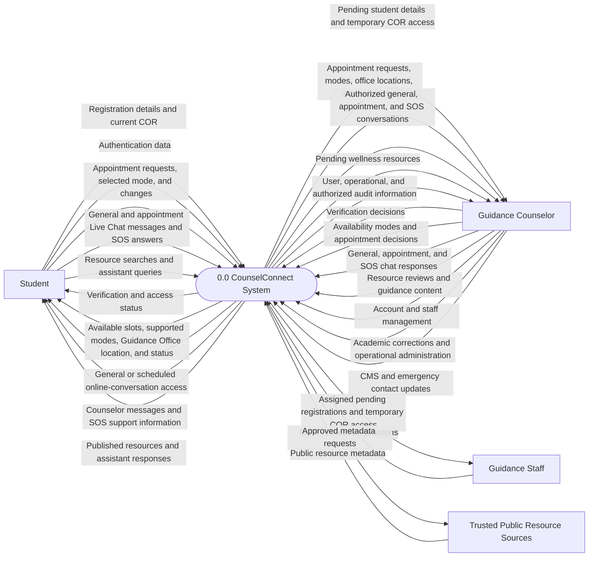
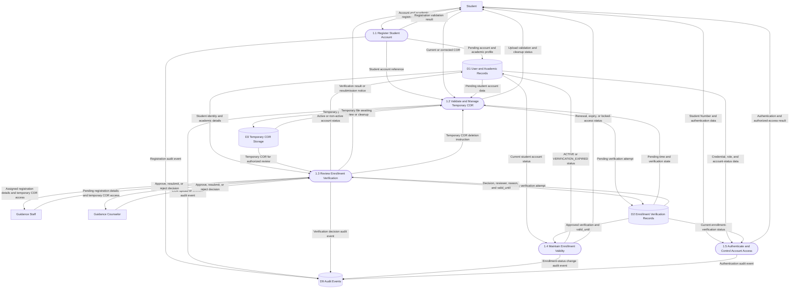
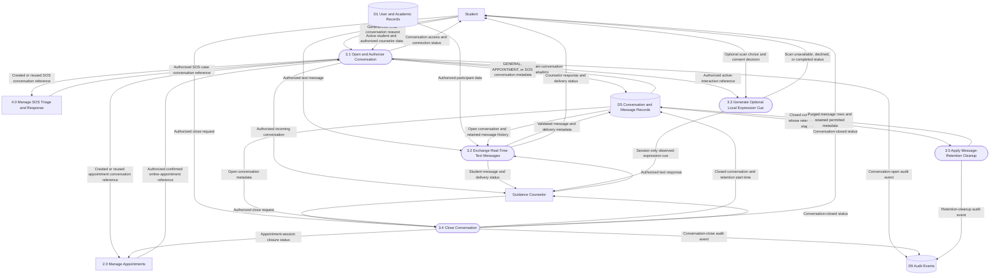
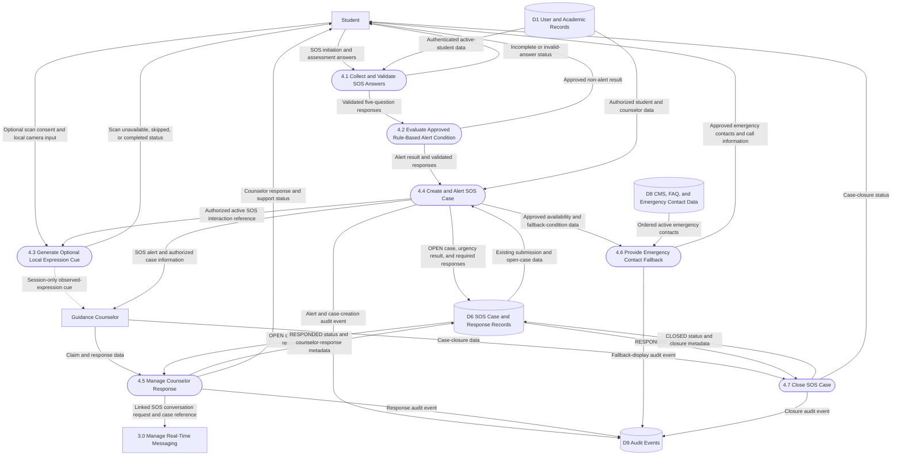
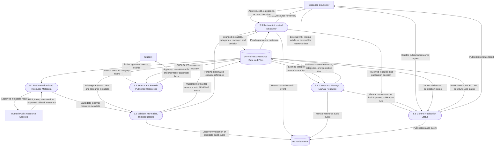
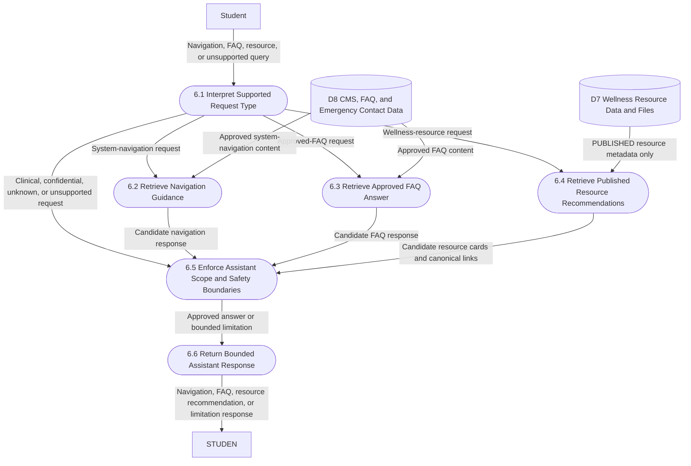
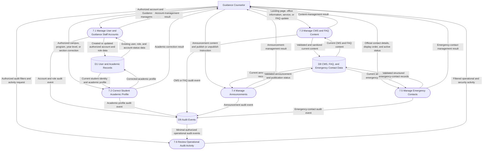

```mermaid
flowchart TB
    STUDENT[Student]
    STAFF[Guidance Staff]
    COUNSELOR[Guidance Counselor]
    SOURCE[Trusted Public Resource Sources]

    P1([1.0 Manage Accounts and Enrollment Verification])
    P2([2.0 Manage Appointments])
    P3([3.0 Manage Real-Time Messaging])
    P4([4.0 Manage SOS Triage and Response])
    P5([5.0 Manage Wellness Resources])
    P6([6.0 Provide Virtual Guidance Assistant])
    P7([7.0 Manage Content, Users, and Operations])

    D1[(D1 User and Academic Records)]
    D2[(D2 Enrollment Verification Records)]
    D3[(D3 Temporary COR Storage)]
    D4[(D4 Availability and Appointment Records)]
    D5[(D5 Conversation and Message Records)]
    D6[(D6 SOS Case and Response Records)]
    D7[(D7 Wellness Resource Data and Files)]
    D8[(D8 CMS, FAQ, and Emergency Contact Data)]
    D9[(D9 Audit Events)]

    STUDENT -->|Registration details, current COR, and authentication data| P1
    P1 -->|Verification and account access status| STUDENT
    P1 -->|Assigned pending registration details and temporary COR access| STAFF
    STAFF -->|COR verification decision| P1
    P1 -->|Pending registration details and temporary COR access| COUNSELOR
    COUNSELOR -->|COR verification decision| P1
    P1 -->|User and academic data| D1
    D1 -->|Account, role, campus, and academic data| P1
    P1 -->|Verification attempt and decision data| D2
    D2 -->|Verification status and history| P1
    P1 -->|Temporary COR file| D3
    D3 -->|Temporary COR for authorized review| P1
    P1 -->|Verification audit event| D9

    STUDENT -->|Slot search, selected mode, appointment request, cancellation, or reschedule| P2
    P2 -->|Slots, supported modes, Guidance Office location, and status| STUDENT
    P2 -->|Appointment requests, selected modes, office locations, and schedules| COUNSELOR
    COUNSELOR -->|Availability modes and appointment decisions| P2
    D1 -->|Verified users, campuses, counselors, and Guidance Office locations| P2
    P2 -->|Availability, selected mode, location snapshot, and appointment updates| D4
    D4 -->|Slots, supported modes, location snapshots, and appointment records| P2
    P2 -->|Authorized confirmed online-appointment request| P3
    P3 -->|Created or reused appointment conversation reference| P2
    P2 -->|Appointment audit event| D9

    STUDENT -->|General Live Chat or scheduled online-session request| P3
    STUDENT -->|Authorized chat messages| P3
    P3 -->|Conversation access, counselor messages, and status| STUDENT
    P3 -->|Authorized general, appointment, or SOS conversation| COUNSELOR
    COUNSELOR -->|Chat response and conversation closure| P3
    D1 -->|Authorized participant data| P3
    P3 -->|Typed conversation and message data| D5
    D5 -->|Authorized conversation history and metadata| P3
    P3 -->|Messaging audit event| D9

    STUDENT -->|SOS assessment answers| P4
    P4 -->|SOS result and support information| STUDENT
    P4 -->|SOS alert and authorized case information| COUNSELOR
    COUNSELOR -->|SOS claim, response, and closure data| P4
    D1 -->|Authorized student and counselor data| P4
    P4 -->|SOS case and response data| D6
    D6 -->|Open and historical SOS case data| P4
    D8 -->|Active emergency contact data| P4
    P4 -->|Authorized SOS conversation request| P3
    P4 -->|SOS audit event| D9

    STUDENT -->|Resource search and category request| P5
    P5 -->|Published wellness resources| STUDENT
    P5 -->|Pending resources and published-resource data| COUNSELOR
    COUNSELOR -->|Resource review, manual resource, and category data| P5
    P5 -->|Approved metadata request| SOURCE
    SOURCE -->|Public resource metadata| P5
    P5 -->|Resource metadata, categories, and controlled files| D7
    D7 -->|Pending and published resource data| P5
    P5 -->|Resource-management audit event| D9

    STUDENT -->|Navigation, FAQ, or resource query| P6
    P6 -->|Bounded assistant response| STUDENT
    D7 -->|Published resource metadata only| P6
    D8 -->|Approved FAQ and system content| P6

    COUNSELOR -->|Account and Guidance Staff management data| P7
    COUNSELOR -->|Academic corrections and operational updates| P7
    COUNSELOR -->|CMS, announcement, and emergency contact updates| P7
    P7 -->|User, content, operational, and audit information| COUNSELOR
    P7 -->|User, staff-role, campus, and academic updates| D1
    D1 -->|User, campus, and academic records| P7
    P7 -->|CMS, FAQ, announcement, and emergency contact data| D8
    D8 -->|Current content and emergency contact data| P7
    P7 -->|Operational and content audit events| D9
    D9 -->|Authorized audit activity| P7
```

```mermaid
flowchart TB
    STUDENT[Student]
    COUNSELOR[Guidance Counselor]
    MESSAGING[3.0 Manage Real-Time Messaging]

    P21([2.1 Manage Concrete Availability])
    P22([2.2 Provide Available Slots and Modes])
    P23([2.3 Validate and Create Appointment Request])
    P24([2.4 Review Appointment Request])
    P25([2.5 Manage Appointment Changes and Outcomes])
    P26([2.6 Initiate Confirmed Online Appointment Session])

    D1[(D1 User and Academic Records)]
    D4[(D4 Availability and Appointment Records)]
    D9[(D9 Audit Events)]

    COUNSELOR -->|Campus, date, time range, slot duration, and supported mode| P21
    D1 -->|Active campus and configured Guidance Office location| P21
    D4 -->|Existing availability slots and supported modes| P21
    P21 -->|Created, updated, or removed concrete slots| D4
    P21 -->|Availability result or missing-office-location error| COUNSELOR
    P21 -->|Availability audit event| D9

    STUDENT -->|Campus, date, and optional mode criteria| P22
    D1 -->|Active student, campus, and Guidance Office location| P22
    D4 -->|Open slots and supported modes| P22
    P22 -->|Available slots, supported modes, and office location| STUDENT

    STUDENT -->|Selected slot, selected appointment mode, and request data| P23
    D1 -->|Student identity, access status, campus, and office location| P23
    D4 -->|Current slot, supported mode, and appointment data| P23
    P23 -->|Pending appointment, selected mode, location snapshot, and reserved slot| D4
    P23 -->|Accepted, unavailable, or incompatible-mode result| STUDENT
    P23 -->|Appointment-request audit event| D9

    D4 -->|Pending request, mode, location snapshot, and schedule| P24
    P24 -->|Pending request for review| COUNSELOR
    COUNSELOR -->|Approve or reject decision and optional note| P24
    P24 -->|CONFIRMED or REJECTED appointment with selected mode| D4
    P24 -->|Decision, mode, location, and schedule status| STUDENT
    P24 -->|Appointment-decision audit event| D9

    STUDENT -->|Cancellation, reschedule, replacement slot, or replacement mode| P25
    COUNSELOR -->|Cancellation, reschedule, completion, or no-show update| P25
    D1 -->|Ownership, counselor role, campus, and office location| P25
    D4 -->|Current appointment, mode, location snapshot, and slot records| P25
    P25 -->|Updated status, mode, location snapshot, outcome, or replacement slot| D4
    P25 -->|Updated appointment status and session details| STUDENT
    P25 -->|Updated schedule, mode, location, and outcome| COUNSELOR
    P25 -->|Appointment-change audit event| D9

    STUDENT -->|Join confirmed online appointment request| P26
    D1 -->|Authenticated student and counselor data| P26
    D4 -->|Confirmed online appointment, ownership, and scheduled time| P26
    P26 -->|Authorized appointment-linked conversation request| MESSAGING
    MESSAGING -->|Created or reused conversation reference and connection status| P26
    P26 -->|Appointment and conversation link| D4
    P26 -->|Online-session connection or unavailable result| STUDENT
    P26 -->|Online-session access notification| COUNSELOR
    P26 -->|Online-session initiation audit event| D9
```

# CounselConnect DFD — FULL AI-Readable Preservation Export

> Purpose: provide VS Code AI/coding assistants with both a readable DFD representation and a literal preservation of the original Draw.io source.
> The **Raw Original Draw.io XML** appendix is copied verbatim from the source file. Therefore, editor metadata, layout, styles, IDs, Mermaid source, geometry, routing information, and all diagram content remain available.

## Preservation guarantees

- All Draw.io pages are included.
- All `UserObject` records are included, including nodes, data flows, and Mermaid container objects.
- Draw.io object IDs and Mermaid IDs are included.
- Exact labels are included.
- Cell attributes, parent/source/target references, styles, geometry, and routing points are preserved in the exhaustive structured records.
- Each page's original embedded `mermaidData` is included.
- The complete original `.drawio` XML is appended verbatim, so no source-level detail is discarded.

## Source metadata

- Original file: `CounselConnect DFD.drawio`
- File size: `527563` bytes
- Draw.io host: `app.diagrams.net`
- Declared pages: `9`

## Page index

| # | Page | Page ID | Nodes/Stores/Processes | Data flows | Mermaid container |
|---:|---|---|---:|---:|---:|
| 1 | LEVEL 0 | `9l01B18KHURNCY6MGp1A` | 5 | 26 | 1 |
| 2 | LEVEL 1 | `kQyQklWs0C6tlwu-FcfT` | 20 | 65 | 1 |
| 3 | LEVEL 2 P1 | `xY-TtJeLhcdyplEP9Vbb` | 12 | 35 | 1 |
| 4 | LEVEL 2 P2 | `gzLEmNc-Q8-sTEtJQAFS` | 12 | 39 | 1 |
| 5 | LEVEL 2 P3 | `WvrNYtI_KN4t_z3ZnU6Y` | 12 | 33 | 1 |
| 6 | LEVEL 2 P4 | `RP8cSddgXd59S8lNy7GR` | 14 | 30 | 1 |
| 7 | LEVEL 2 P5 | `IC651qj4rNtL-HUVhqgM` | 11 | 27 | 1 |
| 8 | LEVEL 2 P6 | `mvmSgSBIXsdNi3GyJJ8e` | 10 | 13 | 1 |
| 9 | LEVEL 2 P7 | `t3fJJxS2zfN-76qnEMvZ` | 10 | 28 | 1 |

## Whole-file counts

- Pages: **9**
- Mermaid nodes/processes/entities/data stores: **106**
- Mermaid data-flow edges: **296**
- Total Draw.io `UserObject` records: **411**

---

# Page 1: LEVEL 0

- Page ID: `9l01B18KHURNCY6MGp1A`

## mxGraphModel attributes

```json
{
  "grid": "0",
  "page": "0",
  "gridSize": "10",
  "guides": "1",
  "tooltips": "1",
  "connect": "1",
  "arrows": "1",
  "fold": "1",
  "pageScale": "1",
  "pageWidth": "850",
  "pageHeight": "1100",
  "math": "0",
  "shadow": "0"
}
```

## Embedded Mermaid source

### Mermaid container 1

- Draw.io object ID: `JSX1adjdeTGBK1naBvQN-1`

Exact `mermaidData` attribute:

```json
{
  "data": "flowchart LR\n    STUDENT[Student]\n    COUNSELOR[Guidance Counselor]\n    STAFF[Guidance Staff]\n    SOURCE[Trusted Public Resource Sources]\n\n    SYSTEM([0.0 CounselConnect System])\n\n    STUDENT -->|Registration details and current COR| SYSTEM\n    STUDENT -->|Authentication data| SYSTEM\n    STUDENT -->|Appointment requests, selected mode, and changes| SYSTEM\n    STUDENT -->|General and appointment Live Chat messages and SOS answers| SYSTEM\n    STUDENT -->|Resource searches and assistant queries| SYSTEM\n\n    SYSTEM -->|Verification and access status| STUDENT\n    SYSTEM -->|Available slots, supported modes, Guidance Office location, and status| STUDENT\n    SYSTEM -->|General or scheduled online-conversation access| STUDENT\n    SYSTEM -->|Counselor messages and SOS support information| STUDENT\n    SYSTEM -->|Published resources and assistant responses| STUDENT\n\n    SYSTEM -->|Pending student details and temporary COR access| COUNSELOR\n    SYSTEM -->|Appointment requests, modes, office locations, and schedules| COUNSELOR\n    SYSTEM -->|Authorized general, appointment, and SOS conversations| COUNSELOR\n    SYSTEM -->|Pending wellness resources| COUNSELOR\n\n    COUNSELOR -->|Verification decisions| SYSTEM\n    COUNSELOR -->|Availability modes and appointment decisions| SYSTEM\n    COUNSELOR -->|General, appointment, and SOS chat responses| SYSTEM\n    COUNSELOR -->|Resource reviews and guidance content| SYSTEM\n    COUNSELOR -->|Account and staff management| SYSTEM\n    COUNSELOR -->|Academic corrections and operational administration| SYSTEM\n    COUNSELOR -->|CMS and emergency contact updates| SYSTEM\n\n    SYSTEM -->|User, operational, and authorized audit information| COUNSELOR\n\n    SYSTEM -->|Assigned pending registrations and temporary COR access| STAFF\n    STAFF -->|COR verification decisions| SYSTEM\n\n    SYSTEM -->|Approved metadata requests| SOURCE\n    SOURCE -->|Public resource metadata| SYSTEM",
  "config": null
}
```

Exact Mermaid diagram:



## Nodes / processes / actors / data stores

| # | Draw.io object ID | Mermaid ID | Exact label | Parent | Geometry |
|---:|---|---|---|---|---|
| 1 | `JSX1adjdeTGBK1naBvQN-2` | `n:STUDENT` | Student | `JSX1adjdeTGBK1naBvQN-1` | height=54, width=115, x=30, y=797.65, as=geometry |
| 2 | `JSX1adjdeTGBK1naBvQN-3` | `n:COUNSELOR` | Guidance Counselor | `JSX1adjdeTGBK1naBvQN-1` | height=54, width=202, x=1752, y=418.85, as=geometry |
| 3 | `JSX1adjdeTGBK1naBvQN-4` | `n:STAFF` | Guidance Staff | `JSX1adjdeTGBK1naBvQN-1` | height=54, width=166, x=1752, y=957, as=geometry |
| 4 | `JSX1adjdeTGBK1naBvQN-5` | `n:SOURCE` | Trusted Public Resource Sources | `JSX1adjdeTGBK1naBvQN-1` | height=54, width=290, x=1752, y=313, as=geometry |
| 5 | `JSX1adjdeTGBK1naBvQN-6` | `n:SYSTEM` | 0.0 CounselConnect System | `JSX1adjdeTGBK1naBvQN-1` | height=39, width=221, x=844, y=634.65, as=geometry |

## Data flows / edges

| # | Draw.io object ID | Mermaid edge ID | Exact label | Source object | Target object |
|---:|---|---|---|---|---|
| 1 | `JSX1adjdeTGBK1naBvQN-7` | `e:STUDENT->SYSTEM#0` | Registration details and current COR | `JSX1adjdeTGBK1naBvQN-2` | `JSX1adjdeTGBK1naBvQN-6` |
| 2 | `JSX1adjdeTGBK1naBvQN-8` | `e:STUDENT->SYSTEM#1` | Authentication data | `JSX1adjdeTGBK1naBvQN-2` | `JSX1adjdeTGBK1naBvQN-6` |
| 3 | `JSX1adjdeTGBK1naBvQN-9` | `e:STUDENT->SYSTEM#2` | Appointment requests, selected mode, and changes | `JSX1adjdeTGBK1naBvQN-2` | `JSX1adjdeTGBK1naBvQN-6` |
| 4 | `JSX1adjdeTGBK1naBvQN-10` | `e:STUDENT->SYSTEM#3` | General and appointment Live Chat messages and SOS answers | `JSX1adjdeTGBK1naBvQN-2` | `JSX1adjdeTGBK1naBvQN-6` |
| 5 | `JSX1adjdeTGBK1naBvQN-11` | `e:STUDENT->SYSTEM#4` | Resource searches and assistant queries | `JSX1adjdeTGBK1naBvQN-2` | `JSX1adjdeTGBK1naBvQN-6` |
| 6 | `JSX1adjdeTGBK1naBvQN-12` | `e:SYSTEM->STUDENT#0` | Verification and access status | `JSX1adjdeTGBK1naBvQN-6` | `JSX1adjdeTGBK1naBvQN-2` |
| 7 | `JSX1adjdeTGBK1naBvQN-13` | `e:SYSTEM->STUDENT#1` | Available slots, supported modes, Guidance Office location, and status | `JSX1adjdeTGBK1naBvQN-6` | `JSX1adjdeTGBK1naBvQN-2` |
| 8 | `JSX1adjdeTGBK1naBvQN-14` | `e:SYSTEM->STUDENT#2` | General or scheduled online-conversation access | `JSX1adjdeTGBK1naBvQN-6` | `JSX1adjdeTGBK1naBvQN-2` |
| 9 | `JSX1adjdeTGBK1naBvQN-15` | `e:SYSTEM->STUDENT#3` | Counselor messages and SOS support information | `JSX1adjdeTGBK1naBvQN-6` | `JSX1adjdeTGBK1naBvQN-2` |
| 10 | `JSX1adjdeTGBK1naBvQN-16` | `e:SYSTEM->STUDENT#4` | Published resources and assistant responses | `JSX1adjdeTGBK1naBvQN-6` | `JSX1adjdeTGBK1naBvQN-2` |
| 11 | `JSX1adjdeTGBK1naBvQN-17` | `e:SYSTEM->COUNSELOR#0` | Pending student details and temporary COR access | `JSX1adjdeTGBK1naBvQN-6` | `JSX1adjdeTGBK1naBvQN-3` |
| 12 | `JSX1adjdeTGBK1naBvQN-18` | `e:SYSTEM->COUNSELOR#1` | Appointment requests, modes, office locations, and schedules | `JSX1adjdeTGBK1naBvQN-6` | `JSX1adjdeTGBK1naBvQN-3` |
| 13 | `JSX1adjdeTGBK1naBvQN-19` | `e:SYSTEM->COUNSELOR#2` | Authorized general, appointment, and SOS conversations | `JSX1adjdeTGBK1naBvQN-6` | `JSX1adjdeTGBK1naBvQN-3` |
| 14 | `JSX1adjdeTGBK1naBvQN-20` | `e:SYSTEM->COUNSELOR#3` | Pending wellness resources | `JSX1adjdeTGBK1naBvQN-6` | `JSX1adjdeTGBK1naBvQN-3` |
| 15 | `JSX1adjdeTGBK1naBvQN-21` | `e:COUNSELOR->SYSTEM#0` | Verification decisions | `JSX1adjdeTGBK1naBvQN-3` | `JSX1adjdeTGBK1naBvQN-6` |
| 16 | `JSX1adjdeTGBK1naBvQN-22` | `e:COUNSELOR->SYSTEM#1` | Availability modes and appointment decisions | `JSX1adjdeTGBK1naBvQN-3` | `JSX1adjdeTGBK1naBvQN-6` |
| 17 | `JSX1adjdeTGBK1naBvQN-23` | `e:COUNSELOR->SYSTEM#2` | General, appointment, and SOS chat responses | `JSX1adjdeTGBK1naBvQN-3` | `JSX1adjdeTGBK1naBvQN-6` |
| 18 | `JSX1adjdeTGBK1naBvQN-24` | `e:COUNSELOR->SYSTEM#3` | Resource reviews and guidance content | `JSX1adjdeTGBK1naBvQN-3` | `JSX1adjdeTGBK1naBvQN-6` |
| 19 | `JSX1adjdeTGBK1naBvQN-25` | `e:COUNSELOR->SYSTEM#4` | Account and staff management | `JSX1adjdeTGBK1naBvQN-3` | `JSX1adjdeTGBK1naBvQN-6` |
| 20 | `JSX1adjdeTGBK1naBvQN-26` | `e:COUNSELOR->SYSTEM#5` | Academic corrections and operational administration | `JSX1adjdeTGBK1naBvQN-3` | `JSX1adjdeTGBK1naBvQN-6` |
| 21 | `JSX1adjdeTGBK1naBvQN-27` | `e:COUNSELOR->SYSTEM#6` | CMS and emergency contact updates | `JSX1adjdeTGBK1naBvQN-3` | `JSX1adjdeTGBK1naBvQN-6` |
| 22 | `JSX1adjdeTGBK1naBvQN-28` | `e:SYSTEM->COUNSELOR#4` | User, operational, and authorized audit information | `JSX1adjdeTGBK1naBvQN-6` | `JSX1adjdeTGBK1naBvQN-3` |
| 23 | `JSX1adjdeTGBK1naBvQN-29` | `e:SYSTEM->STAFF#0` | Assigned pending registrations and temporary COR access | `JSX1adjdeTGBK1naBvQN-6` | `JSX1adjdeTGBK1naBvQN-4` |
| 24 | `JSX1adjdeTGBK1naBvQN-30` | `e:STAFF->SYSTEM#0` | COR verification decisions | `JSX1adjdeTGBK1naBvQN-4` | `JSX1adjdeTGBK1naBvQN-6` |
| 25 | `JSX1adjdeTGBK1naBvQN-31` | `e:SYSTEM->SOURCE#0` | Approved metadata requests | `JSX1adjdeTGBK1naBvQN-6` | `JSX1adjdeTGBK1naBvQN-5` |
| 26 | `JSX1adjdeTGBK1naBvQN-32` | `e:SOURCE->SYSTEM#0` | Public resource metadata | `JSX1adjdeTGBK1naBvQN-5` | `JSX1adjdeTGBK1naBvQN-6` |

## Exhaustive page object structure

> This JSON representation includes every XML element, attribute, and non-whitespace text node under this page. The raw XML appendix below remains the literal source of truth.

```json
{
  "tag": "diagram",
  "attributes": {
    "id": "9l01B18KHURNCY6MGp1A",
    "name": "LEVEL 0"
  },
  "children": [
    {
      "tag": "mxGraphModel",
      "attributes": {
        "grid": "0",
        "page": "0",
        "gridSize": "10",
        "guides": "1",
        "tooltips": "1",
        "connect": "1",
        "arrows": "1",
        "fold": "1",
        "pageScale": "1",
        "pageWidth": "850",
        "pageHeight": "1100",
        "math": "0",
        "shadow": "0"
      },
      "children": [
        {
          "tag": "root",
          "attributes": {},
          "children": [
            {
              "tag": "mxCell",
              "attributes": {
                "id": "0"
              }
            },
            {
              "tag": "mxCell",
              "attributes": {
                "id": "1",
                "parent": "0"
              }
            },
            {
              "tag": "UserObject",
              "attributes": {
                "label": "",
                "mermaidData": "{\n  \"data\": \"flowchart LR\\n    STUDENT[Student]\\n    COUNSELOR[Guidance Counselor]\\n    STAFF[Guidance Staff]\\n    SOURCE[Trusted Public Resource Sources]\\n\\n    SYSTEM([0.0 CounselConnect System])\\n\\n    STUDENT -->|Registration details and current COR| SYSTEM\\n    STUDENT -->|Authentication data| SYSTEM\\n    STUDENT -->|Appointment requests, selected mode, and changes| SYSTEM\\n    STUDENT -->|General and appointment Live Chat messages and SOS answers| SYSTEM\\n    STUDENT -->|Resource searches and assistant queries| SYSTEM\\n\\n    SYSTEM -->|Verification and access status| STUDENT\\n    SYSTEM -->|Available slots, supported modes, Guidance Office location, and status| STUDENT\\n    SYSTEM -->|General or scheduled online-conversation access| STUDENT\\n    SYSTEM -->|Counselor messages and SOS support information| STUDENT\\n    SYSTEM -->|Published resources and assistant responses| STUDENT\\n\\n    SYSTEM -->|Pending student details and temporary COR access| COUNSELOR\\n    SYSTEM -->|Appointment requests, modes, office locations, and schedules| COUNSELOR\\n    SYSTEM -->|Authorized general, appointment, and SOS conversations| COUNSELOR\\n    SYSTEM -->|Pending wellness resources| COUNSELOR\\n\\n    COUNSELOR -->|Verification decisions| SYSTEM\\n    COUNSELOR -->|Availability modes and appointment decisions| SYSTEM\\n    COUNSELOR -->|General, appointment, and SOS chat responses| SYSTEM\\n    COUNSELOR -->|Resource reviews and guidance content| SYSTEM\\n    COUNSELOR -->|Account and staff management| SYSTEM\\n    COUNSELOR -->|Academic corrections and operational administration| SYSTEM\\n    COUNSELOR -->|CMS and emergency contact updates| SYSTEM\\n\\n    SYSTEM -->|User, operational, and authorized audit information| COUNSELOR\\n\\n    SYSTEM -->|Assigned pending registrations and temporary COR access| STAFF\\n    STAFF -->|COR verification decisions| SYSTEM\\n\\n    SYSTEM -->|Approved metadata requests| SOURCE\\n    SOURCE -->|Public resource metadata| SYSTEM\",\n  \"config\": null\n}",
                "id": "JSX1adjdeTGBK1naBvQN-1"
              },
              "children": [
                {
                  "tag": "mxCell",
                  "attributes": {
                    "connectable": "0",
                    "parent": "1",
                    "style": "group;transparentBounds=1;editIcon=1;lockedGroup=0;groupPadding=10;",
                    "vertex": "1"
                  },
                  "children": [
                    {
                      "tag": "mxGeometry",
                      "attributes": {
                        "as": "geometry"
                      }
                    }
                  ]
                }
              ]
            },
            {
              "tag": "UserObject",
              "attributes": {
                "label": "Student",
                "mermaidId": "n:STUDENT",
                "mermaidBaseStyle": "html=1;whiteSpace=wrap;strokeWidth=1;fillColor=light-dark(#ECECFF,#1f2020);strokeColor=light-dark(#9370DB,#cccccc);fontColor=light-dark(#333333,#cccccc);fontFamily=Trebuchet MS,Verdana,Arial,sans-serif;fontSize=16;",
                "mermaidBaseValue": "Student",
                "id": "JSX1adjdeTGBK1naBvQN-2"
              },
              "children": [
                {
                  "tag": "mxCell",
                  "attributes": {
                    "parent": "JSX1adjdeTGBK1naBvQN-1",
                    "style": "html=1;whiteSpace=wrap;strokeWidth=1;fillColor=light-dark(#ECECFF,#1f2020);strokeColor=light-dark(#9370DB,#cccccc);fontColor=light-dark(#333333,#cccccc);fontFamily=Trebuchet MS,Verdana,Arial,sans-serif;fontSize=16;",
                    "vertex": "1"
                  },
                  "children": [
                    {
                      "tag": "mxGeometry",
                      "attributes": {
                        "height": "54",
                        "width": "115",
                        "x": "30",
                        "y": "797.65",
                        "as": "geometry"
                      }
                    }
                  ]
                }
              ]
            },
            {
              "tag": "UserObject",
              "attributes": {
                "label": "Guidance Counselor",
                "mermaidId": "n:COUNSELOR",
                "mermaidBaseStyle": "html=1;whiteSpace=wrap;strokeWidth=1;fillColor=light-dark(#ECECFF,#1f2020);strokeColor=light-dark(#9370DB,#cccccc);fontColor=light-dark(#333333,#cccccc);fontFamily=Trebuchet MS,Verdana,Arial,sans-serif;fontSize=16;",
                "mermaidBaseValue": "Guidance Counselor",
                "id": "JSX1adjdeTGBK1naBvQN-3"
              },
              "children": [
                {
                  "tag": "mxCell",
                  "attributes": {
                    "parent": "JSX1adjdeTGBK1naBvQN-1",
                    "style": "html=1;whiteSpace=wrap;strokeWidth=1;fillColor=light-dark(#ECECFF,#1f2020);strokeColor=light-dark(#9370DB,#cccccc);fontColor=light-dark(#333333,#cccccc);fontFamily=Trebuchet MS,Verdana,Arial,sans-serif;fontSize=16;",
                    "vertex": "1"
                  },
                  "children": [
                    {
                      "tag": "mxGeometry",
                      "attributes": {
                        "height": "54",
                        "width": "202",
                        "x": "1752",
                        "y": "418.85",
                        "as": "geometry"
                      }
                    }
                  ]
                }
              ]
            },
            {
              "tag": "UserObject",
              "attributes": {
                "label": "Guidance Staff",
                "mermaidId": "n:STAFF",
                "mermaidBaseStyle": "html=1;whiteSpace=wrap;strokeWidth=1;fillColor=light-dark(#ECECFF,#1f2020);strokeColor=light-dark(#9370DB,#cccccc);fontColor=light-dark(#333333,#cccccc);fontFamily=Trebuchet MS,Verdana,Arial,sans-serif;fontSize=16;",
                "mermaidBaseValue": "Guidance Staff",
                "id": "JSX1adjdeTGBK1naBvQN-4"
              },
              "children": [
                {
                  "tag": "mxCell",
                  "attributes": {
                    "parent": "JSX1adjdeTGBK1naBvQN-1",
                    "style": "html=1;whiteSpace=wrap;strokeWidth=1;fillColor=light-dark(#ECECFF,#1f2020);strokeColor=light-dark(#9370DB,#cccccc);fontColor=light-dark(#333333,#cccccc);fontFamily=Trebuchet MS,Verdana,Arial,sans-serif;fontSize=16;",
                    "vertex": "1"
                  },
                  "children": [
                    {
                      "tag": "mxGeometry",
                      "attributes": {
                        "height": "54",
                        "width": "166",
                        "x": "1752",
                        "y": "957",
                        "as": "geometry"
                      }
                    }
                  ]
                }
              ]
            },
            {
              "tag": "UserObject",
              "attributes": {
                "label": "Trusted Public Resource Sources",
                "mermaidId": "n:SOURCE",
                "mermaidBaseStyle": "html=1;whiteSpace=wrap;strokeWidth=1;fillColor=light-dark(#ECECFF,#1f2020);strokeColor=light-dark(#9370DB,#cccccc);fontColor=light-dark(#333333,#cccccc);fontFamily=Trebuchet MS,Verdana,Arial,sans-serif;fontSize=16;",
                "mermaidBaseValue": "Trusted Public Resource Sources",
                "id": "JSX1adjdeTGBK1naBvQN-5"
              },
              "children": [
                {
                  "tag": "mxCell",
                  "attributes": {
                    "parent": "JSX1adjdeTGBK1naBvQN-1",
                    "style": "html=1;whiteSpace=wrap;strokeWidth=1;fillColor=light-dark(#ECECFF,#1f2020);strokeColor=light-dark(#9370DB,#cccccc);fontColor=light-dark(#333333,#cccccc);fontFamily=Trebuchet MS,Verdana,Arial,sans-serif;fontSize=16;",
                    "vertex": "1"
                  },
                  "children": [
                    {
                      "tag": "mxGeometry",
                      "attributes": {
                        "height": "54",
                        "width": "290",
                        "x": "1752",
                        "y": "313",
                        "as": "geometry"
                      }
                    }
                  ]
                }
              ]
            },
            {
              "tag": "UserObject",
              "attributes": {
                "label": "0.0 CounselConnect System",
                "mermaidId": "n:SYSTEM",
                "mermaidBaseStyle": "html=1;rounded=1;whiteSpace=wrap;arcSize=50;strokeWidth=1;fillColor=light-dark(#ECECFF,#1f2020);strokeColor=light-dark(#9370DB,#cccccc);fontColor=light-dark(#333333,#cccccc);fontFamily=Trebuchet MS,Verdana,Arial,sans-serif;fontSize=16;",
                "mermaidBaseValue": "0.0 CounselConnect System",
                "id": "JSX1adjdeTGBK1naBvQN-6"
              },
              "children": [
                {
                  "tag": "mxCell",
                  "attributes": {
                    "parent": "JSX1adjdeTGBK1naBvQN-1",
                    "style": "html=1;rounded=1;whiteSpace=wrap;arcSize=50;strokeWidth=1;fillColor=light-dark(#ECECFF,#1f2020);strokeColor=light-dark(#9370DB,#cccccc);fontColor=light-dark(#333333,#cccccc);fontFamily=Trebuchet MS,Verdana,Arial,sans-serif;fontSize=16;",
                    "vertex": "1"
                  },
                  "children": [
                    {
                      "tag": "mxGeometry",
                      "attributes": {
                        "height": "39",
                        "width": "221",
                        "x": "844",
                        "y": "634.65",
                        "as": "geometry"
                      }
                    }
                  ]
                }
              ]
            },
            {
              "tag": "UserObject",
              "attributes": {
                "label": "Registration details and current COR",
                "mermaidId": "e:STUDENT->SYSTEM#0",
                "mermaidBaseStyle": "curved=1;startArrow=none;endArrow=block;endSize=7;strokeColor=light-dark(#333333,#cccccc);html=1;fontSize=16;labelBackgroundColor=light-dark(#E8E8E88D,#2a2a2a8D);fontFamily=Trebuchet MS,Verdana,Arial,sans-serif;fontColor=light-dark(#333333,#cccccc);exitX=1;exitY=0.02;entryX=0.27;entryY=0;",
                "mermaidBaseValue": "Registration details and current COR",
                "id": "JSX1adjdeTGBK1naBvQN-7"
              },
              "children": [
                {
                  "tag": "mxCell",
                  "attributes": {
                    "edge": "1",
                    "parent": "JSX1adjdeTGBK1naBvQN-1",
                    "source": "JSX1adjdeTGBK1naBvQN-2",
                    "style": "curved=0;startArrow=none;endArrow=block;endSize=7;strokeColor=light-dark(#333333,#cccccc);html=1;fontSize=16;labelBackgroundColor=light-dark(#E8E8E88D,#2a2a2a8D);fontFamily=Trebuchet MS,Verdana,Arial,sans-serif;fontColor=light-dark(#333333,#cccccc);rounded=1;edgeStyle=orthogonalEdgeStyle;exitX=1;exitY=0.1819;entryX=0;entryY=0.1818;",
                    "target": "JSX1adjdeTGBK1naBvQN-6"
                  },
                  "children": [
                    {
                      "tag": "mxGeometry",
                      "attributes": {
                        "relative": "1",
                        "as": "geometry"
                      },
                      "children": [
                        {
                          "tag": "mxPoint",
                          "attributes": {
                            "x": "20.41",
                            "as": "offset"
                          }
                        },
                        {
                          "tag": "Array",
                          "attributes": {
                            "as": "points"
                          },
                          "children": [
                            {
                              "tag": "mxPoint",
                              "attributes": {
                                "x": "171",
                                "y": "807.47"
                              }
                            },
                            {
                              "tag": "mxPoint",
                              "attributes": {
                                "x": "171",
                                "y": "684.19"
                              }
                            },
                            {
                              "tag": "mxPoint",
                              "attributes": {
                                "x": "748",
                                "y": "684.19"
                              }
                            },
                            {
                              "tag": "mxPoint",
                              "attributes": {
                                "x": "748",
                                "y": "641.74"
                              }
                            }
                          ]
                        }
                      ]
                    }
                  ]
                }
              ]
            },
            {
              "tag": "UserObject",
              "attributes": {
                "label": "Authentication data",
                "mermaidId": "e:STUDENT->SYSTEM#1",
                "mermaidBaseStyle": "curved=1;startArrow=none;endArrow=block;endSize=7;strokeColor=light-dark(#333333,#cccccc);html=1;fontSize=16;labelBackgroundColor=light-dark(#E8E8E88D,#2a2a2a8D);fontFamily=Trebuchet MS,Verdana,Arial,sans-serif;fontColor=light-dark(#333333,#cccccc);exitX=1;exitY=0.15;entryX=0.19;entryY=0;",
                "mermaidBaseValue": "Authentication data",
                "id": "JSX1adjdeTGBK1naBvQN-8"
              },
              "children": [
                {
                  "tag": "mxCell",
                  "attributes": {
                    "edge": "1",
                    "parent": "JSX1adjdeTGBK1naBvQN-1",
                    "source": "JSX1adjdeTGBK1naBvQN-2",
                    "style": "curved=0;startArrow=none;endArrow=block;endSize=7;strokeColor=light-dark(#333333,#cccccc);html=1;fontSize=16;labelBackgroundColor=light-dark(#E8E8E88D,#2a2a2a8D);fontFamily=Trebuchet MS,Verdana,Arial,sans-serif;fontColor=light-dark(#333333,#cccccc);rounded=1;edgeStyle=orthogonalEdgeStyle;exitX=1;exitY=0.2726;entryX=0;entryY=0.2726;",
                    "target": "JSX1adjdeTGBK1naBvQN-6"
                  },
                  "children": [
                    {
                      "tag": "mxGeometry",
                      "attributes": {
                        "relative": "1",
                        "as": "geometry"
                      },
                      "children": [
                        {
                          "tag": "mxPoint",
                          "attributes": {
                            "x": "-21.37",
                            "as": "offset"
                          }
                        },
                        {
                          "tag": "Array",
                          "attributes": {
                            "as": "points"
                          },
                          "children": [
                            {
                              "tag": "mxPoint",
                              "attributes": {
                                "x": "181",
                                "y": "812.37"
                              }
                            },
                            {
                              "tag": "mxPoint",
                              "attributes": {
                                "x": "181",
                                "y": "730.19"
                              }
                            },
                            {
                              "tag": "mxPoint",
                              "attributes": {
                                "x": "758",
                                "y": "730.19"
                              }
                            },
                            {
                              "tag": "mxPoint",
                              "attributes": {
                                "x": "758",
                                "y": "645.28"
                              }
                            }
                          ]
                        }
                      ]
                    }
                  ]
                }
              ]
            },
            {
              "tag": "UserObject",
              "attributes": {
                "label": "Appointment requests, selected mode, and changes",
                "mermaidId": "e:STUDENT->SYSTEM#2",
                "mermaidBaseStyle": "curved=1;startArrow=none;endArrow=block;endSize=7;strokeColor=light-dark(#333333,#cccccc);html=1;fontSize=16;labelBackgroundColor=light-dark(#E8E8E88D,#2a2a2a8D);fontFamily=Trebuchet MS,Verdana,Arial,sans-serif;fontColor=light-dark(#333333,#cccccc);exitX=1;exitY=0.28;entryX=0.02;entryY=0;",
                "mermaidBaseValue": "Appointment requests, selected mode, and changes",
                "id": "JSX1adjdeTGBK1naBvQN-9"
              },
              "children": [
                {
                  "tag": "mxCell",
                  "attributes": {
                    "edge": "1",
                    "parent": "JSX1adjdeTGBK1naBvQN-1",
                    "source": "JSX1adjdeTGBK1naBvQN-2",
                    "style": "curved=0;startArrow=none;endArrow=block;endSize=7;strokeColor=light-dark(#333333,#cccccc);html=1;fontSize=16;labelBackgroundColor=light-dark(#E8E8E88D,#2a2a2a8D);fontFamily=Trebuchet MS,Verdana,Arial,sans-serif;fontColor=light-dark(#333333,#cccccc);rounded=1;edgeStyle=orthogonalEdgeStyle;exitX=1;exitY=0.3635;entryX=0;entryY=0.3636;",
                    "target": "JSX1adjdeTGBK1naBvQN-6"
                  },
                  "children": [
                    {
                      "tag": "mxGeometry",
                      "attributes": {
                        "relative": "1",
                        "as": "geometry"
                      },
                      "children": [
                        {
                          "tag": "mxPoint",
                          "attributes": {
                            "x": "-63.13",
                            "as": "offset"
                          }
                        },
                        {
                          "tag": "Array",
                          "attributes": {
                            "as": "points"
                          },
                          "children": [
                            {
                              "tag": "mxPoint",
                              "attributes": {
                                "x": "191",
                                "y": "817.28"
                              }
                            },
                            {
                              "tag": "mxPoint",
                              "attributes": {
                                "x": "191",
                                "y": "776.19"
                              }
                            },
                            {
                              "tag": "mxPoint",
                              "attributes": {
                                "x": "768",
                                "y": "776.19"
                              }
                            },
                            {
                              "tag": "mxPoint",
                              "attributes": {
                                "x": "768",
                                "y": "648.83"
                              }
                            }
                          ]
                        }
                      ]
                    }
                  ]
                }
              ]
            },
            {
              "tag": "UserObject",
              "attributes": {
                "label": "General and appointment Live Chat messages and SOS answers",
                "mermaidId": "e:STUDENT->SYSTEM#3",
                "mermaidBaseStyle": "curved=1;startArrow=none;endArrow=block;endSize=7;strokeColor=light-dark(#333333,#cccccc);html=1;fontSize=16;labelBackgroundColor=light-dark(#E8E8E88D,#2a2a2a8D);fontFamily=Trebuchet MS,Verdana,Arial,sans-serif;fontColor=light-dark(#333333,#cccccc);exitX=1;exitY=0.39;entryX=0;entryY=0.26;",
                "mermaidBaseValue": "General and appointment Live Chat messages and SOS answers",
                "id": "JSX1adjdeTGBK1naBvQN-10"
              },
              "children": [
                {
                  "tag": "mxCell",
                  "attributes": {
                    "edge": "1",
                    "parent": "JSX1adjdeTGBK1naBvQN-1",
                    "source": "JSX1adjdeTGBK1naBvQN-2",
                    "style": "curved=0;startArrow=none;endArrow=block;endSize=7;strokeColor=light-dark(#333333,#cccccc);html=1;fontSize=16;labelBackgroundColor=light-dark(#E8E8E88D,#2a2a2a8D);fontFamily=Trebuchet MS,Verdana,Arial,sans-serif;fontColor=light-dark(#333333,#cccccc);rounded=1;edgeStyle=orthogonalEdgeStyle;exitX=1;exitY=0.4544;entryX=0;entryY=0.4544;",
                    "target": "JSX1adjdeTGBK1naBvQN-6"
                  },
                  "children": [
                    {
                      "tag": "mxGeometry",
                      "attributes": {
                        "relative": "1",
                        "as": "geometry"
                      },
                      "children": [
                        {
                          "tag": "mxPoint",
                          "attributes": {
                            "x": "-104.91",
                            "as": "offset"
                          }
                        },
                        {
                          "tag": "Array",
                          "attributes": {
                            "as": "points"
                          },
                          "children": [
                            {
                              "tag": "mxPoint",
                              "attributes": {
                                "x": "778",
                                "y": "822.19"
                              }
                            },
                            {
                              "tag": "mxPoint",
                              "attributes": {
                                "x": "778",
                                "y": "652.37"
                              }
                            }
                          ]
                        }
                      ]
                    }
                  ]
                }
              ]
            },
            {
              "tag": "UserObject",
              "attributes": {
                "label": "Resource searches and assistant queries",
                "mermaidId": "e:STUDENT->SYSTEM#4",
                "mermaidBaseStyle": "curved=1;startArrow=none;endArrow=block;endSize=7;strokeColor=light-dark(#333333,#cccccc);html=1;fontSize=16;labelBackgroundColor=light-dark(#E8E8E88D,#2a2a2a8D);fontFamily=Trebuchet MS,Verdana,Arial,sans-serif;fontColor=light-dark(#333333,#cccccc);exitX=1;exitY=0.7407407407407407;entryX=0;entryY=0.8333333333333333;curved=1;exitX=1;exitY=0.74;entryX=0;entryY=0.83;",
                "mermaidBaseValue": "Resource searches and assistant queries",
                "id": "JSX1adjdeTGBK1naBvQN-11"
              },
              "children": [
                {
                  "tag": "mxCell",
                  "attributes": {
                    "edge": "1",
                    "parent": "JSX1adjdeTGBK1naBvQN-1",
                    "source": "JSX1adjdeTGBK1naBvQN-2",
                    "style": "curved=0;startArrow=none;endArrow=block;endSize=7;strokeColor=light-dark(#333333,#cccccc);html=1;fontSize=16;labelBackgroundColor=light-dark(#E8E8E88D,#2a2a2a8D);fontFamily=Trebuchet MS,Verdana,Arial,sans-serif;fontColor=light-dark(#333333,#cccccc);rounded=1;edgeStyle=orthogonalEdgeStyle;exitX=1;exitY=0.5454;entryX=0;entryY=0.5454;",
                    "target": "JSX1adjdeTGBK1naBvQN-6"
                  },
                  "children": [
                    {
                      "tag": "mxGeometry",
                      "attributes": {
                        "relative": "1",
                        "as": "geometry"
                      },
                      "children": [
                        {
                          "tag": "mxPoint",
                          "attributes": {
                            "x": "-105.59",
                            "as": "offset"
                          }
                        },
                        {
                          "tag": "Array",
                          "attributes": {
                            "as": "points"
                          },
                          "children": [
                            {
                              "tag": "mxPoint",
                              "attributes": {
                                "x": "201",
                                "y": "827.1"
                              }
                            },
                            {
                              "tag": "mxPoint",
                              "attributes": {
                                "x": "201",
                                "y": "868.19"
                              }
                            },
                            {
                              "tag": "mxPoint",
                              "attributes": {
                                "x": "788",
                                "y": "868.19"
                              }
                            },
                            {
                              "tag": "mxPoint",
                              "attributes": {
                                "x": "788",
                                "y": "655.92"
                              }
                            }
                          ]
                        }
                      ]
                    }
                  ]
                }
              ]
            },
            {
              "tag": "UserObject",
              "attributes": {
                "label": "Verification and access status",
                "mermaidId": "e:SYSTEM->STUDENT#0",
                "mermaidBaseStyle": "curved=1;startArrow=none;endArrow=block;endSize=7;strokeColor=light-dark(#333333,#cccccc);html=1;fontSize=16;labelBackgroundColor=light-dark(#E8E8E88D,#2a2a2a8D);fontFamily=Trebuchet MS,Verdana,Arial,sans-serif;fontColor=light-dark(#333333,#cccccc);exitX=0;exitY=0.16666666666666669;entryX=1;entryY=0.2592592592592593;curved=1;exitX=0;exitY=0.17;entryX=1;entryY=0.26;",
                "mermaidBaseValue": "Verification and access status",
                "id": "JSX1adjdeTGBK1naBvQN-12"
              },
              "children": [
                {
                  "tag": "mxCell",
                  "attributes": {
                    "edge": "1",
                    "parent": "JSX1adjdeTGBK1naBvQN-1",
                    "source": "JSX1adjdeTGBK1naBvQN-6",
                    "style": "curved=0;startArrow=none;endArrow=block;endSize=7;strokeColor=light-dark(#333333,#cccccc);html=1;fontSize=16;labelBackgroundColor=light-dark(#E8E8E88D,#2a2a2a8D);fontFamily=Trebuchet MS,Verdana,Arial,sans-serif;fontColor=light-dark(#333333,#cccccc);rounded=1;edgeStyle=orthogonalEdgeStyle;exitX=0;exitY=0.6364;entryX=1;entryY=0.6363;",
                    "target": "JSX1adjdeTGBK1naBvQN-2"
                  },
                  "children": [
                    {
                      "tag": "mxGeometry",
                      "attributes": {
                        "relative": "1",
                        "as": "geometry"
                      },
                      "children": [
                        {
                          "tag": "mxPoint",
                          "attributes": {
                            "x": "-106.27",
                            "as": "offset"
                          }
                        },
                        {
                          "tag": "Array",
                          "attributes": {
                            "as": "points"
                          },
                          "children": [
                            {
                              "tag": "mxPoint",
                              "attributes": {
                                "x": "798",
                                "y": "659.47"
                              }
                            },
                            {
                              "tag": "mxPoint",
                              "attributes": {
                                "x": "798",
                                "y": "914.19"
                              }
                            },
                            {
                              "tag": "mxPoint",
                              "attributes": {
                                "x": "191",
                                "y": "914.19"
                              }
                            },
                            {
                              "tag": "mxPoint",
                              "attributes": {
                                "x": "191",
                                "y": "832.01"
                              }
                            }
                          ]
                        }
                      ]
                    }
                  ]
                }
              ]
            },
            {
              "tag": "UserObject",
              "attributes": {
                "label": "Available slots, supported modes, Guidance Office location, and status",
                "mermaidId": "e:SYSTEM->STUDENT#1",
                "mermaidBaseStyle": "curved=1;startArrow=none;endArrow=block;endSize=7;strokeColor=light-dark(#333333,#cccccc);html=1;fontSize=16;labelBackgroundColor=light-dark(#E8E8E88D,#2a2a2a8D);fontFamily=Trebuchet MS,Verdana,Arial,sans-serif;fontColor=light-dark(#333333,#cccccc);exitX=0;exitY=0.16666666666666669;entryX=1;entryY=0.2592592592592593;curved=1;exitX=0;exitY=0.17;entryX=1;entryY=0.26;",
                "mermaidBaseValue": "Available slots, supported modes, Guidance Office location, and status",
                "id": "JSX1adjdeTGBK1naBvQN-13"
              },
              "children": [
                {
                  "tag": "mxCell",
                  "attributes": {
                    "edge": "1",
                    "parent": "JSX1adjdeTGBK1naBvQN-1",
                    "source": "JSX1adjdeTGBK1naBvQN-6",
                    "style": "curved=0;startArrow=none;endArrow=block;endSize=7;strokeColor=light-dark(#333333,#cccccc);html=1;fontSize=16;labelBackgroundColor=light-dark(#E8E8E88D,#2a2a2a8D);fontFamily=Trebuchet MS,Verdana,Arial,sans-serif;fontColor=light-dark(#333333,#cccccc);rounded=1;edgeStyle=orthogonalEdgeStyle;exitX=0;exitY=0.7272;entryX=1;entryY=0.7272;",
                    "target": "JSX1adjdeTGBK1naBvQN-2"
                  },
                  "children": [
                    {
                      "tag": "mxGeometry",
                      "attributes": {
                        "relative": "1",
                        "as": "geometry"
                      },
                      "children": [
                        {
                          "tag": "mxPoint",
                          "attributes": {
                            "x": "-106.95",
                            "as": "offset"
                          }
                        },
                        {
                          "tag": "Array",
                          "attributes": {
                            "as": "points"
                          },
                          "children": [
                            {
                              "tag": "mxPoint",
                              "attributes": {
                                "x": "808",
                                "y": "663.01"
                              }
                            },
                            {
                              "tag": "mxPoint",
                              "attributes": {
                                "x": "808",
                                "y": "960.19"
                              }
                            },
                            {
                              "tag": "mxPoint",
                              "attributes": {
                                "x": "181",
                                "y": "960.19"
                              }
                            },
                            {
                              "tag": "mxPoint",
                              "attributes": {
                                "x": "181",
                                "y": "836.92"
                              }
                            }
                          ]
                        }
                      ]
                    }
                  ]
                }
              ]
            },
            {
              "tag": "UserObject",
              "attributes": {
                "label": "General or scheduled online-conversation access",
                "mermaidId": "e:SYSTEM->STUDENT#2",
                "mermaidBaseStyle": "curved=1;startArrow=none;endArrow=block;endSize=7;strokeColor=light-dark(#333333,#cccccc);html=1;fontSize=16;labelBackgroundColor=light-dark(#E8E8E88D,#2a2a2a8D);fontFamily=Trebuchet MS,Verdana,Arial,sans-serif;fontColor=light-dark(#333333,#cccccc);exitX=0;exitY=0.16666666666666669;entryX=1;entryY=0.2592592592592593;curved=1;exitX=0;exitY=0.17;entryX=1;entryY=0.26;",
                "mermaidBaseValue": "General or scheduled online-conversation access",
                "id": "JSX1adjdeTGBK1naBvQN-14"
              },
              "children": [
                {
                  "tag": "mxCell",
                  "attributes": {
                    "edge": "1",
                    "parent": "JSX1adjdeTGBK1naBvQN-1",
                    "source": "JSX1adjdeTGBK1naBvQN-6",
                    "style": "curved=0;startArrow=none;endArrow=block;endSize=7;strokeColor=light-dark(#333333,#cccccc);html=1;fontSize=16;labelBackgroundColor=light-dark(#E8E8E88D,#2a2a2a8D);fontFamily=Trebuchet MS,Verdana,Arial,sans-serif;fontColor=light-dark(#333333,#cccccc);rounded=1;edgeStyle=orthogonalEdgeStyle;exitX=0;exitY=0.8182;entryX=1;entryY=0.8181;",
                    "target": "JSX1adjdeTGBK1naBvQN-2"
                  },
                  "children": [
                    {
                      "tag": "mxGeometry",
                      "attributes": {
                        "relative": "1",
                        "as": "geometry"
                      },
                      "children": [
                        {
                          "tag": "mxPoint",
                          "attributes": {
                            "x": "-107.63",
                            "as": "offset"
                          }
                        },
                        {
                          "tag": "Array",
                          "attributes": {
                            "as": "points"
                          },
                          "children": [
                            {
                              "tag": "mxPoint",
                              "attributes": {
                                "x": "818",
                                "y": "666.56"
                              }
                            },
                            {
                              "tag": "mxPoint",
                              "attributes": {
                                "x": "818",
                                "y": "1006.19"
                              }
                            },
                            {
                              "tag": "mxPoint",
                              "attributes": {
                                "x": "171",
                                "y": "1006.19"
                              }
                            },
                            {
                              "tag": "mxPoint",
                              "attributes": {
                                "x": "171",
                                "y": "841.83"
                              }
                            }
                          ]
                        }
                      ]
                    }
                  ]
                }
              ]
            },
            {
              "tag": "UserObject",
              "attributes": {
                "label": "Counselor messages and SOS support information",
                "mermaidId": "e:SYSTEM->STUDENT#3",
                "mermaidBaseStyle": "curved=1;startArrow=none;endArrow=block;endSize=7;strokeColor=light-dark(#333333,#cccccc);html=1;fontSize=16;labelBackgroundColor=light-dark(#E8E8E88D,#2a2a2a8D);fontFamily=Trebuchet MS,Verdana,Arial,sans-serif;fontColor=light-dark(#333333,#cccccc);exitX=0;exitY=0.16666666666666669;entryX=1;entryY=0.2592592592592593;curved=1;exitX=0;exitY=0.17;entryX=1;entryY=0.26;",
                "mermaidBaseValue": "Counselor messages and SOS support information",
                "id": "JSX1adjdeTGBK1naBvQN-15"
              },
              "children": [
                {
                  "tag": "mxCell",
                  "attributes": {
                    "edge": "1",
                    "parent": "JSX1adjdeTGBK1naBvQN-1",
                    "source": "JSX1adjdeTGBK1naBvQN-6",
                    "style": "curved=0;startArrow=none;endArrow=block;endSize=7;strokeColor=light-dark(#333333,#cccccc);html=1;fontSize=16;labelBackgroundColor=light-dark(#E8E8E88D,#2a2a2a8D);fontFamily=Trebuchet MS,Verdana,Arial,sans-serif;fontColor=light-dark(#333333,#cccccc);rounded=1;edgeStyle=orthogonalEdgeStyle;exitX=0;exitY=0.909;entryX=1;entryY=0.9091;",
                    "target": "JSX1adjdeTGBK1naBvQN-2"
                  },
                  "children": [
                    {
                      "tag": "mxGeometry",
                      "attributes": {
                        "relative": "1",
                        "as": "geometry"
                      },
                      "children": [
                        {
                          "tag": "mxPoint",
                          "attributes": {
                            "x": "-108.32",
                            "as": "offset"
                          }
                        },
                        {
                          "tag": "Array",
                          "attributes": {
                            "as": "points"
                          },
                          "children": [
                            {
                              "tag": "mxPoint",
                              "attributes": {
                                "x": "828",
                                "y": "670.1"
                              }
                            },
                            {
                              "tag": "mxPoint",
                              "attributes": {
                                "x": "828",
                                "y": "1052.19"
                              }
                            },
                            {
                              "tag": "mxPoint",
                              "attributes": {
                                "x": "161",
                                "y": "1052.19"
                              }
                            },
                            {
                              "tag": "mxPoint",
                              "attributes": {
                                "x": "161",
                                "y": "846.74"
                              }
                            }
                          ]
                        }
                      ]
                    }
                  ]
                }
              ]
            },
            {
              "tag": "UserObject",
              "attributes": {
                "label": "Published resources and assistant responses",
                "mermaidId": "e:SYSTEM->STUDENT#4",
                "mermaidBaseStyle": "curved=1;startArrow=none;endArrow=block;endSize=7;strokeColor=light-dark(#333333,#cccccc);html=1;fontSize=16;labelBackgroundColor=light-dark(#E8E8E88D,#2a2a2a8D);fontFamily=Trebuchet MS,Verdana,Arial,sans-serif;fontColor=light-dark(#333333,#cccccc);exitX=0;exitY=0.16666666666666669;entryX=1;entryY=0.2592592592592593;curved=1;exitX=0;exitY=0.17;entryX=1;entryY=0.26;",
                "mermaidBaseValue": "Published resources and assistant responses",
                "id": "JSX1adjdeTGBK1naBvQN-16"
              },
              "children": [
                {
                  "tag": "mxCell",
                  "attributes": {
                    "edge": "1",
                    "parent": "JSX1adjdeTGBK1naBvQN-1",
                    "source": "JSX1adjdeTGBK1naBvQN-6",
                    "style": "curved=0;startArrow=none;endArrow=block;endSize=7;strokeColor=light-dark(#333333,#cccccc);html=1;fontSize=16;labelBackgroundColor=light-dark(#E8E8E88D,#2a2a2a8D);fontFamily=Trebuchet MS,Verdana,Arial,sans-serif;fontColor=light-dark(#333333,#cccccc);rounded=1;edgeStyle=orthogonalEdgeStyle;exitX=0;exitY=0.0908;entryX=1;entryY=0.0909;",
                    "target": "JSX1adjdeTGBK1naBvQN-2"
                  },
                  "children": [
                    {
                      "tag": "mxGeometry",
                      "attributes": {
                        "relative": "1",
                        "as": "geometry"
                      },
                      "children": [
                        {
                          "tag": "mxPoint",
                          "attributes": {
                            "x": "62.18",
                            "as": "offset"
                          }
                        },
                        {
                          "tag": "Array",
                          "attributes": {
                            "as": "points"
                          },
                          "children": [
                            {
                              "tag": "mxPoint",
                              "attributes": {
                                "x": "161",
                                "y": "638.19"
                              }
                            },
                            {
                              "tag": "mxPoint",
                              "attributes": {
                                "x": "161",
                                "y": "802.56"
                              }
                            }
                          ]
                        }
                      ]
                    }
                  ]
                }
              ]
            },
            {
              "tag": "UserObject",
              "attributes": {
                "label": "Pending student details and temporary COR access",
                "mermaidId": "e:SYSTEM->COUNSELOR#0",
                "mermaidBaseStyle": "curved=1;startArrow=none;endArrow=block;endSize=7;strokeColor=light-dark(#333333,#cccccc);html=1;fontSize=16;labelBackgroundColor=light-dark(#E8E8E88D,#2a2a2a8D);fontFamily=Trebuchet MS,Verdana,Arial,sans-serif;fontColor=light-dark(#333333,#cccccc);exitX=0.61;exitY=0;entryX=0.27;entryY=0;",
                "mermaidBaseValue": "Pending student details and temporary COR access",
                "id": "JSX1adjdeTGBK1naBvQN-17"
              },
              "children": [
                {
                  "tag": "mxCell",
                  "attributes": {
                    "edge": "1",
                    "parent": "JSX1adjdeTGBK1naBvQN-1",
                    "source": "JSX1adjdeTGBK1naBvQN-6",
                    "style": "curved=0;startArrow=none;endArrow=block;endSize=7;strokeColor=light-dark(#333333,#cccccc);html=1;fontSize=16;labelBackgroundColor=light-dark(#E8E8E88D,#2a2a2a8D);fontFamily=Trebuchet MS,Verdana,Arial,sans-serif;fontColor=light-dark(#333333,#cccccc);rounded=1;edgeStyle=orthogonalEdgeStyle;exitX=1;exitY=0.2351;entryX=0;entryY=0.1537;",
                    "target": "JSX1adjdeTGBK1naBvQN-3"
                  },
                  "children": [
                    {
                      "tag": "mxGeometry",
                      "attributes": {
                        "relative": "1",
                        "as": "geometry"
                      },
                      "children": [
                        {
                          "tag": "mxPoint",
                          "attributes": {
                            "x": "51.49",
                            "as": "offset"
                          }
                        },
                        {
                          "tag": "Array",
                          "attributes": {
                            "as": "points"
                          },
                          "children": [
                            {
                              "tag": "mxPoint",
                              "attributes": {
                                "x": "1111",
                                "y": "643.82"
                              }
                            },
                            {
                              "tag": "mxPoint",
                              "attributes": {
                                "x": "1111",
                                "y": "469"
                              }
                            },
                            {
                              "tag": "mxPoint",
                              "attributes": {
                                "x": "1636",
                                "y": "469"
                              }
                            },
                            {
                              "tag": "mxPoint",
                              "attributes": {
                                "x": "1636",
                                "y": "427.15"
                              }
                            }
                          ]
                        }
                      ]
                    }
                  ]
                }
              ]
            },
            {
              "tag": "UserObject",
              "attributes": {
                "label": "Appointment requests, modes, office locations, and schedules",
                "mermaidId": "e:SYSTEM->COUNSELOR#1",
                "mermaidBaseStyle": "curved=1;startArrow=none;endArrow=block;endSize=7;strokeColor=light-dark(#333333,#cccccc);html=1;fontSize=16;labelBackgroundColor=light-dark(#E8E8E88D,#2a2a2a8D);fontFamily=Trebuchet MS,Verdana,Arial,sans-serif;fontColor=light-dark(#333333,#cccccc);exitX=0.62;exitY=0;entryX=0.22;entryY=0;",
                "mermaidBaseValue": "Appointment requests, modes, office locations, and schedules",
                "id": "JSX1adjdeTGBK1naBvQN-18"
              },
              "children": [
                {
                  "tag": "mxCell",
                  "attributes": {
                    "edge": "1",
                    "parent": "JSX1adjdeTGBK1naBvQN-1",
                    "source": "JSX1adjdeTGBK1naBvQN-6",
                    "style": "curved=0;startArrow=none;endArrow=block;endSize=7;strokeColor=light-dark(#333333,#cccccc);html=1;fontSize=16;labelBackgroundColor=light-dark(#E8E8E88D,#2a2a2a8D);fontFamily=Trebuchet MS,Verdana,Arial,sans-serif;fontColor=light-dark(#333333,#cccccc);rounded=1;edgeStyle=orthogonalEdgeStyle;exitX=1;exitY=0.2941;entryX=0;entryY=0.2307;",
                    "target": "JSX1adjdeTGBK1naBvQN-3"
                  },
                  "children": [
                    {
                      "tag": "mxGeometry",
                      "attributes": {
                        "relative": "1",
                        "as": "geometry"
                      },
                      "children": [
                        {
                          "tag": "mxPoint",
                          "attributes": {
                            "x": "8.72",
                            "as": "offset"
                          }
                        },
                        {
                          "tag": "Array",
                          "attributes": {
                            "as": "points"
                          },
                          "children": [
                            {
                              "tag": "mxPoint",
                              "attributes": {
                                "x": "1121",
                                "y": "646.12"
                              }
                            },
                            {
                              "tag": "mxPoint",
                              "attributes": {
                                "x": "1121",
                                "y": "515"
                              }
                            },
                            {
                              "tag": "mxPoint",
                              "attributes": {
                                "x": "1646",
                                "y": "515"
                              }
                            },
                            {
                              "tag": "mxPoint",
                              "attributes": {
                                "x": "1646",
                                "y": "431.31"
                              }
                            }
                          ]
                        }
                      ]
                    }
                  ]
                }
              ]
            },
            {
              "tag": "UserObject",
              "attributes": {
                "label": "Authorized general, appointment, and SOS conversations",
                "mermaidId": "e:SYSTEM->COUNSELOR#2",
                "mermaidBaseStyle": "curved=1;startArrow=none;endArrow=block;endSize=7;strokeColor=light-dark(#333333,#cccccc);html=1;fontSize=16;labelBackgroundColor=light-dark(#E8E8E88D,#2a2a2a8D);fontFamily=Trebuchet MS,Verdana,Arial,sans-serif;fontColor=light-dark(#333333,#cccccc);exitX=0.65;exitY=0;entryX=0.15;entryY=0;",
                "mermaidBaseValue": "Authorized general, appointment, and SOS conversations",
                "id": "JSX1adjdeTGBK1naBvQN-19"
              },
              "children": [
                {
                  "tag": "mxCell",
                  "attributes": {
                    "edge": "1",
                    "parent": "JSX1adjdeTGBK1naBvQN-1",
                    "source": "JSX1adjdeTGBK1naBvQN-6",
                    "style": "curved=0;startArrow=none;endArrow=block;endSize=7;strokeColor=light-dark(#333333,#cccccc);html=1;fontSize=16;labelBackgroundColor=light-dark(#E8E8E88D,#2a2a2a8D);fontFamily=Trebuchet MS,Verdana,Arial,sans-serif;fontColor=light-dark(#333333,#cccccc);rounded=1;edgeStyle=orthogonalEdgeStyle;exitX=1;exitY=0.3528;entryX=0;entryY=0.3076;",
                    "target": "JSX1adjdeTGBK1naBvQN-3"
                  },
                  "children": [
                    {
                      "tag": "mxGeometry",
                      "attributes": {
                        "relative": "1",
                        "as": "geometry"
                      },
                      "children": [
                        {
                          "tag": "mxPoint",
                          "attributes": {
                            "x": "-34.07",
                            "as": "offset"
                          }
                        },
                        {
                          "tag": "Array",
                          "attributes": {
                            "as": "points"
                          },
                          "children": [
                            {
                              "tag": "mxPoint",
                              "attributes": {
                                "x": "1131",
                                "y": "648.41"
                              }
                            },
                            {
                              "tag": "mxPoint",
                              "attributes": {
                                "x": "1131",
                                "y": "561"
                              }
                            },
                            {
                              "tag": "mxPoint",
                              "attributes": {
                                "x": "1656",
                                "y": "561"
                              }
                            },
                            {
                              "tag": "mxPoint",
                              "attributes": {
                                "x": "1656",
                                "y": "435.46"
                              }
                            }
                          ]
                        }
                      ]
                    }
                  ]
                }
              ]
            },
            {
              "tag": "UserObject",
              "attributes": {
                "label": "Pending wellness resources",
                "mermaidId": "e:SYSTEM->COUNSELOR#3",
                "mermaidBaseStyle": "curved=1;startArrow=none;endArrow=block;endSize=7;strokeColor=light-dark(#333333,#cccccc);html=1;fontSize=16;labelBackgroundColor=light-dark(#E8E8E88D,#2a2a2a8D);fontFamily=Trebuchet MS,Verdana,Arial,sans-serif;fontColor=light-dark(#333333,#cccccc);exitX=1;exitY=0.8333333333333333;entryX=0;entryY=0.7407407407407407;curved=1;exitX=1;exitY=0.83;entryX=0;entryY=0.74;",
                "mermaidBaseValue": "Pending wellness resources",
                "id": "JSX1adjdeTGBK1naBvQN-20"
              },
              "children": [
                {
                  "tag": "mxCell",
                  "attributes": {
                    "edge": "1",
                    "parent": "JSX1adjdeTGBK1naBvQN-1",
                    "source": "JSX1adjdeTGBK1naBvQN-6",
                    "style": "curved=0;startArrow=none;endArrow=block;endSize=7;strokeColor=light-dark(#333333,#cccccc);html=1;fontSize=16;labelBackgroundColor=light-dark(#E8E8E88D,#2a2a2a8D);fontFamily=Trebuchet MS,Verdana,Arial,sans-serif;fontColor=light-dark(#333333,#cccccc);rounded=1;edgeStyle=orthogonalEdgeStyle;exitX=1;exitY=0.4118;entryX=0;entryY=0.3846;",
                    "target": "JSX1adjdeTGBK1naBvQN-3"
                  },
                  "children": [
                    {
                      "tag": "mxGeometry",
                      "attributes": {
                        "relative": "1",
                        "as": "geometry"
                      },
                      "children": [
                        {
                          "tag": "mxPoint",
                          "attributes": {
                            "x": "-76.84",
                            "as": "offset"
                          }
                        },
                        {
                          "tag": "Array",
                          "attributes": {
                            "as": "points"
                          },
                          "children": [
                            {
                              "tag": "mxPoint",
                              "attributes": {
                                "x": "1141",
                                "y": "650.71"
                              }
                            },
                            {
                              "tag": "mxPoint",
                              "attributes": {
                                "x": "1141",
                                "y": "607"
                              }
                            },
                            {
                              "tag": "mxPoint",
                              "attributes": {
                                "x": "1666",
                                "y": "607"
                              }
                            },
                            {
                              "tag": "mxPoint",
                              "attributes": {
                                "x": "1666",
                                "y": "439.62"
                              }
                            }
                          ]
                        }
                      ]
                    }
                  ]
                }
              ]
            },
            {
              "tag": "UserObject",
              "attributes": {
                "label": "Verification decisions",
                "mermaidId": "e:COUNSELOR->SYSTEM#0",
                "mermaidBaseStyle": "curved=1;startArrow=none;endArrow=block;endSize=7;strokeColor=light-dark(#333333,#cccccc);html=1;fontSize=16;labelBackgroundColor=light-dark(#E8E8E88D,#2a2a2a8D);fontFamily=Trebuchet MS,Verdana,Arial,sans-serif;fontColor=light-dark(#333333,#cccccc);exitX=0;exitY=0.2592592592592593;entryX=1;entryY=0.16666666666666669;curved=1;exitX=0;exitY=0.26;entryX=1;entryY=0.17;",
                "mermaidBaseValue": "Verification decisions",
                "id": "JSX1adjdeTGBK1naBvQN-21"
              },
              "children": [
                {
                  "tag": "mxCell",
                  "attributes": {
                    "edge": "1",
                    "parent": "JSX1adjdeTGBK1naBvQN-1",
                    "source": "JSX1adjdeTGBK1naBvQN-3",
                    "style": "curved=0;startArrow=none;endArrow=block;endSize=7;strokeColor=light-dark(#333333,#cccccc);html=1;fontSize=16;labelBackgroundColor=light-dark(#E8E8E88D,#2a2a2a8D);fontFamily=Trebuchet MS,Verdana,Arial,sans-serif;fontColor=light-dark(#333333,#cccccc);rounded=1;edgeStyle=orthogonalEdgeStyle;exitX=0;exitY=0.4615;entryX=1;entryY=0.4705;",
                    "target": "JSX1adjdeTGBK1naBvQN-6"
                  },
                  "children": [
                    {
                      "tag": "mxGeometry",
                      "attributes": {
                        "relative": "1",
                        "as": "geometry"
                      },
                      "children": [
                        {
                          "tag": "mxPoint",
                          "attributes": {
                            "x": "-119.61",
                            "as": "offset"
                          }
                        },
                        {
                          "tag": "Array",
                          "attributes": {
                            "as": "points"
                          },
                          "children": [
                            {
                              "tag": "mxPoint",
                              "attributes": {
                                "x": "1676",
                                "y": "443.77"
                              }
                            },
                            {
                              "tag": "mxPoint",
                              "attributes": {
                                "x": "1676",
                                "y": "653"
                              }
                            }
                          ]
                        }
                      ]
                    }
                  ]
                }
              ]
            },
            {
              "tag": "UserObject",
              "attributes": {
                "label": "Availability modes and appointment decisions",
                "mermaidId": "e:COUNSELOR->SYSTEM#1",
                "mermaidBaseStyle": "curved=1;startArrow=none;endArrow=block;endSize=7;strokeColor=light-dark(#333333,#cccccc);html=1;fontSize=16;labelBackgroundColor=light-dark(#E8E8E88D,#2a2a2a8D);fontFamily=Trebuchet MS,Verdana,Arial,sans-serif;fontColor=light-dark(#333333,#cccccc);exitX=0;exitY=0.2592592592592593;entryX=1;entryY=0.16666666666666669;curved=1;exitX=0;exitY=0.26;entryX=1;entryY=0.17;",
                "mermaidBaseValue": "Availability modes and appointment decisions",
                "id": "JSX1adjdeTGBK1naBvQN-22"
              },
              "children": [
                {
                  "tag": "mxCell",
                  "attributes": {
                    "edge": "1",
                    "parent": "JSX1adjdeTGBK1naBvQN-1",
                    "source": "JSX1adjdeTGBK1naBvQN-3",
                    "style": "curved=0;startArrow=none;endArrow=block;endSize=7;strokeColor=light-dark(#333333,#cccccc);html=1;fontSize=16;labelBackgroundColor=light-dark(#E8E8E88D,#2a2a2a8D);fontFamily=Trebuchet MS,Verdana,Arial,sans-serif;fontColor=light-dark(#333333,#cccccc);rounded=1;edgeStyle=orthogonalEdgeStyle;exitX=0;exitY=0.5383;entryX=1;entryY=0.5292;",
                    "target": "JSX1adjdeTGBK1naBvQN-6"
                  },
                  "children": [
                    {
                      "tag": "mxGeometry",
                      "attributes": {
                        "relative": "1",
                        "as": "geometry"
                      },
                      "children": [
                        {
                          "tag": "mxPoint",
                          "attributes": {
                            "x": "-118.68",
                            "as": "offset"
                          }
                        },
                        {
                          "tag": "Array",
                          "attributes": {
                            "as": "points"
                          },
                          "children": [
                            {
                              "tag": "mxPoint",
                              "attributes": {
                                "x": "1686",
                                "y": "447.92"
                              }
                            },
                            {
                              "tag": "mxPoint",
                              "attributes": {
                                "x": "1686",
                                "y": "699"
                              }
                            },
                            {
                              "tag": "mxPoint",
                              "attributes": {
                                "x": "1151",
                                "y": "699"
                              }
                            },
                            {
                              "tag": "mxPoint",
                              "attributes": {
                                "x": "1151",
                                "y": "655.29"
                              }
                            }
                          ]
                        }
                      ]
                    }
                  ]
                }
              ]
            },
            {
              "tag": "UserObject",
              "attributes": {
                "label": "General, appointment, and SOS chat responses",
                "mermaidId": "e:COUNSELOR->SYSTEM#2",
                "mermaidBaseStyle": "curved=1;startArrow=none;endArrow=block;endSize=7;strokeColor=light-dark(#333333,#cccccc);html=1;fontSize=16;labelBackgroundColor=light-dark(#E8E8E88D,#2a2a2a8D);fontFamily=Trebuchet MS,Verdana,Arial,sans-serif;fontColor=light-dark(#333333,#cccccc);exitX=0;exitY=0.2592592592592593;entryX=1;entryY=0.16666666666666669;curved=1;exitX=0;exitY=0.26;entryX=1;entryY=0.17;",
                "mermaidBaseValue": "General, appointment, and SOS chat responses",
                "id": "JSX1adjdeTGBK1naBvQN-23"
              },
              "children": [
                {
                  "tag": "mxCell",
                  "attributes": {
                    "edge": "1",
                    "parent": "JSX1adjdeTGBK1naBvQN-1",
                    "source": "JSX1adjdeTGBK1naBvQN-3",
                    "style": "curved=0;startArrow=none;endArrow=block;endSize=7;strokeColor=light-dark(#333333,#cccccc);html=1;fontSize=16;labelBackgroundColor=light-dark(#E8E8E88D,#2a2a2a8D);fontFamily=Trebuchet MS,Verdana,Arial,sans-serif;fontColor=light-dark(#333333,#cccccc);rounded=1;edgeStyle=orthogonalEdgeStyle;exitX=0;exitY=0.6154;entryX=1;entryY=0.5882;",
                    "target": "JSX1adjdeTGBK1naBvQN-6"
                  },
                  "children": [
                    {
                      "tag": "mxGeometry",
                      "attributes": {
                        "relative": "1",
                        "as": "geometry"
                      },
                      "children": [
                        {
                          "tag": "mxPoint",
                          "attributes": {
                            "x": "-117.76",
                            "as": "offset"
                          }
                        },
                        {
                          "tag": "Array",
                          "attributes": {
                            "as": "points"
                          },
                          "children": [
                            {
                              "tag": "mxPoint",
                              "attributes": {
                                "x": "1696",
                                "y": "452.08"
                              }
                            },
                            {
                              "tag": "mxPoint",
                              "attributes": {
                                "x": "1696",
                                "y": "745"
                              }
                            },
                            {
                              "tag": "mxPoint",
                              "attributes": {
                                "x": "1141",
                                "y": "745"
                              }
                            },
                            {
                              "tag": "mxPoint",
                              "attributes": {
                                "x": "1141",
                                "y": "657.59"
                              }
                            }
                          ]
                        }
                      ]
                    }
                  ]
                }
              ]
            },
            {
              "tag": "UserObject",
              "attributes": {
                "label": "Resource reviews and guidance content",
                "mermaidId": "e:COUNSELOR->SYSTEM#3",
                "mermaidBaseStyle": "curved=1;startArrow=none;endArrow=block;endSize=7;strokeColor=light-dark(#333333,#cccccc);html=1;fontSize=16;labelBackgroundColor=light-dark(#E8E8E88D,#2a2a2a8D);fontFamily=Trebuchet MS,Verdana,Arial,sans-serif;fontColor=light-dark(#333333,#cccccc);exitX=0;exitY=0.2592592592592593;entryX=1;entryY=0.16666666666666669;curved=1;exitX=0;exitY=0.26;entryX=1;entryY=0.17;",
                "mermaidBaseValue": "Resource reviews and guidance content",
                "id": "JSX1adjdeTGBK1naBvQN-24"
              },
              "children": [
                {
                  "tag": "mxCell",
                  "attributes": {
                    "edge": "1",
                    "parent": "JSX1adjdeTGBK1naBvQN-1",
                    "source": "JSX1adjdeTGBK1naBvQN-3",
                    "style": "curved=0;startArrow=none;endArrow=block;endSize=7;strokeColor=light-dark(#333333,#cccccc);html=1;fontSize=16;labelBackgroundColor=light-dark(#E8E8E88D,#2a2a2a8D);fontFamily=Trebuchet MS,Verdana,Arial,sans-serif;fontColor=light-dark(#333333,#cccccc);rounded=1;edgeStyle=orthogonalEdgeStyle;exitX=0;exitY=0.6922;entryX=1;entryY=0.6469;",
                    "target": "JSX1adjdeTGBK1naBvQN-6"
                  },
                  "children": [
                    {
                      "tag": "mxGeometry",
                      "attributes": {
                        "relative": "1",
                        "as": "geometry"
                      },
                      "children": [
                        {
                          "tag": "mxPoint",
                          "attributes": {
                            "x": "-116.83",
                            "as": "offset"
                          }
                        },
                        {
                          "tag": "Array",
                          "attributes": {
                            "as": "points"
                          },
                          "children": [
                            {
                              "tag": "mxPoint",
                              "attributes": {
                                "x": "1706",
                                "y": "456.23"
                              }
                            },
                            {
                              "tag": "mxPoint",
                              "attributes": {
                                "x": "1706",
                                "y": "791"
                              }
                            },
                            {
                              "tag": "mxPoint",
                              "attributes": {
                                "x": "1131",
                                "y": "791"
                              }
                            },
                            {
                              "tag": "mxPoint",
                              "attributes": {
                                "x": "1131",
                                "y": "659.88"
                              }
                            }
                          ]
                        }
                      ]
                    }
                  ]
                }
              ]
            },
            {
              "tag": "UserObject",
              "attributes": {
                "label": "Account and staff management",
                "mermaidId": "e:COUNSELOR->SYSTEM#4",
                "mermaidBaseStyle": "curved=1;startArrow=none;endArrow=block;endSize=7;strokeColor=light-dark(#333333,#cccccc);html=1;fontSize=16;labelBackgroundColor=light-dark(#E8E8E88D,#2a2a2a8D);fontFamily=Trebuchet MS,Verdana,Arial,sans-serif;fontColor=light-dark(#333333,#cccccc);exitX=0;exitY=0.2592592592592593;entryX=1;entryY=0.16666666666666669;curved=1;exitX=0;exitY=0.26;entryX=1;entryY=0.17;",
                "mermaidBaseValue": "Account and staff management",
                "id": "JSX1adjdeTGBK1naBvQN-25"
              },
              "children": [
                {
                  "tag": "mxCell",
                  "attributes": {
                    "edge": "1",
                    "parent": "JSX1adjdeTGBK1naBvQN-1",
                    "source": "JSX1adjdeTGBK1naBvQN-3",
                    "style": "curved=0;startArrow=none;endArrow=block;endSize=7;strokeColor=light-dark(#333333,#cccccc);html=1;fontSize=16;labelBackgroundColor=light-dark(#E8E8E88D,#2a2a2a8D);fontFamily=Trebuchet MS,Verdana,Arial,sans-serif;fontColor=light-dark(#333333,#cccccc);rounded=1;edgeStyle=orthogonalEdgeStyle;exitX=0;exitY=0.7691;entryX=1;entryY=0.7059;",
                    "target": "JSX1adjdeTGBK1naBvQN-6"
                  },
                  "children": [
                    {
                      "tag": "mxGeometry",
                      "attributes": {
                        "relative": "1",
                        "as": "geometry"
                      },
                      "children": [
                        {
                          "tag": "mxPoint",
                          "attributes": {
                            "x": "-115.9",
                            "as": "offset"
                          }
                        },
                        {
                          "tag": "Array",
                          "attributes": {
                            "as": "points"
                          },
                          "children": [
                            {
                              "tag": "mxPoint",
                              "attributes": {
                                "x": "1716",
                                "y": "460.38"
                              }
                            },
                            {
                              "tag": "mxPoint",
                              "attributes": {
                                "x": "1716",
                                "y": "837"
                              }
                            },
                            {
                              "tag": "mxPoint",
                              "attributes": {
                                "x": "1121",
                                "y": "837"
                              }
                            },
                            {
                              "tag": "mxPoint",
                              "attributes": {
                                "x": "1121",
                                "y": "662.18"
                              }
                            }
                          ]
                        }
                      ]
                    }
                  ]
                }
              ]
            },
            {
              "tag": "UserObject",
              "attributes": {
                "label": "Academic corrections and operational administration",
                "mermaidId": "e:COUNSELOR->SYSTEM#5",
                "mermaidBaseStyle": "curved=1;startArrow=none;endArrow=block;endSize=7;strokeColor=light-dark(#333333,#cccccc);html=1;fontSize=16;labelBackgroundColor=light-dark(#E8E8E88D,#2a2a2a8D);fontFamily=Trebuchet MS,Verdana,Arial,sans-serif;fontColor=light-dark(#333333,#cccccc);exitX=0;exitY=0.2592592592592593;entryX=1;entryY=0.16666666666666669;curved=1;exitX=0;exitY=0.26;entryX=1;entryY=0.17;",
                "mermaidBaseValue": "Academic corrections and operational administration",
                "id": "JSX1adjdeTGBK1naBvQN-26"
              },
              "children": [
                {
                  "tag": "mxCell",
                  "attributes": {
                    "edge": "1",
                    "parent": "JSX1adjdeTGBK1naBvQN-1",
                    "source": "JSX1adjdeTGBK1naBvQN-3",
                    "style": "curved=0;startArrow=none;endArrow=block;endSize=7;strokeColor=light-dark(#333333,#cccccc);html=1;fontSize=16;labelBackgroundColor=light-dark(#E8E8E88D,#2a2a2a8D);fontFamily=Trebuchet MS,Verdana,Arial,sans-serif;fontColor=light-dark(#333333,#cccccc);rounded=1;edgeStyle=orthogonalEdgeStyle;exitX=0;exitY=0.8461;entryX=1;entryY=0.7646;",
                    "target": "JSX1adjdeTGBK1naBvQN-6"
                  },
                  "children": [
                    {
                      "tag": "mxGeometry",
                      "attributes": {
                        "relative": "1",
                        "as": "geometry"
                      },
                      "children": [
                        {
                          "tag": "mxPoint",
                          "attributes": {
                            "x": "-114.96",
                            "as": "offset"
                          }
                        },
                        {
                          "tag": "Array",
                          "attributes": {
                            "as": "points"
                          },
                          "children": [
                            {
                              "tag": "mxPoint",
                              "attributes": {
                                "x": "1726",
                                "y": "464.54"
                              }
                            },
                            {
                              "tag": "mxPoint",
                              "attributes": {
                                "x": "1726",
                                "y": "883"
                              }
                            },
                            {
                              "tag": "mxPoint",
                              "attributes": {
                                "x": "1111",
                                "y": "883"
                              }
                            },
                            {
                              "tag": "mxPoint",
                              "attributes": {
                                "x": "1111",
                                "y": "664.47"
                              }
                            }
                          ]
                        }
                      ]
                    }
                  ]
                }
              ]
            },
            {
              "tag": "UserObject",
              "attributes": {
                "label": "CMS and emergency contact updates",
                "mermaidId": "e:COUNSELOR->SYSTEM#6",
                "mermaidBaseStyle": "curved=1;startArrow=none;endArrow=block;endSize=7;strokeColor=light-dark(#333333,#cccccc);html=1;fontSize=16;labelBackgroundColor=light-dark(#E8E8E88D,#2a2a2a8D);fontFamily=Trebuchet MS,Verdana,Arial,sans-serif;fontColor=light-dark(#333333,#cccccc);exitX=0;exitY=0.7407407407407407;entryX=1;entryY=0.8333333333333333;curved=1;exitX=0;exitY=0.74;entryX=1;entryY=0.83;",
                "mermaidBaseValue": "CMS and emergency contact updates",
                "id": "JSX1adjdeTGBK1naBvQN-27"
              },
              "children": [
                {
                  "tag": "mxCell",
                  "attributes": {
                    "edge": "1",
                    "parent": "JSX1adjdeTGBK1naBvQN-1",
                    "source": "JSX1adjdeTGBK1naBvQN-3",
                    "style": "curved=0;startArrow=none;endArrow=block;endSize=7;strokeColor=light-dark(#333333,#cccccc);html=1;fontSize=16;labelBackgroundColor=light-dark(#E8E8E88D,#2a2a2a8D);fontFamily=Trebuchet MS,Verdana,Arial,sans-serif;fontColor=light-dark(#333333,#cccccc);rounded=1;edgeStyle=orthogonalEdgeStyle;exitX=0;exitY=0.923;entryX=1;entryY=0.8233;",
                    "target": "JSX1adjdeTGBK1naBvQN-6"
                  },
                  "children": [
                    {
                      "tag": "mxGeometry",
                      "attributes": {
                        "relative": "1",
                        "as": "geometry"
                      },
                      "children": [
                        {
                          "tag": "mxPoint",
                          "attributes": {
                            "x": "-114.04",
                            "as": "offset"
                          }
                        },
                        {
                          "tag": "Array",
                          "attributes": {
                            "as": "points"
                          },
                          "children": [
                            {
                              "tag": "mxPoint",
                              "attributes": {
                                "x": "1736",
                                "y": "468.69"
                              }
                            },
                            {
                              "tag": "mxPoint",
                              "attributes": {
                                "x": "1736",
                                "y": "929"
                              }
                            },
                            {
                              "tag": "mxPoint",
                              "attributes": {
                                "x": "1101",
                                "y": "929"
                              }
                            },
                            {
                              "tag": "mxPoint",
                              "attributes": {
                                "x": "1101",
                                "y": "666.76"
                              }
                            }
                          ]
                        }
                      ]
                    }
                  ]
                }
              ]
            },
            {
              "tag": "UserObject",
              "attributes": {
                "label": "User, operational, and authorized audit information",
                "mermaidId": "e:SYSTEM->COUNSELOR#4",
                "mermaidBaseStyle": "curved=1;startArrow=none;endArrow=block;endSize=7;strokeColor=light-dark(#333333,#cccccc);html=1;fontSize=16;labelBackgroundColor=light-dark(#E8E8E88D,#2a2a2a8D);fontFamily=Trebuchet MS,Verdana,Arial,sans-serif;fontColor=light-dark(#333333,#cccccc);exitX=1;exitY=0.16666666666666669;entryX=0;entryY=0.2592592592592593;curved=1;exitX=1;exitY=0.17;entryX=0;entryY=0.26;",
                "mermaidBaseValue": "User, operational, and authorized audit information",
                "id": "JSX1adjdeTGBK1naBvQN-28"
              },
              "children": [
                {
                  "tag": "mxCell",
                  "attributes": {
                    "edge": "1",
                    "parent": "JSX1adjdeTGBK1naBvQN-1",
                    "source": "JSX1adjdeTGBK1naBvQN-6",
                    "style": "curved=0;startArrow=none;endArrow=block;endSize=7;strokeColor=light-dark(#333333,#cccccc);html=1;fontSize=16;labelBackgroundColor=light-dark(#E8E8E88D,#2a2a2a8D);fontFamily=Trebuchet MS,Verdana,Arial,sans-serif;fontColor=light-dark(#333333,#cccccc);rounded=1;edgeStyle=orthogonalEdgeStyle;exitX=1;exitY=0.1764;entryX=0;entryY=0.0769;",
                    "target": "JSX1adjdeTGBK1naBvQN-3"
                  },
                  "children": [
                    {
                      "tag": "mxGeometry",
                      "attributes": {
                        "relative": "1",
                        "as": "geometry"
                      },
                      "children": [
                        {
                          "tag": "mxPoint",
                          "attributes": {
                            "x": "94.26",
                            "as": "offset"
                          }
                        },
                        {
                          "tag": "Array",
                          "attributes": {
                            "as": "points"
                          },
                          "children": [
                            {
                              "tag": "mxPoint",
                              "attributes": {
                                "x": "1101",
                                "y": "641.53"
                              }
                            },
                            {
                              "tag": "mxPoint",
                              "attributes": {
                                "x": "1101",
                                "y": "423"
                              }
                            }
                          ]
                        }
                      ]
                    }
                  ]
                }
              ]
            },
            {
              "tag": "UserObject",
              "attributes": {
                "label": "Assigned pending registrations and temporary COR access",
                "mermaidId": "e:SYSTEM->STAFF#0",
                "mermaidBaseStyle": "curved=1;startArrow=none;endArrow=block;endSize=7;strokeColor=light-dark(#333333,#cccccc);html=1;fontSize=16;labelBackgroundColor=light-dark(#E8E8E88D,#2a2a2a8D);fontFamily=Trebuchet MS,Verdana,Arial,sans-serif;fontColor=light-dark(#333333,#cccccc);exitX=1;exitY=0.8333333333333333;entryX=0;entryY=0.7407407407407407;curved=1;exitX=1;exitY=0.83;entryX=0;entryY=0.74;",
                "mermaidBaseValue": "Assigned pending registrations and temporary COR access",
                "id": "JSX1adjdeTGBK1naBvQN-29"
              },
              "children": [
                {
                  "tag": "mxCell",
                  "attributes": {
                    "edge": "1",
                    "parent": "JSX1adjdeTGBK1naBvQN-1",
                    "source": "JSX1adjdeTGBK1naBvQN-6",
                    "style": "curved=0;startArrow=none;endArrow=block;endSize=7;strokeColor=light-dark(#333333,#cccccc);html=1;fontSize=16;labelBackgroundColor=light-dark(#E8E8E88D,#2a2a2a8D);fontFamily=Trebuchet MS,Verdana,Arial,sans-serif;fontColor=light-dark(#333333,#cccccc);rounded=1;edgeStyle=orthogonalEdgeStyle;exitX=1;exitY=0.941;entryX=0;entryY=0.6667;",
                    "target": "JSX1adjdeTGBK1naBvQN-4"
                  },
                  "children": [
                    {
                      "tag": "mxGeometry",
                      "attributes": {
                        "relative": "1",
                        "as": "geometry"
                      },
                      "children": [
                        {
                          "tag": "mxPoint",
                          "attributes": {
                            "x": "145.83",
                            "as": "offset"
                          }
                        },
                        {
                          "tag": "Array",
                          "attributes": {
                            "as": "points"
                          },
                          "children": [
                            {
                              "tag": "mxPoint",
                              "attributes": {
                                "x": "1081",
                                "y": "671.35"
                              }
                            },
                            {
                              "tag": "mxPoint",
                              "attributes": {
                                "x": "1081",
                                "y": "1021"
                              }
                            },
                            {
                              "tag": "mxPoint",
                              "attributes": {
                                "x": "1636",
                                "y": "1021"
                              }
                            },
                            {
                              "tag": "mxPoint",
                              "attributes": {
                                "x": "1636",
                                "y": "993"
                              }
                            }
                          ]
                        }
                      ]
                    }
                  ]
                }
              ]
            },
            {
              "tag": "UserObject",
              "attributes": {
                "label": "COR verification decisions",
                "mermaidId": "e:STAFF->SYSTEM#0",
                "mermaidBaseStyle": "curved=1;startArrow=none;endArrow=block;endSize=7;strokeColor=light-dark(#333333,#cccccc);html=1;fontSize=16;labelBackgroundColor=light-dark(#E8E8E88D,#2a2a2a8D);fontFamily=Trebuchet MS,Verdana,Arial,sans-serif;fontColor=light-dark(#333333,#cccccc);exitX=0;exitY=0.2592592592592593;entryX=1;entryY=0.16666666666666669;curved=1;exitX=0;exitY=0.26;entryX=1;entryY=0.17;",
                "mermaidBaseValue": "COR verification decisions",
                "id": "JSX1adjdeTGBK1naBvQN-30"
              },
              "children": [
                {
                  "tag": "mxCell",
                  "attributes": {
                    "edge": "1",
                    "parent": "JSX1adjdeTGBK1naBvQN-1",
                    "source": "JSX1adjdeTGBK1naBvQN-4",
                    "style": "curved=0;startArrow=none;endArrow=block;endSize=7;strokeColor=light-dark(#333333,#cccccc);html=1;fontSize=16;labelBackgroundColor=light-dark(#E8E8E88D,#2a2a2a8D);fontFamily=Trebuchet MS,Verdana,Arial,sans-serif;fontColor=light-dark(#333333,#cccccc);rounded=1;edgeStyle=orthogonalEdgeStyle;exitX=0;exitY=0.3333;entryX=1;entryY=0.8823;",
                    "target": "JSX1adjdeTGBK1naBvQN-6"
                  },
                  "children": [
                    {
                      "tag": "mxGeometry",
                      "attributes": {
                        "relative": "1",
                        "as": "geometry"
                      },
                      "children": [
                        {
                          "tag": "mxPoint",
                          "attributes": {
                            "x": "137.97",
                            "as": "offset"
                          }
                        },
                        {
                          "tag": "Array",
                          "attributes": {
                            "as": "points"
                          },
                          "children": [
                            {
                              "tag": "mxPoint",
                              "attributes": {
                                "x": "1091",
                                "y": "975"
                              }
                            },
                            {
                              "tag": "mxPoint",
                              "attributes": {
                                "x": "1091",
                                "y": "669.06"
                              }
                            }
                          ]
                        }
                      ]
                    }
                  ]
                }
              ]
            },
            {
              "tag": "UserObject",
              "attributes": {
                "label": "Approved metadata requests",
                "mermaidId": "e:SYSTEM->SOURCE#0",
                "mermaidBaseStyle": "curved=1;startArrow=none;endArrow=block;endSize=7;strokeColor=light-dark(#333333,#cccccc);html=1;fontSize=16;labelBackgroundColor=light-dark(#E8E8E88D,#2a2a2a8D);fontFamily=Trebuchet MS,Verdana,Arial,sans-serif;fontColor=light-dark(#333333,#cccccc);exitX=1;exitY=0.8333333333333333;entryX=0;entryY=0.7407407407407407;curved=1;exitX=1;exitY=0.83;entryX=0;entryY=0.74;",
                "mermaidBaseValue": "Approved metadata requests",
                "id": "JSX1adjdeTGBK1naBvQN-31"
              },
              "children": [
                {
                  "tag": "mxCell",
                  "attributes": {
                    "edge": "1",
                    "parent": "JSX1adjdeTGBK1naBvQN-1",
                    "source": "JSX1adjdeTGBK1naBvQN-6",
                    "style": "curved=0;startArrow=none;endArrow=block;endSize=7;strokeColor=light-dark(#333333,#cccccc);html=1;fontSize=16;labelBackgroundColor=light-dark(#E8E8E88D,#2a2a2a8D);fontFamily=Trebuchet MS,Verdana,Arial,sans-serif;fontColor=light-dark(#333333,#cccccc);rounded=1;edgeStyle=orthogonalEdgeStyle;exitX=1;exitY=0.1177;entryX=0;entryY=0.6667;",
                    "target": "JSX1adjdeTGBK1naBvQN-5"
                  },
                  "children": [
                    {
                      "tag": "mxGeometry",
                      "attributes": {
                        "relative": "1",
                        "as": "geometry"
                      },
                      "children": [
                        {
                          "tag": "mxPoint",
                          "attributes": {
                            "x": "102.12",
                            "as": "offset"
                          }
                        },
                        {
                          "tag": "Array",
                          "attributes": {
                            "as": "points"
                          },
                          "children": [
                            {
                              "tag": "mxPoint",
                              "attributes": {
                                "x": "1091",
                                "y": "639.24"
                              }
                            },
                            {
                              "tag": "mxPoint",
                              "attributes": {
                                "x": "1091",
                                "y": "377"
                              }
                            },
                            {
                              "tag": "mxPoint",
                              "attributes": {
                                "x": "1636",
                                "y": "377"
                              }
                            },
                            {
                              "tag": "mxPoint",
                              "attributes": {
                                "x": "1636",
                                "y": "349"
                              }
                            }
                          ]
                        }
                      ]
                    }
                  ]
                }
              ]
            },
            {
              "tag": "UserObject",
              "attributes": {
                "label": "Public resource metadata",
                "mermaidId": "e:SOURCE->SYSTEM#0",
                "mermaidBaseStyle": "curved=1;startArrow=none;endArrow=block;endSize=7;strokeColor=light-dark(#333333,#cccccc);html=1;fontSize=16;labelBackgroundColor=light-dark(#E8E8E88D,#2a2a2a8D);fontFamily=Trebuchet MS,Verdana,Arial,sans-serif;fontColor=light-dark(#333333,#cccccc);exitX=0;exitY=0.2592592592592593;entryX=1;entryY=0.16666666666666669;curved=1;exitX=0;exitY=0.26;entryX=1;entryY=0.17;",
                "mermaidBaseValue": "Public resource metadata",
                "id": "JSX1adjdeTGBK1naBvQN-32"
              },
              "children": [
                {
                  "tag": "mxCell",
                  "attributes": {
                    "edge": "1",
                    "parent": "JSX1adjdeTGBK1naBvQN-1",
                    "source": "JSX1adjdeTGBK1naBvQN-5",
                    "style": "curved=0;startArrow=none;endArrow=block;endSize=7;strokeColor=light-dark(#333333,#cccccc);html=1;fontSize=16;labelBackgroundColor=light-dark(#E8E8E88D,#2a2a2a8D);fontFamily=Trebuchet MS,Verdana,Arial,sans-serif;fontColor=light-dark(#333333,#cccccc);rounded=1;edgeStyle=orthogonalEdgeStyle;exitX=0;exitY=0.3333;entryX=1;entryY=0.0587;",
                    "target": "JSX1adjdeTGBK1naBvQN-6"
                  },
                  "children": [
                    {
                      "tag": "mxGeometry",
                      "attributes": {
                        "relative": "1",
                        "as": "geometry"
                      },
                      "children": [
                        {
                          "tag": "mxPoint",
                          "attributes": {
                            "x": "137.97",
                            "as": "offset"
                          }
                        },
                        {
                          "tag": "Array",
                          "attributes": {
                            "as": "points"
                          },
                          "children": [
                            {
                              "tag": "mxPoint",
                              "attributes": {
                                "x": "1081",
                                "y": "331"
                              }
                            },
                            {
                              "tag": "mxPoint",
                              "attributes": {
                                "x": "1081",
                                "y": "636.94"
                              }
                            }
                          ]
                        }
                      ]
                    }
                  ]
                }
              ]
            }
          ]
        }
      ]
    }
  ]
}
```

---

# Page 2: LEVEL 1

- Page ID: `kQyQklWs0C6tlwu-FcfT`

## mxGraphModel attributes

```json
{
  "grid": "0",
  "page": "0",
  "gridSize": "10",
  "guides": "1",
  "tooltips": "1",
  "connect": "1",
  "arrows": "1",
  "fold": "1",
  "pageScale": "1",
  "pageWidth": "850",
  "pageHeight": "1100",
  "math": "0",
  "shadow": "0"
}
```

## Embedded Mermaid source

### Mermaid container 1

- Draw.io object ID: `9g4LXsxUUeKXr2PWs5Zl-1`

Exact `mermaidData` attribute:

```json
{
  "data": "flowchart TB\n    STUDENT[Student]\n    STAFF[Guidance Staff]\n    COUNSELOR[Guidance Counselor]\n    SOURCE[Trusted Public Resource Sources]\n\n    P1([1.0 Manage Accounts and Enrollment Verification])\n    P2([2.0 Manage Appointments])\n    P3([3.0 Manage Real-Time Messaging])\n    P4([4.0 Manage SOS Triage and Response])\n    P5([5.0 Manage Wellness Resources])\n    P6([6.0 Provide Virtual Guidance Assistant])\n    P7([7.0 Manage Content, Users, and Operations])\n\n    D1[(D1 User and Academic Records)]\n    D2[(D2 Enrollment Verification Records)]\n    D3[(D3 Temporary COR Storage)]\n    D4[(D4 Availability and Appointment Records)]\n    D5[(D5 Conversation and Message Records)]\n    D6[(D6 SOS Case and Response Records)]\n    D7[(D7 Wellness Resource Data and Files)]\n    D8[(D8 CMS, FAQ, and Emergency Contact Data)]\n    D9[(D9 Audit Events)]\n\n    STUDENT -->|Registration details, current COR, and authentication data| P1\n    P1 -->|Verification and account access status| STUDENT\n    P1 -->|Assigned pending registration details and temporary COR access| STAFF\n    STAFF -->|COR verification decision| P1\n    P1 -->|Pending registration details and temporary COR access| COUNSELOR\n    COUNSELOR -->|COR verification decision| P1\n    P1 -->|User and academic data| D1\n    D1 -->|Account, role, campus, and academic data| P1\n    P1 -->|Verification attempt and decision data| D2\n    D2 -->|Verification status and history| P1\n    P1 -->|Temporary COR file| D3\n    D3 -->|Temporary COR for authorized review| P1\n    P1 -->|Verification audit event| D9\n\n    STUDENT -->|Slot search, selected mode, appointment request, cancellation, or reschedule| P2\n    P2 -->|Slots, supported modes, Guidance Office location, and status| STUDENT\n    P2 -->|Appointment requests, selected modes, office locations, and schedules| COUNSELOR\n    COUNSELOR -->|Availability modes and appointment decisions| P2\n    D1 -->|Verified users, campuses, counselors, and Guidance Office locations| P2\n    P2 -->|Availability, selected mode, location snapshot, and appointment updates| D4\n    D4 -->|Slots, supported modes, location snapshots, and appointment records| P2\n    P2 -->|Authorized confirmed online-appointment request| P3\n    P3 -->|Created or reused appointment conversation reference| P2\n    P2 -->|Appointment audit event| D9\n\n    STUDENT -->|General Live Chat or scheduled online-session request| P3\n    STUDENT -->|Authorized chat messages| P3\n    P3 -->|Conversation access, counselor messages, and status| STUDENT\n    P3 -->|Authorized general, appointment, or SOS conversation| COUNSELOR\n    COUNSELOR -->|Chat response and conversation closure| P3\n    D1 -->|Authorized participant data| P3\n    P3 -->|Typed conversation and message data| D5\n    D5 -->|Authorized conversation history and metadata| P3\n    P3 -->|Messaging audit event| D9\n\n    STUDENT -->|SOS assessment answers| P4\n    P4 -->|SOS result and support information| STUDENT\n    P4 -->|SOS alert and authorized case information| COUNSELOR\n    COUNSELOR -->|SOS claim, response, and closure data| P4\n    D1 -->|Authorized student and counselor data| P4\n    P4 -->|SOS case and response data| D6\n    D6 -->|Open and historical SOS case data| P4\n    D8 -->|Active emergency contact data| P4\n    P4 -->|Authorized SOS conversation request| P3\n    P4 -->|SOS audit event| D9\n\n    STUDENT -->|Resource search and category request| P5\n    P5 -->|Published wellness resources| STUDENT\n    P5 -->|Pending resources and published-resource data| COUNSELOR\n    COUNSELOR -->|Resource review, manual resource, and category data| P5\n    P5 -->|Approved metadata request| SOURCE\n    SOURCE -->|Public resource metadata| P5\n    P5 -->|Resource metadata, categories, and controlled files| D7\n    D7 -->|Pending and published resource data| P5\n    P5 -->|Resource-management audit event| D9\n\n    STUDENT -->|Navigation, FAQ, or resource query| P6\n    P6 -->|Bounded assistant response| STUDENT\n    D7 -->|Published resource metadata only| P6\n    D8 -->|Approved FAQ and system content| P6\n\n    COUNSELOR -->|Account and Guidance Staff management data| P7\n    COUNSELOR -->|Academic corrections and operational updates| P7\n    COUNSELOR -->|CMS, announcement, and emergency contact updates| P7\n    P7 -->|User, content, operational, and audit information| COUNSELOR\n    P7 -->|User, staff-role, campus, and academic updates| D1\n    D1 -->|User, campus, and academic records| P7\n    P7 -->|CMS, FAQ, announcement, and emergency contact data| D8\n    D8 -->|Current content and emergency contact data| P7\n    P7 -->|Operational and content audit events| D9\n    D9 -->|Authorized audit activity| P7",
  "config": null
}
```

Exact Mermaid diagram:



## Nodes / processes / actors / data stores

| # | Draw.io object ID | Mermaid ID | Exact label | Parent | Geometry |
|---:|---|---|---|---|---|
| 1 | `9g4LXsxUUeKXr2PWs5Zl-2` | `n:STUDENT` | Student | `9g4LXsxUUeKXr2PWs5Zl-1` | height=54, width=115, x=1512, y=1519.63, as=geometry |
| 2 | `9g4LXsxUUeKXr2PWs5Zl-3` | `n:STAFF` | Guidance Staff | `9g4LXsxUUeKXr2PWs5Zl-1` | height=54, width=166, x=3400, y=1229.67, as=geometry |
| 3 | `9g4LXsxUUeKXr2PWs5Zl-4` | `n:COUNSELOR` | Guidance Counselor | `9g4LXsxUUeKXr2PWs5Zl-1` | height=54, width=202, x=3564.57, y=1092.93, as=geometry |
| 4 | `9g4LXsxUUeKXr2PWs5Zl-5` | `n:SOURCE` | Trusted Public Resource Sources | `9g4LXsxUUeKXr2PWs5Zl-1` | height=54, width=290, x=5582, y=1284.77, as=geometry |
| 5 | `9g4LXsxUUeKXr2PWs5Zl-6` | `n:P1` | 1.0 Manage Accounts and Enrollment Verification | `9g4LXsxUUeKXr2PWs5Zl-1` | height=39, width=375, x=2265, y=1342.59, as=geometry |
| 6 | `9g4LXsxUUeKXr2PWs5Zl-7` | `n:P2` | 2.0 Manage Appointments | `9g4LXsxUUeKXr2PWs5Zl-1` | height=39, width=208, x=4627.4, y=644.77, as=geometry |
| 7 | `9g4LXsxUUeKXr2PWs5Zl-8` | `n:P3` | 3.0 Manage Real-Time Messaging | `9g4LXsxUUeKXr2PWs5Zl-1` | height=39, width=257, x=5637.83, y=420.5, as=geometry |
| 8 | `9g4LXsxUUeKXr2PWs5Zl-9` | `n:P4` | 4.0 Manage SOS Triage and Response | `9g4LXsxUUeKXr2PWs5Zl-1` | height=39, width=285, x=8988.2, y=478.92, as=geometry |
| 9 | `9g4LXsxUUeKXr2PWs5Zl-10` | `n:P5` | 5.0 Manage Wellness Resources | `9g4LXsxUUeKXr2PWs5Zl-1` | height=39, width=247, x=4597.33, y=1400.94, as=geometry |
| 10 | `9g4LXsxUUeKXr2PWs5Zl-11` | `n:P6` | 6.0 Provide Virtual Guidance Assistant | `9g4LXsxUUeKXr2PWs5Zl-1` | height=39, width=296, x=8986, y=1500.37, as=geometry |
| 11 | `9g4LXsxUUeKXr2PWs5Zl-12` | `n:P7` | 7.0 Manage Content, Users, and Operations | `9g4LXsxUUeKXr2PWs5Zl-1` | height=39, width=335, x=7361, y=924.49, as=geometry |
| 12 | `9g4LXsxUUeKXr2PWs5Zl-13` | `n:D1` | D1 User and Academic Records | `9g4LXsxUUeKXr2PWs5Zl-1` | height=67, width=234, x=8252.57, y=779.4, as=geometry |
| 13 | `9g4LXsxUUeKXr2PWs5Zl-14` | `n:D2` | D2 Enrollment Verification Records | `9g4LXsxUUeKXr2PWs5Zl-1` | height=67, width=265, x=3400, y=94, as=geometry |
| 14 | `9g4LXsxUUeKXr2PWs5Zl-15` | `n:D3` | D3 Temporary COR Storage | `9g4LXsxUUeKXr2PWs5Zl-1` | height=67, width=206, x=3400, y=1333.67, as=geometry |
| 15 | `9g4LXsxUUeKXr2PWs5Zl-16` | `n:D4` | D4 Availability and Appointment Records | `9g4LXsxUUeKXr2PWs5Zl-1` | height=67, width=304, x=5582, y=633.54, as=geometry |
| 16 | `9g4LXsxUUeKXr2PWs5Zl-17` | `n:D5` | D5 Conversation and Message Records | `9g4LXsxUUeKXr2PWs5Zl-1` | height=67, width=285, x=6451, y=408.34, as=geometry |
| 17 | `9g4LXsxUUeKXr2PWs5Zl-18` | `n:D6` | D6 SOS Case and Response Records | `9g4LXsxUUeKXr2PWs5Zl-1` | height=67, width=263, x=9672, y=460.25, as=geometry |
| 18 | `9g4LXsxUUeKXr2PWs5Zl-19` | `n:D7` | D7 Wellness Resource Data and Files | `9g4LXsxUUeKXr2PWs5Zl-1` | height=67, width=275, x=5620.67, y=1388.77, as=geometry |
| 19 | `9g4LXsxUUeKXr2PWs5Zl-20` | `n:D8` | D8 CMS, FAQ, and Emergency Contact Data | `9g4LXsxUUeKXr2PWs5Zl-1` | height=67, width=322, x=8240, y=911.02, as=geometry |
| 20 | `9g4LXsxUUeKXr2PWs5Zl-21` | `n:D9` | D9 Audit Events | `9g4LXsxUUeKXr2PWs5Zl-1` | height=67, width=127, x=6608.71, y=525.34, as=geometry |

## Data flows / edges

| # | Draw.io object ID | Mermaid edge ID | Exact label | Source object | Target object |
|---:|---|---|---|---|---|
| 1 | `9g4LXsxUUeKXr2PWs5Zl-22` | `e:STUDENT->P1#0` | Registration details, current COR, and authentication data | `9g4LXsxUUeKXr2PWs5Zl-2` | `9g4LXsxUUeKXr2PWs5Zl-6` |
| 2 | `9g4LXsxUUeKXr2PWs5Zl-23` | `e:P1->STUDENT#0` | Verification and account access status | `9g4LXsxUUeKXr2PWs5Zl-6` | `9g4LXsxUUeKXr2PWs5Zl-2` |
| 3 | `9g4LXsxUUeKXr2PWs5Zl-24` | `e:P1->STAFF#0` | Assigned pending registration details and temporary COR access | `9g4LXsxUUeKXr2PWs5Zl-6` | `9g4LXsxUUeKXr2PWs5Zl-3` |
| 4 | `9g4LXsxUUeKXr2PWs5Zl-25` | `e:STAFF->P1#0` | COR verification decision | `9g4LXsxUUeKXr2PWs5Zl-3` | `9g4LXsxUUeKXr2PWs5Zl-6` |
| 5 | `9g4LXsxUUeKXr2PWs5Zl-26` | `e:P1->COUNSELOR#0` | Pending registration details and temporary COR access | `9g4LXsxUUeKXr2PWs5Zl-6` | `9g4LXsxUUeKXr2PWs5Zl-4` |
| 6 | `9g4LXsxUUeKXr2PWs5Zl-27` | `e:COUNSELOR->P1#0` | COR verification decision | `9g4LXsxUUeKXr2PWs5Zl-4` | `9g4LXsxUUeKXr2PWs5Zl-6` |
| 7 | `9g4LXsxUUeKXr2PWs5Zl-28` | `e:P1->D1#0` | User and academic data | `9g4LXsxUUeKXr2PWs5Zl-6` | `9g4LXsxUUeKXr2PWs5Zl-13` |
| 8 | `9g4LXsxUUeKXr2PWs5Zl-29` | `e:D1->P1#0` | Account, role, campus, and academic data | `9g4LXsxUUeKXr2PWs5Zl-13` | `9g4LXsxUUeKXr2PWs5Zl-6` |
| 9 | `9g4LXsxUUeKXr2PWs5Zl-30` | `e:P1->D2#0` | Verification attempt and decision data | `9g4LXsxUUeKXr2PWs5Zl-6` | `9g4LXsxUUeKXr2PWs5Zl-14` |
| 10 | `9g4LXsxUUeKXr2PWs5Zl-31` | `e:D2->P1#0` | Verification status and history | `9g4LXsxUUeKXr2PWs5Zl-14` | `9g4LXsxUUeKXr2PWs5Zl-6` |
| 11 | `9g4LXsxUUeKXr2PWs5Zl-32` | `e:P1->D3#0` | Temporary COR file | `9g4LXsxUUeKXr2PWs5Zl-6` | `9g4LXsxUUeKXr2PWs5Zl-15` |
| 12 | `9g4LXsxUUeKXr2PWs5Zl-33` | `e:D3->P1#0` | Temporary COR for authorized review | `9g4LXsxUUeKXr2PWs5Zl-15` | `9g4LXsxUUeKXr2PWs5Zl-6` |
| 13 | `9g4LXsxUUeKXr2PWs5Zl-34` | `e:P1->D9#0` | Verification audit event | `9g4LXsxUUeKXr2PWs5Zl-6` | `9g4LXsxUUeKXr2PWs5Zl-21` |
| 14 | `9g4LXsxUUeKXr2PWs5Zl-35` | `e:STUDENT->P2#0` | Slot search, selected mode, appointment request, cancellation, or reschedule | `9g4LXsxUUeKXr2PWs5Zl-2` | `9g4LXsxUUeKXr2PWs5Zl-7` |
| 15 | `9g4LXsxUUeKXr2PWs5Zl-36` | `e:P2->STUDENT#0` | Slots, supported modes, Guidance Office location, and status | `9g4LXsxUUeKXr2PWs5Zl-7` | `9g4LXsxUUeKXr2PWs5Zl-2` |
| 16 | `9g4LXsxUUeKXr2PWs5Zl-37` | `e:P2->COUNSELOR#0` | Appointment requests, selected modes, office locations, and schedules | `9g4LXsxUUeKXr2PWs5Zl-7` | `9g4LXsxUUeKXr2PWs5Zl-4` |
| 17 | `9g4LXsxUUeKXr2PWs5Zl-38` | `e:COUNSELOR->P2#0` | Availability modes and appointment decisions | `9g4LXsxUUeKXr2PWs5Zl-4` | `9g4LXsxUUeKXr2PWs5Zl-7` |
| 18 | `9g4LXsxUUeKXr2PWs5Zl-39` | `e:D1->P2#0` | Verified users, campuses, counselors, and Guidance Office locations | `9g4LXsxUUeKXr2PWs5Zl-13` | `9g4LXsxUUeKXr2PWs5Zl-7` |
| 19 | `9g4LXsxUUeKXr2PWs5Zl-40` | `e:P2->D4#0` | Availability, selected mode, location snapshot, and appointment updates | `9g4LXsxUUeKXr2PWs5Zl-7` | `9g4LXsxUUeKXr2PWs5Zl-16` |
| 20 | `9g4LXsxUUeKXr2PWs5Zl-41` | `e:D4->P2#0` | Slots, supported modes, location snapshots, and appointment records | `9g4LXsxUUeKXr2PWs5Zl-16` | `9g4LXsxUUeKXr2PWs5Zl-7` |
| 21 | `9g4LXsxUUeKXr2PWs5Zl-42` | `e:P2->P3#0` | Authorized confirmed online-appointment request | `9g4LXsxUUeKXr2PWs5Zl-7` | `9g4LXsxUUeKXr2PWs5Zl-8` |
| 22 | `9g4LXsxUUeKXr2PWs5Zl-43` | `e:P3->P2#0` | Created or reused appointment conversation reference | `9g4LXsxUUeKXr2PWs5Zl-8` | `9g4LXsxUUeKXr2PWs5Zl-7` |
| 23 | `9g4LXsxUUeKXr2PWs5Zl-44` | `e:P2->D9#0` | Appointment audit event | `9g4LXsxUUeKXr2PWs5Zl-7` | `9g4LXsxUUeKXr2PWs5Zl-21` |
| 24 | `9g4LXsxUUeKXr2PWs5Zl-45` | `e:STUDENT->P3#0` | General Live Chat or scheduled online-session request | `9g4LXsxUUeKXr2PWs5Zl-2` | `9g4LXsxUUeKXr2PWs5Zl-8` |
| 25 | `9g4LXsxUUeKXr2PWs5Zl-46` | `e:STUDENT->P3#1` | Authorized chat messages | `9g4LXsxUUeKXr2PWs5Zl-2` | `9g4LXsxUUeKXr2PWs5Zl-8` |
| 26 | `9g4LXsxUUeKXr2PWs5Zl-47` | `e:P3->STUDENT#0` | Conversation access, counselor messages, and status | `9g4LXsxUUeKXr2PWs5Zl-8` | `9g4LXsxUUeKXr2PWs5Zl-2` |
| 27 | `9g4LXsxUUeKXr2PWs5Zl-48` | `e:P3->COUNSELOR#0` | Authorized general, appointment, or SOS conversation | `9g4LXsxUUeKXr2PWs5Zl-8` | `9g4LXsxUUeKXr2PWs5Zl-4` |
| 28 | `9g4LXsxUUeKXr2PWs5Zl-49` | `e:COUNSELOR->P3#0` | Chat response and conversation closure | `9g4LXsxUUeKXr2PWs5Zl-4` | `9g4LXsxUUeKXr2PWs5Zl-8` |
| 29 | `9g4LXsxUUeKXr2PWs5Zl-50` | `e:D1->P3#0` | Authorized participant data | `9g4LXsxUUeKXr2PWs5Zl-13` | `9g4LXsxUUeKXr2PWs5Zl-8` |
| 30 | `9g4LXsxUUeKXr2PWs5Zl-51` | `e:P3->D5#0` | Typed conversation and message data | `9g4LXsxUUeKXr2PWs5Zl-8` | `9g4LXsxUUeKXr2PWs5Zl-17` |
| 31 | `9g4LXsxUUeKXr2PWs5Zl-52` | `e:D5->P3#0` | Authorized conversation history and metadata | `9g4LXsxUUeKXr2PWs5Zl-17` | `9g4LXsxUUeKXr2PWs5Zl-8` |
| 32 | `9g4LXsxUUeKXr2PWs5Zl-53` | `e:P3->D9#0` | Messaging audit event | `9g4LXsxUUeKXr2PWs5Zl-8` | `9g4LXsxUUeKXr2PWs5Zl-21` |
| 33 | `9g4LXsxUUeKXr2PWs5Zl-54` | `e:STUDENT->P4#0` | SOS assessment answers | `9g4LXsxUUeKXr2PWs5Zl-2` | `9g4LXsxUUeKXr2PWs5Zl-9` |
| 34 | `9g4LXsxUUeKXr2PWs5Zl-55` | `e:P4->STUDENT#0` | SOS result and support information | `9g4LXsxUUeKXr2PWs5Zl-9` | `9g4LXsxUUeKXr2PWs5Zl-2` |
| 35 | `9g4LXsxUUeKXr2PWs5Zl-56` | `e:P4->COUNSELOR#0` | SOS alert and authorized case information | `9g4LXsxUUeKXr2PWs5Zl-9` | `9g4LXsxUUeKXr2PWs5Zl-4` |
| 36 | `9g4LXsxUUeKXr2PWs5Zl-57` | `e:COUNSELOR->P4#0` | SOS claim, response, and closure data | `9g4LXsxUUeKXr2PWs5Zl-4` | `9g4LXsxUUeKXr2PWs5Zl-9` |
| 37 | `9g4LXsxUUeKXr2PWs5Zl-58` | `e:D1->P4#0` | Authorized student and counselor data | `9g4LXsxUUeKXr2PWs5Zl-13` | `9g4LXsxUUeKXr2PWs5Zl-9` |
| 38 | `9g4LXsxUUeKXr2PWs5Zl-59` | `e:P4->D6#0` | SOS case and response data | `9g4LXsxUUeKXr2PWs5Zl-9` | `9g4LXsxUUeKXr2PWs5Zl-18` |
| 39 | `9g4LXsxUUeKXr2PWs5Zl-60` | `e:D6->P4#0` | Open and historical SOS case data | `9g4LXsxUUeKXr2PWs5Zl-18` | `9g4LXsxUUeKXr2PWs5Zl-9` |
| 40 | `9g4LXsxUUeKXr2PWs5Zl-61` | `e:D8->P4#0` | Active emergency contact data | `9g4LXsxUUeKXr2PWs5Zl-20` | `9g4LXsxUUeKXr2PWs5Zl-9` |
| 41 | `9g4LXsxUUeKXr2PWs5Zl-62` | `e:P4->P3#0` | Authorized SOS conversation request | `9g4LXsxUUeKXr2PWs5Zl-9` | `9g4LXsxUUeKXr2PWs5Zl-8` |
| 42 | `9g4LXsxUUeKXr2PWs5Zl-63` | `e:P4->D9#0` | SOS audit event | `9g4LXsxUUeKXr2PWs5Zl-9` | `9g4LXsxUUeKXr2PWs5Zl-21` |
| 43 | `9g4LXsxUUeKXr2PWs5Zl-64` | `e:STUDENT->P5#0` | Resource search and category request | `9g4LXsxUUeKXr2PWs5Zl-2` | `9g4LXsxUUeKXr2PWs5Zl-10` |
| 44 | `9g4LXsxUUeKXr2PWs5Zl-65` | `e:P5->STUDENT#0` | Published wellness resources | `9g4LXsxUUeKXr2PWs5Zl-10` | `9g4LXsxUUeKXr2PWs5Zl-2` |
| 45 | `9g4LXsxUUeKXr2PWs5Zl-66` | `e:P5->COUNSELOR#0` | Pending resources and published-resource data | `9g4LXsxUUeKXr2PWs5Zl-10` | `9g4LXsxUUeKXr2PWs5Zl-4` |
| 46 | `9g4LXsxUUeKXr2PWs5Zl-67` | `e:COUNSELOR->P5#0` | Resource review, manual resource, and category data | `9g4LXsxUUeKXr2PWs5Zl-4` | `9g4LXsxUUeKXr2PWs5Zl-10` |
| 47 | `9g4LXsxUUeKXr2PWs5Zl-68` | `e:P5->SOURCE#0` | Approved metadata request | `9g4LXsxUUeKXr2PWs5Zl-10` | `9g4LXsxUUeKXr2PWs5Zl-5` |
| 48 | `9g4LXsxUUeKXr2PWs5Zl-69` | `e:SOURCE->P5#0` | Public resource metadata | `9g4LXsxUUeKXr2PWs5Zl-5` | `9g4LXsxUUeKXr2PWs5Zl-10` |
| 49 | `9g4LXsxUUeKXr2PWs5Zl-70` | `e:P5->D7#0` | Resource metadata, categories, and controlled files | `9g4LXsxUUeKXr2PWs5Zl-10` | `9g4LXsxUUeKXr2PWs5Zl-19` |
| 50 | `9g4LXsxUUeKXr2PWs5Zl-71` | `e:D7->P5#0` | Pending and published resource data | `9g4LXsxUUeKXr2PWs5Zl-19` | `9g4LXsxUUeKXr2PWs5Zl-10` |
| 51 | `9g4LXsxUUeKXr2PWs5Zl-72` | `e:P5->D9#0` | Resource-management audit event | `9g4LXsxUUeKXr2PWs5Zl-10` | `9g4LXsxUUeKXr2PWs5Zl-21` |
| 52 | `9g4LXsxUUeKXr2PWs5Zl-73` | `e:STUDENT->P6#0` | Navigation, FAQ, or resource query | `9g4LXsxUUeKXr2PWs5Zl-2` | `9g4LXsxUUeKXr2PWs5Zl-11` |
| 53 | `9g4LXsxUUeKXr2PWs5Zl-74` | `e:P6->STUDENT#0` | Bounded assistant response | `9g4LXsxUUeKXr2PWs5Zl-11` | `9g4LXsxUUeKXr2PWs5Zl-2` |
| 54 | `9g4LXsxUUeKXr2PWs5Zl-75` | `e:D7->P6#0` | Published resource metadata only | `9g4LXsxUUeKXr2PWs5Zl-19` | `9g4LXsxUUeKXr2PWs5Zl-11` |
| 55 | `9g4LXsxUUeKXr2PWs5Zl-76` | `e:D8->P6#0` | Approved FAQ and system content | `9g4LXsxUUeKXr2PWs5Zl-20` | `9g4LXsxUUeKXr2PWs5Zl-11` |
| 56 | `9g4LXsxUUeKXr2PWs5Zl-77` | `e:COUNSELOR->P7#0` | Account and Guidance Staff management data | `9g4LXsxUUeKXr2PWs5Zl-4` | `9g4LXsxUUeKXr2PWs5Zl-12` |
| 57 | `9g4LXsxUUeKXr2PWs5Zl-78` | `e:COUNSELOR->P7#1` | Academic corrections and operational updates | `9g4LXsxUUeKXr2PWs5Zl-4` | `9g4LXsxUUeKXr2PWs5Zl-12` |
| 58 | `9g4LXsxUUeKXr2PWs5Zl-79` | `e:COUNSELOR->P7#2` | CMS, announcement, and emergency contact updates | `9g4LXsxUUeKXr2PWs5Zl-4` | `9g4LXsxUUeKXr2PWs5Zl-12` |
| 59 | `9g4LXsxUUeKXr2PWs5Zl-80` | `e:P7->COUNSELOR#0` | User, content, operational, and audit information | `9g4LXsxUUeKXr2PWs5Zl-12` | `9g4LXsxUUeKXr2PWs5Zl-4` |
| 60 | `9g4LXsxUUeKXr2PWs5Zl-81` | `e:P7->D1#0` | User, staff-role, campus, and academic updates | `9g4LXsxUUeKXr2PWs5Zl-12` | `9g4LXsxUUeKXr2PWs5Zl-13` |
| 61 | `9g4LXsxUUeKXr2PWs5Zl-82` | `e:D1->P7#0` | User, campus, and academic records | `9g4LXsxUUeKXr2PWs5Zl-13` | `9g4LXsxUUeKXr2PWs5Zl-12` |
| 62 | `9g4LXsxUUeKXr2PWs5Zl-83` | `e:P7->D8#0` | CMS, FAQ, announcement, and emergency contact data | `9g4LXsxUUeKXr2PWs5Zl-12` | `9g4LXsxUUeKXr2PWs5Zl-20` |
| 63 | `9g4LXsxUUeKXr2PWs5Zl-84` | `e:D8->P7#0` | Current content and emergency contact data | `9g4LXsxUUeKXr2PWs5Zl-20` | `9g4LXsxUUeKXr2PWs5Zl-12` |
| 64 | `9g4LXsxUUeKXr2PWs5Zl-85` | `e:P7->D9#0` | Operational and content audit events | `9g4LXsxUUeKXr2PWs5Zl-12` | `9g4LXsxUUeKXr2PWs5Zl-21` |
| 65 | `9g4LXsxUUeKXr2PWs5Zl-86` | `e:D9->P7#0` | Authorized audit activity | `9g4LXsxUUeKXr2PWs5Zl-21` | `9g4LXsxUUeKXr2PWs5Zl-12` |

## Exhaustive page object structure

> This JSON representation includes every XML element, attribute, and non-whitespace text node under this page. The raw XML appendix below remains the literal source of truth.

```json
{
  "tag": "diagram",
  "attributes": {
    "id": "kQyQklWs0C6tlwu-FcfT",
    "name": "LEVEL 1"
  },
  "children": [
    {
      "tag": "mxGraphModel",
      "attributes": {
        "grid": "0",
        "page": "0",
        "gridSize": "10",
        "guides": "1",
        "tooltips": "1",
        "connect": "1",
        "arrows": "1",
        "fold": "1",
        "pageScale": "1",
        "pageWidth": "850",
        "pageHeight": "1100",
        "math": "0",
        "shadow": "0"
      },
      "children": [
        {
          "tag": "root",
          "attributes": {},
          "children": [
            {
              "tag": "mxCell",
              "attributes": {
                "id": "0"
              }
            },
            {
              "tag": "mxCell",
              "attributes": {
                "id": "1",
                "parent": "0"
              }
            },
            {
              "tag": "UserObject",
              "attributes": {
                "label": "",
                "mermaidData": "{\n  \"data\": \"flowchart TB\\n    STUDENT[Student]\\n    STAFF[Guidance Staff]\\n    COUNSELOR[Guidance Counselor]\\n    SOURCE[Trusted Public Resource Sources]\\n\\n    P1([1.0 Manage Accounts and Enrollment Verification])\\n    P2([2.0 Manage Appointments])\\n    P3([3.0 Manage Real-Time Messaging])\\n    P4([4.0 Manage SOS Triage and Response])\\n    P5([5.0 Manage Wellness Resources])\\n    P6([6.0 Provide Virtual Guidance Assistant])\\n    P7([7.0 Manage Content, Users, and Operations])\\n\\n    D1[(D1 User and Academic Records)]\\n    D2[(D2 Enrollment Verification Records)]\\n    D3[(D3 Temporary COR Storage)]\\n    D4[(D4 Availability and Appointment Records)]\\n    D5[(D5 Conversation and Message Records)]\\n    D6[(D6 SOS Case and Response Records)]\\n    D7[(D7 Wellness Resource Data and Files)]\\n    D8[(D8 CMS, FAQ, and Emergency Contact Data)]\\n    D9[(D9 Audit Events)]\\n\\n    STUDENT -->|Registration details, current COR, and authentication data| P1\\n    P1 -->|Verification and account access status| STUDENT\\n    P1 -->|Assigned pending registration details and temporary COR access| STAFF\\n    STAFF -->|COR verification decision| P1\\n    P1 -->|Pending registration details and temporary COR access| COUNSELOR\\n    COUNSELOR -->|COR verification decision| P1\\n    P1 -->|User and academic data| D1\\n    D1 -->|Account, role, campus, and academic data| P1\\n    P1 -->|Verification attempt and decision data| D2\\n    D2 -->|Verification status and history| P1\\n    P1 -->|Temporary COR file| D3\\n    D3 -->|Temporary COR for authorized review| P1\\n    P1 -->|Verification audit event| D9\\n\\n    STUDENT -->|Slot search, selected mode, appointment request, cancellation, or reschedule| P2\\n    P2 -->|Slots, supported modes, Guidance Office location, and status| STUDENT\\n    P2 -->|Appointment requests, selected modes, office locations, and schedules| COUNSELOR\\n    COUNSELOR -->|Availability modes and appointment decisions| P2\\n    D1 -->|Verified users, campuses, counselors, and Guidance Office locations| P2\\n    P2 -->|Availability, selected mode, location snapshot, and appointment updates| D4\\n    D4 -->|Slots, supported modes, location snapshots, and appointment records| P2\\n    P2 -->|Authorized confirmed online-appointment request| P3\\n    P3 -->|Created or reused appointment conversation reference| P2\\n    P2 -->|Appointment audit event| D9\\n\\n    STUDENT -->|General Live Chat or scheduled online-session request| P3\\n    STUDENT -->|Authorized chat messages| P3\\n    P3 -->|Conversation access, counselor messages, and status| STUDENT\\n    P3 -->|Authorized general, appointment, or SOS conversation| COUNSELOR\\n    COUNSELOR -->|Chat response and conversation closure| P3\\n    D1 -->|Authorized participant data| P3\\n    P3 -->|Typed conversation and message data| D5\\n    D5 -->|Authorized conversation history and metadata| P3\\n    P3 -->|Messaging audit event| D9\\n\\n    STUDENT -->|SOS assessment answers| P4\\n    P4 -->|SOS result and support information| STUDENT\\n    P4 -->|SOS alert and authorized case information| COUNSELOR\\n    COUNSELOR -->|SOS claim, response, and closure data| P4\\n    D1 -->|Authorized student and counselor data| P4\\n    P4 -->|SOS case and response data| D6\\n    D6 -->|Open and historical SOS case data| P4\\n    D8 -->|Active emergency contact data| P4\\n    P4 -->|Authorized SOS conversation request| P3\\n    P4 -->|SOS audit event| D9\\n\\n    STUDENT -->|Resource search and category request| P5\\n    P5 -->|Published wellness resources| STUDENT\\n    P5 -->|Pending resources and published-resource data| COUNSELOR\\n    COUNSELOR -->|Resource review, manual resource, and category data| P5\\n    P5 -->|Approved metadata request| SOURCE\\n    SOURCE -->|Public resource metadata| P5\\n    P5 -->|Resource metadata, categories, and controlled files| D7\\n    D7 -->|Pending and published resource data| P5\\n    P5 -->|Resource-management audit event| D9\\n\\n    STUDENT -->|Navigation, FAQ, or resource query| P6\\n    P6 -->|Bounded assistant response| STUDENT\\n    D7 -->|Published resource metadata only| P6\\n    D8 -->|Approved FAQ and system content| P6\\n\\n    COUNSELOR -->|Account and Guidance Staff management data| P7\\n    COUNSELOR -->|Academic corrections and operational updates| P7\\n    COUNSELOR -->|CMS, announcement, and emergency contact updates| P7\\n    P7 -->|User, content, operational, and audit information| COUNSELOR\\n    P7 -->|User, staff-role, campus, and academic updates| D1\\n    D1 -->|User, campus, and academic records| P7\\n    P7 -->|CMS, FAQ, announcement, and emergency contact data| D8\\n    D8 -->|Current content and emergency contact data| P7\\n    P7 -->|Operational and content audit events| D9\\n    D9 -->|Authorized audit activity| P7\",\n  \"config\": null\n}",
                "id": "9g4LXsxUUeKXr2PWs5Zl-1"
              },
              "children": [
                {
                  "tag": "mxCell",
                  "attributes": {
                    "connectable": "0",
                    "parent": "1",
                    "style": "group;transparentBounds=1;editIcon=1;lockedGroup=0;groupPadding=10;",
                    "vertex": "1"
                  },
                  "children": [
                    {
                      "tag": "mxGeometry",
                      "attributes": {
                        "as": "geometry"
                      }
                    }
                  ]
                }
              ]
            },
            {
              "tag": "UserObject",
              "attributes": {
                "label": "Student",
                "mermaidId": "n:STUDENT",
                "mermaidBaseStyle": "html=1;whiteSpace=wrap;strokeWidth=1;fillColor=light-dark(#ECECFF,#1f2020);strokeColor=light-dark(#9370DB,#cccccc);fontColor=light-dark(#333333,#cccccc);fontFamily=Trebuchet MS,Verdana,Arial,sans-serif;fontSize=16;",
                "mermaidBaseValue": "Student",
                "id": "9g4LXsxUUeKXr2PWs5Zl-2"
              },
              "children": [
                {
                  "tag": "mxCell",
                  "attributes": {
                    "parent": "9g4LXsxUUeKXr2PWs5Zl-1",
                    "style": "html=1;whiteSpace=wrap;strokeWidth=1;fillColor=light-dark(#ECECFF,#1f2020);strokeColor=light-dark(#9370DB,#cccccc);fontColor=light-dark(#333333,#cccccc);fontFamily=Trebuchet MS,Verdana,Arial,sans-serif;fontSize=16;",
                    "vertex": "1"
                  },
                  "children": [
                    {
                      "tag": "mxGeometry",
                      "attributes": {
                        "height": "54",
                        "width": "115",
                        "x": "1512",
                        "y": "1519.63",
                        "as": "geometry"
                      }
                    }
                  ]
                }
              ]
            },
            {
              "tag": "UserObject",
              "attributes": {
                "label": "Guidance Staff",
                "mermaidId": "n:STAFF",
                "mermaidBaseStyle": "html=1;whiteSpace=wrap;strokeWidth=1;fillColor=light-dark(#ECECFF,#1f2020);strokeColor=light-dark(#9370DB,#cccccc);fontColor=light-dark(#333333,#cccccc);fontFamily=Trebuchet MS,Verdana,Arial,sans-serif;fontSize=16;",
                "mermaidBaseValue": "Guidance Staff",
                "id": "9g4LXsxUUeKXr2PWs5Zl-3"
              },
              "children": [
                {
                  "tag": "mxCell",
                  "attributes": {
                    "parent": "9g4LXsxUUeKXr2PWs5Zl-1",
                    "style": "html=1;whiteSpace=wrap;strokeWidth=1;fillColor=light-dark(#ECECFF,#1f2020);strokeColor=light-dark(#9370DB,#cccccc);fontColor=light-dark(#333333,#cccccc);fontFamily=Trebuchet MS,Verdana,Arial,sans-serif;fontSize=16;",
                    "vertex": "1"
                  },
                  "children": [
                    {
                      "tag": "mxGeometry",
                      "attributes": {
                        "height": "54",
                        "width": "166",
                        "x": "3400",
                        "y": "1229.67",
                        "as": "geometry"
                      }
                    }
                  ]
                }
              ]
            },
            {
              "tag": "UserObject",
              "attributes": {
                "label": "Guidance Counselor",
                "mermaidId": "n:COUNSELOR",
                "mermaidBaseStyle": "html=1;whiteSpace=wrap;strokeWidth=1;fillColor=light-dark(#ECECFF,#1f2020);strokeColor=light-dark(#9370DB,#cccccc);fontColor=light-dark(#333333,#cccccc);fontFamily=Trebuchet MS,Verdana,Arial,sans-serif;fontSize=16;",
                "mermaidBaseValue": "Guidance Counselor",
                "id": "9g4LXsxUUeKXr2PWs5Zl-4"
              },
              "children": [
                {
                  "tag": "mxCell",
                  "attributes": {
                    "parent": "9g4LXsxUUeKXr2PWs5Zl-1",
                    "style": "html=1;whiteSpace=wrap;strokeWidth=1;fillColor=light-dark(#ECECFF,#1f2020);strokeColor=light-dark(#9370DB,#cccccc);fontColor=light-dark(#333333,#cccccc);fontFamily=Trebuchet MS,Verdana,Arial,sans-serif;fontSize=16;",
                    "vertex": "1"
                  },
                  "children": [
                    {
                      "tag": "mxGeometry",
                      "attributes": {
                        "height": "54",
                        "width": "202",
                        "x": "3564.57",
                        "y": "1092.93",
                        "as": "geometry"
                      }
                    }
                  ]
                }
              ]
            },
            {
              "tag": "UserObject",
              "attributes": {
                "label": "Trusted Public Resource Sources",
                "mermaidId": "n:SOURCE",
                "mermaidBaseStyle": "html=1;whiteSpace=wrap;strokeWidth=1;fillColor=light-dark(#ECECFF,#1f2020);strokeColor=light-dark(#9370DB,#cccccc);fontColor=light-dark(#333333,#cccccc);fontFamily=Trebuchet MS,Verdana,Arial,sans-serif;fontSize=16;",
                "mermaidBaseValue": "Trusted Public Resource Sources",
                "id": "9g4LXsxUUeKXr2PWs5Zl-5"
              },
              "children": [
                {
                  "tag": "mxCell",
                  "attributes": {
                    "parent": "9g4LXsxUUeKXr2PWs5Zl-1",
                    "style": "html=1;whiteSpace=wrap;strokeWidth=1;fillColor=light-dark(#ECECFF,#1f2020);strokeColor=light-dark(#9370DB,#cccccc);fontColor=light-dark(#333333,#cccccc);fontFamily=Trebuchet MS,Verdana,Arial,sans-serif;fontSize=16;",
                    "vertex": "1"
                  },
                  "children": [
                    {
                      "tag": "mxGeometry",
                      "attributes": {
                        "height": "54",
                        "width": "290",
                        "x": "5582",
                        "y": "1284.77",
                        "as": "geometry"
                      }
                    }
                  ]
                }
              ]
            },
            {
              "tag": "UserObject",
              "attributes": {
                "label": "1.0 Manage Accounts and Enrollment Verification",
                "mermaidId": "n:P1",
                "mermaidBaseStyle": "html=1;rounded=1;whiteSpace=wrap;arcSize=50;strokeWidth=1;fillColor=light-dark(#ECECFF,#1f2020);strokeColor=light-dark(#9370DB,#cccccc);fontColor=light-dark(#333333,#cccccc);fontFamily=Trebuchet MS,Verdana,Arial,sans-serif;fontSize=16;",
                "mermaidBaseValue": "1.0 Manage Accounts and Enrollment Verification",
                "id": "9g4LXsxUUeKXr2PWs5Zl-6"
              },
              "children": [
                {
                  "tag": "mxCell",
                  "attributes": {
                    "parent": "9g4LXsxUUeKXr2PWs5Zl-1",
                    "style": "html=1;rounded=1;whiteSpace=wrap;arcSize=50;strokeWidth=1;fillColor=light-dark(#ECECFF,#1f2020);strokeColor=light-dark(#9370DB,#cccccc);fontColor=light-dark(#333333,#cccccc);fontFamily=Trebuchet MS,Verdana,Arial,sans-serif;fontSize=16;",
                    "vertex": "1"
                  },
                  "children": [
                    {
                      "tag": "mxGeometry",
                      "attributes": {
                        "height": "39",
                        "width": "375",
                        "x": "2265",
                        "y": "1342.59",
                        "as": "geometry"
                      }
                    }
                  ]
                }
              ]
            },
            {
              "tag": "UserObject",
              "attributes": {
                "label": "2.0 Manage Appointments",
                "mermaidId": "n:P2",
                "mermaidBaseStyle": "html=1;rounded=1;whiteSpace=wrap;arcSize=50;strokeWidth=1;fillColor=light-dark(#ECECFF,#1f2020);strokeColor=light-dark(#9370DB,#cccccc);fontColor=light-dark(#333333,#cccccc);fontFamily=Trebuchet MS,Verdana,Arial,sans-serif;fontSize=16;",
                "mermaidBaseValue": "2.0 Manage Appointments",
                "id": "9g4LXsxUUeKXr2PWs5Zl-7"
              },
              "children": [
                {
                  "tag": "mxCell",
                  "attributes": {
                    "parent": "9g4LXsxUUeKXr2PWs5Zl-1",
                    "style": "html=1;rounded=1;whiteSpace=wrap;arcSize=50;strokeWidth=1;fillColor=light-dark(#ECECFF,#1f2020);strokeColor=light-dark(#9370DB,#cccccc);fontColor=light-dark(#333333,#cccccc);fontFamily=Trebuchet MS,Verdana,Arial,sans-serif;fontSize=16;",
                    "vertex": "1"
                  },
                  "children": [
                    {
                      "tag": "mxGeometry",
                      "attributes": {
                        "height": "39",
                        "width": "208",
                        "x": "4627.4",
                        "y": "644.77",
                        "as": "geometry"
                      }
                    }
                  ]
                }
              ]
            },
            {
              "tag": "UserObject",
              "attributes": {
                "label": "3.0 Manage Real-Time Messaging",
                "mermaidId": "n:P3",
                "mermaidBaseStyle": "html=1;rounded=1;whiteSpace=wrap;arcSize=50;strokeWidth=1;fillColor=light-dark(#ECECFF,#1f2020);strokeColor=light-dark(#9370DB,#cccccc);fontColor=light-dark(#333333,#cccccc);fontFamily=Trebuchet MS,Verdana,Arial,sans-serif;fontSize=16;",
                "mermaidBaseValue": "3.0 Manage Real-Time Messaging",
                "id": "9g4LXsxUUeKXr2PWs5Zl-8"
              },
              "children": [
                {
                  "tag": "mxCell",
                  "attributes": {
                    "parent": "9g4LXsxUUeKXr2PWs5Zl-1",
                    "style": "html=1;rounded=1;whiteSpace=wrap;arcSize=50;strokeWidth=1;fillColor=light-dark(#ECECFF,#1f2020);strokeColor=light-dark(#9370DB,#cccccc);fontColor=light-dark(#333333,#cccccc);fontFamily=Trebuchet MS,Verdana,Arial,sans-serif;fontSize=16;",
                    "vertex": "1"
                  },
                  "children": [
                    {
                      "tag": "mxGeometry",
                      "attributes": {
                        "height": "39",
                        "width": "257",
                        "x": "5637.83",
                        "y": "420.5",
                        "as": "geometry"
                      }
                    }
                  ]
                }
              ]
            },
            {
              "tag": "UserObject",
              "attributes": {
                "label": "4.0 Manage SOS Triage and Response",
                "mermaidId": "n:P4",
                "mermaidBaseStyle": "html=1;rounded=1;whiteSpace=wrap;arcSize=50;strokeWidth=1;fillColor=light-dark(#ECECFF,#1f2020);strokeColor=light-dark(#9370DB,#cccccc);fontColor=light-dark(#333333,#cccccc);fontFamily=Trebuchet MS,Verdana,Arial,sans-serif;fontSize=16;",
                "mermaidBaseValue": "4.0 Manage SOS Triage and Response",
                "id": "9g4LXsxUUeKXr2PWs5Zl-9"
              },
              "children": [
                {
                  "tag": "mxCell",
                  "attributes": {
                    "parent": "9g4LXsxUUeKXr2PWs5Zl-1",
                    "style": "html=1;rounded=1;whiteSpace=wrap;arcSize=50;strokeWidth=1;fillColor=light-dark(#ECECFF,#1f2020);strokeColor=light-dark(#9370DB,#cccccc);fontColor=light-dark(#333333,#cccccc);fontFamily=Trebuchet MS,Verdana,Arial,sans-serif;fontSize=16;",
                    "vertex": "1"
                  },
                  "children": [
                    {
                      "tag": "mxGeometry",
                      "attributes": {
                        "height": "39",
                        "width": "285",
                        "x": "8988.2",
                        "y": "478.92",
                        "as": "geometry"
                      }
                    }
                  ]
                }
              ]
            },
            {
              "tag": "UserObject",
              "attributes": {
                "label": "5.0 Manage Wellness Resources",
                "mermaidId": "n:P5",
                "mermaidBaseStyle": "html=1;rounded=1;whiteSpace=wrap;arcSize=50;strokeWidth=1;fillColor=light-dark(#ECECFF,#1f2020);strokeColor=light-dark(#9370DB,#cccccc);fontColor=light-dark(#333333,#cccccc);fontFamily=Trebuchet MS,Verdana,Arial,sans-serif;fontSize=16;",
                "mermaidBaseValue": "5.0 Manage Wellness Resources",
                "id": "9g4LXsxUUeKXr2PWs5Zl-10"
              },
              "children": [
                {
                  "tag": "mxCell",
                  "attributes": {
                    "parent": "9g4LXsxUUeKXr2PWs5Zl-1",
                    "style": "html=1;rounded=1;whiteSpace=wrap;arcSize=50;strokeWidth=1;fillColor=light-dark(#ECECFF,#1f2020);strokeColor=light-dark(#9370DB,#cccccc);fontColor=light-dark(#333333,#cccccc);fontFamily=Trebuchet MS,Verdana,Arial,sans-serif;fontSize=16;",
                    "vertex": "1"
                  },
                  "children": [
                    {
                      "tag": "mxGeometry",
                      "attributes": {
                        "height": "39",
                        "width": "247",
                        "x": "4597.33",
                        "y": "1400.94",
                        "as": "geometry"
                      }
                    }
                  ]
                }
              ]
            },
            {
              "tag": "UserObject",
              "attributes": {
                "label": "6.0 Provide Virtual Guidance Assistant",
                "mermaidId": "n:P6",
                "mermaidBaseStyle": "html=1;rounded=1;whiteSpace=wrap;arcSize=50;strokeWidth=1;fillColor=light-dark(#ECECFF,#1f2020);strokeColor=light-dark(#9370DB,#cccccc);fontColor=light-dark(#333333,#cccccc);fontFamily=Trebuchet MS,Verdana,Arial,sans-serif;fontSize=16;",
                "mermaidBaseValue": "6.0 Provide Virtual Guidance Assistant",
                "id": "9g4LXsxUUeKXr2PWs5Zl-11"
              },
              "children": [
                {
                  "tag": "mxCell",
                  "attributes": {
                    "parent": "9g4LXsxUUeKXr2PWs5Zl-1",
                    "style": "html=1;rounded=1;whiteSpace=wrap;arcSize=50;strokeWidth=1;fillColor=light-dark(#ECECFF,#1f2020);strokeColor=light-dark(#9370DB,#cccccc);fontColor=light-dark(#333333,#cccccc);fontFamily=Trebuchet MS,Verdana,Arial,sans-serif;fontSize=16;",
                    "vertex": "1"
                  },
                  "children": [
                    {
                      "tag": "mxGeometry",
                      "attributes": {
                        "height": "39",
                        "width": "296",
                        "x": "8986",
                        "y": "1500.37",
                        "as": "geometry"
                      }
                    }
                  ]
                }
              ]
            },
            {
              "tag": "UserObject",
              "attributes": {
                "label": "7.0 Manage Content, Users, and Operations",
                "mermaidId": "n:P7",
                "mermaidBaseStyle": "html=1;rounded=1;whiteSpace=wrap;arcSize=50;strokeWidth=1;fillColor=light-dark(#ECECFF,#1f2020);strokeColor=light-dark(#9370DB,#cccccc);fontColor=light-dark(#333333,#cccccc);fontFamily=Trebuchet MS,Verdana,Arial,sans-serif;fontSize=16;",
                "mermaidBaseValue": "7.0 Manage Content, Users, and Operations",
                "id": "9g4LXsxUUeKXr2PWs5Zl-12"
              },
              "children": [
                {
                  "tag": "mxCell",
                  "attributes": {
                    "parent": "9g4LXsxUUeKXr2PWs5Zl-1",
                    "style": "html=1;rounded=1;whiteSpace=wrap;arcSize=50;strokeWidth=1;fillColor=light-dark(#ECECFF,#1f2020);strokeColor=light-dark(#9370DB,#cccccc);fontColor=light-dark(#333333,#cccccc);fontFamily=Trebuchet MS,Verdana,Arial,sans-serif;fontSize=16;",
                    "vertex": "1"
                  },
                  "children": [
                    {
                      "tag": "mxGeometry",
                      "attributes": {
                        "height": "39",
                        "width": "335",
                        "x": "7361",
                        "y": "924.49",
                        "as": "geometry"
                      }
                    }
                  ]
                }
              ]
            },
            {
              "tag": "UserObject",
              "attributes": {
                "label": "D1 User and Academic Records",
                "mermaidId": "n:D1",
                "mermaidBaseStyle": "html=1;shape=cylinder3;boundedLbl=1;backgroundOutline=1;size=10;strokeWidth=1;whiteSpace=wrap;fillColor=light-dark(#ECECFF,#1f2020);strokeColor=light-dark(#9370DB,#cccccc);fontColor=light-dark(#333333,#cccccc);fontFamily=Trebuchet MS,Verdana,Arial,sans-serif;fontSize=16;",
                "mermaidBaseValue": "D1 User and Academic Records",
                "id": "9g4LXsxUUeKXr2PWs5Zl-13"
              },
              "children": [
                {
                  "tag": "mxCell",
                  "attributes": {
                    "parent": "9g4LXsxUUeKXr2PWs5Zl-1",
                    "style": "html=1;shape=cylinder3;boundedLbl=1;backgroundOutline=1;size=10;strokeWidth=1;whiteSpace=wrap;fillColor=light-dark(#ECECFF,#1f2020);strokeColor=light-dark(#9370DB,#cccccc);fontColor=light-dark(#333333,#cccccc);fontFamily=Trebuchet MS,Verdana,Arial,sans-serif;fontSize=16;",
                    "vertex": "1"
                  },
                  "children": [
                    {
                      "tag": "mxGeometry",
                      "attributes": {
                        "height": "67",
                        "width": "234",
                        "x": "8252.57",
                        "y": "779.4",
                        "as": "geometry"
                      }
                    }
                  ]
                }
              ]
            },
            {
              "tag": "UserObject",
              "attributes": {
                "label": "D2 Enrollment Verification Records",
                "mermaidId": "n:D2",
                "mermaidBaseStyle": "html=1;shape=cylinder3;boundedLbl=1;backgroundOutline=1;size=10;strokeWidth=1;whiteSpace=wrap;fillColor=light-dark(#ECECFF,#1f2020);strokeColor=light-dark(#9370DB,#cccccc);fontColor=light-dark(#333333,#cccccc);fontFamily=Trebuchet MS,Verdana,Arial,sans-serif;fontSize=16;",
                "mermaidBaseValue": "D2 Enrollment Verification Records",
                "id": "9g4LXsxUUeKXr2PWs5Zl-14"
              },
              "children": [
                {
                  "tag": "mxCell",
                  "attributes": {
                    "parent": "9g4LXsxUUeKXr2PWs5Zl-1",
                    "style": "html=1;shape=cylinder3;boundedLbl=1;backgroundOutline=1;size=10;strokeWidth=1;whiteSpace=wrap;fillColor=light-dark(#ECECFF,#1f2020);strokeColor=light-dark(#9370DB,#cccccc);fontColor=light-dark(#333333,#cccccc);fontFamily=Trebuchet MS,Verdana,Arial,sans-serif;fontSize=16;",
                    "vertex": "1"
                  },
                  "children": [
                    {
                      "tag": "mxGeometry",
                      "attributes": {
                        "height": "67",
                        "width": "265",
                        "x": "3400",
                        "y": "94",
                        "as": "geometry"
                      }
                    }
                  ]
                }
              ]
            },
            {
              "tag": "UserObject",
              "attributes": {
                "label": "D3 Temporary COR Storage",
                "mermaidId": "n:D3",
                "mermaidBaseStyle": "html=1;shape=cylinder3;boundedLbl=1;backgroundOutline=1;size=10;strokeWidth=1;whiteSpace=wrap;fillColor=light-dark(#ECECFF,#1f2020);strokeColor=light-dark(#9370DB,#cccccc);fontColor=light-dark(#333333,#cccccc);fontFamily=Trebuchet MS,Verdana,Arial,sans-serif;fontSize=16;",
                "mermaidBaseValue": "D3 Temporary COR Storage",
                "id": "9g4LXsxUUeKXr2PWs5Zl-15"
              },
              "children": [
                {
                  "tag": "mxCell",
                  "attributes": {
                    "parent": "9g4LXsxUUeKXr2PWs5Zl-1",
                    "style": "html=1;shape=cylinder3;boundedLbl=1;backgroundOutline=1;size=10;strokeWidth=1;whiteSpace=wrap;fillColor=light-dark(#ECECFF,#1f2020);strokeColor=light-dark(#9370DB,#cccccc);fontColor=light-dark(#333333,#cccccc);fontFamily=Trebuchet MS,Verdana,Arial,sans-serif;fontSize=16;",
                    "vertex": "1"
                  },
                  "children": [
                    {
                      "tag": "mxGeometry",
                      "attributes": {
                        "height": "67",
                        "width": "206",
                        "x": "3400",
                        "y": "1333.67",
                        "as": "geometry"
                      }
                    }
                  ]
                }
              ]
            },
            {
              "tag": "UserObject",
              "attributes": {
                "label": "D4 Availability and Appointment Records",
                "mermaidId": "n:D4",
                "mermaidBaseStyle": "html=1;shape=cylinder3;boundedLbl=1;backgroundOutline=1;size=10;strokeWidth=1;whiteSpace=wrap;fillColor=light-dark(#ECECFF,#1f2020);strokeColor=light-dark(#9370DB,#cccccc);fontColor=light-dark(#333333,#cccccc);fontFamily=Trebuchet MS,Verdana,Arial,sans-serif;fontSize=16;",
                "mermaidBaseValue": "D4 Availability and Appointment Records",
                "id": "9g4LXsxUUeKXr2PWs5Zl-16"
              },
              "children": [
                {
                  "tag": "mxCell",
                  "attributes": {
                    "parent": "9g4LXsxUUeKXr2PWs5Zl-1",
                    "style": "html=1;shape=cylinder3;boundedLbl=1;backgroundOutline=1;size=10;strokeWidth=1;whiteSpace=wrap;fillColor=light-dark(#ECECFF,#1f2020);strokeColor=light-dark(#9370DB,#cccccc);fontColor=light-dark(#333333,#cccccc);fontFamily=Trebuchet MS,Verdana,Arial,sans-serif;fontSize=16;",
                    "vertex": "1"
                  },
                  "children": [
                    {
                      "tag": "mxGeometry",
                      "attributes": {
                        "height": "67",
                        "width": "304",
                        "x": "5582",
                        "y": "633.54",
                        "as": "geometry"
                      }
                    }
                  ]
                }
              ]
            },
            {
              "tag": "UserObject",
              "attributes": {
                "label": "D5 Conversation and Message Records",
                "mermaidId": "n:D5",
                "mermaidBaseStyle": "html=1;shape=cylinder3;boundedLbl=1;backgroundOutline=1;size=10;strokeWidth=1;whiteSpace=wrap;fillColor=light-dark(#ECECFF,#1f2020);strokeColor=light-dark(#9370DB,#cccccc);fontColor=light-dark(#333333,#cccccc);fontFamily=Trebuchet MS,Verdana,Arial,sans-serif;fontSize=16;",
                "mermaidBaseValue": "D5 Conversation and Message Records",
                "id": "9g4LXsxUUeKXr2PWs5Zl-17"
              },
              "children": [
                {
                  "tag": "mxCell",
                  "attributes": {
                    "parent": "9g4LXsxUUeKXr2PWs5Zl-1",
                    "style": "html=1;shape=cylinder3;boundedLbl=1;backgroundOutline=1;size=10;strokeWidth=1;whiteSpace=wrap;fillColor=light-dark(#ECECFF,#1f2020);strokeColor=light-dark(#9370DB,#cccccc);fontColor=light-dark(#333333,#cccccc);fontFamily=Trebuchet MS,Verdana,Arial,sans-serif;fontSize=16;",
                    "vertex": "1"
                  },
                  "children": [
                    {
                      "tag": "mxGeometry",
                      "attributes": {
                        "height": "67",
                        "width": "285",
                        "x": "6451",
                        "y": "408.34",
                        "as": "geometry"
                      }
                    }
                  ]
                }
              ]
            },
            {
              "tag": "UserObject",
              "attributes": {
                "label": "D6 SOS Case and Response Records",
                "mermaidId": "n:D6",
                "mermaidBaseStyle": "html=1;shape=cylinder3;boundedLbl=1;backgroundOutline=1;size=10;strokeWidth=1;whiteSpace=wrap;fillColor=light-dark(#ECECFF,#1f2020);strokeColor=light-dark(#9370DB,#cccccc);fontColor=light-dark(#333333,#cccccc);fontFamily=Trebuchet MS,Verdana,Arial,sans-serif;fontSize=16;",
                "mermaidBaseValue": "D6 SOS Case and Response Records",
                "id": "9g4LXsxUUeKXr2PWs5Zl-18"
              },
              "children": [
                {
                  "tag": "mxCell",
                  "attributes": {
                    "parent": "9g4LXsxUUeKXr2PWs5Zl-1",
                    "style": "html=1;shape=cylinder3;boundedLbl=1;backgroundOutline=1;size=10;strokeWidth=1;whiteSpace=wrap;fillColor=light-dark(#ECECFF,#1f2020);strokeColor=light-dark(#9370DB,#cccccc);fontColor=light-dark(#333333,#cccccc);fontFamily=Trebuchet MS,Verdana,Arial,sans-serif;fontSize=16;",
                    "vertex": "1"
                  },
                  "children": [
                    {
                      "tag": "mxGeometry",
                      "attributes": {
                        "height": "67",
                        "width": "263",
                        "x": "9672",
                        "y": "460.25",
                        "as": "geometry"
                      }
                    }
                  ]
                }
              ]
            },
            {
              "tag": "UserObject",
              "attributes": {
                "label": "D7 Wellness Resource Data and Files",
                "mermaidId": "n:D7",
                "mermaidBaseStyle": "html=1;shape=cylinder3;boundedLbl=1;backgroundOutline=1;size=10;strokeWidth=1;whiteSpace=wrap;fillColor=light-dark(#ECECFF,#1f2020);strokeColor=light-dark(#9370DB,#cccccc);fontColor=light-dark(#333333,#cccccc);fontFamily=Trebuchet MS,Verdana,Arial,sans-serif;fontSize=16;",
                "mermaidBaseValue": "D7 Wellness Resource Data and Files",
                "id": "9g4LXsxUUeKXr2PWs5Zl-19"
              },
              "children": [
                {
                  "tag": "mxCell",
                  "attributes": {
                    "parent": "9g4LXsxUUeKXr2PWs5Zl-1",
                    "style": "html=1;shape=cylinder3;boundedLbl=1;backgroundOutline=1;size=10;strokeWidth=1;whiteSpace=wrap;fillColor=light-dark(#ECECFF,#1f2020);strokeColor=light-dark(#9370DB,#cccccc);fontColor=light-dark(#333333,#cccccc);fontFamily=Trebuchet MS,Verdana,Arial,sans-serif;fontSize=16;",
                    "vertex": "1"
                  },
                  "children": [
                    {
                      "tag": "mxGeometry",
                      "attributes": {
                        "height": "67",
                        "width": "275",
                        "x": "5620.67",
                        "y": "1388.77",
                        "as": "geometry"
                      }
                    }
                  ]
                }
              ]
            },
            {
              "tag": "UserObject",
              "attributes": {
                "label": "D8 CMS, FAQ, and Emergency Contact Data",
                "mermaidId": "n:D8",
                "mermaidBaseStyle": "html=1;shape=cylinder3;boundedLbl=1;backgroundOutline=1;size=10;strokeWidth=1;whiteSpace=wrap;fillColor=light-dark(#ECECFF,#1f2020);strokeColor=light-dark(#9370DB,#cccccc);fontColor=light-dark(#333333,#cccccc);fontFamily=Trebuchet MS,Verdana,Arial,sans-serif;fontSize=16;",
                "mermaidBaseValue": "D8 CMS, FAQ, and Emergency Contact Data",
                "id": "9g4LXsxUUeKXr2PWs5Zl-20"
              },
              "children": [
                {
                  "tag": "mxCell",
                  "attributes": {
                    "parent": "9g4LXsxUUeKXr2PWs5Zl-1",
                    "style": "html=1;shape=cylinder3;boundedLbl=1;backgroundOutline=1;size=10;strokeWidth=1;whiteSpace=wrap;fillColor=light-dark(#ECECFF,#1f2020);strokeColor=light-dark(#9370DB,#cccccc);fontColor=light-dark(#333333,#cccccc);fontFamily=Trebuchet MS,Verdana,Arial,sans-serif;fontSize=16;",
                    "vertex": "1"
                  },
                  "children": [
                    {
                      "tag": "mxGeometry",
                      "attributes": {
                        "height": "67",
                        "width": "322",
                        "x": "8240",
                        "y": "911.02",
                        "as": "geometry"
                      }
                    }
                  ]
                }
              ]
            },
            {
              "tag": "UserObject",
              "attributes": {
                "label": "D9 Audit Events",
                "mermaidId": "n:D9",
                "mermaidBaseStyle": "html=1;shape=cylinder3;boundedLbl=1;backgroundOutline=1;size=10;strokeWidth=1;whiteSpace=wrap;fillColor=light-dark(#ECECFF,#1f2020);strokeColor=light-dark(#9370DB,#cccccc);fontColor=light-dark(#333333,#cccccc);fontFamily=Trebuchet MS,Verdana,Arial,sans-serif;fontSize=16;",
                "mermaidBaseValue": "D9 Audit Events",
                "id": "9g4LXsxUUeKXr2PWs5Zl-21"
              },
              "children": [
                {
                  "tag": "mxCell",
                  "attributes": {
                    "parent": "9g4LXsxUUeKXr2PWs5Zl-1",
                    "style": "html=1;shape=cylinder3;boundedLbl=1;backgroundOutline=1;size=10;strokeWidth=1;whiteSpace=wrap;fillColor=light-dark(#ECECFF,#1f2020);strokeColor=light-dark(#9370DB,#cccccc);fontColor=light-dark(#333333,#cccccc);fontFamily=Trebuchet MS,Verdana,Arial,sans-serif;fontSize=16;",
                    "vertex": "1"
                  },
                  "children": [
                    {
                      "tag": "mxGeometry",
                      "attributes": {
                        "height": "67",
                        "width": "127",
                        "x": "6608.71",
                        "y": "525.34",
                        "as": "geometry"
                      }
                    }
                  ]
                }
              ]
            },
            {
              "tag": "UserObject",
              "attributes": {
                "label": "Registration details, current COR, and authentication data",
                "mermaidId": "e:STUDENT->P1#0",
                "mermaidBaseStyle": "curved=1;startArrow=none;endArrow=block;endSize=7;strokeColor=light-dark(#333333,#cccccc);html=1;fontSize=16;labelBackgroundColor=light-dark(#E8E8E88D,#2a2a2a8D);fontFamily=Trebuchet MS,Verdana,Arial,sans-serif;fontColor=light-dark(#333333,#cccccc);exitX=0;exitY=0.7407407407407407;entryX=1;entryY=0.8333333333333333;curved=1;exitX=0;exitY=0.74;entryX=1;entryY=0.83;",
                "mermaidBaseValue": "Registration details, current COR, and authentication data",
                "id": "9g4LXsxUUeKXr2PWs5Zl-22"
              },
              "children": [
                {
                  "tag": "mxCell",
                  "attributes": {
                    "edge": "1",
                    "parent": "9g4LXsxUUeKXr2PWs5Zl-1",
                    "source": "9g4LXsxUUeKXr2PWs5Zl-2",
                    "style": "curved=0;startArrow=none;endArrow=block;endSize=7;strokeColor=light-dark(#333333,#cccccc);html=1;fontSize=16;labelBackgroundColor=light-dark(#E8E8E88D,#2a2a2a8D);fontFamily=Trebuchet MS,Verdana,Arial,sans-serif;fontColor=light-dark(#333333,#cccccc);rounded=1;edgeStyle=orthogonalEdgeStyle;exitX=1;exitY=0.643;entryX=0;entryY=0.6667;",
                    "target": "9g4LXsxUUeKXr2PWs5Zl-6"
                  },
                  "children": [
                    {
                      "tag": "mxGeometry",
                      "attributes": {
                        "relative": "1",
                        "as": "geometry"
                      },
                      "children": [
                        {
                          "tag": "mxPoint",
                          "attributes": {
                            "x": "128.88",
                            "as": "offset"
                          }
                        },
                        {
                          "tag": "Array",
                          "attributes": {
                            "as": "points"
                          },
                          "children": [
                            {
                              "tag": "mxPoint",
                              "attributes": {
                                "x": "1723",
                                "y": "1554.35"
                              }
                            },
                            {
                              "tag": "mxPoint",
                              "attributes": {
                                "x": "1723",
                                "y": "1368.59"
                              }
                            }
                          ]
                        }
                      ]
                    }
                  ]
                }
              ]
            },
            {
              "tag": "UserObject",
              "attributes": {
                "label": "Verification and account access status",
                "mermaidId": "e:P1->STUDENT#0",
                "mermaidBaseStyle": "curved=1;startArrow=none;endArrow=block;endSize=7;strokeColor=light-dark(#333333,#cccccc);html=1;fontSize=16;labelBackgroundColor=light-dark(#E8E8E88D,#2a2a2a8D);fontFamily=Trebuchet MS,Verdana,Arial,sans-serif;fontColor=light-dark(#333333,#cccccc);exitX=1;exitY=0.16666666666666669;entryX=0;entryY=0.2592592592592593;curved=1;exitX=1;exitY=0.17;entryX=0;entryY=0.26;",
                "mermaidBaseValue": "Verification and account access status",
                "id": "9g4LXsxUUeKXr2PWs5Zl-23"
              },
              "children": [
                {
                  "tag": "mxCell",
                  "attributes": {
                    "edge": "1",
                    "parent": "9g4LXsxUUeKXr2PWs5Zl-1",
                    "source": "9g4LXsxUUeKXr2PWs5Zl-6",
                    "style": "curved=0;startArrow=none;endArrow=block;endSize=7;strokeColor=light-dark(#333333,#cccccc);html=1;fontSize=16;labelBackgroundColor=light-dark(#E8E8E88D,#2a2a2a8D);fontFamily=Trebuchet MS,Verdana,Arial,sans-serif;fontColor=light-dark(#333333,#cccccc);rounded=1;edgeStyle=orthogonalEdgeStyle;exitX=0;exitY=0.3333;entryX=1;entryY=0.5715;",
                    "target": "9g4LXsxUUeKXr2PWs5Zl-2"
                  },
                  "children": [
                    {
                      "tag": "mxGeometry",
                      "attributes": {
                        "relative": "1",
                        "as": "geometry"
                      },
                      "children": [
                        {
                          "tag": "mxPoint",
                          "attributes": {
                            "x": "133.45",
                            "as": "offset"
                          }
                        },
                        {
                          "tag": "Array",
                          "attributes": {
                            "as": "points"
                          },
                          "children": [
                            {
                              "tag": "mxPoint",
                              "attributes": {
                                "x": "2211",
                                "y": "1355.59"
                              }
                            },
                            {
                              "tag": "mxPoint",
                              "attributes": {
                                "x": "2211",
                                "y": "1322.59"
                              }
                            },
                            {
                              "tag": "mxPoint",
                              "attributes": {
                                "x": "1713",
                                "y": "1322.59"
                              }
                            },
                            {
                              "tag": "mxPoint",
                              "attributes": {
                                "x": "1713",
                                "y": "1550.49"
                              }
                            }
                          ]
                        }
                      ]
                    }
                  ]
                }
              ]
            },
            {
              "tag": "UserObject",
              "attributes": {
                "label": "Assigned pending registration details and temporary COR access",
                "mermaidId": "e:P1->STAFF#0",
                "mermaidBaseStyle": "curved=1;startArrow=none;endArrow=block;endSize=7;strokeColor=light-dark(#333333,#cccccc);html=1;fontSize=16;labelBackgroundColor=light-dark(#E8E8E88D,#2a2a2a8D);fontFamily=Trebuchet MS,Verdana,Arial,sans-serif;fontColor=light-dark(#333333,#cccccc);exitX=0;exitY=0.8333333333333333;entryX=1;entryY=0.7407407407407407;curved=1;exitX=0;exitY=0.83;entryX=1;entryY=0.74;",
                "mermaidBaseValue": "Assigned pending registration details and temporary COR access",
                "id": "9g4LXsxUUeKXr2PWs5Zl-24"
              },
              "children": [
                {
                  "tag": "mxCell",
                  "attributes": {
                    "edge": "1",
                    "parent": "9g4LXsxUUeKXr2PWs5Zl-1",
                    "source": "9g4LXsxUUeKXr2PWs5Zl-6",
                    "style": "curved=0;startArrow=none;endArrow=block;endSize=7;strokeColor=light-dark(#333333,#cccccc);html=1;fontSize=16;labelBackgroundColor=light-dark(#E8E8E88D,#2a2a2a8D);fontFamily=Trebuchet MS,Verdana,Arial,sans-serif;fontColor=light-dark(#333333,#cccccc);rounded=1;edgeStyle=orthogonalEdgeStyle;exitX=1;exitY=0.75;entryX=0;entryY=0.6667;",
                    "target": "9g4LXsxUUeKXr2PWs5Zl-3"
                  },
                  "children": [
                    {
                      "tag": "mxGeometry",
                      "attributes": {
                        "relative": "1",
                        "as": "geometry"
                      },
                      "children": [
                        {
                          "tag": "mxPoint",
                          "attributes": {
                            "x": "79.09",
                            "as": "offset"
                          }
                        },
                        {
                          "tag": "Array",
                          "attributes": {
                            "as": "points"
                          },
                          "children": [
                            {
                              "tag": "mxPoint",
                              "attributes": {
                                "x": "2736",
                                "y": "1371.84"
                              }
                            },
                            {
                              "tag": "mxPoint",
                              "attributes": {
                                "x": "2736",
                                "y": "1265.67"
                              }
                            }
                          ]
                        }
                      ]
                    }
                  ]
                }
              ]
            },
            {
              "tag": "UserObject",
              "attributes": {
                "label": "COR verification decision",
                "mermaidId": "e:STAFF->P1#0",
                "mermaidBaseStyle": "curved=1;startArrow=none;endArrow=block;endSize=7;strokeColor=light-dark(#333333,#cccccc);html=1;fontSize=16;labelBackgroundColor=light-dark(#E8E8E88D,#2a2a2a8D);fontFamily=Trebuchet MS,Verdana,Arial,sans-serif;fontColor=light-dark(#333333,#cccccc);exitX=1;exitY=0.2592592592592593;entryX=0;entryY=0.16666666666666669;curved=1;exitX=1;exitY=0.26;entryX=0;entryY=0.17;",
                "mermaidBaseValue": "COR verification decision",
                "id": "9g4LXsxUUeKXr2PWs5Zl-25"
              },
              "children": [
                {
                  "tag": "mxCell",
                  "attributes": {
                    "edge": "1",
                    "parent": "9g4LXsxUUeKXr2PWs5Zl-1",
                    "source": "9g4LXsxUUeKXr2PWs5Zl-3",
                    "style": "curved=0;startArrow=none;endArrow=block;endSize=7;strokeColor=light-dark(#333333,#cccccc);html=1;fontSize=16;labelBackgroundColor=light-dark(#E8E8E88D,#2a2a2a8D);fontFamily=Trebuchet MS,Verdana,Arial,sans-serif;fontColor=light-dark(#333333,#cccccc);rounded=1;edgeStyle=orthogonalEdgeStyle;exitX=0;exitY=0.3333;entryX=1;entryY=0.6667;",
                    "target": "9g4LXsxUUeKXr2PWs5Zl-6"
                  },
                  "children": [
                    {
                      "tag": "mxGeometry",
                      "attributes": {
                        "relative": "1",
                        "as": "geometry"
                      },
                      "children": [
                        {
                          "tag": "mxPoint",
                          "attributes": {
                            "x": "86.46",
                            "as": "offset"
                          }
                        },
                        {
                          "tag": "Array",
                          "attributes": {
                            "as": "points"
                          },
                          "children": [
                            {
                              "tag": "mxPoint",
                              "attributes": {
                                "x": "3346",
                                "y": "1247.67"
                              }
                            },
                            {
                              "tag": "mxPoint",
                              "attributes": {
                                "x": "3346",
                                "y": "1219.67"
                              }
                            },
                            {
                              "tag": "mxPoint",
                              "attributes": {
                                "x": "2726",
                                "y": "1219.67"
                              }
                            },
                            {
                              "tag": "mxPoint",
                              "attributes": {
                                "x": "2726",
                                "y": "1368.59"
                              }
                            }
                          ]
                        }
                      ]
                    }
                  ]
                }
              ]
            },
            {
              "tag": "UserObject",
              "attributes": {
                "label": "Pending registration details and temporary COR access",
                "mermaidId": "e:P1->COUNSELOR#0",
                "mermaidBaseStyle": "curved=1;startArrow=none;endArrow=block;endSize=7;strokeColor=light-dark(#333333,#cccccc);html=1;fontSize=16;labelBackgroundColor=light-dark(#E8E8E88D,#2a2a2a8D);fontFamily=Trebuchet MS,Verdana,Arial,sans-serif;fontColor=light-dark(#333333,#cccccc);exitX=0;exitY=0.8333333333333333;entryX=1;entryY=0.7407407407407407;curved=1;exitX=0;exitY=0.83;entryX=1;entryY=0.74;",
                "mermaidBaseValue": "Pending registration details and temporary COR access",
                "id": "9g4LXsxUUeKXr2PWs5Zl-26"
              },
              "children": [
                {
                  "tag": "mxCell",
                  "attributes": {
                    "edge": "1",
                    "parent": "9g4LXsxUUeKXr2PWs5Zl-1",
                    "source": "9g4LXsxUUeKXr2PWs5Zl-6",
                    "style": "curved=0;startArrow=none;endArrow=block;endSize=7;strokeColor=light-dark(#333333,#cccccc);html=1;fontSize=16;labelBackgroundColor=light-dark(#E8E8E88D,#2a2a2a8D);fontFamily=Trebuchet MS,Verdana,Arial,sans-serif;fontColor=light-dark(#333333,#cccccc);rounded=1;edgeStyle=orthogonalEdgeStyle;exitX=1;exitY=0.5;entryX=0;entryY=0.6667;",
                    "target": "9g4LXsxUUeKXr2PWs5Zl-4"
                  },
                  "children": [
                    {
                      "tag": "mxGeometry",
                      "attributes": {
                        "relative": "1",
                        "as": "geometry"
                      },
                      "children": [
                        {
                          "tag": "mxPoint",
                          "attributes": {
                            "x": "60.3",
                            "as": "offset"
                          }
                        },
                        {
                          "tag": "Array",
                          "attributes": {
                            "as": "points"
                          },
                          "children": [
                            {
                              "tag": "mxPoint",
                              "attributes": {
                                "x": "2706",
                                "y": "1362.09"
                              }
                            },
                            {
                              "tag": "mxPoint",
                              "attributes": {
                                "x": "2706",
                                "y": "1128.93"
                              }
                            }
                          ]
                        }
                      ]
                    }
                  ]
                }
              ]
            },
            {
              "tag": "UserObject",
              "attributes": {
                "label": "COR verification decision",
                "mermaidId": "e:COUNSELOR->P1#0",
                "mermaidBaseStyle": "curved=1;startArrow=none;endArrow=block;endSize=7;strokeColor=light-dark(#333333,#cccccc);html=1;fontSize=16;labelBackgroundColor=light-dark(#E8E8E88D,#2a2a2a8D);fontFamily=Trebuchet MS,Verdana,Arial,sans-serif;fontColor=light-dark(#333333,#cccccc);exitX=1;exitY=0.2592592592592593;entryX=0;entryY=0.16666666666666669;curved=1;exitX=1;exitY=0.26;entryX=0;entryY=0.17;",
                "mermaidBaseValue": "COR verification decision",
                "id": "9g4LXsxUUeKXr2PWs5Zl-27"
              },
              "children": [
                {
                  "tag": "mxCell",
                  "attributes": {
                    "edge": "1",
                    "parent": "9g4LXsxUUeKXr2PWs5Zl-1",
                    "source": "9g4LXsxUUeKXr2PWs5Zl-4",
                    "style": "curved=0;startArrow=none;endArrow=block;endSize=7;strokeColor=light-dark(#333333,#cccccc);html=1;fontSize=16;labelBackgroundColor=light-dark(#E8E8E88D,#2a2a2a8D);fontFamily=Trebuchet MS,Verdana,Arial,sans-serif;fontColor=light-dark(#333333,#cccccc);rounded=1;edgeStyle=orthogonalEdgeStyle;exitX=0;exitY=0.3333;entryX=1;entryY=0.4167;",
                    "target": "9g4LXsxUUeKXr2PWs5Zl-6"
                  },
                  "children": [
                    {
                      "tag": "mxGeometry",
                      "attributes": {
                        "relative": "1",
                        "as": "geometry"
                      },
                      "children": [
                        {
                          "tag": "mxPoint",
                          "attributes": {
                            "x": "67.67",
                            "as": "offset"
                          }
                        },
                        {
                          "tag": "Array",
                          "attributes": {
                            "as": "points"
                          },
                          "children": [
                            {
                              "tag": "mxPoint",
                              "attributes": {
                                "x": "3346",
                                "y": "1110.93"
                              }
                            },
                            {
                              "tag": "mxPoint",
                              "attributes": {
                                "x": "3346",
                                "y": "1082.93"
                              }
                            },
                            {
                              "tag": "mxPoint",
                              "attributes": {
                                "x": "2696",
                                "y": "1082.93"
                              }
                            },
                            {
                              "tag": "mxPoint",
                              "attributes": {
                                "x": "2696",
                                "y": "1358.84"
                              }
                            }
                          ]
                        }
                      ]
                    }
                  ]
                }
              ]
            },
            {
              "tag": "UserObject",
              "attributes": {
                "label": "User and academic data",
                "mermaidId": "e:P1->D1#0",
                "mermaidBaseStyle": "curved=1;startArrow=none;endArrow=block;endSize=7;strokeColor=light-dark(#333333,#cccccc);html=1;fontSize=16;labelBackgroundColor=light-dark(#E8E8E88D,#2a2a2a8D);fontFamily=Trebuchet MS,Verdana,Arial,sans-serif;fontColor=light-dark(#333333,#cccccc);exitX=0;exitY=0.8333333333333333;entryX=1;entryY=0.6940298507462687;curved=1;exitX=0;exitY=0.83;entryX=1;entryY=0.69;",
                "mermaidBaseValue": "User and academic data",
                "id": "9g4LXsxUUeKXr2PWs5Zl-28"
              },
              "children": [
                {
                  "tag": "mxCell",
                  "attributes": {
                    "edge": "1",
                    "parent": "9g4LXsxUUeKXr2PWs5Zl-1",
                    "source": "9g4LXsxUUeKXr2PWs5Zl-6",
                    "style": "curved=0;startArrow=none;endArrow=block;endSize=7;strokeColor=light-dark(#333333,#cccccc);html=1;fontSize=16;labelBackgroundColor=light-dark(#E8E8E88D,#2a2a2a8D);fontFamily=Trebuchet MS,Verdana,Arial,sans-serif;fontColor=light-dark(#333333,#cccccc);rounded=1;edgeStyle=orthogonalEdgeStyle;exitX=1;exitY=0.25;entryX=0;entryY=0.1428;",
                    "target": "9g4LXsxUUeKXr2PWs5Zl-13"
                  },
                  "children": [
                    {
                      "tag": "mxGeometry",
                      "attributes": {
                        "relative": "1",
                        "as": "geometry"
                      },
                      "children": [
                        {
                          "tag": "mxPoint",
                          "attributes": {
                            "x": "612.9",
                            "as": "offset"
                          }
                        },
                        {
                          "tag": "Array",
                          "attributes": {
                            "as": "points"
                          },
                          "children": [
                            {
                              "tag": "mxPoint",
                              "attributes": {
                                "x": "2676",
                                "y": "1352.34"
                              }
                            },
                            {
                              "tag": "mxPoint",
                              "attributes": {
                                "x": "2676",
                                "y": "171"
                              }
                            },
                            {
                              "tag": "mxPoint",
                              "attributes": {
                                "x": "8206",
                                "y": "171"
                              }
                            },
                            {
                              "tag": "mxPoint",
                              "attributes": {
                                "x": "8206",
                                "y": "788.97"
                              }
                            }
                          ]
                        }
                      ]
                    }
                  ]
                }
              ]
            },
            {
              "tag": "UserObject",
              "attributes": {
                "label": "Account, role, campus, and academic data",
                "mermaidId": "e:D1->P1#0",
                "mermaidBaseStyle": "curved=1;startArrow=none;endArrow=block;endSize=7;strokeColor=light-dark(#333333,#cccccc);html=1;fontSize=16;labelBackgroundColor=light-dark(#E8E8E88D,#2a2a2a8D);fontFamily=Trebuchet MS,Verdana,Arial,sans-serif;fontColor=light-dark(#333333,#cccccc);exitX=1;exitY=0.30597014925373134;entryX=0;entryY=0.16666666666666669;curved=1;exitX=1;exitY=0.31;entryX=0;entryY=0.17;",
                "mermaidBaseValue": "Account, role, campus, and academic data",
                "id": "9g4LXsxUUeKXr2PWs5Zl-29"
              },
              "children": [
                {
                  "tag": "mxCell",
                  "attributes": {
                    "edge": "1",
                    "parent": "9g4LXsxUUeKXr2PWs5Zl-1",
                    "source": "9g4LXsxUUeKXr2PWs5Zl-13",
                    "style": "curved=0;startArrow=none;endArrow=block;endSize=7;strokeColor=light-dark(#333333,#cccccc);html=1;fontSize=16;labelBackgroundColor=light-dark(#E8E8E88D,#2a2a2a8D);fontFamily=Trebuchet MS,Verdana,Arial,sans-serif;fontColor=light-dark(#333333,#cccccc);rounded=1;edgeStyle=orthogonalEdgeStyle;exitX=0;exitY=0.8572;entryX=1;entryY=0.5833;",
                    "target": "9g4LXsxUUeKXr2PWs5Zl-6"
                  },
                  "children": [
                    {
                      "tag": "mxGeometry",
                      "attributes": {
                        "relative": "1",
                        "as": "geometry"
                      },
                      "children": [
                        {
                          "tag": "mxPoint",
                          "attributes": {
                            "x": "261.53",
                            "as": "offset"
                          }
                        },
                        {
                          "tag": "Array",
                          "attributes": {
                            "as": "points"
                          },
                          "children": [
                            {
                              "tag": "mxPoint",
                              "attributes": {
                                "x": "8196",
                                "y": "836.83"
                              }
                            },
                            {
                              "tag": "mxPoint",
                              "attributes": {
                                "x": "8196",
                                "y": "1170.77"
                              }
                            },
                            {
                              "tag": "mxPoint",
                              "attributes": {
                                "x": "2716",
                                "y": "1170.77"
                              }
                            },
                            {
                              "tag": "mxPoint",
                              "attributes": {
                                "x": "2716",
                                "y": "1365.34"
                              }
                            }
                          ]
                        }
                      ]
                    }
                  ]
                }
              ]
            },
            {
              "tag": "UserObject",
              "attributes": {
                "label": "Verification attempt and decision data",
                "mermaidId": "e:P1->D2#0",
                "mermaidBaseStyle": "curved=1;startArrow=none;endArrow=block;endSize=7;strokeColor=light-dark(#333333,#cccccc);html=1;fontSize=16;labelBackgroundColor=light-dark(#E8E8E88D,#2a2a2a8D);fontFamily=Trebuchet MS,Verdana,Arial,sans-serif;fontColor=light-dark(#333333,#cccccc);exitX=1;exitY=0.8333333333333333;entryX=0;entryY=0.6940298507462687;curved=1;exitX=1;exitY=0.83;entryX=0;entryY=0.69;",
                "mermaidBaseValue": "Verification attempt and decision data",
                "id": "9g4LXsxUUeKXr2PWs5Zl-30"
              },
              "children": [
                {
                  "tag": "mxCell",
                  "attributes": {
                    "edge": "1",
                    "parent": "9g4LXsxUUeKXr2PWs5Zl-1",
                    "source": "9g4LXsxUUeKXr2PWs5Zl-6",
                    "style": "curved=0;startArrow=none;endArrow=block;endSize=7;strokeColor=light-dark(#333333,#cccccc);html=1;fontSize=16;labelBackgroundColor=light-dark(#E8E8E88D,#2a2a2a8D);fontFamily=Trebuchet MS,Verdana,Arial,sans-serif;fontColor=light-dark(#333333,#cccccc);rounded=1;edgeStyle=orthogonalEdgeStyle;exitX=1;exitY=0.1667;entryX=0;entryY=0.6667;",
                    "target": "9g4LXsxUUeKXr2PWs5Zl-14"
                  },
                  "children": [
                    {
                      "tag": "mxGeometry",
                      "attributes": {
                        "relative": "1",
                        "as": "geometry"
                      },
                      "children": [
                        {
                          "tag": "mxPoint",
                          "attributes": {
                            "x": "380",
                            "y": "-251.21",
                            "as": "offset"
                          }
                        },
                        {
                          "tag": "Array",
                          "attributes": {
                            "as": "points"
                          },
                          "children": [
                            {
                              "tag": "mxPoint",
                              "attributes": {
                                "x": "2666",
                                "y": "1349.09"
                              }
                            },
                            {
                              "tag": "mxPoint",
                              "attributes": {
                                "x": "2666",
                                "y": "138.67"
                              }
                            }
                          ]
                        }
                      ]
                    }
                  ]
                }
              ]
            },
            {
              "tag": "UserObject",
              "attributes": {
                "label": "Verification status and history",
                "mermaidId": "e:D2->P1#0",
                "mermaidBaseStyle": "curved=1;startArrow=none;endArrow=block;endSize=7;strokeColor=light-dark(#333333,#cccccc);html=1;fontSize=16;labelBackgroundColor=light-dark(#E8E8E88D,#2a2a2a8D);fontFamily=Trebuchet MS,Verdana,Arial,sans-serif;fontColor=light-dark(#333333,#cccccc);exitX=0;exitY=0.30597014925373134;entryX=1;entryY=0.16666666666666669;curved=1;exitX=0;exitY=0.31;entryX=1;entryY=0.17;",
                "mermaidBaseValue": "Verification status and history",
                "id": "9g4LXsxUUeKXr2PWs5Zl-31"
              },
              "children": [
                {
                  "tag": "mxCell",
                  "attributes": {
                    "edge": "1",
                    "parent": "9g4LXsxUUeKXr2PWs5Zl-1",
                    "source": "9g4LXsxUUeKXr2PWs5Zl-14",
                    "style": "curved=0;startArrow=none;endArrow=block;endSize=7;strokeColor=light-dark(#333333,#cccccc);html=1;fontSize=16;labelBackgroundColor=light-dark(#E8E8E88D,#2a2a2a8D);fontFamily=Trebuchet MS,Verdana,Arial,sans-serif;fontColor=light-dark(#333333,#cccccc);rounded=1;edgeStyle=orthogonalEdgeStyle;exitX=0;exitY=0.3334;entryX=1;entryY=0.0833;",
                    "target": "9g4LXsxUUeKXr2PWs5Zl-6"
                  },
                  "children": [
                    {
                      "tag": "mxGeometry",
                      "attributes": {
                        "relative": "1",
                        "as": "geometry"
                      },
                      "children": [
                        {
                          "tag": "mxPoint",
                          "attributes": {
                            "x": "390",
                            "y": "-250.75",
                            "as": "offset"
                          }
                        },
                        {
                          "tag": "Array",
                          "attributes": {
                            "as": "points"
                          },
                          "children": [
                            {
                              "tag": "mxPoint",
                              "attributes": {
                                "x": "3346",
                                "y": "116.34"
                              }
                            },
                            {
                              "tag": "mxPoint",
                              "attributes": {
                                "x": "3346",
                                "y": "92.67"
                              }
                            },
                            {
                              "tag": "mxPoint",
                              "attributes": {
                                "x": "2656",
                                "y": "92.67"
                              }
                            },
                            {
                              "tag": "mxPoint",
                              "attributes": {
                                "x": "2656",
                                "y": "1345.84"
                              }
                            }
                          ]
                        }
                      ]
                    }
                  ]
                }
              ]
            },
            {
              "tag": "UserObject",
              "attributes": {
                "label": "Temporary COR file",
                "mermaidId": "e:P1->D3#0",
                "mermaidBaseStyle": "curved=1;startArrow=none;endArrow=block;endSize=7;strokeColor=light-dark(#333333,#cccccc);html=1;fontSize=16;labelBackgroundColor=light-dark(#E8E8E88D,#2a2a2a8D);fontFamily=Trebuchet MS,Verdana,Arial,sans-serif;fontColor=light-dark(#333333,#cccccc);exitX=1;exitY=0.8333333333333333;entryX=0;entryY=0.6940298507462687;curved=1;exitX=1;exitY=0.83;entryX=0;entryY=0.69;",
                "mermaidBaseValue": "Temporary COR file",
                "id": "9g4LXsxUUeKXr2PWs5Zl-32"
              },
              "children": [
                {
                  "tag": "mxCell",
                  "attributes": {
                    "edge": "1",
                    "parent": "9g4LXsxUUeKXr2PWs5Zl-1",
                    "source": "9g4LXsxUUeKXr2PWs5Zl-6",
                    "style": "curved=0;startArrow=none;endArrow=block;endSize=7;strokeColor=light-dark(#333333,#cccccc);html=1;fontSize=16;labelBackgroundColor=light-dark(#E8E8E88D,#2a2a2a8D);fontFamily=Trebuchet MS,Verdana,Arial,sans-serif;fontColor=light-dark(#333333,#cccccc);rounded=1;edgeStyle=orthogonalEdgeStyle;exitX=1;exitY=0.9167;entryX=0;entryY=0.6667;",
                    "target": "9g4LXsxUUeKXr2PWs5Zl-15"
                  },
                  "children": [
                    {
                      "tag": "mxGeometry",
                      "attributes": {
                        "relative": "1",
                        "as": "geometry"
                      },
                      "children": [
                        {
                          "tag": "mxPoint",
                          "attributes": {
                            "x": "26",
                            "as": "offset"
                          }
                        },
                        {
                          "tag": "Array",
                          "attributes": {
                            "as": "points"
                          },
                          "children": [
                            {
                              "tag": "mxPoint",
                              "attributes": {
                                "x": "3020",
                                "y": "1378.34"
                              }
                            }
                          ]
                        }
                      ]
                    }
                  ]
                }
              ]
            },
            {
              "tag": "UserObject",
              "attributes": {
                "label": "Temporary COR for authorized review",
                "mermaidId": "e:D3->P1#0",
                "mermaidBaseStyle": "curved=1;startArrow=none;endArrow=block;endSize=7;strokeColor=light-dark(#333333,#cccccc);html=1;fontSize=16;labelBackgroundColor=light-dark(#E8E8E88D,#2a2a2a8D);fontFamily=Trebuchet MS,Verdana,Arial,sans-serif;fontColor=light-dark(#333333,#cccccc);exitX=0;exitY=0.30597014925373134;entryX=1;entryY=0.16666666666666669;curved=1;exitX=0;exitY=0.31;entryX=1;entryY=0.17;",
                "mermaidBaseValue": "Temporary COR for authorized review",
                "id": "9g4LXsxUUeKXr2PWs5Zl-33"
              },
              "children": [
                {
                  "tag": "mxCell",
                  "attributes": {
                    "edge": "1",
                    "parent": "9g4LXsxUUeKXr2PWs5Zl-1",
                    "source": "9g4LXsxUUeKXr2PWs5Zl-15",
                    "style": "curved=0;startArrow=none;endArrow=block;endSize=7;strokeColor=light-dark(#333333,#cccccc);html=1;fontSize=16;labelBackgroundColor=light-dark(#E8E8E88D,#2a2a2a8D);fontFamily=Trebuchet MS,Verdana,Arial,sans-serif;fontColor=light-dark(#333333,#cccccc);rounded=1;edgeStyle=orthogonalEdgeStyle;exitX=0;exitY=0.3334;entryX=1;entryY=0.8333;",
                    "target": "9g4LXsxUUeKXr2PWs5Zl-6"
                  },
                  "children": [
                    {
                      "tag": "mxGeometry",
                      "attributes": {
                        "relative": "1",
                        "as": "geometry"
                      },
                      "children": [
                        {
                          "tag": "mxPoint",
                          "attributes": {
                            "x": "35.54",
                            "as": "offset"
                          }
                        },
                        {
                          "tag": "Array",
                          "attributes": {
                            "as": "points"
                          },
                          "children": [
                            {
                              "tag": "mxPoint",
                              "attributes": {
                                "x": "3346",
                                "y": "1356.01"
                              }
                            },
                            {
                              "tag": "mxPoint",
                              "attributes": {
                                "x": "3346",
                                "y": "1332.34"
                              }
                            },
                            {
                              "tag": "mxPoint",
                              "attributes": {
                                "x": "2746",
                                "y": "1332.34"
                              }
                            },
                            {
                              "tag": "mxPoint",
                              "attributes": {
                                "x": "2746",
                                "y": "1375.09"
                              }
                            }
                          ]
                        }
                      ]
                    }
                  ]
                }
              ]
            },
            {
              "tag": "UserObject",
              "attributes": {
                "label": "Verification audit event",
                "mermaidId": "e:P1->D9#0",
                "mermaidBaseStyle": "curved=1;startArrow=none;endArrow=block;endSize=7;strokeColor=light-dark(#333333,#cccccc);html=1;fontSize=16;labelBackgroundColor=light-dark(#E8E8E88D,#2a2a2a8D);fontFamily=Trebuchet MS,Verdana,Arial,sans-serif;fontColor=light-dark(#333333,#cccccc);exitX=0.47;exitY=1;entryX=1;entryY=0.48;",
                "mermaidBaseValue": "Verification audit event",
                "id": "9g4LXsxUUeKXr2PWs5Zl-34"
              },
              "children": [
                {
                  "tag": "mxCell",
                  "attributes": {
                    "edge": "1",
                    "parent": "9g4LXsxUUeKXr2PWs5Zl-1",
                    "source": "9g4LXsxUUeKXr2PWs5Zl-6",
                    "style": "curved=0;startArrow=none;endArrow=block;endSize=7;strokeColor=light-dark(#333333,#cccccc);html=1;fontSize=16;labelBackgroundColor=light-dark(#E8E8E88D,#2a2a2a8D);fontFamily=Trebuchet MS,Verdana,Arial,sans-serif;fontColor=light-dark(#333333,#cccccc);rounded=1;edgeStyle=orthogonalEdgeStyle;exitX=1;exitY=0.3333;entryX=0;entryY=0.2;",
                    "target": "9g4LXsxUUeKXr2PWs5Zl-21"
                  },
                  "children": [
                    {
                      "tag": "mxGeometry",
                      "attributes": {
                        "relative": "1",
                        "as": "geometry"
                      },
                      "children": [
                        {
                          "tag": "mxPoint",
                          "attributes": {
                            "x": "496.57",
                            "as": "offset"
                          }
                        },
                        {
                          "tag": "Array",
                          "attributes": {
                            "as": "points"
                          },
                          "children": [
                            {
                              "tag": "mxPoint",
                              "attributes": {
                                "x": "2686",
                                "y": "1355.59"
                              }
                            },
                            {
                              "tag": "mxPoint",
                              "attributes": {
                                "x": "2686",
                                "y": "200"
                              }
                            },
                            {
                              "tag": "mxPoint",
                              "attributes": {
                                "x": "6417",
                                "y": "200"
                              }
                            },
                            {
                              "tag": "mxPoint",
                              "attributes": {
                                "x": "6417",
                                "y": "538.74"
                              }
                            }
                          ]
                        }
                      ]
                    }
                  ]
                }
              ]
            },
            {
              "tag": "UserObject",
              "attributes": {
                "label": "Slot search, selected mode, appointment request, cancellation, or reschedule",
                "mermaidId": "e:STUDENT->P2#0",
                "mermaidBaseStyle": "curved=1;startArrow=none;endArrow=block;endSize=7;strokeColor=light-dark(#333333,#cccccc);html=1;fontSize=16;labelBackgroundColor=light-dark(#E8E8E88D,#2a2a2a8D);fontFamily=Trebuchet MS,Verdana,Arial,sans-serif;fontColor=light-dark(#333333,#cccccc);exitX=0;exitY=0.7407407407407407;entryX=1;entryY=0.8333333333333333;curved=1;exitX=0;exitY=0.74;entryX=1;entryY=0.83;",
                "mermaidBaseValue": "Slot search, selected mode, appointment request, cancellation, or reschedule",
                "id": "9g4LXsxUUeKXr2PWs5Zl-35"
              },
              "children": [
                {
                  "tag": "mxCell",
                  "attributes": {
                    "edge": "1",
                    "parent": "9g4LXsxUUeKXr2PWs5Zl-1",
                    "source": "9g4LXsxUUeKXr2PWs5Zl-2",
                    "style": "curved=0;startArrow=none;endArrow=block;endSize=7;strokeColor=light-dark(#333333,#cccccc);html=1;fontSize=16;labelBackgroundColor=light-dark(#E8E8E88D,#2a2a2a8D);fontFamily=Trebuchet MS,Verdana,Arial,sans-serif;fontColor=light-dark(#333333,#cccccc);rounded=1;edgeStyle=orthogonalEdgeStyle;exitX=1;exitY=0.4285;entryX=0;entryY=0.2;",
                    "target": "9g4LXsxUUeKXr2PWs5Zl-7"
                  },
                  "children": [
                    {
                      "tag": "mxGeometry",
                      "attributes": {
                        "relative": "1",
                        "as": "geometry"
                      },
                      "children": [
                        {
                          "tag": "mxPoint",
                          "attributes": {
                            "x": "363.9",
                            "as": "offset"
                          }
                        },
                        {
                          "tag": "Array",
                          "attributes": {
                            "as": "points"
                          },
                          "children": [
                            {
                              "tag": "mxPoint",
                              "attributes": {
                                "x": "1693",
                                "y": "1542.77"
                              }
                            },
                            {
                              "tag": "mxPoint",
                              "attributes": {
                                "x": "1693",
                                "y": "0.67"
                              }
                            },
                            {
                              "tag": "mxPoint",
                              "attributes": {
                                "x": "4470",
                                "y": "0.67"
                              }
                            },
                            {
                              "tag": "mxPoint",
                              "attributes": {
                                "x": "4470",
                                "y": "652.57"
                              }
                            }
                          ]
                        }
                      ]
                    }
                  ]
                }
              ]
            },
            {
              "tag": "UserObject",
              "attributes": {
                "label": "Slots, supported modes, Guidance Office location, and status",
                "mermaidId": "e:P2->STUDENT#0",
                "mermaidBaseStyle": "curved=1;startArrow=none;endArrow=block;endSize=7;strokeColor=light-dark(#333333,#cccccc);html=1;fontSize=16;labelBackgroundColor=light-dark(#E8E8E88D,#2a2a2a8D);fontFamily=Trebuchet MS,Verdana,Arial,sans-serif;fontColor=light-dark(#333333,#cccccc);exitX=1;exitY=0.16666666666666669;entryX=0;entryY=0.2592592592592593;curved=1;exitX=1;exitY=0.17;entryX=0;entryY=0.26;",
                "mermaidBaseValue": "Slots, supported modes, Guidance Office location, and status",
                "id": "9g4LXsxUUeKXr2PWs5Zl-36"
              },
              "children": [
                {
                  "tag": "mxCell",
                  "attributes": {
                    "edge": "1",
                    "parent": "9g4LXsxUUeKXr2PWs5Zl-1",
                    "source": "9g4LXsxUUeKXr2PWs5Zl-7",
                    "style": "curved=0;startArrow=none;endArrow=block;endSize=7;strokeColor=light-dark(#333333,#cccccc);html=1;fontSize=16;labelBackgroundColor=light-dark(#E8E8E88D,#2a2a2a8D);fontFamily=Trebuchet MS,Verdana,Arial,sans-serif;fontColor=light-dark(#333333,#cccccc);rounded=1;edgeStyle=orthogonalEdgeStyle;exitX=0;exitY=0.4;entryX=1;entryY=0.5;",
                    "target": "9g4LXsxUUeKXr2PWs5Zl-2"
                  },
                  "children": [
                    {
                      "tag": "mxGeometry",
                      "attributes": {
                        "relative": "1",
                        "as": "geometry"
                      },
                      "children": [
                        {
                          "tag": "mxPoint",
                          "attributes": {
                            "x": "361.93",
                            "as": "offset"
                          }
                        },
                        {
                          "tag": "Array",
                          "attributes": {
                            "as": "points"
                          },
                          "children": [
                            {
                              "tag": "mxPoint",
                              "attributes": {
                                "x": "4460",
                                "y": "660.37"
                              }
                            },
                            {
                              "tag": "mxPoint",
                              "attributes": {
                                "x": "4460",
                                "y": "46.67"
                              }
                            },
                            {
                              "tag": "mxPoint",
                              "attributes": {
                                "x": "1703",
                                "y": "46.67"
                              }
                            },
                            {
                              "tag": "mxPoint",
                              "attributes": {
                                "x": "1703",
                                "y": "1546.63"
                              }
                            }
                          ]
                        }
                      ]
                    }
                  ]
                }
              ]
            },
            {
              "tag": "UserObject",
              "attributes": {
                "label": "Appointment requests, selected modes, office locations, and schedules",
                "mermaidId": "e:P2->COUNSELOR#0",
                "mermaidBaseStyle": "curved=1;startArrow=none;endArrow=block;endSize=7;strokeColor=light-dark(#333333,#cccccc);html=1;fontSize=16;labelBackgroundColor=light-dark(#E8E8E88D,#2a2a2a8D);fontFamily=Trebuchet MS,Verdana,Arial,sans-serif;fontColor=light-dark(#333333,#cccccc);exitX=1;exitY=0.8333333333333333;entryX=0;entryY=0.7407407407407407;curved=1;exitX=1;exitY=0.83;entryX=0;entryY=0.74;",
                "mermaidBaseValue": "Appointment requests, selected modes, office locations, and schedules",
                "id": "9g4LXsxUUeKXr2PWs5Zl-37"
              },
              "children": [
                {
                  "tag": "mxCell",
                  "attributes": {
                    "edge": "1",
                    "parent": "9g4LXsxUUeKXr2PWs5Zl-1",
                    "source": "9g4LXsxUUeKXr2PWs5Zl-7",
                    "style": "curved=0;startArrow=none;endArrow=block;endSize=7;strokeColor=light-dark(#333333,#cccccc);html=1;fontSize=16;labelBackgroundColor=light-dark(#E8E8E88D,#2a2a2a8D);fontFamily=Trebuchet MS,Verdana,Arial,sans-serif;fontColor=light-dark(#333333,#cccccc);rounded=1;edgeStyle=orthogonalEdgeStyle;exitX=0;exitY=0.8;entryX=1;entryY=0.3846;",
                    "target": "9g4LXsxUUeKXr2PWs5Zl-4"
                  },
                  "children": [
                    {
                      "tag": "mxGeometry",
                      "attributes": {
                        "relative": "1",
                        "as": "geometry"
                      },
                      "children": [
                        {
                          "tag": "mxPoint",
                          "attributes": {
                            "x": "10.08",
                            "as": "offset"
                          }
                        },
                        {
                          "tag": "Array",
                          "attributes": {
                            "as": "points"
                          },
                          "children": [
                            {
                              "tag": "mxPoint",
                              "attributes": {
                                "x": "4470",
                                "y": "675.97"
                              }
                            },
                            {
                              "tag": "mxPoint",
                              "attributes": {
                                "x": "4470",
                                "y": "872.77"
                              }
                            },
                            {
                              "tag": "mxPoint",
                              "attributes": {
                                "x": "3850",
                                "y": "872.77"
                              }
                            },
                            {
                              "tag": "mxPoint",
                              "attributes": {
                                "x": "3850",
                                "y": "1113.7"
                              }
                            }
                          ]
                        }
                      ]
                    }
                  ]
                }
              ]
            },
            {
              "tag": "UserObject",
              "attributes": {
                "label": "Availability modes and appointment decisions",
                "mermaidId": "e:COUNSELOR->P2#0",
                "mermaidBaseStyle": "curved=1;startArrow=none;endArrow=block;endSize=7;strokeColor=light-dark(#333333,#cccccc);html=1;fontSize=16;labelBackgroundColor=light-dark(#E8E8E88D,#2a2a2a8D);fontFamily=Trebuchet MS,Verdana,Arial,sans-serif;fontColor=light-dark(#333333,#cccccc);exitX=0;exitY=0.2592592592592593;entryX=1;entryY=0.16666666666666669;curved=1;exitX=0;exitY=0.26;entryX=1;entryY=0.17;",
                "mermaidBaseValue": "Availability modes and appointment decisions",
                "id": "9g4LXsxUUeKXr2PWs5Zl-38"
              },
              "children": [
                {
                  "tag": "mxCell",
                  "attributes": {
                    "edge": "1",
                    "parent": "9g4LXsxUUeKXr2PWs5Zl-1",
                    "source": "9g4LXsxUUeKXr2PWs5Zl-4",
                    "style": "curved=0;startArrow=none;endArrow=block;endSize=7;strokeColor=light-dark(#333333,#cccccc);html=1;fontSize=16;labelBackgroundColor=light-dark(#E8E8E88D,#2a2a2a8D);fontFamily=Trebuchet MS,Verdana,Arial,sans-serif;fontColor=light-dark(#333333,#cccccc);rounded=1;edgeStyle=orthogonalEdgeStyle;exitX=1;exitY=0.3076;entryX=0;entryY=0.6;",
                    "target": "9g4LXsxUUeKXr2PWs5Zl-7"
                  },
                  "children": [
                    {
                      "tag": "mxGeometry",
                      "attributes": {
                        "relative": "1",
                        "as": "geometry"
                      },
                      "children": [
                        {
                          "tag": "mxPoint",
                          "attributes": {
                            "x": "50.1",
                            "as": "offset"
                          }
                        },
                        {
                          "tag": "Array",
                          "attributes": {
                            "as": "points"
                          },
                          "children": [
                            {
                              "tag": "mxPoint",
                              "attributes": {
                                "x": "3840",
                                "y": "1109.54"
                              }
                            },
                            {
                              "tag": "mxPoint",
                              "attributes": {
                                "x": "3840",
                                "y": "826.77"
                              }
                            },
                            {
                              "tag": "mxPoint",
                              "attributes": {
                                "x": "4460",
                                "y": "826.77"
                              }
                            },
                            {
                              "tag": "mxPoint",
                              "attributes": {
                                "x": "4460",
                                "y": "668.17"
                              }
                            }
                          ]
                        }
                      ]
                    }
                  ]
                }
              ]
            },
            {
              "tag": "UserObject",
              "attributes": {
                "label": "Verified users, campuses, counselors, and Guidance Office locations",
                "mermaidId": "e:D1->P2#0",
                "mermaidBaseStyle": "curved=1;startArrow=none;endArrow=block;endSize=7;strokeColor=light-dark(#333333,#cccccc);html=1;fontSize=16;labelBackgroundColor=light-dark(#E8E8E88D,#2a2a2a8D);fontFamily=Trebuchet MS,Verdana,Arial,sans-serif;fontColor=light-dark(#333333,#cccccc);exitX=0;exitY=0.36;entryX=1;entryY=0.62;",
                "mermaidBaseValue": "Verified users, campuses, counselors, and Guidance Office locations",
                "id": "9g4LXsxUUeKXr2PWs5Zl-39"
              },
              "children": [
                {
                  "tag": "mxCell",
                  "attributes": {
                    "edge": "1",
                    "parent": "9g4LXsxUUeKXr2PWs5Zl-1",
                    "source": "9g4LXsxUUeKXr2PWs5Zl-13",
                    "style": "curved=0;startArrow=none;endArrow=block;endSize=7;strokeColor=light-dark(#333333,#cccccc);html=1;fontSize=16;labelBackgroundColor=light-dark(#E8E8E88D,#2a2a2a8D);fontFamily=Trebuchet MS,Verdana,Arial,sans-serif;fontColor=light-dark(#333333,#cccccc);rounded=1;edgeStyle=orthogonalEdgeStyle;exitX=0;exitY=0.2858;entryX=1;entryY=0.1431;",
                    "target": "9g4LXsxUUeKXr2PWs5Zl-7"
                  },
                  "children": [
                    {
                      "tag": "mxGeometry",
                      "attributes": {
                        "relative": "1",
                        "as": "geometry"
                      },
                      "children": [
                        {
                          "tag": "mxPoint",
                          "attributes": {
                            "x": "80.42",
                            "as": "offset"
                          }
                        },
                        {
                          "tag": "Array",
                          "attributes": {
                            "as": "points"
                          },
                          "children": [
                            {
                              "tag": "mxPoint",
                              "attributes": {
                                "x": "8196",
                                "y": "798.55"
                              }
                            },
                            {
                              "tag": "mxPoint",
                              "attributes": {
                                "x": "8196",
                                "y": "274"
                              }
                            },
                            {
                              "tag": "mxPoint",
                              "attributes": {
                                "x": "4927",
                                "y": "274"
                              }
                            },
                            {
                              "tag": "mxPoint",
                              "attributes": {
                                "x": "4927",
                                "y": "650.35"
                              }
                            }
                          ]
                        }
                      ]
                    }
                  ]
                }
              ]
            },
            {
              "tag": "UserObject",
              "attributes": {
                "label": "Availability, selected mode, location snapshot, and appointment updates",
                "mermaidId": "e:P2->D4#0",
                "mermaidBaseStyle": "curved=1;startArrow=none;endArrow=block;endSize=7;strokeColor=light-dark(#333333,#cccccc);html=1;fontSize=16;labelBackgroundColor=light-dark(#E8E8E88D,#2a2a2a8D);fontFamily=Trebuchet MS,Verdana,Arial,sans-serif;fontColor=light-dark(#333333,#cccccc);exitX=0;exitY=0.8333333333333333;entryX=1;entryY=0.6940298507462687;curved=1;exitX=0;exitY=0.83;entryX=1;entryY=0.69;",
                "mermaidBaseValue": "Availability, selected mode, location snapshot, and appointment updates",
                "id": "9g4LXsxUUeKXr2PWs5Zl-40"
              },
              "children": [
                {
                  "tag": "mxCell",
                  "attributes": {
                    "edge": "1",
                    "parent": "9g4LXsxUUeKXr2PWs5Zl-1",
                    "source": "9g4LXsxUUeKXr2PWs5Zl-7",
                    "style": "curved=0;startArrow=none;endArrow=block;endSize=7;strokeColor=light-dark(#333333,#cccccc);html=1;fontSize=16;labelBackgroundColor=light-dark(#E8E8E88D,#2a2a2a8D);fontFamily=Trebuchet MS,Verdana,Arial,sans-serif;fontColor=light-dark(#333333,#cccccc);rounded=1;edgeStyle=orthogonalEdgeStyle;exitX=1;exitY=0.8572;entryX=0;entryY=0.6666;",
                    "target": "9g4LXsxUUeKXr2PWs5Zl-16"
                  },
                  "children": [
                    {
                      "tag": "mxGeometry",
                      "attributes": {
                        "relative": "1",
                        "as": "geometry"
                      },
                      "children": [
                        {
                          "tag": "mxPoint",
                          "attributes": {
                            "x": "38.8",
                            "as": "offset"
                          }
                        },
                        {
                          "tag": "Array",
                          "attributes": {
                            "as": "points"
                          },
                          "children": [
                            {
                              "tag": "mxPoint",
                              "attributes": {
                                "x": "5208.7",
                                "y": "678.2"
                              }
                            }
                          ]
                        }
                      ]
                    }
                  ]
                }
              ]
            },
            {
              "tag": "UserObject",
              "attributes": {
                "label": "Slots, supported modes, location snapshots, and appointment records",
                "mermaidId": "e:D4->P2#0",
                "mermaidBaseStyle": "curved=1;startArrow=none;endArrow=block;endSize=7;strokeColor=light-dark(#333333,#cccccc);html=1;fontSize=16;labelBackgroundColor=light-dark(#E8E8E88D,#2a2a2a8D);fontFamily=Trebuchet MS,Verdana,Arial,sans-serif;fontColor=light-dark(#333333,#cccccc);exitX=1;exitY=0.30597014925373134;entryX=0;entryY=0.16666666666666669;curved=1;exitX=1;exitY=0.31;entryX=0;entryY=0.17;",
                "mermaidBaseValue": "Slots, supported modes, location snapshots, and appointment records",
                "id": "9g4LXsxUUeKXr2PWs5Zl-41"
              },
              "children": [
                {
                  "tag": "mxCell",
                  "attributes": {
                    "edge": "1",
                    "parent": "9g4LXsxUUeKXr2PWs5Zl-1",
                    "source": "9g4LXsxUUeKXr2PWs5Zl-16",
                    "style": "curved=0;startArrow=none;endArrow=block;endSize=7;strokeColor=light-dark(#333333,#cccccc);html=1;fontSize=16;labelBackgroundColor=light-dark(#E8E8E88D,#2a2a2a8D);fontFamily=Trebuchet MS,Verdana,Arial,sans-serif;fontColor=light-dark(#333333,#cccccc);rounded=1;edgeStyle=orthogonalEdgeStyle;exitX=0;exitY=0.3333;entryX=1;entryY=0.7144;",
                    "target": "9g4LXsxUUeKXr2PWs5Zl-7"
                  },
                  "children": [
                    {
                      "tag": "mxGeometry",
                      "attributes": {
                        "relative": "1",
                        "as": "geometry"
                      },
                      "children": [
                        {
                          "tag": "mxPoint",
                          "attributes": {
                            "x": "47.18",
                            "as": "offset"
                          }
                        },
                        {
                          "tag": "Array",
                          "attributes": {
                            "as": "points"
                          },
                          "children": [
                            {
                              "tag": "mxPoint",
                              "attributes": {
                                "x": "5558",
                                "y": "655.87"
                              }
                            },
                            {
                              "tag": "mxPoint",
                              "attributes": {
                                "x": "5558",
                                "y": "632.2"
                              }
                            },
                            {
                              "tag": "mxPoint",
                              "attributes": {
                                "x": "4967",
                                "y": "632.2"
                              }
                            },
                            {
                              "tag": "mxPoint",
                              "attributes": {
                                "x": "4967",
                                "y": "672.63"
                              }
                            }
                          ]
                        }
                      ]
                    }
                  ]
                }
              ]
            },
            {
              "tag": "UserObject",
              "attributes": {
                "label": "Authorized confirmed online-appointment request",
                "mermaidId": "e:P2->P3#0",
                "mermaidBaseStyle": "curved=1;startArrow=none;endArrow=block;endSize=7;strokeColor=light-dark(#333333,#cccccc);html=1;fontSize=16;labelBackgroundColor=light-dark(#E8E8E88D,#2a2a2a8D);fontFamily=Trebuchet MS,Verdana,Arial,sans-serif;fontColor=light-dark(#333333,#cccccc);exitX=1;exitY=0.8333333333333333;entryX=0;entryY=0.8333333333333333;curved=1;exitX=1;exitY=0.83;entryX=0;entryY=0.83;",
                "mermaidBaseValue": "Authorized confirmed online-appointment request",
                "id": "9g4LXsxUUeKXr2PWs5Zl-42"
              },
              "children": [
                {
                  "tag": "mxCell",
                  "attributes": {
                    "edge": "1",
                    "parent": "9g4LXsxUUeKXr2PWs5Zl-1",
                    "source": "9g4LXsxUUeKXr2PWs5Zl-7",
                    "style": "curved=0;startArrow=none;endArrow=block;endSize=7;strokeColor=light-dark(#333333,#cccccc);html=1;fontSize=16;labelBackgroundColor=light-dark(#E8E8E88D,#2a2a2a8D);fontFamily=Trebuchet MS,Verdana,Arial,sans-serif;fontColor=light-dark(#333333,#cccccc);rounded=1;edgeStyle=orthogonalEdgeStyle;exitX=1;exitY=0.2859;entryX=0;entryY=0.5;",
                    "target": "9g4LXsxUUeKXr2PWs5Zl-8"
                  },
                  "children": [
                    {
                      "tag": "mxGeometry",
                      "attributes": {
                        "relative": "1",
                        "as": "geometry"
                      },
                      "children": [
                        {
                          "tag": "mxPoint",
                          "attributes": {
                            "x": "118.85",
                            "as": "offset"
                          }
                        },
                        {
                          "tag": "Array",
                          "attributes": {
                            "as": "points"
                          },
                          "children": [
                            {
                              "tag": "mxPoint",
                              "attributes": {
                                "x": "4937",
                                "y": "655.92"
                              }
                            },
                            {
                              "tag": "mxPoint",
                              "attributes": {
                                "x": "4937",
                                "y": "440"
                              }
                            }
                          ]
                        }
                      ]
                    }
                  ]
                }
              ]
            },
            {
              "tag": "UserObject",
              "attributes": {
                "label": "Created or reused appointment conversation reference",
                "mermaidId": "e:P3->P2#0",
                "mermaidBaseStyle": "curved=1;startArrow=none;endArrow=block;endSize=7;strokeColor=light-dark(#333333,#cccccc);html=1;fontSize=16;labelBackgroundColor=light-dark(#E8E8E88D,#2a2a2a8D);fontFamily=Trebuchet MS,Verdana,Arial,sans-serif;fontColor=light-dark(#333333,#cccccc);exitX=0;exitY=0.16666666666666669;entryX=1;entryY=0.16666666666666669;curved=1;exitX=0;exitY=0.17;entryX=1;entryY=0.17;",
                "mermaidBaseValue": "Created or reused appointment conversation reference",
                "id": "9g4LXsxUUeKXr2PWs5Zl-43"
              },
              "children": [
                {
                  "tag": "mxCell",
                  "attributes": {
                    "edge": "1",
                    "parent": "9g4LXsxUUeKXr2PWs5Zl-1",
                    "source": "9g4LXsxUUeKXr2PWs5Zl-8",
                    "style": "curved=0;startArrow=none;endArrow=block;endSize=7;strokeColor=light-dark(#333333,#cccccc);html=1;fontSize=16;labelBackgroundColor=light-dark(#E8E8E88D,#2a2a2a8D);fontFamily=Trebuchet MS,Verdana,Arial,sans-serif;fontColor=light-dark(#333333,#cccccc);rounded=1;edgeStyle=orthogonalEdgeStyle;exitX=0;exitY=0.6251;entryX=1;entryY=0.4287;",
                    "target": "9g4LXsxUUeKXr2PWs5Zl-7"
                  },
                  "children": [
                    {
                      "tag": "mxGeometry",
                      "attributes": {
                        "relative": "1",
                        "as": "geometry"
                      },
                      "children": [
                        {
                          "tag": "mxPoint",
                          "attributes": {
                            "x": "26.53",
                            "as": "offset"
                          }
                        },
                        {
                          "tag": "Array",
                          "attributes": {
                            "as": "points"
                          },
                          "children": [
                            {
                              "tag": "mxPoint",
                              "attributes": {
                                "x": "5528",
                                "y": "444.88"
                              }
                            },
                            {
                              "tag": "mxPoint",
                              "attributes": {
                                "x": "5528",
                                "y": "537.54"
                              }
                            },
                            {
                              "tag": "mxPoint",
                              "attributes": {
                                "x": "4947",
                                "y": "537.54"
                              }
                            },
                            {
                              "tag": "mxPoint",
                              "attributes": {
                                "x": "4947",
                                "y": "661.49"
                              }
                            }
                          ]
                        }
                      ]
                    }
                  ]
                }
              ]
            },
            {
              "tag": "UserObject",
              "attributes": {
                "label": "Appointment audit event",
                "mermaidId": "e:P2->D9#0",
                "mermaidBaseStyle": "curved=1;startArrow=none;endArrow=block;endSize=7;strokeColor=light-dark(#333333,#cccccc);html=1;fontSize=16;labelBackgroundColor=light-dark(#E8E8E88D,#2a2a2a8D);fontFamily=Trebuchet MS,Verdana,Arial,sans-serif;fontColor=light-dark(#333333,#cccccc);exitX=0.26;exitY=1;entryX=0;entryY=0.46;",
                "mermaidBaseValue": "Appointment audit event",
                "id": "9g4LXsxUUeKXr2PWs5Zl-44"
              },
              "children": [
                {
                  "tag": "mxCell",
                  "attributes": {
                    "edge": "1",
                    "parent": "9g4LXsxUUeKXr2PWs5Zl-1",
                    "source": "9g4LXsxUUeKXr2PWs5Zl-7",
                    "style": "curved=0;startArrow=none;endArrow=block;endSize=7;strokeColor=light-dark(#333333,#cccccc);html=1;fontSize=16;labelBackgroundColor=light-dark(#E8E8E88D,#2a2a2a8D);fontFamily=Trebuchet MS,Verdana,Arial,sans-serif;fontColor=light-dark(#333333,#cccccc);rounded=1;edgeStyle=orthogonalEdgeStyle;exitX=1;exitY=0.5715;entryX=0;entryY=0.6;",
                    "target": "9g4LXsxUUeKXr2PWs5Zl-21"
                  },
                  "children": [
                    {
                      "tag": "mxGeometry",
                      "attributes": {
                        "relative": "1",
                        "as": "geometry"
                      },
                      "children": [
                        {
                          "tag": "mxPoint",
                          "attributes": {
                            "x": "106.2",
                            "as": "offset"
                          }
                        },
                        {
                          "tag": "Array",
                          "attributes": {
                            "as": "points"
                          },
                          "children": [
                            {
                              "tag": "mxPoint",
                              "attributes": {
                                "x": "4957",
                                "y": "667.06"
                              }
                            },
                            {
                              "tag": "mxPoint",
                              "attributes": {
                                "x": "4957",
                                "y": "565.54"
                              }
                            }
                          ]
                        }
                      ]
                    }
                  ]
                }
              ]
            },
            {
              "tag": "UserObject",
              "attributes": {
                "label": "General Live Chat or scheduled online-session request",
                "mermaidId": "e:STUDENT->P3#0",
                "mermaidBaseStyle": "curved=1;startArrow=none;endArrow=block;endSize=7;strokeColor=light-dark(#333333,#cccccc);html=1;fontSize=16;labelBackgroundColor=light-dark(#E8E8E88D,#2a2a2a8D);fontFamily=Trebuchet MS,Verdana,Arial,sans-serif;fontColor=light-dark(#333333,#cccccc);exitX=0;exitY=0.5;entryX=0;entryY=0.44;",
                "mermaidBaseValue": "General Live Chat or scheduled online-session request",
                "id": "9g4LXsxUUeKXr2PWs5Zl-45"
              },
              "children": [
                {
                  "tag": "mxCell",
                  "attributes": {
                    "edge": "1",
                    "parent": "9g4LXsxUUeKXr2PWs5Zl-1",
                    "source": "9g4LXsxUUeKXr2PWs5Zl-2",
                    "style": "curved=0;startArrow=none;endArrow=block;endSize=7;strokeColor=light-dark(#333333,#cccccc);html=1;fontSize=16;labelBackgroundColor=light-dark(#E8E8E88D,#2a2a2a8D);fontFamily=Trebuchet MS,Verdana,Arial,sans-serif;fontColor=light-dark(#333333,#cccccc);rounded=1;edgeStyle=orthogonalEdgeStyle;exitX=1;exitY=0.2143;entryX=0;entryY=0.1251;",
                    "target": "9g4LXsxUUeKXr2PWs5Zl-8"
                  },
                  "children": [
                    {
                      "tag": "mxGeometry",
                      "attributes": {
                        "relative": "1",
                        "as": "geometry"
                      },
                      "children": [
                        {
                          "tag": "mxPoint",
                          "attributes": {
                            "x": "517.49",
                            "as": "offset"
                          }
                        },
                        {
                          "tag": "Array",
                          "attributes": {
                            "as": "points"
                          },
                          "children": [
                            {
                              "tag": "mxPoint",
                              "attributes": {
                                "x": "1663",
                                "y": "1531.2"
                              }
                            },
                            {
                              "tag": "mxPoint",
                              "attributes": {
                                "x": "1663",
                                "y": "-120.33"
                              }
                            },
                            {
                              "tag": "mxPoint",
                              "attributes": {
                                "x": "5548",
                                "y": "-120.33"
                              }
                            },
                            {
                              "tag": "mxPoint",
                              "attributes": {
                                "x": "5548",
                                "y": "425.38"
                              }
                            }
                          ]
                        }
                      ]
                    }
                  ]
                }
              ]
            },
            {
              "tag": "UserObject",
              "attributes": {
                "label": "Authorized chat messages",
                "mermaidId": "e:STUDENT->P3#1",
                "mermaidBaseStyle": "curved=1;startArrow=none;endArrow=block;endSize=7;strokeColor=light-dark(#333333,#cccccc);html=1;fontSize=16;labelBackgroundColor=light-dark(#E8E8E88D,#2a2a2a8D);fontFamily=Trebuchet MS,Verdana,Arial,sans-serif;fontColor=light-dark(#333333,#cccccc);exitX=0;exitY=0.7407407407407407;entryX=1;entryY=0.8333333333333333;curved=1;exitX=0;exitY=0.74;entryX=1;entryY=0.83;",
                "mermaidBaseValue": "Authorized chat messages",
                "id": "9g4LXsxUUeKXr2PWs5Zl-46"
              },
              "children": [
                {
                  "tag": "mxCell",
                  "attributes": {
                    "edge": "1",
                    "parent": "9g4LXsxUUeKXr2PWs5Zl-1",
                    "source": "9g4LXsxUUeKXr2PWs5Zl-2",
                    "style": "curved=0;startArrow=none;endArrow=block;endSize=7;strokeColor=light-dark(#333333,#cccccc);html=1;fontSize=16;labelBackgroundColor=light-dark(#E8E8E88D,#2a2a2a8D);fontFamily=Trebuchet MS,Verdana,Arial,sans-serif;fontColor=light-dark(#333333,#cccccc);rounded=1;edgeStyle=orthogonalEdgeStyle;exitX=1;exitY=0.2857;entryX=0;entryY=0.25;",
                    "target": "9g4LXsxUUeKXr2PWs5Zl-8"
                  },
                  "children": [
                    {
                      "tag": "mxGeometry",
                      "attributes": {
                        "relative": "1",
                        "as": "geometry"
                      },
                      "children": [
                        {
                          "tag": "mxPoint",
                          "attributes": {
                            "x": "516.99",
                            "as": "offset"
                          }
                        },
                        {
                          "tag": "Array",
                          "attributes": {
                            "as": "points"
                          },
                          "children": [
                            {
                              "tag": "mxPoint",
                              "attributes": {
                                "x": "1673",
                                "y": "1535.06"
                              }
                            },
                            {
                              "tag": "mxPoint",
                              "attributes": {
                                "x": "1673",
                                "y": "-74.33"
                              }
                            },
                            {
                              "tag": "mxPoint",
                              "attributes": {
                                "x": "5538",
                                "y": "-74.33"
                              }
                            },
                            {
                              "tag": "mxPoint",
                              "attributes": {
                                "x": "5538",
                                "y": "430.25"
                              }
                            }
                          ]
                        }
                      ]
                    }
                  ]
                }
              ]
            },
            {
              "tag": "UserObject",
              "attributes": {
                "label": "Conversation access, counselor messages, and status",
                "mermaidId": "e:P3->STUDENT#0",
                "mermaidBaseStyle": "curved=1;startArrow=none;endArrow=block;endSize=7;strokeColor=light-dark(#333333,#cccccc);html=1;fontSize=16;labelBackgroundColor=light-dark(#E8E8E88D,#2a2a2a8D);fontFamily=Trebuchet MS,Verdana,Arial,sans-serif;fontColor=light-dark(#333333,#cccccc);exitX=1;exitY=0.16666666666666669;entryX=0;entryY=0.2592592592592593;curved=1;exitX=1;exitY=0.17;entryX=0;entryY=0.26;",
                "mermaidBaseValue": "Conversation access, counselor messages, and status",
                "id": "9g4LXsxUUeKXr2PWs5Zl-47"
              },
              "children": [
                {
                  "tag": "mxCell",
                  "attributes": {
                    "edge": "1",
                    "parent": "9g4LXsxUUeKXr2PWs5Zl-1",
                    "source": "9g4LXsxUUeKXr2PWs5Zl-8",
                    "style": "curved=0;startArrow=none;endArrow=block;endSize=7;strokeColor=light-dark(#333333,#cccccc);html=1;fontSize=16;labelBackgroundColor=light-dark(#E8E8E88D,#2a2a2a8D);fontFamily=Trebuchet MS,Verdana,Arial,sans-serif;fontColor=light-dark(#333333,#cccccc);rounded=1;edgeStyle=orthogonalEdgeStyle;exitX=0;exitY=0.3751;entryX=1;entryY=0.3572;",
                    "target": "9g4LXsxUUeKXr2PWs5Zl-2"
                  },
                  "children": [
                    {
                      "tag": "mxGeometry",
                      "attributes": {
                        "relative": "1",
                        "as": "geometry"
                      },
                      "children": [
                        {
                          "tag": "mxPoint",
                          "attributes": {
                            "x": "516.48",
                            "as": "offset"
                          }
                        },
                        {
                          "tag": "Array",
                          "attributes": {
                            "as": "points"
                          },
                          "children": [
                            {
                              "tag": "mxPoint",
                              "attributes": {
                                "x": "5528",
                                "y": "435.13"
                              }
                            },
                            {
                              "tag": "mxPoint",
                              "attributes": {
                                "x": "5528",
                                "y": "-28.33"
                              }
                            },
                            {
                              "tag": "mxPoint",
                              "attributes": {
                                "x": "1683",
                                "y": "-28.33"
                              }
                            },
                            {
                              "tag": "mxPoint",
                              "attributes": {
                                "x": "1683",
                                "y": "1538.92"
                              }
                            }
                          ]
                        }
                      ]
                    }
                  ]
                }
              ]
            },
            {
              "tag": "UserObject",
              "attributes": {
                "label": "Authorized general, appointment, or SOS conversation",
                "mermaidId": "e:P3->COUNSELOR#0",
                "mermaidBaseStyle": "curved=1;startArrow=none;endArrow=block;endSize=7;strokeColor=light-dark(#333333,#cccccc);html=1;fontSize=16;labelBackgroundColor=light-dark(#E8E8E88D,#2a2a2a8D);fontFamily=Trebuchet MS,Verdana,Arial,sans-serif;fontColor=light-dark(#333333,#cccccc);exitX=1;exitY=0.8333333333333333;entryX=0;entryY=0.7407407407407407;curved=1;exitX=1;exitY=0.83;entryX=0;entryY=0.74;",
                "mermaidBaseValue": "Authorized general, appointment, or SOS conversation",
                "id": "9g4LXsxUUeKXr2PWs5Zl-48"
              },
              "children": [
                {
                  "tag": "mxCell",
                  "attributes": {
                    "edge": "1",
                    "parent": "9g4LXsxUUeKXr2PWs5Zl-1",
                    "source": "9g4LXsxUUeKXr2PWs5Zl-8",
                    "style": "curved=0;startArrow=none;endArrow=block;endSize=7;strokeColor=light-dark(#333333,#cccccc);html=1;fontSize=16;labelBackgroundColor=light-dark(#E8E8E88D,#2a2a2a8D);fontFamily=Trebuchet MS,Verdana,Arial,sans-serif;fontColor=light-dark(#333333,#cccccc);rounded=1;edgeStyle=orthogonalEdgeStyle;exitX=0;exitY=0.8751;entryX=1;entryY=0.2307;",
                    "target": "9g4LXsxUUeKXr2PWs5Zl-4"
                  },
                  "children": [
                    {
                      "tag": "mxGeometry",
                      "attributes": {
                        "relative": "1",
                        "as": "geometry"
                      },
                      "children": [
                        {
                          "tag": "mxPoint",
                          "attributes": {
                            "x": "-7.46",
                            "as": "offset"
                          }
                        },
                        {
                          "tag": "Array",
                          "attributes": {
                            "as": "points"
                          },
                          "children": [
                            {
                              "tag": "mxPoint",
                              "attributes": {
                                "x": "5548",
                                "y": "454.63"
                              }
                            },
                            {
                              "tag": "mxPoint",
                              "attributes": {
                                "x": "5548",
                                "y": "797.77"
                              }
                            },
                            {
                              "tag": "mxPoint",
                              "attributes": {
                                "x": "3830",
                                "y": "797.77"
                              }
                            },
                            {
                              "tag": "mxPoint",
                              "attributes": {
                                "x": "3830",
                                "y": "1105.39"
                              }
                            }
                          ]
                        }
                      ]
                    }
                  ]
                }
              ]
            },
            {
              "tag": "UserObject",
              "attributes": {
                "label": "Chat response and conversation closure",
                "mermaidId": "e:COUNSELOR->P3#0",
                "mermaidBaseStyle": "curved=1;startArrow=none;endArrow=block;endSize=7;strokeColor=light-dark(#333333,#cccccc);html=1;fontSize=16;labelBackgroundColor=light-dark(#E8E8E88D,#2a2a2a8D);fontFamily=Trebuchet MS,Verdana,Arial,sans-serif;fontColor=light-dark(#333333,#cccccc);exitX=0;exitY=0.2592592592592593;entryX=1;entryY=0.16666666666666669;curved=1;exitX=0;exitY=0.26;entryX=1;entryY=0.17;",
                "mermaidBaseValue": "Chat response and conversation closure",
                "id": "9g4LXsxUUeKXr2PWs5Zl-49"
              },
              "children": [
                {
                  "tag": "mxCell",
                  "attributes": {
                    "edge": "1",
                    "parent": "9g4LXsxUUeKXr2PWs5Zl-1",
                    "source": "9g4LXsxUUeKXr2PWs5Zl-4",
                    "style": "curved=0;startArrow=none;endArrow=block;endSize=7;strokeColor=light-dark(#333333,#cccccc);html=1;fontSize=16;labelBackgroundColor=light-dark(#E8E8E88D,#2a2a2a8D);fontFamily=Trebuchet MS,Verdana,Arial,sans-serif;fontColor=light-dark(#333333,#cccccc);rounded=1;edgeStyle=orthogonalEdgeStyle;exitX=1;exitY=0.1539;entryX=0;entryY=0.75;",
                    "target": "9g4LXsxUUeKXr2PWs5Zl-8"
                  },
                  "children": [
                    {
                      "tag": "mxGeometry",
                      "attributes": {
                        "relative": "1",
                        "as": "geometry"
                      },
                      "children": [
                        {
                          "tag": "mxPoint",
                          "attributes": {
                            "x": "34.02",
                            "as": "offset"
                          }
                        },
                        {
                          "tag": "Array",
                          "attributes": {
                            "as": "points"
                          },
                          "children": [
                            {
                              "tag": "mxPoint",
                              "attributes": {
                                "x": "3820",
                                "y": "1101.24"
                              }
                            },
                            {
                              "tag": "mxPoint",
                              "attributes": {
                                "x": "3820",
                                "y": "751.77"
                              }
                            },
                            {
                              "tag": "mxPoint",
                              "attributes": {
                                "x": "5538",
                                "y": "751.77"
                              }
                            },
                            {
                              "tag": "mxPoint",
                              "attributes": {
                                "x": "5538",
                                "y": "449.75"
                              }
                            }
                          ]
                        }
                      ]
                    }
                  ]
                }
              ]
            },
            {
              "tag": "UserObject",
              "attributes": {
                "label": "Authorized participant data",
                "mermaidId": "e:D1->P3#0",
                "mermaidBaseStyle": "curved=1;startArrow=none;endArrow=block;endSize=7;strokeColor=light-dark(#333333,#cccccc);html=1;fontSize=16;labelBackgroundColor=light-dark(#E8E8E88D,#2a2a2a8D);fontFamily=Trebuchet MS,Verdana,Arial,sans-serif;fontColor=light-dark(#333333,#cccccc);exitX=0;exitY=0.4;entryX=0.79;entryY=1;",
                "mermaidBaseValue": "Authorized participant data",
                "id": "9g4LXsxUUeKXr2PWs5Zl-50"
              },
              "children": [
                {
                  "tag": "mxCell",
                  "attributes": {
                    "edge": "1",
                    "parent": "9g4LXsxUUeKXr2PWs5Zl-1",
                    "source": "9g4LXsxUUeKXr2PWs5Zl-13",
                    "style": "curved=0;startArrow=none;endArrow=block;endSize=7;strokeColor=light-dark(#333333,#cccccc);html=1;fontSize=16;labelBackgroundColor=light-dark(#E8E8E88D,#2a2a2a8D);fontFamily=Trebuchet MS,Verdana,Arial,sans-serif;fontColor=light-dark(#333333,#cccccc);rounded=1;edgeStyle=orthogonalEdgeStyle;exitX=0;exitY=0.4287;entryX=1;entryY=0.3333;",
                    "target": "9g4LXsxUUeKXr2PWs5Zl-8"
                  },
                  "children": [
                    {
                      "tag": "mxGeometry",
                      "attributes": {
                        "relative": "1",
                        "as": "geometry"
                      },
                      "children": [
                        {
                          "tag": "mxPoint",
                          "attributes": {
                            "x": "-107.51",
                            "as": "offset"
                          }
                        },
                        {
                          "tag": "Array",
                          "attributes": {
                            "as": "points"
                          },
                          "children": [
                            {
                              "tag": "mxPoint",
                              "attributes": {
                                "x": "8186",
                                "y": "808.12"
                              }
                            },
                            {
                              "tag": "mxPoint",
                              "attributes": {
                                "x": "8186",
                                "y": "332"
                              }
                            },
                            {
                              "tag": "mxPoint",
                              "attributes": {
                                "x": "5999",
                                "y": "332"
                              }
                            },
                            {
                              "tag": "mxPoint",
                              "attributes": {
                                "x": "5999",
                                "y": "433.5"
                              }
                            }
                          ]
                        }
                      ]
                    }
                  ]
                }
              ]
            },
            {
              "tag": "UserObject",
              "attributes": {
                "label": "Typed conversation and message data",
                "mermaidId": "e:P3->D5#0",
                "mermaidBaseStyle": "curved=1;startArrow=none;endArrow=block;endSize=7;strokeColor=light-dark(#333333,#cccccc);html=1;fontSize=16;labelBackgroundColor=light-dark(#E8E8E88D,#2a2a2a8D);fontFamily=Trebuchet MS,Verdana,Arial,sans-serif;fontColor=light-dark(#333333,#cccccc);exitX=0;exitY=0.8333333333333333;entryX=1;entryY=0.6940298507462687;curved=1;exitX=0;exitY=0.83;entryX=1;entryY=0.69;",
                "mermaidBaseValue": "Typed conversation and message data",
                "id": "9g4LXsxUUeKXr2PWs5Zl-51"
              },
              "children": [
                {
                  "tag": "mxCell",
                  "attributes": {
                    "edge": "1",
                    "parent": "9g4LXsxUUeKXr2PWs5Zl-1",
                    "source": "9g4LXsxUUeKXr2PWs5Zl-8",
                    "style": "curved=0;startArrow=none;endArrow=block;endSize=7;strokeColor=light-dark(#333333,#cccccc);html=1;fontSize=16;labelBackgroundColor=light-dark(#E8E8E88D,#2a2a2a8D);fontFamily=Trebuchet MS,Verdana,Arial,sans-serif;fontColor=light-dark(#333333,#cccccc);rounded=1;edgeStyle=orthogonalEdgeStyle;exitX=1;exitY=0.8333;entryX=0;entryY=0.6666;",
                    "target": "9g4LXsxUUeKXr2PWs5Zl-17"
                  },
                  "children": [
                    {
                      "tag": "mxGeometry",
                      "attributes": {
                        "relative": "1",
                        "as": "geometry"
                      },
                      "children": [
                        {
                          "tag": "mxPoint",
                          "attributes": {
                            "x": "39.09",
                            "as": "offset"
                          }
                        },
                        {
                          "tag": "Array",
                          "attributes": {
                            "as": "points"
                          },
                          "children": [
                            {
                              "tag": "mxPoint",
                              "attributes": {
                                "x": "6172.92",
                                "y": "453"
                              }
                            }
                          ]
                        }
                      ]
                    }
                  ]
                }
              ]
            },
            {
              "tag": "UserObject",
              "attributes": {
                "label": "Authorized conversation history and metadata",
                "mermaidId": "e:D5->P3#0",
                "mermaidBaseStyle": "curved=1;startArrow=none;endArrow=block;endSize=7;strokeColor=light-dark(#333333,#cccccc);html=1;fontSize=16;labelBackgroundColor=light-dark(#E8E8E88D,#2a2a2a8D);fontFamily=Trebuchet MS,Verdana,Arial,sans-serif;fontColor=light-dark(#333333,#cccccc);exitX=1;exitY=0.30597014925373134;entryX=0;entryY=0.16666666666666669;curved=1;exitX=1;exitY=0.31;entryX=0;entryY=0.17;",
                "mermaidBaseValue": "Authorized conversation history and metadata",
                "id": "9g4LXsxUUeKXr2PWs5Zl-52"
              },
              "children": [
                {
                  "tag": "mxCell",
                  "attributes": {
                    "edge": "1",
                    "parent": "9g4LXsxUUeKXr2PWs5Zl-1",
                    "source": "9g4LXsxUUeKXr2PWs5Zl-17",
                    "style": "curved=0;startArrow=none;endArrow=block;endSize=7;strokeColor=light-dark(#333333,#cccccc);html=1;fontSize=16;labelBackgroundColor=light-dark(#E8E8E88D,#2a2a2a8D);fontFamily=Trebuchet MS,Verdana,Arial,sans-serif;fontColor=light-dark(#333333,#cccccc);rounded=1;edgeStyle=orthogonalEdgeStyle;exitX=0;exitY=0.3333;entryX=1;entryY=0.6667;",
                    "target": "9g4LXsxUUeKXr2PWs5Zl-8"
                  },
                  "children": [
                    {
                      "tag": "mxGeometry",
                      "attributes": {
                        "relative": "1",
                        "as": "geometry"
                      },
                      "children": [
                        {
                          "tag": "mxPoint",
                          "attributes": {
                            "x": "47",
                            "as": "offset"
                          }
                        },
                        {
                          "tag": "Array",
                          "attributes": {
                            "as": "points"
                          },
                          "children": [
                            {
                              "tag": "mxPoint",
                              "attributes": {
                                "x": "6407",
                                "y": "430.67"
                              }
                            },
                            {
                              "tag": "mxPoint",
                              "attributes": {
                                "x": "6407",
                                "y": "407"
                              }
                            },
                            {
                              "tag": "mxPoint",
                              "attributes": {
                                "x": "6019",
                                "y": "407"
                              }
                            },
                            {
                              "tag": "mxPoint",
                              "attributes": {
                                "x": "6019",
                                "y": "446.5"
                              }
                            }
                          ]
                        }
                      ]
                    }
                  ]
                }
              ]
            },
            {
              "tag": "UserObject",
              "attributes": {
                "label": "Messaging audit event",
                "mermaidId": "e:P3->D9#0",
                "mermaidBaseStyle": "curved=1;startArrow=none;endArrow=block;endSize=7;strokeColor=light-dark(#333333,#cccccc);html=1;fontSize=16;labelBackgroundColor=light-dark(#E8E8E88D,#2a2a2a8D);fontFamily=Trebuchet MS,Verdana,Arial,sans-serif;fontColor=light-dark(#333333,#cccccc);exitX=0.24;exitY=1;entryX=0;entryY=0.45;",
                "mermaidBaseValue": "Messaging audit event",
                "id": "9g4LXsxUUeKXr2PWs5Zl-53"
              },
              "children": [
                {
                  "tag": "mxCell",
                  "attributes": {
                    "edge": "1",
                    "parent": "9g4LXsxUUeKXr2PWs5Zl-1",
                    "source": "9g4LXsxUUeKXr2PWs5Zl-8",
                    "style": "curved=0;startArrow=none;endArrow=block;endSize=7;strokeColor=light-dark(#333333,#cccccc);html=1;fontSize=16;labelBackgroundColor=light-dark(#E8E8E88D,#2a2a2a8D);fontFamily=Trebuchet MS,Verdana,Arial,sans-serif;fontColor=light-dark(#333333,#cccccc);rounded=1;edgeStyle=orthogonalEdgeStyle;exitX=1;exitY=0.5;entryX=0;entryY=0.4;",
                    "target": "9g4LXsxUUeKXr2PWs5Zl-21"
                  },
                  "children": [
                    {
                      "tag": "mxGeometry",
                      "attributes": {
                        "relative": "1",
                        "as": "geometry"
                      },
                      "children": [
                        {
                          "tag": "mxPoint",
                          "attributes": {
                            "x": "-95.84",
                            "as": "offset"
                          }
                        },
                        {
                          "tag": "Array",
                          "attributes": {
                            "as": "points"
                          },
                          "children": [
                            {
                              "tag": "mxPoint",
                              "attributes": {
                                "x": "6009",
                                "y": "440"
                              }
                            },
                            {
                              "tag": "mxPoint",
                              "attributes": {
                                "x": "6009",
                                "y": "361"
                              }
                            },
                            {
                              "tag": "mxPoint",
                              "attributes": {
                                "x": "6397",
                                "y": "361"
                              }
                            },
                            {
                              "tag": "mxPoint",
                              "attributes": {
                                "x": "6397",
                                "y": "552.14"
                              }
                            }
                          ]
                        }
                      ]
                    }
                  ]
                }
              ]
            },
            {
              "tag": "UserObject",
              "attributes": {
                "label": "SOS assessment answers",
                "mermaidId": "e:STUDENT->P4#0",
                "mermaidBaseStyle": "curved=1;startArrow=none;endArrow=block;endSize=7;strokeColor=light-dark(#333333,#cccccc);html=1;fontSize=16;labelBackgroundColor=light-dark(#E8E8E88D,#2a2a2a8D);fontFamily=Trebuchet MS,Verdana,Arial,sans-serif;fontColor=light-dark(#333333,#cccccc);exitX=0;exitY=0.7407407407407407;entryX=1;entryY=0.8333333333333333;curved=1;exitX=0;exitY=0.74;entryX=1;entryY=0.83;",
                "mermaidBaseValue": "SOS assessment answers",
                "id": "9g4LXsxUUeKXr2PWs5Zl-54"
              },
              "children": [
                {
                  "tag": "mxCell",
                  "attributes": {
                    "edge": "1",
                    "parent": "9g4LXsxUUeKXr2PWs5Zl-1",
                    "source": "9g4LXsxUUeKXr2PWs5Zl-2",
                    "style": "curved=0;startArrow=none;endArrow=block;endSize=7;strokeColor=light-dark(#333333,#cccccc);html=1;fontSize=16;labelBackgroundColor=light-dark(#E8E8E88D,#2a2a2a8D);fontFamily=Trebuchet MS,Verdana,Arial,sans-serif;fontColor=light-dark(#333333,#cccccc);rounded=1;edgeStyle=orthogonalEdgeStyle;exitX=1;exitY=0.0715;entryX=0;entryY=0.111;",
                    "target": "9g4LXsxUUeKXr2PWs5Zl-9"
                  },
                  "children": [
                    {
                      "tag": "mxGeometry",
                      "attributes": {
                        "relative": "1",
                        "as": "geometry"
                      },
                      "children": [
                        {
                          "tag": "mxPoint",
                          "attributes": {
                            "x": "990.02",
                            "as": "offset"
                          }
                        },
                        {
                          "tag": "Array",
                          "attributes": {
                            "as": "points"
                          },
                          "children": [
                            {
                              "tag": "mxPoint",
                              "attributes": {
                                "x": "1643",
                                "y": "1523.49"
                              }
                            },
                            {
                              "tag": "mxPoint",
                              "attributes": {
                                "x": "1643",
                                "y": "-195.33"
                              }
                            },
                            {
                              "tag": "mxPoint",
                              "attributes": {
                                "x": "8962",
                                "y": "-195.33"
                              }
                            },
                            {
                              "tag": "mxPoint",
                              "attributes": {
                                "x": "8962",
                                "y": "483.25"
                              }
                            }
                          ]
                        }
                      ]
                    }
                  ]
                }
              ]
            },
            {
              "tag": "UserObject",
              "attributes": {
                "label": "SOS result and support information",
                "mermaidId": "e:P4->STUDENT#0",
                "mermaidBaseStyle": "curved=1;startArrow=none;endArrow=block;endSize=7;strokeColor=light-dark(#333333,#cccccc);html=1;fontSize=16;labelBackgroundColor=light-dark(#E8E8E88D,#2a2a2a8D);fontFamily=Trebuchet MS,Verdana,Arial,sans-serif;fontColor=light-dark(#333333,#cccccc);exitX=1;exitY=0.16666666666666669;entryX=0;entryY=0.2592592592592593;curved=1;exitX=1;exitY=0.17;entryX=0;entryY=0.26;",
                "mermaidBaseValue": "SOS result and support information",
                "id": "9g4LXsxUUeKXr2PWs5Zl-55"
              },
              "children": [
                {
                  "tag": "mxCell",
                  "attributes": {
                    "edge": "1",
                    "parent": "9g4LXsxUUeKXr2PWs5Zl-1",
                    "source": "9g4LXsxUUeKXr2PWs5Zl-9",
                    "style": "curved=0;startArrow=none;endArrow=block;endSize=7;strokeColor=light-dark(#333333,#cccccc);html=1;fontSize=16;labelBackgroundColor=light-dark(#E8E8E88D,#2a2a2a8D);fontFamily=Trebuchet MS,Verdana,Arial,sans-serif;fontColor=light-dark(#333333,#cccccc);rounded=1;edgeStyle=orthogonalEdgeStyle;exitX=0;exitY=0.2223;entryX=1;entryY=0.143;",
                    "target": "9g4LXsxUUeKXr2PWs5Zl-2"
                  },
                  "children": [
                    {
                      "tag": "mxGeometry",
                      "attributes": {
                        "relative": "1",
                        "as": "geometry"
                      },
                      "children": [
                        {
                          "tag": "mxPoint",
                          "attributes": {
                            "x": "989.78",
                            "as": "offset"
                          }
                        },
                        {
                          "tag": "Array",
                          "attributes": {
                            "as": "points"
                          },
                          "children": [
                            {
                              "tag": "mxPoint",
                              "attributes": {
                                "x": "8952",
                                "y": "487.59"
                              }
                            },
                            {
                              "tag": "mxPoint",
                              "attributes": {
                                "x": "8952",
                                "y": "-149.33"
                              }
                            },
                            {
                              "tag": "mxPoint",
                              "attributes": {
                                "x": "1653",
                                "y": "-149.33"
                              }
                            },
                            {
                              "tag": "mxPoint",
                              "attributes": {
                                "x": "1653",
                                "y": "1527.35"
                              }
                            }
                          ]
                        }
                      ]
                    }
                  ]
                }
              ]
            },
            {
              "tag": "UserObject",
              "attributes": {
                "label": "SOS alert and authorized case information",
                "mermaidId": "e:P4->COUNSELOR#0",
                "mermaidBaseStyle": "curved=1;startArrow=none;endArrow=block;endSize=7;strokeColor=light-dark(#333333,#cccccc);html=1;fontSize=16;labelBackgroundColor=light-dark(#E8E8E88D,#2a2a2a8D);fontFamily=Trebuchet MS,Verdana,Arial,sans-serif;fontColor=light-dark(#333333,#cccccc);exitX=0.5456140350877193;exitY=0;entryX=0.5643564356435644;entryY=1;curved=1;exitX=0.55;exitY=0;entryX=0.56;entryY=1;",
                "mermaidBaseValue": "SOS alert and authorized case information",
                "id": "9g4LXsxUUeKXr2PWs5Zl-56"
              },
              "children": [
                {
                  "tag": "mxCell",
                  "attributes": {
                    "edge": "1",
                    "parent": "9g4LXsxUUeKXr2PWs5Zl-1",
                    "source": "9g4LXsxUUeKXr2PWs5Zl-9",
                    "style": "curved=0;startArrow=none;endArrow=block;endSize=7;strokeColor=light-dark(#333333,#cccccc);html=1;fontSize=16;labelBackgroundColor=light-dark(#E8E8E88D,#2a2a2a8D);fontFamily=Trebuchet MS,Verdana,Arial,sans-serif;fontColor=light-dark(#333333,#cccccc);rounded=1;edgeStyle=orthogonalEdgeStyle;exitX=0;exitY=0.3333;entryX=1;entryY=0.0769;",
                    "target": "9g4LXsxUUeKXr2PWs5Zl-4"
                  },
                  "children": [
                    {
                      "tag": "mxGeometry",
                      "attributes": {
                        "relative": "1",
                        "as": "geometry"
                      },
                      "children": [
                        {
                          "tag": "mxPoint",
                          "attributes": {
                            "x": "623.69",
                            "as": "offset"
                          }
                        },
                        {
                          "tag": "Array",
                          "attributes": {
                            "as": "points"
                          },
                          "children": [
                            {
                              "tag": "mxPoint",
                              "attributes": {
                                "x": "8942",
                                "y": "491.92"
                              }
                            },
                            {
                              "tag": "mxPoint",
                              "attributes": {
                                "x": "8942",
                                "y": "228"
                              }
                            },
                            {
                              "tag": "mxPoint",
                              "attributes": {
                                "x": "3810",
                                "y": "228"
                              }
                            },
                            {
                              "tag": "mxPoint",
                              "attributes": {
                                "x": "3810",
                                "y": "1097.08"
                              }
                            }
                          ]
                        }
                      ]
                    }
                  ]
                }
              ]
            },
            {
              "tag": "UserObject",
              "attributes": {
                "label": "SOS claim, response, and closure data",
                "mermaidId": "e:COUNSELOR->P4#0",
                "mermaidBaseStyle": "curved=1;startArrow=none;endArrow=block;endSize=7;strokeColor=light-dark(#333333,#cccccc);html=1;fontSize=16;labelBackgroundColor=light-dark(#E8E8E88D,#2a2a2a8D);fontFamily=Trebuchet MS,Verdana,Arial,sans-serif;fontColor=light-dark(#333333,#cccccc);exitX=0.43564356435643564;exitY=1;entryX=0.45438596491228067;entryY=0;curved=1;exitX=0.44;exitY=1;entryX=0.45;entryY=0;",
                "mermaidBaseValue": "SOS claim, response, and closure data",
                "id": "9g4LXsxUUeKXr2PWs5Zl-57"
              },
              "children": [
                {
                  "tag": "mxCell",
                  "attributes": {
                    "edge": "1",
                    "parent": "9g4LXsxUUeKXr2PWs5Zl-1",
                    "source": "9g4LXsxUUeKXr2PWs5Zl-4",
                    "style": "curved=0;startArrow=none;endArrow=block;endSize=7;strokeColor=light-dark(#333333,#cccccc);html=1;fontSize=16;labelBackgroundColor=light-dark(#E8E8E88D,#2a2a2a8D);fontFamily=Trebuchet MS,Verdana,Arial,sans-serif;fontColor=light-dark(#333333,#cccccc);rounded=1;edgeStyle=orthogonalEdgeStyle;exitX=1;exitY=0.7693;entryX=0;entryY=0.889;",
                    "target": "9g4LXsxUUeKXr2PWs5Zl-9"
                  },
                  "children": [
                    {
                      "tag": "mxGeometry",
                      "attributes": {
                        "relative": "1",
                        "as": "geometry"
                      },
                      "children": [
                        {
                          "tag": "mxPoint",
                          "attributes": {
                            "x": "77.37",
                            "as": "offset"
                          }
                        },
                        {
                          "tag": "Array",
                          "attributes": {
                            "as": "points"
                          },
                          "children": [
                            {
                              "tag": "mxPoint",
                              "attributes": {
                                "x": "3900",
                                "y": "1134.47"
                              }
                            },
                            {
                              "tag": "mxPoint",
                              "attributes": {
                                "x": "3900",
                                "y": "1067.77"
                              }
                            },
                            {
                              "tag": "mxPoint",
                              "attributes": {
                                "x": "8952",
                                "y": "1067.77"
                              }
                            },
                            {
                              "tag": "mxPoint",
                              "attributes": {
                                "x": "8952",
                                "y": "513.59"
                              }
                            }
                          ]
                        }
                      ]
                    }
                  ]
                }
              ]
            },
            {
              "tag": "UserObject",
              "attributes": {
                "label": "Authorized student and counselor data",
                "mermaidId": "e:D1->P4#0",
                "mermaidBaseStyle": "curved=1;startArrow=none;endArrow=block;endSize=7;strokeColor=light-dark(#333333,#cccccc);html=1;fontSize=16;labelBackgroundColor=light-dark(#E8E8E88D,#2a2a2a8D);fontFamily=Trebuchet MS,Verdana,Arial,sans-serif;fontColor=light-dark(#333333,#cccccc);exitX=0.5;exitY=1;entryX=0.38;entryY=0;",
                "mermaidBaseValue": "Authorized student and counselor data",
                "id": "9g4LXsxUUeKXr2PWs5Zl-58"
              },
              "children": [
                {
                  "tag": "mxCell",
                  "attributes": {
                    "edge": "1",
                    "parent": "9g4LXsxUUeKXr2PWs5Zl-1",
                    "source": "9g4LXsxUUeKXr2PWs5Zl-13",
                    "style": "curved=0;startArrow=none;endArrow=block;endSize=7;strokeColor=light-dark(#333333,#cccccc);html=1;fontSize=16;labelBackgroundColor=light-dark(#E8E8E88D,#2a2a2a8D);fontFamily=Trebuchet MS,Verdana,Arial,sans-serif;fontColor=light-dark(#333333,#cccccc);rounded=1;edgeStyle=orthogonalEdgeStyle;exitX=1;exitY=0.5;entryX=0;entryY=0.6667;",
                    "target": "9g4LXsxUUeKXr2PWs5Zl-9"
                  },
                  "children": [
                    {
                      "tag": "mxGeometry",
                      "attributes": {
                        "relative": "1",
                        "as": "geometry"
                      },
                      "children": [
                        {
                          "tag": "mxPoint",
                          "attributes": {
                            "x": "-117.37",
                            "as": "offset"
                          }
                        },
                        {
                          "tag": "Array",
                          "attributes": {
                            "as": "points"
                          },
                          "children": [
                            {
                              "tag": "mxPoint",
                              "attributes": {
                                "x": "8932",
                                "y": "812.9"
                              }
                            },
                            {
                              "tag": "mxPoint",
                              "attributes": {
                                "x": "8932",
                                "y": "504.92"
                              }
                            }
                          ]
                        }
                      ]
                    }
                  ]
                }
              ]
            },
            {
              "tag": "UserObject",
              "attributes": {
                "label": "SOS case and response data",
                "mermaidId": "e:P4->D6#0",
                "mermaidBaseStyle": "curved=1;startArrow=none;endArrow=block;endSize=7;strokeColor=light-dark(#333333,#cccccc);html=1;fontSize=16;labelBackgroundColor=light-dark(#E8E8E88D,#2a2a2a8D);fontFamily=Trebuchet MS,Verdana,Arial,sans-serif;fontColor=light-dark(#333333,#cccccc);exitX=0.5456140350877193;exitY=1;entryX=0.5494296577946768;entryY=0;curved=1;exitX=0.55;exitY=1;entryX=0.55;entryY=0;",
                "mermaidBaseValue": "SOS case and response data",
                "id": "9g4LXsxUUeKXr2PWs5Zl-59"
              },
              "children": [
                {
                  "tag": "mxCell",
                  "attributes": {
                    "edge": "1",
                    "parent": "9g4LXsxUUeKXr2PWs5Zl-1",
                    "source": "9g4LXsxUUeKXr2PWs5Zl-9",
                    "style": "curved=0;startArrow=none;endArrow=block;endSize=7;strokeColor=light-dark(#333333,#cccccc);html=1;fontSize=16;labelBackgroundColor=light-dark(#E8E8E88D,#2a2a2a8D);fontFamily=Trebuchet MS,Verdana,Arial,sans-serif;fontColor=light-dark(#333333,#cccccc);rounded=1;edgeStyle=orthogonalEdgeStyle;exitX=1;exitY=0.6667;entryX=0;entryY=0.6667;",
                    "target": "9g4LXsxUUeKXr2PWs5Zl-18"
                  },
                  "children": [
                    {
                      "tag": "mxGeometry",
                      "attributes": {
                        "relative": "1",
                        "as": "geometry"
                      },
                      "children": [
                        {
                          "tag": "mxPoint",
                          "attributes": {
                            "x": "4.4",
                            "as": "offset"
                          }
                        },
                        {
                          "tag": "Array",
                          "attributes": {
                            "as": "points"
                          },
                          "children": [
                            {
                              "tag": "mxPoint",
                              "attributes": {
                                "x": "9472.6",
                                "y": "504.92"
                              }
                            }
                          ]
                        }
                      ]
                    }
                  ]
                }
              ]
            },
            {
              "tag": "UserObject",
              "attributes": {
                "label": "Open and historical SOS case data",
                "mermaidId": "e:D6->P4#0",
                "mermaidBaseStyle": "curved=1;startArrow=none;endArrow=block;endSize=7;strokeColor=light-dark(#333333,#cccccc);html=1;fontSize=16;labelBackgroundColor=light-dark(#E8E8E88D,#2a2a2a8D);fontFamily=Trebuchet MS,Verdana,Arial,sans-serif;fontColor=light-dark(#333333,#cccccc);exitX=0.4505703422053232;exitY=0;entryX=0.45438596491228067;entryY=1;curved=1;exitX=0.45;exitY=0;entryX=0.45;entryY=1;",
                "mermaidBaseValue": "Open and historical SOS case data",
                "id": "9g4LXsxUUeKXr2PWs5Zl-60"
              },
              "children": [
                {
                  "tag": "mxCell",
                  "attributes": {
                    "edge": "1",
                    "parent": "9g4LXsxUUeKXr2PWs5Zl-1",
                    "source": "9g4LXsxUUeKXr2PWs5Zl-18",
                    "style": "curved=0;startArrow=none;endArrow=block;endSize=7;strokeColor=light-dark(#333333,#cccccc);html=1;fontSize=16;labelBackgroundColor=light-dark(#E8E8E88D,#2a2a2a8D);fontFamily=Trebuchet MS,Verdana,Arial,sans-serif;fontColor=light-dark(#333333,#cccccc);rounded=1;edgeStyle=orthogonalEdgeStyle;exitX=0;exitY=0.3334;entryX=1;entryY=0.3333;",
                    "target": "9g4LXsxUUeKXr2PWs5Zl-9"
                  },
                  "children": [
                    {
                      "tag": "mxGeometry",
                      "attributes": {
                        "relative": "1",
                        "as": "geometry"
                      },
                      "children": [
                        {
                          "tag": "mxPoint",
                          "attributes": {
                            "x": "9.07",
                            "as": "offset"
                          }
                        },
                        {
                          "tag": "Array",
                          "attributes": {
                            "as": "points"
                          },
                          "children": [
                            {
                              "tag": "mxPoint",
                              "attributes": {
                                "x": "9618",
                                "y": "482.59"
                              }
                            },
                            {
                              "tag": "mxPoint",
                              "attributes": {
                                "x": "9618",
                                "y": "458.92"
                              }
                            },
                            {
                              "tag": "mxPoint",
                              "attributes": {
                                "x": "9298",
                                "y": "458.92"
                              }
                            },
                            {
                              "tag": "mxPoint",
                              "attributes": {
                                "x": "9298",
                                "y": "491.92"
                              }
                            }
                          ]
                        }
                      ]
                    }
                  ]
                }
              ]
            },
            {
              "tag": "UserObject",
              "attributes": {
                "label": "Active emergency contact data",
                "mermaidId": "e:D8->P4#0",
                "mermaidBaseStyle": "curved=1;startArrow=none;endArrow=block;endSize=7;strokeColor=light-dark(#333333,#cccccc);html=1;fontSize=16;labelBackgroundColor=light-dark(#E8E8E88D,#2a2a2a8D);fontFamily=Trebuchet MS,Verdana,Arial,sans-serif;fontColor=light-dark(#333333,#cccccc);exitX=0.46;exitY=1;entryX=1;entryY=0.05;",
                "mermaidBaseValue": "Active emergency contact data",
                "id": "9g4LXsxUUeKXr2PWs5Zl-61"
              },
              "children": [
                {
                  "tag": "mxCell",
                  "attributes": {
                    "edge": "1",
                    "parent": "9g4LXsxUUeKXr2PWs5Zl-1",
                    "source": "9g4LXsxUUeKXr2PWs5Zl-20",
                    "style": "curved=0;startArrow=none;endArrow=block;endSize=7;strokeColor=light-dark(#333333,#cccccc);html=1;fontSize=16;labelBackgroundColor=light-dark(#E8E8E88D,#2a2a2a8D);fontFamily=Trebuchet MS,Verdana,Arial,sans-serif;fontColor=light-dark(#333333,#cccccc);rounded=1;edgeStyle=orthogonalEdgeStyle;exitX=1;exitY=0.3334;entryX=0;entryY=0.7777;",
                    "target": "9g4LXsxUUeKXr2PWs5Zl-9"
                  },
                  "children": [
                    {
                      "tag": "mxGeometry",
                      "attributes": {
                        "relative": "1",
                        "as": "geometry"
                      },
                      "children": [
                        {
                          "tag": "mxPoint",
                          "attributes": {
                            "x": "-168",
                            "y": "21.49",
                            "as": "offset"
                          }
                        },
                        {
                          "tag": "Array",
                          "attributes": {
                            "as": "points"
                          },
                          "children": [
                            {
                              "tag": "mxPoint",
                              "attributes": {
                                "x": "8578",
                                "y": "933.36"
                              }
                            },
                            {
                              "tag": "mxPoint",
                              "attributes": {
                                "x": "8578",
                                "y": "909.69"
                              }
                            },
                            {
                              "tag": "mxPoint",
                              "attributes": {
                                "x": "8942",
                                "y": "909.69"
                              }
                            },
                            {
                              "tag": "mxPoint",
                              "attributes": {
                                "x": "8942",
                                "y": "509.25"
                              }
                            }
                          ]
                        }
                      ]
                    }
                  ]
                }
              ]
            },
            {
              "tag": "UserObject",
              "attributes": {
                "label": "Authorized SOS conversation request",
                "mermaidId": "e:P4->P3#0",
                "mermaidBaseStyle": "curved=1;startArrow=none;endArrow=block;endSize=7;strokeColor=light-dark(#333333,#cccccc);html=1;fontSize=16;labelBackgroundColor=light-dark(#E8E8E88D,#2a2a2a8D);fontFamily=Trebuchet MS,Verdana,Arial,sans-serif;fontColor=light-dark(#333333,#cccccc);exitX=0;exitY=0.33;entryX=0.96;entryY=1;",
                "mermaidBaseValue": "Authorized SOS conversation request",
                "id": "9g4LXsxUUeKXr2PWs5Zl-62"
              },
              "children": [
                {
                  "tag": "mxCell",
                  "attributes": {
                    "edge": "1",
                    "parent": "9g4LXsxUUeKXr2PWs5Zl-1",
                    "source": "9g4LXsxUUeKXr2PWs5Zl-9",
                    "style": "curved=0;startArrow=none;endArrow=block;endSize=7;strokeColor=light-dark(#333333,#cccccc);html=1;fontSize=16;labelBackgroundColor=light-dark(#E8E8E88D,#2a2a2a8D);fontFamily=Trebuchet MS,Verdana,Arial,sans-serif;fontColor=light-dark(#333333,#cccccc);rounded=1;edgeStyle=orthogonalEdgeStyle;exitX=0;exitY=0.4444;entryX=1;entryY=0.1667;",
                    "target": "9g4LXsxUUeKXr2PWs5Zl-8"
                  },
                  "children": [
                    {
                      "tag": "mxGeometry",
                      "attributes": {
                        "relative": "1",
                        "as": "geometry"
                      },
                      "children": [
                        {
                          "tag": "mxPoint",
                          "attributes": {
                            "x": "52.36",
                            "as": "offset"
                          }
                        },
                        {
                          "tag": "Array",
                          "attributes": {
                            "as": "points"
                          },
                          "children": [
                            {
                              "tag": "mxPoint",
                              "attributes": {
                                "x": "8932",
                                "y": "496.25"
                              }
                            },
                            {
                              "tag": "mxPoint",
                              "attributes": {
                                "x": "8932",
                                "y": "303"
                              }
                            },
                            {
                              "tag": "mxPoint",
                              "attributes": {
                                "x": "5989",
                                "y": "303"
                              }
                            },
                            {
                              "tag": "mxPoint",
                              "attributes": {
                                "x": "5989",
                                "y": "427"
                              }
                            }
                          ]
                        }
                      ]
                    }
                  ]
                }
              ]
            },
            {
              "tag": "UserObject",
              "attributes": {
                "label": "SOS audit event",
                "mermaidId": "e:P4->D9#0",
                "mermaidBaseStyle": "curved=1;startArrow=none;endArrow=block;endSize=7;strokeColor=light-dark(#333333,#cccccc);html=1;fontSize=16;labelBackgroundColor=light-dark(#E8E8E88D,#2a2a2a8D);fontFamily=Trebuchet MS,Verdana,Arial,sans-serif;fontColor=light-dark(#333333,#cccccc);exitX=0;exitY=0.15;entryX=0.5;entryY=1;",
                "mermaidBaseValue": "SOS audit event",
                "id": "9g4LXsxUUeKXr2PWs5Zl-63"
              },
              "children": [
                {
                  "tag": "mxCell",
                  "attributes": {
                    "edge": "1",
                    "parent": "9g4LXsxUUeKXr2PWs5Zl-1",
                    "source": "9g4LXsxUUeKXr2PWs5Zl-9",
                    "style": "curved=0;startArrow=none;endArrow=block;endSize=7;strokeColor=light-dark(#333333,#cccccc);html=1;fontSize=16;labelBackgroundColor=light-dark(#E8E8E88D,#2a2a2a8D);fontFamily=Trebuchet MS,Verdana,Arial,sans-serif;fontColor=light-dark(#333333,#cccccc);rounded=1;edgeStyle=orthogonalEdgeStyle;exitX=0;exitY=0.5556;entryX=1;entryY=0.25;",
                    "target": "9g4LXsxUUeKXr2PWs5Zl-21"
                  },
                  "children": [
                    {
                      "tag": "mxGeometry",
                      "attributes": {
                        "relative": "1",
                        "as": "geometry"
                      },
                      "children": [
                        {
                          "tag": "mxPoint",
                          "attributes": {
                            "x": "126.8",
                            "as": "offset"
                          }
                        },
                        {
                          "tag": "Array",
                          "attributes": {
                            "as": "points"
                          },
                          "children": [
                            {
                              "tag": "mxPoint",
                              "attributes": {
                                "x": "6962",
                                "y": "500.59"
                              }
                            },
                            {
                              "tag": "mxPoint",
                              "attributes": {
                                "x": "6962",
                                "y": "542.09"
                              }
                            }
                          ]
                        }
                      ]
                    }
                  ]
                }
              ]
            },
            {
              "tag": "UserObject",
              "attributes": {
                "label": "Resource search and category request",
                "mermaidId": "e:STUDENT->P5#0",
                "mermaidBaseStyle": "curved=1;startArrow=none;endArrow=block;endSize=7;strokeColor=light-dark(#333333,#cccccc);html=1;fontSize=16;labelBackgroundColor=light-dark(#E8E8E88D,#2a2a2a8D);fontFamily=Trebuchet MS,Verdana,Arial,sans-serif;fontColor=light-dark(#333333,#cccccc);exitX=0;exitY=0.7407407407407407;entryX=1;entryY=0.8333333333333333;curved=1;exitX=0;exitY=0.74;entryX=1;entryY=0.83;",
                "mermaidBaseValue": "Resource search and category request",
                "id": "9g4LXsxUUeKXr2PWs5Zl-64"
              },
              "children": [
                {
                  "tag": "mxCell",
                  "attributes": {
                    "edge": "1",
                    "parent": "9g4LXsxUUeKXr2PWs5Zl-1",
                    "source": "9g4LXsxUUeKXr2PWs5Zl-2",
                    "style": "curved=0;startArrow=none;endArrow=block;endSize=7;strokeColor=light-dark(#333333,#cccccc);html=1;fontSize=16;labelBackgroundColor=light-dark(#E8E8E88D,#2a2a2a8D);fontFamily=Trebuchet MS,Verdana,Arial,sans-serif;fontColor=light-dark(#333333,#cccccc);rounded=1;edgeStyle=orthogonalEdgeStyle;exitX=1;exitY=0.7143;entryX=0;entryY=0.6;",
                    "target": "9g4LXsxUUeKXr2PWs5Zl-10"
                  },
                  "children": [
                    {
                      "tag": "mxGeometry",
                      "attributes": {
                        "relative": "1",
                        "as": "geometry"
                      },
                      "children": [
                        {
                          "tag": "mxPoint",
                          "attributes": {
                            "x": "0.77",
                            "as": "offset"
                          }
                        },
                        {
                          "tag": "Array",
                          "attributes": {
                            "as": "points"
                          },
                          "children": [
                            {
                              "tag": "mxPoint",
                              "attributes": {
                                "x": "1733",
                                "y": "1558.2"
                              }
                            },
                            {
                              "tag": "mxPoint",
                              "attributes": {
                                "x": "1733",
                                "y": "1424.34"
                              }
                            }
                          ]
                        }
                      ]
                    }
                  ]
                }
              ]
            },
            {
              "tag": "UserObject",
              "attributes": {
                "label": "Published wellness resources",
                "mermaidId": "e:P5->STUDENT#0",
                "mermaidBaseStyle": "curved=1;startArrow=none;endArrow=block;endSize=7;strokeColor=light-dark(#333333,#cccccc);html=1;fontSize=16;labelBackgroundColor=light-dark(#E8E8E88D,#2a2a2a8D);fontFamily=Trebuchet MS,Verdana,Arial,sans-serif;fontColor=light-dark(#333333,#cccccc);exitX=1;exitY=0.16666666666666669;entryX=0;entryY=0.2592592592592593;curved=1;exitX=1;exitY=0.17;entryX=0;entryY=0.26;",
                "mermaidBaseValue": "Published wellness resources",
                "id": "9g4LXsxUUeKXr2PWs5Zl-65"
              },
              "children": [
                {
                  "tag": "mxCell",
                  "attributes": {
                    "edge": "1",
                    "parent": "9g4LXsxUUeKXr2PWs5Zl-1",
                    "source": "9g4LXsxUUeKXr2PWs5Zl-10",
                    "style": "curved=0;startArrow=none;endArrow=block;endSize=7;strokeColor=light-dark(#333333,#cccccc);html=1;fontSize=16;labelBackgroundColor=light-dark(#E8E8E88D,#2a2a2a8D);fontFamily=Trebuchet MS,Verdana,Arial,sans-serif;fontColor=light-dark(#333333,#cccccc);rounded=1;edgeStyle=orthogonalEdgeStyle;exitX=0;exitY=0.8;entryX=1;entryY=0.7857;",
                    "target": "9g4LXsxUUeKXr2PWs5Zl-2"
                  },
                  "children": [
                    {
                      "tag": "mxGeometry",
                      "attributes": {
                        "relative": "1",
                        "as": "geometry"
                      },
                      "children": [
                        {
                          "tag": "mxPoint",
                          "attributes": {
                            "x": "-64.84",
                            "as": "offset"
                          }
                        },
                        {
                          "tag": "Array",
                          "attributes": {
                            "as": "points"
                          },
                          "children": [
                            {
                              "tag": "mxPoint",
                              "attributes": {
                                "x": "4460",
                                "y": "1432.14"
                              }
                            },
                            {
                              "tag": "mxPoint",
                              "attributes": {
                                "x": "4460",
                                "y": "1495.77"
                              }
                            },
                            {
                              "tag": "mxPoint",
                              "attributes": {
                                "x": "1743",
                                "y": "1495.77"
                              }
                            },
                            {
                              "tag": "mxPoint",
                              "attributes": {
                                "x": "1743",
                                "y": "1562.06"
                              }
                            }
                          ]
                        }
                      ]
                    }
                  ]
                }
              ]
            },
            {
              "tag": "UserObject",
              "attributes": {
                "label": "Pending resources and published-resource data",
                "mermaidId": "e:P5->COUNSELOR#0",
                "mermaidBaseStyle": "curved=1;startArrow=none;endArrow=block;endSize=7;strokeColor=light-dark(#333333,#cccccc);html=1;fontSize=16;labelBackgroundColor=light-dark(#E8E8E88D,#2a2a2a8D);fontFamily=Trebuchet MS,Verdana,Arial,sans-serif;fontColor=light-dark(#333333,#cccccc);exitX=0;exitY=0.8333333333333333;entryX=1;entryY=0.7407407407407407;curved=1;exitX=0;exitY=0.83;entryX=1;entryY=0.74;",
                "mermaidBaseValue": "Pending resources and published-resource data",
                "id": "9g4LXsxUUeKXr2PWs5Zl-66"
              },
              "children": [
                {
                  "tag": "mxCell",
                  "attributes": {
                    "edge": "1",
                    "parent": "9g4LXsxUUeKXr2PWs5Zl-1",
                    "source": "9g4LXsxUUeKXr2PWs5Zl-10",
                    "style": "curved=0;startArrow=none;endArrow=block;endSize=7;strokeColor=light-dark(#333333,#cccccc);html=1;fontSize=16;labelBackgroundColor=light-dark(#E8E8E88D,#2a2a2a8D);fontFamily=Trebuchet MS,Verdana,Arial,sans-serif;fontColor=light-dark(#333333,#cccccc);rounded=1;edgeStyle=orthogonalEdgeStyle;exitX=0;exitY=0.4;entryX=1;entryY=0.923;",
                    "target": "9g4LXsxUUeKXr2PWs5Zl-4"
                  },
                  "children": [
                    {
                      "tag": "mxGeometry",
                      "attributes": {
                        "relative": "1",
                        "as": "geometry"
                      },
                      "children": [
                        {
                          "tag": "mxPoint",
                          "attributes": {
                            "x": "-133.84",
                            "as": "offset"
                          }
                        },
                        {
                          "tag": "Array",
                          "attributes": {
                            "as": "points"
                          },
                          "children": [
                            {
                              "tag": "mxPoint",
                              "attributes": {
                                "x": "4460",
                                "y": "1416.54"
                              }
                            },
                            {
                              "tag": "mxPoint",
                              "attributes": {
                                "x": "4460",
                                "y": "1142.77"
                              }
                            }
                          ]
                        }
                      ]
                    }
                  ]
                }
              ]
            },
            {
              "tag": "UserObject",
              "attributes": {
                "label": "Resource review, manual resource, and category data",
                "mermaidId": "e:COUNSELOR->P5#0",
                "mermaidBaseStyle": "curved=1;startArrow=none;endArrow=block;endSize=7;strokeColor=light-dark(#333333,#cccccc);html=1;fontSize=16;labelBackgroundColor=light-dark(#E8E8E88D,#2a2a2a8D);fontFamily=Trebuchet MS,Verdana,Arial,sans-serif;fontColor=light-dark(#333333,#cccccc);exitX=1;exitY=0.2592592592592593;entryX=0;entryY=0.16666666666666669;curved=1;exitX=1;exitY=0.26;entryX=0;entryY=0.17;",
                "mermaidBaseValue": "Resource review, manual resource, and category data",
                "id": "9g4LXsxUUeKXr2PWs5Zl-67"
              },
              "children": [
                {
                  "tag": "mxCell",
                  "attributes": {
                    "edge": "1",
                    "parent": "9g4LXsxUUeKXr2PWs5Zl-1",
                    "source": "9g4LXsxUUeKXr2PWs5Zl-4",
                    "style": "curved=0;startArrow=none;endArrow=block;endSize=7;strokeColor=light-dark(#333333,#cccccc);html=1;fontSize=16;labelBackgroundColor=light-dark(#E8E8E88D,#2a2a2a8D);fontFamily=Trebuchet MS,Verdana,Arial,sans-serif;fontColor=light-dark(#333333,#cccccc);rounded=1;edgeStyle=orthogonalEdgeStyle;exitX=1;exitY=0.8461;entryX=0;entryY=0.2;",
                    "target": "9g4LXsxUUeKXr2PWs5Zl-10"
                  },
                  "children": [
                    {
                      "tag": "mxGeometry",
                      "attributes": {
                        "relative": "1",
                        "as": "geometry"
                      },
                      "children": [
                        {
                          "tag": "mxPoint",
                          "attributes": {
                            "x": "-132.01",
                            "as": "offset"
                          }
                        },
                        {
                          "tag": "Array",
                          "attributes": {
                            "as": "points"
                          },
                          "children": [
                            {
                              "tag": "mxPoint",
                              "attributes": {
                                "x": "3910",
                                "y": "1138.62"
                              }
                            },
                            {
                              "tag": "mxPoint",
                              "attributes": {
                                "x": "3910",
                                "y": "1096.77"
                              }
                            },
                            {
                              "tag": "mxPoint",
                              "attributes": {
                                "x": "4470",
                                "y": "1096.77"
                              }
                            },
                            {
                              "tag": "mxPoint",
                              "attributes": {
                                "x": "4470",
                                "y": "1408.74"
                              }
                            }
                          ]
                        }
                      ]
                    }
                  ]
                }
              ]
            },
            {
              "tag": "UserObject",
              "attributes": {
                "label": "Approved metadata request",
                "mermaidId": "e:P5->SOURCE#0",
                "mermaidBaseStyle": "curved=1;startArrow=none;endArrow=block;endSize=7;strokeColor=light-dark(#333333,#cccccc);html=1;fontSize=16;labelBackgroundColor=light-dark(#E8E8E88D,#2a2a2a8D);fontFamily=Trebuchet MS,Verdana,Arial,sans-serif;fontColor=light-dark(#333333,#cccccc);exitX=0;exitY=0.8333333333333333;entryX=1;entryY=0.7407407407407407;curved=1;exitX=0;exitY=0.83;entryX=1;entryY=0.74;",
                "mermaidBaseValue": "Approved metadata request",
                "id": "9g4LXsxUUeKXr2PWs5Zl-68"
              },
              "children": [
                {
                  "tag": "mxCell",
                  "attributes": {
                    "edge": "1",
                    "parent": "9g4LXsxUUeKXr2PWs5Zl-1",
                    "source": "9g4LXsxUUeKXr2PWs5Zl-10",
                    "style": "curved=0;startArrow=none;endArrow=block;endSize=7;strokeColor=light-dark(#333333,#cccccc);html=1;fontSize=16;labelBackgroundColor=light-dark(#E8E8E88D,#2a2a2a8D);fontFamily=Trebuchet MS,Verdana,Arial,sans-serif;fontColor=light-dark(#333333,#cccccc);rounded=1;edgeStyle=orthogonalEdgeStyle;exitX=1;exitY=0.5;entryX=0;entryY=0.6667;",
                    "target": "9g4LXsxUUeKXr2PWs5Zl-5"
                  },
                  "children": [
                    {
                      "tag": "mxGeometry",
                      "attributes": {
                        "relative": "1",
                        "as": "geometry"
                      },
                      "children": [
                        {
                          "tag": "mxPoint",
                          "attributes": {
                            "x": "84.17",
                            "as": "offset"
                          }
                        },
                        {
                          "tag": "Array",
                          "attributes": {
                            "as": "points"
                          },
                          "children": [
                            {
                              "tag": "mxPoint",
                              "attributes": {
                                "x": "4947",
                                "y": "1420.44"
                              }
                            },
                            {
                              "tag": "mxPoint",
                              "attributes": {
                                "x": "4947",
                                "y": "1320.77"
                              }
                            }
                          ]
                        }
                      ]
                    }
                  ]
                }
              ]
            },
            {
              "tag": "UserObject",
              "attributes": {
                "label": "Public resource metadata",
                "mermaidId": "e:SOURCE->P5#0",
                "mermaidBaseStyle": "curved=1;startArrow=none;endArrow=block;endSize=7;strokeColor=light-dark(#333333,#cccccc);html=1;fontSize=16;labelBackgroundColor=light-dark(#E8E8E88D,#2a2a2a8D);fontFamily=Trebuchet MS,Verdana,Arial,sans-serif;fontColor=light-dark(#333333,#cccccc);exitX=1;exitY=0.2592592592592593;entryX=0;entryY=0.16666666666666669;curved=1;exitX=1;exitY=0.26;entryX=0;entryY=0.17;",
                "mermaidBaseValue": "Public resource metadata",
                "id": "9g4LXsxUUeKXr2PWs5Zl-69"
              },
              "children": [
                {
                  "tag": "mxCell",
                  "attributes": {
                    "edge": "1",
                    "parent": "9g4LXsxUUeKXr2PWs5Zl-1",
                    "source": "9g4LXsxUUeKXr2PWs5Zl-5",
                    "style": "curved=0;startArrow=none;endArrow=block;endSize=7;strokeColor=light-dark(#333333,#cccccc);html=1;fontSize=16;labelBackgroundColor=light-dark(#E8E8E88D,#2a2a2a8D);fontFamily=Trebuchet MS,Verdana,Arial,sans-serif;fontColor=light-dark(#333333,#cccccc);rounded=1;edgeStyle=orthogonalEdgeStyle;exitX=0;exitY=0.3333;entryX=1;entryY=0.3333;",
                    "target": "9g4LXsxUUeKXr2PWs5Zl-10"
                  },
                  "children": [
                    {
                      "tag": "mxGeometry",
                      "attributes": {
                        "relative": "1",
                        "as": "geometry"
                      },
                      "children": [
                        {
                          "tag": "mxPoint",
                          "attributes": {
                            "x": "89.92",
                            "as": "offset"
                          }
                        },
                        {
                          "tag": "Array",
                          "attributes": {
                            "as": "points"
                          },
                          "children": [
                            {
                              "tag": "mxPoint",
                              "attributes": {
                                "x": "5528",
                                "y": "1302.77"
                              }
                            },
                            {
                              "tag": "mxPoint",
                              "attributes": {
                                "x": "5528",
                                "y": "1274.77"
                              }
                            },
                            {
                              "tag": "mxPoint",
                              "attributes": {
                                "x": "4937",
                                "y": "1274.77"
                              }
                            },
                            {
                              "tag": "mxPoint",
                              "attributes": {
                                "x": "4937",
                                "y": "1413.94"
                              }
                            }
                          ]
                        }
                      ]
                    }
                  ]
                }
              ]
            },
            {
              "tag": "UserObject",
              "attributes": {
                "label": "Resource metadata, categories, and controlled files",
                "mermaidId": "e:P5->D7#0",
                "mermaidBaseStyle": "curved=1;startArrow=none;endArrow=block;endSize=7;strokeColor=light-dark(#333333,#cccccc);html=1;fontSize=16;labelBackgroundColor=light-dark(#E8E8E88D,#2a2a2a8D);fontFamily=Trebuchet MS,Verdana,Arial,sans-serif;fontColor=light-dark(#333333,#cccccc);exitX=1;exitY=0.8333333333333333;entryX=0;entryY=0.6940298507462687;curved=1;exitX=1;exitY=0.83;entryX=0;entryY=0.69;",
                "mermaidBaseValue": "Resource metadata, categories, and controlled files",
                "id": "9g4LXsxUUeKXr2PWs5Zl-70"
              },
              "children": [
                {
                  "tag": "mxCell",
                  "attributes": {
                    "edge": "1",
                    "parent": "9g4LXsxUUeKXr2PWs5Zl-1",
                    "source": "9g4LXsxUUeKXr2PWs5Zl-10",
                    "style": "curved=0;startArrow=none;endArrow=block;endSize=7;strokeColor=light-dark(#333333,#cccccc);html=1;fontSize=16;labelBackgroundColor=light-dark(#E8E8E88D,#2a2a2a8D);fontFamily=Trebuchet MS,Verdana,Arial,sans-serif;fontColor=light-dark(#333333,#cccccc);rounded=1;edgeStyle=orthogonalEdgeStyle;exitX=1;exitY=0.8333;entryX=0;entryY=0.6667;",
                    "target": "9g4LXsxUUeKXr2PWs5Zl-19"
                  },
                  "children": [
                    {
                      "tag": "mxGeometry",
                      "attributes": {
                        "relative": "1",
                        "as": "geometry"
                      },
                      "children": [
                        {
                          "tag": "mxPoint",
                          "attributes": {
                            "x": "15",
                            "as": "offset"
                          }
                        },
                        {
                          "tag": "Array",
                          "attributes": {
                            "as": "points"
                          },
                          "children": [
                            {
                              "tag": "mxPoint",
                              "attributes": {
                                "x": "5232.5",
                                "y": "1433.44"
                              }
                            }
                          ]
                        }
                      ]
                    }
                  ]
                }
              ]
            },
            {
              "tag": "UserObject",
              "attributes": {
                "label": "Pending and published resource data",
                "mermaidId": "e:D7->P5#0",
                "mermaidBaseStyle": "curved=1;startArrow=none;endArrow=block;endSize=7;strokeColor=light-dark(#333333,#cccccc);html=1;fontSize=16;labelBackgroundColor=light-dark(#E8E8E88D,#2a2a2a8D);fontFamily=Trebuchet MS,Verdana,Arial,sans-serif;fontColor=light-dark(#333333,#cccccc);exitX=0;exitY=0.30597014925373134;entryX=1;entryY=0.16666666666666669;curved=1;exitX=0;exitY=0.31;entryX=1;entryY=0.17;",
                "mermaidBaseValue": "Pending and published resource data",
                "id": "9g4LXsxUUeKXr2PWs5Zl-71"
              },
              "children": [
                {
                  "tag": "mxCell",
                  "attributes": {
                    "edge": "1",
                    "parent": "9g4LXsxUUeKXr2PWs5Zl-1",
                    "source": "9g4LXsxUUeKXr2PWs5Zl-19",
                    "style": "curved=0;startArrow=none;endArrow=block;endSize=7;strokeColor=light-dark(#333333,#cccccc);html=1;fontSize=16;labelBackgroundColor=light-dark(#E8E8E88D,#2a2a2a8D);fontFamily=Trebuchet MS,Verdana,Arial,sans-serif;fontColor=light-dark(#333333,#cccccc);rounded=1;edgeStyle=orthogonalEdgeStyle;exitX=0;exitY=0.3334;entryX=1;entryY=0.6667;",
                    "target": "9g4LXsxUUeKXr2PWs5Zl-10"
                  },
                  "children": [
                    {
                      "tag": "mxGeometry",
                      "attributes": {
                        "relative": "1",
                        "as": "geometry"
                      },
                      "children": [
                        {
                          "tag": "mxPoint",
                          "attributes": {
                            "x": "22.91",
                            "as": "offset"
                          }
                        },
                        {
                          "tag": "Array",
                          "attributes": {
                            "as": "points"
                          },
                          "children": [
                            {
                              "tag": "mxPoint",
                              "attributes": {
                                "x": "5528",
                                "y": "1411.11"
                              }
                            },
                            {
                              "tag": "mxPoint",
                              "attributes": {
                                "x": "5528",
                                "y": "1387.44"
                              }
                            },
                            {
                              "tag": "mxPoint",
                              "attributes": {
                                "x": "4957",
                                "y": "1387.44"
                              }
                            },
                            {
                              "tag": "mxPoint",
                              "attributes": {
                                "x": "4957",
                                "y": "1426.94"
                              }
                            }
                          ]
                        }
                      ]
                    }
                  ]
                }
              ]
            },
            {
              "tag": "UserObject",
              "attributes": {
                "label": "Resource-management audit event",
                "mermaidId": "e:P5->D9#0",
                "mermaidBaseStyle": "curved=1;startArrow=none;endArrow=block;endSize=7;strokeColor=light-dark(#333333,#cccccc);html=1;fontSize=16;labelBackgroundColor=light-dark(#E8E8E88D,#2a2a2a8D);fontFamily=Trebuchet MS,Verdana,Arial,sans-serif;fontColor=light-dark(#333333,#cccccc);exitX=0.49;exitY=1;entryX=1;entryY=0.48;",
                "mermaidBaseValue": "Resource-management audit event",
                "id": "9g4LXsxUUeKXr2PWs5Zl-72"
              },
              "children": [
                {
                  "tag": "mxCell",
                  "attributes": {
                    "edge": "1",
                    "parent": "9g4LXsxUUeKXr2PWs5Zl-1",
                    "source": "9g4LXsxUUeKXr2PWs5Zl-10",
                    "style": "curved=0;startArrow=none;endArrow=block;endSize=7;strokeColor=light-dark(#333333,#cccccc);html=1;fontSize=16;labelBackgroundColor=light-dark(#E8E8E88D,#2a2a2a8D);fontFamily=Trebuchet MS,Verdana,Arial,sans-serif;fontColor=light-dark(#333333,#cccccc);rounded=1;edgeStyle=orthogonalEdgeStyle;exitX=1;exitY=0.1667;entryX=0;entryY=0.8;",
                    "target": "9g4LXsxUUeKXr2PWs5Zl-21"
                  },
                  "children": [
                    {
                      "tag": "mxGeometry",
                      "attributes": {
                        "relative": "1",
                        "as": "geometry"
                      },
                      "children": [
                        {
                          "tag": "mxPoint",
                          "attributes": {
                            "x": "-172.6",
                            "as": "offset"
                          }
                        },
                        {
                          "tag": "Array",
                          "attributes": {
                            "as": "points"
                          },
                          "children": [
                            {
                              "tag": "mxPoint",
                              "attributes": {
                                "x": "4927",
                                "y": "1407.44"
                              }
                            },
                            {
                              "tag": "mxPoint",
                              "attributes": {
                                "x": "4927",
                                "y": "1216.77"
                              }
                            },
                            {
                              "tag": "mxPoint",
                              "attributes": {
                                "x": "6397",
                                "y": "1216.77"
                              }
                            },
                            {
                              "tag": "mxPoint",
                              "attributes": {
                                "x": "6397",
                                "y": "578.94"
                              }
                            }
                          ]
                        }
                      ]
                    }
                  ]
                }
              ]
            },
            {
              "tag": "UserObject",
              "attributes": {
                "label": "Navigation, FAQ, or resource query",
                "mermaidId": "e:STUDENT->P6#0",
                "mermaidBaseStyle": "curved=1;startArrow=none;endArrow=block;endSize=7;strokeColor=light-dark(#333333,#cccccc);html=1;fontSize=16;labelBackgroundColor=light-dark(#E8E8E88D,#2a2a2a8D);fontFamily=Trebuchet MS,Verdana,Arial,sans-serif;fontColor=light-dark(#333333,#cccccc);exitX=0.6130434782608696;exitY=1;entryX=0.543918918918919;entryY=0;curved=1;exitX=0.61;exitY=1;entryX=0.54;entryY=0;",
                "mermaidBaseValue": "Navigation, FAQ, or resource query",
                "id": "9g4LXsxUUeKXr2PWs5Zl-73"
              },
              "children": [
                {
                  "tag": "mxCell",
                  "attributes": {
                    "edge": "1",
                    "parent": "9g4LXsxUUeKXr2PWs5Zl-1",
                    "source": "9g4LXsxUUeKXr2PWs5Zl-2",
                    "style": "curved=0;startArrow=none;endArrow=block;endSize=7;strokeColor=light-dark(#333333,#cccccc);html=1;fontSize=16;labelBackgroundColor=light-dark(#E8E8E88D,#2a2a2a8D);fontFamily=Trebuchet MS,Verdana,Arial,sans-serif;fontColor=light-dark(#333333,#cccccc);rounded=1;edgeStyle=orthogonalEdgeStyle;exitX=1;exitY=0.8572;entryX=0;entryY=0.6;",
                    "target": "9g4LXsxUUeKXr2PWs5Zl-11"
                  },
                  "children": [
                    {
                      "tag": "mxGeometry",
                      "attributes": {
                        "relative": "1",
                        "as": "geometry"
                      },
                      "children": [
                        {
                          "tag": "mxPoint",
                          "attributes": {
                            "x": "492.08",
                            "as": "offset"
                          }
                        },
                        {
                          "tag": "Array",
                          "attributes": {
                            "as": "points"
                          },
                          "children": [
                            {
                              "tag": "mxPoint",
                              "attributes": {
                                "x": "1753",
                                "y": "1565.92"
                              }
                            },
                            {
                              "tag": "mxPoint",
                              "attributes": {
                                "x": "1753",
                                "y": "1523.77"
                              }
                            }
                          ]
                        }
                      ]
                    }
                  ]
                }
              ]
            },
            {
              "tag": "UserObject",
              "attributes": {
                "label": "Bounded assistant response",
                "mermaidId": "e:P6->STUDENT#0",
                "mermaidBaseStyle": "curved=1;startArrow=none;endArrow=block;endSize=7;strokeColor=light-dark(#333333,#cccccc);html=1;fontSize=16;labelBackgroundColor=light-dark(#E8E8E88D,#2a2a2a8D);fontFamily=Trebuchet MS,Verdana,Arial,sans-serif;fontColor=light-dark(#333333,#cccccc);exitX=0.4560810810810811;exitY=0;entryX=0.3869565217391304;entryY=1;curved=1;exitX=0.46;exitY=0;entryX=0.39;entryY=1;",
                "mermaidBaseValue": "Bounded assistant response",
                "id": "9g4LXsxUUeKXr2PWs5Zl-74"
              },
              "children": [
                {
                  "tag": "mxCell",
                  "attributes": {
                    "edge": "1",
                    "parent": "9g4LXsxUUeKXr2PWs5Zl-1",
                    "source": "9g4LXsxUUeKXr2PWs5Zl-11",
                    "style": "curved=0;startArrow=none;endArrow=block;endSize=7;strokeColor=light-dark(#333333,#cccccc);html=1;fontSize=16;labelBackgroundColor=light-dark(#E8E8E88D,#2a2a2a8D);fontFamily=Trebuchet MS,Verdana,Arial,sans-serif;fontColor=light-dark(#333333,#cccccc);rounded=1;edgeStyle=orthogonalEdgeStyle;exitX=0;exitY=0.8;entryX=1;entryY=0.9285;",
                    "target": "9g4LXsxUUeKXr2PWs5Zl-2"
                  },
                  "children": [
                    {
                      "tag": "mxGeometry",
                      "attributes": {
                        "relative": "1",
                        "as": "geometry"
                      },
                      "children": [
                        {
                          "tag": "mxPoint",
                          "attributes": {
                            "x": "451.9",
                            "as": "offset"
                          }
                        },
                        {
                          "tag": "Array",
                          "attributes": {
                            "as": "points"
                          },
                          "children": [
                            {
                              "tag": "mxPoint",
                              "attributes": {
                                "x": "8932",
                                "y": "1531.57"
                              }
                            },
                            {
                              "tag": "mxPoint",
                              "attributes": {
                                "x": "8932",
                                "y": "1569.77"
                              }
                            }
                          ]
                        }
                      ]
                    }
                  ]
                }
              ]
            },
            {
              "tag": "UserObject",
              "attributes": {
                "label": "Published resource metadata only",
                "mermaidId": "e:D7->P6#0",
                "mermaidBaseStyle": "curved=1;startArrow=none;endArrow=block;endSize=7;strokeColor=light-dark(#333333,#cccccc);html=1;fontSize=16;labelBackgroundColor=light-dark(#E8E8E88D,#2a2a2a8D);fontFamily=Trebuchet MS,Verdana,Arial,sans-serif;fontColor=light-dark(#333333,#cccccc);exitX=0.5;exitY=1;entryX=0;entryY=0.18;",
                "mermaidBaseValue": "Published resource metadata only",
                "id": "9g4LXsxUUeKXr2PWs5Zl-75"
              },
              "children": [
                {
                  "tag": "mxCell",
                  "attributes": {
                    "edge": "1",
                    "parent": "9g4LXsxUUeKXr2PWs5Zl-1",
                    "source": "9g4LXsxUUeKXr2PWs5Zl-19",
                    "style": "curved=0;startArrow=none;endArrow=block;endSize=7;strokeColor=light-dark(#333333,#cccccc);html=1;fontSize=16;labelBackgroundColor=light-dark(#E8E8E88D,#2a2a2a8D);fontFamily=Trebuchet MS,Verdana,Arial,sans-serif;fontColor=light-dark(#333333,#cccccc);rounded=1;edgeStyle=orthogonalEdgeStyle;exitX=1;exitY=0.5;entryX=0;entryY=0.4;",
                    "target": "9g4LXsxUUeKXr2PWs5Zl-11"
                  },
                  "children": [
                    {
                      "tag": "mxGeometry",
                      "attributes": {
                        "relative": "1",
                        "as": "geometry"
                      },
                      "children": [
                        {
                          "tag": "mxPoint",
                          "attributes": {
                            "x": "40.82",
                            "as": "offset"
                          }
                        },
                        {
                          "tag": "Array",
                          "attributes": {
                            "as": "points"
                          },
                          "children": [
                            {
                              "tag": "mxPoint",
                              "attributes": {
                                "x": "8932",
                                "y": "1422.27"
                              }
                            },
                            {
                              "tag": "mxPoint",
                              "attributes": {
                                "x": "8932",
                                "y": "1515.97"
                              }
                            }
                          ]
                        }
                      ]
                    }
                  ]
                }
              ]
            },
            {
              "tag": "UserObject",
              "attributes": {
                "label": "Approved FAQ and system content",
                "mermaidId": "e:D8->P6#0",
                "mermaidBaseStyle": "curved=1;startArrow=none;endArrow=block;endSize=7;strokeColor=light-dark(#333333,#cccccc);html=1;fontSize=16;labelBackgroundColor=light-dark(#E8E8E88D,#2a2a2a8D);fontFamily=Trebuchet MS,Verdana,Arial,sans-serif;fontColor=light-dark(#333333,#cccccc);exitX=1;exitY=0.69;entryX=0;entryY=0.41;",
                "mermaidBaseValue": "Approved FAQ and system content",
                "id": "9g4LXsxUUeKXr2PWs5Zl-76"
              },
              "children": [
                {
                  "tag": "mxCell",
                  "attributes": {
                    "edge": "1",
                    "parent": "9g4LXsxUUeKXr2PWs5Zl-1",
                    "source": "9g4LXsxUUeKXr2PWs5Zl-20",
                    "style": "curved=0;startArrow=none;endArrow=block;endSize=7;strokeColor=light-dark(#333333,#cccccc);html=1;fontSize=16;labelBackgroundColor=light-dark(#E8E8E88D,#2a2a2a8D);fontFamily=Trebuchet MS,Verdana,Arial,sans-serif;fontColor=light-dark(#333333,#cccccc);rounded=1;edgeStyle=orthogonalEdgeStyle;exitX=1;exitY=0.6667;entryX=0;entryY=0.2;",
                    "target": "9g4LXsxUUeKXr2PWs5Zl-11"
                  },
                  "children": [
                    {
                      "tag": "mxGeometry",
                      "attributes": {
                        "relative": "1",
                        "as": "geometry"
                      },
                      "children": [
                        {
                          "tag": "mxPoint",
                          "attributes": {
                            "x": "-188",
                            "y": "-88.24",
                            "as": "offset"
                          }
                        },
                        {
                          "tag": "Array",
                          "attributes": {
                            "as": "points"
                          },
                          "children": [
                            {
                              "tag": "mxPoint",
                              "attributes": {
                                "x": "8962",
                                "y": "955.69"
                              }
                            },
                            {
                              "tag": "mxPoint",
                              "attributes": {
                                "x": "8962",
                                "y": "1508.17"
                              }
                            }
                          ]
                        }
                      ]
                    }
                  ]
                }
              ]
            },
            {
              "tag": "UserObject",
              "attributes": {
                "label": "Account and Guidance Staff management data",
                "mermaidId": "e:COUNSELOR->P7#0",
                "mermaidBaseStyle": "curved=1;startArrow=none;endArrow=block;endSize=7;strokeColor=light-dark(#333333,#cccccc);html=1;fontSize=16;labelBackgroundColor=light-dark(#E8E8E88D,#2a2a2a8D);fontFamily=Trebuchet MS,Verdana,Arial,sans-serif;fontColor=light-dark(#333333,#cccccc);exitX=0;exitY=0.52;entryX=0;entryY=0.44;",
                "mermaidBaseValue": "Account and Guidance Staff management data",
                "id": "9g4LXsxUUeKXr2PWs5Zl-77"
              },
              "children": [
                {
                  "tag": "mxCell",
                  "attributes": {
                    "edge": "1",
                    "parent": "9g4LXsxUUeKXr2PWs5Zl-1",
                    "source": "9g4LXsxUUeKXr2PWs5Zl-4",
                    "style": "curved=0;startArrow=none;endArrow=block;endSize=7;strokeColor=light-dark(#333333,#cccccc);html=1;fontSize=16;labelBackgroundColor=light-dark(#E8E8E88D,#2a2a2a8D);fontFamily=Trebuchet MS,Verdana,Arial,sans-serif;fontColor=light-dark(#333333,#cccccc);rounded=1;edgeStyle=orthogonalEdgeStyle;exitX=1;exitY=0.4615;entryX=0;entryY=0.4285;",
                    "target": "9g4LXsxUUeKXr2PWs5Zl-12"
                  },
                  "children": [
                    {
                      "tag": "mxGeometry",
                      "attributes": {
                        "relative": "1",
                        "as": "geometry"
                      },
                      "children": [
                        {
                          "tag": "mxPoint",
                          "attributes": {
                            "x": "302.04",
                            "as": "offset"
                          }
                        },
                        {
                          "tag": "Array",
                          "attributes": {
                            "as": "points"
                          },
                          "children": [
                            {
                              "tag": "mxPoint",
                              "attributes": {
                                "x": "3860",
                                "y": "1117.85"
                              }
                            },
                            {
                              "tag": "mxPoint",
                              "attributes": {
                                "x": "3860",
                                "y": "900.77"
                              }
                            },
                            {
                              "tag": "mxPoint",
                              "attributes": {
                                "x": "7307",
                                "y": "900.77"
                              }
                            },
                            {
                              "tag": "mxPoint",
                              "attributes": {
                                "x": "7307",
                                "y": "941.2"
                              }
                            }
                          ]
                        }
                      ]
                    }
                  ]
                }
              ]
            },
            {
              "tag": "UserObject",
              "attributes": {
                "label": "Academic corrections and operational updates",
                "mermaidId": "e:COUNSELOR->P7#1",
                "mermaidBaseStyle": "curved=1;startArrow=none;endArrow=block;endSize=7;strokeColor=light-dark(#333333,#cccccc);html=1;fontSize=16;labelBackgroundColor=light-dark(#E8E8E88D,#2a2a2a8D);fontFamily=Trebuchet MS,Verdana,Arial,sans-serif;fontColor=light-dark(#333333,#cccccc);exitX=0.57;exitY=1;entryX=0.53;entryY=0;",
                "mermaidBaseValue": "Academic corrections and operational updates",
                "id": "9g4LXsxUUeKXr2PWs5Zl-78"
              },
              "children": [
                {
                  "tag": "mxCell",
                  "attributes": {
                    "edge": "1",
                    "parent": "9g4LXsxUUeKXr2PWs5Zl-1",
                    "source": "9g4LXsxUUeKXr2PWs5Zl-4",
                    "style": "curved=0;startArrow=none;endArrow=block;endSize=7;strokeColor=light-dark(#333333,#cccccc);html=1;fontSize=16;labelBackgroundColor=light-dark(#E8E8E88D,#2a2a2a8D);fontFamily=Trebuchet MS,Verdana,Arial,sans-serif;fontColor=light-dark(#333333,#cccccc);rounded=1;edgeStyle=orthogonalEdgeStyle;exitX=1;exitY=0.5385;entryX=0;entryY=0.5713;",
                    "target": "9g4LXsxUUeKXr2PWs5Zl-12"
                  },
                  "children": [
                    {
                      "tag": "mxGeometry",
                      "attributes": {
                        "relative": "1",
                        "as": "geometry"
                      },
                      "children": [
                        {
                          "tag": "mxPoint",
                          "attributes": {
                            "x": "301.34",
                            "as": "offset"
                          }
                        },
                        {
                          "tag": "Array",
                          "attributes": {
                            "as": "points"
                          },
                          "children": [
                            {
                              "tag": "mxPoint",
                              "attributes": {
                                "x": "3870",
                                "y": "1122.01"
                              }
                            },
                            {
                              "tag": "mxPoint",
                              "attributes": {
                                "x": "3870",
                                "y": "946.77"
                              }
                            }
                          ]
                        }
                      ]
                    }
                  ]
                }
              ]
            },
            {
              "tag": "UserObject",
              "attributes": {
                "label": "CMS, announcement, and emergency contact updates",
                "mermaidId": "e:COUNSELOR->P7#2",
                "mermaidBaseStyle": "curved=1;startArrow=none;endArrow=block;endSize=7;strokeColor=light-dark(#333333,#cccccc);html=1;fontSize=16;labelBackgroundColor=light-dark(#E8E8E88D,#2a2a2a8D);fontFamily=Trebuchet MS,Verdana,Arial,sans-serif;fontColor=light-dark(#333333,#cccccc);exitX=0.5643564356435644;exitY=1;entryX=0.5388059701492537;entryY=0;curved=1;exitX=0.56;exitY=1;entryX=0.54;entryY=0;",
                "mermaidBaseValue": "CMS, announcement, and emergency contact updates",
                "id": "9g4LXsxUUeKXr2PWs5Zl-79"
              },
              "children": [
                {
                  "tag": "mxCell",
                  "attributes": {
                    "edge": "1",
                    "parent": "9g4LXsxUUeKXr2PWs5Zl-1",
                    "source": "9g4LXsxUUeKXr2PWs5Zl-4",
                    "style": "curved=0;startArrow=none;endArrow=block;endSize=7;strokeColor=light-dark(#333333,#cccccc);html=1;fontSize=16;labelBackgroundColor=light-dark(#E8E8E88D,#2a2a2a8D);fontFamily=Trebuchet MS,Verdana,Arial,sans-serif;fontColor=light-dark(#333333,#cccccc);rounded=1;edgeStyle=orthogonalEdgeStyle;exitX=1;exitY=0.6154;entryX=0;entryY=0.7144;",
                    "target": "9g4LXsxUUeKXr2PWs5Zl-12"
                  },
                  "children": [
                    {
                      "tag": "mxGeometry",
                      "attributes": {
                        "relative": "1",
                        "as": "geometry"
                      },
                      "children": [
                        {
                          "tag": "mxPoint",
                          "attributes": {
                            "x": "260.2",
                            "as": "offset"
                          }
                        },
                        {
                          "tag": "Array",
                          "attributes": {
                            "as": "points"
                          },
                          "children": [
                            {
                              "tag": "mxPoint",
                              "attributes": {
                                "x": "3880",
                                "y": "1126.16"
                              }
                            },
                            {
                              "tag": "mxPoint",
                              "attributes": {
                                "x": "3880",
                                "y": "992.77"
                              }
                            },
                            {
                              "tag": "mxPoint",
                              "attributes": {
                                "x": "7307",
                                "y": "992.77"
                              }
                            },
                            {
                              "tag": "mxPoint",
                              "attributes": {
                                "x": "7307",
                                "y": "952.35"
                              }
                            }
                          ]
                        }
                      ]
                    }
                  ]
                }
              ]
            },
            {
              "tag": "UserObject",
              "attributes": {
                "label": "User, content, operational, and audit information",
                "mermaidId": "e:P7->COUNSELOR#0",
                "mermaidBaseStyle": "curved=1;startArrow=none;endArrow=block;endSize=7;strokeColor=light-dark(#333333,#cccccc);html=1;fontSize=16;labelBackgroundColor=light-dark(#E8E8E88D,#2a2a2a8D);fontFamily=Trebuchet MS,Verdana,Arial,sans-serif;fontColor=light-dark(#333333,#cccccc);exitX=0.46119402985074626;exitY=0;entryX=0.43564356435643564;entryY=1;curved=1;exitX=0.46;exitY=0;entryX=0.44;entryY=1;",
                "mermaidBaseValue": "User, content, operational, and audit information",
                "id": "9g4LXsxUUeKXr2PWs5Zl-80"
              },
              "children": [
                {
                  "tag": "mxCell",
                  "attributes": {
                    "edge": "1",
                    "parent": "9g4LXsxUUeKXr2PWs5Zl-1",
                    "source": "9g4LXsxUUeKXr2PWs5Zl-12",
                    "style": "curved=0;startArrow=none;endArrow=block;endSize=7;strokeColor=light-dark(#333333,#cccccc);html=1;fontSize=16;labelBackgroundColor=light-dark(#E8E8E88D,#2a2a2a8D);fontFamily=Trebuchet MS,Verdana,Arial,sans-serif;fontColor=light-dark(#333333,#cccccc);rounded=1;edgeStyle=orthogonalEdgeStyle;exitX=0;exitY=0.8572;entryX=1;entryY=0.6922;",
                    "target": "9g4LXsxUUeKXr2PWs5Zl-4"
                  },
                  "children": [
                    {
                      "tag": "mxGeometry",
                      "attributes": {
                        "relative": "1",
                        "as": "geometry"
                      },
                      "children": [
                        {
                          "tag": "mxPoint",
                          "attributes": {
                            "x": "219.06",
                            "as": "offset"
                          }
                        },
                        {
                          "tag": "Array",
                          "attributes": {
                            "as": "points"
                          },
                          "children": [
                            {
                              "tag": "mxPoint",
                              "attributes": {
                                "x": "7317",
                                "y": "957.92"
                              }
                            },
                            {
                              "tag": "mxPoint",
                              "attributes": {
                                "x": "7317",
                                "y": "1038.77"
                              }
                            },
                            {
                              "tag": "mxPoint",
                              "attributes": {
                                "x": "3890",
                                "y": "1038.77"
                              }
                            },
                            {
                              "tag": "mxPoint",
                              "attributes": {
                                "x": "3890",
                                "y": "1130.31"
                              }
                            }
                          ]
                        }
                      ]
                    }
                  ]
                }
              ]
            },
            {
              "tag": "UserObject",
              "attributes": {
                "label": "User, staff-role, campus, and academic updates",
                "mermaidId": "e:P7->D1#0",
                "mermaidBaseStyle": "curved=1;startArrow=none;endArrow=block;endSize=7;strokeColor=light-dark(#333333,#cccccc);html=1;fontSize=16;labelBackgroundColor=light-dark(#E8E8E88D,#2a2a2a8D);fontFamily=Trebuchet MS,Verdana,Arial,sans-serif;fontColor=light-dark(#333333,#cccccc);exitX=0;exitY=0.8333333333333333;entryX=1;entryY=0.6940298507462687;curved=1;exitX=0;exitY=0.83;entryX=1;entryY=0.69;",
                "mermaidBaseValue": "User, staff-role, campus, and academic updates",
                "id": "9g4LXsxUUeKXr2PWs5Zl-81"
              },
              "children": [
                {
                  "tag": "mxCell",
                  "attributes": {
                    "edge": "1",
                    "parent": "9g4LXsxUUeKXr2PWs5Zl-1",
                    "source": "9g4LXsxUUeKXr2PWs5Zl-12",
                    "style": "curved=0;startArrow=none;endArrow=block;endSize=7;strokeColor=light-dark(#333333,#cccccc);html=1;fontSize=16;labelBackgroundColor=light-dark(#E8E8E88D,#2a2a2a8D);fontFamily=Trebuchet MS,Verdana,Arial,sans-serif;fontColor=light-dark(#333333,#cccccc);rounded=1;edgeStyle=orthogonalEdgeStyle;exitX=1;exitY=0.4;entryX=0;entryY=0.7143;",
                    "target": "9g4LXsxUUeKXr2PWs5Zl-13"
                  },
                  "children": [
                    {
                      "tag": "mxGeometry",
                      "attributes": {
                        "relative": "1",
                        "as": "geometry"
                      },
                      "children": [
                        {
                          "tag": "mxPoint",
                          "attributes": {
                            "x": "13.7",
                            "as": "offset"
                          }
                        },
                        {
                          "tag": "Array",
                          "attributes": {
                            "as": "points"
                          },
                          "children": [
                            {
                              "tag": "mxPoint",
                              "attributes": {
                                "x": "7722",
                                "y": "940.09"
                              }
                            },
                            {
                              "tag": "mxPoint",
                              "attributes": {
                                "x": "7722",
                                "y": "863.69"
                              }
                            },
                            {
                              "tag": "mxPoint",
                              "attributes": {
                                "x": "8186",
                                "y": "863.69"
                              }
                            },
                            {
                              "tag": "mxPoint",
                              "attributes": {
                                "x": "8186",
                                "y": "827.26"
                              }
                            }
                          ]
                        }
                      ]
                    }
                  ]
                }
              ]
            },
            {
              "tag": "UserObject",
              "attributes": {
                "label": "User, campus, and academic records",
                "mermaidId": "e:D1->P7#0",
                "mermaidBaseStyle": "curved=1;startArrow=none;endArrow=block;endSize=7;strokeColor=light-dark(#333333,#cccccc);html=1;fontSize=16;labelBackgroundColor=light-dark(#E8E8E88D,#2a2a2a8D);fontFamily=Trebuchet MS,Verdana,Arial,sans-serif;fontColor=light-dark(#333333,#cccccc);exitX=1;exitY=0.30597014925373134;entryX=0;entryY=0.16666666666666669;curved=1;exitX=1;exitY=0.31;entryX=0;entryY=0.17;",
                "mermaidBaseValue": "User, campus, and academic records",
                "id": "9g4LXsxUUeKXr2PWs5Zl-82"
              },
              "children": [
                {
                  "tag": "mxCell",
                  "attributes": {
                    "edge": "1",
                    "parent": "9g4LXsxUUeKXr2PWs5Zl-1",
                    "source": "9g4LXsxUUeKXr2PWs5Zl-13",
                    "style": "curved=0;startArrow=none;endArrow=block;endSize=7;strokeColor=light-dark(#333333,#cccccc);html=1;fontSize=16;labelBackgroundColor=light-dark(#E8E8E88D,#2a2a2a8D);fontFamily=Trebuchet MS,Verdana,Arial,sans-serif;fontColor=light-dark(#333333,#cccccc);rounded=1;edgeStyle=orthogonalEdgeStyle;exitX=0;exitY=0.5715;entryX=1;entryY=0.2;",
                    "target": "9g4LXsxUUeKXr2PWs5Zl-12"
                  },
                  "children": [
                    {
                      "tag": "mxGeometry",
                      "attributes": {
                        "relative": "1",
                        "as": "geometry"
                      },
                      "children": [
                        {
                          "tag": "mxPoint",
                          "attributes": {
                            "x": "51.02",
                            "as": "offset"
                          }
                        },
                        {
                          "tag": "Array",
                          "attributes": {
                            "as": "points"
                          },
                          "children": [
                            {
                              "tag": "mxPoint",
                              "attributes": {
                                "x": "7712",
                                "y": "817.69"
                              }
                            },
                            {
                              "tag": "mxPoint",
                              "attributes": {
                                "x": "7712",
                                "y": "932.29"
                              }
                            }
                          ]
                        }
                      ]
                    }
                  ]
                }
              ]
            },
            {
              "tag": "UserObject",
              "attributes": {
                "label": "CMS, FAQ, announcement, and emergency contact data",
                "mermaidId": "e:P7->D8#0",
                "mermaidBaseStyle": "curved=1;startArrow=none;endArrow=block;endSize=7;strokeColor=light-dark(#333333,#cccccc);html=1;fontSize=16;labelBackgroundColor=light-dark(#E8E8E88D,#2a2a2a8D);fontFamily=Trebuchet MS,Verdana,Arial,sans-serif;fontColor=light-dark(#333333,#cccccc);exitX=1;exitY=0.8333333333333333;entryX=0;entryY=0.6940298507462687;curved=1;exitX=1;exitY=0.83;entryX=0;entryY=0.69;",
                "mermaidBaseValue": "CMS, FAQ, announcement, and emergency contact data",
                "id": "9g4LXsxUUeKXr2PWs5Zl-83"
              },
              "children": [
                {
                  "tag": "mxCell",
                  "attributes": {
                    "edge": "1",
                    "parent": "9g4LXsxUUeKXr2PWs5Zl-1",
                    "source": "9g4LXsxUUeKXr2PWs5Zl-12",
                    "style": "curved=0;startArrow=none;endArrow=block;endSize=7;strokeColor=light-dark(#333333,#cccccc);html=1;fontSize=16;labelBackgroundColor=light-dark(#E8E8E88D,#2a2a2a8D);fontFamily=Trebuchet MS,Verdana,Arial,sans-serif;fontColor=light-dark(#333333,#cccccc);rounded=1;edgeStyle=orthogonalEdgeStyle;exitX=1;exitY=0.8;entryX=0;entryY=0.6667;",
                    "target": "9g4LXsxUUeKXr2PWs5Zl-20"
                  },
                  "children": [
                    {
                      "tag": "mxGeometry",
                      "attributes": {
                        "relative": "1",
                        "as": "geometry"
                      },
                      "children": [
                        {
                          "tag": "mxPoint",
                          "attributes": {
                            "as": "offset"
                          }
                        },
                        {
                          "tag": "Array",
                          "attributes": {
                            "as": "points"
                          },
                          "children": [
                            {
                              "tag": "mxPoint",
                              "attributes": {
                                "x": "7968",
                                "y": "955.69"
                              }
                            }
                          ]
                        }
                      ]
                    }
                  ]
                }
              ]
            },
            {
              "tag": "UserObject",
              "attributes": {
                "label": "Current content and emergency contact data",
                "mermaidId": "e:D8->P7#0",
                "mermaidBaseStyle": "curved=1;startArrow=none;endArrow=block;endSize=7;strokeColor=light-dark(#333333,#cccccc);html=1;fontSize=16;labelBackgroundColor=light-dark(#E8E8E88D,#2a2a2a8D);fontFamily=Trebuchet MS,Verdana,Arial,sans-serif;fontColor=light-dark(#333333,#cccccc);exitX=0;exitY=0.30597014925373134;entryX=1;entryY=0.16666666666666669;curved=1;exitX=0;exitY=0.31;entryX=1;entryY=0.17;",
                "mermaidBaseValue": "Current content and emergency contact data",
                "id": "9g4LXsxUUeKXr2PWs5Zl-84"
              },
              "children": [
                {
                  "tag": "mxCell",
                  "attributes": {
                    "edge": "1",
                    "parent": "9g4LXsxUUeKXr2PWs5Zl-1",
                    "source": "9g4LXsxUUeKXr2PWs5Zl-20",
                    "style": "curved=0;startArrow=none;endArrow=block;endSize=7;strokeColor=light-dark(#333333,#cccccc);html=1;fontSize=16;labelBackgroundColor=light-dark(#E8E8E88D,#2a2a2a8D);fontFamily=Trebuchet MS,Verdana,Arial,sans-serif;fontColor=light-dark(#333333,#cccccc);rounded=1;edgeStyle=orthogonalEdgeStyle;exitX=0;exitY=0.3334;entryX=1;entryY=0.6;",
                    "target": "9g4LXsxUUeKXr2PWs5Zl-12"
                  },
                  "children": [
                    {
                      "tag": "mxGeometry",
                      "attributes": {
                        "relative": "1",
                        "as": "geometry"
                      },
                      "children": [
                        {
                          "tag": "mxPoint",
                          "attributes": {
                            "x": "7.27",
                            "as": "offset"
                          }
                        },
                        {
                          "tag": "Array",
                          "attributes": {
                            "as": "points"
                          },
                          "children": [
                            {
                              "tag": "mxPoint",
                              "attributes": {
                                "x": "8206",
                                "y": "933.36"
                              }
                            },
                            {
                              "tag": "mxPoint",
                              "attributes": {
                                "x": "8206",
                                "y": "909.69"
                              }
                            },
                            {
                              "tag": "mxPoint",
                              "attributes": {
                                "x": "7732",
                                "y": "909.69"
                              }
                            },
                            {
                              "tag": "mxPoint",
                              "attributes": {
                                "x": "7732",
                                "y": "947.89"
                              }
                            }
                          ]
                        }
                      ]
                    }
                  ]
                }
              ]
            },
            {
              "tag": "UserObject",
              "attributes": {
                "label": "Operational and content audit events",
                "mermaidId": "e:P7->D9#0",
                "mermaidBaseStyle": "curved=1;startArrow=none;endArrow=block;endSize=7;strokeColor=light-dark(#333333,#cccccc);html=1;fontSize=16;labelBackgroundColor=light-dark(#E8E8E88D,#2a2a2a8D);fontFamily=Trebuchet MS,Verdana,Arial,sans-serif;fontColor=light-dark(#333333,#cccccc);exitX=0;exitY=0.8333333333333333;entryX=1;entryY=0.6940298507462687;curved=1;exitX=0;exitY=0.83;entryX=1;entryY=0.69;",
                "mermaidBaseValue": "Operational and content audit events",
                "id": "9g4LXsxUUeKXr2PWs5Zl-85"
              },
              "children": [
                {
                  "tag": "mxCell",
                  "attributes": {
                    "edge": "1",
                    "parent": "9g4LXsxUUeKXr2PWs5Zl-1",
                    "source": "9g4LXsxUUeKXr2PWs5Zl-12",
                    "style": "curved=0;startArrow=none;endArrow=block;endSize=7;strokeColor=light-dark(#333333,#cccccc);html=1;fontSize=16;labelBackgroundColor=light-dark(#E8E8E88D,#2a2a2a8D);fontFamily=Trebuchet MS,Verdana,Arial,sans-serif;fontColor=light-dark(#333333,#cccccc);rounded=1;edgeStyle=orthogonalEdgeStyle;exitX=0;exitY=0.2856;entryX=1;entryY=0.75;",
                    "target": "9g4LXsxUUeKXr2PWs5Zl-21"
                  },
                  "children": [
                    {
                      "tag": "mxGeometry",
                      "attributes": {
                        "relative": "1",
                        "as": "geometry"
                      },
                      "children": [
                        {
                          "tag": "mxPoint",
                          "attributes": {
                            "x": "-74.87",
                            "as": "offset"
                          }
                        },
                        {
                          "tag": "Array",
                          "attributes": {
                            "as": "points"
                          },
                          "children": [
                            {
                              "tag": "mxPoint",
                              "attributes": {
                                "x": "7317",
                                "y": "935.63"
                              }
                            },
                            {
                              "tag": "mxPoint",
                              "attributes": {
                                "x": "7317",
                                "y": "575.59"
                              }
                            }
                          ]
                        }
                      ]
                    }
                  ]
                }
              ]
            },
            {
              "tag": "UserObject",
              "attributes": {
                "label": "Authorized audit activity",
                "mermaidId": "e:D9->P7#0",
                "mermaidBaseStyle": "curved=1;startArrow=none;endArrow=block;endSize=7;strokeColor=light-dark(#333333,#cccccc);html=1;fontSize=16;labelBackgroundColor=light-dark(#E8E8E88D,#2a2a2a8D);fontFamily=Trebuchet MS,Verdana,Arial,sans-serif;fontColor=light-dark(#333333,#cccccc);exitX=1;exitY=0.30597014925373134;entryX=0;entryY=0.16666666666666669;curved=1;exitX=1;exitY=0.31;entryX=0;entryY=0.17;",
                "mermaidBaseValue": "Authorized audit activity",
                "id": "9g4LXsxUUeKXr2PWs5Zl-86"
              },
              "children": [
                {
                  "tag": "mxCell",
                  "attributes": {
                    "edge": "1",
                    "parent": "9g4LXsxUUeKXr2PWs5Zl-1",
                    "source": "9g4LXsxUUeKXr2PWs5Zl-21",
                    "style": "curved=0;startArrow=none;endArrow=block;endSize=7;strokeColor=light-dark(#333333,#cccccc);html=1;fontSize=16;labelBackgroundColor=light-dark(#E8E8E88D,#2a2a2a8D);fontFamily=Trebuchet MS,Verdana,Arial,sans-serif;fontColor=light-dark(#333333,#cccccc);rounded=1;edgeStyle=orthogonalEdgeStyle;exitX=1;exitY=0.5;entryX=0;entryY=0.1428;",
                    "target": "9g4LXsxUUeKXr2PWs5Zl-12"
                  },
                  "children": [
                    {
                      "tag": "mxGeometry",
                      "attributes": {
                        "relative": "1",
                        "as": "geometry"
                      },
                      "children": [
                        {
                          "tag": "mxPoint",
                          "attributes": {
                            "x": "-80.47",
                            "as": "offset"
                          }
                        },
                        {
                          "tag": "Array",
                          "attributes": {
                            "as": "points"
                          },
                          "children": [
                            {
                              "tag": "mxPoint",
                              "attributes": {
                                "x": "6972",
                                "y": "558.84"
                              }
                            },
                            {
                              "tag": "mxPoint",
                              "attributes": {
                                "x": "6972",
                                "y": "529.59"
                              }
                            },
                            {
                              "tag": "mxPoint",
                              "attributes": {
                                "x": "7327",
                                "y": "529.59"
                              }
                            },
                            {
                              "tag": "mxPoint",
                              "attributes": {
                                "x": "7327",
                                "y": "930.06"
                              }
                            }
                          ]
                        }
                      ]
                    }
                  ]
                }
              ]
            }
          ]
        }
      ]
    }
  ]
}
```

---

# Page 3: LEVEL 2 P1

- Page ID: `xY-TtJeLhcdyplEP9Vbb`

## mxGraphModel attributes

```json
{
  "grid": "0",
  "page": "0",
  "gridSize": "10",
  "guides": "1",
  "tooltips": "1",
  "connect": "1",
  "arrows": "1",
  "fold": "1",
  "pageScale": "1",
  "pageWidth": "850",
  "pageHeight": "1100",
  "math": "0",
  "shadow": "0"
}
```

## Embedded Mermaid source

### Mermaid container 1

- Draw.io object ID: `XN7dJGo3YFdV8BXt8ybf-1`

Exact `mermaidData` attribute:

```json
{
  "data": "flowchart TB\n    STUDENT[Student]\n    STAFF[Guidance Staff]\n    COUNSELOR[Guidance Counselor]\n\n    P11([1.1 Register Student Account])\n    P12([1.2 Validate and Manage Temporary COR])\n    P13([1.3 Review Enrollment Verification])\n    P14([1.4 Maintain Enrollment Validity])\n    P15([1.5 Authenticate and Control Account Access])\n\n    D1[(D1 User and Academic Records)]\n    D2[(D2 Enrollment Verification Records)]\n    D3[(D3 Temporary COR Storage)]\n    D9[(D9 Audit Events)]\n\n    STUDENT -->|Account and academic registration details| P11\n    P11 -->|Registration validation result| STUDENT\n    P11 -->|Pending account and academic profile| D1\n    P11 -->|Student account reference| P12\n    P11 -->|Registration audit event| D9\n\n    STUDENT -->|Current or corrected COR| P12\n    P12 -->|Upload validation and cleanup status| STUDENT\n    D1 -->|Pending student account data| P12\n    P12 -->|Temporary private COR file| D3\n    P12 -->|Pending verification attempt| D2\n    D2 -->|Pending time and verification state| P12\n    D3 -->|Temporary file awaiting review or cleanup| P12\n    P12 -->|COR upload or deletion audit event| D9\n\n    D1 -->|Student identity and academic details| P13\n    D2 -->|Pending verification attempt| P13\n    D3 -->|Temporary COR for authorized review| P13\n    P13 -->|Assigned registration details and temporary COR access| STAFF\n    STAFF -->|Approve, resubmit, or reject decision| P13\n    P13 -->|Pending registration details and temporary COR access| COUNSELOR\n    COUNSELOR -->|Approve, resubmit, or reject decision| P13\n    P13 -->|Decision, reviewer, reason, and valid_until| D2\n    P13 -->|Active or non-active account status| D1\n    P13 -->|Verification result or resubmission notice| STUDENT\n    P13 -->|Temporary COR deletion instruction| P12\n    P13 -->|Verification decision audit event| D9\n\n    D1 -->|Current student account status| P14\n    D2 -->|Approved verification and valid_until| P14\n    P14 -->|ACTIVE or VERIFICATION_EXPIRED status| D1\n    P14 -->|Renewal, expiry, or locked-access status| STUDENT\n    P14 -->|Enrollment-status change audit event| D9\n\n    STUDENT -->|Student Number and authentication data| P15\n    D1 -->|Credential, role, and account-status data| P15\n    D2 -->|Current enrollment-verification status| P15\n    P15 -->|Authentication and authorized-access result| STUDENT\n    P15 -->|Authentication audit event| D9",
  "config": null
}
```

Exact Mermaid diagram:



## Nodes / processes / actors / data stores

| # | Draw.io object ID | Mermaid ID | Exact label | Parent | Geometry |
|---:|---|---|---|---|---|
| 1 | `XN7dJGo3YFdV8BXt8ybf-2` | `n:STUDENT` | Student | `XN7dJGo3YFdV8BXt8ybf-1` | height=54, width=115, x=30, y=61, as=geometry |
| 2 | `XN7dJGo3YFdV8BXt8ybf-3` | `n:STAFF` | Guidance Staff | `XN7dJGo3YFdV8BXt8ybf-1` | height=54, width=166, x=3887, y=176, as=geometry |
| 3 | `XN7dJGo3YFdV8BXt8ybf-4` | `n:COUNSELOR` | Guidance Counselor | `XN7dJGo3YFdV8BXt8ybf-1` | height=54, width=202, x=3887, y=268, as=geometry |
| 4 | `XN7dJGo3YFdV8BXt8ybf-5` | `n:P11` | 1.1 Register Student Account | `XN7dJGo3YFdV8BXt8ybf-1` | height=39, width=231, x=547, y=65, as=geometry |
| 5 | `XN7dJGo3YFdV8BXt8ybf-6` | `n:P12` | 1.2 Validate and Manage Temporary COR | `XN7dJGo3YFdV8BXt8ybf-1` | height=39, width=313, x=1739, y=401.71, as=geometry |
| 6 | `XN7dJGo3YFdV8BXt8ybf-7` | `n:P13` | 1.3 Review Enrollment Verification | `XN7dJGo3YFdV8BXt8ybf-1` | height=39, width=273, x=3106, y=238.5, as=geometry |
| 7 | `XN7dJGo3YFdV8BXt8ybf-8` | `n:P14` | 1.4 Maintain Enrollment Validity | `XN7dJGo3YFdV8BXt8ybf-1` | height=39, width=254, x=4574, y=627.8, as=geometry |
| 8 | `XN7dJGo3YFdV8BXt8ybf-9` | `n:P15` | 1.5 Authenticate and Control Account Access | `XN7dJGo3YFdV8BXt8ybf-1` | height=39, width=344, x=4556, y=383.87, as=geometry |
| 9 | `XN7dJGo3YFdV8BXt8ybf-10` | `n:D1` | D1 User and Academic Records | `XN7dJGo3YFdV8BXt8ybf-1` | height=67, width=234, x=1110, y=379.03, as=geometry |
| 10 | `XN7dJGo3YFdV8BXt8ybf-11` | `n:D2` | D2 Enrollment Verification Records | `XN7dJGo3YFdV8BXt8ybf-1` | height=67, width=265, x=3887, y=416.4, as=geometry |
| 11 | `XN7dJGo3YFdV8BXt8ybf-12` | `n:D3` | D3 Temporary COR Storage | `XN7dJGo3YFdV8BXt8ybf-1` | height=67, width=206, x=2476.67, y=237.5, as=geometry |
| 12 | `XN7dJGo3YFdV8BXt8ybf-13` | `n:D9` | D9 Audit Events | `XN7dJGo3YFdV8BXt8ybf-1` | height=67, width=127, x=5258, y=591.47, as=geometry |

## Data flows / edges

| # | Draw.io object ID | Mermaid edge ID | Exact label | Source object | Target object |
|---:|---|---|---|---|---|
| 1 | `XN7dJGo3YFdV8BXt8ybf-14` | `e:STUDENT->P11#0` | Account and academic registration details | `XN7dJGo3YFdV8BXt8ybf-2` | `XN7dJGo3YFdV8BXt8ybf-5` |
| 2 | `XN7dJGo3YFdV8BXt8ybf-15` | `e:P11->STUDENT#0` | Registration validation result | `XN7dJGo3YFdV8BXt8ybf-5` | `XN7dJGo3YFdV8BXt8ybf-2` |
| 3 | `XN7dJGo3YFdV8BXt8ybf-16` | `e:P11->D1#0` | Pending account and academic profile | `XN7dJGo3YFdV8BXt8ybf-5` | `XN7dJGo3YFdV8BXt8ybf-10` |
| 4 | `XN7dJGo3YFdV8BXt8ybf-17` | `e:P11->P12#0` | Student account reference | `XN7dJGo3YFdV8BXt8ybf-5` | `XN7dJGo3YFdV8BXt8ybf-6` |
| 5 | `XN7dJGo3YFdV8BXt8ybf-18` | `e:P11->D9#0` | Registration audit event | `XN7dJGo3YFdV8BXt8ybf-5` | `XN7dJGo3YFdV8BXt8ybf-13` |
| 6 | `XN7dJGo3YFdV8BXt8ybf-19` | `e:STUDENT->P12#0` | Current or corrected COR | `XN7dJGo3YFdV8BXt8ybf-2` | `XN7dJGo3YFdV8BXt8ybf-6` |
| 7 | `XN7dJGo3YFdV8BXt8ybf-20` | `e:P12->STUDENT#0` | Upload validation and cleanup status | `XN7dJGo3YFdV8BXt8ybf-6` | `XN7dJGo3YFdV8BXt8ybf-2` |
| 8 | `XN7dJGo3YFdV8BXt8ybf-21` | `e:D1->P12#0` | Pending student account data | `XN7dJGo3YFdV8BXt8ybf-10` | `XN7dJGo3YFdV8BXt8ybf-6` |
| 9 | `XN7dJGo3YFdV8BXt8ybf-22` | `e:P12->D3#0` | Temporary private COR file | `XN7dJGo3YFdV8BXt8ybf-6` | `XN7dJGo3YFdV8BXt8ybf-12` |
| 10 | `XN7dJGo3YFdV8BXt8ybf-23` | `e:P12->D2#0` | Pending verification attempt | `XN7dJGo3YFdV8BXt8ybf-6` | `XN7dJGo3YFdV8BXt8ybf-11` |
| 11 | `XN7dJGo3YFdV8BXt8ybf-24` | `e:D2->P12#0` | Pending time and verification state | `XN7dJGo3YFdV8BXt8ybf-11` | `XN7dJGo3YFdV8BXt8ybf-6` |
| 12 | `XN7dJGo3YFdV8BXt8ybf-25` | `e:D3->P12#0` | Temporary file awaiting review or cleanup | `XN7dJGo3YFdV8BXt8ybf-12` | `XN7dJGo3YFdV8BXt8ybf-6` |
| 13 | `XN7dJGo3YFdV8BXt8ybf-26` | `e:P12->D9#0` | COR upload or deletion audit event | `XN7dJGo3YFdV8BXt8ybf-6` | `XN7dJGo3YFdV8BXt8ybf-13` |
| 14 | `XN7dJGo3YFdV8BXt8ybf-27` | `e:D1->P13#0` | Student identity and academic details | `XN7dJGo3YFdV8BXt8ybf-10` | `XN7dJGo3YFdV8BXt8ybf-7` |
| 15 | `XN7dJGo3YFdV8BXt8ybf-28` | `e:D2->P13#0` | Pending verification attempt | `XN7dJGo3YFdV8BXt8ybf-11` | `XN7dJGo3YFdV8BXt8ybf-7` |
| 16 | `XN7dJGo3YFdV8BXt8ybf-29` | `e:D3->P13#0` | Temporary COR for authorized review | `XN7dJGo3YFdV8BXt8ybf-12` | `XN7dJGo3YFdV8BXt8ybf-7` |
| 17 | `XN7dJGo3YFdV8BXt8ybf-30` | `e:P13->STAFF#0` | Assigned registration details and temporary COR access | `XN7dJGo3YFdV8BXt8ybf-7` | `XN7dJGo3YFdV8BXt8ybf-3` |
| 18 | `XN7dJGo3YFdV8BXt8ybf-31` | `e:STAFF->P13#0` | Approve, resubmit, or reject decision | `XN7dJGo3YFdV8BXt8ybf-3` | `XN7dJGo3YFdV8BXt8ybf-7` |
| 19 | `XN7dJGo3YFdV8BXt8ybf-32` | `e:P13->COUNSELOR#0` | Pending registration details and temporary COR access | `XN7dJGo3YFdV8BXt8ybf-7` | `XN7dJGo3YFdV8BXt8ybf-4` |
| 20 | `XN7dJGo3YFdV8BXt8ybf-33` | `e:COUNSELOR->P13#0` | Approve, resubmit, or reject decision | `XN7dJGo3YFdV8BXt8ybf-4` | `XN7dJGo3YFdV8BXt8ybf-7` |
| 21 | `XN7dJGo3YFdV8BXt8ybf-34` | `e:P13->D2#0` | Decision, reviewer, reason, and valid_until | `XN7dJGo3YFdV8BXt8ybf-7` | `XN7dJGo3YFdV8BXt8ybf-11` |
| 22 | `XN7dJGo3YFdV8BXt8ybf-35` | `e:P13->D1#0` | Active or non-active account status | `XN7dJGo3YFdV8BXt8ybf-7` | `XN7dJGo3YFdV8BXt8ybf-10` |
| 23 | `XN7dJGo3YFdV8BXt8ybf-36` | `e:P13->STUDENT#0` | Verification result or resubmission notice | `XN7dJGo3YFdV8BXt8ybf-7` | `XN7dJGo3YFdV8BXt8ybf-2` |
| 24 | `XN7dJGo3YFdV8BXt8ybf-37` | `e:P13->P12#0` | Temporary COR deletion instruction | `XN7dJGo3YFdV8BXt8ybf-7` | `XN7dJGo3YFdV8BXt8ybf-6` |
| 25 | `XN7dJGo3YFdV8BXt8ybf-38` | `e:P13->D9#0` | Verification decision audit event | `XN7dJGo3YFdV8BXt8ybf-7` | `XN7dJGo3YFdV8BXt8ybf-13` |
| 26 | `XN7dJGo3YFdV8BXt8ybf-39` | `e:D1->P14#0` | Current student account status | `XN7dJGo3YFdV8BXt8ybf-10` | `XN7dJGo3YFdV8BXt8ybf-8` |
| 27 | `XN7dJGo3YFdV8BXt8ybf-40` | `e:D2->P14#0` | Approved verification and valid_until | `XN7dJGo3YFdV8BXt8ybf-11` | `XN7dJGo3YFdV8BXt8ybf-8` |
| 28 | `XN7dJGo3YFdV8BXt8ybf-41` | `e:P14->D1#0` | ACTIVE or VERIFICATION_EXPIRED status | `XN7dJGo3YFdV8BXt8ybf-8` | `XN7dJGo3YFdV8BXt8ybf-10` |
| 29 | `XN7dJGo3YFdV8BXt8ybf-42` | `e:P14->STUDENT#0` | Renewal, expiry, or locked-access status | `XN7dJGo3YFdV8BXt8ybf-8` | `XN7dJGo3YFdV8BXt8ybf-2` |
| 30 | `XN7dJGo3YFdV8BXt8ybf-43` | `e:P14->D9#0` | Enrollment-status change audit event | `XN7dJGo3YFdV8BXt8ybf-8` | `XN7dJGo3YFdV8BXt8ybf-13` |
| 31 | `XN7dJGo3YFdV8BXt8ybf-44` | `e:STUDENT->P15#0` | Student Number and authentication data | `XN7dJGo3YFdV8BXt8ybf-2` | `XN7dJGo3YFdV8BXt8ybf-9` |
| 32 | `XN7dJGo3YFdV8BXt8ybf-45` | `e:D1->P15#0` | Credential, role, and account-status data | `XN7dJGo3YFdV8BXt8ybf-10` | `XN7dJGo3YFdV8BXt8ybf-9` |
| 33 | `XN7dJGo3YFdV8BXt8ybf-46` | `e:D2->P15#0` | Current enrollment-verification status | `XN7dJGo3YFdV8BXt8ybf-11` | `XN7dJGo3YFdV8BXt8ybf-9` |
| 34 | `XN7dJGo3YFdV8BXt8ybf-47` | `e:P15->STUDENT#0` | Authentication and authorized-access result | `XN7dJGo3YFdV8BXt8ybf-9` | `XN7dJGo3YFdV8BXt8ybf-2` |
| 35 | `XN7dJGo3YFdV8BXt8ybf-48` | `e:P15->D9#0` | Authentication audit event | `XN7dJGo3YFdV8BXt8ybf-9` | `XN7dJGo3YFdV8BXt8ybf-13` |

## Exhaustive page object structure

> This JSON representation includes every XML element, attribute, and non-whitespace text node under this page. The raw XML appendix below remains the literal source of truth.

```json
{
  "tag": "diagram",
  "attributes": {
    "id": "xY-TtJeLhcdyplEP9Vbb",
    "name": "LEVEL 2 P1"
  },
  "children": [
    {
      "tag": "mxGraphModel",
      "attributes": {
        "grid": "0",
        "page": "0",
        "gridSize": "10",
        "guides": "1",
        "tooltips": "1",
        "connect": "1",
        "arrows": "1",
        "fold": "1",
        "pageScale": "1",
        "pageWidth": "850",
        "pageHeight": "1100",
        "math": "0",
        "shadow": "0"
      },
      "children": [
        {
          "tag": "root",
          "attributes": {},
          "children": [
            {
              "tag": "mxCell",
              "attributes": {
                "id": "0"
              }
            },
            {
              "tag": "mxCell",
              "attributes": {
                "id": "1",
                "parent": "0"
              }
            },
            {
              "tag": "UserObject",
              "attributes": {
                "label": "",
                "mermaidData": "{\n  \"data\": \"flowchart TB\\n    STUDENT[Student]\\n    STAFF[Guidance Staff]\\n    COUNSELOR[Guidance Counselor]\\n\\n    P11([1.1 Register Student Account])\\n    P12([1.2 Validate and Manage Temporary COR])\\n    P13([1.3 Review Enrollment Verification])\\n    P14([1.4 Maintain Enrollment Validity])\\n    P15([1.5 Authenticate and Control Account Access])\\n\\n    D1[(D1 User and Academic Records)]\\n    D2[(D2 Enrollment Verification Records)]\\n    D3[(D3 Temporary COR Storage)]\\n    D9[(D9 Audit Events)]\\n\\n    STUDENT -->|Account and academic registration details| P11\\n    P11 -->|Registration validation result| STUDENT\\n    P11 -->|Pending account and academic profile| D1\\n    P11 -->|Student account reference| P12\\n    P11 -->|Registration audit event| D9\\n\\n    STUDENT -->|Current or corrected COR| P12\\n    P12 -->|Upload validation and cleanup status| STUDENT\\n    D1 -->|Pending student account data| P12\\n    P12 -->|Temporary private COR file| D3\\n    P12 -->|Pending verification attempt| D2\\n    D2 -->|Pending time and verification state| P12\\n    D3 -->|Temporary file awaiting review or cleanup| P12\\n    P12 -->|COR upload or deletion audit event| D9\\n\\n    D1 -->|Student identity and academic details| P13\\n    D2 -->|Pending verification attempt| P13\\n    D3 -->|Temporary COR for authorized review| P13\\n    P13 -->|Assigned registration details and temporary COR access| STAFF\\n    STAFF -->|Approve, resubmit, or reject decision| P13\\n    P13 -->|Pending registration details and temporary COR access| COUNSELOR\\n    COUNSELOR -->|Approve, resubmit, or reject decision| P13\\n    P13 -->|Decision, reviewer, reason, and valid_until| D2\\n    P13 -->|Active or non-active account status| D1\\n    P13 -->|Verification result or resubmission notice| STUDENT\\n    P13 -->|Temporary COR deletion instruction| P12\\n    P13 -->|Verification decision audit event| D9\\n\\n    D1 -->|Current student account status| P14\\n    D2 -->|Approved verification and valid_until| P14\\n    P14 -->|ACTIVE or VERIFICATION_EXPIRED status| D1\\n    P14 -->|Renewal, expiry, or locked-access status| STUDENT\\n    P14 -->|Enrollment-status change audit event| D9\\n\\n    STUDENT -->|Student Number and authentication data| P15\\n    D1 -->|Credential, role, and account-status data| P15\\n    D2 -->|Current enrollment-verification status| P15\\n    P15 -->|Authentication and authorized-access result| STUDENT\\n    P15 -->|Authentication audit event| D9\",\n  \"config\": null\n}",
                "id": "XN7dJGo3YFdV8BXt8ybf-1"
              },
              "children": [
                {
                  "tag": "mxCell",
                  "attributes": {
                    "connectable": "0",
                    "parent": "1",
                    "style": "group;transparentBounds=1;editIcon=1;lockedGroup=0;groupPadding=10;",
                    "vertex": "1"
                  },
                  "children": [
                    {
                      "tag": "mxGeometry",
                      "attributes": {
                        "as": "geometry"
                      }
                    }
                  ]
                }
              ]
            },
            {
              "tag": "UserObject",
              "attributes": {
                "label": "Student",
                "mermaidId": "n:STUDENT",
                "mermaidBaseStyle": "html=1;whiteSpace=wrap;strokeWidth=1;fillColor=light-dark(#ECECFF,#1f2020);strokeColor=light-dark(#9370DB,#cccccc);fontColor=light-dark(#333333,#cccccc);fontFamily=Trebuchet MS,Verdana,Arial,sans-serif;fontSize=16;",
                "mermaidBaseValue": "Student",
                "id": "XN7dJGo3YFdV8BXt8ybf-2"
              },
              "children": [
                {
                  "tag": "mxCell",
                  "attributes": {
                    "parent": "XN7dJGo3YFdV8BXt8ybf-1",
                    "style": "html=1;whiteSpace=wrap;strokeWidth=1;fillColor=light-dark(#ECECFF,#1f2020);strokeColor=light-dark(#9370DB,#cccccc);fontColor=light-dark(#333333,#cccccc);fontFamily=Trebuchet MS,Verdana,Arial,sans-serif;fontSize=16;",
                    "vertex": "1"
                  },
                  "children": [
                    {
                      "tag": "mxGeometry",
                      "attributes": {
                        "height": "54",
                        "width": "115",
                        "x": "30",
                        "y": "61",
                        "as": "geometry"
                      }
                    }
                  ]
                }
              ]
            },
            {
              "tag": "UserObject",
              "attributes": {
                "label": "Guidance Staff",
                "mermaidId": "n:STAFF",
                "mermaidBaseStyle": "html=1;whiteSpace=wrap;strokeWidth=1;fillColor=light-dark(#ECECFF,#1f2020);strokeColor=light-dark(#9370DB,#cccccc);fontColor=light-dark(#333333,#cccccc);fontFamily=Trebuchet MS,Verdana,Arial,sans-serif;fontSize=16;",
                "mermaidBaseValue": "Guidance Staff",
                "id": "XN7dJGo3YFdV8BXt8ybf-3"
              },
              "children": [
                {
                  "tag": "mxCell",
                  "attributes": {
                    "parent": "XN7dJGo3YFdV8BXt8ybf-1",
                    "style": "html=1;whiteSpace=wrap;strokeWidth=1;fillColor=light-dark(#ECECFF,#1f2020);strokeColor=light-dark(#9370DB,#cccccc);fontColor=light-dark(#333333,#cccccc);fontFamily=Trebuchet MS,Verdana,Arial,sans-serif;fontSize=16;",
                    "vertex": "1"
                  },
                  "children": [
                    {
                      "tag": "mxGeometry",
                      "attributes": {
                        "height": "54",
                        "width": "166",
                        "x": "3887",
                        "y": "176",
                        "as": "geometry"
                      }
                    }
                  ]
                }
              ]
            },
            {
              "tag": "UserObject",
              "attributes": {
                "label": "Guidance Counselor",
                "mermaidId": "n:COUNSELOR",
                "mermaidBaseStyle": "html=1;whiteSpace=wrap;strokeWidth=1;fillColor=light-dark(#ECECFF,#1f2020);strokeColor=light-dark(#9370DB,#cccccc);fontColor=light-dark(#333333,#cccccc);fontFamily=Trebuchet MS,Verdana,Arial,sans-serif;fontSize=16;",
                "mermaidBaseValue": "Guidance Counselor",
                "id": "XN7dJGo3YFdV8BXt8ybf-4"
              },
              "children": [
                {
                  "tag": "mxCell",
                  "attributes": {
                    "parent": "XN7dJGo3YFdV8BXt8ybf-1",
                    "style": "html=1;whiteSpace=wrap;strokeWidth=1;fillColor=light-dark(#ECECFF,#1f2020);strokeColor=light-dark(#9370DB,#cccccc);fontColor=light-dark(#333333,#cccccc);fontFamily=Trebuchet MS,Verdana,Arial,sans-serif;fontSize=16;",
                    "vertex": "1"
                  },
                  "children": [
                    {
                      "tag": "mxGeometry",
                      "attributes": {
                        "height": "54",
                        "width": "202",
                        "x": "3887",
                        "y": "268",
                        "as": "geometry"
                      }
                    }
                  ]
                }
              ]
            },
            {
              "tag": "UserObject",
              "attributes": {
                "label": "1.1 Register Student Account",
                "mermaidId": "n:P11",
                "mermaidBaseStyle": "html=1;rounded=1;whiteSpace=wrap;arcSize=50;strokeWidth=1;fillColor=light-dark(#ECECFF,#1f2020);strokeColor=light-dark(#9370DB,#cccccc);fontColor=light-dark(#333333,#cccccc);fontFamily=Trebuchet MS,Verdana,Arial,sans-serif;fontSize=16;",
                "mermaidBaseValue": "1.1 Register Student Account",
                "id": "XN7dJGo3YFdV8BXt8ybf-5"
              },
              "children": [
                {
                  "tag": "mxCell",
                  "attributes": {
                    "parent": "XN7dJGo3YFdV8BXt8ybf-1",
                    "style": "html=1;rounded=1;whiteSpace=wrap;arcSize=50;strokeWidth=1;fillColor=light-dark(#ECECFF,#1f2020);strokeColor=light-dark(#9370DB,#cccccc);fontColor=light-dark(#333333,#cccccc);fontFamily=Trebuchet MS,Verdana,Arial,sans-serif;fontSize=16;",
                    "vertex": "1"
                  },
                  "children": [
                    {
                      "tag": "mxGeometry",
                      "attributes": {
                        "height": "39",
                        "width": "231",
                        "x": "547",
                        "y": "65",
                        "as": "geometry"
                      }
                    }
                  ]
                }
              ]
            },
            {
              "tag": "UserObject",
              "attributes": {
                "label": "1.2 Validate and Manage Temporary COR",
                "mermaidId": "n:P12",
                "mermaidBaseStyle": "html=1;rounded=1;whiteSpace=wrap;arcSize=50;strokeWidth=1;fillColor=light-dark(#ECECFF,#1f2020);strokeColor=light-dark(#9370DB,#cccccc);fontColor=light-dark(#333333,#cccccc);fontFamily=Trebuchet MS,Verdana,Arial,sans-serif;fontSize=16;",
                "mermaidBaseValue": "1.2 Validate and Manage Temporary COR",
                "id": "XN7dJGo3YFdV8BXt8ybf-6"
              },
              "children": [
                {
                  "tag": "mxCell",
                  "attributes": {
                    "parent": "XN7dJGo3YFdV8BXt8ybf-1",
                    "style": "html=1;rounded=1;whiteSpace=wrap;arcSize=50;strokeWidth=1;fillColor=light-dark(#ECECFF,#1f2020);strokeColor=light-dark(#9370DB,#cccccc);fontColor=light-dark(#333333,#cccccc);fontFamily=Trebuchet MS,Verdana,Arial,sans-serif;fontSize=16;",
                    "vertex": "1"
                  },
                  "children": [
                    {
                      "tag": "mxGeometry",
                      "attributes": {
                        "height": "39",
                        "width": "313",
                        "x": "1739",
                        "y": "401.71",
                        "as": "geometry"
                      }
                    }
                  ]
                }
              ]
            },
            {
              "tag": "UserObject",
              "attributes": {
                "label": "1.3 Review Enrollment Verification",
                "mermaidId": "n:P13",
                "mermaidBaseStyle": "html=1;rounded=1;whiteSpace=wrap;arcSize=50;strokeWidth=1;fillColor=light-dark(#ECECFF,#1f2020);strokeColor=light-dark(#9370DB,#cccccc);fontColor=light-dark(#333333,#cccccc);fontFamily=Trebuchet MS,Verdana,Arial,sans-serif;fontSize=16;",
                "mermaidBaseValue": "1.3 Review Enrollment Verification",
                "id": "XN7dJGo3YFdV8BXt8ybf-7"
              },
              "children": [
                {
                  "tag": "mxCell",
                  "attributes": {
                    "parent": "XN7dJGo3YFdV8BXt8ybf-1",
                    "style": "html=1;rounded=1;whiteSpace=wrap;arcSize=50;strokeWidth=1;fillColor=light-dark(#ECECFF,#1f2020);strokeColor=light-dark(#9370DB,#cccccc);fontColor=light-dark(#333333,#cccccc);fontFamily=Trebuchet MS,Verdana,Arial,sans-serif;fontSize=16;",
                    "vertex": "1"
                  },
                  "children": [
                    {
                      "tag": "mxGeometry",
                      "attributes": {
                        "height": "39",
                        "width": "273",
                        "x": "3106",
                        "y": "238.5",
                        "as": "geometry"
                      }
                    }
                  ]
                }
              ]
            },
            {
              "tag": "UserObject",
              "attributes": {
                "label": "1.4 Maintain Enrollment Validity",
                "mermaidId": "n:P14",
                "mermaidBaseStyle": "html=1;rounded=1;whiteSpace=wrap;arcSize=50;strokeWidth=1;fillColor=light-dark(#ECECFF,#1f2020);strokeColor=light-dark(#9370DB,#cccccc);fontColor=light-dark(#333333,#cccccc);fontFamily=Trebuchet MS,Verdana,Arial,sans-serif;fontSize=16;",
                "mermaidBaseValue": "1.4 Maintain Enrollment Validity",
                "id": "XN7dJGo3YFdV8BXt8ybf-8"
              },
              "children": [
                {
                  "tag": "mxCell",
                  "attributes": {
                    "parent": "XN7dJGo3YFdV8BXt8ybf-1",
                    "style": "html=1;rounded=1;whiteSpace=wrap;arcSize=50;strokeWidth=1;fillColor=light-dark(#ECECFF,#1f2020);strokeColor=light-dark(#9370DB,#cccccc);fontColor=light-dark(#333333,#cccccc);fontFamily=Trebuchet MS,Verdana,Arial,sans-serif;fontSize=16;",
                    "vertex": "1"
                  },
                  "children": [
                    {
                      "tag": "mxGeometry",
                      "attributes": {
                        "height": "39",
                        "width": "254",
                        "x": "4574",
                        "y": "627.8",
                        "as": "geometry"
                      }
                    }
                  ]
                }
              ]
            },
            {
              "tag": "UserObject",
              "attributes": {
                "label": "1.5 Authenticate and Control Account Access",
                "mermaidId": "n:P15",
                "mermaidBaseStyle": "html=1;rounded=1;whiteSpace=wrap;arcSize=50;strokeWidth=1;fillColor=light-dark(#ECECFF,#1f2020);strokeColor=light-dark(#9370DB,#cccccc);fontColor=light-dark(#333333,#cccccc);fontFamily=Trebuchet MS,Verdana,Arial,sans-serif;fontSize=16;",
                "mermaidBaseValue": "1.5 Authenticate and Control Account Access",
                "id": "XN7dJGo3YFdV8BXt8ybf-9"
              },
              "children": [
                {
                  "tag": "mxCell",
                  "attributes": {
                    "parent": "XN7dJGo3YFdV8BXt8ybf-1",
                    "style": "html=1;rounded=1;whiteSpace=wrap;arcSize=50;strokeWidth=1;fillColor=light-dark(#ECECFF,#1f2020);strokeColor=light-dark(#9370DB,#cccccc);fontColor=light-dark(#333333,#cccccc);fontFamily=Trebuchet MS,Verdana,Arial,sans-serif;fontSize=16;",
                    "vertex": "1"
                  },
                  "children": [
                    {
                      "tag": "mxGeometry",
                      "attributes": {
                        "height": "39",
                        "width": "344",
                        "x": "4556",
                        "y": "383.87",
                        "as": "geometry"
                      }
                    }
                  ]
                }
              ]
            },
            {
              "tag": "UserObject",
              "attributes": {
                "label": "D1 User and Academic Records",
                "mermaidId": "n:D1",
                "mermaidBaseStyle": "html=1;shape=cylinder3;boundedLbl=1;backgroundOutline=1;size=10;strokeWidth=1;whiteSpace=wrap;fillColor=light-dark(#ECECFF,#1f2020);strokeColor=light-dark(#9370DB,#cccccc);fontColor=light-dark(#333333,#cccccc);fontFamily=Trebuchet MS,Verdana,Arial,sans-serif;fontSize=16;",
                "mermaidBaseValue": "D1 User and Academic Records",
                "id": "XN7dJGo3YFdV8BXt8ybf-10"
              },
              "children": [
                {
                  "tag": "mxCell",
                  "attributes": {
                    "parent": "XN7dJGo3YFdV8BXt8ybf-1",
                    "style": "html=1;shape=cylinder3;boundedLbl=1;backgroundOutline=1;size=10;strokeWidth=1;whiteSpace=wrap;fillColor=light-dark(#ECECFF,#1f2020);strokeColor=light-dark(#9370DB,#cccccc);fontColor=light-dark(#333333,#cccccc);fontFamily=Trebuchet MS,Verdana,Arial,sans-serif;fontSize=16;",
                    "vertex": "1"
                  },
                  "children": [
                    {
                      "tag": "mxGeometry",
                      "attributes": {
                        "height": "67",
                        "width": "234",
                        "x": "1110",
                        "y": "379.03",
                        "as": "geometry"
                      }
                    }
                  ]
                }
              ]
            },
            {
              "tag": "UserObject",
              "attributes": {
                "label": "D2 Enrollment Verification Records",
                "mermaidId": "n:D2",
                "mermaidBaseStyle": "html=1;shape=cylinder3;boundedLbl=1;backgroundOutline=1;size=10;strokeWidth=1;whiteSpace=wrap;fillColor=light-dark(#ECECFF,#1f2020);strokeColor=light-dark(#9370DB,#cccccc);fontColor=light-dark(#333333,#cccccc);fontFamily=Trebuchet MS,Verdana,Arial,sans-serif;fontSize=16;",
                "mermaidBaseValue": "D2 Enrollment Verification Records",
                "id": "XN7dJGo3YFdV8BXt8ybf-11"
              },
              "children": [
                {
                  "tag": "mxCell",
                  "attributes": {
                    "parent": "XN7dJGo3YFdV8BXt8ybf-1",
                    "style": "html=1;shape=cylinder3;boundedLbl=1;backgroundOutline=1;size=10;strokeWidth=1;whiteSpace=wrap;fillColor=light-dark(#ECECFF,#1f2020);strokeColor=light-dark(#9370DB,#cccccc);fontColor=light-dark(#333333,#cccccc);fontFamily=Trebuchet MS,Verdana,Arial,sans-serif;fontSize=16;",
                    "vertex": "1"
                  },
                  "children": [
                    {
                      "tag": "mxGeometry",
                      "attributes": {
                        "height": "67",
                        "width": "265",
                        "x": "3887",
                        "y": "416.4",
                        "as": "geometry"
                      }
                    }
                  ]
                }
              ]
            },
            {
              "tag": "UserObject",
              "attributes": {
                "label": "D3 Temporary COR Storage",
                "mermaidId": "n:D3",
                "mermaidBaseStyle": "html=1;shape=cylinder3;boundedLbl=1;backgroundOutline=1;size=10;strokeWidth=1;whiteSpace=wrap;fillColor=light-dark(#ECECFF,#1f2020);strokeColor=light-dark(#9370DB,#cccccc);fontColor=light-dark(#333333,#cccccc);fontFamily=Trebuchet MS,Verdana,Arial,sans-serif;fontSize=16;",
                "mermaidBaseValue": "D3 Temporary COR Storage",
                "id": "XN7dJGo3YFdV8BXt8ybf-12"
              },
              "children": [
                {
                  "tag": "mxCell",
                  "attributes": {
                    "parent": "XN7dJGo3YFdV8BXt8ybf-1",
                    "style": "html=1;shape=cylinder3;boundedLbl=1;backgroundOutline=1;size=10;strokeWidth=1;whiteSpace=wrap;fillColor=light-dark(#ECECFF,#1f2020);strokeColor=light-dark(#9370DB,#cccccc);fontColor=light-dark(#333333,#cccccc);fontFamily=Trebuchet MS,Verdana,Arial,sans-serif;fontSize=16;",
                    "vertex": "1"
                  },
                  "children": [
                    {
                      "tag": "mxGeometry",
                      "attributes": {
                        "height": "67",
                        "width": "206",
                        "x": "2476.67",
                        "y": "237.5",
                        "as": "geometry"
                      }
                    }
                  ]
                }
              ]
            },
            {
              "tag": "UserObject",
              "attributes": {
                "label": "D9 Audit Events",
                "mermaidId": "n:D9",
                "mermaidBaseStyle": "html=1;shape=cylinder3;boundedLbl=1;backgroundOutline=1;size=10;strokeWidth=1;whiteSpace=wrap;fillColor=light-dark(#ECECFF,#1f2020);strokeColor=light-dark(#9370DB,#cccccc);fontColor=light-dark(#333333,#cccccc);fontFamily=Trebuchet MS,Verdana,Arial,sans-serif;fontSize=16;",
                "mermaidBaseValue": "D9 Audit Events",
                "id": "XN7dJGo3YFdV8BXt8ybf-13"
              },
              "children": [
                {
                  "tag": "mxCell",
                  "attributes": {
                    "parent": "XN7dJGo3YFdV8BXt8ybf-1",
                    "style": "html=1;shape=cylinder3;boundedLbl=1;backgroundOutline=1;size=10;strokeWidth=1;whiteSpace=wrap;fillColor=light-dark(#ECECFF,#1f2020);strokeColor=light-dark(#9370DB,#cccccc);fontColor=light-dark(#333333,#cccccc);fontFamily=Trebuchet MS,Verdana,Arial,sans-serif;fontSize=16;",
                    "vertex": "1"
                  },
                  "children": [
                    {
                      "tag": "mxGeometry",
                      "attributes": {
                        "height": "67",
                        "width": "127",
                        "x": "5258",
                        "y": "591.47",
                        "as": "geometry"
                      }
                    }
                  ]
                }
              ]
            },
            {
              "tag": "UserObject",
              "attributes": {
                "label": "Account and academic registration details",
                "mermaidId": "e:STUDENT->P11#0",
                "mermaidBaseStyle": "curved=1;startArrow=none;endArrow=block;endSize=7;strokeColor=light-dark(#333333,#cccccc);html=1;fontSize=16;labelBackgroundColor=light-dark(#E8E8E88D,#2a2a2a8D);fontFamily=Trebuchet MS,Verdana,Arial,sans-serif;fontColor=light-dark(#333333,#cccccc);exitX=0;exitY=0.7407407407407407;entryX=1;entryY=0.8333333333333333;curved=1;exitX=0;exitY=0.74;entryX=1;entryY=0.83;",
                "mermaidBaseValue": "Account and academic registration details",
                "id": "XN7dJGo3YFdV8BXt8ybf-14"
              },
              "children": [
                {
                  "tag": "mxCell",
                  "attributes": {
                    "edge": "1",
                    "parent": "XN7dJGo3YFdV8BXt8ybf-1",
                    "source": "XN7dJGo3YFdV8BXt8ybf-2",
                    "style": "curved=0;startArrow=none;endArrow=block;endSize=7;strokeColor=light-dark(#333333,#cccccc);html=1;fontSize=16;labelBackgroundColor=light-dark(#E8E8E88D,#2a2a2a8D);fontFamily=Trebuchet MS,Verdana,Arial,sans-serif;fontColor=light-dark(#333333,#cccccc);rounded=1;edgeStyle=orthogonalEdgeStyle;exitX=1;exitY=0.5556;entryX=0;entryY=0.6667;",
                    "target": "XN7dJGo3YFdV8BXt8ybf-5"
                  },
                  "children": [
                    {
                      "tag": "mxGeometry",
                      "attributes": {
                        "relative": "1",
                        "as": "geometry"
                      },
                      "children": [
                        {
                          "tag": "mxPoint",
                          "attributes": {
                            "x": "15",
                            "as": "offset"
                          }
                        },
                        {
                          "tag": "Array",
                          "attributes": {
                            "as": "points"
                          },
                          "children": [
                            {
                              "tag": "mxPoint",
                              "attributes": {
                                "x": "346",
                                "y": "91"
                              }
                            }
                          ]
                        }
                      ]
                    }
                  ]
                }
              ]
            },
            {
              "tag": "UserObject",
              "attributes": {
                "label": "Registration validation result",
                "mermaidId": "e:P11->STUDENT#0",
                "mermaidBaseStyle": "curved=1;startArrow=none;endArrow=block;endSize=7;strokeColor=light-dark(#333333,#cccccc);html=1;fontSize=16;labelBackgroundColor=light-dark(#E8E8E88D,#2a2a2a8D);fontFamily=Trebuchet MS,Verdana,Arial,sans-serif;fontColor=light-dark(#333333,#cccccc);exitX=1;exitY=0.16666666666666669;entryX=0;entryY=0.2592592592592593;curved=1;exitX=1;exitY=0.17;entryX=0;entryY=0.26;",
                "mermaidBaseValue": "Registration validation result",
                "id": "XN7dJGo3YFdV8BXt8ybf-15"
              },
              "children": [
                {
                  "tag": "mxCell",
                  "attributes": {
                    "edge": "1",
                    "parent": "XN7dJGo3YFdV8BXt8ybf-1",
                    "source": "XN7dJGo3YFdV8BXt8ybf-5",
                    "style": "curved=0;startArrow=none;endArrow=block;endSize=7;strokeColor=light-dark(#333333,#cccccc);html=1;fontSize=16;labelBackgroundColor=light-dark(#E8E8E88D,#2a2a2a8D);fontFamily=Trebuchet MS,Verdana,Arial,sans-serif;fontColor=light-dark(#333333,#cccccc);rounded=1;edgeStyle=orthogonalEdgeStyle;exitX=0;exitY=0.3333;entryX=1;entryY=0.4444;",
                    "target": "XN7dJGo3YFdV8BXt8ybf-2"
                  },
                  "children": [
                    {
                      "tag": "mxGeometry",
                      "attributes": {
                        "relative": "1",
                        "as": "geometry"
                      },
                      "children": [
                        {
                          "tag": "mxPoint",
                          "attributes": {
                            "x": "18.5",
                            "as": "offset"
                          }
                        },
                        {
                          "tag": "Array",
                          "attributes": {
                            "as": "points"
                          },
                          "children": [
                            {
                              "tag": "mxPoint",
                              "attributes": {
                                "x": "531",
                                "y": "78"
                              }
                            },
                            {
                              "tag": "mxPoint",
                              "attributes": {
                                "x": "531",
                                "y": "45"
                              }
                            },
                            {
                              "tag": "mxPoint",
                              "attributes": {
                                "x": "191",
                                "y": "45"
                              }
                            },
                            {
                              "tag": "mxPoint",
                              "attributes": {
                                "x": "191",
                                "y": "85"
                              }
                            }
                          ]
                        }
                      ]
                    }
                  ]
                }
              ]
            },
            {
              "tag": "UserObject",
              "attributes": {
                "label": "Pending account and academic profile",
                "mermaidId": "e:P11->D1#0",
                "mermaidBaseStyle": "curved=1;startArrow=none;endArrow=block;endSize=7;strokeColor=light-dark(#333333,#cccccc);html=1;fontSize=16;labelBackgroundColor=light-dark(#E8E8E88D,#2a2a2a8D);fontFamily=Trebuchet MS,Verdana,Arial,sans-serif;fontColor=light-dark(#333333,#cccccc);exitX=1;exitY=0.77;entryX=0.5;entryY=0;",
                "mermaidBaseValue": "Pending account and academic profile",
                "id": "XN7dJGo3YFdV8BXt8ybf-16"
              },
              "children": [
                {
                  "tag": "mxCell",
                  "attributes": {
                    "edge": "1",
                    "parent": "XN7dJGo3YFdV8BXt8ybf-1",
                    "source": "XN7dJGo3YFdV8BXt8ybf-5",
                    "style": "curved=0;startArrow=none;endArrow=block;endSize=7;strokeColor=light-dark(#333333,#cccccc);html=1;fontSize=16;labelBackgroundColor=light-dark(#E8E8E88D,#2a2a2a8D);fontFamily=Trebuchet MS,Verdana,Arial,sans-serif;fontColor=light-dark(#333333,#cccccc);rounded=1;edgeStyle=orthogonalEdgeStyle;exitX=1;exitY=0.75;entryX=0;entryY=0.5;",
                    "target": "XN7dJGo3YFdV8BXt8ybf-10"
                  },
                  "children": [
                    {
                      "tag": "mxGeometry",
                      "attributes": {
                        "relative": "1",
                        "as": "geometry"
                      },
                      "children": [
                        {
                          "tag": "mxPoint",
                          "attributes": {
                            "x": "156",
                            "y": "9.14",
                            "as": "offset"
                          }
                        },
                        {
                          "tag": "Array",
                          "attributes": {
                            "as": "points"
                          },
                          "children": [
                            {
                              "tag": "mxPoint",
                              "attributes": {
                                "x": "794",
                                "y": "94.25"
                              }
                            },
                            {
                              "tag": "mxPoint",
                              "attributes": {
                                "x": "794",
                                "y": "412.53"
                              }
                            }
                          ]
                        }
                      ]
                    }
                  ]
                }
              ]
            },
            {
              "tag": "UserObject",
              "attributes": {
                "label": "Student account reference",
                "mermaidId": "e:P11->P12#0",
                "mermaidBaseStyle": "curved=1;startArrow=none;endArrow=block;endSize=7;strokeColor=light-dark(#333333,#cccccc);html=1;fontSize=16;labelBackgroundColor=light-dark(#E8E8E88D,#2a2a2a8D);fontFamily=Trebuchet MS,Verdana,Arial,sans-serif;fontColor=light-dark(#333333,#cccccc);exitX=0.5;exitY=1;entryX=0;entryY=0.05;",
                "mermaidBaseValue": "Student account reference",
                "id": "XN7dJGo3YFdV8BXt8ybf-17"
              },
              "children": [
                {
                  "tag": "mxCell",
                  "attributes": {
                    "edge": "1",
                    "parent": "XN7dJGo3YFdV8BXt8ybf-1",
                    "source": "XN7dJGo3YFdV8BXt8ybf-5",
                    "style": "curved=0;startArrow=none;endArrow=block;endSize=7;strokeColor=light-dark(#333333,#cccccc);html=1;fontSize=16;labelBackgroundColor=light-dark(#E8E8E88D,#2a2a2a8D);fontFamily=Trebuchet MS,Verdana,Arial,sans-serif;fontColor=light-dark(#333333,#cccccc);rounded=1;edgeStyle=orthogonalEdgeStyle;exitX=1;exitY=0.5;entryX=0;entryY=0.2;",
                    "target": "XN7dJGo3YFdV8BXt8ybf-6"
                  },
                  "children": [
                    {
                      "tag": "mxGeometry",
                      "attributes": {
                        "relative": "1",
                        "as": "geometry"
                      },
                      "children": [
                        {
                          "tag": "mxPoint",
                          "attributes": {
                            "x": "-194.01",
                            "as": "offset"
                          }
                        },
                        {
                          "tag": "Array",
                          "attributes": {
                            "as": "points"
                          },
                          "children": [
                            {
                              "tag": "mxPoint",
                              "attributes": {
                                "x": "1713",
                                "y": "84.5"
                              }
                            },
                            {
                              "tag": "mxPoint",
                              "attributes": {
                                "x": "1713",
                                "y": "409.51"
                              }
                            }
                          ]
                        }
                      ]
                    }
                  ]
                }
              ]
            },
            {
              "tag": "UserObject",
              "attributes": {
                "label": "Registration audit event",
                "mermaidId": "e:P11->D9#0",
                "mermaidBaseStyle": "curved=1;startArrow=none;endArrow=block;endSize=7;strokeColor=light-dark(#333333,#cccccc);html=1;fontSize=16;labelBackgroundColor=light-dark(#E8E8E88D,#2a2a2a8D);fontFamily=Trebuchet MS,Verdana,Arial,sans-serif;fontColor=light-dark(#333333,#cccccc);exitX=0;exitY=0.62;entryX=0;entryY=0.45;",
                "mermaidBaseValue": "Registration audit event",
                "id": "XN7dJGo3YFdV8BXt8ybf-18"
              },
              "children": [
                {
                  "tag": "mxCell",
                  "attributes": {
                    "edge": "1",
                    "parent": "XN7dJGo3YFdV8BXt8ybf-1",
                    "source": "XN7dJGo3YFdV8BXt8ybf-5",
                    "style": "curved=0;startArrow=none;endArrow=block;endSize=7;strokeColor=light-dark(#333333,#cccccc);html=1;fontSize=16;labelBackgroundColor=light-dark(#E8E8E88D,#2a2a2a8D);fontFamily=Trebuchet MS,Verdana,Arial,sans-serif;fontColor=light-dark(#333333,#cccccc);rounded=1;edgeStyle=orthogonalEdgeStyle;exitX=1;exitY=0.25;entryX=0;entryY=0.1666;",
                    "target": "XN7dJGo3YFdV8BXt8ybf-13"
                  },
                  "children": [
                    {
                      "tag": "mxGeometry",
                      "attributes": {
                        "relative": "1",
                        "as": "geometry"
                      },
                      "children": [
                        {
                          "tag": "mxPoint",
                          "attributes": {
                            "x": "-389.94",
                            "as": "offset"
                          }
                        },
                        {
                          "tag": "Array",
                          "attributes": {
                            "as": "points"
                          },
                          "children": [
                            {
                              "tag": "mxPoint",
                              "attributes": {
                                "x": "794",
                                "y": "74.75"
                              }
                            },
                            {
                              "tag": "mxPoint",
                              "attributes": {
                                "x": "794",
                                "y": "49.5"
                              }
                            },
                            {
                              "tag": "mxPoint",
                              "attributes": {
                                "x": "5242",
                                "y": "49.5"
                              }
                            },
                            {
                              "tag": "mxPoint",
                              "attributes": {
                                "x": "5242",
                                "y": "602.63"
                              }
                            }
                          ]
                        }
                      ]
                    }
                  ]
                }
              ]
            },
            {
              "tag": "UserObject",
              "attributes": {
                "label": "Current or corrected COR",
                "mermaidId": "e:STUDENT->P12#0",
                "mermaidBaseStyle": "curved=1;startArrow=none;endArrow=block;endSize=7;strokeColor=light-dark(#333333,#cccccc);html=1;fontSize=16;labelBackgroundColor=light-dark(#E8E8E88D,#2a2a2a8D);fontFamily=Trebuchet MS,Verdana,Arial,sans-serif;fontColor=light-dark(#333333,#cccccc);exitX=0.6130434782608696;exitY=1;entryX=0.5415335463258786;entryY=0;curved=1;exitX=0.61;exitY=1;entryX=0.54;entryY=0;",
                "mermaidBaseValue": "Current or corrected COR",
                "id": "XN7dJGo3YFdV8BXt8ybf-19"
              },
              "children": [
                {
                  "tag": "mxCell",
                  "attributes": {
                    "edge": "1",
                    "parent": "XN7dJGo3YFdV8BXt8ybf-1",
                    "source": "XN7dJGo3YFdV8BXt8ybf-2",
                    "style": "curved=0;startArrow=none;endArrow=block;endSize=7;strokeColor=light-dark(#333333,#cccccc);html=1;fontSize=16;labelBackgroundColor=light-dark(#E8E8E88D,#2a2a2a8D);fontFamily=Trebuchet MS,Verdana,Arial,sans-serif;fontColor=light-dark(#333333,#cccccc);rounded=1;edgeStyle=orthogonalEdgeStyle;exitX=1;exitY=0.6667;entryX=0;entryY=0.6;",
                    "target": "XN7dJGo3YFdV8BXt8ybf-6"
                  },
                  "children": [
                    {
                      "tag": "mxGeometry",
                      "attributes": {
                        "relative": "1",
                        "as": "geometry"
                      },
                      "children": [
                        {
                          "tag": "mxPoint",
                          "attributes": {
                            "x": "172.06",
                            "as": "offset"
                          }
                        },
                        {
                          "tag": "Array",
                          "attributes": {
                            "as": "points"
                          },
                          "children": [
                            {
                              "tag": "mxPoint",
                              "attributes": {
                                "x": "181",
                                "y": "97"
                              }
                            },
                            {
                              "tag": "mxPoint",
                              "attributes": {
                                "x": "181",
                                "y": "585"
                              }
                            },
                            {
                              "tag": "mxPoint",
                              "attributes": {
                                "x": "1713",
                                "y": "585"
                              }
                            },
                            {
                              "tag": "mxPoint",
                              "attributes": {
                                "x": "1713",
                                "y": "425.11"
                              }
                            }
                          ]
                        }
                      ]
                    }
                  ]
                }
              ]
            },
            {
              "tag": "UserObject",
              "attributes": {
                "label": "Upload validation and cleanup status",
                "mermaidId": "e:P12->STUDENT#0",
                "mermaidBaseStyle": "curved=1;startArrow=none;endArrow=block;endSize=7;strokeColor=light-dark(#333333,#cccccc);html=1;fontSize=16;labelBackgroundColor=light-dark(#E8E8E88D,#2a2a2a8D);fontFamily=Trebuchet MS,Verdana,Arial,sans-serif;fontColor=light-dark(#333333,#cccccc);exitX=0.4584664536741214;exitY=0;entryX=0.3869565217391304;entryY=1;curved=1;exitX=0.46;exitY=0;entryX=0.39;entryY=1;",
                "mermaidBaseValue": "Upload validation and cleanup status",
                "id": "XN7dJGo3YFdV8BXt8ybf-20"
              },
              "children": [
                {
                  "tag": "mxCell",
                  "attributes": {
                    "edge": "1",
                    "parent": "XN7dJGo3YFdV8BXt8ybf-1",
                    "source": "XN7dJGo3YFdV8BXt8ybf-6",
                    "style": "curved=0;startArrow=none;endArrow=block;endSize=7;strokeColor=light-dark(#333333,#cccccc);html=1;fontSize=16;labelBackgroundColor=light-dark(#E8E8E88D,#2a2a2a8D);fontFamily=Trebuchet MS,Verdana,Arial,sans-serif;fontColor=light-dark(#333333,#cccccc);rounded=1;edgeStyle=orthogonalEdgeStyle;exitX=0;exitY=0.8;entryX=1;entryY=0.7778;",
                    "target": "XN7dJGo3YFdV8BXt8ybf-2"
                  },
                  "children": [
                    {
                      "tag": "mxGeometry",
                      "attributes": {
                        "relative": "1",
                        "as": "geometry"
                      },
                      "children": [
                        {
                          "tag": "mxPoint",
                          "attributes": {
                            "x": "172.96",
                            "as": "offset"
                          }
                        },
                        {
                          "tag": "Array",
                          "attributes": {
                            "as": "points"
                          },
                          "children": [
                            {
                              "tag": "mxPoint",
                              "attributes": {
                                "x": "1723",
                                "y": "432.91"
                              }
                            },
                            {
                              "tag": "mxPoint",
                              "attributes": {
                                "x": "1723",
                                "y": "631"
                              }
                            },
                            {
                              "tag": "mxPoint",
                              "attributes": {
                                "x": "171",
                                "y": "631"
                              }
                            },
                            {
                              "tag": "mxPoint",
                              "attributes": {
                                "x": "171",
                                "y": "103"
                              }
                            }
                          ]
                        }
                      ]
                    }
                  ]
                }
              ]
            },
            {
              "tag": "UserObject",
              "attributes": {
                "label": "Pending student account data",
                "mermaidId": "e:D1->P12#0",
                "mermaidBaseStyle": "curved=1;startArrow=none;endArrow=block;endSize=7;strokeColor=light-dark(#333333,#cccccc);html=1;fontSize=16;labelBackgroundColor=light-dark(#E8E8E88D,#2a2a2a8D);fontFamily=Trebuchet MS,Verdana,Arial,sans-serif;fontColor=light-dark(#333333,#cccccc);exitX=0.5;exitY=1;entryX=0.64;entryY=0;",
                "mermaidBaseValue": "Pending student account data",
                "id": "XN7dJGo3YFdV8BXt8ybf-21"
              },
              "children": [
                {
                  "tag": "mxCell",
                  "attributes": {
                    "edge": "1",
                    "parent": "XN7dJGo3YFdV8BXt8ybf-1",
                    "source": "XN7dJGo3YFdV8BXt8ybf-10",
                    "style": "curved=0;startArrow=none;endArrow=block;endSize=7;strokeColor=light-dark(#333333,#cccccc);html=1;fontSize=16;labelBackgroundColor=light-dark(#E8E8E88D,#2a2a2a8D);fontFamily=Trebuchet MS,Verdana,Arial,sans-serif;fontColor=light-dark(#333333,#cccccc);rounded=1;edgeStyle=orthogonalEdgeStyle;exitX=1;exitY=0.5713;entryX=0;entryY=0.4;",
                    "target": "XN7dJGo3YFdV8BXt8ybf-6"
                  },
                  "children": [
                    {
                      "tag": "mxGeometry",
                      "attributes": {
                        "relative": "1",
                        "as": "geometry"
                      },
                      "children": [
                        {
                          "tag": "mxPoint",
                          "attributes": {
                            "x": "5",
                            "as": "offset"
                          }
                        },
                        {
                          "tag": "Array",
                          "attributes": {
                            "as": "points"
                          },
                          "children": [
                            {
                              "tag": "mxPoint",
                              "attributes": {
                                "x": "1541.5",
                                "y": "417.31"
                              }
                            }
                          ]
                        }
                      ]
                    }
                  ]
                }
              ]
            },
            {
              "tag": "UserObject",
              "attributes": {
                "label": "Temporary private COR file",
                "mermaidId": "e:P12->D3#0",
                "mermaidBaseStyle": "curved=1;startArrow=none;endArrow=block;endSize=7;strokeColor=light-dark(#333333,#cccccc);html=1;fontSize=16;labelBackgroundColor=light-dark(#E8E8E88D,#2a2a2a8D);fontFamily=Trebuchet MS,Verdana,Arial,sans-serif;fontColor=light-dark(#333333,#cccccc);exitX=0;exitY=0.8333333333333333;entryX=1;entryY=0.6940298507462687;curved=1;exitX=0;exitY=0.83;entryX=1;entryY=0.69;",
                "mermaidBaseValue": "Temporary private COR file",
                "id": "XN7dJGo3YFdV8BXt8ybf-22"
              },
              "children": [
                {
                  "tag": "mxCell",
                  "attributes": {
                    "edge": "1",
                    "parent": "XN7dJGo3YFdV8BXt8ybf-1",
                    "source": "XN7dJGo3YFdV8BXt8ybf-6",
                    "style": "curved=0;startArrow=none;endArrow=block;endSize=7;strokeColor=light-dark(#333333,#cccccc);html=1;fontSize=16;labelBackgroundColor=light-dark(#E8E8E88D,#2a2a2a8D);fontFamily=Trebuchet MS,Verdana,Arial,sans-serif;fontColor=light-dark(#333333,#cccccc);rounded=1;edgeStyle=orthogonalEdgeStyle;exitX=1;exitY=0.4287;entryX=0;entryY=0.6667;",
                    "target": "XN7dJGo3YFdV8BXt8ybf-12"
                  },
                  "children": [
                    {
                      "tag": "mxGeometry",
                      "attributes": {
                        "relative": "1",
                        "as": "geometry"
                      },
                      "children": [
                        {
                          "tag": "mxPoint",
                          "attributes": {
                            "x": "68.8",
                            "as": "offset"
                          }
                        },
                        {
                          "tag": "Array",
                          "attributes": {
                            "as": "points"
                          },
                          "children": [
                            {
                              "tag": "mxPoint",
                              "attributes": {
                                "x": "2088",
                                "y": "418.43"
                              }
                            },
                            {
                              "tag": "mxPoint",
                              "attributes": {
                                "x": "2088",
                                "y": "282.17"
                              }
                            }
                          ]
                        }
                      ]
                    }
                  ]
                }
              ]
            },
            {
              "tag": "UserObject",
              "attributes": {
                "label": "Pending verification attempt",
                "mermaidId": "e:P12->D2#0",
                "mermaidBaseStyle": "curved=1;startArrow=none;endArrow=block;endSize=7;strokeColor=light-dark(#333333,#cccccc);html=1;fontSize=16;labelBackgroundColor=light-dark(#E8E8E88D,#2a2a2a8D);fontFamily=Trebuchet MS,Verdana,Arial,sans-serif;fontColor=light-dark(#333333,#cccccc);exitX=1;exitY=0.8333333333333333;entryX=0;entryY=0.6940298507462687;curved=1;exitX=1;exitY=0.83;entryX=0;entryY=0.69;",
                "mermaidBaseValue": "Pending verification attempt",
                "id": "XN7dJGo3YFdV8BXt8ybf-23"
              },
              "children": [
                {
                  "tag": "mxCell",
                  "attributes": {
                    "edge": "1",
                    "parent": "XN7dJGo3YFdV8BXt8ybf-1",
                    "source": "XN7dJGo3YFdV8BXt8ybf-6",
                    "style": "curved=0;startArrow=none;endArrow=block;endSize=7;strokeColor=light-dark(#333333,#cccccc);html=1;fontSize=16;labelBackgroundColor=light-dark(#E8E8E88D,#2a2a2a8D);fontFamily=Trebuchet MS,Verdana,Arial,sans-serif;fontColor=light-dark(#333333,#cccccc);rounded=1;edgeStyle=orthogonalEdgeStyle;exitX=1;exitY=0.5715;entryX=0;entryY=0.6;",
                    "target": "XN7dJGo3YFdV8BXt8ybf-11"
                  },
                  "children": [
                    {
                      "tag": "mxGeometry",
                      "attributes": {
                        "relative": "1",
                        "as": "geometry"
                      },
                      "children": [
                        {
                          "tag": "mxPoint",
                          "attributes": {
                            "x": "-93.8",
                            "as": "offset"
                          }
                        },
                        {
                          "tag": "Array",
                          "attributes": {
                            "as": "points"
                          },
                          "children": [
                            {
                              "tag": "mxPoint",
                              "attributes": {
                                "x": "3851",
                                "y": "424"
                              }
                            },
                            {
                              "tag": "mxPoint",
                              "attributes": {
                                "x": "3851",
                                "y": "456.6"
                              }
                            }
                          ]
                        }
                      ]
                    }
                  ]
                }
              ]
            },
            {
              "tag": "UserObject",
              "attributes": {
                "label": "Pending time and verification state",
                "mermaidId": "e:D2->P12#0",
                "mermaidBaseStyle": "curved=1;startArrow=none;endArrow=block;endSize=7;strokeColor=light-dark(#333333,#cccccc);html=1;fontSize=16;labelBackgroundColor=light-dark(#E8E8E88D,#2a2a2a8D);fontFamily=Trebuchet MS,Verdana,Arial,sans-serif;fontColor=light-dark(#333333,#cccccc);exitX=0;exitY=0.30597014925373134;entryX=1;entryY=0.16666666666666669;curved=1;exitX=0;exitY=0.31;entryX=1;entryY=0.17;",
                "mermaidBaseValue": "Pending time and verification state",
                "id": "XN7dJGo3YFdV8BXt8ybf-24"
              },
              "children": [
                {
                  "tag": "mxCell",
                  "attributes": {
                    "edge": "1",
                    "parent": "XN7dJGo3YFdV8BXt8ybf-1",
                    "source": "XN7dJGo3YFdV8BXt8ybf-11",
                    "style": "curved=0;startArrow=none;endArrow=block;endSize=7;strokeColor=light-dark(#333333,#cccccc);html=1;fontSize=16;labelBackgroundColor=light-dark(#E8E8E88D,#2a2a2a8D);fontFamily=Trebuchet MS,Verdana,Arial,sans-serif;fontColor=light-dark(#333333,#cccccc);rounded=1;edgeStyle=orthogonalEdgeStyle;exitX=0;exitY=0.8;entryX=1;entryY=0.7144;",
                    "target": "XN7dJGo3YFdV8BXt8ybf-6"
                  },
                  "children": [
                    {
                      "tag": "mxGeometry",
                      "attributes": {
                        "relative": "1",
                        "as": "geometry"
                      },
                      "children": [
                        {
                          "tag": "mxPoint",
                          "attributes": {
                            "x": "-57.28",
                            "as": "offset"
                          }
                        },
                        {
                          "tag": "Array",
                          "attributes": {
                            "as": "points"
                          },
                          "children": [
                            {
                              "tag": "mxPoint",
                              "attributes": {
                                "x": "2078",
                                "y": "470"
                              }
                            },
                            {
                              "tag": "mxPoint",
                              "attributes": {
                                "x": "2078",
                                "y": "429.57"
                              }
                            }
                          ]
                        }
                      ]
                    }
                  ]
                }
              ]
            },
            {
              "tag": "UserObject",
              "attributes": {
                "label": "Temporary file awaiting review or cleanup",
                "mermaidId": "e:D3->P12#0",
                "mermaidBaseStyle": "curved=1;startArrow=none;endArrow=block;endSize=7;strokeColor=light-dark(#333333,#cccccc);html=1;fontSize=16;labelBackgroundColor=light-dark(#E8E8E88D,#2a2a2a8D);fontFamily=Trebuchet MS,Verdana,Arial,sans-serif;fontColor=light-dark(#333333,#cccccc);exitX=1;exitY=0.30597014925373134;entryX=0;entryY=0.16666666666666669;curved=1;exitX=1;exitY=0.31;entryX=0;entryY=0.17;",
                "mermaidBaseValue": "Temporary file awaiting review or cleanup",
                "id": "XN7dJGo3YFdV8BXt8ybf-25"
              },
              "children": [
                {
                  "tag": "mxCell",
                  "attributes": {
                    "edge": "1",
                    "parent": "XN7dJGo3YFdV8BXt8ybf-1",
                    "source": "XN7dJGo3YFdV8BXt8ybf-12",
                    "style": "curved=0;startArrow=none;endArrow=block;endSize=7;strokeColor=light-dark(#333333,#cccccc);html=1;fontSize=16;labelBackgroundColor=light-dark(#E8E8E88D,#2a2a2a8D);fontFamily=Trebuchet MS,Verdana,Arial,sans-serif;fontColor=light-dark(#333333,#cccccc);rounded=1;edgeStyle=orthogonalEdgeStyle;exitX=0;exitY=0.3333;entryX=1;entryY=0.2859;",
                    "target": "XN7dJGo3YFdV8BXt8ybf-6"
                  },
                  "children": [
                    {
                      "tag": "mxGeometry",
                      "attributes": {
                        "relative": "1",
                        "as": "geometry"
                      },
                      "children": [
                        {
                          "tag": "mxPoint",
                          "attributes": {
                            "x": "77.18",
                            "as": "offset"
                          }
                        },
                        {
                          "tag": "Array",
                          "attributes": {
                            "as": "points"
                          },
                          "children": [
                            {
                              "tag": "mxPoint",
                              "attributes": {
                                "x": "2442",
                                "y": "259.83"
                              }
                            },
                            {
                              "tag": "mxPoint",
                              "attributes": {
                                "x": "2442",
                                "y": "236.17"
                              }
                            },
                            {
                              "tag": "mxPoint",
                              "attributes": {
                                "x": "2078",
                                "y": "236.17"
                              }
                            },
                            {
                              "tag": "mxPoint",
                              "attributes": {
                                "x": "2078",
                                "y": "412.86"
                              }
                            }
                          ]
                        }
                      ]
                    }
                  ]
                }
              ]
            },
            {
              "tag": "UserObject",
              "attributes": {
                "label": "COR upload or deletion audit event",
                "mermaidId": "e:P12->D9#0",
                "mermaidBaseStyle": "curved=1;startArrow=none;endArrow=block;endSize=7;strokeColor=light-dark(#333333,#cccccc);html=1;fontSize=16;labelBackgroundColor=light-dark(#E8E8E88D,#2a2a2a8D);fontFamily=Trebuchet MS,Verdana,Arial,sans-serif;fontColor=light-dark(#333333,#cccccc);exitX=0;exitY=0.62;entryX=0;entryY=0.43;",
                "mermaidBaseValue": "COR upload or deletion audit event",
                "id": "XN7dJGo3YFdV8BXt8ybf-26"
              },
              "children": [
                {
                  "tag": "mxCell",
                  "attributes": {
                    "edge": "1",
                    "parent": "XN7dJGo3YFdV8BXt8ybf-1",
                    "source": "XN7dJGo3YFdV8BXt8ybf-6",
                    "style": "curved=0;startArrow=none;endArrow=block;endSize=7;strokeColor=light-dark(#333333,#cccccc);html=1;fontSize=16;labelBackgroundColor=light-dark(#E8E8E88D,#2a2a2a8D);fontFamily=Trebuchet MS,Verdana,Arial,sans-serif;fontColor=light-dark(#333333,#cccccc);rounded=1;edgeStyle=orthogonalEdgeStyle;exitX=1;exitY=0.8572;entryX=0;entryY=0.6666;",
                    "target": "XN7dJGo3YFdV8BXt8ybf-13"
                  },
                  "children": [
                    {
                      "tag": "mxGeometry",
                      "attributes": {
                        "relative": "1",
                        "as": "geometry"
                      },
                      "children": [
                        {
                          "tag": "mxPoint",
                          "attributes": {
                            "x": "-58.64",
                            "as": "offset"
                          }
                        },
                        {
                          "tag": "Array",
                          "attributes": {
                            "as": "points"
                          },
                          "children": [
                            {
                              "tag": "mxPoint",
                              "attributes": {
                                "x": "2068",
                                "y": "435.14"
                              }
                            },
                            {
                              "tag": "mxPoint",
                              "attributes": {
                                "x": "2068",
                                "y": "499"
                              }
                            },
                            {
                              "tag": "mxPoint",
                              "attributes": {
                                "x": "5212",
                                "y": "499"
                              }
                            },
                            {
                              "tag": "mxPoint",
                              "attributes": {
                                "x": "5212",
                                "y": "636.13"
                              }
                            }
                          ]
                        }
                      ]
                    }
                  ]
                }
              ]
            },
            {
              "tag": "UserObject",
              "attributes": {
                "label": "Student identity and academic details",
                "mermaidId": "e:D1->P13#0",
                "mermaidBaseStyle": "curved=1;startArrow=none;endArrow=block;endSize=7;strokeColor=light-dark(#333333,#cccccc);html=1;fontSize=16;labelBackgroundColor=light-dark(#E8E8E88D,#2a2a2a8D);fontFamily=Trebuchet MS,Verdana,Arial,sans-serif;fontColor=light-dark(#333333,#cccccc);exitX=0;exitY=0.6940298507462687;entryX=1;entryY=0.8333333333333333;curved=1;exitX=0;exitY=0.69;entryX=1;entryY=0.83;",
                "mermaidBaseValue": "Student identity and academic details",
                "id": "XN7dJGo3YFdV8BXt8ybf-27"
              },
              "children": [
                {
                  "tag": "mxCell",
                  "attributes": {
                    "edge": "1",
                    "parent": "XN7dJGo3YFdV8BXt8ybf-1",
                    "source": "XN7dJGo3YFdV8BXt8ybf-10",
                    "style": "curved=0;startArrow=none;endArrow=block;endSize=7;strokeColor=light-dark(#333333,#cccccc);html=1;fontSize=16;labelBackgroundColor=light-dark(#E8E8E88D,#2a2a2a8D);fontFamily=Trebuchet MS,Verdana,Arial,sans-serif;fontColor=light-dark(#333333,#cccccc);rounded=1;edgeStyle=orthogonalEdgeStyle;exitX=1;exitY=0.2857;entryX=0;entryY=0.3333;",
                    "target": "XN7dJGo3YFdV8BXt8ybf-7"
                  },
                  "children": [
                    {
                      "tag": "mxGeometry",
                      "attributes": {
                        "relative": "1",
                        "as": "geometry"
                      },
                      "children": [
                        {
                          "tag": "mxPoint",
                          "attributes": {
                            "x": "113.34",
                            "as": "offset"
                          }
                        },
                        {
                          "tag": "Array",
                          "attributes": {
                            "as": "points"
                          },
                          "children": [
                            {
                              "tag": "mxPoint",
                              "attributes": {
                                "x": "1370",
                                "y": "398.17"
                              }
                            },
                            {
                              "tag": "mxPoint",
                              "attributes": {
                                "x": "1370",
                                "y": "124.5"
                              }
                            },
                            {
                              "tag": "mxPoint",
                              "attributes": {
                                "x": "3080",
                                "y": "124.5"
                              }
                            },
                            {
                              "tag": "mxPoint",
                              "attributes": {
                                "x": "3080",
                                "y": "251.5"
                              }
                            }
                          ]
                        }
                      ]
                    }
                  ]
                }
              ]
            },
            {
              "tag": "UserObject",
              "attributes": {
                "label": "Pending verification attempt",
                "mermaidId": "e:D2->P13#0",
                "mermaidBaseStyle": "curved=1;startArrow=none;endArrow=block;endSize=7;strokeColor=light-dark(#333333,#cccccc);html=1;fontSize=16;labelBackgroundColor=light-dark(#E8E8E88D,#2a2a2a8D);fontFamily=Trebuchet MS,Verdana,Arial,sans-serif;fontColor=light-dark(#333333,#cccccc);exitX=0;exitY=0.6940298507462687;entryX=1;entryY=0.8333333333333333;curved=1;exitX=0;exitY=0.69;entryX=1;entryY=0.83;",
                "mermaidBaseValue": "Pending verification attempt",
                "id": "XN7dJGo3YFdV8BXt8ybf-28"
              },
              "children": [
                {
                  "tag": "mxCell",
                  "attributes": {
                    "edge": "1",
                    "parent": "XN7dJGo3YFdV8BXt8ybf-1",
                    "source": "XN7dJGo3YFdV8BXt8ybf-11",
                    "style": "curved=0;startArrow=none;endArrow=block;endSize=7;strokeColor=light-dark(#333333,#cccccc);html=1;fontSize=16;labelBackgroundColor=light-dark(#E8E8E88D,#2a2a2a8D);fontFamily=Trebuchet MS,Verdana,Arial,sans-serif;fontColor=light-dark(#333333,#cccccc);rounded=1;edgeStyle=orthogonalEdgeStyle;exitX=0;exitY=0.4;entryX=1;entryY=0.8751;",
                    "target": "XN7dJGo3YFdV8BXt8ybf-7"
                  },
                  "children": [
                    {
                      "tag": "mxGeometry",
                      "attributes": {
                        "relative": "1",
                        "as": "geometry"
                      },
                      "children": [
                        {
                          "tag": "mxPoint",
                          "attributes": {
                            "x": "38.09",
                            "as": "offset"
                          }
                        },
                        {
                          "tag": "Array",
                          "attributes": {
                            "as": "points"
                          },
                          "children": [
                            {
                              "tag": "mxPoint",
                              "attributes": {
                                "x": "3861",
                                "y": "443.2"
                              }
                            },
                            {
                              "tag": "mxPoint",
                              "attributes": {
                                "x": "3861",
                                "y": "396"
                              }
                            },
                            {
                              "tag": "mxPoint",
                              "attributes": {
                                "x": "3395",
                                "y": "396"
                              }
                            },
                            {
                              "tag": "mxPoint",
                              "attributes": {
                                "x": "3395",
                                "y": "272.63"
                              }
                            }
                          ]
                        }
                      ]
                    }
                  ]
                }
              ]
            },
            {
              "tag": "UserObject",
              "attributes": {
                "label": "Temporary COR for authorized review",
                "mermaidId": "e:D3->P13#0",
                "mermaidBaseStyle": "curved=1;startArrow=none;endArrow=block;endSize=7;strokeColor=light-dark(#333333,#cccccc);html=1;fontSize=16;labelBackgroundColor=light-dark(#E8E8E88D,#2a2a2a8D);fontFamily=Trebuchet MS,Verdana,Arial,sans-serif;fontColor=light-dark(#333333,#cccccc);exitX=0.5;exitY=1;entryX=0;entryY=0.15;",
                "mermaidBaseValue": "Temporary COR for authorized review",
                "id": "XN7dJGo3YFdV8BXt8ybf-29"
              },
              "children": [
                {
                  "tag": "mxCell",
                  "attributes": {
                    "edge": "1",
                    "parent": "XN7dJGo3YFdV8BXt8ybf-1",
                    "source": "XN7dJGo3YFdV8BXt8ybf-12",
                    "style": "curved=0;startArrow=none;endArrow=block;endSize=7;strokeColor=light-dark(#333333,#cccccc);html=1;fontSize=16;labelBackgroundColor=light-dark(#E8E8E88D,#2a2a2a8D);fontFamily=Trebuchet MS,Verdana,Arial,sans-serif;fontColor=light-dark(#333333,#cccccc);rounded=1;edgeStyle=orthogonalEdgeStyle;exitX=1;exitY=0.5;entryX=0;entryY=0.8333;",
                    "target": "XN7dJGo3YFdV8BXt8ybf-7"
                  },
                  "children": [
                    {
                      "tag": "mxGeometry",
                      "attributes": {
                        "relative": "1",
                        "as": "geometry"
                      },
                      "children": [
                        {
                          "tag": "mxPoint",
                          "attributes": {
                            "x": "-2.34",
                            "as": "offset"
                          }
                        },
                        {
                          "tag": "Array",
                          "attributes": {
                            "as": "points"
                          },
                          "children": [
                            {
                              "tag": "mxPoint",
                              "attributes": {
                                "x": "2894.34",
                                "y": "271"
                              }
                            }
                          ]
                        }
                      ]
                    }
                  ]
                }
              ]
            },
            {
              "tag": "UserObject",
              "attributes": {
                "label": "Assigned registration details and temporary COR access",
                "mermaidId": "e:P13->STAFF#0",
                "mermaidBaseStyle": "curved=1;startArrow=none;endArrow=block;endSize=7;strokeColor=light-dark(#333333,#cccccc);html=1;fontSize=16;labelBackgroundColor=light-dark(#E8E8E88D,#2a2a2a8D);fontFamily=Trebuchet MS,Verdana,Arial,sans-serif;fontColor=light-dark(#333333,#cccccc);exitX=0;exitY=0.8333333333333333;entryX=1;entryY=0.7407407407407407;curved=1;exitX=0;exitY=0.83;entryX=1;entryY=0.74;",
                "mermaidBaseValue": "Assigned registration details and temporary COR access",
                "id": "XN7dJGo3YFdV8BXt8ybf-30"
              },
              "children": [
                {
                  "tag": "mxCell",
                  "attributes": {
                    "edge": "1",
                    "parent": "XN7dJGo3YFdV8BXt8ybf-1",
                    "source": "XN7dJGo3YFdV8BXt8ybf-7",
                    "style": "curved=0;startArrow=none;endArrow=block;endSize=7;strokeColor=light-dark(#333333,#cccccc);html=1;fontSize=16;labelBackgroundColor=light-dark(#E8E8E88D,#2a2a2a8D);fontFamily=Trebuchet MS,Verdana,Arial,sans-serif;fontColor=light-dark(#333333,#cccccc);rounded=1;edgeStyle=orthogonalEdgeStyle;exitX=1;exitY=0.3751;entryX=0;entryY=0.6667;",
                    "target": "XN7dJGo3YFdV8BXt8ybf-3"
                  },
                  "children": [
                    {
                      "tag": "mxGeometry",
                      "attributes": {
                        "relative": "1",
                        "as": "geometry"
                      },
                      "children": [
                        {
                          "tag": "mxPoint",
                          "attributes": {
                            "x": "20.57",
                            "as": "offset"
                          }
                        },
                        {
                          "tag": "Array",
                          "attributes": {
                            "as": "points"
                          },
                          "children": [
                            {
                              "tag": "mxPoint",
                              "attributes": {
                                "x": "3415",
                                "y": "253.13"
                              }
                            },
                            {
                              "tag": "mxPoint",
                              "attributes": {
                                "x": "3415",
                                "y": "212"
                              }
                            }
                          ]
                        }
                      ]
                    }
                  ]
                }
              ]
            },
            {
              "tag": "UserObject",
              "attributes": {
                "label": "Approve, resubmit, or reject decision",
                "mermaidId": "e:STAFF->P13#0",
                "mermaidBaseStyle": "curved=1;startArrow=none;endArrow=block;endSize=7;strokeColor=light-dark(#333333,#cccccc);html=1;fontSize=16;labelBackgroundColor=light-dark(#E8E8E88D,#2a2a2a8D);fontFamily=Trebuchet MS,Verdana,Arial,sans-serif;fontColor=light-dark(#333333,#cccccc);exitX=1;exitY=0.2592592592592593;entryX=0;entryY=0.16666666666666669;curved=1;exitX=1;exitY=0.26;entryX=0;entryY=0.17;",
                "mermaidBaseValue": "Approve, resubmit, or reject decision",
                "id": "XN7dJGo3YFdV8BXt8ybf-31"
              },
              "children": [
                {
                  "tag": "mxCell",
                  "attributes": {
                    "edge": "1",
                    "parent": "XN7dJGo3YFdV8BXt8ybf-1",
                    "source": "XN7dJGo3YFdV8BXt8ybf-3",
                    "style": "curved=0;startArrow=none;endArrow=block;endSize=7;strokeColor=light-dark(#333333,#cccccc);html=1;fontSize=16;labelBackgroundColor=light-dark(#E8E8E88D,#2a2a2a8D);fontFamily=Trebuchet MS,Verdana,Arial,sans-serif;fontColor=light-dark(#333333,#cccccc);rounded=1;edgeStyle=orthogonalEdgeStyle;exitX=0;exitY=0.3333;entryX=1;entryY=0.25;",
                    "target": "XN7dJGo3YFdV8BXt8ybf-7"
                  },
                  "children": [
                    {
                      "tag": "mxGeometry",
                      "attributes": {
                        "relative": "1",
                        "as": "geometry"
                      },
                      "children": [
                        {
                          "tag": "mxPoint",
                          "attributes": {
                            "x": "27.13",
                            "as": "offset"
                          }
                        },
                        {
                          "tag": "Array",
                          "attributes": {
                            "as": "points"
                          },
                          "children": [
                            {
                              "tag": "mxPoint",
                              "attributes": {
                                "x": "3851",
                                "y": "194"
                              }
                            },
                            {
                              "tag": "mxPoint",
                              "attributes": {
                                "x": "3851",
                                "y": "166"
                              }
                            },
                            {
                              "tag": "mxPoint",
                              "attributes": {
                                "x": "3405",
                                "y": "166"
                              }
                            },
                            {
                              "tag": "mxPoint",
                              "attributes": {
                                "x": "3405",
                                "y": "248.25"
                              }
                            }
                          ]
                        }
                      ]
                    }
                  ]
                }
              ]
            },
            {
              "tag": "UserObject",
              "attributes": {
                "label": "Pending registration details and temporary COR access",
                "mermaidId": "e:P13->COUNSELOR#0",
                "mermaidBaseStyle": "curved=1;startArrow=none;endArrow=block;endSize=7;strokeColor=light-dark(#333333,#cccccc);html=1;fontSize=16;labelBackgroundColor=light-dark(#E8E8E88D,#2a2a2a8D);fontFamily=Trebuchet MS,Verdana,Arial,sans-serif;fontColor=light-dark(#333333,#cccccc);exitX=0;exitY=0.8333333333333333;entryX=1;entryY=0.7407407407407407;curved=1;exitX=0;exitY=0.83;entryX=1;entryY=0.74;",
                "mermaidBaseValue": "Pending registration details and temporary COR access",
                "id": "XN7dJGo3YFdV8BXt8ybf-32"
              },
              "children": [
                {
                  "tag": "mxCell",
                  "attributes": {
                    "edge": "1",
                    "parent": "XN7dJGo3YFdV8BXt8ybf-1",
                    "source": "XN7dJGo3YFdV8BXt8ybf-7",
                    "style": "curved=0;startArrow=none;endArrow=block;endSize=7;strokeColor=light-dark(#333333,#cccccc);html=1;fontSize=16;labelBackgroundColor=light-dark(#E8E8E88D,#2a2a2a8D);fontFamily=Trebuchet MS,Verdana,Arial,sans-serif;fontColor=light-dark(#333333,#cccccc);rounded=1;edgeStyle=orthogonalEdgeStyle;exitX=1;exitY=0.6251;entryX=0;entryY=0.6667;",
                    "target": "XN7dJGo3YFdV8BXt8ybf-4"
                  },
                  "children": [
                    {
                      "tag": "mxGeometry",
                      "attributes": {
                        "relative": "1",
                        "as": "geometry"
                      },
                      "children": [
                        {
                          "tag": "mxPoint",
                          "attributes": {
                            "x": "20.56",
                            "as": "offset"
                          }
                        },
                        {
                          "tag": "Array",
                          "attributes": {
                            "as": "points"
                          },
                          "children": [
                            {
                              "tag": "mxPoint",
                              "attributes": {
                                "x": "3415",
                                "y": "262.88"
                              }
                            },
                            {
                              "tag": "mxPoint",
                              "attributes": {
                                "x": "3415",
                                "y": "304"
                              }
                            }
                          ]
                        }
                      ]
                    }
                  ]
                }
              ]
            },
            {
              "tag": "UserObject",
              "attributes": {
                "label": "Approve, resubmit, or reject decision",
                "mermaidId": "e:COUNSELOR->P13#0",
                "mermaidBaseStyle": "curved=1;startArrow=none;endArrow=block;endSize=7;strokeColor=light-dark(#333333,#cccccc);html=1;fontSize=16;labelBackgroundColor=light-dark(#E8E8E88D,#2a2a2a8D);fontFamily=Trebuchet MS,Verdana,Arial,sans-serif;fontColor=light-dark(#333333,#cccccc);exitX=1;exitY=0.2592592592592593;entryX=0;entryY=0.16666666666666669;curved=1;exitX=1;exitY=0.26;entryX=0;entryY=0.17;",
                "mermaidBaseValue": "Approve, resubmit, or reject decision",
                "id": "XN7dJGo3YFdV8BXt8ybf-33"
              },
              "children": [
                {
                  "tag": "mxCell",
                  "attributes": {
                    "edge": "1",
                    "parent": "XN7dJGo3YFdV8BXt8ybf-1",
                    "source": "XN7dJGo3YFdV8BXt8ybf-4",
                    "style": "curved=0;startArrow=none;endArrow=block;endSize=7;strokeColor=light-dark(#333333,#cccccc);html=1;fontSize=16;labelBackgroundColor=light-dark(#E8E8E88D,#2a2a2a8D);fontFamily=Trebuchet MS,Verdana,Arial,sans-serif;fontColor=light-dark(#333333,#cccccc);rounded=1;edgeStyle=orthogonalEdgeStyle;exitX=0;exitY=0.3333;entryX=1;entryY=0.5;",
                    "target": "XN7dJGo3YFdV8BXt8ybf-7"
                  },
                  "children": [
                    {
                      "tag": "mxGeometry",
                      "attributes": {
                        "relative": "1",
                        "as": "geometry"
                      },
                      "children": [
                        {
                          "tag": "mxPoint",
                          "attributes": {
                            "x": "-14",
                            "as": "offset"
                          }
                        },
                        {
                          "tag": "Array",
                          "attributes": {
                            "as": "points"
                          },
                          "children": [
                            {
                              "tag": "mxPoint",
                              "attributes": {
                                "x": "3851",
                                "y": "286"
                              }
                            },
                            {
                              "tag": "mxPoint",
                              "attributes": {
                                "x": "3851",
                                "y": "258"
                              }
                            }
                          ]
                        }
                      ]
                    }
                  ]
                }
              ]
            },
            {
              "tag": "UserObject",
              "attributes": {
                "label": "Decision, reviewer, reason, and valid_until",
                "mermaidId": "e:P13->D2#0",
                "mermaidBaseStyle": "curved=1;startArrow=none;endArrow=block;endSize=7;strokeColor=light-dark(#333333,#cccccc);html=1;fontSize=16;labelBackgroundColor=light-dark(#E8E8E88D,#2a2a2a8D);fontFamily=Trebuchet MS,Verdana,Arial,sans-serif;fontColor=light-dark(#333333,#cccccc);exitX=1;exitY=0.16666666666666669;entryX=0;entryY=0.30597014925373134;curved=1;exitX=1;exitY=0.17;entryX=0;entryY=0.31;",
                "mermaidBaseValue": "Decision, reviewer, reason, and valid_until",
                "id": "XN7dJGo3YFdV8BXt8ybf-34"
              },
              "children": [
                {
                  "tag": "mxCell",
                  "attributes": {
                    "edge": "1",
                    "parent": "XN7dJGo3YFdV8BXt8ybf-1",
                    "source": "XN7dJGo3YFdV8BXt8ybf-7",
                    "style": "curved=0;startArrow=none;endArrow=block;endSize=7;strokeColor=light-dark(#333333,#cccccc);html=1;fontSize=16;labelBackgroundColor=light-dark(#E8E8E88D,#2a2a2a8D);fontFamily=Trebuchet MS,Verdana,Arial,sans-serif;fontColor=light-dark(#333333,#cccccc);rounded=1;edgeStyle=orthogonalEdgeStyle;exitX=1;exitY=0.75;entryX=0;entryY=0.2;",
                    "target": "XN7dJGo3YFdV8BXt8ybf-11"
                  },
                  "children": [
                    {
                      "tag": "mxGeometry",
                      "attributes": {
                        "relative": "1",
                        "as": "geometry"
                      },
                      "children": [
                        {
                          "tag": "mxPoint",
                          "attributes": {
                            "x": "1.22",
                            "as": "offset"
                          }
                        },
                        {
                          "tag": "Array",
                          "attributes": {
                            "as": "points"
                          },
                          "children": [
                            {
                              "tag": "mxPoint",
                              "attributes": {
                                "x": "3405",
                                "y": "267.75"
                              }
                            },
                            {
                              "tag": "mxPoint",
                              "attributes": {
                                "x": "3405",
                                "y": "350"
                              }
                            },
                            {
                              "tag": "mxPoint",
                              "attributes": {
                                "x": "3871",
                                "y": "350"
                              }
                            },
                            {
                              "tag": "mxPoint",
                              "attributes": {
                                "x": "3871",
                                "y": "429.8"
                              }
                            }
                          ]
                        }
                      ]
                    }
                  ]
                }
              ]
            },
            {
              "tag": "UserObject",
              "attributes": {
                "label": "Active or non-active account status",
                "mermaidId": "e:P13->D1#0",
                "mermaidBaseStyle": "curved=1;startArrow=none;endArrow=block;endSize=7;strokeColor=light-dark(#333333,#cccccc);html=1;fontSize=16;labelBackgroundColor=light-dark(#E8E8E88D,#2a2a2a8D);fontFamily=Trebuchet MS,Verdana,Arial,sans-serif;fontColor=light-dark(#333333,#cccccc);exitX=1;exitY=0.16666666666666669;entryX=0;entryY=0.30597014925373134;curved=1;exitX=1;exitY=0.17;entryX=0;entryY=0.31;",
                "mermaidBaseValue": "Active or non-active account status",
                "id": "XN7dJGo3YFdV8BXt8ybf-35"
              },
              "children": [
                {
                  "tag": "mxCell",
                  "attributes": {
                    "edge": "1",
                    "parent": "XN7dJGo3YFdV8BXt8ybf-1",
                    "source": "XN7dJGo3YFdV8BXt8ybf-7",
                    "style": "curved=0;startArrow=none;endArrow=block;endSize=7;strokeColor=light-dark(#333333,#cccccc);html=1;fontSize=16;labelBackgroundColor=light-dark(#E8E8E88D,#2a2a2a8D);fontFamily=Trebuchet MS,Verdana,Arial,sans-serif;fontColor=light-dark(#333333,#cccccc);rounded=1;edgeStyle=orthogonalEdgeStyle;exitX=0;exitY=0.5;entryX=1;entryY=0.4285;",
                    "target": "XN7dJGo3YFdV8BXt8ybf-10"
                  },
                  "children": [
                    {
                      "tag": "mxGeometry",
                      "attributes": {
                        "relative": "1",
                        "as": "geometry"
                      },
                      "children": [
                        {
                          "tag": "mxPoint",
                          "attributes": {
                            "x": "114.87",
                            "as": "offset"
                          }
                        },
                        {
                          "tag": "Array",
                          "attributes": {
                            "as": "points"
                          },
                          "children": [
                            {
                              "tag": "mxPoint",
                              "attributes": {
                                "x": "3070",
                                "y": "258"
                              }
                            },
                            {
                              "tag": "mxPoint",
                              "attributes": {
                                "x": "3070",
                                "y": "170.5"
                              }
                            },
                            {
                              "tag": "mxPoint",
                              "attributes": {
                                "x": "1380",
                                "y": "170.5"
                              }
                            },
                            {
                              "tag": "mxPoint",
                              "attributes": {
                                "x": "1380",
                                "y": "407.74"
                              }
                            }
                          ]
                        }
                      ]
                    }
                  ]
                }
              ]
            },
            {
              "tag": "UserObject",
              "attributes": {
                "label": "Verification result or resubmission notice",
                "mermaidId": "e:P13->STUDENT#0",
                "mermaidBaseStyle": "curved=1;startArrow=none;endArrow=block;endSize=7;strokeColor=light-dark(#333333,#cccccc);html=1;fontSize=16;labelBackgroundColor=light-dark(#E8E8E88D,#2a2a2a8D);fontFamily=Trebuchet MS,Verdana,Arial,sans-serif;fontColor=light-dark(#333333,#cccccc);exitX=0.72;exitY=0;entryX=0;entryY=0.59;",
                "mermaidBaseValue": "Verification result or resubmission notice",
                "id": "XN7dJGo3YFdV8BXt8ybf-36"
              },
              "children": [
                {
                  "tag": "mxCell",
                  "attributes": {
                    "edge": "1",
                    "parent": "XN7dJGo3YFdV8BXt8ybf-1",
                    "source": "XN7dJGo3YFdV8BXt8ybf-7",
                    "style": "curved=0;startArrow=none;endArrow=block;endSize=7;strokeColor=light-dark(#333333,#cccccc);html=1;fontSize=16;labelBackgroundColor=light-dark(#E8E8E88D,#2a2a2a8D);fontFamily=Trebuchet MS,Verdana,Arial,sans-serif;fontColor=light-dark(#333333,#cccccc);rounded=1;edgeStyle=orthogonalEdgeStyle;exitX=0;exitY=0.1667;entryX=1;entryY=0.3333;",
                    "target": "XN7dJGo3YFdV8BXt8ybf-2"
                  },
                  "children": [
                    {
                      "tag": "mxGeometry",
                      "attributes": {
                        "relative": "1",
                        "as": "geometry"
                      },
                      "children": [
                        {
                          "tag": "mxPoint",
                          "attributes": {
                            "x": "-162",
                            "as": "offset"
                          }
                        },
                        {
                          "tag": "Array",
                          "attributes": {
                            "as": "points"
                          },
                          "children": [
                            {
                              "tag": "mxPoint",
                              "attributes": {
                                "x": "3090",
                                "y": "245"
                              }
                            },
                            {
                              "tag": "mxPoint",
                              "attributes": {
                                "x": "3090",
                                "y": "16"
                              }
                            },
                            {
                              "tag": "mxPoint",
                              "attributes": {
                                "x": "181",
                                "y": "16"
                              }
                            },
                            {
                              "tag": "mxPoint",
                              "attributes": {
                                "x": "181",
                                "y": "79"
                              }
                            }
                          ]
                        }
                      ]
                    }
                  ]
                }
              ]
            },
            {
              "tag": "UserObject",
              "attributes": {
                "label": "Temporary COR deletion instruction",
                "mermaidId": "e:P13->P12#0",
                "mermaidBaseStyle": "curved=1;startArrow=none;endArrow=block;endSize=7;strokeColor=light-dark(#333333,#cccccc);html=1;fontSize=16;labelBackgroundColor=light-dark(#E8E8E88D,#2a2a2a8D);fontFamily=Trebuchet MS,Verdana,Arial,sans-serif;fontColor=light-dark(#333333,#cccccc);exitX=1;exitY=0.28;entryX=0.5;entryY=1;",
                "mermaidBaseValue": "Temporary COR deletion instruction",
                "id": "XN7dJGo3YFdV8BXt8ybf-37"
              },
              "children": [
                {
                  "tag": "mxCell",
                  "attributes": {
                    "edge": "1",
                    "parent": "XN7dJGo3YFdV8BXt8ybf-1",
                    "source": "XN7dJGo3YFdV8BXt8ybf-7",
                    "style": "curved=0;startArrow=none;endArrow=block;endSize=7;strokeColor=light-dark(#333333,#cccccc);html=1;fontSize=16;labelBackgroundColor=light-dark(#E8E8E88D,#2a2a2a8D);fontFamily=Trebuchet MS,Verdana,Arial,sans-serif;fontColor=light-dark(#333333,#cccccc);rounded=1;edgeStyle=orthogonalEdgeStyle;exitX=0;exitY=0.6667;entryX=1;entryY=0.1431;",
                    "target": "XN7dJGo3YFdV8BXt8ybf-6"
                  },
                  "children": [
                    {
                      "tag": "mxGeometry",
                      "attributes": {
                        "relative": "1",
                        "as": "geometry"
                      },
                      "children": [
                        {
                          "tag": "mxPoint",
                          "attributes": {
                            "x": "81.39",
                            "as": "offset"
                          }
                        },
                        {
                          "tag": "Array",
                          "attributes": {
                            "as": "points"
                          },
                          "children": [
                            {
                              "tag": "mxPoint",
                              "attributes": {
                                "x": "3060",
                                "y": "264.5"
                              }
                            },
                            {
                              "tag": "mxPoint",
                              "attributes": {
                                "x": "3060",
                                "y": "199.5"
                              }
                            },
                            {
                              "tag": "mxPoint",
                              "attributes": {
                                "x": "2068",
                                "y": "199.5"
                              }
                            },
                            {
                              "tag": "mxPoint",
                              "attributes": {
                                "x": "2068",
                                "y": "407.29"
                              }
                            }
                          ]
                        }
                      ]
                    }
                  ]
                }
              ]
            },
            {
              "tag": "UserObject",
              "attributes": {
                "label": "Verification decision audit event",
                "mermaidId": "e:P13->D9#0",
                "mermaidBaseStyle": "curved=1;startArrow=none;endArrow=block;endSize=7;strokeColor=light-dark(#333333,#cccccc);html=1;fontSize=16;labelBackgroundColor=light-dark(#E8E8E88D,#2a2a2a8D);fontFamily=Trebuchet MS,Verdana,Arial,sans-serif;fontColor=light-dark(#333333,#cccccc);exitX=0.5;exitY=1;entryX=0.5;entryY=0;",
                "mermaidBaseValue": "Verification decision audit event",
                "id": "XN7dJGo3YFdV8BXt8ybf-38"
              },
              "children": [
                {
                  "tag": "mxCell",
                  "attributes": {
                    "edge": "1",
                    "parent": "XN7dJGo3YFdV8BXt8ybf-1",
                    "source": "XN7dJGo3YFdV8BXt8ybf-7",
                    "style": "curved=0;startArrow=none;endArrow=block;endSize=7;strokeColor=light-dark(#333333,#cccccc);html=1;fontSize=16;labelBackgroundColor=light-dark(#E8E8E88D,#2a2a2a8D);fontFamily=Trebuchet MS,Verdana,Arial,sans-serif;fontColor=light-dark(#333333,#cccccc);rounded=1;edgeStyle=orthogonalEdgeStyle;exitX=1;exitY=0.1251;entryX=0;entryY=0.5;",
                    "target": "XN7dJGo3YFdV8BXt8ybf-13"
                  },
                  "children": [
                    {
                      "tag": "mxGeometry",
                      "attributes": {
                        "relative": "1",
                        "as": "geometry"
                      },
                      "children": [
                        {
                          "tag": "mxPoint",
                          "attributes": {
                            "x": "-185.3",
                            "as": "offset"
                          }
                        },
                        {
                          "tag": "Array",
                          "attributes": {
                            "as": "points"
                          },
                          "children": [
                            {
                              "tag": "mxPoint",
                              "attributes": {
                                "x": "3395",
                                "y": "243.38"
                              }
                            },
                            {
                              "tag": "mxPoint",
                              "attributes": {
                                "x": "3395",
                                "y": "137"
                              }
                            },
                            {
                              "tag": "mxPoint",
                              "attributes": {
                                "x": "4510",
                                "y": "137"
                              }
                            },
                            {
                              "tag": "mxPoint",
                              "attributes": {
                                "x": "4510",
                                "y": "488"
                              }
                            },
                            {
                              "tag": "mxPoint",
                              "attributes": {
                                "x": "5222",
                                "y": "488"
                              }
                            },
                            {
                              "tag": "mxPoint",
                              "attributes": {
                                "x": "5222",
                                "y": "624.97"
                              }
                            }
                          ]
                        }
                      ]
                    }
                  ]
                }
              ]
            },
            {
              "tag": "UserObject",
              "attributes": {
                "label": "Current student account status",
                "mermaidId": "e:D1->P14#0",
                "mermaidBaseStyle": "curved=1;startArrow=none;endArrow=block;endSize=7;strokeColor=light-dark(#333333,#cccccc);html=1;fontSize=16;labelBackgroundColor=light-dark(#E8E8E88D,#2a2a2a8D);fontFamily=Trebuchet MS,Verdana,Arial,sans-serif;fontColor=light-dark(#333333,#cccccc);exitX=0.5555555555555556;exitY=1;entryX=0.5511811023622047;entryY=0;curved=1;exitX=0.56;exitY=1;entryX=0.55;entryY=0;",
                "mermaidBaseValue": "Current student account status",
                "id": "XN7dJGo3YFdV8BXt8ybf-39"
              },
              "children": [
                {
                  "tag": "mxCell",
                  "attributes": {
                    "edge": "1",
                    "parent": "XN7dJGo3YFdV8BXt8ybf-1",
                    "source": "XN7dJGo3YFdV8BXt8ybf-10",
                    "style": "curved=0;startArrow=none;endArrow=block;endSize=7;strokeColor=light-dark(#333333,#cccccc);html=1;fontSize=16;labelBackgroundColor=light-dark(#E8E8E88D,#2a2a2a8D);fontFamily=Trebuchet MS,Verdana,Arial,sans-serif;fontColor=light-dark(#333333,#cccccc);rounded=1;edgeStyle=orthogonalEdgeStyle;exitX=1;exitY=0.7143;entryX=0;entryY=0.4;",
                    "target": "XN7dJGo3YFdV8BXt8ybf-8"
                  },
                  "children": [
                    {
                      "tag": "mxGeometry",
                      "attributes": {
                        "relative": "1",
                        "as": "geometry"
                      },
                      "children": [
                        {
                          "tag": "mxPoint",
                          "attributes": {
                            "x": "-74.14",
                            "as": "offset"
                          }
                        },
                        {
                          "tag": "Array",
                          "attributes": {
                            "as": "points"
                          },
                          "children": [
                            {
                              "tag": "mxPoint",
                              "attributes": {
                                "x": "1370",
                                "y": "426.89"
                              }
                            },
                            {
                              "tag": "mxPoint",
                              "attributes": {
                                "x": "1370",
                                "y": "528"
                              }
                            },
                            {
                              "tag": "mxPoint",
                              "attributes": {
                                "x": "4490",
                                "y": "528"
                              }
                            },
                            {
                              "tag": "mxPoint",
                              "attributes": {
                                "x": "4490",
                                "y": "643.4"
                              }
                            }
                          ]
                        }
                      ]
                    }
                  ]
                }
              ]
            },
            {
              "tag": "UserObject",
              "attributes": {
                "label": "Approved verification and valid_until",
                "mermaidId": "e:D2->P14#0",
                "mermaidBaseStyle": "curved=1;startArrow=none;endArrow=block;endSize=7;strokeColor=light-dark(#333333,#cccccc);html=1;fontSize=16;labelBackgroundColor=light-dark(#E8E8E88D,#2a2a2a8D);fontFamily=Trebuchet MS,Verdana,Arial,sans-serif;fontColor=light-dark(#333333,#cccccc);exitX=0;exitY=0.69;entryX=0.39;entryY=0;",
                "mermaidBaseValue": "Approved verification and valid_until",
                "id": "XN7dJGo3YFdV8BXt8ybf-40"
              },
              "children": [
                {
                  "tag": "mxCell",
                  "attributes": {
                    "edge": "1",
                    "parent": "XN7dJGo3YFdV8BXt8ybf-1",
                    "source": "XN7dJGo3YFdV8BXt8ybf-11",
                    "style": "curved=0;startArrow=none;endArrow=block;endSize=7;strokeColor=light-dark(#333333,#cccccc);html=1;fontSize=16;labelBackgroundColor=light-dark(#E8E8E88D,#2a2a2a8D);fontFamily=Trebuchet MS,Verdana,Arial,sans-serif;fontColor=light-dark(#333333,#cccccc);rounded=1;edgeStyle=orthogonalEdgeStyle;exitX=1;exitY=0.6667;entryX=0;entryY=0.2;",
                    "target": "XN7dJGo3YFdV8BXt8ybf-8"
                  },
                  "children": [
                    {
                      "tag": "mxGeometry",
                      "attributes": {
                        "relative": "1",
                        "as": "geometry"
                      },
                      "children": [
                        {
                          "tag": "mxPoint",
                          "attributes": {
                            "x": "-126.27",
                            "as": "offset"
                          }
                        },
                        {
                          "tag": "Array",
                          "attributes": {
                            "as": "points"
                          },
                          "children": [
                            {
                              "tag": "mxPoint",
                              "attributes": {
                                "x": "4500",
                                "y": "461.07"
                              }
                            },
                            {
                              "tag": "mxPoint",
                              "attributes": {
                                "x": "4500",
                                "y": "635.6"
                              }
                            }
                          ]
                        }
                      ]
                    }
                  ]
                }
              ]
            },
            {
              "tag": "UserObject",
              "attributes": {
                "label": "ACTIVE or VERIFICATION_EXPIRED status",
                "mermaidId": "e:P14->D1#0",
                "mermaidBaseStyle": "curved=1;startArrow=none;endArrow=block;endSize=7;strokeColor=light-dark(#333333,#cccccc);html=1;fontSize=16;labelBackgroundColor=light-dark(#E8E8E88D,#2a2a2a8D);fontFamily=Trebuchet MS,Verdana,Arial,sans-serif;fontColor=light-dark(#333333,#cccccc);exitX=0.44881889763779526;exitY=0;entryX=0.4444444444444444;entryY=1;curved=1;exitX=0.45;exitY=0;entryX=0.44;entryY=1;",
                "mermaidBaseValue": "ACTIVE or VERIFICATION_EXPIRED status",
                "id": "XN7dJGo3YFdV8BXt8ybf-41"
              },
              "children": [
                {
                  "tag": "mxCell",
                  "attributes": {
                    "edge": "1",
                    "parent": "XN7dJGo3YFdV8BXt8ybf-1",
                    "source": "XN7dJGo3YFdV8BXt8ybf-8",
                    "style": "curved=0;startArrow=none;endArrow=block;endSize=7;strokeColor=light-dark(#333333,#cccccc);html=1;fontSize=16;labelBackgroundColor=light-dark(#E8E8E88D,#2a2a2a8D);fontFamily=Trebuchet MS,Verdana,Arial,sans-serif;fontColor=light-dark(#333333,#cccccc);rounded=1;edgeStyle=orthogonalEdgeStyle;exitX=0;exitY=0.6;entryX=1;entryY=0.8572;",
                    "target": "XN7dJGo3YFdV8BXt8ybf-10"
                  },
                  "children": [
                    {
                      "tag": "mxGeometry",
                      "attributes": {
                        "relative": "1",
                        "as": "geometry"
                      },
                      "children": [
                        {
                          "tag": "mxPoint",
                          "attributes": {
                            "x": "-36.83",
                            "as": "offset"
                          }
                        },
                        {
                          "tag": "Array",
                          "attributes": {
                            "as": "points"
                          },
                          "children": [
                            {
                              "tag": "mxPoint",
                              "attributes": {
                                "x": "4480",
                                "y": "651.2"
                              }
                            },
                            {
                              "tag": "mxPoint",
                              "attributes": {
                                "x": "4480",
                                "y": "574"
                              }
                            },
                            {
                              "tag": "mxPoint",
                              "attributes": {
                                "x": "1360",
                                "y": "574"
                              }
                            },
                            {
                              "tag": "mxPoint",
                              "attributes": {
                                "x": "1360",
                                "y": "436.46"
                              }
                            }
                          ]
                        }
                      ]
                    }
                  ]
                }
              ]
            },
            {
              "tag": "UserObject",
              "attributes": {
                "label": "Renewal, expiry, or locked-access status",
                "mermaidId": "e:P14->STUDENT#0",
                "mermaidBaseStyle": "curved=1;startArrow=none;endArrow=block;endSize=7;strokeColor=light-dark(#333333,#cccccc);html=1;fontSize=16;labelBackgroundColor=light-dark(#E8E8E88D,#2a2a2a8D);fontFamily=Trebuchet MS,Verdana,Arial,sans-serif;fontColor=light-dark(#333333,#cccccc);exitX=0.84;exitY=0;entryX=1;entryY=0.57;",
                "mermaidBaseValue": "Renewal, expiry, or locked-access status",
                "id": "XN7dJGo3YFdV8BXt8ybf-42"
              },
              "children": [
                {
                  "tag": "mxCell",
                  "attributes": {
                    "edge": "1",
                    "parent": "XN7dJGo3YFdV8BXt8ybf-1",
                    "source": "XN7dJGo3YFdV8BXt8ybf-8",
                    "style": "curved=0;startArrow=none;endArrow=block;endSize=7;strokeColor=light-dark(#333333,#cccccc);html=1;fontSize=16;labelBackgroundColor=light-dark(#E8E8E88D,#2a2a2a8D);fontFamily=Trebuchet MS,Verdana,Arial,sans-serif;fontColor=light-dark(#333333,#cccccc);rounded=1;edgeStyle=orthogonalEdgeStyle;exitX=0;exitY=0.8;entryX=1;entryY=0.8889;",
                    "target": "XN7dJGo3YFdV8BXt8ybf-2"
                  },
                  "children": [
                    {
                      "tag": "mxGeometry",
                      "attributes": {
                        "relative": "1",
                        "as": "geometry"
                      },
                      "children": [
                        {
                          "tag": "mxPoint",
                          "attributes": {
                            "x": "180.5",
                            "as": "offset"
                          }
                        },
                        {
                          "tag": "Array",
                          "attributes": {
                            "as": "points"
                          },
                          "children": [
                            {
                              "tag": "mxPoint",
                              "attributes": {
                                "x": "161",
                                "y": "659"
                              }
                            },
                            {
                              "tag": "mxPoint",
                              "attributes": {
                                "x": "161",
                                "y": "109"
                              }
                            }
                          ]
                        }
                      ]
                    }
                  ]
                }
              ]
            },
            {
              "tag": "UserObject",
              "attributes": {
                "label": "Enrollment-status change audit event",
                "mermaidId": "e:P14->D9#0",
                "mermaidBaseStyle": "curved=1;startArrow=none;endArrow=block;endSize=7;strokeColor=light-dark(#333333,#cccccc);html=1;fontSize=16;labelBackgroundColor=light-dark(#E8E8E88D,#2a2a2a8D);fontFamily=Trebuchet MS,Verdana,Arial,sans-serif;fontColor=light-dark(#333333,#cccccc);exitX=0.5;exitY=1;entryX=1;entryY=0.46;",
                "mermaidBaseValue": "Enrollment-status change audit event",
                "id": "XN7dJGo3YFdV8BXt8ybf-43"
              },
              "children": [
                {
                  "tag": "mxCell",
                  "attributes": {
                    "edge": "1",
                    "parent": "XN7dJGo3YFdV8BXt8ybf-1",
                    "source": "XN7dJGo3YFdV8BXt8ybf-8",
                    "style": "curved=0;startArrow=none;endArrow=block;endSize=7;strokeColor=light-dark(#333333,#cccccc);html=1;fontSize=16;labelBackgroundColor=light-dark(#E8E8E88D,#2a2a2a8D);fontFamily=Trebuchet MS,Verdana,Arial,sans-serif;fontColor=light-dark(#333333,#cccccc);rounded=1;edgeStyle=orthogonalEdgeStyle;exitX=1;exitY=0.5;entryX=0;entryY=0.8333;",
                    "target": "XN7dJGo3YFdV8BXt8ybf-13"
                  },
                  "children": [
                    {
                      "tag": "mxGeometry",
                      "attributes": {
                        "relative": "1",
                        "as": "geometry"
                      },
                      "children": [
                        {
                          "tag": "mxPoint",
                          "attributes": {
                            "x": "15",
                            "as": "offset"
                          }
                        },
                        {
                          "tag": "Array",
                          "attributes": {
                            "as": "points"
                          },
                          "children": [
                            {
                              "tag": "mxPoint",
                              "attributes": {
                                "x": "5043",
                                "y": "647.3"
                              }
                            }
                          ]
                        }
                      ]
                    }
                  ]
                }
              ]
            },
            {
              "tag": "UserObject",
              "attributes": {
                "label": "Student Number and authentication data",
                "mermaidId": "e:STUDENT->P15#0",
                "mermaidBaseStyle": "curved=1;startArrow=none;endArrow=block;endSize=7;strokeColor=light-dark(#333333,#cccccc);html=1;fontSize=16;labelBackgroundColor=light-dark(#E8E8E88D,#2a2a2a8D);fontFamily=Trebuchet MS,Verdana,Arial,sans-serif;fontColor=light-dark(#333333,#cccccc);exitX=1;exitY=0.7407407407407407;entryX=0;entryY=0.8333333333333333;curved=1;exitX=1;exitY=0.74;entryX=0;entryY=0.83;",
                "mermaidBaseValue": "Student Number and authentication data",
                "id": "XN7dJGo3YFdV8BXt8ybf-44"
              },
              "children": [
                {
                  "tag": "mxCell",
                  "attributes": {
                    "edge": "1",
                    "parent": "XN7dJGo3YFdV8BXt8ybf-1",
                    "source": "XN7dJGo3YFdV8BXt8ybf-2",
                    "style": "curved=0;startArrow=none;endArrow=block;endSize=7;strokeColor=light-dark(#333333,#cccccc);html=1;fontSize=16;labelBackgroundColor=light-dark(#E8E8E88D,#2a2a2a8D);fontFamily=Trebuchet MS,Verdana,Arial,sans-serif;fontColor=light-dark(#333333,#cccccc);rounded=1;edgeStyle=orthogonalEdgeStyle;exitX=1;exitY=0.2222;entryX=0;entryY=0.4;",
                    "target": "XN7dJGo3YFdV8BXt8ybf-9"
                  },
                  "children": [
                    {
                      "tag": "mxGeometry",
                      "attributes": {
                        "relative": "1",
                        "as": "geometry"
                      },
                      "children": [
                        {
                          "tag": "mxPoint",
                          "attributes": {
                            "x": "-248.74",
                            "as": "offset"
                          }
                        },
                        {
                          "tag": "Array",
                          "attributes": {
                            "as": "points"
                          },
                          "children": [
                            {
                              "tag": "mxPoint",
                              "attributes": {
                                "x": "171",
                                "y": "73"
                              }
                            },
                            {
                              "tag": "mxPoint",
                              "attributes": {
                                "x": "171",
                                "y": "-13"
                              }
                            },
                            {
                              "tag": "mxPoint",
                              "attributes": {
                                "x": "4530",
                                "y": "-13"
                              }
                            },
                            {
                              "tag": "mxPoint",
                              "attributes": {
                                "x": "4530",
                                "y": "399.47"
                              }
                            }
                          ]
                        }
                      ]
                    }
                  ]
                }
              ]
            },
            {
              "tag": "UserObject",
              "attributes": {
                "label": "Credential, role, and account-status data",
                "mermaidId": "e:D1->P15#0",
                "mermaidBaseStyle": "curved=1;startArrow=none;endArrow=block;endSize=7;strokeColor=light-dark(#333333,#cccccc);html=1;fontSize=16;labelBackgroundColor=light-dark(#E8E8E88D,#2a2a2a8D);fontFamily=Trebuchet MS,Verdana,Arial,sans-serif;fontColor=light-dark(#333333,#cccccc);exitX=1;exitY=0.57;entryX=0.42;entryY=0;",
                "mermaidBaseValue": "Credential, role, and account-status data",
                "id": "XN7dJGo3YFdV8BXt8ybf-45"
              },
              "children": [
                {
                  "tag": "mxCell",
                  "attributes": {
                    "edge": "1",
                    "parent": "XN7dJGo3YFdV8BXt8ybf-1",
                    "source": "XN7dJGo3YFdV8BXt8ybf-10",
                    "style": "curved=0;startArrow=none;endArrow=block;endSize=7;strokeColor=light-dark(#333333,#cccccc);html=1;fontSize=16;labelBackgroundColor=light-dark(#E8E8E88D,#2a2a2a8D);fontFamily=Trebuchet MS,Verdana,Arial,sans-serif;fontColor=light-dark(#333333,#cccccc);rounded=1;edgeStyle=orthogonalEdgeStyle;exitX=1;exitY=0.1428;entryX=0;entryY=0.6;",
                    "target": "XN7dJGo3YFdV8BXt8ybf-9"
                  },
                  "children": [
                    {
                      "tag": "mxGeometry",
                      "attributes": {
                        "relative": "1",
                        "as": "geometry"
                      },
                      "children": [
                        {
                          "tag": "mxPoint",
                          "attributes": {
                            "x": "-67.34",
                            "as": "offset"
                          }
                        },
                        {
                          "tag": "Array",
                          "attributes": {
                            "as": "points"
                          },
                          "children": [
                            {
                              "tag": "mxPoint",
                              "attributes": {
                                "x": "1360",
                                "y": "388.6"
                              }
                            },
                            {
                              "tag": "mxPoint",
                              "attributes": {
                                "x": "1360",
                                "y": "95.5"
                              }
                            },
                            {
                              "tag": "mxPoint",
                              "attributes": {
                                "x": "4520",
                                "y": "95.5"
                              }
                            },
                            {
                              "tag": "mxPoint",
                              "attributes": {
                                "x": "4520",
                                "y": "407.27"
                              }
                            }
                          ]
                        }
                      ]
                    }
                  ]
                }
              ]
            },
            {
              "tag": "UserObject",
              "attributes": {
                "label": "Current enrollment-verification status",
                "mermaidId": "e:D2->P15#0",
                "mermaidBaseStyle": "curved=1;startArrow=none;endArrow=block;endSize=7;strokeColor=light-dark(#333333,#cccccc);html=1;fontSize=16;labelBackgroundColor=light-dark(#E8E8E88D,#2a2a2a8D);fontFamily=Trebuchet MS,Verdana,Arial,sans-serif;fontColor=light-dark(#333333,#cccccc);exitX=1;exitY=0.7;entryX=0.58;entryY=0;",
                "mermaidBaseValue": "Current enrollment-verification status",
                "id": "XN7dJGo3YFdV8BXt8ybf-46"
              },
              "children": [
                {
                  "tag": "mxCell",
                  "attributes": {
                    "edge": "1",
                    "parent": "XN7dJGo3YFdV8BXt8ybf-1",
                    "source": "XN7dJGo3YFdV8BXt8ybf-11",
                    "style": "curved=0;startArrow=none;endArrow=block;endSize=7;strokeColor=light-dark(#333333,#cccccc);html=1;fontSize=16;labelBackgroundColor=light-dark(#E8E8E88D,#2a2a2a8D);fontFamily=Trebuchet MS,Verdana,Arial,sans-serif;fontColor=light-dark(#333333,#cccccc);rounded=1;edgeStyle=orthogonalEdgeStyle;exitX=1;exitY=0.3333;entryX=0;entryY=0.8;",
                    "target": "XN7dJGo3YFdV8BXt8ybf-9"
                  },
                  "children": [
                    {
                      "tag": "mxGeometry",
                      "attributes": {
                        "relative": "1",
                        "as": "geometry"
                      },
                      "children": [
                        {
                          "tag": "mxPoint",
                          "attributes": {
                            "x": "-18.17",
                            "as": "offset"
                          }
                        },
                        {
                          "tag": "Array",
                          "attributes": {
                            "as": "points"
                          },
                          "children": [
                            {
                              "tag": "mxPoint",
                              "attributes": {
                                "x": "4168",
                                "y": "438.73"
                              }
                            },
                            {
                              "tag": "mxPoint",
                              "attributes": {
                                "x": "4168",
                                "y": "415.07"
                              }
                            }
                          ]
                        }
                      ]
                    }
                  ]
                }
              ]
            },
            {
              "tag": "UserObject",
              "attributes": {
                "label": "Authentication and authorized-access result",
                "mermaidId": "e:P15->STUDENT#0",
                "mermaidBaseStyle": "curved=1;startArrow=none;endArrow=block;endSize=7;strokeColor=light-dark(#333333,#cccccc);html=1;fontSize=16;labelBackgroundColor=light-dark(#E8E8E88D,#2a2a2a8D);fontFamily=Trebuchet MS,Verdana,Arial,sans-serif;fontColor=light-dark(#333333,#cccccc);exitX=0;exitY=0.16666666666666669;entryX=1;entryY=0.2592592592592593;curved=1;exitX=0;exitY=0.17;entryX=1;entryY=0.26;",
                "mermaidBaseValue": "Authentication and authorized-access result",
                "id": "XN7dJGo3YFdV8BXt8ybf-47"
              },
              "children": [
                {
                  "tag": "mxCell",
                  "attributes": {
                    "edge": "1",
                    "parent": "XN7dJGo3YFdV8BXt8ybf-1",
                    "source": "XN7dJGo3YFdV8BXt8ybf-9",
                    "style": "curved=0;startArrow=none;endArrow=block;endSize=7;strokeColor=light-dark(#333333,#cccccc);html=1;fontSize=16;labelBackgroundColor=light-dark(#E8E8E88D,#2a2a2a8D);fontFamily=Trebuchet MS,Verdana,Arial,sans-serif;fontColor=light-dark(#333333,#cccccc);rounded=1;edgeStyle=orthogonalEdgeStyle;exitX=0;exitY=0.2;entryX=1;entryY=0.1111;",
                    "target": "XN7dJGo3YFdV8BXt8ybf-2"
                  },
                  "children": [
                    {
                      "tag": "mxGeometry",
                      "attributes": {
                        "relative": "1",
                        "as": "geometry"
                      },
                      "children": [
                        {
                          "tag": "mxPoint",
                          "attributes": {
                            "x": "-247.84",
                            "as": "offset"
                          }
                        },
                        {
                          "tag": "Array",
                          "attributes": {
                            "as": "points"
                          },
                          "children": [
                            {
                              "tag": "mxPoint",
                              "attributes": {
                                "x": "4540",
                                "y": "391.67"
                              }
                            },
                            {
                              "tag": "mxPoint",
                              "attributes": {
                                "x": "4540",
                                "y": "-59"
                              }
                            },
                            {
                              "tag": "mxPoint",
                              "attributes": {
                                "x": "161",
                                "y": "-59"
                              }
                            },
                            {
                              "tag": "mxPoint",
                              "attributes": {
                                "x": "161",
                                "y": "67"
                              }
                            }
                          ]
                        }
                      ]
                    }
                  ]
                }
              ]
            },
            {
              "tag": "UserObject",
              "attributes": {
                "label": "Authentication audit event",
                "mermaidId": "e:P15->D9#0",
                "mermaidBaseStyle": "curved=1;startArrow=none;endArrow=block;endSize=7;strokeColor=light-dark(#333333,#cccccc);html=1;fontSize=16;labelBackgroundColor=light-dark(#E8E8E88D,#2a2a2a8D);fontFamily=Trebuchet MS,Verdana,Arial,sans-serif;fontColor=light-dark(#333333,#cccccc);exitX=0.5;exitY=1;entryX=1;entryY=0.48;",
                "mermaidBaseValue": "Authentication audit event",
                "id": "XN7dJGo3YFdV8BXt8ybf-48"
              },
              "children": [
                {
                  "tag": "mxCell",
                  "attributes": {
                    "edge": "1",
                    "parent": "XN7dJGo3YFdV8BXt8ybf-1",
                    "source": "XN7dJGo3YFdV8BXt8ybf-9",
                    "style": "curved=0;startArrow=none;endArrow=block;endSize=7;strokeColor=light-dark(#333333,#cccccc);html=1;fontSize=16;labelBackgroundColor=light-dark(#E8E8E88D,#2a2a2a8D);fontFamily=Trebuchet MS,Verdana,Arial,sans-serif;fontColor=light-dark(#333333,#cccccc);rounded=1;edgeStyle=orthogonalEdgeStyle;exitX=1;exitY=0.5;entryX=0;entryY=0.3333;",
                    "target": "XN7dJGo3YFdV8BXt8ybf-13"
                  },
                  "children": [
                    {
                      "tag": "mxGeometry",
                      "attributes": {
                        "relative": "1",
                        "as": "geometry"
                      },
                      "children": [
                        {
                          "tag": "mxPoint",
                          "attributes": {
                            "x": "-126.22",
                            "as": "offset"
                          }
                        },
                        {
                          "tag": "Array",
                          "attributes": {
                            "as": "points"
                          },
                          "children": [
                            {
                              "tag": "mxPoint",
                              "attributes": {
                                "x": "5232",
                                "y": "403.37"
                              }
                            },
                            {
                              "tag": "mxPoint",
                              "attributes": {
                                "x": "5232",
                                "y": "613.8"
                              }
                            }
                          ]
                        }
                      ]
                    }
                  ]
                }
              ]
            }
          ]
        }
      ]
    }
  ]
}
```

---

# Page 4: LEVEL 2 P2

- Page ID: `gzLEmNc-Q8-sTEtJQAFS`

## mxGraphModel attributes

```json
{
  "grid": "0",
  "page": "0",
  "gridSize": "10",
  "guides": "1",
  "tooltips": "1",
  "connect": "1",
  "arrows": "1",
  "fold": "1",
  "pageScale": "1",
  "pageWidth": "850",
  "pageHeight": "1100",
  "math": "0",
  "shadow": "0"
}
```

## Embedded Mermaid source

### Mermaid container 1

- Draw.io object ID: `IGQQugLfzEULKISynFGz-1`

Exact `mermaidData` attribute:

```json
{
  "data": "flowchart TB\n    STUDENT[Student]\n    COUNSELOR[Guidance Counselor]\n    MESSAGING[3.0 Manage Real-Time Messaging]\n\n    P21([2.1 Manage Concrete Availability])\n    P22([2.2 Provide Available Slots and Modes])\n    P23([2.3 Validate and Create Appointment Request])\n    P24([2.4 Review Appointment Request])\n    P25([2.5 Manage Appointment Changes and Outcomes])\n    P26([2.6 Initiate Confirmed Online Appointment Session])\n\n    D1[(D1 User and Academic Records)]\n    D4[(D4 Availability and Appointment Records)]\n    D9[(D9 Audit Events)]\n\n    COUNSELOR -->|Campus, date, time range, slot duration, and supported mode| P21\n    D1 -->|Active campus and configured Guidance Office location| P21\n    D4 -->|Existing availability slots and supported modes| P21\n    P21 -->|Created, updated, or removed concrete slots| D4\n    P21 -->|Availability result or missing-office-location error| COUNSELOR\n    P21 -->|Availability audit event| D9\n\n    STUDENT -->|Campus, date, and optional mode criteria| P22\n    D1 -->|Active student, campus, and Guidance Office location| P22\n    D4 -->|Open slots and supported modes| P22\n    P22 -->|Available slots, supported modes, and office location| STUDENT\n\n    STUDENT -->|Selected slot, selected appointment mode, and request data| P23\n    D1 -->|Student identity, access status, campus, and office location| P23\n    D4 -->|Current slot, supported mode, and appointment data| P23\n    P23 -->|Pending appointment, selected mode, location snapshot, and reserved slot| D4\n    P23 -->|Accepted, unavailable, or incompatible-mode result| STUDENT\n    P23 -->|Appointment-request audit event| D9\n\n    D4 -->|Pending request, mode, location snapshot, and schedule| P24\n    P24 -->|Pending request for review| COUNSELOR\n    COUNSELOR -->|Approve or reject decision and optional note| P24\n    P24 -->|CONFIRMED or REJECTED appointment with selected mode| D4\n    P24 -->|Decision, mode, location, and schedule status| STUDENT\n    P24 -->|Appointment-decision audit event| D9\n\n    STUDENT -->|Cancellation, reschedule, replacement slot, or replacement mode| P25\n    COUNSELOR -->|Cancellation, reschedule, completion, or no-show update| P25\n    D1 -->|Ownership, counselor role, campus, and office location| P25\n    D4 -->|Current appointment, mode, location snapshot, and slot records| P25\n    P25 -->|Updated status, mode, location snapshot, outcome, or replacement slot| D4\n    P25 -->|Updated appointment status and session details| STUDENT\n    P25 -->|Updated schedule, mode, location, and outcome| COUNSELOR\n    P25 -->|Appointment-change audit event| D9\n\n    STUDENT -->|Join confirmed online appointment request| P26\n    D1 -->|Authenticated student and counselor data| P26\n    D4 -->|Confirmed online appointment, ownership, and scheduled time| P26\n    P26 -->|Authorized appointment-linked conversation request| MESSAGING\n    MESSAGING -->|Created or reused conversation reference and connection status| P26\n    P26 -->|Appointment and conversation link| D4\n    P26 -->|Online-session connection or unavailable result| STUDENT\n    P26 -->|Online-session access notification| COUNSELOR\n    P26 -->|Online-session initiation audit event| D9",
  "config": null
}
```

Exact Mermaid diagram:



## Nodes / processes / actors / data stores

| # | Draw.io object ID | Mermaid ID | Exact label | Parent | Geometry |
|---:|---|---|---|---|---|
| 1 | `IGQQugLfzEULKISynFGz-2` | `n:STUDENT` | Student | `IGQQugLfzEULKISynFGz-1` | height=54, width=115, x=3820, y=339.8, as=geometry |
| 2 | `IGQQugLfzEULKISynFGz-3` | `n:COUNSELOR` | Guidance Counselor | `IGQQugLfzEULKISynFGz-1` | height=54, width=202, x=5579, y=564.55, as=geometry |
| 3 | `IGQQugLfzEULKISynFGz-4` | `n:MESSAGING` | 3.0 Manage Real-Time Messaging | `IGQQugLfzEULKISynFGz-1` | height=54, width=293, x=5553, y=239.5, as=geometry |
| 4 | `IGQQugLfzEULKISynFGz-5` | `n:P21` | 2.1 Manage Concrete Availability | `IGQQugLfzEULKISynFGz-1` | height=39, width=258, x=1161, y=606.07, as=geometry |
| 5 | `IGQQugLfzEULKISynFGz-6` | `n:P22` | 2.2 Provide Available Slots and Modes | `IGQQugLfzEULKISynFGz-1` | height=39, width=292, x=2844, y=349.8, as=geometry |
| 6 | `IGQQugLfzEULKISynFGz-7` | `n:P23` | 2.3 Validate and Create Appointment Request | `IGQQugLfzEULKISynFGz-1` | height=39, width=351, x=4562.83, y=135, as=geometry |
| 7 | `IGQQugLfzEULKISynFGz-8` | `n:P24` | 2.4 Review Appointment Request | `IGQQugLfzEULKISynFGz-1` | height=39, width=260, x=6314, y=581.05, as=geometry |
| 8 | `IGQQugLfzEULKISynFGz-9` | `n:P25` | 2.5 Manage Appointment Changes and Outcomes | `IGQQugLfzEULKISynFGz-1` | height=39, width=372, x=4562.25, y=562.3, as=geometry |
| 9 | `IGQQugLfzEULKISynFGz-10` | `n:P26` | 2.6 Initiate Confirmed Online Appointment Session | `IGQQugLfzEULKISynFGz-1` | height=39, width=386, x=4557, y=347.3, as=geometry |
| 10 | `IGQQugLfzEULKISynFGz-11` | `n:D1` | D1 User and Academic Records | `IGQQugLfzEULKISynFGz-1` | height=67, width=234, x=383, y=602.07, as=geometry |
| 11 | `IGQQugLfzEULKISynFGz-12` | `n:D4` | D4 Availability and Appointment Records | `IGQQugLfzEULKISynFGz-1` | height=67, width=304, x=1953, y=580.9, as=geometry |
| 12 | `IGQQugLfzEULKISynFGz-13` | `n:D9` | D9 Audit Events | `IGQQugLfzEULKISynFGz-1` | height=67, width=127, x=6964, y=167, as=geometry |

## Data flows / edges

| # | Draw.io object ID | Mermaid edge ID | Exact label | Source object | Target object |
|---:|---|---|---|---|---|
| 1 | `IGQQugLfzEULKISynFGz-14` | `e:COUNSELOR->P21#0` | Campus, date, time range, slot duration, and supported mode | `IGQQugLfzEULKISynFGz-3` | `IGQQugLfzEULKISynFGz-5` |
| 2 | `IGQQugLfzEULKISynFGz-15` | `e:D1->P21#0` | Active campus and configured Guidance Office location | `IGQQugLfzEULKISynFGz-11` | `IGQQugLfzEULKISynFGz-5` |
| 3 | `IGQQugLfzEULKISynFGz-16` | `e:D4->P21#0` | Existing availability slots and supported modes | `IGQQugLfzEULKISynFGz-12` | `IGQQugLfzEULKISynFGz-5` |
| 4 | `IGQQugLfzEULKISynFGz-17` | `e:P21->D4#0` | Created, updated, or removed concrete slots | `IGQQugLfzEULKISynFGz-5` | `IGQQugLfzEULKISynFGz-12` |
| 5 | `IGQQugLfzEULKISynFGz-18` | `e:P21->COUNSELOR#0` | Availability result or missing-office-location error | `IGQQugLfzEULKISynFGz-5` | `IGQQugLfzEULKISynFGz-3` |
| 6 | `IGQQugLfzEULKISynFGz-19` | `e:P21->D9#0` | Availability audit event | `IGQQugLfzEULKISynFGz-5` | `IGQQugLfzEULKISynFGz-13` |
| 7 | `IGQQugLfzEULKISynFGz-20` | `e:STUDENT->P22#0` | Campus, date, and optional mode criteria | `IGQQugLfzEULKISynFGz-2` | `IGQQugLfzEULKISynFGz-6` |
| 8 | `IGQQugLfzEULKISynFGz-21` | `e:D1->P22#0` | Active student, campus, and Guidance Office location | `IGQQugLfzEULKISynFGz-11` | `IGQQugLfzEULKISynFGz-6` |
| 9 | `IGQQugLfzEULKISynFGz-22` | `e:D4->P22#0` | Open slots and supported modes | `IGQQugLfzEULKISynFGz-12` | `IGQQugLfzEULKISynFGz-6` |
| 10 | `IGQQugLfzEULKISynFGz-23` | `e:P22->STUDENT#0` | Available slots, supported modes, and office location | `IGQQugLfzEULKISynFGz-6` | `IGQQugLfzEULKISynFGz-2` |
| 11 | `IGQQugLfzEULKISynFGz-24` | `e:STUDENT->P23#0` | Selected slot, selected appointment mode, and request data | `IGQQugLfzEULKISynFGz-2` | `IGQQugLfzEULKISynFGz-7` |
| 12 | `IGQQugLfzEULKISynFGz-25` | `e:D1->P23#0` | Student identity, access status, campus, and office location | `IGQQugLfzEULKISynFGz-11` | `IGQQugLfzEULKISynFGz-7` |
| 13 | `IGQQugLfzEULKISynFGz-26` | `e:D4->P23#0` | Current slot, supported mode, and appointment data | `IGQQugLfzEULKISynFGz-12` | `IGQQugLfzEULKISynFGz-7` |
| 14 | `IGQQugLfzEULKISynFGz-27` | `e:P23->D4#0` | Pending appointment, selected mode, location snapshot, and reserved slot | `IGQQugLfzEULKISynFGz-7` | `IGQQugLfzEULKISynFGz-12` |
| 15 | `IGQQugLfzEULKISynFGz-28` | `e:P23->STUDENT#0` | Accepted, unavailable, or incompatible-mode result | `IGQQugLfzEULKISynFGz-7` | `IGQQugLfzEULKISynFGz-2` |
| 16 | `IGQQugLfzEULKISynFGz-29` | `e:P23->D9#0` | Appointment-request audit event | `IGQQugLfzEULKISynFGz-7` | `IGQQugLfzEULKISynFGz-13` |
| 17 | `IGQQugLfzEULKISynFGz-30` | `e:D4->P24#0` | Pending request, mode, location snapshot, and schedule | `IGQQugLfzEULKISynFGz-12` | `IGQQugLfzEULKISynFGz-8` |
| 18 | `IGQQugLfzEULKISynFGz-31` | `e:P24->COUNSELOR#0` | Pending request for review | `IGQQugLfzEULKISynFGz-8` | `IGQQugLfzEULKISynFGz-3` |
| 19 | `IGQQugLfzEULKISynFGz-32` | `e:COUNSELOR->P24#0` | Approve or reject decision and optional note | `IGQQugLfzEULKISynFGz-3` | `IGQQugLfzEULKISynFGz-8` |
| 20 | `IGQQugLfzEULKISynFGz-33` | `e:P24->D4#0` | CONFIRMED or REJECTED appointment with selected mode | `IGQQugLfzEULKISynFGz-8` | `IGQQugLfzEULKISynFGz-12` |
| 21 | `IGQQugLfzEULKISynFGz-34` | `e:P24->STUDENT#0` | Decision, mode, location, and schedule status | `IGQQugLfzEULKISynFGz-8` | `IGQQugLfzEULKISynFGz-2` |
| 22 | `IGQQugLfzEULKISynFGz-35` | `e:P24->D9#0` | Appointment-decision audit event | `IGQQugLfzEULKISynFGz-8` | `IGQQugLfzEULKISynFGz-13` |
| 23 | `IGQQugLfzEULKISynFGz-36` | `e:STUDENT->P25#0` | Cancellation, reschedule, replacement slot, or replacement mode | `IGQQugLfzEULKISynFGz-2` | `IGQQugLfzEULKISynFGz-9` |
| 24 | `IGQQugLfzEULKISynFGz-37` | `e:COUNSELOR->P25#0` | Cancellation, reschedule, completion, or no-show update | `IGQQugLfzEULKISynFGz-3` | `IGQQugLfzEULKISynFGz-9` |
| 25 | `IGQQugLfzEULKISynFGz-38` | `e:D1->P25#0` | Ownership, counselor role, campus, and office location | `IGQQugLfzEULKISynFGz-11` | `IGQQugLfzEULKISynFGz-9` |
| 26 | `IGQQugLfzEULKISynFGz-39` | `e:D4->P25#0` | Current appointment, mode, location snapshot, and slot records | `IGQQugLfzEULKISynFGz-12` | `IGQQugLfzEULKISynFGz-9` |
| 27 | `IGQQugLfzEULKISynFGz-40` | `e:P25->D4#0` | Updated status, mode, location snapshot, outcome, or replacement slot | `IGQQugLfzEULKISynFGz-9` | `IGQQugLfzEULKISynFGz-12` |
| 28 | `IGQQugLfzEULKISynFGz-41` | `e:P25->STUDENT#0` | Updated appointment status and session details | `IGQQugLfzEULKISynFGz-9` | `IGQQugLfzEULKISynFGz-2` |
| 29 | `IGQQugLfzEULKISynFGz-42` | `e:P25->COUNSELOR#0` | Updated schedule, mode, location, and outcome | `IGQQugLfzEULKISynFGz-9` | `IGQQugLfzEULKISynFGz-3` |
| 30 | `IGQQugLfzEULKISynFGz-43` | `e:P25->D9#0` | Appointment-change audit event | `IGQQugLfzEULKISynFGz-9` | `IGQQugLfzEULKISynFGz-13` |
| 31 | `IGQQugLfzEULKISynFGz-44` | `e:STUDENT->P26#0` | Join confirmed online appointment request | `IGQQugLfzEULKISynFGz-2` | `IGQQugLfzEULKISynFGz-10` |
| 32 | `IGQQugLfzEULKISynFGz-45` | `e:D1->P26#0` | Authenticated student and counselor data | `IGQQugLfzEULKISynFGz-11` | `IGQQugLfzEULKISynFGz-10` |
| 33 | `IGQQugLfzEULKISynFGz-46` | `e:D4->P26#0` | Confirmed online appointment, ownership, and scheduled time | `IGQQugLfzEULKISynFGz-12` | `IGQQugLfzEULKISynFGz-10` |
| 34 | `IGQQugLfzEULKISynFGz-47` | `e:P26->MESSAGING#0` | Authorized appointment-linked conversation request | `IGQQugLfzEULKISynFGz-10` | `IGQQugLfzEULKISynFGz-4` |
| 35 | `IGQQugLfzEULKISynFGz-48` | `e:MESSAGING->P26#0` | Created or reused conversation reference and connection status | `IGQQugLfzEULKISynFGz-4` | `IGQQugLfzEULKISynFGz-10` |
| 36 | `IGQQugLfzEULKISynFGz-49` | `e:P26->D4#0` | Appointment and conversation link | `IGQQugLfzEULKISynFGz-10` | `IGQQugLfzEULKISynFGz-12` |
| 37 | `IGQQugLfzEULKISynFGz-50` | `e:P26->STUDENT#0` | Online-session connection or unavailable result | `IGQQugLfzEULKISynFGz-10` | `IGQQugLfzEULKISynFGz-2` |
| 38 | `IGQQugLfzEULKISynFGz-51` | `e:P26->COUNSELOR#0` | Online-session access notification | `IGQQugLfzEULKISynFGz-10` | `IGQQugLfzEULKISynFGz-3` |
| 39 | `IGQQugLfzEULKISynFGz-52` | `e:P26->D9#0` | Online-session initiation audit event | `IGQQugLfzEULKISynFGz-10` | `IGQQugLfzEULKISynFGz-13` |

## Exhaustive page object structure

> This JSON representation includes every XML element, attribute, and non-whitespace text node under this page. The raw XML appendix below remains the literal source of truth.

```json
{
  "tag": "diagram",
  "attributes": {
    "id": "gzLEmNc-Q8-sTEtJQAFS",
    "name": "LEVEL 2 P2"
  },
  "children": [
    {
      "tag": "mxGraphModel",
      "attributes": {
        "grid": "0",
        "page": "0",
        "gridSize": "10",
        "guides": "1",
        "tooltips": "1",
        "connect": "1",
        "arrows": "1",
        "fold": "1",
        "pageScale": "1",
        "pageWidth": "850",
        "pageHeight": "1100",
        "math": "0",
        "shadow": "0"
      },
      "children": [
        {
          "tag": "root",
          "attributes": {},
          "children": [
            {
              "tag": "mxCell",
              "attributes": {
                "id": "0"
              }
            },
            {
              "tag": "mxCell",
              "attributes": {
                "id": "1",
                "parent": "0"
              }
            },
            {
              "tag": "UserObject",
              "attributes": {
                "label": "",
                "mermaidData": "{\n  \"data\": \"flowchart TB\\n    STUDENT[Student]\\n    COUNSELOR[Guidance Counselor]\\n    MESSAGING[3.0 Manage Real-Time Messaging]\\n\\n    P21([2.1 Manage Concrete Availability])\\n    P22([2.2 Provide Available Slots and Modes])\\n    P23([2.3 Validate and Create Appointment Request])\\n    P24([2.4 Review Appointment Request])\\n    P25([2.5 Manage Appointment Changes and Outcomes])\\n    P26([2.6 Initiate Confirmed Online Appointment Session])\\n\\n    D1[(D1 User and Academic Records)]\\n    D4[(D4 Availability and Appointment Records)]\\n    D9[(D9 Audit Events)]\\n\\n    COUNSELOR -->|Campus, date, time range, slot duration, and supported mode| P21\\n    D1 -->|Active campus and configured Guidance Office location| P21\\n    D4 -->|Existing availability slots and supported modes| P21\\n    P21 -->|Created, updated, or removed concrete slots| D4\\n    P21 -->|Availability result or missing-office-location error| COUNSELOR\\n    P21 -->|Availability audit event| D9\\n\\n    STUDENT -->|Campus, date, and optional mode criteria| P22\\n    D1 -->|Active student, campus, and Guidance Office location| P22\\n    D4 -->|Open slots and supported modes| P22\\n    P22 -->|Available slots, supported modes, and office location| STUDENT\\n\\n    STUDENT -->|Selected slot, selected appointment mode, and request data| P23\\n    D1 -->|Student identity, access status, campus, and office location| P23\\n    D4 -->|Current slot, supported mode, and appointment data| P23\\n    P23 -->|Pending appointment, selected mode, location snapshot, and reserved slot| D4\\n    P23 -->|Accepted, unavailable, or incompatible-mode result| STUDENT\\n    P23 -->|Appointment-request audit event| D9\\n\\n    D4 -->|Pending request, mode, location snapshot, and schedule| P24\\n    P24 -->|Pending request for review| COUNSELOR\\n    COUNSELOR -->|Approve or reject decision and optional note| P24\\n    P24 -->|CONFIRMED or REJECTED appointment with selected mode| D4\\n    P24 -->|Decision, mode, location, and schedule status| STUDENT\\n    P24 -->|Appointment-decision audit event| D9\\n\\n    STUDENT -->|Cancellation, reschedule, replacement slot, or replacement mode| P25\\n    COUNSELOR -->|Cancellation, reschedule, completion, or no-show update| P25\\n    D1 -->|Ownership, counselor role, campus, and office location| P25\\n    D4 -->|Current appointment, mode, location snapshot, and slot records| P25\\n    P25 -->|Updated status, mode, location snapshot, outcome, or replacement slot| D4\\n    P25 -->|Updated appointment status and session details| STUDENT\\n    P25 -->|Updated schedule, mode, location, and outcome| COUNSELOR\\n    P25 -->|Appointment-change audit event| D9\\n\\n    STUDENT -->|Join confirmed online appointment request| P26\\n    D1 -->|Authenticated student and counselor data| P26\\n    D4 -->|Confirmed online appointment, ownership, and scheduled time| P26\\n    P26 -->|Authorized appointment-linked conversation request| MESSAGING\\n    MESSAGING -->|Created or reused conversation reference and connection status| P26\\n    P26 -->|Appointment and conversation link| D4\\n    P26 -->|Online-session connection or unavailable result| STUDENT\\n    P26 -->|Online-session access notification| COUNSELOR\\n    P26 -->|Online-session initiation audit event| D9\",\n  \"config\": null\n}",
                "id": "IGQQugLfzEULKISynFGz-1"
              },
              "children": [
                {
                  "tag": "mxCell",
                  "attributes": {
                    "connectable": "0",
                    "parent": "1",
                    "style": "group;transparentBounds=1;editIcon=1;lockedGroup=0;groupPadding=10;",
                    "vertex": "1"
                  },
                  "children": [
                    {
                      "tag": "mxGeometry",
                      "attributes": {
                        "as": "geometry"
                      }
                    }
                  ]
                }
              ]
            },
            {
              "tag": "UserObject",
              "attributes": {
                "label": "Student",
                "mermaidId": "n:STUDENT",
                "mermaidBaseStyle": "html=1;whiteSpace=wrap;strokeWidth=1;fillColor=light-dark(#ECECFF,#1f2020);strokeColor=light-dark(#9370DB,#cccccc);fontColor=light-dark(#333333,#cccccc);fontFamily=Trebuchet MS,Verdana,Arial,sans-serif;fontSize=16;",
                "mermaidBaseValue": "Student",
                "id": "IGQQugLfzEULKISynFGz-2"
              },
              "children": [
                {
                  "tag": "mxCell",
                  "attributes": {
                    "parent": "IGQQugLfzEULKISynFGz-1",
                    "style": "html=1;whiteSpace=wrap;strokeWidth=1;fillColor=light-dark(#ECECFF,#1f2020);strokeColor=light-dark(#9370DB,#cccccc);fontColor=light-dark(#333333,#cccccc);fontFamily=Trebuchet MS,Verdana,Arial,sans-serif;fontSize=16;",
                    "vertex": "1"
                  },
                  "children": [
                    {
                      "tag": "mxGeometry",
                      "attributes": {
                        "height": "54",
                        "width": "115",
                        "x": "3820",
                        "y": "339.8",
                        "as": "geometry"
                      }
                    }
                  ]
                }
              ]
            },
            {
              "tag": "UserObject",
              "attributes": {
                "label": "Guidance Counselor",
                "mermaidId": "n:COUNSELOR",
                "mermaidBaseStyle": "html=1;whiteSpace=wrap;strokeWidth=1;fillColor=light-dark(#ECECFF,#1f2020);strokeColor=light-dark(#9370DB,#cccccc);fontColor=light-dark(#333333,#cccccc);fontFamily=Trebuchet MS,Verdana,Arial,sans-serif;fontSize=16;",
                "mermaidBaseValue": "Guidance Counselor",
                "id": "IGQQugLfzEULKISynFGz-3"
              },
              "children": [
                {
                  "tag": "mxCell",
                  "attributes": {
                    "parent": "IGQQugLfzEULKISynFGz-1",
                    "style": "html=1;whiteSpace=wrap;strokeWidth=1;fillColor=light-dark(#ECECFF,#1f2020);strokeColor=light-dark(#9370DB,#cccccc);fontColor=light-dark(#333333,#cccccc);fontFamily=Trebuchet MS,Verdana,Arial,sans-serif;fontSize=16;",
                    "vertex": "1"
                  },
                  "children": [
                    {
                      "tag": "mxGeometry",
                      "attributes": {
                        "height": "54",
                        "width": "202",
                        "x": "5579",
                        "y": "564.55",
                        "as": "geometry"
                      }
                    }
                  ]
                }
              ]
            },
            {
              "tag": "UserObject",
              "attributes": {
                "label": "3.0 Manage Real-Time Messaging",
                "mermaidId": "n:MESSAGING",
                "mermaidBaseStyle": "html=1;whiteSpace=wrap;strokeWidth=1;fillColor=light-dark(#ECECFF,#1f2020);strokeColor=light-dark(#9370DB,#cccccc);fontColor=light-dark(#333333,#cccccc);fontFamily=Trebuchet MS,Verdana,Arial,sans-serif;fontSize=16;",
                "mermaidBaseValue": "3.0 Manage Real-Time Messaging",
                "id": "IGQQugLfzEULKISynFGz-4"
              },
              "children": [
                {
                  "tag": "mxCell",
                  "attributes": {
                    "parent": "IGQQugLfzEULKISynFGz-1",
                    "style": "html=1;whiteSpace=wrap;strokeWidth=1;fillColor=light-dark(#ECECFF,#1f2020);strokeColor=light-dark(#9370DB,#cccccc);fontColor=light-dark(#333333,#cccccc);fontFamily=Trebuchet MS,Verdana,Arial,sans-serif;fontSize=16;",
                    "vertex": "1"
                  },
                  "children": [
                    {
                      "tag": "mxGeometry",
                      "attributes": {
                        "height": "54",
                        "width": "293",
                        "x": "5553",
                        "y": "239.5",
                        "as": "geometry"
                      }
                    }
                  ]
                }
              ]
            },
            {
              "tag": "UserObject",
              "attributes": {
                "label": "2.1 Manage Concrete Availability",
                "mermaidId": "n:P21",
                "mermaidBaseStyle": "html=1;rounded=1;whiteSpace=wrap;arcSize=50;strokeWidth=1;fillColor=light-dark(#ECECFF,#1f2020);strokeColor=light-dark(#9370DB,#cccccc);fontColor=light-dark(#333333,#cccccc);fontFamily=Trebuchet MS,Verdana,Arial,sans-serif;fontSize=16;",
                "mermaidBaseValue": "2.1 Manage Concrete Availability",
                "id": "IGQQugLfzEULKISynFGz-5"
              },
              "children": [
                {
                  "tag": "mxCell",
                  "attributes": {
                    "parent": "IGQQugLfzEULKISynFGz-1",
                    "style": "html=1;rounded=1;whiteSpace=wrap;arcSize=50;strokeWidth=1;fillColor=light-dark(#ECECFF,#1f2020);strokeColor=light-dark(#9370DB,#cccccc);fontColor=light-dark(#333333,#cccccc);fontFamily=Trebuchet MS,Verdana,Arial,sans-serif;fontSize=16;",
                    "vertex": "1"
                  },
                  "children": [
                    {
                      "tag": "mxGeometry",
                      "attributes": {
                        "height": "39",
                        "width": "258",
                        "x": "1161",
                        "y": "606.07",
                        "as": "geometry"
                      }
                    }
                  ]
                }
              ]
            },
            {
              "tag": "UserObject",
              "attributes": {
                "label": "2.2 Provide Available Slots and Modes",
                "mermaidId": "n:P22",
                "mermaidBaseStyle": "html=1;rounded=1;whiteSpace=wrap;arcSize=50;strokeWidth=1;fillColor=light-dark(#ECECFF,#1f2020);strokeColor=light-dark(#9370DB,#cccccc);fontColor=light-dark(#333333,#cccccc);fontFamily=Trebuchet MS,Verdana,Arial,sans-serif;fontSize=16;",
                "mermaidBaseValue": "2.2 Provide Available Slots and Modes",
                "id": "IGQQugLfzEULKISynFGz-6"
              },
              "children": [
                {
                  "tag": "mxCell",
                  "attributes": {
                    "parent": "IGQQugLfzEULKISynFGz-1",
                    "style": "html=1;rounded=1;whiteSpace=wrap;arcSize=50;strokeWidth=1;fillColor=light-dark(#ECECFF,#1f2020);strokeColor=light-dark(#9370DB,#cccccc);fontColor=light-dark(#333333,#cccccc);fontFamily=Trebuchet MS,Verdana,Arial,sans-serif;fontSize=16;",
                    "vertex": "1"
                  },
                  "children": [
                    {
                      "tag": "mxGeometry",
                      "attributes": {
                        "height": "39",
                        "width": "292",
                        "x": "2844",
                        "y": "349.8",
                        "as": "geometry"
                      }
                    }
                  ]
                }
              ]
            },
            {
              "tag": "UserObject",
              "attributes": {
                "label": "2.3 Validate and Create Appointment Request",
                "mermaidId": "n:P23",
                "mermaidBaseStyle": "html=1;rounded=1;whiteSpace=wrap;arcSize=50;strokeWidth=1;fillColor=light-dark(#ECECFF,#1f2020);strokeColor=light-dark(#9370DB,#cccccc);fontColor=light-dark(#333333,#cccccc);fontFamily=Trebuchet MS,Verdana,Arial,sans-serif;fontSize=16;",
                "mermaidBaseValue": "2.3 Validate and Create Appointment Request",
                "id": "IGQQugLfzEULKISynFGz-7"
              },
              "children": [
                {
                  "tag": "mxCell",
                  "attributes": {
                    "parent": "IGQQugLfzEULKISynFGz-1",
                    "style": "html=1;rounded=1;whiteSpace=wrap;arcSize=50;strokeWidth=1;fillColor=light-dark(#ECECFF,#1f2020);strokeColor=light-dark(#9370DB,#cccccc);fontColor=light-dark(#333333,#cccccc);fontFamily=Trebuchet MS,Verdana,Arial,sans-serif;fontSize=16;",
                    "vertex": "1"
                  },
                  "children": [
                    {
                      "tag": "mxGeometry",
                      "attributes": {
                        "height": "39",
                        "width": "351",
                        "x": "4562.83",
                        "y": "135",
                        "as": "geometry"
                      }
                    }
                  ]
                }
              ]
            },
            {
              "tag": "UserObject",
              "attributes": {
                "label": "2.4 Review Appointment Request",
                "mermaidId": "n:P24",
                "mermaidBaseStyle": "html=1;rounded=1;whiteSpace=wrap;arcSize=50;strokeWidth=1;fillColor=light-dark(#ECECFF,#1f2020);strokeColor=light-dark(#9370DB,#cccccc);fontColor=light-dark(#333333,#cccccc);fontFamily=Trebuchet MS,Verdana,Arial,sans-serif;fontSize=16;",
                "mermaidBaseValue": "2.4 Review Appointment Request",
                "id": "IGQQugLfzEULKISynFGz-8"
              },
              "children": [
                {
                  "tag": "mxCell",
                  "attributes": {
                    "parent": "IGQQugLfzEULKISynFGz-1",
                    "style": "html=1;rounded=1;whiteSpace=wrap;arcSize=50;strokeWidth=1;fillColor=light-dark(#ECECFF,#1f2020);strokeColor=light-dark(#9370DB,#cccccc);fontColor=light-dark(#333333,#cccccc);fontFamily=Trebuchet MS,Verdana,Arial,sans-serif;fontSize=16;",
                    "vertex": "1"
                  },
                  "children": [
                    {
                      "tag": "mxGeometry",
                      "attributes": {
                        "height": "39",
                        "width": "260",
                        "x": "6314",
                        "y": "581.05",
                        "as": "geometry"
                      }
                    }
                  ]
                }
              ]
            },
            {
              "tag": "UserObject",
              "attributes": {
                "label": "2.5 Manage Appointment Changes and Outcomes",
                "mermaidId": "n:P25",
                "mermaidBaseStyle": "html=1;rounded=1;whiteSpace=wrap;arcSize=50;strokeWidth=1;fillColor=light-dark(#ECECFF,#1f2020);strokeColor=light-dark(#9370DB,#cccccc);fontColor=light-dark(#333333,#cccccc);fontFamily=Trebuchet MS,Verdana,Arial,sans-serif;fontSize=16;",
                "mermaidBaseValue": "2.5 Manage Appointment Changes and Outcomes",
                "id": "IGQQugLfzEULKISynFGz-9"
              },
              "children": [
                {
                  "tag": "mxCell",
                  "attributes": {
                    "parent": "IGQQugLfzEULKISynFGz-1",
                    "style": "html=1;rounded=1;whiteSpace=wrap;arcSize=50;strokeWidth=1;fillColor=light-dark(#ECECFF,#1f2020);strokeColor=light-dark(#9370DB,#cccccc);fontColor=light-dark(#333333,#cccccc);fontFamily=Trebuchet MS,Verdana,Arial,sans-serif;fontSize=16;",
                    "vertex": "1"
                  },
                  "children": [
                    {
                      "tag": "mxGeometry",
                      "attributes": {
                        "height": "39",
                        "width": "372",
                        "x": "4562.25",
                        "y": "562.3",
                        "as": "geometry"
                      }
                    }
                  ]
                }
              ]
            },
            {
              "tag": "UserObject",
              "attributes": {
                "label": "2.6 Initiate Confirmed Online Appointment Session",
                "mermaidId": "n:P26",
                "mermaidBaseStyle": "html=1;rounded=1;whiteSpace=wrap;arcSize=50;strokeWidth=1;fillColor=light-dark(#ECECFF,#1f2020);strokeColor=light-dark(#9370DB,#cccccc);fontColor=light-dark(#333333,#cccccc);fontFamily=Trebuchet MS,Verdana,Arial,sans-serif;fontSize=16;",
                "mermaidBaseValue": "2.6 Initiate Confirmed Online Appointment Session",
                "id": "IGQQugLfzEULKISynFGz-10"
              },
              "children": [
                {
                  "tag": "mxCell",
                  "attributes": {
                    "parent": "IGQQugLfzEULKISynFGz-1",
                    "style": "html=1;rounded=1;whiteSpace=wrap;arcSize=50;strokeWidth=1;fillColor=light-dark(#ECECFF,#1f2020);strokeColor=light-dark(#9370DB,#cccccc);fontColor=light-dark(#333333,#cccccc);fontFamily=Trebuchet MS,Verdana,Arial,sans-serif;fontSize=16;",
                    "vertex": "1"
                  },
                  "children": [
                    {
                      "tag": "mxGeometry",
                      "attributes": {
                        "height": "39",
                        "width": "386",
                        "x": "4557",
                        "y": "347.3",
                        "as": "geometry"
                      }
                    }
                  ]
                }
              ]
            },
            {
              "tag": "UserObject",
              "attributes": {
                "label": "D1 User and Academic Records",
                "mermaidId": "n:D1",
                "mermaidBaseStyle": "html=1;shape=cylinder3;boundedLbl=1;backgroundOutline=1;size=10;strokeWidth=1;whiteSpace=wrap;fillColor=light-dark(#ECECFF,#1f2020);strokeColor=light-dark(#9370DB,#cccccc);fontColor=light-dark(#333333,#cccccc);fontFamily=Trebuchet MS,Verdana,Arial,sans-serif;fontSize=16;",
                "mermaidBaseValue": "D1 User and Academic Records",
                "id": "IGQQugLfzEULKISynFGz-11"
              },
              "children": [
                {
                  "tag": "mxCell",
                  "attributes": {
                    "parent": "IGQQugLfzEULKISynFGz-1",
                    "style": "html=1;shape=cylinder3;boundedLbl=1;backgroundOutline=1;size=10;strokeWidth=1;whiteSpace=wrap;fillColor=light-dark(#ECECFF,#1f2020);strokeColor=light-dark(#9370DB,#cccccc);fontColor=light-dark(#333333,#cccccc);fontFamily=Trebuchet MS,Verdana,Arial,sans-serif;fontSize=16;",
                    "vertex": "1"
                  },
                  "children": [
                    {
                      "tag": "mxGeometry",
                      "attributes": {
                        "height": "67",
                        "width": "234",
                        "x": "383",
                        "y": "602.07",
                        "as": "geometry"
                      }
                    }
                  ]
                }
              ]
            },
            {
              "tag": "UserObject",
              "attributes": {
                "label": "D4 Availability and Appointment Records",
                "mermaidId": "n:D4",
                "mermaidBaseStyle": "html=1;shape=cylinder3;boundedLbl=1;backgroundOutline=1;size=10;strokeWidth=1;whiteSpace=wrap;fillColor=light-dark(#ECECFF,#1f2020);strokeColor=light-dark(#9370DB,#cccccc);fontColor=light-dark(#333333,#cccccc);fontFamily=Trebuchet MS,Verdana,Arial,sans-serif;fontSize=16;",
                "mermaidBaseValue": "D4 Availability and Appointment Records",
                "id": "IGQQugLfzEULKISynFGz-12"
              },
              "children": [
                {
                  "tag": "mxCell",
                  "attributes": {
                    "parent": "IGQQugLfzEULKISynFGz-1",
                    "style": "html=1;shape=cylinder3;boundedLbl=1;backgroundOutline=1;size=10;strokeWidth=1;whiteSpace=wrap;fillColor=light-dark(#ECECFF,#1f2020);strokeColor=light-dark(#9370DB,#cccccc);fontColor=light-dark(#333333,#cccccc);fontFamily=Trebuchet MS,Verdana,Arial,sans-serif;fontSize=16;",
                    "vertex": "1"
                  },
                  "children": [
                    {
                      "tag": "mxGeometry",
                      "attributes": {
                        "height": "67",
                        "width": "304",
                        "x": "1953",
                        "y": "580.9",
                        "as": "geometry"
                      }
                    }
                  ]
                }
              ]
            },
            {
              "tag": "UserObject",
              "attributes": {
                "label": "D9 Audit Events",
                "mermaidId": "n:D9",
                "mermaidBaseStyle": "html=1;shape=cylinder3;boundedLbl=1;backgroundOutline=1;size=10;strokeWidth=1;whiteSpace=wrap;fillColor=light-dark(#ECECFF,#1f2020);strokeColor=light-dark(#9370DB,#cccccc);fontColor=light-dark(#333333,#cccccc);fontFamily=Trebuchet MS,Verdana,Arial,sans-serif;fontSize=16;",
                "mermaidBaseValue": "D9 Audit Events",
                "id": "IGQQugLfzEULKISynFGz-13"
              },
              "children": [
                {
                  "tag": "mxCell",
                  "attributes": {
                    "parent": "IGQQugLfzEULKISynFGz-1",
                    "style": "html=1;shape=cylinder3;boundedLbl=1;backgroundOutline=1;size=10;strokeWidth=1;whiteSpace=wrap;fillColor=light-dark(#ECECFF,#1f2020);strokeColor=light-dark(#9370DB,#cccccc);fontColor=light-dark(#333333,#cccccc);fontFamily=Trebuchet MS,Verdana,Arial,sans-serif;fontSize=16;",
                    "vertex": "1"
                  },
                  "children": [
                    {
                      "tag": "mxGeometry",
                      "attributes": {
                        "height": "67",
                        "width": "127",
                        "x": "6964",
                        "y": "167",
                        "as": "geometry"
                      }
                    }
                  ]
                }
              ]
            },
            {
              "tag": "UserObject",
              "attributes": {
                "label": "Campus, date, time range, slot duration, and supported mode",
                "mermaidId": "e:COUNSELOR->P21#0",
                "mermaidBaseStyle": "curved=1;startArrow=none;endArrow=block;endSize=7;strokeColor=light-dark(#333333,#cccccc);html=1;fontSize=16;labelBackgroundColor=light-dark(#E8E8E88D,#2a2a2a8D);fontFamily=Trebuchet MS,Verdana,Arial,sans-serif;fontColor=light-dark(#333333,#cccccc);exitX=1;exitY=0.7407407407407407;entryX=0;entryY=0.8333333333333333;curved=1;exitX=1;exitY=0.74;entryX=0;entryY=0.83;",
                "mermaidBaseValue": "Campus, date, time range, slot duration, and supported mode",
                "id": "IGQQugLfzEULKISynFGz-14"
              },
              "children": [
                {
                  "tag": "mxCell",
                  "attributes": {
                    "edge": "1",
                    "parent": "IGQQugLfzEULKISynFGz-1",
                    "source": "IGQQugLfzEULKISynFGz-3",
                    "style": "curved=0;startArrow=none;endArrow=block;endSize=7;strokeColor=light-dark(#333333,#cccccc);html=1;fontSize=16;labelBackgroundColor=light-dark(#E8E8E88D,#2a2a2a8D);fontFamily=Trebuchet MS,Verdana,Arial,sans-serif;fontColor=light-dark(#333333,#cccccc);rounded=1;edgeStyle=orthogonalEdgeStyle;exitX=0;exitY=0.6667;entryX=1;entryY=0.6667;",
                    "target": "IGQQugLfzEULKISynFGz-5"
                  },
                  "children": [
                    {
                      "tag": "mxGeometry",
                      "attributes": {
                        "relative": "1",
                        "as": "geometry"
                      },
                      "children": [
                        {
                          "tag": "mxPoint",
                          "attributes": {
                            "x": "-36.76",
                            "as": "offset"
                          }
                        },
                        {
                          "tag": "Array",
                          "attributes": {
                            "as": "points"
                          },
                          "children": [
                            {
                              "tag": "mxPoint",
                              "attributes": {
                                "x": "5499",
                                "y": "600.55"
                              }
                            },
                            {
                              "tag": "mxPoint",
                              "attributes": {
                                "x": "5499",
                                "y": "686.9"
                              }
                            },
                            {
                              "tag": "mxPoint",
                              "attributes": {
                                "x": "1445",
                                "y": "686.9"
                              }
                            },
                            {
                              "tag": "mxPoint",
                              "attributes": {
                                "x": "1445",
                                "y": "632.07"
                              }
                            }
                          ]
                        }
                      ]
                    }
                  ]
                }
              ]
            },
            {
              "tag": "UserObject",
              "attributes": {
                "label": "Active campus and configured Guidance Office location",
                "mermaidId": "e:D1->P21#0",
                "mermaidBaseStyle": "curved=1;startArrow=none;endArrow=block;endSize=7;strokeColor=light-dark(#333333,#cccccc);html=1;fontSize=16;labelBackgroundColor=light-dark(#E8E8E88D,#2a2a2a8D);fontFamily=Trebuchet MS,Verdana,Arial,sans-serif;fontColor=light-dark(#333333,#cccccc);exitX=1;exitY=0.54;entryX=0.76;entryY=0;",
                "mermaidBaseValue": "Active campus and configured Guidance Office location",
                "id": "IGQQugLfzEULKISynFGz-15"
              },
              "children": [
                {
                  "tag": "mxCell",
                  "attributes": {
                    "edge": "1",
                    "parent": "IGQQugLfzEULKISynFGz-1",
                    "source": "IGQQugLfzEULKISynFGz-11",
                    "style": "curved=0;startArrow=none;endArrow=block;endSize=7;strokeColor=light-dark(#333333,#cccccc);html=1;fontSize=16;labelBackgroundColor=light-dark(#E8E8E88D,#2a2a2a8D);fontFamily=Trebuchet MS,Verdana,Arial,sans-serif;fontColor=light-dark(#333333,#cccccc);rounded=1;edgeStyle=orthogonalEdgeStyle;exitX=1;exitY=0.6666;entryX=0;entryY=0.5;",
                    "target": "IGQQugLfzEULKISynFGz-5"
                  },
                  "children": [
                    {
                      "tag": "mxGeometry",
                      "attributes": {
                        "relative": "1",
                        "as": "geometry"
                      },
                      "children": [
                        {
                          "tag": "mxPoint",
                          "attributes": {
                            "x": "10.58",
                            "as": "offset"
                          }
                        },
                        {
                          "tag": "Array",
                          "attributes": {
                            "as": "points"
                          },
                          "children": [
                            {
                              "tag": "mxPoint",
                              "attributes": {
                                "x": "663",
                                "y": "646.73"
                              }
                            },
                            {
                              "tag": "mxPoint",
                              "attributes": {
                                "x": "663",
                                "y": "625.57"
                              }
                            }
                          ]
                        }
                      ]
                    }
                  ]
                }
              ]
            },
            {
              "tag": "UserObject",
              "attributes": {
                "label": "Existing availability slots and supported modes",
                "mermaidId": "e:D4->P21#0",
                "mermaidBaseStyle": "curved=1;startArrow=none;endArrow=block;endSize=7;strokeColor=light-dark(#333333,#cccccc);html=1;fontSize=16;labelBackgroundColor=light-dark(#E8E8E88D,#2a2a2a8D);fontFamily=Trebuchet MS,Verdana,Arial,sans-serif;fontColor=light-dark(#333333,#cccccc);exitX=1;exitY=0.6940298507462687;entryX=0;entryY=0.8333333333333333;curved=1;exitX=1;exitY=0.69;entryX=0;entryY=0.83;",
                "mermaidBaseValue": "Existing availability slots and supported modes",
                "id": "IGQQugLfzEULKISynFGz-16"
              },
              "children": [
                {
                  "tag": "mxCell",
                  "attributes": {
                    "edge": "1",
                    "parent": "IGQQugLfzEULKISynFGz-1",
                    "source": "IGQQugLfzEULKISynFGz-12",
                    "style": "curved=0;startArrow=none;endArrow=block;endSize=7;strokeColor=light-dark(#333333,#cccccc);html=1;fontSize=16;labelBackgroundColor=light-dark(#E8E8E88D,#2a2a2a8D);fontFamily=Trebuchet MS,Verdana,Arial,sans-serif;fontColor=light-dark(#333333,#cccccc);rounded=1;edgeStyle=orthogonalEdgeStyle;exitX=0;exitY=0.6667;entryX=1;entryY=0.5;",
                    "target": "IGQQugLfzEULKISynFGz-5"
                  },
                  "children": [
                    {
                      "tag": "mxGeometry",
                      "attributes": {
                        "relative": "1",
                        "as": "geometry"
                      },
                      "children": [
                        {
                          "tag": "mxPoint",
                          "attributes": {
                            "as": "offset"
                          }
                        },
                        {
                          "tag": "Array",
                          "attributes": {
                            "as": "points"
                          },
                          "children": [
                            {
                              "tag": "mxPoint",
                              "attributes": {
                                "x": "1686",
                                "y": "625.57"
                              }
                            }
                          ]
                        }
                      ]
                    }
                  ]
                }
              ]
            },
            {
              "tag": "UserObject",
              "attributes": {
                "label": "Created, updated, or removed concrete slots",
                "mermaidId": "e:P21->D4#0",
                "mermaidBaseStyle": "curved=1;startArrow=none;endArrow=block;endSize=7;strokeColor=light-dark(#333333,#cccccc);html=1;fontSize=16;labelBackgroundColor=light-dark(#E8E8E88D,#2a2a2a8D);fontFamily=Trebuchet MS,Verdana,Arial,sans-serif;fontColor=light-dark(#333333,#cccccc);exitX=0;exitY=0.16666666666666669;entryX=1;entryY=0.30597014925373134;curved=1;exitX=0;exitY=0.17;entryX=1;entryY=0.31;",
                "mermaidBaseValue": "Created, updated, or removed concrete slots",
                "id": "IGQQugLfzEULKISynFGz-17"
              },
              "children": [
                {
                  "tag": "mxCell",
                  "attributes": {
                    "edge": "1",
                    "parent": "IGQQugLfzEULKISynFGz-1",
                    "source": "IGQQugLfzEULKISynFGz-5",
                    "style": "curved=0;startArrow=none;endArrow=block;endSize=7;strokeColor=light-dark(#333333,#cccccc);html=1;fontSize=16;labelBackgroundColor=light-dark(#E8E8E88D,#2a2a2a8D);fontFamily=Trebuchet MS,Verdana,Arial,sans-serif;fontColor=light-dark(#333333,#cccccc);rounded=1;edgeStyle=orthogonalEdgeStyle;exitX=1;exitY=0.3333;entryX=0;entryY=0.3333;",
                    "target": "IGQQugLfzEULKISynFGz-12"
                  },
                  "children": [
                    {
                      "tag": "mxGeometry",
                      "attributes": {
                        "relative": "1",
                        "as": "geometry"
                      },
                      "children": [
                        {
                          "tag": "mxPoint",
                          "attributes": {
                            "x": "7.92",
                            "as": "offset"
                          }
                        },
                        {
                          "tag": "Array",
                          "attributes": {
                            "as": "points"
                          },
                          "children": [
                            {
                              "tag": "mxPoint",
                              "attributes": {
                                "x": "1445",
                                "y": "619.07"
                              }
                            },
                            {
                              "tag": "mxPoint",
                              "attributes": {
                                "x": "1445",
                                "y": "579.57"
                              }
                            },
                            {
                              "tag": "mxPoint",
                              "attributes": {
                                "x": "1899",
                                "y": "579.57"
                              }
                            },
                            {
                              "tag": "mxPoint",
                              "attributes": {
                                "x": "1899",
                                "y": "603.23"
                              }
                            }
                          ]
                        }
                      ]
                    }
                  ]
                }
              ]
            },
            {
              "tag": "UserObject",
              "attributes": {
                "label": "Availability result or missing-office-location error",
                "mermaidId": "e:P21->COUNSELOR#0",
                "mermaidBaseStyle": "curved=1;startArrow=none;endArrow=block;endSize=7;strokeColor=light-dark(#333333,#cccccc);html=1;fontSize=16;labelBackgroundColor=light-dark(#E8E8E88D,#2a2a2a8D);fontFamily=Trebuchet MS,Verdana,Arial,sans-serif;fontColor=light-dark(#333333,#cccccc);exitX=0;exitY=0.16666666666666669;entryX=1;entryY=0.2592592592592593;curved=1;exitX=0;exitY=0.17;entryX=1;entryY=0.26;",
                "mermaidBaseValue": "Availability result or missing-office-location error",
                "id": "IGQQugLfzEULKISynFGz-18"
              },
              "children": [
                {
                  "tag": "mxCell",
                  "attributes": {
                    "edge": "1",
                    "parent": "IGQQugLfzEULKISynFGz-1",
                    "source": "IGQQugLfzEULKISynFGz-5",
                    "style": "curved=0;startArrow=none;endArrow=block;endSize=7;strokeColor=light-dark(#333333,#cccccc);html=1;fontSize=16;labelBackgroundColor=light-dark(#E8E8E88D,#2a2a2a8D);fontFamily=Trebuchet MS,Verdana,Arial,sans-serif;fontColor=light-dark(#333333,#cccccc);rounded=1;edgeStyle=orthogonalEdgeStyle;exitX=1;exitY=0.8333;entryX=0;entryY=0.8333;",
                    "target": "IGQQugLfzEULKISynFGz-3"
                  },
                  "children": [
                    {
                      "tag": "mxGeometry",
                      "attributes": {
                        "relative": "1",
                        "as": "geometry"
                      },
                      "children": [
                        {
                          "tag": "mxPoint",
                          "attributes": {
                            "x": "-35.51",
                            "as": "offset"
                          }
                        },
                        {
                          "tag": "Array",
                          "attributes": {
                            "as": "points"
                          },
                          "children": [
                            {
                              "tag": "mxPoint",
                              "attributes": {
                                "x": "1435",
                                "y": "638.57"
                              }
                            },
                            {
                              "tag": "mxPoint",
                              "attributes": {
                                "x": "1435",
                                "y": "732.9"
                              }
                            },
                            {
                              "tag": "mxPoint",
                              "attributes": {
                                "x": "5509",
                                "y": "732.9"
                              }
                            },
                            {
                              "tag": "mxPoint",
                              "attributes": {
                                "x": "5509",
                                "y": "609.55"
                              }
                            }
                          ]
                        }
                      ]
                    }
                  ]
                }
              ]
            },
            {
              "tag": "UserObject",
              "attributes": {
                "label": "Availability audit event",
                "mermaidId": "e:P21->D9#0",
                "mermaidBaseStyle": "curved=1;startArrow=none;endArrow=block;endSize=7;strokeColor=light-dark(#333333,#cccccc);html=1;fontSize=16;labelBackgroundColor=light-dark(#E8E8E88D,#2a2a2a8D);fontFamily=Trebuchet MS,Verdana,Arial,sans-serif;fontColor=light-dark(#333333,#cccccc);exitX=1;exitY=0.64;entryX=1;entryY=0.43;",
                "mermaidBaseValue": "Availability audit event",
                "id": "IGQQugLfzEULKISynFGz-19"
              },
              "children": [
                {
                  "tag": "mxCell",
                  "attributes": {
                    "edge": "1",
                    "parent": "IGQQugLfzEULKISynFGz-1",
                    "source": "IGQQugLfzEULKISynFGz-5",
                    "style": "curved=0;startArrow=none;endArrow=block;endSize=7;strokeColor=light-dark(#333333,#cccccc);html=1;fontSize=16;labelBackgroundColor=light-dark(#E8E8E88D,#2a2a2a8D);fontFamily=Trebuchet MS,Verdana,Arial,sans-serif;fontColor=light-dark(#333333,#cccccc);rounded=1;edgeStyle=orthogonalEdgeStyle;exitX=1;exitY=0.1667;entryX=0;entryY=0.1667;",
                    "target": "IGQQugLfzEULKISynFGz-13"
                  },
                  "children": [
                    {
                      "tag": "mxGeometry",
                      "attributes": {
                        "relative": "1",
                        "as": "geometry"
                      },
                      "children": [
                        {
                          "tag": "mxPoint",
                          "attributes": {
                            "x": "271.7",
                            "as": "offset"
                          }
                        },
                        {
                          "tag": "Array",
                          "attributes": {
                            "as": "points"
                          },
                          "children": [
                            {
                              "tag": "mxPoint",
                              "attributes": {
                                "x": "1435",
                                "y": "612.57"
                              }
                            },
                            {
                              "tag": "mxPoint",
                              "attributes": {
                                "x": "1435",
                                "y": "67.5"
                              }
                            },
                            {
                              "tag": "mxPoint",
                              "attributes": {
                                "x": "6920",
                                "y": "67.5"
                              }
                            },
                            {
                              "tag": "mxPoint",
                              "attributes": {
                                "x": "6920",
                                "y": "178.17"
                              }
                            }
                          ]
                        }
                      ]
                    }
                  ]
                }
              ]
            },
            {
              "tag": "UserObject",
              "attributes": {
                "label": "Campus, date, and optional mode criteria",
                "mermaidId": "e:STUDENT->P22#0",
                "mermaidBaseStyle": "curved=1;startArrow=none;endArrow=block;endSize=7;strokeColor=light-dark(#333333,#cccccc);html=1;fontSize=16;labelBackgroundColor=light-dark(#E8E8E88D,#2a2a2a8D);fontFamily=Trebuchet MS,Verdana,Arial,sans-serif;fontColor=light-dark(#333333,#cccccc);exitX=0;exitY=0.7407407407407407;entryX=1;entryY=0.8333333333333333;curved=1;exitX=0;exitY=0.74;entryX=1;entryY=0.83;",
                "mermaidBaseValue": "Campus, date, and optional mode criteria",
                "id": "IGQQugLfzEULKISynFGz-20"
              },
              "children": [
                {
                  "tag": "mxCell",
                  "attributes": {
                    "edge": "1",
                    "parent": "IGQQugLfzEULKISynFGz-1",
                    "source": "IGQQugLfzEULKISynFGz-2",
                    "style": "curved=0;startArrow=none;endArrow=block;endSize=7;strokeColor=light-dark(#333333,#cccccc);html=1;fontSize=16;labelBackgroundColor=light-dark(#E8E8E88D,#2a2a2a8D);fontFamily=Trebuchet MS,Verdana,Arial,sans-serif;fontColor=light-dark(#333333,#cccccc);rounded=1;edgeStyle=orthogonalEdgeStyle;exitX=0;exitY=0.6667;entryX=1;entryY=0.6667;",
                    "target": "IGQQugLfzEULKISynFGz-6"
                  },
                  "children": [
                    {
                      "tag": "mxGeometry",
                      "attributes": {
                        "relative": "1",
                        "as": "geometry"
                      },
                      "children": [
                        {
                          "tag": "mxPoint",
                          "attributes": {
                            "as": "offset"
                          }
                        },
                        {
                          "tag": "Array",
                          "attributes": {
                            "as": "points"
                          },
                          "children": [
                            {
                              "tag": "mxPoint",
                              "attributes": {
                                "x": "3478",
                                "y": "375.8"
                              }
                            }
                          ]
                        }
                      ]
                    }
                  ]
                }
              ]
            },
            {
              "tag": "UserObject",
              "attributes": {
                "label": "Active student, campus, and Guidance Office location",
                "mermaidId": "e:D1->P22#0",
                "mermaidBaseStyle": "curved=1;startArrow=none;endArrow=block;endSize=7;strokeColor=light-dark(#333333,#cccccc);html=1;fontSize=16;labelBackgroundColor=light-dark(#E8E8E88D,#2a2a2a8D);fontFamily=Trebuchet MS,Verdana,Arial,sans-serif;fontColor=light-dark(#333333,#cccccc);exitX=0;exitY=0.54;entryX=0.59;entryY=0;",
                "mermaidBaseValue": "Active student, campus, and Guidance Office location",
                "id": "IGQQugLfzEULKISynFGz-21"
              },
              "children": [
                {
                  "tag": "mxCell",
                  "attributes": {
                    "edge": "1",
                    "parent": "IGQQugLfzEULKISynFGz-1",
                    "source": "IGQQugLfzEULKISynFGz-11",
                    "style": "curved=0;startArrow=none;endArrow=block;endSize=7;strokeColor=light-dark(#333333,#cccccc);html=1;fontSize=16;labelBackgroundColor=light-dark(#E8E8E88D,#2a2a2a8D);fontFamily=Trebuchet MS,Verdana,Arial,sans-serif;fontColor=light-dark(#333333,#cccccc);rounded=1;edgeStyle=orthogonalEdgeStyle;exitX=1;exitY=0.5;entryX=0;entryY=0.3333;",
                    "target": "IGQQugLfzEULKISynFGz-6"
                  },
                  "children": [
                    {
                      "tag": "mxGeometry",
                      "attributes": {
                        "relative": "1",
                        "as": "geometry"
                      },
                      "children": [
                        {
                          "tag": "mxPoint",
                          "attributes": {
                            "x": "91.89",
                            "as": "offset"
                          }
                        },
                        {
                          "tag": "Array",
                          "attributes": {
                            "as": "points"
                          },
                          "children": [
                            {
                              "tag": "mxPoint",
                              "attributes": {
                                "x": "653",
                                "y": "635.57"
                              }
                            },
                            {
                              "tag": "mxPoint",
                              "attributes": {
                                "x": "653",
                                "y": "346.8"
                              }
                            },
                            {
                              "tag": "mxPoint",
                              "attributes": {
                                "x": "2790",
                                "y": "346.8"
                              }
                            },
                            {
                              "tag": "mxPoint",
                              "attributes": {
                                "x": "2790",
                                "y": "362.8"
                              }
                            }
                          ]
                        }
                      ]
                    }
                  ]
                }
              ]
            },
            {
              "tag": "UserObject",
              "attributes": {
                "label": "Open slots and supported modes",
                "mermaidId": "e:D4->P22#0",
                "mermaidBaseStyle": "curved=1;startArrow=none;endArrow=block;endSize=7;strokeColor=light-dark(#333333,#cccccc);html=1;fontSize=16;labelBackgroundColor=light-dark(#E8E8E88D,#2a2a2a8D);fontFamily=Trebuchet MS,Verdana,Arial,sans-serif;fontColor=light-dark(#333333,#cccccc);exitX=0;exitY=0.55;entryX=0.34;entryY=0;",
                "mermaidBaseValue": "Open slots and supported modes",
                "id": "IGQQugLfzEULKISynFGz-22"
              },
              "children": [
                {
                  "tag": "mxCell",
                  "attributes": {
                    "edge": "1",
                    "parent": "IGQQugLfzEULKISynFGz-1",
                    "source": "IGQQugLfzEULKISynFGz-12",
                    "style": "curved=0;startArrow=none;endArrow=block;endSize=7;strokeColor=light-dark(#333333,#cccccc);html=1;fontSize=16;labelBackgroundColor=light-dark(#E8E8E88D,#2a2a2a8D);fontFamily=Trebuchet MS,Verdana,Arial,sans-serif;fontColor=light-dark(#333333,#cccccc);rounded=1;edgeStyle=orthogonalEdgeStyle;exitX=1;exitY=0.3;entryX=0;entryY=0.6667;",
                    "target": "IGQQugLfzEULKISynFGz-6"
                  },
                  "children": [
                    {
                      "tag": "mxGeometry",
                      "attributes": {
                        "relative": "1",
                        "as": "geometry"
                      },
                      "children": [
                        {
                          "tag": "mxPoint",
                          "attributes": {
                            "x": "118.6",
                            "as": "offset"
                          }
                        },
                        {
                          "tag": "Array",
                          "attributes": {
                            "as": "points"
                          },
                          "children": [
                            {
                              "tag": "mxPoint",
                              "attributes": {
                                "x": "2293",
                                "y": "601"
                              }
                            },
                            {
                              "tag": "mxPoint",
                              "attributes": {
                                "x": "2293",
                                "y": "375.8"
                              }
                            }
                          ]
                        }
                      ]
                    }
                  ]
                }
              ]
            },
            {
              "tag": "UserObject",
              "attributes": {
                "label": "Available slots, supported modes, and office location",
                "mermaidId": "e:P22->STUDENT#0",
                "mermaidBaseStyle": "curved=1;startArrow=none;endArrow=block;endSize=7;strokeColor=light-dark(#333333,#cccccc);html=1;fontSize=16;labelBackgroundColor=light-dark(#E8E8E88D,#2a2a2a8D);fontFamily=Trebuchet MS,Verdana,Arial,sans-serif;fontColor=light-dark(#333333,#cccccc);exitX=1;exitY=0.16666666666666669;entryX=0;entryY=0.2592592592592593;curved=1;exitX=1;exitY=0.17;entryX=0;entryY=0.26;",
                "mermaidBaseValue": "Available slots, supported modes, and office location",
                "id": "IGQQugLfzEULKISynFGz-23"
              },
              "children": [
                {
                  "tag": "mxCell",
                  "attributes": {
                    "edge": "1",
                    "parent": "IGQQugLfzEULKISynFGz-1",
                    "source": "IGQQugLfzEULKISynFGz-6",
                    "style": "curved=0;startArrow=none;endArrow=block;endSize=7;strokeColor=light-dark(#333333,#cccccc);html=1;fontSize=16;labelBackgroundColor=light-dark(#E8E8E88D,#2a2a2a8D);fontFamily=Trebuchet MS,Verdana,Arial,sans-serif;fontColor=light-dark(#333333,#cccccc);rounded=1;edgeStyle=orthogonalEdgeStyle;exitX=1;exitY=0.3333;entryX=0;entryY=0.3333;",
                    "target": "IGQQugLfzEULKISynFGz-2"
                  },
                  "children": [
                    {
                      "tag": "mxGeometry",
                      "attributes": {
                        "relative": "1",
                        "as": "geometry"
                      },
                      "children": [
                        {
                          "tag": "mxPoint",
                          "attributes": {
                            "x": "2.5",
                            "as": "offset"
                          }
                        },
                        {
                          "tag": "Array",
                          "attributes": {
                            "as": "points"
                          },
                          "children": [
                            {
                              "tag": "mxPoint",
                              "attributes": {
                                "x": "3152",
                                "y": "362.8"
                              }
                            },
                            {
                              "tag": "mxPoint",
                              "attributes": {
                                "x": "3152",
                                "y": "329.8"
                              }
                            },
                            {
                              "tag": "mxPoint",
                              "attributes": {
                                "x": "3766",
                                "y": "329.8"
                              }
                            },
                            {
                              "tag": "mxPoint",
                              "attributes": {
                                "x": "3766",
                                "y": "357.8"
                              }
                            }
                          ]
                        }
                      ]
                    }
                  ]
                }
              ]
            },
            {
              "tag": "UserObject",
              "attributes": {
                "label": "Selected slot, selected appointment mode, and request data",
                "mermaidId": "e:STUDENT->P23#0",
                "mermaidBaseStyle": "curved=1;startArrow=none;endArrow=block;endSize=7;strokeColor=light-dark(#333333,#cccccc);html=1;fontSize=16;labelBackgroundColor=light-dark(#E8E8E88D,#2a2a2a8D);fontFamily=Trebuchet MS,Verdana,Arial,sans-serif;fontColor=light-dark(#333333,#cccccc);exitX=1;exitY=0.7407407407407407;entryX=0;entryY=0.8333333333333333;curved=1;exitX=1;exitY=0.74;entryX=0;entryY=0.83;",
                "mermaidBaseValue": "Selected slot, selected appointment mode, and request data",
                "id": "IGQQugLfzEULKISynFGz-24"
              },
              "children": [
                {
                  "tag": "mxCell",
                  "attributes": {
                    "edge": "1",
                    "parent": "IGQQugLfzEULKISynFGz-1",
                    "source": "IGQQugLfzEULKISynFGz-2",
                    "style": "curved=0;startArrow=none;endArrow=block;endSize=7;strokeColor=light-dark(#333333,#cccccc);html=1;fontSize=16;labelBackgroundColor=light-dark(#E8E8E88D,#2a2a2a8D);fontFamily=Trebuchet MS,Verdana,Arial,sans-serif;fontColor=light-dark(#333333,#cccccc);rounded=1;edgeStyle=orthogonalEdgeStyle;exitX=1;exitY=0.25;entryX=0;entryY=0.6667;",
                    "target": "IGQQugLfzEULKISynFGz-7"
                  },
                  "children": [
                    {
                      "tag": "mxGeometry",
                      "attributes": {
                        "relative": "1",
                        "as": "geometry"
                      },
                      "children": [
                        {
                          "tag": "mxPoint",
                          "attributes": {
                            "x": "19.44",
                            "as": "offset"
                          }
                        },
                        {
                          "tag": "Array",
                          "attributes": {
                            "as": "points"
                          },
                          "children": [
                            {
                              "tag": "mxPoint",
                              "attributes": {
                                "x": "3961",
                                "y": "353.3"
                              }
                            },
                            {
                              "tag": "mxPoint",
                              "attributes": {
                                "x": "3961",
                                "y": "234.8"
                              }
                            },
                            {
                              "tag": "mxPoint",
                              "attributes": {
                                "x": "4503",
                                "y": "234.8"
                              }
                            },
                            {
                              "tag": "mxPoint",
                              "attributes": {
                                "x": "4503",
                                "y": "161"
                              }
                            }
                          ]
                        }
                      ]
                    }
                  ]
                }
              ]
            },
            {
              "tag": "UserObject",
              "attributes": {
                "label": "Student identity, access status, campus, and office location",
                "mermaidId": "e:D1->P23#0",
                "mermaidBaseStyle": "curved=1;startArrow=none;endArrow=block;endSize=7;strokeColor=light-dark(#333333,#cccccc);html=1;fontSize=16;labelBackgroundColor=light-dark(#E8E8E88D,#2a2a2a8D);fontFamily=Trebuchet MS,Verdana,Arial,sans-serif;fontColor=light-dark(#333333,#cccccc);exitX=1;exitY=0.69;entryX=0.5;entryY=0;",
                "mermaidBaseValue": "Student identity, access status, campus, and office location",
                "id": "IGQQugLfzEULKISynFGz-25"
              },
              "children": [
                {
                  "tag": "mxCell",
                  "attributes": {
                    "edge": "1",
                    "parent": "IGQQugLfzEULKISynFGz-1",
                    "source": "IGQQugLfzEULKISynFGz-11",
                    "style": "curved=0;startArrow=none;endArrow=block;endSize=7;strokeColor=light-dark(#333333,#cccccc);html=1;fontSize=16;labelBackgroundColor=light-dark(#E8E8E88D,#2a2a2a8D);fontFamily=Trebuchet MS,Verdana,Arial,sans-serif;fontColor=light-dark(#333333,#cccccc);rounded=1;edgeStyle=orthogonalEdgeStyle;exitX=1;exitY=0.1666;entryX=0;entryY=0.1667;",
                    "target": "IGQQugLfzEULKISynFGz-7"
                  },
                  "children": [
                    {
                      "tag": "mxGeometry",
                      "attributes": {
                        "relative": "1",
                        "as": "geometry"
                      },
                      "children": [
                        {
                          "tag": "mxPoint",
                          "attributes": {
                            "x": "202.45",
                            "as": "offset"
                          }
                        },
                        {
                          "tag": "Array",
                          "attributes": {
                            "as": "points"
                          },
                          "children": [
                            {
                              "tag": "mxPoint",
                              "attributes": {
                                "x": "633",
                                "y": "613.23"
                              }
                            },
                            {
                              "tag": "mxPoint",
                              "attributes": {
                                "x": "633",
                                "y": "96.5"
                              }
                            },
                            {
                              "tag": "mxPoint",
                              "attributes": {
                                "x": "4513",
                                "y": "96.5"
                              }
                            },
                            {
                              "tag": "mxPoint",
                              "attributes": {
                                "x": "4513",
                                "y": "141.5"
                              }
                            }
                          ]
                        }
                      ]
                    }
                  ]
                }
              ]
            },
            {
              "tag": "UserObject",
              "attributes": {
                "label": "Current slot, supported mode, and appointment data",
                "mermaidId": "e:D4->P23#0",
                "mermaidBaseStyle": "curved=1;startArrow=none;endArrow=block;endSize=7;strokeColor=light-dark(#333333,#cccccc);html=1;fontSize=16;labelBackgroundColor=light-dark(#E8E8E88D,#2a2a2a8D);fontFamily=Trebuchet MS,Verdana,Arial,sans-serif;fontColor=light-dark(#333333,#cccccc);exitX=1;exitY=0.6940298507462687;entryX=0;entryY=0.8333333333333333;curved=1;exitX=1;exitY=0.69;entryX=0;entryY=0.83;",
                "mermaidBaseValue": "Current slot, supported mode, and appointment data",
                "id": "IGQQugLfzEULKISynFGz-26"
              },
              "children": [
                {
                  "tag": "mxCell",
                  "attributes": {
                    "edge": "1",
                    "parent": "IGQQugLfzEULKISynFGz-1",
                    "source": "IGQQugLfzEULKISynFGz-12",
                    "style": "curved=0;startArrow=none;endArrow=block;endSize=7;strokeColor=light-dark(#333333,#cccccc);html=1;fontSize=16;labelBackgroundColor=light-dark(#E8E8E88D,#2a2a2a8D);fontFamily=Trebuchet MS,Verdana,Arial,sans-serif;fontColor=light-dark(#333333,#cccccc);rounded=1;edgeStyle=orthogonalEdgeStyle;exitX=1;exitY=0.1;entryX=0;entryY=0.3333;",
                    "target": "IGQQugLfzEULKISynFGz-7"
                  },
                  "children": [
                    {
                      "tag": "mxGeometry",
                      "attributes": {
                        "relative": "1",
                        "as": "geometry"
                      },
                      "children": [
                        {
                          "tag": "mxPoint",
                          "attributes": {
                            "x": "287.89",
                            "as": "offset"
                          }
                        },
                        {
                          "tag": "Array",
                          "attributes": {
                            "as": "points"
                          },
                          "children": [
                            {
                              "tag": "mxPoint",
                              "attributes": {
                                "x": "2273",
                                "y": "587.6"
                              }
                            },
                            {
                              "tag": "mxPoint",
                              "attributes": {
                                "x": "2273",
                                "y": "125.5"
                              }
                            },
                            {
                              "tag": "mxPoint",
                              "attributes": {
                                "x": "4503",
                                "y": "125.5"
                              }
                            },
                            {
                              "tag": "mxPoint",
                              "attributes": {
                                "x": "4503",
                                "y": "148"
                              }
                            }
                          ]
                        }
                      ]
                    }
                  ]
                }
              ]
            },
            {
              "tag": "UserObject",
              "attributes": {
                "label": "Pending appointment, selected mode, location snapshot, and reserved slot",
                "mermaidId": "e:P23->D4#0",
                "mermaidBaseStyle": "curved=1;startArrow=none;endArrow=block;endSize=7;strokeColor=light-dark(#333333,#cccccc);html=1;fontSize=16;labelBackgroundColor=light-dark(#E8E8E88D,#2a2a2a8D);fontFamily=Trebuchet MS,Verdana,Arial,sans-serif;fontColor=light-dark(#333333,#cccccc);exitX=0;exitY=0.16666666666666669;entryX=1;entryY=0.30597014925373134;curved=1;exitX=0;exitY=0.17;entryX=1;entryY=0.31;",
                "mermaidBaseValue": "Pending appointment, selected mode, location snapshot, and reserved slot",
                "id": "IGQQugLfzEULKISynFGz-27"
              },
              "children": [
                {
                  "tag": "mxCell",
                  "attributes": {
                    "edge": "1",
                    "parent": "IGQQugLfzEULKISynFGz-1",
                    "source": "IGQQugLfzEULKISynFGz-7",
                    "style": "curved=0;startArrow=none;endArrow=block;endSize=7;strokeColor=light-dark(#333333,#cccccc);html=1;fontSize=16;labelBackgroundColor=light-dark(#E8E8E88D,#2a2a2a8D);fontFamily=Trebuchet MS,Verdana,Arial,sans-serif;fontColor=light-dark(#333333,#cccccc);rounded=1;edgeStyle=orthogonalEdgeStyle;exitX=0;exitY=0.8333;entryX=1;entryY=0.2;",
                    "target": "IGQQugLfzEULKISynFGz-12"
                  },
                  "children": [
                    {
                      "tag": "mxGeometry",
                      "attributes": {
                        "relative": "1",
                        "as": "geometry"
                      },
                      "children": [
                        {
                          "tag": "mxPoint",
                          "attributes": {
                            "x": "186.19",
                            "as": "offset"
                          }
                        },
                        {
                          "tag": "Array",
                          "attributes": {
                            "as": "points"
                          },
                          "children": [
                            {
                              "tag": "mxPoint",
                              "attributes": {
                                "x": "4513",
                                "y": "167.5"
                              }
                            },
                            {
                              "tag": "mxPoint",
                              "attributes": {
                                "x": "4513",
                                "y": "262.8"
                              }
                            },
                            {
                              "tag": "mxPoint",
                              "attributes": {
                                "x": "2283",
                                "y": "262.8"
                              }
                            },
                            {
                              "tag": "mxPoint",
                              "attributes": {
                                "x": "2283",
                                "y": "594.3"
                              }
                            }
                          ]
                        }
                      ]
                    }
                  ]
                }
              ]
            },
            {
              "tag": "UserObject",
              "attributes": {
                "label": "Accepted, unavailable, or incompatible-mode result",
                "mermaidId": "e:P23->STUDENT#0",
                "mermaidBaseStyle": "curved=1;startArrow=none;endArrow=block;endSize=7;strokeColor=light-dark(#333333,#cccccc);html=1;fontSize=16;labelBackgroundColor=light-dark(#E8E8E88D,#2a2a2a8D);fontFamily=Trebuchet MS,Verdana,Arial,sans-serif;fontColor=light-dark(#333333,#cccccc);exitX=0;exitY=0.16666666666666669;entryX=1;entryY=0.2592592592592593;curved=1;exitX=0;exitY=0.17;entryX=1;entryY=0.26;",
                "mermaidBaseValue": "Accepted, unavailable, or incompatible-mode result",
                "id": "IGQQugLfzEULKISynFGz-28"
              },
              "children": [
                {
                  "tag": "mxCell",
                  "attributes": {
                    "edge": "1",
                    "parent": "IGQQugLfzEULKISynFGz-1",
                    "source": "IGQQugLfzEULKISynFGz-7",
                    "style": "curved=0;startArrow=none;endArrow=block;endSize=7;strokeColor=light-dark(#333333,#cccccc);html=1;fontSize=16;labelBackgroundColor=light-dark(#E8E8E88D,#2a2a2a8D);fontFamily=Trebuchet MS,Verdana,Arial,sans-serif;fontColor=light-dark(#333333,#cccccc);rounded=1;edgeStyle=orthogonalEdgeStyle;exitX=0;exitY=0.5;entryX=1;entryY=0.125;",
                    "target": "IGQQugLfzEULKISynFGz-2"
                  },
                  "children": [
                    {
                      "tag": "mxGeometry",
                      "attributes": {
                        "relative": "1",
                        "as": "geometry"
                      },
                      "children": [
                        {
                          "tag": "mxPoint",
                          "attributes": {
                            "x": "93.11",
                            "as": "offset"
                          }
                        },
                        {
                          "tag": "Array",
                          "attributes": {
                            "as": "points"
                          },
                          "children": [
                            {
                              "tag": "mxPoint",
                              "attributes": {
                                "x": "3951",
                                "y": "154.5"
                              }
                            },
                            {
                              "tag": "mxPoint",
                              "attributes": {
                                "x": "3951",
                                "y": "346.55"
                              }
                            }
                          ]
                        }
                      ]
                    }
                  ]
                }
              ]
            },
            {
              "tag": "UserObject",
              "attributes": {
                "label": "Appointment-request audit event",
                "mermaidId": "e:P23->D9#0",
                "mermaidBaseStyle": "curved=1;startArrow=none;endArrow=block;endSize=7;strokeColor=light-dark(#333333,#cccccc);html=1;fontSize=16;labelBackgroundColor=light-dark(#E8E8E88D,#2a2a2a8D);fontFamily=Trebuchet MS,Verdana,Arial,sans-serif;fontColor=light-dark(#333333,#cccccc);exitX=1;exitY=0.56;entryX=1;entryY=0.42;",
                "mermaidBaseValue": "Appointment-request audit event",
                "id": "IGQQugLfzEULKISynFGz-29"
              },
              "children": [
                {
                  "tag": "mxCell",
                  "attributes": {
                    "edge": "1",
                    "parent": "IGQQugLfzEULKISynFGz-1",
                    "source": "IGQQugLfzEULKISynFGz-7",
                    "style": "curved=0;startArrow=none;endArrow=block;endSize=7;strokeColor=light-dark(#333333,#cccccc);html=1;fontSize=16;labelBackgroundColor=light-dark(#E8E8E88D,#2a2a2a8D);fontFamily=Trebuchet MS,Verdana,Arial,sans-serif;fontColor=light-dark(#333333,#cccccc);rounded=1;edgeStyle=orthogonalEdgeStyle;exitX=1;exitY=0.5;entryX=0;entryY=0.3333;",
                    "target": "IGQQugLfzEULKISynFGz-13"
                  },
                  "children": [
                    {
                      "tag": "mxGeometry",
                      "attributes": {
                        "relative": "1",
                        "as": "geometry"
                      },
                      "children": [
                        {
                          "tag": "mxPoint",
                          "attributes": {
                            "x": "123.67",
                            "as": "offset"
                          }
                        },
                        {
                          "tag": "Array",
                          "attributes": {
                            "as": "points"
                          },
                          "children": [
                            {
                              "tag": "mxPoint",
                              "attributes": {
                                "x": "6910",
                                "y": "154.5"
                              }
                            },
                            {
                              "tag": "mxPoint",
                              "attributes": {
                                "x": "6910",
                                "y": "189.33"
                              }
                            }
                          ]
                        }
                      ]
                    }
                  ]
                }
              ]
            },
            {
              "tag": "UserObject",
              "attributes": {
                "label": "Pending request, mode, location snapshot, and schedule",
                "mermaidId": "e:D4->P24#0",
                "mermaidBaseStyle": "curved=1;startArrow=none;endArrow=block;endSize=7;strokeColor=light-dark(#333333,#cccccc);html=1;fontSize=16;labelBackgroundColor=light-dark(#E8E8E88D,#2a2a2a8D);fontFamily=Trebuchet MS,Verdana,Arial,sans-serif;fontColor=light-dark(#333333,#cccccc);exitX=1;exitY=0.6940298507462687;entryX=0;entryY=0.8333333333333333;curved=1;exitX=1;exitY=0.69;entryX=0;entryY=0.83;",
                "mermaidBaseValue": "Pending request, mode, location snapshot, and schedule",
                "id": "IGQQugLfzEULKISynFGz-30"
              },
              "children": [
                {
                  "tag": "mxCell",
                  "attributes": {
                    "edge": "1",
                    "parent": "IGQQugLfzEULKISynFGz-1",
                    "source": "IGQQugLfzEULKISynFGz-12",
                    "style": "curved=0;startArrow=none;endArrow=block;endSize=7;strokeColor=light-dark(#333333,#cccccc);html=1;fontSize=16;labelBackgroundColor=light-dark(#E8E8E88D,#2a2a2a8D);fontFamily=Trebuchet MS,Verdana,Arial,sans-serif;fontColor=light-dark(#333333,#cccccc);rounded=1;edgeStyle=orthogonalEdgeStyle;exitX=1;exitY=0.8;entryX=0;entryY=0.6667;",
                    "target": "IGQQugLfzEULKISynFGz-8"
                  },
                  "children": [
                    {
                      "tag": "mxGeometry",
                      "attributes": {
                        "relative": "1",
                        "as": "geometry"
                      },
                      "children": [
                        {
                          "tag": "mxPoint",
                          "attributes": {
                            "x": "-53.22",
                            "as": "offset"
                          }
                        },
                        {
                          "tag": "Array",
                          "attributes": {
                            "as": "points"
                          },
                          "children": [
                            {
                              "tag": "mxPoint",
                              "attributes": {
                                "x": "2283",
                                "y": "634.5"
                              }
                            },
                            {
                              "tag": "mxPoint",
                              "attributes": {
                                "x": "2283",
                                "y": "761.9"
                              }
                            },
                            {
                              "tag": "mxPoint",
                              "attributes": {
                                "x": "6260",
                                "y": "761.9"
                              }
                            },
                            {
                              "tag": "mxPoint",
                              "attributes": {
                                "x": "6260",
                                "y": "607.05"
                              }
                            }
                          ]
                        }
                      ]
                    }
                  ]
                }
              ]
            },
            {
              "tag": "UserObject",
              "attributes": {
                "label": "Pending request for review",
                "mermaidId": "e:P24->COUNSELOR#0",
                "mermaidBaseStyle": "curved=1;startArrow=none;endArrow=block;endSize=7;strokeColor=light-dark(#333333,#cccccc);html=1;fontSize=16;labelBackgroundColor=light-dark(#E8E8E88D,#2a2a2a8D);fontFamily=Trebuchet MS,Verdana,Arial,sans-serif;fontColor=light-dark(#333333,#cccccc);exitX=0;exitY=0.8333333333333333;entryX=1;entryY=0.7407407407407407;curved=1;exitX=0;exitY=0.83;entryX=1;entryY=0.74;",
                "mermaidBaseValue": "Pending request for review",
                "id": "IGQQugLfzEULKISynFGz-31"
              },
              "children": [
                {
                  "tag": "mxCell",
                  "attributes": {
                    "edge": "1",
                    "parent": "IGQQugLfzEULKISynFGz-1",
                    "source": "IGQQugLfzEULKISynFGz-8",
                    "style": "curved=0;startArrow=none;endArrow=block;endSize=7;strokeColor=light-dark(#333333,#cccccc);html=1;fontSize=16;labelBackgroundColor=light-dark(#E8E8E88D,#2a2a2a8D);fontFamily=Trebuchet MS,Verdana,Arial,sans-serif;fontColor=light-dark(#333333,#cccccc);rounded=1;edgeStyle=orthogonalEdgeStyle;exitX=0;exitY=0.3333;entryX=1;entryY=0.3333;",
                    "target": "IGQQugLfzEULKISynFGz-3"
                  },
                  "children": [
                    {
                      "tag": "mxGeometry",
                      "attributes": {
                        "relative": "1",
                        "as": "geometry"
                      },
                      "children": [
                        {
                          "tag": "mxPoint",
                          "attributes": {
                            "x": "26.75",
                            "as": "offset"
                          }
                        },
                        {
                          "tag": "Array",
                          "attributes": {
                            "as": "points"
                          },
                          "children": [
                            {
                              "tag": "mxPoint",
                              "attributes": {
                                "x": "6260",
                                "y": "594.05"
                              }
                            },
                            {
                              "tag": "mxPoint",
                              "attributes": {
                                "x": "6260",
                                "y": "554.55"
                              }
                            },
                            {
                              "tag": "mxPoint",
                              "attributes": {
                                "x": "5862",
                                "y": "554.55"
                              }
                            },
                            {
                              "tag": "mxPoint",
                              "attributes": {
                                "x": "5862",
                                "y": "582.55"
                              }
                            }
                          ]
                        }
                      ]
                    }
                  ]
                }
              ]
            },
            {
              "tag": "UserObject",
              "attributes": {
                "label": "Approve or reject decision and optional note",
                "mermaidId": "e:COUNSELOR->P24#0",
                "mermaidBaseStyle": "curved=1;startArrow=none;endArrow=block;endSize=7;strokeColor=light-dark(#333333,#cccccc);html=1;fontSize=16;labelBackgroundColor=light-dark(#E8E8E88D,#2a2a2a8D);fontFamily=Trebuchet MS,Verdana,Arial,sans-serif;fontColor=light-dark(#333333,#cccccc);exitX=1;exitY=0.2592592592592593;entryX=0;entryY=0.16666666666666669;curved=1;exitX=1;exitY=0.26;entryX=0;entryY=0.17;",
                "mermaidBaseValue": "Approve or reject decision and optional note",
                "id": "IGQQugLfzEULKISynFGz-32"
              },
              "children": [
                {
                  "tag": "mxCell",
                  "attributes": {
                    "edge": "1",
                    "parent": "IGQQugLfzEULKISynFGz-1",
                    "source": "IGQQugLfzEULKISynFGz-3",
                    "style": "curved=0;startArrow=none;endArrow=block;endSize=7;strokeColor=light-dark(#333333,#cccccc);html=1;fontSize=16;labelBackgroundColor=light-dark(#E8E8E88D,#2a2a2a8D);fontFamily=Trebuchet MS,Verdana,Arial,sans-serif;fontColor=light-dark(#333333,#cccccc);rounded=1;edgeStyle=orthogonalEdgeStyle;exitX=1;exitY=0.6667;entryX=0;entryY=0.5;",
                    "target": "IGQQugLfzEULKISynFGz-8"
                  },
                  "children": [
                    {
                      "tag": "mxGeometry",
                      "attributes": {
                        "relative": "1",
                        "as": "geometry"
                      },
                      "children": [
                        {
                          "tag": "mxPoint",
                          "attributes": {
                            "x": "32.5",
                            "as": "offset"
                          }
                        },
                        {
                          "tag": "Array",
                          "attributes": {
                            "as": "points"
                          },
                          "children": [
                            {
                              "tag": "mxPoint",
                              "attributes": {
                                "x": "6047.5",
                                "y": "600.55"
                              }
                            }
                          ]
                        }
                      ]
                    }
                  ]
                }
              ]
            },
            {
              "tag": "UserObject",
              "attributes": {
                "label": "CONFIRMED or REJECTED appointment with selected mode",
                "mermaidId": "e:P24->D4#0",
                "mermaidBaseStyle": "curved=1;startArrow=none;endArrow=block;endSize=7;strokeColor=light-dark(#333333,#cccccc);html=1;fontSize=16;labelBackgroundColor=light-dark(#E8E8E88D,#2a2a2a8D);fontFamily=Trebuchet MS,Verdana,Arial,sans-serif;fontColor=light-dark(#333333,#cccccc);exitX=0;exitY=0.16666666666666669;entryX=1;entryY=0.30597014925373134;curved=1;exitX=0;exitY=0.17;entryX=1;entryY=0.31;",
                "mermaidBaseValue": "CONFIRMED or REJECTED appointment with selected mode",
                "id": "IGQQugLfzEULKISynFGz-33"
              },
              "children": [
                {
                  "tag": "mxCell",
                  "attributes": {
                    "edge": "1",
                    "parent": "IGQQugLfzEULKISynFGz-1",
                    "source": "IGQQugLfzEULKISynFGz-8",
                    "style": "curved=0;startArrow=none;endArrow=block;endSize=7;strokeColor=light-dark(#333333,#cccccc);html=1;fontSize=16;labelBackgroundColor=light-dark(#E8E8E88D,#2a2a2a8D);fontFamily=Trebuchet MS,Verdana,Arial,sans-serif;fontColor=light-dark(#333333,#cccccc);rounded=1;edgeStyle=orthogonalEdgeStyle;exitX=0;exitY=0.8333;entryX=1;entryY=0.9;",
                    "target": "IGQQugLfzEULKISynFGz-12"
                  },
                  "children": [
                    {
                      "tag": "mxGeometry",
                      "attributes": {
                        "relative": "1",
                        "as": "geometry"
                      },
                      "children": [
                        {
                          "tag": "mxPoint",
                          "attributes": {
                            "x": "-53.32",
                            "as": "offset"
                          }
                        },
                        {
                          "tag": "Array",
                          "attributes": {
                            "as": "points"
                          },
                          "children": [
                            {
                              "tag": "mxPoint",
                              "attributes": {
                                "x": "6270",
                                "y": "613.55"
                              }
                            },
                            {
                              "tag": "mxPoint",
                              "attributes": {
                                "x": "6270",
                                "y": "807.9"
                              }
                            },
                            {
                              "tag": "mxPoint",
                              "attributes": {
                                "x": "2273",
                                "y": "807.9"
                              }
                            },
                            {
                              "tag": "mxPoint",
                              "attributes": {
                                "x": "2273",
                                "y": "641.2"
                              }
                            }
                          ]
                        }
                      ]
                    }
                  ]
                }
              ]
            },
            {
              "tag": "UserObject",
              "attributes": {
                "label": "Decision, mode, location, and schedule status",
                "mermaidId": "e:P24->STUDENT#0",
                "mermaidBaseStyle": "curved=1;startArrow=none;endArrow=block;endSize=7;strokeColor=light-dark(#333333,#cccccc);html=1;fontSize=16;labelBackgroundColor=light-dark(#E8E8E88D,#2a2a2a8D);fontFamily=Trebuchet MS,Verdana,Arial,sans-serif;fontColor=light-dark(#333333,#cccccc);exitX=0;exitY=0.33;entryX=1;entryY=0.52;",
                "mermaidBaseValue": "Decision, mode, location, and schedule status",
                "id": "IGQQugLfzEULKISynFGz-34"
              },
              "children": [
                {
                  "tag": "mxCell",
                  "attributes": {
                    "edge": "1",
                    "parent": "IGQQugLfzEULKISynFGz-1",
                    "source": "IGQQugLfzEULKISynFGz-8",
                    "style": "curved=0;startArrow=none;endArrow=block;endSize=7;strokeColor=light-dark(#333333,#cccccc);html=1;fontSize=16;labelBackgroundColor=light-dark(#E8E8E88D,#2a2a2a8D);fontFamily=Trebuchet MS,Verdana,Arial,sans-serif;fontColor=light-dark(#333333,#cccccc);rounded=1;edgeStyle=orthogonalEdgeStyle;exitX=0;exitY=0.1667;entryX=1;entryY=0.625;",
                    "target": "IGQQugLfzEULKISynFGz-2"
                  },
                  "children": [
                    {
                      "tag": "mxGeometry",
                      "attributes": {
                        "relative": "1",
                        "as": "geometry"
                      },
                      "children": [
                        {
                          "tag": "mxPoint",
                          "attributes": {
                            "x": "122.75",
                            "as": "offset"
                          }
                        },
                        {
                          "tag": "Array",
                          "attributes": {
                            "as": "points"
                          },
                          "children": [
                            {
                              "tag": "mxPoint",
                              "attributes": {
                                "x": "6270",
                                "y": "587.55"
                              }
                            },
                            {
                              "tag": "mxPoint",
                              "attributes": {
                                "x": "6270",
                                "y": "332.5"
                              }
                            },
                            {
                              "tag": "mxPoint",
                              "attributes": {
                                "x": "4999",
                                "y": "332.5"
                              }
                            },
                            {
                              "tag": "mxPoint",
                              "attributes": {
                                "x": "4999",
                                "y": "478.8"
                              }
                            },
                            {
                              "tag": "mxPoint",
                              "attributes": {
                                "x": "3971",
                                "y": "478.8"
                              }
                            },
                            {
                              "tag": "mxPoint",
                              "attributes": {
                                "x": "3971",
                                "y": "373.55"
                              }
                            }
                          ]
                        }
                      ]
                    }
                  ]
                }
              ]
            },
            {
              "tag": "UserObject",
              "attributes": {
                "label": "Appointment-decision audit event",
                "mermaidId": "e:P24->D9#0",
                "mermaidBaseStyle": "curved=1;startArrow=none;endArrow=block;endSize=7;strokeColor=light-dark(#333333,#cccccc);html=1;fontSize=16;labelBackgroundColor=light-dark(#E8E8E88D,#2a2a2a8D);fontFamily=Trebuchet MS,Verdana,Arial,sans-serif;fontColor=light-dark(#333333,#cccccc);exitX=0.5;exitY=1;entryX=0.5;entryY=0;",
                "mermaidBaseValue": "Appointment-decision audit event",
                "id": "IGQQugLfzEULKISynFGz-35"
              },
              "children": [
                {
                  "tag": "mxCell",
                  "attributes": {
                    "edge": "1",
                    "parent": "IGQQugLfzEULKISynFGz-1",
                    "source": "IGQQugLfzEULKISynFGz-8",
                    "style": "curved=0;startArrow=none;endArrow=block;endSize=7;strokeColor=light-dark(#333333,#cccccc);html=1;fontSize=16;labelBackgroundColor=light-dark(#E8E8E88D,#2a2a2a8D);fontFamily=Trebuchet MS,Verdana,Arial,sans-serif;fontColor=light-dark(#333333,#cccccc);rounded=1;edgeStyle=orthogonalEdgeStyle;exitX=1;exitY=0.5;entryX=0;entryY=0.8333;",
                    "target": "IGQQugLfzEULKISynFGz-13"
                  },
                  "children": [
                    {
                      "tag": "mxGeometry",
                      "attributes": {
                        "relative": "1",
                        "as": "geometry"
                      },
                      "children": [
                        {
                          "tag": "mxPoint",
                          "attributes": {
                            "x": "-151",
                            "y": "37.86",
                            "as": "offset"
                          }
                        },
                        {
                          "tag": "Array",
                          "attributes": {
                            "as": "points"
                          },
                          "children": [
                            {
                              "tag": "mxPoint",
                              "attributes": {
                                "x": "6920",
                                "y": "600.55"
                              }
                            },
                            {
                              "tag": "mxPoint",
                              "attributes": {
                                "x": "6920",
                                "y": "222.83"
                              }
                            }
                          ]
                        }
                      ]
                    }
                  ]
                }
              ]
            },
            {
              "tag": "UserObject",
              "attributes": {
                "label": "Cancellation, reschedule, replacement slot, or replacement mode",
                "mermaidId": "e:STUDENT->P25#0",
                "mermaidBaseStyle": "curved=1;startArrow=none;endArrow=block;endSize=7;strokeColor=light-dark(#333333,#cccccc);html=1;fontSize=16;labelBackgroundColor=light-dark(#E8E8E88D,#2a2a2a8D);fontFamily=Trebuchet MS,Verdana,Arial,sans-serif;fontColor=light-dark(#333333,#cccccc);exitX=1;exitY=0.7407407407407407;entryX=0;entryY=0.8333333333333333;curved=1;exitX=1;exitY=0.74;entryX=0;entryY=0.83;",
                "mermaidBaseValue": "Cancellation, reschedule, replacement slot, or replacement mode",
                "id": "IGQQugLfzEULKISynFGz-36"
              },
              "children": [
                {
                  "tag": "mxCell",
                  "attributes": {
                    "edge": "1",
                    "parent": "IGQQugLfzEULKISynFGz-1",
                    "source": "IGQQugLfzEULKISynFGz-2",
                    "style": "curved=0;startArrow=none;endArrow=block;endSize=7;strokeColor=light-dark(#333333,#cccccc);html=1;fontSize=16;labelBackgroundColor=light-dark(#E8E8E88D,#2a2a2a8D);fontFamily=Trebuchet MS,Verdana,Arial,sans-serif;fontColor=light-dark(#333333,#cccccc);rounded=1;edgeStyle=orthogonalEdgeStyle;exitX=1;exitY=0.875;entryX=0;entryY=0.3333;",
                    "target": "IGQQugLfzEULKISynFGz-9"
                  },
                  "children": [
                    {
                      "tag": "mxGeometry",
                      "attributes": {
                        "relative": "1",
                        "as": "geometry"
                      },
                      "children": [
                        {
                          "tag": "mxPoint",
                          "attributes": {
                            "x": "70",
                            "as": "offset"
                          }
                        },
                        {
                          "tag": "Array",
                          "attributes": {
                            "as": "points"
                          },
                          "children": [
                            {
                              "tag": "mxPoint",
                              "attributes": {
                                "x": "3951",
                                "y": "387.05"
                              }
                            },
                            {
                              "tag": "mxPoint",
                              "attributes": {
                                "x": "3951",
                                "y": "553.8"
                              }
                            },
                            {
                              "tag": "mxPoint",
                              "attributes": {
                                "x": "4503",
                                "y": "553.8"
                              }
                            },
                            {
                              "tag": "mxPoint",
                              "attributes": {
                                "x": "4503",
                                "y": "575.3"
                              }
                            }
                          ]
                        }
                      ]
                    }
                  ]
                }
              ]
            },
            {
              "tag": "UserObject",
              "attributes": {
                "label": "Cancellation, reschedule, completion, or no-show update",
                "mermaidId": "e:COUNSELOR->P25#0",
                "mermaidBaseStyle": "curved=1;startArrow=none;endArrow=block;endSize=7;strokeColor=light-dark(#333333,#cccccc);html=1;fontSize=16;labelBackgroundColor=light-dark(#E8E8E88D,#2a2a2a8D);fontFamily=Trebuchet MS,Verdana,Arial,sans-serif;fontColor=light-dark(#333333,#cccccc);exitX=0;exitY=0.7407407407407407;entryX=1;entryY=0.8333333333333333;curved=1;exitX=0;exitY=0.74;entryX=1;entryY=0.83;",
                "mermaidBaseValue": "Cancellation, reschedule, completion, or no-show update",
                "id": "IGQQugLfzEULKISynFGz-37"
              },
              "children": [
                {
                  "tag": "mxCell",
                  "attributes": {
                    "edge": "1",
                    "parent": "IGQQugLfzEULKISynFGz-1",
                    "source": "IGQQugLfzEULKISynFGz-3",
                    "style": "curved=0;startArrow=none;endArrow=block;endSize=7;strokeColor=light-dark(#333333,#cccccc);html=1;fontSize=16;labelBackgroundColor=light-dark(#E8E8E88D,#2a2a2a8D);fontFamily=Trebuchet MS,Verdana,Arial,sans-serif;fontColor=light-dark(#333333,#cccccc);rounded=1;edgeStyle=orthogonalEdgeStyle;exitX=0;exitY=0.3333;entryX=1;entryY=0.5;",
                    "target": "IGQQugLfzEULKISynFGz-9"
                  },
                  "children": [
                    {
                      "tag": "mxGeometry",
                      "attributes": {
                        "relative": "1",
                        "as": "geometry"
                      },
                      "children": [
                        {
                          "tag": "mxPoint",
                          "attributes": {
                            "x": "-8",
                            "as": "offset"
                          }
                        },
                        {
                          "tag": "Array",
                          "attributes": {
                            "as": "points"
                          },
                          "children": [
                            {
                              "tag": "mxPoint",
                              "attributes": {
                                "x": "5499",
                                "y": "582.55"
                              }
                            },
                            {
                              "tag": "mxPoint",
                              "attributes": {
                                "x": "5499",
                                "y": "545.55"
                              }
                            },
                            {
                              "tag": "mxPoint",
                              "attributes": {
                                "x": "4999",
                                "y": "545.55"
                              }
                            },
                            {
                              "tag": "mxPoint",
                              "attributes": {
                                "x": "4999",
                                "y": "581.8"
                              }
                            }
                          ]
                        }
                      ]
                    }
                  ]
                }
              ]
            },
            {
              "tag": "UserObject",
              "attributes": {
                "label": "Ownership, counselor role, campus, and office location",
                "mermaidId": "e:D1->P25#0",
                "mermaidBaseStyle": "curved=1;startArrow=none;endArrow=block;endSize=7;strokeColor=light-dark(#333333,#cccccc);html=1;fontSize=16;labelBackgroundColor=light-dark(#E8E8E88D,#2a2a2a8D);fontFamily=Trebuchet MS,Verdana,Arial,sans-serif;fontColor=light-dark(#333333,#cccccc);exitX=0.48;exitY=1;entryX=0.76;entryY=0;",
                "mermaidBaseValue": "Ownership, counselor role, campus, and office location",
                "id": "IGQQugLfzEULKISynFGz-38"
              },
              "children": [
                {
                  "tag": "mxCell",
                  "attributes": {
                    "edge": "1",
                    "parent": "IGQQugLfzEULKISynFGz-1",
                    "source": "IGQQugLfzEULKISynFGz-11",
                    "style": "curved=0;startArrow=none;endArrow=block;endSize=7;strokeColor=light-dark(#333333,#cccccc);html=1;fontSize=16;labelBackgroundColor=light-dark(#E8E8E88D,#2a2a2a8D);fontFamily=Trebuchet MS,Verdana,Arial,sans-serif;fontColor=light-dark(#333333,#cccccc);rounded=1;edgeStyle=orthogonalEdgeStyle;exitX=1;exitY=0.8333;entryX=0;entryY=0.8333;",
                    "target": "IGQQugLfzEULKISynFGz-9"
                  },
                  "children": [
                    {
                      "tag": "mxGeometry",
                      "attributes": {
                        "relative": "1",
                        "as": "geometry"
                      },
                      "children": [
                        {
                          "tag": "mxPoint",
                          "attributes": {
                            "x": "-64.68",
                            "as": "offset"
                          }
                        },
                        {
                          "tag": "Array",
                          "attributes": {
                            "as": "points"
                          },
                          "children": [
                            {
                              "tag": "mxPoint",
                              "attributes": {
                                "x": "4513",
                                "y": "657.9"
                              }
                            },
                            {
                              "tag": "mxPoint",
                              "attributes": {
                                "x": "4513",
                                "y": "594.8"
                              }
                            }
                          ]
                        }
                      ]
                    }
                  ]
                }
              ]
            },
            {
              "tag": "UserObject",
              "attributes": {
                "label": "Current appointment, mode, location snapshot, and slot records",
                "mermaidId": "e:D4->P25#0",
                "mermaidBaseStyle": "curved=1;startArrow=none;endArrow=block;endSize=7;strokeColor=light-dark(#333333,#cccccc);html=1;fontSize=16;labelBackgroundColor=light-dark(#E8E8E88D,#2a2a2a8D);fontFamily=Trebuchet MS,Verdana,Arial,sans-serif;fontColor=light-dark(#333333,#cccccc);exitX=0.5427631578947368;exitY=1;entryX=0.5349462365591398;entryY=0;curved=1;exitX=0.54;exitY=1;entryX=0.53;entryY=0;",
                "mermaidBaseValue": "Current appointment, mode, location snapshot, and slot records",
                "id": "IGQQugLfzEULKISynFGz-39"
              },
              "children": [
                {
                  "tag": "mxCell",
                  "attributes": {
                    "edge": "1",
                    "parent": "IGQQugLfzEULKISynFGz-1",
                    "source": "IGQQugLfzEULKISynFGz-12",
                    "style": "curved=0;startArrow=none;endArrow=block;endSize=7;strokeColor=light-dark(#333333,#cccccc);html=1;fontSize=16;labelBackgroundColor=light-dark(#E8E8E88D,#2a2a2a8D);fontFamily=Trebuchet MS,Verdana,Arial,sans-serif;fontColor=light-dark(#333333,#cccccc);rounded=1;edgeStyle=orthogonalEdgeStyle;exitX=1;exitY=0.6;entryX=0;entryY=0.5;",
                    "target": "IGQQugLfzEULKISynFGz-9"
                  },
                  "children": [
                    {
                      "tag": "mxGeometry",
                      "attributes": {
                        "relative": "1",
                        "as": "geometry"
                      },
                      "children": [
                        {
                          "tag": "mxPoint",
                          "attributes": {
                            "x": "88.03",
                            "as": "offset"
                          }
                        },
                        {
                          "tag": "Array",
                          "attributes": {
                            "as": "points"
                          },
                          "children": [
                            {
                              "tag": "mxPoint",
                              "attributes": {
                                "x": "2323",
                                "y": "621.1"
                              }
                            },
                            {
                              "tag": "mxPoint",
                              "attributes": {
                                "x": "2323",
                                "y": "581.8"
                              }
                            }
                          ]
                        }
                      ]
                    }
                  ]
                }
              ]
            },
            {
              "tag": "UserObject",
              "attributes": {
                "label": "Updated status, mode, location snapshot, outcome, or replacement slot",
                "mermaidId": "e:P25->D4#0",
                "mermaidBaseStyle": "curved=1;startArrow=none;endArrow=block;endSize=7;strokeColor=light-dark(#333333,#cccccc);html=1;fontSize=16;labelBackgroundColor=light-dark(#E8E8E88D,#2a2a2a8D);fontFamily=Trebuchet MS,Verdana,Arial,sans-serif;fontColor=light-dark(#333333,#cccccc);exitX=0.46505376344086025;exitY=0;entryX=0.45723684210526316;entryY=1;curved=1;exitX=0.47;exitY=0;entryX=0.46;entryY=1;",
                "mermaidBaseValue": "Updated status, mode, location snapshot, outcome, or replacement slot",
                "id": "IGQQugLfzEULKISynFGz-40"
              },
              "children": [
                {
                  "tag": "mxCell",
                  "attributes": {
                    "edge": "1",
                    "parent": "IGQQugLfzEULKISynFGz-1",
                    "source": "IGQQugLfzEULKISynFGz-9",
                    "style": "curved=0;startArrow=none;endArrow=block;endSize=7;strokeColor=light-dark(#333333,#cccccc);html=1;fontSize=16;labelBackgroundColor=light-dark(#E8E8E88D,#2a2a2a8D);fontFamily=Trebuchet MS,Verdana,Arial,sans-serif;fontColor=light-dark(#333333,#cccccc);rounded=1;edgeStyle=orthogonalEdgeStyle;exitX=0;exitY=0.6667;entryX=1;entryY=0.7;",
                    "target": "IGQQugLfzEULKISynFGz-12"
                  },
                  "children": [
                    {
                      "tag": "mxGeometry",
                      "attributes": {
                        "relative": "1",
                        "as": "geometry"
                      },
                      "children": [
                        {
                          "tag": "mxPoint",
                          "attributes": {
                            "x": "48.63",
                            "as": "offset"
                          }
                        },
                        {
                          "tag": "Array",
                          "attributes": {
                            "as": "points"
                          },
                          "children": [
                            {
                              "tag": "mxPoint",
                              "attributes": {
                                "x": "4503",
                                "y": "588.3"
                              }
                            },
                            {
                              "tag": "mxPoint",
                              "attributes": {
                                "x": "4503",
                                "y": "627.8"
                              }
                            }
                          ]
                        }
                      ]
                    }
                  ]
                }
              ]
            },
            {
              "tag": "UserObject",
              "attributes": {
                "label": "Updated appointment status and session details",
                "mermaidId": "e:P25->STUDENT#0",
                "mermaidBaseStyle": "curved=1;startArrow=none;endArrow=block;endSize=7;strokeColor=light-dark(#333333,#cccccc);html=1;fontSize=16;labelBackgroundColor=light-dark(#E8E8E88D,#2a2a2a8D);fontFamily=Trebuchet MS,Verdana,Arial,sans-serif;fontColor=light-dark(#333333,#cccccc);exitX=0;exitY=0.16666666666666669;entryX=1;entryY=0.2592592592592593;curved=1;exitX=0;exitY=0.17;entryX=1;entryY=0.26;",
                "mermaidBaseValue": "Updated appointment status and session details",
                "id": "IGQQugLfzEULKISynFGz-41"
              },
              "children": [
                {
                  "tag": "mxCell",
                  "attributes": {
                    "edge": "1",
                    "parent": "IGQQugLfzEULKISynFGz-1",
                    "source": "IGQQugLfzEULKISynFGz-9",
                    "style": "curved=0;startArrow=none;endArrow=block;endSize=7;strokeColor=light-dark(#333333,#cccccc);html=1;fontSize=16;labelBackgroundColor=light-dark(#E8E8E88D,#2a2a2a8D);fontFamily=Trebuchet MS,Verdana,Arial,sans-serif;fontColor=light-dark(#333333,#cccccc);rounded=1;edgeStyle=orthogonalEdgeStyle;exitX=0;exitY=0.1667;entryX=1;entryY=0.75;",
                    "target": "IGQQugLfzEULKISynFGz-2"
                  },
                  "children": [
                    {
                      "tag": "mxGeometry",
                      "attributes": {
                        "relative": "1",
                        "as": "geometry"
                      },
                      "children": [
                        {
                          "tag": "mxPoint",
                          "attributes": {
                            "x": "30.63",
                            "as": "offset"
                          }
                        },
                        {
                          "tag": "Array",
                          "attributes": {
                            "as": "points"
                          },
                          "children": [
                            {
                              "tag": "mxPoint",
                              "attributes": {
                                "x": "4513",
                                "y": "568.8"
                              }
                            },
                            {
                              "tag": "mxPoint",
                              "attributes": {
                                "x": "4513",
                                "y": "507.8"
                              }
                            },
                            {
                              "tag": "mxPoint",
                              "attributes": {
                                "x": "3961",
                                "y": "507.8"
                              }
                            },
                            {
                              "tag": "mxPoint",
                              "attributes": {
                                "x": "3961",
                                "y": "380.3"
                              }
                            }
                          ]
                        }
                      ]
                    }
                  ]
                }
              ]
            },
            {
              "tag": "UserObject",
              "attributes": {
                "label": "Updated schedule, mode, location, and outcome",
                "mermaidId": "e:P25->COUNSELOR#0",
                "mermaidBaseStyle": "curved=1;startArrow=none;endArrow=block;endSize=7;strokeColor=light-dark(#333333,#cccccc);html=1;fontSize=16;labelBackgroundColor=light-dark(#E8E8E88D,#2a2a2a8D);fontFamily=Trebuchet MS,Verdana,Arial,sans-serif;fontColor=light-dark(#333333,#cccccc);exitX=1;exitY=0.16666666666666669;entryX=0;entryY=0.2592592592592593;curved=1;exitX=1;exitY=0.17;entryX=0;entryY=0.26;",
                "mermaidBaseValue": "Updated schedule, mode, location, and outcome",
                "id": "IGQQugLfzEULKISynFGz-42"
              },
              "children": [
                {
                  "tag": "mxCell",
                  "attributes": {
                    "edge": "1",
                    "parent": "IGQQugLfzEULKISynFGz-1",
                    "source": "IGQQugLfzEULKISynFGz-9",
                    "style": "curved=0;startArrow=none;endArrow=block;endSize=7;strokeColor=light-dark(#333333,#cccccc);html=1;fontSize=16;labelBackgroundColor=light-dark(#E8E8E88D,#2a2a2a8D);fontFamily=Trebuchet MS,Verdana,Arial,sans-serif;fontColor=light-dark(#333333,#cccccc);rounded=1;edgeStyle=orthogonalEdgeStyle;exitX=1;exitY=0.75;entryX=0;entryY=0.5;",
                    "target": "IGQQugLfzEULKISynFGz-3"
                  },
                  "children": [
                    {
                      "tag": "mxGeometry",
                      "attributes": {
                        "relative": "1",
                        "as": "geometry"
                      },
                      "children": [
                        {
                          "tag": "mxPoint",
                          "attributes": {
                            "x": "-7.62",
                            "as": "offset"
                          }
                        },
                        {
                          "tag": "Array",
                          "attributes": {
                            "as": "points"
                          },
                          "children": [
                            {
                              "tag": "mxPoint",
                              "attributes": {
                                "x": "5256.63",
                                "y": "591.55"
                              }
                            }
                          ]
                        }
                      ]
                    }
                  ]
                }
              ]
            },
            {
              "tag": "UserObject",
              "attributes": {
                "label": "Appointment-change audit event",
                "mermaidId": "e:P25->D9#0",
                "mermaidBaseStyle": "curved=1;startArrow=none;endArrow=block;endSize=7;strokeColor=light-dark(#333333,#cccccc);html=1;fontSize=16;labelBackgroundColor=light-dark(#E8E8E88D,#2a2a2a8D);fontFamily=Trebuchet MS,Verdana,Arial,sans-serif;fontColor=light-dark(#333333,#cccccc);exitX=0.5;exitY=1;entryX=0;entryY=0.48;",
                "mermaidBaseValue": "Appointment-change audit event",
                "id": "IGQQugLfzEULKISynFGz-43"
              },
              "children": [
                {
                  "tag": "mxCell",
                  "attributes": {
                    "edge": "1",
                    "parent": "IGQQugLfzEULKISynFGz-1",
                    "source": "IGQQugLfzEULKISynFGz-9",
                    "style": "curved=0;startArrow=none;endArrow=block;endSize=7;strokeColor=light-dark(#333333,#cccccc);html=1;fontSize=16;labelBackgroundColor=light-dark(#E8E8E88D,#2a2a2a8D);fontFamily=Trebuchet MS,Verdana,Arial,sans-serif;fontColor=light-dark(#333333,#cccccc);rounded=1;edgeStyle=orthogonalEdgeStyle;exitX=1;exitY=0.25;entryX=0;entryY=0.6667;",
                    "target": "IGQQugLfzEULKISynFGz-13"
                  },
                  "children": [
                    {
                      "tag": "mxGeometry",
                      "attributes": {
                        "relative": "1",
                        "as": "geometry"
                      },
                      "children": [
                        {
                          "tag": "mxPoint",
                          "attributes": {
                            "x": "219.23",
                            "as": "offset"
                          }
                        },
                        {
                          "tag": "Array",
                          "attributes": {
                            "as": "points"
                          },
                          "children": [
                            {
                              "tag": "mxPoint",
                              "attributes": {
                                "x": "4989",
                                "y": "572.05"
                              }
                            },
                            {
                              "tag": "mxPoint",
                              "attributes": {
                                "x": "4989",
                                "y": "303.5"
                              }
                            },
                            {
                              "tag": "mxPoint",
                              "attributes": {
                                "x": "6910",
                                "y": "303.5"
                              }
                            },
                            {
                              "tag": "mxPoint",
                              "attributes": {
                                "x": "6910",
                                "y": "211.67"
                              }
                            }
                          ]
                        }
                      ]
                    }
                  ]
                }
              ]
            },
            {
              "tag": "UserObject",
              "attributes": {
                "label": "Join confirmed online appointment request",
                "mermaidId": "e:STUDENT->P26#0",
                "mermaidBaseStyle": "curved=1;startArrow=none;endArrow=block;endSize=7;strokeColor=light-dark(#333333,#cccccc);html=1;fontSize=16;labelBackgroundColor=light-dark(#E8E8E88D,#2a2a2a8D);fontFamily=Trebuchet MS,Verdana,Arial,sans-serif;fontColor=light-dark(#333333,#cccccc);exitX=0;exitY=0.7407407407407407;entryX=1;entryY=0.8333333333333333;curved=1;exitX=0;exitY=0.74;entryX=1;entryY=0.83;",
                "mermaidBaseValue": "Join confirmed online appointment request",
                "id": "IGQQugLfzEULKISynFGz-44"
              },
              "children": [
                {
                  "tag": "mxCell",
                  "attributes": {
                    "edge": "1",
                    "parent": "IGQQugLfzEULKISynFGz-1",
                    "source": "IGQQugLfzEULKISynFGz-2",
                    "style": "curved=0;startArrow=none;endArrow=block;endSize=7;strokeColor=light-dark(#333333,#cccccc);html=1;fontSize=16;labelBackgroundColor=light-dark(#E8E8E88D,#2a2a2a8D);fontFamily=Trebuchet MS,Verdana,Arial,sans-serif;fontColor=light-dark(#333333,#cccccc);rounded=1;edgeStyle=orthogonalEdgeStyle;exitX=1;exitY=0.5;entryX=0;entryY=0.5;",
                    "target": "IGQQugLfzEULKISynFGz-10"
                  },
                  "children": [
                    {
                      "tag": "mxGeometry",
                      "attributes": {
                        "relative": "1",
                        "as": "geometry"
                      },
                      "children": [
                        {
                          "tag": "mxPoint",
                          "attributes": {
                            "as": "offset"
                          }
                        },
                        {
                          "tag": "Array",
                          "attributes": {
                            "as": "points"
                          },
                          "children": [
                            {
                              "tag": "mxPoint",
                              "attributes": {
                                "x": "4246",
                                "y": "366.8"
                              }
                            }
                          ]
                        }
                      ]
                    }
                  ]
                }
              ]
            },
            {
              "tag": "UserObject",
              "attributes": {
                "label": "Authenticated student and counselor data",
                "mermaidId": "e:D1->P26#0",
                "mermaidBaseStyle": "curved=1;startArrow=none;endArrow=block;endSize=7;strokeColor=light-dark(#333333,#cccccc);html=1;fontSize=16;labelBackgroundColor=light-dark(#E8E8E88D,#2a2a2a8D);fontFamily=Trebuchet MS,Verdana,Arial,sans-serif;fontColor=light-dark(#333333,#cccccc);exitX=0;exitY=0.58;entryX=0.73;entryY=0;",
                "mermaidBaseValue": "Authenticated student and counselor data",
                "id": "IGQQugLfzEULKISynFGz-45"
              },
              "children": [
                {
                  "tag": "mxCell",
                  "attributes": {
                    "edge": "1",
                    "parent": "IGQQugLfzEULKISynFGz-1",
                    "source": "IGQQugLfzEULKISynFGz-11",
                    "style": "curved=0;startArrow=none;endArrow=block;endSize=7;strokeColor=light-dark(#333333,#cccccc);html=1;fontSize=16;labelBackgroundColor=light-dark(#E8E8E88D,#2a2a2a8D);fontFamily=Trebuchet MS,Verdana,Arial,sans-serif;fontColor=light-dark(#333333,#cccccc);rounded=1;edgeStyle=orthogonalEdgeStyle;exitX=1;exitY=0.3333;entryX=0;entryY=0.1667;",
                    "target": "IGQQugLfzEULKISynFGz-10"
                  },
                  "children": [
                    {
                      "tag": "mxGeometry",
                      "attributes": {
                        "relative": "1",
                        "as": "geometry"
                      },
                      "children": [
                        {
                          "tag": "mxPoint",
                          "attributes": {
                            "x": "104.8",
                            "as": "offset"
                          }
                        },
                        {
                          "tag": "Array",
                          "attributes": {
                            "as": "points"
                          },
                          "children": [
                            {
                              "tag": "mxPoint",
                              "attributes": {
                                "x": "643",
                                "y": "624.4"
                              }
                            },
                            {
                              "tag": "mxPoint",
                              "attributes": {
                                "x": "643",
                                "y": "291.8"
                              }
                            },
                            {
                              "tag": "mxPoint",
                              "attributes": {
                                "x": "4513",
                                "y": "291.8"
                              }
                            },
                            {
                              "tag": "mxPoint",
                              "attributes": {
                                "x": "4513",
                                "y": "353.8"
                              }
                            }
                          ]
                        }
                      ]
                    }
                  ]
                }
              ]
            },
            {
              "tag": "UserObject",
              "attributes": {
                "label": "Confirmed online appointment, ownership, and scheduled time",
                "mermaidId": "e:D4->P26#0",
                "mermaidBaseStyle": "curved=1;startArrow=none;endArrow=block;endSize=7;strokeColor=light-dark(#333333,#cccccc);html=1;fontSize=16;labelBackgroundColor=light-dark(#E8E8E88D,#2a2a2a8D);fontFamily=Trebuchet MS,Verdana,Arial,sans-serif;fontColor=light-dark(#333333,#cccccc);exitX=0;exitY=0.6940298507462687;entryX=1;entryY=0.8333333333333333;curved=1;exitX=0;exitY=0.69;entryX=1;entryY=0.83;",
                "mermaidBaseValue": "Confirmed online appointment, ownership, and scheduled time",
                "id": "IGQQugLfzEULKISynFGz-46"
              },
              "children": [
                {
                  "tag": "mxCell",
                  "attributes": {
                    "edge": "1",
                    "parent": "IGQQugLfzEULKISynFGz-1",
                    "source": "IGQQugLfzEULKISynFGz-12",
                    "style": "curved=0;startArrow=none;endArrow=block;endSize=7;strokeColor=light-dark(#333333,#cccccc);html=1;fontSize=16;labelBackgroundColor=light-dark(#E8E8E88D,#2a2a2a8D);fontFamily=Trebuchet MS,Verdana,Arial,sans-serif;fontColor=light-dark(#333333,#cccccc);rounded=1;edgeStyle=orthogonalEdgeStyle;exitX=1;exitY=0.4;entryX=0;entryY=0.6667;",
                    "target": "IGQQugLfzEULKISynFGz-10"
                  },
                  "children": [
                    {
                      "tag": "mxGeometry",
                      "attributes": {
                        "relative": "1",
                        "as": "geometry"
                      },
                      "children": [
                        {
                          "tag": "mxPoint",
                          "attributes": {
                            "x": "139.7",
                            "as": "offset"
                          }
                        },
                        {
                          "tag": "Array",
                          "attributes": {
                            "as": "points"
                          },
                          "children": [
                            {
                              "tag": "mxPoint",
                              "attributes": {
                                "x": "2303",
                                "y": "607.7"
                              }
                            },
                            {
                              "tag": "mxPoint",
                              "attributes": {
                                "x": "2303",
                                "y": "421.8"
                              }
                            },
                            {
                              "tag": "mxPoint",
                              "attributes": {
                                "x": "4503",
                                "y": "421.8"
                              }
                            },
                            {
                              "tag": "mxPoint",
                              "attributes": {
                                "x": "4503",
                                "y": "373.3"
                              }
                            }
                          ]
                        }
                      ]
                    }
                  ]
                }
              ]
            },
            {
              "tag": "UserObject",
              "attributes": {
                "label": "Authorized appointment-linked conversation request",
                "mermaidId": "e:P26->MESSAGING#0",
                "mermaidBaseStyle": "curved=1;startArrow=none;endArrow=block;endSize=7;strokeColor=light-dark(#333333,#cccccc);html=1;fontSize=16;labelBackgroundColor=light-dark(#E8E8E88D,#2a2a2a8D);fontFamily=Trebuchet MS,Verdana,Arial,sans-serif;fontColor=light-dark(#333333,#cccccc);exitX=0;exitY=0.8333333333333333;entryX=1;entryY=0.7407407407407407;curved=1;exitX=0;exitY=0.83;entryX=1;entryY=0.74;",
                "mermaidBaseValue": "Authorized appointment-linked conversation request",
                "id": "IGQQugLfzEULKISynFGz-47"
              },
              "children": [
                {
                  "tag": "mxCell",
                  "attributes": {
                    "edge": "1",
                    "parent": "IGQQugLfzEULKISynFGz-1",
                    "source": "IGQQugLfzEULKISynFGz-10",
                    "style": "curved=0;startArrow=none;endArrow=block;endSize=7;strokeColor=light-dark(#333333,#cccccc);html=1;fontSize=16;labelBackgroundColor=light-dark(#E8E8E88D,#2a2a2a8D);fontFamily=Trebuchet MS,Verdana,Arial,sans-serif;fontColor=light-dark(#333333,#cccccc);rounded=1;edgeStyle=orthogonalEdgeStyle;exitX=1;exitY=0.6;entryX=0;entryY=0.6667;",
                    "target": "IGQQugLfzEULKISynFGz-4"
                  },
                  "children": [
                    {
                      "tag": "mxGeometry",
                      "attributes": {
                        "relative": "1",
                        "as": "geometry"
                      },
                      "children": [
                        {
                          "tag": "mxPoint",
                          "attributes": {
                            "x": "48.6",
                            "as": "offset"
                          }
                        },
                        {
                          "tag": "Array",
                          "attributes": {
                            "as": "points"
                          },
                          "children": [
                            {
                              "tag": "mxPoint",
                              "attributes": {
                                "x": "4979",
                                "y": "370.7"
                              }
                            },
                            {
                              "tag": "mxPoint",
                              "attributes": {
                                "x": "4979",
                                "y": "275.5"
                              }
                            }
                          ]
                        }
                      ]
                    }
                  ]
                }
              ]
            },
            {
              "tag": "UserObject",
              "attributes": {
                "label": "Created or reused conversation reference and connection status",
                "mermaidId": "e:MESSAGING->P26#0",
                "mermaidBaseStyle": "curved=1;startArrow=none;endArrow=block;endSize=7;strokeColor=light-dark(#333333,#cccccc);html=1;fontSize=16;labelBackgroundColor=light-dark(#E8E8E88D,#2a2a2a8D);fontFamily=Trebuchet MS,Verdana,Arial,sans-serif;fontColor=light-dark(#333333,#cccccc);exitX=1;exitY=0.2592592592592593;entryX=0;entryY=0.16666666666666669;curved=1;exitX=1;exitY=0.26;entryX=0;entryY=0.17;",
                "mermaidBaseValue": "Created or reused conversation reference and connection status",
                "id": "IGQQugLfzEULKISynFGz-48"
              },
              "children": [
                {
                  "tag": "mxCell",
                  "attributes": {
                    "edge": "1",
                    "parent": "IGQQugLfzEULKISynFGz-1",
                    "source": "IGQQugLfzEULKISynFGz-4",
                    "style": "curved=0;startArrow=none;endArrow=block;endSize=7;strokeColor=light-dark(#333333,#cccccc);html=1;fontSize=16;labelBackgroundColor=light-dark(#E8E8E88D,#2a2a2a8D);fontFamily=Trebuchet MS,Verdana,Arial,sans-serif;fontColor=light-dark(#333333,#cccccc);rounded=1;edgeStyle=orthogonalEdgeStyle;exitX=0;exitY=0.3333;entryX=1;entryY=0.4;",
                    "target": "IGQQugLfzEULKISynFGz-10"
                  },
                  "children": [
                    {
                      "tag": "mxGeometry",
                      "attributes": {
                        "relative": "1",
                        "as": "geometry"
                      },
                      "children": [
                        {
                          "tag": "mxPoint",
                          "attributes": {
                            "x": "53.7",
                            "as": "offset"
                          }
                        },
                        {
                          "tag": "Array",
                          "attributes": {
                            "as": "points"
                          },
                          "children": [
                            {
                              "tag": "mxPoint",
                              "attributes": {
                                "x": "5499",
                                "y": "257.5"
                              }
                            },
                            {
                              "tag": "mxPoint",
                              "attributes": {
                                "x": "5499",
                                "y": "229.5"
                              }
                            },
                            {
                              "tag": "mxPoint",
                              "attributes": {
                                "x": "4969",
                                "y": "229.5"
                              }
                            },
                            {
                              "tag": "mxPoint",
                              "attributes": {
                                "x": "4969",
                                "y": "362.9"
                              }
                            }
                          ]
                        }
                      ]
                    }
                  ]
                }
              ]
            },
            {
              "tag": "UserObject",
              "attributes": {
                "label": "Appointment and conversation link",
                "mermaidId": "e:P26->D4#0",
                "mermaidBaseStyle": "curved=1;startArrow=none;endArrow=block;endSize=7;strokeColor=light-dark(#333333,#cccccc);html=1;fontSize=16;labelBackgroundColor=light-dark(#E8E8E88D,#2a2a2a8D);fontFamily=Trebuchet MS,Verdana,Arial,sans-serif;fontColor=light-dark(#333333,#cccccc);exitX=1;exitY=0.16666666666666669;entryX=0;entryY=0.30597014925373134;curved=1;exitX=1;exitY=0.17;entryX=0;entryY=0.31;",
                "mermaidBaseValue": "Appointment and conversation link",
                "id": "IGQQugLfzEULKISynFGz-49"
              },
              "children": [
                {
                  "tag": "mxCell",
                  "attributes": {
                    "edge": "1",
                    "parent": "IGQQugLfzEULKISynFGz-1",
                    "source": "IGQQugLfzEULKISynFGz-10",
                    "style": "curved=0;startArrow=none;endArrow=block;endSize=7;strokeColor=light-dark(#333333,#cccccc);html=1;fontSize=16;labelBackgroundColor=light-dark(#E8E8E88D,#2a2a2a8D);fontFamily=Trebuchet MS,Verdana,Arial,sans-serif;fontColor=light-dark(#333333,#cccccc);rounded=1;edgeStyle=orthogonalEdgeStyle;exitX=0;exitY=0.8333;entryX=1;entryY=0.5;",
                    "target": "IGQQugLfzEULKISynFGz-12"
                  },
                  "children": [
                    {
                      "tag": "mxGeometry",
                      "attributes": {
                        "relative": "1",
                        "as": "geometry"
                      },
                      "children": [
                        {
                          "tag": "mxPoint",
                          "attributes": {
                            "x": "100.3",
                            "as": "offset"
                          }
                        },
                        {
                          "tag": "Array",
                          "attributes": {
                            "as": "points"
                          },
                          "children": [
                            {
                              "tag": "mxPoint",
                              "attributes": {
                                "x": "4513",
                                "y": "379.8"
                              }
                            },
                            {
                              "tag": "mxPoint",
                              "attributes": {
                                "x": "4513",
                                "y": "467.8"
                              }
                            },
                            {
                              "tag": "mxPoint",
                              "attributes": {
                                "x": "2313",
                                "y": "467.8"
                              }
                            },
                            {
                              "tag": "mxPoint",
                              "attributes": {
                                "x": "2313",
                                "y": "614.4"
                              }
                            }
                          ]
                        }
                      ]
                    }
                  ]
                }
              ]
            },
            {
              "tag": "UserObject",
              "attributes": {
                "label": "Online-session connection or unavailable result",
                "mermaidId": "e:P26->STUDENT#0",
                "mermaidBaseStyle": "curved=1;startArrow=none;endArrow=block;endSize=7;strokeColor=light-dark(#333333,#cccccc);html=1;fontSize=16;labelBackgroundColor=light-dark(#E8E8E88D,#2a2a2a8D);fontFamily=Trebuchet MS,Verdana,Arial,sans-serif;fontColor=light-dark(#333333,#cccccc);exitX=1;exitY=0.16666666666666669;entryX=0;entryY=0.2592592592592593;curved=1;exitX=1;exitY=0.17;entryX=0;entryY=0.26;",
                "mermaidBaseValue": "Online-session connection or unavailable result",
                "id": "IGQQugLfzEULKISynFGz-50"
              },
              "children": [
                {
                  "tag": "mxCell",
                  "attributes": {
                    "edge": "1",
                    "parent": "IGQQugLfzEULKISynFGz-1",
                    "source": "IGQQugLfzEULKISynFGz-10",
                    "style": "curved=0;startArrow=none;endArrow=block;endSize=7;strokeColor=light-dark(#333333,#cccccc);html=1;fontSize=16;labelBackgroundColor=light-dark(#E8E8E88D,#2a2a2a8D);fontFamily=Trebuchet MS,Verdana,Arial,sans-serif;fontColor=light-dark(#333333,#cccccc);rounded=1;edgeStyle=orthogonalEdgeStyle;exitX=0;exitY=0.3333;entryX=1;entryY=0.375;",
                    "target": "IGQQugLfzEULKISynFGz-2"
                  },
                  "children": [
                    {
                      "tag": "mxGeometry",
                      "attributes": {
                        "relative": "1",
                        "as": "geometry"
                      },
                      "children": [
                        {
                          "tag": "mxPoint",
                          "attributes": {
                            "x": "-0.12",
                            "as": "offset"
                          }
                        },
                        {
                          "tag": "Array",
                          "attributes": {
                            "as": "points"
                          },
                          "children": [
                            {
                              "tag": "mxPoint",
                              "attributes": {
                                "x": "4503",
                                "y": "360.3"
                              }
                            },
                            {
                              "tag": "mxPoint",
                              "attributes": {
                                "x": "4503",
                                "y": "320.8"
                              }
                            },
                            {
                              "tag": "mxPoint",
                              "attributes": {
                                "x": "3971",
                                "y": "320.8"
                              }
                            },
                            {
                              "tag": "mxPoint",
                              "attributes": {
                                "x": "3971",
                                "y": "360.05"
                              }
                            }
                          ]
                        }
                      ]
                    }
                  ]
                }
              ]
            },
            {
              "tag": "UserObject",
              "attributes": {
                "label": "Online-session access notification",
                "mermaidId": "e:P26->COUNSELOR#0",
                "mermaidBaseStyle": "curved=1;startArrow=none;endArrow=block;endSize=7;strokeColor=light-dark(#333333,#cccccc);html=1;fontSize=16;labelBackgroundColor=light-dark(#E8E8E88D,#2a2a2a8D);fontFamily=Trebuchet MS,Verdana,Arial,sans-serif;fontColor=light-dark(#333333,#cccccc);exitX=1;exitY=0.56;entryX=0.5;entryY=0;",
                "mermaidBaseValue": "Online-session access notification",
                "id": "IGQQugLfzEULKISynFGz-51"
              },
              "children": [
                {
                  "tag": "mxCell",
                  "attributes": {
                    "edge": "1",
                    "parent": "IGQQugLfzEULKISynFGz-1",
                    "source": "IGQQugLfzEULKISynFGz-10",
                    "style": "curved=0;startArrow=none;endArrow=block;endSize=7;strokeColor=light-dark(#333333,#cccccc);html=1;fontSize=16;labelBackgroundColor=light-dark(#E8E8E88D,#2a2a2a8D);fontFamily=Trebuchet MS,Verdana,Arial,sans-serif;fontColor=light-dark(#333333,#cccccc);rounded=1;edgeStyle=orthogonalEdgeStyle;exitX=1;exitY=0.8;entryX=0;entryY=0.1667;",
                    "target": "IGQQugLfzEULKISynFGz-3"
                  },
                  "children": [
                    {
                      "tag": "mxGeometry",
                      "attributes": {
                        "relative": "1",
                        "as": "geometry"
                      },
                      "children": [
                        {
                          "tag": "mxPoint",
                          "attributes": {
                            "x": "-109.52",
                            "as": "offset"
                          }
                        },
                        {
                          "tag": "Array",
                          "attributes": {
                            "as": "points"
                          },
                          "children": [
                            {
                              "tag": "mxPoint",
                              "attributes": {
                                "x": "5509",
                                "y": "378.5"
                              }
                            },
                            {
                              "tag": "mxPoint",
                              "attributes": {
                                "x": "5509",
                                "y": "573.55"
                              }
                            }
                          ]
                        }
                      ]
                    }
                  ]
                }
              ]
            },
            {
              "tag": "UserObject",
              "attributes": {
                "label": "Online-session initiation audit event",
                "mermaidId": "e:P26->D9#0",
                "mermaidBaseStyle": "curved=1;startArrow=none;endArrow=block;endSize=7;strokeColor=light-dark(#333333,#cccccc);html=1;fontSize=16;labelBackgroundColor=light-dark(#E8E8E88D,#2a2a2a8D);fontFamily=Trebuchet MS,Verdana,Arial,sans-serif;fontColor=light-dark(#333333,#cccccc);exitX=0;exitY=0.59;entryX=0;entryY=0.49;",
                "mermaidBaseValue": "Online-session initiation audit event",
                "id": "IGQQugLfzEULKISynFGz-52"
              },
              "children": [
                {
                  "tag": "mxCell",
                  "attributes": {
                    "edge": "1",
                    "parent": "IGQQugLfzEULKISynFGz-1",
                    "source": "IGQQugLfzEULKISynFGz-10",
                    "style": "curved=0;startArrow=none;endArrow=block;endSize=7;strokeColor=light-dark(#333333,#cccccc);html=1;fontSize=16;labelBackgroundColor=light-dark(#E8E8E88D,#2a2a2a8D);fontFamily=Trebuchet MS,Verdana,Arial,sans-serif;fontColor=light-dark(#333333,#cccccc);rounded=1;edgeStyle=orthogonalEdgeStyle;exitX=1;exitY=0.2;entryX=0;entryY=0.5;",
                    "target": "IGQQugLfzEULKISynFGz-13"
                  },
                  "children": [
                    {
                      "tag": "mxGeometry",
                      "attributes": {
                        "relative": "1",
                        "as": "geometry"
                      },
                      "children": [
                        {
                          "tag": "mxPoint",
                          "attributes": {
                            "x": "203.8",
                            "as": "offset"
                          }
                        },
                        {
                          "tag": "Array",
                          "attributes": {
                            "as": "points"
                          },
                          "children": [
                            {
                              "tag": "mxPoint",
                              "attributes": {
                                "x": "4959",
                                "y": "355.1"
                              }
                            },
                            {
                              "tag": "mxPoint",
                              "attributes": {
                                "x": "4959",
                                "y": "200.5"
                              }
                            }
                          ]
                        }
                      ]
                    }
                  ]
                }
              ]
            }
          ]
        }
      ]
    }
  ]
}
```

---

# Page 5: LEVEL 2 P3

- Page ID: `WvrNYtI_KN4t_z3ZnU6Y`

## mxGraphModel attributes

```json
{
  "grid": "0",
  "page": "0",
  "gridSize": "10",
  "guides": "1",
  "tooltips": "1",
  "connect": "1",
  "arrows": "1",
  "fold": "1",
  "pageScale": "1",
  "pageWidth": "850",
  "pageHeight": "1100",
  "math": "0",
  "shadow": "0"
}
```

## Embedded Mermaid source

### Mermaid container 1

- Draw.io object ID: `Z95PRwJSKVyvH1fVFJDG-0`

Exact `mermaidData` attribute:

```json
{
  "data": "flowchart TB\n    STUDENT[Student]\n    COUNSELOR[Guidance Counselor]\n    APPOINTMENTS[2.0 Manage Appointments]\n    SOS[4.0 Manage SOS Triage and Response]\n\n    P31([3.1 Open and Authorize Conversation])\n    P32([3.2 Exchange Real-Time Text Messages])\n    P33([3.3 Generate Optional Local Expression Cue])\n    P34([3.4 Close Conversation])\n    P35([3.5 Apply Message-Retention Cleanup])\n\n    D1[(D1 User and Academic Records)]\n    D5[(D5 Conversation and Message Records)]\n    D9[(D9 Audit Events)]\n\n    STUDENT -->|General Live Chat conversation request| P31\n    APPOINTMENTS -->|Authorized confirmed online-appointment reference| P31\n    SOS -->|Authorized SOS case conversation reference| P31\n    D1 -->|Active student and authorized counselor data| P31\n    D5 -->|Existing open-conversation metadata| P31\n\n    P31 -->|GENERAL, APPOINTMENT, or SOS conversation metadata| D5\n    P31 -->|Conversation access and connection status| STUDENT\n    P31 -->|Authorized incoming conversation| COUNSELOR\n    P31 -->|Created or reused appointment conversation reference| APPOINTMENTS\n    P31 -->|Created or reused SOS conversation reference| SOS\n    P31 -->|Authorized active-interaction reference| P33\n    P31 -->|Conversation-open audit event| D9\n\n    STUDENT -->|Authorized text message| P32\n    COUNSELOR -->|Authorized text response| P32\n    D1 -->|Authorized participant data| P32\n    D5 -->|Open conversation and retained message history| P32\n    P32 -->|Validated message and delivery metadata| D5\n    P32 -->|Counselor response and delivery status| STUDENT\n    P32 -->|Student message and delivery status| COUNSELOR\n\n    STUDENT -->|Optional scan choice and consent decision| P33\n    P33 -->|Scan unavailable, declined, or completed status| STUDENT\n    P33 -->|Session-only observed-expression cue| COUNSELOR\n\n    STUDENT -->|Authorized close request| P34\n    COUNSELOR -->|Authorized close request| P34\n    D5 -->|Open conversation metadata| P34\n    P34 -->|Closed conversation and retention start time| D5\n    P34 -->|Conversation-closed status| STUDENT\n    P34 -->|Conversation-closed status| COUNSELOR\n    P34 -->|Appointment-session closure status| APPOINTMENTS\n    P34 -->|Conversation-close audit event| D9\n\n    D5 -->|Closed conversations whose retention period elapsed| P35\n    P35 -->|Purged message rows and retained permitted metadata| D5\n    P35 -->|Retention-cleanup audit event| D9",
  "config": null
}
```

Exact Mermaid diagram:



## Nodes / processes / actors / data stores

| # | Draw.io object ID | Mermaid ID | Exact label | Parent | Geometry |
|---:|---|---|---|---|---|
| 1 | `Z95PRwJSKVyvH1fVFJDG-1` | `n:STUDENT` | Student | `Z95PRwJSKVyvH1fVFJDG-0` | height=54, width=115, x=3347, y=100, as=geometry |
| 2 | `Z95PRwJSKVyvH1fVFJDG-2` | `n:COUNSELOR` | Guidance Counselor | `Z95PRwJSKVyvH1fVFJDG-0` | height=54, width=202, x=4756, y=295.55, as=geometry |
| 3 | `Z95PRwJSKVyvH1fVFJDG-3` | `n:APPOINTMENTS` | 2.0 Manage Appointments | `Z95PRwJSKVyvH1fVFJDG-0` | height=54, width=244, x=5883, y=311.62, as=geometry |
| 4 | `Z95PRwJSKVyvH1fVFJDG-4` | `n:SOS` | 4.0 Manage SOS Triage and Response | `Z95PRwJSKVyvH1fVFJDG-0` | height=54, width=321, x=1757, y=263.26, as=geometry |
| 5 | `Z95PRwJSKVyvH1fVFJDG-5` | `n:P31` | 3.1 Open and Authorize Conversation | `Z95PRwJSKVyvH1fVFJDG-0` | height=39, width=290, x=919, y=135.75, as=geometry |
| 6 | `Z95PRwJSKVyvH1fVFJDG-6` | `n:P32` | 3.2 Exchange Real-Time Text Messages | `Z95PRwJSKVyvH1fVFJDG-0` | height=39, width=299, x=2623, y=201, as=geometry |
| 7 | `Z95PRwJSKVyvH1fVFJDG-7` | `n:P33` | 3.3 Generate Optional Local Expression Cue | `Z95PRwJSKVyvH1fVFJDG-0` | height=39, width=338, x=4004, y=278.75, as=geometry |
| 8 | `Z95PRwJSKVyvH1fVFJDG-8` | `n:P34` | 3.4 Close Conversation | `Z95PRwJSKVyvH1fVFJDG-0` | height=39, width=187, x=5298, y=372.12, as=geometry |
| 9 | `Z95PRwJSKVyvH1fVFJDG-9` | `n:P35` | 3.5 Apply Message-Retention Cleanup | `Z95PRwJSKVyvH1fVFJDG-0` | height=39, width=291, x=2625.67, y=454.55, as=geometry |
| 10 | `Z95PRwJSKVyvH1fVFJDG-10` | `n:D1` | D1 User and Academic Records | `Z95PRwJSKVyvH1fVFJDG-0` | height=67, width=234, x=212, y=110.58, as=geometry |
| 11 | `Z95PRwJSKVyvH1fVFJDG-11` | `n:D5` | D5 Conversation and Message Records | `Z95PRwJSKVyvH1fVFJDG-0` | height=67, width=285, x=1784, y=367.26, as=geometry |
| 12 | `Z95PRwJSKVyvH1fVFJDG-12` | `n:D9` | D9 Audit Events | `Z95PRwJSKVyvH1fVFJDG-0` | height=67, width=127, x=5883, y=458.3, as=geometry |

## Data flows / edges

| # | Draw.io object ID | Mermaid edge ID | Exact label | Source object | Target object |
|---:|---|---|---|---|---|
| 1 | `Z95PRwJSKVyvH1fVFJDG-13` | `e:STUDENT->P31#0` | General Live Chat conversation request | `Z95PRwJSKVyvH1fVFJDG-1` | `Z95PRwJSKVyvH1fVFJDG-5` |
| 2 | `Z95PRwJSKVyvH1fVFJDG-14` | `e:APPOINTMENTS->P31#0` | Authorized confirmed online-appointment reference | `Z95PRwJSKVyvH1fVFJDG-3` | `Z95PRwJSKVyvH1fVFJDG-5` |
| 3 | `Z95PRwJSKVyvH1fVFJDG-15` | `e:SOS->P31#0` | Authorized SOS case conversation reference | `Z95PRwJSKVyvH1fVFJDG-4` | `Z95PRwJSKVyvH1fVFJDG-5` |
| 4 | `Z95PRwJSKVyvH1fVFJDG-16` | `e:D1->P31#0` | Active student and authorized counselor data | `Z95PRwJSKVyvH1fVFJDG-10` | `Z95PRwJSKVyvH1fVFJDG-5` |
| 5 | `Z95PRwJSKVyvH1fVFJDG-17` | `e:D5->P31#0` | Existing open-conversation metadata | `Z95PRwJSKVyvH1fVFJDG-11` | `Z95PRwJSKVyvH1fVFJDG-5` |
| 6 | `Z95PRwJSKVyvH1fVFJDG-18` | `e:P31->D5#0` | GENERAL, APPOINTMENT, or SOS conversation metadata | `Z95PRwJSKVyvH1fVFJDG-5` | `Z95PRwJSKVyvH1fVFJDG-11` |
| 7 | `Z95PRwJSKVyvH1fVFJDG-19` | `e:P31->STUDENT#0` | Conversation access and connection status | `Z95PRwJSKVyvH1fVFJDG-5` | `Z95PRwJSKVyvH1fVFJDG-1` |
| 8 | `Z95PRwJSKVyvH1fVFJDG-20` | `e:P31->COUNSELOR#0` | Authorized incoming conversation | `Z95PRwJSKVyvH1fVFJDG-5` | `Z95PRwJSKVyvH1fVFJDG-2` |
| 9 | `Z95PRwJSKVyvH1fVFJDG-21` | `e:P31->APPOINTMENTS#0` | Created or reused appointment conversation reference | `Z95PRwJSKVyvH1fVFJDG-5` | `Z95PRwJSKVyvH1fVFJDG-3` |
| 10 | `Z95PRwJSKVyvH1fVFJDG-22` | `e:P31->SOS#0` | Created or reused SOS conversation reference | `Z95PRwJSKVyvH1fVFJDG-5` | `Z95PRwJSKVyvH1fVFJDG-4` |
| 11 | `Z95PRwJSKVyvH1fVFJDG-23` | `e:P31->P33#0` | Authorized active-interaction reference | `Z95PRwJSKVyvH1fVFJDG-5` | `Z95PRwJSKVyvH1fVFJDG-7` |
| 12 | `Z95PRwJSKVyvH1fVFJDG-24` | `e:P31->D9#0` | Conversation-open audit event | `Z95PRwJSKVyvH1fVFJDG-5` | `Z95PRwJSKVyvH1fVFJDG-12` |
| 13 | `Z95PRwJSKVyvH1fVFJDG-25` | `e:STUDENT->P32#0` | Authorized text message | `Z95PRwJSKVyvH1fVFJDG-1` | `Z95PRwJSKVyvH1fVFJDG-6` |
| 14 | `Z95PRwJSKVyvH1fVFJDG-26` | `e:COUNSELOR->P32#0` | Authorized text response | `Z95PRwJSKVyvH1fVFJDG-2` | `Z95PRwJSKVyvH1fVFJDG-6` |
| 15 | `Z95PRwJSKVyvH1fVFJDG-27` | `e:D1->P32#0` | Authorized participant data | `Z95PRwJSKVyvH1fVFJDG-10` | `Z95PRwJSKVyvH1fVFJDG-6` |
| 16 | `Z95PRwJSKVyvH1fVFJDG-28` | `e:D5->P32#0` | Open conversation and retained message history | `Z95PRwJSKVyvH1fVFJDG-11` | `Z95PRwJSKVyvH1fVFJDG-6` |
| 17 | `Z95PRwJSKVyvH1fVFJDG-29` | `e:P32->D5#0` | Validated message and delivery metadata | `Z95PRwJSKVyvH1fVFJDG-6` | `Z95PRwJSKVyvH1fVFJDG-11` |
| 18 | `Z95PRwJSKVyvH1fVFJDG-30` | `e:P32->STUDENT#0` | Counselor response and delivery status | `Z95PRwJSKVyvH1fVFJDG-6` | `Z95PRwJSKVyvH1fVFJDG-1` |
| 19 | `Z95PRwJSKVyvH1fVFJDG-31` | `e:P32->COUNSELOR#0` | Student message and delivery status | `Z95PRwJSKVyvH1fVFJDG-6` | `Z95PRwJSKVyvH1fVFJDG-2` |
| 20 | `Z95PRwJSKVyvH1fVFJDG-32` | `e:STUDENT->P33#0` | Optional scan choice and consent decision | `Z95PRwJSKVyvH1fVFJDG-1` | `Z95PRwJSKVyvH1fVFJDG-7` |
| 21 | `Z95PRwJSKVyvH1fVFJDG-33` | `e:P33->STUDENT#0` | Scan unavailable, declined, or completed status | `Z95PRwJSKVyvH1fVFJDG-7` | `Z95PRwJSKVyvH1fVFJDG-1` |
| 22 | `Z95PRwJSKVyvH1fVFJDG-34` | `e:P33->COUNSELOR#0` | Session-only observed-expression cue | `Z95PRwJSKVyvH1fVFJDG-7` | `Z95PRwJSKVyvH1fVFJDG-2` |
| 23 | `Z95PRwJSKVyvH1fVFJDG-35` | `e:STUDENT->P34#0` | Authorized close request | `Z95PRwJSKVyvH1fVFJDG-1` | `Z95PRwJSKVyvH1fVFJDG-8` |
| 24 | `Z95PRwJSKVyvH1fVFJDG-36` | `e:COUNSELOR->P34#0` | Authorized close request | `Z95PRwJSKVyvH1fVFJDG-2` | `Z95PRwJSKVyvH1fVFJDG-8` |
| 25 | `Z95PRwJSKVyvH1fVFJDG-37` | `e:D5->P34#0` | Open conversation metadata | `Z95PRwJSKVyvH1fVFJDG-11` | `Z95PRwJSKVyvH1fVFJDG-8` |
| 26 | `Z95PRwJSKVyvH1fVFJDG-38` | `e:P34->D5#0` | Closed conversation and retention start time | `Z95PRwJSKVyvH1fVFJDG-8` | `Z95PRwJSKVyvH1fVFJDG-11` |
| 27 | `Z95PRwJSKVyvH1fVFJDG-39` | `e:P34->STUDENT#0` | Conversation-closed status | `Z95PRwJSKVyvH1fVFJDG-8` | `Z95PRwJSKVyvH1fVFJDG-1` |
| 28 | `Z95PRwJSKVyvH1fVFJDG-40` | `e:P34->COUNSELOR#0` | Conversation-closed status | `Z95PRwJSKVyvH1fVFJDG-8` | `Z95PRwJSKVyvH1fVFJDG-2` |
| 29 | `Z95PRwJSKVyvH1fVFJDG-41` | `e:P34->APPOINTMENTS#0` | Appointment-session closure status | `Z95PRwJSKVyvH1fVFJDG-8` | `Z95PRwJSKVyvH1fVFJDG-3` |
| 30 | `Z95PRwJSKVyvH1fVFJDG-42` | `e:P34->D9#0` | Conversation-close audit event | `Z95PRwJSKVyvH1fVFJDG-8` | `Z95PRwJSKVyvH1fVFJDG-12` |
| 31 | `Z95PRwJSKVyvH1fVFJDG-43` | `e:D5->P35#0` | Closed conversations whose retention period elapsed | `Z95PRwJSKVyvH1fVFJDG-11` | `Z95PRwJSKVyvH1fVFJDG-9` |
| 32 | `Z95PRwJSKVyvH1fVFJDG-44` | `e:P35->D5#0` | Purged message rows and retained permitted metadata | `Z95PRwJSKVyvH1fVFJDG-9` | `Z95PRwJSKVyvH1fVFJDG-11` |
| 33 | `Z95PRwJSKVyvH1fVFJDG-45` | `e:P35->D9#0` | Retention-cleanup audit event | `Z95PRwJSKVyvH1fVFJDG-9` | `Z95PRwJSKVyvH1fVFJDG-12` |

## Exhaustive page object structure

> This JSON representation includes every XML element, attribute, and non-whitespace text node under this page. The raw XML appendix below remains the literal source of truth.

```json
{
  "tag": "diagram",
  "attributes": {
    "name": "LEVEL 2 P3",
    "id": "WvrNYtI_KN4t_z3ZnU6Y"
  },
  "children": [
    {
      "tag": "mxGraphModel",
      "attributes": {
        "grid": "0",
        "page": "0",
        "gridSize": "10",
        "guides": "1",
        "tooltips": "1",
        "connect": "1",
        "arrows": "1",
        "fold": "1",
        "pageScale": "1",
        "pageWidth": "850",
        "pageHeight": "1100",
        "math": "0",
        "shadow": "0"
      },
      "children": [
        {
          "tag": "root",
          "attributes": {},
          "children": [
            {
              "tag": "mxCell",
              "attributes": {
                "id": "HGPUhHv6znJzoH2KrSpd-0"
              }
            },
            {
              "tag": "mxCell",
              "attributes": {
                "id": "HGPUhHv6znJzoH2KrSpd-1",
                "parent": "HGPUhHv6znJzoH2KrSpd-0"
              }
            },
            {
              "tag": "UserObject",
              "attributes": {
                "label": "",
                "mermaidData": "{\n  \"data\": \"flowchart TB\\n    STUDENT[Student]\\n    COUNSELOR[Guidance Counselor]\\n    APPOINTMENTS[2.0 Manage Appointments]\\n    SOS[4.0 Manage SOS Triage and Response]\\n\\n    P31([3.1 Open and Authorize Conversation])\\n    P32([3.2 Exchange Real-Time Text Messages])\\n    P33([3.3 Generate Optional Local Expression Cue])\\n    P34([3.4 Close Conversation])\\n    P35([3.5 Apply Message-Retention Cleanup])\\n\\n    D1[(D1 User and Academic Records)]\\n    D5[(D5 Conversation and Message Records)]\\n    D9[(D9 Audit Events)]\\n\\n    STUDENT -->|General Live Chat conversation request| P31\\n    APPOINTMENTS -->|Authorized confirmed online-appointment reference| P31\\n    SOS -->|Authorized SOS case conversation reference| P31\\n    D1 -->|Active student and authorized counselor data| P31\\n    D5 -->|Existing open-conversation metadata| P31\\n\\n    P31 -->|GENERAL, APPOINTMENT, or SOS conversation metadata| D5\\n    P31 -->|Conversation access and connection status| STUDENT\\n    P31 -->|Authorized incoming conversation| COUNSELOR\\n    P31 -->|Created or reused appointment conversation reference| APPOINTMENTS\\n    P31 -->|Created or reused SOS conversation reference| SOS\\n    P31 -->|Authorized active-interaction reference| P33\\n    P31 -->|Conversation-open audit event| D9\\n\\n    STUDENT -->|Authorized text message| P32\\n    COUNSELOR -->|Authorized text response| P32\\n    D1 -->|Authorized participant data| P32\\n    D5 -->|Open conversation and retained message history| P32\\n    P32 -->|Validated message and delivery metadata| D5\\n    P32 -->|Counselor response and delivery status| STUDENT\\n    P32 -->|Student message and delivery status| COUNSELOR\\n\\n    STUDENT -->|Optional scan choice and consent decision| P33\\n    P33 -->|Scan unavailable, declined, or completed status| STUDENT\\n    P33 -->|Session-only observed-expression cue| COUNSELOR\\n\\n    STUDENT -->|Authorized close request| P34\\n    COUNSELOR -->|Authorized close request| P34\\n    D5 -->|Open conversation metadata| P34\\n    P34 -->|Closed conversation and retention start time| D5\\n    P34 -->|Conversation-closed status| STUDENT\\n    P34 -->|Conversation-closed status| COUNSELOR\\n    P34 -->|Appointment-session closure status| APPOINTMENTS\\n    P34 -->|Conversation-close audit event| D9\\n\\n    D5 -->|Closed conversations whose retention period elapsed| P35\\n    P35 -->|Purged message rows and retained permitted metadata| D5\\n    P35 -->|Retention-cleanup audit event| D9\",\n  \"config\": null\n}",
                "id": "Z95PRwJSKVyvH1fVFJDG-0"
              },
              "children": [
                {
                  "tag": "mxCell",
                  "attributes": {
                    "connectable": "0",
                    "parent": "HGPUhHv6znJzoH2KrSpd-1",
                    "style": "group;transparentBounds=1;editIcon=1;lockedGroup=0;groupPadding=10;",
                    "vertex": "1"
                  },
                  "children": [
                    {
                      "tag": "mxGeometry",
                      "attributes": {
                        "as": "geometry"
                      }
                    }
                  ]
                }
              ]
            },
            {
              "tag": "UserObject",
              "attributes": {
                "label": "Student",
                "mermaidId": "n:STUDENT",
                "mermaidBaseStyle": "html=1;whiteSpace=wrap;strokeWidth=1;fillColor=light-dark(#ECECFF,#1f2020);strokeColor=light-dark(#9370DB,#cccccc);fontColor=light-dark(#333333,#cccccc);fontFamily=Trebuchet MS,Verdana,Arial,sans-serif;fontSize=16;",
                "mermaidBaseValue": "Student",
                "id": "Z95PRwJSKVyvH1fVFJDG-1"
              },
              "children": [
                {
                  "tag": "mxCell",
                  "attributes": {
                    "parent": "Z95PRwJSKVyvH1fVFJDG-0",
                    "style": "html=1;whiteSpace=wrap;strokeWidth=1;fillColor=light-dark(#ECECFF,#1f2020);strokeColor=light-dark(#9370DB,#cccccc);fontColor=light-dark(#333333,#cccccc);fontFamily=Trebuchet MS,Verdana,Arial,sans-serif;fontSize=16;",
                    "vertex": "1"
                  },
                  "children": [
                    {
                      "tag": "mxGeometry",
                      "attributes": {
                        "height": "54",
                        "width": "115",
                        "x": "3347",
                        "y": "100",
                        "as": "geometry"
                      }
                    }
                  ]
                }
              ]
            },
            {
              "tag": "UserObject",
              "attributes": {
                "label": "Guidance Counselor",
                "mermaidId": "n:COUNSELOR",
                "mermaidBaseStyle": "html=1;whiteSpace=wrap;strokeWidth=1;fillColor=light-dark(#ECECFF,#1f2020);strokeColor=light-dark(#9370DB,#cccccc);fontColor=light-dark(#333333,#cccccc);fontFamily=Trebuchet MS,Verdana,Arial,sans-serif;fontSize=16;",
                "mermaidBaseValue": "Guidance Counselor",
                "id": "Z95PRwJSKVyvH1fVFJDG-2"
              },
              "children": [
                {
                  "tag": "mxCell",
                  "attributes": {
                    "parent": "Z95PRwJSKVyvH1fVFJDG-0",
                    "style": "html=1;whiteSpace=wrap;strokeWidth=1;fillColor=light-dark(#ECECFF,#1f2020);strokeColor=light-dark(#9370DB,#cccccc);fontColor=light-dark(#333333,#cccccc);fontFamily=Trebuchet MS,Verdana,Arial,sans-serif;fontSize=16;",
                    "vertex": "1"
                  },
                  "children": [
                    {
                      "tag": "mxGeometry",
                      "attributes": {
                        "height": "54",
                        "width": "202",
                        "x": "4756",
                        "y": "295.55",
                        "as": "geometry"
                      }
                    }
                  ]
                }
              ]
            },
            {
              "tag": "UserObject",
              "attributes": {
                "label": "2.0 Manage Appointments",
                "mermaidId": "n:APPOINTMENTS",
                "mermaidBaseStyle": "html=1;whiteSpace=wrap;strokeWidth=1;fillColor=light-dark(#ECECFF,#1f2020);strokeColor=light-dark(#9370DB,#cccccc);fontColor=light-dark(#333333,#cccccc);fontFamily=Trebuchet MS,Verdana,Arial,sans-serif;fontSize=16;",
                "mermaidBaseValue": "2.0 Manage Appointments",
                "id": "Z95PRwJSKVyvH1fVFJDG-3"
              },
              "children": [
                {
                  "tag": "mxCell",
                  "attributes": {
                    "parent": "Z95PRwJSKVyvH1fVFJDG-0",
                    "style": "html=1;whiteSpace=wrap;strokeWidth=1;fillColor=light-dark(#ECECFF,#1f2020);strokeColor=light-dark(#9370DB,#cccccc);fontColor=light-dark(#333333,#cccccc);fontFamily=Trebuchet MS,Verdana,Arial,sans-serif;fontSize=16;",
                    "vertex": "1"
                  },
                  "children": [
                    {
                      "tag": "mxGeometry",
                      "attributes": {
                        "height": "54",
                        "width": "244",
                        "x": "5883",
                        "y": "311.62",
                        "as": "geometry"
                      }
                    }
                  ]
                }
              ]
            },
            {
              "tag": "UserObject",
              "attributes": {
                "label": "4.0 Manage SOS Triage and Response",
                "mermaidId": "n:SOS",
                "mermaidBaseStyle": "html=1;whiteSpace=wrap;strokeWidth=1;fillColor=light-dark(#ECECFF,#1f2020);strokeColor=light-dark(#9370DB,#cccccc);fontColor=light-dark(#333333,#cccccc);fontFamily=Trebuchet MS,Verdana,Arial,sans-serif;fontSize=16;",
                "mermaidBaseValue": "4.0 Manage SOS Triage and Response",
                "id": "Z95PRwJSKVyvH1fVFJDG-4"
              },
              "children": [
                {
                  "tag": "mxCell",
                  "attributes": {
                    "parent": "Z95PRwJSKVyvH1fVFJDG-0",
                    "style": "html=1;whiteSpace=wrap;strokeWidth=1;fillColor=light-dark(#ECECFF,#1f2020);strokeColor=light-dark(#9370DB,#cccccc);fontColor=light-dark(#333333,#cccccc);fontFamily=Trebuchet MS,Verdana,Arial,sans-serif;fontSize=16;",
                    "vertex": "1"
                  },
                  "children": [
                    {
                      "tag": "mxGeometry",
                      "attributes": {
                        "height": "54",
                        "width": "321",
                        "x": "1757",
                        "y": "263.26",
                        "as": "geometry"
                      }
                    }
                  ]
                }
              ]
            },
            {
              "tag": "UserObject",
              "attributes": {
                "label": "3.1 Open and Authorize Conversation",
                "mermaidId": "n:P31",
                "mermaidBaseStyle": "html=1;rounded=1;whiteSpace=wrap;arcSize=50;strokeWidth=1;fillColor=light-dark(#ECECFF,#1f2020);strokeColor=light-dark(#9370DB,#cccccc);fontColor=light-dark(#333333,#cccccc);fontFamily=Trebuchet MS,Verdana,Arial,sans-serif;fontSize=16;",
                "mermaidBaseValue": "3.1 Open and Authorize Conversation",
                "id": "Z95PRwJSKVyvH1fVFJDG-5"
              },
              "children": [
                {
                  "tag": "mxCell",
                  "attributes": {
                    "parent": "Z95PRwJSKVyvH1fVFJDG-0",
                    "style": "html=1;rounded=1;whiteSpace=wrap;arcSize=50;strokeWidth=1;fillColor=light-dark(#ECECFF,#1f2020);strokeColor=light-dark(#9370DB,#cccccc);fontColor=light-dark(#333333,#cccccc);fontFamily=Trebuchet MS,Verdana,Arial,sans-serif;fontSize=16;",
                    "vertex": "1"
                  },
                  "children": [
                    {
                      "tag": "mxGeometry",
                      "attributes": {
                        "height": "39",
                        "width": "290",
                        "x": "919",
                        "y": "135.75",
                        "as": "geometry"
                      }
                    }
                  ]
                }
              ]
            },
            {
              "tag": "UserObject",
              "attributes": {
                "label": "3.2 Exchange Real-Time Text Messages",
                "mermaidId": "n:P32",
                "mermaidBaseStyle": "html=1;rounded=1;whiteSpace=wrap;arcSize=50;strokeWidth=1;fillColor=light-dark(#ECECFF,#1f2020);strokeColor=light-dark(#9370DB,#cccccc);fontColor=light-dark(#333333,#cccccc);fontFamily=Trebuchet MS,Verdana,Arial,sans-serif;fontSize=16;",
                "mermaidBaseValue": "3.2 Exchange Real-Time Text Messages",
                "id": "Z95PRwJSKVyvH1fVFJDG-6"
              },
              "children": [
                {
                  "tag": "mxCell",
                  "attributes": {
                    "parent": "Z95PRwJSKVyvH1fVFJDG-0",
                    "style": "html=1;rounded=1;whiteSpace=wrap;arcSize=50;strokeWidth=1;fillColor=light-dark(#ECECFF,#1f2020);strokeColor=light-dark(#9370DB,#cccccc);fontColor=light-dark(#333333,#cccccc);fontFamily=Trebuchet MS,Verdana,Arial,sans-serif;fontSize=16;",
                    "vertex": "1"
                  },
                  "children": [
                    {
                      "tag": "mxGeometry",
                      "attributes": {
                        "height": "39",
                        "width": "299",
                        "x": "2623",
                        "y": "201",
                        "as": "geometry"
                      }
                    }
                  ]
                }
              ]
            },
            {
              "tag": "UserObject",
              "attributes": {
                "label": "3.3 Generate Optional Local Expression Cue",
                "mermaidId": "n:P33",
                "mermaidBaseStyle": "html=1;rounded=1;whiteSpace=wrap;arcSize=50;strokeWidth=1;fillColor=light-dark(#ECECFF,#1f2020);strokeColor=light-dark(#9370DB,#cccccc);fontColor=light-dark(#333333,#cccccc);fontFamily=Trebuchet MS,Verdana,Arial,sans-serif;fontSize=16;",
                "mermaidBaseValue": "3.3 Generate Optional Local Expression Cue",
                "id": "Z95PRwJSKVyvH1fVFJDG-7"
              },
              "children": [
                {
                  "tag": "mxCell",
                  "attributes": {
                    "parent": "Z95PRwJSKVyvH1fVFJDG-0",
                    "style": "html=1;rounded=1;whiteSpace=wrap;arcSize=50;strokeWidth=1;fillColor=light-dark(#ECECFF,#1f2020);strokeColor=light-dark(#9370DB,#cccccc);fontColor=light-dark(#333333,#cccccc);fontFamily=Trebuchet MS,Verdana,Arial,sans-serif;fontSize=16;",
                    "vertex": "1"
                  },
                  "children": [
                    {
                      "tag": "mxGeometry",
                      "attributes": {
                        "height": "39",
                        "width": "338",
                        "x": "4004",
                        "y": "278.75",
                        "as": "geometry"
                      }
                    }
                  ]
                }
              ]
            },
            {
              "tag": "UserObject",
              "attributes": {
                "label": "3.4 Close Conversation",
                "mermaidId": "n:P34",
                "mermaidBaseStyle": "html=1;rounded=1;whiteSpace=wrap;arcSize=50;strokeWidth=1;fillColor=light-dark(#ECECFF,#1f2020);strokeColor=light-dark(#9370DB,#cccccc);fontColor=light-dark(#333333,#cccccc);fontFamily=Trebuchet MS,Verdana,Arial,sans-serif;fontSize=16;",
                "mermaidBaseValue": "3.4 Close Conversation",
                "id": "Z95PRwJSKVyvH1fVFJDG-8"
              },
              "children": [
                {
                  "tag": "mxCell",
                  "attributes": {
                    "parent": "Z95PRwJSKVyvH1fVFJDG-0",
                    "style": "html=1;rounded=1;whiteSpace=wrap;arcSize=50;strokeWidth=1;fillColor=light-dark(#ECECFF,#1f2020);strokeColor=light-dark(#9370DB,#cccccc);fontColor=light-dark(#333333,#cccccc);fontFamily=Trebuchet MS,Verdana,Arial,sans-serif;fontSize=16;",
                    "vertex": "1"
                  },
                  "children": [
                    {
                      "tag": "mxGeometry",
                      "attributes": {
                        "height": "39",
                        "width": "187",
                        "x": "5298",
                        "y": "372.12",
                        "as": "geometry"
                      }
                    }
                  ]
                }
              ]
            },
            {
              "tag": "UserObject",
              "attributes": {
                "label": "3.5 Apply Message-Retention Cleanup",
                "mermaidId": "n:P35",
                "mermaidBaseStyle": "html=1;rounded=1;whiteSpace=wrap;arcSize=50;strokeWidth=1;fillColor=light-dark(#ECECFF,#1f2020);strokeColor=light-dark(#9370DB,#cccccc);fontColor=light-dark(#333333,#cccccc);fontFamily=Trebuchet MS,Verdana,Arial,sans-serif;fontSize=16;",
                "mermaidBaseValue": "3.5 Apply Message-Retention Cleanup",
                "id": "Z95PRwJSKVyvH1fVFJDG-9"
              },
              "children": [
                {
                  "tag": "mxCell",
                  "attributes": {
                    "parent": "Z95PRwJSKVyvH1fVFJDG-0",
                    "style": "html=1;rounded=1;whiteSpace=wrap;arcSize=50;strokeWidth=1;fillColor=light-dark(#ECECFF,#1f2020);strokeColor=light-dark(#9370DB,#cccccc);fontColor=light-dark(#333333,#cccccc);fontFamily=Trebuchet MS,Verdana,Arial,sans-serif;fontSize=16;",
                    "vertex": "1"
                  },
                  "children": [
                    {
                      "tag": "mxGeometry",
                      "attributes": {
                        "height": "39",
                        "width": "291",
                        "x": "2625.67",
                        "y": "454.55",
                        "as": "geometry"
                      }
                    }
                  ]
                }
              ]
            },
            {
              "tag": "UserObject",
              "attributes": {
                "label": "D1 User and Academic Records",
                "mermaidId": "n:D1",
                "mermaidBaseStyle": "html=1;shape=cylinder3;boundedLbl=1;backgroundOutline=1;size=10;strokeWidth=1;whiteSpace=wrap;fillColor=light-dark(#ECECFF,#1f2020);strokeColor=light-dark(#9370DB,#cccccc);fontColor=light-dark(#333333,#cccccc);fontFamily=Trebuchet MS,Verdana,Arial,sans-serif;fontSize=16;",
                "mermaidBaseValue": "D1 User and Academic Records",
                "id": "Z95PRwJSKVyvH1fVFJDG-10"
              },
              "children": [
                {
                  "tag": "mxCell",
                  "attributes": {
                    "parent": "Z95PRwJSKVyvH1fVFJDG-0",
                    "style": "html=1;shape=cylinder3;boundedLbl=1;backgroundOutline=1;size=10;strokeWidth=1;whiteSpace=wrap;fillColor=light-dark(#ECECFF,#1f2020);strokeColor=light-dark(#9370DB,#cccccc);fontColor=light-dark(#333333,#cccccc);fontFamily=Trebuchet MS,Verdana,Arial,sans-serif;fontSize=16;",
                    "vertex": "1"
                  },
                  "children": [
                    {
                      "tag": "mxGeometry",
                      "attributes": {
                        "height": "67",
                        "width": "234",
                        "x": "212",
                        "y": "110.58",
                        "as": "geometry"
                      }
                    }
                  ]
                }
              ]
            },
            {
              "tag": "UserObject",
              "attributes": {
                "label": "D5 Conversation and Message Records",
                "mermaidId": "n:D5",
                "mermaidBaseStyle": "html=1;shape=cylinder3;boundedLbl=1;backgroundOutline=1;size=10;strokeWidth=1;whiteSpace=wrap;fillColor=light-dark(#ECECFF,#1f2020);strokeColor=light-dark(#9370DB,#cccccc);fontColor=light-dark(#333333,#cccccc);fontFamily=Trebuchet MS,Verdana,Arial,sans-serif;fontSize=16;",
                "mermaidBaseValue": "D5 Conversation and Message Records",
                "id": "Z95PRwJSKVyvH1fVFJDG-11"
              },
              "children": [
                {
                  "tag": "mxCell",
                  "attributes": {
                    "parent": "Z95PRwJSKVyvH1fVFJDG-0",
                    "style": "html=1;shape=cylinder3;boundedLbl=1;backgroundOutline=1;size=10;strokeWidth=1;whiteSpace=wrap;fillColor=light-dark(#ECECFF,#1f2020);strokeColor=light-dark(#9370DB,#cccccc);fontColor=light-dark(#333333,#cccccc);fontFamily=Trebuchet MS,Verdana,Arial,sans-serif;fontSize=16;",
                    "vertex": "1"
                  },
                  "children": [
                    {
                      "tag": "mxGeometry",
                      "attributes": {
                        "height": "67",
                        "width": "285",
                        "x": "1784",
                        "y": "367.26",
                        "as": "geometry"
                      }
                    }
                  ]
                }
              ]
            },
            {
              "tag": "UserObject",
              "attributes": {
                "label": "D9 Audit Events",
                "mermaidId": "n:D9",
                "mermaidBaseStyle": "html=1;shape=cylinder3;boundedLbl=1;backgroundOutline=1;size=10;strokeWidth=1;whiteSpace=wrap;fillColor=light-dark(#ECECFF,#1f2020);strokeColor=light-dark(#9370DB,#cccccc);fontColor=light-dark(#333333,#cccccc);fontFamily=Trebuchet MS,Verdana,Arial,sans-serif;fontSize=16;",
                "mermaidBaseValue": "D9 Audit Events",
                "id": "Z95PRwJSKVyvH1fVFJDG-12"
              },
              "children": [
                {
                  "tag": "mxCell",
                  "attributes": {
                    "parent": "Z95PRwJSKVyvH1fVFJDG-0",
                    "style": "html=1;shape=cylinder3;boundedLbl=1;backgroundOutline=1;size=10;strokeWidth=1;whiteSpace=wrap;fillColor=light-dark(#ECECFF,#1f2020);strokeColor=light-dark(#9370DB,#cccccc);fontColor=light-dark(#333333,#cccccc);fontFamily=Trebuchet MS,Verdana,Arial,sans-serif;fontSize=16;",
                    "vertex": "1"
                  },
                  "children": [
                    {
                      "tag": "mxGeometry",
                      "attributes": {
                        "height": "67",
                        "width": "127",
                        "x": "5883",
                        "y": "458.3",
                        "as": "geometry"
                      }
                    }
                  ]
                }
              ]
            },
            {
              "tag": "UserObject",
              "attributes": {
                "label": "General Live Chat conversation request",
                "mermaidId": "e:STUDENT->P31#0",
                "mermaidBaseStyle": "curved=1;startArrow=none;endArrow=block;endSize=7;strokeColor=light-dark(#333333,#cccccc);html=1;fontSize=16;labelBackgroundColor=light-dark(#E8E8E88D,#2a2a2a8D);fontFamily=Trebuchet MS,Verdana,Arial,sans-serif;fontColor=light-dark(#333333,#cccccc);exitX=0;exitY=0.7407407407407407;entryX=1;entryY=0.8333333333333333;curved=1;exitX=0;exitY=0.74;entryX=1;entryY=0.83;",
                "mermaidBaseValue": "General Live Chat conversation request",
                "id": "Z95PRwJSKVyvH1fVFJDG-13"
              },
              "children": [
                {
                  "tag": "mxCell",
                  "attributes": {
                    "edge": "1",
                    "parent": "Z95PRwJSKVyvH1fVFJDG-0",
                    "source": "Z95PRwJSKVyvH1fVFJDG-1",
                    "style": "curved=0;startArrow=none;endArrow=block;endSize=7;strokeColor=light-dark(#333333,#cccccc);html=1;fontSize=16;labelBackgroundColor=light-dark(#E8E8E88D,#2a2a2a8D);fontFamily=Trebuchet MS,Verdana,Arial,sans-serif;fontColor=light-dark(#333333,#cccccc);rounded=1;edgeStyle=orthogonalEdgeStyle;exitX=0;exitY=0.2;entryX=1;entryY=0.3333;",
                    "target": "Z95PRwJSKVyvH1fVFJDG-5"
                  },
                  "children": [
                    {
                      "tag": "mxGeometry",
                      "attributes": {
                        "relative": "1",
                        "as": "geometry"
                      },
                      "children": [
                        {
                          "tag": "mxPoint",
                          "attributes": {
                            "x": "91.48",
                            "as": "offset"
                          }
                        },
                        {
                          "tag": "Array",
                          "attributes": {
                            "as": "points"
                          },
                          "children": [
                            {
                              "tag": "mxPoint",
                              "attributes": {
                                "x": "3313",
                                "y": "110.8"
                              }
                            },
                            {
                              "tag": "mxPoint",
                              "attributes": {
                                "x": "3313",
                                "y": "22.2"
                              }
                            },
                            {
                              "tag": "mxPoint",
                              "attributes": {
                                "x": "1255",
                                "y": "22.2"
                              }
                            },
                            {
                              "tag": "mxPoint",
                              "attributes": {
                                "x": "1255",
                                "y": "148.75"
                              }
                            }
                          ]
                        }
                      ]
                    }
                  ]
                }
              ]
            },
            {
              "tag": "UserObject",
              "attributes": {
                "label": "Authorized confirmed online-appointment reference",
                "mermaidId": "e:APPOINTMENTS->P31#0",
                "mermaidBaseStyle": "curved=1;startArrow=none;endArrow=block;endSize=7;strokeColor=light-dark(#333333,#cccccc);html=1;fontSize=16;labelBackgroundColor=light-dark(#E8E8E88D,#2a2a2a8D);fontFamily=Trebuchet MS,Verdana,Arial,sans-serif;fontColor=light-dark(#333333,#cccccc);exitX=1;exitY=0.7407407407407407;entryX=0;entryY=0.8333333333333333;curved=1;exitX=1;exitY=0.74;entryX=0;entryY=0.83;",
                "mermaidBaseValue": "Authorized confirmed online-appointment reference",
                "id": "Z95PRwJSKVyvH1fVFJDG-14"
              },
              "children": [
                {
                  "tag": "mxCell",
                  "attributes": {
                    "edge": "1",
                    "parent": "Z95PRwJSKVyvH1fVFJDG-0",
                    "source": "Z95PRwJSKVyvH1fVFJDG-3",
                    "style": "curved=0;startArrow=none;endArrow=block;endSize=7;strokeColor=light-dark(#333333,#cccccc);html=1;fontSize=16;labelBackgroundColor=light-dark(#E8E8E88D,#2a2a2a8D);fontFamily=Trebuchet MS,Verdana,Arial,sans-serif;fontColor=light-dark(#333333,#cccccc);rounded=1;edgeStyle=orthogonalEdgeStyle;exitX=0;exitY=0.5;entryX=1;entryY=0.1667;",
                    "target": "Z95PRwJSKVyvH1fVFJDG-5"
                  },
                  "children": [
                    {
                      "tag": "mxGeometry",
                      "attributes": {
                        "relative": "1",
                        "as": "geometry"
                      },
                      "children": [
                        {
                          "tag": "mxPoint",
                          "attributes": {
                            "x": "88.82",
                            "as": "offset"
                          }
                        },
                        {
                          "tag": "Array",
                          "attributes": {
                            "as": "points"
                          },
                          "children": [
                            {
                              "tag": "mxPoint",
                              "attributes": {
                                "x": "5829",
                                "y": "338.62"
                              }
                            },
                            {
                              "tag": "mxPoint",
                              "attributes": {
                                "x": "5829",
                                "y": "-35.8"
                              }
                            },
                            {
                              "tag": "mxPoint",
                              "attributes": {
                                "x": "1235",
                                "y": "-35.8"
                              }
                            },
                            {
                              "tag": "mxPoint",
                              "attributes": {
                                "x": "1235",
                                "y": "142.25"
                              }
                            }
                          ]
                        }
                      ]
                    }
                  ]
                }
              ]
            },
            {
              "tag": "UserObject",
              "attributes": {
                "label": "Authorized SOS case conversation reference",
                "mermaidId": "e:SOS->P31#0",
                "mermaidBaseStyle": "curved=1;startArrow=none;endArrow=block;endSize=7;strokeColor=light-dark(#333333,#cccccc);html=1;fontSize=16;labelBackgroundColor=light-dark(#E8E8E88D,#2a2a2a8D);fontFamily=Trebuchet MS,Verdana,Arial,sans-serif;fontColor=light-dark(#333333,#cccccc);exitX=1;exitY=0.7407407407407407;entryX=0;entryY=0.8333333333333333;curved=1;exitX=1;exitY=0.74;entryX=0;entryY=0.83;",
                "mermaidBaseValue": "Authorized SOS case conversation reference",
                "id": "Z95PRwJSKVyvH1fVFJDG-15"
              },
              "children": [
                {
                  "tag": "mxCell",
                  "attributes": {
                    "edge": "1",
                    "parent": "Z95PRwJSKVyvH1fVFJDG-0",
                    "source": "Z95PRwJSKVyvH1fVFJDG-4",
                    "style": "curved=0;startArrow=none;endArrow=block;endSize=7;strokeColor=light-dark(#333333,#cccccc);html=1;fontSize=16;labelBackgroundColor=light-dark(#E8E8E88D,#2a2a2a8D);fontFamily=Trebuchet MS,Verdana,Arial,sans-serif;fontColor=light-dark(#333333,#cccccc);rounded=1;edgeStyle=orthogonalEdgeStyle;exitX=0;exitY=0.6667;entryX=1;entryY=0.6667;",
                    "target": "Z95PRwJSKVyvH1fVFJDG-5"
                  },
                  "children": [
                    {
                      "tag": "mxGeometry",
                      "attributes": {
                        "relative": "1",
                        "as": "geometry"
                      },
                      "children": [
                        {
                          "tag": "mxPoint",
                          "attributes": {
                            "x": "69.76",
                            "as": "offset"
                          }
                        },
                        {
                          "tag": "Array",
                          "attributes": {
                            "as": "points"
                          },
                          "children": [
                            {
                              "tag": "mxPoint",
                              "attributes": {
                                "x": "1255",
                                "y": "299.26"
                              }
                            },
                            {
                              "tag": "mxPoint",
                              "attributes": {
                                "x": "1255",
                                "y": "161.75"
                              }
                            }
                          ]
                        }
                      ]
                    }
                  ]
                }
              ]
            },
            {
              "tag": "UserObject",
              "attributes": {
                "label": "Active student and authorized counselor data",
                "mermaidId": "e:D1->P31#0",
                "mermaidBaseStyle": "curved=1;startArrow=none;endArrow=block;endSize=7;strokeColor=light-dark(#333333,#cccccc);html=1;fontSize=16;labelBackgroundColor=light-dark(#E8E8E88D,#2a2a2a8D);fontFamily=Trebuchet MS,Verdana,Arial,sans-serif;fontColor=light-dark(#333333,#cccccc);exitX=0.3;exitY=1;entryX=0.53;entryY=0;",
                "mermaidBaseValue": "Active student and authorized counselor data",
                "id": "Z95PRwJSKVyvH1fVFJDG-16"
              },
              "children": [
                {
                  "tag": "mxCell",
                  "attributes": {
                    "edge": "1",
                    "parent": "Z95PRwJSKVyvH1fVFJDG-0",
                    "source": "Z95PRwJSKVyvH1fVFJDG-10",
                    "style": "curved=0;startArrow=none;endArrow=block;endSize=7;strokeColor=light-dark(#333333,#cccccc);html=1;fontSize=16;labelBackgroundColor=light-dark(#E8E8E88D,#2a2a2a8D);fontFamily=Trebuchet MS,Verdana,Arial,sans-serif;fontColor=light-dark(#333333,#cccccc);rounded=1;edgeStyle=orthogonalEdgeStyle;exitX=1;exitY=0.6667;entryX=0;entryY=0.5;",
                    "target": "Z95PRwJSKVyvH1fVFJDG-5"
                  },
                  "children": [
                    {
                      "tag": "mxGeometry",
                      "attributes": {
                        "relative": "1",
                        "as": "geometry"
                      },
                      "children": [
                        {
                          "tag": "mxPoint",
                          "attributes": {
                            "as": "offset"
                          }
                        },
                        {
                          "tag": "Array",
                          "attributes": {
                            "as": "points"
                          },
                          "children": [
                            {
                              "tag": "mxPoint",
                              "attributes": {
                                "x": "682.5",
                                "y": "155.25"
                              }
                            }
                          ]
                        }
                      ]
                    }
                  ]
                }
              ]
            },
            {
              "tag": "UserObject",
              "attributes": {
                "label": "Existing open-conversation metadata",
                "mermaidId": "e:D5->P31#0",
                "mermaidBaseStyle": "curved=1;startArrow=none;endArrow=block;endSize=7;strokeColor=light-dark(#333333,#cccccc);html=1;fontSize=16;labelBackgroundColor=light-dark(#E8E8E88D,#2a2a2a8D);fontFamily=Trebuchet MS,Verdana,Arial,sans-serif;fontColor=light-dark(#333333,#cccccc);exitX=0;exitY=0.6940298507462687;entryX=1;entryY=0.8333333333333333;curved=1;exitX=0;exitY=0.69;entryX=1;entryY=0.83;",
                "mermaidBaseValue": "Existing open-conversation metadata",
                "id": "Z95PRwJSKVyvH1fVFJDG-17"
              },
              "children": [
                {
                  "tag": "mxCell",
                  "attributes": {
                    "edge": "1",
                    "parent": "Z95PRwJSKVyvH1fVFJDG-0",
                    "source": "Z95PRwJSKVyvH1fVFJDG-11",
                    "style": "curved=0;startArrow=none;endArrow=block;endSize=7;strokeColor=light-dark(#333333,#cccccc);html=1;fontSize=16;labelBackgroundColor=light-dark(#E8E8E88D,#2a2a2a8D);fontFamily=Trebuchet MS,Verdana,Arial,sans-serif;fontColor=light-dark(#333333,#cccccc);rounded=1;edgeStyle=orthogonalEdgeStyle;exitX=0;exitY=0.6667;entryX=1;entryY=0.8333;",
                    "target": "Z95PRwJSKVyvH1fVFJDG-5"
                  },
                  "children": [
                    {
                      "tag": "mxGeometry",
                      "attributes": {
                        "relative": "1",
                        "as": "geometry"
                      },
                      "children": [
                        {
                          "tag": "mxPoint",
                          "attributes": {
                            "x": "109.34",
                            "as": "offset"
                          }
                        },
                        {
                          "tag": "Array",
                          "attributes": {
                            "as": "points"
                          },
                          "children": [
                            {
                              "tag": "mxPoint",
                              "attributes": {
                                "x": "1235",
                                "y": "411.93"
                              }
                            },
                            {
                              "tag": "mxPoint",
                              "attributes": {
                                "x": "1235",
                                "y": "168.25"
                              }
                            }
                          ]
                        }
                      ]
                    }
                  ]
                }
              ]
            },
            {
              "tag": "UserObject",
              "attributes": {
                "label": "GENERAL, APPOINTMENT, or SOS conversation metadata",
                "mermaidId": "e:P31->D5#0",
                "mermaidBaseStyle": "curved=1;startArrow=none;endArrow=block;endSize=7;strokeColor=light-dark(#333333,#cccccc);html=1;fontSize=16;labelBackgroundColor=light-dark(#E8E8E88D,#2a2a2a8D);fontFamily=Trebuchet MS,Verdana,Arial,sans-serif;fontColor=light-dark(#333333,#cccccc);exitX=1;exitY=0.16666666666666669;entryX=0;entryY=0.30597014925373134;curved=1;exitX=1;exitY=0.17;entryX=0;entryY=0.31;",
                "mermaidBaseValue": "GENERAL, APPOINTMENT, or SOS conversation metadata",
                "id": "Z95PRwJSKVyvH1fVFJDG-18"
              },
              "children": [
                {
                  "tag": "mxCell",
                  "attributes": {
                    "edge": "1",
                    "parent": "Z95PRwJSKVyvH1fVFJDG-0",
                    "source": "Z95PRwJSKVyvH1fVFJDG-5",
                    "style": "curved=0;startArrow=none;endArrow=block;endSize=7;strokeColor=light-dark(#333333,#cccccc);html=1;fontSize=16;labelBackgroundColor=light-dark(#E8E8E88D,#2a2a2a8D);fontFamily=Trebuchet MS,Verdana,Arial,sans-serif;fontColor=light-dark(#333333,#cccccc);rounded=1;edgeStyle=orthogonalEdgeStyle;exitX=1;exitY=0.75;entryX=0;entryY=0.3334;",
                    "target": "Z95PRwJSKVyvH1fVFJDG-11"
                  },
                  "children": [
                    {
                      "tag": "mxGeometry",
                      "attributes": {
                        "relative": "1",
                        "as": "geometry"
                      },
                      "children": [
                        {
                          "tag": "mxPoint",
                          "attributes": {
                            "x": "76.13",
                            "as": "offset"
                          }
                        },
                        {
                          "tag": "Array",
                          "attributes": {
                            "as": "points"
                          },
                          "children": [
                            {
                              "tag": "mxPoint",
                              "attributes": {
                                "x": "1245",
                                "y": "165"
                              }
                            },
                            {
                              "tag": "mxPoint",
                              "attributes": {
                                "x": "1245",
                                "y": "365.93"
                              }
                            },
                            {
                              "tag": "mxPoint",
                              "attributes": {
                                "x": "1703",
                                "y": "365.93"
                              }
                            },
                            {
                              "tag": "mxPoint",
                              "attributes": {
                                "x": "1703",
                                "y": "389.6"
                              }
                            }
                          ]
                        }
                      ]
                    }
                  ]
                }
              ]
            },
            {
              "tag": "UserObject",
              "attributes": {
                "label": "Conversation access and connection status",
                "mermaidId": "e:P31->STUDENT#0",
                "mermaidBaseStyle": "curved=1;startArrow=none;endArrow=block;endSize=7;strokeColor=light-dark(#333333,#cccccc);html=1;fontSize=16;labelBackgroundColor=light-dark(#E8E8E88D,#2a2a2a8D);fontFamily=Trebuchet MS,Verdana,Arial,sans-serif;fontColor=light-dark(#333333,#cccccc);exitX=1;exitY=0.16666666666666669;entryX=0;entryY=0.2592592592592593;curved=1;exitX=1;exitY=0.17;entryX=0;entryY=0.26;",
                "mermaidBaseValue": "Conversation access and connection status",
                "id": "Z95PRwJSKVyvH1fVFJDG-19"
              },
              "children": [
                {
                  "tag": "mxCell",
                  "attributes": {
                    "edge": "1",
                    "parent": "Z95PRwJSKVyvH1fVFJDG-0",
                    "source": "Z95PRwJSKVyvH1fVFJDG-5",
                    "style": "curved=0;startArrow=none;endArrow=block;endSize=7;strokeColor=light-dark(#333333,#cccccc);html=1;fontSize=16;labelBackgroundColor=light-dark(#E8E8E88D,#2a2a2a8D);fontFamily=Trebuchet MS,Verdana,Arial,sans-serif;fontColor=light-dark(#333333,#cccccc);rounded=1;edgeStyle=orthogonalEdgeStyle;exitX=1;exitY=0.4167;entryX=0;entryY=0.4;",
                    "target": "Z95PRwJSKVyvH1fVFJDG-1"
                  },
                  "children": [
                    {
                      "tag": "mxGeometry",
                      "attributes": {
                        "relative": "1",
                        "as": "geometry"
                      },
                      "children": [
                        {
                          "tag": "mxPoint",
                          "attributes": {
                            "x": "87.7",
                            "as": "offset"
                          }
                        },
                        {
                          "tag": "Array",
                          "attributes": {
                            "as": "points"
                          },
                          "children": [
                            {
                              "tag": "mxPoint",
                              "attributes": {
                                "x": "1265",
                                "y": "152"
                              }
                            },
                            {
                              "tag": "mxPoint",
                              "attributes": {
                                "x": "1265",
                                "y": "68.2"
                              }
                            },
                            {
                              "tag": "mxPoint",
                              "attributes": {
                                "x": "3303",
                                "y": "68.2"
                              }
                            },
                            {
                              "tag": "mxPoint",
                              "attributes": {
                                "x": "3303",
                                "y": "121.6"
                              }
                            }
                          ]
                        }
                      ]
                    }
                  ]
                }
              ]
            },
            {
              "tag": "UserObject",
              "attributes": {
                "label": "Authorized incoming conversation",
                "mermaidId": "e:P31->COUNSELOR#0",
                "mermaidBaseStyle": "curved=1;startArrow=none;endArrow=block;endSize=7;strokeColor=light-dark(#333333,#cccccc);html=1;fontSize=16;labelBackgroundColor=light-dark(#E8E8E88D,#2a2a2a8D);fontFamily=Trebuchet MS,Verdana,Arial,sans-serif;fontColor=light-dark(#333333,#cccccc);exitX=0;exitY=0.82;entryX=0;entryY=0.43;",
                "mermaidBaseValue": "Authorized incoming conversation",
                "id": "Z95PRwJSKVyvH1fVFJDG-20"
              },
              "children": [
                {
                  "tag": "mxCell",
                  "attributes": {
                    "edge": "1",
                    "parent": "Z95PRwJSKVyvH1fVFJDG-0",
                    "source": "Z95PRwJSKVyvH1fVFJDG-5",
                    "style": "curved=0;startArrow=none;endArrow=block;endSize=7;strokeColor=light-dark(#333333,#cccccc);html=1;fontSize=16;labelBackgroundColor=light-dark(#E8E8E88D,#2a2a2a8D);fontFamily=Trebuchet MS,Verdana,Arial,sans-serif;fontColor=light-dark(#333333,#cccccc);rounded=1;edgeStyle=orthogonalEdgeStyle;exitX=1;exitY=0.25;entryX=0;entryY=0.2;",
                    "target": "Z95PRwJSKVyvH1fVFJDG-2"
                  },
                  "children": [
                    {
                      "tag": "mxGeometry",
                      "attributes": {
                        "relative": "1",
                        "as": "geometry"
                      },
                      "children": [
                        {
                          "tag": "mxPoint",
                          "attributes": {
                            "x": "71.57",
                            "as": "offset"
                          }
                        },
                        {
                          "tag": "Array",
                          "attributes": {
                            "as": "points"
                          },
                          "children": [
                            {
                              "tag": "mxPoint",
                              "attributes": {
                                "x": "1245",
                                "y": "145.5"
                              }
                            },
                            {
                              "tag": "mxPoint",
                              "attributes": {
                                "x": "1245",
                                "y": "-6.8"
                              }
                            },
                            {
                              "tag": "mxPoint",
                              "attributes": {
                                "x": "4712",
                                "y": "-6.8"
                              }
                            },
                            {
                              "tag": "mxPoint",
                              "attributes": {
                                "x": "4712",
                                "y": "306.35"
                              }
                            }
                          ]
                        }
                      ]
                    }
                  ]
                }
              ]
            },
            {
              "tag": "UserObject",
              "attributes": {
                "label": "Created or reused appointment conversation reference",
                "mermaidId": "e:P31->APPOINTMENTS#0",
                "mermaidBaseStyle": "curved=1;startArrow=none;endArrow=block;endSize=7;strokeColor=light-dark(#333333,#cccccc);html=1;fontSize=16;labelBackgroundColor=light-dark(#E8E8E88D,#2a2a2a8D);fontFamily=Trebuchet MS,Verdana,Arial,sans-serif;fontColor=light-dark(#333333,#cccccc);exitX=0;exitY=0.16666666666666669;entryX=1;entryY=0.2592592592592593;curved=1;exitX=0;exitY=0.17;entryX=1;entryY=0.26;",
                "mermaidBaseValue": "Created or reused appointment conversation reference",
                "id": "Z95PRwJSKVyvH1fVFJDG-21"
              },
              "children": [
                {
                  "tag": "mxCell",
                  "attributes": {
                    "edge": "1",
                    "parent": "Z95PRwJSKVyvH1fVFJDG-0",
                    "source": "Z95PRwJSKVyvH1fVFJDG-5",
                    "style": "curved=0;startArrow=none;endArrow=block;endSize=7;strokeColor=light-dark(#333333,#cccccc);html=1;fontSize=16;labelBackgroundColor=light-dark(#E8E8E88D,#2a2a2a8D);fontFamily=Trebuchet MS,Verdana,Arial,sans-serif;fontColor=light-dark(#333333,#cccccc);rounded=1;edgeStyle=orthogonalEdgeStyle;exitX=1;exitY=0.0833;entryX=0;entryY=0.25;",
                    "target": "Z95PRwJSKVyvH1fVFJDG-3"
                  },
                  "children": [
                    {
                      "tag": "mxGeometry",
                      "attributes": {
                        "relative": "1",
                        "as": "geometry"
                      },
                      "children": [
                        {
                          "tag": "mxPoint",
                          "attributes": {
                            "x": "93.94",
                            "as": "offset"
                          }
                        },
                        {
                          "tag": "Array",
                          "attributes": {
                            "as": "points"
                          },
                          "children": [
                            {
                              "tag": "mxPoint",
                              "attributes": {
                                "x": "1225",
                                "y": "139"
                              }
                            },
                            {
                              "tag": "mxPoint",
                              "attributes": {
                                "x": "1225",
                                "y": "-81.8"
                              }
                            },
                            {
                              "tag": "mxPoint",
                              "attributes": {
                                "x": "5839",
                                "y": "-81.8"
                              }
                            },
                            {
                              "tag": "mxPoint",
                              "attributes": {
                                "x": "5839",
                                "y": "325.12"
                              }
                            }
                          ]
                        }
                      ]
                    }
                  ]
                }
              ]
            },
            {
              "tag": "UserObject",
              "attributes": {
                "label": "Created or reused SOS conversation reference",
                "mermaidId": "e:P31->SOS#0",
                "mermaidBaseStyle": "curved=1;startArrow=none;endArrow=block;endSize=7;strokeColor=light-dark(#333333,#cccccc);html=1;fontSize=16;labelBackgroundColor=light-dark(#E8E8E88D,#2a2a2a8D);fontFamily=Trebuchet MS,Verdana,Arial,sans-serif;fontColor=light-dark(#333333,#cccccc);exitX=0;exitY=0.16666666666666669;entryX=1;entryY=0.2592592592592593;curved=1;exitX=0;exitY=0.17;entryX=1;entryY=0.26;",
                "mermaidBaseValue": "Created or reused SOS conversation reference",
                "id": "Z95PRwJSKVyvH1fVFJDG-22"
              },
              "children": [
                {
                  "tag": "mxCell",
                  "attributes": {
                    "edge": "1",
                    "parent": "Z95PRwJSKVyvH1fVFJDG-0",
                    "source": "Z95PRwJSKVyvH1fVFJDG-5",
                    "style": "curved=0;startArrow=none;endArrow=block;endSize=7;strokeColor=light-dark(#333333,#cccccc);html=1;fontSize=16;labelBackgroundColor=light-dark(#E8E8E88D,#2a2a2a8D);fontFamily=Trebuchet MS,Verdana,Arial,sans-serif;fontColor=light-dark(#333333,#cccccc);rounded=1;edgeStyle=orthogonalEdgeStyle;exitX=1;exitY=0.5833;entryX=0;entryY=0.3333;",
                    "target": "Z95PRwJSKVyvH1fVFJDG-4"
                  },
                  "children": [
                    {
                      "tag": "mxGeometry",
                      "attributes": {
                        "relative": "1",
                        "as": "geometry"
                      },
                      "children": [
                        {
                          "tag": "mxPoint",
                          "attributes": {
                            "x": "34.38",
                            "as": "offset"
                          }
                        },
                        {
                          "tag": "Array",
                          "attributes": {
                            "as": "points"
                          },
                          "children": [
                            {
                              "tag": "mxPoint",
                              "attributes": {
                                "x": "1265",
                                "y": "158.5"
                              }
                            },
                            {
                              "tag": "mxPoint",
                              "attributes": {
                                "x": "1265",
                                "y": "253.26"
                              }
                            },
                            {
                              "tag": "mxPoint",
                              "attributes": {
                                "x": "1703",
                                "y": "253.26"
                              }
                            },
                            {
                              "tag": "mxPoint",
                              "attributes": {
                                "x": "1703",
                                "y": "281.26"
                              }
                            }
                          ]
                        }
                      ]
                    }
                  ]
                }
              ]
            },
            {
              "tag": "UserObject",
              "attributes": {
                "label": "Authorized active-interaction reference",
                "mermaidId": "e:P31->P33#0",
                "mermaidBaseStyle": "curved=1;startArrow=none;endArrow=block;endSize=7;strokeColor=light-dark(#333333,#cccccc);html=1;fontSize=16;labelBackgroundColor=light-dark(#E8E8E88D,#2a2a2a8D);fontFamily=Trebuchet MS,Verdana,Arial,sans-serif;fontColor=light-dark(#333333,#cccccc);exitX=1;exitY=0.59;entryX=0.38;entryY=0;",
                "mermaidBaseValue": "Authorized active-interaction reference",
                "id": "Z95PRwJSKVyvH1fVFJDG-23"
              },
              "children": [
                {
                  "tag": "mxCell",
                  "attributes": {
                    "edge": "1",
                    "parent": "Z95PRwJSKVyvH1fVFJDG-0",
                    "source": "Z95PRwJSKVyvH1fVFJDG-5",
                    "style": "curved=0;startArrow=none;endArrow=block;endSize=7;strokeColor=light-dark(#333333,#cccccc);html=1;fontSize=16;labelBackgroundColor=light-dark(#E8E8E88D,#2a2a2a8D);fontFamily=Trebuchet MS,Verdana,Arial,sans-serif;fontColor=light-dark(#333333,#cccccc);rounded=1;edgeStyle=orthogonalEdgeStyle;exitX=1;exitY=0.5;entryX=0;entryY=0.75;",
                    "target": "Z95PRwJSKVyvH1fVFJDG-7"
                  },
                  "children": [
                    {
                      "tag": "mxGeometry",
                      "attributes": {
                        "relative": "1",
                        "as": "geometry"
                      },
                      "children": [
                        {
                          "tag": "mxPoint",
                          "attributes": {
                            "x": "203.5",
                            "y": "38.88",
                            "as": "offset"
                          }
                        },
                        {
                          "tag": "Array",
                          "attributes": {
                            "as": "points"
                          },
                          "children": [
                            {
                              "tag": "mxPoint",
                              "attributes": {
                                "x": "2569",
                                "y": "155.25"
                              }
                            },
                            {
                              "tag": "mxPoint",
                              "attributes": {
                                "x": "2569",
                                "y": "308"
                              }
                            }
                          ]
                        }
                      ]
                    }
                  ]
                }
              ]
            },
            {
              "tag": "UserObject",
              "attributes": {
                "label": "Conversation-open audit event",
                "mermaidId": "e:P31->D9#0",
                "mermaidBaseStyle": "curved=1;startArrow=none;endArrow=block;endSize=7;strokeColor=light-dark(#333333,#cccccc);html=1;fontSize=16;labelBackgroundColor=light-dark(#E8E8E88D,#2a2a2a8D);fontFamily=Trebuchet MS,Verdana,Arial,sans-serif;fontColor=light-dark(#333333,#cccccc);exitX=1;exitY=0.56;entryX=0;entryY=0.01;",
                "mermaidBaseValue": "Conversation-open audit event",
                "id": "Z95PRwJSKVyvH1fVFJDG-24"
              },
              "children": [
                {
                  "tag": "mxCell",
                  "attributes": {
                    "edge": "1",
                    "parent": "Z95PRwJSKVyvH1fVFJDG-0",
                    "source": "Z95PRwJSKVyvH1fVFJDG-5",
                    "style": "curved=0;startArrow=none;endArrow=block;endSize=7;strokeColor=light-dark(#333333,#cccccc);html=1;fontSize=16;labelBackgroundColor=light-dark(#E8E8E88D,#2a2a2a8D);fontFamily=Trebuchet MS,Verdana,Arial,sans-serif;fontColor=light-dark(#333333,#cccccc);rounded=1;edgeStyle=orthogonalEdgeStyle;exitX=1;exitY=0.9167;entryX=0;entryY=0.75;",
                    "target": "Z95PRwJSKVyvH1fVFJDG-12"
                  },
                  "children": [
                    {
                      "tag": "mxGeometry",
                      "attributes": {
                        "relative": "1",
                        "as": "geometry"
                      },
                      "children": [
                        {
                          "tag": "mxPoint",
                          "attributes": {
                            "x": "355.53",
                            "as": "offset"
                          }
                        },
                        {
                          "tag": "Array",
                          "attributes": {
                            "as": "points"
                          },
                          "children": [
                            {
                              "tag": "mxPoint",
                              "attributes": {
                                "x": "1225",
                                "y": "171.5"
                              }
                            },
                            {
                              "tag": "mxPoint",
                              "attributes": {
                                "x": "1225",
                                "y": "508.55"
                              }
                            }
                          ]
                        }
                      ]
                    }
                  ]
                }
              ]
            },
            {
              "tag": "UserObject",
              "attributes": {
                "label": "Authorized text message",
                "mermaidId": "e:STUDENT->P32#0",
                "mermaidBaseStyle": "curved=1;startArrow=none;endArrow=block;endSize=7;strokeColor=light-dark(#333333,#cccccc);html=1;fontSize=16;labelBackgroundColor=light-dark(#E8E8E88D,#2a2a2a8D);fontFamily=Trebuchet MS,Verdana,Arial,sans-serif;fontColor=light-dark(#333333,#cccccc);exitX=0.6130434782608696;exitY=1;entryX=0.5434782608695652;entryY=0;curved=1;exitX=0.61;exitY=1;entryX=0.54;entryY=0;",
                "mermaidBaseValue": "Authorized text message",
                "id": "Z95PRwJSKVyvH1fVFJDG-25"
              },
              "children": [
                {
                  "tag": "mxCell",
                  "attributes": {
                    "edge": "1",
                    "parent": "Z95PRwJSKVyvH1fVFJDG-0",
                    "source": "Z95PRwJSKVyvH1fVFJDG-1",
                    "style": "curved=0;startArrow=none;endArrow=block;endSize=7;strokeColor=light-dark(#333333,#cccccc);html=1;fontSize=16;labelBackgroundColor=light-dark(#E8E8E88D,#2a2a2a8D);fontFamily=Trebuchet MS,Verdana,Arial,sans-serif;fontColor=light-dark(#333333,#cccccc);rounded=1;edgeStyle=orthogonalEdgeStyle;exitX=0;exitY=0.8;entryX=1;entryY=0.4;",
                    "target": "Z95PRwJSKVyvH1fVFJDG-6"
                  },
                  "children": [
                    {
                      "tag": "mxGeometry",
                      "attributes": {
                        "relative": "1",
                        "as": "geometry"
                      },
                      "children": [
                        {
                          "tag": "mxPoint",
                          "attributes": {
                            "x": "36.7",
                            "as": "offset"
                          }
                        },
                        {
                          "tag": "Array",
                          "attributes": {
                            "as": "points"
                          },
                          "children": [
                            {
                              "tag": "mxPoint",
                              "attributes": {
                                "x": "2948",
                                "y": "143.2"
                              }
                            },
                            {
                              "tag": "mxPoint",
                              "attributes": {
                                "x": "2948",
                                "y": "216.6"
                              }
                            }
                          ]
                        }
                      ]
                    }
                  ]
                }
              ]
            },
            {
              "tag": "UserObject",
              "attributes": {
                "label": "Authorized text response",
                "mermaidId": "e:COUNSELOR->P32#0",
                "mermaidBaseStyle": "curved=1;startArrow=none;endArrow=block;endSize=7;strokeColor=light-dark(#333333,#cccccc);html=1;fontSize=16;labelBackgroundColor=light-dark(#E8E8E88D,#2a2a2a8D);fontFamily=Trebuchet MS,Verdana,Arial,sans-serif;fontColor=light-dark(#333333,#cccccc);exitX=0;exitY=0.7407407407407407;entryX=1;entryY=0.8333333333333333;curved=1;exitX=0;exitY=0.74;entryX=1;entryY=0.83;",
                "mermaidBaseValue": "Authorized text response",
                "id": "Z95PRwJSKVyvH1fVFJDG-26"
              },
              "children": [
                {
                  "tag": "mxCell",
                  "attributes": {
                    "edge": "1",
                    "parent": "Z95PRwJSKVyvH1fVFJDG-0",
                    "source": "Z95PRwJSKVyvH1fVFJDG-2",
                    "style": "curved=0;startArrow=none;endArrow=block;endSize=7;strokeColor=light-dark(#333333,#cccccc);html=1;fontSize=16;labelBackgroundColor=light-dark(#E8E8E88D,#2a2a2a8D);fontFamily=Trebuchet MS,Verdana,Arial,sans-serif;fontColor=light-dark(#333333,#cccccc);rounded=1;edgeStyle=orthogonalEdgeStyle;exitX=0;exitY=0.6;entryX=1;entryY=0.6;",
                    "target": "Z95PRwJSKVyvH1fVFJDG-6"
                  },
                  "children": [
                    {
                      "tag": "mxGeometry",
                      "attributes": {
                        "relative": "1",
                        "as": "geometry"
                      },
                      "children": [
                        {
                          "tag": "mxPoint",
                          "attributes": {
                            "x": "-157.78",
                            "as": "offset"
                          }
                        },
                        {
                          "tag": "Array",
                          "attributes": {
                            "as": "points"
                          },
                          "children": [
                            {
                              "tag": "mxPoint",
                              "attributes": {
                                "x": "4702",
                                "y": "327.95"
                              }
                            },
                            {
                              "tag": "mxPoint",
                              "attributes": {
                                "x": "3960",
                                "y": "327.75"
                              }
                            },
                            {
                              "tag": "mxPoint",
                              "attributes": {
                                "x": "3960",
                                "y": "224.4"
                              }
                            }
                          ]
                        }
                      ]
                    }
                  ]
                }
              ]
            },
            {
              "tag": "UserObject",
              "attributes": {
                "label": "Authorized participant data",
                "mermaidId": "e:D1->P32#0",
                "mermaidBaseStyle": "curved=1;startArrow=none;endArrow=block;endSize=7;strokeColor=light-dark(#333333,#cccccc);html=1;fontSize=16;labelBackgroundColor=light-dark(#E8E8E88D,#2a2a2a8D);fontFamily=Trebuchet MS,Verdana,Arial,sans-serif;fontColor=light-dark(#333333,#cccccc);exitX=1;exitY=0.79;entryX=0.27;entryY=0;",
                "mermaidBaseValue": "Authorized participant data",
                "id": "Z95PRwJSKVyvH1fVFJDG-27"
              },
              "children": [
                {
                  "tag": "mxCell",
                  "attributes": {
                    "edge": "1",
                    "parent": "Z95PRwJSKVyvH1fVFJDG-0",
                    "source": "Z95PRwJSKVyvH1fVFJDG-10",
                    "style": "curved=0;startArrow=none;endArrow=block;endSize=7;strokeColor=light-dark(#333333,#cccccc);html=1;fontSize=16;labelBackgroundColor=light-dark(#E8E8E88D,#2a2a2a8D);fontFamily=Trebuchet MS,Verdana,Arial,sans-serif;fontColor=light-dark(#333333,#cccccc);rounded=1;edgeStyle=orthogonalEdgeStyle;exitX=1;exitY=0.3334;entryX=0;entryY=0.25;",
                    "target": "Z95PRwJSKVyvH1fVFJDG-6"
                  },
                  "children": [
                    {
                      "tag": "mxGeometry",
                      "attributes": {
                        "relative": "1",
                        "as": "geometry"
                      },
                      "children": [
                        {
                          "tag": "mxPoint",
                          "attributes": {
                            "x": "-89.41",
                            "as": "offset"
                          }
                        },
                        {
                          "tag": "Array",
                          "attributes": {
                            "as": "points"
                          },
                          "children": [
                            {
                              "tag": "mxPoint",
                              "attributes": {
                                "x": "462",
                                "y": "132.92"
                              }
                            },
                            {
                              "tag": "mxPoint",
                              "attributes": {
                                "x": "462",
                                "y": "-109.8"
                              }
                            },
                            {
                              "tag": "mxPoint",
                              "attributes": {
                                "x": "2589",
                                "y": "-109.8"
                              }
                            },
                            {
                              "tag": "mxPoint",
                              "attributes": {
                                "x": "2589",
                                "y": "210.75"
                              }
                            }
                          ]
                        }
                      ]
                    }
                  ]
                }
              ]
            },
            {
              "tag": "UserObject",
              "attributes": {
                "label": "Open conversation and retained message history",
                "mermaidId": "e:D5->P32#0",
                "mermaidBaseStyle": "curved=1;startArrow=none;endArrow=block;endSize=7;strokeColor=light-dark(#333333,#cccccc);html=1;fontSize=16;labelBackgroundColor=light-dark(#E8E8E88D,#2a2a2a8D);fontFamily=Trebuchet MS,Verdana,Arial,sans-serif;fontColor=light-dark(#333333,#cccccc);exitX=0;exitY=0.6940298507462687;entryX=1;entryY=0.8333333333333333;curved=1;exitX=0;exitY=0.69;entryX=1;entryY=0.83;",
                "mermaidBaseValue": "Open conversation and retained message history",
                "id": "Z95PRwJSKVyvH1fVFJDG-28"
              },
              "children": [
                {
                  "tag": "mxCell",
                  "attributes": {
                    "edge": "1",
                    "parent": "Z95PRwJSKVyvH1fVFJDG-0",
                    "source": "Z95PRwJSKVyvH1fVFJDG-11",
                    "style": "curved=0;startArrow=none;endArrow=block;endSize=7;strokeColor=light-dark(#333333,#cccccc);html=1;fontSize=16;labelBackgroundColor=light-dark(#E8E8E88D,#2a2a2a8D);fontFamily=Trebuchet MS,Verdana,Arial,sans-serif;fontColor=light-dark(#333333,#cccccc);rounded=1;edgeStyle=orthogonalEdgeStyle;exitX=1;exitY=0.2858;entryX=0;entryY=0.75;",
                    "target": "Z95PRwJSKVyvH1fVFJDG-6"
                  },
                  "children": [
                    {
                      "tag": "mxGeometry",
                      "attributes": {
                        "relative": "1",
                        "as": "geometry"
                      },
                      "children": [
                        {
                          "tag": "mxPoint",
                          "attributes": {
                            "x": "82.58",
                            "as": "offset"
                          }
                        },
                        {
                          "tag": "Array",
                          "attributes": {
                            "as": "points"
                          },
                          "children": [
                            {
                              "tag": "mxPoint",
                              "attributes": {
                                "x": "2104",
                                "y": "386.41"
                              }
                            },
                            {
                              "tag": "mxPoint",
                              "attributes": {
                                "x": "2104",
                                "y": "230.25"
                              }
                            }
                          ]
                        }
                      ]
                    }
                  ]
                }
              ]
            },
            {
              "tag": "UserObject",
              "attributes": {
                "label": "Validated message and delivery metadata",
                "mermaidId": "e:P32->D5#0",
                "mermaidBaseStyle": "curved=1;startArrow=none;endArrow=block;endSize=7;strokeColor=light-dark(#333333,#cccccc);html=1;fontSize=16;labelBackgroundColor=light-dark(#E8E8E88D,#2a2a2a8D);fontFamily=Trebuchet MS,Verdana,Arial,sans-serif;fontColor=light-dark(#333333,#cccccc);exitX=1;exitY=0.16666666666666669;entryX=0;entryY=0.30597014925373134;curved=1;exitX=1;exitY=0.17;entryX=0;entryY=0.31;",
                "mermaidBaseValue": "Validated message and delivery metadata",
                "id": "Z95PRwJSKVyvH1fVFJDG-29"
              },
              "children": [
                {
                  "tag": "mxCell",
                  "attributes": {
                    "edge": "1",
                    "parent": "Z95PRwJSKVyvH1fVFJDG-0",
                    "source": "Z95PRwJSKVyvH1fVFJDG-6",
                    "style": "curved=0;startArrow=none;endArrow=block;endSize=7;strokeColor=light-dark(#333333,#cccccc);html=1;fontSize=16;labelBackgroundColor=light-dark(#E8E8E88D,#2a2a2a8D);fontFamily=Trebuchet MS,Verdana,Arial,sans-serif;fontColor=light-dark(#333333,#cccccc);rounded=1;edgeStyle=orthogonalEdgeStyle;exitX=0;exitY=0.5;entryX=1;entryY=0.143;",
                    "target": "Z95PRwJSKVyvH1fVFJDG-11"
                  },
                  "children": [
                    {
                      "tag": "mxGeometry",
                      "attributes": {
                        "relative": "1",
                        "as": "geometry"
                      },
                      "children": [
                        {
                          "tag": "mxPoint",
                          "attributes": {
                            "x": "82.67",
                            "as": "offset"
                          }
                        },
                        {
                          "tag": "Array",
                          "attributes": {
                            "as": "points"
                          },
                          "children": [
                            {
                              "tag": "mxPoint",
                              "attributes": {
                                "x": "2579",
                                "y": "220.5"
                              }
                            },
                            {
                              "tag": "mxPoint",
                              "attributes": {
                                "x": "2579",
                                "y": "184.25"
                              }
                            },
                            {
                              "tag": "mxPoint",
                              "attributes": {
                                "x": "2094",
                                "y": "184.25"
                              }
                            },
                            {
                              "tag": "mxPoint",
                              "attributes": {
                                "x": "2094",
                                "y": "376.84"
                              }
                            }
                          ]
                        }
                      ]
                    }
                  ]
                }
              ]
            },
            {
              "tag": "UserObject",
              "attributes": {
                "label": "Counselor response and delivery status",
                "mermaidId": "e:P32->STUDENT#0",
                "mermaidBaseStyle": "curved=1;startArrow=none;endArrow=block;endSize=7;strokeColor=light-dark(#333333,#cccccc);html=1;fontSize=16;labelBackgroundColor=light-dark(#E8E8E88D,#2a2a2a8D);fontFamily=Trebuchet MS,Verdana,Arial,sans-serif;fontColor=light-dark(#333333,#cccccc);exitX=0.4565217391304348;exitY=0;entryX=0.3869565217391304;entryY=1;curved=1;exitX=0.46;exitY=0;entryX=0.39;entryY=1;",
                "mermaidBaseValue": "Counselor response and delivery status",
                "id": "Z95PRwJSKVyvH1fVFJDG-30"
              },
              "children": [
                {
                  "tag": "mxCell",
                  "attributes": {
                    "edge": "1",
                    "parent": "Z95PRwJSKVyvH1fVFJDG-0",
                    "source": "Z95PRwJSKVyvH1fVFJDG-6",
                    "style": "curved=0;startArrow=none;endArrow=block;endSize=7;strokeColor=light-dark(#333333,#cccccc);html=1;fontSize=16;labelBackgroundColor=light-dark(#E8E8E88D,#2a2a2a8D);fontFamily=Trebuchet MS,Verdana,Arial,sans-serif;fontColor=light-dark(#333333,#cccccc);rounded=1;edgeStyle=orthogonalEdgeStyle;exitX=1;exitY=0.2;entryX=0;entryY=0.6;",
                    "target": "Z95PRwJSKVyvH1fVFJDG-1"
                  },
                  "children": [
                    {
                      "tag": "mxGeometry",
                      "attributes": {
                        "relative": "1",
                        "as": "geometry"
                      },
                      "children": [
                        {
                          "tag": "mxPoint",
                          "attributes": {
                            "x": "38.2",
                            "as": "offset"
                          }
                        },
                        {
                          "tag": "Array",
                          "attributes": {
                            "as": "points"
                          },
                          "children": [
                            {
                              "tag": "mxPoint",
                              "attributes": {
                                "x": "2938",
                                "y": "208.8"
                              }
                            },
                            {
                              "tag": "mxPoint",
                              "attributes": {
                                "x": "2938",
                                "y": "97.2"
                              }
                            },
                            {
                              "tag": "mxPoint",
                              "attributes": {
                                "x": "3293",
                                "y": "97.2"
                              }
                            },
                            {
                              "tag": "mxPoint",
                              "attributes": {
                                "x": "3293",
                                "y": "132.4"
                              }
                            }
                          ]
                        }
                      ]
                    }
                  ]
                }
              ]
            },
            {
              "tag": "UserObject",
              "attributes": {
                "label": "Student message and delivery status",
                "mermaidId": "e:P32->COUNSELOR#0",
                "mermaidBaseStyle": "curved=1;startArrow=none;endArrow=block;endSize=7;strokeColor=light-dark(#333333,#cccccc);html=1;fontSize=16;labelBackgroundColor=light-dark(#E8E8E88D,#2a2a2a8D);fontFamily=Trebuchet MS,Verdana,Arial,sans-serif;fontColor=light-dark(#333333,#cccccc);exitX=1;exitY=0.16666666666666669;entryX=0;entryY=0.2592592592592593;curved=1;exitX=1;exitY=0.17;entryX=0;entryY=0.26;",
                "mermaidBaseValue": "Student message and delivery status",
                "id": "Z95PRwJSKVyvH1fVFJDG-31"
              },
              "children": [
                {
                  "tag": "mxCell",
                  "attributes": {
                    "edge": "1",
                    "parent": "Z95PRwJSKVyvH1fVFJDG-0",
                    "source": "Z95PRwJSKVyvH1fVFJDG-6",
                    "style": "curved=0;startArrow=none;endArrow=block;endSize=7;strokeColor=light-dark(#333333,#cccccc);html=1;fontSize=16;labelBackgroundColor=light-dark(#E8E8E88D,#2a2a2a8D);fontFamily=Trebuchet MS,Verdana,Arial,sans-serif;fontColor=light-dark(#333333,#cccccc);rounded=1;edgeStyle=orthogonalEdgeStyle;exitX=1;exitY=0.8;entryX=0;entryY=0.8;",
                    "target": "Z95PRwJSKVyvH1fVFJDG-2"
                  },
                  "children": [
                    {
                      "tag": "mxGeometry",
                      "attributes": {
                        "relative": "1",
                        "as": "geometry"
                      },
                      "children": [
                        {
                          "tag": "mxPoint",
                          "attributes": {
                            "x": "-111.47",
                            "as": "offset"
                          }
                        },
                        {
                          "tag": "Array",
                          "attributes": {
                            "as": "points"
                          },
                          "children": [
                            {
                              "tag": "mxPoint",
                              "attributes": {
                                "x": "2938",
                                "y": "232.2"
                              }
                            },
                            {
                              "tag": "mxPoint",
                              "attributes": {
                                "x": "2938",
                                "y": "280"
                              }
                            },
                            {
                              "tag": "mxPoint",
                              "attributes": {
                                "x": "3950",
                                "y": "280"
                              }
                            },
                            {
                              "tag": "mxPoint",
                              "attributes": {
                                "x": "3950",
                                "y": "338.75"
                              }
                            }
                          ]
                        }
                      ]
                    }
                  ]
                }
              ]
            },
            {
              "tag": "UserObject",
              "attributes": {
                "label": "Optional scan choice and consent decision",
                "mermaidId": "e:STUDENT->P33#0",
                "mermaidBaseStyle": "curved=1;startArrow=none;endArrow=block;endSize=7;strokeColor=light-dark(#333333,#cccccc);html=1;fontSize=16;labelBackgroundColor=light-dark(#E8E8E88D,#2a2a2a8D);fontFamily=Trebuchet MS,Verdana,Arial,sans-serif;fontColor=light-dark(#333333,#cccccc);exitX=1;exitY=0.7407407407407407;entryX=0;entryY=0.8333333333333333;curved=1;exitX=1;exitY=0.74;entryX=0;entryY=0.83;",
                "mermaidBaseValue": "Optional scan choice and consent decision",
                "id": "Z95PRwJSKVyvH1fVFJDG-32"
              },
              "children": [
                {
                  "tag": "mxCell",
                  "attributes": {
                    "edge": "1",
                    "parent": "Z95PRwJSKVyvH1fVFJDG-0",
                    "source": "Z95PRwJSKVyvH1fVFJDG-1",
                    "style": "curved=0;startArrow=none;endArrow=block;endSize=7;strokeColor=light-dark(#333333,#cccccc);html=1;fontSize=16;labelBackgroundColor=light-dark(#E8E8E88D,#2a2a2a8D);fontFamily=Trebuchet MS,Verdana,Arial,sans-serif;fontColor=light-dark(#333333,#cccccc);rounded=1;edgeStyle=orthogonalEdgeStyle;exitX=1;exitY=0.8;entryX=0;entryY=0.5;",
                    "target": "Z95PRwJSKVyvH1fVFJDG-7"
                  },
                  "children": [
                    {
                      "tag": "mxGeometry",
                      "attributes": {
                        "relative": "1",
                        "as": "geometry"
                      },
                      "children": [
                        {
                          "tag": "mxPoint",
                          "attributes": {
                            "x": "-42.32",
                            "as": "offset"
                          }
                        },
                        {
                          "tag": "Array",
                          "attributes": {
                            "as": "points"
                          },
                          "children": [
                            {
                              "tag": "mxPoint",
                              "attributes": {
                                "x": "3478",
                                "y": "143.2"
                              }
                            },
                            {
                              "tag": "mxPoint",
                              "attributes": {
                                "x": "3478",
                                "y": "178.4"
                              }
                            },
                            {
                              "tag": "mxPoint",
                              "attributes": {
                                "x": "3970",
                                "y": "178.4"
                              }
                            },
                            {
                              "tag": "mxPoint",
                              "attributes": {
                                "x": "3970",
                                "y": "298.25"
                              }
                            }
                          ]
                        }
                      ]
                    }
                  ]
                }
              ]
            },
            {
              "tag": "UserObject",
              "attributes": {
                "label": "Scan unavailable, declined, or completed status",
                "mermaidId": "e:P33->STUDENT#0",
                "mermaidBaseStyle": "curved=1;startArrow=none;endArrow=block;endSize=7;strokeColor=light-dark(#333333,#cccccc);html=1;fontSize=16;labelBackgroundColor=light-dark(#E8E8E88D,#2a2a2a8D);fontFamily=Trebuchet MS,Verdana,Arial,sans-serif;fontColor=light-dark(#333333,#cccccc);exitX=0;exitY=0.16666666666666669;entryX=1;entryY=0.2592592592592593;curved=1;exitX=0;exitY=0.17;entryX=1;entryY=0.26;",
                "mermaidBaseValue": "Scan unavailable, declined, or completed status",
                "id": "Z95PRwJSKVyvH1fVFJDG-33"
              },
              "children": [
                {
                  "tag": "mxCell",
                  "attributes": {
                    "edge": "1",
                    "parent": "Z95PRwJSKVyvH1fVFJDG-0",
                    "source": "Z95PRwJSKVyvH1fVFJDG-7",
                    "style": "curved=0;startArrow=none;endArrow=block;endSize=7;strokeColor=light-dark(#333333,#cccccc);html=1;fontSize=16;labelBackgroundColor=light-dark(#E8E8E88D,#2a2a2a8D);fontFamily=Trebuchet MS,Verdana,Arial,sans-serif;fontColor=light-dark(#333333,#cccccc);rounded=1;edgeStyle=orthogonalEdgeStyle;exitX=0;exitY=0.25;entryX=1;entryY=0.6;",
                    "target": "Z95PRwJSKVyvH1fVFJDG-1"
                  },
                  "children": [
                    {
                      "tag": "mxGeometry",
                      "attributes": {
                        "relative": "1",
                        "as": "geometry"
                      },
                      "children": [
                        {
                          "tag": "mxPoint",
                          "attributes": {
                            "x": "-78.05",
                            "as": "offset"
                          }
                        },
                        {
                          "tag": "Array",
                          "attributes": {
                            "as": "points"
                          },
                          "children": [
                            {
                              "tag": "mxPoint",
                              "attributes": {
                                "x": "3980",
                                "y": "288.5"
                              }
                            },
                            {
                              "tag": "mxPoint",
                              "attributes": {
                                "x": "3980",
                                "y": "132.4"
                              }
                            }
                          ]
                        }
                      ]
                    }
                  ]
                }
              ]
            },
            {
              "tag": "UserObject",
              "attributes": {
                "label": "Session-only observed-expression cue",
                "mermaidId": "e:P33->COUNSELOR#0",
                "mermaidBaseStyle": "curved=1;startArrow=none;endArrow=block;endSize=7;strokeColor=light-dark(#333333,#cccccc);html=1;fontSize=16;labelBackgroundColor=light-dark(#E8E8E88D,#2a2a2a8D);fontFamily=Trebuchet MS,Verdana,Arial,sans-serif;fontColor=light-dark(#333333,#cccccc);exitX=0.04;exitY=1;entryX=1;entryY=0.37;",
                "mermaidBaseValue": "Session-only observed-expression cue",
                "id": "Z95PRwJSKVyvH1fVFJDG-34"
              },
              "children": [
                {
                  "tag": "mxCell",
                  "attributes": {
                    "edge": "1",
                    "parent": "Z95PRwJSKVyvH1fVFJDG-0",
                    "source": "Z95PRwJSKVyvH1fVFJDG-7",
                    "style": "curved=0;startArrow=none;endArrow=block;endSize=7;strokeColor=light-dark(#333333,#cccccc);html=1;fontSize=16;labelBackgroundColor=light-dark(#E8E8E88D,#2a2a2a8D);fontFamily=Trebuchet MS,Verdana,Arial,sans-serif;fontColor=light-dark(#333333,#cccccc);rounded=1;edgeStyle=orthogonalEdgeStyle;exitX=1;exitY=0.5;entryX=0;entryY=0.4;",
                    "target": "Z95PRwJSKVyvH1fVFJDG-2"
                  },
                  "children": [
                    {
                      "tag": "mxGeometry",
                      "attributes": {
                        "relative": "1",
                        "as": "geometry"
                      },
                      "children": [
                        {
                          "tag": "mxPoint",
                          "attributes": {
                            "x": "-9.45",
                            "as": "offset"
                          }
                        },
                        {
                          "tag": "Array",
                          "attributes": {
                            "as": "points"
                          },
                          "children": [
                            {
                              "tag": "mxPoint",
                              "attributes": {
                                "x": "4702",
                                "y": "298.25"
                              }
                            },
                            {
                              "tag": "mxPoint",
                              "attributes": {
                                "x": "4702",
                                "y": "317.15"
                              }
                            }
                          ]
                        }
                      ]
                    }
                  ]
                }
              ]
            },
            {
              "tag": "UserObject",
              "attributes": {
                "label": "Authorized close request",
                "mermaidId": "e:STUDENT->P34#0",
                "mermaidBaseStyle": "curved=1;startArrow=none;endArrow=block;endSize=7;strokeColor=light-dark(#333333,#cccccc);html=1;fontSize=16;labelBackgroundColor=light-dark(#E8E8E88D,#2a2a2a8D);fontFamily=Trebuchet MS,Verdana,Arial,sans-serif;fontColor=light-dark(#333333,#cccccc);exitX=0.6130434782608696;exitY=1;entryX=0.5695187165775402;entryY=0;curved=1;exitX=0.61;exitY=1;entryX=0.57;entryY=0;",
                "mermaidBaseValue": "Authorized close request",
                "id": "Z95PRwJSKVyvH1fVFJDG-35"
              },
              "children": [
                {
                  "tag": "mxCell",
                  "attributes": {
                    "edge": "1",
                    "parent": "Z95PRwJSKVyvH1fVFJDG-0",
                    "source": "Z95PRwJSKVyvH1fVFJDG-1",
                    "style": "curved=0;startArrow=none;endArrow=block;endSize=7;strokeColor=light-dark(#333333,#cccccc);html=1;fontSize=16;labelBackgroundColor=light-dark(#E8E8E88D,#2a2a2a8D);fontFamily=Trebuchet MS,Verdana,Arial,sans-serif;fontColor=light-dark(#333333,#cccccc);rounded=1;edgeStyle=orthogonalEdgeStyle;exitX=1;exitY=0.2;entryX=0;entryY=0.1428;",
                    "target": "Z95PRwJSKVyvH1fVFJDG-8"
                  },
                  "children": [
                    {
                      "tag": "mxGeometry",
                      "attributes": {
                        "relative": "1",
                        "as": "geometry"
                      },
                      "children": [
                        {
                          "tag": "mxPoint",
                          "attributes": {
                            "x": "35.56",
                            "as": "offset"
                          }
                        },
                        {
                          "tag": "Array",
                          "attributes": {
                            "as": "points"
                          },
                          "children": [
                            {
                              "tag": "mxPoint",
                              "attributes": {
                                "x": "3478",
                                "y": "110.8"
                              }
                            },
                            {
                              "tag": "mxPoint",
                              "attributes": {
                                "x": "3478",
                                "y": "57.4"
                              }
                            },
                            {
                              "tag": "mxPoint",
                              "attributes": {
                                "x": "5282",
                                "y": "57.4"
                              }
                            },
                            {
                              "tag": "mxPoint",
                              "attributes": {
                                "x": "5282",
                                "y": "377.69"
                              }
                            }
                          ]
                        }
                      ]
                    }
                  ]
                }
              ]
            },
            {
              "tag": "UserObject",
              "attributes": {
                "label": "Authorized close request",
                "mermaidId": "e:COUNSELOR->P34#0",
                "mermaidBaseStyle": "curved=1;startArrow=none;endArrow=block;endSize=7;strokeColor=light-dark(#333333,#cccccc);html=1;fontSize=16;labelBackgroundColor=light-dark(#E8E8E88D,#2a2a2a8D);fontFamily=Trebuchet MS,Verdana,Arial,sans-serif;fontColor=light-dark(#333333,#cccccc);exitX=0;exitY=0.7407407407407407;entryX=1;entryY=0.8333333333333333;curved=1;exitX=0;exitY=0.74;entryX=1;entryY=0.83;",
                "mermaidBaseValue": "Authorized close request",
                "id": "Z95PRwJSKVyvH1fVFJDG-36"
              },
              "children": [
                {
                  "tag": "mxCell",
                  "attributes": {
                    "edge": "1",
                    "parent": "Z95PRwJSKVyvH1fVFJDG-0",
                    "source": "Z95PRwJSKVyvH1fVFJDG-2",
                    "style": "curved=0;startArrow=none;endArrow=block;endSize=7;strokeColor=light-dark(#333333,#cccccc);html=1;fontSize=16;labelBackgroundColor=light-dark(#E8E8E88D,#2a2a2a8D);fontFamily=Trebuchet MS,Verdana,Arial,sans-serif;fontColor=light-dark(#333333,#cccccc);rounded=1;edgeStyle=orthogonalEdgeStyle;exitX=1;exitY=0.6667;entryX=0;entryY=0.5715;",
                    "target": "Z95PRwJSKVyvH1fVFJDG-8"
                  },
                  "children": [
                    {
                      "tag": "mxGeometry",
                      "attributes": {
                        "relative": "1",
                        "as": "geometry"
                      },
                      "children": [
                        {
                          "tag": "mxPoint",
                          "attributes": {
                            "x": "-32.43",
                            "as": "offset"
                          }
                        },
                        {
                          "tag": "Array",
                          "attributes": {
                            "as": "points"
                          },
                          "children": [
                            {
                              "tag": "mxPoint",
                              "attributes": {
                                "x": "5252",
                                "y": "331.55"
                              }
                            },
                            {
                              "tag": "mxPoint",
                              "attributes": {
                                "x": "5252",
                                "y": "394.41"
                              }
                            }
                          ]
                        }
                      ]
                    }
                  ]
                }
              ]
            },
            {
              "tag": "UserObject",
              "attributes": {
                "label": "Open conversation metadata",
                "mermaidId": "e:D5->P34#0",
                "mermaidBaseStyle": "curved=1;startArrow=none;endArrow=block;endSize=7;strokeColor=light-dark(#333333,#cccccc);html=1;fontSize=16;labelBackgroundColor=light-dark(#E8E8E88D,#2a2a2a8D);fontFamily=Trebuchet MS,Verdana,Arial,sans-serif;fontColor=light-dark(#333333,#cccccc);exitX=0;exitY=0.6940298507462687;entryX=1;entryY=0.8333333333333333;curved=1;exitX=0;exitY=0.69;entryX=1;entryY=0.83;",
                "mermaidBaseValue": "Open conversation metadata",
                "id": "Z95PRwJSKVyvH1fVFJDG-37"
              },
              "children": [
                {
                  "tag": "mxCell",
                  "attributes": {
                    "edge": "1",
                    "parent": "Z95PRwJSKVyvH1fVFJDG-0",
                    "source": "Z95PRwJSKVyvH1fVFJDG-11",
                    "style": "curved=0;startArrow=none;endArrow=block;endSize=7;strokeColor=light-dark(#333333,#cccccc);html=1;fontSize=16;labelBackgroundColor=light-dark(#E8E8E88D,#2a2a2a8D);fontFamily=Trebuchet MS,Verdana,Arial,sans-serif;fontColor=light-dark(#333333,#cccccc);rounded=1;edgeStyle=orthogonalEdgeStyle;exitX=1;exitY=0.4287;entryX=0;entryY=0.7144;",
                    "target": "Z95PRwJSKVyvH1fVFJDG-8"
                  },
                  "children": [
                    {
                      "tag": "mxGeometry",
                      "attributes": {
                        "relative": "1",
                        "as": "geometry"
                      },
                      "children": [
                        {
                          "tag": "mxPoint",
                          "attributes": {
                            "x": "47.5",
                            "as": "offset"
                          }
                        },
                        {
                          "tag": "Array",
                          "attributes": {
                            "as": "points"
                          },
                          "children": [
                            {
                              "tag": "mxPoint",
                              "attributes": {
                                "x": "2114",
                                "y": "395.98"
                              }
                            },
                            {
                              "tag": "mxPoint",
                              "attributes": {
                                "x": "2114",
                                "y": "359.55"
                              }
                            },
                            {
                              "tag": "mxPoint",
                              "attributes": {
                                "x": "5242",
                                "y": "359.55"
                              }
                            },
                            {
                              "tag": "mxPoint",
                              "attributes": {
                                "x": "5242",
                                "y": "399.98"
                              }
                            }
                          ]
                        }
                      ]
                    }
                  ]
                }
              ]
            },
            {
              "tag": "UserObject",
              "attributes": {
                "label": "Closed conversation and retention start time",
                "mermaidId": "e:P34->D5#0",
                "mermaidBaseStyle": "curved=1;startArrow=none;endArrow=block;endSize=7;strokeColor=light-dark(#333333,#cccccc);html=1;fontSize=16;labelBackgroundColor=light-dark(#E8E8E88D,#2a2a2a8D);fontFamily=Trebuchet MS,Verdana,Arial,sans-serif;fontColor=light-dark(#333333,#cccccc);exitX=1;exitY=0.16666666666666669;entryX=0;entryY=0.30597014925373134;curved=1;exitX=1;exitY=0.17;entryX=0;entryY=0.31;",
                "mermaidBaseValue": "Closed conversation and retention start time",
                "id": "Z95PRwJSKVyvH1fVFJDG-38"
              },
              "children": [
                {
                  "tag": "mxCell",
                  "attributes": {
                    "edge": "1",
                    "parent": "Z95PRwJSKVyvH1fVFJDG-0",
                    "source": "Z95PRwJSKVyvH1fVFJDG-8",
                    "style": "curved=0;startArrow=none;endArrow=block;endSize=7;strokeColor=light-dark(#333333,#cccccc);html=1;fontSize=16;labelBackgroundColor=light-dark(#E8E8E88D,#2a2a2a8D);fontFamily=Trebuchet MS,Verdana,Arial,sans-serif;fontColor=light-dark(#333333,#cccccc);rounded=1;edgeStyle=orthogonalEdgeStyle;exitX=0;exitY=0.8572;entryX=1;entryY=0.5715;",
                    "target": "Z95PRwJSKVyvH1fVFJDG-11"
                  },
                  "children": [
                    {
                      "tag": "mxGeometry",
                      "attributes": {
                        "relative": "1",
                        "as": "geometry"
                      },
                      "children": [
                        {
                          "tag": "mxPoint",
                          "attributes": {
                            "x": "49.5",
                            "as": "offset"
                          }
                        },
                        {
                          "tag": "Array",
                          "attributes": {
                            "as": "points"
                          },
                          "children": [
                            {
                              "tag": "mxPoint",
                              "attributes": {
                                "x": "3683.5",
                                "y": "405.55"
                              }
                            }
                          ]
                        }
                      ]
                    }
                  ]
                }
              ]
            },
            {
              "tag": "UserObject",
              "attributes": {
                "label": "Conversation-closed status",
                "mermaidId": "e:P34->STUDENT#0",
                "mermaidBaseStyle": "curved=1;startArrow=none;endArrow=block;endSize=7;strokeColor=light-dark(#333333,#cccccc);html=1;fontSize=16;labelBackgroundColor=light-dark(#E8E8E88D,#2a2a2a8D);fontFamily=Trebuchet MS,Verdana,Arial,sans-serif;fontColor=light-dark(#333333,#cccccc);exitX=0.4304812834224599;exitY=0;entryX=0.3869565217391304;entryY=1;curved=1;exitX=0.43;exitY=0;entryX=0.39;entryY=1;",
                "mermaidBaseValue": "Conversation-closed status",
                "id": "Z95PRwJSKVyvH1fVFJDG-39"
              },
              "children": [
                {
                  "tag": "mxCell",
                  "attributes": {
                    "edge": "1",
                    "parent": "Z95PRwJSKVyvH1fVFJDG-0",
                    "source": "Z95PRwJSKVyvH1fVFJDG-8",
                    "style": "curved=0;startArrow=none;endArrow=block;endSize=7;strokeColor=light-dark(#333333,#cccccc);html=1;fontSize=16;labelBackgroundColor=light-dark(#E8E8E88D,#2a2a2a8D);fontFamily=Trebuchet MS,Verdana,Arial,sans-serif;fontColor=light-dark(#333333,#cccccc);rounded=1;edgeStyle=orthogonalEdgeStyle;exitX=0;exitY=0.2856;entryX=1;entryY=0.4;",
                    "target": "Z95PRwJSKVyvH1fVFJDG-1"
                  },
                  "children": [
                    {
                      "tag": "mxGeometry",
                      "attributes": {
                        "relative": "1",
                        "as": "geometry"
                      },
                      "children": [
                        {
                          "tag": "mxPoint",
                          "attributes": {
                            "x": "38.17",
                            "as": "offset"
                          }
                        },
                        {
                          "tag": "Array",
                          "attributes": {
                            "as": "points"
                          },
                          "children": [
                            {
                              "tag": "mxPoint",
                              "attributes": {
                                "x": "5272",
                                "y": "383.26"
                              }
                            },
                            {
                              "tag": "mxPoint",
                              "attributes": {
                                "x": "5272",
                                "y": "103.4"
                              }
                            },
                            {
                              "tag": "mxPoint",
                              "attributes": {
                                "x": "3488",
                                "y": "103.4"
                              }
                            },
                            {
                              "tag": "mxPoint",
                              "attributes": {
                                "x": "3488",
                                "y": "121.6"
                              }
                            }
                          ]
                        }
                      ]
                    }
                  ]
                }
              ]
            },
            {
              "tag": "UserObject",
              "attributes": {
                "label": "Conversation-closed status",
                "mermaidId": "e:P34->COUNSELOR#0",
                "mermaidBaseStyle": "curved=1;startArrow=none;endArrow=block;endSize=7;strokeColor=light-dark(#333333,#cccccc);html=1;fontSize=16;labelBackgroundColor=light-dark(#E8E8E88D,#2a2a2a8D);fontFamily=Trebuchet MS,Verdana,Arial,sans-serif;fontColor=light-dark(#333333,#cccccc);exitX=1;exitY=0.16666666666666669;entryX=0;entryY=0.2592592592592593;curved=1;exitX=1;exitY=0.17;entryX=0;entryY=0.26;",
                "mermaidBaseValue": "Conversation-closed status",
                "id": "Z95PRwJSKVyvH1fVFJDG-40"
              },
              "children": [
                {
                  "tag": "mxCell",
                  "attributes": {
                    "edge": "1",
                    "parent": "Z95PRwJSKVyvH1fVFJDG-0",
                    "source": "Z95PRwJSKVyvH1fVFJDG-8",
                    "style": "curved=0;startArrow=none;endArrow=block;endSize=7;strokeColor=light-dark(#333333,#cccccc);html=1;fontSize=16;labelBackgroundColor=light-dark(#E8E8E88D,#2a2a2a8D);fontFamily=Trebuchet MS,Verdana,Arial,sans-serif;fontColor=light-dark(#333333,#cccccc);rounded=1;edgeStyle=orthogonalEdgeStyle;exitX=0;exitY=0.4287;entryX=1;entryY=0.3333;",
                    "target": "Z95PRwJSKVyvH1fVFJDG-2"
                  },
                  "children": [
                    {
                      "tag": "mxGeometry",
                      "attributes": {
                        "relative": "1",
                        "as": "geometry"
                      },
                      "children": [
                        {
                          "tag": "mxPoint",
                          "attributes": {
                            "x": "-38.65",
                            "as": "offset"
                          }
                        },
                        {
                          "tag": "Array",
                          "attributes": {
                            "as": "points"
                          },
                          "children": [
                            {
                              "tag": "mxPoint",
                              "attributes": {
                                "x": "5262",
                                "y": "388.84"
                              }
                            },
                            {
                              "tag": "mxPoint",
                              "attributes": {
                                "x": "5262",
                                "y": "285.55"
                              }
                            },
                            {
                              "tag": "mxPoint",
                              "attributes": {
                                "x": "4974",
                                "y": "285.55"
                              }
                            },
                            {
                              "tag": "mxPoint",
                              "attributes": {
                                "x": "4974",
                                "y": "313.55"
                              }
                            }
                          ]
                        }
                      ]
                    }
                  ]
                }
              ]
            },
            {
              "tag": "UserObject",
              "attributes": {
                "label": "Appointment-session closure status",
                "mermaidId": "e:P34->APPOINTMENTS#0",
                "mermaidBaseStyle": "curved=1;startArrow=none;endArrow=block;endSize=7;strokeColor=light-dark(#333333,#cccccc);html=1;fontSize=16;labelBackgroundColor=light-dark(#E8E8E88D,#2a2a2a8D);fontFamily=Trebuchet MS,Verdana,Arial,sans-serif;fontColor=light-dark(#333333,#cccccc);exitX=0;exitY=0.56;entryX=0.68;entryY=0;",
                "mermaidBaseValue": "Appointment-session closure status",
                "id": "Z95PRwJSKVyvH1fVFJDG-41"
              },
              "children": [
                {
                  "tag": "mxCell",
                  "attributes": {
                    "edge": "1",
                    "parent": "Z95PRwJSKVyvH1fVFJDG-0",
                    "source": "Z95PRwJSKVyvH1fVFJDG-8",
                    "style": "curved=0;startArrow=none;endArrow=block;endSize=7;strokeColor=light-dark(#333333,#cccccc);html=1;fontSize=16;labelBackgroundColor=light-dark(#E8E8E88D,#2a2a2a8D);fontFamily=Trebuchet MS,Verdana,Arial,sans-serif;fontColor=light-dark(#333333,#cccccc);rounded=1;edgeStyle=orthogonalEdgeStyle;exitX=1;exitY=0.3333;entryX=0;entryY=0.75;",
                    "target": "Z95PRwJSKVyvH1fVFJDG-3"
                  },
                  "children": [
                    {
                      "tag": "mxGeometry",
                      "attributes": {
                        "relative": "1",
                        "as": "geometry"
                      },
                      "children": [
                        {
                          "tag": "mxPoint",
                          "attributes": {
                            "x": "16.5",
                            "as": "offset"
                          }
                        },
                        {
                          "tag": "Array",
                          "attributes": {
                            "as": "points"
                          },
                          "children": [
                            {
                              "tag": "mxPoint",
                              "attributes": {
                                "x": "5501",
                                "y": "385.12"
                              }
                            },
                            {
                              "tag": "mxPoint",
                              "attributes": {
                                "x": "5501",
                                "y": "352.12"
                              }
                            }
                          ]
                        }
                      ]
                    }
                  ]
                }
              ]
            },
            {
              "tag": "UserObject",
              "attributes": {
                "label": "Conversation-close audit event",
                "mermaidId": "e:P34->D9#0",
                "mermaidBaseStyle": "curved=1;startArrow=none;endArrow=block;endSize=7;strokeColor=light-dark(#333333,#cccccc);html=1;fontSize=16;labelBackgroundColor=light-dark(#E8E8E88D,#2a2a2a8D);fontFamily=Trebuchet MS,Verdana,Arial,sans-serif;fontColor=light-dark(#333333,#cccccc);exitX=1;exitY=0.54;entryX=0.5;entryY=0;",
                "mermaidBaseValue": "Conversation-close audit event",
                "id": "Z95PRwJSKVyvH1fVFJDG-42"
              },
              "children": [
                {
                  "tag": "mxCell",
                  "attributes": {
                    "edge": "1",
                    "parent": "Z95PRwJSKVyvH1fVFJDG-0",
                    "source": "Z95PRwJSKVyvH1fVFJDG-8",
                    "style": "curved=0;startArrow=none;endArrow=block;endSize=7;strokeColor=light-dark(#333333,#cccccc);html=1;fontSize=16;labelBackgroundColor=light-dark(#E8E8E88D,#2a2a2a8D);fontFamily=Trebuchet MS,Verdana,Arial,sans-serif;fontColor=light-dark(#333333,#cccccc);rounded=1;edgeStyle=orthogonalEdgeStyle;exitX=1;exitY=0.6667;entryX=0;entryY=0.25;",
                    "target": "Z95PRwJSKVyvH1fVFJDG-12"
                  },
                  "children": [
                    {
                      "tag": "mxGeometry",
                      "attributes": {
                        "relative": "1",
                        "as": "geometry"
                      },
                      "children": [
                        {
                          "tag": "mxPoint",
                          "attributes": {
                            "x": "-38.47",
                            "as": "offset"
                          }
                        },
                        {
                          "tag": "Array",
                          "attributes": {
                            "as": "points"
                          },
                          "children": [
                            {
                              "tag": "mxPoint",
                              "attributes": {
                                "x": "5839",
                                "y": "398.12"
                              }
                            },
                            {
                              "tag": "mxPoint",
                              "attributes": {
                                "x": "5839",
                                "y": "475.05"
                              }
                            }
                          ]
                        }
                      ]
                    }
                  ]
                }
              ]
            },
            {
              "tag": "UserObject",
              "attributes": {
                "label": "Closed conversations whose retention period elapsed",
                "mermaidId": "e:D5->P35#0",
                "mermaidBaseStyle": "curved=1;startArrow=none;endArrow=block;endSize=7;strokeColor=light-dark(#333333,#cccccc);html=1;fontSize=16;labelBackgroundColor=light-dark(#E8E8E88D,#2a2a2a8D);fontFamily=Trebuchet MS,Verdana,Arial,sans-serif;fontColor=light-dark(#333333,#cccccc);exitX=1;exitY=0.6940298507462687;entryX=0;entryY=0.8333333333333333;curved=1;exitX=1;exitY=0.69;entryX=0;entryY=0.83;",
                "mermaidBaseValue": "Closed conversations whose retention period elapsed",
                "id": "Z95PRwJSKVyvH1fVFJDG-43"
              },
              "children": [
                {
                  "tag": "mxCell",
                  "attributes": {
                    "edge": "1",
                    "parent": "Z95PRwJSKVyvH1fVFJDG-0",
                    "source": "Z95PRwJSKVyvH1fVFJDG-11",
                    "style": "curved=0;startArrow=none;endArrow=block;endSize=7;strokeColor=light-dark(#333333,#cccccc);html=1;fontSize=16;labelBackgroundColor=light-dark(#E8E8E88D,#2a2a2a8D);fontFamily=Trebuchet MS,Verdana,Arial,sans-serif;fontColor=light-dark(#333333,#cccccc);rounded=1;edgeStyle=orthogonalEdgeStyle;exitX=1;exitY=0.8572;entryX=0;entryY=0.6667;",
                    "target": "Z95PRwJSKVyvH1fVFJDG-9"
                  },
                  "children": [
                    {
                      "tag": "mxGeometry",
                      "attributes": {
                        "relative": "1",
                        "as": "geometry"
                      },
                      "children": [
                        {
                          "tag": "mxPoint",
                          "attributes": {
                            "x": "31.09",
                            "as": "offset"
                          }
                        },
                        {
                          "tag": "Array",
                          "attributes": {
                            "as": "points"
                          },
                          "children": [
                            {
                              "tag": "mxPoint",
                              "attributes": {
                                "x": "2094",
                                "y": "424.69"
                              }
                            },
                            {
                              "tag": "mxPoint",
                              "attributes": {
                                "x": "2094",
                                "y": "480.55"
                              }
                            }
                          ]
                        }
                      ]
                    }
                  ]
                }
              ]
            },
            {
              "tag": "UserObject",
              "attributes": {
                "label": "Purged message rows and retained permitted metadata",
                "mermaidId": "e:P35->D5#0",
                "mermaidBaseStyle": "curved=1;startArrow=none;endArrow=block;endSize=7;strokeColor=light-dark(#333333,#cccccc);html=1;fontSize=16;labelBackgroundColor=light-dark(#E8E8E88D,#2a2a2a8D);fontFamily=Trebuchet MS,Verdana,Arial,sans-serif;fontColor=light-dark(#333333,#cccccc);exitX=0;exitY=0.16666666666666669;entryX=1;entryY=0.30597014925373134;curved=1;exitX=0;exitY=0.17;entryX=1;entryY=0.31;",
                "mermaidBaseValue": "Purged message rows and retained permitted metadata",
                "id": "Z95PRwJSKVyvH1fVFJDG-44"
              },
              "children": [
                {
                  "tag": "mxCell",
                  "attributes": {
                    "edge": "1",
                    "parent": "Z95PRwJSKVyvH1fVFJDG-0",
                    "source": "Z95PRwJSKVyvH1fVFJDG-9",
                    "style": "curved=0;startArrow=none;endArrow=block;endSize=7;strokeColor=light-dark(#333333,#cccccc);html=1;fontSize=16;labelBackgroundColor=light-dark(#E8E8E88D,#2a2a2a8D);fontFamily=Trebuchet MS,Verdana,Arial,sans-serif;fontColor=light-dark(#333333,#cccccc);rounded=1;edgeStyle=orthogonalEdgeStyle;exitX=0;exitY=0.3333;entryX=1;entryY=0.7143;",
                    "target": "Z95PRwJSKVyvH1fVFJDG-11"
                  },
                  "children": [
                    {
                      "tag": "mxGeometry",
                      "attributes": {
                        "relative": "1",
                        "as": "geometry"
                      },
                      "children": [
                        {
                          "tag": "mxPoint",
                          "attributes": {
                            "x": "-3.62",
                            "as": "offset"
                          }
                        },
                        {
                          "tag": "Array",
                          "attributes": {
                            "as": "points"
                          },
                          "children": [
                            {
                              "tag": "mxPoint",
                              "attributes": {
                                "x": "2569",
                                "y": "467.55"
                              }
                            },
                            {
                              "tag": "mxPoint",
                              "attributes": {
                                "x": "2569",
                                "y": "434.55"
                              }
                            },
                            {
                              "tag": "mxPoint",
                              "attributes": {
                                "x": "2104",
                                "y": "434.55"
                              }
                            },
                            {
                              "tag": "mxPoint",
                              "attributes": {
                                "x": "2104",
                                "y": "415.12"
                              }
                            }
                          ]
                        }
                      ]
                    }
                  ]
                }
              ]
            },
            {
              "tag": "UserObject",
              "attributes": {
                "label": "Retention-cleanup audit event",
                "mermaidId": "e:P35->D9#0",
                "mermaidBaseStyle": "curved=1;startArrow=none;endArrow=block;endSize=7;strokeColor=light-dark(#333333,#cccccc);html=1;fontSize=16;labelBackgroundColor=light-dark(#E8E8E88D,#2a2a2a8D);fontFamily=Trebuchet MS,Verdana,Arial,sans-serif;fontColor=light-dark(#333333,#cccccc);exitX=0.5;exitY=1;entryX=1;entryY=0.31;",
                "mermaidBaseValue": "Retention-cleanup audit event",
                "id": "Z95PRwJSKVyvH1fVFJDG-45"
              },
              "children": [
                {
                  "tag": "mxCell",
                  "attributes": {
                    "edge": "1",
                    "parent": "Z95PRwJSKVyvH1fVFJDG-0",
                    "source": "Z95PRwJSKVyvH1fVFJDG-9",
                    "style": "curved=0;startArrow=none;endArrow=block;endSize=7;strokeColor=light-dark(#333333,#cccccc);html=1;fontSize=16;labelBackgroundColor=light-dark(#E8E8E88D,#2a2a2a8D);fontFamily=Trebuchet MS,Verdana,Arial,sans-serif;fontColor=light-dark(#333333,#cccccc);rounded=1;edgeStyle=orthogonalEdgeStyle;exitX=1;exitY=0.5;entryX=0;entryY=0.5;",
                    "target": "Z95PRwJSKVyvH1fVFJDG-12"
                  },
                  "children": [
                    {
                      "tag": "mxGeometry",
                      "attributes": {
                        "relative": "1",
                        "as": "geometry"
                      },
                      "children": [
                        {
                          "tag": "mxPoint",
                          "attributes": {
                            "x": "140.29",
                            "as": "offset"
                          }
                        },
                        {
                          "tag": "Array",
                          "attributes": {
                            "as": "points"
                          },
                          "children": [
                            {
                              "tag": "mxPoint",
                              "attributes": {
                                "x": "5829",
                                "y": "474.05"
                              }
                            },
                            {
                              "tag": "mxPoint",
                              "attributes": {
                                "x": "5829",
                                "y": "491.8"
                              }
                            }
                          ]
                        }
                      ]
                    }
                  ]
                }
              ]
            }
          ]
        }
      ]
    }
  ]
}
```

---

# Page 6: LEVEL 2 P4

- Page ID: `RP8cSddgXd59S8lNy7GR`

## mxGraphModel attributes

```json
{
  "grid": "0",
  "page": "0",
  "gridSize": "10",
  "guides": "1",
  "tooltips": "1",
  "connect": "1",
  "arrows": "1",
  "fold": "1",
  "pageScale": "1",
  "pageWidth": "850",
  "pageHeight": "1100",
  "math": "0",
  "shadow": "0"
}
```

## Embedded Mermaid source

### Mermaid container 1

- Draw.io object ID: `sLHby_nfbtr2UH6od0ur-1`

Exact `mermaidData` attribute:

```json
{
  "data": "flowchart TB\n    STUDENT[Student]\n    COUNSELOR[Guidance Counselor]\n    MESSAGING[3.0 Manage Real-Time Messaging]\n\n    P41([4.1 Collect and Validate SOS Answers])\n    P42([4.2 Evaluate Approved Rule-Based Alert Condition])\n    P43([4.3 Generate Optional Local Expression Cue])\n    P44([4.4 Create and Alert SOS Case])\n    P45([4.5 Manage Counselor Response])\n    P46([4.6 Provide Emergency Contact Fallback])\n    P47([4.7 Close SOS Case])\n\n    D1[(D1 User and Academic Records)]\n    D6[(D6 SOS Case and Response Records)]\n    D8[(D8 CMS, FAQ, and Emergency Contact Data)]\n    D9[(D9 Audit Events)]\n\n    STUDENT -->|SOS initiation and assessment answers| P41\n    D1 -->|Authenticated active-student data| P41\n    P41 -->|Incomplete or invalid-answer status| STUDENT\n    P41 -->|Validated five-question responses| P42\n\n    P42 -->|Approved non-alert result| STUDENT\n    P42 -->|Alert result and validated responses| P44\n\n    STUDENT -->|Optional scan consent and local camera input| P43\n    P43 -->|Scan unavailable, skipped, or completed status| STUDENT\n    P43 -. Session-only observed-expression cue .-> COUNSELOR\n\n    D1 -->|Authorized student and counselor data| P44\n    D6 -->|Existing submission and open-case data| P44\n    P44 -->|OPEN case, urgency result, and required responses| D6\n    P44 -->|SOS alert and authorized case information| COUNSELOR\n    P44 -->|Authorized active SOS interaction reference| P43\n    P44 -->|Alert and case-creation audit event| D9\n    P44 -->|Approved availability and fallback-condition data| P46\n\n    COUNSELOR -->|Claim and response data| P45\n    D6 -->|OPEN case and required response data| P45\n    P45 -->|RESPONDED status and counselor-response metadata| D6\n    P45 -->|Counselor response and support status| STUDENT\n    P45 -->|Linked SOS conversation request and case reference| MESSAGING\n    P45 -->|Response audit event| D9\n\n    D8 -->|Ordered active emergency contacts| P46\n    P46 -->|Approved emergency contacts and call information| STUDENT\n    P46 -->|Fallback-display audit event| D9\n\n    COUNSELOR -->|Case-closure data| P47\n    D6 -->|RESPONDED SOS case| P47\n    P47 -->|CLOSED status and closure metadata| D6\n    P47 -->|Case-closure status| STUDENT\n    P47 -->|Closure audit event| D9",
  "config": null
}
```

Exact Mermaid diagram:



## Nodes / processes / actors / data stores

| # | Draw.io object ID | Mermaid ID | Exact label | Parent | Geometry |
|---:|---|---|---|---|---|
| 1 | `sLHby_nfbtr2UH6od0ur-2` | `n:STUDENT` | Student | `sLHby_nfbtr2UH6od0ur-1` | height=54, width=115, x=1803, y=326.73, as=geometry |
| 2 | `sLHby_nfbtr2UH6od0ur-3` | `n:COUNSELOR` | Guidance Counselor | `sLHby_nfbtr2UH6od0ur-1` | height=54, width=202, x=3054.5, y=326.73, as=geometry |
| 3 | `sLHby_nfbtr2UH6od0ur-4` | `n:MESSAGING` | 3.0 Manage Real-Time Messaging | `sLHby_nfbtr2UH6od0ur-1` | height=54, width=293, x=4348, y=280.73, as=geometry |
| 4 | `sLHby_nfbtr2UH6od0ur-5` | `n:P41` | 4.1 Collect and Validate SOS Answers | `sLHby_nfbtr2UH6od0ur-1` | height=39, width=289, x=570, y=366.73, as=geometry |
| 5 | `sLHby_nfbtr2UH6od0ur-6` | `n:P42` | 4.2 Evaluate Approved Rule-Based Alert Condition | `sLHby_nfbtr2UH6od0ur-1` | height=39, width=381, x=1157, y=424.23, as=geometry |
| 6 | `sLHby_nfbtr2UH6od0ur-7` | `n:P43` | 4.3 Generate Optional Local Expression Cue | `sLHby_nfbtr2UH6od0ur-1` | height=39, width=338, x=2337, y=340.73, as=geometry |
| 7 | `sLHby_nfbtr2UH6od0ur-8` | `n:P44` | 4.4 Create and Alert SOS Case | `sLHby_nfbtr2UH6od0ur-1` | height=39, width=239, x=5175.75, y=272.4, as=geometry |
| 8 | `sLHby_nfbtr2UH6od0ur-9` | `n:P45` | 4.5 Manage Counselor Response | `sLHby_nfbtr2UH6od0ur-1` | height=39, width=250, x=3599.33, y=200.13, as=geometry |
| 9 | `sLHby_nfbtr2UH6od0ur-10` | `n:P46` | 4.6 Provide Emergency Contact Fallback | `sLHby_nfbtr2UH6od0ur-1` | height=39, width=312, x=5911, y=209.15, as=geometry |
| 10 | `sLHby_nfbtr2UH6od0ur-11` | `n:P47` | 4.7 Close SOS Case | `sLHby_nfbtr2UH6od0ur-1` | height=39, width=158, x=5187.8, y=126.4, as=geometry |
| 11 | `sLHby_nfbtr2UH6od0ur-12` | `n:D1` | D1 User and Academic Records | `sLHby_nfbtr2UH6od0ur-1` | height=67, width=234, x=30, y=363.9, as=geometry |
| 12 | `sLHby_nfbtr2UH6od0ur-13` | `n:D6` | D6 SOS Case and Response Records | `sLHby_nfbtr2UH6od0ur-1` | height=67, width=263, x=4368, y=193.4, as=geometry |
| 13 | `sLHby_nfbtr2UH6od0ur-14` | `n:D8` | D8 CMS, FAQ, and Emergency Contact Data | `sLHby_nfbtr2UH6od0ur-1` | height=67, width=322, x=5155, y=185.4, as=geometry |
| 14 | `sLHby_nfbtr2UH6od0ur-15` | `n:D9` | D9 Audit Events | `sLHby_nfbtr2UH6od0ur-1` | height=67, width=127, x=6503, y=75, as=geometry |

## Data flows / edges

| # | Draw.io object ID | Mermaid edge ID | Exact label | Source object | Target object |
|---:|---|---|---|---|---|
| 1 | `sLHby_nfbtr2UH6od0ur-16` | `e:STUDENT->P41#0` | SOS initiation and assessment answers | `sLHby_nfbtr2UH6od0ur-2` | `sLHby_nfbtr2UH6od0ur-5` |
| 2 | `sLHby_nfbtr2UH6od0ur-17` | `e:D1->P41#0` | Authenticated active-student data | `sLHby_nfbtr2UH6od0ur-12` | `sLHby_nfbtr2UH6od0ur-5` |
| 3 | `sLHby_nfbtr2UH6od0ur-18` | `e:P41->STUDENT#0` | Incomplete or invalid-answer status | `sLHby_nfbtr2UH6od0ur-5` | `sLHby_nfbtr2UH6od0ur-2` |
| 4 | `sLHby_nfbtr2UH6od0ur-19` | `e:P41->P42#0` | Validated five-question responses | `sLHby_nfbtr2UH6od0ur-5` | `sLHby_nfbtr2UH6od0ur-6` |
| 5 | `sLHby_nfbtr2UH6od0ur-20` | `e:P42->STUDENT#0` | Approved non-alert result | `sLHby_nfbtr2UH6od0ur-6` | `sLHby_nfbtr2UH6od0ur-2` |
| 6 | `sLHby_nfbtr2UH6od0ur-21` | `e:P42->P44#0` | Alert result and validated responses | `sLHby_nfbtr2UH6od0ur-6` | `sLHby_nfbtr2UH6od0ur-8` |
| 7 | `sLHby_nfbtr2UH6od0ur-22` | `e:STUDENT->P43#0` | Optional scan consent and local camera input | `sLHby_nfbtr2UH6od0ur-2` | `sLHby_nfbtr2UH6od0ur-7` |
| 8 | `sLHby_nfbtr2UH6od0ur-23` | `e:P43->STUDENT#0` | Scan unavailable, skipped, or completed status | `sLHby_nfbtr2UH6od0ur-7` | `sLHby_nfbtr2UH6od0ur-2` |
| 9 | `sLHby_nfbtr2UH6od0ur-24` | `e:P43->COUNSELOR#0` | Session-only observed-expression cue | `sLHby_nfbtr2UH6od0ur-7` | `sLHby_nfbtr2UH6od0ur-3` |
| 10 | `sLHby_nfbtr2UH6od0ur-25` | `e:D1->P44#0` | Authorized student and counselor data | `sLHby_nfbtr2UH6od0ur-12` | `sLHby_nfbtr2UH6od0ur-8` |
| 11 | `sLHby_nfbtr2UH6od0ur-26` | `e:D6->P44#0` | Existing submission and open-case data | `sLHby_nfbtr2UH6od0ur-13` | `sLHby_nfbtr2UH6od0ur-8` |
| 12 | `sLHby_nfbtr2UH6od0ur-27` | `e:P44->D6#0` | OPEN case, urgency result, and required responses | `sLHby_nfbtr2UH6od0ur-8` | `sLHby_nfbtr2UH6od0ur-13` |
| 13 | `sLHby_nfbtr2UH6od0ur-28` | `e:P44->COUNSELOR#0` | SOS alert and authorized case information | `sLHby_nfbtr2UH6od0ur-8` | `sLHby_nfbtr2UH6od0ur-3` |
| 14 | `sLHby_nfbtr2UH6od0ur-29` | `e:P44->P43#0` | Authorized active SOS interaction reference | `sLHby_nfbtr2UH6od0ur-8` | `sLHby_nfbtr2UH6od0ur-7` |
| 15 | `sLHby_nfbtr2UH6od0ur-30` | `e:P44->D9#0` | Alert and case-creation audit event | `sLHby_nfbtr2UH6od0ur-8` | `sLHby_nfbtr2UH6od0ur-15` |
| 16 | `sLHby_nfbtr2UH6od0ur-31` | `e:P44->P46#0` | Approved availability and fallback-condition data | `sLHby_nfbtr2UH6od0ur-8` | `sLHby_nfbtr2UH6od0ur-10` |
| 17 | `sLHby_nfbtr2UH6od0ur-32` | `e:COUNSELOR->P45#0` | Claim and response data | `sLHby_nfbtr2UH6od0ur-3` | `sLHby_nfbtr2UH6od0ur-9` |
| 18 | `sLHby_nfbtr2UH6od0ur-33` | `e:D6->P45#0` | OPEN case and required response data | `sLHby_nfbtr2UH6od0ur-13` | `sLHby_nfbtr2UH6od0ur-9` |
| 19 | `sLHby_nfbtr2UH6od0ur-34` | `e:P45->D6#0` | RESPONDED status and counselor-response metadata | `sLHby_nfbtr2UH6od0ur-9` | `sLHby_nfbtr2UH6od0ur-13` |
| 20 | `sLHby_nfbtr2UH6od0ur-35` | `e:P45->STUDENT#0` | Counselor response and support status | `sLHby_nfbtr2UH6od0ur-9` | `sLHby_nfbtr2UH6od0ur-2` |
| 21 | `sLHby_nfbtr2UH6od0ur-36` | `e:P45->MESSAGING#0` | Linked SOS conversation request and case reference | `sLHby_nfbtr2UH6od0ur-9` | `sLHby_nfbtr2UH6od0ur-4` |
| 22 | `sLHby_nfbtr2UH6od0ur-37` | `e:P45->D9#0` | Response audit event | `sLHby_nfbtr2UH6od0ur-9` | `sLHby_nfbtr2UH6od0ur-15` |
| 23 | `sLHby_nfbtr2UH6od0ur-38` | `e:D8->P46#0` | Ordered active emergency contacts | `sLHby_nfbtr2UH6od0ur-14` | `sLHby_nfbtr2UH6od0ur-10` |
| 24 | `sLHby_nfbtr2UH6od0ur-39` | `e:P46->STUDENT#0` | Approved emergency contacts and call information | `sLHby_nfbtr2UH6od0ur-10` | `sLHby_nfbtr2UH6od0ur-2` |
| 25 | `sLHby_nfbtr2UH6od0ur-40` | `e:P46->D9#0` | Fallback-display audit event | `sLHby_nfbtr2UH6od0ur-10` | `sLHby_nfbtr2UH6od0ur-15` |
| 26 | `sLHby_nfbtr2UH6od0ur-41` | `e:COUNSELOR->P47#0` | Case-closure data | `sLHby_nfbtr2UH6od0ur-3` | `sLHby_nfbtr2UH6od0ur-11` |
| 27 | `sLHby_nfbtr2UH6od0ur-42` | `e:D6->P47#0` | RESPONDED SOS case | `sLHby_nfbtr2UH6od0ur-13` | `sLHby_nfbtr2UH6od0ur-11` |
| 28 | `sLHby_nfbtr2UH6od0ur-43` | `e:P47->D6#0` | CLOSED status and closure metadata | `sLHby_nfbtr2UH6od0ur-11` | `sLHby_nfbtr2UH6od0ur-13` |
| 29 | `sLHby_nfbtr2UH6od0ur-44` | `e:P47->STUDENT#0` | Case-closure status | `sLHby_nfbtr2UH6od0ur-11` | `sLHby_nfbtr2UH6od0ur-2` |
| 30 | `sLHby_nfbtr2UH6od0ur-45` | `e:P47->D9#0` | Closure audit event | `sLHby_nfbtr2UH6od0ur-11` | `sLHby_nfbtr2UH6od0ur-15` |

## Exhaustive page object structure

> This JSON representation includes every XML element, attribute, and non-whitespace text node under this page. The raw XML appendix below remains the literal source of truth.

```json
{
  "tag": "diagram",
  "attributes": {
    "id": "RP8cSddgXd59S8lNy7GR",
    "name": "LEVEL 2 P4"
  },
  "children": [
    {
      "tag": "mxGraphModel",
      "attributes": {
        "grid": "0",
        "page": "0",
        "gridSize": "10",
        "guides": "1",
        "tooltips": "1",
        "connect": "1",
        "arrows": "1",
        "fold": "1",
        "pageScale": "1",
        "pageWidth": "850",
        "pageHeight": "1100",
        "math": "0",
        "shadow": "0"
      },
      "children": [
        {
          "tag": "root",
          "attributes": {},
          "children": [
            {
              "tag": "mxCell",
              "attributes": {
                "id": "0"
              }
            },
            {
              "tag": "mxCell",
              "attributes": {
                "id": "1",
                "parent": "0"
              }
            },
            {
              "tag": "UserObject",
              "attributes": {
                "label": "",
                "mermaidData": "{\n  \"data\": \"flowchart TB\\n    STUDENT[Student]\\n    COUNSELOR[Guidance Counselor]\\n    MESSAGING[3.0 Manage Real-Time Messaging]\\n\\n    P41([4.1 Collect and Validate SOS Answers])\\n    P42([4.2 Evaluate Approved Rule-Based Alert Condition])\\n    P43([4.3 Generate Optional Local Expression Cue])\\n    P44([4.4 Create and Alert SOS Case])\\n    P45([4.5 Manage Counselor Response])\\n    P46([4.6 Provide Emergency Contact Fallback])\\n    P47([4.7 Close SOS Case])\\n\\n    D1[(D1 User and Academic Records)]\\n    D6[(D6 SOS Case and Response Records)]\\n    D8[(D8 CMS, FAQ, and Emergency Contact Data)]\\n    D9[(D9 Audit Events)]\\n\\n    STUDENT -->|SOS initiation and assessment answers| P41\\n    D1 -->|Authenticated active-student data| P41\\n    P41 -->|Incomplete or invalid-answer status| STUDENT\\n    P41 -->|Validated five-question responses| P42\\n\\n    P42 -->|Approved non-alert result| STUDENT\\n    P42 -->|Alert result and validated responses| P44\\n\\n    STUDENT -->|Optional scan consent and local camera input| P43\\n    P43 -->|Scan unavailable, skipped, or completed status| STUDENT\\n    P43 -. Session-only observed-expression cue .-> COUNSELOR\\n\\n    D1 -->|Authorized student and counselor data| P44\\n    D6 -->|Existing submission and open-case data| P44\\n    P44 -->|OPEN case, urgency result, and required responses| D6\\n    P44 -->|SOS alert and authorized case information| COUNSELOR\\n    P44 -->|Authorized active SOS interaction reference| P43\\n    P44 -->|Alert and case-creation audit event| D9\\n    P44 -->|Approved availability and fallback-condition data| P46\\n\\n    COUNSELOR -->|Claim and response data| P45\\n    D6 -->|OPEN case and required response data| P45\\n    P45 -->|RESPONDED status and counselor-response metadata| D6\\n    P45 -->|Counselor response and support status| STUDENT\\n    P45 -->|Linked SOS conversation request and case reference| MESSAGING\\n    P45 -->|Response audit event| D9\\n\\n    D8 -->|Ordered active emergency contacts| P46\\n    P46 -->|Approved emergency contacts and call information| STUDENT\\n    P46 -->|Fallback-display audit event| D9\\n\\n    COUNSELOR -->|Case-closure data| P47\\n    D6 -->|RESPONDED SOS case| P47\\n    P47 -->|CLOSED status and closure metadata| D6\\n    P47 -->|Case-closure status| STUDENT\\n    P47 -->|Closure audit event| D9\",\n  \"config\": null\n}",
                "id": "sLHby_nfbtr2UH6od0ur-1"
              },
              "children": [
                {
                  "tag": "mxCell",
                  "attributes": {
                    "connectable": "0",
                    "parent": "1",
                    "style": "group;transparentBounds=1;editIcon=1;lockedGroup=0;groupPadding=10;",
                    "vertex": "1"
                  },
                  "children": [
                    {
                      "tag": "mxGeometry",
                      "attributes": {
                        "as": "geometry"
                      }
                    }
                  ]
                }
              ]
            },
            {
              "tag": "UserObject",
              "attributes": {
                "label": "Student",
                "mermaidId": "n:STUDENT",
                "mermaidBaseStyle": "html=1;whiteSpace=wrap;strokeWidth=1;fillColor=light-dark(#ECECFF,#1f2020);strokeColor=light-dark(#9370DB,#cccccc);fontColor=light-dark(#333333,#cccccc);fontFamily=Trebuchet MS,Verdana,Arial,sans-serif;fontSize=16;",
                "mermaidBaseValue": "Student",
                "id": "sLHby_nfbtr2UH6od0ur-2"
              },
              "children": [
                {
                  "tag": "mxCell",
                  "attributes": {
                    "parent": "sLHby_nfbtr2UH6od0ur-1",
                    "style": "html=1;whiteSpace=wrap;strokeWidth=1;fillColor=light-dark(#ECECFF,#1f2020);strokeColor=light-dark(#9370DB,#cccccc);fontColor=light-dark(#333333,#cccccc);fontFamily=Trebuchet MS,Verdana,Arial,sans-serif;fontSize=16;",
                    "vertex": "1"
                  },
                  "children": [
                    {
                      "tag": "mxGeometry",
                      "attributes": {
                        "height": "54",
                        "width": "115",
                        "x": "1803",
                        "y": "326.73",
                        "as": "geometry"
                      }
                    }
                  ]
                }
              ]
            },
            {
              "tag": "UserObject",
              "attributes": {
                "label": "Guidance Counselor",
                "mermaidId": "n:COUNSELOR",
                "mermaidBaseStyle": "html=1;whiteSpace=wrap;strokeWidth=1;fillColor=light-dark(#ECECFF,#1f2020);strokeColor=light-dark(#9370DB,#cccccc);fontColor=light-dark(#333333,#cccccc);fontFamily=Trebuchet MS,Verdana,Arial,sans-serif;fontSize=16;",
                "mermaidBaseValue": "Guidance Counselor",
                "id": "sLHby_nfbtr2UH6od0ur-3"
              },
              "children": [
                {
                  "tag": "mxCell",
                  "attributes": {
                    "parent": "sLHby_nfbtr2UH6od0ur-1",
                    "style": "html=1;whiteSpace=wrap;strokeWidth=1;fillColor=light-dark(#ECECFF,#1f2020);strokeColor=light-dark(#9370DB,#cccccc);fontColor=light-dark(#333333,#cccccc);fontFamily=Trebuchet MS,Verdana,Arial,sans-serif;fontSize=16;",
                    "vertex": "1"
                  },
                  "children": [
                    {
                      "tag": "mxGeometry",
                      "attributes": {
                        "height": "54",
                        "width": "202",
                        "x": "3054.5",
                        "y": "326.73",
                        "as": "geometry"
                      }
                    }
                  ]
                }
              ]
            },
            {
              "tag": "UserObject",
              "attributes": {
                "label": "3.0 Manage Real-Time Messaging",
                "mermaidId": "n:MESSAGING",
                "mermaidBaseStyle": "html=1;whiteSpace=wrap;strokeWidth=1;fillColor=light-dark(#ECECFF,#1f2020);strokeColor=light-dark(#9370DB,#cccccc);fontColor=light-dark(#333333,#cccccc);fontFamily=Trebuchet MS,Verdana,Arial,sans-serif;fontSize=16;",
                "mermaidBaseValue": "3.0 Manage Real-Time Messaging",
                "id": "sLHby_nfbtr2UH6od0ur-4"
              },
              "children": [
                {
                  "tag": "mxCell",
                  "attributes": {
                    "parent": "sLHby_nfbtr2UH6od0ur-1",
                    "style": "html=1;whiteSpace=wrap;strokeWidth=1;fillColor=light-dark(#ECECFF,#1f2020);strokeColor=light-dark(#9370DB,#cccccc);fontColor=light-dark(#333333,#cccccc);fontFamily=Trebuchet MS,Verdana,Arial,sans-serif;fontSize=16;",
                    "vertex": "1"
                  },
                  "children": [
                    {
                      "tag": "mxGeometry",
                      "attributes": {
                        "height": "54",
                        "width": "293",
                        "x": "4348",
                        "y": "280.73",
                        "as": "geometry"
                      }
                    }
                  ]
                }
              ]
            },
            {
              "tag": "UserObject",
              "attributes": {
                "label": "4.1 Collect and Validate SOS Answers",
                "mermaidId": "n:P41",
                "mermaidBaseStyle": "html=1;rounded=1;whiteSpace=wrap;arcSize=50;strokeWidth=1;fillColor=light-dark(#ECECFF,#1f2020);strokeColor=light-dark(#9370DB,#cccccc);fontColor=light-dark(#333333,#cccccc);fontFamily=Trebuchet MS,Verdana,Arial,sans-serif;fontSize=16;",
                "mermaidBaseValue": "4.1 Collect and Validate SOS Answers",
                "id": "sLHby_nfbtr2UH6od0ur-5"
              },
              "children": [
                {
                  "tag": "mxCell",
                  "attributes": {
                    "parent": "sLHby_nfbtr2UH6od0ur-1",
                    "style": "html=1;rounded=1;whiteSpace=wrap;arcSize=50;strokeWidth=1;fillColor=light-dark(#ECECFF,#1f2020);strokeColor=light-dark(#9370DB,#cccccc);fontColor=light-dark(#333333,#cccccc);fontFamily=Trebuchet MS,Verdana,Arial,sans-serif;fontSize=16;",
                    "vertex": "1"
                  },
                  "children": [
                    {
                      "tag": "mxGeometry",
                      "attributes": {
                        "height": "39",
                        "width": "289",
                        "x": "570",
                        "y": "366.73",
                        "as": "geometry"
                      }
                    }
                  ]
                }
              ]
            },
            {
              "tag": "UserObject",
              "attributes": {
                "label": "4.2 Evaluate Approved Rule-Based Alert Condition",
                "mermaidId": "n:P42",
                "mermaidBaseStyle": "html=1;rounded=1;whiteSpace=wrap;arcSize=50;strokeWidth=1;fillColor=light-dark(#ECECFF,#1f2020);strokeColor=light-dark(#9370DB,#cccccc);fontColor=light-dark(#333333,#cccccc);fontFamily=Trebuchet MS,Verdana,Arial,sans-serif;fontSize=16;",
                "mermaidBaseValue": "4.2 Evaluate Approved Rule-Based Alert Condition",
                "id": "sLHby_nfbtr2UH6od0ur-6"
              },
              "children": [
                {
                  "tag": "mxCell",
                  "attributes": {
                    "parent": "sLHby_nfbtr2UH6od0ur-1",
                    "style": "html=1;rounded=1;whiteSpace=wrap;arcSize=50;strokeWidth=1;fillColor=light-dark(#ECECFF,#1f2020);strokeColor=light-dark(#9370DB,#cccccc);fontColor=light-dark(#333333,#cccccc);fontFamily=Trebuchet MS,Verdana,Arial,sans-serif;fontSize=16;",
                    "vertex": "1"
                  },
                  "children": [
                    {
                      "tag": "mxGeometry",
                      "attributes": {
                        "height": "39",
                        "width": "381",
                        "x": "1157",
                        "y": "424.23",
                        "as": "geometry"
                      }
                    }
                  ]
                }
              ]
            },
            {
              "tag": "UserObject",
              "attributes": {
                "label": "4.3 Generate Optional Local Expression Cue",
                "mermaidId": "n:P43",
                "mermaidBaseStyle": "html=1;rounded=1;whiteSpace=wrap;arcSize=50;strokeWidth=1;fillColor=light-dark(#ECECFF,#1f2020);strokeColor=light-dark(#9370DB,#cccccc);fontColor=light-dark(#333333,#cccccc);fontFamily=Trebuchet MS,Verdana,Arial,sans-serif;fontSize=16;",
                "mermaidBaseValue": "4.3 Generate Optional Local Expression Cue",
                "id": "sLHby_nfbtr2UH6od0ur-7"
              },
              "children": [
                {
                  "tag": "mxCell",
                  "attributes": {
                    "parent": "sLHby_nfbtr2UH6od0ur-1",
                    "style": "html=1;rounded=1;whiteSpace=wrap;arcSize=50;strokeWidth=1;fillColor=light-dark(#ECECFF,#1f2020);strokeColor=light-dark(#9370DB,#cccccc);fontColor=light-dark(#333333,#cccccc);fontFamily=Trebuchet MS,Verdana,Arial,sans-serif;fontSize=16;",
                    "vertex": "1"
                  },
                  "children": [
                    {
                      "tag": "mxGeometry",
                      "attributes": {
                        "height": "39",
                        "width": "338",
                        "x": "2337",
                        "y": "340.73",
                        "as": "geometry"
                      }
                    }
                  ]
                }
              ]
            },
            {
              "tag": "UserObject",
              "attributes": {
                "label": "4.4 Create and Alert SOS Case",
                "mermaidId": "n:P44",
                "mermaidBaseStyle": "html=1;rounded=1;whiteSpace=wrap;arcSize=50;strokeWidth=1;fillColor=light-dark(#ECECFF,#1f2020);strokeColor=light-dark(#9370DB,#cccccc);fontColor=light-dark(#333333,#cccccc);fontFamily=Trebuchet MS,Verdana,Arial,sans-serif;fontSize=16;",
                "mermaidBaseValue": "4.4 Create and Alert SOS Case",
                "id": "sLHby_nfbtr2UH6od0ur-8"
              },
              "children": [
                {
                  "tag": "mxCell",
                  "attributes": {
                    "parent": "sLHby_nfbtr2UH6od0ur-1",
                    "style": "html=1;rounded=1;whiteSpace=wrap;arcSize=50;strokeWidth=1;fillColor=light-dark(#ECECFF,#1f2020);strokeColor=light-dark(#9370DB,#cccccc);fontColor=light-dark(#333333,#cccccc);fontFamily=Trebuchet MS,Verdana,Arial,sans-serif;fontSize=16;",
                    "vertex": "1"
                  },
                  "children": [
                    {
                      "tag": "mxGeometry",
                      "attributes": {
                        "height": "39",
                        "width": "239",
                        "x": "5175.75",
                        "y": "272.4",
                        "as": "geometry"
                      }
                    }
                  ]
                }
              ]
            },
            {
              "tag": "UserObject",
              "attributes": {
                "label": "4.5 Manage Counselor Response",
                "mermaidId": "n:P45",
                "mermaidBaseStyle": "html=1;rounded=1;whiteSpace=wrap;arcSize=50;strokeWidth=1;fillColor=light-dark(#ECECFF,#1f2020);strokeColor=light-dark(#9370DB,#cccccc);fontColor=light-dark(#333333,#cccccc);fontFamily=Trebuchet MS,Verdana,Arial,sans-serif;fontSize=16;",
                "mermaidBaseValue": "4.5 Manage Counselor Response",
                "id": "sLHby_nfbtr2UH6od0ur-9"
              },
              "children": [
                {
                  "tag": "mxCell",
                  "attributes": {
                    "parent": "sLHby_nfbtr2UH6od0ur-1",
                    "style": "html=1;rounded=1;whiteSpace=wrap;arcSize=50;strokeWidth=1;fillColor=light-dark(#ECECFF,#1f2020);strokeColor=light-dark(#9370DB,#cccccc);fontColor=light-dark(#333333,#cccccc);fontFamily=Trebuchet MS,Verdana,Arial,sans-serif;fontSize=16;",
                    "vertex": "1"
                  },
                  "children": [
                    {
                      "tag": "mxGeometry",
                      "attributes": {
                        "height": "39",
                        "width": "250",
                        "x": "3599.33",
                        "y": "200.13",
                        "as": "geometry"
                      }
                    }
                  ]
                }
              ]
            },
            {
              "tag": "UserObject",
              "attributes": {
                "label": "4.6 Provide Emergency Contact Fallback",
                "mermaidId": "n:P46",
                "mermaidBaseStyle": "html=1;rounded=1;whiteSpace=wrap;arcSize=50;strokeWidth=1;fillColor=light-dark(#ECECFF,#1f2020);strokeColor=light-dark(#9370DB,#cccccc);fontColor=light-dark(#333333,#cccccc);fontFamily=Trebuchet MS,Verdana,Arial,sans-serif;fontSize=16;",
                "mermaidBaseValue": "4.6 Provide Emergency Contact Fallback",
                "id": "sLHby_nfbtr2UH6od0ur-10"
              },
              "children": [
                {
                  "tag": "mxCell",
                  "attributes": {
                    "parent": "sLHby_nfbtr2UH6od0ur-1",
                    "style": "html=1;rounded=1;whiteSpace=wrap;arcSize=50;strokeWidth=1;fillColor=light-dark(#ECECFF,#1f2020);strokeColor=light-dark(#9370DB,#cccccc);fontColor=light-dark(#333333,#cccccc);fontFamily=Trebuchet MS,Verdana,Arial,sans-serif;fontSize=16;",
                    "vertex": "1"
                  },
                  "children": [
                    {
                      "tag": "mxGeometry",
                      "attributes": {
                        "height": "39",
                        "width": "312",
                        "x": "5911",
                        "y": "209.15",
                        "as": "geometry"
                      }
                    }
                  ]
                }
              ]
            },
            {
              "tag": "UserObject",
              "attributes": {
                "label": "4.7 Close SOS Case",
                "mermaidId": "n:P47",
                "mermaidBaseStyle": "html=1;rounded=1;whiteSpace=wrap;arcSize=50;strokeWidth=1;fillColor=light-dark(#ECECFF,#1f2020);strokeColor=light-dark(#9370DB,#cccccc);fontColor=light-dark(#333333,#cccccc);fontFamily=Trebuchet MS,Verdana,Arial,sans-serif;fontSize=16;",
                "mermaidBaseValue": "4.7 Close SOS Case",
                "id": "sLHby_nfbtr2UH6od0ur-11"
              },
              "children": [
                {
                  "tag": "mxCell",
                  "attributes": {
                    "parent": "sLHby_nfbtr2UH6od0ur-1",
                    "style": "html=1;rounded=1;whiteSpace=wrap;arcSize=50;strokeWidth=1;fillColor=light-dark(#ECECFF,#1f2020);strokeColor=light-dark(#9370DB,#cccccc);fontColor=light-dark(#333333,#cccccc);fontFamily=Trebuchet MS,Verdana,Arial,sans-serif;fontSize=16;",
                    "vertex": "1"
                  },
                  "children": [
                    {
                      "tag": "mxGeometry",
                      "attributes": {
                        "height": "39",
                        "width": "158",
                        "x": "5187.8",
                        "y": "126.4",
                        "as": "geometry"
                      }
                    }
                  ]
                }
              ]
            },
            {
              "tag": "UserObject",
              "attributes": {
                "label": "D1 User and Academic Records",
                "mermaidId": "n:D1",
                "mermaidBaseStyle": "html=1;shape=cylinder3;boundedLbl=1;backgroundOutline=1;size=10;strokeWidth=1;whiteSpace=wrap;fillColor=light-dark(#ECECFF,#1f2020);strokeColor=light-dark(#9370DB,#cccccc);fontColor=light-dark(#333333,#cccccc);fontFamily=Trebuchet MS,Verdana,Arial,sans-serif;fontSize=16;",
                "mermaidBaseValue": "D1 User and Academic Records",
                "id": "sLHby_nfbtr2UH6od0ur-12"
              },
              "children": [
                {
                  "tag": "mxCell",
                  "attributes": {
                    "parent": "sLHby_nfbtr2UH6od0ur-1",
                    "style": "html=1;shape=cylinder3;boundedLbl=1;backgroundOutline=1;size=10;strokeWidth=1;whiteSpace=wrap;fillColor=light-dark(#ECECFF,#1f2020);strokeColor=light-dark(#9370DB,#cccccc);fontColor=light-dark(#333333,#cccccc);fontFamily=Trebuchet MS,Verdana,Arial,sans-serif;fontSize=16;",
                    "vertex": "1"
                  },
                  "children": [
                    {
                      "tag": "mxGeometry",
                      "attributes": {
                        "height": "67",
                        "width": "234",
                        "x": "30",
                        "y": "363.9",
                        "as": "geometry"
                      }
                    }
                  ]
                }
              ]
            },
            {
              "tag": "UserObject",
              "attributes": {
                "label": "D6 SOS Case and Response Records",
                "mermaidId": "n:D6",
                "mermaidBaseStyle": "html=1;shape=cylinder3;boundedLbl=1;backgroundOutline=1;size=10;strokeWidth=1;whiteSpace=wrap;fillColor=light-dark(#ECECFF,#1f2020);strokeColor=light-dark(#9370DB,#cccccc);fontColor=light-dark(#333333,#cccccc);fontFamily=Trebuchet MS,Verdana,Arial,sans-serif;fontSize=16;",
                "mermaidBaseValue": "D6 SOS Case and Response Records",
                "id": "sLHby_nfbtr2UH6od0ur-13"
              },
              "children": [
                {
                  "tag": "mxCell",
                  "attributes": {
                    "parent": "sLHby_nfbtr2UH6od0ur-1",
                    "style": "html=1;shape=cylinder3;boundedLbl=1;backgroundOutline=1;size=10;strokeWidth=1;whiteSpace=wrap;fillColor=light-dark(#ECECFF,#1f2020);strokeColor=light-dark(#9370DB,#cccccc);fontColor=light-dark(#333333,#cccccc);fontFamily=Trebuchet MS,Verdana,Arial,sans-serif;fontSize=16;",
                    "vertex": "1"
                  },
                  "children": [
                    {
                      "tag": "mxGeometry",
                      "attributes": {
                        "height": "67",
                        "width": "263",
                        "x": "4368",
                        "y": "193.4",
                        "as": "geometry"
                      }
                    }
                  ]
                }
              ]
            },
            {
              "tag": "UserObject",
              "attributes": {
                "label": "D8 CMS, FAQ, and Emergency Contact Data",
                "mermaidId": "n:D8",
                "mermaidBaseStyle": "html=1;shape=cylinder3;boundedLbl=1;backgroundOutline=1;size=10;strokeWidth=1;whiteSpace=wrap;fillColor=light-dark(#ECECFF,#1f2020);strokeColor=light-dark(#9370DB,#cccccc);fontColor=light-dark(#333333,#cccccc);fontFamily=Trebuchet MS,Verdana,Arial,sans-serif;fontSize=16;",
                "mermaidBaseValue": "D8 CMS, FAQ, and Emergency Contact Data",
                "id": "sLHby_nfbtr2UH6od0ur-14"
              },
              "children": [
                {
                  "tag": "mxCell",
                  "attributes": {
                    "parent": "sLHby_nfbtr2UH6od0ur-1",
                    "style": "html=1;shape=cylinder3;boundedLbl=1;backgroundOutline=1;size=10;strokeWidth=1;whiteSpace=wrap;fillColor=light-dark(#ECECFF,#1f2020);strokeColor=light-dark(#9370DB,#cccccc);fontColor=light-dark(#333333,#cccccc);fontFamily=Trebuchet MS,Verdana,Arial,sans-serif;fontSize=16;",
                    "vertex": "1"
                  },
                  "children": [
                    {
                      "tag": "mxGeometry",
                      "attributes": {
                        "height": "67",
                        "width": "322",
                        "x": "5155",
                        "y": "185.4",
                        "as": "geometry"
                      }
                    }
                  ]
                }
              ]
            },
            {
              "tag": "UserObject",
              "attributes": {
                "label": "D9 Audit Events",
                "mermaidId": "n:D9",
                "mermaidBaseStyle": "html=1;shape=cylinder3;boundedLbl=1;backgroundOutline=1;size=10;strokeWidth=1;whiteSpace=wrap;fillColor=light-dark(#ECECFF,#1f2020);strokeColor=light-dark(#9370DB,#cccccc);fontColor=light-dark(#333333,#cccccc);fontFamily=Trebuchet MS,Verdana,Arial,sans-serif;fontSize=16;",
                "mermaidBaseValue": "D9 Audit Events",
                "id": "sLHby_nfbtr2UH6od0ur-15"
              },
              "children": [
                {
                  "tag": "mxCell",
                  "attributes": {
                    "parent": "sLHby_nfbtr2UH6od0ur-1",
                    "style": "html=1;shape=cylinder3;boundedLbl=1;backgroundOutline=1;size=10;strokeWidth=1;whiteSpace=wrap;fillColor=light-dark(#ECECFF,#1f2020);strokeColor=light-dark(#9370DB,#cccccc);fontColor=light-dark(#333333,#cccccc);fontFamily=Trebuchet MS,Verdana,Arial,sans-serif;fontSize=16;",
                    "vertex": "1"
                  },
                  "children": [
                    {
                      "tag": "mxGeometry",
                      "attributes": {
                        "height": "67",
                        "width": "127",
                        "x": "6503",
                        "y": "75",
                        "as": "geometry"
                      }
                    }
                  ]
                }
              ]
            },
            {
              "tag": "UserObject",
              "attributes": {
                "label": "SOS initiation and assessment answers",
                "mermaidId": "e:STUDENT->P41#0",
                "mermaidBaseStyle": "curved=1;startArrow=none;endArrow=block;endSize=7;strokeColor=light-dark(#333333,#cccccc);html=1;fontSize=16;labelBackgroundColor=light-dark(#E8E8E88D,#2a2a2a8D);fontFamily=Trebuchet MS,Verdana,Arial,sans-serif;fontColor=light-dark(#333333,#cccccc);exitX=1;exitY=0.7407407407407407;entryX=0;entryY=0.8333333333333333;curved=1;exitX=1;exitY=0.74;entryX=0;entryY=0.83;",
                "mermaidBaseValue": "SOS initiation and assessment answers",
                "id": "sLHby_nfbtr2UH6od0ur-16"
              },
              "children": [
                {
                  "tag": "mxCell",
                  "attributes": {
                    "edge": "1",
                    "parent": "sLHby_nfbtr2UH6od0ur-1",
                    "source": "sLHby_nfbtr2UH6od0ur-2",
                    "style": "curved=0;startArrow=none;endArrow=block;endSize=7;strokeColor=light-dark(#333333,#cccccc);html=1;fontSize=16;labelBackgroundColor=light-dark(#E8E8E88D,#2a2a2a8D);fontFamily=Trebuchet MS,Verdana,Arial,sans-serif;fontColor=light-dark(#333333,#cccccc);rounded=1;edgeStyle=orthogonalEdgeStyle;exitX=0;exitY=0.5;entryX=1;entryY=0.5;",
                    "target": "sLHby_nfbtr2UH6od0ur-5"
                  },
                  "children": [
                    {
                      "tag": "mxGeometry",
                      "attributes": {
                        "relative": "1",
                        "as": "geometry"
                      },
                      "children": [
                        {
                          "tag": "mxPoint",
                          "attributes": {
                            "x": "0.25",
                            "as": "offset"
                          }
                        },
                        {
                          "tag": "Array",
                          "attributes": {
                            "as": "points"
                          },
                          "children": [
                            {
                              "tag": "mxPoint",
                              "attributes": {
                                "x": "1777",
                                "y": "353.73"
                              }
                            },
                            {
                              "tag": "mxPoint",
                              "attributes": {
                                "x": "1777",
                                "y": "386.23"
                              }
                            }
                          ]
                        }
                      ]
                    }
                  ]
                }
              ]
            },
            {
              "tag": "UserObject",
              "attributes": {
                "label": "Authenticated active-student data",
                "mermaidId": "e:D1->P41#0",
                "mermaidBaseStyle": "curved=1;startArrow=none;endArrow=block;endSize=7;strokeColor=light-dark(#333333,#cccccc);html=1;fontSize=16;labelBackgroundColor=light-dark(#E8E8E88D,#2a2a2a8D);fontFamily=Trebuchet MS,Verdana,Arial,sans-serif;fontColor=light-dark(#333333,#cccccc);exitX=0;exitY=0.75;entryX=0.7;entryY=0;",
                "mermaidBaseValue": "Authenticated active-student data",
                "id": "sLHby_nfbtr2UH6od0ur-17"
              },
              "children": [
                {
                  "tag": "mxCell",
                  "attributes": {
                    "edge": "1",
                    "parent": "sLHby_nfbtr2UH6od0ur-1",
                    "source": "sLHby_nfbtr2UH6od0ur-12",
                    "style": "curved=0;startArrow=none;endArrow=block;endSize=7;strokeColor=light-dark(#333333,#cccccc);html=1;fontSize=16;labelBackgroundColor=light-dark(#E8E8E88D,#2a2a2a8D);fontFamily=Trebuchet MS,Verdana,Arial,sans-serif;fontColor=light-dark(#333333,#cccccc);rounded=1;edgeStyle=orthogonalEdgeStyle;exitX=1;exitY=0.3333;entryX=0;entryY=0.5;",
                    "target": "sLHby_nfbtr2UH6od0ur-5"
                  },
                  "children": [
                    {
                      "tag": "mxGeometry",
                      "attributes": {
                        "relative": "1",
                        "as": "geometry"
                      },
                      "children": [
                        {
                          "tag": "mxPoint",
                          "attributes": {
                            "x": "6",
                            "as": "offset"
                          }
                        },
                        {
                          "tag": "Array",
                          "attributes": {
                            "as": "points"
                          },
                          "children": [
                            {
                              "tag": "mxPoint",
                              "attributes": {
                                "x": "417",
                                "y": "386.23"
                              }
                            }
                          ]
                        }
                      ]
                    }
                  ]
                }
              ]
            },
            {
              "tag": "UserObject",
              "attributes": {
                "label": "Incomplete or invalid-answer status",
                "mermaidId": "e:P41->STUDENT#0",
                "mermaidBaseStyle": "curved=1;startArrow=none;endArrow=block;endSize=7;strokeColor=light-dark(#333333,#cccccc);html=1;fontSize=16;labelBackgroundColor=light-dark(#E8E8E88D,#2a2a2a8D);fontFamily=Trebuchet MS,Verdana,Arial,sans-serif;fontColor=light-dark(#333333,#cccccc);exitX=0;exitY=0.16666666666666669;entryX=1;entryY=0.2592592592592593;curved=1;exitX=0;exitY=0.17;entryX=1;entryY=0.26;",
                "mermaidBaseValue": "Incomplete or invalid-answer status",
                "id": "sLHby_nfbtr2UH6od0ur-18"
              },
              "children": [
                {
                  "tag": "mxCell",
                  "attributes": {
                    "edge": "1",
                    "parent": "sLHby_nfbtr2UH6od0ur-1",
                    "source": "sLHby_nfbtr2UH6od0ur-5",
                    "style": "curved=0;startArrow=none;endArrow=block;endSize=7;strokeColor=light-dark(#333333,#cccccc);html=1;fontSize=16;labelBackgroundColor=light-dark(#E8E8E88D,#2a2a2a8D);fontFamily=Trebuchet MS,Verdana,Arial,sans-serif;fontColor=light-dark(#333333,#cccccc);rounded=1;edgeStyle=orthogonalEdgeStyle;exitX=1;exitY=0.25;entryX=0;entryY=0.25;",
                    "target": "sLHby_nfbtr2UH6od0ur-2"
                  },
                  "children": [
                    {
                      "tag": "mxGeometry",
                      "attributes": {
                        "relative": "1",
                        "as": "geometry"
                      },
                      "children": [
                        {
                          "tag": "mxPoint",
                          "attributes": {
                            "x": "34.63",
                            "as": "offset"
                          }
                        },
                        {
                          "tag": "Array",
                          "attributes": {
                            "as": "points"
                          },
                          "children": [
                            {
                              "tag": "mxPoint",
                              "attributes": {
                                "x": "875",
                                "y": "376.48"
                              }
                            },
                            {
                              "tag": "mxPoint",
                              "attributes": {
                                "x": "875",
                                "y": "340.23"
                              }
                            }
                          ]
                        }
                      ]
                    }
                  ]
                }
              ]
            },
            {
              "tag": "UserObject",
              "attributes": {
                "label": "Validated five-question responses",
                "mermaidId": "e:P41->P42#0",
                "mermaidBaseStyle": "curved=1;startArrow=none;endArrow=block;endSize=7;strokeColor=light-dark(#333333,#cccccc);html=1;fontSize=16;labelBackgroundColor=light-dark(#E8E8E88D,#2a2a2a8D);fontFamily=Trebuchet MS,Verdana,Arial,sans-serif;fontColor=light-dark(#333333,#cccccc);exitX=0.5;exitY=1;entryX=0.3;entryY=0;",
                "mermaidBaseValue": "Validated five-question responses",
                "id": "sLHby_nfbtr2UH6od0ur-19"
              },
              "children": [
                {
                  "tag": "mxCell",
                  "attributes": {
                    "edge": "1",
                    "parent": "sLHby_nfbtr2UH6od0ur-1",
                    "source": "sLHby_nfbtr2UH6od0ur-5",
                    "style": "curved=0;startArrow=none;endArrow=block;endSize=7;strokeColor=light-dark(#333333,#cccccc);html=1;fontSize=16;labelBackgroundColor=light-dark(#E8E8E88D,#2a2a2a8D);fontFamily=Trebuchet MS,Verdana,Arial,sans-serif;fontColor=light-dark(#333333,#cccccc);rounded=1;edgeStyle=orthogonalEdgeStyle;exitX=1;exitY=0.75;entryX=0;entryY=0.5;",
                    "target": "sLHby_nfbtr2UH6od0ur-6"
                  },
                  "children": [
                    {
                      "tag": "mxGeometry",
                      "attributes": {
                        "relative": "1",
                        "as": "geometry"
                      },
                      "children": [
                        {
                          "tag": "mxPoint",
                          "attributes": {
                            "x": "29.88",
                            "as": "offset"
                          }
                        },
                        {
                          "tag": "Array",
                          "attributes": {
                            "as": "points"
                          },
                          "children": [
                            {
                              "tag": "mxPoint",
                              "attributes": {
                                "x": "875",
                                "y": "395.98"
                              }
                            },
                            {
                              "tag": "mxPoint",
                              "attributes": {
                                "x": "875",
                                "y": "443.73"
                              }
                            }
                          ]
                        }
                      ]
                    }
                  ]
                }
              ]
            },
            {
              "tag": "UserObject",
              "attributes": {
                "label": "Approved non-alert result",
                "mermaidId": "e:P42->STUDENT#0",
                "mermaidBaseStyle": "curved=1;startArrow=none;endArrow=block;endSize=7;strokeColor=light-dark(#333333,#cccccc);html=1;fontSize=16;labelBackgroundColor=light-dark(#E8E8E88D,#2a2a2a8D);fontFamily=Trebuchet MS,Verdana,Arial,sans-serif;fontColor=light-dark(#333333,#cccccc);exitX=1;exitY=0.03;entryX=1;entryY=0.57;",
                "mermaidBaseValue": "Approved non-alert result",
                "id": "sLHby_nfbtr2UH6od0ur-20"
              },
              "children": [
                {
                  "tag": "mxCell",
                  "attributes": {
                    "edge": "1",
                    "parent": "sLHby_nfbtr2UH6od0ur-1",
                    "source": "sLHby_nfbtr2UH6od0ur-6",
                    "style": "curved=0;startArrow=none;endArrow=block;endSize=7;strokeColor=light-dark(#333333,#cccccc);html=1;fontSize=16;labelBackgroundColor=light-dark(#E8E8E88D,#2a2a2a8D);fontFamily=Trebuchet MS,Verdana,Arial,sans-serif;fontColor=light-dark(#333333,#cccccc);rounded=1;edgeStyle=orthogonalEdgeStyle;exitX=1;exitY=0.3333;entryX=0;entryY=0.75;",
                    "target": "sLHby_nfbtr2UH6od0ur-2"
                  },
                  "children": [
                    {
                      "tag": "mxGeometry",
                      "attributes": {
                        "relative": "1",
                        "as": "geometry"
                      },
                      "children": [
                        {
                          "tag": "mxPoint",
                          "attributes": {
                            "x": "-40",
                            "as": "offset"
                          }
                        },
                        {
                          "tag": "Array",
                          "attributes": {
                            "as": "points"
                          },
                          "children": [
                            {
                              "tag": "mxPoint",
                              "attributes": {
                                "x": "1787",
                                "y": "437.23"
                              }
                            },
                            {
                              "tag": "mxPoint",
                              "attributes": {
                                "x": "1787",
                                "y": "367.23"
                              }
                            }
                          ]
                        }
                      ]
                    }
                  ]
                }
              ]
            },
            {
              "tag": "UserObject",
              "attributes": {
                "label": "Alert result and validated responses",
                "mermaidId": "e:P42->P44#0",
                "mermaidBaseStyle": "curved=1;startArrow=none;endArrow=block;endSize=7;strokeColor=light-dark(#333333,#cccccc);html=1;fontSize=16;labelBackgroundColor=light-dark(#E8E8E88D,#2a2a2a8D);fontFamily=Trebuchet MS,Verdana,Arial,sans-serif;fontColor=light-dark(#333333,#cccccc);exitX=0.5;exitY=1;entryX=0.42;entryY=0;",
                "mermaidBaseValue": "Alert result and validated responses",
                "id": "sLHby_nfbtr2UH6od0ur-21"
              },
              "children": [
                {
                  "tag": "mxCell",
                  "attributes": {
                    "edge": "1",
                    "parent": "sLHby_nfbtr2UH6od0ur-1",
                    "source": "sLHby_nfbtr2UH6od0ur-6",
                    "style": "curved=0;startArrow=none;endArrow=block;endSize=7;strokeColor=light-dark(#333333,#cccccc);html=1;fontSize=16;labelBackgroundColor=light-dark(#E8E8E88D,#2a2a2a8D);fontFamily=Trebuchet MS,Verdana,Arial,sans-serif;fontColor=light-dark(#333333,#cccccc);rounded=1;edgeStyle=orthogonalEdgeStyle;exitX=1;exitY=0.6667;entryX=0;entryY=0.7144;",
                    "target": "sLHby_nfbtr2UH6od0ur-8"
                  },
                  "children": [
                    {
                      "tag": "mxGeometry",
                      "attributes": {
                        "relative": "1",
                        "as": "geometry"
                      },
                      "children": [
                        {
                          "tag": "mxPoint",
                          "attributes": {
                            "x": "-291.86",
                            "as": "offset"
                          }
                        },
                        {
                          "tag": "Array",
                          "attributes": {
                            "as": "points"
                          },
                          "children": [
                            {
                              "tag": "mxPoint",
                              "attributes": {
                                "x": "1554",
                                "y": "450.23"
                              }
                            },
                            {
                              "tag": "mxPoint",
                              "attributes": {
                                "x": "1554",
                                "y": "503.73"
                              }
                            },
                            {
                              "tag": "mxPoint",
                              "attributes": {
                                "x": "5129",
                                "y": "503.73"
                              }
                            },
                            {
                              "tag": "mxPoint",
                              "attributes": {
                                "x": "5129",
                                "y": "300.26"
                              }
                            }
                          ]
                        }
                      ]
                    }
                  ]
                }
              ]
            },
            {
              "tag": "UserObject",
              "attributes": {
                "label": "Optional scan consent and local camera input",
                "mermaidId": "e:STUDENT->P43#0",
                "mermaidBaseStyle": "curved=1;startArrow=none;endArrow=block;endSize=7;strokeColor=light-dark(#333333,#cccccc);html=1;fontSize=16;labelBackgroundColor=light-dark(#E8E8E88D,#2a2a2a8D);fontFamily=Trebuchet MS,Verdana,Arial,sans-serif;fontColor=light-dark(#333333,#cccccc);exitX=0;exitY=0.7407407407407407;entryX=1;entryY=0.8333333333333333;curved=1;exitX=0;exitY=0.74;entryX=1;entryY=0.83;",
                "mermaidBaseValue": "Optional scan consent and local camera input",
                "id": "sLHby_nfbtr2UH6od0ur-22"
              },
              "children": [
                {
                  "tag": "mxCell",
                  "attributes": {
                    "edge": "1",
                    "parent": "sLHby_nfbtr2UH6od0ur-1",
                    "source": "sLHby_nfbtr2UH6od0ur-2",
                    "style": "curved=0;startArrow=none;endArrow=block;endSize=7;strokeColor=light-dark(#333333,#cccccc);html=1;fontSize=16;labelBackgroundColor=light-dark(#E8E8E88D,#2a2a2a8D);fontFamily=Trebuchet MS,Verdana,Arial,sans-serif;fontColor=light-dark(#333333,#cccccc);rounded=1;edgeStyle=orthogonalEdgeStyle;exitX=1;exitY=0.6667;entryX=0;entryY=0.6667;",
                    "target": "sLHby_nfbtr2UH6od0ur-7"
                  },
                  "children": [
                    {
                      "tag": "mxGeometry",
                      "attributes": {
                        "relative": "1",
                        "as": "geometry"
                      },
                      "children": [
                        {
                          "tag": "mxPoint",
                          "attributes": {
                            "x": "7",
                            "as": "offset"
                          }
                        },
                        {
                          "tag": "Array",
                          "attributes": {
                            "as": "points"
                          },
                          "children": [
                            {
                              "tag": "mxPoint",
                              "attributes": {
                                "x": "1944",
                                "y": "362.73"
                              }
                            },
                            {
                              "tag": "mxPoint",
                              "attributes": {
                                "x": "1944",
                                "y": "399.73"
                              }
                            },
                            {
                              "tag": "mxPoint",
                              "attributes": {
                                "x": "2321",
                                "y": "399.73"
                              }
                            },
                            {
                              "tag": "mxPoint",
                              "attributes": {
                                "x": "2321",
                                "y": "366.73"
                              }
                            }
                          ]
                        }
                      ]
                    }
                  ]
                }
              ]
            },
            {
              "tag": "UserObject",
              "attributes": {
                "label": "Scan unavailable, skipped, or completed status",
                "mermaidId": "e:P43->STUDENT#0",
                "mermaidBaseStyle": "curved=1;startArrow=none;endArrow=block;endSize=7;strokeColor=light-dark(#333333,#cccccc);html=1;fontSize=16;labelBackgroundColor=light-dark(#E8E8E88D,#2a2a2a8D);fontFamily=Trebuchet MS,Verdana,Arial,sans-serif;fontColor=light-dark(#333333,#cccccc);exitX=1;exitY=0.16666666666666669;entryX=0;entryY=0.2592592592592593;curved=1;exitX=1;exitY=0.17;entryX=0;entryY=0.26;",
                "mermaidBaseValue": "Scan unavailable, skipped, or completed status",
                "id": "sLHby_nfbtr2UH6od0ur-23"
              },
              "children": [
                {
                  "tag": "mxCell",
                  "attributes": {
                    "edge": "1",
                    "parent": "sLHby_nfbtr2UH6od0ur-1",
                    "source": "sLHby_nfbtr2UH6od0ur-7",
                    "style": "curved=0;startArrow=none;endArrow=block;endSize=7;strokeColor=light-dark(#333333,#cccccc);html=1;fontSize=16;labelBackgroundColor=light-dark(#E8E8E88D,#2a2a2a8D);fontFamily=Trebuchet MS,Verdana,Arial,sans-serif;fontColor=light-dark(#333333,#cccccc);rounded=1;edgeStyle=orthogonalEdgeStyle;exitX=0;exitY=0.3333;entryX=1;entryY=0.5;",
                    "target": "sLHby_nfbtr2UH6od0ur-2"
                  },
                  "children": [
                    {
                      "tag": "mxGeometry",
                      "attributes": {
                        "relative": "1",
                        "as": "geometry"
                      },
                      "children": [
                        {
                          "tag": "mxPoint",
                          "attributes": {
                            "x": "5",
                            "as": "offset"
                          }
                        },
                        {
                          "tag": "Array",
                          "attributes": {
                            "as": "points"
                          },
                          "children": [
                            {
                              "tag": "mxPoint",
                              "attributes": {
                                "x": "2127.5",
                                "y": "353.73"
                              }
                            }
                          ]
                        }
                      ]
                    }
                  ]
                }
              ]
            },
            {
              "tag": "UserObject",
              "attributes": {
                "label": "Session-only observed-expression cue",
                "mermaidId": "e:P43->COUNSELOR#0",
                "mermaidBaseStyle": "curved=1;dashed=1;dashPattern=2 3;fixDash=1;startArrow=none;endArrow=block;endSize=7;strokeColor=light-dark(#333333,#cccccc);html=1;fontSize=16;labelBackgroundColor=light-dark(#E8E8E88D,#2a2a2a8D);fontFamily=Trebuchet MS,Verdana,Arial,sans-serif;fontColor=light-dark(#333333,#cccccc);exitX=0.5;exitY=1;entryX=0.15;entryY=0;",
                "mermaidBaseValue": "Session-only observed-expression cue",
                "id": "sLHby_nfbtr2UH6od0ur-24"
              },
              "children": [
                {
                  "tag": "mxCell",
                  "attributes": {
                    "edge": "1",
                    "parent": "sLHby_nfbtr2UH6od0ur-1",
                    "source": "sLHby_nfbtr2UH6od0ur-7",
                    "style": "curved=0;dashed=1;dashPattern=2 3;fixDash=1;startArrow=none;endArrow=block;endSize=7;strokeColor=light-dark(#333333,#cccccc);html=1;fontSize=16;labelBackgroundColor=light-dark(#E8E8E88D,#2a2a2a8D);fontFamily=Trebuchet MS,Verdana,Arial,sans-serif;fontColor=light-dark(#333333,#cccccc);rounded=1;edgeStyle=orthogonalEdgeStyle;exitX=1;exitY=0.3333;entryX=0;entryY=0.5;",
                    "target": "sLHby_nfbtr2UH6od0ur-3"
                  },
                  "children": [
                    {
                      "tag": "mxGeometry",
                      "attributes": {
                        "relative": "1",
                        "as": "geometry"
                      },
                      "children": [
                        {
                          "tag": "mxPoint",
                          "attributes": {
                            "x": "-17.25",
                            "as": "offset"
                          }
                        },
                        {
                          "tag": "Array",
                          "attributes": {
                            "as": "points"
                          },
                          "children": [
                            {
                              "tag": "mxPoint",
                              "attributes": {
                                "x": "2864.75",
                                "y": "353.73"
                              }
                            }
                          ]
                        }
                      ]
                    }
                  ]
                }
              ]
            },
            {
              "tag": "UserObject",
              "attributes": {
                "label": "Authorized student and counselor data",
                "mermaidId": "e:D1->P44#0",
                "mermaidBaseStyle": "curved=1;startArrow=none;endArrow=block;endSize=7;strokeColor=light-dark(#333333,#cccccc);html=1;fontSize=16;labelBackgroundColor=light-dark(#E8E8E88D,#2a2a2a8D);fontFamily=Trebuchet MS,Verdana,Arial,sans-serif;fontColor=light-dark(#333333,#cccccc);exitX=1;exitY=0.85;entryX=1;entryY=0.21;",
                "mermaidBaseValue": "Authorized student and counselor data",
                "id": "sLHby_nfbtr2UH6od0ur-25"
              },
              "children": [
                {
                  "tag": "mxCell",
                  "attributes": {
                    "edge": "1",
                    "parent": "sLHby_nfbtr2UH6od0ur-1",
                    "source": "sLHby_nfbtr2UH6od0ur-12",
                    "style": "curved=0;startArrow=none;endArrow=block;endSize=7;strokeColor=light-dark(#333333,#cccccc);html=1;fontSize=16;labelBackgroundColor=light-dark(#E8E8E88D,#2a2a2a8D);fontFamily=Trebuchet MS,Verdana,Arial,sans-serif;fontColor=light-dark(#333333,#cccccc);rounded=1;edgeStyle=orthogonalEdgeStyle;exitX=1;exitY=0.6667;entryX=0;entryY=0.8572;",
                    "target": "sLHby_nfbtr2UH6od0ur-8"
                  },
                  "children": [
                    {
                      "tag": "mxGeometry",
                      "attributes": {
                        "relative": "1",
                        "as": "geometry"
                      },
                      "children": [
                        {
                          "tag": "mxPoint",
                          "attributes": {
                            "x": "-265.24",
                            "as": "offset"
                          }
                        },
                        {
                          "tag": "Array",
                          "attributes": {
                            "as": "points"
                          },
                          "children": [
                            {
                              "tag": "mxPoint",
                              "attributes": {
                                "x": "280",
                                "y": "408.57"
                              }
                            },
                            {
                              "tag": "mxPoint",
                              "attributes": {
                                "x": "280",
                                "y": "532.73"
                              }
                            },
                            {
                              "tag": "mxPoint",
                              "attributes": {
                                "x": "5139",
                                "y": "532.73"
                              }
                            },
                            {
                              "tag": "mxPoint",
                              "attributes": {
                                "x": "5139",
                                "y": "305.83"
                              }
                            }
                          ]
                        }
                      ]
                    }
                  ]
                }
              ]
            },
            {
              "tag": "UserObject",
              "attributes": {
                "label": "Existing submission and open-case data",
                "mermaidId": "e:D6->P44#0",
                "mermaidBaseStyle": "curved=1;startArrow=none;endArrow=block;endSize=7;strokeColor=light-dark(#333333,#cccccc);html=1;fontSize=16;labelBackgroundColor=light-dark(#E8E8E88D,#2a2a2a8D);fontFamily=Trebuchet MS,Verdana,Arial,sans-serif;fontColor=light-dark(#333333,#cccccc);exitX=0.5494296577946768;exitY=0;entryX=0.5543933054393305;entryY=1;curved=1;exitX=0.55;exitY=0;entryX=0.55;entryY=1;",
                "mermaidBaseValue": "Existing submission and open-case data",
                "id": "sLHby_nfbtr2UH6od0ur-26"
              },
              "children": [
                {
                  "tag": "mxCell",
                  "attributes": {
                    "edge": "1",
                    "parent": "sLHby_nfbtr2UH6od0ur-1",
                    "source": "sLHby_nfbtr2UH6od0ur-13",
                    "style": "curved=0;startArrow=none;endArrow=block;endSize=7;strokeColor=light-dark(#333333,#cccccc);html=1;fontSize=16;labelBackgroundColor=light-dark(#E8E8E88D,#2a2a2a8D);fontFamily=Trebuchet MS,Verdana,Arial,sans-serif;fontColor=light-dark(#333333,#cccccc);rounded=1;edgeStyle=orthogonalEdgeStyle;exitX=1;exitY=0.6;entryX=0;entryY=0.1428;",
                    "target": "sLHby_nfbtr2UH6od0ur-8"
                  },
                  "children": [
                    {
                      "tag": "mxGeometry",
                      "attributes": {
                        "relative": "1",
                        "as": "geometry"
                      },
                      "children": [
                        {
                          "tag": "mxPoint",
                          "attributes": {
                            "x": "-13.19",
                            "as": "offset"
                          }
                        },
                        {
                          "tag": "Array",
                          "attributes": {
                            "as": "points"
                          },
                          "children": [
                            {
                              "tag": "mxPoint",
                              "attributes": {
                                "x": "4667",
                                "y": "233.6"
                              }
                            },
                            {
                              "tag": "mxPoint",
                              "attributes": {
                                "x": "4667",
                                "y": "277.97"
                              }
                            }
                          ]
                        }
                      ]
                    }
                  ]
                }
              ]
            },
            {
              "tag": "UserObject",
              "attributes": {
                "label": "OPEN case, urgency result, and required responses",
                "mermaidId": "e:P44->D6#0",
                "mermaidBaseStyle": "curved=1;startArrow=none;endArrow=block;endSize=7;strokeColor=light-dark(#333333,#cccccc);html=1;fontSize=16;labelBackgroundColor=light-dark(#E8E8E88D,#2a2a2a8D);fontFamily=Trebuchet MS,Verdana,Arial,sans-serif;fontColor=light-dark(#333333,#cccccc);exitX=0.4456066945606695;exitY=1;entryX=0.4505703422053232;entryY=0;curved=1;exitX=0.45;exitY=1;entryX=0.45;entryY=0;",
                "mermaidBaseValue": "OPEN case, urgency result, and required responses",
                "id": "sLHby_nfbtr2UH6od0ur-27"
              },
              "children": [
                {
                  "tag": "mxCell",
                  "attributes": {
                    "edge": "1",
                    "parent": "sLHby_nfbtr2UH6od0ur-1",
                    "source": "sLHby_nfbtr2UH6od0ur-8",
                    "style": "curved=0;startArrow=none;endArrow=block;endSize=7;strokeColor=light-dark(#333333,#cccccc);html=1;fontSize=16;labelBackgroundColor=light-dark(#E8E8E88D,#2a2a2a8D);fontFamily=Trebuchet MS,Verdana,Arial,sans-serif;fontColor=light-dark(#333333,#cccccc);rounded=1;edgeStyle=orthogonalEdgeStyle;exitX=0;exitY=0.2856;entryX=1;entryY=0.8;",
                    "target": "sLHby_nfbtr2UH6od0ur-13"
                  },
                  "children": [
                    {
                      "tag": "mxGeometry",
                      "attributes": {
                        "relative": "1",
                        "as": "geometry"
                      },
                      "children": [
                        {
                          "tag": "mxPoint",
                          "attributes": {
                            "x": "-17.1",
                            "as": "offset"
                          }
                        },
                        {
                          "tag": "Array",
                          "attributes": {
                            "as": "points"
                          },
                          "children": [
                            {
                              "tag": "mxPoint",
                              "attributes": {
                                "x": "5069",
                                "y": "283.54"
                              }
                            },
                            {
                              "tag": "mxPoint",
                              "attributes": {
                                "x": "5069",
                                "y": "323.97"
                              }
                            },
                            {
                              "tag": "mxPoint",
                              "attributes": {
                                "x": "4657",
                                "y": "323.97"
                              }
                            },
                            {
                              "tag": "mxPoint",
                              "attributes": {
                                "x": "4657",
                                "y": "247"
                              }
                            }
                          ]
                        }
                      ]
                    }
                  ]
                }
              ]
            },
            {
              "tag": "UserObject",
              "attributes": {
                "label": "SOS alert and authorized case information",
                "mermaidId": "e:P44->COUNSELOR#0",
                "mermaidBaseStyle": "curved=1;startArrow=none;endArrow=block;endSize=7;strokeColor=light-dark(#333333,#cccccc);html=1;fontSize=16;labelBackgroundColor=light-dark(#E8E8E88D,#2a2a2a8D);fontFamily=Trebuchet MS,Verdana,Arial,sans-serif;fontColor=light-dark(#333333,#cccccc);exitX=0;exitY=0.69;entryX=1;entryY=0.09;",
                "mermaidBaseValue": "SOS alert and authorized case information",
                "id": "sLHby_nfbtr2UH6od0ur-28"
              },
              "children": [
                {
                  "tag": "mxCell",
                  "attributes": {
                    "edge": "1",
                    "parent": "sLHby_nfbtr2UH6od0ur-1",
                    "source": "sLHby_nfbtr2UH6od0ur-8",
                    "style": "curved=0;startArrow=none;endArrow=block;endSize=7;strokeColor=light-dark(#333333,#cccccc);html=1;fontSize=16;labelBackgroundColor=light-dark(#E8E8E88D,#2a2a2a8D);fontFamily=Trebuchet MS,Verdana,Arial,sans-serif;fontColor=light-dark(#333333,#cccccc);rounded=1;edgeStyle=orthogonalEdgeStyle;exitX=0;exitY=0.4285;entryX=1;entryY=0.75;",
                    "target": "sLHby_nfbtr2UH6od0ur-3"
                  },
                  "children": [
                    {
                      "tag": "mxGeometry",
                      "attributes": {
                        "relative": "1",
                        "as": "geometry"
                      },
                      "children": [
                        {
                          "tag": "mxPoint",
                          "attributes": {
                            "x": "-131.19",
                            "as": "offset"
                          }
                        },
                        {
                          "tag": "Array",
                          "attributes": {
                            "as": "points"
                          },
                          "children": [
                            {
                              "tag": "mxPoint",
                              "attributes": {
                                "x": "5109",
                                "y": "289.11"
                              }
                            },
                            {
                              "tag": "mxPoint",
                              "attributes": {
                                "x": "5109",
                                "y": "399.73"
                              }
                            },
                            {
                              "tag": "mxPoint",
                              "attributes": {
                                "x": "3288",
                                "y": "399.73"
                              }
                            },
                            {
                              "tag": "mxPoint",
                              "attributes": {
                                "x": "3288",
                                "y": "367.23"
                              }
                            }
                          ]
                        }
                      ]
                    }
                  ]
                }
              ]
            },
            {
              "tag": "UserObject",
              "attributes": {
                "label": "Authorized active SOS interaction reference",
                "mermaidId": "e:P44->P43#0",
                "mermaidBaseStyle": "curved=1;startArrow=none;endArrow=block;endSize=7;strokeColor=light-dark(#333333,#cccccc);html=1;fontSize=16;labelBackgroundColor=light-dark(#E8E8E88D,#2a2a2a8D);fontFamily=Trebuchet MS,Verdana,Arial,sans-serif;fontColor=light-dark(#333333,#cccccc);exitX=0;exitY=0.64;entryX=0.59;entryY=0;",
                "mermaidBaseValue": "Authorized active SOS interaction reference",
                "id": "sLHby_nfbtr2UH6od0ur-29"
              },
              "children": [
                {
                  "tag": "mxCell",
                  "attributes": {
                    "edge": "1",
                    "parent": "sLHby_nfbtr2UH6od0ur-1",
                    "source": "sLHby_nfbtr2UH6od0ur-8",
                    "style": "curved=0;startArrow=none;endArrow=block;endSize=7;strokeColor=light-dark(#333333,#cccccc);html=1;fontSize=16;labelBackgroundColor=light-dark(#E8E8E88D,#2a2a2a8D);fontFamily=Trebuchet MS,Verdana,Arial,sans-serif;fontColor=light-dark(#333333,#cccccc);rounded=1;edgeStyle=orthogonalEdgeStyle;exitX=0;exitY=0.5715;entryX=1;entryY=0.6667;",
                    "target": "sLHby_nfbtr2UH6od0ur-7"
                  },
                  "children": [
                    {
                      "tag": "mxGeometry",
                      "attributes": {
                        "relative": "1",
                        "as": "geometry"
                      },
                      "children": [
                        {
                          "tag": "mxPoint",
                          "attributes": {
                            "x": "-257.39",
                            "as": "offset"
                          }
                        },
                        {
                          "tag": "Array",
                          "attributes": {
                            "as": "points"
                          },
                          "children": [
                            {
                              "tag": "mxPoint",
                              "attributes": {
                                "x": "5119",
                                "y": "294.69"
                              }
                            },
                            {
                              "tag": "mxPoint",
                              "attributes": {
                                "x": "5119",
                                "y": "428.73"
                              }
                            },
                            {
                              "tag": "mxPoint",
                              "attributes": {
                                "x": "2691",
                                "y": "428.73"
                              }
                            },
                            {
                              "tag": "mxPoint",
                              "attributes": {
                                "x": "2691",
                                "y": "366.73"
                              }
                            }
                          ]
                        }
                      ]
                    }
                  ]
                }
              ]
            },
            {
              "tag": "UserObject",
              "attributes": {
                "label": "Alert and case-creation audit event",
                "mermaidId": "e:P44->D9#0",
                "mermaidBaseStyle": "curved=1;startArrow=none;endArrow=block;endSize=7;strokeColor=light-dark(#333333,#cccccc);html=1;fontSize=16;labelBackgroundColor=light-dark(#E8E8E88D,#2a2a2a8D);fontFamily=Trebuchet MS,Verdana,Arial,sans-serif;fontColor=light-dark(#333333,#cccccc);exitX=0;exitY=1;entryX=0;entryY=0.45;",
                "mermaidBaseValue": "Alert and case-creation audit event",
                "id": "sLHby_nfbtr2UH6od0ur-30"
              },
              "children": [
                {
                  "tag": "mxCell",
                  "attributes": {
                    "edge": "1",
                    "parent": "sLHby_nfbtr2UH6od0ur-1",
                    "source": "sLHby_nfbtr2UH6od0ur-8",
                    "style": "curved=0;startArrow=none;endArrow=block;endSize=7;strokeColor=light-dark(#333333,#cccccc);html=1;fontSize=16;labelBackgroundColor=light-dark(#E8E8E88D,#2a2a2a8D);fontFamily=Trebuchet MS,Verdana,Arial,sans-serif;fontColor=light-dark(#333333,#cccccc);rounded=1;edgeStyle=orthogonalEdgeStyle;exitX=1;exitY=0.6667;entryX=0;entryY=0.8;",
                    "target": "sLHby_nfbtr2UH6od0ur-15"
                  },
                  "children": [
                    {
                      "tag": "mxGeometry",
                      "attributes": {
                        "relative": "1",
                        "as": "geometry"
                      },
                      "children": [
                        {
                          "tag": "mxPoint",
                          "attributes": {
                            "x": "23.23",
                            "as": "offset"
                          }
                        },
                        {
                          "tag": "Array",
                          "attributes": {
                            "as": "points"
                          },
                          "children": [
                            {
                              "tag": "mxPoint",
                              "attributes": {
                                "x": "5493",
                                "y": "298.4"
                              }
                            },
                            {
                              "tag": "mxPoint",
                              "attributes": {
                                "x": "5493",
                                "y": "313.4"
                              }
                            },
                            {
                              "tag": "mxPoint",
                              "attributes": {
                                "x": "6487",
                                "y": "313.4"
                              }
                            },
                            {
                              "tag": "mxPoint",
                              "attributes": {
                                "x": "6487",
                                "y": "128.6"
                              }
                            }
                          ]
                        }
                      ]
                    }
                  ]
                }
              ]
            },
            {
              "tag": "UserObject",
              "attributes": {
                "label": "Approved availability and fallback-condition data",
                "mermaidId": "e:P44->P46#0",
                "mermaidBaseStyle": "curved=1;startArrow=none;endArrow=block;endSize=7;strokeColor=light-dark(#333333,#cccccc);html=1;fontSize=16;labelBackgroundColor=light-dark(#E8E8E88D,#2a2a2a8D);fontFamily=Trebuchet MS,Verdana,Arial,sans-serif;fontColor=light-dark(#333333,#cccccc);exitX=1;exitY=0.87;entryX=0.2;entryY=0;",
                "mermaidBaseValue": "Approved availability and fallback-condition data",
                "id": "sLHby_nfbtr2UH6od0ur-31"
              },
              "children": [
                {
                  "tag": "mxCell",
                  "attributes": {
                    "edge": "1",
                    "parent": "sLHby_nfbtr2UH6od0ur-1",
                    "source": "sLHby_nfbtr2UH6od0ur-8",
                    "style": "curved=0;startArrow=none;endArrow=block;endSize=7;strokeColor=light-dark(#333333,#cccccc);html=1;fontSize=16;labelBackgroundColor=light-dark(#E8E8E88D,#2a2a2a8D);fontFamily=Trebuchet MS,Verdana,Arial,sans-serif;fontColor=light-dark(#333333,#cccccc);rounded=1;edgeStyle=orthogonalEdgeStyle;exitX=1;exitY=0.3333;entryX=0;entryY=0.5;",
                    "target": "sLHby_nfbtr2UH6od0ur-10"
                  },
                  "children": [
                    {
                      "tag": "mxGeometry",
                      "attributes": {
                        "relative": "1",
                        "as": "geometry"
                      },
                      "children": [
                        {
                          "tag": "mxPoint",
                          "attributes": {
                            "x": "-2.25",
                            "as": "offset"
                          }
                        },
                        {
                          "tag": "Array",
                          "attributes": {
                            "as": "points"
                          },
                          "children": [
                            {
                              "tag": "mxPoint",
                              "attributes": {
                                "x": "5885",
                                "y": "285.4"
                              }
                            },
                            {
                              "tag": "mxPoint",
                              "attributes": {
                                "x": "5885",
                                "y": "228.65"
                              }
                            }
                          ]
                        }
                      ]
                    }
                  ]
                }
              ]
            },
            {
              "tag": "UserObject",
              "attributes": {
                "label": "Claim and response data",
                "mermaidId": "e:COUNSELOR->P45#0",
                "mermaidBaseStyle": "curved=1;startArrow=none;endArrow=block;endSize=7;strokeColor=light-dark(#333333,#cccccc);html=1;fontSize=16;labelBackgroundColor=light-dark(#E8E8E88D,#2a2a2a8D);fontFamily=Trebuchet MS,Verdana,Arial,sans-serif;fontColor=light-dark(#333333,#cccccc);exitX=0.5;exitY=1;entryX=0.07;entryY=0;",
                "mermaidBaseValue": "Claim and response data",
                "id": "sLHby_nfbtr2UH6od0ur-32"
              },
              "children": [
                {
                  "tag": "mxCell",
                  "attributes": {
                    "edge": "1",
                    "parent": "sLHby_nfbtr2UH6od0ur-1",
                    "source": "sLHby_nfbtr2UH6od0ur-3",
                    "style": "curved=0;startArrow=none;endArrow=block;endSize=7;strokeColor=light-dark(#333333,#cccccc);html=1;fontSize=16;labelBackgroundColor=light-dark(#E8E8E88D,#2a2a2a8D);fontFamily=Trebuchet MS,Verdana,Arial,sans-serif;fontColor=light-dark(#333333,#cccccc);rounded=1;edgeStyle=orthogonalEdgeStyle;exitX=1;exitY=0.25;entryX=0;entryY=0.6667;",
                    "target": "sLHby_nfbtr2UH6od0ur-9"
                  },
                  "children": [
                    {
                      "tag": "mxGeometry",
                      "attributes": {
                        "relative": "1",
                        "as": "geometry"
                      },
                      "children": [
                        {
                          "tag": "mxPoint",
                          "attributes": {
                            "x": "8.14",
                            "as": "offset"
                          }
                        },
                        {
                          "tag": "Array",
                          "attributes": {
                            "as": "points"
                          },
                          "children": [
                            {
                              "tag": "mxPoint",
                              "attributes": {
                                "x": "3288",
                                "y": "340.23"
                              }
                            },
                            {
                              "tag": "mxPoint",
                              "attributes": {
                                "x": "3288",
                                "y": "242.13"
                              }
                            },
                            {
                              "tag": "mxPoint",
                              "attributes": {
                                "x": "3502",
                                "y": "242.13"
                              }
                            },
                            {
                              "tag": "mxPoint",
                              "attributes": {
                                "x": "3502",
                                "y": "226.13"
                              }
                            }
                          ]
                        }
                      ]
                    }
                  ]
                }
              ]
            },
            {
              "tag": "UserObject",
              "attributes": {
                "label": "OPEN case and required response data",
                "mermaidId": "e:D6->P45#0",
                "mermaidBaseStyle": "curved=1;startArrow=none;endArrow=block;endSize=7;strokeColor=light-dark(#333333,#cccccc);html=1;fontSize=16;labelBackgroundColor=light-dark(#E8E8E88D,#2a2a2a8D);fontFamily=Trebuchet MS,Verdana,Arial,sans-serif;fontColor=light-dark(#333333,#cccccc);exitX=0;exitY=0.6940298507462687;entryX=1;entryY=0.8333333333333333;curved=1;exitX=0;exitY=0.69;entryX=1;entryY=0.83;",
                "mermaidBaseValue": "OPEN case and required response data",
                "id": "sLHby_nfbtr2UH6od0ur-33"
              },
              "children": [
                {
                  "tag": "mxCell",
                  "attributes": {
                    "edge": "1",
                    "parent": "sLHby_nfbtr2UH6od0ur-1",
                    "source": "sLHby_nfbtr2UH6od0ur-13",
                    "style": "curved=0;startArrow=none;endArrow=block;endSize=7;strokeColor=light-dark(#333333,#cccccc);html=1;fontSize=16;labelBackgroundColor=light-dark(#E8E8E88D,#2a2a2a8D);fontFamily=Trebuchet MS,Verdana,Arial,sans-serif;fontColor=light-dark(#333333,#cccccc);rounded=1;edgeStyle=orthogonalEdgeStyle;exitX=0;exitY=0.6667;entryX=1;entryY=0.6;",
                    "target": "sLHby_nfbtr2UH6od0ur-9"
                  },
                  "children": [
                    {
                      "tag": "mxGeometry",
                      "attributes": {
                        "relative": "1",
                        "as": "geometry"
                      },
                      "children": [
                        {
                          "tag": "mxPoint",
                          "attributes": {
                            "x": "22.6",
                            "as": "offset"
                          }
                        },
                        {
                          "tag": "Array",
                          "attributes": {
                            "as": "points"
                          },
                          "children": [
                            {
                              "tag": "mxPoint",
                              "attributes": {
                                "x": "4332",
                                "y": "238.07"
                              }
                            },
                            {
                              "tag": "mxPoint",
                              "attributes": {
                                "x": "4332",
                                "y": "261.73"
                              }
                            },
                            {
                              "tag": "mxPoint",
                              "attributes": {
                                "x": "3916",
                                "y": "261.73"
                              }
                            },
                            {
                              "tag": "mxPoint",
                              "attributes": {
                                "x": "3916",
                                "y": "223.53"
                              }
                            }
                          ]
                        }
                      ]
                    }
                  ]
                }
              ]
            },
            {
              "tag": "UserObject",
              "attributes": {
                "label": "RESPONDED status and counselor-response metadata",
                "mermaidId": "e:P45->D6#0",
                "mermaidBaseStyle": "curved=1;startArrow=none;endArrow=block;endSize=7;strokeColor=light-dark(#333333,#cccccc);html=1;fontSize=16;labelBackgroundColor=light-dark(#E8E8E88D,#2a2a2a8D);fontFamily=Trebuchet MS,Verdana,Arial,sans-serif;fontColor=light-dark(#333333,#cccccc);exitX=1;exitY=0.16666666666666669;entryX=0;entryY=0.30597014925373134;curved=1;exitX=1;exitY=0.17;entryX=0;entryY=0.31;",
                "mermaidBaseValue": "RESPONDED status and counselor-response metadata",
                "id": "sLHby_nfbtr2UH6od0ur-34"
              },
              "children": [
                {
                  "tag": "mxCell",
                  "attributes": {
                    "edge": "1",
                    "parent": "sLHby_nfbtr2UH6od0ur-1",
                    "source": "sLHby_nfbtr2UH6od0ur-9",
                    "style": "curved=0;startArrow=none;endArrow=block;endSize=7;strokeColor=light-dark(#333333,#cccccc);html=1;fontSize=16;labelBackgroundColor=light-dark(#E8E8E88D,#2a2a2a8D);fontFamily=Trebuchet MS,Verdana,Arial,sans-serif;fontColor=light-dark(#333333,#cccccc);rounded=1;edgeStyle=orthogonalEdgeStyle;exitX=1;exitY=0.4;entryX=0;entryY=0.3333;",
                    "target": "sLHby_nfbtr2UH6od0ur-13"
                  },
                  "children": [
                    {
                      "tag": "mxGeometry",
                      "attributes": {
                        "relative": "1",
                        "as": "geometry"
                      },
                      "children": [
                        {
                          "tag": "mxPoint",
                          "attributes": {
                            "x": "15.34",
                            "as": "offset"
                          }
                        },
                        {
                          "tag": "Array",
                          "attributes": {
                            "as": "points"
                          },
                          "children": [
                            {
                              "tag": "mxPoint",
                              "attributes": {
                                "x": "4108.67",
                                "y": "215.73"
                              }
                            }
                          ]
                        }
                      ]
                    }
                  ]
                }
              ]
            },
            {
              "tag": "UserObject",
              "attributes": {
                "label": "Counselor response and support status",
                "mermaidId": "e:P45->STUDENT#0",
                "mermaidBaseStyle": "curved=1;startArrow=none;endArrow=block;endSize=7;strokeColor=light-dark(#333333,#cccccc);html=1;fontSize=16;labelBackgroundColor=light-dark(#E8E8E88D,#2a2a2a8D);fontFamily=Trebuchet MS,Verdana,Arial,sans-serif;fontColor=light-dark(#333333,#cccccc);exitX=1;exitY=0.15;entryX=0;entryY=0.89;",
                "mermaidBaseValue": "Counselor response and support status",
                "id": "sLHby_nfbtr2UH6od0ur-35"
              },
              "children": [
                {
                  "tag": "mxCell",
                  "attributes": {
                    "edge": "1",
                    "parent": "sLHby_nfbtr2UH6od0ur-1",
                    "source": "sLHby_nfbtr2UH6od0ur-9",
                    "style": "curved=0;startArrow=none;endArrow=block;endSize=7;strokeColor=light-dark(#333333,#cccccc);html=1;fontSize=16;labelBackgroundColor=light-dark(#E8E8E88D,#2a2a2a8D);fontFamily=Trebuchet MS,Verdana,Arial,sans-serif;fontColor=light-dark(#333333,#cccccc);rounded=1;edgeStyle=orthogonalEdgeStyle;exitX=0;exitY=0.3333;entryX=1;entryY=0.3333;",
                    "target": "sLHby_nfbtr2UH6od0ur-2"
                  },
                  "children": [
                    {
                      "tag": "mxGeometry",
                      "attributes": {
                        "relative": "1",
                        "as": "geometry"
                      },
                      "children": [
                        {
                          "tag": "mxPoint",
                          "attributes": {
                            "x": "154.64",
                            "as": "offset"
                          }
                        },
                        {
                          "tag": "Array",
                          "attributes": {
                            "as": "points"
                          },
                          "children": [
                            {
                              "tag": "mxPoint",
                              "attributes": {
                                "x": "1944",
                                "y": "213.13"
                              }
                            },
                            {
                              "tag": "mxPoint",
                              "attributes": {
                                "x": "1944",
                                "y": "344.73"
                              }
                            }
                          ]
                        }
                      ]
                    }
                  ]
                }
              ]
            },
            {
              "tag": "UserObject",
              "attributes": {
                "label": "Linked SOS conversation request and case reference",
                "mermaidId": "e:P45->MESSAGING#0",
                "mermaidBaseStyle": "curved=1;startArrow=none;endArrow=block;endSize=7;strokeColor=light-dark(#333333,#cccccc);html=1;fontSize=16;labelBackgroundColor=light-dark(#E8E8E88D,#2a2a2a8D);fontFamily=Trebuchet MS,Verdana,Arial,sans-serif;fontColor=light-dark(#333333,#cccccc);exitX=0.5;exitY=1;entryX=0.5;entryY=0;",
                "mermaidBaseValue": "Linked SOS conversation request and case reference",
                "id": "sLHby_nfbtr2UH6od0ur-36"
              },
              "children": [
                {
                  "tag": "mxCell",
                  "attributes": {
                    "edge": "1",
                    "parent": "sLHby_nfbtr2UH6od0ur-1",
                    "source": "sLHby_nfbtr2UH6od0ur-9",
                    "style": "curved=0;startArrow=none;endArrow=block;endSize=7;strokeColor=light-dark(#333333,#cccccc);html=1;fontSize=16;labelBackgroundColor=light-dark(#E8E8E88D,#2a2a2a8D);fontFamily=Trebuchet MS,Verdana,Arial,sans-serif;fontColor=light-dark(#333333,#cccccc);rounded=1;edgeStyle=orthogonalEdgeStyle;exitX=1;exitY=0.8;entryX=0;entryY=0.5;",
                    "target": "sLHby_nfbtr2UH6od0ur-4"
                  },
                  "children": [
                    {
                      "tag": "mxGeometry",
                      "attributes": {
                        "relative": "1",
                        "as": "geometry"
                      },
                      "children": [
                        {
                          "tag": "mxPoint",
                          "attributes": {
                            "x": "63.53",
                            "as": "offset"
                          }
                        },
                        {
                          "tag": "Array",
                          "attributes": {
                            "as": "points"
                          },
                          "children": [
                            {
                              "tag": "mxPoint",
                              "attributes": {
                                "x": "3906",
                                "y": "231.33"
                              }
                            },
                            {
                              "tag": "mxPoint",
                              "attributes": {
                                "x": "3906",
                                "y": "307.73"
                              }
                            }
                          ]
                        }
                      ]
                    }
                  ]
                }
              ]
            },
            {
              "tag": "UserObject",
              "attributes": {
                "label": "Response audit event",
                "mermaidId": "e:P45->D9#0",
                "mermaidBaseStyle": "curved=1;startArrow=none;endArrow=block;endSize=7;strokeColor=light-dark(#333333,#cccccc);html=1;fontSize=16;labelBackgroundColor=light-dark(#E8E8E88D,#2a2a2a8D);fontFamily=Trebuchet MS,Verdana,Arial,sans-serif;fontColor=light-dark(#333333,#cccccc);exitX=1;exitY=0.64;entryX=0;entryY=0.42;",
                "mermaidBaseValue": "Response audit event",
                "id": "sLHby_nfbtr2UH6od0ur-37"
              },
              "children": [
                {
                  "tag": "mxCell",
                  "attributes": {
                    "edge": "1",
                    "parent": "sLHby_nfbtr2UH6od0ur-1",
                    "source": "sLHby_nfbtr2UH6od0ur-9",
                    "style": "curved=0;startArrow=none;endArrow=block;endSize=7;strokeColor=light-dark(#333333,#cccccc);html=1;fontSize=16;labelBackgroundColor=light-dark(#E8E8E88D,#2a2a2a8D);fontFamily=Trebuchet MS,Verdana,Arial,sans-serif;fontColor=light-dark(#333333,#cccccc);rounded=1;edgeStyle=orthogonalEdgeStyle;exitX=1;exitY=0.2;entryX=0;entryY=0.2;",
                    "target": "sLHby_nfbtr2UH6od0ur-15"
                  },
                  "children": [
                    {
                      "tag": "mxGeometry",
                      "attributes": {
                        "relative": "1",
                        "as": "geometry"
                      },
                      "children": [
                        {
                          "tag": "mxPoint",
                          "attributes": {
                            "x": "199.6",
                            "as": "offset"
                          }
                        },
                        {
                          "tag": "Array",
                          "attributes": {
                            "as": "points"
                          },
                          "children": [
                            {
                              "tag": "mxPoint",
                              "attributes": {
                                "x": "3906",
                                "y": "207.93"
                              }
                            },
                            {
                              "tag": "mxPoint",
                              "attributes": {
                                "x": "3906",
                                "y": "145.2"
                              }
                            },
                            {
                              "tag": "mxPoint",
                              "attributes": {
                                "x": "5069",
                                "y": "145.2"
                              }
                            },
                            {
                              "tag": "mxPoint",
                              "attributes": {
                                "x": "5069",
                                "y": "88.4"
                              }
                            }
                          ]
                        }
                      ]
                    }
                  ]
                }
              ]
            },
            {
              "tag": "UserObject",
              "attributes": {
                "label": "Ordered active emergency contacts",
                "mermaidId": "e:D8->P46#0",
                "mermaidBaseStyle": "curved=1;startArrow=none;endArrow=block;endSize=7;strokeColor=light-dark(#333333,#cccccc);html=1;fontSize=16;labelBackgroundColor=light-dark(#E8E8E88D,#2a2a2a8D);fontFamily=Trebuchet MS,Verdana,Arial,sans-serif;fontColor=light-dark(#333333,#cccccc);exitX=0.5;exitY=1;entryX=0.57;entryY=0;",
                "mermaidBaseValue": "Ordered active emergency contacts",
                "id": "sLHby_nfbtr2UH6od0ur-38"
              },
              "children": [
                {
                  "tag": "mxCell",
                  "attributes": {
                    "edge": "1",
                    "parent": "sLHby_nfbtr2UH6od0ur-1",
                    "source": "sLHby_nfbtr2UH6od0ur-14",
                    "style": "curved=0;startArrow=none;endArrow=block;endSize=7;strokeColor=light-dark(#333333,#cccccc);html=1;fontSize=16;labelBackgroundColor=light-dark(#E8E8E88D,#2a2a2a8D);fontFamily=Trebuchet MS,Verdana,Arial,sans-serif;fontColor=light-dark(#333333,#cccccc);rounded=1;edgeStyle=orthogonalEdgeStyle;exitX=1;exitY=0.5;entryX=0;entryY=0.25;",
                    "target": "sLHby_nfbtr2UH6od0ur-10"
                  },
                  "children": [
                    {
                      "tag": "mxGeometry",
                      "attributes": {
                        "relative": "1",
                        "as": "geometry"
                      },
                      "children": [
                        {
                          "tag": "mxPoint",
                          "attributes": {
                            "x": "-5",
                            "as": "offset"
                          }
                        },
                        {
                          "tag": "Array",
                          "attributes": {
                            "as": "points"
                          },
                          "children": [
                            {
                              "tag": "mxPoint",
                              "attributes": {
                                "x": "5694",
                                "y": "218.9"
                              }
                            }
                          ]
                        }
                      ]
                    }
                  ]
                }
              ]
            },
            {
              "tag": "UserObject",
              "attributes": {
                "label": "Approved emergency contacts and call information",
                "mermaidId": "e:P46->STUDENT#0",
                "mermaidBaseStyle": "curved=1;startArrow=none;endArrow=block;endSize=7;strokeColor=light-dark(#333333,#cccccc);html=1;fontSize=16;labelBackgroundColor=light-dark(#E8E8E88D,#2a2a2a8D);fontFamily=Trebuchet MS,Verdana,Arial,sans-serif;fontColor=light-dark(#333333,#cccccc);exitX=0.8;exitY=0;entryX=1;entryY=0.54;",
                "mermaidBaseValue": "Approved emergency contacts and call information",
                "id": "sLHby_nfbtr2UH6od0ur-39"
              },
              "children": [
                {
                  "tag": "mxCell",
                  "attributes": {
                    "edge": "1",
                    "parent": "sLHby_nfbtr2UH6od0ur-1",
                    "source": "sLHby_nfbtr2UH6od0ur-10",
                    "style": "curved=0;startArrow=none;endArrow=block;endSize=7;strokeColor=light-dark(#333333,#cccccc);html=1;fontSize=16;labelBackgroundColor=light-dark(#E8E8E88D,#2a2a2a8D);fontFamily=Trebuchet MS,Verdana,Arial,sans-serif;fontColor=light-dark(#333333,#cccccc);rounded=1;edgeStyle=orthogonalEdgeStyle;exitX=0;exitY=0.75;entryX=1;entryY=0.8333;",
                    "target": "sLHby_nfbtr2UH6od0ur-2"
                  },
                  "children": [
                    {
                      "tag": "mxGeometry",
                      "attributes": {
                        "relative": "1",
                        "as": "geometry"
                      },
                      "children": [
                        {
                          "tag": "mxPoint",
                          "attributes": {
                            "x": "-277.16",
                            "as": "offset"
                          }
                        },
                        {
                          "tag": "Array",
                          "attributes": {
                            "as": "points"
                          },
                          "children": [
                            {
                              "tag": "mxPoint",
                              "attributes": {
                                "x": "5895",
                                "y": "238.4"
                              }
                            },
                            {
                              "tag": "mxPoint",
                              "attributes": {
                                "x": "5895",
                                "y": "474.73"
                              }
                            },
                            {
                              "tag": "mxPoint",
                              "attributes": {
                                "x": "1934",
                                "y": "474.73"
                              }
                            },
                            {
                              "tag": "mxPoint",
                              "attributes": {
                                "x": "1934",
                                "y": "371.73"
                              }
                            }
                          ]
                        }
                      ]
                    }
                  ]
                }
              ]
            },
            {
              "tag": "UserObject",
              "attributes": {
                "label": "Fallback-display audit event",
                "mermaidId": "e:P46->D9#0",
                "mermaidBaseStyle": "curved=1;startArrow=none;endArrow=block;endSize=7;strokeColor=light-dark(#333333,#cccccc);html=1;fontSize=16;labelBackgroundColor=light-dark(#E8E8E88D,#2a2a2a8D);fontFamily=Trebuchet MS,Verdana,Arial,sans-serif;fontColor=light-dark(#333333,#cccccc);exitX=0.5;exitY=1;entryX=0.13;entryY=0;",
                "mermaidBaseValue": "Fallback-display audit event",
                "id": "sLHby_nfbtr2UH6od0ur-40"
              },
              "children": [
                {
                  "tag": "mxCell",
                  "attributes": {
                    "edge": "1",
                    "parent": "sLHby_nfbtr2UH6od0ur-1",
                    "source": "sLHby_nfbtr2UH6od0ur-10",
                    "style": "curved=0;startArrow=none;endArrow=block;endSize=7;strokeColor=light-dark(#333333,#cccccc);html=1;fontSize=16;labelBackgroundColor=light-dark(#E8E8E88D,#2a2a2a8D);fontFamily=Trebuchet MS,Verdana,Arial,sans-serif;fontColor=light-dark(#333333,#cccccc);rounded=1;edgeStyle=orthogonalEdgeStyle;exitX=1;exitY=0.5;entryX=0;entryY=0.6;",
                    "target": "sLHby_nfbtr2UH6od0ur-15"
                  },
                  "children": [
                    {
                      "tag": "mxGeometry",
                      "attributes": {
                        "relative": "1",
                        "as": "geometry"
                      },
                      "children": [
                        {
                          "tag": "mxPoint",
                          "attributes": {
                            "x": "-72.73",
                            "as": "offset"
                          }
                        },
                        {
                          "tag": "Array",
                          "attributes": {
                            "as": "points"
                          },
                          "children": [
                            {
                              "tag": "mxPoint",
                              "attributes": {
                                "x": "6477",
                                "y": "228.65"
                              }
                            },
                            {
                              "tag": "mxPoint",
                              "attributes": {
                                "x": "6477",
                                "y": "115.2"
                              }
                            }
                          ]
                        }
                      ]
                    }
                  ]
                }
              ]
            },
            {
              "tag": "UserObject",
              "attributes": {
                "label": "Case-closure data",
                "mermaidId": "e:COUNSELOR->P47#0",
                "mermaidBaseStyle": "curved=1;startArrow=none;endArrow=block;endSize=7;strokeColor=light-dark(#333333,#cccccc);html=1;fontSize=16;labelBackgroundColor=light-dark(#E8E8E88D,#2a2a2a8D);fontFamily=Trebuchet MS,Verdana,Arial,sans-serif;fontColor=light-dark(#333333,#cccccc);exitX=1;exitY=0.54;entryX=0;entryY=0.18;",
                "mermaidBaseValue": "Case-closure data",
                "id": "sLHby_nfbtr2UH6od0ur-41"
              },
              "children": [
                {
                  "tag": "mxCell",
                  "attributes": {
                    "edge": "1",
                    "parent": "sLHby_nfbtr2UH6od0ur-1",
                    "source": "sLHby_nfbtr2UH6od0ur-3",
                    "style": "curved=0;startArrow=none;endArrow=block;endSize=7;strokeColor=light-dark(#333333,#cccccc);html=1;fontSize=16;labelBackgroundColor=light-dark(#E8E8E88D,#2a2a2a8D);fontFamily=Trebuchet MS,Verdana,Arial,sans-serif;fontColor=light-dark(#333333,#cccccc);rounded=1;edgeStyle=orthogonalEdgeStyle;exitX=1;exitY=0.5;entryX=0;entryY=0.8;",
                    "target": "sLHby_nfbtr2UH6od0ur-11"
                  },
                  "children": [
                    {
                      "tag": "mxGeometry",
                      "attributes": {
                        "relative": "1",
                        "as": "geometry"
                      },
                      "children": [
                        {
                          "tag": "mxPoint",
                          "attributes": {
                            "x": "-196.22",
                            "as": "offset"
                          }
                        },
                        {
                          "tag": "Array",
                          "attributes": {
                            "as": "points"
                          },
                          "children": [
                            {
                              "tag": "mxPoint",
                              "attributes": {
                                "x": "5099",
                                "y": "353.73"
                              }
                            },
                            {
                              "tag": "mxPoint",
                              "attributes": {
                                "x": "5099",
                                "y": "157.6"
                              }
                            }
                          ]
                        }
                      ]
                    }
                  ]
                }
              ]
            },
            {
              "tag": "UserObject",
              "attributes": {
                "label": "RESPONDED SOS case",
                "mermaidId": "e:D6->P47#0",
                "mermaidBaseStyle": "curved=1;startArrow=none;endArrow=block;endSize=7;strokeColor=light-dark(#333333,#cccccc);html=1;fontSize=16;labelBackgroundColor=light-dark(#E8E8E88D,#2a2a2a8D);fontFamily=Trebuchet MS,Verdana,Arial,sans-serif;fontColor=light-dark(#333333,#cccccc);exitX=1;exitY=0.6940298507462687;entryX=0;entryY=0.8333333333333333;curved=1;exitX=1;exitY=0.69;entryX=0;entryY=0.83;",
                "mermaidBaseValue": "RESPONDED SOS case",
                "id": "sLHby_nfbtr2UH6od0ur-42"
              },
              "children": [
                {
                  "tag": "mxCell",
                  "attributes": {
                    "edge": "1",
                    "parent": "sLHby_nfbtr2UH6od0ur-1",
                    "source": "sLHby_nfbtr2UH6od0ur-13",
                    "style": "curved=0;startArrow=none;endArrow=block;endSize=7;strokeColor=light-dark(#333333,#cccccc);html=1;fontSize=16;labelBackgroundColor=light-dark(#E8E8E88D,#2a2a2a8D);fontFamily=Trebuchet MS,Verdana,Arial,sans-serif;fontColor=light-dark(#333333,#cccccc);rounded=1;edgeStyle=orthogonalEdgeStyle;exitX=1;exitY=0.2;entryX=0;entryY=0.4;",
                    "target": "sLHby_nfbtr2UH6od0ur-11"
                  },
                  "children": [
                    {
                      "tag": "mxGeometry",
                      "attributes": {
                        "relative": "1",
                        "as": "geometry"
                      },
                      "children": [
                        {
                          "tag": "mxPoint",
                          "attributes": {
                            "x": "-41.2",
                            "as": "offset"
                          }
                        },
                        {
                          "tag": "Array",
                          "attributes": {
                            "as": "points"
                          },
                          "children": [
                            {
                              "tag": "mxPoint",
                              "attributes": {
                                "x": "4657",
                                "y": "206.8"
                              }
                            },
                            {
                              "tag": "mxPoint",
                              "attributes": {
                                "x": "4657",
                                "y": "174.2"
                              }
                            },
                            {
                              "tag": "mxPoint",
                              "attributes": {
                                "x": "5079",
                                "y": "174.2"
                              }
                            },
                            {
                              "tag": "mxPoint",
                              "attributes": {
                                "x": "5079",
                                "y": "142"
                              }
                            }
                          ]
                        }
                      ]
                    }
                  ]
                }
              ]
            },
            {
              "tag": "UserObject",
              "attributes": {
                "label": "CLOSED status and closure metadata",
                "mermaidId": "e:P47->D6#0",
                "mermaidBaseStyle": "curved=1;startArrow=none;endArrow=block;endSize=7;strokeColor=light-dark(#333333,#cccccc);html=1;fontSize=16;labelBackgroundColor=light-dark(#E8E8E88D,#2a2a2a8D);fontFamily=Trebuchet MS,Verdana,Arial,sans-serif;fontColor=light-dark(#333333,#cccccc);exitX=0;exitY=0.16666666666666669;entryX=1;entryY=0.30597014925373134;curved=1;exitX=0;exitY=0.17;entryX=1;entryY=0.31;",
                "mermaidBaseValue": "CLOSED status and closure metadata",
                "id": "sLHby_nfbtr2UH6od0ur-43"
              },
              "children": [
                {
                  "tag": "mxCell",
                  "attributes": {
                    "edge": "1",
                    "parent": "sLHby_nfbtr2UH6od0ur-1",
                    "source": "sLHby_nfbtr2UH6od0ur-11",
                    "style": "curved=0;startArrow=none;endArrow=block;endSize=7;strokeColor=light-dark(#333333,#cccccc);html=1;fontSize=16;labelBackgroundColor=light-dark(#E8E8E88D,#2a2a2a8D);fontFamily=Trebuchet MS,Verdana,Arial,sans-serif;fontColor=light-dark(#333333,#cccccc);rounded=1;edgeStyle=orthogonalEdgeStyle;exitX=0;exitY=0.6;entryX=1;entryY=0.4;",
                    "target": "sLHby_nfbtr2UH6od0ur-13"
                  },
                  "children": [
                    {
                      "tag": "mxGeometry",
                      "attributes": {
                        "relative": "1",
                        "as": "geometry"
                      },
                      "children": [
                        {
                          "tag": "mxPoint",
                          "attributes": {
                            "x": "-76.6",
                            "as": "offset"
                          }
                        },
                        {
                          "tag": "Array",
                          "attributes": {
                            "as": "points"
                          },
                          "children": [
                            {
                              "tag": "mxPoint",
                              "attributes": {
                                "x": "5089",
                                "y": "149.8"
                              }
                            },
                            {
                              "tag": "mxPoint",
                              "attributes": {
                                "x": "5089",
                                "y": "220.2"
                              }
                            }
                          ]
                        }
                      ]
                    }
                  ]
                }
              ]
            },
            {
              "tag": "UserObject",
              "attributes": {
                "label": "Case-closure status",
                "mermaidId": "e:P47->STUDENT#0",
                "mermaidBaseStyle": "curved=1;startArrow=none;endArrow=block;endSize=7;strokeColor=light-dark(#333333,#cccccc);html=1;fontSize=16;labelBackgroundColor=light-dark(#E8E8E88D,#2a2a2a8D);fontFamily=Trebuchet MS,Verdana,Arial,sans-serif;fontColor=light-dark(#333333,#cccccc);exitX=0.92;exitY=0;entryX=1;entryY=0.52;",
                "mermaidBaseValue": "Case-closure status",
                "id": "sLHby_nfbtr2UH6od0ur-44"
              },
              "children": [
                {
                  "tag": "mxCell",
                  "attributes": {
                    "edge": "1",
                    "parent": "sLHby_nfbtr2UH6od0ur-1",
                    "source": "sLHby_nfbtr2UH6od0ur-11",
                    "style": "curved=0;startArrow=none;endArrow=block;endSize=7;strokeColor=light-dark(#333333,#cccccc);html=1;fontSize=16;labelBackgroundColor=light-dark(#E8E8E88D,#2a2a2a8D);fontFamily=Trebuchet MS,Verdana,Arial,sans-serif;fontColor=light-dark(#333333,#cccccc);rounded=1;edgeStyle=orthogonalEdgeStyle;exitX=0;exitY=0.2;entryX=1;entryY=0.1667;",
                    "target": "sLHby_nfbtr2UH6od0ur-2"
                  },
                  "children": [
                    {
                      "tag": "mxGeometry",
                      "attributes": {
                        "relative": "1",
                        "as": "geometry"
                      },
                      "children": [
                        {
                          "tag": "mxPoint",
                          "attributes": {
                            "x": "-57.13",
                            "as": "offset"
                          }
                        },
                        {
                          "tag": "Array",
                          "attributes": {
                            "as": "points"
                          },
                          "children": [
                            {
                              "tag": "mxPoint",
                              "attributes": {
                                "x": "1934",
                                "y": "134.2"
                              }
                            },
                            {
                              "tag": "mxPoint",
                              "attributes": {
                                "x": "1934",
                                "y": "335.73"
                              }
                            }
                          ]
                        }
                      ]
                    }
                  ]
                }
              ]
            },
            {
              "tag": "UserObject",
              "attributes": {
                "label": "Closure audit event",
                "mermaidId": "e:P47->D9#0",
                "mermaidBaseStyle": "curved=1;startArrow=none;endArrow=block;endSize=7;strokeColor=light-dark(#333333,#cccccc);html=1;fontSize=16;labelBackgroundColor=light-dark(#E8E8E88D,#2a2a2a8D);fontFamily=Trebuchet MS,Verdana,Arial,sans-serif;fontColor=light-dark(#333333,#cccccc);exitX=0.5;exitY=1;entryX=1;entryY=0.36;",
                "mermaidBaseValue": "Closure audit event",
                "id": "sLHby_nfbtr2UH6od0ur-45"
              },
              "children": [
                {
                  "tag": "mxCell",
                  "attributes": {
                    "edge": "1",
                    "parent": "sLHby_nfbtr2UH6od0ur-1",
                    "source": "sLHby_nfbtr2UH6od0ur-11",
                    "style": "curved=0;startArrow=none;endArrow=block;endSize=7;strokeColor=light-dark(#333333,#cccccc);html=1;fontSize=16;labelBackgroundColor=light-dark(#E8E8E88D,#2a2a2a8D);fontFamily=Trebuchet MS,Verdana,Arial,sans-serif;fontColor=light-dark(#333333,#cccccc);rounded=1;edgeStyle=orthogonalEdgeStyle;exitX=1;exitY=0.5;entryX=0;entryY=0.4;",
                    "target": "sLHby_nfbtr2UH6od0ur-15"
                  },
                  "children": [
                    {
                      "tag": "mxGeometry",
                      "attributes": {
                        "relative": "1",
                        "as": "geometry"
                      },
                      "children": [
                        {
                          "tag": "mxPoint",
                          "attributes": {
                            "x": "120.55",
                            "as": "offset"
                          }
                        },
                        {
                          "tag": "Array",
                          "attributes": {
                            "as": "points"
                          },
                          "children": [
                            {
                              "tag": "mxPoint",
                              "attributes": {
                                "x": "6467",
                                "y": "145.9"
                              }
                            },
                            {
                              "tag": "mxPoint",
                              "attributes": {
                                "x": "6467",
                                "y": "101.8"
                              }
                            }
                          ]
                        }
                      ]
                    }
                  ]
                }
              ]
            }
          ]
        }
      ]
    }
  ]
}
```

---

# Page 7: LEVEL 2 P5

- Page ID: `IC651qj4rNtL-HUVhqgM`

## mxGraphModel attributes

```json
{
  "grid": "0",
  "page": "0",
  "gridSize": "10",
  "guides": "1",
  "tooltips": "1",
  "connect": "1",
  "arrows": "1",
  "fold": "1",
  "pageScale": "1",
  "pageWidth": "850",
  "pageHeight": "1100",
  "math": "0",
  "shadow": "0"
}
```

## Embedded Mermaid source

### Mermaid container 1

- Draw.io object ID: `EZoOhLFKOH6XeJ5YEtO5-1`

Exact `mermaidData` attribute:

```json
{
  "data": "flowchart TB\n    STUDENT[Student]\n    COUNSELOR[Guidance Counselor]\n    SOURCE[Trusted Public Resource Sources]\n\n    P51([5.1 Retrieve Allowlisted Resource Metadata])\n    P52([5.2 Validate, Normalize, and Deduplicate])\n    P53([5.3 Review Automated Discovery])\n    P54([5.4 Create and Manage Manual Resource])\n    P55([5.5 Control Publication Status])\n    P56([5.6 Search and Provide Published Resources])\n\n    D7[(D7 Wellness Resource Data and Files)]\n    D9[(D9 Audit Events)]\n\n    D7 -->|Active approved source records| P51\n    P51 -->|Approved metadata request| SOURCE\n    SOURCE -->|RSS, Atom, structured, or approved fallback metadata| P51\n    P51 -->|Candidate external-resource metadata| P52\n\n    D7 -->|Existing canonical URLs and resource metadata| P52\n    P52 -->|Validated normalized resource with PENDING status| D7\n    P52 -->|Pending automated resource reference| P53\n    P52 -->|Discovery validation or duplicate audit event| D9\n\n    D7 -->|Pending resource metadata| P53\n    P53 -->|Pending resource for review| COUNSELOR\n    COUNSELOR -->|Approve, edit, categorize, or reject decision| P53\n    P53 -->|Bounded metadata, categories, reviewer, and decision| D7\n    P53 -->|Reviewed resource and publication decision| P55\n    P53 -->|Resource-review audit event| D9\n\n    COUNSELOR -->|External link, internal article, or internal-file resource data| P54\n    D7 -->|Existing categories and manual-resource records| P54\n    P54 -->|Validated manual resource, categories, and controlled files| D7\n    P54 -->|Manual resource under final approved publication rule| P55\n    P54 -->|Manual-resource audit event| D9\n\n    COUNSELOR -->|Disable published resource request| P55\n    D7 -->|Current review and publication status| P55\n    P55 -->|PUBLISHED, REJECTED, or DISABLED status| D7\n    P55 -->|Publication-status result| COUNSELOR\n    P55 -->|Publication audit event| D9\n\n    STUDENT -->|Search text and category filters| P56\n    D7 -->|PUBLISHED resources and categories only| P56\n    P56 -->|Approved resource cards and internal or canonical links| STUDENT",
  "config": null
}
```

Exact Mermaid diagram:



## Nodes / processes / actors / data stores

| # | Draw.io object ID | Mermaid ID | Exact label | Parent | Geometry |
|---:|---|---|---|---|---|
| 1 | `EZoOhLFKOH6XeJ5YEtO5-2` | `n:STUDENT` | Student | `EZoOhLFKOH6XeJ5YEtO5-1` | height=54, width=115, x=190, y=661.9, as=geometry |
| 2 | `EZoOhLFKOH6XeJ5YEtO5-3` | `n:COUNSELOR` | Guidance Counselor | `EZoOhLFKOH6XeJ5YEtO5-1` | height=54, width=202, x=3197, y=208.4, as=geometry |
| 3 | `EZoOhLFKOH6XeJ5YEtO5-4` | `n:SOURCE` | Trusted Public Resource Sources | `EZoOhLFKOH6XeJ5YEtO5-1` | height=54, width=290, x=1661, y=311.4, as=geometry |
| 4 | `EZoOhLFKOH6XeJ5YEtO5-5` | `n:P51` | 5.1 Retrieve Allowlisted Resource Metadata | `EZoOhLFKOH6XeJ5YEtO5-1` | height=39, width=335, x=854.75, y=355.9, as=geometry |
| 5 | `EZoOhLFKOH6XeJ5YEtO5-6` | `n:P52` | 5.2 Validate, Normalize, and Deduplicate | `EZoOhLFKOH6XeJ5YEtO5-1` | height=39, width=320, x=1661, y=465.4, as=geometry |
| 6 | `EZoOhLFKOH6XeJ5YEtO5-7` | `n:P53` | 5.3 Review Automated Discovery | `EZoOhLFKOH6XeJ5YEtO5-1` | height=39, width=257, x=2516.29, y=144.8, as=geometry |
| 7 | `EZoOhLFKOH6XeJ5YEtO5-8` | `n:P54` | 5.4 Create and Manage Manual Resource | `EZoOhLFKOH6XeJ5YEtO5-1` | height=39, width=313, x=3898, y=539.4, as=geometry |
| 8 | `EZoOhLFKOH6XeJ5YEtO5-9` | `n:P55` | 5.5 Control Publication Status | `EZoOhLFKOH6XeJ5YEtO5-1` | height=39, width=238, x=4711, y=154.83, as=geometry |
| 9 | `EZoOhLFKOH6XeJ5YEtO5-10` | `n:P56` | 5.6 Search and Provide Published Resources | `EZoOhLFKOH6XeJ5YEtO5-1` | height=39, width=337, x=824, y=624.15, as=geometry |
| 10 | `EZoOhLFKOH6XeJ5YEtO5-11` | `n:D7` | D7 Wellness Resource Data and Files | `EZoOhLFKOH6XeJ5YEtO5-1` | height=67, width=275, x=30, y=418.95, as=geometry |
| 11 | `EZoOhLFKOH6XeJ5YEtO5-12` | `n:D9` | D9 Audit Events | `EZoOhLFKOH6XeJ5YEtO5-1` | height=67, width=127, x=5194, y=118, as=geometry |

## Data flows / edges

| # | Draw.io object ID | Mermaid edge ID | Exact label | Source object | Target object |
|---:|---|---|---|---|---|
| 1 | `EZoOhLFKOH6XeJ5YEtO5-13` | `e:D7->P51#0` | Active approved source records | `EZoOhLFKOH6XeJ5YEtO5-11` | `EZoOhLFKOH6XeJ5YEtO5-5` |
| 2 | `EZoOhLFKOH6XeJ5YEtO5-14` | `e:P51->SOURCE#0` | Approved metadata request | `EZoOhLFKOH6XeJ5YEtO5-5` | `EZoOhLFKOH6XeJ5YEtO5-4` |
| 3 | `EZoOhLFKOH6XeJ5YEtO5-15` | `e:SOURCE->P51#0` | RSS, Atom, structured, or approved fallback metadata | `EZoOhLFKOH6XeJ5YEtO5-4` | `EZoOhLFKOH6XeJ5YEtO5-5` |
| 4 | `EZoOhLFKOH6XeJ5YEtO5-16` | `e:P51->P52#0` | Candidate external-resource metadata | `EZoOhLFKOH6XeJ5YEtO5-5` | `EZoOhLFKOH6XeJ5YEtO5-6` |
| 5 | `EZoOhLFKOH6XeJ5YEtO5-17` | `e:D7->P52#0` | Existing canonical URLs and resource metadata | `EZoOhLFKOH6XeJ5YEtO5-11` | `EZoOhLFKOH6XeJ5YEtO5-6` |
| 6 | `EZoOhLFKOH6XeJ5YEtO5-18` | `e:P52->D7#0` | Validated normalized resource with PENDING status | `EZoOhLFKOH6XeJ5YEtO5-6` | `EZoOhLFKOH6XeJ5YEtO5-11` |
| 7 | `EZoOhLFKOH6XeJ5YEtO5-19` | `e:P52->P53#0` | Pending automated resource reference | `EZoOhLFKOH6XeJ5YEtO5-6` | `EZoOhLFKOH6XeJ5YEtO5-7` |
| 8 | `EZoOhLFKOH6XeJ5YEtO5-20` | `e:P52->D9#0` | Discovery validation or duplicate audit event | `EZoOhLFKOH6XeJ5YEtO5-6` | `EZoOhLFKOH6XeJ5YEtO5-12` |
| 9 | `EZoOhLFKOH6XeJ5YEtO5-21` | `e:D7->P53#0` | Pending resource metadata | `EZoOhLFKOH6XeJ5YEtO5-11` | `EZoOhLFKOH6XeJ5YEtO5-7` |
| 10 | `EZoOhLFKOH6XeJ5YEtO5-22` | `e:P53->COUNSELOR#0` | Pending resource for review | `EZoOhLFKOH6XeJ5YEtO5-7` | `EZoOhLFKOH6XeJ5YEtO5-3` |
| 11 | `EZoOhLFKOH6XeJ5YEtO5-23` | `e:COUNSELOR->P53#0` | Approve, edit, categorize, or reject decision | `EZoOhLFKOH6XeJ5YEtO5-3` | `EZoOhLFKOH6XeJ5YEtO5-7` |
| 12 | `EZoOhLFKOH6XeJ5YEtO5-24` | `e:P53->D7#0` | Bounded metadata, categories, reviewer, and decision | `EZoOhLFKOH6XeJ5YEtO5-7` | `EZoOhLFKOH6XeJ5YEtO5-11` |
| 13 | `EZoOhLFKOH6XeJ5YEtO5-25` | `e:P53->P55#0` | Reviewed resource and publication decision | `EZoOhLFKOH6XeJ5YEtO5-7` | `EZoOhLFKOH6XeJ5YEtO5-9` |
| 14 | `EZoOhLFKOH6XeJ5YEtO5-26` | `e:P53->D9#0` | Resource-review audit event | `EZoOhLFKOH6XeJ5YEtO5-7` | `EZoOhLFKOH6XeJ5YEtO5-12` |
| 15 | `EZoOhLFKOH6XeJ5YEtO5-27` | `e:COUNSELOR->P54#0` | External link, internal article, or internal-file resource data | `EZoOhLFKOH6XeJ5YEtO5-3` | `EZoOhLFKOH6XeJ5YEtO5-8` |
| 16 | `EZoOhLFKOH6XeJ5YEtO5-28` | `e:D7->P54#0` | Existing categories and manual-resource records | `EZoOhLFKOH6XeJ5YEtO5-11` | `EZoOhLFKOH6XeJ5YEtO5-8` |
| 17 | `EZoOhLFKOH6XeJ5YEtO5-29` | `e:P54->D7#0` | Validated manual resource, categories, and controlled files | `EZoOhLFKOH6XeJ5YEtO5-8` | `EZoOhLFKOH6XeJ5YEtO5-11` |
| 18 | `EZoOhLFKOH6XeJ5YEtO5-30` | `e:P54->P55#0` | Manual resource under final approved publication rule | `EZoOhLFKOH6XeJ5YEtO5-8` | `EZoOhLFKOH6XeJ5YEtO5-9` |
| 19 | `EZoOhLFKOH6XeJ5YEtO5-31` | `e:P54->D9#0` | Manual-resource audit event | `EZoOhLFKOH6XeJ5YEtO5-8` | `EZoOhLFKOH6XeJ5YEtO5-12` |
| 20 | `EZoOhLFKOH6XeJ5YEtO5-32` | `e:COUNSELOR->P55#0` | Disable published resource request | `EZoOhLFKOH6XeJ5YEtO5-3` | `EZoOhLFKOH6XeJ5YEtO5-9` |
| 21 | `EZoOhLFKOH6XeJ5YEtO5-33` | `e:D7->P55#0` | Current review and publication status | `EZoOhLFKOH6XeJ5YEtO5-11` | `EZoOhLFKOH6XeJ5YEtO5-9` |
| 22 | `EZoOhLFKOH6XeJ5YEtO5-34` | `e:P55->D7#0` | PUBLISHED, REJECTED, or DISABLED status | `EZoOhLFKOH6XeJ5YEtO5-9` | `EZoOhLFKOH6XeJ5YEtO5-11` |
| 23 | `EZoOhLFKOH6XeJ5YEtO5-35` | `e:P55->COUNSELOR#0` | Publication-status result | `EZoOhLFKOH6XeJ5YEtO5-9` | `EZoOhLFKOH6XeJ5YEtO5-3` |
| 24 | `EZoOhLFKOH6XeJ5YEtO5-36` | `e:P55->D9#0` | Publication audit event | `EZoOhLFKOH6XeJ5YEtO5-9` | `EZoOhLFKOH6XeJ5YEtO5-12` |
| 25 | `EZoOhLFKOH6XeJ5YEtO5-37` | `e:STUDENT->P56#0` | Search text and category filters | `EZoOhLFKOH6XeJ5YEtO5-2` | `EZoOhLFKOH6XeJ5YEtO5-10` |
| 26 | `EZoOhLFKOH6XeJ5YEtO5-38` | `e:D7->P56#0` | PUBLISHED resources and categories only | `EZoOhLFKOH6XeJ5YEtO5-11` | `EZoOhLFKOH6XeJ5YEtO5-10` |
| 27 | `EZoOhLFKOH6XeJ5YEtO5-39` | `e:P56->STUDENT#0` | Approved resource cards and internal or canonical links | `EZoOhLFKOH6XeJ5YEtO5-10` | `EZoOhLFKOH6XeJ5YEtO5-2` |

## Exhaustive page object structure

> This JSON representation includes every XML element, attribute, and non-whitespace text node under this page. The raw XML appendix below remains the literal source of truth.

```json
{
  "tag": "diagram",
  "attributes": {
    "id": "IC651qj4rNtL-HUVhqgM",
    "name": "LEVEL 2 P5"
  },
  "children": [
    {
      "tag": "mxGraphModel",
      "attributes": {
        "grid": "0",
        "page": "0",
        "gridSize": "10",
        "guides": "1",
        "tooltips": "1",
        "connect": "1",
        "arrows": "1",
        "fold": "1",
        "pageScale": "1",
        "pageWidth": "850",
        "pageHeight": "1100",
        "math": "0",
        "shadow": "0"
      },
      "children": [
        {
          "tag": "root",
          "attributes": {},
          "children": [
            {
              "tag": "mxCell",
              "attributes": {
                "id": "0"
              }
            },
            {
              "tag": "mxCell",
              "attributes": {
                "id": "1",
                "parent": "0"
              }
            },
            {
              "tag": "UserObject",
              "attributes": {
                "label": "",
                "mermaidData": "{\n  \"data\": \"flowchart TB\\n    STUDENT[Student]\\n    COUNSELOR[Guidance Counselor]\\n    SOURCE[Trusted Public Resource Sources]\\n\\n    P51([5.1 Retrieve Allowlisted Resource Metadata])\\n    P52([5.2 Validate, Normalize, and Deduplicate])\\n    P53([5.3 Review Automated Discovery])\\n    P54([5.4 Create and Manage Manual Resource])\\n    P55([5.5 Control Publication Status])\\n    P56([5.6 Search and Provide Published Resources])\\n\\n    D7[(D7 Wellness Resource Data and Files)]\\n    D9[(D9 Audit Events)]\\n\\n    D7 -->|Active approved source records| P51\\n    P51 -->|Approved metadata request| SOURCE\\n    SOURCE -->|RSS, Atom, structured, or approved fallback metadata| P51\\n    P51 -->|Candidate external-resource metadata| P52\\n\\n    D7 -->|Existing canonical URLs and resource metadata| P52\\n    P52 -->|Validated normalized resource with PENDING status| D7\\n    P52 -->|Pending automated resource reference| P53\\n    P52 -->|Discovery validation or duplicate audit event| D9\\n\\n    D7 -->|Pending resource metadata| P53\\n    P53 -->|Pending resource for review| COUNSELOR\\n    COUNSELOR -->|Approve, edit, categorize, or reject decision| P53\\n    P53 -->|Bounded metadata, categories, reviewer, and decision| D7\\n    P53 -->|Reviewed resource and publication decision| P55\\n    P53 -->|Resource-review audit event| D9\\n\\n    COUNSELOR -->|External link, internal article, or internal-file resource data| P54\\n    D7 -->|Existing categories and manual-resource records| P54\\n    P54 -->|Validated manual resource, categories, and controlled files| D7\\n    P54 -->|Manual resource under final approved publication rule| P55\\n    P54 -->|Manual-resource audit event| D9\\n\\n    COUNSELOR -->|Disable published resource request| P55\\n    D7 -->|Current review and publication status| P55\\n    P55 -->|PUBLISHED, REJECTED, or DISABLED status| D7\\n    P55 -->|Publication-status result| COUNSELOR\\n    P55 -->|Publication audit event| D9\\n\\n    STUDENT -->|Search text and category filters| P56\\n    D7 -->|PUBLISHED resources and categories only| P56\\n    P56 -->|Approved resource cards and internal or canonical links| STUDENT\",\n  \"config\": null\n}",
                "id": "EZoOhLFKOH6XeJ5YEtO5-1"
              },
              "children": [
                {
                  "tag": "mxCell",
                  "attributes": {
                    "connectable": "0",
                    "parent": "1",
                    "style": "group;transparentBounds=1;editIcon=1;lockedGroup=0;groupPadding=10;",
                    "vertex": "1"
                  },
                  "children": [
                    {
                      "tag": "mxGeometry",
                      "attributes": {
                        "as": "geometry"
                      }
                    }
                  ]
                }
              ]
            },
            {
              "tag": "UserObject",
              "attributes": {
                "label": "Student",
                "mermaidId": "n:STUDENT",
                "mermaidBaseStyle": "html=1;whiteSpace=wrap;strokeWidth=1;fillColor=light-dark(#ECECFF,#1f2020);strokeColor=light-dark(#9370DB,#cccccc);fontColor=light-dark(#333333,#cccccc);fontFamily=Trebuchet MS,Verdana,Arial,sans-serif;fontSize=16;",
                "mermaidBaseValue": "Student",
                "id": "EZoOhLFKOH6XeJ5YEtO5-2"
              },
              "children": [
                {
                  "tag": "mxCell",
                  "attributes": {
                    "parent": "EZoOhLFKOH6XeJ5YEtO5-1",
                    "style": "html=1;whiteSpace=wrap;strokeWidth=1;fillColor=light-dark(#ECECFF,#1f2020);strokeColor=light-dark(#9370DB,#cccccc);fontColor=light-dark(#333333,#cccccc);fontFamily=Trebuchet MS,Verdana,Arial,sans-serif;fontSize=16;",
                    "vertex": "1"
                  },
                  "children": [
                    {
                      "tag": "mxGeometry",
                      "attributes": {
                        "height": "54",
                        "width": "115",
                        "x": "190",
                        "y": "661.9",
                        "as": "geometry"
                      }
                    }
                  ]
                }
              ]
            },
            {
              "tag": "UserObject",
              "attributes": {
                "label": "Guidance Counselor",
                "mermaidId": "n:COUNSELOR",
                "mermaidBaseStyle": "html=1;whiteSpace=wrap;strokeWidth=1;fillColor=light-dark(#ECECFF,#1f2020);strokeColor=light-dark(#9370DB,#cccccc);fontColor=light-dark(#333333,#cccccc);fontFamily=Trebuchet MS,Verdana,Arial,sans-serif;fontSize=16;",
                "mermaidBaseValue": "Guidance Counselor",
                "id": "EZoOhLFKOH6XeJ5YEtO5-3"
              },
              "children": [
                {
                  "tag": "mxCell",
                  "attributes": {
                    "parent": "EZoOhLFKOH6XeJ5YEtO5-1",
                    "style": "html=1;whiteSpace=wrap;strokeWidth=1;fillColor=light-dark(#ECECFF,#1f2020);strokeColor=light-dark(#9370DB,#cccccc);fontColor=light-dark(#333333,#cccccc);fontFamily=Trebuchet MS,Verdana,Arial,sans-serif;fontSize=16;",
                    "vertex": "1"
                  },
                  "children": [
                    {
                      "tag": "mxGeometry",
                      "attributes": {
                        "height": "54",
                        "width": "202",
                        "x": "3197",
                        "y": "208.4",
                        "as": "geometry"
                      }
                    }
                  ]
                }
              ]
            },
            {
              "tag": "UserObject",
              "attributes": {
                "label": "Trusted Public Resource Sources",
                "mermaidId": "n:SOURCE",
                "mermaidBaseStyle": "html=1;whiteSpace=wrap;strokeWidth=1;fillColor=light-dark(#ECECFF,#1f2020);strokeColor=light-dark(#9370DB,#cccccc);fontColor=light-dark(#333333,#cccccc);fontFamily=Trebuchet MS,Verdana,Arial,sans-serif;fontSize=16;",
                "mermaidBaseValue": "Trusted Public Resource Sources",
                "id": "EZoOhLFKOH6XeJ5YEtO5-4"
              },
              "children": [
                {
                  "tag": "mxCell",
                  "attributes": {
                    "parent": "EZoOhLFKOH6XeJ5YEtO5-1",
                    "style": "html=1;whiteSpace=wrap;strokeWidth=1;fillColor=light-dark(#ECECFF,#1f2020);strokeColor=light-dark(#9370DB,#cccccc);fontColor=light-dark(#333333,#cccccc);fontFamily=Trebuchet MS,Verdana,Arial,sans-serif;fontSize=16;",
                    "vertex": "1"
                  },
                  "children": [
                    {
                      "tag": "mxGeometry",
                      "attributes": {
                        "height": "54",
                        "width": "290",
                        "x": "1661",
                        "y": "311.4",
                        "as": "geometry"
                      }
                    }
                  ]
                }
              ]
            },
            {
              "tag": "UserObject",
              "attributes": {
                "label": "5.1 Retrieve Allowlisted Resource Metadata",
                "mermaidId": "n:P51",
                "mermaidBaseStyle": "html=1;rounded=1;whiteSpace=wrap;arcSize=50;strokeWidth=1;fillColor=light-dark(#ECECFF,#1f2020);strokeColor=light-dark(#9370DB,#cccccc);fontColor=light-dark(#333333,#cccccc);fontFamily=Trebuchet MS,Verdana,Arial,sans-serif;fontSize=16;",
                "mermaidBaseValue": "5.1 Retrieve Allowlisted Resource Metadata",
                "id": "EZoOhLFKOH6XeJ5YEtO5-5"
              },
              "children": [
                {
                  "tag": "mxCell",
                  "attributes": {
                    "parent": "EZoOhLFKOH6XeJ5YEtO5-1",
                    "style": "html=1;rounded=1;whiteSpace=wrap;arcSize=50;strokeWidth=1;fillColor=light-dark(#ECECFF,#1f2020);strokeColor=light-dark(#9370DB,#cccccc);fontColor=light-dark(#333333,#cccccc);fontFamily=Trebuchet MS,Verdana,Arial,sans-serif;fontSize=16;",
                    "vertex": "1"
                  },
                  "children": [
                    {
                      "tag": "mxGeometry",
                      "attributes": {
                        "height": "39",
                        "width": "335",
                        "x": "854.75",
                        "y": "355.9",
                        "as": "geometry"
                      }
                    }
                  ]
                }
              ]
            },
            {
              "tag": "UserObject",
              "attributes": {
                "label": "5.2 Validate, Normalize, and Deduplicate",
                "mermaidId": "n:P52",
                "mermaidBaseStyle": "html=1;rounded=1;whiteSpace=wrap;arcSize=50;strokeWidth=1;fillColor=light-dark(#ECECFF,#1f2020);strokeColor=light-dark(#9370DB,#cccccc);fontColor=light-dark(#333333,#cccccc);fontFamily=Trebuchet MS,Verdana,Arial,sans-serif;fontSize=16;",
                "mermaidBaseValue": "5.2 Validate, Normalize, and Deduplicate",
                "id": "EZoOhLFKOH6XeJ5YEtO5-6"
              },
              "children": [
                {
                  "tag": "mxCell",
                  "attributes": {
                    "parent": "EZoOhLFKOH6XeJ5YEtO5-1",
                    "style": "html=1;rounded=1;whiteSpace=wrap;arcSize=50;strokeWidth=1;fillColor=light-dark(#ECECFF,#1f2020);strokeColor=light-dark(#9370DB,#cccccc);fontColor=light-dark(#333333,#cccccc);fontFamily=Trebuchet MS,Verdana,Arial,sans-serif;fontSize=16;",
                    "vertex": "1"
                  },
                  "children": [
                    {
                      "tag": "mxGeometry",
                      "attributes": {
                        "height": "39",
                        "width": "320",
                        "x": "1661",
                        "y": "465.4",
                        "as": "geometry"
                      }
                    }
                  ]
                }
              ]
            },
            {
              "tag": "UserObject",
              "attributes": {
                "label": "5.3 Review Automated Discovery",
                "mermaidId": "n:P53",
                "mermaidBaseStyle": "html=1;rounded=1;whiteSpace=wrap;arcSize=50;strokeWidth=1;fillColor=light-dark(#ECECFF,#1f2020);strokeColor=light-dark(#9370DB,#cccccc);fontColor=light-dark(#333333,#cccccc);fontFamily=Trebuchet MS,Verdana,Arial,sans-serif;fontSize=16;",
                "mermaidBaseValue": "5.3 Review Automated Discovery",
                "id": "EZoOhLFKOH6XeJ5YEtO5-7"
              },
              "children": [
                {
                  "tag": "mxCell",
                  "attributes": {
                    "parent": "EZoOhLFKOH6XeJ5YEtO5-1",
                    "style": "html=1;rounded=1;whiteSpace=wrap;arcSize=50;strokeWidth=1;fillColor=light-dark(#ECECFF,#1f2020);strokeColor=light-dark(#9370DB,#cccccc);fontColor=light-dark(#333333,#cccccc);fontFamily=Trebuchet MS,Verdana,Arial,sans-serif;fontSize=16;",
                    "vertex": "1"
                  },
                  "children": [
                    {
                      "tag": "mxGeometry",
                      "attributes": {
                        "height": "39",
                        "width": "257",
                        "x": "2516.29",
                        "y": "144.8",
                        "as": "geometry"
                      }
                    }
                  ]
                }
              ]
            },
            {
              "tag": "UserObject",
              "attributes": {
                "label": "5.4 Create and Manage Manual Resource",
                "mermaidId": "n:P54",
                "mermaidBaseStyle": "html=1;rounded=1;whiteSpace=wrap;arcSize=50;strokeWidth=1;fillColor=light-dark(#ECECFF,#1f2020);strokeColor=light-dark(#9370DB,#cccccc);fontColor=light-dark(#333333,#cccccc);fontFamily=Trebuchet MS,Verdana,Arial,sans-serif;fontSize=16;",
                "mermaidBaseValue": "5.4 Create and Manage Manual Resource",
                "id": "EZoOhLFKOH6XeJ5YEtO5-8"
              },
              "children": [
                {
                  "tag": "mxCell",
                  "attributes": {
                    "parent": "EZoOhLFKOH6XeJ5YEtO5-1",
                    "style": "html=1;rounded=1;whiteSpace=wrap;arcSize=50;strokeWidth=1;fillColor=light-dark(#ECECFF,#1f2020);strokeColor=light-dark(#9370DB,#cccccc);fontColor=light-dark(#333333,#cccccc);fontFamily=Trebuchet MS,Verdana,Arial,sans-serif;fontSize=16;",
                    "vertex": "1"
                  },
                  "children": [
                    {
                      "tag": "mxGeometry",
                      "attributes": {
                        "height": "39",
                        "width": "313",
                        "x": "3898",
                        "y": "539.4",
                        "as": "geometry"
                      }
                    }
                  ]
                }
              ]
            },
            {
              "tag": "UserObject",
              "attributes": {
                "label": "5.5 Control Publication Status",
                "mermaidId": "n:P55",
                "mermaidBaseStyle": "html=1;rounded=1;whiteSpace=wrap;arcSize=50;strokeWidth=1;fillColor=light-dark(#ECECFF,#1f2020);strokeColor=light-dark(#9370DB,#cccccc);fontColor=light-dark(#333333,#cccccc);fontFamily=Trebuchet MS,Verdana,Arial,sans-serif;fontSize=16;",
                "mermaidBaseValue": "5.5 Control Publication Status",
                "id": "EZoOhLFKOH6XeJ5YEtO5-9"
              },
              "children": [
                {
                  "tag": "mxCell",
                  "attributes": {
                    "parent": "EZoOhLFKOH6XeJ5YEtO5-1",
                    "style": "html=1;rounded=1;whiteSpace=wrap;arcSize=50;strokeWidth=1;fillColor=light-dark(#ECECFF,#1f2020);strokeColor=light-dark(#9370DB,#cccccc);fontColor=light-dark(#333333,#cccccc);fontFamily=Trebuchet MS,Verdana,Arial,sans-serif;fontSize=16;",
                    "vertex": "1"
                  },
                  "children": [
                    {
                      "tag": "mxGeometry",
                      "attributes": {
                        "height": "39",
                        "width": "238",
                        "x": "4711",
                        "y": "154.83",
                        "as": "geometry"
                      }
                    }
                  ]
                }
              ]
            },
            {
              "tag": "UserObject",
              "attributes": {
                "label": "5.6 Search and Provide Published Resources",
                "mermaidId": "n:P56",
                "mermaidBaseStyle": "html=1;rounded=1;whiteSpace=wrap;arcSize=50;strokeWidth=1;fillColor=light-dark(#ECECFF,#1f2020);strokeColor=light-dark(#9370DB,#cccccc);fontColor=light-dark(#333333,#cccccc);fontFamily=Trebuchet MS,Verdana,Arial,sans-serif;fontSize=16;",
                "mermaidBaseValue": "5.6 Search and Provide Published Resources",
                "id": "EZoOhLFKOH6XeJ5YEtO5-10"
              },
              "children": [
                {
                  "tag": "mxCell",
                  "attributes": {
                    "parent": "EZoOhLFKOH6XeJ5YEtO5-1",
                    "style": "html=1;rounded=1;whiteSpace=wrap;arcSize=50;strokeWidth=1;fillColor=light-dark(#ECECFF,#1f2020);strokeColor=light-dark(#9370DB,#cccccc);fontColor=light-dark(#333333,#cccccc);fontFamily=Trebuchet MS,Verdana,Arial,sans-serif;fontSize=16;",
                    "vertex": "1"
                  },
                  "children": [
                    {
                      "tag": "mxGeometry",
                      "attributes": {
                        "height": "39",
                        "width": "337",
                        "x": "824",
                        "y": "624.15",
                        "as": "geometry"
                      }
                    }
                  ]
                }
              ]
            },
            {
              "tag": "UserObject",
              "attributes": {
                "label": "D7 Wellness Resource Data and Files",
                "mermaidId": "n:D7",
                "mermaidBaseStyle": "html=1;shape=cylinder3;boundedLbl=1;backgroundOutline=1;size=10;strokeWidth=1;whiteSpace=wrap;fillColor=light-dark(#ECECFF,#1f2020);strokeColor=light-dark(#9370DB,#cccccc);fontColor=light-dark(#333333,#cccccc);fontFamily=Trebuchet MS,Verdana,Arial,sans-serif;fontSize=16;",
                "mermaidBaseValue": "D7 Wellness Resource Data and Files",
                "id": "EZoOhLFKOH6XeJ5YEtO5-11"
              },
              "children": [
                {
                  "tag": "mxCell",
                  "attributes": {
                    "parent": "EZoOhLFKOH6XeJ5YEtO5-1",
                    "style": "html=1;shape=cylinder3;boundedLbl=1;backgroundOutline=1;size=10;strokeWidth=1;whiteSpace=wrap;fillColor=light-dark(#ECECFF,#1f2020);strokeColor=light-dark(#9370DB,#cccccc);fontColor=light-dark(#333333,#cccccc);fontFamily=Trebuchet MS,Verdana,Arial,sans-serif;fontSize=16;",
                    "vertex": "1"
                  },
                  "children": [
                    {
                      "tag": "mxGeometry",
                      "attributes": {
                        "height": "67",
                        "width": "275",
                        "x": "30",
                        "y": "418.95",
                        "as": "geometry"
                      }
                    }
                  ]
                }
              ]
            },
            {
              "tag": "UserObject",
              "attributes": {
                "label": "D9 Audit Events",
                "mermaidId": "n:D9",
                "mermaidBaseStyle": "html=1;shape=cylinder3;boundedLbl=1;backgroundOutline=1;size=10;strokeWidth=1;whiteSpace=wrap;fillColor=light-dark(#ECECFF,#1f2020);strokeColor=light-dark(#9370DB,#cccccc);fontColor=light-dark(#333333,#cccccc);fontFamily=Trebuchet MS,Verdana,Arial,sans-serif;fontSize=16;",
                "mermaidBaseValue": "D9 Audit Events",
                "id": "EZoOhLFKOH6XeJ5YEtO5-12"
              },
              "children": [
                {
                  "tag": "mxCell",
                  "attributes": {
                    "parent": "EZoOhLFKOH6XeJ5YEtO5-1",
                    "style": "html=1;shape=cylinder3;boundedLbl=1;backgroundOutline=1;size=10;strokeWidth=1;whiteSpace=wrap;fillColor=light-dark(#ECECFF,#1f2020);strokeColor=light-dark(#9370DB,#cccccc);fontColor=light-dark(#333333,#cccccc);fontFamily=Trebuchet MS,Verdana,Arial,sans-serif;fontSize=16;",
                    "vertex": "1"
                  },
                  "children": [
                    {
                      "tag": "mxGeometry",
                      "attributes": {
                        "height": "67",
                        "width": "127",
                        "x": "5194",
                        "y": "118",
                        "as": "geometry"
                      }
                    }
                  ]
                }
              ]
            },
            {
              "tag": "UserObject",
              "attributes": {
                "label": "Active approved source records",
                "mermaidId": "e:D7->P51#0",
                "mermaidBaseStyle": "curved=1;startArrow=none;endArrow=block;endSize=7;strokeColor=light-dark(#333333,#cccccc);html=1;fontSize=16;labelBackgroundColor=light-dark(#E8E8E88D,#2a2a2a8D);fontFamily=Trebuchet MS,Verdana,Arial,sans-serif;fontColor=light-dark(#333333,#cccccc);exitX=0;exitY=0.57;entryX=0.5;entryY=0;",
                "mermaidBaseValue": "Active approved source records",
                "id": "EZoOhLFKOH6XeJ5YEtO5-13"
              },
              "children": [
                {
                  "tag": "mxCell",
                  "attributes": {
                    "edge": "1",
                    "parent": "EZoOhLFKOH6XeJ5YEtO5-1",
                    "source": "EZoOhLFKOH6XeJ5YEtO5-11",
                    "style": "curved=0;startArrow=none;endArrow=block;endSize=7;strokeColor=light-dark(#333333,#cccccc);html=1;fontSize=16;labelBackgroundColor=light-dark(#E8E8E88D,#2a2a2a8D);fontFamily=Trebuchet MS,Verdana,Arial,sans-serif;fontColor=light-dark(#333333,#cccccc);rounded=1;edgeStyle=orthogonalEdgeStyle;exitX=1;exitY=0.3636;entryX=0;entryY=0.5;",
                    "target": "EZoOhLFKOH6XeJ5YEtO5-5"
                  },
                  "children": [
                    {
                      "tag": "mxGeometry",
                      "attributes": {
                        "relative": "1",
                        "as": "geometry"
                      },
                      "children": [
                        {
                          "tag": "mxPoint",
                          "attributes": {
                            "x": "33.58",
                            "as": "offset"
                          }
                        },
                        {
                          "tag": "Array",
                          "attributes": {
                            "as": "points"
                          },
                          "children": [
                            {
                              "tag": "mxPoint",
                              "attributes": {
                                "x": "351",
                                "y": "443.31"
                              }
                            },
                            {
                              "tag": "mxPoint",
                              "attributes": {
                                "x": "351",
                                "y": "375.4"
                              }
                            }
                          ]
                        }
                      ]
                    }
                  ]
                }
              ]
            },
            {
              "tag": "UserObject",
              "attributes": {
                "label": "Approved metadata request",
                "mermaidId": "e:P51->SOURCE#0",
                "mermaidBaseStyle": "curved=1;startArrow=none;endArrow=block;endSize=7;strokeColor=light-dark(#333333,#cccccc);html=1;fontSize=16;labelBackgroundColor=light-dark(#E8E8E88D,#2a2a2a8D);fontFamily=Trebuchet MS,Verdana,Arial,sans-serif;fontColor=light-dark(#333333,#cccccc);exitX=0;exitY=0.8333333333333333;entryX=1;entryY=0.7407407407407407;curved=1;exitX=0;exitY=0.83;entryX=1;entryY=0.74;",
                "mermaidBaseValue": "Approved metadata request",
                "id": "EZoOhLFKOH6XeJ5YEtO5-14"
              },
              "children": [
                {
                  "tag": "mxCell",
                  "attributes": {
                    "edge": "1",
                    "parent": "EZoOhLFKOH6XeJ5YEtO5-1",
                    "source": "EZoOhLFKOH6XeJ5YEtO5-5",
                    "style": "curved=0;startArrow=none;endArrow=block;endSize=7;strokeColor=light-dark(#333333,#cccccc);html=1;fontSize=16;labelBackgroundColor=light-dark(#E8E8E88D,#2a2a2a8D);fontFamily=Trebuchet MS,Verdana,Arial,sans-serif;fontColor=light-dark(#333333,#cccccc);rounded=1;edgeStyle=orthogonalEdgeStyle;exitX=1;exitY=0.5;entryX=0;entryY=0.6667;",
                    "target": "EZoOhLFKOH6XeJ5YEtO5-4"
                  },
                  "children": [
                    {
                      "tag": "mxGeometry",
                      "attributes": {
                        "relative": "1",
                        "as": "geometry"
                      },
                      "children": [
                        {
                          "tag": "mxPoint",
                          "attributes": {
                            "x": "-8.87",
                            "as": "offset"
                          }
                        },
                        {
                          "tag": "Array",
                          "attributes": {
                            "as": "points"
                          },
                          "children": [
                            {
                              "tag": "mxPoint",
                              "attributes": {
                                "x": "1645",
                                "y": "375.4"
                              }
                            },
                            {
                              "tag": "mxPoint",
                              "attributes": {
                                "x": "1645",
                                "y": "347.4"
                              }
                            }
                          ]
                        }
                      ]
                    }
                  ]
                }
              ]
            },
            {
              "tag": "UserObject",
              "attributes": {
                "label": "RSS, Atom, structured, or approved fallback metadata",
                "mermaidId": "e:SOURCE->P51#0",
                "mermaidBaseStyle": "curved=1;startArrow=none;endArrow=block;endSize=7;strokeColor=light-dark(#333333,#cccccc);html=1;fontSize=16;labelBackgroundColor=light-dark(#E8E8E88D,#2a2a2a8D);fontFamily=Trebuchet MS,Verdana,Arial,sans-serif;fontColor=light-dark(#333333,#cccccc);exitX=1;exitY=0.2592592592592593;entryX=0;entryY=0.16666666666666669;curved=1;exitX=1;exitY=0.26;entryX=0;entryY=0.17;",
                "mermaidBaseValue": "RSS, Atom, structured, or approved fallback metadata",
                "id": "EZoOhLFKOH6XeJ5YEtO5-15"
              },
              "children": [
                {
                  "tag": "mxCell",
                  "attributes": {
                    "edge": "1",
                    "parent": "EZoOhLFKOH6XeJ5YEtO5-1",
                    "source": "EZoOhLFKOH6XeJ5YEtO5-4",
                    "style": "curved=0;startArrow=none;endArrow=block;endSize=7;strokeColor=light-dark(#333333,#cccccc);html=1;fontSize=16;labelBackgroundColor=light-dark(#E8E8E88D,#2a2a2a8D);fontFamily=Trebuchet MS,Verdana,Arial,sans-serif;fontColor=light-dark(#333333,#cccccc);rounded=1;edgeStyle=orthogonalEdgeStyle;exitX=0;exitY=0.3333;entryX=1;entryY=0.25;",
                    "target": "EZoOhLFKOH6XeJ5YEtO5-5"
                  },
                  "children": [
                    {
                      "tag": "mxGeometry",
                      "attributes": {
                        "relative": "1",
                        "as": "geometry"
                      },
                      "children": [
                        {
                          "tag": "mxPoint",
                          "attributes": {
                            "x": "23.25",
                            "as": "offset"
                          }
                        },
                        {
                          "tag": "Array",
                          "attributes": {
                            "as": "points"
                          },
                          "children": [
                            {
                              "tag": "mxPoint",
                              "attributes": {
                                "x": "1216",
                                "y": "329.4"
                              }
                            },
                            {
                              "tag": "mxPoint",
                              "attributes": {
                                "x": "1216",
                                "y": "365.65"
                              }
                            }
                          ]
                        }
                      ]
                    }
                  ]
                }
              ]
            },
            {
              "tag": "UserObject",
              "attributes": {
                "label": "Candidate external-resource metadata",
                "mermaidId": "e:P51->P52#0",
                "mermaidBaseStyle": "curved=1;startArrow=none;endArrow=block;endSize=7;strokeColor=light-dark(#333333,#cccccc);html=1;fontSize=16;labelBackgroundColor=light-dark(#E8E8E88D,#2a2a2a8D);fontFamily=Trebuchet MS,Verdana,Arial,sans-serif;fontColor=light-dark(#333333,#cccccc);exitX=0.88;exitY=1;entryX=0;entryY=0.15;",
                "mermaidBaseValue": "Candidate external-resource metadata",
                "id": "EZoOhLFKOH6XeJ5YEtO5-16"
              },
              "children": [
                {
                  "tag": "mxCell",
                  "attributes": {
                    "edge": "1",
                    "parent": "EZoOhLFKOH6XeJ5YEtO5-1",
                    "source": "EZoOhLFKOH6XeJ5YEtO5-5",
                    "style": "curved=0;startArrow=none;endArrow=block;endSize=7;strokeColor=light-dark(#333333,#cccccc);html=1;fontSize=16;labelBackgroundColor=light-dark(#E8E8E88D,#2a2a2a8D);fontFamily=Trebuchet MS,Verdana,Arial,sans-serif;fontColor=light-dark(#333333,#cccccc);rounded=1;edgeStyle=orthogonalEdgeStyle;exitX=1;exitY=0.75;entryX=0;entryY=0.25;",
                    "target": "EZoOhLFKOH6XeJ5YEtO5-6"
                  },
                  "children": [
                    {
                      "tag": "mxGeometry",
                      "attributes": {
                        "relative": "1",
                        "as": "geometry"
                      },
                      "children": [
                        {
                          "tag": "mxPoint",
                          "attributes": {
                            "x": "-3.62",
                            "as": "offset"
                          }
                        },
                        {
                          "tag": "Array",
                          "attributes": {
                            "as": "points"
                          },
                          "children": [
                            {
                              "tag": "mxPoint",
                              "attributes": {
                                "x": "1216",
                                "y": "385.15"
                              }
                            },
                            {
                              "tag": "mxPoint",
                              "attributes": {
                                "x": "1216",
                                "y": "421.4"
                              }
                            },
                            {
                              "tag": "mxPoint",
                              "attributes": {
                                "x": "1645",
                                "y": "421.4"
                              }
                            },
                            {
                              "tag": "mxPoint",
                              "attributes": {
                                "x": "1645",
                                "y": "475.15"
                              }
                            }
                          ]
                        }
                      ]
                    }
                  ]
                }
              ]
            },
            {
              "tag": "UserObject",
              "attributes": {
                "label": "Existing canonical URLs and resource metadata",
                "mermaidId": "e:D7->P52#0",
                "mermaidBaseStyle": "curved=1;startArrow=none;endArrow=block;endSize=7;strokeColor=light-dark(#333333,#cccccc);html=1;fontSize=16;labelBackgroundColor=light-dark(#E8E8E88D,#2a2a2a8D);fontFamily=Trebuchet MS,Verdana,Arial,sans-serif;fontColor=light-dark(#333333,#cccccc);exitX=0;exitY=0.6940298507462687;entryX=1;entryY=0.8333333333333333;curved=1;exitX=0;exitY=0.69;entryX=1;entryY=0.83;",
                "mermaidBaseValue": "Existing canonical URLs and resource metadata",
                "id": "EZoOhLFKOH6XeJ5YEtO5-17"
              },
              "children": [
                {
                  "tag": "mxCell",
                  "attributes": {
                    "edge": "1",
                    "parent": "EZoOhLFKOH6XeJ5YEtO5-1",
                    "source": "EZoOhLFKOH6XeJ5YEtO5-11",
                    "style": "curved=0;startArrow=none;endArrow=block;endSize=7;strokeColor=light-dark(#333333,#cccccc);html=1;fontSize=16;labelBackgroundColor=light-dark(#E8E8E88D,#2a2a2a8D);fontFamily=Trebuchet MS,Verdana,Arial,sans-serif;fontColor=light-dark(#333333,#cccccc);rounded=1;edgeStyle=orthogonalEdgeStyle;exitX=1;exitY=0.6363;entryX=0;entryY=0.75;",
                    "target": "EZoOhLFKOH6XeJ5YEtO5-6"
                  },
                  "children": [
                    {
                      "tag": "mxGeometry",
                      "attributes": {
                        "relative": "1",
                        "as": "geometry"
                      },
                      "children": [
                        {
                          "tag": "mxPoint",
                          "attributes": {
                            "x": "45.54",
                            "as": "offset"
                          }
                        },
                        {
                          "tag": "Array",
                          "attributes": {
                            "as": "points"
                          },
                          "children": [
                            {
                              "tag": "mxPoint",
                              "attributes": {
                                "x": "351",
                                "y": "461.58"
                              }
                            },
                            {
                              "tag": "mxPoint",
                              "attributes": {
                                "x": "351",
                                "y": "530.9"
                              }
                            },
                            {
                              "tag": "mxPoint",
                              "attributes": {
                                "x": "1645",
                                "y": "530.9"
                              }
                            },
                            {
                              "tag": "mxPoint",
                              "attributes": {
                                "x": "1645",
                                "y": "494.65"
                              }
                            }
                          ]
                        }
                      ]
                    }
                  ]
                }
              ]
            },
            {
              "tag": "UserObject",
              "attributes": {
                "label": "Validated normalized resource with PENDING status",
                "mermaidId": "e:P52->D7#0",
                "mermaidBaseStyle": "curved=1;startArrow=none;endArrow=block;endSize=7;strokeColor=light-dark(#333333,#cccccc);html=1;fontSize=16;labelBackgroundColor=light-dark(#E8E8E88D,#2a2a2a8D);fontFamily=Trebuchet MS,Verdana,Arial,sans-serif;fontColor=light-dark(#333333,#cccccc);exitX=1;exitY=0.16666666666666669;entryX=0;entryY=0.30597014925373134;curved=1;exitX=1;exitY=0.17;entryX=0;entryY=0.31;",
                "mermaidBaseValue": "Validated normalized resource with PENDING status",
                "id": "EZoOhLFKOH6XeJ5YEtO5-18"
              },
              "children": [
                {
                  "tag": "mxCell",
                  "attributes": {
                    "edge": "1",
                    "parent": "EZoOhLFKOH6XeJ5YEtO5-1",
                    "source": "EZoOhLFKOH6XeJ5YEtO5-6",
                    "style": "curved=0;startArrow=none;endArrow=block;endSize=7;strokeColor=light-dark(#333333,#cccccc);html=1;fontSize=16;labelBackgroundColor=light-dark(#E8E8E88D,#2a2a2a8D);fontFamily=Trebuchet MS,Verdana,Arial,sans-serif;fontColor=light-dark(#333333,#cccccc);rounded=1;edgeStyle=orthogonalEdgeStyle;exitX=0;exitY=0.5;entryX=1;entryY=0.5454;",
                    "target": "EZoOhLFKOH6XeJ5YEtO5-11"
                  },
                  "children": [
                    {
                      "tag": "mxGeometry",
                      "attributes": {
                        "relative": "1",
                        "as": "geometry"
                      },
                      "children": [
                        {
                          "tag": "mxPoint",
                          "attributes": {
                            "x": "43.7",
                            "as": "offset"
                          }
                        },
                        {
                          "tag": "Array",
                          "attributes": {
                            "as": "points"
                          },
                          "children": [
                            {
                              "tag": "mxPoint",
                              "attributes": {
                                "x": "361",
                                "y": "484.9"
                              }
                            },
                            {
                              "tag": "mxPoint",
                              "attributes": {
                                "x": "361",
                                "y": "455.49"
                              }
                            }
                          ]
                        }
                      ]
                    }
                  ]
                }
              ]
            },
            {
              "tag": "UserObject",
              "attributes": {
                "label": "Pending automated resource reference",
                "mermaidId": "e:P52->P53#0",
                "mermaidBaseStyle": "curved=1;startArrow=none;endArrow=block;endSize=7;strokeColor=light-dark(#333333,#cccccc);html=1;fontSize=16;labelBackgroundColor=light-dark(#E8E8E88D,#2a2a2a8D);fontFamily=Trebuchet MS,Verdana,Arial,sans-serif;fontColor=light-dark(#333333,#cccccc);exitX=1;exitY=0.13;entryX=0;entryY=0.79;",
                "mermaidBaseValue": "Pending automated resource reference",
                "id": "EZoOhLFKOH6XeJ5YEtO5-19"
              },
              "children": [
                {
                  "tag": "mxCell",
                  "attributes": {
                    "edge": "1",
                    "parent": "EZoOhLFKOH6XeJ5YEtO5-1",
                    "source": "EZoOhLFKOH6XeJ5YEtO5-6",
                    "style": "curved=0;startArrow=none;endArrow=block;endSize=7;strokeColor=light-dark(#333333,#cccccc);html=1;fontSize=16;labelBackgroundColor=light-dark(#E8E8E88D,#2a2a2a8D);fontFamily=Trebuchet MS,Verdana,Arial,sans-serif;fontColor=light-dark(#333333,#cccccc);rounded=1;edgeStyle=orthogonalEdgeStyle;exitX=1;exitY=0.3333;entryX=0;entryY=0.75;",
                    "target": "EZoOhLFKOH6XeJ5YEtO5-7"
                  },
                  "children": [
                    {
                      "tag": "mxGeometry",
                      "attributes": {
                        "relative": "1",
                        "as": "geometry"
                      },
                      "children": [
                        {
                          "tag": "mxPoint",
                          "attributes": {
                            "x": "-172.32",
                            "as": "offset"
                          }
                        },
                        {
                          "tag": "Array",
                          "attributes": {
                            "as": "points"
                          },
                          "children": [
                            {
                              "tag": "mxPoint",
                              "attributes": {
                                "x": "2470",
                                "y": "478.4"
                              }
                            },
                            {
                              "tag": "mxPoint",
                              "attributes": {
                                "x": "2470",
                                "y": "174.05"
                              }
                            }
                          ]
                        }
                      ]
                    }
                  ]
                }
              ]
            },
            {
              "tag": "UserObject",
              "attributes": {
                "label": "Discovery validation or duplicate audit event",
                "mermaidId": "e:P52->D9#0",
                "mermaidBaseStyle": "curved=1;startArrow=none;endArrow=block;endSize=7;strokeColor=light-dark(#333333,#cccccc);html=1;fontSize=16;labelBackgroundColor=light-dark(#E8E8E88D,#2a2a2a8D);fontFamily=Trebuchet MS,Verdana,Arial,sans-serif;fontColor=light-dark(#333333,#cccccc);exitX=0.5;exitY=1;entryX=0;entryY=0.46;",
                "mermaidBaseValue": "Discovery validation or duplicate audit event",
                "id": "EZoOhLFKOH6XeJ5YEtO5-20"
              },
              "children": [
                {
                  "tag": "mxCell",
                  "attributes": {
                    "edge": "1",
                    "parent": "EZoOhLFKOH6XeJ5YEtO5-1",
                    "source": "EZoOhLFKOH6XeJ5YEtO5-6",
                    "style": "curved=0;startArrow=none;endArrow=block;endSize=7;strokeColor=light-dark(#333333,#cccccc);html=1;fontSize=16;labelBackgroundColor=light-dark(#E8E8E88D,#2a2a2a8D);fontFamily=Trebuchet MS,Verdana,Arial,sans-serif;fontColor=light-dark(#333333,#cccccc);rounded=1;edgeStyle=orthogonalEdgeStyle;exitX=1;exitY=0.6667;entryX=0;entryY=0.6;",
                    "target": "EZoOhLFKOH6XeJ5YEtO5-12"
                  },
                  "children": [
                    {
                      "tag": "mxGeometry",
                      "attributes": {
                        "relative": "1",
                        "as": "geometry"
                      },
                      "children": [
                        {
                          "tag": "mxPoint",
                          "attributes": {
                            "x": "-105.6",
                            "as": "offset"
                          }
                        },
                        {
                          "tag": "Array",
                          "attributes": {
                            "as": "points"
                          },
                          "children": [
                            {
                              "tag": "mxPoint",
                              "attributes": {
                                "x": "1997",
                                "y": "491.4"
                              }
                            },
                            {
                              "tag": "mxPoint",
                              "attributes": {
                                "x": "1997",
                                "y": "506.4"
                              }
                            },
                            {
                              "tag": "mxPoint",
                              "attributes": {
                                "x": "5168",
                                "y": "506.4"
                              }
                            },
                            {
                              "tag": "mxPoint",
                              "attributes": {
                                "x": "5168",
                                "y": "158.2"
                              }
                            }
                          ]
                        }
                      ]
                    }
                  ]
                }
              ]
            },
            {
              "tag": "UserObject",
              "attributes": {
                "label": "Pending resource metadata",
                "mermaidId": "e:D7->P53#0",
                "mermaidBaseStyle": "curved=1;startArrow=none;endArrow=block;endSize=7;strokeColor=light-dark(#333333,#cccccc);html=1;fontSize=16;labelBackgroundColor=light-dark(#E8E8E88D,#2a2a2a8D);fontFamily=Trebuchet MS,Verdana,Arial,sans-serif;fontColor=light-dark(#333333,#cccccc);exitX=0.5472727272727272;exitY=0;entryX=0.5505836575875487;entryY=1;curved=1;exitX=0.55;exitY=0;entryX=0.55;entryY=1;",
                "mermaidBaseValue": "Pending resource metadata",
                "id": "EZoOhLFKOH6XeJ5YEtO5-21"
              },
              "children": [
                {
                  "tag": "mxCell",
                  "attributes": {
                    "edge": "1",
                    "parent": "EZoOhLFKOH6XeJ5YEtO5-1",
                    "source": "EZoOhLFKOH6XeJ5YEtO5-11",
                    "style": "curved=0;startArrow=none;endArrow=block;endSize=7;strokeColor=light-dark(#333333,#cccccc);html=1;fontSize=16;labelBackgroundColor=light-dark(#E8E8E88D,#2a2a2a8D);fontFamily=Trebuchet MS,Verdana,Arial,sans-serif;fontColor=light-dark(#333333,#cccccc);rounded=1;edgeStyle=orthogonalEdgeStyle;exitX=1;exitY=0.1818;entryX=0;entryY=0.5;",
                    "target": "EZoOhLFKOH6XeJ5YEtO5-7"
                  },
                  "children": [
                    {
                      "tag": "mxGeometry",
                      "attributes": {
                        "relative": "1",
                        "as": "geometry"
                      },
                      "children": [
                        {
                          "tag": "mxPoint",
                          "attributes": {
                            "x": "117.02",
                            "as": "offset"
                          }
                        },
                        {
                          "tag": "Array",
                          "attributes": {
                            "as": "points"
                          },
                          "children": [
                            {
                              "tag": "mxPoint",
                              "attributes": {
                                "x": "331",
                                "y": "431.13"
                              }
                            },
                            {
                              "tag": "mxPoint",
                              "attributes": {
                                "x": "331",
                                "y": "200.55"
                              }
                            },
                            {
                              "tag": "mxPoint",
                              "attributes": {
                                "x": "2460",
                                "y": "200.55"
                              }
                            },
                            {
                              "tag": "mxPoint",
                              "attributes": {
                                "x": "2460",
                                "y": "164.3"
                              }
                            }
                          ]
                        }
                      ]
                    }
                  ]
                }
              ]
            },
            {
              "tag": "UserObject",
              "attributes": {
                "label": "Pending resource for review",
                "mermaidId": "e:P53->COUNSELOR#0",
                "mermaidBaseStyle": "curved=1;startArrow=none;endArrow=block;endSize=7;strokeColor=light-dark(#333333,#cccccc);html=1;fontSize=16;labelBackgroundColor=light-dark(#E8E8E88D,#2a2a2a8D);fontFamily=Trebuchet MS,Verdana,Arial,sans-serif;fontColor=light-dark(#333333,#cccccc);exitX=1;exitY=0.8333333333333333;entryX=0;entryY=0.7407407407407407;curved=1;exitX=1;exitY=0.83;entryX=0;entryY=0.74;",
                "mermaidBaseValue": "Pending resource for review",
                "id": "EZoOhLFKOH6XeJ5YEtO5-22"
              },
              "children": [
                {
                  "tag": "mxCell",
                  "attributes": {
                    "edge": "1",
                    "parent": "EZoOhLFKOH6XeJ5YEtO5-1",
                    "source": "EZoOhLFKOH6XeJ5YEtO5-7",
                    "style": "curved=0;startArrow=none;endArrow=block;endSize=7;strokeColor=light-dark(#333333,#cccccc);html=1;fontSize=16;labelBackgroundColor=light-dark(#E8E8E88D,#2a2a2a8D);fontFamily=Trebuchet MS,Verdana,Arial,sans-serif;fontColor=light-dark(#333333,#cccccc);rounded=1;edgeStyle=orthogonalEdgeStyle;exitX=1;exitY=0.8;entryX=0;entryY=0.6667;",
                    "target": "EZoOhLFKOH6XeJ5YEtO5-3"
                  },
                  "children": [
                    {
                      "tag": "mxGeometry",
                      "attributes": {
                        "relative": "1",
                        "as": "geometry"
                      },
                      "children": [
                        {
                          "tag": "mxPoint",
                          "attributes": {
                            "x": "50.55",
                            "as": "offset"
                          }
                        },
                        {
                          "tag": "Array",
                          "attributes": {
                            "as": "points"
                          },
                          "children": [
                            {
                              "tag": "mxPoint",
                              "attributes": {
                                "x": "2812",
                                "y": "176"
                              }
                            },
                            {
                              "tag": "mxPoint",
                              "attributes": {
                                "x": "2812",
                                "y": "272.4"
                              }
                            },
                            {
                              "tag": "mxPoint",
                              "attributes": {
                                "x": "3181",
                                "y": "272.4"
                              }
                            },
                            {
                              "tag": "mxPoint",
                              "attributes": {
                                "x": "3181",
                                "y": "244.4"
                              }
                            }
                          ]
                        }
                      ]
                    }
                  ]
                }
              ]
            },
            {
              "tag": "UserObject",
              "attributes": {
                "label": "Approve, edit, categorize, or reject decision",
                "mermaidId": "e:COUNSELOR->P53#0",
                "mermaidBaseStyle": "curved=1;startArrow=none;endArrow=block;endSize=7;strokeColor=light-dark(#333333,#cccccc);html=1;fontSize=16;labelBackgroundColor=light-dark(#E8E8E88D,#2a2a2a8D);fontFamily=Trebuchet MS,Verdana,Arial,sans-serif;fontColor=light-dark(#333333,#cccccc);exitX=0;exitY=0.2592592592592593;entryX=1;entryY=0.16666666666666669;curved=1;exitX=0;exitY=0.26;entryX=1;entryY=0.17;",
                "mermaidBaseValue": "Approve, edit, categorize, or reject decision",
                "id": "EZoOhLFKOH6XeJ5YEtO5-23"
              },
              "children": [
                {
                  "tag": "mxCell",
                  "attributes": {
                    "edge": "1",
                    "parent": "EZoOhLFKOH6XeJ5YEtO5-1",
                    "source": "EZoOhLFKOH6XeJ5YEtO5-3",
                    "style": "curved=0;startArrow=none;endArrow=block;endSize=7;strokeColor=light-dark(#333333,#cccccc);html=1;fontSize=16;labelBackgroundColor=light-dark(#E8E8E88D,#2a2a2a8D);fontFamily=Trebuchet MS,Verdana,Arial,sans-serif;fontColor=light-dark(#333333,#cccccc);rounded=1;edgeStyle=orthogonalEdgeStyle;exitX=0;exitY=0.3333;entryX=1;entryY=0.6;",
                    "target": "EZoOhLFKOH6XeJ5YEtO5-7"
                  },
                  "children": [
                    {
                      "tag": "mxGeometry",
                      "attributes": {
                        "relative": "1",
                        "as": "geometry"
                      },
                      "children": [
                        {
                          "tag": "mxPoint",
                          "attributes": {
                            "x": "45.45",
                            "as": "offset"
                          }
                        },
                        {
                          "tag": "Array",
                          "attributes": {
                            "as": "points"
                          },
                          "children": [
                            {
                              "tag": "mxPoint",
                              "attributes": {
                                "x": "2822",
                                "y": "226.4"
                              }
                            },
                            {
                              "tag": "mxPoint",
                              "attributes": {
                                "x": "2822",
                                "y": "168.2"
                              }
                            }
                          ]
                        }
                      ]
                    }
                  ]
                }
              ]
            },
            {
              "tag": "UserObject",
              "attributes": {
                "label": "Bounded metadata, categories, reviewer, and decision",
                "mermaidId": "e:P53->D7#0",
                "mermaidBaseStyle": "curved=1;startArrow=none;endArrow=block;endSize=7;strokeColor=light-dark(#333333,#cccccc);html=1;fontSize=16;labelBackgroundColor=light-dark(#E8E8E88D,#2a2a2a8D);fontFamily=Trebuchet MS,Verdana,Arial,sans-serif;fontColor=light-dark(#333333,#cccccc);exitX=0.4494163424124514;exitY=1;entryX=0.45272727272727276;entryY=0;curved=1;exitX=0.45;exitY=1;entryX=0.45;entryY=0;",
                "mermaidBaseValue": "Bounded metadata, categories, reviewer, and decision",
                "id": "EZoOhLFKOH6XeJ5YEtO5-24"
              },
              "children": [
                {
                  "tag": "mxCell",
                  "attributes": {
                    "edge": "1",
                    "parent": "EZoOhLFKOH6XeJ5YEtO5-1",
                    "source": "EZoOhLFKOH6XeJ5YEtO5-7",
                    "style": "curved=0;startArrow=none;endArrow=block;endSize=7;strokeColor=light-dark(#333333,#cccccc);html=1;fontSize=16;labelBackgroundColor=light-dark(#E8E8E88D,#2a2a2a8D);fontFamily=Trebuchet MS,Verdana,Arial,sans-serif;fontColor=light-dark(#333333,#cccccc);rounded=1;edgeStyle=orthogonalEdgeStyle;exitX=0;exitY=0.25;entryX=1;entryY=0.0909;",
                    "target": "EZoOhLFKOH6XeJ5YEtO5-11"
                  },
                  "children": [
                    {
                      "tag": "mxGeometry",
                      "attributes": {
                        "relative": "1",
                        "as": "geometry"
                      },
                      "children": [
                        {
                          "tag": "mxPoint",
                          "attributes": {
                            "x": "155.1",
                            "as": "offset"
                          }
                        },
                        {
                          "tag": "Array",
                          "attributes": {
                            "as": "points"
                          },
                          "children": [
                            {
                              "tag": "mxPoint",
                              "attributes": {
                                "x": "321",
                                "y": "154.55"
                              }
                            },
                            {
                              "tag": "mxPoint",
                              "attributes": {
                                "x": "321",
                                "y": "425.04"
                              }
                            }
                          ]
                        }
                      ]
                    }
                  ]
                }
              ]
            },
            {
              "tag": "UserObject",
              "attributes": {
                "label": "Reviewed resource and publication decision",
                "mermaidId": "e:P53->P55#0",
                "mermaidBaseStyle": "curved=1;startArrow=none;endArrow=block;endSize=7;strokeColor=light-dark(#333333,#cccccc);html=1;fontSize=16;labelBackgroundColor=light-dark(#E8E8E88D,#2a2a2a8D);fontFamily=Trebuchet MS,Verdana,Arial,sans-serif;fontColor=light-dark(#333333,#cccccc);exitX=1;exitY=0.64;entryX=0;entryY=0.13;",
                "mermaidBaseValue": "Reviewed resource and publication decision",
                "id": "EZoOhLFKOH6XeJ5YEtO5-25"
              },
              "children": [
                {
                  "tag": "mxCell",
                  "attributes": {
                    "edge": "1",
                    "parent": "EZoOhLFKOH6XeJ5YEtO5-1",
                    "source": "EZoOhLFKOH6XeJ5YEtO5-7",
                    "style": "curved=0;startArrow=none;endArrow=block;endSize=7;strokeColor=light-dark(#333333,#cccccc);html=1;fontSize=16;labelBackgroundColor=light-dark(#E8E8E88D,#2a2a2a8D);fontFamily=Trebuchet MS,Verdana,Arial,sans-serif;fontColor=light-dark(#333333,#cccccc);rounded=1;edgeStyle=orthogonalEdgeStyle;exitX=1;exitY=0.4;entryX=0;entryY=0.1428;",
                    "target": "EZoOhLFKOH6XeJ5YEtO5-9"
                  },
                  "children": [
                    {
                      "tag": "mxGeometry",
                      "attributes": {
                        "relative": "1",
                        "as": "geometry"
                      },
                      "children": [
                        {
                          "tag": "mxPoint",
                          "attributes": {
                            "x": "-93.64",
                            "as": "offset"
                          }
                        },
                        {
                          "tag": "Array",
                          "attributes": {
                            "as": "points"
                          },
                          "children": [
                            {
                              "tag": "mxPoint",
                              "attributes": {
                                "x": "3742.15",
                                "y": "160.4"
                              }
                            }
                          ]
                        }
                      ]
                    }
                  ]
                }
              ]
            },
            {
              "tag": "UserObject",
              "attributes": {
                "label": "Resource-review audit event",
                "mermaidId": "e:P53->D9#0",
                "mermaidBaseStyle": "curved=1;startArrow=none;endArrow=block;endSize=7;strokeColor=light-dark(#333333,#cccccc);html=1;fontSize=16;labelBackgroundColor=light-dark(#E8E8E88D,#2a2a2a8D);fontFamily=Trebuchet MS,Verdana,Arial,sans-serif;fontColor=light-dark(#333333,#cccccc);exitX=0.62;exitY=1;entryX=0;entryY=0.19;",
                "mermaidBaseValue": "Resource-review audit event",
                "id": "EZoOhLFKOH6XeJ5YEtO5-26"
              },
              "children": [
                {
                  "tag": "mxCell",
                  "attributes": {
                    "edge": "1",
                    "parent": "EZoOhLFKOH6XeJ5YEtO5-1",
                    "source": "EZoOhLFKOH6XeJ5YEtO5-7",
                    "style": "curved=0;startArrow=none;endArrow=block;endSize=7;strokeColor=light-dark(#333333,#cccccc);html=1;fontSize=16;labelBackgroundColor=light-dark(#E8E8E88D,#2a2a2a8D);fontFamily=Trebuchet MS,Verdana,Arial,sans-serif;fontColor=light-dark(#333333,#cccccc);rounded=1;edgeStyle=orthogonalEdgeStyle;exitX=1;exitY=0.2;entryX=0;entryY=0.2;",
                    "target": "EZoOhLFKOH6XeJ5YEtO5-12"
                  },
                  "children": [
                    {
                      "tag": "mxGeometry",
                      "attributes": {
                        "relative": "1",
                        "as": "geometry"
                      },
                      "children": [
                        {
                          "tag": "mxPoint",
                          "attributes": {
                            "x": "81.45",
                            "as": "offset"
                          }
                        },
                        {
                          "tag": "Array",
                          "attributes": {
                            "as": "points"
                          },
                          "children": [
                            {
                              "tag": "mxPoint",
                              "attributes": {
                                "x": "2812",
                                "y": "152.6"
                              }
                            },
                            {
                              "tag": "mxPoint",
                              "attributes": {
                                "x": "2812",
                                "y": "131.4"
                              }
                            }
                          ]
                        }
                      ]
                    }
                  ]
                }
              ]
            },
            {
              "tag": "UserObject",
              "attributes": {
                "label": "External link, internal article, or internal-file resource data",
                "mermaidId": "e:COUNSELOR->P54#0",
                "mermaidBaseStyle": "curved=1;startArrow=none;endArrow=block;endSize=7;strokeColor=light-dark(#333333,#cccccc);html=1;fontSize=16;labelBackgroundColor=light-dark(#E8E8E88D,#2a2a2a8D);fontFamily=Trebuchet MS,Verdana,Arial,sans-serif;fontColor=light-dark(#333333,#cccccc);exitX=0.17;exitY=1;entryX=0.21;entryY=0;",
                "mermaidBaseValue": "External link, internal article, or internal-file resource data",
                "id": "EZoOhLFKOH6XeJ5YEtO5-27"
              },
              "children": [
                {
                  "tag": "mxCell",
                  "attributes": {
                    "edge": "1",
                    "parent": "EZoOhLFKOH6XeJ5YEtO5-1",
                    "source": "EZoOhLFKOH6XeJ5YEtO5-3",
                    "style": "curved=0;startArrow=none;endArrow=block;endSize=7;strokeColor=light-dark(#333333,#cccccc);html=1;fontSize=16;labelBackgroundColor=light-dark(#E8E8E88D,#2a2a2a8D);fontFamily=Trebuchet MS,Verdana,Arial,sans-serif;fontColor=light-dark(#333333,#cccccc);rounded=1;edgeStyle=orthogonalEdgeStyle;exitX=1;exitY=0.75;entryX=0;entryY=0.25;",
                    "target": "EZoOhLFKOH6XeJ5YEtO5-8"
                  },
                  "children": [
                    {
                      "tag": "mxGeometry",
                      "attributes": {
                        "relative": "1",
                        "as": "geometry"
                      },
                      "children": [
                        {
                          "tag": "mxPoint",
                          "attributes": {
                            "x": "-134.62",
                            "as": "offset"
                          }
                        },
                        {
                          "tag": "Array",
                          "attributes": {
                            "as": "points"
                          },
                          "children": [
                            {
                              "tag": "mxPoint",
                              "attributes": {
                                "x": "3415",
                                "y": "248.9"
                              }
                            },
                            {
                              "tag": "mxPoint",
                              "attributes": {
                                "x": "3415",
                                "y": "264.4"
                              }
                            },
                            {
                              "tag": "mxPoint",
                              "attributes": {
                                "x": "3882",
                                "y": "264.4"
                              }
                            },
                            {
                              "tag": "mxPoint",
                              "attributes": {
                                "x": "3882",
                                "y": "549.15"
                              }
                            }
                          ]
                        }
                      ]
                    }
                  ]
                }
              ]
            },
            {
              "tag": "UserObject",
              "attributes": {
                "label": "Existing categories and manual-resource records",
                "mermaidId": "e:D7->P54#0",
                "mermaidBaseStyle": "curved=1;startArrow=none;endArrow=block;endSize=7;strokeColor=light-dark(#333333,#cccccc);html=1;fontSize=16;labelBackgroundColor=light-dark(#E8E8E88D,#2a2a2a8D);fontFamily=Trebuchet MS,Verdana,Arial,sans-serif;fontColor=light-dark(#333333,#cccccc);exitX=1;exitY=0.6940298507462687;entryX=0;entryY=0.8333333333333333;curved=1;exitX=1;exitY=0.69;entryX=0;entryY=0.83;",
                "mermaidBaseValue": "Existing categories and manual-resource records",
                "id": "EZoOhLFKOH6XeJ5YEtO5-28"
              },
              "children": [
                {
                  "tag": "mxCell",
                  "attributes": {
                    "edge": "1",
                    "parent": "EZoOhLFKOH6XeJ5YEtO5-1",
                    "source": "EZoOhLFKOH6XeJ5YEtO5-11",
                    "style": "curved=0;startArrow=none;endArrow=block;endSize=7;strokeColor=light-dark(#333333,#cccccc);html=1;fontSize=16;labelBackgroundColor=light-dark(#E8E8E88D,#2a2a2a8D);fontFamily=Trebuchet MS,Verdana,Arial,sans-serif;fontColor=light-dark(#333333,#cccccc);rounded=1;edgeStyle=orthogonalEdgeStyle;exitX=1;exitY=0.8181;entryX=0;entryY=0.75;",
                    "target": "EZoOhLFKOH6XeJ5YEtO5-8"
                  },
                  "children": [
                    {
                      "tag": "mxGeometry",
                      "attributes": {
                        "relative": "1",
                        "as": "geometry"
                      },
                      "children": [
                        {
                          "tag": "mxPoint",
                          "attributes": {
                            "x": "174.45",
                            "as": "offset"
                          }
                        },
                        {
                          "tag": "Array",
                          "attributes": {
                            "as": "points"
                          },
                          "children": [
                            {
                              "tag": "mxPoint",
                              "attributes": {
                                "x": "331",
                                "y": "473.76"
                              }
                            },
                            {
                              "tag": "mxPoint",
                              "attributes": {
                                "x": "331",
                                "y": "604.9"
                              }
                            },
                            {
                              "tag": "mxPoint",
                              "attributes": {
                                "x": "3882",
                                "y": "604.9"
                              }
                            },
                            {
                              "tag": "mxPoint",
                              "attributes": {
                                "x": "3882",
                                "y": "568.65"
                              }
                            }
                          ]
                        }
                      ]
                    }
                  ]
                }
              ]
            },
            {
              "tag": "UserObject",
              "attributes": {
                "label": "Validated manual resource, categories, and controlled files",
                "mermaidId": "e:P54->D7#0",
                "mermaidBaseStyle": "curved=1;startArrow=none;endArrow=block;endSize=7;strokeColor=light-dark(#333333,#cccccc);html=1;fontSize=16;labelBackgroundColor=light-dark(#E8E8E88D,#2a2a2a8D);fontFamily=Trebuchet MS,Verdana,Arial,sans-serif;fontColor=light-dark(#333333,#cccccc);exitX=0;exitY=0.16666666666666669;entryX=1;entryY=0.30597014925373134;curved=1;exitX=0;exitY=0.17;entryX=1;entryY=0.31;",
                "mermaidBaseValue": "Validated manual resource, categories, and controlled files",
                "id": "EZoOhLFKOH6XeJ5YEtO5-29"
              },
              "children": [
                {
                  "tag": "mxCell",
                  "attributes": {
                    "edge": "1",
                    "parent": "EZoOhLFKOH6XeJ5YEtO5-1",
                    "source": "EZoOhLFKOH6XeJ5YEtO5-8",
                    "style": "curved=0;startArrow=none;endArrow=block;endSize=7;strokeColor=light-dark(#333333,#cccccc);html=1;fontSize=16;labelBackgroundColor=light-dark(#E8E8E88D,#2a2a2a8D);fontFamily=Trebuchet MS,Verdana,Arial,sans-serif;fontColor=light-dark(#333333,#cccccc);rounded=1;edgeStyle=orthogonalEdgeStyle;exitX=0;exitY=0.5;entryX=1;entryY=0.7272;",
                    "target": "EZoOhLFKOH6XeJ5YEtO5-11"
                  },
                  "children": [
                    {
                      "tag": "mxGeometry",
                      "attributes": {
                        "relative": "1",
                        "as": "geometry"
                      },
                      "children": [
                        {
                          "tag": "mxPoint",
                          "attributes": {
                            "x": "172.61",
                            "as": "offset"
                          }
                        },
                        {
                          "tag": "Array",
                          "attributes": {
                            "as": "points"
                          },
                          "children": [
                            {
                              "tag": "mxPoint",
                              "attributes": {
                                "x": "341",
                                "y": "558.9"
                              }
                            },
                            {
                              "tag": "mxPoint",
                              "attributes": {
                                "x": "341",
                                "y": "467.67"
                              }
                            }
                          ]
                        }
                      ]
                    }
                  ]
                }
              ]
            },
            {
              "tag": "UserObject",
              "attributes": {
                "label": "Manual resource under final approved publication rule",
                "mermaidId": "e:P54->P55#0",
                "mermaidBaseStyle": "curved=1;startArrow=none;endArrow=block;endSize=7;strokeColor=light-dark(#333333,#cccccc);html=1;fontSize=16;labelBackgroundColor=light-dark(#E8E8E88D,#2a2a2a8D);fontFamily=Trebuchet MS,Verdana,Arial,sans-serif;fontColor=light-dark(#333333,#cccccc);exitX=1;exitY=0.72;entryX=0.11;entryY=0;",
                "mermaidBaseValue": "Manual resource under final approved publication rule",
                "id": "EZoOhLFKOH6XeJ5YEtO5-30"
              },
              "children": [
                {
                  "tag": "mxCell",
                  "attributes": {
                    "edge": "1",
                    "parent": "EZoOhLFKOH6XeJ5YEtO5-1",
                    "source": "EZoOhLFKOH6XeJ5YEtO5-8",
                    "style": "curved=0;startArrow=none;endArrow=block;endSize=7;strokeColor=light-dark(#333333,#cccccc);html=1;fontSize=16;labelBackgroundColor=light-dark(#E8E8E88D,#2a2a2a8D);fontFamily=Trebuchet MS,Verdana,Arial,sans-serif;fontColor=light-dark(#333333,#cccccc);rounded=1;edgeStyle=orthogonalEdgeStyle;exitX=1;exitY=0.3333;entryX=0;entryY=0.8572;",
                    "target": "EZoOhLFKOH6XeJ5YEtO5-9"
                  },
                  "children": [
                    {
                      "tag": "mxGeometry",
                      "attributes": {
                        "relative": "1",
                        "as": "geometry"
                      },
                      "children": [
                        {
                          "tag": "mxPoint",
                          "attributes": {
                            "x": "-202.07",
                            "as": "offset"
                          }
                        },
                        {
                          "tag": "Array",
                          "attributes": {
                            "as": "points"
                          },
                          "children": [
                            {
                              "tag": "mxPoint",
                              "attributes": {
                                "x": "4695",
                                "y": "552.4"
                              }
                            },
                            {
                              "tag": "mxPoint",
                              "attributes": {
                                "x": "4695",
                                "y": "188.26"
                              }
                            }
                          ]
                        }
                      ]
                    }
                  ]
                }
              ]
            },
            {
              "tag": "UserObject",
              "attributes": {
                "label": "Manual-resource audit event",
                "mermaidId": "e:P54->D9#0",
                "mermaidBaseStyle": "curved=1;startArrow=none;endArrow=block;endSize=7;strokeColor=light-dark(#333333,#cccccc);html=1;fontSize=16;labelBackgroundColor=light-dark(#E8E8E88D,#2a2a2a8D);fontFamily=Trebuchet MS,Verdana,Arial,sans-serif;fontColor=light-dark(#333333,#cccccc);exitX=0.5;exitY=1;entryX=1;entryY=0.25;",
                "mermaidBaseValue": "Manual-resource audit event",
                "id": "EZoOhLFKOH6XeJ5YEtO5-31"
              },
              "children": [
                {
                  "tag": "mxCell",
                  "attributes": {
                    "edge": "1",
                    "parent": "EZoOhLFKOH6XeJ5YEtO5-1",
                    "source": "EZoOhLFKOH6XeJ5YEtO5-8",
                    "style": "curved=0;startArrow=none;endArrow=block;endSize=7;strokeColor=light-dark(#333333,#cccccc);html=1;fontSize=16;labelBackgroundColor=light-dark(#E8E8E88D,#2a2a2a8D);fontFamily=Trebuchet MS,Verdana,Arial,sans-serif;fontColor=light-dark(#333333,#cccccc);rounded=1;edgeStyle=orthogonalEdgeStyle;exitX=1;exitY=0.6667;entryX=0;entryY=0.8;",
                    "target": "EZoOhLFKOH6XeJ5YEtO5-12"
                  },
                  "children": [
                    {
                      "tag": "mxGeometry",
                      "attributes": {
                        "relative": "1",
                        "as": "geometry"
                      },
                      "children": [
                        {
                          "tag": "mxPoint",
                          "attributes": {
                            "x": "-69.4",
                            "as": "offset"
                          }
                        },
                        {
                          "tag": "Array",
                          "attributes": {
                            "as": "points"
                          },
                          "children": [
                            {
                              "tag": "mxPoint",
                              "attributes": {
                                "x": "4227",
                                "y": "565.4"
                              }
                            },
                            {
                              "tag": "mxPoint",
                              "attributes": {
                                "x": "4227",
                                "y": "580.4"
                              }
                            },
                            {
                              "tag": "mxPoint",
                              "attributes": {
                                "x": "5178",
                                "y": "580.4"
                              }
                            },
                            {
                              "tag": "mxPoint",
                              "attributes": {
                                "x": "5178",
                                "y": "171.6"
                              }
                            }
                          ]
                        }
                      ]
                    }
                  ]
                }
              ]
            },
            {
              "tag": "UserObject",
              "attributes": {
                "label": "Disable published resource request",
                "mermaidId": "e:COUNSELOR->P55#0",
                "mermaidBaseStyle": "curved=1;startArrow=none;endArrow=block;endSize=7;strokeColor=light-dark(#333333,#cccccc);html=1;fontSize=16;labelBackgroundColor=light-dark(#E8E8E88D,#2a2a2a8D);fontFamily=Trebuchet MS,Verdana,Arial,sans-serif;fontColor=light-dark(#333333,#cccccc);exitX=1;exitY=0.7407407407407407;entryX=0;entryY=0.8333333333333333;curved=1;exitX=1;exitY=0.74;entryX=0;entryY=0.83;",
                "mermaidBaseValue": "Disable published resource request",
                "id": "EZoOhLFKOH6XeJ5YEtO5-32"
              },
              "children": [
                {
                  "tag": "mxCell",
                  "attributes": {
                    "edge": "1",
                    "parent": "EZoOhLFKOH6XeJ5YEtO5-1",
                    "source": "EZoOhLFKOH6XeJ5YEtO5-3",
                    "style": "curved=0;startArrow=none;endArrow=block;endSize=7;strokeColor=light-dark(#333333,#cccccc);html=1;fontSize=16;labelBackgroundColor=light-dark(#E8E8E88D,#2a2a2a8D);fontFamily=Trebuchet MS,Verdana,Arial,sans-serif;fontColor=light-dark(#333333,#cccccc);rounded=1;edgeStyle=orthogonalEdgeStyle;exitX=1;exitY=0.5;entryX=0;entryY=0.4285;",
                    "target": "EZoOhLFKOH6XeJ5YEtO5-9"
                  },
                  "children": [
                    {
                      "tag": "mxGeometry",
                      "attributes": {
                        "relative": "1",
                        "as": "geometry"
                      },
                      "children": [
                        {
                          "tag": "mxPoint",
                          "attributes": {
                            "x": "-32.43",
                            "as": "offset"
                          }
                        },
                        {
                          "tag": "Array",
                          "attributes": {
                            "as": "points"
                          },
                          "children": [
                            {
                              "tag": "mxPoint",
                              "attributes": {
                                "x": "4665",
                                "y": "235.4"
                              }
                            },
                            {
                              "tag": "mxPoint",
                              "attributes": {
                                "x": "4665",
                                "y": "171.54"
                              }
                            }
                          ]
                        }
                      ]
                    }
                  ]
                }
              ]
            },
            {
              "tag": "UserObject",
              "attributes": {
                "label": "Current review and publication status",
                "mermaidId": "e:D7->P55#0",
                "mermaidBaseStyle": "curved=1;startArrow=none;endArrow=block;endSize=7;strokeColor=light-dark(#333333,#cccccc);html=1;fontSize=16;labelBackgroundColor=light-dark(#E8E8E88D,#2a2a2a8D);fontFamily=Trebuchet MS,Verdana,Arial,sans-serif;fontColor=light-dark(#333333,#cccccc);exitX=1;exitY=0.6940298507462687;entryX=0;entryY=0.8333333333333333;curved=1;exitX=1;exitY=0.69;entryX=0;entryY=0.83;",
                "mermaidBaseValue": "Current review and publication status",
                "id": "EZoOhLFKOH6XeJ5YEtO5-33"
              },
              "children": [
                {
                  "tag": "mxCell",
                  "attributes": {
                    "edge": "1",
                    "parent": "EZoOhLFKOH6XeJ5YEtO5-1",
                    "source": "EZoOhLFKOH6XeJ5YEtO5-11",
                    "style": "curved=0;startArrow=none;endArrow=block;endSize=7;strokeColor=light-dark(#333333,#cccccc);html=1;fontSize=16;labelBackgroundColor=light-dark(#E8E8E88D,#2a2a2a8D);fontFamily=Trebuchet MS,Verdana,Arial,sans-serif;fontColor=light-dark(#333333,#cccccc);rounded=1;edgeStyle=orthogonalEdgeStyle;exitX=1;exitY=0.2727;entryX=0;entryY=0.5713;",
                    "target": "EZoOhLFKOH6XeJ5YEtO5-9"
                  },
                  "children": [
                    {
                      "tag": "mxGeometry",
                      "attributes": {
                        "relative": "1",
                        "as": "geometry"
                      },
                      "children": [
                        {
                          "tag": "mxPoint",
                          "attributes": {
                            "x": "139.77",
                            "as": "offset"
                          }
                        },
                        {
                          "tag": "Array",
                          "attributes": {
                            "as": "points"
                          },
                          "children": [
                            {
                              "tag": "mxPoint",
                              "attributes": {
                                "x": "341",
                                "y": "437.22"
                              }
                            },
                            {
                              "tag": "mxPoint",
                              "attributes": {
                                "x": "341",
                                "y": "300.4"
                              }
                            },
                            {
                              "tag": "mxPoint",
                              "attributes": {
                                "x": "4675",
                                "y": "300.4"
                              }
                            },
                            {
                              "tag": "mxPoint",
                              "attributes": {
                                "x": "4675",
                                "y": "177.11"
                              }
                            }
                          ]
                        }
                      ]
                    }
                  ]
                }
              ]
            },
            {
              "tag": "UserObject",
              "attributes": {
                "label": "PUBLISHED, REJECTED, or DISABLED status",
                "mermaidId": "e:P55->D7#0",
                "mermaidBaseStyle": "curved=1;startArrow=none;endArrow=block;endSize=7;strokeColor=light-dark(#333333,#cccccc);html=1;fontSize=16;labelBackgroundColor=light-dark(#E8E8E88D,#2a2a2a8D);fontFamily=Trebuchet MS,Verdana,Arial,sans-serif;fontColor=light-dark(#333333,#cccccc);exitX=0;exitY=0.16666666666666669;entryX=1;entryY=0.30597014925373134;curved=1;exitX=0;exitY=0.17;entryX=1;entryY=0.31;",
                "mermaidBaseValue": "PUBLISHED, REJECTED, or DISABLED status",
                "id": "EZoOhLFKOH6XeJ5YEtO5-34"
              },
              "children": [
                {
                  "tag": "mxCell",
                  "attributes": {
                    "edge": "1",
                    "parent": "EZoOhLFKOH6XeJ5YEtO5-1",
                    "source": "EZoOhLFKOH6XeJ5YEtO5-9",
                    "style": "curved=0;startArrow=none;endArrow=block;endSize=7;strokeColor=light-dark(#333333,#cccccc);html=1;fontSize=16;labelBackgroundColor=light-dark(#E8E8E88D,#2a2a2a8D);fontFamily=Trebuchet MS,Verdana,Arial,sans-serif;fontColor=light-dark(#333333,#cccccc);rounded=1;edgeStyle=orthogonalEdgeStyle;exitX=0;exitY=0.7144;entryX=1;entryY=0.4545;",
                    "target": "EZoOhLFKOH6XeJ5YEtO5-11"
                  },
                  "children": [
                    {
                      "tag": "mxGeometry",
                      "attributes": {
                        "relative": "1",
                        "as": "geometry"
                      },
                      "children": [
                        {
                          "tag": "mxPoint",
                          "attributes": {
                            "x": "-0.36",
                            "as": "offset"
                          }
                        },
                        {
                          "tag": "Array",
                          "attributes": {
                            "as": "points"
                          },
                          "children": [
                            {
                              "tag": "mxPoint",
                              "attributes": {
                                "x": "4685",
                                "y": "182.69"
                              }
                            },
                            {
                              "tag": "mxPoint",
                              "attributes": {
                                "x": "4685",
                                "y": "449.4"
                              }
                            }
                          ]
                        }
                      ]
                    }
                  ]
                }
              ]
            },
            {
              "tag": "UserObject",
              "attributes": {
                "label": "Publication-status result",
                "mermaidId": "e:P55->COUNSELOR#0",
                "mermaidBaseStyle": "curved=1;startArrow=none;endArrow=block;endSize=7;strokeColor=light-dark(#333333,#cccccc);html=1;fontSize=16;labelBackgroundColor=light-dark(#E8E8E88D,#2a2a2a8D);fontFamily=Trebuchet MS,Verdana,Arial,sans-serif;fontColor=light-dark(#333333,#cccccc);exitX=0;exitY=0.16666666666666669;entryX=1;entryY=0.2592592592592593;curved=1;exitX=0;exitY=0.17;entryX=1;entryY=0.26;",
                "mermaidBaseValue": "Publication-status result",
                "id": "EZoOhLFKOH6XeJ5YEtO5-35"
              },
              "children": [
                {
                  "tag": "mxCell",
                  "attributes": {
                    "edge": "1",
                    "parent": "EZoOhLFKOH6XeJ5YEtO5-1",
                    "source": "EZoOhLFKOH6XeJ5YEtO5-9",
                    "style": "curved=0;startArrow=none;endArrow=block;endSize=7;strokeColor=light-dark(#333333,#cccccc);html=1;fontSize=16;labelBackgroundColor=light-dark(#E8E8E88D,#2a2a2a8D);fontFamily=Trebuchet MS,Verdana,Arial,sans-serif;fontColor=light-dark(#333333,#cccccc);rounded=1;edgeStyle=orthogonalEdgeStyle;exitX=0;exitY=0.2856;entryX=1;entryY=0.25;",
                    "target": "EZoOhLFKOH6XeJ5YEtO5-3"
                  },
                  "children": [
                    {
                      "tag": "mxGeometry",
                      "attributes": {
                        "relative": "1",
                        "as": "geometry"
                      },
                      "children": [
                        {
                          "tag": "mxPoint",
                          "attributes": {
                            "x": "4.03",
                            "as": "offset"
                          }
                        },
                        {
                          "tag": "Array",
                          "attributes": {
                            "as": "points"
                          },
                          "children": [
                            {
                              "tag": "mxPoint",
                              "attributes": {
                                "x": "4655",
                                "y": "165.97"
                              }
                            },
                            {
                              "tag": "mxPoint",
                              "attributes": {
                                "x": "4655",
                                "y": "189.4"
                              }
                            },
                            {
                              "tag": "mxPoint",
                              "attributes": {
                                "x": "3415",
                                "y": "189.4"
                              }
                            },
                            {
                              "tag": "mxPoint",
                              "attributes": {
                                "x": "3415",
                                "y": "221.9"
                              }
                            }
                          ]
                        }
                      ]
                    }
                  ]
                }
              ]
            },
            {
              "tag": "UserObject",
              "attributes": {
                "label": "Publication audit event",
                "mermaidId": "e:P55->D9#0",
                "mermaidBaseStyle": "curved=1;startArrow=none;endArrow=block;endSize=7;strokeColor=light-dark(#333333,#cccccc);html=1;fontSize=16;labelBackgroundColor=light-dark(#E8E8E88D,#2a2a2a8D);fontFamily=Trebuchet MS,Verdana,Arial,sans-serif;fontColor=light-dark(#333333,#cccccc);exitX=0.5;exitY=1;entryX=1;entryY=0.46;",
                "mermaidBaseValue": "Publication audit event",
                "id": "EZoOhLFKOH6XeJ5YEtO5-36"
              },
              "children": [
                {
                  "tag": "mxCell",
                  "attributes": {
                    "edge": "1",
                    "parent": "EZoOhLFKOH6XeJ5YEtO5-1",
                    "source": "EZoOhLFKOH6XeJ5YEtO5-9",
                    "style": "curved=0;startArrow=none;endArrow=block;endSize=7;strokeColor=light-dark(#333333,#cccccc);html=1;fontSize=16;labelBackgroundColor=light-dark(#E8E8E88D,#2a2a2a8D);fontFamily=Trebuchet MS,Verdana,Arial,sans-serif;fontColor=light-dark(#333333,#cccccc);rounded=1;edgeStyle=orthogonalEdgeStyle;exitX=1;exitY=0.5;entryX=0;entryY=0.4;",
                    "target": "EZoOhLFKOH6XeJ5YEtO5-12"
                  },
                  "children": [
                    {
                      "tag": "mxGeometry",
                      "attributes": {
                        "relative": "1",
                        "as": "geometry"
                      },
                      "children": [
                        {
                          "tag": "mxPoint",
                          "attributes": {
                            "x": "-30.77",
                            "as": "offset"
                          }
                        },
                        {
                          "tag": "Array",
                          "attributes": {
                            "as": "points"
                          },
                          "children": [
                            {
                              "tag": "mxPoint",
                              "attributes": {
                                "x": "5158",
                                "y": "174.33"
                              }
                            },
                            {
                              "tag": "mxPoint",
                              "attributes": {
                                "x": "5158",
                                "y": "144.8"
                              }
                            }
                          ]
                        }
                      ]
                    }
                  ]
                }
              ]
            },
            {
              "tag": "UserObject",
              "attributes": {
                "label": "Search text and category filters",
                "mermaidId": "e:STUDENT->P56#0",
                "mermaidBaseStyle": "curved=1;startArrow=none;endArrow=block;endSize=7;strokeColor=light-dark(#333333,#cccccc);html=1;fontSize=16;labelBackgroundColor=light-dark(#E8E8E88D,#2a2a2a8D);fontFamily=Trebuchet MS,Verdana,Arial,sans-serif;fontColor=light-dark(#333333,#cccccc);exitX=0.6130434782608696;exitY=1;entryX=0.5385756676557863;entryY=0;curved=1;exitX=0.61;exitY=1;entryX=0.54;entryY=0;",
                "mermaidBaseValue": "Search text and category filters",
                "id": "EZoOhLFKOH6XeJ5YEtO5-37"
              },
              "children": [
                {
                  "tag": "mxCell",
                  "attributes": {
                    "edge": "1",
                    "parent": "EZoOhLFKOH6XeJ5YEtO5-1",
                    "source": "EZoOhLFKOH6XeJ5YEtO5-2",
                    "style": "curved=0;startArrow=none;endArrow=block;endSize=7;strokeColor=light-dark(#333333,#cccccc);html=1;fontSize=16;labelBackgroundColor=light-dark(#E8E8E88D,#2a2a2a8D);fontFamily=Trebuchet MS,Verdana,Arial,sans-serif;fontColor=light-dark(#333333,#cccccc);rounded=1;edgeStyle=orthogonalEdgeStyle;exitX=1;exitY=0.6667;entryX=0;entryY=0.75;",
                    "target": "EZoOhLFKOH6XeJ5YEtO5-10"
                  },
                  "children": [
                    {
                      "tag": "mxGeometry",
                      "attributes": {
                        "relative": "1",
                        "as": "geometry"
                      },
                      "children": [
                        {
                          "tag": "mxPoint",
                          "attributes": {
                            "x": "-7.25",
                            "as": "offset"
                          }
                        },
                        {
                          "tag": "Array",
                          "attributes": {
                            "as": "points"
                          },
                          "children": [
                            {
                              "tag": "mxPoint",
                              "attributes": {
                                "x": "321",
                                "y": "697.9"
                              }
                            },
                            {
                              "tag": "mxPoint",
                              "attributes": {
                                "x": "321",
                                "y": "725.9"
                              }
                            },
                            {
                              "tag": "mxPoint",
                              "attributes": {
                                "x": "808",
                                "y": "725.9"
                              }
                            },
                            {
                              "tag": "mxPoint",
                              "attributes": {
                                "x": "808",
                                "y": "653.4"
                              }
                            }
                          ]
                        }
                      ]
                    }
                  ]
                }
              ]
            },
            {
              "tag": "UserObject",
              "attributes": {
                "label": "PUBLISHED resources and categories only",
                "mermaidId": "e:D7->P56#0",
                "mermaidBaseStyle": "curved=1;startArrow=none;endArrow=block;endSize=7;strokeColor=light-dark(#333333,#cccccc);html=1;fontSize=16;labelBackgroundColor=light-dark(#E8E8E88D,#2a2a2a8D);fontFamily=Trebuchet MS,Verdana,Arial,sans-serif;fontColor=light-dark(#333333,#cccccc);exitX=0;exitY=0.61;entryX=0.49;entryY=0;",
                "mermaidBaseValue": "PUBLISHED resources and categories only",
                "id": "EZoOhLFKOH6XeJ5YEtO5-38"
              },
              "children": [
                {
                  "tag": "mxCell",
                  "attributes": {
                    "edge": "1",
                    "parent": "EZoOhLFKOH6XeJ5YEtO5-1",
                    "source": "EZoOhLFKOH6XeJ5YEtO5-11",
                    "style": "curved=0;startArrow=none;endArrow=block;endSize=7;strokeColor=light-dark(#333333,#cccccc);html=1;fontSize=16;labelBackgroundColor=light-dark(#E8E8E88D,#2a2a2a8D);fontFamily=Trebuchet MS,Verdana,Arial,sans-serif;fontColor=light-dark(#333333,#cccccc);rounded=1;edgeStyle=orthogonalEdgeStyle;exitX=1;exitY=0.909;entryX=0;entryY=0.25;",
                    "target": "EZoOhLFKOH6XeJ5YEtO5-10"
                  },
                  "children": [
                    {
                      "tag": "mxGeometry",
                      "attributes": {
                        "relative": "1",
                        "as": "geometry"
                      },
                      "children": [
                        {
                          "tag": "mxPoint",
                          "attributes": {
                            "x": "92.02",
                            "as": "offset"
                          }
                        },
                        {
                          "tag": "Array",
                          "attributes": {
                            "as": "points"
                          },
                          "children": [
                            {
                              "tag": "mxPoint",
                              "attributes": {
                                "x": "321",
                                "y": "479.85"
                              }
                            },
                            {
                              "tag": "mxPoint",
                              "attributes": {
                                "x": "321",
                                "y": "633.9"
                              }
                            }
                          ]
                        }
                      ]
                    }
                  ]
                }
              ]
            },
            {
              "tag": "UserObject",
              "attributes": {
                "label": "Approved resource cards and internal or canonical links",
                "mermaidId": "e:P56->STUDENT#0",
                "mermaidBaseStyle": "curved=1;startArrow=none;endArrow=block;endSize=7;strokeColor=light-dark(#333333,#cccccc);html=1;fontSize=16;labelBackgroundColor=light-dark(#E8E8E88D,#2a2a2a8D);fontFamily=Trebuchet MS,Verdana,Arial,sans-serif;fontColor=light-dark(#333333,#cccccc);exitX=0.46142433234421365;exitY=0;entryX=0.3869565217391304;entryY=1;curved=1;exitX=0.46;exitY=0;entryX=0.39;entryY=1;",
                "mermaidBaseValue": "Approved resource cards and internal or canonical links",
                "id": "EZoOhLFKOH6XeJ5YEtO5-39"
              },
              "children": [
                {
                  "tag": "mxCell",
                  "attributes": {
                    "edge": "1",
                    "parent": "EZoOhLFKOH6XeJ5YEtO5-1",
                    "source": "EZoOhLFKOH6XeJ5YEtO5-10",
                    "style": "curved=0;startArrow=none;endArrow=block;endSize=7;strokeColor=light-dark(#333333,#cccccc);html=1;fontSize=16;labelBackgroundColor=light-dark(#E8E8E88D,#2a2a2a8D);fontFamily=Trebuchet MS,Verdana,Arial,sans-serif;fontColor=light-dark(#333333,#cccccc);rounded=1;edgeStyle=orthogonalEdgeStyle;exitX=0;exitY=0.5;entryX=1;entryY=0.3333;",
                    "target": "EZoOhLFKOH6XeJ5YEtO5-2"
                  },
                  "children": [
                    {
                      "tag": "mxGeometry",
                      "attributes": {
                        "relative": "1",
                        "as": "geometry"
                      },
                      "children": [
                        {
                          "tag": "mxPoint",
                          "attributes": {
                            "x": "-3.12",
                            "as": "offset"
                          }
                        },
                        {
                          "tag": "Array",
                          "attributes": {
                            "as": "points"
                          },
                          "children": [
                            {
                              "tag": "mxPoint",
                              "attributes": {
                                "x": "798",
                                "y": "643.65"
                              }
                            },
                            {
                              "tag": "mxPoint",
                              "attributes": {
                                "x": "798",
                                "y": "679.9"
                              }
                            }
                          ]
                        }
                      ]
                    }
                  ]
                }
              ]
            }
          ]
        }
      ]
    }
  ]
}
```

---

# Page 8: LEVEL 2 P6

- Page ID: `mvmSgSBIXsdNi3GyJJ8e`

## mxGraphModel attributes

```json
{
  "grid": "0",
  "page": "0",
  "gridSize": "10",
  "guides": "1",
  "tooltips": "1",
  "connect": "1",
  "arrows": "1",
  "fold": "1",
  "pageScale": "1",
  "pageWidth": "850",
  "pageHeight": "1100",
  "math": "0",
  "shadow": "0"
}
```

## Embedded Mermaid source

### Mermaid container 1

- Draw.io object ID: `O9_D-8-RrO-jLHxAk3l_-1`

Exact `mermaidData` attribute:

```json
{
  "data": "flowchart TB\n    STUDENT[Student]\n\n    P61([6.1 Interpret Supported Request Type])\n    P62([6.2 Retrieve Navigation Guidance])\n    P63([6.3 Retrieve Approved FAQ Answer])\n    P64([6.4 Retrieve Published Resource Recommendations])\n    P65([6.5 Enforce Assistant Scope and Safety Boundaries])\n    P66([6.6 Return Bounded Assistant Response])\n\n    D7[(D7 Wellness Resource Data and Files)]\n    D8[(D8 CMS, FAQ, and Emergency Contact Data)]\n\n    STUDENT -->|Navigation, FAQ, resource, or unsupported query| P61\n    P61 -->|System-navigation request| P62\n    P61 -->|Approved-FAQ request| P63\n    P61 -->|Wellness-resource request| P64\n    P61 -->|Clinical, confidential, unknown, or unsupported request| P65\n\n    D8 -->|Approved system-navigation content| P62\n    P62 -->|Candidate navigation response| P65\n\n    D8 -->|Approved FAQ content| P63\n    P63 -->|Candidate FAQ response| P65\n\n    D7 -->|PUBLISHED resource metadata only| P64\n    P64 -->|Candidate resource cards and canonical links| P65\n\n    P65 -->|Approved answer or bounded limitation| P66\n    P66 -->|Navigation, FAQ, resource recommendation, or limitation response| STUDEN",
  "config": null
}
```

Exact Mermaid diagram:



## Nodes / processes / actors / data stores

| # | Draw.io object ID | Mermaid ID | Exact label | Parent | Geometry |
|---:|---|---|---|---|---|
| 1 | `O9_D-8-RrO-jLHxAk3l_-2` | `n:STUDENT` | Student | `O9_D-8-RrO-jLHxAk3l_-1` | height=54, width=115, x=266, y=114.4, as=geometry |
| 2 | `O9_D-8-RrO-jLHxAk3l_-3` | `n:P61` | 6.1 Interpret Supported Request Type | `O9_D-8-RrO-jLHxAk3l_-1` | height=39, width=293, x=800.2, y=121.9, as=geometry |
| 3 | `O9_D-8-RrO-jLHxAk3l_-4` | `n:P62` | 6.2 Retrieve Navigation Guidance | `O9_D-8-RrO-jLHxAk3l_-1` | height=39, width=263, x=1499.67, y=175.5, as=geometry |
| 4 | `O9_D-8-RrO-jLHxAk3l_-5` | `n:P63` | 6.3 Retrieve Approved FAQ Answer | `O9_D-8-RrO-jLHxAk3l_-1` | height=39, width=270, x=1497.33, y=234.5, as=geometry |
| 5 | `O9_D-8-RrO-jLHxAk3l_-6` | `n:P64` | 6.4 Retrieve Published Resource Recommendations | `O9_D-8-RrO-jLHxAk3l_-1` | height=39, width=388, x=1458, y=50.5, as=geometry |
| 6 | `O9_D-8-RrO-jLHxAk3l_-7` | `n:P65` | 6.5 Enforce Assistant Scope and Safety Boundaries | `O9_D-8-RrO-jLHxAk3l_-1` | height=39, width=384, x=2261, y=62.2, as=geometry |
| 7 | `O9_D-8-RrO-jLHxAk3l_-8` | `n:P66` | 6.6 Return Bounded Assistant Response | `O9_D-8-RrO-jLHxAk3l_-1` | height=39, width=303, x=2975, y=62.2, as=geometry |
| 8 | `O9_D-8-RrO-jLHxAk3l_-9` | `n:D7` | D7 Wellness Resource Data and Files | `O9_D-8-RrO-jLHxAk3l_-1` | height=67, width=275, x=824, y=30, as=geometry |
| 9 | `O9_D-8-RrO-jLHxAk3l_-10` | `n:D8` | D8 CMS, FAQ, and Emergency Contact Data | `O9_D-8-RrO-jLHxAk3l_-1` | height=67, width=322, x=777, y=271.17, as=geometry |
| 10 | `O9_D-8-RrO-jLHxAk3l_-11` | `n:STUDEN` | STUDENT | `O9_D-8-RrO-jLHxAk3l_-1` | height=54, width=116, x=3803, y=54.7, as=geometry |

## Data flows / edges

| # | Draw.io object ID | Mermaid edge ID | Exact label | Source object | Target object |
|---:|---|---|---|---|---|
| 1 | `O9_D-8-RrO-jLHxAk3l_-12` | `e:STUDENT->P61#0` | Navigation, FAQ, resource, or unsupported query | `O9_D-8-RrO-jLHxAk3l_-2` | `O9_D-8-RrO-jLHxAk3l_-3` |
| 2 | `O9_D-8-RrO-jLHxAk3l_-13` | `e:P61->P62#0` | System-navigation request | `O9_D-8-RrO-jLHxAk3l_-3` | `O9_D-8-RrO-jLHxAk3l_-4` |
| 3 | `O9_D-8-RrO-jLHxAk3l_-14` | `e:P61->P63#0` | Approved-FAQ request | `O9_D-8-RrO-jLHxAk3l_-3` | `O9_D-8-RrO-jLHxAk3l_-5` |
| 4 | `O9_D-8-RrO-jLHxAk3l_-15` | `e:P61->P64#0` | Wellness-resource request | `O9_D-8-RrO-jLHxAk3l_-3` | `O9_D-8-RrO-jLHxAk3l_-6` |
| 5 | `O9_D-8-RrO-jLHxAk3l_-16` | `e:P61->P65#0` | Clinical, confidential, unknown, or unsupported request | `O9_D-8-RrO-jLHxAk3l_-3` | `O9_D-8-RrO-jLHxAk3l_-7` |
| 6 | `O9_D-8-RrO-jLHxAk3l_-17` | `e:D8->P62#0` | Approved system-navigation content | `O9_D-8-RrO-jLHxAk3l_-10` | `O9_D-8-RrO-jLHxAk3l_-4` |
| 7 | `O9_D-8-RrO-jLHxAk3l_-18` | `e:P62->P65#0` | Candidate navigation response | `O9_D-8-RrO-jLHxAk3l_-4` | `O9_D-8-RrO-jLHxAk3l_-7` |
| 8 | `O9_D-8-RrO-jLHxAk3l_-19` | `e:D8->P63#0` | Approved FAQ content | `O9_D-8-RrO-jLHxAk3l_-10` | `O9_D-8-RrO-jLHxAk3l_-5` |
| 9 | `O9_D-8-RrO-jLHxAk3l_-20` | `e:P63->P65#0` | Candidate FAQ response | `O9_D-8-RrO-jLHxAk3l_-5` | `O9_D-8-RrO-jLHxAk3l_-7` |
| 10 | `O9_D-8-RrO-jLHxAk3l_-21` | `e:D7->P64#0` | PUBLISHED resource metadata only | `O9_D-8-RrO-jLHxAk3l_-9` | `O9_D-8-RrO-jLHxAk3l_-6` |
| 11 | `O9_D-8-RrO-jLHxAk3l_-22` | `e:P64->P65#0` | Candidate resource cards and canonical links | `O9_D-8-RrO-jLHxAk3l_-6` | `O9_D-8-RrO-jLHxAk3l_-7` |
| 12 | `O9_D-8-RrO-jLHxAk3l_-23` | `e:P65->P66#0` | Approved answer or bounded limitation | `O9_D-8-RrO-jLHxAk3l_-7` | `O9_D-8-RrO-jLHxAk3l_-8` |
| 13 | `O9_D-8-RrO-jLHxAk3l_-24` | `e:P66->STUDEN#0` | Navigation, FAQ, resource recommendation, or limitation response | `O9_D-8-RrO-jLHxAk3l_-8` | `O9_D-8-RrO-jLHxAk3l_-11` |

## Exhaustive page object structure

> This JSON representation includes every XML element, attribute, and non-whitespace text node under this page. The raw XML appendix below remains the literal source of truth.

```json
{
  "tag": "diagram",
  "attributes": {
    "id": "mvmSgSBIXsdNi3GyJJ8e",
    "name": "LEVEL 2 P6"
  },
  "children": [
    {
      "tag": "mxGraphModel",
      "attributes": {
        "grid": "0",
        "page": "0",
        "gridSize": "10",
        "guides": "1",
        "tooltips": "1",
        "connect": "1",
        "arrows": "1",
        "fold": "1",
        "pageScale": "1",
        "pageWidth": "850",
        "pageHeight": "1100",
        "math": "0",
        "shadow": "0"
      },
      "children": [
        {
          "tag": "root",
          "attributes": {},
          "children": [
            {
              "tag": "mxCell",
              "attributes": {
                "id": "0"
              }
            },
            {
              "tag": "mxCell",
              "attributes": {
                "id": "1",
                "parent": "0"
              }
            },
            {
              "tag": "UserObject",
              "attributes": {
                "label": "",
                "mermaidData": "{\n  \"data\": \"flowchart TB\\n    STUDENT[Student]\\n\\n    P61([6.1 Interpret Supported Request Type])\\n    P62([6.2 Retrieve Navigation Guidance])\\n    P63([6.3 Retrieve Approved FAQ Answer])\\n    P64([6.4 Retrieve Published Resource Recommendations])\\n    P65([6.5 Enforce Assistant Scope and Safety Boundaries])\\n    P66([6.6 Return Bounded Assistant Response])\\n\\n    D7[(D7 Wellness Resource Data and Files)]\\n    D8[(D8 CMS, FAQ, and Emergency Contact Data)]\\n\\n    STUDENT -->|Navigation, FAQ, resource, or unsupported query| P61\\n    P61 -->|System-navigation request| P62\\n    P61 -->|Approved-FAQ request| P63\\n    P61 -->|Wellness-resource request| P64\\n    P61 -->|Clinical, confidential, unknown, or unsupported request| P65\\n\\n    D8 -->|Approved system-navigation content| P62\\n    P62 -->|Candidate navigation response| P65\\n\\n    D8 -->|Approved FAQ content| P63\\n    P63 -->|Candidate FAQ response| P65\\n\\n    D7 -->|PUBLISHED resource metadata only| P64\\n    P64 -->|Candidate resource cards and canonical links| P65\\n\\n    P65 -->|Approved answer or bounded limitation| P66\\n    P66 -->|Navigation, FAQ, resource recommendation, or limitation response| STUDEN\",\n  \"config\": null\n}",
                "id": "O9_D-8-RrO-jLHxAk3l_-1"
              },
              "children": [
                {
                  "tag": "mxCell",
                  "attributes": {
                    "connectable": "0",
                    "parent": "1",
                    "style": "group;transparentBounds=1;editIcon=1;lockedGroup=0;groupPadding=10;",
                    "vertex": "1"
                  },
                  "children": [
                    {
                      "tag": "mxGeometry",
                      "attributes": {
                        "as": "geometry"
                      }
                    }
                  ]
                }
              ]
            },
            {
              "tag": "UserObject",
              "attributes": {
                "label": "Student",
                "mermaidId": "n:STUDENT",
                "mermaidBaseStyle": "html=1;whiteSpace=wrap;strokeWidth=1;fillColor=light-dark(#ECECFF,#1f2020);strokeColor=light-dark(#9370DB,#cccccc);fontColor=light-dark(#333333,#cccccc);fontFamily=Trebuchet MS,Verdana,Arial,sans-serif;fontSize=16;",
                "mermaidBaseValue": "Student",
                "id": "O9_D-8-RrO-jLHxAk3l_-2"
              },
              "children": [
                {
                  "tag": "mxCell",
                  "attributes": {
                    "parent": "O9_D-8-RrO-jLHxAk3l_-1",
                    "style": "html=1;whiteSpace=wrap;strokeWidth=1;fillColor=light-dark(#ECECFF,#1f2020);strokeColor=light-dark(#9370DB,#cccccc);fontColor=light-dark(#333333,#cccccc);fontFamily=Trebuchet MS,Verdana,Arial,sans-serif;fontSize=16;",
                    "vertex": "1"
                  },
                  "children": [
                    {
                      "tag": "mxGeometry",
                      "attributes": {
                        "height": "54",
                        "width": "115",
                        "x": "266",
                        "y": "114.4",
                        "as": "geometry"
                      }
                    }
                  ]
                }
              ]
            },
            {
              "tag": "UserObject",
              "attributes": {
                "label": "6.1 Interpret Supported Request Type",
                "mermaidId": "n:P61",
                "mermaidBaseStyle": "html=1;rounded=1;whiteSpace=wrap;arcSize=50;strokeWidth=1;fillColor=light-dark(#ECECFF,#1f2020);strokeColor=light-dark(#9370DB,#cccccc);fontColor=light-dark(#333333,#cccccc);fontFamily=Trebuchet MS,Verdana,Arial,sans-serif;fontSize=16;",
                "mermaidBaseValue": "6.1 Interpret Supported Request Type",
                "id": "O9_D-8-RrO-jLHxAk3l_-3"
              },
              "children": [
                {
                  "tag": "mxCell",
                  "attributes": {
                    "parent": "O9_D-8-RrO-jLHxAk3l_-1",
                    "style": "html=1;rounded=1;whiteSpace=wrap;arcSize=50;strokeWidth=1;fillColor=light-dark(#ECECFF,#1f2020);strokeColor=light-dark(#9370DB,#cccccc);fontColor=light-dark(#333333,#cccccc);fontFamily=Trebuchet MS,Verdana,Arial,sans-serif;fontSize=16;",
                    "vertex": "1"
                  },
                  "children": [
                    {
                      "tag": "mxGeometry",
                      "attributes": {
                        "height": "39",
                        "width": "293",
                        "x": "800.2",
                        "y": "121.9",
                        "as": "geometry"
                      }
                    }
                  ]
                }
              ]
            },
            {
              "tag": "UserObject",
              "attributes": {
                "label": "6.2 Retrieve Navigation Guidance",
                "mermaidId": "n:P62",
                "mermaidBaseStyle": "html=1;rounded=1;whiteSpace=wrap;arcSize=50;strokeWidth=1;fillColor=light-dark(#ECECFF,#1f2020);strokeColor=light-dark(#9370DB,#cccccc);fontColor=light-dark(#333333,#cccccc);fontFamily=Trebuchet MS,Verdana,Arial,sans-serif;fontSize=16;",
                "mermaidBaseValue": "6.2 Retrieve Navigation Guidance",
                "id": "O9_D-8-RrO-jLHxAk3l_-4"
              },
              "children": [
                {
                  "tag": "mxCell",
                  "attributes": {
                    "parent": "O9_D-8-RrO-jLHxAk3l_-1",
                    "style": "html=1;rounded=1;whiteSpace=wrap;arcSize=50;strokeWidth=1;fillColor=light-dark(#ECECFF,#1f2020);strokeColor=light-dark(#9370DB,#cccccc);fontColor=light-dark(#333333,#cccccc);fontFamily=Trebuchet MS,Verdana,Arial,sans-serif;fontSize=16;",
                    "vertex": "1"
                  },
                  "children": [
                    {
                      "tag": "mxGeometry",
                      "attributes": {
                        "height": "39",
                        "width": "263",
                        "x": "1499.67",
                        "y": "175.5",
                        "as": "geometry"
                      }
                    }
                  ]
                }
              ]
            },
            {
              "tag": "UserObject",
              "attributes": {
                "label": "6.3 Retrieve Approved FAQ Answer",
                "mermaidId": "n:P63",
                "mermaidBaseStyle": "html=1;rounded=1;whiteSpace=wrap;arcSize=50;strokeWidth=1;fillColor=light-dark(#ECECFF,#1f2020);strokeColor=light-dark(#9370DB,#cccccc);fontColor=light-dark(#333333,#cccccc);fontFamily=Trebuchet MS,Verdana,Arial,sans-serif;fontSize=16;",
                "mermaidBaseValue": "6.3 Retrieve Approved FAQ Answer",
                "id": "O9_D-8-RrO-jLHxAk3l_-5"
              },
              "children": [
                {
                  "tag": "mxCell",
                  "attributes": {
                    "parent": "O9_D-8-RrO-jLHxAk3l_-1",
                    "style": "html=1;rounded=1;whiteSpace=wrap;arcSize=50;strokeWidth=1;fillColor=light-dark(#ECECFF,#1f2020);strokeColor=light-dark(#9370DB,#cccccc);fontColor=light-dark(#333333,#cccccc);fontFamily=Trebuchet MS,Verdana,Arial,sans-serif;fontSize=16;",
                    "vertex": "1"
                  },
                  "children": [
                    {
                      "tag": "mxGeometry",
                      "attributes": {
                        "height": "39",
                        "width": "270",
                        "x": "1497.33",
                        "y": "234.5",
                        "as": "geometry"
                      }
                    }
                  ]
                }
              ]
            },
            {
              "tag": "UserObject",
              "attributes": {
                "label": "6.4 Retrieve Published Resource Recommendations",
                "mermaidId": "n:P64",
                "mermaidBaseStyle": "html=1;rounded=1;whiteSpace=wrap;arcSize=50;strokeWidth=1;fillColor=light-dark(#ECECFF,#1f2020);strokeColor=light-dark(#9370DB,#cccccc);fontColor=light-dark(#333333,#cccccc);fontFamily=Trebuchet MS,Verdana,Arial,sans-serif;fontSize=16;",
                "mermaidBaseValue": "6.4 Retrieve Published Resource Recommendations",
                "id": "O9_D-8-RrO-jLHxAk3l_-6"
              },
              "children": [
                {
                  "tag": "mxCell",
                  "attributes": {
                    "parent": "O9_D-8-RrO-jLHxAk3l_-1",
                    "style": "html=1;rounded=1;whiteSpace=wrap;arcSize=50;strokeWidth=1;fillColor=light-dark(#ECECFF,#1f2020);strokeColor=light-dark(#9370DB,#cccccc);fontColor=light-dark(#333333,#cccccc);fontFamily=Trebuchet MS,Verdana,Arial,sans-serif;fontSize=16;",
                    "vertex": "1"
                  },
                  "children": [
                    {
                      "tag": "mxGeometry",
                      "attributes": {
                        "height": "39",
                        "width": "388",
                        "x": "1458",
                        "y": "50.5",
                        "as": "geometry"
                      }
                    }
                  ]
                }
              ]
            },
            {
              "tag": "UserObject",
              "attributes": {
                "label": "6.5 Enforce Assistant Scope and Safety Boundaries",
                "mermaidId": "n:P65",
                "mermaidBaseStyle": "html=1;rounded=1;whiteSpace=wrap;arcSize=50;strokeWidth=1;fillColor=light-dark(#ECECFF,#1f2020);strokeColor=light-dark(#9370DB,#cccccc);fontColor=light-dark(#333333,#cccccc);fontFamily=Trebuchet MS,Verdana,Arial,sans-serif;fontSize=16;",
                "mermaidBaseValue": "6.5 Enforce Assistant Scope and Safety Boundaries",
                "id": "O9_D-8-RrO-jLHxAk3l_-7"
              },
              "children": [
                {
                  "tag": "mxCell",
                  "attributes": {
                    "parent": "O9_D-8-RrO-jLHxAk3l_-1",
                    "style": "html=1;rounded=1;whiteSpace=wrap;arcSize=50;strokeWidth=1;fillColor=light-dark(#ECECFF,#1f2020);strokeColor=light-dark(#9370DB,#cccccc);fontColor=light-dark(#333333,#cccccc);fontFamily=Trebuchet MS,Verdana,Arial,sans-serif;fontSize=16;",
                    "vertex": "1"
                  },
                  "children": [
                    {
                      "tag": "mxGeometry",
                      "attributes": {
                        "height": "39",
                        "width": "384",
                        "x": "2261",
                        "y": "62.2",
                        "as": "geometry"
                      }
                    }
                  ]
                }
              ]
            },
            {
              "tag": "UserObject",
              "attributes": {
                "label": "6.6 Return Bounded Assistant Response",
                "mermaidId": "n:P66",
                "mermaidBaseStyle": "html=1;rounded=1;whiteSpace=wrap;arcSize=50;strokeWidth=1;fillColor=light-dark(#ECECFF,#1f2020);strokeColor=light-dark(#9370DB,#cccccc);fontColor=light-dark(#333333,#cccccc);fontFamily=Trebuchet MS,Verdana,Arial,sans-serif;fontSize=16;",
                "mermaidBaseValue": "6.6 Return Bounded Assistant Response",
                "id": "O9_D-8-RrO-jLHxAk3l_-8"
              },
              "children": [
                {
                  "tag": "mxCell",
                  "attributes": {
                    "parent": "O9_D-8-RrO-jLHxAk3l_-1",
                    "style": "html=1;rounded=1;whiteSpace=wrap;arcSize=50;strokeWidth=1;fillColor=light-dark(#ECECFF,#1f2020);strokeColor=light-dark(#9370DB,#cccccc);fontColor=light-dark(#333333,#cccccc);fontFamily=Trebuchet MS,Verdana,Arial,sans-serif;fontSize=16;",
                    "vertex": "1"
                  },
                  "children": [
                    {
                      "tag": "mxGeometry",
                      "attributes": {
                        "height": "39",
                        "width": "303",
                        "x": "2975",
                        "y": "62.2",
                        "as": "geometry"
                      }
                    }
                  ]
                }
              ]
            },
            {
              "tag": "UserObject",
              "attributes": {
                "label": "D7 Wellness Resource Data and Files",
                "mermaidId": "n:D7",
                "mermaidBaseStyle": "html=1;shape=cylinder3;boundedLbl=1;backgroundOutline=1;size=10;strokeWidth=1;whiteSpace=wrap;fillColor=light-dark(#ECECFF,#1f2020);strokeColor=light-dark(#9370DB,#cccccc);fontColor=light-dark(#333333,#cccccc);fontFamily=Trebuchet MS,Verdana,Arial,sans-serif;fontSize=16;",
                "mermaidBaseValue": "D7 Wellness Resource Data and Files",
                "id": "O9_D-8-RrO-jLHxAk3l_-9"
              },
              "children": [
                {
                  "tag": "mxCell",
                  "attributes": {
                    "parent": "O9_D-8-RrO-jLHxAk3l_-1",
                    "style": "html=1;shape=cylinder3;boundedLbl=1;backgroundOutline=1;size=10;strokeWidth=1;whiteSpace=wrap;fillColor=light-dark(#ECECFF,#1f2020);strokeColor=light-dark(#9370DB,#cccccc);fontColor=light-dark(#333333,#cccccc);fontFamily=Trebuchet MS,Verdana,Arial,sans-serif;fontSize=16;",
                    "vertex": "1"
                  },
                  "children": [
                    {
                      "tag": "mxGeometry",
                      "attributes": {
                        "height": "67",
                        "width": "275",
                        "x": "824",
                        "y": "30",
                        "as": "geometry"
                      }
                    }
                  ]
                }
              ]
            },
            {
              "tag": "UserObject",
              "attributes": {
                "label": "D8 CMS, FAQ, and Emergency Contact Data",
                "mermaidId": "n:D8",
                "mermaidBaseStyle": "html=1;shape=cylinder3;boundedLbl=1;backgroundOutline=1;size=10;strokeWidth=1;whiteSpace=wrap;fillColor=light-dark(#ECECFF,#1f2020);strokeColor=light-dark(#9370DB,#cccccc);fontColor=light-dark(#333333,#cccccc);fontFamily=Trebuchet MS,Verdana,Arial,sans-serif;fontSize=16;",
                "mermaidBaseValue": "D8 CMS, FAQ, and Emergency Contact Data",
                "id": "O9_D-8-RrO-jLHxAk3l_-10"
              },
              "children": [
                {
                  "tag": "mxCell",
                  "attributes": {
                    "parent": "O9_D-8-RrO-jLHxAk3l_-1",
                    "style": "html=1;shape=cylinder3;boundedLbl=1;backgroundOutline=1;size=10;strokeWidth=1;whiteSpace=wrap;fillColor=light-dark(#ECECFF,#1f2020);strokeColor=light-dark(#9370DB,#cccccc);fontColor=light-dark(#333333,#cccccc);fontFamily=Trebuchet MS,Verdana,Arial,sans-serif;fontSize=16;",
                    "vertex": "1"
                  },
                  "children": [
                    {
                      "tag": "mxGeometry",
                      "attributes": {
                        "height": "67",
                        "width": "322",
                        "x": "777",
                        "y": "271.17",
                        "as": "geometry"
                      }
                    }
                  ]
                }
              ]
            },
            {
              "tag": "UserObject",
              "attributes": {
                "label": "STUDENT",
                "mermaidId": "n:STUDEN",
                "mermaidBaseStyle": "html=1;whiteSpace=wrap;strokeWidth=1;fillColor=light-dark(#ECECFF,#1f2020);strokeColor=light-dark(#9370DB,#cccccc);fontColor=light-dark(#333333,#cccccc);fontFamily=Trebuchet MS,Verdana,Arial,sans-serif;fontSize=16;",
                "mermaidBaseValue": "STUDEN",
                "id": "O9_D-8-RrO-jLHxAk3l_-11"
              },
              "children": [
                {
                  "tag": "mxCell",
                  "attributes": {
                    "parent": "O9_D-8-RrO-jLHxAk3l_-1",
                    "style": "html=1;whiteSpace=wrap;strokeWidth=1;fillColor=light-dark(#ECECFF,#1f2020);strokeColor=light-dark(#9370DB,#cccccc);fontColor=light-dark(#333333,#cccccc);fontFamily=Trebuchet MS,Verdana,Arial,sans-serif;fontSize=16;",
                    "vertex": "1"
                  },
                  "children": [
                    {
                      "tag": "mxGeometry",
                      "attributes": {
                        "height": "54",
                        "width": "116",
                        "x": "3803",
                        "y": "54.7",
                        "as": "geometry"
                      }
                    }
                  ]
                }
              ]
            },
            {
              "tag": "UserObject",
              "attributes": {
                "label": "Navigation, FAQ, resource, or unsupported query",
                "mermaidId": "e:STUDENT->P61#0",
                "mermaidBaseStyle": "curved=1;startArrow=none;endArrow=block;endSize=7;strokeColor=light-dark(#333333,#cccccc);html=1;fontSize=16;labelBackgroundColor=light-dark(#E8E8E88D,#2a2a2a8D);fontFamily=Trebuchet MS,Verdana,Arial,sans-serif;fontColor=light-dark(#333333,#cccccc);exitX=0.5;exitY=1;entryX=0.5;entryY=0;",
                "mermaidBaseValue": "Navigation, FAQ, resource, or unsupported query",
                "id": "O9_D-8-RrO-jLHxAk3l_-12"
              },
              "children": [
                {
                  "tag": "mxCell",
                  "attributes": {
                    "edge": "1",
                    "parent": "O9_D-8-RrO-jLHxAk3l_-1",
                    "source": "O9_D-8-RrO-jLHxAk3l_-2",
                    "style": "curved=0;startArrow=none;endArrow=block;endSize=7;strokeColor=light-dark(#333333,#cccccc);html=1;fontSize=16;labelBackgroundColor=light-dark(#E8E8E88D,#2a2a2a8D);fontFamily=Trebuchet MS,Verdana,Arial,sans-serif;fontColor=light-dark(#333333,#cccccc);rounded=1;edgeStyle=orthogonalEdgeStyle;exitX=1;exitY=0.5;entryX=0;entryY=0.5;",
                    "target": "O9_D-8-RrO-jLHxAk3l_-3"
                  },
                  "children": [
                    {
                      "tag": "mxGeometry",
                      "attributes": {
                        "relative": "1",
                        "as": "geometry"
                      },
                      "children": [
                        {
                          "tag": "mxPoint",
                          "attributes": {
                            "x": "-11.6",
                            "as": "offset"
                          }
                        },
                        {
                          "tag": "Array",
                          "attributes": {
                            "as": "points"
                          },
                          "children": [
                            {
                              "tag": "mxPoint",
                              "attributes": {
                                "x": "590.6",
                                "y": "141.4"
                              }
                            }
                          ]
                        }
                      ]
                    }
                  ]
                }
              ]
            },
            {
              "tag": "UserObject",
              "attributes": {
                "label": "System-navigation request",
                "mermaidId": "e:P61->P62#0",
                "mermaidBaseStyle": "curved=1;startArrow=none;endArrow=block;endSize=7;strokeColor=light-dark(#333333,#cccccc);html=1;fontSize=16;labelBackgroundColor=light-dark(#E8E8E88D,#2a2a2a8D);fontFamily=Trebuchet MS,Verdana,Arial,sans-serif;fontColor=light-dark(#333333,#cccccc);exitX=0.26;exitY=1;entryX=0.38;entryY=0;",
                "mermaidBaseValue": "System-navigation request",
                "id": "O9_D-8-RrO-jLHxAk3l_-13"
              },
              "children": [
                {
                  "tag": "mxCell",
                  "attributes": {
                    "edge": "1",
                    "parent": "O9_D-8-RrO-jLHxAk3l_-1",
                    "source": "O9_D-8-RrO-jLHxAk3l_-3",
                    "style": "curved=0;startArrow=none;endArrow=block;endSize=7;strokeColor=light-dark(#333333,#cccccc);html=1;fontSize=16;labelBackgroundColor=light-dark(#E8E8E88D,#2a2a2a8D);fontFamily=Trebuchet MS,Verdana,Arial,sans-serif;fontColor=light-dark(#333333,#cccccc);rounded=1;edgeStyle=orthogonalEdgeStyle;exitX=1;exitY=0.6;entryX=0;entryY=0.3333;",
                    "target": "O9_D-8-RrO-jLHxAk3l_-4"
                  },
                  "children": [
                    {
                      "tag": "mxGeometry",
                      "attributes": {
                        "relative": "1",
                        "as": "geometry"
                      },
                      "children": [
                        {
                          "tag": "mxPoint",
                          "attributes": {
                            "x": "0.16",
                            "as": "offset"
                          }
                        },
                        {
                          "tag": "Array",
                          "attributes": {
                            "as": "points"
                          },
                          "children": [
                            {
                              "tag": "mxPoint",
                              "attributes": {
                                "x": "1125",
                                "y": "145.3"
                              }
                            },
                            {
                              "tag": "mxPoint",
                              "attributes": {
                                "x": "1125",
                                "y": "188.5"
                              }
                            }
                          ]
                        }
                      ]
                    }
                  ]
                }
              ]
            },
            {
              "tag": "UserObject",
              "attributes": {
                "label": "Approved-FAQ request",
                "mermaidId": "e:P61->P63#0",
                "mermaidBaseStyle": "curved=1;startArrow=none;endArrow=block;endSize=7;strokeColor=light-dark(#333333,#cccccc);html=1;fontSize=16;labelBackgroundColor=light-dark(#E8E8E88D,#2a2a2a8D);fontFamily=Trebuchet MS,Verdana,Arial,sans-serif;fontColor=light-dark(#333333,#cccccc);exitX=0.73;exitY=1;entryX=0.31;entryY=0;",
                "mermaidBaseValue": "Approved-FAQ request",
                "id": "O9_D-8-RrO-jLHxAk3l_-14"
              },
              "children": [
                {
                  "tag": "mxCell",
                  "attributes": {
                    "edge": "1",
                    "parent": "O9_D-8-RrO-jLHxAk3l_-1",
                    "source": "O9_D-8-RrO-jLHxAk3l_-3",
                    "style": "curved=0;startArrow=none;endArrow=block;endSize=7;strokeColor=light-dark(#333333,#cccccc);html=1;fontSize=16;labelBackgroundColor=light-dark(#E8E8E88D,#2a2a2a8D);fontFamily=Trebuchet MS,Verdana,Arial,sans-serif;fontColor=light-dark(#333333,#cccccc);rounded=1;edgeStyle=orthogonalEdgeStyle;exitX=1;exitY=0.8;entryX=0;entryY=0.3333;",
                    "target": "O9_D-8-RrO-jLHxAk3l_-5"
                  },
                  "children": [
                    {
                      "tag": "mxGeometry",
                      "attributes": {
                        "relative": "1",
                        "as": "geometry"
                      },
                      "children": [
                        {
                          "tag": "mxPoint",
                          "attributes": {
                            "x": "26.93",
                            "as": "offset"
                          }
                        },
                        {
                          "tag": "Array",
                          "attributes": {
                            "as": "points"
                          },
                          "children": [
                            {
                              "tag": "mxPoint",
                              "attributes": {
                                "x": "1115",
                                "y": "153.1"
                              }
                            },
                            {
                              "tag": "mxPoint",
                              "attributes": {
                                "x": "1115",
                                "y": "247.5"
                              }
                            }
                          ]
                        }
                      ]
                    }
                  ]
                }
              ]
            },
            {
              "tag": "UserObject",
              "attributes": {
                "label": "Wellness-resource request",
                "mermaidId": "e:P61->P64#0",
                "mermaidBaseStyle": "curved=1;startArrow=none;endArrow=block;endSize=7;strokeColor=light-dark(#333333,#cccccc);html=1;fontSize=16;labelBackgroundColor=light-dark(#E8E8E88D,#2a2a2a8D);fontFamily=Trebuchet MS,Verdana,Arial,sans-serif;fontColor=light-dark(#333333,#cccccc);exitX=1;exitY=0.87;entryX=0.34;entryY=0;",
                "mermaidBaseValue": "Wellness-resource request",
                "id": "O9_D-8-RrO-jLHxAk3l_-15"
              },
              "children": [
                {
                  "tag": "mxCell",
                  "attributes": {
                    "edge": "1",
                    "parent": "O9_D-8-RrO-jLHxAk3l_-1",
                    "source": "O9_D-8-RrO-jLHxAk3l_-3",
                    "style": "curved=0;startArrow=none;endArrow=block;endSize=7;strokeColor=light-dark(#333333,#cccccc);html=1;fontSize=16;labelBackgroundColor=light-dark(#E8E8E88D,#2a2a2a8D);fontFamily=Trebuchet MS,Verdana,Arial,sans-serif;fontColor=light-dark(#333333,#cccccc);rounded=1;edgeStyle=orthogonalEdgeStyle;exitX=1;exitY=0.2;entryX=0;entryY=0.6667;",
                    "target": "O9_D-8-RrO-jLHxAk3l_-6"
                  },
                  "children": [
                    {
                      "tag": "mxGeometry",
                      "attributes": {
                        "relative": "1",
                        "as": "geometry"
                      },
                      "children": [
                        {
                          "tag": "mxPoint",
                          "attributes": {
                            "x": "-7",
                            "as": "offset"
                          }
                        },
                        {
                          "tag": "Array",
                          "attributes": {
                            "as": "points"
                          },
                          "children": [
                            {
                              "tag": "mxPoint",
                              "attributes": {
                                "x": "1115",
                                "y": "129.7"
                              }
                            },
                            {
                              "tag": "mxPoint",
                              "attributes": {
                                "x": "1115",
                                "y": "109.5"
                              }
                            },
                            {
                              "tag": "mxPoint",
                              "attributes": {
                                "x": "1425",
                                "y": "109.5"
                              }
                            },
                            {
                              "tag": "mxPoint",
                              "attributes": {
                                "x": "1425",
                                "y": "76.5"
                              }
                            }
                          ]
                        }
                      ]
                    }
                  ]
                }
              ]
            },
            {
              "tag": "UserObject",
              "attributes": {
                "label": "Clinical, confidential, unknown, or unsupported request",
                "mermaidId": "e:P61->P65#0",
                "mermaidBaseStyle": "curved=1;startArrow=none;endArrow=block;endSize=7;strokeColor=light-dark(#333333,#cccccc);html=1;fontSize=16;labelBackgroundColor=light-dark(#E8E8E88D,#2a2a2a8D);fontFamily=Trebuchet MS,Verdana,Arial,sans-serif;fontColor=light-dark(#333333,#cccccc);exitX=0;exitY=1;entryX=0.06;entryY=0;",
                "mermaidBaseValue": "Clinical, confidential, unknown, or unsupported request",
                "id": "O9_D-8-RrO-jLHxAk3l_-16"
              },
              "children": [
                {
                  "tag": "mxCell",
                  "attributes": {
                    "edge": "1",
                    "parent": "O9_D-8-RrO-jLHxAk3l_-1",
                    "source": "O9_D-8-RrO-jLHxAk3l_-3",
                    "style": "curved=0;startArrow=none;endArrow=block;endSize=7;strokeColor=light-dark(#333333,#cccccc);html=1;fontSize=16;labelBackgroundColor=light-dark(#E8E8E88D,#2a2a2a8D);fontFamily=Trebuchet MS,Verdana,Arial,sans-serif;fontColor=light-dark(#333333,#cccccc);rounded=1;edgeStyle=orthogonalEdgeStyle;exitX=1;exitY=0.4;entryX=0;entryY=0.4;",
                    "target": "O9_D-8-RrO-jLHxAk3l_-7"
                  },
                  "children": [
                    {
                      "tag": "mxGeometry",
                      "attributes": {
                        "relative": "1",
                        "as": "geometry"
                      },
                      "children": [
                        {
                          "tag": "mxPoint",
                          "attributes": {
                            "x": "-51.45",
                            "as": "offset"
                          }
                        },
                        {
                          "tag": "Array",
                          "attributes": {
                            "as": "points"
                          },
                          "children": [
                            {
                              "tag": "mxPoint",
                              "attributes": {
                                "x": "2225",
                                "y": "137.5"
                              }
                            },
                            {
                              "tag": "mxPoint",
                              "attributes": {
                                "x": "2225",
                                "y": "77.8"
                              }
                            }
                          ]
                        }
                      ]
                    }
                  ]
                }
              ]
            },
            {
              "tag": "UserObject",
              "attributes": {
                "label": "Approved system-navigation content",
                "mermaidId": "e:D8->P62#0",
                "mermaidBaseStyle": "curved=1;startArrow=none;endArrow=block;endSize=7;strokeColor=light-dark(#333333,#cccccc);html=1;fontSize=16;labelBackgroundColor=light-dark(#E8E8E88D,#2a2a2a8D);fontFamily=Trebuchet MS,Verdana,Arial,sans-serif;fontColor=light-dark(#333333,#cccccc);exitX=0;exitY=0.97;entryX=0.72;entryY=0;",
                "mermaidBaseValue": "Approved system-navigation content",
                "id": "O9_D-8-RrO-jLHxAk3l_-17"
              },
              "children": [
                {
                  "tag": "mxCell",
                  "attributes": {
                    "edge": "1",
                    "parent": "O9_D-8-RrO-jLHxAk3l_-1",
                    "source": "O9_D-8-RrO-jLHxAk3l_-10",
                    "style": "curved=0;startArrow=none;endArrow=block;endSize=7;strokeColor=light-dark(#333333,#cccccc);html=1;fontSize=16;labelBackgroundColor=light-dark(#E8E8E88D,#2a2a2a8D);fontFamily=Trebuchet MS,Verdana,Arial,sans-serif;fontColor=light-dark(#333333,#cccccc);rounded=1;edgeStyle=orthogonalEdgeStyle;exitX=1;exitY=0.3333;entryX=0;entryY=0.6667;",
                    "target": "O9_D-8-RrO-jLHxAk3l_-4"
                  },
                  "children": [
                    {
                      "tag": "mxGeometry",
                      "attributes": {
                        "relative": "1",
                        "as": "geometry"
                      },
                      "children": [
                        {
                          "tag": "mxPoint",
                          "attributes": {
                            "x": "-70.34",
                            "as": "offset"
                          }
                        },
                        {
                          "tag": "Array",
                          "attributes": {
                            "as": "points"
                          },
                          "children": [
                            {
                              "tag": "mxPoint",
                              "attributes": {
                                "x": "1425",
                                "y": "293.5"
                              }
                            },
                            {
                              "tag": "mxPoint",
                              "attributes": {
                                "x": "1425",
                                "y": "201.5"
                              }
                            }
                          ]
                        }
                      ]
                    }
                  ]
                }
              ]
            },
            {
              "tag": "UserObject",
              "attributes": {
                "label": "Candidate navigation response",
                "mermaidId": "e:P62->P65#0",
                "mermaidBaseStyle": "curved=1;startArrow=none;endArrow=block;endSize=7;strokeColor=light-dark(#333333,#cccccc);html=1;fontSize=16;labelBackgroundColor=light-dark(#E8E8E88D,#2a2a2a8D);fontFamily=Trebuchet MS,Verdana,Arial,sans-serif;fontColor=light-dark(#333333,#cccccc);exitX=0.5;exitY=1;entryX=0.41;entryY=0;",
                "mermaidBaseValue": "Candidate navigation response",
                "id": "O9_D-8-RrO-jLHxAk3l_-18"
              },
              "children": [
                {
                  "tag": "mxCell",
                  "attributes": {
                    "edge": "1",
                    "parent": "O9_D-8-RrO-jLHxAk3l_-1",
                    "source": "O9_D-8-RrO-jLHxAk3l_-4",
                    "style": "curved=0;startArrow=none;endArrow=block;endSize=7;strokeColor=light-dark(#333333,#cccccc);html=1;fontSize=16;labelBackgroundColor=light-dark(#E8E8E88D,#2a2a2a8D);fontFamily=Trebuchet MS,Verdana,Arial,sans-serif;fontColor=light-dark(#333333,#cccccc);rounded=1;edgeStyle=orthogonalEdgeStyle;exitX=1;exitY=0.5;entryX=0;entryY=0.6;",
                    "target": "O9_D-8-RrO-jLHxAk3l_-7"
                  },
                  "children": [
                    {
                      "tag": "mxGeometry",
                      "attributes": {
                        "relative": "1",
                        "as": "geometry"
                      },
                      "children": [
                        {
                          "tag": "mxPoint",
                          "attributes": {
                            "x": "-22.03",
                            "as": "offset"
                          }
                        },
                        {
                          "tag": "Array",
                          "attributes": {
                            "as": "points"
                          },
                          "children": [
                            {
                              "tag": "mxPoint",
                              "attributes": {
                                "x": "2235",
                                "y": "195"
                              }
                            },
                            {
                              "tag": "mxPoint",
                              "attributes": {
                                "x": "2235",
                                "y": "85.6"
                              }
                            }
                          ]
                        }
                      ]
                    }
                  ]
                }
              ]
            },
            {
              "tag": "UserObject",
              "attributes": {
                "label": "Approved FAQ content",
                "mermaidId": "e:D8->P63#0",
                "mermaidBaseStyle": "curved=1;startArrow=none;endArrow=block;endSize=7;strokeColor=light-dark(#333333,#cccccc);html=1;fontSize=16;labelBackgroundColor=light-dark(#E8E8E88D,#2a2a2a8D);fontFamily=Trebuchet MS,Verdana,Arial,sans-serif;fontColor=light-dark(#333333,#cccccc);exitX=0.73;exitY=1;entryX=0.67;entryY=0;",
                "mermaidBaseValue": "Approved FAQ content",
                "id": "O9_D-8-RrO-jLHxAk3l_-19"
              },
              "children": [
                {
                  "tag": "mxCell",
                  "attributes": {
                    "edge": "1",
                    "parent": "O9_D-8-RrO-jLHxAk3l_-1",
                    "source": "O9_D-8-RrO-jLHxAk3l_-10",
                    "style": "curved=0;startArrow=none;endArrow=block;endSize=7;strokeColor=light-dark(#333333,#cccccc);html=1;fontSize=16;labelBackgroundColor=light-dark(#E8E8E88D,#2a2a2a8D);fontFamily=Trebuchet MS,Verdana,Arial,sans-serif;fontColor=light-dark(#333333,#cccccc);rounded=1;edgeStyle=orthogonalEdgeStyle;exitX=1;exitY=0.6666;entryX=0;entryY=0.6667;",
                    "target": "O9_D-8-RrO-jLHxAk3l_-5"
                  },
                  "children": [
                    {
                      "tag": "mxGeometry",
                      "attributes": {
                        "relative": "1",
                        "as": "geometry"
                      },
                      "children": [
                        {
                          "tag": "mxPoint",
                          "attributes": {
                            "x": "-50.83",
                            "as": "offset"
                          }
                        },
                        {
                          "tag": "Array",
                          "attributes": {
                            "as": "points"
                          },
                          "children": [
                            {
                              "tag": "mxPoint",
                              "attributes": {
                                "x": "1115",
                                "y": "315.83"
                              }
                            },
                            {
                              "tag": "mxPoint",
                              "attributes": {
                                "x": "1115",
                                "y": "339.5"
                              }
                            },
                            {
                              "tag": "mxPoint",
                              "attributes": {
                                "x": "1435",
                                "y": "339.5"
                              }
                            },
                            {
                              "tag": "mxPoint",
                              "attributes": {
                                "x": "1435",
                                "y": "260.5"
                              }
                            }
                          ]
                        }
                      ]
                    }
                  ]
                }
              ]
            },
            {
              "tag": "UserObject",
              "attributes": {
                "label": "Candidate FAQ response",
                "mermaidId": "e:P63->P65#0",
                "mermaidBaseStyle": "curved=1;startArrow=none;endArrow=block;endSize=7;strokeColor=light-dark(#333333,#cccccc);html=1;fontSize=16;labelBackgroundColor=light-dark(#E8E8E88D,#2a2a2a8D);fontFamily=Trebuchet MS,Verdana,Arial,sans-serif;fontColor=light-dark(#333333,#cccccc);exitX=0.5;exitY=1;entryX=0.91;entryY=0;",
                "mermaidBaseValue": "Candidate FAQ response",
                "id": "O9_D-8-RrO-jLHxAk3l_-20"
              },
              "children": [
                {
                  "tag": "mxCell",
                  "attributes": {
                    "edge": "1",
                    "parent": "O9_D-8-RrO-jLHxAk3l_-1",
                    "source": "O9_D-8-RrO-jLHxAk3l_-5",
                    "style": "curved=0;startArrow=none;endArrow=block;endSize=7;strokeColor=light-dark(#333333,#cccccc);html=1;fontSize=16;labelBackgroundColor=light-dark(#E8E8E88D,#2a2a2a8D);fontFamily=Trebuchet MS,Verdana,Arial,sans-serif;fontColor=light-dark(#333333,#cccccc);rounded=1;edgeStyle=orthogonalEdgeStyle;exitX=1;exitY=0.5;entryX=0;entryY=0.8;",
                    "target": "O9_D-8-RrO-jLHxAk3l_-7"
                  },
                  "children": [
                    {
                      "tag": "mxGeometry",
                      "attributes": {
                        "relative": "1",
                        "as": "geometry"
                      },
                      "children": [
                        {
                          "tag": "mxPoint",
                          "attributes": {
                            "x": "-49.97",
                            "as": "offset"
                          }
                        },
                        {
                          "tag": "Array",
                          "attributes": {
                            "as": "points"
                          },
                          "children": [
                            {
                              "tag": "mxPoint",
                              "attributes": {
                                "x": "2245",
                                "y": "254"
                              }
                            },
                            {
                              "tag": "mxPoint",
                              "attributes": {
                                "x": "2245",
                                "y": "93.4"
                              }
                            }
                          ]
                        }
                      ]
                    }
                  ]
                }
              ]
            },
            {
              "tag": "UserObject",
              "attributes": {
                "label": "PUBLISHED resource metadata only",
                "mermaidId": "e:D7->P64#0",
                "mermaidBaseStyle": "curved=1;startArrow=none;endArrow=block;endSize=7;strokeColor=light-dark(#333333,#cccccc);html=1;fontSize=16;labelBackgroundColor=light-dark(#E8E8E88D,#2a2a2a8D);fontFamily=Trebuchet MS,Verdana,Arial,sans-serif;fontColor=light-dark(#333333,#cccccc);exitX=0.5;exitY=1;entryX=0.56;entryY=0;",
                "mermaidBaseValue": "PUBLISHED resource metadata only",
                "id": "O9_D-8-RrO-jLHxAk3l_-21"
              },
              "children": [
                {
                  "tag": "mxCell",
                  "attributes": {
                    "edge": "1",
                    "parent": "O9_D-8-RrO-jLHxAk3l_-1",
                    "source": "O9_D-8-RrO-jLHxAk3l_-9",
                    "style": "curved=0;startArrow=none;endArrow=block;endSize=7;strokeColor=light-dark(#333333,#cccccc);html=1;fontSize=16;labelBackgroundColor=light-dark(#E8E8E88D,#2a2a2a8D);fontFamily=Trebuchet MS,Verdana,Arial,sans-serif;fontColor=light-dark(#333333,#cccccc);rounded=1;edgeStyle=orthogonalEdgeStyle;exitX=1;exitY=0.5;entryX=0;entryY=0.3333;",
                    "target": "O9_D-8-RrO-jLHxAk3l_-6"
                  },
                  "children": [
                    {
                      "tag": "mxGeometry",
                      "attributes": {
                        "relative": "1",
                        "as": "geometry"
                      },
                      "children": [
                        {
                          "tag": "mxPoint",
                          "attributes": {
                            "x": "-3.5",
                            "as": "offset"
                          }
                        },
                        {
                          "tag": "Array",
                          "attributes": {
                            "as": "points"
                          },
                          "children": [
                            {
                              "tag": "mxPoint",
                              "attributes": {
                                "x": "1278.5",
                                "y": "63.5"
                              }
                            }
                          ]
                        }
                      ]
                    }
                  ]
                }
              ]
            },
            {
              "tag": "UserObject",
              "attributes": {
                "label": "Candidate resource cards and canonical links",
                "mermaidId": "e:P64->P65#0",
                "mermaidBaseStyle": "curved=1;startArrow=none;endArrow=block;endSize=7;strokeColor=light-dark(#333333,#cccccc);html=1;fontSize=16;labelBackgroundColor=light-dark(#E8E8E88D,#2a2a2a8D);fontFamily=Trebuchet MS,Verdana,Arial,sans-serif;fontColor=light-dark(#333333,#cccccc);exitX=0.5;exitY=1;entryX=1;entryY=0.21;",
                "mermaidBaseValue": "Candidate resource cards and canonical links",
                "id": "O9_D-8-RrO-jLHxAk3l_-22"
              },
              "children": [
                {
                  "tag": "mxCell",
                  "attributes": {
                    "edge": "1",
                    "parent": "O9_D-8-RrO-jLHxAk3l_-1",
                    "source": "O9_D-8-RrO-jLHxAk3l_-6",
                    "style": "curved=0;startArrow=none;endArrow=block;endSize=7;strokeColor=light-dark(#333333,#cccccc);html=1;fontSize=16;labelBackgroundColor=light-dark(#E8E8E88D,#2a2a2a8D);fontFamily=Trebuchet MS,Verdana,Arial,sans-serif;fontColor=light-dark(#333333,#cccccc);rounded=1;edgeStyle=orthogonalEdgeStyle;exitX=1;exitY=0.5;entryX=0;entryY=0.2;",
                    "target": "O9_D-8-RrO-jLHxAk3l_-7"
                  },
                  "children": [
                    {
                      "tag": "mxGeometry",
                      "attributes": {
                        "relative": "1",
                        "as": "geometry"
                      },
                      "children": [
                        {
                          "tag": "mxPoint",
                          "attributes": {
                            "x": "-9",
                            "as": "offset"
                          }
                        },
                        {
                          "tag": "Array",
                          "attributes": {
                            "as": "points"
                          },
                          "children": [
                            {
                              "tag": "mxPoint",
                              "attributes": {
                                "x": "2053.5",
                                "y": "70"
                              }
                            }
                          ]
                        }
                      ]
                    }
                  ]
                }
              ]
            },
            {
              "tag": "UserObject",
              "attributes": {
                "label": "Approved answer or bounded limitation",
                "mermaidId": "e:P65->P66#0",
                "mermaidBaseStyle": "curved=1;startArrow=none;endArrow=block;endSize=7;strokeColor=light-dark(#333333,#cccccc);html=1;fontSize=16;labelBackgroundColor=light-dark(#E8E8E88D,#2a2a2a8D);fontFamily=Trebuchet MS,Verdana,Arial,sans-serif;fontColor=light-dark(#333333,#cccccc);exitX=0.5;exitY=1;entryX=0.5;entryY=0;",
                "mermaidBaseValue": "Approved answer or bounded limitation",
                "id": "O9_D-8-RrO-jLHxAk3l_-23"
              },
              "children": [
                {
                  "tag": "mxCell",
                  "attributes": {
                    "edge": "1",
                    "parent": "O9_D-8-RrO-jLHxAk3l_-1",
                    "source": "O9_D-8-RrO-jLHxAk3l_-7",
                    "style": "curved=0;startArrow=none;endArrow=block;endSize=7;strokeColor=light-dark(#333333,#cccccc);html=1;fontSize=16;labelBackgroundColor=light-dark(#E8E8E88D,#2a2a2a8D);fontFamily=Trebuchet MS,Verdana,Arial,sans-serif;fontColor=light-dark(#333333,#cccccc);rounded=1;edgeStyle=orthogonalEdgeStyle;exitX=1;exitY=0.5;entryX=0;entryY=0.5;",
                    "target": "O9_D-8-RrO-jLHxAk3l_-8"
                  },
                  "children": [
                    {
                      "tag": "mxGeometry",
                      "attributes": {
                        "relative": "1",
                        "as": "geometry"
                      },
                      "children": [
                        {
                          "tag": "mxPoint",
                          "attributes": {
                            "as": "offset"
                          }
                        },
                        {
                          "tag": "Array",
                          "attributes": {
                            "as": "points"
                          },
                          "children": [
                            {
                              "tag": "mxPoint",
                              "attributes": {
                                "x": "2810",
                                "y": "81.7"
                              }
                            }
                          ]
                        }
                      ]
                    }
                  ]
                }
              ]
            },
            {
              "tag": "UserObject",
              "attributes": {
                "label": "Navigation, FAQ, resource recommendation, or limitation response",
                "mermaidId": "e:P66->STUDEN#0",
                "mermaidBaseStyle": "curved=1;startArrow=none;endArrow=block;endSize=7;strokeColor=light-dark(#333333,#cccccc);html=1;fontSize=16;labelBackgroundColor=light-dark(#E8E8E88D,#2a2a2a8D);fontFamily=Trebuchet MS,Verdana,Arial,sans-serif;fontColor=light-dark(#333333,#cccccc);exitX=0.5;exitY=1;entryX=0.5;entryY=0;",
                "mermaidBaseValue": "Navigation, FAQ, resource recommendation, or limitation response",
                "id": "O9_D-8-RrO-jLHxAk3l_-24"
              },
              "children": [
                {
                  "tag": "mxCell",
                  "attributes": {
                    "edge": "1",
                    "parent": "O9_D-8-RrO-jLHxAk3l_-1",
                    "source": "O9_D-8-RrO-jLHxAk3l_-8",
                    "style": "curved=0;startArrow=none;endArrow=block;endSize=7;strokeColor=light-dark(#333333,#cccccc);html=1;fontSize=16;labelBackgroundColor=light-dark(#E8E8E88D,#2a2a2a8D);fontFamily=Trebuchet MS,Verdana,Arial,sans-serif;fontColor=light-dark(#333333,#cccccc);rounded=1;edgeStyle=orthogonalEdgeStyle;exitX=1;exitY=0.5;entryX=0;entryY=0.5;",
                    "target": "O9_D-8-RrO-jLHxAk3l_-11"
                  },
                  "children": [
                    {
                      "tag": "mxGeometry",
                      "attributes": {
                        "relative": "1",
                        "as": "geometry"
                      },
                      "children": [
                        {
                          "tag": "mxPoint",
                          "attributes": {
                            "as": "offset"
                          }
                        },
                        {
                          "tag": "Array",
                          "attributes": {
                            "as": "points"
                          },
                          "children": [
                            {
                              "tag": "mxPoint",
                              "attributes": {
                                "x": "3540.5",
                                "y": "81.7"
                              }
                            }
                          ]
                        }
                      ]
                    }
                  ]
                }
              ]
            }
          ]
        }
      ]
    }
  ]
}
```

---

# Page 9: LEVEL 2 P7

- Page ID: `t3fJJxS2zfN-76qnEMvZ`

## mxGraphModel attributes

```json
{
  "grid": "0",
  "page": "0",
  "gridSize": "10",
  "guides": "1",
  "tooltips": "1",
  "connect": "1",
  "arrows": "1",
  "fold": "1",
  "pageScale": "1",
  "pageWidth": "850",
  "pageHeight": "1100",
  "math": "0",
  "shadow": "0"
}
```

## Embedded Mermaid source

### Mermaid container 1

- Draw.io object ID: `lI2Ia2UMiYZUny6TRoHR-1`

Exact `mermaidData` attribute:

```json
{
  "data": "flowchart TB\n    COUNSELOR[Guidance Counselor]\n\n    P71([7.1 Manage User and Guidance Staff Accounts])\n    P72([7.2 Correct Student Academic Profile])\n    P73([7.3 Manage CMS and FAQ Content])\n    P74([7.4 Manage Announcements])\n    P75([7.5 Manage Emergency Contacts])\n    P76([7.6 Review Operational Audit Activity])\n\n    D1[(D1 User and Academic Records)]\n    D8[(D8 CMS, FAQ, and Emergency Contact Data)]\n    D9[(D9 Audit Events)]\n\n    COUNSELOR -->|Authorized account and Guidance Staff management data| P71\n    D1 -->|Existing user, role, and account-status data| P71\n    P71 -->|Created or updated authorized account and role data| D1\n    P71 -->|Account-management result| COUNSELOR\n    P71 -->|Account and role audit event| D9\n\n    COUNSELOR -->|Authorized campus, program, year-level, or section correction| P72\n    D1 -->|Current student identity and academic profile| P72\n    P72 -->|Corrected academic profile| D1\n    P72 -->|Academic-correction result| COUNSELOR\n    P72 -->|Academic-profile audit event| D9\n\n    COUNSELOR -->|Landing page, office information, service, or FAQ update| P73\n    D8 -->|Current CMS and FAQ content| P73\n    P73 -->|Validated and sanitized current content| D8\n    P73 -->|Content-management result| COUNSELOR\n    P73 -->|CMS or FAQ audit event| D9\n\n    COUNSELOR -->|Announcement content and publish or unpublish instruction| P74\n    D8 -->|Current announcement records| P74\n    P74 -->|Validated announcement and publication status| D8\n    P74 -->|Announcement-management result| COUNSELOR\n    P74 -->|Announcement audit event| D9\n\n    COUNSELOR -->|Official contact details, display order, and active status| P75\n    D8 -->|Current structured emergency contacts| P75\n    P75 -->|Validated structured emergency-contact records| D8\n    P75 -->|Emergency-contact management result| COUNSELOR\n    P75 -->|Emergency-contact audit event| D9\n\n    COUNSELOR -->|Authorized audit filters and activity request| P76\n    D9 -->|Minimal authorized operational audit events| P76\n    P76 -->|Filtered operational and security activity| COUNSELOR",
  "config": null
}
```

Exact Mermaid diagram:



## Nodes / processes / actors / data stores

| # | Draw.io object ID | Mermaid ID | Exact label | Parent | Geometry |
|---:|---|---|---|---|---|
| 1 | `lI2Ia2UMiYZUny6TRoHR-2` | `n:COUNSELOR` | Guidance Counselor | `lI2Ia2UMiYZUny6TRoHR-1` | height=54, width=202, x=535, y=284.83, as=geometry |
| 2 | `lI2Ia2UMiYZUny6TRoHR-3` | `n:P71` | 7.1 Manage User and Guidance Staff Accounts | `lI2Ia2UMiYZUny6TRoHR-1` | height=39, width=351, x=1272, y=215.25, as=geometry |
| 3 | `lI2Ia2UMiYZUny6TRoHR-4` | `n:P72` | 7.2 Correct Student Academic Profile | `lI2Ia2UMiYZUny6TRoHR-1` | height=39, width=290, x=2912, y=88.95, as=geometry |
| 4 | `lI2Ia2UMiYZUny6TRoHR-5` | `n:P73` | 7.3 Manage CMS and FAQ Content | `lI2Ia2UMiYZUny6TRoHR-1` | height=39, width=263, x=1324.8, y=490.58, as=geometry |
| 5 | `lI2Ia2UMiYZUny6TRoHR-6` | `n:P74` | 7.4 Manage Announcements | `lI2Ia2UMiYZUny6TRoHR-1` | height=39, width=222, x=2925.6, y=520.15, as=geometry |
| 6 | `lI2Ia2UMiYZUny6TRoHR-7` | `n:P75` | 7.5 Manage Emergency Contacts | `lI2Ia2UMiYZUny6TRoHR-1` | height=39, width=255, x=2919, y=301.95, as=geometry |
| 7 | `lI2Ia2UMiYZUny6TRoHR-8` | `n:P76` | 7.6 Review Operational Audit Activity | `lI2Ia2UMiYZUny6TRoHR-1` | height=39, width=292, x=4028, y=58, as=geometry |
| 8 | `lI2Ia2UMiYZUny6TRoHR-9` | `n:D1` | D1 User and Academic Records | `lI2Ia2UMiYZUny6TRoHR-1` | height=67, width=234, x=2186, y=166.42, as=geometry |
| 9 | `lI2Ia2UMiYZUny6TRoHR-10` | `n:D8` | D8 CMS, FAQ, and Emergency Contact Data | `lI2Ia2UMiYZUny6TRoHR-1` | height=67, width=322, x=2142, y=487.75, as=geometry |
| 10 | `lI2Ia2UMiYZUny6TRoHR-11` | `n:D9` | D9 Audit Events | `lI2Ia2UMiYZUny6TRoHR-1` | height=67, width=127, x=3515, y=97.28, as=geometry |

## Data flows / edges

| # | Draw.io object ID | Mermaid edge ID | Exact label | Source object | Target object |
|---:|---|---|---|---|---|
| 1 | `lI2Ia2UMiYZUny6TRoHR-12` | `e:COUNSELOR->P71#0` | Authorized account and Guidance Staff management data | `lI2Ia2UMiYZUny6TRoHR-2` | `lI2Ia2UMiYZUny6TRoHR-3` |
| 2 | `lI2Ia2UMiYZUny6TRoHR-13` | `e:D1->P71#0` | Existing user, role, and account-status data | `lI2Ia2UMiYZUny6TRoHR-9` | `lI2Ia2UMiYZUny6TRoHR-3` |
| 3 | `lI2Ia2UMiYZUny6TRoHR-14` | `e:P71->D1#0` | Created or updated authorized account and role data | `lI2Ia2UMiYZUny6TRoHR-3` | `lI2Ia2UMiYZUny6TRoHR-9` |
| 4 | `lI2Ia2UMiYZUny6TRoHR-15` | `e:P71->COUNSELOR#0` | Account-management result | `lI2Ia2UMiYZUny6TRoHR-3` | `lI2Ia2UMiYZUny6TRoHR-2` |
| 5 | `lI2Ia2UMiYZUny6TRoHR-16` | `e:P71->D9#0` | Account and role audit event | `lI2Ia2UMiYZUny6TRoHR-3` | `lI2Ia2UMiYZUny6TRoHR-11` |
| 6 | `lI2Ia2UMiYZUny6TRoHR-17` | `e:COUNSELOR->P72#0` | Authorized campus, program, year-level, or section correction | `lI2Ia2UMiYZUny6TRoHR-2` | `lI2Ia2UMiYZUny6TRoHR-4` |
| 7 | `lI2Ia2UMiYZUny6TRoHR-18` | `e:D1->P72#0` | Current student identity and academic profile | `lI2Ia2UMiYZUny6TRoHR-9` | `lI2Ia2UMiYZUny6TRoHR-4` |
| 8 | `lI2Ia2UMiYZUny6TRoHR-19` | `e:P72->D1#0` | Corrected academic profile | `lI2Ia2UMiYZUny6TRoHR-4` | `lI2Ia2UMiYZUny6TRoHR-9` |
| 9 | `lI2Ia2UMiYZUny6TRoHR-20` | `e:P72->COUNSELOR#0` | Academic-correction result | `lI2Ia2UMiYZUny6TRoHR-4` | `lI2Ia2UMiYZUny6TRoHR-2` |
| 10 | `lI2Ia2UMiYZUny6TRoHR-21` | `e:P72->D9#0` | Academic-profile audit event | `lI2Ia2UMiYZUny6TRoHR-4` | `lI2Ia2UMiYZUny6TRoHR-11` |
| 11 | `lI2Ia2UMiYZUny6TRoHR-22` | `e:COUNSELOR->P73#0` | Landing page, office information, service, or FAQ update | `lI2Ia2UMiYZUny6TRoHR-2` | `lI2Ia2UMiYZUny6TRoHR-5` |
| 12 | `lI2Ia2UMiYZUny6TRoHR-23` | `e:D8->P73#0` | Current CMS and FAQ content | `lI2Ia2UMiYZUny6TRoHR-10` | `lI2Ia2UMiYZUny6TRoHR-5` |
| 13 | `lI2Ia2UMiYZUny6TRoHR-24` | `e:P73->D8#0` | Validated and sanitized current content | `lI2Ia2UMiYZUny6TRoHR-5` | `lI2Ia2UMiYZUny6TRoHR-10` |
| 14 | `lI2Ia2UMiYZUny6TRoHR-25` | `e:P73->COUNSELOR#0` | Content-management result | `lI2Ia2UMiYZUny6TRoHR-5` | `lI2Ia2UMiYZUny6TRoHR-2` |
| 15 | `lI2Ia2UMiYZUny6TRoHR-26` | `e:P73->D9#0` | CMS or FAQ audit event | `lI2Ia2UMiYZUny6TRoHR-5` | `lI2Ia2UMiYZUny6TRoHR-11` |
| 16 | `lI2Ia2UMiYZUny6TRoHR-27` | `e:COUNSELOR->P74#0` | Announcement content and publish or unpublish instruction | `lI2Ia2UMiYZUny6TRoHR-2` | `lI2Ia2UMiYZUny6TRoHR-6` |
| 17 | `lI2Ia2UMiYZUny6TRoHR-28` | `e:D8->P74#0` | Current announcement records | `lI2Ia2UMiYZUny6TRoHR-10` | `lI2Ia2UMiYZUny6TRoHR-6` |
| 18 | `lI2Ia2UMiYZUny6TRoHR-29` | `e:P74->D8#0` | Validated announcement and publication status | `lI2Ia2UMiYZUny6TRoHR-6` | `lI2Ia2UMiYZUny6TRoHR-10` |
| 19 | `lI2Ia2UMiYZUny6TRoHR-30` | `e:P74->COUNSELOR#0` | Announcement-management result | `lI2Ia2UMiYZUny6TRoHR-6` | `lI2Ia2UMiYZUny6TRoHR-2` |
| 20 | `lI2Ia2UMiYZUny6TRoHR-31` | `e:P74->D9#0` | Announcement audit event | `lI2Ia2UMiYZUny6TRoHR-6` | `lI2Ia2UMiYZUny6TRoHR-11` |
| 21 | `lI2Ia2UMiYZUny6TRoHR-32` | `e:COUNSELOR->P75#0` | Official contact details, display order, and active status | `lI2Ia2UMiYZUny6TRoHR-2` | `lI2Ia2UMiYZUny6TRoHR-7` |
| 22 | `lI2Ia2UMiYZUny6TRoHR-33` | `e:D8->P75#0` | Current structured emergency contacts | `lI2Ia2UMiYZUny6TRoHR-10` | `lI2Ia2UMiYZUny6TRoHR-7` |
| 23 | `lI2Ia2UMiYZUny6TRoHR-34` | `e:P75->D8#0` | Validated structured emergency-contact records | `lI2Ia2UMiYZUny6TRoHR-7` | `lI2Ia2UMiYZUny6TRoHR-10` |
| 24 | `lI2Ia2UMiYZUny6TRoHR-35` | `e:P75->COUNSELOR#0` | Emergency-contact management result | `lI2Ia2UMiYZUny6TRoHR-7` | `lI2Ia2UMiYZUny6TRoHR-2` |
| 25 | `lI2Ia2UMiYZUny6TRoHR-36` | `e:P75->D9#0` | Emergency-contact audit event | `lI2Ia2UMiYZUny6TRoHR-7` | `lI2Ia2UMiYZUny6TRoHR-11` |
| 26 | `lI2Ia2UMiYZUny6TRoHR-37` | `e:COUNSELOR->P76#0` | Authorized audit filters and activity request | `lI2Ia2UMiYZUny6TRoHR-2` | `lI2Ia2UMiYZUny6TRoHR-8` |
| 27 | `lI2Ia2UMiYZUny6TRoHR-38` | `e:D9->P76#0` | Minimal authorized operational audit events | `lI2Ia2UMiYZUny6TRoHR-11` | `lI2Ia2UMiYZUny6TRoHR-8` |
| 28 | `lI2Ia2UMiYZUny6TRoHR-39` | `e:P76->COUNSELOR#0` | Filtered operational and security activity | `lI2Ia2UMiYZUny6TRoHR-8` | `lI2Ia2UMiYZUny6TRoHR-2` |

## Exhaustive page object structure

> This JSON representation includes every XML element, attribute, and non-whitespace text node under this page. The raw XML appendix below remains the literal source of truth.

```json
{
  "tag": "diagram",
  "attributes": {
    "id": "t3fJJxS2zfN-76qnEMvZ",
    "name": "LEVEL 2 P7"
  },
  "children": [
    {
      "tag": "mxGraphModel",
      "attributes": {
        "grid": "0",
        "page": "0",
        "gridSize": "10",
        "guides": "1",
        "tooltips": "1",
        "connect": "1",
        "arrows": "1",
        "fold": "1",
        "pageScale": "1",
        "pageWidth": "850",
        "pageHeight": "1100",
        "math": "0",
        "shadow": "0"
      },
      "children": [
        {
          "tag": "root",
          "attributes": {},
          "children": [
            {
              "tag": "mxCell",
              "attributes": {
                "id": "0"
              }
            },
            {
              "tag": "mxCell",
              "attributes": {
                "id": "1",
                "parent": "0"
              }
            },
            {
              "tag": "UserObject",
              "attributes": {
                "label": "",
                "mermaidData": "{\n  \"data\": \"flowchart TB\\n    COUNSELOR[Guidance Counselor]\\n\\n    P71([7.1 Manage User and Guidance Staff Accounts])\\n    P72([7.2 Correct Student Academic Profile])\\n    P73([7.3 Manage CMS and FAQ Content])\\n    P74([7.4 Manage Announcements])\\n    P75([7.5 Manage Emergency Contacts])\\n    P76([7.6 Review Operational Audit Activity])\\n\\n    D1[(D1 User and Academic Records)]\\n    D8[(D8 CMS, FAQ, and Emergency Contact Data)]\\n    D9[(D9 Audit Events)]\\n\\n    COUNSELOR -->|Authorized account and Guidance Staff management data| P71\\n    D1 -->|Existing user, role, and account-status data| P71\\n    P71 -->|Created or updated authorized account and role data| D1\\n    P71 -->|Account-management result| COUNSELOR\\n    P71 -->|Account and role audit event| D9\\n\\n    COUNSELOR -->|Authorized campus, program, year-level, or section correction| P72\\n    D1 -->|Current student identity and academic profile| P72\\n    P72 -->|Corrected academic profile| D1\\n    P72 -->|Academic-correction result| COUNSELOR\\n    P72 -->|Academic-profile audit event| D9\\n\\n    COUNSELOR -->|Landing page, office information, service, or FAQ update| P73\\n    D8 -->|Current CMS and FAQ content| P73\\n    P73 -->|Validated and sanitized current content| D8\\n    P73 -->|Content-management result| COUNSELOR\\n    P73 -->|CMS or FAQ audit event| D9\\n\\n    COUNSELOR -->|Announcement content and publish or unpublish instruction| P74\\n    D8 -->|Current announcement records| P74\\n    P74 -->|Validated announcement and publication status| D8\\n    P74 -->|Announcement-management result| COUNSELOR\\n    P74 -->|Announcement audit event| D9\\n\\n    COUNSELOR -->|Official contact details, display order, and active status| P75\\n    D8 -->|Current structured emergency contacts| P75\\n    P75 -->|Validated structured emergency-contact records| D8\\n    P75 -->|Emergency-contact management result| COUNSELOR\\n    P75 -->|Emergency-contact audit event| D9\\n\\n    COUNSELOR -->|Authorized audit filters and activity request| P76\\n    D9 -->|Minimal authorized operational audit events| P76\\n    P76 -->|Filtered operational and security activity| COUNSELOR\",\n  \"config\": null\n}",
                "id": "lI2Ia2UMiYZUny6TRoHR-1"
              },
              "children": [
                {
                  "tag": "mxCell",
                  "attributes": {
                    "connectable": "0",
                    "parent": "1",
                    "style": "group;transparentBounds=1;editIcon=1;lockedGroup=0;groupPadding=10;",
                    "vertex": "1"
                  },
                  "children": [
                    {
                      "tag": "mxGeometry",
                      "attributes": {
                        "as": "geometry"
                      }
                    }
                  ]
                }
              ]
            },
            {
              "tag": "UserObject",
              "attributes": {
                "label": "Guidance Counselor",
                "mermaidId": "n:COUNSELOR",
                "mermaidBaseStyle": "html=1;whiteSpace=wrap;strokeWidth=1;fillColor=light-dark(#ECECFF,#1f2020);strokeColor=light-dark(#9370DB,#cccccc);fontColor=light-dark(#333333,#cccccc);fontFamily=Trebuchet MS,Verdana,Arial,sans-serif;fontSize=16;",
                "mermaidBaseValue": "Guidance Counselor",
                "id": "lI2Ia2UMiYZUny6TRoHR-2"
              },
              "children": [
                {
                  "tag": "mxCell",
                  "attributes": {
                    "parent": "lI2Ia2UMiYZUny6TRoHR-1",
                    "style": "html=1;whiteSpace=wrap;strokeWidth=1;fillColor=light-dark(#ECECFF,#1f2020);strokeColor=light-dark(#9370DB,#cccccc);fontColor=light-dark(#333333,#cccccc);fontFamily=Trebuchet MS,Verdana,Arial,sans-serif;fontSize=16;",
                    "vertex": "1"
                  },
                  "children": [
                    {
                      "tag": "mxGeometry",
                      "attributes": {
                        "height": "54",
                        "width": "202",
                        "x": "535",
                        "y": "284.83",
                        "as": "geometry"
                      }
                    }
                  ]
                }
              ]
            },
            {
              "tag": "UserObject",
              "attributes": {
                "label": "7.1 Manage User and Guidance Staff Accounts",
                "mermaidId": "n:P71",
                "mermaidBaseStyle": "html=1;rounded=1;whiteSpace=wrap;arcSize=50;strokeWidth=1;fillColor=light-dark(#ECECFF,#1f2020);strokeColor=light-dark(#9370DB,#cccccc);fontColor=light-dark(#333333,#cccccc);fontFamily=Trebuchet MS,Verdana,Arial,sans-serif;fontSize=16;",
                "mermaidBaseValue": "7.1 Manage User and Guidance Staff Accounts",
                "id": "lI2Ia2UMiYZUny6TRoHR-3"
              },
              "children": [
                {
                  "tag": "mxCell",
                  "attributes": {
                    "parent": "lI2Ia2UMiYZUny6TRoHR-1",
                    "style": "html=1;rounded=1;whiteSpace=wrap;arcSize=50;strokeWidth=1;fillColor=light-dark(#ECECFF,#1f2020);strokeColor=light-dark(#9370DB,#cccccc);fontColor=light-dark(#333333,#cccccc);fontFamily=Trebuchet MS,Verdana,Arial,sans-serif;fontSize=16;",
                    "vertex": "1"
                  },
                  "children": [
                    {
                      "tag": "mxGeometry",
                      "attributes": {
                        "height": "39",
                        "width": "351",
                        "x": "1272",
                        "y": "215.25",
                        "as": "geometry"
                      }
                    }
                  ]
                }
              ]
            },
            {
              "tag": "UserObject",
              "attributes": {
                "label": "7.2 Correct Student Academic Profile",
                "mermaidId": "n:P72",
                "mermaidBaseStyle": "html=1;rounded=1;whiteSpace=wrap;arcSize=50;strokeWidth=1;fillColor=light-dark(#ECECFF,#1f2020);strokeColor=light-dark(#9370DB,#cccccc);fontColor=light-dark(#333333,#cccccc);fontFamily=Trebuchet MS,Verdana,Arial,sans-serif;fontSize=16;",
                "mermaidBaseValue": "7.2 Correct Student Academic Profile",
                "id": "lI2Ia2UMiYZUny6TRoHR-4"
              },
              "children": [
                {
                  "tag": "mxCell",
                  "attributes": {
                    "parent": "lI2Ia2UMiYZUny6TRoHR-1",
                    "style": "html=1;rounded=1;whiteSpace=wrap;arcSize=50;strokeWidth=1;fillColor=light-dark(#ECECFF,#1f2020);strokeColor=light-dark(#9370DB,#cccccc);fontColor=light-dark(#333333,#cccccc);fontFamily=Trebuchet MS,Verdana,Arial,sans-serif;fontSize=16;",
                    "vertex": "1"
                  },
                  "children": [
                    {
                      "tag": "mxGeometry",
                      "attributes": {
                        "height": "39",
                        "width": "290",
                        "x": "2912",
                        "y": "88.95",
                        "as": "geometry"
                      }
                    }
                  ]
                }
              ]
            },
            {
              "tag": "UserObject",
              "attributes": {
                "label": "7.3 Manage CMS and FAQ Content",
                "mermaidId": "n:P73",
                "mermaidBaseStyle": "html=1;rounded=1;whiteSpace=wrap;arcSize=50;strokeWidth=1;fillColor=light-dark(#ECECFF,#1f2020);strokeColor=light-dark(#9370DB,#cccccc);fontColor=light-dark(#333333,#cccccc);fontFamily=Trebuchet MS,Verdana,Arial,sans-serif;fontSize=16;",
                "mermaidBaseValue": "7.3 Manage CMS and FAQ Content",
                "id": "lI2Ia2UMiYZUny6TRoHR-5"
              },
              "children": [
                {
                  "tag": "mxCell",
                  "attributes": {
                    "parent": "lI2Ia2UMiYZUny6TRoHR-1",
                    "style": "html=1;rounded=1;whiteSpace=wrap;arcSize=50;strokeWidth=1;fillColor=light-dark(#ECECFF,#1f2020);strokeColor=light-dark(#9370DB,#cccccc);fontColor=light-dark(#333333,#cccccc);fontFamily=Trebuchet MS,Verdana,Arial,sans-serif;fontSize=16;",
                    "vertex": "1"
                  },
                  "children": [
                    {
                      "tag": "mxGeometry",
                      "attributes": {
                        "height": "39",
                        "width": "263",
                        "x": "1324.8",
                        "y": "490.58",
                        "as": "geometry"
                      }
                    }
                  ]
                }
              ]
            },
            {
              "tag": "UserObject",
              "attributes": {
                "label": "7.4 Manage Announcements",
                "mermaidId": "n:P74",
                "mermaidBaseStyle": "html=1;rounded=1;whiteSpace=wrap;arcSize=50;strokeWidth=1;fillColor=light-dark(#ECECFF,#1f2020);strokeColor=light-dark(#9370DB,#cccccc);fontColor=light-dark(#333333,#cccccc);fontFamily=Trebuchet MS,Verdana,Arial,sans-serif;fontSize=16;",
                "mermaidBaseValue": "7.4 Manage Announcements",
                "id": "lI2Ia2UMiYZUny6TRoHR-6"
              },
              "children": [
                {
                  "tag": "mxCell",
                  "attributes": {
                    "parent": "lI2Ia2UMiYZUny6TRoHR-1",
                    "style": "html=1;rounded=1;whiteSpace=wrap;arcSize=50;strokeWidth=1;fillColor=light-dark(#ECECFF,#1f2020);strokeColor=light-dark(#9370DB,#cccccc);fontColor=light-dark(#333333,#cccccc);fontFamily=Trebuchet MS,Verdana,Arial,sans-serif;fontSize=16;",
                    "vertex": "1"
                  },
                  "children": [
                    {
                      "tag": "mxGeometry",
                      "attributes": {
                        "height": "39",
                        "width": "222",
                        "x": "2925.6",
                        "y": "520.15",
                        "as": "geometry"
                      }
                    }
                  ]
                }
              ]
            },
            {
              "tag": "UserObject",
              "attributes": {
                "label": "7.5 Manage Emergency Contacts",
                "mermaidId": "n:P75",
                "mermaidBaseStyle": "html=1;rounded=1;whiteSpace=wrap;arcSize=50;strokeWidth=1;fillColor=light-dark(#ECECFF,#1f2020);strokeColor=light-dark(#9370DB,#cccccc);fontColor=light-dark(#333333,#cccccc);fontFamily=Trebuchet MS,Verdana,Arial,sans-serif;fontSize=16;",
                "mermaidBaseValue": "7.5 Manage Emergency Contacts",
                "id": "lI2Ia2UMiYZUny6TRoHR-7"
              },
              "children": [
                {
                  "tag": "mxCell",
                  "attributes": {
                    "parent": "lI2Ia2UMiYZUny6TRoHR-1",
                    "style": "html=1;rounded=1;whiteSpace=wrap;arcSize=50;strokeWidth=1;fillColor=light-dark(#ECECFF,#1f2020);strokeColor=light-dark(#9370DB,#cccccc);fontColor=light-dark(#333333,#cccccc);fontFamily=Trebuchet MS,Verdana,Arial,sans-serif;fontSize=16;",
                    "vertex": "1"
                  },
                  "children": [
                    {
                      "tag": "mxGeometry",
                      "attributes": {
                        "height": "39",
                        "width": "255",
                        "x": "2919",
                        "y": "301.95",
                        "as": "geometry"
                      }
                    }
                  ]
                }
              ]
            },
            {
              "tag": "UserObject",
              "attributes": {
                "label": "7.6 Review Operational Audit Activity",
                "mermaidId": "n:P76",
                "mermaidBaseStyle": "html=1;rounded=1;whiteSpace=wrap;arcSize=50;strokeWidth=1;fillColor=light-dark(#ECECFF,#1f2020);strokeColor=light-dark(#9370DB,#cccccc);fontColor=light-dark(#333333,#cccccc);fontFamily=Trebuchet MS,Verdana,Arial,sans-serif;fontSize=16;",
                "mermaidBaseValue": "7.6 Review Operational Audit Activity",
                "id": "lI2Ia2UMiYZUny6TRoHR-8"
              },
              "children": [
                {
                  "tag": "mxCell",
                  "attributes": {
                    "parent": "lI2Ia2UMiYZUny6TRoHR-1",
                    "style": "html=1;rounded=1;whiteSpace=wrap;arcSize=50;strokeWidth=1;fillColor=light-dark(#ECECFF,#1f2020);strokeColor=light-dark(#9370DB,#cccccc);fontColor=light-dark(#333333,#cccccc);fontFamily=Trebuchet MS,Verdana,Arial,sans-serif;fontSize=16;",
                    "vertex": "1"
                  },
                  "children": [
                    {
                      "tag": "mxGeometry",
                      "attributes": {
                        "height": "39",
                        "width": "292",
                        "x": "4028",
                        "y": "58",
                        "as": "geometry"
                      }
                    }
                  ]
                }
              ]
            },
            {
              "tag": "UserObject",
              "attributes": {
                "label": "D1 User and Academic Records",
                "mermaidId": "n:D1",
                "mermaidBaseStyle": "html=1;shape=cylinder3;boundedLbl=1;backgroundOutline=1;size=10;strokeWidth=1;whiteSpace=wrap;fillColor=light-dark(#ECECFF,#1f2020);strokeColor=light-dark(#9370DB,#cccccc);fontColor=light-dark(#333333,#cccccc);fontFamily=Trebuchet MS,Verdana,Arial,sans-serif;fontSize=16;",
                "mermaidBaseValue": "D1 User and Academic Records",
                "id": "lI2Ia2UMiYZUny6TRoHR-9"
              },
              "children": [
                {
                  "tag": "mxCell",
                  "attributes": {
                    "parent": "lI2Ia2UMiYZUny6TRoHR-1",
                    "style": "html=1;shape=cylinder3;boundedLbl=1;backgroundOutline=1;size=10;strokeWidth=1;whiteSpace=wrap;fillColor=light-dark(#ECECFF,#1f2020);strokeColor=light-dark(#9370DB,#cccccc);fontColor=light-dark(#333333,#cccccc);fontFamily=Trebuchet MS,Verdana,Arial,sans-serif;fontSize=16;",
                    "vertex": "1"
                  },
                  "children": [
                    {
                      "tag": "mxGeometry",
                      "attributes": {
                        "height": "67",
                        "width": "234",
                        "x": "2186",
                        "y": "166.42",
                        "as": "geometry"
                      }
                    }
                  ]
                }
              ]
            },
            {
              "tag": "UserObject",
              "attributes": {
                "label": "D8 CMS, FAQ, and Emergency Contact Data",
                "mermaidId": "n:D8",
                "mermaidBaseStyle": "html=1;shape=cylinder3;boundedLbl=1;backgroundOutline=1;size=10;strokeWidth=1;whiteSpace=wrap;fillColor=light-dark(#ECECFF,#1f2020);strokeColor=light-dark(#9370DB,#cccccc);fontColor=light-dark(#333333,#cccccc);fontFamily=Trebuchet MS,Verdana,Arial,sans-serif;fontSize=16;",
                "mermaidBaseValue": "D8 CMS, FAQ, and Emergency Contact Data",
                "id": "lI2Ia2UMiYZUny6TRoHR-10"
              },
              "children": [
                {
                  "tag": "mxCell",
                  "attributes": {
                    "parent": "lI2Ia2UMiYZUny6TRoHR-1",
                    "style": "html=1;shape=cylinder3;boundedLbl=1;backgroundOutline=1;size=10;strokeWidth=1;whiteSpace=wrap;fillColor=light-dark(#ECECFF,#1f2020);strokeColor=light-dark(#9370DB,#cccccc);fontColor=light-dark(#333333,#cccccc);fontFamily=Trebuchet MS,Verdana,Arial,sans-serif;fontSize=16;",
                    "vertex": "1"
                  },
                  "children": [
                    {
                      "tag": "mxGeometry",
                      "attributes": {
                        "height": "67",
                        "width": "322",
                        "x": "2142",
                        "y": "487.75",
                        "as": "geometry"
                      }
                    }
                  ]
                }
              ]
            },
            {
              "tag": "UserObject",
              "attributes": {
                "label": "D9 Audit Events",
                "mermaidId": "n:D9",
                "mermaidBaseStyle": "html=1;shape=cylinder3;boundedLbl=1;backgroundOutline=1;size=10;strokeWidth=1;whiteSpace=wrap;fillColor=light-dark(#ECECFF,#1f2020);strokeColor=light-dark(#9370DB,#cccccc);fontColor=light-dark(#333333,#cccccc);fontFamily=Trebuchet MS,Verdana,Arial,sans-serif;fontSize=16;",
                "mermaidBaseValue": "D9 Audit Events",
                "id": "lI2Ia2UMiYZUny6TRoHR-11"
              },
              "children": [
                {
                  "tag": "mxCell",
                  "attributes": {
                    "parent": "lI2Ia2UMiYZUny6TRoHR-1",
                    "style": "html=1;shape=cylinder3;boundedLbl=1;backgroundOutline=1;size=10;strokeWidth=1;whiteSpace=wrap;fillColor=light-dark(#ECECFF,#1f2020);strokeColor=light-dark(#9370DB,#cccccc);fontColor=light-dark(#333333,#cccccc);fontFamily=Trebuchet MS,Verdana,Arial,sans-serif;fontSize=16;",
                    "vertex": "1"
                  },
                  "children": [
                    {
                      "tag": "mxGeometry",
                      "attributes": {
                        "height": "67",
                        "width": "127",
                        "x": "3515",
                        "y": "97.28",
                        "as": "geometry"
                      }
                    }
                  ]
                }
              ]
            },
            {
              "tag": "UserObject",
              "attributes": {
                "label": "Authorized account and Guidance Staff management data",
                "mermaidId": "e:COUNSELOR->P71#0",
                "mermaidBaseStyle": "curved=1;startArrow=none;endArrow=block;endSize=7;strokeColor=light-dark(#333333,#cccccc);html=1;fontSize=16;labelBackgroundColor=light-dark(#E8E8E88D,#2a2a2a8D);fontFamily=Trebuchet MS,Verdana,Arial,sans-serif;fontColor=light-dark(#333333,#cccccc);exitX=0;exitY=0.7407407407407407;entryX=1;entryY=0.8333333333333333;curved=1;exitX=0;exitY=0.74;entryX=1;entryY=0.83;",
                "mermaidBaseValue": "Authorized account and Guidance Staff management data",
                "id": "lI2Ia2UMiYZUny6TRoHR-12"
              },
              "children": [
                {
                  "tag": "mxCell",
                  "attributes": {
                    "edge": "1",
                    "parent": "lI2Ia2UMiYZUny6TRoHR-1",
                    "source": "lI2Ia2UMiYZUny6TRoHR-2",
                    "style": "curved=0;startArrow=none;endArrow=block;endSize=7;strokeColor=light-dark(#333333,#cccccc);html=1;fontSize=16;labelBackgroundColor=light-dark(#E8E8E88D,#2a2a2a8D);fontFamily=Trebuchet MS,Verdana,Arial,sans-serif;fontColor=light-dark(#333333,#cccccc);rounded=1;edgeStyle=orthogonalEdgeStyle;exitX=1;exitY=0.3846;entryX=0;entryY=0.6667;",
                    "target": "lI2Ia2UMiYZUny6TRoHR-3"
                  },
                  "children": [
                    {
                      "tag": "mxGeometry",
                      "attributes": {
                        "relative": "1",
                        "as": "geometry"
                      },
                      "children": [
                        {
                          "tag": "mxPoint",
                          "attributes": {
                            "x": "24.17",
                            "as": "offset"
                          }
                        },
                        {
                          "tag": "Array",
                          "attributes": {
                            "as": "points"
                          },
                          "children": [
                            {
                              "tag": "mxPoint",
                              "attributes": {
                                "x": "793",
                                "y": "305.6"
                              }
                            },
                            {
                              "tag": "mxPoint",
                              "attributes": {
                                "x": "793",
                                "y": "274.25"
                              }
                            },
                            {
                              "tag": "mxPoint",
                              "attributes": {
                                "x": "1256",
                                "y": "274.25"
                              }
                            },
                            {
                              "tag": "mxPoint",
                              "attributes": {
                                "x": "1256",
                                "y": "241.25"
                              }
                            }
                          ]
                        }
                      ]
                    }
                  ]
                }
              ]
            },
            {
              "tag": "UserObject",
              "attributes": {
                "label": "Existing user, role, and account-status data",
                "mermaidId": "e:D1->P71#0",
                "mermaidBaseStyle": "curved=1;startArrow=none;endArrow=block;endSize=7;strokeColor=light-dark(#333333,#cccccc);html=1;fontSize=16;labelBackgroundColor=light-dark(#E8E8E88D,#2a2a2a8D);fontFamily=Trebuchet MS,Verdana,Arial,sans-serif;fontColor=light-dark(#333333,#cccccc);exitX=0.5555555555555556;exitY=0;entryX=0.537037037037037;entryY=1;curved=1;exitX=0.56;exitY=0;entryX=0.54;entryY=1;",
                "mermaidBaseValue": "Existing user, role, and account-status data",
                "id": "lI2Ia2UMiYZUny6TRoHR-13"
              },
              "children": [
                {
                  "tag": "mxCell",
                  "attributes": {
                    "edge": "1",
                    "parent": "lI2Ia2UMiYZUny6TRoHR-1",
                    "source": "lI2Ia2UMiYZUny6TRoHR-9",
                    "style": "curved=0;startArrow=none;endArrow=block;endSize=7;strokeColor=light-dark(#333333,#cccccc);html=1;fontSize=16;labelBackgroundColor=light-dark(#E8E8E88D,#2a2a2a8D);fontFamily=Trebuchet MS,Verdana,Arial,sans-serif;fontColor=light-dark(#333333,#cccccc);rounded=1;edgeStyle=orthogonalEdgeStyle;exitX=0;exitY=0.6666;entryX=1;entryY=0.5;",
                    "target": "lI2Ia2UMiYZUny6TRoHR-3"
                  },
                  "children": [
                    {
                      "tag": "mxGeometry",
                      "attributes": {
                        "relative": "1",
                        "as": "geometry"
                      },
                      "children": [
                        {
                          "tag": "mxPoint",
                          "attributes": {
                            "x": "-33.84",
                            "as": "offset"
                          }
                        },
                        {
                          "tag": "Array",
                          "attributes": {
                            "as": "points"
                          },
                          "children": [
                            {
                              "tag": "mxPoint",
                              "attributes": {
                                "x": "2126",
                                "y": "211.08"
                              }
                            },
                            {
                              "tag": "mxPoint",
                              "attributes": {
                                "x": "2126",
                                "y": "234.75"
                              }
                            }
                          ]
                        }
                      ]
                    }
                  ]
                }
              ]
            },
            {
              "tag": "UserObject",
              "attributes": {
                "label": "Created or updated authorized account and role data",
                "mermaidId": "e:P71->D1#0",
                "mermaidBaseStyle": "curved=1;startArrow=none;endArrow=block;endSize=7;strokeColor=light-dark(#333333,#cccccc);html=1;fontSize=16;labelBackgroundColor=light-dark(#E8E8E88D,#2a2a2a8D);fontFamily=Trebuchet MS,Verdana,Arial,sans-serif;fontColor=light-dark(#333333,#cccccc);exitX=0.46296296296296297;exitY=1;entryX=0.4444444444444444;entryY=0;curved=1;exitX=0.46;exitY=1;entryX=0.44;entryY=0;",
                "mermaidBaseValue": "Created or updated authorized account and role data",
                "id": "lI2Ia2UMiYZUny6TRoHR-14"
              },
              "children": [
                {
                  "tag": "mxCell",
                  "attributes": {
                    "edge": "1",
                    "parent": "lI2Ia2UMiYZUny6TRoHR-1",
                    "source": "lI2Ia2UMiYZUny6TRoHR-3",
                    "style": "curved=0;startArrow=none;endArrow=block;endSize=7;strokeColor=light-dark(#333333,#cccccc);html=1;fontSize=16;labelBackgroundColor=light-dark(#E8E8E88D,#2a2a2a8D);fontFamily=Trebuchet MS,Verdana,Arial,sans-serif;fontColor=light-dark(#333333,#cccccc);rounded=1;edgeStyle=orthogonalEdgeStyle;exitX=1;exitY=0.25;entryX=0;entryY=0.3333;",
                    "target": "lI2Ia2UMiYZUny6TRoHR-9"
                  },
                  "children": [
                    {
                      "tag": "mxGeometry",
                      "attributes": {
                        "relative": "1",
                        "as": "geometry"
                      },
                      "children": [
                        {
                          "tag": "mxPoint",
                          "attributes": {
                            "x": "-3.87",
                            "as": "offset"
                          }
                        },
                        {
                          "tag": "Array",
                          "attributes": {
                            "as": "points"
                          },
                          "children": [
                            {
                              "tag": "mxPoint",
                              "attributes": {
                                "x": "1639",
                                "y": "225"
                              }
                            },
                            {
                              "tag": "mxPoint",
                              "attributes": {
                                "x": "1639",
                                "y": "188.75"
                              }
                            }
                          ]
                        }
                      ]
                    }
                  ]
                }
              ]
            },
            {
              "tag": "UserObject",
              "attributes": {
                "label": "Account-management result",
                "mermaidId": "e:P71->COUNSELOR#0",
                "mermaidBaseStyle": "curved=1;startArrow=none;endArrow=block;endSize=7;strokeColor=light-dark(#333333,#cccccc);html=1;fontSize=16;labelBackgroundColor=light-dark(#E8E8E88D,#2a2a2a8D);fontFamily=Trebuchet MS,Verdana,Arial,sans-serif;fontColor=light-dark(#333333,#cccccc);exitX=1;exitY=0.16666666666666669;entryX=0;entryY=0.2592592592592593;curved=1;exitX=1;exitY=0.17;entryX=0;entryY=0.26;",
                "mermaidBaseValue": "Account-management result",
                "id": "lI2Ia2UMiYZUny6TRoHR-15"
              },
              "children": [
                {
                  "tag": "mxCell",
                  "attributes": {
                    "edge": "1",
                    "parent": "lI2Ia2UMiYZUny6TRoHR-1",
                    "source": "lI2Ia2UMiYZUny6TRoHR-3",
                    "style": "curved=0;startArrow=none;endArrow=block;endSize=7;strokeColor=light-dark(#333333,#cccccc);html=1;fontSize=16;labelBackgroundColor=light-dark(#E8E8E88D,#2a2a2a8D);fontFamily=Trebuchet MS,Verdana,Arial,sans-serif;fontColor=light-dark(#333333,#cccccc);rounded=1;edgeStyle=orthogonalEdgeStyle;exitX=0;exitY=0.3333;entryX=1;entryY=0.3076;",
                    "target": "lI2Ia2UMiYZUny6TRoHR-2"
                  },
                  "children": [
                    {
                      "tag": "mxGeometry",
                      "attributes": {
                        "relative": "1",
                        "as": "geometry"
                      },
                      "children": [
                        {
                          "tag": "mxPoint",
                          "attributes": {
                            "x": "61.6",
                            "as": "offset"
                          }
                        },
                        {
                          "tag": "Array",
                          "attributes": {
                            "as": "points"
                          },
                          "children": [
                            {
                              "tag": "mxPoint",
                              "attributes": {
                                "x": "783",
                                "y": "228.25"
                              }
                            },
                            {
                              "tag": "mxPoint",
                              "attributes": {
                                "x": "783",
                                "y": "301.44"
                              }
                            }
                          ]
                        }
                      ]
                    }
                  ]
                }
              ]
            },
            {
              "tag": "UserObject",
              "attributes": {
                "label": "Account and role audit event",
                "mermaidId": "e:P71->D9#0",
                "mermaidBaseStyle": "curved=1;startArrow=none;endArrow=block;endSize=7;strokeColor=light-dark(#333333,#cccccc);html=1;fontSize=16;labelBackgroundColor=light-dark(#E8E8E88D,#2a2a2a8D);fontFamily=Trebuchet MS,Verdana,Arial,sans-serif;fontColor=light-dark(#333333,#cccccc);exitX=0;exitY=0.85;entryX=0;entryY=0.45;",
                "mermaidBaseValue": "Account and role audit event",
                "id": "lI2Ia2UMiYZUny6TRoHR-16"
              },
              "children": [
                {
                  "tag": "mxCell",
                  "attributes": {
                    "edge": "1",
                    "parent": "lI2Ia2UMiYZUny6TRoHR-1",
                    "source": "lI2Ia2UMiYZUny6TRoHR-3",
                    "style": "curved=0;startArrow=none;endArrow=block;endSize=7;strokeColor=light-dark(#333333,#cccccc);html=1;fontSize=16;labelBackgroundColor=light-dark(#E8E8E88D,#2a2a2a8D);fontFamily=Trebuchet MS,Verdana,Arial,sans-serif;fontColor=light-dark(#333333,#cccccc);rounded=1;edgeStyle=orthogonalEdgeStyle;exitX=1;exitY=0.75;entryX=0;entryY=0.3334;",
                    "target": "lI2Ia2UMiYZUny6TRoHR-11"
                  },
                  "children": [
                    {
                      "tag": "mxGeometry",
                      "attributes": {
                        "relative": "1",
                        "as": "geometry"
                      },
                      "children": [
                        {
                          "tag": "mxPoint",
                          "attributes": {
                            "x": "51.56",
                            "as": "offset"
                          }
                        },
                        {
                          "tag": "Array",
                          "attributes": {
                            "as": "points"
                          },
                          "children": [
                            {
                              "tag": "mxPoint",
                              "attributes": {
                                "x": "1639",
                                "y": "244.5"
                              }
                            },
                            {
                              "tag": "mxPoint",
                              "attributes": {
                                "x": "1639",
                                "y": "280.75"
                              }
                            },
                            {
                              "tag": "mxPoint",
                              "attributes": {
                                "x": "3469",
                                "y": "280.75"
                              }
                            },
                            {
                              "tag": "mxPoint",
                              "attributes": {
                                "x": "3469",
                                "y": "119.62"
                              }
                            }
                          ]
                        }
                      ]
                    }
                  ]
                }
              ]
            },
            {
              "tag": "UserObject",
              "attributes": {
                "label": "Authorized campus, program, year-level, or section correction",
                "mermaidId": "e:COUNSELOR->P72#0",
                "mermaidBaseStyle": "curved=1;startArrow=none;endArrow=block;endSize=7;strokeColor=light-dark(#333333,#cccccc);html=1;fontSize=16;labelBackgroundColor=light-dark(#E8E8E88D,#2a2a2a8D);fontFamily=Trebuchet MS,Verdana,Arial,sans-serif;fontColor=light-dark(#333333,#cccccc);exitX=0;exitY=0.7407407407407407;entryX=1;entryY=0.8333333333333333;curved=1;exitX=0;exitY=0.74;entryX=1;entryY=0.83;",
                "mermaidBaseValue": "Authorized campus, program, year-level, or section correction",
                "id": "lI2Ia2UMiYZUny6TRoHR-17"
              },
              "children": [
                {
                  "tag": "mxCell",
                  "attributes": {
                    "edge": "1",
                    "parent": "lI2Ia2UMiYZUny6TRoHR-1",
                    "source": "lI2Ia2UMiYZUny6TRoHR-2",
                    "style": "curved=0;startArrow=none;endArrow=block;endSize=7;strokeColor=light-dark(#333333,#cccccc);html=1;fontSize=16;labelBackgroundColor=light-dark(#E8E8E88D,#2a2a2a8D);fontFamily=Trebuchet MS,Verdana,Arial,sans-serif;fontColor=light-dark(#333333,#cccccc);rounded=1;edgeStyle=orthogonalEdgeStyle;exitX=1;exitY=0.2307;entryX=0;entryY=0.4;",
                    "target": "lI2Ia2UMiYZUny6TRoHR-4"
                  },
                  "children": [
                    {
                      "tag": "mxGeometry",
                      "attributes": {
                        "relative": "1",
                        "as": "geometry"
                      },
                      "children": [
                        {
                          "tag": "mxPoint",
                          "attributes": {
                            "x": "116.17",
                            "as": "offset"
                          }
                        },
                        {
                          "tag": "Array",
                          "attributes": {
                            "as": "points"
                          },
                          "children": [
                            {
                              "tag": "mxPoint",
                              "attributes": {
                                "x": "773",
                                "y": "297.29"
                              }
                            },
                            {
                              "tag": "mxPoint",
                              "attributes": {
                                "x": "773",
                                "y": "142.75"
                              }
                            },
                            {
                              "tag": "mxPoint",
                              "attributes": {
                                "x": "2876",
                                "y": "142.75"
                              }
                            },
                            {
                              "tag": "mxPoint",
                              "attributes": {
                                "x": "2876",
                                "y": "104.55"
                              }
                            }
                          ]
                        }
                      ]
                    }
                  ]
                }
              ]
            },
            {
              "tag": "UserObject",
              "attributes": {
                "label": "Current student identity and academic profile",
                "mermaidId": "e:D1->P72#0",
                "mermaidBaseStyle": "curved=1;startArrow=none;endArrow=block;endSize=7;strokeColor=light-dark(#333333,#cccccc);html=1;fontSize=16;labelBackgroundColor=light-dark(#E8E8E88D,#2a2a2a8D);fontFamily=Trebuchet MS,Verdana,Arial,sans-serif;fontColor=light-dark(#333333,#cccccc);exitX=1;exitY=0.6940298507462687;entryX=0;entryY=0.8333333333333333;curved=1;exitX=1;exitY=0.69;entryX=0;entryY=0.83;",
                "mermaidBaseValue": "Current student identity and academic profile",
                "id": "lI2Ia2UMiYZUny6TRoHR-18"
              },
              "children": [
                {
                  "tag": "mxCell",
                  "attributes": {
                    "edge": "1",
                    "parent": "lI2Ia2UMiYZUny6TRoHR-1",
                    "source": "lI2Ia2UMiYZUny6TRoHR-9",
                    "style": "curved=0;startArrow=none;endArrow=block;endSize=7;strokeColor=light-dark(#333333,#cccccc);html=1;fontSize=16;labelBackgroundColor=light-dark(#E8E8E88D,#2a2a2a8D);fontFamily=Trebuchet MS,Verdana,Arial,sans-serif;fontColor=light-dark(#333333,#cccccc);rounded=1;edgeStyle=orthogonalEdgeStyle;exitX=1;exitY=0.3333;entryX=0;entryY=0.6;",
                    "target": "lI2Ia2UMiYZUny6TRoHR-4"
                  },
                  "children": [
                    {
                      "tag": "mxGeometry",
                      "attributes": {
                        "relative": "1",
                        "as": "geometry"
                      },
                      "children": [
                        {
                          "tag": "mxPoint",
                          "attributes": {
                            "x": "-21.2",
                            "as": "offset"
                          }
                        },
                        {
                          "tag": "Array",
                          "attributes": {
                            "as": "points"
                          },
                          "children": [
                            {
                              "tag": "mxPoint",
                              "attributes": {
                                "x": "2886",
                                "y": "188.75"
                              }
                            },
                            {
                              "tag": "mxPoint",
                              "attributes": {
                                "x": "2886",
                                "y": "112.35"
                              }
                            }
                          ]
                        }
                      ]
                    }
                  ]
                }
              ]
            },
            {
              "tag": "UserObject",
              "attributes": {
                "label": "Corrected academic profile",
                "mermaidId": "e:P72->D1#0",
                "mermaidBaseStyle": "curved=1;startArrow=none;endArrow=block;endSize=7;strokeColor=light-dark(#333333,#cccccc);html=1;fontSize=16;labelBackgroundColor=light-dark(#E8E8E88D,#2a2a2a8D);fontFamily=Trebuchet MS,Verdana,Arial,sans-serif;fontColor=light-dark(#333333,#cccccc);exitX=0;exitY=0.16666666666666669;entryX=1;entryY=0.30597014925373134;curved=1;exitX=0;exitY=0.17;entryX=1;entryY=0.31;",
                "mermaidBaseValue": "Corrected academic profile",
                "id": "lI2Ia2UMiYZUny6TRoHR-19"
              },
              "children": [
                {
                  "tag": "mxCell",
                  "attributes": {
                    "edge": "1",
                    "parent": "lI2Ia2UMiYZUny6TRoHR-1",
                    "source": "lI2Ia2UMiYZUny6TRoHR-4",
                    "style": "curved=0;startArrow=none;endArrow=block;endSize=7;strokeColor=light-dark(#333333,#cccccc);html=1;fontSize=16;labelBackgroundColor=light-dark(#E8E8E88D,#2a2a2a8D);fontFamily=Trebuchet MS,Verdana,Arial,sans-serif;fontColor=light-dark(#333333,#cccccc);rounded=1;edgeStyle=orthogonalEdgeStyle;exitX=0;exitY=0.8;entryX=1;entryY=0.6666;",
                    "target": "lI2Ia2UMiYZUny6TRoHR-9"
                  },
                  "children": [
                    {
                      "tag": "mxGeometry",
                      "attributes": {
                        "relative": "1",
                        "as": "geometry"
                      },
                      "children": [
                        {
                          "tag": "mxPoint",
                          "attributes": {
                            "x": "-28.47",
                            "as": "offset"
                          }
                        },
                        {
                          "tag": "Array",
                          "attributes": {
                            "as": "points"
                          },
                          "children": [
                            {
                              "tag": "mxPoint",
                              "attributes": {
                                "x": "2896",
                                "y": "120.15"
                              }
                            },
                            {
                              "tag": "mxPoint",
                              "attributes": {
                                "x": "2896",
                                "y": "234.75"
                              }
                            },
                            {
                              "tag": "mxPoint",
                              "attributes": {
                                "x": "2480",
                                "y": "234.75"
                              }
                            },
                            {
                              "tag": "mxPoint",
                              "attributes": {
                                "x": "2480",
                                "y": "211.08"
                              }
                            }
                          ]
                        }
                      ]
                    }
                  ]
                }
              ]
            },
            {
              "tag": "UserObject",
              "attributes": {
                "label": "Academic-correction result",
                "mermaidId": "e:P72->COUNSELOR#0",
                "mermaidBaseStyle": "curved=1;startArrow=none;endArrow=block;endSize=7;strokeColor=light-dark(#333333,#cccccc);html=1;fontSize=16;labelBackgroundColor=light-dark(#E8E8E88D,#2a2a2a8D);fontFamily=Trebuchet MS,Verdana,Arial,sans-serif;fontColor=light-dark(#333333,#cccccc);exitX=1;exitY=0.16666666666666669;entryX=0;entryY=0.2592592592592593;curved=1;exitX=1;exitY=0.17;entryX=0;entryY=0.26;",
                "mermaidBaseValue": "Academic-correction result",
                "id": "lI2Ia2UMiYZUny6TRoHR-20"
              },
              "children": [
                {
                  "tag": "mxCell",
                  "attributes": {
                    "edge": "1",
                    "parent": "lI2Ia2UMiYZUny6TRoHR-1",
                    "source": "lI2Ia2UMiYZUny6TRoHR-4",
                    "style": "curved=0;startArrow=none;endArrow=block;endSize=7;strokeColor=light-dark(#333333,#cccccc);html=1;fontSize=16;labelBackgroundColor=light-dark(#E8E8E88D,#2a2a2a8D);fontFamily=Trebuchet MS,Verdana,Arial,sans-serif;fontColor=light-dark(#333333,#cccccc);rounded=1;edgeStyle=orthogonalEdgeStyle;exitX=0;exitY=0.2;entryX=1;entryY=0.1537;",
                    "target": "lI2Ia2UMiYZUny6TRoHR-2"
                  },
                  "children": [
                    {
                      "tag": "mxGeometry",
                      "attributes": {
                        "relative": "1",
                        "as": "geometry"
                      },
                      "children": [
                        {
                          "tag": "mxPoint",
                          "attributes": {
                            "x": "156.19",
                            "as": "offset"
                          }
                        },
                        {
                          "tag": "Array",
                          "attributes": {
                            "as": "points"
                          },
                          "children": [
                            {
                              "tag": "mxPoint",
                              "attributes": {
                                "x": "763",
                                "y": "96.75"
                              }
                            },
                            {
                              "tag": "mxPoint",
                              "attributes": {
                                "x": "763",
                                "y": "293.13"
                              }
                            }
                          ]
                        }
                      ]
                    }
                  ]
                }
              ]
            },
            {
              "tag": "UserObject",
              "attributes": {
                "label": "Academic-profile audit event",
                "mermaidId": "e:P72->D9#0",
                "mermaidBaseStyle": "curved=1;startArrow=none;endArrow=block;endSize=7;strokeColor=light-dark(#333333,#cccccc);html=1;fontSize=16;labelBackgroundColor=light-dark(#E8E8E88D,#2a2a2a8D);fontFamily=Trebuchet MS,Verdana,Arial,sans-serif;fontColor=light-dark(#333333,#cccccc);exitX=0.5;exitY=1;entryX=0;entryY=0.39;",
                "mermaidBaseValue": "Academic-profile audit event",
                "id": "lI2Ia2UMiYZUny6TRoHR-21"
              },
              "children": [
                {
                  "tag": "mxCell",
                  "attributes": {
                    "edge": "1",
                    "parent": "lI2Ia2UMiYZUny6TRoHR-1",
                    "source": "lI2Ia2UMiYZUny6TRoHR-4",
                    "style": "curved=0;startArrow=none;endArrow=block;endSize=7;strokeColor=light-dark(#333333,#cccccc);html=1;fontSize=16;labelBackgroundColor=light-dark(#E8E8E88D,#2a2a2a8D);fontFamily=Trebuchet MS,Verdana,Arial,sans-serif;fontColor=light-dark(#333333,#cccccc);rounded=1;edgeStyle=orthogonalEdgeStyle;exitX=1;exitY=0.5;entryX=0;entryY=0.1667;",
                    "target": "lI2Ia2UMiYZUny6TRoHR-11"
                  },
                  "children": [
                    {
                      "tag": "mxGeometry",
                      "attributes": {
                        "relative": "1",
                        "as": "geometry"
                      },
                      "children": [
                        {
                          "tag": "mxPoint",
                          "attributes": {
                            "x": "-21",
                            "as": "offset"
                          }
                        },
                        {
                          "tag": "Array",
                          "attributes": {
                            "as": "points"
                          },
                          "children": [
                            {
                              "tag": "mxPoint",
                              "attributes": {
                                "x": "3358.5",
                                "y": "108.45"
                              }
                            }
                          ]
                        }
                      ]
                    }
                  ]
                }
              ]
            },
            {
              "tag": "UserObject",
              "attributes": {
                "label": "Landing page, office information, service, or FAQ update",
                "mermaidId": "e:COUNSELOR->P73#0",
                "mermaidBaseStyle": "curved=1;startArrow=none;endArrow=block;endSize=7;strokeColor=light-dark(#333333,#cccccc);html=1;fontSize=16;labelBackgroundColor=light-dark(#E8E8E88D,#2a2a2a8D);fontFamily=Trebuchet MS,Verdana,Arial,sans-serif;fontColor=light-dark(#333333,#cccccc);exitX=1;exitY=0.7407407407407407;entryX=0;entryY=0.8333333333333333;curved=1;exitX=1;exitY=0.74;entryX=0;entryY=0.83;",
                "mermaidBaseValue": "Landing page, office information, service, or FAQ update",
                "id": "lI2Ia2UMiYZUny6TRoHR-22"
              },
              "children": [
                {
                  "tag": "mxCell",
                  "attributes": {
                    "edge": "1",
                    "parent": "lI2Ia2UMiYZUny6TRoHR-1",
                    "source": "lI2Ia2UMiYZUny6TRoHR-2",
                    "style": "curved=0;startArrow=none;endArrow=block;endSize=7;strokeColor=light-dark(#333333,#cccccc);html=1;fontSize=16;labelBackgroundColor=light-dark(#E8E8E88D,#2a2a2a8D);fontFamily=Trebuchet MS,Verdana,Arial,sans-serif;fontColor=light-dark(#333333,#cccccc);rounded=1;edgeStyle=orthogonalEdgeStyle;exitX=1;exitY=0.6922;entryX=0;entryY=0.6667;",
                    "target": "lI2Ia2UMiYZUny6TRoHR-5"
                  },
                  "children": [
                    {
                      "tag": "mxGeometry",
                      "attributes": {
                        "relative": "1",
                        "as": "geometry"
                      },
                      "children": [
                        {
                          "tag": "mxPoint",
                          "attributes": {
                            "x": "95.79",
                            "as": "offset"
                          }
                        },
                        {
                          "tag": "Array",
                          "attributes": {
                            "as": "points"
                          },
                          "children": [
                            {
                              "tag": "mxPoint",
                              "attributes": {
                                "x": "783",
                                "y": "322.21"
                              }
                            },
                            {
                              "tag": "mxPoint",
                              "attributes": {
                                "x": "783",
                                "y": "549.58"
                              }
                            },
                            {
                              "tag": "mxPoint",
                              "attributes": {
                                "x": "1256",
                                "y": "549.58"
                              }
                            },
                            {
                              "tag": "mxPoint",
                              "attributes": {
                                "x": "1256",
                                "y": "516.58"
                              }
                            }
                          ]
                        }
                      ]
                    }
                  ]
                }
              ]
            },
            {
              "tag": "UserObject",
              "attributes": {
                "label": "Current CMS and FAQ content",
                "mermaidId": "e:D8->P73#0",
                "mermaidBaseStyle": "curved=1;startArrow=none;endArrow=block;endSize=7;strokeColor=light-dark(#333333,#cccccc);html=1;fontSize=16;labelBackgroundColor=light-dark(#E8E8E88D,#2a2a2a8D);fontFamily=Trebuchet MS,Verdana,Arial,sans-serif;fontColor=light-dark(#333333,#cccccc);exitX=0;exitY=0.6940298507462687;entryX=1;entryY=0.8333333333333333;curved=1;exitX=0;exitY=0.69;entryX=1;entryY=0.83;",
                "mermaidBaseValue": "Current CMS and FAQ content",
                "id": "lI2Ia2UMiYZUny6TRoHR-23"
              },
              "children": [
                {
                  "tag": "mxCell",
                  "attributes": {
                    "edge": "1",
                    "parent": "lI2Ia2UMiYZUny6TRoHR-1",
                    "source": "lI2Ia2UMiYZUny6TRoHR-10",
                    "style": "curved=0;startArrow=none;endArrow=block;endSize=7;strokeColor=light-dark(#333333,#cccccc);html=1;fontSize=16;labelBackgroundColor=light-dark(#E8E8E88D,#2a2a2a8D);fontFamily=Trebuchet MS,Verdana,Arial,sans-serif;fontColor=light-dark(#333333,#cccccc);rounded=1;edgeStyle=orthogonalEdgeStyle;exitX=0;exitY=0.6667;entryX=1;entryY=0.75;",
                    "target": "lI2Ia2UMiYZUny6TRoHR-5"
                  },
                  "children": [
                    {
                      "tag": "mxGeometry",
                      "attributes": {
                        "relative": "1",
                        "as": "geometry"
                      },
                      "children": [
                        {
                          "tag": "mxPoint",
                          "attributes": {
                            "x": "23.89",
                            "as": "offset"
                          }
                        },
                        {
                          "tag": "Array",
                          "attributes": {
                            "as": "points"
                          },
                          "children": [
                            {
                              "tag": "mxPoint",
                              "attributes": {
                                "x": "2126",
                                "y": "532.42"
                              }
                            },
                            {
                              "tag": "mxPoint",
                              "attributes": {
                                "x": "2126",
                                "y": "556.08"
                              }
                            },
                            {
                              "tag": "mxPoint",
                              "attributes": {
                                "x": "1639",
                                "y": "556.08"
                              }
                            },
                            {
                              "tag": "mxPoint",
                              "attributes": {
                                "x": "1639",
                                "y": "519.83"
                              }
                            }
                          ]
                        }
                      ]
                    }
                  ]
                }
              ]
            },
            {
              "tag": "UserObject",
              "attributes": {
                "label": "Validated and sanitized current content",
                "mermaidId": "e:P73->D8#0",
                "mermaidBaseStyle": "curved=1;startArrow=none;endArrow=block;endSize=7;strokeColor=light-dark(#333333,#cccccc);html=1;fontSize=16;labelBackgroundColor=light-dark(#E8E8E88D,#2a2a2a8D);fontFamily=Trebuchet MS,Verdana,Arial,sans-serif;fontColor=light-dark(#333333,#cccccc);exitX=1;exitY=0.16666666666666669;entryX=0;entryY=0.30597014925373134;curved=1;exitX=1;exitY=0.17;entryX=0;entryY=0.31;",
                "mermaidBaseValue": "Validated and sanitized current content",
                "id": "lI2Ia2UMiYZUny6TRoHR-24"
              },
              "children": [
                {
                  "tag": "mxCell",
                  "attributes": {
                    "edge": "1",
                    "parent": "lI2Ia2UMiYZUny6TRoHR-1",
                    "source": "lI2Ia2UMiYZUny6TRoHR-5",
                    "style": "curved=0;startArrow=none;endArrow=block;endSize=7;strokeColor=light-dark(#333333,#cccccc);html=1;fontSize=16;labelBackgroundColor=light-dark(#E8E8E88D,#2a2a2a8D);fontFamily=Trebuchet MS,Verdana,Arial,sans-serif;fontColor=light-dark(#333333,#cccccc);rounded=1;edgeStyle=orthogonalEdgeStyle;exitX=1;exitY=0.5;entryX=0;entryY=0.3333;",
                    "target": "lI2Ia2UMiYZUny6TRoHR-10"
                  },
                  "children": [
                    {
                      "tag": "mxGeometry",
                      "attributes": {
                        "relative": "1",
                        "as": "geometry"
                      },
                      "children": [
                        {
                          "tag": "mxPoint",
                          "attributes": {
                            "x": "17.6",
                            "as": "offset"
                          }
                        },
                        {
                          "tag": "Array",
                          "attributes": {
                            "as": "points"
                          },
                          "children": [
                            {
                              "tag": "mxPoint",
                              "attributes": {
                                "x": "1864.9",
                                "y": "510.08"
                              }
                            }
                          ]
                        }
                      ]
                    }
                  ]
                }
              ]
            },
            {
              "tag": "UserObject",
              "attributes": {
                "label": "Content-management result",
                "mermaidId": "e:P73->COUNSELOR#0",
                "mermaidBaseStyle": "curved=1;startArrow=none;endArrow=block;endSize=7;strokeColor=light-dark(#333333,#cccccc);html=1;fontSize=16;labelBackgroundColor=light-dark(#E8E8E88D,#2a2a2a8D);fontFamily=Trebuchet MS,Verdana,Arial,sans-serif;fontColor=light-dark(#333333,#cccccc);exitX=0;exitY=0.16666666666666669;entryX=1;entryY=0.2592592592592593;curved=1;exitX=0;exitY=0.17;entryX=1;entryY=0.26;",
                "mermaidBaseValue": "Content-management result",
                "id": "lI2Ia2UMiYZUny6TRoHR-25"
              },
              "children": [
                {
                  "tag": "mxCell",
                  "attributes": {
                    "edge": "1",
                    "parent": "lI2Ia2UMiYZUny6TRoHR-1",
                    "source": "lI2Ia2UMiYZUny6TRoHR-5",
                    "style": "curved=0;startArrow=none;endArrow=block;endSize=7;strokeColor=light-dark(#333333,#cccccc);html=1;fontSize=16;labelBackgroundColor=light-dark(#E8E8E88D,#2a2a2a8D);fontFamily=Trebuchet MS,Verdana,Arial,sans-serif;fontColor=light-dark(#333333,#cccccc);rounded=1;edgeStyle=orthogonalEdgeStyle;exitX=0;exitY=0.3333;entryX=1;entryY=0.6154;",
                    "target": "lI2Ia2UMiYZUny6TRoHR-2"
                  },
                  "children": [
                    {
                      "tag": "mxGeometry",
                      "attributes": {
                        "relative": "1",
                        "as": "geometry"
                      },
                      "children": [
                        {
                          "tag": "mxPoint",
                          "attributes": {
                            "x": "91.36",
                            "as": "offset"
                          }
                        },
                        {
                          "tag": "Array",
                          "attributes": {
                            "as": "points"
                          },
                          "children": [
                            {
                              "tag": "mxPoint",
                              "attributes": {
                                "x": "793",
                                "y": "503.58"
                              }
                            },
                            {
                              "tag": "mxPoint",
                              "attributes": {
                                "x": "793",
                                "y": "318.06"
                              }
                            }
                          ]
                        }
                      ]
                    }
                  ]
                }
              ]
            },
            {
              "tag": "UserObject",
              "attributes": {
                "label": "CMS or FAQ audit event",
                "mermaidId": "e:P73->D9#0",
                "mermaidBaseStyle": "curved=1;startArrow=none;endArrow=block;endSize=7;strokeColor=light-dark(#333333,#cccccc);html=1;fontSize=16;labelBackgroundColor=light-dark(#E8E8E88D,#2a2a2a8D);fontFamily=Trebuchet MS,Verdana,Arial,sans-serif;fontColor=light-dark(#333333,#cccccc);exitX=0;exitY=0.67;entryX=0.5;entryY=0;",
                "mermaidBaseValue": "CMS or FAQ audit event",
                "id": "lI2Ia2UMiYZUny6TRoHR-26"
              },
              "children": [
                {
                  "tag": "mxCell",
                  "attributes": {
                    "edge": "1",
                    "parent": "lI2Ia2UMiYZUny6TRoHR-1",
                    "source": "lI2Ia2UMiYZUny6TRoHR-5",
                    "style": "curved=0;startArrow=none;endArrow=block;endSize=7;strokeColor=light-dark(#333333,#cccccc);html=1;fontSize=16;labelBackgroundColor=light-dark(#E8E8E88D,#2a2a2a8D);fontFamily=Trebuchet MS,Verdana,Arial,sans-serif;fontColor=light-dark(#333333,#cccccc);rounded=1;edgeStyle=orthogonalEdgeStyle;exitX=1;exitY=0.25;entryX=0;entryY=0.6667;",
                    "target": "lI2Ia2UMiYZUny6TRoHR-11"
                  },
                  "children": [
                    {
                      "tag": "mxGeometry",
                      "attributes": {
                        "relative": "1",
                        "as": "geometry"
                      },
                      "children": [
                        {
                          "tag": "mxPoint",
                          "attributes": {
                            "x": "-24.01",
                            "as": "offset"
                          }
                        },
                        {
                          "tag": "Array",
                          "attributes": {
                            "as": "points"
                          },
                          "children": [
                            {
                              "tag": "mxPoint",
                              "attributes": {
                                "x": "1639",
                                "y": "500.33"
                              }
                            },
                            {
                              "tag": "mxPoint",
                              "attributes": {
                                "x": "1639",
                                "y": "476.75"
                              }
                            },
                            {
                              "tag": "mxPoint",
                              "attributes": {
                                "x": "3489",
                                "y": "476.75"
                              }
                            },
                            {
                              "tag": "mxPoint",
                              "attributes": {
                                "x": "3489",
                                "y": "141.95"
                              }
                            }
                          ]
                        }
                      ]
                    }
                  ]
                }
              ]
            },
            {
              "tag": "UserObject",
              "attributes": {
                "label": "Announcement content and publish or unpublish instruction",
                "mermaidId": "e:COUNSELOR->P74#0",
                "mermaidBaseStyle": "curved=1;startArrow=none;endArrow=block;endSize=7;strokeColor=light-dark(#333333,#cccccc);html=1;fontSize=16;labelBackgroundColor=light-dark(#E8E8E88D,#2a2a2a8D);fontFamily=Trebuchet MS,Verdana,Arial,sans-serif;fontColor=light-dark(#333333,#cccccc);exitX=0.5643564356435644;exitY=1;entryX=0.5585585585585585;entryY=0;curved=1;exitX=0.56;exitY=1;entryX=0.56;entryY=0;",
                "mermaidBaseValue": "Announcement content and publish or unpublish instruction",
                "id": "lI2Ia2UMiYZUny6TRoHR-27"
              },
              "children": [
                {
                  "tag": "mxCell",
                  "attributes": {
                    "edge": "1",
                    "parent": "lI2Ia2UMiYZUny6TRoHR-1",
                    "source": "lI2Ia2UMiYZUny6TRoHR-2",
                    "style": "curved=0;startArrow=none;endArrow=block;endSize=7;strokeColor=light-dark(#333333,#cccccc);html=1;fontSize=16;labelBackgroundColor=light-dark(#E8E8E88D,#2a2a2a8D);fontFamily=Trebuchet MS,Verdana,Arial,sans-serif;fontColor=light-dark(#333333,#cccccc);rounded=1;edgeStyle=orthogonalEdgeStyle;exitX=1;exitY=0.8461;entryX=0;entryY=0.8;",
                    "target": "lI2Ia2UMiYZUny6TRoHR-6"
                  },
                  "children": [
                    {
                      "tag": "mxGeometry",
                      "attributes": {
                        "relative": "1",
                        "as": "geometry"
                      },
                      "children": [
                        {
                          "tag": "mxPoint",
                          "attributes": {
                            "x": "161.62",
                            "as": "offset"
                          }
                        },
                        {
                          "tag": "Array",
                          "attributes": {
                            "as": "points"
                          },
                          "children": [
                            {
                              "tag": "mxPoint",
                              "attributes": {
                                "x": "763",
                                "y": "330.52"
                              }
                            },
                            {
                              "tag": "mxPoint",
                              "attributes": {
                                "x": "763",
                                "y": "648.08"
                              }
                            },
                            {
                              "tag": "mxPoint",
                              "attributes": {
                                "x": "2896",
                                "y": "648.08"
                              }
                            },
                            {
                              "tag": "mxPoint",
                              "attributes": {
                                "x": "2896",
                                "y": "551.35"
                              }
                            }
                          ]
                        }
                      ]
                    }
                  ]
                }
              ]
            },
            {
              "tag": "UserObject",
              "attributes": {
                "label": "Current announcement records",
                "mermaidId": "e:D8->P74#0",
                "mermaidBaseStyle": "curved=1;startArrow=none;endArrow=block;endSize=7;strokeColor=light-dark(#333333,#cccccc);html=1;fontSize=16;labelBackgroundColor=light-dark(#E8E8E88D,#2a2a2a8D);fontFamily=Trebuchet MS,Verdana,Arial,sans-serif;fontColor=light-dark(#333333,#cccccc);exitX=0;exitY=0.6940298507462687;entryX=1;entryY=0.8333333333333333;curved=1;exitX=0;exitY=0.69;entryX=1;entryY=0.83;",
                "mermaidBaseValue": "Current announcement records",
                "id": "lI2Ia2UMiYZUny6TRoHR-28"
              },
              "children": [
                {
                  "tag": "mxCell",
                  "attributes": {
                    "edge": "1",
                    "parent": "lI2Ia2UMiYZUny6TRoHR-1",
                    "source": "lI2Ia2UMiYZUny6TRoHR-10",
                    "style": "curved=0;startArrow=none;endArrow=block;endSize=7;strokeColor=light-dark(#333333,#cccccc);html=1;fontSize=16;labelBackgroundColor=light-dark(#E8E8E88D,#2a2a2a8D);fontFamily=Trebuchet MS,Verdana,Arial,sans-serif;fontColor=light-dark(#333333,#cccccc);rounded=1;edgeStyle=orthogonalEdgeStyle;exitX=1;exitY=0.6;entryX=0;entryY=0.2;",
                    "target": "lI2Ia2UMiYZUny6TRoHR-6"
                  },
                  "children": [
                    {
                      "tag": "mxGeometry",
                      "attributes": {
                        "relative": "1",
                        "as": "geometry"
                      },
                      "children": [
                        {
                          "tag": "mxPoint",
                          "attributes": {
                            "x": "-11.8",
                            "as": "offset"
                          }
                        },
                        {
                          "tag": "Array",
                          "attributes": {
                            "as": "points"
                          },
                          "children": [
                            {
                              "tag": "mxPoint",
                              "attributes": {
                                "x": "2694.8",
                                "y": "527.95"
                              }
                            }
                          ]
                        }
                      ]
                    }
                  ]
                }
              ]
            },
            {
              "tag": "UserObject",
              "attributes": {
                "label": "Validated announcement and publication status",
                "mermaidId": "e:P74->D8#0",
                "mermaidBaseStyle": "curved=1;startArrow=none;endArrow=block;endSize=7;strokeColor=light-dark(#333333,#cccccc);html=1;fontSize=16;labelBackgroundColor=light-dark(#E8E8E88D,#2a2a2a8D);fontFamily=Trebuchet MS,Verdana,Arial,sans-serif;fontColor=light-dark(#333333,#cccccc);exitX=1;exitY=0.16666666666666669;entryX=0;entryY=0.30597014925373134;curved=1;exitX=1;exitY=0.17;entryX=0;entryY=0.31;",
                "mermaidBaseValue": "Validated announcement and publication status",
                "id": "lI2Ia2UMiYZUny6TRoHR-29"
              },
              "children": [
                {
                  "tag": "mxCell",
                  "attributes": {
                    "edge": "1",
                    "parent": "lI2Ia2UMiYZUny6TRoHR-1",
                    "source": "lI2Ia2UMiYZUny6TRoHR-6",
                    "style": "curved=0;startArrow=none;endArrow=block;endSize=7;strokeColor=light-dark(#333333,#cccccc);html=1;fontSize=16;labelBackgroundColor=light-dark(#E8E8E88D,#2a2a2a8D);fontFamily=Trebuchet MS,Verdana,Arial,sans-serif;fontColor=light-dark(#333333,#cccccc);rounded=1;edgeStyle=orthogonalEdgeStyle;exitX=0;exitY=0.4;entryX=1;entryY=0.8;",
                    "target": "lI2Ia2UMiYZUny6TRoHR-10"
                  },
                  "children": [
                    {
                      "tag": "mxGeometry",
                      "attributes": {
                        "relative": "1",
                        "as": "geometry"
                      },
                      "children": [
                        {
                          "tag": "mxPoint",
                          "attributes": {
                            "x": "-14.6",
                            "as": "offset"
                          }
                        },
                        {
                          "tag": "Array",
                          "attributes": {
                            "as": "points"
                          },
                          "children": [
                            {
                              "tag": "mxPoint",
                              "attributes": {
                                "x": "2876",
                                "y": "535.75"
                              }
                            },
                            {
                              "tag": "mxPoint",
                              "attributes": {
                                "x": "2876",
                                "y": "573.95"
                              }
                            },
                            {
                              "tag": "mxPoint",
                              "attributes": {
                                "x": "2480",
                                "y": "573.95"
                              }
                            },
                            {
                              "tag": "mxPoint",
                              "attributes": {
                                "x": "2480",
                                "y": "541.35"
                              }
                            }
                          ]
                        }
                      ]
                    }
                  ]
                }
              ]
            },
            {
              "tag": "UserObject",
              "attributes": {
                "label": "Announcement-management result",
                "mermaidId": "e:P74->COUNSELOR#0",
                "mermaidBaseStyle": "curved=1;startArrow=none;endArrow=block;endSize=7;strokeColor=light-dark(#333333,#cccccc);html=1;fontSize=16;labelBackgroundColor=light-dark(#E8E8E88D,#2a2a2a8D);fontFamily=Trebuchet MS,Verdana,Arial,sans-serif;fontColor=light-dark(#333333,#cccccc);exitX=0.44144144144144143;exitY=0;entryX=0.43564356435643564;entryY=1;curved=1;exitX=0.44;exitY=0;entryX=0.44;entryY=1;",
                "mermaidBaseValue": "Announcement-management result",
                "id": "lI2Ia2UMiYZUny6TRoHR-30"
              },
              "children": [
                {
                  "tag": "mxCell",
                  "attributes": {
                    "edge": "1",
                    "parent": "lI2Ia2UMiYZUny6TRoHR-1",
                    "source": "lI2Ia2UMiYZUny6TRoHR-6",
                    "style": "curved=0;startArrow=none;endArrow=block;endSize=7;strokeColor=light-dark(#333333,#cccccc);html=1;fontSize=16;labelBackgroundColor=light-dark(#E8E8E88D,#2a2a2a8D);fontFamily=Trebuchet MS,Verdana,Arial,sans-serif;fontColor=light-dark(#333333,#cccccc);rounded=1;edgeStyle=orthogonalEdgeStyle;exitX=0;exitY=0.6;entryX=1;entryY=0.7693;",
                    "target": "lI2Ia2UMiYZUny6TRoHR-2"
                  },
                  "children": [
                    {
                      "tag": "mxGeometry",
                      "attributes": {
                        "relative": "1",
                        "as": "geometry"
                      },
                      "children": [
                        {
                          "tag": "mxPoint",
                          "attributes": {
                            "x": "159.79",
                            "as": "offset"
                          }
                        },
                        {
                          "tag": "Array",
                          "attributes": {
                            "as": "points"
                          },
                          "children": [
                            {
                              "tag": "mxPoint",
                              "attributes": {
                                "x": "2886",
                                "y": "543.55"
                              }
                            },
                            {
                              "tag": "mxPoint",
                              "attributes": {
                                "x": "2886",
                                "y": "602.08"
                              }
                            },
                            {
                              "tag": "mxPoint",
                              "attributes": {
                                "x": "773",
                                "y": "602.08"
                              }
                            },
                            {
                              "tag": "mxPoint",
                              "attributes": {
                                "x": "773",
                                "y": "326.37"
                              }
                            }
                          ]
                        }
                      ]
                    }
                  ]
                }
              ]
            },
            {
              "tag": "UserObject",
              "attributes": {
                "label": "Announcement audit event",
                "mermaidId": "e:P74->D9#0",
                "mermaidBaseStyle": "curved=1;startArrow=none;endArrow=block;endSize=7;strokeColor=light-dark(#333333,#cccccc);html=1;fontSize=16;labelBackgroundColor=light-dark(#E8E8E88D,#2a2a2a8D);fontFamily=Trebuchet MS,Verdana,Arial,sans-serif;fontColor=light-dark(#333333,#cccccc);exitX=0.5;exitY=1;entryX=1;entryY=0.36;",
                "mermaidBaseValue": "Announcement audit event",
                "id": "lI2Ia2UMiYZUny6TRoHR-31"
              },
              "children": [
                {
                  "tag": "mxCell",
                  "attributes": {
                    "edge": "1",
                    "parent": "lI2Ia2UMiYZUny6TRoHR-1",
                    "source": "lI2Ia2UMiYZUny6TRoHR-6",
                    "style": "curved=0;startArrow=none;endArrow=block;endSize=7;strokeColor=light-dark(#333333,#cccccc);html=1;fontSize=16;labelBackgroundColor=light-dark(#E8E8E88D,#2a2a2a8D);fontFamily=Trebuchet MS,Verdana,Arial,sans-serif;fontColor=light-dark(#333333,#cccccc);rounded=1;edgeStyle=orthogonalEdgeStyle;exitX=1;exitY=0.5;entryX=0;entryY=0.8334;",
                    "target": "lI2Ia2UMiYZUny6TRoHR-11"
                  },
                  "children": [
                    {
                      "tag": "mxGeometry",
                      "attributes": {
                        "relative": "1",
                        "as": "geometry"
                      },
                      "children": [
                        {
                          "tag": "mxPoint",
                          "attributes": {
                            "x": "-161.5",
                            "y": "25.56",
                            "as": "offset"
                          }
                        },
                        {
                          "tag": "Array",
                          "attributes": {
                            "as": "points"
                          },
                          "children": [
                            {
                              "tag": "mxPoint",
                              "attributes": {
                                "x": "3499",
                                "y": "539.65"
                              }
                            },
                            {
                              "tag": "mxPoint",
                              "attributes": {
                                "x": "3499",
                                "y": "153.12"
                              }
                            }
                          ]
                        }
                      ]
                    }
                  ]
                }
              ]
            },
            {
              "tag": "UserObject",
              "attributes": {
                "label": "Official contact details, display order, and active status",
                "mermaidId": "e:COUNSELOR->P75#0",
                "mermaidBaseStyle": "curved=1;startArrow=none;endArrow=block;endSize=7;strokeColor=light-dark(#333333,#cccccc);html=1;fontSize=16;labelBackgroundColor=light-dark(#E8E8E88D,#2a2a2a8D);fontFamily=Trebuchet MS,Verdana,Arial,sans-serif;fontColor=light-dark(#333333,#cccccc);exitX=1;exitY=0.7407407407407407;entryX=0;entryY=0.8333333333333333;curved=1;exitX=1;exitY=0.74;entryX=0;entryY=0.83;",
                "mermaidBaseValue": "Official contact details, display order, and active status",
                "id": "lI2Ia2UMiYZUny6TRoHR-32"
              },
              "children": [
                {
                  "tag": "mxCell",
                  "attributes": {
                    "edge": "1",
                    "parent": "lI2Ia2UMiYZUny6TRoHR-1",
                    "source": "lI2Ia2UMiYZUny6TRoHR-2",
                    "style": "curved=0;startArrow=none;endArrow=block;endSize=7;strokeColor=light-dark(#333333,#cccccc);html=1;fontSize=16;labelBackgroundColor=light-dark(#E8E8E88D,#2a2a2a8D);fontFamily=Trebuchet MS,Verdana,Arial,sans-serif;fontColor=light-dark(#333333,#cccccc);rounded=1;edgeStyle=orthogonalEdgeStyle;exitX=1;exitY=0.5383;entryX=0;entryY=0.4;",
                    "target": "lI2Ia2UMiYZUny6TRoHR-7"
                  },
                  "children": [
                    {
                      "tag": "mxGeometry",
                      "attributes": {
                        "relative": "1",
                        "as": "geometry"
                      },
                      "children": [
                        {
                          "tag": "mxPoint",
                          "attributes": {
                            "x": "56.33",
                            "as": "offset"
                          }
                        },
                        {
                          "tag": "Array",
                          "attributes": {
                            "as": "points"
                          },
                          "children": [
                            {
                              "tag": "mxPoint",
                              "attributes": {
                                "x": "803",
                                "y": "313.9"
                              }
                            },
                            {
                              "tag": "mxPoint",
                              "attributes": {
                                "x": "803",
                                "y": "355.75"
                              }
                            },
                            {
                              "tag": "mxPoint",
                              "attributes": {
                                "x": "2876",
                                "y": "355.75"
                              }
                            },
                            {
                              "tag": "mxPoint",
                              "attributes": {
                                "x": "2876",
                                "y": "317.55"
                              }
                            }
                          ]
                        }
                      ]
                    }
                  ]
                }
              ]
            },
            {
              "tag": "UserObject",
              "attributes": {
                "label": "Current structured emergency contacts",
                "mermaidId": "e:D8->P75#0",
                "mermaidBaseStyle": "curved=1;startArrow=none;endArrow=block;endSize=7;strokeColor=light-dark(#333333,#cccccc);html=1;fontSize=16;labelBackgroundColor=light-dark(#E8E8E88D,#2a2a2a8D);fontFamily=Trebuchet MS,Verdana,Arial,sans-serif;fontColor=light-dark(#333333,#cccccc);exitX=1;exitY=0.6940298507462687;entryX=0;entryY=0.8333333333333333;curved=1;exitX=1;exitY=0.69;entryX=0;entryY=0.83;",
                "mermaidBaseValue": "Current structured emergency contacts",
                "id": "lI2Ia2UMiYZUny6TRoHR-33"
              },
              "children": [
                {
                  "tag": "mxCell",
                  "attributes": {
                    "edge": "1",
                    "parent": "lI2Ia2UMiYZUny6TRoHR-1",
                    "source": "lI2Ia2UMiYZUny6TRoHR-10",
                    "style": "curved=0;startArrow=none;endArrow=block;endSize=7;strokeColor=light-dark(#333333,#cccccc);html=1;fontSize=16;labelBackgroundColor=light-dark(#E8E8E88D,#2a2a2a8D);fontFamily=Trebuchet MS,Verdana,Arial,sans-serif;fontColor=light-dark(#333333,#cccccc);rounded=1;edgeStyle=orthogonalEdgeStyle;exitX=1;exitY=0.2;entryX=0;entryY=0.6;",
                    "target": "lI2Ia2UMiYZUny6TRoHR-7"
                  },
                  "children": [
                    {
                      "tag": "mxGeometry",
                      "attributes": {
                        "relative": "1",
                        "as": "geometry"
                      },
                      "children": [
                        {
                          "tag": "mxPoint",
                          "attributes": {
                            "x": "20",
                            "as": "offset"
                          }
                        },
                        {
                          "tag": "Array",
                          "attributes": {
                            "as": "points"
                          },
                          "children": [
                            {
                              "tag": "mxPoint",
                              "attributes": {
                                "x": "2480",
                                "y": "501.15"
                              }
                            },
                            {
                              "tag": "mxPoint",
                              "attributes": {
                                "x": "2480",
                                "y": "384.75"
                              }
                            },
                            {
                              "tag": "mxPoint",
                              "attributes": {
                                "x": "2886",
                                "y": "384.75"
                              }
                            },
                            {
                              "tag": "mxPoint",
                              "attributes": {
                                "x": "2886",
                                "y": "325.35"
                              }
                            }
                          ]
                        }
                      ]
                    }
                  ]
                }
              ]
            },
            {
              "tag": "UserObject",
              "attributes": {
                "label": "Validated structured emergency-contact records",
                "mermaidId": "e:P75->D8#0",
                "mermaidBaseStyle": "curved=1;startArrow=none;endArrow=block;endSize=7;strokeColor=light-dark(#333333,#cccccc);html=1;fontSize=16;labelBackgroundColor=light-dark(#E8E8E88D,#2a2a2a8D);fontFamily=Trebuchet MS,Verdana,Arial,sans-serif;fontColor=light-dark(#333333,#cccccc);exitX=0;exitY=0.16666666666666669;entryX=1;entryY=0.30597014925373134;curved=1;exitX=0;exitY=0.17;entryX=1;entryY=0.31;",
                "mermaidBaseValue": "Validated structured emergency-contact records",
                "id": "lI2Ia2UMiYZUny6TRoHR-34"
              },
              "children": [
                {
                  "tag": "mxCell",
                  "attributes": {
                    "edge": "1",
                    "parent": "lI2Ia2UMiYZUny6TRoHR-1",
                    "source": "lI2Ia2UMiYZUny6TRoHR-7",
                    "style": "curved=0;startArrow=none;endArrow=block;endSize=7;strokeColor=light-dark(#333333,#cccccc);html=1;fontSize=16;labelBackgroundColor=light-dark(#E8E8E88D,#2a2a2a8D);fontFamily=Trebuchet MS,Verdana,Arial,sans-serif;fontColor=light-dark(#333333,#cccccc);rounded=1;edgeStyle=orthogonalEdgeStyle;exitX=0;exitY=0.8;entryX=1;entryY=0.4;",
                    "target": "lI2Ia2UMiYZUny6TRoHR-10"
                  },
                  "children": [
                    {
                      "tag": "mxGeometry",
                      "attributes": {
                        "relative": "1",
                        "as": "geometry"
                      },
                      "children": [
                        {
                          "tag": "mxPoint",
                          "attributes": {
                            "x": "-15.4",
                            "as": "offset"
                          }
                        },
                        {
                          "tag": "Array",
                          "attributes": {
                            "as": "points"
                          },
                          "children": [
                            {
                              "tag": "mxPoint",
                              "attributes": {
                                "x": "2896",
                                "y": "333.15"
                              }
                            },
                            {
                              "tag": "mxPoint",
                              "attributes": {
                                "x": "2896",
                                "y": "430.75"
                              }
                            },
                            {
                              "tag": "mxPoint",
                              "attributes": {
                                "x": "2490",
                                "y": "430.75"
                              }
                            },
                            {
                              "tag": "mxPoint",
                              "attributes": {
                                "x": "2490",
                                "y": "514.55"
                              }
                            }
                          ]
                        }
                      ]
                    }
                  ]
                }
              ]
            },
            {
              "tag": "UserObject",
              "attributes": {
                "label": "Emergency-contact management result",
                "mermaidId": "e:P75->COUNSELOR#0",
                "mermaidBaseStyle": "curved=1;startArrow=none;endArrow=block;endSize=7;strokeColor=light-dark(#333333,#cccccc);html=1;fontSize=16;labelBackgroundColor=light-dark(#E8E8E88D,#2a2a2a8D);fontFamily=Trebuchet MS,Verdana,Arial,sans-serif;fontColor=light-dark(#333333,#cccccc);exitX=0;exitY=0.16666666666666669;entryX=1;entryY=0.2592592592592593;curved=1;exitX=0;exitY=0.17;entryX=1;entryY=0.26;",
                "mermaidBaseValue": "Emergency-contact management result",
                "id": "lI2Ia2UMiYZUny6TRoHR-35"
              },
              "children": [
                {
                  "tag": "mxCell",
                  "attributes": {
                    "edge": "1",
                    "parent": "lI2Ia2UMiYZUny6TRoHR-1",
                    "source": "lI2Ia2UMiYZUny6TRoHR-7",
                    "style": "curved=0;startArrow=none;endArrow=block;endSize=7;strokeColor=light-dark(#333333,#cccccc);html=1;fontSize=16;labelBackgroundColor=light-dark(#E8E8E88D,#2a2a2a8D);fontFamily=Trebuchet MS,Verdana,Arial,sans-serif;fontColor=light-dark(#333333,#cccccc);rounded=1;edgeStyle=orthogonalEdgeStyle;exitX=0;exitY=0.2;entryX=1;entryY=0.4615;",
                    "target": "lI2Ia2UMiYZUny6TRoHR-2"
                  },
                  "children": [
                    {
                      "tag": "mxGeometry",
                      "attributes": {
                        "relative": "1",
                        "as": "geometry"
                      },
                      "children": [
                        {
                          "tag": "mxPoint",
                          "attributes": {
                            "x": "54.5",
                            "as": "offset"
                          }
                        },
                        {
                          "tag": "Array",
                          "attributes": {
                            "as": "points"
                          },
                          "children": [
                            {
                              "tag": "mxPoint",
                              "attributes": {
                                "x": "1828",
                                "y": "309.75"
                              }
                            }
                          ]
                        }
                      ]
                    }
                  ]
                }
              ]
            },
            {
              "tag": "UserObject",
              "attributes": {
                "label": "Emergency-contact audit event",
                "mermaidId": "e:P75->D9#0",
                "mermaidBaseStyle": "curved=1;startArrow=none;endArrow=block;endSize=7;strokeColor=light-dark(#333333,#cccccc);html=1;fontSize=16;labelBackgroundColor=light-dark(#E8E8E88D,#2a2a2a8D);fontFamily=Trebuchet MS,Verdana,Arial,sans-serif;fontColor=light-dark(#333333,#cccccc);exitX=0.5;exitY=1;entryX=1;entryY=0.46;",
                "mermaidBaseValue": "Emergency-contact audit event",
                "id": "lI2Ia2UMiYZUny6TRoHR-36"
              },
              "children": [
                {
                  "tag": "mxCell",
                  "attributes": {
                    "edge": "1",
                    "parent": "lI2Ia2UMiYZUny6TRoHR-1",
                    "source": "lI2Ia2UMiYZUny6TRoHR-7",
                    "style": "curved=0;startArrow=none;endArrow=block;endSize=7;strokeColor=light-dark(#333333,#cccccc);html=1;fontSize=16;labelBackgroundColor=light-dark(#E8E8E88D,#2a2a2a8D);fontFamily=Trebuchet MS,Verdana,Arial,sans-serif;fontColor=light-dark(#333333,#cccccc);rounded=1;edgeStyle=orthogonalEdgeStyle;exitX=1;exitY=0.5;entryX=0;entryY=0.5;",
                    "target": "lI2Ia2UMiYZUny6TRoHR-11"
                  },
                  "children": [
                    {
                      "tag": "mxGeometry",
                      "attributes": {
                        "relative": "1",
                        "as": "geometry"
                      },
                      "children": [
                        {
                          "tag": "mxPoint",
                          "attributes": {
                            "x": "-102.34",
                            "as": "offset"
                          }
                        },
                        {
                          "tag": "Array",
                          "attributes": {
                            "as": "points"
                          },
                          "children": [
                            {
                              "tag": "mxPoint",
                              "attributes": {
                                "x": "3479",
                                "y": "321.45"
                              }
                            },
                            {
                              "tag": "mxPoint",
                              "attributes": {
                                "x": "3479",
                                "y": "130.78"
                              }
                            }
                          ]
                        }
                      ]
                    }
                  ]
                }
              ]
            },
            {
              "tag": "UserObject",
              "attributes": {
                "label": "Authorized audit filters and activity request",
                "mermaidId": "e:COUNSELOR->P76#0",
                "mermaidBaseStyle": "curved=1;startArrow=none;endArrow=block;endSize=7;strokeColor=light-dark(#333333,#cccccc);html=1;fontSize=16;labelBackgroundColor=light-dark(#E8E8E88D,#2a2a2a8D);fontFamily=Trebuchet MS,Verdana,Arial,sans-serif;fontColor=light-dark(#333333,#cccccc);exitX=0.5643564356435644;exitY=1;entryX=0.5445205479452054;entryY=0;curved=1;exitX=0.56;exitY=1;entryX=0.54;entryY=0;",
                "mermaidBaseValue": "Authorized audit filters and activity request",
                "id": "lI2Ia2UMiYZUny6TRoHR-37"
              },
              "children": [
                {
                  "tag": "mxCell",
                  "attributes": {
                    "edge": "1",
                    "parent": "lI2Ia2UMiYZUny6TRoHR-1",
                    "source": "lI2Ia2UMiYZUny6TRoHR-2",
                    "style": "curved=0;startArrow=none;endArrow=block;endSize=7;strokeColor=light-dark(#333333,#cccccc);html=1;fontSize=16;labelBackgroundColor=light-dark(#E8E8E88D,#2a2a2a8D);fontFamily=Trebuchet MS,Verdana,Arial,sans-serif;fontColor=light-dark(#333333,#cccccc);rounded=1;edgeStyle=orthogonalEdgeStyle;exitX=1;exitY=0.923;entryX=0;entryY=0.75;",
                    "target": "lI2Ia2UMiYZUny6TRoHR-8"
                  },
                  "children": [
                    {
                      "tag": "mxGeometry",
                      "attributes": {
                        "relative": "1",
                        "as": "geometry"
                      },
                      "children": [
                        {
                          "tag": "mxPoint",
                          "attributes": {
                            "x": "176.79",
                            "as": "offset"
                          }
                        },
                        {
                          "tag": "Array",
                          "attributes": {
                            "as": "points"
                          },
                          "children": [
                            {
                              "tag": "mxPoint",
                              "attributes": {
                                "x": "753",
                                "y": "334.67"
                              }
                            },
                            {
                              "tag": "mxPoint",
                              "attributes": {
                                "x": "753",
                                "y": "677.08"
                              }
                            },
                            {
                              "tag": "mxPoint",
                              "attributes": {
                                "x": "4012",
                                "y": "677.08"
                              }
                            },
                            {
                              "tag": "mxPoint",
                              "attributes": {
                                "x": "4012",
                                "y": "87.25"
                              }
                            }
                          ]
                        }
                      ]
                    }
                  ]
                }
              ]
            },
            {
              "tag": "UserObject",
              "attributes": {
                "label": "Minimal authorized operational audit events",
                "mermaidId": "e:D9->P76#0",
                "mermaidBaseStyle": "curved=1;startArrow=none;endArrow=block;endSize=7;strokeColor=light-dark(#333333,#cccccc);html=1;fontSize=16;labelBackgroundColor=light-dark(#E8E8E88D,#2a2a2a8D);fontFamily=Trebuchet MS,Verdana,Arial,sans-serif;fontColor=light-dark(#333333,#cccccc);exitX=0.5;exitY=1;entryX=0.5;entryY=0;",
                "mermaidBaseValue": "Minimal authorized operational audit events",
                "id": "lI2Ia2UMiYZUny6TRoHR-38"
              },
              "children": [
                {
                  "tag": "mxCell",
                  "attributes": {
                    "edge": "1",
                    "parent": "lI2Ia2UMiYZUny6TRoHR-1",
                    "source": "lI2Ia2UMiYZUny6TRoHR-11",
                    "style": "curved=0;startArrow=none;endArrow=block;endSize=7;strokeColor=light-dark(#333333,#cccccc);html=1;fontSize=16;labelBackgroundColor=light-dark(#E8E8E88D,#2a2a2a8D);fontFamily=Trebuchet MS,Verdana,Arial,sans-serif;fontColor=light-dark(#333333,#cccccc);rounded=1;edgeStyle=orthogonalEdgeStyle;exitX=1;exitY=0.5;entryX=0;entryY=0.5;",
                    "target": "lI2Ia2UMiYZUny6TRoHR-8"
                  },
                  "children": [
                    {
                      "tag": "mxGeometry",
                      "attributes": {
                        "relative": "1",
                        "as": "geometry"
                      },
                      "children": [
                        {
                          "tag": "mxPoint",
                          "attributes": {
                            "x": "-37.64",
                            "as": "offset"
                          }
                        },
                        {
                          "tag": "Array",
                          "attributes": {
                            "as": "points"
                          },
                          "children": [
                            {
                              "tag": "mxPoint",
                              "attributes": {
                                "x": "4002",
                                "y": "130.78"
                              }
                            },
                            {
                              "tag": "mxPoint",
                              "attributes": {
                                "x": "4002",
                                "y": "77.5"
                              }
                            }
                          ]
                        }
                      ]
                    }
                  ]
                }
              ]
            },
            {
              "tag": "UserObject",
              "attributes": {
                "label": "Filtered operational and security activity",
                "mermaidId": "e:P76->COUNSELOR#0",
                "mermaidBaseStyle": "curved=1;startArrow=none;endArrow=block;endSize=7;strokeColor=light-dark(#333333,#cccccc);html=1;fontSize=16;labelBackgroundColor=light-dark(#E8E8E88D,#2a2a2a8D);fontFamily=Trebuchet MS,Verdana,Arial,sans-serif;fontColor=light-dark(#333333,#cccccc);exitX=0.4554794520547945;exitY=0;entryX=0.43564356435643564;entryY=1;curved=1;exitX=0.46;exitY=0;entryX=0.44;entryY=1;",
                "mermaidBaseValue": "Filtered operational and security activity",
                "id": "lI2Ia2UMiYZUny6TRoHR-39"
              },
              "children": [
                {
                  "tag": "mxCell",
                  "attributes": {
                    "edge": "1",
                    "parent": "lI2Ia2UMiYZUny6TRoHR-1",
                    "source": "lI2Ia2UMiYZUny6TRoHR-8",
                    "style": "curved=0;startArrow=none;endArrow=block;endSize=7;strokeColor=light-dark(#333333,#cccccc);html=1;fontSize=16;labelBackgroundColor=light-dark(#E8E8E88D,#2a2a2a8D);fontFamily=Trebuchet MS,Verdana,Arial,sans-serif;fontColor=light-dark(#333333,#cccccc);rounded=1;edgeStyle=orthogonalEdgeStyle;exitX=0;exitY=0.25;entryX=1;entryY=0.0769;",
                    "target": "lI2Ia2UMiYZUny6TRoHR-2"
                  },
                  "children": [
                    {
                      "tag": "mxGeometry",
                      "attributes": {
                        "relative": "1",
                        "as": "geometry"
                      },
                      "children": [
                        {
                          "tag": "mxPoint",
                          "attributes": {
                            "x": "411.11",
                            "as": "offset"
                          }
                        },
                        {
                          "tag": "Array",
                          "attributes": {
                            "as": "points"
                          },
                          "children": [
                            {
                              "tag": "mxPoint",
                              "attributes": {
                                "x": "753",
                                "y": "67.75"
                              }
                            },
                            {
                              "tag": "mxPoint",
                              "attributes": {
                                "x": "753",
                                "y": "288.98"
                              }
                            }
                          ]
                        }
                      ]
                    }
                  ]
                }
              ]
            }
          ]
        }
      ]
    }
  ]
}
```

---

# Raw Original Draw.io XML — VERBATIM

> Everything below this line is the exact original `.drawio` file content, embedded unchanged.

``````xml
<mxfile host="app.diagrams.net" pages="9">
  <diagram id="9l01B18KHURNCY6MGp1A" name="LEVEL 0">
    <mxGraphModel grid="0" page="0" gridSize="10" guides="1" tooltips="1" connect="1" arrows="1" fold="1" pageScale="1" pageWidth="850" pageHeight="1100" math="0" shadow="0">
      <root>
        <mxCell id="0" />
        <mxCell id="1" parent="0" />
        <UserObject label="" mermaidData="{&#xa;  &quot;data&quot;: &quot;flowchart LR\n    STUDENT[Student]\n    COUNSELOR[Guidance Counselor]\n    STAFF[Guidance Staff]\n    SOURCE[Trusted Public Resource Sources]\n\n    SYSTEM([0.0 CounselConnect System])\n\n    STUDENT --&gt;|Registration details and current COR| SYSTEM\n    STUDENT --&gt;|Authentication data| SYSTEM\n    STUDENT --&gt;|Appointment requests, selected mode, and changes| SYSTEM\n    STUDENT --&gt;|General and appointment Live Chat messages and SOS answers| SYSTEM\n    STUDENT --&gt;|Resource searches and assistant queries| SYSTEM\n\n    SYSTEM --&gt;|Verification and access status| STUDENT\n    SYSTEM --&gt;|Available slots, supported modes, Guidance Office location, and status| STUDENT\n    SYSTEM --&gt;|General or scheduled online-conversation access| STUDENT\n    SYSTEM --&gt;|Counselor messages and SOS support information| STUDENT\n    SYSTEM --&gt;|Published resources and assistant responses| STUDENT\n\n    SYSTEM --&gt;|Pending student details and temporary COR access| COUNSELOR\n    SYSTEM --&gt;|Appointment requests, modes, office locations, and schedules| COUNSELOR\n    SYSTEM --&gt;|Authorized general, appointment, and SOS conversations| COUNSELOR\n    SYSTEM --&gt;|Pending wellness resources| COUNSELOR\n\n    COUNSELOR --&gt;|Verification decisions| SYSTEM\n    COUNSELOR --&gt;|Availability modes and appointment decisions| SYSTEM\n    COUNSELOR --&gt;|General, appointment, and SOS chat responses| SYSTEM\n    COUNSELOR --&gt;|Resource reviews and guidance content| SYSTEM\n    COUNSELOR --&gt;|Account and staff management| SYSTEM\n    COUNSELOR --&gt;|Academic corrections and operational administration| SYSTEM\n    COUNSELOR --&gt;|CMS and emergency contact updates| SYSTEM\n\n    SYSTEM --&gt;|User, operational, and authorized audit information| COUNSELOR\n\n    SYSTEM --&gt;|Assigned pending registrations and temporary COR access| STAFF\n    STAFF --&gt;|COR verification decisions| SYSTEM\n\n    SYSTEM --&gt;|Approved metadata requests| SOURCE\n    SOURCE --&gt;|Public resource metadata| SYSTEM&quot;,&#xa;  &quot;config&quot;: null&#xa;}" id="JSX1adjdeTGBK1naBvQN-1">
          <mxCell connectable="0" parent="1" style="group;transparentBounds=1;editIcon=1;lockedGroup=0;groupPadding=10;" vertex="1">
            <mxGeometry as="geometry" />
          </mxCell>
        </UserObject>
        <UserObject label="Student" mermaidId="n:STUDENT" mermaidBaseStyle="html=1;whiteSpace=wrap;strokeWidth=1;fillColor=light-dark(#ECECFF,#1f2020);strokeColor=light-dark(#9370DB,#cccccc);fontColor=light-dark(#333333,#cccccc);fontFamily=Trebuchet MS,Verdana,Arial,sans-serif;fontSize=16;" mermaidBaseValue="Student" id="JSX1adjdeTGBK1naBvQN-2">
          <mxCell parent="JSX1adjdeTGBK1naBvQN-1" style="html=1;whiteSpace=wrap;strokeWidth=1;fillColor=light-dark(#ECECFF,#1f2020);strokeColor=light-dark(#9370DB,#cccccc);fontColor=light-dark(#333333,#cccccc);fontFamily=Trebuchet MS,Verdana,Arial,sans-serif;fontSize=16;" vertex="1">
            <mxGeometry height="54" width="115" x="30" y="797.65" as="geometry" />
          </mxCell>
        </UserObject>
        <UserObject label="Guidance Counselor" mermaidId="n:COUNSELOR" mermaidBaseStyle="html=1;whiteSpace=wrap;strokeWidth=1;fillColor=light-dark(#ECECFF,#1f2020);strokeColor=light-dark(#9370DB,#cccccc);fontColor=light-dark(#333333,#cccccc);fontFamily=Trebuchet MS,Verdana,Arial,sans-serif;fontSize=16;" mermaidBaseValue="Guidance Counselor" id="JSX1adjdeTGBK1naBvQN-3">
          <mxCell parent="JSX1adjdeTGBK1naBvQN-1" style="html=1;whiteSpace=wrap;strokeWidth=1;fillColor=light-dark(#ECECFF,#1f2020);strokeColor=light-dark(#9370DB,#cccccc);fontColor=light-dark(#333333,#cccccc);fontFamily=Trebuchet MS,Verdana,Arial,sans-serif;fontSize=16;" vertex="1">
            <mxGeometry height="54" width="202" x="1752" y="418.85" as="geometry" />
          </mxCell>
        </UserObject>
        <UserObject label="Guidance Staff" mermaidId="n:STAFF" mermaidBaseStyle="html=1;whiteSpace=wrap;strokeWidth=1;fillColor=light-dark(#ECECFF,#1f2020);strokeColor=light-dark(#9370DB,#cccccc);fontColor=light-dark(#333333,#cccccc);fontFamily=Trebuchet MS,Verdana,Arial,sans-serif;fontSize=16;" mermaidBaseValue="Guidance Staff" id="JSX1adjdeTGBK1naBvQN-4">
          <mxCell parent="JSX1adjdeTGBK1naBvQN-1" style="html=1;whiteSpace=wrap;strokeWidth=1;fillColor=light-dark(#ECECFF,#1f2020);strokeColor=light-dark(#9370DB,#cccccc);fontColor=light-dark(#333333,#cccccc);fontFamily=Trebuchet MS,Verdana,Arial,sans-serif;fontSize=16;" vertex="1">
            <mxGeometry height="54" width="166" x="1752" y="957" as="geometry" />
          </mxCell>
        </UserObject>
        <UserObject label="Trusted Public Resource Sources" mermaidId="n:SOURCE" mermaidBaseStyle="html=1;whiteSpace=wrap;strokeWidth=1;fillColor=light-dark(#ECECFF,#1f2020);strokeColor=light-dark(#9370DB,#cccccc);fontColor=light-dark(#333333,#cccccc);fontFamily=Trebuchet MS,Verdana,Arial,sans-serif;fontSize=16;" mermaidBaseValue="Trusted Public Resource Sources" id="JSX1adjdeTGBK1naBvQN-5">
          <mxCell parent="JSX1adjdeTGBK1naBvQN-1" style="html=1;whiteSpace=wrap;strokeWidth=1;fillColor=light-dark(#ECECFF,#1f2020);strokeColor=light-dark(#9370DB,#cccccc);fontColor=light-dark(#333333,#cccccc);fontFamily=Trebuchet MS,Verdana,Arial,sans-serif;fontSize=16;" vertex="1">
            <mxGeometry height="54" width="290" x="1752" y="313" as="geometry" />
          </mxCell>
        </UserObject>
        <UserObject label="0.0 CounselConnect System" mermaidId="n:SYSTEM" mermaidBaseStyle="html=1;rounded=1;whiteSpace=wrap;arcSize=50;strokeWidth=1;fillColor=light-dark(#ECECFF,#1f2020);strokeColor=light-dark(#9370DB,#cccccc);fontColor=light-dark(#333333,#cccccc);fontFamily=Trebuchet MS,Verdana,Arial,sans-serif;fontSize=16;" mermaidBaseValue="0.0 CounselConnect System" id="JSX1adjdeTGBK1naBvQN-6">
          <mxCell parent="JSX1adjdeTGBK1naBvQN-1" style="html=1;rounded=1;whiteSpace=wrap;arcSize=50;strokeWidth=1;fillColor=light-dark(#ECECFF,#1f2020);strokeColor=light-dark(#9370DB,#cccccc);fontColor=light-dark(#333333,#cccccc);fontFamily=Trebuchet MS,Verdana,Arial,sans-serif;fontSize=16;" vertex="1">
            <mxGeometry height="39" width="221" x="844" y="634.65" as="geometry" />
          </mxCell>
        </UserObject>
        <UserObject label="Registration details and current COR" mermaidId="e:STUDENT-&gt;SYSTEM#0" mermaidBaseStyle="curved=1;startArrow=none;endArrow=block;endSize=7;strokeColor=light-dark(#333333,#cccccc);html=1;fontSize=16;labelBackgroundColor=light-dark(#E8E8E88D,#2a2a2a8D);fontFamily=Trebuchet MS,Verdana,Arial,sans-serif;fontColor=light-dark(#333333,#cccccc);exitX=1;exitY=0.02;entryX=0.27;entryY=0;" mermaidBaseValue="Registration details and current COR" id="JSX1adjdeTGBK1naBvQN-7">
          <mxCell edge="1" parent="JSX1adjdeTGBK1naBvQN-1" source="JSX1adjdeTGBK1naBvQN-2" style="curved=0;startArrow=none;endArrow=block;endSize=7;strokeColor=light-dark(#333333,#cccccc);html=1;fontSize=16;labelBackgroundColor=light-dark(#E8E8E88D,#2a2a2a8D);fontFamily=Trebuchet MS,Verdana,Arial,sans-serif;fontColor=light-dark(#333333,#cccccc);rounded=1;edgeStyle=orthogonalEdgeStyle;exitX=1;exitY=0.1819;entryX=0;entryY=0.1818;" target="JSX1adjdeTGBK1naBvQN-6">
            <mxGeometry relative="1" as="geometry">
              <mxPoint x="20.41" as="offset" />
              <Array as="points">
                <mxPoint x="171" y="807.47" />
                <mxPoint x="171" y="684.19" />
                <mxPoint x="748" y="684.19" />
                <mxPoint x="748" y="641.74" />
              </Array>
            </mxGeometry>
          </mxCell>
        </UserObject>
        <UserObject label="Authentication data" mermaidId="e:STUDENT-&gt;SYSTEM#1" mermaidBaseStyle="curved=1;startArrow=none;endArrow=block;endSize=7;strokeColor=light-dark(#333333,#cccccc);html=1;fontSize=16;labelBackgroundColor=light-dark(#E8E8E88D,#2a2a2a8D);fontFamily=Trebuchet MS,Verdana,Arial,sans-serif;fontColor=light-dark(#333333,#cccccc);exitX=1;exitY=0.15;entryX=0.19;entryY=0;" mermaidBaseValue="Authentication data" id="JSX1adjdeTGBK1naBvQN-8">
          <mxCell edge="1" parent="JSX1adjdeTGBK1naBvQN-1" source="JSX1adjdeTGBK1naBvQN-2" style="curved=0;startArrow=none;endArrow=block;endSize=7;strokeColor=light-dark(#333333,#cccccc);html=1;fontSize=16;labelBackgroundColor=light-dark(#E8E8E88D,#2a2a2a8D);fontFamily=Trebuchet MS,Verdana,Arial,sans-serif;fontColor=light-dark(#333333,#cccccc);rounded=1;edgeStyle=orthogonalEdgeStyle;exitX=1;exitY=0.2726;entryX=0;entryY=0.2726;" target="JSX1adjdeTGBK1naBvQN-6">
            <mxGeometry relative="1" as="geometry">
              <mxPoint x="-21.37" as="offset" />
              <Array as="points">
                <mxPoint x="181" y="812.37" />
                <mxPoint x="181" y="730.19" />
                <mxPoint x="758" y="730.19" />
                <mxPoint x="758" y="645.28" />
              </Array>
            </mxGeometry>
          </mxCell>
        </UserObject>
        <UserObject label="Appointment requests, selected mode, and changes" mermaidId="e:STUDENT-&gt;SYSTEM#2" mermaidBaseStyle="curved=1;startArrow=none;endArrow=block;endSize=7;strokeColor=light-dark(#333333,#cccccc);html=1;fontSize=16;labelBackgroundColor=light-dark(#E8E8E88D,#2a2a2a8D);fontFamily=Trebuchet MS,Verdana,Arial,sans-serif;fontColor=light-dark(#333333,#cccccc);exitX=1;exitY=0.28;entryX=0.02;entryY=0;" mermaidBaseValue="Appointment requests, selected mode, and changes" id="JSX1adjdeTGBK1naBvQN-9">
          <mxCell edge="1" parent="JSX1adjdeTGBK1naBvQN-1" source="JSX1adjdeTGBK1naBvQN-2" style="curved=0;startArrow=none;endArrow=block;endSize=7;strokeColor=light-dark(#333333,#cccccc);html=1;fontSize=16;labelBackgroundColor=light-dark(#E8E8E88D,#2a2a2a8D);fontFamily=Trebuchet MS,Verdana,Arial,sans-serif;fontColor=light-dark(#333333,#cccccc);rounded=1;edgeStyle=orthogonalEdgeStyle;exitX=1;exitY=0.3635;entryX=0;entryY=0.3636;" target="JSX1adjdeTGBK1naBvQN-6">
            <mxGeometry relative="1" as="geometry">
              <mxPoint x="-63.13" as="offset" />
              <Array as="points">
                <mxPoint x="191" y="817.28" />
                <mxPoint x="191" y="776.19" />
                <mxPoint x="768" y="776.19" />
                <mxPoint x="768" y="648.83" />
              </Array>
            </mxGeometry>
          </mxCell>
        </UserObject>
        <UserObject label="General and appointment Live Chat messages and SOS answers" mermaidId="e:STUDENT-&gt;SYSTEM#3" mermaidBaseStyle="curved=1;startArrow=none;endArrow=block;endSize=7;strokeColor=light-dark(#333333,#cccccc);html=1;fontSize=16;labelBackgroundColor=light-dark(#E8E8E88D,#2a2a2a8D);fontFamily=Trebuchet MS,Verdana,Arial,sans-serif;fontColor=light-dark(#333333,#cccccc);exitX=1;exitY=0.39;entryX=0;entryY=0.26;" mermaidBaseValue="General and appointment Live Chat messages and SOS answers" id="JSX1adjdeTGBK1naBvQN-10">
          <mxCell edge="1" parent="JSX1adjdeTGBK1naBvQN-1" source="JSX1adjdeTGBK1naBvQN-2" style="curved=0;startArrow=none;endArrow=block;endSize=7;strokeColor=light-dark(#333333,#cccccc);html=1;fontSize=16;labelBackgroundColor=light-dark(#E8E8E88D,#2a2a2a8D);fontFamily=Trebuchet MS,Verdana,Arial,sans-serif;fontColor=light-dark(#333333,#cccccc);rounded=1;edgeStyle=orthogonalEdgeStyle;exitX=1;exitY=0.4544;entryX=0;entryY=0.4544;" target="JSX1adjdeTGBK1naBvQN-6">
            <mxGeometry relative="1" as="geometry">
              <mxPoint x="-104.91" as="offset" />
              <Array as="points">
                <mxPoint x="778" y="822.19" />
                <mxPoint x="778" y="652.37" />
              </Array>
            </mxGeometry>
          </mxCell>
        </UserObject>
        <UserObject label="Resource searches and assistant queries" mermaidId="e:STUDENT-&gt;SYSTEM#4" mermaidBaseStyle="curved=1;startArrow=none;endArrow=block;endSize=7;strokeColor=light-dark(#333333,#cccccc);html=1;fontSize=16;labelBackgroundColor=light-dark(#E8E8E88D,#2a2a2a8D);fontFamily=Trebuchet MS,Verdana,Arial,sans-serif;fontColor=light-dark(#333333,#cccccc);exitX=1;exitY=0.7407407407407407;entryX=0;entryY=0.8333333333333333;curved=1;exitX=1;exitY=0.74;entryX=0;entryY=0.83;" mermaidBaseValue="Resource searches and assistant queries" id="JSX1adjdeTGBK1naBvQN-11">
          <mxCell edge="1" parent="JSX1adjdeTGBK1naBvQN-1" source="JSX1adjdeTGBK1naBvQN-2" style="curved=0;startArrow=none;endArrow=block;endSize=7;strokeColor=light-dark(#333333,#cccccc);html=1;fontSize=16;labelBackgroundColor=light-dark(#E8E8E88D,#2a2a2a8D);fontFamily=Trebuchet MS,Verdana,Arial,sans-serif;fontColor=light-dark(#333333,#cccccc);rounded=1;edgeStyle=orthogonalEdgeStyle;exitX=1;exitY=0.5454;entryX=0;entryY=0.5454;" target="JSX1adjdeTGBK1naBvQN-6">
            <mxGeometry relative="1" as="geometry">
              <mxPoint x="-105.59" as="offset" />
              <Array as="points">
                <mxPoint x="201" y="827.1" />
                <mxPoint x="201" y="868.19" />
                <mxPoint x="788" y="868.19" />
                <mxPoint x="788" y="655.92" />
              </Array>
            </mxGeometry>
          </mxCell>
        </UserObject>
        <UserObject label="Verification and access status" mermaidId="e:SYSTEM-&gt;STUDENT#0" mermaidBaseStyle="curved=1;startArrow=none;endArrow=block;endSize=7;strokeColor=light-dark(#333333,#cccccc);html=1;fontSize=16;labelBackgroundColor=light-dark(#E8E8E88D,#2a2a2a8D);fontFamily=Trebuchet MS,Verdana,Arial,sans-serif;fontColor=light-dark(#333333,#cccccc);exitX=0;exitY=0.16666666666666669;entryX=1;entryY=0.2592592592592593;curved=1;exitX=0;exitY=0.17;entryX=1;entryY=0.26;" mermaidBaseValue="Verification and access status" id="JSX1adjdeTGBK1naBvQN-12">
          <mxCell edge="1" parent="JSX1adjdeTGBK1naBvQN-1" source="JSX1adjdeTGBK1naBvQN-6" style="curved=0;startArrow=none;endArrow=block;endSize=7;strokeColor=light-dark(#333333,#cccccc);html=1;fontSize=16;labelBackgroundColor=light-dark(#E8E8E88D,#2a2a2a8D);fontFamily=Trebuchet MS,Verdana,Arial,sans-serif;fontColor=light-dark(#333333,#cccccc);rounded=1;edgeStyle=orthogonalEdgeStyle;exitX=0;exitY=0.6364;entryX=1;entryY=0.6363;" target="JSX1adjdeTGBK1naBvQN-2">
            <mxGeometry relative="1" as="geometry">
              <mxPoint x="-106.27" as="offset" />
              <Array as="points">
                <mxPoint x="798" y="659.47" />
                <mxPoint x="798" y="914.19" />
                <mxPoint x="191" y="914.19" />
                <mxPoint x="191" y="832.01" />
              </Array>
            </mxGeometry>
          </mxCell>
        </UserObject>
        <UserObject label="Available slots, supported modes, Guidance Office location, and status" mermaidId="e:SYSTEM-&gt;STUDENT#1" mermaidBaseStyle="curved=1;startArrow=none;endArrow=block;endSize=7;strokeColor=light-dark(#333333,#cccccc);html=1;fontSize=16;labelBackgroundColor=light-dark(#E8E8E88D,#2a2a2a8D);fontFamily=Trebuchet MS,Verdana,Arial,sans-serif;fontColor=light-dark(#333333,#cccccc);exitX=0;exitY=0.16666666666666669;entryX=1;entryY=0.2592592592592593;curved=1;exitX=0;exitY=0.17;entryX=1;entryY=0.26;" mermaidBaseValue="Available slots, supported modes, Guidance Office location, and status" id="JSX1adjdeTGBK1naBvQN-13">
          <mxCell edge="1" parent="JSX1adjdeTGBK1naBvQN-1" source="JSX1adjdeTGBK1naBvQN-6" style="curved=0;startArrow=none;endArrow=block;endSize=7;strokeColor=light-dark(#333333,#cccccc);html=1;fontSize=16;labelBackgroundColor=light-dark(#E8E8E88D,#2a2a2a8D);fontFamily=Trebuchet MS,Verdana,Arial,sans-serif;fontColor=light-dark(#333333,#cccccc);rounded=1;edgeStyle=orthogonalEdgeStyle;exitX=0;exitY=0.7272;entryX=1;entryY=0.7272;" target="JSX1adjdeTGBK1naBvQN-2">
            <mxGeometry relative="1" as="geometry">
              <mxPoint x="-106.95" as="offset" />
              <Array as="points">
                <mxPoint x="808" y="663.01" />
                <mxPoint x="808" y="960.19" />
                <mxPoint x="181" y="960.19" />
                <mxPoint x="181" y="836.92" />
              </Array>
            </mxGeometry>
          </mxCell>
        </UserObject>
        <UserObject label="General or scheduled online-conversation access" mermaidId="e:SYSTEM-&gt;STUDENT#2" mermaidBaseStyle="curved=1;startArrow=none;endArrow=block;endSize=7;strokeColor=light-dark(#333333,#cccccc);html=1;fontSize=16;labelBackgroundColor=light-dark(#E8E8E88D,#2a2a2a8D);fontFamily=Trebuchet MS,Verdana,Arial,sans-serif;fontColor=light-dark(#333333,#cccccc);exitX=0;exitY=0.16666666666666669;entryX=1;entryY=0.2592592592592593;curved=1;exitX=0;exitY=0.17;entryX=1;entryY=0.26;" mermaidBaseValue="General or scheduled online-conversation access" id="JSX1adjdeTGBK1naBvQN-14">
          <mxCell edge="1" parent="JSX1adjdeTGBK1naBvQN-1" source="JSX1adjdeTGBK1naBvQN-6" style="curved=0;startArrow=none;endArrow=block;endSize=7;strokeColor=light-dark(#333333,#cccccc);html=1;fontSize=16;labelBackgroundColor=light-dark(#E8E8E88D,#2a2a2a8D);fontFamily=Trebuchet MS,Verdana,Arial,sans-serif;fontColor=light-dark(#333333,#cccccc);rounded=1;edgeStyle=orthogonalEdgeStyle;exitX=0;exitY=0.8182;entryX=1;entryY=0.8181;" target="JSX1adjdeTGBK1naBvQN-2">
            <mxGeometry relative="1" as="geometry">
              <mxPoint x="-107.63" as="offset" />
              <Array as="points">
                <mxPoint x="818" y="666.56" />
                <mxPoint x="818" y="1006.19" />
                <mxPoint x="171" y="1006.19" />
                <mxPoint x="171" y="841.83" />
              </Array>
            </mxGeometry>
          </mxCell>
        </UserObject>
        <UserObject label="Counselor messages and SOS support information" mermaidId="e:SYSTEM-&gt;STUDENT#3" mermaidBaseStyle="curved=1;startArrow=none;endArrow=block;endSize=7;strokeColor=light-dark(#333333,#cccccc);html=1;fontSize=16;labelBackgroundColor=light-dark(#E8E8E88D,#2a2a2a8D);fontFamily=Trebuchet MS,Verdana,Arial,sans-serif;fontColor=light-dark(#333333,#cccccc);exitX=0;exitY=0.16666666666666669;entryX=1;entryY=0.2592592592592593;curved=1;exitX=0;exitY=0.17;entryX=1;entryY=0.26;" mermaidBaseValue="Counselor messages and SOS support information" id="JSX1adjdeTGBK1naBvQN-15">
          <mxCell edge="1" parent="JSX1adjdeTGBK1naBvQN-1" source="JSX1adjdeTGBK1naBvQN-6" style="curved=0;startArrow=none;endArrow=block;endSize=7;strokeColor=light-dark(#333333,#cccccc);html=1;fontSize=16;labelBackgroundColor=light-dark(#E8E8E88D,#2a2a2a8D);fontFamily=Trebuchet MS,Verdana,Arial,sans-serif;fontColor=light-dark(#333333,#cccccc);rounded=1;edgeStyle=orthogonalEdgeStyle;exitX=0;exitY=0.909;entryX=1;entryY=0.9091;" target="JSX1adjdeTGBK1naBvQN-2">
            <mxGeometry relative="1" as="geometry">
              <mxPoint x="-108.32" as="offset" />
              <Array as="points">
                <mxPoint x="828" y="670.1" />
                <mxPoint x="828" y="1052.19" />
                <mxPoint x="161" y="1052.19" />
                <mxPoint x="161" y="846.74" />
              </Array>
            </mxGeometry>
          </mxCell>
        </UserObject>
        <UserObject label="Published resources and assistant responses" mermaidId="e:SYSTEM-&gt;STUDENT#4" mermaidBaseStyle="curved=1;startArrow=none;endArrow=block;endSize=7;strokeColor=light-dark(#333333,#cccccc);html=1;fontSize=16;labelBackgroundColor=light-dark(#E8E8E88D,#2a2a2a8D);fontFamily=Trebuchet MS,Verdana,Arial,sans-serif;fontColor=light-dark(#333333,#cccccc);exitX=0;exitY=0.16666666666666669;entryX=1;entryY=0.2592592592592593;curved=1;exitX=0;exitY=0.17;entryX=1;entryY=0.26;" mermaidBaseValue="Published resources and assistant responses" id="JSX1adjdeTGBK1naBvQN-16">
          <mxCell edge="1" parent="JSX1adjdeTGBK1naBvQN-1" source="JSX1adjdeTGBK1naBvQN-6" style="curved=0;startArrow=none;endArrow=block;endSize=7;strokeColor=light-dark(#333333,#cccccc);html=1;fontSize=16;labelBackgroundColor=light-dark(#E8E8E88D,#2a2a2a8D);fontFamily=Trebuchet MS,Verdana,Arial,sans-serif;fontColor=light-dark(#333333,#cccccc);rounded=1;edgeStyle=orthogonalEdgeStyle;exitX=0;exitY=0.0908;entryX=1;entryY=0.0909;" target="JSX1adjdeTGBK1naBvQN-2">
            <mxGeometry relative="1" as="geometry">
              <mxPoint x="62.18" as="offset" />
              <Array as="points">
                <mxPoint x="161" y="638.19" />
                <mxPoint x="161" y="802.56" />
              </Array>
            </mxGeometry>
          </mxCell>
        </UserObject>
        <UserObject label="Pending student details and temporary COR access" mermaidId="e:SYSTEM-&gt;COUNSELOR#0" mermaidBaseStyle="curved=1;startArrow=none;endArrow=block;endSize=7;strokeColor=light-dark(#333333,#cccccc);html=1;fontSize=16;labelBackgroundColor=light-dark(#E8E8E88D,#2a2a2a8D);fontFamily=Trebuchet MS,Verdana,Arial,sans-serif;fontColor=light-dark(#333333,#cccccc);exitX=0.61;exitY=0;entryX=0.27;entryY=0;" mermaidBaseValue="Pending student details and temporary COR access" id="JSX1adjdeTGBK1naBvQN-17">
          <mxCell edge="1" parent="JSX1adjdeTGBK1naBvQN-1" source="JSX1adjdeTGBK1naBvQN-6" style="curved=0;startArrow=none;endArrow=block;endSize=7;strokeColor=light-dark(#333333,#cccccc);html=1;fontSize=16;labelBackgroundColor=light-dark(#E8E8E88D,#2a2a2a8D);fontFamily=Trebuchet MS,Verdana,Arial,sans-serif;fontColor=light-dark(#333333,#cccccc);rounded=1;edgeStyle=orthogonalEdgeStyle;exitX=1;exitY=0.2351;entryX=0;entryY=0.1537;" target="JSX1adjdeTGBK1naBvQN-3">
            <mxGeometry relative="1" as="geometry">
              <mxPoint x="51.49" as="offset" />
              <Array as="points">
                <mxPoint x="1111" y="643.82" />
                <mxPoint x="1111" y="469" />
                <mxPoint x="1636" y="469" />
                <mxPoint x="1636" y="427.15" />
              </Array>
            </mxGeometry>
          </mxCell>
        </UserObject>
        <UserObject label="Appointment requests, modes, office locations, and schedules" mermaidId="e:SYSTEM-&gt;COUNSELOR#1" mermaidBaseStyle="curved=1;startArrow=none;endArrow=block;endSize=7;strokeColor=light-dark(#333333,#cccccc);html=1;fontSize=16;labelBackgroundColor=light-dark(#E8E8E88D,#2a2a2a8D);fontFamily=Trebuchet MS,Verdana,Arial,sans-serif;fontColor=light-dark(#333333,#cccccc);exitX=0.62;exitY=0;entryX=0.22;entryY=0;" mermaidBaseValue="Appointment requests, modes, office locations, and schedules" id="JSX1adjdeTGBK1naBvQN-18">
          <mxCell edge="1" parent="JSX1adjdeTGBK1naBvQN-1" source="JSX1adjdeTGBK1naBvQN-6" style="curved=0;startArrow=none;endArrow=block;endSize=7;strokeColor=light-dark(#333333,#cccccc);html=1;fontSize=16;labelBackgroundColor=light-dark(#E8E8E88D,#2a2a2a8D);fontFamily=Trebuchet MS,Verdana,Arial,sans-serif;fontColor=light-dark(#333333,#cccccc);rounded=1;edgeStyle=orthogonalEdgeStyle;exitX=1;exitY=0.2941;entryX=0;entryY=0.2307;" target="JSX1adjdeTGBK1naBvQN-3">
            <mxGeometry relative="1" as="geometry">
              <mxPoint x="8.72" as="offset" />
              <Array as="points">
                <mxPoint x="1121" y="646.12" />
                <mxPoint x="1121" y="515" />
                <mxPoint x="1646" y="515" />
                <mxPoint x="1646" y="431.31" />
              </Array>
            </mxGeometry>
          </mxCell>
        </UserObject>
        <UserObject label="Authorized general, appointment, and SOS conversations" mermaidId="e:SYSTEM-&gt;COUNSELOR#2" mermaidBaseStyle="curved=1;startArrow=none;endArrow=block;endSize=7;strokeColor=light-dark(#333333,#cccccc);html=1;fontSize=16;labelBackgroundColor=light-dark(#E8E8E88D,#2a2a2a8D);fontFamily=Trebuchet MS,Verdana,Arial,sans-serif;fontColor=light-dark(#333333,#cccccc);exitX=0.65;exitY=0;entryX=0.15;entryY=0;" mermaidBaseValue="Authorized general, appointment, and SOS conversations" id="JSX1adjdeTGBK1naBvQN-19">
          <mxCell edge="1" parent="JSX1adjdeTGBK1naBvQN-1" source="JSX1adjdeTGBK1naBvQN-6" style="curved=0;startArrow=none;endArrow=block;endSize=7;strokeColor=light-dark(#333333,#cccccc);html=1;fontSize=16;labelBackgroundColor=light-dark(#E8E8E88D,#2a2a2a8D);fontFamily=Trebuchet MS,Verdana,Arial,sans-serif;fontColor=light-dark(#333333,#cccccc);rounded=1;edgeStyle=orthogonalEdgeStyle;exitX=1;exitY=0.3528;entryX=0;entryY=0.3076;" target="JSX1adjdeTGBK1naBvQN-3">
            <mxGeometry relative="1" as="geometry">
              <mxPoint x="-34.07" as="offset" />
              <Array as="points">
                <mxPoint x="1131" y="648.41" />
                <mxPoint x="1131" y="561" />
                <mxPoint x="1656" y="561" />
                <mxPoint x="1656" y="435.46" />
              </Array>
            </mxGeometry>
          </mxCell>
        </UserObject>
        <UserObject label="Pending wellness resources" mermaidId="e:SYSTEM-&gt;COUNSELOR#3" mermaidBaseStyle="curved=1;startArrow=none;endArrow=block;endSize=7;strokeColor=light-dark(#333333,#cccccc);html=1;fontSize=16;labelBackgroundColor=light-dark(#E8E8E88D,#2a2a2a8D);fontFamily=Trebuchet MS,Verdana,Arial,sans-serif;fontColor=light-dark(#333333,#cccccc);exitX=1;exitY=0.8333333333333333;entryX=0;entryY=0.7407407407407407;curved=1;exitX=1;exitY=0.83;entryX=0;entryY=0.74;" mermaidBaseValue="Pending wellness resources" id="JSX1adjdeTGBK1naBvQN-20">
          <mxCell edge="1" parent="JSX1adjdeTGBK1naBvQN-1" source="JSX1adjdeTGBK1naBvQN-6" style="curved=0;startArrow=none;endArrow=block;endSize=7;strokeColor=light-dark(#333333,#cccccc);html=1;fontSize=16;labelBackgroundColor=light-dark(#E8E8E88D,#2a2a2a8D);fontFamily=Trebuchet MS,Verdana,Arial,sans-serif;fontColor=light-dark(#333333,#cccccc);rounded=1;edgeStyle=orthogonalEdgeStyle;exitX=1;exitY=0.4118;entryX=0;entryY=0.3846;" target="JSX1adjdeTGBK1naBvQN-3">
            <mxGeometry relative="1" as="geometry">
              <mxPoint x="-76.84" as="offset" />
              <Array as="points">
                <mxPoint x="1141" y="650.71" />
                <mxPoint x="1141" y="607" />
                <mxPoint x="1666" y="607" />
                <mxPoint x="1666" y="439.62" />
              </Array>
            </mxGeometry>
          </mxCell>
        </UserObject>
        <UserObject label="Verification decisions" mermaidId="e:COUNSELOR-&gt;SYSTEM#0" mermaidBaseStyle="curved=1;startArrow=none;endArrow=block;endSize=7;strokeColor=light-dark(#333333,#cccccc);html=1;fontSize=16;labelBackgroundColor=light-dark(#E8E8E88D,#2a2a2a8D);fontFamily=Trebuchet MS,Verdana,Arial,sans-serif;fontColor=light-dark(#333333,#cccccc);exitX=0;exitY=0.2592592592592593;entryX=1;entryY=0.16666666666666669;curved=1;exitX=0;exitY=0.26;entryX=1;entryY=0.17;" mermaidBaseValue="Verification decisions" id="JSX1adjdeTGBK1naBvQN-21">
          <mxCell edge="1" parent="JSX1adjdeTGBK1naBvQN-1" source="JSX1adjdeTGBK1naBvQN-3" style="curved=0;startArrow=none;endArrow=block;endSize=7;strokeColor=light-dark(#333333,#cccccc);html=1;fontSize=16;labelBackgroundColor=light-dark(#E8E8E88D,#2a2a2a8D);fontFamily=Trebuchet MS,Verdana,Arial,sans-serif;fontColor=light-dark(#333333,#cccccc);rounded=1;edgeStyle=orthogonalEdgeStyle;exitX=0;exitY=0.4615;entryX=1;entryY=0.4705;" target="JSX1adjdeTGBK1naBvQN-6">
            <mxGeometry relative="1" as="geometry">
              <mxPoint x="-119.61" as="offset" />
              <Array as="points">
                <mxPoint x="1676" y="443.77" />
                <mxPoint x="1676" y="653" />
              </Array>
            </mxGeometry>
          </mxCell>
        </UserObject>
        <UserObject label="Availability modes and appointment decisions" mermaidId="e:COUNSELOR-&gt;SYSTEM#1" mermaidBaseStyle="curved=1;startArrow=none;endArrow=block;endSize=7;strokeColor=light-dark(#333333,#cccccc);html=1;fontSize=16;labelBackgroundColor=light-dark(#E8E8E88D,#2a2a2a8D);fontFamily=Trebuchet MS,Verdana,Arial,sans-serif;fontColor=light-dark(#333333,#cccccc);exitX=0;exitY=0.2592592592592593;entryX=1;entryY=0.16666666666666669;curved=1;exitX=0;exitY=0.26;entryX=1;entryY=0.17;" mermaidBaseValue="Availability modes and appointment decisions" id="JSX1adjdeTGBK1naBvQN-22">
          <mxCell edge="1" parent="JSX1adjdeTGBK1naBvQN-1" source="JSX1adjdeTGBK1naBvQN-3" style="curved=0;startArrow=none;endArrow=block;endSize=7;strokeColor=light-dark(#333333,#cccccc);html=1;fontSize=16;labelBackgroundColor=light-dark(#E8E8E88D,#2a2a2a8D);fontFamily=Trebuchet MS,Verdana,Arial,sans-serif;fontColor=light-dark(#333333,#cccccc);rounded=1;edgeStyle=orthogonalEdgeStyle;exitX=0;exitY=0.5383;entryX=1;entryY=0.5292;" target="JSX1adjdeTGBK1naBvQN-6">
            <mxGeometry relative="1" as="geometry">
              <mxPoint x="-118.68" as="offset" />
              <Array as="points">
                <mxPoint x="1686" y="447.92" />
                <mxPoint x="1686" y="699" />
                <mxPoint x="1151" y="699" />
                <mxPoint x="1151" y="655.29" />
              </Array>
            </mxGeometry>
          </mxCell>
        </UserObject>
        <UserObject label="General, appointment, and SOS chat responses" mermaidId="e:COUNSELOR-&gt;SYSTEM#2" mermaidBaseStyle="curved=1;startArrow=none;endArrow=block;endSize=7;strokeColor=light-dark(#333333,#cccccc);html=1;fontSize=16;labelBackgroundColor=light-dark(#E8E8E88D,#2a2a2a8D);fontFamily=Trebuchet MS,Verdana,Arial,sans-serif;fontColor=light-dark(#333333,#cccccc);exitX=0;exitY=0.2592592592592593;entryX=1;entryY=0.16666666666666669;curved=1;exitX=0;exitY=0.26;entryX=1;entryY=0.17;" mermaidBaseValue="General, appointment, and SOS chat responses" id="JSX1adjdeTGBK1naBvQN-23">
          <mxCell edge="1" parent="JSX1adjdeTGBK1naBvQN-1" source="JSX1adjdeTGBK1naBvQN-3" style="curved=0;startArrow=none;endArrow=block;endSize=7;strokeColor=light-dark(#333333,#cccccc);html=1;fontSize=16;labelBackgroundColor=light-dark(#E8E8E88D,#2a2a2a8D);fontFamily=Trebuchet MS,Verdana,Arial,sans-serif;fontColor=light-dark(#333333,#cccccc);rounded=1;edgeStyle=orthogonalEdgeStyle;exitX=0;exitY=0.6154;entryX=1;entryY=0.5882;" target="JSX1adjdeTGBK1naBvQN-6">
            <mxGeometry relative="1" as="geometry">
              <mxPoint x="-117.76" as="offset" />
              <Array as="points">
                <mxPoint x="1696" y="452.08" />
                <mxPoint x="1696" y="745" />
                <mxPoint x="1141" y="745" />
                <mxPoint x="1141" y="657.59" />
              </Array>
            </mxGeometry>
          </mxCell>
        </UserObject>
        <UserObject label="Resource reviews and guidance content" mermaidId="e:COUNSELOR-&gt;SYSTEM#3" mermaidBaseStyle="curved=1;startArrow=none;endArrow=block;endSize=7;strokeColor=light-dark(#333333,#cccccc);html=1;fontSize=16;labelBackgroundColor=light-dark(#E8E8E88D,#2a2a2a8D);fontFamily=Trebuchet MS,Verdana,Arial,sans-serif;fontColor=light-dark(#333333,#cccccc);exitX=0;exitY=0.2592592592592593;entryX=1;entryY=0.16666666666666669;curved=1;exitX=0;exitY=0.26;entryX=1;entryY=0.17;" mermaidBaseValue="Resource reviews and guidance content" id="JSX1adjdeTGBK1naBvQN-24">
          <mxCell edge="1" parent="JSX1adjdeTGBK1naBvQN-1" source="JSX1adjdeTGBK1naBvQN-3" style="curved=0;startArrow=none;endArrow=block;endSize=7;strokeColor=light-dark(#333333,#cccccc);html=1;fontSize=16;labelBackgroundColor=light-dark(#E8E8E88D,#2a2a2a8D);fontFamily=Trebuchet MS,Verdana,Arial,sans-serif;fontColor=light-dark(#333333,#cccccc);rounded=1;edgeStyle=orthogonalEdgeStyle;exitX=0;exitY=0.6922;entryX=1;entryY=0.6469;" target="JSX1adjdeTGBK1naBvQN-6">
            <mxGeometry relative="1" as="geometry">
              <mxPoint x="-116.83" as="offset" />
              <Array as="points">
                <mxPoint x="1706" y="456.23" />
                <mxPoint x="1706" y="791" />
                <mxPoint x="1131" y="791" />
                <mxPoint x="1131" y="659.88" />
              </Array>
            </mxGeometry>
          </mxCell>
        </UserObject>
        <UserObject label="Account and staff management" mermaidId="e:COUNSELOR-&gt;SYSTEM#4" mermaidBaseStyle="curved=1;startArrow=none;endArrow=block;endSize=7;strokeColor=light-dark(#333333,#cccccc);html=1;fontSize=16;labelBackgroundColor=light-dark(#E8E8E88D,#2a2a2a8D);fontFamily=Trebuchet MS,Verdana,Arial,sans-serif;fontColor=light-dark(#333333,#cccccc);exitX=0;exitY=0.2592592592592593;entryX=1;entryY=0.16666666666666669;curved=1;exitX=0;exitY=0.26;entryX=1;entryY=0.17;" mermaidBaseValue="Account and staff management" id="JSX1adjdeTGBK1naBvQN-25">
          <mxCell edge="1" parent="JSX1adjdeTGBK1naBvQN-1" source="JSX1adjdeTGBK1naBvQN-3" style="curved=0;startArrow=none;endArrow=block;endSize=7;strokeColor=light-dark(#333333,#cccccc);html=1;fontSize=16;labelBackgroundColor=light-dark(#E8E8E88D,#2a2a2a8D);fontFamily=Trebuchet MS,Verdana,Arial,sans-serif;fontColor=light-dark(#333333,#cccccc);rounded=1;edgeStyle=orthogonalEdgeStyle;exitX=0;exitY=0.7691;entryX=1;entryY=0.7059;" target="JSX1adjdeTGBK1naBvQN-6">
            <mxGeometry relative="1" as="geometry">
              <mxPoint x="-115.9" as="offset" />
              <Array as="points">
                <mxPoint x="1716" y="460.38" />
                <mxPoint x="1716" y="837" />
                <mxPoint x="1121" y="837" />
                <mxPoint x="1121" y="662.18" />
              </Array>
            </mxGeometry>
          </mxCell>
        </UserObject>
        <UserObject label="Academic corrections and operational administration" mermaidId="e:COUNSELOR-&gt;SYSTEM#5" mermaidBaseStyle="curved=1;startArrow=none;endArrow=block;endSize=7;strokeColor=light-dark(#333333,#cccccc);html=1;fontSize=16;labelBackgroundColor=light-dark(#E8E8E88D,#2a2a2a8D);fontFamily=Trebuchet MS,Verdana,Arial,sans-serif;fontColor=light-dark(#333333,#cccccc);exitX=0;exitY=0.2592592592592593;entryX=1;entryY=0.16666666666666669;curved=1;exitX=0;exitY=0.26;entryX=1;entryY=0.17;" mermaidBaseValue="Academic corrections and operational administration" id="JSX1adjdeTGBK1naBvQN-26">
          <mxCell edge="1" parent="JSX1adjdeTGBK1naBvQN-1" source="JSX1adjdeTGBK1naBvQN-3" style="curved=0;startArrow=none;endArrow=block;endSize=7;strokeColor=light-dark(#333333,#cccccc);html=1;fontSize=16;labelBackgroundColor=light-dark(#E8E8E88D,#2a2a2a8D);fontFamily=Trebuchet MS,Verdana,Arial,sans-serif;fontColor=light-dark(#333333,#cccccc);rounded=1;edgeStyle=orthogonalEdgeStyle;exitX=0;exitY=0.8461;entryX=1;entryY=0.7646;" target="JSX1adjdeTGBK1naBvQN-6">
            <mxGeometry relative="1" as="geometry">
              <mxPoint x="-114.96" as="offset" />
              <Array as="points">
                <mxPoint x="1726" y="464.54" />
                <mxPoint x="1726" y="883" />
                <mxPoint x="1111" y="883" />
                <mxPoint x="1111" y="664.47" />
              </Array>
            </mxGeometry>
          </mxCell>
        </UserObject>
        <UserObject label="CMS and emergency contact updates" mermaidId="e:COUNSELOR-&gt;SYSTEM#6" mermaidBaseStyle="curved=1;startArrow=none;endArrow=block;endSize=7;strokeColor=light-dark(#333333,#cccccc);html=1;fontSize=16;labelBackgroundColor=light-dark(#E8E8E88D,#2a2a2a8D);fontFamily=Trebuchet MS,Verdana,Arial,sans-serif;fontColor=light-dark(#333333,#cccccc);exitX=0;exitY=0.7407407407407407;entryX=1;entryY=0.8333333333333333;curved=1;exitX=0;exitY=0.74;entryX=1;entryY=0.83;" mermaidBaseValue="CMS and emergency contact updates" id="JSX1adjdeTGBK1naBvQN-27">
          <mxCell edge="1" parent="JSX1adjdeTGBK1naBvQN-1" source="JSX1adjdeTGBK1naBvQN-3" style="curved=0;startArrow=none;endArrow=block;endSize=7;strokeColor=light-dark(#333333,#cccccc);html=1;fontSize=16;labelBackgroundColor=light-dark(#E8E8E88D,#2a2a2a8D);fontFamily=Trebuchet MS,Verdana,Arial,sans-serif;fontColor=light-dark(#333333,#cccccc);rounded=1;edgeStyle=orthogonalEdgeStyle;exitX=0;exitY=0.923;entryX=1;entryY=0.8233;" target="JSX1adjdeTGBK1naBvQN-6">
            <mxGeometry relative="1" as="geometry">
              <mxPoint x="-114.04" as="offset" />
              <Array as="points">
                <mxPoint x="1736" y="468.69" />
                <mxPoint x="1736" y="929" />
                <mxPoint x="1101" y="929" />
                <mxPoint x="1101" y="666.76" />
              </Array>
            </mxGeometry>
          </mxCell>
        </UserObject>
        <UserObject label="User, operational, and authorized audit information" mermaidId="e:SYSTEM-&gt;COUNSELOR#4" mermaidBaseStyle="curved=1;startArrow=none;endArrow=block;endSize=7;strokeColor=light-dark(#333333,#cccccc);html=1;fontSize=16;labelBackgroundColor=light-dark(#E8E8E88D,#2a2a2a8D);fontFamily=Trebuchet MS,Verdana,Arial,sans-serif;fontColor=light-dark(#333333,#cccccc);exitX=1;exitY=0.16666666666666669;entryX=0;entryY=0.2592592592592593;curved=1;exitX=1;exitY=0.17;entryX=0;entryY=0.26;" mermaidBaseValue="User, operational, and authorized audit information" id="JSX1adjdeTGBK1naBvQN-28">
          <mxCell edge="1" parent="JSX1adjdeTGBK1naBvQN-1" source="JSX1adjdeTGBK1naBvQN-6" style="curved=0;startArrow=none;endArrow=block;endSize=7;strokeColor=light-dark(#333333,#cccccc);html=1;fontSize=16;labelBackgroundColor=light-dark(#E8E8E88D,#2a2a2a8D);fontFamily=Trebuchet MS,Verdana,Arial,sans-serif;fontColor=light-dark(#333333,#cccccc);rounded=1;edgeStyle=orthogonalEdgeStyle;exitX=1;exitY=0.1764;entryX=0;entryY=0.0769;" target="JSX1adjdeTGBK1naBvQN-3">
            <mxGeometry relative="1" as="geometry">
              <mxPoint x="94.26" as="offset" />
              <Array as="points">
                <mxPoint x="1101" y="641.53" />
                <mxPoint x="1101" y="423" />
              </Array>
            </mxGeometry>
          </mxCell>
        </UserObject>
        <UserObject label="Assigned pending registrations and temporary COR access" mermaidId="e:SYSTEM-&gt;STAFF#0" mermaidBaseStyle="curved=1;startArrow=none;endArrow=block;endSize=7;strokeColor=light-dark(#333333,#cccccc);html=1;fontSize=16;labelBackgroundColor=light-dark(#E8E8E88D,#2a2a2a8D);fontFamily=Trebuchet MS,Verdana,Arial,sans-serif;fontColor=light-dark(#333333,#cccccc);exitX=1;exitY=0.8333333333333333;entryX=0;entryY=0.7407407407407407;curved=1;exitX=1;exitY=0.83;entryX=0;entryY=0.74;" mermaidBaseValue="Assigned pending registrations and temporary COR access" id="JSX1adjdeTGBK1naBvQN-29">
          <mxCell edge="1" parent="JSX1adjdeTGBK1naBvQN-1" source="JSX1adjdeTGBK1naBvQN-6" style="curved=0;startArrow=none;endArrow=block;endSize=7;strokeColor=light-dark(#333333,#cccccc);html=1;fontSize=16;labelBackgroundColor=light-dark(#E8E8E88D,#2a2a2a8D);fontFamily=Trebuchet MS,Verdana,Arial,sans-serif;fontColor=light-dark(#333333,#cccccc);rounded=1;edgeStyle=orthogonalEdgeStyle;exitX=1;exitY=0.941;entryX=0;entryY=0.6667;" target="JSX1adjdeTGBK1naBvQN-4">
            <mxGeometry relative="1" as="geometry">
              <mxPoint x="145.83" as="offset" />
              <Array as="points">
                <mxPoint x="1081" y="671.35" />
                <mxPoint x="1081" y="1021" />
                <mxPoint x="1636" y="1021" />
                <mxPoint x="1636" y="993" />
              </Array>
            </mxGeometry>
          </mxCell>
        </UserObject>
        <UserObject label="COR verification decisions" mermaidId="e:STAFF-&gt;SYSTEM#0" mermaidBaseStyle="curved=1;startArrow=none;endArrow=block;endSize=7;strokeColor=light-dark(#333333,#cccccc);html=1;fontSize=16;labelBackgroundColor=light-dark(#E8E8E88D,#2a2a2a8D);fontFamily=Trebuchet MS,Verdana,Arial,sans-serif;fontColor=light-dark(#333333,#cccccc);exitX=0;exitY=0.2592592592592593;entryX=1;entryY=0.16666666666666669;curved=1;exitX=0;exitY=0.26;entryX=1;entryY=0.17;" mermaidBaseValue="COR verification decisions" id="JSX1adjdeTGBK1naBvQN-30">
          <mxCell edge="1" parent="JSX1adjdeTGBK1naBvQN-1" source="JSX1adjdeTGBK1naBvQN-4" style="curved=0;startArrow=none;endArrow=block;endSize=7;strokeColor=light-dark(#333333,#cccccc);html=1;fontSize=16;labelBackgroundColor=light-dark(#E8E8E88D,#2a2a2a8D);fontFamily=Trebuchet MS,Verdana,Arial,sans-serif;fontColor=light-dark(#333333,#cccccc);rounded=1;edgeStyle=orthogonalEdgeStyle;exitX=0;exitY=0.3333;entryX=1;entryY=0.8823;" target="JSX1adjdeTGBK1naBvQN-6">
            <mxGeometry relative="1" as="geometry">
              <mxPoint x="137.97" as="offset" />
              <Array as="points">
                <mxPoint x="1091" y="975" />
                <mxPoint x="1091" y="669.06" />
              </Array>
            </mxGeometry>
          </mxCell>
        </UserObject>
        <UserObject label="Approved metadata requests" mermaidId="e:SYSTEM-&gt;SOURCE#0" mermaidBaseStyle="curved=1;startArrow=none;endArrow=block;endSize=7;strokeColor=light-dark(#333333,#cccccc);html=1;fontSize=16;labelBackgroundColor=light-dark(#E8E8E88D,#2a2a2a8D);fontFamily=Trebuchet MS,Verdana,Arial,sans-serif;fontColor=light-dark(#333333,#cccccc);exitX=1;exitY=0.8333333333333333;entryX=0;entryY=0.7407407407407407;curved=1;exitX=1;exitY=0.83;entryX=0;entryY=0.74;" mermaidBaseValue="Approved metadata requests" id="JSX1adjdeTGBK1naBvQN-31">
          <mxCell edge="1" parent="JSX1adjdeTGBK1naBvQN-1" source="JSX1adjdeTGBK1naBvQN-6" style="curved=0;startArrow=none;endArrow=block;endSize=7;strokeColor=light-dark(#333333,#cccccc);html=1;fontSize=16;labelBackgroundColor=light-dark(#E8E8E88D,#2a2a2a8D);fontFamily=Trebuchet MS,Verdana,Arial,sans-serif;fontColor=light-dark(#333333,#cccccc);rounded=1;edgeStyle=orthogonalEdgeStyle;exitX=1;exitY=0.1177;entryX=0;entryY=0.6667;" target="JSX1adjdeTGBK1naBvQN-5">
            <mxGeometry relative="1" as="geometry">
              <mxPoint x="102.12" as="offset" />
              <Array as="points">
                <mxPoint x="1091" y="639.24" />
                <mxPoint x="1091" y="377" />
                <mxPoint x="1636" y="377" />
                <mxPoint x="1636" y="349" />
              </Array>
            </mxGeometry>
          </mxCell>
        </UserObject>
        <UserObject label="Public resource metadata" mermaidId="e:SOURCE-&gt;SYSTEM#0" mermaidBaseStyle="curved=1;startArrow=none;endArrow=block;endSize=7;strokeColor=light-dark(#333333,#cccccc);html=1;fontSize=16;labelBackgroundColor=light-dark(#E8E8E88D,#2a2a2a8D);fontFamily=Trebuchet MS,Verdana,Arial,sans-serif;fontColor=light-dark(#333333,#cccccc);exitX=0;exitY=0.2592592592592593;entryX=1;entryY=0.16666666666666669;curved=1;exitX=0;exitY=0.26;entryX=1;entryY=0.17;" mermaidBaseValue="Public resource metadata" id="JSX1adjdeTGBK1naBvQN-32">
          <mxCell edge="1" parent="JSX1adjdeTGBK1naBvQN-1" source="JSX1adjdeTGBK1naBvQN-5" style="curved=0;startArrow=none;endArrow=block;endSize=7;strokeColor=light-dark(#333333,#cccccc);html=1;fontSize=16;labelBackgroundColor=light-dark(#E8E8E88D,#2a2a2a8D);fontFamily=Trebuchet MS,Verdana,Arial,sans-serif;fontColor=light-dark(#333333,#cccccc);rounded=1;edgeStyle=orthogonalEdgeStyle;exitX=0;exitY=0.3333;entryX=1;entryY=0.0587;" target="JSX1adjdeTGBK1naBvQN-6">
            <mxGeometry relative="1" as="geometry">
              <mxPoint x="137.97" as="offset" />
              <Array as="points">
                <mxPoint x="1081" y="331" />
                <mxPoint x="1081" y="636.94" />
              </Array>
            </mxGeometry>
          </mxCell>
        </UserObject>
      </root>
    </mxGraphModel>
  </diagram>
  <diagram id="kQyQklWs0C6tlwu-FcfT" name="LEVEL 1">
    <mxGraphModel grid="0" page="0" gridSize="10" guides="1" tooltips="1" connect="1" arrows="1" fold="1" pageScale="1" pageWidth="850" pageHeight="1100" math="0" shadow="0">
      <root>
        <mxCell id="0" />
        <mxCell id="1" parent="0" />
        <UserObject label="" mermaidData="{&#xa;  &quot;data&quot;: &quot;flowchart TB\n    STUDENT[Student]\n    STAFF[Guidance Staff]\n    COUNSELOR[Guidance Counselor]\n    SOURCE[Trusted Public Resource Sources]\n\n    P1([1.0 Manage Accounts and Enrollment Verification])\n    P2([2.0 Manage Appointments])\n    P3([3.0 Manage Real-Time Messaging])\n    P4([4.0 Manage SOS Triage and Response])\n    P5([5.0 Manage Wellness Resources])\n    P6([6.0 Provide Virtual Guidance Assistant])\n    P7([7.0 Manage Content, Users, and Operations])\n\n    D1[(D1 User and Academic Records)]\n    D2[(D2 Enrollment Verification Records)]\n    D3[(D3 Temporary COR Storage)]\n    D4[(D4 Availability and Appointment Records)]\n    D5[(D5 Conversation and Message Records)]\n    D6[(D6 SOS Case and Response Records)]\n    D7[(D7 Wellness Resource Data and Files)]\n    D8[(D8 CMS, FAQ, and Emergency Contact Data)]\n    D9[(D9 Audit Events)]\n\n    STUDENT --&gt;|Registration details, current COR, and authentication data| P1\n    P1 --&gt;|Verification and account access status| STUDENT\n    P1 --&gt;|Assigned pending registration details and temporary COR access| STAFF\n    STAFF --&gt;|COR verification decision| P1\n    P1 --&gt;|Pending registration details and temporary COR access| COUNSELOR\n    COUNSELOR --&gt;|COR verification decision| P1\n    P1 --&gt;|User and academic data| D1\n    D1 --&gt;|Account, role, campus, and academic data| P1\n    P1 --&gt;|Verification attempt and decision data| D2\n    D2 --&gt;|Verification status and history| P1\n    P1 --&gt;|Temporary COR file| D3\n    D3 --&gt;|Temporary COR for authorized review| P1\n    P1 --&gt;|Verification audit event| D9\n\n    STUDENT --&gt;|Slot search, selected mode, appointment request, cancellation, or reschedule| P2\n    P2 --&gt;|Slots, supported modes, Guidance Office location, and status| STUDENT\n    P2 --&gt;|Appointment requests, selected modes, office locations, and schedules| COUNSELOR\n    COUNSELOR --&gt;|Availability modes and appointment decisions| P2\n    D1 --&gt;|Verified users, campuses, counselors, and Guidance Office locations| P2\n    P2 --&gt;|Availability, selected mode, location snapshot, and appointment updates| D4\n    D4 --&gt;|Slots, supported modes, location snapshots, and appointment records| P2\n    P2 --&gt;|Authorized confirmed online-appointment request| P3\n    P3 --&gt;|Created or reused appointment conversation reference| P2\n    P2 --&gt;|Appointment audit event| D9\n\n    STUDENT --&gt;|General Live Chat or scheduled online-session request| P3\n    STUDENT --&gt;|Authorized chat messages| P3\n    P3 --&gt;|Conversation access, counselor messages, and status| STUDENT\n    P3 --&gt;|Authorized general, appointment, or SOS conversation| COUNSELOR\n    COUNSELOR --&gt;|Chat response and conversation closure| P3\n    D1 --&gt;|Authorized participant data| P3\n    P3 --&gt;|Typed conversation and message data| D5\n    D5 --&gt;|Authorized conversation history and metadata| P3\n    P3 --&gt;|Messaging audit event| D9\n\n    STUDENT --&gt;|SOS assessment answers| P4\n    P4 --&gt;|SOS result and support information| STUDENT\n    P4 --&gt;|SOS alert and authorized case information| COUNSELOR\n    COUNSELOR --&gt;|SOS claim, response, and closure data| P4\n    D1 --&gt;|Authorized student and counselor data| P4\n    P4 --&gt;|SOS case and response data| D6\n    D6 --&gt;|Open and historical SOS case data| P4\n    D8 --&gt;|Active emergency contact data| P4\n    P4 --&gt;|Authorized SOS conversation request| P3\n    P4 --&gt;|SOS audit event| D9\n\n    STUDENT --&gt;|Resource search and category request| P5\n    P5 --&gt;|Published wellness resources| STUDENT\n    P5 --&gt;|Pending resources and published-resource data| COUNSELOR\n    COUNSELOR --&gt;|Resource review, manual resource, and category data| P5\n    P5 --&gt;|Approved metadata request| SOURCE\n    SOURCE --&gt;|Public resource metadata| P5\n    P5 --&gt;|Resource metadata, categories, and controlled files| D7\n    D7 --&gt;|Pending and published resource data| P5\n    P5 --&gt;|Resource-management audit event| D9\n\n    STUDENT --&gt;|Navigation, FAQ, or resource query| P6\n    P6 --&gt;|Bounded assistant response| STUDENT\n    D7 --&gt;|Published resource metadata only| P6\n    D8 --&gt;|Approved FAQ and system content| P6\n\n    COUNSELOR --&gt;|Account and Guidance Staff management data| P7\n    COUNSELOR --&gt;|Academic corrections and operational updates| P7\n    COUNSELOR --&gt;|CMS, announcement, and emergency contact updates| P7\n    P7 --&gt;|User, content, operational, and audit information| COUNSELOR\n    P7 --&gt;|User, staff-role, campus, and academic updates| D1\n    D1 --&gt;|User, campus, and academic records| P7\n    P7 --&gt;|CMS, FAQ, announcement, and emergency contact data| D8\n    D8 --&gt;|Current content and emergency contact data| P7\n    P7 --&gt;|Operational and content audit events| D9\n    D9 --&gt;|Authorized audit activity| P7&quot;,&#xa;  &quot;config&quot;: null&#xa;}" id="9g4LXsxUUeKXr2PWs5Zl-1">
          <mxCell connectable="0" parent="1" style="group;transparentBounds=1;editIcon=1;lockedGroup=0;groupPadding=10;" vertex="1">
            <mxGeometry as="geometry" />
          </mxCell>
        </UserObject>
        <UserObject label="Student" mermaidId="n:STUDENT" mermaidBaseStyle="html=1;whiteSpace=wrap;strokeWidth=1;fillColor=light-dark(#ECECFF,#1f2020);strokeColor=light-dark(#9370DB,#cccccc);fontColor=light-dark(#333333,#cccccc);fontFamily=Trebuchet MS,Verdana,Arial,sans-serif;fontSize=16;" mermaidBaseValue="Student" id="9g4LXsxUUeKXr2PWs5Zl-2">
          <mxCell parent="9g4LXsxUUeKXr2PWs5Zl-1" style="html=1;whiteSpace=wrap;strokeWidth=1;fillColor=light-dark(#ECECFF,#1f2020);strokeColor=light-dark(#9370DB,#cccccc);fontColor=light-dark(#333333,#cccccc);fontFamily=Trebuchet MS,Verdana,Arial,sans-serif;fontSize=16;" vertex="1">
            <mxGeometry height="54" width="115" x="1512" y="1519.63" as="geometry" />
          </mxCell>
        </UserObject>
        <UserObject label="Guidance Staff" mermaidId="n:STAFF" mermaidBaseStyle="html=1;whiteSpace=wrap;strokeWidth=1;fillColor=light-dark(#ECECFF,#1f2020);strokeColor=light-dark(#9370DB,#cccccc);fontColor=light-dark(#333333,#cccccc);fontFamily=Trebuchet MS,Verdana,Arial,sans-serif;fontSize=16;" mermaidBaseValue="Guidance Staff" id="9g4LXsxUUeKXr2PWs5Zl-3">
          <mxCell parent="9g4LXsxUUeKXr2PWs5Zl-1" style="html=1;whiteSpace=wrap;strokeWidth=1;fillColor=light-dark(#ECECFF,#1f2020);strokeColor=light-dark(#9370DB,#cccccc);fontColor=light-dark(#333333,#cccccc);fontFamily=Trebuchet MS,Verdana,Arial,sans-serif;fontSize=16;" vertex="1">
            <mxGeometry height="54" width="166" x="3400" y="1229.67" as="geometry" />
          </mxCell>
        </UserObject>
        <UserObject label="Guidance Counselor" mermaidId="n:COUNSELOR" mermaidBaseStyle="html=1;whiteSpace=wrap;strokeWidth=1;fillColor=light-dark(#ECECFF,#1f2020);strokeColor=light-dark(#9370DB,#cccccc);fontColor=light-dark(#333333,#cccccc);fontFamily=Trebuchet MS,Verdana,Arial,sans-serif;fontSize=16;" mermaidBaseValue="Guidance Counselor" id="9g4LXsxUUeKXr2PWs5Zl-4">
          <mxCell parent="9g4LXsxUUeKXr2PWs5Zl-1" style="html=1;whiteSpace=wrap;strokeWidth=1;fillColor=light-dark(#ECECFF,#1f2020);strokeColor=light-dark(#9370DB,#cccccc);fontColor=light-dark(#333333,#cccccc);fontFamily=Trebuchet MS,Verdana,Arial,sans-serif;fontSize=16;" vertex="1">
            <mxGeometry height="54" width="202" x="3564.57" y="1092.93" as="geometry" />
          </mxCell>
        </UserObject>
        <UserObject label="Trusted Public Resource Sources" mermaidId="n:SOURCE" mermaidBaseStyle="html=1;whiteSpace=wrap;strokeWidth=1;fillColor=light-dark(#ECECFF,#1f2020);strokeColor=light-dark(#9370DB,#cccccc);fontColor=light-dark(#333333,#cccccc);fontFamily=Trebuchet MS,Verdana,Arial,sans-serif;fontSize=16;" mermaidBaseValue="Trusted Public Resource Sources" id="9g4LXsxUUeKXr2PWs5Zl-5">
          <mxCell parent="9g4LXsxUUeKXr2PWs5Zl-1" style="html=1;whiteSpace=wrap;strokeWidth=1;fillColor=light-dark(#ECECFF,#1f2020);strokeColor=light-dark(#9370DB,#cccccc);fontColor=light-dark(#333333,#cccccc);fontFamily=Trebuchet MS,Verdana,Arial,sans-serif;fontSize=16;" vertex="1">
            <mxGeometry height="54" width="290" x="5582" y="1284.77" as="geometry" />
          </mxCell>
        </UserObject>
        <UserObject label="1.0 Manage Accounts and Enrollment Verification" mermaidId="n:P1" mermaidBaseStyle="html=1;rounded=1;whiteSpace=wrap;arcSize=50;strokeWidth=1;fillColor=light-dark(#ECECFF,#1f2020);strokeColor=light-dark(#9370DB,#cccccc);fontColor=light-dark(#333333,#cccccc);fontFamily=Trebuchet MS,Verdana,Arial,sans-serif;fontSize=16;" mermaidBaseValue="1.0 Manage Accounts and Enrollment Verification" id="9g4LXsxUUeKXr2PWs5Zl-6">
          <mxCell parent="9g4LXsxUUeKXr2PWs5Zl-1" style="html=1;rounded=1;whiteSpace=wrap;arcSize=50;strokeWidth=1;fillColor=light-dark(#ECECFF,#1f2020);strokeColor=light-dark(#9370DB,#cccccc);fontColor=light-dark(#333333,#cccccc);fontFamily=Trebuchet MS,Verdana,Arial,sans-serif;fontSize=16;" vertex="1">
            <mxGeometry height="39" width="375" x="2265" y="1342.59" as="geometry" />
          </mxCell>
        </UserObject>
        <UserObject label="2.0 Manage Appointments" mermaidId="n:P2" mermaidBaseStyle="html=1;rounded=1;whiteSpace=wrap;arcSize=50;strokeWidth=1;fillColor=light-dark(#ECECFF,#1f2020);strokeColor=light-dark(#9370DB,#cccccc);fontColor=light-dark(#333333,#cccccc);fontFamily=Trebuchet MS,Verdana,Arial,sans-serif;fontSize=16;" mermaidBaseValue="2.0 Manage Appointments" id="9g4LXsxUUeKXr2PWs5Zl-7">
          <mxCell parent="9g4LXsxUUeKXr2PWs5Zl-1" style="html=1;rounded=1;whiteSpace=wrap;arcSize=50;strokeWidth=1;fillColor=light-dark(#ECECFF,#1f2020);strokeColor=light-dark(#9370DB,#cccccc);fontColor=light-dark(#333333,#cccccc);fontFamily=Trebuchet MS,Verdana,Arial,sans-serif;fontSize=16;" vertex="1">
            <mxGeometry height="39" width="208" x="4627.4" y="644.77" as="geometry" />
          </mxCell>
        </UserObject>
        <UserObject label="3.0 Manage Real-Time Messaging" mermaidId="n:P3" mermaidBaseStyle="html=1;rounded=1;whiteSpace=wrap;arcSize=50;strokeWidth=1;fillColor=light-dark(#ECECFF,#1f2020);strokeColor=light-dark(#9370DB,#cccccc);fontColor=light-dark(#333333,#cccccc);fontFamily=Trebuchet MS,Verdana,Arial,sans-serif;fontSize=16;" mermaidBaseValue="3.0 Manage Real-Time Messaging" id="9g4LXsxUUeKXr2PWs5Zl-8">
          <mxCell parent="9g4LXsxUUeKXr2PWs5Zl-1" style="html=1;rounded=1;whiteSpace=wrap;arcSize=50;strokeWidth=1;fillColor=light-dark(#ECECFF,#1f2020);strokeColor=light-dark(#9370DB,#cccccc);fontColor=light-dark(#333333,#cccccc);fontFamily=Trebuchet MS,Verdana,Arial,sans-serif;fontSize=16;" vertex="1">
            <mxGeometry height="39" width="257" x="5637.83" y="420.5" as="geometry" />
          </mxCell>
        </UserObject>
        <UserObject label="4.0 Manage SOS Triage and Response" mermaidId="n:P4" mermaidBaseStyle="html=1;rounded=1;whiteSpace=wrap;arcSize=50;strokeWidth=1;fillColor=light-dark(#ECECFF,#1f2020);strokeColor=light-dark(#9370DB,#cccccc);fontColor=light-dark(#333333,#cccccc);fontFamily=Trebuchet MS,Verdana,Arial,sans-serif;fontSize=16;" mermaidBaseValue="4.0 Manage SOS Triage and Response" id="9g4LXsxUUeKXr2PWs5Zl-9">
          <mxCell parent="9g4LXsxUUeKXr2PWs5Zl-1" style="html=1;rounded=1;whiteSpace=wrap;arcSize=50;strokeWidth=1;fillColor=light-dark(#ECECFF,#1f2020);strokeColor=light-dark(#9370DB,#cccccc);fontColor=light-dark(#333333,#cccccc);fontFamily=Trebuchet MS,Verdana,Arial,sans-serif;fontSize=16;" vertex="1">
            <mxGeometry height="39" width="285" x="8988.2" y="478.92" as="geometry" />
          </mxCell>
        </UserObject>
        <UserObject label="5.0 Manage Wellness Resources" mermaidId="n:P5" mermaidBaseStyle="html=1;rounded=1;whiteSpace=wrap;arcSize=50;strokeWidth=1;fillColor=light-dark(#ECECFF,#1f2020);strokeColor=light-dark(#9370DB,#cccccc);fontColor=light-dark(#333333,#cccccc);fontFamily=Trebuchet MS,Verdana,Arial,sans-serif;fontSize=16;" mermaidBaseValue="5.0 Manage Wellness Resources" id="9g4LXsxUUeKXr2PWs5Zl-10">
          <mxCell parent="9g4LXsxUUeKXr2PWs5Zl-1" style="html=1;rounded=1;whiteSpace=wrap;arcSize=50;strokeWidth=1;fillColor=light-dark(#ECECFF,#1f2020);strokeColor=light-dark(#9370DB,#cccccc);fontColor=light-dark(#333333,#cccccc);fontFamily=Trebuchet MS,Verdana,Arial,sans-serif;fontSize=16;" vertex="1">
            <mxGeometry height="39" width="247" x="4597.33" y="1400.94" as="geometry" />
          </mxCell>
        </UserObject>
        <UserObject label="6.0 Provide Virtual Guidance Assistant" mermaidId="n:P6" mermaidBaseStyle="html=1;rounded=1;whiteSpace=wrap;arcSize=50;strokeWidth=1;fillColor=light-dark(#ECECFF,#1f2020);strokeColor=light-dark(#9370DB,#cccccc);fontColor=light-dark(#333333,#cccccc);fontFamily=Trebuchet MS,Verdana,Arial,sans-serif;fontSize=16;" mermaidBaseValue="6.0 Provide Virtual Guidance Assistant" id="9g4LXsxUUeKXr2PWs5Zl-11">
          <mxCell parent="9g4LXsxUUeKXr2PWs5Zl-1" style="html=1;rounded=1;whiteSpace=wrap;arcSize=50;strokeWidth=1;fillColor=light-dark(#ECECFF,#1f2020);strokeColor=light-dark(#9370DB,#cccccc);fontColor=light-dark(#333333,#cccccc);fontFamily=Trebuchet MS,Verdana,Arial,sans-serif;fontSize=16;" vertex="1">
            <mxGeometry height="39" width="296" x="8986" y="1500.37" as="geometry" />
          </mxCell>
        </UserObject>
        <UserObject label="7.0 Manage Content, Users, and Operations" mermaidId="n:P7" mermaidBaseStyle="html=1;rounded=1;whiteSpace=wrap;arcSize=50;strokeWidth=1;fillColor=light-dark(#ECECFF,#1f2020);strokeColor=light-dark(#9370DB,#cccccc);fontColor=light-dark(#333333,#cccccc);fontFamily=Trebuchet MS,Verdana,Arial,sans-serif;fontSize=16;" mermaidBaseValue="7.0 Manage Content, Users, and Operations" id="9g4LXsxUUeKXr2PWs5Zl-12">
          <mxCell parent="9g4LXsxUUeKXr2PWs5Zl-1" style="html=1;rounded=1;whiteSpace=wrap;arcSize=50;strokeWidth=1;fillColor=light-dark(#ECECFF,#1f2020);strokeColor=light-dark(#9370DB,#cccccc);fontColor=light-dark(#333333,#cccccc);fontFamily=Trebuchet MS,Verdana,Arial,sans-serif;fontSize=16;" vertex="1">
            <mxGeometry height="39" width="335" x="7361" y="924.49" as="geometry" />
          </mxCell>
        </UserObject>
        <UserObject label="D1 User and Academic Records" mermaidId="n:D1" mermaidBaseStyle="html=1;shape=cylinder3;boundedLbl=1;backgroundOutline=1;size=10;strokeWidth=1;whiteSpace=wrap;fillColor=light-dark(#ECECFF,#1f2020);strokeColor=light-dark(#9370DB,#cccccc);fontColor=light-dark(#333333,#cccccc);fontFamily=Trebuchet MS,Verdana,Arial,sans-serif;fontSize=16;" mermaidBaseValue="D1 User and Academic Records" id="9g4LXsxUUeKXr2PWs5Zl-13">
          <mxCell parent="9g4LXsxUUeKXr2PWs5Zl-1" style="html=1;shape=cylinder3;boundedLbl=1;backgroundOutline=1;size=10;strokeWidth=1;whiteSpace=wrap;fillColor=light-dark(#ECECFF,#1f2020);strokeColor=light-dark(#9370DB,#cccccc);fontColor=light-dark(#333333,#cccccc);fontFamily=Trebuchet MS,Verdana,Arial,sans-serif;fontSize=16;" vertex="1">
            <mxGeometry height="67" width="234" x="8252.57" y="779.4" as="geometry" />
          </mxCell>
        </UserObject>
        <UserObject label="D2 Enrollment Verification Records" mermaidId="n:D2" mermaidBaseStyle="html=1;shape=cylinder3;boundedLbl=1;backgroundOutline=1;size=10;strokeWidth=1;whiteSpace=wrap;fillColor=light-dark(#ECECFF,#1f2020);strokeColor=light-dark(#9370DB,#cccccc);fontColor=light-dark(#333333,#cccccc);fontFamily=Trebuchet MS,Verdana,Arial,sans-serif;fontSize=16;" mermaidBaseValue="D2 Enrollment Verification Records" id="9g4LXsxUUeKXr2PWs5Zl-14">
          <mxCell parent="9g4LXsxUUeKXr2PWs5Zl-1" style="html=1;shape=cylinder3;boundedLbl=1;backgroundOutline=1;size=10;strokeWidth=1;whiteSpace=wrap;fillColor=light-dark(#ECECFF,#1f2020);strokeColor=light-dark(#9370DB,#cccccc);fontColor=light-dark(#333333,#cccccc);fontFamily=Trebuchet MS,Verdana,Arial,sans-serif;fontSize=16;" vertex="1">
            <mxGeometry height="67" width="265" x="3400" y="94" as="geometry" />
          </mxCell>
        </UserObject>
        <UserObject label="D3 Temporary COR Storage" mermaidId="n:D3" mermaidBaseStyle="html=1;shape=cylinder3;boundedLbl=1;backgroundOutline=1;size=10;strokeWidth=1;whiteSpace=wrap;fillColor=light-dark(#ECECFF,#1f2020);strokeColor=light-dark(#9370DB,#cccccc);fontColor=light-dark(#333333,#cccccc);fontFamily=Trebuchet MS,Verdana,Arial,sans-serif;fontSize=16;" mermaidBaseValue="D3 Temporary COR Storage" id="9g4LXsxUUeKXr2PWs5Zl-15">
          <mxCell parent="9g4LXsxUUeKXr2PWs5Zl-1" style="html=1;shape=cylinder3;boundedLbl=1;backgroundOutline=1;size=10;strokeWidth=1;whiteSpace=wrap;fillColor=light-dark(#ECECFF,#1f2020);strokeColor=light-dark(#9370DB,#cccccc);fontColor=light-dark(#333333,#cccccc);fontFamily=Trebuchet MS,Verdana,Arial,sans-serif;fontSize=16;" vertex="1">
            <mxGeometry height="67" width="206" x="3400" y="1333.67" as="geometry" />
          </mxCell>
        </UserObject>
        <UserObject label="D4 Availability and Appointment Records" mermaidId="n:D4" mermaidBaseStyle="html=1;shape=cylinder3;boundedLbl=1;backgroundOutline=1;size=10;strokeWidth=1;whiteSpace=wrap;fillColor=light-dark(#ECECFF,#1f2020);strokeColor=light-dark(#9370DB,#cccccc);fontColor=light-dark(#333333,#cccccc);fontFamily=Trebuchet MS,Verdana,Arial,sans-serif;fontSize=16;" mermaidBaseValue="D4 Availability and Appointment Records" id="9g4LXsxUUeKXr2PWs5Zl-16">
          <mxCell parent="9g4LXsxUUeKXr2PWs5Zl-1" style="html=1;shape=cylinder3;boundedLbl=1;backgroundOutline=1;size=10;strokeWidth=1;whiteSpace=wrap;fillColor=light-dark(#ECECFF,#1f2020);strokeColor=light-dark(#9370DB,#cccccc);fontColor=light-dark(#333333,#cccccc);fontFamily=Trebuchet MS,Verdana,Arial,sans-serif;fontSize=16;" vertex="1">
            <mxGeometry height="67" width="304" x="5582" y="633.54" as="geometry" />
          </mxCell>
        </UserObject>
        <UserObject label="D5 Conversation and Message Records" mermaidId="n:D5" mermaidBaseStyle="html=1;shape=cylinder3;boundedLbl=1;backgroundOutline=1;size=10;strokeWidth=1;whiteSpace=wrap;fillColor=light-dark(#ECECFF,#1f2020);strokeColor=light-dark(#9370DB,#cccccc);fontColor=light-dark(#333333,#cccccc);fontFamily=Trebuchet MS,Verdana,Arial,sans-serif;fontSize=16;" mermaidBaseValue="D5 Conversation and Message Records" id="9g4LXsxUUeKXr2PWs5Zl-17">
          <mxCell parent="9g4LXsxUUeKXr2PWs5Zl-1" style="html=1;shape=cylinder3;boundedLbl=1;backgroundOutline=1;size=10;strokeWidth=1;whiteSpace=wrap;fillColor=light-dark(#ECECFF,#1f2020);strokeColor=light-dark(#9370DB,#cccccc);fontColor=light-dark(#333333,#cccccc);fontFamily=Trebuchet MS,Verdana,Arial,sans-serif;fontSize=16;" vertex="1">
            <mxGeometry height="67" width="285" x="6451" y="408.34" as="geometry" />
          </mxCell>
        </UserObject>
        <UserObject label="D6 SOS Case and Response Records" mermaidId="n:D6" mermaidBaseStyle="html=1;shape=cylinder3;boundedLbl=1;backgroundOutline=1;size=10;strokeWidth=1;whiteSpace=wrap;fillColor=light-dark(#ECECFF,#1f2020);strokeColor=light-dark(#9370DB,#cccccc);fontColor=light-dark(#333333,#cccccc);fontFamily=Trebuchet MS,Verdana,Arial,sans-serif;fontSize=16;" mermaidBaseValue="D6 SOS Case and Response Records" id="9g4LXsxUUeKXr2PWs5Zl-18">
          <mxCell parent="9g4LXsxUUeKXr2PWs5Zl-1" style="html=1;shape=cylinder3;boundedLbl=1;backgroundOutline=1;size=10;strokeWidth=1;whiteSpace=wrap;fillColor=light-dark(#ECECFF,#1f2020);strokeColor=light-dark(#9370DB,#cccccc);fontColor=light-dark(#333333,#cccccc);fontFamily=Trebuchet MS,Verdana,Arial,sans-serif;fontSize=16;" vertex="1">
            <mxGeometry height="67" width="263" x="9672" y="460.25" as="geometry" />
          </mxCell>
        </UserObject>
        <UserObject label="D7 Wellness Resource Data and Files" mermaidId="n:D7" mermaidBaseStyle="html=1;shape=cylinder3;boundedLbl=1;backgroundOutline=1;size=10;strokeWidth=1;whiteSpace=wrap;fillColor=light-dark(#ECECFF,#1f2020);strokeColor=light-dark(#9370DB,#cccccc);fontColor=light-dark(#333333,#cccccc);fontFamily=Trebuchet MS,Verdana,Arial,sans-serif;fontSize=16;" mermaidBaseValue="D7 Wellness Resource Data and Files" id="9g4LXsxUUeKXr2PWs5Zl-19">
          <mxCell parent="9g4LXsxUUeKXr2PWs5Zl-1" style="html=1;shape=cylinder3;boundedLbl=1;backgroundOutline=1;size=10;strokeWidth=1;whiteSpace=wrap;fillColor=light-dark(#ECECFF,#1f2020);strokeColor=light-dark(#9370DB,#cccccc);fontColor=light-dark(#333333,#cccccc);fontFamily=Trebuchet MS,Verdana,Arial,sans-serif;fontSize=16;" vertex="1">
            <mxGeometry height="67" width="275" x="5620.67" y="1388.77" as="geometry" />
          </mxCell>
        </UserObject>
        <UserObject label="D8 CMS, FAQ, and Emergency Contact Data" mermaidId="n:D8" mermaidBaseStyle="html=1;shape=cylinder3;boundedLbl=1;backgroundOutline=1;size=10;strokeWidth=1;whiteSpace=wrap;fillColor=light-dark(#ECECFF,#1f2020);strokeColor=light-dark(#9370DB,#cccccc);fontColor=light-dark(#333333,#cccccc);fontFamily=Trebuchet MS,Verdana,Arial,sans-serif;fontSize=16;" mermaidBaseValue="D8 CMS, FAQ, and Emergency Contact Data" id="9g4LXsxUUeKXr2PWs5Zl-20">
          <mxCell parent="9g4LXsxUUeKXr2PWs5Zl-1" style="html=1;shape=cylinder3;boundedLbl=1;backgroundOutline=1;size=10;strokeWidth=1;whiteSpace=wrap;fillColor=light-dark(#ECECFF,#1f2020);strokeColor=light-dark(#9370DB,#cccccc);fontColor=light-dark(#333333,#cccccc);fontFamily=Trebuchet MS,Verdana,Arial,sans-serif;fontSize=16;" vertex="1">
            <mxGeometry height="67" width="322" x="8240" y="911.02" as="geometry" />
          </mxCell>
        </UserObject>
        <UserObject label="D9 Audit Events" mermaidId="n:D9" mermaidBaseStyle="html=1;shape=cylinder3;boundedLbl=1;backgroundOutline=1;size=10;strokeWidth=1;whiteSpace=wrap;fillColor=light-dark(#ECECFF,#1f2020);strokeColor=light-dark(#9370DB,#cccccc);fontColor=light-dark(#333333,#cccccc);fontFamily=Trebuchet MS,Verdana,Arial,sans-serif;fontSize=16;" mermaidBaseValue="D9 Audit Events" id="9g4LXsxUUeKXr2PWs5Zl-21">
          <mxCell parent="9g4LXsxUUeKXr2PWs5Zl-1" style="html=1;shape=cylinder3;boundedLbl=1;backgroundOutline=1;size=10;strokeWidth=1;whiteSpace=wrap;fillColor=light-dark(#ECECFF,#1f2020);strokeColor=light-dark(#9370DB,#cccccc);fontColor=light-dark(#333333,#cccccc);fontFamily=Trebuchet MS,Verdana,Arial,sans-serif;fontSize=16;" vertex="1">
            <mxGeometry height="67" width="127" x="6608.71" y="525.34" as="geometry" />
          </mxCell>
        </UserObject>
        <UserObject label="Registration details, current COR, and authentication data" mermaidId="e:STUDENT-&gt;P1#0" mermaidBaseStyle="curved=1;startArrow=none;endArrow=block;endSize=7;strokeColor=light-dark(#333333,#cccccc);html=1;fontSize=16;labelBackgroundColor=light-dark(#E8E8E88D,#2a2a2a8D);fontFamily=Trebuchet MS,Verdana,Arial,sans-serif;fontColor=light-dark(#333333,#cccccc);exitX=0;exitY=0.7407407407407407;entryX=1;entryY=0.8333333333333333;curved=1;exitX=0;exitY=0.74;entryX=1;entryY=0.83;" mermaidBaseValue="Registration details, current COR, and authentication data" id="9g4LXsxUUeKXr2PWs5Zl-22">
          <mxCell edge="1" parent="9g4LXsxUUeKXr2PWs5Zl-1" source="9g4LXsxUUeKXr2PWs5Zl-2" style="curved=0;startArrow=none;endArrow=block;endSize=7;strokeColor=light-dark(#333333,#cccccc);html=1;fontSize=16;labelBackgroundColor=light-dark(#E8E8E88D,#2a2a2a8D);fontFamily=Trebuchet MS,Verdana,Arial,sans-serif;fontColor=light-dark(#333333,#cccccc);rounded=1;edgeStyle=orthogonalEdgeStyle;exitX=1;exitY=0.643;entryX=0;entryY=0.6667;" target="9g4LXsxUUeKXr2PWs5Zl-6">
            <mxGeometry relative="1" as="geometry">
              <mxPoint x="128.88" as="offset" />
              <Array as="points">
                <mxPoint x="1723" y="1554.35" />
                <mxPoint x="1723" y="1368.59" />
              </Array>
            </mxGeometry>
          </mxCell>
        </UserObject>
        <UserObject label="Verification and account access status" mermaidId="e:P1-&gt;STUDENT#0" mermaidBaseStyle="curved=1;startArrow=none;endArrow=block;endSize=7;strokeColor=light-dark(#333333,#cccccc);html=1;fontSize=16;labelBackgroundColor=light-dark(#E8E8E88D,#2a2a2a8D);fontFamily=Trebuchet MS,Verdana,Arial,sans-serif;fontColor=light-dark(#333333,#cccccc);exitX=1;exitY=0.16666666666666669;entryX=0;entryY=0.2592592592592593;curved=1;exitX=1;exitY=0.17;entryX=0;entryY=0.26;" mermaidBaseValue="Verification and account access status" id="9g4LXsxUUeKXr2PWs5Zl-23">
          <mxCell edge="1" parent="9g4LXsxUUeKXr2PWs5Zl-1" source="9g4LXsxUUeKXr2PWs5Zl-6" style="curved=0;startArrow=none;endArrow=block;endSize=7;strokeColor=light-dark(#333333,#cccccc);html=1;fontSize=16;labelBackgroundColor=light-dark(#E8E8E88D,#2a2a2a8D);fontFamily=Trebuchet MS,Verdana,Arial,sans-serif;fontColor=light-dark(#333333,#cccccc);rounded=1;edgeStyle=orthogonalEdgeStyle;exitX=0;exitY=0.3333;entryX=1;entryY=0.5715;" target="9g4LXsxUUeKXr2PWs5Zl-2">
            <mxGeometry relative="1" as="geometry">
              <mxPoint x="133.45" as="offset" />
              <Array as="points">
                <mxPoint x="2211" y="1355.59" />
                <mxPoint x="2211" y="1322.59" />
                <mxPoint x="1713" y="1322.59" />
                <mxPoint x="1713" y="1550.49" />
              </Array>
            </mxGeometry>
          </mxCell>
        </UserObject>
        <UserObject label="Assigned pending registration details and temporary COR access" mermaidId="e:P1-&gt;STAFF#0" mermaidBaseStyle="curved=1;startArrow=none;endArrow=block;endSize=7;strokeColor=light-dark(#333333,#cccccc);html=1;fontSize=16;labelBackgroundColor=light-dark(#E8E8E88D,#2a2a2a8D);fontFamily=Trebuchet MS,Verdana,Arial,sans-serif;fontColor=light-dark(#333333,#cccccc);exitX=0;exitY=0.8333333333333333;entryX=1;entryY=0.7407407407407407;curved=1;exitX=0;exitY=0.83;entryX=1;entryY=0.74;" mermaidBaseValue="Assigned pending registration details and temporary COR access" id="9g4LXsxUUeKXr2PWs5Zl-24">
          <mxCell edge="1" parent="9g4LXsxUUeKXr2PWs5Zl-1" source="9g4LXsxUUeKXr2PWs5Zl-6" style="curved=0;startArrow=none;endArrow=block;endSize=7;strokeColor=light-dark(#333333,#cccccc);html=1;fontSize=16;labelBackgroundColor=light-dark(#E8E8E88D,#2a2a2a8D);fontFamily=Trebuchet MS,Verdana,Arial,sans-serif;fontColor=light-dark(#333333,#cccccc);rounded=1;edgeStyle=orthogonalEdgeStyle;exitX=1;exitY=0.75;entryX=0;entryY=0.6667;" target="9g4LXsxUUeKXr2PWs5Zl-3">
            <mxGeometry relative="1" as="geometry">
              <mxPoint x="79.09" as="offset" />
              <Array as="points">
                <mxPoint x="2736" y="1371.84" />
                <mxPoint x="2736" y="1265.67" />
              </Array>
            </mxGeometry>
          </mxCell>
        </UserObject>
        <UserObject label="COR verification decision" mermaidId="e:STAFF-&gt;P1#0" mermaidBaseStyle="curved=1;startArrow=none;endArrow=block;endSize=7;strokeColor=light-dark(#333333,#cccccc);html=1;fontSize=16;labelBackgroundColor=light-dark(#E8E8E88D,#2a2a2a8D);fontFamily=Trebuchet MS,Verdana,Arial,sans-serif;fontColor=light-dark(#333333,#cccccc);exitX=1;exitY=0.2592592592592593;entryX=0;entryY=0.16666666666666669;curved=1;exitX=1;exitY=0.26;entryX=0;entryY=0.17;" mermaidBaseValue="COR verification decision" id="9g4LXsxUUeKXr2PWs5Zl-25">
          <mxCell edge="1" parent="9g4LXsxUUeKXr2PWs5Zl-1" source="9g4LXsxUUeKXr2PWs5Zl-3" style="curved=0;startArrow=none;endArrow=block;endSize=7;strokeColor=light-dark(#333333,#cccccc);html=1;fontSize=16;labelBackgroundColor=light-dark(#E8E8E88D,#2a2a2a8D);fontFamily=Trebuchet MS,Verdana,Arial,sans-serif;fontColor=light-dark(#333333,#cccccc);rounded=1;edgeStyle=orthogonalEdgeStyle;exitX=0;exitY=0.3333;entryX=1;entryY=0.6667;" target="9g4LXsxUUeKXr2PWs5Zl-6">
            <mxGeometry relative="1" as="geometry">
              <mxPoint x="86.46" as="offset" />
              <Array as="points">
                <mxPoint x="3346" y="1247.67" />
                <mxPoint x="3346" y="1219.67" />
                <mxPoint x="2726" y="1219.67" />
                <mxPoint x="2726" y="1368.59" />
              </Array>
            </mxGeometry>
          </mxCell>
        </UserObject>
        <UserObject label="Pending registration details and temporary COR access" mermaidId="e:P1-&gt;COUNSELOR#0" mermaidBaseStyle="curved=1;startArrow=none;endArrow=block;endSize=7;strokeColor=light-dark(#333333,#cccccc);html=1;fontSize=16;labelBackgroundColor=light-dark(#E8E8E88D,#2a2a2a8D);fontFamily=Trebuchet MS,Verdana,Arial,sans-serif;fontColor=light-dark(#333333,#cccccc);exitX=0;exitY=0.8333333333333333;entryX=1;entryY=0.7407407407407407;curved=1;exitX=0;exitY=0.83;entryX=1;entryY=0.74;" mermaidBaseValue="Pending registration details and temporary COR access" id="9g4LXsxUUeKXr2PWs5Zl-26">
          <mxCell edge="1" parent="9g4LXsxUUeKXr2PWs5Zl-1" source="9g4LXsxUUeKXr2PWs5Zl-6" style="curved=0;startArrow=none;endArrow=block;endSize=7;strokeColor=light-dark(#333333,#cccccc);html=1;fontSize=16;labelBackgroundColor=light-dark(#E8E8E88D,#2a2a2a8D);fontFamily=Trebuchet MS,Verdana,Arial,sans-serif;fontColor=light-dark(#333333,#cccccc);rounded=1;edgeStyle=orthogonalEdgeStyle;exitX=1;exitY=0.5;entryX=0;entryY=0.6667;" target="9g4LXsxUUeKXr2PWs5Zl-4">
            <mxGeometry relative="1" as="geometry">
              <mxPoint x="60.3" as="offset" />
              <Array as="points">
                <mxPoint x="2706" y="1362.09" />
                <mxPoint x="2706" y="1128.93" />
              </Array>
            </mxGeometry>
          </mxCell>
        </UserObject>
        <UserObject label="COR verification decision" mermaidId="e:COUNSELOR-&gt;P1#0" mermaidBaseStyle="curved=1;startArrow=none;endArrow=block;endSize=7;strokeColor=light-dark(#333333,#cccccc);html=1;fontSize=16;labelBackgroundColor=light-dark(#E8E8E88D,#2a2a2a8D);fontFamily=Trebuchet MS,Verdana,Arial,sans-serif;fontColor=light-dark(#333333,#cccccc);exitX=1;exitY=0.2592592592592593;entryX=0;entryY=0.16666666666666669;curved=1;exitX=1;exitY=0.26;entryX=0;entryY=0.17;" mermaidBaseValue="COR verification decision" id="9g4LXsxUUeKXr2PWs5Zl-27">
          <mxCell edge="1" parent="9g4LXsxUUeKXr2PWs5Zl-1" source="9g4LXsxUUeKXr2PWs5Zl-4" style="curved=0;startArrow=none;endArrow=block;endSize=7;strokeColor=light-dark(#333333,#cccccc);html=1;fontSize=16;labelBackgroundColor=light-dark(#E8E8E88D,#2a2a2a8D);fontFamily=Trebuchet MS,Verdana,Arial,sans-serif;fontColor=light-dark(#333333,#cccccc);rounded=1;edgeStyle=orthogonalEdgeStyle;exitX=0;exitY=0.3333;entryX=1;entryY=0.4167;" target="9g4LXsxUUeKXr2PWs5Zl-6">
            <mxGeometry relative="1" as="geometry">
              <mxPoint x="67.67" as="offset" />
              <Array as="points">
                <mxPoint x="3346" y="1110.93" />
                <mxPoint x="3346" y="1082.93" />
                <mxPoint x="2696" y="1082.93" />
                <mxPoint x="2696" y="1358.84" />
              </Array>
            </mxGeometry>
          </mxCell>
        </UserObject>
        <UserObject label="User and academic data" mermaidId="e:P1-&gt;D1#0" mermaidBaseStyle="curved=1;startArrow=none;endArrow=block;endSize=7;strokeColor=light-dark(#333333,#cccccc);html=1;fontSize=16;labelBackgroundColor=light-dark(#E8E8E88D,#2a2a2a8D);fontFamily=Trebuchet MS,Verdana,Arial,sans-serif;fontColor=light-dark(#333333,#cccccc);exitX=0;exitY=0.8333333333333333;entryX=1;entryY=0.6940298507462687;curved=1;exitX=0;exitY=0.83;entryX=1;entryY=0.69;" mermaidBaseValue="User and academic data" id="9g4LXsxUUeKXr2PWs5Zl-28">
          <mxCell edge="1" parent="9g4LXsxUUeKXr2PWs5Zl-1" source="9g4LXsxUUeKXr2PWs5Zl-6" style="curved=0;startArrow=none;endArrow=block;endSize=7;strokeColor=light-dark(#333333,#cccccc);html=1;fontSize=16;labelBackgroundColor=light-dark(#E8E8E88D,#2a2a2a8D);fontFamily=Trebuchet MS,Verdana,Arial,sans-serif;fontColor=light-dark(#333333,#cccccc);rounded=1;edgeStyle=orthogonalEdgeStyle;exitX=1;exitY=0.25;entryX=0;entryY=0.1428;" target="9g4LXsxUUeKXr2PWs5Zl-13">
            <mxGeometry relative="1" as="geometry">
              <mxPoint x="612.9" as="offset" />
              <Array as="points">
                <mxPoint x="2676" y="1352.34" />
                <mxPoint x="2676" y="171" />
                <mxPoint x="8206" y="171" />
                <mxPoint x="8206" y="788.97" />
              </Array>
            </mxGeometry>
          </mxCell>
        </UserObject>
        <UserObject label="Account, role, campus, and academic data" mermaidId="e:D1-&gt;P1#0" mermaidBaseStyle="curved=1;startArrow=none;endArrow=block;endSize=7;strokeColor=light-dark(#333333,#cccccc);html=1;fontSize=16;labelBackgroundColor=light-dark(#E8E8E88D,#2a2a2a8D);fontFamily=Trebuchet MS,Verdana,Arial,sans-serif;fontColor=light-dark(#333333,#cccccc);exitX=1;exitY=0.30597014925373134;entryX=0;entryY=0.16666666666666669;curved=1;exitX=1;exitY=0.31;entryX=0;entryY=0.17;" mermaidBaseValue="Account, role, campus, and academic data" id="9g4LXsxUUeKXr2PWs5Zl-29">
          <mxCell edge="1" parent="9g4LXsxUUeKXr2PWs5Zl-1" source="9g4LXsxUUeKXr2PWs5Zl-13" style="curved=0;startArrow=none;endArrow=block;endSize=7;strokeColor=light-dark(#333333,#cccccc);html=1;fontSize=16;labelBackgroundColor=light-dark(#E8E8E88D,#2a2a2a8D);fontFamily=Trebuchet MS,Verdana,Arial,sans-serif;fontColor=light-dark(#333333,#cccccc);rounded=1;edgeStyle=orthogonalEdgeStyle;exitX=0;exitY=0.8572;entryX=1;entryY=0.5833;" target="9g4LXsxUUeKXr2PWs5Zl-6">
            <mxGeometry relative="1" as="geometry">
              <mxPoint x="261.53" as="offset" />
              <Array as="points">
                <mxPoint x="8196" y="836.83" />
                <mxPoint x="8196" y="1170.77" />
                <mxPoint x="2716" y="1170.77" />
                <mxPoint x="2716" y="1365.34" />
              </Array>
            </mxGeometry>
          </mxCell>
        </UserObject>
        <UserObject label="Verification attempt and decision data" mermaidId="e:P1-&gt;D2#0" mermaidBaseStyle="curved=1;startArrow=none;endArrow=block;endSize=7;strokeColor=light-dark(#333333,#cccccc);html=1;fontSize=16;labelBackgroundColor=light-dark(#E8E8E88D,#2a2a2a8D);fontFamily=Trebuchet MS,Verdana,Arial,sans-serif;fontColor=light-dark(#333333,#cccccc);exitX=1;exitY=0.8333333333333333;entryX=0;entryY=0.6940298507462687;curved=1;exitX=1;exitY=0.83;entryX=0;entryY=0.69;" mermaidBaseValue="Verification attempt and decision data" id="9g4LXsxUUeKXr2PWs5Zl-30">
          <mxCell edge="1" parent="9g4LXsxUUeKXr2PWs5Zl-1" source="9g4LXsxUUeKXr2PWs5Zl-6" style="curved=0;startArrow=none;endArrow=block;endSize=7;strokeColor=light-dark(#333333,#cccccc);html=1;fontSize=16;labelBackgroundColor=light-dark(#E8E8E88D,#2a2a2a8D);fontFamily=Trebuchet MS,Verdana,Arial,sans-serif;fontColor=light-dark(#333333,#cccccc);rounded=1;edgeStyle=orthogonalEdgeStyle;exitX=1;exitY=0.1667;entryX=0;entryY=0.6667;" target="9g4LXsxUUeKXr2PWs5Zl-14">
            <mxGeometry relative="1" as="geometry">
              <mxPoint x="380" y="-251.21" as="offset" />
              <Array as="points">
                <mxPoint x="2666" y="1349.09" />
                <mxPoint x="2666" y="138.67" />
              </Array>
            </mxGeometry>
          </mxCell>
        </UserObject>
        <UserObject label="Verification status and history" mermaidId="e:D2-&gt;P1#0" mermaidBaseStyle="curved=1;startArrow=none;endArrow=block;endSize=7;strokeColor=light-dark(#333333,#cccccc);html=1;fontSize=16;labelBackgroundColor=light-dark(#E8E8E88D,#2a2a2a8D);fontFamily=Trebuchet MS,Verdana,Arial,sans-serif;fontColor=light-dark(#333333,#cccccc);exitX=0;exitY=0.30597014925373134;entryX=1;entryY=0.16666666666666669;curved=1;exitX=0;exitY=0.31;entryX=1;entryY=0.17;" mermaidBaseValue="Verification status and history" id="9g4LXsxUUeKXr2PWs5Zl-31">
          <mxCell edge="1" parent="9g4LXsxUUeKXr2PWs5Zl-1" source="9g4LXsxUUeKXr2PWs5Zl-14" style="curved=0;startArrow=none;endArrow=block;endSize=7;strokeColor=light-dark(#333333,#cccccc);html=1;fontSize=16;labelBackgroundColor=light-dark(#E8E8E88D,#2a2a2a8D);fontFamily=Trebuchet MS,Verdana,Arial,sans-serif;fontColor=light-dark(#333333,#cccccc);rounded=1;edgeStyle=orthogonalEdgeStyle;exitX=0;exitY=0.3334;entryX=1;entryY=0.0833;" target="9g4LXsxUUeKXr2PWs5Zl-6">
            <mxGeometry relative="1" as="geometry">
              <mxPoint x="390" y="-250.75" as="offset" />
              <Array as="points">
                <mxPoint x="3346" y="116.34" />
                <mxPoint x="3346" y="92.67" />
                <mxPoint x="2656" y="92.67" />
                <mxPoint x="2656" y="1345.84" />
              </Array>
            </mxGeometry>
          </mxCell>
        </UserObject>
        <UserObject label="Temporary COR file" mermaidId="e:P1-&gt;D3#0" mermaidBaseStyle="curved=1;startArrow=none;endArrow=block;endSize=7;strokeColor=light-dark(#333333,#cccccc);html=1;fontSize=16;labelBackgroundColor=light-dark(#E8E8E88D,#2a2a2a8D);fontFamily=Trebuchet MS,Verdana,Arial,sans-serif;fontColor=light-dark(#333333,#cccccc);exitX=1;exitY=0.8333333333333333;entryX=0;entryY=0.6940298507462687;curved=1;exitX=1;exitY=0.83;entryX=0;entryY=0.69;" mermaidBaseValue="Temporary COR file" id="9g4LXsxUUeKXr2PWs5Zl-32">
          <mxCell edge="1" parent="9g4LXsxUUeKXr2PWs5Zl-1" source="9g4LXsxUUeKXr2PWs5Zl-6" style="curved=0;startArrow=none;endArrow=block;endSize=7;strokeColor=light-dark(#333333,#cccccc);html=1;fontSize=16;labelBackgroundColor=light-dark(#E8E8E88D,#2a2a2a8D);fontFamily=Trebuchet MS,Verdana,Arial,sans-serif;fontColor=light-dark(#333333,#cccccc);rounded=1;edgeStyle=orthogonalEdgeStyle;exitX=1;exitY=0.9167;entryX=0;entryY=0.6667;" target="9g4LXsxUUeKXr2PWs5Zl-15">
            <mxGeometry relative="1" as="geometry">
              <mxPoint x="26" as="offset" />
              <Array as="points">
                <mxPoint x="3020" y="1378.34" />
              </Array>
            </mxGeometry>
          </mxCell>
        </UserObject>
        <UserObject label="Temporary COR for authorized review" mermaidId="e:D3-&gt;P1#0" mermaidBaseStyle="curved=1;startArrow=none;endArrow=block;endSize=7;strokeColor=light-dark(#333333,#cccccc);html=1;fontSize=16;labelBackgroundColor=light-dark(#E8E8E88D,#2a2a2a8D);fontFamily=Trebuchet MS,Verdana,Arial,sans-serif;fontColor=light-dark(#333333,#cccccc);exitX=0;exitY=0.30597014925373134;entryX=1;entryY=0.16666666666666669;curved=1;exitX=0;exitY=0.31;entryX=1;entryY=0.17;" mermaidBaseValue="Temporary COR for authorized review" id="9g4LXsxUUeKXr2PWs5Zl-33">
          <mxCell edge="1" parent="9g4LXsxUUeKXr2PWs5Zl-1" source="9g4LXsxUUeKXr2PWs5Zl-15" style="curved=0;startArrow=none;endArrow=block;endSize=7;strokeColor=light-dark(#333333,#cccccc);html=1;fontSize=16;labelBackgroundColor=light-dark(#E8E8E88D,#2a2a2a8D);fontFamily=Trebuchet MS,Verdana,Arial,sans-serif;fontColor=light-dark(#333333,#cccccc);rounded=1;edgeStyle=orthogonalEdgeStyle;exitX=0;exitY=0.3334;entryX=1;entryY=0.8333;" target="9g4LXsxUUeKXr2PWs5Zl-6">
            <mxGeometry relative="1" as="geometry">
              <mxPoint x="35.54" as="offset" />
              <Array as="points">
                <mxPoint x="3346" y="1356.01" />
                <mxPoint x="3346" y="1332.34" />
                <mxPoint x="2746" y="1332.34" />
                <mxPoint x="2746" y="1375.09" />
              </Array>
            </mxGeometry>
          </mxCell>
        </UserObject>
        <UserObject label="Verification audit event" mermaidId="e:P1-&gt;D9#0" mermaidBaseStyle="curved=1;startArrow=none;endArrow=block;endSize=7;strokeColor=light-dark(#333333,#cccccc);html=1;fontSize=16;labelBackgroundColor=light-dark(#E8E8E88D,#2a2a2a8D);fontFamily=Trebuchet MS,Verdana,Arial,sans-serif;fontColor=light-dark(#333333,#cccccc);exitX=0.47;exitY=1;entryX=1;entryY=0.48;" mermaidBaseValue="Verification audit event" id="9g4LXsxUUeKXr2PWs5Zl-34">
          <mxCell edge="1" parent="9g4LXsxUUeKXr2PWs5Zl-1" source="9g4LXsxUUeKXr2PWs5Zl-6" style="curved=0;startArrow=none;endArrow=block;endSize=7;strokeColor=light-dark(#333333,#cccccc);html=1;fontSize=16;labelBackgroundColor=light-dark(#E8E8E88D,#2a2a2a8D);fontFamily=Trebuchet MS,Verdana,Arial,sans-serif;fontColor=light-dark(#333333,#cccccc);rounded=1;edgeStyle=orthogonalEdgeStyle;exitX=1;exitY=0.3333;entryX=0;entryY=0.2;" target="9g4LXsxUUeKXr2PWs5Zl-21">
            <mxGeometry relative="1" as="geometry">
              <mxPoint x="496.57" as="offset" />
              <Array as="points">
                <mxPoint x="2686" y="1355.59" />
                <mxPoint x="2686" y="200" />
                <mxPoint x="6417" y="200" />
                <mxPoint x="6417" y="538.74" />
              </Array>
            </mxGeometry>
          </mxCell>
        </UserObject>
        <UserObject label="Slot search, selected mode, appointment request, cancellation, or reschedule" mermaidId="e:STUDENT-&gt;P2#0" mermaidBaseStyle="curved=1;startArrow=none;endArrow=block;endSize=7;strokeColor=light-dark(#333333,#cccccc);html=1;fontSize=16;labelBackgroundColor=light-dark(#E8E8E88D,#2a2a2a8D);fontFamily=Trebuchet MS,Verdana,Arial,sans-serif;fontColor=light-dark(#333333,#cccccc);exitX=0;exitY=0.7407407407407407;entryX=1;entryY=0.8333333333333333;curved=1;exitX=0;exitY=0.74;entryX=1;entryY=0.83;" mermaidBaseValue="Slot search, selected mode, appointment request, cancellation, or reschedule" id="9g4LXsxUUeKXr2PWs5Zl-35">
          <mxCell edge="1" parent="9g4LXsxUUeKXr2PWs5Zl-1" source="9g4LXsxUUeKXr2PWs5Zl-2" style="curved=0;startArrow=none;endArrow=block;endSize=7;strokeColor=light-dark(#333333,#cccccc);html=1;fontSize=16;labelBackgroundColor=light-dark(#E8E8E88D,#2a2a2a8D);fontFamily=Trebuchet MS,Verdana,Arial,sans-serif;fontColor=light-dark(#333333,#cccccc);rounded=1;edgeStyle=orthogonalEdgeStyle;exitX=1;exitY=0.4285;entryX=0;entryY=0.2;" target="9g4LXsxUUeKXr2PWs5Zl-7">
            <mxGeometry relative="1" as="geometry">
              <mxPoint x="363.9" as="offset" />
              <Array as="points">
                <mxPoint x="1693" y="1542.77" />
                <mxPoint x="1693" y="0.67" />
                <mxPoint x="4470" y="0.67" />
                <mxPoint x="4470" y="652.57" />
              </Array>
            </mxGeometry>
          </mxCell>
        </UserObject>
        <UserObject label="Slots, supported modes, Guidance Office location, and status" mermaidId="e:P2-&gt;STUDENT#0" mermaidBaseStyle="curved=1;startArrow=none;endArrow=block;endSize=7;strokeColor=light-dark(#333333,#cccccc);html=1;fontSize=16;labelBackgroundColor=light-dark(#E8E8E88D,#2a2a2a8D);fontFamily=Trebuchet MS,Verdana,Arial,sans-serif;fontColor=light-dark(#333333,#cccccc);exitX=1;exitY=0.16666666666666669;entryX=0;entryY=0.2592592592592593;curved=1;exitX=1;exitY=0.17;entryX=0;entryY=0.26;" mermaidBaseValue="Slots, supported modes, Guidance Office location, and status" id="9g4LXsxUUeKXr2PWs5Zl-36">
          <mxCell edge="1" parent="9g4LXsxUUeKXr2PWs5Zl-1" source="9g4LXsxUUeKXr2PWs5Zl-7" style="curved=0;startArrow=none;endArrow=block;endSize=7;strokeColor=light-dark(#333333,#cccccc);html=1;fontSize=16;labelBackgroundColor=light-dark(#E8E8E88D,#2a2a2a8D);fontFamily=Trebuchet MS,Verdana,Arial,sans-serif;fontColor=light-dark(#333333,#cccccc);rounded=1;edgeStyle=orthogonalEdgeStyle;exitX=0;exitY=0.4;entryX=1;entryY=0.5;" target="9g4LXsxUUeKXr2PWs5Zl-2">
            <mxGeometry relative="1" as="geometry">
              <mxPoint x="361.93" as="offset" />
              <Array as="points">
                <mxPoint x="4460" y="660.37" />
                <mxPoint x="4460" y="46.67" />
                <mxPoint x="1703" y="46.67" />
                <mxPoint x="1703" y="1546.63" />
              </Array>
            </mxGeometry>
          </mxCell>
        </UserObject>
        <UserObject label="Appointment requests, selected modes, office locations, and schedules" mermaidId="e:P2-&gt;COUNSELOR#0" mermaidBaseStyle="curved=1;startArrow=none;endArrow=block;endSize=7;strokeColor=light-dark(#333333,#cccccc);html=1;fontSize=16;labelBackgroundColor=light-dark(#E8E8E88D,#2a2a2a8D);fontFamily=Trebuchet MS,Verdana,Arial,sans-serif;fontColor=light-dark(#333333,#cccccc);exitX=1;exitY=0.8333333333333333;entryX=0;entryY=0.7407407407407407;curved=1;exitX=1;exitY=0.83;entryX=0;entryY=0.74;" mermaidBaseValue="Appointment requests, selected modes, office locations, and schedules" id="9g4LXsxUUeKXr2PWs5Zl-37">
          <mxCell edge="1" parent="9g4LXsxUUeKXr2PWs5Zl-1" source="9g4LXsxUUeKXr2PWs5Zl-7" style="curved=0;startArrow=none;endArrow=block;endSize=7;strokeColor=light-dark(#333333,#cccccc);html=1;fontSize=16;labelBackgroundColor=light-dark(#E8E8E88D,#2a2a2a8D);fontFamily=Trebuchet MS,Verdana,Arial,sans-serif;fontColor=light-dark(#333333,#cccccc);rounded=1;edgeStyle=orthogonalEdgeStyle;exitX=0;exitY=0.8;entryX=1;entryY=0.3846;" target="9g4LXsxUUeKXr2PWs5Zl-4">
            <mxGeometry relative="1" as="geometry">
              <mxPoint x="10.08" as="offset" />
              <Array as="points">
                <mxPoint x="4470" y="675.97" />
                <mxPoint x="4470" y="872.77" />
                <mxPoint x="3850" y="872.77" />
                <mxPoint x="3850" y="1113.7" />
              </Array>
            </mxGeometry>
          </mxCell>
        </UserObject>
        <UserObject label="Availability modes and appointment decisions" mermaidId="e:COUNSELOR-&gt;P2#0" mermaidBaseStyle="curved=1;startArrow=none;endArrow=block;endSize=7;strokeColor=light-dark(#333333,#cccccc);html=1;fontSize=16;labelBackgroundColor=light-dark(#E8E8E88D,#2a2a2a8D);fontFamily=Trebuchet MS,Verdana,Arial,sans-serif;fontColor=light-dark(#333333,#cccccc);exitX=0;exitY=0.2592592592592593;entryX=1;entryY=0.16666666666666669;curved=1;exitX=0;exitY=0.26;entryX=1;entryY=0.17;" mermaidBaseValue="Availability modes and appointment decisions" id="9g4LXsxUUeKXr2PWs5Zl-38">
          <mxCell edge="1" parent="9g4LXsxUUeKXr2PWs5Zl-1" source="9g4LXsxUUeKXr2PWs5Zl-4" style="curved=0;startArrow=none;endArrow=block;endSize=7;strokeColor=light-dark(#333333,#cccccc);html=1;fontSize=16;labelBackgroundColor=light-dark(#E8E8E88D,#2a2a2a8D);fontFamily=Trebuchet MS,Verdana,Arial,sans-serif;fontColor=light-dark(#333333,#cccccc);rounded=1;edgeStyle=orthogonalEdgeStyle;exitX=1;exitY=0.3076;entryX=0;entryY=0.6;" target="9g4LXsxUUeKXr2PWs5Zl-7">
            <mxGeometry relative="1" as="geometry">
              <mxPoint x="50.1" as="offset" />
              <Array as="points">
                <mxPoint x="3840" y="1109.54" />
                <mxPoint x="3840" y="826.77" />
                <mxPoint x="4460" y="826.77" />
                <mxPoint x="4460" y="668.17" />
              </Array>
            </mxGeometry>
          </mxCell>
        </UserObject>
        <UserObject label="Verified users, campuses, counselors, and Guidance Office locations" mermaidId="e:D1-&gt;P2#0" mermaidBaseStyle="curved=1;startArrow=none;endArrow=block;endSize=7;strokeColor=light-dark(#333333,#cccccc);html=1;fontSize=16;labelBackgroundColor=light-dark(#E8E8E88D,#2a2a2a8D);fontFamily=Trebuchet MS,Verdana,Arial,sans-serif;fontColor=light-dark(#333333,#cccccc);exitX=0;exitY=0.36;entryX=1;entryY=0.62;" mermaidBaseValue="Verified users, campuses, counselors, and Guidance Office locations" id="9g4LXsxUUeKXr2PWs5Zl-39">
          <mxCell edge="1" parent="9g4LXsxUUeKXr2PWs5Zl-1" source="9g4LXsxUUeKXr2PWs5Zl-13" style="curved=0;startArrow=none;endArrow=block;endSize=7;strokeColor=light-dark(#333333,#cccccc);html=1;fontSize=16;labelBackgroundColor=light-dark(#E8E8E88D,#2a2a2a8D);fontFamily=Trebuchet MS,Verdana,Arial,sans-serif;fontColor=light-dark(#333333,#cccccc);rounded=1;edgeStyle=orthogonalEdgeStyle;exitX=0;exitY=0.2858;entryX=1;entryY=0.1431;" target="9g4LXsxUUeKXr2PWs5Zl-7">
            <mxGeometry relative="1" as="geometry">
              <mxPoint x="80.42" as="offset" />
              <Array as="points">
                <mxPoint x="8196" y="798.55" />
                <mxPoint x="8196" y="274" />
                <mxPoint x="4927" y="274" />
                <mxPoint x="4927" y="650.35" />
              </Array>
            </mxGeometry>
          </mxCell>
        </UserObject>
        <UserObject label="Availability, selected mode, location snapshot, and appointment updates" mermaidId="e:P2-&gt;D4#0" mermaidBaseStyle="curved=1;startArrow=none;endArrow=block;endSize=7;strokeColor=light-dark(#333333,#cccccc);html=1;fontSize=16;labelBackgroundColor=light-dark(#E8E8E88D,#2a2a2a8D);fontFamily=Trebuchet MS,Verdana,Arial,sans-serif;fontColor=light-dark(#333333,#cccccc);exitX=0;exitY=0.8333333333333333;entryX=1;entryY=0.6940298507462687;curved=1;exitX=0;exitY=0.83;entryX=1;entryY=0.69;" mermaidBaseValue="Availability, selected mode, location snapshot, and appointment updates" id="9g4LXsxUUeKXr2PWs5Zl-40">
          <mxCell edge="1" parent="9g4LXsxUUeKXr2PWs5Zl-1" source="9g4LXsxUUeKXr2PWs5Zl-7" style="curved=0;startArrow=none;endArrow=block;endSize=7;strokeColor=light-dark(#333333,#cccccc);html=1;fontSize=16;labelBackgroundColor=light-dark(#E8E8E88D,#2a2a2a8D);fontFamily=Trebuchet MS,Verdana,Arial,sans-serif;fontColor=light-dark(#333333,#cccccc);rounded=1;edgeStyle=orthogonalEdgeStyle;exitX=1;exitY=0.8572;entryX=0;entryY=0.6666;" target="9g4LXsxUUeKXr2PWs5Zl-16">
            <mxGeometry relative="1" as="geometry">
              <mxPoint x="38.8" as="offset" />
              <Array as="points">
                <mxPoint x="5208.7" y="678.2" />
              </Array>
            </mxGeometry>
          </mxCell>
        </UserObject>
        <UserObject label="Slots, supported modes, location snapshots, and appointment records" mermaidId="e:D4-&gt;P2#0" mermaidBaseStyle="curved=1;startArrow=none;endArrow=block;endSize=7;strokeColor=light-dark(#333333,#cccccc);html=1;fontSize=16;labelBackgroundColor=light-dark(#E8E8E88D,#2a2a2a8D);fontFamily=Trebuchet MS,Verdana,Arial,sans-serif;fontColor=light-dark(#333333,#cccccc);exitX=1;exitY=0.30597014925373134;entryX=0;entryY=0.16666666666666669;curved=1;exitX=1;exitY=0.31;entryX=0;entryY=0.17;" mermaidBaseValue="Slots, supported modes, location snapshots, and appointment records" id="9g4LXsxUUeKXr2PWs5Zl-41">
          <mxCell edge="1" parent="9g4LXsxUUeKXr2PWs5Zl-1" source="9g4LXsxUUeKXr2PWs5Zl-16" style="curved=0;startArrow=none;endArrow=block;endSize=7;strokeColor=light-dark(#333333,#cccccc);html=1;fontSize=16;labelBackgroundColor=light-dark(#E8E8E88D,#2a2a2a8D);fontFamily=Trebuchet MS,Verdana,Arial,sans-serif;fontColor=light-dark(#333333,#cccccc);rounded=1;edgeStyle=orthogonalEdgeStyle;exitX=0;exitY=0.3333;entryX=1;entryY=0.7144;" target="9g4LXsxUUeKXr2PWs5Zl-7">
            <mxGeometry relative="1" as="geometry">
              <mxPoint x="47.18" as="offset" />
              <Array as="points">
                <mxPoint x="5558" y="655.87" />
                <mxPoint x="5558" y="632.2" />
                <mxPoint x="4967" y="632.2" />
                <mxPoint x="4967" y="672.63" />
              </Array>
            </mxGeometry>
          </mxCell>
        </UserObject>
        <UserObject label="Authorized confirmed online-appointment request" mermaidId="e:P2-&gt;P3#0" mermaidBaseStyle="curved=1;startArrow=none;endArrow=block;endSize=7;strokeColor=light-dark(#333333,#cccccc);html=1;fontSize=16;labelBackgroundColor=light-dark(#E8E8E88D,#2a2a2a8D);fontFamily=Trebuchet MS,Verdana,Arial,sans-serif;fontColor=light-dark(#333333,#cccccc);exitX=1;exitY=0.8333333333333333;entryX=0;entryY=0.8333333333333333;curved=1;exitX=1;exitY=0.83;entryX=0;entryY=0.83;" mermaidBaseValue="Authorized confirmed online-appointment request" id="9g4LXsxUUeKXr2PWs5Zl-42">
          <mxCell edge="1" parent="9g4LXsxUUeKXr2PWs5Zl-1" source="9g4LXsxUUeKXr2PWs5Zl-7" style="curved=0;startArrow=none;endArrow=block;endSize=7;strokeColor=light-dark(#333333,#cccccc);html=1;fontSize=16;labelBackgroundColor=light-dark(#E8E8E88D,#2a2a2a8D);fontFamily=Trebuchet MS,Verdana,Arial,sans-serif;fontColor=light-dark(#333333,#cccccc);rounded=1;edgeStyle=orthogonalEdgeStyle;exitX=1;exitY=0.2859;entryX=0;entryY=0.5;" target="9g4LXsxUUeKXr2PWs5Zl-8">
            <mxGeometry relative="1" as="geometry">
              <mxPoint x="118.85" as="offset" />
              <Array as="points">
                <mxPoint x="4937" y="655.92" />
                <mxPoint x="4937" y="440" />
              </Array>
            </mxGeometry>
          </mxCell>
        </UserObject>
        <UserObject label="Created or reused appointment conversation reference" mermaidId="e:P3-&gt;P2#0" mermaidBaseStyle="curved=1;startArrow=none;endArrow=block;endSize=7;strokeColor=light-dark(#333333,#cccccc);html=1;fontSize=16;labelBackgroundColor=light-dark(#E8E8E88D,#2a2a2a8D);fontFamily=Trebuchet MS,Verdana,Arial,sans-serif;fontColor=light-dark(#333333,#cccccc);exitX=0;exitY=0.16666666666666669;entryX=1;entryY=0.16666666666666669;curved=1;exitX=0;exitY=0.17;entryX=1;entryY=0.17;" mermaidBaseValue="Created or reused appointment conversation reference" id="9g4LXsxUUeKXr2PWs5Zl-43">
          <mxCell edge="1" parent="9g4LXsxUUeKXr2PWs5Zl-1" source="9g4LXsxUUeKXr2PWs5Zl-8" style="curved=0;startArrow=none;endArrow=block;endSize=7;strokeColor=light-dark(#333333,#cccccc);html=1;fontSize=16;labelBackgroundColor=light-dark(#E8E8E88D,#2a2a2a8D);fontFamily=Trebuchet MS,Verdana,Arial,sans-serif;fontColor=light-dark(#333333,#cccccc);rounded=1;edgeStyle=orthogonalEdgeStyle;exitX=0;exitY=0.6251;entryX=1;entryY=0.4287;" target="9g4LXsxUUeKXr2PWs5Zl-7">
            <mxGeometry relative="1" as="geometry">
              <mxPoint x="26.53" as="offset" />
              <Array as="points">
                <mxPoint x="5528" y="444.88" />
                <mxPoint x="5528" y="537.54" />
                <mxPoint x="4947" y="537.54" />
                <mxPoint x="4947" y="661.49" />
              </Array>
            </mxGeometry>
          </mxCell>
        </UserObject>
        <UserObject label="Appointment audit event" mermaidId="e:P2-&gt;D9#0" mermaidBaseStyle="curved=1;startArrow=none;endArrow=block;endSize=7;strokeColor=light-dark(#333333,#cccccc);html=1;fontSize=16;labelBackgroundColor=light-dark(#E8E8E88D,#2a2a2a8D);fontFamily=Trebuchet MS,Verdana,Arial,sans-serif;fontColor=light-dark(#333333,#cccccc);exitX=0.26;exitY=1;entryX=0;entryY=0.46;" mermaidBaseValue="Appointment audit event" id="9g4LXsxUUeKXr2PWs5Zl-44">
          <mxCell edge="1" parent="9g4LXsxUUeKXr2PWs5Zl-1" source="9g4LXsxUUeKXr2PWs5Zl-7" style="curved=0;startArrow=none;endArrow=block;endSize=7;strokeColor=light-dark(#333333,#cccccc);html=1;fontSize=16;labelBackgroundColor=light-dark(#E8E8E88D,#2a2a2a8D);fontFamily=Trebuchet MS,Verdana,Arial,sans-serif;fontColor=light-dark(#333333,#cccccc);rounded=1;edgeStyle=orthogonalEdgeStyle;exitX=1;exitY=0.5715;entryX=0;entryY=0.6;" target="9g4LXsxUUeKXr2PWs5Zl-21">
            <mxGeometry relative="1" as="geometry">
              <mxPoint x="106.2" as="offset" />
              <Array as="points">
                <mxPoint x="4957" y="667.06" />
                <mxPoint x="4957" y="565.54" />
              </Array>
            </mxGeometry>
          </mxCell>
        </UserObject>
        <UserObject label="General Live Chat or scheduled online-session request" mermaidId="e:STUDENT-&gt;P3#0" mermaidBaseStyle="curved=1;startArrow=none;endArrow=block;endSize=7;strokeColor=light-dark(#333333,#cccccc);html=1;fontSize=16;labelBackgroundColor=light-dark(#E8E8E88D,#2a2a2a8D);fontFamily=Trebuchet MS,Verdana,Arial,sans-serif;fontColor=light-dark(#333333,#cccccc);exitX=0;exitY=0.5;entryX=0;entryY=0.44;" mermaidBaseValue="General Live Chat or scheduled online-session request" id="9g4LXsxUUeKXr2PWs5Zl-45">
          <mxCell edge="1" parent="9g4LXsxUUeKXr2PWs5Zl-1" source="9g4LXsxUUeKXr2PWs5Zl-2" style="curved=0;startArrow=none;endArrow=block;endSize=7;strokeColor=light-dark(#333333,#cccccc);html=1;fontSize=16;labelBackgroundColor=light-dark(#E8E8E88D,#2a2a2a8D);fontFamily=Trebuchet MS,Verdana,Arial,sans-serif;fontColor=light-dark(#333333,#cccccc);rounded=1;edgeStyle=orthogonalEdgeStyle;exitX=1;exitY=0.2143;entryX=0;entryY=0.1251;" target="9g4LXsxUUeKXr2PWs5Zl-8">
            <mxGeometry relative="1" as="geometry">
              <mxPoint x="517.49" as="offset" />
              <Array as="points">
                <mxPoint x="1663" y="1531.2" />
                <mxPoint x="1663" y="-120.33" />
                <mxPoint x="5548" y="-120.33" />
                <mxPoint x="5548" y="425.38" />
              </Array>
            </mxGeometry>
          </mxCell>
        </UserObject>
        <UserObject label="Authorized chat messages" mermaidId="e:STUDENT-&gt;P3#1" mermaidBaseStyle="curved=1;startArrow=none;endArrow=block;endSize=7;strokeColor=light-dark(#333333,#cccccc);html=1;fontSize=16;labelBackgroundColor=light-dark(#E8E8E88D,#2a2a2a8D);fontFamily=Trebuchet MS,Verdana,Arial,sans-serif;fontColor=light-dark(#333333,#cccccc);exitX=0;exitY=0.7407407407407407;entryX=1;entryY=0.8333333333333333;curved=1;exitX=0;exitY=0.74;entryX=1;entryY=0.83;" mermaidBaseValue="Authorized chat messages" id="9g4LXsxUUeKXr2PWs5Zl-46">
          <mxCell edge="1" parent="9g4LXsxUUeKXr2PWs5Zl-1" source="9g4LXsxUUeKXr2PWs5Zl-2" style="curved=0;startArrow=none;endArrow=block;endSize=7;strokeColor=light-dark(#333333,#cccccc);html=1;fontSize=16;labelBackgroundColor=light-dark(#E8E8E88D,#2a2a2a8D);fontFamily=Trebuchet MS,Verdana,Arial,sans-serif;fontColor=light-dark(#333333,#cccccc);rounded=1;edgeStyle=orthogonalEdgeStyle;exitX=1;exitY=0.2857;entryX=0;entryY=0.25;" target="9g4LXsxUUeKXr2PWs5Zl-8">
            <mxGeometry relative="1" as="geometry">
              <mxPoint x="516.99" as="offset" />
              <Array as="points">
                <mxPoint x="1673" y="1535.06" />
                <mxPoint x="1673" y="-74.33" />
                <mxPoint x="5538" y="-74.33" />
                <mxPoint x="5538" y="430.25" />
              </Array>
            </mxGeometry>
          </mxCell>
        </UserObject>
        <UserObject label="Conversation access, counselor messages, and status" mermaidId="e:P3-&gt;STUDENT#0" mermaidBaseStyle="curved=1;startArrow=none;endArrow=block;endSize=7;strokeColor=light-dark(#333333,#cccccc);html=1;fontSize=16;labelBackgroundColor=light-dark(#E8E8E88D,#2a2a2a8D);fontFamily=Trebuchet MS,Verdana,Arial,sans-serif;fontColor=light-dark(#333333,#cccccc);exitX=1;exitY=0.16666666666666669;entryX=0;entryY=0.2592592592592593;curved=1;exitX=1;exitY=0.17;entryX=0;entryY=0.26;" mermaidBaseValue="Conversation access, counselor messages, and status" id="9g4LXsxUUeKXr2PWs5Zl-47">
          <mxCell edge="1" parent="9g4LXsxUUeKXr2PWs5Zl-1" source="9g4LXsxUUeKXr2PWs5Zl-8" style="curved=0;startArrow=none;endArrow=block;endSize=7;strokeColor=light-dark(#333333,#cccccc);html=1;fontSize=16;labelBackgroundColor=light-dark(#E8E8E88D,#2a2a2a8D);fontFamily=Trebuchet MS,Verdana,Arial,sans-serif;fontColor=light-dark(#333333,#cccccc);rounded=1;edgeStyle=orthogonalEdgeStyle;exitX=0;exitY=0.3751;entryX=1;entryY=0.3572;" target="9g4LXsxUUeKXr2PWs5Zl-2">
            <mxGeometry relative="1" as="geometry">
              <mxPoint x="516.48" as="offset" />
              <Array as="points">
                <mxPoint x="5528" y="435.13" />
                <mxPoint x="5528" y="-28.33" />
                <mxPoint x="1683" y="-28.33" />
                <mxPoint x="1683" y="1538.92" />
              </Array>
            </mxGeometry>
          </mxCell>
        </UserObject>
        <UserObject label="Authorized general, appointment, or SOS conversation" mermaidId="e:P3-&gt;COUNSELOR#0" mermaidBaseStyle="curved=1;startArrow=none;endArrow=block;endSize=7;strokeColor=light-dark(#333333,#cccccc);html=1;fontSize=16;labelBackgroundColor=light-dark(#E8E8E88D,#2a2a2a8D);fontFamily=Trebuchet MS,Verdana,Arial,sans-serif;fontColor=light-dark(#333333,#cccccc);exitX=1;exitY=0.8333333333333333;entryX=0;entryY=0.7407407407407407;curved=1;exitX=1;exitY=0.83;entryX=0;entryY=0.74;" mermaidBaseValue="Authorized general, appointment, or SOS conversation" id="9g4LXsxUUeKXr2PWs5Zl-48">
          <mxCell edge="1" parent="9g4LXsxUUeKXr2PWs5Zl-1" source="9g4LXsxUUeKXr2PWs5Zl-8" style="curved=0;startArrow=none;endArrow=block;endSize=7;strokeColor=light-dark(#333333,#cccccc);html=1;fontSize=16;labelBackgroundColor=light-dark(#E8E8E88D,#2a2a2a8D);fontFamily=Trebuchet MS,Verdana,Arial,sans-serif;fontColor=light-dark(#333333,#cccccc);rounded=1;edgeStyle=orthogonalEdgeStyle;exitX=0;exitY=0.8751;entryX=1;entryY=0.2307;" target="9g4LXsxUUeKXr2PWs5Zl-4">
            <mxGeometry relative="1" as="geometry">
              <mxPoint x="-7.46" as="offset" />
              <Array as="points">
                <mxPoint x="5548" y="454.63" />
                <mxPoint x="5548" y="797.77" />
                <mxPoint x="3830" y="797.77" />
                <mxPoint x="3830" y="1105.39" />
              </Array>
            </mxGeometry>
          </mxCell>
        </UserObject>
        <UserObject label="Chat response and conversation closure" mermaidId="e:COUNSELOR-&gt;P3#0" mermaidBaseStyle="curved=1;startArrow=none;endArrow=block;endSize=7;strokeColor=light-dark(#333333,#cccccc);html=1;fontSize=16;labelBackgroundColor=light-dark(#E8E8E88D,#2a2a2a8D);fontFamily=Trebuchet MS,Verdana,Arial,sans-serif;fontColor=light-dark(#333333,#cccccc);exitX=0;exitY=0.2592592592592593;entryX=1;entryY=0.16666666666666669;curved=1;exitX=0;exitY=0.26;entryX=1;entryY=0.17;" mermaidBaseValue="Chat response and conversation closure" id="9g4LXsxUUeKXr2PWs5Zl-49">
          <mxCell edge="1" parent="9g4LXsxUUeKXr2PWs5Zl-1" source="9g4LXsxUUeKXr2PWs5Zl-4" style="curved=0;startArrow=none;endArrow=block;endSize=7;strokeColor=light-dark(#333333,#cccccc);html=1;fontSize=16;labelBackgroundColor=light-dark(#E8E8E88D,#2a2a2a8D);fontFamily=Trebuchet MS,Verdana,Arial,sans-serif;fontColor=light-dark(#333333,#cccccc);rounded=1;edgeStyle=orthogonalEdgeStyle;exitX=1;exitY=0.1539;entryX=0;entryY=0.75;" target="9g4LXsxUUeKXr2PWs5Zl-8">
            <mxGeometry relative="1" as="geometry">
              <mxPoint x="34.02" as="offset" />
              <Array as="points">
                <mxPoint x="3820" y="1101.24" />
                <mxPoint x="3820" y="751.77" />
                <mxPoint x="5538" y="751.77" />
                <mxPoint x="5538" y="449.75" />
              </Array>
            </mxGeometry>
          </mxCell>
        </UserObject>
        <UserObject label="Authorized participant data" mermaidId="e:D1-&gt;P3#0" mermaidBaseStyle="curved=1;startArrow=none;endArrow=block;endSize=7;strokeColor=light-dark(#333333,#cccccc);html=1;fontSize=16;labelBackgroundColor=light-dark(#E8E8E88D,#2a2a2a8D);fontFamily=Trebuchet MS,Verdana,Arial,sans-serif;fontColor=light-dark(#333333,#cccccc);exitX=0;exitY=0.4;entryX=0.79;entryY=1;" mermaidBaseValue="Authorized participant data" id="9g4LXsxUUeKXr2PWs5Zl-50">
          <mxCell edge="1" parent="9g4LXsxUUeKXr2PWs5Zl-1" source="9g4LXsxUUeKXr2PWs5Zl-13" style="curved=0;startArrow=none;endArrow=block;endSize=7;strokeColor=light-dark(#333333,#cccccc);html=1;fontSize=16;labelBackgroundColor=light-dark(#E8E8E88D,#2a2a2a8D);fontFamily=Trebuchet MS,Verdana,Arial,sans-serif;fontColor=light-dark(#333333,#cccccc);rounded=1;edgeStyle=orthogonalEdgeStyle;exitX=0;exitY=0.4287;entryX=1;entryY=0.3333;" target="9g4LXsxUUeKXr2PWs5Zl-8">
            <mxGeometry relative="1" as="geometry">
              <mxPoint x="-107.51" as="offset" />
              <Array as="points">
                <mxPoint x="8186" y="808.12" />
                <mxPoint x="8186" y="332" />
                <mxPoint x="5999" y="332" />
                <mxPoint x="5999" y="433.5" />
              </Array>
            </mxGeometry>
          </mxCell>
        </UserObject>
        <UserObject label="Typed conversation and message data" mermaidId="e:P3-&gt;D5#0" mermaidBaseStyle="curved=1;startArrow=none;endArrow=block;endSize=7;strokeColor=light-dark(#333333,#cccccc);html=1;fontSize=16;labelBackgroundColor=light-dark(#E8E8E88D,#2a2a2a8D);fontFamily=Trebuchet MS,Verdana,Arial,sans-serif;fontColor=light-dark(#333333,#cccccc);exitX=0;exitY=0.8333333333333333;entryX=1;entryY=0.6940298507462687;curved=1;exitX=0;exitY=0.83;entryX=1;entryY=0.69;" mermaidBaseValue="Typed conversation and message data" id="9g4LXsxUUeKXr2PWs5Zl-51">
          <mxCell edge="1" parent="9g4LXsxUUeKXr2PWs5Zl-1" source="9g4LXsxUUeKXr2PWs5Zl-8" style="curved=0;startArrow=none;endArrow=block;endSize=7;strokeColor=light-dark(#333333,#cccccc);html=1;fontSize=16;labelBackgroundColor=light-dark(#E8E8E88D,#2a2a2a8D);fontFamily=Trebuchet MS,Verdana,Arial,sans-serif;fontColor=light-dark(#333333,#cccccc);rounded=1;edgeStyle=orthogonalEdgeStyle;exitX=1;exitY=0.8333;entryX=0;entryY=0.6666;" target="9g4LXsxUUeKXr2PWs5Zl-17">
            <mxGeometry relative="1" as="geometry">
              <mxPoint x="39.09" as="offset" />
              <Array as="points">
                <mxPoint x="6172.92" y="453" />
              </Array>
            </mxGeometry>
          </mxCell>
        </UserObject>
        <UserObject label="Authorized conversation history and metadata" mermaidId="e:D5-&gt;P3#0" mermaidBaseStyle="curved=1;startArrow=none;endArrow=block;endSize=7;strokeColor=light-dark(#333333,#cccccc);html=1;fontSize=16;labelBackgroundColor=light-dark(#E8E8E88D,#2a2a2a8D);fontFamily=Trebuchet MS,Verdana,Arial,sans-serif;fontColor=light-dark(#333333,#cccccc);exitX=1;exitY=0.30597014925373134;entryX=0;entryY=0.16666666666666669;curved=1;exitX=1;exitY=0.31;entryX=0;entryY=0.17;" mermaidBaseValue="Authorized conversation history and metadata" id="9g4LXsxUUeKXr2PWs5Zl-52">
          <mxCell edge="1" parent="9g4LXsxUUeKXr2PWs5Zl-1" source="9g4LXsxUUeKXr2PWs5Zl-17" style="curved=0;startArrow=none;endArrow=block;endSize=7;strokeColor=light-dark(#333333,#cccccc);html=1;fontSize=16;labelBackgroundColor=light-dark(#E8E8E88D,#2a2a2a8D);fontFamily=Trebuchet MS,Verdana,Arial,sans-serif;fontColor=light-dark(#333333,#cccccc);rounded=1;edgeStyle=orthogonalEdgeStyle;exitX=0;exitY=0.3333;entryX=1;entryY=0.6667;" target="9g4LXsxUUeKXr2PWs5Zl-8">
            <mxGeometry relative="1" as="geometry">
              <mxPoint x="47" as="offset" />
              <Array as="points">
                <mxPoint x="6407" y="430.67" />
                <mxPoint x="6407" y="407" />
                <mxPoint x="6019" y="407" />
                <mxPoint x="6019" y="446.5" />
              </Array>
            </mxGeometry>
          </mxCell>
        </UserObject>
        <UserObject label="Messaging audit event" mermaidId="e:P3-&gt;D9#0" mermaidBaseStyle="curved=1;startArrow=none;endArrow=block;endSize=7;strokeColor=light-dark(#333333,#cccccc);html=1;fontSize=16;labelBackgroundColor=light-dark(#E8E8E88D,#2a2a2a8D);fontFamily=Trebuchet MS,Verdana,Arial,sans-serif;fontColor=light-dark(#333333,#cccccc);exitX=0.24;exitY=1;entryX=0;entryY=0.45;" mermaidBaseValue="Messaging audit event" id="9g4LXsxUUeKXr2PWs5Zl-53">
          <mxCell edge="1" parent="9g4LXsxUUeKXr2PWs5Zl-1" source="9g4LXsxUUeKXr2PWs5Zl-8" style="curved=0;startArrow=none;endArrow=block;endSize=7;strokeColor=light-dark(#333333,#cccccc);html=1;fontSize=16;labelBackgroundColor=light-dark(#E8E8E88D,#2a2a2a8D);fontFamily=Trebuchet MS,Verdana,Arial,sans-serif;fontColor=light-dark(#333333,#cccccc);rounded=1;edgeStyle=orthogonalEdgeStyle;exitX=1;exitY=0.5;entryX=0;entryY=0.4;" target="9g4LXsxUUeKXr2PWs5Zl-21">
            <mxGeometry relative="1" as="geometry">
              <mxPoint x="-95.84" as="offset" />
              <Array as="points">
                <mxPoint x="6009" y="440" />
                <mxPoint x="6009" y="361" />
                <mxPoint x="6397" y="361" />
                <mxPoint x="6397" y="552.14" />
              </Array>
            </mxGeometry>
          </mxCell>
        </UserObject>
        <UserObject label="SOS assessment answers" mermaidId="e:STUDENT-&gt;P4#0" mermaidBaseStyle="curved=1;startArrow=none;endArrow=block;endSize=7;strokeColor=light-dark(#333333,#cccccc);html=1;fontSize=16;labelBackgroundColor=light-dark(#E8E8E88D,#2a2a2a8D);fontFamily=Trebuchet MS,Verdana,Arial,sans-serif;fontColor=light-dark(#333333,#cccccc);exitX=0;exitY=0.7407407407407407;entryX=1;entryY=0.8333333333333333;curved=1;exitX=0;exitY=0.74;entryX=1;entryY=0.83;" mermaidBaseValue="SOS assessment answers" id="9g4LXsxUUeKXr2PWs5Zl-54">
          <mxCell edge="1" parent="9g4LXsxUUeKXr2PWs5Zl-1" source="9g4LXsxUUeKXr2PWs5Zl-2" style="curved=0;startArrow=none;endArrow=block;endSize=7;strokeColor=light-dark(#333333,#cccccc);html=1;fontSize=16;labelBackgroundColor=light-dark(#E8E8E88D,#2a2a2a8D);fontFamily=Trebuchet MS,Verdana,Arial,sans-serif;fontColor=light-dark(#333333,#cccccc);rounded=1;edgeStyle=orthogonalEdgeStyle;exitX=1;exitY=0.0715;entryX=0;entryY=0.111;" target="9g4LXsxUUeKXr2PWs5Zl-9">
            <mxGeometry relative="1" as="geometry">
              <mxPoint x="990.02" as="offset" />
              <Array as="points">
                <mxPoint x="1643" y="1523.49" />
                <mxPoint x="1643" y="-195.33" />
                <mxPoint x="8962" y="-195.33" />
                <mxPoint x="8962" y="483.25" />
              </Array>
            </mxGeometry>
          </mxCell>
        </UserObject>
        <UserObject label="SOS result and support information" mermaidId="e:P4-&gt;STUDENT#0" mermaidBaseStyle="curved=1;startArrow=none;endArrow=block;endSize=7;strokeColor=light-dark(#333333,#cccccc);html=1;fontSize=16;labelBackgroundColor=light-dark(#E8E8E88D,#2a2a2a8D);fontFamily=Trebuchet MS,Verdana,Arial,sans-serif;fontColor=light-dark(#333333,#cccccc);exitX=1;exitY=0.16666666666666669;entryX=0;entryY=0.2592592592592593;curved=1;exitX=1;exitY=0.17;entryX=0;entryY=0.26;" mermaidBaseValue="SOS result and support information" id="9g4LXsxUUeKXr2PWs5Zl-55">
          <mxCell edge="1" parent="9g4LXsxUUeKXr2PWs5Zl-1" source="9g4LXsxUUeKXr2PWs5Zl-9" style="curved=0;startArrow=none;endArrow=block;endSize=7;strokeColor=light-dark(#333333,#cccccc);html=1;fontSize=16;labelBackgroundColor=light-dark(#E8E8E88D,#2a2a2a8D);fontFamily=Trebuchet MS,Verdana,Arial,sans-serif;fontColor=light-dark(#333333,#cccccc);rounded=1;edgeStyle=orthogonalEdgeStyle;exitX=0;exitY=0.2223;entryX=1;entryY=0.143;" target="9g4LXsxUUeKXr2PWs5Zl-2">
            <mxGeometry relative="1" as="geometry">
              <mxPoint x="989.78" as="offset" />
              <Array as="points">
                <mxPoint x="8952" y="487.59" />
                <mxPoint x="8952" y="-149.33" />
                <mxPoint x="1653" y="-149.33" />
                <mxPoint x="1653" y="1527.35" />
              </Array>
            </mxGeometry>
          </mxCell>
        </UserObject>
        <UserObject label="SOS alert and authorized case information" mermaidId="e:P4-&gt;COUNSELOR#0" mermaidBaseStyle="curved=1;startArrow=none;endArrow=block;endSize=7;strokeColor=light-dark(#333333,#cccccc);html=1;fontSize=16;labelBackgroundColor=light-dark(#E8E8E88D,#2a2a2a8D);fontFamily=Trebuchet MS,Verdana,Arial,sans-serif;fontColor=light-dark(#333333,#cccccc);exitX=0.5456140350877193;exitY=0;entryX=0.5643564356435644;entryY=1;curved=1;exitX=0.55;exitY=0;entryX=0.56;entryY=1;" mermaidBaseValue="SOS alert and authorized case information" id="9g4LXsxUUeKXr2PWs5Zl-56">
          <mxCell edge="1" parent="9g4LXsxUUeKXr2PWs5Zl-1" source="9g4LXsxUUeKXr2PWs5Zl-9" style="curved=0;startArrow=none;endArrow=block;endSize=7;strokeColor=light-dark(#333333,#cccccc);html=1;fontSize=16;labelBackgroundColor=light-dark(#E8E8E88D,#2a2a2a8D);fontFamily=Trebuchet MS,Verdana,Arial,sans-serif;fontColor=light-dark(#333333,#cccccc);rounded=1;edgeStyle=orthogonalEdgeStyle;exitX=0;exitY=0.3333;entryX=1;entryY=0.0769;" target="9g4LXsxUUeKXr2PWs5Zl-4">
            <mxGeometry relative="1" as="geometry">
              <mxPoint x="623.69" as="offset" />
              <Array as="points">
                <mxPoint x="8942" y="491.92" />
                <mxPoint x="8942" y="228" />
                <mxPoint x="3810" y="228" />
                <mxPoint x="3810" y="1097.08" />
              </Array>
            </mxGeometry>
          </mxCell>
        </UserObject>
        <UserObject label="SOS claim, response, and closure data" mermaidId="e:COUNSELOR-&gt;P4#0" mermaidBaseStyle="curved=1;startArrow=none;endArrow=block;endSize=7;strokeColor=light-dark(#333333,#cccccc);html=1;fontSize=16;labelBackgroundColor=light-dark(#E8E8E88D,#2a2a2a8D);fontFamily=Trebuchet MS,Verdana,Arial,sans-serif;fontColor=light-dark(#333333,#cccccc);exitX=0.43564356435643564;exitY=1;entryX=0.45438596491228067;entryY=0;curved=1;exitX=0.44;exitY=1;entryX=0.45;entryY=0;" mermaidBaseValue="SOS claim, response, and closure data" id="9g4LXsxUUeKXr2PWs5Zl-57">
          <mxCell edge="1" parent="9g4LXsxUUeKXr2PWs5Zl-1" source="9g4LXsxUUeKXr2PWs5Zl-4" style="curved=0;startArrow=none;endArrow=block;endSize=7;strokeColor=light-dark(#333333,#cccccc);html=1;fontSize=16;labelBackgroundColor=light-dark(#E8E8E88D,#2a2a2a8D);fontFamily=Trebuchet MS,Verdana,Arial,sans-serif;fontColor=light-dark(#333333,#cccccc);rounded=1;edgeStyle=orthogonalEdgeStyle;exitX=1;exitY=0.7693;entryX=0;entryY=0.889;" target="9g4LXsxUUeKXr2PWs5Zl-9">
            <mxGeometry relative="1" as="geometry">
              <mxPoint x="77.37" as="offset" />
              <Array as="points">
                <mxPoint x="3900" y="1134.47" />
                <mxPoint x="3900" y="1067.77" />
                <mxPoint x="8952" y="1067.77" />
                <mxPoint x="8952" y="513.59" />
              </Array>
            </mxGeometry>
          </mxCell>
        </UserObject>
        <UserObject label="Authorized student and counselor data" mermaidId="e:D1-&gt;P4#0" mermaidBaseStyle="curved=1;startArrow=none;endArrow=block;endSize=7;strokeColor=light-dark(#333333,#cccccc);html=1;fontSize=16;labelBackgroundColor=light-dark(#E8E8E88D,#2a2a2a8D);fontFamily=Trebuchet MS,Verdana,Arial,sans-serif;fontColor=light-dark(#333333,#cccccc);exitX=0.5;exitY=1;entryX=0.38;entryY=0;" mermaidBaseValue="Authorized student and counselor data" id="9g4LXsxUUeKXr2PWs5Zl-58">
          <mxCell edge="1" parent="9g4LXsxUUeKXr2PWs5Zl-1" source="9g4LXsxUUeKXr2PWs5Zl-13" style="curved=0;startArrow=none;endArrow=block;endSize=7;strokeColor=light-dark(#333333,#cccccc);html=1;fontSize=16;labelBackgroundColor=light-dark(#E8E8E88D,#2a2a2a8D);fontFamily=Trebuchet MS,Verdana,Arial,sans-serif;fontColor=light-dark(#333333,#cccccc);rounded=1;edgeStyle=orthogonalEdgeStyle;exitX=1;exitY=0.5;entryX=0;entryY=0.6667;" target="9g4LXsxUUeKXr2PWs5Zl-9">
            <mxGeometry relative="1" as="geometry">
              <mxPoint x="-117.37" as="offset" />
              <Array as="points">
                <mxPoint x="8932" y="812.9" />
                <mxPoint x="8932" y="504.92" />
              </Array>
            </mxGeometry>
          </mxCell>
        </UserObject>
        <UserObject label="SOS case and response data" mermaidId="e:P4-&gt;D6#0" mermaidBaseStyle="curved=1;startArrow=none;endArrow=block;endSize=7;strokeColor=light-dark(#333333,#cccccc);html=1;fontSize=16;labelBackgroundColor=light-dark(#E8E8E88D,#2a2a2a8D);fontFamily=Trebuchet MS,Verdana,Arial,sans-serif;fontColor=light-dark(#333333,#cccccc);exitX=0.5456140350877193;exitY=1;entryX=0.5494296577946768;entryY=0;curved=1;exitX=0.55;exitY=1;entryX=0.55;entryY=0;" mermaidBaseValue="SOS case and response data" id="9g4LXsxUUeKXr2PWs5Zl-59">
          <mxCell edge="1" parent="9g4LXsxUUeKXr2PWs5Zl-1" source="9g4LXsxUUeKXr2PWs5Zl-9" style="curved=0;startArrow=none;endArrow=block;endSize=7;strokeColor=light-dark(#333333,#cccccc);html=1;fontSize=16;labelBackgroundColor=light-dark(#E8E8E88D,#2a2a2a8D);fontFamily=Trebuchet MS,Verdana,Arial,sans-serif;fontColor=light-dark(#333333,#cccccc);rounded=1;edgeStyle=orthogonalEdgeStyle;exitX=1;exitY=0.6667;entryX=0;entryY=0.6667;" target="9g4LXsxUUeKXr2PWs5Zl-18">
            <mxGeometry relative="1" as="geometry">
              <mxPoint x="4.4" as="offset" />
              <Array as="points">
                <mxPoint x="9472.6" y="504.92" />
              </Array>
            </mxGeometry>
          </mxCell>
        </UserObject>
        <UserObject label="Open and historical SOS case data" mermaidId="e:D6-&gt;P4#0" mermaidBaseStyle="curved=1;startArrow=none;endArrow=block;endSize=7;strokeColor=light-dark(#333333,#cccccc);html=1;fontSize=16;labelBackgroundColor=light-dark(#E8E8E88D,#2a2a2a8D);fontFamily=Trebuchet MS,Verdana,Arial,sans-serif;fontColor=light-dark(#333333,#cccccc);exitX=0.4505703422053232;exitY=0;entryX=0.45438596491228067;entryY=1;curved=1;exitX=0.45;exitY=0;entryX=0.45;entryY=1;" mermaidBaseValue="Open and historical SOS case data" id="9g4LXsxUUeKXr2PWs5Zl-60">
          <mxCell edge="1" parent="9g4LXsxUUeKXr2PWs5Zl-1" source="9g4LXsxUUeKXr2PWs5Zl-18" style="curved=0;startArrow=none;endArrow=block;endSize=7;strokeColor=light-dark(#333333,#cccccc);html=1;fontSize=16;labelBackgroundColor=light-dark(#E8E8E88D,#2a2a2a8D);fontFamily=Trebuchet MS,Verdana,Arial,sans-serif;fontColor=light-dark(#333333,#cccccc);rounded=1;edgeStyle=orthogonalEdgeStyle;exitX=0;exitY=0.3334;entryX=1;entryY=0.3333;" target="9g4LXsxUUeKXr2PWs5Zl-9">
            <mxGeometry relative="1" as="geometry">
              <mxPoint x="9.07" as="offset" />
              <Array as="points">
                <mxPoint x="9618" y="482.59" />
                <mxPoint x="9618" y="458.92" />
                <mxPoint x="9298" y="458.92" />
                <mxPoint x="9298" y="491.92" />
              </Array>
            </mxGeometry>
          </mxCell>
        </UserObject>
        <UserObject label="Active emergency contact data" mermaidId="e:D8-&gt;P4#0" mermaidBaseStyle="curved=1;startArrow=none;endArrow=block;endSize=7;strokeColor=light-dark(#333333,#cccccc);html=1;fontSize=16;labelBackgroundColor=light-dark(#E8E8E88D,#2a2a2a8D);fontFamily=Trebuchet MS,Verdana,Arial,sans-serif;fontColor=light-dark(#333333,#cccccc);exitX=0.46;exitY=1;entryX=1;entryY=0.05;" mermaidBaseValue="Active emergency contact data" id="9g4LXsxUUeKXr2PWs5Zl-61">
          <mxCell edge="1" parent="9g4LXsxUUeKXr2PWs5Zl-1" source="9g4LXsxUUeKXr2PWs5Zl-20" style="curved=0;startArrow=none;endArrow=block;endSize=7;strokeColor=light-dark(#333333,#cccccc);html=1;fontSize=16;labelBackgroundColor=light-dark(#E8E8E88D,#2a2a2a8D);fontFamily=Trebuchet MS,Verdana,Arial,sans-serif;fontColor=light-dark(#333333,#cccccc);rounded=1;edgeStyle=orthogonalEdgeStyle;exitX=1;exitY=0.3334;entryX=0;entryY=0.7777;" target="9g4LXsxUUeKXr2PWs5Zl-9">
            <mxGeometry relative="1" as="geometry">
              <mxPoint x="-168" y="21.49" as="offset" />
              <Array as="points">
                <mxPoint x="8578" y="933.36" />
                <mxPoint x="8578" y="909.69" />
                <mxPoint x="8942" y="909.69" />
                <mxPoint x="8942" y="509.25" />
              </Array>
            </mxGeometry>
          </mxCell>
        </UserObject>
        <UserObject label="Authorized SOS conversation request" mermaidId="e:P4-&gt;P3#0" mermaidBaseStyle="curved=1;startArrow=none;endArrow=block;endSize=7;strokeColor=light-dark(#333333,#cccccc);html=1;fontSize=16;labelBackgroundColor=light-dark(#E8E8E88D,#2a2a2a8D);fontFamily=Trebuchet MS,Verdana,Arial,sans-serif;fontColor=light-dark(#333333,#cccccc);exitX=0;exitY=0.33;entryX=0.96;entryY=1;" mermaidBaseValue="Authorized SOS conversation request" id="9g4LXsxUUeKXr2PWs5Zl-62">
          <mxCell edge="1" parent="9g4LXsxUUeKXr2PWs5Zl-1" source="9g4LXsxUUeKXr2PWs5Zl-9" style="curved=0;startArrow=none;endArrow=block;endSize=7;strokeColor=light-dark(#333333,#cccccc);html=1;fontSize=16;labelBackgroundColor=light-dark(#E8E8E88D,#2a2a2a8D);fontFamily=Trebuchet MS,Verdana,Arial,sans-serif;fontColor=light-dark(#333333,#cccccc);rounded=1;edgeStyle=orthogonalEdgeStyle;exitX=0;exitY=0.4444;entryX=1;entryY=0.1667;" target="9g4LXsxUUeKXr2PWs5Zl-8">
            <mxGeometry relative="1" as="geometry">
              <mxPoint x="52.36" as="offset" />
              <Array as="points">
                <mxPoint x="8932" y="496.25" />
                <mxPoint x="8932" y="303" />
                <mxPoint x="5989" y="303" />
                <mxPoint x="5989" y="427" />
              </Array>
            </mxGeometry>
          </mxCell>
        </UserObject>
        <UserObject label="SOS audit event" mermaidId="e:P4-&gt;D9#0" mermaidBaseStyle="curved=1;startArrow=none;endArrow=block;endSize=7;strokeColor=light-dark(#333333,#cccccc);html=1;fontSize=16;labelBackgroundColor=light-dark(#E8E8E88D,#2a2a2a8D);fontFamily=Trebuchet MS,Verdana,Arial,sans-serif;fontColor=light-dark(#333333,#cccccc);exitX=0;exitY=0.15;entryX=0.5;entryY=1;" mermaidBaseValue="SOS audit event" id="9g4LXsxUUeKXr2PWs5Zl-63">
          <mxCell edge="1" parent="9g4LXsxUUeKXr2PWs5Zl-1" source="9g4LXsxUUeKXr2PWs5Zl-9" style="curved=0;startArrow=none;endArrow=block;endSize=7;strokeColor=light-dark(#333333,#cccccc);html=1;fontSize=16;labelBackgroundColor=light-dark(#E8E8E88D,#2a2a2a8D);fontFamily=Trebuchet MS,Verdana,Arial,sans-serif;fontColor=light-dark(#333333,#cccccc);rounded=1;edgeStyle=orthogonalEdgeStyle;exitX=0;exitY=0.5556;entryX=1;entryY=0.25;" target="9g4LXsxUUeKXr2PWs5Zl-21">
            <mxGeometry relative="1" as="geometry">
              <mxPoint x="126.8" as="offset" />
              <Array as="points">
                <mxPoint x="6962" y="500.59" />
                <mxPoint x="6962" y="542.09" />
              </Array>
            </mxGeometry>
          </mxCell>
        </UserObject>
        <UserObject label="Resource search and category request" mermaidId="e:STUDENT-&gt;P5#0" mermaidBaseStyle="curved=1;startArrow=none;endArrow=block;endSize=7;strokeColor=light-dark(#333333,#cccccc);html=1;fontSize=16;labelBackgroundColor=light-dark(#E8E8E88D,#2a2a2a8D);fontFamily=Trebuchet MS,Verdana,Arial,sans-serif;fontColor=light-dark(#333333,#cccccc);exitX=0;exitY=0.7407407407407407;entryX=1;entryY=0.8333333333333333;curved=1;exitX=0;exitY=0.74;entryX=1;entryY=0.83;" mermaidBaseValue="Resource search and category request" id="9g4LXsxUUeKXr2PWs5Zl-64">
          <mxCell edge="1" parent="9g4LXsxUUeKXr2PWs5Zl-1" source="9g4LXsxUUeKXr2PWs5Zl-2" style="curved=0;startArrow=none;endArrow=block;endSize=7;strokeColor=light-dark(#333333,#cccccc);html=1;fontSize=16;labelBackgroundColor=light-dark(#E8E8E88D,#2a2a2a8D);fontFamily=Trebuchet MS,Verdana,Arial,sans-serif;fontColor=light-dark(#333333,#cccccc);rounded=1;edgeStyle=orthogonalEdgeStyle;exitX=1;exitY=0.7143;entryX=0;entryY=0.6;" target="9g4LXsxUUeKXr2PWs5Zl-10">
            <mxGeometry relative="1" as="geometry">
              <mxPoint x="0.77" as="offset" />
              <Array as="points">
                <mxPoint x="1733" y="1558.2" />
                <mxPoint x="1733" y="1424.34" />
              </Array>
            </mxGeometry>
          </mxCell>
        </UserObject>
        <UserObject label="Published wellness resources" mermaidId="e:P5-&gt;STUDENT#0" mermaidBaseStyle="curved=1;startArrow=none;endArrow=block;endSize=7;strokeColor=light-dark(#333333,#cccccc);html=1;fontSize=16;labelBackgroundColor=light-dark(#E8E8E88D,#2a2a2a8D);fontFamily=Trebuchet MS,Verdana,Arial,sans-serif;fontColor=light-dark(#333333,#cccccc);exitX=1;exitY=0.16666666666666669;entryX=0;entryY=0.2592592592592593;curved=1;exitX=1;exitY=0.17;entryX=0;entryY=0.26;" mermaidBaseValue="Published wellness resources" id="9g4LXsxUUeKXr2PWs5Zl-65">
          <mxCell edge="1" parent="9g4LXsxUUeKXr2PWs5Zl-1" source="9g4LXsxUUeKXr2PWs5Zl-10" style="curved=0;startArrow=none;endArrow=block;endSize=7;strokeColor=light-dark(#333333,#cccccc);html=1;fontSize=16;labelBackgroundColor=light-dark(#E8E8E88D,#2a2a2a8D);fontFamily=Trebuchet MS,Verdana,Arial,sans-serif;fontColor=light-dark(#333333,#cccccc);rounded=1;edgeStyle=orthogonalEdgeStyle;exitX=0;exitY=0.8;entryX=1;entryY=0.7857;" target="9g4LXsxUUeKXr2PWs5Zl-2">
            <mxGeometry relative="1" as="geometry">
              <mxPoint x="-64.84" as="offset" />
              <Array as="points">
                <mxPoint x="4460" y="1432.14" />
                <mxPoint x="4460" y="1495.77" />
                <mxPoint x="1743" y="1495.77" />
                <mxPoint x="1743" y="1562.06" />
              </Array>
            </mxGeometry>
          </mxCell>
        </UserObject>
        <UserObject label="Pending resources and published-resource data" mermaidId="e:P5-&gt;COUNSELOR#0" mermaidBaseStyle="curved=1;startArrow=none;endArrow=block;endSize=7;strokeColor=light-dark(#333333,#cccccc);html=1;fontSize=16;labelBackgroundColor=light-dark(#E8E8E88D,#2a2a2a8D);fontFamily=Trebuchet MS,Verdana,Arial,sans-serif;fontColor=light-dark(#333333,#cccccc);exitX=0;exitY=0.8333333333333333;entryX=1;entryY=0.7407407407407407;curved=1;exitX=0;exitY=0.83;entryX=1;entryY=0.74;" mermaidBaseValue="Pending resources and published-resource data" id="9g4LXsxUUeKXr2PWs5Zl-66">
          <mxCell edge="1" parent="9g4LXsxUUeKXr2PWs5Zl-1" source="9g4LXsxUUeKXr2PWs5Zl-10" style="curved=0;startArrow=none;endArrow=block;endSize=7;strokeColor=light-dark(#333333,#cccccc);html=1;fontSize=16;labelBackgroundColor=light-dark(#E8E8E88D,#2a2a2a8D);fontFamily=Trebuchet MS,Verdana,Arial,sans-serif;fontColor=light-dark(#333333,#cccccc);rounded=1;edgeStyle=orthogonalEdgeStyle;exitX=0;exitY=0.4;entryX=1;entryY=0.923;" target="9g4LXsxUUeKXr2PWs5Zl-4">
            <mxGeometry relative="1" as="geometry">
              <mxPoint x="-133.84" as="offset" />
              <Array as="points">
                <mxPoint x="4460" y="1416.54" />
                <mxPoint x="4460" y="1142.77" />
              </Array>
            </mxGeometry>
          </mxCell>
        </UserObject>
        <UserObject label="Resource review, manual resource, and category data" mermaidId="e:COUNSELOR-&gt;P5#0" mermaidBaseStyle="curved=1;startArrow=none;endArrow=block;endSize=7;strokeColor=light-dark(#333333,#cccccc);html=1;fontSize=16;labelBackgroundColor=light-dark(#E8E8E88D,#2a2a2a8D);fontFamily=Trebuchet MS,Verdana,Arial,sans-serif;fontColor=light-dark(#333333,#cccccc);exitX=1;exitY=0.2592592592592593;entryX=0;entryY=0.16666666666666669;curved=1;exitX=1;exitY=0.26;entryX=0;entryY=0.17;" mermaidBaseValue="Resource review, manual resource, and category data" id="9g4LXsxUUeKXr2PWs5Zl-67">
          <mxCell edge="1" parent="9g4LXsxUUeKXr2PWs5Zl-1" source="9g4LXsxUUeKXr2PWs5Zl-4" style="curved=0;startArrow=none;endArrow=block;endSize=7;strokeColor=light-dark(#333333,#cccccc);html=1;fontSize=16;labelBackgroundColor=light-dark(#E8E8E88D,#2a2a2a8D);fontFamily=Trebuchet MS,Verdana,Arial,sans-serif;fontColor=light-dark(#333333,#cccccc);rounded=1;edgeStyle=orthogonalEdgeStyle;exitX=1;exitY=0.8461;entryX=0;entryY=0.2;" target="9g4LXsxUUeKXr2PWs5Zl-10">
            <mxGeometry relative="1" as="geometry">
              <mxPoint x="-132.01" as="offset" />
              <Array as="points">
                <mxPoint x="3910" y="1138.62" />
                <mxPoint x="3910" y="1096.77" />
                <mxPoint x="4470" y="1096.77" />
                <mxPoint x="4470" y="1408.74" />
              </Array>
            </mxGeometry>
          </mxCell>
        </UserObject>
        <UserObject label="Approved metadata request" mermaidId="e:P5-&gt;SOURCE#0" mermaidBaseStyle="curved=1;startArrow=none;endArrow=block;endSize=7;strokeColor=light-dark(#333333,#cccccc);html=1;fontSize=16;labelBackgroundColor=light-dark(#E8E8E88D,#2a2a2a8D);fontFamily=Trebuchet MS,Verdana,Arial,sans-serif;fontColor=light-dark(#333333,#cccccc);exitX=0;exitY=0.8333333333333333;entryX=1;entryY=0.7407407407407407;curved=1;exitX=0;exitY=0.83;entryX=1;entryY=0.74;" mermaidBaseValue="Approved metadata request" id="9g4LXsxUUeKXr2PWs5Zl-68">
          <mxCell edge="1" parent="9g4LXsxUUeKXr2PWs5Zl-1" source="9g4LXsxUUeKXr2PWs5Zl-10" style="curved=0;startArrow=none;endArrow=block;endSize=7;strokeColor=light-dark(#333333,#cccccc);html=1;fontSize=16;labelBackgroundColor=light-dark(#E8E8E88D,#2a2a2a8D);fontFamily=Trebuchet MS,Verdana,Arial,sans-serif;fontColor=light-dark(#333333,#cccccc);rounded=1;edgeStyle=orthogonalEdgeStyle;exitX=1;exitY=0.5;entryX=0;entryY=0.6667;" target="9g4LXsxUUeKXr2PWs5Zl-5">
            <mxGeometry relative="1" as="geometry">
              <mxPoint x="84.17" as="offset" />
              <Array as="points">
                <mxPoint x="4947" y="1420.44" />
                <mxPoint x="4947" y="1320.77" />
              </Array>
            </mxGeometry>
          </mxCell>
        </UserObject>
        <UserObject label="Public resource metadata" mermaidId="e:SOURCE-&gt;P5#0" mermaidBaseStyle="curved=1;startArrow=none;endArrow=block;endSize=7;strokeColor=light-dark(#333333,#cccccc);html=1;fontSize=16;labelBackgroundColor=light-dark(#E8E8E88D,#2a2a2a8D);fontFamily=Trebuchet MS,Verdana,Arial,sans-serif;fontColor=light-dark(#333333,#cccccc);exitX=1;exitY=0.2592592592592593;entryX=0;entryY=0.16666666666666669;curved=1;exitX=1;exitY=0.26;entryX=0;entryY=0.17;" mermaidBaseValue="Public resource metadata" id="9g4LXsxUUeKXr2PWs5Zl-69">
          <mxCell edge="1" parent="9g4LXsxUUeKXr2PWs5Zl-1" source="9g4LXsxUUeKXr2PWs5Zl-5" style="curved=0;startArrow=none;endArrow=block;endSize=7;strokeColor=light-dark(#333333,#cccccc);html=1;fontSize=16;labelBackgroundColor=light-dark(#E8E8E88D,#2a2a2a8D);fontFamily=Trebuchet MS,Verdana,Arial,sans-serif;fontColor=light-dark(#333333,#cccccc);rounded=1;edgeStyle=orthogonalEdgeStyle;exitX=0;exitY=0.3333;entryX=1;entryY=0.3333;" target="9g4LXsxUUeKXr2PWs5Zl-10">
            <mxGeometry relative="1" as="geometry">
              <mxPoint x="89.92" as="offset" />
              <Array as="points">
                <mxPoint x="5528" y="1302.77" />
                <mxPoint x="5528" y="1274.77" />
                <mxPoint x="4937" y="1274.77" />
                <mxPoint x="4937" y="1413.94" />
              </Array>
            </mxGeometry>
          </mxCell>
        </UserObject>
        <UserObject label="Resource metadata, categories, and controlled files" mermaidId="e:P5-&gt;D7#0" mermaidBaseStyle="curved=1;startArrow=none;endArrow=block;endSize=7;strokeColor=light-dark(#333333,#cccccc);html=1;fontSize=16;labelBackgroundColor=light-dark(#E8E8E88D,#2a2a2a8D);fontFamily=Trebuchet MS,Verdana,Arial,sans-serif;fontColor=light-dark(#333333,#cccccc);exitX=1;exitY=0.8333333333333333;entryX=0;entryY=0.6940298507462687;curved=1;exitX=1;exitY=0.83;entryX=0;entryY=0.69;" mermaidBaseValue="Resource metadata, categories, and controlled files" id="9g4LXsxUUeKXr2PWs5Zl-70">
          <mxCell edge="1" parent="9g4LXsxUUeKXr2PWs5Zl-1" source="9g4LXsxUUeKXr2PWs5Zl-10" style="curved=0;startArrow=none;endArrow=block;endSize=7;strokeColor=light-dark(#333333,#cccccc);html=1;fontSize=16;labelBackgroundColor=light-dark(#E8E8E88D,#2a2a2a8D);fontFamily=Trebuchet MS,Verdana,Arial,sans-serif;fontColor=light-dark(#333333,#cccccc);rounded=1;edgeStyle=orthogonalEdgeStyle;exitX=1;exitY=0.8333;entryX=0;entryY=0.6667;" target="9g4LXsxUUeKXr2PWs5Zl-19">
            <mxGeometry relative="1" as="geometry">
              <mxPoint x="15" as="offset" />
              <Array as="points">
                <mxPoint x="5232.5" y="1433.44" />
              </Array>
            </mxGeometry>
          </mxCell>
        </UserObject>
        <UserObject label="Pending and published resource data" mermaidId="e:D7-&gt;P5#0" mermaidBaseStyle="curved=1;startArrow=none;endArrow=block;endSize=7;strokeColor=light-dark(#333333,#cccccc);html=1;fontSize=16;labelBackgroundColor=light-dark(#E8E8E88D,#2a2a2a8D);fontFamily=Trebuchet MS,Verdana,Arial,sans-serif;fontColor=light-dark(#333333,#cccccc);exitX=0;exitY=0.30597014925373134;entryX=1;entryY=0.16666666666666669;curved=1;exitX=0;exitY=0.31;entryX=1;entryY=0.17;" mermaidBaseValue="Pending and published resource data" id="9g4LXsxUUeKXr2PWs5Zl-71">
          <mxCell edge="1" parent="9g4LXsxUUeKXr2PWs5Zl-1" source="9g4LXsxUUeKXr2PWs5Zl-19" style="curved=0;startArrow=none;endArrow=block;endSize=7;strokeColor=light-dark(#333333,#cccccc);html=1;fontSize=16;labelBackgroundColor=light-dark(#E8E8E88D,#2a2a2a8D);fontFamily=Trebuchet MS,Verdana,Arial,sans-serif;fontColor=light-dark(#333333,#cccccc);rounded=1;edgeStyle=orthogonalEdgeStyle;exitX=0;exitY=0.3334;entryX=1;entryY=0.6667;" target="9g4LXsxUUeKXr2PWs5Zl-10">
            <mxGeometry relative="1" as="geometry">
              <mxPoint x="22.91" as="offset" />
              <Array as="points">
                <mxPoint x="5528" y="1411.11" />
                <mxPoint x="5528" y="1387.44" />
                <mxPoint x="4957" y="1387.44" />
                <mxPoint x="4957" y="1426.94" />
              </Array>
            </mxGeometry>
          </mxCell>
        </UserObject>
        <UserObject label="Resource-management audit event" mermaidId="e:P5-&gt;D9#0" mermaidBaseStyle="curved=1;startArrow=none;endArrow=block;endSize=7;strokeColor=light-dark(#333333,#cccccc);html=1;fontSize=16;labelBackgroundColor=light-dark(#E8E8E88D,#2a2a2a8D);fontFamily=Trebuchet MS,Verdana,Arial,sans-serif;fontColor=light-dark(#333333,#cccccc);exitX=0.49;exitY=1;entryX=1;entryY=0.48;" mermaidBaseValue="Resource-management audit event" id="9g4LXsxUUeKXr2PWs5Zl-72">
          <mxCell edge="1" parent="9g4LXsxUUeKXr2PWs5Zl-1" source="9g4LXsxUUeKXr2PWs5Zl-10" style="curved=0;startArrow=none;endArrow=block;endSize=7;strokeColor=light-dark(#333333,#cccccc);html=1;fontSize=16;labelBackgroundColor=light-dark(#E8E8E88D,#2a2a2a8D);fontFamily=Trebuchet MS,Verdana,Arial,sans-serif;fontColor=light-dark(#333333,#cccccc);rounded=1;edgeStyle=orthogonalEdgeStyle;exitX=1;exitY=0.1667;entryX=0;entryY=0.8;" target="9g4LXsxUUeKXr2PWs5Zl-21">
            <mxGeometry relative="1" as="geometry">
              <mxPoint x="-172.6" as="offset" />
              <Array as="points">
                <mxPoint x="4927" y="1407.44" />
                <mxPoint x="4927" y="1216.77" />
                <mxPoint x="6397" y="1216.77" />
                <mxPoint x="6397" y="578.94" />
              </Array>
            </mxGeometry>
          </mxCell>
        </UserObject>
        <UserObject label="Navigation, FAQ, or resource query" mermaidId="e:STUDENT-&gt;P6#0" mermaidBaseStyle="curved=1;startArrow=none;endArrow=block;endSize=7;strokeColor=light-dark(#333333,#cccccc);html=1;fontSize=16;labelBackgroundColor=light-dark(#E8E8E88D,#2a2a2a8D);fontFamily=Trebuchet MS,Verdana,Arial,sans-serif;fontColor=light-dark(#333333,#cccccc);exitX=0.6130434782608696;exitY=1;entryX=0.543918918918919;entryY=0;curved=1;exitX=0.61;exitY=1;entryX=0.54;entryY=0;" mermaidBaseValue="Navigation, FAQ, or resource query" id="9g4LXsxUUeKXr2PWs5Zl-73">
          <mxCell edge="1" parent="9g4LXsxUUeKXr2PWs5Zl-1" source="9g4LXsxUUeKXr2PWs5Zl-2" style="curved=0;startArrow=none;endArrow=block;endSize=7;strokeColor=light-dark(#333333,#cccccc);html=1;fontSize=16;labelBackgroundColor=light-dark(#E8E8E88D,#2a2a2a8D);fontFamily=Trebuchet MS,Verdana,Arial,sans-serif;fontColor=light-dark(#333333,#cccccc);rounded=1;edgeStyle=orthogonalEdgeStyle;exitX=1;exitY=0.8572;entryX=0;entryY=0.6;" target="9g4LXsxUUeKXr2PWs5Zl-11">
            <mxGeometry relative="1" as="geometry">
              <mxPoint x="492.08" as="offset" />
              <Array as="points">
                <mxPoint x="1753" y="1565.92" />
                <mxPoint x="1753" y="1523.77" />
              </Array>
            </mxGeometry>
          </mxCell>
        </UserObject>
        <UserObject label="Bounded assistant response" mermaidId="e:P6-&gt;STUDENT#0" mermaidBaseStyle="curved=1;startArrow=none;endArrow=block;endSize=7;strokeColor=light-dark(#333333,#cccccc);html=1;fontSize=16;labelBackgroundColor=light-dark(#E8E8E88D,#2a2a2a8D);fontFamily=Trebuchet MS,Verdana,Arial,sans-serif;fontColor=light-dark(#333333,#cccccc);exitX=0.4560810810810811;exitY=0;entryX=0.3869565217391304;entryY=1;curved=1;exitX=0.46;exitY=0;entryX=0.39;entryY=1;" mermaidBaseValue="Bounded assistant response" id="9g4LXsxUUeKXr2PWs5Zl-74">
          <mxCell edge="1" parent="9g4LXsxUUeKXr2PWs5Zl-1" source="9g4LXsxUUeKXr2PWs5Zl-11" style="curved=0;startArrow=none;endArrow=block;endSize=7;strokeColor=light-dark(#333333,#cccccc);html=1;fontSize=16;labelBackgroundColor=light-dark(#E8E8E88D,#2a2a2a8D);fontFamily=Trebuchet MS,Verdana,Arial,sans-serif;fontColor=light-dark(#333333,#cccccc);rounded=1;edgeStyle=orthogonalEdgeStyle;exitX=0;exitY=0.8;entryX=1;entryY=0.9285;" target="9g4LXsxUUeKXr2PWs5Zl-2">
            <mxGeometry relative="1" as="geometry">
              <mxPoint x="451.9" as="offset" />
              <Array as="points">
                <mxPoint x="8932" y="1531.57" />
                <mxPoint x="8932" y="1569.77" />
              </Array>
            </mxGeometry>
          </mxCell>
        </UserObject>
        <UserObject label="Published resource metadata only" mermaidId="e:D7-&gt;P6#0" mermaidBaseStyle="curved=1;startArrow=none;endArrow=block;endSize=7;strokeColor=light-dark(#333333,#cccccc);html=1;fontSize=16;labelBackgroundColor=light-dark(#E8E8E88D,#2a2a2a8D);fontFamily=Trebuchet MS,Verdana,Arial,sans-serif;fontColor=light-dark(#333333,#cccccc);exitX=0.5;exitY=1;entryX=0;entryY=0.18;" mermaidBaseValue="Published resource metadata only" id="9g4LXsxUUeKXr2PWs5Zl-75">
          <mxCell edge="1" parent="9g4LXsxUUeKXr2PWs5Zl-1" source="9g4LXsxUUeKXr2PWs5Zl-19" style="curved=0;startArrow=none;endArrow=block;endSize=7;strokeColor=light-dark(#333333,#cccccc);html=1;fontSize=16;labelBackgroundColor=light-dark(#E8E8E88D,#2a2a2a8D);fontFamily=Trebuchet MS,Verdana,Arial,sans-serif;fontColor=light-dark(#333333,#cccccc);rounded=1;edgeStyle=orthogonalEdgeStyle;exitX=1;exitY=0.5;entryX=0;entryY=0.4;" target="9g4LXsxUUeKXr2PWs5Zl-11">
            <mxGeometry relative="1" as="geometry">
              <mxPoint x="40.82" as="offset" />
              <Array as="points">
                <mxPoint x="8932" y="1422.27" />
                <mxPoint x="8932" y="1515.97" />
              </Array>
            </mxGeometry>
          </mxCell>
        </UserObject>
        <UserObject label="Approved FAQ and system content" mermaidId="e:D8-&gt;P6#0" mermaidBaseStyle="curved=1;startArrow=none;endArrow=block;endSize=7;strokeColor=light-dark(#333333,#cccccc);html=1;fontSize=16;labelBackgroundColor=light-dark(#E8E8E88D,#2a2a2a8D);fontFamily=Trebuchet MS,Verdana,Arial,sans-serif;fontColor=light-dark(#333333,#cccccc);exitX=1;exitY=0.69;entryX=0;entryY=0.41;" mermaidBaseValue="Approved FAQ and system content" id="9g4LXsxUUeKXr2PWs5Zl-76">
          <mxCell edge="1" parent="9g4LXsxUUeKXr2PWs5Zl-1" source="9g4LXsxUUeKXr2PWs5Zl-20" style="curved=0;startArrow=none;endArrow=block;endSize=7;strokeColor=light-dark(#333333,#cccccc);html=1;fontSize=16;labelBackgroundColor=light-dark(#E8E8E88D,#2a2a2a8D);fontFamily=Trebuchet MS,Verdana,Arial,sans-serif;fontColor=light-dark(#333333,#cccccc);rounded=1;edgeStyle=orthogonalEdgeStyle;exitX=1;exitY=0.6667;entryX=0;entryY=0.2;" target="9g4LXsxUUeKXr2PWs5Zl-11">
            <mxGeometry relative="1" as="geometry">
              <mxPoint x="-188" y="-88.24" as="offset" />
              <Array as="points">
                <mxPoint x="8962" y="955.69" />
                <mxPoint x="8962" y="1508.17" />
              </Array>
            </mxGeometry>
          </mxCell>
        </UserObject>
        <UserObject label="Account and Guidance Staff management data" mermaidId="e:COUNSELOR-&gt;P7#0" mermaidBaseStyle="curved=1;startArrow=none;endArrow=block;endSize=7;strokeColor=light-dark(#333333,#cccccc);html=1;fontSize=16;labelBackgroundColor=light-dark(#E8E8E88D,#2a2a2a8D);fontFamily=Trebuchet MS,Verdana,Arial,sans-serif;fontColor=light-dark(#333333,#cccccc);exitX=0;exitY=0.52;entryX=0;entryY=0.44;" mermaidBaseValue="Account and Guidance Staff management data" id="9g4LXsxUUeKXr2PWs5Zl-77">
          <mxCell edge="1" parent="9g4LXsxUUeKXr2PWs5Zl-1" source="9g4LXsxUUeKXr2PWs5Zl-4" style="curved=0;startArrow=none;endArrow=block;endSize=7;strokeColor=light-dark(#333333,#cccccc);html=1;fontSize=16;labelBackgroundColor=light-dark(#E8E8E88D,#2a2a2a8D);fontFamily=Trebuchet MS,Verdana,Arial,sans-serif;fontColor=light-dark(#333333,#cccccc);rounded=1;edgeStyle=orthogonalEdgeStyle;exitX=1;exitY=0.4615;entryX=0;entryY=0.4285;" target="9g4LXsxUUeKXr2PWs5Zl-12">
            <mxGeometry relative="1" as="geometry">
              <mxPoint x="302.04" as="offset" />
              <Array as="points">
                <mxPoint x="3860" y="1117.85" />
                <mxPoint x="3860" y="900.77" />
                <mxPoint x="7307" y="900.77" />
                <mxPoint x="7307" y="941.2" />
              </Array>
            </mxGeometry>
          </mxCell>
        </UserObject>
        <UserObject label="Academic corrections and operational updates" mermaidId="e:COUNSELOR-&gt;P7#1" mermaidBaseStyle="curved=1;startArrow=none;endArrow=block;endSize=7;strokeColor=light-dark(#333333,#cccccc);html=1;fontSize=16;labelBackgroundColor=light-dark(#E8E8E88D,#2a2a2a8D);fontFamily=Trebuchet MS,Verdana,Arial,sans-serif;fontColor=light-dark(#333333,#cccccc);exitX=0.57;exitY=1;entryX=0.53;entryY=0;" mermaidBaseValue="Academic corrections and operational updates" id="9g4LXsxUUeKXr2PWs5Zl-78">
          <mxCell edge="1" parent="9g4LXsxUUeKXr2PWs5Zl-1" source="9g4LXsxUUeKXr2PWs5Zl-4" style="curved=0;startArrow=none;endArrow=block;endSize=7;strokeColor=light-dark(#333333,#cccccc);html=1;fontSize=16;labelBackgroundColor=light-dark(#E8E8E88D,#2a2a2a8D);fontFamily=Trebuchet MS,Verdana,Arial,sans-serif;fontColor=light-dark(#333333,#cccccc);rounded=1;edgeStyle=orthogonalEdgeStyle;exitX=1;exitY=0.5385;entryX=0;entryY=0.5713;" target="9g4LXsxUUeKXr2PWs5Zl-12">
            <mxGeometry relative="1" as="geometry">
              <mxPoint x="301.34" as="offset" />
              <Array as="points">
                <mxPoint x="3870" y="1122.01" />
                <mxPoint x="3870" y="946.77" />
              </Array>
            </mxGeometry>
          </mxCell>
        </UserObject>
        <UserObject label="CMS, announcement, and emergency contact updates" mermaidId="e:COUNSELOR-&gt;P7#2" mermaidBaseStyle="curved=1;startArrow=none;endArrow=block;endSize=7;strokeColor=light-dark(#333333,#cccccc);html=1;fontSize=16;labelBackgroundColor=light-dark(#E8E8E88D,#2a2a2a8D);fontFamily=Trebuchet MS,Verdana,Arial,sans-serif;fontColor=light-dark(#333333,#cccccc);exitX=0.5643564356435644;exitY=1;entryX=0.5388059701492537;entryY=0;curved=1;exitX=0.56;exitY=1;entryX=0.54;entryY=0;" mermaidBaseValue="CMS, announcement, and emergency contact updates" id="9g4LXsxUUeKXr2PWs5Zl-79">
          <mxCell edge="1" parent="9g4LXsxUUeKXr2PWs5Zl-1" source="9g4LXsxUUeKXr2PWs5Zl-4" style="curved=0;startArrow=none;endArrow=block;endSize=7;strokeColor=light-dark(#333333,#cccccc);html=1;fontSize=16;labelBackgroundColor=light-dark(#E8E8E88D,#2a2a2a8D);fontFamily=Trebuchet MS,Verdana,Arial,sans-serif;fontColor=light-dark(#333333,#cccccc);rounded=1;edgeStyle=orthogonalEdgeStyle;exitX=1;exitY=0.6154;entryX=0;entryY=0.7144;" target="9g4LXsxUUeKXr2PWs5Zl-12">
            <mxGeometry relative="1" as="geometry">
              <mxPoint x="260.2" as="offset" />
              <Array as="points">
                <mxPoint x="3880" y="1126.16" />
                <mxPoint x="3880" y="992.77" />
                <mxPoint x="7307" y="992.77" />
                <mxPoint x="7307" y="952.35" />
              </Array>
            </mxGeometry>
          </mxCell>
        </UserObject>
        <UserObject label="User, content, operational, and audit information" mermaidId="e:P7-&gt;COUNSELOR#0" mermaidBaseStyle="curved=1;startArrow=none;endArrow=block;endSize=7;strokeColor=light-dark(#333333,#cccccc);html=1;fontSize=16;labelBackgroundColor=light-dark(#E8E8E88D,#2a2a2a8D);fontFamily=Trebuchet MS,Verdana,Arial,sans-serif;fontColor=light-dark(#333333,#cccccc);exitX=0.46119402985074626;exitY=0;entryX=0.43564356435643564;entryY=1;curved=1;exitX=0.46;exitY=0;entryX=0.44;entryY=1;" mermaidBaseValue="User, content, operational, and audit information" id="9g4LXsxUUeKXr2PWs5Zl-80">
          <mxCell edge="1" parent="9g4LXsxUUeKXr2PWs5Zl-1" source="9g4LXsxUUeKXr2PWs5Zl-12" style="curved=0;startArrow=none;endArrow=block;endSize=7;strokeColor=light-dark(#333333,#cccccc);html=1;fontSize=16;labelBackgroundColor=light-dark(#E8E8E88D,#2a2a2a8D);fontFamily=Trebuchet MS,Verdana,Arial,sans-serif;fontColor=light-dark(#333333,#cccccc);rounded=1;edgeStyle=orthogonalEdgeStyle;exitX=0;exitY=0.8572;entryX=1;entryY=0.6922;" target="9g4LXsxUUeKXr2PWs5Zl-4">
            <mxGeometry relative="1" as="geometry">
              <mxPoint x="219.06" as="offset" />
              <Array as="points">
                <mxPoint x="7317" y="957.92" />
                <mxPoint x="7317" y="1038.77" />
                <mxPoint x="3890" y="1038.77" />
                <mxPoint x="3890" y="1130.31" />
              </Array>
            </mxGeometry>
          </mxCell>
        </UserObject>
        <UserObject label="User, staff-role, campus, and academic updates" mermaidId="e:P7-&gt;D1#0" mermaidBaseStyle="curved=1;startArrow=none;endArrow=block;endSize=7;strokeColor=light-dark(#333333,#cccccc);html=1;fontSize=16;labelBackgroundColor=light-dark(#E8E8E88D,#2a2a2a8D);fontFamily=Trebuchet MS,Verdana,Arial,sans-serif;fontColor=light-dark(#333333,#cccccc);exitX=0;exitY=0.8333333333333333;entryX=1;entryY=0.6940298507462687;curved=1;exitX=0;exitY=0.83;entryX=1;entryY=0.69;" mermaidBaseValue="User, staff-role, campus, and academic updates" id="9g4LXsxUUeKXr2PWs5Zl-81">
          <mxCell edge="1" parent="9g4LXsxUUeKXr2PWs5Zl-1" source="9g4LXsxUUeKXr2PWs5Zl-12" style="curved=0;startArrow=none;endArrow=block;endSize=7;strokeColor=light-dark(#333333,#cccccc);html=1;fontSize=16;labelBackgroundColor=light-dark(#E8E8E88D,#2a2a2a8D);fontFamily=Trebuchet MS,Verdana,Arial,sans-serif;fontColor=light-dark(#333333,#cccccc);rounded=1;edgeStyle=orthogonalEdgeStyle;exitX=1;exitY=0.4;entryX=0;entryY=0.7143;" target="9g4LXsxUUeKXr2PWs5Zl-13">
            <mxGeometry relative="1" as="geometry">
              <mxPoint x="13.7" as="offset" />
              <Array as="points">
                <mxPoint x="7722" y="940.09" />
                <mxPoint x="7722" y="863.69" />
                <mxPoint x="8186" y="863.69" />
                <mxPoint x="8186" y="827.26" />
              </Array>
            </mxGeometry>
          </mxCell>
        </UserObject>
        <UserObject label="User, campus, and academic records" mermaidId="e:D1-&gt;P7#0" mermaidBaseStyle="curved=1;startArrow=none;endArrow=block;endSize=7;strokeColor=light-dark(#333333,#cccccc);html=1;fontSize=16;labelBackgroundColor=light-dark(#E8E8E88D,#2a2a2a8D);fontFamily=Trebuchet MS,Verdana,Arial,sans-serif;fontColor=light-dark(#333333,#cccccc);exitX=1;exitY=0.30597014925373134;entryX=0;entryY=0.16666666666666669;curved=1;exitX=1;exitY=0.31;entryX=0;entryY=0.17;" mermaidBaseValue="User, campus, and academic records" id="9g4LXsxUUeKXr2PWs5Zl-82">
          <mxCell edge="1" parent="9g4LXsxUUeKXr2PWs5Zl-1" source="9g4LXsxUUeKXr2PWs5Zl-13" style="curved=0;startArrow=none;endArrow=block;endSize=7;strokeColor=light-dark(#333333,#cccccc);html=1;fontSize=16;labelBackgroundColor=light-dark(#E8E8E88D,#2a2a2a8D);fontFamily=Trebuchet MS,Verdana,Arial,sans-serif;fontColor=light-dark(#333333,#cccccc);rounded=1;edgeStyle=orthogonalEdgeStyle;exitX=0;exitY=0.5715;entryX=1;entryY=0.2;" target="9g4LXsxUUeKXr2PWs5Zl-12">
            <mxGeometry relative="1" as="geometry">
              <mxPoint x="51.02" as="offset" />
              <Array as="points">
                <mxPoint x="7712" y="817.69" />
                <mxPoint x="7712" y="932.29" />
              </Array>
            </mxGeometry>
          </mxCell>
        </UserObject>
        <UserObject label="CMS, FAQ, announcement, and emergency contact data" mermaidId="e:P7-&gt;D8#0" mermaidBaseStyle="curved=1;startArrow=none;endArrow=block;endSize=7;strokeColor=light-dark(#333333,#cccccc);html=1;fontSize=16;labelBackgroundColor=light-dark(#E8E8E88D,#2a2a2a8D);fontFamily=Trebuchet MS,Verdana,Arial,sans-serif;fontColor=light-dark(#333333,#cccccc);exitX=1;exitY=0.8333333333333333;entryX=0;entryY=0.6940298507462687;curved=1;exitX=1;exitY=0.83;entryX=0;entryY=0.69;" mermaidBaseValue="CMS, FAQ, announcement, and emergency contact data" id="9g4LXsxUUeKXr2PWs5Zl-83">
          <mxCell edge="1" parent="9g4LXsxUUeKXr2PWs5Zl-1" source="9g4LXsxUUeKXr2PWs5Zl-12" style="curved=0;startArrow=none;endArrow=block;endSize=7;strokeColor=light-dark(#333333,#cccccc);html=1;fontSize=16;labelBackgroundColor=light-dark(#E8E8E88D,#2a2a2a8D);fontFamily=Trebuchet MS,Verdana,Arial,sans-serif;fontColor=light-dark(#333333,#cccccc);rounded=1;edgeStyle=orthogonalEdgeStyle;exitX=1;exitY=0.8;entryX=0;entryY=0.6667;" target="9g4LXsxUUeKXr2PWs5Zl-20">
            <mxGeometry relative="1" as="geometry">
              <mxPoint as="offset" />
              <Array as="points">
                <mxPoint x="7968" y="955.69" />
              </Array>
            </mxGeometry>
          </mxCell>
        </UserObject>
        <UserObject label="Current content and emergency contact data" mermaidId="e:D8-&gt;P7#0" mermaidBaseStyle="curved=1;startArrow=none;endArrow=block;endSize=7;strokeColor=light-dark(#333333,#cccccc);html=1;fontSize=16;labelBackgroundColor=light-dark(#E8E8E88D,#2a2a2a8D);fontFamily=Trebuchet MS,Verdana,Arial,sans-serif;fontColor=light-dark(#333333,#cccccc);exitX=0;exitY=0.30597014925373134;entryX=1;entryY=0.16666666666666669;curved=1;exitX=0;exitY=0.31;entryX=1;entryY=0.17;" mermaidBaseValue="Current content and emergency contact data" id="9g4LXsxUUeKXr2PWs5Zl-84">
          <mxCell edge="1" parent="9g4LXsxUUeKXr2PWs5Zl-1" source="9g4LXsxUUeKXr2PWs5Zl-20" style="curved=0;startArrow=none;endArrow=block;endSize=7;strokeColor=light-dark(#333333,#cccccc);html=1;fontSize=16;labelBackgroundColor=light-dark(#E8E8E88D,#2a2a2a8D);fontFamily=Trebuchet MS,Verdana,Arial,sans-serif;fontColor=light-dark(#333333,#cccccc);rounded=1;edgeStyle=orthogonalEdgeStyle;exitX=0;exitY=0.3334;entryX=1;entryY=0.6;" target="9g4LXsxUUeKXr2PWs5Zl-12">
            <mxGeometry relative="1" as="geometry">
              <mxPoint x="7.27" as="offset" />
              <Array as="points">
                <mxPoint x="8206" y="933.36" />
                <mxPoint x="8206" y="909.69" />
                <mxPoint x="7732" y="909.69" />
                <mxPoint x="7732" y="947.89" />
              </Array>
            </mxGeometry>
          </mxCell>
        </UserObject>
        <UserObject label="Operational and content audit events" mermaidId="e:P7-&gt;D9#0" mermaidBaseStyle="curved=1;startArrow=none;endArrow=block;endSize=7;strokeColor=light-dark(#333333,#cccccc);html=1;fontSize=16;labelBackgroundColor=light-dark(#E8E8E88D,#2a2a2a8D);fontFamily=Trebuchet MS,Verdana,Arial,sans-serif;fontColor=light-dark(#333333,#cccccc);exitX=0;exitY=0.8333333333333333;entryX=1;entryY=0.6940298507462687;curved=1;exitX=0;exitY=0.83;entryX=1;entryY=0.69;" mermaidBaseValue="Operational and content audit events" id="9g4LXsxUUeKXr2PWs5Zl-85">
          <mxCell edge="1" parent="9g4LXsxUUeKXr2PWs5Zl-1" source="9g4LXsxUUeKXr2PWs5Zl-12" style="curved=0;startArrow=none;endArrow=block;endSize=7;strokeColor=light-dark(#333333,#cccccc);html=1;fontSize=16;labelBackgroundColor=light-dark(#E8E8E88D,#2a2a2a8D);fontFamily=Trebuchet MS,Verdana,Arial,sans-serif;fontColor=light-dark(#333333,#cccccc);rounded=1;edgeStyle=orthogonalEdgeStyle;exitX=0;exitY=0.2856;entryX=1;entryY=0.75;" target="9g4LXsxUUeKXr2PWs5Zl-21">
            <mxGeometry relative="1" as="geometry">
              <mxPoint x="-74.87" as="offset" />
              <Array as="points">
                <mxPoint x="7317" y="935.63" />
                <mxPoint x="7317" y="575.59" />
              </Array>
            </mxGeometry>
          </mxCell>
        </UserObject>
        <UserObject label="Authorized audit activity" mermaidId="e:D9-&gt;P7#0" mermaidBaseStyle="curved=1;startArrow=none;endArrow=block;endSize=7;strokeColor=light-dark(#333333,#cccccc);html=1;fontSize=16;labelBackgroundColor=light-dark(#E8E8E88D,#2a2a2a8D);fontFamily=Trebuchet MS,Verdana,Arial,sans-serif;fontColor=light-dark(#333333,#cccccc);exitX=1;exitY=0.30597014925373134;entryX=0;entryY=0.16666666666666669;curved=1;exitX=1;exitY=0.31;entryX=0;entryY=0.17;" mermaidBaseValue="Authorized audit activity" id="9g4LXsxUUeKXr2PWs5Zl-86">
          <mxCell edge="1" parent="9g4LXsxUUeKXr2PWs5Zl-1" source="9g4LXsxUUeKXr2PWs5Zl-21" style="curved=0;startArrow=none;endArrow=block;endSize=7;strokeColor=light-dark(#333333,#cccccc);html=1;fontSize=16;labelBackgroundColor=light-dark(#E8E8E88D,#2a2a2a8D);fontFamily=Trebuchet MS,Verdana,Arial,sans-serif;fontColor=light-dark(#333333,#cccccc);rounded=1;edgeStyle=orthogonalEdgeStyle;exitX=1;exitY=0.5;entryX=0;entryY=0.1428;" target="9g4LXsxUUeKXr2PWs5Zl-12">
            <mxGeometry relative="1" as="geometry">
              <mxPoint x="-80.47" as="offset" />
              <Array as="points">
                <mxPoint x="6972" y="558.84" />
                <mxPoint x="6972" y="529.59" />
                <mxPoint x="7327" y="529.59" />
                <mxPoint x="7327" y="930.06" />
              </Array>
            </mxGeometry>
          </mxCell>
        </UserObject>
      </root>
    </mxGraphModel>
  </diagram>
  <diagram id="xY-TtJeLhcdyplEP9Vbb" name="LEVEL 2 P1">
    <mxGraphModel grid="0" page="0" gridSize="10" guides="1" tooltips="1" connect="1" arrows="1" fold="1" pageScale="1" pageWidth="850" pageHeight="1100" math="0" shadow="0">
      <root>
        <mxCell id="0" />
        <mxCell id="1" parent="0" />
        <UserObject label="" mermaidData="{&#xa;  &quot;data&quot;: &quot;flowchart TB\n    STUDENT[Student]\n    STAFF[Guidance Staff]\n    COUNSELOR[Guidance Counselor]\n\n    P11([1.1 Register Student Account])\n    P12([1.2 Validate and Manage Temporary COR])\n    P13([1.3 Review Enrollment Verification])\n    P14([1.4 Maintain Enrollment Validity])\n    P15([1.5 Authenticate and Control Account Access])\n\n    D1[(D1 User and Academic Records)]\n    D2[(D2 Enrollment Verification Records)]\n    D3[(D3 Temporary COR Storage)]\n    D9[(D9 Audit Events)]\n\n    STUDENT --&gt;|Account and academic registration details| P11\n    P11 --&gt;|Registration validation result| STUDENT\n    P11 --&gt;|Pending account and academic profile| D1\n    P11 --&gt;|Student account reference| P12\n    P11 --&gt;|Registration audit event| D9\n\n    STUDENT --&gt;|Current or corrected COR| P12\n    P12 --&gt;|Upload validation and cleanup status| STUDENT\n    D1 --&gt;|Pending student account data| P12\n    P12 --&gt;|Temporary private COR file| D3\n    P12 --&gt;|Pending verification attempt| D2\n    D2 --&gt;|Pending time and verification state| P12\n    D3 --&gt;|Temporary file awaiting review or cleanup| P12\n    P12 --&gt;|COR upload or deletion audit event| D9\n\n    D1 --&gt;|Student identity and academic details| P13\n    D2 --&gt;|Pending verification attempt| P13\n    D3 --&gt;|Temporary COR for authorized review| P13\n    P13 --&gt;|Assigned registration details and temporary COR access| STAFF\n    STAFF --&gt;|Approve, resubmit, or reject decision| P13\n    P13 --&gt;|Pending registration details and temporary COR access| COUNSELOR\n    COUNSELOR --&gt;|Approve, resubmit, or reject decision| P13\n    P13 --&gt;|Decision, reviewer, reason, and valid_until| D2\n    P13 --&gt;|Active or non-active account status| D1\n    P13 --&gt;|Verification result or resubmission notice| STUDENT\n    P13 --&gt;|Temporary COR deletion instruction| P12\n    P13 --&gt;|Verification decision audit event| D9\n\n    D1 --&gt;|Current student account status| P14\n    D2 --&gt;|Approved verification and valid_until| P14\n    P14 --&gt;|ACTIVE or VERIFICATION_EXPIRED status| D1\n    P14 --&gt;|Renewal, expiry, or locked-access status| STUDENT\n    P14 --&gt;|Enrollment-status change audit event| D9\n\n    STUDENT --&gt;|Student Number and authentication data| P15\n    D1 --&gt;|Credential, role, and account-status data| P15\n    D2 --&gt;|Current enrollment-verification status| P15\n    P15 --&gt;|Authentication and authorized-access result| STUDENT\n    P15 --&gt;|Authentication audit event| D9&quot;,&#xa;  &quot;config&quot;: null&#xa;}" id="XN7dJGo3YFdV8BXt8ybf-1">
          <mxCell connectable="0" parent="1" style="group;transparentBounds=1;editIcon=1;lockedGroup=0;groupPadding=10;" vertex="1">
            <mxGeometry as="geometry" />
          </mxCell>
        </UserObject>
        <UserObject label="Student" mermaidId="n:STUDENT" mermaidBaseStyle="html=1;whiteSpace=wrap;strokeWidth=1;fillColor=light-dark(#ECECFF,#1f2020);strokeColor=light-dark(#9370DB,#cccccc);fontColor=light-dark(#333333,#cccccc);fontFamily=Trebuchet MS,Verdana,Arial,sans-serif;fontSize=16;" mermaidBaseValue="Student" id="XN7dJGo3YFdV8BXt8ybf-2">
          <mxCell parent="XN7dJGo3YFdV8BXt8ybf-1" style="html=1;whiteSpace=wrap;strokeWidth=1;fillColor=light-dark(#ECECFF,#1f2020);strokeColor=light-dark(#9370DB,#cccccc);fontColor=light-dark(#333333,#cccccc);fontFamily=Trebuchet MS,Verdana,Arial,sans-serif;fontSize=16;" vertex="1">
            <mxGeometry height="54" width="115" x="30" y="61" as="geometry" />
          </mxCell>
        </UserObject>
        <UserObject label="Guidance Staff" mermaidId="n:STAFF" mermaidBaseStyle="html=1;whiteSpace=wrap;strokeWidth=1;fillColor=light-dark(#ECECFF,#1f2020);strokeColor=light-dark(#9370DB,#cccccc);fontColor=light-dark(#333333,#cccccc);fontFamily=Trebuchet MS,Verdana,Arial,sans-serif;fontSize=16;" mermaidBaseValue="Guidance Staff" id="XN7dJGo3YFdV8BXt8ybf-3">
          <mxCell parent="XN7dJGo3YFdV8BXt8ybf-1" style="html=1;whiteSpace=wrap;strokeWidth=1;fillColor=light-dark(#ECECFF,#1f2020);strokeColor=light-dark(#9370DB,#cccccc);fontColor=light-dark(#333333,#cccccc);fontFamily=Trebuchet MS,Verdana,Arial,sans-serif;fontSize=16;" vertex="1">
            <mxGeometry height="54" width="166" x="3887" y="176" as="geometry" />
          </mxCell>
        </UserObject>
        <UserObject label="Guidance Counselor" mermaidId="n:COUNSELOR" mermaidBaseStyle="html=1;whiteSpace=wrap;strokeWidth=1;fillColor=light-dark(#ECECFF,#1f2020);strokeColor=light-dark(#9370DB,#cccccc);fontColor=light-dark(#333333,#cccccc);fontFamily=Trebuchet MS,Verdana,Arial,sans-serif;fontSize=16;" mermaidBaseValue="Guidance Counselor" id="XN7dJGo3YFdV8BXt8ybf-4">
          <mxCell parent="XN7dJGo3YFdV8BXt8ybf-1" style="html=1;whiteSpace=wrap;strokeWidth=1;fillColor=light-dark(#ECECFF,#1f2020);strokeColor=light-dark(#9370DB,#cccccc);fontColor=light-dark(#333333,#cccccc);fontFamily=Trebuchet MS,Verdana,Arial,sans-serif;fontSize=16;" vertex="1">
            <mxGeometry height="54" width="202" x="3887" y="268" as="geometry" />
          </mxCell>
        </UserObject>
        <UserObject label="1.1 Register Student Account" mermaidId="n:P11" mermaidBaseStyle="html=1;rounded=1;whiteSpace=wrap;arcSize=50;strokeWidth=1;fillColor=light-dark(#ECECFF,#1f2020);strokeColor=light-dark(#9370DB,#cccccc);fontColor=light-dark(#333333,#cccccc);fontFamily=Trebuchet MS,Verdana,Arial,sans-serif;fontSize=16;" mermaidBaseValue="1.1 Register Student Account" id="XN7dJGo3YFdV8BXt8ybf-5">
          <mxCell parent="XN7dJGo3YFdV8BXt8ybf-1" style="html=1;rounded=1;whiteSpace=wrap;arcSize=50;strokeWidth=1;fillColor=light-dark(#ECECFF,#1f2020);strokeColor=light-dark(#9370DB,#cccccc);fontColor=light-dark(#333333,#cccccc);fontFamily=Trebuchet MS,Verdana,Arial,sans-serif;fontSize=16;" vertex="1">
            <mxGeometry height="39" width="231" x="547" y="65" as="geometry" />
          </mxCell>
        </UserObject>
        <UserObject label="1.2 Validate and Manage Temporary COR" mermaidId="n:P12" mermaidBaseStyle="html=1;rounded=1;whiteSpace=wrap;arcSize=50;strokeWidth=1;fillColor=light-dark(#ECECFF,#1f2020);strokeColor=light-dark(#9370DB,#cccccc);fontColor=light-dark(#333333,#cccccc);fontFamily=Trebuchet MS,Verdana,Arial,sans-serif;fontSize=16;" mermaidBaseValue="1.2 Validate and Manage Temporary COR" id="XN7dJGo3YFdV8BXt8ybf-6">
          <mxCell parent="XN7dJGo3YFdV8BXt8ybf-1" style="html=1;rounded=1;whiteSpace=wrap;arcSize=50;strokeWidth=1;fillColor=light-dark(#ECECFF,#1f2020);strokeColor=light-dark(#9370DB,#cccccc);fontColor=light-dark(#333333,#cccccc);fontFamily=Trebuchet MS,Verdana,Arial,sans-serif;fontSize=16;" vertex="1">
            <mxGeometry height="39" width="313" x="1739" y="401.71" as="geometry" />
          </mxCell>
        </UserObject>
        <UserObject label="1.3 Review Enrollment Verification" mermaidId="n:P13" mermaidBaseStyle="html=1;rounded=1;whiteSpace=wrap;arcSize=50;strokeWidth=1;fillColor=light-dark(#ECECFF,#1f2020);strokeColor=light-dark(#9370DB,#cccccc);fontColor=light-dark(#333333,#cccccc);fontFamily=Trebuchet MS,Verdana,Arial,sans-serif;fontSize=16;" mermaidBaseValue="1.3 Review Enrollment Verification" id="XN7dJGo3YFdV8BXt8ybf-7">
          <mxCell parent="XN7dJGo3YFdV8BXt8ybf-1" style="html=1;rounded=1;whiteSpace=wrap;arcSize=50;strokeWidth=1;fillColor=light-dark(#ECECFF,#1f2020);strokeColor=light-dark(#9370DB,#cccccc);fontColor=light-dark(#333333,#cccccc);fontFamily=Trebuchet MS,Verdana,Arial,sans-serif;fontSize=16;" vertex="1">
            <mxGeometry height="39" width="273" x="3106" y="238.5" as="geometry" />
          </mxCell>
        </UserObject>
        <UserObject label="1.4 Maintain Enrollment Validity" mermaidId="n:P14" mermaidBaseStyle="html=1;rounded=1;whiteSpace=wrap;arcSize=50;strokeWidth=1;fillColor=light-dark(#ECECFF,#1f2020);strokeColor=light-dark(#9370DB,#cccccc);fontColor=light-dark(#333333,#cccccc);fontFamily=Trebuchet MS,Verdana,Arial,sans-serif;fontSize=16;" mermaidBaseValue="1.4 Maintain Enrollment Validity" id="XN7dJGo3YFdV8BXt8ybf-8">
          <mxCell parent="XN7dJGo3YFdV8BXt8ybf-1" style="html=1;rounded=1;whiteSpace=wrap;arcSize=50;strokeWidth=1;fillColor=light-dark(#ECECFF,#1f2020);strokeColor=light-dark(#9370DB,#cccccc);fontColor=light-dark(#333333,#cccccc);fontFamily=Trebuchet MS,Verdana,Arial,sans-serif;fontSize=16;" vertex="1">
            <mxGeometry height="39" width="254" x="4574" y="627.8" as="geometry" />
          </mxCell>
        </UserObject>
        <UserObject label="1.5 Authenticate and Control Account Access" mermaidId="n:P15" mermaidBaseStyle="html=1;rounded=1;whiteSpace=wrap;arcSize=50;strokeWidth=1;fillColor=light-dark(#ECECFF,#1f2020);strokeColor=light-dark(#9370DB,#cccccc);fontColor=light-dark(#333333,#cccccc);fontFamily=Trebuchet MS,Verdana,Arial,sans-serif;fontSize=16;" mermaidBaseValue="1.5 Authenticate and Control Account Access" id="XN7dJGo3YFdV8BXt8ybf-9">
          <mxCell parent="XN7dJGo3YFdV8BXt8ybf-1" style="html=1;rounded=1;whiteSpace=wrap;arcSize=50;strokeWidth=1;fillColor=light-dark(#ECECFF,#1f2020);strokeColor=light-dark(#9370DB,#cccccc);fontColor=light-dark(#333333,#cccccc);fontFamily=Trebuchet MS,Verdana,Arial,sans-serif;fontSize=16;" vertex="1">
            <mxGeometry height="39" width="344" x="4556" y="383.87" as="geometry" />
          </mxCell>
        </UserObject>
        <UserObject label="D1 User and Academic Records" mermaidId="n:D1" mermaidBaseStyle="html=1;shape=cylinder3;boundedLbl=1;backgroundOutline=1;size=10;strokeWidth=1;whiteSpace=wrap;fillColor=light-dark(#ECECFF,#1f2020);strokeColor=light-dark(#9370DB,#cccccc);fontColor=light-dark(#333333,#cccccc);fontFamily=Trebuchet MS,Verdana,Arial,sans-serif;fontSize=16;" mermaidBaseValue="D1 User and Academic Records" id="XN7dJGo3YFdV8BXt8ybf-10">
          <mxCell parent="XN7dJGo3YFdV8BXt8ybf-1" style="html=1;shape=cylinder3;boundedLbl=1;backgroundOutline=1;size=10;strokeWidth=1;whiteSpace=wrap;fillColor=light-dark(#ECECFF,#1f2020);strokeColor=light-dark(#9370DB,#cccccc);fontColor=light-dark(#333333,#cccccc);fontFamily=Trebuchet MS,Verdana,Arial,sans-serif;fontSize=16;" vertex="1">
            <mxGeometry height="67" width="234" x="1110" y="379.03" as="geometry" />
          </mxCell>
        </UserObject>
        <UserObject label="D2 Enrollment Verification Records" mermaidId="n:D2" mermaidBaseStyle="html=1;shape=cylinder3;boundedLbl=1;backgroundOutline=1;size=10;strokeWidth=1;whiteSpace=wrap;fillColor=light-dark(#ECECFF,#1f2020);strokeColor=light-dark(#9370DB,#cccccc);fontColor=light-dark(#333333,#cccccc);fontFamily=Trebuchet MS,Verdana,Arial,sans-serif;fontSize=16;" mermaidBaseValue="D2 Enrollment Verification Records" id="XN7dJGo3YFdV8BXt8ybf-11">
          <mxCell parent="XN7dJGo3YFdV8BXt8ybf-1" style="html=1;shape=cylinder3;boundedLbl=1;backgroundOutline=1;size=10;strokeWidth=1;whiteSpace=wrap;fillColor=light-dark(#ECECFF,#1f2020);strokeColor=light-dark(#9370DB,#cccccc);fontColor=light-dark(#333333,#cccccc);fontFamily=Trebuchet MS,Verdana,Arial,sans-serif;fontSize=16;" vertex="1">
            <mxGeometry height="67" width="265" x="3887" y="416.4" as="geometry" />
          </mxCell>
        </UserObject>
        <UserObject label="D3 Temporary COR Storage" mermaidId="n:D3" mermaidBaseStyle="html=1;shape=cylinder3;boundedLbl=1;backgroundOutline=1;size=10;strokeWidth=1;whiteSpace=wrap;fillColor=light-dark(#ECECFF,#1f2020);strokeColor=light-dark(#9370DB,#cccccc);fontColor=light-dark(#333333,#cccccc);fontFamily=Trebuchet MS,Verdana,Arial,sans-serif;fontSize=16;" mermaidBaseValue="D3 Temporary COR Storage" id="XN7dJGo3YFdV8BXt8ybf-12">
          <mxCell parent="XN7dJGo3YFdV8BXt8ybf-1" style="html=1;shape=cylinder3;boundedLbl=1;backgroundOutline=1;size=10;strokeWidth=1;whiteSpace=wrap;fillColor=light-dark(#ECECFF,#1f2020);strokeColor=light-dark(#9370DB,#cccccc);fontColor=light-dark(#333333,#cccccc);fontFamily=Trebuchet MS,Verdana,Arial,sans-serif;fontSize=16;" vertex="1">
            <mxGeometry height="67" width="206" x="2476.67" y="237.5" as="geometry" />
          </mxCell>
        </UserObject>
        <UserObject label="D9 Audit Events" mermaidId="n:D9" mermaidBaseStyle="html=1;shape=cylinder3;boundedLbl=1;backgroundOutline=1;size=10;strokeWidth=1;whiteSpace=wrap;fillColor=light-dark(#ECECFF,#1f2020);strokeColor=light-dark(#9370DB,#cccccc);fontColor=light-dark(#333333,#cccccc);fontFamily=Trebuchet MS,Verdana,Arial,sans-serif;fontSize=16;" mermaidBaseValue="D9 Audit Events" id="XN7dJGo3YFdV8BXt8ybf-13">
          <mxCell parent="XN7dJGo3YFdV8BXt8ybf-1" style="html=1;shape=cylinder3;boundedLbl=1;backgroundOutline=1;size=10;strokeWidth=1;whiteSpace=wrap;fillColor=light-dark(#ECECFF,#1f2020);strokeColor=light-dark(#9370DB,#cccccc);fontColor=light-dark(#333333,#cccccc);fontFamily=Trebuchet MS,Verdana,Arial,sans-serif;fontSize=16;" vertex="1">
            <mxGeometry height="67" width="127" x="5258" y="591.47" as="geometry" />
          </mxCell>
        </UserObject>
        <UserObject label="Account and academic registration details" mermaidId="e:STUDENT-&gt;P11#0" mermaidBaseStyle="curved=1;startArrow=none;endArrow=block;endSize=7;strokeColor=light-dark(#333333,#cccccc);html=1;fontSize=16;labelBackgroundColor=light-dark(#E8E8E88D,#2a2a2a8D);fontFamily=Trebuchet MS,Verdana,Arial,sans-serif;fontColor=light-dark(#333333,#cccccc);exitX=0;exitY=0.7407407407407407;entryX=1;entryY=0.8333333333333333;curved=1;exitX=0;exitY=0.74;entryX=1;entryY=0.83;" mermaidBaseValue="Account and academic registration details" id="XN7dJGo3YFdV8BXt8ybf-14">
          <mxCell edge="1" parent="XN7dJGo3YFdV8BXt8ybf-1" source="XN7dJGo3YFdV8BXt8ybf-2" style="curved=0;startArrow=none;endArrow=block;endSize=7;strokeColor=light-dark(#333333,#cccccc);html=1;fontSize=16;labelBackgroundColor=light-dark(#E8E8E88D,#2a2a2a8D);fontFamily=Trebuchet MS,Verdana,Arial,sans-serif;fontColor=light-dark(#333333,#cccccc);rounded=1;edgeStyle=orthogonalEdgeStyle;exitX=1;exitY=0.5556;entryX=0;entryY=0.6667;" target="XN7dJGo3YFdV8BXt8ybf-5">
            <mxGeometry relative="1" as="geometry">
              <mxPoint x="15" as="offset" />
              <Array as="points">
                <mxPoint x="346" y="91" />
              </Array>
            </mxGeometry>
          </mxCell>
        </UserObject>
        <UserObject label="Registration validation result" mermaidId="e:P11-&gt;STUDENT#0" mermaidBaseStyle="curved=1;startArrow=none;endArrow=block;endSize=7;strokeColor=light-dark(#333333,#cccccc);html=1;fontSize=16;labelBackgroundColor=light-dark(#E8E8E88D,#2a2a2a8D);fontFamily=Trebuchet MS,Verdana,Arial,sans-serif;fontColor=light-dark(#333333,#cccccc);exitX=1;exitY=0.16666666666666669;entryX=0;entryY=0.2592592592592593;curved=1;exitX=1;exitY=0.17;entryX=0;entryY=0.26;" mermaidBaseValue="Registration validation result" id="XN7dJGo3YFdV8BXt8ybf-15">
          <mxCell edge="1" parent="XN7dJGo3YFdV8BXt8ybf-1" source="XN7dJGo3YFdV8BXt8ybf-5" style="curved=0;startArrow=none;endArrow=block;endSize=7;strokeColor=light-dark(#333333,#cccccc);html=1;fontSize=16;labelBackgroundColor=light-dark(#E8E8E88D,#2a2a2a8D);fontFamily=Trebuchet MS,Verdana,Arial,sans-serif;fontColor=light-dark(#333333,#cccccc);rounded=1;edgeStyle=orthogonalEdgeStyle;exitX=0;exitY=0.3333;entryX=1;entryY=0.4444;" target="XN7dJGo3YFdV8BXt8ybf-2">
            <mxGeometry relative="1" as="geometry">
              <mxPoint x="18.5" as="offset" />
              <Array as="points">
                <mxPoint x="531" y="78" />
                <mxPoint x="531" y="45" />
                <mxPoint x="191" y="45" />
                <mxPoint x="191" y="85" />
              </Array>
            </mxGeometry>
          </mxCell>
        </UserObject>
        <UserObject label="Pending account and academic profile" mermaidId="e:P11-&gt;D1#0" mermaidBaseStyle="curved=1;startArrow=none;endArrow=block;endSize=7;strokeColor=light-dark(#333333,#cccccc);html=1;fontSize=16;labelBackgroundColor=light-dark(#E8E8E88D,#2a2a2a8D);fontFamily=Trebuchet MS,Verdana,Arial,sans-serif;fontColor=light-dark(#333333,#cccccc);exitX=1;exitY=0.77;entryX=0.5;entryY=0;" mermaidBaseValue="Pending account and academic profile" id="XN7dJGo3YFdV8BXt8ybf-16">
          <mxCell edge="1" parent="XN7dJGo3YFdV8BXt8ybf-1" source="XN7dJGo3YFdV8BXt8ybf-5" style="curved=0;startArrow=none;endArrow=block;endSize=7;strokeColor=light-dark(#333333,#cccccc);html=1;fontSize=16;labelBackgroundColor=light-dark(#E8E8E88D,#2a2a2a8D);fontFamily=Trebuchet MS,Verdana,Arial,sans-serif;fontColor=light-dark(#333333,#cccccc);rounded=1;edgeStyle=orthogonalEdgeStyle;exitX=1;exitY=0.75;entryX=0;entryY=0.5;" target="XN7dJGo3YFdV8BXt8ybf-10">
            <mxGeometry relative="1" as="geometry">
              <mxPoint x="156" y="9.14" as="offset" />
              <Array as="points">
                <mxPoint x="794" y="94.25" />
                <mxPoint x="794" y="412.53" />
              </Array>
            </mxGeometry>
          </mxCell>
        </UserObject>
        <UserObject label="Student account reference" mermaidId="e:P11-&gt;P12#0" mermaidBaseStyle="curved=1;startArrow=none;endArrow=block;endSize=7;strokeColor=light-dark(#333333,#cccccc);html=1;fontSize=16;labelBackgroundColor=light-dark(#E8E8E88D,#2a2a2a8D);fontFamily=Trebuchet MS,Verdana,Arial,sans-serif;fontColor=light-dark(#333333,#cccccc);exitX=0.5;exitY=1;entryX=0;entryY=0.05;" mermaidBaseValue="Student account reference" id="XN7dJGo3YFdV8BXt8ybf-17">
          <mxCell edge="1" parent="XN7dJGo3YFdV8BXt8ybf-1" source="XN7dJGo3YFdV8BXt8ybf-5" style="curved=0;startArrow=none;endArrow=block;endSize=7;strokeColor=light-dark(#333333,#cccccc);html=1;fontSize=16;labelBackgroundColor=light-dark(#E8E8E88D,#2a2a2a8D);fontFamily=Trebuchet MS,Verdana,Arial,sans-serif;fontColor=light-dark(#333333,#cccccc);rounded=1;edgeStyle=orthogonalEdgeStyle;exitX=1;exitY=0.5;entryX=0;entryY=0.2;" target="XN7dJGo3YFdV8BXt8ybf-6">
            <mxGeometry relative="1" as="geometry">
              <mxPoint x="-194.01" as="offset" />
              <Array as="points">
                <mxPoint x="1713" y="84.5" />
                <mxPoint x="1713" y="409.51" />
              </Array>
            </mxGeometry>
          </mxCell>
        </UserObject>
        <UserObject label="Registration audit event" mermaidId="e:P11-&gt;D9#0" mermaidBaseStyle="curved=1;startArrow=none;endArrow=block;endSize=7;strokeColor=light-dark(#333333,#cccccc);html=1;fontSize=16;labelBackgroundColor=light-dark(#E8E8E88D,#2a2a2a8D);fontFamily=Trebuchet MS,Verdana,Arial,sans-serif;fontColor=light-dark(#333333,#cccccc);exitX=0;exitY=0.62;entryX=0;entryY=0.45;" mermaidBaseValue="Registration audit event" id="XN7dJGo3YFdV8BXt8ybf-18">
          <mxCell edge="1" parent="XN7dJGo3YFdV8BXt8ybf-1" source="XN7dJGo3YFdV8BXt8ybf-5" style="curved=0;startArrow=none;endArrow=block;endSize=7;strokeColor=light-dark(#333333,#cccccc);html=1;fontSize=16;labelBackgroundColor=light-dark(#E8E8E88D,#2a2a2a8D);fontFamily=Trebuchet MS,Verdana,Arial,sans-serif;fontColor=light-dark(#333333,#cccccc);rounded=1;edgeStyle=orthogonalEdgeStyle;exitX=1;exitY=0.25;entryX=0;entryY=0.1666;" target="XN7dJGo3YFdV8BXt8ybf-13">
            <mxGeometry relative="1" as="geometry">
              <mxPoint x="-389.94" as="offset" />
              <Array as="points">
                <mxPoint x="794" y="74.75" />
                <mxPoint x="794" y="49.5" />
                <mxPoint x="5242" y="49.5" />
                <mxPoint x="5242" y="602.63" />
              </Array>
            </mxGeometry>
          </mxCell>
        </UserObject>
        <UserObject label="Current or corrected COR" mermaidId="e:STUDENT-&gt;P12#0" mermaidBaseStyle="curved=1;startArrow=none;endArrow=block;endSize=7;strokeColor=light-dark(#333333,#cccccc);html=1;fontSize=16;labelBackgroundColor=light-dark(#E8E8E88D,#2a2a2a8D);fontFamily=Trebuchet MS,Verdana,Arial,sans-serif;fontColor=light-dark(#333333,#cccccc);exitX=0.6130434782608696;exitY=1;entryX=0.5415335463258786;entryY=0;curved=1;exitX=0.61;exitY=1;entryX=0.54;entryY=0;" mermaidBaseValue="Current or corrected COR" id="XN7dJGo3YFdV8BXt8ybf-19">
          <mxCell edge="1" parent="XN7dJGo3YFdV8BXt8ybf-1" source="XN7dJGo3YFdV8BXt8ybf-2" style="curved=0;startArrow=none;endArrow=block;endSize=7;strokeColor=light-dark(#333333,#cccccc);html=1;fontSize=16;labelBackgroundColor=light-dark(#E8E8E88D,#2a2a2a8D);fontFamily=Trebuchet MS,Verdana,Arial,sans-serif;fontColor=light-dark(#333333,#cccccc);rounded=1;edgeStyle=orthogonalEdgeStyle;exitX=1;exitY=0.6667;entryX=0;entryY=0.6;" target="XN7dJGo3YFdV8BXt8ybf-6">
            <mxGeometry relative="1" as="geometry">
              <mxPoint x="172.06" as="offset" />
              <Array as="points">
                <mxPoint x="181" y="97" />
                <mxPoint x="181" y="585" />
                <mxPoint x="1713" y="585" />
                <mxPoint x="1713" y="425.11" />
              </Array>
            </mxGeometry>
          </mxCell>
        </UserObject>
        <UserObject label="Upload validation and cleanup status" mermaidId="e:P12-&gt;STUDENT#0" mermaidBaseStyle="curved=1;startArrow=none;endArrow=block;endSize=7;strokeColor=light-dark(#333333,#cccccc);html=1;fontSize=16;labelBackgroundColor=light-dark(#E8E8E88D,#2a2a2a8D);fontFamily=Trebuchet MS,Verdana,Arial,sans-serif;fontColor=light-dark(#333333,#cccccc);exitX=0.4584664536741214;exitY=0;entryX=0.3869565217391304;entryY=1;curved=1;exitX=0.46;exitY=0;entryX=0.39;entryY=1;" mermaidBaseValue="Upload validation and cleanup status" id="XN7dJGo3YFdV8BXt8ybf-20">
          <mxCell edge="1" parent="XN7dJGo3YFdV8BXt8ybf-1" source="XN7dJGo3YFdV8BXt8ybf-6" style="curved=0;startArrow=none;endArrow=block;endSize=7;strokeColor=light-dark(#333333,#cccccc);html=1;fontSize=16;labelBackgroundColor=light-dark(#E8E8E88D,#2a2a2a8D);fontFamily=Trebuchet MS,Verdana,Arial,sans-serif;fontColor=light-dark(#333333,#cccccc);rounded=1;edgeStyle=orthogonalEdgeStyle;exitX=0;exitY=0.8;entryX=1;entryY=0.7778;" target="XN7dJGo3YFdV8BXt8ybf-2">
            <mxGeometry relative="1" as="geometry">
              <mxPoint x="172.96" as="offset" />
              <Array as="points">
                <mxPoint x="1723" y="432.91" />
                <mxPoint x="1723" y="631" />
                <mxPoint x="171" y="631" />
                <mxPoint x="171" y="103" />
              </Array>
            </mxGeometry>
          </mxCell>
        </UserObject>
        <UserObject label="Pending student account data" mermaidId="e:D1-&gt;P12#0" mermaidBaseStyle="curved=1;startArrow=none;endArrow=block;endSize=7;strokeColor=light-dark(#333333,#cccccc);html=1;fontSize=16;labelBackgroundColor=light-dark(#E8E8E88D,#2a2a2a8D);fontFamily=Trebuchet MS,Verdana,Arial,sans-serif;fontColor=light-dark(#333333,#cccccc);exitX=0.5;exitY=1;entryX=0.64;entryY=0;" mermaidBaseValue="Pending student account data" id="XN7dJGo3YFdV8BXt8ybf-21">
          <mxCell edge="1" parent="XN7dJGo3YFdV8BXt8ybf-1" source="XN7dJGo3YFdV8BXt8ybf-10" style="curved=0;startArrow=none;endArrow=block;endSize=7;strokeColor=light-dark(#333333,#cccccc);html=1;fontSize=16;labelBackgroundColor=light-dark(#E8E8E88D,#2a2a2a8D);fontFamily=Trebuchet MS,Verdana,Arial,sans-serif;fontColor=light-dark(#333333,#cccccc);rounded=1;edgeStyle=orthogonalEdgeStyle;exitX=1;exitY=0.5713;entryX=0;entryY=0.4;" target="XN7dJGo3YFdV8BXt8ybf-6">
            <mxGeometry relative="1" as="geometry">
              <mxPoint x="5" as="offset" />
              <Array as="points">
                <mxPoint x="1541.5" y="417.31" />
              </Array>
            </mxGeometry>
          </mxCell>
        </UserObject>
        <UserObject label="Temporary private COR file" mermaidId="e:P12-&gt;D3#0" mermaidBaseStyle="curved=1;startArrow=none;endArrow=block;endSize=7;strokeColor=light-dark(#333333,#cccccc);html=1;fontSize=16;labelBackgroundColor=light-dark(#E8E8E88D,#2a2a2a8D);fontFamily=Trebuchet MS,Verdana,Arial,sans-serif;fontColor=light-dark(#333333,#cccccc);exitX=0;exitY=0.8333333333333333;entryX=1;entryY=0.6940298507462687;curved=1;exitX=0;exitY=0.83;entryX=1;entryY=0.69;" mermaidBaseValue="Temporary private COR file" id="XN7dJGo3YFdV8BXt8ybf-22">
          <mxCell edge="1" parent="XN7dJGo3YFdV8BXt8ybf-1" source="XN7dJGo3YFdV8BXt8ybf-6" style="curved=0;startArrow=none;endArrow=block;endSize=7;strokeColor=light-dark(#333333,#cccccc);html=1;fontSize=16;labelBackgroundColor=light-dark(#E8E8E88D,#2a2a2a8D);fontFamily=Trebuchet MS,Verdana,Arial,sans-serif;fontColor=light-dark(#333333,#cccccc);rounded=1;edgeStyle=orthogonalEdgeStyle;exitX=1;exitY=0.4287;entryX=0;entryY=0.6667;" target="XN7dJGo3YFdV8BXt8ybf-12">
            <mxGeometry relative="1" as="geometry">
              <mxPoint x="68.8" as="offset" />
              <Array as="points">
                <mxPoint x="2088" y="418.43" />
                <mxPoint x="2088" y="282.17" />
              </Array>
            </mxGeometry>
          </mxCell>
        </UserObject>
        <UserObject label="Pending verification attempt" mermaidId="e:P12-&gt;D2#0" mermaidBaseStyle="curved=1;startArrow=none;endArrow=block;endSize=7;strokeColor=light-dark(#333333,#cccccc);html=1;fontSize=16;labelBackgroundColor=light-dark(#E8E8E88D,#2a2a2a8D);fontFamily=Trebuchet MS,Verdana,Arial,sans-serif;fontColor=light-dark(#333333,#cccccc);exitX=1;exitY=0.8333333333333333;entryX=0;entryY=0.6940298507462687;curved=1;exitX=1;exitY=0.83;entryX=0;entryY=0.69;" mermaidBaseValue="Pending verification attempt" id="XN7dJGo3YFdV8BXt8ybf-23">
          <mxCell edge="1" parent="XN7dJGo3YFdV8BXt8ybf-1" source="XN7dJGo3YFdV8BXt8ybf-6" style="curved=0;startArrow=none;endArrow=block;endSize=7;strokeColor=light-dark(#333333,#cccccc);html=1;fontSize=16;labelBackgroundColor=light-dark(#E8E8E88D,#2a2a2a8D);fontFamily=Trebuchet MS,Verdana,Arial,sans-serif;fontColor=light-dark(#333333,#cccccc);rounded=1;edgeStyle=orthogonalEdgeStyle;exitX=1;exitY=0.5715;entryX=0;entryY=0.6;" target="XN7dJGo3YFdV8BXt8ybf-11">
            <mxGeometry relative="1" as="geometry">
              <mxPoint x="-93.8" as="offset" />
              <Array as="points">
                <mxPoint x="3851" y="424" />
                <mxPoint x="3851" y="456.6" />
              </Array>
            </mxGeometry>
          </mxCell>
        </UserObject>
        <UserObject label="Pending time and verification state" mermaidId="e:D2-&gt;P12#0" mermaidBaseStyle="curved=1;startArrow=none;endArrow=block;endSize=7;strokeColor=light-dark(#333333,#cccccc);html=1;fontSize=16;labelBackgroundColor=light-dark(#E8E8E88D,#2a2a2a8D);fontFamily=Trebuchet MS,Verdana,Arial,sans-serif;fontColor=light-dark(#333333,#cccccc);exitX=0;exitY=0.30597014925373134;entryX=1;entryY=0.16666666666666669;curved=1;exitX=0;exitY=0.31;entryX=1;entryY=0.17;" mermaidBaseValue="Pending time and verification state" id="XN7dJGo3YFdV8BXt8ybf-24">
          <mxCell edge="1" parent="XN7dJGo3YFdV8BXt8ybf-1" source="XN7dJGo3YFdV8BXt8ybf-11" style="curved=0;startArrow=none;endArrow=block;endSize=7;strokeColor=light-dark(#333333,#cccccc);html=1;fontSize=16;labelBackgroundColor=light-dark(#E8E8E88D,#2a2a2a8D);fontFamily=Trebuchet MS,Verdana,Arial,sans-serif;fontColor=light-dark(#333333,#cccccc);rounded=1;edgeStyle=orthogonalEdgeStyle;exitX=0;exitY=0.8;entryX=1;entryY=0.7144;" target="XN7dJGo3YFdV8BXt8ybf-6">
            <mxGeometry relative="1" as="geometry">
              <mxPoint x="-57.28" as="offset" />
              <Array as="points">
                <mxPoint x="2078" y="470" />
                <mxPoint x="2078" y="429.57" />
              </Array>
            </mxGeometry>
          </mxCell>
        </UserObject>
        <UserObject label="Temporary file awaiting review or cleanup" mermaidId="e:D3-&gt;P12#0" mermaidBaseStyle="curved=1;startArrow=none;endArrow=block;endSize=7;strokeColor=light-dark(#333333,#cccccc);html=1;fontSize=16;labelBackgroundColor=light-dark(#E8E8E88D,#2a2a2a8D);fontFamily=Trebuchet MS,Verdana,Arial,sans-serif;fontColor=light-dark(#333333,#cccccc);exitX=1;exitY=0.30597014925373134;entryX=0;entryY=0.16666666666666669;curved=1;exitX=1;exitY=0.31;entryX=0;entryY=0.17;" mermaidBaseValue="Temporary file awaiting review or cleanup" id="XN7dJGo3YFdV8BXt8ybf-25">
          <mxCell edge="1" parent="XN7dJGo3YFdV8BXt8ybf-1" source="XN7dJGo3YFdV8BXt8ybf-12" style="curved=0;startArrow=none;endArrow=block;endSize=7;strokeColor=light-dark(#333333,#cccccc);html=1;fontSize=16;labelBackgroundColor=light-dark(#E8E8E88D,#2a2a2a8D);fontFamily=Trebuchet MS,Verdana,Arial,sans-serif;fontColor=light-dark(#333333,#cccccc);rounded=1;edgeStyle=orthogonalEdgeStyle;exitX=0;exitY=0.3333;entryX=1;entryY=0.2859;" target="XN7dJGo3YFdV8BXt8ybf-6">
            <mxGeometry relative="1" as="geometry">
              <mxPoint x="77.18" as="offset" />
              <Array as="points">
                <mxPoint x="2442" y="259.83" />
                <mxPoint x="2442" y="236.17" />
                <mxPoint x="2078" y="236.17" />
                <mxPoint x="2078" y="412.86" />
              </Array>
            </mxGeometry>
          </mxCell>
        </UserObject>
        <UserObject label="COR upload or deletion audit event" mermaidId="e:P12-&gt;D9#0" mermaidBaseStyle="curved=1;startArrow=none;endArrow=block;endSize=7;strokeColor=light-dark(#333333,#cccccc);html=1;fontSize=16;labelBackgroundColor=light-dark(#E8E8E88D,#2a2a2a8D);fontFamily=Trebuchet MS,Verdana,Arial,sans-serif;fontColor=light-dark(#333333,#cccccc);exitX=0;exitY=0.62;entryX=0;entryY=0.43;" mermaidBaseValue="COR upload or deletion audit event" id="XN7dJGo3YFdV8BXt8ybf-26">
          <mxCell edge="1" parent="XN7dJGo3YFdV8BXt8ybf-1" source="XN7dJGo3YFdV8BXt8ybf-6" style="curved=0;startArrow=none;endArrow=block;endSize=7;strokeColor=light-dark(#333333,#cccccc);html=1;fontSize=16;labelBackgroundColor=light-dark(#E8E8E88D,#2a2a2a8D);fontFamily=Trebuchet MS,Verdana,Arial,sans-serif;fontColor=light-dark(#333333,#cccccc);rounded=1;edgeStyle=orthogonalEdgeStyle;exitX=1;exitY=0.8572;entryX=0;entryY=0.6666;" target="XN7dJGo3YFdV8BXt8ybf-13">
            <mxGeometry relative="1" as="geometry">
              <mxPoint x="-58.64" as="offset" />
              <Array as="points">
                <mxPoint x="2068" y="435.14" />
                <mxPoint x="2068" y="499" />
                <mxPoint x="5212" y="499" />
                <mxPoint x="5212" y="636.13" />
              </Array>
            </mxGeometry>
          </mxCell>
        </UserObject>
        <UserObject label="Student identity and academic details" mermaidId="e:D1-&gt;P13#0" mermaidBaseStyle="curved=1;startArrow=none;endArrow=block;endSize=7;strokeColor=light-dark(#333333,#cccccc);html=1;fontSize=16;labelBackgroundColor=light-dark(#E8E8E88D,#2a2a2a8D);fontFamily=Trebuchet MS,Verdana,Arial,sans-serif;fontColor=light-dark(#333333,#cccccc);exitX=0;exitY=0.6940298507462687;entryX=1;entryY=0.8333333333333333;curved=1;exitX=0;exitY=0.69;entryX=1;entryY=0.83;" mermaidBaseValue="Student identity and academic details" id="XN7dJGo3YFdV8BXt8ybf-27">
          <mxCell edge="1" parent="XN7dJGo3YFdV8BXt8ybf-1" source="XN7dJGo3YFdV8BXt8ybf-10" style="curved=0;startArrow=none;endArrow=block;endSize=7;strokeColor=light-dark(#333333,#cccccc);html=1;fontSize=16;labelBackgroundColor=light-dark(#E8E8E88D,#2a2a2a8D);fontFamily=Trebuchet MS,Verdana,Arial,sans-serif;fontColor=light-dark(#333333,#cccccc);rounded=1;edgeStyle=orthogonalEdgeStyle;exitX=1;exitY=0.2857;entryX=0;entryY=0.3333;" target="XN7dJGo3YFdV8BXt8ybf-7">
            <mxGeometry relative="1" as="geometry">
              <mxPoint x="113.34" as="offset" />
              <Array as="points">
                <mxPoint x="1370" y="398.17" />
                <mxPoint x="1370" y="124.5" />
                <mxPoint x="3080" y="124.5" />
                <mxPoint x="3080" y="251.5" />
              </Array>
            </mxGeometry>
          </mxCell>
        </UserObject>
        <UserObject label="Pending verification attempt" mermaidId="e:D2-&gt;P13#0" mermaidBaseStyle="curved=1;startArrow=none;endArrow=block;endSize=7;strokeColor=light-dark(#333333,#cccccc);html=1;fontSize=16;labelBackgroundColor=light-dark(#E8E8E88D,#2a2a2a8D);fontFamily=Trebuchet MS,Verdana,Arial,sans-serif;fontColor=light-dark(#333333,#cccccc);exitX=0;exitY=0.6940298507462687;entryX=1;entryY=0.8333333333333333;curved=1;exitX=0;exitY=0.69;entryX=1;entryY=0.83;" mermaidBaseValue="Pending verification attempt" id="XN7dJGo3YFdV8BXt8ybf-28">
          <mxCell edge="1" parent="XN7dJGo3YFdV8BXt8ybf-1" source="XN7dJGo3YFdV8BXt8ybf-11" style="curved=0;startArrow=none;endArrow=block;endSize=7;strokeColor=light-dark(#333333,#cccccc);html=1;fontSize=16;labelBackgroundColor=light-dark(#E8E8E88D,#2a2a2a8D);fontFamily=Trebuchet MS,Verdana,Arial,sans-serif;fontColor=light-dark(#333333,#cccccc);rounded=1;edgeStyle=orthogonalEdgeStyle;exitX=0;exitY=0.4;entryX=1;entryY=0.8751;" target="XN7dJGo3YFdV8BXt8ybf-7">
            <mxGeometry relative="1" as="geometry">
              <mxPoint x="38.09" as="offset" />
              <Array as="points">
                <mxPoint x="3861" y="443.2" />
                <mxPoint x="3861" y="396" />
                <mxPoint x="3395" y="396" />
                <mxPoint x="3395" y="272.63" />
              </Array>
            </mxGeometry>
          </mxCell>
        </UserObject>
        <UserObject label="Temporary COR for authorized review" mermaidId="e:D3-&gt;P13#0" mermaidBaseStyle="curved=1;startArrow=none;endArrow=block;endSize=7;strokeColor=light-dark(#333333,#cccccc);html=1;fontSize=16;labelBackgroundColor=light-dark(#E8E8E88D,#2a2a2a8D);fontFamily=Trebuchet MS,Verdana,Arial,sans-serif;fontColor=light-dark(#333333,#cccccc);exitX=0.5;exitY=1;entryX=0;entryY=0.15;" mermaidBaseValue="Temporary COR for authorized review" id="XN7dJGo3YFdV8BXt8ybf-29">
          <mxCell edge="1" parent="XN7dJGo3YFdV8BXt8ybf-1" source="XN7dJGo3YFdV8BXt8ybf-12" style="curved=0;startArrow=none;endArrow=block;endSize=7;strokeColor=light-dark(#333333,#cccccc);html=1;fontSize=16;labelBackgroundColor=light-dark(#E8E8E88D,#2a2a2a8D);fontFamily=Trebuchet MS,Verdana,Arial,sans-serif;fontColor=light-dark(#333333,#cccccc);rounded=1;edgeStyle=orthogonalEdgeStyle;exitX=1;exitY=0.5;entryX=0;entryY=0.8333;" target="XN7dJGo3YFdV8BXt8ybf-7">
            <mxGeometry relative="1" as="geometry">
              <mxPoint x="-2.34" as="offset" />
              <Array as="points">
                <mxPoint x="2894.34" y="271" />
              </Array>
            </mxGeometry>
          </mxCell>
        </UserObject>
        <UserObject label="Assigned registration details and temporary COR access" mermaidId="e:P13-&gt;STAFF#0" mermaidBaseStyle="curved=1;startArrow=none;endArrow=block;endSize=7;strokeColor=light-dark(#333333,#cccccc);html=1;fontSize=16;labelBackgroundColor=light-dark(#E8E8E88D,#2a2a2a8D);fontFamily=Trebuchet MS,Verdana,Arial,sans-serif;fontColor=light-dark(#333333,#cccccc);exitX=0;exitY=0.8333333333333333;entryX=1;entryY=0.7407407407407407;curved=1;exitX=0;exitY=0.83;entryX=1;entryY=0.74;" mermaidBaseValue="Assigned registration details and temporary COR access" id="XN7dJGo3YFdV8BXt8ybf-30">
          <mxCell edge="1" parent="XN7dJGo3YFdV8BXt8ybf-1" source="XN7dJGo3YFdV8BXt8ybf-7" style="curved=0;startArrow=none;endArrow=block;endSize=7;strokeColor=light-dark(#333333,#cccccc);html=1;fontSize=16;labelBackgroundColor=light-dark(#E8E8E88D,#2a2a2a8D);fontFamily=Trebuchet MS,Verdana,Arial,sans-serif;fontColor=light-dark(#333333,#cccccc);rounded=1;edgeStyle=orthogonalEdgeStyle;exitX=1;exitY=0.3751;entryX=0;entryY=0.6667;" target="XN7dJGo3YFdV8BXt8ybf-3">
            <mxGeometry relative="1" as="geometry">
              <mxPoint x="20.57" as="offset" />
              <Array as="points">
                <mxPoint x="3415" y="253.13" />
                <mxPoint x="3415" y="212" />
              </Array>
            </mxGeometry>
          </mxCell>
        </UserObject>
        <UserObject label="Approve, resubmit, or reject decision" mermaidId="e:STAFF-&gt;P13#0" mermaidBaseStyle="curved=1;startArrow=none;endArrow=block;endSize=7;strokeColor=light-dark(#333333,#cccccc);html=1;fontSize=16;labelBackgroundColor=light-dark(#E8E8E88D,#2a2a2a8D);fontFamily=Trebuchet MS,Verdana,Arial,sans-serif;fontColor=light-dark(#333333,#cccccc);exitX=1;exitY=0.2592592592592593;entryX=0;entryY=0.16666666666666669;curved=1;exitX=1;exitY=0.26;entryX=0;entryY=0.17;" mermaidBaseValue="Approve, resubmit, or reject decision" id="XN7dJGo3YFdV8BXt8ybf-31">
          <mxCell edge="1" parent="XN7dJGo3YFdV8BXt8ybf-1" source="XN7dJGo3YFdV8BXt8ybf-3" style="curved=0;startArrow=none;endArrow=block;endSize=7;strokeColor=light-dark(#333333,#cccccc);html=1;fontSize=16;labelBackgroundColor=light-dark(#E8E8E88D,#2a2a2a8D);fontFamily=Trebuchet MS,Verdana,Arial,sans-serif;fontColor=light-dark(#333333,#cccccc);rounded=1;edgeStyle=orthogonalEdgeStyle;exitX=0;exitY=0.3333;entryX=1;entryY=0.25;" target="XN7dJGo3YFdV8BXt8ybf-7">
            <mxGeometry relative="1" as="geometry">
              <mxPoint x="27.13" as="offset" />
              <Array as="points">
                <mxPoint x="3851" y="194" />
                <mxPoint x="3851" y="166" />
                <mxPoint x="3405" y="166" />
                <mxPoint x="3405" y="248.25" />
              </Array>
            </mxGeometry>
          </mxCell>
        </UserObject>
        <UserObject label="Pending registration details and temporary COR access" mermaidId="e:P13-&gt;COUNSELOR#0" mermaidBaseStyle="curved=1;startArrow=none;endArrow=block;endSize=7;strokeColor=light-dark(#333333,#cccccc);html=1;fontSize=16;labelBackgroundColor=light-dark(#E8E8E88D,#2a2a2a8D);fontFamily=Trebuchet MS,Verdana,Arial,sans-serif;fontColor=light-dark(#333333,#cccccc);exitX=0;exitY=0.8333333333333333;entryX=1;entryY=0.7407407407407407;curved=1;exitX=0;exitY=0.83;entryX=1;entryY=0.74;" mermaidBaseValue="Pending registration details and temporary COR access" id="XN7dJGo3YFdV8BXt8ybf-32">
          <mxCell edge="1" parent="XN7dJGo3YFdV8BXt8ybf-1" source="XN7dJGo3YFdV8BXt8ybf-7" style="curved=0;startArrow=none;endArrow=block;endSize=7;strokeColor=light-dark(#333333,#cccccc);html=1;fontSize=16;labelBackgroundColor=light-dark(#E8E8E88D,#2a2a2a8D);fontFamily=Trebuchet MS,Verdana,Arial,sans-serif;fontColor=light-dark(#333333,#cccccc);rounded=1;edgeStyle=orthogonalEdgeStyle;exitX=1;exitY=0.6251;entryX=0;entryY=0.6667;" target="XN7dJGo3YFdV8BXt8ybf-4">
            <mxGeometry relative="1" as="geometry">
              <mxPoint x="20.56" as="offset" />
              <Array as="points">
                <mxPoint x="3415" y="262.88" />
                <mxPoint x="3415" y="304" />
              </Array>
            </mxGeometry>
          </mxCell>
        </UserObject>
        <UserObject label="Approve, resubmit, or reject decision" mermaidId="e:COUNSELOR-&gt;P13#0" mermaidBaseStyle="curved=1;startArrow=none;endArrow=block;endSize=7;strokeColor=light-dark(#333333,#cccccc);html=1;fontSize=16;labelBackgroundColor=light-dark(#E8E8E88D,#2a2a2a8D);fontFamily=Trebuchet MS,Verdana,Arial,sans-serif;fontColor=light-dark(#333333,#cccccc);exitX=1;exitY=0.2592592592592593;entryX=0;entryY=0.16666666666666669;curved=1;exitX=1;exitY=0.26;entryX=0;entryY=0.17;" mermaidBaseValue="Approve, resubmit, or reject decision" id="XN7dJGo3YFdV8BXt8ybf-33">
          <mxCell edge="1" parent="XN7dJGo3YFdV8BXt8ybf-1" source="XN7dJGo3YFdV8BXt8ybf-4" style="curved=0;startArrow=none;endArrow=block;endSize=7;strokeColor=light-dark(#333333,#cccccc);html=1;fontSize=16;labelBackgroundColor=light-dark(#E8E8E88D,#2a2a2a8D);fontFamily=Trebuchet MS,Verdana,Arial,sans-serif;fontColor=light-dark(#333333,#cccccc);rounded=1;edgeStyle=orthogonalEdgeStyle;exitX=0;exitY=0.3333;entryX=1;entryY=0.5;" target="XN7dJGo3YFdV8BXt8ybf-7">
            <mxGeometry relative="1" as="geometry">
              <mxPoint x="-14" as="offset" />
              <Array as="points">
                <mxPoint x="3851" y="286" />
                <mxPoint x="3851" y="258" />
              </Array>
            </mxGeometry>
          </mxCell>
        </UserObject>
        <UserObject label="Decision, reviewer, reason, and valid_until" mermaidId="e:P13-&gt;D2#0" mermaidBaseStyle="curved=1;startArrow=none;endArrow=block;endSize=7;strokeColor=light-dark(#333333,#cccccc);html=1;fontSize=16;labelBackgroundColor=light-dark(#E8E8E88D,#2a2a2a8D);fontFamily=Trebuchet MS,Verdana,Arial,sans-serif;fontColor=light-dark(#333333,#cccccc);exitX=1;exitY=0.16666666666666669;entryX=0;entryY=0.30597014925373134;curved=1;exitX=1;exitY=0.17;entryX=0;entryY=0.31;" mermaidBaseValue="Decision, reviewer, reason, and valid_until" id="XN7dJGo3YFdV8BXt8ybf-34">
          <mxCell edge="1" parent="XN7dJGo3YFdV8BXt8ybf-1" source="XN7dJGo3YFdV8BXt8ybf-7" style="curved=0;startArrow=none;endArrow=block;endSize=7;strokeColor=light-dark(#333333,#cccccc);html=1;fontSize=16;labelBackgroundColor=light-dark(#E8E8E88D,#2a2a2a8D);fontFamily=Trebuchet MS,Verdana,Arial,sans-serif;fontColor=light-dark(#333333,#cccccc);rounded=1;edgeStyle=orthogonalEdgeStyle;exitX=1;exitY=0.75;entryX=0;entryY=0.2;" target="XN7dJGo3YFdV8BXt8ybf-11">
            <mxGeometry relative="1" as="geometry">
              <mxPoint x="1.22" as="offset" />
              <Array as="points">
                <mxPoint x="3405" y="267.75" />
                <mxPoint x="3405" y="350" />
                <mxPoint x="3871" y="350" />
                <mxPoint x="3871" y="429.8" />
              </Array>
            </mxGeometry>
          </mxCell>
        </UserObject>
        <UserObject label="Active or non-active account status" mermaidId="e:P13-&gt;D1#0" mermaidBaseStyle="curved=1;startArrow=none;endArrow=block;endSize=7;strokeColor=light-dark(#333333,#cccccc);html=1;fontSize=16;labelBackgroundColor=light-dark(#E8E8E88D,#2a2a2a8D);fontFamily=Trebuchet MS,Verdana,Arial,sans-serif;fontColor=light-dark(#333333,#cccccc);exitX=1;exitY=0.16666666666666669;entryX=0;entryY=0.30597014925373134;curved=1;exitX=1;exitY=0.17;entryX=0;entryY=0.31;" mermaidBaseValue="Active or non-active account status" id="XN7dJGo3YFdV8BXt8ybf-35">
          <mxCell edge="1" parent="XN7dJGo3YFdV8BXt8ybf-1" source="XN7dJGo3YFdV8BXt8ybf-7" style="curved=0;startArrow=none;endArrow=block;endSize=7;strokeColor=light-dark(#333333,#cccccc);html=1;fontSize=16;labelBackgroundColor=light-dark(#E8E8E88D,#2a2a2a8D);fontFamily=Trebuchet MS,Verdana,Arial,sans-serif;fontColor=light-dark(#333333,#cccccc);rounded=1;edgeStyle=orthogonalEdgeStyle;exitX=0;exitY=0.5;entryX=1;entryY=0.4285;" target="XN7dJGo3YFdV8BXt8ybf-10">
            <mxGeometry relative="1" as="geometry">
              <mxPoint x="114.87" as="offset" />
              <Array as="points">
                <mxPoint x="3070" y="258" />
                <mxPoint x="3070" y="170.5" />
                <mxPoint x="1380" y="170.5" />
                <mxPoint x="1380" y="407.74" />
              </Array>
            </mxGeometry>
          </mxCell>
        </UserObject>
        <UserObject label="Verification result or resubmission notice" mermaidId="e:P13-&gt;STUDENT#0" mermaidBaseStyle="curved=1;startArrow=none;endArrow=block;endSize=7;strokeColor=light-dark(#333333,#cccccc);html=1;fontSize=16;labelBackgroundColor=light-dark(#E8E8E88D,#2a2a2a8D);fontFamily=Trebuchet MS,Verdana,Arial,sans-serif;fontColor=light-dark(#333333,#cccccc);exitX=0.72;exitY=0;entryX=0;entryY=0.59;" mermaidBaseValue="Verification result or resubmission notice" id="XN7dJGo3YFdV8BXt8ybf-36">
          <mxCell edge="1" parent="XN7dJGo3YFdV8BXt8ybf-1" source="XN7dJGo3YFdV8BXt8ybf-7" style="curved=0;startArrow=none;endArrow=block;endSize=7;strokeColor=light-dark(#333333,#cccccc);html=1;fontSize=16;labelBackgroundColor=light-dark(#E8E8E88D,#2a2a2a8D);fontFamily=Trebuchet MS,Verdana,Arial,sans-serif;fontColor=light-dark(#333333,#cccccc);rounded=1;edgeStyle=orthogonalEdgeStyle;exitX=0;exitY=0.1667;entryX=1;entryY=0.3333;" target="XN7dJGo3YFdV8BXt8ybf-2">
            <mxGeometry relative="1" as="geometry">
              <mxPoint x="-162" as="offset" />
              <Array as="points">
                <mxPoint x="3090" y="245" />
                <mxPoint x="3090" y="16" />
                <mxPoint x="181" y="16" />
                <mxPoint x="181" y="79" />
              </Array>
            </mxGeometry>
          </mxCell>
        </UserObject>
        <UserObject label="Temporary COR deletion instruction" mermaidId="e:P13-&gt;P12#0" mermaidBaseStyle="curved=1;startArrow=none;endArrow=block;endSize=7;strokeColor=light-dark(#333333,#cccccc);html=1;fontSize=16;labelBackgroundColor=light-dark(#E8E8E88D,#2a2a2a8D);fontFamily=Trebuchet MS,Verdana,Arial,sans-serif;fontColor=light-dark(#333333,#cccccc);exitX=1;exitY=0.28;entryX=0.5;entryY=1;" mermaidBaseValue="Temporary COR deletion instruction" id="XN7dJGo3YFdV8BXt8ybf-37">
          <mxCell edge="1" parent="XN7dJGo3YFdV8BXt8ybf-1" source="XN7dJGo3YFdV8BXt8ybf-7" style="curved=0;startArrow=none;endArrow=block;endSize=7;strokeColor=light-dark(#333333,#cccccc);html=1;fontSize=16;labelBackgroundColor=light-dark(#E8E8E88D,#2a2a2a8D);fontFamily=Trebuchet MS,Verdana,Arial,sans-serif;fontColor=light-dark(#333333,#cccccc);rounded=1;edgeStyle=orthogonalEdgeStyle;exitX=0;exitY=0.6667;entryX=1;entryY=0.1431;" target="XN7dJGo3YFdV8BXt8ybf-6">
            <mxGeometry relative="1" as="geometry">
              <mxPoint x="81.39" as="offset" />
              <Array as="points">
                <mxPoint x="3060" y="264.5" />
                <mxPoint x="3060" y="199.5" />
                <mxPoint x="2068" y="199.5" />
                <mxPoint x="2068" y="407.29" />
              </Array>
            </mxGeometry>
          </mxCell>
        </UserObject>
        <UserObject label="Verification decision audit event" mermaidId="e:P13-&gt;D9#0" mermaidBaseStyle="curved=1;startArrow=none;endArrow=block;endSize=7;strokeColor=light-dark(#333333,#cccccc);html=1;fontSize=16;labelBackgroundColor=light-dark(#E8E8E88D,#2a2a2a8D);fontFamily=Trebuchet MS,Verdana,Arial,sans-serif;fontColor=light-dark(#333333,#cccccc);exitX=0.5;exitY=1;entryX=0.5;entryY=0;" mermaidBaseValue="Verification decision audit event" id="XN7dJGo3YFdV8BXt8ybf-38">
          <mxCell edge="1" parent="XN7dJGo3YFdV8BXt8ybf-1" source="XN7dJGo3YFdV8BXt8ybf-7" style="curved=0;startArrow=none;endArrow=block;endSize=7;strokeColor=light-dark(#333333,#cccccc);html=1;fontSize=16;labelBackgroundColor=light-dark(#E8E8E88D,#2a2a2a8D);fontFamily=Trebuchet MS,Verdana,Arial,sans-serif;fontColor=light-dark(#333333,#cccccc);rounded=1;edgeStyle=orthogonalEdgeStyle;exitX=1;exitY=0.1251;entryX=0;entryY=0.5;" target="XN7dJGo3YFdV8BXt8ybf-13">
            <mxGeometry relative="1" as="geometry">
              <mxPoint x="-185.3" as="offset" />
              <Array as="points">
                <mxPoint x="3395" y="243.38" />
                <mxPoint x="3395" y="137" />
                <mxPoint x="4510" y="137" />
                <mxPoint x="4510" y="488" />
                <mxPoint x="5222" y="488" />
                <mxPoint x="5222" y="624.97" />
              </Array>
            </mxGeometry>
          </mxCell>
        </UserObject>
        <UserObject label="Current student account status" mermaidId="e:D1-&gt;P14#0" mermaidBaseStyle="curved=1;startArrow=none;endArrow=block;endSize=7;strokeColor=light-dark(#333333,#cccccc);html=1;fontSize=16;labelBackgroundColor=light-dark(#E8E8E88D,#2a2a2a8D);fontFamily=Trebuchet MS,Verdana,Arial,sans-serif;fontColor=light-dark(#333333,#cccccc);exitX=0.5555555555555556;exitY=1;entryX=0.5511811023622047;entryY=0;curved=1;exitX=0.56;exitY=1;entryX=0.55;entryY=0;" mermaidBaseValue="Current student account status" id="XN7dJGo3YFdV8BXt8ybf-39">
          <mxCell edge="1" parent="XN7dJGo3YFdV8BXt8ybf-1" source="XN7dJGo3YFdV8BXt8ybf-10" style="curved=0;startArrow=none;endArrow=block;endSize=7;strokeColor=light-dark(#333333,#cccccc);html=1;fontSize=16;labelBackgroundColor=light-dark(#E8E8E88D,#2a2a2a8D);fontFamily=Trebuchet MS,Verdana,Arial,sans-serif;fontColor=light-dark(#333333,#cccccc);rounded=1;edgeStyle=orthogonalEdgeStyle;exitX=1;exitY=0.7143;entryX=0;entryY=0.4;" target="XN7dJGo3YFdV8BXt8ybf-8">
            <mxGeometry relative="1" as="geometry">
              <mxPoint x="-74.14" as="offset" />
              <Array as="points">
                <mxPoint x="1370" y="426.89" />
                <mxPoint x="1370" y="528" />
                <mxPoint x="4490" y="528" />
                <mxPoint x="4490" y="643.4" />
              </Array>
            </mxGeometry>
          </mxCell>
        </UserObject>
        <UserObject label="Approved verification and valid_until" mermaidId="e:D2-&gt;P14#0" mermaidBaseStyle="curved=1;startArrow=none;endArrow=block;endSize=7;strokeColor=light-dark(#333333,#cccccc);html=1;fontSize=16;labelBackgroundColor=light-dark(#E8E8E88D,#2a2a2a8D);fontFamily=Trebuchet MS,Verdana,Arial,sans-serif;fontColor=light-dark(#333333,#cccccc);exitX=0;exitY=0.69;entryX=0.39;entryY=0;" mermaidBaseValue="Approved verification and valid_until" id="XN7dJGo3YFdV8BXt8ybf-40">
          <mxCell edge="1" parent="XN7dJGo3YFdV8BXt8ybf-1" source="XN7dJGo3YFdV8BXt8ybf-11" style="curved=0;startArrow=none;endArrow=block;endSize=7;strokeColor=light-dark(#333333,#cccccc);html=1;fontSize=16;labelBackgroundColor=light-dark(#E8E8E88D,#2a2a2a8D);fontFamily=Trebuchet MS,Verdana,Arial,sans-serif;fontColor=light-dark(#333333,#cccccc);rounded=1;edgeStyle=orthogonalEdgeStyle;exitX=1;exitY=0.6667;entryX=0;entryY=0.2;" target="XN7dJGo3YFdV8BXt8ybf-8">
            <mxGeometry relative="1" as="geometry">
              <mxPoint x="-126.27" as="offset" />
              <Array as="points">
                <mxPoint x="4500" y="461.07" />
                <mxPoint x="4500" y="635.6" />
              </Array>
            </mxGeometry>
          </mxCell>
        </UserObject>
        <UserObject label="ACTIVE or VERIFICATION_EXPIRED status" mermaidId="e:P14-&gt;D1#0" mermaidBaseStyle="curved=1;startArrow=none;endArrow=block;endSize=7;strokeColor=light-dark(#333333,#cccccc);html=1;fontSize=16;labelBackgroundColor=light-dark(#E8E8E88D,#2a2a2a8D);fontFamily=Trebuchet MS,Verdana,Arial,sans-serif;fontColor=light-dark(#333333,#cccccc);exitX=0.44881889763779526;exitY=0;entryX=0.4444444444444444;entryY=1;curved=1;exitX=0.45;exitY=0;entryX=0.44;entryY=1;" mermaidBaseValue="ACTIVE or VERIFICATION_EXPIRED status" id="XN7dJGo3YFdV8BXt8ybf-41">
          <mxCell edge="1" parent="XN7dJGo3YFdV8BXt8ybf-1" source="XN7dJGo3YFdV8BXt8ybf-8" style="curved=0;startArrow=none;endArrow=block;endSize=7;strokeColor=light-dark(#333333,#cccccc);html=1;fontSize=16;labelBackgroundColor=light-dark(#E8E8E88D,#2a2a2a8D);fontFamily=Trebuchet MS,Verdana,Arial,sans-serif;fontColor=light-dark(#333333,#cccccc);rounded=1;edgeStyle=orthogonalEdgeStyle;exitX=0;exitY=0.6;entryX=1;entryY=0.8572;" target="XN7dJGo3YFdV8BXt8ybf-10">
            <mxGeometry relative="1" as="geometry">
              <mxPoint x="-36.83" as="offset" />
              <Array as="points">
                <mxPoint x="4480" y="651.2" />
                <mxPoint x="4480" y="574" />
                <mxPoint x="1360" y="574" />
                <mxPoint x="1360" y="436.46" />
              </Array>
            </mxGeometry>
          </mxCell>
        </UserObject>
        <UserObject label="Renewal, expiry, or locked-access status" mermaidId="e:P14-&gt;STUDENT#0" mermaidBaseStyle="curved=1;startArrow=none;endArrow=block;endSize=7;strokeColor=light-dark(#333333,#cccccc);html=1;fontSize=16;labelBackgroundColor=light-dark(#E8E8E88D,#2a2a2a8D);fontFamily=Trebuchet MS,Verdana,Arial,sans-serif;fontColor=light-dark(#333333,#cccccc);exitX=0.84;exitY=0;entryX=1;entryY=0.57;" mermaidBaseValue="Renewal, expiry, or locked-access status" id="XN7dJGo3YFdV8BXt8ybf-42">
          <mxCell edge="1" parent="XN7dJGo3YFdV8BXt8ybf-1" source="XN7dJGo3YFdV8BXt8ybf-8" style="curved=0;startArrow=none;endArrow=block;endSize=7;strokeColor=light-dark(#333333,#cccccc);html=1;fontSize=16;labelBackgroundColor=light-dark(#E8E8E88D,#2a2a2a8D);fontFamily=Trebuchet MS,Verdana,Arial,sans-serif;fontColor=light-dark(#333333,#cccccc);rounded=1;edgeStyle=orthogonalEdgeStyle;exitX=0;exitY=0.8;entryX=1;entryY=0.8889;" target="XN7dJGo3YFdV8BXt8ybf-2">
            <mxGeometry relative="1" as="geometry">
              <mxPoint x="180.5" as="offset" />
              <Array as="points">
                <mxPoint x="161" y="659" />
                <mxPoint x="161" y="109" />
              </Array>
            </mxGeometry>
          </mxCell>
        </UserObject>
        <UserObject label="Enrollment-status change audit event" mermaidId="e:P14-&gt;D9#0" mermaidBaseStyle="curved=1;startArrow=none;endArrow=block;endSize=7;strokeColor=light-dark(#333333,#cccccc);html=1;fontSize=16;labelBackgroundColor=light-dark(#E8E8E88D,#2a2a2a8D);fontFamily=Trebuchet MS,Verdana,Arial,sans-serif;fontColor=light-dark(#333333,#cccccc);exitX=0.5;exitY=1;entryX=1;entryY=0.46;" mermaidBaseValue="Enrollment-status change audit event" id="XN7dJGo3YFdV8BXt8ybf-43">
          <mxCell edge="1" parent="XN7dJGo3YFdV8BXt8ybf-1" source="XN7dJGo3YFdV8BXt8ybf-8" style="curved=0;startArrow=none;endArrow=block;endSize=7;strokeColor=light-dark(#333333,#cccccc);html=1;fontSize=16;labelBackgroundColor=light-dark(#E8E8E88D,#2a2a2a8D);fontFamily=Trebuchet MS,Verdana,Arial,sans-serif;fontColor=light-dark(#333333,#cccccc);rounded=1;edgeStyle=orthogonalEdgeStyle;exitX=1;exitY=0.5;entryX=0;entryY=0.8333;" target="XN7dJGo3YFdV8BXt8ybf-13">
            <mxGeometry relative="1" as="geometry">
              <mxPoint x="15" as="offset" />
              <Array as="points">
                <mxPoint x="5043" y="647.3" />
              </Array>
            </mxGeometry>
          </mxCell>
        </UserObject>
        <UserObject label="Student Number and authentication data" mermaidId="e:STUDENT-&gt;P15#0" mermaidBaseStyle="curved=1;startArrow=none;endArrow=block;endSize=7;strokeColor=light-dark(#333333,#cccccc);html=1;fontSize=16;labelBackgroundColor=light-dark(#E8E8E88D,#2a2a2a8D);fontFamily=Trebuchet MS,Verdana,Arial,sans-serif;fontColor=light-dark(#333333,#cccccc);exitX=1;exitY=0.7407407407407407;entryX=0;entryY=0.8333333333333333;curved=1;exitX=1;exitY=0.74;entryX=0;entryY=0.83;" mermaidBaseValue="Student Number and authentication data" id="XN7dJGo3YFdV8BXt8ybf-44">
          <mxCell edge="1" parent="XN7dJGo3YFdV8BXt8ybf-1" source="XN7dJGo3YFdV8BXt8ybf-2" style="curved=0;startArrow=none;endArrow=block;endSize=7;strokeColor=light-dark(#333333,#cccccc);html=1;fontSize=16;labelBackgroundColor=light-dark(#E8E8E88D,#2a2a2a8D);fontFamily=Trebuchet MS,Verdana,Arial,sans-serif;fontColor=light-dark(#333333,#cccccc);rounded=1;edgeStyle=orthogonalEdgeStyle;exitX=1;exitY=0.2222;entryX=0;entryY=0.4;" target="XN7dJGo3YFdV8BXt8ybf-9">
            <mxGeometry relative="1" as="geometry">
              <mxPoint x="-248.74" as="offset" />
              <Array as="points">
                <mxPoint x="171" y="73" />
                <mxPoint x="171" y="-13" />
                <mxPoint x="4530" y="-13" />
                <mxPoint x="4530" y="399.47" />
              </Array>
            </mxGeometry>
          </mxCell>
        </UserObject>
        <UserObject label="Credential, role, and account-status data" mermaidId="e:D1-&gt;P15#0" mermaidBaseStyle="curved=1;startArrow=none;endArrow=block;endSize=7;strokeColor=light-dark(#333333,#cccccc);html=1;fontSize=16;labelBackgroundColor=light-dark(#E8E8E88D,#2a2a2a8D);fontFamily=Trebuchet MS,Verdana,Arial,sans-serif;fontColor=light-dark(#333333,#cccccc);exitX=1;exitY=0.57;entryX=0.42;entryY=0;" mermaidBaseValue="Credential, role, and account-status data" id="XN7dJGo3YFdV8BXt8ybf-45">
          <mxCell edge="1" parent="XN7dJGo3YFdV8BXt8ybf-1" source="XN7dJGo3YFdV8BXt8ybf-10" style="curved=0;startArrow=none;endArrow=block;endSize=7;strokeColor=light-dark(#333333,#cccccc);html=1;fontSize=16;labelBackgroundColor=light-dark(#E8E8E88D,#2a2a2a8D);fontFamily=Trebuchet MS,Verdana,Arial,sans-serif;fontColor=light-dark(#333333,#cccccc);rounded=1;edgeStyle=orthogonalEdgeStyle;exitX=1;exitY=0.1428;entryX=0;entryY=0.6;" target="XN7dJGo3YFdV8BXt8ybf-9">
            <mxGeometry relative="1" as="geometry">
              <mxPoint x="-67.34" as="offset" />
              <Array as="points">
                <mxPoint x="1360" y="388.6" />
                <mxPoint x="1360" y="95.5" />
                <mxPoint x="4520" y="95.5" />
                <mxPoint x="4520" y="407.27" />
              </Array>
            </mxGeometry>
          </mxCell>
        </UserObject>
        <UserObject label="Current enrollment-verification status" mermaidId="e:D2-&gt;P15#0" mermaidBaseStyle="curved=1;startArrow=none;endArrow=block;endSize=7;strokeColor=light-dark(#333333,#cccccc);html=1;fontSize=16;labelBackgroundColor=light-dark(#E8E8E88D,#2a2a2a8D);fontFamily=Trebuchet MS,Verdana,Arial,sans-serif;fontColor=light-dark(#333333,#cccccc);exitX=1;exitY=0.7;entryX=0.58;entryY=0;" mermaidBaseValue="Current enrollment-verification status" id="XN7dJGo3YFdV8BXt8ybf-46">
          <mxCell edge="1" parent="XN7dJGo3YFdV8BXt8ybf-1" source="XN7dJGo3YFdV8BXt8ybf-11" style="curved=0;startArrow=none;endArrow=block;endSize=7;strokeColor=light-dark(#333333,#cccccc);html=1;fontSize=16;labelBackgroundColor=light-dark(#E8E8E88D,#2a2a2a8D);fontFamily=Trebuchet MS,Verdana,Arial,sans-serif;fontColor=light-dark(#333333,#cccccc);rounded=1;edgeStyle=orthogonalEdgeStyle;exitX=1;exitY=0.3333;entryX=0;entryY=0.8;" target="XN7dJGo3YFdV8BXt8ybf-9">
            <mxGeometry relative="1" as="geometry">
              <mxPoint x="-18.17" as="offset" />
              <Array as="points">
                <mxPoint x="4168" y="438.73" />
                <mxPoint x="4168" y="415.07" />
              </Array>
            </mxGeometry>
          </mxCell>
        </UserObject>
        <UserObject label="Authentication and authorized-access result" mermaidId="e:P15-&gt;STUDENT#0" mermaidBaseStyle="curved=1;startArrow=none;endArrow=block;endSize=7;strokeColor=light-dark(#333333,#cccccc);html=1;fontSize=16;labelBackgroundColor=light-dark(#E8E8E88D,#2a2a2a8D);fontFamily=Trebuchet MS,Verdana,Arial,sans-serif;fontColor=light-dark(#333333,#cccccc);exitX=0;exitY=0.16666666666666669;entryX=1;entryY=0.2592592592592593;curved=1;exitX=0;exitY=0.17;entryX=1;entryY=0.26;" mermaidBaseValue="Authentication and authorized-access result" id="XN7dJGo3YFdV8BXt8ybf-47">
          <mxCell edge="1" parent="XN7dJGo3YFdV8BXt8ybf-1" source="XN7dJGo3YFdV8BXt8ybf-9" style="curved=0;startArrow=none;endArrow=block;endSize=7;strokeColor=light-dark(#333333,#cccccc);html=1;fontSize=16;labelBackgroundColor=light-dark(#E8E8E88D,#2a2a2a8D);fontFamily=Trebuchet MS,Verdana,Arial,sans-serif;fontColor=light-dark(#333333,#cccccc);rounded=1;edgeStyle=orthogonalEdgeStyle;exitX=0;exitY=0.2;entryX=1;entryY=0.1111;" target="XN7dJGo3YFdV8BXt8ybf-2">
            <mxGeometry relative="1" as="geometry">
              <mxPoint x="-247.84" as="offset" />
              <Array as="points">
                <mxPoint x="4540" y="391.67" />
                <mxPoint x="4540" y="-59" />
                <mxPoint x="161" y="-59" />
                <mxPoint x="161" y="67" />
              </Array>
            </mxGeometry>
          </mxCell>
        </UserObject>
        <UserObject label="Authentication audit event" mermaidId="e:P15-&gt;D9#0" mermaidBaseStyle="curved=1;startArrow=none;endArrow=block;endSize=7;strokeColor=light-dark(#333333,#cccccc);html=1;fontSize=16;labelBackgroundColor=light-dark(#E8E8E88D,#2a2a2a8D);fontFamily=Trebuchet MS,Verdana,Arial,sans-serif;fontColor=light-dark(#333333,#cccccc);exitX=0.5;exitY=1;entryX=1;entryY=0.48;" mermaidBaseValue="Authentication audit event" id="XN7dJGo3YFdV8BXt8ybf-48">
          <mxCell edge="1" parent="XN7dJGo3YFdV8BXt8ybf-1" source="XN7dJGo3YFdV8BXt8ybf-9" style="curved=0;startArrow=none;endArrow=block;endSize=7;strokeColor=light-dark(#333333,#cccccc);html=1;fontSize=16;labelBackgroundColor=light-dark(#E8E8E88D,#2a2a2a8D);fontFamily=Trebuchet MS,Verdana,Arial,sans-serif;fontColor=light-dark(#333333,#cccccc);rounded=1;edgeStyle=orthogonalEdgeStyle;exitX=1;exitY=0.5;entryX=0;entryY=0.3333;" target="XN7dJGo3YFdV8BXt8ybf-13">
            <mxGeometry relative="1" as="geometry">
              <mxPoint x="-126.22" as="offset" />
              <Array as="points">
                <mxPoint x="5232" y="403.37" />
                <mxPoint x="5232" y="613.8" />
              </Array>
            </mxGeometry>
          </mxCell>
        </UserObject>
      </root>
    </mxGraphModel>
  </diagram>
  <diagram id="gzLEmNc-Q8-sTEtJQAFS" name="LEVEL 2 P2">
    <mxGraphModel grid="0" page="0" gridSize="10" guides="1" tooltips="1" connect="1" arrows="1" fold="1" pageScale="1" pageWidth="850" pageHeight="1100" math="0" shadow="0">
      <root>
        <mxCell id="0" />
        <mxCell id="1" parent="0" />
        <UserObject label="" mermaidData="{&#xa;  &quot;data&quot;: &quot;flowchart TB\n    STUDENT[Student]\n    COUNSELOR[Guidance Counselor]\n    MESSAGING[3.0 Manage Real-Time Messaging]\n\n    P21([2.1 Manage Concrete Availability])\n    P22([2.2 Provide Available Slots and Modes])\n    P23([2.3 Validate and Create Appointment Request])\n    P24([2.4 Review Appointment Request])\n    P25([2.5 Manage Appointment Changes and Outcomes])\n    P26([2.6 Initiate Confirmed Online Appointment Session])\n\n    D1[(D1 User and Academic Records)]\n    D4[(D4 Availability and Appointment Records)]\n    D9[(D9 Audit Events)]\n\n    COUNSELOR --&gt;|Campus, date, time range, slot duration, and supported mode| P21\n    D1 --&gt;|Active campus and configured Guidance Office location| P21\n    D4 --&gt;|Existing availability slots and supported modes| P21\n    P21 --&gt;|Created, updated, or removed concrete slots| D4\n    P21 --&gt;|Availability result or missing-office-location error| COUNSELOR\n    P21 --&gt;|Availability audit event| D9\n\n    STUDENT --&gt;|Campus, date, and optional mode criteria| P22\n    D1 --&gt;|Active student, campus, and Guidance Office location| P22\n    D4 --&gt;|Open slots and supported modes| P22\n    P22 --&gt;|Available slots, supported modes, and office location| STUDENT\n\n    STUDENT --&gt;|Selected slot, selected appointment mode, and request data| P23\n    D1 --&gt;|Student identity, access status, campus, and office location| P23\n    D4 --&gt;|Current slot, supported mode, and appointment data| P23\n    P23 --&gt;|Pending appointment, selected mode, location snapshot, and reserved slot| D4\n    P23 --&gt;|Accepted, unavailable, or incompatible-mode result| STUDENT\n    P23 --&gt;|Appointment-request audit event| D9\n\n    D4 --&gt;|Pending request, mode, location snapshot, and schedule| P24\n    P24 --&gt;|Pending request for review| COUNSELOR\n    COUNSELOR --&gt;|Approve or reject decision and optional note| P24\n    P24 --&gt;|CONFIRMED or REJECTED appointment with selected mode| D4\n    P24 --&gt;|Decision, mode, location, and schedule status| STUDENT\n    P24 --&gt;|Appointment-decision audit event| D9\n\n    STUDENT --&gt;|Cancellation, reschedule, replacement slot, or replacement mode| P25\n    COUNSELOR --&gt;|Cancellation, reschedule, completion, or no-show update| P25\n    D1 --&gt;|Ownership, counselor role, campus, and office location| P25\n    D4 --&gt;|Current appointment, mode, location snapshot, and slot records| P25\n    P25 --&gt;|Updated status, mode, location snapshot, outcome, or replacement slot| D4\n    P25 --&gt;|Updated appointment status and session details| STUDENT\n    P25 --&gt;|Updated schedule, mode, location, and outcome| COUNSELOR\n    P25 --&gt;|Appointment-change audit event| D9\n\n    STUDENT --&gt;|Join confirmed online appointment request| P26\n    D1 --&gt;|Authenticated student and counselor data| P26\n    D4 --&gt;|Confirmed online appointment, ownership, and scheduled time| P26\n    P26 --&gt;|Authorized appointment-linked conversation request| MESSAGING\n    MESSAGING --&gt;|Created or reused conversation reference and connection status| P26\n    P26 --&gt;|Appointment and conversation link| D4\n    P26 --&gt;|Online-session connection or unavailable result| STUDENT\n    P26 --&gt;|Online-session access notification| COUNSELOR\n    P26 --&gt;|Online-session initiation audit event| D9&quot;,&#xa;  &quot;config&quot;: null&#xa;}" id="IGQQugLfzEULKISynFGz-1">
          <mxCell connectable="0" parent="1" style="group;transparentBounds=1;editIcon=1;lockedGroup=0;groupPadding=10;" vertex="1">
            <mxGeometry as="geometry" />
          </mxCell>
        </UserObject>
        <UserObject label="Student" mermaidId="n:STUDENT" mermaidBaseStyle="html=1;whiteSpace=wrap;strokeWidth=1;fillColor=light-dark(#ECECFF,#1f2020);strokeColor=light-dark(#9370DB,#cccccc);fontColor=light-dark(#333333,#cccccc);fontFamily=Trebuchet MS,Verdana,Arial,sans-serif;fontSize=16;" mermaidBaseValue="Student" id="IGQQugLfzEULKISynFGz-2">
          <mxCell parent="IGQQugLfzEULKISynFGz-1" style="html=1;whiteSpace=wrap;strokeWidth=1;fillColor=light-dark(#ECECFF,#1f2020);strokeColor=light-dark(#9370DB,#cccccc);fontColor=light-dark(#333333,#cccccc);fontFamily=Trebuchet MS,Verdana,Arial,sans-serif;fontSize=16;" vertex="1">
            <mxGeometry height="54" width="115" x="3820" y="339.8" as="geometry" />
          </mxCell>
        </UserObject>
        <UserObject label="Guidance Counselor" mermaidId="n:COUNSELOR" mermaidBaseStyle="html=1;whiteSpace=wrap;strokeWidth=1;fillColor=light-dark(#ECECFF,#1f2020);strokeColor=light-dark(#9370DB,#cccccc);fontColor=light-dark(#333333,#cccccc);fontFamily=Trebuchet MS,Verdana,Arial,sans-serif;fontSize=16;" mermaidBaseValue="Guidance Counselor" id="IGQQugLfzEULKISynFGz-3">
          <mxCell parent="IGQQugLfzEULKISynFGz-1" style="html=1;whiteSpace=wrap;strokeWidth=1;fillColor=light-dark(#ECECFF,#1f2020);strokeColor=light-dark(#9370DB,#cccccc);fontColor=light-dark(#333333,#cccccc);fontFamily=Trebuchet MS,Verdana,Arial,sans-serif;fontSize=16;" vertex="1">
            <mxGeometry height="54" width="202" x="5579" y="564.55" as="geometry" />
          </mxCell>
        </UserObject>
        <UserObject label="3.0 Manage Real-Time Messaging" mermaidId="n:MESSAGING" mermaidBaseStyle="html=1;whiteSpace=wrap;strokeWidth=1;fillColor=light-dark(#ECECFF,#1f2020);strokeColor=light-dark(#9370DB,#cccccc);fontColor=light-dark(#333333,#cccccc);fontFamily=Trebuchet MS,Verdana,Arial,sans-serif;fontSize=16;" mermaidBaseValue="3.0 Manage Real-Time Messaging" id="IGQQugLfzEULKISynFGz-4">
          <mxCell parent="IGQQugLfzEULKISynFGz-1" style="html=1;whiteSpace=wrap;strokeWidth=1;fillColor=light-dark(#ECECFF,#1f2020);strokeColor=light-dark(#9370DB,#cccccc);fontColor=light-dark(#333333,#cccccc);fontFamily=Trebuchet MS,Verdana,Arial,sans-serif;fontSize=16;" vertex="1">
            <mxGeometry height="54" width="293" x="5553" y="239.5" as="geometry" />
          </mxCell>
        </UserObject>
        <UserObject label="2.1 Manage Concrete Availability" mermaidId="n:P21" mermaidBaseStyle="html=1;rounded=1;whiteSpace=wrap;arcSize=50;strokeWidth=1;fillColor=light-dark(#ECECFF,#1f2020);strokeColor=light-dark(#9370DB,#cccccc);fontColor=light-dark(#333333,#cccccc);fontFamily=Trebuchet MS,Verdana,Arial,sans-serif;fontSize=16;" mermaidBaseValue="2.1 Manage Concrete Availability" id="IGQQugLfzEULKISynFGz-5">
          <mxCell parent="IGQQugLfzEULKISynFGz-1" style="html=1;rounded=1;whiteSpace=wrap;arcSize=50;strokeWidth=1;fillColor=light-dark(#ECECFF,#1f2020);strokeColor=light-dark(#9370DB,#cccccc);fontColor=light-dark(#333333,#cccccc);fontFamily=Trebuchet MS,Verdana,Arial,sans-serif;fontSize=16;" vertex="1">
            <mxGeometry height="39" width="258" x="1161" y="606.07" as="geometry" />
          </mxCell>
        </UserObject>
        <UserObject label="2.2 Provide Available Slots and Modes" mermaidId="n:P22" mermaidBaseStyle="html=1;rounded=1;whiteSpace=wrap;arcSize=50;strokeWidth=1;fillColor=light-dark(#ECECFF,#1f2020);strokeColor=light-dark(#9370DB,#cccccc);fontColor=light-dark(#333333,#cccccc);fontFamily=Trebuchet MS,Verdana,Arial,sans-serif;fontSize=16;" mermaidBaseValue="2.2 Provide Available Slots and Modes" id="IGQQugLfzEULKISynFGz-6">
          <mxCell parent="IGQQugLfzEULKISynFGz-1" style="html=1;rounded=1;whiteSpace=wrap;arcSize=50;strokeWidth=1;fillColor=light-dark(#ECECFF,#1f2020);strokeColor=light-dark(#9370DB,#cccccc);fontColor=light-dark(#333333,#cccccc);fontFamily=Trebuchet MS,Verdana,Arial,sans-serif;fontSize=16;" vertex="1">
            <mxGeometry height="39" width="292" x="2844" y="349.8" as="geometry" />
          </mxCell>
        </UserObject>
        <UserObject label="2.3 Validate and Create Appointment Request" mermaidId="n:P23" mermaidBaseStyle="html=1;rounded=1;whiteSpace=wrap;arcSize=50;strokeWidth=1;fillColor=light-dark(#ECECFF,#1f2020);strokeColor=light-dark(#9370DB,#cccccc);fontColor=light-dark(#333333,#cccccc);fontFamily=Trebuchet MS,Verdana,Arial,sans-serif;fontSize=16;" mermaidBaseValue="2.3 Validate and Create Appointment Request" id="IGQQugLfzEULKISynFGz-7">
          <mxCell parent="IGQQugLfzEULKISynFGz-1" style="html=1;rounded=1;whiteSpace=wrap;arcSize=50;strokeWidth=1;fillColor=light-dark(#ECECFF,#1f2020);strokeColor=light-dark(#9370DB,#cccccc);fontColor=light-dark(#333333,#cccccc);fontFamily=Trebuchet MS,Verdana,Arial,sans-serif;fontSize=16;" vertex="1">
            <mxGeometry height="39" width="351" x="4562.83" y="135" as="geometry" />
          </mxCell>
        </UserObject>
        <UserObject label="2.4 Review Appointment Request" mermaidId="n:P24" mermaidBaseStyle="html=1;rounded=1;whiteSpace=wrap;arcSize=50;strokeWidth=1;fillColor=light-dark(#ECECFF,#1f2020);strokeColor=light-dark(#9370DB,#cccccc);fontColor=light-dark(#333333,#cccccc);fontFamily=Trebuchet MS,Verdana,Arial,sans-serif;fontSize=16;" mermaidBaseValue="2.4 Review Appointment Request" id="IGQQugLfzEULKISynFGz-8">
          <mxCell parent="IGQQugLfzEULKISynFGz-1" style="html=1;rounded=1;whiteSpace=wrap;arcSize=50;strokeWidth=1;fillColor=light-dark(#ECECFF,#1f2020);strokeColor=light-dark(#9370DB,#cccccc);fontColor=light-dark(#333333,#cccccc);fontFamily=Trebuchet MS,Verdana,Arial,sans-serif;fontSize=16;" vertex="1">
            <mxGeometry height="39" width="260" x="6314" y="581.05" as="geometry" />
          </mxCell>
        </UserObject>
        <UserObject label="2.5 Manage Appointment Changes and Outcomes" mermaidId="n:P25" mermaidBaseStyle="html=1;rounded=1;whiteSpace=wrap;arcSize=50;strokeWidth=1;fillColor=light-dark(#ECECFF,#1f2020);strokeColor=light-dark(#9370DB,#cccccc);fontColor=light-dark(#333333,#cccccc);fontFamily=Trebuchet MS,Verdana,Arial,sans-serif;fontSize=16;" mermaidBaseValue="2.5 Manage Appointment Changes and Outcomes" id="IGQQugLfzEULKISynFGz-9">
          <mxCell parent="IGQQugLfzEULKISynFGz-1" style="html=1;rounded=1;whiteSpace=wrap;arcSize=50;strokeWidth=1;fillColor=light-dark(#ECECFF,#1f2020);strokeColor=light-dark(#9370DB,#cccccc);fontColor=light-dark(#333333,#cccccc);fontFamily=Trebuchet MS,Verdana,Arial,sans-serif;fontSize=16;" vertex="1">
            <mxGeometry height="39" width="372" x="4562.25" y="562.3" as="geometry" />
          </mxCell>
        </UserObject>
        <UserObject label="2.6 Initiate Confirmed Online Appointment Session" mermaidId="n:P26" mermaidBaseStyle="html=1;rounded=1;whiteSpace=wrap;arcSize=50;strokeWidth=1;fillColor=light-dark(#ECECFF,#1f2020);strokeColor=light-dark(#9370DB,#cccccc);fontColor=light-dark(#333333,#cccccc);fontFamily=Trebuchet MS,Verdana,Arial,sans-serif;fontSize=16;" mermaidBaseValue="2.6 Initiate Confirmed Online Appointment Session" id="IGQQugLfzEULKISynFGz-10">
          <mxCell parent="IGQQugLfzEULKISynFGz-1" style="html=1;rounded=1;whiteSpace=wrap;arcSize=50;strokeWidth=1;fillColor=light-dark(#ECECFF,#1f2020);strokeColor=light-dark(#9370DB,#cccccc);fontColor=light-dark(#333333,#cccccc);fontFamily=Trebuchet MS,Verdana,Arial,sans-serif;fontSize=16;" vertex="1">
            <mxGeometry height="39" width="386" x="4557" y="347.3" as="geometry" />
          </mxCell>
        </UserObject>
        <UserObject label="D1 User and Academic Records" mermaidId="n:D1" mermaidBaseStyle="html=1;shape=cylinder3;boundedLbl=1;backgroundOutline=1;size=10;strokeWidth=1;whiteSpace=wrap;fillColor=light-dark(#ECECFF,#1f2020);strokeColor=light-dark(#9370DB,#cccccc);fontColor=light-dark(#333333,#cccccc);fontFamily=Trebuchet MS,Verdana,Arial,sans-serif;fontSize=16;" mermaidBaseValue="D1 User and Academic Records" id="IGQQugLfzEULKISynFGz-11">
          <mxCell parent="IGQQugLfzEULKISynFGz-1" style="html=1;shape=cylinder3;boundedLbl=1;backgroundOutline=1;size=10;strokeWidth=1;whiteSpace=wrap;fillColor=light-dark(#ECECFF,#1f2020);strokeColor=light-dark(#9370DB,#cccccc);fontColor=light-dark(#333333,#cccccc);fontFamily=Trebuchet MS,Verdana,Arial,sans-serif;fontSize=16;" vertex="1">
            <mxGeometry height="67" width="234" x="383" y="602.07" as="geometry" />
          </mxCell>
        </UserObject>
        <UserObject label="D4 Availability and Appointment Records" mermaidId="n:D4" mermaidBaseStyle="html=1;shape=cylinder3;boundedLbl=1;backgroundOutline=1;size=10;strokeWidth=1;whiteSpace=wrap;fillColor=light-dark(#ECECFF,#1f2020);strokeColor=light-dark(#9370DB,#cccccc);fontColor=light-dark(#333333,#cccccc);fontFamily=Trebuchet MS,Verdana,Arial,sans-serif;fontSize=16;" mermaidBaseValue="D4 Availability and Appointment Records" id="IGQQugLfzEULKISynFGz-12">
          <mxCell parent="IGQQugLfzEULKISynFGz-1" style="html=1;shape=cylinder3;boundedLbl=1;backgroundOutline=1;size=10;strokeWidth=1;whiteSpace=wrap;fillColor=light-dark(#ECECFF,#1f2020);strokeColor=light-dark(#9370DB,#cccccc);fontColor=light-dark(#333333,#cccccc);fontFamily=Trebuchet MS,Verdana,Arial,sans-serif;fontSize=16;" vertex="1">
            <mxGeometry height="67" width="304" x="1953" y="580.9" as="geometry" />
          </mxCell>
        </UserObject>
        <UserObject label="D9 Audit Events" mermaidId="n:D9" mermaidBaseStyle="html=1;shape=cylinder3;boundedLbl=1;backgroundOutline=1;size=10;strokeWidth=1;whiteSpace=wrap;fillColor=light-dark(#ECECFF,#1f2020);strokeColor=light-dark(#9370DB,#cccccc);fontColor=light-dark(#333333,#cccccc);fontFamily=Trebuchet MS,Verdana,Arial,sans-serif;fontSize=16;" mermaidBaseValue="D9 Audit Events" id="IGQQugLfzEULKISynFGz-13">
          <mxCell parent="IGQQugLfzEULKISynFGz-1" style="html=1;shape=cylinder3;boundedLbl=1;backgroundOutline=1;size=10;strokeWidth=1;whiteSpace=wrap;fillColor=light-dark(#ECECFF,#1f2020);strokeColor=light-dark(#9370DB,#cccccc);fontColor=light-dark(#333333,#cccccc);fontFamily=Trebuchet MS,Verdana,Arial,sans-serif;fontSize=16;" vertex="1">
            <mxGeometry height="67" width="127" x="6964" y="167" as="geometry" />
          </mxCell>
        </UserObject>
        <UserObject label="Campus, date, time range, slot duration, and supported mode" mermaidId="e:COUNSELOR-&gt;P21#0" mermaidBaseStyle="curved=1;startArrow=none;endArrow=block;endSize=7;strokeColor=light-dark(#333333,#cccccc);html=1;fontSize=16;labelBackgroundColor=light-dark(#E8E8E88D,#2a2a2a8D);fontFamily=Trebuchet MS,Verdana,Arial,sans-serif;fontColor=light-dark(#333333,#cccccc);exitX=1;exitY=0.7407407407407407;entryX=0;entryY=0.8333333333333333;curved=1;exitX=1;exitY=0.74;entryX=0;entryY=0.83;" mermaidBaseValue="Campus, date, time range, slot duration, and supported mode" id="IGQQugLfzEULKISynFGz-14">
          <mxCell edge="1" parent="IGQQugLfzEULKISynFGz-1" source="IGQQugLfzEULKISynFGz-3" style="curved=0;startArrow=none;endArrow=block;endSize=7;strokeColor=light-dark(#333333,#cccccc);html=1;fontSize=16;labelBackgroundColor=light-dark(#E8E8E88D,#2a2a2a8D);fontFamily=Trebuchet MS,Verdana,Arial,sans-serif;fontColor=light-dark(#333333,#cccccc);rounded=1;edgeStyle=orthogonalEdgeStyle;exitX=0;exitY=0.6667;entryX=1;entryY=0.6667;" target="IGQQugLfzEULKISynFGz-5">
            <mxGeometry relative="1" as="geometry">
              <mxPoint x="-36.76" as="offset" />
              <Array as="points">
                <mxPoint x="5499" y="600.55" />
                <mxPoint x="5499" y="686.9" />
                <mxPoint x="1445" y="686.9" />
                <mxPoint x="1445" y="632.07" />
              </Array>
            </mxGeometry>
          </mxCell>
        </UserObject>
        <UserObject label="Active campus and configured Guidance Office location" mermaidId="e:D1-&gt;P21#0" mermaidBaseStyle="curved=1;startArrow=none;endArrow=block;endSize=7;strokeColor=light-dark(#333333,#cccccc);html=1;fontSize=16;labelBackgroundColor=light-dark(#E8E8E88D,#2a2a2a8D);fontFamily=Trebuchet MS,Verdana,Arial,sans-serif;fontColor=light-dark(#333333,#cccccc);exitX=1;exitY=0.54;entryX=0.76;entryY=0;" mermaidBaseValue="Active campus and configured Guidance Office location" id="IGQQugLfzEULKISynFGz-15">
          <mxCell edge="1" parent="IGQQugLfzEULKISynFGz-1" source="IGQQugLfzEULKISynFGz-11" style="curved=0;startArrow=none;endArrow=block;endSize=7;strokeColor=light-dark(#333333,#cccccc);html=1;fontSize=16;labelBackgroundColor=light-dark(#E8E8E88D,#2a2a2a8D);fontFamily=Trebuchet MS,Verdana,Arial,sans-serif;fontColor=light-dark(#333333,#cccccc);rounded=1;edgeStyle=orthogonalEdgeStyle;exitX=1;exitY=0.6666;entryX=0;entryY=0.5;" target="IGQQugLfzEULKISynFGz-5">
            <mxGeometry relative="1" as="geometry">
              <mxPoint x="10.58" as="offset" />
              <Array as="points">
                <mxPoint x="663" y="646.73" />
                <mxPoint x="663" y="625.57" />
              </Array>
            </mxGeometry>
          </mxCell>
        </UserObject>
        <UserObject label="Existing availability slots and supported modes" mermaidId="e:D4-&gt;P21#0" mermaidBaseStyle="curved=1;startArrow=none;endArrow=block;endSize=7;strokeColor=light-dark(#333333,#cccccc);html=1;fontSize=16;labelBackgroundColor=light-dark(#E8E8E88D,#2a2a2a8D);fontFamily=Trebuchet MS,Verdana,Arial,sans-serif;fontColor=light-dark(#333333,#cccccc);exitX=1;exitY=0.6940298507462687;entryX=0;entryY=0.8333333333333333;curved=1;exitX=1;exitY=0.69;entryX=0;entryY=0.83;" mermaidBaseValue="Existing availability slots and supported modes" id="IGQQugLfzEULKISynFGz-16">
          <mxCell edge="1" parent="IGQQugLfzEULKISynFGz-1" source="IGQQugLfzEULKISynFGz-12" style="curved=0;startArrow=none;endArrow=block;endSize=7;strokeColor=light-dark(#333333,#cccccc);html=1;fontSize=16;labelBackgroundColor=light-dark(#E8E8E88D,#2a2a2a8D);fontFamily=Trebuchet MS,Verdana,Arial,sans-serif;fontColor=light-dark(#333333,#cccccc);rounded=1;edgeStyle=orthogonalEdgeStyle;exitX=0;exitY=0.6667;entryX=1;entryY=0.5;" target="IGQQugLfzEULKISynFGz-5">
            <mxGeometry relative="1" as="geometry">
              <mxPoint as="offset" />
              <Array as="points">
                <mxPoint x="1686" y="625.57" />
              </Array>
            </mxGeometry>
          </mxCell>
        </UserObject>
        <UserObject label="Created, updated, or removed concrete slots" mermaidId="e:P21-&gt;D4#0" mermaidBaseStyle="curved=1;startArrow=none;endArrow=block;endSize=7;strokeColor=light-dark(#333333,#cccccc);html=1;fontSize=16;labelBackgroundColor=light-dark(#E8E8E88D,#2a2a2a8D);fontFamily=Trebuchet MS,Verdana,Arial,sans-serif;fontColor=light-dark(#333333,#cccccc);exitX=0;exitY=0.16666666666666669;entryX=1;entryY=0.30597014925373134;curved=1;exitX=0;exitY=0.17;entryX=1;entryY=0.31;" mermaidBaseValue="Created, updated, or removed concrete slots" id="IGQQugLfzEULKISynFGz-17">
          <mxCell edge="1" parent="IGQQugLfzEULKISynFGz-1" source="IGQQugLfzEULKISynFGz-5" style="curved=0;startArrow=none;endArrow=block;endSize=7;strokeColor=light-dark(#333333,#cccccc);html=1;fontSize=16;labelBackgroundColor=light-dark(#E8E8E88D,#2a2a2a8D);fontFamily=Trebuchet MS,Verdana,Arial,sans-serif;fontColor=light-dark(#333333,#cccccc);rounded=1;edgeStyle=orthogonalEdgeStyle;exitX=1;exitY=0.3333;entryX=0;entryY=0.3333;" target="IGQQugLfzEULKISynFGz-12">
            <mxGeometry relative="1" as="geometry">
              <mxPoint x="7.92" as="offset" />
              <Array as="points">
                <mxPoint x="1445" y="619.07" />
                <mxPoint x="1445" y="579.57" />
                <mxPoint x="1899" y="579.57" />
                <mxPoint x="1899" y="603.23" />
              </Array>
            </mxGeometry>
          </mxCell>
        </UserObject>
        <UserObject label="Availability result or missing-office-location error" mermaidId="e:P21-&gt;COUNSELOR#0" mermaidBaseStyle="curved=1;startArrow=none;endArrow=block;endSize=7;strokeColor=light-dark(#333333,#cccccc);html=1;fontSize=16;labelBackgroundColor=light-dark(#E8E8E88D,#2a2a2a8D);fontFamily=Trebuchet MS,Verdana,Arial,sans-serif;fontColor=light-dark(#333333,#cccccc);exitX=0;exitY=0.16666666666666669;entryX=1;entryY=0.2592592592592593;curved=1;exitX=0;exitY=0.17;entryX=1;entryY=0.26;" mermaidBaseValue="Availability result or missing-office-location error" id="IGQQugLfzEULKISynFGz-18">
          <mxCell edge="1" parent="IGQQugLfzEULKISynFGz-1" source="IGQQugLfzEULKISynFGz-5" style="curved=0;startArrow=none;endArrow=block;endSize=7;strokeColor=light-dark(#333333,#cccccc);html=1;fontSize=16;labelBackgroundColor=light-dark(#E8E8E88D,#2a2a2a8D);fontFamily=Trebuchet MS,Verdana,Arial,sans-serif;fontColor=light-dark(#333333,#cccccc);rounded=1;edgeStyle=orthogonalEdgeStyle;exitX=1;exitY=0.8333;entryX=0;entryY=0.8333;" target="IGQQugLfzEULKISynFGz-3">
            <mxGeometry relative="1" as="geometry">
              <mxPoint x="-35.51" as="offset" />
              <Array as="points">
                <mxPoint x="1435" y="638.57" />
                <mxPoint x="1435" y="732.9" />
                <mxPoint x="5509" y="732.9" />
                <mxPoint x="5509" y="609.55" />
              </Array>
            </mxGeometry>
          </mxCell>
        </UserObject>
        <UserObject label="Availability audit event" mermaidId="e:P21-&gt;D9#0" mermaidBaseStyle="curved=1;startArrow=none;endArrow=block;endSize=7;strokeColor=light-dark(#333333,#cccccc);html=1;fontSize=16;labelBackgroundColor=light-dark(#E8E8E88D,#2a2a2a8D);fontFamily=Trebuchet MS,Verdana,Arial,sans-serif;fontColor=light-dark(#333333,#cccccc);exitX=1;exitY=0.64;entryX=1;entryY=0.43;" mermaidBaseValue="Availability audit event" id="IGQQugLfzEULKISynFGz-19">
          <mxCell edge="1" parent="IGQQugLfzEULKISynFGz-1" source="IGQQugLfzEULKISynFGz-5" style="curved=0;startArrow=none;endArrow=block;endSize=7;strokeColor=light-dark(#333333,#cccccc);html=1;fontSize=16;labelBackgroundColor=light-dark(#E8E8E88D,#2a2a2a8D);fontFamily=Trebuchet MS,Verdana,Arial,sans-serif;fontColor=light-dark(#333333,#cccccc);rounded=1;edgeStyle=orthogonalEdgeStyle;exitX=1;exitY=0.1667;entryX=0;entryY=0.1667;" target="IGQQugLfzEULKISynFGz-13">
            <mxGeometry relative="1" as="geometry">
              <mxPoint x="271.7" as="offset" />
              <Array as="points">
                <mxPoint x="1435" y="612.57" />
                <mxPoint x="1435" y="67.5" />
                <mxPoint x="6920" y="67.5" />
                <mxPoint x="6920" y="178.17" />
              </Array>
            </mxGeometry>
          </mxCell>
        </UserObject>
        <UserObject label="Campus, date, and optional mode criteria" mermaidId="e:STUDENT-&gt;P22#0" mermaidBaseStyle="curved=1;startArrow=none;endArrow=block;endSize=7;strokeColor=light-dark(#333333,#cccccc);html=1;fontSize=16;labelBackgroundColor=light-dark(#E8E8E88D,#2a2a2a8D);fontFamily=Trebuchet MS,Verdana,Arial,sans-serif;fontColor=light-dark(#333333,#cccccc);exitX=0;exitY=0.7407407407407407;entryX=1;entryY=0.8333333333333333;curved=1;exitX=0;exitY=0.74;entryX=1;entryY=0.83;" mermaidBaseValue="Campus, date, and optional mode criteria" id="IGQQugLfzEULKISynFGz-20">
          <mxCell edge="1" parent="IGQQugLfzEULKISynFGz-1" source="IGQQugLfzEULKISynFGz-2" style="curved=0;startArrow=none;endArrow=block;endSize=7;strokeColor=light-dark(#333333,#cccccc);html=1;fontSize=16;labelBackgroundColor=light-dark(#E8E8E88D,#2a2a2a8D);fontFamily=Trebuchet MS,Verdana,Arial,sans-serif;fontColor=light-dark(#333333,#cccccc);rounded=1;edgeStyle=orthogonalEdgeStyle;exitX=0;exitY=0.6667;entryX=1;entryY=0.6667;" target="IGQQugLfzEULKISynFGz-6">
            <mxGeometry relative="1" as="geometry">
              <mxPoint as="offset" />
              <Array as="points">
                <mxPoint x="3478" y="375.8" />
              </Array>
            </mxGeometry>
          </mxCell>
        </UserObject>
        <UserObject label="Active student, campus, and Guidance Office location" mermaidId="e:D1-&gt;P22#0" mermaidBaseStyle="curved=1;startArrow=none;endArrow=block;endSize=7;strokeColor=light-dark(#333333,#cccccc);html=1;fontSize=16;labelBackgroundColor=light-dark(#E8E8E88D,#2a2a2a8D);fontFamily=Trebuchet MS,Verdana,Arial,sans-serif;fontColor=light-dark(#333333,#cccccc);exitX=0;exitY=0.54;entryX=0.59;entryY=0;" mermaidBaseValue="Active student, campus, and Guidance Office location" id="IGQQugLfzEULKISynFGz-21">
          <mxCell edge="1" parent="IGQQugLfzEULKISynFGz-1" source="IGQQugLfzEULKISynFGz-11" style="curved=0;startArrow=none;endArrow=block;endSize=7;strokeColor=light-dark(#333333,#cccccc);html=1;fontSize=16;labelBackgroundColor=light-dark(#E8E8E88D,#2a2a2a8D);fontFamily=Trebuchet MS,Verdana,Arial,sans-serif;fontColor=light-dark(#333333,#cccccc);rounded=1;edgeStyle=orthogonalEdgeStyle;exitX=1;exitY=0.5;entryX=0;entryY=0.3333;" target="IGQQugLfzEULKISynFGz-6">
            <mxGeometry relative="1" as="geometry">
              <mxPoint x="91.89" as="offset" />
              <Array as="points">
                <mxPoint x="653" y="635.57" />
                <mxPoint x="653" y="346.8" />
                <mxPoint x="2790" y="346.8" />
                <mxPoint x="2790" y="362.8" />
              </Array>
            </mxGeometry>
          </mxCell>
        </UserObject>
        <UserObject label="Open slots and supported modes" mermaidId="e:D4-&gt;P22#0" mermaidBaseStyle="curved=1;startArrow=none;endArrow=block;endSize=7;strokeColor=light-dark(#333333,#cccccc);html=1;fontSize=16;labelBackgroundColor=light-dark(#E8E8E88D,#2a2a2a8D);fontFamily=Trebuchet MS,Verdana,Arial,sans-serif;fontColor=light-dark(#333333,#cccccc);exitX=0;exitY=0.55;entryX=0.34;entryY=0;" mermaidBaseValue="Open slots and supported modes" id="IGQQugLfzEULKISynFGz-22">
          <mxCell edge="1" parent="IGQQugLfzEULKISynFGz-1" source="IGQQugLfzEULKISynFGz-12" style="curved=0;startArrow=none;endArrow=block;endSize=7;strokeColor=light-dark(#333333,#cccccc);html=1;fontSize=16;labelBackgroundColor=light-dark(#E8E8E88D,#2a2a2a8D);fontFamily=Trebuchet MS,Verdana,Arial,sans-serif;fontColor=light-dark(#333333,#cccccc);rounded=1;edgeStyle=orthogonalEdgeStyle;exitX=1;exitY=0.3;entryX=0;entryY=0.6667;" target="IGQQugLfzEULKISynFGz-6">
            <mxGeometry relative="1" as="geometry">
              <mxPoint x="118.6" as="offset" />
              <Array as="points">
                <mxPoint x="2293" y="601" />
                <mxPoint x="2293" y="375.8" />
              </Array>
            </mxGeometry>
          </mxCell>
        </UserObject>
        <UserObject label="Available slots, supported modes, and office location" mermaidId="e:P22-&gt;STUDENT#0" mermaidBaseStyle="curved=1;startArrow=none;endArrow=block;endSize=7;strokeColor=light-dark(#333333,#cccccc);html=1;fontSize=16;labelBackgroundColor=light-dark(#E8E8E88D,#2a2a2a8D);fontFamily=Trebuchet MS,Verdana,Arial,sans-serif;fontColor=light-dark(#333333,#cccccc);exitX=1;exitY=0.16666666666666669;entryX=0;entryY=0.2592592592592593;curved=1;exitX=1;exitY=0.17;entryX=0;entryY=0.26;" mermaidBaseValue="Available slots, supported modes, and office location" id="IGQQugLfzEULKISynFGz-23">
          <mxCell edge="1" parent="IGQQugLfzEULKISynFGz-1" source="IGQQugLfzEULKISynFGz-6" style="curved=0;startArrow=none;endArrow=block;endSize=7;strokeColor=light-dark(#333333,#cccccc);html=1;fontSize=16;labelBackgroundColor=light-dark(#E8E8E88D,#2a2a2a8D);fontFamily=Trebuchet MS,Verdana,Arial,sans-serif;fontColor=light-dark(#333333,#cccccc);rounded=1;edgeStyle=orthogonalEdgeStyle;exitX=1;exitY=0.3333;entryX=0;entryY=0.3333;" target="IGQQugLfzEULKISynFGz-2">
            <mxGeometry relative="1" as="geometry">
              <mxPoint x="2.5" as="offset" />
              <Array as="points">
                <mxPoint x="3152" y="362.8" />
                <mxPoint x="3152" y="329.8" />
                <mxPoint x="3766" y="329.8" />
                <mxPoint x="3766" y="357.8" />
              </Array>
            </mxGeometry>
          </mxCell>
        </UserObject>
        <UserObject label="Selected slot, selected appointment mode, and request data" mermaidId="e:STUDENT-&gt;P23#0" mermaidBaseStyle="curved=1;startArrow=none;endArrow=block;endSize=7;strokeColor=light-dark(#333333,#cccccc);html=1;fontSize=16;labelBackgroundColor=light-dark(#E8E8E88D,#2a2a2a8D);fontFamily=Trebuchet MS,Verdana,Arial,sans-serif;fontColor=light-dark(#333333,#cccccc);exitX=1;exitY=0.7407407407407407;entryX=0;entryY=0.8333333333333333;curved=1;exitX=1;exitY=0.74;entryX=0;entryY=0.83;" mermaidBaseValue="Selected slot, selected appointment mode, and request data" id="IGQQugLfzEULKISynFGz-24">
          <mxCell edge="1" parent="IGQQugLfzEULKISynFGz-1" source="IGQQugLfzEULKISynFGz-2" style="curved=0;startArrow=none;endArrow=block;endSize=7;strokeColor=light-dark(#333333,#cccccc);html=1;fontSize=16;labelBackgroundColor=light-dark(#E8E8E88D,#2a2a2a8D);fontFamily=Trebuchet MS,Verdana,Arial,sans-serif;fontColor=light-dark(#333333,#cccccc);rounded=1;edgeStyle=orthogonalEdgeStyle;exitX=1;exitY=0.25;entryX=0;entryY=0.6667;" target="IGQQugLfzEULKISynFGz-7">
            <mxGeometry relative="1" as="geometry">
              <mxPoint x="19.44" as="offset" />
              <Array as="points">
                <mxPoint x="3961" y="353.3" />
                <mxPoint x="3961" y="234.8" />
                <mxPoint x="4503" y="234.8" />
                <mxPoint x="4503" y="161" />
              </Array>
            </mxGeometry>
          </mxCell>
        </UserObject>
        <UserObject label="Student identity, access status, campus, and office location" mermaidId="e:D1-&gt;P23#0" mermaidBaseStyle="curved=1;startArrow=none;endArrow=block;endSize=7;strokeColor=light-dark(#333333,#cccccc);html=1;fontSize=16;labelBackgroundColor=light-dark(#E8E8E88D,#2a2a2a8D);fontFamily=Trebuchet MS,Verdana,Arial,sans-serif;fontColor=light-dark(#333333,#cccccc);exitX=1;exitY=0.69;entryX=0.5;entryY=0;" mermaidBaseValue="Student identity, access status, campus, and office location" id="IGQQugLfzEULKISynFGz-25">
          <mxCell edge="1" parent="IGQQugLfzEULKISynFGz-1" source="IGQQugLfzEULKISynFGz-11" style="curved=0;startArrow=none;endArrow=block;endSize=7;strokeColor=light-dark(#333333,#cccccc);html=1;fontSize=16;labelBackgroundColor=light-dark(#E8E8E88D,#2a2a2a8D);fontFamily=Trebuchet MS,Verdana,Arial,sans-serif;fontColor=light-dark(#333333,#cccccc);rounded=1;edgeStyle=orthogonalEdgeStyle;exitX=1;exitY=0.1666;entryX=0;entryY=0.1667;" target="IGQQugLfzEULKISynFGz-7">
            <mxGeometry relative="1" as="geometry">
              <mxPoint x="202.45" as="offset" />
              <Array as="points">
                <mxPoint x="633" y="613.23" />
                <mxPoint x="633" y="96.5" />
                <mxPoint x="4513" y="96.5" />
                <mxPoint x="4513" y="141.5" />
              </Array>
            </mxGeometry>
          </mxCell>
        </UserObject>
        <UserObject label="Current slot, supported mode, and appointment data" mermaidId="e:D4-&gt;P23#0" mermaidBaseStyle="curved=1;startArrow=none;endArrow=block;endSize=7;strokeColor=light-dark(#333333,#cccccc);html=1;fontSize=16;labelBackgroundColor=light-dark(#E8E8E88D,#2a2a2a8D);fontFamily=Trebuchet MS,Verdana,Arial,sans-serif;fontColor=light-dark(#333333,#cccccc);exitX=1;exitY=0.6940298507462687;entryX=0;entryY=0.8333333333333333;curved=1;exitX=1;exitY=0.69;entryX=0;entryY=0.83;" mermaidBaseValue="Current slot, supported mode, and appointment data" id="IGQQugLfzEULKISynFGz-26">
          <mxCell edge="1" parent="IGQQugLfzEULKISynFGz-1" source="IGQQugLfzEULKISynFGz-12" style="curved=0;startArrow=none;endArrow=block;endSize=7;strokeColor=light-dark(#333333,#cccccc);html=1;fontSize=16;labelBackgroundColor=light-dark(#E8E8E88D,#2a2a2a8D);fontFamily=Trebuchet MS,Verdana,Arial,sans-serif;fontColor=light-dark(#333333,#cccccc);rounded=1;edgeStyle=orthogonalEdgeStyle;exitX=1;exitY=0.1;entryX=0;entryY=0.3333;" target="IGQQugLfzEULKISynFGz-7">
            <mxGeometry relative="1" as="geometry">
              <mxPoint x="287.89" as="offset" />
              <Array as="points">
                <mxPoint x="2273" y="587.6" />
                <mxPoint x="2273" y="125.5" />
                <mxPoint x="4503" y="125.5" />
                <mxPoint x="4503" y="148" />
              </Array>
            </mxGeometry>
          </mxCell>
        </UserObject>
        <UserObject label="Pending appointment, selected mode, location snapshot, and reserved slot" mermaidId="e:P23-&gt;D4#0" mermaidBaseStyle="curved=1;startArrow=none;endArrow=block;endSize=7;strokeColor=light-dark(#333333,#cccccc);html=1;fontSize=16;labelBackgroundColor=light-dark(#E8E8E88D,#2a2a2a8D);fontFamily=Trebuchet MS,Verdana,Arial,sans-serif;fontColor=light-dark(#333333,#cccccc);exitX=0;exitY=0.16666666666666669;entryX=1;entryY=0.30597014925373134;curved=1;exitX=0;exitY=0.17;entryX=1;entryY=0.31;" mermaidBaseValue="Pending appointment, selected mode, location snapshot, and reserved slot" id="IGQQugLfzEULKISynFGz-27">
          <mxCell edge="1" parent="IGQQugLfzEULKISynFGz-1" source="IGQQugLfzEULKISynFGz-7" style="curved=0;startArrow=none;endArrow=block;endSize=7;strokeColor=light-dark(#333333,#cccccc);html=1;fontSize=16;labelBackgroundColor=light-dark(#E8E8E88D,#2a2a2a8D);fontFamily=Trebuchet MS,Verdana,Arial,sans-serif;fontColor=light-dark(#333333,#cccccc);rounded=1;edgeStyle=orthogonalEdgeStyle;exitX=0;exitY=0.8333;entryX=1;entryY=0.2;" target="IGQQugLfzEULKISynFGz-12">
            <mxGeometry relative="1" as="geometry">
              <mxPoint x="186.19" as="offset" />
              <Array as="points">
                <mxPoint x="4513" y="167.5" />
                <mxPoint x="4513" y="262.8" />
                <mxPoint x="2283" y="262.8" />
                <mxPoint x="2283" y="594.3" />
              </Array>
            </mxGeometry>
          </mxCell>
        </UserObject>
        <UserObject label="Accepted, unavailable, or incompatible-mode result" mermaidId="e:P23-&gt;STUDENT#0" mermaidBaseStyle="curved=1;startArrow=none;endArrow=block;endSize=7;strokeColor=light-dark(#333333,#cccccc);html=1;fontSize=16;labelBackgroundColor=light-dark(#E8E8E88D,#2a2a2a8D);fontFamily=Trebuchet MS,Verdana,Arial,sans-serif;fontColor=light-dark(#333333,#cccccc);exitX=0;exitY=0.16666666666666669;entryX=1;entryY=0.2592592592592593;curved=1;exitX=0;exitY=0.17;entryX=1;entryY=0.26;" mermaidBaseValue="Accepted, unavailable, or incompatible-mode result" id="IGQQugLfzEULKISynFGz-28">
          <mxCell edge="1" parent="IGQQugLfzEULKISynFGz-1" source="IGQQugLfzEULKISynFGz-7" style="curved=0;startArrow=none;endArrow=block;endSize=7;strokeColor=light-dark(#333333,#cccccc);html=1;fontSize=16;labelBackgroundColor=light-dark(#E8E8E88D,#2a2a2a8D);fontFamily=Trebuchet MS,Verdana,Arial,sans-serif;fontColor=light-dark(#333333,#cccccc);rounded=1;edgeStyle=orthogonalEdgeStyle;exitX=0;exitY=0.5;entryX=1;entryY=0.125;" target="IGQQugLfzEULKISynFGz-2">
            <mxGeometry relative="1" as="geometry">
              <mxPoint x="93.11" as="offset" />
              <Array as="points">
                <mxPoint x="3951" y="154.5" />
                <mxPoint x="3951" y="346.55" />
              </Array>
            </mxGeometry>
          </mxCell>
        </UserObject>
        <UserObject label="Appointment-request audit event" mermaidId="e:P23-&gt;D9#0" mermaidBaseStyle="curved=1;startArrow=none;endArrow=block;endSize=7;strokeColor=light-dark(#333333,#cccccc);html=1;fontSize=16;labelBackgroundColor=light-dark(#E8E8E88D,#2a2a2a8D);fontFamily=Trebuchet MS,Verdana,Arial,sans-serif;fontColor=light-dark(#333333,#cccccc);exitX=1;exitY=0.56;entryX=1;entryY=0.42;" mermaidBaseValue="Appointment-request audit event" id="IGQQugLfzEULKISynFGz-29">
          <mxCell edge="1" parent="IGQQugLfzEULKISynFGz-1" source="IGQQugLfzEULKISynFGz-7" style="curved=0;startArrow=none;endArrow=block;endSize=7;strokeColor=light-dark(#333333,#cccccc);html=1;fontSize=16;labelBackgroundColor=light-dark(#E8E8E88D,#2a2a2a8D);fontFamily=Trebuchet MS,Verdana,Arial,sans-serif;fontColor=light-dark(#333333,#cccccc);rounded=1;edgeStyle=orthogonalEdgeStyle;exitX=1;exitY=0.5;entryX=0;entryY=0.3333;" target="IGQQugLfzEULKISynFGz-13">
            <mxGeometry relative="1" as="geometry">
              <mxPoint x="123.67" as="offset" />
              <Array as="points">
                <mxPoint x="6910" y="154.5" />
                <mxPoint x="6910" y="189.33" />
              </Array>
            </mxGeometry>
          </mxCell>
        </UserObject>
        <UserObject label="Pending request, mode, location snapshot, and schedule" mermaidId="e:D4-&gt;P24#0" mermaidBaseStyle="curved=1;startArrow=none;endArrow=block;endSize=7;strokeColor=light-dark(#333333,#cccccc);html=1;fontSize=16;labelBackgroundColor=light-dark(#E8E8E88D,#2a2a2a8D);fontFamily=Trebuchet MS,Verdana,Arial,sans-serif;fontColor=light-dark(#333333,#cccccc);exitX=1;exitY=0.6940298507462687;entryX=0;entryY=0.8333333333333333;curved=1;exitX=1;exitY=0.69;entryX=0;entryY=0.83;" mermaidBaseValue="Pending request, mode, location snapshot, and schedule" id="IGQQugLfzEULKISynFGz-30">
          <mxCell edge="1" parent="IGQQugLfzEULKISynFGz-1" source="IGQQugLfzEULKISynFGz-12" style="curved=0;startArrow=none;endArrow=block;endSize=7;strokeColor=light-dark(#333333,#cccccc);html=1;fontSize=16;labelBackgroundColor=light-dark(#E8E8E88D,#2a2a2a8D);fontFamily=Trebuchet MS,Verdana,Arial,sans-serif;fontColor=light-dark(#333333,#cccccc);rounded=1;edgeStyle=orthogonalEdgeStyle;exitX=1;exitY=0.8;entryX=0;entryY=0.6667;" target="IGQQugLfzEULKISynFGz-8">
            <mxGeometry relative="1" as="geometry">
              <mxPoint x="-53.22" as="offset" />
              <Array as="points">
                <mxPoint x="2283" y="634.5" />
                <mxPoint x="2283" y="761.9" />
                <mxPoint x="6260" y="761.9" />
                <mxPoint x="6260" y="607.05" />
              </Array>
            </mxGeometry>
          </mxCell>
        </UserObject>
        <UserObject label="Pending request for review" mermaidId="e:P24-&gt;COUNSELOR#0" mermaidBaseStyle="curved=1;startArrow=none;endArrow=block;endSize=7;strokeColor=light-dark(#333333,#cccccc);html=1;fontSize=16;labelBackgroundColor=light-dark(#E8E8E88D,#2a2a2a8D);fontFamily=Trebuchet MS,Verdana,Arial,sans-serif;fontColor=light-dark(#333333,#cccccc);exitX=0;exitY=0.8333333333333333;entryX=1;entryY=0.7407407407407407;curved=1;exitX=0;exitY=0.83;entryX=1;entryY=0.74;" mermaidBaseValue="Pending request for review" id="IGQQugLfzEULKISynFGz-31">
          <mxCell edge="1" parent="IGQQugLfzEULKISynFGz-1" source="IGQQugLfzEULKISynFGz-8" style="curved=0;startArrow=none;endArrow=block;endSize=7;strokeColor=light-dark(#333333,#cccccc);html=1;fontSize=16;labelBackgroundColor=light-dark(#E8E8E88D,#2a2a2a8D);fontFamily=Trebuchet MS,Verdana,Arial,sans-serif;fontColor=light-dark(#333333,#cccccc);rounded=1;edgeStyle=orthogonalEdgeStyle;exitX=0;exitY=0.3333;entryX=1;entryY=0.3333;" target="IGQQugLfzEULKISynFGz-3">
            <mxGeometry relative="1" as="geometry">
              <mxPoint x="26.75" as="offset" />
              <Array as="points">
                <mxPoint x="6260" y="594.05" />
                <mxPoint x="6260" y="554.55" />
                <mxPoint x="5862" y="554.55" />
                <mxPoint x="5862" y="582.55" />
              </Array>
            </mxGeometry>
          </mxCell>
        </UserObject>
        <UserObject label="Approve or reject decision and optional note" mermaidId="e:COUNSELOR-&gt;P24#0" mermaidBaseStyle="curved=1;startArrow=none;endArrow=block;endSize=7;strokeColor=light-dark(#333333,#cccccc);html=1;fontSize=16;labelBackgroundColor=light-dark(#E8E8E88D,#2a2a2a8D);fontFamily=Trebuchet MS,Verdana,Arial,sans-serif;fontColor=light-dark(#333333,#cccccc);exitX=1;exitY=0.2592592592592593;entryX=0;entryY=0.16666666666666669;curved=1;exitX=1;exitY=0.26;entryX=0;entryY=0.17;" mermaidBaseValue="Approve or reject decision and optional note" id="IGQQugLfzEULKISynFGz-32">
          <mxCell edge="1" parent="IGQQugLfzEULKISynFGz-1" source="IGQQugLfzEULKISynFGz-3" style="curved=0;startArrow=none;endArrow=block;endSize=7;strokeColor=light-dark(#333333,#cccccc);html=1;fontSize=16;labelBackgroundColor=light-dark(#E8E8E88D,#2a2a2a8D);fontFamily=Trebuchet MS,Verdana,Arial,sans-serif;fontColor=light-dark(#333333,#cccccc);rounded=1;edgeStyle=orthogonalEdgeStyle;exitX=1;exitY=0.6667;entryX=0;entryY=0.5;" target="IGQQugLfzEULKISynFGz-8">
            <mxGeometry relative="1" as="geometry">
              <mxPoint x="32.5" as="offset" />
              <Array as="points">
                <mxPoint x="6047.5" y="600.55" />
              </Array>
            </mxGeometry>
          </mxCell>
        </UserObject>
        <UserObject label="CONFIRMED or REJECTED appointment with selected mode" mermaidId="e:P24-&gt;D4#0" mermaidBaseStyle="curved=1;startArrow=none;endArrow=block;endSize=7;strokeColor=light-dark(#333333,#cccccc);html=1;fontSize=16;labelBackgroundColor=light-dark(#E8E8E88D,#2a2a2a8D);fontFamily=Trebuchet MS,Verdana,Arial,sans-serif;fontColor=light-dark(#333333,#cccccc);exitX=0;exitY=0.16666666666666669;entryX=1;entryY=0.30597014925373134;curved=1;exitX=0;exitY=0.17;entryX=1;entryY=0.31;" mermaidBaseValue="CONFIRMED or REJECTED appointment with selected mode" id="IGQQugLfzEULKISynFGz-33">
          <mxCell edge="1" parent="IGQQugLfzEULKISynFGz-1" source="IGQQugLfzEULKISynFGz-8" style="curved=0;startArrow=none;endArrow=block;endSize=7;strokeColor=light-dark(#333333,#cccccc);html=1;fontSize=16;labelBackgroundColor=light-dark(#E8E8E88D,#2a2a2a8D);fontFamily=Trebuchet MS,Verdana,Arial,sans-serif;fontColor=light-dark(#333333,#cccccc);rounded=1;edgeStyle=orthogonalEdgeStyle;exitX=0;exitY=0.8333;entryX=1;entryY=0.9;" target="IGQQugLfzEULKISynFGz-12">
            <mxGeometry relative="1" as="geometry">
              <mxPoint x="-53.32" as="offset" />
              <Array as="points">
                <mxPoint x="6270" y="613.55" />
                <mxPoint x="6270" y="807.9" />
                <mxPoint x="2273" y="807.9" />
                <mxPoint x="2273" y="641.2" />
              </Array>
            </mxGeometry>
          </mxCell>
        </UserObject>
        <UserObject label="Decision, mode, location, and schedule status" mermaidId="e:P24-&gt;STUDENT#0" mermaidBaseStyle="curved=1;startArrow=none;endArrow=block;endSize=7;strokeColor=light-dark(#333333,#cccccc);html=1;fontSize=16;labelBackgroundColor=light-dark(#E8E8E88D,#2a2a2a8D);fontFamily=Trebuchet MS,Verdana,Arial,sans-serif;fontColor=light-dark(#333333,#cccccc);exitX=0;exitY=0.33;entryX=1;entryY=0.52;" mermaidBaseValue="Decision, mode, location, and schedule status" id="IGQQugLfzEULKISynFGz-34">
          <mxCell edge="1" parent="IGQQugLfzEULKISynFGz-1" source="IGQQugLfzEULKISynFGz-8" style="curved=0;startArrow=none;endArrow=block;endSize=7;strokeColor=light-dark(#333333,#cccccc);html=1;fontSize=16;labelBackgroundColor=light-dark(#E8E8E88D,#2a2a2a8D);fontFamily=Trebuchet MS,Verdana,Arial,sans-serif;fontColor=light-dark(#333333,#cccccc);rounded=1;edgeStyle=orthogonalEdgeStyle;exitX=0;exitY=0.1667;entryX=1;entryY=0.625;" target="IGQQugLfzEULKISynFGz-2">
            <mxGeometry relative="1" as="geometry">
              <mxPoint x="122.75" as="offset" />
              <Array as="points">
                <mxPoint x="6270" y="587.55" />
                <mxPoint x="6270" y="332.5" />
                <mxPoint x="4999" y="332.5" />
                <mxPoint x="4999" y="478.8" />
                <mxPoint x="3971" y="478.8" />
                <mxPoint x="3971" y="373.55" />
              </Array>
            </mxGeometry>
          </mxCell>
        </UserObject>
        <UserObject label="Appointment-decision audit event" mermaidId="e:P24-&gt;D9#0" mermaidBaseStyle="curved=1;startArrow=none;endArrow=block;endSize=7;strokeColor=light-dark(#333333,#cccccc);html=1;fontSize=16;labelBackgroundColor=light-dark(#E8E8E88D,#2a2a2a8D);fontFamily=Trebuchet MS,Verdana,Arial,sans-serif;fontColor=light-dark(#333333,#cccccc);exitX=0.5;exitY=1;entryX=0.5;entryY=0;" mermaidBaseValue="Appointment-decision audit event" id="IGQQugLfzEULKISynFGz-35">
          <mxCell edge="1" parent="IGQQugLfzEULKISynFGz-1" source="IGQQugLfzEULKISynFGz-8" style="curved=0;startArrow=none;endArrow=block;endSize=7;strokeColor=light-dark(#333333,#cccccc);html=1;fontSize=16;labelBackgroundColor=light-dark(#E8E8E88D,#2a2a2a8D);fontFamily=Trebuchet MS,Verdana,Arial,sans-serif;fontColor=light-dark(#333333,#cccccc);rounded=1;edgeStyle=orthogonalEdgeStyle;exitX=1;exitY=0.5;entryX=0;entryY=0.8333;" target="IGQQugLfzEULKISynFGz-13">
            <mxGeometry relative="1" as="geometry">
              <mxPoint x="-151" y="37.86" as="offset" />
              <Array as="points">
                <mxPoint x="6920" y="600.55" />
                <mxPoint x="6920" y="222.83" />
              </Array>
            </mxGeometry>
          </mxCell>
        </UserObject>
        <UserObject label="Cancellation, reschedule, replacement slot, or replacement mode" mermaidId="e:STUDENT-&gt;P25#0" mermaidBaseStyle="curved=1;startArrow=none;endArrow=block;endSize=7;strokeColor=light-dark(#333333,#cccccc);html=1;fontSize=16;labelBackgroundColor=light-dark(#E8E8E88D,#2a2a2a8D);fontFamily=Trebuchet MS,Verdana,Arial,sans-serif;fontColor=light-dark(#333333,#cccccc);exitX=1;exitY=0.7407407407407407;entryX=0;entryY=0.8333333333333333;curved=1;exitX=1;exitY=0.74;entryX=0;entryY=0.83;" mermaidBaseValue="Cancellation, reschedule, replacement slot, or replacement mode" id="IGQQugLfzEULKISynFGz-36">
          <mxCell edge="1" parent="IGQQugLfzEULKISynFGz-1" source="IGQQugLfzEULKISynFGz-2" style="curved=0;startArrow=none;endArrow=block;endSize=7;strokeColor=light-dark(#333333,#cccccc);html=1;fontSize=16;labelBackgroundColor=light-dark(#E8E8E88D,#2a2a2a8D);fontFamily=Trebuchet MS,Verdana,Arial,sans-serif;fontColor=light-dark(#333333,#cccccc);rounded=1;edgeStyle=orthogonalEdgeStyle;exitX=1;exitY=0.875;entryX=0;entryY=0.3333;" target="IGQQugLfzEULKISynFGz-9">
            <mxGeometry relative="1" as="geometry">
              <mxPoint x="70" as="offset" />
              <Array as="points">
                <mxPoint x="3951" y="387.05" />
                <mxPoint x="3951" y="553.8" />
                <mxPoint x="4503" y="553.8" />
                <mxPoint x="4503" y="575.3" />
              </Array>
            </mxGeometry>
          </mxCell>
        </UserObject>
        <UserObject label="Cancellation, reschedule, completion, or no-show update" mermaidId="e:COUNSELOR-&gt;P25#0" mermaidBaseStyle="curved=1;startArrow=none;endArrow=block;endSize=7;strokeColor=light-dark(#333333,#cccccc);html=1;fontSize=16;labelBackgroundColor=light-dark(#E8E8E88D,#2a2a2a8D);fontFamily=Trebuchet MS,Verdana,Arial,sans-serif;fontColor=light-dark(#333333,#cccccc);exitX=0;exitY=0.7407407407407407;entryX=1;entryY=0.8333333333333333;curved=1;exitX=0;exitY=0.74;entryX=1;entryY=0.83;" mermaidBaseValue="Cancellation, reschedule, completion, or no-show update" id="IGQQugLfzEULKISynFGz-37">
          <mxCell edge="1" parent="IGQQugLfzEULKISynFGz-1" source="IGQQugLfzEULKISynFGz-3" style="curved=0;startArrow=none;endArrow=block;endSize=7;strokeColor=light-dark(#333333,#cccccc);html=1;fontSize=16;labelBackgroundColor=light-dark(#E8E8E88D,#2a2a2a8D);fontFamily=Trebuchet MS,Verdana,Arial,sans-serif;fontColor=light-dark(#333333,#cccccc);rounded=1;edgeStyle=orthogonalEdgeStyle;exitX=0;exitY=0.3333;entryX=1;entryY=0.5;" target="IGQQugLfzEULKISynFGz-9">
            <mxGeometry relative="1" as="geometry">
              <mxPoint x="-8" as="offset" />
              <Array as="points">
                <mxPoint x="5499" y="582.55" />
                <mxPoint x="5499" y="545.55" />
                <mxPoint x="4999" y="545.55" />
                <mxPoint x="4999" y="581.8" />
              </Array>
            </mxGeometry>
          </mxCell>
        </UserObject>
        <UserObject label="Ownership, counselor role, campus, and office location" mermaidId="e:D1-&gt;P25#0" mermaidBaseStyle="curved=1;startArrow=none;endArrow=block;endSize=7;strokeColor=light-dark(#333333,#cccccc);html=1;fontSize=16;labelBackgroundColor=light-dark(#E8E8E88D,#2a2a2a8D);fontFamily=Trebuchet MS,Verdana,Arial,sans-serif;fontColor=light-dark(#333333,#cccccc);exitX=0.48;exitY=1;entryX=0.76;entryY=0;" mermaidBaseValue="Ownership, counselor role, campus, and office location" id="IGQQugLfzEULKISynFGz-38">
          <mxCell edge="1" parent="IGQQugLfzEULKISynFGz-1" source="IGQQugLfzEULKISynFGz-11" style="curved=0;startArrow=none;endArrow=block;endSize=7;strokeColor=light-dark(#333333,#cccccc);html=1;fontSize=16;labelBackgroundColor=light-dark(#E8E8E88D,#2a2a2a8D);fontFamily=Trebuchet MS,Verdana,Arial,sans-serif;fontColor=light-dark(#333333,#cccccc);rounded=1;edgeStyle=orthogonalEdgeStyle;exitX=1;exitY=0.8333;entryX=0;entryY=0.8333;" target="IGQQugLfzEULKISynFGz-9">
            <mxGeometry relative="1" as="geometry">
              <mxPoint x="-64.68" as="offset" />
              <Array as="points">
                <mxPoint x="4513" y="657.9" />
                <mxPoint x="4513" y="594.8" />
              </Array>
            </mxGeometry>
          </mxCell>
        </UserObject>
        <UserObject label="Current appointment, mode, location snapshot, and slot records" mermaidId="e:D4-&gt;P25#0" mermaidBaseStyle="curved=1;startArrow=none;endArrow=block;endSize=7;strokeColor=light-dark(#333333,#cccccc);html=1;fontSize=16;labelBackgroundColor=light-dark(#E8E8E88D,#2a2a2a8D);fontFamily=Trebuchet MS,Verdana,Arial,sans-serif;fontColor=light-dark(#333333,#cccccc);exitX=0.5427631578947368;exitY=1;entryX=0.5349462365591398;entryY=0;curved=1;exitX=0.54;exitY=1;entryX=0.53;entryY=0;" mermaidBaseValue="Current appointment, mode, location snapshot, and slot records" id="IGQQugLfzEULKISynFGz-39">
          <mxCell edge="1" parent="IGQQugLfzEULKISynFGz-1" source="IGQQugLfzEULKISynFGz-12" style="curved=0;startArrow=none;endArrow=block;endSize=7;strokeColor=light-dark(#333333,#cccccc);html=1;fontSize=16;labelBackgroundColor=light-dark(#E8E8E88D,#2a2a2a8D);fontFamily=Trebuchet MS,Verdana,Arial,sans-serif;fontColor=light-dark(#333333,#cccccc);rounded=1;edgeStyle=orthogonalEdgeStyle;exitX=1;exitY=0.6;entryX=0;entryY=0.5;" target="IGQQugLfzEULKISynFGz-9">
            <mxGeometry relative="1" as="geometry">
              <mxPoint x="88.03" as="offset" />
              <Array as="points">
                <mxPoint x="2323" y="621.1" />
                <mxPoint x="2323" y="581.8" />
              </Array>
            </mxGeometry>
          </mxCell>
        </UserObject>
        <UserObject label="Updated status, mode, location snapshot, outcome, or replacement slot" mermaidId="e:P25-&gt;D4#0" mermaidBaseStyle="curved=1;startArrow=none;endArrow=block;endSize=7;strokeColor=light-dark(#333333,#cccccc);html=1;fontSize=16;labelBackgroundColor=light-dark(#E8E8E88D,#2a2a2a8D);fontFamily=Trebuchet MS,Verdana,Arial,sans-serif;fontColor=light-dark(#333333,#cccccc);exitX=0.46505376344086025;exitY=0;entryX=0.45723684210526316;entryY=1;curved=1;exitX=0.47;exitY=0;entryX=0.46;entryY=1;" mermaidBaseValue="Updated status, mode, location snapshot, outcome, or replacement slot" id="IGQQugLfzEULKISynFGz-40">
          <mxCell edge="1" parent="IGQQugLfzEULKISynFGz-1" source="IGQQugLfzEULKISynFGz-9" style="curved=0;startArrow=none;endArrow=block;endSize=7;strokeColor=light-dark(#333333,#cccccc);html=1;fontSize=16;labelBackgroundColor=light-dark(#E8E8E88D,#2a2a2a8D);fontFamily=Trebuchet MS,Verdana,Arial,sans-serif;fontColor=light-dark(#333333,#cccccc);rounded=1;edgeStyle=orthogonalEdgeStyle;exitX=0;exitY=0.6667;entryX=1;entryY=0.7;" target="IGQQugLfzEULKISynFGz-12">
            <mxGeometry relative="1" as="geometry">
              <mxPoint x="48.63" as="offset" />
              <Array as="points">
                <mxPoint x="4503" y="588.3" />
                <mxPoint x="4503" y="627.8" />
              </Array>
            </mxGeometry>
          </mxCell>
        </UserObject>
        <UserObject label="Updated appointment status and session details" mermaidId="e:P25-&gt;STUDENT#0" mermaidBaseStyle="curved=1;startArrow=none;endArrow=block;endSize=7;strokeColor=light-dark(#333333,#cccccc);html=1;fontSize=16;labelBackgroundColor=light-dark(#E8E8E88D,#2a2a2a8D);fontFamily=Trebuchet MS,Verdana,Arial,sans-serif;fontColor=light-dark(#333333,#cccccc);exitX=0;exitY=0.16666666666666669;entryX=1;entryY=0.2592592592592593;curved=1;exitX=0;exitY=0.17;entryX=1;entryY=0.26;" mermaidBaseValue="Updated appointment status and session details" id="IGQQugLfzEULKISynFGz-41">
          <mxCell edge="1" parent="IGQQugLfzEULKISynFGz-1" source="IGQQugLfzEULKISynFGz-9" style="curved=0;startArrow=none;endArrow=block;endSize=7;strokeColor=light-dark(#333333,#cccccc);html=1;fontSize=16;labelBackgroundColor=light-dark(#E8E8E88D,#2a2a2a8D);fontFamily=Trebuchet MS,Verdana,Arial,sans-serif;fontColor=light-dark(#333333,#cccccc);rounded=1;edgeStyle=orthogonalEdgeStyle;exitX=0;exitY=0.1667;entryX=1;entryY=0.75;" target="IGQQugLfzEULKISynFGz-2">
            <mxGeometry relative="1" as="geometry">
              <mxPoint x="30.63" as="offset" />
              <Array as="points">
                <mxPoint x="4513" y="568.8" />
                <mxPoint x="4513" y="507.8" />
                <mxPoint x="3961" y="507.8" />
                <mxPoint x="3961" y="380.3" />
              </Array>
            </mxGeometry>
          </mxCell>
        </UserObject>
        <UserObject label="Updated schedule, mode, location, and outcome" mermaidId="e:P25-&gt;COUNSELOR#0" mermaidBaseStyle="curved=1;startArrow=none;endArrow=block;endSize=7;strokeColor=light-dark(#333333,#cccccc);html=1;fontSize=16;labelBackgroundColor=light-dark(#E8E8E88D,#2a2a2a8D);fontFamily=Trebuchet MS,Verdana,Arial,sans-serif;fontColor=light-dark(#333333,#cccccc);exitX=1;exitY=0.16666666666666669;entryX=0;entryY=0.2592592592592593;curved=1;exitX=1;exitY=0.17;entryX=0;entryY=0.26;" mermaidBaseValue="Updated schedule, mode, location, and outcome" id="IGQQugLfzEULKISynFGz-42">
          <mxCell edge="1" parent="IGQQugLfzEULKISynFGz-1" source="IGQQugLfzEULKISynFGz-9" style="curved=0;startArrow=none;endArrow=block;endSize=7;strokeColor=light-dark(#333333,#cccccc);html=1;fontSize=16;labelBackgroundColor=light-dark(#E8E8E88D,#2a2a2a8D);fontFamily=Trebuchet MS,Verdana,Arial,sans-serif;fontColor=light-dark(#333333,#cccccc);rounded=1;edgeStyle=orthogonalEdgeStyle;exitX=1;exitY=0.75;entryX=0;entryY=0.5;" target="IGQQugLfzEULKISynFGz-3">
            <mxGeometry relative="1" as="geometry">
              <mxPoint x="-7.62" as="offset" />
              <Array as="points">
                <mxPoint x="5256.63" y="591.55" />
              </Array>
            </mxGeometry>
          </mxCell>
        </UserObject>
        <UserObject label="Appointment-change audit event" mermaidId="e:P25-&gt;D9#0" mermaidBaseStyle="curved=1;startArrow=none;endArrow=block;endSize=7;strokeColor=light-dark(#333333,#cccccc);html=1;fontSize=16;labelBackgroundColor=light-dark(#E8E8E88D,#2a2a2a8D);fontFamily=Trebuchet MS,Verdana,Arial,sans-serif;fontColor=light-dark(#333333,#cccccc);exitX=0.5;exitY=1;entryX=0;entryY=0.48;" mermaidBaseValue="Appointment-change audit event" id="IGQQugLfzEULKISynFGz-43">
          <mxCell edge="1" parent="IGQQugLfzEULKISynFGz-1" source="IGQQugLfzEULKISynFGz-9" style="curved=0;startArrow=none;endArrow=block;endSize=7;strokeColor=light-dark(#333333,#cccccc);html=1;fontSize=16;labelBackgroundColor=light-dark(#E8E8E88D,#2a2a2a8D);fontFamily=Trebuchet MS,Verdana,Arial,sans-serif;fontColor=light-dark(#333333,#cccccc);rounded=1;edgeStyle=orthogonalEdgeStyle;exitX=1;exitY=0.25;entryX=0;entryY=0.6667;" target="IGQQugLfzEULKISynFGz-13">
            <mxGeometry relative="1" as="geometry">
              <mxPoint x="219.23" as="offset" />
              <Array as="points">
                <mxPoint x="4989" y="572.05" />
                <mxPoint x="4989" y="303.5" />
                <mxPoint x="6910" y="303.5" />
                <mxPoint x="6910" y="211.67" />
              </Array>
            </mxGeometry>
          </mxCell>
        </UserObject>
        <UserObject label="Join confirmed online appointment request" mermaidId="e:STUDENT-&gt;P26#0" mermaidBaseStyle="curved=1;startArrow=none;endArrow=block;endSize=7;strokeColor=light-dark(#333333,#cccccc);html=1;fontSize=16;labelBackgroundColor=light-dark(#E8E8E88D,#2a2a2a8D);fontFamily=Trebuchet MS,Verdana,Arial,sans-serif;fontColor=light-dark(#333333,#cccccc);exitX=0;exitY=0.7407407407407407;entryX=1;entryY=0.8333333333333333;curved=1;exitX=0;exitY=0.74;entryX=1;entryY=0.83;" mermaidBaseValue="Join confirmed online appointment request" id="IGQQugLfzEULKISynFGz-44">
          <mxCell edge="1" parent="IGQQugLfzEULKISynFGz-1" source="IGQQugLfzEULKISynFGz-2" style="curved=0;startArrow=none;endArrow=block;endSize=7;strokeColor=light-dark(#333333,#cccccc);html=1;fontSize=16;labelBackgroundColor=light-dark(#E8E8E88D,#2a2a2a8D);fontFamily=Trebuchet MS,Verdana,Arial,sans-serif;fontColor=light-dark(#333333,#cccccc);rounded=1;edgeStyle=orthogonalEdgeStyle;exitX=1;exitY=0.5;entryX=0;entryY=0.5;" target="IGQQugLfzEULKISynFGz-10">
            <mxGeometry relative="1" as="geometry">
              <mxPoint as="offset" />
              <Array as="points">
                <mxPoint x="4246" y="366.8" />
              </Array>
            </mxGeometry>
          </mxCell>
        </UserObject>
        <UserObject label="Authenticated student and counselor data" mermaidId="e:D1-&gt;P26#0" mermaidBaseStyle="curved=1;startArrow=none;endArrow=block;endSize=7;strokeColor=light-dark(#333333,#cccccc);html=1;fontSize=16;labelBackgroundColor=light-dark(#E8E8E88D,#2a2a2a8D);fontFamily=Trebuchet MS,Verdana,Arial,sans-serif;fontColor=light-dark(#333333,#cccccc);exitX=0;exitY=0.58;entryX=0.73;entryY=0;" mermaidBaseValue="Authenticated student and counselor data" id="IGQQugLfzEULKISynFGz-45">
          <mxCell edge="1" parent="IGQQugLfzEULKISynFGz-1" source="IGQQugLfzEULKISynFGz-11" style="curved=0;startArrow=none;endArrow=block;endSize=7;strokeColor=light-dark(#333333,#cccccc);html=1;fontSize=16;labelBackgroundColor=light-dark(#E8E8E88D,#2a2a2a8D);fontFamily=Trebuchet MS,Verdana,Arial,sans-serif;fontColor=light-dark(#333333,#cccccc);rounded=1;edgeStyle=orthogonalEdgeStyle;exitX=1;exitY=0.3333;entryX=0;entryY=0.1667;" target="IGQQugLfzEULKISynFGz-10">
            <mxGeometry relative="1" as="geometry">
              <mxPoint x="104.8" as="offset" />
              <Array as="points">
                <mxPoint x="643" y="624.4" />
                <mxPoint x="643" y="291.8" />
                <mxPoint x="4513" y="291.8" />
                <mxPoint x="4513" y="353.8" />
              </Array>
            </mxGeometry>
          </mxCell>
        </UserObject>
        <UserObject label="Confirmed online appointment, ownership, and scheduled time" mermaidId="e:D4-&gt;P26#0" mermaidBaseStyle="curved=1;startArrow=none;endArrow=block;endSize=7;strokeColor=light-dark(#333333,#cccccc);html=1;fontSize=16;labelBackgroundColor=light-dark(#E8E8E88D,#2a2a2a8D);fontFamily=Trebuchet MS,Verdana,Arial,sans-serif;fontColor=light-dark(#333333,#cccccc);exitX=0;exitY=0.6940298507462687;entryX=1;entryY=0.8333333333333333;curved=1;exitX=0;exitY=0.69;entryX=1;entryY=0.83;" mermaidBaseValue="Confirmed online appointment, ownership, and scheduled time" id="IGQQugLfzEULKISynFGz-46">
          <mxCell edge="1" parent="IGQQugLfzEULKISynFGz-1" source="IGQQugLfzEULKISynFGz-12" style="curved=0;startArrow=none;endArrow=block;endSize=7;strokeColor=light-dark(#333333,#cccccc);html=1;fontSize=16;labelBackgroundColor=light-dark(#E8E8E88D,#2a2a2a8D);fontFamily=Trebuchet MS,Verdana,Arial,sans-serif;fontColor=light-dark(#333333,#cccccc);rounded=1;edgeStyle=orthogonalEdgeStyle;exitX=1;exitY=0.4;entryX=0;entryY=0.6667;" target="IGQQugLfzEULKISynFGz-10">
            <mxGeometry relative="1" as="geometry">
              <mxPoint x="139.7" as="offset" />
              <Array as="points">
                <mxPoint x="2303" y="607.7" />
                <mxPoint x="2303" y="421.8" />
                <mxPoint x="4503" y="421.8" />
                <mxPoint x="4503" y="373.3" />
              </Array>
            </mxGeometry>
          </mxCell>
        </UserObject>
        <UserObject label="Authorized appointment-linked conversation request" mermaidId="e:P26-&gt;MESSAGING#0" mermaidBaseStyle="curved=1;startArrow=none;endArrow=block;endSize=7;strokeColor=light-dark(#333333,#cccccc);html=1;fontSize=16;labelBackgroundColor=light-dark(#E8E8E88D,#2a2a2a8D);fontFamily=Trebuchet MS,Verdana,Arial,sans-serif;fontColor=light-dark(#333333,#cccccc);exitX=0;exitY=0.8333333333333333;entryX=1;entryY=0.7407407407407407;curved=1;exitX=0;exitY=0.83;entryX=1;entryY=0.74;" mermaidBaseValue="Authorized appointment-linked conversation request" id="IGQQugLfzEULKISynFGz-47">
          <mxCell edge="1" parent="IGQQugLfzEULKISynFGz-1" source="IGQQugLfzEULKISynFGz-10" style="curved=0;startArrow=none;endArrow=block;endSize=7;strokeColor=light-dark(#333333,#cccccc);html=1;fontSize=16;labelBackgroundColor=light-dark(#E8E8E88D,#2a2a2a8D);fontFamily=Trebuchet MS,Verdana,Arial,sans-serif;fontColor=light-dark(#333333,#cccccc);rounded=1;edgeStyle=orthogonalEdgeStyle;exitX=1;exitY=0.6;entryX=0;entryY=0.6667;" target="IGQQugLfzEULKISynFGz-4">
            <mxGeometry relative="1" as="geometry">
              <mxPoint x="48.6" as="offset" />
              <Array as="points">
                <mxPoint x="4979" y="370.7" />
                <mxPoint x="4979" y="275.5" />
              </Array>
            </mxGeometry>
          </mxCell>
        </UserObject>
        <UserObject label="Created or reused conversation reference and connection status" mermaidId="e:MESSAGING-&gt;P26#0" mermaidBaseStyle="curved=1;startArrow=none;endArrow=block;endSize=7;strokeColor=light-dark(#333333,#cccccc);html=1;fontSize=16;labelBackgroundColor=light-dark(#E8E8E88D,#2a2a2a8D);fontFamily=Trebuchet MS,Verdana,Arial,sans-serif;fontColor=light-dark(#333333,#cccccc);exitX=1;exitY=0.2592592592592593;entryX=0;entryY=0.16666666666666669;curved=1;exitX=1;exitY=0.26;entryX=0;entryY=0.17;" mermaidBaseValue="Created or reused conversation reference and connection status" id="IGQQugLfzEULKISynFGz-48">
          <mxCell edge="1" parent="IGQQugLfzEULKISynFGz-1" source="IGQQugLfzEULKISynFGz-4" style="curved=0;startArrow=none;endArrow=block;endSize=7;strokeColor=light-dark(#333333,#cccccc);html=1;fontSize=16;labelBackgroundColor=light-dark(#E8E8E88D,#2a2a2a8D);fontFamily=Trebuchet MS,Verdana,Arial,sans-serif;fontColor=light-dark(#333333,#cccccc);rounded=1;edgeStyle=orthogonalEdgeStyle;exitX=0;exitY=0.3333;entryX=1;entryY=0.4;" target="IGQQugLfzEULKISynFGz-10">
            <mxGeometry relative="1" as="geometry">
              <mxPoint x="53.7" as="offset" />
              <Array as="points">
                <mxPoint x="5499" y="257.5" />
                <mxPoint x="5499" y="229.5" />
                <mxPoint x="4969" y="229.5" />
                <mxPoint x="4969" y="362.9" />
              </Array>
            </mxGeometry>
          </mxCell>
        </UserObject>
        <UserObject label="Appointment and conversation link" mermaidId="e:P26-&gt;D4#0" mermaidBaseStyle="curved=1;startArrow=none;endArrow=block;endSize=7;strokeColor=light-dark(#333333,#cccccc);html=1;fontSize=16;labelBackgroundColor=light-dark(#E8E8E88D,#2a2a2a8D);fontFamily=Trebuchet MS,Verdana,Arial,sans-serif;fontColor=light-dark(#333333,#cccccc);exitX=1;exitY=0.16666666666666669;entryX=0;entryY=0.30597014925373134;curved=1;exitX=1;exitY=0.17;entryX=0;entryY=0.31;" mermaidBaseValue="Appointment and conversation link" id="IGQQugLfzEULKISynFGz-49">
          <mxCell edge="1" parent="IGQQugLfzEULKISynFGz-1" source="IGQQugLfzEULKISynFGz-10" style="curved=0;startArrow=none;endArrow=block;endSize=7;strokeColor=light-dark(#333333,#cccccc);html=1;fontSize=16;labelBackgroundColor=light-dark(#E8E8E88D,#2a2a2a8D);fontFamily=Trebuchet MS,Verdana,Arial,sans-serif;fontColor=light-dark(#333333,#cccccc);rounded=1;edgeStyle=orthogonalEdgeStyle;exitX=0;exitY=0.8333;entryX=1;entryY=0.5;" target="IGQQugLfzEULKISynFGz-12">
            <mxGeometry relative="1" as="geometry">
              <mxPoint x="100.3" as="offset" />
              <Array as="points">
                <mxPoint x="4513" y="379.8" />
                <mxPoint x="4513" y="467.8" />
                <mxPoint x="2313" y="467.8" />
                <mxPoint x="2313" y="614.4" />
              </Array>
            </mxGeometry>
          </mxCell>
        </UserObject>
        <UserObject label="Online-session connection or unavailable result" mermaidId="e:P26-&gt;STUDENT#0" mermaidBaseStyle="curved=1;startArrow=none;endArrow=block;endSize=7;strokeColor=light-dark(#333333,#cccccc);html=1;fontSize=16;labelBackgroundColor=light-dark(#E8E8E88D,#2a2a2a8D);fontFamily=Trebuchet MS,Verdana,Arial,sans-serif;fontColor=light-dark(#333333,#cccccc);exitX=1;exitY=0.16666666666666669;entryX=0;entryY=0.2592592592592593;curved=1;exitX=1;exitY=0.17;entryX=0;entryY=0.26;" mermaidBaseValue="Online-session connection or unavailable result" id="IGQQugLfzEULKISynFGz-50">
          <mxCell edge="1" parent="IGQQugLfzEULKISynFGz-1" source="IGQQugLfzEULKISynFGz-10" style="curved=0;startArrow=none;endArrow=block;endSize=7;strokeColor=light-dark(#333333,#cccccc);html=1;fontSize=16;labelBackgroundColor=light-dark(#E8E8E88D,#2a2a2a8D);fontFamily=Trebuchet MS,Verdana,Arial,sans-serif;fontColor=light-dark(#333333,#cccccc);rounded=1;edgeStyle=orthogonalEdgeStyle;exitX=0;exitY=0.3333;entryX=1;entryY=0.375;" target="IGQQugLfzEULKISynFGz-2">
            <mxGeometry relative="1" as="geometry">
              <mxPoint x="-0.12" as="offset" />
              <Array as="points">
                <mxPoint x="4503" y="360.3" />
                <mxPoint x="4503" y="320.8" />
                <mxPoint x="3971" y="320.8" />
                <mxPoint x="3971" y="360.05" />
              </Array>
            </mxGeometry>
          </mxCell>
        </UserObject>
        <UserObject label="Online-session access notification" mermaidId="e:P26-&gt;COUNSELOR#0" mermaidBaseStyle="curved=1;startArrow=none;endArrow=block;endSize=7;strokeColor=light-dark(#333333,#cccccc);html=1;fontSize=16;labelBackgroundColor=light-dark(#E8E8E88D,#2a2a2a8D);fontFamily=Trebuchet MS,Verdana,Arial,sans-serif;fontColor=light-dark(#333333,#cccccc);exitX=1;exitY=0.56;entryX=0.5;entryY=0;" mermaidBaseValue="Online-session access notification" id="IGQQugLfzEULKISynFGz-51">
          <mxCell edge="1" parent="IGQQugLfzEULKISynFGz-1" source="IGQQugLfzEULKISynFGz-10" style="curved=0;startArrow=none;endArrow=block;endSize=7;strokeColor=light-dark(#333333,#cccccc);html=1;fontSize=16;labelBackgroundColor=light-dark(#E8E8E88D,#2a2a2a8D);fontFamily=Trebuchet MS,Verdana,Arial,sans-serif;fontColor=light-dark(#333333,#cccccc);rounded=1;edgeStyle=orthogonalEdgeStyle;exitX=1;exitY=0.8;entryX=0;entryY=0.1667;" target="IGQQugLfzEULKISynFGz-3">
            <mxGeometry relative="1" as="geometry">
              <mxPoint x="-109.52" as="offset" />
              <Array as="points">
                <mxPoint x="5509" y="378.5" />
                <mxPoint x="5509" y="573.55" />
              </Array>
            </mxGeometry>
          </mxCell>
        </UserObject>
        <UserObject label="Online-session initiation audit event" mermaidId="e:P26-&gt;D9#0" mermaidBaseStyle="curved=1;startArrow=none;endArrow=block;endSize=7;strokeColor=light-dark(#333333,#cccccc);html=1;fontSize=16;labelBackgroundColor=light-dark(#E8E8E88D,#2a2a2a8D);fontFamily=Trebuchet MS,Verdana,Arial,sans-serif;fontColor=light-dark(#333333,#cccccc);exitX=0;exitY=0.59;entryX=0;entryY=0.49;" mermaidBaseValue="Online-session initiation audit event" id="IGQQugLfzEULKISynFGz-52">
          <mxCell edge="1" parent="IGQQugLfzEULKISynFGz-1" source="IGQQugLfzEULKISynFGz-10" style="curved=0;startArrow=none;endArrow=block;endSize=7;strokeColor=light-dark(#333333,#cccccc);html=1;fontSize=16;labelBackgroundColor=light-dark(#E8E8E88D,#2a2a2a8D);fontFamily=Trebuchet MS,Verdana,Arial,sans-serif;fontColor=light-dark(#333333,#cccccc);rounded=1;edgeStyle=orthogonalEdgeStyle;exitX=1;exitY=0.2;entryX=0;entryY=0.5;" target="IGQQugLfzEULKISynFGz-13">
            <mxGeometry relative="1" as="geometry">
              <mxPoint x="203.8" as="offset" />
              <Array as="points">
                <mxPoint x="4959" y="355.1" />
                <mxPoint x="4959" y="200.5" />
              </Array>
            </mxGeometry>
          </mxCell>
        </UserObject>
      </root>
    </mxGraphModel>
  </diagram>
  <diagram name="LEVEL 2 P3" id="WvrNYtI_KN4t_z3ZnU6Y">
    <mxGraphModel grid="0" page="0" gridSize="10" guides="1" tooltips="1" connect="1" arrows="1" fold="1" pageScale="1" pageWidth="850" pageHeight="1100" math="0" shadow="0">
      <root>
        <mxCell id="HGPUhHv6znJzoH2KrSpd-0" />
        <mxCell id="HGPUhHv6znJzoH2KrSpd-1" parent="HGPUhHv6znJzoH2KrSpd-0" />
        <UserObject label="" mermaidData="{&#xa;  &quot;data&quot;: &quot;flowchart TB\n    STUDENT[Student]\n    COUNSELOR[Guidance Counselor]\n    APPOINTMENTS[2.0 Manage Appointments]\n    SOS[4.0 Manage SOS Triage and Response]\n\n    P31([3.1 Open and Authorize Conversation])\n    P32([3.2 Exchange Real-Time Text Messages])\n    P33([3.3 Generate Optional Local Expression Cue])\n    P34([3.4 Close Conversation])\n    P35([3.5 Apply Message-Retention Cleanup])\n\n    D1[(D1 User and Academic Records)]\n    D5[(D5 Conversation and Message Records)]\n    D9[(D9 Audit Events)]\n\n    STUDENT --&gt;|General Live Chat conversation request| P31\n    APPOINTMENTS --&gt;|Authorized confirmed online-appointment reference| P31\n    SOS --&gt;|Authorized SOS case conversation reference| P31\n    D1 --&gt;|Active student and authorized counselor data| P31\n    D5 --&gt;|Existing open-conversation metadata| P31\n\n    P31 --&gt;|GENERAL, APPOINTMENT, or SOS conversation metadata| D5\n    P31 --&gt;|Conversation access and connection status| STUDENT\n    P31 --&gt;|Authorized incoming conversation| COUNSELOR\n    P31 --&gt;|Created or reused appointment conversation reference| APPOINTMENTS\n    P31 --&gt;|Created or reused SOS conversation reference| SOS\n    P31 --&gt;|Authorized active-interaction reference| P33\n    P31 --&gt;|Conversation-open audit event| D9\n\n    STUDENT --&gt;|Authorized text message| P32\n    COUNSELOR --&gt;|Authorized text response| P32\n    D1 --&gt;|Authorized participant data| P32\n    D5 --&gt;|Open conversation and retained message history| P32\n    P32 --&gt;|Validated message and delivery metadata| D5\n    P32 --&gt;|Counselor response and delivery status| STUDENT\n    P32 --&gt;|Student message and delivery status| COUNSELOR\n\n    STUDENT --&gt;|Optional scan choice and consent decision| P33\n    P33 --&gt;|Scan unavailable, declined, or completed status| STUDENT\n    P33 --&gt;|Session-only observed-expression cue| COUNSELOR\n\n    STUDENT --&gt;|Authorized close request| P34\n    COUNSELOR --&gt;|Authorized close request| P34\n    D5 --&gt;|Open conversation metadata| P34\n    P34 --&gt;|Closed conversation and retention start time| D5\n    P34 --&gt;|Conversation-closed status| STUDENT\n    P34 --&gt;|Conversation-closed status| COUNSELOR\n    P34 --&gt;|Appointment-session closure status| APPOINTMENTS\n    P34 --&gt;|Conversation-close audit event| D9\n\n    D5 --&gt;|Closed conversations whose retention period elapsed| P35\n    P35 --&gt;|Purged message rows and retained permitted metadata| D5\n    P35 --&gt;|Retention-cleanup audit event| D9&quot;,&#xa;  &quot;config&quot;: null&#xa;}" id="Z95PRwJSKVyvH1fVFJDG-0">
          <mxCell connectable="0" parent="HGPUhHv6znJzoH2KrSpd-1" style="group;transparentBounds=1;editIcon=1;lockedGroup=0;groupPadding=10;" vertex="1">
            <mxGeometry as="geometry" />
          </mxCell>
        </UserObject>
        <UserObject label="Student" mermaidId="n:STUDENT" mermaidBaseStyle="html=1;whiteSpace=wrap;strokeWidth=1;fillColor=light-dark(#ECECFF,#1f2020);strokeColor=light-dark(#9370DB,#cccccc);fontColor=light-dark(#333333,#cccccc);fontFamily=Trebuchet MS,Verdana,Arial,sans-serif;fontSize=16;" mermaidBaseValue="Student" id="Z95PRwJSKVyvH1fVFJDG-1">
          <mxCell parent="Z95PRwJSKVyvH1fVFJDG-0" style="html=1;whiteSpace=wrap;strokeWidth=1;fillColor=light-dark(#ECECFF,#1f2020);strokeColor=light-dark(#9370DB,#cccccc);fontColor=light-dark(#333333,#cccccc);fontFamily=Trebuchet MS,Verdana,Arial,sans-serif;fontSize=16;" vertex="1">
            <mxGeometry height="54" width="115" x="3347" y="100" as="geometry" />
          </mxCell>
        </UserObject>
        <UserObject label="Guidance Counselor" mermaidId="n:COUNSELOR" mermaidBaseStyle="html=1;whiteSpace=wrap;strokeWidth=1;fillColor=light-dark(#ECECFF,#1f2020);strokeColor=light-dark(#9370DB,#cccccc);fontColor=light-dark(#333333,#cccccc);fontFamily=Trebuchet MS,Verdana,Arial,sans-serif;fontSize=16;" mermaidBaseValue="Guidance Counselor" id="Z95PRwJSKVyvH1fVFJDG-2">
          <mxCell parent="Z95PRwJSKVyvH1fVFJDG-0" style="html=1;whiteSpace=wrap;strokeWidth=1;fillColor=light-dark(#ECECFF,#1f2020);strokeColor=light-dark(#9370DB,#cccccc);fontColor=light-dark(#333333,#cccccc);fontFamily=Trebuchet MS,Verdana,Arial,sans-serif;fontSize=16;" vertex="1">
            <mxGeometry height="54" width="202" x="4756" y="295.55" as="geometry" />
          </mxCell>
        </UserObject>
        <UserObject label="2.0 Manage Appointments" mermaidId="n:APPOINTMENTS" mermaidBaseStyle="html=1;whiteSpace=wrap;strokeWidth=1;fillColor=light-dark(#ECECFF,#1f2020);strokeColor=light-dark(#9370DB,#cccccc);fontColor=light-dark(#333333,#cccccc);fontFamily=Trebuchet MS,Verdana,Arial,sans-serif;fontSize=16;" mermaidBaseValue="2.0 Manage Appointments" id="Z95PRwJSKVyvH1fVFJDG-3">
          <mxCell parent="Z95PRwJSKVyvH1fVFJDG-0" style="html=1;whiteSpace=wrap;strokeWidth=1;fillColor=light-dark(#ECECFF,#1f2020);strokeColor=light-dark(#9370DB,#cccccc);fontColor=light-dark(#333333,#cccccc);fontFamily=Trebuchet MS,Verdana,Arial,sans-serif;fontSize=16;" vertex="1">
            <mxGeometry height="54" width="244" x="5883" y="311.62" as="geometry" />
          </mxCell>
        </UserObject>
        <UserObject label="4.0 Manage SOS Triage and Response" mermaidId="n:SOS" mermaidBaseStyle="html=1;whiteSpace=wrap;strokeWidth=1;fillColor=light-dark(#ECECFF,#1f2020);strokeColor=light-dark(#9370DB,#cccccc);fontColor=light-dark(#333333,#cccccc);fontFamily=Trebuchet MS,Verdana,Arial,sans-serif;fontSize=16;" mermaidBaseValue="4.0 Manage SOS Triage and Response" id="Z95PRwJSKVyvH1fVFJDG-4">
          <mxCell parent="Z95PRwJSKVyvH1fVFJDG-0" style="html=1;whiteSpace=wrap;strokeWidth=1;fillColor=light-dark(#ECECFF,#1f2020);strokeColor=light-dark(#9370DB,#cccccc);fontColor=light-dark(#333333,#cccccc);fontFamily=Trebuchet MS,Verdana,Arial,sans-serif;fontSize=16;" vertex="1">
            <mxGeometry height="54" width="321" x="1757" y="263.26" as="geometry" />
          </mxCell>
        </UserObject>
        <UserObject label="3.1 Open and Authorize Conversation" mermaidId="n:P31" mermaidBaseStyle="html=1;rounded=1;whiteSpace=wrap;arcSize=50;strokeWidth=1;fillColor=light-dark(#ECECFF,#1f2020);strokeColor=light-dark(#9370DB,#cccccc);fontColor=light-dark(#333333,#cccccc);fontFamily=Trebuchet MS,Verdana,Arial,sans-serif;fontSize=16;" mermaidBaseValue="3.1 Open and Authorize Conversation" id="Z95PRwJSKVyvH1fVFJDG-5">
          <mxCell parent="Z95PRwJSKVyvH1fVFJDG-0" style="html=1;rounded=1;whiteSpace=wrap;arcSize=50;strokeWidth=1;fillColor=light-dark(#ECECFF,#1f2020);strokeColor=light-dark(#9370DB,#cccccc);fontColor=light-dark(#333333,#cccccc);fontFamily=Trebuchet MS,Verdana,Arial,sans-serif;fontSize=16;" vertex="1">
            <mxGeometry height="39" width="290" x="919" y="135.75" as="geometry" />
          </mxCell>
        </UserObject>
        <UserObject label="3.2 Exchange Real-Time Text Messages" mermaidId="n:P32" mermaidBaseStyle="html=1;rounded=1;whiteSpace=wrap;arcSize=50;strokeWidth=1;fillColor=light-dark(#ECECFF,#1f2020);strokeColor=light-dark(#9370DB,#cccccc);fontColor=light-dark(#333333,#cccccc);fontFamily=Trebuchet MS,Verdana,Arial,sans-serif;fontSize=16;" mermaidBaseValue="3.2 Exchange Real-Time Text Messages" id="Z95PRwJSKVyvH1fVFJDG-6">
          <mxCell parent="Z95PRwJSKVyvH1fVFJDG-0" style="html=1;rounded=1;whiteSpace=wrap;arcSize=50;strokeWidth=1;fillColor=light-dark(#ECECFF,#1f2020);strokeColor=light-dark(#9370DB,#cccccc);fontColor=light-dark(#333333,#cccccc);fontFamily=Trebuchet MS,Verdana,Arial,sans-serif;fontSize=16;" vertex="1">
            <mxGeometry height="39" width="299" x="2623" y="201" as="geometry" />
          </mxCell>
        </UserObject>
        <UserObject label="3.3 Generate Optional Local Expression Cue" mermaidId="n:P33" mermaidBaseStyle="html=1;rounded=1;whiteSpace=wrap;arcSize=50;strokeWidth=1;fillColor=light-dark(#ECECFF,#1f2020);strokeColor=light-dark(#9370DB,#cccccc);fontColor=light-dark(#333333,#cccccc);fontFamily=Trebuchet MS,Verdana,Arial,sans-serif;fontSize=16;" mermaidBaseValue="3.3 Generate Optional Local Expression Cue" id="Z95PRwJSKVyvH1fVFJDG-7">
          <mxCell parent="Z95PRwJSKVyvH1fVFJDG-0" style="html=1;rounded=1;whiteSpace=wrap;arcSize=50;strokeWidth=1;fillColor=light-dark(#ECECFF,#1f2020);strokeColor=light-dark(#9370DB,#cccccc);fontColor=light-dark(#333333,#cccccc);fontFamily=Trebuchet MS,Verdana,Arial,sans-serif;fontSize=16;" vertex="1">
            <mxGeometry height="39" width="338" x="4004" y="278.75" as="geometry" />
          </mxCell>
        </UserObject>
        <UserObject label="3.4 Close Conversation" mermaidId="n:P34" mermaidBaseStyle="html=1;rounded=1;whiteSpace=wrap;arcSize=50;strokeWidth=1;fillColor=light-dark(#ECECFF,#1f2020);strokeColor=light-dark(#9370DB,#cccccc);fontColor=light-dark(#333333,#cccccc);fontFamily=Trebuchet MS,Verdana,Arial,sans-serif;fontSize=16;" mermaidBaseValue="3.4 Close Conversation" id="Z95PRwJSKVyvH1fVFJDG-8">
          <mxCell parent="Z95PRwJSKVyvH1fVFJDG-0" style="html=1;rounded=1;whiteSpace=wrap;arcSize=50;strokeWidth=1;fillColor=light-dark(#ECECFF,#1f2020);strokeColor=light-dark(#9370DB,#cccccc);fontColor=light-dark(#333333,#cccccc);fontFamily=Trebuchet MS,Verdana,Arial,sans-serif;fontSize=16;" vertex="1">
            <mxGeometry height="39" width="187" x="5298" y="372.12" as="geometry" />
          </mxCell>
        </UserObject>
        <UserObject label="3.5 Apply Message-Retention Cleanup" mermaidId="n:P35" mermaidBaseStyle="html=1;rounded=1;whiteSpace=wrap;arcSize=50;strokeWidth=1;fillColor=light-dark(#ECECFF,#1f2020);strokeColor=light-dark(#9370DB,#cccccc);fontColor=light-dark(#333333,#cccccc);fontFamily=Trebuchet MS,Verdana,Arial,sans-serif;fontSize=16;" mermaidBaseValue="3.5 Apply Message-Retention Cleanup" id="Z95PRwJSKVyvH1fVFJDG-9">
          <mxCell parent="Z95PRwJSKVyvH1fVFJDG-0" style="html=1;rounded=1;whiteSpace=wrap;arcSize=50;strokeWidth=1;fillColor=light-dark(#ECECFF,#1f2020);strokeColor=light-dark(#9370DB,#cccccc);fontColor=light-dark(#333333,#cccccc);fontFamily=Trebuchet MS,Verdana,Arial,sans-serif;fontSize=16;" vertex="1">
            <mxGeometry height="39" width="291" x="2625.67" y="454.55" as="geometry" />
          </mxCell>
        </UserObject>
        <UserObject label="D1 User and Academic Records" mermaidId="n:D1" mermaidBaseStyle="html=1;shape=cylinder3;boundedLbl=1;backgroundOutline=1;size=10;strokeWidth=1;whiteSpace=wrap;fillColor=light-dark(#ECECFF,#1f2020);strokeColor=light-dark(#9370DB,#cccccc);fontColor=light-dark(#333333,#cccccc);fontFamily=Trebuchet MS,Verdana,Arial,sans-serif;fontSize=16;" mermaidBaseValue="D1 User and Academic Records" id="Z95PRwJSKVyvH1fVFJDG-10">
          <mxCell parent="Z95PRwJSKVyvH1fVFJDG-0" style="html=1;shape=cylinder3;boundedLbl=1;backgroundOutline=1;size=10;strokeWidth=1;whiteSpace=wrap;fillColor=light-dark(#ECECFF,#1f2020);strokeColor=light-dark(#9370DB,#cccccc);fontColor=light-dark(#333333,#cccccc);fontFamily=Trebuchet MS,Verdana,Arial,sans-serif;fontSize=16;" vertex="1">
            <mxGeometry height="67" width="234" x="212" y="110.58" as="geometry" />
          </mxCell>
        </UserObject>
        <UserObject label="D5 Conversation and Message Records" mermaidId="n:D5" mermaidBaseStyle="html=1;shape=cylinder3;boundedLbl=1;backgroundOutline=1;size=10;strokeWidth=1;whiteSpace=wrap;fillColor=light-dark(#ECECFF,#1f2020);strokeColor=light-dark(#9370DB,#cccccc);fontColor=light-dark(#333333,#cccccc);fontFamily=Trebuchet MS,Verdana,Arial,sans-serif;fontSize=16;" mermaidBaseValue="D5 Conversation and Message Records" id="Z95PRwJSKVyvH1fVFJDG-11">
          <mxCell parent="Z95PRwJSKVyvH1fVFJDG-0" style="html=1;shape=cylinder3;boundedLbl=1;backgroundOutline=1;size=10;strokeWidth=1;whiteSpace=wrap;fillColor=light-dark(#ECECFF,#1f2020);strokeColor=light-dark(#9370DB,#cccccc);fontColor=light-dark(#333333,#cccccc);fontFamily=Trebuchet MS,Verdana,Arial,sans-serif;fontSize=16;" vertex="1">
            <mxGeometry height="67" width="285" x="1784" y="367.26" as="geometry" />
          </mxCell>
        </UserObject>
        <UserObject label="D9 Audit Events" mermaidId="n:D9" mermaidBaseStyle="html=1;shape=cylinder3;boundedLbl=1;backgroundOutline=1;size=10;strokeWidth=1;whiteSpace=wrap;fillColor=light-dark(#ECECFF,#1f2020);strokeColor=light-dark(#9370DB,#cccccc);fontColor=light-dark(#333333,#cccccc);fontFamily=Trebuchet MS,Verdana,Arial,sans-serif;fontSize=16;" mermaidBaseValue="D9 Audit Events" id="Z95PRwJSKVyvH1fVFJDG-12">
          <mxCell parent="Z95PRwJSKVyvH1fVFJDG-0" style="html=1;shape=cylinder3;boundedLbl=1;backgroundOutline=1;size=10;strokeWidth=1;whiteSpace=wrap;fillColor=light-dark(#ECECFF,#1f2020);strokeColor=light-dark(#9370DB,#cccccc);fontColor=light-dark(#333333,#cccccc);fontFamily=Trebuchet MS,Verdana,Arial,sans-serif;fontSize=16;" vertex="1">
            <mxGeometry height="67" width="127" x="5883" y="458.3" as="geometry" />
          </mxCell>
        </UserObject>
        <UserObject label="General Live Chat conversation request" mermaidId="e:STUDENT-&gt;P31#0" mermaidBaseStyle="curved=1;startArrow=none;endArrow=block;endSize=7;strokeColor=light-dark(#333333,#cccccc);html=1;fontSize=16;labelBackgroundColor=light-dark(#E8E8E88D,#2a2a2a8D);fontFamily=Trebuchet MS,Verdana,Arial,sans-serif;fontColor=light-dark(#333333,#cccccc);exitX=0;exitY=0.7407407407407407;entryX=1;entryY=0.8333333333333333;curved=1;exitX=0;exitY=0.74;entryX=1;entryY=0.83;" mermaidBaseValue="General Live Chat conversation request" id="Z95PRwJSKVyvH1fVFJDG-13">
          <mxCell edge="1" parent="Z95PRwJSKVyvH1fVFJDG-0" source="Z95PRwJSKVyvH1fVFJDG-1" style="curved=0;startArrow=none;endArrow=block;endSize=7;strokeColor=light-dark(#333333,#cccccc);html=1;fontSize=16;labelBackgroundColor=light-dark(#E8E8E88D,#2a2a2a8D);fontFamily=Trebuchet MS,Verdana,Arial,sans-serif;fontColor=light-dark(#333333,#cccccc);rounded=1;edgeStyle=orthogonalEdgeStyle;exitX=0;exitY=0.2;entryX=1;entryY=0.3333;" target="Z95PRwJSKVyvH1fVFJDG-5">
            <mxGeometry relative="1" as="geometry">
              <mxPoint x="91.48" as="offset" />
              <Array as="points">
                <mxPoint x="3313" y="110.8" />
                <mxPoint x="3313" y="22.2" />
                <mxPoint x="1255" y="22.2" />
                <mxPoint x="1255" y="148.75" />
              </Array>
            </mxGeometry>
          </mxCell>
        </UserObject>
        <UserObject label="Authorized confirmed online-appointment reference" mermaidId="e:APPOINTMENTS-&gt;P31#0" mermaidBaseStyle="curved=1;startArrow=none;endArrow=block;endSize=7;strokeColor=light-dark(#333333,#cccccc);html=1;fontSize=16;labelBackgroundColor=light-dark(#E8E8E88D,#2a2a2a8D);fontFamily=Trebuchet MS,Verdana,Arial,sans-serif;fontColor=light-dark(#333333,#cccccc);exitX=1;exitY=0.7407407407407407;entryX=0;entryY=0.8333333333333333;curved=1;exitX=1;exitY=0.74;entryX=0;entryY=0.83;" mermaidBaseValue="Authorized confirmed online-appointment reference" id="Z95PRwJSKVyvH1fVFJDG-14">
          <mxCell edge="1" parent="Z95PRwJSKVyvH1fVFJDG-0" source="Z95PRwJSKVyvH1fVFJDG-3" style="curved=0;startArrow=none;endArrow=block;endSize=7;strokeColor=light-dark(#333333,#cccccc);html=1;fontSize=16;labelBackgroundColor=light-dark(#E8E8E88D,#2a2a2a8D);fontFamily=Trebuchet MS,Verdana,Arial,sans-serif;fontColor=light-dark(#333333,#cccccc);rounded=1;edgeStyle=orthogonalEdgeStyle;exitX=0;exitY=0.5;entryX=1;entryY=0.1667;" target="Z95PRwJSKVyvH1fVFJDG-5">
            <mxGeometry relative="1" as="geometry">
              <mxPoint x="88.82" as="offset" />
              <Array as="points">
                <mxPoint x="5829" y="338.62" />
                <mxPoint x="5829" y="-35.8" />
                <mxPoint x="1235" y="-35.8" />
                <mxPoint x="1235" y="142.25" />
              </Array>
            </mxGeometry>
          </mxCell>
        </UserObject>
        <UserObject label="Authorized SOS case conversation reference" mermaidId="e:SOS-&gt;P31#0" mermaidBaseStyle="curved=1;startArrow=none;endArrow=block;endSize=7;strokeColor=light-dark(#333333,#cccccc);html=1;fontSize=16;labelBackgroundColor=light-dark(#E8E8E88D,#2a2a2a8D);fontFamily=Trebuchet MS,Verdana,Arial,sans-serif;fontColor=light-dark(#333333,#cccccc);exitX=1;exitY=0.7407407407407407;entryX=0;entryY=0.8333333333333333;curved=1;exitX=1;exitY=0.74;entryX=0;entryY=0.83;" mermaidBaseValue="Authorized SOS case conversation reference" id="Z95PRwJSKVyvH1fVFJDG-15">
          <mxCell edge="1" parent="Z95PRwJSKVyvH1fVFJDG-0" source="Z95PRwJSKVyvH1fVFJDG-4" style="curved=0;startArrow=none;endArrow=block;endSize=7;strokeColor=light-dark(#333333,#cccccc);html=1;fontSize=16;labelBackgroundColor=light-dark(#E8E8E88D,#2a2a2a8D);fontFamily=Trebuchet MS,Verdana,Arial,sans-serif;fontColor=light-dark(#333333,#cccccc);rounded=1;edgeStyle=orthogonalEdgeStyle;exitX=0;exitY=0.6667;entryX=1;entryY=0.6667;" target="Z95PRwJSKVyvH1fVFJDG-5">
            <mxGeometry relative="1" as="geometry">
              <mxPoint x="69.76" as="offset" />
              <Array as="points">
                <mxPoint x="1255" y="299.26" />
                <mxPoint x="1255" y="161.75" />
              </Array>
            </mxGeometry>
          </mxCell>
        </UserObject>
        <UserObject label="Active student and authorized counselor data" mermaidId="e:D1-&gt;P31#0" mermaidBaseStyle="curved=1;startArrow=none;endArrow=block;endSize=7;strokeColor=light-dark(#333333,#cccccc);html=1;fontSize=16;labelBackgroundColor=light-dark(#E8E8E88D,#2a2a2a8D);fontFamily=Trebuchet MS,Verdana,Arial,sans-serif;fontColor=light-dark(#333333,#cccccc);exitX=0.3;exitY=1;entryX=0.53;entryY=0;" mermaidBaseValue="Active student and authorized counselor data" id="Z95PRwJSKVyvH1fVFJDG-16">
          <mxCell edge="1" parent="Z95PRwJSKVyvH1fVFJDG-0" source="Z95PRwJSKVyvH1fVFJDG-10" style="curved=0;startArrow=none;endArrow=block;endSize=7;strokeColor=light-dark(#333333,#cccccc);html=1;fontSize=16;labelBackgroundColor=light-dark(#E8E8E88D,#2a2a2a8D);fontFamily=Trebuchet MS,Verdana,Arial,sans-serif;fontColor=light-dark(#333333,#cccccc);rounded=1;edgeStyle=orthogonalEdgeStyle;exitX=1;exitY=0.6667;entryX=0;entryY=0.5;" target="Z95PRwJSKVyvH1fVFJDG-5">
            <mxGeometry relative="1" as="geometry">
              <mxPoint as="offset" />
              <Array as="points">
                <mxPoint x="682.5" y="155.25" />
              </Array>
            </mxGeometry>
          </mxCell>
        </UserObject>
        <UserObject label="Existing open-conversation metadata" mermaidId="e:D5-&gt;P31#0" mermaidBaseStyle="curved=1;startArrow=none;endArrow=block;endSize=7;strokeColor=light-dark(#333333,#cccccc);html=1;fontSize=16;labelBackgroundColor=light-dark(#E8E8E88D,#2a2a2a8D);fontFamily=Trebuchet MS,Verdana,Arial,sans-serif;fontColor=light-dark(#333333,#cccccc);exitX=0;exitY=0.6940298507462687;entryX=1;entryY=0.8333333333333333;curved=1;exitX=0;exitY=0.69;entryX=1;entryY=0.83;" mermaidBaseValue="Existing open-conversation metadata" id="Z95PRwJSKVyvH1fVFJDG-17">
          <mxCell edge="1" parent="Z95PRwJSKVyvH1fVFJDG-0" source="Z95PRwJSKVyvH1fVFJDG-11" style="curved=0;startArrow=none;endArrow=block;endSize=7;strokeColor=light-dark(#333333,#cccccc);html=1;fontSize=16;labelBackgroundColor=light-dark(#E8E8E88D,#2a2a2a8D);fontFamily=Trebuchet MS,Verdana,Arial,sans-serif;fontColor=light-dark(#333333,#cccccc);rounded=1;edgeStyle=orthogonalEdgeStyle;exitX=0;exitY=0.6667;entryX=1;entryY=0.8333;" target="Z95PRwJSKVyvH1fVFJDG-5">
            <mxGeometry relative="1" as="geometry">
              <mxPoint x="109.34" as="offset" />
              <Array as="points">
                <mxPoint x="1235" y="411.93" />
                <mxPoint x="1235" y="168.25" />
              </Array>
            </mxGeometry>
          </mxCell>
        </UserObject>
        <UserObject label="GENERAL, APPOINTMENT, or SOS conversation metadata" mermaidId="e:P31-&gt;D5#0" mermaidBaseStyle="curved=1;startArrow=none;endArrow=block;endSize=7;strokeColor=light-dark(#333333,#cccccc);html=1;fontSize=16;labelBackgroundColor=light-dark(#E8E8E88D,#2a2a2a8D);fontFamily=Trebuchet MS,Verdana,Arial,sans-serif;fontColor=light-dark(#333333,#cccccc);exitX=1;exitY=0.16666666666666669;entryX=0;entryY=0.30597014925373134;curved=1;exitX=1;exitY=0.17;entryX=0;entryY=0.31;" mermaidBaseValue="GENERAL, APPOINTMENT, or SOS conversation metadata" id="Z95PRwJSKVyvH1fVFJDG-18">
          <mxCell edge="1" parent="Z95PRwJSKVyvH1fVFJDG-0" source="Z95PRwJSKVyvH1fVFJDG-5" style="curved=0;startArrow=none;endArrow=block;endSize=7;strokeColor=light-dark(#333333,#cccccc);html=1;fontSize=16;labelBackgroundColor=light-dark(#E8E8E88D,#2a2a2a8D);fontFamily=Trebuchet MS,Verdana,Arial,sans-serif;fontColor=light-dark(#333333,#cccccc);rounded=1;edgeStyle=orthogonalEdgeStyle;exitX=1;exitY=0.75;entryX=0;entryY=0.3334;" target="Z95PRwJSKVyvH1fVFJDG-11">
            <mxGeometry relative="1" as="geometry">
              <mxPoint x="76.13" as="offset" />
              <Array as="points">
                <mxPoint x="1245" y="165" />
                <mxPoint x="1245" y="365.93" />
                <mxPoint x="1703" y="365.93" />
                <mxPoint x="1703" y="389.6" />
              </Array>
            </mxGeometry>
          </mxCell>
        </UserObject>
        <UserObject label="Conversation access and connection status" mermaidId="e:P31-&gt;STUDENT#0" mermaidBaseStyle="curved=1;startArrow=none;endArrow=block;endSize=7;strokeColor=light-dark(#333333,#cccccc);html=1;fontSize=16;labelBackgroundColor=light-dark(#E8E8E88D,#2a2a2a8D);fontFamily=Trebuchet MS,Verdana,Arial,sans-serif;fontColor=light-dark(#333333,#cccccc);exitX=1;exitY=0.16666666666666669;entryX=0;entryY=0.2592592592592593;curved=1;exitX=1;exitY=0.17;entryX=0;entryY=0.26;" mermaidBaseValue="Conversation access and connection status" id="Z95PRwJSKVyvH1fVFJDG-19">
          <mxCell edge="1" parent="Z95PRwJSKVyvH1fVFJDG-0" source="Z95PRwJSKVyvH1fVFJDG-5" style="curved=0;startArrow=none;endArrow=block;endSize=7;strokeColor=light-dark(#333333,#cccccc);html=1;fontSize=16;labelBackgroundColor=light-dark(#E8E8E88D,#2a2a2a8D);fontFamily=Trebuchet MS,Verdana,Arial,sans-serif;fontColor=light-dark(#333333,#cccccc);rounded=1;edgeStyle=orthogonalEdgeStyle;exitX=1;exitY=0.4167;entryX=0;entryY=0.4;" target="Z95PRwJSKVyvH1fVFJDG-1">
            <mxGeometry relative="1" as="geometry">
              <mxPoint x="87.7" as="offset" />
              <Array as="points">
                <mxPoint x="1265" y="152" />
                <mxPoint x="1265" y="68.2" />
                <mxPoint x="3303" y="68.2" />
                <mxPoint x="3303" y="121.6" />
              </Array>
            </mxGeometry>
          </mxCell>
        </UserObject>
        <UserObject label="Authorized incoming conversation" mermaidId="e:P31-&gt;COUNSELOR#0" mermaidBaseStyle="curved=1;startArrow=none;endArrow=block;endSize=7;strokeColor=light-dark(#333333,#cccccc);html=1;fontSize=16;labelBackgroundColor=light-dark(#E8E8E88D,#2a2a2a8D);fontFamily=Trebuchet MS,Verdana,Arial,sans-serif;fontColor=light-dark(#333333,#cccccc);exitX=0;exitY=0.82;entryX=0;entryY=0.43;" mermaidBaseValue="Authorized incoming conversation" id="Z95PRwJSKVyvH1fVFJDG-20">
          <mxCell edge="1" parent="Z95PRwJSKVyvH1fVFJDG-0" source="Z95PRwJSKVyvH1fVFJDG-5" style="curved=0;startArrow=none;endArrow=block;endSize=7;strokeColor=light-dark(#333333,#cccccc);html=1;fontSize=16;labelBackgroundColor=light-dark(#E8E8E88D,#2a2a2a8D);fontFamily=Trebuchet MS,Verdana,Arial,sans-serif;fontColor=light-dark(#333333,#cccccc);rounded=1;edgeStyle=orthogonalEdgeStyle;exitX=1;exitY=0.25;entryX=0;entryY=0.2;" target="Z95PRwJSKVyvH1fVFJDG-2">
            <mxGeometry relative="1" as="geometry">
              <mxPoint x="71.57" as="offset" />
              <Array as="points">
                <mxPoint x="1245" y="145.5" />
                <mxPoint x="1245" y="-6.8" />
                <mxPoint x="4712" y="-6.8" />
                <mxPoint x="4712" y="306.35" />
              </Array>
            </mxGeometry>
          </mxCell>
        </UserObject>
        <UserObject label="Created or reused appointment conversation reference" mermaidId="e:P31-&gt;APPOINTMENTS#0" mermaidBaseStyle="curved=1;startArrow=none;endArrow=block;endSize=7;strokeColor=light-dark(#333333,#cccccc);html=1;fontSize=16;labelBackgroundColor=light-dark(#E8E8E88D,#2a2a2a8D);fontFamily=Trebuchet MS,Verdana,Arial,sans-serif;fontColor=light-dark(#333333,#cccccc);exitX=0;exitY=0.16666666666666669;entryX=1;entryY=0.2592592592592593;curved=1;exitX=0;exitY=0.17;entryX=1;entryY=0.26;" mermaidBaseValue="Created or reused appointment conversation reference" id="Z95PRwJSKVyvH1fVFJDG-21">
          <mxCell edge="1" parent="Z95PRwJSKVyvH1fVFJDG-0" source="Z95PRwJSKVyvH1fVFJDG-5" style="curved=0;startArrow=none;endArrow=block;endSize=7;strokeColor=light-dark(#333333,#cccccc);html=1;fontSize=16;labelBackgroundColor=light-dark(#E8E8E88D,#2a2a2a8D);fontFamily=Trebuchet MS,Verdana,Arial,sans-serif;fontColor=light-dark(#333333,#cccccc);rounded=1;edgeStyle=orthogonalEdgeStyle;exitX=1;exitY=0.0833;entryX=0;entryY=0.25;" target="Z95PRwJSKVyvH1fVFJDG-3">
            <mxGeometry relative="1" as="geometry">
              <mxPoint x="93.94" as="offset" />
              <Array as="points">
                <mxPoint x="1225" y="139" />
                <mxPoint x="1225" y="-81.8" />
                <mxPoint x="5839" y="-81.8" />
                <mxPoint x="5839" y="325.12" />
              </Array>
            </mxGeometry>
          </mxCell>
        </UserObject>
        <UserObject label="Created or reused SOS conversation reference" mermaidId="e:P31-&gt;SOS#0" mermaidBaseStyle="curved=1;startArrow=none;endArrow=block;endSize=7;strokeColor=light-dark(#333333,#cccccc);html=1;fontSize=16;labelBackgroundColor=light-dark(#E8E8E88D,#2a2a2a8D);fontFamily=Trebuchet MS,Verdana,Arial,sans-serif;fontColor=light-dark(#333333,#cccccc);exitX=0;exitY=0.16666666666666669;entryX=1;entryY=0.2592592592592593;curved=1;exitX=0;exitY=0.17;entryX=1;entryY=0.26;" mermaidBaseValue="Created or reused SOS conversation reference" id="Z95PRwJSKVyvH1fVFJDG-22">
          <mxCell edge="1" parent="Z95PRwJSKVyvH1fVFJDG-0" source="Z95PRwJSKVyvH1fVFJDG-5" style="curved=0;startArrow=none;endArrow=block;endSize=7;strokeColor=light-dark(#333333,#cccccc);html=1;fontSize=16;labelBackgroundColor=light-dark(#E8E8E88D,#2a2a2a8D);fontFamily=Trebuchet MS,Verdana,Arial,sans-serif;fontColor=light-dark(#333333,#cccccc);rounded=1;edgeStyle=orthogonalEdgeStyle;exitX=1;exitY=0.5833;entryX=0;entryY=0.3333;" target="Z95PRwJSKVyvH1fVFJDG-4">
            <mxGeometry relative="1" as="geometry">
              <mxPoint x="34.38" as="offset" />
              <Array as="points">
                <mxPoint x="1265" y="158.5" />
                <mxPoint x="1265" y="253.26" />
                <mxPoint x="1703" y="253.26" />
                <mxPoint x="1703" y="281.26" />
              </Array>
            </mxGeometry>
          </mxCell>
        </UserObject>
        <UserObject label="Authorized active-interaction reference" mermaidId="e:P31-&gt;P33#0" mermaidBaseStyle="curved=1;startArrow=none;endArrow=block;endSize=7;strokeColor=light-dark(#333333,#cccccc);html=1;fontSize=16;labelBackgroundColor=light-dark(#E8E8E88D,#2a2a2a8D);fontFamily=Trebuchet MS,Verdana,Arial,sans-serif;fontColor=light-dark(#333333,#cccccc);exitX=1;exitY=0.59;entryX=0.38;entryY=0;" mermaidBaseValue="Authorized active-interaction reference" id="Z95PRwJSKVyvH1fVFJDG-23">
          <mxCell edge="1" parent="Z95PRwJSKVyvH1fVFJDG-0" source="Z95PRwJSKVyvH1fVFJDG-5" style="curved=0;startArrow=none;endArrow=block;endSize=7;strokeColor=light-dark(#333333,#cccccc);html=1;fontSize=16;labelBackgroundColor=light-dark(#E8E8E88D,#2a2a2a8D);fontFamily=Trebuchet MS,Verdana,Arial,sans-serif;fontColor=light-dark(#333333,#cccccc);rounded=1;edgeStyle=orthogonalEdgeStyle;exitX=1;exitY=0.5;entryX=0;entryY=0.75;" target="Z95PRwJSKVyvH1fVFJDG-7">
            <mxGeometry relative="1" as="geometry">
              <mxPoint x="203.5" y="38.88" as="offset" />
              <Array as="points">
                <mxPoint x="2569" y="155.25" />
                <mxPoint x="2569" y="308" />
              </Array>
            </mxGeometry>
          </mxCell>
        </UserObject>
        <UserObject label="Conversation-open audit event" mermaidId="e:P31-&gt;D9#0" mermaidBaseStyle="curved=1;startArrow=none;endArrow=block;endSize=7;strokeColor=light-dark(#333333,#cccccc);html=1;fontSize=16;labelBackgroundColor=light-dark(#E8E8E88D,#2a2a2a8D);fontFamily=Trebuchet MS,Verdana,Arial,sans-serif;fontColor=light-dark(#333333,#cccccc);exitX=1;exitY=0.56;entryX=0;entryY=0.01;" mermaidBaseValue="Conversation-open audit event" id="Z95PRwJSKVyvH1fVFJDG-24">
          <mxCell edge="1" parent="Z95PRwJSKVyvH1fVFJDG-0" source="Z95PRwJSKVyvH1fVFJDG-5" style="curved=0;startArrow=none;endArrow=block;endSize=7;strokeColor=light-dark(#333333,#cccccc);html=1;fontSize=16;labelBackgroundColor=light-dark(#E8E8E88D,#2a2a2a8D);fontFamily=Trebuchet MS,Verdana,Arial,sans-serif;fontColor=light-dark(#333333,#cccccc);rounded=1;edgeStyle=orthogonalEdgeStyle;exitX=1;exitY=0.9167;entryX=0;entryY=0.75;" target="Z95PRwJSKVyvH1fVFJDG-12">
            <mxGeometry relative="1" as="geometry">
              <mxPoint x="355.53" as="offset" />
              <Array as="points">
                <mxPoint x="1225" y="171.5" />
                <mxPoint x="1225" y="508.55" />
              </Array>
            </mxGeometry>
          </mxCell>
        </UserObject>
        <UserObject label="Authorized text message" mermaidId="e:STUDENT-&gt;P32#0" mermaidBaseStyle="curved=1;startArrow=none;endArrow=block;endSize=7;strokeColor=light-dark(#333333,#cccccc);html=1;fontSize=16;labelBackgroundColor=light-dark(#E8E8E88D,#2a2a2a8D);fontFamily=Trebuchet MS,Verdana,Arial,sans-serif;fontColor=light-dark(#333333,#cccccc);exitX=0.6130434782608696;exitY=1;entryX=0.5434782608695652;entryY=0;curved=1;exitX=0.61;exitY=1;entryX=0.54;entryY=0;" mermaidBaseValue="Authorized text message" id="Z95PRwJSKVyvH1fVFJDG-25">
          <mxCell edge="1" parent="Z95PRwJSKVyvH1fVFJDG-0" source="Z95PRwJSKVyvH1fVFJDG-1" style="curved=0;startArrow=none;endArrow=block;endSize=7;strokeColor=light-dark(#333333,#cccccc);html=1;fontSize=16;labelBackgroundColor=light-dark(#E8E8E88D,#2a2a2a8D);fontFamily=Trebuchet MS,Verdana,Arial,sans-serif;fontColor=light-dark(#333333,#cccccc);rounded=1;edgeStyle=orthogonalEdgeStyle;exitX=0;exitY=0.8;entryX=1;entryY=0.4;" target="Z95PRwJSKVyvH1fVFJDG-6">
            <mxGeometry relative="1" as="geometry">
              <mxPoint x="36.7" as="offset" />
              <Array as="points">
                <mxPoint x="2948" y="143.2" />
                <mxPoint x="2948" y="216.6" />
              </Array>
            </mxGeometry>
          </mxCell>
        </UserObject>
        <UserObject label="Authorized text response" mermaidId="e:COUNSELOR-&gt;P32#0" mermaidBaseStyle="curved=1;startArrow=none;endArrow=block;endSize=7;strokeColor=light-dark(#333333,#cccccc);html=1;fontSize=16;labelBackgroundColor=light-dark(#E8E8E88D,#2a2a2a8D);fontFamily=Trebuchet MS,Verdana,Arial,sans-serif;fontColor=light-dark(#333333,#cccccc);exitX=0;exitY=0.7407407407407407;entryX=1;entryY=0.8333333333333333;curved=1;exitX=0;exitY=0.74;entryX=1;entryY=0.83;" mermaidBaseValue="Authorized text response" id="Z95PRwJSKVyvH1fVFJDG-26">
          <mxCell edge="1" parent="Z95PRwJSKVyvH1fVFJDG-0" source="Z95PRwJSKVyvH1fVFJDG-2" style="curved=0;startArrow=none;endArrow=block;endSize=7;strokeColor=light-dark(#333333,#cccccc);html=1;fontSize=16;labelBackgroundColor=light-dark(#E8E8E88D,#2a2a2a8D);fontFamily=Trebuchet MS,Verdana,Arial,sans-serif;fontColor=light-dark(#333333,#cccccc);rounded=1;edgeStyle=orthogonalEdgeStyle;exitX=0;exitY=0.6;entryX=1;entryY=0.6;" target="Z95PRwJSKVyvH1fVFJDG-6">
            <mxGeometry relative="1" as="geometry">
              <mxPoint x="-157.78" as="offset" />
              <Array as="points">
                <mxPoint x="4702" y="327.95" />
                <mxPoint x="3960" y="327.75" />
                <mxPoint x="3960" y="224.4" />
              </Array>
            </mxGeometry>
          </mxCell>
        </UserObject>
        <UserObject label="Authorized participant data" mermaidId="e:D1-&gt;P32#0" mermaidBaseStyle="curved=1;startArrow=none;endArrow=block;endSize=7;strokeColor=light-dark(#333333,#cccccc);html=1;fontSize=16;labelBackgroundColor=light-dark(#E8E8E88D,#2a2a2a8D);fontFamily=Trebuchet MS,Verdana,Arial,sans-serif;fontColor=light-dark(#333333,#cccccc);exitX=1;exitY=0.79;entryX=0.27;entryY=0;" mermaidBaseValue="Authorized participant data" id="Z95PRwJSKVyvH1fVFJDG-27">
          <mxCell edge="1" parent="Z95PRwJSKVyvH1fVFJDG-0" source="Z95PRwJSKVyvH1fVFJDG-10" style="curved=0;startArrow=none;endArrow=block;endSize=7;strokeColor=light-dark(#333333,#cccccc);html=1;fontSize=16;labelBackgroundColor=light-dark(#E8E8E88D,#2a2a2a8D);fontFamily=Trebuchet MS,Verdana,Arial,sans-serif;fontColor=light-dark(#333333,#cccccc);rounded=1;edgeStyle=orthogonalEdgeStyle;exitX=1;exitY=0.3334;entryX=0;entryY=0.25;" target="Z95PRwJSKVyvH1fVFJDG-6">
            <mxGeometry relative="1" as="geometry">
              <mxPoint x="-89.41" as="offset" />
              <Array as="points">
                <mxPoint x="462" y="132.92" />
                <mxPoint x="462" y="-109.8" />
                <mxPoint x="2589" y="-109.8" />
                <mxPoint x="2589" y="210.75" />
              </Array>
            </mxGeometry>
          </mxCell>
        </UserObject>
        <UserObject label="Open conversation and retained message history" mermaidId="e:D5-&gt;P32#0" mermaidBaseStyle="curved=1;startArrow=none;endArrow=block;endSize=7;strokeColor=light-dark(#333333,#cccccc);html=1;fontSize=16;labelBackgroundColor=light-dark(#E8E8E88D,#2a2a2a8D);fontFamily=Trebuchet MS,Verdana,Arial,sans-serif;fontColor=light-dark(#333333,#cccccc);exitX=0;exitY=0.6940298507462687;entryX=1;entryY=0.8333333333333333;curved=1;exitX=0;exitY=0.69;entryX=1;entryY=0.83;" mermaidBaseValue="Open conversation and retained message history" id="Z95PRwJSKVyvH1fVFJDG-28">
          <mxCell edge="1" parent="Z95PRwJSKVyvH1fVFJDG-0" source="Z95PRwJSKVyvH1fVFJDG-11" style="curved=0;startArrow=none;endArrow=block;endSize=7;strokeColor=light-dark(#333333,#cccccc);html=1;fontSize=16;labelBackgroundColor=light-dark(#E8E8E88D,#2a2a2a8D);fontFamily=Trebuchet MS,Verdana,Arial,sans-serif;fontColor=light-dark(#333333,#cccccc);rounded=1;edgeStyle=orthogonalEdgeStyle;exitX=1;exitY=0.2858;entryX=0;entryY=0.75;" target="Z95PRwJSKVyvH1fVFJDG-6">
            <mxGeometry relative="1" as="geometry">
              <mxPoint x="82.58" as="offset" />
              <Array as="points">
                <mxPoint x="2104" y="386.41" />
                <mxPoint x="2104" y="230.25" />
              </Array>
            </mxGeometry>
          </mxCell>
        </UserObject>
        <UserObject label="Validated message and delivery metadata" mermaidId="e:P32-&gt;D5#0" mermaidBaseStyle="curved=1;startArrow=none;endArrow=block;endSize=7;strokeColor=light-dark(#333333,#cccccc);html=1;fontSize=16;labelBackgroundColor=light-dark(#E8E8E88D,#2a2a2a8D);fontFamily=Trebuchet MS,Verdana,Arial,sans-serif;fontColor=light-dark(#333333,#cccccc);exitX=1;exitY=0.16666666666666669;entryX=0;entryY=0.30597014925373134;curved=1;exitX=1;exitY=0.17;entryX=0;entryY=0.31;" mermaidBaseValue="Validated message and delivery metadata" id="Z95PRwJSKVyvH1fVFJDG-29">
          <mxCell edge="1" parent="Z95PRwJSKVyvH1fVFJDG-0" source="Z95PRwJSKVyvH1fVFJDG-6" style="curved=0;startArrow=none;endArrow=block;endSize=7;strokeColor=light-dark(#333333,#cccccc);html=1;fontSize=16;labelBackgroundColor=light-dark(#E8E8E88D,#2a2a2a8D);fontFamily=Trebuchet MS,Verdana,Arial,sans-serif;fontColor=light-dark(#333333,#cccccc);rounded=1;edgeStyle=orthogonalEdgeStyle;exitX=0;exitY=0.5;entryX=1;entryY=0.143;" target="Z95PRwJSKVyvH1fVFJDG-11">
            <mxGeometry relative="1" as="geometry">
              <mxPoint x="82.67" as="offset" />
              <Array as="points">
                <mxPoint x="2579" y="220.5" />
                <mxPoint x="2579" y="184.25" />
                <mxPoint x="2094" y="184.25" />
                <mxPoint x="2094" y="376.84" />
              </Array>
            </mxGeometry>
          </mxCell>
        </UserObject>
        <UserObject label="Counselor response and delivery status" mermaidId="e:P32-&gt;STUDENT#0" mermaidBaseStyle="curved=1;startArrow=none;endArrow=block;endSize=7;strokeColor=light-dark(#333333,#cccccc);html=1;fontSize=16;labelBackgroundColor=light-dark(#E8E8E88D,#2a2a2a8D);fontFamily=Trebuchet MS,Verdana,Arial,sans-serif;fontColor=light-dark(#333333,#cccccc);exitX=0.4565217391304348;exitY=0;entryX=0.3869565217391304;entryY=1;curved=1;exitX=0.46;exitY=0;entryX=0.39;entryY=1;" mermaidBaseValue="Counselor response and delivery status" id="Z95PRwJSKVyvH1fVFJDG-30">
          <mxCell edge="1" parent="Z95PRwJSKVyvH1fVFJDG-0" source="Z95PRwJSKVyvH1fVFJDG-6" style="curved=0;startArrow=none;endArrow=block;endSize=7;strokeColor=light-dark(#333333,#cccccc);html=1;fontSize=16;labelBackgroundColor=light-dark(#E8E8E88D,#2a2a2a8D);fontFamily=Trebuchet MS,Verdana,Arial,sans-serif;fontColor=light-dark(#333333,#cccccc);rounded=1;edgeStyle=orthogonalEdgeStyle;exitX=1;exitY=0.2;entryX=0;entryY=0.6;" target="Z95PRwJSKVyvH1fVFJDG-1">
            <mxGeometry relative="1" as="geometry">
              <mxPoint x="38.2" as="offset" />
              <Array as="points">
                <mxPoint x="2938" y="208.8" />
                <mxPoint x="2938" y="97.2" />
                <mxPoint x="3293" y="97.2" />
                <mxPoint x="3293" y="132.4" />
              </Array>
            </mxGeometry>
          </mxCell>
        </UserObject>
        <UserObject label="Student message and delivery status" mermaidId="e:P32-&gt;COUNSELOR#0" mermaidBaseStyle="curved=1;startArrow=none;endArrow=block;endSize=7;strokeColor=light-dark(#333333,#cccccc);html=1;fontSize=16;labelBackgroundColor=light-dark(#E8E8E88D,#2a2a2a8D);fontFamily=Trebuchet MS,Verdana,Arial,sans-serif;fontColor=light-dark(#333333,#cccccc);exitX=1;exitY=0.16666666666666669;entryX=0;entryY=0.2592592592592593;curved=1;exitX=1;exitY=0.17;entryX=0;entryY=0.26;" mermaidBaseValue="Student message and delivery status" id="Z95PRwJSKVyvH1fVFJDG-31">
          <mxCell edge="1" parent="Z95PRwJSKVyvH1fVFJDG-0" source="Z95PRwJSKVyvH1fVFJDG-6" style="curved=0;startArrow=none;endArrow=block;endSize=7;strokeColor=light-dark(#333333,#cccccc);html=1;fontSize=16;labelBackgroundColor=light-dark(#E8E8E88D,#2a2a2a8D);fontFamily=Trebuchet MS,Verdana,Arial,sans-serif;fontColor=light-dark(#333333,#cccccc);rounded=1;edgeStyle=orthogonalEdgeStyle;exitX=1;exitY=0.8;entryX=0;entryY=0.8;" target="Z95PRwJSKVyvH1fVFJDG-2">
            <mxGeometry relative="1" as="geometry">
              <mxPoint x="-111.47" as="offset" />
              <Array as="points">
                <mxPoint x="2938" y="232.2" />
                <mxPoint x="2938" y="280" />
                <mxPoint x="3950" y="280" />
                <mxPoint x="3950" y="338.75" />
              </Array>
            </mxGeometry>
          </mxCell>
        </UserObject>
        <UserObject label="Optional scan choice and consent decision" mermaidId="e:STUDENT-&gt;P33#0" mermaidBaseStyle="curved=1;startArrow=none;endArrow=block;endSize=7;strokeColor=light-dark(#333333,#cccccc);html=1;fontSize=16;labelBackgroundColor=light-dark(#E8E8E88D,#2a2a2a8D);fontFamily=Trebuchet MS,Verdana,Arial,sans-serif;fontColor=light-dark(#333333,#cccccc);exitX=1;exitY=0.7407407407407407;entryX=0;entryY=0.8333333333333333;curved=1;exitX=1;exitY=0.74;entryX=0;entryY=0.83;" mermaidBaseValue="Optional scan choice and consent decision" id="Z95PRwJSKVyvH1fVFJDG-32">
          <mxCell edge="1" parent="Z95PRwJSKVyvH1fVFJDG-0" source="Z95PRwJSKVyvH1fVFJDG-1" style="curved=0;startArrow=none;endArrow=block;endSize=7;strokeColor=light-dark(#333333,#cccccc);html=1;fontSize=16;labelBackgroundColor=light-dark(#E8E8E88D,#2a2a2a8D);fontFamily=Trebuchet MS,Verdana,Arial,sans-serif;fontColor=light-dark(#333333,#cccccc);rounded=1;edgeStyle=orthogonalEdgeStyle;exitX=1;exitY=0.8;entryX=0;entryY=0.5;" target="Z95PRwJSKVyvH1fVFJDG-7">
            <mxGeometry relative="1" as="geometry">
              <mxPoint x="-42.32" as="offset" />
              <Array as="points">
                <mxPoint x="3478" y="143.2" />
                <mxPoint x="3478" y="178.4" />
                <mxPoint x="3970" y="178.4" />
                <mxPoint x="3970" y="298.25" />
              </Array>
            </mxGeometry>
          </mxCell>
        </UserObject>
        <UserObject label="Scan unavailable, declined, or completed status" mermaidId="e:P33-&gt;STUDENT#0" mermaidBaseStyle="curved=1;startArrow=none;endArrow=block;endSize=7;strokeColor=light-dark(#333333,#cccccc);html=1;fontSize=16;labelBackgroundColor=light-dark(#E8E8E88D,#2a2a2a8D);fontFamily=Trebuchet MS,Verdana,Arial,sans-serif;fontColor=light-dark(#333333,#cccccc);exitX=0;exitY=0.16666666666666669;entryX=1;entryY=0.2592592592592593;curved=1;exitX=0;exitY=0.17;entryX=1;entryY=0.26;" mermaidBaseValue="Scan unavailable, declined, or completed status" id="Z95PRwJSKVyvH1fVFJDG-33">
          <mxCell edge="1" parent="Z95PRwJSKVyvH1fVFJDG-0" source="Z95PRwJSKVyvH1fVFJDG-7" style="curved=0;startArrow=none;endArrow=block;endSize=7;strokeColor=light-dark(#333333,#cccccc);html=1;fontSize=16;labelBackgroundColor=light-dark(#E8E8E88D,#2a2a2a8D);fontFamily=Trebuchet MS,Verdana,Arial,sans-serif;fontColor=light-dark(#333333,#cccccc);rounded=1;edgeStyle=orthogonalEdgeStyle;exitX=0;exitY=0.25;entryX=1;entryY=0.6;" target="Z95PRwJSKVyvH1fVFJDG-1">
            <mxGeometry relative="1" as="geometry">
              <mxPoint x="-78.05" as="offset" />
              <Array as="points">
                <mxPoint x="3980" y="288.5" />
                <mxPoint x="3980" y="132.4" />
              </Array>
            </mxGeometry>
          </mxCell>
        </UserObject>
        <UserObject label="Session-only observed-expression cue" mermaidId="e:P33-&gt;COUNSELOR#0" mermaidBaseStyle="curved=1;startArrow=none;endArrow=block;endSize=7;strokeColor=light-dark(#333333,#cccccc);html=1;fontSize=16;labelBackgroundColor=light-dark(#E8E8E88D,#2a2a2a8D);fontFamily=Trebuchet MS,Verdana,Arial,sans-serif;fontColor=light-dark(#333333,#cccccc);exitX=0.04;exitY=1;entryX=1;entryY=0.37;" mermaidBaseValue="Session-only observed-expression cue" id="Z95PRwJSKVyvH1fVFJDG-34">
          <mxCell edge="1" parent="Z95PRwJSKVyvH1fVFJDG-0" source="Z95PRwJSKVyvH1fVFJDG-7" style="curved=0;startArrow=none;endArrow=block;endSize=7;strokeColor=light-dark(#333333,#cccccc);html=1;fontSize=16;labelBackgroundColor=light-dark(#E8E8E88D,#2a2a2a8D);fontFamily=Trebuchet MS,Verdana,Arial,sans-serif;fontColor=light-dark(#333333,#cccccc);rounded=1;edgeStyle=orthogonalEdgeStyle;exitX=1;exitY=0.5;entryX=0;entryY=0.4;" target="Z95PRwJSKVyvH1fVFJDG-2">
            <mxGeometry relative="1" as="geometry">
              <mxPoint x="-9.45" as="offset" />
              <Array as="points">
                <mxPoint x="4702" y="298.25" />
                <mxPoint x="4702" y="317.15" />
              </Array>
            </mxGeometry>
          </mxCell>
        </UserObject>
        <UserObject label="Authorized close request" mermaidId="e:STUDENT-&gt;P34#0" mermaidBaseStyle="curved=1;startArrow=none;endArrow=block;endSize=7;strokeColor=light-dark(#333333,#cccccc);html=1;fontSize=16;labelBackgroundColor=light-dark(#E8E8E88D,#2a2a2a8D);fontFamily=Trebuchet MS,Verdana,Arial,sans-serif;fontColor=light-dark(#333333,#cccccc);exitX=0.6130434782608696;exitY=1;entryX=0.5695187165775402;entryY=0;curved=1;exitX=0.61;exitY=1;entryX=0.57;entryY=0;" mermaidBaseValue="Authorized close request" id="Z95PRwJSKVyvH1fVFJDG-35">
          <mxCell edge="1" parent="Z95PRwJSKVyvH1fVFJDG-0" source="Z95PRwJSKVyvH1fVFJDG-1" style="curved=0;startArrow=none;endArrow=block;endSize=7;strokeColor=light-dark(#333333,#cccccc);html=1;fontSize=16;labelBackgroundColor=light-dark(#E8E8E88D,#2a2a2a8D);fontFamily=Trebuchet MS,Verdana,Arial,sans-serif;fontColor=light-dark(#333333,#cccccc);rounded=1;edgeStyle=orthogonalEdgeStyle;exitX=1;exitY=0.2;entryX=0;entryY=0.1428;" target="Z95PRwJSKVyvH1fVFJDG-8">
            <mxGeometry relative="1" as="geometry">
              <mxPoint x="35.56" as="offset" />
              <Array as="points">
                <mxPoint x="3478" y="110.8" />
                <mxPoint x="3478" y="57.4" />
                <mxPoint x="5282" y="57.4" />
                <mxPoint x="5282" y="377.69" />
              </Array>
            </mxGeometry>
          </mxCell>
        </UserObject>
        <UserObject label="Authorized close request" mermaidId="e:COUNSELOR-&gt;P34#0" mermaidBaseStyle="curved=1;startArrow=none;endArrow=block;endSize=7;strokeColor=light-dark(#333333,#cccccc);html=1;fontSize=16;labelBackgroundColor=light-dark(#E8E8E88D,#2a2a2a8D);fontFamily=Trebuchet MS,Verdana,Arial,sans-serif;fontColor=light-dark(#333333,#cccccc);exitX=0;exitY=0.7407407407407407;entryX=1;entryY=0.8333333333333333;curved=1;exitX=0;exitY=0.74;entryX=1;entryY=0.83;" mermaidBaseValue="Authorized close request" id="Z95PRwJSKVyvH1fVFJDG-36">
          <mxCell edge="1" parent="Z95PRwJSKVyvH1fVFJDG-0" source="Z95PRwJSKVyvH1fVFJDG-2" style="curved=0;startArrow=none;endArrow=block;endSize=7;strokeColor=light-dark(#333333,#cccccc);html=1;fontSize=16;labelBackgroundColor=light-dark(#E8E8E88D,#2a2a2a8D);fontFamily=Trebuchet MS,Verdana,Arial,sans-serif;fontColor=light-dark(#333333,#cccccc);rounded=1;edgeStyle=orthogonalEdgeStyle;exitX=1;exitY=0.6667;entryX=0;entryY=0.5715;" target="Z95PRwJSKVyvH1fVFJDG-8">
            <mxGeometry relative="1" as="geometry">
              <mxPoint x="-32.43" as="offset" />
              <Array as="points">
                <mxPoint x="5252" y="331.55" />
                <mxPoint x="5252" y="394.41" />
              </Array>
            </mxGeometry>
          </mxCell>
        </UserObject>
        <UserObject label="Open conversation metadata" mermaidId="e:D5-&gt;P34#0" mermaidBaseStyle="curved=1;startArrow=none;endArrow=block;endSize=7;strokeColor=light-dark(#333333,#cccccc);html=1;fontSize=16;labelBackgroundColor=light-dark(#E8E8E88D,#2a2a2a8D);fontFamily=Trebuchet MS,Verdana,Arial,sans-serif;fontColor=light-dark(#333333,#cccccc);exitX=0;exitY=0.6940298507462687;entryX=1;entryY=0.8333333333333333;curved=1;exitX=0;exitY=0.69;entryX=1;entryY=0.83;" mermaidBaseValue="Open conversation metadata" id="Z95PRwJSKVyvH1fVFJDG-37">
          <mxCell edge="1" parent="Z95PRwJSKVyvH1fVFJDG-0" source="Z95PRwJSKVyvH1fVFJDG-11" style="curved=0;startArrow=none;endArrow=block;endSize=7;strokeColor=light-dark(#333333,#cccccc);html=1;fontSize=16;labelBackgroundColor=light-dark(#E8E8E88D,#2a2a2a8D);fontFamily=Trebuchet MS,Verdana,Arial,sans-serif;fontColor=light-dark(#333333,#cccccc);rounded=1;edgeStyle=orthogonalEdgeStyle;exitX=1;exitY=0.4287;entryX=0;entryY=0.7144;" target="Z95PRwJSKVyvH1fVFJDG-8">
            <mxGeometry relative="1" as="geometry">
              <mxPoint x="47.5" as="offset" />
              <Array as="points">
                <mxPoint x="2114" y="395.98" />
                <mxPoint x="2114" y="359.55" />
                <mxPoint x="5242" y="359.55" />
                <mxPoint x="5242" y="399.98" />
              </Array>
            </mxGeometry>
          </mxCell>
        </UserObject>
        <UserObject label="Closed conversation and retention start time" mermaidId="e:P34-&gt;D5#0" mermaidBaseStyle="curved=1;startArrow=none;endArrow=block;endSize=7;strokeColor=light-dark(#333333,#cccccc);html=1;fontSize=16;labelBackgroundColor=light-dark(#E8E8E88D,#2a2a2a8D);fontFamily=Trebuchet MS,Verdana,Arial,sans-serif;fontColor=light-dark(#333333,#cccccc);exitX=1;exitY=0.16666666666666669;entryX=0;entryY=0.30597014925373134;curved=1;exitX=1;exitY=0.17;entryX=0;entryY=0.31;" mermaidBaseValue="Closed conversation and retention start time" id="Z95PRwJSKVyvH1fVFJDG-38">
          <mxCell edge="1" parent="Z95PRwJSKVyvH1fVFJDG-0" source="Z95PRwJSKVyvH1fVFJDG-8" style="curved=0;startArrow=none;endArrow=block;endSize=7;strokeColor=light-dark(#333333,#cccccc);html=1;fontSize=16;labelBackgroundColor=light-dark(#E8E8E88D,#2a2a2a8D);fontFamily=Trebuchet MS,Verdana,Arial,sans-serif;fontColor=light-dark(#333333,#cccccc);rounded=1;edgeStyle=orthogonalEdgeStyle;exitX=0;exitY=0.8572;entryX=1;entryY=0.5715;" target="Z95PRwJSKVyvH1fVFJDG-11">
            <mxGeometry relative="1" as="geometry">
              <mxPoint x="49.5" as="offset" />
              <Array as="points">
                <mxPoint x="3683.5" y="405.55" />
              </Array>
            </mxGeometry>
          </mxCell>
        </UserObject>
        <UserObject label="Conversation-closed status" mermaidId="e:P34-&gt;STUDENT#0" mermaidBaseStyle="curved=1;startArrow=none;endArrow=block;endSize=7;strokeColor=light-dark(#333333,#cccccc);html=1;fontSize=16;labelBackgroundColor=light-dark(#E8E8E88D,#2a2a2a8D);fontFamily=Trebuchet MS,Verdana,Arial,sans-serif;fontColor=light-dark(#333333,#cccccc);exitX=0.4304812834224599;exitY=0;entryX=0.3869565217391304;entryY=1;curved=1;exitX=0.43;exitY=0;entryX=0.39;entryY=1;" mermaidBaseValue="Conversation-closed status" id="Z95PRwJSKVyvH1fVFJDG-39">
          <mxCell edge="1" parent="Z95PRwJSKVyvH1fVFJDG-0" source="Z95PRwJSKVyvH1fVFJDG-8" style="curved=0;startArrow=none;endArrow=block;endSize=7;strokeColor=light-dark(#333333,#cccccc);html=1;fontSize=16;labelBackgroundColor=light-dark(#E8E8E88D,#2a2a2a8D);fontFamily=Trebuchet MS,Verdana,Arial,sans-serif;fontColor=light-dark(#333333,#cccccc);rounded=1;edgeStyle=orthogonalEdgeStyle;exitX=0;exitY=0.2856;entryX=1;entryY=0.4;" target="Z95PRwJSKVyvH1fVFJDG-1">
            <mxGeometry relative="1" as="geometry">
              <mxPoint x="38.17" as="offset" />
              <Array as="points">
                <mxPoint x="5272" y="383.26" />
                <mxPoint x="5272" y="103.4" />
                <mxPoint x="3488" y="103.4" />
                <mxPoint x="3488" y="121.6" />
              </Array>
            </mxGeometry>
          </mxCell>
        </UserObject>
        <UserObject label="Conversation-closed status" mermaidId="e:P34-&gt;COUNSELOR#0" mermaidBaseStyle="curved=1;startArrow=none;endArrow=block;endSize=7;strokeColor=light-dark(#333333,#cccccc);html=1;fontSize=16;labelBackgroundColor=light-dark(#E8E8E88D,#2a2a2a8D);fontFamily=Trebuchet MS,Verdana,Arial,sans-serif;fontColor=light-dark(#333333,#cccccc);exitX=1;exitY=0.16666666666666669;entryX=0;entryY=0.2592592592592593;curved=1;exitX=1;exitY=0.17;entryX=0;entryY=0.26;" mermaidBaseValue="Conversation-closed status" id="Z95PRwJSKVyvH1fVFJDG-40">
          <mxCell edge="1" parent="Z95PRwJSKVyvH1fVFJDG-0" source="Z95PRwJSKVyvH1fVFJDG-8" style="curved=0;startArrow=none;endArrow=block;endSize=7;strokeColor=light-dark(#333333,#cccccc);html=1;fontSize=16;labelBackgroundColor=light-dark(#E8E8E88D,#2a2a2a8D);fontFamily=Trebuchet MS,Verdana,Arial,sans-serif;fontColor=light-dark(#333333,#cccccc);rounded=1;edgeStyle=orthogonalEdgeStyle;exitX=0;exitY=0.4287;entryX=1;entryY=0.3333;" target="Z95PRwJSKVyvH1fVFJDG-2">
            <mxGeometry relative="1" as="geometry">
              <mxPoint x="-38.65" as="offset" />
              <Array as="points">
                <mxPoint x="5262" y="388.84" />
                <mxPoint x="5262" y="285.55" />
                <mxPoint x="4974" y="285.55" />
                <mxPoint x="4974" y="313.55" />
              </Array>
            </mxGeometry>
          </mxCell>
        </UserObject>
        <UserObject label="Appointment-session closure status" mermaidId="e:P34-&gt;APPOINTMENTS#0" mermaidBaseStyle="curved=1;startArrow=none;endArrow=block;endSize=7;strokeColor=light-dark(#333333,#cccccc);html=1;fontSize=16;labelBackgroundColor=light-dark(#E8E8E88D,#2a2a2a8D);fontFamily=Trebuchet MS,Verdana,Arial,sans-serif;fontColor=light-dark(#333333,#cccccc);exitX=0;exitY=0.56;entryX=0.68;entryY=0;" mermaidBaseValue="Appointment-session closure status" id="Z95PRwJSKVyvH1fVFJDG-41">
          <mxCell edge="1" parent="Z95PRwJSKVyvH1fVFJDG-0" source="Z95PRwJSKVyvH1fVFJDG-8" style="curved=0;startArrow=none;endArrow=block;endSize=7;strokeColor=light-dark(#333333,#cccccc);html=1;fontSize=16;labelBackgroundColor=light-dark(#E8E8E88D,#2a2a2a8D);fontFamily=Trebuchet MS,Verdana,Arial,sans-serif;fontColor=light-dark(#333333,#cccccc);rounded=1;edgeStyle=orthogonalEdgeStyle;exitX=1;exitY=0.3333;entryX=0;entryY=0.75;" target="Z95PRwJSKVyvH1fVFJDG-3">
            <mxGeometry relative="1" as="geometry">
              <mxPoint x="16.5" as="offset" />
              <Array as="points">
                <mxPoint x="5501" y="385.12" />
                <mxPoint x="5501" y="352.12" />
              </Array>
            </mxGeometry>
          </mxCell>
        </UserObject>
        <UserObject label="Conversation-close audit event" mermaidId="e:P34-&gt;D9#0" mermaidBaseStyle="curved=1;startArrow=none;endArrow=block;endSize=7;strokeColor=light-dark(#333333,#cccccc);html=1;fontSize=16;labelBackgroundColor=light-dark(#E8E8E88D,#2a2a2a8D);fontFamily=Trebuchet MS,Verdana,Arial,sans-serif;fontColor=light-dark(#333333,#cccccc);exitX=1;exitY=0.54;entryX=0.5;entryY=0;" mermaidBaseValue="Conversation-close audit event" id="Z95PRwJSKVyvH1fVFJDG-42">
          <mxCell edge="1" parent="Z95PRwJSKVyvH1fVFJDG-0" source="Z95PRwJSKVyvH1fVFJDG-8" style="curved=0;startArrow=none;endArrow=block;endSize=7;strokeColor=light-dark(#333333,#cccccc);html=1;fontSize=16;labelBackgroundColor=light-dark(#E8E8E88D,#2a2a2a8D);fontFamily=Trebuchet MS,Verdana,Arial,sans-serif;fontColor=light-dark(#333333,#cccccc);rounded=1;edgeStyle=orthogonalEdgeStyle;exitX=1;exitY=0.6667;entryX=0;entryY=0.25;" target="Z95PRwJSKVyvH1fVFJDG-12">
            <mxGeometry relative="1" as="geometry">
              <mxPoint x="-38.47" as="offset" />
              <Array as="points">
                <mxPoint x="5839" y="398.12" />
                <mxPoint x="5839" y="475.05" />
              </Array>
            </mxGeometry>
          </mxCell>
        </UserObject>
        <UserObject label="Closed conversations whose retention period elapsed" mermaidId="e:D5-&gt;P35#0" mermaidBaseStyle="curved=1;startArrow=none;endArrow=block;endSize=7;strokeColor=light-dark(#333333,#cccccc);html=1;fontSize=16;labelBackgroundColor=light-dark(#E8E8E88D,#2a2a2a8D);fontFamily=Trebuchet MS,Verdana,Arial,sans-serif;fontColor=light-dark(#333333,#cccccc);exitX=1;exitY=0.6940298507462687;entryX=0;entryY=0.8333333333333333;curved=1;exitX=1;exitY=0.69;entryX=0;entryY=0.83;" mermaidBaseValue="Closed conversations whose retention period elapsed" id="Z95PRwJSKVyvH1fVFJDG-43">
          <mxCell edge="1" parent="Z95PRwJSKVyvH1fVFJDG-0" source="Z95PRwJSKVyvH1fVFJDG-11" style="curved=0;startArrow=none;endArrow=block;endSize=7;strokeColor=light-dark(#333333,#cccccc);html=1;fontSize=16;labelBackgroundColor=light-dark(#E8E8E88D,#2a2a2a8D);fontFamily=Trebuchet MS,Verdana,Arial,sans-serif;fontColor=light-dark(#333333,#cccccc);rounded=1;edgeStyle=orthogonalEdgeStyle;exitX=1;exitY=0.8572;entryX=0;entryY=0.6667;" target="Z95PRwJSKVyvH1fVFJDG-9">
            <mxGeometry relative="1" as="geometry">
              <mxPoint x="31.09" as="offset" />
              <Array as="points">
                <mxPoint x="2094" y="424.69" />
                <mxPoint x="2094" y="480.55" />
              </Array>
            </mxGeometry>
          </mxCell>
        </UserObject>
        <UserObject label="Purged message rows and retained permitted metadata" mermaidId="e:P35-&gt;D5#0" mermaidBaseStyle="curved=1;startArrow=none;endArrow=block;endSize=7;strokeColor=light-dark(#333333,#cccccc);html=1;fontSize=16;labelBackgroundColor=light-dark(#E8E8E88D,#2a2a2a8D);fontFamily=Trebuchet MS,Verdana,Arial,sans-serif;fontColor=light-dark(#333333,#cccccc);exitX=0;exitY=0.16666666666666669;entryX=1;entryY=0.30597014925373134;curved=1;exitX=0;exitY=0.17;entryX=1;entryY=0.31;" mermaidBaseValue="Purged message rows and retained permitted metadata" id="Z95PRwJSKVyvH1fVFJDG-44">
          <mxCell edge="1" parent="Z95PRwJSKVyvH1fVFJDG-0" source="Z95PRwJSKVyvH1fVFJDG-9" style="curved=0;startArrow=none;endArrow=block;endSize=7;strokeColor=light-dark(#333333,#cccccc);html=1;fontSize=16;labelBackgroundColor=light-dark(#E8E8E88D,#2a2a2a8D);fontFamily=Trebuchet MS,Verdana,Arial,sans-serif;fontColor=light-dark(#333333,#cccccc);rounded=1;edgeStyle=orthogonalEdgeStyle;exitX=0;exitY=0.3333;entryX=1;entryY=0.7143;" target="Z95PRwJSKVyvH1fVFJDG-11">
            <mxGeometry relative="1" as="geometry">
              <mxPoint x="-3.62" as="offset" />
              <Array as="points">
                <mxPoint x="2569" y="467.55" />
                <mxPoint x="2569" y="434.55" />
                <mxPoint x="2104" y="434.55" />
                <mxPoint x="2104" y="415.12" />
              </Array>
            </mxGeometry>
          </mxCell>
        </UserObject>
        <UserObject label="Retention-cleanup audit event" mermaidId="e:P35-&gt;D9#0" mermaidBaseStyle="curved=1;startArrow=none;endArrow=block;endSize=7;strokeColor=light-dark(#333333,#cccccc);html=1;fontSize=16;labelBackgroundColor=light-dark(#E8E8E88D,#2a2a2a8D);fontFamily=Trebuchet MS,Verdana,Arial,sans-serif;fontColor=light-dark(#333333,#cccccc);exitX=0.5;exitY=1;entryX=1;entryY=0.31;" mermaidBaseValue="Retention-cleanup audit event" id="Z95PRwJSKVyvH1fVFJDG-45">
          <mxCell edge="1" parent="Z95PRwJSKVyvH1fVFJDG-0" source="Z95PRwJSKVyvH1fVFJDG-9" style="curved=0;startArrow=none;endArrow=block;endSize=7;strokeColor=light-dark(#333333,#cccccc);html=1;fontSize=16;labelBackgroundColor=light-dark(#E8E8E88D,#2a2a2a8D);fontFamily=Trebuchet MS,Verdana,Arial,sans-serif;fontColor=light-dark(#333333,#cccccc);rounded=1;edgeStyle=orthogonalEdgeStyle;exitX=1;exitY=0.5;entryX=0;entryY=0.5;" target="Z95PRwJSKVyvH1fVFJDG-12">
            <mxGeometry relative="1" as="geometry">
              <mxPoint x="140.29" as="offset" />
              <Array as="points">
                <mxPoint x="5829" y="474.05" />
                <mxPoint x="5829" y="491.8" />
              </Array>
            </mxGeometry>
          </mxCell>
        </UserObject>
      </root>
    </mxGraphModel>
  </diagram>
  <diagram id="RP8cSddgXd59S8lNy7GR" name="LEVEL 2 P4">
    <mxGraphModel grid="0" page="0" gridSize="10" guides="1" tooltips="1" connect="1" arrows="1" fold="1" pageScale="1" pageWidth="850" pageHeight="1100" math="0" shadow="0">
      <root>
        <mxCell id="0" />
        <mxCell id="1" parent="0" />
        <UserObject label="" mermaidData="{&#xa;  &quot;data&quot;: &quot;flowchart TB\n    STUDENT[Student]\n    COUNSELOR[Guidance Counselor]\n    MESSAGING[3.0 Manage Real-Time Messaging]\n\n    P41([4.1 Collect and Validate SOS Answers])\n    P42([4.2 Evaluate Approved Rule-Based Alert Condition])\n    P43([4.3 Generate Optional Local Expression Cue])\n    P44([4.4 Create and Alert SOS Case])\n    P45([4.5 Manage Counselor Response])\n    P46([4.6 Provide Emergency Contact Fallback])\n    P47([4.7 Close SOS Case])\n\n    D1[(D1 User and Academic Records)]\n    D6[(D6 SOS Case and Response Records)]\n    D8[(D8 CMS, FAQ, and Emergency Contact Data)]\n    D9[(D9 Audit Events)]\n\n    STUDENT --&gt;|SOS initiation and assessment answers| P41\n    D1 --&gt;|Authenticated active-student data| P41\n    P41 --&gt;|Incomplete or invalid-answer status| STUDENT\n    P41 --&gt;|Validated five-question responses| P42\n\n    P42 --&gt;|Approved non-alert result| STUDENT\n    P42 --&gt;|Alert result and validated responses| P44\n\n    STUDENT --&gt;|Optional scan consent and local camera input| P43\n    P43 --&gt;|Scan unavailable, skipped, or completed status| STUDENT\n    P43 -. Session-only observed-expression cue .-&gt; COUNSELOR\n\n    D1 --&gt;|Authorized student and counselor data| P44\n    D6 --&gt;|Existing submission and open-case data| P44\n    P44 --&gt;|OPEN case, urgency result, and required responses| D6\n    P44 --&gt;|SOS alert and authorized case information| COUNSELOR\n    P44 --&gt;|Authorized active SOS interaction reference| P43\n    P44 --&gt;|Alert and case-creation audit event| D9\n    P44 --&gt;|Approved availability and fallback-condition data| P46\n\n    COUNSELOR --&gt;|Claim and response data| P45\n    D6 --&gt;|OPEN case and required response data| P45\n    P45 --&gt;|RESPONDED status and counselor-response metadata| D6\n    P45 --&gt;|Counselor response and support status| STUDENT\n    P45 --&gt;|Linked SOS conversation request and case reference| MESSAGING\n    P45 --&gt;|Response audit event| D9\n\n    D8 --&gt;|Ordered active emergency contacts| P46\n    P46 --&gt;|Approved emergency contacts and call information| STUDENT\n    P46 --&gt;|Fallback-display audit event| D9\n\n    COUNSELOR --&gt;|Case-closure data| P47\n    D6 --&gt;|RESPONDED SOS case| P47\n    P47 --&gt;|CLOSED status and closure metadata| D6\n    P47 --&gt;|Case-closure status| STUDENT\n    P47 --&gt;|Closure audit event| D9&quot;,&#xa;  &quot;config&quot;: null&#xa;}" id="sLHby_nfbtr2UH6od0ur-1">
          <mxCell connectable="0" parent="1" style="group;transparentBounds=1;editIcon=1;lockedGroup=0;groupPadding=10;" vertex="1">
            <mxGeometry as="geometry" />
          </mxCell>
        </UserObject>
        <UserObject label="Student" mermaidId="n:STUDENT" mermaidBaseStyle="html=1;whiteSpace=wrap;strokeWidth=1;fillColor=light-dark(#ECECFF,#1f2020);strokeColor=light-dark(#9370DB,#cccccc);fontColor=light-dark(#333333,#cccccc);fontFamily=Trebuchet MS,Verdana,Arial,sans-serif;fontSize=16;" mermaidBaseValue="Student" id="sLHby_nfbtr2UH6od0ur-2">
          <mxCell parent="sLHby_nfbtr2UH6od0ur-1" style="html=1;whiteSpace=wrap;strokeWidth=1;fillColor=light-dark(#ECECFF,#1f2020);strokeColor=light-dark(#9370DB,#cccccc);fontColor=light-dark(#333333,#cccccc);fontFamily=Trebuchet MS,Verdana,Arial,sans-serif;fontSize=16;" vertex="1">
            <mxGeometry height="54" width="115" x="1803" y="326.73" as="geometry" />
          </mxCell>
        </UserObject>
        <UserObject label="Guidance Counselor" mermaidId="n:COUNSELOR" mermaidBaseStyle="html=1;whiteSpace=wrap;strokeWidth=1;fillColor=light-dark(#ECECFF,#1f2020);strokeColor=light-dark(#9370DB,#cccccc);fontColor=light-dark(#333333,#cccccc);fontFamily=Trebuchet MS,Verdana,Arial,sans-serif;fontSize=16;" mermaidBaseValue="Guidance Counselor" id="sLHby_nfbtr2UH6od0ur-3">
          <mxCell parent="sLHby_nfbtr2UH6od0ur-1" style="html=1;whiteSpace=wrap;strokeWidth=1;fillColor=light-dark(#ECECFF,#1f2020);strokeColor=light-dark(#9370DB,#cccccc);fontColor=light-dark(#333333,#cccccc);fontFamily=Trebuchet MS,Verdana,Arial,sans-serif;fontSize=16;" vertex="1">
            <mxGeometry height="54" width="202" x="3054.5" y="326.73" as="geometry" />
          </mxCell>
        </UserObject>
        <UserObject label="3.0 Manage Real-Time Messaging" mermaidId="n:MESSAGING" mermaidBaseStyle="html=1;whiteSpace=wrap;strokeWidth=1;fillColor=light-dark(#ECECFF,#1f2020);strokeColor=light-dark(#9370DB,#cccccc);fontColor=light-dark(#333333,#cccccc);fontFamily=Trebuchet MS,Verdana,Arial,sans-serif;fontSize=16;" mermaidBaseValue="3.0 Manage Real-Time Messaging" id="sLHby_nfbtr2UH6od0ur-4">
          <mxCell parent="sLHby_nfbtr2UH6od0ur-1" style="html=1;whiteSpace=wrap;strokeWidth=1;fillColor=light-dark(#ECECFF,#1f2020);strokeColor=light-dark(#9370DB,#cccccc);fontColor=light-dark(#333333,#cccccc);fontFamily=Trebuchet MS,Verdana,Arial,sans-serif;fontSize=16;" vertex="1">
            <mxGeometry height="54" width="293" x="4348" y="280.73" as="geometry" />
          </mxCell>
        </UserObject>
        <UserObject label="4.1 Collect and Validate SOS Answers" mermaidId="n:P41" mermaidBaseStyle="html=1;rounded=1;whiteSpace=wrap;arcSize=50;strokeWidth=1;fillColor=light-dark(#ECECFF,#1f2020);strokeColor=light-dark(#9370DB,#cccccc);fontColor=light-dark(#333333,#cccccc);fontFamily=Trebuchet MS,Verdana,Arial,sans-serif;fontSize=16;" mermaidBaseValue="4.1 Collect and Validate SOS Answers" id="sLHby_nfbtr2UH6od0ur-5">
          <mxCell parent="sLHby_nfbtr2UH6od0ur-1" style="html=1;rounded=1;whiteSpace=wrap;arcSize=50;strokeWidth=1;fillColor=light-dark(#ECECFF,#1f2020);strokeColor=light-dark(#9370DB,#cccccc);fontColor=light-dark(#333333,#cccccc);fontFamily=Trebuchet MS,Verdana,Arial,sans-serif;fontSize=16;" vertex="1">
            <mxGeometry height="39" width="289" x="570" y="366.73" as="geometry" />
          </mxCell>
        </UserObject>
        <UserObject label="4.2 Evaluate Approved Rule-Based Alert Condition" mermaidId="n:P42" mermaidBaseStyle="html=1;rounded=1;whiteSpace=wrap;arcSize=50;strokeWidth=1;fillColor=light-dark(#ECECFF,#1f2020);strokeColor=light-dark(#9370DB,#cccccc);fontColor=light-dark(#333333,#cccccc);fontFamily=Trebuchet MS,Verdana,Arial,sans-serif;fontSize=16;" mermaidBaseValue="4.2 Evaluate Approved Rule-Based Alert Condition" id="sLHby_nfbtr2UH6od0ur-6">
          <mxCell parent="sLHby_nfbtr2UH6od0ur-1" style="html=1;rounded=1;whiteSpace=wrap;arcSize=50;strokeWidth=1;fillColor=light-dark(#ECECFF,#1f2020);strokeColor=light-dark(#9370DB,#cccccc);fontColor=light-dark(#333333,#cccccc);fontFamily=Trebuchet MS,Verdana,Arial,sans-serif;fontSize=16;" vertex="1">
            <mxGeometry height="39" width="381" x="1157" y="424.23" as="geometry" />
          </mxCell>
        </UserObject>
        <UserObject label="4.3 Generate Optional Local Expression Cue" mermaidId="n:P43" mermaidBaseStyle="html=1;rounded=1;whiteSpace=wrap;arcSize=50;strokeWidth=1;fillColor=light-dark(#ECECFF,#1f2020);strokeColor=light-dark(#9370DB,#cccccc);fontColor=light-dark(#333333,#cccccc);fontFamily=Trebuchet MS,Verdana,Arial,sans-serif;fontSize=16;" mermaidBaseValue="4.3 Generate Optional Local Expression Cue" id="sLHby_nfbtr2UH6od0ur-7">
          <mxCell parent="sLHby_nfbtr2UH6od0ur-1" style="html=1;rounded=1;whiteSpace=wrap;arcSize=50;strokeWidth=1;fillColor=light-dark(#ECECFF,#1f2020);strokeColor=light-dark(#9370DB,#cccccc);fontColor=light-dark(#333333,#cccccc);fontFamily=Trebuchet MS,Verdana,Arial,sans-serif;fontSize=16;" vertex="1">
            <mxGeometry height="39" width="338" x="2337" y="340.73" as="geometry" />
          </mxCell>
        </UserObject>
        <UserObject label="4.4 Create and Alert SOS Case" mermaidId="n:P44" mermaidBaseStyle="html=1;rounded=1;whiteSpace=wrap;arcSize=50;strokeWidth=1;fillColor=light-dark(#ECECFF,#1f2020);strokeColor=light-dark(#9370DB,#cccccc);fontColor=light-dark(#333333,#cccccc);fontFamily=Trebuchet MS,Verdana,Arial,sans-serif;fontSize=16;" mermaidBaseValue="4.4 Create and Alert SOS Case" id="sLHby_nfbtr2UH6od0ur-8">
          <mxCell parent="sLHby_nfbtr2UH6od0ur-1" style="html=1;rounded=1;whiteSpace=wrap;arcSize=50;strokeWidth=1;fillColor=light-dark(#ECECFF,#1f2020);strokeColor=light-dark(#9370DB,#cccccc);fontColor=light-dark(#333333,#cccccc);fontFamily=Trebuchet MS,Verdana,Arial,sans-serif;fontSize=16;" vertex="1">
            <mxGeometry height="39" width="239" x="5175.75" y="272.4" as="geometry" />
          </mxCell>
        </UserObject>
        <UserObject label="4.5 Manage Counselor Response" mermaidId="n:P45" mermaidBaseStyle="html=1;rounded=1;whiteSpace=wrap;arcSize=50;strokeWidth=1;fillColor=light-dark(#ECECFF,#1f2020);strokeColor=light-dark(#9370DB,#cccccc);fontColor=light-dark(#333333,#cccccc);fontFamily=Trebuchet MS,Verdana,Arial,sans-serif;fontSize=16;" mermaidBaseValue="4.5 Manage Counselor Response" id="sLHby_nfbtr2UH6od0ur-9">
          <mxCell parent="sLHby_nfbtr2UH6od0ur-1" style="html=1;rounded=1;whiteSpace=wrap;arcSize=50;strokeWidth=1;fillColor=light-dark(#ECECFF,#1f2020);strokeColor=light-dark(#9370DB,#cccccc);fontColor=light-dark(#333333,#cccccc);fontFamily=Trebuchet MS,Verdana,Arial,sans-serif;fontSize=16;" vertex="1">
            <mxGeometry height="39" width="250" x="3599.33" y="200.13" as="geometry" />
          </mxCell>
        </UserObject>
        <UserObject label="4.6 Provide Emergency Contact Fallback" mermaidId="n:P46" mermaidBaseStyle="html=1;rounded=1;whiteSpace=wrap;arcSize=50;strokeWidth=1;fillColor=light-dark(#ECECFF,#1f2020);strokeColor=light-dark(#9370DB,#cccccc);fontColor=light-dark(#333333,#cccccc);fontFamily=Trebuchet MS,Verdana,Arial,sans-serif;fontSize=16;" mermaidBaseValue="4.6 Provide Emergency Contact Fallback" id="sLHby_nfbtr2UH6od0ur-10">
          <mxCell parent="sLHby_nfbtr2UH6od0ur-1" style="html=1;rounded=1;whiteSpace=wrap;arcSize=50;strokeWidth=1;fillColor=light-dark(#ECECFF,#1f2020);strokeColor=light-dark(#9370DB,#cccccc);fontColor=light-dark(#333333,#cccccc);fontFamily=Trebuchet MS,Verdana,Arial,sans-serif;fontSize=16;" vertex="1">
            <mxGeometry height="39" width="312" x="5911" y="209.15" as="geometry" />
          </mxCell>
        </UserObject>
        <UserObject label="4.7 Close SOS Case" mermaidId="n:P47" mermaidBaseStyle="html=1;rounded=1;whiteSpace=wrap;arcSize=50;strokeWidth=1;fillColor=light-dark(#ECECFF,#1f2020);strokeColor=light-dark(#9370DB,#cccccc);fontColor=light-dark(#333333,#cccccc);fontFamily=Trebuchet MS,Verdana,Arial,sans-serif;fontSize=16;" mermaidBaseValue="4.7 Close SOS Case" id="sLHby_nfbtr2UH6od0ur-11">
          <mxCell parent="sLHby_nfbtr2UH6od0ur-1" style="html=1;rounded=1;whiteSpace=wrap;arcSize=50;strokeWidth=1;fillColor=light-dark(#ECECFF,#1f2020);strokeColor=light-dark(#9370DB,#cccccc);fontColor=light-dark(#333333,#cccccc);fontFamily=Trebuchet MS,Verdana,Arial,sans-serif;fontSize=16;" vertex="1">
            <mxGeometry height="39" width="158" x="5187.8" y="126.4" as="geometry" />
          </mxCell>
        </UserObject>
        <UserObject label="D1 User and Academic Records" mermaidId="n:D1" mermaidBaseStyle="html=1;shape=cylinder3;boundedLbl=1;backgroundOutline=1;size=10;strokeWidth=1;whiteSpace=wrap;fillColor=light-dark(#ECECFF,#1f2020);strokeColor=light-dark(#9370DB,#cccccc);fontColor=light-dark(#333333,#cccccc);fontFamily=Trebuchet MS,Verdana,Arial,sans-serif;fontSize=16;" mermaidBaseValue="D1 User and Academic Records" id="sLHby_nfbtr2UH6od0ur-12">
          <mxCell parent="sLHby_nfbtr2UH6od0ur-1" style="html=1;shape=cylinder3;boundedLbl=1;backgroundOutline=1;size=10;strokeWidth=1;whiteSpace=wrap;fillColor=light-dark(#ECECFF,#1f2020);strokeColor=light-dark(#9370DB,#cccccc);fontColor=light-dark(#333333,#cccccc);fontFamily=Trebuchet MS,Verdana,Arial,sans-serif;fontSize=16;" vertex="1">
            <mxGeometry height="67" width="234" x="30" y="363.9" as="geometry" />
          </mxCell>
        </UserObject>
        <UserObject label="D6 SOS Case and Response Records" mermaidId="n:D6" mermaidBaseStyle="html=1;shape=cylinder3;boundedLbl=1;backgroundOutline=1;size=10;strokeWidth=1;whiteSpace=wrap;fillColor=light-dark(#ECECFF,#1f2020);strokeColor=light-dark(#9370DB,#cccccc);fontColor=light-dark(#333333,#cccccc);fontFamily=Trebuchet MS,Verdana,Arial,sans-serif;fontSize=16;" mermaidBaseValue="D6 SOS Case and Response Records" id="sLHby_nfbtr2UH6od0ur-13">
          <mxCell parent="sLHby_nfbtr2UH6od0ur-1" style="html=1;shape=cylinder3;boundedLbl=1;backgroundOutline=1;size=10;strokeWidth=1;whiteSpace=wrap;fillColor=light-dark(#ECECFF,#1f2020);strokeColor=light-dark(#9370DB,#cccccc);fontColor=light-dark(#333333,#cccccc);fontFamily=Trebuchet MS,Verdana,Arial,sans-serif;fontSize=16;" vertex="1">
            <mxGeometry height="67" width="263" x="4368" y="193.4" as="geometry" />
          </mxCell>
        </UserObject>
        <UserObject label="D8 CMS, FAQ, and Emergency Contact Data" mermaidId="n:D8" mermaidBaseStyle="html=1;shape=cylinder3;boundedLbl=1;backgroundOutline=1;size=10;strokeWidth=1;whiteSpace=wrap;fillColor=light-dark(#ECECFF,#1f2020);strokeColor=light-dark(#9370DB,#cccccc);fontColor=light-dark(#333333,#cccccc);fontFamily=Trebuchet MS,Verdana,Arial,sans-serif;fontSize=16;" mermaidBaseValue="D8 CMS, FAQ, and Emergency Contact Data" id="sLHby_nfbtr2UH6od0ur-14">
          <mxCell parent="sLHby_nfbtr2UH6od0ur-1" style="html=1;shape=cylinder3;boundedLbl=1;backgroundOutline=1;size=10;strokeWidth=1;whiteSpace=wrap;fillColor=light-dark(#ECECFF,#1f2020);strokeColor=light-dark(#9370DB,#cccccc);fontColor=light-dark(#333333,#cccccc);fontFamily=Trebuchet MS,Verdana,Arial,sans-serif;fontSize=16;" vertex="1">
            <mxGeometry height="67" width="322" x="5155" y="185.4" as="geometry" />
          </mxCell>
        </UserObject>
        <UserObject label="D9 Audit Events" mermaidId="n:D9" mermaidBaseStyle="html=1;shape=cylinder3;boundedLbl=1;backgroundOutline=1;size=10;strokeWidth=1;whiteSpace=wrap;fillColor=light-dark(#ECECFF,#1f2020);strokeColor=light-dark(#9370DB,#cccccc);fontColor=light-dark(#333333,#cccccc);fontFamily=Trebuchet MS,Verdana,Arial,sans-serif;fontSize=16;" mermaidBaseValue="D9 Audit Events" id="sLHby_nfbtr2UH6od0ur-15">
          <mxCell parent="sLHby_nfbtr2UH6od0ur-1" style="html=1;shape=cylinder3;boundedLbl=1;backgroundOutline=1;size=10;strokeWidth=1;whiteSpace=wrap;fillColor=light-dark(#ECECFF,#1f2020);strokeColor=light-dark(#9370DB,#cccccc);fontColor=light-dark(#333333,#cccccc);fontFamily=Trebuchet MS,Verdana,Arial,sans-serif;fontSize=16;" vertex="1">
            <mxGeometry height="67" width="127" x="6503" y="75" as="geometry" />
          </mxCell>
        </UserObject>
        <UserObject label="SOS initiation and assessment answers" mermaidId="e:STUDENT-&gt;P41#0" mermaidBaseStyle="curved=1;startArrow=none;endArrow=block;endSize=7;strokeColor=light-dark(#333333,#cccccc);html=1;fontSize=16;labelBackgroundColor=light-dark(#E8E8E88D,#2a2a2a8D);fontFamily=Trebuchet MS,Verdana,Arial,sans-serif;fontColor=light-dark(#333333,#cccccc);exitX=1;exitY=0.7407407407407407;entryX=0;entryY=0.8333333333333333;curved=1;exitX=1;exitY=0.74;entryX=0;entryY=0.83;" mermaidBaseValue="SOS initiation and assessment answers" id="sLHby_nfbtr2UH6od0ur-16">
          <mxCell edge="1" parent="sLHby_nfbtr2UH6od0ur-1" source="sLHby_nfbtr2UH6od0ur-2" style="curved=0;startArrow=none;endArrow=block;endSize=7;strokeColor=light-dark(#333333,#cccccc);html=1;fontSize=16;labelBackgroundColor=light-dark(#E8E8E88D,#2a2a2a8D);fontFamily=Trebuchet MS,Verdana,Arial,sans-serif;fontColor=light-dark(#333333,#cccccc);rounded=1;edgeStyle=orthogonalEdgeStyle;exitX=0;exitY=0.5;entryX=1;entryY=0.5;" target="sLHby_nfbtr2UH6od0ur-5">
            <mxGeometry relative="1" as="geometry">
              <mxPoint x="0.25" as="offset" />
              <Array as="points">
                <mxPoint x="1777" y="353.73" />
                <mxPoint x="1777" y="386.23" />
              </Array>
            </mxGeometry>
          </mxCell>
        </UserObject>
        <UserObject label="Authenticated active-student data" mermaidId="e:D1-&gt;P41#0" mermaidBaseStyle="curved=1;startArrow=none;endArrow=block;endSize=7;strokeColor=light-dark(#333333,#cccccc);html=1;fontSize=16;labelBackgroundColor=light-dark(#E8E8E88D,#2a2a2a8D);fontFamily=Trebuchet MS,Verdana,Arial,sans-serif;fontColor=light-dark(#333333,#cccccc);exitX=0;exitY=0.75;entryX=0.7;entryY=0;" mermaidBaseValue="Authenticated active-student data" id="sLHby_nfbtr2UH6od0ur-17">
          <mxCell edge="1" parent="sLHby_nfbtr2UH6od0ur-1" source="sLHby_nfbtr2UH6od0ur-12" style="curved=0;startArrow=none;endArrow=block;endSize=7;strokeColor=light-dark(#333333,#cccccc);html=1;fontSize=16;labelBackgroundColor=light-dark(#E8E8E88D,#2a2a2a8D);fontFamily=Trebuchet MS,Verdana,Arial,sans-serif;fontColor=light-dark(#333333,#cccccc);rounded=1;edgeStyle=orthogonalEdgeStyle;exitX=1;exitY=0.3333;entryX=0;entryY=0.5;" target="sLHby_nfbtr2UH6od0ur-5">
            <mxGeometry relative="1" as="geometry">
              <mxPoint x="6" as="offset" />
              <Array as="points">
                <mxPoint x="417" y="386.23" />
              </Array>
            </mxGeometry>
          </mxCell>
        </UserObject>
        <UserObject label="Incomplete or invalid-answer status" mermaidId="e:P41-&gt;STUDENT#0" mermaidBaseStyle="curved=1;startArrow=none;endArrow=block;endSize=7;strokeColor=light-dark(#333333,#cccccc);html=1;fontSize=16;labelBackgroundColor=light-dark(#E8E8E88D,#2a2a2a8D);fontFamily=Trebuchet MS,Verdana,Arial,sans-serif;fontColor=light-dark(#333333,#cccccc);exitX=0;exitY=0.16666666666666669;entryX=1;entryY=0.2592592592592593;curved=1;exitX=0;exitY=0.17;entryX=1;entryY=0.26;" mermaidBaseValue="Incomplete or invalid-answer status" id="sLHby_nfbtr2UH6od0ur-18">
          <mxCell edge="1" parent="sLHby_nfbtr2UH6od0ur-1" source="sLHby_nfbtr2UH6od0ur-5" style="curved=0;startArrow=none;endArrow=block;endSize=7;strokeColor=light-dark(#333333,#cccccc);html=1;fontSize=16;labelBackgroundColor=light-dark(#E8E8E88D,#2a2a2a8D);fontFamily=Trebuchet MS,Verdana,Arial,sans-serif;fontColor=light-dark(#333333,#cccccc);rounded=1;edgeStyle=orthogonalEdgeStyle;exitX=1;exitY=0.25;entryX=0;entryY=0.25;" target="sLHby_nfbtr2UH6od0ur-2">
            <mxGeometry relative="1" as="geometry">
              <mxPoint x="34.63" as="offset" />
              <Array as="points">
                <mxPoint x="875" y="376.48" />
                <mxPoint x="875" y="340.23" />
              </Array>
            </mxGeometry>
          </mxCell>
        </UserObject>
        <UserObject label="Validated five-question responses" mermaidId="e:P41-&gt;P42#0" mermaidBaseStyle="curved=1;startArrow=none;endArrow=block;endSize=7;strokeColor=light-dark(#333333,#cccccc);html=1;fontSize=16;labelBackgroundColor=light-dark(#E8E8E88D,#2a2a2a8D);fontFamily=Trebuchet MS,Verdana,Arial,sans-serif;fontColor=light-dark(#333333,#cccccc);exitX=0.5;exitY=1;entryX=0.3;entryY=0;" mermaidBaseValue="Validated five-question responses" id="sLHby_nfbtr2UH6od0ur-19">
          <mxCell edge="1" parent="sLHby_nfbtr2UH6od0ur-1" source="sLHby_nfbtr2UH6od0ur-5" style="curved=0;startArrow=none;endArrow=block;endSize=7;strokeColor=light-dark(#333333,#cccccc);html=1;fontSize=16;labelBackgroundColor=light-dark(#E8E8E88D,#2a2a2a8D);fontFamily=Trebuchet MS,Verdana,Arial,sans-serif;fontColor=light-dark(#333333,#cccccc);rounded=1;edgeStyle=orthogonalEdgeStyle;exitX=1;exitY=0.75;entryX=0;entryY=0.5;" target="sLHby_nfbtr2UH6od0ur-6">
            <mxGeometry relative="1" as="geometry">
              <mxPoint x="29.88" as="offset" />
              <Array as="points">
                <mxPoint x="875" y="395.98" />
                <mxPoint x="875" y="443.73" />
              </Array>
            </mxGeometry>
          </mxCell>
        </UserObject>
        <UserObject label="Approved non-alert result" mermaidId="e:P42-&gt;STUDENT#0" mermaidBaseStyle="curved=1;startArrow=none;endArrow=block;endSize=7;strokeColor=light-dark(#333333,#cccccc);html=1;fontSize=16;labelBackgroundColor=light-dark(#E8E8E88D,#2a2a2a8D);fontFamily=Trebuchet MS,Verdana,Arial,sans-serif;fontColor=light-dark(#333333,#cccccc);exitX=1;exitY=0.03;entryX=1;entryY=0.57;" mermaidBaseValue="Approved non-alert result" id="sLHby_nfbtr2UH6od0ur-20">
          <mxCell edge="1" parent="sLHby_nfbtr2UH6od0ur-1" source="sLHby_nfbtr2UH6od0ur-6" style="curved=0;startArrow=none;endArrow=block;endSize=7;strokeColor=light-dark(#333333,#cccccc);html=1;fontSize=16;labelBackgroundColor=light-dark(#E8E8E88D,#2a2a2a8D);fontFamily=Trebuchet MS,Verdana,Arial,sans-serif;fontColor=light-dark(#333333,#cccccc);rounded=1;edgeStyle=orthogonalEdgeStyle;exitX=1;exitY=0.3333;entryX=0;entryY=0.75;" target="sLHby_nfbtr2UH6od0ur-2">
            <mxGeometry relative="1" as="geometry">
              <mxPoint x="-40" as="offset" />
              <Array as="points">
                <mxPoint x="1787" y="437.23" />
                <mxPoint x="1787" y="367.23" />
              </Array>
            </mxGeometry>
          </mxCell>
        </UserObject>
        <UserObject label="Alert result and validated responses" mermaidId="e:P42-&gt;P44#0" mermaidBaseStyle="curved=1;startArrow=none;endArrow=block;endSize=7;strokeColor=light-dark(#333333,#cccccc);html=1;fontSize=16;labelBackgroundColor=light-dark(#E8E8E88D,#2a2a2a8D);fontFamily=Trebuchet MS,Verdana,Arial,sans-serif;fontColor=light-dark(#333333,#cccccc);exitX=0.5;exitY=1;entryX=0.42;entryY=0;" mermaidBaseValue="Alert result and validated responses" id="sLHby_nfbtr2UH6od0ur-21">
          <mxCell edge="1" parent="sLHby_nfbtr2UH6od0ur-1" source="sLHby_nfbtr2UH6od0ur-6" style="curved=0;startArrow=none;endArrow=block;endSize=7;strokeColor=light-dark(#333333,#cccccc);html=1;fontSize=16;labelBackgroundColor=light-dark(#E8E8E88D,#2a2a2a8D);fontFamily=Trebuchet MS,Verdana,Arial,sans-serif;fontColor=light-dark(#333333,#cccccc);rounded=1;edgeStyle=orthogonalEdgeStyle;exitX=1;exitY=0.6667;entryX=0;entryY=0.7144;" target="sLHby_nfbtr2UH6od0ur-8">
            <mxGeometry relative="1" as="geometry">
              <mxPoint x="-291.86" as="offset" />
              <Array as="points">
                <mxPoint x="1554" y="450.23" />
                <mxPoint x="1554" y="503.73" />
                <mxPoint x="5129" y="503.73" />
                <mxPoint x="5129" y="300.26" />
              </Array>
            </mxGeometry>
          </mxCell>
        </UserObject>
        <UserObject label="Optional scan consent and local camera input" mermaidId="e:STUDENT-&gt;P43#0" mermaidBaseStyle="curved=1;startArrow=none;endArrow=block;endSize=7;strokeColor=light-dark(#333333,#cccccc);html=1;fontSize=16;labelBackgroundColor=light-dark(#E8E8E88D,#2a2a2a8D);fontFamily=Trebuchet MS,Verdana,Arial,sans-serif;fontColor=light-dark(#333333,#cccccc);exitX=0;exitY=0.7407407407407407;entryX=1;entryY=0.8333333333333333;curved=1;exitX=0;exitY=0.74;entryX=1;entryY=0.83;" mermaidBaseValue="Optional scan consent and local camera input" id="sLHby_nfbtr2UH6od0ur-22">
          <mxCell edge="1" parent="sLHby_nfbtr2UH6od0ur-1" source="sLHby_nfbtr2UH6od0ur-2" style="curved=0;startArrow=none;endArrow=block;endSize=7;strokeColor=light-dark(#333333,#cccccc);html=1;fontSize=16;labelBackgroundColor=light-dark(#E8E8E88D,#2a2a2a8D);fontFamily=Trebuchet MS,Verdana,Arial,sans-serif;fontColor=light-dark(#333333,#cccccc);rounded=1;edgeStyle=orthogonalEdgeStyle;exitX=1;exitY=0.6667;entryX=0;entryY=0.6667;" target="sLHby_nfbtr2UH6od0ur-7">
            <mxGeometry relative="1" as="geometry">
              <mxPoint x="7" as="offset" />
              <Array as="points">
                <mxPoint x="1944" y="362.73" />
                <mxPoint x="1944" y="399.73" />
                <mxPoint x="2321" y="399.73" />
                <mxPoint x="2321" y="366.73" />
              </Array>
            </mxGeometry>
          </mxCell>
        </UserObject>
        <UserObject label="Scan unavailable, skipped, or completed status" mermaidId="e:P43-&gt;STUDENT#0" mermaidBaseStyle="curved=1;startArrow=none;endArrow=block;endSize=7;strokeColor=light-dark(#333333,#cccccc);html=1;fontSize=16;labelBackgroundColor=light-dark(#E8E8E88D,#2a2a2a8D);fontFamily=Trebuchet MS,Verdana,Arial,sans-serif;fontColor=light-dark(#333333,#cccccc);exitX=1;exitY=0.16666666666666669;entryX=0;entryY=0.2592592592592593;curved=1;exitX=1;exitY=0.17;entryX=0;entryY=0.26;" mermaidBaseValue="Scan unavailable, skipped, or completed status" id="sLHby_nfbtr2UH6od0ur-23">
          <mxCell edge="1" parent="sLHby_nfbtr2UH6od0ur-1" source="sLHby_nfbtr2UH6od0ur-7" style="curved=0;startArrow=none;endArrow=block;endSize=7;strokeColor=light-dark(#333333,#cccccc);html=1;fontSize=16;labelBackgroundColor=light-dark(#E8E8E88D,#2a2a2a8D);fontFamily=Trebuchet MS,Verdana,Arial,sans-serif;fontColor=light-dark(#333333,#cccccc);rounded=1;edgeStyle=orthogonalEdgeStyle;exitX=0;exitY=0.3333;entryX=1;entryY=0.5;" target="sLHby_nfbtr2UH6od0ur-2">
            <mxGeometry relative="1" as="geometry">
              <mxPoint x="5" as="offset" />
              <Array as="points">
                <mxPoint x="2127.5" y="353.73" />
              </Array>
            </mxGeometry>
          </mxCell>
        </UserObject>
        <UserObject label="Session-only observed-expression cue" mermaidId="e:P43-&gt;COUNSELOR#0" mermaidBaseStyle="curved=1;dashed=1;dashPattern=2 3;fixDash=1;startArrow=none;endArrow=block;endSize=7;strokeColor=light-dark(#333333,#cccccc);html=1;fontSize=16;labelBackgroundColor=light-dark(#E8E8E88D,#2a2a2a8D);fontFamily=Trebuchet MS,Verdana,Arial,sans-serif;fontColor=light-dark(#333333,#cccccc);exitX=0.5;exitY=1;entryX=0.15;entryY=0;" mermaidBaseValue="Session-only observed-expression cue" id="sLHby_nfbtr2UH6od0ur-24">
          <mxCell edge="1" parent="sLHby_nfbtr2UH6od0ur-1" source="sLHby_nfbtr2UH6od0ur-7" style="curved=0;dashed=1;dashPattern=2 3;fixDash=1;startArrow=none;endArrow=block;endSize=7;strokeColor=light-dark(#333333,#cccccc);html=1;fontSize=16;labelBackgroundColor=light-dark(#E8E8E88D,#2a2a2a8D);fontFamily=Trebuchet MS,Verdana,Arial,sans-serif;fontColor=light-dark(#333333,#cccccc);rounded=1;edgeStyle=orthogonalEdgeStyle;exitX=1;exitY=0.3333;entryX=0;entryY=0.5;" target="sLHby_nfbtr2UH6od0ur-3">
            <mxGeometry relative="1" as="geometry">
              <mxPoint x="-17.25" as="offset" />
              <Array as="points">
                <mxPoint x="2864.75" y="353.73" />
              </Array>
            </mxGeometry>
          </mxCell>
        </UserObject>
        <UserObject label="Authorized student and counselor data" mermaidId="e:D1-&gt;P44#0" mermaidBaseStyle="curved=1;startArrow=none;endArrow=block;endSize=7;strokeColor=light-dark(#333333,#cccccc);html=1;fontSize=16;labelBackgroundColor=light-dark(#E8E8E88D,#2a2a2a8D);fontFamily=Trebuchet MS,Verdana,Arial,sans-serif;fontColor=light-dark(#333333,#cccccc);exitX=1;exitY=0.85;entryX=1;entryY=0.21;" mermaidBaseValue="Authorized student and counselor data" id="sLHby_nfbtr2UH6od0ur-25">
          <mxCell edge="1" parent="sLHby_nfbtr2UH6od0ur-1" source="sLHby_nfbtr2UH6od0ur-12" style="curved=0;startArrow=none;endArrow=block;endSize=7;strokeColor=light-dark(#333333,#cccccc);html=1;fontSize=16;labelBackgroundColor=light-dark(#E8E8E88D,#2a2a2a8D);fontFamily=Trebuchet MS,Verdana,Arial,sans-serif;fontColor=light-dark(#333333,#cccccc);rounded=1;edgeStyle=orthogonalEdgeStyle;exitX=1;exitY=0.6667;entryX=0;entryY=0.8572;" target="sLHby_nfbtr2UH6od0ur-8">
            <mxGeometry relative="1" as="geometry">
              <mxPoint x="-265.24" as="offset" />
              <Array as="points">
                <mxPoint x="280" y="408.57" />
                <mxPoint x="280" y="532.73" />
                <mxPoint x="5139" y="532.73" />
                <mxPoint x="5139" y="305.83" />
              </Array>
            </mxGeometry>
          </mxCell>
        </UserObject>
        <UserObject label="Existing submission and open-case data" mermaidId="e:D6-&gt;P44#0" mermaidBaseStyle="curved=1;startArrow=none;endArrow=block;endSize=7;strokeColor=light-dark(#333333,#cccccc);html=1;fontSize=16;labelBackgroundColor=light-dark(#E8E8E88D,#2a2a2a8D);fontFamily=Trebuchet MS,Verdana,Arial,sans-serif;fontColor=light-dark(#333333,#cccccc);exitX=0.5494296577946768;exitY=0;entryX=0.5543933054393305;entryY=1;curved=1;exitX=0.55;exitY=0;entryX=0.55;entryY=1;" mermaidBaseValue="Existing submission and open-case data" id="sLHby_nfbtr2UH6od0ur-26">
          <mxCell edge="1" parent="sLHby_nfbtr2UH6od0ur-1" source="sLHby_nfbtr2UH6od0ur-13" style="curved=0;startArrow=none;endArrow=block;endSize=7;strokeColor=light-dark(#333333,#cccccc);html=1;fontSize=16;labelBackgroundColor=light-dark(#E8E8E88D,#2a2a2a8D);fontFamily=Trebuchet MS,Verdana,Arial,sans-serif;fontColor=light-dark(#333333,#cccccc);rounded=1;edgeStyle=orthogonalEdgeStyle;exitX=1;exitY=0.6;entryX=0;entryY=0.1428;" target="sLHby_nfbtr2UH6od0ur-8">
            <mxGeometry relative="1" as="geometry">
              <mxPoint x="-13.19" as="offset" />
              <Array as="points">
                <mxPoint x="4667" y="233.6" />
                <mxPoint x="4667" y="277.97" />
              </Array>
            </mxGeometry>
          </mxCell>
        </UserObject>
        <UserObject label="OPEN case, urgency result, and required responses" mermaidId="e:P44-&gt;D6#0" mermaidBaseStyle="curved=1;startArrow=none;endArrow=block;endSize=7;strokeColor=light-dark(#333333,#cccccc);html=1;fontSize=16;labelBackgroundColor=light-dark(#E8E8E88D,#2a2a2a8D);fontFamily=Trebuchet MS,Verdana,Arial,sans-serif;fontColor=light-dark(#333333,#cccccc);exitX=0.4456066945606695;exitY=1;entryX=0.4505703422053232;entryY=0;curved=1;exitX=0.45;exitY=1;entryX=0.45;entryY=0;" mermaidBaseValue="OPEN case, urgency result, and required responses" id="sLHby_nfbtr2UH6od0ur-27">
          <mxCell edge="1" parent="sLHby_nfbtr2UH6od0ur-1" source="sLHby_nfbtr2UH6od0ur-8" style="curved=0;startArrow=none;endArrow=block;endSize=7;strokeColor=light-dark(#333333,#cccccc);html=1;fontSize=16;labelBackgroundColor=light-dark(#E8E8E88D,#2a2a2a8D);fontFamily=Trebuchet MS,Verdana,Arial,sans-serif;fontColor=light-dark(#333333,#cccccc);rounded=1;edgeStyle=orthogonalEdgeStyle;exitX=0;exitY=0.2856;entryX=1;entryY=0.8;" target="sLHby_nfbtr2UH6od0ur-13">
            <mxGeometry relative="1" as="geometry">
              <mxPoint x="-17.1" as="offset" />
              <Array as="points">
                <mxPoint x="5069" y="283.54" />
                <mxPoint x="5069" y="323.97" />
                <mxPoint x="4657" y="323.97" />
                <mxPoint x="4657" y="247" />
              </Array>
            </mxGeometry>
          </mxCell>
        </UserObject>
        <UserObject label="SOS alert and authorized case information" mermaidId="e:P44-&gt;COUNSELOR#0" mermaidBaseStyle="curved=1;startArrow=none;endArrow=block;endSize=7;strokeColor=light-dark(#333333,#cccccc);html=1;fontSize=16;labelBackgroundColor=light-dark(#E8E8E88D,#2a2a2a8D);fontFamily=Trebuchet MS,Verdana,Arial,sans-serif;fontColor=light-dark(#333333,#cccccc);exitX=0;exitY=0.69;entryX=1;entryY=0.09;" mermaidBaseValue="SOS alert and authorized case information" id="sLHby_nfbtr2UH6od0ur-28">
          <mxCell edge="1" parent="sLHby_nfbtr2UH6od0ur-1" source="sLHby_nfbtr2UH6od0ur-8" style="curved=0;startArrow=none;endArrow=block;endSize=7;strokeColor=light-dark(#333333,#cccccc);html=1;fontSize=16;labelBackgroundColor=light-dark(#E8E8E88D,#2a2a2a8D);fontFamily=Trebuchet MS,Verdana,Arial,sans-serif;fontColor=light-dark(#333333,#cccccc);rounded=1;edgeStyle=orthogonalEdgeStyle;exitX=0;exitY=0.4285;entryX=1;entryY=0.75;" target="sLHby_nfbtr2UH6od0ur-3">
            <mxGeometry relative="1" as="geometry">
              <mxPoint x="-131.19" as="offset" />
              <Array as="points">
                <mxPoint x="5109" y="289.11" />
                <mxPoint x="5109" y="399.73" />
                <mxPoint x="3288" y="399.73" />
                <mxPoint x="3288" y="367.23" />
              </Array>
            </mxGeometry>
          </mxCell>
        </UserObject>
        <UserObject label="Authorized active SOS interaction reference" mermaidId="e:P44-&gt;P43#0" mermaidBaseStyle="curved=1;startArrow=none;endArrow=block;endSize=7;strokeColor=light-dark(#333333,#cccccc);html=1;fontSize=16;labelBackgroundColor=light-dark(#E8E8E88D,#2a2a2a8D);fontFamily=Trebuchet MS,Verdana,Arial,sans-serif;fontColor=light-dark(#333333,#cccccc);exitX=0;exitY=0.64;entryX=0.59;entryY=0;" mermaidBaseValue="Authorized active SOS interaction reference" id="sLHby_nfbtr2UH6od0ur-29">
          <mxCell edge="1" parent="sLHby_nfbtr2UH6od0ur-1" source="sLHby_nfbtr2UH6od0ur-8" style="curved=0;startArrow=none;endArrow=block;endSize=7;strokeColor=light-dark(#333333,#cccccc);html=1;fontSize=16;labelBackgroundColor=light-dark(#E8E8E88D,#2a2a2a8D);fontFamily=Trebuchet MS,Verdana,Arial,sans-serif;fontColor=light-dark(#333333,#cccccc);rounded=1;edgeStyle=orthogonalEdgeStyle;exitX=0;exitY=0.5715;entryX=1;entryY=0.6667;" target="sLHby_nfbtr2UH6od0ur-7">
            <mxGeometry relative="1" as="geometry">
              <mxPoint x="-257.39" as="offset" />
              <Array as="points">
                <mxPoint x="5119" y="294.69" />
                <mxPoint x="5119" y="428.73" />
                <mxPoint x="2691" y="428.73" />
                <mxPoint x="2691" y="366.73" />
              </Array>
            </mxGeometry>
          </mxCell>
        </UserObject>
        <UserObject label="Alert and case-creation audit event" mermaidId="e:P44-&gt;D9#0" mermaidBaseStyle="curved=1;startArrow=none;endArrow=block;endSize=7;strokeColor=light-dark(#333333,#cccccc);html=1;fontSize=16;labelBackgroundColor=light-dark(#E8E8E88D,#2a2a2a8D);fontFamily=Trebuchet MS,Verdana,Arial,sans-serif;fontColor=light-dark(#333333,#cccccc);exitX=0;exitY=1;entryX=0;entryY=0.45;" mermaidBaseValue="Alert and case-creation audit event" id="sLHby_nfbtr2UH6od0ur-30">
          <mxCell edge="1" parent="sLHby_nfbtr2UH6od0ur-1" source="sLHby_nfbtr2UH6od0ur-8" style="curved=0;startArrow=none;endArrow=block;endSize=7;strokeColor=light-dark(#333333,#cccccc);html=1;fontSize=16;labelBackgroundColor=light-dark(#E8E8E88D,#2a2a2a8D);fontFamily=Trebuchet MS,Verdana,Arial,sans-serif;fontColor=light-dark(#333333,#cccccc);rounded=1;edgeStyle=orthogonalEdgeStyle;exitX=1;exitY=0.6667;entryX=0;entryY=0.8;" target="sLHby_nfbtr2UH6od0ur-15">
            <mxGeometry relative="1" as="geometry">
              <mxPoint x="23.23" as="offset" />
              <Array as="points">
                <mxPoint x="5493" y="298.4" />
                <mxPoint x="5493" y="313.4" />
                <mxPoint x="6487" y="313.4" />
                <mxPoint x="6487" y="128.6" />
              </Array>
            </mxGeometry>
          </mxCell>
        </UserObject>
        <UserObject label="Approved availability and fallback-condition data" mermaidId="e:P44-&gt;P46#0" mermaidBaseStyle="curved=1;startArrow=none;endArrow=block;endSize=7;strokeColor=light-dark(#333333,#cccccc);html=1;fontSize=16;labelBackgroundColor=light-dark(#E8E8E88D,#2a2a2a8D);fontFamily=Trebuchet MS,Verdana,Arial,sans-serif;fontColor=light-dark(#333333,#cccccc);exitX=1;exitY=0.87;entryX=0.2;entryY=0;" mermaidBaseValue="Approved availability and fallback-condition data" id="sLHby_nfbtr2UH6od0ur-31">
          <mxCell edge="1" parent="sLHby_nfbtr2UH6od0ur-1" source="sLHby_nfbtr2UH6od0ur-8" style="curved=0;startArrow=none;endArrow=block;endSize=7;strokeColor=light-dark(#333333,#cccccc);html=1;fontSize=16;labelBackgroundColor=light-dark(#E8E8E88D,#2a2a2a8D);fontFamily=Trebuchet MS,Verdana,Arial,sans-serif;fontColor=light-dark(#333333,#cccccc);rounded=1;edgeStyle=orthogonalEdgeStyle;exitX=1;exitY=0.3333;entryX=0;entryY=0.5;" target="sLHby_nfbtr2UH6od0ur-10">
            <mxGeometry relative="1" as="geometry">
              <mxPoint x="-2.25" as="offset" />
              <Array as="points">
                <mxPoint x="5885" y="285.4" />
                <mxPoint x="5885" y="228.65" />
              </Array>
            </mxGeometry>
          </mxCell>
        </UserObject>
        <UserObject label="Claim and response data" mermaidId="e:COUNSELOR-&gt;P45#0" mermaidBaseStyle="curved=1;startArrow=none;endArrow=block;endSize=7;strokeColor=light-dark(#333333,#cccccc);html=1;fontSize=16;labelBackgroundColor=light-dark(#E8E8E88D,#2a2a2a8D);fontFamily=Trebuchet MS,Verdana,Arial,sans-serif;fontColor=light-dark(#333333,#cccccc);exitX=0.5;exitY=1;entryX=0.07;entryY=0;" mermaidBaseValue="Claim and response data" id="sLHby_nfbtr2UH6od0ur-32">
          <mxCell edge="1" parent="sLHby_nfbtr2UH6od0ur-1" source="sLHby_nfbtr2UH6od0ur-3" style="curved=0;startArrow=none;endArrow=block;endSize=7;strokeColor=light-dark(#333333,#cccccc);html=1;fontSize=16;labelBackgroundColor=light-dark(#E8E8E88D,#2a2a2a8D);fontFamily=Trebuchet MS,Verdana,Arial,sans-serif;fontColor=light-dark(#333333,#cccccc);rounded=1;edgeStyle=orthogonalEdgeStyle;exitX=1;exitY=0.25;entryX=0;entryY=0.6667;" target="sLHby_nfbtr2UH6od0ur-9">
            <mxGeometry relative="1" as="geometry">
              <mxPoint x="8.14" as="offset" />
              <Array as="points">
                <mxPoint x="3288" y="340.23" />
                <mxPoint x="3288" y="242.13" />
                <mxPoint x="3502" y="242.13" />
                <mxPoint x="3502" y="226.13" />
              </Array>
            </mxGeometry>
          </mxCell>
        </UserObject>
        <UserObject label="OPEN case and required response data" mermaidId="e:D6-&gt;P45#0" mermaidBaseStyle="curved=1;startArrow=none;endArrow=block;endSize=7;strokeColor=light-dark(#333333,#cccccc);html=1;fontSize=16;labelBackgroundColor=light-dark(#E8E8E88D,#2a2a2a8D);fontFamily=Trebuchet MS,Verdana,Arial,sans-serif;fontColor=light-dark(#333333,#cccccc);exitX=0;exitY=0.6940298507462687;entryX=1;entryY=0.8333333333333333;curved=1;exitX=0;exitY=0.69;entryX=1;entryY=0.83;" mermaidBaseValue="OPEN case and required response data" id="sLHby_nfbtr2UH6od0ur-33">
          <mxCell edge="1" parent="sLHby_nfbtr2UH6od0ur-1" source="sLHby_nfbtr2UH6od0ur-13" style="curved=0;startArrow=none;endArrow=block;endSize=7;strokeColor=light-dark(#333333,#cccccc);html=1;fontSize=16;labelBackgroundColor=light-dark(#E8E8E88D,#2a2a2a8D);fontFamily=Trebuchet MS,Verdana,Arial,sans-serif;fontColor=light-dark(#333333,#cccccc);rounded=1;edgeStyle=orthogonalEdgeStyle;exitX=0;exitY=0.6667;entryX=1;entryY=0.6;" target="sLHby_nfbtr2UH6od0ur-9">
            <mxGeometry relative="1" as="geometry">
              <mxPoint x="22.6" as="offset" />
              <Array as="points">
                <mxPoint x="4332" y="238.07" />
                <mxPoint x="4332" y="261.73" />
                <mxPoint x="3916" y="261.73" />
                <mxPoint x="3916" y="223.53" />
              </Array>
            </mxGeometry>
          </mxCell>
        </UserObject>
        <UserObject label="RESPONDED status and counselor-response metadata" mermaidId="e:P45-&gt;D6#0" mermaidBaseStyle="curved=1;startArrow=none;endArrow=block;endSize=7;strokeColor=light-dark(#333333,#cccccc);html=1;fontSize=16;labelBackgroundColor=light-dark(#E8E8E88D,#2a2a2a8D);fontFamily=Trebuchet MS,Verdana,Arial,sans-serif;fontColor=light-dark(#333333,#cccccc);exitX=1;exitY=0.16666666666666669;entryX=0;entryY=0.30597014925373134;curved=1;exitX=1;exitY=0.17;entryX=0;entryY=0.31;" mermaidBaseValue="RESPONDED status and counselor-response metadata" id="sLHby_nfbtr2UH6od0ur-34">
          <mxCell edge="1" parent="sLHby_nfbtr2UH6od0ur-1" source="sLHby_nfbtr2UH6od0ur-9" style="curved=0;startArrow=none;endArrow=block;endSize=7;strokeColor=light-dark(#333333,#cccccc);html=1;fontSize=16;labelBackgroundColor=light-dark(#E8E8E88D,#2a2a2a8D);fontFamily=Trebuchet MS,Verdana,Arial,sans-serif;fontColor=light-dark(#333333,#cccccc);rounded=1;edgeStyle=orthogonalEdgeStyle;exitX=1;exitY=0.4;entryX=0;entryY=0.3333;" target="sLHby_nfbtr2UH6od0ur-13">
            <mxGeometry relative="1" as="geometry">
              <mxPoint x="15.34" as="offset" />
              <Array as="points">
                <mxPoint x="4108.67" y="215.73" />
              </Array>
            </mxGeometry>
          </mxCell>
        </UserObject>
        <UserObject label="Counselor response and support status" mermaidId="e:P45-&gt;STUDENT#0" mermaidBaseStyle="curved=1;startArrow=none;endArrow=block;endSize=7;strokeColor=light-dark(#333333,#cccccc);html=1;fontSize=16;labelBackgroundColor=light-dark(#E8E8E88D,#2a2a2a8D);fontFamily=Trebuchet MS,Verdana,Arial,sans-serif;fontColor=light-dark(#333333,#cccccc);exitX=1;exitY=0.15;entryX=0;entryY=0.89;" mermaidBaseValue="Counselor response and support status" id="sLHby_nfbtr2UH6od0ur-35">
          <mxCell edge="1" parent="sLHby_nfbtr2UH6od0ur-1" source="sLHby_nfbtr2UH6od0ur-9" style="curved=0;startArrow=none;endArrow=block;endSize=7;strokeColor=light-dark(#333333,#cccccc);html=1;fontSize=16;labelBackgroundColor=light-dark(#E8E8E88D,#2a2a2a8D);fontFamily=Trebuchet MS,Verdana,Arial,sans-serif;fontColor=light-dark(#333333,#cccccc);rounded=1;edgeStyle=orthogonalEdgeStyle;exitX=0;exitY=0.3333;entryX=1;entryY=0.3333;" target="sLHby_nfbtr2UH6od0ur-2">
            <mxGeometry relative="1" as="geometry">
              <mxPoint x="154.64" as="offset" />
              <Array as="points">
                <mxPoint x="1944" y="213.13" />
                <mxPoint x="1944" y="344.73" />
              </Array>
            </mxGeometry>
          </mxCell>
        </UserObject>
        <UserObject label="Linked SOS conversation request and case reference" mermaidId="e:P45-&gt;MESSAGING#0" mermaidBaseStyle="curved=1;startArrow=none;endArrow=block;endSize=7;strokeColor=light-dark(#333333,#cccccc);html=1;fontSize=16;labelBackgroundColor=light-dark(#E8E8E88D,#2a2a2a8D);fontFamily=Trebuchet MS,Verdana,Arial,sans-serif;fontColor=light-dark(#333333,#cccccc);exitX=0.5;exitY=1;entryX=0.5;entryY=0;" mermaidBaseValue="Linked SOS conversation request and case reference" id="sLHby_nfbtr2UH6od0ur-36">
          <mxCell edge="1" parent="sLHby_nfbtr2UH6od0ur-1" source="sLHby_nfbtr2UH6od0ur-9" style="curved=0;startArrow=none;endArrow=block;endSize=7;strokeColor=light-dark(#333333,#cccccc);html=1;fontSize=16;labelBackgroundColor=light-dark(#E8E8E88D,#2a2a2a8D);fontFamily=Trebuchet MS,Verdana,Arial,sans-serif;fontColor=light-dark(#333333,#cccccc);rounded=1;edgeStyle=orthogonalEdgeStyle;exitX=1;exitY=0.8;entryX=0;entryY=0.5;" target="sLHby_nfbtr2UH6od0ur-4">
            <mxGeometry relative="1" as="geometry">
              <mxPoint x="63.53" as="offset" />
              <Array as="points">
                <mxPoint x="3906" y="231.33" />
                <mxPoint x="3906" y="307.73" />
              </Array>
            </mxGeometry>
          </mxCell>
        </UserObject>
        <UserObject label="Response audit event" mermaidId="e:P45-&gt;D9#0" mermaidBaseStyle="curved=1;startArrow=none;endArrow=block;endSize=7;strokeColor=light-dark(#333333,#cccccc);html=1;fontSize=16;labelBackgroundColor=light-dark(#E8E8E88D,#2a2a2a8D);fontFamily=Trebuchet MS,Verdana,Arial,sans-serif;fontColor=light-dark(#333333,#cccccc);exitX=1;exitY=0.64;entryX=0;entryY=0.42;" mermaidBaseValue="Response audit event" id="sLHby_nfbtr2UH6od0ur-37">
          <mxCell edge="1" parent="sLHby_nfbtr2UH6od0ur-1" source="sLHby_nfbtr2UH6od0ur-9" style="curved=0;startArrow=none;endArrow=block;endSize=7;strokeColor=light-dark(#333333,#cccccc);html=1;fontSize=16;labelBackgroundColor=light-dark(#E8E8E88D,#2a2a2a8D);fontFamily=Trebuchet MS,Verdana,Arial,sans-serif;fontColor=light-dark(#333333,#cccccc);rounded=1;edgeStyle=orthogonalEdgeStyle;exitX=1;exitY=0.2;entryX=0;entryY=0.2;" target="sLHby_nfbtr2UH6od0ur-15">
            <mxGeometry relative="1" as="geometry">
              <mxPoint x="199.6" as="offset" />
              <Array as="points">
                <mxPoint x="3906" y="207.93" />
                <mxPoint x="3906" y="145.2" />
                <mxPoint x="5069" y="145.2" />
                <mxPoint x="5069" y="88.4" />
              </Array>
            </mxGeometry>
          </mxCell>
        </UserObject>
        <UserObject label="Ordered active emergency contacts" mermaidId="e:D8-&gt;P46#0" mermaidBaseStyle="curved=1;startArrow=none;endArrow=block;endSize=7;strokeColor=light-dark(#333333,#cccccc);html=1;fontSize=16;labelBackgroundColor=light-dark(#E8E8E88D,#2a2a2a8D);fontFamily=Trebuchet MS,Verdana,Arial,sans-serif;fontColor=light-dark(#333333,#cccccc);exitX=0.5;exitY=1;entryX=0.57;entryY=0;" mermaidBaseValue="Ordered active emergency contacts" id="sLHby_nfbtr2UH6od0ur-38">
          <mxCell edge="1" parent="sLHby_nfbtr2UH6od0ur-1" source="sLHby_nfbtr2UH6od0ur-14" style="curved=0;startArrow=none;endArrow=block;endSize=7;strokeColor=light-dark(#333333,#cccccc);html=1;fontSize=16;labelBackgroundColor=light-dark(#E8E8E88D,#2a2a2a8D);fontFamily=Trebuchet MS,Verdana,Arial,sans-serif;fontColor=light-dark(#333333,#cccccc);rounded=1;edgeStyle=orthogonalEdgeStyle;exitX=1;exitY=0.5;entryX=0;entryY=0.25;" target="sLHby_nfbtr2UH6od0ur-10">
            <mxGeometry relative="1" as="geometry">
              <mxPoint x="-5" as="offset" />
              <Array as="points">
                <mxPoint x="5694" y="218.9" />
              </Array>
            </mxGeometry>
          </mxCell>
        </UserObject>
        <UserObject label="Approved emergency contacts and call information" mermaidId="e:P46-&gt;STUDENT#0" mermaidBaseStyle="curved=1;startArrow=none;endArrow=block;endSize=7;strokeColor=light-dark(#333333,#cccccc);html=1;fontSize=16;labelBackgroundColor=light-dark(#E8E8E88D,#2a2a2a8D);fontFamily=Trebuchet MS,Verdana,Arial,sans-serif;fontColor=light-dark(#333333,#cccccc);exitX=0.8;exitY=0;entryX=1;entryY=0.54;" mermaidBaseValue="Approved emergency contacts and call information" id="sLHby_nfbtr2UH6od0ur-39">
          <mxCell edge="1" parent="sLHby_nfbtr2UH6od0ur-1" source="sLHby_nfbtr2UH6od0ur-10" style="curved=0;startArrow=none;endArrow=block;endSize=7;strokeColor=light-dark(#333333,#cccccc);html=1;fontSize=16;labelBackgroundColor=light-dark(#E8E8E88D,#2a2a2a8D);fontFamily=Trebuchet MS,Verdana,Arial,sans-serif;fontColor=light-dark(#333333,#cccccc);rounded=1;edgeStyle=orthogonalEdgeStyle;exitX=0;exitY=0.75;entryX=1;entryY=0.8333;" target="sLHby_nfbtr2UH6od0ur-2">
            <mxGeometry relative="1" as="geometry">
              <mxPoint x="-277.16" as="offset" />
              <Array as="points">
                <mxPoint x="5895" y="238.4" />
                <mxPoint x="5895" y="474.73" />
                <mxPoint x="1934" y="474.73" />
                <mxPoint x="1934" y="371.73" />
              </Array>
            </mxGeometry>
          </mxCell>
        </UserObject>
        <UserObject label="Fallback-display audit event" mermaidId="e:P46-&gt;D9#0" mermaidBaseStyle="curved=1;startArrow=none;endArrow=block;endSize=7;strokeColor=light-dark(#333333,#cccccc);html=1;fontSize=16;labelBackgroundColor=light-dark(#E8E8E88D,#2a2a2a8D);fontFamily=Trebuchet MS,Verdana,Arial,sans-serif;fontColor=light-dark(#333333,#cccccc);exitX=0.5;exitY=1;entryX=0.13;entryY=0;" mermaidBaseValue="Fallback-display audit event" id="sLHby_nfbtr2UH6od0ur-40">
          <mxCell edge="1" parent="sLHby_nfbtr2UH6od0ur-1" source="sLHby_nfbtr2UH6od0ur-10" style="curved=0;startArrow=none;endArrow=block;endSize=7;strokeColor=light-dark(#333333,#cccccc);html=1;fontSize=16;labelBackgroundColor=light-dark(#E8E8E88D,#2a2a2a8D);fontFamily=Trebuchet MS,Verdana,Arial,sans-serif;fontColor=light-dark(#333333,#cccccc);rounded=1;edgeStyle=orthogonalEdgeStyle;exitX=1;exitY=0.5;entryX=0;entryY=0.6;" target="sLHby_nfbtr2UH6od0ur-15">
            <mxGeometry relative="1" as="geometry">
              <mxPoint x="-72.73" as="offset" />
              <Array as="points">
                <mxPoint x="6477" y="228.65" />
                <mxPoint x="6477" y="115.2" />
              </Array>
            </mxGeometry>
          </mxCell>
        </UserObject>
        <UserObject label="Case-closure data" mermaidId="e:COUNSELOR-&gt;P47#0" mermaidBaseStyle="curved=1;startArrow=none;endArrow=block;endSize=7;strokeColor=light-dark(#333333,#cccccc);html=1;fontSize=16;labelBackgroundColor=light-dark(#E8E8E88D,#2a2a2a8D);fontFamily=Trebuchet MS,Verdana,Arial,sans-serif;fontColor=light-dark(#333333,#cccccc);exitX=1;exitY=0.54;entryX=0;entryY=0.18;" mermaidBaseValue="Case-closure data" id="sLHby_nfbtr2UH6od0ur-41">
          <mxCell edge="1" parent="sLHby_nfbtr2UH6od0ur-1" source="sLHby_nfbtr2UH6od0ur-3" style="curved=0;startArrow=none;endArrow=block;endSize=7;strokeColor=light-dark(#333333,#cccccc);html=1;fontSize=16;labelBackgroundColor=light-dark(#E8E8E88D,#2a2a2a8D);fontFamily=Trebuchet MS,Verdana,Arial,sans-serif;fontColor=light-dark(#333333,#cccccc);rounded=1;edgeStyle=orthogonalEdgeStyle;exitX=1;exitY=0.5;entryX=0;entryY=0.8;" target="sLHby_nfbtr2UH6od0ur-11">
            <mxGeometry relative="1" as="geometry">
              <mxPoint x="-196.22" as="offset" />
              <Array as="points">
                <mxPoint x="5099" y="353.73" />
                <mxPoint x="5099" y="157.6" />
              </Array>
            </mxGeometry>
          </mxCell>
        </UserObject>
        <UserObject label="RESPONDED SOS case" mermaidId="e:D6-&gt;P47#0" mermaidBaseStyle="curved=1;startArrow=none;endArrow=block;endSize=7;strokeColor=light-dark(#333333,#cccccc);html=1;fontSize=16;labelBackgroundColor=light-dark(#E8E8E88D,#2a2a2a8D);fontFamily=Trebuchet MS,Verdana,Arial,sans-serif;fontColor=light-dark(#333333,#cccccc);exitX=1;exitY=0.6940298507462687;entryX=0;entryY=0.8333333333333333;curved=1;exitX=1;exitY=0.69;entryX=0;entryY=0.83;" mermaidBaseValue="RESPONDED SOS case" id="sLHby_nfbtr2UH6od0ur-42">
          <mxCell edge="1" parent="sLHby_nfbtr2UH6od0ur-1" source="sLHby_nfbtr2UH6od0ur-13" style="curved=0;startArrow=none;endArrow=block;endSize=7;strokeColor=light-dark(#333333,#cccccc);html=1;fontSize=16;labelBackgroundColor=light-dark(#E8E8E88D,#2a2a2a8D);fontFamily=Trebuchet MS,Verdana,Arial,sans-serif;fontColor=light-dark(#333333,#cccccc);rounded=1;edgeStyle=orthogonalEdgeStyle;exitX=1;exitY=0.2;entryX=0;entryY=0.4;" target="sLHby_nfbtr2UH6od0ur-11">
            <mxGeometry relative="1" as="geometry">
              <mxPoint x="-41.2" as="offset" />
              <Array as="points">
                <mxPoint x="4657" y="206.8" />
                <mxPoint x="4657" y="174.2" />
                <mxPoint x="5079" y="174.2" />
                <mxPoint x="5079" y="142" />
              </Array>
            </mxGeometry>
          </mxCell>
        </UserObject>
        <UserObject label="CLOSED status and closure metadata" mermaidId="e:P47-&gt;D6#0" mermaidBaseStyle="curved=1;startArrow=none;endArrow=block;endSize=7;strokeColor=light-dark(#333333,#cccccc);html=1;fontSize=16;labelBackgroundColor=light-dark(#E8E8E88D,#2a2a2a8D);fontFamily=Trebuchet MS,Verdana,Arial,sans-serif;fontColor=light-dark(#333333,#cccccc);exitX=0;exitY=0.16666666666666669;entryX=1;entryY=0.30597014925373134;curved=1;exitX=0;exitY=0.17;entryX=1;entryY=0.31;" mermaidBaseValue="CLOSED status and closure metadata" id="sLHby_nfbtr2UH6od0ur-43">
          <mxCell edge="1" parent="sLHby_nfbtr2UH6od0ur-1" source="sLHby_nfbtr2UH6od0ur-11" style="curved=0;startArrow=none;endArrow=block;endSize=7;strokeColor=light-dark(#333333,#cccccc);html=1;fontSize=16;labelBackgroundColor=light-dark(#E8E8E88D,#2a2a2a8D);fontFamily=Trebuchet MS,Verdana,Arial,sans-serif;fontColor=light-dark(#333333,#cccccc);rounded=1;edgeStyle=orthogonalEdgeStyle;exitX=0;exitY=0.6;entryX=1;entryY=0.4;" target="sLHby_nfbtr2UH6od0ur-13">
            <mxGeometry relative="1" as="geometry">
              <mxPoint x="-76.6" as="offset" />
              <Array as="points">
                <mxPoint x="5089" y="149.8" />
                <mxPoint x="5089" y="220.2" />
              </Array>
            </mxGeometry>
          </mxCell>
        </UserObject>
        <UserObject label="Case-closure status" mermaidId="e:P47-&gt;STUDENT#0" mermaidBaseStyle="curved=1;startArrow=none;endArrow=block;endSize=7;strokeColor=light-dark(#333333,#cccccc);html=1;fontSize=16;labelBackgroundColor=light-dark(#E8E8E88D,#2a2a2a8D);fontFamily=Trebuchet MS,Verdana,Arial,sans-serif;fontColor=light-dark(#333333,#cccccc);exitX=0.92;exitY=0;entryX=1;entryY=0.52;" mermaidBaseValue="Case-closure status" id="sLHby_nfbtr2UH6od0ur-44">
          <mxCell edge="1" parent="sLHby_nfbtr2UH6od0ur-1" source="sLHby_nfbtr2UH6od0ur-11" style="curved=0;startArrow=none;endArrow=block;endSize=7;strokeColor=light-dark(#333333,#cccccc);html=1;fontSize=16;labelBackgroundColor=light-dark(#E8E8E88D,#2a2a2a8D);fontFamily=Trebuchet MS,Verdana,Arial,sans-serif;fontColor=light-dark(#333333,#cccccc);rounded=1;edgeStyle=orthogonalEdgeStyle;exitX=0;exitY=0.2;entryX=1;entryY=0.1667;" target="sLHby_nfbtr2UH6od0ur-2">
            <mxGeometry relative="1" as="geometry">
              <mxPoint x="-57.13" as="offset" />
              <Array as="points">
                <mxPoint x="1934" y="134.2" />
                <mxPoint x="1934" y="335.73" />
              </Array>
            </mxGeometry>
          </mxCell>
        </UserObject>
        <UserObject label="Closure audit event" mermaidId="e:P47-&gt;D9#0" mermaidBaseStyle="curved=1;startArrow=none;endArrow=block;endSize=7;strokeColor=light-dark(#333333,#cccccc);html=1;fontSize=16;labelBackgroundColor=light-dark(#E8E8E88D,#2a2a2a8D);fontFamily=Trebuchet MS,Verdana,Arial,sans-serif;fontColor=light-dark(#333333,#cccccc);exitX=0.5;exitY=1;entryX=1;entryY=0.36;" mermaidBaseValue="Closure audit event" id="sLHby_nfbtr2UH6od0ur-45">
          <mxCell edge="1" parent="sLHby_nfbtr2UH6od0ur-1" source="sLHby_nfbtr2UH6od0ur-11" style="curved=0;startArrow=none;endArrow=block;endSize=7;strokeColor=light-dark(#333333,#cccccc);html=1;fontSize=16;labelBackgroundColor=light-dark(#E8E8E88D,#2a2a2a8D);fontFamily=Trebuchet MS,Verdana,Arial,sans-serif;fontColor=light-dark(#333333,#cccccc);rounded=1;edgeStyle=orthogonalEdgeStyle;exitX=1;exitY=0.5;entryX=0;entryY=0.4;" target="sLHby_nfbtr2UH6od0ur-15">
            <mxGeometry relative="1" as="geometry">
              <mxPoint x="120.55" as="offset" />
              <Array as="points">
                <mxPoint x="6467" y="145.9" />
                <mxPoint x="6467" y="101.8" />
              </Array>
            </mxGeometry>
          </mxCell>
        </UserObject>
      </root>
    </mxGraphModel>
  </diagram>
  <diagram id="IC651qj4rNtL-HUVhqgM" name="LEVEL 2 P5">
    <mxGraphModel grid="0" page="0" gridSize="10" guides="1" tooltips="1" connect="1" arrows="1" fold="1" pageScale="1" pageWidth="850" pageHeight="1100" math="0" shadow="0">
      <root>
        <mxCell id="0" />
        <mxCell id="1" parent="0" />
        <UserObject label="" mermaidData="{&#xa;  &quot;data&quot;: &quot;flowchart TB\n    STUDENT[Student]\n    COUNSELOR[Guidance Counselor]\n    SOURCE[Trusted Public Resource Sources]\n\n    P51([5.1 Retrieve Allowlisted Resource Metadata])\n    P52([5.2 Validate, Normalize, and Deduplicate])\n    P53([5.3 Review Automated Discovery])\n    P54([5.4 Create and Manage Manual Resource])\n    P55([5.5 Control Publication Status])\n    P56([5.6 Search and Provide Published Resources])\n\n    D7[(D7 Wellness Resource Data and Files)]\n    D9[(D9 Audit Events)]\n\n    D7 --&gt;|Active approved source records| P51\n    P51 --&gt;|Approved metadata request| SOURCE\n    SOURCE --&gt;|RSS, Atom, structured, or approved fallback metadata| P51\n    P51 --&gt;|Candidate external-resource metadata| P52\n\n    D7 --&gt;|Existing canonical URLs and resource metadata| P52\n    P52 --&gt;|Validated normalized resource with PENDING status| D7\n    P52 --&gt;|Pending automated resource reference| P53\n    P52 --&gt;|Discovery validation or duplicate audit event| D9\n\n    D7 --&gt;|Pending resource metadata| P53\n    P53 --&gt;|Pending resource for review| COUNSELOR\n    COUNSELOR --&gt;|Approve, edit, categorize, or reject decision| P53\n    P53 --&gt;|Bounded metadata, categories, reviewer, and decision| D7\n    P53 --&gt;|Reviewed resource and publication decision| P55\n    P53 --&gt;|Resource-review audit event| D9\n\n    COUNSELOR --&gt;|External link, internal article, or internal-file resource data| P54\n    D7 --&gt;|Existing categories and manual-resource records| P54\n    P54 --&gt;|Validated manual resource, categories, and controlled files| D7\n    P54 --&gt;|Manual resource under final approved publication rule| P55\n    P54 --&gt;|Manual-resource audit event| D9\n\n    COUNSELOR --&gt;|Disable published resource request| P55\n    D7 --&gt;|Current review and publication status| P55\n    P55 --&gt;|PUBLISHED, REJECTED, or DISABLED status| D7\n    P55 --&gt;|Publication-status result| COUNSELOR\n    P55 --&gt;|Publication audit event| D9\n\n    STUDENT --&gt;|Search text and category filters| P56\n    D7 --&gt;|PUBLISHED resources and categories only| P56\n    P56 --&gt;|Approved resource cards and internal or canonical links| STUDENT&quot;,&#xa;  &quot;config&quot;: null&#xa;}" id="EZoOhLFKOH6XeJ5YEtO5-1">
          <mxCell connectable="0" parent="1" style="group;transparentBounds=1;editIcon=1;lockedGroup=0;groupPadding=10;" vertex="1">
            <mxGeometry as="geometry" />
          </mxCell>
        </UserObject>
        <UserObject label="Student" mermaidId="n:STUDENT" mermaidBaseStyle="html=1;whiteSpace=wrap;strokeWidth=1;fillColor=light-dark(#ECECFF,#1f2020);strokeColor=light-dark(#9370DB,#cccccc);fontColor=light-dark(#333333,#cccccc);fontFamily=Trebuchet MS,Verdana,Arial,sans-serif;fontSize=16;" mermaidBaseValue="Student" id="EZoOhLFKOH6XeJ5YEtO5-2">
          <mxCell parent="EZoOhLFKOH6XeJ5YEtO5-1" style="html=1;whiteSpace=wrap;strokeWidth=1;fillColor=light-dark(#ECECFF,#1f2020);strokeColor=light-dark(#9370DB,#cccccc);fontColor=light-dark(#333333,#cccccc);fontFamily=Trebuchet MS,Verdana,Arial,sans-serif;fontSize=16;" vertex="1">
            <mxGeometry height="54" width="115" x="190" y="661.9" as="geometry" />
          </mxCell>
        </UserObject>
        <UserObject label="Guidance Counselor" mermaidId="n:COUNSELOR" mermaidBaseStyle="html=1;whiteSpace=wrap;strokeWidth=1;fillColor=light-dark(#ECECFF,#1f2020);strokeColor=light-dark(#9370DB,#cccccc);fontColor=light-dark(#333333,#cccccc);fontFamily=Trebuchet MS,Verdana,Arial,sans-serif;fontSize=16;" mermaidBaseValue="Guidance Counselor" id="EZoOhLFKOH6XeJ5YEtO5-3">
          <mxCell parent="EZoOhLFKOH6XeJ5YEtO5-1" style="html=1;whiteSpace=wrap;strokeWidth=1;fillColor=light-dark(#ECECFF,#1f2020);strokeColor=light-dark(#9370DB,#cccccc);fontColor=light-dark(#333333,#cccccc);fontFamily=Trebuchet MS,Verdana,Arial,sans-serif;fontSize=16;" vertex="1">
            <mxGeometry height="54" width="202" x="3197" y="208.4" as="geometry" />
          </mxCell>
        </UserObject>
        <UserObject label="Trusted Public Resource Sources" mermaidId="n:SOURCE" mermaidBaseStyle="html=1;whiteSpace=wrap;strokeWidth=1;fillColor=light-dark(#ECECFF,#1f2020);strokeColor=light-dark(#9370DB,#cccccc);fontColor=light-dark(#333333,#cccccc);fontFamily=Trebuchet MS,Verdana,Arial,sans-serif;fontSize=16;" mermaidBaseValue="Trusted Public Resource Sources" id="EZoOhLFKOH6XeJ5YEtO5-4">
          <mxCell parent="EZoOhLFKOH6XeJ5YEtO5-1" style="html=1;whiteSpace=wrap;strokeWidth=1;fillColor=light-dark(#ECECFF,#1f2020);strokeColor=light-dark(#9370DB,#cccccc);fontColor=light-dark(#333333,#cccccc);fontFamily=Trebuchet MS,Verdana,Arial,sans-serif;fontSize=16;" vertex="1">
            <mxGeometry height="54" width="290" x="1661" y="311.4" as="geometry" />
          </mxCell>
        </UserObject>
        <UserObject label="5.1 Retrieve Allowlisted Resource Metadata" mermaidId="n:P51" mermaidBaseStyle="html=1;rounded=1;whiteSpace=wrap;arcSize=50;strokeWidth=1;fillColor=light-dark(#ECECFF,#1f2020);strokeColor=light-dark(#9370DB,#cccccc);fontColor=light-dark(#333333,#cccccc);fontFamily=Trebuchet MS,Verdana,Arial,sans-serif;fontSize=16;" mermaidBaseValue="5.1 Retrieve Allowlisted Resource Metadata" id="EZoOhLFKOH6XeJ5YEtO5-5">
          <mxCell parent="EZoOhLFKOH6XeJ5YEtO5-1" style="html=1;rounded=1;whiteSpace=wrap;arcSize=50;strokeWidth=1;fillColor=light-dark(#ECECFF,#1f2020);strokeColor=light-dark(#9370DB,#cccccc);fontColor=light-dark(#333333,#cccccc);fontFamily=Trebuchet MS,Verdana,Arial,sans-serif;fontSize=16;" vertex="1">
            <mxGeometry height="39" width="335" x="854.75" y="355.9" as="geometry" />
          </mxCell>
        </UserObject>
        <UserObject label="5.2 Validate, Normalize, and Deduplicate" mermaidId="n:P52" mermaidBaseStyle="html=1;rounded=1;whiteSpace=wrap;arcSize=50;strokeWidth=1;fillColor=light-dark(#ECECFF,#1f2020);strokeColor=light-dark(#9370DB,#cccccc);fontColor=light-dark(#333333,#cccccc);fontFamily=Trebuchet MS,Verdana,Arial,sans-serif;fontSize=16;" mermaidBaseValue="5.2 Validate, Normalize, and Deduplicate" id="EZoOhLFKOH6XeJ5YEtO5-6">
          <mxCell parent="EZoOhLFKOH6XeJ5YEtO5-1" style="html=1;rounded=1;whiteSpace=wrap;arcSize=50;strokeWidth=1;fillColor=light-dark(#ECECFF,#1f2020);strokeColor=light-dark(#9370DB,#cccccc);fontColor=light-dark(#333333,#cccccc);fontFamily=Trebuchet MS,Verdana,Arial,sans-serif;fontSize=16;" vertex="1">
            <mxGeometry height="39" width="320" x="1661" y="465.4" as="geometry" />
          </mxCell>
        </UserObject>
        <UserObject label="5.3 Review Automated Discovery" mermaidId="n:P53" mermaidBaseStyle="html=1;rounded=1;whiteSpace=wrap;arcSize=50;strokeWidth=1;fillColor=light-dark(#ECECFF,#1f2020);strokeColor=light-dark(#9370DB,#cccccc);fontColor=light-dark(#333333,#cccccc);fontFamily=Trebuchet MS,Verdana,Arial,sans-serif;fontSize=16;" mermaidBaseValue="5.3 Review Automated Discovery" id="EZoOhLFKOH6XeJ5YEtO5-7">
          <mxCell parent="EZoOhLFKOH6XeJ5YEtO5-1" style="html=1;rounded=1;whiteSpace=wrap;arcSize=50;strokeWidth=1;fillColor=light-dark(#ECECFF,#1f2020);strokeColor=light-dark(#9370DB,#cccccc);fontColor=light-dark(#333333,#cccccc);fontFamily=Trebuchet MS,Verdana,Arial,sans-serif;fontSize=16;" vertex="1">
            <mxGeometry height="39" width="257" x="2516.29" y="144.8" as="geometry" />
          </mxCell>
        </UserObject>
        <UserObject label="5.4 Create and Manage Manual Resource" mermaidId="n:P54" mermaidBaseStyle="html=1;rounded=1;whiteSpace=wrap;arcSize=50;strokeWidth=1;fillColor=light-dark(#ECECFF,#1f2020);strokeColor=light-dark(#9370DB,#cccccc);fontColor=light-dark(#333333,#cccccc);fontFamily=Trebuchet MS,Verdana,Arial,sans-serif;fontSize=16;" mermaidBaseValue="5.4 Create and Manage Manual Resource" id="EZoOhLFKOH6XeJ5YEtO5-8">
          <mxCell parent="EZoOhLFKOH6XeJ5YEtO5-1" style="html=1;rounded=1;whiteSpace=wrap;arcSize=50;strokeWidth=1;fillColor=light-dark(#ECECFF,#1f2020);strokeColor=light-dark(#9370DB,#cccccc);fontColor=light-dark(#333333,#cccccc);fontFamily=Trebuchet MS,Verdana,Arial,sans-serif;fontSize=16;" vertex="1">
            <mxGeometry height="39" width="313" x="3898" y="539.4" as="geometry" />
          </mxCell>
        </UserObject>
        <UserObject label="5.5 Control Publication Status" mermaidId="n:P55" mermaidBaseStyle="html=1;rounded=1;whiteSpace=wrap;arcSize=50;strokeWidth=1;fillColor=light-dark(#ECECFF,#1f2020);strokeColor=light-dark(#9370DB,#cccccc);fontColor=light-dark(#333333,#cccccc);fontFamily=Trebuchet MS,Verdana,Arial,sans-serif;fontSize=16;" mermaidBaseValue="5.5 Control Publication Status" id="EZoOhLFKOH6XeJ5YEtO5-9">
          <mxCell parent="EZoOhLFKOH6XeJ5YEtO5-1" style="html=1;rounded=1;whiteSpace=wrap;arcSize=50;strokeWidth=1;fillColor=light-dark(#ECECFF,#1f2020);strokeColor=light-dark(#9370DB,#cccccc);fontColor=light-dark(#333333,#cccccc);fontFamily=Trebuchet MS,Verdana,Arial,sans-serif;fontSize=16;" vertex="1">
            <mxGeometry height="39" width="238" x="4711" y="154.83" as="geometry" />
          </mxCell>
        </UserObject>
        <UserObject label="5.6 Search and Provide Published Resources" mermaidId="n:P56" mermaidBaseStyle="html=1;rounded=1;whiteSpace=wrap;arcSize=50;strokeWidth=1;fillColor=light-dark(#ECECFF,#1f2020);strokeColor=light-dark(#9370DB,#cccccc);fontColor=light-dark(#333333,#cccccc);fontFamily=Trebuchet MS,Verdana,Arial,sans-serif;fontSize=16;" mermaidBaseValue="5.6 Search and Provide Published Resources" id="EZoOhLFKOH6XeJ5YEtO5-10">
          <mxCell parent="EZoOhLFKOH6XeJ5YEtO5-1" style="html=1;rounded=1;whiteSpace=wrap;arcSize=50;strokeWidth=1;fillColor=light-dark(#ECECFF,#1f2020);strokeColor=light-dark(#9370DB,#cccccc);fontColor=light-dark(#333333,#cccccc);fontFamily=Trebuchet MS,Verdana,Arial,sans-serif;fontSize=16;" vertex="1">
            <mxGeometry height="39" width="337" x="824" y="624.15" as="geometry" />
          </mxCell>
        </UserObject>
        <UserObject label="D7 Wellness Resource Data and Files" mermaidId="n:D7" mermaidBaseStyle="html=1;shape=cylinder3;boundedLbl=1;backgroundOutline=1;size=10;strokeWidth=1;whiteSpace=wrap;fillColor=light-dark(#ECECFF,#1f2020);strokeColor=light-dark(#9370DB,#cccccc);fontColor=light-dark(#333333,#cccccc);fontFamily=Trebuchet MS,Verdana,Arial,sans-serif;fontSize=16;" mermaidBaseValue="D7 Wellness Resource Data and Files" id="EZoOhLFKOH6XeJ5YEtO5-11">
          <mxCell parent="EZoOhLFKOH6XeJ5YEtO5-1" style="html=1;shape=cylinder3;boundedLbl=1;backgroundOutline=1;size=10;strokeWidth=1;whiteSpace=wrap;fillColor=light-dark(#ECECFF,#1f2020);strokeColor=light-dark(#9370DB,#cccccc);fontColor=light-dark(#333333,#cccccc);fontFamily=Trebuchet MS,Verdana,Arial,sans-serif;fontSize=16;" vertex="1">
            <mxGeometry height="67" width="275" x="30" y="418.95" as="geometry" />
          </mxCell>
        </UserObject>
        <UserObject label="D9 Audit Events" mermaidId="n:D9" mermaidBaseStyle="html=1;shape=cylinder3;boundedLbl=1;backgroundOutline=1;size=10;strokeWidth=1;whiteSpace=wrap;fillColor=light-dark(#ECECFF,#1f2020);strokeColor=light-dark(#9370DB,#cccccc);fontColor=light-dark(#333333,#cccccc);fontFamily=Trebuchet MS,Verdana,Arial,sans-serif;fontSize=16;" mermaidBaseValue="D9 Audit Events" id="EZoOhLFKOH6XeJ5YEtO5-12">
          <mxCell parent="EZoOhLFKOH6XeJ5YEtO5-1" style="html=1;shape=cylinder3;boundedLbl=1;backgroundOutline=1;size=10;strokeWidth=1;whiteSpace=wrap;fillColor=light-dark(#ECECFF,#1f2020);strokeColor=light-dark(#9370DB,#cccccc);fontColor=light-dark(#333333,#cccccc);fontFamily=Trebuchet MS,Verdana,Arial,sans-serif;fontSize=16;" vertex="1">
            <mxGeometry height="67" width="127" x="5194" y="118" as="geometry" />
          </mxCell>
        </UserObject>
        <UserObject label="Active approved source records" mermaidId="e:D7-&gt;P51#0" mermaidBaseStyle="curved=1;startArrow=none;endArrow=block;endSize=7;strokeColor=light-dark(#333333,#cccccc);html=1;fontSize=16;labelBackgroundColor=light-dark(#E8E8E88D,#2a2a2a8D);fontFamily=Trebuchet MS,Verdana,Arial,sans-serif;fontColor=light-dark(#333333,#cccccc);exitX=0;exitY=0.57;entryX=0.5;entryY=0;" mermaidBaseValue="Active approved source records" id="EZoOhLFKOH6XeJ5YEtO5-13">
          <mxCell edge="1" parent="EZoOhLFKOH6XeJ5YEtO5-1" source="EZoOhLFKOH6XeJ5YEtO5-11" style="curved=0;startArrow=none;endArrow=block;endSize=7;strokeColor=light-dark(#333333,#cccccc);html=1;fontSize=16;labelBackgroundColor=light-dark(#E8E8E88D,#2a2a2a8D);fontFamily=Trebuchet MS,Verdana,Arial,sans-serif;fontColor=light-dark(#333333,#cccccc);rounded=1;edgeStyle=orthogonalEdgeStyle;exitX=1;exitY=0.3636;entryX=0;entryY=0.5;" target="EZoOhLFKOH6XeJ5YEtO5-5">
            <mxGeometry relative="1" as="geometry">
              <mxPoint x="33.58" as="offset" />
              <Array as="points">
                <mxPoint x="351" y="443.31" />
                <mxPoint x="351" y="375.4" />
              </Array>
            </mxGeometry>
          </mxCell>
        </UserObject>
        <UserObject label="Approved metadata request" mermaidId="e:P51-&gt;SOURCE#0" mermaidBaseStyle="curved=1;startArrow=none;endArrow=block;endSize=7;strokeColor=light-dark(#333333,#cccccc);html=1;fontSize=16;labelBackgroundColor=light-dark(#E8E8E88D,#2a2a2a8D);fontFamily=Trebuchet MS,Verdana,Arial,sans-serif;fontColor=light-dark(#333333,#cccccc);exitX=0;exitY=0.8333333333333333;entryX=1;entryY=0.7407407407407407;curved=1;exitX=0;exitY=0.83;entryX=1;entryY=0.74;" mermaidBaseValue="Approved metadata request" id="EZoOhLFKOH6XeJ5YEtO5-14">
          <mxCell edge="1" parent="EZoOhLFKOH6XeJ5YEtO5-1" source="EZoOhLFKOH6XeJ5YEtO5-5" style="curved=0;startArrow=none;endArrow=block;endSize=7;strokeColor=light-dark(#333333,#cccccc);html=1;fontSize=16;labelBackgroundColor=light-dark(#E8E8E88D,#2a2a2a8D);fontFamily=Trebuchet MS,Verdana,Arial,sans-serif;fontColor=light-dark(#333333,#cccccc);rounded=1;edgeStyle=orthogonalEdgeStyle;exitX=1;exitY=0.5;entryX=0;entryY=0.6667;" target="EZoOhLFKOH6XeJ5YEtO5-4">
            <mxGeometry relative="1" as="geometry">
              <mxPoint x="-8.87" as="offset" />
              <Array as="points">
                <mxPoint x="1645" y="375.4" />
                <mxPoint x="1645" y="347.4" />
              </Array>
            </mxGeometry>
          </mxCell>
        </UserObject>
        <UserObject label="RSS, Atom, structured, or approved fallback metadata" mermaidId="e:SOURCE-&gt;P51#0" mermaidBaseStyle="curved=1;startArrow=none;endArrow=block;endSize=7;strokeColor=light-dark(#333333,#cccccc);html=1;fontSize=16;labelBackgroundColor=light-dark(#E8E8E88D,#2a2a2a8D);fontFamily=Trebuchet MS,Verdana,Arial,sans-serif;fontColor=light-dark(#333333,#cccccc);exitX=1;exitY=0.2592592592592593;entryX=0;entryY=0.16666666666666669;curved=1;exitX=1;exitY=0.26;entryX=0;entryY=0.17;" mermaidBaseValue="RSS, Atom, structured, or approved fallback metadata" id="EZoOhLFKOH6XeJ5YEtO5-15">
          <mxCell edge="1" parent="EZoOhLFKOH6XeJ5YEtO5-1" source="EZoOhLFKOH6XeJ5YEtO5-4" style="curved=0;startArrow=none;endArrow=block;endSize=7;strokeColor=light-dark(#333333,#cccccc);html=1;fontSize=16;labelBackgroundColor=light-dark(#E8E8E88D,#2a2a2a8D);fontFamily=Trebuchet MS,Verdana,Arial,sans-serif;fontColor=light-dark(#333333,#cccccc);rounded=1;edgeStyle=orthogonalEdgeStyle;exitX=0;exitY=0.3333;entryX=1;entryY=0.25;" target="EZoOhLFKOH6XeJ5YEtO5-5">
            <mxGeometry relative="1" as="geometry">
              <mxPoint x="23.25" as="offset" />
              <Array as="points">
                <mxPoint x="1216" y="329.4" />
                <mxPoint x="1216" y="365.65" />
              </Array>
            </mxGeometry>
          </mxCell>
        </UserObject>
        <UserObject label="Candidate external-resource metadata" mermaidId="e:P51-&gt;P52#0" mermaidBaseStyle="curved=1;startArrow=none;endArrow=block;endSize=7;strokeColor=light-dark(#333333,#cccccc);html=1;fontSize=16;labelBackgroundColor=light-dark(#E8E8E88D,#2a2a2a8D);fontFamily=Trebuchet MS,Verdana,Arial,sans-serif;fontColor=light-dark(#333333,#cccccc);exitX=0.88;exitY=1;entryX=0;entryY=0.15;" mermaidBaseValue="Candidate external-resource metadata" id="EZoOhLFKOH6XeJ5YEtO5-16">
          <mxCell edge="1" parent="EZoOhLFKOH6XeJ5YEtO5-1" source="EZoOhLFKOH6XeJ5YEtO5-5" style="curved=0;startArrow=none;endArrow=block;endSize=7;strokeColor=light-dark(#333333,#cccccc);html=1;fontSize=16;labelBackgroundColor=light-dark(#E8E8E88D,#2a2a2a8D);fontFamily=Trebuchet MS,Verdana,Arial,sans-serif;fontColor=light-dark(#333333,#cccccc);rounded=1;edgeStyle=orthogonalEdgeStyle;exitX=1;exitY=0.75;entryX=0;entryY=0.25;" target="EZoOhLFKOH6XeJ5YEtO5-6">
            <mxGeometry relative="1" as="geometry">
              <mxPoint x="-3.62" as="offset" />
              <Array as="points">
                <mxPoint x="1216" y="385.15" />
                <mxPoint x="1216" y="421.4" />
                <mxPoint x="1645" y="421.4" />
                <mxPoint x="1645" y="475.15" />
              </Array>
            </mxGeometry>
          </mxCell>
        </UserObject>
        <UserObject label="Existing canonical URLs and resource metadata" mermaidId="e:D7-&gt;P52#0" mermaidBaseStyle="curved=1;startArrow=none;endArrow=block;endSize=7;strokeColor=light-dark(#333333,#cccccc);html=1;fontSize=16;labelBackgroundColor=light-dark(#E8E8E88D,#2a2a2a8D);fontFamily=Trebuchet MS,Verdana,Arial,sans-serif;fontColor=light-dark(#333333,#cccccc);exitX=0;exitY=0.6940298507462687;entryX=1;entryY=0.8333333333333333;curved=1;exitX=0;exitY=0.69;entryX=1;entryY=0.83;" mermaidBaseValue="Existing canonical URLs and resource metadata" id="EZoOhLFKOH6XeJ5YEtO5-17">
          <mxCell edge="1" parent="EZoOhLFKOH6XeJ5YEtO5-1" source="EZoOhLFKOH6XeJ5YEtO5-11" style="curved=0;startArrow=none;endArrow=block;endSize=7;strokeColor=light-dark(#333333,#cccccc);html=1;fontSize=16;labelBackgroundColor=light-dark(#E8E8E88D,#2a2a2a8D);fontFamily=Trebuchet MS,Verdana,Arial,sans-serif;fontColor=light-dark(#333333,#cccccc);rounded=1;edgeStyle=orthogonalEdgeStyle;exitX=1;exitY=0.6363;entryX=0;entryY=0.75;" target="EZoOhLFKOH6XeJ5YEtO5-6">
            <mxGeometry relative="1" as="geometry">
              <mxPoint x="45.54" as="offset" />
              <Array as="points">
                <mxPoint x="351" y="461.58" />
                <mxPoint x="351" y="530.9" />
                <mxPoint x="1645" y="530.9" />
                <mxPoint x="1645" y="494.65" />
              </Array>
            </mxGeometry>
          </mxCell>
        </UserObject>
        <UserObject label="Validated normalized resource with PENDING status" mermaidId="e:P52-&gt;D7#0" mermaidBaseStyle="curved=1;startArrow=none;endArrow=block;endSize=7;strokeColor=light-dark(#333333,#cccccc);html=1;fontSize=16;labelBackgroundColor=light-dark(#E8E8E88D,#2a2a2a8D);fontFamily=Trebuchet MS,Verdana,Arial,sans-serif;fontColor=light-dark(#333333,#cccccc);exitX=1;exitY=0.16666666666666669;entryX=0;entryY=0.30597014925373134;curved=1;exitX=1;exitY=0.17;entryX=0;entryY=0.31;" mermaidBaseValue="Validated normalized resource with PENDING status" id="EZoOhLFKOH6XeJ5YEtO5-18">
          <mxCell edge="1" parent="EZoOhLFKOH6XeJ5YEtO5-1" source="EZoOhLFKOH6XeJ5YEtO5-6" style="curved=0;startArrow=none;endArrow=block;endSize=7;strokeColor=light-dark(#333333,#cccccc);html=1;fontSize=16;labelBackgroundColor=light-dark(#E8E8E88D,#2a2a2a8D);fontFamily=Trebuchet MS,Verdana,Arial,sans-serif;fontColor=light-dark(#333333,#cccccc);rounded=1;edgeStyle=orthogonalEdgeStyle;exitX=0;exitY=0.5;entryX=1;entryY=0.5454;" target="EZoOhLFKOH6XeJ5YEtO5-11">
            <mxGeometry relative="1" as="geometry">
              <mxPoint x="43.7" as="offset" />
              <Array as="points">
                <mxPoint x="361" y="484.9" />
                <mxPoint x="361" y="455.49" />
              </Array>
            </mxGeometry>
          </mxCell>
        </UserObject>
        <UserObject label="Pending automated resource reference" mermaidId="e:P52-&gt;P53#0" mermaidBaseStyle="curved=1;startArrow=none;endArrow=block;endSize=7;strokeColor=light-dark(#333333,#cccccc);html=1;fontSize=16;labelBackgroundColor=light-dark(#E8E8E88D,#2a2a2a8D);fontFamily=Trebuchet MS,Verdana,Arial,sans-serif;fontColor=light-dark(#333333,#cccccc);exitX=1;exitY=0.13;entryX=0;entryY=0.79;" mermaidBaseValue="Pending automated resource reference" id="EZoOhLFKOH6XeJ5YEtO5-19">
          <mxCell edge="1" parent="EZoOhLFKOH6XeJ5YEtO5-1" source="EZoOhLFKOH6XeJ5YEtO5-6" style="curved=0;startArrow=none;endArrow=block;endSize=7;strokeColor=light-dark(#333333,#cccccc);html=1;fontSize=16;labelBackgroundColor=light-dark(#E8E8E88D,#2a2a2a8D);fontFamily=Trebuchet MS,Verdana,Arial,sans-serif;fontColor=light-dark(#333333,#cccccc);rounded=1;edgeStyle=orthogonalEdgeStyle;exitX=1;exitY=0.3333;entryX=0;entryY=0.75;" target="EZoOhLFKOH6XeJ5YEtO5-7">
            <mxGeometry relative="1" as="geometry">
              <mxPoint x="-172.32" as="offset" />
              <Array as="points">
                <mxPoint x="2470" y="478.4" />
                <mxPoint x="2470" y="174.05" />
              </Array>
            </mxGeometry>
          </mxCell>
        </UserObject>
        <UserObject label="Discovery validation or duplicate audit event" mermaidId="e:P52-&gt;D9#0" mermaidBaseStyle="curved=1;startArrow=none;endArrow=block;endSize=7;strokeColor=light-dark(#333333,#cccccc);html=1;fontSize=16;labelBackgroundColor=light-dark(#E8E8E88D,#2a2a2a8D);fontFamily=Trebuchet MS,Verdana,Arial,sans-serif;fontColor=light-dark(#333333,#cccccc);exitX=0.5;exitY=1;entryX=0;entryY=0.46;" mermaidBaseValue="Discovery validation or duplicate audit event" id="EZoOhLFKOH6XeJ5YEtO5-20">
          <mxCell edge="1" parent="EZoOhLFKOH6XeJ5YEtO5-1" source="EZoOhLFKOH6XeJ5YEtO5-6" style="curved=0;startArrow=none;endArrow=block;endSize=7;strokeColor=light-dark(#333333,#cccccc);html=1;fontSize=16;labelBackgroundColor=light-dark(#E8E8E88D,#2a2a2a8D);fontFamily=Trebuchet MS,Verdana,Arial,sans-serif;fontColor=light-dark(#333333,#cccccc);rounded=1;edgeStyle=orthogonalEdgeStyle;exitX=1;exitY=0.6667;entryX=0;entryY=0.6;" target="EZoOhLFKOH6XeJ5YEtO5-12">
            <mxGeometry relative="1" as="geometry">
              <mxPoint x="-105.6" as="offset" />
              <Array as="points">
                <mxPoint x="1997" y="491.4" />
                <mxPoint x="1997" y="506.4" />
                <mxPoint x="5168" y="506.4" />
                <mxPoint x="5168" y="158.2" />
              </Array>
            </mxGeometry>
          </mxCell>
        </UserObject>
        <UserObject label="Pending resource metadata" mermaidId="e:D7-&gt;P53#0" mermaidBaseStyle="curved=1;startArrow=none;endArrow=block;endSize=7;strokeColor=light-dark(#333333,#cccccc);html=1;fontSize=16;labelBackgroundColor=light-dark(#E8E8E88D,#2a2a2a8D);fontFamily=Trebuchet MS,Verdana,Arial,sans-serif;fontColor=light-dark(#333333,#cccccc);exitX=0.5472727272727272;exitY=0;entryX=0.5505836575875487;entryY=1;curved=1;exitX=0.55;exitY=0;entryX=0.55;entryY=1;" mermaidBaseValue="Pending resource metadata" id="EZoOhLFKOH6XeJ5YEtO5-21">
          <mxCell edge="1" parent="EZoOhLFKOH6XeJ5YEtO5-1" source="EZoOhLFKOH6XeJ5YEtO5-11" style="curved=0;startArrow=none;endArrow=block;endSize=7;strokeColor=light-dark(#333333,#cccccc);html=1;fontSize=16;labelBackgroundColor=light-dark(#E8E8E88D,#2a2a2a8D);fontFamily=Trebuchet MS,Verdana,Arial,sans-serif;fontColor=light-dark(#333333,#cccccc);rounded=1;edgeStyle=orthogonalEdgeStyle;exitX=1;exitY=0.1818;entryX=0;entryY=0.5;" target="EZoOhLFKOH6XeJ5YEtO5-7">
            <mxGeometry relative="1" as="geometry">
              <mxPoint x="117.02" as="offset" />
              <Array as="points">
                <mxPoint x="331" y="431.13" />
                <mxPoint x="331" y="200.55" />
                <mxPoint x="2460" y="200.55" />
                <mxPoint x="2460" y="164.3" />
              </Array>
            </mxGeometry>
          </mxCell>
        </UserObject>
        <UserObject label="Pending resource for review" mermaidId="e:P53-&gt;COUNSELOR#0" mermaidBaseStyle="curved=1;startArrow=none;endArrow=block;endSize=7;strokeColor=light-dark(#333333,#cccccc);html=1;fontSize=16;labelBackgroundColor=light-dark(#E8E8E88D,#2a2a2a8D);fontFamily=Trebuchet MS,Verdana,Arial,sans-serif;fontColor=light-dark(#333333,#cccccc);exitX=1;exitY=0.8333333333333333;entryX=0;entryY=0.7407407407407407;curved=1;exitX=1;exitY=0.83;entryX=0;entryY=0.74;" mermaidBaseValue="Pending resource for review" id="EZoOhLFKOH6XeJ5YEtO5-22">
          <mxCell edge="1" parent="EZoOhLFKOH6XeJ5YEtO5-1" source="EZoOhLFKOH6XeJ5YEtO5-7" style="curved=0;startArrow=none;endArrow=block;endSize=7;strokeColor=light-dark(#333333,#cccccc);html=1;fontSize=16;labelBackgroundColor=light-dark(#E8E8E88D,#2a2a2a8D);fontFamily=Trebuchet MS,Verdana,Arial,sans-serif;fontColor=light-dark(#333333,#cccccc);rounded=1;edgeStyle=orthogonalEdgeStyle;exitX=1;exitY=0.8;entryX=0;entryY=0.6667;" target="EZoOhLFKOH6XeJ5YEtO5-3">
            <mxGeometry relative="1" as="geometry">
              <mxPoint x="50.55" as="offset" />
              <Array as="points">
                <mxPoint x="2812" y="176" />
                <mxPoint x="2812" y="272.4" />
                <mxPoint x="3181" y="272.4" />
                <mxPoint x="3181" y="244.4" />
              </Array>
            </mxGeometry>
          </mxCell>
        </UserObject>
        <UserObject label="Approve, edit, categorize, or reject decision" mermaidId="e:COUNSELOR-&gt;P53#0" mermaidBaseStyle="curved=1;startArrow=none;endArrow=block;endSize=7;strokeColor=light-dark(#333333,#cccccc);html=1;fontSize=16;labelBackgroundColor=light-dark(#E8E8E88D,#2a2a2a8D);fontFamily=Trebuchet MS,Verdana,Arial,sans-serif;fontColor=light-dark(#333333,#cccccc);exitX=0;exitY=0.2592592592592593;entryX=1;entryY=0.16666666666666669;curved=1;exitX=0;exitY=0.26;entryX=1;entryY=0.17;" mermaidBaseValue="Approve, edit, categorize, or reject decision" id="EZoOhLFKOH6XeJ5YEtO5-23">
          <mxCell edge="1" parent="EZoOhLFKOH6XeJ5YEtO5-1" source="EZoOhLFKOH6XeJ5YEtO5-3" style="curved=0;startArrow=none;endArrow=block;endSize=7;strokeColor=light-dark(#333333,#cccccc);html=1;fontSize=16;labelBackgroundColor=light-dark(#E8E8E88D,#2a2a2a8D);fontFamily=Trebuchet MS,Verdana,Arial,sans-serif;fontColor=light-dark(#333333,#cccccc);rounded=1;edgeStyle=orthogonalEdgeStyle;exitX=0;exitY=0.3333;entryX=1;entryY=0.6;" target="EZoOhLFKOH6XeJ5YEtO5-7">
            <mxGeometry relative="1" as="geometry">
              <mxPoint x="45.45" as="offset" />
              <Array as="points">
                <mxPoint x="2822" y="226.4" />
                <mxPoint x="2822" y="168.2" />
              </Array>
            </mxGeometry>
          </mxCell>
        </UserObject>
        <UserObject label="Bounded metadata, categories, reviewer, and decision" mermaidId="e:P53-&gt;D7#0" mermaidBaseStyle="curved=1;startArrow=none;endArrow=block;endSize=7;strokeColor=light-dark(#333333,#cccccc);html=1;fontSize=16;labelBackgroundColor=light-dark(#E8E8E88D,#2a2a2a8D);fontFamily=Trebuchet MS,Verdana,Arial,sans-serif;fontColor=light-dark(#333333,#cccccc);exitX=0.4494163424124514;exitY=1;entryX=0.45272727272727276;entryY=0;curved=1;exitX=0.45;exitY=1;entryX=0.45;entryY=0;" mermaidBaseValue="Bounded metadata, categories, reviewer, and decision" id="EZoOhLFKOH6XeJ5YEtO5-24">
          <mxCell edge="1" parent="EZoOhLFKOH6XeJ5YEtO5-1" source="EZoOhLFKOH6XeJ5YEtO5-7" style="curved=0;startArrow=none;endArrow=block;endSize=7;strokeColor=light-dark(#333333,#cccccc);html=1;fontSize=16;labelBackgroundColor=light-dark(#E8E8E88D,#2a2a2a8D);fontFamily=Trebuchet MS,Verdana,Arial,sans-serif;fontColor=light-dark(#333333,#cccccc);rounded=1;edgeStyle=orthogonalEdgeStyle;exitX=0;exitY=0.25;entryX=1;entryY=0.0909;" target="EZoOhLFKOH6XeJ5YEtO5-11">
            <mxGeometry relative="1" as="geometry">
              <mxPoint x="155.1" as="offset" />
              <Array as="points">
                <mxPoint x="321" y="154.55" />
                <mxPoint x="321" y="425.04" />
              </Array>
            </mxGeometry>
          </mxCell>
        </UserObject>
        <UserObject label="Reviewed resource and publication decision" mermaidId="e:P53-&gt;P55#0" mermaidBaseStyle="curved=1;startArrow=none;endArrow=block;endSize=7;strokeColor=light-dark(#333333,#cccccc);html=1;fontSize=16;labelBackgroundColor=light-dark(#E8E8E88D,#2a2a2a8D);fontFamily=Trebuchet MS,Verdana,Arial,sans-serif;fontColor=light-dark(#333333,#cccccc);exitX=1;exitY=0.64;entryX=0;entryY=0.13;" mermaidBaseValue="Reviewed resource and publication decision" id="EZoOhLFKOH6XeJ5YEtO5-25">
          <mxCell edge="1" parent="EZoOhLFKOH6XeJ5YEtO5-1" source="EZoOhLFKOH6XeJ5YEtO5-7" style="curved=0;startArrow=none;endArrow=block;endSize=7;strokeColor=light-dark(#333333,#cccccc);html=1;fontSize=16;labelBackgroundColor=light-dark(#E8E8E88D,#2a2a2a8D);fontFamily=Trebuchet MS,Verdana,Arial,sans-serif;fontColor=light-dark(#333333,#cccccc);rounded=1;edgeStyle=orthogonalEdgeStyle;exitX=1;exitY=0.4;entryX=0;entryY=0.1428;" target="EZoOhLFKOH6XeJ5YEtO5-9">
            <mxGeometry relative="1" as="geometry">
              <mxPoint x="-93.64" as="offset" />
              <Array as="points">
                <mxPoint x="3742.15" y="160.4" />
              </Array>
            </mxGeometry>
          </mxCell>
        </UserObject>
        <UserObject label="Resource-review audit event" mermaidId="e:P53-&gt;D9#0" mermaidBaseStyle="curved=1;startArrow=none;endArrow=block;endSize=7;strokeColor=light-dark(#333333,#cccccc);html=1;fontSize=16;labelBackgroundColor=light-dark(#E8E8E88D,#2a2a2a8D);fontFamily=Trebuchet MS,Verdana,Arial,sans-serif;fontColor=light-dark(#333333,#cccccc);exitX=0.62;exitY=1;entryX=0;entryY=0.19;" mermaidBaseValue="Resource-review audit event" id="EZoOhLFKOH6XeJ5YEtO5-26">
          <mxCell edge="1" parent="EZoOhLFKOH6XeJ5YEtO5-1" source="EZoOhLFKOH6XeJ5YEtO5-7" style="curved=0;startArrow=none;endArrow=block;endSize=7;strokeColor=light-dark(#333333,#cccccc);html=1;fontSize=16;labelBackgroundColor=light-dark(#E8E8E88D,#2a2a2a8D);fontFamily=Trebuchet MS,Verdana,Arial,sans-serif;fontColor=light-dark(#333333,#cccccc);rounded=1;edgeStyle=orthogonalEdgeStyle;exitX=1;exitY=0.2;entryX=0;entryY=0.2;" target="EZoOhLFKOH6XeJ5YEtO5-12">
            <mxGeometry relative="1" as="geometry">
              <mxPoint x="81.45" as="offset" />
              <Array as="points">
                <mxPoint x="2812" y="152.6" />
                <mxPoint x="2812" y="131.4" />
              </Array>
            </mxGeometry>
          </mxCell>
        </UserObject>
        <UserObject label="External link, internal article, or internal-file resource data" mermaidId="e:COUNSELOR-&gt;P54#0" mermaidBaseStyle="curved=1;startArrow=none;endArrow=block;endSize=7;strokeColor=light-dark(#333333,#cccccc);html=1;fontSize=16;labelBackgroundColor=light-dark(#E8E8E88D,#2a2a2a8D);fontFamily=Trebuchet MS,Verdana,Arial,sans-serif;fontColor=light-dark(#333333,#cccccc);exitX=0.17;exitY=1;entryX=0.21;entryY=0;" mermaidBaseValue="External link, internal article, or internal-file resource data" id="EZoOhLFKOH6XeJ5YEtO5-27">
          <mxCell edge="1" parent="EZoOhLFKOH6XeJ5YEtO5-1" source="EZoOhLFKOH6XeJ5YEtO5-3" style="curved=0;startArrow=none;endArrow=block;endSize=7;strokeColor=light-dark(#333333,#cccccc);html=1;fontSize=16;labelBackgroundColor=light-dark(#E8E8E88D,#2a2a2a8D);fontFamily=Trebuchet MS,Verdana,Arial,sans-serif;fontColor=light-dark(#333333,#cccccc);rounded=1;edgeStyle=orthogonalEdgeStyle;exitX=1;exitY=0.75;entryX=0;entryY=0.25;" target="EZoOhLFKOH6XeJ5YEtO5-8">
            <mxGeometry relative="1" as="geometry">
              <mxPoint x="-134.62" as="offset" />
              <Array as="points">
                <mxPoint x="3415" y="248.9" />
                <mxPoint x="3415" y="264.4" />
                <mxPoint x="3882" y="264.4" />
                <mxPoint x="3882" y="549.15" />
              </Array>
            </mxGeometry>
          </mxCell>
        </UserObject>
        <UserObject label="Existing categories and manual-resource records" mermaidId="e:D7-&gt;P54#0" mermaidBaseStyle="curved=1;startArrow=none;endArrow=block;endSize=7;strokeColor=light-dark(#333333,#cccccc);html=1;fontSize=16;labelBackgroundColor=light-dark(#E8E8E88D,#2a2a2a8D);fontFamily=Trebuchet MS,Verdana,Arial,sans-serif;fontColor=light-dark(#333333,#cccccc);exitX=1;exitY=0.6940298507462687;entryX=0;entryY=0.8333333333333333;curved=1;exitX=1;exitY=0.69;entryX=0;entryY=0.83;" mermaidBaseValue="Existing categories and manual-resource records" id="EZoOhLFKOH6XeJ5YEtO5-28">
          <mxCell edge="1" parent="EZoOhLFKOH6XeJ5YEtO5-1" source="EZoOhLFKOH6XeJ5YEtO5-11" style="curved=0;startArrow=none;endArrow=block;endSize=7;strokeColor=light-dark(#333333,#cccccc);html=1;fontSize=16;labelBackgroundColor=light-dark(#E8E8E88D,#2a2a2a8D);fontFamily=Trebuchet MS,Verdana,Arial,sans-serif;fontColor=light-dark(#333333,#cccccc);rounded=1;edgeStyle=orthogonalEdgeStyle;exitX=1;exitY=0.8181;entryX=0;entryY=0.75;" target="EZoOhLFKOH6XeJ5YEtO5-8">
            <mxGeometry relative="1" as="geometry">
              <mxPoint x="174.45" as="offset" />
              <Array as="points">
                <mxPoint x="331" y="473.76" />
                <mxPoint x="331" y="604.9" />
                <mxPoint x="3882" y="604.9" />
                <mxPoint x="3882" y="568.65" />
              </Array>
            </mxGeometry>
          </mxCell>
        </UserObject>
        <UserObject label="Validated manual resource, categories, and controlled files" mermaidId="e:P54-&gt;D7#0" mermaidBaseStyle="curved=1;startArrow=none;endArrow=block;endSize=7;strokeColor=light-dark(#333333,#cccccc);html=1;fontSize=16;labelBackgroundColor=light-dark(#E8E8E88D,#2a2a2a8D);fontFamily=Trebuchet MS,Verdana,Arial,sans-serif;fontColor=light-dark(#333333,#cccccc);exitX=0;exitY=0.16666666666666669;entryX=1;entryY=0.30597014925373134;curved=1;exitX=0;exitY=0.17;entryX=1;entryY=0.31;" mermaidBaseValue="Validated manual resource, categories, and controlled files" id="EZoOhLFKOH6XeJ5YEtO5-29">
          <mxCell edge="1" parent="EZoOhLFKOH6XeJ5YEtO5-1" source="EZoOhLFKOH6XeJ5YEtO5-8" style="curved=0;startArrow=none;endArrow=block;endSize=7;strokeColor=light-dark(#333333,#cccccc);html=1;fontSize=16;labelBackgroundColor=light-dark(#E8E8E88D,#2a2a2a8D);fontFamily=Trebuchet MS,Verdana,Arial,sans-serif;fontColor=light-dark(#333333,#cccccc);rounded=1;edgeStyle=orthogonalEdgeStyle;exitX=0;exitY=0.5;entryX=1;entryY=0.7272;" target="EZoOhLFKOH6XeJ5YEtO5-11">
            <mxGeometry relative="1" as="geometry">
              <mxPoint x="172.61" as="offset" />
              <Array as="points">
                <mxPoint x="341" y="558.9" />
                <mxPoint x="341" y="467.67" />
              </Array>
            </mxGeometry>
          </mxCell>
        </UserObject>
        <UserObject label="Manual resource under final approved publication rule" mermaidId="e:P54-&gt;P55#0" mermaidBaseStyle="curved=1;startArrow=none;endArrow=block;endSize=7;strokeColor=light-dark(#333333,#cccccc);html=1;fontSize=16;labelBackgroundColor=light-dark(#E8E8E88D,#2a2a2a8D);fontFamily=Trebuchet MS,Verdana,Arial,sans-serif;fontColor=light-dark(#333333,#cccccc);exitX=1;exitY=0.72;entryX=0.11;entryY=0;" mermaidBaseValue="Manual resource under final approved publication rule" id="EZoOhLFKOH6XeJ5YEtO5-30">
          <mxCell edge="1" parent="EZoOhLFKOH6XeJ5YEtO5-1" source="EZoOhLFKOH6XeJ5YEtO5-8" style="curved=0;startArrow=none;endArrow=block;endSize=7;strokeColor=light-dark(#333333,#cccccc);html=1;fontSize=16;labelBackgroundColor=light-dark(#E8E8E88D,#2a2a2a8D);fontFamily=Trebuchet MS,Verdana,Arial,sans-serif;fontColor=light-dark(#333333,#cccccc);rounded=1;edgeStyle=orthogonalEdgeStyle;exitX=1;exitY=0.3333;entryX=0;entryY=0.8572;" target="EZoOhLFKOH6XeJ5YEtO5-9">
            <mxGeometry relative="1" as="geometry">
              <mxPoint x="-202.07" as="offset" />
              <Array as="points">
                <mxPoint x="4695" y="552.4" />
                <mxPoint x="4695" y="188.26" />
              </Array>
            </mxGeometry>
          </mxCell>
        </UserObject>
        <UserObject label="Manual-resource audit event" mermaidId="e:P54-&gt;D9#0" mermaidBaseStyle="curved=1;startArrow=none;endArrow=block;endSize=7;strokeColor=light-dark(#333333,#cccccc);html=1;fontSize=16;labelBackgroundColor=light-dark(#E8E8E88D,#2a2a2a8D);fontFamily=Trebuchet MS,Verdana,Arial,sans-serif;fontColor=light-dark(#333333,#cccccc);exitX=0.5;exitY=1;entryX=1;entryY=0.25;" mermaidBaseValue="Manual-resource audit event" id="EZoOhLFKOH6XeJ5YEtO5-31">
          <mxCell edge="1" parent="EZoOhLFKOH6XeJ5YEtO5-1" source="EZoOhLFKOH6XeJ5YEtO5-8" style="curved=0;startArrow=none;endArrow=block;endSize=7;strokeColor=light-dark(#333333,#cccccc);html=1;fontSize=16;labelBackgroundColor=light-dark(#E8E8E88D,#2a2a2a8D);fontFamily=Trebuchet MS,Verdana,Arial,sans-serif;fontColor=light-dark(#333333,#cccccc);rounded=1;edgeStyle=orthogonalEdgeStyle;exitX=1;exitY=0.6667;entryX=0;entryY=0.8;" target="EZoOhLFKOH6XeJ5YEtO5-12">
            <mxGeometry relative="1" as="geometry">
              <mxPoint x="-69.4" as="offset" />
              <Array as="points">
                <mxPoint x="4227" y="565.4" />
                <mxPoint x="4227" y="580.4" />
                <mxPoint x="5178" y="580.4" />
                <mxPoint x="5178" y="171.6" />
              </Array>
            </mxGeometry>
          </mxCell>
        </UserObject>
        <UserObject label="Disable published resource request" mermaidId="e:COUNSELOR-&gt;P55#0" mermaidBaseStyle="curved=1;startArrow=none;endArrow=block;endSize=7;strokeColor=light-dark(#333333,#cccccc);html=1;fontSize=16;labelBackgroundColor=light-dark(#E8E8E88D,#2a2a2a8D);fontFamily=Trebuchet MS,Verdana,Arial,sans-serif;fontColor=light-dark(#333333,#cccccc);exitX=1;exitY=0.7407407407407407;entryX=0;entryY=0.8333333333333333;curved=1;exitX=1;exitY=0.74;entryX=0;entryY=0.83;" mermaidBaseValue="Disable published resource request" id="EZoOhLFKOH6XeJ5YEtO5-32">
          <mxCell edge="1" parent="EZoOhLFKOH6XeJ5YEtO5-1" source="EZoOhLFKOH6XeJ5YEtO5-3" style="curved=0;startArrow=none;endArrow=block;endSize=7;strokeColor=light-dark(#333333,#cccccc);html=1;fontSize=16;labelBackgroundColor=light-dark(#E8E8E88D,#2a2a2a8D);fontFamily=Trebuchet MS,Verdana,Arial,sans-serif;fontColor=light-dark(#333333,#cccccc);rounded=1;edgeStyle=orthogonalEdgeStyle;exitX=1;exitY=0.5;entryX=0;entryY=0.4285;" target="EZoOhLFKOH6XeJ5YEtO5-9">
            <mxGeometry relative="1" as="geometry">
              <mxPoint x="-32.43" as="offset" />
              <Array as="points">
                <mxPoint x="4665" y="235.4" />
                <mxPoint x="4665" y="171.54" />
              </Array>
            </mxGeometry>
          </mxCell>
        </UserObject>
        <UserObject label="Current review and publication status" mermaidId="e:D7-&gt;P55#0" mermaidBaseStyle="curved=1;startArrow=none;endArrow=block;endSize=7;strokeColor=light-dark(#333333,#cccccc);html=1;fontSize=16;labelBackgroundColor=light-dark(#E8E8E88D,#2a2a2a8D);fontFamily=Trebuchet MS,Verdana,Arial,sans-serif;fontColor=light-dark(#333333,#cccccc);exitX=1;exitY=0.6940298507462687;entryX=0;entryY=0.8333333333333333;curved=1;exitX=1;exitY=0.69;entryX=0;entryY=0.83;" mermaidBaseValue="Current review and publication status" id="EZoOhLFKOH6XeJ5YEtO5-33">
          <mxCell edge="1" parent="EZoOhLFKOH6XeJ5YEtO5-1" source="EZoOhLFKOH6XeJ5YEtO5-11" style="curved=0;startArrow=none;endArrow=block;endSize=7;strokeColor=light-dark(#333333,#cccccc);html=1;fontSize=16;labelBackgroundColor=light-dark(#E8E8E88D,#2a2a2a8D);fontFamily=Trebuchet MS,Verdana,Arial,sans-serif;fontColor=light-dark(#333333,#cccccc);rounded=1;edgeStyle=orthogonalEdgeStyle;exitX=1;exitY=0.2727;entryX=0;entryY=0.5713;" target="EZoOhLFKOH6XeJ5YEtO5-9">
            <mxGeometry relative="1" as="geometry">
              <mxPoint x="139.77" as="offset" />
              <Array as="points">
                <mxPoint x="341" y="437.22" />
                <mxPoint x="341" y="300.4" />
                <mxPoint x="4675" y="300.4" />
                <mxPoint x="4675" y="177.11" />
              </Array>
            </mxGeometry>
          </mxCell>
        </UserObject>
        <UserObject label="PUBLISHED, REJECTED, or DISABLED status" mermaidId="e:P55-&gt;D7#0" mermaidBaseStyle="curved=1;startArrow=none;endArrow=block;endSize=7;strokeColor=light-dark(#333333,#cccccc);html=1;fontSize=16;labelBackgroundColor=light-dark(#E8E8E88D,#2a2a2a8D);fontFamily=Trebuchet MS,Verdana,Arial,sans-serif;fontColor=light-dark(#333333,#cccccc);exitX=0;exitY=0.16666666666666669;entryX=1;entryY=0.30597014925373134;curved=1;exitX=0;exitY=0.17;entryX=1;entryY=0.31;" mermaidBaseValue="PUBLISHED, REJECTED, or DISABLED status" id="EZoOhLFKOH6XeJ5YEtO5-34">
          <mxCell edge="1" parent="EZoOhLFKOH6XeJ5YEtO5-1" source="EZoOhLFKOH6XeJ5YEtO5-9" style="curved=0;startArrow=none;endArrow=block;endSize=7;strokeColor=light-dark(#333333,#cccccc);html=1;fontSize=16;labelBackgroundColor=light-dark(#E8E8E88D,#2a2a2a8D);fontFamily=Trebuchet MS,Verdana,Arial,sans-serif;fontColor=light-dark(#333333,#cccccc);rounded=1;edgeStyle=orthogonalEdgeStyle;exitX=0;exitY=0.7144;entryX=1;entryY=0.4545;" target="EZoOhLFKOH6XeJ5YEtO5-11">
            <mxGeometry relative="1" as="geometry">
              <mxPoint x="-0.36" as="offset" />
              <Array as="points">
                <mxPoint x="4685" y="182.69" />
                <mxPoint x="4685" y="449.4" />
              </Array>
            </mxGeometry>
          </mxCell>
        </UserObject>
        <UserObject label="Publication-status result" mermaidId="e:P55-&gt;COUNSELOR#0" mermaidBaseStyle="curved=1;startArrow=none;endArrow=block;endSize=7;strokeColor=light-dark(#333333,#cccccc);html=1;fontSize=16;labelBackgroundColor=light-dark(#E8E8E88D,#2a2a2a8D);fontFamily=Trebuchet MS,Verdana,Arial,sans-serif;fontColor=light-dark(#333333,#cccccc);exitX=0;exitY=0.16666666666666669;entryX=1;entryY=0.2592592592592593;curved=1;exitX=0;exitY=0.17;entryX=1;entryY=0.26;" mermaidBaseValue="Publication-status result" id="EZoOhLFKOH6XeJ5YEtO5-35">
          <mxCell edge="1" parent="EZoOhLFKOH6XeJ5YEtO5-1" source="EZoOhLFKOH6XeJ5YEtO5-9" style="curved=0;startArrow=none;endArrow=block;endSize=7;strokeColor=light-dark(#333333,#cccccc);html=1;fontSize=16;labelBackgroundColor=light-dark(#E8E8E88D,#2a2a2a8D);fontFamily=Trebuchet MS,Verdana,Arial,sans-serif;fontColor=light-dark(#333333,#cccccc);rounded=1;edgeStyle=orthogonalEdgeStyle;exitX=0;exitY=0.2856;entryX=1;entryY=0.25;" target="EZoOhLFKOH6XeJ5YEtO5-3">
            <mxGeometry relative="1" as="geometry">
              <mxPoint x="4.03" as="offset" />
              <Array as="points">
                <mxPoint x="4655" y="165.97" />
                <mxPoint x="4655" y="189.4" />
                <mxPoint x="3415" y="189.4" />
                <mxPoint x="3415" y="221.9" />
              </Array>
            </mxGeometry>
          </mxCell>
        </UserObject>
        <UserObject label="Publication audit event" mermaidId="e:P55-&gt;D9#0" mermaidBaseStyle="curved=1;startArrow=none;endArrow=block;endSize=7;strokeColor=light-dark(#333333,#cccccc);html=1;fontSize=16;labelBackgroundColor=light-dark(#E8E8E88D,#2a2a2a8D);fontFamily=Trebuchet MS,Verdana,Arial,sans-serif;fontColor=light-dark(#333333,#cccccc);exitX=0.5;exitY=1;entryX=1;entryY=0.46;" mermaidBaseValue="Publication audit event" id="EZoOhLFKOH6XeJ5YEtO5-36">
          <mxCell edge="1" parent="EZoOhLFKOH6XeJ5YEtO5-1" source="EZoOhLFKOH6XeJ5YEtO5-9" style="curved=0;startArrow=none;endArrow=block;endSize=7;strokeColor=light-dark(#333333,#cccccc);html=1;fontSize=16;labelBackgroundColor=light-dark(#E8E8E88D,#2a2a2a8D);fontFamily=Trebuchet MS,Verdana,Arial,sans-serif;fontColor=light-dark(#333333,#cccccc);rounded=1;edgeStyle=orthogonalEdgeStyle;exitX=1;exitY=0.5;entryX=0;entryY=0.4;" target="EZoOhLFKOH6XeJ5YEtO5-12">
            <mxGeometry relative="1" as="geometry">
              <mxPoint x="-30.77" as="offset" />
              <Array as="points">
                <mxPoint x="5158" y="174.33" />
                <mxPoint x="5158" y="144.8" />
              </Array>
            </mxGeometry>
          </mxCell>
        </UserObject>
        <UserObject label="Search text and category filters" mermaidId="e:STUDENT-&gt;P56#0" mermaidBaseStyle="curved=1;startArrow=none;endArrow=block;endSize=7;strokeColor=light-dark(#333333,#cccccc);html=1;fontSize=16;labelBackgroundColor=light-dark(#E8E8E88D,#2a2a2a8D);fontFamily=Trebuchet MS,Verdana,Arial,sans-serif;fontColor=light-dark(#333333,#cccccc);exitX=0.6130434782608696;exitY=1;entryX=0.5385756676557863;entryY=0;curved=1;exitX=0.61;exitY=1;entryX=0.54;entryY=0;" mermaidBaseValue="Search text and category filters" id="EZoOhLFKOH6XeJ5YEtO5-37">
          <mxCell edge="1" parent="EZoOhLFKOH6XeJ5YEtO5-1" source="EZoOhLFKOH6XeJ5YEtO5-2" style="curved=0;startArrow=none;endArrow=block;endSize=7;strokeColor=light-dark(#333333,#cccccc);html=1;fontSize=16;labelBackgroundColor=light-dark(#E8E8E88D,#2a2a2a8D);fontFamily=Trebuchet MS,Verdana,Arial,sans-serif;fontColor=light-dark(#333333,#cccccc);rounded=1;edgeStyle=orthogonalEdgeStyle;exitX=1;exitY=0.6667;entryX=0;entryY=0.75;" target="EZoOhLFKOH6XeJ5YEtO5-10">
            <mxGeometry relative="1" as="geometry">
              <mxPoint x="-7.25" as="offset" />
              <Array as="points">
                <mxPoint x="321" y="697.9" />
                <mxPoint x="321" y="725.9" />
                <mxPoint x="808" y="725.9" />
                <mxPoint x="808" y="653.4" />
              </Array>
            </mxGeometry>
          </mxCell>
        </UserObject>
        <UserObject label="PUBLISHED resources and categories only" mermaidId="e:D7-&gt;P56#0" mermaidBaseStyle="curved=1;startArrow=none;endArrow=block;endSize=7;strokeColor=light-dark(#333333,#cccccc);html=1;fontSize=16;labelBackgroundColor=light-dark(#E8E8E88D,#2a2a2a8D);fontFamily=Trebuchet MS,Verdana,Arial,sans-serif;fontColor=light-dark(#333333,#cccccc);exitX=0;exitY=0.61;entryX=0.49;entryY=0;" mermaidBaseValue="PUBLISHED resources and categories only" id="EZoOhLFKOH6XeJ5YEtO5-38">
          <mxCell edge="1" parent="EZoOhLFKOH6XeJ5YEtO5-1" source="EZoOhLFKOH6XeJ5YEtO5-11" style="curved=0;startArrow=none;endArrow=block;endSize=7;strokeColor=light-dark(#333333,#cccccc);html=1;fontSize=16;labelBackgroundColor=light-dark(#E8E8E88D,#2a2a2a8D);fontFamily=Trebuchet MS,Verdana,Arial,sans-serif;fontColor=light-dark(#333333,#cccccc);rounded=1;edgeStyle=orthogonalEdgeStyle;exitX=1;exitY=0.909;entryX=0;entryY=0.25;" target="EZoOhLFKOH6XeJ5YEtO5-10">
            <mxGeometry relative="1" as="geometry">
              <mxPoint x="92.02" as="offset" />
              <Array as="points">
                <mxPoint x="321" y="479.85" />
                <mxPoint x="321" y="633.9" />
              </Array>
            </mxGeometry>
          </mxCell>
        </UserObject>
        <UserObject label="Approved resource cards and internal or canonical links" mermaidId="e:P56-&gt;STUDENT#0" mermaidBaseStyle="curved=1;startArrow=none;endArrow=block;endSize=7;strokeColor=light-dark(#333333,#cccccc);html=1;fontSize=16;labelBackgroundColor=light-dark(#E8E8E88D,#2a2a2a8D);fontFamily=Trebuchet MS,Verdana,Arial,sans-serif;fontColor=light-dark(#333333,#cccccc);exitX=0.46142433234421365;exitY=0;entryX=0.3869565217391304;entryY=1;curved=1;exitX=0.46;exitY=0;entryX=0.39;entryY=1;" mermaidBaseValue="Approved resource cards and internal or canonical links" id="EZoOhLFKOH6XeJ5YEtO5-39">
          <mxCell edge="1" parent="EZoOhLFKOH6XeJ5YEtO5-1" source="EZoOhLFKOH6XeJ5YEtO5-10" style="curved=0;startArrow=none;endArrow=block;endSize=7;strokeColor=light-dark(#333333,#cccccc);html=1;fontSize=16;labelBackgroundColor=light-dark(#E8E8E88D,#2a2a2a8D);fontFamily=Trebuchet MS,Verdana,Arial,sans-serif;fontColor=light-dark(#333333,#cccccc);rounded=1;edgeStyle=orthogonalEdgeStyle;exitX=0;exitY=0.5;entryX=1;entryY=0.3333;" target="EZoOhLFKOH6XeJ5YEtO5-2">
            <mxGeometry relative="1" as="geometry">
              <mxPoint x="-3.12" as="offset" />
              <Array as="points">
                <mxPoint x="798" y="643.65" />
                <mxPoint x="798" y="679.9" />
              </Array>
            </mxGeometry>
          </mxCell>
        </UserObject>
      </root>
    </mxGraphModel>
  </diagram>
  <diagram id="mvmSgSBIXsdNi3GyJJ8e" name="LEVEL 2 P6">
    <mxGraphModel grid="0" page="0" gridSize="10" guides="1" tooltips="1" connect="1" arrows="1" fold="1" pageScale="1" pageWidth="850" pageHeight="1100" math="0" shadow="0">
      <root>
        <mxCell id="0" />
        <mxCell id="1" parent="0" />
        <UserObject label="" mermaidData="{&#xa;  &quot;data&quot;: &quot;flowchart TB\n    STUDENT[Student]\n\n    P61([6.1 Interpret Supported Request Type])\n    P62([6.2 Retrieve Navigation Guidance])\n    P63([6.3 Retrieve Approved FAQ Answer])\n    P64([6.4 Retrieve Published Resource Recommendations])\n    P65([6.5 Enforce Assistant Scope and Safety Boundaries])\n    P66([6.6 Return Bounded Assistant Response])\n\n    D7[(D7 Wellness Resource Data and Files)]\n    D8[(D8 CMS, FAQ, and Emergency Contact Data)]\n\n    STUDENT --&gt;|Navigation, FAQ, resource, or unsupported query| P61\n    P61 --&gt;|System-navigation request| P62\n    P61 --&gt;|Approved-FAQ request| P63\n    P61 --&gt;|Wellness-resource request| P64\n    P61 --&gt;|Clinical, confidential, unknown, or unsupported request| P65\n\n    D8 --&gt;|Approved system-navigation content| P62\n    P62 --&gt;|Candidate navigation response| P65\n\n    D8 --&gt;|Approved FAQ content| P63\n    P63 --&gt;|Candidate FAQ response| P65\n\n    D7 --&gt;|PUBLISHED resource metadata only| P64\n    P64 --&gt;|Candidate resource cards and canonical links| P65\n\n    P65 --&gt;|Approved answer or bounded limitation| P66\n    P66 --&gt;|Navigation, FAQ, resource recommendation, or limitation response| STUDEN&quot;,&#xa;  &quot;config&quot;: null&#xa;}" id="O9_D-8-RrO-jLHxAk3l_-1">
          <mxCell connectable="0" parent="1" style="group;transparentBounds=1;editIcon=1;lockedGroup=0;groupPadding=10;" vertex="1">
            <mxGeometry as="geometry" />
          </mxCell>
        </UserObject>
        <UserObject label="Student" mermaidId="n:STUDENT" mermaidBaseStyle="html=1;whiteSpace=wrap;strokeWidth=1;fillColor=light-dark(#ECECFF,#1f2020);strokeColor=light-dark(#9370DB,#cccccc);fontColor=light-dark(#333333,#cccccc);fontFamily=Trebuchet MS,Verdana,Arial,sans-serif;fontSize=16;" mermaidBaseValue="Student" id="O9_D-8-RrO-jLHxAk3l_-2">
          <mxCell parent="O9_D-8-RrO-jLHxAk3l_-1" style="html=1;whiteSpace=wrap;strokeWidth=1;fillColor=light-dark(#ECECFF,#1f2020);strokeColor=light-dark(#9370DB,#cccccc);fontColor=light-dark(#333333,#cccccc);fontFamily=Trebuchet MS,Verdana,Arial,sans-serif;fontSize=16;" vertex="1">
            <mxGeometry height="54" width="115" x="266" y="114.4" as="geometry" />
          </mxCell>
        </UserObject>
        <UserObject label="6.1 Interpret Supported Request Type" mermaidId="n:P61" mermaidBaseStyle="html=1;rounded=1;whiteSpace=wrap;arcSize=50;strokeWidth=1;fillColor=light-dark(#ECECFF,#1f2020);strokeColor=light-dark(#9370DB,#cccccc);fontColor=light-dark(#333333,#cccccc);fontFamily=Trebuchet MS,Verdana,Arial,sans-serif;fontSize=16;" mermaidBaseValue="6.1 Interpret Supported Request Type" id="O9_D-8-RrO-jLHxAk3l_-3">
          <mxCell parent="O9_D-8-RrO-jLHxAk3l_-1" style="html=1;rounded=1;whiteSpace=wrap;arcSize=50;strokeWidth=1;fillColor=light-dark(#ECECFF,#1f2020);strokeColor=light-dark(#9370DB,#cccccc);fontColor=light-dark(#333333,#cccccc);fontFamily=Trebuchet MS,Verdana,Arial,sans-serif;fontSize=16;" vertex="1">
            <mxGeometry height="39" width="293" x="800.2" y="121.9" as="geometry" />
          </mxCell>
        </UserObject>
        <UserObject label="6.2 Retrieve Navigation Guidance" mermaidId="n:P62" mermaidBaseStyle="html=1;rounded=1;whiteSpace=wrap;arcSize=50;strokeWidth=1;fillColor=light-dark(#ECECFF,#1f2020);strokeColor=light-dark(#9370DB,#cccccc);fontColor=light-dark(#333333,#cccccc);fontFamily=Trebuchet MS,Verdana,Arial,sans-serif;fontSize=16;" mermaidBaseValue="6.2 Retrieve Navigation Guidance" id="O9_D-8-RrO-jLHxAk3l_-4">
          <mxCell parent="O9_D-8-RrO-jLHxAk3l_-1" style="html=1;rounded=1;whiteSpace=wrap;arcSize=50;strokeWidth=1;fillColor=light-dark(#ECECFF,#1f2020);strokeColor=light-dark(#9370DB,#cccccc);fontColor=light-dark(#333333,#cccccc);fontFamily=Trebuchet MS,Verdana,Arial,sans-serif;fontSize=16;" vertex="1">
            <mxGeometry height="39" width="263" x="1499.67" y="175.5" as="geometry" />
          </mxCell>
        </UserObject>
        <UserObject label="6.3 Retrieve Approved FAQ Answer" mermaidId="n:P63" mermaidBaseStyle="html=1;rounded=1;whiteSpace=wrap;arcSize=50;strokeWidth=1;fillColor=light-dark(#ECECFF,#1f2020);strokeColor=light-dark(#9370DB,#cccccc);fontColor=light-dark(#333333,#cccccc);fontFamily=Trebuchet MS,Verdana,Arial,sans-serif;fontSize=16;" mermaidBaseValue="6.3 Retrieve Approved FAQ Answer" id="O9_D-8-RrO-jLHxAk3l_-5">
          <mxCell parent="O9_D-8-RrO-jLHxAk3l_-1" style="html=1;rounded=1;whiteSpace=wrap;arcSize=50;strokeWidth=1;fillColor=light-dark(#ECECFF,#1f2020);strokeColor=light-dark(#9370DB,#cccccc);fontColor=light-dark(#333333,#cccccc);fontFamily=Trebuchet MS,Verdana,Arial,sans-serif;fontSize=16;" vertex="1">
            <mxGeometry height="39" width="270" x="1497.33" y="234.5" as="geometry" />
          </mxCell>
        </UserObject>
        <UserObject label="6.4 Retrieve Published Resource Recommendations" mermaidId="n:P64" mermaidBaseStyle="html=1;rounded=1;whiteSpace=wrap;arcSize=50;strokeWidth=1;fillColor=light-dark(#ECECFF,#1f2020);strokeColor=light-dark(#9370DB,#cccccc);fontColor=light-dark(#333333,#cccccc);fontFamily=Trebuchet MS,Verdana,Arial,sans-serif;fontSize=16;" mermaidBaseValue="6.4 Retrieve Published Resource Recommendations" id="O9_D-8-RrO-jLHxAk3l_-6">
          <mxCell parent="O9_D-8-RrO-jLHxAk3l_-1" style="html=1;rounded=1;whiteSpace=wrap;arcSize=50;strokeWidth=1;fillColor=light-dark(#ECECFF,#1f2020);strokeColor=light-dark(#9370DB,#cccccc);fontColor=light-dark(#333333,#cccccc);fontFamily=Trebuchet MS,Verdana,Arial,sans-serif;fontSize=16;" vertex="1">
            <mxGeometry height="39" width="388" x="1458" y="50.5" as="geometry" />
          </mxCell>
        </UserObject>
        <UserObject label="6.5 Enforce Assistant Scope and Safety Boundaries" mermaidId="n:P65" mermaidBaseStyle="html=1;rounded=1;whiteSpace=wrap;arcSize=50;strokeWidth=1;fillColor=light-dark(#ECECFF,#1f2020);strokeColor=light-dark(#9370DB,#cccccc);fontColor=light-dark(#333333,#cccccc);fontFamily=Trebuchet MS,Verdana,Arial,sans-serif;fontSize=16;" mermaidBaseValue="6.5 Enforce Assistant Scope and Safety Boundaries" id="O9_D-8-RrO-jLHxAk3l_-7">
          <mxCell parent="O9_D-8-RrO-jLHxAk3l_-1" style="html=1;rounded=1;whiteSpace=wrap;arcSize=50;strokeWidth=1;fillColor=light-dark(#ECECFF,#1f2020);strokeColor=light-dark(#9370DB,#cccccc);fontColor=light-dark(#333333,#cccccc);fontFamily=Trebuchet MS,Verdana,Arial,sans-serif;fontSize=16;" vertex="1">
            <mxGeometry height="39" width="384" x="2261" y="62.2" as="geometry" />
          </mxCell>
        </UserObject>
        <UserObject label="6.6 Return Bounded Assistant Response" mermaidId="n:P66" mermaidBaseStyle="html=1;rounded=1;whiteSpace=wrap;arcSize=50;strokeWidth=1;fillColor=light-dark(#ECECFF,#1f2020);strokeColor=light-dark(#9370DB,#cccccc);fontColor=light-dark(#333333,#cccccc);fontFamily=Trebuchet MS,Verdana,Arial,sans-serif;fontSize=16;" mermaidBaseValue="6.6 Return Bounded Assistant Response" id="O9_D-8-RrO-jLHxAk3l_-8">
          <mxCell parent="O9_D-8-RrO-jLHxAk3l_-1" style="html=1;rounded=1;whiteSpace=wrap;arcSize=50;strokeWidth=1;fillColor=light-dark(#ECECFF,#1f2020);strokeColor=light-dark(#9370DB,#cccccc);fontColor=light-dark(#333333,#cccccc);fontFamily=Trebuchet MS,Verdana,Arial,sans-serif;fontSize=16;" vertex="1">
            <mxGeometry height="39" width="303" x="2975" y="62.2" as="geometry" />
          </mxCell>
        </UserObject>
        <UserObject label="D7 Wellness Resource Data and Files" mermaidId="n:D7" mermaidBaseStyle="html=1;shape=cylinder3;boundedLbl=1;backgroundOutline=1;size=10;strokeWidth=1;whiteSpace=wrap;fillColor=light-dark(#ECECFF,#1f2020);strokeColor=light-dark(#9370DB,#cccccc);fontColor=light-dark(#333333,#cccccc);fontFamily=Trebuchet MS,Verdana,Arial,sans-serif;fontSize=16;" mermaidBaseValue="D7 Wellness Resource Data and Files" id="O9_D-8-RrO-jLHxAk3l_-9">
          <mxCell parent="O9_D-8-RrO-jLHxAk3l_-1" style="html=1;shape=cylinder3;boundedLbl=1;backgroundOutline=1;size=10;strokeWidth=1;whiteSpace=wrap;fillColor=light-dark(#ECECFF,#1f2020);strokeColor=light-dark(#9370DB,#cccccc);fontColor=light-dark(#333333,#cccccc);fontFamily=Trebuchet MS,Verdana,Arial,sans-serif;fontSize=16;" vertex="1">
            <mxGeometry height="67" width="275" x="824" y="30" as="geometry" />
          </mxCell>
        </UserObject>
        <UserObject label="D8 CMS, FAQ, and Emergency Contact Data" mermaidId="n:D8" mermaidBaseStyle="html=1;shape=cylinder3;boundedLbl=1;backgroundOutline=1;size=10;strokeWidth=1;whiteSpace=wrap;fillColor=light-dark(#ECECFF,#1f2020);strokeColor=light-dark(#9370DB,#cccccc);fontColor=light-dark(#333333,#cccccc);fontFamily=Trebuchet MS,Verdana,Arial,sans-serif;fontSize=16;" mermaidBaseValue="D8 CMS, FAQ, and Emergency Contact Data" id="O9_D-8-RrO-jLHxAk3l_-10">
          <mxCell parent="O9_D-8-RrO-jLHxAk3l_-1" style="html=1;shape=cylinder3;boundedLbl=1;backgroundOutline=1;size=10;strokeWidth=1;whiteSpace=wrap;fillColor=light-dark(#ECECFF,#1f2020);strokeColor=light-dark(#9370DB,#cccccc);fontColor=light-dark(#333333,#cccccc);fontFamily=Trebuchet MS,Verdana,Arial,sans-serif;fontSize=16;" vertex="1">
            <mxGeometry height="67" width="322" x="777" y="271.17" as="geometry" />
          </mxCell>
        </UserObject>
        <UserObject label="STUDENT" mermaidId="n:STUDEN" mermaidBaseStyle="html=1;whiteSpace=wrap;strokeWidth=1;fillColor=light-dark(#ECECFF,#1f2020);strokeColor=light-dark(#9370DB,#cccccc);fontColor=light-dark(#333333,#cccccc);fontFamily=Trebuchet MS,Verdana,Arial,sans-serif;fontSize=16;" mermaidBaseValue="STUDEN" id="O9_D-8-RrO-jLHxAk3l_-11">
          <mxCell parent="O9_D-8-RrO-jLHxAk3l_-1" style="html=1;whiteSpace=wrap;strokeWidth=1;fillColor=light-dark(#ECECFF,#1f2020);strokeColor=light-dark(#9370DB,#cccccc);fontColor=light-dark(#333333,#cccccc);fontFamily=Trebuchet MS,Verdana,Arial,sans-serif;fontSize=16;" vertex="1">
            <mxGeometry height="54" width="116" x="3803" y="54.7" as="geometry" />
          </mxCell>
        </UserObject>
        <UserObject label="Navigation, FAQ, resource, or unsupported query" mermaidId="e:STUDENT-&gt;P61#0" mermaidBaseStyle="curved=1;startArrow=none;endArrow=block;endSize=7;strokeColor=light-dark(#333333,#cccccc);html=1;fontSize=16;labelBackgroundColor=light-dark(#E8E8E88D,#2a2a2a8D);fontFamily=Trebuchet MS,Verdana,Arial,sans-serif;fontColor=light-dark(#333333,#cccccc);exitX=0.5;exitY=1;entryX=0.5;entryY=0;" mermaidBaseValue="Navigation, FAQ, resource, or unsupported query" id="O9_D-8-RrO-jLHxAk3l_-12">
          <mxCell edge="1" parent="O9_D-8-RrO-jLHxAk3l_-1" source="O9_D-8-RrO-jLHxAk3l_-2" style="curved=0;startArrow=none;endArrow=block;endSize=7;strokeColor=light-dark(#333333,#cccccc);html=1;fontSize=16;labelBackgroundColor=light-dark(#E8E8E88D,#2a2a2a8D);fontFamily=Trebuchet MS,Verdana,Arial,sans-serif;fontColor=light-dark(#333333,#cccccc);rounded=1;edgeStyle=orthogonalEdgeStyle;exitX=1;exitY=0.5;entryX=0;entryY=0.5;" target="O9_D-8-RrO-jLHxAk3l_-3">
            <mxGeometry relative="1" as="geometry">
              <mxPoint x="-11.6" as="offset" />
              <Array as="points">
                <mxPoint x="590.6" y="141.4" />
              </Array>
            </mxGeometry>
          </mxCell>
        </UserObject>
        <UserObject label="System-navigation request" mermaidId="e:P61-&gt;P62#0" mermaidBaseStyle="curved=1;startArrow=none;endArrow=block;endSize=7;strokeColor=light-dark(#333333,#cccccc);html=1;fontSize=16;labelBackgroundColor=light-dark(#E8E8E88D,#2a2a2a8D);fontFamily=Trebuchet MS,Verdana,Arial,sans-serif;fontColor=light-dark(#333333,#cccccc);exitX=0.26;exitY=1;entryX=0.38;entryY=0;" mermaidBaseValue="System-navigation request" id="O9_D-8-RrO-jLHxAk3l_-13">
          <mxCell edge="1" parent="O9_D-8-RrO-jLHxAk3l_-1" source="O9_D-8-RrO-jLHxAk3l_-3" style="curved=0;startArrow=none;endArrow=block;endSize=7;strokeColor=light-dark(#333333,#cccccc);html=1;fontSize=16;labelBackgroundColor=light-dark(#E8E8E88D,#2a2a2a8D);fontFamily=Trebuchet MS,Verdana,Arial,sans-serif;fontColor=light-dark(#333333,#cccccc);rounded=1;edgeStyle=orthogonalEdgeStyle;exitX=1;exitY=0.6;entryX=0;entryY=0.3333;" target="O9_D-8-RrO-jLHxAk3l_-4">
            <mxGeometry relative="1" as="geometry">
              <mxPoint x="0.16" as="offset" />
              <Array as="points">
                <mxPoint x="1125" y="145.3" />
                <mxPoint x="1125" y="188.5" />
              </Array>
            </mxGeometry>
          </mxCell>
        </UserObject>
        <UserObject label="Approved-FAQ request" mermaidId="e:P61-&gt;P63#0" mermaidBaseStyle="curved=1;startArrow=none;endArrow=block;endSize=7;strokeColor=light-dark(#333333,#cccccc);html=1;fontSize=16;labelBackgroundColor=light-dark(#E8E8E88D,#2a2a2a8D);fontFamily=Trebuchet MS,Verdana,Arial,sans-serif;fontColor=light-dark(#333333,#cccccc);exitX=0.73;exitY=1;entryX=0.31;entryY=0;" mermaidBaseValue="Approved-FAQ request" id="O9_D-8-RrO-jLHxAk3l_-14">
          <mxCell edge="1" parent="O9_D-8-RrO-jLHxAk3l_-1" source="O9_D-8-RrO-jLHxAk3l_-3" style="curved=0;startArrow=none;endArrow=block;endSize=7;strokeColor=light-dark(#333333,#cccccc);html=1;fontSize=16;labelBackgroundColor=light-dark(#E8E8E88D,#2a2a2a8D);fontFamily=Trebuchet MS,Verdana,Arial,sans-serif;fontColor=light-dark(#333333,#cccccc);rounded=1;edgeStyle=orthogonalEdgeStyle;exitX=1;exitY=0.8;entryX=0;entryY=0.3333;" target="O9_D-8-RrO-jLHxAk3l_-5">
            <mxGeometry relative="1" as="geometry">
              <mxPoint x="26.93" as="offset" />
              <Array as="points">
                <mxPoint x="1115" y="153.1" />
                <mxPoint x="1115" y="247.5" />
              </Array>
            </mxGeometry>
          </mxCell>
        </UserObject>
        <UserObject label="Wellness-resource request" mermaidId="e:P61-&gt;P64#0" mermaidBaseStyle="curved=1;startArrow=none;endArrow=block;endSize=7;strokeColor=light-dark(#333333,#cccccc);html=1;fontSize=16;labelBackgroundColor=light-dark(#E8E8E88D,#2a2a2a8D);fontFamily=Trebuchet MS,Verdana,Arial,sans-serif;fontColor=light-dark(#333333,#cccccc);exitX=1;exitY=0.87;entryX=0.34;entryY=0;" mermaidBaseValue="Wellness-resource request" id="O9_D-8-RrO-jLHxAk3l_-15">
          <mxCell edge="1" parent="O9_D-8-RrO-jLHxAk3l_-1" source="O9_D-8-RrO-jLHxAk3l_-3" style="curved=0;startArrow=none;endArrow=block;endSize=7;strokeColor=light-dark(#333333,#cccccc);html=1;fontSize=16;labelBackgroundColor=light-dark(#E8E8E88D,#2a2a2a8D);fontFamily=Trebuchet MS,Verdana,Arial,sans-serif;fontColor=light-dark(#333333,#cccccc);rounded=1;edgeStyle=orthogonalEdgeStyle;exitX=1;exitY=0.2;entryX=0;entryY=0.6667;" target="O9_D-8-RrO-jLHxAk3l_-6">
            <mxGeometry relative="1" as="geometry">
              <mxPoint x="-7" as="offset" />
              <Array as="points">
                <mxPoint x="1115" y="129.7" />
                <mxPoint x="1115" y="109.5" />
                <mxPoint x="1425" y="109.5" />
                <mxPoint x="1425" y="76.5" />
              </Array>
            </mxGeometry>
          </mxCell>
        </UserObject>
        <UserObject label="Clinical, confidential, unknown, or unsupported request" mermaidId="e:P61-&gt;P65#0" mermaidBaseStyle="curved=1;startArrow=none;endArrow=block;endSize=7;strokeColor=light-dark(#333333,#cccccc);html=1;fontSize=16;labelBackgroundColor=light-dark(#E8E8E88D,#2a2a2a8D);fontFamily=Trebuchet MS,Verdana,Arial,sans-serif;fontColor=light-dark(#333333,#cccccc);exitX=0;exitY=1;entryX=0.06;entryY=0;" mermaidBaseValue="Clinical, confidential, unknown, or unsupported request" id="O9_D-8-RrO-jLHxAk3l_-16">
          <mxCell edge="1" parent="O9_D-8-RrO-jLHxAk3l_-1" source="O9_D-8-RrO-jLHxAk3l_-3" style="curved=0;startArrow=none;endArrow=block;endSize=7;strokeColor=light-dark(#333333,#cccccc);html=1;fontSize=16;labelBackgroundColor=light-dark(#E8E8E88D,#2a2a2a8D);fontFamily=Trebuchet MS,Verdana,Arial,sans-serif;fontColor=light-dark(#333333,#cccccc);rounded=1;edgeStyle=orthogonalEdgeStyle;exitX=1;exitY=0.4;entryX=0;entryY=0.4;" target="O9_D-8-RrO-jLHxAk3l_-7">
            <mxGeometry relative="1" as="geometry">
              <mxPoint x="-51.45" as="offset" />
              <Array as="points">
                <mxPoint x="2225" y="137.5" />
                <mxPoint x="2225" y="77.8" />
              </Array>
            </mxGeometry>
          </mxCell>
        </UserObject>
        <UserObject label="Approved system-navigation content" mermaidId="e:D8-&gt;P62#0" mermaidBaseStyle="curved=1;startArrow=none;endArrow=block;endSize=7;strokeColor=light-dark(#333333,#cccccc);html=1;fontSize=16;labelBackgroundColor=light-dark(#E8E8E88D,#2a2a2a8D);fontFamily=Trebuchet MS,Verdana,Arial,sans-serif;fontColor=light-dark(#333333,#cccccc);exitX=0;exitY=0.97;entryX=0.72;entryY=0;" mermaidBaseValue="Approved system-navigation content" id="O9_D-8-RrO-jLHxAk3l_-17">
          <mxCell edge="1" parent="O9_D-8-RrO-jLHxAk3l_-1" source="O9_D-8-RrO-jLHxAk3l_-10" style="curved=0;startArrow=none;endArrow=block;endSize=7;strokeColor=light-dark(#333333,#cccccc);html=1;fontSize=16;labelBackgroundColor=light-dark(#E8E8E88D,#2a2a2a8D);fontFamily=Trebuchet MS,Verdana,Arial,sans-serif;fontColor=light-dark(#333333,#cccccc);rounded=1;edgeStyle=orthogonalEdgeStyle;exitX=1;exitY=0.3333;entryX=0;entryY=0.6667;" target="O9_D-8-RrO-jLHxAk3l_-4">
            <mxGeometry relative="1" as="geometry">
              <mxPoint x="-70.34" as="offset" />
              <Array as="points">
                <mxPoint x="1425" y="293.5" />
                <mxPoint x="1425" y="201.5" />
              </Array>
            </mxGeometry>
          </mxCell>
        </UserObject>
        <UserObject label="Candidate navigation response" mermaidId="e:P62-&gt;P65#0" mermaidBaseStyle="curved=1;startArrow=none;endArrow=block;endSize=7;strokeColor=light-dark(#333333,#cccccc);html=1;fontSize=16;labelBackgroundColor=light-dark(#E8E8E88D,#2a2a2a8D);fontFamily=Trebuchet MS,Verdana,Arial,sans-serif;fontColor=light-dark(#333333,#cccccc);exitX=0.5;exitY=1;entryX=0.41;entryY=0;" mermaidBaseValue="Candidate navigation response" id="O9_D-8-RrO-jLHxAk3l_-18">
          <mxCell edge="1" parent="O9_D-8-RrO-jLHxAk3l_-1" source="O9_D-8-RrO-jLHxAk3l_-4" style="curved=0;startArrow=none;endArrow=block;endSize=7;strokeColor=light-dark(#333333,#cccccc);html=1;fontSize=16;labelBackgroundColor=light-dark(#E8E8E88D,#2a2a2a8D);fontFamily=Trebuchet MS,Verdana,Arial,sans-serif;fontColor=light-dark(#333333,#cccccc);rounded=1;edgeStyle=orthogonalEdgeStyle;exitX=1;exitY=0.5;entryX=0;entryY=0.6;" target="O9_D-8-RrO-jLHxAk3l_-7">
            <mxGeometry relative="1" as="geometry">
              <mxPoint x="-22.03" as="offset" />
              <Array as="points">
                <mxPoint x="2235" y="195" />
                <mxPoint x="2235" y="85.6" />
              </Array>
            </mxGeometry>
          </mxCell>
        </UserObject>
        <UserObject label="Approved FAQ content" mermaidId="e:D8-&gt;P63#0" mermaidBaseStyle="curved=1;startArrow=none;endArrow=block;endSize=7;strokeColor=light-dark(#333333,#cccccc);html=1;fontSize=16;labelBackgroundColor=light-dark(#E8E8E88D,#2a2a2a8D);fontFamily=Trebuchet MS,Verdana,Arial,sans-serif;fontColor=light-dark(#333333,#cccccc);exitX=0.73;exitY=1;entryX=0.67;entryY=0;" mermaidBaseValue="Approved FAQ content" id="O9_D-8-RrO-jLHxAk3l_-19">
          <mxCell edge="1" parent="O9_D-8-RrO-jLHxAk3l_-1" source="O9_D-8-RrO-jLHxAk3l_-10" style="curved=0;startArrow=none;endArrow=block;endSize=7;strokeColor=light-dark(#333333,#cccccc);html=1;fontSize=16;labelBackgroundColor=light-dark(#E8E8E88D,#2a2a2a8D);fontFamily=Trebuchet MS,Verdana,Arial,sans-serif;fontColor=light-dark(#333333,#cccccc);rounded=1;edgeStyle=orthogonalEdgeStyle;exitX=1;exitY=0.6666;entryX=0;entryY=0.6667;" target="O9_D-8-RrO-jLHxAk3l_-5">
            <mxGeometry relative="1" as="geometry">
              <mxPoint x="-50.83" as="offset" />
              <Array as="points">
                <mxPoint x="1115" y="315.83" />
                <mxPoint x="1115" y="339.5" />
                <mxPoint x="1435" y="339.5" />
                <mxPoint x="1435" y="260.5" />
              </Array>
            </mxGeometry>
          </mxCell>
        </UserObject>
        <UserObject label="Candidate FAQ response" mermaidId="e:P63-&gt;P65#0" mermaidBaseStyle="curved=1;startArrow=none;endArrow=block;endSize=7;strokeColor=light-dark(#333333,#cccccc);html=1;fontSize=16;labelBackgroundColor=light-dark(#E8E8E88D,#2a2a2a8D);fontFamily=Trebuchet MS,Verdana,Arial,sans-serif;fontColor=light-dark(#333333,#cccccc);exitX=0.5;exitY=1;entryX=0.91;entryY=0;" mermaidBaseValue="Candidate FAQ response" id="O9_D-8-RrO-jLHxAk3l_-20">
          <mxCell edge="1" parent="O9_D-8-RrO-jLHxAk3l_-1" source="O9_D-8-RrO-jLHxAk3l_-5" style="curved=0;startArrow=none;endArrow=block;endSize=7;strokeColor=light-dark(#333333,#cccccc);html=1;fontSize=16;labelBackgroundColor=light-dark(#E8E8E88D,#2a2a2a8D);fontFamily=Trebuchet MS,Verdana,Arial,sans-serif;fontColor=light-dark(#333333,#cccccc);rounded=1;edgeStyle=orthogonalEdgeStyle;exitX=1;exitY=0.5;entryX=0;entryY=0.8;" target="O9_D-8-RrO-jLHxAk3l_-7">
            <mxGeometry relative="1" as="geometry">
              <mxPoint x="-49.97" as="offset" />
              <Array as="points">
                <mxPoint x="2245" y="254" />
                <mxPoint x="2245" y="93.4" />
              </Array>
            </mxGeometry>
          </mxCell>
        </UserObject>
        <UserObject label="PUBLISHED resource metadata only" mermaidId="e:D7-&gt;P64#0" mermaidBaseStyle="curved=1;startArrow=none;endArrow=block;endSize=7;strokeColor=light-dark(#333333,#cccccc);html=1;fontSize=16;labelBackgroundColor=light-dark(#E8E8E88D,#2a2a2a8D);fontFamily=Trebuchet MS,Verdana,Arial,sans-serif;fontColor=light-dark(#333333,#cccccc);exitX=0.5;exitY=1;entryX=0.56;entryY=0;" mermaidBaseValue="PUBLISHED resource metadata only" id="O9_D-8-RrO-jLHxAk3l_-21">
          <mxCell edge="1" parent="O9_D-8-RrO-jLHxAk3l_-1" source="O9_D-8-RrO-jLHxAk3l_-9" style="curved=0;startArrow=none;endArrow=block;endSize=7;strokeColor=light-dark(#333333,#cccccc);html=1;fontSize=16;labelBackgroundColor=light-dark(#E8E8E88D,#2a2a2a8D);fontFamily=Trebuchet MS,Verdana,Arial,sans-serif;fontColor=light-dark(#333333,#cccccc);rounded=1;edgeStyle=orthogonalEdgeStyle;exitX=1;exitY=0.5;entryX=0;entryY=0.3333;" target="O9_D-8-RrO-jLHxAk3l_-6">
            <mxGeometry relative="1" as="geometry">
              <mxPoint x="-3.5" as="offset" />
              <Array as="points">
                <mxPoint x="1278.5" y="63.5" />
              </Array>
            </mxGeometry>
          </mxCell>
        </UserObject>
        <UserObject label="Candidate resource cards and canonical links" mermaidId="e:P64-&gt;P65#0" mermaidBaseStyle="curved=1;startArrow=none;endArrow=block;endSize=7;strokeColor=light-dark(#333333,#cccccc);html=1;fontSize=16;labelBackgroundColor=light-dark(#E8E8E88D,#2a2a2a8D);fontFamily=Trebuchet MS,Verdana,Arial,sans-serif;fontColor=light-dark(#333333,#cccccc);exitX=0.5;exitY=1;entryX=1;entryY=0.21;" mermaidBaseValue="Candidate resource cards and canonical links" id="O9_D-8-RrO-jLHxAk3l_-22">
          <mxCell edge="1" parent="O9_D-8-RrO-jLHxAk3l_-1" source="O9_D-8-RrO-jLHxAk3l_-6" style="curved=0;startArrow=none;endArrow=block;endSize=7;strokeColor=light-dark(#333333,#cccccc);html=1;fontSize=16;labelBackgroundColor=light-dark(#E8E8E88D,#2a2a2a8D);fontFamily=Trebuchet MS,Verdana,Arial,sans-serif;fontColor=light-dark(#333333,#cccccc);rounded=1;edgeStyle=orthogonalEdgeStyle;exitX=1;exitY=0.5;entryX=0;entryY=0.2;" target="O9_D-8-RrO-jLHxAk3l_-7">
            <mxGeometry relative="1" as="geometry">
              <mxPoint x="-9" as="offset" />
              <Array as="points">
                <mxPoint x="2053.5" y="70" />
              </Array>
            </mxGeometry>
          </mxCell>
        </UserObject>
        <UserObject label="Approved answer or bounded limitation" mermaidId="e:P65-&gt;P66#0" mermaidBaseStyle="curved=1;startArrow=none;endArrow=block;endSize=7;strokeColor=light-dark(#333333,#cccccc);html=1;fontSize=16;labelBackgroundColor=light-dark(#E8E8E88D,#2a2a2a8D);fontFamily=Trebuchet MS,Verdana,Arial,sans-serif;fontColor=light-dark(#333333,#cccccc);exitX=0.5;exitY=1;entryX=0.5;entryY=0;" mermaidBaseValue="Approved answer or bounded limitation" id="O9_D-8-RrO-jLHxAk3l_-23">
          <mxCell edge="1" parent="O9_D-8-RrO-jLHxAk3l_-1" source="O9_D-8-RrO-jLHxAk3l_-7" style="curved=0;startArrow=none;endArrow=block;endSize=7;strokeColor=light-dark(#333333,#cccccc);html=1;fontSize=16;labelBackgroundColor=light-dark(#E8E8E88D,#2a2a2a8D);fontFamily=Trebuchet MS,Verdana,Arial,sans-serif;fontColor=light-dark(#333333,#cccccc);rounded=1;edgeStyle=orthogonalEdgeStyle;exitX=1;exitY=0.5;entryX=0;entryY=0.5;" target="O9_D-8-RrO-jLHxAk3l_-8">
            <mxGeometry relative="1" as="geometry">
              <mxPoint as="offset" />
              <Array as="points">
                <mxPoint x="2810" y="81.7" />
              </Array>
            </mxGeometry>
          </mxCell>
        </UserObject>
        <UserObject label="Navigation, FAQ, resource recommendation, or limitation response" mermaidId="e:P66-&gt;STUDEN#0" mermaidBaseStyle="curved=1;startArrow=none;endArrow=block;endSize=7;strokeColor=light-dark(#333333,#cccccc);html=1;fontSize=16;labelBackgroundColor=light-dark(#E8E8E88D,#2a2a2a8D);fontFamily=Trebuchet MS,Verdana,Arial,sans-serif;fontColor=light-dark(#333333,#cccccc);exitX=0.5;exitY=1;entryX=0.5;entryY=0;" mermaidBaseValue="Navigation, FAQ, resource recommendation, or limitation response" id="O9_D-8-RrO-jLHxAk3l_-24">
          <mxCell edge="1" parent="O9_D-8-RrO-jLHxAk3l_-1" source="O9_D-8-RrO-jLHxAk3l_-8" style="curved=0;startArrow=none;endArrow=block;endSize=7;strokeColor=light-dark(#333333,#cccccc);html=1;fontSize=16;labelBackgroundColor=light-dark(#E8E8E88D,#2a2a2a8D);fontFamily=Trebuchet MS,Verdana,Arial,sans-serif;fontColor=light-dark(#333333,#cccccc);rounded=1;edgeStyle=orthogonalEdgeStyle;exitX=1;exitY=0.5;entryX=0;entryY=0.5;" target="O9_D-8-RrO-jLHxAk3l_-11">
            <mxGeometry relative="1" as="geometry">
              <mxPoint as="offset" />
              <Array as="points">
                <mxPoint x="3540.5" y="81.7" />
              </Array>
            </mxGeometry>
          </mxCell>
        </UserObject>
      </root>
    </mxGraphModel>
  </diagram>
  <diagram id="t3fJJxS2zfN-76qnEMvZ" name="LEVEL 2 P7">
    <mxGraphModel grid="0" page="0" gridSize="10" guides="1" tooltips="1" connect="1" arrows="1" fold="1" pageScale="1" pageWidth="850" pageHeight="1100" math="0" shadow="0">
      <root>
        <mxCell id="0" />
        <mxCell id="1" parent="0" />
        <UserObject label="" mermaidData="{&#xa;  &quot;data&quot;: &quot;flowchart TB\n    COUNSELOR[Guidance Counselor]\n\n    P71([7.1 Manage User and Guidance Staff Accounts])\n    P72([7.2 Correct Student Academic Profile])\n    P73([7.3 Manage CMS and FAQ Content])\n    P74([7.4 Manage Announcements])\n    P75([7.5 Manage Emergency Contacts])\n    P76([7.6 Review Operational Audit Activity])\n\n    D1[(D1 User and Academic Records)]\n    D8[(D8 CMS, FAQ, and Emergency Contact Data)]\n    D9[(D9 Audit Events)]\n\n    COUNSELOR --&gt;|Authorized account and Guidance Staff management data| P71\n    D1 --&gt;|Existing user, role, and account-status data| P71\n    P71 --&gt;|Created or updated authorized account and role data| D1\n    P71 --&gt;|Account-management result| COUNSELOR\n    P71 --&gt;|Account and role audit event| D9\n\n    COUNSELOR --&gt;|Authorized campus, program, year-level, or section correction| P72\n    D1 --&gt;|Current student identity and academic profile| P72\n    P72 --&gt;|Corrected academic profile| D1\n    P72 --&gt;|Academic-correction result| COUNSELOR\n    P72 --&gt;|Academic-profile audit event| D9\n\n    COUNSELOR --&gt;|Landing page, office information, service, or FAQ update| P73\n    D8 --&gt;|Current CMS and FAQ content| P73\n    P73 --&gt;|Validated and sanitized current content| D8\n    P73 --&gt;|Content-management result| COUNSELOR\n    P73 --&gt;|CMS or FAQ audit event| D9\n\n    COUNSELOR --&gt;|Announcement content and publish or unpublish instruction| P74\n    D8 --&gt;|Current announcement records| P74\n    P74 --&gt;|Validated announcement and publication status| D8\n    P74 --&gt;|Announcement-management result| COUNSELOR\n    P74 --&gt;|Announcement audit event| D9\n\n    COUNSELOR --&gt;|Official contact details, display order, and active status| P75\n    D8 --&gt;|Current structured emergency contacts| P75\n    P75 --&gt;|Validated structured emergency-contact records| D8\n    P75 --&gt;|Emergency-contact management result| COUNSELOR\n    P75 --&gt;|Emergency-contact audit event| D9\n\n    COUNSELOR --&gt;|Authorized audit filters and activity request| P76\n    D9 --&gt;|Minimal authorized operational audit events| P76\n    P76 --&gt;|Filtered operational and security activity| COUNSELOR&quot;,&#xa;  &quot;config&quot;: null&#xa;}" id="lI2Ia2UMiYZUny6TRoHR-1">
          <mxCell connectable="0" parent="1" style="group;transparentBounds=1;editIcon=1;lockedGroup=0;groupPadding=10;" vertex="1">
            <mxGeometry as="geometry" />
          </mxCell>
        </UserObject>
        <UserObject label="Guidance Counselor" mermaidId="n:COUNSELOR" mermaidBaseStyle="html=1;whiteSpace=wrap;strokeWidth=1;fillColor=light-dark(#ECECFF,#1f2020);strokeColor=light-dark(#9370DB,#cccccc);fontColor=light-dark(#333333,#cccccc);fontFamily=Trebuchet MS,Verdana,Arial,sans-serif;fontSize=16;" mermaidBaseValue="Guidance Counselor" id="lI2Ia2UMiYZUny6TRoHR-2">
          <mxCell parent="lI2Ia2UMiYZUny6TRoHR-1" style="html=1;whiteSpace=wrap;strokeWidth=1;fillColor=light-dark(#ECECFF,#1f2020);strokeColor=light-dark(#9370DB,#cccccc);fontColor=light-dark(#333333,#cccccc);fontFamily=Trebuchet MS,Verdana,Arial,sans-serif;fontSize=16;" vertex="1">
            <mxGeometry height="54" width="202" x="535" y="284.83" as="geometry" />
          </mxCell>
        </UserObject>
        <UserObject label="7.1 Manage User and Guidance Staff Accounts" mermaidId="n:P71" mermaidBaseStyle="html=1;rounded=1;whiteSpace=wrap;arcSize=50;strokeWidth=1;fillColor=light-dark(#ECECFF,#1f2020);strokeColor=light-dark(#9370DB,#cccccc);fontColor=light-dark(#333333,#cccccc);fontFamily=Trebuchet MS,Verdana,Arial,sans-serif;fontSize=16;" mermaidBaseValue="7.1 Manage User and Guidance Staff Accounts" id="lI2Ia2UMiYZUny6TRoHR-3">
          <mxCell parent="lI2Ia2UMiYZUny6TRoHR-1" style="html=1;rounded=1;whiteSpace=wrap;arcSize=50;strokeWidth=1;fillColor=light-dark(#ECECFF,#1f2020);strokeColor=light-dark(#9370DB,#cccccc);fontColor=light-dark(#333333,#cccccc);fontFamily=Trebuchet MS,Verdana,Arial,sans-serif;fontSize=16;" vertex="1">
            <mxGeometry height="39" width="351" x="1272" y="215.25" as="geometry" />
          </mxCell>
        </UserObject>
        <UserObject label="7.2 Correct Student Academic Profile" mermaidId="n:P72" mermaidBaseStyle="html=1;rounded=1;whiteSpace=wrap;arcSize=50;strokeWidth=1;fillColor=light-dark(#ECECFF,#1f2020);strokeColor=light-dark(#9370DB,#cccccc);fontColor=light-dark(#333333,#cccccc);fontFamily=Trebuchet MS,Verdana,Arial,sans-serif;fontSize=16;" mermaidBaseValue="7.2 Correct Student Academic Profile" id="lI2Ia2UMiYZUny6TRoHR-4">
          <mxCell parent="lI2Ia2UMiYZUny6TRoHR-1" style="html=1;rounded=1;whiteSpace=wrap;arcSize=50;strokeWidth=1;fillColor=light-dark(#ECECFF,#1f2020);strokeColor=light-dark(#9370DB,#cccccc);fontColor=light-dark(#333333,#cccccc);fontFamily=Trebuchet MS,Verdana,Arial,sans-serif;fontSize=16;" vertex="1">
            <mxGeometry height="39" width="290" x="2912" y="88.95" as="geometry" />
          </mxCell>
        </UserObject>
        <UserObject label="7.3 Manage CMS and FAQ Content" mermaidId="n:P73" mermaidBaseStyle="html=1;rounded=1;whiteSpace=wrap;arcSize=50;strokeWidth=1;fillColor=light-dark(#ECECFF,#1f2020);strokeColor=light-dark(#9370DB,#cccccc);fontColor=light-dark(#333333,#cccccc);fontFamily=Trebuchet MS,Verdana,Arial,sans-serif;fontSize=16;" mermaidBaseValue="7.3 Manage CMS and FAQ Content" id="lI2Ia2UMiYZUny6TRoHR-5">
          <mxCell parent="lI2Ia2UMiYZUny6TRoHR-1" style="html=1;rounded=1;whiteSpace=wrap;arcSize=50;strokeWidth=1;fillColor=light-dark(#ECECFF,#1f2020);strokeColor=light-dark(#9370DB,#cccccc);fontColor=light-dark(#333333,#cccccc);fontFamily=Trebuchet MS,Verdana,Arial,sans-serif;fontSize=16;" vertex="1">
            <mxGeometry height="39" width="263" x="1324.8" y="490.58" as="geometry" />
          </mxCell>
        </UserObject>
        <UserObject label="7.4 Manage Announcements" mermaidId="n:P74" mermaidBaseStyle="html=1;rounded=1;whiteSpace=wrap;arcSize=50;strokeWidth=1;fillColor=light-dark(#ECECFF,#1f2020);strokeColor=light-dark(#9370DB,#cccccc);fontColor=light-dark(#333333,#cccccc);fontFamily=Trebuchet MS,Verdana,Arial,sans-serif;fontSize=16;" mermaidBaseValue="7.4 Manage Announcements" id="lI2Ia2UMiYZUny6TRoHR-6">
          <mxCell parent="lI2Ia2UMiYZUny6TRoHR-1" style="html=1;rounded=1;whiteSpace=wrap;arcSize=50;strokeWidth=1;fillColor=light-dark(#ECECFF,#1f2020);strokeColor=light-dark(#9370DB,#cccccc);fontColor=light-dark(#333333,#cccccc);fontFamily=Trebuchet MS,Verdana,Arial,sans-serif;fontSize=16;" vertex="1">
            <mxGeometry height="39" width="222" x="2925.6" y="520.15" as="geometry" />
          </mxCell>
        </UserObject>
        <UserObject label="7.5 Manage Emergency Contacts" mermaidId="n:P75" mermaidBaseStyle="html=1;rounded=1;whiteSpace=wrap;arcSize=50;strokeWidth=1;fillColor=light-dark(#ECECFF,#1f2020);strokeColor=light-dark(#9370DB,#cccccc);fontColor=light-dark(#333333,#cccccc);fontFamily=Trebuchet MS,Verdana,Arial,sans-serif;fontSize=16;" mermaidBaseValue="7.5 Manage Emergency Contacts" id="lI2Ia2UMiYZUny6TRoHR-7">
          <mxCell parent="lI2Ia2UMiYZUny6TRoHR-1" style="html=1;rounded=1;whiteSpace=wrap;arcSize=50;strokeWidth=1;fillColor=light-dark(#ECECFF,#1f2020);strokeColor=light-dark(#9370DB,#cccccc);fontColor=light-dark(#333333,#cccccc);fontFamily=Trebuchet MS,Verdana,Arial,sans-serif;fontSize=16;" vertex="1">
            <mxGeometry height="39" width="255" x="2919" y="301.95" as="geometry" />
          </mxCell>
        </UserObject>
        <UserObject label="7.6 Review Operational Audit Activity" mermaidId="n:P76" mermaidBaseStyle="html=1;rounded=1;whiteSpace=wrap;arcSize=50;strokeWidth=1;fillColor=light-dark(#ECECFF,#1f2020);strokeColor=light-dark(#9370DB,#cccccc);fontColor=light-dark(#333333,#cccccc);fontFamily=Trebuchet MS,Verdana,Arial,sans-serif;fontSize=16;" mermaidBaseValue="7.6 Review Operational Audit Activity" id="lI2Ia2UMiYZUny6TRoHR-8">
          <mxCell parent="lI2Ia2UMiYZUny6TRoHR-1" style="html=1;rounded=1;whiteSpace=wrap;arcSize=50;strokeWidth=1;fillColor=light-dark(#ECECFF,#1f2020);strokeColor=light-dark(#9370DB,#cccccc);fontColor=light-dark(#333333,#cccccc);fontFamily=Trebuchet MS,Verdana,Arial,sans-serif;fontSize=16;" vertex="1">
            <mxGeometry height="39" width="292" x="4028" y="58" as="geometry" />
          </mxCell>
        </UserObject>
        <UserObject label="D1 User and Academic Records" mermaidId="n:D1" mermaidBaseStyle="html=1;shape=cylinder3;boundedLbl=1;backgroundOutline=1;size=10;strokeWidth=1;whiteSpace=wrap;fillColor=light-dark(#ECECFF,#1f2020);strokeColor=light-dark(#9370DB,#cccccc);fontColor=light-dark(#333333,#cccccc);fontFamily=Trebuchet MS,Verdana,Arial,sans-serif;fontSize=16;" mermaidBaseValue="D1 User and Academic Records" id="lI2Ia2UMiYZUny6TRoHR-9">
          <mxCell parent="lI2Ia2UMiYZUny6TRoHR-1" style="html=1;shape=cylinder3;boundedLbl=1;backgroundOutline=1;size=10;strokeWidth=1;whiteSpace=wrap;fillColor=light-dark(#ECECFF,#1f2020);strokeColor=light-dark(#9370DB,#cccccc);fontColor=light-dark(#333333,#cccccc);fontFamily=Trebuchet MS,Verdana,Arial,sans-serif;fontSize=16;" vertex="1">
            <mxGeometry height="67" width="234" x="2186" y="166.42" as="geometry" />
          </mxCell>
        </UserObject>
        <UserObject label="D8 CMS, FAQ, and Emergency Contact Data" mermaidId="n:D8" mermaidBaseStyle="html=1;shape=cylinder3;boundedLbl=1;backgroundOutline=1;size=10;strokeWidth=1;whiteSpace=wrap;fillColor=light-dark(#ECECFF,#1f2020);strokeColor=light-dark(#9370DB,#cccccc);fontColor=light-dark(#333333,#cccccc);fontFamily=Trebuchet MS,Verdana,Arial,sans-serif;fontSize=16;" mermaidBaseValue="D8 CMS, FAQ, and Emergency Contact Data" id="lI2Ia2UMiYZUny6TRoHR-10">
          <mxCell parent="lI2Ia2UMiYZUny6TRoHR-1" style="html=1;shape=cylinder3;boundedLbl=1;backgroundOutline=1;size=10;strokeWidth=1;whiteSpace=wrap;fillColor=light-dark(#ECECFF,#1f2020);strokeColor=light-dark(#9370DB,#cccccc);fontColor=light-dark(#333333,#cccccc);fontFamily=Trebuchet MS,Verdana,Arial,sans-serif;fontSize=16;" vertex="1">
            <mxGeometry height="67" width="322" x="2142" y="487.75" as="geometry" />
          </mxCell>
        </UserObject>
        <UserObject label="D9 Audit Events" mermaidId="n:D9" mermaidBaseStyle="html=1;shape=cylinder3;boundedLbl=1;backgroundOutline=1;size=10;strokeWidth=1;whiteSpace=wrap;fillColor=light-dark(#ECECFF,#1f2020);strokeColor=light-dark(#9370DB,#cccccc);fontColor=light-dark(#333333,#cccccc);fontFamily=Trebuchet MS,Verdana,Arial,sans-serif;fontSize=16;" mermaidBaseValue="D9 Audit Events" id="lI2Ia2UMiYZUny6TRoHR-11">
          <mxCell parent="lI2Ia2UMiYZUny6TRoHR-1" style="html=1;shape=cylinder3;boundedLbl=1;backgroundOutline=1;size=10;strokeWidth=1;whiteSpace=wrap;fillColor=light-dark(#ECECFF,#1f2020);strokeColor=light-dark(#9370DB,#cccccc);fontColor=light-dark(#333333,#cccccc);fontFamily=Trebuchet MS,Verdana,Arial,sans-serif;fontSize=16;" vertex="1">
            <mxGeometry height="67" width="127" x="3515" y="97.28" as="geometry" />
          </mxCell>
        </UserObject>
        <UserObject label="Authorized account and Guidance Staff management data" mermaidId="e:COUNSELOR-&gt;P71#0" mermaidBaseStyle="curved=1;startArrow=none;endArrow=block;endSize=7;strokeColor=light-dark(#333333,#cccccc);html=1;fontSize=16;labelBackgroundColor=light-dark(#E8E8E88D,#2a2a2a8D);fontFamily=Trebuchet MS,Verdana,Arial,sans-serif;fontColor=light-dark(#333333,#cccccc);exitX=0;exitY=0.7407407407407407;entryX=1;entryY=0.8333333333333333;curved=1;exitX=0;exitY=0.74;entryX=1;entryY=0.83;" mermaidBaseValue="Authorized account and Guidance Staff management data" id="lI2Ia2UMiYZUny6TRoHR-12">
          <mxCell edge="1" parent="lI2Ia2UMiYZUny6TRoHR-1" source="lI2Ia2UMiYZUny6TRoHR-2" style="curved=0;startArrow=none;endArrow=block;endSize=7;strokeColor=light-dark(#333333,#cccccc);html=1;fontSize=16;labelBackgroundColor=light-dark(#E8E8E88D,#2a2a2a8D);fontFamily=Trebuchet MS,Verdana,Arial,sans-serif;fontColor=light-dark(#333333,#cccccc);rounded=1;edgeStyle=orthogonalEdgeStyle;exitX=1;exitY=0.3846;entryX=0;entryY=0.6667;" target="lI2Ia2UMiYZUny6TRoHR-3">
            <mxGeometry relative="1" as="geometry">
              <mxPoint x="24.17" as="offset" />
              <Array as="points">
                <mxPoint x="793" y="305.6" />
                <mxPoint x="793" y="274.25" />
                <mxPoint x="1256" y="274.25" />
                <mxPoint x="1256" y="241.25" />
              </Array>
            </mxGeometry>
          </mxCell>
        </UserObject>
        <UserObject label="Existing user, role, and account-status data" mermaidId="e:D1-&gt;P71#0" mermaidBaseStyle="curved=1;startArrow=none;endArrow=block;endSize=7;strokeColor=light-dark(#333333,#cccccc);html=1;fontSize=16;labelBackgroundColor=light-dark(#E8E8E88D,#2a2a2a8D);fontFamily=Trebuchet MS,Verdana,Arial,sans-serif;fontColor=light-dark(#333333,#cccccc);exitX=0.5555555555555556;exitY=0;entryX=0.537037037037037;entryY=1;curved=1;exitX=0.56;exitY=0;entryX=0.54;entryY=1;" mermaidBaseValue="Existing user, role, and account-status data" id="lI2Ia2UMiYZUny6TRoHR-13">
          <mxCell edge="1" parent="lI2Ia2UMiYZUny6TRoHR-1" source="lI2Ia2UMiYZUny6TRoHR-9" style="curved=0;startArrow=none;endArrow=block;endSize=7;strokeColor=light-dark(#333333,#cccccc);html=1;fontSize=16;labelBackgroundColor=light-dark(#E8E8E88D,#2a2a2a8D);fontFamily=Trebuchet MS,Verdana,Arial,sans-serif;fontColor=light-dark(#333333,#cccccc);rounded=1;edgeStyle=orthogonalEdgeStyle;exitX=0;exitY=0.6666;entryX=1;entryY=0.5;" target="lI2Ia2UMiYZUny6TRoHR-3">
            <mxGeometry relative="1" as="geometry">
              <mxPoint x="-33.84" as="offset" />
              <Array as="points">
                <mxPoint x="2126" y="211.08" />
                <mxPoint x="2126" y="234.75" />
              </Array>
            </mxGeometry>
          </mxCell>
        </UserObject>
        <UserObject label="Created or updated authorized account and role data" mermaidId="e:P71-&gt;D1#0" mermaidBaseStyle="curved=1;startArrow=none;endArrow=block;endSize=7;strokeColor=light-dark(#333333,#cccccc);html=1;fontSize=16;labelBackgroundColor=light-dark(#E8E8E88D,#2a2a2a8D);fontFamily=Trebuchet MS,Verdana,Arial,sans-serif;fontColor=light-dark(#333333,#cccccc);exitX=0.46296296296296297;exitY=1;entryX=0.4444444444444444;entryY=0;curved=1;exitX=0.46;exitY=1;entryX=0.44;entryY=0;" mermaidBaseValue="Created or updated authorized account and role data" id="lI2Ia2UMiYZUny6TRoHR-14">
          <mxCell edge="1" parent="lI2Ia2UMiYZUny6TRoHR-1" source="lI2Ia2UMiYZUny6TRoHR-3" style="curved=0;startArrow=none;endArrow=block;endSize=7;strokeColor=light-dark(#333333,#cccccc);html=1;fontSize=16;labelBackgroundColor=light-dark(#E8E8E88D,#2a2a2a8D);fontFamily=Trebuchet MS,Verdana,Arial,sans-serif;fontColor=light-dark(#333333,#cccccc);rounded=1;edgeStyle=orthogonalEdgeStyle;exitX=1;exitY=0.25;entryX=0;entryY=0.3333;" target="lI2Ia2UMiYZUny6TRoHR-9">
            <mxGeometry relative="1" as="geometry">
              <mxPoint x="-3.87" as="offset" />
              <Array as="points">
                <mxPoint x="1639" y="225" />
                <mxPoint x="1639" y="188.75" />
              </Array>
            </mxGeometry>
          </mxCell>
        </UserObject>
        <UserObject label="Account-management result" mermaidId="e:P71-&gt;COUNSELOR#0" mermaidBaseStyle="curved=1;startArrow=none;endArrow=block;endSize=7;strokeColor=light-dark(#333333,#cccccc);html=1;fontSize=16;labelBackgroundColor=light-dark(#E8E8E88D,#2a2a2a8D);fontFamily=Trebuchet MS,Verdana,Arial,sans-serif;fontColor=light-dark(#333333,#cccccc);exitX=1;exitY=0.16666666666666669;entryX=0;entryY=0.2592592592592593;curved=1;exitX=1;exitY=0.17;entryX=0;entryY=0.26;" mermaidBaseValue="Account-management result" id="lI2Ia2UMiYZUny6TRoHR-15">
          <mxCell edge="1" parent="lI2Ia2UMiYZUny6TRoHR-1" source="lI2Ia2UMiYZUny6TRoHR-3" style="curved=0;startArrow=none;endArrow=block;endSize=7;strokeColor=light-dark(#333333,#cccccc);html=1;fontSize=16;labelBackgroundColor=light-dark(#E8E8E88D,#2a2a2a8D);fontFamily=Trebuchet MS,Verdana,Arial,sans-serif;fontColor=light-dark(#333333,#cccccc);rounded=1;edgeStyle=orthogonalEdgeStyle;exitX=0;exitY=0.3333;entryX=1;entryY=0.3076;" target="lI2Ia2UMiYZUny6TRoHR-2">
            <mxGeometry relative="1" as="geometry">
              <mxPoint x="61.6" as="offset" />
              <Array as="points">
                <mxPoint x="783" y="228.25" />
                <mxPoint x="783" y="301.44" />
              </Array>
            </mxGeometry>
          </mxCell>
        </UserObject>
        <UserObject label="Account and role audit event" mermaidId="e:P71-&gt;D9#0" mermaidBaseStyle="curved=1;startArrow=none;endArrow=block;endSize=7;strokeColor=light-dark(#333333,#cccccc);html=1;fontSize=16;labelBackgroundColor=light-dark(#E8E8E88D,#2a2a2a8D);fontFamily=Trebuchet MS,Verdana,Arial,sans-serif;fontColor=light-dark(#333333,#cccccc);exitX=0;exitY=0.85;entryX=0;entryY=0.45;" mermaidBaseValue="Account and role audit event" id="lI2Ia2UMiYZUny6TRoHR-16">
          <mxCell edge="1" parent="lI2Ia2UMiYZUny6TRoHR-1" source="lI2Ia2UMiYZUny6TRoHR-3" style="curved=0;startArrow=none;endArrow=block;endSize=7;strokeColor=light-dark(#333333,#cccccc);html=1;fontSize=16;labelBackgroundColor=light-dark(#E8E8E88D,#2a2a2a8D);fontFamily=Trebuchet MS,Verdana,Arial,sans-serif;fontColor=light-dark(#333333,#cccccc);rounded=1;edgeStyle=orthogonalEdgeStyle;exitX=1;exitY=0.75;entryX=0;entryY=0.3334;" target="lI2Ia2UMiYZUny6TRoHR-11">
            <mxGeometry relative="1" as="geometry">
              <mxPoint x="51.56" as="offset" />
              <Array as="points">
                <mxPoint x="1639" y="244.5" />
                <mxPoint x="1639" y="280.75" />
                <mxPoint x="3469" y="280.75" />
                <mxPoint x="3469" y="119.62" />
              </Array>
            </mxGeometry>
          </mxCell>
        </UserObject>
        <UserObject label="Authorized campus, program, year-level, or section correction" mermaidId="e:COUNSELOR-&gt;P72#0" mermaidBaseStyle="curved=1;startArrow=none;endArrow=block;endSize=7;strokeColor=light-dark(#333333,#cccccc);html=1;fontSize=16;labelBackgroundColor=light-dark(#E8E8E88D,#2a2a2a8D);fontFamily=Trebuchet MS,Verdana,Arial,sans-serif;fontColor=light-dark(#333333,#cccccc);exitX=0;exitY=0.7407407407407407;entryX=1;entryY=0.8333333333333333;curved=1;exitX=0;exitY=0.74;entryX=1;entryY=0.83;" mermaidBaseValue="Authorized campus, program, year-level, or section correction" id="lI2Ia2UMiYZUny6TRoHR-17">
          <mxCell edge="1" parent="lI2Ia2UMiYZUny6TRoHR-1" source="lI2Ia2UMiYZUny6TRoHR-2" style="curved=0;startArrow=none;endArrow=block;endSize=7;strokeColor=light-dark(#333333,#cccccc);html=1;fontSize=16;labelBackgroundColor=light-dark(#E8E8E88D,#2a2a2a8D);fontFamily=Trebuchet MS,Verdana,Arial,sans-serif;fontColor=light-dark(#333333,#cccccc);rounded=1;edgeStyle=orthogonalEdgeStyle;exitX=1;exitY=0.2307;entryX=0;entryY=0.4;" target="lI2Ia2UMiYZUny6TRoHR-4">
            <mxGeometry relative="1" as="geometry">
              <mxPoint x="116.17" as="offset" />
              <Array as="points">
                <mxPoint x="773" y="297.29" />
                <mxPoint x="773" y="142.75" />
                <mxPoint x="2876" y="142.75" />
                <mxPoint x="2876" y="104.55" />
              </Array>
            </mxGeometry>
          </mxCell>
        </UserObject>
        <UserObject label="Current student identity and academic profile" mermaidId="e:D1-&gt;P72#0" mermaidBaseStyle="curved=1;startArrow=none;endArrow=block;endSize=7;strokeColor=light-dark(#333333,#cccccc);html=1;fontSize=16;labelBackgroundColor=light-dark(#E8E8E88D,#2a2a2a8D);fontFamily=Trebuchet MS,Verdana,Arial,sans-serif;fontColor=light-dark(#333333,#cccccc);exitX=1;exitY=0.6940298507462687;entryX=0;entryY=0.8333333333333333;curved=1;exitX=1;exitY=0.69;entryX=0;entryY=0.83;" mermaidBaseValue="Current student identity and academic profile" id="lI2Ia2UMiYZUny6TRoHR-18">
          <mxCell edge="1" parent="lI2Ia2UMiYZUny6TRoHR-1" source="lI2Ia2UMiYZUny6TRoHR-9" style="curved=0;startArrow=none;endArrow=block;endSize=7;strokeColor=light-dark(#333333,#cccccc);html=1;fontSize=16;labelBackgroundColor=light-dark(#E8E8E88D,#2a2a2a8D);fontFamily=Trebuchet MS,Verdana,Arial,sans-serif;fontColor=light-dark(#333333,#cccccc);rounded=1;edgeStyle=orthogonalEdgeStyle;exitX=1;exitY=0.3333;entryX=0;entryY=0.6;" target="lI2Ia2UMiYZUny6TRoHR-4">
            <mxGeometry relative="1" as="geometry">
              <mxPoint x="-21.2" as="offset" />
              <Array as="points">
                <mxPoint x="2886" y="188.75" />
                <mxPoint x="2886" y="112.35" />
              </Array>
            </mxGeometry>
          </mxCell>
        </UserObject>
        <UserObject label="Corrected academic profile" mermaidId="e:P72-&gt;D1#0" mermaidBaseStyle="curved=1;startArrow=none;endArrow=block;endSize=7;strokeColor=light-dark(#333333,#cccccc);html=1;fontSize=16;labelBackgroundColor=light-dark(#E8E8E88D,#2a2a2a8D);fontFamily=Trebuchet MS,Verdana,Arial,sans-serif;fontColor=light-dark(#333333,#cccccc);exitX=0;exitY=0.16666666666666669;entryX=1;entryY=0.30597014925373134;curved=1;exitX=0;exitY=0.17;entryX=1;entryY=0.31;" mermaidBaseValue="Corrected academic profile" id="lI2Ia2UMiYZUny6TRoHR-19">
          <mxCell edge="1" parent="lI2Ia2UMiYZUny6TRoHR-1" source="lI2Ia2UMiYZUny6TRoHR-4" style="curved=0;startArrow=none;endArrow=block;endSize=7;strokeColor=light-dark(#333333,#cccccc);html=1;fontSize=16;labelBackgroundColor=light-dark(#E8E8E88D,#2a2a2a8D);fontFamily=Trebuchet MS,Verdana,Arial,sans-serif;fontColor=light-dark(#333333,#cccccc);rounded=1;edgeStyle=orthogonalEdgeStyle;exitX=0;exitY=0.8;entryX=1;entryY=0.6666;" target="lI2Ia2UMiYZUny6TRoHR-9">
            <mxGeometry relative="1" as="geometry">
              <mxPoint x="-28.47" as="offset" />
              <Array as="points">
                <mxPoint x="2896" y="120.15" />
                <mxPoint x="2896" y="234.75" />
                <mxPoint x="2480" y="234.75" />
                <mxPoint x="2480" y="211.08" />
              </Array>
            </mxGeometry>
          </mxCell>
        </UserObject>
        <UserObject label="Academic-correction result" mermaidId="e:P72-&gt;COUNSELOR#0" mermaidBaseStyle="curved=1;startArrow=none;endArrow=block;endSize=7;strokeColor=light-dark(#333333,#cccccc);html=1;fontSize=16;labelBackgroundColor=light-dark(#E8E8E88D,#2a2a2a8D);fontFamily=Trebuchet MS,Verdana,Arial,sans-serif;fontColor=light-dark(#333333,#cccccc);exitX=1;exitY=0.16666666666666669;entryX=0;entryY=0.2592592592592593;curved=1;exitX=1;exitY=0.17;entryX=0;entryY=0.26;" mermaidBaseValue="Academic-correction result" id="lI2Ia2UMiYZUny6TRoHR-20">
          <mxCell edge="1" parent="lI2Ia2UMiYZUny6TRoHR-1" source="lI2Ia2UMiYZUny6TRoHR-4" style="curved=0;startArrow=none;endArrow=block;endSize=7;strokeColor=light-dark(#333333,#cccccc);html=1;fontSize=16;labelBackgroundColor=light-dark(#E8E8E88D,#2a2a2a8D);fontFamily=Trebuchet MS,Verdana,Arial,sans-serif;fontColor=light-dark(#333333,#cccccc);rounded=1;edgeStyle=orthogonalEdgeStyle;exitX=0;exitY=0.2;entryX=1;entryY=0.1537;" target="lI2Ia2UMiYZUny6TRoHR-2">
            <mxGeometry relative="1" as="geometry">
              <mxPoint x="156.19" as="offset" />
              <Array as="points">
                <mxPoint x="763" y="96.75" />
                <mxPoint x="763" y="293.13" />
              </Array>
            </mxGeometry>
          </mxCell>
        </UserObject>
        <UserObject label="Academic-profile audit event" mermaidId="e:P72-&gt;D9#0" mermaidBaseStyle="curved=1;startArrow=none;endArrow=block;endSize=7;strokeColor=light-dark(#333333,#cccccc);html=1;fontSize=16;labelBackgroundColor=light-dark(#E8E8E88D,#2a2a2a8D);fontFamily=Trebuchet MS,Verdana,Arial,sans-serif;fontColor=light-dark(#333333,#cccccc);exitX=0.5;exitY=1;entryX=0;entryY=0.39;" mermaidBaseValue="Academic-profile audit event" id="lI2Ia2UMiYZUny6TRoHR-21">
          <mxCell edge="1" parent="lI2Ia2UMiYZUny6TRoHR-1" source="lI2Ia2UMiYZUny6TRoHR-4" style="curved=0;startArrow=none;endArrow=block;endSize=7;strokeColor=light-dark(#333333,#cccccc);html=1;fontSize=16;labelBackgroundColor=light-dark(#E8E8E88D,#2a2a2a8D);fontFamily=Trebuchet MS,Verdana,Arial,sans-serif;fontColor=light-dark(#333333,#cccccc);rounded=1;edgeStyle=orthogonalEdgeStyle;exitX=1;exitY=0.5;entryX=0;entryY=0.1667;" target="lI2Ia2UMiYZUny6TRoHR-11">
            <mxGeometry relative="1" as="geometry">
              <mxPoint x="-21" as="offset" />
              <Array as="points">
                <mxPoint x="3358.5" y="108.45" />
              </Array>
            </mxGeometry>
          </mxCell>
        </UserObject>
        <UserObject label="Landing page, office information, service, or FAQ update" mermaidId="e:COUNSELOR-&gt;P73#0" mermaidBaseStyle="curved=1;startArrow=none;endArrow=block;endSize=7;strokeColor=light-dark(#333333,#cccccc);html=1;fontSize=16;labelBackgroundColor=light-dark(#E8E8E88D,#2a2a2a8D);fontFamily=Trebuchet MS,Verdana,Arial,sans-serif;fontColor=light-dark(#333333,#cccccc);exitX=1;exitY=0.7407407407407407;entryX=0;entryY=0.8333333333333333;curved=1;exitX=1;exitY=0.74;entryX=0;entryY=0.83;" mermaidBaseValue="Landing page, office information, service, or FAQ update" id="lI2Ia2UMiYZUny6TRoHR-22">
          <mxCell edge="1" parent="lI2Ia2UMiYZUny6TRoHR-1" source="lI2Ia2UMiYZUny6TRoHR-2" style="curved=0;startArrow=none;endArrow=block;endSize=7;strokeColor=light-dark(#333333,#cccccc);html=1;fontSize=16;labelBackgroundColor=light-dark(#E8E8E88D,#2a2a2a8D);fontFamily=Trebuchet MS,Verdana,Arial,sans-serif;fontColor=light-dark(#333333,#cccccc);rounded=1;edgeStyle=orthogonalEdgeStyle;exitX=1;exitY=0.6922;entryX=0;entryY=0.6667;" target="lI2Ia2UMiYZUny6TRoHR-5">
            <mxGeometry relative="1" as="geometry">
              <mxPoint x="95.79" as="offset" />
              <Array as="points">
                <mxPoint x="783" y="322.21" />
                <mxPoint x="783" y="549.58" />
                <mxPoint x="1256" y="549.58" />
                <mxPoint x="1256" y="516.58" />
              </Array>
            </mxGeometry>
          </mxCell>
        </UserObject>
        <UserObject label="Current CMS and FAQ content" mermaidId="e:D8-&gt;P73#0" mermaidBaseStyle="curved=1;startArrow=none;endArrow=block;endSize=7;strokeColor=light-dark(#333333,#cccccc);html=1;fontSize=16;labelBackgroundColor=light-dark(#E8E8E88D,#2a2a2a8D);fontFamily=Trebuchet MS,Verdana,Arial,sans-serif;fontColor=light-dark(#333333,#cccccc);exitX=0;exitY=0.6940298507462687;entryX=1;entryY=0.8333333333333333;curved=1;exitX=0;exitY=0.69;entryX=1;entryY=0.83;" mermaidBaseValue="Current CMS and FAQ content" id="lI2Ia2UMiYZUny6TRoHR-23">
          <mxCell edge="1" parent="lI2Ia2UMiYZUny6TRoHR-1" source="lI2Ia2UMiYZUny6TRoHR-10" style="curved=0;startArrow=none;endArrow=block;endSize=7;strokeColor=light-dark(#333333,#cccccc);html=1;fontSize=16;labelBackgroundColor=light-dark(#E8E8E88D,#2a2a2a8D);fontFamily=Trebuchet MS,Verdana,Arial,sans-serif;fontColor=light-dark(#333333,#cccccc);rounded=1;edgeStyle=orthogonalEdgeStyle;exitX=0;exitY=0.6667;entryX=1;entryY=0.75;" target="lI2Ia2UMiYZUny6TRoHR-5">
            <mxGeometry relative="1" as="geometry">
              <mxPoint x="23.89" as="offset" />
              <Array as="points">
                <mxPoint x="2126" y="532.42" />
                <mxPoint x="2126" y="556.08" />
                <mxPoint x="1639" y="556.08" />
                <mxPoint x="1639" y="519.83" />
              </Array>
            </mxGeometry>
          </mxCell>
        </UserObject>
        <UserObject label="Validated and sanitized current content" mermaidId="e:P73-&gt;D8#0" mermaidBaseStyle="curved=1;startArrow=none;endArrow=block;endSize=7;strokeColor=light-dark(#333333,#cccccc);html=1;fontSize=16;labelBackgroundColor=light-dark(#E8E8E88D,#2a2a2a8D);fontFamily=Trebuchet MS,Verdana,Arial,sans-serif;fontColor=light-dark(#333333,#cccccc);exitX=1;exitY=0.16666666666666669;entryX=0;entryY=0.30597014925373134;curved=1;exitX=1;exitY=0.17;entryX=0;entryY=0.31;" mermaidBaseValue="Validated and sanitized current content" id="lI2Ia2UMiYZUny6TRoHR-24">
          <mxCell edge="1" parent="lI2Ia2UMiYZUny6TRoHR-1" source="lI2Ia2UMiYZUny6TRoHR-5" style="curved=0;startArrow=none;endArrow=block;endSize=7;strokeColor=light-dark(#333333,#cccccc);html=1;fontSize=16;labelBackgroundColor=light-dark(#E8E8E88D,#2a2a2a8D);fontFamily=Trebuchet MS,Verdana,Arial,sans-serif;fontColor=light-dark(#333333,#cccccc);rounded=1;edgeStyle=orthogonalEdgeStyle;exitX=1;exitY=0.5;entryX=0;entryY=0.3333;" target="lI2Ia2UMiYZUny6TRoHR-10">
            <mxGeometry relative="1" as="geometry">
              <mxPoint x="17.6" as="offset" />
              <Array as="points">
                <mxPoint x="1864.9" y="510.08" />
              </Array>
            </mxGeometry>
          </mxCell>
        </UserObject>
        <UserObject label="Content-management result" mermaidId="e:P73-&gt;COUNSELOR#0" mermaidBaseStyle="curved=1;startArrow=none;endArrow=block;endSize=7;strokeColor=light-dark(#333333,#cccccc);html=1;fontSize=16;labelBackgroundColor=light-dark(#E8E8E88D,#2a2a2a8D);fontFamily=Trebuchet MS,Verdana,Arial,sans-serif;fontColor=light-dark(#333333,#cccccc);exitX=0;exitY=0.16666666666666669;entryX=1;entryY=0.2592592592592593;curved=1;exitX=0;exitY=0.17;entryX=1;entryY=0.26;" mermaidBaseValue="Content-management result" id="lI2Ia2UMiYZUny6TRoHR-25">
          <mxCell edge="1" parent="lI2Ia2UMiYZUny6TRoHR-1" source="lI2Ia2UMiYZUny6TRoHR-5" style="curved=0;startArrow=none;endArrow=block;endSize=7;strokeColor=light-dark(#333333,#cccccc);html=1;fontSize=16;labelBackgroundColor=light-dark(#E8E8E88D,#2a2a2a8D);fontFamily=Trebuchet MS,Verdana,Arial,sans-serif;fontColor=light-dark(#333333,#cccccc);rounded=1;edgeStyle=orthogonalEdgeStyle;exitX=0;exitY=0.3333;entryX=1;entryY=0.6154;" target="lI2Ia2UMiYZUny6TRoHR-2">
            <mxGeometry relative="1" as="geometry">
              <mxPoint x="91.36" as="offset" />
              <Array as="points">
                <mxPoint x="793" y="503.58" />
                <mxPoint x="793" y="318.06" />
              </Array>
            </mxGeometry>
          </mxCell>
        </UserObject>
        <UserObject label="CMS or FAQ audit event" mermaidId="e:P73-&gt;D9#0" mermaidBaseStyle="curved=1;startArrow=none;endArrow=block;endSize=7;strokeColor=light-dark(#333333,#cccccc);html=1;fontSize=16;labelBackgroundColor=light-dark(#E8E8E88D,#2a2a2a8D);fontFamily=Trebuchet MS,Verdana,Arial,sans-serif;fontColor=light-dark(#333333,#cccccc);exitX=0;exitY=0.67;entryX=0.5;entryY=0;" mermaidBaseValue="CMS or FAQ audit event" id="lI2Ia2UMiYZUny6TRoHR-26">
          <mxCell edge="1" parent="lI2Ia2UMiYZUny6TRoHR-1" source="lI2Ia2UMiYZUny6TRoHR-5" style="curved=0;startArrow=none;endArrow=block;endSize=7;strokeColor=light-dark(#333333,#cccccc);html=1;fontSize=16;labelBackgroundColor=light-dark(#E8E8E88D,#2a2a2a8D);fontFamily=Trebuchet MS,Verdana,Arial,sans-serif;fontColor=light-dark(#333333,#cccccc);rounded=1;edgeStyle=orthogonalEdgeStyle;exitX=1;exitY=0.25;entryX=0;entryY=0.6667;" target="lI2Ia2UMiYZUny6TRoHR-11">
            <mxGeometry relative="1" as="geometry">
              <mxPoint x="-24.01" as="offset" />
              <Array as="points">
                <mxPoint x="1639" y="500.33" />
                <mxPoint x="1639" y="476.75" />
                <mxPoint x="3489" y="476.75" />
                <mxPoint x="3489" y="141.95" />
              </Array>
            </mxGeometry>
          </mxCell>
        </UserObject>
        <UserObject label="Announcement content and publish or unpublish instruction" mermaidId="e:COUNSELOR-&gt;P74#0" mermaidBaseStyle="curved=1;startArrow=none;endArrow=block;endSize=7;strokeColor=light-dark(#333333,#cccccc);html=1;fontSize=16;labelBackgroundColor=light-dark(#E8E8E88D,#2a2a2a8D);fontFamily=Trebuchet MS,Verdana,Arial,sans-serif;fontColor=light-dark(#333333,#cccccc);exitX=0.5643564356435644;exitY=1;entryX=0.5585585585585585;entryY=0;curved=1;exitX=0.56;exitY=1;entryX=0.56;entryY=0;" mermaidBaseValue="Announcement content and publish or unpublish instruction" id="lI2Ia2UMiYZUny6TRoHR-27">
          <mxCell edge="1" parent="lI2Ia2UMiYZUny6TRoHR-1" source="lI2Ia2UMiYZUny6TRoHR-2" style="curved=0;startArrow=none;endArrow=block;endSize=7;strokeColor=light-dark(#333333,#cccccc);html=1;fontSize=16;labelBackgroundColor=light-dark(#E8E8E88D,#2a2a2a8D);fontFamily=Trebuchet MS,Verdana,Arial,sans-serif;fontColor=light-dark(#333333,#cccccc);rounded=1;edgeStyle=orthogonalEdgeStyle;exitX=1;exitY=0.8461;entryX=0;entryY=0.8;" target="lI2Ia2UMiYZUny6TRoHR-6">
            <mxGeometry relative="1" as="geometry">
              <mxPoint x="161.62" as="offset" />
              <Array as="points">
                <mxPoint x="763" y="330.52" />
                <mxPoint x="763" y="648.08" />
                <mxPoint x="2896" y="648.08" />
                <mxPoint x="2896" y="551.35" />
              </Array>
            </mxGeometry>
          </mxCell>
        </UserObject>
        <UserObject label="Current announcement records" mermaidId="e:D8-&gt;P74#0" mermaidBaseStyle="curved=1;startArrow=none;endArrow=block;endSize=7;strokeColor=light-dark(#333333,#cccccc);html=1;fontSize=16;labelBackgroundColor=light-dark(#E8E8E88D,#2a2a2a8D);fontFamily=Trebuchet MS,Verdana,Arial,sans-serif;fontColor=light-dark(#333333,#cccccc);exitX=0;exitY=0.6940298507462687;entryX=1;entryY=0.8333333333333333;curved=1;exitX=0;exitY=0.69;entryX=1;entryY=0.83;" mermaidBaseValue="Current announcement records" id="lI2Ia2UMiYZUny6TRoHR-28">
          <mxCell edge="1" parent="lI2Ia2UMiYZUny6TRoHR-1" source="lI2Ia2UMiYZUny6TRoHR-10" style="curved=0;startArrow=none;endArrow=block;endSize=7;strokeColor=light-dark(#333333,#cccccc);html=1;fontSize=16;labelBackgroundColor=light-dark(#E8E8E88D,#2a2a2a8D);fontFamily=Trebuchet MS,Verdana,Arial,sans-serif;fontColor=light-dark(#333333,#cccccc);rounded=1;edgeStyle=orthogonalEdgeStyle;exitX=1;exitY=0.6;entryX=0;entryY=0.2;" target="lI2Ia2UMiYZUny6TRoHR-6">
            <mxGeometry relative="1" as="geometry">
              <mxPoint x="-11.8" as="offset" />
              <Array as="points">
                <mxPoint x="2694.8" y="527.95" />
              </Array>
            </mxGeometry>
          </mxCell>
        </UserObject>
        <UserObject label="Validated announcement and publication status" mermaidId="e:P74-&gt;D8#0" mermaidBaseStyle="curved=1;startArrow=none;endArrow=block;endSize=7;strokeColor=light-dark(#333333,#cccccc);html=1;fontSize=16;labelBackgroundColor=light-dark(#E8E8E88D,#2a2a2a8D);fontFamily=Trebuchet MS,Verdana,Arial,sans-serif;fontColor=light-dark(#333333,#cccccc);exitX=1;exitY=0.16666666666666669;entryX=0;entryY=0.30597014925373134;curved=1;exitX=1;exitY=0.17;entryX=0;entryY=0.31;" mermaidBaseValue="Validated announcement and publication status" id="lI2Ia2UMiYZUny6TRoHR-29">
          <mxCell edge="1" parent="lI2Ia2UMiYZUny6TRoHR-1" source="lI2Ia2UMiYZUny6TRoHR-6" style="curved=0;startArrow=none;endArrow=block;endSize=7;strokeColor=light-dark(#333333,#cccccc);html=1;fontSize=16;labelBackgroundColor=light-dark(#E8E8E88D,#2a2a2a8D);fontFamily=Trebuchet MS,Verdana,Arial,sans-serif;fontColor=light-dark(#333333,#cccccc);rounded=1;edgeStyle=orthogonalEdgeStyle;exitX=0;exitY=0.4;entryX=1;entryY=0.8;" target="lI2Ia2UMiYZUny6TRoHR-10">
            <mxGeometry relative="1" as="geometry">
              <mxPoint x="-14.6" as="offset" />
              <Array as="points">
                <mxPoint x="2876" y="535.75" />
                <mxPoint x="2876" y="573.95" />
                <mxPoint x="2480" y="573.95" />
                <mxPoint x="2480" y="541.35" />
              </Array>
            </mxGeometry>
          </mxCell>
        </UserObject>
        <UserObject label="Announcement-management result" mermaidId="e:P74-&gt;COUNSELOR#0" mermaidBaseStyle="curved=1;startArrow=none;endArrow=block;endSize=7;strokeColor=light-dark(#333333,#cccccc);html=1;fontSize=16;labelBackgroundColor=light-dark(#E8E8E88D,#2a2a2a8D);fontFamily=Trebuchet MS,Verdana,Arial,sans-serif;fontColor=light-dark(#333333,#cccccc);exitX=0.44144144144144143;exitY=0;entryX=0.43564356435643564;entryY=1;curved=1;exitX=0.44;exitY=0;entryX=0.44;entryY=1;" mermaidBaseValue="Announcement-management result" id="lI2Ia2UMiYZUny6TRoHR-30">
          <mxCell edge="1" parent="lI2Ia2UMiYZUny6TRoHR-1" source="lI2Ia2UMiYZUny6TRoHR-6" style="curved=0;startArrow=none;endArrow=block;endSize=7;strokeColor=light-dark(#333333,#cccccc);html=1;fontSize=16;labelBackgroundColor=light-dark(#E8E8E88D,#2a2a2a8D);fontFamily=Trebuchet MS,Verdana,Arial,sans-serif;fontColor=light-dark(#333333,#cccccc);rounded=1;edgeStyle=orthogonalEdgeStyle;exitX=0;exitY=0.6;entryX=1;entryY=0.7693;" target="lI2Ia2UMiYZUny6TRoHR-2">
            <mxGeometry relative="1" as="geometry">
              <mxPoint x="159.79" as="offset" />
              <Array as="points">
                <mxPoint x="2886" y="543.55" />
                <mxPoint x="2886" y="602.08" />
                <mxPoint x="773" y="602.08" />
                <mxPoint x="773" y="326.37" />
              </Array>
            </mxGeometry>
          </mxCell>
        </UserObject>
        <UserObject label="Announcement audit event" mermaidId="e:P74-&gt;D9#0" mermaidBaseStyle="curved=1;startArrow=none;endArrow=block;endSize=7;strokeColor=light-dark(#333333,#cccccc);html=1;fontSize=16;labelBackgroundColor=light-dark(#E8E8E88D,#2a2a2a8D);fontFamily=Trebuchet MS,Verdana,Arial,sans-serif;fontColor=light-dark(#333333,#cccccc);exitX=0.5;exitY=1;entryX=1;entryY=0.36;" mermaidBaseValue="Announcement audit event" id="lI2Ia2UMiYZUny6TRoHR-31">
          <mxCell edge="1" parent="lI2Ia2UMiYZUny6TRoHR-1" source="lI2Ia2UMiYZUny6TRoHR-6" style="curved=0;startArrow=none;endArrow=block;endSize=7;strokeColor=light-dark(#333333,#cccccc);html=1;fontSize=16;labelBackgroundColor=light-dark(#E8E8E88D,#2a2a2a8D);fontFamily=Trebuchet MS,Verdana,Arial,sans-serif;fontColor=light-dark(#333333,#cccccc);rounded=1;edgeStyle=orthogonalEdgeStyle;exitX=1;exitY=0.5;entryX=0;entryY=0.8334;" target="lI2Ia2UMiYZUny6TRoHR-11">
            <mxGeometry relative="1" as="geometry">
              <mxPoint x="-161.5" y="25.56" as="offset" />
              <Array as="points">
                <mxPoint x="3499" y="539.65" />
                <mxPoint x="3499" y="153.12" />
              </Array>
            </mxGeometry>
          </mxCell>
        </UserObject>
        <UserObject label="Official contact details, display order, and active status" mermaidId="e:COUNSELOR-&gt;P75#0" mermaidBaseStyle="curved=1;startArrow=none;endArrow=block;endSize=7;strokeColor=light-dark(#333333,#cccccc);html=1;fontSize=16;labelBackgroundColor=light-dark(#E8E8E88D,#2a2a2a8D);fontFamily=Trebuchet MS,Verdana,Arial,sans-serif;fontColor=light-dark(#333333,#cccccc);exitX=1;exitY=0.7407407407407407;entryX=0;entryY=0.8333333333333333;curved=1;exitX=1;exitY=0.74;entryX=0;entryY=0.83;" mermaidBaseValue="Official contact details, display order, and active status" id="lI2Ia2UMiYZUny6TRoHR-32">
          <mxCell edge="1" parent="lI2Ia2UMiYZUny6TRoHR-1" source="lI2Ia2UMiYZUny6TRoHR-2" style="curved=0;startArrow=none;endArrow=block;endSize=7;strokeColor=light-dark(#333333,#cccccc);html=1;fontSize=16;labelBackgroundColor=light-dark(#E8E8E88D,#2a2a2a8D);fontFamily=Trebuchet MS,Verdana,Arial,sans-serif;fontColor=light-dark(#333333,#cccccc);rounded=1;edgeStyle=orthogonalEdgeStyle;exitX=1;exitY=0.5383;entryX=0;entryY=0.4;" target="lI2Ia2UMiYZUny6TRoHR-7">
            <mxGeometry relative="1" as="geometry">
              <mxPoint x="56.33" as="offset" />
              <Array as="points">
                <mxPoint x="803" y="313.9" />
                <mxPoint x="803" y="355.75" />
                <mxPoint x="2876" y="355.75" />
                <mxPoint x="2876" y="317.55" />
              </Array>
            </mxGeometry>
          </mxCell>
        </UserObject>
        <UserObject label="Current structured emergency contacts" mermaidId="e:D8-&gt;P75#0" mermaidBaseStyle="curved=1;startArrow=none;endArrow=block;endSize=7;strokeColor=light-dark(#333333,#cccccc);html=1;fontSize=16;labelBackgroundColor=light-dark(#E8E8E88D,#2a2a2a8D);fontFamily=Trebuchet MS,Verdana,Arial,sans-serif;fontColor=light-dark(#333333,#cccccc);exitX=1;exitY=0.6940298507462687;entryX=0;entryY=0.8333333333333333;curved=1;exitX=1;exitY=0.69;entryX=0;entryY=0.83;" mermaidBaseValue="Current structured emergency contacts" id="lI2Ia2UMiYZUny6TRoHR-33">
          <mxCell edge="1" parent="lI2Ia2UMiYZUny6TRoHR-1" source="lI2Ia2UMiYZUny6TRoHR-10" style="curved=0;startArrow=none;endArrow=block;endSize=7;strokeColor=light-dark(#333333,#cccccc);html=1;fontSize=16;labelBackgroundColor=light-dark(#E8E8E88D,#2a2a2a8D);fontFamily=Trebuchet MS,Verdana,Arial,sans-serif;fontColor=light-dark(#333333,#cccccc);rounded=1;edgeStyle=orthogonalEdgeStyle;exitX=1;exitY=0.2;entryX=0;entryY=0.6;" target="lI2Ia2UMiYZUny6TRoHR-7">
            <mxGeometry relative="1" as="geometry">
              <mxPoint x="20" as="offset" />
              <Array as="points">
                <mxPoint x="2480" y="501.15" />
                <mxPoint x="2480" y="384.75" />
                <mxPoint x="2886" y="384.75" />
                <mxPoint x="2886" y="325.35" />
              </Array>
            </mxGeometry>
          </mxCell>
        </UserObject>
        <UserObject label="Validated structured emergency-contact records" mermaidId="e:P75-&gt;D8#0" mermaidBaseStyle="curved=1;startArrow=none;endArrow=block;endSize=7;strokeColor=light-dark(#333333,#cccccc);html=1;fontSize=16;labelBackgroundColor=light-dark(#E8E8E88D,#2a2a2a8D);fontFamily=Trebuchet MS,Verdana,Arial,sans-serif;fontColor=light-dark(#333333,#cccccc);exitX=0;exitY=0.16666666666666669;entryX=1;entryY=0.30597014925373134;curved=1;exitX=0;exitY=0.17;entryX=1;entryY=0.31;" mermaidBaseValue="Validated structured emergency-contact records" id="lI2Ia2UMiYZUny6TRoHR-34">
          <mxCell edge="1" parent="lI2Ia2UMiYZUny6TRoHR-1" source="lI2Ia2UMiYZUny6TRoHR-7" style="curved=0;startArrow=none;endArrow=block;endSize=7;strokeColor=light-dark(#333333,#cccccc);html=1;fontSize=16;labelBackgroundColor=light-dark(#E8E8E88D,#2a2a2a8D);fontFamily=Trebuchet MS,Verdana,Arial,sans-serif;fontColor=light-dark(#333333,#cccccc);rounded=1;edgeStyle=orthogonalEdgeStyle;exitX=0;exitY=0.8;entryX=1;entryY=0.4;" target="lI2Ia2UMiYZUny6TRoHR-10">
            <mxGeometry relative="1" as="geometry">
              <mxPoint x="-15.4" as="offset" />
              <Array as="points">
                <mxPoint x="2896" y="333.15" />
                <mxPoint x="2896" y="430.75" />
                <mxPoint x="2490" y="430.75" />
                <mxPoint x="2490" y="514.55" />
              </Array>
            </mxGeometry>
          </mxCell>
        </UserObject>
        <UserObject label="Emergency-contact management result" mermaidId="e:P75-&gt;COUNSELOR#0" mermaidBaseStyle="curved=1;startArrow=none;endArrow=block;endSize=7;strokeColor=light-dark(#333333,#cccccc);html=1;fontSize=16;labelBackgroundColor=light-dark(#E8E8E88D,#2a2a2a8D);fontFamily=Trebuchet MS,Verdana,Arial,sans-serif;fontColor=light-dark(#333333,#cccccc);exitX=0;exitY=0.16666666666666669;entryX=1;entryY=0.2592592592592593;curved=1;exitX=0;exitY=0.17;entryX=1;entryY=0.26;" mermaidBaseValue="Emergency-contact management result" id="lI2Ia2UMiYZUny6TRoHR-35">
          <mxCell edge="1" parent="lI2Ia2UMiYZUny6TRoHR-1" source="lI2Ia2UMiYZUny6TRoHR-7" style="curved=0;startArrow=none;endArrow=block;endSize=7;strokeColor=light-dark(#333333,#cccccc);html=1;fontSize=16;labelBackgroundColor=light-dark(#E8E8E88D,#2a2a2a8D);fontFamily=Trebuchet MS,Verdana,Arial,sans-serif;fontColor=light-dark(#333333,#cccccc);rounded=1;edgeStyle=orthogonalEdgeStyle;exitX=0;exitY=0.2;entryX=1;entryY=0.4615;" target="lI2Ia2UMiYZUny6TRoHR-2">
            <mxGeometry relative="1" as="geometry">
              <mxPoint x="54.5" as="offset" />
              <Array as="points">
                <mxPoint x="1828" y="309.75" />
              </Array>
            </mxGeometry>
          </mxCell>
        </UserObject>
        <UserObject label="Emergency-contact audit event" mermaidId="e:P75-&gt;D9#0" mermaidBaseStyle="curved=1;startArrow=none;endArrow=block;endSize=7;strokeColor=light-dark(#333333,#cccccc);html=1;fontSize=16;labelBackgroundColor=light-dark(#E8E8E88D,#2a2a2a8D);fontFamily=Trebuchet MS,Verdana,Arial,sans-serif;fontColor=light-dark(#333333,#cccccc);exitX=0.5;exitY=1;entryX=1;entryY=0.46;" mermaidBaseValue="Emergency-contact audit event" id="lI2Ia2UMiYZUny6TRoHR-36">
          <mxCell edge="1" parent="lI2Ia2UMiYZUny6TRoHR-1" source="lI2Ia2UMiYZUny6TRoHR-7" style="curved=0;startArrow=none;endArrow=block;endSize=7;strokeColor=light-dark(#333333,#cccccc);html=1;fontSize=16;labelBackgroundColor=light-dark(#E8E8E88D,#2a2a2a8D);fontFamily=Trebuchet MS,Verdana,Arial,sans-serif;fontColor=light-dark(#333333,#cccccc);rounded=1;edgeStyle=orthogonalEdgeStyle;exitX=1;exitY=0.5;entryX=0;entryY=0.5;" target="lI2Ia2UMiYZUny6TRoHR-11">
            <mxGeometry relative="1" as="geometry">
              <mxPoint x="-102.34" as="offset" />
              <Array as="points">
                <mxPoint x="3479" y="321.45" />
                <mxPoint x="3479" y="130.78" />
              </Array>
            </mxGeometry>
          </mxCell>
        </UserObject>
        <UserObject label="Authorized audit filters and activity request" mermaidId="e:COUNSELOR-&gt;P76#0" mermaidBaseStyle="curved=1;startArrow=none;endArrow=block;endSize=7;strokeColor=light-dark(#333333,#cccccc);html=1;fontSize=16;labelBackgroundColor=light-dark(#E8E8E88D,#2a2a2a8D);fontFamily=Trebuchet MS,Verdana,Arial,sans-serif;fontColor=light-dark(#333333,#cccccc);exitX=0.5643564356435644;exitY=1;entryX=0.5445205479452054;entryY=0;curved=1;exitX=0.56;exitY=1;entryX=0.54;entryY=0;" mermaidBaseValue="Authorized audit filters and activity request" id="lI2Ia2UMiYZUny6TRoHR-37">
          <mxCell edge="1" parent="lI2Ia2UMiYZUny6TRoHR-1" source="lI2Ia2UMiYZUny6TRoHR-2" style="curved=0;startArrow=none;endArrow=block;endSize=7;strokeColor=light-dark(#333333,#cccccc);html=1;fontSize=16;labelBackgroundColor=light-dark(#E8E8E88D,#2a2a2a8D);fontFamily=Trebuchet MS,Verdana,Arial,sans-serif;fontColor=light-dark(#333333,#cccccc);rounded=1;edgeStyle=orthogonalEdgeStyle;exitX=1;exitY=0.923;entryX=0;entryY=0.75;" target="lI2Ia2UMiYZUny6TRoHR-8">
            <mxGeometry relative="1" as="geometry">
              <mxPoint x="176.79" as="offset" />
              <Array as="points">
                <mxPoint x="753" y="334.67" />
                <mxPoint x="753" y="677.08" />
                <mxPoint x="4012" y="677.08" />
                <mxPoint x="4012" y="87.25" />
              </Array>
            </mxGeometry>
          </mxCell>
        </UserObject>
        <UserObject label="Minimal authorized operational audit events" mermaidId="e:D9-&gt;P76#0" mermaidBaseStyle="curved=1;startArrow=none;endArrow=block;endSize=7;strokeColor=light-dark(#333333,#cccccc);html=1;fontSize=16;labelBackgroundColor=light-dark(#E8E8E88D,#2a2a2a8D);fontFamily=Trebuchet MS,Verdana,Arial,sans-serif;fontColor=light-dark(#333333,#cccccc);exitX=0.5;exitY=1;entryX=0.5;entryY=0;" mermaidBaseValue="Minimal authorized operational audit events" id="lI2Ia2UMiYZUny6TRoHR-38">
          <mxCell edge="1" parent="lI2Ia2UMiYZUny6TRoHR-1" source="lI2Ia2UMiYZUny6TRoHR-11" style="curved=0;startArrow=none;endArrow=block;endSize=7;strokeColor=light-dark(#333333,#cccccc);html=1;fontSize=16;labelBackgroundColor=light-dark(#E8E8E88D,#2a2a2a8D);fontFamily=Trebuchet MS,Verdana,Arial,sans-serif;fontColor=light-dark(#333333,#cccccc);rounded=1;edgeStyle=orthogonalEdgeStyle;exitX=1;exitY=0.5;entryX=0;entryY=0.5;" target="lI2Ia2UMiYZUny6TRoHR-8">
            <mxGeometry relative="1" as="geometry">
              <mxPoint x="-37.64" as="offset" />
              <Array as="points">
                <mxPoint x="4002" y="130.78" />
                <mxPoint x="4002" y="77.5" />
              </Array>
            </mxGeometry>
          </mxCell>
        </UserObject>
        <UserObject label="Filtered operational and security activity" mermaidId="e:P76-&gt;COUNSELOR#0" mermaidBaseStyle="curved=1;startArrow=none;endArrow=block;endSize=7;strokeColor=light-dark(#333333,#cccccc);html=1;fontSize=16;labelBackgroundColor=light-dark(#E8E8E88D,#2a2a2a8D);fontFamily=Trebuchet MS,Verdana,Arial,sans-serif;fontColor=light-dark(#333333,#cccccc);exitX=0.4554794520547945;exitY=0;entryX=0.43564356435643564;entryY=1;curved=1;exitX=0.46;exitY=0;entryX=0.44;entryY=1;" mermaidBaseValue="Filtered operational and security activity" id="lI2Ia2UMiYZUny6TRoHR-39">
          <mxCell edge="1" parent="lI2Ia2UMiYZUny6TRoHR-1" source="lI2Ia2UMiYZUny6TRoHR-8" style="curved=0;startArrow=none;endArrow=block;endSize=7;strokeColor=light-dark(#333333,#cccccc);html=1;fontSize=16;labelBackgroundColor=light-dark(#E8E8E88D,#2a2a2a8D);fontFamily=Trebuchet MS,Verdana,Arial,sans-serif;fontColor=light-dark(#333333,#cccccc);rounded=1;edgeStyle=orthogonalEdgeStyle;exitX=0;exitY=0.25;entryX=1;entryY=0.0769;" target="lI2Ia2UMiYZUny6TRoHR-2">
            <mxGeometry relative="1" as="geometry">
              <mxPoint x="411.11" as="offset" />
              <Array as="points">
                <mxPoint x="753" y="67.75" />
                <mxPoint x="753" y="288.98" />
              </Array>
            </mxGeometry>
          </mxCell>
        </UserObject>
      </root>
    </mxGraphModel>
  </diagram>
</mxfile>

``````
